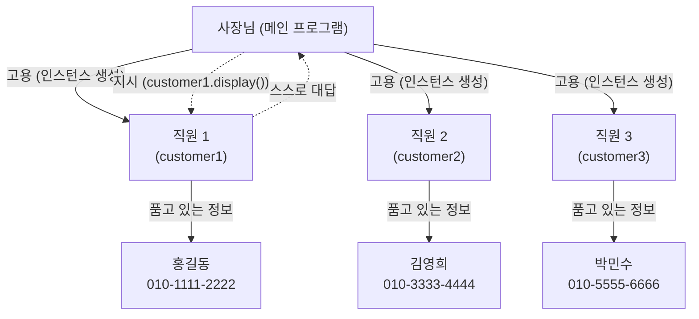
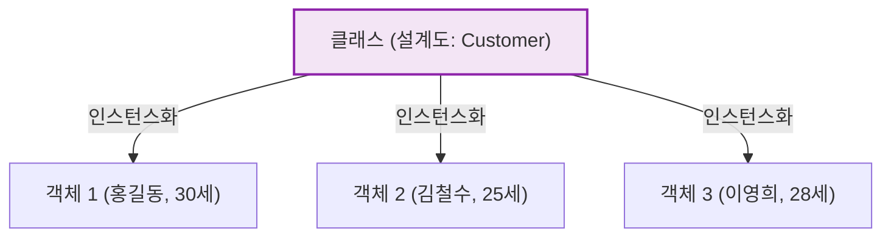

# 마이크로 세션: 088 — 나만의 클래스 만들기 실습

> **세션 ID**: MS-PY101-088  
> **소요 시간**: 25분  
> **난이도**: medium  
> **청크 타입**: lab  
> **버전**: v2.1 (7섹션 구조)

---

## §1. 개요

> **Day 5 | AM | 세션 088/096**

### 🎯 학습 목표

이 세션이 끝나면, 수강생은 다음을 할 수 있습니다:

- 배운 클래스 기본 문법을 활용하여 현실의 객체를 모델링하고 클래스로 정의할 수 있다
- 정의된 클래스에서 여러 인스턴스를 생성하고, 각 인스턴스 간의 데이터 독립성을 눈으로 확인할 수 있다
- 스스로 새로운 클래스(예: Student)의 명세를 AI에게 요청하여 코드를 생성하고 동작을 검증할 수 있다

### 선행 세션 환기

바로 직전 세션(세션-087)에서 우리는 붕어빵 틀(클래스)을 만들고, 그 안에 반죽과 앙금(`__init__`과 속성)을 넣고, 구워진 붕어빵이 할 수 있는 행동(메서드)까지 정의하는 설계도를 완성했습니다. 설계도만 아주 멋지게 그려 놓고 공장을 돌리지 않으면 아무 소용이 없겠죠? 이번 시간은 본격적으로 공장을 가동해서 붕어빵(인스턴스)을 대량 생산하는 실습 시간입니다. 코드를 직접 쳐보면서 인스턴스의 진짜 힘을 느껴보겠습니다.

---

## §2. 핵심 개념 (+ 🗣️ 강사 대본 + Mermaid)

### 부하 직원 고용하기: 1인 기업 vs 체계적인 회사

어제까지 우리가 딕셔너리와 함수를 써서 만든 프로그램은 사장님 혼자 모든 서류를 들고 뛰어다니는 '1인 기업'이었습니다. 고객 명단 딕셔너리를 직접 들고, 등록 함수로 뛰어가고, 조회 함수로 뛰어가고... 고객이 10명일 때는 괜찮지만, 100명이 되면 사장님은 과로사합니다. 

객체지향 프로그래밍은 발상이 다릅니다. "부하 직원(인스턴스)"을 여러 명 고용하는 겁니다. 각 직원은 자기가 맡은 고객의 정보를 자기 머릿속(속성)에 품고 있고, 사장님이 "네 고객 정보 좀 브리핑해 봐!"라고 명령(메서드 호출)만 하면 즉시 대답합니다. 사장님은 굳이 서류 뭉치를 들고 다닐 필요가 없어요. 그냥 지시만 내리면 됩니다. 

🗣️ **강사 대본 (Instructor Script)**:

> 여러분, 이것은 AI 시대의 업무 방식과도 정확히 일치합니다. 우리가 AI에게 "이거 해줘, 저거 해줘"라고 지시를 내리듯, 코드 안에서도 객체들에게 "네가 알아서 처리해!"라고 위임하는 방식으로 프로그래밍 패러다임이 진화한 거예요. 지시하는 법을 아는 사람이 곧 유능한 관리자이자 유능한 아키텍트입니다.
>
> 오늘 실습에서는 이 "위임의 쾌감"을 직접 느껴 보시길 바랍니다. 복잡한 로직을 내가 직접 다 짜는 게 아니라, 똑똑한 객체 하나를 만들어 놓고 걔한테 시키고 결과만 받는 편안함 말이에요. 딕셔너리의 인덱스를 일일이 조작하며 생기던 에러의 공포가 확 사라지는 마법을 경험하실 겁니다.

### Mermaid 다이어그램



---


### 🎨 추가 시각화 (Visualization Packet)

**클래스와 객체(인스턴스)의 관계**

하나의 공통된 설계도(클래스)에서 서로 다른 데이터를 담은 여러 개의 실체(객체)가 만들어지는 과정입니다.



## §3. 상세 내용

### Why — 왜 인스턴스를 여러 개 만드는가?

동일한 형태의 데이터를 안전하고 일관성 있게 다루기 위해서입니다. `customer1`과 `customer2`는 같은 `Customer` 클래스에서 태어났지만, 메모리상에서 완전히 별개의 존재입니다. `customer1.name = "이몽룡"`으로 바꾼다고 해서 `customer2.name`이 바뀌지 않죠. 딕셔너리 리스트에서 인덱스를 잘못 집어 다른 고객의 데이터를 덮어쓰는 끔찍한 악몽은 이제 과거의 일이 됩니다.

### What — 인스턴스화(Instantiation)와 메서드 호출

인스턴스를 생성하려면 클래스 이름 뒤에 괄호를 붙이고, `__init__`이 요구하는 매개변수를 순서대로 넣어주면 됩니다. 
`customer1 = Customer("홍길동", "010-1234-5678")`처럼요. 이 한 줄이 실행되는 순간, 파이썬은 메모리에 새로운 공간을 할당하고 `__init__`을 자동 호출해서 이름과 전화번호를 세팅합니다.

메서드 호출도 아주 직관적입니다. `customer1.display()`라고 적으면, 파이썬이 `customer1` 자기 자신을 `self` 자리에 자동으로 넣어 줍니다. 따라서 `self.name`은 자연스럽게 `customer1`의 이름이 됩니다.

### How — 주의할 점

호출할 때 `self` 자리에 무언가를 직접 넣지 않는다는 규칙, 기억하시죠? 파이썬이 알아서 넣어줍니다.
또한, 메서드 뒤에 괄호 `()`를 빠뜨리면 메서드 자체가 실행되지 않고 메서드 객체의 메모리 주소만 덩그러니 반환됩니다. 함수를 배울 때와 마찬가지로, "실행해라!"라는 뜻의 괄호는 필수입니다.

### 비교표 — 딕셔너리 vs 클래스 인스턴스

| 비교 항목 | 딕셔너리 리스트 방식 | 클래스 인스턴스 방식 |
|---|---|---|
| **데이터 접근** | `customer["name"]` (오타 위험 높음) | `customer.name` (자동완성 지원, 안전함) |
| **행동(함수)** | 데이터와 함수가 분리되어 있음 | 데이터와 메서드가 하나로 묶여 있음 (`customer.display()`) |
| **독립성 보장** | 참조 실수로 다른 데이터 훼손 가능 | 인스턴스별 독립된 메모리 공간 완벽 보장 |

---

## §4. 실습 가이드 (+ 🎙️ 실습 대본)

### 실습 목표

이 실습을 통해 수강생은 앞서 만든 `Customer` 클래스를 바탕으로 여러 인스턴스를 생성하고 데이터 독립성을 확인한 뒤, AI와 협력하여 스스로 새로운 `Student` 클래스를 명세하고 구현해냅니다.

🎙️ **실습 가이드 대본 (Lab Guide)**:

> 자, 본격적으로 공장을 가동해 볼까요? 오늘 실습은 총 4단계로 진행합니다. 먼저 우리가 함께 만든 `Customer` 클래스를 써서 세 명의 고객을 만들어 볼 거예요. 잘 작동하는 걸 눈으로 확인한 다음에는, 난이도를 훌쩍 높여서 여러분 혼자 완전히 새로운 클래스를 설계해 보는 도전을 하겠습니다. 걱정 마세요. 여러분 옆에는 AI 비서가 든든하게 앉아 있습니다.

### 단계별 지시

| 단계 | 소요 시간 | 강사 지시사항 | 학습자 액션 | 예상 결과 |
|------|----------|--------------|------------|----------|
| 1 | 5분 | "고객 3명을 만들어 봅시다." | `customer1`, `2`, `3` 변수에 인스턴스 할당 | 세 개의 독립된 객체 생성 |
| 2 | 5분 | "각자의 정보를 브리핑 시켜보세요." | 세 인스턴스의 `.display()` 메서드 호출 및 실행 | 세 명의 정보가 섞이지 않고 출력 |
| 3 | 10분 | "학생 클래스를 AI에게 주문하세요." | Agent Manager에 프롬프트 입력 및 코드 복사·실행 | `Student` 클래스 생성 및 평균 점수 출력 |
| 4 | 5분 | "객체지향의 쾌감을 나눠봅시다." | 딕셔너리 방식과 비교하여 옆 사람과 짧은 토론 | 클래스의 편의성 체감 |

**[단계 1] 고객 인스턴스 3명 생성**
이전 세션에서 만든 `Customer` 클래스 코드 아래에 공간을 만들고, 세 명의 고객 인스턴스를 생성해 보세요. 이름과 전화번호를 각기 다르게 설정합니다. 코드는 §5에 제공됩니다.

**[단계 2] 메서드 호출과 독립성 확인**
생성한 3명 각각에 대해 `.display()`를 호출하고 코드를 실행합니다. 터미널 창에 각 고객의 정보가 섞이지 않고 제대로 출력되는지 확인하세요.

**[단계 3] 새로운 Student 클래스 도전 (AI 활용)**
이번엔 혼자 해볼 차례입니다. Agent Manager의 AI에게 이렇게 요청해 보세요.
_"학생(Student) 클래스를 만들어줘. 속성은 이름, 학번, 성적 목록(리스트)이고, 성적 목록을 바탕으로 평균 성적을 계산해서 출력해주는 메서드를 포함해줘."_
출력된 코드를 복사해서 IDE에 붙여넣고, 학생 2명의 인스턴스를 직접 만들어서 평균 점수가 제대로 계산되는지 테스트합니다.

**[단계 4] 비교 토론**
완성된 코드를 보면서, 이 모든 걸 어제처럼 딕셔너리와 전역 함수로 관리한다고 상상해 보세요. 어떤 점이 더 직관적이고 편안한지 옆 사람과 1분간 이야기 나눕니다. 데이터와 행위가 하나로 묶여 있다는 점을 체감하셨다면 성공입니다.

### 트러블슈팅 FAQ

| Q | A |
|---|---|
| `TypeError: __init__() missing 1 required positional argument` 에러가 나요 | 붕어빵을 구울 때 필요한 재료(인자)를 덜 넣으신 겁니다. `Customer()` 괄호 안에 이름과 전화번호가 모두 제대로 들어갔는지 확인하세요. |
| `AttributeError: 'Customer' object has no attribute 'display'` 에러가 나요 | 오타일 확률이 99%입니다. 클래스를 정의할 때 `def display(self):` 라고 썼는지, 들여쓰기는 맞는지 확인해 보세요. |
| `customer1.display` 라고 쳤는데 아무 출력도 안 나와요 | 메서드 뒤에 괄호 `()`를 빠뜨리셨습니다. `customer1.display()` 라고 수정해서 다시 실행해 보세요. |
| 두 번째 인스턴스를 만들었는데 첫 번째 데이터가 덮어써져요! | 변수 이름을 똑같이 `customer1 = ...` 으로 덮어쓰신 건 아닌지 확인하세요. `customer1`, `customer2`로 분리해야 합니다. |

---


### 🎓 강사 노트 (Instructor Support)

- ⏱️ **타이밍**: 09:45 (25분, lab)
- 🎯 **핵심 활동**: Customer, Student 클래스
- ⚠️ **강사 주의사항**: 여러 인스턴스 생성 체험


### 📋 실습 설계 보강 (Lab Packet)

**세션 088 실습 설계 보강**

나만의 클래스 만들기 실습
- **3-Stage Example Set**
  - 기본: AI에게 "Customer 클래스 + 인스턴스 3개 생성 + print_info() 메서드" 요청
  - 변형: Student 클래스로 변경 → 성적 속성과 평균 계산 메서드 추가
  - 실수 해결: "self를 빠뜨렸더니 에러가 나요" → self의 역할 설명 + AI 디버깅
- **난이도 예측**: self 키워드와 __init__의 역할이 비전공자에게 가장 큰 벽
- **타이밍 가이드**: 클래스 생성 프롬프트 5분 | 인스턴스 생성 테스트 7분 | 메서드 호출 5분 | 변형 5분 | 정리 3분
- **심리적 장벽**: "class, self, __init__이 다 뭐예요?" — 새로운 키워드 폭탄
- **자가 점검**:
  - [ ] 클래스를 정의하고 인스턴스를 2개 이상 생성했는가?
  - [ ] 각 인스턴스의 메서드를 호출하여 독립적 데이터를 확인했는가?
  - [ ] self가 "자기 자신의 속성을 가리킨다"는 것을 이해했는가?

## §5. 코드 및 명령어 모음

### 코드 1: Customer 클래스와 인스턴스 생성 (1~2단계)

```python
# (이전 세션에서 만든 클래스)
class Customer:
    def __init__(self, name, phone):
        self.name = name
        self.phone = phone
        
    def display(self):
        print(f"고객 이름: {self.name}, 연락처: {self.phone}")

# 실습 1단계: 인스턴스 생성
customer1 = Customer("홍길동", "010-1111-2222")
customer2 = Customer("김영희", "010-3333-4444")
customer3 = Customer("박민수", "010-5555-6666")

# 실습 2단계: 메서드 호출 (독립성 확인)
customer1.display()
customer2.display()
customer3.display()
```

### 🤖 AI 프롬프트 예시 (3단계용)

```text
파이썬으로 학생(Student) 클래스를 만들어줘. 
초기화할 때 이름, 학번, 성적 리스트를 받도록 해주고, 
성적 리스트의 평균을 계산해서 화면에 출력하는 메서드를 추가해줘.
초보자가 이해하기 쉬운 간단한 코드로 작성해줘.
```

### 코드 2: AI가 생성할 Student 클래스 예시 (참고용)

```python
class Student:
    def __init__(self, name, student_id, grades):
        self.name = name
        self.student_id = student_id
        self.grades = grades
        
    def print_average(self):
        avg = sum(self.grades) / len(self.grades)
        print(f"[{self.student_id}] {self.name} 학생의 평균 점수는 {avg}점입니다.")

# 테스트 실행
s1 = Student("아이언맨", "20260001", [90, 85, 95])
s2 = Student("스파이더맨", "20260002", [70, 75, 80])

s1.print_average()
s2.print_average()
```

---

## §6. 요약

### 핵심 학습 포인트

실습 수고하셨습니다! 오늘 가장 중요한 깨달음은 이것입니다 — 객체는 자기 데이터를 자기 안에 품고, 스스로 행동할 수 있습니다. 딕셔너리처럼 수동으로 값을 꺼내서 함수에 넘기는 번거로움이 사라졌죠. 철수, 영희, 민수 각각이 자기 정보를 완벽하게 기억하고 있고, "자기소개 해봐!"라는 한마디에 스스로 대답합니다. 우리는 이제 1인 기업 사장님에서 벗어나, 유능한 직원들을 거느린 관리자가 되었습니다.

### 다음 세션 예고

클래스를 만들 때 `__init__` 메서드에서 `self.name = name`, `self.phone = phone`을 계속 반복해서 치니까 좀 지루하지 않으셨나요? 데이터가 10개면 10줄을 쳐야 합니다. 파이썬에는 이 지루한 반복 타이핑을 마법처럼 싹 없애주는 최신 문법이 있습니다. 

### 브릿지 노트

> "여러분, 오늘 실습으로 객체지향의 참맛을 느끼셨을 겁니다. 그런데 훌륭한 개발자들은 '반복'을 극도로 싫어합니다. `self.어쩌구 = 어쩌구`를 계속 치는 것도 반복이죠? 다음 세션에서는 파이썬 3.7부터 도입된 강력한 무기, `@dataclass`라는 녀석을 만나 보겠습니다. 방금 친 코드가 얼마나 파격적으로 짧아지는지 기대하셔도 좋습니다!"

---

## §7. 참고 자료

### 3-Source 출처

- **Source A (로컬 참고자료)**: 「8 코딩.pdf」 §8.14 OOP 기초 — 클래스와 인스턴스 생성 및 메서드 호출
- **Source B (NotebookLM)**: `day5_notebooklm.md` — 클래스와 인스턴스의 개념, 독립적 데이터 공간, 위임의 패러다임 전환

### 강사 노트

> 💡 **강사 노트**: 
> - 3단계에서 AI에게 프롬프트를 작성할 때, 수강생들이 리스트를 클래스 속성으로 넘기는 방법에 낯설어할 수 있습니다. 필요한 경우 리스트(`[90, 80, 100]`)를 인자로 넘기는 형태를 화면에 잠깐 보여주셔도 좋습니다.
> - 객체 지향이 '위임'이라는 비유는 실무 아키텍처 관점에서 매우 중요합니다. 수강생들이 객체를 단순히 '데이터 덩어리'가 아니라 '스스로 일하는 직원'으로 인식하도록 계속 환기시켜 주세요.

---

## ✅ 세션 완료 체크리스트 (강사용)

- [x] §1~§7 모든 섹션이 충실하게 작성되었는가?
- [x] 1인 기업 vs 부하 직원 비유가 §2에 명확히 설명되었는가?
- [x] 3단계 Student 클래스 설계 실습이 AI 활용과 연계되었는가?
- [x] 트러블슈팅 FAQ가 수강생 입장에서 실질적으로 작성되었는가?
- [x] 다음 세션(@dataclass)에 대한 호기심을 유발하는 브릿지 노트가 포함되었는가?

---

**🔗 선행 세션**: [세션-087] 속성과 메서드, 그리고 `__init__` (필수)  
**🔗 후행 세션**: [세션-089] 데이터를 담는 특별한 그릇, `@dataclass`

---

*작성 일시: 2026-02-25*  
*작성 에이전트: Sisyphus-Junior*  
*교안 구조: 7섹션 (A0 팀 공통 표준)*