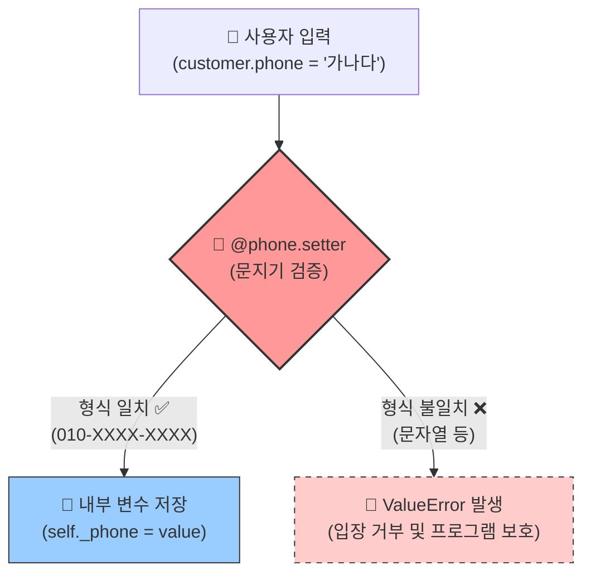

# 마이크로 세션: 092 — 데이터 검증 함수 추가

> **세션 ID**: MS-PY101-092  
> **소요 시간**: 20분  
> **난이도**: medium  
> **청크 타입**: lab  
> **버전**: v2.1 (7섹션 구조)

---

## §1. 개요

> **Day 5 | AM | 세션 092/096**

### 🎯 학습 목표

이 세션이 끝나면, 수강생은 다음을 할 수 있습니다:
- AI 프롬프트를 활용하여 올바르지 않은 이메일과 전화번호 형식을 걸러내는 '데이터 검증 함수'를 생성할 수 있다
- 생성된 검증 로직을 `Customer` 클래스에 통합할 수 있다
- 파이썬의 `@property` 데코레이터가 제공하는 방어적 프로그래밍의 이점을 설명할 수 있다

### 선행 세션 환기

직전 세션에서 우리는 드디어 v3 고객관리 프로그램의 뼈대를 완성했습니다. 고객 데이터를 `Customer`라는 우아한 객체로 만들고, `CustomerManager`라는 전담 매니저에게 관리를 맡겼죠. 코드가 훨씬 깔끔해졌고, 객체지향의 맛을 조금 느꼈습니다. 그런데 말입니다. 방금 만든 v3 프로그램에 치명적인 약점이 하나 숨어있어요. 혹시 눈치채신 분 계신가요?

---

## §2. 핵심 개념 (+ 🗣️ 강사 대본 + Mermaid)

### 비유: 클럽의 깐깐한 문지기

방금 만든 v3 프로그램에 고객을 등록해 봅시다. 이름에 그냥 빈칸을 넣어 보세요. 저장됩니다. 전화번호에 "가나다라마바사"를 넣어 보세요. 어라? 또 저장됩니다. 이메일에 "골뱅이없는주소"를 넣어도 아주 친절하게 "네, 알겠습니다!" 하고 받아줍니다. 

우리 프로그램은 지금 너무 착합니다. 현실 세계에서 이런 시스템을 운영하면 어떻게 될까요? 나중에 고객에게 행사 안내 문자를 일괄 발송하려는데, 전화번호가 "가나다라"로 되어 있어서 시스템이 그만 펑 하고 터져버립니다. 사용자는 상상을 초월하는 입력을 합니다. 그래서 우리에게는 입구를 철저히 통제할 **"깐깐한 문지기(Bouncer)"**가 필요합니다.

🗣️ **강사 대본 (Instructor Script)**:

> 여러분, 고급 클럽 입구에는 항상 깐깐한 문지기가 서 있죠? 드레스 코드를 철저히 검사합니다. 슬리퍼 신고 왔으면 "입장 불가!", 신분증 없으면 "입장 불가!" — 규칙에 맞지 않으면 가차 없이 돌려보냅니다. 덕분에 클럽 안은 항상 질서가 유지되죠.
>
> 우리 프로그램에도 이런 문지기를 세워야 합니다. "이메일에 골뱅이(@)가 없으면 입장 불가!", "전화번호가 010-XXXX-XXXX 형식이 아니면 입장 불가!" 이렇게 규칙을 코드로 만드는 것을 **데이터 검증(Validation)**이라고 합니다.
> 
> "사용자가 알아서 올바른 데이터를 넣어주겠지"라고 낙관하지 마세요. "사용자는 반드시 이상한 데이터를 넣을 것이다!"라고 비관적으로 가정하고 미리 방어하는 전략, 개발 세계에서는 이것을 **방어적 프로그래밍(Defensive Programming)**이라고 부릅니다.

### Mermaid 다이어그램: 데이터 검증의 흐름



---

## §3. 상세 내용

### Why — 왜 데이터 검증이 필요한가?

가비지 인, 가비지 아웃(Garbage In, Garbage Out)이라는 유명한 말이 있습니다. 쓰레기가 들어가면 쓰레기가 나온다는 뜻이에요. 아무리 로직이 훌륭해도, 처음부터 잘못된 데이터가 들어가면 전체 시스템이 망가집니다. 
특히 이름, 전화번호, 이메일 같은 연락처 정보는 시스템의 혈관과도 같습니다. 데이터 검증은 이 혈관에 노폐물이 쌓이지 않도록 막아주는 필수적인 방어막입니다.

### What — 파이썬의 우아한 문지기, `@property`

데이터 검증을 구현하는 방법은 여러 가지가 있지만, 파이썬에서 가장 우아하고 파이썬다운(Pythonic) 방법은 바로 `@property` 데코레이터를 사용하는 것입니다. 

`@property`를 쓰면 밖에서 볼 때는 일반 변수처럼 `customer.age = 25`라고 아주 편하게 쓸 수 있어요. 하지만 내부적으로는 깐깐한 검증 로직(함수)이 찰나의 순간에 자동으로 실행됩니다. 겉보기엔 그냥 걸어가면 열리는 자동문 같지만, 사실 보이지 않는 센서가 작동하고 있는 것과 똑같아요.

### How — getter와 setter의 마법

구체적으로 보면, `@property` 데코레이터는 값을 읽어오는 **getter**(읽기 전용 함수) 역할을 합니다. 그리고 값을 바꿀 때는 `@속성이름.setter`라는 **setter**(쓰기 전용 함수)를 사용합니다. 

이 setter 함수 안에 우리가 원하는 검증 로직을 잔뜩 넣어두는 거예요. 누군가 값을 바꾸려 할 때마다 자동으로 setter가 실행됩니다. 만약 누군가 나이에 -10을 넣으려 하면, setter 안의 조건문이 이를 적발하고 `ValueError`를 던져서 저장을 원천 차단해버립니다.

### 비교표 — 일반 변수 vs `@property`를 활용한 데이터 검증

| 항목 | 일반 변수 사용 (`self.age`) | `@property` 사용 |
|------|--------------------------|-----------------|
| **사용성** | 아주 편함 (`customer.age = -10`) | 아주 편함 (`customer.age = -10`) |
| **보안/안전성** | 취약 (모든 이상한 값이 다 들어감) | 강력 (조건에 안 맞으면 `ValueError`로 거부) |
| **검증 로직** | 객체 밖에서 매번 따로 검사해야 함 | 객체 내부에 캡슐화되어 자동으로 실행됨 |
| **수정 용이성** | 규칙 변경 시 코드를 다 뒤져서 고쳐야 함 | setter 함수 내부만 살짝 고치면 끝 |

---

## §4. 실습 가이드 (+ 🎙️ 실습 대본)

### 실습 목표

이 실습을 통해 수강생은 AI 에이전트의 도움을 받아 복잡한 정규표현식(Regular Expression) 검증 코드를 작성하고, 이를 `Customer` 클래스에 통합하여 의도적인 에러 발생(입장 거부)을 확인합니다.

🎙️ **실습 가이드 대본 (Lab Guide)**:

> 자, 이제 우리 프로그램에 깐깐한 문지기를 고용해 볼 시간입니다. 옛날 개발자들은 이메일 형식을 검사하는 복잡한 암호문 같은 정규표현식을 직접 외우거나 구글링해서 복사해 왔어요. 하지만 우리는 AI 시대의 아키텍트입니다. 
> 
> AI에게 "이메일 형식 검사하는 함수 만들어줘"라고 한마디만 하면 끝이에요. 우리가 할 일은 "어떤 규칙으로 검사할 것인지" — 즉 명세(Specification)를 명확하게 정의해서 AI에게 알려주는 것뿐입니다. 자, 화면을 띄워주시고 Agent Manager에게 요청해 봅시다!

### 단계별 지시

| 단계 | 소요 시간 | 강사 지시사항 | 학습자 액션 | 예상 결과 |
|------|----------|--------------|------------|----------|
| 1 | 3분 | "Agent Manager에게 검증 로직 작성을 요청하세요" | 아래 제공된 프롬프트를 Agent Manager에 입력 | AI가 `@property`가 적용된 코드 스니펫 생성 |
| 2 | 5분 | "생성된 코드를 v3 파일에 통합하세요" | `Customer` 클래스 내부에 getter/setter 코드 복사-붙여넣기 | 코드 에러 없이 병합 완료 (`import re` 추가 필수) |
| 3 | 3분 | "일부러 틀린 데이터를 넣어보세요" | 하단 테스트 코드 작성 후 실행 (이메일에 "abc", 전화번호에 "0101234" 입력) | `ValueError` 발생하며 프로그램 실행 중단 |
| 4 | 2분 | "에러 메시지를 확인하세요" | 터미널에 뜬 에러 메시지 분석 | 우리가 지정한 "전화번호 형식 오류" 메시지 확인 |

**[단계 1] AI에게 검증 로직 작성 요청하기**

Agent Manager 채팅창에 다음 프롬프트를 입력하세요:

```text
현재 파이썬으로 Customer 클래스를 만들고 있어. 
이 클래스에 전화번호와 이메일을 검증하는 로직을 추가하고 싶어.
다음 명세에 맞게 @property와 setter를 사용하는 코드를 작성해줘.

1. 전화번호(phone): "010-XXXX-XXXX" 형식이어야 함. 
   맞지 않으면 ValueError("전화번호 형식 오류") 발생.
2. 이메일(email): 반드시 문자열 안에 "@" 기호가 포함되어야 함.
   맞지 않으면 ValueError("이메일 형식 오류") 발생.
정규표현식을 사용하고, 클래스 전체 코드를 보여줘.
```

**[단계 2] 코드 통합하기**

AI가 만들어준 코드를 기존 파일에 합쳐줍니다. 주의할 점! 정규표현식을 쓰려면 파일 맨 위에 `import re`를 반드시 적어주어야 합니다. 기존 `__init__` 함수는 놔두고 그 밑에 `@property` 덩어리들을 붙여넣으세요.

**[단계 3 & 4] 불량 고객 등록 테스트 (깐깐한 문지기 테스트)**

코드 맨 밑에 이렇게 적고 실행해 보세요.

```python
# 문지기 테스트
print("1. 정상 고객 등록 시도...")
c1 = Customer("홍길동", "010-1234-5678", "hong@gmail.com")
print("정상 등록 완료!")

print("\n2. 불량 고객 등록 시도...")
# 전화번호 형식을 일부러 틀리게 입력해 봅니다
c2 = Customer("김철수", "01012345678", "kim@gmail.com")
```

실행하면 `ValueError: 전화번호 형식 오류`라는 무서운 빨간 줄이 뜨면서 프로그램이 멈출 겁니다. 이게 바로 우리가 원했던 결과예요! 엉터리 데이터가 들어오느니, 차라리 그 자리에서 에러를 뿜고 멈추는 게 훨씬 안전하거든요.

### 트러블슈팅 FAQ

| Q | A |
|---|---|
| `NameError: name 're' is not defined` 에러가 나요! | 파일 맨 꼭대기에 `import re`를 빼먹으셨네요! 정규표현식 도구를 가져오겠다는 뜻입니다. 얼른 추가해 주세요. |
| `RecursionError: maximum recursion depth exceeded` 에러가 나요! | setter 안에서 `self.phone = value` 라고 쓰셨군요? 이렇게 쓰면 setter가 자기 자신을 무한히 부르게 됩니다. 반드시 앞에 언더스코어를 붙여서 `self._phone = value`로 숨겨진 진짜 변수에 담아주세요. |
| 올바르게 입력했는데도 계속 에러가 납니다. | AI가 짜준 정규표현식이 너무 깐깐할 수 있어요. 띄어쓰기 하나가 들어가 있는지 확인해 보세요. 해결이 안 되면 에러 메시지 그대로 AI에게 던져서 "이 데이터가 왜 거부되는지 알려줘"라고 해보세요! |

---


### 🎓 강사 노트 (Instructor Support)

- ⏱️ **타이밍**: 11:15 (20분, code)
- 🎯 **핵심 활동**: 이메일/전화번호 검증
- ⚠️ **강사 주의사항**: 방어적 프로그래밍 개념

## §5. 코드 및 명령어 모음

### 완성된 Customer 검증 클래스 코드

```python
import re  # 정규표현식 사용을 위해 필수!

class Customer:
    def __init__(self, name: str, phone: str, email: str):
        self.name = name
        # 주의: 여기서 self._phone이 아니라 self.phone에 할당하면 
        # 생성할 때부터 setter를 거치게 됩니다! (매우 똑똑한 방법)
        self.phone = phone    
        self.email = email    

    # ----- 전화번호 문지기 -----
    @property
    def phone(self) -> str:
        return self._phone

    @phone.setter
    def phone(self, value: str) -> None:
        # ^는 시작, $는 끝, \d{4}는 숫자 4자리를 의미하는 정규표현식
        pattern = r"^010-\d{4}-\d{4}$"
        if not re.match(pattern, value):
            raise ValueError(f"전화번호 형식 오류: {value} (010-XXXX-XXXX)")
        
        # 검증을 통과한 VIP만 진짜 저장소(_phone)에 저장!
        self._phone = value

    # ----- 이메일 문지기 -----
    @property
    def email(self) -> str:
        return self._email

    @email.setter
    def email(self, value: str) -> None:
        if "@" not in value:
            raise ValueError(f"이메일 형식 오류: {value} (@가 필요합니다)")
        self._email = value
```

> 🤖 **AI 프롬프트 예시**: 정규표현식이 외계어처럼 보인다면, AI에게 물어보세요. "정규표현식 `r"^010-\d{4}-\d{4}$"`이 무슨 뜻인지 한 줄씩 초보자에게 설명해줘."

---

## §6. 요약

### 핵심 학습 포인트

이제 우리 프로그램에 깐깐한 문지기가 배치되었습니다. 엉터리 전화번호도, 골뱅이 없는 이메일도 더 이상 우리 시스템을 더럽힐 수 없습니다. 
- **방어적 프로그래밍**: "사용자는 반드시 실수한다"는 가정 하에 미리 방어막을 치는 개발 습관입니다.
- **`@property` 데코레이터**: 파이썬에서 가장 쿨하게 데이터를 검증하는 방법으로, 겉으로는 변수처럼 쓰이면서 속으로는 강력한 검증 함수(setter)를 돌려줍니다.
- **AI와의 협업**: 복잡한 정규표현식을 외울 필요 없이, 규칙(명세)만 정확히 던져주면 AI가 찰떡같이 문지기를 만들어 줍니다.

### 다음 세션 예고

완벽한 문지기를 세웠으니 이제 안심일까요? 그런데 한 가지 걱정이 남아 있습니다. 문지기가 정문을 철통같이 지키고 있지만, 만약 코드를 짠 다른 개발자가 정문을 통과하지 않고 `customer._phone = "가나다"`처럼 창문이나 뒷문으로 몰래 들어와서 데이터를 바꿔버리면 어쩌죠? 
다음 세션에서는 뒷문까지 철저하게 잠가버리는 진짜 객체지향의 마법, **캡슐화(Encapsulation)**의 진수를 맛보겠습니다!

### 브릿지 노트

> "모두 에러의 빨간 맛을 보셨나요? 평소엔 에러 나면 속상하셨죠? 하지만 지금 여러분이 만난 `ValueError`는 여러분의 시스템을 지켜준 아주 고마운 에러입니다. 그런데 말이죠... 문지기가 앞에 서 있는데, 뒤로 몰래 담을 넘는 녀석들이 꼭 있습니다. 다음 시간에 이 담을 아예 철옹성으로 높여버리는 방법을 알려드릴게요."

---

## §7. 참고 자료

### 3-Source 출처

- **Source A (로컬 참고자료)**: 「8 코딩.pdf」 (캡슐화와 접근 제어)
- **Source B (NotebookLM)**: `day5_notebooklm.md` (캡슐화) — 데이터 보호의 필요성과 문지기 비유
- **Source C (Deep Research)**: `day5_deep_research.md` (`@property` — Pythonic한 캡슐화) — 파이썬 특유의 데코레이터 기반 검증 패턴

### 추가 학습 자료

- [Python 공식 문서 - property()](https://docs.python.org/ko/3/library/functions.html#property): `@property` 데코레이터의 공식 동작 원리
- [정규표현식 테스트 사이트 (regex101)](https://regex101.com/): 내가 짠 정규표현식이 맞는지 화면에서 바로 테스트해볼 수 있는 사이트 (AI가 짜준 정규식을 여기서 검증해보세요!)

### 강사 노트

> 💡 **강사 노트**: 수강생들이 `@property`와 setter의 문법을 처음 보면 약간 당황할 수 있습니다. 특히 메서드 이름이 중복되는 것처럼 보이는 점(`def phone...`)을 낯설어합니다. 이때 "이름은 같지만 위에 달린 모자(데코레이터)가 다르죠? 모자에 따라 역할이 달라집니다"라고 설명해주면 이해가 빠릅니다. 
> 또한, 무한 재귀(`RecursionError`)는 실습 중 무조건 한 명 이상 나오는 에러이므로 FAQ에 있는 내용을 칠판에 크게 적어두고 시작하는 것이 좋습니다.

---

## ✅ 세션 완료 체크리스트 (강사용)

- [x] §1~§7 모든 섹션이 충실하게 작성되었는가?
- [x] 문지기 비유가 §2에서 충분히 확장되고 Mermaid 다이어그램으로 시각화되었는가?
- [x] lab 세션에 맞게 §4 실습 가이드가 단계별로 매우 상세하게 작성되었는가?
- [x] 무한 재귀 에러 등 예상되는 트러블슈팅 FAQ가 포함되었는가?
- [x] 코드의 `__init__`에서 setter를 자동 경유하는 방식이 명확히 설명되었는가?
- [x] 3-Source 팩트 패킷이 §7에 반영되었는가?
- [x] 다음 세션(093 캡슐화) 브릿지 노트가 포함되었는가?

---

**🔗 선행 세션**: [세션-091] 고객관리 v3로의 진화 (OOP 적용) (필수)  
**🔗 후행 세션**: [세션-093] 캡슐화 실습 및 v3 코드 리뷰

---

*작성 일시: 2026-02-25*  
*작성 에이전트: Sisyphus-Junior*  
*교안 구조: 7섹션 (A0 팀 공통 표준)*