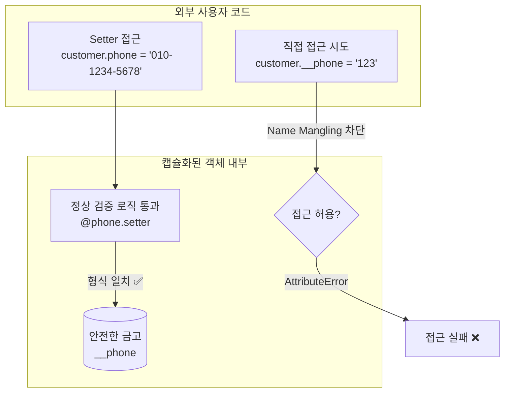

# 마이크로 세션: 093 — 캡슐화 실습 및 v3 코드 리뷰

> **세션 ID**: MS-PY101-093  
> **소요 시간**: 25분  
> **난이도**: medium  
> **청크 타입**: lab  
> **버전**: v2.1 (7섹션 구조)

---

## §1. 개요

> **Day 5 | AM | 세션 093/106**

### 🎯 학습 목표

이 세션이 끝나면, 수강생은 다음을 할 수 있습니다:

- 파이썬의 이름 장식(Name mangling, `__`)을 사용해 속성을 외부로부터 캡슐화할 수 있다
- 속성에 직접 접근하는 대신 `@property`와 setter를 거쳐 데이터 검증을 통과하도록 코드를 바꿀 수 있다
- 데이 4에서 배운 '코드 리뷰 5대 체크포인트'에 맞춰 v3 코드를 최종 점검하고 리뷰 리포트를 만들 수 있다

### 선행 세션 환기

직전 세션(세션-092)에서 우리는 `@property`와 setter를 사용해 나이나 전화번호에 이상한 값이 들어오지 못하도록 '문지기'를 세웠습니다. 정문은 아주 깐깐하게 지키고 있죠. 그런데 한 가지 의문이 듭니다. 문지기가 아무리 철저해도, 누군가 정문이 아니라 '뒷문'이나 '창문'으로 몰래 들어와 데이터를 바꿔버리면 어떻게 될까요? 오늘 우리는 이 뒷문까지 완벽하게 자물쇠로 잠그는 방법, 즉 '캡슐화(Encapsulation)' 실습을 시작하고 우리의 v3 코드를 최종 리뷰해 보겠습니다.

---

## §2. 핵심 개념 (+ 🗣️ 강사 대본 + Mermaid)

### 비유 — 은행 금고와 창구 직원

은행을 떠올려 봅시다. 여러분의 예금 데이터는 어디에 보관되나요? 창구 위 책상에 현금 다발을 올려놓지는 않겠죠. 철저하게 잠긴 튼튼한 금고 안에 보관됩니다. 돈을 넣거나 빼려면 반드시 창구 직원(메서드)을 거쳐야 해요. 직원은 본인 확인을 하고, 잔액을 확인하고, 한도를 검사한 뒤에야 거래를 승인해 줍니다.

파이썬에서 이 "금고"를 만드는 방법이 **이름 장식(Name Mangling)**입니다. 변수 이름 앞에 밑줄 두 개(`__`)를 붙이면, 파이썬이 스스로 변수 이름을 살짝 바꿔버립니다. 그래서 외부에서 직접 접근하기 매우 어렵게 만들어요. `customer._phone = "가나다라"` 처럼 외부에서 마음대로 값을 조작하는 '뒷문 접근'을 차단하는 겁니다.

🗣️ **강사 대본 (Instructor Script)**:

> 여러분, 지난 세션에서 문지기를 세워서 엉터리 전화번호가 등록되는 것을 막았죠? 정문은 튼튼해요. 그런데 지금 코드 어딘가에 `customer._phone = "가나다라"`라고 직접 적어 보세요. 문지기를 무시하고 값이 그냥 바뀌어 버립니다. 뒷문이 활짝 열려 있었던 거예요!
>
> 마치 은행 창구에서는 본인 확인을 철저히 하는데 금고 뒷문은 활짝 열어둔 것과 같아요. 오늘 배울 `__`(더블 언더스코어)는 이 금고 문에 강력한 자물쇠를 채우는 역할을 합니다. 금고 문이 잠겼으니 이제 열쇠(메서드) 없이는 누구도 데이터를 열어보거나 바꿀 수 없습니다. 자, 우리 코드를 단단한 성으로 만들어 볼까요?

### Mermaid 다이어그램



---

## §3. 상세 내용

### Why — 왜 캡슐화가 필요한가?

코드를 짜다 보면 협업하는 동료가 (혹은 미래의 내가) 클래스 내부 변수를 직접 건드려서 시스템을 망가뜨리는 일이 흔히 일어납니다. 캡슐화는 해킹을 막기 위한 암호화라기보다는 **"개발자의 부주의한 실수를 구조적으로 차단하는 안전벨트"**입니다. 데이터를 숨기고(Data Hiding) 꼭 필요한 조작 방법만 공개해서 객체를 안전하게 보호하는 핵심 원칙이에요.

### What — 파이썬의 속성 접근 수준 3단계

파이썬은 Java나 C++처럼 `public`, `private` 같은 접근 제어자 키워드가 없습니다. 개발자 간의 '관례'와 '이름 장식(Name Mangling)'을 사용해 접근 수준을 나눕니다.

1. **공개(Public) - `self.name`**: 
   밑줄이 없는 변수입니다. 어디서든 자유롭게 읽고 씁니다.
2. **보호(Protected) - `self._name`**: 
   밑줄 한 개로 시작합니다. 기술적으로는 접근 가능하지만, 파이썬 개발자들 사이에서 "내부용이니 밖에서 건드리지 맙시다"라는 강한 암묵적 약속이에요.
3. **비공개(Private) - `self.__name`**: 
   밑줄 두 개로 시작합니다. 파이썬이 클래스 이름을 변수명 앞에 붙여버리는 '이름 장식'을 수행합니다. 밖에서 `객체.__name`으로 직접 부르면 `AttributeError`가 발생합니다.

### How — 어떻게 적용하는가?

우리가 할 일은 `Customer` 클래스의 핵심 속성들(`name`, `phone`, `email` 등)을 `__`로 바꾸는 겁니다. 그런 다음 이전 세션에서 만든 `@property`와 setter로만 값을 변경하게 만들어요. 밖에서는 변수처럼 편하게 쓰지만 안에서는 항상 검증 로직을 거치는 구조가 완성됩니다.

### 비교표 — 속성 접근 수준 비교

| 접근 수준 | 명명 규칙 예시 | 외부 접근 | 의미 / 용도 |
|---------|-------------|---------|-----------|
| Public | `self.phone` | ✅ 자유 | 외부에서 편하게 쓰는 공개 데이터 |
| Protected | `self._phone` | ⚠️ 가능하지만 금지 | 내부 사용 목적. 건드리지 말라는 개발자 간 약속 |
| Private | `self.__phone` | ❌ 원칙적 차단 | 강력한 캡슐화. 내부 메서드(setter 등)로만 접근 |

---

## §4. 실습 가이드 (+ 🎙️ 실습 대본)

### 실습 목표

AI의 도움을 받아 v3 코드 속성을 캡슐화(`__`)합니다. 밖에서 직접 조작하려 할 때 에러가 터지는지 확인해요. 이어서 데이 4에서 배운 5대 체크포인트로 완성된 v3 코드를 최종 리뷰합니다.

🎙️ **실습 가이드 대본 (Lab Guide)**:

> 이제 여러분의 코드에 캡슐화를 직접 입혀볼 시간입니다. 총 4단계로 진행할게요.
> 먼저 AI에게 Customer 클래스 속성을 캡슐화해달라고 부탁해 보세요. 
> 그다음 진짜로 뒷문이 잠겼는지 여러분이 직접 해커가 되어서 속성을 직접 고쳐보는 테스트를 할 겁니다. 
> 에러가 난다면 완벽하게 잠긴 거예요! 마지막으로 우리가 배웠던 코드 리뷰 5대 원칙을 가져와서 AI에게 우리 코드를 종합 평가해달라고 해보죠.

### 단계별 지시사항

| 단계 | 소요 시간 | 강사 지시사항 | 학습자 액션 | 예상 결과 |
|------|----------|--------------|------------|----------|
| 1 | 5분 | "AI에게 캡슐화를 요청하세요" | 프롬프트 입력 및 코드 반영 | `self.__phone` 등으로 변경된 코드 획득 |
| 2 | 5분 | "직접 해커가 되어 공격해보세요" | 하단에 `print(customer1.__phone)` 실행 | `AttributeError` 발생 (정상 차단) |
| 3 | 10분 | "5대 원칙으로 코드 리뷰를 받으세요" | v3 코드 제공 후 AI 리뷰 요청 | 상세한 AI 코드 리뷰 리포트 출력 |
| 4 | 5분 | "리뷰 결과를 짝과 나누세요" | v2 대비 v3가 얼마나 단단해졌는지 논의 | 캡슐화와 검증의 장점 100% 체감 |

**[단계 1] AI에게 캡슐화 요청**

AI에게 이렇게 요청해서 코드를 수정하세요:
> "Customer 클래스의 속성들을 모두 캡슐화(`__` 사용)해줘. 데이터를 수정할 때는 반드시 어제 만든 `@property`와 setter 데이터 검증 로직을 거치도록 리팩토링해줘."

**[단계 2] 접근 차단 확인 (뒷문 테스트)**

수정된 코드를 실행한 뒤 파일 제일 밑에 다음 코드를 적고 실행해 보세요.
```python
customer1 = Customer("홍길동", "010-1111-2222", "test@test.com")
# 해커의 뒷문 공격!
customer1.__phone = "가나다라" 
print(customer1.__phone)
```
제대로 캡슐화가 되었다면 `AttributeError: 'Customer' object has no attribute '__phone'` 에러가 터집니다. 이 에러가 뜨면 여러분 금고는 완벽히 잠긴 겁니다!

**[단계 3] 코드 리뷰 5대 체크포인트 적용**

데이 4에서 배운 코드 리뷰 5대 체크포인트(가독성, 로직 분리, 예외 처리, 네이밍 컨벤션, 확장성)로 AI에게 리뷰를 요청하세요.
> "우리가 짠 customer_manager_v3.py 전체 코드를 '코드 리뷰 5대 체크포인트'를 기준으로 깐깐하게 평가해줘. 그리고 상세한 리뷰 리포트를 작성해줘."

**[단계 4] 동료 공유**

위에서 아래로 흐르기만 하던 v2에 비해, 객체지향과 캡슐화가 적용된 v3가 얼마나 튼튼해졌는지 옆 사람과 짧게 이야기 나눠보세요.
데이터 보호, 검증, 역할 분리 — 이 세 가지 키워드가 대화에 나온다면 오늘 학습은 대성공입니다.

### 트러블슈팅 FAQ

| Q | A |
|---|---|
| 캡슐화를 했는데 `customer1.phone = "가나다라"`가 에러 없이 잘 들어갑니다! | `__phone`으로 내부 변수는 잠갔는데, 정작 `@phone.setter` 안의 정규표현식 검증 로직이 빠졌거나 들여쓰기가 잘못됐을 수 있어요. setter 부분을 꼼꼼히 다시 확인하세요. |
| `AttributeError`가 아니라 `SyntaxError`가 발생해요. | 변수명 앞에 `__`를 붙일 때 띄어쓰기가 들어갔거나 오타가 있을 확률이 아주 높습니다. `self. __phone`이 아니라 `self.__phone`으로 꼭 붙여 써야 해요. |
| 데이터를 읽고 싶은데 `print(customer1.__phone)`이 에러가 나요. 어떻게 보죠? | 값을 읽을 때는 이름 장식된 변수가 아니라, `@property`로 만들어둔 getter를 써야 합니다. 즉, `print(customer1.phone)`이라고 입력해 보세요. |

---


### 🎓 강사 노트 (Instructor Support)

- ⏱️ **타이밍**: 11:35 (25분, lab)
- 🎯 **핵심 활동**: __ name mangling 실습
- ⚠️ **강사 주의사항**: 이름 장식 체험


### 📋 실습 설계 보강 (Lab Packet)

**세션 093 실습 설계 보강**

캡슐화 실습 및 v3 코드 리뷰
- **3-Stage Example Set**
  - 기본: Customer 클래스의 속성에 `__` 접두사 추가 → 외부 접근 시도 → AttributeError 확인
  - 변형: getter/setter 메서드 또는 @property 데코레이터 추가
  - 실수 해결: "__name과 _name의 차이가 뭐예요?" → 네이밍 컨벤션 vs 네임 맹글링 구분
- **난이도 예측**: 캡슐화의 "왜"를 이해하기 어려움 — "그냥 접근하면 편한데 왜 막아?"
- **타이밍 가이드**: __ 접두사 적용 5분 | 접근 시도·에러 확인 5분 | 5대 체크포인트 리뷰 10분 | 정리 5분
- **심리적 장벽**: "접근을 막으면 불편해지는 거 아니야?"
- **자가 점검**:
  - [ ] `__`로 보호된 속성에 외부에서 직접 접근 시 에러가 발생하는가?
  - [ ] 캡슐화가 데이터 무결성을 보호하는 이유를 설명할 수 있는가?
  - [ ] 5대 체크포인트 기준으로 v3 코드를 리뷰했는가?

## §5. 코드 및 명령어 모음

### 코드 1: 캡슐화와 검증 로직이 적용된 Customer 클래스

```python
class Customer:
    def __init__(self, name: str, phone: str, email: str):
        self.__name = name     # 비공개 속성으로 이름 장식 (금고)
        self.phone = phone     # 중요: 여기서 바로 속성에 넣지 않고 setter를 거침
        self.email = email     # 중요: 여기서 바로 속성에 넣지 않고 setter를 거침

    @property
    def name(self) -> str:
        return self.__name

    @property
    def phone(self) -> str:
        return self.__phone

    @phone.setter
    def phone(self, value: str) -> None:
        import re
        # 문지기: 전화번호 형식 꼼꼼하게 검사
        if not re.match(r"^010-\d{4}-\d{4}$", value):
            raise ValueError(f"전화번호 형식 오류: {value}")
        # 검사 통과 시 금고에 안전하게 저장
        self.__phone = value
```

### 코드 2: 캡슐화 차단 검증 스크립트 (뒷문 테스트용)

```python
customer = Customer("이파이", "010-9999-8888", "py@python.org")

# 1. 정상적인 접근 (Getter로 읽기)
print(customer.phone)  # 정상 출력: 010-9999-8888

# 2. 강제 접근 시도 (해커의 뒷문 공격)
try:
    print(customer.__phone)
except AttributeError as e:
    print(f"접근 100% 차단됨! 에러 메시지: {e}")
```

---

## §6. 요약

### 핵심 학습 포인트

축하합니다! 캡슐화까지 완벽하게 적용해서 우리의 v3 코드가 난공불락의 성채가 되었습니다. 핵심은 세 가지예요.
1. **이름 장식(`__`)의 역할**: 속성 이름 앞에 밑줄 두 개를 붙여서 밖에서 직접 접근하지 못하게 금고 문을 꽉 잠갔습니다.
2. **Setter의 가치**: 데이터는 금고(`__`) 안에 숨기고, 모든 접근은 은행원(`@property` setter)을 통해서만 처리하게 만들었어요. 덕분에 검증 로직을 반드시 거치는 구조가 완성됐습니다.
3. **코드 리뷰의 눈**: AI가 짠 코드라도 캡슐화 원칙을 어기고 밖에서 직접 변경 가능하게 두었다면, 언제든 "이 속성은 왜 공개해뒀지?"라고 묻고 반려할 수 있는 날카로운 시각을 갖췄습니다.

### 다음 세션 예고

자, 이제 이 튼튼한 성을 더 넓게 키워 볼 차례입니다. 일반 고객 말고 VIP 라운지를 이용하는 "VIP 고객"을 하나 더 만들어야 한다면 어떻게 할까요? Customer 클래스 코드를 처음부터 끝까지 복사해서 붙여넣기 해야 할까요? 
다음 세션에서는 코드 중복을 마법처럼 없애주는 객체지향의 또 다른 무기, **"상속(Inheritance)"**의 놀라운 개념을 만나보겠습니다.

### 브릿지 노트

> "여러분, 우리가 v1에서 while문 덩어리로 짰던 코드가 여기까지 발전했습니다. 데이터 검증도 완벽하고, 외부 공격도 척척 막아내는 진짜 프로그램다워졌죠. 그런데 여기서 기획팀의 요구사항이 하나 더 들어옵니다. '저기... 일반 고객 말고 VVIP 등급도 하나 만들어 주실 수 있나요?' 
> 이 요구사항을 듣고 '아, 코드 다시 다 복붙해야겠네'라고 생각하셨다면 다음 세션에 꼭 집중해 주세요. 복붙 하나 없이 모든 기능을 물려받는 마법을 보여드릴게요."

---

## §7. 참고 자료

### 3-Source 출처

- **Source A (로컬 참고자료)**: `8 코딩.pdf` §8.14 캡슐화와 접근 제어, `9 디버깅, 테스트, 배포.pdf` — 코드 리뷰 프로세스
- **Source B (NotebookLM)**: `day5_notebooklm.md` — 캡슐화, 객체지향 리팩토링 개념
- **Source C (Deep Research)**: `day5_deep_research.md` — Name mangling의 원리, 객체지향 v3 진화

### 강사 노트

> 💡 **강사 노트**: 파이썬의 `__` 이름 장식은 메모리 해킹을 막는 수준의 완벽한 보안 기술이 아닙니다. "개발자의 부주의한 실수(Human Error)"를 막는 구조적 안전장치라는 점을 명확히 알려주세요. 
> 
> 또, 초기화 메서드 `__init__`에서 `self.__phone = phone`으로 바로 넣지 않고 `self.phone = phone`으로 넣는 이유(초기 생성 시에도 똑같이 setter의 검증 로직을 태우기 위해서)를 질문하는 수강생이 있을 수 있습니다. 이 부분은 정말 예리한 질문이므로 수강생을 크게 칭찬해 주시고 원리를 가볍게 설명해 주시면 분위기가 확 살아납니다.

---

## ✅ 세션 완료 체크리스트 (강사용)

- [ ] §1~§7 모든 섹션이 충실하게 작성되었는가?
- [ ] 은행 금고와 은행원 비유가 §2에 명확히 들어갔는가?
- [ ] 캡슐화 구조를 설명하는 Mermaid 다이어그램이 들어갔는가?
- [ ] Lab 타입에 맞게 §4의 단계별 실습 가이드와 프롬프트가 상세한가?
- [ ] 5대 체크포인트 코드 리뷰 실습이 §4에 들어갔는가?
- [ ] 트러블슈팅 FAQ가 최소 3개 이상 들어갔는가?
- [ ] 다음 세션(094 상속의 개념과 필요성) 브릿지 노트가 매끄러운가?

---

**🔗 선행 세션**: [세션-092] 데이터 검증 함수 추가  
**🔗 후행 세션**: [세션-094] 상속의 개념과 필요성

---

*작성 일시: 2026-02-25*  
*작성 에이전트: Antigravity*  
*교안 구조: 7섹션 (A0 팀 공통 표준)*