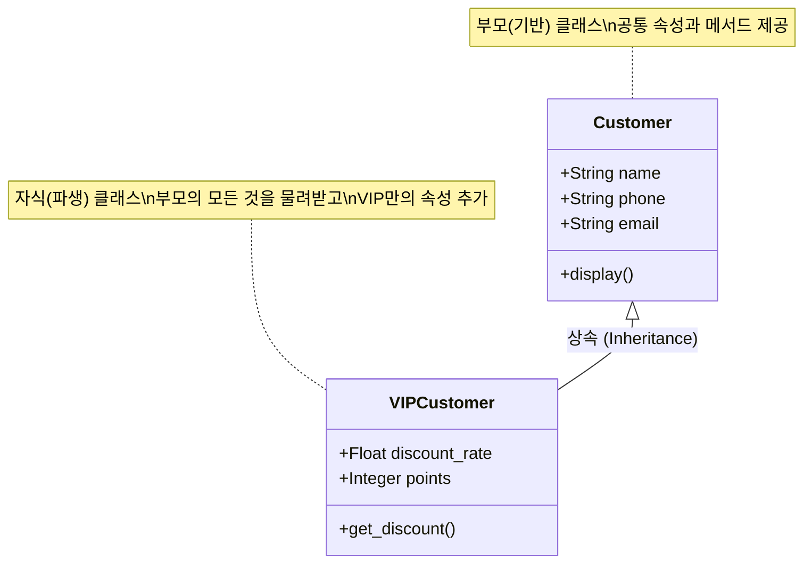

# 마이크로 세션: 094 — 상속의 개념과 필요성

> **세션 ID**: MS-PY101-094  
> **소요 시간**: 20분  
> **난이도**: ★★☆ (medium)  
> **청크 타입**: narrative  
> **버전**: v2.1 (7섹션 구조)

---

## §1. 개요

> **Day 5 | AM | 세션 094/106**

이 세션은 객체지향 프로그래밍(OOP)의 두 번째 핵심 기둥인 '상속(Inheritance)'의 개념과 필요성을 다루는 서사(narrative) 중심의 세션이에요. 캡슐화까지 적용하여 튼튼하게 만든 고객관리 프로그램 v3에 갑작스러운 추가 요구사항이 들어왔을 때, 어떻게 기존 코드를 복제하지 않고 우아하게 확장할 수 있는지를 배웁니다.

### 🎯 학습 목표

이 세션이 끝나면 수강생은 다음을 할 수 있어요:

- 현실의 '유산 상속' 비유를 통해 프로그래밍의 상속 개념을 설명할 수 있습니다
- 코드 중복이 발생하는 이유와 상속이 이를 어떻게 해결하는지(DRY 원칙) 이해합니다
- 파이썬에서 상속을 구현하는 기본 문법과 "is-a" 관계를 파악할 수 있습니다

### 선행 세션 환기

이전 세션(093)까지 우리는 캡슐화를 통해 데이터를 안전하게 보호하는 방법을 배웠어요. 외부에서 마음대로 데이터를 조작할 수 없도록 `@property`와 세터(setter)를 활용해 검증 로직을 단단하게 구축했죠. 이제 사장님이 새로운 미션을 던집니다. 기존 구조를 허물지 않고 새로운 기능을 추가해야 하는 순간이 온 거예요.

---

## §2. 핵심 개념 (+ 🗣️ 강사 대본 + Mermaid)

### 중복의 악몽과 유산 상속 비유

가장 직관적인 비유는 현실 세계의 "유산 상속"이에요. 부모님의 재산을 자녀가 물려받는 것처럼, 기존 클래스(부모)가 가진 속성과 기능을 새로운 클래스(자식)가 고스란히 물려받는 것이 객체지향 프로그래밍에서의 상속입니다. 부모의 재산이 줄어들지 않으면서 자식은 자신만의 고유한 재산을 추가로 쌓아갈 수 있다는 점이 핵심이에요.

🗣️ **강사 대본 (Instructor Script)**:

> 여러분, 축하합니다. 캡슐화까지 적용한 튼튼한 v3 고객관리 프로그램을 드디어 완성했어요. 이제 퇴근할 준비를 하는데, 갑자기 사장님이 헐레벌떡 뛰어옵니다.
> 
> "우리 가게에 VIP 고객 등급을 새로 만들자! VIP 고객은 일반 고객이랑 똑같이 이름, 전화번호, 이메일을 가지는데, 특별히 할인율과 적립 포인트를 추가로 관리해야 해. 내일 아침까지 부탁해!"
> 
> 자, 어떻게 하시겠어요? 가장 유혹적인, 그리고 가장 단순한 방법은 뭘까요? 맞습니다. 기존의 `Customer` 클래스를 마우스로 쫙 드래그해서 '복사하기'를 누른 다음, `VIPCustomer`라는 새 클래스를 '붙여넣기' 하는 거예요. 거기에 할인율과 포인트만 슬쩍 추가하는 거죠.
> 
> 하지만 잠깐 멈춰서 생각해 봅시다. 만약 이렇게 코드를 통째로 복사한다면, 이름, 전화번호, 이메일을 관리하는 코드가 우리 프로그램 안에서 정확히 두 번 나타나게 됩니다. 나중에 전화번호 형식이 바뀌어서 검증 로직을 수정해야 한다면 어떨까요? `Customer`도 고쳐야 하고, `VIPCustomer`도 고쳐야 합니다. 만약 'VVIP 고객', '패밀리 고객' 등급이 10개 더 생기면요? 코드를 10번 고쳐야 합니다. 개발자들은 이런 상황을 '코드 중복의 악몽'이라고 부릅니다.
> 
> 이 악몽에서 벗어나게 해주는 마법이 바로 상속(Inheritance)이에요. 
> 부모님이 집과 자동차를 가지고 계신다고 상상해 보세요. 여러분이 그 재산을 상속받으면, 여러분은 집과 자동차를 새로 살 필요 없이 그냥 사용할 수 있습니다. 게다가 여러분이 땀 흘려 번 돈으로 주식 계좌를 새로 만들면, 부모님의 재산에 더해 여러분만의 고유한 재산이 생기는 거죠.
> 
> 프로그래밍의 상속도 정확히 똑같습니다. `VIPCustomer`가 `Customer`를 상속받으면, 이름, 전화번호, 이메일 같은 기존 데이터와 기능은 한 글자도 다시 쓸 필요 없이 자동으로 넘어옵니다. 여러분은 그저 VIP만의 특별한 '할인율'과 '포인트'만 새로 추가하면 되는 거예요. 

### Mermaid 다이어그램: 상속 구조



이 다이어그램은 상속의 관계를 명확하게 보여줘요. 화살표는 자식이 부모를 향하며(상속받음을 의미), 자식 클래스인 `VIPCustomer` 안에는 이름이나 전화번호가 적혀있지 않지만 부모로부터 모두 물려받아 사용할 수 있다는 것을 나타냅니다.

---

## §3. 상세 내용

### Why — 왜 상속이 필요한가? (DRY 원칙)

프로그래밍 세계에는 아주 유명한 원칙이 있습니다. 바로 **DRY 원칙(Don't Repeat Yourself)**이에요. "똑같은 코드를 두 번 쓰지 마라"는 뜻이죠. 

상속의 가장 큰 목적은 바로 이 코드 중복을 제거하는 것입니다. 공통된 기능은 부모 클래스 한 곳에만 만들어두고, 변경 사항이 생기면 오직 부모 클래스 한 곳만 수정하면 됩니다. 그러면 상속받은 수십, 수백 개의 자식 클래스들에 그 변경 사항이 자동으로 쫙 퍼져나갑니다. 이것이 유지보수를 획기적으로 쉽게 만들어주는 비결이에요.

AI 시대에도 이 원칙은 결정적입니다. AI에게 코드를 짜달라고 할 때 "Customer 코드를 복사해서 VIPCustomer를 만들어줘"라고 하면 중복 코드가 생깁니다. 하지만 "Customer를 상속받는 VIPCustomer를 만들어줘"라고 지시하면, AI는 훨씬 깔끔하고 유지보수하기 좋은 코드를 생성해 줍니다. 설계 원칙을 이해하는 사람이 AI도 더 똑똑하게 다룰 수 있어요.

### What — 부모 클래스와 자식 클래스

용어를 정확히 짚고 넘어갈게요.
- **부모 클래스(Parent Class)** 또는 기반 클래스(Base Class): 기능을 물려주는 원본 클래스 (예: `Customer`)
- **자식 클래스(Child Class)** 또는 파생 클래스(Derived Class): 부모의 기능을 물려받아 확장하는 새로운 클래스 (예: `VIPCustomer`)

그리고 상속을 설계할 때 가장 중요한 검증 기준이 하나 있습니다. 바로 **"is-a" 관계**입니다.
"VIP 고객은 고객이다(VIPCustomer is a Customer)." 이 문장이 자연스럽죠? 그렇다면 상속을 써도 좋습니다.
하지만 "자동차는 엔진이다(Car is an Engine)." 이 문장은 이상합니다. 자동차는 엔진을 '가지고 있는' 것이지, 엔진 그 자체가 아니니까요. 이런 경우는 상속이 아니라 **"has-a(포함)" 관계**로 풀어야 합니다. 무턱대고 아무거나 상속받으면 안 된다는 점을 꼭 기억해야 해요.

### How — 파이썬에서의 상속 문법

파이썬에서 상속을 선언하는 방법은 믿을 수 없을 만큼 간단해요. 새로운 클래스를 만들 때, 클래스 이름 옆에 괄호를 열고 부모 클래스의 이름을 적어주기만 하면 됩니다.

```python
class VIPCustomer(Customer):
    pass
```

이렇게 한 줄만 적어도, `VIPCustomer`는 `Customer`의 모든 기능을 즉시 사용할 수 있는 상태가 됩니다.

---


### 📊 참고 표 (Visual Specs)

**상속(Inheritance)의 목적과 이점**

| 구분 | 부모 클래스 (Super class) | 자식 클래스 (Sub class) |
|:---|:---|:---|

## §4. 실습 가이드 (+ 🎙️ 실습 대본)

### 실습 목표

이 세션은 본격적인 코딩보다는 상속의 첫인상을 맛보는 과정이에요. 코드가 비어 있는 자식 클래스가 부모의 기능을 어떻게 끌어다 쓰는지 눈으로 확인하고, AI가 짠 코드에서 상속 관계를 알아보는 눈을 기르는 것이 목표입니다.

🎙️ **실습 가이드 대본 (Lab Guide)**:

> 자, 편집기를 열고 화면의 코드를 한 번 보세요. `VIPCustomer` 클래스를 방금 하나 만들었습니다.
> 
> ```python
> class VIPCustomer(Customer):
>     pass  # 일단 아무 기능도 추가하지 않음
> ```
> 
> 제가 `pass`라고 적었습니다. 안에는 아무것도 없다는 뜻이에요. 그런데 만약 제가 이 `VIPCustomer`로 객체를 만들고, 거기에 대고 `display()` 함수를 실행하라고 명령하면 어떻게 될까요? 에러가 날까요?
> 
> 여러분, 직접 타이핑해서 결과를 확인해 보세요!
> 
> (실습 진행)
> 
> 네, 결과가 어땠나요? 에러가 나지 않고 화면에 일반 고객과 똑같이 이름과 전화번호가 출력되었을 거예요. 내 코드 안에는 아무것도 없었지만, 부모 클래스인 `Customer`가 가지고 있던 초기화 코드와 `display()` 기능이 뒤에서 든든하게 받쳐주고 있었기 때문입니다. 이것이 상속이 주는 엄청난 혜택이에요.

### 트러블슈팅 FAQ

| Q | A |
|---|---|
| 상속은 몇 번까지 할 수 있나요? (할아버지의 할아버지의 할아버지도 되나요?) | 네, 가능합니다. 파이썬은 여러 단계를 거쳐 끝없이 상속을 받을 수 있어요. 하지만 너무 깊은 상속은 코드를 이해하기 어렵게 만드므로 보통 2~3단계를 넘지 않는 것을 권장합니다. |
| 두 개의 부모한테서 동시에 상속받을 수도 있나요? | 좋은 질문이에요! 파이썬은 '다중 상속'이라는 것을 지원해서 엄마와 아빠 양쪽에서 모두 상속을 받을 수 있습니다. 하지만 매우 복잡해질 수 있어서 기초 과정에서는 다루지 않습니다. |
| 부모의 기능을 물려받기 싫으면 어쩌죠? | 그것이 바로 다음 세션에서 배울 '오버라이딩(Overriding)'의 핵심입니다. 부모가 준 기능을 내 입맛에 맞게 덮어쓰는 기술을 곧 배우게 될 거예요. |

---


### 🎓 강사 노트 (Instructor Support)

- ⏱️ **타이밍**: 13:00 (20분, narrative)
- 🎯 **핵심 활동**: "유산 상속" 비유
- ⚠️ **강사 주의사항**: 왜 상속이 필요한지 동기 부여

## §5. 코드 및 명령어 모음

본 세션에서 사용하는 상속의 첫인상 맛보기 코드입니다. 수강생들이 직접 복사하여 실행해 볼 수 있도록 제공됩니다.

```python
# 1. 부모 클래스 정의
class Customer:
    def __init__(self, name: str, phone: str, email: str):
        self.name = name
        self.phone = phone
        self.email = email

    def display(self) -> None:
        print(f"[고객] {self.name} | {self.phone} | {self.email}")

# 2. 자식 클래스 정의 (Customer 상속)
class VIPCustomer(Customer):
    pass  # 추가 로직 없이 통과

# 3. 자식 클래스로 객체 생성 및 부모의 메서드 사용 테스트
if __name__ == "__main__":
    # VIPCustomer에는 __init__이 없지만 부모의 것을 사용함
    vip = VIPCustomer("김VIP", "010-9999-8888", "vip@mail.com")
    
    # VIPCustomer에는 display()가 없지만 부모의 것을 사용함
    vip.display()  
    # 출력: [고객] 김VIP | 010-9999-8888 | vip@mail.com
```

> 🤖 **AI 프롬프트 예시**:
> "파이썬에서 Animal 클래스를 부모로, Dog 클래스를 자식으로 만드는 간단한 상속 예제 코드를 만들어줘. 주석으로 어디가 상속 부분인지 친절하게 설명해줘."

---

## §6. 요약

### 핵심 학습 포인트

상속 세션의 세 가지 핵심은 다음과 같습니다:
1. **유산 상속과 코드 재사용**: 상속은 기존 클래스(부모)의 모든 속성과 메서드를 새로운 클래스(자식)에게 물려주어 똑같은 코드를 다시 작성할 필요가 없게 만듭니다.
2. **DRY 원칙 (Don't Repeat Yourself)**: 공통 코드를 한 곳에서 관리하여 코드의 중복을 막고 유지보수를 압도적으로 편리하게 해주는 원칙입니다.
3. **"is-a" 관계**: 상속은 "자식은 부모의 일종이다"라는 문장이 논리적으로 성립할 때만 사용해야 하는 문법입니다.

### 다음 세션 예고

지금까지 만든 `VIPCustomer`는 껍데기뿐인 VIP였습니다. 일반 고객과 다를 바가 없었죠. 다음 세션에서는 진정한 VIP를 위해 할인율이라는 독자적인 재산을 추가할 거예요. 이때 기존 부모의 셋팅을 훼손하지 않고 깔끔하게 기능을 확장할 수 있도록 도와주는 마법의 주문, `super()`에 대해 집중적으로 파헤쳐 보겠습니다.

### 브릿지 노트

> "상속이 어떤 느낌인지 감이 오시나요? 부모가 차려놓은 밥상에 숟가락만 얹는 것, 그것이 프로그래머들이 상속을 사랑하는 이유입니다. 그런데 숟가락만 얹는 걸 넘어서, 나만의 특별한 반찬을 하나 추가하고 싶다면 어떻게 해야 할까요? 부모님께 허락도 구해야겠죠? 그 방법이 바로 다음 세션에서 배울 `super()`입니다. 바로 이어서 진행해볼까요?"

---

## §7. 참고 자료

### 3-Source 출처

- **Source A (로컬 참고자료)**: `8 코딩.pdf` (상속과 코드 재사용) — 객체지향에서 클래스 확장을 위해 상속을 사용하는 전통적인 방법론과 코드 재사용의 이점 발췌.
- **Source B (NotebookLM)**: `day5_notebooklm.md` (상속과 super) — 비전공자들이 상속의 필요성을 쉽게 체감할 수 있도록 돕는 실무적인 시나리오(VIP 추가 요구사항) 구성.
- **Source C (Deep Research)**: `day5_deep_research.md` (상속) — AI-native 개발 시대에 상속 구조를 명확히 이해해야만 LLM에게 올바른 리팩토링 프롬프트를 지시할 수 있다는 맥락 제공.

### 강사 노트

> 💡 **강사 팁**: 초보자들은 상속을 처음 접할 때 "그냥 다 한 클래스에 때려 넣으면 안 되나?"라고 생각하기 쉽습니다. 반드시 '비즈니스 로직이 변경되는 상황(전화번호 검증 로직 변경 등)'을 가정하고, 중복 코드가 있을 때 얼마나 끔찍한 연쇄 수정 작업이 벌어지는지 강조해 주세요. 고통을 먼저 상상하게 해야 상속이라는 해결책의 달콤함을 온전히 느낄 수 있습니다.

---

## ✅ 세션 완료 체크리스트 (강사용)

- [x] 상속의 개념을 '유산 상속'이라는 현실 세계의 비유로 쉽게 설명했는가?
- [x] DRY 원칙(코드 중복 제거)의 가치를 충분히 강조했는가?
- [x] 파이썬 상속 문법을 직관적으로 이해할 수 있는 실습 코드를 시연했는가?
- [x] "is-a"와 "has-a" 관계의 차이점을 명확하게 짚어주었는가?
- [x] Mermaid 다이어그램을 통해 부모-자식 관계가 시각적으로 잘 전달되었는가?