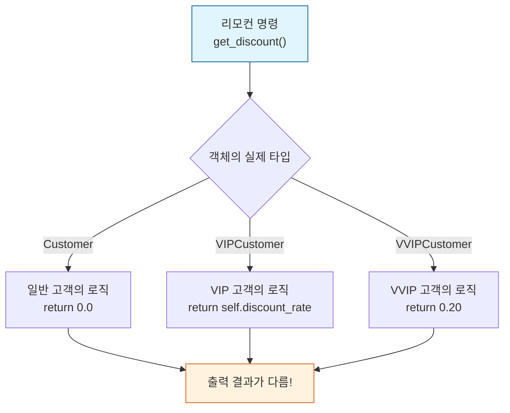
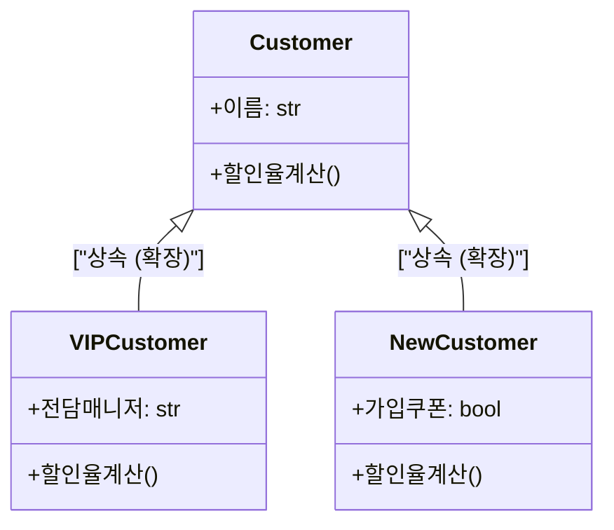

# 마이크로 세션: 096 — 다형성 체험

> **세션 ID**: MS-PY101-096  
> **소요 시간**: 20분  
> **난이도**: medium  
> **청크 타입**: narrative  
> **버전**: v2.1 (7섹션 구조)

---

## §1. 개요

> **Day 5 | AM | 마지막 세션**

이 세션은 대망의 Day 5 오전 일정을 마무리하는 마지막 시간이에요. 드디어 오늘 우리는 객체지향 프로그래밍(OOP)을 지탱하는 3대 기둥 중 마지막 퍼즐, "다형성(Polymorphism)"을 완성하게 됩니다. 캡슐화로 데이터를 안전하게 보호하고, 상속으로 코드를 효율적으로 재사용했다면, 이제는 다형성을 통해 코드가 스스로 똑똑하게 판단하고 동작하는 마법을 체험할 차례예요.

### 🎯 학습 목표

이 세션이 끝나면 수강생은 다음을 할 수 있어요:

- 메서드 오버라이딩을 활용하여 "같은 명령, 다른 결과"라는 다형성의 핵심 원리를 체감할 수 있습니다
- 수많은 `if-else` 조건문을 지우고, 객체 스스로 타입에 맞는 로직을 실행하도록 코드를 리팩토링할 수 있습니다
- "확장에는 열려 있고, 수정에는 닫혀 있다"는 개방-폐쇄 원칙(OCP)의 실전적 의미를 설명할 수 있습니다

### 선행 세션 환기

직전 세션(095)에서 우리는 `Customer` 클래스를 상속받는 `VIPCustomer`를 만들었어요. `super()`를 써서 부모의 재산을 물려받고, VIP만의 특별한 데이터인 할인율(`discount_rate`)을 추가해 보았습니다. 클래스의 덩치를 키우고 기능을 확장하는 법을 배웠으니, 이제 이 두 클래스가 실전에서 어떻게 똑똑하게 서로 다른 역할을 해내는지 무대에 올려볼 시간입니다.

---

## §2. 핵심 개념 (+ 🗣️ 강사 대본 + Mermaid)

### 비유 — "같은 버튼, 다른 결과" 만능 리모컨

다형성을 이해하는 가장 직관적인 비유는 바로 '리모컨의 전원 버튼'이에요. 여러분 집에 TV, 에어컨, 셋톱박스 리모컨이 제각각 있을 텐데요, 이들 리모컨에는 공통으로 달린 버튼이 하나 있죠. 바로 전원 버튼입니다. TV 리모컨의 전원 버튼을 누르면 화면이 켜지고, 에어컨 리모컨의 전원 버튼을 누르면 찬 바람이 나옵니다. 우리는 똑같이 "전원 켜기"라는 한 가지 명령만 내렸을 뿐인데, 명령을 받는 대상이 TV냐 에어컨이냐에 따라 완전히 다른 결과가 나타나는 거예요. 이것이 객체지향에서 말하는 다형성입니다.

🗣️ **강사 대본 (Instructor Script)**:

> 여러분, 상상력을 조금 발휘해 볼까요? 우리에게 만능 리모컨이 하나 생겼습니다. 이 리모컨에는 다른 건 없고 오직 "할인율 계산!"이라는 버튼 딱 하나만 있어요.
>
> 자, 백화점 입구에 서서 들어오는 고객들을 향해 이 리모컨을 누른다고 생각해 보세요. 먼저 들어오는 일반 고객에게 버튼을 누르니 띠릭! 하고 "할인 없음(0%)"이라고 뜹니다. 그다음 들어오는 VIP 고객에게 똑같은 버튼을 누르면 띠릭! 하고 "10% 할인"이 나오죠. 심지어 VVIP 고객에게 누르면 "20% 할인"이 적용됩니다.
>
> 방금 무슨 일이 일어난 걸까요? 리모컨을 쥐고 있는 우리는 그저 "할인율 계산해"라는 하나의 명령만 내렸을 뿐이에요. 그런데 명령을 받은 대상, 즉 고객 객체가 자신이 어떤 등급인지 스스로 판단해서 각자에게 맞는 할인율을 내놓은 겁니다.
>
> 이것이 바로 다형성이에요. 코드로 치면 `customer.get_discount()`라는 똑같은 코드를 실행했는데, `customer`가 일반이면 0을, VIP면 10을 반환하는 거죠. 만약 다형성이 없다면 어떻게 해야 할까요? 일일이 "당신 VIP입니까? 일반입니까?" 물어보고 코드로 `if customer_type == "VIP":` 하면서 엄청나게 길고 복잡한 조건문을 써야만 했을 거예요. 다형성은 이 지긋지긋한 조건문 지옥에서 우리를 구원해 줍니다!

### Mermaid 다이어그램



다이어그램을 보세요. 입력은 `get_discount()` 하나뿐이지만, 내부에서 어느 경로를 탈지는 전적으로 객체 자신의 정체성에 달려있습니다. 코드를 짜는 개발자는 그저 "할인율을 가져와!"라고 외치기만 하면 되는 아주 우아한 구조가 완성되는 거죠.

---


### 🎨 추가 시각화 (Visualization Packet)

**상속 계층도 (Inheritance Hierarchy)**

공통된 특징을 Base 클래스에 두고, 특수한 기능만 파생 클래스가 물려받아 확장하는 구조입니다.



## §3. 상세 내용

### Why — 다형성이 왜 필요한가요?

소프트웨어를 유지보수하다 보면 가장 골치 아픈 것이 끝도 없이 늘어나는 `if-elif-else` 조건문입니다. 고객 등급이 일반, VIP, VVIP, 패밀리, 골드... 계속 추가될 때마다 전국의 모든 매장 포스기 코드를 뜯어고치며 `if` 문을 추가해야 한다면 끔찍하겠죠? 다형성은 이런 확장에 따른 코드 수정 비용을 0으로 만들어 줍니다. "호출하는 쪽은 그대로 두고, 객체만 추가해라"라는 규칙을 만들어주기 때문이에요.

### What — 오버라이딩과 Duck Typing

다형성의 기술적인 바탕은 '오버라이딩(Overriding)'입니다. 부모 클래스가 물려준 메서드를 자식 클래스가 자기 입맛에 맞게 덮어쓰는 거죠. 파이썬에서는 한 걸음 더 나아가서 "오리처럼 걷고 꽥꽥거리면 그건 오리다"라는 'Duck Typing(덕 타이핑)'이라는 철학을 따릅니다. 굳이 상속을 받지 않았더라도, 객체가 `get_discount()`라는 메서드만 가지고 있다면 그냥 똑같은 방식으로 취급하고 호출해 버리는 파이썬 특유의 유연한 다형성이에요.

### How — 개방-폐쇄 원칙(OCP) 달성

우리가 앞으로 `for` 반복문으로 고객 리스트를 훑으면서 할인을 적용하는 코드를 짤 텐데요. 놀랍게도 그 반복문 로직은 단 한 줄도 고칠 필요가 없게 됩니다. 새로운 등급이 생기면 그저 `get_discount()`를 가진 새 클래스만 툭 던져 넣으면 끝이거든요. 이렇게 '새로운 기능 추가(확장)에는 활짝 열려 있고, 기존 코드 수정에는 단단히 닫혀 있는' 설계를 개방-폐쇄 원칙(OCP)이라고 부르며, 다형성이 이를 가능케 하는 핵심 열쇠가 됩니다.

---

## §4. 실습 가이드 (+ 🎙️ 실습 대본)

### 실습 목표

수강생들은 리모컨 비유를 바탕으로 직접 코드를 작성하며, 똑같은 명령이 객체에 따라 다르게 동작하는 마법을 눈으로 확인합니다. 조건문 없이 다형성만으로 로직을 분기하는 경험을 하게 돼요.

🎙️ **실습 가이드 대본 (Lab Guide)**:

> 자, 우리 손으로 직접 다형성의 마법을 부려볼 시간입니다. Antigravity를 열고 세 단계로 나눠서 진행할게요.
>
> 첫째, 부모 클래스인 `Customer`에 기본 할인율 0.0을 반환하는 `get_discount()` 메서드를 추가하세요. 그리고 `VIPCustomer`에서는 이 메서드를 덮어써서 자신의 할인율을 반환하도록 재정의합니다.
>
> 둘째, 일반 고객과 VIP 고객을 뒤죽박죽 섞어서 하나의 리스트에 담아볼까요? 그리고 `for` 문을 돌면서 `process_discount()`라는 함수를 호출해 보세요. 코드는 분명히 딱 한 줄, 똑같은 함수를 호출했는데 고객 등급에 따라 결과가 다르게 출력되는 걸 두 눈으로 확인하실 수 있을 거예요.
>
> 셋째, 이 다형성이 얼마나 강력한지 시험해 봅시다. AI 비서에게 이렇게 명령해 보세요. "VVIPCustomer 클래스를 만들어줘. VIPCustomer 상속받고 기본 할인은 20%로 해줘." 그리고 이 새 객체를 리스트에 추가만 하고, 반복문이나 처리 함수는 단 한 글자도 수정하지 말고 다시 실행해 보세요. 에러 없이 VVIP까지 깔끔하게 할인이 적용되는 걸 보셨나요? 이것이 바로 객체지향의 꽃입니다!

### 단계별 지시

| 단계 | 소요 시간 | 강사 지시사항 | 학습자 액션 | 예상 결과 |
|------|----------|--------------|------------|----------|
| 1 | 5분 | Customer와 VIPCustomer에 `get_discount` 추가 지시 | 부모, 자식 클래스 메서드 작성 (오버라이딩) | 두 클래스가 동일한 이름의 메서드를 가짐 |
| 2 | 10분 | 두 타입의 객체를 리스트에 넣고 반복문 호출 지시 | `process_discount` 함수 및 리스트 순회 작성 | 조건문 없이 타입에 따라 할인율 출력됨 |
| 3 | 5분 | AI에게 VVIPCustomer 생성 요청 지시 | AI로 VVIP 생성 후 리스트에만 추가, 재실행 | 함수 수정 없이 VVIP 할인율 자동 출력 성공 |

### 트러블슈팅 FAQ

| Q | A |
|---|---|
| 오버라이딩을 했는데도 자꾸 부모 메서드가 호출돼요! | 자식 클래스의 메서드 이름에 오타가 없는지 확인하세요. 철자가 다르면 덮어쓰기가 아니라 전혀 다른 새 메서드가 만들어진 셈이라 부모 것이 대신 불립니다. |
| 리스트에 여러 타입의 객체를 섞어 넣어도 파이썬은 괜찮나요? | 네! 파이썬 리스트는 매우 자유로워서 일반 고객과 VIP를 한 바구니에 담아도 전혀 문제없습니다. 이것이 파이썬의 매력이죠. |

---


### 🎓 강사 노트 (Instructor Support)

- ⏱️ **타이밍**: 13:50 (20분, lab)
- 🎯 **핵심 활동**: "리모컨 전원 버튼" 비유
- ⚠️ **강사 주의사항**: 동일 메서드, 다른 동작


### 📋 실습 설계 보강 (Lab Packet)

**세션 096 실습 설계 보강**

다형성 체험 (리모컨의 전원 버튼)
- **3-Stage Example Set**
  - 기본: Customer + VIPCustomer 인스턴스가 섞인 리스트에서 동일 메서드 호출 → 다른 동작 확인
  - 변형: PremiumCustomer 3번째 타입 추가 → 리스트에 혼합 → 동일 메서드 호출
  - 실수 해결: "VIPCustomer에서 super().__init__을 빠뜨렸어요" → 상속 초기화 누락
- **난이도 예측**: 같은 메서드인데 다르게 동작한다는 개념이 직관에 반함
- **타이밍 가이드**: Customer/VIP 리스트 생성 5분 | 반복문으로 메서드 호출 5분 | 결과 관찰 5분 | 정리 5분
- **심리적 장벽**: "코드를 읽어도 왜 다르게 동작하는지 모르겠어요"
- **자가 점검**:
  - [ ] for 루프에서 `print_info()` 호출 시 일반/VIP가 다르게 출력되는가?
  - [ ] "다형성"을 리모컨 비유로 설명할 수 있는가?
  - [ ] 메서드 오버라이딩의 의미를 이해했는가?

## §5. 코드 및 명령어 모음

**1단계: 클래스에 오버라이딩 적용**
```python
class Customer:
    def __init__(self, name: str, email: str, age: int):
        self.name = name
        self.email = email
        self.age = age

    def get_discount(self) -> float:
        # 일반 고객은 할인이 없으므로 0을 반환
        return 0.0

class VIPCustomer(Customer):
    def __init__(self, name: str, email: str, age: int, discount_rate: float):
        super().__init__(name, email, age)
        self.discount_rate = discount_rate

    def get_discount(self) -> float:
        # VIP 고객은 자신의 특별 할인율을 반환 (오버라이딩)
        return self.discount_rate
```

**2단계: 다형성 실행 (리모컨 누르기)**
```python
def process_discount(customer: Customer) -> None:
    # customer가 누구든 상관없이 그냥 get_discount()를 호출 (다형성)
    discount = customer.get_discount()
    print(f"{customer.name} 고객님: {discount:.0%} 할인 적용")

# 일반과 VIP를 한 바구니에 섞어 담습니다
customers = [
    Customer("홍길동", "hong@mail.com", 30),
    VIPCustomer("김VIP", "vip@mail.com", 40, 0.1),
    Customer("박일반", "park@mail.com", 25),
]

# 리스트를 순회하며 모두에게 "리모컨 전원 버튼"을 누름
for c in customers:
    process_discount(c)
```

**3단계: VVIP 추가 도전 (기존 코드 무수정 확장)**
```python
class VVIPCustomer(VIPCustomer):
    def __init__(self, name: str, email: str, age: int):
        # VVIP는 기본으로 20% 할인을 갖도록 강제 설정
        super().__init__(name, email, age, 0.20)

# 리스트에 객체만 추가하고 process_discount나 for문은 전혀 안 고쳐도 됨!
customers.append(VVIPCustomer("최브이", "vvip@mail.com", 50))

for c in customers:
    process_discount(c)
```

---

## §6. 요약

### 핵심 학습 포인트

이번 세션을 통해 우리는 다형성이 주는 코딩의 자유를 맛보았습니다. 다형성이란 "같은 이름의 메서드를 호출했을 때, 객체의 실제 타입에 따라 다른 동작이 찰떡같이 실행되는 것"이에요. 리모컨 전원 버튼 하나로 TV와 에어컨을 모두 다루듯, 우리는 `get_discount()` 하나로 수많은 종류의 고객 등급을 단숨에 제어하게 되었습니다. 새로운 등급이 추가되어도 기존 코드를 건드릴 필요가 없다는 개방-폐쇄 원칙(OCP)의 놀라운 장점을 기억해 주세요.

### 다음 세션 예고

이제 캡슐화, 상속, 다형성까지 객체지향의 3대 요소를 모두 마스터하셨습니다! 다음 세션(오후 일정의 시작)에서는 여기에서 한 단계 더 깊은 세계로 들어갑니다. 프로그램의 뼈대와 아키텍처를 유연하게 만드는 마법의 패턴, '의존성 주입(DI)'이라는 고급스러운 기법을 만나 고객관리 프로그램을 최종 버전으로 진화시켜 보겠습니다.

### 교안 원문 (v1.0 백업본)

> 아래 내용은 다형성 체험 세션의 초기 기획안 원문(v1.0)입니다. 전체 내용이 보존되어 프롬프트 생성 시 참고 자료로 활용됩니다.

```markdown
# 세션 096: 다형성 체험

| 항목 | 값 |
|------|-----|
| **세션 ID** | MS-PY101-096 |
| **소요 시간** | 20분 |
| **난이도** | ★★☆ (medium) |
| **청크 타입** | lab |
| **선행 세션** | 095 (필수) |
| **학습 목표** | 메서드 오버라이딩을 통한 다형성을 체험하고, 같은 인터페이스로 다른 동작을 수행하는 코드를 작성할 수 있다 |
| **출처** | [Source A] 8 코딩.pdf §8.14 다형성 · [Source B] day5_notebooklm.md · [Source C] day5_deep_research.md |

---

## ① 도입 — "같은 버튼, 다른 결과"

🗣️ 강사 대본 (Instructor Script):

여러분, 집에 리모컨이 몇 개 있으신가요? TV 리모컨, 에어컨 리모컨, 셋톱박스 리모컨... 리모컨마다 생김새는 다르지만, 공통적으로 "전원 버튼"이 있습니다. TV 리모컨의 전원 버튼을 누르면 TV가 켜지고, 에어컨 리모컨의 전원 버튼을 누르면 에어컨이 켜집니다. 같은 "전원 버튼"이라는 인터페이스인데, 누르는 대상에 따라 완전히 다른 결과가 나옵니다. 이것이 바로 다형성(Polymorphism)의 핵심입니다. 오늘은 이 "같은 명령, 다른 결과"를 코드로 직접 체험해 보겠습니다.

---

## ② 비유 — 리모컨의 전원 버튼

🗣️ 강사 대본 (Instructor Script):

비유를 좀 더 깊이 들어가 볼게요 [Source A][Source B]. 만능 리모컨이 하나 있다고 상상해 봅시다. 이 리모컨에는 "할인율 계산" 버튼이 딱 하나 있습니다. 이 버튼을 일반 고객에게 향해 누르면 "할인 없음(0%)"이 나오고, VIP 고객에게 향해 누르면 "10% 할인"이 나오고, VVIP 고객에게 향해 누르면 "20% 할인"이 나옵니다. 리모컨(호출하는 코드)은 하나인데, 대상(객체)에 따라 결과가 달라지는 거예요.

이것이 프로그래밍에서 엄청나게 강력한 이유가 있습니다 [Source C]. `CustomerManager`가 고객 목록을 순회하면서 `customer.get_discount()`를 호출할 때, 이 고객이 일반인지 VIP인지 VVIP인지 일일이 확인할 필요가 없습니다. 그냥 `get_discount()`만 호출하면 각 객체가 자기 타입에 맞는 할인율을 알아서 반환합니다. `if customer_type == "VIP": ...` 같은 조건문 지옥에서 해방되는 거예요.

파이썬에서는 이것을 Duck Typing이라고도 부릅니다. "오리처럼 걷고, 오리처럼 꽥꽥거리면, 그것은 오리다." 즉, 객체의 타입이 뭔지보다 "그 객체가 어떤 메서드를 가지고 있는지"가 더 중요합니다. `get_discount()` 메서드만 있으면, 그것이 일반 고객이든 VIP든 로봇이든 상관없이 동작합니다.

---

## ③ 개념 확인 — 다형성이란

🗣️ 강사 대본 (Instructor Script):

다형성(Polymorphism)을 한 문장으로 정의하면 이렇습니다 [Source A][Source C]. "같은 이름의 메서드를 호출했을 때, 객체의 실제 타입에 따라 다른 동작이 실행되는 것." 이것이 가능한 이유는 오버라이딩 때문입니다. 부모 클래스에 `get_discount()`를 정의해 두고, 각 자식 클래스에서 자기만의 방식으로 재정의하면, 호출하는 쪽에서는 타입을 신경 쓰지 않고 동일한 메서드 이름만 사용하면 됩니다.

다형성의 실전적 가치는 확장성입니다 [Source B]. 나중에 "기업 고객(CorporateCustomer)"이라는 새 등급이 추가되어도, `get_discount()`만 오버라이딩하면 기존 코드를 한 줄도 수정하지 않고 새 등급이 자연스럽게 동작합니다. 이것을 개방-폐쇄 원칙(OCP: Open-Closed Principle)이라고 부릅니다 — "확장에는 열려 있고, 수정에는 닫혀 있다."

---

## ④ 실습 — 다형성 체험

🎙️ 실습 가이드 (Lab Guide):

직접 체험해 봅시다. 총 3단계입니다.

**1단계 (5분) — 일반 고객에 get_discount 추가**: `Customer` 클래스에 `get_discount()` 메서드를 추가합니다. 일반 고객은 할인이 없으므로 `0.0`을 반환합니다.

```python
class Customer:
    # ... 기존 코드 ...
    def get_discount(self) -> float:
        return 0.0  # 일반 고객: 할인 없음

class VIPCustomer(Customer):
    # ... 기존 코드 ...
    def get_discount(self) -> float:
        return self.discount_rate  # VIP: 10% 할인
```

**2단계 (10분) — 다형성 확인**: 일반 고객과 VIP 고객을 섞어서 하나의 리스트에 넣고, 반복문으로 `get_discount()`를 호출합니다.

```python
def process_discount(customer: Customer) -> None:
    discount = customer.get_discount()
    print(f"{customer.name}: {discount:.0%} 할인")

customers = [
    Customer("홍길동", "hong@mail.com", 30),
    VIPCustomer("김VIP", "vip@mail.com", 40, 0.1),
    Customer("박일반", "park@mail.com", 25),
]

for c in customers:
    process_discount(c)  # 같은 함수, 다른 결과!
```

**3단계 (5분) — 새 등급 추가 도전**: AI에게 "VVIPCustomer 클래스를 만들어줘. VIPCustomer를 상속받고, 할인율 기본값을 20%로 설정해줘"라고 요청하세요. 만들어진 VVIP 객체를 위 리스트에 추가하고 다시 실행해 보세요. `process_discount()` 함수를 한 글자도 수정하지 않았는데 VVIP 할인율이 정상 출력되는 것을 확인합니다.

---

## ⑤ 정리 — "하나의 명령, 무한한 가능성"

🗣️ 강사 대본 (Instructor Script):

오늘의 핵심입니다. 다형성은 "같은 메서드 이름, 다른 동작"을 가능하게 하는 OOP의 꽃입니다. 리모컨 전원 버튼 하나로 TV도 켜고 에어컨도 켜듯이, `get_discount()` 하나로 일반 고객, VIP, VVIP 모두를 처리할 수 있습니다. 새로운 등급이 추가되어도 기존 코드를 수정할 필요가 없다는 것이 가장 강력한 장점이죠. 자, 이제 OOP의 3대 기둥 — 캡슐화, 상속, 다형성 — 을 모두 익혔습니다. 다음 세션에서는 한 단계 더 나아가, 프로그램의 "뼈대(아키텍처)"를 설계하는 의존성 주입(DI)이라는 고급 패턴을 만나 보겠습니다!
```

---

## §7. 참고 자료

### 3-Source 출처

- **Source A (로컬 참고자료)**: `8 코딩.pdf` (§8.14 다형성) — 메서드 오버라이딩과 다형성의 기초 개념 및 실습 근거.
- **Source B (NotebookLM)**: `day5_notebooklm.md` — 다형성의 개념 정리, "같은 명령 다른 결과" 비유와 객체지향 철학 요약.
- **Source C (Deep Research)**: `day5_deep_research.md` — Duck Typing과 개방-폐쇄 원칙(OCP), 조건문 탈피 리팩토링의 기술적 배경.

### 강사 노트

> 💡 **강사 팁**: 코드가 작동하는 것을 보여주는 것도 중요하지만, "만약 다형성이 없다면 기존 코드가 얼마나 지저분해졌을까?"를 계속 강조해야 합니다. `if type == 'VIP':` 구문이 덕지덕지 붙어 있는 나쁜 예시를 말로 살짝 설명해 주시면 다형성의 위력이 더 극적으로 다가올 것입니다. Day 5 오전의 마지막 세션이므로 수강생들이 객체지향 3대 원칙(캡슐화, 상속, 다형성)을 완성했다는 성취감을 주며 활기차게 마무리해 주세요!

---

## ✅ 세션 완료 체크리스트 (강사용)

- [ ] §1~§7 모든 섹션이 충실하게 작성되었는가?
- [ ] 다형성을 설명하는 리모컨 비유와 스크립트가 적절히 포함되었는가?
- [ ] 조건문을 쓰지 않고 오버라이딩을 활용하는 실습이 원활하게 진행되었는가?
- [ ] Day 5 오전 일정을 성공적으로 마무리하는 축하 멘트가 들어갔는가?
- [ ] 3-Source 팩트 패킷의 다형성 포인트가 온전히 반영되었는가?

---

*작성 일시: 2026-02-25*  
*작성 에이전트: Antigravity*  
*교안 구조: 7섹션 (A0 팀 공통 표준)*