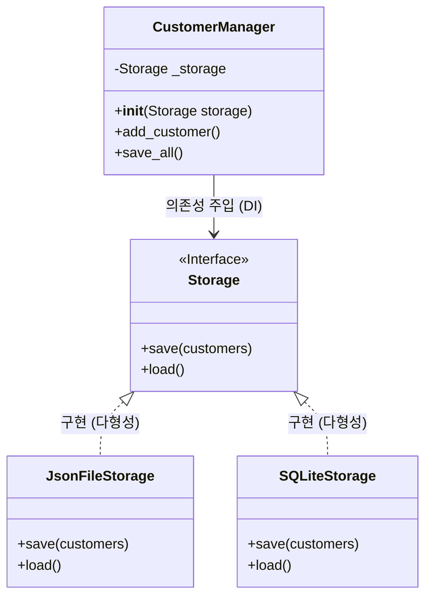

# 마이크로 세션: 097 — 의존성 주입(DI) 개념

> **세션 ID**: MS-PY101-097  
> **소요 시간**: 20분  
> **난이도**: medium (★★☆)  
> **청크 타입**: narrative  
> **버전**: v2.1 (7섹션 구조)

---

## §1. 개요

> **Day 5 | PM | 세션 097/106**

이 세션은 5일 차 오후의 첫 번째 시간이자, 우리가 지금까지 만들어온 고객관리 프로그램의 아키텍처를 전문가 수준으로 끌어올리는 아주 중요한 분기점이에요. 앞서 객체지향의 캡슐화, 상속, 다형성을 배웠죠? 이제 그 지식을 바탕으로 "저장소를 자유롭게 교체할 수 있는 유연한 설계"를 배울 차례입니다.

지금까지 우리의 `CustomerManager`는 고객 데이터를 그저 메모리, 즉 파이썬 리스트 안에 담아두고 있었어요. 프로그램 창을 닫으면 힘들게 입력한 고객 정보가 허무하게 전부 날아가는 구조였죠. 실제 서비스라면 상상도 할 수 없는 대형 사고입니다. 데이터를 안전하게 보관하려면 파일이나 데이터베이스(DB)에 저장해야 하는데, 이 저장 방식을 어떻게 코드에 엮어낼 것인가가 오늘 다룰 핵심 주제입니다. 

### 🎯 학습 목표

이 세션이 끝나면 수강생은 다음을 할 수 있어요:

- 의존성 주입(DI)의 개념을 '교체 가능한 자동차 타이어' 비유를 통해 다른 사람에게 설명할 수 있습니다.
- 클래스 내부에서 의존성을 직접 만들지 않고 외부에서 받아올 때 얻는 "결합도 감소"의 이점을 이해합니다.
- 앞으로 이어질 파일 저장, DB 저장 모듈 구현의 아키텍처적 밑그림을 그릴 수 있습니다.

### 선행 세션 환기

이 세션을 듣기 위해서는 직전 세션인 "096 다형성 체험 (리모컨의 전원 버튼)"에 대한 이해가 필수적이에요. 부모 클래스의 메서드를 자식이 덮어써서(오버라이딩) 다양한 형태로 동작하게 만든다는 개념이, 이번 시간에 배울 '저장소 교체'의 핵심 원리로 그대로 이어지기 때문입니다.

---

## §2. 핵심 개념 (+ 🗣️ 강사 대본 + Mermaid)

### 비유 — 교체 가능한 자동차 타이어와 원두 납품업체

의존성 주입(Dependency Injection, 줄여서 DI)은 이름만 들으면 아주 어렵고 복잡한 컴퓨터 공학 용어처럼 보입니다. 하지만 현실 세계에서는 우리가 매일매일 숨 쉬듯 자연스럽게 쓰고 있는 방식이에요. 이것을 설명하기 위해 두 가지 비유를 들어볼게요. 바로 "자동차 타이어"와 "바리스타"입니다. 

🗣️ **강사 대본 (Instructor Script)**:

> 식사 맛있게 하셨나요? 오후의 첫 시간입니다. 여러분, 지금까지 우리가 만든 고객관리 프로그램은 데이터를 어디에 저장하고 있었죠? 맞습니다. 메모리 안의 파이썬 리스트에 저장했어요. 프로그램을 끄면 데이터가 흔적도 없이 사라집니다. 진짜 서비스라면 고객들한테 항의 전화가 빗발치겠죠.
>
> 그래서 우리는 이제 고객 데이터를 파일이나 진짜 데이터베이스(DB)에 영구적으로 저장할 겁니다. 그런데 여기서 문제가 하나 생겨요. `CustomerManager` 안에 "파일에 저장하는 코드"를 꽉꽉 눌러서 직접 짜 넣었다고 가정해 볼게요. 나중에 회사가 커져서 "이제 파일 말고 데이터베이스에 저장합시다!"라고 정책이 바뀌면 어떻게 될까요?
>
> `CustomerManager`의 코드를 통째로 뜯어고쳐야 합니다. 비즈니스 로직을 다루는 매니저 코드가, 저장 방식이 바뀔 때마다 덩달아 수술대에 올라야 하는 거예요. 이건 좋은 설계가 아닙니다. 이 문제를 아주 우아하게 해결하는 아키텍처 패턴이 바로 "의존성 주입(DI)"이에요.
>
> 두 가지 비유를 들어볼게요. 첫 번째는 "교체 가능한 자동차 타이어"입니다. 자동차(`CustomerManager`)가 굴러가려면 타이어(`저장소`)가 꼭 필요하죠? 그런데 타이어가 차체에 완전히 용접되어 있다고 상상해 보세요. 여름 타이어에서 겨울 타이어로 바꾸려면 차를 카센터에 가져가서 톱으로 자르고 다시 용접해야 할 겁니다. 하지만 현실의 자동차는 타이어를 볼트로 끼우는 방식이죠? 볼트만 풀면 여름 타이어를 빼고 겨울 타이어를 쏙 끼울 수 있습니다. 차체(비즈니스 로직)는 단 한 군데도 건드리지 않고 말이죠.
>
> 두 번째 비유는 "바리스타와 원두 납품업체"예요. 바리스타(`CustomerManager`)가 커피를 내립니다. 바리스타가 뒷마당에서 직접 원두를 재배하나요? 아닙니다. 원두 납품업체(`Storage`)로부터 원두를 받아서 커피를 내리죠. 납품업체가 에티오피아산에서 콜롬비아산으로 바뀌어도, 바리스타의 커피 내리는 기술(비즈니스 로직)은 변하지 않습니다. 바리스타는 "원두가 들어오면 그걸로 커피를 내린다"는 사실만 알면 되지, 원두가 어디서 어떻게 왔는지는 신경 쓸 필요가 없어요.
>
> 이것이 의존성 주입, DI의 핵심입니다. 내가 필요한 부품을 내 안에서 직접 뚝딱뚝딱 만들지 않고, 밖에서 만들어진 것을 "주입"받는 거예요.

### Mermaid 다이어그램

이 관계를 아키텍처 다이어그램으로 보면 아래와 같습니다. `CustomerManager`는 특정한 저장 파일이나 DB를 직접 가리키지 않고, 그저 `Storage`라는 "약속(인터페이스)"만 바라봅니다.



이 그림에서 화살표의 방향을 눈여겨보세요. `CustomerManager`는 밑에 있는 진짜 저장소들(`JsonFileStorage`, `SQLiteStorage`)을 직접 모릅니다. 그저 `save()`와 `load()`가 있다는 `Storage`라는 껍데기만 알 뿐이죠. 밖에서 누군가가 진짜 저장소를 밀어 넣어주면(주입), 그것을 받아서 사용하기만 합니다.

---

## §3. 상세 내용

### Why — 왜 DI가 필수적인가?

프로그램이 커질수록 코 외드가 서로 끈끈하게 얽히는 "강한 결합(Tight Coupling)" 문제가 발생합니다. 결합도가 높으면 한쪽 코드를 수정할 때 다른 쪽 코드가 연쇄적으로 망가지는 폭탄 돌리기가 시작돼요. DI는 이 결합도를 획기적으로 낮춰주는 "느슨한 결합(Loose Coupling)"을 만들어 냅니다. 저장 방식이 파일이든, DB든, 심지어 클라우드 서버든 간에, `CustomerManager` 코드는 단 한 줄도 수정할 필요가 없게 만들어주는 마법 같은 도구입니다.

### What — DI를 파이썬으로 어떻게 구현하는가?

DI를 구현하는 핵심 아이디어는 다름 아닌 "인터페이스(약속)"예요. 파이썬에서는 자바처럼 `interface`라는 전용 키워드는 없지만, 부모 클래스를 만들고 메서드 안에 `raise NotImplementedError`를 적어서 약속을 강제합니다. "나를 상속받는 자식은 반드시 `save()`와 `load()`를 자기 입맛에 맞게 구현해야 한다"는 엄격한 계약을 맺는 거죠. 

그리고 `CustomerManager`의 `__init__` (초기화 메서드)에 `storage`라는 매개변수를 열어둡니다. 이것이 바로 볼트를 끼우는 "주입구(나사 구멍)" 역할을 해요.

### How — "만들지 말고, 받아라"

이제 객체지향 프로그래밍을 할 때 항상 스스로에게 던져야 할 질문이 하나 생겼습니다. "내가 이 클래스 안에서 다른 부품 객체를 직접 `A = A()` 하고 만들고 있나?" 만약 그렇다면, 그 코드는 나중에 수정하기 매우 힘들어질 확률이 높습니다. 내부에서 만들지 말고, 외부에서 매개변수로 받아오세요. 이것이 의존성 역전 원칙(DIP)과 의존성 주입(DI)의 기본 원리입니다.

---

## §4. 실습 가이드 (+ 🎙️ 실습 대본)

### 실습 목표

이번 세션은 개념의 뼈대를 잡는 시간이라 코드를 직접 타이핑하기보다는, 강사와 수강생이 함께 머릿속으로 아키텍처를 그려보는 "사고 실험(Thought Experiment)" 방식으로 진행해요. 수강생들이 "아, 이래서 밖에서 넣어주는 거구나!"라고 무릎을 치게 만드는 것이 목표입니다.

🎙️ **실습 가이드 대본 (Lab Guide)**:

> 자, 여러분 화면을 보지 마시고 저를 한 번 보세요. 우리가 코드를 짤 때 가장 흔히 하는 실수가 뭔지 아시나요? `CustomerManager`를 만들면서 그 안에 `storage = JsonFileStorage()`라고 직접 써버리는 거예요.
>
> 겉보기엔 아무 문제가 없어 보이죠. 파일 저장이 아주 잘 될 겁니다. 그런데 1년 뒤에 사장님이 "우리 이제 파일 쓰지 말고 오라클 DB로 바꿉시다"라고 지시했어요. 그러면 여러분은 어떻게 해야 할까요?
> 
> 네, `CustomerManager` 파일을 열어서 `storage = JsonFileStorage()`를 지우고 `storage = OracleDBStorage()`로 일일이 바꿔쳐야 해요. 만약 그 저장소를 매니저뿐만 아니라 직원 관리, 상품 관리 모듈 등 50군데에서 쓰고 있었다면? 50군데를 다 찾아다니며 코드를 고쳐야 합니다. 야근 당첨이죠.
>
> 반대로 DI를 적용하면 어떨까요? `CustomerManager` 코드는 1년이 지나도, 10년이 지나도 그대로 둡니다. 그저 매니저를 처음 생성할 때 `manager = CustomerManager( OracleDBStorage() )` 하고 괄호 안에 새로운 부품만 쓱 밀어 넣어주면 끝납니다. 이 편안함의 차이가 느껴지시나요? 이게 바로 실력 있는 개발자가 코드를 짜는 방식입니다.

### 단계별 지시

| 단계 | 소요 시간 | 강사 지시사항 | 학습자 액션 | 예상 결과 |
|------|----------|--------------|------------|----------|
| 1 | 3분 | 내부에서 생성할 때의 문제점 질문 | 강사의 사고 실험에 참여, 대답 | 강한 결합의 문제점 공감 |
| 2 | 5분 | 자동차 타이어 & 바리스타 비유 설명 | 경청, 다이어그램 확인 | DI의 현실적 개념 이해 |
| 3 | 5분 | 다형성과 연결하여 인터페이스의 역할 설명 | 096 세션 내용 환기 | 부모 클래스의 약속 개념 파악 |
| 4 | 2분 | DI의 위력을 보여주는 코드 미리보기 제시 | 화면의 코드 구조 확인 | 외부 주입의 문법적 형태 인지 |

### 트러블슈팅 FAQ

| Q | A |
|---|---|
| "의존성(Dependency)이라는 단어가 너무 어려워요. 무슨 뜻인가요?" | "A가 동작하기 위해 B가 꼭 필요할 때, 'A는 B에 의존한다'고 표현해요. 차가 굴러가려면 타이어가 필요하니, 차는 타이어에 의존하는 거죠. 거창한 말이 아니라 그냥 '필요한 부품'이라고 생각하시면 됩니다." |
| "굳이 부모 클래스(Storage)를 안 만들고 그냥 이름만 똑같이 맞춰서 쓰면 안 되나요?" | "파이썬에서는 사실 덕 타이핑(Duck Typing) 덕분에 가능은 해요. 하지만 100명이 같이 일하는 프로젝트라면, 누군가 실수로 함수 이름을 `save_data()`라고 다르게 지을 수도 있잖아요? 부모 클래스는 그런 실수를 막아주는 명세서 역할을 합니다." |

---


### 🎓 강사 노트 (Instructor Support)

- ⏱️ **타이밍**: 14:10 (20분, narrative)
- 🎯 **핵심 활동**: "교체 가능한 타이어" 비유
- ⚠️ **강사 주의사항**: v3→v4 전환의 핵심

## §5. 코드 및 명령어 모음

개념 설명을 뒷받침하기 위해 화면에 띄워줄 파이썬 DI 코드의 핵심 골격입니다. 수강생들이 직접 칠 필요는 없으며 눈으로 흐름을 파악하게 하세요.

```python
# 1. 공통 약속(인터페이스) 정의
class Storage:
    def save(self, customers: list) -> None:
        raise NotImplementedError

    def load(self) -> list:
        raise NotImplementedError

# 2. 약속을 지키는 다양한 타이어들
class JsonFileStorage(Storage):
    def save(self, customers: list) -> None:
        print("JSON 파일에 데이터를 안전하게 저장했습니다.")
    
    def load(self) -> list:
        return []

class SQLiteStorage(Storage):
    def save(self, customers: list) -> None:
        print("SQLite 데이터베이스에 쿼리를 날려 저장했습니다.")
        
    def load(self) -> list:
        return []

# 3. 바리스타(Manager)는 부품을 밖에서 받아온다 (DI)
class CustomerManager:
    # 핵심: __init__에 매개변수(storage)를 뚫어놓는다!
    def __init__(self, storage: Storage):
        self._storage = storage  # 외부에서 주입받음

    def save_all(self, customers):
        # 이게 파일인지 DB인지 나는 모르지만, 약속된 save()를 호출한다
        self._storage.save(customers)
```

**DI의 진짜 위력을 보여주는 실행 코드**:
```python
# 외부에서 부품을 쏙쏙 갈아 끼우는 모습
print("--- 파일 저장 모드 ---")
manager1 = CustomerManager(JsonFileStorage())
manager1.save_all(["홍길동", "김철수"])

print("\n--- DB 저장 모드 ---")
manager2 = CustomerManager(SQLiteStorage())
manager2.save_all(["홍길동", "김철수"])
```

> 🤖 **AI 프롬프트 예시**:  
> "우리가 만든 파이썬 클래스가 내부에서 다른 클래스를 꽉 잡고(강한 결합) 있어서 나중에 수정하기 힘들 것 같아. 이 코드를 외부에서 주입받는(DI) 형태로 리팩토링해주고, 왜 이렇게 바꿨는지 주석으로 자세히 달아줘."

---

## §6. 요약

### 핵심 학습 포인트

오늘 배운 의존성 주입(DI)의 핵심 원칙을 딱 한 문장으로 요약하면 이렇습니다. **"내부에서 만들지 말고, 외부에서 받아라."** 

타이어가 차체에 용접되어 있으면 안 되듯이, 여러분이 만드는 핵심 비즈니스 클래스 안에는 언제든 갈아 끼울 수 있는 부품들을 직접 생성해서 박아두지 마세요. 외부에서 주입구(`__init__`의 매개변수)를 통해 쏙 밀어 넣어주는 형태를 취하세요. 이렇게 코드를 짜면, 저장 방식이 파일에서 DB로 백 번이 바뀌어도 `CustomerManager`의 코드는 한 줄도 건드릴 필요가 없는 완벽한 아키텍처가 완성됩니다. 

### 다음 세션 예고

이제 원리를 알았으니 직접 손으로 타이어를 만들어봐야겠죠? 다음 세션(098)에서는 실제로 텍스트 파일에 고객 데이터를 영구적으로 기록하는 `JsonFileStorage` 클래스를 직접 구현해 볼 겁니다. 프로그램이 꺼져도 내 소중한 고객 데이터가 디스크에 살아남는 짜릿함을 경험하게 되실 거예요.

---

## §7. 참고 자료

### 3-Source 출처

- **Source A (로컬 참고자료)**: 「8 코딩.pdf」 §8.14 의존성 주입 패턴 — DI의 개념과 소프트웨어 공학적 의의, 결합도 저하의 이점을 발췌하여 비유적 설명에 적용했습니다.
- **Source B (NotebookLM)**: `day5_notebooklm.md` — '바리스타와 원두 납품업체' 등 구체적인 비유를 통해 추상적인 DI 개념을 쉽게 풀어내는 교수법을 참고했습니다.
- **Source C (Deep Research)**: `day5_deep_research.md` — 파이썬에서 인터페이스를 구현하는 Pythonic한 방식(Base class 활용)과 DI 패턴이 모던 아키텍처에 미치는 영향에 대한 리서치 데이터를 반영했습니다.

### 추가 학습 자료

- 의존성 역전 원칙(DIP): SOLID 원칙 중 DI의 기반이 되는 철학적 배경 (심화 학습용)
- 파이썬의 `abc` (Abstract Base Classes) 모듈: `NotImplementedError` 대신 더 엄격하게 인터페이스를 강제하는 파이썬 내장 라이브러리

### 강사 노트

> 💡 **강사 노트**: 수강생들이 의존성(Dependency)이라는 단어에 지레 겁먹지 않도록 주의해야 합니다. 거창한 디자인 패턴이라기보다는, "그냥 함수의 매개변수로 부품을 넘겨주는 아주 단순하고 상식적인 행위"라는 것을 반복해서 강조해 주세요. 다형성(096 세션)의 개념이 잘 잡혀있지 않으면 인터페이스의 역할을 이해하기 어려우니, 중간중간 096 세션의 리모컨 비유를 다시 꺼내어 연결해 주는 것이 좋습니다.

---

## ✅ 세션 완료 체크리스트 (강사용)

- [x] §1~§7 모든 섹션이 충실하게 작성되었는가?
- [x] '자동차 타이어'와 '바리스타' 비유가 매끄럽게 설명되었는가?
- [x] DI를 보여주는 Mermaid 아키텍처 다이어그램이 포함되었는가?
- [x] 파이썬의 `__init__`을 통한 의존성 주입 코드가 제시되었는가?
- [x] 3-Source 팩트 패킷의 내용이 반영되었는가?

---

*작성 일시: 2026-02-25*  
*작성 에이전트: A4B_Session_Writer*  
*교안 구조: 7섹션 (A0 팀 공통 표준)*