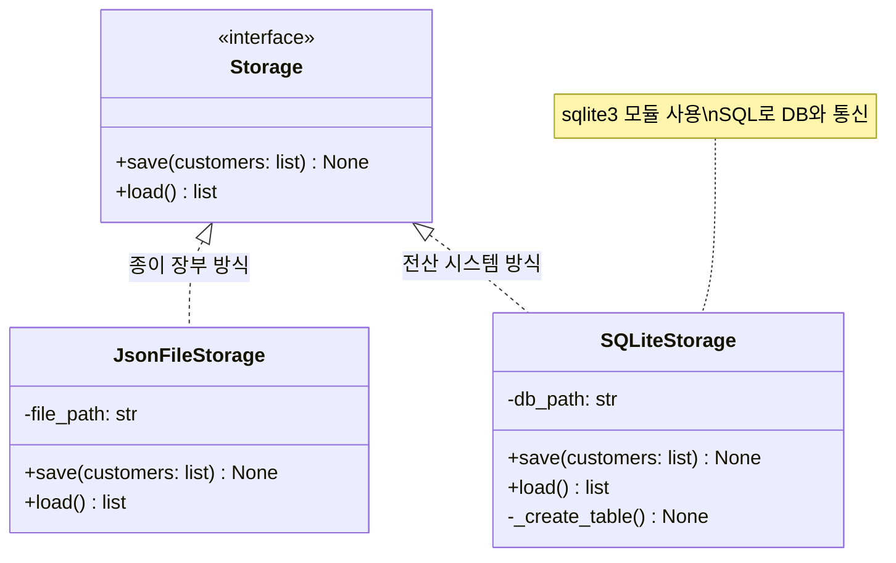

# 마이크로 세션: 099 — DB 저장 모듈(SQLiteStorage) 구현

> **세션 ID**: MS-PY101-099  
> **소요 시간**: 25분  
> **난이도**: medium  
> **청크 타입**: lab  
> **버전**: v2.1 (7섹션 구조)

---

## §1. 개요

> **Day 5 | PM | 세션 099/106**

### 🎯 학습 목표

이 세션이 끝나면, 수강생은 다음을 할 수 있습니다:

- `sqlite3` 모듈을 활용하여 고객 데이터를 SQLite 데이터베이스에 저장하고 불러오는 `SQLiteStorage` 클래스를 구현할 수 있다.
- 종이 장부 방식(JSON)과 전산 시스템 방식(DB)의 차이를 이해하고, 대용량 데이터 관리의 필요성을 설명할 수 있다.
- 파이썬 코드 내에서 필수 SQL 쿼리(CREATE TABLE, INSERT, SELECT, DELETE)를 실행하고 트랜잭션을 확정(commit)하는 패턴을 적용할 수 있다.

### 선행 세션 환기

바로 직전 세션(세션-098)에서 우리는 메모리의 한계를 극복하기 위해 `JsonFileStorage`라는 파일 저장 모듈을 만들었습니다. 프로그램이 종료되어도 데이터가 날아가지 않는 '영속성'을 처음으로 달성했죠. 그런데 한 가지 상상을 해 봅시다. 고객이 10명, 100명일 때는 텍스트 파일 하나로 충분합니다. 하지만 우리 서비스가 대박이 나서 고객이 100만 명, 1,000만 명이 되면 어떻게 될까요? 

`customers.json` 파일 하나에 100만 건의 데이터가 들어 있다면, "홍길동"이라는 고객 한 명을 찾기 위해 파일 전체를 처음부터 끝까지 다 읽어들여야 합니다. 마치 두꺼운 종이 장부를 첫 장부터 끝까지 한 장 한 장 넘기며 이름을 확인하는 것과 같은 엄청난 비효율이 발생하죠. 오늘은 이 한계를 완벽하게 극복해 줄 두 번째 저장소, 진짜 데이터베이스(DB)를 우리 시스템에 장착해 보는 시간입니다.

---

## §2. 핵심 개념 (+ 🗣️ 강사 대본 + Mermaid)

### 종이 장부의 한계 vs 전산 시스템의 도입

데이터를 다루는 방식을 두 가지로 비유해 볼 수 있습니다. JSON 파일 기반의 저장소는 **'종이 장부'**와 같습니다. 내용이 시간 순서대로 빽빽하게 적혀 있어서 한눈에 보기는 좋지만, 특정 데이터를 찾거나 수정하려면 장부 전체를 뒤져야 합니다.

반면 데이터베이스(DB)는 완벽하게 구축된 **'전산 시스템'**입니다. 여러분이 은행이나 병원에 가서 이름을 말하면 직원이 컴퓨터에 타이핑하고 0.001초 만에 고객 정보를 찾아내죠? 데이터베이스에는 '인덱스(색인)'라는 강력한 기술이 있어서 데이터가 100만 건이든 1,000만 건이든 검색 속도가 거의 일정하게 유지됩니다.

파이썬에는 놀랍게도 이 강력한 전산 시스템 엔진이 기본으로 내장되어 있습니다. 바로 `sqlite3`라는 모듈입니다. 복잡한 서버를 설치하거나 네트워크를 설정할 필요 없이, 단지 `import sqlite3` 한 줄을 적는 것만으로 파일 하나(`.db`)를 마치 거대한 데이터베이스 서버처럼 다룰 수 있게 해 줍니다.

🗣️ **강사 대본 (Instructor Script)**:

> 여러분, 앞서 JSON 파일로 데이터를 저장하는 데 성공하셨죠? 너무 잘하셨습니다. 그런데 여러분이 만든 프로그램이 입소문을 타서 전국구 서비스가 되었다고 상상해 보세요. 100만 명의 고객 데이터가 들어있는 텍스트 파일, 상상만 해도 컴퓨터가 헉헉댈 것 같지 않나요?
> 
> "홍길동 고객님 정보 좀 찾아주세요" 했을 때 종이 장부를 첫 페이지부터 넘기면 오늘 안에 못 찾을 수도 있습니다. 그래서 우리는 오늘 진짜 전산 시스템을 도입할 겁니다. 바로 데이터베이스(DB)입니다. 
> 
> 다행히 파이썬은 무거운 오라클이나 MySQL 같은 서버를 당장 설치하라고 요구하지 않아요. `sqlite3`라는 아주 작지만 강력한 내장형 데이터베이스를 기본 제공합니다. 스마트폰 앱이나 웹 브라우저 내부에서도 널리 쓰이는 표준 기술이죠. 오늘은 이 SQLite를 사용해서 우리의 `CustomerManager`에 진짜 DB 엔진을 달아보겠습니다.

### Mermaid 다이어그램: Storage 인터페이스와 DB 장착



---

## §3. 상세 내용

### Why — 왜 파일 대신 데이터베이스를 써야 하는가?

JSON이나 CSV 같은 파일 대신 데이터베이스를 사용하는 이유는 명확합니다.
1. **검색 속도 (인덱싱)**: DB는 데이터를 정렬하고 찾아보는 구조를 최적화하여 압도적인 검색 속도를 제공합니다.
2. **데이터 무결성**: 전화번호 자리에는 반드시 문자열만 들어오게 하거나, 이름은 절대 비워둘 수 없게(NOT NULL) 규칙을 강제할 수 있습니다.
3. **동시성 제어**: 여러 명이 동시에 파일에 글을 쓰면 데이터가 꼬이거나 날아갈 수 있습니다. DB는 이런 충돌을 알아서 안전하게 관리(트랜잭션)해 줍니다.

### What — SQLite와 SQL 기초

우리가 다룰 `sqlite3`는 파일(`.db`) 기반의 가벼운 데이터베이스입니다. 파이썬과 이 데이터베이스가 대화하려면 언어가 필요한데, 이 표준 언어를 **SQL(Structured Query Language)**이라고 부릅니다. 

초보자라면 다음 4가지 핵심 명령어(CRUD)만 알면 충분합니다.
- **C**reate: `INSERT INTO` (데이터 넣기)
- **R**ead: `SELECT` (데이터 조회하기)
- **U**pdate: `UPDATE` (데이터 수정하기)
- **D**elete: `DELETE` (데이터 삭제하기)
*(그리고 이 데이터를 담을 표(Table)를 만드는 `CREATE TABLE` 명령어가 추가로 필요합니다.)*

SQL은 문법이 영문법과 매우 비슷해서 직관적입니다. "customers 테이블에서 홍길동의 정보를 줘!"는 `SELECT * FROM customers WHERE name = '홍길동'`처럼 씁니다.

### How — sqlite3 모듈 사용 패턴 (3단계)

파이썬에서 `sqlite3`를 사용하는 패턴은 항상 정해져 있습니다. 은행 창구 업무와 비슷하죠.
1. **연결 (Connect)**: `conn = sqlite3.connect('파일.db')` - 은행 문을 열고 번호표를 뽑아 창구 직원(Connection)을 만납니다.
2. **실행 (Execute)**: `conn.execute('SQL문')` - 창구 직원에게 지시를 내립니다. (예: "이름 홍길동 등록해 주세요")
3. **확정 및 종료 (Commit & Close)**: `conn.commit()` 후 `conn.close()` - 거래 내용에 서명(Commit)하여 최종 승인하고, 창구를 떠납니다(Close). 

특히 데이터를 덮어쓰거나 수정할 때는 반드시 `commit()`을 호출해야만 디스크에 실제로 저장된다는 점을 주의해야 합니다. 

> ✅ **체크포인트**: 
> - 종이 장부(JSON)와 전산 시스템(DB) 비유를 이해하셨나요?
> - 파이썬에서 DB와 대화하기 위한 3단계 패턴 (연결 -> 실행 -> 확정/종료)을 기억하시나요?

---

## §4. 실습 가이드 (+ 🎙️ 실습 대본)

### 실습 목표

AI 에이전트의 도움을 받아 `Storage` 추상 클래스를 상속하는 `SQLiteStorage` 클래스를 구현합니다. 작성된 코드를 통해 실제 고객 데이터를 `customers.db`라는 DB 파일에 저장해 보고 정상적으로 작동하는지 확인합니다.

🎙️ **실습 가이드 대본 (Lab Guide)**:

> 자, 이제 여러분의 코드에 전산 시스템을 이식해 볼 시간입니다. 우리가 직접 SQL이라는 언어를 완벽하게 짜지 못해도 괜찮습니다. 우리에겐 강력한 AI 비서가 있으니까요.
> 
> Agent Manager 패널을 열어주세요. AI에게 "이전에 만든 `Storage` 인터페이스를 상속받아서, 파이썬 기본 `sqlite3` 모듈로 데이터를 저장하는 `SQLiteStorage` 클래스를 만들어줘"라고 요청해 보겠습니다. 
> 중요한 것은 만들어진 코드를 그냥 복사해서 붙여넣기만 하지 말고, `connect`, `execute`, `commit` 이 세 가지 핵심 패턴이 어디에 등장하는지 눈으로 꼭 확인하는 거예요. 같이 시작해 볼까요?

### 단계별 지시

| 단계 | 소요 시간 | 강사 지시사항 | 학습자 액션 | 예상 결과 |
|------|----------|--------------|------------|----------|
| 1 | 3분 | "Agent Manager에 프롬프트를 입력하세요" | 하단의 프롬프트를 복사하여 AI에게 전달 | `SQLiteStorage` 파이썬 코드 생성 |
| 2 | 3분 | "생성된 코드를 파일에 적용하세요" | `storage.py` 파일에 코드 복사 및 붙여넣기 | 에러 없이 클래스 복사 완료 |
| 3 | 5분 | "코드를 살펴보고 3단계 패턴을 찾으세요" | `save()`와 `load()` 메서드 분석 | `connect()`, `execute()`, `commit()` 위치 파악 |
| 4 | 4분 | "테스트 코드를 작성하고 실행하세요" | 하단 테스트 코드 실행 | 터미널에 저장/불러오기 성공 메시지 출력 |
| 5 | 2분 | "DB 파일이 생성되었는지 확인하세요" | 프로젝트 탐색기에서 `customers.db` 확인 | 프로젝트 폴더 내 `.db` 파일 생성됨 |

### [단계 1] AI에게 SQLiteStorage 구현 요청하기

Agent Manager 채팅창에 다음 프롬프트를 입력하세요:

```text
우리는 앞서 `Customer` 데이터 클래스와 `Storage` 추상 클래스를 만들었어. 
이번에는 파이썬 내장 sqlite3 모듈을 사용해서 DB에 고객 데이터를 저장하는 `SQLiteStorage` 클래스를 만들어줘.
1. `Storage`를 상속받아야 해.
2. 생성자(`__init__`)에서 `db_path`를 받고, 없으면 테이블을 생성하는 로직(`_create_table`)을 호출해줘.
3. 고객(name, phone, email)을 저장하는 `save()`와 불러오는 `load()`를 구현해줘.
4. save할 때는 기존 데이터를 모두 삭제(초기화)하고 다시 insert하는 방식으로 해줘.
5. SQL 인젝션 방지를 위해 execute()에서 `?` 플레이스홀더를 사용해줘.
```

### [단계 2~3] 생성된 코드 확인 및 분석

AI가 만들어준 코드의 핵심 부분을 들여다봅시다. 특히 `save()` 메서드 부분을 주목해 주세요.

```python
    def save(self, customers: list[Customer]) -> None:
        conn = sqlite3.connect(self._db_path)     # 1. 연결
        conn.execute("DELETE FROM customers")     # 기존 데이터 날리기 (심플하게 덮어쓰기 위해)
        for c in customers:
            # 2. 실행 (? 플레이스홀더 사용)
            conn.execute(
                "INSERT INTO customers (name, phone, email) VALUES (?, ?, ?)",
                (c.name, c.phone, c.email)
            )
        conn.commit()                             # 3. 확정 (도장 쾅!)
        conn.close()                              # 4. 종료
```

**⚠️ 주의할 점**: 값 부분에 들어가는 `?` 기호를 **플레이스홀더**라고 부릅니다. 값을 문자열에 직접 끼워 넣지 않고, `(c.name, c.phone, c.email)` 형태의 튜플로 넘겨주죠. 이는 해커들이 악의적인 SQL 문장을 집어넣는 'SQL 인젝션(Injection)' 해킹을 막기 위한 가장 기본적이고 필수적인 보안 조치입니다.

### [단계 4~5] 테스트 코드 실행

새로운 파이썬 파일(`test_sqlite.py`)을 만들고 아래 코드를 실행해 보세요.

```python
from customer import Customer
from storage import SQLiteStorage

# 1. 저장소 인스턴스 생성 (테이블이 없으면 자동 생성됨)
db = SQLiteStorage("test_customers.db")

# 2. 테스트 데이터 만들기
test_customers = [
    Customer(name="홍길동", phone="010-1111-2222", email="hong@test.com"),
    Customer(name="이순신", phone="010-3333-4444", email="lee@test.com")
]

# 3. 저장 및 불러오기
db.save(test_customers)
loaded_data = db.load()

for c in loaded_data:
    print(f"DB에서 불러온 고객: {c.name}, {c.phone}, {c.email}")
```

실행 후, 좌측 파일 탐색기에 `test_customers.db`라는 파일이 생겼는지 확인해 보세요! 성공입니다.

### 트러블슈팅 FAQ

| Q | A |
|---|---|
| `sqlite3.OperationalError: no such table: customers` 에러가 납니다. | `__init__` 메서드 안에서 테이블을 생성하는 `_create_table()` 함수를 호출하는 코드가 빠졌거나 오타가 있을 가능성이 높습니다. |
| `.db` 파일을 눌러봤는데 글자가 깨져 보여요! | 정상입니다. DB 파일은 사람이 읽으라고 만든 텍스트 파일(JSON)과 달리 기계가 빠르게 읽기 위한 이진(Binary) 형태입니다. DB 뷰어 확장 프로그램을 설치해야 제대로 보입니다. |
| `save()`를 불렀는데 다시 불러오면 데이터가 없어요. | 데이터를 `INSERT` 한 후에 `conn.commit()`을 빼먹지 않았는지 확인하세요! 확정 도장을 안 찍으면 데이터베이스에 반영되지 않습니다. |
| 여러 번 실행했더니 홍길동 데이터가 수십 개로 복사됐어요. | `save()` 메서드 시작 부분에 `conn.execute("DELETE FROM customers")` (기존 데이터 지우기) 로직이 잘 들어있는지 확인해 보세요. 이번 실습 구조에서는 전체 덮어쓰기 방식으로 구현했습니다. |

---


### 🎓 강사 노트 (Instructor Support)

- ⏱️ **타이밍**: 15:10 (25분, code)
- 🎯 **핵심 활동**: sqlite3 모듈 활용
- ⚠️ **강사 주의사항**: DB 브라우저 옵션 안내

## §5. 코드 및 명령어 모음

### SQLiteStorage 전체 구현 코드 예시

```python
import sqlite3
from storage import Storage
from customer import Customer

class SQLiteStorage(Storage):
    def __init__(self, db_path: str = "customers.db"):
        self._db_path = db_path
        self._create_table()

    def _create_table(self) -> None:
        conn = sqlite3.connect(self._db_path)
        conn.execute("""
            CREATE TABLE IF NOT EXISTS customers (
                name TEXT NOT NULL,
                phone TEXT NOT NULL,
                email TEXT NOT NULL
            )
        """)
        conn.commit()
        conn.close()

    def save(self, customers: list[Customer]) -> None:
        conn = sqlite3.connect(self._db_path)
        conn.execute("DELETE FROM customers")  # 기존 데이터 초기화
        for c in customers:
            conn.execute(
                "INSERT INTO customers (name, phone, email) VALUES (?, ?, ?)",
                (c.name, c.phone, c.email)
            )
        conn.commit()
        conn.close()
        print(f"✅ {len(customers)}명의 고객 데이터를 DB에 저장했습니다.")

    def load(self) -> list[Customer]:
        conn = sqlite3.connect(self._db_path)
        # fetchall()은 조회된 모든 데이터를 리스트 안의 튜플로 반환합니다.
        rows = conn.execute("SELECT name, phone, email FROM customers").fetchall()
        conn.close()
        return [Customer(name=r[0], phone=r[1], email=r[2]) for r in rows]
```

### 핵심 SQL 구문 정리

- `CREATE TABLE IF NOT EXISTS 테이블명`: 테이블이 존재하지 않을 때만 새로 만듭니다. (에러 방지용)
- `INSERT INTO 테이블명 (컬럼1, 컬럼2) VALUES (?, ?)`: 지정한 컬럼에 새로운 데이터(행)를 추가합니다. `?` 플레이스홀더를 사용합니다.
- `SELECT 컬럼명 FROM 테이블명`: 테이블에서 해당 컬럼의 데이터들을 가져옵니다.
- `DELETE FROM 테이블명`: 테이블에 있는 모든 데이터를 삭제합니다. (테이블 자체를 없애는 `DROP TABLE`과는 다릅니다.)

---

## §6. 요약

### 핵심 학습 포인트

이번 세션에서는 파일 기반 저장소의 한계를 극복하기 위해 `sqlite3` 모듈을 사용하여 진짜 데이터베이스 저장 모듈을 만들었습니다. 기억할 세 가지는 다음과 같습니다.
1. **종이 장부 vs 전산 시스템 비유**: 대용량 데이터를 다루기 위해서는 순차 검색 방식(JSON)이 아닌 인덱스 검색 기반의 전산 시스템(DB) 도입이 필수입니다.
2. **sqlite3의 3단계 패턴**: `connect()`로 데이터베이스와 연결하고, `execute()`로 SQL 명령을 실행하며, `commit()`으로 변경사항을 확정합니다.
3. **플레이스홀더와 보안**: 데이터를 저장할 때 `?` 기호를 사용하여 튜플 형태로 값을 전달해야 SQL 인젝션 해킹을 막을 수 있습니다.

### 다음 세션 예고

이제 우리 앞에는 저장소가 두 개 있습니다. 하나는 파일(`JsonFileStorage`), 다른 하나는 데이터베이스(`SQLiteStorage`). 놀랍게도 이 두 저장소는 완전히 동일한 작동 방식(`save`, `load` 메서드)을 약속하는 `Storage` 인터페이스를 따르고 있습니다. 다음 세션(100)에서는 `CustomerManager` 코드를 단 한 줄도 수정하지 않은 채, 플러그만 뽑았다가 다른 곳에 꽂듯 저장소를 쓱 교체해 볼 겁니다. 여러분이 앞서 배운 객체지향과 의존성 주입(DI)의 진짜 마법이 펼쳐집니다!

### 브릿지 노트

> "여러분, 축하합니다. 여러분의 프로그램에 진짜 DB 엔진이 달렸습니다. 이제 100만 명의 고객 데이터가 들어와도 눈 하나 깜짝하지 않을 거예요. 그런데 문득 궁금하지 않으신가요? 어제 우리가 열심히 짠 `CustomerManager` 코드는 이 DB의 존재를 알까요? 모를까요? 다음 세션에서 이 두 부품이 어떻게 우아하게 조립되는지, 파이썬 아키텍처의 꽃인 '의존성 주입'의 위력을 직접 확인해 보겠습니다!"

---

## §7. 참고 자료

### 3-Source 출처

- **Source A (로컬 참고자료)**: 「8 코딩.pdf」 §8.14 데이터 영속화 - SQLite 기본 명령어 및 연동 패턴
- **Source B (NotebookLM)**: `day5_notebooklm.md` - 파일/DB 저장 모듈의 구조적 차이 비교, 종이 장부 vs 전산 시스템 비유
- **Source C (Deep Research)**: `day5_deep_research.md` - 파이썬 SQLite 내장 데이터베이스 기초 가이드

### 추가 학습 자료

- [SQLite 공식 문서](https://www.sqlite.org/docs.html): SQLite 데이터베이스의 아키텍처와 SQL 문법 가이드
- [Python 공식 문서 - sqlite3](https://docs.python.org/ko/3/library/sqlite3.html): 파이썬 표준 라이브러리 `sqlite3` 모듈의 세부 사용법과 트랜잭션 관리
- [DB Browser for SQLite](https://sqlitebrowser.org/): `.db` 파일을 시각적으로 열어보고 SQL을 연습할 수 있는 무료 오픈소스 도구

### 강사 노트

> 💡 **강사 노트**: 초보자들이 DB를 처음 접할 때 가장 낯설어하는 부분이 'SQL 언어를 또 배워야 하나?'라는 두려움입니다. 이번 세션에서는 SQL 쿼리 작성의 완벽함보다는, 파이썬에서 DB와 통신하는 3단계 패턴(연결-실행-확정)을 이해하는 데 초점을 맞춰 주세요. 특히 데이터를 변경하고도 `commit()`을 빼먹어 적용이 안 되는 실수가 가장 빈번하게 발생하므로, '서류에 도장 쾅!' 비유를 사용해 `commit()`의 중요성을 강조해 주시면 좋습니다.

---

## ✅ 세션 완료 체크리스트 (강사용)

- [ ] §1~§7 모든 섹션이 빠짐없이 작성되었는가?
- [ ] 🗣️ 강사 대본과 🎙️ 실습 가이드 대본이 구어체로 충실하게 포함되었는가?
- [ ] 종이 장부(JSON)와 전산 시스템(DB) 비유가 §2에 명확히 설명되었는가?
- [ ] Storage 인터페이스와 저장소 클래스 구조를 보여주는 Mermaid 다이어그램이 추가되었는가?
- [ ] SQL 인젝션 방지를 위한 `?` 플레이스홀더 사용법이 강조되었는가?
- [ ] 다음 세션(의존성 주입)과 자연스럽게 이어지는 브릿지 노트가 있는가?

---

**🔗 선행 세션**: [세션-098] 파일 저장 모듈(FileStorage) 구현 (필수)  
**🔗 후행 세션**: [세션-100] DI 적용 실습 (v4 저장소 교체 테스트)

---

*작성 일시: 2026-02-25*  
*작성 에이전트: Antigravity*  
*교안 구조: 7섹션 (A0 팀 공통 표준)*