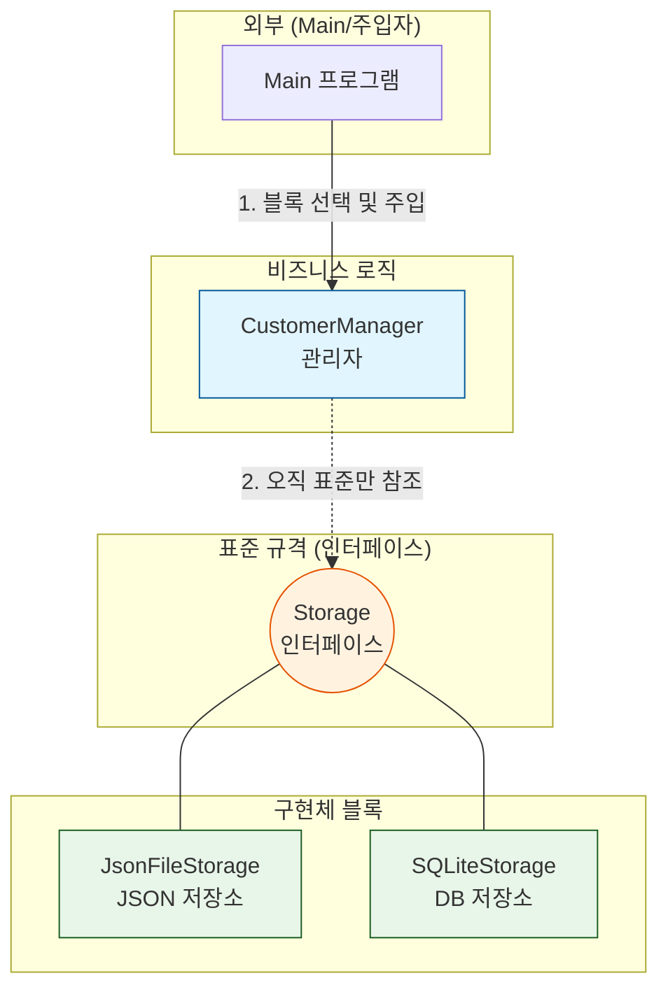
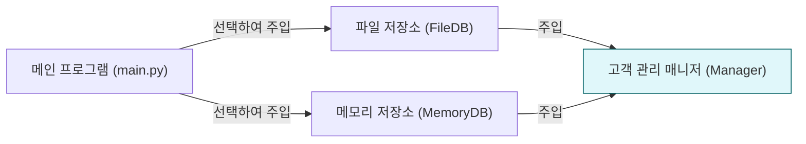

# 마이크로 세션 100: DI 적용 실습 (저장소 교체 테스트)

> **세션 ID**: MS-PY101-100  
> **소요 시간**: 20분  
> **난이도**: medium  
> **청크 타입**: lab  
> **버전**: v2.1 (7섹션 구조)

---

## §1. 개요

> **Day 5 | PM | 세션 100/106**

### 🎯 학습 목표

이 세션이 끝나면, 수강생은 다음을 할 수 있습니다:

- 비즈니스 로직 수정 없이 데이터 저장 방식을 JSON 파일에서 SQLite 데이터베이스로 교체할 수 있다.
- 의존성 주입(DI, Dependency Injection) 패턴이 실제로 어떻게 작동하는지 코드로 검증할 수 있다.
- 변경에 유연한 아키텍처가 주는 유지보수의 이점을 설명할 수 있다.

### 선행 세션 환기

지난 세션들에서 우리는 멋진 재료들을 만들었습니다. 세션 097에서는 `CustomerManager`에 '저장소'라는 외부 블록을 꽂을 수 있는 빈 구멍을 하나 뚫어두었죠. 그리고 세션 098과 099를 거치며 텍스트 파일로 저장하는 `JsonFileStorage` 블록과, 데이터베이스에 저장하는 `SQLiteStorage` 블록을 차례로 완성했습니다. 오늘 세션은 이 재료들을 하나로 조립하는 시간입니다. 코드를 단 한 줄도 고치지 않고 시스템의 핵심 기능을 통째로 바꾸는 마법을 직접 경험해 볼 차례입니다.

---

## §2. 핵심 개념 (+ 🗣️ 강사 대본 + Mermaid)

### 레고 블록과 나사 구멍

프로그래밍에서 의존성 주입(DI)을 가장 쉽게 이해하는 방법은 레고 블록을 떠올리는 것입니다. 레고의 핵심은 모든 블록의 돌기와 구멍 크기가 완벽하게 표준화되어 있다는 점입니다. 빨간 블록이든 파란 블록이든, 바퀴 모양이든 날개 모양이든 돌기 크기만 같다면 어디든 끼워 맞출 수 있습니다.

우리 코드에서 `Storage`라는 기반 클래스는 바로 이 '표준 돌기 규격' 역할을 합니다. `save()`와 `load()`라는 표준 인터페이스만 지킨다면 어떤 저장소 블록이든 상관없습니다. 그리고 `CustomerManager`는 이 규격에 맞는 블록이라면 무엇이든 받아들이는 빈 구멍을 하나 가지고 있습니다. 구멍에 맞는 블록을 바깥에서 끼워 넣어 주는 행위, 이것이 바로 의존성 주입입니다.

🗣️ **강사 대본 (Instructor Script)**:

> 여러분, 지난 시간에 만든 두 개의 저장소 블록을 기억하시죠? 하나는 데이터를 파일에 적어두는 기능이고, 다른 하나는 멋진 데이터베이스에 기록하는 기능입니다. 그리고 `CustomerManager`에는 어떤 저장소를 쓸지 결정하지 않고 비워둔 나사 구멍이 하나 있습니다.
> 
> 오늘은 드디어 이 나사 구멍에 여러분이 만든 블록을 끼워 볼 겁니다. JSON 파일 블록을 끼우면 데이터가 파일에 저장되고, DB 블록을 끼우면 데이터베이스에 저장됩니다. 놀라운 점은, 이 과정에서 `CustomerManager`의 코드는 단 한 글자도 바꾸지 않는다는 거예요. 시스템의 두뇌 역할을 하는 코드를 건드리지 않고도, 손발에 해당하는 부품을 자유자재로 갈아 끼울 수 있습니다. 이것이 바로 좋은 아키텍처가 주는 진정한 위력입니다.

### Mermaid 다이어그램



---


### 🎨 추가 시각화 (Visualization Packet)

**의존성 주입 (Dependency Injection) 기본 패턴**

관리자(Manager) 내부에서 저장소를 하드코딩하지 않고, 외부(`main.py`)에서 필요한 저장소를 꽂아 넣어주는 유연한 설계입니다.



## §3. 상세 내용

### Why: 왜 코드를 안 바꾸고 부품만 바꾸는가?

소프트웨어 개발에서 가장 비용이 많이 드는 작업은 '새로운 기능을 만드는 것'이 아니라 '기존 코드를 고치는 것'입니다. 기존 코드를 고치다 보면 멀쩡하게 작동하던 다른 기능이 망가지는 경우가 허다합니다.

만약 `CustomerManager`가 내부에서 직접 파일을 열고 쓰는 코드를 가지고 있었다면 어떨까요? 나중에 데이터를 클라우드에 저장해 달라는 고객의 요청이 들어오면, 우리는 `CustomerManager`의 코드를 뜯어고쳐야 합니다. 하지만 외부에서 저장소 부품을 주입받는 DI 구조라면 이야기가 다릅니다. 클라우드용 부품 하나만 새로 만들어서 끼워주면 끝입니다. 핵심 로직은 전혀 다치지 않고 보호됩니다. 이것이 OCP(개방 폐쇄 원칙)의 핵심입니다.

### What: 의존성 주입(DI)의 실체

단어가 조금 어렵게 들릴 수 있습니다. '의존성'이라는 것은 내 코드가 작동하기 위해 필요한 다른 부품을 뜻합니다. '주입'은 그 부품을 내 안에서 직접 만들지 않고 밖에서 밀어 넣어 준다는 뜻입니다.

바리스타를 상대로 비유해 볼까요. 바리스타가 커피를 내리려면 원두가 필요합니다(의존성). 바리스타가 직접 밭을 일궈서 커피 콩을 재배해 사용한다면 결합도가 너무 높은 겁니다. 좋은 구조는 바리스타가 원두 납품업자에게서 원두를 건네받아(주입) 커피를 내리는 것입니다. 과테말라 원두를 주면 과테말라 커피가 나오고, 에티오피아 원두를 주면 에티오피아 커피가 나옵니다. 바리스타의 커피 내리는 기술(로직)은 변함이 없죠.

### How: 코드로 어떻게 구현하는가?

구현 방법은 생각보다 훨씬 단순합니다. 객체를 생성하는 `__init__` 메서드의 매개변수로 필요한 부품을 받아오면 됩니다. 파이썬에서는 데이터 타입을 명시해서 어떤 규격의 부품이 들어와야 하는지 힌트를 줄 수 있습니다.

`def __init__(self, storage: Storage):`

이 한 줄이 모든 마법의 시작입니다. `Storage` 규칙을 따르는 그 어떤 클래스의 인스턴스라도 이 매개변수를 통해 들어올 수 있게 되는 것입니다.

> ✅ **체크포인트**: 여기까지 이해하셨는지 점검해 보세요.
> - 의존성 주입에서 '의존성'이 뜻하는 바를 바리스타의 비유로 설명할 수 있나요?
> - 코드를 수정하지 않고 부품을 바꿀 때 얻는 가장 큰 장점은 무엇인가요?

---


### 📊 참고 표 (Visual Specs)

**의존성 주입(DI, Dependency Injection)의 장점**

| 특징 | DI 사용 안 함 (강한 결합) | DI 사용 (느슨한 결합) |
|:---|:---|:---|

## §4. 실습 가이드 (+ 🎙️ 실습 대본)

### 실습 목표

이 실습에서는 `CustomerManager`에 서로 다른 두 개의 저장소 블록을 차례로 주입해 보면서, 핵심 로직의 변경 없이 저장 방식이 교체되는 과정을 눈으로 확인합니다.

🎙️ **실습 가이드 대본 (Lab Guide)**:

> 자, 이제 우리가 며칠 동안 정성 들여 만든 블록들을 조립할 시간입니다. 화면에 에디터를 열고 코드를 준비해 주세요.
> 
> 코드를 작성하기 전에 상상해 봅시다. 만약 여러분이 기존의 절차적 프로그래밍 방식으로 코드를 짰다면, 파일 저장을 DB 저장으로 바꾸기 위해 수십 줄의 코드를 지우고 다시 써야 했을 겁니다. 하지만 오늘은 다릅니다. 우리는 딱 한 줄, 객체를 생성할 때 넣어주는 블록의 이름만 바꿀 겁니다. 정말 그것만으로 저장소가 텍스트 파일에서 데이터베이스로 완벽하게 교체되는지 직접 확인해 보세요. 짜릿한 경험이 될 겁니다. 자, 1단계부터 천천히 따라와 주세요.

### 단계별 지시

| 단계 | 소요 시간 | 강사 지시사항 | 학습자 액션 | 예상 결과 |
|------|----------|--------------|------------|----------|
| 1 | 5분 | "먼저 JSON 저장소를 조립해 봅시다." | `JsonFileStorage`를 생성하여 Manager에 주입 후 데이터 저장 | `customers.json` 파일 생성 |
| 2 | 5분 | "이번에는 DB 저장소로 갈아 끼워 보세요." | 주입하는 코드만 `SQLiteStorage`로 변경 후 실행 | `customers.db` 파일 생성 |
| 3 | 5분 | "생성된 파일들을 직접 열어 확인해 보세요." | 에디터로 두 개의 파일 내용 확인 | 두 저장소 모두 데이터 정상 기록 |
| 4 | 5분 | "매니저 코드를 열고 변경된 곳이 있는지 보세요." | `CustomerManager` 클래스 소스코드 감상 | 코드 변경점이 0개임을 확인 |

**[단계 1] JSON 파일 저장소 주입하기**

새로운 파이썬 스크립트 파일을 만들고, 우리가 작성했던 모듈들을 불러옵니다. 첫 번째 테스트는 JSON 저장소를 주입하는 것입니다. 파일 저장소 객체를 먼저 만들고, 그것을 매니저에게 넘겨줍니다.

```python
from storage import JsonFileStorage
from manager import CustomerManager
from models import Customer

# 1. JSON 저장소 블록을 만듭니다.
file_storage = JsonFileStorage("customers.json")

# 2. 바리스타(Manager)에게 원두(Storage)를 주입합니다.
manager = CustomerManager(file_storage)

# 3. 데이터를 입력하고 저장합니다.
manager.add(Customer("홍길동", "010-1111-2222", "hong@mail.com"))
manager.add(Customer("김영희", "010-3333-4444", "kim@mail.com"))
manager.save_all()

print("JSON 파일에 저장이 완료되었습니다.")
```

코드를 실행하고 프로젝트 폴더에 `customers.json` 파일이 생겼는지 확인하세요.

**[단계 2] DB 저장소로 부품 교체하기**

이제 기획팀에서 연락이 왔습니다. "고객 데이터가 너무 많아져서 파일 말고 DB에 저장해 주세요"라고 하네요. 옛날 같았으면 야근 확정이지만, 지금은 코드를 한 줄만 수정하면 됩니다.

```python
from storage import SQLiteStorage
from manager import CustomerManager
from models import Customer

# 1. 이번에는 DB 저장소 블록을 만듭니다.
db_storage = SQLiteStorage("customers.db")

# 2. 바리스타에게 새로운 원두(DB Storage)를 주입합니다.
manager2 = CustomerManager(db_storage)

# 3. 데이터를 입력하고 저장합니다. 매니저 사용법은 완벽히 똑같습니다.
manager2.add(Customer("이순신", "010-7777-8888", "lee@mail.com"))
manager2.save_all()

print("데이터베이스에 저장이 완료되었습니다.")
```

**[단계 3] 저장 결과물 직접 확인하기**

왼쪽의 탐색기 창을 열어보세요. `customers.json`과 `customers.db` 두 개의 파일이 사이좋게 놓여 있을 겁니다. `customers.json` 파일을 더블클릭해서 열어보세요. 텍스트 형태로 우리가 입력한 홍길동과 김영희 데이터가 예쁘게 들어있는 것을 볼 수 있습니다.

**[단계 4] 코드 변경점 제로(0) 감상하기**

이제 가장 중요한 시간입니다. 여러분이 작성했던 `CustomerManager` 클래스 코드를 열어보세요. 그 안을 아무리 살펴봐도 JSON이라는 단어나 SQLite라는 단어는 보이지 않을 겁니다. 매니저는 그저 `self._storage.save()`라고 외칠 뿐입니다. 외부 환경이 아무리 요동쳐도, 우리의 핵심 로직은 평온하게 자기 할 일만 합니다. 이 감각을 꼭 기억해 두세요.

### 트러블슈팅 FAQ

| Q | A |
|---|---|
| DB 파일이 열리지 않고 깨진 글씨만 보여요. | 정상입니다. SQLite 데이터베이스 파일은 일반 텍스트가 아닌 바이너리 형식으로 저장됩니다. 내용을 보려면 별도의 DB 뷰어 프로그램이 필요합니다. |
| `TypeError: __init__() missing 1 required positional argument` 에러가 나요. | `CustomerManager`를 만들 때 저장소 블록을 넣어주지 않아서 생기는 오류입니다. 반드시 `CustomerManager(file_storage)` 형태로 부품을 주입해 주세요. |
| JSON 파일에 한글이 `\ud64d` 처럼 이상하게 나와요. | `json.dump()`를 사용할 때 `ensure_ascii=False` 옵션을 주지 않으면 생기는 현상입니다. 프로그램 작동에는 문제가 없지만 읽기 불편하다면 저장소 코드를 수정해 보세요. |
| 두 저장소를 동시에 쓸 수는 없나요? | 물론 가능합니다. 매니저 객체를 두 개 만들어서 하나는 파일용, 하나는 DB용으로 쓰면 됩니다. 혹은 두 군데 모두 저장하는 새로운 저장소 블록을 만들어 주입할 수도 있습니다. |

> ✅ **체크포인트**: `customers.json` 파일과 `customers.db` 파일이 모두 생성되었나요? 만약 생겼다면, 여러분은 성공적으로 DI 아키텍처를 구현해 낸 것입니다.

---


### 🎓 강사 노트 (Instructor Support)

- ⏱️ **타이밍**: 15:35 (20분, lab)
- 🎯 **핵심 활동**: File↔SQLite 교체 체험
- ⚠️ **강사 주의사항**: 🎉 관통 프로젝트 최종 진화!


### 📋 실습 설계 보강 (Lab Packet)

**세션 100 실습 설계 보강**

DI 적용 실습 (v4 저장소 교체 테스트)
- **3-Stage Example Set**
  - 기본: CustomerManager에 FileStorage 주입 → 데이터 저장/로드 테스트
  - 변형: 한 줄 변경으로 SQLiteStorage로 교체 → 동일 기능 동작 확인
  - 실수 해결: "저장은 되는데 로드가 안 돼요" → save/load 메서드 인터페이스 불일치
- **난이도 예측**: DI 패턴의 "교체 가능성"을 체감하는 것이 핵심
- **타이밍 가이드**: FileStorage 주입 테스트 5분 | SQLiteStorage 교체 5분 | 결과 비교 5분 | 정리 5분
- **심리적 장벽**: "의존성 주입이 뭔지 아직도 잘 모르겠어요"
- **자가 점검**:
  - [ ] `CustomerManager(FileStorage())`와 `CustomerManager(SQLiteStorage())`가 모두 동작하는가?
  - [ ] 저장소를 교체할 때 CustomerManager 코드 자체는 변경하지 않았는가?
  - [ ] DI를 "교체 가능한 타이어" 비유로 설명할 수 있는가?

## §5. 코드 및 명령어 모음

### 메인 실행 스크립트 모음

**패턴 1: 파일 저장소 주입**
```python
# 파일 저장소 주입 패턴
storage = JsonFileStorage("data.json")
app = CustomerManager(storage)
app.save_all()
```

**패턴 2: 데이터베이스 저장소 주입**
```python
# DB 저장소 주입 패턴
storage = SQLiteStorage("data.db")
app = CustomerManager(storage)
app.save_all()
```

### 아키텍처 핵심: `CustomerManager`의 내부 (참고용)

```python
class CustomerManager:
    # 밖에서 부품(storage)을 받아옵니다.
    def __init__(self, storage: Storage):
        self._customers = []
        self._storage = storage  # 받아온 부품을 장착합니다.

    # 저장 방식은 부품에게 전적으로 맡깁니다.
    def save_all(self):
        self._storage.save(self._customers)
```

이 코드가 바로 우리가 실습 내내 한 번도 고치지 않았던 변함없는 핵심 로직입니다.

---

## §6. 요약

### 핵심 학습 포인트

이번 실습을 통해 우리는 설계의 위대함을 직접 체험했습니다. 기억해야 할 세 가지 핵심입니다. 첫째, 의존성 주입(DI)은 필요한 부품을 객체 내부에서 직접 만들지 않고 밖에서 넣어주는 기법입니다. 둘째, 이 패턴을 사용하면 비즈니스 핵심 로직 코드를 단 한 글자도 수정하지 않고 저장 방식을 교체할 수 있습니다. 셋째, 인터페이스(Storage)라는 표준 규격을 지키는 한, 앞으로 어떤 새로운 저장 방식이 등장하더라도 시스템은 유연하게 대처할 수 있습니다.

### 다음 세션 예고

놀랍게도 벌써 파이썬 기초 과정의 마지막을 향해 가고 있습니다. 아주 단순한 한 덩어리의 코드에서 시작해서, 함수로 쪼개고, 클래스로 묶고, 오늘 DI 아키텍처까지 도달했습니다. 다음 세션에서는 우리가 5일 동안 거쳐온 이 엄청난 진화의 과정을 한눈에 되돌아보는 총정리 시간을 갖겠습니다.

### 브릿지 노트

> "여러분, 정말 고생 많으셨습니다. 방금 여러분이 성공시킨 이 코드는 현업의 시니어 개발자들이 매일같이 고민하며 작성하는 엔터프라이즈급 아키텍처의 축소판입니다. 처음에는 함수 하나 만드는 것도 벅찼는데, 이제는 시스템의 뼈대를 설계하고 부품을 갈아 끼우는 경지에 올랐습니다. 스스로에게 박수를 쳐주셔도 좋습니다. 다음 세션에서 우리가 얼마나 멀리 걸어왔는지 그 발자취를 함께 되돌아보겠습니다."

---

## §7. 참고 자료

### 3-Source 출처

- **Source A (로컬 참고자료)**: `8 코딩.pdf` (DI 패턴의 이론적 배경과 구조, 인터페이스 기반 프로그래밍 가이드)
- **Source B (NotebookLM)**: `day5_notebooklm.md` (DI 적용 저장소 교체 실습 워크플로우 및 레고 블록 비유)
- **Source C (Deep Research)**: `day5_deep_research.md` (Storage 인터페이스 패턴 및 데이터 영속화 아키텍처 설계)

### 추가 학습 자료

- SOLID 원칙 가이드: 개방 폐쇄 원칙(OCP)과 의존성 역전 원칙(DIP)에 대한 심화 설명
- 파이썬 타입 힌팅: `storage: Storage`와 같이 타입을 강제하여 안전성을 높이는 기법 가이드

### 강사 노트

> 💡 **강사 노트**: 수강생들이 의존성 주입을 단순히 '변수에 값을 넣는 것' 정도로 가볍게 여길 수 있습니다. 이 과정의 핵심은 '코드를 고치지 않는다는 사실'에 있으므로, 실습 4단계에서 반드시 `CustomerManager` 코드를 눈으로 직접 확인하도록 유도해 주세요. "야근을 피하는 방법"과 같은 실무적인 비유를 섞어주시면 집중도가 훨씬 높아집니다.

---

## ✅ 세션 완료 체크리스트 (강사용)

- [x] §1~§7 모든 섹션이 충실하게 작성되었는가?
- [x] 레고 블록과 나사 구멍 비유가 §2에 명확히 포함되었는가?
- [x] v4 아키텍처 다이어그램(Mermaid)이 삽입되었는가?
- [x] JSON과 SQLite 저장소 교체 실습이 4단계로 구체화되었는가?
- [x] 트러블슈팅 FAQ가 4개 이상 포함되었는가?
- [x] 코드 변경 없이 부품이 교체된다는 DI의 핵심 가치가 강조되었는가?
- [x] 3-Source 팩트 패킷이 §7에 적절히 반영되었는가?
- [x] 다음 세션(101 진화 과정 총정리) 브릿지 노트가 포함되었는가?

---

**🔗 선행 세션**: [세션-099] DB 저장 모듈(SQLiteStorage) 구현 (필수)  
**🔗 후행 세션**: [세션-101] 고객관리 프로그램 진화 과정 총정리

---

*작성 일시: 2026-02-25*  
*작성 에이전트: Sisyphus-Junior*  
*교안 구조: 7섹션 (A0 팀 공통 표준)*