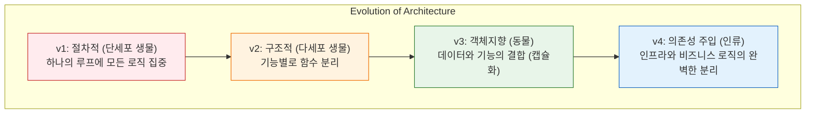

# 마이크로 세션: 101 — 고객관리 프로그램 진화 과정 총정리

> **세션 ID**: MS-PY101-101  
> **소요 시간**: 25분  
> **난이도**: low  
> **청크 타입**: narrative  
> **버전**: v2.1 (7섹션 구조)

---

## §1. 개요

> **Day 5 | PM | 세션 101/106**

이 세션은 5일간 이어져 온 "AI-native 파이썬 기초" 과정의 가장 중요한 성과인 고객관리 프로그램의 진화 과정을 한눈에 되돌아보는 시간이에요. Day 4 아침에 처음 만들었던 거대한 스파게티 코드가 어떻게 모듈화되고, 객체지향을 거쳐, 최종적으로 외부 주입(DI)이 가능한 아키텍처로 변모했는지 총정리합니다. 이 과정을 통해 수강생들은 프로그래밍 패러다임의 거대한 흐름을 자신의 코드로 직접 증명해 내는 경험을 완성하게 됩니다.

### 🎯 학습 목표

이 세션이 끝나면 수강생은 다음을 할 수 있어요:

- v1(절차적)부터 v4(DI+아키텍처)까지의 진화 과정을 설명할 수 있습니다
- 각 패러다임 전환 단계에서 어떤 핵심적인 프로그래밍 문제를 해결했는지 비교할 수 있습니다
- 코드를 바라보는 관점이 "어떻게(How) 동작하는가"에서 "무엇(What)을 하는가"로 변화했음을 체감할 수 있습니다

### 선행 세션 환기

이 세션은 앞서 진행된 세션 100(DI 적용 실습)까지의 모든 실습이 완료된 상태에서 진행됩니다. 수강생들은 이미 JSON 파일과 SQLite DB를 오가며 저장소를 교체하는 마법 같은 경험을 마쳤습니다. 이제 그 경험들을 하나의 선으로 연결하여 전체적인 서사를 완성할 차례입니다.

---

## §2. 핵심 개념 (+ 🗣️ 강사 대본 + Mermaid)

### 비유 — 단세포 생물에서 도구를 사용하는 인류까지

우리 프로그램의 진화는 생물의 진화와 놀랍도록 닮아 있어요. 코드가 길어지고 복잡해짐에 따라, 생존을 위해 자연스럽게 구조를 나누고 분화하는 과정을 거쳤죠. 이 비유를 통해 각 버전의 특징을 직관적으로 이해할 수 있습니다.

🗣️ **강사 대본 (Instructor Script)**:

> 여러분, 5일간의 대장정이 거의 끝나가고 있습니다. 잠시 마우스를 놓고 우리가 걸어온 길을 돌아볼까요? Day 4 아침에 처음 만들었던 고객관리 프로그램 첫 번째 버전을 기억하시나요? `while True:` 안에 모든 코드가 한 덩어리로 뭉쳐 있던 그 끔찍한 스파게티 코드 말입니다. 그때의 코드와 방금 전 여러분이 완성한 코드를 비교하면, 아마 같은 프로그램이라고 믿기 어려울 거예요. 여러분은 정말 먼 길을 오셨습니다.
>
> 우리 프로그램의 진화 과정은 생물의 진화와 똑같습니다.
>
> **v1은 단세포 생물이었어요.** 하나의 거대한 `while` 루프 안에 모든 기능이 뒤섞여 있었죠. 먹고, 움직이고, 번식하는 모든 일이 하나의 세포 안에서 일어났습니다. 아주 단순하지만, 조금만 코드가 길어져도 유지보수가 불가능해지는 치명적인 약점이 있었습니다.
>
> **v2는 다세포 생물입니다.** 코드가 너무 길어지자 우리는 기능을 쪼개기 시작했어요. '고객 추가하는 함수', '고객 조회하는 함수'처럼 세포들이 역할에 맞게 분화되었죠. 코드를 재사용할 수 있게 되었지만, 여전히 데이터와 함수가 따로 노는 한계가 있었습니다.
>
> **v3는 장기를 가진 동물로 진화했습니다.** 따로 놀던 데이터와 함수를 하나의 주머니에 담아 `Customer`라는 심장과 `CustomerManager`라는 뇌를 만들었죠. 이것이 바로 클래스와 객체지향입니다. 캡슐화라는 세포막 덕분에 데이터가 안전하게 보호되기 시작했습니다.
>
> **마지막 v4는 도구를 사용하는 인류입니다.** 장기만으로는 한계가 있음을 깨닫고, 외부의 도구 즉 `Storage`를 만들어 사용하게 되었어요. 파일에 저장하든 데이터베이스에 저장하든, 언제든지 도구를 교체할 수 있는 완벽한 진화를 이뤄낸 겁니다.

### Mermaid 다이어그램



이 다이어그램은 5일 동안 우리가 만든 프로그램이 어떻게 복잡성을 극복하며 진화했는지 보여주는 전체 지형도예요. 이 진화의 핵심 키워드는 바로 **"분리"**입니다. 뒤섞인 것을 나누고, 나눈 것을 보호하고, 보호한 것을 교체 가능하게 만드는 위대한 과정이었습니다.

---

## §3. 상세 내용

### Why — 왜 진화 과정을 총정리해야 하는가?

하나하나의 문법과 패턴을 배울 때는 나무만 보게 됩니다. 함수를 만들고, 클래스를 캡슐화하고, 인터페이스를 상속받는 작업들은 그 순간에는 어렵고 복잡하게만 느껴질 수 있어요. 하지만 전체 과정을 하나의 타임라인으로 펼쳐놓고 보면, "아, 코드가 복잡해지는 것을 막기 위해 인류가 이런 발명품들을 만들어냈구나"라는 깨달음을 얻게 됩니다. 이 총정리 시간은 파편화된 지식들을 하나의 단단한 아키텍처적 사고방식으로 엮어주는 핵심 접착제 역할을 합니다.

### What — 진화의 4단계 패러다임 비교

각 버전이 어떤 패러다임을 대변하고 있으며, 무엇을 해결했는지 명확히 비교해야 합니다.

| 진화 단계 | 패러다임 | 코드의 특징 | 해결한 문제 | 남겨진 한계 |
|-----------|---------|-------------|-------------|------------|
| **v1** | 절차적 프로그래밍 | 전역 변수 + 거대한 `while` 루프 | 가장 빠르고 단순한 구현 | 코드 재사용 불가, 엉키기 쉬움 |
| **v2** | 구조적 프로그래밍 | 기능별 함수 모듈화 | 중복 코드 제거, 가독성 향상 | 데이터와 함수가 분리되어 관리 어려움 |
| **v3** | 객체지향(OOP) | 클래스, 캡슐화, 상속 | 데이터 보호, 기능과 데이터의 결합 | 외부 시스템(파일/DB) 변경 시 로직 수정 필요 |
| **v4** | 의존성 주입(DI) | 인터페이스 분리, 외부 주입 | 비즈니스 로직과 인프라의 완전한 분리 | 초기 설계가 다소 복잡함 |

### How — 코드의 진화를 어떻게 설명할 것인가?

🗣️ **강사 대본 (Instructor Script)**:

> 여러분, 이 4단계를 관통하는 하나의 중요한 질문이 있습니다. 바로 "코드가 변경되었을 때, 얼마나 많은 곳을 뜯어고쳐야 하는가?" 입니다.
>
> v1 시절에는 고객 정보에 '주소' 하나를 추가하려고 하면 `while` 루프 안의 입력부, 저장부, 출력부를 모두 찾아다니며 고쳐야 했어요. 하나라도 빼먹으면 프로그램이 멈췄죠.
> v2에서는 조금 나아졌습니다. 입력을 받는 함수만 고치면 되었으니까요. 하지만 여전히 데이터베이스 형태가 바뀌면 함수 내부 로직을 다 뜯어고쳐야 했습니다.
>
> v4에 도달한 지금은 어떤가요? 방금 전 우리는 데이터를 텍스트 파일(JSON)에 저장하다가 진짜 데이터베이스(SQLite)로 바꿨습니다. 그런데 이 과정에서 고객을 추가하고 관리하는 `CustomerManager` 코드는 단 한 줄도 건드리지 않았죠? 그저 `manager = CustomerManager(SQLiteStorage())`라고 블록만 갈아 끼웠을 뿐입니다. 
> 
> 이것이 바로 아키텍처의 힘입니다. 변경이 필요한 부분만 딱 떼어내서 교체할 수 있게 만드는 것. 소프트웨어 공학의 정수를 여러분은 5일 만에 완성한 겁니다.

---


### 📊 참고 표 (Visual Specs)

**고객관리 프로그램 진화 단계 (v1 ~ v4) 총정리**

| 버전 | 패러다임 | 핵심 특징 | AI-Native 개발 관점 |
|:---|:---|:---|:---|

## §4. 코드 비교 하이라이트 (+ 🗣️ 강사 대본)

가장 극적인 변화를 체감하기 위해 시작점인 v1과 종착점인 v4의 코드를 나란히 비교해 봅니다.

🗣️ **강사 대본 (Instructor Script)**:

> 백문이 불여일견입니다. v1과 v4의 코드를 나란히 놓고 비교해 볼까요?
> 
> 고객 한 명을 등록하는 코드가 처음에 어떻게 생겼었는지 떠올려 보세요.

```python
# v1: 절차적 프로그래밍 (How를 설명하는 코드)
customers = []
name = input("이름을 입력하세요: ")
phone = input("전화번호를 입력하세요: ")
email = input("이메일을 입력하세요: ")
customers.append({"name": name, "phone": phone, "email": email})
```

> 이 코드는 "어떻게(How)" 하는지가 너무 적나라하게 드러나 있어요. 빈 리스트를 만들고, 화면에 질문을 띄우고, 입력을 받아서, 딕셔너리로 묶은 다음 리스트에 밀어 넣는 절차가 빼곡하게 적혀 있습니다.
> 
> 그럼 오늘 우리가 완성한 v4의 코드를 볼까요?

```python
# v4: DI + 객체지향 아키텍처 (What을 설명하는 코드)
storage = SQLiteStorage("customers.db")
manager = CustomerManager(storage)

new_customer = Customer("홍길동", "010-1234-5678", "hong@mail.com")
manager.add(new_customer)
```

> 차이가 느껴지시나요? v4 코드는 "어떻게" 동작하는지 숨겨져 있습니다. 대신 "무엇을(What)" 하려는지가 영어 문장처럼 명확하게 읽힙니다. 
> 
> **"데이터베이스 저장소를 준비하고, 매니저에게 건네준다. 새로운 고객 객체를 만들어서, 매니저에게 추가하라고 지시한다."**
> 
> 좋은 코드는 컴퓨터를 이해시키는 코드가 아닙니다. 다음 번에 이 코드를 읽을 동료 개발자, 혹은 한 달 뒤의 내가 읽었을 때 의도가 명확하게 전달되는 코드가 진짜 좋은 코드입니다. 여러분은 그 수준에 도달하셨습니다.

---


### 🎓 강사 노트 (Instructor Support)

- ⏱️ **타이밍**: 16:05 (25분, narrative)
- 🎯 **핵심 활동**: v1→v2→v3→v4 여정 회고
- ⚠️ **강사 주의사항**: 감동 포인트! 성취감 극대화

## §5. 실습 가이드 (+ 🎙️ 실습 대본)

### 실습 목표

코드 작성은 이미 끝났습니다. 이 세션에서는 5일간의 진화 과정 중 수강생 본인에게 가장 큰 깨달음이나 충격을 주었던 패러다임 전환의 순간을 회고하고 공유하는 시간을 가집니다.

🎙️ **실습 가이드 대본 (Lab Guide)**:

> 자, 이제 여러분의 지난 5일을 스스로 평가해보는 시간입니다. 단세포 생물이었던 v1부터 도구를 자유자재로 쓰는 인류인 v4까지, 여러 단계의 진화 과정을 거쳤는데요. 
> 
> 여러분 개인적으로 가장 "유레카!"를 외쳤던 순간, 혹은 "아, 프로그래밍이 이런 거구나" 하고 머리를 탁 쳤던 순간은 언제였나요? 함수를 처음 분리했을 때인가요, 아니면 캡슐화로 데이터를 숨겼을 때인가요, 그것도 아니면 방금 전 DB 저장소로 블록을 갈아 끼웠을 때인가요?
> 
> 옆에 계신 동료와 3분 동안 이 진화 과정에서의 경험을 나눠주세요. 그리고 어떤 점이 가장 어려웠는지도 함께 이야기해 봅시다.

### 단계별 지시

| 단계 | 소요 시간 | 강사 지시사항 | 학습자 액션 | 예상 결과 |
|------|----------|--------------|------------|----------|
| 1 | 5분 | 진화 과정 다이어그램 시각 자료 띄우기 | 화면 주시, 내용 경청 | 4단계 진화 과정 개념 재확인 |
| 2 | 5분 | v1과 v4 코드 직접 비교 설명 | 코드 가독성의 차이 체감 | How 중심에서 What 중심으로의 시각 변화 인지 |
| 3 | 3분 | "가장 인상 깊었던 진화 단계는?" 토론 지시 | 짝과 5일간의 실습 경험 공유 | 성취감 및 기술적 깨달음 내재화 |
| 4 | 5분 | 자원자 2명 정도의 소감 발표 듣기 | 발표 경청 및 박수 | 서로의 성장을 축하하고 공감대 형성 |
| 5 | 7분 | "아키텍처의 중요성" 최종 강평 | 핵심 메시지 메모 | 패러다임 변화의 중요성 각인 |

### 트러블슈팅 FAQ

| Q | A |
|---|---|
| 수강생이 v3와 v4의 차이를 여전히 헷갈려 한다면? | 자동차 비유를 다시 쓰세요. "v3는 자동차의 엔진(데이터)과 핸들(메서드)을 조립해 멋진 차를 만든 것이고, v4는 타이어가 터졌을 때 차를 새로 사는 게 아니라 바퀴(Storage)만 쏙 갈아 끼울 수 있게 만든 구조입니다." |
| 토론 시간에 말이 없는 조가 있다면? | 강사가 다가가서 가볍게 질문을 던져주세요. "ㅇㅇ님은 처음 while문 쓰실 때랑 지금 객체지향 쓰실 때 어떤 게 제일 다르게 느껴지세요?" |

---

## §6. 요약

### 핵심 학습 포인트

단순한 `while`문 한 덩어리였던 코드가 함수로 쪼개지고, 객체로 묶이고, 마침내 외부에서 도구를 주입받는 유연한 아키텍처로 진화했습니다. 이 과정에서 가장 중요한 교훈은 프로그래밍이란 단순히 문법을 나열하는 것이 아니라, "복잡성을 어떻게 통제하고 관리할 것인가"에 대한 끊임없는 투쟁이라는 점입니다. 수강생들은 이 거대한 패러다임의 변화를 직접 타이핑하며 몸소 증명해냈습니다.

### 다음 세션 예고

지금까지 우리는 코드를 어떻게 아름답게 짤 것인가를 치열하게 고민했습니다. 하지만 이 모든 기술이 향하는 궁극적인 종착지는 따로 있습니다. 다음 세션에서는 Day 1 오프닝에서 다루었던 "AI 시대의 서사"로 다시 돌아가, 우리가 왜 이 모든 아키텍처를 배웠는지, AI 시대에 인간 개발자의 진짜 역할이 무엇인지 최종적인 결론을 내리겠습니다.

### 브릿지 노트

> "여러분은 이제 스파게티 코드에서 벗어나 훌륭한 아키텍처를 그릴 수 있는 지식을 갖추었습니다. 그런데 말입니다, 이 코드를 작성하는 동안 AI 비서가 얼마나 많은 도움을 주었는지 기억하시나요? 코드를 이렇게 잘 짜주는 AI가 있는데, 우리는 왜 5일 동안 이 구조를 굳이 이해하려 했을까요? 그 해답을 다음 시간, 대망의 피날레에서 확인해보겠습니다."

---

## §7. 참고 자료

### 3-Source 출처

- **Source A (로컬 참고자료)**: `8 코딩.pdf` — 절차적 프로그래밍에서 구조적, 객체지향, 그리고 DI까지 전체 진화 과정에 대한 기술적 배경과 비유(생물 진화론) 차용.
- **Source B (NotebookLM)**: `day5_notebooklm.md` — 고객관리 프로그램의 진화 과정을 단계별로 총정리하고 복습 포인트를 짚어내는 핵심 메시지 반영.
- **Source C (Deep Research)**: `day5_deep_research.md` — 모놀리식 구조에서 의존성 주입(DI) 아키텍처로의 전환이 가지는 소프트웨어 공학적 의미와 교육적 기대 효과 참조.

### 추가 학습 자료

- 파이썬 클린 코드 (Clean Code in Python): 객체지향 설계와 의존성 주입에 대한 심화 서적 추천.
- Refactoring Guru (웹사이트): 디자인 패턴 및 리팩토링 원칙 복습용 온라인 레퍼런스.

### 강사 노트

> 💡 **강사 노트**: 이 세션은 지식을 전달하는 시간이 아닙니다. 5일간 고생한 수강생들에게 그들이 얼마나 위대한 성취를 이뤄냈는지 "증명"해주고 칭찬해주는 축제의 시간이어야 합니다. 코드 비교를 할 때 목소리의 톤을 높여 v4 코드의 아름다움을 극적으로 강조해 주세요. 수강생 스스로가 대견하게 느껴지도록 감정적 카타르시스를 제공하는 것이 이 세션의 진정한 목적입니다.

---

## ✅ 세션 완료 체크리스트 (강사용)

- [x] §1~§7 모든 섹션이 충실하게 작성되었는가?
- [x] v1에서 v4까지의 4단계 진화 과정이 생물 진화 비유와 함께 잘 설명되었는가?
- [x] Mermaid 다이어그램을 통해 진화 과정이 시각적으로 명확히 제시되었는가?
- [x] v1과 v4의 코드를 직접 비교하며 How와 What의 관점 차이를 설명했는가?
- [x] 수강생들이 스스로의 성장을 체감할 수 있는 회고 토론 가이드가 포함되었는가?

---

*작성 일시: 2026-02-25*  
*작성 에이전트: A4B_Session_Writer*  
*교안 구조: 7섹션 (A0 팀 공통 표준)*