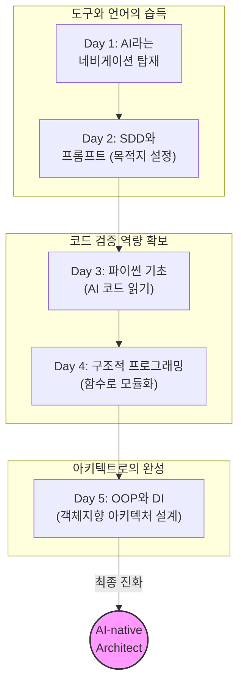

# 마이크로 세션: 102 — "AI 시대의 서사" 최종 연결 및 SDD 회고

> **세션 ID**: MS-PY101-102  
> **소요 시간**: 20분  
> **난이도**: low  
> **청크 타입**: narrative  
> **버전**: v2.1 (7섹션 구조)

---

## §1. 개요

> **Day 5 | PM | 세션 102/106**

이 세션은 5일간 진행된 "AI-native 파이썬 기초" 과정의 여정을 하나의 거대한 서사로 묶어내는 매우 중요한 시간입니다. 코드를 한 줄도 작성하지 않는 내러티브 세션이지만, 수강생들이 5일간 경험한 좌절과 성취에 의미를 부여하고, 스스로가 단순한 '코더'가 아니라 '아키텍트(설계자)'로 성장했음을 깨닫게 하는 클라이맥스 역할을 합니다.

### 🎯 학습 목표

이 세션이 끝나면 수강생은 다음을 할 수 있습니다:

- 5일간의 코딩 학습 과정을 "AI 시대의 서사"라는 관점에서 스스로 재해석할 수 있습니다
- 코드를 타이핑하는 사람(Coder)에서 명세서를 작성하고 검증하는 사람(Architect)으로의 정체성 변화를 설명할 수 있습니다
- SDD(Specification-Driven Development)의 진정한 의미를 이해하고, 앞으로의 AI 협업에 적용할 수 있는 마인드셋을 갖춥니다

### 선행 세션 환기

직전 세션 101에서 우리는 절차적 코드로 시작했던 고객관리 프로그램이 구조적 설계와 객체지향(OOP)을 거쳐, 의존성 주입(DI) 아키텍처까지 진화하는 전체 과정을 총정리했습니다. 스파게티처럼 엉켜 있던 코드가 어떻게 우아한 구조로 변모하는지 두 눈으로 확인했죠. 이제 이 기술적 진화를 여러분 자신의 '성장 스토리'와 결합할 차례입니다.

---

## §2. 핵심 개념 (+ 🗣️ 강사 대본 + Mermaid)

### AI는 시공 로봇, 여러분은 아키텍트

미래의 건설 현장을 상상해 보세요. 벽돌을 쌓고, 철근을 용접하고, 페인트를 칠하는 것은 전부 정밀한 시공 로봇이 담당합니다. 그렇다면 인간 건축가는 직업을 잃을까요? 절대 그렇지 않습니다. "몇 층짜리 건물을 지을 것인가", "내진 설계 기준은 어떻게 할 것인가", "입주자의 동선은 어떻게 짤 것인가" 등 목적과 구조를 결정하는 설계 작업은 온전히 인간의 몫입니다. AI 시대의 프로그래밍도 이와 똑같습니다. AI는 세상에서 가장 훌륭하고 빠른 시공 로봇입니다. 5일 동안 우리는 이 시공 로봇에게 올바른 설계도(프롬프트)를 넘겨주고, 로봇이 지어온 결과물이 설계도대로 안전하게 지어졌는지 감리(코드 리뷰)하는 법을 배웠습니다.

🗣️ **강사 대본 (Instructor Script)**:

> 여러분, 딱 5일 전 첫 시간에 제가 던졌던 질문을 기억하시나요? **"AI가 로그인 코드를 1초 만에 다 짜주는 시대인데, 우리는 대체 왜 굳이 파이썬을 배워야 할까요?"**
> 
> 그때는 다들 막연하셨을 겁니다. 'AI가 짜준 코드를 조금이라도 수정하려면 배워야겠지'라고 생각하셨을 수도 있어요. 하지만 5일이 지난 지금, 여러분은 직접 코드를 만들고, 리팩토링하고, 의존성 주입이라는 거창한 아키텍처까지 설계하면서 그 질문의 답을 온몸으로 체험하셨습니다.
> 
> 결론부터 말씀드릴게요. 여러분이 5일 동안 배운 것은 파이썬이라는 '언어의 문법'이 아닙니다. AI라는 압도적으로 뛰어난 '시공 로봇'을 지휘하기 위해, 문제를 정의하고 구조를 설계하는 **'아키텍트의 사고방식'**을 배운 것입니다. 
> 
> SDD, 즉 명세 기반 개발을 기억하시죠? Day 2에서 우리는 요구사항을 정의하고 PRD를 작성했습니다. 그리고 5일 내내 우리는 AI에게 명확하게 지시를 내리고, 뱉어낸 코드가 캡슐화를 잘 지켰는지, 의존성이 꼬이지는 않았는지 매서운 눈으로 검증했습니다. 바로 이것이 AI 시대에 코드를 다루는 유일하고도 올바른 방법입니다. 여러분은 코더가 아니라 아키텍트가 되기 위해 이 자리에 오신 겁니다.

### Mermaid 다이어그램: 5일간의 서사 연결

이 다이어그램은 Day 1에서 단순한 도구로 만났던 AI가, Day 5에 이르러 어떻게 우리의 아키텍처 설계를 구현하는 충실한 조수로 자리매김했는지 그 서사를 보여줍니다. 

---

## §3. 상세 내용

### Why — 왜 이 세션이 필요한가?

지식은 연결되지 않으면 금방 휘발됩니다. 수강생들은 5일 동안 변수, 리스트, 딕셔너리, for문, 클래스, 상속, 다형성 등 엄청난 양의 기술적 개념을 쏟아붓듯 배웠습니다. 자칫하면 '파이썬 문법을 좀 배웠네'라는 단편적인 감상으로 끝날 위험이 있습니다. 이 세션은 그 파편화된 기술적 경험들을 "나는 AI에게 무엇을 만들지 지시하고 결과를 검증할 수 있는 사람으로 성장했다"는 하나의 강력한 서사(Narrative)로 꿰어주는 필수적인 마무리의 시간입니다.

### What — 이 세션에서 다루는 것은 무엇인가?

이 세션은 세 가지를 다룹니다. 첫째, 코더에서 아키텍트로의 역할 변화를 선언합니다. 둘째, Day 1의 '네비게이션 비유'를 다시 가져와, 그동안 해온 모든 실습이 결국 "목적지를 정확히 입력하고, 경로를 이탈하지 않았는지 검증하는 과정"이었음을 증명합니다. 셋째, 기술의 변화(함수 → 객체 → 아키텍처)가 결국 인간의 '요구사항'을 얼마나 우아하게 통제할 것인가의 문제였음을 깨닫게 합니다.

### How — 구체적으로 어떻게 진행하는가?

🗣️ **강사 대본 (Instructor Script)**:

> 첫날 우리가 이야기했던 네비게이션 비유로 다시 돌아가 볼까요? 네비게이션이 아무리 똑똑해도 "어디로 갈 것인가"는 운전자가 결정한다고 했습니다. 네비게이션에 목적지를 잘못 입력하면 부산으로 갈 차가 광주로 가게 되죠.
> 
> Day 1에서 우리는 AI 비서라는 최신 네비게이션을 차량에 달았습니다. Day 2에서는 프롬프트라는 수단으로 목적지를 정확하게 입력하는 법을 배웠고요. Day 3에서 배운 파이썬 문법은 무엇이었을까요? 맞습니다. 네비게이션이 알려주는 화면의 기호들을 읽어내는 능력이었습니다. 
> 
> Day 4에서 우리는 코드를 함수로 쪼갰죠. 이건 경로가 복잡해지니까 중간 경유지를 명확히 설정해서 엉뚱한 길로 빠지지 않게 통제한 겁니다. 그리고 오늘, Day 5에서 우리는 클래스를 만들고 의존성을 주입했습니다. 이건 뭘까요? 이제 여러분은 단순히 운전석에 앉아있는 사람이 아니라, 차가 달리는 도로망 전체를 설계하고 교통 흐름을 제어하는 도시 설계자가 된 겁니다.
> 
> 여러분이 5일간 고민하면서 PRD를 짜고 코드를 리뷰했던 이유는 명확합니다. 목적지를 명확히 설정하는 능력, 그리고 도착했을 때 "여기가 맞는지" 검증하는 능력을 갖추기 위해서입니다. 이 능력이 AI 시대에 인간이 가져야 할 가장 대체 불가능하고 가치 있는 역량입니다.

---

## §4. 실습 가이드 (+ 🎙️ 실습 대본)

### 실습 목표

이 세션의 실습은 자신의 성장을 동료와 나누며 체화하는 회고(Retrospective) 활동입니다. 코딩이 아니라, 첫날의 나와 지금의 내가 어떻게 달라졌는지 언어로 표현함으로써 아키텍트로서의 자아를 확립합니다.

🎙️ **실습 대본 (Lab Guide)**:

> 자, 마우스를 잠깐 놓고 옆에 앉은 짝꿍과 마주 봐주세요. 우리 딱 3분만 이야기를 나눌 겁니다. 
> 
> 주제는 이렇습니다. **"월요일 첫날, 이 강의실 문을 열고 들어올 때 상상했던 5일 후의 내 모습과, 지금 내 모습은 어떻게 다른가요?"** 
> 
> '파이썬 문법을 달달 외우고 있을 줄 알았는데, 내가 AI한테 구조 똑바로 짜라고 호통을 치고 있을 줄은 몰랐다'라든지, 뭐든 좋습니다. 여러분이 겪은 가장 큰 인식의 변화를 서로 나누어 주세요. 지금부터 3분 드리겠습니다! 시작!

### 단계별 지시

| 단계 | 소요 시간 | 강사 지시사항 | 학습자 액션 | 예상 결과 |
|------|----------|--------------|------------|----------|
| 1 | 2분 | 서사 정리 및 아키텍트 비유 설명 | 경청 및 공감 | 자신의 학습 과정을 새롭게 인식 |
| 2 | 3분 | "첫날과 지금의 내 모습 비교하기" 회고 지시 | 짝과 회고 대화 | 인식의 변화를 스스로 언어화 |
| 3 | 3분 | 1~2명 자원받아 전체 발표 공유 | 자원자 발표 | 공감대 형성 및 성취감 고취 |
| 4 | 2분 | SDD 가치의 최종 정리 멘트 | 경청 | 설계자로서의 정체성 확립 |

### 트러블슈팅 FAQ

| Q | A |
|---|---|
| 수강생들이 회고 시간에 무슨 말을 해야 할지 머뭇거립니다 | 강사가 먼저 자신의 경험이나 이전 기수 수강생의 재미있는 사례를 던져주세요. "예전 기수 어떤 분은 '내가 코더가 아니라 감독관이 된 기분이다'라고 하시더군요"처럼 힌트를 주면 좋습니다. |
| 아직도 문법을 완벽히 모른다는 불안감을 호소하는 수강생이 있다면? | "우리는 영어 스펠링 대회에 나가는 게 아닙니다. 파파고(AI)를 써서 외국인과 비즈니스 협상을 성공적으로 해내는 것이 목표입니다. 스펠링(문법)은 AI가 챙겨줍니다. 여러분은 협상의 전략(구조)에 집중하세요"라고 확신을 심어주세요. |

---

### 🎓 강사 노트 (Instructor Support)

- ⏱️ **타이밍**: 16:30 (20분, narrative)
- 🎯 **핵심 활동**: 5일간 배운 것의 의미
- ⚠️ **강사 주의사항**: 철학적 마무리

## §5. 코드 및 명령어 모음

본 세션은 서사적 흐름을 정리하는 Narrative 타입이므로 실습 코드가 없습니다. 

다만, 수강생들이 집에 돌아가 복습할 때 활용할 수 있는 **[아키텍트의 프롬프트 템플릿]**을 다시 한번 상기시켜 줍니다.

> 🤖 **아키텍트의 리팩토링 프롬프트 리마인드**:
> "다음 코드를 리뷰하고, 객체지향의 캡슐화 원칙이 잘 지켜졌는지 확인해 줘. 외부에서 직접 접근할 수 있는 내부 속성이 있다면 은닉하고 적절한 메서드를 추가해. 단, 전체적인 비즈니스 로직은 유지해야 해."

---

## §6. 요약

### 핵심 학습 포인트

이 세션의 핵심 메시지는 간명합니다. 첫째, 5일간 배운 것은 코딩 기술이 아니라 AI와 협업하여 문제를 해결하는 아키텍트의 사고방식입니다. 둘째, AI는 훌륭한 시공 로봇이며, 무엇을 어떻게 만들지 결정하고 그 결과를 검증하는 것은 인간의 고유한 영역입니다. 셋째, 5일 전의 여러분과 지금의 여러분은 완전히 다른 시야를 가진 사람으로 성장했습니다.

### 다음 세션 예고

이제 정말 마지막 하이라이트가 남았습니다. 다음 세션(103)에서는 5일 동안 땀 흘려 완성한 여러분 각자의 최종 프로젝트(고객관리 v4) 코드를 화면에 띄우고 서로 리뷰하는 시간을 갖겠습니다. 다른 사람들은 어떻게 객체를 설계하고 의존성을 주입했는지 구경하는 쏠쏠한 재미가 있을 겁니다!

### 브릿지 노트

> "여러분, 5일 동안 정말 고생 많으셨습니다. 이제 여러분은 빈 화면을 두려워하지 않는 당당한 AI-native 아키텍트입니다. 자, 그럼 우리가 함께 지은 이 훌륭한 건축물들을 서로에게 자랑할 준비 되셨나요? 마지막 코드 리뷰 세션으로 넘어가 봅시다!"

---

## §7. 참고 자료

### 3-Source 출처

- **Source A (로컬 참고자료)**: `AI 시대의 서사 v3 - Claude.md` — 코더에서 아키텍트로의 변화, 네비게이션 비유 등 과정 전체를 관통하는 핵심 철학과 서사적 비유의 원천을 활용했습니다.
- **Source B (NotebookLM)**: `day5_notebooklm.md` — AI 시대의 서사 최종 연결 파트에서, "코딩보다 명세(Specification)와 문제 정의(SDD)가 중요한 이유 재확인"이라는 핵심 포인트를 반영했습니다.
- **Source C (Deep Research)**: `day5_deep_research.md` — 전체적인 OOP와 아키텍처 학습 과정이 결국 어떻게 명세 기반 개발의 성취로 이어지는지에 대한 논리적 연결 구조를 차용했습니다.

### 추가 학습 자료

- 과정 첫날 공유했던 [세션 001 과정 로드맵 및 아이스브레이킹] 교안 복습 추천

### 강사 노트

> 💡 **강사 노트**: 이 세션은 사실상 5일 과정의 '졸업 연설'과도 같습니다. 강사는 지식 전달자가 아니라 수강생들의 성장을 지켜본 멘토의 입장에서, 진심을 담아 감동적인 톤으로 진행해 주세요. 수강생들이 스스로 대견함을 느끼고, 현업에 돌아가서도 AI를 두려움 없이 활용할 수 있다는 강한 자신감을 심어주는 것이 가장 중요합니다.

---

## ✅ 세션 완료 체크리스트 (강사용)

- [ ] §1~§7 모든 섹션이 빠짐없이 작성되었는가?
- [ ] 첫날의 네비게이션 비유가 자연스럽게 회수되며 서사가 연결되었는가?
- [ ] 시공 로봇과 아키텍트 비유가 명확히 전달되었는가?
- [ ] 수강생의 성취를 축하하고 자아 정체성을 부여하는 회고가 포함되었는가?
- [ ] 3-Source (팩트 패킷) 내용이 적절히 반영되었는가?

---

*작성 일시: 2026-02-25*  
*작성 에이전트: A4B_Session_Writer*  
*교안 구조: 7섹션 (A0 팀 공통 표준)*