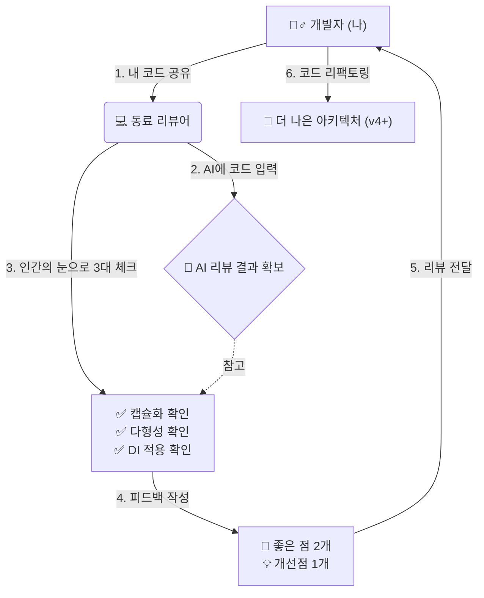

# 세션 103: 수료 프로젝트 코드 리뷰 공유

> **세션 ID**: MS-PY101-103  
> **소요 시간**: 25분  
> **난이도**: ★★☆ (medium)  
> **청크 타입**: lab  
> **버전**: v2.1 (7섹션 구조)

---

## §1. 개요

> **Day 5 | PM | 세션 103/106**

### 🎯 학습 목표

이 세션이 끝나면, 수강생은 다음을 할 수 있습니다:

- 자신의 최종 고객관리 v4 결과물을 동료에게 명확하게 설명하고 공유할 수 있다.
- 캡슐화, 다형성, 의존성 주입(DI) 등 객체지향 3대 핵심 개념을 기준으로 타인의 코드를 분석하고 평가할 수 있다.
- AI의 코드 분석 결과를 참고하여, 인간의 관점에서 건설적인 코드 리뷰 피드백을 동료에게 전달할 수 있다.

### 선행 세션 환기

바로 전 세션(102)에서 우리는 "AI 시대의 서사"를 되돌아보며, 코드를 치는 단순한 코더(Coder)에서 전체 구조를 그리는 아키텍트(Architect)로 진화해야 한다고 배웠습니다. 지난 5일 동안 우리는 단순한 while문 하나로 시작했던 스파게티 코드를 함수로, 객체로, 그리고 완벽히 분리된 아키텍처(v4)로 발전시켰죠. 이제 우리가 만든 이 걸작들을 세상에 내보이기 전, 마지막으로 거쳐야 할 필수 관문이 하나 남았습니다. 바로 '코드 리뷰(Code Review)'입니다. 오늘 세션은 여러분이 서로의 아키텍처를 감상하고 평가하는 시간입니다.

---

## §2. 핵심 개념 (+ 🗣️ 강사 대본 + Mermaid)

### 비유 — "출판 전 교정·교열의 시간"

작가가 책을 출판하기 전에 반드시 거치는 과정이 있습니다. 바로 **교정·교열**입니다. 아무리 훌륭한 명작 원고라도 오탈자가 있고, 문맥이 어색한 부분이 있으며, 가끔은 논리의 흐름이 끊기는 곳이 발생합니다. 작가 본인은 자신의 글에 너무 익숙해져 있어서 이런 문제들을 스스로 발견하기가 매우 어렵습니다. 그래서 완전히 새로운 타인의 시선, 즉 편집자의 눈으로 원고를 파헤쳐야만 숨어있던 오류들이 비로소 드러나게 되죠.

소프트웨어 개발에서의 **코드 리뷰(Code Review)**도 이와 정확히 같은 원리입니다. 교정이 변수명 오타나 들여쓰기 같은 문법적인 오류를 잡는 것이라면, 교열은 코드가 캡슐화를 잘 지켰는지, DI 패턴이 올바르게 구현되었는지 등 '논리와 흐름'을 검토하는 과정입니다.

🗣️ **강사 대본 (Instructor Script)**:

> 여러분, 지금까지 정말 고생 많으셨습니다! 여러분이 완성하신 '고객관리 v4' 프로그램은 5일간의 피와 땀이 서린 소중한 결과물입니다. 하지만 내가 짠 코드는 나에게 너무나 익숙해서, 치명적인 허점이 있어도 눈에 잘 들어오지 않습니다. 그래서 현업의 모든 훌륭한 개발팀은 반드시 '코드 리뷰'를 거칩니다. 동료의 눈을 빌리는 것이죠.
> 
> 오늘 여러분은 서로의 편집자가 되어줄 겁니다. 똑같은 요구사항을 두고도, 어떤 분은 저장소를 이렇게 주입했고, 어떤 분은 저런 방식으로 캡슐화를 하셨을 거예요. "아, 저 사람은 저렇게 생각했구나!"라고 무릎을 탁 치게 되는 순간, 여러분의 시야는 두 배, 세 배로 넓어집니다. 코드 리뷰는 단순히 남의 실수를 지적하는 자리가 아닙니다. 동료의 통찰을 내 것으로 흡수하는, 성장의 가장 빠른 지름길입니다.

### Mermaid 다이어그램



---

## §3. 상세 내용

### Why — 우리는 왜 남의 코드를 읽어야 하는가?

코드를 읽는 능력은 코드를 쓰는 능력만큼이나 중요합니다. 현업 개발자는 하루 일과 중 코드를 작성하는 시간보다, 남이 짠 코드를 읽고 분석하는 데 훨씬 더 많은 시간을 씁니다. 같은 문제를 다른 방식으로 해결한 동료의 코드를 보면, 혼자서 책만 파고들 때보다 훨씬 빠르고 강력한 인사이트를 얻을 수 있습니다.

특히 AI가 만들어준 코드의 경우, AI는 종종 '가장 쉬운 방식'이나 '자주 쓰이는 패턴'을 제안할 뿐, 우리 프로젝트의 아키텍처 원칙(예: 철저한 캡슐화, 엄격한 DI)을 어기는 코드를 슬쩍 끼워 넣기도 합니다. 따라서 남의 코드를 리뷰하는 훈련은, 곧 **AI가 짠 코드를 리뷰하고 반려하는 훈련**이기도 합니다.

### What — 코드 리뷰의 3대 체크포인트

오늘 동료의 코드를 받아들고 가장 집중적으로 파고들어야 할 세 가지 핵심 기준은 다음과 같습니다. 

1. **캡슐화 (Encapsulation)**:
   - 핵심 데이터(속성)가 외부에서 함부로 조작되지 않도록 보호되고 있는가?
   - `self.__balance` 또는 `self._age` 처럼 접근 제어가 잘 적용되었나?
   - 외부에서 직접 변수를 수정하는 대신 `@property`나 getter/setter 메서드를 통해 검증을 거치고 있는가?

2. **상속과 다형성 (Inheritance & Polymorphism)**:
   - `VIPCustomer`가 일반 `Customer`를 중복 코드 없이 깔끔하게 상속받았는가?
   - `get_discount()` 같은 메서드가 오버라이딩(재정의)되어, 객체의 타입에 따라 '알아서' 다르게 동작하는 다형성이 잘 구현되었는가?

3. **의존성 주입 (Dependency Injection, DI)**:
   - `CustomerManager`가 `JsonFileStorage`나 `SQLiteStorage` 같은 특정 저장 방식에 강하게 결합되어 있지는 않은가?
   - 저장소 객체를 매니저 내부에서 직접 생성(`=`)하지 않고, 외부에서 괄호를 통해 주입(`__init__(self, storage)`)받고 있는가?

### How — 좋은 피드백을 주는 방법

리뷰는 비판이 아니라 **협력**입니다. 피드백을 줄 때는 항상 **"좋은 점 2가지, 개선할 점 1가지 (2 Good, 1 Better)"** 법칙을 지켜주세요. 
- ⭕ "DI 패턴을 적용해서 Manager 코드를 아주 깔끔하게 분리하신 점이 인상 깊습니다!"
- 🔺 "다만 Customer의 age 속성이 외부에서 직접 변경 가능하게 노출되어 있는데, 이걸 property로 캡슐화하면 완벽할 것 같습니다."

---

## §4. 실습 가이드 (+ 🎙️ 실습 대본)

### 실습 목표

수강생들은 2인 1조로 짝을 지어, 자신의 v4 프로젝트 코드를 교환하고 AI의 도움을 받아 객체지향 3대 체크포인트를 기준으로 상호 리뷰를 진행합니다.

🎙️ **실습 가이드 대본 (Lab Guide)**:

> 자, 이제 실습 시간입니다! 옆에 앉으신 분과 가볍게 인사하시고, 짝을 지어주세요. 온라인으로 참여하시는 분들은 소회의실(Breakout room)에서 짝을 만나게 되실 겁니다.
> 
> 가장 먼저 여러분의 `customer_manager_v4.py` 파일을 동료에게 보내주세요. 코드를 받으시면, 제일 먼저 여러분 화면의 Antigravity 에이전트(AI)에게 그 코드를 던져주세요. "이 코드를 캡슐화, 다형성, DI 관점에서 엄격하게 리뷰해줘"라고 요청하는 겁니다. 
> 
> AI가 훌륭한 초안을 잡아주겠지만, 최종 판단은 여러분의 눈으로 해야 합니다. AI의 리뷰 결과를 참고하면서 코드를 꼼꼼히 읽어보세요. 그리고 포스트잇이나 메모장에 동료 코드의 '좋은 점 2가지'와 '개선점 1가지'를 적어봅니다. 마지막 5분 동안 서로에게 따뜻하고 예리한 피드백을 전달하겠습니다. 자, 코드 전송부터 시작해 볼까요?

### 단계별 지시 (총 25분)

| 단계 | 소요 시간 | 강사 지시사항 | 학습자 액션 |
|------|----------|--------------|------------|
| 1단계 | 5분 | "코드를 교환하세요" | 슬랙/이메일 또는 화면 공유로 짝에게 자신의 코드 전달 |
| 2단계 | 5분 | "AI에게 1차 리뷰를 맡기세요" | 넘겨받은 코드를 AI에게 입력하고 리뷰 프롬프트 실행 |
| 3단계 | 10분 | "인간의 눈으로 3대 기준을 검증하세요" | AI 답변을 참고하여 캡슐화/다형성/DI 패턴 검토, 리뷰 메모 작성 |
| 4단계 | 5분 | "피드백을 주고받으세요" | "2 Good, 1 Better" 원칙으로 동료에게 구체적인 리뷰 피드백 전달 |

### 🤖 실습용 AI 프롬프트 예시

리뷰어가 AI에게 코드 분석을 요청할 때 사용하는 프롬프트입니다. 그대로 복사해서 사용하세요.

```text
다음은 내 동료가 작성한 고객관리 프로그램(v4) 코드야.
이 코드를 파이썬의 객체지향 프로그래밍 관점에서 리뷰해줘.
반드시 아래 3가지 체크포인트를 기준으로 평가해야 해:

1. 캡슐화: 데이터가 안전하게 보호되고 검증을 거치는지 (@property 등)
2. 다형성: 상속과 오버라이딩을 통해 다형성이 올바르게 작동하는지
3. DI (의존성 주입): Manager가 Storage 인스턴스를 외부에서 주입받고 결합도가 낮은지

비판만 하지 말고, 잘 짠 부분 2가지와 개선이 필요한 부분 1가지를 명확히 짚어줘.

[동료의 코드 붙여넣기]
```

### 트러블슈팅 FAQ

| Q | A |
|---|---|
| 동료 코드가 제 컴퓨터에서는 실행이 안 돼요. 에러가 납니다. | 코드 리뷰는 반드시 코드가 완벽히 실행되어야만 할 수 있는 것은 아닙니다. 구조와 로직을 눈으로 확인하는 정적 분석(Static Analysis)에 집중하세요. |
| AI가 지적한 개선점이 너무 어렵게 느껴져요. | AI는 종종 초보자 수준을 넘어서는 심화 문법을 제안하기도 합니다. 이해하기 어려운 제안은 과감히 무시하고, 수업 시간에 배운 캡슐화, 상속, DI에만 집중하세요. |
| 동료 코드가 너무 완벽해서 개선점을 못 찾겠어요! | 훌륭하네요! 그럴 때는 억지로 단점을 찾지 말고, "이 부분은 어떻게 이런 아이디어를 떠올리셨나요?" 하고 질문을 던져보세요. 질문도 훌륭한 리뷰입니다. |
| 저는 DI 구조를 안 쓰고 그냥 파일 저장 기능을 매니저에 다 때려 넣었는데 부끄러워요. | 부끄러워할 필요 전혀 없습니다! 그것을 발견하고 "아, 저렇게 분리해야 하는구나"를 깨닫는 것이 오늘 리뷰의 핵심 목적입니다. 지금 바로 리팩토링 계획을 세우면 됩니다. |

---


### 🎓 강사 노트 (Instructor Support)

- ⏱️ **타이밍**: 16:50 (25분, lab)
- 🎯 **핵심 활동**: v4 코드 동료 리뷰
- ⚠️ **강사 주의사항**: 자부심 고취


### 📋 실습 설계 보강 (Lab Packet)

**세션 103 실습 설계 보강**

수료 프로젝트 코드 리뷰 공유
- **3-Stage Example Set**
  - 기본: 최종 v4 코드를 동료와 교환 → OOP 3대 체크포인트(캡슐화/다형성/DI) 기준 리뷰
  - 변형: AI에게 "이 코드를 OOP 관점에서 평가해줘" 요청 → 인간+AI 리뷰 결합
  - 실수 해결: "리뷰할 포인트를 모르겠어요" → 3대 체크포인트 표를 체크리스트로 활용
- **난이도 예측**: 타인의 OOP 코드를 읽고 평가하는 것은 고차원 스킬
- **타이밍 가이드**: 코드 공유 5분 | 개인 리뷰 작성 15분 | 피드백 교환 5분
- **심리적 장벽**: "남의 코드를 평가할 실력이 안 되는데..."
- **자가 점검**:
  - [ ] 동료 코드에서 캡슐화(__), 다형성(오버라이딩), DI(저장소 주입) 적용 여부를 확인했는가?
  - [ ] 좋은 점 2가지, 개선할 점 1가지를 피드백으로 전달했는가?
  - [ ] AI 리뷰 결과와 내 리뷰를 비교해봤는가?

## §5. 코드 및 명령어 모음

코드 리뷰를 할 때 무엇이 '좋은 코드'인지 판단할 수 있는 기준 스니펫입니다. 리뷰 과정에서 참고하세요.

### 체크포인트 1: 캡슐화 (Encapsulation)

❌ **개선이 필요한 코드 (속성 직접 노출)**
```python
# 외부에서 나이에 음수를 넣어도 막을 방법이 없음
c1 = Customer("홍길동", -10)
c1.age = -50 
```

✅ **우수한 코드 (@property 활용)**
```python
class Customer:
    def __init__(self, name, age):
        self.name = name
        self.age = age  # setter를 통과함

    @property
    def age(self):
        return self._age

    @age.setter
    def age(self, value):
        if value < 0:
            raise ValueError("나이는 음수가 될 수 없습니다.")
        self._age = value
```

### 체크포인트 2: 다형성 (Polymorphism)

✅ **우수한 코드 (Duck Typing과 오버라이딩)**
```python
class Customer:
    def get_discount_rate(self):
        return 0.0  # 기본 고객은 할인 없음

class VIPCustomer(Customer):
    def get_discount_rate(self):
        return 0.1  # VIP는 10% 할인 (오버라이딩)

# 다형성 작동: 객체가 무엇이든 동일한 메서드 호출로 다른 결과를 냄
for customer in customer_list:
    print(f"적용 할인율: {customer.get_discount_rate()}")
```

### 체크포인트 3: 의존성 주입 (DI)

❌ **개선이 필요한 코드 (강한 결합)**
```python
class CustomerManager:
    def __init__(self):
        # Manager가 직접 JSON 스토리지를 생성해버림. DB로 바꾸려면 이 코드를 뜯어고쳐야 함.
        self.storage = JsonFileStorage() 
```

✅ **우수한 코드 (DI 적용, 느슨한 결합)**
```python
class CustomerManager:
    # 밖에서 어떤 storage를 던져주든 받아서 씀
    def __init__(self, storage: Storage):
        self.storage = storage

# 밖에서 주입
db_storage = SQLiteStorage()
manager = CustomerManager(db_storage)
```

---

## §6. 요약

### 핵심 학습 포인트

오늘 진행한 코드 리뷰의 핵심 교훈은 다음과 같습니다.
1. **타인의 코드를 읽는 힘**: 같은 문제라도 개발자마다 접근 방식이 다릅니다. 다양한 코드를 읽는 경험은 자신의 사고의 틀을 깨는 가장 효과적인 방법입니다.
2. **AI와 인간의 협업 리뷰**: AI는 엄청난 속도로 코드의 구조를 분석해 내지만, 동료에게 맥락에 맞는 피드백을 전달하고 공감하는 것은 인간 아키텍트의 몫입니다.
3. **아키텍처의 내재화**: 캡슐화, 다형성, 의존성 주입(DI)을 눈으로 확인하고 지적할 수 있다는 것은, 이제 여러분이 이 객체지향의 3대 기둥을 완벽히 이해했다는 증거입니다.

### 다음 세션 예고

동료의 코드를 보면서 "아, 나도 저렇게 고쳐야겠다"라는 생각이 드셨나요? 5일간의 파란만장했던 파이썬 기초 여행이 이제 마무리 단계에 접어들었습니다. 다음 세션에서는 Day 1부터 Day 5까지 배운 모든 핵심 개념을 머릿속에 완전히 각인시키기 위한 **'전 과정 핵심 퀴즈'**가 기다리고 있습니다.

### 브릿지 노트

> "코드 리뷰 수고하셨습니다! 내 코드를 남에게 보여준다는 건 생각보다 용기가 필요한 일이죠. 하지만 오늘 짝꿍과 나눈 피드백 덕분에 여러분의 코드는 한 단계 더 단단해졌을 겁니다. 여러분, 이제 여러분은 스파게티 코드를 짜는 초보자가 아닙니다. 아키텍처를 설계하고 서로의 코드를 리뷰하는 당당한 개발자가 되셨습니다. 이 자신감을 그대로 가지고, 다음 시간엔 지난 5일의 여정을 퀴즈로 가볍고 즐겁게 총정리해 보겠습니다!"

---

## §7. 참고 자료

### 3-Source 출처

- **Source A (로컬 참고자료)**: `8 코딩.pdf` (코드 리뷰), `9 디버깅, 테스트, 배포.pdf` (코드 리뷰 프로세스와 협업 가이드)
- **Source B (NotebookLM)**: `day5_notebooklm.md` (캡슐화, 다형성, 의존성 주입의 체크포인트 기준)
- **Source C (Deep Research)**: `day5_deep_research.md` (현업에서의 객체지향 리팩토링 및 Storage 인터페이스 패턴)

### 강사 노트

> 💡 **강사 노트**: 비전공자 수강생들에게 '내 코드를 남에게 보여주는 행위' 자체가 큰 심리적 장벽일 수 있습니다. 시작 전에 반드시 "이건 평가나 지적질이 아니라, 서로의 좋은 아이디어를 훔치고 배우는 시간"이라는 점을 강하게 어필해 주세요. 또한 수강생들이 AI의 리뷰 답변을 그대로 읽어주기만 하는 것을 방지하기 위해, 꼭 자신의 말로 "좋았던 점 2개"를 먼저 칭찬하도록 유도해 주시기 바랍니다.

---

## ✅ 세션 완료 체크리스트 (강사용)

- [ ] §1~§7 모든 섹션이 충실하게 작성되었는가?
- [ ] '교정·교열' 비유가 §2에서 충분히 설명되고 공감대를 형성하는가?
- [ ] Mermaid 다이어그램이 코드 리뷰 워크플로우를 명확하게 시각화했는가?
- [ ] §3의 리뷰 기준이 캡슐화, 다형성, DI라는 3대 핵심으로 잘 정리되었는가?
- [ ] §4의 실습 가이드에 명확한 시간 분배와 실습용 AI 프롬프트가 포함되었는가?
- [ ] §5에 좋은 코드와 나쁜 코드를 대비하는 명확한 스니펫이 제공되었는가?
- [ ] 구어체(강사 대본/실습 가이드)가 자연스럽게 적용되었는가?

---

**🔗 선행 세션**: [세션-102] "AI 시대의 서사" 최종 연결 및 SDD 회고  
**🔗 후행 세션**: [세션-104] 파이썬 기초 전 과정 핵심 퀴즈  

---

*작성 일시: 2026-02-25*  
*작성 에이전트: Sisyphus-Junior (Antigravity)*  
*교안 구조: 7섹션 (A0 팀 공통 표준)*
