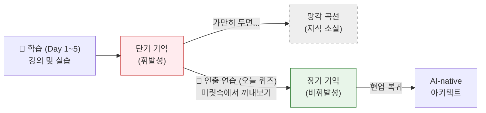
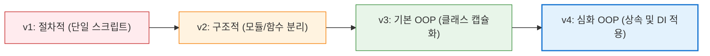

# 마이크로 세션: 104 — 파이썬 기초 전 과정 핵심 퀴즈

> **세션 ID**: MS-PY101-104  
> **소요 시간**: 25분  
> **난이도**: medium  
> **청크 타입**: narrative  
> **버전**: v2.1 (7섹션 구조)

---

## §1. 개요

> **Day 5 | PM | 세션 104/106**

이 세션은 5일간 이어진 "AI-native 파이썬 기초" 과정의 모든 여정을 되짚어보는 총결산이자, 머릿속에 흩어져 있는 지식을 하나로 묶어내는 시간입니다. 수강생들은 Day 1의 환경 구축부터 Day 5의 객체지향과 의존성 주입(DI)까지 수많은 개념을 빠른 속도로 흡수해 왔습니다. 이제는 새로운 진도를 나가는 대신, "시험 효과(Testing Effect)"를 활용하여 단기 기억을 장기 기억으로 전환하는 "기억 체조"를 할 때입니다.

### 🎯 학습 목표

이 세션이 끝나면 수강생은 다음을 할 수 있어요:

- 파이썬 가상환경, 프롬프트 엔지니어링 등 Day 1~2의 핵심 철학을 다시 설명할 수 있습니다
- 자료구조, 함수, 리팩토링 등 Day 3~4의 문법적 역할을 명확하게 구분할 수 있습니다
- 클래스, 상속, 다형성, 의존성 주입(DI) 등 Day 5의 아키텍처 개념을 한 문장으로 정의할 수 있습니다
- 5일간의 학습 성과를 스스로 점검하고, 부족한 부분을 인지하여 복습 방향을 설정할 수 있습니다

### 선행 세션 환기

바로 이전 세션(103)에서 수강생들은 자신만의 고객관리 프로그램(v4) 코드를 동료들과 리뷰하며 객체지향 설계의 다양한 정답을 확인했습니다. 그 경험을 바탕으로, 코드를 치는 손을 잠시 멈추고 전체 과정의 "뼈대"를 구성하는 10가지 핵심 질문에 답하게 됩니다.

---

## §2. 핵심 개념 (+ 🗣️ 강사 대본 + Mermaid)

### 운전면허 필기시험과 시험 효과(Testing Effect)

운전면허를 딸 때 우리는 도로에 나가 운전대를 잡는 '실기 시험'을 보지만, 그전에 반드시 '필기시험'을 통과해야 합니다. 신호등의 의미, 차선의 종류, 양보의 원칙 같은 기본 규칙이 머리에 있어야만 안전한 운전이 가능하기 때문입니다. 오늘 퀴즈는 바로 AI-native 개발자가 되기 위한 "파이썬 도로교통법 필기시험"과 같습니다.

인지과학에서 말하는 "시험 효과(Testing Effect)"는 단순한 평가의 수단이 아닙니다. 눈으로 읽거나 귀로 듣기만 한 지식은 금방 날아가 버리지만, 머릿속에 있는 것을 애써 밖으로 "인출(Retrieval)"하려고 시도하는 순간 뇌의 신경망이 강하게 연결되며 장기 기억으로 굳어집니다. 따라서 오늘 퀴즈에서 틀리는 것은 전혀 부끄러운 일이 아니며, 오히려 기억을 단단하게 만드는 가장 좋은 학습 방법입니다.

🗣️ **강사 대본 (Instructor Script)**:

> 여러분, 5일이라는 시간 동안 정말 숨 가쁘게 달려왔습니다. Antigravity를 처음 켜고 두근거리던 Day 1부터, 어제와 오늘 클래스를 만들고 DI를 적용하던 순간까지 수많은 개념이 여러분의 머릿속을 스쳐 지나갔을 겁니다. 
>
> 혹시 운전면허 있으신 분? 운전면허를 딸 때 가장 먼저 뭘 하죠? 네, 필기시험입니다. 실전에서 액셀을 밟기 전에, 중앙선이 뭔지, 비보호 좌회전이 뭔지 머릿속에 확실히 넣어두는 과정이죠. 오늘은 파이썬 기초 과정의 "필기시험" 시간입니다.
>
> 인지과학에서는 똑같은 1시간을 공부하더라도, 눈으로 밑줄 그으며 읽기만 하는 사람보다 가벼운 퀴즈를 풀면서 "아, 그게 뭐였지?" 하고 끙끙대는 사람이 훨씬 더 오랫동안 기억한다고 합니다. 이걸 "시험 효과"라고 부르죠. 오늘 이 시간은 여러분의 점수를 매겨서 등수를 나누려는 게 절대 아닙니다. 여러분의 뇌에 임시로 저장된 5일 치 지식의 폴더를 꾹꾹 눌러 담아 "장기 기억"이라는 하드디스크에 저장하는 "기억 체조" 시간입니다. 
>
> 10문제를 준비했어요. 틀려도 전혀 괜찮습니다. 오히려 지금 틀리고 "아, 그거였지!" 하고 무릎을 치는 순간이 여러분의 뇌가 가장 활발하게 진화하는 순간이니까요. 자, 가벼운 마음으로 시작해 볼까요?

### Mermaid 다이어그램

이 다이어그램은 왜 우리가 오늘 이 시점에 퀴즈를 푸는지 그 이유를 직관적으로 보여줍니다. 지식이 망각으로 빠져나가기 직전, "인출(Retrieval)"이라는 퀴즈 활동을 통해 지식의 성격을 단기 기억에서 장기 기억으로 영구히 변환하는 과정입니다.

---

### 🎨 추가 시각화 (Visualization Packet)

**프로그램 아키텍처 진화 (Evolution v1 → v4)**

5일간 다뤘던 프로그램이 하나의 단순한 파일에서 유지보수가 용이한 객체지향 애플리케이션으로 진화한 발자취입니다.

## §3. 상세 내용

### Why — 왜 이 퀴즈 세션이 필요한가?

5일 연속으로 진행되는 집중 교육 과정의 가장 큰 부작용은 "인지적 과부하(Cognitive Overload)"입니다. 수강생들은 매일매일 쏟아지는 새로운 용어(리스트, 딕셔너리, 클래스, 메서드, 다형성 등)를 소화하느라 벅찬 상태입니다. 이때 진도를 더 빼는 것은 학습 효율을 급격히 떨어뜨립니다. 
마지막 날의 오후 세션에 배치된 이 퀴즈 시간은, 잠시 진도의 엑셀에서 발을 떼고 그동안 쌓아올린 지식의 창고를 정리하는 "숨 고르기" 역할을 합니다. 또한 수료를 앞두고 "내가 진짜로 배운 게 있구나"라는 성취감을 주는 심리적 장치이기도 합니다.

### What — 이 세션에서 다루는 것은 무엇인가?

총 10문항으로 구성된 핵심 퀴즈를 다룹니다.
이 퀴즈는 단순한 문법(Syntax)을 묻는 것이 아닙니다. 이 과정의 본질인 "AI-native 개발자로서의 철학"과 "객체지향 패러다임의 이해"를 묻습니다. 
- **Day 1~2**: 개발 환경(가상환경)의 필요성, 프롬프트 엔지니어링(PTCF), SDD 철학 등 본질적 접근법.
- **Day 3~4**: 파이썬의 핵심 자료구조(list vs dict)의 차이, 리팩토링의 정의 등 실무적 이해.
- **Day 5**: 과정의 하이라이트인 클래스와 인스턴스의 관계, 캡슐화, 상속, 다형성, DI에 이르는 아키텍처 원칙.

### How — 구체적으로 어떻게 진행하는가?

퀴즈는 강사가 화면에 문제를 하나씩 띄우고, 수강생이 속으로 생각하거나 타이핑할 30초의 시간을 준 뒤 정답을 맞혀보는 "인터랙티브 쇼" 형식으로 진행됩니다. 
절대 종이를 나눠주고 시험을 보게 해서는 안 됩니다. 한 문제씩 핑퐁을 주고받으며, 정답이 공개될 때마다 강사가 1~2분의 짧고 명쾌한 해설을 곁들이는 것이 핵심입니다.

---

## §4. 실습 가이드 (+ 🎙️ 실습 대본)

### 퀴즈 진행 목표

종이나 시험지 없이, 강사와 수강생이 함께 호흡하며 10개의 핵심 질문을 통과하는 것입니다. 정답을 맞히는 것보다 그 개념이 "왜 중요했는지" 스토리를 다시 떠올리게 하는 것이 진짜 목표입니다.

🎙️ **실습 대본 (Lab Guide)**:

> 자, 지금부터 화면에 총 10개의 질문이 하나씩 등장할 겁니다. 각 문제당 30초씩 시간을 드릴게요. 소리 내서 말씀하실 필요는 없고, 속으로 대답하시거나 메모장에 키워드만 슬쩍 적어보세요. 
> 
> **Q1. (Day 1)** 파이썬을 쓸 때, 내 컴퓨터에 바로 설치하지 않고 '가상환경(Virtual Environment)'을 굳이 귀찮게 만드는 가장 큰 이유는 무엇이었나요?
> (30초 대기)
> 정답은 "프로젝트마다 독립적인 패키지 환경을 유지하기 위해서"입니다. 프로젝트 A와 B가 서로 충돌하지 않게 캡슐 호텔처럼 방을 나눠주는 역할이었죠.
> 
> **Q2. (Day 2)** AI에게 일을 시킬 때 쓰는 마법의 주문, 프롬프트의 4요소는 무엇이었나요? 영어 알파벳 4글자로 떠올려보세요.
> (30초 대기)
> 정답은 P, T, C, F! Persona(역할), Task(임무), Context(배경설명), Format(출력형식)입니다. 이것만 잘 써도 AI의 대답 퀄리티가 180도 달라집니다.
> 
> **Q3. (Day 2)** 우리 교육의 핵심 철학이었던 SDD. 이것은 무엇의 약자이며, 어떤 뜻을 담고 있었나요?
> (30초 대기)
> 정답은 Specification-Driven Development. "명세가 먼저, 코드는 나중"입니다. 코드는 AI가 짭니다. 우리는 "무엇을 만들지"를 명확하게 지시하는 사람이 되어야 한다고 강조했었죠.
> 
> **Q4. (Day 3)** 파이썬의 양대 산맥 자료구조! `list`와 `dict`의 가장 큰 차이점은 무엇인가요?
> (30초 대기)
> 정답은 "접근하는 방식"입니다. `list`는 0, 1, 2 같은 "순서(인덱스)"로 접근하고, `dict`는 "키(key)"라는 이름표를 달아 접근합니다. 줄을 서 있느냐, 이름표를 달고 있느냐의 차이였죠.
> 
> **Q5. (Day 3)** `def` 키워드는 파이썬에서 어떤 역할을 하나요?
> (30초 대기)
> 정답은 "함수를 정의(define)한다"입니다. 우리가 반복해서 쓸 코드를 하나의 박스에 담아 이름을 붙여주는 행위죠.
> 
> **Q6. (Day 4)** 코드를 짜다 보면 꼭 해야 하는 '리팩토링'. 리팩토링의 정확한 뜻은 무엇인가요?
> (30초 대기)
> 정답은 "외부 동작(기능)은 그대로 유지하면서, 내부 구조를 깔끔하게 개선하는 작업"입니다. 식당 메뉴는 똑같은데, 주방의 동선을 효율적으로 바꾸는 공사와 같습니다.
> 
> **Q7. (Day 5)** 오늘 배운 객체지향의 핵심! 클래스와 인스턴스의 관계를 우리가 아주 맛있는 길거리 음식에 비유했었는데, 무엇이었죠?
> (30초 대기)
> 정답은 "붕어빵 틀(클래스)과 붕어빵(인스턴스)"입니다. 틀은 1개지만, 그 틀에서 찍어낸 붕어빵은 수십 개가 될 수 있죠. 1:N의 관계입니다.
> 
> **Q8. (Day 5)** 캡슐화(Encapsulation)를 하는 진짜 목적은 무엇인가요? 왜 굳이 변수 앞에 `__`(언더스코어 두 개)를 붙여가며 숨길까요?
> (30초 대기)
> 정답은 "내부 데이터를 보호하고, 검증된 메서드를 통해서만 접근하게 하여 휴먼 에러를 방지하기 위해서"입니다. 나이에 마이너스 값이 들어오거나 계좌 잔고가 마음대로 조작되는 걸 막기 위한 안전장치죠.
> 
> **Q9. (Day 5)** 자식 클래스가 부모의 재산을 물려받을 때 썼던 `super().__init__()`의 역할은 무엇인가요?
> (30초 대기)
> 정답은 "자식 클래스 안에서, 부모 클래스가 가지고 있던 초기화 셋팅을 먼저 쫙 불러와서 실행하는 것"입니다. 아버지가 일궈놓은 시스템을 그대로 물려받고, 그 위에 내 것만 얹는 기술이죠.
> 
> **Q10. (Day 5)** 대망의 마지막 질문입니다. 오늘 우리가 배운 최고의 아키텍처 패턴, DI(의존성 주입)의 핵심 원칙을 한 문장으로 표현한다면?
> (30초 대기)
> 정답은 "내부에서 직접 만들지 말고, 외부에서 받아라!"입니다. 커피숍 사장님이 원두 농사까지 직접 짓지 않고 밖에서 납품받아야, 나중에 에티오피아 원두에서 콜롬비아 원두로 쉽게 바꿀 수 있다는 그 원칙입니다.

### 트러블슈팅 FAQ

| Q | A |
|---|---|
| 수강생들이 대답을 못 하고 표정이 어두워지면 어떡하죠? | 강사가 "어려운 게 당연하다"고 안심시켜야 합니다. "지금 생각이 안 나는 분들이 정답입니다! 이걸 다 맞히면 제 자리에 올라오셔서 강의하셔야 해요"라며 유머러스하게 긴장을 풀어주세요. |
| 질문 10개를 하는데 시간이 모자라면 어떻게 하나요? | 각 문제당 30초 대기 시간을 철저히 지키세요. 문제 해설도 너무 깊게 들어가지 말고 한 문장 비유로만 짧게 치고 넘어가야 늘어지지 않습니다. |

---

### 🎓 강사 노트 (Instructor Support)

- ⏱️ **타이밍**: 17:15 (25분, lab)
- 🎯 **핵심 활동**: 5일 총정리 퀴즈
- ⚠️ **강사 주의사항**: 재미있게, 경쟁 X

### 📋 실습 설계 보강 (Lab Packet)

**세션 104 실습 설계 보강**

파이썬 기초 전 과정 핵심 퀴즈
- **3-Stage Example Set**
  - 기본: 5일간의 핵심 개념 10문항 퀴즈 풀기 (변수, 자료구조, 함수, OOP, SDD 등)
  - 변형: 오답 문항에 대해 AI에게 "이 개념을 비유로 다시 설명해줘" 요청
  - 실수 해결: "정답을 맞혀도 왜 그런지 설명을 못하겠어요" → AI에게 추가 설명 요청
- **난이도 예측**: 퀴즈 자체는 복습이지만 5일 분량을 한 번에 되돌아보는 인지 부하
- **타이밍 가이드**: 퀴즈 풀기 10분 | 오답 해설 7분 | AI에게 추가 설명 5분 | 정리 3분
- **심리적 장벽**: "다 배운 것 같은데 막상 퀴즈를 풀면 기억이 안 나요"
- **자가 점검**:
  - [ ] 10문항 중 7문항 이상 정답을 맞혔는가?
  - [ ] 오답 문항의 정답과 이유를 AI에게 확인했는가?
  - [ ] SDD(명세 주도 개발)의 전체 흐름을 자신의 말로 설명할 수 있는가?

## §5. 코드 및 명령어 모음

이 세션은 "narrative" 타입의 퀴즈 점검 시간이므로 수강생이 직접 실행해야 할 파이썬 코드나 터미널 명령어는 없습니다. 다만, 화면에 띄울 퀴즈의 스크립트 자체가 이 세션의 가장 중요한 '실행 코드'와 같습니다. 머릿속의 신경망을 실행시키는 과정이니까요.

> 🤖 **AI 프롬프트 예시**: (해당 없음)

---

## §6. 요약

### 핵심 학습 포인트

이번 퀴즈를 통해 우리는 5일간의 거대한 산맥을 단 10개의 이정표로 압축해 보았습니다. 코드를 외우는 것보다 중요한 것은 "왜 이 기술이 필요한가"에 대한 철학이었습니다.
1. **분리하라**: 가상환경과 리팩토링의 핵심은 복잡함을 잘라서 정리하는 것입니다.
2. **명확히 지시하라**: 프롬프트의 PTCF와 SDD는 AI 시대 개발자의 최고 무기입니다.
3. **구조화하라**: 딕셔너리에서 출발해 클래스, 상속, 그리고 DI에 이르는 과정은 "데이터를 얼마나 똑똑하고 유연하게 관리할 것인가"에 대한 인류의 치열한 고민의 결과였습니다.

### 다음 세션 예고

자, 드디어 길고 길었던 5일간의 교육 코어 과정이 모두 끝났습니다. 그렇다면 파이썬이라는 강력한 무기를 얻은 우리는 내일부터 무엇을 할 수 있을까요? 다음 세션(105)에서는 이 과정을 수료한 후 현업으로 돌아가 적용할 수 있는 "심화 학습 로드맵" — 웹 개발, 데이터 분석, AI 통합 등 다양한 선택지를 펼쳐 보여드리겠습니다.

### 브릿지 노트

> "어떠셨나요? 10문제 중 절반만 맞히셨어도 대성공입니다. 지금 여러분의 뇌는 엄청나게 튼튼해졌거든요. 이제 이 단단해진 기초 체력을 바탕으로, 여러분이 뻗어나갈 수 있는 무한한 가능성의 지도를 함께 펼쳐보겠습니다. 다음 시간, 학습 로드맵으로 넘어갑니다!"

---

## §7. 참고 자료

### 3-Source 출처

- **Source A (로컬 참고자료)**: 「8 코딩.pdf」 — 파이썬 기초 전체 과정의 문법적 개념(list, dict, def, 클래스, DI 등)의 퀴즈 출제 근거로 활용되었습니다.
- **Source B (NotebookLM)**: Day 5 NotebookLM 분석 — 시험 효과(Testing Effect)와 뇌 과학적 인출 연습의 교육적 효과를 강사 대본 스크립트 작성에 참고하였습니다.
- **Source C (Deep Research)**: Day 5 Deep Research 보고서 — 각 퀴즈 문항 해설에 사용된 일상적 비유(붕어빵 틀, 캡슐 호텔, 원두 납품 등)의 아이디어 소스로 활용되었습니다.

### 추가 학습 자료

- [시험 효과 (Testing Effect) 위키백과](https://en.wikipedia.org/wiki/Testing_effect): 왜 퀴즈가 최고의 복습 방법인지 다룬 인지심리학 자료
- 과정 중 본인이 작성했던 `01_Planning/강의구성안.md` 문서를 다시 열어보며 5일간의 목표 달성 여부를 회고해 보세요.

### 강사 노트

> 💡 **강사 노트**: 이 세션은 절대 분위기가 무거워지면 안 됩니다. 퀴즈라고 하면 학창 시절의 트라우마가 발동하는 수강생들이 꽤 있습니다. 시작 전에 "점수를 매기지 않는다", "틀리는 것이 학습이다"라는 점을 2~3번 거듭 거듭 강조해 주세요. 정답을 발표할 때는 마치 레크리에이션 강사처럼 경쾌하고 밝은 톤을 유지해야 수강생들이 편안하게 참여할 수 있습니다.

---

## ✅ 세션 완료 체크리스트 (강사용)

- [ ] §1~§7 모든 섹션이 빠짐없이 작성되었는가?
- [ ] 구어체 톤 앤 매너(🗣️ 강사 대본 등)가 일관되게 유지되었는가?
- [ ] 퀴즈 진행 방식이 수강생의 부담을 줄여주는 형태로 설명되었는가?
- [ ] Day 1부터 Day 5까지 전 과정을 아우르는 10문항이 잘 배치되었는가?
- [ ] 시험 효과(Testing Effect)를 설명하는 Mermaid 다이어그램이 정상 출력되는가?

---

*작성 일시: 2026-02-25*  
*작성 에이전트: Sisyphus-Junior*  
*교안 구조: 7섹션 (A0 팀 공통 표준)*
