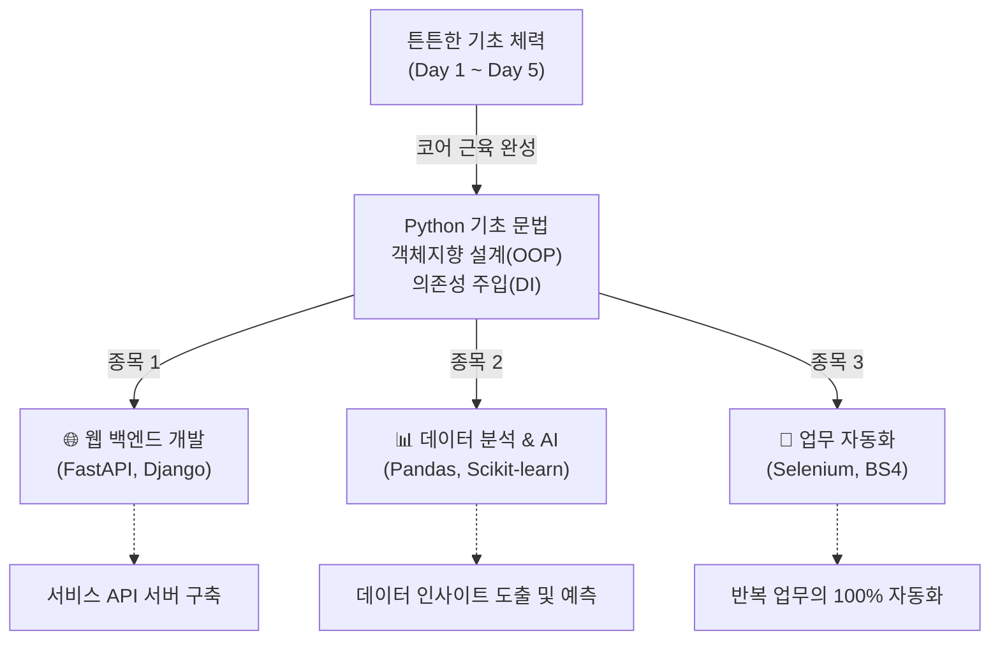

# 마이크로 세션: 105 — 수료 후 학습 로드맵 및 심화 학습 상담

> **세션 ID**: MS-PY101-105  
> **소요 시간**: 20분  
> **난이도**: low  
> **청크 타입**: narrative  
> **버전**: v2.1 (7섹션 구조)

---

## §1. 개요

> **Day 5 | PM | 세션 105/106**

이 세션은 5일간의 치열했던 "AI-native 파이썬 기초" 과정의 대장정을 마무리하기 직전, 수강생들이 앞으로 나아갈 길을 밝혀주는 등대와 같은 시간입니다. 지난 5일 동안 변수, 제어문부터 시작해 객체지향 프로그래밍(OOP)과 의존성 주입(DI) 같은 고급 아키텍처까지 쉼 없이 달려왔습니다. 이제 수강생들의 머릿속에는 "그래서 나 이제 뭐 해야 하지?"라는 현실적이고 막막한 질문이 자리 잡고 있을 것입니다. 이 세션은 그 막연한 불안감을 명확한 목표와 학습 로드맵으로 전환해주는 결정적인 역할을 합니다.

### 🎯 학습 목표

이 세션이 끝나면 수강생은 다음을 할 수 있어요:

- 파이썬을 활용할 수 있는 세 가지 주요 진로(웹 백엔드, 데이터 분석, 업무 자동화)의 특징을 이해할 수 있습니다.
- 자신의 직무나 관심사에 가장 잘 맞는 심화 학습 분야를 하나 선택할 수 있습니다.
- AI 비서(ChatGPT, Gemini 등)를 활용하여 자신만의 1개월 맞춤형 심화 학습 커리큘럼을 직접 설계할 수 있습니다.

### 선행 세션 환기

이 세션은 방금 전 진행된 '세션 104: 파이썬 기초 전 과정 핵심 퀴즈' 직후에 이어집니다. 퀴즈를 통해 자신이 5일 동안 얼마나 많은 것을 스펀지처럼 흡수했는지 성취감을 느낀 상태에서, 그 자신감을 바탕으로 다음 단계의 거대한 도전을 계획하게 됩니다. 특히 Day 5 전체를 관통했던 '아키텍트로서의 시각'과 '명세 주도 개발(SDD)'의 경험이 앞으로의 독학 과정에 어떻게 쓰일지 연결해 줄 것입니다.

---

## §2. 핵심 개념 (+ 🗣️ 강사 대본 + Mermaid)

### 코어 근육과 주특기 종목의 비유

지금까지 배운 파이썬 기초와 객체지향 설계 원칙은 운동으로 치면 '기초 체력'이자 '코어 근육'입니다. 기초 체력만으로는 올림픽에서 메달을 딸 수 없듯이, 파이썬 기초 문법만으로는 당장 현업의 거대한 문제를 풀기 어렵습니다. 이제 수영, 육상, 양궁처럼 자신의 '주특기 종목'을 정하고, 그 종목에 맞는 전용 도구(프레임워크와 라이브러리)를 연마해야 할 때입니다. 파이썬의 세계에서는 그 주특기 종목이 크게 웹 개발, 데이터 분석, 업무 자동화의 세 가지로 나뉩니다.

🗣️ **강사 대본 (Instructor Script)**:

> 여러분, 5일간의 파이썬 기초 과정이 정말 거의 끝나가고 있습니다. 이쯤 되면 여러분의 머릿속에 반드시 떠오르는 아주 현실적이고 날카로운 질문이 하나 있을 겁니다. "강사님, 5일 동안 파이썬 열심히 배웠는데, 저 이제 이걸로 취업할 수 있나요?" 혹은 "이것만으로 내일 당장 회사 출근해서 현업 실무에 바로 쓸 수 있나요?"
>
> 제 대답은 아주 단호하게 "아니요"입니다. 놀라셨나요? 하지만 실망하실 필요는 전혀 없습니다. 여러분이 지금까지 하신 일은, 거대한 마천루를 올리기 전에 가장 중요하고 가장 힘든 '기반 공사'를 완벽하게 해낸 것과 같습니다. 변수부터 시작해서 함수, 클래스, 상속, 다형성, 그리고 객체지향 아키텍처의 꽃인 의존성 주입(DI)까지. 비전공자가 단 5일 만에 이 정도 깊이까지 도달했다는 것 자체가 엄청난 성취입니다. 다만, 이 튼튼한 기초 위에 어떤 모양의 '건물'을 올릴지, 즉 어떤 전문 분야를 여러분의 무기로 삼을지 결정해야 할 시간이 온 것입니다. 
> 
> 이 상황을 운동에 비유해 볼까요? 여러분이 올림픽에 출전하려는 운동선수라고 상상해 봅시다. 올림픽에 나가려면 가장 먼저 무엇을 해야 할까요? 바로 달리기, 팔굽혀펴기, 윗몸일으키기 같은 '기초 체력'을 기르는 것입니다. 기초 체력 없이는 전반전 10분도 뛰지 못하고 쓰러지거나 부상을 입게 되니까요. 여러분이 지난 5일간 치열하게 배운 파이썬 기초 문법, 제어문, 그리고 객체지향 설계 원칙들이 바로 이 튼튼한 '코어 근육'에 해당합니다. 
>
> 하지만 체력만 엄청나게 좋다고 해서 올림픽 금메달을 딸 수 있을까요? 아닙니다. 축구를 할지, 농구를 할지, 수영을 할지 자신의 '주특기 종목'을 정하고 그 종목에 맞는 기술을 연마해야 합니다. 여러분의 코어 근육은 이미 완성되었습니다. 자, 파이썬이라는 넓은 운동장에서 여러분의 심장은 어느 종목을 향해 뛰고 있나요? 오늘 그 방향을 확실히 잡아드리겠습니다.

### Mermaid 다이어그램



이 다이어그램은 수강생들이 5일 동안 완성한 '코어 근육'을 바탕으로, 앞으로 선택할 수 있는 세 가지 강력한 진로 확장성을 직관적으로 보여줍니다. 

---

## §3. 상세 내용

### Why — 왜 이 세션이 필요한가?

수많은 코딩 부트캠프나 단기 교육이 범하는 가장 큰 실수는, 마지막 날 진도를 빼느라 허덕이다가 "자, 끝났습니다. 수고하셨습니다." 하고 수강생들을 황량한 벌판에 던져두는 것입니다. 수강생들은 기초 문법은 뗐지만, 현업의 거대한 프레임워크 앞에서는 다시 작아집니다. 이 세션은 그 갭을 메우는 다리입니다. "모든 것을 다 할 필요는 없다. 하나만 정해서 깊게 파면 된다"는 안도감을 주고, 수료 후 다음 날 아침에 눈을 떴을 때 무엇을 공부해야 할지 정확한 목표를 손에 쥐여주기 위해 이 시간이 반드시 필요합니다.

### What — 이 세션에서 다루는 것은 무엇인가?

파이썬을 활용한 3대 주요 진출 분야와 각각의 대표적인 도구들을 소개합니다. 강박을 버리고 '선택과 집중'을 해야 한다는 마인드셋도 함께 전달합니다.

1. **웹 백엔드 개발 (Web Backend)**: 네이버, 카카오톡 같은 서비스의 뒷단을 만듭니다. 'FastAPI'와 'Django'가 대표적입니다. 특히 FastAPI는 우리가 배운 파이썬의 클래스와 타입 힌트를 극도로 잘 활용하므로 진입하기 좋습니다.
2. **데이터 분석과 인공지능 (Data Analysis & AI)**: 엑셀의 한계를 넘어 수백만 건의 데이터를 다룹니다. 'Pandas'로 데이터를 주무르고, 'NumPy'와 'Matplotlib'을 거쳐, 머신러닝의 표준인 'Scikit-learn'으로 나아갑니다.
3. **업무 자동화 (Automation)**: 직장인들에게 가장 즉각적인 가치를 줍니다. 웹 브라우저를 자동 조작하는 'Selenium', 데이터를 긁어오는 'BeautifulSoup' 등을 활용해 단순 반복 업무를 제거합니다.

### How — 구체적으로 어떻게 진행하는가?

🗣️ **강사 대본 (Instructor Script)**:

> 각 분야로 진출하기 위해 어떤 도구들을 순서대로 배워야 하는지 구체적인 로드맵을 알려드리겠습니다.
>
> 먼저 웹 개발 쪽으로 마음이 기울었다면, 'FastAPI'나 'Django'라는 웹 프레임워크를 배우셔야 합니다. 특히 FastAPI는 최근 현업에서 가장 각광받는 도구인데, 우리가 Day 5에서 뼈빠지게 배운 클래스와 타입 힌트가 아주 그대로 활용되기 때문에 여러분이 진입하기에 가장 좋습니다. 사용자의 요청을 받고, 데이터베이스에서 정보를 꺼내서 돌려주는 REST API를 만드는 법을 배우게 될 것입니다.
>
> 만약 데이터 분석과 AI 쪽에 가슴이 뛴다면 무조건 'Pandas(판다스)'부터 시작하십시오. 엑셀로 처리하기 버거운 수백만 줄의 데이터를 파이썬으로 불러와 순식간에 필터링하고 병합하는 기적의 도구입니다. Pandas에 익숙해진 다음에는 수치 계산을 위한 NumPy, 예쁜 그래프를 그리기 위한 Matplotlib을 거쳐서, 최종적으로 머신러닝의 표준인 Scikit-learn이나 딥러닝을 위한 PyTorch로 나아가시면 됩니다.
>
> 마지막으로 "나는 당장 내일 출근해서 내 엑셀 업무부터 편하게 만들고 싶다!" 하는 직장인이라면 '업무 자동화'가 최고의 선택입니다. 웹 브라우저를 내 손 대신 자동으로 조작해 주는 Selenium, 웹페이지에서 원하는 글자만 쏙쏙 뽑아오는 BeautifulSoup 같은 라이브러리를 배우면 됩니다. 매일 30분씩 수작업으로 하던 일을 파이썬 스크립트 하나로 단 3초 만에 끝내는 그 쾌감은 정말 중독적입니다.
>
> 여기서 가장 중요한 팁을 하나 드릴게요. "이 세 가지를 다 해야 하나요?"라는 강박을 당장 버리세요. 절대 아닙니다. 하나의 프레임워크를 깊게 파서 원리를 깨우치면, 다른 분야로 넘어가는 것은 아주 쉽습니다. 선택과 집중이 필요합니다.

### 분야별 학습 도구 비교표

| 분야 | 핵심 목적 | 1단계 필수 도구 | 2단계 심화 도구 | 추천 대상 |
|---|---|---|---|---|
| 웹 백엔드 | 서비스 서버 구축, API 개발 | FastAPI | Django, SQLAlchemy | 서비스 기획자, 서버 개발자 지망생 |
| 데이터 분석/AI | 데이터 인사이트 도출, 예측 | Pandas | Scikit-learn, PyTorch | 마케터, 데이터 분석가 지망생 |
| 업무 자동화 | 단순 반복 작업 제거 | BeautifulSoup | Selenium, PyAutoGUI | 사무직 종사자, 빠른 성과를 원하는 자 |

---

## §4. 실습 가이드 (+ 🎙️ 실습 대본)

### 실습 목표

수강생 스스로 AI(ChatGPT, Claude, Gemini 등)를 활용해 자신의 상황과 관심사에 맞는 '1개월 심화 학습 커리큘럼'을 직접 설계해 봅니다. 이를 통해 수료 후에도 강사 없이 주도적으로 학습을 이어나갈 수 있는 방법을 체득합니다.

🎙️ **실습 가이드 대본 (Lab Guide)**:

> 예전 같았으면 여러분이 새로운 프레임워크를 배우기 위해 또 한 달짜리 학원 강의를 끊거나 아주 두꺼운 책을 사서 첫 장부터 넘겨야 했을 겁니다. 하지만 지금은 시대가 다릅니다. 기억나시나요? Day 1에 우리가 이야기했던 네비게이션 비유 말입니다. 여러분은 이 5일 동안 'AI에게 목적지를 정확하게 입력하고, 코드를 검증하는 법'을 완벽하게 마스터했습니다. 
> 
> 앞으로의 심화 학습은 여러분과 AI의 1:1 페어 프로그래밍이 될 것입니다. 지금 바로 실습을 해보겠습니다. 여러분이 웹 개발, 데이터 분석, 업무 자동화 중 가장 끌리는 분야를 하나 속으로 정해보세요. 그리고 여러분의 AI 비서를 열고 화면에 띄워드린 프롬프트를 정확히 입력해 보십시오.
>
> 자, AI가 여러분만을 위한 1개월짜리 맞춤형 커리큘럼을 순식간에 짜줄 것입니다. 지금부터 약 7분 정도 시간을 드릴 테니, AI가 짜준 로드맵을 꼼꼼히 읽어보세요. 그리고 궁금한 점이 있다면 언제든 저를 부르시거나 손을 들고 질문해 주시기 바랍니다. "강사님, AI가 Pandas 다음에 Spark를 배우라는데 이게 맞나요?", "FastAPI랑 Django 중에 요즘 현업에서는 어느 쪽 수요가 더 많나요?" 등등 여러분의 진로와 실무에 직결되는 현실적인 질문들을 마구 던져주세요. 지금 이 시간이 여러분의 다음 스텝을 결정하는 아주 중요한 멘토링 시간이 될 것입니다.

### 단계별 실습 지시사항

| 단계 | 소요 시간 | 강사 지시사항 | 학습자 액션 | 예상 결과 |
|---|---|---|---|---|
| 1 | 1분 | "세 가지 분야 중 하나를 마음속으로 선택하세요." | 관심 분야 고민 및 결정 | 목표 분야 확정 |
| 2 | 2분 | "화면의 프롬프트를 AI 비서에게 복사하여 입력하세요." | AI 챗봇에 프롬프트 입력 및 실행 | 맞춤형 커리큘럼 생성 완료 |
| 3 | 4분 | "AI가 짜준 1개월 커리큘럼을 꼼꼼히 읽고 분석하세요." | 생성된 커리큘럼 리딩 | 향후 한 달간의 학습 계획 파악 |
| 4 | 3분 | "궁금한 점, 현실적인 고민을 저에게 질문해 주세요." | 강사에게 진로/도구 관련 질문 | 학습 방향에 대한 확신 획득 |

---


### 🎓 강사 노트 (Instructor Support)

- ⏱️ **타이밍**: 17:40 (20분, narrative)
- 🎯 **핵심 활동**: 웹/데이터/자동화 경로 안내
- ⚠️ **강사 주의사항**: 개인 맞춤 조언

## §5. 코드 및 명령어 모음

이번 세션은 파이썬 코드를 작성하는 것이 아니라, 수강생이 AI에게 학습 로드맵을 요청하기 위한 **'프롬프트 템플릿'**을 제공하는 것이 핵심입니다. 화면에 아래 프롬프트를 크게 띄워주세요.

> 🤖 **AI 프롬프트 예시 (로드맵 생성기)**: 
```text
나는 파이썬 기초(변수부터 클래스, 객체지향, 의존성 주입(DI) 패턴까지)를 막 끝낸 학생이야. 
앞으로 [웹 백엔드 개발 / 데이터 분석 / 업무 자동화 중 택 1] 분야의 전문가로 성장하고 싶어.

향후 1개월 동안 내가 하루 2시간씩 공부한다고 가정하고, 
어떤 라이브러리를 어떤 순서로 학습해야 할지 
주차별(1주차~4주차)로 구체적인 커리큘럼과 미니 프로젝트 주제를 짜줘.

현업에서 가장 많이 쓰이는 최신 트렌드를 반영해서 실용적으로 작성해줘.
```

> 💡 **강사 팁**: 괄호 `[...]` 안의 내용을 자신의 선택에 맞게 반드시 수정해서 입력하도록 안내하세요.

---

## §6. 요약

### 핵심 학습 포인트

여러분이 방금 AI와 함께 만든 그 한 달짜리 로드맵이 바로 여러분의 다음 목표입니다. 오늘 우리가 경험한 것처럼, 이제 여러분은 모르는 새로운 기술, 새로운 라이브러리가 등장해도 절대 두려워할 필요가 없습니다. 명확하게 요구사항을 정의하고 AI의 힘을 빌려 코드를 작성해 내는 명세 주도 개발(SDD)의 뼈대가 여러분 몸에 확실히 각인되었기 때문입니다. 이 '코어 근육'만 있다면, 데이터 분석이든 웹 서버든 못 만들 것이 없습니다.

### 다음 세션 예고

목표가 명확해지셨나요? 여러분의 눈빛이 첫날 파이썬을 처음 켰을 때보다 훨씬 매섭고 단단해졌음을 느낍니다. 자, 이제 이 길고도 짧았던 5일간의 여정에 진정한 마침표를 찍을 시간입니다. 다음 시간은 대망의 마지막 세션, 그동안의 성과를 축하하고 마무리하는 '최종 마무리 및 수료식'으로 넘어가겠습니다!

---

## §7. 참고 자료

### 3-Source 출처

- **Source A (로컬 참고자료)**: `8 코딩.pdf §8.14 OOP 관련` — 객체지향 프로그래밍 및 아키텍처(DI) 학습은 비전공자에게 상당한 난이도이므로, 이를 무사히 성취해 낸 것을 충분히 칭찬하며 코어 근육 비유에 활용했습니다.
- **Source B (NotebookLM)**: `02_Material/skeleton_packet.md §Day 5 진화 과정` — 절차적 프로그래밍에서 아키텍처로의 진화 과정을 상기시키며, 이것이 향후 프레임워크 학습의 튼튼한 기반(기초 체력)이 됨을 강조하는 데 사용되었습니다.
- **Source C (Deep Research)**: `01_Planning/micro_sessions/세션-105-수료_후_학습_로드맵_및_심화_학습_상담.md` — 기획 의도에 따라, 학습자 스스로 AI를 활용해 로드맵을 생성하도록 유도하여 주도적인 학습 태도를 갖게 하는 실습 구성을 반영했습니다.

### 추가 학습 자료

- [FastAPI 공식 문서](https://fastapi.tiangolo.com/ko/): 웹 개발 진로 선택자를 위한 1순위 추천 레퍼런스
- [Pandas 10분 완성](https://pandas.pydata.org/pandas-docs/stable/user_guide/10min.html): 데이터 분석 진로 선택자를 위한 빠른 튜토리얼 가이드

### 강사 노트

> 💡 **강사 노트**: 
> 이 세션에서는 수강생들에게 현실적인 기대치를 심어주는 동시에 성취감을 최고조로 고취시켜야 합니다. "나는 이제 파이썬의 기초 체력이 생겼고, AI라는 최고의 코치가 있으니 어떤 종목이든 도전할 수 있다"는 자신감을 불어넣는 것이 핵심입니다. 실습 시간에 수강생들이 생성한 프롬프트 결과를 한두 명 정도 공유하게 하여 분위기를 띄우고, 각 도구(FastAPI, Pandas 등)에 대한 실무적인 질문이 나오면 강사의 실무 경험을 살려 현실적인 조언을 아낌없이 제공해 주세요.

---

## ✅ 세션 완료 체크리스트 (강사용)

- [ ] §1~§7 모든 섹션이 충실하게 작성되었는가?
- [ ] 기초 체력(코어 근육)과 주특기 종목의 비유가 효과적으로 전달되었는가?
- [ ] 3대 진출 분야(웹, 데이터, 자동화)의 차이점과 도구를 명확히 설명했는가?
- [ ] 수강생들이 스스로 AI를 활용해 1개월 로드맵을 생성하도록 유도했는가?
- [ ] 수강생의 다음 단계에 대한 두려움을 없애고 자신감을 부여했는가?

---

*작성 일시: 2026-02-25*  
*작성 에이전트: Sisyphus-Junior*  
*교안 구조: 7섹션 (A0 팀 공통 표준)*