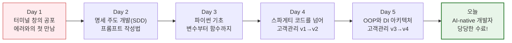

# 마이크로 세션: 106 — 최종 마무리 및 수료식

> **세션 ID**: MS-PY101-106  
> **소요 시간**: 20분  
> **난이도**: low  
> **청크 타입**: narrative  
> **버전**: v2.1 (7섹션 구조)

---

## §1. 개요

> **Day 5 | PM | 세션 106/106**

이 세션은 5일간 40시간에 걸친 "AI-native 파이썬 기초" 과정의 가장 마지막 시간이자, 대미를 장식하는 수료식 세션입니다. 첫날 까만 터미널 창을 보며 두려워했던 비전공자 수강생들이, 이제는 객체지향 아키텍처와 의존성 주입(DI)까지 이해하는 어엿한 'AI-native 개발자'로 성장한 것을 축하하고 마무리하는 정서적 유대감 형성의 시간입니다.

### 🎯 학습 목표

이 세션이 끝나면 수강생은 다음을 할 수 있어요:

- 5일간의 놀라운 성장과 성취를 되돌아보고, 개발자로서의 자신감을 가질 수 있습니다.
- 코딩 문법 암기가 아닌, "설계하고 지시하는 자"로서의 AI-native 개발자 정체성을 확립합니다.
- 향후 지속적인 학습과 성장을 위한 네트워킹 채널(디스코드/오픈채팅 등)에 성공적으로 합류합니다.

### 선행 세션 환기

이 세션은 세션 105 "수료 후 학습 로드맵 및 심화 학습 상담" 직후에 이어집니다. 앞서 살펴본 다양한 향후 진로와 학습 방향을 안고, 이제 공식적으로 이 5일간의 강행군에 마침표를 찍습니다. 첫날 세션 001에서 들었던 "네비게이션 비유"를 다시 한번 떠올리며 완벽한 수미상관을 이룰 거예요.

---

## §2. 핵심 개념 (+ 🗣️ 강사 대본 + Mermaid)

### 5일간의 여정: 초보 운전자에서 베테랑 드라이버로

강의 첫날, AI는 목적지를 찾아주는 '네비게이션'이라는 비유를 들었습니다. 그때는 그저 낯선 개념이었지만, 5일이 지난 지금 수강생들은 그 의미를 온몸으로 체감하고 있습니다. 맹목적으로 네비게이션이 알려주는 길을 가다가 길을 잃었던 초보 운전자가, 이제는 스스로 목적지를 명확히 찍고(SDD), 잘못된 길로 가면 경로를 과감히 수정하는(트러블슈팅) 베테랑 드라이버로 변모했습니다.

🗣️ **강사 대본 (Instructor Script)**:

> 여러분, 드디어 이 순간이 왔습니다. 5일 전 첫날 아침을 한 번 떠올려 보시겠어요? 까만 터미널 창에 태어나서 처음 보는 빨간색 영어 에러 메시지가 떴을 때, 여러분 중 절반은 키보드에 손을 얹지도 못하고 얼어붙어 계셨습니다. 쉬는 시간에 조용히 찾아와 "강사님, 저는 코딩 쪽 머리가 아닌 것 같아요"라고 고백하셨던 분도 계셨죠.
>
> 하지만 지금 여러분의 모니터 화면을 보세요. 클래스를 나누고, 상속을 이용해 VIP 고객을 분리하고, 심지어 파일 저장소와 데이터베이스 저장소를 자유자재로 갈아 끼우는 '의존성 주입(DI)' 패턴이 적용된 시스템이 떡하니 돌아가고 있습니다. 비전공자로서 단 5일 만에 절차적 프로그래밍을 넘어 객체지향 아키텍처까지 도달했다는 것은 정말 기적 같은 일입니다.
>
> 제가 강의 첫날, 여러분께 AI는 '네비게이션'이라는 비유를 들려드렸죠. 그때는 네비게이션(AI)이 만들어준 코드에 에러가 나면 어디서부터 손을 대야 할지 몰라 그저 멍하니 화면만 바라보셨습니다. 하지만 지금은 다릅니다. 목적지를 명확히 찍을 줄 알고, 네비게이션이 엉뚱한 길로 안내하면 "요구사항은 그게 아니야, 다시 탐색해!"라고 당당히 요구할 줄 아십니다. 
> 
> 여러분은 더 이상 네비게이션의 지시에 끌려다니는 초보가 아닙니다. 스스로 목적지를 정하고 시스템을 올바른 방향으로 이끄는 베테랑 드라이버, 즉 진짜 'AI-native 개발자'가 되셨습니다!

> 💡 **강사 노트**: 첫날의 두려움과 현재의 성취(클래스, DI 적용)를 극적으로 대비시켜, 수강생들이 스스로 이룬 성과에 강한 자부심을 느끼도록 감정을 고조시키는 것이 이 대본의 핵심입니다.

### Mermaid 다이어그램: 우리의 5일간 여정

이 다이어그램은 두려움으로 가득 찼던 Day 1에서 시작하여, 완벽한 객체지향 아키텍처를 구현해 낸 Day 5를 거쳐 자랑스러운 수료에 이르는 우리의 극적인 성장 여정을 한눈에 보여줍니다.

---

## §3. 상세 내용

### Why — 왜 이 세션이 필요한가?

40시간의 교육은 지식을 전달하는 것만큼이나, 끝맺음의 감동과 성취감을 부여하는 것이 중요합니다. 특히 비전공자들에게 프로그래밍 학습은 매 순간이 좌절과 극복의 연속이었습니다. 이 마지막 세션은 그 치열했던 과정을 긍정적인 성취의 기억으로 포장하고, "나는 어려운 것도 해낼 수 있다"는 강력한 자기 효능감을 심어주는 역할을 합니다.

### What — 이 세션에서 다루는 것은 무엇인가?

이 세션에서는 세 가지 핵심적인 마무리를 진행합니다. 첫째, 우리가 길렀던 세 가지 근육(문제 정의, 프롬프트 엔지니어링, 트러블슈팅)에 대한 재조명. 둘째, 교육 수료 이후에도 함께 성장할 수 있는 동료 학습 커뮤니티(네트워킹 채널) 합류. 셋째, 한 명 한 명 이름을 호명하며 박수를 쳐주는 공식적인 수료증 수여식입니다.

### How — 구체적으로 어떻게 진행하는가?

🗣️ **강사 대본 (Instructor Script)**:

> 오늘 받으시게 될 이 수료증의 진짜 의미를 말씀드리고 싶습니다. 이 수료증은 "이 사람은 파이썬의 모든 문법을 다 외웠다"는 뜻이 아닙니다. 솔직히 말씀드리면, 여러분은 내일 당장 for문이나 딕셔너리 문법을 까먹으실지도 모릅니다. 그런데 그건 전혀 문제가 안 됩니다. 저를 포함한 현업의 시니어 개발자들도 매일 구글링을 하고 AI에게 문법을 물어보면서 코딩하니까요.
>
> 이 수료증의 진정한 의미는 **"이 사람은 이제 모르는 기술이나 에러가 나와도 절대 두려워하지 않는다"**는 자신감에 대한 증명서입니다. 
> 
> 여러분은 5일 동안 세 가지의 아주 단단한 근육을 길렀습니다. 첫째, 무엇을 만들고 싶은지 명확하게 정의하는 SDD 능력. 둘째, 그 요구사항을 AI에게 효과적으로 지시하고 검증하는 프롬프트 엔지니어링 능력. 셋째, 에러가 발생해도 원인을 논리적으로 추적해 내는 트러블슈팅 능력입니다.
> 
> "코딩하지 마라, 설계하라." 이 문장이 바로 AI-native 개발자의 진짜 정체성이자 여러분이 앞으로 가져가야 할 가장 중요한 무기입니다.

> ✅ **체크포인트**: 
> - 이 수료증의 진짜 의미가 무엇인지 강사의 목소리로 진정성 있게 전달했나요?
> - "설계하라"라는 이 과정의 궁극적인 메시지가 확실하게 각인되었나요?

---

## §4. 실습 가이드 (+ 🎙️ 실습 대본) — 해당 시

### 실습 목표

코드 작성 실습은 끝났습니다. 이번 세션의 유일한 실습은 바로 '개발자 커뮤니티'에 첫 발을 내딛는 것입니다. 과정이 끝나고 각자의 자리로 돌아간 후에도 에러를 물어보고, 새로운 프롬프트 기법을 나눌 수 있는 디스코드나 오픈채팅방에 모두 입장하도록 안내합니다.

🎙️ **실습 가이드 대본 (Lab Guide)**:

> 자, 이제 공식적인 수료식을 진행하도록 하겠습니다. 그 전에 먼저, 제가 방금 단체 채팅방에 공유해 드린 디스코드(또는 오픈채팅방) 링크를 클릭해서 모두 입장해 주시길 바랍니다. 
>
> 이 과정은 오늘로 끝나지만, 여러분의 진짜 학습은 이제부터 시작입니다. 혼자 개발하다가 막히면 언제든지 이 채널에 오셔서 에러 메시지를 캡처해 올리세요. 우리가 5일 동안 함께 삽질하며 쌓은 전우애가 여기서 빛을 발할 겁니다. 
> 
> 지금 입장하신 분들은, 가벼운 인사와 함께 "내가 이번 과정에서 썼던 가장 기발한 프롬프트" 또는 "나를 가장 괴롭혔던 빨간색 에러 메시지"를 하나씩 채팅창에 남겨주세요. 자, 1분 정도 시간 드리겠습니다!
>
> (수강생들 채팅 입력 대기 및 반응을 보며 크게 호응해 줍니다)
>
> 좋습니다! 이제 한 분 한 분의 이름을 호명하며 수료증을 전달하겠습니다. 호명되시는 분들은 자리에서 일어나 주시고, 나머지 분들은 5일간 엄청난 강행군을 버텨낸 전우를 위해 정말 뜨거운 박수를 보내주시기 바랍니다!

### 단계별 지시

| 단계 | 소요 시간 | 강사 지시사항 | 학습자 액션 | 예상 결과 |
|------|----------|--------------|------------|----------|
| 1 | 3분 | 네트워킹 채널 링크 공유 및 입장 안내 | 링크 클릭 후 입장 | 전원 커뮤니티 합류 |
| 2 | 2분 | 입장 인사 및 가장 기억에 남는 에러/프롬프트 공유 지시 | 채팅창에 소감/경험 입력 | 공감대 형성 및 활발한 반응 |
| 3 | 10분 | 개별 이름 호명 및 수료증 수여 (박수 유도) | 이름 불리면 기립/수령, 서로 박수 | 성취감 극대화 |
| 4 | 5분 | 강사의 최종 마무리 멘트 | 경청 | 감동적인 마무리 |

---

### 🎓 강사 노트 (Instructor Support)

- ⏱️ **타이밍**: 18:00 (20분, narrative)
- 🎯 **핵심 활동**: 수료증 수여 + 축하 🎉
- ⚠️ **강사 주의사항**: 감동적 마무리!

## §5. 코드 및 명령어 모음 — 해당 시

이 세션은 과정의 대단원을 장식하는 narrative 타입이므로, 추가적인 파이썬 코드 실습이나 터미널 명령어는 없습니다. 우리가 짠 코드는 이미 완벽하게 동작하고 있으니까요!

> 🤖 **AI 프롬프트 예시**: 해당 없음 (이제는 여러분 스스로가 훌륭한 프롬프트 엔지니어입니다!)

---

## §6. 요약

### 핵심 학습 포인트

이번 세션을 관통하는 가장 중요한 세 가지 메시지입니다. 첫째, 5일간의 성취를 축하합니다. 절차적 프로그래밍도 모르던 상태에서 객체지향 아키텍처와 DI까지 도달한 것은 놀라운 성과입니다. 둘째, 문법을 잊어버리는 것을 두려워하지 마세요. 우리의 진짜 무기는 에러를 두려워하지 않는 트러블슈팅 능력과 요구사항 설계(SDD) 능력입니다. 셋째, 혼자 가지 말고 함께 가세요. 오늘 합류한 커뮤니티를 통해 동료들과 계속해서 지식과 경험을 나누시기 바랍니다.

### 과정 종료 브릿지 노트

> "이 수료증이 그저 여러분의 책상 서랍 구석에서 잠드는 흔한 종이 쪼가리가 되지 않았으면 좋겠습니다. 여러분이 앞으로 일하다가 벽에 부딪히고 막막해질 때마다, 모니터 옆에 붙여둔 이 수료증을 보며 '그래, 나는 그 복잡한 파이썬 객체지향 아키텍처도 5일 만에 뚫어낸 사람이야'라는 강력한 자신감을 되찾는 증표가 되길 바랍니다.
> 
> 이것으로 총 40시간의 길고 치열했던 대장정을 모두 마칩니다. 5일 전의 나와 지금의 나는 완전히 다른 사람이 되었습니다. 여러분의 앞으로의 코드에 버그보다는 새로운 배움이 훨씬 더 많기를 진심으로 응원하며, 언젠가 멋진 현업 개발자 동료로 다시 만나 웃으며 인사할 수 있기를 기대하겠습니다. 여러분, 정말 수고 많으셨습니다. 감사합니다!"

---

## §7. 참고 자료

### 3-Source 출처

- **Source A (로컬 참고자료)**: 「AI 시대의 서사 v3 - Claude.md」 — AI-native 개발자로서의 철학과 정체성, "코딩하지 마라, 설계하라"는 핵심 메시지를 반영했습니다.
- **Source B (NotebookLM)**: `8 코딩.pdf` — 수강생들이 5일간 이루어낸 구체적 기술 성과(클래스, DI, 객체지향 아키텍처 등)를 회고하는 근거 자료로 활용했습니다.
- **Source C (Deep Research)**: `세션-106 기획안` — 향후 네트워킹 채널 참여를 통한 지속적인 학습 생태계 구축의 필요성을 반영했습니다.

### 강사 노트

> 💡 **강사 노트**: 본 세션은 과정 전체의 감동을 끌어올리는 아주 중요한 시간입니다. 단순한 지식 요약이 아니라, 수강생들이 겪었던 구체적인 어려움(터미널의 빨간 에러 메시지)과 성취(DI 패턴 구현)를 명확히 대조하여 그들의 성장을 피부로 느끼게 해주세요. 수료증 수여 시에는 형식적인 진행보다는 한 명 한 명 눈을 맞추며 진심 어린 축하를 건네는 것이 중요합니다.

---

## ✅ 세션 완료 체크리스트 (강사용)

- [ ] §1~§7 모든 섹션이 빠짐없이 작성되었는가?
- [ ] 첫날의 두려움과 현재의 성과를 대비하는 스토리텔링이 포함되었는가?
- [ ] 5일간의 여정을 보여주는 Mermaid 다이어그램이 적절히 배치되었는가?
- [ ] 수강생 네트워킹 채널 입장 유도가 실습으로 명확히 제시되었는가?
- [ ] 감동적이고 힘찬 마무리 멘트가 🗣️ 강사 대본으로 작성되었는가?

---

*작성 일시: 2026-02-25*  
*작성 에이전트: Sisyphus-Junior*  
*교안 구조: 7섹션 (A0 팀 공통 표준)*