# 골격 패킷 (Skeleton Packet)
> Pipeline 02 — Material Writing v4.0
> AI-native 파이썬기초 | 40시간 (5일 × 8시간) | 106 마이크로 세션
> 생성일: 2026-02-25 | 과정 ID: PY101-2026
> 세션 ID 형식: `MS-PY101-{번호:03d}`

## 메타데이터 요약

| 항목 | 값 |
|------|-----|
| 총 세션 수 | 106 |
| 총 소요 시간 | 2,305분 (38시간 25분) |
| 평균 세션 길이 | 21.7분 |
| 청크 타입 | narrative(42) / code(19) / lab(45) |
| 난이도 분포 | low(32) / medium(60) / high(14) |
| 이론:실습 비율 | 39.6% : 60.4% (narrative vs code+lab) |
| 메인 스토리라인 | 고객 정보 관리 프로그램 v1→v2→v3→v4 진화 |

### 설계 원칙
- **Why → What → How**: 모든 새 개념은 "왜 필요한가" → "무엇인가" → "어떻게 쓰는가" 순서
- **예측 → 검증 → 설명 (POE)**: AI 생성 코드를 무조건 실행하지 않고 먼저 결과를 예측
- **SDD (Specification-Driven Development)**: 느낌(Vibe) 코딩 대신 명세서 기반 개발
- **비약 금지**: 모든 새 용어는 해당 세션 내에서 먼저 정의. 미래 참조 최소화
- **Scaffolding**: 이전 세션의 마지막 개념이 다음 세션의 첫 개념과 연결

---

## 1. 세션 개요 표

### Day 1: AI 시대의 이해와 환경 구축 (세션 001-022)
> 오전(09:00~12:00): 001-008 | 오후(13:00~18:00): 009-022
> 총 465분 | 평균 난이도 3.9/10

| 세션 | 시간(분) | 학습목표(Bloom's) | 선행 지식 | 주요 활동 | 청크 타입 |
|------|---------|------------------|----------|----------|----------|
| 001 | 20 | **이해** — 5일간 과정 로드맵 흐름을 이해하고 동기부여 | 없음 | 로드맵 소개, 아이스브레이킹, AI 활용 경험 공유 | narrative |
| 002 | 20 | **이해** — 'AI 시대의 서사' 3가지 핵심 개념과 '메뉴 기획자' 역할 복습 | [001 권장] | 패러다임 전환 복습, 브레인스토밍 토론 | narrative |
| 003 | 20 | **이해** — 예측→검증→설명 학습 사이클과 SDD 기본 개념 이해 | [002 권장] | 코드 스니펫 예측 미니 훈련, SDD 미리보기 | narrative |
| 004 | 25 | **적용** — Antigravity IDE 설치 및 정상 실행 | [003 권장] | Antigravity 다운로드/설치, 검토 모드 활성화 | lab |
| 005 | 20 | **적용** — Editor 뷰에서 프로젝트 폴더 열기, 파일 생성/저장 | **004 필수** | 파일 탐색기, 터미널 레이아웃 세팅 | lab |
| 006 | 20 | **적용** — Agent Manager 창에서 Gemini 3 Pro 기본 대화 시작 | **005 필수** | Agent Manager 열기, 분석 프롬프트 전달 | lab |
| 007 | 25 | **적용** — 두 개 이상 에이전트 탭으로 멀티에이전트 개념 체험 | **006 필수** | 에이전트 병렬 작업 지시, 오케스트레이션 다이어그램 | lab |
| 008 | 20 | **적용** — 프롬프트로 시스템 환경(OS, Python) 확인 | [007 권장] | PTCF 프레임워크 첫 적용, 터미널 명령어 실행 | lab |
| 009 | 20 | **적용** — AI 안내로 Python 최신 버전 설치 및 환경 변수 설정 | [008 권장] | python.org 다운로드, 환경변수 체크, `python --version` | lab |
| 010 | 20 | **분석** — 5 Whys 기법으로 에러 근본 원인 파악 및 해결 | [009 권장] | 고의 오류 유발, 에러 메시지 AI 전달, 5 Whys 적용 | lab |
| 011 | 20 | **적용** — 패키지 매니저 개념 이해, uv 성공적 설치 | [010 권장] | PowerShell uv 설치, `uv --version` 확인 | lab |
| 012 | 25 | **이해** — 가상환경 개념과 필요성을 비유로 설명 | **011 필수** | 주방 비유, AI 질문으로 개념 정리 | narrative |
| 013 | 25 | **적용** — uv로 가상환경 생성 및 활성화 온오프 | **012 필수** | `uv venv`, activate/deactivate 실습 | lab |
| 014 | 20 | **적용** — 가상환경 내 `uv pip install`로 패키지 설치 | **013 필수** | 패키지 설치 속도 체감, 격리 확인 | lab |
| 015 | 20 | **창조** — 자연어 프롬프트로 입출력 포함 파이썬 스크립트 생성 | [014 권장] | 5대 체크리스트 적용, 나이 계산기 프롬프트 | lab |
| 016 | 20 | **분석** — 코드 예측→검증→설명, input/print 동작 원리 분석 | **015 필수** | POE 사이클 첫 본격 적용, 짝꿍 설명 | lab |
| 017 | 20 | **분석** — 프롬프트 변형 후 코드 변화 비교 관찰 | **016 필수** | 조건 추가 프롬프트, 코드 diff 비교 | lab |
| 018 | 25 | **창조** — 새 프로젝트+가상환경+코드 실행 전 사이클 독립 완수 | **017 필수** | 환율 변환기 프로젝트 독립 구축 | lab |
| 019 | 25 | **창조** — 미니 스펙 기반 고객 1명 관리 프로그램 구현 | **018 필수** | 마크다운 명세 작성, SDD 첫 적용 | lab |
| 020 | 20 | **분석** — 오류 해결 경험과 프롬프트를 동료와 공유/비교 | [019 권장] | 에러 공유, 프롬프트 비교 분석 | lab |
| 021 | 20 | **이해** — Day 1 핵심 5개 개념 퀴즈로 정확히 인지/설명 | — | 5지선다 퀴즈, 오픈 마이크 QnA | narrative |
| 022 | 15 | **이해** — Day 2 "프롬프트 작성법과 PRD 설계" 필요성 인지 | [021 권장] | 워크스페이스 정리, Day 2 예고 | narrative |

### Day 2: 프롬프트 엔지니어링과 요구사항/SDD (세션 023-043)
> 오전(09:00~12:00): 023-030 | 오후(13:00~18:00): 031-043
> 총 465분 | 평균 난이도 4.6/10

| 세션 | 시간(분) | 학습목표(Bloom's) | 선행 지식 | 주요 활동 | 청크 타입 |
|------|---------|------------------|----------|----------|----------|
| 023 | 20 | **이해** — 프롬프트를 '업무 지시서'로 정의하고 설명 | [022 권장] | 나쁜/좋은 프롬프트 비교 데모 | narrative |
| 024 | 20 | **적용** — PTCF 4요소 중 Persona와 Task 작성 | **023 필수** | 역할 부여 프롬프트 작성 실습 | narrative |
| 025 | 25 | **적용** — Context와 Format으로 원하는 결과물 획득 | **024 필수** | 구분자(###, ''') 활용, 형식 지정 | narrative |
| 026 | 25 | **분석** — Antigravity에서 나쁜/좋은 프롬프트 출력 결과 비교 분석 | **025 필수** | A/B 비교 실험, 아하 모먼트 연출 | lab |
| 027 | 25 | **기억** — 코드 생성 시 5대 필수 항목(기능/입력/출력/제약/예외) 열거/설명 | **026 필수** | 5대 항목 체크리스트 작성 | narrative |
| 028 | 20 | **이해** — 점진적 개선 개념, 단계별 코드 발전 이유 설명 | [027 권장] | 3단계 워크플로우: Draft→Evaluate→Refine | narrative |
| 029 | 25 | **창조** — 3단계 점진적 개선으로 비밀번호 강도 검사기 완성 | **028 필수** | 기본→특수문자→메시지 구체화 단계적 실습 | lab |
| 030 | 20 | **적용** — CoT와 Few-shot으로 AI 추론 능력/출력 정확도 극대화 | [029 권장] | CoT: 단계 분리, Few-shot: 예시 패턴 제공 | code |
| 031 | 20 | **이해** — '요구사항'의 개념과 중요성을 비유로 설명 | [030 권장] | 여행 계획서 비유, 네비게이션 목적지 연결 | narrative |
| 032 | 25 | **적용** — 5W1H 방법론으로 추상적 아이디어를 구체적 요구사항으로 세분화 | **031 필수** | 5W1H 체크리스트 작성, 카페 앱 분석 사례 | narrative |
| 033 | 20 | **이해** — SDD 개념, AI 시대 핵심 방법론인 이유 이해 | [032 권장] | Vibe Coding의 5대 한계 vs SDD 4단계 | narrative |
| 034 | 25 | **적용** — AI를 기획 컨설턴트로 활용하여 요구사항 문서 초안 발전 | **033 필수** | 역프롬프팅(Reverse Prompting) 실습 | lab |
| 035 | 20 | **이해** — PRD 정의, 단순 기능 목록과의 차이점 설명 | [034 권장] | 7섹션 구조 해설, 경량 PRD 템플릿 소개 | narrative |
| 036 | 25 | **적용** — PRD 표준 템플릿에 FR ID(FR-001)를 부여하여 기능 명세 | **035 필수** | FR/NFR 식별자 부여, 수용 기준 작성 | code |
| 037 | 20 | **적용** — 시간 흐름에 따른 사용자 시나리오 작성, 성공 지표 정의 | **036 필수** | 시나리오 작성, 성공/실패 기준 정의 | narrative |
| 038 | 25 | **창조** — AI 협업으로 완전한 구조의 고객 관리 PRD 완성 | **037 필수** | 템플릿 채우기, 마크다운 PRD 완성 | lab |
| 039 | 25 | **적용** — 자유 주제 선정, 5W1H 기반 핵심 요구사항 정의 | **038 필수** | 조별 브레인스토밍, CRUD 포함 제한 | lab |
| 040 | 25 | **적용** — 요구사항을 PRD로 변환, 1단계 마스터 프롬프트 작성 | **039 필수** | PRD를 Context에 통째로 삽입하는 프롬프트 | lab |
| 041 | 25 | **창조** — 프롬프트로 코드 생성, 점진적 기능 추가, 실행 검증 | **040 필수** | 정상/경계/예외 테스트, 디버깅 프롬프트 | lab |
| 042 | 15 | **이해** — AI 상호작용 과정(Prompting Journey)을 동료에게 설명 | **041 필수** | 팀별 15분 발표: PRD→데모→트러블슈팅→QA | narrative |
| 043 | 15 | **적용** — Day 2 핵심(4요소, 5항목, SDD) 요약, 프롬프트 자산화 저장 | **042 필수** | 마스터 프롬프트 노트 저장, Day 3 예고 | narrative |

### Day 3: Python 핵심 문법 (세션 044-064)
> 오전(09:00~12:00): 044-051 | 오후(13:00~18:00): 052-064
> 총 455분 | 평균 난이도 4.6/10

| 세션 | 시간(분) | 학습목표(Bloom's) | 선행 지식 | 주요 활동 | 청크 타입 |
|------|---------|------------------|----------|----------|----------|
| 044 | 20 | **이해** — 변수를 "이름표가 붙은 상자"로 이해, 값 저장/꺼내기 수행 | **043 필수** | 이름표 비유, 변수 선언/재할당 데모 | narrative |
| 045 | 20 | **이해** — 4가지 기본 데이터 타입(int/float/str/bool) 구분, type() 확인 | **044 필수** | 혈액형 비유, type() 함수 실습 | narrative |
| 046 | 25 | **적용** — 타입 변환(int(), str())과 f-string으로 변수+문자열 결합 출력 | **045 필수** | input()→int() 변환 함정 체험, f-string 포맷 | code |
| 047 | 20 | **적용** — 산술/비교 연산자로 데이터 가공 프롬프트 작성 및 검증 | **046 필수** | 단락 평가 함정, `==` vs `is` 차이 | lab |
| 048 | 25 | **이해** — 리스트(순서 있는 서랍장) 이해, append/remove/sort 조작 | **047 필수** | 서랍장 비유, sort()→None 함정 | narrative |
| 049 | 20 | **적용** — 인덱싱과 슬라이싱으로 특정 위치 데이터 정확 추출 | **048 필수** | 0-기반 인덱스, 음수 인덱스, [start:end] | code |
| 050 | 25 | **이해** — 딕셔너리(고객 카드) 이해, Key로 Value 접근 | **049 필수** | dict[] vs dict.get() 안전 접근법 | narrative |
| 051 | 20 | **적용** — List of Dicts 복합 자료구조 이해, 특정 데이터 접근 | **050 필수** | JSON 스타일 구조, customers[1]["name"] | code |
| 052 | 25 | **적용** — if/elif/else로 조건에 따라 실행 흐름 제어 | **047 필수** | 들여쓰기 블록, 체이닝 비교, 삼항 연산자 | narrative |
| 053 | 20 | **적용** — for문과 range()로 리스트/횟수 반복 실행 | **048 필수** | enumerate(), zip() 패턴 | code |
| 054 | 25 | **적용** — while문 동작 이해, break/continue로 흐름 제어 | **053 필수** | 러닝머신 비유, 무한루프 비상 정지 | code |
| 055 | 20 | **적용** — try/except으로 런타임 에러 방어 로직 작성 | **054 필수** | 안전그물 비유, ValueError/ZeroDivisionError | narrative |
| 056 | 20 | **이해** — 함수(레시피 카드) 개념, def 선언 및 호출 기본 문법 | **044 필수** | 레시피/레고 비유, 타입 힌트 소개 | narrative |
| 057 | 25 | **적용** — 매개변수(Parameter) 전달, 반환(Return) 코드 작성/예측 | **056 필수** | print vs return 구분, 기본값 매개변수 | code |
| 058 | 15 | **적용** — len/sum/max/min 내장 함수로 데이터 손쉽게 가공 | **048 필수** | for문 대체, 도구상자 비유 | code |
| 059 | 25 | **분석** — AI 생성 리스트 컴프리헨션 코드 해석, for문으로 풀어 설명 | **053 필수** | 컨베이어 벨트 비유, 필터링+가공 패턴 | code |
| 060 | 20 | **적용** — 요구사항 분석으로 학생 성적 관리용 복합 자료구조 설계 | [044 권장] | List of Dicts 설계, 데이터 모델링 | lab |
| 061 | 25 | **창조** — 함수+반복문 연결하여 전체 프로그램 흐름 구현 | **060 필수** | 등급 함수, 학생별 평균/등급 자동 부여 | lab |
| 062 | 25 | **창조** — 리스트 컴프리헨션+내장 함수로 통계 계산 기능 구현 | **061 필수** | 수학 평균/최고점 분석, f-string 출력 | lab |
| 063 | 20 | **분석** — 코드에서 변수/리스트/함수 등 구성 요소 식별 및 설명 | **062 필수** | 예측→검증→설명 게임, 팀별 리뷰 라운드 | lab |
| 064 | 15 | **이해** — Day 3 핵심 6개 개념을 비유로 요약 설명 | [044 권장] | 이름표→서랍→분기→반복→안전망→레시피 | narrative |

### Day 4: 절차적→구조적 프로그래밍 + 테스트/코드리뷰 (세션 065-085)
> 오전(09:00~12:00): 065-072 | 오후(13:00~18:00): 073-085
> 총 455분 | 평균 난이도 5.1/10

| 세션 | 시간(분) | 학습목표(Bloom's) | 선행 지식 | 주요 활동 | 청크 타입 |
|------|---------|------------------|----------|----------|----------|
| 065 | 20 | **이해** — 절차적 프로그래밍 개념을 '일렬 도미노'로 설명 | **064 필수** | 순차 실행 특징, 3대 문제점 소개 | narrative |
| 066 | 20 | **이해** — 스파게티 코드 문제 설명, 함수 도입 필요성 이해 | **065 필수** | Böhm-Jacopini 정리, 이어폰 줄 비유 | narrative |
| 067 | 20 | **적용** — Day 2 PRD 기반 고객 관리 프로그램 기능 목록 확정 | **066 필수** | FR-001~FR-004 재정리, 데이터 설계 | narrative |
| 068 | 25 | **적용** — CRUD 4개념 포함하여 절차적 콘솔 프로그램 요청 프롬프트 작성 | **067 필수** | CRUD 개념 이해, AI 프롬프트 구조화 | lab |
| 069 | 20 | **분석** — AI 생성 코드에서 전역 리스트+딕셔너리 저장 구조 식별/설명 | **068 필수** | 파편화 vs 구조화 비교, 고객 데이터 구조 | code |
| 070 | 25 | **적용** — 절차적 C(등록)+R(조회) 기능 동작 원리 이해 및 실행 검증 | **069 필수** | while+if 메뉴, append+for 출력 | lab |
| 071 | 25 | **적용** — U(수정)+D(삭제) 추가, CRUD 전체 통합 테스트 완료 | **070 필수** | 검색 로직 중복 체험, 코드 팽창 확인 | lab |
| 072 | 20 | **분석** — 전역 변수 위험성과 코드 중복(DRY 위배) 문제 식별 | **071 필수** | 출력 형식 변경 시 다중 수정 실험 | narrative |
| 073 | 20 | **적용** — 기능별 함수 분리 + 전역 변수 제거 리팩토링 프롬프트 작성 | **072 필수** | "구조적으로 쪼개줘" AI 지시 | lab |
| 074 | 20 | **이해** — 매개변수와 리턴으로 명시적 데이터 흐름 만드는 원리 설명 | **073 필수** | Side-effect 방지, global 키워드 금지 | code |
| 075 | 20 | **분석** — v1(절차적) vs v2(구조적) 코드를 대조 비교하여 개선점 확인 | **074 필수** | IDE 분할 화면, 가독성/재사용성/에러 처리 비교 | narrative |
| 076 | 25 | **적용** — v2 코드에 '검색 기능' 추가, 구조적 확장 시 최소 영향 검증 | **075 필수** | 기존 코드 미변경 확인, 함수 재사용 체험 | lab |
| 077 | 20 | **이해** — 테스트 시나리오 3분류(정상/경계값/예외)를 '시승' 비유로 설명 | **076 필수** | 정상 주행→급커브→타이어 펑크 비유 | narrative |
| 078 | 25 | **적용** — 고객 관리 프로그램 CRUD 기능별 정상/경계/예외 테스트 시나리오 표 작성 | **077 필수** | Test-Think-Fix 사이클, 시나리오 표 작성 | lab |
| 079 | 20 | **이해** — 코드 리뷰 5대 체크포인트(가독성/유지보수/에러/성능/보안) 설명 | **078 필수** | AI 생성 코드의 예외 처리 부실 인지 | narrative |
| 080 | 25 | **적용** — 리뷰 코멘트 3요소(위치+문제+재현)로 AI에게 수정 지시, 방어 코드 획득 | **079 필수** | 나쁜/좋은 코멘트 비교, AI 시니어 리뷰어 역할 | lab |
| 081 | 20 | **이해** — '절차→구조→테스트→리뷰' 전체 사이클을 3단계로 요약 설명 | **080 필수** | Q&A, 핵심 3문장 요약 공유 | narrative |
| 082 | 20 | **창조** — 자유 주제 선정, CRUD 포함 절차적 1차 코드 AI 생성 | **081 필수**, **068 필수** | 도서/영화/재고 관리 등 자유 기획 | lab |
| 083 | 20 | **적용** — 미니 프로젝트 코드를 구조적으로 리팩토링, AI 품질 평가로 개선 확인 | **082 필수**, **073 필수** | 전역→파라미터 변환, 점수 매기기 | lab |
| 084 | 20 | **분석** — 미니 프로젝트 특성에 맞는 극한 엣지 케이스 최소 3가지 도출 | **083 필수**, **078 필수** | 엣지 케이스 창의적 도출, 시나리오 표 | lab |
| 085 | 25 | **평가** — 3요소 리뷰로 최종 코드 완성, Day 4 회고 및 OOP 필요성 설명 | **084 필수**, **080 필수** | AI 시니어 리뷰, README.md 회고 작성 | lab |

### Day 5: OOP + 아키텍처(DI) + 과정 총정리 (세션 086-106)
> 오전(09:00~12:00): 086-093 | 오후(13:00~18:00): 094-106
> 총 465분 | 평균 난이도 4.3/10

| 세션 | 시간(분) | 학습목표(Bloom's) | 선행 지식 | 주요 활동 | 청크 타입 |
|------|---------|------------------|----------|----------|----------|
| 086 | 20 | **이해** — 클래스와 인스턴스 차이를 '붕어빵 틀/붕어빵'으로 설명 | [085 권장] | 붕어빵 비유, 독립 데이터 공간 개념 | narrative |
| 087 | 25 | **적용** — `__init__`으로 속성 정의, `self`로 속성 출력 메서드 작성 | **086 필수** | Customer 클래스 작성, self 이해 | code |
| 088 | 25 | **적용** — 여러 인스턴스 생성, 독립 데이터 관리 확인 | **087 필수** | 현실 객체 모델링, 메서드 호출 | lab |
| 089 | 20 | **분석** — 일반 클래스 vs `@dataclass` 비교, 이점 설명 | **088 필수** | 보일러플레이트 자동 생성, 타입 힌트 | code |
| 090 | 20 | **이해** — OOP 리팩토링 목적, 캡슐화를 '자동차 운전' 비유로 설명 | [085 권장], [089 권장] | 비공개 속성(__), 인터페이스 노출 | narrative |
| 091 | 25 | **적용** — 구조적 v2를 클래스 기반 v3로 리팩토링 (Customer + CustomerManager) | **090 필수** | 데이터 클래스 + 매니저 클래스 분리 | code |
| 092 | 20 | **적용** — `@property`와 setter로 데이터 검증 로직 추가 | **091 필수** | 나이 음수 방지, Pythonic 캡슐화 | code |
| 093 | 25 | **평가** — v3 캡슐화 적용 여부 점검, 코드 리뷰 5대 체크포인트 활용 | **092 필수** | 속성 직접 변경 가능 여부 검토, AI 리뷰 | lab |
| 094 | 20 | **이해** — 상속 개념과 필요성(코드 재사용, 계층 구조) 설명 | **093 필수** | 일반/VIP 고객 사례, 재산 상속 비유 | narrative |
| 095 | 20 | **적용** — VIPCustomer가 Customer를 상속, `super()`로 부모 초기화 호출 | **094 필수** | 할인율 속성 추가, 부모 메서드 확장 | code |
| 096 | 20 | **적용** — 메서드 오버라이딩으로 다형성 체험, Duck Typing 이해 | **095 필수** | 리모컨 비유, 같은 메서드→다른 결과 | lab |
| 097 | 20 | **이해** — DI(의존성 주입) 개념, 결합도 낮추기와 테스트 유연성 | **096 필수** | 바리스타 원두 납품 비유, 인터페이스 | narrative |
| 098 | 25 | **창조** — json 모듈로 FileStorage(직렬화 영구 저장) 구현 | **097 필수** | Storage 인터페이스, asdict 활용 | code |
| 099 | 25 | **창조** — sqlite3로 SQLiteStorage(DB 영구 저장) 구현 | **098 필수** | SQL 기초, INSERT/SELECT | code |
| 100 | 20 | **적용** — DI로 저장소 교체(File→DB), 비즈니스 로직 변경 없음 검증 | **098 필수** | CustomerManager(JsonFileStorage()) vs (SQLiteStorage()) | lab |
| 101 | 25 | **이해** — v1→v2→v3→v4 진화 과정 총정리, 패러다임 변화 체험 요약 | **100 필수** | 스파게티→모듈화→객체→아키텍처 도표 | narrative |
| 102 | 20 | **평가** — 코딩→명세, SDD 회고, AI 아키텍트로서의 역할 재확인 | **101 필수** | AI 시대의 서사 최종 연결 | narrative |
| 103 | 25 | **평가** — 최종 v4 결과물 공유, 캡슐화/다형성/DI 적용 여부 상호 코드 리뷰 | **100 필수**, **076 필수** | 팀 간 코드 리뷰 공유, 통찰 교환 | lab |
| 104 | 25 | **기억** — Day 1~5 전 과정(변수→OOP→DI) 핵심 퀴즈 리마인드 | **103 필수** | 인출 연습 퀴즈, 틀린 문제 해설 | lab |
| 105 | 20 | **이해** — 수료 후 웹(FastAPI)/데이터(pandas)/AI/ML 학습 방향 안내 | **104 필수** | 로드맵 제시, 심화 학습 상담 | narrative |
| 106 | 20 | **이해** — 전체 교육 회고, 학습 성취도 축하, 수료증 수여 | **105 필수** | 소감 발표, 수료식 | narrative |

---

## 2. 선행 지식 의존성 맵

### 2.1 Day 내부 순차 의존성 (Linear Chain)

```
Day 1: 001→002→003→004→005→006→007→008→009→010→011→012→013→014→015→016→017→018→019→020→021→022
Day 2: 023→024→025→026→027→028→029→030→031→032→033→034→035→036→037→038→039→040→041→042→043
Day 3: 044→045→046→047→048→049→050→051→052→053→054→055→056→057→058→059→060→061→062→063→064
Day 4: 065→066→067→068→069→070→071→072→073→074→075→076→077→078→079→080→081→082→083→084→085
Day 5: 086→087→088→089→090→091→092→093→094→095→096→097→098→099→100→101→102→103→104→105→106
```

### 2.2 Day 간 연결 (Cross-day Dependencies)

| 선행 세션 | 후행 세션 | 의존 사유 |
|----------|----------|----------|
| 022 (Day 1 마무리) | 023 (Day 2 시작) | Day 1 환경 구축 경험 → 프롬프트 본질 학습 |
| 043 (Day 2 마무리) | 044 (Day 3 시작) | 프롬프트+SDD 역량 → 파이썬 문법 학습에 적용 |
| 064 (Day 3 마무리) | 065 (Day 4 시작) | 변수/제어문/함수 → 절차적 프로그래밍 전체 적용 |
| 085 (Day 4 마무리) | 086 (Day 5 시작) | 구조적 프로그래밍 한계 경험 → OOP 필요성 인식 |

### 2.3 핵심 개념 의존성 (Cross-topic Dependencies)

> `_dependency.mmd`에서 추출한 필수 의존성 엣지

| 선행 세션 | 후행 세션 | 연결되는 개념 |
|----------|----------|-------------|
| 047 (기본 연산자) | 052 (조건문 if) | 비교 연산자(==, >=, <=)가 조건문의 핵심 재료 |
| 048 (리스트) | 053 (반복문 for) | for문이 순회하는 대상이 리스트 |
| 044 (변수) | 056 (함수) | 함수의 매개변수/반환값이 곧 변수 |
| 048 (리스트) | 058 (내장 함수) | len/max/sum의 대상이 리스트 |
| 053 (for 반복문) | 059 (리스트 컴프리헨션) | 컴프리헨션은 for문의 압축 표현 |
| 098 (FileStorage) | 100 (DI 적용 실습) | DI에 주입할 구현체가 FileStorage |
| 100 (DI 적용) | 103 (수료 프로젝트 리뷰) | DI 적용된 v4 코드가 리뷰 대상 |
| 076 (구조적 확장성) | 103 (수료 프로젝트 리뷰) | 구조적 확장 경험이 리뷰 관점의 기반 |

### 2.4 관통 프로젝트 의존성 체인 (고객 정보 관리 프로그램)

```
Day 1: 019(미니스펙 첫 경험) ─────────────────────────────────┐
Day 2: 034(요구사항 작성) → 038(PRD 완성) ──────────────────────┤
Day 4: 067(PRD 복습) → 068~071(절차적 v1) → 073~076(구조적 v2) ─┤
Day 5: 091(OOP v3) → 093(캡슐화) → 098~100(DI v4) → 101(총정리)┘
```

---

## 3. 세션 간 전환 요약 표

> 105개 전환 모두 수록. 각 전환은 이전 세션의 마지막 개념에서 다음 세션의 첫 개념으로 자연스럽게 이어지도록 설계.

### Day 1 전환 (001→022)

| 이전 세션 | 다음 세션 | 연결 논리 |
|----------|----------|----------|
| 001 | 002 | "과정 로드맵을 살펴보았으니, 이 과정의 핵심 철학인 'AI 시대의 서사'를 복습해봅시다" |
| 002 | 003 | "'메뉴 기획자'라는 역할을 이해했으니, 이제 구체적인 학습 방법론(POE)과 SDD를 미리 살펴봅시다" |
| 003 | 004 | "학습 방법론을 알았으니, 실제로 코딩할 도구 — Antigravity IDE를 설치해봅시다" |
| 004 | 005 | "설치가 완료되었으니, Editor 뷰에서 파일을 만들고 다루는 기본 조작을 익혀봅시다" |
| 005 | 006 | "에디터 조작에 익숙해졌으니, 이제 AI 비서가 대기하는 Agent Manager를 열어봅시다" |
| 006 | 007 | "AI 비서 한 명과 인사했으니, 여러 비서를 동시에 지휘하는 멀티에이전트를 체험해봅시다" |
| 007 | 008 | "여러 에이전트를 다뤘으니, 이제 프롬프트로 우리 컴퓨터의 환경을 직접 확인해봅시다" |
| 008 | 009 | "시스템 환경을 확인했으니, Python이 없다면 AI와 함께 설치를 진행합시다" |
| 009 | 010 | "설치가 끝났으니, 만약 오류가 났을 때 '왜?'라고 5번 묻는 트러블슈팅 기법을 배워봅시다" |
| 010 | 011 | "트러블슈팅 방법을 배웠으니, 이제 패키지 관리 도구 uv를 설치해봅시다" |
| 011 | 012 | "uv가 설치되었으니, 왜 가상환경이라는 격리 공간이 필요한지 먼저 이해해봅시다" |
| 012 | 013 | "가상환경의 필요성을 이해했으니, uv로 직접 만들고 활성화해봅시다" |
| 013 | 014 | "가상환경을 만들었으니, 그 안에 패키지를 설치하는 체험을 해봅시다" |
| 014 | 015 | "개발 환경이 완성되었으니, 드디어 프롬프트로 첫 파이썬 코드를 생성해봅시다" |
| 015 | 016 | "코드가 생성되었으니, 실행하기 전에 결과를 예측하고 → 실행하여 검증하는 사이클을 체험합시다" |
| 016 | 017 | "POE 사이클을 경험했으니, 프롬프트를 변형하면 코드가 어떻게 바뀌는지 관찰해봅시다" |
| 017 | 018 | "코드 변화를 관찰했으니, 지금까지 배운 모든 것을 혼자 힘으로 통합해봅시다" |
| 018 | 019 | "환경 구축 사이클을 완수했으니, 이번에는 '미니 스펙'이라는 명세를 먼저 쓰고 코드를 만들어봅시다" |
| 019 | 020 | "미니 스펙 프로그램을 만들었으니, 동료들과 오류 경험과 프롬프트를 공유해봅시다" |
| 020 | 021 | "동료 학습을 마쳤으니, 오늘 배운 핵심 개념 5가지를 퀴즈로 정리해봅시다" |
| 021 | 022 | "퀴즈가 끝났으니, 오늘을 마무리하고 내일 배울 내용을 미리 살펴봅시다" |

### Day 2 전환 (023→043)

| 이전 세션 | 다음 세션 | 연결 논리 |
|----------|----------|----------|
| 023 | 024 | "프롬프트의 본질을 알았으니, 핵심 4요소 중 Persona와 Task부터 배워봅시다" |
| 024 | 025 | "Persona와 Task를 익혔으니, 나머지 2요소 Context와 Format을 배워봅시다" |
| 025 | 026 | "4요소를 모두 배웠으니, 실제로 좋은/나쁜 프롬프트의 결과 차이를 실험해봅시다" |
| 026 | 027 | "결과 차이를 체감했으니, 코드 생성 전용 5대 필수 항목을 알아봅시다" |
| 027 | 028 | "5대 항목을 배웠으니, 한 번에 완벽을 추구하지 않는 '점진적 개선' 방식을 알아봅시다" |
| 028 | 029 | "점진적 개선을 이해했으니, 실제로 3단계에 걸쳐 비밀번호 검사기를 만들어봅시다" |
| 029 | 030 | "점진적 개선을 체험했으니, AI 추론력을 극대화하는 고급 기법(CoT/Few-shot)을 배워봅시다" |
| 030 | 031 | "프롬프트 기법을 모두 배웠으니, 이제 '무엇을 만들지' 정하는 요구사항의 세계로 넘어갑시다" |
| 031 | 032 | "요구사항의 본질을 이해했으니, 5W1H라는 체계적 도출법을 배워봅시다" |
| 032 | 033 | "요구사항 도출법을 배웠으니, 이것을 코드의 진실 원천으로 삼는 SDD 방법론을 깊이 이해합시다" |
| 033 | 034 | "SDD를 이해했으니, AI를 기획 컨설턴트로 활용하여 요구사항을 직접 작성해봅시다" |
| 034 | 035 | "요구사항 초안을 만들었으니, 이것을 구조화된 문서로 정리하는 PRD에 대해 알아봅시다" |
| 035 | 036 | "PRD가 무엇인지 알았으니, 핵심인 기능 명세(FR)를 ID와 수용 기준으로 작성해봅시다" |
| 036 | 037 | "기능 명세를 작성했으니, 사용자 시나리오와 성공 지표를 정의해봅시다" |
| 037 | 038 | "시나리오와 지표를 배웠으니, 이 모든 것을 합쳐 고객 관리 프로그램 PRD를 완성합시다" |
| 038 | 039 | "관통 프로젝트 PRD가 완성되었으니, 이번에는 여러분만의 자유 주제로 미니 스펙을 시작합시다" |
| 039 | 040 | "주제와 요구사항을 정했으니, PRD로 변환하고 마스터 프롬프트를 준비합시다" |
| 040 | 041 | "프롬프트가 준비되었으니, 코드를 생성하고 점진적으로 기능을 추가해 검증합시다" |
| 041 | 042 | "프로그램이 완성되었으니, AI와 어떻게 대화했는지 과정을 팀원들과 공유합시다" |
| 042 | 043 | "발표가 끝났으니, 오늘 배운 핵심을 요약하고 성공적인 프롬프트를 자산화합시다" |

### Day 3 전환 (044→064)

| 이전 세션 | 다음 세션 | 연결 논리 |
|----------|----------|----------|
| 044 | 045 | "변수라는 '이름표'를 이해했으니, 이 이름표가 붙을 수 있는 데이터의 4가지 종류를 배워봅시다" |
| 045 | 046 | "데이터 타입을 배웠으니, 서로 다른 타입 간 변환과 f-string 출력을 익혀봅시다" |
| 046 | 047 | "타입 변환을 익혔으니, 데이터를 가공하는 연산자들을 실습해봅시다" |
| 047 | 048 | "개별 변수를 다뤘으니, 여러 데이터를 한 번에 담는 리스트를 배워봅시다" |
| 048 | 049 | "리스트에 데이터를 넣었으니, 특정 위치의 데이터를 꺼내는 인덱싱/슬라이싱을 배워봅시다" |
| 049 | 050 | "순서 기반 리스트를 배웠으니, '이름표'로 데이터를 찾는 딕셔너리를 배워봅시다" |
| 050 | 051 | "리스트와 딕셔너리를 각각 배웠으니, 이 둘을 합친 실무 핵심 패턴을 배워봅시다" |
| 051 | 052 | "데이터 구조를 다 배웠으니, 이제 프로그램의 흐름을 나누는 조건문을 배워봅시다" |
| 052 | 053 | "분기를 배웠으니, 같은 작업을 반복하는 for문을 배워봅시다" |
| 053 | 054 | "for문을 배웠으니, 조건 기반 반복인 while문과 흐름 제어를 배워봅시다" |
| 054 | 055 | "반복문을 배웠으니, 실행 중 에러로부터 프로그램을 보호하는 예외 처리를 배워봅시다" |
| 055 | 056 | "안전망을 만들었으니, 이제 반복 로직을 재사용 가능하게 묶는 '함수'를 배워봅시다" |
| 056 | 057 | "함수를 정의했으니, 데이터를 넘기고(매개변수) 결과를 받는(반환값) 방법을 배워봅시다" |
| 057 | 058 | "직접 함수를 만들었으니, 파이썬이 기본 제공하는 강력한 내장 함수를 활용해봅시다" |
| 058 | 059 | "내장 함수를 활용했으니, AI 코드에 자주 등장하는 리스트 컴프리헨션을 해독해봅시다" |
| 059 | 060 | "핵심 문법을 모두 배웠으니, 종합 실습으로 학생 성적 데이터를 설계해봅시다" |
| 060 | 061 | "데이터를 설계했으니, 제어문과 함수로 비즈니스 로직을 구현해봅시다" |
| 061 | 062 | "로직을 구현했으니, 통계 분석 기능을 추가하여 프로그램을 완성합시다" |
| 062 | 063 | "프로그램이 완성되었으니, AI 생성 코드를 리뷰하는 게임으로 메타인지를 키워봅시다" |
| 063 | 064 | "코드 리뷰 게임까지 마쳤으니, Day 3 전체를 비유로 정리합시다" |

### Day 4 전환 (065→085)

| 이전 세션 | 다음 세션 | 연결 논리 |
|----------|----------|----------|
| 065 | 066 | "절차적 프로그래밍을 이해했으니, 그 한계인 스파게티 코드와 구조적 패러다임의 필요성을 복습합시다" |
| 066 | 067 | "구조적 프로그래밍의 필요성을 느꼈으니, Day 2에 만든 PRD를 펴서 실제 개발 준비를 합시다" |
| 067 | 068 | "PRD를 복습했으니, 핵심인 CRUD 개념을 이해하고 AI에게 요청할 첫 프롬프트를 작성합시다" |
| 068 | 069 | "CRUD 프롬프트를 작성했으니, AI가 생성한 코드에서 데이터 저장 구조를 분석해봅시다" |
| 069 | 070 | "데이터 구조를 이해했으니, Create와 Read 기능의 동작을 확인하고 테스트합시다" |
| 070 | 071 | "CR이 되었으니, Update와 Delete를 추가하여 CRUD를 완성합시다" |
| 071 | 072 | "CRUD가 완성되었지만, 이 코드에 숨어 있는 전역 변수와 중복 문제를 발견해봅시다" |
| 072 | 073 | "문제를 발견했으니, AI에게 '구조적으로 고쳐달라'는 리팩토링 프롬프트를 작성합시다" |
| 073 | 074 | "리팩토링을 요청했으니, 생성된 코드에서 매개변수와 리턴의 데이터 흐름을 이해합시다" |
| 074 | 075 | "데이터 흐름을 이해했으니, 절차적(v1)과 구조적(v2) 코드를 나란히 비교 분석합시다" |
| 075 | 076 | "비교 분석을 마쳤으니, 실제로 기능을 추가하며 구조적 코드의 확장성을 체험합시다" |
| 076 | 077 | "코드가 완성되었으니, 자동차 시승처럼 테스트 시나리오 3분류를 배워봅시다" |
| 077 | 078 | "테스트 분류를 배웠으니, 우리 고객 관리 프로그램의 실제 시나리오를 표로 작성합시다" |
| 078 | 079 | "테스트를 작성했으니, 코드의 품질을 검증하는 리뷰 5대 체크포인트를 배워봅시다" |
| 079 | 080 | "체크포인트를 배웠으니, 구체적인 리뷰 코멘트를 작성하여 AI에게 수정을 지시해봅시다" |
| 080 | 081 | "리뷰까지 마쳤으니, 오늘 배운 '절차→구조→테스트→리뷰' 사이클을 종합 정리합시다" |
| 081 | 082 | "전체 사이클을 정리했으니, 이제 자유 주제로 여러분만의 미니 프로젝트를 시작합시다" |
| 082 | 083 | "절차적 1차 코드가 나왔으니, 배운 대로 구조적으로 리팩토링해봅시다" |
| 083 | 084 | "구조적 코드가 완성되었으니, 극한의 테스트 시나리오로 프로그램을 부숴봅시다" |
| 084 | 085 | "테스트까지 끝났으니, AI 시니어 리뷰어의 피드백으로 최종 완성 후 Day 4를 회고합시다" |

### Day 5 전환 (086→106)

| 이전 세션 | 다음 세션 | 연결 논리 |
|----------|----------|----------|
| 086 | 087 | "클래스와 인스턴스 개념을 이해했으니, __init__과 self로 실제 클래스를 만들어봅시다" |
| 087 | 088 | "클래스 문법을 배웠으니, 직접 여러 인스턴스를 생성하고 독립 데이터를 관리해봅시다" |
| 088 | 089 | "직접 클래스를 만들었으니, 반복 코드를 없애주는 @dataclass 데코레이터를 배워봅시다" |
| 089 | 090 | "@dataclass를 배웠으니, OOP의 핵심 원칙인 캡슐화와 리팩토링 전략을 알아봅시다" |
| 090 | 091 | "캡슐화 개념을 이해했으니, 실제로 구조적 v2 코드를 OOP v3로 진화시켜봅시다" |
| 091 | 092 | "v3가 완성되었으니, @property로 데이터 검증 로직을 추가해봅시다" |
| 092 | 093 | "검증 로직을 추가했으니, 캡슐화가 잘 적용되었는지 코드 리뷰로 점검해봅시다" |
| 093 | 094 | "v3 리뷰가 끝났으니, 일반 고객을 VIP 고객으로 확장하는 '상속'을 배워봅시다" |
| 094 | 095 | "상속 개념을 이해했으니, super()로 VIPCustomer를 실제로 구현해봅시다" |
| 095 | 096 | "상속을 구현했으니, 같은 메서드가 다른 결과를 내는 '다형성'을 체험해봅시다" |
| 096 | 097 | "다형성까지 배웠으니, 마지막 무기인 의존성 주입(DI) 개념을 알아봅시다" |
| 097 | 098 | "DI 개념을 이해했으니, 첫 번째 저장소인 FileStorage를 구현해봅시다" |
| 098 | 099 | "파일 저장소가 완성되었으니, DB 저장소인 SQLiteStorage도 구현해봅시다" |
| 099 | 100 | "두 가지 저장소가 모두 준비되었으니, DI로 저장소를 교체하며 코드 변경 없음을 검증합시다" |
| 100 | 101 | "v4까지 완성되었으니, v1→v2→v3→v4 진화의 전 과정을 총정리합시다" |
| 101 | 102 | "진화 과정을 정리했으니, 'AI 시대의 서사'와 SDD의 의미를 최종 연결합시다" |
| 102 | 103 | "AI 시대의 서사 회고를 마쳤으니, 수강생끼리 최종 코드를 공유하고 리뷰합시다" |
| 103 | 104 | "코드 리뷰를 마쳤으니, 5일간 배운 전 과정을 핵심 퀴즈로 기억을 되살려봅시다" |
| 104 | 105 | "퀴즈까지 끝났으니, 수료 후 어떤 방향으로 학습을 이어갈지 로드맵을 안내합시다" |
| 105 | 106 | "로드맵 안내를 마쳤으니, 마지막 수료식으로 5일간의 여정을 마무리합시다" |

---

## 4. 학습 흐름도 (Mermaid)

> 5일간의 핵심 개념 의존성과 관통 프로젝트 진화를 시각화

```mermaid
graph TD
    subgraph Day1["🔵 Day 1: AI 시대 이해 & 환경 구축"]
        D1_intro["001-003<br/>AI 시대의 서사<br/>POE·SDD 철학"]
        D1_ide["004-007<br/>Antigravity IDE<br/>멀티에이전트"]
        D1_env["008-014<br/>Python·uv<br/>가상환경 구축"]
        D1_code["015-017<br/>프롬프트 첫 코딩<br/>POE 사이클 체험"]
        D1_lab["018-019<br/>종합 실습<br/>미니 스펙 첫 경험"]
        D1_wrap["020-022<br/>동료 학습·퀴즈<br/>Day 2 예고"]
    end

    subgraph Day2["🟢 Day 2: 프롬프트 엔지니어링 & 요구사항"]
        D2_prompt["023-030<br/>PTCF 4요소<br/>5대항목·CoT·Few-shot"]
        D2_req["031-034<br/>요구사항 5W1H<br/>SDD·역프롬프팅"]
        D2_prd["035-038<br/>PRD 7섹션 구조<br/>FR/NFR·시나리오"]
        D2_project["039-041<br/>미니 스펙 프로젝트<br/>기획→코드→검증"]
        D2_wrap["042-043<br/>팀별 발표<br/>프롬프트 포트폴리오"]
    end

    subgraph Day3["🟠 Day 3: Python 핵심 문법"]
        D3_var["044-047<br/>변수·데이터 타입<br/>연산자"]
        D3_ds["048-051<br/>리스트·딕셔너리<br/>복합 자료구조"]
        D3_flow["052-055<br/>조건문·반복문<br/>예외 처리"]
        D3_func["056-059<br/>함수·내장함수<br/>리스트 컴프리헨션"]
        D3_lab["060-063<br/>종합 실습<br/>성적 관리+코드 리뷰"]
        D3_wrap["064<br/>Day 3 총정리"]
    end

    subgraph Day4["🔴 Day 4: 절차적→구조적 + 테스트"]
        D4_proc["065-069<br/>절차적 프로그래밍<br/>CRUD·데이터 구조"]
        D4_crud["070-071<br/>절차적 CRUD<br/>v1 구현·통합 테스트"]
        D4_refactor["072-076<br/>리뷰→리팩토링<br/>v2 구조적·확장성"]
        D4_test["077-080<br/>테스트 3분류<br/>코드 리뷰 5대 체크"]
        D4_mini["081-085<br/>미니 프로젝트<br/>기획→리팩토링→리뷰"]
    end

    subgraph Day5["🟣 Day 5: OOP + 아키텍처(DI) + 마무리"]
        D5_class["086-089<br/>클래스·인스턴스<br/>__init__·@dataclass"]
        D5_v3["090-093<br/>v3 OOP 적용<br/>캡슐화·@property"]
        D5_inherit["094-096<br/>상속·다형성<br/>VIPCustomer"]
        D5_di["097-100<br/>DI 개념<br/>FileStorage·SQLite·v4"]
        D5_wrap["101-106<br/>총정리·수료식<br/>학습 로드맵"]
    end

    %% Day 내부 흐름
    D1_intro --> D1_ide --> D1_env --> D1_code --> D1_lab --> D1_wrap
    D2_prompt --> D2_req --> D2_prd --> D2_project --> D2_wrap
    D3_var --> D3_ds --> D3_flow --> D3_func --> D3_lab --> D3_wrap
    D4_proc --> D4_crud --> D4_refactor --> D4_test --> D4_mini
    D5_class --> D5_v3 --> D5_inherit --> D5_di --> D5_wrap

    %% Day 간 연결
    D1_wrap -->|"환경+POE 역량"| D2_prompt
    D2_wrap -->|"프롬프트+SDD 역량"| D3_var
    D3_wrap -->|"문법 기초 역량"| D4_proc
    D4_mini -->|"구조적 한계 체험"| D5_class

    %% 관통 프로젝트 (고객 관리 프로그램 v1→v4)
    D1_lab -.->|"미니 스펙 첫 경험"| D2_prd
    D2_prd -.->|"PRD 완성"| D4_proc
    D4_crud -.->|"v1 절차적"| D4_refactor
    D4_refactor -.->|"v2 구조적"| D5_v3
    D5_v3 -.->|"v3 OOP"| D5_di
    D5_di -.->|"v4 DI 아키텍처"| D5_wrap

    %% 핵심 개념 교차 의존성
    D3_var -.->|"변수→함수"| D3_func
    D3_ds -.->|"리스트→for문"| D3_flow
    D3_flow -.->|"for→컴프리헨션"| D3_func

    %% 스타일
    style Day1 fill:#e1f5fe,stroke:#0277bd
    style Day2 fill:#e8f5e9,stroke:#2e7d32
    style Day3 fill:#fff3e0,stroke:#e65100
    style Day4 fill:#fce4ec,stroke:#c62828
    style Day5 fill:#f3e5f5,stroke:#6a1b9a
```



---

## 5. 활동 시퀀스 (청크 타입별 기본 템플릿)

> Session Writer는 각 세션의 `chunk_type`에 맞는 템플릿을 기반으로 시간을 배분합니다.
> 세션 길이(15~25분)에 따라 비례 조정하되, 핵심 구조는 유지합니다.

### 5.1 narrative (개념 설명) — 42개 세션

| 단계 | 시간(20분 기준) | 활동 내용 |
|------|---------------|----------|
| 🔑 **도입 (Why)** | 3분 | 이전 세션 연결, "왜 이것을 배우는가?" 질문 던지기 |
| 🎭 **비유 제시** | 4분 | 일상적 비유로 추상 개념을 시각화 (예: 가상환경 = 전용 주방) |
| 📖 **개념 설명 (What)** | 7분 | 핵심 개념 정의, 구조 다이어그램, 용어 첫 등장 시 즉시 정의 |
| 💡 **적용 예시 (How)** | 3분 | 코드 스니펫이나 시연으로 개념의 실제 모습 보여주기 |
| ✅ **정리 & 체크** | 3분 | 핵심 1~2문장 요약, "짝꿍에게 설명하기" 또는 빠른 퀴즈 |

### 5.2 code (코드 생성 및 분석) — 19개 세션

| 단계 | 시간(20분 기준) | 활동 내용 |
|------|---------------|----------|
| 🔑 **도입 (Why)** | 2분 | 이전 개념 복기, 이번에 풀 문제 제시 |
| 📖 **개념 설명 (What)** | 4분 | 문법 규칙, 핵심 패턴 설명 (슬라이드/판서) |
| 💻 **코드 데모 (How)** | 8분 | 강사 화면 공유 + AI 생성 코드 라이브 시연 |
| 🔮 **예측→검증→설명** | 4분 | 수강생이 결과 예측 → 실행 → 차이 분석 |
| ✅ **체크포인트** | 2분 | "이 코드에서 X가 바뀌면 결과는?" 확인 질문 |

### 5.3 lab (실습) — 45개 세션

| 단계 | 시간(25분 기준) | 활동 내용 |
|------|---------------|----------|
| 🔑 **도입 (Why)** | 2분 | 실습 목표와 완료 조건 안내 |
| 📋 **실습 안내 (What)** | 3분 | 단계별 가이드 배포, 프롬프트 힌트 제공 |
| 🛠️ **실습 수행 (How)** | 13분 | 수강생 독립 수행, 강사 순회 지원, AI 활용 권장 |
| 🔍 **검증 & 디버깅** | 4분 | 결과 확인, 오류 시 AI 디버깅 프롬프트 사용 |
| 🤝 **공유 & 정리** | 3분 | 결과 공유, 다른 접근법 비교, 체크포인트 확인 |

### 5.4 diagram (시각화) — 해당 세션 없음 (narrative 내 포함)

> 이 과정에는 독립적인 diagram 타입 세션이 없으나, narrative/code 세션 내에서 Mermaid 다이어그램이나 비교 표를 활용합니다.

| 단계 | 시간(20분 기준) | 활동 내용 |
|------|---------------|----------|
| 🔑 **도입** | 2분 | 시각화할 대상과 목적 제시 |
| 🎨 **시각화 구축** | 8분 | Mermaid/표/다이어그램으로 구조 표현, 수강생 참여 |
| 💬 **토론** | 5분 | "이 구조에서 X를 바꾸면 어떻게 될까?" 질문 토론 |
| ✅ **정리** | 5분 | 시각화 결과 저장, 핵심 인사이트 요약 |

---

## 6. 비약 방지 체크 결과

### 6.1 개념 연결성 검증

| 검증 항목 | 결과 | 상세 |
|----------|------|------|
| 고립된 세션 없음 | ✅ | 모든 106개 세션이 최소 1개의 선행/후행 연결 보유 |
| 순환 의존성 없음 | ✅ | 선형 구조 + 교차 의존성 모두 방향 일관 |
| 새 용어 즉시 정의 | ✅ | 모든 핵심 용어(SDD, PTCF, CRUD, POE, DI 등)가 첫 등장 세션 내 정의 |
| 미래 참조 2회 연속 금지 | ✅ | Day 1 세션 003에서 SDD "미리보기"는 1회성, Day 2 세션 033에서 본격 학습 |
| "왜 이렇게 하는지" 설명 가능 | ✅ | 모든 narrative 세션의 도입부에 Why 단계 포함 |

### 6.2 개념 첫 등장 → 정의 매핑

| 핵심 용어 | 첫 등장 세션 | 정의 위치 | 본격 활용 세션 |
|----------|------------|----------|-------------|
| AI-native 패러다임 | 001 | 001 내 정의 | 전 과정 |
| POE (예측→검증→설명) | 003 (미리보기) | 003 내 정의 | 016 (본격 체험) |
| SDD (명세 주도 개발) | 003 (미리보기) | 003 내 정의 | 033 (본격 학습) |
| PTCF (프롬프트 4요소) | 008 (첫 적용) | 008 내 정의 | 023-025 (심화) |
| 가상환경 | 012 | 012 내 비유+정의 | 013 (실습) |
| 변수 | 044 | 044 내 이름표 비유 | 045~059 |
| 리스트 | 048 | 048 내 서랍장 비유 | 049~062 |
| 딕셔너리 | 050 | 050 내 고객 카드 비유 | 051~069 |
| 함수 | 056 | 056 내 레시피 비유 | 057~085 |
| CRUD | 068 | 068 내 정의 | 069~076 |
| 클래스/인스턴스 | 086 | 086 내 붕어빵 비유 | 087~100 |
| 캡슐화 | 090 | 090 내 자동차 비유 | 091~093 |
| 상속 | 094 | 094 내 재산 상속 비유 | 095~096 |
| 다형성 | 096 | 096 내 리모컨 비유 | 096 (체험) |
| DI (의존성 주입) | 097 | 097 내 바리스타 비유 | 098~100 |

### 6.3 관통 프로젝트 진화 비약 방지

| 단계 | 세션 | 이전 버전과의 연결 | 비약 방지 전략 |
|------|------|-----------------|-------------|
| v0 (미니 스펙) | 019 | 없음 (첫 체험) | 고객 1명만 관리하여 복잡도 최소화 |
| PRD 완성 | 038 | v0의 스펙 확장 | 5W1H, FR/NFR로 체계적 확대 |
| v1 (절차적) | 070-071 | PRD에서 CRUD 추출 | 전역 리스트+while 루프로 "작동하지만 나쁜" 코드 체험 |
| v2 (구조적) | 073-076 | v1의 문제 체험 후 리팩토링 | 동일 기능 유지하며 함수 분리만 수행 |
| v3 (OOP) | 091-093 | v2의 데이터/기능 분산 한계 | Customer + CustomerManager로 역할 분리 |
| v4 (DI) | 098-100 | v3의 저장 방식 고정 한계 | Storage 인터페이스로 교체 가능성 확보 |

---

## 7. Session Writer를 위한 작성 지침

### 7.1 공통 규칙
- **언어**: 한국어 (기술 용어 영어 병기: 예 "캡슐화(Encapsulation)")
- **톤**: 친근한 구어체 (~해요, ~합시다), 강의 대본 스타일
- **스크립트 접두사**: 🗣️ 강사 대본, 🎙️ 실습 가이드
- **새 용어**: 해당 세션 내에서 반드시 정의 후 사용
- **코드**: Python PEP 8 준수, 타입 힌트 권장
- **비유**: 일상적 비유 필수 (각 세션의 fact_packet에서 비유 확인)

### 7.2 청크 타입별 필수 포함 요소

| 요소 | narrative | code | lab |
|------|----------|------|-----|
| Why (왜 배우는가?) | ✅ 필수 | ✅ 필수 | ✅ 필수 |
| 비유 | ✅ 필수 | 선택 | 선택 |
| 코드 스니펫 | 선택 | ✅ 필수 | ✅ 필수 |
| POE 사이클 | 선택 | ✅ 필수 | ✅ 필수 |
| 체크포인트 | ✅ 필수 | ✅ 필수 | ✅ 필수 |
| 강사 대본 | ✅ 필수 | ✅ 필수 | ✅ 필수 |
| 실습 가이드 | — | 선택 | ✅ 필수 |

### 7.3 이론:실습 비율 가이드
- **목표**: 이론 40% : 실습 60%
- **현재 구성**: narrative 42개(39.6%) + code 19개(17.9%) + lab 45개(42.5%)
- **code+lab = 64개 (60.4%)** → 목표 달성 ✅
- narrative 세션도 내부에 간단한 실습 활동을 1개 이상 포함할 것

---

## 8. 부록: 세션 메타데이터 빠른 참조

### 난이도별 세션 인덱스

**Low (32개)**:
001, 002, 003, 004, 005, 006, 014, 020, 021, 022, 023, 026, 031, 035, 042, 043, 044, 045, 046, 047, 056, 058, 064, 065, 067, 077, 081, 086, 101, 102, 105, 106

**Medium (60개)**:
007, 008, 009, 010, 011, 012, 013, 015, 016, 017, 024, 025, 027, 028, 029, 032, 034, 036, 037, 038, 039, 040, 048, 049, 050, 052, 053, 054, 055, 057, 060, 063, 066, 068, 069, 070, 072, 073, 075, 076, 078, 079, 082, 085, 087, 088, 089, 090, 091, 092, 094, 095, 096, 097, 098, 099, 100, 103, 104

**High (14개)**:
018, 019, 030, 033, 041, 051, 059, 061, 062, 071, 074, 080, 083, 084

### 체크포인트 세션 목록

체크포인트(✅)가 있는 세션 — 학습 완료 확인 필수:
004, 005, 006, 007, 008, 009, 010, 011, 013, 014, 015, 016, 017, 018, 019, 020, 021, 022, 026, 029, 034, 038, 039, 040, 041, 043, 047, 060, 061, 062, 063, 064, 068, 070, 071, 073, 076, 078, 080, 082, 083, 084, 085, 088, 093, 096, 100, 101, 103, 104, 106

---

> **이 골격 패킷은 Session Writer(A4B) 에이전트가 개별 세션 교안을 작성할 때 참조하는 설계 도면입니다.**
> **실제 강의 내용(대본, 코드, 실습 가이드)은 이 골격에 기반하여 각 Session Writer가 작성합니다.**
