# AI-native 파이썬 기초 - 시각화 패킷 (Visualization Packet)

이 패킷은 5일간의 강의에서 핵심 개념을 시각적으로 쉽게 전달하기 위해 설계된 Mermaid 다이어그램 모음입니다. 각 다이어그램은 10개 이하의 노드로 간결하게 구성되었으며, 슬라이드(Bento Grid, Sketch Note 스타일) 및 교안에 직접 삽입하여 활용할 수 있습니다.

---

## Day 1: AI 시대의 이해와 환경 구축

### 1. AI-Human 협업 워크플로우
* **권장 배치**: Day 1, 세션 002 (AI 시대의 서사와 메뉴 기획자 역할)
* **설명**: 기획(인간) -> 생성(AI) -> 검증/수정(인간)의 반복 사이클을 보여줍니다.


### 2. 예측-검증-설명 (POE) 학습 사이클
* **권장 배치**: Day 1, 세션 003 (예측→검증→설명 학습 사이클)
* **설명**: 코드를 무작정 실행하지 않고, 먼저 예측한 후 검증하는 올바른 학습 방법을 나타냅니다.

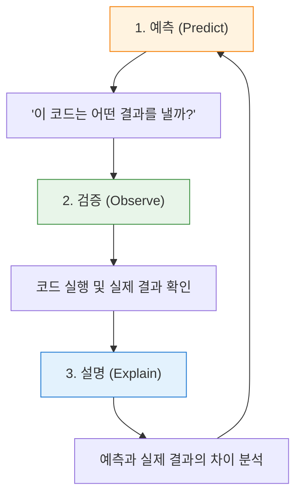

### 3. 파이썬 개발 환경 구축 흐름
* **권장 배치**: Day 1, 세션 011-013 (패키지 매니저와 가상환경)
* **설명**: 운영체제 위에서 파이썬, 패키지 매니저(uv), 가상환경이 어떻게 독립적으로 구성되는지 계층적으로 보여줍니다.

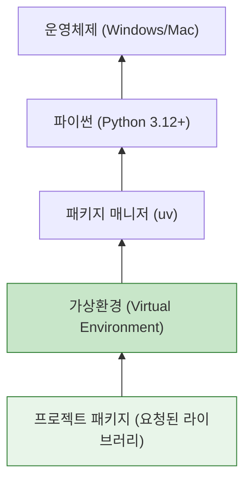

---

## Day 2: 프롬프트 엔지니어링과 요구사항 설계

### 4. 프롬프트 엔지니어링 4대 요소 (PTCF)
* **권장 배치**: Day 2, 세션 023 (프롬프트 구성 요소)
* **설명**: AI에게 내리는 명확한 지시문인 Persona, Task, Context, Format을 시각화합니다.

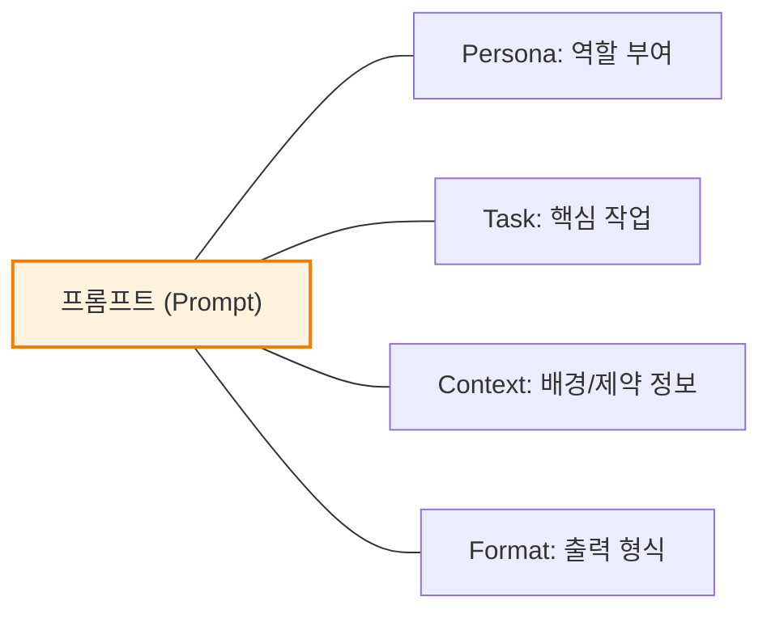

### 5. SDD (명세서 기반 개발) 워크플로우
* **권장 배치**: Day 2, 세션 036 (명세서 기반 개발 흐름)
* **설명**: 기분(Vibe) 코딩이 아닌, 명확한 요구사항을 기반으로 한 AI 협업 과정입니다.

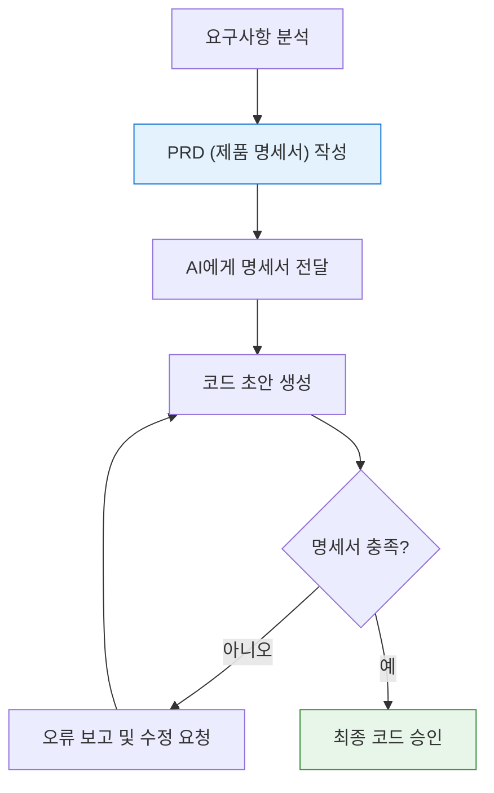

### 6. PRD (제품 요구사항 명세서) 구조
* **권장 배치**: Day 2, 세션 040 (PRD 템플릿 실습)
* **설명**: AI에게 명확한 개발 범위를 지시하기 위해 필요한 문서의 핵심 뼈대입니다.

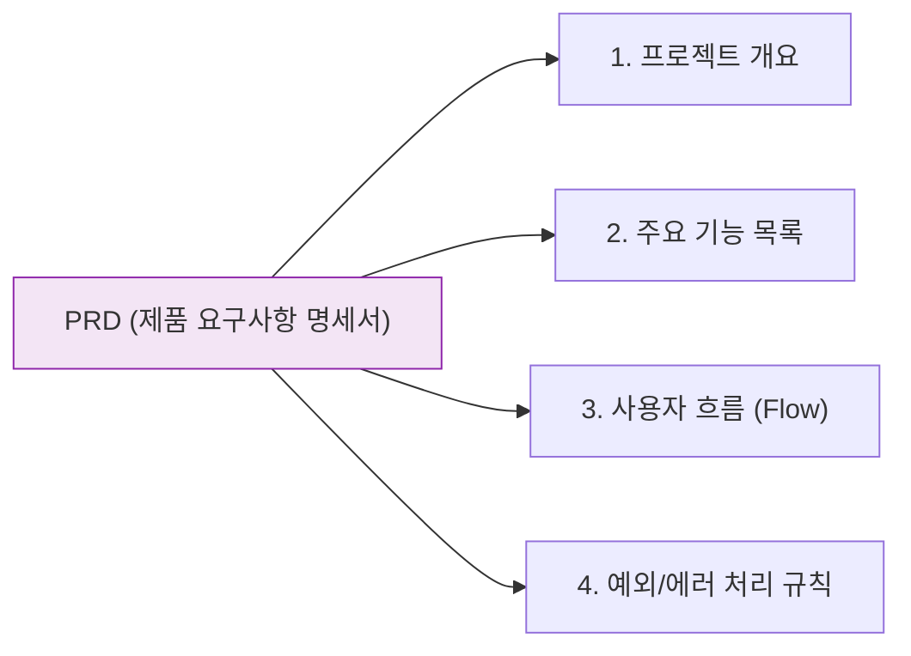

---

## Day 3: 자료형, 제어 흐름, 함수 구조

### 7. 파이썬 자료형 (Data Type) 계층 구조
* **권장 배치**: Day 3, 세션 046 (자료구조 개요)
* **설명**: 기본 자료형(단일 값)과 복합 자료구조(여러 값을 묶은 형태)의 분류를 한눈에 보여줍니다.

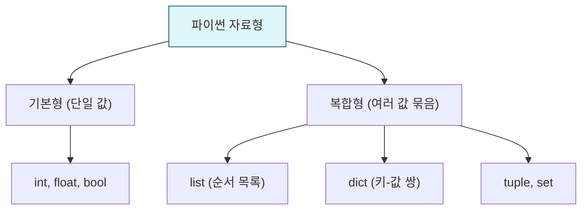

### 8. if/else 조건문 제어 흐름
* **권장 배치**: Day 3, 세션 054 (조건문 기본 구조)
* **설명**: 프로그램이 실행되다가 특정 조건에 따라 두 갈래 길로 나뉘는 논리 구조입니다.

```mermaid
flowchart TD
    A["프로그램 실행 중"] --> B{"조건 (예: 나이 >= 20?)"}
    B -->|True (참)| C["성인 요금 적용 로직"]
    B -->|False (거짓)| D["미성년자 요금 적용 로직"]
    C --> E["다음 단계 진행"]
    D --> E
    
    style B fill:#fff3e0,stroke:#f57c00
```

### 9. for/while 반복문 제어 흐름
* **권장 배치**: Day 3, 세션 057 (반복문 동작 방식)
* **설명**: 데이터의 끝에 도달하거나 조건을 만족할 때까지 동일한 코드를 빙글빙글 반복 실행합니다.

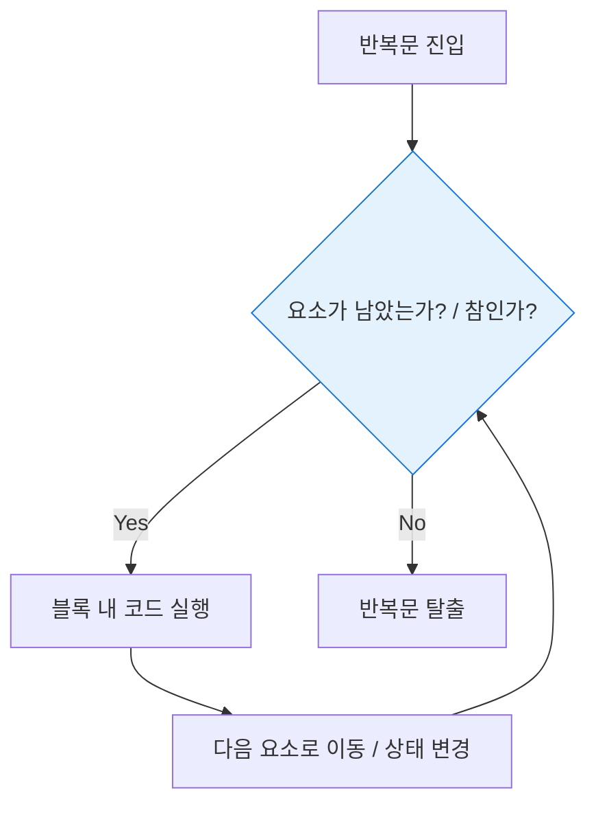

### 10. 함수(Function) 호출과 데이터 흐름
* **권장 배치**: Day 3, 세션 062 (함수의 입력과 출력)
* **설명**: 외부에서 데이터(인자)를 던져주면, 함수 안에서 가공하여 결과(반환값)를 돌려주는 구조입니다.

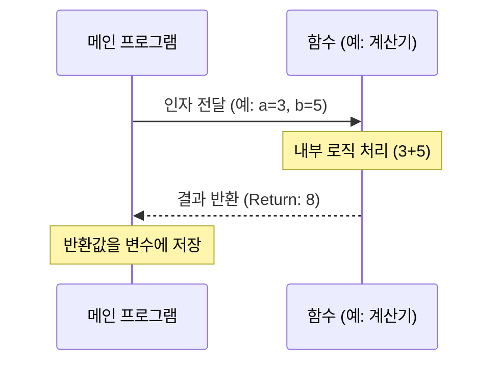

---

## Day 4: 구조적 프로그래밍과 리팩토링

### 11. 절차적 vs 구조적 프로그래밍 비교
* **권장 배치**: Day 4, 세션 074 (구조적 프로그래밍으로의 전환 이유)
* **설명**: 한 파일에 모든 로직이 뭉쳐진 절차적 형태에서, 역할별로 분리된 구조적 형태로 진화한 모습을 대비합니다.

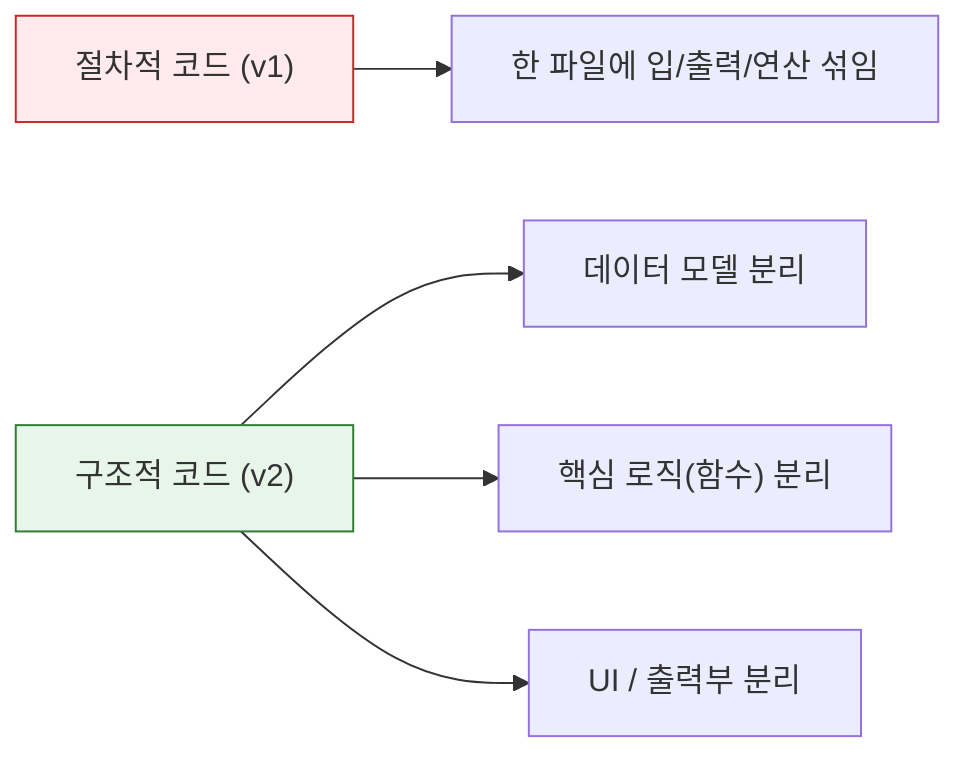

### 12. 데이터 CRUD 흐름도
* **권장 배치**: Day 4, 세션 069 (CRUD 기본 개념)
* **설명**: 시스템 내에서 데이터를 조작하는 4가지 가장 기초적이고 핵심적인 액션입니다.

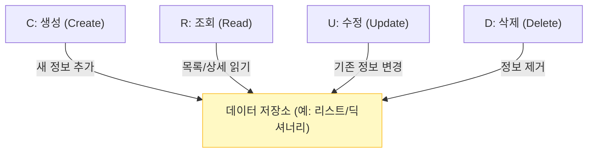

### 13. 테스트 피라미드 (Test Pyramid)
* **권장 배치**: Day 4, 세션 080 (테스트 주도 개발 개요)
* **설명**: 빠르고 가벼운 단위 테스트를 가장 많이, 느린 E2E 테스트를 가장 적게 배치하는 안정적인 품질 관리 전략입니다.

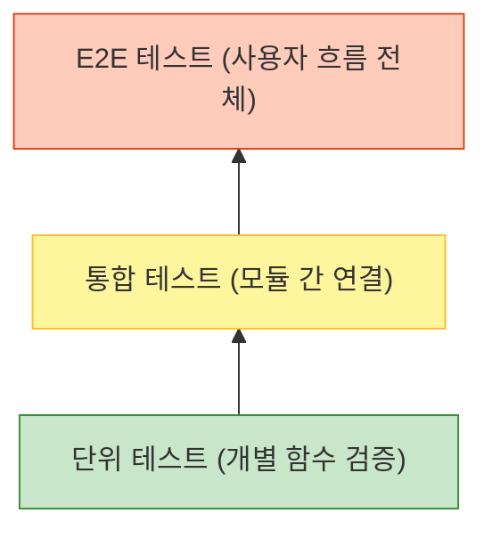

### 14. 파이썬 모듈화 컴포넌트 구조
* **권장 배치**: Day 4, 세션 075 (파일 분리 및 import)
* **설명**: 하나의 큰 파일을 쪼개고 `import`를 통해 진입점(`main.py`)에서 레고 블록처럼 조립하는 구조입니다.

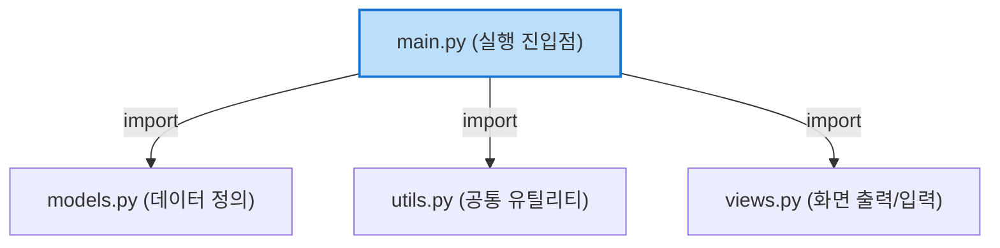

---

## Day 5: 객체지향 (OOP) 기초와 고급 설계

### 15. 클래스와 객체(인스턴스)의 관계
* **권장 배치**: Day 5, 세션 088 (OOP와 붕어빵 비유)
* **설명**: 하나의 공통된 설계도(클래스)에서 서로 다른 데이터를 담은 여러 개의 실체(객체)가 만들어지는 과정입니다.

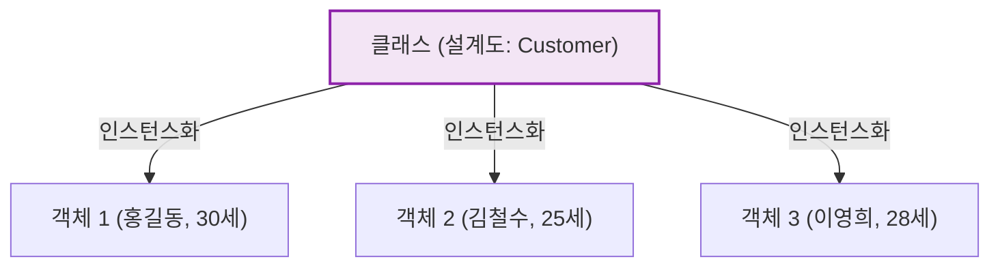

### 16. 상속 계층도 (Inheritance Hierarchy)
* **권장 배치**: Day 5, 세션 096 (상속과 다형성)
* **설명**: 공통된 특징을 Base 클래스에 두고, 특수한 기능만 파생 클래스가 물려받아 확장하는 구조입니다.

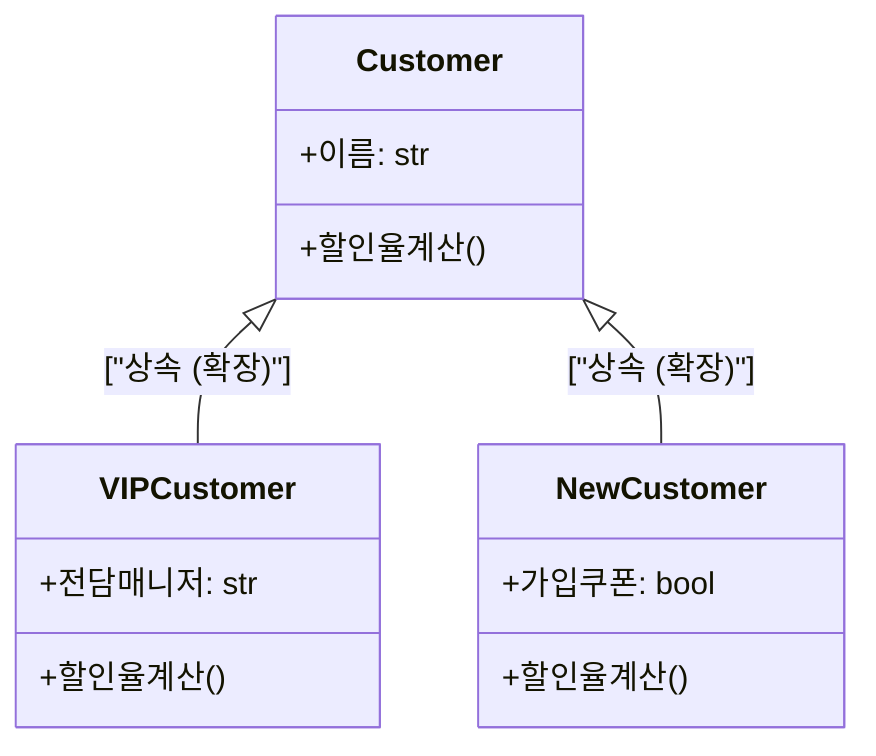

### 17. 의존성 주입 (Dependency Injection) 기본 패턴
* **권장 배치**: Day 5, 세션 100 (DI 기초)
* **설명**: 관리자(Manager) 내부에서 저장소를 하드코딩하지 않고, 외부(`main.py`)에서 필요한 저장소를 꽂아 넣어주는 유연한 설계입니다.

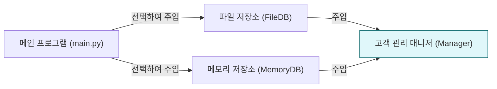

### 18. 프로그램 아키텍처 진화 (Evolution v1 → v4)
* **권장 배치**: Day 5, 세션 104 (5일간의 여정 종합 회고)
* **설명**: 5일간 다뤘던 프로그램이 하나의 단순한 파일에서 유지보수가 용이한 객체지향 애플리케이션으로 진화한 발자취입니다.

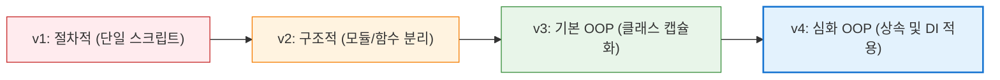
