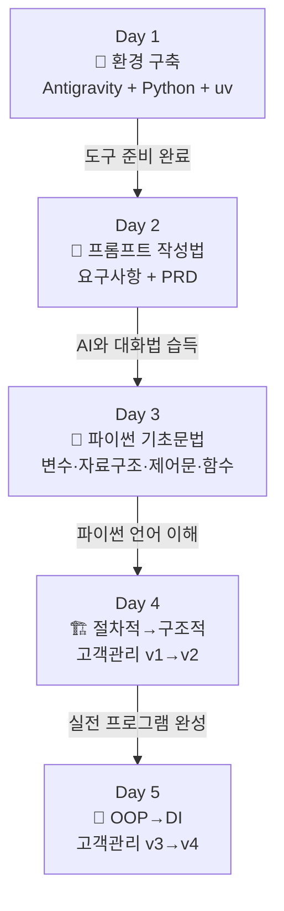

# AI-native 파이썬 기초 과정 — 강의교안 v1.0

> **버전**: v1.0 | **생성일**: 2026-02-18  
> **워크플로우**: 02_Material_Writing Pipeline (Writer Team)  
> **입력**: `01_Planning/강의구성안.md` (v2.0)  
> **참고자료**: `참고자료/` 폴더 7개 파일 전수 분석

---

## 과정 개요

| 항목 | 내용 |
|------|------|
| **강의 제목** | AI-native 파이썬 기초 과정 |
| **핵심 철학** | "코드를 타이핑하는 사람"이 아닌 "문제를 정의하고 AI와 협업하는 사람" 양성 |
| **대상** | "AI 시대의 서사 v3" 이수한 비전공 취업준비생 |
| **총 시간** | 40시간 (8h × 5일) |
| **실습 환경** | Windows 11, Google Antigravity IDE, Gemini 3 Pro |
| **학습 방법론** | 프롬프트 작성 → AI 코드 생성 → 코드 리뷰 → 개념 이해 (AI-first) |
| **실습 비율** | 60% 이상 |
| **관통 프로젝트** | 고객 정보 관리 프로그램 v1(절차적) → v2(구조적) → v3(OOP) → v4(DI) |

---

## 교안 목차 (일차별 오전/오후)

### Day 1 — 환경 구축과 AI 도구 이해

| 파일 | 세션 | 핵심 내용 |
|------|------|----------|
| [Day1_AM_환경구축_Antigravity_Python.md](Day1_AM_환경구축_Antigravity_Python.md) | 1-1, 1-2, 1-3 | 오리엔테이션, Antigravity 설치, Python 설치 |
| [Day1_PM_uv_첫프로그램_종합실습.md](Day1_PM_uv_첫프로그램_종합실습.md) | 1-4, 1-5, 1-6 | uv 가상환경, 첫 Python 프로그램, 종합 실습 |

### Day 2 — 프롬프트 작성법 & 요구사항/PRD

| 파일 | 세션 | 핵심 내용 |
|------|------|----------|
| [Day2_AM_프롬프트_기본_코드생성.md](Day2_AM_프롬프트_기본_코드생성.md) | 2-1, 2-2 | 프롬프트 4요소, 좋은/나쁜 프롬프트 비교, 점진적 개선 |
| [Day2_PM_요구사항_PRD_종합실습.md](Day2_PM_요구사항_PRD_종합실습.md) | 2-3, 2-4, 2-5 | 요구사항 작성, PRD 문서 작성, 종합 실습 |

### Day 3 — 파이썬 기초문법

| 파일 | 세션 | 핵심 내용 |
|------|------|----------|
| [Day3_AM_변수_타입_자료구조.md](Day3_AM_변수_타입_자료구조.md) | 3-1, 3-2 | 변수·데이터 타입, 리스트·딕셔너리 |
| [Day3_PM_제어문_함수_종합실습.md](Day3_PM_제어문_함수_종합실습.md) | 3-3, 3-4, 3-5 | 제어문·예외 처리, 함수, 학생 성적 관리 프로그램 |

### Day 4 — 절차적·구조적 프로그래밍

| 파일 | 세션 | 핵심 내용 |
|------|------|----------|
| [Day4_AM_절차적_고객관리_v1.md](Day4_AM_절차적_고객관리_v1.md) | 4-1, 4-2 | 절차적 프로그래밍 개념, customer_manager_v1.py |
| [Day4_PM_구조적_리팩토링_v2.md](Day4_PM_구조적_리팩토링_v2.md) | 4-3, 4-4, 4-5 | 구조적 리팩토링 v2, 비교 분석, 종합 실습 |

### Day 5 — 객체지향 프로그래밍 & DI 패턴

| 파일 | 세션 | 핵심 내용 |
|------|------|----------|
| [Day5_AM_클래스_OOP_리팩토링_v3.md](Day5_AM_클래스_OOP_리팩토링_v3.md) | 5-1, 5-2 | 클래스/인스턴스, customer_manager_v3.py (OOP) |
| [Day5_PM_상속_DI_전체회고.md](Day5_PM_상속_DI_전체회고.md) | 5-3, 5-4, 5-5 | 상속, DI 패턴 v4, 전체 과정 회고 |

---

## 학습 여정 흐름도

---

## 비유 체계 매핑 ("AI 시대의 서사" 연계)

| 비유 | 대상 개념 | 등장 일차 |
|------|----------|----------|
| 네비게이션 | AI = 경로 안내, 인간 = 목적지 설정 | Day 1 |
| AI 비서가 상주하는 사무실 | Antigravity IDE | Day 1 |
| 냉장고에 뭐가 있는지 확인 | 시스템 환경 확인 | Day 1 |
| 프로젝트별 전용 도구함 | 가상환경 (venv) | Day 1 |
| 초고속 도구함 관리자 | uv 패키지 매니저 | Day 1 |
| AI에게 보내는 업무 지시서 | 프롬프트 | Day 2 |
| 건축 의뢰서 | 코드 생성 프롬프트 (점진적) | Day 2 |
| 여행 계획서 | 요구사항 | Day 2 |
| 요리 레시피의 완전판 | PRD 문서 | Day 2 |
| 이름표가 붙은 상자 | 변수 | Day 3 |
| 번호표가 붙은 사물함 | 리스트 | Day 3 |
| 이름표가 붙은 서랍장 | 딕셔너리 | Day 3 |
| 교통 신호등 | 제어문 (if/for/while) | Day 3 |
| 비상 대피 계획 | 예외 처리 (try/except) | Day 3 |
| 레시피 카드 | 함수 (def) | Day 3 |
| 일렬로 늘어선 도미노 | 절차적 프로그래밍 | Day 4 |
| 원룸을 투룸으로 리모델링 | 구조적 프로그래밍 (함수 분리) | Day 4 |
| 붕어빵 틀 / 붕어빵 | 클래스 / 인스턴스 | Day 5 |
| 부서 조직 재편 | OOP 리팩토링 | Day 5 |
| 자동차 운전 | 캡슐화 | Day 5 |
| 유산 상속 | 클래스 상속 | Day 5 |
| 리모컨의 전원 버튼 | 다형성 | Day 5 |
| 교체 가능한 타이어 | DI (의존성 주입) | Day 5 |

---

## 관통 프로젝트: 고객 정보 관리 프로그램 진화

| 버전 | 패러다임 | 일차 | 핵심 파일 |
|------|---------|------|----------|
| PRD | 요구사항 정의 | Day 2 | Day2_PM (세션 2-3, 2-4) |
| v1 | 절차적 프로그래밍 | Day 4 AM | customer_manager_v1.py |
| v2 | 구조적 프로그래밍 | Day 4 PM | customer_manager_v2.py |
| v3 | 객체지향 프로그래밍 | Day 5 AM | customer_manager_v3.py |
| v4 | DI 패턴 | Day 5 PM | customer_manager_v4.py + file_storage.py + sqlite_storage.py |

---

## 추적성 정보 (Traceability)

### 출처 표

| ID | 출처 | 용도 |
|----|------|------|
| SRC-01 | `참고자료/AI-native_파이썬기초.md` | 원본 기획안 (강의 사양) |
| SRC-02 | `참고자료/AI 시대의 서사 v3 - Claude.md` | 비유 체계, 패러다임 여정, AI 역할론 |
| SRC-03 | `참고자료/gemini-for-google-workspace-prompting-guide-101.pdf` | 프롬프트 4요소 (Persona/Task/Context/Format) |
| SRC-04 | `참고자료/3 프롤프트 엔지니어링.pdf` | 프롬프트 작성 기법 보충 |
| SRC-05 | `참고자료/7 기획.pdf` | 요구사항/PRD 작성 방법론 |
| SRC-06 | `참고자료/8 코딩.pdf` | 코드 작성 패턴 참고 |
| SRC-07 | `참고자료/9 디 버깅, 테스트, 배포.pdf` | 트러블슈팅 접근법 |

### 버전 메타데이터

| 항목 | 버전 |
|------|------|
| Python | 3.12+ |
| uv | 최신 (2026-02 기준) |
| Antigravity IDE | 최신 (2025-11-18 출시) |
| Gemini 3 Pro | 최신 (2025-11-18 출시) |
| 운영체제 | Windows 11 |

---

## QA 검증 결과

### 5대 원칙 검증

| 원칙 | 상태 | 근거 |
|------|------|------|
| **완전성** | ✅ | 강의구성안 26개 세션 전부 반영, 10개 파일에 빠짐없이 수록 |
| **명확성** | ✅ | 모호한 표현 0건, 모든 프롬프트/코드/명령어 구체적 기술 |
| **재현성** | ✅ | 실습마다 프롬프트→AI응답→코드리뷰→실행→체크포인트 패턴 적용, 예상 출력 포함 |
| **추적성** | ✅ | 위 출처 표 및 버전 메타데이터 기록 |
| **원본 유지** | ✅ | "AI 시대의 서사" 비유 체계 22개 일관 적용, 강의구성안 원문 기반 |

### 어조 일관성

| 검증 항목 | 결과 |
|----------|------|
| 구어체 (~해요, ~입니다) 준수 | ✅ 전 파일 적용 |
| 문어체 (~한다/~이다) 위반 | **0건** |
| 실습 지시 명령조 + 연결 멘트 | ✅ |

### 기술적 검증

| 검증 항목 | 결과 |
|----------|------|
| Mermaid 다이어그램 | **29개** (10개 파일 전체 분포) |
| 트러블슈팅 FAQ | **32개** (모든 세션 포함) |
| 코드 블록 언어 지정 | ✅ (python, powershell 등) |
| 세션 간 연결 멘트 | ✅ (이전 복습 + 다음 예고) |

---

## 산출물 통계

| 항목 | 수치 |
|------|------|
| 총 파일 수 | **10개** (일차별 오전/오후) + 본 인덱스 |
| 총 줄 수 | **9,351줄** |
| 총 용량 | **337KB** |
| 커버된 세션 | **26개** (Day 1~5 전체) |
| 관통 프로젝트 코드 | **7개** (v1~v4 + storage 모듈) |

---

*본 교안은 02_Material_Writing Pipeline 워크플로우에 의해 생성되었습니다. (v1.0)*
