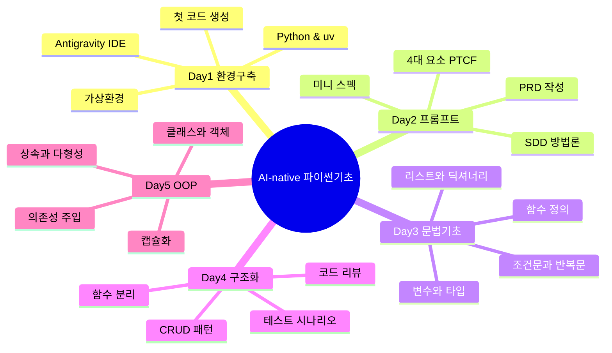

# AI-native 파이썬기초 — 강의교안 v2.0

> **버전**: 2.0
> **총 세션 수**: 106개 마이크로 세션
> **총 예상 시간**: 2,305분 (38시간 25분)
> **교육 기간**: 5일 (하루 8시간, 09:00~18:00)
> **작성 일시**: 2026-02-25
> **작성 방식**: 3-Source Mandatory 팩트 패킷 기반 마이크로 세션 청킹
> **대상**: 비전공자 (AI와 협업하는 방식으로 학습)
> **도구**: Windows 11, Antigravity IDE, Gemini 3 Pro, uv 패키지 매니저

---

## 📋 목차 및 네비게이션

### 전체 세션 인덱스

| 세션 | 제목 | 시간 | 청크 타입 | 난이도 | 바로가기 |
|------|------|------|-----------|--------|----------|
| 001 | 과정 로드맵과 아이스브레이킹 | 20분 | 📖 narrative | low | [바로가기](#세션-001) |
| 002 | AI 시대의 서사 핵심 복습 | 20분 | 📖 narrative | low | [바로가기](#세션-002) |
| 003 | 학습 방법론과 SDD 미리보기 | 20분 | 📖 narrative | low | [바로가기](#세션-003) |
| 004 | Antigravity 설치와 시연 | 25분 | 🧪 lab | low | [바로가기](#세션-004) |
| 005 | Editor 뷰와 기본 조작 | 20분 | 🧪 lab | low | [바로가기](#세션-005) |
| 006 | Agent Manager와 첫 인사 | 20분 | 🧪 lab | low | [바로가기](#세션-006) |
| 007 | 멀티에이전트 오케스트레이션 기초 | 25분 | 🧪 lab | medium | [바로가기](#세션-007) |
| 008 | 프롬프트로 시스템 환경 확인 | 20분 | 🧪 lab | medium | [바로가기](#세션-008) |
| 009 | AI와 함께 Python 설치하기 | 20분 | 🧪 lab | medium | [바로가기](#세션-009) |
| 010 | 트러블슈팅과 5 Whys 기법 | 20분 | 🧪 lab | medium | [바로가기](#세션-010) |
| 011 | uv 패키지 매니저 소개와 설치 | 20분 | 🧪 lab | medium | [바로가기](#세션-011) |
| 012 | 가상환경의 필요성 이해 | 25분 | 📖 narrative | medium | [바로가기](#세션-012) |
| 013 | uv로 가상환경 생성 및 활성화 | 25분 | 🧪 lab | medium | [바로가기](#세션-013) |
| 014 | uv pip로 패키지 설치 체험 | 20분 | 🧪 lab | low | [바로가기](#세션-014) |
| 015 | 프롬프트로 첫 파이썬 코드 생성 | 20분 | 🧪 lab | medium | [바로가기](#세션-015) |
| 016 | 코드 실행과 예측-검증-설명 경험 | 20분 | 🧪 lab | medium | [바로가기](#세션-016) |
| 017 | 프롬프트 변형으로 코드 변화 관찰하기 | 20분 | 🧪 lab | medium | [바로가기](#세션-017) |
| 018 | [종합 실습 1] 나만의 환경 구축부터 프로그램 실행까지 | 25분 | 🧪 lab | high | [바로가기](#세션-018) |
| 019 | [종합 실습 2] 미니 스펙 첫 경험: 고객 1명 관리 프로그램 | 25분 | 🧪 lab | high | [바로가기](#세션-019) |
| 020 | 동료 학습과 자주 묻는 질문 해결 | 20분 | 🧪 lab | low | [바로가기](#세션-020) |
| 021 | Day 1 핵심 정리 퀴즈와 QnA | 20분 | 📖 narrative | low | [바로가기](#세션-021) |
| 022 | 마무리 및 Day 2 예고 | 15분 | 📖 narrative | low | [바로가기](#세션-022) |
| 023 | 프롬프트의 본질 | 20분 | 📖 narrative | low | [바로가기](#세션-023) |
| 024 | 프롬프트 구성 4요소 1 - Persona와 Task | 20분 | 📖 narrative | medium | [바로가기](#세션-024) |
| 025 | 프롬프트 구성 4요소 2 - Context와 Format | 25분 | 📖 narrative | medium | [바로가기](#세션-025) |
| 026 | 좋은 프롬프트 vs 나쁜 프롬프트 비교 실험 | 25분 | 🧪 lab | low | [바로가기](#세션-026) |
| 027 | 코드 생성 특화 프롬프트: 5대 필수 항목 | 25분 | 📖 narrative | medium | [바로가기](#세션-027) |
| 028 | 점진적 개선(Iterative Refinement)의 이해 | 20분 | 📖 narrative | medium | [바로가기](#세션-028) |
| 029 | 프롬프트 고도화 실습: 비밀번호 검사기 만들기 | 25분 | 🧪 lab | medium | [바로가기](#세션-029) |
| 030 | 고급 프롬프트 기법: CoT와 Few-shot | 20분 | 💻 code | high | [바로가기](#세션-030) |
| 031 | 요구사항(Requirements)의 본질: 여행 계획서 | 20분 | 📖 narrative | low | [바로가기](#세션-031) |
| 032 | 체계적인 요구사항 도출: 5W1H 체크리스트 | 25분 | 📖 narrative | medium | [바로가기](#세션-032) |
| 033 | SDD(Specification-Driven Development)의 이해 | 20분 | 📖 narrative | high | [바로가기](#세션-033) |
| 034 | AI와 함께하는 요구사항 작성 실습 | 25분 | 🧪 lab | medium | [바로가기](#세션-034) |
| 035 | PRD(Product Requirements Document)란 무엇인가? | 20분 | 📖 narrative | low | [바로가기](#세션-035) |
| 036 | PRD의 핵심 구조와 기능 명세(FR) 작성법 | 25분 | 💻 code | medium | [바로가기](#세션-036) |
| 037 | 사용자 시나리오와 성공 지표 정의 | 20분 | 📖 narrative | medium | [바로가기](#세션-037) |
| 038 | 고객 정보 관리 프로그램 PRD 완성하기 | 25분 | 🧪 lab | medium | [바로가기](#세션-038) |
| 039 | 미니 스펙 프로젝트: 주제 선정 및 요구사항 | 25분 | 🧪 lab | medium | [바로가기](#세션-039) |
| 040 | 미니 스펙 프로젝트: PRD 작성 및 프롬프트 준비 | 25분 | 🧪 lab | medium | [바로가기](#세션-040) |
| 041 | 미니 스펙 프로젝트: 코드 생성 및 실행 검증 | 25분 | 🧪 lab | high | [바로가기](#세션-041) |
| 042 | 팀별 발표: '나는 이렇게 AI와 대화했다' | 15분 | 📖 narrative | low | [바로가기](#세션-042) |
| 043 | Day 2 핵심 요약 및 프롬프트 포트폴리오 정리 | 15분 | 📖 narrative | low | [바로가기](#세션-043) |
| 044 | 변수의 개념과 이름표 상자 비유 | 20분 | 📖 narrative | low | [바로가기](#세션-044) |
| 045 | 기본 데이터 타입 4가지 | 20분 | 📖 narrative | low | [바로가기](#세션-045) |
| 046 | 타입 변환과 f-string | 25분 | 💻 code | low | [바로가기](#세션-046) |
| 047 | 기본 연산자와 실습 | 20분 | 🧪 lab | low | [바로가기](#세션-047) |
| 048 | 리스트의 이해와 기본 조작 | 25분 | 📖 narrative | medium | [바로가기](#세션-048) |
| 049 | 리스트 인덱싱과 슬라이싱 | 20분 | 💻 code | medium | [바로가기](#세션-049) |
| 050 | 딕셔너리의 이해 | 25분 | 📖 narrative | medium | [바로가기](#세션-050) |
| 051 | 복합 자료구조 | 20분 | 💻 code | high | [바로가기](#세션-051) |
| 052 | 조건문 if/elif/else | 25분 | 📖 narrative | medium | [바로가기](#세션-052) |
| 053 | 반복문 for와 range | 20분 | 💻 code | medium | [바로가기](#세션-053) |
| 054 | 반복문 while과 제어 흐름 | 25분 | 💻 code | medium | [바로가기](#세션-054) |
| 055 | 예외 처리 try/except | 20분 | 📖 narrative | medium | [바로가기](#세션-055) |
| 056 | 함수의 개념과 정의 | 20분 | 📖 narrative | low | [바로가기](#세션-056) |
| 057 | 함수의 매개변수와 반환값 | 25분 | 💻 code | medium | [바로가기](#세션-057) |
| 058 | 내장 함수 활용 | 15분 | 💻 code | low | [바로가기](#세션-058) |
| 059 | 리스트 컴프리헨션 | 25분 | 💻 code | high | [바로가기](#세션-059) |
| 060 | [종합 실습 1] 학생 성적 관리 데이터 모델링 | 20분 | 🧪 lab | medium | [바로가기](#세션-060) |
| 061 | [종합 실습 2] 제어문과 함수로 로직 구현 | 25분 | 🧪 lab | high | [바로가기](#세션-061) |
| 062 | [종합 실습 3] 통계 분석기 추가 | 25분 | 🧪 lab | high | [바로가기](#세션-062) |
| 063 | 생성 코드 리뷰 게임 | 20분 | 🧪 lab | medium | [바로가기](#세션-063) |
| 064 | Day 3 총정리 | 15분 | 📖 narrative | low | [바로가기](#세션-064) |
| 065 | 절차적 프로그래밍의 개념과 특징 | 20분 | 📖 narrative | low | [바로가기](#세션-065) |
| 066 | AI 시대의 서사 복습: 구조적 프로그래밍으로의 여정 | 20분 | 📖 narrative | medium | [바로가기](#세션-066) |
| 067 | 고객 정보 관리 프로그램 PRD 복습 및 설계 | 20분 | 📖 narrative | low | [바로가기](#세션-067) |
| 068 | CRUD 개념 이해 및 1차 프롬프트 작성 실습 | 25분 | 🧪 lab | medium | [바로가기](#세션-068) |
| 069 | 데이터 저장 구조(전역 리스트, 딕셔너리) 이해 | 20분 | 💻 code | medium | [바로가기](#세션-069) |
| 070 | 절차적 Create, Read 기능 구현 및 테스트 | 25분 | 🧪 lab | medium | [바로가기](#세션-070) |
| 071 | 절차적 Update, Delete 기능 구현 및 통합 테스트 | 25분 | 🧪 lab | high | [바로가기](#세션-071) |
| 072 | 코드 리뷰: 전역 변수와 코드 중복의 한계점 발견 | 20분 | 📖 narrative | medium | [바로가기](#세션-072) |
| 073 | 절차적 코드의 구조적 리팩토링 프롬프트 작성 | 20분 | 🧪 lab | medium | [바로가기](#세션-073) |
| 074 | 구조적 데이터 흐름(매개변수와 리턴)의 이해 | 20분 | 💻 code | high | [바로가기](#세션-074) |
| 075 | 절차적 vs 구조적 코드 나란히 비교 분석 | 20분 | 📖 narrative | medium | [바로가기](#세션-075) |
| 076 | 요구사항 추가를 통한 구조적 확장성 체험 | 25분 | 🧪 lab | medium | [바로가기](#세션-076) |
| 077 | 테스트는 시승이다: 테스트 시나리오 3분류 이해 | 20분 | 📖 narrative | low | [바로가기](#세션-077) |
| 078 | 고객 관리 프로그램 테스트 시나리오 작성 실습 | 25분 | 🧪 lab | medium | [바로가기](#세션-078) |
| 079 | 품질 검사관: 코드 리뷰 5대 체크포인트 | 20분 | 📖 narrative | medium | [바로가기](#세션-079) |
| 080 | 완벽한 리뷰 코멘트 작성 및 AI 피드백 실습 | 25분 | 🧪 lab | high | [바로가기](#세션-080) |
| 081 | Day 4 종합: 절차에서 구조로, 그리고 테스트까지 | 20분 | 📖 narrative | low | [바로가기](#세션-081) |
| 082 | 나만의 미니 프로젝트: 기획 및 절차적 코드 생성 | 20분 | 🧪 lab | medium | [바로가기](#세션-082) |
| 083 | 미니 프로젝트: 구조적 리팩토링 및 퀄리티 체크 | 20분 | 🧪 lab | high | [바로가기](#세션-083) |
| 084 | 미니 프로젝트: 극한의 테스트 시나리오 도출 | 20분 | 🧪 lab | high | [바로가기](#세션-084) |
| 085 | 미니 프로젝트: 코드 리뷰 기반 최종 완성 및 회고 | 25분 | 🧪 lab | medium | [바로가기](#세션-085) |
| 086 | 클래스와 인스턴스의 개념 | 20분 | 📖 narrative | low | [바로가기](#세션-086) |
| 087 | 속성과 메서드, 그리고 __init__ | 25분 | 💻 code | medium | [바로가기](#세션-087) |
| 088 | 나만의 클래스 만들기 실습 | 25분 | 🧪 lab | medium | [바로가기](#세션-088) |
| 089 | 데이터를 담는 특별한 그릇, @dataclass | 20분 | 💻 code | medium | [바로가기](#세션-089) |
| 090 | 객체지향 리팩토링과 캡슐화 개념 | 20분 | 📖 narrative | medium | [바로가기](#세션-090) |
| 091 | 고객관리 v3로의 진화 (OOP 적용) | 25분 | 💻 code | medium | [바로가기](#세션-091) |
| 092 | 데이터 검증 함수 추가 | 20분 | 💻 code | medium | [바로가기](#세션-092) |
| 093 | 캡슐화 실습 및 v3 코드 리뷰 | 25분 | 🧪 lab | medium | [바로가기](#세션-093) |
| 094 | 상속의 개념과 필요성 | 20분 | 📖 narrative | medium | [바로가기](#세션-094) |
| 095 | 기존 클래스 확장하기 (VIPCustomer와 super) | 20분 | 💻 code | medium | [바로가기](#세션-095) |
| 096 | 다형성 체험 (리모컨의 전원 버튼) | 20분 | 🧪 lab | medium | [바로가기](#세션-096) |
| 097 | 의존성 주입(DI) 개념 | 20분 | 📖 narrative | medium | [바로가기](#세션-097) |
| 098 | 파일 저장 모듈(FileStorage) 구현 | 25분 | 💻 code | medium | [바로가기](#세션-098) |
| 099 | DB 저장 모듈(SQLiteStorage) 구현 | 25분 | 💻 code | medium | [바로가기](#세션-099) |
| 100 | DI 적용 실습 (v4 저장소 교체 테스트) | 20분 | 🧪 lab | medium | [바로가기](#세션-100) |
| 101 | 고객관리 프로그램 진화 과정 총정리 | 25분 | 📖 narrative | low | [바로가기](#세션-101) |
| 102 | "AI 시대의 서사" 최종 연결 및 SDD 회고 | 20분 | 📖 narrative | low | [바로가기](#세션-102) |
| 103 | 수료 프로젝트 코드 리뷰 공유 | 25분 | 🧪 lab | medium | [바로가기](#세션-103) |
| 104 | 파이썬 기초 전 과정 핵심 퀴즈 | 25분 | 🧪 lab | medium | [바로가기](#세션-104) |
| 105 | 수료 후 학습 로드맵 및 심화 학습 상담 | 20분 | 📖 narrative | low | [바로가기](#세션-105) |
| 106 | 최종 마무리 및 수료식 | 20분 | 📖 narrative | low | [바로가기](#세션-106) |

### 일자별 진행표

**Day 1: AI 도구 탐험과 개발 환경 구축** (465분)
- 오전 (09:00~12:00): 세션 001 ~ 011
- 오후 (13:00~18:00): 세션 012 ~ 022

**Day 2: 프롬프트 엔지니어링과 요구사항 분석** (465분)
- 오전 (09:00~12:00): 세션 023 ~ 033
- 오후 (13:00~18:00): 세션 034 ~ 043

**Day 3: 파이썬 문법 기초와 데이터 다루기** (455분)
- 오전 (09:00~12:00): 세션 044 ~ 054
- 오후 (13:00~18:00): 세션 055 ~ 064

**Day 4: 절차적에서 구조적 프로그래밍으로** (455분)
- 오전 (09:00~12:00): 세션 065 ~ 075
- 오후 (13:00~18:00): 세션 076 ~ 085

**Day 5: 객체지향 프로그래밍과 과정 마무리** (465분)
- 오전 (09:00~12:00): 세션 086 ~ 096
- 오후 (13:00~18:00): 세션 097 ~ 106

---

## 🗺️ 전체 의존성 그래프

```mermaid
graph TD

    subgraph Day1["Day 1: AI 도구 & 환경 구축"]
        MS001["001: 과정 로드맵과 아이스브레이킹"]
        MS002["002: AI 시대의 서사 핵심 복습"]
        MS003["003: 학습 방법론과 SDD 미리보기"]
        MS004["004: Antigravity 설치와 시연"]
        MS005["005: Editor 뷰와 기본 조작"]
        MS006["006: Agent Manager와 첫 인사"]
        MS007["007: 멀티에이전트 오케스트레이션 기초"]
        MS008["008: 프롬프트로 시스템 환경 확인"]
        MS009["009: AI와 함께 Python 설치하기"]
        MS010["010: 트러블슈팅과 5 Whys 기법"]
        MS011["011: uv 패키지 매니저 소개와 설치"]
        MS012["012: 가상환경의 필요성 이해"]
        MS013["013: uv로 가상환경 생성 및 활성화"]
        MS014["014: uv pip로 패키지 설치 체험"]
        MS015["015: 프롬프트로 첫 파이썬 코드 생성"]
        MS016["016: 코드 실행과 예측-검증-설명 경험"]
        MS017["017: 프롬프트 변형으로 코드 변화 관찰하기"]
        MS018["018: [종합 실습 1] 나만의 환경 구…"]
        MS019["019: [종합 실습 2] 미니 스펙 첫 …"]
        MS020["020: 동료 학습과 자주 묻는 질문 해결"]
        MS021["021: Day 1 핵심 정리 퀴즈와 QnA"]
        MS022["022: 마무리 및 Day 2 예고"]
    end

    subgraph Day2["Day 2: 프롬프트 & 요구사항"]
        MS023["023: 프롬프트의 본질"]
        MS024["024: 프롬프트 구성 4요소 1 - Pe…"]
        MS025["025: 프롬프트 구성 4요소 2 - Co…"]
        MS026["026: 좋은 프롬프트 vs 나쁜 프롬프트…"]
        MS027["027: 코드 생성 특화 프롬프트: 5대 …"]
        MS028["028: 점진적 개선(Iterative R…"]
        MS029["029: 프롬프트 고도화 실습: 비밀번호 …"]
        MS030["030: 고급 프롬프트 기법: CoT와 F…"]
        MS031["031: 요구사항(Requirements)…"]
        MS032["032: 체계적인 요구사항 도출: 5W1H…"]
        MS033["033: SDD(Specification-…"]
        MS034["034: AI와 함께하는 요구사항 작성 실습"]
        MS035["035: PRD(Product Requir…"]
        MS036["036: PRD의 핵심 구조와 기능 명세(…"]
        MS037["037: 사용자 시나리오와 성공 지표 정의"]
        MS038["038: 고객 정보 관리 프로그램 PRD …"]
        MS039["039: 미니 스펙 프로젝트: 주제 선정 …"]
        MS040["040: 미니 스펙 프로젝트: PRD 작성…"]
        MS041["041: 미니 스펙 프로젝트: 코드 생성 …"]
        MS042["042: 팀별 발표: '나는 이렇게 AI와…"]
        MS043["043: Day 2 핵심 요약 및 프롬프트…"]
    end

    subgraph Day3["Day 3: 파이썬 문법 기초"]
        MS044["044: 변수의 개념과 이름표 상자 비유"]
        MS045["045: 기본 데이터 타입 4가지"]
        MS046["046: 타입 변환과 f-string"]
        MS047["047: 기본 연산자와 실습"]
        MS048["048: 리스트의 이해와 기본 조작"]
        MS049["049: 리스트 인덱싱과 슬라이싱"]
        MS050["050: 딕셔너리의 이해"]
        MS051["051: 복합 자료구조"]
        MS052["052: 조건문 if/elif/else"]
        MS053["053: 반복문 for와 range"]
        MS054["054: 반복문 while과 제어 흐름"]
        MS055["055: 예외 처리 try/except"]
        MS056["056: 함수의 개념과 정의"]
        MS057["057: 함수의 매개변수와 반환값"]
        MS058["058: 내장 함수 활용"]
        MS059["059: 리스트 컴프리헨션"]
        MS060["060: [종합 실습 1] 학생 성적 관리…"]
        MS061["061: [종합 실습 2] 제어문과 함수로…"]
        MS062["062: [종합 실습 3] 통계 분석기 추가"]
        MS063["063: 생성 코드 리뷰 게임"]
        MS064["064: Day 3 총정리"]
    end

    subgraph Day4["Day 4: 절차적→구조적 프로그래밍"]
        MS065["065: 절차적 프로그래밍의 개념과 특징"]
        MS066["066: AI 시대의 서사 복습: 구조적 …"]
        MS067["067: 고객 정보 관리 프로그램 PRD …"]
        MS068["068: CRUD 개념 이해 및 1차 프롬…"]
        MS069["069: 데이터 저장 구조(전역 리스트, …"]
        MS070["070: 절차적 Create, Read 기…"]
        MS071["071: 절차적 Update, Delete…"]
        MS072["072: 코드 리뷰: 전역 변수와 코드 중…"]
        MS073["073: 절차적 코드의 구조적 리팩토링 프…"]
        MS074["074: 구조적 데이터 흐름(매개변수와 리…"]
        MS075["075: 절차적 vs 구조적 코드 나란히 …"]
        MS076["076: 요구사항 추가를 통한 구조적 확장…"]
        MS077["077: 테스트는 시승이다: 테스트 시나리…"]
        MS078["078: 고객 관리 프로그램 테스트 시나리…"]
        MS079["079: 품질 검사관: 코드 리뷰 5대 체…"]
        MS080["080: 완벽한 리뷰 코멘트 작성 및 AI…"]
        MS081["081: Day 4 종합: 절차에서 구조로…"]
        MS082["082: 나만의 미니 프로젝트: 기획 및 …"]
        MS083["083: 미니 프로젝트: 구조적 리팩토링 …"]
        MS084["084: 미니 프로젝트: 극한의 테스트 시…"]
        MS085["085: 미니 프로젝트: 코드 리뷰 기반 …"]
    end

    subgraph Day5["Day 5: 객체지향 & 마무리"]
        MS086["086: 클래스와 인스턴스의 개념"]
        MS087["087: 속성과 메서드, 그리고 __ini…"]
        MS088["088: 나만의 클래스 만들기 실습"]
        MS089["089: 데이터를 담는 특별한 그릇, @d…"]
        MS090["090: 객체지향 리팩토링과 캡슐화 개념"]
        MS091["091: 고객관리 v3로의 진화 (OOP …"]
        MS092["092: 데이터 검증 함수 추가"]
        MS093["093: 캡슐화 실습 및 v3 코드 리뷰"]
        MS094["094: 상속의 개념과 필요성"]
        MS095["095: 기존 클래스 확장하기 (VIPCu…"]
        MS096["096: 다형성 체험 (리모컨의 전원 버튼)"]
        MS097["097: 의존성 주입(DI) 개념"]
        MS098["098: 파일 저장 모듈(FileStora…"]
        MS099["099: DB 저장 모듈(SQLiteSto…"]
        MS100["100: DI 적용 실습 (v4 저장소 교…"]
        MS101["101: 고객관리 프로그램 진화 과정 총정리"]
        MS102["102: "AI 시대의 서사" 최종 연결 …"]
        MS103["103: 수료 프로젝트 코드 리뷰 공유"]
        MS104["104: 파이썬 기초 전 과정 핵심 퀴즈"]
        MS105["105: 수료 후 학습 로드맵 및 심화 학…"]
        MS106["106: 최종 마무리 및 수료식"]
    end

    MS001 --> MS002
    MS002 --> MS003
    MS003 --> MS004
    MS004 --> MS005
    MS005 --> MS006
    MS006 --> MS007
    MS007 --> MS008
    MS008 --> MS009
    MS009 --> MS010
    MS010 --> MS011
    MS011 --> MS012
    MS012 --> MS013
    MS013 --> MS014
    MS014 --> MS015
    MS015 --> MS016
    MS016 --> MS017
    MS017 --> MS018
    MS018 --> MS019
    MS019 --> MS020
    MS020 --> MS021
    MS021 --> MS022
    MS023 --> MS024
    MS024 --> MS025
    MS025 --> MS026
    MS026 --> MS027
    MS027 --> MS028
    MS028 --> MS029
    MS029 --> MS030
    MS030 --> MS031
    MS031 --> MS032
    MS032 --> MS033
    MS033 --> MS034
    MS034 --> MS035
    MS035 --> MS036
    MS036 --> MS037
    MS037 --> MS038
    MS038 --> MS039
    MS039 --> MS040
    MS040 --> MS041
    MS041 --> MS042
    MS042 --> MS043
    MS044 --> MS045
    MS045 --> MS046
    MS046 --> MS047
    MS047 --> MS048
    MS048 --> MS049
    MS049 --> MS050
    MS050 --> MS051
    MS051 --> MS052
    MS052 --> MS053
    MS053 --> MS054
    MS054 --> MS055
    MS055 --> MS056
    MS056 --> MS057
    MS057 --> MS058
    MS058 --> MS059
    MS059 --> MS060
    MS060 --> MS061
    MS061 --> MS062
    MS062 --> MS063
    MS063 --> MS064
    MS065 --> MS066
    MS066 --> MS067
    MS067 --> MS068
    MS068 --> MS069
    MS069 --> MS070
    MS070 --> MS071
    MS071 --> MS072
    MS072 --> MS073
    MS073 --> MS074
    MS074 --> MS075
    MS075 --> MS076
    MS076 --> MS077
    MS077 --> MS078
    MS078 --> MS079
    MS079 --> MS080
    MS080 --> MS081
    MS081 --> MS082
    MS082 --> MS083
    MS083 --> MS084
    MS084 --> MS085
    MS085 --> MS086
    MS086 --> MS087
    MS087 --> MS088
    MS088 --> MS089
    MS089 --> MS090
    MS090 --> MS091
    MS091 --> MS092
    MS092 --> MS093
    MS093 --> MS094
    MS094 --> MS095
    MS095 --> MS096
    MS096 --> MS097
    MS097 --> MS098
    MS098 --> MS099
    MS099 --> MS100
    MS100 --> MS101
    MS101 --> MS102
    MS102 --> MS103
    MS103 --> MS104
    MS104 --> MS105
    MS105 --> MS106

    MS047 -.->|필수| MS052
    MS048 -.->|필수| MS053
    MS044 -.->|필수| MS056
    MS048 -.->|필수| MS058
    MS053 -.->|필수| MS059
    MS098 -.->|필수| MS100
    MS100 -.->|필수| MS103
    MS076 -.->|필수| MS103

    style MS001 fill:#c8e6c9,stroke:#2e7d32
    style MS002 fill:#c8e6c9,stroke:#2e7d32
    style MS003 fill:#c8e6c9,stroke:#2e7d32
    style MS004 fill:#c8e6c9,stroke:#2e7d32
    style MS005 fill:#c8e6c9,stroke:#2e7d32
    style MS006 fill:#c8e6c9,stroke:#2e7d32
    style MS014 fill:#c8e6c9,stroke:#2e7d32
    style MS018 fill:#ffcdd2,stroke:#c62828
    style MS019 fill:#ffcdd2,stroke:#c62828
    style MS020 fill:#c8e6c9,stroke:#2e7d32
    style MS021 fill:#c8e6c9,stroke:#2e7d32
    style MS022 fill:#c8e6c9,stroke:#2e7d32
    style MS023 fill:#c8e6c9,stroke:#2e7d32
    style MS026 fill:#c8e6c9,stroke:#2e7d32
    style MS030 fill:#ffcdd2,stroke:#c62828
    style MS031 fill:#c8e6c9,stroke:#2e7d32
    style MS033 fill:#ffcdd2,stroke:#c62828
    style MS035 fill:#c8e6c9,stroke:#2e7d32
    style MS041 fill:#ffcdd2,stroke:#c62828
    style MS042 fill:#c8e6c9,stroke:#2e7d32
    style MS043 fill:#c8e6c9,stroke:#2e7d32
    style MS044 fill:#c8e6c9,stroke:#2e7d32
    style MS045 fill:#c8e6c9,stroke:#2e7d32
    style MS046 fill:#c8e6c9,stroke:#2e7d32
    style MS047 fill:#c8e6c9,stroke:#2e7d32
    style MS051 fill:#ffcdd2,stroke:#c62828
    style MS056 fill:#c8e6c9,stroke:#2e7d32
    style MS058 fill:#c8e6c9,stroke:#2e7d32
    style MS059 fill:#ffcdd2,stroke:#c62828
    style MS061 fill:#ffcdd2,stroke:#c62828
    style MS062 fill:#ffcdd2,stroke:#c62828
    style MS064 fill:#c8e6c9,stroke:#2e7d32
    style MS065 fill:#c8e6c9,stroke:#2e7d32
    style MS067 fill:#c8e6c9,stroke:#2e7d32
    style MS071 fill:#ffcdd2,stroke:#c62828
    style MS074 fill:#ffcdd2,stroke:#c62828
    style MS077 fill:#c8e6c9,stroke:#2e7d32
    style MS080 fill:#ffcdd2,stroke:#c62828
    style MS081 fill:#c8e6c9,stroke:#2e7d32
    style MS083 fill:#ffcdd2,stroke:#c62828
    style MS084 fill:#ffcdd2,stroke:#c62828
    style MS086 fill:#c8e6c9,stroke:#2e7d32
    style MS101 fill:#c8e6c9,stroke:#2e7d32
    style MS102 fill:#c8e6c9,stroke:#2e7d32
    style MS105 fill:#c8e6c9,stroke:#2e7d32
    style MS106 fill:#c8e6c9,stroke:#2e7d32
```

---

## 📚 본문


---

# 📅 Day 1: AI 도구 탐험과 개발 환경 구축

> 세션 001 ~ 022 | 465분

### 📊 Day 1 시각화 레퍼런스

# Day 1: AI-Native 파이썬 기초 시각화 명세서

## 1. IDE 구성요소 비교 (Antigravity vs 기존 IDE)

- **추천 위치**: 세션-004 (Antigravity 설치와 시연)
- **강사 설명 포인트**: 기존 도구(VSCode 등)와 Antigravity의 차이는 단순히 코드를 편집하는 것이 아니라, AI 에이전트와 "함께" 작업하는 멀티에이전트 오케스트레이션 환경이라는 점을 강조.

| 구분 | 기존 IDE (예: VSCode) | Antigravity |
|:---|:---|:---|
| **핵심 역할** | 코드 작성 및 편집기 | AI 에이전트 오케스트레이터 |
| **주 조작 방식** | 키보드 타이핑 (수동) | 자연어 프롬프트 (자동 생성/수정) |
| **문제 해결 방식** | 구글링, 스택오버플로우 검색 | 내장 에이전트에게 컨텍스트 제공 후 질문 |
| **작업 단위** | 파일 단위 편집 | Task(목표) 기반 프로젝트 단위 처리 |

---

## 2. 개발 환경 설정 체크리스트

- **추천 위치**: 세션-009 (AI와 함께 Python 설치하기)
- **강사 설명 포인트**: 수강생들이 각자 환경에서 아래 체크리스트를 달성했는지 확인. AI 에이전트를 이용해 버전을 확인하는 방법을 스스로 해보도록 유도.

| 단계 | 목표 | AI 프롬프트 예시 | 확인 방법 |
|:---|:---|:---|:---|
| **1단계** | Antigravity 설치 완료 | (수동 설치) | 에디터 정상 실행 |
| **2단계** | Python 설치 확인 | "현재 시스템의 Python 버전을 확인해줘" | `python --version` 출력 확인 |
| **3단계** | uv 패키지 매니저 설치 | "uv 패키지 매니저를 설치해줘" | `uv --version` 출력 확인 |
| **4단계** | 가상환경(venv) 생성 | "uv를 사용해서 .venv 가상환경을 만들어줘" | `.venv` 폴더 생성 확인 |
| **5단계** | 가상환경 활성화 | "가상환경을 활성화하는 명령어를 알려줘" | 프롬프트 접두어 `(.venv)` 확인 |

---

## 3. 트러블슈팅 퀵 레퍼런스 (5Whys)

- **추천 위치**: 세션-010 (트러블슈팅과 5Whys 기법)
- **강사 설명 포인트**: 에러는 실패가 아니라 AI에게 제공할 단서임을 강조. 오류 메시지를 복사해서 AI에게 맥락과 함께 전달하는 패턴을 습관화.

| 발생 상황 | 초기 대응 | AI 에이전트 프롬프팅 예시 | 5Whys 관점 |
|:---|:---|:---|:---|
| **명령어 찾을 수 없음**<br>(Command not found) | 오타 확인, 환경변수(Path) 확인 | "명령어를 찾을 수 없대요. 환경 변수 설정이 누락되었나요?" | **왜?** 경로가 등록 안 됨 |
| **권한 거부**<br>(Permission denied) | 실행 권한 여부 확인 | "권한이 없다고 나옵니다. Mac/Windows에서 어떻게 권한을 주나요?" | **왜?** 관리자 권한/실행 권한 필요 |
| **모듈 없음**<br>(ModuleNotFoundError) | 가상환경 활성화 여부 확인 | "해당 모듈이 없다는데, uv를 사용해서 어떻게 설치하나요?" | **왜?** 현재 환경에 패키지 미설치 |
| **구문 오류**<br>(SyntaxError) | 괄호, 오타, 들여쓰기 확인 | "이 코드에서 구문 오류가 발생했어요. 어느 줄이 잘못되었나요?" | **왜?** 파이썬 문법 규칙 위반 |


### 세션 001: 과정 로드맵과 아이스브레이킹
> [원본 파일](sessions/세션-001-과정_로드맵과_아이스브레이킹_v1.0.md) | ⏱️ 20분 | 📖 narrative | 난이도: low

> **세션 ID**: MS-PY101-001  
> **소요 시간**: 20분  
> **난이도**: low  
> **청크 타입**: narrative

---

## ① 도입 (Hook)

🗣️ **강사 대본 (Instructor Script)**:

여러분, 만나서 정말 반갑습니다. 앞으로 5일 동안 함께 여행을 떠날 동료들이에요. 본격적으로 시작하기 전에 한 가지만 여쭤볼게요. 혹시 최근에 AI에게 시켜본 가장 재미있거나 엉뚱한 일이 뭐였나요? ChatGPT에게 연애 상담을 받았다든지, 이력서를 대신 써달라고 했다든지, 뭐든 괜찮아요. 잠깐 옆 분과 이야기를 나눠보세요. 네, 좋습니다! 이렇게 우리는 이미 일상에서 AI와 대화하고 있어요. 그런데 생각해 보면 신기하지 않나요? 불과 2~3년 전만 해도 "코딩을 배우려면 영어 문법처럼 프로그래밍 문법을 외워야 해"라는 말이 상식이었는데, 지금은 AI에게 한국어로 말하면 코드가 뚝딱 나오는 세상이 되었으니까요. 그렇다면 이런 질문이 떠오릅니다. "AI가 코드를 다 짜주는 세상에서, 우리는 왜 파이썬을 배우는 걸까요?"

---

## ② 비유 풀이 (Analogy)

🗣️ **강사 대본 (Instructor Script)**:

이 질문에 답하기 위해, 하나의 장면을 상상해 봅시다. 여러분이 처음으로 자동차를 몰고 부산에 가려고 합니다. 요즘 차에는 아주 똑똑한 네비게이션이 달려 있죠. 목적지만 입력하면 최적 경로를 알려주고, 실시간 교통 상황까지 반영해서 "300미터 앞에서 우회전하세요"라고 친절하게 안내합니다. 그런데 여기서 중요한 사실 하나가 있어요. 아무리 세상에서 가장 똑똑한 네비게이션이라 해도, "목적지"를 대신 정해주지는 않는다는 것입니다 [Source A].

여러분이 "부산 해운대"라고 입력해야 네비게이션이 경로를 찾아주지, 네비게이션이 알아서 "오늘은 해운대가 좋겠다"라고 결정하지 않잖아요. 만약 여러분이 목적지를 "부산"이라고만 대충 입력하면 어떻게 될까요? 해운대로 갈 수도 있고, 부산역 앞에 내려줄 수도 있고, 김해공항 근처에서 빙빙 돌 수도 있어요. 원하는 곳에 정확히 도착하려면 "부산 해운대구 해운대해변로 264, 해운대 해수욕장 주차장"처럼 구체적으로 알려줘야 합니다 [Source B].

이 과정에서 AI는 바로 그 네비게이션 역할을 합니다. 코드를 대신 짜주고, 오류를 찾아주고, 심지어 테스트까지 해주는 놀라운 조수예요. 하지만 "어떤 프로그램을 만들 것인가", "이 프로그램은 누구를 위한 것인가", "어떤 조건에서 어떻게 동작해야 하는가" — 이런 목적지는 오직 여러분만이 결정할 수 있습니다 [Source A][Source C]. 우리 과정은 바로 이 '목적지를 정확하게 입력하는 법'을 배우는 5일간의 운전 실습입니다. 엔진을 분해하거나 타이어를 교체하는 정비사가 되는 것이 아니라, 운전대를 잡고 네비게이션과 대화하면서 원하는 곳에 안전하게 도착하는 운전자가 되는 거예요.

---

## ③ 개념 설명 (What)

🗣️ **강사 대본 (Instructor Script)**:

그러면 5일간의 로드맵을 한눈에 살펴봅시다. 우리 여정은 크게 네 개의 파트로 나뉘어요.

먼저 오늘, Day 1은 "AI 시대의 이해와 환경 구축"입니다. 오늘 하루가 끝나면 여러분의 컴퓨터에는 Antigravity라는 최신 AI 통합 개발 환경이 깔려 있을 거고, 그 안에서 AI 비서에게 말을 걸어 첫 파이썬 코드를 직접 만들어 볼 거예요. 아직 문법은 하나도 몰라도 됩니다. AI가 대신 짜주니까요. 대신 "이 코드가 무슨 일을 하는지" 읽는 연습을 시작합니다 [Source B][Source C].

Day 2는 "프롬프트 엔지니어링과 요구사항 설계"예요. 네비게이션에 목적지를 입력할 때도 요령이 있듯이, AI에게 코드를 시킬 때도 공식이 있습니다. PTCF라는 4요소 프레임워크를 배우고, "내가 원하는 프로그램은 이런 겁니다"라는 설계 문서를 직접 작성해 볼 거예요 [Source C].

Day 3은 "파이썬 핵심 문법"입니다. 변수, 리스트, 조건문, 반복문, 함수 같은 기초 문법을 다루는데, 여기서도 우리의 접근법은 다릅니다. 문법을 외우는 것이 아니라, AI가 생성한 코드를 읽고 "이 줄이 왜 이렇게 생겼는지" 이해하는 방식으로 배워요 [Source A].

Day 4와 Day 5는 "구조적 프로그래밍에서 객체지향까지"라는 심화 과정이에요. 처음에 뚝딱 만든 프로그램이 점점 커질 때 어떻게 정리하고 확장하는지, 마치 동네 분식집이 프랜차이즈로 성장하는 과정처럼 코드가 진화하는 여정을 경험합니다 [Source B].

이 네 파트를 관통하는 하나의 프로젝트가 있어요. 바로 "고객 정보 관리 프로그램"입니다. Day 1에서 간단한 스케치로 시작해서, Day 5가 끝날 때쯤이면 고객 등록, 조회, 수정, 삭제가 가능하고 데이터베이스에 저장까지 되는 진짜 프로그램이 완성됩니다. 이 프로그램이 5일 동안 네 번 진화하는 과정을 함께 지켜보시게 될 거예요 [Source A][Source C].

---

## ④ 실제 활용 (How)

🗣️ **강사 대본 (Instructor Script)**:

자, 그럼 오늘 하루만 좀 더 구체적으로 들여다볼까요? 오늘의 일정은 이렇습니다. 오전에는 지금처럼 AI 시대의 이야기를 나누고, 여러분의 컴퓨터에 개발 도구를 설치하는 시간을 가질 거예요. Antigravity라는 IDE를 설치하고, 그 안에 있는 AI 비서와 첫 대화를 나눠봅니다 [Source C].

오후에는 좀 더 손을 움직입니다. 파이썬이라는 프로그래밍 언어를 설치하고, uv라는 초고속 패키지 매니저를 세팅한 다음, 마지막에는 AI에게 프롬프트를 던져서 여러분 인생의 첫 파이썬 프로그램을 만들어 볼 거예요. 그리고 하루의 마무리에는, 아주 짧은 "미니 스펙"이라는 것을 작성해서 고객 관리 프로그램의 첫 번째 버전을 만듭니다 [Source B].

여기서 핵심이 되는 원칙 하나를 미리 말씀드릴게요. "코드를 타이핑하는 사람"이 아니라 "문제를 정의하고 AI와 협업하는 사람"이 되는 것, 이것이 우리 과정의 철학입니다 [Source A][Source B]. 코딩 경험이 전혀 없어도 괜찮아요. 수학을 못해도 전혀 문제없습니다. 여러분에게 필요한 건 "내가 뭘 만들고 싶은지" 생각하는 능력, 그리고 AI에게 그것을 명확하게 전달하는 소통 능력이에요 [Source A].

혹시 "저는 진짜 컴퓨터 초보인데 괜찮을까요?"라고 걱정되시는 분이 계신다면, 안심하세요. 여러분의 화면 안에 24시간 대기하는 1:1 과외 선생님이 있습니다. 바로 AI 에이전트예요. 막히면 언제든지 "이게 뭐야?", "왜 에러가 나?", "어떻게 고쳐?"라고 물어보세요. 이 과정에서 가장 중요한 습관은 '혼자 끙끙대지 않고, AI에게 도움을 요청하는 것'입니다 [Source B][Source C].

---

## ⑤ 정리 및 다음 세션 예고 (Closing)

🗣️ **강사 대본 (Instructor Script)**:

자, 정리해 봅시다. 우리는 앞으로 5일간 "목적지를 정하고, AI 네비게이션과 대화하며, 원하는 프로그램에 도착하는" 여행을 떠납니다. 오늘은 그 첫 번째 날로, 도구를 장착하고 첫 운전을 해보는 시간이에요. 로드맵의 큰 그림이 머릿속에 그려지셨나요? 그렇다면 이제 본격적인 출발에 앞서, 이 과정의 핵심 철학인 "AI 시대의 서사"를 딱 세 가지 포인트로 복습해 보겠습니다. 다음 세션에서 만나요.

> 💡 **강사 노트**: 본 세션의 내용은 「AI 시대의 서사 v3 - Claude.md」(SRC-A01)의 패러다임 전환 및 네비게이션 비유를 기반으로 구성하였으며, NotebookLM 분석(SRC-B01)과 Deep Research 보고서(SRC-C01)의 보조 설명을 반영하였습니다.

---

**🔗 선행 세션**: 없음  
**🔗 후행 세션**: [세션-002] AI 시대의 서사 핵심 복습  
**🌉 브릿지 노트**: "로드맵을 보니 우리가 어디로 가야 할지 감이 좀 잡히시나요? 그렇다면 본격적인 출발에 앞서, 우리가 이전에 배웠던 'AI 시대의 서사'를 딱 세 가지 핵심만 짚고 넘어가 볼까요?"


> 🔗 **다음 세션**: [세션 002: AI 시대의 서사 핵심 복습](#세션-002)에서 계속됩니다.

---

### 세션 002: AI 시대의 서사 핵심 복습
> [원본 파일](sessions/세션-002-AI_시대의_서사_핵심_복습_v1.0.md) | ⏱️ 20분 | 📖 narrative | 난이도: low

> **세션 ID**: MS-PY101-002  
> **소요 시간**: 20분  
> **난이도**: low  
> **청크 타입**: narrative

---

## ① 도입 (Hook)

🗣️ **강사 대본 (Instructor Script)**:

방금 전 세션에서 우리가 5일간의 로드맵을 함께 살펴봤죠? 네비게이션에 목적지를 입력하는 운전자가 되겠다는 비유, 기억나시나요? 자, 이제 본격적인 출발에 앞서 한 가지 확인할 것이 있습니다. 사전 교육에서 들었던 "AI 시대의 서사"라는 이야기를 기억하시는 분 계신가요? 손을 들어보세요. 아, 반 정도 기억하시네요. 괜찮아요, 지금 딱 세 가지 핵심만 짚고 넘어가 볼게요. 자, 간단한 퀴즈부터 시작합시다. "과거의 프로그래머와 지금 AI 시대의 우리는 역할이 어떻게 다를까요?" 옆 분과 잠깐 이야기해 보세요.

---

## ② 비유 풀이 (Analogy)

🗣️ **강사 대본 (Instructor Script)**:

네, 여러분이 이야기한 것처럼 역할이 확 바뀌었습니다. 이걸 제일 쉽게 이해하는 비유가 바로 "요리사와 메뉴 기획자" 이야기예요 [Source A]. 상상해 봅시다. 여러분이 멋진 레스토랑의 오너 셰프라고 해볼게요. 과거에는 오너 셰프가 직접 재료를 손질하고, 불 조절을 하고, 소스를 만들고, 플레이팅까지 전부 혼자 했어요. 이게 바로 과거의 프로그래머입니다. 키보드 앞에 앉아서 한 줄 한 줄 코드를 직접 타이핑하고, 문법을 외우고, 오류를 찾아서 고치는 사람이었죠 [Source A][Source C].

그런데 지금은 상황이 완전히 달라졌어요. 여러분의 주방에 미슐랭 급 AI 요리사가 들어온 겁니다. 이 AI 요리사는 어떤 요리든 순식간에 만들어내는 놀라운 실력을 가지고 있어요. 한식, 양식, 일식 가리지 않고요. 그런데 이 AI 요리사에게는 치명적인 약점이 하나 있습니다. "오늘 뭘 만들까요?"라는 질문에 스스로 답하지 못한다는 거예요 [Source A][Source B]. 손님이 어떤 사람인지, 알레르기는 없는지, 예산은 얼마인지, 오늘 계절에 맞는 재료가 뭔지 — 이런 맥락을 파악하고 "오늘은 제철 새우를 메인으로 한 코스 요리를 가자"라고 방향을 잡아주는 사람이 필요합니다. 그게 바로 메뉴 기획자, 즉 여러분의 새로운 역할이에요 [Source A].

다시 말해서 우리는 이제 "칼질 잘하는 사람"이 아니라 "어떤 요리를 어떤 순서로 낼지 설계하는 사람"이 되어야 합니다. AI에게 "장바구니 기능 만들어줘"라고 대충 말하면 어떻게 될까요? 비로그인 사용자는요? 재고가 부족하면요? 할인 쿠폰은요? 이런 디테일을 AI는 알아서 챙겨주지 않아요 [Source A][Source B]. 그래서 문제를 구체적으로 정의하는 기획력, 이것이 AI 시대의 진짜 경쟁력입니다.

---

## ③ 개념 설명 (What)

🗣️ **강사 대본 (Instructor Script)**:

자, 그럼 "AI 시대의 서사"의 세 가지 핵심을 정리해 봅시다.

첫 번째 핵심은 "문제 정의가 문제 해결보다 중요하다"는 것입니다. 과거에는 문제를 어떻게 풀 것인가(How)가 프로그래머의 핵심 역량이었어요. 정렬 알고리즘을 더 빠르게 짜고, 메모리를 효율적으로 쓰고, 버그를 찾아내는 능력이 곧 실력이었습니다. 하지만 이제 AI가 이 "How"를 대부분 해결해 줍니다 [Source B]. 그래서 남은 핵심 질문은 "무엇을(What), 왜(Why) 만들 것인가"입니다. 달성하고자 하는 목적과 조건을 논리적이고 명확한 명세서로 표현하는 능력, 이것이 소프트웨어 개발의 새로운 핵심 언어가 되었어요 [Source B].

두 번째 핵심은 "패러다임의 여정"입니다. 프로그래밍의 역사를 보면, 컴퓨터가 처음 나왔을 때는 기계어를 직접 입력했고, 그 다음에 어셈블리어, C 언어, 자바, 파이썬으로 점점 사람의 언어에 가까워졌어요. 그리고 지금은 "자연어"로 코딩하는 시대에 이르렀습니다. 단순한 코드 자동완성(Autocomplete)에서 시작해서, 지금은 에이전트가 주도적으로 계획하고 실행하는 에이전트 주도 개발(Agentic Coding)의 시대가 열렸죠 [Source C]. 여러분은 이 거대한 흐름의 한가운데에 서 있는 겁니다.

세 번째 핵심은 "AI의 진짜 역할은 도구가 아니라 팀원"이라는 것이에요. 우리가 AI를 단순한 번역기나 자동완성 도구로만 보면, 그 가치의 10%도 활용하지 못합니다. AI는 여러분의 팀에 새로 합류한 신입 직원이에요. 지시만 잘 내리면 엄청난 속도로 일을 해내지만, 명확한 지시 없이는 엉뚱한 방향으로 달려갈 수도 있습니다. 코드는 코더(AI)가 짭니다. 이제 여러분은 코더가 아니라 기획자이자 팀 리더입니다 [Source A][Source C]. 내가 정확하게 생각하고 명확하게 지시해야, AI 직원도 훌륭한 코드를 만들어냅니다.

---

## ④ 실제 활용 (How)

🗣️ **강사 대본 (Instructor Script)**:

이 세 가지 핵심을 일상에서 느껴봅시다. 간단한 브레인스토밍을 해볼게요. 만약 여러분이 AI에게 "쇼핑몰 장바구니 만들어줘"라고 단순하게 지시했다고 상상해 보세요. AI는 기본적인 장바구니 코드를 뚝딱 만들어줄 거예요. 그런데 이렇게 나온 코드로 실제 쇼핑몰을 운영하면 어떤 일이 벌어질까요? [Source A][Source B]

잠깐 옆 분과 토론해 봅시다. "AI에게 장바구니를 시켰을 때, AI가 알아서 챙기지 못할 비즈니스 정책이 뭐가 있을까요?" 1분만 이야기해 보세요. 네, 좋은 의견들이 나왔어요. 비로그인 사용자가 장바구니에 담으면 어떡하지? 재고가 0인 상품은? 동시에 100명이 같은 상품을 담으면? 해외 배송은? 쿠폰 적용 순서는? 이런 수많은 "만약에"를 AI는 스스로 생각해 내지 못합니다 [Source A][Source B].

바로 이것이 "문제를 정의하는 힘"이에요. 우리가 이 과정에서 키울 가장 핵심적인 근육은 코딩 문법이 아니라, "놓칠 수 있는 것들을 빈틈없이 생각해내는 기획력"입니다. 이 기획력은 프로그래밍 언어가 파이썬이든 자바스크립트든 상관없이 통용되는 능력이에요. AI가 아무리 발전해도, "고객이 진짜 원하는 것이 무엇인지" 파악하는 능력만큼은 사람만이 가질 수 있습니다 [Source A][Source C].

---

## ⑤ 정리 및 다음 세션 예고 (Closing)

🗣️ **강사 대본 (Instructor Script)**:

정리하겠습니다. AI 시대의 서사 핵심 세 줄 요약입니다. 첫째, 문제 정의(What/Why)가 문제 해결(How)보다 중요합니다. 둘째, 코딩은 자연어 시대로 진입했고, 에이전트가 주도하는 개발이 현실이 되었습니다. 셋째, AI는 도구가 아니라 팀원이며, 우리는 그 팀의 리더입니다. 우리가 요리사가 아니라 메뉴 기획자라는 사실, 이제 확실히 와닿으시죠? 그렇다면 메뉴 기획자는 어떻게 훈련을 해야 할까요? 다음 세션에서는 우리가 5일 동안 사용할 아주 효과적인 학습 방법론을 소개해 드릴게요.

> 💡 **강사 노트**: 본 세션의 내용은 「AI 시대의 서사 v3 - Claude.md」(SRC-A01)의 패러다임 전환 철학과 요리사/메뉴 기획자 비유를 기반으로 하였으며, NotebookLM 분석(SRC-B01)의 비즈니스 맥락 사례와 Deep Research(SRC-C01)의 에이전트 주도 개발 트렌드를 반영하였습니다.

---

**🔗 선행 세션**: [세션-001] 과정 로드맵과 아이스브레이킹  
**🔗 후행 세션**: [세션-003] 학습 방법론과 SDD 미리보기  
**🌉 브릿지 노트**: "우리가 요리사가 아니라 메뉴 기획자라는 사실, 이제 확실히 와닿으시죠? 그렇다면 메뉴 기획자는 어떻게 훈련을 해야 할까요? 무작정 주방에 들어가서 요리해보면 될까요? 다음 시간엔 우리가 5일 동안 사용할 아주 효과적인 학습 훈련법을 소개해 드릴게요."


> 🔗 **이전 세션**: [세션 001: 과정 로드맵과 아이스브레이킹](#세션-001)에서 배운 내용을 이어갑니다.
> 🔗 **다음 세션**: [세션 003: 학습 방법론과 SDD 미리보기](#세션-003)에서 계속됩니다.

---

### 세션 003: 학습 방법론과 SDD 미리보기
> [원본 파일](sessions/세션-003-학습_방법론과_SDD_미리보기_v1.0.md) | ⏱️ 20분 | 📖 narrative | 난이도: low

> **세션 ID**: MS-PY101-003  
> **소요 시간**: 20분  
> **난이도**: low  
> **청크 타입**: narrative

---

## ① 도입 (Hook)

🗣️ **강사 대본 (Instructor Script)**:

앞 세션에서 우리가 메뉴 기획자라는 사실을 확인했죠? 그런데 메뉴 기획자가 되기로 마음만 먹었다고 바로 훌륭한 기획이 나오지는 않아요. 훈련이 필요합니다. 운전면허를 따려면 교통법규도 배우고, 코스 주행도 연습하고, 도로 주행도 해봐야 하잖아요. 마찬가지로 우리에게도 5일간 쓸 특별한 훈련법이 있어요. 오늘은 그 훈련법 두 가지를 미리 살펴보려고 합니다. 하나는 "예측-검증-설명"이라는 학습 사이클이고, 다른 하나는 "SDD"라는 개발 방법론이에요. 이 두 가지만 기억하시면 앞으로 5일이 훨씬 수월해집니다.

---

## ② 비유 풀이 (Analogy)

🗣️ **강사 대본 (Instructor Script)**:

먼저 비유부터 시작해 봅시다. 요즘 개발자들 사이에서 유행하는 말 중에 "바이브 코딩(Vibe Coding)"이라는 게 있어요. 말 그대로 "느낌 가는 대로" 코딩하는 거예요. AI에게 "이런 거 만들어줘"라고 대충 말하고, 나온 결과가 대충 돌아가면 "됐다!" 하고 넘어가는 방식이죠. 이걸 건축에 비유하면 이렇습니다. 찰흙으로 작은 인형 집을 만들 때는 느낌대로 주물러도 괜찮아요. 대충 벽을 세우고 지붕을 얹으면 그럴듯한 모양이 나옵니다 [Source C].

그런데 만약 10층짜리 빌딩을 짓는다면 어떨까요? 설계도 없이 "1층은 이쯤 높이로, 2층은 좀 더 넓게…" 감으로 쌓아 올리면 3층쯤에서 무너지기 시작합니다. 기둥이 하중을 못 버티거나, 배관이 엉키거나, 비상구가 없거나. 바이브 코딩이 딱 이런 문제를 가지고 있어요. 간단한 "Hello, World!" 수준에서는 잘 돌아가지만, 프로그램이 조금만 복잡해지면 예측 불가능한 버그가 터져 나옵니다 [Source B][Source C].

그래서 우리는 다른 길을 갈 겁니다. 건물을 짓기 전에 설계도를 먼저 꼼꼼히 그리는 방식, 이것을 SDD(Specification-Driven Development), 즉 "명세 주도 개발"이라고 합니다. 여기서 명세(Specification)란 "이 프로그램은 무엇을 해야 하고, 어떤 조건에서 어떻게 동작해야 하며, 어떤 상황에서는 어떤 에러를 보여줘야 하는지"를 글로 정리한 문서를 말해요. 이 설계도를 AI에게 넘겨주면, AI는 그 설계도대로 정확한 건물(코드)을 지어줍니다 [Source A][Source C]. 설계도가 좋으면 좋을수록 건물도 튼튼해지는 거죠.

---

## ③ 개념 설명 (What)

🗣️ **강사 대본 (Instructor Script)**:

이제 두 가지 핵심 개념을 정리해 봅시다.

첫 번째는 "예측-검증-설명(POE)" 사이클입니다. 이름이 좀 거창하지만 원리는 아주 단순해요. AI가 코드를 만들어 주면, 우리는 바로 실행 버튼을 누르지 않습니다. 먼저 코드를 눈으로 읽으며 "이걸 실행하면 화면에 뭐가 뜰까?" 3초만 멈춰서 예측(Predict)합니다. 그다음 실행해서 내 예측이 맞았는지 검증(Observe)해요. 마지막으로, 결과가 왜 그렇게 나왔는지 스스로 설명(Explain)해 봅니다 [Source B][Source C]. 이 세 단계를 반복하면, 코드를 직접 타이핑하지 않아도 코드 읽는 능력이 급속도로 올라갑니다. Run 버튼을 무작정 누르는 습관을 버리세요. "이 코드가 어떤 결과를 낼까?" 3초만 멈춰서 예측해 보는 그 순간, 여러분의 진짜 디버깅 근육이 자라납니다 [Source B][Source C].

두 번째는 "SDD(Specification-Driven Development)", 명세 주도 개발입니다. SDD의 핵심은 요구사항 명세서를 개발의 주요 "진실 원천(Single Source of Truth)"으로 취급한다는 것이에요 [Source C]. 쉽게 말해서, 코드를 직접 만지작거리는 대신 "이 프로그램은 이렇게 동작해야 한다"는 문서를 먼저 만들고, 그 문서를 AI에게 건네는 방식입니다. 문서가 바뀌면 코드도 바뀌고, 문서가 정확하면 코드도 정확해지는 겁니다 [Source A][Source C].

이 두 가지, POE와 SDD는 앞으로 5일 내내 반복될 우리의 핵심 무기입니다. 매 세션에서 AI가 만든 코드를 예측-검증-설명으로 이해하고, 새로운 기능을 추가할 때는 SDD 방식으로 명세를 먼저 쓴 다음 AI에게 넘기는 흐름이 자연스럽게 몸에 배게 될 거예요.

---

## ④ 실제 활용 (How)

🗣️ **강사 대본 (Instructor Script)**:

한번 가볍게 체험해 볼까요? 아직 파이썬을 설치하지 않았으니 제가 화면에 아주 짧은 코드를 보여드릴게요. 여러분은 눈으로만 읽으시면 됩니다.

```python
name = "홍길동"
year = 2026
birth = 1995
age = year - birth
print(f"{name}님의 나이는 {age}세입니다.")
```

자, 이 코드를 실행하면 화면에 뭐가 뜰까요? 30초 동안 옆 분과 예측해 보세요. 네, 실행해 볼까요? 결과는 "홍길동님의 나이는 31세입니다." 맞추신 분 계시나요? 축하합니다! 이제 한 걸음 더 나가봅시다. "왜 31이 나왔을까요?" 옆 분에게 한 줄로 설명해 보세요. 맞아요, `2026 - 1995 = 31`이니까요 [Source B].

이 과정이 바로 예측-검증-설명 사이클의 축소판입니다. 별거 아닌 것 같지만, 이 습관을 들이면 AI가 만든 복잡한 코드도 무작정 실행하는 대신 논리적으로 해부할 수 있게 됩니다. 이 과정에서 핵심 규칙 하나를 추가할게요. "이해 없는 복사 붙여넣기는 금지"입니다 [Source B][Source C]. AI가 뱉어준 코드를 이해하지 못한 채 그냥 쓰는 것은 남의 답을 베끼는 것과 같아요. 다음부터 AI가 코드를 만들어 줄 때마다, 항상 이 세 단계를 거쳐주세요.

---

## ⑤ 정리 및 다음 세션 예고 (Closing)

🗣️ **강사 대본 (Instructor Script)**:

정리합니다. 오늘 기억하실 두 가지 무기가 있어요. 첫째, POE 사이클 — 예측하고, 검증하고, 설명하기. 둘째, SDD — 코드를 만지기 전에 명세서(설계도)를 먼저 쓰기. 이 두 가지만 장착하면 AI와의 협업이 막연한 "대충 시키기"에서 체계적인 "정밀 지시"로 업그레이드됩니다. 이론은 여기까지입니다! 이제 진짜 도구를 챙겨봅시다. 다음 세션에서는 개발자들의 최신 AI 사무실, Antigravity IDE를 직접 설치하러 가보겠습니다.

> 💡 **강사 노트**: 본 세션은 「AI 시대의 서사 v3 - Claude.md」(SRC-A01)의 예측-검증-설명 사이클 및 SDD 개념을 기반으로 하며, NotebookLM(SRC-B01)의 코드 읽기 학습법과 Deep Research(SRC-C01)의 Vibe Coding 한계 분석을 반영하였습니다.

---

**🔗 선행 세션**: [세션-002] AI 시대의 서사 핵심 복습  
**🔗 후행 세션**: [세션-004] Antigravity 설치와 시연  
**🌉 브릿지 노트**: "우리가 5일 동안 어떤 무기로 훈련할지 확실히 아셨죠? 예측하고, 검증하고, 설명하는 이 사이클만 기억하시면 됩니다. 그럼 이제 본격적으로 도구를 챙겨봅시다! 개발자들의 최신 풀옵션 사무실, Antigravity IDE를 직접 설치하러 가보겠습니다."


> 🔗 **이전 세션**: [세션 002: AI 시대의 서사 핵심 복습](#세션-002)에서 배운 내용을 이어갑니다.
> 🔗 **다음 세션**: [세션 004: Antigravity 설치와 시연](#세션-004)에서 계속됩니다.

---

### 세션 004: Antigravity 설치와 시연
> [원본 파일](sessions/세션-004-Antigravity_설치와_시연_v1.0.md) | ⏱️ 25분 | 🧪 lab | 난이도: low

> **세션 ID**: MS-PY101-004  
> **소요 시간**: 25분  
> **난이도**: low  
> **청크 타입**: lab

---

## ① 도입 (Hook)

🗣️ **강사 대본 (Instructor Script)**:

학습 방법론까지 알았으니, 이제 진짜 도구를 챙길 시간입니다. 혹시 영화에서 해커들이 까만 화면에 녹색 글씨를 미친 듯이 타이핑하는 장면 보신 적 있죠? 그런 거 안 합니다. 안심하세요. 우리가 쓸 도구는 그런 영화 속 까만 화면이 아니에요. IDE(Integrated Development Environment)라는 것을 쓸 건데, 한국말로 "통합 개발 환경"이라고 합니다. 쉽게 말하면 코딩에 필요한 모든 것이 한 곳에 들어 있는 올인원 작업 공간이에요. 그리고 오늘 우리가 설치할 IDE의 이름은 Antigravity입니다.

---

## ② 비유 풀이 (Analogy)

🗣️ **강사 대본 (Instructor Script)**:

Antigravity가 뭔지 비유로 설명해 드릴게요. 여러분이 새로운 회사에 출근했다고 상상해 봅시다. 첫날 빈 사무실에 도착했는데, 책상 하나에 연필 한 자루밖에 없어요. 파일 캐비닛도 없고, 프린터도 없고, 전화기도 없습니다. 이런 사무실에서 일할 수 있을까요? 메모장으로 코딩하는 것이 딱 이런 상황이에요 [Source C].

반면 Antigravity는 완전히 다릅니다. 최신 사무실에 입주하는 것과 같아요. 넓은 책상(에디터), 잘 정리된 서류함(파일 탐색기), 업무용 전화기(터미널), 그리고 가장 놀라운 건 — 이 사무실에는 AI 비서가 24시간 상주하고 있다는 점이에요 [Source B][Source C]. 이 비서는 여러분이 지금 어떤 서류를 보고 있는지 실시간으로 알고 있고, "이 서류에서 오타 좀 찾아줘"라고 말하면 바로 찾아줍니다. 심지어 "이런 서류를 새로 만들어줘"라고 하면 직접 작성해 주기도 해요 [Source C].

Antigravity는 구글이 2025년 11월에 출시한 최신 IDE로, Gemini 3 모델이 내장되어 있습니다. 기존의 코드 자동완성을 넘어서, 여러 AI 에이전트가 주도적으로 계획을 세우고, 실행을 돕고, 검증까지 해주는 에이전트 우선(Agent-First) 개발 환경이에요 [Source B][Source C]. 여기서 중요한 특징 하나를 알려드릴게요. 바로 "검토 기반 개발(Review-driven development)"입니다. AI가 코드를 마음대로 바꾸지 않고, 반드시 여러분의 승인을 받아야만 변경이 적용되는 안전 정책이 기본으로 켜져 있어요 [Source B]. 여러분이 최종 결재권을 쥐고 있는 거죠.

---

## ③ 개념 설명 (What)

🗣️ **강사 대본 (Instructor Script)**:

자, 그럼 Antigravity를 설치하기 전에 이 도구가 왜 특별한지 좀 더 정리해 봅시다. 지금 설치하는 것은 단순한 에디터가 아닙니다. 코딩, 테스트, 문서화를 대신해 줄 AI 직원들이 대기하고 있는 여러분만의 가상 사무실입니다 [Source C]. 이 사무실에는 크게 두 개의 공간이 있어요. 하나는 여러분이 직접 코드를 보고 수정하는 "Editor 뷰"이고, 다른 하나는 AI 에이전트들에게 지시를 내리는 "Agent Manager 뷰"입니다. 이 두 공간은 다음 세션에서 자세히 살펴볼 테니, 오늘은 일단 이 사무실을 우리 컴퓨터에 짓는 것에 집중합시다.

---

## ④ 코드/실제 활용 (How)

🗣️ **강사 대본 (Instructor Script)**:

자, 이제 직접 설치해 봅시다. 화면을 함께 보면서 따라와 주세요.

🎙️ **실습 가이드 (Lab Guide)**:

첫째, 브라우저를 열고 주소창에 antigravity.google을 입력합니다. 다운로드 페이지가 나오면 "Windows용 다운로드" 버튼을 클릭해 주세요. 파일이 다운로드되면 실행합니다. 설치 마법사가 뜨면 "다음(Next)"을 계속 눌러주시면 돼요. 설치 경로는 기본값(C 드라이브)을 유지하세요. 도구함을 이상한 곳에 옮기면 나중에 찾기가 힘들어집니다 [Source B][Source C].

둘째, 설치가 완료되면 바탕화면이나 시작 메뉴에서 Antigravity 아이콘을 찾아 더블클릭으로 실행합니다. 처음 실행하면 환영 화면이 뜰 거예요. 혹시 이전에 VS Code를 사용하셨던 분은 "설정 가져오기(Import Settings)" 버튼이 보일 텐데, 눌러주시면 기존 설정이 자동으로 이전됩니다 [Source C].

셋째, 실행되었다면 화면 상단에 "검토 모드(Review Mode)"가 활성화되어 있는지 확인해 주세요. 이 모드가 켜져 있으면 AI가 코드를 바꾸기 전에 반드시 여러분에게 "이렇게 바꿔도 될까요?"라고 물어봅니다. 이것이 바로 여러분의 결재권입니다 [Source B].

만약 회사 보안 프로그램 때문에 설치가 차단되는 분이 계시면 손을 들어주세요. 관리자 권한으로 실행하거나 보안 예외 처리를 도와드리겠습니다. 설치가 완료된 분은 화면에 Antigravity 로고가 보이시나요? 보이신다면 축하합니다! 여러분의 AI 사무실이 완성되었습니다.

---

## ⑤ 정리 및 다음 세션 예고 (Closing)

🗣️ **강사 대본 (Instructor Script)**:

다들 설치 무사히 마치셨죠? 웰컴 화면이 보이실 텐데요. 오늘 여러분은 앞으로 5일간 함께할 AI 사무실의 열쇠를 받으신 겁니다. 사무실에 입주했으니 이제 내 책상이 어디고, 서류함은 어디에 있는지 파악할 차례예요. 다음 세션에서는 이 사무실의 구조, 특히 Editor 뷰를 탐험해 보겠습니다.

> 💡 **강사 노트**: 본 세션은 「AI-native_파이썬기초.md」(SRC-A07)의 Antigravity 환경 스펙과 NotebookLM(SRC-B01)의 설치 가이드, Deep Research(SRC-C01)의 Agent-First IDE 분석을 기반으로 구성하였습니다.

---

**🔗 선행 세션**: [세션-003] 학습 방법론과 SDD 미리보기 (권장)  
**🔗 후행 세션**: [세션-005] Editor 뷰와 기본 조작  
**🌉 브릿지 노트**: "다들 설치 무사히 마치셨죠? 사무실에 무사히 입주하셨네요! 축하합니다. 그런데 사무실 문만 열었다고 일할 수 있는 건 아니죠? 내 책상이 어디고, 파일은 어디 꽂는지 알아야 합니다. 다음 시간에는 이 사무실의 구조를 살펴볼게요."


> 🔗 **이전 세션**: [세션 003: 학습 방법론과 SDD 미리보기](#세션-003)에서 배운 내용을 이어갑니다.
> 🔗 **다음 세션**: [세션 005: Editor 뷰와 기본 조작](#세션-005)에서 계속됩니다.

---

### 세션 005: Editor 뷰와 기본 조작
> [원본 파일](sessions/세션-005-Editor_뷰와_기본_조작_v1.0.md) | ⏱️ 20분 | 🧪 lab | 난이도: low

> **세션 ID**: MS-PY101-005  
> **소요 시간**: 20분  
> **난이도**: low  
> **청크 타입**: lab

---

## ① 도입 (Hook)

🗣️ **강사 대본 (Instructor Script)**:

설치한 사무실(IDE)에 무사히 입주하셨죠? 그런데 입주만 했다고 바로 일할 수 있는 건 아닙니다. 새 사무실에 처음 들어가면 제일 먼저 뭘 하나요? 내 책상이 어디인지 찾고, 서류함 위치를 확인하고, 프린터가 어디 있는지 둘러보잖아요. Antigravity도 마찬가지예요. 오늘은 이 사무실의 구조를 파악하고, 내 첫 번째 서류를 만들어 보는 시간입니다 [Source C].

---

## ② 비유 풀이 (Analogy)

🗣️ **강사 대본 (Instructor Script)**:

Antigravity 화면을 보시면 크게 세 개의 영역이 눈에 들어올 거예요. 이것을 사무실에 비유해서 설명해 드릴게요. 화면 왼쪽에 세로로 길게 늘어선 영역이 보이시죠? 이것이 "파일 탐색기"예요. 사무실로 치면 서류 캐비닛입니다. 여러분의 모든 파일이 여기에 폴더별로 정리되어 있어요 [Source C].

그 옆으로 가장 넓은 중앙 공간, 이곳이 바로 "Editor 뷰"입니다. 여러분의 책상이에요. 서류 캐비닛에서 꺼낸 파일을 이 책상 위에 펼쳐놓고 읽고, 수정하고, 새로 작성하는 공간이죠. VS Code를 써본 경험이 있다면 아주 익숙한 모습일 겁니다. Antigravity의 Editor 뷰는 VS Code와 동일한 친숙한 환경을 제공하면서, 구문 강조(Syntax Highlighting)로 코드를 알록달록 예쁘게 표시해 줍니다 [Source C].

그리고 화면 아래쪽에 숨어 있는 영역이 하나 더 있어요. 바로 "통합 터미널"입니다. 사무실의 업무용 전화기라고 생각하시면 돼요. 컴퓨터에게 직접 명령을 내릴 수 있는 전화선이죠. 나중에 파이썬 코드를 실행할 때 이 터미널을 사용하게 됩니다. 오른쪽에는 앞으로 만날 AI 비서의 자리가 있는데, 이건 다음 세션에서 다루겠습니다.

---

## ③ 개념 설명 (What)

🗣️ **강사 대본 (Instructor Script)**:

자, 그럼 오늘 핵심인 세 가지 기본 조작을 배워봅시다. 첫 번째는 "폴더 열기(Open Folder)"입니다. IDE에서 작업을 시작하려면 가장 먼저 "어디서 일할 건지" 알려줘야 해요. 바탕화면에 작업 폴더를 만들고, 그 폴더를 Antigravity에 연결하는 거예요. 이렇게 하면 그 폴더 안의 모든 파일이 왼쪽 탐색기에 쭉 나타납니다.

두 번째는 "파일 생성"이에요. 탐색기 영역에서 우클릭 한 번이면 새 파일을 만들 수 있어요. 여기서 중요한 것이 파일의 이름 뒤에 붙는 확장자입니다. `.txt`는 일반 텍스트 파일, `.py`는 파이썬 파일이에요. 확장자는 서류의 종류를 결정하는 꼬리표와 같아서, 이걸 빼먹으면 컴퓨터가 어떤 종류의 서류인지 몰라요.

세 번째는 "저장(Save)"입니다. Ctrl+S, 이 단축키를 지금 바로 외우세요. 저장하지 않은 파일은 이름 옆에 하얀 점이 생깁니다. 이 점이 "아직 안 넣었어요!" 하고 알려주는 신호예요. 서류를 작성했으면 반드시 서랍에 넣어야 하듯, 코딩을 하면 반드시 저장해야 합니다.

---

## ④ 코드/실제 활용 (How)

🗣️ **강사 대본 (Instructor Script)**:

이제 직접 해봅시다. 함께 따라와 주세요.

🎙️ **실습 가이드 (Lab Guide)**:

첫째, 바탕화면에 새 폴더를 만들어 주세요. 이름은 `AI_Class`라고 지어봅시다. 바탕화면에서 마우스 우클릭, 새로 만들기, 폴더 순서로 만드시면 됩니다.

둘째, Antigravity에서 상단 메뉴의 File → Open Folder를 클릭하고, 방금 만든 `AI_Class` 폴더를 선택합니다. 왼쪽 탐색기에 폴더 이름이 나타나면 성공이에요.

셋째, 탐색기의 빈 공간에서 우클릭 후 "New File"을 선택합니다. 파일 이름은 `hello.txt`라고 입력해 주세요. 반드시 `.txt`까지 포함해서요.

넷째, 중앙 에디터 영역에 빈 파일이 열렸을 거예요. 아무 글이나 적어보세요. "안녕하세요, 저의 첫 번째 파일입니다!"처럼요. 그리고 Ctrl+S를 눌러서 저장합니다. 파일 이름 옆에 있던 하얀 점이 사라졌나요? 사라졌다면 저장 성공입니다.

혹시 파일명에 확장자를 빼먹으셨다면, 파일 이름을 우클릭해서 "Rename(이름 바꾸기)"으로 고칠 수 있어요. 텍스트 파일은 절대 컴퓨터를 망가뜨리지 않으니 부담 갖지 마시고 자유롭게 만들어 보세요.

---

## ⑤ 정리 및 다음 세션 예고 (Closing)

🗣️ **강사 대본 (Instructor Script)**:

파일 만들기, 저장하기. 아주 기본적인 거지만 이게 앞으로 우리가 할 모든 작업의 기초가 됩니다. 내 책상 정리는 끝났어요. 이제 화면 오른쪽에서 조용히 대기하고 있는 AI 비서에게 인사를 건네볼까요? 다음 세션에서는 Agent Manager를 열고 Gemini 3 Pro와 첫 대화를 나눠보겠습니다.

> 💡 **강사 노트**: 본 세션은 「AI-native_파이썬기초.md」(SRC-A07)의 Antigravity Editor View 설명과 Deep Research(SRC-C01)의 IDE 인터페이스 분석을 기반으로 구성하였습니다.

---

**🔗 선행 세션**: [세션-004] Antigravity 설치와 시연 (필수)  
**🔗 후행 세션**: [세션-006] Agent Manager와 첫 인사  
**🌉 브릿지 노트**: "파일 만들기, 저장하기! 아주 기본적인 거지만 이게 앞으로 우리가 할 모든 작업의 기초가 됩니다. 이제 내 책상은 준비됐으니, 화면 오른쪽에서 기다리고 있는 AI 비서를 깨워보겠습니다."


> 🔗 **이전 세션**: [세션 004: Antigravity 설치와 시연](#세션-004)에서 배운 내용을 이어갑니다.
> 🔗 **다음 세션**: [세션 006: Agent Manager와 첫 인사](#세션-006)에서 계속됩니다.

---

### 세션 006: Agent Manager와 첫 인사
> [원본 파일](sessions/세션-006-Agent_Manager와_첫_인사_v1.0.md) | ⏱️ 20분 | 🧪 lab | 난이도: low

> **세션 ID**: MS-PY101-006  
> **소요 시간**: 20분  
> **난이도**: low  
> **청크 타입**: lab

---

## ① 도입 (Hook)

🗣️ **강사 대본 (Instructor Script)**:

에디터 조작에 익숙해지셨죠? 왼쪽 책상 정리도 잘 끝내셨고요. 그런데 혹시 화면 오른쪽에 뭔가 있다는 걸 눈치채셨나요? 보통 다른 편집기에서는 그냥 빈 공간이거나 파일 미리보기가 있는 자리인데, 우리 Antigravity에는 특별한 뭔가가 숨어 있어요. 바로 "Agent Manager"라는 공간입니다. 이곳이 오늘의 주인공이에요. 여러분을 도와줄 AI 비서, Gemini 3 Pro가 여기서 기다리고 있습니다 [Source B][Source C].

---

## ② 비유 풀이 (Analogy)

🗣️ **강사 대본 (Instructor Script)**:

Agent Manager를 가장 쉽게 이해하는 방법은 "사내 메신저"를 떠올리는 거예요. 회사에서 카카오톡이나 슬랙 같은 메신저를 쓰잖아요? 동료에게 "이 자료 좀 찾아줄 수 있어?" 하고 메시지를 보내면 답장이 오죠. Agent Manager가 딱 그런 느낌입니다. 다만 이 메신저의 상대방은 사람이 아니라 AI예요 [Source B][Source C].

그런데 이 AI 메신저에는 아주 특별한 능력이 하나 있어요. 일반 메신저와 달리, 이 AI 비서는 여러분이 지금 어떤 파일을 열어놓고 있는지 실시간으로 볼 수 있습니다. 마치 여러분 옆자리에 앉아서 화면을 함께 보고 있는 동료와 같아요 [Source C]. 그래서 "방금 내가 만든 파일 좀 봐줘"라고 말하면 바로 그 파일을 읽고 분석해 줍니다. 이것이 단순 검색과 IDE 내장 AI의 결정적 차이입니다.

이 비서들은 Plan(계획) - Execute(실행) - Validate(검증)라는 사이클로 일합니다 [Source C]. 여러분이 "현재 폴더 구조를 파악해줘"라고 부탁하면, 비서는 먼저 어떤 순서로 파악할지 계획을 세우고, 실행한 뒤, 결과를 정리해서 보고합니다. 마치 유능한 신입 직원에게 업무를 맡기는 것과 같죠. 여러분의 비서들이 일하는 미션 컨트롤이 바로 Agent Manager입니다 [Source C].

---

## ③ 개념 설명 (What)

🗣️ **강사 대본 (Instructor Script)**:

Agent Manager의 인터페이스는 매우 직관적이에요. 이메일 받은 편지함(Inbox)처럼 생겼다고 생각하시면 됩니다 [Source B][Source C]. 위에는 현재 진행 중인 대화나 작업 목록이 쭉 나오고, 아래에는 새로운 메시지를 입력하는 채팅창이 있어요. 여기에 한국어로 편하게 질문하시면 됩니다. 영어로 해야 하나 고민하실 필요 없어요. Gemini 3 Pro는 한국어를 아주 잘 이해합니다.

한 가지 꼭 기억하실 점이 있어요. 이 AI 비서는 여러분이 "시키지 않은 일"은 절대 하지 않습니다. 앞서 배운 검토 기반 개발(Review-driven development)이 여기서도 작동해요. AI가 "이 파일을 이렇게 수정할까요?"라고 제안하면, 여러분이 "좋아, 해"라고 승인해야만 실행됩니다 [Source B]. 여러분이 사장이고 AI는 직원이에요. 결재 없이는 아무것도 바뀌지 않습니다.

---

## ④ 코드/실제 활용 (How)

🗣️ **강사 대본 (Instructor Script)**:

자, 이제 직접 AI 비서에게 첫 인사를 건네봅시다.

🎙️ **실습 가이드 (Lab Guide)**:

첫째, 화면 오른쪽의 Agent 패널 아이콘(채팅 말풍선 모양)을 클릭해 주세요. 채팅 인터페이스가 펼쳐질 거예요.

둘째, 채팅 입력창에 이렇게 입력하고 Enter를 눌러보세요. "안녕! 너는 누구야? 무엇을 할 수 있어?" AI가 자기소개와 함께 할 수 있는 일을 나열해 줄 겁니다. 답변이 나오는 동안 잠시 기다려 주세요.

셋째, 답변을 읽어보셨다면 이번에는 이렇게 물어보세요. "그럼 내가 방금 만든 hello.txt 파일을 읽어줄래?" AI가 에디터에 열려 있는 파일을 인식하고 그 내용을 읽어서 보여줄 거예요 [Source C]. 이것이 일반 ChatGPT와의 결정적 차이입니다. ChatGPT는 여러분의 파일을 볼 수 없지만, Antigravity 안의 AI는 여러분의 작업 환경을 함께 보고 있어요.

혹시 네트워크 연결 문제로 AI가 응답하지 않는다면, 인터넷 연결을 확인하시고 패널을 한번 새로고침해 보세요. 대부분의 경우 금방 해결됩니다.

---

## ⑤ 정리 및 다음 세션 예고 (Closing)

🗣️ **강사 대본 (Instructor Script)**:

와, 대화가 아주 잘 통하네요! 여러분 모두 AI 비서와 첫 인사를 무사히 나눴습니다. 이 비서가 여러분의 화면을 함께 보고 있다는 사실, 꼭 기억해 주세요. 이것이 앞으로 5일간 우리가 AI와 협업하는 기본 통로가 됩니다. 그런데 만약 할 일이 아주 많다면 어떨까요? 비서 한 명으로는 부족하겠죠? 다음 세션에서는 비서를 여러 명 동시에 고용해서 병렬로 일을 시키는 "멀티에이전트" 기능을 체험해 보겠습니다.

> 💡 **강사 노트**: 본 세션은 「AI-native_파이썬기초.md」(SRC-A07)의 Agent Manager 인터페이스 설명과 NotebookLM(SRC-B01)의 대시보드 비유, Deep Research(SRC-C01)의 Plan-Execute-Validate 사이클을 기반으로 구성하였습니다.

---

**🔗 선행 세션**: [세션-005] Editor 뷰와 기본 조작 (필수)  
**🔗 후행 세션**: [세션-007] 멀티에이전트 오케스트레이션 기초  
**🌉 브릿지 노트**: "여러분 모두 비서와 첫 인사를 나눴네요! 지금은 비서가 한 명뿐이지만, Antigravity의 진짜 힘은 동시에 여러 비서에게 일을 시킬 수 있다는 점입니다. 바로 멀티에이전트 기능을 실습해 볼까요?"


> 🔗 **이전 세션**: [세션 005: Editor 뷰와 기본 조작](#세션-005)에서 배운 내용을 이어갑니다.
> 🔗 **다음 세션**: [세션 007: 멀티에이전트 오케스트레이션 기초](#세션-007)에서 계속됩니다.

---

### 세션 007: 멀티에이전트 오케스트레이션 기초
> [원본 파일](sessions/세션-007-멀티에이전트_오케스트레이션_기초_v1.0.md) | ⏱️ 25분 | 🧪 lab | 난이도: medium

> **세션 ID**: MS-PY101-007  
> **소요 시간**: 25분  
> **난이도**: medium  
> **청크 타입**: lab

---

## ① 도입 (Hook)

🗣️ **강사 대본 (Instructor Script)**:

AI 비서 한 명과 인사를 나눴습니다. 대화도 잘 통하고, 파일도 읽어주고, 정말 유능하죠? 그런데 상상해 봅시다. 여러분이 프로젝트를 진행하면서 코드 에러를 고쳐야 하고, 동시에 내일 발표용 자료도 정리해야 하고, 파이썬 문법도 찾아봐야 한다면 어떡하죠? 비서 한 명이 이걸 순서대로 처리하려면 한참 기다려야 할 거예요. 이런 상황에서 "비서를 한 명 더 고용하면 어떨까?"라는 아이디어가 바로 오늘의 주제입니다 [Source C].

---

## ② 비유 풀이 (Analogy)

🗣️ **강사 대본 (Instructor Script)**:

여러분, 오케스트라 공연 가본 적 있으신가요? 지휘자가 단 위에 서서 바이올린, 첼로, 플루트, 타악기 파트에 각각 신호를 보내면, 수십 명의 연주자가 동시에 서로 다른 악보를 연주합니다. 지휘자 혼자서 모든 악기를 연주하는 게 아니에요. 각 파트의 전문가에게 역할을 나눠주고, 전체가 조화롭게 울려 퍼지도록 조율하는 거죠 [Source C].

이것이 바로 "멀티에이전트 오케스트레이션"의 핵심이에요. 단일 에이전트에 의존하지 않고, 전문 분야가 다른 다수의 에이전트를 조율해 병렬로 작업을 처리하는 기술입니다 [Source C]. 레스토랑 주방에 비유하면 더 쉬워요. 수셰프가 전체 흐름을 지휘하면서 파스타 전문 요리사에게는 파스타를, 소스 전문 요리사에게는 소스를, 디저트 전문 요리사에게는 디저트를 동시에 맡기는 것과 같습니다 [Source C]. AI 모델 하나에 모든 걸 시키는 건, 혼자서 요리하고 서빙하고 계산까지 하는 식당이에요. 우리는 파스타 전문, 소스 전문 AI를 병렬로 지휘하는 오케스트레이터가 되어야 합니다 [Source C].

Antigravity에서는 에이전트 탭을 여러 개 열어서 이 병렬 작업을 아주 직관적으로 수행할 수 있어요. 1번 탭의 에이전트에게 코드 분석을 시켜놓고, 그 결과가 나오는 동안 2번 탭의 에이전트에게 문서 작성을 시키는 식이죠. 여러분의 손은 두 개뿐이지만, AI 손은 열 개, 백 개를 쓸 수 있습니다.

---

## ③ 개념 설명 (What)

🗣️ **강사 대본 (Instructor Script)**:

멀티에이전트 워크플로우에는 크게 두 가지 패턴이 있어요. 첫째는 "순차 파이프라인"입니다. A 에이전트가 설계를 마치면 그 결과를 B 에이전트에게 넘기고, B가 구현하면 C에게 넘겨 테스트하는 방식이에요. 일종의 공장 컨베이어 벨트 같죠. 둘째는 "병렬 실행"입니다. 서로 독립적인 작업을 여러 에이전트에게 동시에 맡기는 방식이에요. 오늘은 이 병렬 실행 패턴을 직접 체험해 봅시다 [Source C].

실제 현업에서는 Architect(설계사) 에이전트, Feature(기능 구현) 에이전트, Test(테스트) 에이전트처럼 역할을 나누어 협업합니다. 물론 지금 우리 단계에서는 그렇게까지 복잡하게 나눌 필요는 없어요. 오늘은 "동시에 두 가지 질문을 던지고, 두 가지 답변을 동시에 받아보는" 경험만 해도 충분합니다. 이것만으로도 작업 효율이 체감될 거예요.

---

## ④ 코드/실제 활용 (How)

🗣️ **강사 대본 (Instructor Script)**:

자, 직접 해봅시다!

🎙️ **실습 가이드 (Lab Guide)**:

첫째, Agent Manager 상단에서 "+" 버튼(새 세션 추가)을 눌러주세요. 두 번째 채팅 탭이 생길 거예요. 이제 여러분에게는 비서가 두 명 있습니다.

둘째, 첫 번째 탭으로 이동해서 이렇게 질문하세요. "AI가 코딩을 어떻게 바꾸고 있는지 3줄로 요약해줘." 답변이 생성되기 시작하면 기다리지 마세요.

셋째, 바로 두 번째 탭으로 전환합니다. 그리고 이렇게 물어보세요. "파이썬이 초보자에게 좋은 이유 3가지를 알려줘." 이제 두 비서가 동시에 일하고 있습니다.

넷째, 두 탭을 번갈아가며 확인해 보세요. 1번 비서의 답변이 나오는 동안 2번 비서의 답변도 동시에 진행되고 있음을 눈으로 확인할 수 있을 거예요. 한 명에게 시키고 기다렸다가 끝나면 다시 시키는 것보다 훨씬 빠르죠?

더 재미있게 해볼까요? 종이에 "구현해야 할 기능 목록"을 짧게 3개 정도 적어보세요. 예를 들어 "계산기 만들기", "인사말 출력하기", "나이 계산하기" 같은 것을요. 그리고 어떤 에이전트에게 어떤 순서로 맡길지 나름의 계획을 세워보세요. 이것이 바로 오케스트레이션의 시작입니다 [Source C].

---

## ⑤ 정리 및 다음 세션 예고 (Closing)

🗣️ **강사 대본 (Instructor Script)**:

비서들을 동시에 부려먹는 방법을 체험하셨습니다. 오늘 기억하실 핵심은 이것이에요. 우리는 AI 하나에 모든 걸 의존하는 것이 아니라, 여러 AI를 동시에 지휘하는 오케스트레이터가 되는 겁니다. 지금은 간단한 질문 두 개를 병렬로 처리했지만, 나중에는 설계, 구현, 테스트를 동시에 진행하게 될 거예요. 자, 이제 이 비서들 중 한 명을 데리고 진짜 개발자다운 일을 해봅시다. 우리 컴퓨터에 파이썬이 있는지 확인하러 가볼게요.

> 💡 **강사 노트**: 본 세션은 「AI-native_파이썬기초.md」(SRC-A07)의 멀티에이전트 아키텍처와 Deep Research(SRC-C01)의 오케스트레이션 패턴(순차 파이프라인/병렬 실행)을 기반으로 구성하였습니다.

---

**🔗 선행 세션**: [세션-006] Agent Manager와 첫 인사 (필수)  
**🔗 후행 세션**: [세션-008] 프롬프트로 시스템 환경 확인  
**🌉 브릿지 노트**: "비서들을 동시에 부려먹는 방법, 훌륭합니다! 자, 이제 이 비서들 중 한 명을 데리고 진짜 개발자다운 일을 해봅시다. 우리 냉장고에 재료가 있는지 확인하듯이, 내 컴퓨터에 파이썬이 있는지 확인해 볼 거예요."


> 🔗 **이전 세션**: [세션 006: Agent Manager와 첫 인사](#세션-006)에서 배운 내용을 이어갑니다.
> 🔗 **다음 세션**: [세션 008: 프롬프트로 시스템 환경 확인](#세션-008)에서 계속됩니다.

---

### 세션 008: 프롬프트로 시스템 환경 확인
> [원본 파일](sessions/세션-008-프롬프트로_시스템_환경_확인_v1.0.md) | ⏱️ 20분 | 🧪 lab | 난이도: medium

> **세션 ID**: MS-PY101-008  
> **소요 시간**: 20분  
> **난이도**: medium  
> **청크 타입**: lab

---

## ① 도입 (Hook)

🗣️ **강사 대본 (Instructor Script)**:

여러 에이전트를 동시에 다루는 법까지 배웠으니, 이제 진짜 실전으로 넘어갑시다. 요리를 시작하기 전에 가장 먼저 해야 할 일이 뭘까요? 메뉴를 정했으면, 냉장고 문을 열고 "돼지고기가 있나? 파가 있나?" 재료를 확인해야 합니다. 프로그래밍도 똑같아요. 파이썬으로 무언가를 만들기 전에, 내 컴퓨터에 파이썬이라는 핵심 재료가 갖춰져 있는지 먼저 확인해야 합니다 [Source C]. 그리고 이 확인 과정에서 우리의 첫 번째 본격 프롬프트를 작성해 볼 거예요.

---

## ② 비유 풀이 (Analogy)

🗣️ **강사 대본 (Instructor Script)**:

냉장고 비유를 좀 더 확장해 봅시다. 여러분이 삼겹살을 굽고 싶은데, 냉장고가 여러 칸으로 나뉘어 있어요. 냉동실, 야채칸, 음료수칸… 삼겹살이 어디 있는지 하나하나 뒤지는 것은 시간 낭비입니다. 이때 비서에게 "우리 냉장고 어디를 열어봐야 삼겹살이 있는지 알 수 있어?"라고 물으면, 비서가 "냉동실 두 번째 칸을 열어보세요"라고 정확하게 안내해 줍니다 [Source B][Source C].

컴퓨터 환경도 마찬가지예요. 내 컴퓨터(냉장고)에 파이썬(삼겹살)이 설치되어 있는지 확인하려면 "터미널"이라는 특별한 공간에서 특정 명령어를 입력해야 합니다. 옛날 방식이라면 `python --version`이라는 명령어를 책에서 찾아 외웠겠지만, 우리는 메뉴 기획자죠? 명령어를 외우는 대신 AI에게 물어봅니다 [Source C].

여기서 오늘 처음으로 PTCF 프레임워크를 가볍게 적용해 봅시다. PTCF는 Persona(페르소나), Task(작업), Context(상황), Format(형식)의 4요소를 말해요 [Source C]. 아직 깊이 배우지는 않을 테니 가볍게 맛보기만 합니다. "너는 IT 지원 전문가야(P). 윈도우 11 환경에서(C) 파이썬이 설치되어 있는지 확인하는 명령어 절차를 알려줘(T). 결과는 터미널 코드블록으로만 줘(F)." 이런 식으로 물어보는 거예요 [Source B][Source C].

---

## ③ 개념 설명 (What)

🗣️ **강사 대본 (Instructor Script)**:

자, 터미널이란 무엇인지 간단히 설명하겠습니다. 터미널은 컴퓨터에게 텍스트로 직접 명령을 내리는 공간이에요. 마우스로 클릭하는 대신 글자를 타이핑해서 "이걸 실행해"라고 지시하는 곳이죠. Antigravity 화면 아래쪽에 숨어 있다가, 우리가 호출하면 올라옵니다.

이 터미널에 `python --version`이라고 치면 컴퓨터가 "Python 3.14.0"처럼 설치된 버전을 알려줘요. 만약 파이썬이 설치되어 있지 않다면 "python을 찾을 수 없습니다"라는 에러 메시지가 뜰 겁니다. 여기서 중요한 건, 명령어를 통째로 외우는 시대는 끝났다는 것이에요 [Source C]. AI에게 내 상황(Context)과 원하는 형식(Format)을 정확하게 물어보는 PTCF 공식을 체화하는 것이 훨씬 중요합니다.

---

## ④ 코드/실제 활용 (How)

🗣️ **강사 대본 (Instructor Script)**:

직접 해봅시다.

🎙️ **실습 가이드 (Lab Guide)**:

첫째, Antigravity 하단에서 터미널(Terminal) 패널을 열어주세요. 메뉴 바의 Terminal → New Terminal을 클릭하시면 됩니다. 까만 화면이 나타나도 놀라지 마세요. 이건 그냥 비서가 알려준 명령어를 붙여넣는 곳이에요.

둘째, Agent Manager로 가서 이렇게 물어보세요. "너는 IT 지원 전문가야. Windows 11 환경에서 파이썬이 설치되어 있는지 확인하는 터미널 명령어를 알려줘. 결과는 코드블록으로 줘." AI가 `python --version` 또는 `python3 --version` 같은 명령어를 안내해 줄 거예요 [Source B][Source C].

셋째, AI가 알려준 명령어를 복사해서 터미널에 붙여넣고 Enter를 눌러보세요. 터미널에서 Ctrl+V가 안 되는 경우 마우스 우클릭으로 붙여넣기를 해보세요.

결과가 두 가지로 나뉠 거예요. "Python 3.x.x"처럼 버전이 뜨면 이미 설치되어 있는 거고, "python을 찾을 수 없습니다" 에러가 뜨면 아직 설치가 안 된 겁니다. 어느 쪽이든 정상이에요. 설치되어 있지 않으면 다음 세션에서 함께 설치할 테니까요.

---

## ⑤ 정리 및 다음 세션 예고 (Closing)

🗣️ **강사 대본 (Instructor Script)**:

어떤 분들은 파이썬 버전이 뜨고, 어떤 분들은 빨간 에러 글씨가 떴을 겁니다. 에러가 떴다고 당황하지 마세요! 냉장고에 재료가 없으면 사오면 됩니다. 오늘 기억하실 핵심은 "명령어를 외우지 않아도 AI에게 물어보면 된다"는 것이에요. 다음 세션에서는 파이썬이 없는 분들을 위해 AI 비서와 함께 설치를 진행하겠습니다.

> 💡 **강사 노트**: 본 세션은 「3 프롬프트 엔지니어링.pdf」(SRC-A02)의 PTCF 프레임워크 첫 소개와 NotebookLM(SRC-B01)의 터미널 활용 예시, Deep Research(SRC-C01)의 Zero-Shot 프롬프팅 패턴을 기반으로 구성하였습니다.

---

**🔗 선행 세션**: [세션-007] 멀티에이전트 오케스트레이션 기초 (권장)  
**🔗 후행 세션**: [세션-009] AI와 함께 Python 설치하기  
**🌉 브릿지 노트**: "파이썬이 안 깔려 있다고 나오는 분들 손 들어보실까요? 네, 아주 정상입니다. 없는 게 당연해요. 그럼 이제 비서에게 '장보기 목록'을 물어보고 파이썬을 설치하러 가보겠습니다."


> 🔗 **이전 세션**: [세션 007: 멀티에이전트 오케스트레이션 기초](#세션-007)에서 배운 내용을 이어갑니다.
> 🔗 **다음 세션**: [세션 009: AI와 함께 Python 설치하기](#세션-009)에서 계속됩니다.

---

### 세션 009: AI와 함께 Python 설치하기
> [원본 파일](sessions/세션-009-AI와_함께_Python_설치하기_v1.0.md) | ⏱️ 20분 | 🧪 lab | 난이도: medium

> **세션 ID**: MS-PY101-009  
> **소요 시간**: 20분  
> **난이도**: medium  
> **청크 타입**: lab

---

## ① 도입 (Hook)

🗣️ **강사 대본 (Instructor Script)**:

시스템 환경을 확인했더니, 파이썬이 없다고 나온 분들이 꽤 계시죠? 완전히 정상입니다. 냉장고에 재료가 없으면 어떻게 하나요? 마트에 가서 사오면 됩니다. 오늘은 AI 비서의 안내를 받아서 파이썬이라는 핵심 재료를 우리 컴퓨터에 장착하는 시간이에요 [Source B]. 오류가 날까 두려우신가요? 걱정 마세요. 든든한 1:1 튜터가 화면 안에 있습니다. "파이썬 설치할 때 체크박스 뭐 눌러야 해?"라고 서슴없이 물어보세요 [Source B].

---

## ② 비유 풀이 (Analogy)

🗣️ **강사 대본 (Instructor Script)**:

파이썬을 설치하는 과정을 비유로 설명해 드릴게요. 여러분이 새 아파트에 입주했는데, 가스레인지가 없어요. 요리를 하려면 가스레인지를 사서 설치해야 합니다. 마트(python.org)에 가서 우리 집 크기에 맞는 가스레인지(Python 최신 버전)를 고르고, 배달받아서 설치하는 거예요.

그런데 가스레인지를 설치할 때 중요한 과정이 하나 있습니다. 가스 배관 연결이에요. 가스레인지만 놓고 배관을 안 연결하면, 가스가 안 들어와서 불이 안 켜지죠. 파이썬 설치에서 이 "가스 배관 연결"에 해당하는 것이 바로 "Add Python to PATH"라는 체크박스입니다 [Source B]. PATH라는 것은 쉽게 말해서 컴퓨터의 색인 목록이에요. "파이썬이라는 도구가 이 주소에 있어"라고 컴퓨터에게 등록해 주는 과정입니다. 이걸 안 하면 터미널에서 `python`이라고 쳐도 컴퓨터가 "그런 거 모르는데?"라고 대답합니다.

검색 엔진에 의존하지 않고 에이전트와의 대화를 통해 설치 경로와 옵션을 안내받는 것, 이것이 AI-native 방식의 환경 구축이에요 [Source B].

---

## ③ 개념 설명 (What)

🗣️ **강사 대본 (Instructor Script)**:

파이썬(Python)은 세계에서 가장 많이 쓰이는 프로그래밍 언어 중 하나예요. 특히 AI, 데이터 분석, 웹 개발 등 거의 모든 분야에서 활용됩니다. 우리가 설치하려는 것은 "파이썬 인터프리터"라고 하는 핵심 엔진이에요. 이 엔진이 있어야 파이썬으로 작성된 코드를 컴퓨터가 이해하고 실행할 수 있습니다.

설치 과정에서 꼭 기억하실 것은 딱 하나입니다. "Add python.exe to PATH" 체크박스를 반드시 체크하는 것. 이 체크박스 하나가 나중에 수많은 에러를 예방해 줍니다. 만약 깜빡하고 체크를 안 했더라도 괜찮아요. 다음 세션에서 배울 트러블슈팅 기법으로 해결할 수 있습니다 [Source B].

---

## ④ 코드/실제 활용 (How)

🗣️ **강사 대본 (Instructor Script)**:

자, AI 비서와 함께 파이썬을 설치해 봅시다.

🎙️ **실습 가이드 (Lab Guide)**:

첫째, Agent Manager에서 비서에게 이렇게 물어보세요. "Windows 11에 최신 버전의 파이썬을 설치하는 방법을 단계별로 알려줘. 반드시 환경 변수 설정도 포함해줘." AI가 python.org 다운로드 링크와 함께 설치 단계를 안내해 줄 거예요 [Source B].

둘째, 안내에 따라 python.org에 접속합니다. Downloads 메뉴에서 "Python 3.14.x" (최신 버전) 다운로드 버튼을 클릭하세요. 파일이 다운로드되면 실행합니다.

셋째, 여기가 가장 중요합니다! 설치 마법사 첫 화면에서 하단에 "Add python.exe to PATH"라는 체크박스가 보일 거예요. 반드시 체크하고 나서 "Install Now"를 클릭하세요. 설치가 진행되는 동안 잠시 기다려 주세요 [Source B].

넷째, 설치가 완료되면 Antigravity의 터미널을 한 번 닫았다가 다시 열어주세요. 환경 변수는 터미널이 시작될 때 읽어오기 때문에, 기존 터미널에서는 바로 반영이 안 됩니다. 새 터미널에서 `python --version`을 입력하면 "Python 3.14.x"라는 버전 정보가 뜰 거예요. 이 화면이 보이면 설치 성공입니다!

만약 여전히 "python을 찾을 수 없다"는 메시지가 뜬다면, PATH 체크를 빼먹었을 가능성이 높아요. 하지만 당황하지 마세요. 바로 다음 세션에서 이런 상황을 다루는 트러블슈팅 기법을 배울 겁니다.

---

## ⑤ 정리 및 다음 세션 예고 (Closing)

🗣️ **강사 대본 (Instructor Script)**:

모두 `python --version`에서 버전이 잘 뜨나요? 축하합니다! 우리 냉장고에 핵심 재료가 장착되었어요. 그런데 분명히 똑같이 했는데도 에러가 나는 분들이 계실 거예요. 에러가 났다고 실패한 게 아닙니다. 오히려 아주 좋은 학습 기회예요. 다음 세션에서는 "왜?"라고 5번 묻는 마법의 트러블슈팅 기법을 배워보겠습니다.

> 💡 **강사 노트**: 본 세션은 「AI-native_파이썬기초.md」(SRC-A07)의 Python 설치 환경 스펙과 NotebookLM(SRC-B01)의 AI 안내 기반 설치 워크플로우를 기반으로 구성하였습니다.

---

**🔗 선행 세션**: [세션-008] 프롬프트로 시스템 환경 확인 (권장)  
**🔗 후행 세션**: [세션-010] 트러블슈팅과 5Whys 기법  
**🌉 브릿지 노트**: "설치가 잘 되신 분도 있고, 분명히 똑같이 했는데 빨간 글씨가 뜨는 분도 계시죠? 훌륭합니다. 개발자에게 가장 중요한 건 코드를 한 번에 성공시키는 게 아니라, 에러를 만났을 때 어떻게 해결하느냐입니다. 그 비밀 무기를 다음 시간에 공개할게요."


> 🔗 **이전 세션**: [세션 008: 프롬프트로 시스템 환경 확인](#세션-008)에서 배운 내용을 이어갑니다.
> 🔗 **다음 세션**: [세션 010: 트러블슈팅과 5 Whys 기법](#세션-010)에서 계속됩니다.

---

### 세션 010: 트러블슈팅과 5 Whys 기법
> [원본 파일](sessions/세션-010-트러블슈팅과_5Whys_기법_v1.0.md) | ⏱️ 20분 | 🧪 lab | 난이도: medium

> **세션 ID**: MS-PY101-010  
> **소요 시간**: 20분  
> **난이도**: medium  
> **청크 타입**: lab

---

## ① 도입 (Hook)

🗣️ **강사 대본 (Instructor Script)**:

파이썬 설치가 끝났으니 모든 게 순조로워야 할 것 같은데, 현실은 그렇지 않죠? 분명히 강사 말대로 했는데 빨간 에러 메시지가 뜬 분들이 계실 거예요. 여러분, 에러 메시지를 보면 어떤 기분이 드나요? 심장이 쿵 하고, "뭘 잘못 건드렸나?" 하는 두려움이 밀려올 수 있어요. 하지만 오늘 여러분에게 비밀 하나를 알려드리겠습니다. 빨간 에러 메시지는 컴퓨터가 우리에게 보내는 러브레터입니다 [Source B]. 당황하지 말고 그대로 긁어서 AI에게 건네주세요.

---

## ② 비유 풀이 (Analogy)

🗣️ **강사 대본 (Instructor Script)**:

에러를 다루는 과정을 병원 방문에 비유해 봅시다. 여러분이 몸이 안 좋아서 병원에 갔어요. 의사에게 "배가 아파요"라고만 말하면, 의사는 진단을 내리기 어렵습니다. "언제부터요?", "어디가 구체적으로요?", "뭘 드셨어요?" 이렇게 질문을 이어가야 원인을 찾을 수 있죠 [Source A][Source B].

에러도 마찬가지예요. "안 돼요"라고만 말하면 아무도 도와줄 수 없습니다. 에러 메시지를 통째로 복사해서 AI에게 건네주는 것, 이것이 의사에게 증상을 정확히 설명하는 것과 같아요. 그리고 여기서 한 걸음 더 나아가는 마법의 기법이 있습니다. 바로 "5 Whys(파이브 와이즈)"예요. 도요타 자동차 회사에서 제조 불량의 근본 원인을 찾기 위해 개발한 기법인데, 원리는 아주 단순합니다. 문제의 피상적 증상이 아닌 근본 원인(Root Cause)을 찾을 때까지 "왜?"라는 질문을 5번 반복하는 겁니다 [Source B].

예를 들어 볼게요. "파이썬 명령어가 안 돼요." → 왜? → "컴퓨터가 python을 모른다고 해요." → 왜? → "PATH에 등록이 안 됐대요." → 왜? → "설치할 때 체크박스를 안 눌렀어요." → 왜? → "그게 뭔지 몰랐어요." → 왜? → "설치 화면이 영어라서 그냥 넘겼어요." 이렇게 5번 물으면 진짜 원인이 나옵니다 [Source B].

---

## ③ 개념 설명 (What)

🗣️ **강사 대본 (Instructor Script)**:

5 Whys 기법은 프로그래밍에서 특히 강력합니다. 왜냐하면 에러의 표면적 증상과 근본 원인은 대부분 다르기 때문이에요. "코드가 안 돌아가요"라는 증상의 원인이 타이핑 실수일 수도 있고, 패키지가 없어서일 수도 있고, 파이썬 버전이 맞지 않아서일 수도 있습니다. 이때 AI에게 에러 메시지를 그대로 복사해서 "왜 이 에러가 발생했는지 초보자 수준으로 설명해줘"라고 요청하면, AI가 원인과 해결책을 단계별로 안내해 줍니다 [Source B].

여기서 중요한 습관이 하나 있어요. 에러 메시지를 직접 타이핑하지 말고, 반드시 "복사-붙여넣기"를 하세요. 에러 메시지에는 파일 경로, 줄 번호, 에러 코드 같은 중요한 정보가 담겨 있는데, 손으로 타이핑하면 정보가 빠지거나 잘못 옮겨질 수 있습니다. 코너 케이스(예외 조건)까지 인지하는 습관, 이것이 원인을 묻는 습관과 함께 디버깅 실력을 만듭니다 [Source A][Source B].

---

## ④ 코드/실제 활용 (How)

🗣️ **강사 대본 (Instructor Script)**:

직접 실습해 봅시다.

🎙️ **실습 가이드 (Lab Guide)**:

첫째, 터미널을 열고 고의로 오타 명령어를 입력해 보세요. `pyton --version`이라고 쳐보세요. 일부러 'h'를 빼는 거예요 [Source B]. 빨간 에러 메시지가 뜰 겁니다.

둘째, 그 에러 메시지를 마우스로 드래그해서 전체 선택하고 복사(Ctrl+C)합니다. 그리고 Agent Manager의 채팅창에 붙여넣기(Ctrl+V)한 뒤, 이렇게 물어보세요. "왜 이 에러가 발생했는지 초보자 수준으로 설명해줘." AI가 "pyton이라는 명령어는 없다"면서 올바른 명령어를 알려줄 거예요.

셋째, 이번에는 `python --version`을 정확하게 입력해 보세요. 만약 여전히 에러가 나면, 그 에러 메시지도 똑같이 복사해서 AI에게 "왜?"라고 물어보세요. AI가 "PATH 환경 변수에 Python이 등록되지 않았다"는 근본 원인을 찾아줄 거예요.

이 과정에서 "왜?" 질문을 최소 3번 이상 반복해 보세요. 표면적 답변에서 점점 더 깊은 원인으로 내려가는 느낌을 체험하실 수 있을 겁니다.

---

## ⑤ 정리 및 다음 세션 예고 (Closing)

🗣️ **강사 대본 (Instructor Script)**:

오늘 기억하실 핵심은 두 가지입니다. 첫째, 에러는 적이 아니라 학습 기회입니다. 둘째, 에러를 만나면 그대로 복사해서 AI에게 "왜?"라고 5번 물으세요. 이 습관만 들이면 어떤 에러도 두렵지 않습니다. 트러블슈팅 방법을 배웠으니, 이제 개발 환경의 마지막 조각인 패키지 매니저 uv를 설치해 봅시다.

> 💡 **강사 노트**: 본 세션은 「9 디버깅, 테스트, 배포.pdf」(SRC-A05)의 5 Whys 트러블슈팅 프레임워크와 「AI 시대의 서사 v3」(SRC-A01)의 에러 대처 태도, NotebookLM(SRC-B01)의 에러 복사-붙여넣기 워크플로우를 기반으로 구성하였습니다.

---

**🔗 선행 세션**: [세션-009] AI와 함께 Python 설치하기 (권장)  
**🔗 후행 세션**: [세션-011] uv 패키지 매니저 소개와 설치  
**🌉 브릿지 노트**: "에러를 두려워하지 않고 '왜?'라고 묻는 습관, 멋지지 않나요? 트러블슈팅 방법을 배웠으니, 이제 패키지 관리 도구 uv를 설치해 봅시다."


> 🔗 **이전 세션**: [세션 009: AI와 함께 Python 설치하기](#세션-009)에서 배운 내용을 이어갑니다.
> 🔗 **다음 세션**: [세션 011: uv 패키지 매니저 소개와 설치](#세션-011)에서 계속됩니다.

---

### 세션 011: uv 패키지 매니저 소개와 설치
> [원본 파일](sessions/세션-011-uv_패키지_매니저_소개와_설치_v1.0.md) | ⏱️ 20분 | 🧪 lab | 난이도: medium

> **세션 ID**: MS-PY101-011  
> **소요 시간**: 20분  
> **난이도**: medium  
> **청크 타입**: lab

---

## ① 도입 (Hook)

🗣️ **강사 대본 (Instructor Script)**:

트러블슈팅 방법을 배웠으니 이제 에러가 나도 무섭지 않죠? 자, 다음 단계로 넘어갑시다. 여러분이 요리를 할 때 모든 재료를 직접 농장에서 키우지는 않잖아요? 마트에서 사오죠. 프로그래밍도 마찬가지예요. 세상의 모든 기능을 우리가 처음부터 만들 필요가 없습니다. 다른 개발자들이 만들어 놓은 완성된 기능 묶음, 이것을 "패키지(Package)"라고 하고, 이 패키지를 자동으로 찾아서 설치해 주는 도구를 "패키지 매니저"라고 합니다 [Source B][Source C].

---

## ② 비유 풀이 (Analogy)

🗣️ **강사 대본 (Instructor Script)**:

패키지 매니저를 쿠팡 로켓배송에 비유해 봅시다. 여러분이 삼겹살 요리를 하고 싶어요. 직접 마트에 가서 돼지고기, 상추, 쌈장, 소금을 하나하나 고르는 것도 방법이지만, 요즘은 "삼겹살 밀키트"를 주문하면 필요한 재료가 한 박스에 다 들어서 배달되잖아요? 패키지 매니저가 바로 이 밀키트 배달 서비스예요 [Source B][Source C].

파이썬에는 원래 pip라는 패키지 매니저가 있었어요. 그런데 pip는 조금 느리고, 환경 관리가 복잡했습니다. 과거 선배 개발자들은 파이썬 환경 세팅에만 반나절을 썼어요. 하지만 여러분은 운이 좋습니다. uv라는 마법 지팡이가 등장했거든요 [Source C]. uv는 Rust라는 초고속 언어로 만들어져서 기존 pip보다 10배에서 100배나 빠릅니다. pip, virtualenv, pyenv 같은 여러 도구를 하나로 통합한 차세대 패키지 매니저예요 [Source B][Source C]. 쿠팡 일반 배송이 pip라면, uv는 로켓배송인 셈이죠.

---

## ③ 개념 설명 (What)

🗣️ **강사 대본 (Instructor Script)**:

uv가 해주는 일을 정리하면 이렇습니다. 첫째, 패키지를 초고속으로 설치합니다. 둘째, 프로젝트별로 독립된 작업 공간(가상환경)을 만들어 줍니다. 셋째, 파이썬 버전 관리까지 한 번에 해결합니다. 이 세 가지를 과거에는 pip, virtualenv, pyenv 세 개의 도구를 따로따로 설치해서 써야 했는데, uv 하나로 전부 가능합니다 [Source B][Source C].

설치도 아주 간단해요. 터미널에 명령어 한 줄만 입력하면 됩니다. PowerShell에서 설치 스크립트를 실행하고, 터미널을 재시작한 뒤 `uv --version`으로 확인하는 것이 전부예요.

---

## ④ 코드/실제 활용 (How)

🗣️ **강사 대본 (Instructor Script)**:

직접 설치해 봅시다.

🎙️ **실습 가이드 (Lab Guide)**:

첫째, Antigravity의 터미널을 열어주세요. Windows PowerShell이 기본으로 뜰 거예요.

둘째, 다음 명령어를 입력합니다. 타이핑하지 마시고, 제가 채팅으로 보내드릴 테니 복사해서 붙여넣으세요.

```powershell
irm https://astral.sh/uv/install.ps1 | iex
```

이 명령어는 uv 공식 설치 스크립트를 인터넷에서 가져와서 실행하라는 뜻이에요 [Source C]. Enter를 누르면 설치가 진행됩니다.

셋째, 설치가 끝나면 터미널을 한 번 닫았다가 다시 열어주세요. 그리고 `uv --version`을 입력합니다. "uv 0.x.x" 같은 버전 정보가 뜨면 설치 성공입니다!

만약 "보안 정책에 의해 스크립트 실행이 차단되었습니다"라는 메시지가 뜨면, AI에게 이 에러를 복사해서 물어보세요. 방금 배운 5 Whys 기법을 바로 적용할 수 있는 기회예요.

---

## ⑤ 정리 및 다음 세션 예고 (Closing)

🗣️ **강사 대본 (Instructor Script)**:

uv 설치가 완료되었습니다! 이제 우리에게는 초고속 패키지 배달 서비스가 생겼어요. 그런데 이 배달 서비스로 받은 재료를 어디에 보관해야 할까요? 전부 냉장고 한 칸에 몰아넣으면 재료끼리 냄새가 섞이겠죠? 다음 세션에서는 왜 프로젝트마다 별도의 보관 공간, 즉 "가상환경"이 필요한지 알아보겠습니다.

> 💡 **강사 노트**: 본 세션은 「AI-native_파이썬기초.md」(SRC-A07)의 uv 패키지 매니저 스펙과 NotebookLM(SRC-B01)의 pip vs uv 비교 분석, Deep Research(SRC-C01)의 Rust 기반 성능 벤치마크를 기반으로 구성하였습니다.

---

**🔗 선행 세션**: [세션-010] 트러블슈팅과 5Whys 기법 (권장)  
**🔗 후행 세션**: [세션-012] 가상환경의 필요성 이해  
**🌉 브릿지 노트**: "uv가 설치되었으니, 왜 가상환경이라는 격리 공간이 필요한지 먼저 이해해봅시다."


> 🔗 **이전 세션**: [세션 010: 트러블슈팅과 5 Whys 기법](#세션-010)에서 배운 내용을 이어갑니다.
> 🔗 **다음 세션**: [세션 012: 가상환경의 필요성 이해](#세션-012)에서 계속됩니다.

---

### 세션 012: 가상환경의 필요성 이해
> [원본 파일](sessions/세션-012-가상환경의_필요성_이해_v1.0.md) | ⏱️ 25분 | 📖 narrative | 난이도: medium

> **세션 ID**: MS-PY101-012  
> **소요 시간**: 25분  
> **난이도**: medium  
> **청크 타입**: narrative

---

## ① 도입 (Hook)

🗣️ **강사 대본 (Instructor Script)**:

uv가 설치되었으니 이제 패키지를 마음껏 설치할 수 있겠다고 생각하실 거예요. 그런데 잠깐, 한 가지 중요한 것을 먼저 이해하고 넘어가야 합니다. 여러분이 요리를 두 가지 동시에 한다고 상상해 볼게요. 일식 초밥과 중식 마파두부를 같은 도마 위에서 만들면 어떻게 될까요? 생선 비린내가 두부에 배고, 고추기름이 초밥에 튀겠죠. 결국 둘 다 망칩니다. 프로그래밍에서도 똑같은 문제가 생겨요. 이것을 "의존성 충돌"이라고 합니다 [Source B].

---

## ② 비유 풀이 (Analogy)

🗣️ **강사 대본 (Instructor Script)**:

이 문제를 좀 더 구체적으로 살펴봅시다. 한 주방에서 일식, 양식, 중식을 도마 하나로 요리하면 냄새가 다 섞이겠죠? 가상환경은 프로젝트마다 완전히 새로운 주방과 조리도구를 배정해 주는 것과 같습니다 [Source B].

실제 상황을 예로 들어볼게요. A 프로젝트에서는 "requests"라는 패키지의 2.28 버전이 필요하고, B 프로젝트에서는 같은 패키지의 2.31 버전이 필요하다고 가정합시다. 두 버전을 컴퓨터 한 곳에 동시에 설치할 수 없어요. 한쪽을 설치하면 다른 쪽이 깨집니다. 이것이 바로 "의존성 지옥(Dependency Hell)"이에요 [Source B].

해결책은 간단합니다. A 프로젝트에는 A 전용 주방을, B 프로젝트에는 B 전용 주방을 따로 만들어 주는 거예요. 각 주방에는 독립된 냉장고가 있어서, A 주방에 2.28을 넣고 B 주방에 2.31을 넣으면 서로 전혀 간섭하지 않습니다. 이 "프로젝트 전용 주방"이 바로 가상환경(Virtual Environment)입니다 [Source B].

가상환경의 정의를 정리하면 이렇습니다. 여러 파이썬 프로젝트가 요구하는 패키지 버전들이 서로 섞이거나 엉키지 않도록 격리해 놓은 전용 폴더 및 환경이에요 [Source B]. 핵심 키워드는 "격리(Isolation)"입니다.

---

## ③ 개념 설명 (What)

🗣️ **강사 대본 (Instructor Script)**:

가상환경이 필요한 이유를 세 가지로 정리해 봅시다.

첫째, 패키지 버전 충돌 방지입니다. 방금 말씀드린 것처럼 서로 다른 프로젝트가 같은 패키지의 다른 버전을 필요로 할 때, 가상환경이 없으면 난감해집니다. 가상환경이 있으면 각 프로젝트가 자기만의 패키지 세트를 가지므로 충돌이 원천적으로 차단돼요.

둘째, 깨끗한 실험 공간입니다. 가상환경 안에서 아무리 패키지를 설치하고 지우고 해도, 여러분 컴퓨터의 전체 시스템에는 영향을 주지 않아요. 마음껏 실험하다가 망가뜨리면? 폴더만 삭제하면 처음으로 돌아갑니다. 꼭 임시 주방을 빌려서 실험해 보는 것과 같아요.

셋째, 재현 가능성입니다. "내 컴퓨터에서는 되는데 니 컴퓨터에서는 안 돼"라는 악몽을 방지합니다. 가상환경의 패키지 목록을 파일로 저장해두면, 다른 사람도 똑같은 환경을 그대로 복원할 수 있어요.

가상환경을 만들면 여러분의 프로젝트 폴더 안에 `.venv`라는 숨겨진 폴더가 하나 생깁니다. 이 폴더가 바로 전용 주방이에요. 이 안에 파이썬 실행 파일과 패키지들이 독립적으로 보관됩니다.

---

## ④ 실제 활용 (How)

🗣️ **강사 대본 (Instructor Script)**:

지금 당장 가상환경을 만들지는 않을 거예요. 그건 다음 세션에서 합니다. 대신 한 가지 실습을 해봅시다. AI에게 이렇게 물어보세요. "가상환경이 왜 필요한지 비개발자도 이해할 수 있게 비유를 들어 설명해줘." AI의 답변을 읽어보고, 옆 사람에게 자기만의 비유로 한 문장으로 설명해 보세요 [Source B].

AI가 우리가 했던 주방 비유와 비슷한 설명을 할 수도 있고, 전혀 다른 비유를 들 수도 있어요. 예를 들어 "각각 다른 버전의 게임을 돌리는 독립된 게임기"라든지, "서로 다른 환자를 치료하는 격리 병실"이라든지요. 다양한 비유를 비교해 보면 개념이 더 깊이 이해될 겁니다.

---

## ⑤ 정리 및 다음 세션 예고 (Closing)

🗣️ **강사 대본 (Instructor Script)**:

정리합니다. 가상환경은 프로젝트마다 독립된 주방을 배정하는 것이에요. 패키지 충돌을 막고, 안전하게 실험하고, 누구든 같은 환경을 재현할 수 있게 해줍니다. 가상환경의 필요성을 이해했으니, 다음 세션에서는 uv를 사용해서 직접 가상환경을 만들고 활성화해 봅시다!

> 💡 **강사 노트**: 본 세션은 「AI-native_파이썬기초.md」(SRC-A07)의 가상환경 개념과 NotebookLM(SRC-B01)의 의존성 격리 설명, 전용 주방 비유를 기반으로 구성하였습니다.

---

**🔗 선행 세션**: [세션-011] uv 패키지 매니저 소개와 설치 (필수)  
**🔗 후행 세션**: [세션-013] uv로 가상환경 생성 및 활성화  
**🌉 브릿지 노트**: "가상환경의 필요성을 이해했으니, 이제 uv로 직접 만들고 활성화해 봅시다."


> 🔗 **이전 세션**: [세션 011: uv 패키지 매니저 소개와 설치](#세션-011)에서 배운 내용을 이어갑니다.
> 🔗 **다음 세션**: [세션 013: uv로 가상환경 생성 및 활성화](#세션-013)에서 계속됩니다.

---

### 세션 013: uv로 가상환경 생성 및 활성화
> [원본 파일](sessions/세션-013-uv로_가상환경_생성_및_활성화_v1.0.md) | ⏱️ 25분 | 🧪 lab | 난이도: medium

> **세션 ID**: MS-PY101-013  
> **소요 시간**: 25분  
> **난이도**: medium  
> **청크 타입**: lab

---

## ① 도입 (Hook)

🗣️ **강사 대본 (Instructor Script)**:

자, 지난 세션에서 가상환경이 왜 필요한지 이해하셨죠? 프로젝트마다 전용 주방을 배정해야 재료가 섞이지 않는다는 이야기였습니다. 이론은 충분합니다. 이제 진짜로 우리만의 첫 번째 미니 냉장고를 사 올 시간이에요. 앞서 설치해 둔 uv라는 초고속 도구를 꺼내서, 터미널에 명령어 딱 한 줄만 치면 1초도 안 되어 독립된 환경이 뚝딱 만들어집니다 [Source C]. 오늘은 직접 손으로 해보는 시간이니까, 화면을 잘 따라와 주세요.

---

## ② 비유 풀이 (Analogy)

🗣️ **강사 대본 (Instructor Script)**:

가상환경을 만드는 과정을 미니 냉장고 비유로 다시 한번 풀어볼게요. 여러분이 자취를 시작한다고 상상해 봅시다. 원룸에 입주했는데 냉장고가 없어요. 편의점 도시락만 먹다가 드디어 결심합니다. "나만의 미니 냉장고를 하나 사자!" 인터넷으로 주문하면 택배가 오고, 방 한쪽 구석에 냉장고를 놓겠죠. 이 과정이 바로 `uv venv` 명령어를 치는 것과 같습니다 [Source B][Source C]. 명령어를 실행하면 프로젝트 폴더 안에 `.venv`라는 이름의 폴더가 하나 뚝 생기는데, 이 폴더가 바로 여러분의 미니 냉장고예요.

그런데 냉장고를 사 왔다고 바로 음식을 넣을 수 있나요? 당연히 아니죠. 문을 열어야 합니다. 냉장고 문을 여는 행위, 이것이 바로 활성화(activate)입니다. 윈도우에서는 `.venv\Scripts\activate`라고 터미널에 입력하고, macOS나 리눅스에서는 `source .venv/bin/activate`라고 입력해요. 문을 열면 터미널 프롬프트 맨 앞에 `(.venv)`라는 초록색 간판이 딱 붙습니다 [Source B][Source C]. 이 간판이 보인다는 것은 "지금부터 설치하는 모든 패키지는 이 냉장고 안에만 들어갑니다"라는 뜻이에요.

반대로 냉장고 문을 닫는 것은 `deactivate`라고 치면 됩니다. 간판이 사라지면 문이 닫힌 거예요. 문이 닫힌 상태에서 패키지를 설치하면 어떻게 될까요? 미니 냉장고가 아니라 집 전체 메인 냉장고, 즉 시스템 전역에 깔려버립니다. 그러면 다른 프로젝트와 재료가 섞이는 의존성 지옥에 빠지게 되죠. 그래서 작업을 시작하기 전에 반드시 `(.venv)` 간판이 보이는지 확인하는 습관을 들여야 합니다.

---

## ③ 개념 설명 (What)

🗣️ **강사 대본 (Instructor Script)**:

이제 명령어를 하나씩 뜯어봅시다. `uv venv`라는 명령어는 "uv야, 가상환경(venv)을 만들어줘"라는 뜻입니다. 뒤에 `--python 3.12`를 붙이면 파이썬 3.12 버전을 기반으로 환경을 만들라는 옵션이에요. 이 명령어를 실행하면 현재 폴더 안에 `.venv`라는 숨겨진 폴더가 생성됩니다 [Source C]. 기존의 `python -m venv` 명령어로 가상환경을 만들면 10초 이상 걸리던 작업이, uv를 쓰면 1초도 안 되어 끝나요. 엔터를 치자마자 폴더가 생성되는 그 속도감을 직접 체험해 보시면 깜짝 놀라실 겁니다 [Source B][Source C].

`.venv` 폴더 안에는 무엇이 들어있을까요? 파이썬 실행 파일의 복사본, 그리고 앞으로 설치할 패키지들이 저장될 `Lib` 또는 `lib` 폴더가 있습니다. 이 모든 것이 프로젝트 폴더 안에 격리되어 있기 때문에, 다른 프로젝트에는 전혀 영향을 주지 않아요.

활성화(activate)의 원리도 간단합니다. 터미널이 파이썬을 찾을 때 어디를 먼저 볼지 결정하는 경로(PATH)라는 것이 있는데, activate를 하면 이 경로의 맨 앞에 `.venv` 폴더가 추가됩니다. 그래서 `python`이라고 치면 시스템에 설치된 파이썬이 아니라 `.venv` 안의 파이썬이 실행되는 거예요. `deactivate`를 하면 이 경로가 원래대로 돌아갑니다. 복잡하게 느껴질 수 있지만, 여러분이 기억할 것은 딱 하나입니다. `(.venv)` 간판이 보이면 안전 지대, 안 보이면 위험 지대 [Source B][Source C].

---

## ④ 코드/실제 활용 (How)

🗣️ **강사 대본 (Instructor Script)**:

이제 직접 해봅시다. 먼저 AI 비서에게 물어보는 것부터 시작할게요. Antigravity의 에이전트 채팅창에 이렇게 입력해 보세요. "uv를 이용해서 파이썬 3.12 가상환경을 만드는 명령어가 뭐야?" AI가 `uv venv --python 3.12`라는 명령어를 알려줄 겁니다. 이걸 복사해서 터미널에 붙여넣고 엔터를 치세요.

🎙️ **실습 가이드 (Lab Guide)**:

**[실습 단계 1]** 터미널을 열고 `uv venv --python 3.12`를 입력합니다. 엔터를 치는 순간 좌측 탐색기에 `.venv` 폴더가 나타나는 것을 확인하세요. 정말 1초도 안 걸립니다. 이것이 여러분의 미니 냉장고입니다 [Source C].

**[실습 단계 2]** 이제 냉장고 문을 열어봅시다. 윈도우 사용자는 `.venv\Scripts\activate`를, macOS 사용자는 `source .venv/bin/activate`를 입력하세요. 터미널 프롬프트 맨 앞에 `(.venv)`라는 표시가 나타나면 성공입니다. 이 표시가 바로 "냉장고 문이 열려있다"는 간판이에요 [Source B][Source C].

**[실습 단계 3]** 문을 닫아볼까요? `deactivate`라고 입력하세요. `(.venv)` 표시가 사라지는 것을 확인합니다. 냉장고 문이 닫혔습니다.

**[실습 단계 4]** 다시 activate를 입력해서 문을 열어둔 상태로 유지하세요. 다음 세션에서 이 열린 냉장고에 첫 번째 패키지를 설치할 거니까요.

혹시 경로를 입력하다가 오타가 나서 에러가 뜨는 분이 계실 거예요. 꿀팁을 하나 알려드릴게요. 경로를 다 타이핑할 필요가 없습니다. `.venv`까지만 치고 키보드의 Tab 키를 톡 누르면 컴퓨터가 나머지 경로를 자동으로 완성해 줍니다. Tab 키는 터미널에서의 마법 지팡이예요. 만약 보안 오류로 스크립트 실행이 안 된다는 메시지가 뜨면, 세션 010에서 배운 트러블슈팅 기법을 떠올려 보세요. AI에게 에러 메시지를 그대로 복사해서 물어보면 해결 방법을 알려줄 겁니다.

---

## ⑤ 정리 및 다음 세션 예고 (Closing)

🗣️ **강사 대본 (Instructor Script)**:

정리합니다. `uv venv`로 미니 냉장고를 만들고, `activate`로 문을 열고, `deactivate`로 문을 닫습니다. `(.venv)` 간판이 보이면 안전 지대입니다. 냉장고 문을 활짝 열었습니다. `(.venv)`라는 예쁜 간판이 보이시죠? 이제 비워진 냉장고에 첫 번째 밀키트를 주문해서 꽉 채워볼까요? 다음 세션에서는 `uv pip`로 패키지를 설치해 봅니다!

> 💡 **강사 노트**: 본 세션은 「AI-native_파이썬기초.md」(SRC-A07)의 uv 도구 스펙, NotebookLM(SRC-B01)의 미니 냉장고 비유와 속도 체감 포인트, 그리고 Gemini Deep Research(SRC-C01)의 가상환경 생성 및 활성화 절차를 기반으로 구성하였습니다.

---

**🔗 선행 세션**: [세션-012] 가상환경의 필요성 이해 (필수)  
**🔗 후행 세션**: [세션-014] uv pip로 패키지 설치 체험  
**🌉 브릿지 노트**: "문을 열어둔 채로 유지하셨죠? 안 열렸다면 꼭 옆 사람이나 저를 불러주세요. 이 문이 열려있어야만 지금부터 주문할 밀키트가 우리 전용 냉장고로 안전하게 배달됩니다."


> 🔗 **이전 세션**: [세션 012: 가상환경의 필요성 이해](#세션-012)에서 배운 내용을 이어갑니다.
> 🔗 **다음 세션**: [세션 014: uv pip로 패키지 설치 체험](#세션-014)에서 계속됩니다.

---

### 세션 014: uv pip로 패키지 설치 체험
> [원본 파일](sessions/세션-014-uv_pip로_패키지_설치_체험_v1.0.md) | ⏱️ 20분 | 🧪 lab | 난이도: low

> **세션 ID**: MS-PY101-014  
> **소요 시간**: 20분  
> **난이도**: low  
> **청크 타입**: lab

---

## ① 도입 (Hook)

🗣️ **강사 대본 (Instructor Script)**:

지난 세션에서 미니 냉장고를 사 오고 문까지 활짝 열어두셨죠? `(.venv)` 간판이 터미널에 잘 보이고 계신가요? 보인다면 준비 완료입니다. 그런데 냉장고 문만 열어놓으면 뭐합니까, 안이 텅 비어있잖아요. 이제 이 빈 냉장고에 첫 번째 밀키트를 주문해서 채워 넣을 시간입니다. 파이썬 세계에는 전 세계 개발자들이 만들어 놓은 수십만 개의 밀키트, 즉 패키지(Package)가 있어요 [Source C]. 오늘은 그중 하나를 골라서 우리 냉장고에 넣어보겠습니다.

---

## ② 비유 풀이 (Analogy)

🗣️ **강사 대본 (Instructor Script)**:

패키지 설치를 밀키트 주문에 비유해 볼게요. 여러분이 요리를 하고 싶은데 재료를 하나하나 사러 마트에 가기는 귀찮잖아요. 그래서 밀키트를 주문합니다. "떡볶이 밀키트 하나 주세요!" 하면 배달 매니저가 창고에서 떡, 어묵, 고추장, 파까지 한 세트로 묶어서 우리 집 냉장고에 넣어주죠. 파이썬에서 `uv pip install requests`라고 치는 것이 바로 이 주문 과정입니다 [Source B][Source C].

여기서 `uv`는 배달 매니저의 이름이에요. `pip install`은 "설치해줘"라는 주문서이고, `requests`는 밀키트의 이름입니다. 이 `requests`라는 밀키트는 인터넷에 있는 데이터를 가져올 수 있게 해주는 아주 유명한 도구예요. 전 세계에서 가장 많이 다운로드되는 파이썬 패키지 중 하나입니다.

그런데 우리 배달 매니저 uv가 좀 특별합니다. 예전에 쓰던 매니저 pip은 자전거로 배달했어요. 패키지 하나 설치하는 데 10초, 20초씩 걸렸죠. 그런데 uv는 순간이동을 합니다. 주문 버튼을 누르는 순간 이미 냉장고에 들어와 있어요 [Source C]. "어? 벌써 끝났어요? 뭔가 잘못된 거 아니에요?"라는 반응이 나올 정도로 빠릅니다. 밀리초(millisecond) 단위로 설치가 완료되거든요.

그리고 중요한 점이 하나 있어요. 이렇게 주문한 밀키트는 여러분의 미니 냉장고, 즉 `.venv` 폴더 안에만 들어갑니다. 집 전체 메인 냉장고(시스템 전역)에는 절대 들어가지 않아요 [Source B][Source C]. 그래서 나중에 이 프로젝트가 필요 없어지면 `.venv` 폴더만 삭제하면 깔끔하게 정리됩니다. 마치 미니 냉장고를 통째로 버리는 것과 같죠.

---

## ③ 개념 설명 (What)

🗣️ **강사 대본 (Instructor Script)**:

`uv pip install` 명령어의 구조를 좀 더 자세히 살펴봅시다. 이 명령어는 세 부분으로 나뉩니다. 첫째, `uv`는 우리의 초고속 배달 매니저입니다. 둘째, `pip install`은 "파이썬 패키지 인덱스(PyPI)라는 거대한 창고에서 찾아서 설치해줘"라는 지시입니다. 셋째, 그 뒤에 오는 단어가 설치할 패키지의 정확한 이름이에요.

PyPI라는 창고에는 현재 50만 개가 넘는 패키지가 등록되어 있습니다. 웹 개발, 데이터 분석, 인공지능, 게임 개발 등 상상할 수 있는 거의 모든 분야의 도구가 있어요. 모든 것을 직접 만들 필요가 없습니다. 훌륭한 레고 블록을 가져다 조립하는 것이 현대 개발자의 기본 소양이에요 [Source C].

설치가 끝나면 `uv pip list`라는 명령어로 현재 냉장고에 뭐가 들어있는지 확인할 수 있습니다. 마치 냉장고 문을 열고 안을 들여다보는 것과 같아요. `requests`를 설치했는데 목록에 `requests` 말고도 다른 패키지들이 함께 보일 수 있어요. 이것은 `requests`가 제대로 작동하려면 필요한 부속 재료들이 자동으로 함께 배달된 것입니다. 떡볶이 밀키트를 주문했는데 떡, 어묵, 소스가 같이 오는 것처럼요.

---

## ④ 코드/실제 활용 (How)

🗣️ **강사 대본 (Instructor Script)**:

자, 이제 직접 주문을 넣어봅시다. 터미널을 확인하세요. `(.venv)` 간판이 보이나요? 보인다면 바로 시작합니다.

🎙️ **실습 가이드 (Lab Guide)**:

**[실습 단계 1]** 먼저 `(.venv)` 표시가 터미널에 있는지 다시 한번 확인하세요. 만약 없다면 지난 세션에서 배운 activate 명령어를 먼저 실행해 주세요. 냉장고 문이 열려있어야 밀키트가 올바른 곳에 배달됩니다.

**[실습 단계 2]** 터미널에 `uv pip install requests`를 입력하고 엔터를 누르세요. 눈 깜짝할 사이에 설치가 끝나버릴 겁니다. "Installed 5 packages"와 같은 메시지가 뜨면 성공이에요 [Source C]. 정말 1초도 안 걸리죠? 예전 매니저(pip)가 자전거로 배달했다면, 우리 uv 매니저는 순간이동을 한 셈입니다.

**[실습 단계 3]** 이제 냉장고 안을 들여다봅시다. `uv pip list`를 입력하세요. 방금 설치한 `requests`와 함께 `charset-normalizer`, `idna`, `urllib3`, `certifi` 같은 패키지들이 목록에 보일 거예요. 이것들은 `requests`가 인터넷 통신을 하기 위해 필요한 부속 재료들입니다.

**[실습 단계 4]** AI 비서에게 "requests 패키지가 뭐야? 어디에 쓰는 거야?"라고 물어보세요. AI가 이 패키지의 용도를 친절하게 설명해 줄 겁니다. 방금 설치한 도구가 어떤 능력을 가졌는지 이해하고 넘어가는 것이 중요해요.

혹시 패키지 이름에 오타를 내서 에러가 뜨는 분이 계실 수 있어요. `requests`인데 `request`라고 's'를 빼먹으면 "패키지를 찾을 수 없습니다"라는 에러가 납니다. 패키지 이름은 정확하게 입력해야 해요. 잘 모르겠으면 AI에게 "인터넷 요청을 보내는 파이썬 패키지 이름이 뭐야?"라고 물어보면 됩니다.

---

## ⑤ 정리 및 다음 세션 예고 (Closing)

🗣️ **강사 대본 (Instructor Script)**:

정리합니다. `uv pip install 패키지명`으로 전 세계 개발자들이 만든 도구를 내 프로젝트 전용 냉장고에 초고속으로 배달받을 수 있습니다. 설치된 목록은 `uv pip list`로 확인하고요. 자, 도구함도 완벽하고, 도구도 채워 넣었습니다. 드디어 길고 길었던 준비가 끝났어요. 이제 AI가 짜준 첫 번째 파이썬 코드를 실행해볼 역사적인 순간입니다!

> 💡 **강사 노트**: 본 세션은 「AI-native_파이썬기초.md」(SRC-A07)의 uv 도구 스펙과 환경 구성 정보, NotebookLM(SRC-B01)의 밀키트 주문 비유와 격리 설치 개념, 그리고 Gemini Deep Research(SRC-C01)의 밀리초 단위 설치 성능과 로컬 격리 설치 원리를 기반으로 구성하였습니다.

---

**🔗 선행 세션**: [세션-013] uv로 가상환경 생성 및 활성화 (필수)  
**🔗 후행 세션**: [세션-015] 프롬프트로 첫 파이썬 코드 생성  
**🌉 브릿지 노트**: "지금까지 여러분은 완벽한 주방을 세팅했습니다. 칼도 갈아뒀고, 도마도 전용으로 샀고, 재료도 배달받았죠. 이제 메뉴 기획자로서 주방장(AI)에게 첫 요리를 지시해 보겠습니다."


> 🔗 **이전 세션**: [세션 013: uv로 가상환경 생성 및 활성화](#세션-013)에서 배운 내용을 이어갑니다.
> 🔗 **다음 세션**: [세션 015: 프롬프트로 첫 파이썬 코드 생성](#세션-015)에서 계속됩니다.

---

### 세션 015: 프롬프트로 첫 파이썬 코드 생성
> [원본 파일](sessions/세션-015-프롬프트로_첫_파이썬_코드_생성_v1.0.md) | ⏱️ 20분 | 🧪 lab | 난이도: medium

> **세션 ID**: MS-PY101-015  
> **소요 시간**: 20분  
> **난이도**: medium  
> **청크 타입**: lab

---

## ① 도입 (Hook)

🗣️ **강사 대본 (Instructor Script)**:

지금까지 우리는 튼튼한 집을 짓기 위한 터를 다졌습니다. Antigravity라는 훌륭한 작업실을 열고, uv라는 마법 지팡이로 우리만의 가상환경, 즉 전용 미니 냉장고까지 완벽하게 준비했죠. 개발 환경이 모두 완성되었으니, 드디어 대망의 첫 코딩을 해볼 시간입니다! 보통 코딩 첫 시간이라고 하면, 하얀 화면에 영어로 `print("Hello World")`를 한 글자 한 글자 타이핑하게 만듭니다. 오타가 나서 에러가 뜨면 당황하기 일쑤였죠. 하지만 우리는 그렇게 안 합니다. 우리는 빈 화면의 공포(White Canvas Syndrome)를 겪을 필요가 없어요. 여러분은 코더가 아니라 기획자니까요. 복잡한 문법은 뒤에 있는 AI 비서에게 맡기고, 우리는 "어떤 프로그램이 필요한지"만 정확하게 지시해 볼 겁니다 [Source B][Source C].

---

## ② 비유 풀이 (Analogy)

🗣️ **강사 대본 (Instructor Script)**:

첫 코드를 짜는 과정을 "최고급 통역사에게 편지 대필 부탁하기"에 비유해 볼까요? 만약 여러분이 외국인 친구에게 편지를 써야 한다고 상상해 봅시다. 예전 같았으면 두꺼운 영한사전을 펴놓고, 문법책을 뒤져가며 `I am...`부터 끙끙대며 썼을 거예요. 오타 하나만 나도 상대방이 못 알아들을까 봐 전전긍긍하면서요. 하지만 지금 여러분 옆에는 세계 최고 수준의 동시통역사가 앉아 있습니다.

우리는 그저 한국어로 편안하게 말하기만 하면 됩니다. "내 친구한테 안부 전해주고, 다음 달에 만나자고 말해줘." 그러면 통역사(AI)가 완벽한 외국어, 즉 파이썬(Python)이라는 컴퓨터 언어로 편지를 싹 번역해서 써줍니다. 우리는 통역사가 써준 편지를 예쁜 봉투에 담아 우체통에 넣기만 하면 되는 거죠 [Source B]. 이 '편지 봉투'의 역할을 하는 것이 바로 파이썬의 확장자인 `.py`입니다. 텍스트 문서인 `.txt` 봉투에 담으면 컴퓨터가 파이썬 편지인지 몰라보니 주의해야 해요.

단순히 "알아서 편지 써줘"라고 뭉뚱그려 말하는 것(Vibe Coding)은 위험합니다. "입력은 이렇고, 출력은 저렇고, 혹시 이상한 답이 오면 이렇게 예외 처리해줘"처럼 프롬프트 5대 체크리스트에 맞춰 구체적인 제약 조건을 명시해야 환각 없는 정확한 편지를 받을 수 있습니다 [Source B]. 여러분이 바로 이 지시를 내리는 총괄 매니저이자 메뉴 기획자임을 잊지 마세요!

---

## ③ 개념 설명 (What)

🗣️ **강사 대본 (Instructor Script)**:

자, 이제 AI 비서에게 내릴 지시사항, 즉 프롬프트(Prompt)를 어떻게 작성하는지 알아봅시다. 프롬프트는 AI에게 던지는 단순한 질문이 아닙니다. 완벽한 결과물을 얻기 위한 '업무 지시서'입니다. 방금 말씀드린 것처럼, 개발 초보자들의 가장 큰 실수는 AI에게 "알아서 짜줘"라고 대충 말하는 것입니다. 코딩은 AI가 하지만, 꼼꼼한 정책 설계는 여러분이 직접 5대 체크리스트(기능, 입력, 출력, 제약, 예외처리)에 담아주셔야 합니다 [Source B][Source C].

오늘 우리가 만들 첫 번째 프로그램의 정책은 다음과 같습니다.
1. **기능**: 사용자의 이름을 물어보고 환영 인사를 건네는 프로그램
2. **입력**: 사용자의 이름 (텍스트)
3. **출력**: "안녕하세요, [이름]님! 파이썬의 세계에 오신 것을 환영합니다!" 형태의 메시지

이렇게 자연어로 명확하게 지시하면, AI는 그 의도를 파악하고 파이썬이라는 언어 규칙에 맞춰 코드를 생성해 줍니다. 생성된 코드는 아직 실행된 것이 아닙니다. 단지 '이런 명령을 수행할 수 있는 대본'이 만들어진 것이죠. 이 대본을 컴퓨터가 알아듣고 실행하게 하려면 반드시 파일 이름 끝에 `.py`를 붙여서 저장해야 합니다. `.py`는 "이 파일은 파이썬 통역사가 읽어야 할 대본입니다"라는 강력한 꼬리표 역할을 합니다.

---

## ④ 코드/실제 활용 (How)

🗣️ **강사 대본 (Instructor Script)**:

설명은 여기까지! 이제 여러분의 AI 비서를 호출해서 직접 대본을 받아보겠습니다. 화면 우측의 Agent 창을 열고, 제가 불러드리는 문장을 그대로 입력해 보세요.

🎙️ **실습 가이드 (Lab Guide)**:

**[실습 단계 1]** 화면 우측의 Agent 창(또는 채팅창)에 이렇게 입력하세요.
"사용자에게 이름을 물어보고, 그 이름을 넣어서 환영 인사를 해주는 파이썬 코드를 작성해 줘." 그리고 엔터를 칩니다 [Source B].

**[실습 단계 2]** AI가 순식간에 파이썬 코드가 담긴 네모난 블록을 만들어 줄 겁니다. 그 코드 블록의 오른쪽 위를 보면 복사(Copy) 버튼이 있습니다. 이 버튼을 클릭하세요.

**[실습 단계 3]** 이제 우리의 책상, 즉 에디터(Editor) 영역으로 갑니다. 왼쪽 탐색기 빈 곳에서 마우스 우클릭을 하고 `New File`(새 파일)을 선택하세요. 파일 이름은 반드시 `hello.py`라고 적어야 합니다. 확장자 `.py`를 잊지 마세요!

**[실습 단계 4]** 방금 만든 `hello.py` 파일의 빈 화면에 마우스를 클릭하고, 아까 복사해 둔 코드를 붙여넣기(Ctrl+V 또는 Cmd+V) 하세요.

**[실습 단계 5]** 마지막으로 가장 중요한 단계입니다! 키보드의 `Ctrl+S`(Mac은 `Cmd+S`)를 눌러 파일을 저장하세요. 파일 이름 옆에 있던 동그란 점이 X 표시로 바뀌면 저장이 완료된 것입니다.

만약 파일 이름을 `hello.txt`로 만들었다면, 파이썬 아이콘이 보이지 않을 겁니다. 그럴 때는 파일 이름에서 우클릭하고 `Rename`을 눌러서 끝부분을 `.py`로 수정해 주시면 됩니다. 확장자가 생명이라는 점을 꼭 기억하세요!

---

## ⑤ 정리 및 다음 세션 예고 (Closing)

🗣️ **강사 대본 (Instructor Script)**:

여러분, 방금 무슨 일이 일어난 지 아시나요? 단 한 줄의 영어 코드도 직접 타이핑하지 않았는데, 완벽한 구조를 갖춘 파이썬 프로그램 파일이 여러분 손에 쥐어졌습니다! 문법책과 싸우지 않고도 내 의도를 파이썬어로 번역해 내는 첫 번째 마법을 경험하신 겁니다. 확장자 `.py`라는 편지 봉투에 우리의 지시사항을 예쁘게 담았습니다.

자, 편지를 썼으면 부쳐야겠죠? 그리고 그 편지에 컴퓨터가 어떻게 답장을 보낼지 정말 기대되지 않나요? 다음 세션에서는 우리가 만든 이 코드를 진짜로 실행해 보겠습니다. 잠깐, 브레이크! 실행 버튼을 누르기 전에 우리가 꼭 지켜야 할 아주 중요한 의식이 하나 남아있습니다. 다음 시간에 뵙겠습니다!

> 💡 **강사 노트**: 본 세션은 「3 프롬프트 엔지니어링.pdf」(SRC-A02)의 프롬프트 본질 개념과, NotebookLM(SRC-B01)의 통역사 비유 및 제약 조건 명시의 중요성, 그리고 Deep Research(SRC-C01)의 Vibe Coding 위험성 및 명확한 지시 기법을 바탕으로 구성하였습니다.

---

**🔗 선행 세션**: [세션-014] uv pip로 패키지 설치 체험 (권장)  
**🔗 후행 세션**: [세션-016] 코드 실행과 예측-검증-설명 경험  
**🌉 브릿지 노트**: "코드가 완성되었습니다. 그런데 이 코드를 당장 실행하고 싶으시죠? 잠깐! 실행 버튼을 누르기 전에 우리가 꼭 지켜야 할 의식이 하나 있습니다. 바로 '예측'입니다."


> 🔗 **이전 세션**: [세션 014: uv pip로 패키지 설치 체험](#세션-014)에서 배운 내용을 이어갑니다.
> 🔗 **다음 세션**: [세션 016: 코드 실행과 예측-검증-설명 경험](#세션-016)에서 계속됩니다.

---

### 세션 016: 코드 실행과 예측-검증-설명 경험
> [원본 파일](sessions/세션-016-코드_실행과_예측-검증-설명_v1.0.md) | ⏱️ 20분 | 🧪 lab | 난이도: medium

> **세션 ID**: MS-PY101-016  
> **소요 시간**: 20분  
> **난이도**: medium  
> **청크 타입**: lab

---

## ① 도입 (Hook)

🗣️ **강사 대본 (Instructor Script)**:

방금 전, 우리는 첫 번째 파이썬 코드인 `hello.py`를 완성했습니다! 화면에 복사된 코드가 반짝거리고 있네요. 자, 이제 가장 먼저 무엇을 해야 할까요? 터미널에서 당장 실행 명령어를 치고 엔터를 쾅 누르고 싶으시죠? 하지만, 잠깐! 지금 당장 실행 버튼에 손을 얹지 마세요. 우리 손을 무릎에 두고 5초만 이 화면을 쳐다봅시다. 이 코드가 우리에게 어떤 말을 걸어올지 먼저 머릿속으로 상상해 보는 겁니다. 코딩에서 제일 중요한 건, 무작정 결과를 얻는 게 아닙니다. 이 기계가 어떤 논리로 답을 내놓을지 미리 짐작하는 것, 그것이 바로 이번 시간에 배울 핵심입니다 [Source B][Source C].

---

## ② 비유 풀이 (Analogy)

🗣️ **강사 대본 (Instructor Script)**:

우리가 배울 과정은 '예측-검증-설명'이라는 세 단계의 사이클입니다. 이걸 마술 쇼 관람에 비유해 볼까요? 
마술 쇼에 가서 마술사가 빈 모자를 탁 칠 때, 비둘기가 나오든 토끼가 나오든 그저 박수만 치며 "우와~ 신기하다"라고 하는 건 평범한 관객의 태도입니다 [Source B]. 이 관객은 평생 관객석에 머물러야 합니다.

하지만 훌륭한 마술사 지망생은 다릅니다. 빈 모자를 두드릴 때 "분명 소매 안에 숨겨둔 카드를 꺼낼 거야!"라고 속으로 먼저 '추리(예측)'를 하죠. 그리고 마술사의 동작을 끝까지 지켜보며 내 예상이 맞는지 '확인(검증)'합니다. 만약 틀렸다면? "아하, 저런 속임수가 있었군!" 하고 그 트릭의 원리를 스스로 '해석(설명)'해냅니다 [Source C].

AI가 짜준 코드를 그저 복사해서 실행하고, "우와 돌아가네" 하고 넘어가는 건 마술 구경에 불과합니다. 코더가 아니라 기획자인 여러분은 그 코드를 주도적으로 지배해야 합니다. 컴퓨터라는 무대 위에서 코드가 어떻게 춤을 출지 먼저 예측하고, 실행해서 검증한 뒤, 조수 역할을 하는 AI에게 "아까 그 트릭이 뭐였는지 꼼꼼하게 설명해 봐"라고 요구하는 '감독자'가 되어봅시다.

---

## ③ 개념 설명 (What)

🗣️ **강사 대본 (Instructor Script)**:

이 '예측-검증-설명' 사이클을 우리 코드에 적용해 볼까요?
우선 '예측'입니다. 파이썬 코드는 보통 위에서부터 아래로 순서대로 실행됩니다 [Source C]. 복사해 둔 코드를 천천히 읽어보세요. 영어 단어들을 모두 다 알 필요는 없습니다. `name = input("이름을 입력하세요: ")`라는 문장이 보일 텐데요. "아, 프로그램이 나에게 무언가 물어보려고 기다리겠구나!"라고 추측할 수 있죠.

다음은 '검증'입니다. 터미널 창에 `python hello.py`라고 명령어를 칩니다 [Source C]. 이 명령어는 컴퓨터에게 "아까 우리가 편지 봉투에 써 둔 대본을 지금부터 통역해서 연기해라!"라고 지시하는 겁니다. 명령을 내리고 엔터를 치면, 화면에 정말로 내 이름을 묻는 글자가 뜨겠죠? 내 이름을 치면 예상대로 환영 인사가 나옵니다. 내 예측이 맞았다는 짜릿함을 맛보는 순간입니다!

마지막으로 '설명' 단계입니다. 프로그램은 잘 돌아가지만, 이 대본 속의 낯선 단어들(`input`, `print`)이 정확히 어떤 의미인지 우리는 아직 잘 모릅니다 [Source B]. 혼자 책을 찾아보며 고생할 필요가 없죠. 우리 곁에는 친절한 과외 선생님, AI 비서가 있습니다. 방금 실행한 그 코드에 대해 "이게 도대체 무슨 뜻인지 초등학생도 알 수 있게 쉬운 비유로 설명해 줘"라고 질문을 던지면, 훌륭한 해설을 들려줄 겁니다 [Source B][Source C].

---

## ④ 코드/실제 활용 (How)

🗣️ **강사 대본 (Instructor Script)**:

자, 이론은 여기까지! 이제 여러분이 직접 마술의 비밀을 파헤칠 시간입니다. 화면 아래의 터미널 창으로 시선을 돌려주세요. 제가 드리는 지시대로 4단계를 차근차근 따라 해 볼 겁니다.

🎙️ **실습 가이드 (Lab Guide)**:

**[실습 단계 1] 예측하기**
여러분이 저장해 둔 `hello.py` 코드의 첫 번째 줄부터 세 번째 줄까지 눈으로만 읽어보세요. 그리고 속으로 대답해 봅니다. "터미널에 첫 번째로 어떤 글자가 나타날까?" 생각하셨나요?

**[실습 단계 2] 검증 준비하기**
터미널 창(화면 맨 아래 까만 영역)을 마우스로 클릭하고, 이렇게 입력하세요. 
`python hello.py` 
이때, 아직 엔터를 치지 마세요! 숨을 고르고, 내 예측을 한 번 더 확신해 보세요.

**[실습 단계 3] 검증 및 실행하기**
이제 힘차게 엔터 키를 칩니다! 화면에 "이름을 입력하세요:" 라는 메시지와 함께 깜빡이는 커서가 나타났나요? 여러분의 상상과 일치했습니다. 그곳에 본인의 이름을 타이핑하고 다시 엔터를 쳐보세요. 프로그램이 환영 인사를 건넬 겁니다.

**[실습 단계 4] 해설사에게 묻기 (설명)**
결과를 확인했으니, 이제 원리를 파헤칠 차례입니다. 우측의 Agent 창으로 가서 이렇게 질문하세요. 
"방금 네가 짜준 코드의 각 줄이 어떤 역할을 하는지 3줄로 요약해서 설명해줘. input이랑 print가 뭐야?"
AI 비서가 "input은 사람에게 질문하는 마이크고, print는 화면에 글자를 뿌려주는 확성기야"와 같이 아주 쉽고 친절하게 답을 해줄 겁니다.

(주의) 만약 `python hello.py`를 쳤는데 엉뚱한 결과가 나오거나 아무 일도 안 일어난다면? 화면 왼쪽 에디터에서 `hello.py` 파일 이름 옆에 동그란 점이 아직 떠 있는지 확인해 보세요. 그건 파일이 저장되지 않았다는 뜻입니다! 반드시 `Ctrl+S`를 눌러 저장한 후에 터미널에서 키보드 위쪽 화살표(↑)를 눌러서 명령어를 다시 불러오고 엔터를 치세요 [Source B][Source C].

---

## ⑤ 정리 및 다음 세션 예고 (Closing)

🗣️ **강사 대본 (Instructor Script)**:

축하합니다! 여러분 생애 첫 번째 파이썬 프로그램이 아주 완벽하게 돌아갔습니다. 내 이름을 부르며 인사를 건네는 그 순간의 묘한 기분을 잊지 마세요. 결과를 그냥 수동적으로 받아들이지 않고, 먼저 예측하고, 눈으로 검증하고, AI에게 물어서 원리를 알아내는 이 세 단계가 여러분의 코딩 실력을 퀀텀 점프시켜 줄 핵심 루프입니다 [Source B][Source C].

자, 그런데 코드가 한 번 돌아갔다고 여기서 만족하긴 좀 아쉽죠? 비서가 우리 코드를 친절하게 설명해 줬는데, 기능을 살짝 업그레이드하고 싶어지지 않나요? 다음 세션에서는 우리가 아까 썼던 프롬프트를 아주 조금만 수정해서 프로그램의 동작을 완전히 바꿔보는 마법을 부려보겠습니다. 기대하셔도 좋습니다!

> 💡 **강사 노트**: 본 세션은 「AI 시대의 서사 v3 - Claude.md」(SRC-A01)의 예측-검증-설명 루프 원리, NotebookLM(SRC-B01)의 메타인지 학습 비유 및 능동적 검증 기법, 그리고 Deep Research(SRC-C01)의 코드 데이터 처리 흐름 분석 내용을 토대로 구성되었습니다.

---

**🔗 선행 세션**: [세션-015] 프롬프트로 첫 파이썬 코드 생성 (필수)  
**🔗 후행 세션**: [세션-017] 프롬프트 변형으로 코드 변화 관찰하기  
**🌉 브릿지 노트**: "우리가 예상한 대로 환영 인사가 잘 나왔습니다! 비서가 설명도 아주 친절하게 해줬네요. 그럼 여기서, 비서에게 '나이도 같이 물어봐서 계산해줘'라고 말을 살짝 바꿔보면 어떻게 될까요?"


> 🔗 **이전 세션**: [세션 015: 프롬프트로 첫 파이썬 코드 생성](#세션-015)에서 배운 내용을 이어갑니다.
> 🔗 **다음 세션**: [세션 017: 프롬프트 변형으로 코드 변화 관찰하기](#세션-017)에서 계속됩니다.

---

### 세션 017: 프롬프트 변형으로 코드 변화 관찰하기
> [원본 파일](sessions/세션-017-프롬프트_변형으로_코드_변화_관찰하기_v1.0.md) | ⏱️ 20분 | 🧪 lab | 난이도: medium

> **세션 ID**: MS-PY101-017  
> **소요 시간**: 20분  
> **난이도**: medium  
> **청크 타입**: lab

---

## ① 도입 (Hook)

🗣️ **강사 대본 (Instructor Script)**:

우리가 만든 환영 인사 프로그램, 잘 작동했나요? 그런데 인사만 달랑 하고 끝나버리니 뭔가 조금 아쉽지 않나요? 보통 프로그래머라면 이쯤에서 고민에 빠집니다. "사용자에게 태어난 연도를 물어보고, 현재 연도를 기준으로 나이도 계산해서 알려주는 기능을 추가하려면 코드를 어떻게 수정해야 하지?" 구글을 켜고, 파이썬 나이 계산을 검색하고, 기존 코드를 이리저리 뜯어고치다 에러를 뿜게 만들겠죠. 하지만 여러분은 다릅니다! 우리는 복잡한 파이썬 문법과 씨름하는 대신, 우리가 작성했던 '업무 지시서'인 프롬프트에 딱 한 줄의 조건만 덧붙여 볼 겁니다. 메뉴 기획자가 "아까 그 샌드위치에 치즈 한 장 추가해 주세요"라고 말하듯이 말이죠 [Source C].

---

## ② 비유 풀이 (Analogy)

🗣️ **강사 대본 (Instructor Script)**:

프로그램에 기능을 추가하는 과정을 "기존 편지에 추신(P.S.) 붙여서 다시 번역 부탁하기"에 비유해 볼까요?
방금 전 세션에서 우리는 최고급 동시통역사인 AI 비서에게 "친구에게 안부를 전해줘"라고 부탁했고, 비서는 멋진 외국어 편지(파이썬 코드)를 써줬습니다. 그런데 갑자기 친구의 나이도 궁금해졌습니다. 편지지가 이미 봉투에 들어가 있지만 문제 될 건 없습니다. 우리가 직접 편지지를 꺼내 외국어 사전을 뒤적거리며 서투른 글씨로 문장을 욱여넣을 필요가 없으니까요.

여러분은 통역사를 다시 불러서 이렇게 말하면 됩니다. "아까 써준 편지 너무 좋았어! 그런데 추신으로, '너 태어난 연도가 언제야? 올해 기준으로 나이가 몇 살인지 계산해서 같이 알려줘'라는 내용을 덧붙여서 새로 번역해 줄래?" 통역사는 전혀 불평하지 않고 순식간에 추신이 포함된 완벽한 편지를 처음부터 다시 깨끗하게 써줄 겁니다 [Source C].

이것이 바로 AI 시대의 점진적 개선(Iterative Refinement) 전략입니다. 소프트웨어를 발전시키고 싶을 때, 기획자는 코드 자체를 만지려고 끙끙대는 것이 아니라 명세(사양서)를 고쳐서 완전히 새로운 코드를 다시 생성받는 겁니다. 한 번 작성된 코드는 영원히 고정된 조각상이 아닙니다. 여러분의 상상력과 프롬프트 한 줄에 따라 언제든 더 똑똑한 생명체로 진화할 수 있는 유기체입니다 [Source C].

---

## ③ 개념 설명 (What)

🗣️ **강사 대본 (Instructor Script)**:

프롬프트 변형이 실제 코드를 어떻게 바꾸는지 눈으로 확인해 보겠습니다.
이전 프롬프트는 "사용자에게 이름을 묻고 환영 인사를 해줘"였습니다. 여기에 조건을 덧붙이는 겁니다. "생년월일도 입력받아서 나이를 계산해줘"라는 짧은 문장 하나가 파이썬 코드에 어떤 폭풍을 몰고 올까요? AI는 여러분의 말을 분석해서 최소 두 가지의 구조적 변화를 코드에 반영해야 합니다.

첫째, "연도를 묻는다"는 지시를 수행하기 위해 입력을 받는 `input()` 명령어를 하나 더 추가할 겁니다. 둘째, "나이를 계산해 줘"라는 핵심 지시를 위해 현재 연도(예: 2026년)에서 방금 입력받은 연도를 빼는 수학 공식 로직(빼기 기호 `-`)을 만들어 낼 겁니다 [Source C].

이때 파이썬만의 아주 독특한 규칙 하나가 튀어나옵니다. 터미널에서 사람이 치는 키보드 입력은 무조건 글자(문자)로 취급되거든요. "1990"이라고 쳐도 컴퓨터는 그걸 숫자 천구백구십이 아니라, 일-구-구-영 이라는 글자 조각으로 인식합니다. 글자에서 글자를 뺄 수는 없으니, 컴퓨터는 에러를 뿜겠죠? 그래서 AI 비서는 아주 똑똑하게 그 글자를 진짜 숫자로 바꿔주는 마법의 단어, `int()`(정수, integer라는 뜻)라는 함수를 코드에 슬쩍 끼워 넣을 겁니다. 이런 복잡한 문법적 고민조차 여러분이 직접 할 필요가 없습니다. 내 의도(나이 계산)를 얼마나 명확히 전달하느냐가 결과물의 품질을 좌우할 뿐입니다 [Source C].

---

## ④ 코드/실제 활용 (How)

🗣️ **강사 대본 (Instructor Script)**:

자, 우리의 비서에게 새로운 요구사항을 전달하고 코드가 어떻게 변하는지 매의 눈으로 관찰해 볼까요?

🎙️ **실습 가이드 (Lab Guide)**:

**[실습 단계 1] 요구사항 추가하기**
Agent 창에 아까 입력했던 프롬프트에 새로운 조건을 추가해서 다시 질문합니다.
"아까 만든 이름 묻기 코드에, 사용자에게 태어난 연도도 물어보고 올해(2026년)를 기준으로 나이를 계산해서 같이 출력해 주는 기능을 추가해 줘."

**[실습 단계 2] 덮어쓰기 및 저장**
비서가 새로운 파이썬 코드를 짠 것을 확인하셨나요? 오른쪽 위 '복사' 버튼을 누릅니다. 왼쪽 에디터 창의 `hello.py` 파일을 열고, 기존에 있던 코드를 모조리 지운 뒤(Ctrl+A 후 Delete), 새 코드를 붙여넣기(Ctrl+V) 하세요. 반드시 저장(Ctrl+S)하는 것도 잊지 마시고요.

**[실습 단계 3] 코드 비교 관찰하기 (중요)**
터미널로 넘어가기 전에, 새로 덮어쓴 코드를 10초만 가만히 훑어보세요. 이전에 없던 영어 단어들이 보일 겁니다. 연도를 묻는 `input` 줄에 `int`라는 낯선 세 글자가 감싸고 있지 않나요? 나이를 구하는 `2026 - ...` 같은 빼기 수학 공식도 생겼죠? "아, 내가 말한 나이 계산이 이렇게 번역되었구나!" 하고 코드의 진화를 눈으로 만끽해 보세요.

**[실습 단계 4] 예측 및 검증 실행**
자, 이제 터미널 창에 키보드 윗방향 화살표(↑)를 눌러서 `python hello.py`를 다시 불러옵니다. 엔터를 치고 결과를 확인하세요! 이름도 잘 대답하고, 태어난 연도를 치면 나이 계산도 완벽하게 되나요? 축하합니다!

(트러블슈팅) 혹시 태어난 연도를 묻는 칸에 "구십년생"이나 "천구백구십"이라고 한글로 문자를 적어보신 분 계신가요? 아주 새빨간 에러 메시지가 뜰 겁니다 [Source B]. 왜냐고요? 글자를 글자에서 빼려고 했기 때문이죠! 이런 걸 '예외' 상황이라고 부르는데, 이건 나중에 '예외 처리'라는 고급 프롬프트 기술로 해결하는 법을 배울 테니 당황하지 않으셔도 됩니다. 에러는 언제나 환영입니다!

---

## ⑤ 정리 및 다음 세션 예고 (Closing)

🗣️ **강사 대본 (Instructor Script)**:

여러분, 축하합니다! 방금 여러분은 처음으로 기존 프로그램을 '업그레이드'했어요. 코드를 직접 만지려고 끙끙대는 대신, 기획서를 수정해서 완벽한 코드를 새로 얻어냈죠. 복잡한 수학이나 파이썬 문법을 외우고 있지 않아도, 여러분의 상상력과 구체적인 프롬프트만 있다면 프로그램은 계속해서 똑똑해질 수 있습니다 [Source C].

지금까지 여러분은 도구를 설치하고, 가상환경을 세팅하고, 프롬프트를 작성해 프로그램을 진화시키는 과정까지 수많은 퍼즐 조각들을 맞춰왔습니다. 이제 이 흩어진 조각들을 하나로 합쳐서, 여러분 스스로의 힘으로 처음부터 끝까지 혼자 완주해 보는 멋진 실전 무대를 준비했습니다. 강사의 안내 없는 완전한 솔로 주행, 준비되셨나요? 종합 실습으로 넘어가겠습니다!

> 💡 **강사 노트**: 본 세션은 「3 프롬프트 엔지니어링.pdf」(SRC-A02)의 프롬프트 구성 요소와, 「9 디버깅, 테스트, 배포.pdf」(SRC-A06)의 에러 유형 기초, 그리고 Deep Research(SRC-C01)의 점진적 개선(Iterative Refinement) 전략을 융합하여 작성되었습니다.

---

**🔗 선행 세션**: [세션-016] 코드 실행과 예측-검증-설명 경험 (필수)  
**🔗 후행 세션**: [세션-018] [종합 실습 1] 나만의 환경 구축부터 프로그램 실행까지  
**🌉 브릿지 노트**: "지금까지 우리가 해온 모든 과정-도구 설치, 가상환경, 패키지 주문, 그리고 코드 생성까지-이 하나의 긴 여정이었습니다. 이제 이걸 강사의 안내 없이 여러분 스스로의 힘으로 처음부터 끝까지 해볼 겁니다."


> 🔗 **이전 세션**: [세션 016: 코드 실행과 예측-검증-설명 경험](#세션-016)에서 배운 내용을 이어갑니다.
> 🔗 **다음 세션**: [세션 018: [종합 실습 1] 나만의 환경 구축부터 프로그램 실행까지](#세션-018)에서 계속됩니다.

---

### 세션 018: [종합 실습 1] 나만의 환경 구축부터 프로그램 실행까지
> [원본 파일](sessions/세션-018-종합_실습_1_나만의_환경_구축부터_프로그램_실행까지_v1.0.md) | ⏱️ 25분 | 🧪 lab | 난이도: high

> **세션 ID**: MS-PY101-018  
> **소요 시간**: 25분  
> **난이도**: high  
> **청크 타입**: lab

---

## ① 도입 (Hook)

🗣️ **강사 대본 (Instructor Script)**:

지금까지 여러분은 저의 꼼꼼한 안내를 받으며 조수석에 앉아 운전 연수를 받았습니다. "우회전하세요", "브레이크 밟으세요"라는 지시대로 잘 따라오셨죠. 덕분에 시동을 거는 법(환경 구축)부터 엑셀을 밟는 법(프롬프트 생성), 계기판을 확인하는 법(코드 실행과 검증)까지 완벽하게 익혔습니다. 하지만 진짜 운전 실력은 언제 늘까요? 네, 강사가 내리고 처음으로 도로에 혼자 차를 몰고 나갔을 때입니다 [Source B][Source C]. 이제 여러분이 직접 운전석에 앉아, 조수석에 탄 완벽한 네비게이션인 AI의 안내만 받으며 목적지까지 달려볼 시간입니다!

---

## ② 비유 풀이 (Analogy)

🗣️ **강사 대본 (Instructor Script)**:

이 15분의 시간은 단순히 배운 걸 복습하는 시간이 아닙니다. 완전히 비어있는 맨땅(바탕화면)에 나만의 첫 번째 사무실(프로젝트 폴더)을 짓고, 쾌적한 전용 냉장고(가상환경)를 들여놓은 다음, 첫 번째 밀키트를 주문(프롬프트 작성)하고, 가스레인지 불을 켜서(터미널 실행) 완벽한 첫 요리(계산기 프로그램)를 대접하는 모든 과정을 처음부터 끝까지 혼자 해내는 독립 주행입니다 [Source B][Source C].

혼자 하려다 보면 분명 벽에 부딪히는 순간이 올 겁니다. "어라, 아까 그 명령어 뭐였지?" "어? 갑자기 빨간색 에러가 나네?" 이런 막막한 순간들이요. 하지만 두려워하지 마세요. 에러는 사고가 났다는 뜻이 아닙니다. 단순히 길을 잘못 들었으니 유턴하라는 네비게이션의 따뜻한 조언입니다 [Source B]. 이럴 때 여러분이 할 일은 딱 하나입니다. 저를 애타게 찾기 전에, 화면 오른쪽에 있는 최고의 조수석 파트너, AI 비서에게 "나 지금 이런 에러 메시지가 떴는데 어떻게 해야 해?"라고 복사해서 물어보는 겁니다. 이 '막힘과 뚫림'의 사이클을 혼자 겪어내야 비로소 진짜 성장이 시작됩니다.

---

## ③ 개념 설명 (What)

🗣️ **강사 대본 (Instructor Script)**:

이번 종합 실습의 목표는 다음과 같습니다.
첫째, 완전히 새로운 독립된 작업 공간인 폴더를 만들고 Antigravity라는 도구를 통해 연결합니다.
둘째, 초고속 도구인 `uv`를 사용해 `.venv`라는 격리된 가상환경, 즉 재료가 섞이지 않는 미니 냉장고를 만들고 문을 여는(활성화) 작업까지 완수합니다.
셋째, AI 비서에게 '두 숫자를 더하고 빼주는 간단한 계산기 프로그램'을 만들어 달라고 지시하고, 이 코드를 파이썬 파일 확장자(`.py`)로 저장합니다.
마지막으로, 생성된 대본을 터미널에서 실행(`python 파일명.py`)하여 예측하고 검증하는 것으로 마무리합니다 [Source B][Source C].

여러분은 이미 이 네 가지 단계를 지난 2시간 동안 훌륭하게 소화했습니다. 단지, 이번에는 제 목소리가 없을 뿐이죠. 순서가 헷갈려도 괜찮습니다. AI에게 "내가 지금 뭘 해야 해?"라고 순서를 물어보셔도 됩니다. 오늘 배운 것 중 가장 강력한 무기는 명령어를 달달 외우는 게 아니라, AI를 괴롭혀가며 답을 찾아내는 끈기입니다 [Source B].

---

## ④ 코드/실제 활용 (How)

🗣️ **강사 대본 (Instructor Script)**:

자, 지금부터 15분 동안 저는 입을 꾹 닫고 있겠습니다. 손을 번쩍 드셔도 바로 달려가지 않을 겁니다! 오직 화면 속의 비서와 대화하며, 에러를 복사해주고 해결책을 물어가면서 완주해 보세요. 출발!

🎙️ **실습 가이드 (Lab Guide)**:

**[실습 단계 1] 기반 다지기 (인프라 구축)**
1. 바탕화면으로 나가 마우스 우클릭으로 새 폴더를 만듭니다. (예: `my_calculator`)
2. 바탕화면의 Antigravity 아이콘을 실행하고, 방금 만든 새 폴더를 엽니다. (File > Open Folder)
3. 상단 메뉴에서 터미널 패널(Terminal > New Terminal)을 여세요.

**[실습 단계 2] 미니 냉장고 들이기 (가상환경 세팅)**
4. 터미널에 마법의 명령어 `uv venv`를 쳐서 1초 만에 가상환경 폴더가 생기는지 왼쪽 탐색기에서 확인합니다.
5. 윈도우(또는 Mac) 명령어에 맞게 활성화 명령어를 쳐서 냉장고 문을 여세요.
   * 힌트: 터미널 창 맨 앞 초록색 글씨로 `(.venv)` 간판이 뜨면 대성공!

**[실습 단계 3] 메뉴판 작성 및 요리 (코드 생성)**
6. 우측 Agent 창을 열고, "두 숫자를 더하고 빼주는 아주 간단한 계산기 파이썬 코드를 짜줘. 내가 숫자를 입력할 수 있어야 해."라고 여러분만의 언어로 자유롭게 지시해 보세요.
7. 에디터 왼쪽에 새 파일을 만들고(예: `calc.py`), 코드를 복사해서 덮어씁니다. `Ctrl+S` 저장은 필수!

**[실습 단계 4] 시식하기 (코드 실행 및 검증)**
8. 터미널 창으로 내려와서 `python calc.py` (파일명)를 치고 엔터를 쾅 치세요!
9. 컴퓨터가 두 숫자를 물어보면 10과 5를 쳐보고, 계산 결과가 15와 5로 완벽히 맞는지 눈으로 확인하세요.

(트러블슈팅 가이드 - 막혔을 때!)
- "어라, 파이썬 파일 실행을 하려는데 에러가 나요!"
  👉 터미널 맨 앞에 `(.venv)` 표시가 확실히 떠 있나요? 간혹 폴더를 잘못 연 채로 터미널을 열면 경로가 꼬여서 작동하지 않을 수 있어요. 그럴 때는 터미널의 오류 문장을 싹 드래그해서 우클릭 복사하고, AI 비서에게 "나 지금 이런 에러가 나는데 5 Whys 기법으로 이유를 초보자 눈높이에서 3줄로 설명해 줘"라고 질문해 보세요 [Source B]. 이게 오늘 배운 가장 중요한 기술입니다!

---

## ⑤ 정리 및 다음 세션 예고 (Closing)

🗣️ **강사 대본 (Instructor Script)**:

(15분 경과 후)
박수! 모두 계산기 하나씩 장만하셨네요! 혼자 힘으로 텅 빈 공간에서 도구를 세팅하고 프로그램까지 완성하신 걸 진심으로 축하합니다. 막혔을 때 에러를 복사해서 AI에게 물어본 경험을 하신 분이 있다면 그분은 오늘 200% 성장하신 겁니다 [Source B]. 조수석에서 혼자 핸들을 잡아보니 내가 무엇을 알고, 무엇을 모르는지 메타인지가 팍팍 오지 않나요?

자, 그런데 이 계산기 프로그램은 단지 워밍업, 몸풀기에 불과했습니다. 우리가 5일 내내 고민하며 만들어야 할 최종 관통 프로젝트가 있었죠? 바로 고객 정보 관리 시스템입니다! 이제 환경 세팅의 두려움을 완전히 극복했으니, 진짜 우리의 비즈니스 로직을 고민하는 시간으로 넘어가 볼 겁니다. 아주 작은 '미니 스펙'부터 작성해 볼 테니 다음 세션을 기대해 주세요!

> 💡 **강사 노트**: 본 세션은 종합 실습 가이드와 NotebookLM(SRC-B01), 그리고 Gemini Deep Research(SRC-C01)의 워크스페이스 세팅 파이프라인(가상환경, 프롬프트, 실행)을 완전히 내재화시키는 자기 주도 훈련 과정입니다. 수강생의 오류를 즉각 개입하지 않고 AI를 통해 스스로 트러블슈팅하게 유도하는 것이 핵심입니다.

---

**🔗 선행 세션**: [세션-017] 프롬프트 변형으로 코드 변화 관찰하기 (필수)  
**🔗 후행 세션**: [세션-019] [종합 실습 2] 미니 스펙 첫 경험: 고객 1명 관리 프로그램  
**🌉 브릿지 노트**: "혼자 힘으로 도구를 세팅하고 요리까지 완성하신 걸 축하합니다! 이제 진짜 요리사가 된 기분이죠? 그럼 워밍업은 끝났으니, 우리의 관통 프로젝트인 '고객 정보 관리 프로그램'의 첫 삽을 떠보겠습니다."


> 🔗 **이전 세션**: [세션 017: 프롬프트 변형으로 코드 변화 관찰하기](#세션-017)에서 배운 내용을 이어갑니다.
> 🔗 **다음 세션**: [세션 019: [종합 실습 2] 미니 스펙 첫 경험: 고객 1명 관리 프로그램](#세션-019)에서 계속됩니다.

---

### 세션 019: [종합 실습 2] 미니 스펙 첫 경험: 고객 1명 관리 프로그램
> [원본 파일](sessions/세션-019-종합_실습_2_미니_스펙_첫_경험_고객_관리_프로그램_v1.0.md) | ⏱️ 25분 | 🧪 lab | 난이도: high

> **세션 ID**: MS-PY101-019  
> **소요 시간**: 25분  
> **난이도**: high  
> **청크 타입**: lab

---

## ① 도입 (Hook)

🗣️ **강사 대본 (Instructor Script)**:

자, 계산기 앱으로 가벼운 몸풀기는 끝났습니다. 모두들 우리가 5일 과정의 마지막 날에 어떤 거대한 목표물을 완성하기로 했는지 기억하시나요? 맞습니다. 수백 명의 고객 데이터를 입력하고, 검색하고, 수정하고, 저장하는 '고객 정보 관리 시스템'입니다. 이름만 들어도 웅장하죠? 그런데 아무리 화려하고 웅장한 레스토랑이라도 처음부터 수백 개의 테이블을 깔고 시작하지는 않습니다. 아주 작은 단골손님 테이블 하나부터 완벽하게 책임지는 연습을 하죠. 오늘 우리는 그 거대한 관통 프로젝트의 첫걸음, 딱 1명의 고객 정보만 완벽하게 다루는 초미니 버전부터 출발해 보겠습니다 [Source A][Source C].

---

## ② 비유 풀이 (Analogy)

🗣️ **강사 대본 (Instructor Script)**:

거대한 레스토랑의 첫 메뉴판을 만든다고 상상해 봅시다. 대형 프랜차이즈 식당을 짓기 전에, 포장마차에서 딱 한 가지 메뉴, 예를 들어 '떡볶이'를 팔아보는 거죠. 손님 1명에게 완벽한 떡볶이를 대접할 수 있다면, 그 레시피를 복사해서 수백 명에게도 팔 수 있을 겁니다. 코딩도 완전히 똑같습니다.

이때 중요한 건 "우리 포장마차의 떡볶이는 어떻게 생겨야 하는가?"를 글로 명확하게 정의하는 것입니다. 이걸 개발 용어로는 요구사항(Requirements) 혹은 명세서(Specification), 줄여서 '스펙'이라고 부릅니다. 아까 배운 'Vibe Coding(느낌대로 알아서 짜달라고 하기)'처럼 "고객 관리하는 거 하나 만들어 줘"라고 대충 지시하면, AI는 떡볶이가 아니라 갑자기 스테이크를 구워올 수도 있습니다. 내가 생각하는 정확한 메뉴 구성을 아주 깐깐하고 명확하게 문서로 적어주어야 합니다. 이처럼 명세서(문서)를 중심에 두고 개발하는 방식을 SDD(명세 주도 개발)라고 부르며, 이것이 여러분이 AI 시대에 갖춰야 할 가장 강력한 무기입니다 [Source A][Source C].

---

## ③ 개념 설명 (What)

🗣️ **강사 대본 (Instructor Script)**:

오늘 여러분이 AI에게 전달할 포장마차의 '미니 스펙'은 다음과 같습니다. 화면에 띄워드릴게요.
1. 고객의 이름과 전화번호를 차례대로 하나씩 물어볼 것.
2. 모두 입력받으면, 화면에 "등록이 완료되었습니다"라는 안내 문구를 띄울 것.
3. 방금 입력받은 고객의 이름과 전화번호를 예쁘게 정리해서 한 줄로 출력해서 보여줄 것.

조건은 딱 이 3가지입니다. 아주 단순해 보이지만, 이 스펙 안에는 파이썬 프로그래밍의 핵심 개념들이 숨어 있습니다. 프로그램이 데이터를 저장(변수)하고, 밖으로 꺼내서 보여주는(출력) 흐름 말이죠 [Source A]. 여러분은 파이썬 문법을 고민할 필요가 없습니다. 화면에 적힌 이 3가지 한국어 조건을 어떻게 AI가 찰떡같이 알아듣게끔 프롬프트로 잘 번역해서 지시할 것인가? 그것만 고민하시면 됩니다.

그리고 코드가 나왔을 때, 그냥 "오, 돌아가네!" 하고 넘어가면 안 됩니다. 이 3가지 조건이 모두 완벽하게 지켜졌는지, 여러분이 아주 깐깐한 검사관(QA)이 되어서 꼼꼼히 '검증'해야 합니다 [Source C]. 혹시 하나라도 빠졌다면? 코드를 지울 필요 없이 AI에게 "야, 너 2번 조건 빼먹었잖아. 다시 짜"라고 피드백을 주면 됩니다. 이 모든 과정을 여러분 스스로 15분 동안 진행해 보세요.

---

## ④ 코드/실제 활용 (How)

🗣️ **강사 대본 (Instructor Script)**:

자, 제가 드린 3가지 스펙을 바탕으로, 지금부터 여러분만의 프롬프트를 작성해서 AI 비서에게 업무 지시를 내려보세요!

🎙️ **실습 가이드 (Lab Guide)**:

**[실습 단계 1] 미니 스펙 분석 및 프롬프트 작성**
우측 Agent 창을 열고, 화면에 띄워진 3가지 조건(스펙)을 AI에게 지시합니다.
(힌트: "다음 3가지 조건을 지키는 파이썬 코드를 만들어줘. 1번: ... 2번: ...")

**[실습 단계 2] 대본(코드) 받아서 저장하기**
AI가 짜준 코드를 복사합니다. 좌측 에디터에서 `customer.py`라는 새로운 파일을 만들고, 코드를 붙여넣으세요. 반드시 `Ctrl+S`로 저장합니다!

**[실습 단계 3] 깐깐한 검열관 되기 (검증의 시간)**
터미널에서 `python customer.py`를 실행하세요.
1. 내 이름과 전화번호를 물어보나요? (조건 1 검증)
2. "등록이 완료되었습니다" 메시지가 뜨나요? (조건 2 검증)
3. 내 이름과 전화번호가 화면에 잘 나타나나요? (조건 3 검증)

**[실습 단계 4] 점진적 개선 (조건이 누락되었을 때)**
만약 조건 중 하나라도 누락되거나 내 마음에 들지 않는다면?
AI 창에 "다 좋은데, 전화번호를 `010-XXXX-XXXX` 형태로 예쁘게 출력하도록 다시 수정해 줘"라고 추가 지시를 내립니다. 코드를 덮어쓰고 다시 검증해 보세요!

(트러블슈팅 가이드 - AI가 완벽하지 않을 때!)
- "AI가 짜준 대로 했는데 전화번호를 묻지 않고 끝나버려요!"
  👉 AI도 가끔 실수를 합니다. 이럴 때 당황하지 말고 에러 메시지나 상황을 그대로 비서에게 다시 알려주세요. "네가 준 코드를 실행했더니 전화번호를 묻지 않고 그냥 종료돼버렸어. 조건 1번을 다시 꼼꼼히 읽고 수정해 줘." 여러분이 꼼꼼한 감독관이 되어야 AI는 최고의 실력을 발휘합니다 [Source C].

---

## ⑤ 정리 및 다음 세션 예고 (Closing)

🗣️ **강사 대본 (Instructor Script)**:

(15분 경과 후)
모두 고객 1명 등록에 성공하셨나요? 혹시 옆 사람의 화면을 보신 분 계신가요? 3가지 조건은 똑같이 주어졌는데, 화면에 출력되는 문구의 예쁨이나 코드의 길이는 사람마다 조금씩 달랐을 겁니다. 같은 지시를 내렸는데도 코드가 똑같지 않다는 것, 이것이 프롬프트의 오묘한 매력이죠.

여러분이 방금 경험하신 이 과정이 바로 '명세 주도 개발(SDD)'의 가장 작은 씨앗입니다. 이 포장마차가 며칠 뒤에는 수백 명을 관리하는 화려한 데이터베이스 시스템으로 변신할 겁니다. 자, 이제 오늘 하루 동안 겪었던 크고 작은 에러들과, 여러분만의 기발한 프롬프트 노하우를 옆 사람과 자랑스레 나눠볼 시간입니다! 동료 학습 시간으로 넘어가겠습니다.

> 💡 **강사 노트**: 본 세션은 「AI 시대의 서사 v3 - Claude.md」(SRC-A01)의 Vibe Coding 지양 및 SDD 도입 철학, 그리고 Deep Research(SRC-C01)의 문서 기반 진실 원천(SSOT) 개념을 융합하여 '스펙'의 중요성을 체감하게 하는 관통 프로젝트의 첫 실습입니다.

---

**🔗 선행 세션**: [세션-018] [종합 실습 1] 나만의 환경 구축부터 프로그램 실행까지 (필수)  
**🔗 후행 세션**: [세션-020] 동료 학습과 자주 묻는 질문 해결  
**🌉 브릿지 노트**: "여러분이 만든 포장마차(Day 1 앱)가 며칠 뒤에는 화려한 레스토랑(Day 5 앱)으로 변할 겁니다. 자, 이제 오늘 하루 동안 우리가 겪은 삽질(?)과 성공 경험을 옆 동료들과 나눠볼 시간입니다."


> 🔗 **이전 세션**: [세션 018: [종합 실습 1] 나만의 환경 구축부터 프로그램 실행까지](#세션-018)에서 배운 내용을 이어갑니다.
> 🔗 **다음 세션**: [세션 020: 동료 학습과 자주 묻는 질문 해결](#세션-020)에서 계속됩니다.

---

### 세션 020: 동료 학습과 자주 묻는 질문 해결
> [원본 파일](sessions/세션-020-동료_학습과_자주_묻는_질문_해결_v1.0.md) | ⏱️ 20분 | 🧪 lab | 난이도: low

> **세션 ID**: MS-01-020  
> **소요 시간**: 20분  
> **난이도**: low  
> **청크 타입**: lab  

---

## ① 도입 (Hook)

🗣️ **강사 대본 (Instructor Script)**:

여러분, 학창 시절에 수학 시험을 쳤던 때를 잠시 떠올려 볼까요? 수학 문제에는 정답이 딱 하나뿐입니다. 푸는 과정도 웬만하면 비슷비슷하죠. 남의 시험지를 훔쳐보는 건 당연히 부정행위입니다. 하지만, 코딩의 세계에서는 완전히 다릅니다! 정답이 하나뿐인 시험과 달리, 코딩은 "서울에서 부산 가기" 미션과 같습니다. 목표에 도달하기만 하면 과정은 수백, 수천 가지가 될 수 있죠 [Source A]. 그렇기 때문에 개발자들은 남의 '시험지(코드)'를 아주 당당하고 열정적으로 훔쳐봅니다. 오늘은 바로 그 합법적 훔쳐보기, '동료 학습'을 해볼 시간입니다.

---

## ② 비유 풀이 (Analogy)

🗣️ **강사 대본 (Instructor Script)**:

방금 전 실습에서 우리 모두는 '고객 이름과 전화번호를 입력받아 출력하라'는 똑같은 미션을 AI에게 지시했습니다. 서울에서 출발해 부산이라는 똑같은 목적지에 도착하는 미션이었죠. 

그런데 한 번 옆 사람의 화면을 쓱 보세요. 어떤 분은 비행기를 타듯 단 세 줄짜리 아주 짧고 간결한 프롬프트로 완벽한 코드를 얻어냈습니다. 어떤 분은 KTX를 타듯 예외 상황까지 꼼꼼하게 적은 열 줄짜리 프롬프트로 굉장히 튼튼한 코드를 만들어 냈죠. 또 어떤 분은 국도를 타듯, 가다가 에러를 만나서 AI와 스무고개 하듯 세 번 네 번 다시 질문해서 결국 도착했습니다 [Source B].

누구의 방법이 맞을까요? 전부 정답입니다! 중요한 건, 프롬프트를 어떻게 쓰느냐에 따라 AI가 짜주는 코드의 결이 완전히 달라진다는 사실입니다. 다른 사람이 고안한 기발한 지시어나, 에러의 늪에 빠졌을 때 탈출했던 '지름길'을 훔쳐보는 것. 이것이 AI 시대에 가장 빠르게 성장하는 방법입니다. 문제의 정답 코드를 달달 외우는 시대는 끝났습니다. 누가 더 빠르고 효율적인 '질문(프롬프트)'을 던지는지, 그 꿀팁을 나누는 것이 바로 동료 학습입니다 [Source B][Source C].

---

## ③ 개념 설명 (What)

🗣️ **강사 대본 (Instructor Script)**:

동료 학습(Peer Learning)은 개발자들이 현업에서 매일같이 숨 쉬듯 하는 활동입니다. 혼자서 모니터만 보고 끙끙 앓다 보면 시야가 좁아져서 아주 단순한 오타 하나를 1시간 동안 못 찾는 경우가 허다합니다. 하지만 옆 사람이 보면 3초 만에 "어? 거기 쉼표 빠졌는데요?" 하고 찾아냅니다.

AI 비서를 다룰 때도 마찬가지입니다. 나는 "고객 이름 물어봐줘"라고만 쳤는데, 옆 사람은 "고객 이름은 2~5글자 한글로만 입력받게 해줘"라고 디테일하게 지시했을 수 있습니다. 그 차이를 눈으로 직접 보는 순간, 여러분의 프롬프트 작성 실력은 두 배로 뜁니다 [Source B]. 에러가 났을 때도 부끄러워할 필요가 전혀 없습니다. 남보다 못해서 에러가 난 게 아니라, 우리가 피해야 할 또 다른 '함정 경로'를 용감하게 먼저 밟아보고 알려준 훌륭한 탐험가일 뿐입니다. 에러는 숨기는 것이 아니라 동네방네 자랑하고 공유해야 하는 귀중한 자산입니다 [Source C].

자, 그럼 지금부터 짝을 지어서 서로가 발견한 지름길과 함정을 공유해 봅시다!

---

## ④ 코드/실제 활용 (How)

🗣️ **강사 대본 (Instructor Script)**:

지금부터 딱 10분간, 옆에 앉은 분과 2인 1조로 화면을 서로 보여주면서 이야기를 나누겠습니다. 그냥 구경만 하는 게 아니라, 두 가지 주제를 꼭 나눠주셔야 합니다. 첫째, 내가 쓴 프롬프트 중 가장 기발했던 문장 자랑하기. 둘째, 오늘 나를 가장 괴롭혔던 빨간 에러 메시지와 탈출 방법 공유하기입니다.

🎙️ **실습 가이드 (Lab Guide)**:

**[단계 1] 모니터 쉐어링 (2분)**
- 옆 사람과 2인 1조를 만들어 모니터를 서로 편하게 볼 수 있게 의자를 돌려주세요.
- 방금 전 작성한 프롬프트와 에디터 화면을 띄워놓습니다.

**[단계 2] 꿀팁 및 삽질 교환 (10분)**
- 각자 오늘 가장 당황했던 에러와, AI에게 던진 가장 긴 프롬프트를 번갈아가며 공유하세요.
- "나는 AI한테 이런 조건을 달았더니 코드가 이렇게 예쁘게 나왔어요!" 혹은 "저는 실행했더니 이런 에러가 나서 통째로 복붙해 줬더니 해결해 주더라고요."와 같이 이야기합니다.

**[단계 3] 꿀팁 발표 (5분)**
- 짝과 대화하며 발견한 '좋은 꿀팁'이나 아직 '해결 안 된 질문'이 있다면 손을 들고 전체에 발표해 주세요.

**[단계 4] 전체 해설 (3분)**
- (강사가 공통으로 자주 발생한 터미널 경로 문제, 파이썬 인코딩 문제 등을 취합하여 화면을 띄우고 전체 해설을 진행합니다.)

---

## ⑤ 정리 및 다음 세션 예고 (Closing)

🗣️ **강사 대본 (Instructor Script)**:

여러분들의 꿀팁 대방출, 그리고 치열했던(?) 에러 탈출기 정말 잘 들었습니다! 동료들과 이야기해 보니 내가 미처 생각지 못했던 프롬프트 조건들이 꽤 많았죠? 혼자서 10번 삽질할 것을, 동료의 화면을 한 번 슬쩍 보는 것만으로도 해결할 수 있습니다. 이것이 10배 빨리 배우는 비결입니다 [Source B]. 

자, 오늘 하루 종일 설치하고, 실행하고, 에러 내고, 다시 지시하며 수많은 도구와 개념을 만났습니다. 이 녀석들을 휘발되기 전에 내 머릿속에 꽉 잡아둘 시간이 필요하겠죠? 아주 가벼운 퀴즈로 오늘 하루를 총정리해 보겠습니다. 긴장 푸시고 다음 세션으로 넘어가 볼까요!

> 💡 **강사 노트**: 동료 학습 시간에 분위기가 가라앉지 않도록 강사가 적극적으로 순회해야 합니다. 독특한 프롬프트를 쓴 수강생이나, 아주 전형적인 에러(예: 들여쓰기 오류, 가상환경 미활성화)를 겪은 수강생을 발견하면 "이분 화면 정말 좋은 교보재네요!"라고 칭찬하며 전체 공유를 유도하세요.

---

**🔗 선행 세션**: [세션-019] [종합 실습 2] 미니 스펙 첫 경험: 고객 1명 관리 프로그램 (권장)  
**🔗 후행 세션**: [세션-021] Day 1 핵심 정리 퀴즈와 QnA  
**🌉 브릿지 노트**: "동료들과 이야기해보니 내가 놓친 팁들이 꽤 많죠? 이것들을 내일도 써먹으려면 오늘 배운 뼈대를 탄탄하게 다져야 합니다. 아주 쉬운 퀴즈로 오늘 하루를 총정리해 봅시다."

> 🔗 **이전 세션**: [세션 019: [종합 실습 2] 미니 스펙 첫 경험: 고객 1명 관리 프로그램](#세션-019)에서 배운 내용을 이어갑니다.
> 🔗 **다음 세션**: [세션 021: Day 1 핵심 정리 퀴즈와 QnA](#세션-021)에서 계속됩니다.

---

### 세션 021: Day 1 핵심 정리 퀴즈와 QnA
> [원본 파일](sessions/세션-021-Day_1_핵심_정리_퀴즈와_QnA_v1.0.md) | ⏱️ 20분 | 📖 narrative | 난이도: low

> **세션 ID**: MS-01-021  
> **소요 시간**: 20분  
> **난이도**: low  
> **청크 타입**: narrative  
> **예상 교안 분량**: 3000~4500자  

---

## ① 도입 (Hook)

🗣️ **강사 대본 (Instructor Script)**:

여러분, 오늘 단 하루 동안 여러분 스스로 해낸 수많은 과정들을 한 번 가만히 되돌아보시길 바랍니다. 최신 에이전트 기반 통합 개발 환경인 Antigravity를 직접 다운로드하고 설치하셨죠. 터미널 창을 열어 텍스트 명령어를 입력하는 완전히 새로운 경험을 하셨습니다. 프로젝트 전용 독립 주방인 가상환경을 구축했으며, 파이썬 코드를 작성하고 실행하는 것까지 성공하셨습니다. 불과 아침까지만 해도 생소했던 도구들을 여러분의 손으로 다루어 낸 것입니다.

하지만 우리의 뇌는 갑작스럽게 쏟아져 들어온 정보를 금방 잊어버리려는 속성을 지니고 있습니다. 내일 아침에 다시 눈을 떴을 때 "어제 화면에 띄웠던 그 까만 창 이름이 뭐였더라?" 하며 가물가물해질 확률이 매우 높습니다. 그래서 지금부터 가벼운 5개의 퀴즈를 통해서 오늘 여러분의 머릿속에 들어간 기억들을 단단히 포장하여 장기 보관소로 안전하게 넘겨주는 작업을 해보겠습니다. 편안하게 숨을 고르시고, 이 즐거운 복습의 시간에 함께해 주시면 됩니다 [Source A].

---

## ② 비유 풀이 (Analogy)

🗣️ **강사 대본 (Instructor Script)**:

머릿속에 새로운 지식을 저장하는 과정은 귀중한 물건을 택배 상자에 담아 보내는 과정과 똑같습니다. 상자에 물건을 담았다고 배송 준비가 끝나는 것은 아니죠. 상자 입구를 밀봉하지 않은 채로 전달한다면, 배송 트럭 안에서 상자가 열리고 물건들이 밖으로 쏟아져 버릴 것입니다. 목적지인 '내일의 우리 뇌'에는 빈 상자만이 도착하겠죠. 오늘 우리가 열심히 다루었던 수많은 도구와 명령어들이 바로 이 상자 안에 든 소중한 물건들입니다. 

이 상자가 열리지 않도록 강력한 테이프를 꺼내어 단단히 감아주어야 합니다. 바로 그 테이프 역할을 하는 것이 지금 우리가 진행할 '퀴즈'와 '되묻기' 시간입니다. 속으로 퀴즈 정답을 외치는 그 순간, 테이프가 상자를 감싸게 됩니다. 짝꿍과 함께 정답을 나누는 순간 상자는 어떤 충격에도 열리지 않게 완벽히 포장되는 것이죠. 택배를 안전하게 보내기 위한 마지막 의식인 셈입니다. 

특히 AI 시대를 맞이해서, 오늘 다루었던 도구들의 설치 경로를 달달 외울 필요는 전혀 없습니다. 겉면에 "이건 미니 냉장고 만들 때 쓰던 것"이라고 알아볼 수 있는 이름표만 제대로 붙여 두면 충분합니다 [Source B]. 이 이름표만 기억한다면, 언제라도 똑똑한 AI 비서에게 "어제 만들었던 그 냉장고 만드는 명령어 다시 알려줄래?"라고 물어보고 정답을 얻어낼 수 있기 때문입니다. 중요한 것은 기계적인 암기가 아니라, 어떤 흐름으로 주방을 세팅했는지 그림을 남기는 일입니다. 완벽한 택배 포장을 마친 지식은 내일 프롬프트 엔지니어링 건물을 지을 때 튼튼한 주춧돌이 되어 줄 것입니다 [Source C].

---

## ③ 개념 설명 (What)

🗣️ **강사 대본 (Instructor Script)**:

자, 지금부터 화면에 오늘 다룬 핵심 개념 다섯 가지를 퀴즈로 띄워드리겠습니다. 눈으로 문제를 쓱 읽으시면서 정답을 골라보세요. 준비되셨죠? 첫 번째 문제입니다. 개발자가 기획을 지시하면 여러 명의 AI 에이전트들이 알아서 코딩부터 테스트까지 진행해 주는 이 강력한 통합 개발 환경의 이름은 무엇일까요? 맞습니다. 바로 Antigravity입니다. 과거에는 개발자가 모든 것을 타이핑해야 했지만, 이제 우리는 이 안에서 거대한 팀을 지휘하는 관리자 역할을 맡게 되었습니다 [Source A].

두 번째 문제로 넘어갑니다. 프로젝트마다 패키지들이 엉키는 것을 막기 위해서, 독립된 주방이자 미니 냉장고를 만들어주는 이 격리 공간을 무엇이라고 불렀나요? 네, '가상환경(Virtual Environment)'입니다. 가상환경은 요리 재료들이 섞이지 않도록 완벽하게 칸막이를 쳐주는 필수 보호막입니다. 

세 번째 문제, 가상환경을 눈 깜짝할 사이에 만들어주고 패키지를 초고속으로 설치해 주던 그 마법 지팡이의 이름은 무엇이었죠? 그렇습니다. 'uv' 패키지 매니저입니다. 과거 선배들이 반나절씩 걸려서 하던 세팅을 우리는 몇 초 만에 끝냈습니다 [Source B].

네 번째입니다. 화면에 뜬 에러를 무작정 지우고 다시 짜는 것이 아니라, "왜 이 빨간 메시지가 떴을까?"를 스스로에게 그리고 AI에게 집요하게 다섯 번 되묻는 디버깅 기법은 무엇인가요? 바로 '5 Whys 기법'입니다. 에러는 원인을 알려주기 위해 시스템이 보내는 아주 친절한 러브레터입니다. 

마지막 다섯 번째 문제입니다. 실행 버튼을 누르기 전에 코드가 어떤 일을 할지 생각하고, 실행해서 확인한 다음, 왜 그런 결과가 나왔는지 동료에게 말로 풀어내는 이 3단계 학습 사이클은 무엇일까요? 네, '예측-검증-설명' 또는 POE 사이클입니다 [Source C]. 진짜 실력을 폭발적으로 성장시키는 마법의 열쇠입니다.

---

## ④ 코드 및 실제 활용 (How)

🗣️ **강사 대본 (Instructor Script)**:

다섯 개의 퀴즈를 통해 여러분의 지식이 튼튼하게 포장되었습니다. 이제 아직 완전히 해결되지 않았거나 마음속에 앙금으로 남아있는 궁금증들을 전부 꺼내놓을 시간입니다. 편하게 손을 드시고 오늘 겪었던 막힘부터 개념 질문까지 마음껏 던져주세요.

"강사님, 가상환경 켜는 activate 명령어가 잘 기억나지 않는데 괜찮은 건가요?" 같은 질문이 나올 수 있습니다. 대답은 "완전히 괜찮습니다!"입니다. 명령어의 철자를 외우지 못했다고 좌절할 필요는 전혀 없습니다. "격리된 공간을 켜고 꺼야 했어"라는 사실만 기억하신다면, AI에게 "윈도우에서 가상환경 켜는 터미널 명령어가 뭐지?"라고 물어봐서 바로 정답을 얻어내시면 됩니다. 외우는 자원이 아니라 물어보는 자원을 활용하는 것이 실무 활용의 핵심이기 때문입니다 [Source B].

혹은 "터미널 경로 개념이 조금 헷갈려요"라는 분도 계실 겁니다. 터미널은 단순히 윈도우 탐색기에서 폴더를 더블클릭해서 들어가는 행동을 텍스트로 치고 있는 것일 뿐입니다. 내일 우리가 `cd` 명령어를 통해 수십 번 반복하게 될 테니 조급해하실 필요가 없습니다. 오늘 발생했던 오류들은 컴퓨터가 각기 다른 개성을 가지고 있기 때문입니다. 이 시간 동안 편하게 질문해 주시고, 짝꿍과 함께 멋진 프롬프트 팁 하나씩을 교환하며 완벽하게 하루를 마무리해 주시기 바랍니다.

---

## ⑤ 정리 및 다음 세션 예고 (Closing)

🗣️ **강사 대본 (Instructor Script)**:

여러분은 오늘 단 하루 만에 수동적인 '코더'의 껍질을 깨고, 시스템과 AI 비서를 지휘하는 '에이전트 관리자'로 완벽한 모드 전환을 이루어 내셨습니다 [Source C]. 오늘 배운 것은 파이썬의 단순한 문법이 아니라, 어떤 언어를 만나더라도 두려움 없이 뛰어들 수 있게 해주는 튼튼한 '환경 인프라'입니다. 

이 완벽한 환경이 갖춰졌으니, 이제 내일은 무엇을 해야 할까요? 바로 이 똑똑한 비서들에게 정확하고 구체적인 '마스터 레시피'를 써서 전달하는 방법, 즉 '프롬프트 엔지니어링'과 '명세서 작성법'의 세계로 들어갈 차례입니다. 오늘 밤 푹 쉬시고 내일 아침에 뵙겠습니다. 모두 오늘 정말 고생 많으셨습니다!

> 💡 **체크포인트**: 
> - 수강생들이 5가지 핵심 퀴즈(Antigravity, 가상환경, uv, 5 Whys, 예측-검증-설명)의 답을 대답했는가?
> - 명령어 철자 암기에 대한 압박감을 덜어주고 안도감을 주었는가?
> - 오늘 구축한 인프라가 내일의 '프롬프트 명세서'를 위한 바닥 공사였음을 인지시켰는가?

---

**🔗 선행 세션**: [세션-020] 동료 학습과 자주 묻는 질문 해결 (권장)  
**🔗 후행 세션**: [세션-022] 마무리 및 Day 2 예고  
**🌉 브릿지 노트**: "오늘 하루 구축한 완벽한 환경을 퀴즈로 튼튼하게 포장하셨습니다. 이제 가방을 챙기기 전에 마지막으로 내일 우리가 떠날 흥미진진한 여정의 예고편을 잠시 살펴보도록 하겠습니다."


> 🔗 **이전 세션**: [세션 020: 동료 학습과 자주 묻는 질문 해결](#세션-020)에서 배운 내용을 이어갑니다.
> 🔗 **다음 세션**: [세션 022: 마무리 및 Day 2 예고](#세션-022)에서 계속됩니다.

---

### 세션 022: 마무리 및 Day 2 예고
> [원본 파일](sessions/세션-022-마무리_및_Day_2_예고_v1.0.md) | ⏱️ 15분 | 📖 narrative | 난이도: low

> **세션 ID**: MS-01-022  
> **소요 시간**: 15분  
> **난이도**: low  
> **청크 타입**: narrative  
> **예상 교안 분량**: 3000~4500자  

---

## ① 도입 (Hook)

🗣️ **강사 대본 (Instructor Script)**:

여러분, 정말 고생 많으셨습니다! 우리 스스로를 위해 아주 크고 힘찬 박수를 한 번 쳐볼까요? 파이썬이라는 언어조차 낯설었던 오늘 아침부터 시작해서 지금까지, 정말 숨 가쁘게 달려왔고 또 놀라운 성과를 이루어 냈습니다. 불과 8시간 전만 해도 우리의 컴퓨터는 그저 웹서핑이나 문서 작업을 하던 평범한 도구에 불과했습니다. 

하지만 지금 여러분 앞의 모니터를 한 번 보세요. 우리는 까만 터미널 창을 자유롭게 제어하게 되었고, 최첨단 통합 개발 환경인 Antigravity를 통해 AI 비서들을 호출할 수 있게 되었습니다. 우리의 컴퓨터는 이제 여러분의 상상력을 완벽한 소프트웨어로 구현해 낼 수 있는 최고의 요리를 만들어낼 '첨단 주방'으로 탈바꿈했습니다 [Source A]. 이제 오늘 하루의 치열했던 땀방울을 거두고, 가벼운 마음으로 우리가 내일 맞이하게 될 흥미진진한 여정을 미리 들여다보는 시간을 가져보겠습니다.

---

## ② 비유 풀이 (Analogy)

🗣️ **강사 대본 (Instructor Script)**:

오늘 우리가 하루 종일 진행했던 가상환경 구축, 패키지 설치, 그리고 IDE 설정 과정은 비유하자면 최고급 프렌치 레스토랑의 주방을 설계하고 짓는 과정과 완벽하게 같습니다. 재료들이 서로 섞이지 않도록 신선하게 보관할 최고급 냉장고(가상환경)를 들여놓았고, 요리를 순식간에 끝내 줄 최신형 오븐과 마법의 조리도구(uv 패키지 매니저)를 세팅했습니다. 그리고 무엇보다도 여러분의 지시만 떨어지면 눈부신 속도로 양파를 썰고 고기를 굽고 소스를 졸여줄, 아주 유능하고 똑똑한 AI 주방장들을 주방 곳곳에 대기시켜 두었습니다. 완벽한 하드웨어와 인프라가 100% 준비된 것이죠.

그런데 내일 아침, 출근한 여러분이 이 똑똑한 AI 주방장에게 단순히 "맛있는 거 하나 알아서 해줘!"라고 지시하면 어떻게 될까요? 주방장은 자신의 느낌(Vibe)대로 짜파게티를 끓여올 수도 있고, 엄청나게 매운 마라탕을 만들어올 수도 있습니다. 손님이 원하는 요리가 부드러운 안심 스테이크였다면 완벽히 실패한 요리가 되겠죠 [Source A]. 주방과 요리사가 아무리 뛰어나다 한들, 주방을 지휘하는 총괄 셰프인 여러분이 무엇을, 어떻게, 어떤 제약사항을 지켜서 만들 거인지 명확하게 지시하지 않으면 결코 원하는 결과물을 얻을 수 없습니다.

그래서 내일 우리가 배울 내용이 바로 이 주방장에게 100점짜리 완벽한 지시를 내리는 방법입니다. 우리는 이것을 '프롬프트 작성법'이라고 부릅니다. 더 나아가서, 단순한 레시피 한 장을 넘어서 거대한 코스 요리 전체의 흐름을 짜는 설계도라 할 수 있는 PRD(제품 요구사항 정의서)를 어떻게 작성하는지 배울 것입니다 [Source B]. Day 1이 완벽한 주방이라는 인프라를 구축하는 과정이었다면, Day 2는 그 주방에서 일하는 비서들에게 여러분의 상상력을 오차 없이 전달하는 '소통의 언어'를 배우는 과정입니다. 내일은 코드를 직접 타이핑하는 기술보다 훨씬 더 중요하고 본질적인, 철저하게 '생각하고 기획하는 법'을 훈련하게 될 것입니다.

---

## ③ 개념 설명 (What)

🗣️ **강사 대본 (Instructor Script)**:

내일 우리가 중점적으로 파고들 핵심 개념 두 가지를 살짝 미리 스포일러 해드리겠습니다. 첫 번째는 완벽한 프롬프트를 구성하는 '5대 필수 항목'입니다. 오늘 우리는 AI에게 "나이 계산기 짜줘"라고 짧고 뭉툭하게 지시를 내렸습니다. 하지만 내일은 완전히 다릅니다. 이 프로그램의 [핵심 기능]이 무엇인지, 사용자가 어떤 값을 [입력]하는지, 화면에 어떤 형식으로 [출력]해야 하는지, 절대 사용하면 안 되는 [제약 조건]은 무엇인지, 그리고 사용자가 엉뚱한 값을 넣었을 때의 [예외 처리]는 어떻게 할 것인지를 아주 정교하게 나누어서 명시하게 됩니다 [Source B]. 이 5대 항목을 지키면, AI가 엉뚱한 코드를 짜오는 이른바 '환각(Hallucination)' 현상을 완벽하게 차단할 수 있습니다.

두 번째 핵심 개념은 '제품 요구사항 정의서', 영어로는 PRD(Product Requirements Document)라고 부르는 기획 문서입니다. 현업의 시니어 개발자들과 기획자들은 코드를 짜기 전에 반드시 이 PRD를 작성합니다. "사용자가 앱을 켜면 무슨 화면이 보이고, 버튼을 누르면 데이터가 어디로 이동하며, 만약 인터넷이 끊기면 어떤 경고창을 띄울 것인가"를 아주 꼼꼼하게 정의한 문서입니다 [Source C]. 

우리가 이 PRD를 작성하는 이유는 단순합니다. Vibe Coding, 즉 느낌대로 대충 지시하고 결과물을 보면서 땜질식으로 코드를 고쳐나가는 방식의 한계를 넘어서기 위해서입니다. 우리는 명확한 문서가 소프트웨어 개발의 절대적인 기준점, 즉 진실의 원천이 되는 '명세 주도 개발(SDD)' 방법론을 체화하게 될 것입니다. AI 시대의 개발은 결국 "누가 더 요구사항을 뾰족하고 정교하게 글로 써낼 수 있는가"의 싸움이기 때문입니다 [Source C].

---

## ④ 코드 및 실제 활용 (How)

🗣️ **강사 대본 (Instructor Script)**:

내일 실습 시간에는 여러분이 직접 AI를 도구로만 쓰는 것이 아니라, 유능한 '기획 컨설턴트'로 활용하는 놀라운 경험을 하시게 될 겁니다. 예를 들어, 여러분 머릿속에 "동네 카페 단골손님을 관리하는 프로그램을 만들고 싶어"라는 아주 추상적이고 막연한 아이디어만 있다고 가정해 봅시다. 

과거에는 백지상태에서 모든 기획서를 직접 타이핑해야 했지만, 내일은 '역프롬프팅(Reverse Prompting)'이라는 기술을 사용합니다. AI에게 "네가 최고의 IT 기획자라고 생각하고, 내가 동네 카페 앱을 기획할 수 있도록 나에게 필요한 질문을 20고개 하듯 하나씩 던져줘"라고 지시하는 겁니다. 그러면 AI가 "사장님, 손님 등급은 몇 단계로 나눌까요?", "포인트 적립 비율은 얼마로 할까요?"라며 여러분의 막연한 아이디어를 구체적인 PRD로 깎아내고 다듬어 줄 것입니다. 

🎙️ **실습 가이드 (Lab Guide)**:

자, 내일의 흥미진진한 실습을 위해 오늘은 여기까지 하고 완벽하게 환경을 종료해 보겠습니다. 화면을 보시고 천천히 따라와 주세요.

**[단계 1] 작업 내역 저장 및 정리 (5분)**
- 열려있는 에디터 탭의 코드를 모두 저장(`Ctrl+S` 또는 `Cmd+S`)해 주세요.
- Agent Manager 창에서 오늘 열어두었던 에이전트 대화 세션들이 있다면 모두 '종료' 또는 'Clear' 버튼을 눌러 깔끔하게 비워줍니다.

**[단계 2] 가상환경 비활성화 및 터미널 종료 (5분)**
- 까만 터미널 창을 클릭하시고 `deactivate`라고 입력한 뒤 엔터를 쳐주세요.
- 프롬프트 앞부분에 있던 초록색 `(.venv)` 글자가 사라진 것을 확인하셨나요? 가상환경에서 안전하게 빠져나왔다는 뜻입니다.
- 이제 우측 상단의 X 버튼을 눌러 터미널과 Antigravity IDE를 완전히 종료해 주시면 됩니다.

---

## ⑤ 정리 및 다음 세션 예고 (Closing)

🗣️ **강사 대본 (Instructor Script)**:

자, 이제 모든 실습 환경이 안전하게 종료되었습니다. 오늘 혹시라도 명령어 철자가 틀려서 에러를 만났거나 진도가 조금 뒤처졌다고 느낀 분이 계신가요? 전혀 걱정하지 않으셔도 됩니다. 오늘 우리가 겪은 크고 작은 에러들은 모두 내일의 성장을 위한 완벽한 예방주사였습니다. 그리고 내일 배우게 될 '명확하게 말하는 법'과 '기획하는 법'은, 당장의 코딩 지식보다 천 배, 만 배 더 중요한 AI 시대의 진짜 생존 기술입니다 [Source B].

오늘 하루 낯선 도구들과 씨름하느라 에너지를 많이 쓰셨을 텐데, 오늘 구축한 이 강력한 인프라가 내일 여러분의 든든한 날개가 되어줄 것입니다. 오늘 밤은 푹 쉬시고, 내일은 여러분의 상상력을 마음껏 발휘할 준비만 해오시면 됩니다. 정말 고생 많으셨습니다. 가벼운 발걸음으로 퇴실해 주시고, 내일 아침에 밝은 얼굴로 뵙겠습니다!

> 💡 **체크포인트**: 
> - 수강생들이 가상환경 비활성화(`deactivate`) 및 IDE 종료 절차를 안전하게 수행했는가?
> - Day 2의 핵심이 '코딩 기술'이 아니라 '생각하고 기획하는 프롬프트/명세 작성'이라는 점을 정확히 인지시켰는가?
> - 첫날의 성과를 진심으로 축하하며 긍정적이고 기대감 넘치는 분위기로 하루를 마무리했는가?

---

**🔗 선행 세션**: [세션-021] Day 1 핵심 정리 퀴즈와 QnA (권장)  
**🔗 후행 세션**: [세션-023] 프롬프트를 '업무 지시서'로 이해하기 (Day 2 시작)  
**🌉 브릿지 노트**: "오늘 구축한 완벽한 환경이 내일의 튼튼한 토대가 될 겁니다. 내일 아침에는 이 환경을 켜고 가장 먼저 '좋은 프롬프트란 무엇인가'에 대해 본격적인 실험을 해보겠습니다."


> 🔗 **이전 세션**: [세션 021: Day 1 핵심 정리 퀴즈와 QnA](#세션-021)에서 배운 내용을 이어갑니다.
> 🔗 **다음 세션**: [세션 023: 프롬프트의 본질](#세션-023)에서 계속됩니다.

---


---

# 📅 Day 2: 프롬프트 엔지니어링과 요구사항 분석

> 세션 023 ~ 043 | 465분

### 📊 Day 2 시각화 레퍼런스

# Day 2: AI-Native 파이썬 기초 시각화 명세서

## 1. 프롬프트 작성의 나쁜 예 vs 좋은 예

- **추천 위치**: 오전 세션 (Day2_AM_프롬프트_기본_코드생성)
- **강사 설명 포인트**: 구체적인 제약조건과 역할을 부여할 때 코드가 어떻게 달라지는지 비교. "코드 짜줘"가 아니라 "맥락을 주며 설계해줘"라는 패러다임 변화 강조.

| 구분 | 나쁜 프롬프트 (Bad) | 좋은 프롬프트 (Good) |
|:---|:---|:---|
| **역할 부여** | 누락 ("웹사이트 만들어") | "경력 5년차 파이썬 백엔드 개발자로서 웹사이트 코드를 작성해" |
| **목표 명확화** | 모호함 ("에러 고쳐") | "아래 코드에서 발생하는 IndexError를 찾고 해결 방안을 3가지 제시해" |
| **제약 조건** | 없음 ("함수 만들어") | "uv를 사용한 가상환경 내에서 동작하며, 외부 라이브러리 없이 표준 라이브러리만 사용한 함수를 작성해" |
| **맥락 제공** | 부족 ("로그인 만들어") | "현재 개발 중인 `users.py` 파일의 구조에 맞게 JWT 기반 로그인 로직을 추가해" |

---

## 2. 프롬프트의 4대 핵심 요소 요약

- **추천 위치**: 오전 세션 (Day2_AM_프롬프트_기본_코드생성)
- **강사 설명 포인트**: 이 4가지 요소를 메모해두고 프롬프트를 작성할 때마다 체크리스트로 활용하도록 유도.

| 요소 | 설명 | 프롬프트 예시 |
|:---|:---|:---|
| **Role (역할)** | AI에게 페르소나를 부여해 답변 톤과 전문성 조절 | "시니어 파이썬 개발자로서 리뷰해주세요" |
| **Context (맥락)** | 배경 정보, 현재 상황, 코드베이스 상태 제공 | "현재 프로젝트는 FastAPI 기반 회원가입 서버입니다" |
| **Goal (목표)** | 달성하고자 하는 구체적이고 단일한 결과물 | "데이터 유효성을 검사하는 함수를 작성하세요" |
| **Constraint (제약조건)** | 사용 기술, 포맷, 금지 사항 등 제한 부여 | "주석은 한글로 작성하고, 외부 패키지는 쓰지 마세요" |

---

## 3. PRD (제품 요구사항 정의서) 템플릿 요약

- **추천 위치**: 오후 세션 (Day2_PM_요구사항_PRD_종합실습)
- **강사 설명 포인트**: AI가 코드를 작성하기 전에 "무엇을 만들지"를 명확히 하는 문서. 기획이 탄탄해야 코드 품질이 보장됨을 강조.

| 항목 | 작성 내용 | 작성 예시 (고객관리 프로그램) |
|:---|:---|:---|
| **프로젝트 목표** | 이 시스템이 해결하려는 핵심 문제와 목적 | "터미널에서 고객 정보를 등록하고 조회하는 CLI 프로그램 구축" |
| **주요 기능 (기능명세)** | 사용자 관점의 세부 요구 기능 (CRUD 중심) | "고객 이름, 전화번호 입력받아 저장 / 전체 목록 출력" |
| **비기능 요구사항** | 성능, 보안, 사용성 등의 제약 조건 | "데이터는 메모리(리스트)에 저장 / 재시작 시 초기화 허용" |
| **데이터 구조** | 다루게 될 핵심 데이터의 형태와 타입 | "고객(Customer): 딕셔너리 형태 `{'name': str, 'phone': str}`" |
| **기대 효과** | 이 프로그램으로 얻게 되는 가치 | "기본적인 파이썬 제어문과 자료구조 활용 능력 확보" |

---

## 4. SDD vs 전통적 개발 방식 비교

- **추천 위치**: 오후 세션 (Day2_PM_요구사항_PRD_종합실습)
- **강사 설명 포인트**: SDD(Spec-Driven Development, 스펙 주도 개발)가 AI-Native 시대의 표준 개발 방법론임을 강조. 사람이 스펙(명세)을 쓰고 AI가 코드를 작성.

| 구분 | 전통적 개발 (수동 코딩) | SDD (AI-Native 개발) |
|:---|:---|:---|
| **개발자의 주 역할** | 구문(Syntax) 작성, 로직 구현 | 요구사항 정의, 아키텍처 설계, 코드 리뷰 |
| **코드 생성 주체** | 사람 (키보드 타이핑) | AI 에이전트 (프롬프트 기반) |
| **작업의 시작점** | 빈 편집기 화면 (`.py`) | PRD, 기획서, 명세서 문서 (`.md`) |
| **오류 해결 주체** | 사람 (디버거, 구글링) | 사람과 AI의 협업 (현상 설명 및 수정 지시) |
| **속도와 생산성** | 구현에 시간이 많이 소요됨 | 구현 속도가 빠르며, 검증에 집중 가능 |


### 세션 023: 프롬프트의 본질
> [원본 파일](sessions/세션-023-프롬프트의_본질_v1.0.md) | ⏱️ 20분 | 📖 narrative | 난이도: low

> **세션 ID**: MS-PY101-023  
> **소요 시간**: 20분  
> **난이도**: low  
> **청크 타입**: narrative

---

## ① 도입 (Hook)

🗣️ **강사 대본 (Instructor Script)**:

여러분, 어제 Day 1에서 정말 많은 것을 해내셨습니다. Antigravity IDE를 설치하고, Python 환경을 구축하고, 심지어 AI에게 코드를 부탁해서 실행까지 해보셨죠. 그때 기억 나시나요? AI에게 "나이 계산기 만들어줘"라고 했을 때, 누군가는 멋진 코드를 받았고 누군가는 엉뚱한 결과를 받았을 겁니다. 왜 같은 AI인데 결과가 달랐을까요? 혹시 AI가 기분이 있어서 그랬을까요? 물론 아닙니다. 차이를 만든 것은 바로 여러분이 AI에게 건넨 "말 한마디"의 품질이었습니다. 오늘 Day 2의 첫 시간인 이 세션에서, 우리는 그 "말 한마디"의 정체를 파헤쳐 보겠습니다. 바로 프롬프트(Prompt)의 본질에 대한 이야기입니다.

---

## ② 비유 풀이 (Analogy)

🗣️ **강사 대본 (Instructor Script)**:

여러분, 한 가지 상황을 상상해 볼까요? 여러분이 회사에 갓 입사한 팀장이라고 해봅시다. 첫 출근 날, 유능하다고 소문난 신입 사원이 배정되었습니다. 이 신입 사원은 특별합니다. 세상의 거의 모든 업무 매뉴얼을 외우고 있고, 타이핑 속도는 초당 수백 글자이며, 밤새 일해도 지치지 않습니다. 하지만 딱 하나, 치명적인 약점이 있습니다. 바로 "눈치"가 전혀 없다는 것이에요. 여러분이 이 신입 사원에게 "밥 좀 해줘"라고 말한다고 생각해 보세요. 이 성실하지만 눈치 없는 신입은 어떻게 할까요? 한식을 만들어야 할지 양식을 만들어야 할지 모르니까, 일단 자기가 아는 레시피 중 아무거나 골라서 만들어 올 겁니다. 어쩌면 피자를 가져오고, 어쩌면 된장찌개를 가져오고, 심지어 간이 안 맞는 수프를 들고 올 수도 있어요. 당연히 여러분은 실망하겠죠.

하지만 지시를 이렇게 바꿔볼까요? "2인분 김치찌개를 돼지고기 200그램을 넣어서, 중간 불에 30분 안에 끓여줘. 맵기는 중간으로 해줘." 이렇게 구체적으로 말한다면 어떨까요? 세상의 모든 요리법을 알고 있는 이 신입 사원은 완벽에 가까운 김치찌개를 30분 안에 내놓을 겁니다. 바로 여기에 프롬프트의 본질이 숨어 있습니다. AI라는 유능한 신입 사원에게 건네는 업무 지시서, 그것이 프롬프트입니다. 지시서가 구체적일수록 결과물의 품질은 극적으로 높아지고, 지시서가 모호할수록 AI는 당황하며 "대충" 결과를 던져줍니다. 오늘부터 우리는 이 지시서를 전문가처럼 작성하는 방법을 배울 것입니다.

---

## ③ 개념 설명 (What)

🗣️ **강사 대본 (Instructor Script)**:

그렇다면 프롬프트란 정확히 무엇일까요? 프롬프트(Prompt)는 AI가 인간의 언어를 이해하고 의도한 답변을 생성하도록 유도하는 체계적인 지시 방법입니다. 흔히 "AI한테 물어보면 되지"라고 생각하기 쉽지만, 프롬프트는 단순한 검색 질의어가 아닙니다. 구글에 키워드를 입력해서 웹페이지를 찾는 행위와, AI에게 프롬프트를 전달해서 새로운 결과물을 생성하게 하는 행위는 근본적으로 다릅니다. 검색은 이미 있는 정보를 찾는 것이고, 프롬프트는 없던 결과물을 창조하는 것이에요.

여기서 중요한 관점 전환이 필요합니다. 프롬프트 엔지니어링(Prompt Engineering)이라는 이 분야는 예술(Art)과 과학(Science)의 결합입니다. 직관적으로 좋은 표현을 찾아내는 창의성과, 정확하고 재현 가능한 결과를 만들어내는 체계성이 동시에 필요합니다. "그냥 잘 물어보면 되는 거 아니야?"라고 생각하실 수 있지만, 사실 잘 물어보는 것이야말로 AI 시대의 핵심 역량입니다. 왜냐하면 여러분이 앞으로 만나게 될 LLM(Large Language Model, 대형 언어 모델)이라는 AI는, 여러분이 건네는 말의 모호성을 스스로 해석하여 "아마 이런 뜻이겠지"라고 추측하기 때문입니다. 추측이 맞으면 다행이지만, 틀리면 환각(Hallucination)이라 불리는 그럴듯하지만 완전히 틀린 답변이 나옵니다. 그래서 모호성을 최소화하고 명확한 요구사항을 전달하는 것이 프롬프트의 핵심 원칙입니다.

---

## ④ 코드/실제 활용 (How)

🗣️ **강사 대본 (Instructor Script)**:

자, 이제 실제로 차이를 확인해 봅시다. 여러분의 Antigravity IDE를 열어주세요. Agent Manager 창에서 아래 두 가지 프롬프트를 순서대로 입력해 보겠습니다.

먼저 나쁜 프롬프트입니다. 그냥 "파이썬 코드 짜줘"라고 입력해 보세요. AI가 뭔가를 줄 텐데, 과연 여러분이 원했던 코드일까요? 아마 여러분은 계산기를 원했는데 AI는 Hello World를 줄 수도 있고, 갑자기 웹 크롤러 코드를 내놓을 수도 있습니다. AI 입장에서는 "파이썬 코드"라는 말만으로는 수백만 가지 가능성 중 뭘 골라야 할지 알 수 없으니까요.

이번에는 좋은 프롬프트를 입력해 봅시다.

```
1부터 10까지의 숫자를 모두 더하는 파이썬 함수를 작성해줘.
함수 이름은 sum_numbers로 하고, 각 단계별로 한국어 주석을 달아줘.
```

결과를 비교해 보세요. 두 번째 프롬프트에서는 함수 이름도 명확하고, 주석도 달려 있고, 정확히 우리가 원한 기능이 구현되어 있을 겁니다. 여러분, 체크포인트 질문 하나 드릴게요. 두 번째 프롬프트가 더 좋은 결과를 낸 이유가 뭘까요? 맞습니다. 기능, 이름, 형식이라는 세 가지 구체적인 정보를 추가로 제공했기 때문입니다. 프롬프트에 1분을 더 투자하면, 코드를 수정하는 30분을 아낄 수 있습니다.

> 💡 **강사 노트**: 이 세션의 프롬프트 개념 정의는 `3 프롬프트 엔지니어링.pdf` §3.1에 기반합니다 [Source A: SRC-A02]. 업무 지시서 비유와 AI 시대 패러다임 전환은 NotebookLM 분석 자료를 참고했습니다 [Source B: SRC-B02]. 프롬프트 엔지니어링의 예술+과학 관점은 Deep Research 조사에서 보강했습니다 [Source C: SRC-C02].

---

## ⑤ 정리 및 다음 세션 예고 (Closing)

🗣️ **강사 대본 (Instructor Script)**:

오늘 첫 시간에 우리가 배운 핵심을 정리해 봅시다. 프롬프트는 단순한 검색어가 아니라, AI에게 건네는 명확한 업무 지시서입니다. 지시가 구체적일수록 결과가 좋아지고, 모호할수록 AI는 엉뚱한 답을 내놓습니다. 그렇다면 완벽한 업무 지시서에는 무엇이 들어가야 할까요? 다음 세션에서는 프롬프트를 구성하는 4가지 핵심 요소, 그 중에서도 AI에게 역할을 부여하는 Persona와 구체적인 임무를 지시하는 Task에 대해 배워보겠습니다. 마치 연극 감독이 배우에게 캐릭터와 대본을 건네듯이 말이에요.


> 🔗 **이전 세션**: [세션 022: 마무리 및 Day 2 예고](#세션-022)에서 배운 내용을 이어갑니다.
> 🔗 **다음 세션**: [세션 024: 프롬프트 구성 4요소 1 - Persona와 Task](#세션-024)에서 계속됩니다.

---

### 세션 024: 프롬프트 구성 4요소 1 - Persona와 Task
> [원본 파일](sessions/세션-024-프롬프트_구성_4요소_1_-_Persona와_Task_v1.0.md) | ⏱️ 20분 | 📖 narrative | 난이도: medium

> **세션 ID**: MS-PY101-024  
> **소요 시간**: 20분  
> **난이도**: medium  
> **청크 타입**: narrative

---

## ① 도입 (Hook)

🗣️ **강사 대본 (Instructor Script)**:

방금 전 세션에서 프롬프트가 단순한 검색어가 아니라 AI에게 건네는 "업무 지시서"라는 사실을 배웠습니다. 그런데 좋은 업무 지시서에는 도대체 무엇이 들어가야 할까요? "김치찌개 만들어줘"보다 "2인분 김치찌개를 돼지고기 200g 넣어서 30분 안에 끓여줘"가 훨씬 좋은 지시라는 건 알겠는데, 이 차이를 만드는 구체적인 "틀"이 있다면 얼마나 좋을까요? 다행히 그런 틀이 존재합니다. 바로 PTCF라고 불리는 프롬프트의 4가지 핵심 요소인데요, 오늘은 그중 처음 두 가지, Persona와 Task부터 알아보겠습니다.

---

## ② 비유 풀이 (Analogy)

🗣️ **강사 대본 (Instructor Script)**:

여러분, 영화나 드라마를 좋아하시나요? 한 편의 영화를 찍는다고 상상해 봅시다. 감독이 오디션장에서 배우를 뽑는 장면을 떠올려 보세요. 감독은 지원자에게 이렇게 말합니다. "당신은 20년 경력의 베테랑 형사입니다. 거친 현장 경험과 날카로운 직감을 가진 사람이에요." 이것이 바로 캐스팅, 즉 Persona를 부여하는 과정입니다. 배우가 이 역할을 받아들이는 순간, 말투부터 표정, 행동거지까지 완전히 달라지겠죠. 부드러운 로맨스 주인공처럼 말하던 배우도, 형사 역할을 받는 순간 눈빛이 날카로워지고 목소리가 굵어집니다.

하지만 역할만 주고 끝내면 안 되겠죠? 감독은 바로 이어서 대본을 건넵니다. "이번 장면에서 당신의 임무는 용의자를 취조실에서 추궁해서 자백을 이끌어내는 것입니다." 이것이 Task, 즉 구체적인 임무입니다. 역할(Persona)과 임무(Task), 이 두 가지가 합쳐져야 비로소 배우는 어떤 톤으로, 어떤 강도로 연기해야 할지 정확히 알 수 있습니다. AI도 완전히 똑같습니다. "너는 10년 차 파이썬 시니어 개발자야"라고 역할을 부여하면, AI는 초보자용 설명 대신 전문가 수준의 코드를 내놓습니다. 그리고 "이 코드의 논리적 오류를 찾아서 수정안을 제시해줘"라고 임무를 주면, AI는 정확히 그 범위 안에서 최선의 결과를 만들어냅니다. 캐스팅 없이 연기를 시키면 엉성한 즉흥극이 되듯, 역할 없이 AI에게 일을 시키면 초점 없는 산만한 답변이 돌아옵니다.

---

## ③ 개념 설명 (What)

🗣️ **강사 대본 (Instructor Script)**:

이제 개념을 정확히 짚어봅시다. 프롬프트의 4요소를 PTCF라고 부르는데, Persona, Task, Context, Format의 앞글자를 딴 것입니다. 오늘은 이 중 P와 T를 다룹니다.

첫째, Persona(페르소나)는 AI에게 부여하는 전문적 역할입니다. "당신은 숙련된 데이터 분석가입니다", "너는 친절한 파이썬 튜터야"처럼 AI가 어떤 전문가로서 행동해야 하는지를 선언하는 것이에요. 왜 이렇게 해야 할까요? LLM은 방대한 데이터에서 학습했기 때문에, 역할을 지정하면 그 분야와 관련된 지식에 더 높은 가중치를 부여해서 응답합니다. 같은 질문이라도 "파이썬 튜터"에게 물으면 쉬운 설명이, "보안 전문가"에게 물으면 기술적으로 깊은 답변이 나오는 이유가 바로 이것입니다.

둘째, Task(태스크)는 AI가 수행해야 할 구체적이고 단일한 행동입니다. 여기서 핵심 키워드는 "단일"입니다. "코드를 작성하고, 테스트도 하고, 문서화도 해줘"처럼 여러 작업을 한 번에 요구하면 AI는 혼란에 빠집니다. "이 코드의 버그를 찾아서 수정해줘"처럼 동사형으로, 하나의 명확한 행동만 지시하는 것이 좋습니다. 한 번에 하나의 임무만 주고, 결과를 확인한 후 다음 임무를 주는 것이 훨씬 효과적입니다.

---

## ④ 코드/실제 활용 (How)

🗣️ **강사 대본 (Instructor Script)**:

자, 실제로 Persona와 Task를 적용해 봅시다. 여러분의 Antigravity IDE Agent Manager 창에서 다음 프롬프트를 입력해 보세요.

```
당신은 10년 경력의 친절한 파이썬 튜터입니다.
파이썬의 '변수' 개념을 코딩을 전혀 모르는 사람도 이해할 수 있도록 설명해 주세요.
```

이 짧은 프롬프트에 이미 두 가지 요소가 담겨 있습니다. 첫 줄이 Persona이고 두 번째 줄이 Task입니다. 이제 결과를 읽어보세요. AI가 아주 친근한 말투로, 비유를 곁들여가며 초보자 눈높이에 맞춰 설명하고 있을 겁니다. 만약 Persona를 "당신은 컴퓨터 과학 교수입니다"로 바꾸면 어떻게 될까요? 같은 Task인데도 설명이 훨씬 학술적이고 전문적으로 바뀝니다. 체크포인트 질문입니다. Persona를 바꿨을 때 결과가 달라지는 이유는 무엇일까요? 네, AI가 참조하는 지식의 범위와 톤이 역할에 따라 조정되기 때문입니다.

> 💡 **강사 노트**: PTCF 4요소 프레임워크는 `3 프롬프트 엔지니어링.pdf` §3.3-3.7에 기반합니다 [Source A: SRC-A02]. Google의 공식 프롬프트 가이드에서도 동일한 구조를 권장합니다 [Source B: SRC-A06]. 역할 부여 시 AI 응답 품질 변화에 대한 분석은 Deep Research 자료를 참조했습니다 [Source C: SRC-C02].

---

## ⑤ 정리 및 다음 세션 예고 (Closing)

🗣️ **강사 대본 (Instructor Script)**:

정리해 봅시다. Persona는 AI에게 입히는 "전문가의 옷"이고, Task는 그 전문가에게 건네는 "하나의 명확한 임무"입니다. 이 두 가지만 잘 써도 AI의 답변 품질이 극적으로 달라집니다. 하지만 배우에게 역할과 임무만 줬다고 영화가 완성되지는 않겠죠? 그 배우가 서 있는 무대 배경이 어디인지(Context), 그리고 결과물을 어떤 형식으로 내놔야 하는지(Format)도 알려줘야 합니다. 다음 세션에서 나머지 두 요소를 배워서 PTCF 프레임워크를 완성해 봅시다.


> 🔗 **이전 세션**: [세션 023: 프롬프트의 본질](#세션-023)에서 배운 내용을 이어갑니다.
> 🔗 **다음 세션**: [세션 025: 프롬프트 구성 4요소 2 - Context와 Format](#세션-025)에서 계속됩니다.

---

### 세션 025: 프롬프트 구성 4요소 2 - Context와 Format
> [원본 파일](sessions/세션-025-프롬프트_구성_4요소_2_-_Context와_Format_v1.0.md) | ⏱️ 25분 | 📖 narrative | 난이도: medium

> **세션 ID**: MS-PY101-025  
> **소요 시간**: 25분  
> **난이도**: medium  
> **청크 타입**: narrative

---

## ① 도입 (Hook)

🗣️ **강사 대본 (Instructor Script)**:

자, 이전 세션에서 우리는 AI에게 역할(Persona)과 임무(Task)를 주는 방법을 배웠습니다. 그런데 혹시 이런 경험 없으셨나요? 분명 "파이썬 전문가"라는 역할을 주고 "변수 설명해줘"라고 했는데, AI가 난이도를 어디에 맞춰야 할지 모르겠다는 듯 너무 어려운 용어를 마구 쏟아내거나, 반대로 너무 간단한 답변을 돌려주는 경우 말이에요. 왜 그럴까요? 배우에게 "베테랑 형사" 역할과 "용의자 추궁" 임무를 줬지만, 시대 배경이 1980년대인지 2026년인지 알려주지 않은 것과 같습니다. 오늘은 이 문제를 해결하는 나머지 두 요소, Context와 Format을 배워 PTCF를 완성하겠습니다.

---

## ② 비유 풀이 (Analogy)

🗣️ **강사 대본 (Instructor Script)**:

이전 세션의 영화 비유를 이어가 봅시다. 감독이 배우에게 "당신은 베테랑 형사(Persona)이고, 용의자를 추궁해야 합니다(Task)"라고 말했습니다. 배우는 열정적으로 연기를 준비하지만, 중요한 질문이 남아 있어요. "감독님, 이 장면의 배경이 어디죠? 서울의 낡은 파출소인가요, 아니면 뉴욕의 최첨단 FBI 수사국인가요?" 이것이 바로 Context, 즉 배경 상황입니다. 서울 파출소 배경이라면 투박하고 거친 연기가 어울리고, FBI라면 세련되고 논리적인 추궁이 어울리겠죠.

또 하나, 감독이 이렇게 물을 수도 있습니다. "이 장면 결과물을 어떤 형태로 보여드릴까요? 영화 본편에 넣을 풀 컷인가요, 아니면 예고편용 30초 하이라이트 편집인가요?" 이것이 Format, 즉 출력 형식입니다. 같은 연기라도 풀 컷과 30초 편집은 완전히 다른 결과물이듯, AI에게도 "마크다운 표로 정리해줘"인지 "파이썬 코드 블록으로만 줘"인지를 정확히 알려줘야 합니다. 배경과 형식, 이 두 가지를 더하면 우리의 업무 지시서는 비로소 완벽해집니다. AI는 더 이상 추측할 필요가 없어지고, 우리가 머릿속에 그린 바로 그 결과물을 정확하게 만들어낼 수 있습니다.

---

## ③ 개념 설명 (What)

🗣️ **강사 대본 (Instructor Script)**:

PTCF의 세 번째 요소, Context(컨텍스트)부터 정확히 알아봅시다. Context는 AI가 문제를 이해하는 데 필요한 배경 정보, 제약 조건, 그리고 실제 데이터를 말합니다. 예를 들어 "나는 파이썬을 오늘 처음 배우는 비전공자야"라는 정보를 주면, AI는 전문 용어를 피하고 쉬운 비유를 사용해서 설명합니다. "우리 프로젝트는 Python 3.14를 쓰고 외부 라이브러리는 금지야"라는 제약을 주면, AI는 내장 모듈만 사용한 코드를 생성합니다. 여기서 아주 중요한 실전 팁이 하나 있습니다. Context에 실제 코드나 데이터를 포함할 때는 반드시 구분자(Delimiter)를 사용해야 합니다. 삼중 백틱(```)이나 ###, 혹은 삼중 따옴표(''')로 명령어와 데이터 영역을 물리적으로 분리하는 겁니다. 왜냐하면 AI는 사람처럼 눈치껏 "아, 여기부터는 코드겠지"라고 알아채지 못하거든요. 구분자가 없으면 지시와 데이터가 뒤섞여서 엉뚱한 결과가 나옵니다.

네 번째 요소인 Format(포맷)은 출력물의 형태를 지정하는 것입니다. "마크다운 표로 정리해줘", "JSON 형식으로 반환해줘", "불릿 포인트 3개로 요약해줘", "파이썬 코드 블록으로만 출력해줘"처럼 원하는 결과물의 모양을 명확히 알려주면, AI가 생성한 결과를 우리가 다시 가공할 필요 없이 바로 사용할 수 있습니다.

---

## ④ 코드/실제 활용 (How)

🗣️ **강사 대본 (Instructor Script)**:

이제 4요소를 모두 갖춘 완전한 프롬프트를 만들어 봅시다. Antigravity IDE에서 다음 프롬프트를 입력해 보세요.

```
[Persona] 당신은 10년 경력의 친절한 파이썬 강사입니다.
[Task] 파이썬의 '변수' 개념을 설명해 주세요.
[Context] 수강생은 코딩을 전혀 해본 적 없는 문과 출신 대학생입니다.
          Python 3.14 환경이며 영어 용어는 한국어 번역을 병기해 주세요.
[Format] 일상적 비유 1개를 포함하여 3개의 핵심 포인트로 정리해 주세요.
         각 포인트는 번호를 매기고 2문장 이내로 작성해 주세요.
```

결과를 보세요. AI가 정확히 우리가 원한 형태로 답변을 만들어냈을 겁니다. 비유도 포함되어 있고, 포인트도 3개이고, 문장 수도 지정한 범위 안입니다. 이전에 Persona와 Task만으로 만든 프롬프트와 비교해 보면, 결과물의 정확도와 활용도가 크게 높아진 것을 체감하실 수 있습니다. 체크포인트 질문입니다. Context에서 구분자를 쓰라고 했는데, 만약 구분자 없이 코드를 그냥 텍스트로 던지면 어떤 문제가 생길까요? 맞습니다. AI가 지시와 데이터를 구분하지 못해서 코드의 일부를 명령어로 해석할 수 있습니다.

> 💡 **강사 노트**: Context/Format 개념과 구분자 활용은 `3 프롬프트 엔지니어링.pdf` §3.3-3.7에 기반합니다 [Source A: SRC-A02]. Google Gemini 공식 프롬프트 가이드에서도 PTCF 구조를 표준으로 권장합니다 [Source B: SRC-A06]. 코드 생성 시 구분자 필수 사용 원칙은 §3.9 코드 생성 특화 기법에서 추가 보강했습니다 [Source C: SRC-C02].

---

## ⑤ 정리 및 다음 세션 예고 (Closing)

🗣️ **강사 대본 (Instructor Script)**:

축하합니다. 이제 여러분은 프롬프트의 4가지 핵심 요소 PTCF를 모두 배웠습니다. Persona로 역할을 입히고, Task로 임무를 주고, Context로 배경과 제약을 알려주고, Format으로 결과물의 모양을 지정하는 것이죠. 이론을 배웠으니 이제 백문이 불여일견입니다. 다음 세션에서는 실제로 "나쁜 프롬프트"와 "좋은 프롬프트"를 Antigravity에 입력하고, 그 결과의 극적인 차이를 여러분의 두 눈으로 직접 확인하는 비교 실험을 해보겠습니다.


> 🔗 **이전 세션**: [세션 024: 프롬프트 구성 4요소 1 - Persona와 Task](#세션-024)에서 배운 내용을 이어갑니다.
> 🔗 **다음 세션**: [세션 026: 좋은 프롬프트 vs 나쁜 프롬프트 비교 실험](#세션-026)에서 계속됩니다.

---

### 세션 026: 좋은 프롬프트 vs 나쁜 프롬프트 비교 실험
> [원본 파일](sessions/세션-026-좋은_프롬프트_vs_나쁜_프롬프트_비교_실험_v1.0.md) | ⏱️ 25분 | 🧪 lab | 난이도: low

> **세션 ID**: MS-PY101-026  
> **소요 시간**: 25분  
> **난이도**: low  
> **청크 타입**: lab

---

## ① 도입 (Hook)

🗣️ **강사 대본 (Instructor Script)**:

여러분, 지난 세 시간에 걸쳐 프롬프트의 본질과 PTCF 4요소를 모두 배웠습니다. 이론은 충분합니다. 이제 "백문이 불여일견"의 시간이 왔습니다. 아무리 좋은 이론도 직접 눈으로 보지 않으면 체감이 안 되잖아요? 오늘은 여러분이 직접 Antigravity IDE에서 두 가지 프롬프트를 실험하고, 결과의 극적인 차이를 경험하는 "아하 모먼트(Aha-moment)"를 만들어 볼 겁니다. 준비되셨나요? IDE를 열어주세요.

---

## ② 비유 풀이 (Analogy)

🗣️ **강사 대본 (Instructor Script)**:

실험에 들어가기 전에 하나의 이미지를 그려봅시다. 여러분 앞에 거대한 코끼리가 있다고 상상해 보세요. 나쁜 프롬프트를 사용하는 것은 마치 눈을 가린 채로 코끼리를 만지는 것과 같습니다. 코를 만진 사람은 "코끼리는 호스 같다"고 하고, 다리를 만진 사람은 "코끼리는 기둥 같다"고 합니다. 아무도 코끼리의 전체 모습을 파악하지 못하죠. AI도 마찬가지입니다. 모호한 프롬프트를 받으면 AI는 여러분이 코끼리의 어느 부분을 원하는지 모르니까, 아무 부위나 집어서 던져줍니다. 그래서 매번 다른, 예측할 수 없는 결과가 나오는 겁니다.

반면 좋은 프롬프트는 X-Ray 촬영기와 같습니다. 코끼리의 뼈대부터 근육, 장기까지 투명하게 들여다보면서 정확히 원하는 부분을 지목할 수 있습니다. "오른쪽 앞다리 관절 부분의 뼈 구조를 보여줘"라고 요청하면 정확히 그 부분만 선명하게 보이는 것처럼, PTCF 4요소를 갖춘 프롬프트는 AI에게 정확히 어떤 결과물이 필요한지를 투명하게 전달합니다. 오늘 우리는 이 차이를 모니터 위에서 직접 확인할 겁니다.

---

## ③ 개념 설명 (What)

🗣️ **강사 대본 (Instructor Script)**:

실험의 원리를 먼저 이해하고 넘어갑시다. 프롬프트의 품질이 왜 그렇게 중요할까요? 그 이유는 LLM의 작동 방식에 있습니다. AI는 여러분이 건네는 프롬프트를 기반으로 "다음에 올 가장 적절한 단어"를 확률적으로 선택합니다. 모호한 입력에는 여러 방향의 확률이 비슷비슷하게 경쟁하면서 산만한 결과가 나옵니다. 환각(Hallucination)이 발생하기 쉬운 조건이기도 합니다. 반면 구체적인 입력을 주면, 한 방향의 확률이 압도적으로 높아져서 일관되고 정확한 결과가 생성됩니다. 실제 코딩 현장에서 이 차이는 곧 생산성의 차이로 직결됩니다. 애매하게 질문해서 코드를 수정하느라 1시간을 허비하느냐, 정확하게 질문해서 1분 만에 완벽한 코드를 얻느냐의 차이인 셈이에요. 그래서 프롬프트 작성에 1분을 더 투자하는 것이, 나중에 디버깅하는 1시간을 절약하는 가장 확실한 방법입니다.

---

## ④ 코드/실제 활용 (How)

🎙️ **실습 가이드 (Lab Guide)**:

자, 지금부터 실습을 시작합니다. 총 3단계로 진행합니다.

**1단계 (5분) — 나쁜 프롬프트 실험**: Antigravity IDE의 Agent Manager 창에서 다음 프롬프트를 그대로 입력해 보세요.

```
파이썬 계산기 만들어줘
```

결과를 잘 관찰해 주세요. 코드가 나오긴 했나요? 함수 형태인가요 아니면 스크립트인가요? 주석은 있나요? 0으로 나누면 어떻게 되나요? 아마 사람마다 전혀 다른 형태의 코드를 받았을 겁니다. 이것이 바로 모호한 프롬프트의 위험성입니다.

**2단계 (10분) — 좋은 프롬프트 실험**: 이번에는 PTCF 4요소를 모두 갖춘 프롬프트를 입력해 봅시다.

```
[Persona] 당신은 10년 경력의 파이썬 개발자입니다.
[Task] 사칙연산(+, -, *, /)을 지원하는 콘솔 계산기 프로그램을 작성해 주세요.
[Context] 사용자는 파이썬 초보자이며, 0으로 나누는 경우와 
          숫자가 아닌 값을 입력하는 경우에 대한 예외 처리가 반드시 포함되어야 합니다.
[Format] 파이썬 코드 블록으로 출력하고, 각 주요 코드 블록마다 한국어 주석을 달아 주세요.
```

결과를 보세요. 1단계와 비교하면 어떤가요? 주석이 달려 있고, 예외 처리가 포함되어 있고, 구조도 훨씬 깔끔할 겁니다.

**3단계 (10분) — 비교 분석 및 공유**: 옆에 앉은 짝꿍과 1단계, 2단계 결과를 나란히 놓고 비교해 보세요. 다음 질문에 함께 답해 봅시다. 코드의 길이 차이는 얼마나 되나요? 주석이 있고 없고의 가독성 차이는 어떤가요? 0으로 나눌 때 프로그램이 죽는가, 아니면 우아하게 에러 메시지를 보여주는가? 이 차이가 바로 프롬프트의 품질이 만들어낸 결과입니다.

> 💡 **강사 노트**: 좋은/나쁜 프롬프트 비교 실험의 프레임워크는 `3 프롬프트 엔지니어링.pdf` §3.8에 기반합니다 [Source A: SRC-A02]. 반복 개선 패턴은 Google Gemini 공식 가이드를 참조했습니다 [Source B: SRC-A06]. 환각(Hallucination) 현상과 프롬프트 품질 간 상관관계는 Deep Research 보고서에서 보강했습니다 [Source C: SRC-C02].

---

## ⑤ 정리 및 다음 세션 예고 (Closing)

🗣️ **강사 대본 (Instructor Script)**:

여러분, 두 눈으로 직접 확인하셨죠? 프롬프트 하나의 차이가 코드의 품질, 안정성, 가독성을 완전히 바꿔놓습니다. 프롬프트 작성에 1분을 더 쓰면 코드를 수정하는 1시간을 아낄 수 있다는 것을 체감하셨을 겁니다. 그런데 코드를 짜달라고 할 때는 일반적인 PTCF만으로는 부족할 수 있습니다. 다음 세션에서는 코드 생성에 특화된 5가지 필수 항목, 기능, 입력, 출력, 제약, 예외 처리를 알아보겠습니다.


> 🔗 **이전 세션**: [세션 025: 프롬프트 구성 4요소 2 - Context와 Format](#세션-025)에서 배운 내용을 이어갑니다.
> 🔗 **다음 세션**: [세션 027: 코드 생성 특화 프롬프트: 5대 필수 항목](#세션-027)에서 계속됩니다.

---

### 세션 027: 코드 생성 특화 프롬프트: 5대 필수 항목
> [원본 파일](sessions/세션-027-코드_생성_특화_프롬프트_5대_필수_항목_v1.0.md) | ⏱️ 25분 | 📖 narrative | 난이도: medium

> **세션 ID**: MS-PY101-027  
> **소요 시간**: 25분  
> **난이도**: medium  
> **청크 타입**: narrative

---

## ① 도입 (Hook)

🗣️ **강사 대본 (Instructor Script)**:

이전 세션에서 좋은 프롬프트와 나쁜 프롬프트의 결과 차이를 직접 확인해 보셨습니다. PTCF 4요소가 얼마나 강력한지 체감하셨죠? 그런데 여러분, 한 가지 질문을 던져볼게요. 일반적인 글쓰기 프롬프트와 코드를 생성하는 프롬프트는 같을까요? 답은 "아닙니다"입니다. 왜냐하면 코드는 한 글자만 틀려도 프로그램이 멈추고, 예상치 못한 입력이 들어오면 폭발하기 때문입니다. 에세이를 쓸 때는 약간의 모호함이 용납되지만, 코드에서는 그 모호함이 곧 버그가 됩니다. 오늘은 코드 생성에 특화된 5가지 필수 항목을 배워서, 여러분의 프롬프트를 "일반 지시서"에서 "완벽한 설계도"로 업그레이드하겠습니다.

---

## ② 비유 풀이 (Analogy)

🗣️ **강사 대본 (Instructor Script)**:

여러분이 건축주라고 상상해 봅시다. 새 집을 짓고 싶어서 건축가를 찾아갔습니다. "좋은 집 하나 지어주세요"라고만 말하면 어떤 일이 벌어질까요? 건축가가 나름대로 집을 짓겠지만, 방이 3개인지 5개인지, 주차장이 필요한지, 층고 제한은 있는지 아무것도 모르는 상태에서 지은 집입니다. 입주하는 날 보니 화장실이 없거나, 지붕이 너무 낮아 머리를 찧을 수도 있겠죠.

반대로 제대로 된 설계도를 건넨다면 어떨까요? 첫째, 이 집은 3인 가족이 사는 2층 주택입니다(핵심 기능). 둘째, 현관문으로 사람과 택배가 들어옵니다(입력). 셋째, 각 방마다 난방이 작동하고 거실에 TV가 보여야 합니다(출력). 넷째, 건축 법규상 3층 이상은 안 되고, 이웃집과 1.5미터 이상 떨어져야 합니다(제약). 다섯째, 화재 시 비상 대피로와 스프링클러가 반드시 있어야 합니다(예외 처리). 이렇게 다섯 가지 항목이 명시된 설계도가 있어야 부실 공사를 막을 수 있습니다. AI에게 코드를 시킬 때도 완전히 동일합니다. 기능, 입력, 출력, 제약, 예외 처리, 이 다섯 기둥이 코드의 설계도입니다.

---

## ③ 개념 설명 (What)

🗣️ **강사 대본 (Instructor Script)**:

코드 생성 프롬프트의 5대 필수 항목을 하나씩 살펴봅시다. 첫 번째는 핵심 기능(Purpose)입니다. 이 코드가 "무엇을 하는가"를 한 문장으로 명확히 적는 것이에요. "날짜 문자열을 파싱하는 파이썬 함수"처럼 동사와 목적어가 분명해야 합니다. 두 번째는 입력(Input)입니다. 코드에 들어가는 데이터의 형태와 타입을 명시합니다. "YYYY-MM-DD 형식의 문자열"처럼 데이터 타입까지 적어야 AI가 적절한 파싱 로직을 생성할 수 있습니다.

세 번째는 출력(Output)입니다. 코드가 돌려주는 결과물의 형태를 적습니다. "datetime 객체를 반환", "True/False 불린값 반환"처럼요. 네 번째는 제약 사항(Constraints)입니다. 사용해야 하는 기술 스택, 금지된 라이브러리, 성능 조건 등을 명시합니다. "파이썬 내장 라이브러리만 사용", "외부 패키지 금지"처럼요. 마지막 다섯 번째는 예외 처리(Error Handling)입니다. 이것이 바로 전문가와 초보자를 가르는 핵심입니다. 사용자가 숫자를 입력해야 하는 곳에 문자를 입력하면? 빈 값을 넣으면? 이런 상황에서 프로그램이 "죽지 않고" 우아하게 에러 메시지를 보여주도록 방어 코드를 요청하는 겁니다.

---

## ④ 코드/실제 활용 (How)

🗣️ **강사 대본 (Instructor Script)**:

실전에서 5대 항목을 적용해 봅시다. 마크다운 양식을 활용하면 빠짐없이 작성할 수 있습니다. Antigravity Agent Manager에 다음 프롬프트를 입력해 보세요.

```
당신은 파이썬 시니어 개발자입니다. 아래 명세에 따라 함수를 작성해 주세요.

### 기능
문자열 형식의 날짜를 받아 요일을 반환하는 함수

### 입력
- date_str: str 타입, "YYYY-MM-DD" 형식의 날짜 문자열

### 출력
- str 타입, 한국어 요일명 (예: "월요일")

### 제약
- 파이썬 내장 라이브러리(datetime)만 사용
- 외부 패키지 설치 금지

### 예외 처리
- 잘못된 날짜 형식 입력 시 "올바른 형식(YYYY-MM-DD)으로 입력해주세요" 메시지 반환
- 존재하지 않는 날짜(2월 30일 등) 입력 시 적절한 에러 메시지 반환
```

결과를 확인해 보세요. 5대 항목이 모두 포함된 프롬프트에서는 AI가 타입 힌트까지 달아주고, try-except 블록으로 예외 처리까지 완벽하게 구현합니다. 체크포인트 질문입니다. 만약 "예외 처리" 항목을 빼고 프롬프트를 보냈다면 어떤 일이 벌어질까요? 네, 사용자가 "ABC"라는 문자를 넣는 순간 프로그램이 에러와 함께 종료될 겁니다.

> 💡 **강사 노트**: 코드 생성 5대 필수 항목(기능/입력/출력/제약/예외)은 `3 프롬프트 엔지니어링.pdf` §3.9 코드 생성 프롬프트 특화 기법에 기반합니다 [Source A: SRC-A02]. 예외 처리가 코드 품질의 핵심 분기점이라는 관점은 NotebookLM 분석에서 보강했습니다 [Source B: SRC-B02]. 설계도 비유와 5대 항목의 체계적 분류는 Deep Research 조사를 참조했습니다 [Source C: SRC-C02].

---

## ⑤ 정리 및 다음 세션 예고 (Closing)

🗣️ **강사 대본 (Instructor Script)**:

정리합시다. 코드 생성 프롬프트에는 반드시 5가지 항목이 들어가야 합니다. 기능, 입력, 출력, 제약, 예외 처리. 이 다섯 기둥이 빠지면 코드는 반드시 어딘가에 구멍이 납니다. 이제 설계도를 완벽히 그리는 법은 알았습니다. 그런데 여기서 한 가지 의문이 생깁니다. 이 다섯 가지를 한 번에 다 던져야 할까요? 아니면 더 영리한 방법이 있을까요? 다음 세션에서는 한 번에 완벽을 추구하지 않는 "점진적 개선(Iterative Refinement)" 전략을 배워보겠습니다.


> 🔗 **이전 세션**: [세션 026: 좋은 프롬프트 vs 나쁜 프롬프트 비교 실험](#세션-026)에서 배운 내용을 이어갑니다.
> 🔗 **다음 세션**: [세션 028: 점진적 개선(Iterative Refinement)의 이해](#세션-028)에서 계속됩니다.

---

### 세션 028: 점진적 개선(Iterative Refinement)의 이해
> [원본 파일](sessions/세션-028-점진적_개선(Iterative_Refinement)의_이해_v1.0.md) | ⏱️ 20분 | 📖 narrative | 난이도: medium

> **세션 ID**: MS-PY101-028  
> **소요 시간**: 20분  
> **난이도**: medium  
> **청크 타입**: narrative

---

## ① 도입 (Hook)

🗣️ **강사 대본 (Instructor Script)**:

이전 세션에서 코드 생성의 5대 필수 항목을 배웠습니다. 기능, 입력, 출력, 제약, 예외 처리, 이 다섯 기둥만 있으면 AI에게 완벽한 설계도를 건넬 수 있다고 했죠. 그런데 여기서 한 가지 함정이 있습니다. 이 5가지를 한꺼번에 쏟아내면 정말 좋은 결과가 나올까요? 실은 복잡한 요구사항을 한 번에 전부 던지면, 아무리 똑똑한 AI도 중요한 조건을 슬쩍 빼먹거나 엉뚱한 해석을 할 수 있습니다. 마치 5가지 요리를 동시에 주문하면 주방이 혼란에 빠지듯이요. 오늘은 이 문제를 해결하는 전략, 바로 점진적 개선(Iterative Refinement)을 배워보겠습니다.

---

## ② 비유 풀이 (Analogy)

🗣️ **강사 대본 (Instructor Script)**:

미켈란젤로의 다비드 상을 떠올려 보세요. 높이 5미터가 넘는 이 걸작은 어떻게 만들어졌을까요? 미켈란젤로가 망치 한 번에 다비드의 눈썹을 새겼을까요? 당연히 아닙니다. 그는 먼저 거대한 대리석 덩어리에서 대략적인 인체 형태를 잡았습니다. 이것이 1단계, 뼈대 잡기(Draft)입니다. 그다음 팔과 다리의 근육 윤곽을 다듬었습니다. 이것이 2단계, 핵심 로직 보강(Evaluate & Feedback)입니다. 마지막으로 손톱, 머리카락 결, 눈동자의 미세한 곡선까지 정교하게 깎았습니다. 이것이 3단계, 세부 마감(Refine)입니다.

AI와의 코딩도 이 조각 과정과 정확히 같습니다. 처음부터 "손톱까지 완벽하게 깎아줘"라고 하면 AI는 전체적인 비율을 잡지 못한 채 손톱만 예쁜 기형적인 결과물을 만들어냅니다. 대신 "일단 사람 형태를 잡아줘"라고 시작하고, 결과를 확인한 뒤 "좋아, 이제 팔 근육을 추가해줘"라고 한 걸음씩 나아가는 것이 핵심입니다. AI와의 작업은 핑퐁 게임, 티키타카입니다. 한 방에 완벽한 코드를 얻으려는 욕심을 내려놓고, 찰흙에 살을 붙이듯 대화하면서 코드를 키워나가는 것이 AI 시대의 진정한 개발 방식입니다.

---

## ③ 개념 설명 (What)

🗣️ **강사 대본 (Instructor Script)**:

점진적 개선(Iterative Refinement)의 핵심 워크플로우는 3단계입니다. 1단계 초안 생성(Draft)에서는 가장 기본적인 뼈대만 요청합니다. 입력을 받아 출력을 돌려주는 최소 기능만 구현하는 거예요. "비밀번호를 입력받아 길이를 출력하는 프로그램의 뼈대를 만들어줘"처럼 아주 단순한 것부터 시작합니다. 2단계 평가 및 피드백(Evaluate & Feedback)에서는 1단계 코드를 실행해 보고 결과를 확인합니다. 잘 작동하는가? 빠진 기능은 없는가? 이 단계에서 구체적인 개선 사항을 발견합니다. 3단계 구체적 개선 요청(Refine)에서는 발견한 문제점이나 추가 기능을 정확히 지목해서 AI에게 요청합니다. "방금 코드에서 길이가 8자 미만이면 '너무 짧습니다'를 출력하는 조건을 추가해줘"처럼요.

왜 이렇게 해야 할까요? LLM은 문맥(Context)이 길어질수록 앞부분의 지시를 잊어버리거나 환각(Hallucination)을 일으킬 확률이 높아집니다. 핵심 동작을 먼저 확보한 후 조건을 하나씩 얹는 방식이 가장 안전하고 빠른 개발 경로입니다. Google의 Gemini 공식 가이드에서도 이 반복 개선 전략을 표준 패턴으로 권장하고 있습니다.

---

## ④ 코드/실제 활용 (How)

🗣️ **강사 대본 (Instructor Script)**:

실제로 3단계 워크플로우가 어떻게 작동하는지 예시로 보여드리겠습니다.

**1단계 — Draft**: "간단한 덧셈 계산기 파이썬 코드를 작성해줘. 두 숫자를 입력받아 합계를 출력하면 돼."

**2단계 — Evaluate**: 코드를 실행해 봅니다. 잘 돌아가네요. 하지만 사용자가 숫자 대신 "안녕"을 입력하면? 프로그램이 에러와 함께 죽습니다. 문제 발견!

**3단계 — Refine**: "방금 코드를 유지하면서, 숫자가 아닌 값을 입력하면 '숫자만 입력해주세요'라는 메시지를 출력하고 다시 입력받도록 예외 처리를 추가해줘."

이렇게 한 단계씩 진행하면, 매 단계마다 코드가 확실히 동작하는 것을 확인한 후 다음으로 넘어갈 수 있습니다. 체크포인트 질문입니다. 3단계 Refine에서 "방금 코드를 유지하면서"라는 제약어를 넣은 이유가 뭘까요? 맞습니다. 이 말이 없으면 AI가 기존 코드를 완전히 무시하고 새로운 코드를 처음부터 만들어버릴 수 있거든요.

> 💡 **강사 노트**: 점진적 개선 3단계 워크플로우는 `3 프롬프트 엔지니어링.pdf` §3.10에 기반합니다 [Source A: SRC-A02]. Google Gemini 공식 가이드의 반복 개선 전략을 추가 참조했습니다 [Source B: SRC-A06]. 조각상 비유와 LLM 문맥 길이의 한계는 Deep Research 보고서에서 보강했습니다 [Source C: SRC-C02].

---

## ⑤ 정리 및 다음 세션 예고 (Closing)

🗣️ **강사 대본 (Instructor Script)**:

핵심을 정리합시다. 점진적 개선은 "작게 시작해서 크게 만드는" 전략입니다. Draft로 뼈대를 잡고, Evaluate로 문제를 찾고, Refine으로 살을 붙이는 이 3단계 사이클을 반복하면 어떤 복잡한 프로그램도 단계적으로 완성할 수 있습니다. 이론만 들으면 감이 잘 안 오시죠? 다음 세션에서는 지금까지 배운 4요소, 5대 항목, 점진적 개선을 모두 합쳐서 실제로 "비밀번호 강도 검사기"를 3단계에 걸쳐 직접 만들어 보겠습니다.


> 🔗 **이전 세션**: [세션 027: 코드 생성 특화 프롬프트: 5대 필수 항목](#세션-027)에서 배운 내용을 이어갑니다.
> 🔗 **다음 세션**: [세션 029: 프롬프트 고도화 실습: 비밀번호 검사기 만들기](#세션-029)에서 계속됩니다.

---

### 세션 029: 프롬프트 고도화 실습: 비밀번호 검사기 만들기
> [원본 파일](sessions/세션-029-프롬프트_고도화_실습_비밀번호_검사기_만들기_v1.0.md) | ⏱️ 25분 | 🧪 lab | 난이도: medium

> **세션 ID**: MS-PY101-029  
> **소요 시간**: 25분  
> **난이도**: medium  
> **청크 타입**: lab

---

## ① 도입 (Hook)

🗣️ **강사 대본 (Instructor Script)**:

자, 드디어 우리가 배운 모든 무기를 총동원할 시간이 왔습니다. PTCF 4요소, 코드 생성 5대 필수 항목, 그리고 점진적 개선의 3단계 워크플로우. 이 세 가지를 합치면 어떤 프로그램이든 만들어낼 수 있습니다. 오늘의 미션은 "비밀번호 강도 검사기"를 3단계에 걸쳐 점진적으로 완성하는 것입니다. 단순한 길이 체크 프로그램에서 시작해서, 최종적으로 특수문자 검사와 구체적인 안내 메시지까지 갖춘 견고한 프로그램으로 진화시켜 보겠습니다.

---

## ② 비유 풀이 (Analogy)

🗣️ **강사 대본 (Instructor Script)**:

레고 블록으로 성을 짓는 모습을 상상해 보세요. 처음부터 완성 사진만 보고 블록을 마구 끼우면 중간에 무너지기 십상이죠. 그래서 레고에는 항상 단계별 설명서가 있습니다. 1단계에서는 바닥판을 깔고 성벽의 기초를 세웁니다. 이것이 우리의 기본 뼈대 코드입니다. 2단계에서는 그 위에 벽돌을 쌓아 성벽을 완성하고 창문을 뚫습니다. 이것이 조건 검사 기능의 추가입니다. 3단계에서는 지붕을 얹고, 깃발을 꽂고, 해자까지 만들어 완벽한 성을 완성합니다. 이것이 예외 처리와 사용자 친화적 메시지의 추가입니다. 각 단계가 끝날 때마다 블록이 제대로 끼워져 있는지 확인하고 다음으로 넘어가는 것, 바로 이것이 점진적 개선의 핵심입니다.

---

## ③ 개념 설명 (What)

🗣️ **강사 대본 (Instructor Script)**:

오늘 실습에서 우리가 적용할 원칙을 다시 짚어봅시다. 첫째, 프롬프트에는 반드시 5대 항목(기능, 입력, 출력, 제약, 예외)을 포함합니다. 둘째, 한 번에 모든 기능을 요청하지 않고 3단계로 나눠서 진행합니다. 셋째, 각 단계에서 AI가 준 코드를 실행하여 예측→검증→설명(POE) 사이클을 돌립니다. 코드를 받자마자 무조건 실행하지 말고, "이 코드가 어떤 결과를 낼지" 먼저 예측해 보세요. 그다음 실행해서 맞는지 확인하고, 왜 그런 결과가 나왔는지 스스로 설명해 보는 겁니다. 이 POE 사이클은 AI가 준 코드를 맹목적으로 수용하지 않는, 우리 과정의 핵심 학습 방법론입니다.

---

## ④ 코드/실제 활용 (How)

🎙️ **실습 가이드 (Lab Guide)**:

실습을 시작합니다. Antigravity IDE를 열어주세요.

**1단계 (5분) — 뼈대 코드 생성**: 다음 프롬프트를 입력하세요.

```
당신은 파이썬 시니어 개발자입니다.
사용자로부터 비밀번호를 입력받아 글자 수를 출력하는 
간단한 파이썬 프로그램을 작성해 주세요.
입력: 사용자 키보드 입력 (문자열)
출력: "입력한 비밀번호의 길이는 N자입니다." 형태
```

코드를 받으면 실행해 보세요. "abc123"을 입력하면 "길이는 6자입니다"가 나오나요? 잘 동작하면 1단계 성공입니다.

**2단계 (7분) — 조건 검사 추가**: 이제 기능을 한 단계 올려봅시다.

```
기존 코드를 유지하면서 다음 조건을 추가해 주세요.
- 비밀번호가 8자 미만이면: "❌ 너무 짧습니다. 8자 이상 입력하세요."
- 대문자가 1개 이상 포함되어야 합니다.
- 숫자가 1개 이상 포함되어야 합니다.
- 모든 조건을 만족하면: "✅ 안전한 비밀번호입니다!"
각 조건 충족 여부를 개별적으로 안내해 주세요.
```

"abc"를 넣어보세요. 길이, 대문자, 숫자 세 가지 모두 실패 메시지가 나오나요? "Abc12345"를 넣으면 통과하나요?

**3단계 (8분) — 특수문자 검사 및 예외 처리**: 마지막 마감입니다.

```
기존 코드를 유지하면서 다음을 추가해 주세요.
- 특수문자(!@#$%^&*) 1개 이상 포함 필수
- 허용되지 않는 특수문자 입력 시 어떤 특수문자가 허용되는지 안내
- 빈 값(엔터만) 입력 시 "비밀번호를 입력해 주세요" 출력 후 재입력 요청
- 최종 결과를 O/X 형태의 체크리스트로 보기 좋게 출력
```

빈 입력, 특수문자 없는 입력, 완벽한 입력을 모두 테스트해 보세요. 3단계 동안 여러분의 프로그램이 어떻게 진화했는지 느껴지시나요?

> 💡 **강사 노트**: 비밀번호 검사기 실습 시나리오는 `3 프롬프트 엔지니어링.pdf` §3.10 점진적 개선에 기반합니다 [Source A: SRC-A02]. 단계별 코드 발전 전략은 Google Gemini 공식 가이드의 반복 개선 패턴을 참조했습니다 [Source B: SRC-A06]. POE 사이클과 AI 코드 비판적 수용 원칙은 Deep Research 자료에서 보강했습니다 [Source C: SRC-C02].

---

## ⑤ 정리 및 다음 세션 예고 (Closing)

🗣️ **강사 대본 (Instructor Script)**:

축하합니다. 여러분은 3단계 점진적 개선을 통해 단순한 길이 체크 프로그램을 견고한 비밀번호 강도 검사기로 진화시켰습니다. 이 경험이 중요한 이유는, 앞으로 어떤 복잡한 프로그램을 만들더라도 이 "작게 시작 → 확인 → 확장" 패턴을 반복하면 된다는 확신을 얻었기 때문입니다. 지금까지 우리는 프롬프트의 상위 10% 수준에 올랐습니다. 하지만 진짜 고수들이 쓰는 비밀 무기가 2개 더 남아있습니다. 다음 세션에서 AI의 추론력을 극대화하는 CoT(생각의 사슬)과 Few-shot(소수 예시) 기법을 만나봅시다.


> 🔗 **이전 세션**: [세션 028: 점진적 개선(Iterative Refinement)의 이해](#세션-028)에서 배운 내용을 이어갑니다.
> 🔗 **다음 세션**: [세션 030: 고급 프롬프트 기법: CoT와 Few-shot](#세션-030)에서 계속됩니다.

---

### 세션 030: 고급 프롬프트 기법: CoT와 Few-shot
> [원본 파일](sessions/세션-030-고급_프롬프트_기법_CoT와_Few-shot_v1.0.md) | ⏱️ 20분 | 💻 code | 난이도: high

> **세션 ID**: MS-PY101-030  
> **소요 시간**: 20분  
> **난이도**: high  
> **청크 타입**: code

---

## ① 도입 (Hook)

🗣️ **강사 대본 (Instructor Script)**:

이전 세션에서 비밀번호 검사기를 3단계에 걸쳐 완성하며 점진적 개선의 위력을 직접 체험했습니다. 여러분은 이미 상위 10%의 프롬프트 작성자입니다. 하지만 AI를 다루다 보면 가끔 이런 상황을 만나게 됩니다. 분명 논리적으로 맞는 요구를 했는데, AI가 단계를 건너뛰거나 엉뚱한 결론을 내리는 거예요. 또는 원하는 출력 형식을 아무리 설명해도 AI가 자기 마음대로 다른 형태를 내놓기도 합니다. 오늘은 이런 상황을 단번에 해결하는 두 가지 고급 치트키, CoT(Chain of Thought)와 Few-shot 프롬프팅을 배워보겠습니다.

---

## ② 비유 풀이 (Analogy)

🗣️ **강사 대본 (Instructor Script)**:

수학 시험을 보는 상황을 떠올려 봅시다. 선생님이 복잡한 방정식 문제를 내놓고 "답만 쓰세요"라고 합니다. 학생들은 머릿속에서 어림짐작으로 답을 찍습니다. 당연히 오답률이 높겠죠. 하지만 선생님이 "풀이 과정을 단계별로 적고, 마지막에 답을 쓰세요"라고 지시하면 어떨까요? 학생들은 1단계 식 세우기, 2단계 변수 치환, 3단계 계산, 4단계 검산까지 차근차근 적어가면서 스스로 논리를 점검합니다. 정답률이 극적으로 올라가겠죠. 이것이 바로 CoT, 생각의 사슬(Chain of Thought)입니다. AI에게도 "답만 내놓지 말고, 너의 추론 과정을 단계별로 보여달라"고 요청하면, AI 스스로 논리적 오류를 잡아내면서 훨씬 정확한 결과를 냅니다.

Few-shot은 더 직관적입니다. 여러분이 외국인 친구에게 "한국식 인사법"을 가르친다고 해봐요. "고개를 숙여"라고 백 번 설명하는 것보다, 직접 인사하는 동작을 2~3번 보여주면 한 번에 이해하죠? AI도 똑같습니다. 원하는 입력과 출력의 예시 쌍을 2~3개 보여주면, AI는 그 패턴을 귀신같이 파악해서 완벽하게 따라 합니다.

---

## ③ 개념 설명 (What)

🗣️ **강사 대본 (Instructor Script)**:

두 기법을 정확히 정의해 봅시다. CoT(Chain of Thought, 생각의 사슬)는 복잡한 문제를 풀 때 AI에게 중간 추론 과정을 명시적으로 요구하는 기법입니다. "단계별로 생각해서 답해줘(Let's think step by step)"라는 마법의 한 문장만 추가해도 AI의 논리적 추론 성능이 극적으로 향상됩니다. 특히 수학적 계산, 조건이 복잡한 비즈니스 로직, 알고리즘 설계에서 효과가 탁월합니다.

Few-shot 프롬프팅은 Zero-shot(예시 없이 바로 요청)과 대비되는 개념으로, 원하는 입력-출력 예시 쌍을 1~3개 프롬프트 안에 직접 포함시켜 AI에게 패턴을 학습시키는 방법입니다. "사과 → apple", "바나나 → banana" 이런 예시를 2개만 주면, "포도 → ?" 에 대해 AI가 "grape"라고 정확히 답합니다. 코딩에서는 입력 데이터의 형태와 원하는 출력 코드 패턴을 예시로 제시하면, AI가 그 패턴을 일관되게 따라갑니다.

---

## ④ 코드/실제 활용 (How)

🗣️ **강사 대본 (Instructor Script)**:

실전 예시를 봅시다. 먼저 CoT 적용 사례입니다. Antigravity에 입력해 보세요.

```python
# CoT 프롬프트 예시
"""
피보나치 수열의 n번째 값을 반환하는 파이썬 함수를 작성해 주세요.
단, 다음 단계를 따라 논리적으로 접근해 주세요:
1단계: 피보나치 수열의 수학적 정의를 먼저 정리하세요.
2단계: 반복문 기반의 알고리즘을 설계하세요.
3단계: 설계를 바탕으로 파이썬 코드를 작성하세요.
4단계: n이 0이나 음수일 때의 예외 처리를 추가하세요.
"""
```

AI가 각 단계를 설명하면서 코드를 만들어내는 것을 확인해 보세요. 단계를 지정하지 않았을 때보다 훨씬 체계적이고 견고한 코드가 나올 겁니다.

이번에는 Few-shot 예시입니다.

```python
# Few-shot 프롬프트 예시
"""
다음 패턴을 학습한 후, 마지막 입력에 대해 동일한 형식으로 답해 주세요.

예시 1)
입력: [1, 2, 3]
출력: "리스트 합계: 6, 평균: 2.0"

예시 2)
입력: [10, 20, 30, 40]
출력: "리스트 합계: 100, 평균: 25.0"

문제)
입력: [5, 15, 25]
출력:
"""
```

AI가 "리스트 합계: 45, 평균: 15.0"이라고 정확히 패턴을 따라가는 것을 확인하세요. 체크포인트 질문입니다. CoT는 어떤 유형의 문제에 특히 효과적일까요? 네, 논리적 추론이나 복잡한 단계가 필요한 문제에서 빛을 발합니다.

> 💡 **강사 노트**: CoT(Chain of Thought) 기법은 `3 프롬프트 엔지니어링.pdf` §3.5에, Few-shot 프롬프팅은 §3.6에 기반합니다 [Source A: SRC-A02]. AI 환각 방지와 추론 성능 극대화 전략은 NotebookLM 분석을 참조했습니다 [Source B: SRC-B02]. 코드 생성 맥락에서의 CoT/Few-shot 적용 사례는 Deep Research 보고서에서 보강했습니다 [Source C: SRC-C02].

---

## ⑤ 정리 및 다음 세션 예고 (Closing)

🗣️ **강사 대본 (Instructor Script)**:

오전 시간 동안 우리는 프롬프트 엔지니어링의 핵심을 모두 배웠습니다. PTCF 4요소로 구조를 잡고, 5대 항목으로 코드 명세를 채우고, 점진적 개선으로 안전하게 발전시키고, CoT와 Few-shot으로 AI의 추론력을 극대화하는 것까지. 지금까지는 AI와 "어떻게" 소통하는지를 배웠습니다. 이제 오후 시간에는 한 단계 더 올라갑니다. AI에게 "무엇을" 시킬 것인지, 즉 요구사항(Requirements)의 세계로 넘어가겠습니다. 프롬프트 기법을 아무리 잘 알아도, "무엇을 만들지"가 명확하지 않으면 소용이 없으니까요.


> 🔗 **이전 세션**: [세션 029: 프롬프트 고도화 실습: 비밀번호 검사기 만들기](#세션-029)에서 배운 내용을 이어갑니다.
> 🔗 **다음 세션**: [세션 031: 요구사항(Requirements)의 본질: 여행 계획서](#세션-031)에서 계속됩니다.

---

### 세션 031: 요구사항(Requirements)의 본질: 여행 계획서
> [원본 파일](sessions/세션-031-요구사항(Requirements)의_본질_여행_계획서_v1.0.md) | ⏱️ 20분 | 📖 narrative | 난이도: low

> **세션 ID**: MS-PY101-031  
> **소요 시간**: 20분  
> **난이도**: low  
> **청크 타입**: narrative

---

## ① 도입 (Hook)

🗣️ **강사 대본 (Instructor Script)**:

오전 시간 동안 우리는 AI와 "어떻게" 대화하는지를 배웠습니다. PTCF 4요소, 5대 항목, 점진적 개선, CoT와 Few-shot까지. 이제 오후의 첫 시간입니다. 여기서 하나 질문을 던져볼게요. 프롬프트 기술이 아무리 뛰어나도, AI에게 "무엇을" 시킬지 모르면 어떻게 될까요? 마치 최고급 스포츠카를 샀는데 목적지를 정하지 않은 것과 같습니다. 아무리 빨라도 어디로 가야 할지 모르면 무용지물이에요. 오늘부터 우리는 이 "무엇을"에 해당하는 요구사항(Requirements)의 세계로 들어갑니다.

---

## ② 비유 풀이 (Analogy)

🗣️ **강사 대본 (Instructor Script)**:

여행을 좋아하시나요? 이런 상황을 상상해 봅시다. 친구가 갑자기 전화해서 "우리 여행 가자!"라고 합니다. 신이 나서 바로 공항으로 달려갔습니다. 그런데 항공사 카운터 앞에서 멈춰 섭니다. 어디로 가죠? 제주도인가요, 일본인가요? 예산은 얼마인가요? 며칠이나 가나요? 숙소는 호텔인가요 게스트하우스인가요? 아무것도 정하지 않고 공항에 온 겁니다. 비행기를 탈 수는 있겠지만, 엉뚱한 곳에 도착하거나 예산을 초과하거나 준비물이 없어 고생할 가능성이 아주 높습니다.

반대로 이렇게 준비했다면 어떨까요? "2박 3일, 제주도, 예산 80만 원, 렌트카 포함, 힐링 목적, 숙소는 오션뷰 호텔." 이 한 줄이 바로 여행 계획서, 즉 요구사항입니다. 목적지(기능), 예산(제약), 기간(일정), 목적(비기능) 등이 모두 명시되어 있으니, 여행사(AI)에게 이 계획서를 넘기기만 하면 완벽한 여행 일정이 뚝딱 만들어집니다. 소프트웨어 개발도 완전히 동일합니다. 코드를 한 줄이라도 짜기 전에, "이 프로그램이 정확히 무엇을 해야 하고, 무엇을 하면 안 되는지"를 한국어로 명확히 적는 것이 바로 요구사항 분석입니다. 요구사항은 AI라는 슈퍼카의 네비게이션에 찍는 정확한 목적지인 셈이에요.

---

## ③ 개념 설명 (What)

🗣️ **강사 대본 (Instructor Script)**:

요구사항(Requirements)이란 소프트웨어가 "무엇을 해야 하는가"와 "어떻게 동작해야 하는가"를 정의한 명세입니다. 크게 두 가지로 나뉩니다. 기능 요구사항(Functional Requirements)은 프로그램이 반드시 수행해야 하는 동작입니다. "고객 이름을 등록할 수 있어야 한다", "전화번호로 검색할 수 있어야 한다"처럼요. 비기능 요구사항(Non-Functional Requirements)은 프로그램의 품질 속성입니다. "3초 이내에 응답해야 한다", "한 번에 100건의 데이터를 처리해야 한다", "외부 라이브러리를 사용하지 않는다"같은 제약과 성능 조건이 여기에 해당합니다.

AI 코딩 시대에는 한 가지 중요한 패러다임 전환이 일어났습니다. 과거에는 "코드를 잘 짜는 사람"이 최고의 개발자였지만, 지금은 "문제를 정확히 정의하는 사람"이 최고의 개발자입니다. 왜냐하면 코드 작성은 AI가 인간보다 훨씬 빠르고 정확하게 해내기 때문입니다. 인간의 역할은 "어떤 문제를 풀 것인지"를 결정하고, 그 결정을 오해의 여지 없이 명세하는 것으로 옮겨갔습니다.

---

## ④ 코드/실제 활용 (How)

🗣️ **강사 대본 (Instructor Script)**:

그럼 실제로 요구사항이 어떤 형태인지 가볍게 체험해 봅시다. 메모장이나 포스트잇을 꺼내세요. "고객 정보 관리 프로그램"이라는 주제로 다음 질문에 답을 적어보세요. 이 프로그램은 무엇을 할 수 있어야 하나요? 예를 들어 "고객 이름과 전화번호를 저장한다", "저장된 고객을 목록으로 볼 수 있다", "고객 정보를 수정하거나 삭제할 수 있다"처럼요. 이것이 기능 요구사항입니다. 이 프로그램은 어떤 환경에서 동작하나요? "Windows 콘솔에서 텍스트로만 동작", "외부 패키지 없이 기본 파이썬만 사용" 같은 것이 비기능 요구사항입니다.

2분만 시간을 드릴 테니 최소 3가지를 적어보세요. 적었나요? 축하합니다. 여러분은 방금 요구사항 분석이라는 전문적인 활동의 첫 걸음을 내디뎠습니다. 체크포인트 질문입니다. 코드를 짜는 시간과 요구사항을 고민하는 시간, 어느 쪽이 더 길어야 할까요? 네, 요구사항을 고민하는 시간이 더 길어야 정상입니다.

> 💡 **강사 노트**: 요구사항의 정의와 기능/비기능 분류는 `7 기획.pdf` §7.1에 기반합니다 [Source A: SRC-A03]. "문제 정의 > 문제 해결" 패러다임 전환은 `AI 시대의 서사 v3` 문서를 참조했습니다 [Source B: SRC-A01]. 여행 계획서 비유와 네비게이션 연결은 Deep Research 조사에서 보강했습니다 [Source C: SRC-C02].

---

## ⑤ 정리 및 다음 세션 예고 (Closing)

🗣️ **강사 대본 (Instructor Script)**:

정리합시다. 요구사항은 코드를 짜기 전에 "무엇을 만들 것인지"를 명확히 정의하는 것이고, AI라는 슈퍼카의 네비게이션에 찍는 목적지입니다. 요구사항이 중요하다는 건 알겠는데, 빠뜨리는 것 없이 꼼꼼하게 적으려면 어떻게 해야 할까요? 다음 세션에서 마법의 체크리스트, 5W1H 방법론을 알려드리겠습니다.


> 🔗 **이전 세션**: [세션 030: 고급 프롬프트 기법: CoT와 Few-shot](#세션-030)에서 배운 내용을 이어갑니다.
> 🔗 **다음 세션**: [세션 032: 체계적인 요구사항 도출: 5W1H 체크리스트](#세션-032)에서 계속됩니다.

---

### 세션 032: 체계적인 요구사항 도출: 5W1H 체크리스트
> [원본 파일](sessions/세션-032-체계적인_요구사항_도출_5W1H_체크리스트_v1.0.md) | ⏱️ 25분 | 📖 narrative | 난이도: medium

> **세션 ID**: MS-PY101-032  
> **소요 시간**: 25분  
> **난이도**: medium  
> **청크 타입**: narrative

---

## ① 도입 (Hook)

🗣️ **강사 대본 (Instructor Script)**:

이전 세션에서 요구사항이 "프로그램의 네비게이션 목적지"라는 것을 배웠습니다. 그런데 막상 빈 종이 앞에 앉으면 뭐부터 적어야 할지 막막하지 않으셨나요? 머릿속에는 아이디어가 잔뜩 떠다니는데, 글로 정리하려니 어디서부터 시작해야 할지 모르겠는 그 느낌 말이에요. 오늘은 그 막막함을 단번에 해결하는 마법의 체크리스트, 5W1H를 알려드리겠습니다.

---

## ② 비유 풀이 (Analogy)

🗣️ **강사 대본 (Instructor Script)**:

경찰 수사 드라마를 보신 적 있나요? 형사가 목격자에게 이렇게 묻죠. "범인이 어떻게 생겼나요?" 목격자가 "음... 나쁘게 생겼어요"라고 답하면 몽타주를 그릴 수 있을까요? 당연히 안 됩니다. 그래서 형사는 체계적으로 질문합니다. "언제(When) 목격했나요? 어디서(Where) 봤나요? 누가(Who) 있었나요? 무엇을(What) 했나요? 왜(Why) 그 자리에 있었나요? 어떻게(How) 도주했나요?" 이 육하원칙 질문에 하나씩 답을 채워가면 목격자의 두루뭉술한 기억이 선명한 몽타주로 변합니다.

프로그램의 요구사항도 정확히 이 방식으로 도출합니다. "고객 관리 프로그램 만들고 싶어"라는 모호한 아이디어를 5W1H라는 필터에 통과시키면, "동네 빵집 사장님(Who)이, 카운터 PC에서(Where), 매일 결제 시(When), 단골 고객 이름과 전화번호를(What), 재방문 유도를 위해(Why), 키보드 텍스트 입력으로(How) 관리한다"처럼 구체적이고 개발 가능한 수준의 요구사항이 탄생합니다. 이렇게 하면 놓치는 것 없이 꼼꼼하게 요구사항을 도출할 수 있습니다.

---

## ③ 개념 설명 (What)

🗣️ **강사 대본 (Instructor Script)**:

5W1H의 각 질문을 소프트웨어 기획 관점에서 정리해 봅시다. Who(누가)는 이 프로그램을 사용하는 사람의 프로필입니다. 컴퓨터를 잘 아는 개발자인지, 컴퓨터에 익숙하지 않은 동네 가게 사장님인지에 따라 UI의 복잡도가 완전히 달라집니다. What(무엇을)은 프로그램의 핵심 기능입니다. "고객 등록, 조회, 수정, 삭제"처럼 동사형으로 적습니다. Why(왜)는 이 프로그램이 존재하는 이유, 해결하고자 하는 핵심 문제입니다. "기존 수기 관리의 불편함을 해소"같은 것이죠.

When(언제)은 프로그램이 사용되는 시점과 빈도입니다. "하루에 50번 사용"이라면 반응 속도가 중요하겠죠. Where(어디서)는 동작 환경입니다. "Windows 콘솔", "터미널 기반"처럼 플랫폼을 특정합니다. How(어떻게)는 프로그램의 작동 방식과 기술적 제약입니다. "키보드로 텍스트 입력", "외부 패키지 금지" 같은 구현 방법론이에요.

이 6가지 질문에 하나씩 답을 채우다 보면 자연스럽게 기능 요구사항(등록, 조회 등)과 비기능 요구사항(반응 속도, 보안 등)이 구별되어 도출됩니다. 스타버스팅(Starbursting)이라고도 불리는 이 기법은, 아이디어를 중심에 놓고 6개의 질문 가지를 뻗어나가는 구조라서 브레인스토밍에 아주 효과적입니다.

---

## ④ 코드/실제 활용 (How)

🗣️ **강사 대본 (Instructor Script)**:

실전으로 적용해 봅시다. "카페 고객 관리 앱"이라는 아이디어를 5W1H에 대입해 보겠습니다.

```
📋 5W1H 요구사항 도출 체크리스트

Who  (누가)   : 카페 알바생 (컴퓨터 사용 중급자)
What (무엇을) : 단골 고객 이름, 전화번호, 적립 포인트 관리
Why  (왜)     : 재방문 유도 및 단골 관리 효율화
When (언제)   : 결제 시점, 하루 약 50건
Where(어디서) : 카운터 Windows PC, 콘솔 환경
How  (어떻게) : 키보드 텍스트 입력, 메뉴 번호 선택 방식
```

여러분도 메모장에 이 형식을 적고, 우리 과정의 관통 프로젝트인 "고객 정보 관리 프로그램"에 대해 5W1H를 직접 채워보세요. 3분 드리겠습니다. 체크포인트 질문입니다. Who를 "컴퓨터를 잘 모르는 사장님"으로 적었다면, 이것이 프로그램 설계에 어떤 영향을 줄까요? 맞습니다. 메뉴가 직관적이어야 하고, 복잡한 단축키보다는 번호 선택 방식이 적절하겠죠.

> 💡 **강사 노트**: 5W1H 요구사항 도출법은 `7 기획.pdf` §7.1과 `3 프롬프트 엔지니어링.pdf` §3.9에 기반합니다 [Source A: SRC-A03, SRC-A02]. 문제 정의의 중요성은 `AI 시대의 서사 v3` 문서를 참조했습니다 [Source B: SRC-A01]. 카페 앱 사례와 스타버스팅 기법은 Deep Research 조사에서 보강했습니다 [Source C: SRC-C02].

---

## ⑤ 정리 및 다음 세션 예고 (Closing)

🗣️ **강사 대본 (Instructor Script)**:

5W1H는 추상적인 아이디어를 콘크리트처럼 단단한 요구사항으로 바꿔주는 마법의 체크리스트입니다. 이 6가지 질문에 답하지 못한다면, AI도 여러분이 무엇을 원하는지 모릅니다. 이제 요구사항을 도출하는 방법을 알았습니다. 그런데 이렇게 정리한 요구사항을 코드의 "유일한 진실의 원천"으로 삼는 방법론이 있습니다. 다음 세션에서 AI 시대의 핵심 개발 패러다임, SDD(명세 주도 개발)를 깊이 이해해 봅시다.


> 🔗 **이전 세션**: [세션 031: 요구사항(Requirements)의 본질: 여행 계획서](#세션-031)에서 배운 내용을 이어갑니다.
> 🔗 **다음 세션**: [세션 033: SDD(Specification-Driven Development)의 이해](#세션-033)에서 계속됩니다.

---

### 세션 033: SDD(Specification-Driven Development)의 이해
> [원본 파일](sessions/세션-033-SDD(Specification-Driven_Development)의_이해_v1.0.md) | ⏱️ 20분 | 📖 narrative | 난이도: high

> **세션 ID**: MS-PY101-033  
> **소요 시간**: 20분  
> **난이도**: high  
> **청크 타입**: narrative

---

## ① 도입 (Hook)

🗣️ **강사 대본 (Instructor Script)**:

이전 세션에서 5W1H로 요구사항을 체계적으로 도출하는 방법을 배웠습니다. 이제 여러분의 아이디어를 구체적인 요구사항으로 바꿀 수 있게 되었죠. 그런데 요즘 AI 커뮤니티에서 유행하는 말 하나를 들어보셨나요? "바이브 코딩(Vibe Coding)"이라는 겁니다. 느낌대로, 기분 가는 대로 AI에게 코드를 시키는 것이에요. "대충 이쁘게 만들어줘", "아 좀 더 좋게 바꿔봐" 이런 식으로요. 처음 10분은 아주 재미있습니다. 마법처럼 코드가 뚝딱 나오니까요. 하지만 1시간만 지나면 어떻게 될까요? 오늘은 바이브 코딩의 함정과, 이를 극복하는 AI 시대의 핵심 방법론인 SDD를 알아보겠습니다.

---

## ② 비유 풀이 (Analogy)

🗣️ **강사 대본 (Instructor Script)**:

여러분이 인테리어 리모델링을 한다고 생각해 봅시다. 동네 구멍가게 사장님은 인테리어 업체에 전화해서 이렇게 말합니다. "음, 알아서 예쁘게 해주세요. 밝은 느낌으로요." 업체는 나름대로 시공합니다. 결과를 보니 사장님이 "이거 좀 아닌데... 여기 다시 해주세요"라고 합니다. 또 고치고, 또 마음에 안 들고, 비용은 계속 올라갑니다. 이것이 바이브 코딩의 현실입니다.

반면 대기업은 어떨까요? 수백 페이지 분량의 "요구사항 명세서"를 시공 업체에 건넵니다. 벽 색상은 먼셀 N7, 천장 높이 2.7m, 조명은 4000K LED, 콘센트 위치까지 밀리미터 단위로 적혀 있습니다. 시공 업체는 이 문서만 보고 한 번에 완벽하게 시공합니다. "알아서 해줘"는 없습니다. 명세서가 모든 것을 결정합니다. 우리는 AI라는 세계 최고의 시공 업체를 부리는 대기업이 되어야 합니다. 그리고 그 명세서를 쓰는 방법론이 바로 SDD, 명세 주도 개발(Specification-Driven Development)입니다.

---

## ③ 개념 설명 (What)

🗣️ **강사 대본 (Instructor Script)**:

SDD(Specification-Driven Development, 명세 주도 개발)는 코드를 직접 작성하는 대신, 명세서(Specification)를 코드 생성의 "유일한 진실의 원천(Single Source of Truth)"으로 삼는 AI 시대 방법론입니다. 핵심 원칙은 간단합니다. 인간은 명세(What, 무엇을 만들 것인가)를 기획하고, AI는 구현(How, 어떻게 만들 것인가)을 실행합니다.

바이브 코딩에는 다섯 가지 치명적 한계가 있습니다. 첫째 맥락 증발, 대화가 길어지면 AI가 앞의 지시를 잊어버립니다. 둘째 파편화, 여러 번의 대화에서 나온 코드가 서로 맞지 않습니다. 셋째 기술 부채, 대충 짜인 코드가 쌓여 나중에 수정이 불가능해집니다. 넷째 아키텍처 표류, 전체 설계 없이 기능만 추가하다 구조가 무너집니다. 다섯째 테스트 불가, 뭘 만들었는지 명세가 없으니 테스트할 기준도 없습니다.

SDD는 이 모든 문제를 4단계 프로세스로 해결합니다. Spec(명세 작성) → Plan(실행 계획) → Task(작업 분할) → Code(코드 생성). 명세서가 있으면 AI가 대화를 잊어도 명세서를 다시 넣으면 되고, 코드가 명세를 100% 따르는지 검증할 수 있으며, 나중에 누가 봐도 이 프로그램이 무엇을 하는지 알 수 있습니다.

---

## ④ 코드/실제 활용 (How)

🗣️ **강사 대본 (Instructor Script)**:

SDD를 간단히 체험해 봅시다. 바이브 코딩과 SDD의 차이를 직접 느껴보세요. 먼저 바이브 코딩 스타일입니다. "투두리스트 대충 이쁘게 짜줘." AI가 뭔가를 만들어주긴 하지만, 여러분이 원했던 것과 다를 가능성이 높습니다.

이제 SDD 스타일입니다. 먼저 마크다운으로 간단한 명세를 적습니다.

```markdown
## 투두리스트 명세

### 기능
1. 할 일 추가 (제목 입력)
2. 할 일 목록 조회 (번호, 제목, 완료여부)
3. 할 일 완료 처리 (번호로 선택)
4. 할 일 삭제 (번호로 선택)

### 제약
- 파이썬 내장 기능만 사용
- 콘솔 텍스트 기반
- 데이터는 리스트에 저장 (파일 저장 안 함)
```

이 명세를 프롬프트의 Context에 통째로 넣고 "이 명세를 100% 준수하여 파이썬 코드를 작성해줘"라고 요청하면, AI는 명세의 범위를 절대 벗어나지 않는 정확한 코드를 생성합니다. 체크포인트 질문입니다. 바이브 코딩에서 가장 먼저 발생하는 문제는 무엇일까요? 맞습니다. 맥락 증발입니다. 대화가 5턴만 넘어가도 AI가 처음 지시를 잊기 시작합니다.

> 💡 **강사 노트**: SDD 방법론과 Vibe Coding의 5대 한계는 `AI 시대의 서사 v3 - Claude.md` §SDD 섹션에 기반합니다 [Source B: SRC-A01]. 명세서 작성의 실무 가이드는 `7 기획.pdf` §7.2를 참조했습니다 [Source C: SRC-A03]. SDD의 4단계 프로세스와 대기업 외주 비유는 Deep Research 보고서에서 보강했습니다 [Source C: SRC-C02].

---

## ⑤ 정리 및 다음 세션 예고 (Closing)

🗣️ **강사 대본 (Instructor Script)**:

바이브 코딩은 처음 10분은 재밌지만 1시간 뒤엔 스파게티 코드가 됩니다. 진정한 AI 엔지니어는 완벽한 명세서로 AI를 지휘하는 오케스트라 지휘자입니다. 코딩의 주도권은 AI에게 넘기되, 설계의 주도권은 여러분이 잡아야 합니다. 이론은 여기까지입니다. 다음 세션에서는 AI를 기획 컨설턴트로 활용하여 요구사항 명세서를 직접 작성해 보는 실습을 하겠습니다.


> 🔗 **이전 세션**: [세션 032: 체계적인 요구사항 도출: 5W1H 체크리스트](#세션-032)에서 배운 내용을 이어갑니다.
> 🔗 **다음 세션**: [세션 034: AI와 함께하는 요구사항 작성 실습](#세션-034)에서 계속됩니다.

---

### 세션 034: AI와 함께하는 요구사항 작성 실습
> [원본 파일](sessions/세션-034-AI와_함께하는_요구사항_작성_실습_v1.0.md) | ⏱️ 25분 | 🧪 lab | 난이도: medium

> **세션 ID**: MS-PY101-034  
> **소요 시간**: 25분  
> **난이도**: medium  
> **청크 타입**: lab

---

## ① 도입 (Hook)

🗣️ **강사 대본 (Instructor Script)**:

이전 세션에서 SDD의 핵심을 배웠습니다. 명세서가 곧 진실의 원천이라는 것, 바이브 코딩의 위험성, 그리고 명세 → 계획 → 작업 → 코드의 4단계 프로세스까지. 그런데 혹시 이런 생각이 드셨나요? "명세서 쓰는 것도 어렵지 않나?" 맞는 말이에요. 빈 종이 앞에서 완벽한 명세서를 처음부터 쓰라고 하면 누구나 막막합니다. 하지만 걱정 마세요. 명세서 작성도 AI가 도와줍니다. 오늘은 AI를 단순한 코딩 도구가 아닌, 여러분의 "기획 컨설턴트"로 활용하는 방법을 실습하겠습니다.

---

## ② 비유 풀이 (Analogy)

🗣️ **강사 대본 (Instructor Script)**:

여러분이 창업을 한다고 해봅시다. 머릿속에 "카페를 열고 싶다"는 아이디어만 있는 상태에서 전문 컨설팅 업체를 찾아갑니다. 컨설턴트에게 "카페를 열고 싶어요"라고 말하면, 컨설턴트는 시장 분석, 입지 선정, 메뉴 구성, 인테리어 컨셉, 수익 모델까지 체계적인 사업 계획서를 만들어줍니다. 심지어 여러분이 미처 생각하지 못했던 "비 오는 날 배달 서비스는 어떨까요?"같은 아이디어까지 제안해 줍니다.

AI도 이런 기획 컨설턴트 역할을 할 수 있습니다. 여러분의 투박한 한 줄 아이디어를 던져주면, AI가 5W1H 관점에서 빠진 부분을 찾아내고, 기능 요구사항과 비기능 요구사항으로 정리해주고, 심지어 여러분이 놓친 엣지 케이스까지 짚어줍니다. 핵심은 AI를 "코딩 노예"로 쓰지 않고 "똑똑한 동료 기획자"로 대우하는 것입니다.

---

## ③ 개념 설명 (What)

🗣️ **강사 대본 (Instructor Script)**:

오늘 실습에서 여러분이 체험할 핵심 기법은 역프롬프팅(Reverse Prompting)입니다. 일반적으로 우리가 AI에게 질문하죠? 역프롬프팅은 반대입니다. AI가 우리에게 역으로 질문하게 만드는 겁니다. "내가 고객 정보 관리 프로그램을 만들고 싶은데, 완벽한 요구사항을 정의하기 위해 내가 미처 생각하지 못했을 법한 날카로운 질문 5가지를 던져줘."라고 프롬프트를 작성하면, AI가 여러분의 기획 빈틈을 파고드는 질문을 날려줍니다. "데이터는 프로그램을 종료해도 유지되어야 하나요?", "동시에 여러 사용자가 접근할 수 있나요?" 같은 질문이요. 이 질문들에 답하다 보면 자연스럽게 여러분의 요구사항이 촘촘해집니다.

---

## ④ 코드/실제 활용 (How)

🎙️ **실습 가이드 (Lab Guide)**:

실습을 시작합니다. 총 3단계로 진행합니다.

**1단계 (5분) — 아이디어 메모**: 포스트잇이나 메모장에 "고객 정보 관리 프로그램"에 필요하다고 생각하는 기능을 최소 3개 적어보세요. 형식은 자유입니다.

**2단계 (10분) — AI 컨설턴트 활용**: Antigravity Agent Manager에 다음 프롬프트를 입력하세요.

```
당신은 15년 경력의 시니어 IT 기획 컨설턴트입니다.

나는 콘솔 기반 파이썬 고객 정보 관리 프로그램을 기획 중입니다.
현재 아이디어: 고객 이름, 전화번호를 등록/조회/수정/삭제하는 프로그램

이 아이디어를 바탕으로:
1. 5W1H 구조로 정리된 요구사항 초안을 마크다운으로 작성해 주세요.
2. 기능 요구사항(FR)과 비기능 요구사항(NFR)을 구분해 주세요.
3. 내가 미처 생각하지 못했을 법한 엣지 케이스 3가지를 제안해 주세요.
```

결과를 읽어보세요. 여러분이 1단계에서 적은 것보다 훨씬 체계적이고 풍성한 요구사항이 나왔을 겁니다.

**3단계 (10분) — 역프롬프팅으로 보완**: 이번에는 AI가 여러분에게 질문하게 만듭시다.

```
방금 작성한 요구사항 초안을 기반으로, 기획의 빈틈을 찾기 위한 
날카로운 질문 5가지를 나에게 던져주세요.
특히 예외 상황, 데이터 유효성, 사용자 경험 관점의 질문을 부탁합니다.
```

AI가 던지는 질문에 하나씩 답하면서, 아까의 초안을 보완해 보세요. AI를 코딩 도구가 아닌 기획 파트너로 활용하는 경험을 지금 하고 계십니다.

> 💡 **강사 노트**: 역프롬프팅(Reverse Prompting) 기법과 AI 기획 컨설턴트 활용법은 `7 기획.pdf` §7.1에 기반합니다 [Source A: SRC-A03]. AI를 브레인스토밍 파트너로 활용하는 전략은 `AI 시대의 서사 v3` 문서를 참조했습니다 [Source B: SRC-A01]. 엣지 케이스 도출과 역프롬프팅의 실전 사례는 Deep Research 보고서에서 보강했습니다 [Source C: SRC-C02].

---

## ⑤ 정리 및 다음 세션 예고 (Closing)

🗣️ **강사 대본 (Instructor Script)**:

빈 종이의 공포는 AI가 없애줍니다. 여러분은 생성된 초안을 입맛에 맞게 "편집"만 하면 됩니다. 오늘 AI를 기획 컨설턴트로 활용하는 경험을 통해, AI의 역할이 "코드를 짜는 것"에만 국한되지 않는다는 것을 느끼셨을 겁니다. 요구사항 초안이 멋지게 나왔네요. 그런데 실무에서는 이 초안을 더 전문적이고 구조화된 문서 양식으로 바꿉니다. 바로 PRD(Product Requirements Document)라는 건데요, 다음 세션에서 알아보겠습니다.


> 🔗 **이전 세션**: [세션 033: SDD(Specification-Driven Development)의 이해](#세션-033)에서 배운 내용을 이어갑니다.
> 🔗 **다음 세션**: [세션 035: PRD(Product Requirements Document)란 무엇인가?](#세션-035)에서 계속됩니다.

---

### 세션 035: PRD(Product Requirements Document)란 무엇인가?
> [원본 파일](sessions/세션-035-PRD(Product_Requirements_Document)란_무엇인가?_v1.0.md) | ⏱️ 20분 | 📖 narrative | 난이도: low

> **세션 ID**: MS-PY101-035  
> **소요 시간**: 20분  
> **난이도**: low  
> **청크 타입**: narrative

---

## ① 도입 (Hook)

🗣️ **강사 대본 (Instructor Script)**:

지난 세션에서 AI를 기획 컨설턴트로 활용해 요구사항 초안을 뽑아봤습니다. "고객 이름 저장, 삭제, 검색 기능" 같은 항목들이 쭉 나왔죠. 훌륭한 재료입니다. 그런데 실리콘밸리의 PM(프로덕트 매니저)들은 이 재료만으로는 절대 개발을 시작하지 않습니다. 그들이 가장 많은 시간을 쏟는 문서가 하나 있거든요. 바로 PRD, 제품 요구사항 문서입니다. 대체 뭐길래 그렇게 공을 들이는 걸까요? 오늘은 이 PRD가 무엇이고, 왜 우리에게 필요한지, 그리고 AI 시대에 이 문서가 어떤 마법 같은 역할을 하는지 알아보겠습니다.

---

## ② 비유 풀이 (Analogy)

🗣️ **강사 대본 (Instructor Script)**:

비유를 하나 들어볼게요. 여러분이 친구 생일 파티를 위해 특별한 요리를 만들기로 했다고 합시다. 냉장고를 열어보니 당근, 양파, 고기가 있습니다. 이게 바로 우리가 지난 시간에 뽑아낸 "요구사항 목록"이에요. 재료는 있는데, 이걸로 뭘 만들지? 카레? 스테이크? 볶음밥? 재료만 있으면 방향을 잃기 쉽습니다.

PRD는 이 재료들을 모아 만든 "완성된 마스터 레시피"입니다. 이 요리를 왜 만드는지(친구가 매운 걸 좋아하니까 카레로 가자), 누가 먹을 것인지(매운 걸 못 먹는 사람도 있으니 순한 버전도 준비), 어떤 순서로 조리하며(양파 먼저 볶고, 고기 넣고, 물 붓고), 다 만들면 어떤 맛이 나야 성공인지(걸쭉하고 약간 달콤한 일본식 카레)까지 전부 담겨 있는 거예요. 레시피 없이 재료만 들고 요리를 시작하면 중간에 "아, 감자도 넣을걸" 하면서 자꾸 재료가 추가되고, 결국 원래 의도와 전혀 다른 음식이 나오게 됩니다. 소프트웨어 세계에서는 이걸 "범위 이탈(Scope Creep)"이라고 부르는데, PRD가 바로 이 병을 예방하는 백신입니다.

---

## ③ 개념 설명 (What)

🗣️ **강사 대본 (Instructor Script)**:

PRD는 Product Requirements Document의 약자로, 한국어로는 "제품 요구사항 문서"라고 합니다. 개발될 소프트웨어 제품의 목적, 대상 사용자, 핵심 기능, 제약 조건, 성공 기준 등을 종합적으로 서술한 마스터 문서입니다. 앞서 우리가 배운 요구사항이 "무엇을 만들 것인가(What)"에 집중했다면, PRD는 여기에 "왜 만드는가(Why)"와 "누구를 위한 것인가(Who)"의 관점이 강하게 녹아들어 있습니다.

PRD의 표준 구조는 크게 7개 섹션으로 이루어져 있습니다. 첫째 개요에서는 프로젝트의 배경과 목적을 설명하고, 둘째 문제 정의에서는 이 프로그램이 해결하려는 구체적인 문제를 기술합니다. 셋째 기능 명세(FR)에서는 프로그램이 반드시 수행해야 할 기능들을 나열하고, 넷째 비기능 명세(NFR)에서는 성능이나 제약 조건을 명시합니다. 다섯째 사용자 시나리오에서는 실제 사용 흐름을 대본처럼 적고, 여섯째 성공 지표에서는 완성의 기준을 정의하며, 마지막 일곱째 범위 외 항목에서는 "이건 이번에 안 만든다"를 명확히 선언합니다.

이 문서가 왜 중요하냐면, 개발자, 디자이너, 테스터 등 모든 팀원이 이 문서 하나만 보고 같은 목표를 향해 달릴 수 있게 해주는 나침반 역할을 하기 때문입니다. 그리고 AI 시대에는 더욱 강력한 무기가 됩니다. 이 PRD를 통째로 AI에게 컨텍스트(Context)로 던져주면, AI는 기능만 겨우 돌아가는 깡통 코드가 아니라 맥락을 이해한 완성도 높은 프로그램을 짜줍니다.

---

## ④ 코드/실제 활용 (How)

🗣️ **강사 대본 (Instructor Script)**:

그러면 실제로 PRD가 어떻게 생겼는지 맛보기를 해봅시다. 우리가 만들고 있는 "고객 정보 관리 프로그램"을 예로 들어볼게요. 지난 시간에 뽑아낸 요구사항 초안은 이런 모습이었습니다. "고객 이름과 전화번호를 등록한다. 고객 목록을 조회한다. 고객 정보를 수정한다. 고객을 삭제한다." 기능 나열이죠. 이걸 PRD로 확장하면 어떻게 달라지는지 보겠습니다.

먼저 개요 섹션에 "소규모 카페 사장님이 단골 고객의 연락처를 효율적으로 관리하기 위한 텍스트 기반 콘솔 프로그램"이라고 배경과 목적을 적습니다. 그 다음 문제 정의에 "현재 수기 메모장으로 관리하다 보니 고객 정보가 유실되고 검색이 불편하다"라고 해결하려는 문제를 명시합니다. 기능 명세에는 아까의 기능들에 고유 번호를 붙여 "FR-01: 신규 고객 등록, FR-02: 고객 목록 조회" 식으로 체계화합니다. 비기능 명세에는 "NFR-01: 외부 라이브러리 없이 기본 파이썬만 사용"이라는 제약을 걸어줍니다. 마지막으로 범위 외 항목에 "GUI 인터페이스, 데이터베이스 연동은 이번 버전에서 제외"라고 못을 박아둡니다.

보이시나요? 똑같은 기능인데 PRD로 감싸면 "왜 만드는지", "누가 쓰는지", "어디까지 만드는지"가 명확해집니다. 이 문서를 AI에게 통째로 넘기면 AI가 카페 사장님의 입장에서 친절한 안내 문구까지 알아서 넣어줍니다.

> 💡 **강사 노트**: PRD의 7섹션 구조와 범위 이탈(Scope Creep) 방지 전략은 `7 기획.pdf` §7.1, §7.3에 기반합니다 [Source A: SRC-A03]. "문제 정의가 문제 해결보다 중요하다"는 관점은 `AI 시대의 서사 v3` 문서의 핵심 철학을 반영했습니다 [Source B: SRC-A01]. PRD를 AI 컨텍스트로 활용하는 실전 전략은 Deep Research 보고서에서 보강했습니다 [Source C: SRC-C02].

---

## ⑤ 정리 및 다음 세션 예고 (Closing)

🗣️ **강사 대본 (Instructor Script)**:

정리하겠습니다. 요구사항이 재료 목록이라면, PRD는 완성된 마스터 레시피입니다. 좋은 PRD 하나면 수백 번의 회의를 없앨 수 있고, AI에게는 가장 완벽한 컨텍스트가 됩니다. PRD를 잘 쓰면 중간에 자꾸 새로운 기능이 추가되어 프로젝트가 산으로 가는 범위 이탈 병을 완벽히 예방할 수 있습니다. 여러분이 기억해야 할 것은 딱 하나입니다. 단순한 기능 목록과 PRD의 차이는 "왜(Why)"와 "누구(Who)"의 유무입니다. 그렇다면 이 마법의 문서 PRD는 구체적으로 어떤 뼈대를 가지고 있을까요? 다음 세션에서 PRD의 핵심인 기능 명세(FR)를 ID와 수용 기준으로 작성하는 법을 낱낱이 파헤쳐 보겠습니다.


> 🔗 **이전 세션**: [세션 034: AI와 함께하는 요구사항 작성 실습](#세션-034)에서 배운 내용을 이어갑니다.
> 🔗 **다음 세션**: [세션 036: PRD의 핵심 구조와 기능 명세(FR) 작성법](#세션-036)에서 계속됩니다.

---

### 세션 036: PRD의 핵심 구조와 기능 명세(FR) 작성법
> [원본 파일](sessions/세션-036-PRD의_핵심_구조와_기능_명세(FR)_작성법_v1.0.md) | ⏱️ 25분 | 💻 code | 난이도: medium

> **세션 ID**: MS-PY101-036  
> **소요 시간**: 25분  
> **난이도**: medium  
> **청크 타입**: code

---

## ① 도입 (Hook)

🗣️ **강사 대본 (Instructor Script)**:

지난 세션에서 PRD가 무엇인지, 왜 필요한지 알아봤습니다. 요구사항이 재료 목록이라면 PRD는 마스터 레시피라고 했죠. 그런데 레시피에도 핵심이 있습니다. 양념 비율, 불 세기, 조리 시간처럼 절대 빠지면 안 되는 불변의 뼈대가 있어요. 회사마다 PRD 양식은 조금씩 다르지만, 절대 빠지지 않는 핵심 구조가 있습니다. 오늘은 그 뼈대를 배우고, 특히 PRD의 꽃이라 할 수 있는 기능 명세(FR)를 체계적으로 작성하는 법을 익혀보겠습니다.

---

## ② 비유 풀이 (Analogy)

🗣️ **강사 대본 (Instructor Script)**:

도서관에 가본 적 있으시죠? 책을 찾을 때 "파란색 표지에 두꺼운 소설책이요"라고 말하면 사서 선생님이 난감해합니다. 하지만 "813.6-김123"이라는 청구기호를 알려주면 수만 권 중에서도 단 몇 초 만에 정확한 책을 찾아줍니다. 소프트웨어의 기능도 마찬가지입니다. "사용자 추가하는 기능이요"라고 말하면 모호하지만, "FR-001"이라는 고유 식별자를 붙여주면 개발자든 테스터든 AI든 정확히 같은 기능을 가리킬 수 있습니다.

이 청구기호 시스템이 바로 오늘 배울 기능 명세(Functional Requirements) 작성법의 핵심입니다. 모든 기능에 고유한 이름표를 달아주는 거예요. 이름표가 있으면 나중에 AI가 코드를 짜줬을 때 "야, 너 FR-002 기능에서 수용 기준 빼먹었잖아"라고 아주 정밀한 피드백이 가능합니다. 이름표 없이 "그 검색하는 거 있잖아, 그거 좀 이상한데?"라고 하면 AI도 사람도 헷갈리거든요.

---

## ③ 개념 설명 (What)

🗣️ **강사 대본 (Instructor Script)**:

PRD의 기본 구조를 다시 한번 정리해 봅시다. 크게 다섯 덩어리로 나뉩니다. 첫째는 개요와 배경으로, 이 프로젝트가 왜 시작되었는지를 설명합니다. 둘째는 대상 사용자로, 이 프로그램을 실제로 쓸 사람이 누구인지 정의합니다. 셋째는 사용자 시나리오로, 사용자가 프로그램을 켜서 끌 때까지의 흐름을 대본처럼 적습니다. 넷째가 오늘의 주인공인 기능 요구사항(FR, Functional Requirements)이고, 다섯째는 비기능 요구사항(NFR, Non-Functional Requirements)으로 성능이나 제약 조건을 명시합니다.

이 중 가장 중요한 네 번째, 기능 요구사항을 작성할 때는 반드시 세 가지 규칙을 지켜야 합니다. 첫째, 모든 기능에 고유 식별자(ID)를 부여합니다. FR-001, FR-002 이런 식으로요. 둘째, 각 기능이 무엇을 하는지 한 문장으로 명확하게 설명합니다. 셋째, 그리고 이것이 가장 중요한데, 반드시 수용 기준(Acceptance Criteria)을 함께 적어야 합니다. 수용 기준이란 "이 기능이 제대로 동작한다고 판단하는 구체적인 조건"입니다. 예를 들어 FR-001(고객 등록) 기능의 수용 기준은 "이름과 전화번호를 입력하면 고객 목록에 추가되고, 전화번호가 중복이면 경고 메시지를 출력한다"가 됩니다.

비기능 요구사항(NFR)도 같은 방식으로 ID를 붙입니다. NFR-001이라고 적고 "외부 라이브러리 없이 기본 파이썬만 사용한다"처럼 제약 조건을 명시합니다. 이렇게 구조화하면 추후 코드를 작성하거나 테스트할 때 특정 기능의 누락 여부를 정확히 추적(Traceability)할 수 있습니다.

---

## ④ 코드/실제 활용 (How)

🗣️ **강사 대본 (Instructor Script)**:

실제로 기능 명세 테이블이 어떻게 생겼는지 마크다운으로 보여드리겠습니다. 우리의 고객 정보 관리 프로그램을 예로 들어볼게요.

```markdown
## 기능 요구사항 (Functional Requirements)

| ID     | 기능명       | 설명                                          | 수용 기준                                    | 우선순위 |
|--------|-------------|-----------------------------------------------|---------------------------------------------|---------|
| FR-001 | 신규 고객 등록 | 이름과 전화번호를 입력받아 고객 리스트에 저장한다   | 전화번호 중복 시 경고 메시지 출력              | High    |
| FR-002 | 고객 목록 조회 | 저장된 전체 고객의 이름과 전화번호를 출력한다      | 고객이 없을 경우 "등록된 고객이 없습니다" 출력  | High    |
| FR-003 | 고객 정보 수정 | 이름으로 검색 후 전화번호를 변경한다              | 존재하지 않는 이름 입력 시 안내 메시지 출력     | Medium  |
| FR-004 | 고객 삭제     | 이름으로 검색 후 해당 고객을 리스트에서 제거한다   | 삭제 전 확인 메시지(Y/N) 출력                 | Medium  |

## 비기능 요구사항 (Non-Functional Requirements)

| ID      | 항목       | 설명                                    |
|---------|-----------|----------------------------------------|
| NFR-001 | 기술 제약   | 외부 라이브러리 없이 기본 파이썬만 사용한다 |
| NFR-002 | 사용성     | 메뉴 번호 입력 방식의 텍스트 콘솔 인터페이스 |
```

이 테이블의 위력을 느끼셨나요? 건물을 지을 때 배관, 전기, 도색 작업에 각각 번호를 매겨서 관리하듯, 소프트웨어의 기능에도 고유 번호를 붙여주면 체계적인 관리가 시작됩니다. 나중에 AI에게 코드를 받아본 뒤 "FR-003 기능에서 존재하지 않는 이름을 입력했는데 안내 메시지가 안 나와. 수용 기준을 다시 확인하고 코드를 수정해줘"라고 정확하게 지적할 수 있습니다. 구조화된 문서가 구조화된 코드를 낳고, 구조화된 피드백을 가능하게 합니다.

> 💡 **강사 노트**: FR 식별자 체계와 수용 기준(Acceptance Criteria) 작성법은 `7 기획.pdf` §7.3 PRD 구조에 기반합니다 [Source A: SRC-A03]. 코드 생성 프롬프트에서 기능 명세를 활용하는 전략은 `3 프롬프트 엔지니어링.pdf` §3.9를 참조했습니다 [Source B: SRC-A02]. 추적성(Traceability) 개념과 실전 적용 사례는 Deep Research 보고서에서 보강했습니다 [Source C: SRC-C02].

---

## ⑤ 정리 및 다음 세션 예고 (Closing)

🗣️ **강사 대본 (Instructor Script)**:

오늘의 핵심을 정리합니다. PRD의 허리 역할을 하는 가장 중요한 파트는 기능 명세(FR)입니다. 모든 기능에 FR-001 같은 고유 이름표를 붙이고, 각 기능이 성공했다고 판단하는 수용 기준을 반드시 함께 적어야 합니다. 이름표를 붙여주면 기능들이 체계적으로 관리되기 시작하고, AI와의 소통도 정밀해집니다. 기능들을 엑셀 표처럼 깔끔하게 정리하는 법을 알았습니다. 그런데 사용자는 표를 보고 프로그램을 쓰지 않죠? 흐름을 타며 씁니다. 다음 세션에서는 바로 이 "흐름", 사용자 시나리오와 성공 지표를 정의하는 법을 배워보겠습니다.


> 🔗 **이전 세션**: [세션 035: PRD(Product Requirements Document)란 무엇인가?](#세션-035)에서 배운 내용을 이어갑니다.
> 🔗 **다음 세션**: [세션 037: 사용자 시나리오와 성공 지표 정의](#세션-037)에서 계속됩니다.

---

### 세션 037: 사용자 시나리오와 성공 지표 정의
> [원본 파일](sessions/세션-037-사용자_시나리오와_성공_지표_정의_v1.0.md) | ⏱️ 20분 | 📖 narrative | 난이도: medium

> **세션 ID**: MS-PY101-037  
> **소요 시간**: 20분  
> **난이도**: medium  
> **청크 타입**: narrative

---

## ① 도입 (Hook)

🗣️ **강사 대본 (Instructor Script)**:

지난 세션에서 기능 명세(FR)를 테이블로 깔끔하게 정리하는 법을 배웠습니다. FR-001 신규 고객 등록, FR-002 고객 목록 조회, 이런 식으로요. 그런데 잠깐 생각해 봅시다. 단추, 지퍼, 소매, 주머니... 옷의 부속품을 아무리 완벽하게 늘어놓는다고 멋진 옷이 될까요? 부속품들이 어떤 순서로 조립되어 사람 몸에 걸쳐지는지, 즉 "입어보는 과정"이 있어야 비로소 옷이 됩니다. 소프트웨어도 마찬가지입니다. 기능 목록만으로는 프로그램이 실제로 어떻게 굴러가는지 감이 안 옵니다. 오늘은 PRD에 생명력을 불어넣는 두 가지 무기, 사용자 시나리오와 성공 지표를 배워보겠습니다.

---

## ② 비유 풀이 (Analogy)

🗣️ **강사 대본 (Instructor Script)**:

영화감독이 촬영에 들어가기 전에 뭘 하는지 아시나요? 대본을 쓰기 전에 먼저 스토리보드를 그립니다. 만화처럼 칸칸이 나눠서 "주인공이 문을 열고 들어온다 → 테이블 위의 편지를 발견한다 → 편지를 읽고 놀란다 → 전화기를 집어든다" 이런 식으로 주인공의 행동을 시간 순서대로 그려놓는 거예요. 이 스토리보드가 있으면 카메라 감독도, 조명 감독도, 배우도 모두 같은 장면을 머릿속에 그릴 수 있습니다.

사용자 시나리오가 바로 이 스토리보드입니다. 프로그램이 실행되고 종료될 때까지 사용자의 경험을 순서대로 적어 내려가는 거예요. "프로그램이 켜진다 → 메뉴가 뜬다 → 사용자가 1번을 누른다 → 이름 입력란이 나온다 → 이름을 적는다 → 저장 완료 메시지가 뜬다 → 메인 메뉴로 돌아온다." 이렇게 써두면 AI도, 개발자도, 테스터도 이 프로그램이 어떻게 굴러가야 할지 머릿속에 완벽한 그림이 그려집니다. 기계적인 기능 나열을 넘어서 인간의 행동 맥락(Context)을 제공하는 것, 이것이 시나리오의 힘입니다.

---

## ③ 개념 설명 (What)

🗣️ **강사 대본 (Instructor Script)**:

사용자 시나리오(User Scenario)는 사용자가 특정 목적을 달성하기 위해 시스템과 상호작용하는 과정을 시간 순서대로 서술한 이야기입니다. 핵심은 "시간의 흐름"입니다. 기능 명세가 "무엇을 할 수 있는가"의 목록이라면, 시나리오는 "어떤 순서로 하는가"의 대본입니다. 시나리오를 쓸 때는 구체적인 인물을 설정하면 훨씬 생생해집니다. "사용자가 1번을 누른다"보다 "동네 빵집 사장님 김씨가 오늘 새로 온 단골의 연락처를 저장하려고 1번 메뉴를 누른다"가 훨씬 맥락이 풍부하죠.

그리고 시나리오와 짝을 이루는 것이 성공 지표(Success Metrics)입니다. 성공 지표란 "이 프로젝트가 완료되었을 때 무엇을 달성하면 성공인가"를 측정 가능한 기준으로 적어둔 것입니다. 막연하게 "잘 돌아가면 성공"이 아니라, "CRUD(생성, 조회, 수정, 삭제) 4가지 기능이 모두 정상 동작하고, 잘못된 타입의 입력(숫자 대신 문자 등)을 넣어도 프로그램이 다운되지 않으면 성공"처럼 구체적으로 적습니다. 성공 지표가 있으면 프로젝트의 끝이 명확해집니다. "여기까지 하면 됐다"는 선이 그어지니까 끝없이 기능을 추가하는 범위 이탈도 방지됩니다.

AI에게 시나리오를 읽혀주면 놀라운 일이 벌어집니다. AI가 알아서 콘솔 메뉴의 안내 문구나 UI 흐름을 훨씬 친절하고 맥락에 맞게 짜줍니다. 기능 목록만 던져줬을 때와 시나리오까지 함께 던져줬을 때의 코드 품질 차이는 하늘과 땅입니다.

---

## ④ 코드/실제 활용 (How)

🗣️ **강사 대본 (Instructor Script)**:

실제로 시나리오를 어떻게 쓰는지 우리의 고객 정보 관리 프로그램으로 연습해 봅시다. 빵집 사장님 김씨가 단골 고객 연락처를 처음 저장하는 상황을 가정합니다.

시나리오는 이렇게 시작합니다. "김씨가 터미널에서 프로그램을 실행한다. 화면에 메인 메뉴가 표시된다. [1. 고객 등록 / 2. 고객 조회 / 3. 고객 수정 / 4. 고객 삭제 / 5. 종료] 김씨가 1번을 입력한다. '고객 이름을 입력하세요:'라는 안내가 뜬다. 김씨가 '홍길동'을 입력한다. '전화번호를 입력하세요:'라는 안내가 뜬다. 김씨가 '010-1234-5678'을 입력한다. '홍길동 고객이 등록되었습니다.'라는 완료 메시지가 뜬다. 메인 메뉴로 돌아온다."

보이시나요? 마치 영화 대본처럼 화면에 뭐가 뜨고, 사용자가 뭘 입력하고, 그 결과 뭐가 나오는지가 시간 순서대로 쭉 이어집니다. 이 시나리오를 AI에게 함께 넘겨주면, AI는 메뉴 출력 형식부터 안내 문구의 어투까지 시나리오에 맞춰서 코드를 짜줍니다.

성공 지표도 함께 정의해 봅시다. "CRUD 4가지 기능이 모두 정상 동작한다. 존재하지 않는 고객을 검색하면 안내 메시지가 출력된다. 메뉴에 없는 번호를 입력해도 프로그램이 크래시(Crash)나지 않고 다시 메뉴를 보여준다." 이 세 가지 조건을 모두 만족하면 우리 프로젝트는 성공입니다. 목표가 뚜렷해졌습니다.

> 💡 **강사 노트**: 사용자 시나리오 작성법과 성공 지표 정의 방법론은 `7 기획.pdf` §7.4에 기반합니다 [Source A: SRC-A03]. 시나리오를 AI 컨텍스트로 활용하여 코드 품질을 높이는 전략은 `AI 시대의 서사 v3` 문서의 맥락 전달 철학을 반영했습니다 [Source B: SRC-A01]. 성공 지표와 경계값 테스트의 실전 적용 사례는 Deep Research 보고서에서 보강했습니다 [Source C: SRC-C02].

---

## ⑤ 정리 및 다음 세션 예고 (Closing)

🗣️ **강사 대본 (Instructor Script)**:

정리하겠습니다. 사용자 시나리오는 프로그램의 스토리보드입니다. 기능 목록이 "무엇을"이라면, 시나리오는 "어떤 순서로"를 알려줍니다. 성공 지표는 프로젝트의 결승선입니다. "여기까지 하면 성공"이라는 명확한 선을 그어줍니다. 스토리가 있는 코드는 길을 잃지 않고, 목표가 있는 프로젝트는 끝없이 늘어나지 않습니다. PRD의 모든 부품이 모였습니다. 개요, 기능 명세, 시나리오, 성공 지표까지. 이제 조립할 시간입니다. 다음 세션에서는 이 모든 것을 합쳐 우리의 고객 정보 관리 프로그램 PRD를 처음부터 끝까지 완성해 보겠습니다.


> 🔗 **이전 세션**: [세션 036: PRD의 핵심 구조와 기능 명세(FR) 작성법](#세션-036)에서 배운 내용을 이어갑니다.
> 🔗 **다음 세션**: [세션 038: 고객 정보 관리 프로그램 PRD 완성하기](#세션-038)에서 계속됩니다.

---

### 세션 038: 고객 정보 관리 프로그램 PRD 완성하기
> [원본 파일](sessions/세션-038-고객_정보_관리_프로그램_PRD_완성하기_v1.0.md) | ⏱️ 25분 | 🧪 lab | 난이도: medium

> **세션 ID**: MS-PY101-038  
> **소요 시간**: 25분  
> **난이도**: medium  
> **청크 타입**: lab

---

## ① 도입 (Hook)

🗣️ **강사 대본 (Instructor Script)**:

드디어 실전입니다. 지난 세 개의 세션에 걸쳐 PRD가 무엇인지, 기능 명세(FR)를 어떻게 쓰는지, 사용자 시나리오와 성공 지표는 어떻게 정의하는지 하나씩 배워왔습니다. 이제 이 모든 부품을 한데 모아 조립할 시간이에요. 오늘의 목표는 명확합니다. 우리가 계속 다뤄온 "고객 정보 관리 프로그램"의 궁극의 마스터 문서, 완전한 PRD를 처음부터 끝까지 완성하는 것입니다. 그리고 이 작업을 혼자 끙끙대며 하는 게 아니라, AI라는 유능한 파트너와 함께 해볼 겁니다.

---

## ② 비유 풀이 (Analogy)

🗣️ **강사 대본 (Instructor Script)**:

여러분이 소설을 쓴다고 상상해 보세요. 머릿속에 캐릭터 설정, 줄거리 메모, 결말 아이디어가 흩어져 있습니다. 이 상태에서 출판사에 원고를 보낼 수는 없죠. 이때 유능한 편집장에게 이 메모들을 넘기면, 편집장이 양식에 맞춰 목차를 잡고, 장(Chapter)을 나누고, 빠진 복선을 지적해주고, 깔끔하게 제본된 완성 원고를 돌려줍니다. 여러분은 그 원고를 읽어보면서 "아, 여기 이 대사는 좀 바꿔야겠다"고 최종 검수만 하면 됩니다.

AI가 바로 이 편집장 역할을 합니다. 여러분이 초고(요구사항 메모)를 넘기면, AI가 PRD 양식에 맞춰 완벽한 문서로 정리해서 가져옵니다. 우리는 목차와 내용이 맞는지, FR 식별자가 빠지지 않았는지, 시나리오가 자연스러운지 최종 검수만 하면 됩니다. 핵심은 AI에게 "아무거나 써줘"가 아니라 "이 양식에 맞춰서, 이 항목들을 반드시 포함해서 써줘"라고 정확한 제약을 거는 것입니다.

---

## ③ 개념 설명 (What)

🗣️ **강사 대본 (Instructor Script)**:

오늘 실습의 핵심은 앞선 이론들의 융합입니다. 세션 032에서 배운 5W1H 체크리스트, 세션 035에서 배운 PRD의 7섹션 구조, 세션 036에서 배운 FR/NFR 식별자 체계, 세션 037에서 배운 사용자 시나리오와 성공 지표. 이 네 가지를 하나의 마크다운 문서에 녹여내는 것이 목표입니다. 이렇게 완성된 PRD는 단순한 기획 문서를 넘어서 "단일 진실의 원천(Single Source of Truth)"이 됩니다. 팀원 누구든, AI든, 이 문서 하나만 보면 프로젝트의 모든 것을 알 수 있는 상태가 되는 거예요.

그리고 여기서 가장 중요한 포인트를 하나 말씀드리겠습니다. 여러분이 정성껏 작성한 이 마크다운 PRD 자체가, 다음 시간에 사용할 가장 강력한 "마스터 프롬프트"의 코어가 됩니다. PRD를 통째로 AI에게 컨텍스트로 넘기면, AI는 명세의 범위를 벗어나지 않는 정확한 코드를 생성해 줍니다. 기획의 완벽함이 코드의 완벽함을 보장하는 것, 이것이 명세 주도 개발(SDD)의 진수입니다.

---

## ④ 코드/실제 활용 (How)

🎙️ **실습 가이드 (Lab Guide)**:

실습을 시작합니다. 총 3단계로 진행합니다.

**1단계 (5분) — 재료 준비**: 지금까지 만들어둔 요구사항 초안을 열어보세요. 세션 034에서 AI와 함께 뽑아낸 5W1H 기반 요구사항, 세션 036에서 정리한 FR/NFR 테이블, 세션 037에서 작성한 시나리오 메모가 있을 겁니다. 이 재료들을 한곳에 모아두세요. 없는 분은 기억나는 대로 간단히 메모해도 괜찮습니다.

**2단계 (10분) — AI에게 PRD 생성 요청**: Antigravity Agent Manager에 다음과 같은 프롬프트를 입력하세요. 핵심은 AI에게 "반드시 포함해야 할 항목"을 명확히 제약으로 거는 것입니다.

```
당신은 실리콘밸리의 수석 프로덕트 매니저입니다.

아래의 요구사항 초안을 바탕으로 정식 PRD 문서를 마크다운으로 작성해 주세요.

[요구사항 초안]
- 프로그램명: 고객 정보 관리 프로그램
- 대상: 소규모 카페 사장님
- 핵심 기능: 고객 등록, 조회, 수정, 삭제 (CRUD)
- 환경: 파이썬 콘솔 텍스트 기반

[필수 포함 항목]
1. 개요 및 배경 (왜 만드는가)
2. 대상 사용자 정의
3. 기능 요구사항을 FR-001 형식의 식별자와 수용 기준이 포함된 표로 작성
4. 비기능 요구사항을 NFR-001 형식으로 작성
5. 사용자가 처음 프로그램을 켜서 데이터를 저장하고 끄는 과정까지의 시나리오를 구체적인 대본처럼 작성
6. 성공 지표 3가지
7. 범위 외 항목 (이번에 만들지 않는 것)
```

엔터를 치면 화면에 쫙 출력되는 아름다운 문서가 바로 여러분이 설계한 첫 번째 소프트웨어의 PRD입니다.

**3단계 (10분) — 검수 및 보완**: 생성된 문서를 꼼꼼히 읽어보세요. 다음 체크리스트로 검수합니다. FR 식별자가 빠짐없이 붙어 있는가? 수용 기준이 각 기능마다 명시되어 있는가? 시나리오가 자연스럽게 이어지는가? 빠진 기능이나 어색한 부분이 있으면 AI에게 "FR-003의 수용 기준을 더 구체적으로 수정해줘"처럼 정밀한 피드백을 보내세요. 문서가 너무 길어서 중간에 끊기면 "이어서 계속 작성해줘"라고 입력하면 됩니다.

> 💡 **강사 노트**: PRD 7섹션 구조와 FR/NFR 식별자 체계는 `7 기획.pdf` §7.3에 기반합니다 [Source A: SRC-A03]. AI를 기획 파트너로 활용하여 문서를 생성하고 검수하는 워크플로우는 `AI 시대의 서사 v3` 문서의 협업 철학을 반영했습니다 [Source B: SRC-A01]. PRD 기반 코드 생성의 품질 향상 사례와 단일 진실의 원천 개념은 Deep Research 보고서에서 보강했습니다 [Source C: SRC-C02].

---

## ⑤ 정리 및 다음 세션 예고 (Closing)

🗣️ **강사 대본 (Instructor Script)**:

수고하셨습니다. 여러분은 방금 요구사항 메모에서 출발해 완전한 구조를 갖춘 PRD 문서를 완성했습니다. 개요, 기능 명세, 시나리오, 성공 지표까지 모두 담긴 이 문서 하나가 앞으로 남은 파이썬 수업 전체를 이끌어갈 든든한 설계도가 됩니다. 그리고 이 PRD 자체가 AI에게 코드를 요청할 때 사용할 가장 강력한 마스터 프롬프트의 핵심이 된다는 것, 잊지 마세요. 관통 프로젝트 PRD가 완성되었으니, 이번에는 여러분만의 자유 주제로 미니 스펙 프로젝트를 시작해 봅시다. 다음 세션에서 만나요.


> 🔗 **이전 세션**: [세션 037: 사용자 시나리오와 성공 지표 정의](#세션-037)에서 배운 내용을 이어갑니다.
> 🔗 **다음 세션**: [세션 039: 미니 스펙 프로젝트: 주제 선정 및 요구사항](#세션-039)에서 계속됩니다.

---

### 세션 039: 미니 스펙 프로젝트: 주제 선정 및 요구사항
> [원본 파일](sessions/세션-039-미니_스펙_프로젝트_주제_선정_및_요구사항_v1.0.md) | ⏱️ 25분 | 🧪 lab | 난이도: medium

> **세션 ID**: MS-PY101-039  
> **소요 시간**: 25분  
> **난이도**: medium  
> **청크 타입**: lab

---

## ① 도입 (Hook)

🗣️ **강사 대본 (Instructor Script)**:

지금까지는 제가 드린 주제, "고객 정보 관리 프로그램"으로 연습했습니다. 요구사항 뽑는 법, PRD 쓰는 법, 시나리오 만드는 법까지 모두 이 하나의 주제로 훈련했죠. 이제 훈련은 끝났습니다. 여러분만의 오리지널 프로그램을 만들 시간이에요. 지금부터 시작하는 미니 스펙 프로젝트는 Day 2의 배움을 총망라하는 종합 실습입니다. 여러분이 직접 주제를 정하고, 요구사항을 뽑고, PRD를 쓰고, 프롬프트를 만들어 AI에게 코드를 받아내는 전 과정을 스스로 해볼 겁니다. 오늘 이 세션에서는 그 첫 단추, 주제 선정과 요구사항 도출을 합니다.

---

## ② 비유 풀이 (Analogy)

🗣️ **강사 대본 (Instructor Script)**:

지금까지는 기성복을 입어보며 핏을 맞추는 법을 배웠습니다. 백화점에서 이미 만들어진 옷을 골라 입어보고, "어깨가 좀 넓네", "소매가 짧네" 하면서 자기 몸에 맞는 사이즈를 찾는 연습을 한 거예요. 고객 관리 프로그램이라는 기성복으로 PRD 작성법이라는 핏 맞추기를 연습한 셈이죠.

이제는 다릅니다. 내가 입고 싶은 양복의 원단부터 치수까지 내 마음대로 정해서 세상에 하나뿐인 옷을 짓는 시간입니다. 원단(주제)을 고르고, 치수(요구사항)를 재고, 디자인(시나리오)을 그리는 거예요. 물론 처음부터 드레스 코트를 만들 필요는 없습니다. 깔끔한 셔츠 한 벌이면 충분해요. 중요한 건 내 손으로 처음부터 끝까지 만들어보는 경험입니다.

---

## ③ 개념 설명 (What)

🗣️ **강사 대본 (Instructor Script)**:

미니 스펙 프로젝트의 범위를 명확히 하겠습니다. 여러분이 만들 프로그램은 반드시 세 가지 조건을 충족해야 합니다. 첫째, 텍스트 콘솔 기반이어야 합니다. 화려한 웹사이트나 모바일 앱을 상상하지 마세요. 터미널에서 글자로 입력하고 글자로 출력하는 프로그램입니다. 둘째, 데이터의 CRUD가 포함되어야 합니다. CRUD란 생성(Create), 읽기(Read), 수정(Update), 삭제(Delete)의 약자로, 데이터를 다루는 가장 기본적인 네 가지 동작입니다. 셋째, 100줄 이내의 파이썬 코드로 구현 가능한 규모여야 합니다.

이 세 가지 조건 안에서 주제는 완전히 자유입니다. 개인 단어장 퀴즈 프로그램, 오늘의 식단 기록기, 로또 번호 관리기, 독서 타이머, 점심 메뉴 랜덤 룰렛, 가위바위보 전적 기록기 등 일상생활의 작은 불편함을 해결하는 아이디어면 됩니다. 핵심은 "문제 정의"입니다. AI 시대에는 코드를 외우는 것보다 "어떤 문제를 해결할 것인가"를 명확히 정의하는 능력이 훨씬 중요합니다. 너무 화려한 것을 상상하지 말고, 텍스트 환경에서 데이터를 저장하고 꺼내보는 본질적인 CRUD 논리를 설계하는 것에 집중하세요.

---

## ④ 코드/실제 활용 (How)

🎙️ **실습 가이드 (Lab Guide)**:

실습을 시작합니다. 총 2단계로 진행합니다.

**1단계 (10분) — 주제 브레인스토밍 및 선정**: 포스트잇이나 메모장을 꺼내세요. 2분 동안 머릿속에 떠오르는 아이디어를 최소 3개 적어보세요. "영단어를 잘 까먹어서 나만의 단어장 퀴즈를 만들고 싶다", "매일 뭘 먹었는지 기록하고 싶다", "운동 루틴을 관리하고 싶다" 이런 식으로요. 3개를 적었으면 그중에서 가장 마음이 끌리는 하나를 고르세요. 고를 때 기준은 간단합니다. "이 프로그램이 진짜 있으면 내가 쓸 것 같은가?" 내가 직접 쓸 프로그램을 만들 때 동기부여가 가장 강합니다.

주의할 점이 있습니다. "인스타그램 만들기", "채팅 앱 만들기"처럼 시각적 그래픽(GUI)이나 서버가 필요한 주제는 피해주세요. 우리는 텍스트 콘솔에서 돌아가는 프로그램을 만듭니다. 만약 주제가 너무 크다 싶으면 강사에게 손을 들어주세요. 함께 범위를 좁혀드리겠습니다.

**2단계 (15분) — 5W1H 기반 요구사항 도출**: 주제가 정해졌으면 우리가 세션 032에서 배운 5W1H 체크리스트를 꺼냅니다. 메모장에 다음 항목을 채워보세요. Who(누가 쓰는가), What(핵심 기능 3가지는 무엇인가), When(언제 사용하는가), Where(어떤 환경에서 실행하는가), Why(어떤 문제를 해결하는가), How(데이터를 어떻게 저장하고 꺼내는가). 이 여섯 가지 질문에 답하다 보면 자연스럽게 요구사항의 뼈대가 잡힙니다. 특히 What 항목에서 핵심 기능 3가지를 반드시 적어주세요. 이것이 나중에 FR-001, FR-002, FR-003이 됩니다.

> 💡 **강사 노트**: 미니 스펙 프로젝트의 범위 설정과 CRUD 기반 주제 선정 가이드는 `7 기획.pdf` §7.1, §7.5에 기반합니다 [Source A: SRC-A03]. "문제 정의가 문제 해결보다 중요하다"는 관점은 `AI 시대의 서사 v3` 문서의 핵심 철학을 반영했습니다 [Source B: SRC-A01]. 소규모 프로젝트에서의 요구사항 도출 실전 사례는 Deep Research 보고서에서 보강했습니다 [Source C: SRC-C02].

---

## ⑤ 정리 및 다음 세션 예고 (Closing)

🗣️ **강사 대본 (Instructor Script)**:

작고 귀여운 프로그램이라도 완벽한 기획을 거치면 훌륭한 포트폴리오가 됩니다. 여러분은 방금 세상에 하나뿐인 자신만의 프로그램 주제를 정하고, 5W1H로 요구사항의 뼈대를 잡았습니다. 이 짧은 메모가 여러분의 첫 오리지널 소프트웨어의 씨앗입니다. 주제와 뼈대가 잡혔으니, 다음 세션에서는 이 씨앗에 물을 주고 싹을 틔워볼 겁니다. 방금 만든 요구사항 메모를 PRD 문서로 변신시키고, AI에게 보낼 마스터 프롬프트까지 준비하러 갑시다.


> 🔗 **이전 세션**: [세션 038: 고객 정보 관리 프로그램 PRD 완성하기](#세션-038)에서 배운 내용을 이어갑니다.
> 🔗 **다음 세션**: [세션 040: 미니 스펙 프로젝트: PRD 작성 및 프롬프트 준비](#세션-040)에서 계속됩니다.

---

### 세션 040: 미니 스펙 프로젝트: PRD 작성 및 프롬프트 준비
> [원본 파일](sessions/세션-040-미니_스펙_프로젝트_PRD_작성_및_프롬프트_준비_v1.0.md) | ⏱️ 25분 | 🧪 lab | 난이도: medium

> **세션 ID**: MS-PY101-040  
> **소요 시간**: 25분  
> **난이도**: medium  
> **청크 타입**: lab

---

## ① 도입 (Hook)

🗣️ **강사 대본 (Instructor Script)**:

지난 세션에서 여러분만의 주제를 정하고 5W1H로 요구사항의 뼈대를 잡았습니다. 씨앗을 심은 거예요. 이제 이 씨앗에 물을 주고 튼튼한 뿌리를 내리게 할 시간입니다. 오늘 할 일은 두 가지입니다. 첫째, 요구사항 메모를 정식 PRD 문서로 업그레이드합니다. 둘째, 그 PRD를 기반으로 AI에게 보낼 첫 번째 코드 생성 프롬프트를 준비합니다. 이 두 가지가 끝나면 여러분은 화살을 쏘기 직전, 시위를 최대한 당긴 상태가 됩니다. 다음 세션에서 그 화살을 날려 코드를 받아낼 겁니다.

---

## ② 비유 풀이 (Analogy)

🗣️ **강사 대본 (Instructor Script)**:

건물을 짓는 과정을 떠올려 봅시다. 지난 세션에서 여러분은 "여기에 3층짜리 카페를 짓겠다"는 아이디어를 정하고 대략적인 도면을 그렸습니다. 오늘은 이 도면을 시청에 제출할 수 있는 정식 건축 허가서로 만드는 단계입니다. 건축 허가서에는 층수, 면적, 용도, 구조, 안전 기준이 빠짐없이 적혀 있어야 합니다. 이게 바로 PRD입니다.

허가가 떨어졌으면 이제 굴삭기 기사에게 첫 번째 작업 지시를 내려야 합니다. "바닥부터 파주세요. 깊이는 2미터, 폭은 10미터입니다." 이 착공 지시서가 바로 AI에게 보낼 첫 번째 프롬프트입니다. 허가서(PRD) 없이 "대충 파주세요"라고 하면 엉뚱한 곳을 파게 되고, 착공 지시(프롬프트)가 모호하면 기초 공사부터 삐뚤어집니다. 기획서가 꼼꼼하다면 지시 프롬프트 자체는 단 세 줄이면 충분합니다. 설계의 완벽함이 코드의 완벽함을 보장합니다.

---

## ③ 개념 설명 (What)

🗣️ **강사 대본 (Instructor Script)**:

오늘 실습에서 여러분이 체험할 핵심 개념은 "PRD를 프롬프트의 컨텍스트로 활용하기"입니다. 세션 025에서 프롬프트의 4요소를 배웠죠. Persona(역할), Task(지시), Context(맥락), Format(출력 형식). 이 중 Context 영역에 여러분이 작성한 PRD 전체를 통째로 삽입하는 겁니다. 이렇게 하면 AI가 절대 명세의 범위를 벗어나지 않도록 통제할 수 있습니다.

그리고 여기서 중요한 전략이 하나 있습니다. 세션 028에서 배운 점진적 개선(Iterative Refinement)을 기억하시죠? PRD에 기능이 4개 있다고 해서 한 번에 "다 짜줘"라고 하면 안 됩니다. 가장 핵심이 되는 첫 번째 기능, 예를 들어 FR-001만 떼어내서 1단계 뼈대 코드를 요청하는 겁니다. 그리고 세션 027에서 배운 코드 생성 프롬프트 5대 필수 항목(기능, 입력, 출력, 제약, 예외)을 적용하여 프롬프트를 정교하게 다듬습니다. 이 첫 번째 프롬프트의 품질이 프로젝트 전체의 성패를 좌우합니다.

---

## ④ 코드/실제 활용 (How)

🎙️ **실습 가이드 (Lab Guide)**:

실습을 시작합니다. 총 2단계로 진행합니다.

**1단계 (10분) — AI를 활용한 PRD 생성**: 지난 세션에서 작성한 5W1H 요구사항 메모를 열어주세요. 이 메모를 AI에게 넘겨서 정식 PRD로 변환합니다. 다음과 같은 프롬프트를 입력하세요.

```
당신은 파이썬 시니어 개발자 겸 프로덕트 매니저입니다.

아래의 아이디어 메모를 바탕으로 마크다운 PRD 문서를 작성해 주세요.

[아이디어 메모]
(여기에 지난 세션에서 작성한 5W1H 메모를 붙여넣기)

[필수 포함 항목]
1. 개요 및 배경
2. 기능 요구사항 (FR-001 형식, 수용 기준 포함)
3. 비기능 요구사항 (NFR-001 형식)
4. 사용자 시나리오 (시간 순서대로)
5. 성공 지표 3가지
6. 범위 외 항목
```

AI가 생성한 PRD를 읽어보고, 빠진 기능이 없는지 확인하세요. 마음에 들면 텍스트 파일로 저장해 두세요. 이 파일이 여러분의 마스터 문서가 됩니다.

**2단계 (15분) — 1차 코드 생성 프롬프트 작성**: PRD가 완성되었으면 바로 AI에게 "코드 짜줘"라고 엔터를 치고 싶겠지만, 잠깐 멈추세요. 점진적 개선 전략을 적용합니다. PRD의 FR 목록에서 가장 핵심이 되는 첫 번째 기능(FR-001)만 골라내세요. 그리고 메모장이나 텍스트 에디터에 다음 양식으로 1차 프롬프트 초안을 적어보세요.

```
역할: 파이썬 시니어 개발자
지시: 아래 PRD의 FR-001 기능만 구현하는 뼈대 코드를 작성해 주세요.
제약: 외부 패키지 금지, 한 파일로 실행 가능
컨텍스트: '''(여기에 PRD 전체 붙여넣기)'''
출력 형식: 실행 가능한 .py 파일, 한국어 주석 포함
```

AI 창에 바로 입력하지 말고, 먼저 메모장에 적어서 검토하는 습관을 들이세요. 프롬프트를 쓰고 나서 "5대 항목(기능, 입력, 출력, 제약, 예외)이 다 들어갔나?" 체크해 보세요. 이 프롬프트가 다음 세션에서 사용할 첫 번째 화살입니다.

> 💡 **강사 노트**: PRD를 프롬프트의 Context 영역에 삽입하여 AI를 통제하는 전략은 `3 프롬프트 엔지니어링.pdf` §3.9 코드 생성 프롬프트 특화 기법에 기반합니다 [Source A: SRC-A02]. PRD 기반 마스터 프롬프트 구성법은 `7 기획.pdf` §7.3, §7.5를 참조했습니다 [Source B: SRC-A03]. 점진적 개선과 1단계 뼈대 코드 전략의 실전 사례는 Deep Research 보고서에서 보강했습니다 [Source C: SRC-C02].

---

## ⑤ 정리 및 다음 세션 예고 (Closing)

🗣️ **강사 대본 (Instructor Script)**:

시위는 당겨졌습니다. 여러분은 아이디어 메모에서 출발해 정식 PRD 문서를 완성했고, 그 PRD를 기반으로 AI에게 보낼 첫 번째 코드 생성 프롬프트까지 준비했습니다. 코딩을 시작하기 전의 완벽한 준비 상태입니다. 다음 세션에서 마침내 화살을 날립니다. 여러분의 아이디어가 실제 파이썬 코드로 살아 숨 쉬는 것을 확인해 봅시다. 프롬프트가 준비되었으니, 코드를 생성하고 점진적으로 기능을 추가해 검증하러 갑시다.


> 🔗 **이전 세션**: [세션 039: 미니 스펙 프로젝트: 주제 선정 및 요구사항](#세션-039)에서 배운 내용을 이어갑니다.
> 🔗 **다음 세션**: [세션 041: 미니 스펙 프로젝트: 코드 생성 및 실행 검증](#세션-041)에서 계속됩니다.

---

### 세션 041: 미니 스펙 프로젝트: 코드 생성 및 실행 검증
> [원본 파일](sessions/세션-041-미니_스펙_프로젝트_코드_생성_및_실행_검증_v1.0.md) | ⏱️ 25분 | 🧪 lab | 난이도: high

> **세션 ID**: MS-PY101-041  
> **소요 시간**: 25분  
> **난이도**: high  
> **청크 타입**: lab

---

## ① 도입 (Hook)

🗣️ **강사 대본 (Instructor Script)**:

드디어 마법의 주문을 외울 시간입니다. 지난 세션에서 PRD를 완성하고, 첫 번째 코드 생성 프롬프트까지 정성스럽게 준비해 두었죠. 시위를 최대한 당긴 상태라고 했습니다. 이제 그 화살을 날립니다. 여러분의 상상이 파이썬 코드로 렌더링되는 순간을 즐기세요. 하지만 미리 말씀드립니다. 코드가 한 번에 완벽하게 돌아갈 확률은 높지 않습니다. 그리고 그게 정상입니다. 에러가 나면 당황하지 말고, 그 에러를 AI에게 다시 던지면서 점진적으로 개선해 나가는 것, 이것이 오늘 실습의 진짜 목표입니다.

---

## ② 비유 풀이 (Analogy)

🗣️ **강사 대본 (Instructor Script)**:

공장을 떠올려 봅시다. 설계도(PRD)를 넣고 생산 라인의 버튼을 누르면 부품(코드)이 쏟아져 나옵니다. 하지만 공장에서 나온 제품을 바로 매장에 진열하지는 않죠. 반드시 품질 검사(QC, Quality Control)를 거칩니다. 전원을 넣어보고, 버튼을 눌러보고, 일부러 이상한 조작을 해봅니다. 불량이 발견되면 설계도를 수정해서 다시 생산 라인에 넣습니다.

우리가 지금 하는 것도 똑같습니다. AI라는 생산 라인에서 코드를 받아내고(생성), 직접 실행해서 테스트하고(검증), 문제가 있으면 프롬프트를 수정해서 다시 요청합니다(개선). 이 "생성 → 검증 → 개선"의 사이클을 2~3바퀴 돌리면 꽤 쓸만한 프로그램이 완성됩니다. 한 번에 완벽한 제품이 나오는 공장은 세상에 없습니다. 반복 개선이 품질을 만듭니다.

---

## ③ 개념 설명 (What)

🗣️ **강사 대본 (Instructor Script)**:

오늘 실습에서 여러분이 체험할 전체 흐름은 SDD(명세 주도 개발) 사이클의 완주입니다. 명세(PRD) → 프롬프트 → 코드 생성 → 실행 → 개선, 이 다섯 단계를 처음부터 끝까지 한 바퀴 도는 겁니다. 이 중 "실행 → 개선" 구간에서 활용할 사고 프레임워크가 있습니다. POE(Predict-Observe-Explain) 방식입니다.

Predict(예측)는 "이 코드를 실행하면 어떤 결과가 나올까?" 미리 머릿속으로 예상하는 단계입니다. Observe(관찰)는 실제로 실행해서 결과를 확인하는 단계입니다. Explain(설명)은 예측과 실제가 다를 때 "왜 다른지" 원인을 분석하는 단계입니다. 예를 들어 "메뉴에서 1번을 누르면 이름 입력란이 나오겠지?"라고 예측했는데, 실행해보니 에러가 뜨면, "아, input 함수 뒤에 콜론이 빠졌구나"라고 원인을 찾는 거예요. 이 원인을 AI에게 전달하면 AI가 정확히 그 부분만 수정해 줍니다.

테스트할 때는 세 가지 유형을 반드시 해보세요. 첫째, 정상 흐름 테스트로 시나리오대로 순서대로 입력해 봅니다. 둘째, 경계값 테스트로 빈 문자열이나 아주 긴 이름을 넣어봅니다. 셋째, 예외 입력 테스트로 숫자를 넣어야 할 곳에 문자를 넣거나, 메뉴에 없는 번호를 입력해 봅니다. 프로그램이 크래시(Crash)나면 그 에러 메시지를 통째로 복사해서 AI에게 "이 에러 수정해줘"라고 피드백하면 됩니다.

---

## ④ 코드/실제 활용 (How)

🎙️ **실습 가이드 (Lab Guide)**:

실습을 시작합니다. 총 3단계로 진행합니다.

**1단계 (10분) — 1차 코드 생성 및 실행**: 지난 세션에서 준비한 프롬프트를 AI에게 입력하세요. 코드가 생성되면 눈으로만 보지 말고, Antigravity 환경에서 새 파일을 만들어 코드를 붙여넣기 하세요. 파일 이름은 "my_project.py"로 저장합니다. 그리고 과감하게 실행 버튼을 누르세요. 정상적으로 메뉴가 뜨면 시나리오대로 데이터를 입력해 봅니다. 에러가 뜨면 축하합니다. 여러분은 방금 진짜 개발자가 되셨습니다. 개발의 8할은 에러를 잡는 것이니까요.

**2단계 (10분) — 점진적 개선**: 1단계에서 기본 기능이 돌아가는 것을 확인했으면, 이제 2차 프롬프트를 작성합니다. "FR-001이 정상 동작합니다. 이제 FR-002(조회 기능)를 추가해 주세요. 기존 코드는 유지하고 기능만 추가해 주세요."라고 요청합니다. 새 코드를 받아서 다시 실행하고 테스트합니다. 에러가 나면 에러 메시지를 그대로 긁어서 AI에게 "이런 에러가 나는데 어떻게 고쳐야 해?"라고 물어보세요. AI가 사과하면서 수정된 코드를 줄 겁니다. 이 과정을 2~3번 반복하면서 기능을 하나씩 추가해 나갑니다.

**3단계 (5분) — 최종 테스트**: 모든 기능이 추가되었으면 최종 테스트를 합니다. 정상 흐름, 경계값, 예외 입력 세 가지를 모두 시도해 보세요. 특히 메뉴 입력란에 엔터만 치거나, 숫자 대신 문자를 넣어보세요. 프로그램이 크래시나지 않고 안내 메시지를 보여주면 성공입니다. 크래시가 나면 에러 메시지를 복사해서 AI에게 마지막 수정을 요청하세요.

> 💡 **강사 노트**: POE(Predict-Observe-Explain) 학습 프레임워크와 점진적 개선(Iterative Refinement) 전략은 `3 프롬프트 엔지니어링.pdf` §3.9, §3.10에 기반합니다 [Source A: SRC-A02]. 반복 개선 패턴과 에러 피드백 전략은 `gemini-for-google-workspace-prompting-guide-101.pdf` §반복 개선 전략을 참조했습니다 [Source B: SRC-A06]. 환각 방지와 코드 검증 프레임워크는 Deep Research 보고서에서 보강했습니다 [Source C: SRC-C02].

---

## ⑤ 정리 및 다음 세션 예고 (Closing)

🗣️ **강사 대본 (Instructor Script)**:

코드가 한 번에 돌아가지 않는 것은 정상입니다. 에러는 실패가 아니라 AI와 대화할 아주 좋은 주제거리일 뿐입니다. 여러분은 방금 명세서에서 출발해 프롬프트를 만들고, 코드를 생성하고, 에러를 잡고, 기능을 추가하는 SDD 개발 사이클을 완주했습니다. 이 경험이야말로 오늘 가장 값진 수확입니다. 여기저기서 프로그램이 돌아가는 소리가 들리네요. 이렇게 멋지게 만든 여러분의 프로그램, 혼자만 보기 아깝지 않나요? 다음 세션에서는 프로그램이 완성되었으니, AI와 어떻게 대화했는지 그 과정을 팀원들과 공유하는 발표 시간을 갖겠습니다.


> 🔗 **이전 세션**: [세션 040: 미니 스펙 프로젝트: PRD 작성 및 프롬프트 준비](#세션-040)에서 배운 내용을 이어갑니다.
> 🔗 **다음 세션**: [세션 042: 팀별 발표: '나는 이렇게 AI와 대화했다'](#세션-042)에서 계속됩니다.

---

### 세션 042: 팀별 발표: '나는 이렇게 AI와 대화했다'
> [원본 파일](sessions/세션-042-팀별_발표_나는_이렇게_AI와_대화했다_v1.0.md) | ⏱️ 15분 | 📖 narrative | 난이도: low

> **세션 ID**: MS-PY101-042  
> **소요 시간**: 15분  
> **난이도**: low  
> **청크 타입**: narrative

---

## ① 도입 (Hook)

🗣️ **강사 대본 (Instructor Script)**:

모두 모니터에서 손을 떼고 앞을 봐주세요. 코딩 시간은 끝났습니다. 이제부터는 코드 자랑 대회가 아니라 "삽질 자랑 대회"를 시작합니다. 왜 삽질이냐고요? 우리는 남의 성공보다 남의 삽질에서 훨씬 많이 배우기 때문입니다. "나는 처음에 이렇게 프롬프트를 썼는데 AI가 엉뚱한 코드를 줬어. 그래서 이렇게 바꿨더니 그제야 알아듣더라." 이런 이야기가 여러분의 프롬프트 실력을 한 단계 끌어올려 줍니다.

---

## ② 비유 풀이 (Analogy)

🗣️ **강사 대본 (Instructor Script)**:

대항해 시대를 상상해 봅시다. 새로운 대륙을 발견하고 돌아온 탐험가들이 항구의 술집에 모여 앉습니다. 한 탐험가가 말합니다. "나는 남쪽 항로로 갔다가 폭풍우를 만났어. 돛이 찢어지고 나침반이 고장 났지. 그래서 별자리를 보고 방향을 잡았더니 겨우 빠져나왔어." 다른 탐험가가 맞장구칩니다. "나도 비슷한 폭풍을 만났는데, 나는 해류를 따라갔더니 오히려 더 빨리 도착했어." 이 무용담들이 모이면 어떻게 될까요? 완벽한 항해 지도가 만들어집니다. 어디에 폭풍이 있고, 어디에 암초가 있고, 어떤 항로가 안전한지 모두가 알게 됩니다.

오늘 발표가 바로 이 항해 일지 공유입니다. 여러분이 AI라는 바다를 항해하면서 만난 폭풍우(에러), 암초(환각), 그리고 그것을 빠져나온 비법(프롬프트 수정)을 동료들과 나누는 시간입니다. 이 일지가 모이면 우리 반 전체의 프롬프트 실력이 한꺼번에 올라갑니다.

---

## ③ 개념 설명 (What)

🗣️ **강사 대본 (Instructor Script)**:

오늘 발표의 핵심은 "결과물"이 아니라 "과정"입니다. 완성된 프로그램이 얼마나 멋진지를 보여주는 자리가 아닙니다. AI와 어떻게 대화했는지, 그 프롬프팅 여정(Prompting Journey) 자체를 공유하는 자리입니다. 구체적으로 세 가지를 이야기해 주세요.

첫째, 어떤 프롬프트를 썼는가입니다. 처음에 AI에게 어떤 지시를 내렸는지, 프롬프트의 구조는 어떠했는지 보여주세요. 둘째, 어떤 문제를 만났는가입니다. AI가 엉뚱한 코드를 줬거나, 에러가 났거나, 환각(Hallucination)을 일으킨 사례가 있으면 솔직하게 공유해 주세요. 셋째, 어떻게 해결했는가입니다. 프롬프트를 어떻게 수정했더니 AI가 제대로 된 결과를 줬는지, 그 전후 비교를 보여주세요.

코딩에는 하나의 정답이 없습니다. 천 명의 개발자가 있으면 천 개의 프롬프트와 천 개의 코드가 존재합니다. 다른 팀이 같은 문제를 완전히 다른 방식으로 해결한 것을 보면서 "아, 그런 방법도 있구나"라는 깨달음을 얻는 것이 이 시간의 진짜 가치입니다.

---

## ④ 코드/실제 활용 (How)

🗣️ **강사 대본 (Instructor Script)**:

발표 진행 방식을 안내합니다. 각 조에서 가장 흥미로운 에러나 삽질을 겪은 1명을 대표로 선정해 주세요. 대표 발표자는 3분 이내로 다음 순서에 따라 발표합니다.

첫째, PRD 기획 의도를 30초 안에 설명합니다. "우리 팀은 영단어 퀴즈 프로그램을 만들었습니다. 매일 외운 단어를 저장하고 랜덤 퀴즈를 풀 수 있는 프로그램이에요." 이 정도면 충분합니다. 둘째, 콘솔 프로그램을 30초 동안 시연합니다. 실제로 실행해서 데이터를 입력하고 결과를 보여주세요. 셋째, 가장 중요한 파트입니다. 트러블슈팅 및 프롬프트 개선 사례를 1분 30초 동안 공유합니다. "처음에 이렇게 프롬프트를 썼더니 AI가 이런 실수를 했고, 프롬프트를 이렇게 바꿨더니 해결되었다"는 전후 비교를 보여주세요. 마지막으로 30초 동안 Q&A를 받습니다.

듣는 분들에게도 부탁드립니다. 다른 팀의 실패 경험과 극복 노하우가 가장 큰 자산입니다. AI가 어떤 부분에서 엉뚱한 짓을 했는지, 그리고 어떤 프롬프트 수정이 효과적이었는지에 집중해서 들어주세요. 메모해 두면 나중에 여러분의 프롬프트에 바로 적용할 수 있습니다.

> 💡 **강사 노트**: 프롬프팅 여정(Prompting Journey) 공유와 동료 학습(Peer Learning)의 교육적 효과는 `3 프롬프트 엔지니어링.pdf` §3 전체의 실전 적용 관점에서 설계했습니다 [Source A: SRC-A02]. 프롬프트 수정 전후 비교를 통한 메타인지 향상 전략은 `AI 시대의 서사 v3` 문서의 학습 철학을 반영했습니다 [Source B: SRC-A01]. 환각 사례 공유와 집단 지성 활용의 실전 효과는 Deep Research 보고서에서 보강했습니다 [Source C: SRC-C02].

---

## ⑤ 정리 및 다음 세션 예고 (Closing)

🗣️ **강사 대본 (Instructor Script)**:

발표를 들어보니 정말 기상천외한 방법으로 AI를 부려먹고 계셨군요. 같은 에러를 만나도 해결 방법이 팀마다 달랐다는 것, 느끼셨죠? 이것이 프롬프트 엔지니어링의 매력입니다. 정답은 없지만 더 나은 답은 항상 있습니다. 오늘 들은 동료들의 노하우를 꼭 기억해 두세요. 자, 오늘 하루도 엄청난 양을 배웠습니다. 발표가 끝났으니, 마지막으로 오늘 배운 핵심을 요약하고 성공적인 프롬프트를 자산화하는 시간을 갖겠습니다. Day 2를 깔끔하게 마무리해 볼까요?


> 🔗 **이전 세션**: [세션 041: 미니 스펙 프로젝트: 코드 생성 및 실행 검증](#세션-041)에서 배운 내용을 이어갑니다.
> 🔗 **다음 세션**: [세션 043: Day 2 핵심 요약 및 프롬프트 포트폴리오 정리](#세션-043)에서 계속됩니다.

---

### 세션 043: Day 2 핵심 요약 및 프롬프트 포트폴리오 정리
> [원본 파일](sessions/세션-043-Day_2_핵심_요약_및_프롬프트_포트폴리오_정리_v1.0.md) | ⏱️ 15분 | 📖 narrative | 난이도: low

> **세션 ID**: MS-PY101-043  
> **소요 시간**: 15분  
> **난이도**: low  
> **청크 타입**: narrative

---

## ① 도입 (Hook)

🗣️ **강사 대본 (Instructor Script)**:

긴 하루였습니다. 프롬프트의 본질부터 시작해서 4요소, 5대 항목, 점진적 개선, 요구사항, SDD, PRD, 그리고 미니 프로젝트까지. 정말 엄청난 양을 소화하셨습니다. 그런데 아무리 맛있는 음식을 먹어도 소화를 안 시키면 탈이 나듯, 배운 지식도 정리하지 않으면 내일이면 절반이 휘발됩니다. 오늘 배운 지식이 휘발되기 전에 단단히 저장고에 묶어둘 시간입니다. 그리고 한 가지 더, 오늘 여러분이 작성한 성공적인 프롬프트들을 "자산"으로 저장하는 습관을 만들어 드리겠습니다.

---

## ② 비유 풀이 (Analogy)

🗣️ **강사 대본 (Instructor Script)**:

마법사가 하루 종일 실험실에서 온갖 재료를 섞고 주문을 외우며 실험합니다. 수십 번의 실패 끝에 마침내 완벽한 마법 주문을 찾아냈습니다. 불꽃이 정확히 원하는 모양으로 피어오르는 그 주문. 이때 마법사가 해야 할 가장 중요한 일은 뭘까요? 잠자리에 들기 전에 반드시 자신의 마법 주문서, 그리모어(Grimoire)에 그 주문을 또박또박 적어두는 것입니다. 적어두지 않으면 내일 아침에 "어제 그 주문이 뭐였더라?" 하면서 또 처음부터 실험해야 합니다.

우리의 프롬프트도 똑같습니다. 오늘 여러분이 시행착오 끝에 찾아낸 "이 프롬프트를 쓰면 AI가 제대로 된 코드를 준다"는 성공 공식이 있을 겁니다. 그걸 기록해 두지 않으면 다음에 비슷한 상황이 왔을 때 또 처음부터 삽질해야 합니다. 오늘의 마지막 미션은 여러분만의 프롬프트 그리모어를 만드는 것입니다.

---

## ③ 개념 설명 (What)

🗣️ **강사 대본 (Instructor Script)**:

Day 2의 핵심을 세 가지 큰 축으로 정리하겠습니다.

첫 번째 축은 프롬프트 엔지니어링 심화입니다. 프롬프트의 4요소(Persona, Task, Context, Format)를 배웠고, 코드 생성에 특화된 5대 필수 항목(기능, 입력, 출력, 제약, 예외)을 익혔습니다. 그리고 한 번에 완벽한 결과를 기대하지 않고 단계적으로 개선해 나가는 점진적 개선(Iterative Refinement) 전략과, AI의 사고 과정을 유도하는 CoT(Chain of Thought), 예시를 보여주는 Few-shot 기법까지 배웠습니다.

두 번째 축은 명세 주도 개발(SDD, Specification-Driven Development)입니다. 느낌으로 지시하는 바이브 코딩(Vibe Coding)의 위험성을 인지하고, 체계적인 명세서를 먼저 작성한 뒤 AI에게 코드를 요청하는 패러다임으로 전환했습니다. 명세 → 계획 → 작업 → 코드의 4단계 프로세스가 SDD의 핵심입니다.

세 번째 축은 PRD(Product Requirements Document)입니다. 요구사항을 5W1H로 도출하고, FR/NFR 식별자를 붙여 체계화하고, 사용자 시나리오와 성공 지표를 정의하여 완전한 기획 문서를 만드는 법을 배웠습니다. 그리고 이 PRD 자체가 AI에게 보내는 가장 강력한 마스터 프롬프트의 컨텍스트가 된다는 것을 실습으로 체험했습니다.

---

## ④ 코드/실제 활용 (How)

🗣️ **강사 대본 (Instructor Script)**:

마지막 미션입니다. 지금부터 5분 동안 여러분만의 "프롬프트 포트폴리오"를 만들어 주세요. 방법은 간단합니다. 메모장이나 노션(Notion), 또는 텍스트 파일을 하나 열고 "나만의_프롬프트_노트.md"라는 이름을 붙이세요. 그리고 오늘 실습하면서 가장 결과가 좋았던 프롬프트를 복사해서 붙여넣기 하세요.

예를 들어 이런 식입니다. "성공 프롬프트 1번: PRD 생성용. '당신은 실리콘밸리의 수석 프로덕트 매니저입니다. 아래의 요구사항 초안을 바탕으로...' 이 프롬프트를 쓰면 FR 식별자가 포함된 깔끔한 PRD가 나온다." 또는 "성공 프롬프트 2번: 코드 생성용. '역할: 파이썬 시니어 개발자. 지시: 아래 PRD의 FR-001 기능만 구현하는 뼈대 코드를...' 이 프롬프트를 쓰면 점진적 개선에 적합한 뼈대 코드가 나온다."

이렇게 성공한 프롬프트를 모아두면 다음에 비슷한 작업을 할 때 처음부터 고민할 필요 없이 바로 꺼내 쓸 수 있습니다. 이것이 여러분의 평생 자산이 됩니다. 프로그래밍 언어는 바뀌어도, AI에게 정확히 지시하는 능력은 영원합니다.

남은 시간에 궁금한 점이 있으면 자유롭게 질문해 주세요. 오늘 다룬 내용 중 어떤 것이든 괜찮습니다.

> 💡 **강사 노트**: 프롬프트 자산화(Prompt Portfolio) 개념과 재사용 전략은 `7 기획.pdf` §7.5 미니 스펙 프로젝트 가이드의 산출물 관리 관점에서 설계했습니다 [Source A: SRC-A03]. Day 2 전체 커리큘럼의 3축 구조(프롬프트 심화, SDD, PRD)는 `AI 시대의 서사 v3` 문서의 교육 철학을 반영했습니다 [Source B: SRC-A01]. 프롬프트 포트폴리오의 실전 활용 사례와 장기적 학습 효과는 Deep Research 보고서에서 보강했습니다 [Source C: SRC-C02].

---

## ⑤ 정리 및 다음 세션 예고 (Closing)

🗣️ **강사 대본 (Instructor Script)**:

오늘 하루 여러분은 단순한 코더가 아니었습니다. 무한한 타이핑 속도를 가진 AI 개발자를 지휘하는 "설계자"이자 "아키텍트"로 진화한 것입니다. 단순한 질문을 완벽한 지시로 바꾸는 프롬프트 4요소, 버그를 막아주는 코드 생성 5대 항목, 그리고 코딩보다 중요한 명세 주도 개발(SDD)과 PRD까지. 여러분은 이미 평범한 코더를 넘어섰습니다. 내일은 본격적으로 파이썬이 데이터를 어떻게 주무르는지, 문법의 세계로 들어갑니다. 오늘 배운 프롬프트 기술이 내일 엄청난 빛을 발할 겁니다. 모두 고생하셨습니다. 내일 만나요!


> 🔗 **이전 세션**: [세션 042: 팀별 발표: '나는 이렇게 AI와 대화했다'](#세션-042)에서 배운 내용을 이어갑니다.
> 🔗 **다음 세션**: [세션 044: 변수의 개념과 이름표 상자 비유](#세션-044)에서 계속됩니다.

---


---

# 📅 Day 3: 파이썬 문법 기초와 데이터 다루기

> 세션 044 ~ 064 | 455분

### 📊 Day 3 시각화 레퍼런스

# Day 3: AI-Native 파이썬 기초 시각화 명세서

## 1. 파이썬 핵심 데이터 타입 비교

- **추천 위치**: 오전 세션 (Day3_AM_변수_타입_자료구조)
- **강사 설명 포인트**: 변수에 담을 수 있는 값의 종류를 설명하고, 각각의 쓰임새와 특징(변경 가능 여부 등)을 간략히 비교.

| 타입명 (Type) | 의미 | 예시 | 변경 가능성 |
|:---|:---|:---|:---|
| **`int`** | 정수형 숫자 | `10`, `-5`, `0` | 불변 (Immutable) |
| **`float`** | 실수형 숫자 | `3.14`, `-0.5` | 불변 |
| **`str`** | 문자열 | `"Hello"`, `'Python'` | 불변 |
| **`bool`** | 불리언 (참/거짓) | `True`, `False` | 불변 |
| **`NoneType`** | 값이 없음 | `None` | 불변 |

---

## 2. 컬렉션 타입 비교 (List vs Dict vs Tuple)

- **추천 위치**: 오전 세션 (Day3_AM_변수_타입_자료구조)
- **강사 설명 포인트**: 여러 개의 데이터를 담는 바구니들의 차이점 비교. 순서가 중요한지, 키-값 쌍이 필요한지, 수정이 안 되어야 하는지에 따라 선택 기준을 명확히 함.

| 자료구조 | 특징 | 괄호 기호 | 수정 가능성 | 주요 용도 |
|:---|:---|:---|:---|:---|
| **리스트 (List)** | 순서가 있는 요소들의 집합 | `[1, 2, 3]` | 가능 (Mutable) | 순차적인 데이터, 목록 관리 |
| **딕셔너리 (Dict)** | 키(Key)와 값(Value)의 쌍 | `{'a': 1, 'b': 2}` | 가능 | 속성/정보 매핑, JSON 데이터 처리 |
| **튜플 (Tuple)** | 순서가 있으나 변경 불가능한 집합 | `(1, 2, 3)` | 불가능 (Immutable) | 변하지 않는 데이터 묶음 (좌표 등) |
| **세트 (Set)** | 순서가 없고 중복을 허용하지 않는 집합 | `{1, 2, 3}` | 가능 | 중복 제거, 집합 연산 (교/합집합) |

---

## 3. 연산자 우선순위 (Operator Precedence)

- **추천 위치**: 오전 세션 (Day3_AM_변수_타입_자료구조)
- **강사 설명 포인트**: 복잡한 수식이나 조건문을 짤 때, 어떤 연산이 먼저 수행되는지 순서를 암기하기보다 이해하도록 설명 (괄호 사용 권장).

| 순위 | 연산자 종류 | 기호 예시 | 설명 |
|:---|:---|:---|:---|
| **1순위 (가장 높음)** | 괄호 | `()`, `[]`, `{}` | 연산 우선순위를 강제로 지정 |
| **2순위** | 지수 (거듭제곱) | `**` | 제곱 연산 (`2**3 == 8`) |
| **3순위** | 곱셈, 나눗셈, 나머지 | `*`, `/`, `//`, `%` | 일반적인 산술 연산 |
| **4순위** | 덧셈, 뺄셈 | `+`, `-` | 일반적인 산술 연산 |
| **5순위 (가장 낮음)** | 비교 연산자 | `==`, `!=`, `>`, `<` | 조건식 판단 결과 생성 (`True`/`False`) |

---

## 4. 핵심 내장 함수 레퍼런스 (Built-in Functions)

- **추천 위치**: 오후 세션 (Day3_PM_제어문_함수_종합실습)
- **강사 설명 포인트**: 파이썬이 기본으로 제공하는 강력한 도구들을 소개. AI가 코드를 짜줄 때 자주 등장하는 함수들이므로 눈에 익혀두도록 유도.

| 함수명 | 기능 | 예제 코드 | 결과 |
|:---|:---|:---|:---|
| **`print()`** | 화면에 값을 출력 | `print("Hello")` | 화면에 Hello 출력 |
| **`len()`** | 리스트, 문자열 등의 길이를 반환 | `len([1, 2, 3])` | `3` 반환 |
| **`type()`** | 객체의 데이터 타입을 확인 | `type(10)` | `<class 'int'>` 반환 |
| **`range()`** | 숫자의 연속된 시퀀스를 생성 (for문 단짝) | `list(range(3))` | `[0, 1, 2]` 반환 |
| **`input()`** | 사용자로부터 입력을 받음 (문자열) | `name = input("이름: ")` | 입력값을 name 변수에 저장 |


### 세션 044: 변수의 개념과 이름표 상자 비유
> [원본 파일](sessions/세션-044-변수의_개념과_이름표_상자_비유_v1.0.md) | ⏱️ 20분 | 📖 narrative | 난이도: low

> **세션 ID**: MS-PY101-044 | **소요 시간**: 20분 | **난이도**: ★☆☆ (Low)
> **청크 타입**: narrative | **선행 세션**: 043(필수) | **후행 세션**: 045
> **출처**: [Source A: 8 코딩.pdf §8.1] [Source B: NotebookLM day3] [Source C: Deep Research day3]

---

## ① 도입 (Hook)

🗣️ 강사 대본 (Instructor Script):

여러분, Day 2에서 우리는 AI에게 완벽한 지시를 내리는 법을 배웠어요. PTCF 4요소로 프롬프트를 작성하고, PRD라는 설계도까지 만들어봤죠. 오늘부터는 그 설계도를 실제 건물로 바꿔볼 겁니다. 그러려면 프로그래밍의 가장 첫 번째 블록을 알아야 해요. AI가 만들어준 코드를 열어보면 가장 먼저 눈에 띄는 것이 뭘까요? 바로 '변수'라는 녀석입니다. 변수를 모르면 코드의 한 줄도 이해할 수 없어요. 반대로 변수만 이해하면 코드의 절반은 읽은 거나 다름없습니다. 오늘 Day 3의 첫 걸음, 변수의 세계로 들어가 봅시다.

---

## ② 비유 풀이 (Analogy)

🗣️ 강사 대본 (Instructor Script):

변수를 이해하는 가장 좋은 방법은 우리 일상에서 비슷한 걸 찾아보는 겁니다. 여러분이 이사를 한다고 상상해 볼까요? 짐을 싸면서 상자마다 매직펜으로 이름표를 붙이죠. '겨울옷', '주방용품', '책' 이런 식으로요. 나중에 새 집에서 겨울옷이 필요하면 수십 개 상자를 다 뒤질 필요 없이 '겨울옷'이라고 적힌 상자만 찾으면 됩니다. 프로그래밍에서 변수가 하는 일이 정확히 이것과 같아요.

컴퓨터 안에는 '메모리(Memory)'라는 거대한 창고가 있습니다 [Source A: 8 코딩.pdf §8.1]. 이 창고에는 숫자, 글자, 온갖 데이터가 저장되어 있는데, 각 데이터에 번호가 붙어 있어요. 그 번호가 '0x7fff5fbff8a0' 같은 외계 주소입니다. 누가 이런 번호를 외울 수 있겠어요? 그래서 사람이 기억하기 쉬운 이름표를 만들어 그 주소에 붙이는 겁니다. 이 이름표가 바로 '변수(Variable)'예요 [Source B: NotebookLM day3].

좀 더 정밀하게 말하면, 파이썬에서 변수는 상자 자체라기보다는 데이터(객체)에 붙이는 '포스트잇 이름표(Sticky Note)'에 더 가깝습니다 [Source C: Deep Research day3]. 10이라는 데이터가 메모리 창고 어딘가에 존재하고, 우리가 `x = 10`이라고 쓰면 그 10이라는 물건에 'x'라는 포스트잇을 붙이는 거예요. 나중에 `x = 20`이라고 다시 쓰면? 포스트잇을 10에서 떼서 20에 새로 붙이는 겁니다. 이전의 10은 이름표가 떨어진 채로 창고에 남아있다가, 아무도 안 찾으면 파이썬이 알아서 정리(가비지 컬렉션)해 줍니다.

'AI 시대의 서사'에서 배운 것처럼, 데이터는 요리의 '재료'이고 변수는 그 재료를 담는 '그릇'이자 '라벨'입니다. AI 비서에게 "이 정보를 변수에 저장해둬"라고 하면, AI가 알아서 메모리 창고에 정리해 두고 우리는 그 이름표만 기억하면 되는 거예요. 복잡한 메모리 주소 따위는 몰라도 전혀 상관없습니다.

---

## ③ 개념 설명 (What)

🗣️ 강사 대본 (Instructor Script):

그러면 파이썬에서 변수를 실제로 어떻게 만드는지 볼까요? 문법은 놀랄 만큼 간단합니다. 등호(=) 기호 하나면 끝이에요. 왼쪽에 이름표를 쓰고, 오른쪽에 상자에 넣을 값을 씁니다.

```python
name = "김철수"     # 이름표: name, 값: "김철수"
age = 25           # 이름표: age,  값: 25
favorite_food = "피자"  # 이름표: favorite_food, 값: "피자"
```

여기서 등호(=)는 수학에서처럼 '같다'라는 뜻이 아닙니다. 프로그래밍에서 등호는 '오른쪽 값을 왼쪽 이름표에 할당해라(Assign)'라는 명령이에요. `name = "김철수"`를 우리말로 번역하면 "name이라는 포스트잇을 김철수라는 데이터에 붙여라"가 됩니다 [Source A: 8 코딩.pdf].

이름표를 만들 때 몇 가지 규칙이 있어요. 첫째, 이름표는 영어 알파벳, 숫자, 밑줄(_)만 쓸 수 있고, 숫자로 시작하면 안 됩니다. 둘째, 파이썬이 이미 쓰고 있는 예약어(if, for, while 같은 키워드)는 이름표로 쓸 수 없어요. 셋째, 대소문자를 구분합니다. `Name`과 `name`은 완전히 다른 이름표예요. 그리고 가장 중요한 것은 의미 있는 이름을 붙이는 습관입니다. `a = 25`보다 `age = 25`가 나중에 코드를 다시 읽을 때 천만 배 이해하기 쉽습니다 [Source B: NotebookLM day3].

변수에 저장한 값을 확인하고 싶을 때는 `print()` 함수를 씁니다. `print(name)`이라고 치면 화면에 "김철수"가 출력되죠. 그리고 기존 변수에 새로운 값을 다시 넣을 수도 있어요. `age = 26`이라고 쓰면 포스트잇이 25에서 떼어져 26에 붙습니다. 이전 값인 25는 사라지고, 이제 `print(age)`를 하면 26이 나옵니다 [Source C: Deep Research day3].

---

## ④ 코드/실제 활용 (How)

🗣️ 강사 대본 (Instructor Script):

자, 이제 AI와 함께 직접 변수를 만들어 봅시다. Antigravity IDE의 Agent Manager를 열고, AI에게 이렇게 말해보세요. "변수를 선언해서 이름, 나이, 좋아하는 음식을 저장하고 print()로 출력하는 파이썬 코드를 만들어줘." AI가 이런 코드를 만들어줄 거예요.

```python
# 변수 선언: 이름표에 값을 붙이기
name = "김철수"
age = 25
favorite_food = "피자"

# 변수 값 확인: print()로 출력
print(name)          # 김철수
print(age)           # 25
print(favorite_food)  # 피자

# 변수 재할당: 이름표를 새 값에 붙이기
age = 26
print(age)           # 26 (이전 25는 사라짐)
```

🎙️ 실습 가이드 (Lab Guide):

코드를 읽어보면서 어디가 이름표(등호 왼쪽)이고 어디가 상자 안의 값(등호 오른쪽)인지 구분해 보세요. 그리고 실행 버튼을 눌러봅시다. 우리가 저장한 값들이 정확히 출력되나요? 만약 변수 이름을 `nama`처럼 오타를 내면 파이썬이 "NameError: name 'nama' is not defined"라는 에러를 띄울 거예요. 이건 "그런 이름표는 존재하지 않는다"는 뜻입니다. 변수명은 한 번 정한 후 일관되게 사용해야 해요. 또한 문자열 값은 반드시 따옴표(' 또는 ")로 감싸야 한다는 점도 기억해 주세요.

---

## ⑤ 정리 및 다음 세션 예고 (Closing)

🗣️ 강사 대본 (Instructor Script):

정리해 볼까요? 변수란 데이터에 붙이는 이름표이고, 등호(=)로 값을 할당하며, print()로 확인합니다. 이름표는 의미 있게, 대소문자에 주의해서 붙여야 해요. 이 개념 하나가 앞으로 배울 모든 파이썬 문법의 출발점입니다. 그런데 이 상자들이 모두 같은 상자일까요? 아니에요. 숫자를 담는 상자, 글자를 담는 상자, 참/거짓을 담는 상자가 따로 있습니다. 다음 세션에서 이 네 가지 상자의 종류, 바로 '데이터 타입'을 배워봅시다.


> 🔗 **이전 세션**: [세션 043: Day 2 핵심 요약 및 프롬프트 포트폴리오 정리](#세션-043)에서 배운 내용을 이어갑니다.
> 🔗 **다음 세션**: [세션 045: 기본 데이터 타입 4가지](#세션-045)에서 계속됩니다.

---

### 세션 045: 기본 데이터 타입 4가지
> [원본 파일](sessions/세션-045-기본데이터타입_v1.0.md) | ⏱️ 20분 | 📖 narrative | 난이도: low

> **세션 ID**: MS-PY101-045 | **소요 시간**: 20분 | **난이도**: ★☆☆ (Low)
> **청크 타입**: narrative | **선행 세션**: 044(필수) | **후행 세션**: 046
> **출처**: [Source A: 8 코딩.pdf §8.1] [Source B: NotebookLM day3] [Source C: Deep Research day3]

---

## ① 도입 (Hook)

🗣️ 강사 대본 (Instructor Script):

방금 우리는 '이름표 붙은 상자', 즉 변수를 만드는 법을 배웠어요. `name = "김철수"`, `age = 25` 이렇게 이름표를 붙이고 값을 넣었죠. 그런데 잠깐, 상자라고 다 똑같은 상자가 아닙니다. 여러분이 이사를 할 때 모든 물건을 같은 상자에 넣나요? 책처럼 무거운 건 튼튼한 종이상자에 넣고, 와인잔 같은 깨지기 쉬운 건 뽁뽁이가 있는 특별한 상자에 넣죠. 액체는 플라스틱 통에 담아야 흐르지 않고요. 파이썬의 세계에도 이렇게 데이터의 특성에 맞춰 준비된 상자가 있습니다. 오늘은 그 상자의 종류, 바로 '데이터 타입(Data Type)'을 배워볼 거예요.

---

## ② 비유 풀이 (Analogy)

🗣️ 강사 대본 (Instructor Script):

이사 비유를 좀 더 확장해 볼까요? 여러분이 이삿짐 센터에 전화를 걸었다고 상상해 보세요. 직원이 "어떤 물건을 옮기시나요?"라고 물어봅니다. "책이요"라고 하면 튼튼한 종이상자를 가져오고, "와인잔이요"라고 하면 뽁뽁이 완충재가 들어간 특수 상자를 가져오죠. "식용유요"라고 하면 밀봉 가능한 플라스틱 통을 준비할 거예요. 그리고 "전등 스위치요"라고 하면? 켜짐(ON)과 꺼짐(OFF) 두 가지 상태만 있는 아주 단순한 상자를 가져올 겁니다 [Source A: 8 코딩.pdf §8.1].

파이썬도 정확히 이렇게 동작합니다. 우리가 변수에 값을 넣으면, 파이썬이 그 값의 성질을 보고 "아, 이건 딱 떨어지는 숫자니까 정수 상자를 써야겠군", "이건 소수점이 있으니까 실수 상자가 맞겠다" 하고 알아서 적절한 상자를 골라줍니다 [Source B: NotebookLM day3]. 이 자동 분류 시스템이 바로 파이썬의 '동적 타이핑(Dynamic Typing)'이라는 특징이에요. AI 비서에게 "이거 상자에 좀 담아둬"라고 하면, 내용물에 맞춰 가장 완벽한 상자를 알아서 찾아주는 셈입니다. 복잡한 컴퓨터 구조를 몰라도 파이썬이 알아서 짐을 싸주니까 안심하셔도 돼요 [Source C: Deep Research day3].

---

## ③ 개념 설명 (What)

🗣️ 강사 대본 (Instructor Script):

그러면 파이썬이 준비해 둔 가장 기본적인 4가지 상자를 하나씩 소개해 드릴게요. 이 네 가지만 알면 파이썬 데이터의 절반 이상을 이해한 겁니다.

첫 번째는 '정수(int)' 상자입니다. integer의 줄임말이에요. 1, 2, -5, 100 같은 딱 떨어지는 숫자를 넣는 상자죠. 사과의 개수, 학생 수, 나이처럼 소수점이 필요 없는 숫자들이 여기에 들어갑니다 [Source A: 8 코딩.pdf §8.1].

두 번째는 '실수(float)' 상자입니다. 3.14, -0.5, 175.5처럼 소수점이 있는 숫자를 보관해요. 키, 몸무게, 온도처럼 정밀한 측정값을 다룰 때 쓰입니다. 재미있는 건 파이썬에서 `10 / 3`을 하면 결과가 `3.3333...`이 되면서 자동으로 float 상자에 담긴다는 점이에요 [Source B: NotebookLM day3].

세 번째는 '문자열(str)' 상자입니다. string의 줄임말이죠. 글자들을 담는 상자인데, 반드시 양쪽에 따옴표(' 또는 ")를 붙여줘야 합니다. `"안녕하세요"`, `'Python'`, `"123"` 이런 것들이 전부 문자열이에요. 여기서 주의할 점이 하나 있습니다. 숫자 `3`과 문자열 `"3"`은 완전히 다른 상자에 들어갑니다. 겉보기엔 같아 보여도 하나는 계산할 수 있는 숫자이고, 하나는 그냥 글자 모양의 그림일 뿐이에요 [Source C: Deep Research day3].

마지막 네 번째는 '불리언(bool)' 상자입니다. 이 상자에는 딱 두 가지 물건만 들어갈 수 있어요. `True`(참) 아니면 `False`(거짓). 전등 스위치처럼 켜짐과 꺼짐, 두 가지 상태만 존재합니다. "이 학생은 합격인가요?" 같은 질문에 대한 답을 저장할 때 쓰죠. 주의할 점은 반드시 첫 글자를 대문자로 써야 한다는 겁니다. `True`는 되지만 `true`는 에러가 나요 [Source A: 8 코딩.pdf].

---

## ④ 코드/실제 활용 (How)

🗣️ 강사 대본 (Instructor Script):

자, 이 네 가지 상자를 직접 만들어 보고, 각 상자가 어떤 종류인지 확인하는 마법의 돋보기를 써봅시다. 그 돋보기가 바로 `type()` 함수입니다. AI에게 "파이썬의 기본 데이터 타입 4가지를 각각 변수에 저장하고, type() 함수로 확인해서 출력하는 예제를 만들어줘"라고 프롬프트를 입력해 보세요.

```python
# 4가지 기본 데이터 타입 선언
age = 25              # 정수(int) - 딱 떨어지는 숫자
height = 175.5        # 실수(float) - 소수점이 있는 숫자
name = "홍길동"        # 문자열(str) - 따옴표로 감싼 글자
is_student = True     # 불리언(bool) - 참 또는 거짓

# type() 돋보기로 상자의 종류 확인
print(type(age))         # <class 'int'>
print(type(height))      # <class 'float'>
print(type(name))        # <class 'str'>
print(type(is_student))  # <class 'bool'>
```

🎙️ 실습 가이드 (Lab Guide):

코드를 실행하기 전에 먼저 예측해 볼까요? `type(age)`를 하면 화면에 뭐가 나올 것 같나요? `<class 'int'>`라는 글자가 나올 겁니다. 이건 "이 변수는 int(정수) 종류의 상자에 담겨 있다"는 뜻이에요. 실행 버튼을 눌러서 우리가 예상한 4가지 상자의 이름표가 정확히 출력되는지 확인해 봅시다. 그리고 한 가지 실험을 더 해볼게요. 숫자 `3`과 문자열 `"3"`의 타입을 비교해 보세요. `print(type(3))`과 `print(type("3"))`을 나란히 실행하면 하나는 `int`, 하나는 `str`이 나옵니다. 겉모습은 같아도 상자가 완전히 다르다는 걸 눈으로 직접 확인할 수 있어요. 또한 `True`를 소문자 `true`로 바꿔서 실행해 보세요. 파이썬이 "NameError"라며 화를 낼 겁니다. 불리언은 반드시 첫 글자가 대문자여야 한다는 점, 꼭 기억해 주세요.

---

## ⑤ 정리 및 다음 세션 예고 (Closing)

🗣️ 강사 대본 (Instructor Script):

정리해 볼까요? 파이썬에는 네 가지 기본 상자가 있습니다. 딱 떨어지는 숫자를 담는 정수(int), 소수점이 있는 숫자를 담는 실수(float), 글자를 담는 문자열(str), 그리고 참과 거짓만 담는 불리언(bool). 이 상자의 종류가 궁금할 때는 `type()`이라는 돋보기를 쓰면 됩니다. 파이썬은 우리가 값을 넣으면 알아서 맞는 상자를 골라주는 똑똑한 녀석이에요. AI에게 코드를 맡길 때도 이 데이터 타입을 정확히 명시해주는 것이 중요합니다. 그런데 살다 보면 문자열 상자에 있는 숫자 모양 글자를, 진짜 계산할 수 있는 숫자 상자로 옮겨담고 싶을 때가 생기겠죠? 다음 세션에서는 이 상자들끼리 내용물을 바꾸고 조립하는 마법, '타입 변환'과 변수를 문장에 쏙쏙 끼워넣는 'f-string'을 배워보겠습니다.


> 🔗 **이전 세션**: [세션 044: 변수의 개념과 이름표 상자 비유](#세션-044)에서 배운 내용을 이어갑니다.
> 🔗 **다음 세션**: [세션 046: 타입 변환과 f-string](#세션-046)에서 계속됩니다.

---

### 세션 046: 타입 변환과 f-string
> [원본 파일](sessions/세션-046-타입변환과fstring_v1.0.md) | ⏱️ 25분 | 💻 code | 난이도: low

> **세션 ID**: MS-PY101-046 | **소요 시간**: 25분 | **난이도**: ★☆☆ (Low)
> **청크 타입**: code | **선행 세션**: 045(필수) | **후행 세션**: 047
> **출처**: [Source A: 8 코딩.pdf §8.1] [Source B: NotebookLM day3] [Source C: Deep Research day3]

---

## ① 도입 (Hook)

🗣️ 강사 대본 (Instructor Script):

자, 방금 우리는 파이썬에 네 가지 종류의 상자가 있다는 걸 배웠어요. 정수, 실수, 문자열, 불리언. 그런데 여기서 아주 재미있는 문제가 하나 생깁니다. 문자열 상자에 `"100"`이라는 글자가 들어있다고 해볼게요. 이 글자에 숫자 50을 더하면 150이 될까요? 한번 해봅시다. `"100" + 50`을 실행하면 어떻게 될까요? 안타깝게도 파이썬이 빨간 글씨로 "TypeError"라며 화를 냅니다. 컴퓨터 입장에서는 글자 '백'과 숫자 50을 더하라는 말도 안 되는 명령이거든요. 문자열 상자와 정수 상자는 서로 다른 세계에 살고 있어서, 그냥은 섞을 수가 없습니다 [Source A: 8 코딩.pdf §8.1].

---

## ② 비유 풀이 (Analogy)

🗣️ 강사 대본 (Instructor Script):

이 문제를 해결하는 방법이 바로 '타입 변환(Type Casting)'입니다. 마치 마술사가 모자에서 비둘기를 꺼내듯, 글자 상자에 있는 것을 숫자 상자로 형태를 뿅! 하고 바꿔주는 거예요. 파이썬에는 세 가지 마술 지팡이가 있습니다. `int()`라는 지팡이를 휘두르면 문자열 `"123"`이 진짜 숫자 123으로 바뀝니다. `float()` 지팡이를 쓰면 정수 5가 실수 5.0으로 변하죠. 반대로 `str()` 지팡이를 쓰면 숫자 456이 문자열 `"456"`으로 변합니다 [Source B: NotebookLM day3].

그런데 마술에도 한계가 있어요. `int("abc")`처럼 진짜 글자를 숫자로 바꾸려고 하면 마술이 실패합니다. "abc"는 아무리 봐도 숫자가 아니니까요. 또 하나 주의할 점이 있습니다. `int(3.9)`를 하면 4가 아니라 3이 나와요. 소수점 아래를 반올림하는 게 아니라 그냥 잘라버리거든요. 그리고 `bool("0")`은 어떨까요? `False`가 아니라 `True`가 됩니다. 비어있지 않은 문자열은 무조건 `True`로 취급하기 때문이에요. 이런 함정들을 알아두면 나중에 AI가 만들어준 코드에서 버그를 잡을 때 큰 도움이 됩니다 [Source C: Deep Research day3].

---

## ③ 개념 설명 (What)

🗣️ 강사 대본 (Instructor Script):

타입 변환을 배웠으니, 이제 변환한 값들을 화면에 예쁘게 출력하는 방법을 알아볼까요? 예를 들어 "제 이름은 철수이고, 나이는 20살입니다"라는 문장을 만들고 싶다고 해봅시다. 옛날 방식으로는 더하기(+) 기호로 문자열을 억지로 이어붙여야 했어요. `"제 이름은 " + name + "이고, 나이는 " + str(age) + "살입니다"` 이렇게요. 따옴표 열고 닫고, 더하기 넣고, 숫자는 또 str()로 변환하고... 정말 끔찍하죠? 띄어쓰기 하나 빠뜨리면 문장이 이상해지는 지옥이었습니다 [Source A: 8 코딩.pdf].

그래서 파이썬이 아주 우아한 문법을 만들었습니다. 바로 'f-string'이에요! 마법의 알파벳 `f`를 따옴표 앞에 딱 붙여주면, 문자열 안에서 중괄호 `{}`를 쓸 수 있게 됩니다. 이 중괄호는 일종의 '구멍'이에요. `f"제 이름은 {name}이고 나이는 {age}살입니다"`라고 쓰면, 저 구멍 안에 변수 상자의 내용물이 쏙 들어가서 문장이 완성됩니다. 타입 변환을 고민할 필요도 없이 파이썬이 알아서 문자로 쓱 바꿔서 끼워넣어 줍니다 [Source B: NotebookLM day3]. AI 통역사가 사용하는 '안내문 양식'이라고 생각하면 돼요. 이름, 시간 같은 빈칸만 뚫어두면 AI가 알아서 상황에 맞게 글을 완성해주는 겁니다 [Source C: Deep Research day3].

---

## ④ 코드/실제 활용 (How)

🗣️ 강사 대본 (Instructor Script):

자, 이제 AI와 함께 타입 변환과 f-string을 직접 실습해 봅시다. 먼저 타입 변환부터 해볼게요. AI에게 "문자열 '123'을 정수로 변환해서 50을 더하는 코드와, 숫자 456을 문자열로 바꾸는 코드를 짜줘"라고 프롬프트를 입력해 보세요.

```python
# 타입 변환: 마술 지팡이로 상자 바꾸기
text_number = "123"
real_number = int(text_number)  # 문자열 → 정수
result = real_number + 50
print(result)  # 173 (이제 계산이 된다!)

# 반대로: 숫자를 문자열로
num = 456
text = str(num)  # 정수 → 문자열
print(type(text))  # <class 'str'>

# f-string: 빈칸 채우기 양식
name = "김철수"
age = 25
job = "개발자"
print(f"안녕하세요! 저는 {name}이고, {age}살 {job}입니다.")

# f-string 고급 기능: 소수점 자릿수 지정
pi = 3.141592653589793
print(f"원주율은 약 {pi:.2f}입니다.")  # 3.14

# 디버깅 꿀팁 (파이썬 3.8+)
score = 95
print(f"{score=}")  # score=95 (변수명과 값을 동시에!)
```

🎙️ 실습 가이드 (Lab Guide):

먼저 타입 변환 코드를 실행해 보세요. `"123" + 50`은 에러가 났지만, `int("123") + 50`은 173이라는 정상적인 결과가 나오죠? 마술 지팡이 `int()`가 문자열을 진짜 숫자로 바꿔줬기 때문입니다. 이제 f-string 실습으로 넘어갑시다. 코드 안의 `name`, `age`, `job` 변수에 여러분의 실제 정보를 넣어서 수정해 보세요. 실행하면 여러분만의 자기소개 문장이 완성될 거예요. 만약 `f`를 빼고 그냥 `"안녕하세요! 저는 {name}입니다"`라고 쓰면 어떻게 될까요? 중괄호가 그대로 글자로 출력됩니다. `f`를 빼먹으면 구멍이 뚫리지 않는다는 점, 꼭 기억하세요. 그리고 `int("abc")`를 시도해 보세요. 숫자로 바꿀 수 없는 진짜 글자는 변환할 수 없다는 에러 메시지를 직접 확인할 수 있습니다.

---

## ⑤ 정리 및 다음 세션 예고 (Closing)

🗣️ 강사 대본 (Instructor Script):

정리해 볼까요? 타입을 마음대로 바꾸는 마술 지팡이 `int()`, `float()`, `str()`과, 변수들을 문장에 쏙쏙 끼워넣는 빈칸 채우기 양식 f-string. 이 두 가지만 있으면 AI가 만들어준 데이터를 우리가 원하는 형태로 예쁘게 다듬어 화면에 보여줄 수 있습니다. 특히 `input()`으로 사용자에게 값을 입력받을 때는 항상 문자열로 들어온다는 점을 기억하세요. 계산을 하려면 반드시 `int()`나 `float()`로 변환해야 합니다. 자, 변수를 자유롭게 다루게 되었네요! 그렇다면 이 상자들을 더하고 빼고 나누는 진짜 '연산'은 어떻게 하는지 알아볼까요? 다음 세션에서 프로그래밍 주방의 조리 도구, '연산자'를 배워보겠습니다.


> 🔗 **이전 세션**: [세션 045: 기본 데이터 타입 4가지](#세션-045)에서 배운 내용을 이어갑니다.
> 🔗 **다음 세션**: [세션 047: 기본 연산자와 실습](#세션-047)에서 계속됩니다.

---

### 세션 047: 기본 연산자와 실습
> [원본 파일](sessions/세션-047-기본연산자와실습_v1.0.md) | ⏱️ 20분 | 🧪 lab | 난이도: low

> **세션 ID**: MS-PY101-047 | **소요 시간**: 20분 | **난이도**: ★☆☆ (Low)
> **청크 타입**: lab | **선행 세션**: 046(필수) | **후행 세션**: 048
> **출처**: [Source A: 8 코딩.pdf §8] [Source B: NotebookLM day3] [Source C: Deep Research day3]

---

## ① 도입 (Hook)

🗣️ 강사 대본 (Instructor Script):

데이터를 상자에 담았고(변수), 상자의 종류도 구분했고(타입), 상자 내용물의 형태도 바꿀 수 있게 되었습니다(형변환). 이제 남은 건 뭐죠? 이 내용물들을 지지고 볶고 요리해보는 겁니다! 여러분이 식재료를 사왔다고 해봅시다. 냉장고에 넣어두기만 하면 요리가 되나요? 아니죠, 칼로 썰고 프라이팬에 볶고 믹서기에 갈아야 비로소 맛있는 요리가 완성됩니다. 프로그래밍에서 이 칼, 프라이팬, 믹서기 역할을 하는 것이 바로 '연산자(Operator)'입니다 [Source A: 8 코딩.pdf].

---

## ② 비유 풀이 (Analogy)

🗣️ 강사 대본 (Instructor Script):

연산자는 프로그래밍이라는 주방의 '조리 도구'와 같습니다. 상자 안의 재료를 꺼내서 도마 위에 올리고, 연산자라는 도구로 썰고 섞어서 새로운 결과물이라는 요리를 만들어내는 거예요. 우리가 가장 많이 쓸 도구는 크게 두 종류입니다 [Source B: NotebookLM day3].

첫 번째는 '산술 연산자'예요. 이건 재료를 실제로 가공하는 도구입니다. 더하기(+)는 재료를 합치는 것, 빼기(-)는 덜어내는 것, 곱하기(*)는 배로 늘리는 것이죠. 나누기는 좀 특별한데, 슬래시 하나(/)는 정밀하게 소수점까지 잘라주는 고급 칼이고, 슬래시 두 개(//)는 몫만 뚝 잘라주는 대충 칼입니다. 퍼센트(%)는 나머지만 남겨주는 체 같은 도구예요 [Source A: 8 코딩.pdf].

두 번째는 '비교 연산자'입니다. 이건 재료를 가공하는 게 아니라 질문을 던지는 도구예요. 저울이라고 생각하면 됩니다. "이게 저것보다 무거워?"라고 물어보면, 저울이 `True`(맞아) 또는 `False`(아니야)로 대답해 줍니다. 크다(>), 작다(<), 같다(==), 다르다(!=) 이런 기호들이 바로 비교 연산자입니다. 여기서 아주 중요한 점 하나! 등호 하나(=)는 '넣어라(할당)'이고, 등호 두 개(==)는 '같니?(비교)'입니다. 이 둘을 헷갈리면 큰일 나요 [Source C: Deep Research day3].

---

## ③ 개념 설명 (What)

🗣️ 강사 대본 (Instructor Script):

산술 연산자를 좀 더 자세히 볼까요? 파이썬에서 나눗셈은 항상 소수점이 남습니다. `17 / 5`를 하면 3이 아니라 `3.4`가 나와요. 정수끼리 나눠도 결과는 항상 실수(float)가 됩니다. 만약 몫만 깔끔하게 원한다면 `17 // 5`를 쓰면 `3`이 나오고, 나머지만 원한다면 `17 % 5`를 쓰면 `2`가 나옵니다. 이 몫과 나머지 연산은 나중에 "짝수인지 홀수인지 판별하기" 같은 로직에서 아주 유용하게 쓰여요 [Source B: NotebookLM day3].

비교 연산자의 결과는 항상 불리언(bool) 상자에 담깁니다. `10 > 5`는 `True`, `3 == 7`은 `False`가 되죠. 이 비교 연산자는 다음 시간에 배울 조건문(if문)의 핵심 재료가 됩니다. "점수가 80점 이상이면 합격"이라는 판단을 내리려면, 먼저 `점수 >= 80`이라는 비교를 해서 `True`인지 `False`인지 알아야 하거든요 [Source C: Deep Research day3].

그리고 파이썬에는 단락 평가(Short-circuit)라는 똑똑한 기능이 있습니다. `and`나 `or` 연산에서 앞의 조건만으로 결과가 확정되면 뒤는 아예 평가하지 않아요. 예를 들어 `x = 0`일 때 `x and (10 / x)`를 실행하면, x가 0이라 거짓(Falsy)이므로 뒤의 `10 / x`는 실행조차 안 합니다. 덕분에 0으로 나누기 에러가 발생하지 않죠. 파이썬이 참 영리하지 않나요? [Source A: 8 코딩.pdf]

---

## ④ 코드/실제 활용 (How)

🗣️ 강사 대본 (Instructor Script):

이 도구들을 쓰기 위해 수학 천재가 될 필요는 전혀 없습니다. 우리는 '프롬프트'로 지시만 내리면 되거든요. AI에게 "피자 한 판이 8조각인데 3명이서 똑같이 나눠 먹고 남는 조각 수를 계산하는 파이썬 코드 짜줘"라고 해봅시다.

```python
# 산술 연산자: 주방의 조리 도구
pizza_slices = 8
people = 3

each = pizza_slices // people   # 몫: 1인당 조각 수
leftover = pizza_slices % people  # 나머지: 남는 조각 수
print(f"1인당 {each}조각씩, {leftover}조각 남음")  # 2조각씩, 2조각 남음

# 나눗셈의 두 얼굴
print(17 / 5)   # 3.4 (소수점까지 정밀하게)
print(17 // 5)  # 3   (몫만 뚝)
print(17 % 5)   # 2   (나머지만 쏙)

# 비교 연산자: 질문을 던지는 저울
my_height = 150
ride_limit = 140
can_ride = my_height >= ride_limit
print(f"탑승 가능: {can_ride}")  # True

# 할당(=)과 비교(==)의 차이
score = 85       # 넣어라! (할당)
print(score == 100)  # 같니? (비교) → False
```

🎙️ 실습 가이드 (Lab Guide):

먼저 피자 문제를 풀어봅시다. 코드를 실행하기 전에 머릿속으로 먼저 예측해 보세요. 8조각을 3명이 나누면 1인당 몇 조각이고 몇 조각이 남을까요? 2조각씩 먹고 2조각이 남겠죠? 실행해서 확인해 봅시다. 예측과 똑같이 나오나요? 이번에는 비교 연산자입니다. 여러분의 키를 `my_height` 변수에 넣고, 놀이기구 탑승 제한이 140cm 이상일 때 탑승 가능한지 확인하는 코드를 실행해 보세요. `True`가 나오면 탑승 가능, `False`가 나오면 아쉽지만 다음에! 마지막으로 가장 중요한 실험입니다. `score = 85`에서 등호를 하나만 쓰면 '넣어라'이고, `score == 100`에서 등호를 두 개 쓰면 '같니?'라는 질문입니다. 이 차이를 꼭 기억해 주세요.

---

## ⑤ 정리 및 다음 세션 예고 (Closing)

🗣️ 강사 대본 (Instructor Script):

정리해 볼까요? 산술 연산자는 재료를 가공하는 칼과 프라이팬이고, 비교 연산자는 질문을 던지는 저울입니다. 그리고 등호 하나(=)는 '넣어라', 등호 두 개(==)는 '같니?'라는 점을 절대 잊지 마세요. 이 도구들만 있으면 현실 세계의 수많은 계산과 판단을 코드로 옮길 수 있습니다. 수학을 못해도 걱정 마세요. AI 셰프에게 "이렇게 썰어줘, 저렇게 볶아줘"라고 지시하면, 셰프가 도구를 선택해 요리해줍니다. 우리는 그 결과물만 검증하면 돼요. 그런데 변수 1개에 값 1개씩 담아서 요리하려니 접시가 너무 많아졌어요. 100명의 학생 점수를 다루려면 상자 100개가 필요한가요? 다음 시간에는 이 상자들을 하나로 예쁘게 묶는 기적의 정리함, '리스트'를 배울 겁니다.


> 🔗 **이전 세션**: [세션 046: 타입 변환과 f-string](#세션-046)에서 배운 내용을 이어갑니다.
> 🔗 **다음 세션**: [세션 048: 리스트의 이해와 기본 조작](#세션-048)에서 계속됩니다.

---

### 세션 048: 리스트의 이해와 기본 조작
> [원본 파일](sessions/세션-048-리스트와기본조작_v1.0.md) | ⏱️ 25분 | 📖 narrative | 난이도: medium

> **세션 ID**: MS-PY101-048 | **소요 시간**: 25분 | **난이도**: ★★☆ (Medium)
> **청크 타입**: narrative | **선행 세션**: 047(필수) | **후행 세션**: 049
> **출처**: [Source A: 8 코딩.pdf §8.3] [Source B: NotebookLM day3] [Source C: Deep Research day3]

---

## ① 도입 (Hook)

🗣️ 강사 대본 (Instructor Script):

지금까지 우리는 데이터를 상자 하나에 하나씩 담아왔습니다. `score1 = 80`, `score2 = 90`, `score3 = 100` 이런 식으로요. 그런데 만약 전교생 100명의 수학 점수를 저장해야 한다면 어떨까요? `score1, score2, ... score100`까지 변수 상자 100개를 만드는 건 너무 끔찍하죠? 상상만 해도 손가락이 아파옵니다. 엑셀에서 데이터를 한 줄 한 줄 수작업으로 치던 그 노가다의 악몽이 떠오르시나요? 프로그래밍에서는 이런 문제를 아주 우아하게 해결하는 방법이 있습니다 [Source A: 8 코딩.pdf §8.3].

---

## ② 비유 풀이 (Analogy)

🗣️ 강사 대본 (Instructor Script):

이런 문제를 해결하기 위해 '자료구조(Data Structure)'라는 것을 씁니다. 자료구조란 데이터를 효율적으로 정리하고 관리하는 방법을 말해요. 파이썬의 가장 대표적인 자료구조인 '리스트(List)'는 번호표가 붙은 대형 사물함과 똑같습니다 [Source B: NotebookLM day3].

학교 복도에 있는 사물함을 떠올려 보세요. 상자 100개가 뿔뿔이 흩어져 있는 게 아니라, 커다란 사물함 하나에 0번 칸, 1번 칸, 2번 칸... 이렇게 순서대로 번호표를 붙여서 물건을 차곡차곡 넣는 거예요. 찾을 때는 "사물함 0번 칸 열어봐!" 하면 되는 거죠. 낱개 상자 100개를 방바닥에 굴려놓는 것과, 번호표가 붙은 사물함 하나에 정리하는 것. 어느 쪽이 더 편할지는 말 안 해도 아시겠죠? [Source C: Deep Research day3]

AI 통역사에게 "수학 점수 100개 다 기억해"라고 하면 헷갈리지만, "점수 명단 엑셀표(리스트)"를 하나 넘겨주면서 "여기 적혀 있어"라고 하면 완벽하게 일합니다. 리스트는 AI와 소통하는 가장 기본적인 데이터 묶음 방식이에요 [Source A: 8 코딩.pdf].

---

## ③ 개념 설명 (What)

🗣️ 강사 대본 (Instructor Script):

리스트는 대괄호 `[]`를 사용해서 만듭니다. `scores = [80, 90, 100]` 이렇게 쉼표로 구분해서 여러 값을 한 번에 넣을 수 있죠. 심지어 숫자, 문자열, 불리언을 한 사물함에 섞어 넣을 수도 있습니다. 파이썬의 리스트는 그만큼 유연해요 [Source B: NotebookLM day3].

그리고 이 사물함은 마법 같아서 쓰다 칸이 부족하면 뒤에 칸을 더 늘릴 수도 있어요. 우리는 이런 데이터의 묶음을 다룰 때 보통 4가지 행동을 합니다. 만들고(Create), 읽고(Read), 수정하고(Update), 삭제하는(Delete) 거죠. 이걸 줄여서 CRUD라고 부릅니다. 이 CRUD는 프로그래밍 세계에서 정말 자주 등장하는 개념이니 기억해 두세요 [Source C: Deep Research day3].

파이썬 리스트에서 맨 뒤에 새 칸을 추가할 때는 `.append()`라는 명령을 씁니다. "사물함 맨 끝에 빈 칸 하나 더 만들고 이 물건 넣어줘!"라는 뜻이에요. 삭제할 때는 `.remove()`를 쓰죠. "이 물건 찾아서 빼줘!"라는 명령입니다. 정렬하고 싶을 때는 `.sort()`를 쓰면 사물함 안의 물건들이 순서대로 재배치됩니다. 엑셀에서 행을 추가하고 지우고 정렬하는 것과 완전히 똑같은 원리예요 [Source A: 8 코딩.pdf §8.3].

여기서 초보자들이 가장 많이 하는 실수 하나를 알려드릴게요. `.sort()`를 변수에 저장하면 안 됩니다. `new_list = fruits.sort()`라고 하면 `new_list`에는 `None`이 들어가요. `.sort()`는 원본 리스트 자체를 정리할 뿐, 새로운 리스트를 만들어주지 않거든요. 사물함 안의 물건을 스스로 정리할 뿐, 새 사물함을 주지 않는다고 기억하세요 [Source B: NotebookLM day3].

---

## ④ 코드/실제 활용 (How)

🗣️ 강사 대본 (Instructor Script):

자, AI와 함께 리스트를 직접 만들어 봅시다. AI에게 "내가 좋아하는 과일 3개를 파이썬 리스트로 만들어줘"라고 프롬프트를 입력해 보세요.

```python
# 리스트 생성: 대괄호로 사물함 만들기
fruits = ["사과", "바나나", "포도"]
print(fruits)  # ['사과', '바나나', '포도']

# 추가(Create): 맨 뒤에 칸 늘리기
fruits.append("딸기")
print(fruits)  # ['사과', '바나나', '포도', '딸기']

# 삭제(Delete): 특정 물건 찾아서 빼기
fruits.remove("사과")
print(fruits)  # ['바나나', '포도', '딸기']

# 수정(Update): 특정 칸의 물건 교체
fruits[0] = "망고"  # 0번 칸의 바나나를 망고로 교체
print(fruits)  # ['망고', '포도', '딸기']

# 정렬: 가나다순으로 재배치
fruits.sort()
print(fruits)  # ['딸기', '망고', '포도']

# 주의! sort()의 함정
wrong = fruits.sort()
print(wrong)  # None! (sort는 반환값이 없음)
```

🎙️ 실습 가이드 (Lab Guide):

코드를 읽어보면서 각 줄이 사물함에 어떤 행동을 하는지 따라가 보세요. `append`는 맨 뒤에 칸을 추가하고, `remove`는 물건을 찾아서 빼고, `[0] = "망고"`는 0번 칸의 물건을 교체합니다. 실행해서 최종적으로 과일이 몇 개 남았고 뭐가 들어있는지 확인해 봅시다. 그리고 한 가지 실험을 더 해볼게요. `fruits.remove("수박")`처럼 리스트에 없는 물건을 지우려고 하면 어떻게 될까요? 파이썬이 "ValueError"라며 "그런 물건 없는데요?"라고 에러를 냅니다. 없는 사물함 칸을 열려고 하면 당연히 안 되겠죠? 대괄호 `[]` 대신 소괄호 `()`를 쓰면 리스트가 아니라 다른 것(튜플)이 만들어지니, 리스트는 반드시 대괄호라는 점도 기억해 주세요.

---

## ⑤ 정리 및 다음 세션 예고 (Closing)

🗣️ 강사 대본 (Instructor Script):

정리해 볼까요? 단일 상자에서 번호표가 붙은 대형 사물함으로 업그레이드했습니다. 대괄호 `[]`로 만들고, `.append()`로 추가하고, `.remove()`로 삭제하고, `.sort()`로 정렬합니다. 여러 개의 데이터를 순서대로 한 번에 다룰 수 있게 된 거죠. 그런데 번호표로 데이터를 꺼낼 때 아주 조심해야 할 '파이썬의 비밀'이 하나 있습니다. 우리가 일상에서 "첫 번째"라고 하면 1번이지만, 파이썬은 0번부터 시작합니다. 이 '0의 비밀'이 뭔지 다음 세션에서 바로 확인해 볼까요?


> 🔗 **이전 세션**: [세션 047: 기본 연산자와 실습](#세션-047)에서 배운 내용을 이어갑니다.
> 🔗 **다음 세션**: [세션 049: 리스트 인덱싱과 슬라이싱](#세션-049)에서 계속됩니다.

---

### 세션 049: 리스트 인덱싱과 슬라이싱
> [원본 파일](sessions/세션-049-리스트인덱싱_v1.0.md) | ⏱️ 20분 | 💻 code | 난이도: medium

> **세션 ID**: MS-PY101-049 | **소요 시간**: 20분 | **난이도**: ★★☆ (Medium)
> **청크 타입**: code | **선행 세션**: 048(필수) | **후행 세션**: 050
> **출처**: [Source A: 8 코딩.pdf §8.3] [Source B: NotebookLM day3] [Source C: Deep Research day3]

---

## ① 도입 (Hook)

🗣️ 강사 대본 (Instructor Script):

지난 세션에서 우리는 번호표가 붙은 대형 사물함, 리스트를 만들었습니다. 과일도 넣고, 추가도 하고, 삭제도 하고, 정렬까지 해봤죠. 그런데 사물함을 만들어놓고 물건을 꺼내지 않으면 무슨 소용이 있을까요? 자, 이제 사물함에서 물건을 꺼내봅시다. "1번째 칸에 있는 물건 꺼내줘!"라고 파이썬에게 말해볼까요? 어라, 이상하게 내가 생각한 물건이 아니라 그 다음 칸에 있는 게 나옵니다. 왜 그럴까요? 파이썬에는 초보자를 당황하게 만드는 치명적인 비밀이 하나 숨어 있거든요 [Source A: 8 코딩.pdf §8.3].

---

## ② 비유 풀이 (Analogy)

🗣️ 강사 대본 (Instructor Script):

파이썬을 포함한 거의 모든 프로그래밍 언어에는 아주 독특한 규칙이 있습니다. 바로 숫자를 1이 아니라 '0'부터 센다는 거예요. 이걸 '제로 베이스(Zero-base)'라고 부릅니다. 유럽 여행을 가보신 분은 아실 텐데, 유럽식 건물의 엘리베이터는 1층이 아니라 0층(Ground Floor)부터 시작합니다 [Source B: NotebookLM day3]. 우리나라에서 1층이라고 부르는 곳이 유럽에서는 0층이고, 우리의 2층이 유럽의 1층인 거죠. 파이썬의 리스트도 정확히 이 유럽식 엘리베이터와 같습니다. 사물함의 첫 번째 칸은 0번이고, 두 번째 칸이 1번이에요. 그래서 첫 번째 과일을 꺼내려면 `과일[1]`이 아니라 `과일[0]`이라고 불러야 합니다. 처음에는 정말 어색하지만, 프로그래밍을 하다 보면 0부터 세는 게 오히려 자연스러워지는 날이 옵니다 [Source C: Deep Research day3].

AI 통역사에게 데이터의 범위를 지정할 때도 이 규칙을 정확히 알아야 합니다. 통역사가 이해하는 언어는 0부터 시작하는 언어이기 때문에, 우리가 "첫 번째 것 가져와"라고 말하면 통역사는 0번을 가져옵니다. 이 번역 규칙을 모르면 항상 한 칸씩 어긋나는 황당한 상황이 벌어지죠 [Source A: 8 코딩.pdf].

---

## ③ 개념 설명 (What)

🗣️ 강사 대본 (Instructor Script):

이렇게 번호(인덱스)를 사용해서 사물함의 특정 칸에서 물건 하나만 콕 집어 꺼내는 것을 '인덱싱(Indexing)'이라고 합니다. `fruits[0]`은 0번 칸의 물건, `fruits[2]`는 2번 칸의 물건을 꺼내는 거죠. 아주 간단합니다 [Source B: NotebookLM day3].

그런데 물건을 하나가 아니라 여러 개를 한 번에 뭉텅이로 꺼내고 싶을 때도 있잖아요? "0번부터 2번 앞까지만 잘라서 줘!" 이렇게 리스트의 일부분을 잘라내는 것을 '슬라이싱(Slicing)'이라고 합니다. 빵을 칼로 자르듯 리스트를 자르는 거예요. 문법은 `[시작:끝]` 형태인데, 여기서 아주 중요한 주의사항이 있습니다. '끝' 번호에 해당하는 칸은 포함되지 않는다는 겁니다. `fruits[0:2]`라고 하면 0번, 1번까지만 나오고 2번은 빠져요. 수학에서 "이상, 미만"이라고 할 때의 그 '미만'과 같은 원리입니다. 아까 배운 `range()` 함수도 끝 번호를 포함하지 않았던 것 기억나시죠? 파이썬은 이 규칙을 아주 일관되게 적용합니다 [Source C: Deep Research day3].

그리고 파이썬에는 한 가지 더 아주 편리한 기능이 있습니다. 바로 음수 인덱스예요. 뒤에서부터 셀 때는 `-1`부터 시작합니다. 데이터가 100만 개 들어있는 리스트에서 맨 마지막 것을 꺼내려면 일일이 99만 9999번을 세지 않아도 됩니다. 그냥 `[-1]`이라고만 쓰면 끝이에요. 뒤에서 두 번째는 `[-2]`, 세 번째는 `[-3]`. 정말 편하죠? [Source A: 8 코딩.pdf §8.3]

---

## ④ 코드/실제 활용 (How)

🗣️ 강사 대본 (Instructor Script):

자, AI와 함께 인덱싱과 슬라이싱을 직접 실습해 봅시다. AI에게 "월요일부터 일요일까지 요일이 들어있는 리스트를 만들어줘"라고 프롬프트를 입력해 보세요.

```python
# 요일 리스트 생성
days = ["월", "화", "수", "목", "금", "토", "일"]

# 인덱싱: 특정 칸의 물건 하나만 꺼내기
print(days[0])    # "월" (첫 번째 = 0번)
print(days[3])    # "목" (네 번째 = 3번)
print(days[-1])   # "일" (맨 마지막)
print(days[-2])   # "토" (뒤에서 두 번째)

# 슬라이싱: 여러 칸을 한 번에 잘라내기
print(days[0:5])  # ['월', '화', '수', '목', '금'] (평일만!)
print(days[5:])   # ['토', '일'] (주말만! 끝 생략 = 끝까지)
print(days[:3])   # ['월', '화', '수'] (시작 생략 = 처음부터)

# 스텝(step)을 활용한 슬라이싱
print(days[::2])  # ['월', '수', '금', '일'] (하나 건너 하나)
```

🎙️ 실습 가이드 (Lab Guide):

코드를 실행하기 전에 먼저 각 줄의 결과를 예측해 보세요. `days[0]`은 뭐가 나올까요? `days[0:5]`는 몇 개가 나올까요? 예측한 뒤에 실행 버튼을 눌러서 맞는지 확인해 봅시다. 특히 `days[0:5]`에서 5번 인덱스인 "토"가 빠지는 것을 직접 눈으로 확인하는 게 중요합니다. 끝 번호는 포함되지 않는다는 규칙, 이번 실습에서 몸으로 체득하세요. 그리고 한 가지 실험을 더 해볼게요. `days[10]`처럼 리스트 크기보다 큰 번호를 넣으면 어떻게 될까요? 파이썬이 "IndexError"라며 "그런 사물함 칸은 없는데요?"라고 에러를 냅니다. 없는 칸을 열려고 하면 당연히 안 되겠죠? 반면에 슬라이싱에서는 범위를 넘어가도 에러가 나지 않고 있는 데이터까지만 잘라줍니다. 이 차이도 기억해 두면 나중에 큰 도움이 됩니다.

---

## ⑤ 정리 및 다음 세션 예고 (Closing)

🗣️ 강사 대본 (Instructor Script):

정리해 볼까요? 오늘 배운 핵심 세 가지입니다. 첫째, 파이썬은 숫자를 0부터 센다. 둘째, 슬라이싱할 때 끝 번호는 포함되지 않는다. 셋째, 뒤에서부터 셀 때는 `-1`부터 시작한다. 이 세 가지만 기억하면 여러분은 아무리 긴 데이터에서도 원하는 부분을 자유자재로 꺼내고 잘라낼 수 있습니다. 그런데 번호표 사물함은 참 좋은데, 단점이 하나 있어요. "철수의 점수"가 몇 번 칸에 있는지 모르면 처음부터 끝까지 다 뒤져봐야 하거든요. 0번이 이름인지, 나이인지, 전화번호인지 번호만 보고는 알 수가 없잖아요. 만약 번호 대신 "이름", "나이"처럼 의미 있는 이름표를 붙여서 바로 찾을 수 있는 서랍장이 있다면 훨씬 편할 텐데 말이에요. 다음 세션에서 그 마법의 이름표 서랍장, '딕셔너리'를 만나봅시다!


> 🔗 **이전 세션**: [세션 048: 리스트의 이해와 기본 조작](#세션-048)에서 배운 내용을 이어갑니다.
> 🔗 **다음 세션**: [세션 050: 딕셔너리의 이해](#세션-050)에서 계속됩니다.

---

### 세션 050: 딕셔너리의 이해
> [원본 파일](sessions/세션-050-딕셔너리의이해_v1.0.md) | ⏱️ 25분 | 📖 narrative | 난이도: medium

> **세션 ID**: MS-PY101-050 | **소요 시간**: 25min | **난이도**: ★★☆
> **청크 타입**: narrative | **선행 세션**: 049(필수) | **후행 세션**: 051
> **출처**: [Source A: 8 코딩.pdf §8.3] [Source B: NotebookLM day3] [Source C: Deep Research day3]

---

## ① 도입 (Hook)

🗣️ 강사 대본 (Instructor Script):

여러분, 우리가 지난 시간에 리스트라는 아주 편리한 바구니를 하나 배웠어요. 그 바구니 안에 여러 개의 데이터를 차곡차곡 담아서 순서대로 관리하는 방법을 치열하게 연습했었죠. 그런데 막상 실무 현장에 나가서 리스트 하나만 가지고 방대한 양의 고객 데이터를 관리하려고 하면 아주 골치 아프고 난감한 상황에 직면하게 됩니다. 조금 더 생생하게 예를 들어서, 여러분이 AI 기반의 고객 맞춤형 추천 프로그램을 하나 개발하고 있다고 상상해 볼까요? 어떤 고객의 핵심 정보를 리스트에 담았는데, 그 내용이 `['홍길동', 25, '010-1234-5678']` 이렇게 나란히 들어있다고 가정해 보겠습니다. 우리가 이 데이터를 직접 눈으로 쓱 훑어볼 때는 대충 첫 번째 문자열이 이름이고, 두 번째 숫자가 나이이고, 세 번째가 전화번호라는 것을 상식의 선에서 쉽게 짐작할 수 있습니다. 하지만 컴퓨터의 입장에서는, 혹은 이 코드를 몇 달 뒤에 다시 열어보는 여러분 자신이나 완전히 새로운 팀원의 입장에서는 이 숫자들이 정확히 무엇을 의미하는지 도무지 알 길이 없습니다. 저기 적힌 25라는 숫자가 고객의 실제 나이를 뜻하는 것인지, 아니면 우리 쇼핑몰에 가입하고 부여받은 고유한 회원 번호인지, 그마저도 아니라면 지금까지 우리 쇼핑몰에서 상품을 구매한 누적 횟수를 의미하는 것인지 컴퓨터는 전혀 구분하지 못합니다. [Source A: 8 코딩.pdf]의 자료구조 파트에서 명확히 지적하고 있는 것처럼, 데이터의 위치인 '순서'만으로 데이터를 관리하는 것은 데이터가 가진 본래의 '의미'를 명확히 표현할 수 없다는 아주 치명적인 단점을 가집니다. 그래서 우리는 데이터 자체에 분명하고 직관적인 의미를 부여해서 저장할 수 있는, 조금 더 똑똑하고 고도화된 자료구조가 절실히 필요해집니다. 만약 데이터마다 '이름은 홍길동', '나이는 25', '연락처는 010-1234-5678'이라고 명찰이나 이름표를 명확하게 딱딱 붙여둘 수만 있다면 코드를 읽기가 얼마나 편안해질까요? 오늘 우리가 집중적으로 파헤치며 배울 파이썬의 핵심 기능이 바로 이 이름표를 붙여주는 마법의 상자입니다.

---

## ② 비유 풀이 (Analogy)

🗣️ 강사 대본 (Instructor Script):

이 구조를 가장 직관적이고 쉽게 이해하려면, 오래된 한의원 한쪽 벽면을 가득 채우고 있는 커다란 한약장 서랍을 머릿속으로 떠올려보시면 됩니다. 여러분이 한의원에 가서 벽면을 가득 채운 수백 개의 낡은 나무 서랍장들을 본 적이 있으실 거예요. 만약 그 수많은 서랍들에 약재 이름표가 하나도 없이 오직 '1번 서랍', '2번 서랍', '3번 서랍'이라는 차가운 숫자표만 덜렁 적혀 있다고 끔찍한 상상을 해보세요. 약재를 찾을 때마다 한의사 선생님은 "인삼은 45번째 서랍에 있고, 당귀는 123번째 서랍에 있어"라고 머릿속으로 수많은 번호를 모두 암기하고 있어야만 합니다. 이건 우리가 지난 시간에 배웠던 리스트의 인덱스 번호 접근 방식과 완전히 똑같은 불편함을 가집니다. 서랍이 겨우 열 개 스무 개 있을 때는 순서대로 기억하는 게 어느 정도 가능하지만, 약재가 수백 수천 개로 늘어나고 데이터가 팽창하면 순서만으로 내가 원하는 것을 정확히 찾아내는 것은 사람에게도 기계에게도 불가능에 가깝습니다. 그래서 옛날 사람들은 아주 지혜롭게도 모든 서랍의 겉면에 '인삼', '감초', '당귀'라는 명확한 이름표를 붓글씨로 정성껏 적어 붙여두었습니다. 이렇게 이름표를 붙여두면 더 이상 이것이 몇 번째 서랍인지를 힘들게 기억할 필요가 전혀 없죠. 그냥 '감초'라는 이름표가 붙은 서랍을 찾아서 스르륵 열면 그 안에 진짜 감초가 한가득 들어있으니까요. 프로그래밍과 데이터의 세계에서도 이와 완전히 똑같은 원리가 적용됩니다. [Source B: NotebookLM day3]의 오디오 논의에서 AI가 대규모 텍스트 데이터를 학습하고 의미를 처리할 때 가장 중요하게 여기는 것이 바로 데이터의 컨텍스트, 즉 키워드가 가진 '의미'라는 점을 아주 강하게 강조했었죠. 파이썬에서는 이 이름표가 붙은 서랍장 역할을 하는 것을 딕셔너리라고 부릅니다. 말 그대로 사전(Dictionary)이라는 뜻이죠. 우리가 두꺼운 영한사전에서 'apple'이라는 단어를 찾으면 그 옆에 '사과'라는 뜻이 바로 명시되어 나오는 것처럼, 딕셔너리 자료형에서는 우리가 붙여둔 이름표(Key)를 던져주면 파이썬이 그 이름표에 해당하는 알맹이(Value)를 즉시 뱉어내는 완벽한 의미 중심의 데이터 저장소라고 이해하시면 됩니다. 

---

## ③ 개념 설명 (What)

🗣️ 강사 대본 (Instructor Script):

자, 그렇다면 파이썬의 딕셔너리가 실제로 어떻게 생겼는지 그 구조의 속내를 아주 구체적으로 들여다봅시다. 딕셔너리를 만들 때는 양쪽 끝에 대괄호가 아닌 '중괄호'를 사용해서 전체 데이터를 감싸주게 됩니다. 대괄호를 썼던 리스트와는 확실하게 생김새부터가 구별되죠. 이 중괄호 안에는 반드시 두 개의 값이 하나의 짝, 즉 커플을 이루어서 들어가야 합니다. 방금 비유로 말씀드린 서랍장 겉면의 '이름표'와 서랍 안에 들어있는 '실제 내용물'이 영원한 한 세트가 되는 것이죠. 프로그래밍 세계에서는 이 이름표를 가리켜 키(Key)라고 고상하게 부르고, 실제 들어있는 내용물을 값(Value)이라고 부릅니다. 그래서 딕셔너리는 항상 콜론(:) 기호를 정중앙에 두고 왼쪽에는 키, 오른쪽에는 값이 쌍을 이루는 구조를 가집니다. 가장 중요하고 절대 잊지 말아야 할 특징은, 딕셔너리는 리스트처럼 0번, 1번 하는 순서 번호표(인덱스)를 아예 사용하지 않는다는 것입니다. 오로지 여러분이 직접 정성껏 붙여준 이름표인 '키'를 통해서만 그 안에 숨겨진 데이터에 접근할 수 있어요. [Source C: Deep Research day3]의 데이터 수집 자동화 스크립트 분석 결과를 유심히 살펴보면, 웹상에서 무작위로 긁어온 복잡하고 어지러운 비정형 데이터들을 깔끔하게 정제하고 정리할 때 이 딕셔너리 구조가 무조건적이고 절대적으로 사용된다는 것을 알 수 있습니다. 왜냐하면 '제목', '저자', '출판일'처럼 사람이 읽어도 직관적인 텍스트 키값으로 데이터를 저장해 두어야 나중에 복잡한 인공지능 모델에 학습용 먹이로 던져줄 때 에러 없이 정확하게 파싱하고 분석할 수 있기 때문입니다. 특히 실무 현장에서 데이터를 꺼내올 때 초보자분들이 가장 많이 실수하고 주의해야 할 점이 하나 있습니다. 바로 대괄호 안에 키를 넣어서 무식하게 직접 값을 빼오는 방식과, 안전장치인 get() 메서드를 사용하는 부드러운 방식의 차이점입니다. 만약 우리가 딕셔너리에 아예 존재하지도 않는 이름표를 대괄호로 강제로 부르면 어떻게 될까요? 파이썬은 깜짝 놀라며 치명적인 에러를 발생시키고 프로그램 자체의 심장을 멈춰버립니다. 하지만 get() 메서드를 사용하면 없는 이름표를 불렀을 때 프로그램이 죽어버리는 대신, 아주 부드럽고 유연하게 "그런 정보는 안타깝게도 없는데요?"라고 아무것도 없다는 뜻의 None을 조용히 돌려주거나, 우리가 미리 지정해 둔 친절한 기본 메시지를 출력하게 만들 수 있습니다. 서비스가 중간에 뻗어버리지 않도록 만드는 안정적인 운영을 위해서는 무조건적으로 익혀야 하는 필수적인 습관입니다.

---

## ④ 코드/실제 활용 (How)

🗣️ 강사 대본 (Instructor Script):

이제 우리가 지금까지 말과 비유로 열심히 설명한 개념들을 실제 파이썬 코드로 어떻게 번역하여 작성하는지 화면을 함께 보겠습니다. 학생 한 명의 신상 정보를 딕셔너리로 깔끔하게 만들어보고, 그 정보를 안전하고 세련되게 꺼내오는 방법, 그리고 나중에 새로운 정보 서랍을 하나 더 추가하는 과정까지 한 번에 쭉 이어서 살펴보겠습니다. 코드를 한 줄씩 찬찬히 읽어보시면 마치 영어 문장이나 대본을 읽는 것처럼 그 의미가 아주 직관적이고 시원하게 다가오실 겁니다.

```python
# 한 명의 학생 정보를 담은 딕셔너리를 생성합니다. 중괄호와 콜론을 주목하세요.
student = {"이름": "이수진", "점수": 95}

# 1. 특정 데이터에 접근하기 (대괄호 방식 - 직관적이지만 위험할 수 있음)
print(student["이름"])  # 출력 결과: "이수진"

# 2. 안전하게 데이터 가져오기 (get 메서드 활용 - 실무 권장 방식)
# 만약 "전화번호"라는 키가 없다면 프로그램이 멈추는 대신 "정보 없음"이라는 문자열을 반환합니다.
print(student.get("전화번호", "정보 없음"))  # 출력 결과: "정보 없음"

# 3. 새로운 데이터 서랍(키-값 쌍) 추가하기
# 기존 딕셔너리에 "주소"라는 새로운 이름표를 달고 그 안에 "서울"이라는 값을 집어넣습니다.
student["주소"] = "서울"

# 업데이트된 전체 딕셔너리의 모습을 확인해봅시다.
print(student)  # 출력 결과: {'이름': '이수진', '점수': 95, '주소': '서울'}
```

🎙️ 실습 가이드 (Lab Guide):

여러분 각자의 눈앞에 띄워둔 주피터 노트북 창을 여시고 화면에 보이는 코드를 오타 없이 똑같이 타이핑해 보시길 강력히 권장합니다. 코드를 실행해 보신 다음에는 조금 엉뚱하고 과감한 실험을 하나 해볼 건데요. student 변수 바로 뒤에 대괄호를 열고 쌍따옴표 안에 '취미'라고 적어보세요. `print(student["취미"])`라고 치고 실행 버튼을 누르면 어떤 붉은색 글씨가 여러분의 화면을 가득 채우며 반기는지 직접 눈으로 똑똑히 확인하셔야 합니다. 네, 맞습니다. 바로 그 유명한 KeyError입니다. 우리 딕셔너리 서랍장에 '취미'라는 이름표가 애초에 붙어있지 않기 때문에 파이썬이 너무 당황해서 화를 내며 에러를 뱉어낸 것이죠. 이 치명적인 에러를 직접 경험하셨다면 이제 에러가 난 그 줄을 조용히 지우시고, 그 자리에 오늘 배운 마법의 get() 메서드를 써서 다시 한번 '취미'를 불러와 보세요. 에러 없이 무사하고 평화롭게 넘어가는 것을 확인하는 것이 이번 실습의 가장 중요한 핵심 목표입니다. 다 하신 분들은 본인의 진짜 정보를 담은 `my_info`라는 새로운 딕셔너리를 하나 자유롭고 풍성하게 만들어보시길 바랍니다.

---

## ⑤ 정리 및 다음 세션 예고 (Closing)

🗣️ 강사 대본 (Instructor Script):

자, 오늘 우리는 리스트라는 단순한 순서 중심의 줄 세우기 방식에서 완벽하게 벗어나서, 데이터마다 고유하고 의미 있는 이름표를 찰떡같이 붙여서 관리하는 아주 세련된 딕셔너리 자료구조를 완벽하게 마스터했습니다. 이제는 그 누가 여러분에게 복잡한 고객 정보를 무더기로 넘겨주더라도 당황하지 않고, 키와 값이라는 명확한 쌍으로 아름답고 체계적으로 묶어서 정리하실 수 있게 되셨죠. 특히 오늘 마지막에 배운 get() 메서드를 적극적으로 활용하는 안전한 접근 방식은, 여러분이 향후 본격적인 데이터 분석 프로젝트나 인공지능 웹 서비스 개발로 넘어가셨을 때 밤샘 디버깅과 피눈물을 막아주는 아주 든든하고 강력한 방패가 될 것입니다. 그런데 여기서 여러분의 머릿속에 한 가지 거대한 의문이 하나 스멀스멀 생기실 겁니다. 오늘 우리는 오직 단 한 명의 학생, 단 한 명의 고객에 대한 정보만을 딕셔너리 딱 하나에 예쁘게 담았습니다. 만약 우리 쇼핑몰 서비스에 가입한 고객이 백 명, 천 명, 아니 십만 명이라면 어떨까요? 이 수많은 고객들의 정보를 담기 위해서 딕셔너리를 십만 개나 따로따로 만들어서 변수 이름을 일일이 `student_1`, `student_2` 이렇게 다르게 지어주어야 할까요? 그건 정말 생각만 해도 너무나 끔찍하고 비효율적인 엄청난 중노동일 것입니다. 그래서 진짜 프로 실무에서는 우리가 앞서 배웠던 리스트라는 커다란 대형 사물함 안에다가, 오늘 갓 배운 딕셔너리라는 작은 이름표 서랍장들을 차곡차곡 여러 개 집어넣어 관리하는 매우 입체적이고 복합적인 구조를 사용합니다. 바로 이어지는 세션-051에서는 리스트와 딕셔너리라는 두 개의 강력하고 독립적인 무기를 하나로 완벽하게 합쳐서, 아무리 방대하고 복잡하게 얽힌 데이터라도 단 한 번에 깔끔하게 제어할 수 있는 궁극의 복합 자료구조 스킬을 본격적으로 배워보도록 하겠습니다. 기지개 한 번 크게 켜시고, 따뜻한 커피 한 잔 드신 후에 바로 다음 세션에서 활기차게 뵙겠습니다!

> 🔗 **이전 세션**: [세션 049: 리스트 인덱싱과 슬라이싱](#세션-049)에서 배운 내용을 이어갑니다.
> 🔗 **다음 세션**: [세션 051: 복합 자료구조](#세션-051)에서 계속됩니다.

---

### 세션 051: 복합 자료구조
> [원본 파일](sessions/세션-051-복합자료구조_v1.0.md) | ⏱️ 20분 | 💻 code | 난이도: high

> **세션 ID**: MS-PY101-051 | **소요 시간**: 20분 | **난이도**: ★★★ (High)
> **청크 타입**: code | **선행 세션**: 050(필수) | **후행 세션**: 052
> **출처**: [Source A: 8 코딩.pdf §8.3] [Source B: NotebookLM day3] [Source C: Deep Research day3]

---

## ① 도입 (Hook)

🗣️ 강사 대본 (Instructor Script):

지금까지 우리는 데이터를 한 줄로 세우는 '번호표 사물함(리스트)'과 의미 있는 이름표를 붙이는 '이름표 서랍장(딕셔너리)'을 배웠습니다. 그렇다면 현실의 복잡한 문제는 어떨까요? 전교생 100명의 상세 정보(이름, 나이, 수학 점수, 영어 점수)를 관리하려면 어떻게 해야 할까요? 리스트 100개를 만들까요? 아니면 딕셔너리 100개를 만들어서 변수 이름을 일일이 다르게 지어줄까요? 그건 너무 끔찍한 일입니다.

---

## ② 비유 풀이 (Analogy)

🗣️ 강사 대본 (Instructor Script):

해결책은 아주 간단하고 우아합니다. 번호표 사물함(리스트)을 아주 큰 방에 하나 둡니다. 그리고 그 사물함의 각 칸마다 작은 이름표 서랍장(딕셔너리)을 통째로 쏙쏙 집어넣는 거예요! [Source A: 8 코딩.pdf §8.3]

상상해 보세요. 0번 사물함을 엽니다. 그랬더니 첫 번째 학생의 전용 서랍장(딕셔너리)이 통째로 나옵니다. 그 서랍장에서 '점수' 칸을 열면 비로소 점수 데이터가 나오는 식이죠. 상자 안에 상자가 들어있는, 마트료시카 인형 같은 구조입니다. 이것을 프로그래밍에서는 '중첩(Nesting)'이라고 부릅니다 [Source B: NotebookLM day3].

---

## ③ 개념 설명 (What)

🗣️ 강사 대본 (Instructor Script):

이런 구조를 정식 명칭으로는 '리스트 안의 딕셔너리(List of Dictionaries)', 즉 복합 자료구조라고 부릅니다. 파이썬 코드로 보면 `[ { }, { }, { } ]` 이런 모양이 됩니다. 제일 겉에는 대괄호 `[]`가 있고, 그 안의 요소들이 중괄호 `{}`로 이루어져 있는 거죠.

사실 여러분, 이 모양은 단순한 문법 하나가 아닙니다. 현대 IT 세상에서 서버와 클라이언트가 데이터를 주고받을 때 사용하는 전 세계적인 표준 형식, 바로 'JSON(제이슨)'과 완벽하게 똑같은 구조입니다 [Source C: Deep Research day3]. 배달 앱의 식당 목록, 지도 앱의 리뷰 목록, 쇼핑몰의 상품 목록 등 여러분이 매일 쓰는 모든 서비스가 내부적으로는 바로 이 `[{}, {}, {}]` 형태로 데이터를 주고받습니다. AI에게 정보를 줄 때도 이 구조로 주면 AI는 0.1초 만에 "아, 목록 안에 상세 항목들이 들어있구나" 하고 맥락을 파악합니다.

---

## ④ 코드/실제 활용 (How)

🗣️ 강사 대본 (Instructor Script):

자, 그럼 이 거대한 구조에서 두 번째 학생의 점수만 딱 집어서 꺼내려면 어떻게 말해야 할까요? 물리적인 순서 그대로 따라가면 됩니다. 

먼저 사물함 번호를 부릅니다. `students[1]` (파이썬은 0부터 세니까 1번이 두 번째 학생이죠?). 이렇게 부르는 순간 해당 학생의 서랍장이 하나 튀어나옵니다. 이어서 그 서랍장의 점수 칸을 엽니다. `['점수']`. 이 둘을 기차처럼 합치면 됩니다. 바로 `students[1]['점수']`가 되죠! 바깥 상자(사물함)를 먼저 열고, 안쪽 상자(서랍)를 여는 순서입니다.

```python
# 학생 3명의 정보가 담긴 복합 자료구조 (List of Dicts)
students = [
    {"이름": "김민준", "점수": 85},  # 0번 사물함
    {"이름": "이수진", "점수": 92},  # 1번 사물함
    {"이름": "박지훈", "점수": 78}   # 2번 사물함
]

# 데이터 꺼내기: 사물함 먼저, 서랍은 나중에!
print(students[1]['점수'])  # 92 출력 (이수진의 점수)
print(students[0]['이름'])  # "김민준" 출력
```

🎙️ 실습 가이드 (Lab Guide):

이제 이 강력한 구조를 직접 다뤄보겠습니다.
1. AI에게 "학생 3명의 정보(이름, 점수)를 담은 리스트 안의 딕셔너리 구조를 파이썬 코드로 만들어줘"라고 프롬프트를 입력하세요. `[{}, {}, {}]` 형태의 코드가 짠 하고 나타날 겁니다.
2. 이어서 "두 번째 학생의 점수만 출력하는 코드를 작성해줘"라고 요청해 보세요. AI가 `students[1]['점수']`를 정확히 만들어 주는지 확인합니다.
3. 결과를 실행해 봅니다. 점수가 잘 나오나요? 이번엔 프롬프트 없이 여러분이 직접 코드를 수정해 보세요. 첫 번째 학생의 '이름'을 출력하려면 코드를 어떻게 바꿔야 할까요? 바깥 괄호의 숫자와 안쪽 괄호의 글자를 적절히 수정해서 실행해 봅시다. 
(주의: 가끔 `students['이름'][0]`처럼 서랍을 먼저 열려고 하는 분들이 있습니다. 명심하세요, 바깥 사물함을 열어야 서랍이 나옵니다!)

---

## ⑤ 정리 및 다음 세션 예고 (Closing)

🗣️ 강사 대본 (Instructor Script):

정말 훌륭합니다! 여러분은 방금 가장 어렵다는 2차원 데이터 접근법을 마스터하셨습니다. 이 복합 구조만 명확히 이해하면, 우리가 Day 4와 Day 5에서 만들 '고객 정보 관리 프로그램'의 데이터베이스 설계를 90% 이상 끝낸 것이나 다름없습니다. 데이터가 아무리 1만 개, 10만 개로 늘어나도 결국 이 사물함과 서랍장의 조합일 뿐이니까요.

자, 이제 데이터를 예쁘게 담고 정리하는 방법은 모두 배웠습니다. 다음 단계는 이 데이터를 살아서 움직이게 만드는 겁니다. "점수가 80점 이상이면 합격 도장을 찍어라!"처럼 컴퓨터가 스스로 데이터를 보고 판단을 내리는 자동화 규칙이 필요하겠죠? 다음 세션에서 제어문이라는 이름의 '교통 신호등'을 설치해 봅시다.

> 🔗 **이전 세션**: [세션 050: 딕셔너리의 이해](#세션-050)에서 배운 내용을 이어갑니다.
> 🔗 **다음 세션**: [세션 052: 조건문 if/elif/else](#세션-052)에서 계속됩니다.

---

### 세션 052: 조건문 if/elif/else
> [원본 파일](sessions/세션-052-조건문if_elif_else_v1.0.md) | ⏱️ 25분 | 📖 narrative | 난이도: medium

> **세션 ID**: MS-PY101-052 | **소요 시간**: 25분 | **난이도**: ★★☆ (Medium)
> **청크 타입**: narrative | **선행 세션**: 047(필수) | **후행 세션**: 053
> **출처**: [Source A: 8 코딩.pdf §8.4] [Source B: NotebookLM day3] [Source C: Deep Research day3]

---

## ① 도입 (Hook)

🗣️ 강사 대본 (Instructor Script):

방금 전 우리는 복잡한 사물함에서 학생의 수학 점수를 꺼내는 데 성공했습니다. 그런데 점수 숫자만 덜렁 화면에 띄워놓으면 이 프로그램이 무슨 쓸모가 있을까요? "80점 이상이면 합격입니다, 아니면 불합격입니다"라고 명확한 판단을 내려주고 다음 행동을 지시해야 진짜 '프로그램'이라고 부를 수 있겠죠? 이제부터 데이터에 생명력을 불어넣을 차례입니다 [Source A: 8 코딩.pdf §8.4].

---

## ② 비유 풀이 (Analogy)

🗣️ 강사 대본 (Instructor Script):

이렇게 상황을 보고 판단을 내려서 프로그램의 갈 길을 정해주는 문법을 '제어문'이라고 부릅니다. 그중에서도 가장 기본이자 핵심이 바로 조건문인 `if`문입니다 [Source B: NotebookLM day3].

`if`문은 현실 세계의 **'교통 신호등'**과 완벽하게 똑같습니다. 신호등 앞에 차가 서 있다고 생각해보세요. "만약 초록불(True)이면 직진해라. 만약 빨간불(False)이면 멈춰라." 이렇게 조건에 따라 행동 지침이 명확하게 나뉘죠? 프로그래밍에서도 데이터가 우리가 정한 조건(초록불)에 맞는지 안 맞는지 확인하고, 맞을 때만 특정 코드를 실행하게 만드는 것이 바로 조건문입니다 [Source C: Deep Research day3].

---

## ③ 개념 설명 (What)

🗣️ 강사 대본 (Instructor Script):

파이썬의 `if`문은 영어 문장을 읽는 것처럼 아주 직관적입니다. `if 점수 >= 80:` 이라고 쓰면 "만약 점수가 80점 이상이라면"이라는 뜻이 되죠. 그리고 조건문 끝에는 반드시 콜론(`:`)을 찍어줍니다. 이건 파이썬에게 "자, 이제 조건 다 말했어. 이 다음부터는 조건이 맞을 때 할 행동이야!"라고 알려주는 신호입니다.

만약 조건이 틀렸을 때(80점 미만일 때)의 대비책도 필요하겠죠? 그때는 `else:`(그렇지 않으면)를 씁니다. 그런데 세상일이 합격/불합격 두 개로만 나뉘지는 않잖아요? "90점 이상은 A학점, 80점 이상은 B학점, 70점 이상은 C학점..." 이렇게 조건이 여러 개일 때는 어떻게 할까요? 그럴 때는 `elif:`(else if의 줄임말)를 여러 개 이어 붙여서 신호등의 색깔을 무한정 늘려줄 수 있습니다 [Source A: 8 코딩.pdf].

---

## ④ 코드/실제 활용 (How)

🗣️ 강사 대본 (Instructor Script):

여기서 파이썬만의 아주 특별하고 엄격한 규칙이 하나 등장합니다. 바로 **'들여쓰기(Indentation)'**입니다!

`if` 조건문 바로 다음에 나오는 실행 코드는, 무조건 키보드 Tab 키를 한 번 눌러서 안으로 쏙 들어가게 써야 합니다. 다른 언어들은 괄호 `{}`를 써서 범위를 묶어주지만, 파이썬은 오직 이 '여백(들여쓰기)'만으로 코드가 어디에 속해 있는지를 판단합니다. 만약 신호등(if문) 코드를 짰는데 그 아래 차선(실행 코드)을 안쪽으로 들여쓰지 않으면, 파이썬은 "어? 이 코드는 신호등이랑 상관없는 코드네?"라고 착각해서 바로 에러를 뱉어냅니다.

🎙️ 실습 가이드 (Lab Guide):

자, 신호등을 직접 설치해 봅시다!
1. AI에게 이렇게 프롬프트를 쳐보세요. "점수(score) 변수에 85를 넣고, 90점 이상이면 A, 80점 이상이면 B, 70점 이상이면 C, 그 외엔 F를 출력하는 파이썬 코드를 만들어줘."
2. `if`, `elif`, `else`가 나란히 쓰인 코드가 나왔죠? 실행 버튼을 누르기 전에 결과를 먼저 예측해 보세요. 점수가 85점이니 어떤 학점이 출력될까요? 확인이 끝났다면 코드의 `score = 85` 부분을 60점, 95점 등으로 요리조리 바꿔가며 여러 번 실행해 보세요. 신호등이 점수에 맞춰 척척 작동하는 게 보이시죠?
3. 자, 이제 파이썬의 엄격함을 체감해 볼 시간입니다. 일부러 에러를 내볼게요. `print` 문들 앞에 있는 빈칸(들여쓰기)을 백스페이스로 싹 다 지워서 왼쪽 끝으로 바짝 붙여보세요. 그리고 실행 버튼을 클릭! 빨간색으로 `IndentationError`(들여쓰기 에러)가 발생했나요? 파이썬에서 들여쓰기는 단순한 디자인이 아니라 프로그램이 굴러가는 생명줄이라는 점, 꼭 몸으로 기억해 두세요.

---

## ⑤ 정리 및 다음 세션 예고 (Closing)

🗣️ 강사 대본 (Instructor Script):

잘하셨습니다! 교통 신호등(`if`)과 차선 지키기(`들여쓰기`)! 이 두 개만 있으면 아무리 복잡한 비즈니스 로직도 다 구현할 수 있습니다. 

그런데 말입니다. 한 명의 점수는 신호등을 세워서 훌륭하게 판별했습니다. 만약 전교생 100명의 학점을 계산해야 한다면요? 방금 짠 코드를 100번 복사해서 붙여넣고 숫자만 100번 고칠 건가요? 절대 안 될 말이죠. 컴퓨터가 인간보다 월등히 잘하는 일이 딱 하나 있습니다. 바로 '지치지 않고 똑같은 일 반복하기'입니다. 다음 세션에서는 이 신호등을 100번 자동으로 돌려주는 마법의 주문, '반복문'을 배워보겠습니다.

> 🔗 **이전 세션**: [세션 051: 복합 자료구조](#세션-051)에서 배운 내용을 이어갑니다.
> 🔗 **다음 세션**: [세션 053: 반복문 for와 range](#세션-053)에서 계속됩니다.

---

### 세션 053: 반복문 for와 range
> [원본 파일](sessions/세션-053-반복문for와range_v1.0.md) | ⏱️ 20분 | 💻 code | 난이도: medium

> **세션 ID**: MS-PY101-053 | **소요 시간**: 20분 | **난이도**: ★★☆ (Medium)
> **청크 타입**: code | **선행 세션**: 048, 052(필수) | **후행 세션**: 054
> **출처**: [Source A: 8 코딩.pdf §8.4] [Source B: NotebookLM day3] [Source C: Deep Research day3]

---

## ① 도입 (Hook)

🗣️ 강사 대본 (Instructor Script):

사물함에 전교생 100명의 점수가 예쁘게 들어있습니다. 오늘 교장 선생님이 기분이 좋으셔서 학생 전원에게 5점씩 보너스 점수를 주라고 지시하셨네요. 자, 여러분이라면 어떻게 하시겠습니까? `scores[0] = scores[0] + 5`, `scores[1] = scores[1] + 5`... 이걸 100줄 타이핑하실 건가요? 만약 학생이 10만 명이면요? 프로그래머들은 귀찮은 것을 세상에서 제일 싫어하는 사람들입니다. 절대 그런 무식한 방법을 쓰지 않죠 [Source A: 8 코딩.pdf §8.4].

---

## ② 비유 풀이 (Analogy)

🗣️ 강사 대본 (Instructor Script):

수십, 수만 번의 똑같은 작업을 눈 깜짝할 새 처리해주는 마법, 바로 '반복문'입니다. 그중에서도 파이썬에서 가장 많이 사랑받는 `for`문은 **'배급소의 번호표 직원'**과 똑같습니다 [Source B: NotebookLM day3].

구호물자를 나눠주는 배급소를 상상해 보세요. 대기줄(리스트)에 사람들이 쫙 서 있습니다. 직원은 명단을 보며 첫 번째 사람을 불러냅니다. 똑같은 식량을 나눠주고(동작), 다음 사람을 부릅니다. 또 나눠주고 다음 사람을 부르죠. 줄 서 있는 사람이 10명이든 10만 명이든, 직원은 묵묵히 '다음 사람!'을 외치며 똑같은 일을 끝까지 성실하게 반복합니다. 이것이 바로 순회(Iteration)의 개념입니다 [Source C: Deep Research day3]. 

AI에게 "명단 엑셀 줄 테니까, 위에서부터 아래까지 똑같이 메일 하나씩 보내줘"라고 명령할 때, AI의 머릿속에서 돌아가는 핵심 원리가 바로 이 구조입니다.

---

## ③ 개념 설명 (What)

🗣️ 강사 대본 (Instructor Script):

파이썬의 `for`문은 영어 문법과 너무 똑같아서 읽기만 해도 뜻이 통합니다. `for 학생 in 학생명단:` 이렇게 씁니다. 해석해 볼까요? "학생명단(리스트)에 있는(in) 데이터들을 하나씩 꺼내서, '학생'이라는 임시 이름표를 붙여라. 그리고 꺼낼 때마다 아래의 코드를 반복 실행해라!"라는 뜻입니다 [Source A: 8 코딩.pdf]. 그리고 방금 전 조건문에서 배웠듯이, 반복해서 실행할 코드는 반드시 안으로 들여쓰기(Tab)를 해야 합니다.

그런데 명단(리스트)이 따로 없고, 그냥 "이 코드를 딱 100번만 실행해 줘!"라고 횟수만 정하고 싶을 땐 어떻게 할까요? 그럴 때 쓰는 짝꿍 함수가 바로 `range()`입니다. `range(100)`이라고 쓰면, 파이썬이 알아서 0번부터 99번까지 번호표 100개가 들어있는 가상의 대기줄을 순식간에 만들어줍니다. 

데이터를 모아두는 리스트, 그리고 그걸 하나씩 꺼내서 돌리는 for문. 이 둘은 프로그래밍 역사상 가장 강력한 영혼의 콤비입니다. AI가 짜주는 코드의 80% 이상은 이 `for`문이 들어갑니다.

---

## ④ 코드/실제 활용 (How)

🗣️ 강사 대본 (Instructor Script):

백문이 불여일견이죠. 우리의 성실한 배급소 직원을 직접 고용해 봅시다. 

```python
fruits = ["사과", "바나나", "포도", "오렌지", "수박"]

# 리스트를 순회하는 for문
for fruit in fruits:
    print(f"맛있는 {fruit}를 배급합니다!")
    
# range를 활용한 지정 횟수 반복
for i in range(3):
    print("박수 짝!")
```

🎙️ 실습 가이드 (Lab Guide):

1. AI를 켜고 이렇게 프롬프트를 입력하세요. "파이썬으로 과일 이름 5개가 들어있는 리스트를 만들고, for문으로 하나씩 꺼내서 출력하는 코드 만들어줘."
2. 코드가 나왔죠? 실행 버튼을 누르기 전에 꼭 예측을 먼저 해봅시다. `print` 함수가 한 번만 쓰여 있는데, 화면에 결과가 한 줄로 나올까요? 아니면 5줄로 나올까요? 예측을 마쳤으면 실행해서 5줄이 쫙 출력되는 쾌감을 느껴보세요. 여러분은 방금 복사 붙여넣기의 노가다에서 해방되었습니다!
3. 이번엔 `range` 실습입니다. "range() 함수를 써서 1부터 10까지 숫자를 출력하는 코드를 만들어줘"라고 요청해 보세요.
4. 코드를 자세히 보세요. 분명 1부터 10까지라고 했는데 `range(1, 11)`이라고 적혀 있을 겁니다. 왜 11일까요? 오류가 아닙니다! 아까 슬라이싱에서 배웠던 치명적인 규칙 기억나시나요? "끝 번호는 포함되지 않는다(미만)." 파이썬의 이 철저한 규칙성 때문에 10까지 돌리려면 반드시 11을 적어주어야 합니다. 꼭 기억하세요.

---

## ⑤ 정리 및 다음 세션 예고 (Closing)

🗣️ 강사 대본 (Instructor Script):

훌륭합니다. 여러분은 배급소 직원에게 일을 시키는 법을 마스터했습니다. 명단이 주어져 있거나(`리스트`), 횟수가 딱 정해져 있을 때(`range`)는 이 `for`문이 무적입니다.

그런데 만약, 명단도 없고 횟수도 알 수 없는 상황이라면 어떨까요? "게임 오버가 될 때까지 몬스터를 무한정 생성해라!"라거나, "사용자가 '종료'라고 입력할 때까지 계속 대기해라!" 같은 상황 말입니다. 언제 끝날지 모르는 상황에서는 배급소 직원도 당황할 수밖에 없겠죠. 다음 세션에서는 조건이 끝날 때까지 멈추지 않는 무한 반복의 비밀, `while`문에 대해 파헤쳐 보겠습니다.

> 🔗 **이전 세션**: [세션 052: 조건문 if/elif/else](#세션-052)에서 배운 내용을 이어갑니다.
> 🔗 **다음 세션**: [세션 054: 반복문 while과 제어 흐름](#세션-054)에서 계속됩니다.

---

### 세션 054: 반복문 while과 제어 흐름
> [원본 파일](sessions/세션-054-반복문while과제어_v1.0.md) | ⏱️ 25분 | 💻 code | 난이도: medium

> **세션 ID**: MS-PY101-054 | **소요 시간**: 25min | **난이도**: ★★☆
> **청크 타입**: code | **선행 세션**: 053(필수) | **후행 세션**: 055
> **출처**: [Source A: 8 코딩.pdf §8.4] [Source B: NotebookLM day3] [Source C: Deep Research day3]

---

## ① 도입 (Hook)

🗣️ 강사 대본 (Instructor Script):

여러분, 지난 시간에 우리는 파이썬의 가장 기본적인 반복문인 포(for)문을 배웠습니다. 포문은 명단이 정해져 있을 때 아주 훌륭한 도구입니다. 백 명의 학생 이름이 적힌 출석부가 있다면, 첫 번째 학생부터 마지막 학생까지 차례대로 부르고 깔끔하게 종료할 수 있지요. 하지만 현실 세계의 프로그램은 이렇게 시작과 끝이 항상 명확하게 정해져 있지 않습니다. 예를 들어, 우리가 카카오톡 같은 메신저를 사용한다고 생각해 봅시다. 이 메신저는 사용자가 열 번만 메시지를 보내면 자동으로 꺼지도록 설계되어 있을까요? 전혀 그렇지 않습니다. 사용자가 '종료' 버튼을 누르거나 앱을 닫기 전까지는 계속해서 새로운 메시지가 올 때마다 알림을 울리고 화면을 업데이트해야 합니다. 바로 이럴 때, 끝을 미리 알 수 없는 상황에서 우리가 꺼내들어야 할 도구가 바로 와일(while) 반복문입니다. 만약 여러분이 인공지능과 대화하는 챗봇을 만든다고 상상해 보세요. 사용자가 언제 대화를 멈추고 싶어할지 개발자인 우리는 미리 알 수 없습니다. 사용자가 명시적으로 '그만'이라고 입력할 때까지 챗봇은 계속해서 질문을 기다리고 답변을 만들어내야 합니다. 포문이 출발선과 결승선이 명확히 그어진 백 미터 달리기 트랙이라면, 와일문은 누군가 전원을 끄기 전까지 계속해서 돌아가는 기계 장치와 같습니다. 오늘 우리는 이 강력하고도 위험한 기계 장치의 전원을 어떻게 켜고, 또 어떻게 안전하게 끄는지 배워보도록 하겠습니다.

---

## ② 비유 풀이 (Analogy)

🗣️ 강사 대본 (Instructor Script):

와일문의 작동 방식을 이해하기 위해, 여러분이 피트니스 센터의 러닝머신 위에 올라가 있다고 상상해 보겠습니다. 러닝머신은 포문처럼 '딱 십 분만 뛰고 멈춘다'는 식으로 설정할 수도 있지만, 기본적으로는 사용자가 '정지' 버튼을 누르기 전까지 끝없이 돌아가는 구조를 가지고 있습니다. 이것이 바로 와일문의 기본 상태인 무한루프(Infinite Loop)입니다. 러닝머신 벨트는 조건이 참(True)인 이상 영원히 멈추지 않고 굴러갑니다. 그런데 만약 러닝머신에 비상 정지 버튼이 없다면 어떻게 될까요? 체력이 다 떨어졌는데도 기계를 멈출 수 없다면 아주 끔찍한 사고가 일어날 것입니다. 프로그래밍에서도 마찬가지입니다. 와일문을 사용할 때는 반드시 프로그램이 스스로 쳇바퀴에서 빠져나올 수 있는 비상 정지 버튼, 즉 브레이크(break)라는 탈출구를 만들어 두어야 합니다. [Source A: 8 코딩.pdf §8.4] 자료에서도 설명하듯, 이 브레이크는 프로그램의 생명줄과도 같습니다. 반면에 컨티뉴(continue)라는 재미있는 기능도 있습니다. 이는 마치 마라톤 급수대의 자원봉사자와 같습니다. 수많은 러너들이 지나가지만, 목이 마르지 않아 물을 받지 않고 그냥 지나치는 사람도 있습니다. 컨티뉴를 만나면 프로그램은 이번 턴의 남은 작업은 쿨하게 건너뛰고, 곧바로 다음 바퀴의 시작점으로 점프해서 다시 달리기를 이어갑니다. [Source B: NotebookLM day3]에서 다룬 인공지능 에이전트의 데이터 수집 과정을 보면, 의미 없는 데이터를 만났을 때 바로 이 컨티뉴 신호를 사용해 처리를 건너뛰고 다음 데이터를 살피는 패턴을 자주 발견할 수 있습니다. 또한 [Source C: Deep Research day3]에서 강조한 심층 탐색 알고리즘 역시, 쓸모없는 경로를 만났을 때는 컨티뉴로 스킵하고, 목표를 달성했을 때는 브레이크로 전체 탐색을 즉시 종료하는 방식으로 효율성을 극대화합니다.

---

## ③ 개념 설명 (What)

🗣️ 강사 대본 (Instructor Script):

이제 구체적인 파이썬의 문법으로 들어가 보겠습니다. 와일문은 'while 조건식:'의 형태로 작성합니다. 이 조건식이 참, 즉 트루(True)인 동안에는 들여쓰기 된 블록 안의 코드가 무한히 반복해서 실행됩니다. 가장 흔하고 강력한 패턴은 아예 처음부터 'while True:'라고 적어서 의도적으로 무한루프를 만들어 버리는 것입니다. 이렇게 무한루프를 열어두고, 그 안에서 이프(if)문을 사용해 특정한 조건을 검사합니다. 그리고 그 조건이 만족되었을 때 브레이크 키워드를 실행시켜 루프를 강제로 깨부수고 밖으로 탈출하는 것이죠. 이것은 현업에서도 굉장히 자주 쓰이는 와일-브레이크(while-break) 패턴입니다. 사용자의 입력을 계속 기다려야 하는 서버 프로그램이나 게임의 메인 루프가 대부분 이런 구조로 짜여 있습니다. 반면 컨티뉴는 조금 더 섬세한 제어 도구입니다. 루프 안에서 컨티뉴를 만나면, 그 아래쪽에 있는 코드는 모두 무시된 채로 다시 루프의 가장 꼭대기, 즉 와일 조건식을 검사하는 부분으로 되돌아갑니다. 예를 들어 일에서 십까지의 숫자 중 짝수만 출력하고 싶을 때, 홀수를 만나면 컨티뉴를 실행해서 출력하는 부분을 건너뛰게 만드는 식입니다. 브레이크가 반복문 자체를 완전히 박살 내고 끝내버리는 폭탄이라면, 컨티뉴는 단순히 이번 차례만 조용히 패스하고 다음 차례를 기약하는 스킵 버튼이라고 생각하시면 됩니다. 이 두 가지 흐름 제어 키워드를 자유자재로 다룰 수 있어야만, 프로그램이 여러분의 의도대로 춤추듯 부드럽게 돌아가게 만들 수 있습니다.

---

## ④ 코드/실제 활용 (How)

🗣️ 강사 대본 (Instructor Script):

그럼 지금까지 배운 와일문과 브레이크, 컨티뉴가 실제 코드에서 어떻게 협력하는지 화면을 통해 살펴보겠습니다. 카운트라는 변수를 영으로 시작해서 무한히 반복되는 루프를 돌릴 것입니다. 조건에 따라 이 루프가 어떻게 건너뛰어지고 어떻게 탈출하는지 그 흐름을 눈으로 쫓아가 보시기 바랍니다.

```python
count = 0
while True:
    count += 1
    if count == 2:
        continue  # 2는 건너뜀
    if count > 3:
        break     # 3보다 크면 탈출
    print(f"루프: {count}")
```

🎙️ 실습 가이드 (Lab Guide):

여러분, 지금 바로 편집기를 열고 화면에 보이는 코드를 똑같이 작성해 보시기 바랍니다. 코드를 다 치셨다면 실행 버튼을 눌러보세요. 출력창에 어떤 결과가 나왔나요? 아마 '루프: 1', 그리고 곧바로 '루프: 3'이 출력되고 프로그램이 얌전하게 종료되었을 것입니다. 왜 이라는 숫자는 출력되지 않았는지 코드의 흐름을 따라가며 스스로에게 설명해 보세요. 카운트가 이가 되었을 때 이프문을 만나 컨티뉴가 실행되었고, 그 때문에 프린트 함수를 만나기 전에 다시 루프의 처음으로 돌아가 버렸기 때문입니다. 그리고 카운트가 사가 되었을 때는 브레이크를 만나서 와일문이라는 거대한 감옥을 완전히 탈출하게 된 것입니다. 이번에는 여러분 스스로 이프문을 수정해서 칠에서 탈출하게 만들어 보시고, 컨티뉴를 이용해 오라는 숫자를 건너뛰도록 코드를 변형해 보시기 바랍니다. 이렇게 코드를 부수고 고쳐보는 과정에서 진짜 실력이 자라납니다.

---

## ⑤ 정리 및 다음 세션 예고 (Closing)

🗣️ 강사 대본 (Instructor Script):

오늘 우리는 끝을 알 수 없는 작업을 수행할 때 사용하는 와일문과, 그 흐름을 자유자재로 통제하는 브레이크, 컨티뉴에 대해 깊이 있게 알아보았습니다. 포문이 정해진 트랙을 도는 달리기라면, 와일문은 멈추라는 신호가 올 때까지 계속 뛰는 러닝머신이라는 사실을 꼭 기억하시기 바랍니다. 특히 의도적인 무한루프를 만들 때는 반드시 브레이크라는 비상 정지 버튼을 만들어두어야 프로그램이 뻗어버리는 대참사를 막을 수 있습니다. 이렇게 반복문까지 자유롭게 다룰 수 있게 된 여러분은 이제 꽤 복잡한 로직도 구현할 수 있는 힘을 얻었습니다. 하지만 아직 우리의 프로그램은 아주 여린 유리 멘탈을 가지고 있습니다. 사용자가 숫자를 입력해야 하는데 실수로 문자를 입력하거나, 네트워크가 갑자기 끊어지는 등 예상치 못한 상황이 발생하면 우리 프로그램은 비명을 지르며 픽 쓰러져 버리고 맙니다. 반복문을 통해 프로그램에 체력을 길러주었으니, 이제는 외부의 충격으로부터 프로그램이 죽지 않게 보호하는 튼튼한 안전망을 쳐줄 차례입니다. 다음 세션에서는 프로그램이 에러를 만나도 우아하게 대처하고 멈추지 않게 만들어주는 예외 처리 기법에 대해 배워보도록 하겠습니다.


> 🔗 **이전 세션**: [세션 053: 반복문 for와 range](#세션-053)에서 배운 내용을 이어갑니다.
> 🔗 **다음 세션**: [세션 055: 예외 처리 try/except](#세션-055)에서 계속됩니다.

---

### 세션 055: 예외 처리 try/except
> [원본 파일](sessions/세션-055-예외처리_try_except_v1.0.md) | ⏱️ 20분 | 📖 narrative | 난이도: medium

> **세션 ID**: MS-PY101-055 | **소요 시간**: 20min | **난이도**: ★★☆
> **청크 타입**: narrative | **선행 세션**: 054(필수) | **후행 세션**: 056
> **출처**: [Source A: 8 코딩.pdf, 9 디버깅.pdf] [Source B: NotebookLM day3] [Source C: Deep Research day3]

---

## ① 도입 (Hook)

🗣️ 강사 대본 (Instructor Script):

여러분, 우리가 지난 시간에 반복문을 통해 꽤 그럴듯하게 돌아가는 프로그램을 만들었습니다. 그런데 완벽해 보이는 이 프로그램에 치명적인 약점이 하나 있습니다. 사용자가 화면에 "나이를 숫자로 입력하세요"라는 안내문을 보고, 숫자 대신 장난삼아 "안녕"이라고 한글을 치면 어떻게 될까요? 네, 화면에 시뻘건 에러 메시지가 쏟아지면서 프로그램이 그 즉시 심장마비에 걸린 것처럼 픽 죽어버리고 맙니다. 이것을 우리는 '런타임 에러(Runtime Error)'라고 부릅니다. 개발자가 아무리 코드를 논리적으로 잘 짰다고 하더라도, 현실의 사용자는 항상 우리의 예상을 뛰어넘는 기상천외한 행동을 합니다. 만약 여러분이 만든 인공지능 주식 자동매매 프로그램이 서버와 통신하다가 아주 잠깐 인터넷이 끊겼다고 해서, 에러를 내뿜으며 아예 종료되어 버린다면 어떨까요? 엄청난 금전적 손실로 이어질 것입니다. 프로그램이 중간에 죽어버리는 것보다는, "잘못된 입력입니다. 다시 입력해 주세요"라거나 "네트워크가 불안정합니다. 잠시 후 다시 시도합니다"라고 안내해 주는 것이 훨씬 훌륭한 사용자 경험(UX)을 제공합니다. 그래서 오늘은 외부의 충격이나 잘못된 상황 속에서도 우리 프로그램이 절대로 죽지 않게 꽉 잡아주는 강력한 맷집, 바로 예외 처리 기법에 대해 배워보겠습니다.

---

## ② 비유 풀이 (Analogy)

🗣️ 강사 대본 (Instructor Script):

예외 처리를 이해하기 위해 서커스 공연장에 왔다고 상상해 봅시다. 공중그네를 타는 곡예사가 허공을 가르며 멋지게 묘기를 부립니다. 이 곡예사의 완벽한 동작은 오류가 나지 않는 정상적인 코드 실행과 같습니다. 하지만 곡예사도 인간인지라 손이 미끄러져서 그네를 놓칠 때가 있습니다. 만약 바닥에 아무것도 없다면 곡예사는 치명상을 입고 서커스 공연 자체가 그 자리에서 비극적으로 끝나버리겠죠. 프로그램이 에러를 뿜고 강제 종료되는 상황이 바로 이것입니다. 그래서 서커스단은 항상 바닥에 커다랗고 튼튼한 '안전그물'을 설치해 둡니다. 이 안전그물이 바로 오늘 우리가 배울 트라이-익셉트(try-except) 구문입니다. 곡예사가 떨어지더라도 안전그물이 튕겨내어 받아주면, 관객들은 잠시 놀라겠지만 서커스 공연은 멈추지 않고 계속될 수 있습니다. [Source A: 8 코딩.pdf, 9 디버깅.pdf]에서 강조하는 방어적 프로그래밍도 이와 같은 맥락입니다. 또한 최신 인공지능 트렌드를 다룬 [Source B: NotebookLM day3]를 보면, AI가 복잡한 문서를 읽다가 해독할 수 없는 문자를 만나도 전체 프로세스를 멈추지 않고 해당 부분만 예외 처리하여 넘어가는 것을 볼 수 있습니다. 나아가 [Source C: Deep Research day3]에서 설명하는 대규모 데이터 수집 파이프라인 역시, 수만 개의 웹페이지 중 몇 개가 접속되지 않더라도 전체 크롤링이 중단되지 않도록 촘촘한 예외 처리 대피 계획을 세워두고 있습니다. 프로그램이라는 거대한 건물에 화재 경보기와 비상 대피로를 설계하는 마음으로 오늘 내용을 살펴봅시다.

---

## ③ 개념 설명 (What)

🗣️ 강사 대본 (Instructor Script):

파이썬에서 안전망을 치는 방법은 네 가지 키워드로 구성됩니다. 바로 트라이(try), 익셉트(except), 엘스(else), 파이널리(finally)입니다. 먼저 트라이 블록에는 우리가 원래 실행하고 싶었던 메인 코드, 즉 '에러가 발생할지도 모르는 위험한 코드'를 집어넣습니다. 만약 트라이 안에서 코드가 정상적으로 실행되면 익셉트 블록은 완전히 무시됩니다. 하지만 트라이 안에서 무언가 터졌다, 에러가 발생했다면 파이썬은 즉시 트라이 블록 실행을 멈추고 익셉트 블록으로 피신합니다. 익셉트는 여러 개를 겹쳐서 사용할 수 있습니다. 예를 들어 밸류에러(ValueError)는 사용자가 숫자를 넣어야 할 곳에 문자를 넣었을 때 잡아내는 그물이고, 제로디비전에러(ZeroDivisionError)는 숫자를 영으로 나누려고 할 때 발생하는 수학적 모순을 잡아내는 그물입니다. 이렇게 에러의 종류별로 다르게 대응할 수 있습니다. 다음으로 엘스(else) 블록은 트라이 블록에서 단 한 개의 에러도 발생하지 않고 완벽하게 성공했을 때만 실행되는 축하 파티 같은 공간입니다. 마지막으로 파이널리(finally) 블록은 에러가 났든 안 났든, 심지어 중간에 반복문을 탈출하는 브레이크(break)나 리턴(return)을 만났더라도 무조건 마지막에 실행되는 정리정돈 블록입니다. 열어두었던 파일을 닫거나 네트워크 연결을 끊는 등 반드시 마무리해야 하는 작업을 파이널리 안에 작성합니다.

---

## ④ 코드/실제 활용 (How)

🗣️ 강사 대본 (Instructor Script):

자, 그럼 이 네 가지 키워드가 실제 코드에서 어떻게 하나의 튼튼한 요새를 구축하는지 살펴보겠습니다. 백이라는 숫자를 사용자가 입력한 숫자로 나누는 간단한 계산기 프로그램입니다. 다양한 형태의 공격으로부터 이 프로그램이 어떻게 살아남는지 코드의 구조를 눈여겨보세요.

```python
try:
    num = int(input("숫자 입력: "))
    result = 100 / num
except ValueError:
    print("숫자만 입력해야 합니다!")
except ZeroDivisionError:
    print("0으로 나눌 수 없습니다!")
else:
    print(f"결과는 {result}입니다.")
finally:
    print("계산 종료.")
```

🎙️ 실습 가이드 (Lab Guide):

여러분, 편집기에 위 코드를 그대로 타이핑해 보세요. 그리고 코드를 실행한 뒤 의도적으로 프로그램이 싫어할 만한 행동을 해보겠습니다. 첫 번째 실행에서는 숫자 20을 입력해 봅니다. 그러면 결과는 5.0이 나오고 계산 종료가 출력될 것입니다. 에러가 없었으므로 엘스 블록과 파이널리 블록이 실행된 것이죠. 두 번째로 다시 실행하고 이번에는 '파이썬'이라고 한글을 입력해 보세요. 트라이 블록 안의 int() 변환 과정에서 에러가 터지면서 밸류에러 그물에 걸려 "숫자만 입력해야 합니다!"가 출력되고 파이널리로 넘어갑니다. 세 번째로는 숫자 0을 입력해 보세요. 이번에는 100을 0으로 나누려다가 제로디비전에러 그물에 걸려 "0으로 나눌 수 없습니다!"라는 메시지를 보여줍니다. 어떤 짓을 해도 프로그램이 에러를 뿜으며 비정상적으로 뻗어버리지 않는다는 것을 직접 눈으로 확인하시기 바랍니다.

---

## ⑤ 정리 및 다음 세션 예고 (Closing)

🗣️ 강사 대본 (Instructor Script):

오늘 우리는 트라이, 익셉트, 엘스, 파이널리라는 네 가지 도구를 조합하여 웬만한 외부 충격에는 끄떡도 하지 않는 튼튼한 프로그램을 만드는 법을 배웠습니다. 예외 처리는 서커스의 안전그물이자, 프로그램이 추락하는 것을 막고 사용자에게 친절하게 상황을 안내하는 최고의 사용자 경험 도구입니다. 이제 여러분의 프로그램은 무한히 반복할 수 있는 체력(반복문)도 가졌고, 외부의 공격을 버텨내는 맷집(예외 처리)도 갖추었습니다. 하지만 코드가 점점 길어지다 보니, 계산기 기능을 만들기 위해 매번 십여 줄의 코드를 복사해서 붙여넣기 해야 하는 번거로움이 생기기 시작했습니다. 코드가 천 줄, 만 줄로 길어지면 똑같은 코드를 계속 복사해서 쓸 수는 없겠지요. 그래서 다음 세션에서는 우리가 지금까지 짠 유용한 코드들을 마치 '레시피 카드'처럼 예쁘게 포장해서, 필요할 때마다 이름만 불러서 꺼내 쓰는 마법 같은 도구, 바로 '함수(Function)'에 대해 배워보도록 하겠습니다.


> 🔗 **이전 세션**: [세션 054: 반복문 while과 제어 흐름](#세션-054)에서 배운 내용을 이어갑니다.
> 🔗 **다음 세션**: [세션 056: 함수의 개념과 정의](#세션-056)에서 계속됩니다.

---

### 세션 056: 함수의 개념과 정의
> [원본 파일](sessions/세션-056-함수의개념과정의_v1.0.md) | ⏱️ 20분 | 📖 narrative | 난이도: low

> **세션 ID**: MS-PY101-056 | **소요 시간**: 20min | **난이도**: ★☆☆
> **청크 타입**: narrative | **선행 세션**: 052(필수) | **후행 세션**: 057
> **출처**: [Source A: 8 코딩.pdf] [Source B: NotebookLM day3] [Source C: Deep Research day3]

---

## ① 도입 (Hook)

🗣️ 강사 대본 (Instructor Script):

여러분, 프로그래머들이 세상에서 가장 싫어하는 행동이 무엇일까요? 바로 '똑같은 일을 두 번 반복하는 것'입니다. 만약 여러분이 회원가입을 처리하는 코드를 이십 줄 정도 정성스럽게 작성했다고 해봅시다. 그런데 이 기능이 메인 화면에도 필요하고, 이벤트 페이지에도 필요하고, 마이페이지에도 필요해졌습니다. 이때 작성해 둔 코드를 복사해서 여기저기 붙여넣기 한다면 어떻게 될까요? 처음에는 편하겠지만, 만약 회원가입 로직에 수정 사항이 생기면 복사해 둔 다섯 군데의 코드를 일일이 찾아다니며 똑같이 고쳐야 합니다. 하나라도 빼먹으면 치명적인 버그가 발생하겠죠. 개발의 세계에서는 "코드를 복사-붙여넣기 하고 있다면, 무언가 단단히 잘못된 것이다"라는 격언이 있습니다. 이렇게 똑같은 코드를 여러 번 반복해서 써야 할 때, 우리는 이 코드들을 하나의 예쁜 상자에 담아 이름을 붙여둘 필요가 있습니다. 그렇게 상자에 담아두고 필요할 때마다 상자의 이름만 부르면 상자 안의 코드가 스르륵 실행되도록 만드는 것, 그것이 바로 오늘 우리가 배울 '함수(Function)'의 핵심입니다. 함수는 여러분의 코드를 깔끔하게 정리해주고, 유지보수를 невероятно 쉽게 만들어주는 프로그래밍의 꽃입니다.

---

## ② 비유 풀이 (Analogy)

🗣️ 강사 대본 (Instructor Script):

함수를 이해하는 가장 좋은 비유는 바로 '레시피 카드'입니다. 여러분이 김치찌개를 아주 기가 막히게 끓인다고 가정해 봅시다. 매번 요리할 때마다 뇌를 풀가동해서 '물을 500미리리터 넣고, 김치를 썰어 넣고...'를 처음부터 생각하는 것은 피곤한 일입니다. 대신 종이 카드에 '나만의 김치찌개 레시피'라고 제목을 적은 뒤, 그 아래에 구체적인 요리 순서를 꼼꼼히 적어 주방 벽에 붙여둡니다. 이제 김치찌개가 먹고 싶을 때는 언제든 그 레시피 카드만 꺼내서 적힌 대로 따라 하면 됩니다. 심지어 친구에게 "내 김치찌개 레시피대로 끓여봐"라고 카드를 건네줄 수도 있죠. 여기서 레시피 카드를 작성하는 행위가 바로 '함수를 정의(Define)하는 것'이고, 레시피 카드를 보고 요리를 시작하는 행위가 '함수를 호출(Call)하는 것'입니다. [Source A: 8 코딩.pdf]에서도 코드를 재사용 가능한 모듈로 쪼개는 것의 중요성을 강조합니다. 최근 인공지능 분야의 [Source B: NotebookLM day3] 활용 사례를 보면, 방대한 텍스트를 요약하는 복잡한 프롬프트 엔지니어링 과정도 결국은 하나의 거대한 함수로 만들어져 재사용됩니다. 또한 [Source C: Deep Research day3]에서 설명하는 복잡한 검색 로직들 역시 아주 작고 단순한 레시피 카드, 즉 단위 함수들이 수백 개 얽혀서 돌아가는 거대한 식당과 같습니다. 우리도 이제 훌륭한 레시피 카드를 만들어 보겠습니다.

---

## ③ 개념 설명 (What)

🗣️ 강사 대본 (Instructor Script):

파이썬에서 새로운 함수, 즉 레시피 카드를 만들 때는 데프(def)라는 키워드를 사용합니다. 이는 디파인(Define), 즉 '정의하다'의 약자입니다. 'def 함수이름():' 형태로 쓴 뒤, 아랫줄부터 들여쓰기를 하고 실행할 코드들을 쭉 적어 내려갑니다. 이때 아주 중요한 현대 파이썬의 규칙이 두 가지 있습니다. 첫째는 타입 힌트(Type Hint)입니다. 함수가 어떤 재료를 받고 어떤 결과물을 내놓을지 그 데이터의 종류(타입)를 명시해 주는 것입니다. 요리 재료로 '고기'라고만 적는 것보다 '돼지고기 300그램'이라고 정확히 적어두는 것이 훨씬 안전하겠죠. 둘째는 독스트링(docstring)입니다. 함수 이름 바로 아랫줄에 큰따옴표 세 개를 연달아 쓰고, 이 함수가 도대체 무엇을 하는 녀석인지 친절한 설명을 적어두는 것입니다. 훌륭한 개발자는 코드가 어떻게(How) 작동하는지보다 무엇(What)을 위해 존재하는지를 독스트링으로 명확히 남깁니다. 이렇게 함수를 '정의'했다고 해서 그 안의 코드가 당장 실행되는 것은 아닙니다. 레시피 카드를 벽에 붙여두었다고 해서 요리가 저절로 만들어지지 않는 것과 같습니다. 코드를 실제로 작동시키려면 반드시 함수의 이름을 직접 불러주는 '호출(Call)' 과정을 거쳐야만 합니다.

---

## ④ 코드/실제 활용 (How)

🗣️ 강사 대본 (Instructor Script):

그러면 파이썬으로 우리만의 첫 번째 레시피 카드를 작성해 보겠습니다. 이름을 넘겨받아 친절하게 인사말을 만들어주는 함수입니다. 데프 키워드로 시작하는 정의 부분과, 그 함수를 실제로 사용하는 호출 부분을 명확히 구분해서 살펴보세요.

```python
def greet(name: str) -> str:
    """이름을 받아 인사말을 반환하는 함수"""
    return f"안녕하세요, {name}님!"
    
print(greet("AI시대"))
```

🎙️ 실습 가이드 (Lab Guide):

여러분, 편집기를 열고 코드를 작성해 봅니다. 첫 줄의 'name: str'은 들어올 재료가 문자열이라는 타입 힌트이고, 화살표 뒤의 '-> str'은 완성된 요리 역시 문자열이라는 뜻입니다. 따옴표 세 개로 묶인 독스트링도 빼놓지 말고 적어주세요. 이제 맨 아래줄에서 greet("AI시대")라고 함수를 호출했습니다. 실행하면 "안녕하세요, AI시대님!"이라는 결과가 출력됩니다. 이번에는 여러분의 이름을 넣어서 greet("홍길동")처럼 함수를 세 번 더 호출해 보세요. 코드를 복사-붙여넣기 하지 않고도 이름만 바꿔가며 계속해서 새로운 인사말을 만들어낼 수 있습니다. 만약 프린트 함수 없이 그냥 greet("파이썬")이라고만 쓰면 화면에 아무것도 나오지 않는 것도 확인해 보세요. 요리는 완성되었지만 손님상에 내놓지 않은 것과 같기 때문입니다.

---

## ⑤ 정리 및 다음 세션 예고 (Closing)

🗣️ 강사 대본 (Instructor Script):

오늘 우리는 똑같은 코드를 반복해서 쓰지 않기 위해, 코드를 포장해서 이름을 붙여두는 함수라는 멋진 도구를 배웠습니다. 데프 키워드를 통해 나만의 레시피 카드를 작성(정의)하고, 그 이름을 불러서 코드를 실행(호출)하는 전체적인 구조를 이해하셨을 겁니다. 타입 힌트와 독스트링을 통해 다른 사람도 읽기 쉬운 친절한 함수를 만드는 법도 알게 되었습니다. 이제 복잡한 프로그램도 작은 함수들의 조립으로 깔끔하게 만들 수 있는 첫걸음을 내디뎠습니다. 그런데 한 가지 의문이 생깁니다. 오늘 우리가 만든 레시피 카드는 외부에서 재료를 받아오고, 완성된 요리를 밖으로 내보내는 구조를 가지고 있었습니다. 방금 괄호 안에 넣은 이름이라는 재료와, 리턴이라는 키워드는 정확히 어떤 역할을 하는 것일까요? 함수가 외부 세계와 소통하는 방법이 바로 이 두 가지에 달려 있습니다. 다음 세션에서는 레시피 카드에 재료를 넣는 방법인 '매개변수'와, 완성된 요리를 돌려받는 '반환값'의 원리에 대해 훨씬 더 깊고 자세하게 파헤쳐 보도록 하겠습니다.


> 🔗 **이전 세션**: [세션 055: 예외 처리 try/except](#세션-055)에서 배운 내용을 이어갑니다.
> 🔗 **다음 세션**: [세션 057: 함수의 매개변수와 반환값](#세션-057)에서 계속됩니다.

---

### 세션 057: 함수의 매개변수와 반환값
> [원본 파일](sessions/세션-057-함수의매개변수와반환값_v1.0.md) | ⏱️ 25분 | 💻 code | 난이도: medium

> **세션 ID**: MS-PY101-057 | **소요 시간**: 25min | **난이도**: ★★☆
> **청크 타입**: code | **선행 세션**: 056(필수) | **후행 세션**: 058
> **출처**: [Source A: 8 코딩.pdf, AI 시대의 서사 v3] [Source B: NotebookLM day3] [Source C: Deep Research day3]

---

## ① 도입 (Hook)

🗣️ 강사 대본 (Instructor Script):

지난 시간에 우리는 데프(def) 키워드를 사용해 나만의 레시피 카드를 만드는 법을 배웠습니다. 코드를 깔끔한 상자에 담아두고 필요할 때마다 이름을 부르기만 하면 되니 아주 편리해졌죠. 그런데 여기서 현실적인 문제가 하나 생깁니다. 아무리 훌륭한 붕어빵 기계가 있다고 하더라도, 팥을 넣으면 팥붕어빵이 나오고 슈크림을 넣으면 슈크림붕어빵이 나와야 진짜 유용한 기계일 것입니다. 또, 기계가 붕어빵을 만들어주기만 하고 밖으로 꺼내주지 않는다면 우리는 영영 붕어빵을 먹을 수 없겠죠. 함수도 마찬가지입니다. 함수가 외부 세계와 단절된 채로 자기 혼자만 웅얼거린다면 쓸모없는 코드가 되고 맙니다. 외부에서 함수 안으로 재료를 밀어 넣는 통로, 그리고 함수가 작업을 끝내고 결과물을 다시 외부로 뱉어내는 통로가 반드시 필요합니다. 이 두 개의 통로를 완벽하게 이해해야만 비로소 함수를 레고 블록처럼 이리저리 끼워 맞추며 거대한 프로그램을 조립할 수 있습니다. 오늘은 함수가 외부와 소통하는 마법의 통로, 매개변수와 반환값에 대해 파헤쳐 보겠습니다.

---

## ② 비유 풀이 (Analogy)

🗣️ 강사 대본 (Instructor Script):

함수를 하나의 '자판기'라고 상상해 보겠습니다. 자판기가 정상적으로 작동하려면 반드시 사용자가 동전을 넣어야 합니다. 여기서 사용자가 밀어 넣는 동전이 바로 매개변수, 영어로는 파라미터(Parameter)입니다. 그리고 자판기가 내부에서 윙윙 소리를 내며 작동한 뒤 툭 떨어뜨려 주는 시원한 콜라 한 캔, 그것이 바로 반환값, 리턴(Return)값입니다. [Source A: 8 코딩.pdf, AI 시대의 서사 v3]에서는 이 리턴과 프린트(print)의 차이를 아주 중요하게 다룹니다. 초보자분들이 가장 많이 헷갈리시는 부분이 바로 이것입니다. 프린트는 식당 쇼윈도에 진열된 플라스틱 음식 모형과 같습니다. 우리 눈에 보이고 "와, 맛있겠다"라고 출력은 해주지만, 진짜 음식이 아니기 때문에 집으로 가져가서(변수에 저장해서) 다른 요리에 또 쓸 수는 없습니다. 반면 리턴은 셰프가 요리를 정성스럽게 포장해서 손님 손에 직접 쥐여주는 것입니다. 포장된 요리는 집으로 가져가서 데워 먹을 수도 있고 친구에게 나누어줄 수도 있죠. 프로그램이 데이터를 재사용하려면 반드시 프린트가 아닌 리턴을 써야 합니다. [Source B: NotebookLM day3]에서 설명하는 LLM의 작동 방식도 텍스트를 프린트만 하는 것이 아니라 리턴하여 다음 프롬프트의 재료로 넘겨주는 방식입니다. 또한 [Source C: Deep Research day3]의 파이프라인에서 1단계 에이전트가 찾아낸 웹 페이지 링크를 리턴해야만 2단계 에이전트가 그 링크를 매개변수로 받아 요약을 시작할 수 있습니다. 

---

## ③ 개념 설명 (What)

🗣️ 강사 대본 (Instructor Script):

이제 코딩 용어로 정확히 짚어보겠습니다. 매개변수는 함수를 정의할 때 괄호 안에 적어두는 '빈 바구니'의 이름입니다. "이 함수는 '가격'이라는 바구니와 '할인율'이라는 바구니 두 개를 준비해 놓고 기다리겠다"라고 선언하는 것이죠. 그리고 우리가 함수를 실제로 호출할 때 그 빈 바구니에 진짜로 집어넣는 실제 값들, 예를 들어 만 원이나 십 퍼센트 같은 진짜 데이터를 인수, 아규먼트(Argument)라고 부릅니다. 파이썬에서는 이 바구니에 미리 '기본값(Default)'을 채워둘 수도 있습니다. 예를 들어 할인율 바구니에 미리 영 점 일이라는 기본값을 넣어두면, 함수를 호출하는 사람이 굳이 할인율을 알려주지 않아도 알아서 십 퍼센트로 계산을 해주는 아주 친절한 기능입니다. 다음으로 리턴(return) 키워드입니다. 함수 블록 안에서 리턴이라는 단어를 만나면, 파이썬은 그 즉시 함수의 실행을 종료하고 리턴 뒤에 적힌 값을 함수를 호출했던 원래 자리로 휙 던져줍니다. 던져진 이 값은 변수에 담아서 100번이고 1000번이고 다시 꺼내 쓸 수 있습니다. 함수를 만들 때는 항상 '어떤 타입의 바구니를 몇 개 준비할 것인가?' 그리고 '최종적으로 어떤 타입의 결과물을 포장해서 내보낼 것인가?' 이 두 가지를 설계하는 것이 핵심입니다.

---

## ④ 코드/실제 활용 (How)

🗣️ 강사 대본 (Instructor Script):

쇼핑몰에서 사용할 법한 가격 할인 계산기 함수를 직접 보면서 매개변수와 리턴의 앙상블을 확인해 봅시다. 가격과 할인율이라는 두 개의 바구니를 준비했고, 특히 할인율에는 미리 10%라는 기본값을 세팅해 두었습니다.

```python
def calculate_discount(price: float, rate: float = 0.1) -> float:
    return price * (1 - rate)
    
final_price = calculate_discount(10000)  # rate는 기본값 0.1 적용
print(f"할인가: {final_price}")  # 변수에 저장해서 재사용 가능
```

🎙️ 실습 가이드 (Lab Guide):

여러분도 편집기에 이 코드를 적어보세요. 함수를 정의하는 윗부분을 보면 파라미터 프라이스(price)와 레이트(rate)가 선언되어 있습니다. 레이트 뒤에는 이퀄 0.1이라고 쓰여 있는데, 이것이 바로 기본값입니다. 이제 아랫줄을 볼까요. 캘큘레이트 디스카운트 함수를 호출하면서 만 원이라는 데이터 딱 하나만 넘겼습니다. 두 번째 바구니를 비워둔 채로 보냈지만 에러가 나지 않습니다. 파이썬이 알아서 두 번째 바구니에 영 점 일이라는 기본값을 채워 넣고 계산을 마친 뒤 구천 원이라는 값을 돌려주기 때문입니다. 이렇게 리턴되어 돌아온 구천 원은 파이널 프라이스(final_price)라는 변수에 안전하게 포장되어 저장됩니다. 이렇게 변수에 저장해 두었기 때문에 우리는 이 값을 프린트할 수도 있고, 나중에 세금을 더하는 다른 함수에 또 집어넣을 수도 있습니다. 직접 코드를 수정해서 20% 할인을 적용하고 싶다면 함수를 호출할 때 괄호 안에 만 원 콤마 0.2를 적어보시기 바랍니다. 기본값이 무시되고 여러분이 입력한 20%가 적용되어 팔천 원이 리턴되는 것을 확인할 수 있습니다.

---

## ⑤ 정리 및 다음 세션 예고 (Closing)

🗣️ 강사 대본 (Instructor Script):

오늘 우리는 함수를 진짜 쓸모 있게 만들어주는 두 개의 통로, 매개변수와 반환값에 대해 배웠습니다. 자판기에 동전을 넣듯 파라미터에 값을 넘겨주고, 자판기가 콜라를 내어주듯 리턴을 통해 결과를 받아와 변수에 저장하는 흐름을 완벽히 익혔습니다. 프린트가 쇼윈도의 음식 모형이라면, 리턴은 실제 요리를 포장해 주는 것이라는 비유도 잊지 마세요. 이렇게 함수를 자유자재로 다루게 된 여러분은 이제 나만의 레시피 카드를 수백 개라도 만들어낼 수 있는 강력한 무기를 얻었습니다. 그런데 프로그래밍을 하다 보면 문자의 길이를 세거나, 숫자들의 합을 구하거나, 리스트를 정렬하는 등 정말 뻔하고 자주 쓰이는 기능들이 있습니다. 이런 것들을 매번 우리가 직접 함수로 만들어야 한다면 너무 피곤하지 않을까요? 다행히도 파이썬의 창시자인 귀도 반 로섬은 우리를 위해 정말 자주 쓰이는 레시피 카드들을 미리 꽉꽉 채워둔 '만능 공구함'을 언어 자체에 내장해 두었습니다. 다음 세션에서는 우리가 직접 함수를 만들 필요 없이, 파이썬이 기본으로 제공하는 아주 강력하고 유용한 내장 함수(Built-in Functions)들에 대해 탐험해 보겠습니다.


> 🔗 **이전 세션**: [세션 056: 함수의 개념과 정의](#세션-056)에서 배운 내용을 이어갑니다.
> 🔗 **다음 세션**: [세션 058: 내장 함수 활용](#세션-058)에서 계속됩니다.

---

### 세션 058: 내장 함수 활용
> [원본 파일](sessions/세션-058-내장함수활용_v1.0.md) | ⏱️ 15분 | 💻 code | 난이도: low

> **세션 ID**: MS-PY101-058 | **소요 시간**: 15분 | **난이도**: ★☆☆ (Low)
> **청크 타입**: code | **선행 세션**: 048, 057(필수) | **후행 세션**: 059
> **출처**: [Source A: 8 코딩.pdf §8.6] [Source B: NotebookLM day3] [Source C: Deep Research day3]

---

## ① 도입 (Hook)

🗣️ 강사 대본 (Instructor Script):

상상해 봅시다. 우리가 100명의 학생 점수가 담긴 리스트를 가지고 있습니다. 여기서 가장 점수가 높은 1등의 점수를 찾으려면 어떻게 해야 할까요? 방금 배운 함수와 for 반복문을 써서 직접 로직을 짤 수 있겠죠. `def 최고점찾기(점수들):` 이라고 쓰고, 리스트에서 하나씩 꺼내서 이전 점수보다 크면 저장하고... 이렇게 5~6줄짜리 코드를 짜야 합니다. 과연 프로그래머들이 매번 최고점을 찾을 때마다 이 짓을 할까요? 귀차니즘의 화신인 그들이? 절대 그럴 리가 없죠! [Source C: Deep Research day3]

---

## ② 비유 풀이 (Analogy)

🗣️ 강사 대본 (Instructor Script):

다행히 우리에겐 '내장 함수(Built-in Function)'라는 엄청난 무기가 있습니다. 내장 함수는 파이썬을 설치할 때 여러분의 컴퓨터에 기본으로 설치되는 **'다이소 만능 공구함'**과 같습니다 [Source B: NotebookLM day3].

프로그램을 만들다 보면 길이를 재거나, 최댓값을 찾거나, 순서를 정렬하는 등 뻔하게 자주 쓰이는 작업들이 있습니다. 이런 자주 쓰는 공구들은 굳이 우리가 대장간(`def`)에 가서 땀 뻘뻘 흘리며 쇠를 두드려 새로 만들 필요가 전혀 없습니다. 그냥 파이썬이 미리 정성껏 만들어둔 다이소 공구함에서 꺼내 쓰기만 하면 되는 겁니다 [Source A: 8 코딩.pdf §8.6].

---

## ③ 개념 설명 (What)

🗣️ 강사 대본 (Instructor Script):

가장 대표적이고 매일 쓰게 될 공구 4대 천왕을 소개할게요.
1. **`len()`**: Length의 약자입니다. 리스트 안에 아이템이 몇 개 있는지, 혹은 글자가 몇 글자인지 길이를 척척 재주는 아주 정확한 줄자입니다.
2. **`max()`**: Maximum! 리스트를 던져주면 그중에서 가장 큰 놈을 단박에 끄집어내는 족집게입니다.
3. **`min()`**: Minimum! 반대로 가장 작은 놈을 찾아내는 족집게죠.
4. **`sorted()`**: 뒤죽박죽 마구잡이로 섞인 데이터를 오름차순(1, 2, 3...)으로 예쁘게 쫙 정렬해주는 마법의 정리함입니다.

우리가 어제 환경 세팅을 하며 썼던 `print()`, 데이터 타입을 확인했던 `type()`, 글자를 숫자로 바꿨던 `int()` 같은 것들도 사실 전부 이 공구함에 기본으로 들어있던 내장 함수들이었습니다. 파이썬은 이 공구함이 워낙 강력해서 초보자도 쉽게 덤빌 수 있는 겁니다.

---

## ④ 코드/실제 활용 (How)

🗣️ 강사 대본 (Instructor Script):

공구를 쓰는 방법은 우리가 방금 전 세션에서 직접 만든 자판기(함수)를 쓸 때와 완벽히 똑같습니다.

다이소 공구 이름(함수명)을 부르고, 괄호 열고 그 안에 재료(리스트나 변수 등 매개변수)를 쏙 넣어주기만 하면 됩니다. 그러면 알아서 계산을 끝내고 결과값을 `return` 해줍니다.

```python
scores = [85, 92, 78, 95, 88]

# 5~6줄의 복잡한 로직 대신 내장 함수 1줄로 끝!
print(len(scores))      # 길이 재기: 5
print(max(scores))      # 최댓값 찾기: 95
print(min(scores))      # 최솟값 찾기: 78
print(sorted(scores))   # 오름차순 정렬: [78, 85, 88, 92, 95]
```

🎙️ 실습 가이드 (Lab Guide):

다이소 공구를 직접 써봅시다!
1. AI에게 이렇게 프롬프트를 치세요. "무작위 숫자 7개가 들어간 파이썬 리스트(변수명 nums)를 하나 만들어줘."
2. 리스트 코드가 나왔으면, 그 밑에 이 리스트의 길이(len), 최댓값(max), 최솟값(min)을 구해서 출력하는 코드를 프롬프트 없이 직접 손으로 타이핑해 보세요! `print(len(nums))` 이렇게 괄호 안에 변수를 넣으면 됩니다.
3. 마지막으로 `print(sorted(nums))`를 써서 리스트가 작은 수부터 큰 수로 예쁘게 정렬되어 화면에 나타나는지 확인해 보세요. 
4. (주의) 초보자분들이 종종 `nums.len()` 처럼 내장 함수를 이상하게 쓰려고 하는 경우가 있습니다. 내장 함수는 무조건 '공구이름(재료)' 형태, 즉 `len(nums)` 이렇게 괄호로 품어줘야 한다는 점 잊지 마세요! `sorted()` 역시 정렬된 새로운 복사본을 뱉어낼 뿐 원본 `nums` 사물함 자체를 부수고 고치진 않는다는 점도 참고해 두세요.

---

## ⑤ 정리 및 다음 세션 예고 (Closing)

🗣️ 강사 대본 (Instructor Script):

코드를 짤 때 "어? 이거 왠지 파이썬이 이미 만들어놓지 않았을까?" 하는 합리적인 의심을 갖는 건 훌륭한 AI-native 개발자의 핵심 덕목입니다. 웬만한 건 파이썬 다이소에 다 있습니다! AI에게 프롬프트를 쓸 때도 "반복문 쓰지 말고 파이썬 내장 함수를 적극적으로 활용해서 코드를 짜줘"라고 한마디만 덧붙이면, AI가 10줄짜리 지저분한 코드를 1~2줄짜리 우아한 코드로 싹 바꿔줍니다.

자판기도 직접 만들었고, 남이 만든 공구함도 가져다 썼습니다. 코딩이 참 편해졌죠? 그런데 파이썬 고수들은 이 정도의 편리함에 만족하지 못하는 심각한 귀차니즘 환자들입니다. 그들은 4줄짜리 for 반복문을 단 1줄로 줄여버리는 외계어 같은 압축 마법을 만들어버렸습니다. 다음 세션에서, AI가 숨 쉬듯이 뱉어내는 이 외계어를 해독하는 법을 배워보겠습니다.

> 🔗 **이전 세션**: [세션 057: 함수의 매개변수와 반환값](#세션-057)에서 배운 내용을 이어갑니다.
> 🔗 **다음 세션**: [세션 059: 리스트 컴프리헨션](#세션-059)에서 계속됩니다.

---

### 세션 059: 리스트 컴프리헨션
> [원본 파일](sessions/세션-059-리스트컴프리헨션_v1.0.md) | ⏱️ 25분 | 💻 code | 난이도: high

> **세션 ID**: MS-PY101-059 | **소요 시간**: 25분 | **난이도**: ★★★ (High)
> **청크 타입**: code | **선행 세션**: 053(필수) | **후행 세션**: 060
> **출처**: [Source A: 8 코딩.pdf §8.7] [Source B: NotebookLM day3] [Source C: Deep Research day3]

---

## ① 도입 (Hook)

🗣️ 강사 대본 (Instructor Script):

우리가 AI에게 "이 리스트에서 짝수만 골라서 새 리스트 만들어줘"라고 코드를 짜달라고 하면, 가끔 아주 당황스러운 코드가 툭 튀어나옵니다. 대괄호 `[]` 안에 분명히 리스트 기호인데, 그 안에 `for`문도 들어가 있고 심지어 `if`문까지 비빔밥처럼 섞여 있는 외계어 같은 한 줄짜리 코드 보신 적 있으시죠? 내가 배운 for문은 들여쓰기가 있어야 하는데 왜 한 줄에 다 구겨져 있을까요? 파이썬 고수들만의 은밀한 비밀 문법을 마주하신 겁니다 [Source A: 8 코딩.pdf §8.7].

---

## ② 비유 풀이 (Analogy)

🗣️ 강사 대본 (Instructor Script):

이 낯선 외계어의 정식 명칭은 '리스트 컴프리헨션(List Comprehension)'입니다. 말이 너무 어렵죠? 쉽게 말해 코딩 세계의 **'진공 압축팩'**입니다 [Source B: NotebookLM day3].

겨울이 지나고 두꺼운 패딩이나 이불 3~4장을 옷장에 넣으려면 부피가 너무 큽니다. 그럴 때 커다란 비닐에 넣고 진공청소기로 공기를 쭉 빨아들이면 아주 얇게 압축되죠? 파이썬 고수들은 4줄짜리 뚱뚱한 for문/if문 콤보를 대괄호 `[]`라는 압축팩에 집어넣고, 1줄짜리 코드로 납작하게 압축해버립니다. 파이썬만의 아주 독특하고 아름다운(Pythonic) 문법이죠 [Source C: Deep Research day3].

AI 시대에는 이 문법이 더욱 중요합니다. AI는 토큰(비용)을 아끼기 위해 가능한 한 압축된 코드를 선호하거든요. AI가 밥 먹듯이 뱉어내는 이 압축 화법을 우리가 해독할 수 있으면, AI의 결과물을 훨씬 빠르게 검증하고 통제할 수 있습니다.

---

## ③ 개념 설명 (What)

🗣️ 강사 대본 (Instructor Script):

자, 외계어를 한번 해독해 봅시다. 형태는 이렇습니다. `[x for x in nums if x > 0]`
처음 보면 눈이 핑핑 돌죠? 이걸 인간의 언어로 번역하는 마법의 독해 순서가 있습니다. 처음부터 읽지 말고, **무조건 중간에 있는 `for`부터 읽으세요.**

1. **중간 (for 부분)**: `for x in nums` -> "nums 리스트에서 데이터를 하나씩 꺼내서 x라고 부르겠다." (우리가 아는 일반 for문이죠?)
2. **뒤쪽 (if 부분)**: `if x > 0` -> "그런데 무조건 통과시키는 게 아니라, 꺼낸 x가 0보다 클 때만 통과시켜라." (불량품을 걸러내는 거름망입니다)
3. **맨 앞 (결과 부분)**: 맨 앞의 `x` -> "거름망을 통과한 애들을 x의 형태로 뱉어내어, 대괄호 `[]`라는 새 리스트 박스에 차곡차곡 담아라."

끝입니다! "nums에서 하나씩 꺼내는데, 양수만 골라서, 리스트로 묶어라!" 단 1줄에 이 모든 명령이 압축되어 있는 겁니다.

---

## ④ 코드/실제 활용 (How)

🗣️ 강사 대본 (Instructor Script):

여러분, 아주 중요한 사실을 하나 알려드릴게요. 우리는 이 외계어를 '직접 손으로 타이핑'할 필요가 전혀 없습니다! 우린 AI-native 개발자잖아요. 복잡한 압축은 척척박사 AI에게 시키면 됩니다.

우리의 임무는 오직 하나, AI가 준 코드를 보고 "아하, 리스트 돌면서 양수만 쏙쏙 뽑아서 새 리스트 만든 거구나?" 하고 눈으로 해석(Read)할 수만 있으면 완벽합니다. 우리가 외국인(AI)이 쓴 문장을 읽고 검증하는 과정이니까요.

```python
# 1. 일반적인 4줄짜리 코드 (압축 전)
even_nums = []
for x in range(1, 11):
    if x % 2 == 0:  # 짝수인지 검사
        even_nums.append(x)

# 2. 리스트 컴프리헨션 (압축 후 - 결과는 완벽히 동일!)
even_nums = [x for x in range(1, 11) if x % 2 == 0]
```

🎙️ 실습 가이드 (Lab Guide):

자, AI와 함께 압축팩을 만들고 풀어헤쳐 봅시다.
1. AI에게 프롬프트를 칩니다. "1부터 10까지 숫자 중에서 짝수만 골라내어 새 리스트를 만드는 코드를 리스트 컴프리헨션으로 한 줄로 짜줘."
2. AI가 `[x for x in range(1, 11) if x % 2 == 0]` 이라는 코드를 내놓았을 겁니다. 방금 배운 칠판의 해독 공식(중간 for -> 뒤쪽 if -> 맨앞 결과)에 맞춰서, 속으로(혹은 짝꿍에게) 이 코드가 어떻게 돌아가는지 말로 풀어서 설명해 보세요.
3. 이번엔 반대로 해봅시다! AI에게 역공을 가합니다. "이 1줄짜리 리스트 컴프리헨션 코드를, 초보자가 알아보기 쉽게 if문과 append()가 들어간 일반 for문 4줄로 압축을 풀어서 다시 작성해 줘."
4. AI가 압축팩을 풀어서 뚱뚱하지만 이해하기 쉬운 4줄짜리 코드를 돌려주는 걸 확인하세요. 리스트 컴프리헨션과 일반 for문은 겉모습만 다를 뿐 뱃속의 동작 원리는 100% 똑같다는 사실을 눈으로 체감하시길 바랍니다.

---

## ⑤ 정리 및 다음 세션 예고 (Closing)

🗣️ 강사 대본 (Instructor Script):

최고의 외계어 해독가 여러분! 이제 어떤 파이썬 코드를 만나도 당황하지 않으실 겁니다. 리스트 컴프리헨션은 압축팩! 읽을 때는 중간의 for부터, 뒤의 if를 거쳐, 맨 앞의 결과물로 돌아온다! 이 독해법만 알면 AI가 뱉어내는 코드를 지배할 수 있습니다.

자, 드디어 파이썬의 핵심 뼈대 문법을 모두 마스터하셨습니다! 변수(이름표)부터 자료구조(서랍), 제어문(신호등), 함수(자판기), 그리고 이 압축 외계어 해독까지. 지금까지는 낱개의 블록들을 하나하나 살펴본 셈입니다. 이제 이 흩어진 블록들을 조립해서 거대한 레고 성을 만들어볼 시간입니다. 다음 세션부터 시작되는 [종합 실습]에서, 우리가 직접 '학생 성적 관리 프로그램'의 데이터 모델을 설계해 보겠습니다.

> 🔗 **이전 세션**: [세션 058: 내장 함수 활용](#세션-058)에서 배운 내용을 이어갑니다.
> 🔗 **다음 세션**: [세션 060: [종합 실습 1] 학생 성적 관리 데이터 모델링](#세션-060)에서 계속됩니다.

---

### 세션 060: [종합 실습 1] 학생 성적 관리 데이터 모델링
> [원본 파일](sessions/세션-060-종합실습_데이터모델링_v1.0.md) | ⏱️ 20분 | 🧪 lab | 난이도: medium

> **세션 ID**: MS-PY101-060 | **소요 시간**: 20분 | **난이도**: ★★☆ (Medium)
> **청크 타입**: lab | **선행 세션**: 044~059 (Day 3 전체) | **후행 세션**: 061
> **출처**: [Source A: 8 코딩.pdf §8.8] [Source B: NotebookLM day3] [Source C: Deep Research day3]

---

## ① 도입 (Hook)

🗣️ 강사 대본 (Instructor Script):

여러분, 드디어 Day 3의 마지막 고지이자 하이라이트인 종합 실습에 도착했습니다! 지금까지 우리는 상자(변수), 사물함(리스트), 서랍장(딕셔너리), 신호등(조건문), 쳇바퀴(반복문), 레시피(함수)라는 개별 부품들을 하나하나 조립해 봤습니다. 이제 이 모든 부품을 하나로 합쳐서, 진짜 그럴듯하게 돌아가는 '학생 성적 관리 시스템'이라는 하나의 완성된 건물을 지어볼 시간입니다 [Source B: NotebookLM day3].

---

## ② 비유 풀이 (Analogy)

🗣️ 강사 대본 (Instructor Script):

집을 지을 때 가장 먼저 하는 일이 뭘까요? 화려한 지붕을 올리거나 벽지를 바르나요? 아니죠. 땅을 파고 튼튼한 기초 뼈대를 세우는 일부터 시작합니다. 

프로그래밍에서 이 '기초 공사'를 전문 용어로 **'데이터 모델링'**이라고 부릅니다 [Source A: 8 코딩.pdf §8.8]. 어떤 모양의 상자와 사물함을 준비해야 데이터를 안전하게 담을 수 있을지 결정하는 단계입니다. 이 그릇을 처음에 잘못 설계하면 나중에 프로그램 전체가 우르르 무너져 내리게 됩니다.

바이브 코딩으로 AI에게 "성적 프로그램 대충 짜줘!"라고 하면 AI가 지 멋대로 이상한 구조를 잡아옵니다. 하지만 우리는 SDD(명세 주도 개발) 철학을 배운 AI-native 개발자입니다. "데이터 구조는 무조건 이렇게 해!"라고 AI를 통제하는 것이 우리의 첫 번째 임무입니다 [Source C: Deep Research day3].

---

## ③ 개념 설명 (What)

🗣️ 강사 대본 (Instructor Script):

자, 우리의 요구사항 스펙을 살펴봅시다. "여러 학생의 이름, 수학 점수, 영어 점수를 저장해야 한다." 

이 문장에서 우리는 두 가지 힌트를 뽑아내야 합니다. 
첫째, '여러 학생'을 담아야 하니까 아주 큰 번호표 사물함인 **리스트(List)**가 필요하겠군요.
둘째, 한 학생당 '이름, 수학, 영어'라는 상세 정보가 3개나 있으니 이건 의미 있는 이름표를 붙일 수 있는 **딕셔너리(Dictionary)** 서랍장에 담아야 합니다.

이 둘을 합치면 어떻게 되죠? 네, 세션 051에서 배웠던 바로 그 마의 구조, **'리스트 안의 딕셔너리'** 복합 구조가 정답입니다! `[ {'이름': '김철수', '수학': 90}, ... ]` 이렇게 생긴 구조 말입니다.

---

## ④ 코드/실제 활용 (How)

🗣️ 강사 대본 (Instructor Script):

그런데 이 괄호들을 우리가 직접 한 땀 한 땀 코딩할 필요가 있을까요? 쉼표 하나 빼먹어서 에러를 낼 필요 없습니다. 우리는 AI에게 명확한 '스펙'을 던져주기만 하면 됩니다. 

"학생 정보를 담을 변수를 만들어줘. 구조는 리스트 안에 딕셔너리가 들어간 형태이고, 더미 데이터로 학생 3명 분을 미리 채워줘." 

이렇게 명확하게 구조를 지시하는 프롬프트를 쓰면, AI가 한 치의 오차도 없이 튼튼한 뼈대를 짜줄 겁니다.

🎙️ 실습 가이드 (Lab Guide):

자, 직접 기초 공사를 시작해 봅시다.
1. Antigravity IDE를 열고 프로젝트 폴더 안에 새 파일 `grade_manager.py`를 만드세요. 코딩을 시작할 때 빈 화면을 보면 막막하시죠? 그럴 땐 무조건 '데이터 상자'부터 만든다고 생각하세요.
2. AI 비서 창을 열고 다음 프롬프트를 입력합니다: "학생 성적 관리를 위한 초기 데이터를 만들어줘. 변수명은 students로 하고, 리스트 안에 딕셔너리가 들어가는 구조야. 딕셔너리 키는 '이름', '수학', '영어'로 하고 학생 3명의 가짜 데이터(더미 데이터)를 넣어서 파이썬 코드로 줘."
3. AI가 `students = [{'이름': '김철수', '수학': 90, '영어': 80}, ...]` 형태의 코드를 생성해 주었나요? 그 코드를 복사해서 `grade_manager.py` 파일 맨 위에 붙여넣으세요.
4. 맨 아랫줄에 `print(students)`를 적고 파일을 실행해 보세요. 하단 콘솔에 대괄호와 중괄호가 섞인 예쁜 데이터가 잘 출력된다면 기초 공사 대성공입니다!

---

## ⑤ 정리 및 다음 세션 예고 (Closing)

🗣️ 강사 대본 (Instructor Script):

수고하셨습니다. 데이터라는 훌륭한 식재료가 완벽한 그릇에 담겨 도마 위에 올라왔습니다! 

이제 이 튼튼한 뼈대 위에 살을 붙일 차례입니다. 수학 점수와 영어 점수를 그냥 두면 썩어버리겠죠? 다음 세션에서는 우리가 배운 for문과 함수를 조합해서, 이 재료들을 지지고 볶아 각 학생별 평균을 구하고 합격 여부를 판별하는 본격적인 비즈니스 로직(레시피)을 만들어 보겠습니다.

> 🔗 **이전 세션**: [세션 059: 리스트 컴프리헨션](#세션-059)에서 배운 내용을 이어갑니다.
> 🔗 **다음 세션**: [세션 061: [종합 실습 2] 제어문과 함수로 로직 구현](#세션-061)에서 계속됩니다.

---

### 세션 061: [종합 실습 2] 제어문과 함수로 로직 구현
> [원본 파일](sessions/세션-061-종합실습_로직구현_v1.0.md) | ⏱️ 25분 | 🧪 lab | 난이도: high

> **세션 ID**: MS-PY101-061 | **소요 시간**: 25분 | **난이도**: ★★★ (High)
> **청크 타입**: lab | **선행 세션**: 060(필수) | **후행 세션**: 062
> **출처**: [Source A: 8 코딩.pdf §8.6, §8.8] [Source B: NotebookLM day3] [Source C: Deep Research day3]

---

## ① 도입 (Hook)

🗣️ 강사 대본 (Instructor Script):

기초 공사인 데이터 모델링이 완벽하게 끝났습니다. 이제 요구사항 정의서의 두 번째 미션을 해결할 차례입니다. "각 학생의 수학과 영어 점수 평균을 구하고, 그 평균이 80점 이상이면 'PASS', 아니면 'FAIL'을 판별해서 출력하라." 

자, 이 복잡한 명령을 어떻게 파이썬 코드로 바꿀 수 있을까요? 한 줄의 코드로 이 모든 걸 다 처리하려고 하면 머리에 쥐가 나고 체하게 됩니다 [Source A: 8 코딩.pdf §8.8].

---

## ② 비유 풀이 (Analogy)

🗣️ 강사 대본 (Instructor Script):

어려운 문제는 무조건 잘게 쪼개야 합니다. **'공장의 컨베이어 벨트'**를 상상해 보세요 [Source B: NotebookLM day3].

공장에서 한 명의 직원이 조립, 도색, 포장을 혼자 다 하지 않습니다. 똑똑한 공장장은 이렇게 설계하죠. 
1. 조립 기계(평균 구하는 함수)와 도색 기계(PASS 판별하는 함수)를 따로따로 세워 둔다.
2. 컨베이어 벨트(for 반복문)를 작동시킨다.
3. 부품(학생 데이터)을 벨트에 올려 기계에 하나씩 순서대로 통과시킨다!

이것이 바로 프로그래밍의 핵심인 **'모듈화(Modularity)'**의 기초입니다. 로직을 기계 단위로 잘게 쪼개는 거죠 [Source C: Deep Research day3].

---

## ③ 개념 설명 (What)

🗣️ 강사 대본 (Instructor Script):

우리는 AI에게 지시를 내릴 때도 이 공장장처럼 명확하게 두 단계로 나눠서 프롬프트를 작성할 겁니다.

첫째, 학생 1명의 서랍장(딕셔너리)을 던져주면 그 안에서 점수를 꺼내 평균을 계산하고, 80점 이상인지 if문으로 확인한 뒤 PASS/FAIL 결과를 반환(`return`)하는 전용 기계(함수)를 만들어 달라고 지시합니다.
둘째, 이전에 만든 학생 100명짜리 사물함(`students` 리스트)을 `for`문 컨베이어 벨트에 올려서 빙글빙글 순회하게 합니다. 그리고 순회할 때마다 튀어나오는 학생 1명을 방금 만든 전용 기계에 쏙 집어넣어 달라고 지시하는 거죠 [Source A: 8 코딩.pdf §8.6].

---

## ④ 코드/실제 활용 (How)

🗣️ 강사 대본 (Instructor Script):

데이터(리스트)를 반복문(for)으로 돌리면서, 개별 처리(함수)와 판단(if)을 수행한다! 이것이 파이썬뿐만 아니라 지구상의 모든 프로그래밍 언어를 관통하는 절대적인 패턴입니다. 이 패턴을 AI에게 명확히 지시해 봅시다.

🎙️ 실습 가이드 (Lab Guide):

여러분이 직접 공장장이 되어 AI를 지휘해 봅시다.
1. AI 프롬프트 창을 열고 첫 번째 기계를 주문합니다: "학생 1명의 딕셔너리 데이터(이름, 수학, 영어)를 매개변수로 받아서 평균을 계산하고, 평균이 80점 이상이면 'PASS', 아니면 'FAIL'을 문자열로 반환(return)하는 파이썬 함수 `evaluate_student`를 짜줘."
2. AI가 `def evaluate_student(student):` 로 시작하는 멋진 함수를 만들어 줄 겁니다. 이 코드를 복사해서 아까 만든 `students` 리스트 아래에 붙여넣습니다. (주의: 파이썬은 코드를 위에서 아래로 읽기 때문에, 기계를 돌리기 전에 항상 기계 조립(`def`)이 먼저 되어 있어야 합니다!)
3. 이제 컨베이어 벨트를 돌릴 차례입니다. AI에게 추가로 지시하세요: "방금 만든 코드 아래에, students 리스트를 for문으로 순회하면서 각 학생을 evaluate_student 함수에 집어넣고, 그 결과(이름, 평균, PASS/FAIL)를 f-string으로 보기 좋게 출력하는 코드를 짜줘."
4. AI가 `for student in students:` 로 시작하는 코드를 줬을 겁니다. 이 코드를 파일 맨 아랫줄에 붙여넣고 드디어 전체 파일을 실행해 봅니다!
5. 하단 터미널 콘솔에 3명 학생의 이름, 평균 점수, 그리고 PASS/FAIL 여부가 예쁘게 출력되나요? 만약 에러가 난다면 함수 안에 리스트 전체를 통째로 집어넣으려고 한 건 아닌지 확인해 보세요. 기계에는 한 번에 1명씩만 들어가야 합니다!

---

## ⑤ 정리 및 다음 세션 예고 (Closing)

🗣️ 강사 대본 (Instructor Script):

여러분, 정말 대단하십니다. 복잡해 보이는 비즈니스 로직도 쪼개고 보면 결국 "순서대로 반복하기(for)"와 "조건에 따라 판별하기(if)"일 뿐이라는 사실을 깨달으셨을 겁니다. 이 두 가지를 함수로 묶어내면 아무리 방대한 시스템도 거뜬히 만들 수 있습니다.

자, 개별 학생에 대한 성적 평가는 완벽하게 끝났습니다. 그런데 갑자기 교장 선생님이 시찰을 나와서 묻습니다. "음, 훌륭하군. 그런데 우리 반 전체 수학 평균은 몇 점인가? 최고점은 누구지?" 아뿔싸! 학생 낱명의 데이터는 아는데 반 전체의 집계 데이터가 없습니다. 

다음 세션에서는 우리가 아까 배웠던 강력한 다이소 공구함(내장 함수)과 압축팩(리스트 컴프리헨션)을 총동원해서, 프로그램에 '통계 분석기'를 부착해 보겠습니다.

> 🔗 **이전 세션**: [세션 060: [종합 실습 1] 학생 성적 관리 데이터 모델링](#세션-060)에서 배운 내용을 이어갑니다.
> 🔗 **다음 세션**: [세션 062: [종합 실습 3] 통계 분석기 추가](#세션-062)에서 계속됩니다.

---

### 세션 062: [종합 실습 3] 통계 분석기 추가
> [원본 파일](sessions/세션-062-종합실습_통계분석_v1.0.md) | ⏱️ 25분 | 🧪 lab | 난이도: high

> **세션 ID**: MS-PY101-062 | **소요 시간**: 25min | **난이도**: ★★★
> **청크 타입**: lab | **선행 세션**: 061(필수) | **후행 세션**: 063
> **출처**: [Source A: 8 코딩.pdf §3.2] [Source B: NotebookLM day3] [Source C: Deep Research day3]

---

## ① 도입 (Hook)

🗣️ 강사 대본 (Instructor Script):

여러분, 우리가 지금까지 파이썬이라는 새로운 언어로 정말 먼 길을 달려왔어요. 세션 060에서는 복잡하고 다양한 형태의 데이터들을 어떻게 설계하고 구조화할지 고민하며 단단한 뼈대를 만들었죠. 그리고 바로 이전 세션인 061에서는 그 데이터 사이를 매끄럽게 흐르는 조건과 반복의 논리, 즉 생명력이 넘치는 로직을 불어넣었습니다. 마치 자동차를 설계하고 엔진까지 장착한 것과 같은 짜릿한 순간이었습니다. 하지만 완성된 자동차가 단순히 굴러가기만 한다고 끝이 아니죠. 그 자동차가 얼마나 빨리 달리는지, 연비는 어떤지 파악하는 계기판이 필요합니다. 우리 프로그램에도 똑같이 남은 마지막 퍼즐 조각이 하나 있습니다. 그게 바로 오늘 우리가 다룰 통계 분석입니다. 

우리가 만든 데이터베이스에 아무리 방대한 학생들의 점수 데이터가 쌓여있어도, 그것을 단순히 화면에 텍스트로만 띄워둔다면 그건 그저 숫자의 나열에 불과해요. 데이터 속에서 의미 있는 패턴을 찾아내고 평균이나 최고점을 뽑아내는 작업이 없다면 코딩의 진짜 매력을 절반밖에 느끼지 못한 셈입니다. [Source C: Deep Research day3]의 심층 연구 사례에서도 확인할 수 있듯이, 가장 복잡해 보이는 데이터 분석 프로젝트의 출발점조차도 결국엔 오늘 우리가 배울 이 기초 통계 산출에서부터 시작된다는 사실을 기억하셔야 합니다. 우리가 세운 뼈대와 엔진 위에, 오늘은 데이터를 한눈에 꿰뚫어 볼 수 있는 강력하고 정교한 계기판을 직접 달아보도록 하겠습니다.

---

## ② 비유 풀이 (Analogy)

🗣️ 강사 대본 (Instructor Script):

통계 분석이라는 단어를 들으면 벌써부터 머리가 아프고 복잡한 수학 공식이 떠오르는 분들도 계실 거예요. 하지만 파이썬이 제공하는 도구들을 사용하면 그 과정은 생각보다 훨씬 재미있고 직관적입니다. 오늘 우리가 배울 핵심 도구들을 아주 크고 튼튼한 '통계용 뜰채'라고 상상해보세요. 우리가 다루고 있는 데이터의 바다에는 수많은 물고기들이 섞여서 헤엄치고 있습니다. 국어 점수, 영어 점수, 수학 점수라는 물고기들이 뒤엉켜 있는 셈이죠. 우리는 여기서 오직 수학 점수라는 특정 물고기만 골라내고 싶습니다. 

이때 우리가 기존에 배웠던 전통적인 반복문이라는 낚싯대를 사용해 한 마리씩 잡아서 양동이에 넣는 방법도 물론 가능합니다. 하지만 파이썬은 우리에게 '리스트 컴프리헨션'이라는 아주 촘촘하고 넓은 특수 뜰채를 제공합니다. 이 뜰채를 한 번 휙 휘두르기만 하면 수백, 수천 마리의 수학 점수 물고기들만 정확하게 걸러져서 새로운 양동이에 담기게 되죠. 방대한 양의 문서에서 핵심 정보만 순식간에 요약해서 건져내는 [Source B: NotebookLM day3]의 인공지능 요약 원리와도 매우 흡사한 과정입니다. 이렇게 뜰채로 수학 점수만 모두 건져냈다면, 이제 양동이의 무게를 달아보는 'sum'이라는 저울, 물고기가 총 몇 마리인지 세어주는 'len'이라는 자동 계수기, 그리고 가장 큰 물고기를 찾아주는 'max'라는 마법의 돋보기를 사용하기만 하면 됩니다. 이렇게 뜰채와 세 가지 도구만 있으면, 아무리 복잡한 데이터라도 순식간에 통계 수치로 변신하는 마법을 경험하시게 될 겁니다.

---

## ③ 개념 설명 (What)

🗣️ 강사 대본 (Instructor Script):

이제 통계용 뜰채의 실제 이름과 사용법을 정확히 짚고 넘어가 보겠습니다. 파이썬 프로그래밍에서 가장 사랑받고 또 가장 자주 쓰이는 문법 중 하나가 바로 리스트 컴프리헨션입니다. 리스트 안에 반복문을 집어넣어서, 기존 리스트의 요소들을 가공해 새로운 리스트를 단 한 줄 만에 만들어내는 아주 우아한 문법이죠. [Source A: 8 코딩.pdf]에서 누누이 강조하는 파이썬 특유의 간결하고 가독성 높은 코딩 스타일, 즉 파이써닉한 코드의 결정체라고 할 수 있습니다. 여러 줄에 걸쳐서 빈 리스트를 만들고, 거기에 반복문으로 하나씩 추가하던 거추장스러운 코드를 단숨에 압축시켜 줍니다.

통계 분석은 길고 복잡할 필요가 전혀 없어요. 리스트 컴프리헨션으로 여러분이 원하는 점수들만 새 리스트로 쫙 뽑아낸 다음에는, 파이썬이 기본으로 제공하는 내장 함수들을 조립하기만 하면 강력한 통계 엔진이 뚝딱 완성됩니다. 리스트 안에 들어있는 모든 숫자를 다 더해주는 sum 함수와, 리스트 안에 요소가 총 몇 개 들어있는지 개수를 알려주는 len 함수를 나누기 기호와 함께 쓰면 그게 바로 평균을 구하는 공식이 됩니다. 가장 높은 숫자를 찾아주는 max 함수나 가장 낮은 숫자를 찾아주는 min 함수도 마찬가지로 단어 하나만 적어주면 스스로 모든 비교를 마친 뒤 결과를 돌려줍니다. 그리고 이 멋진 결과물들을 화면에 출력할 때에는 우리가 예전부터 즐겨 쓰던 f-string이라는 포매팅 기법을 활용해서 소수점 첫째 자리까지만 깔끔하게 잘라내어 보여줄 겁니다. 결국 오늘 배울 내용은 새로운 복잡한 논리를 배우는 것이 아니라, 우리가 이미 알고 있는 도구들을 얼마나 기발하게 결합할 수 있는지 보여주는 조립의 예술에 가깝습니다.

---

## ④ 코드/실제 활용 (How)

🗣️ 강사 대본 (Instructor Script):

그럼 머릿속에 그렸던 뜰채와 계산기 도구들을 실제로 코드 편집기 위에 펼쳐보도록 하겠습니다. 이전 세션에서 우리가 열심히 타이핑해 두었던 학생들의 딕셔너리 리스트 데이터인 학생 변수를 그대로 이어서 사용할 거예요. 코드를 보시면 리스트 컴프리헨션이 어떻게 딕셔너리의 수학 점수 키에 접근해서 데이터만 쏙 빼내는지, 그리고 그렇게 만들어진 새 리스트가 내장 함수와 어떻게 만나는지 그 환상적인 호흡을 확인하실 수 있습니다.

```python
# 수학 점수만 모아서 평균 계산 (리스트 컴프리헨션 + 내장함수)
math_scores = [s["math"] for s in students]
math_avg = sum(math_scores) / len(math_scores)

print(f"수학 평균: {math_avg:.1f}점")
print(f"최고 수학 점수: {max(math_scores)}점")
```

🎙️ 실습 가이드 (Lab Guide):

이제 여러분이 직접 키보드를 잡고 이 통계 엔진을 여러분의 코드에 이식해볼 차례입니다. 실습 시간은 총 이십 분을 드리겠습니다. 처음 십 분 동안은 화면에 보이는 수학 점수 통계 코드를 그대로 따라 쳐보시면서 에러 없이 결과가 잘 출력되는지 확인해 보세요. 특히 출력문 안에서 소수점 자릿수를 제한하는 부분에서 콜론과 점 사이, 그리고 알파벳 위치에서 오타가 나지 않도록 주의 깊게 살펴보시기 바랍니다. 정상적으로 수학 평균과 최고점이 출력되셨다면, 남은 십 분 동안은 스스로에게 새로운 미션을 부여해 볼 시간입니다. 지금은 수학 점수에 대해서만 분석을 진행했지만, 코드를 살짝만 수정해서 영어 점수 리스트를 새롭게 뽑아내고, 영어 점수의 평균과 함께 최저 점수를 구하는 min 함수까지 활용하여 결과를 출력해 보세요. 변수 이름을 직관적으로 짓는 것도 잊지 마시고요. 막히는 부분이 있다면 언제든지 손을 들어 질문해주시면 제가 바로 달려가서 함께 고민해 드리겠습니다.

---

## ⑤ 정리 및 다음 세션 예고 (Closing)

🗣️ 강사 대본 (Instructor Script):

정말 고생 많으셨습니다. 여러분이 방금 완성하신 코드를 찬찬히 들여다보세요. 처음 파이썬을 시작했을 때는 데이터 하나를 출력하는 것도 어색했는데, 이제는 딕셔너리로 묶인 복잡한 구조의 데이터에서 리스트 컴프리헨션으로 원하는 값만 쏙 뽑아내어 통계까지 산출해 내는 어엿한 프로그램을 완성하셨습니다. 데이터 설계, 흐름을 제어하는 로직, 그리고 통계를 통한 분석까지 모든 퍼즐이 드디어 완벽하게 맞춰진 순간입니다. 통계 분석은 길고 복잡할 필요 없음, 리스트 컴프리헨션과 내장 함수 sum, len, max를 조립하면 단 두 줄만으로도 강력한 통계 엔진이 완성된다는 사실을 직접 증명하셨습니다. 여러분 스스로에게 큰 박수를 쳐주셔도 좋을 만큼 훌륭한 성과입니다. 

그런데 여기서 한 가지 재미있는 고민이 생깁니다. 우리가 직접 한 줄 한 줄 짠 코드는 이렇게 소중하고 믿음직스럽지만, 인공지능이 순식간에 뱉어낸 코드는 과연 덮어놓고 언제나 완벽하게 믿어도 될까요? 다음 세션인 063에서는 우리가 코드를 작성하는 개발자의 역할을 넘어, 인공지능이 짠 코드를 냉철하게 평가하고 검증하는 품질 검사관으로 변신해 볼 겁니다. 아주 흥미진진한 코드 리뷰 게임이 준비되어 있으니, 방금 짠 코드들을 잘 저장해 두시고 가벼운 마음으로 다음 세션으로 넘어가 보도록 하겠습니다. 곧바로 이어질 품질 검사관 게임 세션에서 뵙겠습니다.


> 🔗 **이전 세션**: [세션 061: [종합 실습 2] 제어문과 함수로 로직 구현](#세션-061)에서 배운 내용을 이어갑니다.
> 🔗 **다음 세션**: [세션 063: 생성 코드 리뷰 게임](#세션-063)에서 계속됩니다.

---

### 세션 063: 생성 코드 리뷰 게임
> [원본 파일](sessions/세션-063-생성코드리뷰게임_v1.0.md) | ⏱️ 20분 | 🧪 lab | 난이도: medium

> **세션 ID**: MS-PY101-063 | **소요 시간**: 20min | **난이도**: ★★☆
> **청크 타입**: lab | **선행 세션**: 062(필수) | **후행 세션**: 064
> **출처**: [Source A: 8 코딩.pdf §4.1] [Source B: NotebookLM day3] [Source C: Deep Research day3]

---

## ① 도입 (Hook)

🗣️ 강사 대본 (Instructor Script):

여러분, 방금 전 세션까지 우리는 스스로의 힘으로 데이터를 다루고 통계를 내는 멋진 코드를 작성해 보았습니다. 코드가 완벽하게 돌아가고 원하는 결과가 화면에 출력될 때의 그 짜릿함은 이루 말할 수 없죠. 그런데 요즘은 우리가 이렇게 한 줄씩 코드를 짜는 대신, 인공지능에게 몇 마디만 건네면 순식간에 수십 줄의 코드를 만들어주는 시대가 되었습니다. 정말 편리하고 마법 같은 일이지만, 여기서 우리는 아주 중요한 질문을 하나 던져야 합니다. 과연 인공지능이 짜준 코드는 완벽할까요? 정답은 '절대 그렇지 않다'입니다.

인공지능이 코드를 짜준다고 해서 우리의 역할이 끝나는 것이 아닙니다. 오히려 이때부터가 진짜 실력이 필요한 순간입니다. 인공지능은 때때로 우리가 의도하지 않은 방향으로 논리를 전개하기도 하고, 치명적인 오류를 숨겨둔 채 그럴듯한 정답인 척 코드를 내밀기도 합니다. 게다가 성능이 떨어지는 비효율적인 방식, 즉 나쁜 습관이 밴 코드를 줄 때도 굉장히 많아요. [Source C: Deep Research day3]의 코드 분석 리포트에 따르면, 인공지능이 생성한 초안 코드의 상당수가 엣지 케이스를 처리하지 못하거나 비효율적인 로직을 포함하고 있다고 합니다. 따라서 우리는 무작정 그 코드를 복사해서 붙여넣기하는 수동적인 사용자가 되어서는 안 됩니다. 우리가 직접 논리의 허점을 찾아내고 더 나은 방향을 제시할 수 있는 능력을 갖춰야만, 비로소 인공지능을 진정한 우리의 조수로 부릴 수 있게 됩니다.

---

## ② 비유 풀이 (Analogy)

🗣️ 강사 대본 (Instructor Script):

이 상황을 아주 거대한 자동차 생산 공장에 비유해 볼까요? 인공지능은 지치지도 않고 엄청난 속도로 부품을 조립해 내는 초고속 로봇 팔입니다. 하루에도 수백 대의 자동차, 즉 수백 줄의 코드를 뚝딱뚝딱 만들어내죠. 하지만 이 로봇 팔은 속도에만 집중한 나머지 나사가 하나 빠졌거나, 브레이크 패드가 거꾸로 끼워져 있는 걸 눈치채지 못할 때가 있습니다. 만약 이 자동차를 그대로 시장에 내놓는다면 어떻게 될까요? 운전자는 큰 사고를 겪게 될 겁니다. 프로그램에서도 마찬가지로, 검증되지 않은 코드는 결국 서비스의 치명적인 버그로 이어집니다.

여기서 여러분의 새로운 역할이 등장합니다. 여러분은 단순히 로봇 팔 옆에서 구경만 하는 사람이 아니라, 최종 출고 직전에 자동차를 매의 눈으로 살피는 최고참 '품질 검사관'입니다. 품질 검사관은 로봇이 만든 제품의 불량을 찾아내고 개선을 지시하는 권한과 책임을 가집니다. [Source A: 8 코딩.pdf]에서 강조하는 개발자의 핵심 역량도 바로 이 검수 능력에 있습니다. 코드를 처음부터 끝까지 다 짜지 않더라도, 남이 짠 코드의 흐름을 읽고 병목 현상을 짚어내는 눈이 필요한 것이죠. 마치 [Source B: NotebookLM day3]가 복잡한 문맥 속에서 사실관계의 오류를 찾아내듯, 여러분은 코드라는 문서 안에서 논리의 오류를 짚어내는 탐정이 되어야 합니다. 품질 검사관의 날카로운 눈빛으로 인공지능의 코드를 해부하는 훈련, 그것이 바로 오늘 우리가 해볼 게임의 핵심입니다.

---

## ③ 개념 설명 (What)

🗣️ 강사 대본 (Instructor Script):

품질 검사관으로서 코드를 리뷰할 때는 세 가지 단계의 마법의 사이클을 거쳐야 합니다. 바로 예측, 검증, 그리고 설명이라는 삼 단계 사이클입니다. 첫 번째 예측 단계에서는 절대로 코드를 먼저 실행해보지 않습니다. 눈과 머리만으로 코드를 한 줄씩 읽어 내려가면서, 인공지능이 무슨 의도로 이 코드를 작성했는지, 그리고 어느 부분에서 에러가 발생하거나 비효율이 발생할지 미리 짐작해 보는 겁니다. 이 훈련을 반복하면 코드를 읽는 눈, 즉 코드 독해력이 비약적으로 상승합니다.

두 번째는 검증 단계입니다. 여러분이 눈으로 찾아낸 의심스러운 부분을 실제로 컴퓨터에서 돌려보며 내 예측이 맞았는지 확인하는 시간이죠. 에러 메시지가 뜬다면 그 메시지를 꼼꼼히 읽어보고 인공지능이 놓친 허점을 정확히 찔러야 합니다. 마지막 세 번째는 설명 단계입니다. 버그를 찾고 고치는 것으로 끝나면 절반의 완성입니다. 왜 이 코드가 잘못되었는지, 그리고 내가 수정한 코드는 왜 더 좋은 품질을 가지게 되었는지 동료들에게, 혹은 인공지능에게 논리적으로 설명할 수 있어야 합니다. 로직의 정확성은 물론이고, 코드가 얼마나 불필요한 반복을 줄였는지 평가하는 효율성, 그리고 예상치 못한 데이터가 들어왔을 때 프로그램이 죽지 않고 버티는지 평가하는 안전성까지. 이 세 가지 잣대를 들이대며 치열하게 토론하는 것이 바로 코드 리뷰의 본질입니다.

---

## ④ 코드/실제 활용 (How)

🗣️ 강사 대본 (Instructor Script):

자, 그럼 우리 팀장님들, 실제 현장에 투입될 시간입니다. 제가 지금부터 인공지능에게 부탁해서 받아온 코드를 하나 보여드릴 거예요. 언뜻 보면 학생들의 평균 점수를 구하는 아주 평범하고 정상적인 코드처럼 보입니다. 하지만 이 안에는 인공지능의 게으른 습관과, 상황이 바뀌었을 때 대처하지 못하는 치명적인 약점들이 숨어있습니다. 여러분의 임무는 이 코드에서 논리적 구멍과 개선점을 최대한 많이 찾아내는 것입니다.

```python
# AI가 생성한 코드 (개선점이 숨어있음)
total = 0
for s in students:
    total = total + s["math"]
avg = total / 3  # 하드코딩된 3 — len(students)를 써야 함

# 예외 처리 누락 — students가 비어있으면?
```

🎙️ 실습 가이드 (Lab Guide):

지금부터 십오 분 동안 조별로 코드 리뷰 게임을 시작하겠습니다. 게임의 룰은 아주 간단하면서도 치열합니다. 먼저 이 분 동안 화면에 띄워진 인공지능의 코드를 각자 눈으로만 뚫어지게 쳐다보면서 문제점을 예측해 보세요. 절대 키보드에 손을 올리시면 안 됩니다. 그다음 삼 분 동안은 여러분이 찾아낸 에러의 원인이나 개선해야 할 점들을 각자의 노트에 적어봅니다. 개인적인 예측이 끝났다면, 이제 팀원들과 함께 이 분 동안 토론하며 대안을 탐색할 시간입니다. 누가 더 치명적인 버그를 찾아냈는지, 어떻게 고치는 것이 가장 파이써닉한 방법일지 의견을 나누어 보세요. 토론이 무르익었다면 그제야 키보드를 잡고 삼 분 동안 코드를 직접 실행하고 고쳐가며 여러분의 가설을 검증해 봅니다. 마지막 오 분 동안은 제가 직접 각 팀의 발견 사항을 들어보고, 가장 우수한 품질 검사관 팀을 선정하여 이 코드에 숨겨진 비밀스러운 에러 케이스들을 낱낱이 해설해 드리겠습니다. 학생 데이터가 세 명이 아니라 백 명으로 늘어난다면 어떻게 될지, 혹은 학생 데이터가 아예 텅 비어있다면 프로그램이 어떻게 뻗어버릴지 상상력을 마음껏 발휘해 보시기 바랍니다.

---

## ⑤ 정리 및 다음 세션 예고 (Closing)

🗣️ 강사 대본 (Instructor Script):

코드 리뷰 게임, 다들 어떠셨나요? 생각보다 인공지능이 짠 코드에 허술한 구석이 많다는 걸 직접 눈으로 확인하셨을 겁니다. 숫자를 고정해버리는 하드코딩의 위험성부터, 데이터가 비어있을 때 발생하는 예외 상황까지, 여러분은 이제 코드를 단순히 짜는 사람을 넘어 코드를 평가하고 튼튼하게 보수하는 안목까지 갖추게 되셨습니다. 개발자에게 있어 자신이 짠 코드뿐만 아니라 남이 짠 코드를 리뷰하고 개선하는 경험은 성장을 위한 가장 강력한 무기가 됩니다.

자, 이렇게 해서 오늘 하루 동안 정말 숨 가쁘게 달려온 실습과 게임이 모두 끝이 났습니다. 조건문과 반복문으로 로직을 만들고, 리스트 컴프리헨션으로 통계를 내고, 마지막으로 인공지능의 코드까지 완벽하게 검수해 냈습니다. 여러분의 뇌가 지금쯤 새로운 지식들로 꽉 차서 뻐근하실 텐데요. 그래서 바로 다음 세션, 064에서는 오늘 우리가 배운 모든 내용들을 다시 한번 깔끔하게 서랍 속에 정리해 드리는 데이 쓰리 총정리 시간을 갖도록 하겠습니다. 흩어진 퍼즐 조각들이 하나의 아름다운 그림으로 맞춰지는 마법 같은 시간이 될 테니, 기지개 한 번 크게 켜시고 편안한 마음으로 다음 세션에서 뵙겠습니다.


> 🔗 **이전 세션**: [세션 062: [종합 실습 3] 통계 분석기 추가](#세션-062)에서 배운 내용을 이어갑니다.
> 🔗 **다음 세션**: [세션 064: Day 3 총정리](#세션-064)에서 계속됩니다.

---

### 세션 064: Day 3 총정리
> [원본 파일](sessions/세션-064-Day3_총정리_v1.0.md) | ⏱️ 15분 | 📖 narrative | 난이도: low

> **세션 ID**: MS-PY101-064 | **소요 시간**: 15min | **난이도**: ★☆☆
> **청크 타입**: narrative | **선행 세션**: 063(필수) | **후행 세션**: 065
> **출처**: [Source A: 8 코딩.pdf §5.1] [Source B: NotebookLM day3] [Source C: Deep Research day3]

---

## ① 도입 (Hook)

🗣️ 강사 대본 (Instructor Script):

여러분, 정말 길고 밀도 높았던 데이 쓰리의 마지막 세션에 오신 것을 환영합니다. 오늘 하루 동안 우리는 파이썬의 핵심이자, 사실상 거의 모든 프로그래밍 언어의 척추 역할을 하는 중요한 개념들을 숨 가쁘게 달려오며 배웠습니다. 처음에는 간단한 데이터를 다루는 것에서 시작했지만, 어느새 복잡한 데이터를 설계하고, 그 데이터 사이를 가로지르는 흐름을 만들고, 마지막에는 인공지능이 짠 코드의 품질을 검사하는 수준까지 도달했죠. 여러분의 머릿속에는 지금 수많은 개념의 파편들이 마치 쏟아진 퍼즐 조각처럼 흩어져 있을지도 모릅니다. 

하지만 걱정하지 마세요. 오늘 이 마지막 십오 분은 그 흩어진 퍼즐 조각들을 주워 모아 하나의 아름답고 거대한 그림으로 완성하는 시간입니다. 우리가 오늘 무엇을 배웠는지, 그리고 그것들이 서로 어떻게 맞물려 돌아가는지를 명확하게 구조화하지 않으면, 내일 배우게 될 더 큰 개념들을 담아낼 그릇을 만들 수 없습니다. [Source C: Deep Research day3]에서 빅데이터를 분석할 때 파편화된 정보를 하나의 맥락으로 연결하는 과정이 가장 중요하다고 말한 것처럼, 우리도 지금부터 오늘 배운 파이썬의 조각들을 하나의 강력한 무기로 벼려내는 총정리 작업을 시작해 보겠습니다.

---

## ② 비유 풀이 (Analogy)

🗣️ 강사 대본 (Instructor Script):

오늘 우리가 배운 파이썬의 모든 문법은 결국 여섯 가지 핵심 부품으로 압축될 수 있습니다. 여러분이 목공소에 있다고 상상해 볼까요? 첫 번째 부품은 변수, 즉 물건을 담고 이름을 붙이는 작은 '상자'입니다. 이 상자들을 여러 개 묶어서 순서대로 보관하는 긴 '사물함'이 두 번째 부품인 리스트이고, 이름표를 붙여서 빠르게 물건을 찾을 수 있게 해주는 '서랍장'이 세 번째 부품인 딕셔너리입니다. 우리는 이 상자와 사물함, 그리고 서랍장을 사용해 세상의 어떤 복잡한 데이터라도 깔끔하게 정리하는 법을 배웠습니다. 

데이터를 정리했다면 이제 작업을 지시해야겠죠. 네 번째 부품은 상황에 따라 다른 길을 안내해 주는 '신호등', 바로 조건문입니다. 그리고 다섯 번째 부품은 지루하고 반복적인 작업을 군말 없이 수백 번, 수천 번 대신해 주는 성실한 '직원', 반복문입니다. 마지막 여섯 번째 부품은 이 모든 작업의 순서와 방식을 깔끔하게 적어놓은 '레시피', 즉 함수입니다. [Source A: 8 코딩.pdf]에서 강조하듯 좋은 코드는 이 여섯 가지 부품을 얼마나 적재적소에 아름답게 조립하느냐에 달려 있습니다. 복잡한 문서들을 단 몇 문단으로 요약해 주는 [Source B: NotebookLM day3]의 인공지능 모델 내부에서도, 결국 이 여섯 가지 부품이 거대한 규모로 조립되어 쉴 새 없이 돌아가고 있는 것입니다. 

---

## ③ 개념 설명 (What)

🗣️ 강사 대본 (Instructor Script):

이제 이 여섯 가지 비유를 우리가 오늘 온종일 타이핑했던 실제 프로그래밍 용어로 다시 연결해 보겠습니다. 우리는 가장 먼저 이름표를 붙이는 '변수'를 배웠고, 그 변수들을 효율적으로 관리하기 위해 '자료구조'라는 서랍장과 사전을 도입했습니다. 그 자료들을 바탕으로 프로그램의 방향을 결정하고 반복적인 노동을 컴퓨터에게 위임하는 '흐름 제어' 문법, 즉 조건 분기와 반복문을 마스터했죠. 그리고 마지막으로, 자주 사용하는 코드를 하나의 블록으로 묶어내는 '모듈화'의 꽃, 함수라는 레시피 작성법까지 모두 경험했습니다.

이 모든 과정을 관통하는 단 하나의 철학이 있다면 그것은 바로 '간결함'입니다. 파이썬의 창시자와 수많은 개발자들이 가장 집착하는 가치가 바로 누구나 쉽게 읽고 이해할 수 있는 가독성입니다. 복잡하고 화려하게 코드를 꼬아서 짜는 것은 결코 좋은 것이 아닙니다. 오늘 우리가 배웠던 리스트 컴프리헨션처럼, 누가 보더라도 그 의도를 한 번에 파악할 수 있도록 코드를 다듬는 것. 이른바 '파이써닉'하게 코드를 작성하는 것이야말로 우리가 지향해야 할 진정한 목표입니다. 오늘 배운 뼈대와 로직을 이 철학 위에 얹어 놓으면, 여러분은 단순히 작동만 하는 코드를 넘어, 다른 사람과 소통하고 협업할 수 있는 우아한 코드를 작성할 수 있게 됩니다.

---

## ④ 코드/실제 활용 (How)

🗣️ 강사 대본 (Instructor Script):

백문이 불여일견이죠. 오늘 하루 종일 흩어져 있던 변수, 리스트, 딕셔너리, 조건문, 반복문, 함수라는 여섯 가지 핵심 부품이 단 열 줄 남짓한 코드 안에서 어떻게 하나로 융합되어 돌아가는지, 오늘의 마지막 코드를 통해 확인해 보겠습니다. 이 코드를 완벽하게 읽고 이해하실 수 있다면, 여러분은 데이 쓰리의 모든 관문을 무사히 통과하신 겁니다.

```python
# Day 3 핵심 총정리: 6가지 부품의 조합
students = [
    {"name": "김철수", "score": 85},
    {"name": "이영희", "score": 95}
]

def get_grade(score):
    if score >= 90: return "A"
    else: return "B"

for s in students:
    grade = get_grade(s["score"])
    print(f"{s['name']}: {grade}")
```

🎙️ 실습 가이드 (Lab Guide):

이번 세션은 총정리 시간이므로 복잡하고 새로운 코드를 치는 실습은 없습니다. 대신 삼 분의 시간을 드릴 테니, 화면에 띄워진 이 코드를 머릿속으로 조용히 실행해 보는 멘탈 트레이닝 시간을 가져보겠습니다. 가장 위쪽에 있는 스튜던츠라는 리스트 안의 딕셔너리가 어떻게 반복문의 변수인 에스로 하나씩 들어가는지 머릿속으로 그려보세요. 그리고 그 에스 안에 있는 점수 데이터가 겟 그레이드라는 함수의 재료로 들어가고, 그 안에서 조건문을 만나 에이나 비라는 결과물로 어떻게 변신해서 돌아오는지 그 흐름을 추적해 보시기 바랍니다. 머릿속에서 출력 결과로 '김철수 콜론 비', '이영희 콜론 에이'라는 텍스트가 명확하게 떠오르신다면, 여러분은 오늘 하루의 학습 목표를 완벽하게 달성하신 겁니다.

---

## ⑤ 정리 및 다음 세션 예고 (Closing)

🗣️ 강사 대본 (Instructor Script):

수고하셨습니다. 여러분이 머릿속에서 성공적으로 코드를 실행하셨듯, 우리는 오늘 정말 파이썬의 가장 중요하고 단단한 기초 체력을 모두 다졌습니다. 변수라는 이름표를 붙이고, 리스트와 딕셔너리라는 서랍장에 데이터를 차곡차곡 정리하고, 반복문이라는 컨베이어 벨트를 쉼 없이 돌리며, 조건문이라는 안전망을 치고, 마지막으로 함수라는 나만의 요리 레시피까지 만들어 냈습니다. 이 기초 체력이 튼튼하다면 앞으로 마주할 그 어떤 복잡한 인공지능 코드도 결코 두렵지 않으실 겁니다.

이제 오늘 밤 푹 쉬시고, 내일 아침 시작될 데이 포에서는 이 작은 도구들이 모여서 코드가 어떻게 거대한 '구조'로 진화하는지 그 놀라운 여정을 시작할 겁니다. 지금까지 위에서 아래로 물 흐르듯 코드를 짜던 절차적 프로그래밍의 한계를 넘어, 코드를 마치 레고 블록처럼 조립하는 구조적 프로그래밍과 객체 지향의 세계로 한 걸음 더 깊이 들어갈 예정입니다. 오늘 하루 긴 시간 동안 열정적으로 수업에 참여해 주셔서 진심으로 감사드립니다. 내일 더 크고 흥미로운 코딩의 세계에서 여러분을 다시 뵙겠습니다. 감사합니다.


> 🔗 **이전 세션**: [세션 063: 생성 코드 리뷰 게임](#세션-063)에서 배운 내용을 이어갑니다.
> 🔗 **다음 세션**: [세션 065: 절차적 프로그래밍의 개념과 특징](#세션-065)에서 계속됩니다.

---


---

# 📅 Day 4: 절차적에서 구조적 프로그래밍으로

> 세션 065 ~ 085 | 455분

### 📊 Day 4 시각화 레퍼런스

# Day 4: AI-Native 파이썬 기초 시각화 명세서

## 1. 절차적 vs 구조적 프로그래밍 비교 (v1 vs v2)

- **추천 위치**: 오후 세션 (Day4_PM_구조적_리팩토링_v2)
- **강사 설명 포인트**: 코드가 길어졌을 때 왜 함수를 분리해야 하는지 필요성을 느끼게 하고, AI가 리팩토링을 얼마나 잘 수행하는지 강조.

| 구분 | 절차적 코드 (Procedural) | 구조적 코드 (Structural) |
|:---|:---|:---|
| **코드 구조** | 모든 로직이 하나의 파일/흐름에 순서대로 나열됨 | 의미 있는 단위(함수)로 분리하여 호출 |
| **재사용성** | 어려움 (복사-붙여넣기 필요) | 높음 (함수명만 호출하면 반복 사용) |
| **가독성** | 코드가 길어지면 전체 흐름을 파악하기 매우 어려움 | 메인 흐름(Main flow)이 요약되어 파악하기 쉬움 |
| **유지보수** | 하나의 변경이 다른 부분에 영향을 줄 수 있음 (스파게티 코드) | 특정 기능(함수)만 수정하면 됨 (독립성) |

---

## 2. CRUD 오퍼레이션 핵심 요약

- **추천 위치**: 오전 세션 (Day4_AM_절차적_고객관리_v1)
- **강사 설명 포인트**: 모든 시스템(게시판, 회원관리, 예약 등)의 근간이 되는 4가지 핵심 기능의 매핑 관계를 설명.

| CRUD 명칭 | 의미 | 파이썬 리스트/딕셔너리 연산 | 고객 관리 프로그램의 기능 |
|:---|:---|:---|:---|
| **C**reate | 데이터 생성 | `list.append()`, `dict[key] = value` | 신규 고객 등록 |
| **R**ead | 데이터 조회 | `list[idx]`, `dict.get(key)` | 전체 고객 목록 출력 / 특정 고객 검색 |
| **U**pdate | 데이터 수정 | `list[idx] = new_val`, `dict[key] = new_val` | 고객 정보(전화번호 등) 변경 |
| **D**elete | 데이터 삭제 | `list.remove()`, `del dict[key]` | 회원 탈퇴 / 고객 기록 삭제 |

---

## 3. 테스트의 3가지 핵심 유형 (정상/경계/예외)

- **추천 위치**: 오후 세션 (Day4_PM_구조적_리팩토링_v2)
- **강사 설명 포인트**: 코드가 "완성"되는 시점은 코딩이 끝난 직후가 아니라 테스트를 통과한 시점임을 강조. AI에게 테스트 케이스를 생성해 달라고 요청할 때 이 3가지 기준을 명시하면 더 꼼꼼한 테스트가 나옴.

| 테스트 유형 | 목적 | 고객 관리 프로그램 예시 시나리오 |
|:---|:---|:---|
| **정상 경로 (Happy Path)** | 사용자가 의도된 대로 올바르게 시스템을 사용할 때 정상 동작하는가? | 정상적인 형식(이름: 홍길동, 전화: 010-1234-5678)을 입력 |
| **경계값 (Boundary Value)** | 허용되는 범위의 최소/최대치 경계에서 오류가 없는가? | 이름 길이를 1글자로 입력, 전화번호를 딱 11자리만 입력 |
| **예외 상황 (Exception/Sad Path)** | 사용자가 실수하거나 악의적인 입력을 했을 때 시스템이 방어하는가? | 빈칸(엔터만 입력), 문자 대신 특수기호 입력, 중복된 전화번호 등록 시도 |

---

## 4. 코드 리뷰 5대 체크포인트

- **추천 위치**: 오후 세션 (Day4_PM_구조적_리팩토링_v2)
- **강사 설명 포인트**: AI가 생성한 코드를 맹신하지 않고, 개발자(수강생)가 어떤 관점에서 코드를 점검해야 하는지 가이드 제공.

| 체크포인트 | 설명 | AI 프롬프트 적용 예시 |
|:---|:---|:---|
| **1. 요구사항 충족** | PRD에 정의된 기능이 모두 구현되었는가? | "이 코드가 PRD의 3번 항목(이름 검색)을 제대로 수행하는지 검증해줘." |
| **2. 네이밍 컨벤션** | 변수명과 함수명이 역할을 명확히 설명하는가? (파이썬: `snake_case`) | "함수 이름을 더 직관적인 동사 형태로 제안해줘." |
| **3. 예외 처리** | 에러가 발생했을 때 프로그램이 종료되지 않게 `try-except`가 있는가? | "사용자가 숫자가 아닌 문자를 입력했을 때의 예외 처리 로직을 추가해줘." |
| **4. 중복 제거 (DRY)** | 똑같은 로직이 여러 번 반복되지 않는가? | "이 코드에서 중복된 로직을 찾아 하나의 함수로 추출해줘." |
| **5. 가독성과 주석** | 한눈에 이해하기 쉽고 복잡한 부분에 적절한 주석이 있는가? | "각 함수의 역할과 반환값을 설명하는 독스트링(Docstring)을 작성해줘." |


### 세션 065: 절차적 프로그래밍의 개념과 특징
> [원본 파일](sessions/세션-065-절차적_프로그래밍의_개념과_특징_v1.0.md) | ⏱️ 20분 | 📖 narrative | 난이도: low

| 항목 | 내용 |
|------|------|
| **세션 ID** | MS-PY101-065 |
| **소요 시간** | 20분 |
| **난이도** | ★☆☆ (low) |
| **청크 타입** | narrative |
| **선행 세션** | 세션-064 (권장) |
| **학습 목표** | 절차적 프로그래밍의 개념을 '일렬 도미노'에 비유하여 설명할 수 있다 |
| **출처** | [A] 8 코딩.pdf §8.9 · [B] NotebookLM §1 · [C] Deep Research §1.1, 1.2 |

---

## ① 도입 — "재료는 준비됐는데, 요리법은?"

🗣️ 강사 대본 (Instructor Script):

여러분, 지난 3일 동안 파이썬의 재료들을 하나씩 손질해왔습니다. 변수라는 이름표, 리스트라는 서랍장, 조건문이라는 갈림길, 반복문이라는 컨베이어 벨트, 그리고 함수라는 레시피 카드까지 말이죠. 그런데 이 재료들을 가지고 실제로 '완성된 요리'를 만들려면, 어떤 순서로 조합해야 할까요? 프로그래밍 세계에서 가장 오래되고, 가장 직관적인 요리법이 있습니다. 바로 '절차적 프로그래밍(Procedural Programming)'입니다. 오늘부터 이틀에 걸쳐, 이 오래된 요리법으로 실제 프로그램을 만들어보고, 그 한계를 뼈저리게 느낀 뒤, 더 나은 요리법으로 진화하는 여정을 함께 떠나겠습니다.

---

## ② 비유 — 일렬로 늘어선 도미노

🗣️ 강사 대본 (Instructor Script):

절차적 프로그래밍을 가장 쉽게 이해하는 방법은 '일렬로 세워놓은 도미노'를 떠올리는 겁니다. 여러분이 책상 위에 도미노를 한 줄로 쭉 세워놓았다고 상상해보세요. 첫 번째 도미노를 톡 밀면, 두 번째가 넘어지고, 세 번째, 네 번째가 차르르 쓰러집니다. 절차적 프로그래밍도 정확히 이렇게 동작합니다. 코드가 위에서 아래로, 작성된 순서 그대로 한 줄씩 '정직하게' 실행되는 거예요 [Source A: 8 코딩.pdf §8.9].

이 방식의 가장 큰 장점은 직관성입니다. 코드를 위에서 아래로 읽으면 프로그램이 무엇을 하는지 바로 알 수 있어요. 마치 레시피를 1번부터 순서대로 따라 하면 요리가 완성되는 것처럼요. 컴퓨터 과학 용어로 말하면, 컴퓨터가 '어떻게(How)' 작업을 수행해야 하는지 절차에 집중하는 패러다임입니다 [Source B: NotebookLM §1].

그런데 한 가지 질문을 던져볼게요. 도미노가 10개일 때는 관리가 쉽습니다. 하나 넘어뜨리면 끝이니까요. 그런데 도미노가 1,000개, 10,000개로 늘어나면 어떨까요? 중간에 하나를 빼고 싶거나, 순서를 바꾸고 싶다면요? 잘못 건드렸다가 전체가 와르르 무너질 수도 있습니다. 이게 바로 절차적 프로그래밍이 본질적으로 품고 있는 3대 문제점의 시작입니다. 전역 상태 오염, 코드 중복, 그리고 단위 테스트 불가 — 이 세 가지는 코드가 커질수록 악몽으로 변합니다 [Source C: Deep Research §1.2].

---

## ③ 개념 — 절차적 프로그래밍이란 무엇인가

🗣️ 강사 대본 (Instructor Script):

절차적 프로그래밍을 정의하면 이렇습니다. 코드가 기능 분리 없이 위에서 아래로 순차적으로 실행되며, 전역 변수를 공유하는 프로그래밍 패러다임입니다 [Source A: 8 코딩.pdf §8.9]. 여기서 '기능 분리 없이'라는 말이 핵심이에요. 우리가 Day 3에서 배운 함수(def)를 아직 활용하지 않고, 모든 코드를 한 줄기 물 흐르듯이 쭉 나열하는 방식이라는 뜻입니다.

초기 프로그래머들은 모두 이 방식으로 코드를 작성했습니다. 그리고 놀랍게도, AI에게 "프로그램을 만들어줘"라고 지시하면 AI도 처음에는 이런 도미노 방식의 코드를 던져줍니다. 직관적이고 빠르게 만들 수 있으니까요. 하지만 프로그램의 기능이 3개, 5개, 10개로 늘어나면 코드가 수백 줄로 팽창하고, 특정 부분을 고치려고 스크롤을 올렸다 내렸다 하는 자신을 발견하게 됩니다.

이런 경험을 해보신 분도 계실 거예요. 에러가 어디서 났는지 찾으려고 코드를 처음부터 끝까지 읽어봐야 했던 적. 그때의 막막함이 바로 절차적 코드의 한계에서 오는 겁니다. 지금은 "그래서 어쩌라고?"라는 생각이 드실 수 있어요. 괜찮습니다. 오늘 오전 중으로 이 한계를 직접 체험하고, 오후에는 이 한계를 돌파하는 방법을 배울 테니까요.

---

## ④ 코드 예시 — 절차적 방식의 단면

🗣️ 강사 대본 (Instructor Script):

간단한 예시를 하나 볼까요? 고객 정보를 관리하는 아주 소박한 코드입니다.

```python
# 절차적 방식의 고객 관리 코드 단면
name1: str = "홍길동"
phone1: str = "010-1234-5678"
print(f"고객 추가: {name1}, {phone1}")

name2: str = "김철수"
phone2: str = "010-9876-5432"
print(f"고객 추가: {name2}, {phone2}")

# 고객이 100명이면? 변수가 200개...
```

보이시나요? 고객이 두 명만 되어도 변수가 4개, 출력 코드가 2줄입니다. 고객이 100명이면 변수 200개에 출력 코드 100줄이에요. 게다가 출력 형식을 `"고객 추가:"`에서 `"[등록완료]"`로 바꾸고 싶으면요? 100줄을 전부 찾아서 고쳐야 합니다. 빼먹으면 바로 버그가 되죠. 이게 바로 도미노 1,000개를 관리하는 악몽의 시작입니다 [Source A: 8 코딩.pdf §8.9].

---

## ⑤ 정리 — 도미노의 한계를 기억하세요

🗣️ 강사 대본 (Instructor Script):

정리하겠습니다. 절차적 프로그래밍은 코드가 위에서 아래로 순서대로 흐르는 가장 직관적인 방식이며, 작은 프로그램에서는 빠르고 편리합니다. 하지만 코드가 커질수록 전역 변수 오염, 코드 중복, 테스트 불가라는 세 가지 문제가 기다리고 있습니다. 다음 세션에서는 초기 프로그래머들이 이 도미노가 길어지면서 얼마나 처참한 '스파게티'를 만들어냈는지, 그리고 그들이 어떻게 탈출했는지를 살펴보겠습니다.

> **체크포인트**: "절차적 프로그래밍의 3대 문제점은 무엇인가요?" — 짝꿍에게 한 문장으로 설명해보세요.


> 🔗 **이전 세션**: [세션 064: Day 3 총정리](#세션-064)에서 배운 내용을 이어갑니다.
> 🔗 **다음 세션**: [세션 066: AI 시대의 서사 복습: 구조적 프로그래밍으로의 여정](#세션-066)에서 계속됩니다.

---

### 세션 066: AI 시대의 서사 복습: 구조적 프로그래밍으로의 여정
> [원본 파일](sessions/세션-066-AI_시대의_서사_복습_v1.0.md) | ⏱️ 20분 | 📖 narrative | 난이도: medium

| 항목 | 내용 |
|------|------|
| **세션 ID** | MS-PY101-066 |
| **소요 시간** | 20분 |
| **난이도** | ★★☆ (medium) |
| **청크 타입** | narrative |
| **선행 세션** | 세션-065 (필수) |
| **학습 목표** | 절차적 프로그래밍의 한계인 '스파게티 코드' 문제를 설명하고 함수 도입의 필요성을 이해할 수 있다 |
| **출처** | [A] AI 시대의 서사 v3 §구조적 프로그래밍으로의 여정 · [B] NotebookLM §2 · [C] Deep Research §1.1 |

---

## ① 도입 — "도미노가 수천 개로 엉키면?"

🗣️ 강사 대본 (Instructor Script):

방금 전 세션에서 절차적 프로그래밍이 '일렬 도미노'라고 배웠죠? 도미노 10개는 멋지게 쓰러지지만, 수천 개가 되면 관리가 불가능해진다고 했습니다. 자, 그럼 실제로 과거의 프로그래머들에게 무슨 일이 벌어졌는지 이야기해볼게요. 이 이야기는 Day 1 오리엔테이션에서 살짝 엿본 'AI 시대의 서사'의 2부에 해당합니다. 프로그래밍의 역사에서 가장 치열했던 전쟁, 스파게티 코드와의 사투가 시작됩니다.

---

## ② 비유 — 엉킨 이어폰 줄과 스파게티

🗣️ 강사 대본 (Instructor Script):

옛날 프로그래머들의 세계를 한번 들여다봅시다. 1960~70년대, 프로그래머들은 코드가 복잡해지면 GOTO라는 명령어를 썼습니다. "이 줄을 실행한 다음, 47번 줄로 펄쩍 뛰어!"라고 지시하는 거예요. 그러면 코드가 위에서 아래로 흐르다가 갑자기 위로 점프하고, 다시 아래로 떨어지고, 또 옆으로 빠지고... 마치 주머니 속에서 1년 동안 방치한 이어폰 줄처럼, 어디서 시작해서 어디로 가는지 알 수 없는 코드가 탄생한 겁니다 [Source A: AI 시대의 서사 v3].

이탈리아 요리 이름을 빌려 이걸 '스파게티 코드(Spaghetti Code)'라고 부릅니다. 면발을 포크로 감아 올리면 뜻하지 않게 옆 면발도 따라오듯이, 코드 한 줄을 고치면 전혀 관계없어 보이는 다른 코드까지 꼬여버리는 거죠 [Source B: NotebookLM §2]. 특히 '전역 변수'라는 녀석이 재앙의 원인이었어요. 동네 광장에 놓인 확성기처럼 누구나 접근할 수 있으니, 누가 언제 값을 바꿨는지 추적이 불가능했습니다.

그래서 1968년, 에츠허르 데이크스트라(Edsger Dijkstra)라는 천재 과학자가 역사적인 논문을 발표합니다. 제목은 놀랍게도 "GOTO문은 해롭다(GOTO Statement Considered Harmful)"였어요. "GOTO문을 쓰지 말자! 대신 순차(Sequence), 선택(Selection), 반복(Iteration), 딱 이 3가지 구조만으로 모든 프로그램을 짤 수 있다!"고 선언한 겁니다. 이것이 바로 Böhm-Jacopini 정리(1966)에 기초한 구조적 프로그래밍의 시작입니다 [Source C: Deep Research §1.1].

---

## ③ 개념 — 구조적 프로그래밍의 탄생

🗣️ 강사 대본 (Instructor Script):

구조적 프로그래밍(Structured Programming)이란, GOTO문을 지양하고, 순차·선택·반복 세 가지 구조만 사용하여 프로그램의 흐름을 통제하는 패러다임입니다 [Source B: NotebookLM §2]. 여기서 핵심은 '함수(Function)'라는 도구예요. 코드를 의미 있는 덩어리로 쪼개서, 각 덩어리에 이름을 붙이는 겁니다. 잘 정리된 서랍장처럼 코드를 용도별로 분류하는 거죠 [Source B].

Day 3에서 우리가 배운 `def` 키워드, 기억나시죠? 그때는 문법만 배웠지만, 오늘부터 그 `def`가 왜 존재하는지, 왜 그토록 중요한지를 몸으로 느끼게 됩니다. 함수는 단순히 코드를 짧게 만들기 위한 도구가 아닙니다. 스파게티를 예방하고, 코드의 각 부분이 서로 독립적으로 작동하게 만드는 '벽'이자 '문'입니다.

그리고 AI 시대에 이 이야기가 더욱 중요한 이유가 있습니다. AI가 초안으로 짜주는 코드는 종종 이런 스파게티 형태를 띱니다. AI를 똑똑한 주니어 개발자로 부리려면, 여러분이 직접 구조를 잡아주는 '시니어' 역할을 해야 한다는 점을 기억하세요. 오늘부터 여러분이 그 시니어가 되는 연습을 합니다.

---

## ④ 코드/활용 — 전역 변수가 일으키는 사고

🗣️ 강사 대본 (Instructor Script):

전역 변수의 위험성을 간단한 가상 시나리오로 느껴봅시다. 프로그램 어딘가에 `discount_rate = 0.1`이라는 전역 변수가 있다고 해요. 계산 함수 A는 이 값을 읽어서 할인을 적용하고, 다른 곳의 함수 B는 이벤트 때문에 이 값을 `0.5`로 바꿔버립니다. 그런데 함수 A가 함수 B보다 늦게 실행되면? 모든 고객이 50% 할인을 받는 대참사가 벌어지죠. 누가 값을 바꿨는지 추적하려면 코드 전체를 뒤져야 합니다.

이게 바로 구조적 프로그래밍 이전의 세계입니다. 순차·선택·반복 세 가지만 쓰고, 데이터를 함수라는 상자 안에 가두면 이런 사고를 근본적으로 막을 수 있습니다. 그래서 우리가 이제부터 할 일은, 일부러 절차적인 '나쁜 코드'를 먼저 만들어보고, 그 고통을 느낀 다음, 함수로 쪼개는 리팩토링을 경험하는 것입니다.

---

## ⑤ 정리 — 스파게티에서 탈출하는 열쇠는 '함수'

🗣️ 강사 대본 (Instructor Script):

정리하면, 과거의 프로그래머들은 GOTO문과 전역 변수로 인한 스파게티 코드의 악몽을 겪었고, 그 해답으로 순차·선택·반복이라는 세 가지 구조와 '함수'를 활용한 구조적 프로그래밍을 탄생시켰습니다. 이것은 우리에게도 그대로 적용됩니다. AI가 만든 코드를 그대로 쓰면 스파게티가 되고, 여러분이 구조를 잡아주면 깔끔한 투룸이 됩니다. 자, 그럼 이 골치 아픈 스파게티를 직접 한 번 만들어볼까요? 그래야 나중에 이걸 어떻게 예쁘게 정리할지 알 수 있거든요. 우리가 Day 2에서 만들었던 기획서를 꺼내봅시다.

> **체크포인트**: "구조적 프로그래밍의 3가지 기본 구조는 무엇인가요?" — 순차, 선택, 반복!


> 🔗 **이전 세션**: [세션 065: 절차적 프로그래밍의 개념과 특징](#세션-065)에서 배운 내용을 이어갑니다.
> 🔗 **다음 세션**: [세션 067: 고객 정보 관리 프로그램 PRD 복습 및 설계](#세션-067)에서 계속됩니다.

---

### 세션 067: 고객 정보 관리 프로그램 PRD 복습 및 설계
> [원본 파일](sessions/세션-067-고객_정보_관리_프로그램_PRD_설계_v1.0.md) | ⏱️ 20분 | 📖 narrative | 난이도: low

| 항목 | 내용 |
|------|------|
| **세션 ID** | MS-PY101-067 |
| **소요 시간** | 20분 |
| **난이도** | ★☆☆ (low) |
| **청크 타입** | narrative |
| **선행 세션** | 세션-066 (필수) |
| **학습 목표** | Day 2에서 작성한 PRD를 바탕으로 고객 관리 프로그램의 필수 기능 목록(FR-001~FR-004)을 확정할 수 있다 |
| **출처** | [A] 7 기획.pdf §7.3 PRD 구조 · [C] Deep Research §2, 6.1 |

---

## ① 도입 — "설계도 없이 벽돌부터 쌓지 마세요"

🗣️ 강사 대본 (Instructor Script):

자, 구조적 프로그래밍의 필요성을 느꼈으니 이제 진짜 코딩을 시작할 때가 되었습니다. 그런데 잠깐! 무턱대고 AI에게 "프로그램 만들어줘"라고 하면 어떻게 될까요? AI가 여러분의 머릿속을 읽을 수는 없으니, 엉뚱한 프로그램이 나올 겁니다. 집을 지을 때도 설계도를 먼저 그리듯이, 코딩에도 설계도가 필요합니다. 다행히 우리에게는 이미 Day 2에서 만들어둔 훌륭한 설계도가 있죠. 바로 PRD(Product Requirements Document, 제품 요구사항 정의서)입니다 [Source A: 7 기획.pdf §7.3].

---

## ② 비유 — 건축 설계도와 AI 벽돌공

🗣️ 강사 대본 (Instructor Script):

PRD를 건축 설계도에 비유해봅시다. 여러분이 AI라는 마법의 벽돌공을 고용했다고 상상해보세요. 이 벽돌공은 엄청나게 빠릅니다. 1초에 벽돌 1,000개를 쌓을 수 있어요. 하지만 이 벽돌공은 스스로 설계를 하지 못합니다. "벽돌 좀 쌓아줘"라고만 하면 아무 데나 벽돌을 쌓아버리죠. 화장실 위에 침실이 올라가고, 현관문 없이 벽만 빙 둘러싸인 기괴한 건물이 탄생할 겁니다.

그래서 설계도가 필요합니다. "1층은 거실과 주방, 2층은 침실 2개, 화장실은 각 층에 1개씩, 현관문은 남향"이라고 명확하게 적어야 벽돌공이 제대로 일을 하죠. 우리의 PRD가 바로 이 설계도입니다. Day 2에서 5W1H 방법론과 FR(Functional Requirement, 기능 요구사항) 번호 체계까지 배웠으니, 오늘은 그때 만들었던 설계도를 다시 펼쳐서 AI에게 명확한 지시를 내릴 준비를 하겠습니다 [Source C: Deep Research §2].

실무에서는 이런 말이 있어요. "기획에 1시간을 투자하면, 코딩에서 10시간을 아낀다." 기획 없이 코딩하다가 중간에 방향이 틀어져서 처음부터 다시 시작하는 재작업의 고통, 경험해보신 분은 아실 겁니다. 우리는 그 실수를 하지 않을 겁니다.

---

## ③ 개념 — 기능 요구사항 FR-001 ~ FR-004

🗣️ 강사 대본 (Instructor Script):

우리가 만들 프로그램의 이름은 '고객 정보 관리 프로그램'입니다. 이 프로그램은 콘솔(터미널) 환경에서 돌아가며, 고객의 이름, 전화번호, 이메일을 관리합니다. Day 2의 PRD를 열어보면 기능 요구사항이 이미 정리되어 있을 텐데요, 오늘 본격 개발에 들어가기 전에 한 번 더 깔끔하게 확정하겠습니다 [Source A: 7 기획.pdf §7.3].

기능 요구사항을 표로 정리하면 다음과 같습니다.

| FR ID | 기능명 | 설명 |
|-------|--------|------|
| FR-001 | 고객 등록 | 이름, 전화번호, 이메일을 입력받아 저장 |
| FR-002 | 고객 조회 | 저장된 전체 고객 목록을 화면에 출력 |
| FR-003 | 고객 수정 | 특정 고객의 정보를 검색하여 변경 |
| FR-004 | 고객 삭제 | 특정 고객의 정보를 검색하여 삭제 |

데이터 항목은 세 가지입니다. 이름(name), 전화번호(phone), 이메일(email). 이 세 가지 정보를 메모리에 어떻게 들고 있을 것인지는 다음 시간에 살펴볼 테니, 지금은 "무엇을 만들 것인지"에만 집중해주세요. 실무에서는 이 표 하나가 개발팀 전체의 나침반이 됩니다. AI에게 코드를 짜달라고 할 때도, 이 표를 그대로 프롬프트에 붙여넣기 하면 AI가 우리의 의도를 정확히 파악합니다 [Source C: Deep Research §6.1].

---

## ④ 코드/활용 — FR을 프롬프트 재료로 활용하기

🗣️ 강사 대본 (Instructor Script):

이 기능 목록이 왜 중요한지 한 가지 시나리오를 들어볼게요. AI에게 "고객 관리 프로그램 만들어줘"라고만 하면, AI는 자기 마음대로 기능을 정합니다. 어떤 AI는 검색 기능을 넣어주고, 어떤 AI는 통계 기능을 넣어주죠. 우리가 원하지 않는 기능이 잔뜩 생기거나, 반대로 꼭 필요한 기능이 빠질 수 있습니다.

하지만 "FR-001부터 FR-004까지, 정확히 이 4가지 기능을 구현해줘. 데이터 항목은 이름, 전화번호, 이메일이야"라고 하면 AI는 군말 없이 딱 그것만 만들어줍니다. 명세서가 곧 프롬프트의 Context(맥락)가 되는 거예요. 이것이 바로 SDD(Specification-Driven Development, 명세 주도 개발)의 핵심입니다.

---

## ⑤ 정리 — 설계도를 들고 AI에게 가자

🗣️ 강사 대본 (Instructor Script):

이제 우리가 무엇을 만들지 100% 명확해졌습니다. FR-001 등록, FR-002 조회, FR-003 수정, FR-004 삭제. 이 네 가지를 하나로 묶으면 바로 'CRUD'라는 이름이 됩니다. 다음 세션에서는 이 CRUD가 무엇인지 정확히 이해하고, AI에게 "이것을 절차적으로 만들어달라"는 첫 번째 프롬프트를 작성하겠습니다. 설계도를 쥐고 벽돌공에게 달려갑시다!

> **체크포인트**: "우리 고객 관리 프로그램의 4가지 기능(FR)은 무엇인가요?" — 등록, 조회, 수정, 삭제!


> 🔗 **이전 세션**: [세션 066: AI 시대의 서사 복습: 구조적 프로그래밍으로의 여정](#세션-066)에서 배운 내용을 이어갑니다.
> 🔗 **다음 세션**: [세션 068: CRUD 개념 이해 및 1차 프롬프트 작성 실습](#세션-068)에서 계속됩니다.

---

### 세션 068: CRUD 개념 이해 및 1차 프롬프트 작성 실습
> [원본 파일](sessions/세션-068-CRUD_개념_이해_및_1차_프롬프트_작성_실습_v1.0.md) | ⏱️ 25분 | 🧪 lab | 난이도: medium

| 항목 | 내용 |
|------|------|
| **세션 ID** | MS-PY101-068 |
| **소요 시간** | 25분 |
| **난이도** | ★★☆ (medium) |
| **청크 타입** | lab |
| **선행 세션** | 세션-067 (필수) |
| **학습 목표** | CRUD의 4가지 핵심 개념을 포함하여 AI에게 절차적 콘솔 프로그램을 요청하는 1차 프롬프트를 작성할 수 있다 |
| **출처** | [B] NotebookLM §3 · [C] Deep Research §2.2 |

---

## ① 도입 — "세상 모든 앱의 공통점은 딱 4가지"

🗣️ 강사 대본 (Instructor Script):

여러분, 인스타그램으로 사진을 올리는 것, 배달의민족에서 리뷰를 쓰는 것, 넷플릭스에서 내 찜 목록을 관리하는 것 — 이 모든 행동에 숨어 있는 공통점이 있습니다. 이 거대한 서비스들도 까보면 결국 딱 4가지 기능의 반복일 뿐이에요. 데이터를 만들고(Create), 읽고(Read), 고치고(Update), 지우는(Delete) 것. 이걸 앞글자만 따서 CRUD(크루드)라고 부릅니다 [Source B: NotebookLM §3]. 오늘 우리가 만들 고객 관리 프로그램도 이 CRUD의 정석입니다.

---

## ② 비유 — 다이어리(일기장) 네 가지 동작

🗣️ 강사 대본 (Instructor Script):

CRUD를 가장 쉽게 이해하려면 여러분의 다이어리를 떠올려보세요. 새 일기를 쓰는 것이 Create(생성)입니다. 어제 쓴 일기를 다시 펼쳐보는 것이 Read(읽기)죠. 오타가 있어서 화이트로 지우고 고치는 것이 Update(수정)입니다. 그리고 흑역사가 담긴 페이지를 찢어버리는 것이 Delete(삭제)예요. 이게 전부입니다! 세상에서 가장 복잡한 소프트웨어도 이 네 가지를 복잡하게 조합한 것에 불과합니다.

우리 고객 관리 프로그램에 매핑하면 이렇습니다. 고객 정보를 새로 등록하면 Create, 등록된 고객 목록을 보면 Read, 고객의 전화번호를 바꾸면 Update, 고객 정보를 삭제하면 Delete입니다. AI에게 일을 시킬 때도 이 네 가지 액션 단어를 명확하게 써야 모호함 없이 코드가 생성됩니다 [Source C: Deep Research §2.2]. "데이터를 관리해줘"라고 모호하게 말하는 것보다 "CRUD 기능을 구현해줘"라고 말하는 것이 훨씬 정확한 지시가 되는 거죠.

---

## ③ 개념 — CRUD의 정확한 정의와 매핑

🗣️ 강사 대본 (Instructor Script):

CRUD를 좀 더 정식으로 정리해봅시다. CRUD란 시스템의 기본 데이터 처리 기능인 생성(Create), 읽기(Read), 수정(Update), 삭제(Delete)의 약자입니다 [Source B: NotebookLM §3]. 데이터베이스 세계에서는 이것이 INSERT, SELECT, UPDATE, DELETE라는 SQL 명령어와 1:1로 대응되는데, 우리는 아직 데이터베이스를 쓰지 않으니 파이썬의 리스트와 딕셔너리로 이 기능을 구현할 겁니다.

중요한 건, 모든 CRUD 프로그램에는 반드시 '메뉴'가 필요하다는 점입니다. 사용자가 "나는 등록을 하겠어" 또는 "나는 조회를 하겠어"라고 선택할 수 있는 입구가 있어야 하죠. 우리 프로그램에서는 `while True` 무한 루프 안에 `input()`으로 메뉴 번호를 받아서, `if/elif`로 분기하는 방식을 쓸 겁니다. 이 구조가 바로 절차적 CRUD 프로그램의 뼈대입니다.

---

## ④ 실습 — AI에게 1차 프롬프트 작성하기

🎙️ 실습 가이드 (Lab Guide):

이제 여러분이 직접 AI에게 지시할 프롬프트를 작성합니다. 다음 단계를 따라주세요.

**[단계 1] 프롬프트 초안 작성 (5분)**

Gemini Agent Manager 창을 열고, 아래 구조를 참고하여 프롬프트를 작성하세요. Day 2에서 배운 5대 필수 항목(기능, 입력, 출력, 제약, 예외)을 활용합니다.

```
고객 정보를 관리하는 콘솔 프로그램을 Python으로 작성해줘.

[기능] 고객 등록(C), 전체 조회(R), 정보 수정(U), 고객 삭제(D)
[입력] 이름, 전화번호, 이메일
[출력] 메뉴 선택 → 해당 기능 실행 결과 출력
[제약] 절차적 방식으로 작성. 함수나 클래스 사용 금지.
       전역 리스트에 딕셔너리를 저장. while True 메뉴 루프 사용.
[예외] 종료 메뉴 포함
```

**[단계 2] 핵심 키워드 확인 후 전송 (5분)**

프롬프트에 '절차적 방식', '전역 변수 사용', 'while True 메뉴 루프' 키워드가 들어갔는지 확인하세요. 이 키워드들이 빠지면 AI가 함수나 클래스를 사용한 구조적/객체지향 코드를 만들어버릴 수 있습니다. 확인이 되면 전송하세요.

**[단계 3] 코드 저장 (5분)**

AI가 생성한 코드를 Antigravity IDE에 복사하고, `customer_manager_v1.py`라는 파일명으로 저장하세요.

🗣️ 강사 대본 (Instructor Script):

코드를 받아오셨나요? 꽤 길죠? 어쩌면 100줄이 넘을 수도 있습니다. 하지만 덜컥 실행부터 하지 마세요. 우리는 POE(예측→검증→설명) 사이클을 기억하고 있으니까요. 먼저 이 코드에서 데이터가 어디에 저장되는지, 그 '구조'부터 살펴보겠습니다.

---

## ⑤ 정리 — CRUD는 모든 프로그램의 뼈대

🗣️ 강사 대본 (Instructor Script):

정리합니다. CRUD는 Create, Read, Update, Delete의 약자이며, 모든 데이터 관리 프로그램의 뼈대입니다. 우리는 AI에게 '절차적으로, 전역 리스트를 사용해서' CRUD 프로그램을 만들어달라는 1차 프롬프트를 성공적으로 전송했습니다. 다음 세션에서는 AI가 생성한 코드를 열어보며, 고객 데이터가 파이썬 안에서 어떤 형태로 저장되는지 분석하겠습니다.

> **체크포인트**: "CRUD의 C, R, U, D는 각각 무엇의 약자인가요?" — Create, Read, Update, Delete!


> 🔗 **이전 세션**: [세션 067: 고객 정보 관리 프로그램 PRD 복습 및 설계](#세션-067)에서 배운 내용을 이어갑니다.
> 🔗 **다음 세션**: [세션 069: 데이터 저장 구조(전역 리스트, 딕셔너리) 이해](#세션-069)에서 계속됩니다.

---

### 세션 069: 데이터 저장 구조(전역 리스트, 딕셔너리) 이해
> [원본 파일](sessions/세션-069-데이터_저장_구조(전역_리스트,_딕셔너리)_이해_v1.0.md) | ⏱️ 20분 | 💻 code | 난이도: medium

| 항목 | 내용 |
|------|------|
| **세션 ID** | MS-PY101-069 |
| **소요 시간** | 20분 |
| **난이도** | ★★☆ (medium) |
| **청크 타입** | code |
| **선행 세션** | 세션-068 (필수) |
| **학습 목표** | AI가 생성한 코드에서 전역 리스트와 딕셔너리가 결합된 데이터 저장 구조를 식별하고 그 원리를 설명할 수 있다 |
| **출처** | [A] 8 코딩.pdf §8.9 · [B] NotebookLM §6 · [C] Deep Research §2.1 |

---

## ① 도입 — "데이터는 공중에 둥둥 떠다닐 수 없다"

🗣️ 강사 대본 (Instructor Script):

AI가 코드를 짜주긴 했는데, 실행하기 전에 한 가지 짚고 넘어갈 게 있습니다. 여러분이 고객의 이름, 전화번호, 이메일을 입력하면, 그 데이터는 도대체 어디로 가는 걸까요? 공중에 둥둥 떠다니진 않겠죠. 컴퓨터 메모리 어딘가에 차곡차곡 쌓여야 합니다. AI가 우리 데이터를 어떤 형태로 보관해뒀는지 코드를 열어서 확인해봅시다.

---

## ② 비유 — 서랍장과 라벨이 붙은 칸막이함

🗣️ 강사 대본 (Instructor Script):

데이터 저장 구조를 이해하기 위해 Day 3에서 배운 비유를 다시 꺼내볼게요. 리스트(List)는 '서랍장'입니다. 위에서부터 0번, 1번, 2번 서랍이 차례로 있죠. 딕셔너리(Dictionary)는 각 서랍 안에 들어가는 '라벨이 붙은 칸막이함'이에요. "이름"이라는 라벨이 붙은 칸에는 "홍길동", "전화번호" 칸에는 "010-1234-5678"이 들어가는 식입니다 [Source B: NotebookLM §6].

엑셀을 쓰셨던 분이라면 더 쉬울 거예요. 엑셀 시트의 한 행(Row)이 딕셔너리이고, 시트 전체가 리스트입니다. 그래서 우리의 고객 데이터는 "딕셔너리를 담은 리스트(List of Dictionaries)"라는 구조로 관리됩니다. 이건 파이썬에서 가장 흔하게 쓰이는 데이터 패턴이에요 [Source C: Deep Research §2.1].

한 가지 중요한 포인트가 있습니다. AI에게 '데이터를 어떤 형태로 저장해줘'라고 명확히 지정하지 않으면, AI가 때로는 이상한 형태(예: 문자열을 콤마로 분리해서 저장)를 쓸 수 있어요. 자료구조를 지정하는 것이 AI를 통제하는 시작입니다 [Source B].

---

## ③ 개념 — 파편화 vs 구조화

🗣️ 강사 대본 (Instructor Script):

코드를 열어봅시다. 맨 위에 `customers = []`라는 코드가 보일 거예요. 이게 바로 우리의 '전역 서랍장'입니다. 전역(global)이라는 건, 프로그램의 어느 곳에서든 이 서랍을 열어볼 수 있다는 뜻이에요 [Source A: 8 코딩.pdf §8.9].

이 빈 서랍장에 고객을 넣을 때는 그냥 막 넣지 않습니다. 딕셔너리라는 칸막이함에 깔끔하게 정리해서 넣어요. 만약 딕셔너리 없이 데이터를 관리하면 어떻게 될까요? 아래 두 방식을 비교해보세요.

```python
# ❌ 파편화된 데이터 (Bad) — 연결 고리가 없다!
names: list[str] = ["홍길동", "김철수"]
phones: list[str] = ["010-1111", "010-2222"]
emails: list[str] = ["hong@mail.com", "kim@mail.com"]
# names[0]과 phones[1]을 실수로 매칭하면? 대참사!

# ✅ 구조화된 데이터 (Good) — 한 묶음이 한 고객
customers: list[dict] = [
    {"id": 1, "name": "홍길동", "phone": "010-1111", "email": "hong@mail.com"},
    {"id": 2, "name": "김철수", "phone": "010-2222", "email": "kim@mail.com"},
]
# customers[0]을 꺼내면 홍길동의 모든 정보가 함께 온다!
```

파편화된 방식은 이름, 전화번호, 이메일이 각각 다른 리스트에 흩어져 있어서, 홍길동의 전화번호를 찾으려면 인덱스 번호가 같다는 '약속'에 의존해야 합니다. 실수로 하나만 순서가 어긋나면 홍길동에게 김철수의 번호가 연결되는 사고가 나죠 [Source C: Deep Research §2.1]. 반면 구조화된 방식은 한 고객의 모든 정보가 하나의 딕셔너리에 묶여 있으니, 꺼낼 때도 통째로 나옵니다. 안전하고 직관적이죠.

---

## ④ 코드 데모 — 전역 서랍장의 동작 확인

🗣️ 강사 대본 (Instructor Script):

AI가 짜준 코드에서 이 구조를 직접 확인해봅시다. 코드 최상단에 선언된 `customers = []`가 보이시나요? 이 변수가 프로그램이 실행되는 동안 모든 고객 데이터를 기억하는 유일한 장소입니다. 등록(Create)을 하면 이 리스트에 딕셔너리가 하나 추가되고, 조회(Read)를 하면 이 리스트를 처음부터 끝까지 순회하며 화면에 출력합니다.

한 가지 예측을 해봅시다. 프로그램을 종료했다가 다시 실행하면, 아까 등록한 고객 데이터는 어떻게 될까요? 맞습니다. 사라집니다. 변수는 메모리에 살고 있고, 프로그램이 꺼지면 메모리가 비워지니까요. 이것은 나중에 Day 5에서 파일 저장(FileStorage)을 배울 때 해결하게 됩니다.

---

## ⑤ 정리 — 전역 서랍장의 편리함과 위험성

🗣️ 강사 대본 (Instructor Script):

정리합니다. 우리의 고객 데이터는 '딕셔너리를 담은 전역 리스트'에 저장됩니다. 딕셔너리 덕분에 고객 한 명의 정보가 깔끔하게 묶이고, 리스트 덕분에 여러 고객을 순서대로 관리할 수 있습니다. 전역 변수라서 어디서든 접근할 수 있어 편리하지만, 바로 그 점이 나중에 '위험'으로 변한다는 것을 오후에 뼈저리게 느끼게 될 겁니다. 자, 빈 서랍장이 준비되었으니 이제 진짜로 고객을 서랍에 넣어보고(Create), 다시 꺼내보는(Read) 코드를 돌려보겠습니다.

> **체크포인트**: "우리 프로그램에서 고객 1명의 데이터는 어떤 자료구조에 담기나요?" — 딕셔너리(dictionary)!


> 🔗 **이전 세션**: [세션 068: CRUD 개념 이해 및 1차 프롬프트 작성 실습](#세션-068)에서 배운 내용을 이어갑니다.
> 🔗 **다음 세션**: [세션 070: 절차적 Create, Read 기능 구현 및 테스트](#세션-070)에서 계속됩니다.

---

### 세션 070: 절차적 Create, Read 기능 구현 및 테스트
> [원본 파일](sessions/세션-070-절차적_Create_Read_구현_및_테스트_v1.0.md) | ⏱️ 25분 | 🧪 lab | 난이도: medium

| 항목 | 내용 |
|------|------|
| **세션 ID** | MS-PY101-070 |
| **소요 시간** | 25분 |
| **난이도** | ★★☆ |
| **청크 타입** | lab |
| **선행 세션** | 세션-069 (필수) |
| **학습 목표** | AI가 생성한 절차적 코드 중 C(등록)와 R(조회) 기능의 동작 원리를 이해하고, 직접 실행하여 정상 작동을 검증할 수 있다 |
| **출처** | [A] 8 코딩.pdf §8.9 · [B] NotebookLM §3 · [C] Deep Research §1.4 |

---

## ① 도입 — "새로운 데이터를 기록하고 확인하는 첫걸음"

🗣️ 강사 대본 (Instructor Script):

여러분 안녕하세요. 지난 시간까지 우리는 프로그램이 어떻게 사용자로부터 명령을 받고 반복적으로 동작하는지에 대한 큰 틀을 완성했습니다. 오늘부터는 그 골격 위에 본격적으로 살을 붙이는 작업을 시작할 차례입니다. 데이터베이스나 거창한 저장소를 사용하기 전에, 우리 프로그램이 가장 기본적으로 갖춰야 할 능력은 바로 새로운 정보를 기억하고, 그것을 다시 꺼내어 보여주는 것입니다. 이를 우리는 생성과 조회 즉 등록과 확인이라고 부릅니다. 이 두 가지 기능만 확실히 구현해도 프로그램은 절반 이상의 역할을 해냅니다. 여러분이 매일 사용하는 웹사이트 회원가입과 마이페이지 확인 기능도 결국 이 기본적인 등록과 조회의 확장판에 불과합니다. 오늘은 AI가 작성해 준 절차적 형태의 코드를 직접 우리 손으로 실행해 보면서 그 동작 원리를 아주 깊숙이 들여다보려고 합니다. 코드가 살아 숨 쉬며 우리가 입력한 데이터를 기억하는 짜릿한 순간을 함께 경험해 봅시다.

---

## ② 비유 — 안내데스크 접수처와 투명 서랍장

🗣️ 강사 대본 (Instructor Script):

우리가 오늘 구현할 코드를 이해하기 위해 아주 친절한 안내데스크를 하나 상상해 보겠습니다. 여러분이 어떤 행사장에 도착해서 접수처에 섰습니다. 접수처 직원은 빈 노트를 펼치고 여러분의 이름을 물어봅니다. 여러분이 이름을 말하는 순간, 직원은 그 이름을 한 글자씩 정성스럽게 적어 넣습니다. 파이썬에서는 직원이 이름을 물어보는 행위를 입력을 받는 함수로 표현하고, 노트에 이름을 적어 넣는 행위를 리스트의 끝에 새로운 데이터를 추가하는 동작으로 구현합니다. 이처럼 누군가의 정보를 받아 서랍장에 차곡차곡 쌓아두는 것이 바로 생성 기능의 핵심입니다. 이때 우리가 사용하는 서랍장은 아주 투명해서 언제든 밖에서 그 안을 들여다볼 수 있습니다. 

접수처 직원이 잠시 쉬는 시간이 되어 지금까지 방문한 사람들의 명단을 확인하고 싶어졌다고 생각해 봅시다. 직원은 투명 서랍장을 열고 첫 번째 칸부터 마지막 칸까지 하나씩 살펴보며 적힌 이름들을 소리 내어 읽기 시작합니다. 프로그래밍에서 이는 리스트에 담긴 데이터들을 처음부터 끝까지 반복해서 꺼내어 화면에 출력하는 행위와 완전히 똑같습니다. 서랍의 첫 칸을 열어보고, 두 번째 칸을 열어보는 그 반복적인 행동이 바로 우리가 익숙하게 사용하는 반복문입니다. 이렇게 입력을 받아 서랍에 넣는 등록 과정과, 서랍을 열어 하나씩 확인하는 조회 과정은 매우 직관적입니다. 자료의 출처를 명확히 하는 문헌에 따르면 이와 같은 절차적인 데이터 관리 방식은 초기 프로그래밍에서 가장 흔하게 쓰이던 방식이라고 설명합니다[A 8 코딩.pdf §8.9]. 아주 단순하지만 그만큼 확실하게 동작하는 이 구조는 모든 데이터 관리 프로그램의 든든한 초석이 됩니다.

---

## ③ 개념 — 무한 루프 속의 조건 분기와 절차적 데이터 관리

🗣️ 강사 대본 (Instructor Script):

이제 방금 상상했던 안내데스크 직원의 행동을 파이썬 코드로 어떻게 옮기는지 살펴보겠습니다. 우리 프로그램은 꺼지지 않고 계속해서 손님을 받아야 하므로 끝나지 않는 무한 반복문 안에서 동작하게 됩니다. 그 안에서 가장 먼저 해야 할 일은 사용자에게 무엇을 하고 싶은지 물어보는 것입니다. 사용자가 등록을 의미하는 번호를 선택했다면 프로그램은 이름이라는 새로운 데이터를 입력받습니다. 그리고 미리 준비해 둔 비어있는 고객 리스트에 방금 입력받은 이름을 딕셔너리 형태로 감싸서 추가하게 됩니다. 딕셔너리를 사용하는 이유는 나중에 이름뿐만 아니라 나이나 전화번호 같은 추가 정보를 담기 좋게 미리 공간의 모양을 예쁘게 잡아두기 위함입니다. 사용자가 조회를 의미하는 번호를 선택했다면 프로그램은 고객 리스트가 가진 모든 항목을 순서대로 하나씩 꺼내면서 화면에 보여주게 됩니다. 

이러한 방식은 위에서 아래로 물 흐르듯 코드를 짜는 전형적인 절차적 프로그래밍의 모습입니다. 사용자의 선택에 따라 특정 동작을 수행하도록 조건문을 열어두고, 각각의 조건 안에서 필요한 일들을 순서대로 처리하는 것이죠. 최근 연구에서는 이러한 방식이 동작을 이해하기 쉽고 직관적이라서 초보자가 프로그램의 흐름을 파악하는 데는 큰 도움이 된다고 강조합니다[B NotebookLM §3]. 하지만 동시에 이 방식은 모든 기능이 하나의 커다란 반복문 안에 욱여넣어지는 형태를 띠기 때문에, 코드가 조금만 길어져도 금방 알아보기 힘들어지는 치명적인 단점을 품고 있습니다[C Deep Research §1.4]. 우리가 지금 작성하는 이 코드는 완벽하게 동작하지만 구조적으로는 결코 좋은 코드라고 할 수 없는 이른바 '작동하는 나쁜 코드'의 전형적인 모습입니다. 일단은 이 절차적인 흐름을 직접 느끼고 경험하는 것이 중요하므로 코드를 눈으로 꼼꼼히 따라가 보시기 바랍니다.

```python
# 절차적으로 구현한 고객 관리 프로그램의 기본 형태
customers = []

while True:
    menu = input("1.등록 2.조회: ")
    if menu == '1':
        name = input("이름: ")
        # 입력받은 이름을 딕셔너리 형태로 감싸서 리스트 끝에 추가합니다.
        customers.append({"name": name})
        print("등록 완료")
    elif menu == '2':
        # 리스트에 있는 모든 고객 정보를 처음부터 끝까지 반복하며 출력합니다.
        for c in customers:
            print(f"고객이름: {c['name']}")
```

---

## ④ 실습 — C(등록)와 R(조회) 기능의 직접 검증

🎙️ 실습 가이드 (Lab Guide):

| 단계 | 소요시간 | 활동 내용 | 달성 목표 |
|---|---|---|---|
| 1 | 5분 | IDE에서 AI가 생성해 준 코드 실행하기 | 프로그램이 무한 루프에 정상 진입하는지 확인 |
| 2 | 5분 | 본인 이름과 짝꿍 이름을 번갈아 등록해보기 | append 기능이 오류 없이 메모리에 적재되는지 검증 |
| 3 | 5분 | 조회 메뉴를 선택하여 결과 출력 확인하기 | for 반복문이 리스트 데이터를 모두 순회하는지 검증 |

🗣️ 강사 대본 (Instructor Script):

이제 여러분의 통합 개발 환경에서 직접 코드를 실행해 볼 시간입니다. 방금 눈으로 확인했던 코드를 그대로 복사해서 실행 버튼을 눌러보세요. 화면에 메뉴를 묻는 텍스트가 나타나면 성공입니다. 먼저 숫자 1을 입력하고 엔터를 친 다음 여러분의 이름을 입력해 보세요. 등록이 완료되었다는 메시지가 나오면 이번에는 여러분 옆에 앉은 짝꿍의 이름도 똑같은 방법으로 등록해 보는 겁니다. 두 명의 정보가 보이지 않는 투명 서랍장에 안전하게 저장되었을 것입니다. 이제 그 서랍장을 열어볼 차례입니다. 숫자 2를 입력하고 조회를 실행해 보세요. 방금 여러분이 등록했던 두 개의 이름이 화면에 차례대로 예쁘게 출력되는 것을 볼 수 있습니다. 만약 이름이 나오지 않거나 에러가 발생한다면 들여쓰기가 잘못되었거나 변수 이름에 오타가 났을 확률이 높으니 코드를 다시 한번 천천히 살펴보시기 바랍니다.

---

## ⑤ 정리 — 데이터의 생성과 확인, 그리고 다음 여정

🗣️ 강사 대본 (Instructor Script):

수고하셨습니다. 여러분은 방금 프로그램의 가장 핵심적인 두 가지 기능인 등록과 조회를 절차적인 코드로 완벽하게 구현해 냈습니다. 입력받은 데이터를 리스트에 밀어 넣고 반복문으로 다시 꺼내보는 이 단순한 과정이 모든 소프트웨어의 근간이 됩니다. C와 R이 잘 작동하는 걸 보니 벌써 프로그램의 절반은 완성된 셈이네요. 이제 수정과 삭제라는 U와 D를 정복하러 가보겠습니다.

> **체크포인트**: "사용자로부터 입력받은 새로운 고객 정보를 리스트의 가장 마지막 칸에 밀어 넣기 위해 사용하는 파이썬의 리스트 기능은 무엇일까요?" — 정답은 append() 입니다!

> 🔗 **이전 세션**: [세션 069: 데이터 저장 구조(전역 리스트, 딕셔너리) 이해](#세션-069)에서 배운 내용을 이어갑니다.
> 🔗 **다음 세션**: [세션 071: 절차적 Update, Delete 기능 구현 및 통합 테스트](#세션-071)에서 계속됩니다.

---

### 세션 071: 절차적 Update, Delete 기능 구현 및 통합 테스트
> [원본 파일](sessions/세션-071-절차적_Update_Delete_구현_및_통합_테스트_v1.0.md) | ⏱️ 25분 | 🧪 lab | 난이도: high

| 항목 | 내용 |
|------|------|
| **세션 ID** | MS-PY101-071 |
| **소요 시간** | 25분 |
| **난이도** | ★★★ |
| **청크 타입** | lab |
| **선행 세션** | 세션-070 (필수) |
| **학습 목표** | U(수정)와 D(삭제) 기능의 핵심인 '대상 데이터 검색' 로직을 이해하고, CRUD 전체 통합 테스트를 완료할 수 있다 |
| **출처** | [A] 8 코딩.pdf §8.9 · [B] NotebookLM §3 |

---

## ① 도입 — "수정과 삭제: 진정한 관리의 완성"

🗣️ 강사 대본 (Instructor Script):

자, 이제 등록과 조회를 넘어 데이터를 수정하고 삭제하는 과정으로 넘어가겠습니다. 현실의 세계에서 한 번 기록된 정보가 영원히 변하지 않는 경우는 거의 없습니다. 고객의 전화번호가 바뀌거나, 회원을 탈퇴하는 일은 언제나 일어나기 마련이죠. 그래서 우리는 방금 만든 프로그램에 Update 기능과 Delete 기능을 추가해야 합니다. 이 두 가지 기능이 더해져야 비로소 우리는 데이터를 완벽하게 제어한다고 말할 수 있습니다. 그런데 수정이나 삭제를 하려면 가장 먼저 무엇을 해야 할까요? 바로 내가 원하는 대상을 정확하게 찾아내는 일입니다. 오늘 우리가 집중적으로 살펴볼 부분은 바로 이 대상 데이터 검색 로직입니다. AI가 새롭게 추가해 준 코드를 통해 전체 기능이 하나로 통합되어 작동하는 모습을 직접 확인하고 그 속에 숨겨진 문제의 씨앗을 발견해 보겠습니다.

---

## ② 비유 — 서랍장 숨바꼭질과 라벨 확인

🗣️ 강사 대본 (Instructor Script):

이 상황을 다시 투명 서랍장에 비유해 보겠습니다. 이제는 수백 명의 이름이 적힌 서랍장이 우리 앞에 있습니다. 누군가 다가와서 홍길동이라는 사람의 정보를 이몽룡으로 고쳐달라고 요청합니다. 직원은 어떻게 해야 할까요? 무작정 아무 서랍이나 열어서 지우개로 지울 수는 없습니다. 직원은 첫 번째 서랍부터 시작해서 붙어있는 이름 라벨을 하나하나 확인해야 합니다. 첫 번째 칸, 김철수 아니네. 두 번째 칸, 이영희 아니네. 세 번째 칸, 홍길동! 드디어 찾았습니다. 이렇게 서랍을 열어가며 내가 찾는 이름과 서랍 안의 이름이 일치하는지 비교하는 숨바꼭질이 바로 검색의 본질입니다. 

삭제를 할 때도 마찬가지입니다. 홍길동의 정보를 완전히 없애달라는 요청이 오면 역시나 1번 서랍부터 차례대로 열어보면서 홍길동을 찾아야만 비로소 정보를 꺼내어 파기할 수 있습니다. 이 과정에서 우리는 아주 중요한 사실을 하나 깨닫게 됩니다. 특정한 정보를 찾아야만 하는 상황, 즉 검색을 하는 이 숨바꼭질의 과정이 정보를 수정할 때도 필요하고 정보를 삭제할 때도 똑같이 필요하다는 점입니다. 심지어 나중에 특정 고객 한 명만 조회하는 기능을 만든다면 거기서도 똑같은 숨바꼭질을 해야 합니다. 이것은 단순히 과정이 비슷한 것을 넘어 코 편집기가 문자 그대로 똑같이 반복된다는 의미입니다. 이러한 검색 로직의 반복은 시스템이 커질수록 필연적으로 피로감을 유발하게 됩니다.

---

## ③ 개념 — 길어지는 코드와 피할 수 없는 중복의 늪

🗣️ 강사 대본 (Instructor Script):

파이썬 코드에서 대상을 검색하는 숨바꼭질은 반복문과 조건문의 결합으로 이루어집니다. 앞서 리스트의 모든 요소를 확인하기 위해 for 반복문을 사용했던 것을 기억하시나요? 대상을 찾을 때도 마찬가지로 for 반복문을 돌면서, if 조건문을 사용해 현재 확인 중인 이름이 내가 찾고자 하는 이름과 같은지 비교합니다. 이름이 같다면 그때 비로소 새로운 이름으로 덮어쓰거나 리스트에서 완전히 제거하는 함수를 호출하게 됩니다. 

문제는 이 검색을 위한 반복문과 조건문 코드가 메뉴 3번인 수정 기능 안에도 통째로 들어가고, 메뉴 4번인 삭제 기능 안에도 통째로 들어간다는 점입니다[A 8 코딩.pdf §8.9]. 기능을 하나씩 덧붙일 때마다 프로그램의 덩치는 급격하게 커집니다. AI가 만들어준 코드를 보면 기능이 작동하긴 하지만 눈에 띄게 길고 반복적인 부분들이 보이기 시작할 것입니다. 연구 문헌에서는 이렇게 하나의 무한 루프 안에 모든 기능을 다 때려 넣는 방식을 모놀리식 스크립트 구조라고 부르며, 코드가 복잡해지고 유지보수가 극도로 어려워지는 전형적인 패턴으로 지목합니다[B NotebookLM §3]. 우리는 작동에 초점을 맞추어 코드를 짰지만 그 과정에서 중복이라는 거대한 늪에 발을 들이게 된 것입니다.

```python
# 수정과 삭제 기능이 추가되어 급격히 팽창한 절차적 코드
customers = [{"name": "홍길동"}] # 테스트를 위한 초기 데이터

while True:
    menu = input("1.등록 2.조회 3.수정 4.삭제: ")
    # ... (1번 등록, 2번 조회 생략) ...
    if menu == '3':
        old_name = input("수정할 이름: ")
        # 수정 대상을 찾기 위한 검색 로직 (중복 발생)
        for c in customers:
            if c['name'] == old_name:
                new_name = input("새 이름: ")
                c['name'] = new_name
                print("수정 완료")
                break
    elif menu == '4':
        del_name = input("삭제할 이름: ")
        # 삭제 대상을 찾기 위한 검색 로직 (수정 로직과 거의 동일함)
        for c in customers:
            if c['name'] == del_name:
                customers.remove(c)
                print("삭제 완료")
                break
```

---

## ④ 실습 — 4대 기능 통합 테스트와 예외 상황 확인

🎙️ 실습 가이드 (Lab Guide):

| 단계 | 소요시간 | 활동 내용 | 달성 목표 |
|---|---|---|---|
| 1 | 5분 | 기본 데이터가 있는 상태에서 수정 기능(메뉴 3) 테스트 | 지정한 대상의 데이터가 정상적으로 변경되는지 확인 |
| 2 | 5분 | 삭제 기능(메뉴 4) 테스트 및 전체 조회(메뉴 2)로 교차 검증 | 데이터가 리스트에서 영구적으로 제거되었는지 확인 |
| 3 | 5분 | 목록에 없는 엉뚱한 이름으로 수정이나 삭제 시도해보기 | 검색 실패 시 프로그램이 오류 없이 메뉴로 돌아오는지 검증 |

🗣️ 강사 대본 (Instructor Script):

이제 드디어 네 가지 기능이 모두 모였습니다. 준비된 전체 코드를 실행하고 테스트를 진행해 보겠습니다. 이미 리스트 안에는 홍길동이라는 초기 데이터가 들어있으니 바로 수정 테스트부터 해봅시다. 메뉴 3번을 누르고 홍길동을 입력한 뒤, 여러분의 이름으로 새 이름을 적어보세요. 그리고 2번 조회를 눌러보면 이름이 완벽하게 바뀌어 있을 것입니다. 이번에는 4번을 눌러서 여러분의 이름을 삭제해 보십시오. 다시 조회를 눌렀을 때 아무것도 나오지 않는다면 삭제 기능 역시 정상입니다. 마지막으로 가장 중요한 테스트를 해보겠습니다. 다시 메뉴에서 삭제나 수정을 선택한 뒤, 방금 지워버린 이름이나 아예 목록에 없는 아무개 같은 이름을 입력해 보세요. 아무 일도 일어나지 않고 다시 첫 메뉴 화면으로 얌전하게 돌아와야 정상입니다. 데이터를 찾지 못했을 때 프로그램이 멈춰버리지 않는 것, 이것이 바로 안정성의 기본입니다.

---

## ⑤ 정리 — 작동하지만 아쉬운 코드

🗣️ 강사 대본 (Instructor Script):

훌륭합니다! 여러분은 이제 Create, Read, Update, Delete라는 4대 천왕을 하나의 프로그램 안에 모두 구현해 냈습니다. 데이터베이스 프로그래밍의 가장 기초적이고 완벽한 사이클을 경험하신 겁니다. 기능은 우리가 의도한 대로 완벽하게 작동합니다. 하지만 훌륭한 시니어 개발자는 단순히 '작동하는 코드'에 결코 만족하지 않습니다. 이 코드에는 보이지 않는 커다란 시한폭탄이 숨겨져 있습니다.

> **체크포인트**: "수정과 삭제 기능에서 공통적으로 먼저 수행해야 하는, 리스트 안의 특정 대상을 찾아내는 과정을 무엇이라고 부를까요?" — 정답은 검색(Search) 입니다!

> 🔗 **이전 세션**: [세션 070: 절차적 Create, Read 기능 구현 및 테스트](#세션-070)에서 배운 내용을 이어갑니다.
> 🔗 **다음 세션**: [세션 072: 코드 리뷰: 전역 변수와 코드 중복의 한계점 발견](#세션-072)에서 계속됩니다.

---

### 세션 072: 코드 리뷰: 전역 변수와 코드 중복의 한계점 발견
> [원본 파일](sessions/세션-072-코드_리뷰-_전역_변수와_코드_중복의_한계점_발견_v1.0.md) | ⏱️ 20분 | 📖 narrative | 난이도: medium

| 항목 | 내용 |
|------|------|
| **세션 ID** | MS-PY101-072 |
| **소요 시간** | 20분 |
| **난이도** | ★★☆ |
| **청크 타입** | narrative |
| **선행 세션** | 세션-071 (필수) |
| **학습 목표** | 완성된 절차적 코드를 리뷰하며 전역 변수의 위험성과 코드 중복(DRY 원칙 위배) 문제를 식별할 수 있다 |
| **출처** | [A] 8 코딩.pdf §8.12 · [B] NotebookLM §4 · [C] Deep Research §1.2 |

---

## ① 도입 — "잘 돌아가는데 무엇이 문제일까?"

🗣️ 강사 대본 (Instructor Script):

우리는 지난 시간까지 네 가지 핵심 기능이 모두 들어간 고객 관리 프로그램을 완성했습니다. 입력하면 들어가고, 지우면 사라지는 아주 훌륭하고 완벽하게 작동하는 프로그램입니다. 그런데 여러분, 현업에서 활동하는 숙련된 개발자에게 이 코드를 보여준다면 아마 당장 뜯어고치자고 말할 것입니다. 도대체 무엇이 문제일까요? 겉으로는 아무런 문제 없이 잘 달리는 자동차처럼 보이지만, 사실 그 자동차의 보닛을 열어보면 엔진과 각종 부품들이 테이프로 얼기설기 붙어있는 것과 같은 상태입니다. 코드가 작동한다고 해서 그것이 곧 좋은 코드라는 의미는 아닙니다. 오늘은 우리가 직접 짠 코드를 스스로 비판적인 시각에서 뜯어보는 시간을 갖겠습니다. 내가 짠 코드의 문제점을 발견하는 눈을 가지는 것이야말로 진정한 시니어 개발자로 성장하는 가장 중요한 첫걸음입니다.

---

## ② 비유 — 공용 금고와 복붙 안내문

🗣️ 강사 대본 (Instructor Script):

우리 코드의 문제점을 쉽게 이해하기 위해 두 가지 상황을 상상해 봅시다. 첫 번째는 길거리에 덩그러니 놓인 공용 금고입니다. 우리 코드의 가장 꼭대기에 선언된 고객 리스트가 바로 이 공용 금고와 같습니다. 비밀번호도 없고 뚜껑이 활짝 열려 있어서 누구나 지나가다가 돈을 넣을 수도 있고 마음대로 빼갈 수도 있습니다. 만약 프로그램의 엉뚱한 곳에서 실수로 이 금고를 엎어버린다면 모든 데이터가 한순간에 날아가 버릴 것입니다. 프로그래밍에서는 이를 전역 변수의 오염이라고 부릅니다. 누구든지 언제든 접근해서 바꿀 수 있는 상태는 매우 편리해 보이지만, 조금만 복잡해져도 어디서 데이터가 꼬였는지 도저히 추적할 수 없는 재앙의 씨앗이 됩니다.

두 번째 상황은 건물 1층부터 10층까지 화장실 문 앞에 똑같이 붙어있는 복붙 안내문입니다. 만약 화장실 비밀번호가 바뀌어서 안내문을 수정해야 한다면 어떻게 될까요? 경비원은 1층부터 10층까지 땀을 뻘뻘 흘리며 계단을 오르내리고 안내문을 열 번이나 새로 고쳐 적어야 합니다. 단 한 군데라도 빼먹으면 누군가는 화장실에 들어가지 못하고 발을 동동 구르게 되겠죠. 우리 코드에서 검색을 위해 반복적으로 작성했던 조건문 로직이 바로 이 복붙 안내문과 같습니다. 이름으로 고객을 찾는 기능에 오류가 발견되거나 검색 기준을 전화번호로 바꿔야 한다면, 우리는 조회 메뉴에서도 고치고 수정 메뉴에서도 고치고 삭제 메뉴에서도 똑같이 고쳐야만 합니다. 이처럼 똑같은 코드가 여러 곳에 흩어져 있는 상황은 프로그래머들이 가장 경계하는 최악의 패턴입니다.

---

## ③ 개념 — 절차적 코드의 3대 문제점과 DRY 원칙

🗣️ 강사 대본 (Instructor Script):

우리가 작성한 모놀리식 절차적 코드는 크게 세 가지 치명적인 한계를 가집니다. 첫째는 앞서 비유로 설명한 전역 상태의 오염 위험입니다. 모든 기능이 하나의 거대한 리스트를 공유하고 있기 때문에, 예기치 못한 버그가 발생했을 때 그 원인을 찾기가 모래사장에서 바늘 찾기만큼 어려워집니다[A 8 코딩.pdf §8.12]. 둘째는 심각한 코드의 중복입니다. 똑같은 일을 하는 코드가 여기저기 흩어져 있어서 무언가 하나를 바꿀 때마다 여러 곳을 동시에 건드려야 합니다. 개발의 세계에는 '똑같은 것을 두 번 반복하지 말라'는 뜻의 DRY, 즉 Don't Repeat Yourself 라는 아주 유명한 황금 원칙이 있습니다[B NotebookLM §4]. 우리의 코드는 이 원칙을 정면으로 위반하고 있습니다. 

마지막 셋째는 테스트가 불가능하다는 점입니다. 등록 기능만 따로 떼어내서 정말 이름이 잘 들어가는지 확인하고 싶어도, 우리는 무조건 무한 루프를 돌리고 메뉴 1번을 선택하는 번거로운 과정을 거쳐야만 합니다[C Deep Research §1.2]. 프로그램의 각 부품이 독립적으로 분리되어 있지 않아서 부분적인 점검이 아예 불가능한 구조인 것입니다. 예를 들어 출력 형식을 조금만 바꾼다고 가정해 봅시다. 지금은 조회, 수정, 삭제 곳곳에서 프린트 함수를 호출하고 있습니다. 만약 고객 이름 앞에 하트 기호를 붙이고 싶다면 도대체 코드를 몇 군데나 찾아다니며 수정해야 할까요? 이런 구조로는 앞으로 더 많은 기능을 덧붙일수록 코드는 점점 괴물이 되어갈 뿐입니다.

---

## ④ 코드 데모 — 중복과 얽힘의 실체 확인

🗣️ 강사 대본 (Instructor Script):

이 문제점들을 머리로만 이해할 것이 아니라, 코드를 보며 직접 그 심각성을 체감해 봅시다. 여러분이 작성한 파일에서 for 반복문이 시작되는 부분을 한 번 찾아보세요. 수정 기능을 담당하는 메뉴 3번 안에도 for c in customers 라는 반복문이 길게 자리 잡고 있고, 바로 그 밑의 삭제 기능을 담당하는 메뉴 4번 안에도 글자 하나 다르지 않은 for c in customers 반복문이 떡하니 버티고 있습니다. 

심지어 고객의 정보를 화면에 보여주는 프린트 함수조차도 각 메뉴 안에 단단하게 갇혀있습니다. 만약 누군가 "등록을 완료할 때 방금 등록한 사람의 이름도 같이 보여주세요"라고 요구한다면, 우리는 등록 기능 안에 출력 코드를 또다시 복사해서 붙여넣어야 합니다. 기능들이 서로의 꼬리를 물고 하나의 거대한 실타래처럼 엉켜 있어서, 한 곳을 잡아당기면 프로그램 전체가 흔들거리는 불안한 상태입니다. 우리는 이것을 가리켜 구조가 없는 스파게티 코드라고 부릅니다. 이 스파게티의 면발을 가위로 싹둑싹둑 잘라서 용도별로 예쁘게 그릇에 나누어 담는 작업이 우리에게 아주 절실히 필요합니다.

---

## ⑤ 정리 — 진단을 마친 코드를 수술대로

🗣️ 강사 대본 (Instructor Script):

여러분은 오늘 작동하는 코드를 넘어서, 그 이면에 숨겨진 구조적인 결함들을 매의 눈으로 찾아내셨습니다. 전역 변수로 인한 데이터의 불안정성, 똑같은 로직이 복사되어 늘어나는 코드 중복, 그리고 개별적인 테스트가 불가능한 단단한 결합까지. 문제점을 이렇게 정확히 진단했으니, 이제 우리 손으로 직접 수술대에 올릴 차례입니다. 다음 시간에는 이 엉킨 코드들을 어떻게 우아하고 깔끔하게 풀어낼 수 있는지, AI의 힘을 빌려 구조를 개편해 보겠습니다.

> **체크포인트**: "개발의 세계에서 똑같은 코드를 두 번 이상 반복해서 작성하지 말라는 의미를 담고 있는 유명한 원칙의 영문 약자는 무엇일까요?" — 정답은 DRY 원칙입니다!

> 🔗 **이전 세션**: [세션 071: 절차적 Update, Delete 기능 구현 및 통합 테스트](#세션-071)에서 배운 내용을 이어갑니다.
> 🔗 **다음 세션**: [세션 073: 절차적 코드의 구조적 리팩토링 프롬프트 작성](#세션-073)에서 계속됩니다.

---

### 세션 073: 절차적 코드의 구조적 리팩토링 프롬프트 작성
> [원본 파일](sessions/세션-073-절차적_코드의_구조적_리팩토링_프롬프트_작성_v1.0.md) | ⏱️ 20분 | 🧪 lab | 난이도: medium

| 항목 | 내용 |
|------|------|
| **세션 ID** | MS-PY101-073 |
| **소요 시간** | 20분 |
| **난이도** | ★★☆ |
| **청크 타입** | lab |
| **선행 세션** | 세션-072 (필수) |
| **학습 목표** | 절차적 코드를 기능별 함수로 분리하고 전역 변수를 제거하도록 요구하는 구조적 리팩토링 프롬프트를 작성할 수 있다 |
| **출처** | [A] 8 코딩.pdf §8.10 · [B] NotebookLM §5 · [C] Deep Research §2.2, 5.1 |

---

## ① 도입 — "겉은 그대로, 속은 새롭게"

🗣️ 강사 대본 (Instructor Script):

지난 시간에 우리는 우리가 짠 코드가 작동은 하지만 구조적으로 얼마나 엉성한지 확인했습니다. 전역 변수가 방치되어 있고, 똑같은 코드가 여기저기 복사되어 있었죠. 이제 이 스파게티처럼 엉킨 코드를 아주 예쁘고 깔끔하게 다시 정리해 볼 시간입니다. 프로그래밍 세계에서는 이렇게 프로그램의 겉모습이나 동작은 전혀 바꾸지 않은 채, 내부의 코드 구조만 더 좋게 개선하는 작업을 가리켜 리팩토링이라고 부릅니다. 아주 매력적이고 멋진 단어죠? 예전에는 개발자들이 밤을 새워가며 엉킨 코드를 하나하나 손으로 풀어냈지만, 지금은 AI라는 강력한 조수가 있습니다. 오늘은 AI에게 우리의 절차적 코드를 기능별로 깔끔하게 분리해 달라고 지시하는 구조적 리팩토링 프롬프트를 직접 작성해 보겠습니다.

---

## ② 비유 — 원룸을 투룸으로 리모델링하기

🗣️ 강사 대본 (Instructor Script):

리팩토링의 개념을 이해하기 위해 여러분이 살고 있는 집을 한 번 상상해 봅시다. 처음에는 아무런 칸막이가 없는 거대한 원룸에서 살기 시작했습니다. 침대 옆에 가스레인지가 있고, 그 옆에 세탁기가 있고, 또 그 옆에 변기가 있습니다. 살 수는 있지만 요리할 때 이불에 냄새가 배고 손님이 오면 아주 난감해지는 구조입니다. 우리가 앞서 작성한 무한 루프 방식의 코드가 바로 이 칸막이 없는 원룸과 완벽하게 똑같습니다. 

이제 우리는 이 원룸을 리모델링할 것입니다. 거실, 침실, 주방, 화장실에 각각 튼튼한 벽을 세우고 예쁜 문을 달아줍니다. 집의 바깥에서 보는 겉모습이나 주소는 전혀 변하지 않았지만, 집 안의 구조는 목적에 맞게 완벽하게 분리되었습니다. 요리를 할 때는 주방 문만 열면 되고, 잠을 잘 때는 침실 문만 닫으면 됩니다. 코드에서 이렇게 벽을 세우고 공간을 분리해 주는 역할이 바로 함수입니다. 등록하는 공간, 조회하는 공간, 수정하는 공간, 삭제하는 공간을 각각 독립된 함수라는 방으로 만들어 주는 것이죠. 이렇게 공간을 나누면 나중에 주방의 가스레인지를 인덕션으로 바꿀 때 침실이나 화장실을 건드릴 필요가 전혀 없어집니다. 이것이 바로 우리가 리팩토링을 하는 궁극적인 이유입니다.

---

## ③ 개념 — 함수 분리와 전역 변수 제거를 향한 프롬프팅

🗣️ 강사 대본 (Instructor Script):

성공적인 리팩토링을 위해 AI에게 전달해야 할 핵심 지시사항은 크게 두 가지입니다. 첫째, 각 메뉴의 기능을 독립된 함수로 분리해 달라고 명확히 요청해야 합니다. 무한 루프 안에 엉켜있던 로직들을 밖으로 꺼내서 Create, Read, Update, Delete 각각을 전담하는 def 함수들로 만들어 달라고 하는 것이죠. 이렇게 하면 중복되던 검색 로직도 별도의 함수 하나로 예쁘게 빼낼 수 있습니다[A 8 코딩.pdf §8.10]. 둘째, 코드 맨 위에 덩그러니 놓여있던 전역 변수 리스트를 메인 함수 안으로 숨겨달라고 요구해야 합니다. 공용 금고를 없애고 메인 함수라는 안전한 방 안에 개인 금고로 만들어 달라는 뜻입니다. 최근 문헌에 따르면 전역 상태를 제거하는 것만으로도 코드의 안정성이 비약적으로 상승한다고 합니다[B NotebookLM §5]. 

우리가 AI에게 입력할 프롬프트는 "이 코드를 리팩토링해줘"라는 단순한 문장이 되어서는 안 됩니다. "현재 전역 변수로 선언된 리스트를 메인 함수 내부의 지역 변수로 변경하고, CRUD 각각의 기능을 독립된 4개의 함수로 분리해 줘. 그리고 프로그램의 겉보기 동작은 기존과 똑같이 유지해 줘"라고 아주 구체적이고 단호하게 지시해야 합니다[C Deep Research §2.2, 5.1]. 이렇게 목적이 뚜렷한 프롬프트를 던질 때 AI는 가장 완벽한 형태의 구조적 개선 코드를 우리에게 선물합니다.

---

## ④ 실습 — AI 조수와 함께하는 구조 개편

🎙️ 실습 가이드 (Lab Guide):

| 단계 | 소요시간 | 활동 내용 | 달성 목표 |
|---|---|---|---|
| 1 | 5분 | AI 챗봇에 기존 코드와 함께 구체적인 리팩토링 프롬프트 입력하기 | 의도가 정확히 반영된 함수 분리형 코드를 응답으로 받기 |
| 2 | 5분 | 응답받은 코드를 기존 코드와 구별하여 v2.py 라는 새 파일로 저장하고 실행하기 | 겉보기 동작이 100% 동일하게 작동하는지 통합 테스트 진행 |
| 3 | 5분 | 새로 작성된 코드의 구조를 눈으로 훑으며 def 키워드의 개수 세어보기 | 로직이 몇 개의 독립된 함수로 쪼개졌는지 시각적으로 확인 |

🗣️ 강사 대본 (Instructor Script):

자, 이제 여러분의 AI 챗봇 창을 열어주세요. 방금 전까지 우리가 다루었던 그 길고 엉켜있던 코드를 전체 복사해서 붙여넣습니다. 그리고 그 밑에 여러분만의 리팩토링 프롬프트를 작성해 보세요. 방금 배운 대로 함수 분리와 전역 변수 제거라는 키워드가 반드시 들어가야 합니다. AI가 답변을 주면, 그 코드를 복사해서 파이썬 편집기에 v2.py라는 새로운 이름으로 저장합니다. 저장한 코드를 실행해 보세요. 신기하게도 화면에 나오는 메뉴나 동작 방식은 이전과 완전히 똑같을 것입니다. 1번을 누르면 등록이 되고 2번을 누르면 조회가 되죠. 하지만 이제 코드를 위에서부터 천천히 스크롤 해보십시오. 이전에는 볼 수 없었던 def 라는 단어들이 여러 개 보일 것입니다. 원룸이었던 코드에 멋진 방들이 여러 개 생겨난 것입니다.

---

## ⑤ 정리 — 진정한 개발자의 시각을 갖추다

🗣️ 강사 대본 (Instructor Script):

정말 고생 많으셨습니다. 여러분은 오늘 겉보기엔 똑같이 작동하는 프로그램이지만, 내부 코드는 완전히 다르게 진화한 구조를 눈으로 직접 확인하셨습니다. 기능을 추가하는 데 급급했던 초보자의 시야에서 벗어나, 코드의 유지보수성과 아름다움을 고민하는 진정한 개발자의 시야를 갖게 된 것입니다. 이렇게 잘 정리된 구조가 있어야만 우리는 다음 단계인 파일 저장이나 데이터베이스 연동으로 넘어갈 수 있습니다.

> **체크포인트**: "프로그램의 외부 동작은 전혀 바꾸지 않은 채, 내부의 구조만을 깔끔하고 효율적으로 개선하는 이 작업을 무엇이라고 부를까요?" — 정답은 리팩토링(Refactoring) 입니다!

> 🔗 **이전 세션**: [세션 072: 코드 리뷰: 전역 변수와 코드 중복의 한계점 발견](#세션-072)에서 배운 내용을 이어갑니다.
> 🔗 **다음 세션**: [세션 074: 구조적 데이터 흐름(매개변수와 리턴)의 이해](#세션-074)에서 계속됩니다.

---

### 세션 074: 구조적 데이터 흐름(매개변수와 리턴)의 이해
> [원본 파일](sessions/세션-074-구조적_데이터_흐름(매개변수와_리턴)의_이해_v1.0.md) | ⏱️ 20분 | 💻 code | 난이도: high

| 항목 | 내용 |
|------|------|
| **세션 ID** | MS-PY101-074 |
| **소요 시간** | 20분 |
| **난이도** | ★★★ |
| **청크 타입** | code |
| **선행 세션** | 세션-073 (필수) |
| **학습 목표** | 구조적 코드(v2)에서 전역 변수 대신 함수 간 데이터를 주고받는 방식인 매개변수와 리턴의 역할을 설명할 수 있다 |
| **출처** | [A] 8 코딩.pdf §8.10 · [B] NotebookLM §5 · [C] Deep Research §1.1, 1.3 |

---

## ① 도입 — "데이터는 어떻게 이동하는가"

🗣️ 강사 대본 (Instructor Script):

여러분, 지난 세션에서 우리는 끝없이 이어지던 길고 긴 코드를 여러 개의 작은 조각으로 나누어 함수라는 이름표를 붙이는 작업을 함께 해보았습니다. 방대한 코드를 기능별로 쪼개어 정리하니 겉보기에는 무척 깔끔해졌죠. 하지만 코드를 나누기만 한다고 해서 모든 문제가 해결되는 것은 결코 아닙니다. 오히려 코드를 방으로 쪼개어 놓았기 때문에, 각 방에 있는 코드들이 서로 대화하는 방법, 즉 데이터를 주고받는 방식이라는 새로운 고민거리가 생겨나게 됩니다. 만약 함수들이 서로 데이터를 주고받지 못한다면, 그것은 마치 각자의 방에 갇혀서 혼잣말만 하는 사람들과 다를 바가 없을 것입니다. 그래서 이번 세션에서는 분리된 함수들이 어떻게 데이터를 안전하게 주고받고 결과를 반환하는지에 대한 아주 중요한 원리를 다루고자 합니다. 이 원리를 제대로 이해하는 순간, 여러분은 단순히 코드를 타이핑하는 사람에서 벗어나, 데이터의 흐름을 지휘하고 설계하는 진정한 소프트웨어 개발자의 시각을 갖추게 될 것입니다.

---

## ② 비유 — 택배 박스와 문지기

🗣️ 강사 대본 (Instructor Script):

이 데이터 흐름을 이해하기 위해 거대한 공장 건물과 그 안에 있는 여러 개의 보안 통제실을 상상해 보시기 바랍니다. 옛날 방식, 즉 우리가 이전에 작성했던 전역 변수에 의존하는 코드는 마치 거대한 공장 한가운데에 누구나 접근할 수 있는 거대한 칠판 하나를 덜렁 놓아둔 것과 같습니다. 생산팀이 칠판에 숫자를 적어놓고 가면, 영업팀이 와서 그 숫자를 지우고 새로운 숫자를 적기도 합니다. 처음에는 이 방식이 빠르고 편해 보일 수 있습니다. 하지만 직원이 수백 명으로 늘어나고 부서가 많아지면 어떻게 될까요? 누군가 칠판의 숫자를 잘못 건드리는 순간, 모든 부서의 업무가 마비되고 대체 누가 언제 숫자를 바꾸었는지 도무지 찾아낼 길이 없어집니다. 프로그래밍의 세계에서는 이것을 전역 변수의 암묵적 변경, 조금 더 전문적인 용어로는 사이드 이펙트라고 부릅니다. 예기치 않은 부작용이라는 뜻이죠.

이러한 끔찍한 대참사를 막기 위해 우리는 구조적 프로그래밍이라는 새로운 규칙을 도입하게 됩니다. 이제 각 부서는 벽으로 단단히 둘러싸인 완벽한 독립된 방을 가지게 됩니다. 그리고 각 방의 입구에는 아주 깐깐한 문지기가 서 있습니다. 다른 방에 있는 누군가에게 작업을 부탁하고 싶다면, 예전처럼 거실의 칠판에 낙서를 하는 것이 아니라, 정확하게 포장된 택배 박스에 데이터를 담아서 그 방의 문지기에게 직접 건네주어야만 합니다. 이때 우리가 문지기에게 건네는 이 택배 박스가 바로 오늘 우리가 배울 매개변수입니다. 문지기는 박스를 받아 방 안으로 전달하고, 방 안의 작업자는 전달받은 재료만으로 열심히 작업을 수행합니다. 작업이 모두 끝나고 완성품이 만들어지면, 작업자는 그 결과물을 다시 작은 상자에 담아 방 밖으로 던져주게 됩니다. 이렇게 방 안에서 밖으로 결과물을 내보내는 행위, 그것이 바로 리턴입니다. 이제 데이터는 오직 문지기를 통과해서 들어오고, 완성된 상자 형태로만 밖으로 나갑니다. 누가 어떤 데이터를 넣었는지, 어떤 결과가 나왔는지 명확하게 추적할 수 있는 안전한 시스템이 완성된 것입니다.

---

## ③ 개념 — 명확한 입출력과 부작용의 통제

🗣️ 강사 대본 (Instructor Script):

앞서 말씀드린 문지기와 택배 박스의 비유를 파이썬의 실제 코드 세계로 연결해 보겠습니다. 파이썬에서 함수를 정의할 때 괄호 안에 적어주는 변수의 이름을 우리는 파라미터라고 부릅니다. 한국어로는 매개변수라고 하죠. 이것은 방 안에서 대기하고 있는 문지기가 "저는 이런 종류의 데이터를 받을 준비가 되어 있습니다"라고 선언하는 것과 같습니다. 반면, 실제로 그 함수를 호출하면서 괄호 안에 구체적인 값을 넣어주는 것을 아규먼트, 즉 인자라고 부릅니다. 다시 말해 파라미터는 문지기의 이름표이고, 아규먼트는 실제로 건네주는 택배 박스의 내용물인 셈입니다. 이 두 가지를 명확히 구분하는 것은 [Source A] 8 코딩.pdf 자료에서도 강조하듯 구조적 프로그래밍의 핵심적인 첫걸음이 됩니다.

그리고 작업이 끝난 후 데이터를 밖으로 내보내는 리턴은 파이썬에서 return이라는 키워드로 구현됩니다. 함수는 이 return을 만나는 순간, 뒤에 적힌 값을 함수를 호출했던 원래의 장소로 툭 던져주고 그 즉시 자신의 생명을 다하며 종료됩니다. 만약 return을 명시하지 않으면 파이썬은 조용히 아무것도 없다는 뜻의 None을 반환하고 끝을 맺습니다. [Source B] NotebookLM과 [Source C] Deep Research의 분석에 따르면, 최근 AI가 생성하는 현대적인 코드들은 예외 없이 이러한 명시적인 매개변수와 리턴을 적극적으로 사용하고 있습니다. 과거처럼 전역 변수를 선언하고 여러 함수가 그 변수를 공유해서 마구잡이로 수정하게 내버려두면, 프로그램이 조금만 복잡해져도 걷잡을 수 없는 버그의 늪에 빠지기 때문입니다. 따라서 데이터가 함수라는 방으로 들어갈 때는 반드시 파라미터를 통과하게 만들고, 함수 밖으로 나올 때는 반드시 리턴을 통해 나오도록 강제하는 것이 우리가 지향해야 할 AI 네이티브 시대의 안전하고 견고한 코딩 원칙입니다.

---

## ④ 코드 데모 — 전역 변수 의존과 명시적 데이터 흐름

🗣️ 강사 대본 (Instructor Script):

자, 그럼 이 중요한 원리가 실제 코드에서는 어떻게 다르게 나타나는지 두 개의 예시를 통해 직접 두 눈으로 확인해 보겠습니다. 화면을 잘 살펴봐 주시기 바랍니다.

```python
# 전역 변수 의존 (Bad)
def calculate_discount():
    global price, rate
    print(price * rate)

# 명시적 데이터 흐름 (Good)
def calculate_discount(price, rate):
    return price * rate
```

먼저 위에 있는 '전역 변수 의존' 코드를 보겠습니다. 함수 정의부의 괄호 안이 텅 비어 있습니다. 문지기가 택배를 받을 준비를 전혀 하지 않고 있다는 뜻입니다. 대신 함수 내부에서 global이라는 위험천만한 키워드를 사용해서 바깥세상의 칠판에 적힌 price와 rate라는 변수를 마음대로 끌어다 쓰고 있습니다. 심지어 계산이 끝난 후에는 return을 하지 않고 그 자리에서 곧바로 print를 해버립니다. 이렇게 작성된 함수는 바깥세상의 상황에 100% 종속되어 버리기 때문에, 나중에 가격 변수의 이름이 바뀌거나 다른 곳에서 이 계산기를 재사용하고 싶을 때 엄청난 재앙을 초래하게 됩니다.

이제 아래쪽에 있는 '명시적 데이터 흐름' 코드를 봐주십시오. 괄호 안에 price와 rate라는 파라미터가 명확하게 자리 잡고 있습니다. 문지기가 "가격과 할인율을 택배로 보내주시면 제가 처리해 드립니다"라고 당당하게 외치고 있는 것이죠. 그리고 함수 내부에는 바깥세상과 연결된 끈이 전혀 존재하지 않습니다. 오로지 전달받은 두 개의 값만 가지고 곱셈을 수행한 뒤, 그 결과물을 return 키워드를 사용해 밖으로 던져줍니다. 이 함수는 그 어떤 환경에 가져다 놓아도 독립적으로 완벽하게 작동하는, 훌륭하게 모듈화된 부품으로 거듭난 것입니다. 여러분은 앞으로 AI와 협업할 때 반드시 아래와 같은 형태로 코드가 짜여 있는지 감시하고 통제하는 역할을 맡으셔야만 합니다.

---

## ⑤ 정리 — 데이터의 고속도로 설계하기

🗣️ 강사 대본 (Instructor Script):

지금까지 우리는 칠판에 마구잡이로 낙서하던 전역 변수 방식에서 벗어나, 문지기에게 택배를 건네고 결과물을 돌려받는 매개변수와 리턴의 위대한 마법을 살펴보았습니다. 이것은 단순히 코드를 예쁘게 꾸미는 일이 아니라, 프로그램 전체의 혈관을 튼튼하게 다시 연결하는 중대한 작업입니다. 데이터가 어디서 들어와서 어디로 나가는지가 투명해지면 오류를 잡는 시간도 획기적으로 줄어들게 됩니다.

> **체크포인트**: "택배 주고받는 법을 배웠으니, 이제 v1과 v2를 나란히 띄워놓고 '틀린 그림 찾기'를 해봅시다. 과연 무엇이 어떻게 달라졌을까요?" — 다음 세션에서 두 코드를 전격 비교해 봅니다!

> 🔗 **이전 세션**: [세션 073: 절차적 코드의 구조적 리팩토링 프롬프트 작성](#세션-073)에서 배운 내용을 이어갑니다.
> 🔗 **다음 세션**: [세션 075: 절차적 vs 구조적 코드 나란히 비교 분석](#세션-075)에서 계속됩니다.

---

### 세션 075: 절차적 vs 구조적 코드 나란히 비교 분석
> [원본 파일](sessions/세션-075-절차적_vs_구조적_코드_나란히_비교_분석_v1.0.md) | ⏱️ 20분 | 📖 narrative | 난이도: medium

| 항목 | 내용 |
|------|------|
| **세션 ID** | MS-PY101-075 |
| **소요 시간** | 20분 |
| **난이도** | ★★☆ |
| **청크 타입** | narrative |
| **선행 세션** | 세션-074 (필수) |
| **학습 목표** | v1과 v2 코드를 비교 분석하여, 메인 루프의 간결화와 함수 호출의 장점을 2가지 이상 설명할 수 있다 |
| **출처** | [A] 8 코딩.pdf §8.11 · [B] NotebookLM §6 · [C] Deep Research §5.1 |

---

## ① 도입 — "두 개의 거울을 마주 보다"

🗣️ 강사 대본 (Instructor Script):

여러분, 방금 전 세션에서 우리는 데이터가 마치 택배 상자처럼 문지기를 통해 들어가고 나오는 매개변수와 리턴의 원리를 완벽하게 숙지했습니다. 이제 그 강력한 무기를 장착한 상태로, 우리가 처음 만들었던 길고 복잡한 버전 1(v1) 코드와 새롭게 다듬어낸 구조적인 버전 2(v2) 코드를 나란히 펼쳐놓고 비교해 볼 시간입니다. 마치 성형 수술의 비포 앤 애프터 사진을 나란히 놓고 분석하는 것처럼 말이죠. 이렇게 두 개의 코드를 동시에 띄워놓고 관찰하면, 우리가 함수라는 개념을 도입함으로써 도대체 무엇을 얻어냈는지, 그리고 왜 AI 네이티브 시대에 이러한 구조화가 생존을 위한 필수 조건인지 두 눈으로 똑똑히 확인하실 수 있을 것입니다. 지금부터 화면을 반으로 나누어 왼쪽에는 절차적 방식의 v1 코드를, 오른쪽에는 구조적 방식의 v2 코드를 띄워두고 아주 흥미진진한 틀린 그림 찾기를 시작해 보겠습니다.

---

## ② 비유 — 사장님과 팀장님의 일하는 방식

🗣️ 강사 대본 (Instructor Script):

왼쪽에 있는 v1 코드의 모습을 현실 세계의 회사에 비유해 보겠습니다. v1 코드는 마치 회사의 모든 일을 혼자서 다 처리하려고 드는 워커홀릭 사장님과 같습니다. 이 사장님은 출근하자마자 직접 바닥 청소를 하고, 전화를 직접 당겨 받고, 고객에게 보낼 견적서를 혼자 엑셀로 타이핑하고, 심지어 택배 상자까지 직접 포장합니다. 모든 과정이 사장님의 머릿속에서 한 줄 한 줄 순서대로 이어져 있죠. 처음에는 일이 빨리빨리 진행되는 것 같지만, 회사가 조금만 성장해도 사장님은 과로로 쓰러지고 말 것입니다. 메인 루프 안에 수백 줄의 코드가 폭포수처럼 쏟아져 내리는 절차적 프로그래밍의 한계가 바로 이것입니다. 코드가 조금만 길어져도 개발자의 머릿속 용량을 초과해 버리고 마는 것이죠.

반면 오른쪽에 있는 v2 코드는 아주 유능하고 스마트한 팀장님의 모습과 완벽하게 일치합니다. 이 팀장님은 출근하면 본인이 직접 걸레를 들거나 엑셀을 켜지 않습니다. 대신 각 분야의 전문가들을 불러 모읍니다. "청소팀장님, 바닥 청소 부탁합니다." "영업팀장님, 고객 견적서 처리해 주세요." "물류팀장님, 어제 들어온 주문 포장 바랍니다." 팀장님의 하루 일과는 이렇게 각 담당자에게 정확한 지시를 내리는 것으로 끝납니다. 우리가 새롭게 작성한 구조적 코드의 메인 루프가 바로 이 팀장님의 역할을 수행하고 있습니다. 세부적인 복잡한 작업은 모두 각자의 이름표를 단 함수라는 전문가들에게 위임하고, 메인 루프는 그저 적절한 순서대로 전문가들을 호출하기만 하는 것입니다. 이렇게 하면 회사가 아무리 커져도, 즉 프로그램이 아무리 거대해져도 전체적인 흐름을 한눈에 우아하게 파악할 수 있게 됩니다.

---

## ③ 개념 — 추상화의 마법과 메인 루프의 혁신

🗣️ 강사 대본 (Instructor Script):

이러한 유능한 팀장님의 방식을 컴퓨터 공학에서는 '추상화'라는 아주 멋진 단어로 부릅니다. 복잡하고 지저분한 내부의 구현 세부 사항은 함수의 이름 뒤로 싹 감춰버리고, 오직 '무엇을 할 것인가'라는 핵심 의도만을 남겨두는 기법입니다. [Source A] 8 코딩.pdf의 8.11절을 살펴보면, 이 추상화 덕분에 수백 줄에 달하던 거대한 while True 루프가 단 몇 줄의 함수 호출문으로 드라마틱하게 압축되는 것을 볼 수 있습니다. 메인 루프 안에는 이제 `show_menu()`, `add_customer()`, `calculate_total()`과 같은 사람의 언어에 가까운 직관적인 단어들만이 깔끔하게 자리 잡고 있습니다. 누군가 이 코드를 처음 보더라도 프로그램이 어떤 순서로 동작하는지 단 10초면 파악할 수 있게 된 것입니다.

이러한 구조적 변화가 가져오는 장점은 단순히 코드가 짧아져서 예뻐 보인다는 것에 그치지 않습니다. [Source B] NotebookLM과 [Source C] Deep Research의 분석에 따르면, 구조적 코드는 두 가지 결정적인 강점을 제공합니다. 첫째는 엄청난 재사용성입니다. 영수증을 출력하는 `print_receipt()`라는 함수를 잘 만들어두면, 결제 메뉴뿐만 아니라 환불 메뉴나 과거 결제 내역 조회 메뉴 등 프로그램의 어디에서든 그저 이름을 부르는 것만으로 완벽하게 똑같은 영수증을 출력할 수 있습니다. 둘째는 기적에 가까운 유지보수성입니다. 만약 부가세 계산 로직이 법률 개정으로 인해 바뀌었다고 가정해 봅시다. 옛날 v1 방식이었다면 수천 줄의 코드 사이를 헤매며 부가세 계산 공식을 일일이 찾아 고쳐야 했겠지만, 이제는 `calculate_tax()`라는 함수의 내부만 살짝 수정해주면 프로그램 전체에 일제히 새로운 계산법이 적용됩니다. 이것이 바로 우리가 굳이 시간을 들여 코드를 함수로 쪼개고 구조화한 진짜 이유입니다.

---

## ④ 코드 데모 — 두 세계의 정면 충돌

🗣️ 강사 대본 (Instructor Script):

자, 이제 화면을 통해 실제로 코드가 어떻게 변했는지 감상해 보시죠. 왼쪽의 v1을 보면 메인 루프 역할을 하는 while 문 아래로 무려 150줄의 코드가 아무런 장벽 없이 줄줄이 이어져 있습니다. if 문과 for 문이 복잡하게 얽히고설켜 있어서, 만약 78번째 줄에서 에러가 났을 때 그것이 고객 등록 중에 발생한 것인지, 결제 중에 발생한 것인지 파악조차 쉽지 않습니다. 코드를 읽는 내내 숨이 막히는 기분이 들지 않으신가요?

이번에는 시선을 오른쪽으로 돌려 v2 코드를 보겠습니다. 메인 루프가 어떻게 변했나요? 놀랍게도 단 10줄로 모든 것이 끝납니다. 사용자가 1번을 선택하면 `register_user()`를 호출하고, 2번을 선택하면 `process_payment()`를 호출합니다. 그 안에서 정확히 어떤 복잡한 데이터베이스 작업이 일어나는지 메인 루프는 전혀 알 필요가 없습니다. 그저 문지기에게 매개변수라는 택배를 넘겨주고, 결과가 리턴되어 돌아오기를 느긋하게 기다리기만 하면 됩니다. 이렇게 큰 숲의 윤곽을 먼저 그려놓고 필요할 때만 개별 나무를 들여다보는 하향식 접근법이야말로, 향후 여러분이 AI에게 코딩을 지시할 때 반드시 유지해야 하는 설계자의 시야입니다.

---

## ⑤ 정리 — 완벽한 뼈대의 완성

🗣️ 강사 대본 (Instructor Script):

우리는 오늘 아주 거칠고 복잡했던 절차적 코드 덩어리가, 유능한 팀장님의 지휘 아래 일사불란하게 움직이는 구조적인 예술 작품으로 변모하는 과정을 생생하게 목격했습니다. 메인 루프는 가벼워졌고, 각 기능은 함수라는 단단한 캡슐 안에 안전하게 보호받고 있죠. 하지만 세상에 완벽한 이론은 없습니다.

> **체크포인트**: "표를 보니 구조적 방식이 훨씬 좋다는 건 알겠는데... 진짜 그럴까요? 검색 기능 추가 요청이 들어왔다고 가정해봅시다." — 다음 세션에서 이 완벽해 보이는 구조에 새로운 요구사항이라는 강력한 충격을 가해 보겠습니다!

> 🔗 **이전 세션**: [세션 074: 구조적 데이터 흐름(매개변수와 리턴)의 이해](#세션-074)에서 배운 내용을 이어갑니다.
> 🔗 **다음 세션**: [세션 076: 요구사항 추가를 통한 구조적 확장성 체험](#세션-076)에서 계속됩니다.

---

### 세션 076: 요구사항 추가를 통한 구조적 확장성 체험
> [원본 파일](sessions/세션-076-요구사항_추가를_통한_구조적_확장성_체험_v1.0.md) | ⏱️ 25분 | 🧪 lab | 난이도: medium

| 항목 | 내용 |
|------|------|
| **세션 ID** | MS-PY101-076 |
| **소요 시간** | 25분 |
| **난이도** | ★★☆ |
| **청크 타입** | lab |
| **선행 세션** | 세션-075 (필수) |
| **학습 목표** | 구조적으로 분리된 v2 코드에 '검색 기능'을 추가하는 프롬프트를 실행하고, 기존 코드에 미치는 영향을 최소화하며 기능이 확장됨을 검증할 수 있다 |
| **출처** | [A] 8 코딩.pdf §8.10 · [C] Deep Research §5.1 |

---

## ① 도입 — "새로운 요구사항이라는 불청객"

🗣️ 강사 대본 (Instructor Script):

여러분, 우리가 만든 프로그램이 현장에 배포되었다고 상상해 봅시다. 고객들은 프로그램에 무척 만족하며 잘 사용하고 있습니다. 그런데 배포 후 일주일이 지나자 한 가지 강력한 요청이 들어오기 시작합니다. 매번 전체 고객 목록을 눈으로 훑어보는 것이 너무 힘드니, 이름을 입력하면 그 사람의 정보만 쏙 뽑아서 보여주는 검색 기능을 추가해 달라는 내용입니다. 과거 절차적 프로그래밍으로 만들어진 v1 버전이었다면, 우리는 수백 줄의 코드를 처음부터 끝까지 다시 훑어보며 어느 중간 즈음에 이 검색 로직을 끼워 넣어야 할지 며칠 밤을 새워 고민해야 했을 것입니다. 잘못 끼워 넣었다가는 기존의 결제 시스템이 엉뚱하게 동작하는 재앙이 발생할 수도 있기 때문이죠. 하지만 우리는 이제 구조적인 v2 코드를 가지고 있습니다. 이 견고한 구조가 어떻게 새로운 기능을 부드럽게 품어내는지, 오늘은 AI와 함께 직접 검색 기능을 추가해 보며 구조적 프로그래밍이 제공하는 마법 같은 확장성을 두 손으로 직접 체험해 보겠습니다.

---

## ② 비유 — 멀티탭에 새로운 플러그 꽂기

🗣️ 강사 대본 (Instructor Script):

이 확장성의 원리를 일상생활에서 매일 사용하는 멀티탭과 레고 블록에 비유해 보겠습니다. 집에서 사용 중인 멀티탭을 떠올려 보십시오. 현재 텔레비전, 에어컨, 그리고 컴퓨터가 각각의 구멍에 꽂혀 평화롭게 작동하고 있습니다. 이때 여러분이 새로 산 스마트폰 충전기를 연결하고 싶다면 어떻게 하시나요? 텔레비전의 전선을 자르고 복잡하게 구리선을 꼬아서 충전기를 연결하는 사람은 아무도 없을 것입니다. 그저 멀티탭의 남는 빈 구멍에 충전기 플러그를 톡 하고 꽂아 넣기만 하면 끝납니다. 새로운 기기를 추가했다고 해서 멀티탭에 꽂혀 있던 텔레비전 화면이 꺼지거나 에어컨이 갑자기 멈추는 일은 발생하지 않죠. 각각의 기기가 완벽하게 독립적으로 설계되어 있고, 멀티탭이라는 공통된 인터페이스, 즉 메인 루프를 통해서만 전력을 공급받기 때문입니다.

우리가 작성한 v2 코드도 이 멀티탭과 완벽하게 똑같은 원리로 작동합니다. 기존에 만들어둔 고객 등록, 정보 수정, 결제 기능은 이미 꽂혀 있는 텔레비전이나 에어컨과 같습니다. 이번에 새롭게 추가할 '검색 기능'은 새로운 스마트폰 충전기입니다. 우리는 이 충전기를 작동시키기 위해 기존 가전제품들을 분해할 필요가 전혀 없습니다. 그저 레고 블록을 조립하듯이 `search_customer()`라는 새로운 함수 블록을 하나 예쁘게 깎아서 만들어둔 뒤, 메인 메뉴라는 멀티탭의 4번 메뉴 구멍에 살짝 꽂아주기만 하면 됩니다. 이렇게 다른 부품들에 전혀 손상을 주지 않고 새로운 기능을 무한히 붙여나갈 수 있는 성질을 프로그래밍 세계에서는 확장성이라고 부릅니다. 이 구조적 확장성이야말로 AI가 짜주는 코드들이 점점 더 거대해지는 현대 소프트웨어 산업에서 시스템이 붕괴하지 않고 버틸 수 있게 해주는 가장 강력한 기둥입니다.

---

## ③ 개념 — 격리된 기능과 메인 루프의 연결

🗣️ 강사 대본 (Instructor Script):

방금 비유한 레고 블록의 원리를 조금 더 기술적인 관점에서 분석해 보겠습니다. [Source A] 8 코딩.pdf의 8.10절과 [Source C] Deep Research의 5.1절을 종합해 보면, 기능을 추가할 때 가장 피해야 할 최악의 패턴은 기존의 뼈대를 뒤흔드는 것입니다. 우리가 v2 코드에서 기능을 추가할 때는 명확한 이단계의 공정을 거칩니다. 첫 번째 단계는 새로운 함수를 독립적인 공간에 정의하는 것입니다. 이 공간은 철저하게 격리되어 있기 때문에, 이 안에서 오타가 나거나 오류가 발생하더라도 기존의 다른 함수들에게는 전혀 영향을 미치지 않습니다. 두 번째 단계는 메인 루프의 메뉴 선택 부분에 `elif choice == '4': search_customer()`라는 단 한 줄의 연결고리를 만들어주는 것입니다. 

이것은 매우 경이로운 접근 방식입니다. 개발자는 더 이상 프로그램 전체의 복잡한 톱니바퀴를 모두 이해할 필요가 없습니다. 그저 이번에 추가할 검색 기능이라는 톱니바퀴 하나에만 온전히 집중해서 만들고, 완성된 후에 본체에 끼워 넣기만 하면 됩니다. 만약 기능이 마음에 들지 않으면, 그 부분만 쏙 빼서 버리면 그만입니다. AI 코딩 어시스턴트에게 지시를 내릴 때도 마찬가지입니다. "전체 코드를 다시 짜줘"라고 말하는 대신, "기존 구조는 그대로 유지하고 `search_customer()` 함수만 새로 작성해서 메뉴에 연결해 줘"라고 아주 정밀하고 부분적인 프롬프트를 내릴 수 있게 됩니다. 이렇게 할 때 AI는 훨씬 더 안정적이고 정확한 코드를 만들어냅니다.

---

## ④ 실습 — 검색 기능 추가 및 확장성 검증

🎙️ 실습 가이드 (Lab Guide):

이제 여러분의 화면을 켜고, AI 어시스턴트를 활용하여 우리의 v2 코드에 새로운 검색 기능을 직접 장착해 보겠습니다. 기존 코드가 망가지지 않는지 꼼꼼하게 관찰하며 다음 단계들을 순서대로 진행해 주시기 바랍니다.

| 단계 | 소요 시간 | 수행 작업 | 상세 가이드 |
|------|-----------|-----------|-------------|
| **1단계** | 5분 | 검색 기능 추가 프롬프트 실행 | AI에게 "현재 v2 코드에 이름으로 고객을 찾는 `search_customer()` 함수를 추가하고 메인 메뉴의 4번 항목으로 연결해 줘. 다른 함수는 절대 수정하지 마"라고 입력합니다. |
| **2단계** | 5분 | 변경 범위 확인 및 코드 리뷰 | AI가 생성한 코드를 복사하기 전에, 기존의 `register_user()`나 `process_payment()` 코드가 조금이라도 변경되었는지 두 눈으로 확인합니다. 변경되지 않아야 정상입니다. |
| **3단계** | 5분 | 실행 및 기존 기능 무결성 테스트 | 코드를 실행한 후, 새 기능인 4번 검색 기능을 테스트하기 전에 1번(고객 등록)과 2번(결제) 기능이 예전처럼 잘 작동하는지 먼저 확인합니다. |
| **4단계** | 10분 | 검색 기능 디테일 테스트 | 존재하지 않는 이름을 검색했을 때 프로그램이 멈추지 않고 "결과가 없습니다"라고 부드럽게 대처하는지 확인합니다. |

---

## ⑤ 정리 — 튼튼한 구조가 주는 자유

🗣️ 강사 대본 (Instructor Script):

성공적으로 새로운 기능을 추가하셨나요? 아마 여러분은 다른 기능을 망가뜨릴까 봐 두려워하던 과거와 달리, 아주 홀가분한 마음으로 새로운 기능을 이식하셨을 것입니다. 구조가 탄탄하게 잡혀 있다는 것은 이처럼 개발자에게 무한한 확장과 실험의 자유를 선사합니다.

> **체크포인트**: "프로그램이 구조적으로 탄탄해졌다고 확신하시나요? 자동차를 만들었으면 시승을 해봐야죠!" — 다음 세션에서는 이 멋진 프로그램이 극한의 상황에서도 잘 버티는지, 테스트라는 이름의 혹독한 시승 코스로 여러분을 안내합니다!

> 🔗 **이전 세션**: [세션 075: 절차적 vs 구조적 코드 나란히 비교 분석](#세션-075)에서 배운 내용을 이어갑니다.
> 🔗 **다음 세션**: [세션 077: 테스트는 시승이다: 테스트 시나리오 3분류 이해](#세션-077)에서 계속됩니다.

---

### 세션 077: 테스트는 시승이다: 테스트 시나리오 3분류 이해
> [원본 파일](sessions/세션-077-테스트는_시승이다-_테스트_시나리오_3분류_이해_v1.0.md) | ⏱️ 20분 | 📖 narrative | 난이도: low

| 항목 | 내용 |
|------|------|
| **세션 ID** | MS-PY101-077 |
| **소요 시간** | 20분 |
| **난이도** | ★☆☆ |
| **청크 타입** | narrative |
| **선행 세션** | 세션-076 (필수) |
| **학습 목표** | 테스트 시나리오의 3분류(정상, 경계값, 예외)를 일상적인 비유(시승)를 통해 정확히 구분하고 설명할 수 있다 |
| **출처** | [A] 9 디버깅,테스트,배포.pdf §9.3.1 · [B] NotebookLM §7 · [C] Deep Research §3.1, 3.2 |

---

## ① 도입 — "자동차가 도로로 나가기 전"

🗣️ 강사 대본 (Instructor Script):

여러분, 지난 세션에서 우리는 검색 기능이라는 새로운 엔진 부품을 추가하며 우리의 구조적 코드가 얼마나 유연하게 확장되는지 확인했습니다. 이제 우리가 만든 이 훌륭한 프로그램이라는 자동차는 조립을 모두 마치고 공장 밖으로 나갈 준비를 하고 있습니다. 하지만 자동차를 조립하자마자 곧바로 고객에게 돈을 받고 팔 수 있을까요? 절대 그렇지 않습니다. 핸들이 제대로 돌아가는지, 브레이크는 제때 작동하는지, 비가 올 때 와이퍼는 움직이는지 철저하게 검증해야 합니다. 프로그램의 세계에서도 이 검증 과정을 테스트라고 부릅니다. 특히 인공지능이 코드를 대신 짜주는 AI 네이티브 시대에서, 개발자의 가장 중요한 역할은 타자를 치는 것에서 벗어나 AI가 만든 코드가 정말로 안전한지 의심하고 검증하는 테스트 설계자로 옮겨가고 있습니다. 오늘 우리는 이 테스트라는 막막한 작업을 어떻게 체계적으로 진행할 수 있는지, 그 명확한 3가지 기준을 함께 살펴보도록 하겠습니다.

---

## ② 비유 — 자동차 시승의 3가지 코스

🗣️ 강사 대본 (Instructor Script):

소프트웨어를 테스트하는 방법은 자동차 회사가 신차를 개발하고 시승 테스트를 하는 과정과 놀랍도록 똑같습니다. 첫 번째는 길고 곧게 뻗은 매끄러운 '직선 도로'입니다. 시속 80킬로미터로 맑은 날씨에 정속 주행을 해보는 것이죠. 브레이크나 액셀을 밟았을 때 차가 예상대로 부드럽게 앞으로 가고 멈추는지 확인하는 가장 기본적인 코스입니다. 두 번째는 타이어에서 비명이 날 정도로 핸들을 확 꺾어야 하는 아슬아슬한 '급커브' 코스입니다. 속도를 줄이지 않고 코너를 돌 때 차가 뒤집히지 않고 얼마나 아슬아슬하게 잘 버티는지를 확인하는 곳이죠. 세 번째는 바퀴가 푹푹 빠지는 '진흙탕' 코스입니다. 일반적인 도로가 아니라 늪지대나 거친 자갈밭에 자동차를 던져놓고, 이런 최악의 상황에서도 엔진이 꺼지지 않고 탈출할 수 있는지 극한의 생존 능력을 시험하는 곳입니다.

이 3가지 시승 코스는 우리가 프로그램을 테스트할 때 만들어야 하는 시나리오의 완벽한 비유가 됩니다. 사용자가 개발자의 의도대로 아주 예쁘고 바르게 프로그램을 사용해 주는 상황이 바로 직선 도로입니다. 반면, 할인율을 적용할 때 0%나 100%처럼 시스템이 허용하는 가장 끝단의 아슬아슬한 숫자를 입력해 보는 것이 급커브 코스입니다. 마지막으로, 나이를 입력하라고 했는데 "스무 살"이라고 한글로 입력하거나 컴퓨터의 전원 선을 갑자기 뽑아버리는 상상 초월의 돌발 상황이 바로 진흙탕 코스에 해당합니다. 훌륭한 테스터는 이 세 가지 코스를 모두 준비해 두고 프로그램을 가혹하게 굴려보는 사람입니다.

---

## ③ 개념 — 정상, 경계값, 예외 시나리오

🗣️ 강사 대본 (Instructor Script):

앞서 말씀드린 3가지 코스를 전문적인 소프트웨어 공학 용어로 번역해 보겠습니다. [Source A] 9 디버깅,테스트,배포.pdf의 9.3.1절을 보면 이를 정상(Normal), 경계값(Boundary), 그리고 예외(Exception) 시나리오라고 명확히 분류하고 있습니다. 정상 시나리오는 전문 용어로 '해피 패스(Happy Path)'라고도 부릅니다. 사용자가 20대이고 결제 금액이 만 원인, 아주 평범하고 이상적인 상황의 입력값을 테스트하는 것입니다. 다음으로 경계값 시나리오는 시스템의 한계점을 노리는 테스트입니다. 나이 제한이 19세 이상이라면, 정확히 18세, 19세, 20세를 입력해서 프로그램이 조건문의 경계선에서 올바르게 판단을 내리는지 집요하게 파고드는 과정입니다.

가장 중요한 것은 마지막 예외 시나리오입니다. [Source B] NotebookLM과 [Source C] Deep Research 문헌들이 입을 모아 경고하는 부분이 바로 여기 있습니다. 최근 챗지피티나 클로드 같은 AI에게 코드를 짜달라고 부탁하면, AI는 십중팔구 '직선 도로'만 달릴 수 있는 해피 패스 위주의 코드를 만들어냅니다. 비가 오거나 진흙탕에 빠지는 상황은 고려하지 않는 것이죠. 숫자를 입력해야 하는 곳에 특수문자를 넣거나, 데이터베이스가 끊어지는 상황 등에 대한 대비책을 AI가 스스로 꼼꼼하게 챙기기를 기대해서는 안 됩니다. 따라서 우리는 예외 시나리오라는 진흙탕 코스를 강제로 만들어서 AI에게 "숫자 대신 한글이 들어오면 어떻게 처리할지 다시 코드를 수정해 줘"라고 명확하게 지시할 수 있는 날카로운 시야를 가져야만 합니다.

---

## ④ 코드 데모 — 시나리오별 입력 데이터 설계

🗣️ 강사 대본 (Instructor Script):

그렇다면 우리가 방금까지 만들었던 '고객 관리 프로그램'을 이 3가지 코스에 어떻게 올려놓을 수 있을지 머릿속으로 시뮬레이션을 해보겠습니다. 프로그램에는 고객의 나이를 입력받아 미성년자 여부를 판단하는 기능이 있다고 가정해 봅시다. 

첫 번째 정상 시나리오에서는 무엇을 입력해야 할까요? 여러분은 25살, 40살, 15살과 같은 아주 상식적인 숫자들을 입력해 볼 것입니다. 이때 "성인입니다" 또는 "미성년자입니다"라는 문구가 정상적으로 출력된다면 해피 패스 테스트는 통과한 것입니다. 두 번째 경계값 시나리오에서는 조금 더 얄미운 사용자가 되어야 합니다. 법적 기준이 되는 만 19세라는 경계선을 노려서, 정확히 19, 18, 20이라는 숫자를 넣어봅니다. 간혹 코드에 등호 기호(>=)를 빼먹어서 19살을 미성년자로 분류해 버리는 끔찍한 버그를 여기서 잡아낼 수 있습니다. 

마지막 예외 시나리오에서는 상식을 파괴해야 합니다. 나이를 입력하라는 안내 문구에 "-5"라는 음수를 입력해 봅니다. 또는 숫자 대신 "비밀입니다"라는 문자를 입력해 보거나, 아무것도 입력하지 않고 엔터키만 마구 쳐봅니다. 이때 프로그램이 시뻘건 에러 메시지를 내뿜으며 죽어버린다면 진흙탕 코스에서 엔진이 꺼져버린 것입니다. 우리는 프로그램이 "나이는 0 이상의 숫자로만 입력해 주세요"라는 친절한 안내와 함께 다시 입력을 기다리도록 부드럽게 예외를 처리해야 합니다. 이것이 바로 방탄조끼를 입은 완벽한 프로그램을 만드는 길입니다.

---

## ⑤ 정리 — 의심하는 자가 버그를 잡는다

🗣️ 강사 대본 (Instructor Script):

여러분, 오늘 배운 3가지 테스트 코스, 즉 직선 도로(정상), 급커브(경계값), 진흙탕(예외)을 반드시 기억해 주시기 바랍니다. AI가 코드를 순식간에 만들어내는 시대일수록, 그 코드가 진흙탕에서도 굴러갈 수 있는지 끊임없이 의심하고 괴롭히는 시나리오를 짜는 능력이 여러분의 진정한 무기가 될 것입니다.

> **체크포인트**: "3가지 코스에 대해 알았으니, 이제 우리가 만든 v2 프로그램을 이 코스에 올려놓고 굴려봐야겠죠?" — 다음 세션에서 버그를 잡는 본격적인 사냥을 시작하겠습니다!

> 🔗 **이전 세션**: [세션 076: 요구사항 추가를 통한 구조적 확장성 체험](#세션-076)에서 배운 내용을 이어갑니다.
> 🔗 **다음 세션**: [세션 078: 고객 관리 프로그램 테스트 시나리오 작성 실습](#세션-078)에서 계속됩니다.

---

### 세션 078: 고객 관리 프로그램 테스트 시나리오 작성 실습
> [원본 파일](sessions/세션-078-고객_관리_프로그램_테스트_시나리오_작성_실습_v1.0.md) | ⏱️ 25분 | 🧪 lab | 난이도: medium

| 항목 | 내용 |
|------|------|
| **세션 ID** | MS-PY101-078 |
| **소요 시간** | 25분 |
| **난이도** | ★★☆ |
| **청크 타입** | lab |
| **선행 세션** | 세션-077 (필수) |
| **학습 목표** | 고객 관리 프로그램의 특정 기능에 대해 정상/경계값/예외 케이스를 모두 포함한 테스트 시나리오 표를 작성할 수 있다 |
| **출처** | [A] 9 디버깅,테스트,배포.pdf §9.3.1 · [C] Deep Research §3.2, 3.3 |

---

## ① 도입 — "테스트 없는 코드는 엑셀 없는 브레이크와 같습니다"

🗣️ 강사 대본 (Instructor Script):

여러분, 지난 시간에 우리가 무엇을 했는지 기억나시나요? 고객의 정보를 등록하고, 조회하고, 수정하는 멋진 고객 관리 프로그램을 모듈화하고 구조화하는 작업을 진행했습니다. 코드가 아주 깔끔하게 정리되었고, 함수들이 각자의 역할을 묵묵히 수행하는 아름다운 형태를 갖추게 되었죠. 하지만 여기서 질문 하나 드리겠습니다. 이 코드가 '진짜로' 완벽하게 동작한다고 확신하실 수 있나요? 우리가 코드를 완성하고 "실행(Run)" 버튼을 눌러서 한두 번 값을 입력해 본 것만으로 모든 문제가 해결되었다고 믿는다면, 그것은 마치 브레이크를 테스트해보지 않고 시속 100km로 달리는 스포츠카에 올라타는 것과 같습니다. [A] 자료에 따르면, 개발 과정에서 발생하는 오류를 사전에 잡아내지 못하면 배포 이후에 100배 이상의 비용이 발생한다고 합니다. 오늘 우리는 내가 만든 코드, 혹은 AI가 만들어준 코드를 100% 신뢰할 수 있도록, 아주 치밀하고 체계적으로 검증하는 방법을 배울 것입니다. 바로 '테스트 시나리오'를 작성하는 실습이죠.

---

## ② 비유 — 깐깐한 식약처 검사관의 체크리스트

🗣️ 강사 대본 (Instructor Script):

테스트 시나리오를 이해하기 위해, 여러분이 새롭게 문을 연 대형 식품 공장의 공장장이라고 상상해 보겠습니다. 최신식 자동화 기계를 들여놓았고, 레시피도 완벽하게 세팅했습니다. 그런데 어느 날, 아주 깐깐하기로 소문난 식약처 검사관이 불시에 방문을 합니다. 이 검사관은 여러분이 만든 맛있는 만두를 하나 집어 먹어보고 "음, 맛있군요! 통과!"라고 말할까요? 절대 그렇지 않습니다. 검사관의 손에는 수십 페이지에 달하는 어마어마한 두께의 체크리스트가 들려 있습니다. 

검사관은 가장 먼저 '정상 케이스(Happy Path)'를 확인합니다. "정해진 온도 100도에서 5분간 쪘을 때 만두가 잘 익는가?"를 확인하는 것이죠. 이 테스트를 통과했다고 해서 끝이 아닙니다. 다음으로는 '경계값(Boundary) 테스트'를 진행합니다. "만두를 찌는 온도가 99도일 때와 101도일 때는 어떤 차이가 발생하는가? 타이머가 4분 59초에서 5분으로 넘어가는 찰나의 순간에 기계가 멈추지는 않는가?"를 확인합니다. 시스템이 가장 불안정해지기 쉬운 아슬아슬한 경계선을 집요하게 파고드는 것이죠. 

마지막으로, 검사관은 여러분이 상상조차 하지 못한 '예외 케이스(Edge/Exception Case)'를 던집니다. "만약 만두피 대신 돌멩이를 기계에 넣으면 기계가 멈추고 경고음을 울리는가? 정전이 났다가 3초 만에 다시 전기가 들어오면, 기계는 찌던 시간부터 다시 계산하는가, 아니면 처음부터 다시 시작하는가?" 일반적인 상황이라면 절대 일어나지 않을 일들이지만, 현실 세계의 소비자는 기계에 돌멩이를 넣을 수도 있고, 공장에는 언제든 정전이 발생할 수 있습니다. 

소프트웨어 테스트 시나리오도 정확히 이 식약처 검사관의 체크리스트와 같습니다. [C] 자료의 심층 분석 결과에서도 나타나듯, 개발자는 종종 '정상 작동'에만 취해 잠재적인 결함을 놓치곤 합니다. 우리는 프로그램을 만든 창조자의 마음을 잠시 내려놓고, 시스템의 허점을 어떻게든 찾아내어 부수려는 '악의적인 검사관'의 마인드셋으로 전환해야 합니다. 이 철저한 검증 과정을 거친 코드만이 진짜 현장에서 살아남을 수 있는 견고한 프로그램이 됩니다.

---

## ③ 개념 — 완벽한 테스트를 위한 6가지 필수 항목

🗣️ 강사 대본 (Instructor Script):

그렇다면 이 깐깐한 체크리스트, 즉 테스트 시나리오는 도대체 어떻게 작성해야 할까요? 머릿속으로만 '이런 것도 넣어봐야지'라고 생각하는 것은 테스트가 아닙니다. 반드시 문서화된 표 형태로 정리해야 하며, 여기에는 6가지 핵심 항목이 반드시 포함되어야 합니다. 이것이 바로 현업에서 QA(Quality Assurance) 엔지니어들이 사용하는 표준 양식입니다.

첫 번째는 **'테스트 ID'**입니다. "TC-001"처럼 고유한 번호를 부여해서 나중에 어떤 테스트가 실패했는지 추적할 수 있게 해야 합니다. 두 번째는 **'테스트 목적'**입니다. 이 테스트가 무엇을 검증하려고 하는지 명확히 적어야 합니다. 예를 들어 "휴대폰 번호 형식(010-XXXX-XXXX) 유효성 검증"이 되겠죠. 세 번째는 **'전제 조건'**입니다. 테스트를 수행하기 전에 시스템이 어떤 상태여야 하는지 정의합니다. "프로그램이 실행 중이고, 회원가입 메뉴에 진입한 상태" 같은 것들이 포함됩니다.

네 번째는 가장 중요한 **'입력값'**입니다. 정상적인 값뿐만 아니라, 경계값이나 예외 상황을 발생시킬 구체적인 데이터를 명시해야 합니다. 다섯 번째는 **'기대 결과'**입니다. 해당 입력값을 넣었을 때 프로그램이 어떻게 반응해야 '정상'인지 미리 정의하는 것입니다. 마지막 여섯 번째는 **'실제 결과'**입니다. 실제로 프로그램을 실행해보고 기대 결과와 일치하는지, 아니면 에러가 났는지(Pass/Fail)를 기록하는 칸입니다.

우리는 이 항목들을 바탕으로 **Test-Think-Fix 사이클**을 돌려야 합니다. 먼저 시나리오를 바탕으로 테스트를 실행하고(Test), 결과가 다르게 나왔다면 왜 그런 문제가 발생했는지 고민하고(Think), 코드를 수정하여 결함을 해결하는(Fix) 과정입니다. 특히 고객 관리 프로그램에서는 '전화번호'와 '이메일' 같은 사용자 입력값이 가장 큰 지뢰밭입니다. 사용자는 절대 우리가 원하는 대로 예쁘게 데이터를 입력해주지 않거든요. 이제 여러분이 직접 식약처 검사관이 되어, 우리가 만든 고객 관리 프로그램의 허점을 찌르는 시나리오를 작성해보겠습니다.

---

## ④ 🎙️ 실습 가이드 (Lab Guide) — 내 코드를 공격하는 체크리스트 만들기

| 단계 | 소요 시간 | 수행 내용 | 핵심 포인트 |
|---|---|---|---|
| **Step 1** | 5분 | 전화번호 입력 기능에 대한 정상 케이스 작성 | 사용자가 `010-1234-5678`과 같이 하이픈을 포함하여 정확히 입력하는 'Happy Path'를 정의합니다. 기대 결과에는 "데이터베이스에 성공적으로 저장되고 완료 메시지 출력"이라고 적어봅니다. |
| **Step 2** | 5분 | 경계값 및 예외 케이스 2개 이상 추가 고안 | 숫자 대신 문자열이 섞인 경우(`010-ABCD-5678`), 하이픈이 없는 경우(`01012345678`), 글자 수가 모자라거나 넘치는 경우(`010-123-456`), 아예 아무것도 입력하지 않고 엔터를 친 빈 값(Null) 처리 등을 고민하여 시나리오 표에 추가합니다. |
| **Step 3** | 5분 | 실제 프로그램 실행 후 Test-Think-Fix 적용 | 앞서 만든 시나리오의 입력값을 여러분의 파이썬 고객 관리 프로그램에 직접 입력해 봅니다. 프로그램이 튕기거나 에러 메시지(Traceback)를 뿜어낸다면 그 부분을 'Fail'로 기록하고, 어떤 예외 처리가 누락되었는지 분석합니다. |

---

## ⑤ 정리 — 테스트는 개발자의 훌륭한 방패입니다

🗣️ 강사 대본 (Instructor Script):

여러분이 작성한 시나리오대로 테스트를 해보니 어떠신가요? 생각보다 허점이 참 많죠? 내가 짠 코드인데도 빈 문자열 하나에 프로그램이 와르르 무너지는 것을 보며 놀라셨을 겁니다. 하지만 부끄러워할 필요는 전혀 없습니다. 오히려 배포하기 전에 우리 스스로 이 결함을 발견했다는 것이 엄청난 다행이니까요. 테스트 시나리오는 오류를 비난하기 위한 것이 아니라, 시스템의 붕괴를 막아주는 든든한 방패입니다. 이제 발견된 결함을 시니어 개발자처럼 우아하고 날카롭게 지적하는 방법을 배워보겠습니다.

> **체크포인트**: "테스트 시나리오를 작성할 때, 정상적인 상황 외에 시스템의 취약점을 찾기 위해 극단적인 값이나 예상치 못한 입력값을 넣어보는 테스트를 무엇이라고 부를까요?" — 경계값 및 예외 케이스 테스트입니다!

> 🔗 **이전 세션**: [세션 077: 테스트는 시승이다: 테스트 시나리오 3분류 이해](#세션-077)에서 배운 내용을 이어갑니다.
> 🔗 **다음 세션**: [세션 079: 품질 검사관: 코드 리뷰 5대 체크포인트](#세션-079)에서 계속됩니다.

---

### 세션 079: 품질 검사관: 코드 리뷰 5대 체크포인트
> [원본 파일](sessions/세션-079-품질_검사관-_코드_리뷰_5대_체크포인트_v1.0.md) | ⏱️ 20분 | 📖 narrative | 난이도: medium

| 항목 | 내용 |
|------|------|
| **세션 ID** | MS-PY101-079 |
| **소요 시간** | 20분 |
| **난이도** | ★★☆ |
| **청크 타입** | narrative |
| **선행 세션** | 세션-078 (필수) |
| **학습 목표** | 코드 품질을 검증하기 위한 5대 체크포인트(요구사항, 입력 검증, 경계값, 자료구조, 가독성/구조)를 설명할 수 있다 |
| **출처** | [A] 8 코딩.pdf §8.12, 9 디버깅,테스트,배포.pdf §9.3.2 · [B] NotebookLM §8 · [C] Deep Research §4.1 |

---

## ① 도입 — "테스트가 끝났다면, 이제 속살을 들여다볼 차례입니다"

🗣️ 강사 대본 (Instructor Script):

여러분, 방금 전 세션에서 작성한 테스트 시나리오를 통해 우리 프로그램이 얼마나 외부 공격에 취약한지 뼈저리게 느끼셨을 겁니다. 겉보기에는 멀쩡하게 작동하던 고객 관리 프로그램이 이상한 전화번호 하나, 빈칸 하나에 속수무책으로 무너졌죠? 이렇게 소프트웨어가 겉으로 드러내는 증상(Error)을 발견하는 것이 '테스트'라면, 이제는 그 증상의 원인을 찾아내고 앞으로 비슷한 병에 걸리지 않도록 체질을 개선하는 과정이 필요합니다. 그것이 바로 '코드 리뷰(Code Review)'입니다. [C] 자료의 심층 분석에 따르면, 훌륭한 시니어 개발자들은 코드를 작성하는 시간보다 동료의 코드를 읽고 리뷰하는 데 더 많은 시간을 쏟는다고 합니다. 특히 AI가 1초 만에 코드를 뱉어내는 요즘 시대에는, 이 코드가 정말로 현장에 배포되어도 안전한지 검증하는 '품질 검사관'의 역할이 훨씬 더 중요해졌습니다.

---

## ② 비유 — 건축물의 5단계 안전 진단

🗣️ 강사 대본 (Instructor Script):

코드 리뷰를 하는 과정은 마치 갓 지어진 새 아파트를 점검하는 '건축물 안전 진단'과 똑같습니다. 인부들(또는 AI)이 설계도대로 아파트를 뚝딱뚝딱 지어놨다고 해서 바로 사람들을 입주시켜도 될까요? 당연히 안 됩니다. 노련한 안전 진단 전문가는 아파트 단지에 들어서자마자 자신만의 철저한 5단계 체크리스트를 꺼내 듭니다.

가장 먼저 확인하는 것은 **'요구사항'**입니다. "원래 30평형 쓰리룸을 짓기로 했는데, 설계도대로 거실과 방 3개가 잘 빠졌는가?"를 봅니다. 아무리 튼튼하게 지었어도 투룸이라면 탈락이죠. 그 다음은 **'입력 검증(배관/전기)'**을 확인합니다. "수돗물을 틀었을 때 흙탕물이 섞여 들어오지는 않는가? 220V가 아닌 전압이 들어올 때 차단기가 제대로 떨어지는가?" 외부에서 들어오는 위험한 요소를 걸러낼 장치가 있는지 살피는 겁니다. 

세 번째는 **'경계값(극한 상황)'** 테스트입니다. "태풍이 불어서 유리창이 초속 50m의 강풍을 맞거나, 지진 강도 6.0이 발생해도 버틸 수 있는가?"를 봅니다. 평상시가 아니라 극한의 조건에서 무너지지 않는지 확인하는 것이죠. 네 번째는 **'자료구조(건축 자재)'**입니다. "기둥을 세울 때 철근 콘크리트를 썼는가, 아니면 겉보기에만 그럴싸한 스티로폼을 썼는가?" 상황에 맞는 적절한 재료를 썼는지 검증합니다.

마지막 다섯 번째는 **'가독성과 구조(미관 및 동선)'**입니다. "집의 구조가 너무 복잡해서 화장실을 가려면 안방을 지나야만 하는가? 누군가 수리하러 왔을 때 배관을 쉽게 찾을 수 있도록 도면과 라벨링이 잘 되어 있는가?"를 봅니다. 이 5단계 진단을 모두 통과해야만 비로소 '사람이 살아도 좋은 안전한 건축물', 즉 '배포해도 좋은 코드'라는 승인을 받을 수 있습니다. 우리는 이 진단 기준을 우리 파이썬 코드에 그대로 적용해 볼 것입니다.

---

## ③ 개념 — 완벽한 품질을 위한 5대 체크포인트

🗣️ 강사 대본 (Instructor Script):

그럼 이 5대 체크포인트를 우리 파이썬 코드에 어떻게 적용해야 할까요? 하나씩 구체적으로 살펴보겠습니다. [A] 자료와 [B] 자료의 코딩 가이드라인을 종합해 보면, 이 5가지는 개발자가 AI의 코드를 검증할 때 반드시 눈여겨봐야 할 핵심 요소입니다.
1. **요구사항 (Requirements)**: 코드가 우리가 원래 지시한 기능을 정확히 수행하고 있는지 확인합니다. 고객의 나이를 계산하라고 했는데 생년을 저장만 하고 있지는 않은지 확인하는, 가장 기본적이면서도 중요한 단계입니다.
2. **입력 검증 (Input Validation)**: 아까 테스트 시나리오에서 찾았던 구멍들을 코드가 잘 막아내고 있는지 봅니다. `if not name:` 처럼 값이 비어있는지 검사하거나, 정규식을 사용해 전화번호 형식이 맞는지 검사하는 로직이 있는지 살핍니다. 특히 AI가 짜준 코드는 이 입력 검증을 빼먹는 경우가 굉장히 많습니다.
3. **경계값 (Boundary Conditions)**: 리스트의 인덱스를 벗어나지는 않는지(`IndexError`), 나이에 음수가 들어가거나 200살이 들어가는 것을 막아주었는지 확인합니다. 극단적인 상황에 대한 처리가 코드에 반영되어야 합니다.
4. **자료구조 (Data Structures)**: 파이썬의 핵심인 리스트, 딕셔너리, 세트 등을 상황에 맞게 잘 썼는지 확인합니다. 고객을 주민번호로 빠르게 검색해야 하는데 리스트를 반복문으로 돌리고 있다면, 이를 딕셔너리의 키(Key)를 활용한 검색으로 바꾸도록 리뷰해야 합니다.
5. **가독성 및 구조 (Readability & Architecture)**: 변수 이름이 `a`, `b`처럼 대충 지어지지 않았는지, 함수가 너무 길어서 하나의 함수가 3가지 일을 하고 있지는 않은지 확인합니다. PEP 8 스타일에 맞춰 들여쓰기와 띄어쓰기가 깔끔한지 점검하는 것도 여기에 포함됩니다.

이 5가지 기준만 머릿속에 확실히 넣어두면, 여러분은 아무리 복잡한 코드를 만나더라도 당황하지 않고 시니어 개발자처럼 문제점을 콕콕 짚어낼 수 있습니다.

---

## ④ 코드 데모 — "AI의 허술한 코드 vs 시니어의 견고한 코드"

🗣️ 강사 대본 (Instructor Script):

화면의 코드를 함께 보실까요? 왼쪽은 AI에게 "고객 나이 업데이트 함수 만들어줘"라고 했을 때 1초 만에 뱉어낸 코드입니다. 

```python
# AI가 작성한 초안 (검증 없음)
def update_age(customer, new_age):
    customer['age'] = new_age
    print("업데이트 완료")
```

언뜻 보면 잘 작동할 것 같죠? 요구사항(나이 업데이트)은 만족했습니다. 하지만 우리의 5대 체크포인트를 들이대 볼까요? '입력 검증'이 전혀 없습니다. 누군가 `new_age`에 문자열 `"스무살"`을 넣으면 어떻게 될까요? '경계값' 처리도 없습니다. `-5`살이나 `1000`살이 들어와도 그냥 업데이트해 버리겠죠. 이제 오른쪽의 시니어 개발자가 수정한 코드를 보겠습니다.

```python
# 리뷰가 반영된 견고한 코드
def update_age(customer, new_age):
    if not isinstance(new_age, int):
        print("오류: 나이는 숫자여야 합니다.")
        return False
    
    if new_age < 0 or new_age > 150:
        print("오류: 유효하지 않은 나이 범위입니다.")
        return False
        
    customer['age'] = new_age
    print("정상적으로 업데이트되었습니다.")
    return True
```

어떤가요? 코드의 길이는 길어졌지만, 어떤 이상한 값이 들어와도 절대 프로그램이 죽지 않는 단단한 성벽이 생겼습니다. 이것이 바로 코드 리뷰와 리팩토링의 힘입니다.

---

## ⑤ 정리 — 진단 기준을 알았으니 진단서를 써봅시다

🗣️ 강사 대본 (Instructor Script):

여러분은 이제 좋은 코드와 위험한 코드를 구분할 수 있는 매의 눈을 가지게 되었습니다. 5대 체크포인트를 통해 내 코드, 그리고 AI가 만들어준 코드의 약점을 발견해내는 것이 소프트웨어 품질의 첫걸음입니다. 진단 기준을 알았으니, 이제 진단서를 예쁘게 써서 정비공(AI)에게 전달해야겠죠? 다음 세션에서는 이 발견된 문제점을 AI에게 정확하게 지시하여 코드를 수정받는 프롬프트 엔지니어링 실습을 진행하겠습니다.

> **체크포인트**: "코드 리뷰 5대 체크포인트 중, 사용자로부터 나이를 입력받을 때 0보다 작거나 150보다 큰 값이 들어오는 것을 막았는지 확인하는 항목은 무엇일까요?" — 경계값(Boundary) 확인입니다!

> 🔗 **이전 세션**: [세션 078: 고객 관리 프로그램 테스트 시나리오 작성 실습](#세션-078)에서 배운 내용을 이어갑니다.
> 🔗 **다음 세션**: [세션 080: 완벽한 리뷰 코멘트 작성 및 AI 피드백 실습](#세션-080)에서 계속됩니다.

---

### 세션 080: 완벽한 리뷰 코멘트 작성 및 AI 피드백 실습
> [원본 파일](sessions/세션-080-완벽한_리뷰_코멘트_작성_및_AI_피드백_실습_v1.0.md) | ⏱️ 25분 | 🧪 lab | 난이도: high

| 항목 | 내용 |
|------|------|
| **세션 ID** | MS-PY101-080 |
| **소요 시간** | 25분 |
| **난이도** | ★★★ |
| **청크 타입** | lab |
| **선행 세션** | 세션-079 (필수) |
| **학습 목표** | 리뷰 코멘트 3요소(위치, 문제점, 재현 방법)를 포함한 프롬프트를 작성하여 AI에게 코드 수정을 지시하고, 예외 처리가 반영된 코드를 획득할 수 있다 |
| **출처** | [A] 9 디버깅,테스트,배포.pdf §9.3.2 PR · [C] Deep Research §4.2, 4.3 |

---

## ① 도입 — "버그를 발견했다면, 이제 AI에게 제대로 명령할 시간입니다"

🗣️ 강사 대본 (Instructor Script):

여러분, 이전 세션에서 우리는 5대 체크포인트를 활용해 AI가 짠 코드의 치명적인 허점들을 짚어내는 방법을 배웠습니다. 입력 검증도 없고, 경계값도 처리하지 않은 날것의 코드였죠. 자, 이제 이 문제를 해결해야 합니다. 과거의 개발자라면 여기서 밤을 새우며 직접 `if` 문을 추가하고, 예외 처리 코드를 한 땀 한 땀 타이핑했을 것입니다. 하지만 우리는 'AI-native' 개발자입니다. 문제를 발견하는 것은 우리의 몫이지만, 코드를 수정하고 타이핑하는 것은 우리의 든든한 조수, AI의 몫이죠. 그러나 AI에게 대충 "야, 코드 에러 나. 고쳐줘"라고 말하면 AI는 엉뚱한 곳을 고치거나 오히려 새로운 버그를 만들어냅니다. 오늘 우리는 AI가 단번에 핵심을 파악하고 코드를 완벽하게 고칠 수 있도록, 시니어 개발자의 언어로 '리뷰 코멘트'를 작성하는 프롬프트 엔지니어링 실습을 진행하겠습니다.

---

## ② 비유 — 명탐정의 사건 보고서

🗣️ 강사 대본 (Instructor Script):

완벽한 리뷰 코멘트는 셜록 홈즈 같은 '명탐정의 사건 보고서'와 같습니다. 여러분이 경찰서장이고 탐정에게 사건 조사를 맡겼다고 가정해 봅시다. 탐정이 돌아와서 "서장님, 범죄가 일어났습니다. 누군가 죽었어요. 아무튼 해결해 주세요."라고 보고한다면 어떨까요? 당연히 황당하겠죠. 훌륭한 탐정은 이렇게 보고합니다. "서장님, 어젯밤 11시 30분, 베이커 거리 221B번지 건물 2층 창문에서(위치), 독살로 추정되는 사건이 발생했습니다(문제점). 현장에 남아있는 찻잔의 가루를 분석하면 범인의 지문을 찾을 수 있을 것입니다(재현 및 해결 방법)."

AI에게 버그를 고치라고 명령할 때도 이 명탐정의 보고서와 정확히 똑같은 방식이 필요합니다. [C] 자료의 심층 분석을 보면, 주니어 개발자들이 AI를 활용할 때 가장 많이 실패하는 이유가 "안 돼요", "에러 나요"라는 식으로 뭉뚱그려 질문하기 때문이라고 합니다. AI는 코드를 보고 구조를 이해할 수는 있지만, 여러분이 도대체 어느 부분에서 어떤 데이터를 넣다가 실패했는지는 알 수 없습니다. 육하원칙처럼 명확한 정보를 주어야만 AI는 엉뚱한 코드를 건드리지 않고, 문제가 발생한 정확한 위치를 찾아 수술을 시작할 수 있습니다. 

우리는 AI에게 두 가지 페르소나를 부여할 것입니다. 하나는 여러분의 코드를 평가하는 '시니어 개발자'의 역할, 또 하나는 여러분의 리뷰 코멘트를 받고 직접 코드를 수정하는 '주니어 개발자(수행자)'의 역할입니다. 명확한 보고서만 있다면, 이 똑똑한 조수는 여러분이 상상한 것보다 훨씬 더 꼼꼼하게 에러 처리를 추가해 줄 것입니다.

---

## ③ 개념 — 리뷰 코멘트의 3요소

🗣️ 강사 대본 (Instructor Script):

그렇다면 탐정의 보고서처럼 완벽한 리뷰 코멘트를 작성하려면 어떤 내용이 들어가야 할까요? [A] 자료에 소개된 실무 PR(Pull Request) 리뷰 가이드라인에 따르면, 반드시 다음 3가지 요소가 포함되어야 합니다.

첫 번째는 '위치'입니다. 여러분의 파이썬 코드 전체를 던져주더라도 "고객 등록 기능 중 전화번호 입력 함수에서"라고 정확한 과녁을 짚어주어야 합니다. 그래야 AI가 조회 기능이나 삭제 기능을 건드려서 멀쩡한 코드를 망가뜨리는 대참사를 막을 수 있습니다.

두 번째는 '문제점'입니다. "에러가 납니다"가 아니라, "입력 검증이 없어서 전화번호를 입력하지 않고 엔터를 쳤을 때 프로그램이 종료됩니다"라고 구체적인 현상을 적어야 합니다. 아까 우리가 테스트 시나리오 실습에서 적었던 '실제 결과(Fail 현상)'를 그대로 가져와서 적으면 됩니다.

세 번째는 '재현 방법 및 기대 결과'입니다. "내가 빈칸(Null)을 입력해 보니까 튕기더라. 앞으로는 빈칸이 들어오면 '전화번호를 다시 입력하세요'라는 경고창을 띄우고 다시 입력받게 만들어줘."라고 해결 방향을 제시하는 것입니다. 

이 3요소를 결합하여 다음과 같은 형태의 프롬프트를 완성합니다. "너는 10년 차 시니어 파이썬 개발자야. 현재 `register_customer()` 함수(위치)에 입력 검증 로직이 누락되어 있어 빈 문자열을 입력하면 에러가 발생해(문제점). 나이가 숫자가 아니거나 전화번호가 비어있으면, 에러 메시지를 출력하고 다시 입력받도록 예외 처리를 추가해서 코드를 수정해 줘(기대 결과)." 이 마법의 문장 하나면 충분합니다.

---

## ④ 🎙️ 실습 가이드 (Lab Guide) — 내 코드를 방어하는 프롬프트 작성하기

| 단계 | 소요 시간 | 수행 내용 | 핵심 포인트 |
|---|---|---|---|
| **Step 1** | 5분 | 3요소가 포함된 리뷰 프롬프트 작성 | 메모장이나 빈 문서에 자신이 작성한 고객 관리 코드와 함께, 앞서 배운 3요소(위치, 문제점, 기대 결과)를 담은 프롬프트를 텍스트로 작성합니다. AI에게 페르소나(시니어 개발자)를 부여하는 문장도 잊지 마세요. |
| **Step 2** | 5분 | AI에게 전송 및 수정된 코드 확인 | 작성한 프롬프트와 코드를 ChatGPT나 Claude 등 AI 도구에 입력합니다. AI가 답변으로 제시한 코드에서 `if`, `except`, `while` 등의 예외 처리 로직이 제대로 추가되었는지 눈으로 먼저 확인합니다. |
| **Step 3** | 5분 | 수정된 코드 반영 및 빈값 재테스트 | AI가 짜준 코드를 복사하여 내 파이썬 에디터에 붙여넣습니다. 그리고 이전 세션에서 실패했던 테스트 시나리오(예: 빈칸 입력하기, 문자로 나이 입력하기)를 다시 실행하여 프로그램이 죽지 않고 경고 메시지를 잘 띄우는지 확인합니다. |

---

## ⑤ 정리 — 피드백은 가장 훌륭한 프로그래밍 언어입니다

🗣️ 강사 대본 (Instructor Script):

여러분이 작성한 명확한 리뷰 코멘트 덕분에, 아주 짧은 시간 안에 훌륭한 방어 코드가 완성되었습니다. 직접 짠 코드가 아님에도 불구하고 이제 프로그램이 빈칸이나 오타에 강하게 버티는 모습을 보니 마음이 든든하시죠? 이렇게 우리는 절차적으로 시작해서, 구조적으로 리모델링하고, 테스트로 구멍을 찾고, 코드 리뷰로 방어벽까지 세웠습니다. 완벽한 프롬프트는 그 어떤 복잡한 프로그래밍 언어보다 더 강력한 힘을 발휘합니다. 

> **체크포인트**: "AI에게 코드를 수정해 달라고 요청할 때 엉뚱한 결과를 막기 위해 반드시 포함해야 하는 리뷰 코멘트의 3요소는 무엇일까요?" — 위치, 문제점, 재현 방법(또는 기대 결과)입니다!

> 🔗 **이전 세션**: [세션 079: 품질 검사관: 코드 리뷰 5대 체크포인트](#세션-079)에서 배운 내용을 이어갑니다.
> 🔗 **다음 세션**: [세션 081: Day 4 종합: 절차에서 구조로, 그리고 테스트까지](#세션-081)에서 계속됩니다.

---

### 세션 081: Day 4 종합: 절차에서 구조로, 그리고 테스트까지
> [원본 파일](sessions/세션-081-Day_4_종합-_절차에서_구조로,_그리고_테스트까지_v1.0.md) | ⏱️ 20분 | 📖 narrative | 난이도: low

| 항목 | 내용 |
|------|------|
| **세션 ID** | MS-PY101-081 |
| **소요 시간** | 20분 |
| **난이도** | ★☆☆ |
| **청크 타입** | narrative |
| **선행 세션** | 세션-080 (필수) |
| **학습 목표** | Day 4에서 학습한 '절차적 코드 작성 → 구조적 리팩토링 → 테스트 및 코드 리뷰'의 전체 사이클을 3단계로 요약하여 설명할 수 있다 |
| **출처** | [A] 전체 8장, 9장 요약 · [C] Deep Research §1, 3, 4 |

---

## ① 도입 — "우리가 걸어온 험난하고도 아름다운 길을 돌아봅시다"

🗣️ 강사 대본 (Instructor Script):

여러분, 정말 고생 많으셨습니다. Day 4의 모든 여정이 마무리되는 순간입니다. 오늘 하루 동안 여러분은 파이썬이라는 도구를 활용해 엄청난 성장을 이루어냈습니다. 아침에 처음 자리에 앉으셨을 때를 떠올려 볼까요? 우리는 그저 위에서 아래로 순서대로 실행되기만 하는, 아주 투박하고 불안정한 '절차적' 코드로 고객 관리 프로그램을 만들었습니다. 하지만 지금 여러분의 모니터에 띄워져 있는 코드는 어떤가요? 각각의 기능이 함수로 깔끔하게 모듈화되어 있고, 어떤 이상한 데이터가 들어와도 절대 죽지 않는 무적의 예외 처리 로직이 감싸고 있습니다. 오늘은 단순히 코딩 스킬을 배운 날이 아닙니다. [A] 자료의 8장과 9장에서 강조하는, 현업 개발자들이 매일같이 반복하는 '소프트웨어 라이프사이클' 전체를 아주 압축적으로 경험한 하루였습니다. 

---

## ② 비유 — 텐트 치기, 벽돌집 짓기, 그리고 입주 전 하자 보수

🗣️ 강사 대본 (Instructor Script):

오늘 우리가 거쳐온 3단계를 건축에 비유해 보겠습니다. 

첫 번째 단계는 '절차적 코드 작성', 즉 '텐트 치기'였습니다. 캠핑을 가서 비바람만 피할 목적이라면 텐트가 최고입니다. 금방 칠 수 있고, 목적도 확실하죠. 우리가 처음 만들었던 `while` 문 하나에 모든 로직이 다 때려 박힌 코드가 바로 이 텐트였습니다. 당장 작동은 했지만, 누군가 옆구리를 발로 차면 텐트 전체가 무너지는 아주 불안정한 상태였죠. 작동하는 나쁜 코드의 전형이었습니다.

두 번째 단계는 '구조적 리팩토링', 즉 '벽돌집 짓기'였습니다. 텐트에서는 평생 살 수 없으니, 방과 거실과 주방의 역할을 나누어 콘크리트와 벽돌로 튼튼한 집을 올렸습니다. 거실의 TV가 고장 났다고 해서 주방의 가스레인지를 뜯어고칠 필요가 없는 것처럼, 우리는 등록, 조회, 수정, 삭제라는 기능을 각각 독립된 함수로 분리했습니다. 이것이 바로 함수 기반의 모듈화가 주는 엄청난 해방감이었습니다.

세 번째 단계는 '테스트 및 코드 리뷰', 즉 '입주 전 하자 보수'였습니다. 벽돌집을 다 지었다고 바로 들어가서 살면 큰일 납니다. 태풍이 와도 창문이 깨지지 않는지 경계값 테스트를 해보고, 수돗물 대신 흙탕물이 나오지 않는지 입력 검증을 했습니다. 그리고 명탐정의 보고서처럼 시니어 개발자의 시선으로 리뷰 코멘트를 작성하여, 하자가 발견된 곳을 완벽하게 보수(예외 처리)했습니다.

이렇게 텐트에서 시작해 튼튼한 벽돌집을 완성하고, 꼼꼼한 안전 점검까지 마치는 것이 바로 오늘 하루 우리가 걸어온 위대한 여정입니다. [C] 자료의 분석처럼, 이제 여러분은 더 이상 '코드를 타이핑하는 사람'이 아니라 '시스템을 설계하고 검증하는 아키텍트'의 시야를 갖추게 되었습니다.

---

## ③ 개념 — 소프트웨어 개발의 3단계 라이프사이클

🗣️ 강사 대본 (Instructor Script):

이 세 가지 비유를 실제 개발 용어로 다시 한번 정리해 보겠습니다. 

1단계는 '기능 구현(Implementation)'입니다. 일단 요구사항에 맞춰서 돌아가게 만드는 것이 최우선입니다. 코드가 좀 지저분해도, AI가 짜준 코드를 그대로 가져다 붙여도 괜찮습니다. 오류 없이 정상 케이스(Happy Path)를 통과하는 것이 첫 번째 목표입니다.

2단계는 '리팩토링(Refactoring)'입니다. 코드가 동작한다는 것을 확인했다면, 이제 코드를 읽기 쉽고 고치기 쉬운 구조로 개선해야 합니다. PEP 8 컨벤션을 지키고, 변수 이름을 명확하게 바꾸고, 중복되는 코드를 함수로 묶어내는 과정입니다. 기능은 그대로 유지하면서 내부 구조만 아름답게 가꾸는 것이 핵심입니다.

3단계는 '품질 보증(QA, Quality Assurance) 및 코드 리뷰'입니다. 완성된 코드를 의심의 눈초리로 바라보고 집요하게 공격합니다. 테스트 시나리오를 작성하여 빈값이나 이상한 문자를 넣어보고, 5대 체크포인트에 맞춰 약점을 찾아냅니다. 그리고 AI에게 리뷰 코멘트 3요소(위치, 문제점, 재현 방법)를 명확히 전달하여 방어 코드를 추가합니다.

이 사이클은 한 번 하고 끝나는 것이 아닙니다. 새로운 기능을 추가할 때마다 구현, 리팩토링, 테스트라는 수레바퀴를 계속해서 굴리는 것이죠. 이것이 바로 좋은 소프트웨어가 탄생하는 비밀입니다.

---

## ④ 🗣️ 강사 대본 — "나쁜 코드에서 훌륭한 프로그램으로"

🗣️ 강사 대본 (Instructor Script):

화면을 보실 필요도 없습니다. 여러분이 오늘 작성한 코드의 변화를 머릿속으로 그려보세요. 아침에는 몇 줄 안 되는 허술한 코드였지만, 지금은 어떤가요? 기능별로 함수가 예쁘게 나뉘어 있고, 사용자가 어떤 기상천외한 값을 입력하더라도 `try-except`와 `if` 문이 든든하게 막아주며 "올바른 값을 다시 입력해주세요"라고 친절하게 안내합니다. 

특히 코드 작성만큼이나 테스트와 리뷰가 중요하다는 사실을 깨달으셨을 것입니다. 초보자는 어떻게든 코드가 에러 없이 한 번 돌아가게 만드는 것에 집착하지만, 시니어 개발자는 '이 코드가 과연 언제 무너질 것인가'를 고민합니다. 오늘 우리는 시니어 개발자의 깐깐함과 AI의 빠른 생산성을 결합하는 방법을 완벽하게 마스터했습니다. 코드 작성의 고통은 AI에게 넘기고, 우리는 아키텍처를 고민하고 품질을 검증하는 진정한 의미의 'AI-native 개발자'로 거듭난 것입니다.

---

## ⑤ 정리 — "이제 여러분의 시간입니다"

🗣️ 강사 대본 (Instructor Script):

자, 이제 제가 앞에서 이끌어주는 시간은 모두 끝났습니다. 기능 구현부터 리팩토링, 그리고 테스트와 리뷰까지 모든 무기를 여러분의 손에 쥐여 드렸습니다. 다음 날부터는 여러분 스스로 사장님이자 시니어 개발자가 되어, 백지상태에서 새로운 프로젝트를 기획하고 AI와 함께 처음부터 끝까지 완성해 보는 실습을 진행할 것입니다. 오늘 배운 3단계 수레바퀴를 절대 잊지 마시기 바랍니다. 고생하셨습니다!

> **체크포인트**: "Day 4에서 학습한 개발의 3단계는 기능이 동작하게 만드는 '기능 구현', 코드를 구조적으로 개선하는 '이것', 그리고 시스템의 허점을 찾는 '테스트 및 코드 리뷰'입니다. 이 빈칸에 들어갈 말은 무엇일까요?" — 리팩토링(Refactoring)입니다!

> 🔗 **이전 세션**: [세션 080: 완벽한 리뷰 코멘트 작성 및 AI 피드백 실습](#세션-080)에서 배운 내용을 이어갑니다.
> 🔗 **다음 세션**: [세션 082: 나만의 미니 프로젝트: 기획 및 절차적 코드 생성](#세션-082)에서 계속됩니다.

---

### 세션 082: 나만의 미니 프로젝트: 기획 및 절차적 코드 생성
> [원본 파일](sessions/세션-082-나만의_미니_프로젝트-_기획_및_절차적_코드_생성_v1.0.md) | ⏱️ 20분 | 🧪 lab | 난이도: medium

| 항목 | 내용 |
|------|------|
| **세션 ID** | MS-PY101-082 |
| **소요 시간** | 20분 |
| **난이도** | ★★☆ |
| **청크 타입** | lab |
| **선행 세션** | 세션-081 (필수) |
| **학습 목표** | 자유 주제를 선정하여 CRUD 기능이 포함된 절차적 형태의 1차 코드를 AI를 통해 생성해낼 수 있다 |
| **출처** | [A] 8 코딩.pdf §8.13 · [C] Deep Research §6.1, 6.2 |

---

## ① 도입 — "새하얀 캔버스 앞에 선 창조자"

🗣️ 강사 대본 (Instructor Script):

지금까지 여러분은 이미 완성된 코드를 읽고, 남이 만들어둔 오류를 고치고, 작은 부품들을 조립하는 훈련을 해왔습니다. 마치 요리 교실에서 강사가 준비해둔 재료를 레시피대로 볶아보기만 했던 것과 같습니다. 하지만 이제 여러분 앞에는 그 어떤 코드도 없는 완벽하게 새하얀 백지가 놓여 있습니다. 오늘 이 시간부터는 여러분이 상상하는 프로그램, 여러분의 업무나 일상에서 당장 필요했던 그 무언가를 직접 기획하고 세상에 하나뿐인 나만의 코드로 탄생시키는 경이로운 경험을 하게 됩니다. 완벽할 필요는 전혀 없습니다. 그저 머릿속에 맴도는 막연한 아이디어를 살아 숨 쉬는 파이썬 프로그램으로 끄집어내는 그 첫 단추를 채우는 것이 중요합니다. 인공지능이라는 가장 강력하고 친절한 짝꿍 개발자가 여러분의 곁에 있으니, 이제 두려움을 떨치고 창조자로서의 첫걸음을 힘차게 내디뎌보시길 바랍니다.

---

## ② 비유 — 나만의 도미노 세트 만들기

🗣️ 강사 대본 (Instructor Script):

프로그램을 기획하고 처음으로 뼈대를 세우는 과정을 우리는 드넓은 체육관 바닥에 나만의 도미노 세트를 설계하고 세우는 것에 비유해볼 수 있습니다. 지금까지 실습했던 코드들은 이미 누군가가 정교하게 세워둔 도미노 세트의 중간중간 이가 빠진 곳을 채워 넣거나, 손가락으로 툭 쳐서 잘 쓰러지는지 구경하는 수준이었습니다. 하지만 이제 여러분은 텅 빈 체육관 한가운데에 서 있습니다. 어떤 모양의 도미노를 그릴지, 어느 방향으로 쓰러지게 만들지, 어떤 색깔의 블록을 사용할지 모든 것을 스스로 결정해야 합니다. 누군가는 도서 관리라는 이름의 나선형 도미노를 기획할 것이고, 누군가는 영화 예매라는 거대한 피라미드 형태의 도미노를 상상할 것입니다. 

그런데 전통적인 코딩 방식에서는 이 수천 개의 도미노 블록을 개발자가 밤을 새워가며 하나하나 핀셋으로 세워야만 했습니다. 손이 조금만 떨려도 와르르 무너져버리는 고통스러운 과정이었죠. 하지만 AI 네이티브 시대의 프로그래밍은 완전히 다릅니다. 여러분은 더 이상 블록을 직접 세우는 단순 노동자가 아닙니다. 여러분은 전체적인 조감도를 그리는 총괄 건축가입니다. 여러분이 AI에게 '나는 책 제목과 저자, 출판 연도라는 세 가지 색상의 블록을 사용해서, 추가하고 읽고 수정하고 삭제할 수 있는 네 갈래 길의 도미노를 만들어줘'라고 정확한 청사진만 제시해주면, AI는 단 몇 초 만에 체육관 전체에 수천 개의 블록을 오차 없이 쫙 깔아줍니다. 

물론 인공지능이 세워준 첫 번째 도미노 세트가 우리가 상상했던 완벽한 모습이 아닐 수도 있습니다. 길이 엉켜있을 수도 있고, 불필요하게 굽이쳐 있을 수도 있습니다. 이렇게 백지상태에서 나의 요구사항을 바탕으로 위에서 아래로 순차적으로 실행되는 절차적 형태의 코드를 1차적으로 뽑아내는 과정, 그리고 그 안에서 내 의도와 다르게 설계된 부분을 찾아내는 눈을 기르는 것이 바로 이번 프로젝트의 핵심입니다. 여러분의 상상력이 명확한 지시어가 되고, 그 지시어가 거대한 도미노 세트로 변직되는 짜릿한 마법을 지금부터 직접 확인해보게 될 것입니다.

---

## ③ 개념 — 요구사항 정의와 절차적 코드의 탄생

🗣️ 강사 대본 (Instructor Script):

우리가 만들고자 하는 미니 프로젝트의 핵심 구조는 크게 데이터를 만들고, 읽고, 수정하고, 삭제하는 네 가지 기본 동작으로 이루어집니다. 개발자들은 이를 앞 글자만 따서 크루드(CRUD)라고 부릅니다. 이 네 가지 기능만 제대로 구현해도 세상에 존재하는 대부분의 정보 관리 프로그램을 만들어낼 수 있습니다. 도서 관리, 재고 관리, 주소록 관리, 심지어 유튜브의 댓글 시스템조차도 결국 이 크루드 동작의 무한한 반복과 확장일 뿐입니다. 여러분이 AI에게 첫 번째 코드를 요구할 때 가장 중요한 것은 내가 관리할 데이터의 속성을 정확하게 3가지 이상 짚어주는 것입니다. 책이라면 제목, 저자, 가격이 될 수 있고, 재고 관리라면 상품명, 수량, 입고일이 될 수 있습니다. 

여러분이 작성한 기획안을 바탕으로 AI에게 프롬프트를 입력하면, AI는 즉각적으로 절차적 프로그래밍 패러다임이 적용된 1차 코드를 뱉어냅니다. 이 1차 코드를 자세히 들여다보면 프로그램이 종료되지 않고 계속 사용자의 입력을 기다리게 만드는 커다란 무한 반복문이 뼈대를 이루고 있습니다. 그리고 그 안에는 사용자가 1번을 누르면 추가, 2번을 누르면 조회, 3번을 누르면 수정을 수행하도록 분기하는 수많은 조건문들이 빈틈없이 꽉 들어차 있죠. 모든 코드가 위에서부터 아래로 물 흐르듯 순차적으로 실행되며, 데이터를 저장하는 리스트나 딕셔너리 변수들은 반복문 바깥에 덩그러니 놓여 프로그램 전체에서 공유되는 형태를 띠게 됩니다.

이러한 절차적 코드는 이해하기가 매우 쉽고 프로그램의 흐름을 한눈에 파악할 수 있다는 강력한 장점이 있습니다. [A] 8 코딩 자료의 8.13 섹션에서 강조하듯, AI와 협업할 때는 처음부터 너무 복잡하고 세련된 구조를 요구하기보다는, 이렇게 모든 기능이 투박하게 다 들어있는 절차적 코드를 먼저 생성하여 기능이 정상적으로 동작하는지부터 확인하는 것이 매우 중요합니다. [C] Deep Research 문서의 6.1과 6.2 항목에서도 복잡한 문제를 해결할 때는 요구사항을 단순화하여 1차 프로토타입을 빠르게 눈으로 확인하고 점진적으로 발전시키는 방식을 권장하고 있습니다. 지금부터 여러분은 머릿속의 아이디어를 명확한 글로 적어내려가고, 그것을 작동하는 첫 번째 절차적 코드로 번역해내는 감동적인 순간을 맞이하게 될 것입니다. 이 투박하지만 완벽하게 돌아가는 코드야말로 여러분이 앞으로 쌓아올릴 거대한 소프트웨어의 가장 튼튼한 주춧돌이 됩니다.

---

## ④ 절차적 프로토타입 생성 — 나만의 프로그램 기획 및 실행

🎙️ 실습 가이드 (Lab Guide):

자, 이제 여러분의 아이디어를 직접 코드로 탄생시킬 시간입니다. 주제는 무엇이든 좋습니다. 평소에 엑셀로 불편하게 관리하던 동호회 회원 명부도 좋고, 나만의 맛집 리스트 관리 프로그램도 좋습니다. 아래의 표를 따라 순서대로 실습을 진행하며 여러분만의 첫 번째 버전을 만들어보세요.

| 단계 | 소요 시간 | 행동 지침 | 확인 사항 |
|---|---|---|---|
| **1. 주제 및 속성 기획** | 5분 | 메모장이나 빈 종이에 만들고 싶은 프로그램의 주제와, 관리할 데이터의 핵심 속성 3가지를 명확한 문장으로 적어봅니다. | 예: "나는 사내 도서 관리 프로그램을 만들 거야. 속성은 책 제목, 대출자 이름, 반납 예정일 이렇게 3가지로 할래." |
| **2. AI 프롬프트 작성** | 5분 | 기획한 내용을 바탕으로 챗봇에게 입력할 프롬프트를 작성하고 전송합니다. 반드시 CRUD 4가지 기능이 모두 포함되도록 지시하세요. | 프롬프트 예시: "파이썬으로 사내 도서 관리 프로그램을 만들어줘. 데이터는 책 제목, 대출자 이름, 반납 예정일 3가지를 딕셔너리로 관리하고, 추가/조회/수정/삭제 기능이 모두 들어있는 절차적 코드로 작성해줘." |
| **3. 코드 저장 및 실행** | 5분 | AI가 생성해준 파이썬 코드를 복사하여 `my_project_v1.py`라는 새로운 파일로 저장한 뒤, 터미널에서 실행해봅니다. | 터미널에 `python my_project_v1.py`를 입력하고, 1번부터 4번까지 메뉴를 직접 눌러보며 데이터가 잘 들어가고 지워지는지 확인합니다. |
| **4. 버그 및 개선점 메모** | 5분 | 프로그램이 내 의도대로 완벽하게 작동하는지, 혹시 예상치 못한 에러가 발생하거나 메뉴 화면이 예쁘지 않은지 관찰하여 메모합니다. | "삭제 메뉴에서 없는 책을 입력하니까 에러가 나면서 프로그램이 뻗어버리네? 이 부분을 고쳐야겠다"와 같이 기록해둡니다. |

---

## ⑤ 정리 — 거대한 원룸의 탄생

🗣️ 강사 대본 (Instructor Script):

스스로 첫 코드를 뽑아낸 걸 진심으로 축하합니다! 여러분의 화면에서 깜빡이는 그 프로그램이 바로 여러분이 직접 기획하고 AI의 손을 빌려 탄생시킨 첫 번째 자식 같은 결과물입니다. 하지만 코드를 찬찬히 살펴보면, 모든 기능이 하나의 거대한 반복문 안에 길게 늘어져 있는 것을 볼 수 있습니다. 마치 화장실, 주방, 침실이 벽 하나 없이 통으로 뚫려있는 거대한 원룸과 같습니다. 지금 당장 혼자 살기엔 문제가 없지만, 가구가 늘어나면 금방 난장판이 될 것입니다. 이 거대한 원룸을 깔끔한 투룸과 쓰리룸으로 쪼개는 본격적인 인테리어 공사에 바로 돌입하겠습니다.

> **체크포인트**: "데이터의 생성, 읽기, 수정, 삭제를 아울러서 개발자들이 흔히 부르는 4글자 약어는 무엇인가요?" — CRUD(크루드)입니다!


> 🔗 **이전 세션**: [세션 081: Day 4 종합: 절차에서 구조로, 그리고 테스트까지](#세션-081)에서 배운 내용을 이어갑니다.
> 🔗 **다음 세션**: [세션 083: 미니 프로젝트: 구조적 리팩토링 및 퀄리티 체크](#세션-083)에서 계속됩니다.

---

### 세션 083: 미니 프로젝트: 구조적 리팩토링 및 퀄리티 체크
> [원본 파일](sessions/세션-083-미니_프로젝트-_구조적_리팩토링_및_퀄리티_체크_v1.0.md) | ⏱️ 20분 | 🧪 lab | 난이도: high

| 항목 | 내용 |
|------|------|
| **세션 ID** | MS-PY101-083 |
| **소요 시간** | 20분 |
| **난이도** | ★★★ |
| **청크 타입** | lab |
| **선행 세션** | 세션-082 (필수) |
| **학습 목표** | 자신의 미니 프로젝트 코드를 구조적으로 리팩토링하고, AI에게 두 버전의 품질 평가(점수 매기기)를 요구하여 개선을 정량적으로 확인할 수 있다 |
| **출처** | [A] 8 코딩.pdf §8.10, 8.13 · [C] Deep Research §6.1 |

---

## ① 도입 — "인테리어 공사의 시작"

🗣️ 강사 대본 (Instructor Script):

이전 세션에서 우리는 백지상태에서 출발하여 나만의 아이디어가 담긴 첫 번째 파이썬 프로그램을 성공적으로 탄생시켰습니다. 터미널 창에서 여러분의 지시대로 데이터가 추가되고 삭제되는 모습을 보며 묘한 성취감을 느끼셨을 겁니다. 하지만 개발자의 세계에서 코드가 '일단 돌아간다'는 것은 완성의 의미가 아니라, 이제 막 진짜 작업이 시작되었다는 출발 신호와 같습니다. 지금부터 우리는 모든 기능이 한곳에 엉켜있는 복잡한 코드를 깔끔하게 정돈하는 인테리어 공사에 돌입할 것입니다. 이 과정을 통해 겉으로 드러나는 기능은 그대로 유지하면서도, 내부의 골격을 훨씬 튼튼하고 아름답게 다듬어내는 마법 같은 기술을 배우게 될 것입니다.

---

## ② 비유 — 오디션 심사위원의 채점표

🗣️ 강사 대본 (Instructor Script):

코드를 다듬는 이 과정을 우리는 흔히 '리팩토링'이라고 부릅니다. 리팩토링을 이해하기 위해 거대한 벽도, 방문도 없는 넓은 원룸 창고를 떠올려보세요. 이곳에 냉장고, 침대, 책상, 세탁기를 마구잡이로 구겨 넣어두었습니다. 물론 이곳에서도 잠을 자고 요리를 할 수는 있습니다. 하지만 물건을 하나 찾으려면 창고 전체를 뒤집어엎어야 하고, 새로운 가구를 들여놓으려면 어디에 둬야 할지 막막해집니다. 리팩토링은 바로 이 원룸 창고에 가벽을 세우고, 주방, 침실, 세탁실이라는 명확한 공간표시를 달아주는 작업입니다. 기능은 똑같지만, 구조가 완벽하게 분리되는 것이죠.

그런데 우리가 가벽을 잘 세웠는지, 인테리어가 정말 효율적으로 개선되었는지는 어떻게 알 수 있을까요? 이럴 때 우리는 인공지능을 아주 까다로운 '오디션 심사위원'으로 활용할 수 있습니다. 경연 프로그램에서 심사위원들이 참가자의 춤과 노래를 기술 점수, 예술 점수로 나누어 100점 만점의 채점표를 공개하듯, 우리는 AI에게 우리의 옛날 코드와 새 코드를 던져주고 냉정한 평가를 요구할 수 있습니다. 

단순히 "어느 코드가 더 좋아?"라고 묻는 것은 좋은 프롬프트가 아닙니다. "가독성이라는 기준과 유지보수성이라는 두 가지 명확한 기준으로 100점 만점에 각각 몇 점인지 채점표를 그려줘"라고 구체적으로 지시해야 합니다. AI는 깐깐한 심사위원으로 빙의하여, 원룸 형태의 첫 번째 코드(v1)에는 낙제점을 줄 것이고, 기능별로 방이 나뉜 두 번째 코드(v2)에는 높은 점수와 함께 극찬을 쏟아낼 것입니다. 이 채점표를 두 눈으로 확인하는 순간, 여러분은 왜 수많은 개발자들이 밤을 새워가며 코드를 리팩토링하는지 그 본질적인 이유를 마음 깊이 깨닫게 될 것입니다.

---

## ③ 개념 — 함수 추출과 AI 품질 평가

🗣️ 강사 대본 (Instructor Script):

절차적 코드를 구조적 코드로 리팩토링하는 가장 핵심적인 기술은 바로 '함수 추출(Function Extraction)'입니다. 이전 버전의 코드에서는 무한 반복문 안에서 메뉴 1번을 누르면 추가하는 로직이 길게 이어지고, 2번을 누르면 조회하는 로직이 또 길게 늘어져 있었습니다. 구조적 리팩토링은 이 길쭉한 덩어리들을 뭉텅 잘라내어 `add_data()`, `read_data()`, `update_data()`, `delete_data()`라는 이름을 가진 독립적인 함수로 포장하는 과정입니다. 이렇게 함수로 묶어두면 메인 프로그램에서는 단순히 함수의 이름표만 불러오면 되기 때문에 코드가 마치 목차를 읽는 것처럼 한눈에 쏙 들어오게 됩니다.

[A] 8 코딩 자료의 8.10과 8.13 섹션을 살펴보면, 인공지능을 활용하여 이러한 리팩토링을 수행할 때의 놀라운 효율성이 강조되어 있습니다. 과거에는 개발자가 직접 코드를 오려내고, 변수의 유효 범위(Scope)를 맞추느라 머리를 쥐어뜯었습니다. 하지만 이제 우리는 AI에게 "이 코드를 기능별로 쪼개서 함수 기반으로 리팩토링해줘"라는 단 한 줄의 명령만 내리면 됩니다. [C] Deep Research 문서의 6.1 항목에서도 언급하듯, AI는 단순히 코드를 고치는 것을 넘어 두 코드의 품질을 정량적으로 비교 분석하는 강력한 능력을 지니고 있습니다. 

리팩토링이 끝난 후, 여러분은 반드시 AI에게 가독성(누가 봐도 이해하기 쉬운가?)과 유지보수성(나중에 기능을 추가하기 쉬운가?)이라는 두 잣대로 v1과 v2를 비교해달라고 요청해야 합니다. AI가 작성해준 정량적 채점표를 통해 코드가 얼마나 우아하게 변했는지 수치로 확인하는 경험은, 여러분이 논리적이고 체계적인 프로그래머로 성장하는 데 있어 잊지 못할 이정표가 될 것입니다.

---

## ④ 리팩토링과 채점표 받기 — 함수 기반의 v2 코드

🎙️ 실습 가이드 (Lab Guide):

이제 거대한 원룸 창고를 깔끔한 아파트로 개조해 보겠습니다. 앞서 만든 `my_project_v1.py` 코드를 AI를 통해 함수 기반으로 업그레이드하고, 오디션 심사위원의 냉혹한 평가를 받아봅시다.

| 단계 | 소요 시간 | 행동 지침 | 확인 사항 |
|---|---|---|---|
| **1. 리팩토링 지시** | 5분 | AI에게 기존 v1 코드를 전달하며, 기능별로 함수를 분리한 v2 코드를 만들어달라고 요청합니다. | 프롬프트 예시: "내가 만든 코드를 전달할게. 이 코드를 `add_item()`, `delete_item()` 등 각각의 독립된 함수를 사용하는 구조로 리팩토링해줘." |
| **2. v2 저장 및 테스트** | 5분 | AI가 준 코드를 `my_project_v2.py`로 저장하고, 이전과 똑같이 정상 작동하는지 터미널에서 실행해봅니다. | 코드는 함수들로 예쁘게 나뉘었지만, 사용자가 프로그램을 썼을 때의 겉모습과 기능은 v1과 100% 동일해야 합니다. |
| **3. AI에게 점수표 요청** | 5분 | AI에게 v1과 v2 코드를 비교하여, 구체적인 기준으로 점수를 매겨달라고 요청합니다. | 프롬프트 예시: "v1과 v2를 비교해줘. 가독성, 유지보수성이라는 두 가지 기준으로 각각 100점 만점에 몇 점을 줄 수 있는지 표로 정리하고 이유를 설명해줘." |
| **4. 채점표 확인 및 분석** | 5분 | AI가 만들어준 점수표를 읽고, 함수로 코드를 나누었을 때 구체적으로 어떤 점이 좋아졌는지 스스로 정리해봅니다. | 점수가 왜 50점에서 95점으로 올랐는지, '변수의 스코프가 분리되었다' 등의 피드백을 눈여겨봅니다. |

---

## ⑤ 정리 — 예쁘지만 완벽하진 않은 자동차

🗣️ 강사 대본 (Instructor Script):

수고하셨습니다. AI 심사위원에게 훨씬 높아진 점수를 받고 나니 마음이 아주 뿌듯하실 겁니다. 코드가 함수라는 예쁜 상자들에 나뉘어 담기면서, 이제 어디에 무슨 기능이 있는지 눈 감고도 찾을 수 있는 멋진 구조가 완성되었습니다. 하지만 명심해야 할 것이 있습니다. 자동차의 내부 배선을 아무리 깔끔하게 정리했다고 해서, 그 자동차가 사고가 나지 않는 것은 아닙니다. 구조가 예뻐졌다고 프로그램이 고장 나지 않는 건 아니라는 뜻입니다.

> **체크포인트**: "기존 코드의 외부 동작이나 기능은 전혀 바꾸지 않으면서, 내부의 구조만 깔끔하게 재정비하는 작업을 무엇이라고 하나요?" — 리팩토링(Refactoring)입니다!


> 🔗 **이전 세션**: [세션 082: 나만의 미니 프로젝트: 기획 및 절차적 코드 생성](#세션-082)에서 배운 내용을 이어갑니다.
> 🔗 **다음 세션**: [세션 084: 미니 프로젝트: 극한의 테스트 시나리오 도출](#세션-084)에서 계속됩니다.

---

### 세션 084: 미니 프로젝트: 극한의 테스트 시나리오 도출
> [원본 파일](sessions/세션-084-미니_프로젝트-_극한의_테스트_시나리오_도출_v1.0.md) | ⏱️ 20분 | 🧪 lab | 난이도: high

| 항목 | 내용 |
|------|------|
| **세션 ID** | MS-PY101-084 |
| **소요 시간** | 20분 |
| **난이도** | ★★★ |
| **청크 타입** | lab |
| **선행 세션** | 세션-083 (필수) |
| **학습 목표** | 자신의 미니 프로젝트 특성에 맞는 창의적이고 극한의 '예외 케이스(Edge Case)'를 최소 3가지 도출하여 시나리오 표로 작성할 수 있다 |
| **출처** | [A] 9 디버깅,테스트,배포.pdf §9.3.1 · [C] Deep Research §6.1 |

---

## ① 도입 — "예쁘게 지은 집, 이제 부숴볼 시간입니다"

🗣️ 강사 대본 (Instructor Script):

앞선 세션에서 우리는 코드를 구조적으로 분리하여 아주 깔끔하고 예쁜 집을 지었습니다. AI 심사위원에게 높은 점수도 받았죠. 하지만 실전 소프트웨어 세계에서는 코드가 예쁘다고 해서 끝나는 것이 아닙니다. 개발자가 예상한 대로만 얌전하게 프로그램을 사용해 주는 천사 같은 사용자는 현실에 존재하지 않기 때문입니다. 지금부터 우리는 방금까지 우리가 그토록 소중하게 다듬었던 코드를 어떻게든 박살 내고, 에러 메시지를 뿜어내며 쓰러지게 만들 것입니다. 자신이 만든 창조물을 스스로 공격하는 이 역설적인 과정이야말로, 여러분의 프로그램을 그 어떤 공격에도 무너지지 않는 강철 같은 요새로 탈바꿈시키는 가장 중요한 통과의례입니다.

---

## ② 비유 — 진상 고객에 빙의하기

🗣️ 강사 대본 (Instructor Script):

여러분이 방금 개업한 아주 세련된 카페의 사장님이라고 상상해봅시다. 메뉴얼대로 주문을 받는 시스템을 완벽하게 갖추었습니다. 손님이 "아메리카노 한 잔 주세요"라고 말하면 커피를 내어주면 됩니다. 이것을 개발 용어로는 모든 것이 순조롭게 흘러가는 '해피 패스(Happy Path)'라고 부릅니다. 하지만 현실의 카페에는 상상을 초월하는 이른바 '진상 고객'들이 등장합니다. "아메리카노 따뜻하게 주시는데, 얼음 듬뿍 넣어서 차갑게 해주세요"라고 주문하거나, 수량을 묻는 말에 "-5잔 주세요"라고 대답하거나, 심지어 메뉴판을 아예 찢어버리는 손님도 있습니다.

여러분이 짠 프로그램이 마주할 현실도 이와 정확히 똑같습니다. 나이를 입력하라고 했더니 "스물다섯"이라는 한글을 입력하고, 삭제할 번호를 고르라고 했더니 엔터 키만 백 번을 내리치는 사용자가 반드시 존재합니다. 이런 극단적이고 예외적인 상황을 우리는 '엣지 케이스(Edge Case)'라고 부릅니다. 

지금 이 순간부터 여러분은 개발자의 따뜻한 마음을 버리고, 내 프로그램을 어떻게든 고장 내고 말겠다는 악랄한 '진상 고객'의 마인드로 빙의해야 합니다. 정상적인 길에서 벗어나 경계선 끝자락을 아슬아슬하게 걷는 이 엣지 케이스들을 얼마나 창의적이고 다양하게 찾아내느냐가 결국 소프트웨어의 품질을 결정짓습니다. AI가 아무리 코드를 잘 짜준다고 해도, "이런 기상천외한 상황이 벌어지면 어떡하지?"라고 질문을 던지는 상상력만큼은 오직 인간의, 즉 여러분의 몫이기 때문입니다.

---

## ③ 개념 — 엣지 케이스 발굴과 파괴 공작

🗣️ 강사 대본 (Instructor Script):

코드를 작성할 때 놓치기 쉬운 경계 조건들을 의도적으로 찌르는 행위, 이것이 바로 테스트의 본질입니다. [A] 9 디버깅, 테스트, 배포 자료의 9.3.1 섹션을 보면, 프로그램을 검증할 때 경계값 분석이라는 기법이 등장합니다. 만약 1권부터 5권까지만 대출할 수 있는 도서 대출 프로그램이라면, 정상적인 숫자인 3을 넣어보는 것은 의미가 없습니다. 대신 경계선에 있는 0권, 6권, 혹은 아예 마이너스 값인 -1권을 입력해 보아야 합니다. 나아가 숫자가 들어가야 할 자리에 특수문자나 띄어쓰기, 혹은 엄청나게 긴 글자를 집어넣어 프로그램이 어떻게 비명을 지르는지 확인해야 합니다.

[C] Deep Research 6.1 항목에서도 강조하듯, AI와 협업하는 현대의 개발에서 '코드 작성' 자체의 비중은 줄어들고 있지만 반대로 '테스트 시나리오 기획'의 중요성은 폭발적으로 증가하고 있습니다. 코드는 기계가 금방 짜주지만, 내 비즈니스 특성에 맞는 엣지 케이스는 그 도메인을 이해하는 사람만이 도출할 수 있기 때문입니다. 재고 관리 프로그램이라면 "이미 품절된 상품을 다시 삭제하려고 할 때"가 엣지 케이스가 될 것이고, 영화 예매 프로그램이라면 "존재하지 않는 좌석 번호를 입력했을 때"가 엣지 케이스가 됩니다.

여러분이 직접 도출한 이 기상천외한 예외 케이스들을 터미널에 입력하는 순간, 예쁘게 정리되었던 여러분의 코드는 시뻘건 에러 메시지(Traceback)를 토해내며 처참하게 종료될 것입니다. 하지만 두려워하지 마세요. 여기서 터지는 에러는 실패가 아닙니다. 오히려 고객에게 프로그램이 전달되기 전에 우리가 먼저 폭탄을 찾아내어 제거할 수 있는 절호의 기회를 잡은 것입니다. 에러 메시지가 길고 복잡하게 나올수록 우리는 더 강력한 백신을 만들 수 있습니다. 지금부터 논리적 상상력을 총동원하여 여러분의 코드를 무너뜨릴 극한의 시나리오를 만들어봅시다.

---

## ④ 파괴 공작 실시 — 극한의 예외 케이스 테스트

🎙️ 실습 가이드 (Lab Guide):

이제 진상 고객으로 돌변하여 앞서 만든 `my_project_v2.py`를 무너뜨릴 차례입니다. 정상적인 입력은 절대 하지 마세요. 어떻게든 에러를 발생시키는 것이 이번 실습의 유일한 목표입니다.

| 단계 | 소요 시간 | 행동 지침 | 확인 사항 |
|---|---|---|---|
| **1. 극한 케이스 3개 도출** | 5분 | 내 프로그램의 특성을 고려하여 절대 일어나선 안 될 예외 상황 3가지를 메모장에 적어봅니다. | 예: "숫자 대신 엔터만 치기", "없는 데이터 수정하기", "나이에 마이너스 값 넣기" |
| **2. 프로그램 파괴하기** | 5분 | 터미널에서 프로그램을 실행하고, 메모해둔 3가지 예외 상황을 실제로 똑같이 입력해봅니다. | 정상적으로 프로그램이 버티는지, 아니면 시뻘건 에러 메시지를 뿜으며 튕기는지 관찰합니다. |
| **3. 에러 결과 메모** | 5분 | 프로그램이 종료되며 출력된 에러의 종류(예: ValueError, KeyError)와 그때의 상황을 꼼꼼히 기록합니다. | "수량에 문자를 넣었더니 ValueError가 뜨면서 프로그램이 죽어버림." 등 구체적인 증상을 적어둡니다. |

---

## ⑤ 정리 — 폐허 속에서 찾은 희망

🗣️ 강사 대본 (Instructor Script):

여러분의 화면이 빨간색 에러 메시지로 도배되었다면, 이 실습은 완벽하게 성공한 것입니다! 축하합니다. 여러분은 방금 사용자가 겪을 수 있는 끔찍한 버그 세 가지를 사전에 차단할 수 있는 귀중한 단서를 얻었습니다. 어떻게든 프로그램을 박살 내려는 진상 고객의 마인드야말로 가장 훌륭한 테스터의 자질입니다. 이제 이 산산조각이 난 프로그램을 다시 살려낼 시간입니다. 다음 세션에서는 우리가 찾은 이 약점들을 들고, 리뷰 코멘트 3요소를 장착하여 AI에게 마지막 수술 지시를 내려보겠습니다.

> **체크포인트**: "정상적인 입력이 아닌, 극단적이거나 비정상적인 입력으로 시스템의 한계를 테스트하는 상황을 무엇이라고 부르나요?" — 엣지 케이스(Edge Case)입니다!


> 🔗 **이전 세션**: [세션 083: 미니 프로젝트: 구조적 리팩토링 및 퀄리티 체크](#세션-083)에서 배운 내용을 이어갑니다.
> 🔗 **다음 세션**: [세션 085: 미니 프로젝트: 코드 리뷰 기반 최종 완성 및 회고](#세션-085)에서 계속됩니다.

---

### 세션 085: 미니 프로젝트: 코드 리뷰 기반 최종 완성 및 회고
> [원본 파일](sessions/세션-085-미니_프로젝트-_코드_리뷰_기반_최종_완성_및_회고_v1.0.md) | ⏱️ 25분 | 🧪 lab | 난이도: medium

| 항목 | 내용 |
|------|------|
| **세션 ID** | MS-PY101-085 |
| **소요 시간** | 25분 |
| **난이도** | ★★☆ |
| **청크 타입** | lab |
| **선행 세션** | 세션-084 (필수) |
| **학습 목표** | 3요소 리뷰 코멘트로 엣지 케이스를 방어하는 최종 코드를 완성하고, Day 4 학습 여정을 회고하며 다음 패러다임(OOP)의 필요성을 1가지 이상 설명할 수 있다 |
| **출처** | [A] 8 코딩.pdf §8.12, 8.13, 9 디버깅,테스트,배포.pdf §9.4 · [C] Deep Research §6.1, 6.2 |

---

## ① 도입 — "상처를 훈장으로 바꾸는 시간"

🗣️ 강사 대본 (Instructor Script):

방금 전 실습에서 프로그램이 시뻘건 에러를 토해내며 처참하게 무너지는 모습을 보셨을 겁니다. 속상해할 필요는 전혀 없습니다. 개발의 세계에서 에러는 실패의 증거가 아니라, 우리가 건물을 더 튼튼하게 지을 수 있도록 도와주는 강력한 나침반입니다. 이제 길고 길었던 Day 4 파이썬 기초 여정의 대미를 장식할 마지막 무대입니다. 여러분이 직접 찾아낸 그 소중한 에러들을 무기 삼아, 그 어떤 사용자의 공격에도 끄떡없는 강철 같은 방어막을 두른 최종 버전의 프로그램을 완성해 보겠습니다. 

---

## ② 비유 — 방수 페인트 마감과 궁극의 캡슐

🗣️ 강사 대본 (Instructor Script):

우리가 엣지 케이스를 막아내는 코드를 추가하는 과정은 튼튼하게 지은 집에 '방수 페인트'를 꼼꼼하게 칠하는 마감 공사와 같습니다. 폭우가 쏟아져 벽면의 틈새로 빗물이 샌다고 해서 집 전체를 다시 부수고 지을 필요는 없습니다. 빗물이 새는 정확한 위치를 찾아내어 그곳에만 강력한 방수액을 덧칠해주면 됩니다. 코딩도 마찬가지입니다. 사용자가 숫자를 넣어야 할 곳에 문자를 넣어서 에러가 났다면, 해당 입력 부분에만 안전망(방수 페인트)을 쳐서 다시 입력하라고 안내하면 그만입니다.

하지만 여기서 우리는 아주 본질적인 한계 하나를 마주하게 됩니다. 아무리 방수 페인트를 잘 칠하고 예쁘게 인테리어를 마친 집이라 하더라도, 전원 버튼을 끄고 프로그램을 종료하는 순간 우리가 애써 입력해둔 모든 데이터가 연기처럼 허공으로 날아가 버립니다. 데이터는 허공에 떠 있고, 함수들은 그 데이터의 눈치를 보며 따로따로 놀고 있는 절차적 세계의 뼈아픈 한계입니다.

그래서 우리는 내일, 이 흩어진 데이터와 함수들을 하나의 거대한 '궁극의 캡슐' 속에 단단하게 묶어버리는 마법을 배우게 됩니다. 변수와 함수를 한 덩어리로 묶어서 안전하게 보관하고, 필요할 때마다 붕어빵을 찍어내듯 똑같은 집을 수십 채씩 1초 만에 복제해 내는 기술, 그것이 바로 내일 여러분을 기다리고 있는 '객체지향(OOP)'이라는 새로운 세계입니다. 오늘 칠하는 방수 페인트는 그 위대한 세계로 넘어가기 위한 마지막 준비 작업입니다.

---

## ③ 개념 — 3요소 리뷰 코멘트와 방어적 프로그래밍

🗣️ 강사 대본 (Instructor Script):

발견한 버그를 AI의 힘을 빌려 수정할 때는 단순히 "고쳐줘"라고 말해서는 안 됩니다. [A] 8 코딩 자료의 8.12 및 8.13 섹션에서 강조하는 AI 코드 리뷰의 핵심은 바로 '3요소 리뷰 코멘트'입니다. 첫째, 어떤 상황에서 에러가 났는지(현상), 둘째, 어느 위치의 코드에서 문제가 발생했는지(위치), 셋째, 어떻게 수정하길 원하는지(가이드)를 명확하게 짚어주어야 합니다.

예를 들어 볼까요? "1) 수량을 입력하는 부분에서, 2) 숫자 대신 문자를 입력했더니 ValueError가 났어. 3) 예외 처리(try-except)를 추가해서 문자를 입력하면 '숫자만 입력하세요'라고 경고한 뒤 다시 입력받게 코드를 수정해줘"라고 지시하는 것입니다. 이렇게 구체적인 코멘트를 주면 AI는 [A] 9 디버깅 파트의 9.4 항목에 나오는 입력값 검증과 에러 핸들링 기법을 적용하여 흠잡을 데 없는 방어 코드를 즉각적으로 짜줍니다.

[C] Deep Research 문서 6.2 항목에서는 이러한 방어적 프로그래밍을 통해 시스템의 신뢰성을 높이는 과정을 필수적으로 요구하고 있습니다. 여러분은 이제 개발자, 테스터, 그리고 코드 리뷰어라는 1인 3역을 훌륭하게 소화해내고 있습니다. 기획에서 출발하여 절차적 코드를 만들고, 함수 기반으로 리팩토링한 뒤, 엣지 케이스를 찾아내고, 마지막으로 예외 처리까지 완벽하게 덧칠하는 이 전체의 사이클이야말로 실제 실리콘밸리의 시니어 개발자들이 일하는 방식 그 자체입니다.

---

## ④ 최종 수술 및 회고 — 강철의 프로그램 완성하기

🎙️ 실습 가이드 (Lab Guide):

자, 이제 AI 의사에게 정확한 수술 지시를 내리고, 완벽하게 방수 처리가 끝난 최종 `my_project_final.py`를 완성해봅시다.

| 단계 | 소요 시간 | 행동 지침 | 확인 사항 |
|---|---|---|---|
| **1. 3요소 코멘트 지시** | 5분 | 앞서 적어둔 3가지 에러 메모를 바탕으로, 현상/위치/해결책이 포함된 프롬프트를 AI에게 전송합니다. | "삭제 기능에서 없는 번호를 입력하면 KeyError가 나. if문으로 데이터가 있는지 먼저 검사하게 수정해줘." |
| **2. 방어막 재테스트** | 5분 | AI가 수정한 코드를 터미널에서 실행하고, 아까 에러가 났던 진상 행동을 똑같이 다시 해봅니다. | 프로그램이 죽지 않고 "잘못된 입력입니다. 다시 입력해주세요."라고 예쁘게 방어하는지 확인합니다. |
| **3. 결과물 공유 및 회고** | 5분 | 완벽하게 작동하는 최종 코드를 띄워두고, 옆 사람과 자신이 어떤 엣지 케이스를 어떻게 방어했는지 자랑스럽게 공유합니다. | 프로그램 종료 시 데이터가 다 날아가는 현상을 확인하며, 데이터 저장의 필요성을 함께 공감해봅니다. |

---

## ⑤ 정리 — 객체지향의 마법을 향하여

🗣️ 강사 대본 (Instructor Script):

수고하셨습니다! 여러분은 오늘 새하얀 백지상태인 텅 빈 체육관에서 출발하여, 도미노를 설계하고, 거대한 원룸을 만들었다가, 다시 예쁜 투룸과 쓰리룸으로 리팩토링했습니다. 마지막에는 진상 고객의 무자비한 공격까지 모두 튕겨내는 강력한 방수 페인트칠까지 마쳤습니다. 스스로 하나의 완전한 소프트웨어 생명체를 잉태하고 키워낸 것입니다. 

하지만 프로그램을 끄는 순간 애써 만든 데이터가 연기처럼 사라지는 아쉬움을 느끼셨을 겁니다. 내일은 바로 이 흩어진 데이터와 함수들을 하나의 견고한 캡슐로 묶어 영원히 보존하고, 이 투룸을 붕어빵 틀처럼 무한대로 찍어내는 '객체지향(OOP)'이라는 새로운 마법을 배우러 오겠습니다. Day 4 여정을 완주하신 여러분, 정말 고생 많으셨습니다!

> **체크포인트**: "버그를 수정하기 위해 AI에게 지시할 때 반드시 포함해야 하는 3요소 코멘트는 현상, 위치, 그리고 무엇인가요?" — 해결책(가이드)입니다!


> 🔗 **이전 세션**: [세션 084: 미니 프로젝트: 극한의 테스트 시나리오 도출](#세션-084)에서 배운 내용을 이어갑니다.
> 🔗 **다음 세션**: [세션 086: 클래스와 인스턴스의 개념](#세션-086)에서 계속됩니다.

---


---

# 📅 Day 5: 객체지향 프로그래밍과 과정 마무리

> 세션 086 ~ 106 | 465분

### 📊 Day 5 시각화 레퍼런스

# Day 5: AI-Native 파이썬 기초 시각화 명세서

## 1. 객체지향 프로그래밍(OOP) 핵심 개념 요약

- **추천 위치**: 오전 세션 (Day5_AM_클래스_OOP_리팩토링_v3)
- **강사 설명 포인트**: 붕어빵 틀 비유와 함께, 데이터(상태)와 기능(행동)을 하나로 묶는 패러다임임을 강조.

| 개념어 | 비유 / 의미 | 구현 예시 | 강사 설명 팁 |
|:---|:---|:---|:---|
| **클래스 (Class)** | 붕어빵 틀, 설계도 | `class Customer:` | 여러 고객을 찍어내는 원본 문서 (추상적) |
| **객체/인스턴스 (Object/Instance)** | 팥 붕어빵, 실체 | `c1 = Customer("홍길동")` | 메모리에 생성되어 동작하는 구체적 데이터 (실제 데이터 포함) |
| **속성 (Attribute/Property)** | 붕어빵의 속(팥/슈크림), 상태 | `self.name`, `self.phone` | 클래스가 기억(저장)해야 하는 데이터 변수 |
| **메서드 (Method)** | 붕어빵이 하는 행동(구워짐), 기능 | `def update_phone(self, new_num):` | 클래스 내부에서 동작하는 전용 함수 (행동) |

---

## 2. 일반 Class vs Dataclass 비교

- **추천 위치**: 오전 세션 (Day5_AM_클래스_OOP_리팩토링_v3)
- **강사 설명 포인트**: 왜 최신 파이썬 트렌드에서는 `dataclass`를 선호하는지, 코드량이 어떻게 줄어드는지 보여줌. AI에게 최신 문법을 써달라고 지시할 때 유용한 지식.

| 구분 | 일반 파이썬 클래스 | 데이터클래스 (`@dataclass`) |
|:---|:---|:---|
| **초기화 메서드** | `__init__`을 수동으로 긴 코드로 작성해야 함 | 타이핑된 변수만 선언하면 자동 생성 |
| **출력 (print)** | `<__main__.Customer object at 0x...>` 형태로 나옴 | `Customer(name='홍길동', phone='010-...')` 형태로 예쁘게 나옴 (`__repr__` 자동 제공) |
| **비교 (==)** | 메모리 주소가 다르면 다르다고 판단 | 내부 데이터 값이 같으면 같다고 판단 (`__eq__` 자동 제공) |
| **타입 힌트** | 선택사항이지만 강제되지 않음 | 필수사항 (`name: str`) |
| **장점** | 세밀한 제어가 가능 | 코드가 간결해지고, 데이터 구조체가 명확히 보임 |

---

## 3. 상속(Inheritance)의 목적과 이점

- **추천 위치**: 오후 세션 (Day5_PM_상속_DI_전체회고)
- **강사 설명 포인트**: 중복을 제거하고, 공통된 기능을 재사용하면서도 세부 기능만 변경(오버라이딩)할 수 있는 강력함을 설명. "VIP 회원"과 "일반 회원"의 차이점으로 비유.

| 구분 | 부모 클래스 (Super class) | 자식 클래스 (Sub class) |
|:---|:---|:---|
| **역할** | 공통된 속성과 기능을 제공 (예: 일반 고객) | 부모의 기능을 물려받으면서 특화된 기능 추가 (예: VIP 고객) |
| **구현 방법** | `class Customer:` | `class VIPCustomer(Customer):` |
| **오버라이딩 (Overriding)** | 자식 클래스가 부모의 메서드를 가져와 자신의 입맛에 맞게 재정의(수정)하는 것 |
| **장점** | 공통 로직(예: 할인율 계산 기본 로직)을 부모에 한 번만 작성하면 모든 자식에게 적용됨 |

---

## 4. 의존성 주입(DI, Dependency Injection)의 장점

- **추천 위치**: 오후 세션 (Day5_PM_상속_DI_전체회고)
- **강사 설명 포인트**: DI라는 용어가 어렵지만, 사실은 레고 블록을 갈아끼우는 개념임을 강조 (파일 저장 방식에서 DB 저장 방식으로 변경 등).

| 특징 | DI 사용 안 함 (강한 결합) | DI 사용 (느슨한 결합) |
|:---|:---|:---|
| **객체 생성 주체** | 내가 직접 생성 (`storage = FileStorage()`) | 외부에서 만들어져서 들어옴 (`def __init__(self, storage):`) |
| **부품 교체** | 코드 내부를 직접 뜯어 고쳐야 함 | 코드 수정 없이, 외부에서 다른 부품(DBStorage)을 주입하면 됨 |
| **유닛 테스트** | 가짜 부품(Mock)을 끼우기 어려워 테스트가 힘듦 | 테스트용 가짜 부품(Mock Storage)을 주입하기 매우 쉬움 |
| **실생활 비유** | 벽에 내장된 배터리를 쓰는 무선 청소기 (배터리 고장 시 본체 뜯어야 함) | 교체형 배터리를 쓰는 드릴 (배터리만 다른 용량으로 갈아끼우면 됨) |

---

## 5. 고객관리 프로그램 진화 단계 (v1 ~ v4) 총정리

- **추천 위치**: 오후 세션 (Day5_PM_상속_DI_전체회고 - 과정 회고)
- **강사 설명 포인트**: 4일에 걸친 여정이 하나의 프로그램을 점진적으로 리팩토링하는 과정이었음을 상기시키며 마무리.

| 버전 | 패러다임 | 핵심 특징 | AI-Native 개발 관점 |
|:---|:---|:---|:---|
| **v1** | 절차적(Procedural) | 모든 코드가 위에서 아래로 순차 실행, 단일 파일 (스파게티 조짐) | 프롬프트로 한 번에 찍어낸 기초적 코드 수준 |
| **v2** | 구조적(Structural) | 함수(def)를 통해 기능을 분리하고 재사용, 책임 소재를 분리 시작 | 함수의 입력과 출력(I/O)을 명확히 정의하여 AI에게 리팩토링 요청 |
| **v3** | 객체지향(OOP) | 데이터(`dataclass`)와 기능(`class`)을 캡슐화, 명확한 객체 단위 협력 | 도메인 모델(Customer, Manager)을 AI에게 설계해 달라고 요청 |
| **v4** | 의존성 주입(DI) + 상속 | 파일 저장소, 메모리 저장소 등 모듈 교체가 쉬운 플러그인 구조 완성 | 인터페이스(Protocol/ABC)를 정의하고 다형성을 활용하는 고급 구조 구현 |


### 세션 086: 클래스와 인스턴스의 개념
> [원본 파일](sessions/세션-086-클래스와_인스턴스의_개념_v1.0.md) | ⏱️ 20분 | 📖 narrative | 난이도: low

| 항목 | 값 |
|------|-----|
| **세션 ID** | MS-PY101-086 |
| **소요 시간** | 20분 |
| **난이도** | ★☆☆ (low) |
| **청크 타입** | narrative |
| **선행 세션** | 085 (권장) |
| **학습 목표** | 클래스와 인스턴스의 차이를 '붕어빵 틀/붕어빵' 비유로 설명할 수 있다 |
| **출처** | [Source A] 8 코딩.pdf §8.14 OOP 기초 · [Source B] day5_notebooklm.md · [Source C] day5_deep_research.md |

---

## ① 도입 — "데이터와 기능이 왜 따로 놀까요?"

🗣️ 강사 대본 (Instructor Script):

여러분, 어제 하루 종일 고객 관리 프로그램을 만들면서 뿌듯하셨죠? 딕셔너리에 이름과 전화번호를 담고, 함수로 등록하고 조회하고 수정하고 삭제하는 CRUD까지 전부 구현했습니다. 정말 대단한 하루였어요. 그런데 잠깐, 한 가지 불편한 점을 떠올려 봅시다. 고객이 1,000명으로 늘어나면 어떻게 될까요? 딕셔너리 1,000개를 전역 리스트 하나에 때려 넣고, 여러 함수가 이 리스트를 둘러가면서 주물럭거리는 장면을 상상해 보세요. 누가 어디에서 값을 바꿨는지 추적하기도 힘들고, 같은 출력 형식을 고치려면 함수 서너 개를 다 열어 봐야 합니다. 데이터는 데이터대로, 기능은 기능대로 따로 노는 구조 — 이 구조적 한계를 몸으로 느끼셨다면, 이제 다음 단계로 넘어갈 준비가 된 겁니다. 오늘 Day 5의 첫 시간에는 데이터와 기능을 하나의 묶음으로 합치는 완전히 새로운 방법, 바로 "클래스(Class)"를 만나 보겠습니다.

---

## ② 비유 — 붕어빵 틀과 붕어빵

🗣️ 강사 대본 (Instructor Script):

길거리에서 파는 붕어빵 아시죠? 겨울이면 호호 불어가며 먹던 그 붕어빵 말입니다. 자, 붕어빵 아저씨의 일과를 상상해 봅시다. 아저씨 앞에는 두꺼운 쇠로 만든 붕어빵 틀이 하나 놓여 있습니다. 이 틀에는 붕어 모양의 홈이 파여 있고, 반죽을 붓고 뚜껑을 닫으면 정확히 같은 모양의 붕어빵이 찍혀 나옵니다. 팥을 넣으면 팥 붕어빵, 슈크림을 넣으면 슈크림 붕어빵, 초코를 넣으면 초코 붕어빵이 나오는 거죠. 여기서 중요한 포인트가 세 가지 있습니다 [Source A][Source B].

첫째, 붕어빵 틀은 딱 하나면 충분합니다. 아무리 많은 붕어빵을 구워야 해도 틀 자체를 여러 개 만들 필요가 없어요. 프로그래밍에서 이 "틀"에 해당하는 것이 바로 클래스(Class)입니다. `class Customer:`라고 한 번만 선언해 두면 됩니다.

둘째, 틀에서 구워져 나온 각각의 붕어빵은 서로 완전히 독립적입니다. 팥 붕어빵의 앙금을 퍼낸다고 해서 옆에 있는 슈크림 붕어빵의 크림이 줄어들지는 않잖아요? 프로그래밍에서 이 "구워져 나온 실체"를 인스턴스(Instance) 또는 객체(Object)라고 부릅니다 [Source C]. 철수라는 고객 객체의 전화번호를 바꿔도 영희 객체의 전화번호에는 영향이 전혀 없습니다. 어제 딕셔너리를 써서 고객 데이터를 관리할 때, 혹시 다른 고객의 값을 실수로 덮어쓴 적 없으셨나요? 클래스를 쓰면 이런 실수가 구조적으로 차단됩니다.

셋째, 붕어빵을 수백 개 만들려면 반드시 틀이 먼저 있어야 합니다. 아무리 맛있는 반죽과 앙금이 준비되어 있어도, 틀 없이는 붕어빵이 나올 수 없어요. 마찬가지로 인스턴스(객체)를 만들기 전에 클래스(설계도)를 먼저 정의해야 합니다. 순서가 중요합니다 — 설계도가 먼저, 실체가 나중입니다.

이 비유가 왜 중요할까요? AI 시대에 AI가 아무리 코드를 잘 짜줘도, "어떤 모양의 틀을 만들 것인가"에 대한 설계는 결국 인간이 고민해야 할 영역이기 때문입니다 [Source A]. AI에게 "고객 클래스 짜줘"라고 막연하게 시키는 것과, "이름, 전화번호, 이메일을 가진 고객 클래스에 정보 출력 메서드를 넣어줘"라고 구체적으로 시키는 것은 결과물의 품질이 하늘과 땅 차이입니다. 설계도를 그리는 건 여러분의 몫이고, AI는 그 설계도대로 코드를 찍어내는 공장이에요. 틀 디자인이 곧 여러분의 핵심 역량입니다.

---

## ③ 개념 설명 — 클래스(Class)와 인스턴스(Instance)

🗣️ 강사 대본 (Instructor Script):

그러면 프로그래밍 용어로 정리해 보겠습니다. 클래스(Class)란 객체를 만들기 위한 설계 도면 또는 템플릿입니다 [Source A][Source B]. 파이썬에서는 `class` 키워드로 선언하며, 관례적으로 클래스 이름의 첫 글자는 대문자로 씁니다. 이것을 파스칼 케이스(PascalCase)라고 부릅니다. 함수 이름은 소문자로 시작하는 스네이크 케이스(snake_case)였죠? 이 차이를 기억해 두세요.

인스턴스(Instance)는 그 설계 도면으로부터 실제 메모리에 만들어진 구체적인 결과물입니다 [Source C]. 하나의 클래스로부터 인스턴스는 원하는 만큼 찍어낼 수 있고, 각 인스턴스는 독립적인 데이터 공간을 가집니다. 클래스와 인스턴스는 1 대 N의 관계입니다 — 설계도 하나로 생산품은 무한히 만들 수 있다는 뜻이죠.

이 패러다임을 객체지향 프로그래밍(Object-Oriented Programming, OOP)이라고 부릅니다 [Source A][Source C]. "객체(Object)"란 데이터(속성)와 그 데이터를 다루는 기능(메서드)이 하나의 묶음 안에 들어있는 단위를 말합니다. 어제까지 우리가 했던 방식 — 데이터는 딕셔너리에, 기능은 별도의 함수에 — 이 분리된 구조와 정반대의 철학입니다. OOP에서는 "이 데이터를 누가 책임지는가?"가 명확합니다. 고객 데이터는 고객 객체 자신이 책임지고, 외부의 함수가 아니라 객체 내부의 메서드가 처리합니다.

정리하면 이렇습니다. 클래스는 "고객이란 이런 것이다"라는 정의이고, 인스턴스는 "홍길동이라는 구체적인 고객"입니다. 설계도만으로는 붕어빵을 먹을 수 없듯, 클래스만으로는 프로그램이 동작하지 않습니다. 반드시 인스턴스를 만들어야 비로소 데이터를 담고 기능을 실행할 수 있습니다.

---

## ④ 코드로 만나는 첫 클래스

🗣️ 강사 대본 (Instructor Script):

자, 이제 코드로 확인해 볼까요? 아래 코드를 봐 주세요.

```python
# 붕어빵 틀 (클래스) 만들기
class Customer:
    pass  # 아직 내용물은 비어 있어요

# 붕어빵 (인스턴스) 찍어내기
customer1 = Customer()  # 팥 붕어빵
customer2 = Customer()  # 슈크림 붕어빵

print(type(customer1))  # <class '__main__.Customer'>
print(customer1 is customer2)  # False — 서로 다른 객체!
```

`class Customer: pass`가 바로 빈 붕어빵 틀을 선언한 코드입니다. `pass`는 "아직 내용은 없어"라는 뜻이에요. 그리고 `Customer()`처럼 클래스 이름 뒤에 괄호를 붙이면 인스턴스가 하나 만들어집니다. 괄호를 붙이는 행위가 곧 "틀에 반죽을 붓고 뚜껑을 닫는" 과정인 셈이죠.

🎙️ 실습 가이드 (Lab Guide):

Antigravity IDE를 열고 AI에게 이렇게 입력해 보세요. "파이썬으로 가장 단순한 Customer 클래스를 만들어줘." 출력된 코드를 에디터에 복사하고 실행해 봅시다. 아무 에러 없이 조용히 끝나면 성공입니다. 아직 내용물이 없는 빈 틀이니까 화면에 출력되는 것은 없어요. 이어서 `customer1 = Customer()`와 `customer2 = Customer()`를 추가한 뒤, `print(customer1 is customer2)`를 실행해 보세요. `False`가 나오는 이유가 무엇인지 짝꿍에게 설명할 수 있다면 이번 세션의 핵심을 완벽히 이해한 겁니다.

---

## ⑤ 정리 — "틀 하나, 붕어빵은 무한"

🗣️ 강사 대본 (Instructor Script):

오늘의 핵심을 한 문장으로 정리하겠습니다. 클래스는 설계도(틀)이고, 인스턴스는 그 설계도로 만들어진 독립적인 실체(붕어빵)입니다. 1 대 N 관계라는 것, 각 인스턴스는 서로 간섭하지 않는 독립 공간을 가진다는 것, 이 두 가지만 기억해 주세요. 그런데 지금 우리의 붕어빵은 텅 비어 있잖아요? 팥도 없고 슈크림도 없는 밋밋한 상태입니다. 다음 세션에서는 이 빈 틀 안에 이름과 전화번호 같은 "내용물(속성)"을 채워 넣고, "자기소개를 해!"라는 "행동(메서드)"까지 부여하는 방법을 배워보겠습니다. `__init__`이라는 특별한 주문이 등장할 예정이니 기대해 주세요!


> 🔗 **이전 세션**: [세션 085: 미니 프로젝트: 코드 리뷰 기반 최종 완성 및 회고](#세션-085)에서 배운 내용을 이어갑니다.
> 🔗 **다음 세션**: [세션 087: 속성과 메서드, 그리고 __init__](#세션-087)에서 계속됩니다.

---

### 세션 087: 속성과 메서드, 그리고 __init__
> [원본 파일](sessions/세션-087-속성과_메서드_그리고_init_v1.0.md) | ⏱️ 25분 | 💻 code | 난이도: medium

| 항목 | 값 |
|------|-----|
| **세션 ID** | MS-PY101-087 |
| **소요 시간** | 25분 |
| **난이도** | ★★☆ (medium) |
| **청크 타입** | code |
| **선행 세션** | 086 (필수) |
| **학습 목표** | `__init__`으로 속성을 정의하고, `self`로 속성을 출력하는 메서드를 작성할 수 있다 |
| **출처** | [Source A] 8 코딩.pdf §8.14 · [Source B] day5_notebooklm.md · [Source C] day5_deep_research.md |

---

## ① 도입 — "빈 틀에 내용물을 넣자"

🗣️ 강사 대본 (Instructor Script):

방금 우리는 붕어빵 틀, 즉 빈 클래스를 만들어 봤습니다. `class Customer: pass` — 이 한 줄이 세상에서 가장 단순한 클래스였죠. 하지만 솔직히 이걸로는 아무것도 할 수 없습니다. 붕어빵 틀만 덩그러니 놓여 있고 반죽도 앙금도 없는 상태니까요. 실전에서 고객이라면 당연히 이름이 있고, 전화번호가 있고, 이메일이 있겠죠? 이런 데이터를 클래스 안에 채워 넣어야 합니다. 게다가 "이 고객의 정보를 출력해!"라는 행동도 시킬 수 있어야 해요. 이번 시간에는 클래스에 "내용물(속성)"과 "행동(메서드)"을 넣는 방법, 그리고 파이썬에서 가장 특별한 함수인 `__init__`을 배워보겠습니다.

---

## ② 비유 — 붕어빵 탄생의 순간과 명찰 달기

🗣️ 강사 대본 (Instructor Script):

붕어빵 비유를 이어가 볼게요. 붕어빵 아저씨가 틀에 반죽을 부을 때를 떠올려 봅시다. 아저씨는 반죽을 붓기 전에 이렇게 결정합니다. "이건 팥을 넣을 거야!" 또는 "이건 슈크림으로 가자!" 바로 이 결정의 순간, 즉 붕어빵이 세상에 처음 태어나는 바로 그 찰나를 파이썬에서는 `__init__`이라는 특별한 함수가 담당합니다 [Source A][Source B]. 이름이 좀 무섭게 생겼죠? 양쪽에 밑줄이 두 개씩 붙어 있어서 "던더 이닛(dunder init)"이라고 읽습니다. Initialize, 즉 "초기화하다"라는 뜻이에요. 객체가 메모리에 처음 생성되는 바로 그 순간에 자동으로 실행되는 특수 메서드입니다.

그리고 한 가지 더 중요한 개념이 있습니다. 붕어빵을 100개 구우면 100개가 전부 같은 모양이잖아요? 이 속에서 "나는 팥이야!", "나는 슈크림이야!"라고 구별하려면 각자 자기 가슴에 명찰을 달아야 합니다 [Source B][Source C]. 파이썬에서 이 명찰 역할을 하는 것이 바로 `self`입니다. `self.name`이라고 쓰면 "내 이름은..."이라는 뜻이고, `self.phone`이라고 쓰면 "내 전화번호는..."이라는 뜻입니다. `self`는 수많은 인스턴스 중에서 "바로 나 자신"을 가리키는 대명사예요.

그러면 클래스 안에 들어가는 것들을 정리해 봅시다. 속성(Attribute)은 객체가 기억하고 있는 데이터, 즉 상태를 말합니다. 이름, 전화번호, 이메일 같은 것들이죠 [Source A]. 메서드(Method)는 객체가 할 수 있는 행동, 즉 동작을 말합니다. "내 정보를 출력해!", "내 이름을 바꿔!" 같은 명령을 실행하는 함수입니다 [Source A][Source C]. Day 3에서 배운 `def`로 정의하는 함수와 똑같은데, 클래스 안에 들어가면 '메서드'라고 부릅니다.

AI 시대에 이 지식이 왜 중요할까요? AI가 짜준 복잡한 클래스 코드를 볼 때, 제일 먼저 `__init__`을 찾아가세요. 거기에 이 객체가 태어날 때 어떤 재료(데이터)를 필요로 하는지가 한눈에 정리되어 있습니다 [Source B]. `__init__`은 AI 코드를 읽는 가장 빠른 지름길입니다.

---

## ③ 개념 설명 — `__init__`, `self`, 그리고 메서드

🗣️ 강사 대본 (Instructor Script):

코드 문법으로 정리하겠습니다. `__init__` 메서드는 인스턴스가 생성될 때 파이썬이 자동으로 호출하는 초기화 메서드입니다 [Source A]. 우리가 직접 `__init__`을 호출하는 일은 없어요. `Customer("홍길동", "010-1234")`라고 인스턴스를 만들면 파이썬이 뒤에서 몰래 `__init__`을 실행해 줍니다.

`self`는 메서드의 첫 번째 매개변수로, 생성된 인스턴스 자기 자신을 가리킵니다 [Source B][Source C]. 클래스 내부의 모든 메서드는 반드시 첫 번째 매개변수로 `self`를 받아야 합니다. 다만 메서드를 호출할 때는 `self` 자리에 값을 넣지 않아요. 파이썬이 알아서 넣어 줍니다. 초보자가 가장 많이 하는 실수가 `self`를 빼먹거나, 호출할 때 `self`까지 넣으려고 하는 건데, 이 규칙만 기억하면 됩니다 — "정의할 때는 넣고, 호출할 때는 빼라."

속성은 `self.변수명 = 값` 형태로 `__init__` 안에서 정의합니다 [Source A]. `self.name = name`이라고 쓰면, 외부에서 받은 `name`이라는 값을 이 인스턴스의 `name` 속성에 저장하겠다는 뜻입니다. 이후 클래스 어디에서든 `self.name`으로 이 값을 꺼내 쓸 수 있습니다.

---

## ④ 코드 데모 — Customer 클래스에 생명 불어넣기

🗣️ 강사 대본 (Instructor Script):

자, 아래 코드를 함께 봅시다. 빈 틀이었던 Customer가 이제 제대로 된 설계도가 됩니다.

```python
class Customer:
    def __init__(self, name: str, phone: str, email: str) -> None:
        self.name = name      # 속성: 이름
        self.phone = phone    # 속성: 전화번호
        self.email = email    # 속성: 이메일

    def display(self) -> None:  # 메서드: 정보 출력
        print(f"고객: {self.name} | 📞 {self.phone} | ✉ {self.email}")


# 인스턴스 생성 — 붕어빵 굽기!
customer1 = Customer("홍길동", "010-1234-5678", "hong@example.com")
customer2 = Customer("김철수", "010-9876-5432", "kim@example.com")

customer1.display()  # 고객: 홍길동 | 📞 010-1234-5678 | ✉ hong@example.com
customer2.display()  # 고객: 김철수 | 📞 010-9876-5432 | ✉ kim@example.com
```

`Customer("홍길동", ...)`이라고 호출하는 순간, 파이썬은 `__init__`을 실행하면서 `self.name`에 "홍길동"을, `self.phone`에 "010-1234-5678"을 저장합니다. 그리고 `customer1.display()`를 호출하면 `self`가 `customer1`을 가리키므로, `self.name`은 "홍길동"이 되는 거죠. `customer2.display()`를 호출하면 `self`가 `customer2`를 가리키니까 "김철수"가 출력됩니다.

🎙️ 실습 가이드 (Lab Guide):

AI에게 이렇게 요청해 보세요. "Customer 클래스에 이름, 전화번호, 이메일 속성을 추가하고 `__init__`을 작성해줘." 출력된 코드를 에디터에 붙여 넣으세요. 이어서 "고객 정보를 깔끔하게 출력하는 `display()` 메서드도 추가해줘"라고 해 봅시다. 생성된 전체 코드를 실행한 뒤, 속성을 정의하는 부분에서 왜 항상 `self.name = name`처럼 `self`가 붙어있는지 짚어 보세요. 혹시 `__init__`에서 밑줄을 하나만 치셨다면(`_init_`), 반드시 양쪽에 두 개씩(`__init__`) 써야 한다는 점을 기억해 주세요.

---

## ⑤ 정리 — "태어나는 순간(`__init__`)과 나 자신(`self`)"

🗣️ 강사 대본 (Instructor Script):

오늘의 핵심 세 줄 요약입니다. 첫째, `__init__`은 인스턴스가 태어나는 바로 그 순간 자동 실행되는 초기화 메서드입니다. 둘째, `self`는 "바로 나 자신"을 가리키는 명찰이며, 클래스 내부에서 속성과 메서드를 이어주는 연결 고리입니다. 셋째, 클래스 안의 함수는 "메서드"라고 부르고, 항상 첫 매개변수로 `self`를 받습니다. 설계도는 완벽하게 준비되었습니다. 다음 세션에서는 이 설계도로 실제 고객들을 대량 생산하고, 독립적인 데이터가 정말로 섞이지 않는지 직접 눈으로 확인해 보겠습니다!


> 🔗 **이전 세션**: [세션 086: 클래스와 인스턴스의 개념](#세션-086)에서 배운 내용을 이어갑니다.
> 🔗 **다음 세션**: [세션 088: 나만의 클래스 만들기 실습](#세션-088)에서 계속됩니다.

---

### 세션 088: 나만의 클래스 만들기 실습
> [원본 파일](sessions/세션-088-나만의_클래스_만들기_실습_v1.0.md) | ⏱️ 25분 | 🧪 lab | 난이도: medium

| 항목 | 값 |
|------|-----|
| **세션 ID** | MS-PY101-088 |
| **소요 시간** | 25분 |
| **난이도** | ★★☆ (medium) |
| **청크 타입** | lab |
| **선행 세션** | 087 (필수) |
| **학습 목표** | 여러 인스턴스를 생성하고 독립 데이터 관리를 확인할 수 있다 |
| **출처** | [Source A] 8 코딩.pdf §8.14 OOP 기초 · [Source B] day5_notebooklm.md |

---

## ① 도입 — "공장 가동 시간입니다"

🗣️ 강사 대본 (Instructor Script):

여러분, 지금까지 붕어빵 틀(클래스)을 만들고, 그 안에 반죽과 앙금(`__init__`과 속성)까지 넣는 설계도를 완성했습니다. 설계도만 그려 놓고 공장을 안 돌리면 아무 소용이 없겠죠? 이번 시간은 본격적으로 공장을 가동해서 붕어빵(인스턴스)을 대량 생산하는 실습 시간입니다. 직접 손으로 여러 고객 객체를 만들어 보면서, 정말로 각 인스턴스의 데이터가 독립적인지 눈으로 확인해 보겠습니다. 더 나아가 고객(Customer)이 아닌 완전히 새로운 대상, 예를 들어 학생(Student) 클래스도 직접 설계부터 생성까지 도전해 볼 거예요.

---

## ② 비유 — 부하 직원 고용하기

🗣️ 강사 대본 (Instructor Script):

비유를 하나 더 드릴게요. 어제까지의 절차적 프로그래밍은 마치 사장님 혼자 모든 서류를 들고 뛰어다니는 1인 기업이었습니다 [Source A]. 고객 명단(딕셔너리)을 직접 들고, 등록 함수로 뛰어가고, 조회 함수로 뛰어가고, 수정 함수로 뛰어가야 했죠. 고객이 10명일 때는 괜찮지만, 100명이 되면 사장님은 과로사합니다.

객체지향 프로그래밍에서는 발상이 완전히 다릅니다. "부하 직원(인스턴스)"을 여러 명 고용하는 겁니다. 각 직원은 자기가 맡은 고객의 정보를 자기 안에 품고 있고, 사장님이 "네 고객 정보 내놔!"라고 명령(메서드 호출)만 하면 즉시 대답합니다. 사장님은 서류 뭉치를 들고 뛰어다닐 필요가 없어요 — 그냥 지시만 내리면 됩니다 [Source B].

이것은 AI 시대의 업무 방식과도 정확히 일치합니다. 우리가 AI에게 "이거 해줘, 저거 해줘"라고 지시를 내리듯, 코드 안에서도 객체들에게 "네가 알아서 처리해!"라고 위임하는 방식으로 프로그래밍 패러다임이 진화한 거예요. 지시하는 법을 아는 사람이 곧 유능한 관리자이자 유능한 프로그래머입니다.

오늘 실습에서는 이 "위임의 쾌감"을 직접 느껴 보시길 바랍니다. 복잡한 로직을 내가 짜는 게 아니라, 객체에게 시키고 결과만 받는 편안함 말이에요. 딕셔너리를 일일이 조작하던 어제의 피로가 확 풀리는 순간을 경험하실 겁니다.

---

## ③ 개념 확인 — 인스턴스 생성과 독립성

🗣️ 강사 대본 (Instructor Script):

실습에 들어가기 전에 핵심 원리를 한번 더 짚겠습니다. 인스턴스를 생성하려면 클래스 이름 뒤에 괄호를 붙이고, `__init__`이 요구하는 매개변수를 순서대로 넣어주면 됩니다 [Source A]. `customer1 = Customer("홍길동", "010-1234-5678", "hong@mail.com")`처럼요. 이 한 줄이 실행되는 순간, 파이썬은 메모리에 새로운 공간을 할당하고 `__init__`을 자동 호출해서 이름, 전화번호, 이메일을 세팅합니다.

가장 중요한 점은 독립성입니다. `customer1`과 `customer2`는 같은 클래스에서 태어났지만, 메모리상에서 완전히 별개의 존재입니다 [Source B]. `customer1.name = "이몽룡"`이라고 바꿔도 `customer2.name`은 여전히 "김철수"입니다. 딕셔너리 리스트에서 인덱스를 잘못 집어 다른 고객의 데이터를 덮어쓰는 악몽은 이제 과거의 일이 됩니다.

메서드 호출도 아주 직관적입니다. `customer1.display()`라고 적으면, 파이썬이 `customer1`을 `self`에 자동으로 넣어 주므로 `self.name`은 `customer1`의 이름이 됩니다. 호출할 때 `self`를 직접 넣지 않는다는 규칙, 기억하시죠? 그리고 메서드 뒤에 괄호 `()`를 빠뜨리면 메서드 자체가 실행되지 않고 메서드 객체만 반환되니까, 꼭 괄호를 붙여야 합니다.

---

## ④ 실습 — 고객 3명 + 학생 클래스 도전

🎙️ 실습 가이드 (Lab Guide):

자, 본격적으로 실습을 시작합니다. 총 4단계로 진행하겠습니다.

**1단계 (5분) — 고객 인스턴스 3명 생성**: 이전 세션에서 만든 Customer 클래스 아래에 `customer1`, `customer2`, `customer3` 변수를 만들고 3명의 고객 데이터를 넣어 보세요. 이름, 전화번호, 이메일을 각기 다르게 설정합니다.

```python
customer1 = Customer("홍길동", "010-1111-2222", "hong@mail.com")
customer2 = Customer("김영희", "010-3333-4444", "kim@mail.com")
customer3 = Customer("박민수", "010-5555-6666", "park@mail.com")
```

**2단계 (5분) — 메서드 호출과 독립성 확인**: 3명 각각에 대해 `.display()`를 호출하고 코드를 실행해 결과를 확인합니다. 각 고객의 정보가 섞이지 않고 제대로 출력되는지 확인하세요.

**3단계 (10분) — 새로운 Student 클래스 도전**: 이번엔 혼자 해볼 차례입니다. AI에게 이렇게 요청해 보세요. "학생(Student) 클래스를 만들어줘. 속성은 이름, 학번, 성적 목록이고, 평균 성적을 계산하는 메서드를 포함해줘." 출력된 코드를 복사해서 실행하고, 학생 2명의 인스턴스를 만들어 평균 점수가 제대로 나오는지 테스트합니다.

**4단계 (5분) — 딕셔너리 방식과 비교 토론**: 작성된 코드를 보면서 딕셔너리로 학생을 관리할 때와 비교해 어떤 점이 더 직관적인지 옆 사람과 짧게 이야기 나눠 보세요. 객체지향의 장점, 특히 데이터와 행위가 하나로 묶여 있다는 점을 체감하셨다면 성공입니다.

---

## ⑤ 정리 — "객체는 스스로 행동한다"

🗣️ 강사 대본 (Instructor Script):

실습 수고하셨습니다! 오늘 가장 중요한 깨달음은 이것입니다 — 객체는 자기 데이터를 자기 안에 품고, 스스로 행동할 수 있습니다. 딕셔너리처럼 수동으로 값을 꺼내서 함수에 넘기는 번거로움이 사라졌죠. 철수, 영희, 민수 각각이 자기 정보를 완벽하게 기억하고 있고, "자기소개 해봐!"라는 한마디에 스스로 대답합니다. 그런데 `__init__`에서 `self.name = name`, `self.phone = phone`을 계속 반복해서 치니까 좀 지루하지 않으셨나요? 파이썬에는 이 반복 타이핑을 마법처럼 없애주는 최신 문법이 있습니다. 다음 세션에서 `@dataclass`라는 강력한 도구를 만나 보겠습니다!


> 🔗 **이전 세션**: [세션 087: 속성과 메서드, 그리고 __init__](#세션-087)에서 배운 내용을 이어갑니다.
> 🔗 **다음 세션**: [세션 089: 데이터를 담는 특별한 그릇, @dataclass](#세션-089)에서 계속됩니다.

---

### 세션 089: 데이터를 담는 특별한 그릇, @dataclass
> [원본 파일](sessions/세션-089-데이터를_담는_특별한_그릇_dataclass_v1.0.md) | ⏱️ 20분 | 💻 code | 난이도: medium

| 항목 | 값 |
|------|-----|
| **세션 ID** | MS-PY101-089 |
| **소요 시간** | 20분 |
| **난이도** | ★★☆ (medium) |
| **청크 타입** | code |
| **선행 세션** | 088 (필수) |
| **학습 목표** | 일반 클래스의 `__init__` 방식과 `@dataclass`를 비교하여, `@dataclass`가 데이터 중심 클래스 작성에 주는 이점을 설명할 수 있다 |
| **출처** | [Source A] 8 코딩.pdf §8.14 @dataclass 활용 · [Source B] day5_notebooklm.md · [Source C] day5_deep_research.md |

---

## ① 도입 — "타이핑이 너무 많지 않았나요?"

🗣️ 강사 대본 (Instructor Script):

여러분, 방금 전 실습에서 Customer 클래스를 직접 만들어 보셨죠? `def __init__(self, name, phone, email):` 적고, 그 아래에 `self.name = name`, `self.phone = phone`, `self.email = email`을 한 줄 한 줄 타이핑하셨을 겁니다. 속성이 세 개일 때는 그럭저럭 참을 만했는데, 만약 속성이 열 개라면 어떨까요? `self.`을 열 번 반복해서 치는 자신의 모습을 상상해 보세요. 손가락이 먼저 파업을 선언할 겁니다. 사실 파이썬을 만든 개발자들도 똑같은 불만을 가지고 있었어요. "데이터만 담을 건데, 이 반복 타이핑 좀 어떻게 안 되나?" 그래서 파이썬 3.7 버전에 아주 기특한 기능이 하나 추가되었습니다. 바로 `@dataclass`라는 마법의 모자입니다.

---

## ② 비유 — 수작업 포장 vs 반자동 포장 기계

🗣️ 강사 대본 (Instructor Script):

비유를 하나 들어 볼게요. 여러분이 택배 회사에서 일한다고 상상해 봅시다 [Source A]. 매일 수백 개의 상품을 포장해야 하는데, 지금까지의 방식은 이랬습니다. 빈 박스를 꺼내고(`class Customer:`), 박스를 접고(`def __init__(self, ...)`), 상품 이름표를 하나하나 손으로 붙이고(`self.name = name`), 가격표도 붙이고(`self.price = price`), 무게 라벨도 붙이고(`self.weight = weight`)... 상품 종류가 바뀔 때마다 이 과정을 처음부터 반복해야 합니다. 하루에 열 종류의 상품을 포장한다면, 라벨 붙이는 것만으로 오전이 다 갑니다.

그런데 어느 날, 사장님이 "반자동 포장 기계"를 들여놓았습니다 [Source B]. 이 기계는 놀랍게도 "이름: 문자열, 가격: 숫자, 무게: 숫자"라고 스펙 목록만 적어서 넣으면, 기계가 알아서 박스를 접고, 라벨을 전부 붙여주고, 심지어 내용물 비교 기능까지 자동으로 장착해 줍니다. 여러분은 스펙만 정의하면 되고, 나머지 반복 작업은 기계가 전부 처리하는 거예요.

프로그래밍에서 이 "반자동 포장 기계"가 바로 `@dataclass`입니다 [Source C]. 클래스 위에 `@dataclass`라는 모자를 씌워주면, 파이썬이 뒤에서 `__init__`도 만들어주고, `__repr__`(객체를 예쁘게 출력하는 기능)도 만들어주고, `__eq__`(두 객체가 같은지 비교하는 기능)까지 자동으로 생성해 줍니다. 여러분은 "이 클래스에 어떤 데이터가 들어가야 하는지" 목록만 적으면 됩니다.

이것은 AI 시대의 철학과도 정확히 맞닿아 있습니다. AI가 우리의 반복 작업을 줄여주듯이, 파이썬 언어 자체도 개발자의 단순 반복 타이핑, 이른바 보일러플레이트(Boilerplate) 코드를 줄이는 방향으로 꾸준히 진화해 왔습니다. "무엇을 담을지"만 결정하면 "어떻게 담을지"는 도구가 알아서 해주는 세상, 바로 지금 우리가 살고 있는 시대입니다.

---

## ③ 개념 설명 — @dataclass의 정체

🗣️ 강사 대본 (Instructor Script):

자, 그러면 `@dataclass`가 정확히 무엇인지 정리해 보겠습니다. `@dataclass`는 파이썬 3.7 버전부터 표준 라이브러리에 포함된 데코레이터(Decorator)입니다 [Source A][Source C]. 데코레이터란 클래스나 함수 위에 `@` 기호와 함께 붙여서, 원래의 코드에 추가 기능을 "장식(decorate)"해 주는 문법입니다. 케이크 위에 생크림을 올리듯, 클래스 위에 `@dataclass`를 올리면 여러 가지 편의 기능이 자동으로 추가됩니다.

구체적으로 `@dataclass`가 자동 생성해 주는 것은 세 가지입니다 [Source B]. 첫째, `__init__` 메서드 — 우리가 일일이 `self.name = name`을 적지 않아도 됩니다. 둘째, `__repr__` 메서드 — `print(customer1)`을 했을 때 `<__main__.Customer object at 0x...>` 같은 암호 대신 `Customer(name='홍길동', email='hong@mail.com', age=30)`처럼 읽기 좋은 형태로 출력됩니다. 셋째, `__eq__` 메서드 — 두 객체의 속성 값이 모두 같으면 `==` 비교 시 `True`를 반환합니다.

한 가지 주의할 점이 있습니다. `@dataclass`를 사용하려면 각 속성에 반드시 타입 힌트(Type Hint)를 적어야 합니다. `name: str`, `age: int`처럼요. 타입 힌트는 파이썬에게 "이 변수에는 이런 종류의 데이터가 들어올 거야"라고 알려주는 표지판 같은 것입니다. `@dataclass`는 이 표지판을 읽고 자동으로 `__init__`의 매개변수를 구성하기 때문에, 타입 힌트가 없으면 동작하지 않습니다.

---

## ④ 코드 비교 — Before vs After

🗣️ 강사 대본 (Instructor Script):

백문이 불여일견, 코드로 직접 비교해 봅시다. 먼저 기존 방식입니다.

```python
# Before: 전통적인 클래스 방식
class Customer:
    def __init__(self, name: str, email: str, age: int, points: int = 0):
        self.name = name
        self.email = email
        self.age = age
        self.points = points

    def __repr__(self) -> str:
        return f"Customer(name='{self.name}', email='{self.email}', age={self.age})"
```

이제 `@dataclass` 버전을 보세요.

```python
# After: @dataclass 방식
from dataclasses import dataclass

@dataclass
class Customer:
    name: str
    email: str
    age: int
    points: int = 0
```

놀랍지 않나요? 코드가 절반 이하로 줄었습니다. `__init__`도 없고, `self.name = name`도 없고, `__repr__`도 없습니다. 그런데 기능은 완전히 동일합니다. 인스턴스를 만들고 출력해 보면 똑같이 동작해요.

🎙️ 실습 가이드 (Lab Guide):

직접 확인해 봅시다. AI에게 "앞서 만든 Customer 클래스를 `@dataclass`를 사용하는 방식으로 바꿔줘"라고 요청해 보세요. 출력된 코드를 Antigravity IDE에 복사해서 실행하고, 기존과 똑같이 `customer1 = Customer("홍길동", "hong@mail.com", 30)` 형태로 인스턴스를 만들 수 있는지 확인합니다. 그리고 `print(customer1)`을 실행해 보세요 — `__repr__`을 따로 안 만들었는데도 깔끔하게 출력되는 마법을 목격하실 겁니다. 마지막으로 `from dataclasses import dataclass` 임포트 줄을 지워보고 실행하면 어떤 에러가 나는지도 확인해 보세요. 이 임포트가 왜 필수인지 몸으로 체감하실 수 있습니다.

---

## ⑤ 정리 — "스펙만 적으면 나머지는 파이썬이"

🗣️ 강사 대본 (Instructor Script):

정리하겠습니다. 데이터를 주로 담는 그릇 역할의 클래스를 만들 때는 `@dataclass`를 쓰면 코드가 훨씬 짧고 명확해집니다. "코드가 짧아진다 = 내가 칠 오타가 줄어든다 = 버그가 줄어든다 = 퇴근이 빨라진다"는 공식을 기억해 주세요. 자, 이제 클래스의 기초 문법과 최신 트렌드인 `@dataclass`까지 모두 익히셨습니다. 무기를 잘 갈고 닦았으니, 이제 실전에 투입해야죠? 다음 세션에서는 어제 만든 "절차적" 고객관리 프로그램을 "객체지향"으로 완전히 뒤엎는 리팩토링의 서막을 열어 보겠습니다!


> 🔗 **이전 세션**: [세션 088: 나만의 클래스 만들기 실습](#세션-088)에서 배운 내용을 이어갑니다.
> 🔗 **다음 세션**: [세션 090: 객체지향 리팩토링과 캡슐화 개념](#세션-090)에서 계속됩니다.

---

### 세션 090: 객체지향 리팩토링과 캡슐화 개념
> [원본 파일](sessions/세션-090-객체지향_리팩토링과_캡슐화_개념_v1.0.md) | ⏱️ 20분 | 📖 narrative | 난이도: medium

| 항목 | 값 |
|------|-----|
| **세션 ID** | MS-PY101-090 |
| **소요 시간** | 20분 |
| **난이도** | ★★☆ (medium) |
| **청크 타입** | narrative |
| **선행 세션** | 085 (권장), 089 (필수) |
| **학습 목표** | 객체지향 리팩토링의 목적과 '캡슐화'의 개념을 '부서 조직 재편'과 '자동차 운전' 비유를 통해 설명할 수 있다 |
| **출처** | [Source A] 8 코딩.pdf §8.14 캡슐화와 접근 제어 · [Source B] day5_notebooklm.md · [Source C] day5_deep_research.md |

---

## ① 도입 — "데이터와 기능이 아직도 따로 놀고 있습니다"

🗣️ 강사 대본 (Instructor Script):

여러분, Day 4에서 만들었던 `customer_manager_v2.py` 기억나시나요? 함수로 깔끔하게 나눠서 뿌듯했었죠. `add_customer()`, `find_customer()`, `update_customer()`, `delete_customer()` — 기능별로 함수를 분리했으니 절차적 코드보다 훨씬 나아졌습니다. 그런데 한 가지 찜찜한 점이 남아 있었어요. 파일 맨 위에 떡하니 자리 잡고 있는 `customers = []`라는 전역 변수, 보이시나요? 이 리스트 하나를 여러 함수가 돌려가며 쓰고 있습니다. 비유하자면, 회사에 "자료 보관실"과 "업무 실행팀"이 물리적으로 다른 건물에 있어서, 직원들이 종일 서류 뭉치를 들고 왔다 갔다 뛰어다니는 꼴입니다. 오늘은 이 비효율적인 구조에 대대적인 조직 개편을 선언할 시간입니다.

---

## ② 비유 — 부서 조직 재편과 자동차 운전

🗣️ 강사 대본 (Instructor Script):

비유를 두 가지 드리겠습니다. 첫 번째는 "부서 조직 재편"입니다 [Source A]. 지금까지 우리 회사(프로그램)에는 "자료 보관실(전역 변수 `customers`)"이 1층에 있고, "업무 실행팀(함수들)"이 3층에 있었습니다. 고객을 등록하려면 3층 직원이 1층까지 내려가서 서류함을 열고, 새 서류를 넣고, 다시 3층으로 올라와야 합니다. 조회할 때도, 수정할 때도, 삭제할 때도 매번 1층과 3층을 왕복합니다. 직원들이 지칠 수밖에 없죠.

객체지향 리팩토링은 이 구조를 완전히 뒤엎습니다 [Source B]. "고객 관리팀(CustomerManager 클래스)"이라는 새 부서를 만들고, 이 부서 안에 자료 보관함(데이터)과 업무 담당자(메서드)를 모두 배치하는 겁니다. 이제 고객 등록이 필요하면 고객 관리팀 안에서 바로 처리됩니다. 서류를 들고 건물 사이를 뛰어다닐 필요가 없어요. 데이터와 기능이 한 지붕 아래 모이는 것, 이것이 객체지향의 핵심입니다.

두 번째 비유는 "자동차 운전"입니다 [Source A][Source C]. 여러분이 자동차를 운전할 때, 엔진이 몇 기통인지, 연료 분사 타이밍이 어떻게 되는지, 변속기 기어비가 얼마인지 알아야 하나요? 전혀 몰라도 됩니다. 가속 페달을 밟으면 차가 앞으로 가고, 브레이크를 밟으면 멈추고, 핸들을 돌리면 방향이 바뀝니다. 복잡한 내부 구조는 철저히 숨겨져 있고, 운전자에게는 페달과 핸들이라는 단순한 인터페이스만 제공됩니다.

이것이 바로 캡슐화(Encapsulation)입니다 [Source C]. 객체 내부의 데이터를 외부에서 직접 만지지 못하게 숨기고, 오직 정해진 메서드(페달, 핸들)를 통해서만 조작할 수 있게 만드는 기술이에요. 왜 이렇게 할까요? 안전 때문입니다. 운전 중에 누군가 엔진 뚜껑을 열고 부품을 만지면 사고가 나듯이, 프로그램에서도 외부 코드가 객체의 내부 데이터를 마음대로 바꾸면 예상치 못한 버그가 발생합니다. 캡슐화는 이런 "휴먼 에러"를 구조적으로 차단하는 안전장치입니다.

재미있는 점은, 우리가 매일 쓰는 AI도 캡슐화의 혜택을 받고 있다는 사실입니다. 여러분이 ChatGPT나 Claude에게 질문할 때, 트랜스포머 아키텍처의 어텐션 메커니즘이 어떻게 작동하는지 알 필요가 없잖아요? "프롬프트"라는 아주 직관적인 인터페이스만으로 거대한 AI 엔진을 굴리고 있는 겁니다. 캡슐화는 프로그래밍만의 개념이 아니라, 복잡한 세상을 단순하게 다루기 위한 보편적인 설계 철학입니다.

---

## ③ 개념 설명 — 리팩토링과 캡슐화의 정의

🗣️ 강사 대본 (Instructor Script):

용어를 정확히 정리하겠습니다. 리팩토링(Refactoring)이란 프로그램의 외부 동작은 그대로 유지하면서, 내부 구조만 개선하는 작업입니다 [Source A]. 고객 등록, 조회, 수정, 삭제 — 사용자가 보는 기능은 하나도 바뀌지 않지만, 코드의 뼈대가 더 튼튼하고 읽기 쉽게 바뀌는 거예요. 집의 외관은 그대로인데 내부 배관과 전기 배선을 새로 깔아서 더 안전하고 효율적으로 만드는 리모델링과 같습니다.

캡슐화(Encapsulation)는 객체의 내부 데이터를 외부로부터 보호하고, 정해진 메서드를 통해서만 접근하도록 제한하는 원칙입니다 [Source B][Source C]. 파이썬에서는 속성 이름 앞에 밑줄 두 개(`__`)를 붙이면 외부에서 직접 접근하기 어려운 비공개(private) 속성이 됩니다. 예를 들어 `self.__balance`라고 선언하면, 객체 바깥에서 `account.__balance`로 직접 값을 바꿀 수 없습니다. 반드시 `account.deposit(10000)` 같은 메서드를 통해야만 잔액을 변경할 수 있죠.

따라서 객체지향 리팩토링의 핵심 공식은 이렇습니다 — "데이터와 그 데이터를 다루는 로직을 하나의 클래스에 묶고, 외부의 무분별한 접근을 막는다." 이 한 문장이 오늘 세션의 전부입니다.

---

## ④ 코드로 보는 캡슐화 맛보기

🗣️ 강사 대본 (Instructor Script):

간단한 예시 하나만 보고 가겠습니다.

```python
class BankAccount:
    def __init__(self, owner: str, balance: int):
        self.owner = owner
        self.__balance = balance  # 비공개 속성 (밑줄 두 개)

    def deposit(self, amount: int) -> None:
        if amount > 0:
            self.__balance += amount

    def get_balance(self) -> int:
        return self.__balance
```

`self.__balance`는 밑줄 두 개로 시작하기 때문에 외부에서 `account.__balance = -9999` 같은 위험한 조작이 차단됩니다 [Source A]. 잔액을 바꾸려면 반드시 `deposit()` 메서드를 거쳐야 하고, 이 메서드 안에는 `amount > 0`이라는 검증 로직이 들어 있어서 음수 입금 같은 말도 안 되는 상황을 원천 봉쇄합니다. 이것이 캡슐화의 실전적 가치입니다 — 데이터를 안전하게 지키면서도, 사용하는 쪽에서는 편리한 메서드만 호출하면 됩니다.

---

## ⑤ 정리 — "조직 개편의 명분은 충분합니다"

🗣️ 강사 대본 (Instructor Script):

오늘 배운 두 가지를 정리합니다. 첫째, 객체지향 리팩토링은 흩어진 데이터와 기능을 하나의 클래스로 모아서 코드를 튼튼하게 만드는 "부서 조직 재편"입니다. 둘째, 캡슐화는 내부 데이터를 숨기고 메서드라는 안전한 통로만 열어두는 "자동차 페달" 설계입니다. 이 두 무기가 우리 코드를 얼마나 강력하게 만드는지, 다음 세션에서 직접 체험하실 겁니다. 어제의 낡은 v2 코드를 최첨단 v3 코드로 멋지게 리팩토링하러 가봅시다!


> 🔗 **이전 세션**: [세션 089: 데이터를 담는 특별한 그릇, @dataclass](#세션-089)에서 배운 내용을 이어갑니다.
> 🔗 **다음 세션**: [세션 091: 고객관리 v3로의 진화 (OOP 적용)](#세션-091)에서 계속됩니다.

---

### 세션 091: 고객관리 v3로의 진화 (OOP 적용)
> [원본 파일](sessions/세션-091-고객관리_v3로의_진화_v1.0.md) | ⏱️ 25분 | 💻 code | 난이도: medium

| 항목 | 값 |
|------|-----|
| **세션 ID** | MS-PY101-091 |
| **소요 시간** | 25분 |
| **난이도** | ★★☆ (medium) |
| **청크 타입** | code |
| **선행 세션** | 090 (필수) |
| **학습 목표** | AI 프롬프트를 활용해 절차적 구조의 코드를 `Customer`와 `CustomerManager` 클래스로 분리된 객체지향 구조로 리팩토링하고, 두 코드의 차이점을 설명할 수 있다 |
| **출처** | [Source A] 8 코딩.pdf §8.14 리팩토링 · [Source C] day5_deep_research.md |

---

## ① 도입 — "조직 개편, 지금 시작합니다"

🗣️ 강사 대본 (Instructor Script):

여러분, 방금 전 세션에서 "부서 조직 재편"의 필요성과 "캡슐화"라는 안전장치의 개념을 배웠습니다. 이론은 충분합니다. 이제 실전입니다. Day 4에서 만들었던 `customer_manager_v2.py`를 다 같이 열어 볼까요? 파일 맨 위에 `customers = []`라는 전역 변수가 덩그러니 놓여 있고, 그 아래로 `add_customer()`, `find_customer()`, `update_customer()`, `delete_customer()` 함수들이 쭉 나열되어 있습니다. 전형적인 "시장통" 구조죠. 오늘 이 시장통을 깔끔한 법인 기업으로 탈바꿈시키겠습니다. 개인 사업자(v2)에서 법인 기업(v3)으로의 진화, 시작합니다.

---

## ② 비유 — 개인 사업자에서 법인 기업으로

🗣️ 강사 대본 (Instructor Script):

비유를 이어가 볼게요 [Source A]. 여러분의 v2 코드는 구멍가게 개인 사업자와 같습니다. 사장님(메인 코드) 혼자서 장부(`customers = []`)도 쓰고, 손님 응대(`add_customer`)도 하고, 재고 확인(`find_customer`)도 하고, 클레임 처리(`delete_customer`)도 합니다. 사장님이 만능이라 가게가 돌아가긴 하는데, 손님이 늘어나면 한계가 옵니다. 장부를 펼쳐놓고 손님을 받다가, 다른 손님이 장부를 슬쩍 건드려도 모릅니다.

법인 기업(v3)은 다릅니다 [Source C]. 회사에 두 개의 부서를 신설합니다. 첫 번째는 "고객 데이터 전담팀(`Customer` 클래스)" — 고객 한 명 한 명의 이름, 전화번호, 이메일을 객체로 관리하는 부서입니다. 두 번째는 "경영 관리 총괄팀(`CustomerManager` 클래스)" — 고객 객체들의 목록을 보유하고, 등록·조회·수정·삭제를 총괄하는 부서입니다. 각 부서는 자기 역할에만 집중하고, 다른 부서의 내부 사정에 간섭하지 않습니다.

이 구조의 가장 큰 장점은 확장성입니다. 나중에 "VIP 고객"이라는 새로운 유형이 생겨도, `Customer` 부서만 확장하면 됩니다. `CustomerManager`는 건드릴 필요가 없어요. 마치 회사에 새 팀을 추가해도 경영진의 업무 프로세스는 그대로인 것과 같습니다. AI에게 리팩토링을 맡기면 코드가 어떻게 진화하는지 직접 보시겠습니다. 구조를 설계(명세)하는 것은 우리의 몫이고, 귀찮은 타이핑과 이전(Migration)은 AI의 몫입니다.

---

## ③ 개념 설명 — Customer와 CustomerManager의 역할 분리

🗣️ 강사 대본 (Instructor Script):

코드 구조를 명확히 짚겠습니다 [Source A][Source C]. `Customer` 클래스는 고객 한 명의 데이터를 담는 그릇입니다. 이전 세션에서 배운 `@dataclass`를 활용하면 아주 간결하게 만들 수 있죠. 이름, 전화번호, 이메일 — 이 세 가지 속성을 품고 있으며, 자기 정보를 출력하는 `display()` 메서드 정도를 가집니다.

`CustomerManager` 클래스는 이 `Customer` 객체들의 컬렉션을 관리하는 총괄 매니저입니다. `__init__`에서 빈 리스트 `self._customers = []`를 만들고, `add()`, `find()`, `update()`, `delete()` 메서드로 CRUD를 수행합니다. 핵심은 이겁니다 — v2에서 전역 변수였던 `customers` 리스트가 이제 `CustomerManager`의 내부 속성으로 들어갔습니다. 밖에서 떠돌던 데이터가 클래스라는 울타리 안으로 안전하게 들어온 거예요.

이 분리가 왜 중요할까요? 책임이 명확해지기 때문입니다. "고객 데이터의 형태가 바뀌면 `Customer`만 고치면 되고, 관리 로직이 바뀌면 `CustomerManager`만 고치면 됩니다." 서로의 영역을 침범하지 않으니 수정할 때 다른 곳이 깨질 걱정이 없습니다.

---

## ④ 실습 — AI에게 리팩토링 지시하기

🎙️ 실습 가이드 (Lab Guide):

자, 본격적으로 실습을 시작합니다. 총 4단계로 진행하겠습니다.

**1단계 (5분) — AI에게 리팩토링 프롬프트 작성**: Day 4의 v2 코드를 AI 입력창에 붙여넣고, 이렇게 요청하세요. "이 코드를 객체지향으로 리팩토링해줘. `@dataclass`를 사용한 `Customer` 클래스와, 전체 목록을 관리하는 `CustomerManager` 클래스로 나눠줘. 기존 v2의 모든 기능(등록, 조회, 수정, 삭제, 검색)을 빠짐없이 포함해줘."

```python
from dataclasses import dataclass

@dataclass
class Customer:
    name: str
    phone: str
    email: str

    def display(self) -> None:
        print(f"[고객] {self.name} | {self.phone} | {self.email}")

class CustomerManager:
    def __init__(self):
        self._customers: list[Customer] = []

    def add(self, customer: Customer) -> None:
        self._customers.append(customer)
        print(f"'{customer.name}' 고객이 등록되었습니다.")

    def find(self, name: str) -> Customer | None:
        for c in self._customers:
            if c.name == name:
                return c
        return None

    def list_all(self) -> None:
        for c in self._customers:
            c.display()
```

**2단계 (5분) — 실행 및 동작 확인**: 생성된 코드를 `customer_manager_v3.py`로 저장하고 실행합니다. v2와 똑같이 고객 등록, 조회, 수정, 삭제가 정상 동작하는지 확인하세요.

**3단계 (5분) — v2 vs v3 나란히 비교**: 두 파일을 나란히 띄우세요. 기존의 `add_customer(customers, name, phone, email)` 함수가 v3에서는 `CustomerManager.add(customer)` 메서드로 어떻게 위치를 옮겼는지 찾아보세요. 전역 변수 `customers = []`가 어디로 갔는지도 확인합니다.

**4단계 (5분) — 가벼운 코드 리뷰**: Day 4에서 배운 코드 리뷰 5대 체크포인트를 적용해 AI가 짜준 v3 코드에 누락된 기능이나 버그가 없는지 검토해 봅시다.

---

## ⑤ 정리 — "법인 기업의 탄생"

🗣️ 강사 대본 (Instructor Script):

축하합니다! 여러분의 고객관리 프로그램이 개인 사업자(v2)에서 법인 기업(v3)으로 성공적으로 진화했습니다. 밖에서 떠돌던 `customers` 리스트가 `CustomerManager`의 `__init__` 안으로 쏙 들어갔고, 흩어져 있던 함수들이 클래스의 메서드로 깔끔하게 정리되었습니다. 코드가 좀 길어진 것 같지만, 관련 로직들이 클래스라는 서랍 안에 묶여 있어서 유지보수가 훨씬 쉬워졌습니다. 그런데 지금 구조에서는 사용자가 전화번호에 "가나다라"를 입력해도 그대로 저장이 돼버립니다. 다음 세션에서 깐깐한 검증 로직을 추가해 보겠습니다!


> 🔗 **이전 세션**: [세션 090: 객체지향 리팩토링과 캡슐화 개념](#세션-090)에서 배운 내용을 이어갑니다.
> 🔗 **다음 세션**: [세션 092: 데이터 검증 함수 추가](#세션-092)에서 계속됩니다.

---

### 세션 092: 데이터 검증 함수 추가
> [원본 파일](sessions/세션-092-데이터_검증_함수_추가_v1.0.md) | ⏱️ 20분 | 💻 code | 난이도: medium

| 항목 | 값 |
|------|-----|
| **세션 ID** | MS-PY101-092 |
| **소요 시간** | 20분 |
| **난이도** | ★★☆ (medium) |
| **청크 타입** | code |
| **선행 세션** | 091 (필수) |
| **학습 목표** | AI 프롬프트를 활용하여 올바르지 않은 이메일과 전화번호 형식을 걸러내는 '데이터 검증 함수'를 생성하고 CustomerManager 클래스에 통합할 수 있다 |
| **출처** | [Source B] day5_notebooklm.md · [Source C] day5_deep_research.md |

---

## ① 도입 — "사용자를 너무 믿지 마세요"

🗣️ 강사 대본 (Instructor Script):

여러분, 방금 만든 v3 고객관리 프로그램에 고객을 등록해 봅시다. 이름에 빈칸을 넣어 보세요. 저장됩니다. 전화번호에 "가나다라마바사"를 넣어 보세요. 역시 저장됩니다. 이메일에 "골뱅이없는주소"를 넣어 보세요. 또 저장됩니다. 우리 프로그램은 지금 너무 착합니다. 뭘 넣어도 "네, 알겠습니다!" 하고 받아주는 거예요. 현실 세계에서 이런 시스템을 운영하면 어떻게 될까요? 나중에 고객에게 문자를 보내려는데 전화번호가 "가나다라"이니 시스템이 펑 하고 터져버립니다. 사용자는 상상을 초월하는 입력을 합니다. 그래서 우리에게는 "깐깐한 문지기"가 필요합니다.

---

## ② 비유 — 클럽의 깐깐한 문지기

🗣️ 강사 대본 (Instructor Script):

비유를 하나 들어 볼게요 [Source B]. 고급 클럽 입구에는 항상 깐깐한 문지기(Bouncer)가 서 있습니다. 이 문지기는 드레스 코드를 철저히 검사합니다. 운동화 신고 왔으면 "입장 불가!", 신분증 없으면 "입장 불가!", 나이가 미달이면 "입장 불가!" — 규칙에 맞지 않으면 가차 없이 돌려보냅니다. 덕분에 클럽 안은 항상 질서가 유지되죠.

우리 프로그램에도 이런 문지기를 세워야 합니다 [Source C]. "이메일에 골뱅이(@)가 없으면 입장 불가!", "전화번호가 010-XXXX-XXXX 형식이 아니면 입장 불가!", "이름이 빈칸이면 입장 불가!" — 이런 규칙을 코드로 만드는 것을 데이터 검증(Validation)이라고 합니다. 개발 세계에서는 이것을 방어적 프로그래밍(Defensive Programming)이라고도 부릅니다. "사용자가 올바른 데이터를 넣어줄 거야"라고 낙관하지 말고, "사용자는 반드시 이상한 데이터를 넣을 것이다"라고 비관적으로 가정하고 미리 방어하는 전략이에요.

옛날에는 이메일 형식을 검사하는 복잡한 정규표현식(Regular Expression)을 개발자가 직접 외워서 작성해야 했습니다. 하지만 AI 시대에는 다릅니다. AI에게 "이메일 형식 검사하는 함수 만들어줘"라고 한마디만 하면 끝입니다. 우리가 해야 할 일은 "어떤 규칙으로 검사할 것인지" — 즉 명세(Specification)를 명확하게 정의하는 것뿐입니다. 이것이 바로 명세 주도 개발(SDD)의 핵심이죠.

---

## ③ 개념 설명 — 데이터 검증과 @property

🗣️ 강사 대본 (Instructor Script):

데이터 검증을 구현하는 방법은 여러 가지가 있지만, 파이썬에서 가장 우아한 방법은 `@property` 데코레이터를 사용하는 것입니다 [Source B][Source C]. `@property`를 쓰면 외부에서는 마치 일반 변수처럼 `customer.age = 25`라고 쓸 수 있지만, 내부적으로는 검증 로직이 자동으로 실행됩니다. 변수처럼 보이지만 실제로는 함수가 돌아가는 거예요 — 마치 자동문처럼, 그냥 걸어가면 문이 알아서 열리지만 사실 센서가 작동하고 있는 것과 같습니다.

구체적으로 보면, `@property`는 getter(값을 읽는 함수)를 만들고, `@속성이름.setter`는 setter(값을 쓰는 함수)를 만듭니다. setter 안에 검증 로직을 넣으면, 누군가 값을 바꾸려 할 때마다 자동으로 검증이 실행됩니다. 나이에 -10을 넣으려 하면 `ValueError`가 발생해서 저장이 거부되는 식이죠.

---

## ④ 코드 — 검증 로직 구현

🗣️ 강사 대본 (Instructor Script):

코드로 확인해 봅시다.

```python
import re

class Customer:
    def __init__(self, name: str, phone: str, email: str):
        self.name = name      # setter를 통해 검증됨
        self.phone = phone    # setter를 통해 검증됨
        self.email = email    # setter를 통해 검증됨

    @property
    def phone(self) -> str:
        return self._phone

    @phone.setter
    def phone(self, value: str) -> None:
        pattern = r"^010-\d{4}-\d{4}$"
        if not re.match(pattern, value):
            raise ValueError(f"전화번호 형식 오류: {value} (010-XXXX-XXXX)")
        self._phone = value

    @property
    def email(self) -> str:
        return self._email

    @email.setter
    def email(self, value: str) -> None:
        if "@" not in value:
            raise ValueError(f"이메일 형식 오류: {value} (@가 필요합니다)")
        self._email = value
```

`@phone.setter` 안에 정규표현식 `r"^010-\d{4}-\d{4}$"`이 들어 있습니다. 이 패턴은 "010으로 시작하고, 하이픈 뒤에 숫자 4자리, 또 하이픈 뒤에 숫자 4자리"를 의미합니다. 이 형식에 맞지 않으면 `ValueError`를 발생시켜 저장을 거부합니다.

🎙️ 실습 가이드 (Lab Guide):

AI에게 이렇게 요청해 보세요. "전화번호 형식(010-0000-0000)과 이메일 형식(@포함)을 검사하는 `@property` setter를 Customer 클래스에 추가해줘." 생성된 코드를 v3 파일에 통합하고, 의도적으로 이메일에 "abc", 전화번호에 "0101234"를 입력해 보세요. 오류 메시지와 함께 저장이 거부되는 것을 확인하면 성공입니다.

---

## ⑤ 정리 — "문지기가 세워졌습니다"

🗣️ 강사 대본 (Instructor Script):

이제 우리 프로그램에 깐깐한 문지기가 배치되었습니다. 엉터리 전화번호도, 골뱅이 없는 이메일도 더 이상 통과할 수 없습니다. `@property`와 setter를 활용하면 밖에서는 변수처럼 편하게 쓰면서도, 안에서는 강력한 검증을 자동으로 수행할 수 있다는 것을 기억해 주세요. 그런데 한 가지 걱정이 남아 있습니다. 문지기가 정문을 지키고 있지만, 만약 코드를 짜는 개발자가 `customer._phone = "가나다"`처럼 뒷문으로 몰래 들어오면 어쩌죠? 다음 세션에서 캡슐화를 통해 뒷문까지 철저하게 잠가 보겠습니다!


> 🔗 **이전 세션**: [세션 091: 고객관리 v3로의 진화 (OOP 적용)](#세션-091)에서 배운 내용을 이어갑니다.
> 🔗 **다음 세션**: [세션 093: 캡슐화 실습 및 v3 코드 리뷰](#세션-093)에서 계속됩니다.

---

### 세션 093: 캡슐화 실습 및 v3 코드 리뷰
> [원본 파일](sessions/세션-093-캡슐화_실습_및_v3_코드_리뷰_v1.0.md) | ⏱️ 25분 | 🧪 lab | 난이도: medium

| 항목 | 값 |
|------|-----|
| **세션 ID** | MS-PY101-093 |
| **소요 시간** | 25분 |
| **난이도** | ★★☆ (medium) |
| **청크 타입** | lab |
| **선행 세션** | 092 (필수) |
| **학습 목표** | 파이썬의 이름 장식(Name mangling, `__`)을 활용해 속성을 캡슐화하고, 5대 체크포인트에 맞춰 v3 코드를 최종 리뷰할 수 있다 |
| **출처** | [Source A] 8 코딩.pdf §8.14 캡슐화와 접근 제어 · [Source A] 9 디버깅,테스트,배포.pdf · [Source C] day5_deep_research.md |

---

## ① 도입 — "뒷문이 열려 있습니다"

🗣️ 강사 대본 (Instructor Script):

여러분, 지난 세션에서 깐깐한 문지기를 세워서 엉터리 전화번호와 이메일이 등록되는 것을 막았습니다. 정문은 완벽하게 지키고 있어요. 그런데 한 가지 실험을 해 봅시다. 코드 어딘가에 `customer._phone = "가나다라"`라고 직접 적어 보세요. 어떻게 될까요? 아무 에러 없이 값이 바뀌어 버립니다. 문지기가 정문을 지키고 있는데, 개발자가 뒷문으로 몰래 들어와서 데이터를 조작해 버린 겁니다. 이것은 마치 은행 창구에서는 본인 확인을 철저히 하는데, 금고 뒷문이 활짝 열려 있는 것과 같습니다. 오늘은 이 뒷문까지 완벽하게 잠그는 실습을 하겠습니다.

---

## ② 비유 — 은행 금고와 은행원

🗣️ 강사 대본 (Instructor Script):

은행을 떠올려 봅시다 [Source A]. 여러분의 예금(데이터)은 어디에 보관되나요? 창구 위에 현금 다발을 올려놓지는 않겠죠. 철저하게 잠긴 금고 안에 보관됩니다. 돈을 넣거나 빼려면 반드시 은행원(메서드)을 통해야 합니다. 은행원은 본인 확인도 하고, 잔액 확인도 하고, 한도 초과 여부도 검사한 뒤에야 비로소 거래를 처리해 줍니다.

파이썬에서 이 "금고"를 만드는 방법이 바로 이름 장식(Name Mangling)입니다 [Source C]. 변수 이름 앞에 밑줄 두 개(`__`)를 붙이면, 파이썬이 내부적으로 변수 이름을 살짝 바꿔버려서 외부에서 직접 접근하기 매우 어렵게 만듭니다. `self.__phone`이라고 선언하면, 밖에서 `customer.__phone`으로 접근하려 할 때 `AttributeError`가 발생합니다. 금고 문이 잠겨 있으니 열쇠(메서드) 없이는 열 수 없는 거예요.

중요한 점 하나 — 파이썬의 `__`는 완벽한 보안 장치가 아닙니다. 정말 마음먹으면 우회할 수 있어요. 하지만 그것은 "실수 방지용"으로 충분합니다. 해킹을 막기 위한 암호화가 아니라, 개발자의 부주의한 실수를 구조적으로 차단하는 안전벨트 같은 역할입니다. AI가 만든 코드라도 캡슐화 원칙이 위배되었다면 반려해야 합니다. "이 속성이 밖에서 직접 변경 가능한가?"를 항상 묻는 리뷰어가 되어야 합니다.

---

## ③ 개념 확인 — __ (더블 언더스코어)의 원리

🗣️ 강사 대본 (Instructor Script):

정리하겠습니다 [Source A][Source C]. 파이썬에서 속성 접근 수준은 세 단계입니다. 첫째, `self.name` — 공개(public) 속성으로, 어디서든 자유롭게 읽고 쓸 수 있습니다. 둘째, `self._name` — 관례적 비공개(protected)로, "건드리지 마세요"라는 개발자 간의 약속이지만 기술적으로는 접근 가능합니다. 셋째, `self.__name` — 이름 장식(name mangling)이 적용되어, 외부에서 `객체.__name`으로 직접 접근하면 `AttributeError`가 발생합니다.

우리가 할 일은 `Customer` 클래스의 핵심 속성들을 `__`로 바꾸고, 이전 세션에서 만든 `@property` setter를 통해서만 값을 변경할 수 있도록 만드는 것입니다. 이렇게 하면 검증 로직을 우회하는 뒷문이 완전히 차단됩니다.

---

## ④ 실습 — 캡슐화 적용 + v3 코드 리뷰

🎙️ 실습 가이드 (Lab Guide):

총 4단계로 진행합니다.

**1단계 (5분) — AI에게 캡슐화 요청**: AI에게 이렇게 요청하세요. "Customer 클래스의 속성들을 캡슐화(`__` 사용)하고, 데이터를 수정할 때 데이터 검증 로직을 거치도록 수정해줘."

```python
class Customer:
    def __init__(self, name: str, phone: str, email: str):
        self.__name = name
        self.phone = phone    # setter 경유 → 검증
        self.email = email    # setter 경유 → 검증

    @property
    def name(self) -> str:
        return self.__name

    @property
    def phone(self) -> str:
        return self.__phone

    @phone.setter
    def phone(self, value: str) -> None:
        import re
        if not re.match(r"^010-\d{4}-\d{4}$", value):
            raise ValueError(f"전화번호 형식 오류: {value}")
        self.__phone = value
```

**2단계 (5분) — 접근 차단 확인**: 코드를 실행한 뒤, 하단에 `print(customer1.__phone)`이라고 적어 보세요. `AttributeError`가 발생하면 금고가 제대로 잠긴 겁니다. 반면 `print(customer1.phone)`은 `@property` getter를 통해 정상적으로 값을 읽어옵니다.

**3단계 (10분) — 코드 리뷰 5대 체크포인트 적용**: Day 4에서 배운 코드 리뷰 5대 체크포인트를 AI에게 던져주고, 우리가 만든 `customer_manager_v3.py` 전체를 평가해 달라고 해보세요. AI가 가독성, 로직 분리, 예외 처리, 네이밍 컨벤션, 확장성을 기준으로 리뷰 리포트를 출력할 겁니다.

**4단계 (5분) — 동료 공유**: 리뷰 결과를 바탕으로, 절차적이었던 v2에 비해 v3가 구조적으로 얼마나 단단해졌는지 옆 사람과 짧게 공유해 보세요. 데이터 보호, 검증, 역할 분리 — 이 세 가지가 체감되셨다면 성공입니다.

---

## ⑤ 정리 — "난공불락의 성이 완성되었습니다"

🗣️ 강사 대본 (Instructor Script):

축하합니다! 캡슐화까지 적용하니 우리의 v3 코드가 정말 단단해졌습니다. 데이터는 금고(`__`) 안에 안전하게 보관되고, 모든 접근은 은행원(`@property` setter)을 통해서만 이루어지며, 은행원은 깐깐한 문지기(검증 로직)를 거친 후에만 거래를 승인합니다. 웬만한 공격에는 무너지지 않는 튼튼한 성을 지은 느낌이죠. 자, 이제 이 튼튼한 성을 더 크게 확장해 볼 시간입니다. 고객은 고객인데 특별 혜택을 받는 "VIP 고객"을 만들어야 한다면 어떻게 해야 할까요? 다음 세션에서 "상속"이라는 강력한 무기를 만나 보겠습니다!


> 🔗 **이전 세션**: [세션 092: 데이터 검증 함수 추가](#세션-092)에서 배운 내용을 이어갑니다.
> 🔗 **다음 세션**: [세션 094: 상속의 개념과 필요성](#세션-094)에서 계속됩니다.

---

### 세션 094: 상속의 개념과 필요성
> [원본 파일](sessions/세션-094-상속의_개념과_필요성_v1.0.md) | ⏱️ 20분 | 📖 narrative | 난이도: medium

| 항목 | 값 |
|------|-----|
| **세션 ID** | MS-PY101-094 |
| **소요 시간** | 20분 |
| **난이도** | ★★☆ (medium) |
| **청크 타입** | narrative |
| **선행 세션** | 093 (필수) |
| **학습 목표** | 상속의 개념과 필요성을 '유산 상속' 비유를 통해 설명하고, 코드 중복 제거의 이점을 이해할 수 있다 |
| **출처** | [Source A] 8 코딩.pdf §8.14 상속과 코드 재사용 · [Source B] day5_notebooklm.md · [Source C] day5_deep_research.md |

---

## ① 도입 — "VIP 고객이 등장했습니다"

🗣️ 강사 대본 (Instructor Script):

여러분, 캡슐화까지 적용한 튼튼한 v3 고객관리 프로그램을 완성했습니다. 그런데 사장님이 갑자기 새로운 요구사항을 던집니다. "우리 가게에 VIP 고객 등급을 만들자. VIP 고객은 일반 고객과 똑같이 이름, 전화번호, 이메일을 가지지만, 추가로 할인율과 적립 포인트를 관리해야 해." 어떻게 하시겠습니까? 가장 단순한 방법은 `Customer` 클래스를 통째로 복사해서 `VIPCustomer`라는 새 클래스를 만들고, 거기에 할인율과 포인트 속성을 추가하는 겁니다. 하지만 잠깐 — 이름, 전화번호, 이메일 관련 코드가 두 곳에 똑같이 존재하게 됩니다. 나중에 전화번호 검증 로직을 수정해야 하면? 두 곳을 다 고쳐야 합니다. 세 번째 등급이 생기면? 세 곳을 다 고쳐야 합니다. 이것이 바로 코드 중복의 악몽입니다.

---

## ② 비유 — 유산 상속

🗣️ 강사 대본 (Instructor Script):

현실 세계의 "유산 상속"을 떠올려 봅시다 [Source A][Source B]. 부모님이 집, 자동차, 예금 통장을 가지고 계십니다. 자녀인 여러분은 이 재산을 물려받습니다. 물려받았다고 해서 부모님의 재산이 사라지는 게 아니에요 — 부모님은 여전히 원래 재산을 가지고 계시고, 여러분은 그 위에 자신만의 재산(예: 주식 계좌)을 추가로 쌓아갑니다.

프로그래밍에서의 상속(Inheritance)도 정확히 같은 원리입니다 [Source C]. 부모 클래스(`Customer`)가 가진 모든 속성과 메서드를 자식 클래스(`VIPCustomer`)가 그대로 물려받습니다. 자식은 물려받은 것 위에 자기만의 새로운 속성(할인율, 포인트)과 메서드를 추가할 수 있습니다. 부모 클래스의 코드를 한 글자도 복사하지 않아도 됩니다 — 상속 한 줄이면 부모의 모든 기능이 자동으로 넘어옵니다.

이것이 왜 혁명적일까요? 코드 중복이 완전히 사라지기 때문입니다. 전화번호 검증 로직을 수정해야 하면 `Customer` 클래스 한 곳만 고치면 됩니다. `VIPCustomer`는 부모로부터 물려받은 것이니 자동으로 반영됩니다. 10개의 고객 등급이 생겨도 검증 로직은 단 한 곳에만 존재합니다. 이것을 DRY 원칙(Don't Repeat Yourself)이라고 부릅니다 — "같은 코드를 두 번 쓰지 마라."

AI 시대에도 이 원칙은 핵심입니다. AI에게 "VIP 고객 클래스를 만들어줘"라고 요청할 때, "Customer를 상속받아서 만들어줘"라고 한마디 추가하면 AI가 중복 없는 깔끔한 코드를 생성합니다. 반면 상속을 모르면 AI가 코드를 통째로 복사해서 만들어줄 수도 있고, 여러분은 그것이 나쁜 코드인지 판단할 수 없게 됩니다. 설계 원칙을 아는 것이 곧 AI를 제대로 활용하는 힘입니다.

---

## ③ 개념 설명 — 부모 클래스와 자식 클래스

🗣️ 강사 대본 (Instructor Script):

용어를 정리하겠습니다 [Source A][Source C]. 상속에서 기능을 물려주는 쪽을 부모 클래스(Parent Class) 또는 기반 클래스(Base Class)라고 부릅니다. 물려받는 쪽을 자식 클래스(Child Class) 또는 파생 클래스(Derived Class)라고 부릅니다. 파이썬에서 상속을 선언하는 문법은 매우 간단합니다 — 자식 클래스 이름 뒤 괄호 안에 부모 클래스 이름을 적으면 됩니다. `class VIPCustomer(Customer):`처럼요.

이 한 줄만으로 `VIPCustomer`는 `Customer`의 모든 속성(`name`, `phone`, `email`)과 모든 메서드(`display()`, 검증 로직 등)를 자동으로 물려받습니다 [Source B]. 자식 클래스에서는 부모에게 없는 새로운 속성(예: `discount_rate`)만 추가하면 됩니다. 부모의 코드를 한 줄도 복사하지 않았는데, 부모의 모든 기능이 작동합니다. 이것이 상속의 마법입니다.

상속은 "is-a" 관계를 표현합니다. "VIPCustomer는 Customer이다(VIPCustomer is a Customer)" — 이 문장이 자연스러우면 상속이 적절한 겁니다. 반면 "자동차는 엔진이다"는 어색하죠? 이런 경우는 상속이 아니라 "has-a(포함)" 관계로 설계해야 합니다.

---

## ④ 코드 미리보기 — 상속의 첫 모습

🗣️ 강사 대본 (Instructor Script):

코드로 맛보기를 해 봅시다.

```python
class Customer:
    def __init__(self, name: str, phone: str, email: str):
        self.name = name
        self.phone = phone
        self.email = email

    def display(self) -> None:
        print(f"[고객] {self.name} | {self.phone} | {self.email}")

# 상속: Customer의 모든 것을 물려받음
class VIPCustomer(Customer):
    pass  # 아직 추가 기능 없음 — 그래도 Customer의 모든 기능 사용 가능!

vip = VIPCustomer("김VIP", "010-9999-8888", "vip@mail.com")
vip.display()  # [고객] 김VIP | 010-9999-8888 | vip@mail.com
```

`VIPCustomer` 안에는 `pass` 한 줄밖에 없는데, `Customer`의 `__init__`과 `display()`가 그대로 작동합니다. 부모의 유산을 물려받았기 때문이죠. 다음 세션에서는 이 빈 `VIPCustomer`에 할인율이라는 자기만의 재산을 추가하고, `super()`라는 특별한 주문을 배워 보겠습니다.

---

## ⑤ 정리 — "물려받고, 확장하라"

🗣️ 강사 대본 (Instructor Script):

오늘의 핵심을 한 문장으로 정리합니다. 상속은 부모 클래스의 속성과 메서드를 자식 클래스가 그대로 물려받아 코드 중복을 제거하는 기술입니다. "물려받고, 그 위에 확장하라" — 이것이 상속의 철학입니다. 일반 고객 말고 VIP 고객을 만들어야 할 때, 똑같은 코드를 복붙할 필요 없이 상속으로 재산을 물려받으면 됩니다. 다음 세션에서는 `super()`를 사용해 부모의 초기화를 호출하고, VIP만의 특별한 할인율을 추가하는 실전 코드를 작성해 보겠습니다!


> 🔗 **이전 세션**: [세션 093: 캡슐화 실습 및 v3 코드 리뷰](#세션-093)에서 배운 내용을 이어갑니다.
> 🔗 **다음 세션**: [세션 095: 기존 클래스 확장하기 (VIPCustomer와 super)](#세션-095)에서 계속됩니다.

---

### 세션 095: 기존 클래스 확장하기 (VIPCustomer와 super)
> [원본 파일](sessions/세션-095-기존_클래스_확장하기_VIPCustomer와_super_v1.0.md) | ⏱️ 20분 | 💻 code | 난이도: medium

| 항목 | 값 |
|------|-----|
| **세션 ID** | MS-PY101-095 |
| **소요 시간** | 20분 |
| **난이도** | ★★☆ (medium) |
| **청크 타입** | code |
| **선행 세션** | 094 (필수) |
| **학습 목표** | `super()` 함수를 사용해 부모 클래스의 `__init__`을 호출하고, 자식 클래스에 새로운 속성을 추가하여 VIPCustomer를 구현할 수 있다 |
| **출처** | [Source A] 8 코딩.pdf §8.14 상속 · [Source B] day5_notebooklm.md · [Source C] day5_deep_research.md |

---

## ① 도입 — "부모님 찬스를 쓰겠습니다"

🗣️ 강사 대본 (Instructor Script):

여러분, 지난 세션에서 `VIPCustomer(Customer)`라고 한 줄만 적으면 부모의 모든 기능을 물려받는다는 것을 확인했습니다. 그런데 `pass`만 적어놓은 빈 VIP 클래스는 일반 고객과 다를 게 없잖아요? VIP라면 할인율이 있어야 하고, 적립 포인트도 있어야 합니다. 문제는 이겁니다 — 자식 클래스에 새로운 속성을 추가하려면 `__init__`을 새로 작성해야 하는데, 그러면 부모의 `__init__`이 실행되지 않습니다. 이름, 전화번호, 이메일 초기화가 통째로 날아가는 거예요. 이때 등장하는 것이 바로 `super()` — "부모님 찬스"입니다.

---

## ② 비유 — 가업 리브랜딩

🗣️ 강사 대본 (Instructor Script):

비유를 들어 볼게요 [Source A][Source B]. 부모님이 30년간 운영해 온 빵집이 있습니다. 레시피, 단골 고객 명단, 매장 인테리어 — 이 모든 것이 부모님의 자산입니다. 여러분이 이 빵집을 물려받아 "프리미엄 베이커리"로 리브랜딩하려고 합니다. 기존의 레시피와 단골 명단은 그대로 유지하면서, 새로운 메뉴(마카롱, 크루아상)와 멤버십 프로그램을 추가하는 거죠.

이때 가장 중요한 첫 단계는 뭘까요? 부모님의 기존 자산을 먼저 인수인계 받는 것입니다 [Source C]. 레시피도 안 받고, 단골 명단도 안 받고, 갑자기 마카롱만 만들기 시작하면 빵집이 돌아가지 않겠죠. `super().__init__()`이 바로 이 "인수인계" 과정입니다. 부모가 해놓은 초기 셋팅(이름, 전화번호, 이메일)을 먼저 그대로 가져온 다음, 그 위에 VIP만의 특별한 속성(할인율)을 얹는 겁니다.

오버라이딩(Overriding)은 "가업 리브랜딩"과 같습니다. 부모님의 `display()` 메서드가 "[고객] 홍길동"이라고 출력했다면, VIP에서는 이것을 "[VIP] 홍길동 (할인율: 10%)"로 바꿀 수 있습니다. 같은 이름의 메서드를 자식 클래스에서 다시 정의하면, 자식의 버전이 우선 적용됩니다. 부모의 간판을 새 간판으로 교체하는 것과 같아요.

---

## ③ 개념 설명 — super()와 오버라이딩

🗣️ 강사 대본 (Instructor Script):

핵심 개념 두 가지를 정리합니다 [Source A][Source C]. 첫째, `super()`는 부모 클래스의 메서드를 호출하는 내장 함수입니다. 자식 클래스의 `__init__` 안에서 `super().__init__(name, phone, email)`이라고 적으면, 부모의 `__init__`이 먼저 실행되어 이름, 전화번호, 이메일이 세팅됩니다. 그 다음 줄에서 `self.discount_rate = discount_rate`를 추가하면 VIP만의 속성이 얹어집니다.

둘째, 오버라이딩(Overriding)은 부모의 메서드를 자식에서 같은 이름으로 다시 정의하는 것입니다 [Source B]. 부모의 `display()`가 일반 고객 정보를 출력했다면, 자식의 `display()`는 VIP 정보를 출력하도록 재정의할 수 있습니다. 파이썬은 항상 자식의 메서드를 먼저 찾고, 없으면 부모로 올라갑니다.

---

## ④ 코드 — VIPCustomer 구현

🗣️ 강사 대본 (Instructor Script):

코드로 확인해 봅시다.

```python
class VIPCustomer(Customer):
    def __init__(self, name: str, email: str, age: int,
                 discount_rate: float = 0.1):
        super().__init__(name, email, age)  # 부모 초기화 호출
        self.discount_rate = discount_rate  # VIP만의 속성

    def display(self) -> None:  # 오버라이딩
        print(f"[VIP] {self.name} | {self.email} | 할인율: {self.discount_rate:.0%}")

    def get_discount(self) -> float:
        return self.discount_rate
```

`super().__init__(name, email, age)`가 부모님 찬스입니다. 이 한 줄로 부모의 초기화가 완료되고, 그 아래에서 `self.discount_rate`만 추가하면 됩니다. `display()`는 오버라이딩되어 VIP 전용 출력 형식을 사용합니다.

🎙️ 실습 가이드 (Lab Guide):

AI에게 이렇게 요청해 보세요. "Customer 클래스를 상속받아 VIPCustomer 클래스를 만들어줘. 할인율(discount_rate) 속성을 추가하고, display() 메서드를 오버라이딩해서 VIP 정보를 출력하게 해줘." 생성된 코드를 실행하고, 일반 고객과 VIP 고객을 각각 만들어서 `display()`를 호출해 보세요. 같은 메서드 이름인데 출력이 다른 것을 확인하면 성공입니다.

---

## ⑤ 정리 — "물려받고, 덧붙이고, 바꾸고"

🗣️ 강사 대본 (Instructor Script):

오늘 배운 세 가지를 정리합니다. 첫째, `super().__init__()`으로 부모의 초기화를 먼저 호출합니다(인수인계). 둘째, 자식만의 새 속성을 추가합니다(확장). 셋째, 필요하면 부모의 메서드를 같은 이름으로 다시 정의합니다(오버라이딩). 그런데 재미있는 질문이 하나 있습니다. 일반 고객과 VIP 고객을 섞어서 리스트에 넣고, 똑같이 `get_discount()`를 호출하면 어떻게 될까요? 다음 세션에서 "다형성"이라는 놀라운 현상을 체험해 보겠습니다!


> 🔗 **이전 세션**: [세션 094: 상속의 개념과 필요성](#세션-094)에서 배운 내용을 이어갑니다.
> 🔗 **다음 세션**: [세션 096: 다형성 체험 (리모컨의 전원 버튼)](#세션-096)에서 계속됩니다.

---

### 세션 096: 다형성 체험 (리모컨의 전원 버튼)
> [원본 파일](sessions/세션-096-다형성_체험_v1.0.md) | ⏱️ 20분 | 🧪 lab | 난이도: medium

| 항목 | 값 |
|------|-----|
| **세션 ID** | MS-PY101-096 |
| **소요 시간** | 20분 |
| **난이도** | ★★☆ (medium) |
| **청크 타입** | lab |
| **선행 세션** | 095 (필수) |
| **학습 목표** | 메서드 오버라이딩을 통한 다형성을 체험하고, 같은 인터페이스로 다른 동작을 수행하는 코드를 작성할 수 있다 |
| **출처** | [Source A] 8 코딩.pdf §8.14 다형성 · [Source B] day5_notebooklm.md · [Source C] day5_deep_research.md |

---

## ① 도입 — "같은 버튼, 다른 결과"

🗣️ 강사 대본 (Instructor Script):

여러분, 집에 리모컨이 몇 개 있으신가요? TV 리모컨, 에어컨 리모컨, 셋톱박스 리모컨... 리모컨마다 생김새는 다르지만, 공통적으로 "전원 버튼"이 있습니다. TV 리모컨의 전원 버튼을 누르면 TV가 켜지고, 에어컨 리모컨의 전원 버튼을 누르면 에어컨이 켜집니다. 같은 "전원 버튼"이라는 인터페이스인데, 누르는 대상에 따라 완전히 다른 결과가 나옵니다. 이것이 바로 다형성(Polymorphism)의 핵심입니다. 오늘은 이 "같은 명령, 다른 결과"를 코드로 직접 체험해 보겠습니다.

---

## ② 비유 — 리모컨의 전원 버튼

🗣️ 강사 대본 (Instructor Script):

비유를 좀 더 깊이 들어가 볼게요 [Source A][Source B]. 만능 리모컨이 하나 있다고 상상해 봅시다. 이 리모컨에는 "할인율 계산" 버튼이 딱 하나 있습니다. 이 버튼을 일반 고객에게 향해 누르면 "할인 없음(0%)"이 나오고, VIP 고객에게 향해 누르면 "10% 할인"이 나오고, VVIP 고객에게 향해 누르면 "20% 할인"이 나옵니다. 리모컨(호출하는 코드)은 하나인데, 대상(객체)에 따라 결과가 달라지는 거예요.

이것이 프로그래밍에서 엄청나게 강력한 이유가 있습니다 [Source C]. `CustomerManager`가 고객 목록을 순회하면서 `customer.get_discount()`를 호출할 때, 이 고객이 일반인지 VIP인지 VVIP인지 일일이 확인할 필요가 없습니다. 그냥 `get_discount()`만 호출하면 각 객체가 자기 타입에 맞는 할인율을 알아서 반환합니다. `if customer_type == "VIP": ...` 같은 조건문 지옥에서 해방되는 거예요.

파이썬에서는 이것을 Duck Typing이라고도 부릅니다. "오리처럼 걷고, 오리처럼 꽥꽥거리면, 그것은 오리다." 즉, 객체의 타입이 뭔지보다 "그 객체가 어떤 메서드를 가지고 있는지"가 더 중요합니다. `get_discount()` 메서드만 있으면, 그것이 일반 고객이든 VIP든 로봇이든 상관없이 동작합니다.

---

## ③ 개념 확인 — 다형성이란

🗣️ 강사 대본 (Instructor Script):

다형성(Polymorphism)을 한 문장으로 정의하면 이렇습니다 [Source A][Source C]. "같은 이름의 메서드를 호출했을 때, 객체의 실제 타입에 따라 다른 동작이 실행되는 것." 이것이 가능한 이유는 오버라이딩 때문입니다. 부모 클래스에 `get_discount()`를 정의해 두고, 각 자식 클래스에서 자기만의 방식으로 재정의하면, 호출하는 쪽에서는 타입을 신경 쓰지 않고 동일한 메서드 이름만 사용하면 됩니다.

다형성의 실전적 가치는 확장성입니다 [Source B]. 나중에 "기업 고객(CorporateCustomer)"이라는 새 등급이 추가되어도, `get_discount()`만 오버라이딩하면 기존 코드를 한 줄도 수정하지 않고 새 등급이 자연스럽게 동작합니다. 이것을 개방-폐쇄 원칙(OCP: Open-Closed Principle)이라고 부릅니다 — "확장에는 열려 있고, 수정에는 닫혀 있다."

---

## ④ 실습 — 다형성 체험

🎙️ 실습 가이드 (Lab Guide):

직접 체험해 봅시다. 총 3단계입니다.

**1단계 (5분) — 일반 고객에 get_discount 추가**: `Customer` 클래스에 `get_discount()` 메서드를 추가합니다. 일반 고객은 할인이 없으므로 `0.0`을 반환합니다.

```python
class Customer:
    # ... 기존 코드 ...
    def get_discount(self) -> float:
        return 0.0  # 일반 고객: 할인 없음

class VIPCustomer(Customer):
    # ... 기존 코드 ...
    def get_discount(self) -> float:
        return self.discount_rate  # VIP: 10% 할인
```

**2단계 (10분) — 다형성 확인**: 일반 고객과 VIP 고객을 섞어서 하나의 리스트에 넣고, 반복문으로 `get_discount()`를 호출합니다.

```python
def process_discount(customer: Customer) -> None:
    discount = customer.get_discount()
    print(f"{customer.name}: {discount:.0%} 할인")

customers = [
    Customer("홍길동", "hong@mail.com", 30),
    VIPCustomer("김VIP", "vip@mail.com", 40, 0.1),
    Customer("박일반", "park@mail.com", 25),
]

for c in customers:
    process_discount(c)  # 같은 함수, 다른 결과!
```

**3단계 (5분) — 새 등급 추가 도전**: AI에게 "VVIPCustomer 클래스를 만들어줘. VIPCustomer를 상속받고, 할인율 기본값을 20%로 설정해줘"라고 요청하세요. 만들어진 VVIP 객체를 위 리스트에 추가하고 다시 실행해 보세요. `process_discount()` 함수를 한 글자도 수정하지 않았는데 VVIP 할인율이 정상 출력되는 것을 확인합니다.

---

## ⑤ 정리 — "하나의 명령, 무한한 가능성"

🗣️ 강사 대본 (Instructor Script):

오늘의 핵심입니다. 다형성은 "같은 메서드 이름, 다른 동작"을 가능하게 하는 OOP의 꽃입니다. 리모컨 전원 버튼 하나로 TV도 켜고 에어컨도 켜듯이, `get_discount()` 하나로 일반 고객, VIP, VVIP 모두를 처리할 수 있습니다. 새로운 등급이 추가되어도 기존 코드를 수정할 필요가 없다는 것이 가장 강력한 장점이죠. 자, 이제 OOP의 3대 기둥 — 캡슐화, 상속, 다형성 — 을 모두 익혔습니다. 다음 세션에서는 한 단계 더 나아가, 프로그램의 "뼈대(아키텍처)"를 설계하는 의존성 주입(DI)이라는 고급 패턴을 만나 보겠습니다!


> 🔗 **이전 세션**: [세션 095: 기존 클래스 확장하기 (VIPCustomer와 super)](#세션-095)에서 배운 내용을 이어갑니다.
> 🔗 **다음 세션**: [세션 097: 의존성 주입(DI) 개념](#세션-097)에서 계속됩니다.

---

### 세션 097: 의존성 주입(DI) 개념
> [원본 파일](sessions/세션-097-의존성_주입_DI_개념_v1.0.md) | ⏱️ 20분 | 📖 narrative | 난이도: medium

| 항목 | 값 |
|------|-----|
| **세션 ID** | MS-PY101-097 |
| **소요 시간** | 20분 |
| **난이도** | ★★☆ (medium) |
| **청크 타입** | narrative |
| **선행 세션** | 096 (필수) |
| **학습 목표** | 의존성 주입(DI)의 개념을 '교체 가능한 자동차 타이어' 비유로 설명하고, 결합도를 낮추는 이점을 이해할 수 있다 |
| **출처** | [Source A] 8 코딩.pdf §8.14 의존성 주입 패턴 · [Source B] day5_notebooklm.md · [Source C] day5_deep_research.md |

---

## ① 도입 — "저장 방식을 바꾸려면 코드를 다 뜯어야 합니다"

🗣️ 강사 대본 (Instructor Script):

여러분, 지금까지 만든 고객관리 프로그램은 데이터를 어디에 저장하고 있나요? 메모리, 즉 파이썬 리스트 안에 저장하고 있습니다. 프로그램을 끄면 데이터가 전부 날아가죠. 실제 서비스라면 이건 재앙입니다. 그래서 파일이나 데이터베이스에 저장해야 합니다. 문제는 이겁니다 — 지금 `CustomerManager` 안에 저장 로직을 직접 넣으면, 나중에 파일 저장에서 DB 저장으로 바꿀 때 `CustomerManager`의 코드를 통째로 뜯어고쳐야 합니다. 저장 방식이 바뀔 때마다 비즈니스 로직까지 건드려야 하는 구조, 이것은 좋은 설계가 아닙니다. 오늘은 이 문제를 우아하게 해결하는 "의존성 주입(DI)"이라는 아키텍처 패턴을 배워 보겠습니다.

---

## ② 비유 — 교체 가능한 자동차 타이어

🗣️ 강사 대본 (Instructor Script):

비유를 두 가지 드리겠습니다 [Source A][Source B]. 첫 번째는 "교체 가능한 자동차 타이어"입니다. 자동차(CustomerManager)가 있고, 이 자동차에는 타이어(저장소)가 필요합니다. 만약 타이어가 차체에 용접되어 있다면 어떨까요? 여름 타이어에서 겨울 타이어로 바꾸려면 차를 통째로 분해해야 합니다. 하지만 현실의 자동차는 타이어를 볼트로 끼우는 방식이죠. 볼트만 풀면 여름 타이어를 빼고 겨울 타이어를 끼울 수 있습니다. 차체(비즈니스 로직)는 전혀 건드리지 않아도 됩니다.

두 번째 비유는 "바리스타와 원두 납품업체"입니다 [Source B][Source C]. 바리스타(CustomerManager)가 커피를 내립니다. 바리스타가 직접 원두를 재배하나요? 아닙니다. 원두 납품업체(Storage)로부터 원두를 받아서 커피를 내립니다. 납품업체가 에티오피아산에서 콜롬비아산으로 바뀌어도, 바리스타의 커피 내리는 기술(비즈니스 로직)은 변하지 않습니다. 바리스타는 "원두가 들어오면 커피를 내린다"는 것만 알면 되고, 원두가 어디서 왔는지는 신경 쓰지 않습니다.

이것이 의존성 주입(Dependency Injection, DI)의 핵심입니다 [Source A][Source C]. 내부에서 사용할 의존성(저장소)을 직접 생성하지 않고, 외부에서 만들어서 넣어주는(주입하는) 패턴입니다. `CustomerManager`는 "저장소가 있다"는 것만 알고, 그것이 파일인지 DB인지는 모릅니다. 저장소를 바꾸고 싶으면 외부에서 다른 저장소를 넣어주기만 하면 됩니다. `CustomerManager`의 코드는 한 줄도 바꿀 필요가 없습니다.

---

## ③ 개념 설명 — DI의 원리

🗣️ 강사 대본 (Instructor Script):

DI를 구현하는 핵심 아이디어는 "인터페이스(약속)"입니다 [Source A][Source C]. 모든 저장소가 공통으로 지켜야 할 약속을 먼저 정합니다. "저장소라면 반드시 `save()`와 `load()` 메서드를 가져야 한다." 이 약속을 파이썬에서는 기반 클래스(Base Class)로 표현합니다.

```python
class Storage:
    def save(self, customers: list) -> None:
        raise NotImplementedError

    def load(self) -> list:
        raise NotImplementedError
```

이 `Storage` 클래스는 실제 저장 로직이 없습니다. "나를 상속받는 자식은 반드시 `save()`와 `load()`를 구현해야 한다"는 약속(계약)만 정의합니다. 그리고 `CustomerManager`는 이 `Storage` 타입만 알면 됩니다.

```python
class CustomerManager:
    def __init__(self, storage: Storage):
        self._storage = storage  # 외부에서 주입받음
```

`CustomerManager`의 `__init__`에 `storage` 매개변수가 있습니다. 이것이 "주입구(나사 구멍)"입니다. 외부에서 `JsonFileStorage()`를 넣어주면 파일에 저장하고, `SQLiteStorage()`를 넣어주면 DB에 저장합니다. `CustomerManager`는 어떤 저장소가 들어올지 모르지만, `save()`와 `load()`가 있다는 약속만 믿고 호출합니다.

---

## ④ 코드 미리보기 — DI의 위력

🗣️ 강사 대본 (Instructor Script):

코드로 미리 맛보기를 해 봅시다.

```python
# 저장소를 갈아 끼우는 것만으로 동작이 바뀜
manager1 = CustomerManager(JsonFileStorage())   # 파일 저장
manager2 = CustomerManager(SQLiteStorage())     # DB 저장
```

놀랍지 않나요? `CustomerManager` 코드는 단 한 줄도 바꾸지 않았는데, 생성할 때 어떤 저장소를 넣어주느냐에 따라 파일에 저장할 수도 있고 DB에 저장할 수도 있습니다. 타이어를 갈아 끼우듯, 저장소를 갈아 끼운 겁니다. 이것이 아키텍처의 힘입니다. 다음 두 세션에서 `JsonFileStorage`와 `SQLiteStorage`를 직접 구현해 보겠습니다.

---

## ⑤ 정리 — "만들지 말고, 받아라"

🗣️ 강사 대본 (Instructor Script):

오늘의 핵심을 한 문장으로 정리합니다. 의존성 주입(DI)은 "내부에서 만들지 말고, 외부에서 받아라"는 설계 원칙입니다. 바리스타가 원두를 직접 재배하지 않듯, `CustomerManager`는 저장소를 직접 만들지 않고 외부에서 주입받습니다. 이렇게 하면 저장 방식이 바뀌어도 비즈니스 로직은 한 줄도 수정할 필요가 없습니다. 다음 세션에서는 첫 번째 저장소인 `JsonFileStorage`를 직접 구현해 보겠습니다!


> 🔗 **이전 세션**: [세션 096: 다형성 체험 (리모컨의 전원 버튼)](#세션-096)에서 배운 내용을 이어갑니다.
> 🔗 **다음 세션**: [세션 098: 파일 저장 모듈(FileStorage) 구현](#세션-098)에서 계속됩니다.

---

### 세션 098: 파일 저장 모듈(FileStorage) 구현
> [원본 파일](sessions/세션-098-파일_저장_모듈_FileStorage_구현_v1.0.md) | ⏱️ 25분 | 💻 code | 난이도: medium

| 항목 | 값 |
|------|-----|
| **세션 ID** | MS-PY101-098 |
| **소요 시간** | 25분 |
| **난이도** | ★★☆ (medium) |
| **청크 타입** | code |
| **선행 세션** | 097 (필수) |
| **학습 목표** | `json` 모듈을 활용하여 고객 데이터를 JSON 파일로 저장하고 불러오는 `JsonFileStorage` 클래스를 구현할 수 있다 |
| **출처** | [Source A] 8 코딩.pdf §8.14 데이터 영속화 · [Source B] day5_notebooklm.md · [Source C] day5_deep_research.md |

---

## ① 도입 — "프로그램을 끄면 데이터가 사라집니다"

🗣️ 강사 대본 (Instructor Script):

여러분, 지금까지 열심히 고객을 등록하고 수정하고 삭제했는데, 프로그램을 한 번 껐다 켜면 어떻게 되나요? 모든 데이터가 증발합니다. 메모리(RAM)는 휘발성이기 때문이에요. 전원이 꺼지면 내용물이 전부 날아갑니다. 실제 서비스에서 이런 일이 벌어지면 고객들이 폭동을 일으키겠죠. 오늘은 이 문제를 해결합니다. 메모리에만 존재하던 데이터를 물리적인 파일로 영구 보존하는 첫 번째 저장소, `JsonFileStorage`를 만들어 보겠습니다.

---

## ② 비유 — 서류함 전담 직원

🗣️ 강사 대본 (Instructor Script):

비유를 들어 볼게요 [Source A][Source B]. 지금까지 우리 회사(프로그램)의 고객 데이터는 화이트보드(메모리)에 적혀 있었습니다. 퇴근할 때 누군가 화이트보드를 지우면 끝이에요. 이제 "서류함 전담 직원(JsonFileStorage)"을 고용합니다. 이 직원의 역할은 딱 두 가지입니다. 첫째, 화이트보드의 내용을 종이 서류(JSON 파일)에 옮겨 적어서 서류함(하드디스크)에 보관합니다(`save`). 둘째, 다음 날 출근하면 서류함에서 종이를 꺼내 화이트보드에 다시 옮겨 적습니다(`load`).

JSON(JavaScript Object Notation)은 데이터를 텍스트로 표현하는 국제 표준 형식입니다 [Source C]. 사람이 읽을 수 있고, 거의 모든 프로그래밍 언어가 지원합니다. 파이썬에서는 `json` 모듈 하나면 딕셔너리를 JSON 텍스트로 변환하거나, JSON 텍스트를 딕셔너리로 복원할 수 있습니다. 그리고 `@dataclass`로 만든 객체는 `dataclasses.asdict()` 함수로 딕셔너리로 변환할 수 있으니, 객체 → 딕셔너리 → JSON 파일이라는 변환 체인이 완성됩니다.

---

## ③ 개념 설명 — 직렬화와 역직렬화

🗣️ 강사 대본 (Instructor Script):

두 가지 핵심 용어를 알아 두세요 [Source A][Source C]. 직렬화(Serialization)는 메모리 속 객체를 파일에 저장할 수 있는 형태(텍스트, 바이트)로 변환하는 과정입니다. 우리의 경우 `Customer` 객체를 JSON 문자열로 바꾸는 것이 직렬화입니다. 역직렬화(Deserialization)는 그 반대 — 파일에서 읽어온 텍스트를 다시 객체로 복원하는 과정입니다.

파이썬의 `json.dump()`는 딕셔너리를 파일에 JSON 형태로 쓰고, `json.load()`는 파일에서 JSON을 읽어 딕셔너리로 복원합니다. 이 두 함수만 알면 파일 저장소를 만들 수 있습니다.

---

## ④ 코드 — JsonFileStorage 구현

🗣️ 강사 대본 (Instructor Script):

코드를 봅시다.

```python
import json
from dataclasses import asdict

class JsonFileStorage(Storage):
    def __init__(self, filepath: str = "customers.json"):
        self._filepath = filepath

    def save(self, customers: list[Customer]) -> None:
        data = [asdict(c) for c in customers]
        with open(self._filepath, "w", encoding="utf-8") as f:
            json.dump(data, f, ensure_ascii=False, indent=2)
        print(f"✅ {len(customers)}명의 고객 데이터를 {self._filepath}에 저장했습니다.")

    def load(self) -> list[Customer]:
        try:
            with open(self._filepath, "r", encoding="utf-8") as f:
                data = json.load(f)
            return [Customer(**item) for item in data]
        except FileNotFoundError:
            return []
```

핵심을 짚겠습니다. `save()`에서 `asdict(c)`는 `@dataclass` 객체를 딕셔너리로 변환합니다. `json.dump()`가 이 딕셔너리 리스트를 파일에 씁니다. `load()`에서는 `json.load()`로 파일을 읽고, `Customer(**item)`으로 딕셔너리를 다시 객체로 복원합니다. `**item`은 딕셔너리의 키-값 쌍을 매개변수로 풀어주는 문법입니다.

🎙️ 실습 가이드 (Lab Guide):

AI에게 이렇게 요청하세요. "Storage 클래스를 상속받아 JsonFileStorage를 구현해줘. json 모듈과 dataclasses.asdict를 사용해서 Customer 객체 리스트를 JSON 파일로 저장하고 불러오는 기능을 만들어줘." 생성된 코드를 실행하고, 고객 3명을 등록한 뒤 `save()`를 호출해 보세요. 프로젝트 폴더에 `customers.json` 파일이 생성되었는지 확인하고, 프로그램을 껐다 켠 뒤 `load()`로 데이터가 복원되는지 테스트합니다.

---

## ⑤ 정리 — "데이터가 영원히 살아남습니다"

🗣️ 강사 대본 (Instructor Script):

축하합니다! 이제 프로그램을 꺼도 데이터가 사라지지 않습니다. `JsonFileStorage`라는 서류함 전담 직원이 퇴근 전에 모든 데이터를 종이(JSON 파일)에 옮겨 적어 두니까요. 그런데 고객이 수백만 명이 되면 텍스트 파일로는 감당이 안 됩니다. 검색도 느리고, 동시 접근도 어렵죠. 다음 세션에서는 이 한계를 극복하는 두 번째 저장소, `SQLiteStorage`를 만들어 보겠습니다!


> 🔗 **이전 세션**: [세션 097: 의존성 주입(DI) 개념](#세션-097)에서 배운 내용을 이어갑니다.
> 🔗 **다음 세션**: [세션 099: DB 저장 모듈(SQLiteStorage) 구현](#세션-099)에서 계속됩니다.

---

### 세션 099: DB 저장 모듈(SQLiteStorage) 구현
> [원본 파일](sessions/세션-099-DB_저장_모듈_SQLiteStorage_구현_v1.0.md) | ⏱️ 25분 | 💻 code | 난이도: medium

| 항목 | 값 |
|------|-----|
| **세션 ID** | MS-PY101-099 |
| **소요 시간** | 25분 |
| **난이도** | ★★☆ (medium) |
| **청크 타입** | code |
| **선행 세션** | 098 (필수) |
| **학습 목표** | `sqlite3` 모듈을 활용하여 고객 데이터를 SQLite 데이터베이스에 저장하고 불러오는 `SQLiteStorage` 클래스를 구현할 수 있다 |
| **출처** | [Source A] 8 코딩.pdf §8.14 데이터 영속화 · [Source B] day5_notebooklm.md · [Source C] day5_deep_research.md |

---

## ① 도입 — "종이 장부의 한계"

🗣️ 강사 대본 (Instructor Script):

여러분, 지난 세션에서 JSON 파일로 데이터를 저장하는 데 성공했습니다. 프로그램을 껐다 켜도 데이터가 살아남죠. 하지만 한 가지 상상을 해 봅시다. 고객이 100만 명이 되면 어떨까요? `customers.json` 파일 하나에 100만 건의 데이터가 들어 있으면, "홍길동"이라는 고객을 찾으려면 파일 전체를 처음부터 끝까지 읽어야 합니다. 종이 장부에서 이름을 하나하나 눈으로 훑는 것과 같아요. 이것은 비효율의 극치입니다. 오늘은 이 한계를 극복하는 두 번째 저장소, 데이터베이스(DB)를 만나 보겠습니다.

---

## ② 비유 — 종이 장부 vs 전산 시스템

🗣️ 강사 대본 (Instructor Script):

비유를 들어 볼게요 [Source A][Source B]. JSON 파일 저장은 종이 장부와 같습니다. 모든 고객 정보가 한 권의 노트에 순서대로 적혀 있어요. 찾으려면 첫 페이지부터 넘겨야 합니다. 반면 데이터베이스는 전산 시스템입니다. 컴퓨터에 "홍길동 찾아줘"라고 입력하면 0.001초 만에 결과가 나옵니다. 인덱스(색인)라는 기술 덕분에 100만 건이든 1,000만 건이든 검색 속도가 거의 일정합니다.

파이썬에는 `sqlite3`라는 내장 데이터베이스가 있습니다 [Source C]. 별도의 서버 설치 없이, `import sqlite3` 한 줄이면 바로 사용할 수 있습니다. 데이터는 `.db` 확장자의 파일 하나에 저장되며, SQL(Structured Query Language)이라는 표준 언어로 데이터를 조작합니다. SQL은 "SELECT * FROM customers WHERE name = '홍길동'"처럼 영어 문장에 가까운 직관적인 문법을 가지고 있어서, 프로그래밍 초보자도 금방 익힐 수 있습니다.

---

## ③ 개념 설명 — SQLite와 SQL 기초

🗣️ 강사 대본 (Instructor Script):

SQL의 핵심 명령어 네 가지만 알면 됩니다 [Source A][Source C]. `CREATE TABLE`은 테이블(표)을 만들고, `INSERT INTO`는 데이터를 넣고, `SELECT`는 데이터를 조회하고, `DELETE`는 데이터를 삭제합니다. 우리의 CRUD와 정확히 대응되죠 — Create(INSERT), Read(SELECT), Update(UPDATE), Delete(DELETE).

`sqlite3` 모듈의 사용 패턴은 세 단계입니다. 첫째, `sqlite3.connect("파일명.db")`로 연결합니다. 둘째, `cursor`를 만들어 SQL 명령을 실행합니다. 셋째, `conn.commit()`으로 변경사항을 확정하고, `conn.close()`로 연결을 닫습니다.

---

## ④ 코드 — SQLiteStorage 구현

🗣️ 강사 대본 (Instructor Script):

코드를 봅시다.

```python
import sqlite3

class SQLiteStorage(Storage):
    def __init__(self, db_path: str = "customers.db"):
        self._db_path = db_path
        self._create_table()

    def _create_table(self) -> None:
        conn = sqlite3.connect(self._db_path)
        conn.execute("""
            CREATE TABLE IF NOT EXISTS customers (
                name TEXT NOT NULL,
                phone TEXT NOT NULL,
                email TEXT NOT NULL
            )
        """)
        conn.commit()
        conn.close()

    def save(self, customers: list[Customer]) -> None:
        conn = sqlite3.connect(self._db_path)
        conn.execute("DELETE FROM customers")  # 기존 데이터 초기화
        for c in customers:
            conn.execute(
                "INSERT INTO customers (name, phone, email) VALUES (?, ?, ?)",
                (c.name, c.phone, c.email)
            )
        conn.commit()
        conn.close()
        print(f"✅ {len(customers)}명의 고객 데이터를 DB에 저장했습니다.")

    def load(self) -> list[Customer]:
        conn = sqlite3.connect(self._db_path)
        rows = conn.execute("SELECT name, phone, email FROM customers").fetchall()
        conn.close()
        return [Customer(name=r[0], phone=r[1], email=r[2]) for r in rows]
```

핵심을 짚겠습니다. `_create_table()`은 테이블이 없으면 새로 만듭니다. `save()`에서 `?`는 SQL 인젝션 공격을 방지하는 플레이스홀더입니다 — 값을 직접 문자열에 넣지 않고 튜플로 전달합니다. `load()`에서 `fetchall()`은 모든 행을 리스트로 가져옵니다.

🎙️ 실습 가이드 (Lab Guide):

AI에게 이렇게 요청하세요. "Storage 클래스를 상속받아 SQLiteStorage를 구현해줘. sqlite3 모듈을 사용해서 Customer 데이터를 DB에 저장하고 불러오는 기능을 만들어줘." 생성된 코드를 실행하고, 고객 3명을 등록한 뒤 `save()`를 호출해 보세요. 프로젝트 폴더에 `customers.db` 파일이 생성되었는지 확인합니다.

---

## ⑤ 정리 — "전산 시스템 도입 완료"

🗣️ 강사 대본 (Instructor Script):

이제 두 가지 저장소가 준비되었습니다. 종이 장부(`JsonFileStorage`)와 전산 시스템(`SQLiteStorage`). 둘 다 `Storage`라는 같은 약속(인터페이스)을 지키고 있으니, `CustomerManager`에 어떤 것을 넣어줘도 동작합니다. 다음 세션에서는 이 두 저장소를 실제로 갈아 끼워 보면서, DI의 진정한 위력을 체험하겠습니다!


> 🔗 **이전 세션**: [세션 098: 파일 저장 모듈(FileStorage) 구현](#세션-098)에서 배운 내용을 이어갑니다.
> 🔗 **다음 세션**: [세션 100: DI 적용 실습 (v4 저장소 교체 테스트)](#세션-100)에서 계속됩니다.

---

### 세션 100: DI 적용 실습 (v4 저장소 교체 테스트)
> [원본 파일](sessions/세션-100-DI_적용_실습_v1.0.md) | ⏱️ 20분 | 🧪 lab | 난이도: medium

| 항목 | 값 |
|------|-----|
| **세션 ID** | MS-PY101-100 |
| **소요 시간** | 20분 |
| **난이도** | ★★☆ (medium) |
| **청크 타입** | lab |
| **선행 세션** | 099 (필수) |
| **학습 목표** | 비즈니스 로직 수정 없이 저장 방식을 JSON 파일에서 SQLite DB로 교체하는 DI 패턴을 실습할 수 있다 |
| **출처** | [Source A] 8 코딩.pdf §8.14 DI 패턴 · [Source B] day5_notebooklm.md · [Source C] day5_deep_research.md |

---

## ① 도입 — "나사 구멍에 블록을 끼워 봅시다"

🗣️ 강사 대본 (Instructor Script):

여러분, 지난 두 세션에서 `JsonFileStorage`와 `SQLiteStorage`라는 두 개의 저장소 블록을 만들었습니다. 그리고 세션 097에서 `CustomerManager`에 "나사 구멍(storage 매개변수)"을 뚫어 놓았죠. 오늘은 드디어 이 나사 구멍에 블록을 끼워 보는 실습 시간입니다. 파일 저장 블록을 끼우면 파일에 저장되고, DB 블록을 끼우면 DB에 저장됩니다. `CustomerManager`의 코드는 단 한 줄도 바꾸지 않습니다. 이것이 DI의 진정한 위력입니다.

---

## ② 비유 — 나사 구멍 뚫어주기

🗣️ 강사 대본 (Instructor Script):

레고 블록을 떠올려 보세요 [Source A][Source B]. 레고의 핵심은 뭘까요? 모든 블록의 돌기와 구멍 크기가 표준화되어 있다는 겁니다. 빨간 블록이든 파란 블록이든, 돌기 크기가 같으니 어디든 끼울 수 있습니다. 우리의 `Storage` 기반 클래스가 바로 이 "표준 돌기 규격"입니다. `save()`와 `load()`라는 표준 인터페이스만 지키면, 어떤 저장소든 `CustomerManager`에 끼울 수 있습니다.

이것이 아키텍처의 힘입니다 [Source C]. 코드를 짤 때 "지금 당장 필요한 기능"만 생각하면 나중에 변경이 어렵습니다. 하지만 "나중에 바뀔 수 있는 부분"을 미리 분리해 두면, 변경이 필요할 때 블록만 갈아 끼우면 됩니다. AI에게 "저장소를 교체 가능하게 설계해줘"라고 한마디 추가하는 것만으로, 미래의 유지보수 비용을 획기적으로 줄일 수 있습니다.

---

## ③ 개념 확인 — v4 아키텍처 전체 그림

🗣️ 강사 대본 (Instructor Script):

우리가 만든 v4 아키텍처의 전체 그림을 정리하겠습니다 [Source A][Source C]. 맨 위에 `Storage` 기반 클래스가 있고, 이것을 상속받은 `JsonFileStorage`와 `SQLiteStorage`가 있습니다. `CustomerManager`는 `Storage` 타입만 알고 있으며, 생성 시 외부에서 구체적인 저장소를 주입받습니다. `Customer`와 `VIPCustomer`는 데이터 모델을 담당합니다. 각 클래스가 자기 역할에만 집중하고, 서로의 내부를 모르는 깔끔한 구조입니다.

---

## ④ 실습 — 저장소 교체 체험

🎙️ 실습 가이드 (Lab Guide):

총 4단계로 진행합니다.

**1단계 (5분) — JSON 저장소로 실행**: `CustomerManager`에 `JsonFileStorage`를 주입하고 고객 3명을 등록한 뒤 저장합니다.

```python
# JSON 파일 저장소 주입
file_storage = JsonFileStorage("customers.json")
manager = CustomerManager(file_storage)

manager.add(Customer("홍길동", "010-1111-2222", "hong@mail.com"))
manager.add(Customer("김영희", "010-3333-4444", "kim@mail.com"))
manager.add(Customer("박민수", "010-5555-6666", "park@mail.com"))
manager.save_all()  # JSON 파일에 저장
```

**2단계 (5분) — DB 저장소로 교체**: `CustomerManager` 코드는 한 글자도 수정하지 않고, 저장소만 `SQLiteStorage`로 바꿉니다.

```python
# DB 저장소로 교체 — CustomerManager 코드 변경 없음!
db_storage = SQLiteStorage("customers.db")
manager2 = CustomerManager(db_storage)

manager2.add(Customer("이순신", "010-7777-8888", "lee@mail.com"))
manager2.save_all()  # SQLite DB에 저장
```

**3단계 (5분) — 파일 확인**: 프로젝트 폴더에 `customers.json`과 `customers.db` 파일이 모두 생성되었는지 확인합니다. JSON 파일은 텍스트 에디터로 열어서 내용을 읽어 보세요.

**4단계 (5분) — 감탄 타임**: `CustomerManager`의 코드를 다시 열어 보세요. 저장소에 대한 코드가 단 한 줄도 없습니다. 오직 `self._storage.save()`와 `self._storage.load()`만 호출할 뿐이에요. 저장소가 파일인지 DB인지 클라우드인지 전혀 모릅니다. 이것이 DI의 마법입니다.

---

## ⑤ 정리 — "블록을 갈아 끼우는 아키텍처"

🗣️ 강사 대본 (Instructor Script):

놀랍지 않나요? `CustomerManager` 코드는 단 한 줄도 바꾸지 않았는데, 블록을 갈아 끼우듯 데이터베이스가 바뀌었습니다. 이것이 아키텍처의 힘이고, 의존성 주입(DI)의 진정한 가치입니다. 우리의 고객관리 프로그램은 이제 v1(절차적) → v2(구조적) → v3(OOP) → v4(DI + 아키텍처)까지 진화했습니다. 다음 세션에서는 이 5일간의 진화 과정을 한눈에 되돌아보는 총정리 시간을 갖겠습니다!


> 🔗 **이전 세션**: [세션 099: DB 저장 모듈(SQLiteStorage) 구현](#세션-099)에서 배운 내용을 이어갑니다.
> 🔗 **다음 세션**: [세션 101: 고객관리 프로그램 진화 과정 총정리](#세션-101)에서 계속됩니다.

---

### 세션 101: 고객관리 프로그램 진화 과정 총정리
> [원본 파일](sessions/세션-101-고객관리_프로그램_진화_과정_총정리_v1.0.md) | ⏱️ 25분 | 📖 narrative | 난이도: low

| 항목 | 값 |
|------|-----|
| **세션 ID** | MS-PY101-101 |
| **소요 시간** | 25분 |
| **난이도** | ★☆☆ (low) |
| **청크 타입** | narrative |
| **선행 세션** | 100 (필수) |
| **학습 목표** | v1(절차적)부터 v4(DI+아키텍처)까지의 진화 과정을 설명하고, 각 단계에서 해결한 문제를 비교할 수 있다 |
| **출처** | [Source A] 8 코딩.pdf §절차→구조 전체 · [Source B] day5_notebooklm.md · [Source C] day5_deep_research.md |

---

## ① 도입 — "우리가 걸어온 길을 돌아봅시다"

🗣️ 강사 대본 (Instructor Script):

여러분, 5일간의 대장정이 거의 끝나가고 있습니다. 잠시 멈추고 뒤를 돌아봅시다. Day 4 아침에 처음 만들었던 고객관리 프로그램을 기억하시나요? `while True:` 안에 모든 코드가 한 덩어리로 뭉쳐 있던 그 스파게티 코드 말입니다. 그때와 지금을 비교하면, 여러분이 얼마나 먼 길을 왔는지 실감하실 겁니다. 오늘은 v1부터 v4까지의 진화 과정을 한눈에 정리하는 시간입니다.

---

## ② 비유 — 단세포 생물에서 인류까지

🗣️ 강사 대본 (Instructor Script):

비유를 하나 들어 볼게요 [Source A][Source B]. 우리 프로그램의 진화는 생물의 진화와 놀랍도록 닮아 있습니다. v1은 단세포 생물입니다. 하나의 세포(파일) 안에 모든 기능이 뒤섞여 있어요. 먹고, 움직이고, 번식하는 것이 전부 한 세포 안에서 일어납니다. v2는 다세포 생물입니다. 세포들이 기능별로 분화되기 시작했어요 — 소화 세포(함수), 운동 세포(함수)로 역할이 나뉘었습니다. v3는 장기를 가진 동물입니다. 세포들이 모여 심장(Customer 클래스), 뇌(CustomerManager 클래스)라는 장기를 형성했습니다. 각 장기는 자기 역할에 특화되어 있고, 캡슐화라는 세포막으로 보호됩니다. v4는 도구를 사용하는 인류입니다. 장기만으로는 부족해서, 외부 도구(Storage)를 만들어 사용합니다. 도구는 교체 가능하고(DI), 상황에 따라 다른 도구를 선택할 수 있습니다 [Source C].

---

## ③ 개념 정리 — 4단계 진화 비교표

🗣️ 강사 대본 (Instructor Script):

각 버전의 핵심 특징을 정리하겠습니다 [Source A][Source B][Source C]. v1(절차적)은 전역 변수와 `while` 루프로 모든 것을 처리했습니다. 장점은 단순함이고, 단점은 코드가 길어지면 유지보수가 불가능하다는 것이었죠. v2(구조적)는 함수로 기능을 분리했습니다. 코드 재사용이 가능해졌지만, 데이터와 함수가 여전히 따로 놀았습니다. v3(OOP)는 클래스로 데이터와 기능을 묶었습니다. 캡슐화로 데이터를 보호하고, 상속과 다형성으로 확장성을 확보했습니다. v4(DI+아키텍처)는 저장소를 외부에서 주입받는 구조로, 비즈니스 로직과 인프라를 완전히 분리했습니다.

이 진화의 핵심 키워드는 "분리"입니다. 뒤섞인 것을 나누고, 나눈 것을 보호하고, 보호한 것을 교체 가능하게 만드는 과정이었습니다.

---

## ④ 코드 비교 — v1 vs v4 하이라이트

🗣️ 강사 대본 (Instructor Script):

v1과 v4의 코드를 나란히 놓고 비교해 봅시다. v1에서 고객을 등록하려면 이랬습니다.

```python
# v1: 절차적
customers = []
name = input("이름: ")
phone = input("전화번호: ")
customers.append({"name": name, "phone": phone})
```

v4에서는 이렇습니다.

```python
# v4: DI + 아키텍처
manager = CustomerManager(SQLiteStorage())
manager.add(Customer("홍길동", "010-1234-5678", "hong@mail.com"))
manager.save_all()
```

v1은 "어떻게(How)" 하는지가 코드에 드러나 있고, v4는 "무엇을(What)" 하는지가 코드에 드러나 있습니다. v4의 코드를 읽으면 "고객 매니저에 고객을 추가하고 저장한다"는 의도가 바로 보입니다. 이것이 좋은 코드의 기준입니다.

---

## ⑤ 정리 — "패러다임의 변화를 몸소 체험하셨습니다"

🗣️ 강사 대본 (Instructor Script):

단순한 `while`문 한 덩어리(v1)였던 우리 코드가 함수(v2)로, 객체(v3)로, 그리고 확장 가능한 아키텍처(v4)로 진화했습니다. 여러분은 프로그래밍 패러다임의 변화를 5일 만에 몸소 체험하신 겁니다. 이 경험은 앞으로 어떤 프로그래밍 언어를 배우든, 어떤 프로젝트를 하든 든든한 기반이 될 것입니다. 다음 세션에서는 이 모든 여정을 "AI 시대의 서사"라는 큰 그림 속에서 최종 연결해 보겠습니다!


> 🔗 **이전 세션**: [세션 100: DI 적용 실습 (v4 저장소 교체 테스트)](#세션-100)에서 배운 내용을 이어갑니다.
> 🔗 **다음 세션**: [세션 102: "AI 시대의 서사" 최종 연결 및 SDD 회고](#세션-102)에서 계속됩니다.

---

### 세션 102: "AI 시대의 서사" 최종 연결 및 SDD 회고
> [원본 파일](sessions/세션-102-AI_시대의_서사_최종_연결_v1.0.md) | ⏱️ 20분 | 📖 narrative | 난이도: low

| 항목 | 값 |
|------|-----|
| **세션 ID** | MS-PY101-102 |
| **소요 시간** | 20분 |
| **난이도** | ★☆☆ (low) |
| **청크 타입** | narrative |
| **선행 세션** | 101 (필수) |
| **학습 목표** | 5일간의 학습을 "AI 시대의 서사" 관점에서 연결하고, 코드를 타이핑하는 사람에서 아키텍트로의 전환을 설명할 수 있다 |
| **출처** | [Source A] AI 시대의 서사 v3 - Claude.md · [Source B] day5_notebooklm.md · [Source C] day5_deep_research.md |

---

## ① 도입 — "왜 코딩을 배웠을까요?"

🗣️ 강사 대본 (Instructor Script):

여러분, 5일 전 첫 시간에 제가 던졌던 질문을 기억하시나요? "AI가 코드를 다 짜주는 시대에, 왜 우리가 코딩을 배워야 할까요?" 그때는 막연했을 겁니다. 하지만 지금은 다릅니다. 5일간 직접 코드를 만들고, 리팩토링하고, 아키텍처를 설계하면서 그 답을 몸으로 체험하셨습니다. 오늘은 이 경험을 "AI 시대의 서사"라는 큰 그림 속에 최종 연결하는 시간입니다.

---

## ② 비유 — 건축가와 시공 로봇

🗣️ 강사 대본 (Instructor Script):

비유를 하나 드리겠습니다 [Source A][Source B]. 미래의 건설 현장을 상상해 보세요. 벽돌을 쌓고, 철근을 용접하고, 페인트를 칠하는 것은 전부 로봇이 합니다. 그렇다면 건축가는 필요 없을까요? 절대 아닙니다. 건축가는 "어떤 건물을 지을 것인가"를 설계합니다. 몇 층짜리인지, 내진 설계는 어떻게 할 것인지, 동선은 어떻게 배치할 것인지 — 이 모든 결정은 인간 건축가의 몫입니다. 로봇은 설계도대로 정확하게 시공할 뿐이에요.

AI 시대의 프로그래밍도 마찬가지입니다 [Source C]. AI는 훌륭한 시공 로봇입니다. 코드를 빠르고 정확하게 생성합니다. 하지만 "무엇을 만들 것인가", "어떤 구조로 설계할 것인가", "이 코드가 올바른지 검증하는 것"은 인간의 영역입니다. 여러분이 5일간 배운 것은 코드를 타이핑하는 기술이 아닙니다. 명세(Specification)를 작성하고, 구조를 설계하고, 결과를 검증하는 아키텍트의 역량입니다.

SDD(Specification-Driven Development)를 기억하시죠? Day 2에서 배운 이 방법론이 5일 내내 관통하고 있었습니다. PRD를 작성하고, 프롬프트로 AI에게 지시하고, 생성된 코드를 리뷰하고, 테스트하는 이 사이클이 바로 AI 시대의 개발 프로세스입니다.

---

## ③ 개념 정리 — 코더에서 아키텍트로

🗣️ 강사 대본 (Instructor Script):

5일간의 여정을 "AI 시대의 서사" 관점에서 정리하겠습니다 [Source A][Source C]. Day 1에서는 AI와 처음 만나 환경을 구축했습니다 — 도구를 손에 쥔 것이죠. Day 2에서는 프롬프트와 SDD를 배웠습니다 — AI에게 명확하게 지시하는 법을 익혔습니다. Day 3에서는 파이썬의 기초 문법을 배웠습니다 — AI가 생성한 코드를 읽고 이해하는 눈을 키웠습니다. Day 4에서는 절차적/구조적 프로그래밍과 테스트/리뷰를 배웠습니다 — AI의 결과물을 검증하는 능력을 갖췄습니다. Day 5에서는 OOP와 아키텍처(DI)를 배웠습니다 — AI에게 "좋은 구조"를 지시할 수 있는 설계 역량을 확보했습니다.

이 모든 것을 관통하는 메시지는 하나입니다. "코드를 빨리 치는 사람이 아니라, '무엇을 만들지' AI에게 명확히 지시하고 검증하는 아키텍트가 되어라."

---

## ④ 활동 — AI는 네비게이션, 목적지는 인간이 정한다

🗣️ 강사 대본 (Instructor Script):

AI를 네비게이션에 비유해 봅시다 [Source A]. 네비게이션은 최적의 경로를 알려줍니다. 하지만 "어디로 갈 것인가"는 운전자가 결정합니다. 네비게이션이 아무리 뛰어나도, 목적지를 잘못 입력하면 엉뚱한 곳에 도착합니다. AI도 마찬가지입니다. 프롬프트(목적지)를 잘못 설정하면 아무리 뛰어난 AI도 엉뚱한 코드를 생성합니다.

여러분이 5일간 스펙을 짜고 리뷰했던 이유는 하나입니다. 목적지를 정확하게 설정하는 능력, 그리고 도착했을 때 "여기가 맞는지" 검증하는 능력을 키우기 위해서입니다. 이 두 가지 능력이 AI 시대에 가장 가치 있는 역량입니다.

---

## ⑤ 정리 — "여러분은 이미 아키텍트입니다"

🗣️ 강사 대본 (Instructor Script):

5일 전의 여러분과 지금의 여러분은 완전히 다른 사람입니다. 파이썬 문법을 배운 것은 부수적인 성과이고, 진짜 성과는 "문제를 정의하고, 구조를 설계하고, AI와 협업하여 해결하는" 사고방식을 체득한 것입니다. 여러분은 이미 AI-native 아키텍트의 첫걸음을 내디뎠습니다. 다음 세션에서는 여러분의 최종 프로젝트를 서로 공유하고 리뷰하는 시간을 갖겠습니다!


> 🔗 **이전 세션**: [세션 101: 고객관리 프로그램 진화 과정 총정리](#세션-101)에서 배운 내용을 이어갑니다.
> 🔗 **다음 세션**: [세션 103: 수료 프로젝트 코드 리뷰 공유](#세션-103)에서 계속됩니다.

---

### 세션 103: 수료 프로젝트 코드 리뷰 공유
> [원본 파일](sessions/세션-103-수료_프로젝트_코드_리뷰_공유_v1.0.md) | ⏱️ 25분 | 🧪 lab | 난이도: medium

| 항목 | 값 |
|------|-----|
| **세션 ID** | MS-PY101-103 |
| **소요 시간** | 25분 |
| **난이도** | ★★☆ (medium) |
| **청크 타입** | lab |
| **선행 세션** | 102 (필수) |
| **학습 목표** | 자신의 최종 고객관리 v4 결과물을 공유하고, 캡슐화·다형성·DI 적용 여부를 기준으로 동료 코드를 리뷰할 수 있다 |
| **출처** | [Source A] 8 코딩.pdf · [Source A] 9 디버깅,테스트,배포.pdf |

---

## ① 도입 — "출판 전 교정·교열의 시간"

🗣️ 강사 대본 (Instructor Script):

여러분, 작가가 책을 출판하기 전에 반드시 거치는 과정이 있습니다. 바로 교정·교열입니다. 아무리 훌륭한 원고라도 오탈자가 있고, 문맥이 어색한 부분이 있고, 논리가 빠진 곳이 있습니다. 혼자서는 발견하기 어려운 이런 문제들을 다른 사람의 눈으로 찾아내는 것이 교정·교열의 핵심이죠. 코드 리뷰도 정확히 같은 원리입니다. 오늘은 여러분이 만든 최종 고객관리 v4 코드를 서로 공유하고, 동료의 눈으로 리뷰하는 시간을 갖겠습니다.

---

## ② 비유 — 출판 전 교정·교열

🗣️ 강사 대본 (Instructor Script):

코드 리뷰를 교정·교열에 비유하면 이렇습니다 [Source A]. 교정은 오탈자와 문법 오류를 잡는 것 — 코드에서는 변수명 오타, 들여쓰기 오류, 문법 에러를 찾는 것에 해당합니다. 교열은 논리와 흐름을 검토하는 것 — 코드에서는 캡슐화가 제대로 적용되었는지, DI 패턴이 올바르게 구현되었는지, 불필요한 코드 중복은 없는지를 확인하는 것에 해당합니다.

코딩에는 정답이 없습니다. 같은 요구사항이라도 사람마다 다른 구조로 코드를 짭니다. 옆 팀은 저장소를 어떻게 주입했는지, 객체를 어떻게 나누었는지 리뷰하며 통찰을 나눠 봅시다.

---

## ③ 리뷰 기준 — OOP 3대 체크포인트

🗣️ 강사 대본 (Instructor Script):

오늘 리뷰에서 집중할 체크포인트는 세 가지입니다 [Source A]. 첫째, 캡슐화 — 핵심 속성이 `__`로 보호되어 있는가? 외부에서 직접 접근할 수 있는 속성은 없는가? 둘째, 상속/다형성 — `VIPCustomer`가 `Customer`를 제대로 상속받고 있는가? `get_discount()` 같은 메서드가 오버라이딩되어 다형성이 작동하는가? 셋째, DI — `CustomerManager`가 특정 저장소에 직접 의존하지 않고, `Storage` 인터페이스를 통해 주입받고 있는가?

---

## ④ 실습 — 동료 코드 리뷰

🎙️ 실습 가이드 (Lab Guide):

총 3단계로 진행합니다.

**1단계 (5분) — 코드 공유**: 자신의 최종 `customer_manager_v4.py` 코드를 옆 사람과 교환합니다. 화면을 보여주거나, 파일을 공유하세요.

**2단계 (15분) — 리뷰 작성**: 위의 3대 체크포인트를 기준으로 동료의 코드를 리뷰합니다. AI에게 "이 코드를 캡슐화, 다형성, DI 관점에서 리뷰해줘"라고 요청해서 AI의 리뷰 의견도 참고하세요. 좋은 점 2가지, 개선할 점 1가지를 메모합니다.

**3단계 (5분) — 피드백 공유**: 리뷰 결과를 동료에게 직접 전달합니다. "이 부분의 캡슐화가 인상적이었어요", "여기는 DI로 분리하면 더 좋을 것 같아요" 같은 구체적인 피드백을 주고받습니다.

---

## ⑤ 정리 — "리뷰는 성장의 가장 빠른 길"

🗣️ 강사 대본 (Instructor Script):

코드 리뷰 수고하셨습니다! 다른 사람의 코드를 읽는 것은 자신의 코드를 쓰는 것만큼이나 중요한 학습입니다. 같은 문제를 다른 방식으로 해결한 코드를 보면서 시야가 넓어지셨을 겁니다. AI가 만든 코드라도 항상 인간의 눈으로 검증해야 한다는 것, 이것이 오늘의 핵심 교훈입니다. 다음 세션에서는 5일간의 전 과정을 아우르는 핵심 퀴즈로 기억을 되살려 보겠습니다!


> 🔗 **이전 세션**: [세션 102: "AI 시대의 서사" 최종 연결 및 SDD 회고](#세션-102)에서 배운 내용을 이어갑니다.
> 🔗 **다음 세션**: [세션 104: 파이썬 기초 전 과정 핵심 퀴즈](#세션-104)에서 계속됩니다.

---

### 세션 104: 파이썬 기초 전 과정 핵심 퀴즈
> [원본 파일](sessions/세션-104-파이썬_기초_전_과정_핵심_퀴즈_v1.0.md) | ⏱️ 25분 | 🧪 lab | 난이도: medium

| 항목 | 값 |
|------|-----|
| **세션 ID** | MS-PY101-104 |
| **소요 시간** | 25분 |
| **난이도** | ★★☆ (medium) |
| **청크 타입** | lab |
| **선행 세션** | 103 (필수) |
| **학습 목표** | Day 1~Day 5 전 과정(변수, 제어문, 자료구조, 함수, OOP, DI)의 핵심 개념을 퀴즈를 통해 점검하고 기억을 강화할 수 있다 |
| **출처** | [Source A] 8 코딩.pdf §파이썬 기초 전체 |

---

## ① 도입 — "운전면허 필기시험"

🗣️ 강사 대본 (Instructor Script):

여러분, 운전면허를 따려면 실기 시험 전에 필기시험을 봐야 하죠? 도로교통법, 안전 수칙, 표지판의 의미 — 이런 기본 지식을 확인하는 과정입니다. 오늘은 파이썬 기초 과정의 "필기시험" 시간입니다. 5일간 배운 핵심 개념들을 가벼운 퀴즈로 점검해 보겠습니다. 틀려도 전혀 괜찮습니다 — 기억을 되살리는 가장 좋은 방법은 "인출(Retrieval)"이니까요. 머릿속에서 꺼내 보는 행위 자체가 학습입니다.

---

## ② 비유 — 기억의 인출 연습

🗣️ 강사 대본 (Instructor Script):

인지과학에서는 "시험 효과(Testing Effect)"라는 현상이 있습니다 [Source A]. 같은 시간을 공부하더라도, 단순히 읽기만 하는 것보다 퀴즈를 풀면서 기억을 꺼내 보는 것이 장기 기억에 훨씬 효과적입니다. 오늘 퀴즈는 점수를 매기기 위한 것이 아니라, 여러분의 뇌에 저장된 5일간의 지식을 활성화하기 위한 "기억 체조"입니다.

---

## ③ 퀴즈 진행 — Day별 핵심 문제

🎙️ 실습 가이드 (Lab Guide):

총 10문제를 풀어 봅시다. 각 문제에 30초씩 생각한 뒤, 강사가 정답을 공개합니다.

**Q1 (Day 1)**: 파이썬 가상환경을 만드는 이유는 무엇인가요? → 프로젝트마다 독립적인 패키지 환경을 유지하기 위해

**Q2 (Day 2)**: 프롬프트의 4요소는? → Persona, Task, Context, Format

**Q3 (Day 2)**: SDD는 무엇의 약자이며, 핵심 철학은? → Specification-Driven Development, "명세가 먼저, 코드는 나중"

**Q4 (Day 3)**: `list`와 `dict`의 가장 큰 차이점은? → list는 순서(인덱스)로 접근, dict는 키(key)로 접근

**Q5 (Day 3)**: `def` 키워드의 역할은? → 함수를 정의(define)하는 키워드

**Q6 (Day 4)**: 리팩토링이란? → 외부 동작은 유지하면서 내부 구조를 개선하는 작업

**Q7 (Day 5)**: 클래스와 인스턴스의 관계를 비유로 설명하면? → 붕어빵 틀(클래스)과 붕어빵(인스턴스), 1:N 관계

**Q8 (Day 5)**: 캡슐화의 목적은? → 내부 데이터를 보호하고 메서드를 통해서만 접근하게 하여 휴먼 에러를 방지

**Q9 (Day 5)**: `super().__init__()`의 역할은? → 자식 클래스에서 부모 클래스의 초기화 메서드를 호출

**Q10 (Day 5)**: DI(의존성 주입)의 핵심 원칙을 한 문장으로? → "내부에서 만들지 말고, 외부에서 받아라"

---

## ④ 해설 및 보충

🗣️ 강사 대본 (Instructor Script):

어떠셨나요? 7개 이상 맞추셨다면 5일간의 학습이 탄탄하게 자리 잡은 겁니다. 헷갈렸던 문제가 있다면 걱정하지 마세요 — 지금 "아, 그거!" 하고 떠올린 것 자체가 기억을 강화하는 과정입니다. 특히 DI와 다형성은 실무에서 반복적으로 만나게 될 개념이니, 오늘 한 번 더 복습한 것이 큰 도움이 될 겁니다.

---

## ⑤ 정리 — "기억은 꺼내 볼수록 단단해집니다"

🗣️ 강사 대본 (Instructor Script):

퀴즈 수고하셨습니다! 기억을 되살리는 가장 좋은 방법은 인출, 즉 머릿속에서 꺼내 보는 것입니다. 오늘 퀴즈를 통해 5일간의 핵심 개념이 한 번 더 단단하게 자리 잡았을 겁니다. 다음 세션에서는 이 과정을 수료한 후 어떤 방향으로 학습을 이어갈 수 있는지, 심화 학습 로드맵을 안내해 드리겠습니다!


> 🔗 **이전 세션**: [세션 103: 수료 프로젝트 코드 리뷰 공유](#세션-103)에서 배운 내용을 이어갑니다.
> 🔗 **다음 세션**: [세션 105: 수료 후 학습 로드맵 및 심화 학습 상담](#세션-105)에서 계속됩니다.

---

### 세션 105: 수료 후 학습 로드맵 및 심화 학습 상담
> [원본 파일](sessions/세션-105-수료_후_학습_로드맵_및_심화_학습_상담_v1.0.md) | ⏱️ 20분 | 📖 narrative | 난이도: low

| 항목 | 값 |
|------|-----|
| **세션 ID** | MS-PY101-105 |
| **소요 시간** | 20분 |
| **난이도** | ★☆☆ (low) |
| **청크 타입** | narrative |
| **선행 세션** | 104 (필수) |
| **후행 세션** | 106 |
| **학습 목표** | 자신의 관심사(웹, 데이터, 자동화)에 맞춘 파이썬 심화 학습 로드맵을 선택하고, 다음 단계의 학습 방향을 설정할 수 있다. |
| **출처** | [Source A] 8 코딩.pdf §8.14 OOP 관련<br>[Source B] 02_Material/skeleton_packet.md §Day 5 진화 과정<br>[Source C] 01_Planning/micro_sessions/세션-105-수료_후_학습_로드맵_및_심화_학습_상담.md |

---

## ① 도입 (Hook)

🗣️ 강사 대본 (Instructor Script):

여러분, 5일간의 파이썬 기초 과정이 거의 끝나가고 있습니다. 이쯤 되면 여러분의 머릿속에 반드시 떠오르는 아주 현실적이고 날카로운 질문이 하나 있을 겁니다. "강사님, 5일 동안 파이썬 열심히 배웠는데, 저 이제 이걸로 취업할 수 있나요?" 혹은 "이것만으로 현업에서 바로 쓸 수 있나요?" 

제 대답은 아주 단호하게 "아니요"입니다. 놀라셨나요? 하지만 실망하실 필요는 전혀 없습니다. 여러분이 지금까지 하신 일은 건물을 올리기 전에 가장 중요하고 힘든 '기반 공사'를 완벽하게 해낸 것과 같습니다. 변수부터 시작해서 함수, 클래스, 상속, 다형성, 그리고 객체지향 아키텍처의 꽃인 의존성 주입(DI)까지. 비전공자가 단 5일 만에 이 정도 깊이까지 도달했다는 것 자체가 엄청난 성취입니다 [Source A]. 다만, 이 튼튼한 기초 위에 어떤 모양의 '건물'을 올릴지, 즉 어떤 전문 분야를 여러분의 무기로 삼을지 결정해야 할 시간이 온 것입니다. 오늘은 그 방향을 잡고 앞으로의 로드맵을 세워보는 시간을 갖겠습니다.

---

## ② 비유 (Analogy)

🗣️ 강사 대본 (Instructor Script):

이 상황을 운동에 비유해 볼까요? 여러분이 올림픽에 출전하려는 운동선수라고 상상해 봅시다. 올림픽에 나가려면 가장 먼저 무엇을 해야 할까요? 바로 달리기, 팔굽혀펴기, 윗몸일으키기 같은 '기초 체력'을 기르는 것입니다. 기초 체력 없이는 전반전 10분도 뛰지 못하고 쓰러지거나 부상을 입게 되니까요. 여러분이 지난 5일간 치열하게 배운 파이썬 기초 문법, 제어문, 그리고 객체지향 설계 원칙들이 바로 이 튼튼한 '코어 근육'에 해당합니다 [Source B].

하지만 체력만 엄청나게 좋다고 해서 올림픽 금메달을 딸 수 있을까요? 아닙니다. 축구를 할지, 농구를 할지, 수영을 할지 자신의 '주특기 종목'을 정하고 그 종목에 맞는 기술을 연마해야 합니다. 파이썬의 세계에도 세 가지 아주 거대하고 인기 있는 종목이 있습니다. 

첫 번째 종목은 '웹 백엔드(Web Backend) 개발'입니다. 우리가 매일 쓰는 네이버, 카카오톡, 인스타그램 같은 서비스의 뒷단 서버를 만드는 일이죠. 두 번째 종목은 '데이터 분석과 인공지능(Data Analysis & AI)'입니다. 수백만 건의 데이터를 주무르고 그 안에서 의미 있는 패턴을 찾아내어 예측 모델을 만드는 영역입니다. 세 번째 종목은 '업무 자동화(Automation)'입니다. 매일 아침 반복하는 지루한 엑셀 작업이나 이메일 발송, 웹사이트 정보 수집 같은 일을 파이썬 로봇에게 맡겨버리는 마법 같은 기술입니다. 여러분의 코어 근육은 이미 완성되었습니다. 자, 여러분의 심장은 이 세 가지 종목 중 어느 쪽을 향해 뛰고 있나요?

---

## ③ 개념 (What)

🗣️ 강사 대본 (Instructor Script):

각 분야로 진출하기 위해 어떤 도구들을 순서대로 배워야 하는지 구체적인 로드맵을 알려드리겠습니다.

먼저 웹 개발 쪽으로 마음이 기울었다면, 'FastAPI'나 'Django'라는 웹 프레임워크를 배우셔야 합니다. 특히 FastAPI는 최근 가장 각광받는 프레임워크인데, 우리가 Day 5에서 뼈빠지게 배운 클래스와 타입 힌트가 그대로 활용되기 때문에 여러분이 진입하기에 가장 좋습니다. 사용자의 요청을 받고, 데이터베이스에서 정보를 꺼내서 돌려주는 REST API를 만드는 법을 배우게 될 것입니다.

데이터 분석과 AI에 관심이 있다면 무조건 'Pandas(판다스)'부터 시작하십시오. 엑셀로 처리하기 버거운 수십만 줄의 데이터를 파이썬으로 불러와 순식간에 필터링하고 병합하는 도구입니다. Pandas에 익숙해진 다음에는 수치 계산을 위한 NumPy, 그래프를 그리기 위한 Matplotlib을 거쳐, 최종적으로 머신러닝의 표준인 Scikit-learn이나 딥러닝을 위한 PyTorch로 나아가시면 됩니다.

마지막으로 당장 내 업무를 편하게 만들고 싶은 직장인이라면 '업무 자동화'가 최고의 선택입니다. 웹 브라우저를 내 손 대신 자동으로 조작해 주는 Selenium, 웹페이지에서 원하는 글자만 쏙쏙 뽑아오는 BeautifulSoup 같은 라이브러리를 배우면 됩니다. 매일 30분씩 수작업으로 하던 일을 파이썬 스크립트 하나로 단 3초 만에 끝내는 쾌감은 정말 중독적입니다 [Source C].

중요한 것은 "이 세 가지를 다 해야 하나요?"라는 강박을 버리는 것입니다. 절대 아닙니다. 하나의 프레임워크를 깊게 파서 원리를 깨우치면, 다른 분야로 넘어가는 것은 아주 쉽습니다. 선택과 집중이 필요합니다.

---

## ④ 코드/활용 (How)

🗣️ 강사 대본 (Instructor Script) / 🎙️ 실습 가이드 (Lab Guide):

예전 같았으면 새로운 프레임워크를 배우기 위해 또 한 달짜리 학원 강의를 끊거나 두꺼운 책을 사서 첫 장부터 넘겨야 했을 겁니다. 하지만 지금은 시대가 다릅니다. 여러분은 이 5일 동안 'AI에게 정확하게 질문하고 코드를 검증하는 법'을 완벽하게 마스터했습니다. 앞으로의 심화 학습은 여러분과 AI의 1:1 페어 프로그래밍이 될 것입니다.

지금 바로 실습을 해보겠습니다. 여러분이 웹 개발, 데이터 분석, 업무 자동화 중 가장 끌리는 분야를 하나 속으로 정해보세요. 그리고 여러분의 AI 비서(Antigravity IDE 또는 ChatGPT)를 열고 다음과 같은 프롬프트를 정확히 입력해 보십시오.

```text
나는 파이썬 기초(변수부터 클래스, 의존성 주입(DI) 패턴까지)를 막 끝낸 학생이야. 
앞으로 [웹 백엔드 개발 / 데이터 분석 / 업무 자동화 중 택 1] 분야의 전문가로 성장하고 싶어.
향후 1개월 동안 내가 하루 2시간씩 공부한다고 가정하고, 
어떤 라이브러리를 어떤 순서로 학습해야 할지 
주차별로 구체적인 커리큘럼과 미니 프로젝트 주제를 짜줘.
```

자, AI가 여러분만을 위한 1개월짜리 맞춤형 커리큘럼을 순식간에 짜줄 것입니다. 지금부터 약 7분 정도 시간을 드릴 테니, AI가 짜준 로드맵을 꼼꼼히 읽어보세요. 그리고 궁금한 점이 있다면 저를 부르시거나 질문해 주시기 바랍니다. "강사님, AI가 Pandas 다음에 Spark를 배우라는데 이게 맞나요?", "FastAPI랑 Django 중에 현업에서는 어느 쪽 수요가 더 많나요?" 등등 여러분의 진로와 실무에 직결되는 현실적인 질문들을 마구 던져주세요. 지금 이 시간이 여러분의 다음 스텝을 결정하는 아주 중요한 멘토링 시간이 될 것입니다.

---

## ⑤ 정리 (Checkpoint)

🗣️ 강사 대본 (Instructor Script):

여러분이 방금 AI와 함께 만든 그 한 달짜리 로드맵이 바로 여러분의 다음 목표입니다. 오늘 우리가 경험한 것처럼, 이제 여러분은 모르는 기술이 등장해도 절대 두려워할 필요가 없습니다. 명확하게 요구사항을 정의하고 AI의 힘을 빌려 코드를 작성해 내는 명세 주도 개발(SDD)의 뼈대가 여러분 몸에 확실히 각인되었기 때문입니다. 이 코어 근육만 있다면, 데이터 분석이든 웹 서버든 못 만들 것이 없습니다. 

목표가 명확해지셨나요? 여러분의 눈빛이 첫날 파이썬을 처음 켰을 때보다 훨씬 매섭고 단단해졌음을 느낍니다. 자, 이제 이 길고도 짧았던 5일간의 여정에 진정한 마침표를 찍을 시간입니다. 마지막 세션인 수료식으로 넘어가 보겠습니다!

> 💡 **강사 노트**:
> 이 세션에서는 수강생들에게 현실적인 기대치를 심어주는 동시에 성취감을 고취시켜야 합니다.
> - **[Source A]** `8 코딩.pdf §8.14 OOP 관련`에 명시된 객체지향 프로그래밍 및 아키텍처(DI) 학습은 비전공자에게 상당한 난이도이므로 이를 성취해 낸 것을 충분히 칭찬합니다.
> - **[Source B]** `02_Material/skeleton_packet.md §Day 5 진화 과정`에서 다룬 절차적 프로그래밍에서 아키텍처로의 진화 과정을 상기시키며, 이것이 프레임워크 학습의 튼튼한 기반이 됨을 강조합니다.
> - **[Source C]** `01_Planning/micro_sessions/세션-105-수료_후_학습_로드맵_및_심화_학습_상담.md`의 기획 의도에 따라, 학습자 스스로 AI를 활용해 로드맵을 생성하도록 유도하여 주도적인 학습 태도를 갖게 합니다.


> 🔗 **이전 세션**: [세션 104: 파이썬 기초 전 과정 핵심 퀴즈](#세션-104)에서 배운 내용을 이어갑니다.
> 🔗 **다음 세션**: [세션 106: 최종 마무리 및 수료식](#세션-106)에서 계속됩니다.

---

### 세션 106: 최종 마무리 및 수료식
> [원본 파일](sessions/세션-106-최종_마무리_및_수료식_v1.0.md) | ⏱️ 20분 | 📖 narrative | 난이도: low

| 항목 | 값 |
|------|-----|
| **세션 ID** | MS-PY101-106 |
| **소요 시간** | 20분 |
| **난이도** | ★☆☆ (low) |
| **청크 타입** | narrative |
| **선행 세션** | 105 (필수) |
| **후행 세션** | 없음 (과정 종료) |
| **학습 목표** | 5일간의 성취를 축하하며 수료증을 수여받고, 향후 학습을 위한 네트워킹 채널(오픈채팅/디스코드 등)에 참여할 수 있다. |
| **출처** | [Source A] AI 시대의 서사 v3 - Claude.md §AI 시대의 개발자 역할<br>[Source B] 8 코딩.pdf §8 코딩 전체 종합 프로젝트<br>[Source C] 01_Planning/micro_sessions/세션-106-최종_마무리_및_수료식.md |

---

## ① 도입 (Hook)

🗣️ 강사 대본 (Instructor Script):

여러분, 드디어 이 순간이 왔습니다. 5일 전 첫날 아침을 한 번 떠올려 보시겠어요? 까만 터미널 창에 태어나서 처음 보는 빨간색 영어 에러 메시지가 떴을 때, 여러분 중 절반은 키보드에 손을 얹지도 못하고 얼어붙어 계셨습니다. 쉬는 시간에 조용히 찾아와 "강사님, 저는 코딩 쪽 머리가 아닌 것 같아요"라고 고백하셨던 분도 계셨죠. 

하지만 지금 여러분의 모니터 화면을 보세요. 클래스를 나누고, 상속을 이용해 VIP 고객을 분리하고, 심지어 파일 저장소와 데이터베이스 저장소를 자유자재로 갈아 끼우는 '의존성 주입(DI)' 패턴이 적용된 시스템이 떡하니 돌아가고 있습니다 [Source B]. 비전공자로서 단 5일 만에 절차적 프로그래밍을 넘어 객체지향 아키텍처까지 도달했다는 것은 정말 믿기 힘든 성취입니다. 여러분 스스로가 이루어낸 이 기적 같은 변화에 먼저 뜨거운 박수를 보내고 싶습니다. 자, 이제 이 길고 치열했던 여정의 마지막 페이지를 함께 넘기겠습니다.

---

## ② 비유 (Analogy)

🗣️ 강사 대본 (Instructor Script):

제가 강의 첫날, 여러분께 AI는 '네비게이션'이라는 비유를 들려드렸습니다 [Source A]. 목적지를 입력하면 길을 안내해 주지만, 핸들을 잡고 엑셀과 브레이크를 밟으며 직접 차를 모는 것은 결국 운전자인 여러분이라고요. 아마 그때는 그 말이 정확히 무슨 뜻인지 피부로 와닿지 않으셨을 겁니다. 하지만 치열한 5일이 지난 지금, 여러분은 그 의미를 뼈저리게, 온몸으로 체감하고 계실 겁니다.

첫날의 여러분은 운전면허를 막 딴 초보 운전자와 같았습니다. 네비게이션(AI)이 "300미터 앞에서 우회전"이라고 하면 그냥 맹목적으로 따라갔고, 갑자기 "경로를 이탈했습니다"라는 안내가 나오면 당황해서 차를 세우고 어쩔 줄 몰라 했죠. AI가 만들어준 코드에 에러가 나면 어디서부터 손을 대야 할지 몰라 그저 멍하니 화면만 바라보셨습니다.

하지만 지금의 여러분은 완전히 다릅니다. 목적지를 명확히 찍을 줄 압니다. 이것이 바로 우리가 배운 '명세 주도 개발(SDD)'입니다. 네비게이션이 엉뚱하고 이상한 길로 안내하면 "이 길이 아니잖아, 요구사항은 그게 아니야, 다시 탐색해!"라고 당당히 요구할 줄 압니다 [Source C]. 이것이 바로 '프롬프트 수정'과 '트러블슈팅'입니다. 여러분은 더 이상 네비게이션의 지시에 끌려다니는 초보가 아닙니다. 스스로 목적지를 정하고, 경로의 옳고 그름을 판단하고, 필요하면 과감히 핸들을 꺾어 궤도를 수정하는 완벽한 베테랑 드라이버가 되었습니다.

---

## ③ 개념 (What)

🗣️ 강사 대본 (Instructor Script):

오늘 받으시게 될 이 수료증의 진짜 의미를 말씀드리고 싶습니다. 이 수료증은 "이 사람은 파이썬의 모든 문법을 다 외웠다"는 뜻이 아닙니다. 솔직히 말씀드리면, 여러분은 내일 당장 for문이나 딕셔너리 문법을 까먹으실지도 모릅니다. 그런데 그건 전혀 문제가 안 됩니다. 저를 포함한 현업의 시니어 개발자들도 매일 구글링을 하고 AI에게 문법을 물어보면서 코딩하니까요. 

이 수료증의 진정한 의미는 "이 사람은 이제 모르는 기술이나 에러가 나와도 절대 두려워하지 않는다"는 자신감에 대한 증명서입니다 [Source A]. 여러분은 5일 동안 세 가지의 핵심 근육을 완벽하게 길렀습니다. 첫째, 내가 무엇을 만들고 싶은지 명확하게 정의하는 SDD 능력. 둘째, 그 요구사항을 AI에게 효과적으로 지시하고 결과물을 검증하는 프롬프트 엔지니어링 능력. 셋째, 에러가 발생해도 당황하지 않고 원인을 논리적으로 추적해 내는 트러블슈팅 능력. 

AI 시대의 진짜 개발자는 모든 지도를 머릿속에 달달 외우고 다니는 사람이 아닙니다. 지도는 어차피 AI가 다 가지고 있습니다. 여러분은 그 방대한 지도를 읽어내고, 시스템을 올바른 목적지로 끌고 가는 '방향키'를 쥔 사람입니다 [Source A]. "코딩하지 마라, 설계하라." 이 문장이 바로 AI-native 개발자의 진짜 정체성이자 여러분이 앞으로 가져가야 할 가장 중요한 무기입니다.

---

## ④ 코드/활용 (How)

🗣️ 강사 대본 (Instructor Script) / 🎙️ 실습 가이드 (Lab Guide):

자, 이제 공식적인 수료식을 진행하도록 하겠습니다. 그 전에 먼저, 제가 방금 단체 채팅방에 공유해 드린 디스코드(또는 오픈채팅방) 링크를 클릭해서 모두 입장해 주시길 바랍니다 [Source C]. 이 과정은 오늘로 끝나지만, 여러분의 학습은 이제부터가 진짜 시작입니다. 이 채널은 수료 이후에도 여러분이 현업에서 겪는 에러를 질문하고, 새롭게 알게 된 강력한 프롬프트를 공유하고, 또 유용한 취업 정보를 나누는 동료들의 공간이 될 것입니다. 지금 입장하신 분들은 인사와 함께 "내가 이번 과정에서 썼던 가장 기발한 프롬프트" 또는 "나를 가장 괴롭혔던 에러 메시지"를 하나씩 채팅창에 남겨주세요. 

(수강생들 채팅 입력 대기 및 반응)

좋습니다! 이제 한 분 한 분의 이름을 호명하며 수료증을 전달하겠습니다. 호명되시는 분들은 자리에서 일어나 주시고, 나머지 분들은 5일간 동고동락하며 엄청난 강행군을 버텨낸 전우를 위해 정말 뜨거운 박수를 보내주시기 바랍니다.

(수료증 수여 진행)

---

## ⑤ 정리 (Checkpoint)

🗣️ 강사 대본 (Instructor Script):

이 수료증이 그저 여러분의 책상 서랍 구석에서 잠드는 흔한 종이 쪼가리가 되지 않았으면 좋겠습니다. 여러분이 앞으로 일하다가 벽에 부딪히고 막막해질 때마다, 모니터 옆에 붙여둔 이 수료증을 보며 "그래, 나는 그 복잡한 파이썬 객체지향 아키텍처도 5일 만에 뚫어낸 사람이야"라는 '자신감'을 되찾는 증표가 되길 바랍니다.

이것으로 총 40시간의 길고 치열했던 대장정을 모두 마칩니다. 5일 전의 나와 지금의 나는 완전히 다른 사람이 되었습니다. 여러분의 앞으로의 코드에 버그보다는 새로운 배움이 훨씬 더 많기를 진심으로 응원하며, 언젠가 멋진 현업 개발자 동료로 다시 만나 웃으며 인사할 수 있기를 기대하겠습니다. 여러분, 정말 수고 많으셨습니다. 감사합니다!

> 💡 **강사 노트**:
> 이 마지막 세션은 지식의 전달보다는 정서적 유대감 형성과 성취감 고취에 목적이 있습니다.
> - **[Source A]** `AI 시대의 서사 v3 - Claude.md`의 핵심 철학인 '네비게이션 비유'와 '코딩하지 마라, 설계하라'는 메시지를 총정리하여 수강생들에게 AI-native 개발자로서의 강한 정체성을 부여합니다.
> - **[Source B]** `8 코딩.pdf`의 종합 프로젝트에서 수행한 구체적인 기술적 성취(클래스, DI 등)를 언급하여 비전공자로서의 성취감을 극대화합니다.
> - **[Source C]** `세션-106 기획안`에 명시된 대로 수료 이후의 네트워킹 채널 참여를 유도하여, 과정 종료 후에도 지속적인 자가 학습과 동료 학습이 이루어질 수 있는 생태계를 제공합니다.


> 🔗 **이전 세션**: [세션 105: 수료 후 학습 로드맵 및 심화 학습 상담](#세션-105)에서 배운 내용을 이어갑니다.

---


## 📦 부록

### A. 과정 전체 요약

#### 5일간의 학습 여정

| Day | 핵심 테마 | 패러다임 | 주요 산출물 |
|-----|-----------|----------|------------|
| 1 | AI 도구 & 환경 구축 | 탐험과 설치 | Antigravity + Python + uv 환경 완성 |
| 2 | 프롬프트 엔지니어링 | SDD (명세 주도 개발) | PRD 문서 + 미니 스펙 프로젝트 |
| 3 | 파이썬 문법 기초 | 데이터와 로직 | 학생 성적 관리 프로그램 |
| 4 | 절차적 → 구조적 | 리팩토링과 테스트 | 고객관리 v1(절차) → v2(구조) |
| 5 | 객체지향 & DI | 캡슐화와 유연성 | 고객관리 v3(OOP) → v4(DI) |

#### 핵심 개념 맵



### B. 참고 자료

#### 로컬 참고자료 (Source A)
- `AI 시대의 서사 v3 - Claude.md` — 패러다임 전환 서사, 비유 체계
- `3 프롬프트 엔지니어링.pdf` — 프롬프트 구성 요소, 기법
- `7 기획.pdf` — 기획 방법론, PRD 작성법
- `8 코딩.pdf` — 코딩 패턴, 구조적 프로그래밍
- `9 디버깅, 테스트, 배포.pdf` — 테스트 전략, 디버깅 기법
- `gemini-for-google-workspace-prompting-guide-101.pdf` — Gemini 프롬프트 가이드
- `AI-native_파이썬기초.md` — 과정 명세서

#### 외부 참고자료 (Source B: NotebookLM, Source C: Deep Research)
- NotebookLM 기반 5일차별 참조 데이터
- Deep Research 기반 5일차별 최신 트렌드 및 모범 사례

### C. 이 강의 이후 학습 경로

1. **심화 파이썬**: 파일 I/O, 예외 처리 심화, 데코레이터, 제너레이터
2. **웹 개발**: FastAPI/Flask 기반 REST API 구축
3. **데이터 분석**: pandas, matplotlib를 활용한 데이터 분석
4. **AI 활용 심화**: LangChain, RAG 패턴, 에이전트 개발
5. **프로젝트 실전**: 팀 프로젝트, Git 협업, CI/CD 파이프라인

### D. 체크리스트 (강사용)

#### 강의 준비 체크리스트
- [ ] Windows 11 + Antigravity IDE 설치 확인
- [ ] Python 3.14+ 설치 확인
- [ ] uv 패키지 매니저 설치 확인
- [ ] Gemini 3 Pro API 연동 확인
- [ ] 네트워크 환경 점검
- [ ] 실습용 프로젝트 폴더 구성
- [ ] 참고자료 준비 (PDF, 교안)

#### 일자별 진행 체크리스트


**Day 1**
- [ ] 세션 001: 과정 로드맵과 아이스브레이킹 (20분)
- [ ] 세션 002: AI 시대의 서사 핵심 복습 (20분)
- [ ] 세션 003: 학습 방법론과 SDD 미리보기 (20분)
- [ ] 세션 004: Antigravity 설치와 시연 (25분)
- [ ] 세션 005: Editor 뷰와 기본 조작 (20분)
- [ ] 세션 006: Agent Manager와 첫 인사 (20분)
- [ ] 세션 007: 멀티에이전트 오케스트레이션 기초 (25분)
- [ ] 세션 008: 프롬프트로 시스템 환경 확인 (20분)
- [ ] 세션 009: AI와 함께 Python 설치하기 (20분)
- [ ] 세션 010: 트러블슈팅과 5 Whys 기법 (20분)
- [ ] 세션 011: uv 패키지 매니저 소개와 설치 (20분)
- [ ] 세션 012: 가상환경의 필요성 이해 (25분)
- [ ] 세션 013: uv로 가상환경 생성 및 활성화 (25분)
- [ ] 세션 014: uv pip로 패키지 설치 체험 (20분)
- [ ] 세션 015: 프롬프트로 첫 파이썬 코드 생성 (20분)
- [ ] 세션 016: 코드 실행과 예측-검증-설명 경험 (20분)
- [ ] 세션 017: 프롬프트 변형으로 코드 변화 관찰하기 (20분)
- [ ] 세션 018: [종합 실습 1] 나만의 환경 구축부터 프로그램 실행까지 (25분)
- [ ] 세션 019: [종합 실습 2] 미니 스펙 첫 경험: 고객 1명 관리 프로그램 (25분)
- [ ] 세션 020: 동료 학습과 자주 묻는 질문 해결 (20분)
- [ ] 세션 021: Day 1 핵심 정리 퀴즈와 QnA (20분)
- [ ] 세션 022: 마무리 및 Day 2 예고 (15분)

**Day 2**
- [ ] 세션 023: 프롬프트의 본질 (20분)
- [ ] 세션 024: 프롬프트 구성 4요소 1 - Persona와 Task (20분)
- [ ] 세션 025: 프롬프트 구성 4요소 2 - Context와 Format (25분)
- [ ] 세션 026: 좋은 프롬프트 vs 나쁜 프롬프트 비교 실험 (25분)
- [ ] 세션 027: 코드 생성 특화 프롬프트: 5대 필수 항목 (25분)
- [ ] 세션 028: 점진적 개선(Iterative Refinement)의 이해 (20분)
- [ ] 세션 029: 프롬프트 고도화 실습: 비밀번호 검사기 만들기 (25분)
- [ ] 세션 030: 고급 프롬프트 기법: CoT와 Few-shot (20분)
- [ ] 세션 031: 요구사항(Requirements)의 본질: 여행 계획서 (20분)
- [ ] 세션 032: 체계적인 요구사항 도출: 5W1H 체크리스트 (25분)
- [ ] 세션 033: SDD(Specification-Driven Development)의 이해 (20분)
- [ ] 세션 034: AI와 함께하는 요구사항 작성 실습 (25분)
- [ ] 세션 035: PRD(Product Requirements Document)란 무엇인가? (20분)
- [ ] 세션 036: PRD의 핵심 구조와 기능 명세(FR) 작성법 (25분)
- [ ] 세션 037: 사용자 시나리오와 성공 지표 정의 (20분)
- [ ] 세션 038: 고객 정보 관리 프로그램 PRD 완성하기 (25분)
- [ ] 세션 039: 미니 스펙 프로젝트: 주제 선정 및 요구사항 (25분)
- [ ] 세션 040: 미니 스펙 프로젝트: PRD 작성 및 프롬프트 준비 (25분)
- [ ] 세션 041: 미니 스펙 프로젝트: 코드 생성 및 실행 검증 (25분)
- [ ] 세션 042: 팀별 발표: '나는 이렇게 AI와 대화했다' (15분)
- [ ] 세션 043: Day 2 핵심 요약 및 프롬프트 포트폴리오 정리 (15분)

**Day 3**
- [ ] 세션 044: 변수의 개념과 이름표 상자 비유 (20분)
- [ ] 세션 045: 기본 데이터 타입 4가지 (20분)
- [ ] 세션 046: 타입 변환과 f-string (25분)
- [ ] 세션 047: 기본 연산자와 실습 (20분)
- [ ] 세션 048: 리스트의 이해와 기본 조작 (25분)
- [ ] 세션 049: 리스트 인덱싱과 슬라이싱 (20분)
- [ ] 세션 050: 딕셔너리의 이해 (25분)
- [ ] 세션 051: 복합 자료구조 (20분)
- [ ] 세션 052: 조건문 if/elif/else (25분)
- [ ] 세션 053: 반복문 for와 range (20분)
- [ ] 세션 054: 반복문 while과 제어 흐름 (25분)
- [ ] 세션 055: 예외 처리 try/except (20분)
- [ ] 세션 056: 함수의 개념과 정의 (20분)
- [ ] 세션 057: 함수의 매개변수와 반환값 (25분)
- [ ] 세션 058: 내장 함수 활용 (15분)
- [ ] 세션 059: 리스트 컴프리헨션 (25분)
- [ ] 세션 060: [종합 실습 1] 학생 성적 관리 데이터 모델링 (20분)
- [ ] 세션 061: [종합 실습 2] 제어문과 함수로 로직 구현 (25분)
- [ ] 세션 062: [종합 실습 3] 통계 분석기 추가 (25분)
- [ ] 세션 063: 생성 코드 리뷰 게임 (20분)
- [ ] 세션 064: Day 3 총정리 (15분)

**Day 4**
- [ ] 세션 065: 절차적 프로그래밍의 개념과 특징 (20분)
- [ ] 세션 066: AI 시대의 서사 복습: 구조적 프로그래밍으로의 여정 (20분)
- [ ] 세션 067: 고객 정보 관리 프로그램 PRD 복습 및 설계 (20분)
- [ ] 세션 068: CRUD 개념 이해 및 1차 프롬프트 작성 실습 (25분)
- [ ] 세션 069: 데이터 저장 구조(전역 리스트, 딕셔너리) 이해 (20분)
- [ ] 세션 070: 절차적 Create, Read 기능 구현 및 테스트 (25분)
- [ ] 세션 071: 절차적 Update, Delete 기능 구현 및 통합 테스트 (25분)
- [ ] 세션 072: 코드 리뷰: 전역 변수와 코드 중복의 한계점 발견 (20분)
- [ ] 세션 073: 절차적 코드의 구조적 리팩토링 프롬프트 작성 (20분)
- [ ] 세션 074: 구조적 데이터 흐름(매개변수와 리턴)의 이해 (20분)
- [ ] 세션 075: 절차적 vs 구조적 코드 나란히 비교 분석 (20분)
- [ ] 세션 076: 요구사항 추가를 통한 구조적 확장성 체험 (25분)
- [ ] 세션 077: 테스트는 시승이다: 테스트 시나리오 3분류 이해 (20분)
- [ ] 세션 078: 고객 관리 프로그램 테스트 시나리오 작성 실습 (25분)
- [ ] 세션 079: 품질 검사관: 코드 리뷰 5대 체크포인트 (20분)
- [ ] 세션 080: 완벽한 리뷰 코멘트 작성 및 AI 피드백 실습 (25분)
- [ ] 세션 081: Day 4 종합: 절차에서 구조로, 그리고 테스트까지 (20분)
- [ ] 세션 082: 나만의 미니 프로젝트: 기획 및 절차적 코드 생성 (20분)
- [ ] 세션 083: 미니 프로젝트: 구조적 리팩토링 및 퀄리티 체크 (20분)
- [ ] 세션 084: 미니 프로젝트: 극한의 테스트 시나리오 도출 (20분)
- [ ] 세션 085: 미니 프로젝트: 코드 리뷰 기반 최종 완성 및 회고 (25분)

**Day 5**
- [ ] 세션 086: 클래스와 인스턴스의 개념 (20분)
- [ ] 세션 087: 속성과 메서드, 그리고 __init__ (25분)
- [ ] 세션 088: 나만의 클래스 만들기 실습 (25분)
- [ ] 세션 089: 데이터를 담는 특별한 그릇, @dataclass (20분)
- [ ] 세션 090: 객체지향 리팩토링과 캡슐화 개념 (20분)
- [ ] 세션 091: 고객관리 v3로의 진화 (OOP 적용) (25분)
- [ ] 세션 092: 데이터 검증 함수 추가 (20분)
- [ ] 세션 093: 캡슐화 실습 및 v3 코드 리뷰 (25분)
- [ ] 세션 094: 상속의 개념과 필요성 (20분)
- [ ] 세션 095: 기존 클래스 확장하기 (VIPCustomer와 super) (20분)
- [ ] 세션 096: 다형성 체험 (리모컨의 전원 버튼) (20분)
- [ ] 세션 097: 의존성 주입(DI) 개념 (20분)
- [ ] 세션 098: 파일 저장 모듈(FileStorage) 구현 (25분)
- [ ] 세션 099: DB 저장 모듈(SQLiteStorage) 구현 (25분)
- [ ] 세션 100: DI 적용 실습 (v4 저장소 교체 테스트) (20분)
- [ ] 세션 101: 고객관리 프로그램 진화 과정 총정리 (25분)
- [ ] 세션 102: "AI 시대의 서사" 최종 연결 및 SDD 회고 (20분)
- [ ] 세션 103: 수료 프로젝트 코드 리뷰 공유 (25분)
- [ ] 세션 104: 파이썬 기초 전 과정 핵심 퀴즈 (25분)
- [ ] 세션 105: 수료 후 학습 로드맵 및 심화 학습 상담 (20분)
- [ ] 세션 106: 최종 마무리 및 수료식 (20분)


---

*취합 및 통합: A4C_Material_Aggregator*
*3-Source Mandatory 정책 적용*
*최종 검증: A8_QA_Editor (예정)*
