# AI-native 파이썬기초 — 강의교안 v2.1

> **버전**: 2.1 (7섹션 구조, 보조 패킷 인라인 통합)
> **총 세션 수**: 106개 마이크로 세션
> **총 예상 시간**: 2,305분 (38시간 25분)
> **교육 기간**: 5일 (하루 8시간, 09:00~18:00)
> **작성 일시**: 2026-02-25
> **작성 방식**: 7섹션 구조 마이크로 세션 청킹 + 6개 보조 패킷 인라인 통합
> **대상**: 비전공자 (AI와 협업하는 방식으로 학습)
> **도구**: Windows 11, Antigravity IDE, Gemini 3 Pro, uv 패키지 매니저

---

## 📋 목차 및 네비게이션

### 전체 세션 인덱스

| 세션 | 제목 | 시간 | 청크 타입 | 난이도 | 바로가기 |
|------|------|------|-----------|--------|----------|
| 001 | 과정 로드맵과 아이스브레이킹 | 20분 | 📖 narrative | low | [바로가기](#세션-001) |
| 002 | AI 시대의 서사 핵심 복습 | 20분 | 📖 narrative | low | [바로가기](#세션-002) |
| 003 | 학습 방법론과 SDD 미리보기 | 20분 | 📖 narrative | low | [바로가기](#세션-003) |
| 004 | Antigravity 설치와 시연 | 25분 | 🧪 lab | low | [바로가기](#세션-004) |
| 005 | Editor 뷰와 기본 조작 | 20분 | 🧪 lab | low | [바로가기](#세션-005) |
| 006 | Agent Manager와 첫 인사 | 20분 | 🧪 lab | low | [바로가기](#세션-006) |
| 007 | 멀티에이전트 오케스트레이션 기초 | 25분 | 🧪 lab | medium | [바로가기](#세션-007) |
| 008 | 프롬프트로 시스템 환경 확인 | 20분 | 🧪 lab | medium | [바로가기](#세션-008) |
| 009 | AI와 함께 Python 설치하기 | 20분 | 🧪 lab | medium | [바로가기](#세션-009) |
| 010 | 트러블슈팅과 5 Whys 기법 | 20분 | 🧪 lab | medium | [바로가기](#세션-010) |
| 011 | uv 패키지 매니저 소개와 설치 | 20분 | 🧪 lab | medium | [바로가기](#세션-011) |
| 012 | 가상환경의 필요성 이해 | 25분 | 📖 narrative | medium | [바로가기](#세션-012) |
| 013 | uv로 가상환경 생성 및 활성화 | 25분 | 🧪 lab | medium | [바로가기](#세션-013) |
| 014 | uv pip로 패키지 설치 체험 | 20분 | 🧪 lab | low | [바로가기](#세션-014) |
| 015 | 프롬프트로 첫 파이썬 코드 생성 | 20분 | 🧪 lab | medium | [바로가기](#세션-015) |
| 016 | 코드 실행과 예측-검증-설명 경험 | 20분 | 🧪 lab | medium | [바로가기](#세션-016) |
| 017 | 프롬프트 변형으로 코드 변화 관찰하기 | 20분 | 🧪 lab | medium | [바로가기](#세션-017) |
| 018 | [종합 실습 1] 나만의 환경 구축부터 프로그램 실행까지 | 25분 | 🧪 lab | high | [바로가기](#세션-018) |
| 019 | [종합 실습 2] 미니 스펙 첫 경험: 고객 1명 관리 프로그램 | 25분 | 🧪 lab | high | [바로가기](#세션-019) |
| 020 | 동료 학습과 자주 묻는 질문 해결 | 20분 | 🧪 lab | low | [바로가기](#세션-020) |
| 021 | Day 1 핵심 정리 퀴즈와 QnA | 20분 | 📖 narrative | low | [바로가기](#세션-021) |
| 022 | 마무리 및 Day 2 예고 | 15분 | 📖 narrative | low | [바로가기](#세션-022) |
| 023 | 프롬프트의 본질 | 20분 | 📖 narrative | low | [바로가기](#세션-023) |
| 024 | 프롬프트 구성 4요소 1 - Persona와 Task | 20분 | 📖 narrative | medium | [바로가기](#세션-024) |
| 025 | 프롬프트 구성 4요소 2 - Context와 Format | 25분 | 📖 narrative | medium | [바로가기](#세션-025) |
| 026 | 좋은 프롬프트 vs 나쁜 프롬프트 비교 실험 | 25분 | 🧪 lab | low | [바로가기](#세션-026) |
| 027 | 코드 생성 특화 프롬프트: 5대 필수 항목 | 25분 | 📖 narrative | medium | [바로가기](#세션-027) |
| 028 | 점진적 개선(Iterative Refinement)의 이해 | 20분 | 📖 narrative | medium | [바로가기](#세션-028) |
| 029 | 프롬프트 고도화 실습: 비밀번호 검사기 만들기 | 25분 | 🧪 lab | medium | [바로가기](#세션-029) |
| 030 | 고급 프롬프트 기법: CoT와 Few-shot | 20분 | 💻 code | high | [바로가기](#세션-030) |
| 031 | 요구사항(Requirements)의 본질: 여행 계획서 | 20분 | 📖 narrative | low | [바로가기](#세션-031) |
| 032 | 체계적인 요구사항 도출: 5W1H 체크리스트 | 25분 | 📖 narrative | medium | [바로가기](#세션-032) |
| 033 | SDD(Specification-Driven Development)의 이해 | 20분 | 📖 narrative | high | [바로가기](#세션-033) |
| 034 | AI와 함께하는 요구사항 작성 실습 | 25분 | 🧪 lab | medium | [바로가기](#세션-034) |
| 035 | PRD(Product Requirements Document)란 무엇인가? | 20분 | 📖 narrative | low | [바로가기](#세션-035) |
| 036 | PRD의 핵심 구조와 기능 명세(FR) 작성법 | 25분 | 💻 code | medium | [바로가기](#세션-036) |
| 037 | 사용자 시나리오와 성공 지표 정의 | 20분 | 📖 narrative | medium | [바로가기](#세션-037) |
| 038 | 고객 정보 관리 프로그램 PRD 완성하기 | 25분 | 🧪 lab | medium | [바로가기](#세션-038) |
| 039 | 미니 스펙 프로젝트: 주제 선정 및 요구사항 | 25분 | 🧪 lab | medium | [바로가기](#세션-039) |
| 040 | 미니 스펙 프로젝트: PRD 작성 및 프롬프트 준비 | 25분 | 🧪 lab | medium | [바로가기](#세션-040) |
| 041 | 미니 스펙 프로젝트: 코드 생성 및 실행 검증 | 25분 | 🧪 lab | high | [바로가기](#세션-041) |
| 042 | 팀별 발표: '나는 이렇게 AI와 대화했다' | 15분 | 📖 narrative | low | [바로가기](#세션-042) |
| 043 | Day 2 핵심 요약 및 프롬프트 포트폴리오 정리 | 15분 | 📖 narrative | low | [바로가기](#세션-043) |
| 044 | 변수의 개념과 이름표 상자 비유 | 20분 | 📖 narrative | low | [바로가기](#세션-044) |
| 045 | 기본 데이터 타입 4가지 | 20분 | 📖 narrative | low | [바로가기](#세션-045) |
| 046 | 타입 변환과 f-string | 25분 | 💻 code | low | [바로가기](#세션-046) |
| 047 | 기본 연산자와 실습 | 20분 | 🧪 lab | low | [바로가기](#세션-047) |
| 048 | 리스트의 이해와 기본 조작 | 25분 | 📖 narrative | medium | [바로가기](#세션-048) |
| 049 | 리스트 인덱싱과 슬라이싱 | 20분 | 💻 code | medium | [바로가기](#세션-049) |
| 050 | 딕셔너리의 이해 | 25분 | 📖 narrative | medium | [바로가기](#세션-050) |
| 051 | 복합 자료구조 | 20분 | 💻 code | high | [바로가기](#세션-051) |
| 052 | 조건문 if/elif/else | 25분 | 📖 narrative | medium | [바로가기](#세션-052) |
| 053 | 반복문 for와 range | 20분 | 💻 code | medium | [바로가기](#세션-053) |
| 054 | 반복문 while과 제어 흐름 | 25분 | 💻 code | medium | [바로가기](#세션-054) |
| 055 | 예외 처리 try/except | 20분 | 📖 narrative | medium | [바로가기](#세션-055) |
| 056 | 함수의 개념과 정의 | 20분 | 📖 narrative | low | [바로가기](#세션-056) |
| 057 | 함수의 매개변수와 반환값 | 25분 | 💻 code | medium | [바로가기](#세션-057) |
| 058 | 내장 함수 활용 | 15분 | 💻 code | low | [바로가기](#세션-058) |
| 059 | 리스트 컴프리헨션 | 25분 | 💻 code | high | [바로가기](#세션-059) |
| 060 | [종합 실습 1] 학생 성적 관리 데이터 모델링 | 20분 | 🧪 lab | medium | [바로가기](#세션-060) |
| 061 | [종합 실습 2] 제어문과 함수로 로직 구현 | 25분 | 🧪 lab | high | [바로가기](#세션-061) |
| 062 | [종합 실습 3] 통계 분석기 추가 | 25분 | 🧪 lab | high | [바로가기](#세션-062) |
| 063 | 생성 코드 리뷰 게임 | 20분 | 🧪 lab | medium | [바로가기](#세션-063) |
| 064 | Day 3 총정리 | 15분 | 📖 narrative | low | [바로가기](#세션-064) |
| 065 | 절차적 프로그래밍의 개념과 특징 | 20분 | 📖 narrative | low | [바로가기](#세션-065) |
| 066 | AI 시대의 서사 복습: 구조적 프로그래밍으로의 여정 | 20분 | 📖 narrative | medium | [바로가기](#세션-066) |
| 067 | 고객 정보 관리 프로그램 PRD 복습 및 설계 | 20분 | 📖 narrative | low | [바로가기](#세션-067) |
| 068 | CRUD 개념 이해 및 1차 프롬프트 작성 실습 | 25분 | 🧪 lab | medium | [바로가기](#세션-068) |
| 069 | 데이터 저장 구조(전역 리스트, 딕셔너리) 이해 | 20분 | 💻 code | medium | [바로가기](#세션-069) |
| 070 | 절차적 Create, Read 기능 구현 및 테스트 | 25분 | 🧪 lab | medium | [바로가기](#세션-070) |
| 071 | 절차적 Update, Delete 기능 구현 및 통합 테스트 | 25분 | 🧪 lab | high | [바로가기](#세션-071) |
| 072 | 코드 리뷰: 전역 변수와 코드 중복의 한계점 발견 | 20분 | 📖 narrative | medium | [바로가기](#세션-072) |
| 073 | 절차적 코드의 구조적 리팩토링 프롬프트 작성 | 20분 | 🧪 lab | medium | [바로가기](#세션-073) |
| 074 | 구조적 데이터 흐름(매개변수와 리턴)의 이해 | 20분 | 💻 code | high | [바로가기](#세션-074) |
| 075 | 절차적 vs 구조적 코드 나란히 비교 분석 | 20분 | 📖 narrative | medium | [바로가기](#세션-075) |
| 076 | 요구사항 추가를 통한 구조적 확장성 체험 | 25분 | 🧪 lab | medium | [바로가기](#세션-076) |
| 077 | 테스트는 시승이다: 테스트 시나리오 3분류 이해 | 20분 | 📖 narrative | low | [바로가기](#세션-077) |
| 078 | 고객 관리 프로그램 테스트 시나리오 작성 실습 | 25분 | 🧪 lab | medium | [바로가기](#세션-078) |
| 079 | 품질 검사관: 코드 리뷰 5대 체크포인트 | 20분 | 📖 narrative | medium | [바로가기](#세션-079) |
| 080 | 완벽한 리뷰 코멘트 작성 및 AI 피드백 실습 | 25분 | 🧪 lab | high | [바로가기](#세션-080) |
| 081 | Day 4 종합: 절차에서 구조로, 그리고 테스트까지 | 20분 | 📖 narrative | low | [바로가기](#세션-081) |
| 082 | 나만의 미니 프로젝트: 기획 및 절차적 코드 생성 | 20분 | 🧪 lab | medium | [바로가기](#세션-082) |
| 083 | 미니 프로젝트: 구조적 리팩토링 및 퀄리티 체크 | 20분 | 🧪 lab | high | [바로가기](#세션-083) |
| 084 | 미니 프로젝트: 극한의 테스트 시나리오 도출 | 20분 | 🧪 lab | high | [바로가기](#세션-084) |
| 085 | 미니 프로젝트: 코드 리뷰 기반 최종 완성 및 회고 | 25분 | 🧪 lab | medium | [바로가기](#세션-085) |
| 086 | 클래스와 인스턴스의 개념 | 20분 | 📖 narrative | low | [바로가기](#세션-086) |
| 087 | 속성과 메서드, 그리고 __init__ | 25분 | 💻 code | medium | [바로가기](#세션-087) |
| 088 | 나만의 클래스 만들기 실습 | 25분 | 🧪 lab | medium | [바로가기](#세션-088) |
| 089 | 데이터를 담는 특별한 그릇, @dataclass | 20분 | 💻 code | medium | [바로가기](#세션-089) |
| 090 | 객체지향 리팩토링과 캡슐화 개념 | 20분 | 📖 narrative | medium | [바로가기](#세션-090) |
| 091 | 고객관리 v3로의 진화 (OOP 적용) | 25분 | 💻 code | medium | [바로가기](#세션-091) |
| 092 | 데이터 검증 함수 추가 | 20분 | 💻 code | medium | [바로가기](#세션-092) |
| 093 | 캡슐화 실습 및 v3 코드 리뷰 | 25분 | 🧪 lab | medium | [바로가기](#세션-093) |
| 094 | 상속의 개념과 필요성 | 20분 | 📖 narrative | medium | [바로가기](#세션-094) |
| 095 | 기존 클래스 확장하기 (VIPCustomer와 super) | 20분 | 💻 code | medium | [바로가기](#세션-095) |
| 096 | 다형성 체험 (리모컨의 전원 버튼) | 20분 | 🧪 lab | medium | [바로가기](#세션-096) |
| 097 | 의존성 주입(DI) 개념 | 20분 | 📖 narrative | medium | [바로가기](#세션-097) |
| 098 | 파일 저장 모듈(FileStorage) 구현 | 25분 | 💻 code | medium | [바로가기](#세션-098) |
| 099 | DB 저장 모듈(SQLiteStorage) 구현 | 25분 | 💻 code | medium | [바로가기](#세션-099) |
| 100 | DI 적용 실습 (v4 저장소 교체 테스트) | 20분 | 🧪 lab | medium | [바로가기](#세션-100) |
| 101 | 고객관리 프로그램 진화 과정 총정리 | 25분 | 📖 narrative | low | [바로가기](#세션-101) |
| 102 | "AI 시대의 서사" 최종 연결 및 SDD 회고 | 20분 | 📖 narrative | low | [바로가기](#세션-102) |
| 103 | 수료 프로젝트 코드 리뷰 공유 | 25분 | 🧪 lab | medium | [바로가기](#세션-103) |
| 104 | 파이썬 기초 전 과정 핵심 퀴즈 | 25분 | 🧪 lab | medium | [바로가기](#세션-104) |
| 105 | 수료 후 학습 로드맵 및 심화 학습 상담 | 20분 | 📖 narrative | low | [바로가기](#세션-105) |
| 106 | 최종 마무리 및 수료식 | 20분 | 📖 narrative | low | [바로가기](#세션-106) |

### 일자별 진행표

**Day 1: AI 도구 탐험과 개발 환경 구축** (465분)
- 오전 (09:00~12:30): 세션 001 ~ 011 — [환경구축 Antigravity Python](Day1_AM_환경구축_Antigravity_Python_v2.1.md)
- 오후 (13:30~18:00): 세션 012 ~ 022 — [uv 첫프로그램 종합실습](Day1_PM_uv_첫프로그램_종합실습_v2.1.md)

**Day 2: 프롬프트 엔지니어링과 요구사항 분석** (465분)
- 오전 (09:00~12:30): 세션 023 ~ 033 — [프롬프트 기본 코드생성](Day2_AM_프롬프트_기본_코드생성_v2.1.md)
- 오후 (13:30~18:00): 세션 034 ~ 043 — [요구사항 PRD 종합실습](Day2_PM_요구사항_PRD_종합실습_v2.1.md)

**Day 3: 파이썬 문법 기초와 데이터 다루기** (455분)
- 오전 (09:00~12:30): 세션 044 ~ 054 — [변수 타입 자료구조](Day3_AM_변수_타입_자료구조_v2.1.md)
- 오후 (13:30~18:00): 세션 055 ~ 064 — [제어문 함수 종합실습](Day3_PM_제어문_함수_종합실습_v2.1.md)

**Day 4: 절차적에서 구조적 프로그래밍으로** (455분)
- 오전 (09:00~12:30): 세션 065 ~ 075 — [절차적 고객관리 v1](Day4_AM_절차적_고객관리_v1_v2.1.md)
- 오후 (13:30~18:00): 세션 076 ~ 085 — [구조적 리팩토링 v2](Day4_PM_구조적_리팩토링_v2_v2.1.md)

**Day 5: 객체지향 프로그래밍과 과정 마무리** (465분)
- 오전 (09:00~12:30): 세션 086 ~ 096 — [클래스 OOP 리팩토링 v3](Day5_AM_클래스_OOP_리팩토링_v3_v2.1.md)
- 오후 (13:30~18:00): 세션 097 ~ 106 — [상속 DI 전체회고](Day5_PM_상속_DI_전체회고_v2.1.md)

---

## 🗺️ 전체 의존성 그래프

```mermaid
graph TD

    subgraph Day1["Day 1: AI 도구 & 환경 구축"]
        MS001["001: 과정 로드맵과 아이스브레이킹"]
        MS002["002: AI 시대의 서사 핵심 복습"]
        MS003["003: 학습 방법론과 SDD 미리보기"]
        MS004["004: Antigravity 설치와 시연"]
        MS005["005: Editor 뷰와 기본 조작"]
        MS006["006: Agent Manager와 첫 인사"]
        MS007["007: 멀티에이전트 오케스트레이션 기초"]
        MS008["008: 프롬프트로 시스템 환경 확인"]
        MS009["009: AI와 함께 Python 설치하기"]
        MS010["010: 트러블슈팅과 5 Whys 기법"]
        MS011["011: uv 패키지 매니저 소개와 설치"]
        MS012["012: 가상환경의 필요성 이해"]
        MS013["013: uv로 가상환경 생성 및 활성화"]
        MS014["014: uv pip로 패키지 설치 체험"]
        MS015["015: 프롬프트로 첫 파이썬 코드 생성"]
        MS016["016: 코드 실행과 예측-검증-설명 경험"]
        MS017["017: 프롬프트 변형으로 코드 변화 관찰하기"]
        MS018["018: [종합 실습 1] 나만의 환경 구…"]
        MS019["019: [종합 실습 2] 미니 스펙 첫 …"]
        MS020["020: 동료 학습과 자주 묻는 질문 해결"]
        MS021["021: Day 1 핵심 정리 퀴즈와 QnA"]
        MS022["022: 마무리 및 Day 2 예고"]
    end

    subgraph Day2["Day 2: 프롬프트 & 요구사항"]
        MS023["023: 프롬프트의 본질"]
        MS024["024: 프롬프트 구성 4요소 1 - Pe…"]
        MS025["025: 프롬프트 구성 4요소 2 - Co…"]
        MS026["026: 좋은 프롬프트 vs 나쁜 프롬프트…"]
        MS027["027: 코드 생성 특화 프롬프트: 5대 …"]
        MS028["028: 점진적 개선(Iterative R…"]
        MS029["029: 프롬프트 고도화 실습: 비밀번호 …"]
        MS030["030: 고급 프롬프트 기법: CoT와 F…"]
        MS031["031: 요구사항(Requirements)…"]
        MS032["032: 체계적인 요구사항 도출: 5W1H…"]
        MS033["033: SDD(Specification-…"]
        MS034["034: AI와 함께하는 요구사항 작성 실습"]
        MS035["035: PRD(Product Requir…"]
        MS036["036: PRD의 핵심 구조와 기능 명세(…"]
        MS037["037: 사용자 시나리오와 성공 지표 정의"]
        MS038["038: 고객 정보 관리 프로그램 PRD …"]
        MS039["039: 미니 스펙 프로젝트: 주제 선정 …"]
        MS040["040: 미니 스펙 프로젝트: PRD 작성…"]
        MS041["041: 미니 스펙 프로젝트: 코드 생성 …"]
        MS042["042: 팀별 발표: '나는 이렇게 AI와…"]
        MS043["043: Day 2 핵심 요약 및 프롬프트…"]
    end

    subgraph Day3["Day 3: 파이썬 문법 기초"]
        MS044["044: 변수의 개념과 이름표 상자 비유"]
        MS045["045: 기본 데이터 타입 4가지"]
        MS046["046: 타입 변환과 f-string"]
        MS047["047: 기본 연산자와 실습"]
        MS048["048: 리스트의 이해와 기본 조작"]
        MS049["049: 리스트 인덱싱과 슬라이싱"]
        MS050["050: 딕셔너리의 이해"]
        MS051["051: 복합 자료구조"]
        MS052["052: 조건문 if/elif/else"]
        MS053["053: 반복문 for와 range"]
        MS054["054: 반복문 while과 제어 흐름"]
        MS055["055: 예외 처리 try/except"]
        MS056["056: 함수의 개념과 정의"]
        MS057["057: 함수의 매개변수와 반환값"]
        MS058["058: 내장 함수 활용"]
        MS059["059: 리스트 컴프리헨션"]
        MS060["060: [종합 실습 1] 학생 성적 관리…"]
        MS061["061: [종합 실습 2] 제어문과 함수로…"]
        MS062["062: [종합 실습 3] 통계 분석기 추가"]
        MS063["063: 생성 코드 리뷰 게임"]
        MS064["064: Day 3 총정리"]
    end

    subgraph Day4["Day 4: 절차적→구조적 프로그래밍"]
        MS065["065: 절차적 프로그래밍의 개념과 특징"]
        MS066["066: AI 시대의 서사 복습: 구조적 …"]
        MS067["067: 고객 정보 관리 프로그램 PRD …"]
        MS068["068: CRUD 개념 이해 및 1차 프롬…"]
        MS069["069: 데이터 저장 구조(전역 리스트, …"]
        MS070["070: 절차적 Create, Read 기…"]
        MS071["071: 절차적 Update, Delete…"]
        MS072["072: 코드 리뷰: 전역 변수와 코드 중…"]
        MS073["073: 절차적 코드의 구조적 리팩토링 프…"]
        MS074["074: 구조적 데이터 흐름(매개변수와 리…"]
        MS075["075: 절차적 vs 구조적 코드 나란히 …"]
        MS076["076: 요구사항 추가를 통한 구조적 확장…"]
        MS077["077: 테스트는 시승이다: 테스트 시나리…"]
        MS078["078: 고객 관리 프로그램 테스트 시나리…"]
        MS079["079: 품질 검사관: 코드 리뷰 5대 체…"]
        MS080["080: 완벽한 리뷰 코멘트 작성 및 AI…"]
        MS081["081: Day 4 종합: 절차에서 구조로…"]
        MS082["082: 나만의 미니 프로젝트: 기획 및 …"]
        MS083["083: 미니 프로젝트: 구조적 리팩토링 …"]
        MS084["084: 미니 프로젝트: 극한의 테스트 시…"]
        MS085["085: 미니 프로젝트: 코드 리뷰 기반 …"]
    end

    subgraph Day5["Day 5: 객체지향 & 마무리"]
        MS086["086: 클래스와 인스턴스의 개념"]
        MS087["087: 속성과 메서드, 그리고 __ini…"]
        MS088["088: 나만의 클래스 만들기 실습"]
        MS089["089: 데이터를 담는 특별한 그릇, @d…"]
        MS090["090: 객체지향 리팩토링과 캡슐화 개념"]
        MS091["091: 고객관리 v3로의 진화 (OOP …"]
        MS092["092: 데이터 검증 함수 추가"]
        MS093["093: 캡슐화 실습 및 v3 코드 리뷰"]
        MS094["094: 상속의 개념과 필요성"]
        MS095["095: 기존 클래스 확장하기 (VIPCu…"]
        MS096["096: 다형성 체험 (리모컨의 전원 버튼)"]
        MS097["097: 의존성 주입(DI) 개념"]
        MS098["098: 파일 저장 모듈(FileStora…"]
        MS099["099: DB 저장 모듈(SQLiteSto…"]
        MS100["100: DI 적용 실습 (v4 저장소 교…"]
        MS101["101: 고객관리 프로그램 진화 과정 총정리"]
        MS102["102: "AI 시대의 서사" 최종 연결 …"]
        MS103["103: 수료 프로젝트 코드 리뷰 공유"]
        MS104["104: 파이썬 기초 전 과정 핵심 퀴즈"]
        MS105["105: 수료 후 학습 로드맵 및 심화 학…"]
        MS106["106: 최종 마무리 및 수료식"]
    end

    MS001 --> MS002
    MS002 --> MS003
    MS003 --> MS004
    MS004 --> MS005
    MS005 --> MS006
    MS006 --> MS007
    MS007 --> MS008
    MS008 --> MS009
    MS009 --> MS010
    MS010 --> MS011
    MS011 --> MS012
    MS012 --> MS013
    MS013 --> MS014
    MS014 --> MS015
    MS015 --> MS016
    MS016 --> MS017
    MS017 --> MS018
    MS018 --> MS019
    MS019 --> MS020
    MS020 --> MS021
    MS021 --> MS022
    MS023 --> MS024
    MS024 --> MS025
    MS025 --> MS026
    MS026 --> MS027
    MS027 --> MS028
    MS028 --> MS029
    MS029 --> MS030
    MS030 --> MS031
    MS031 --> MS032
    MS032 --> MS033
    MS033 --> MS034
    MS034 --> MS035
    MS035 --> MS036
    MS036 --> MS037
    MS037 --> MS038
    MS038 --> MS039
    MS039 --> MS040
    MS040 --> MS041
    MS041 --> MS042
    MS042 --> MS043
    MS044 --> MS045
    MS045 --> MS046
    MS046 --> MS047
    MS047 --> MS048
    MS048 --> MS049
    MS049 --> MS050
    MS050 --> MS051
    MS051 --> MS052
    MS052 --> MS053
    MS053 --> MS054
    MS054 --> MS055
    MS055 --> MS056
    MS056 --> MS057
    MS057 --> MS058
    MS058 --> MS059
    MS059 --> MS060
    MS060 --> MS061
    MS061 --> MS062
    MS062 --> MS063
    MS063 --> MS064
    MS065 --> MS066
    MS066 --> MS067
    MS067 --> MS068
    MS068 --> MS069
    MS069 --> MS070
    MS070 --> MS071
    MS071 --> MS072
    MS072 --> MS073
    MS073 --> MS074
    MS074 --> MS075
    MS075 --> MS076
    MS076 --> MS077
    MS077 --> MS078
    MS078 --> MS079
    MS079 --> MS080
    MS080 --> MS081
    MS081 --> MS082
    MS082 --> MS083
    MS083 --> MS084
    MS084 --> MS085
    MS085 --> MS086
    MS086 --> MS087
    MS087 --> MS088
    MS088 --> MS089
    MS089 --> MS090
    MS090 --> MS091
    MS091 --> MS092
    MS092 --> MS093
    MS093 --> MS094
    MS094 --> MS095
    MS095 --> MS096
    MS096 --> MS097
    MS097 --> MS098
    MS098 --> MS099
    MS099 --> MS100
    MS100 --> MS101
    MS101 --> MS102
    MS102 --> MS103
    MS103 --> MS104
    MS104 --> MS105
    MS105 --> MS106

    MS047 -.->|필수| MS052
    MS048 -.->|필수| MS053
    MS044 -.->|필수| MS056
    MS048 -.->|필수| MS058
    MS053 -.->|필수| MS059
    MS098 -.->|필수| MS100
    MS100 -.->|필수| MS103
    MS076 -.->|필수| MS103

    style MS001 fill:#c8e6c9,stroke:#2e7d32
    style MS002 fill:#c8e6c9,stroke:#2e7d32
    style MS003 fill:#c8e6c9,stroke:#2e7d32
    style MS004 fill:#c8e6c9,stroke:#2e7d32
    style MS005 fill:#c8e6c9,stroke:#2e7d32
    style MS006 fill:#c8e6c9,stroke:#2e7d32
    style MS014 fill:#c8e6c9,stroke:#2e7d32
    style MS018 fill:#ffcdd2,stroke:#c62828
    style MS019 fill:#ffcdd2,stroke:#c62828
    style MS020 fill:#c8e6c9,stroke:#2e7d32
    style MS021 fill:#c8e6c9,stroke:#2e7d32
    style MS022 fill:#c8e6c9,stroke:#2e7d32
    style MS023 fill:#c8e6c9,stroke:#2e7d32
    style MS026 fill:#c8e6c9,stroke:#2e7d32
    style MS030 fill:#ffcdd2,stroke:#c62828
    style MS031 fill:#c8e6c9,stroke:#2e7d32
    style MS033 fill:#ffcdd2,stroke:#c62828
    style MS035 fill:#c8e6c9,stroke:#2e7d32
    style MS041 fill:#ffcdd2,stroke:#c62828
    style MS042 fill:#c8e6c9,stroke:#2e7d32
    style MS043 fill:#c8e6c9,stroke:#2e7d32
    style MS044 fill:#c8e6c9,stroke:#2e7d32
    style MS045 fill:#c8e6c9,stroke:#2e7d32
    style MS046 fill:#c8e6c9,stroke:#2e7d32
    style MS047 fill:#c8e6c9,stroke:#2e7d32
    style MS051 fill:#ffcdd2,stroke:#c62828
    style MS056 fill:#c8e6c9,stroke:#2e7d32
    style MS058 fill:#c8e6c9,stroke:#2e7d32
    style MS059 fill:#ffcdd2,stroke:#c62828
    style MS061 fill:#ffcdd2,stroke:#c62828
    style MS062 fill:#ffcdd2,stroke:#c62828
    style MS064 fill:#c8e6c9,stroke:#2e7d32
    style MS065 fill:#c8e6c9,stroke:#2e7d32
    style MS067 fill:#c8e6c9,stroke:#2e7d32
    style MS071 fill:#ffcdd2,stroke:#c62828
    style MS074 fill:#ffcdd2,stroke:#c62828
    style MS077 fill:#c8e6c9,stroke:#2e7d32
    style MS080 fill:#ffcdd2,stroke:#c62828
    style MS081 fill:#c8e6c9,stroke:#2e7d32
    style MS083 fill:#ffcdd2,stroke:#c62828
    style MS084 fill:#ffcdd2,stroke:#c62828
    style MS086 fill:#c8e6c9,stroke:#2e7d32
    style MS101 fill:#c8e6c9,stroke:#2e7d32
    style MS102 fill:#c8e6c9,stroke:#2e7d32
    style MS105 fill:#c8e6c9,stroke:#2e7d32
    style MS106 fill:#c8e6c9,stroke:#2e7d32
```

---

## 📚 본문


---

# 📅 Day 1: AI 도구 탐험과 개발 환경 구축

> 세션 001 ~ 022 | 465분

### 세션 001: 과정 로드맵과 아이스브레이킹
> [원본 파일](sessions/세션-001-과정_로드맵과_아이스브레이킹_v2.1.md) | ⏱️ 20분 | 📖 narrative | 난이도: low

> **세션 ID**: MS-PY101-001  
> **소요 시간**: 20분  
> **난이도**: low  
> **청크 타입**: narrative  
> **버전**: v2.1 (7섹션 구조)

---

## §1. 개요

> **Day 1 | AM | 세션 001/022**

이 세션은 5일간 40시간에 걸친 "AI-native 파이썬 기초" 과정의 가장 첫 번째 시간이에요. 수강생들이 강의실에 처음 들어와서 서로 얼굴을 마주하는 순간부터 시작되는, 과정 전체의 분위기와 방향을 결정짓는 매우 중요한 오프닝 세션입니다. 아직 코드 한 줄 쓰지 않지만, 이 20분이 앞으로 5일의 학습 태도와 마인드셋을 결정한다고 해도 과언이 아니에요.

### 🎯 학습 목표

이 세션이 끝나면 수강생은 다음을 할 수 있어요:

- 5일간의 과정 로드맵을 머릿속에 큰 그림으로 그릴 수 있습니다
- "AI가 코드를 대신 짜주는 시대에 왜 파이썬을 배우는가"라는 핵심 질문에 자신만의 답을 가질 수 있습니다
- 동료 수강생과 첫 대화를 나누며 학습 공동체의 일원이라는 소속감을 느낄 수 있습니다

### 선행 세션 환기

이 세션은 과정의 첫 번째 시간이므로 별도의 선행 세션이 없어요. 다만, 수강생들은 사전 교육으로 "AI 시대의 서사"라는 특강을 수료한 상태입니다. 그 특강에서 배운 "문제 정의 vs 문제 해결", "네비게이션 비유", "요리사 vs 메뉴 기획자" 같은 핵심 개념을 이 세션에서 자연스럽게 환기하면서 출발할 거예요.

---


### 🌟 차별화 포인트 (Differentiation Strategy)

> 🌟 **Day 1 서사: 패러다임의 전환** — 수동적 탑승객에서 목적지를 정하는 운전자로 — "코드를 치는 시대는 끝났다." AI라는 완벽한 네비게이션을 켜고, 목적지(What)를 정하는 주체가 '나'임을 깨닫는 출발점.

## §2. 핵심 개념 (+ 🗣️ 강사 대본 + Mermaid)

### AI-native 패러다임 전환과 네비게이션 비유

코딩 문법을 암기하는 것보다, 무엇을 만들지 문제를 정의하는 것이 중요한 시대가 왔어요. AI가 코드를 대신 작성해 주는 시대에, 개발자의 핵심 경쟁력이 '코드를 타이핑하는 사람(How)'에서 '무엇을 만들지 문제를 정의하는 사람(What)'으로 변화했다는 것이 이 과정 전체를 관통하는 철학적 패러다임이에요. 이것을 가장 직관적으로 이해할 수 있는 비유가 바로 "네비게이션과 운전자"입니다. 목적지를 입력하는 운전자(사람)와 최적 경로를 안내하는 네비게이션(AI)의 협력 관계, 이것이 앞으로 5일간 우리가 체험할 핵심 구도예요.

🗣️ **강사 대본 (Instructor Script)**:

> 여러분, 만나서 정말 반갑습니다. 앞으로 5일 동안 함께 여행을 떠날 동료들이에요. 본격적으로 시작하기 전에 한 가지만 여쭤볼게요. 혹시 최근에 AI에게 시켜본 가장 재미있거나 엉뚱한 일이 뭐였나요? ChatGPT에게 연애 상담을 받았다든지, 이력서를 대신 써달라고 했다든지, 뭐든 괜찮아요. 잠깐 옆 분과 이야기를 나눠보세요.
>
> 네, 좋습니다! 이렇게 우리는 이미 일상에서 AI와 대화하고 있어요. 그런데 생각해 보면 신기하지 않나요? 불과 2~3년 전만 해도 "코딩을 배우려면 영어 문법처럼 프로그래밍 문법을 외워야 해"라는 말이 상식이었는데, 지금은 AI에게 한국어로 말하면 코드가 뚝딱 나오는 세상이 되었으니까요.
>
> 그렇다면 이런 질문이 떠오릅니다. **"AI가 코드를 다 짜주는 세상에서, 우리는 왜 파이썬을 배우는 걸까요?"**
>
> 이 질문에 답하기 위해, 하나의 장면을 상상해 봅시다. 여러분이 처음으로 자동차를 몰고 부산에 가려고 합니다. 요즘 차에는 아주 똑똑한 네비게이션이 달려 있죠. 목적지만 입력하면 최적 경로를 알려주고, 실시간 교통 상황까지 반영해서 "300미터 앞에서 우회전하세요"라고 친절하게 안내합니다. 그런데 여기서 중요한 사실 하나가 있어요. **아무리 세상에서 가장 똑똑한 네비게이션이라 해도, "목적지"를 대신 정해주지는 않는다는 것입니다.**
>
> 여러분이 "부산 해운대"라고 입력해야 네비게이션이 경로를 찾아주지, 네비게이션이 알아서 "오늘은 해운대가 좋겠다"라고 결정하지 않잖아요. 만약 여러분이 목적지를 "부산"이라고만 대충 입력하면 어떻게 될까요? 해운대로 갈 수도 있고, 부산역 앞에 내려줄 수도 있고, 김해공항 근처에서 빙빙 돌 수도 있어요. 원하는 곳에 정확히 도착하려면 "부산 해운대구 해운대해변로 264, 해운대 해수욕장 주차장"처럼 구체적으로 알려줘야 합니다.
>
> 이 과정에서 AI는 바로 그 네비게이션 역할을 합니다. 코드를 대신 짜주고, 오류를 찾아주고, 심지어 테스트까지 해주는 놀라운 조수예요. 하지만 **"어떤 프로그램을 만들 것인가", "이 프로그램은 누구를 위한 것인가", "어떤 조건에서 어떻게 동작해야 하는가"** — 이런 목적지는 오직 여러분만이 결정할 수 있습니다.
>
> 우리 과정은 바로 이 '목적지를 정확하게 입력하는 법'을 배우는 5일간의 운전 실습이에요. 엔진을 분해하거나 타이어를 교체하는 정비사가 되는 것이 아니라, 운전대를 잡고 네비게이션과 대화하면서 원하는 곳에 안전하게 도착하는 운전자가 되는 거예요.

> 💡 **강사 노트**: 네비게이션 비유는 「AI 시대의 서사 v3 - Claude.md」(Source A)에서 발췌하여 확장한 것입니다. "목적지를 구체적으로 입력해야 한다"는 포인트를 강조하면, 이후 Day 2의 PTCF 프롬프트 프레임워크와 자연스럽게 연결됩니다.

### Mermaid 다이어그램

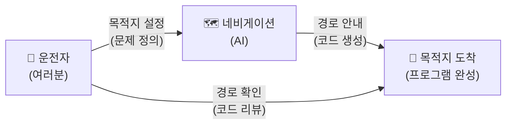

이 다이어그램은 이 과정 전체를 관통하는 핵심 구도를 한눈에 보여줘요. 운전자(여러분)가 목적지를 설정하고, 네비게이션(AI)이 경로를 안내하며, 운전자가 그 경로가 맞는지 확인하면서 목적지에 도착하는 구조입니다. 여기서 "경로 확인"이 바로 코드 리뷰에 해당하는데, 이 능력을 키우는 것이 우리 과정의 핵심 목표 중 하나예요.

---

## §3. 상세 내용

### Why — 왜 이 세션이 필요한가?

5일이라는 시간은 길다면 길고 짧다면 짧아요. 40시간 동안 무엇을 배우게 될지 전체 지도를 먼저 펼쳐놓지 않으면, 수강생들은 매 세션이 어디를 향해 가는지 모른 채 따라가기만 하게 됩니다. 등산을 시작하기 전에 산 전체의 등산로 지도를 한번 훑어보는 것처럼, 과정의 전체 로드맵을 먼저 조감하는 시간이 꼭 필요해요.

또한 아이스브레이킹은 단순한 분위기 전환이 아닙니다. 프로그래밍 경험이 전혀 없는 비전공자들이 모인 교실에서, "나만 못하는 건 아닐까"라는 불안감을 해소하고 "우리 모두 같은 출발선에 서 있다"는 안도감을 주는 것이 이 시간의 진짜 목적이에요. 서로의 AI 활용 경험을 가볍게 나누면서, 이 과정이 코딩 문법을 외우는 딱딱한 시간이 아니라 AI와 대화하는 재미있는 여행이라는 톤을 세팅합니다.

### What — 이 세션에서 다루는 것은 무엇인가?

이 세션에서는 크게 세 가지를 다룹니다. 첫째는 아이스브레이킹으로, 수강생들이 서로의 AI 활용 경험을 공유하며 첫 대화를 나누는 시간이에요. AI가 해결해주지 못했던 '요구사항 정의'의 어려움에 대해 짧게 토론하는 것도 포함됩니다. 둘째는 과정 로드맵 소개로, Day 1부터 Day 5까지 각 날의 핵심 주제와 흐름을 큰 그림으로 보여줍니다. 셋째는 AI-native 패러다임의 핵심 메시지를 환기하는 것으로, "문제 정의(What) vs 문제 해결(How)"이라는 구도와 네비게이션 비유를 통해 이 과정의 철학적 기반을 다집니다.

### How — 구체적으로 어떻게 진행하는가?

🗣️ **강사 대본 (Instructor Script)**:

> 자, 그러면 5일간의 로드맵을 한눈에 살펴봅시다. 우리 여정은 크게 다섯 파트로 나뉘어요.
>
> 먼저 오늘, **Day 1은 "AI 시대의 이해와 환경 구축"**입니다. 오늘 하루가 끝나면 여러분의 컴퓨터에는 Antigravity라는 최신 AI 통합 개발 환경이 깔려 있을 거고, 그 안에서 AI 비서에게 말을 걸어 첫 파이썬 코드를 직접 만들어 볼 거예요. 아직 문법은 하나도 몰라도 됩니다. AI가 대신 짜주니까요. 대신 "이 코드가 무슨 일을 하는지" 읽는 연습을 시작합니다.
>
> **Day 2는 "프롬프트 엔지니어링과 요구사항 설계"**예요. 네비게이션에 목적지를 입력할 때도 요령이 있듯이, AI에게 코드를 시킬 때도 공식이 있습니다. PTCF라는 4요소 프레임워크를 배우고, "내가 원하는 프로그램은 이런 겁니다"라는 설계 문서를 직접 작성해 볼 거예요.
>
> **Day 3은 "파이썬 핵심 문법"**입니다. 변수, 리스트, 조건문, 반복문, 함수 같은 기초 문법을 다루는데, 여기서도 우리의 접근법은 다릅니다. 문법을 외우는 것이 아니라, AI가 생성한 코드를 읽고 "이 줄이 왜 이렇게 생겼는지" 이해하는 방식으로 배워요.
>
> **Day 4와 Day 5는 "구조적 프로그래밍에서 객체지향까지"**라는 심화 과정이에요. 처음에 뚝딱 만든 프로그램이 점점 커질 때 어떻게 정리하고 확장하는지, 마치 동네 분식집이 프랜차이즈로 성장하는 과정처럼 코드가 진화하는 여정을 경험합니다.
>
> 이 다섯 파트를 관통하는 하나의 프로젝트가 있어요. 바로 **"고객 정보 관리 프로그램"**입니다. Day 1에서 간단한 스케치로 시작해서, Day 5가 끝날 때쯤이면 고객 등록, 조회, 수정, 삭제가 가능하고 데이터베이스에 저장까지 되는 진짜 프로그램이 완성됩니다. 이 프로그램이 5일 동안 네 번 진화하는 과정을 함께 지켜보시게 될 거예요.
>
> 혹시 "저는 진짜 컴퓨터 초보인데 괜찮을까요?"라고 걱정되시는 분이 계신다면, 안심하세요. 여러분의 화면 안에 24시간 대기하는 1:1 과외 선생님이 있습니다. 바로 AI 에이전트예요. 막히면 언제든지 "이게 뭐야?", "왜 에러가 나?", "어떻게 고쳐?"라고 물어보세요. 이 과정에서 가장 중요한 습관은 **'혼자 끙끙대지 않고, AI에게 도움을 요청하는 것'**입니다.

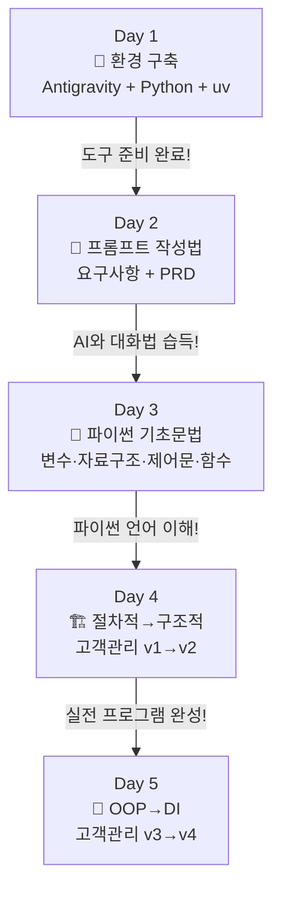

> ✅ **체크포인트**: 여기까지 이해했는지 스스로 점검해 보세요.
> - "이 과정은 코딩 문법을 외우는 과정인가요, 아니면 AI에게 일 시키는 법을 배우는 과정인가요?"
> - "5일간의 여정에서 Day 1의 역할은 무엇인가요?"

### 5일간 로드맵 비교표

| 일차 | 핵심 키워드 | 비유 | 고객관리 프로젝트 |
|------|-----------|------|-----------------|
| Day 1 | Antigravity, Python, uv, 가상환경 | 운전 실습 전 차량 점검 | 프로젝트 스케치 |
| Day 2 | 프롬프트 4요소, 요구사항, PRD | AI에게 일 시키는 기술 | v1 설계 문서 |
| Day 3 | 변수, 자료구조, 제어문, 함수 | 파이썬의 언어를 이해하기 | v1 코드 읽기 |
| Day 4 | 절차적, 구조적, 고객관리 v1→v2 | 분식집 → 프랜차이즈 | v2 구조 개선 |
| Day 5 | OOP, DI, 고객관리 v3→v4 | 프랜차이즈 본사 시스템 | v3→v4 진화 |

---

## §4. 실습 가이드 (+ 🎙️ 실습 대본) — 해당 시

### 실습 목표

이 세션의 실습은 코드 기반이 아니라 대화 기반의 아이스브레이킹 활동이에요. 수강생들이 서로의 AI 활용 경험을 공유하면서, 이 과정이 "AI와 협업하는 법"을 배우는 시간이라는 톤을 자연스럽게 체감하는 것이 목표입니다.

🎙️ **실습 가이드 대본 (Lab Guide)**:

> 자, 이제 옆에 앉은 분과 2분 동안 이야기를 나눠보세요. 주제는 아주 간단해요. **"최근에 AI에게 시켜본 가장 재미있거나 엉뚱한 일이 뭐였나요?"** ChatGPT에게 연애 상담을 받았다든지, Gemini에게 여행 계획을 짜달라고 했다든지, 뭐든 괜찮아요. 그리고 한 가지 더 — AI가 해줬으면 좋겠는데 잘 못했던 일이 있었나요? 그것도 함께 나눠보세요.
>
> 2분 후에 전체 앞에서 2~3분만 발표해 주실 분을 모실 거예요. 자, 시작하세요!
>
> (2분 후) 네, 시간이 됐습니다. 재미있는 경험을 나눠주실 분 계신가요? 네, 감사합니다. 아주 좋은 사례예요. 이렇게 AI는 이미 우리 일상에 깊이 들어와 있어요. 그런데 여러분이 공유해 주신 경험에서 공통점이 하나 보이지 않나요? AI가 잘하는 것도 있지만, **"내가 원하는 게 정확히 뭔지"를 AI가 대신 정해주지는 못한다**는 거예요. 이것이 바로 우리가 5일간 훈련할 핵심 능력입니다.

### 단계별 지시

| 단계 | 소요 시간 | 강사 지시사항 | 학습자 액션 | 예상 결과 |
|------|----------|--------------|------------|----------|
| 1 | 2분 | "옆 분과 AI 활용 경험 공유해주세요" | 짝과 자유 대화 | 분위기 이완, 웃음 |
| 2 | 3분 | "전체 앞에서 2~3분만 발표해주세요" | 자원자 2~3명 발표 | 다양한 AI 활용 사례 공유 |
| 3 | 5분 | 로드맵 다이어그램 보여주며 설명 | 화면 주시, 질문 | Day 1~5 큰 그림 파악 |
| 4 | 5분 | 과정 철학(네비게이션 비유) 설명 | 경청, 고개 끄덕임 | 핵심 메시지 이해 |
| 5 | 5분 | "궁금한 점 있으신가요?" 질의응답 | 자유 질문 | 불안감 해소 |

### 트러블슈팅 FAQ

| Q | A |
|---|---|
| 수강생이 너무 조용해서 아이스브레이킹이 안 돼요 | 강사가 먼저 자신의 AI 경험을 재미있게 공유하면서 분위기를 풀어주세요. "저는 AI에게 프러포즈 멘트를 써달라고 했었어요" 같은 가벼운 일화가 효과적이에요 |
| "AI 시대의 서사" 내용을 전혀 기억 못하는 수강생이 있어요 | 걱정하지 마세요! 이 과정 전체에서 필요한 개념을 그때그때 복습할 거예요. 핵심만 기억하면 돼요: "문제를 정의하는 건 사람, 코드를 만드는 건 AI" |
| "저는 컴퓨터를 거의 안 써본 진짜 초보인데 따라갈 수 있나요?" | "이 과정은 코딩 천재를 만드는 게 아니라, AI와 대화하는 법을 배우는 거예요. 한국어로 대화할 수 있으면 충분합니다!"라고 안심시켜 주세요 |

> ✅ **체크포인트**: "이 과정이 끝나면 나는 AI에게 무엇을 시킬 수 있는 사람이 된다"는 것을 이해했나요?

---


### 🎓 강사 노트 (Instructor Support)

- ⏱️ **타이밍**: 09:00 (20분, narrative)
- 🎯 **핵심 활동**: 자기소개 + 5일 로드맵 안내
- ⚠️ **강사 주의사항**: 첫 인상이 5일을 좌우함. 밝은 에너지 유지

## §5. 코드 및 명령어 모음 — 해당 시

이 세션은 narrative 타입으로, 코드 실습이 포함되지 않아요. 본격적인 코드 작성은 세션 004(Antigravity 설치)부터 시작됩니다. 이 세션에서는 로드맵 소개와 아이스브레이킹에 집중하며, 수강생들이 과정의 큰 그림과 철학을 먼저 이해하는 것이 목표입니다.

> 🤖 **AI 프롬프트 예시**: 해당 없음 (이 세션은 대화와 토론 중심)

---

## §6. 요약

### 핵심 학습 포인트

이번 세션에서 가장 중요한 메시지는 세 가지예요. 첫째, 이 과정은 "네비게이션을 직접 써보는 운전 실습"입니다. 코딩 문법을 외우는 것이 아니라, AI에게 정확한 목적지를 전달하는 방법을 배우는 시간이에요. 둘째, 우리의 역할은 "메뉴 기획자(문제를 정의하는 사람)"이고, AI의 역할은 "요리사(코드를 만드는 도구)"입니다. 셋째, "말이 되어야 프로그램이 된다" — 내가 원하는 것을 명확하게 표현할 수 있으면, AI가 코드로 바꿔줄 수 있다는 것이 이 시대의 핵심 진실이에요.

### 다음 세션 예고

다음 세션에서는 사전 교육 "AI 시대의 서사"에서 배웠던 핵심 개념을 딱 세 가지로 압축해서 복습할 거예요. 문제 정의 vs 문제 해결, 패러다임의 여정, 그리고 AI의 진짜 역할에 대해 좀 더 깊이 들어가 봅니다.

### 브릿지 노트

> "로드맵을 보니 우리가 어디로 가야 할지 감이 좀 잡히시나요? 그렇다면 본격적인 출발에 앞서, 우리가 이전에 배웠던 'AI 시대의 서사'를 딱 세 가지 핵심만 짚고 넘어가 볼까요? 이 세 가지가 탄탄해야 앞으로 5일이 수월해집니다."

---

## §7. 참고 자료

### 3-Source 출처

- **Source A (로컬 참고자료)**: 「AI 시대의 서사 v3 - Claude.md」 — AI-native 패러다임 전환 철학, 네비게이션 비유, 문제 정의 vs 문제 해결 구도의 원전. 강사 대본의 핵심 비유와 스토리라인이 이 문서에서 발췌되었습니다.
- **Source B (NotebookLM)**: NotebookLM 분석 리포트 — "코딩 문법 암기보다 문제 정의가 중요하다"는 패러다임 전환 분석, 수강생 간 AI 활용 경험 공유 실습 설계의 근거를 제공했습니다.
- **Source C (Deep Research)**: Deep Research 보고서 — 에이전트 주도 개발(Agentic Coding) 트렌드와 AI-native 학습 방법론의 배경 리서치를 반영했습니다.

### 추가 학습 자료

- [AI 시대의 서사 v3 - Claude.md](../참고자료/AI_시대의_서사_v3_Claude.md): 사전 교육 원본 자료
- [Google Antigravity 공식 사이트](https://antigravity.google): 이후 세션에서 사용할 개발 환경

### 강사 노트

> 💡 **강사 노트**: 본 세션의 내용은 「AI 시대의 서사 v3 - Claude.md」(Source A)의 패러다임 전환 및 네비게이션 비유를 기반으로 구성하였으며, NotebookLM 분석(Source B)과 Deep Research 보고서(Source C)의 보조 설명을 반영하였습니다. 팩트 패킷의 강사 스크립트 포인트 — "AI가 로그인 코드를 다 짜주는 시대인데, 왜 굳이 파이썬을 배울까요?"라는 도발적 질문으로 시작하면 수강생의 주의를 효과적으로 끌 수 있습니다.

---

## ✅ 세션 완료 체크리스트 (강사용)

- [ ] §1~§7 모든 섹션이 충실하게 작성되었는가?
- [ ] 네비게이션 비유와 스토리텔링이 포함되었는가?
- [ ] 아이스브레이킹이 자연스럽게 진행되었는가?
- [ ] 5일 로드맵을 수강생이 이해했는가?
- [ ] 3-Source 팩트 패킷이 반영되었는가?

---

*작성 일시: 2026-02-25*  
*작성 에이전트: A4B_Session_Writer*  
*교안 구조: 7섹션 (A0 팀 공통 표준)*


> 🔗 **다음 세션**: [세션 002: AI 시대의 서사 핵심 복습](#세션-002)에서 계속됩니다.

---

### 세션 002: AI 시대의 서사 핵심 복습
> [원본 파일](sessions/세션-002-AI_시대의_서사_핵심_복습_v2.1.md) | ⏱️ 20분 | 📖 narrative | 난이도: low

> **세션 ID**: MS-PY101-002
> **소요 시간**: 20분
> **난이도**: low
> **청크 타입**: narrative
> **버전**: v2.1 (7섹션 구조)

---

## §1. 개요

> **Day 1 | AM | 세션 002/022**

이 세션은 본격적인 과정 진행에 앞서, 수강생들이 사전 교육으로 들었던 "AI 시대의 서사" 특강의 핵심을 짚고 넘어가는 시간이에요. 수강생들이 앞으로 5일 동안 가져야 할 '메뉴 기획자'로서의 마인드셋을 확고히 다지는 역할을 합니다. 

### 🎯 학습 목표

이 세션이 끝나면 수강생은 다음을 할 수 있어요:

- 과거의 프로그래머와 AI 시대의 개발자의 역할 차이를 명확히 설명할 수 있습니다.
- 문제 정의(What/Why)가 문제 해결(How)보다 중요해진 패러다임의 변화를 이해합니다.
- 코드를 작성하는 단순 도구가 아닌, 함께 일하는 팀원으로서 AI를 인식할 수 있습니다.

### 선행 세션 환기

직전 세션에서 우리는 5일간의 로드맵과 함께 "네비게이션 비유"를 다뤘어요. 목적지를 입력하는 운전자와 최적 경로를 안내하는 네비게이션의 협력 관계를 통해 패러다임의 변화를 확인했죠. 아무리 똑똑한 네비게이션도 목적지는 운전자가 정해야 한다는 점을 배웠습니다. 이번 세션에서는 그 연장선에서 조금 더 구체적인 비유인 "요리사와 메뉴 기획자" 이야기로 넘어가며, 우리가 앞으로 기를 핵심 근육이 무엇인지 확인해 볼 거예요.

---

## §2. 핵심 개념 (+ 🗣️ 강사 대본 + Mermaid)

### 요리사(AI)와 메뉴 기획자(사람)의 분업 구조

AI가 코드를 대신 작성해 주는 시대에 개발자의 핵심 경쟁력은 극적으로 변했습니다. '코드를 타이핑하는 능력(How)'에서 '무엇을 만들지 문제를 정의하는 능력(What)'으로 완전히 이동했어요. 이를 가장 직관적으로 보여주는 것이 바로 "요리사와 메뉴 기획자" 비유입니다. 우리는 더 이상 칼질을 연습하는 요리사가 아니라, 고객의 맥락을 읽고 어떤 요리를 낼지 결정하는 메뉴 기획자가 되어야 합니다.

🗣️ **강사 대본 (Instructor Script)**:

> 방금 전 세션에서 네비게이션에 목적지를 입력하는 운전자가 되겠다는 비유, 기억나시나요? 자, 이제 본격적인 출발에 앞서 사전 교육에서 들었던 "AI 시대의 서사"라는 이야기를 복습해 볼 거예요. 반 정도 기억하시는 것 같네요. 괜찮아요, 지금 딱 세 가지 핵심만 짚고 넘어가 보겠습니다.
> 
> 과거의 프로그래머와 지금 AI 시대의 우리는 역할이 어떻게 다를까요? 이걸 제일 쉽게 이해하는 비유가 바로 "요리사와 메뉴 기획자" 이야기입니다. 상상해 봅시다. 여러분이 멋진 레스토랑의 오너 셰프라고 해볼게요. 과거에는 오너 셰프가 직접 재료를 손질하고, 불 조절을 하고, 소스를 만들고, 플레이팅까지 전부 혼자 했습니다. 이게 바로 과거의 프로그래머예요. 키보드 앞에 앉아서 한 줄 한 줄 코드를 직접 타이핑하고, 문법을 외우고, 오류를 찾아 밤새워 고치는 사람이었죠.
> 
> 그런데 지금 여러분의 주방에 미슐랭 3스타 급 AI 요리사가 새로 들어온 겁니다. 이 요리사는 한식, 양식, 일식 가릴 것 없이 어떤 요리든 순식간에 만들어내는 놀라운 실력을 가지고 있어요. 그런데 이 완벽해 보이는 AI 요리사에게는 치명적인 약점이 하나 있습니다. 바로 "오늘 뭘 만들까요?"라는 질문에 스스로 답하지 못한다는 거예요. 
> 
> 손님이 어떤 사람인지, 땅콩 알레르기는 없는지, 오늘 예산은 얼마인지, 계절에 맞는 제철 식재료는 무엇인지 파악하고 "오늘은 제철 방어를 메인으로 한 코스 요리를 가자"라고 방향을 잡아주는 사람이 필요합니다. 그게 바로 메뉴 기획자, 즉 여러분의 새로운 역할이에요.
> 
> AI에게 "장바구니 기능 만들어줘"라고 대충 말하면 어떻게 될까요? 비로그인 사용자가 담은 건 어떻게 할지, 재고가 부족하면 어떻게 처리할지, 할인 쿠폰은 어떻게 적용할지 이런 디테일을 AI는 알아서 챙겨주지 않아요. 문제를 구체적으로 정의하는 기획력, 이것이 AI 시대의 진짜 경쟁력입니다. 여러분, 코드는 코더가 짭니다. 이제 여러분은 코더가 아니라 기획자이자 팀 리더입니다. 내가 정확하게 생각하고 명확하게 지시해야, AI 직원도 훌륭한 코드를 만들어냅니다.

### Mermaid 다이어그램

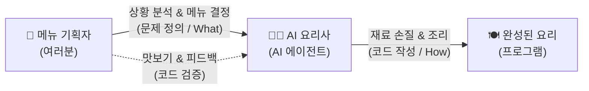

이 다이어그램은 우리가 지향해야 할 AI와의 협업 구조를 명확히 보여줘요. 사람이 기획하고 AI가 실행하며, 사람은 다시 그 결과를 꼼꼼히 검증하는 순환 고리가 과정 전체를 관통하는 핵심입니다.

---


### 🎨 추가 시각화 (Visualization Packet)

**AI-Human 협업 워크플로우**

기획(인간) -> 생성(AI) -> 검증/수정(인간)의 반복 사이클을 보여줍니다.

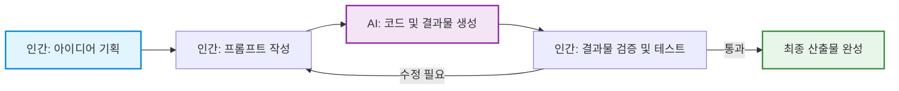

## §3. 상세 내용

### Why — 왜 이 세션이 필요한가?

수강생들은 무의식적으로 "파이썬 기초 과정이니까 코딩 문법부터 빨리 배워야지"라는 과거의 프레임에 갇혀 있기 쉬워요. 이 프레임을 초반에 깨고 "나는 코더가 아니라 기획자가 되러 왔다"는 마인드셋을 확실히 심어주지 않으면, 이후 과정에서 AI를 활용하기보다 혼자 코드를 짜려고 끙끙대는 실수를 범하게 됩니다. 따라서 사전 교육의 내용을 이 시점에 확실하게 쐐기를 박듯 복습하는 것이 필수적이에요.

### What — 이 세션에서 다루는 것은 무엇인가?

"AI 시대의 서사"를 구성하는 세 가지 핵심 개념을 다룹니다.

첫째, 문제 정의(What/Why)가 문제 해결(How)보다 압도적으로 중요하다는 점입니다. 어떻게 구현할지가 아니라 무엇을 만들지가 핵심 질문이 됩니다. 달성하고자 하는 목적과 조건을 명확한 명세서로 표현하는 능력이 새로운 핵심 언어로 자리 잡았어요.

둘째, 패러다임의 여정입니다. 기계어에서 어셈블리어, C, 자바를 거쳐 이제는 파이썬을 넘어 "자연어"로 코딩하는 시대에 이르렀습니다. 단순한 코드 자동완성을 넘어, 에이전트가 주도적으로 계획하고 실행하는 에이전트 주도 개발 시대로 진입했다는 거대한 흐름을 확인합니다.

셋째, AI의 진짜 역할입니다. AI는 단순한 자동완성 도구나 번역기가 아니라, 명확한 지시가 필요한 새로운 '팀원'이라는 사실을 받아들여야 합니다.

### How — 구체적으로 어떻게 진행하는가?

강사가 요리사와 메뉴 기획자 비유를 통해 핵심 메시지를 던진 후, 수강생들이 직접 일상적인 비즈니스 상황인 쇼핑몰 장바구니 기능을 상상하며 브레인스토밍하는 토론 실습으로 이어집니다. 이를 통해 단순히 지시를 내리는 것을 넘어 '문제 정의'가 생각보다 만만치 않으며, 다양한 맥락을 파악하고 기획하는 일은 인간만이 할 수 있는 고유의 영역임을 스스로 깨닫게 만듭니다.

---

## §4. 실습 가이드 (+ 🎙️ 실습 대본)

### 실습 목표

AI에게 모호하게 지시했을 때 발생할 수 있는 문제점을 스스로 찾아보고, 놓칠 수 있는 것들을 빈틈없이 생각해내는 비즈니스 기획력의 중요성을 체감하는 것이 목표입니다. 이 과정에서 자연스럽게 문제 정의 능력을 훈련하게 됩니다.

🎙️ **실습 가이드 대본 (Lab Guide)**:

> 자, 앞서 말씀드린 세 가지 핵심을 일상에서 직접 느껴봅시다. 아주 간단한 브레인스토밍을 해볼게요. 만약 여러분이 AI 요리사에게 "우리 쇼핑몰에 장바구니 하나 만들어줘"라고 단순하게 지시했다고 상상해 보세요. AI는 아주 기본적인 장바구니 코드를 뚝딱 만들어줄 겁니다. 
> 
> 그런데 이렇게 뚝딱 나온 코드로 실제 쇼핑몰을 운영하면 과연 어떤 일이 벌어질까요? 잠깐 옆 분과 토론해 봅시다. "AI에게 장바구니를 시켰을 때, 기획자인 우리가 미리 챙겨주지 않으면 AI가 알아서 반영하지 못할 비즈니스 정책이 뭐가 있을까요?" 딱 1분만 이야기해 보세요. 
> 
> (1분 후) 네, 좋습니다. 아주 훌륭한 의견들이 많이 들리네요. 비로그인 사용자가 담으면 어떡하죠? 로그인하면 기존 장바구니와 합쳐야 할까요? 재고가 0인 상품은 담기게 둘 건가요? 동시에 100명이 마지막 남은 한 개를 담으면요? 배송비나 쿠폰 적용 순서는 누가 정할까요? 
> 
> 이런 수많은 "만약에"를 AI는 스스로 생각해 내지 않습니다. 바로 이것이 "문제를 정의하는 힘"이에요. 우리가 이 과정에서 키울 가장 핵심적인 근육은 파이썬 문법 암기가 아니라, 놓칠 수 있는 것들을 빈틈없이 생각해내는 꼼꼼한 기획력입니다. 언어가 파이썬이든 자바스크립트든, 고객이 진짜 원하는 것을 파악하는 능력만큼은 영원히 사람의 몫일 거예요.

### 단계별 지시

| 단계 | 소요 시간 | 강사 지시사항 | 학습자 액션 | 예상 결과 |
|------|----------|--------------|------------|----------|
| 1 | 1분 | "장바구니 기능에서 놓치기 쉬운 정책이 뭘까요? 짝과 논의해 보세요." | 짝과 상황 가정 및 브레인스토밍 | 다양한 비즈니스 예외 상황 도출 |
| 2 | 2분 | 의견 청취 및 피드백 공유 | 자발적 발표 및 의견 나눔 | 문제 정의의 복잡성 뼈저리게 인지 |
| 3 | 1분 | 문제 정의의 중요성(기획력)으로 결론 맺기 | 경청 및 핵심 메모 | AI 시대의 본인 역할 체화 |

### 트러블슈팅 FAQ

| Q | A |
|---|---|
| 수강생들이 비즈니스 정책 예시를 잘 떠올리지 못해요 | 강사가 먼저 가벼운 힌트를 주세요. "여러분이 평소에 인터넷 쇼핑을 할 때, 품절된 상품은 장바구니에 바로 담기던가요?" 같은 일상적 경험을 자극하면 아주 좋습니다. |
| "저는 기획자가 아닌데 왜 이걸 해야 하죠?"라고 묻는다면 | "AI 시대에는 코딩 도구 자체가 강력해지면서 모든 개발자가 필연적으로 기획자의 역할을 겸하게 됩니다. AI에게 일을 시키는 것 자체가 이미 기획의 영역이기 때문이에요."라고 설명해 주세요. |

---


### 🎓 강사 노트 (Instructor Support)

- ⏱️ **타이밍**: 09:20 (20분, narrative)
- 🎯 **핵심 활동**: "AI 시대의 서사" 3가지 핵심 복습
- ⚠️ **강사 주의사항**: "기억나시죠?"로 참여 유도

## §5. 코드 및 명령어 모음

해당 없음

> 이 세션은 AI 시대를 맞이하는 마인드셋 정립과 대화 기반의 실습 중심입니다. 본격적인 컴퓨터 앞에서의 코딩 환경 구축은 세션 004부터 시작됩니다.

---

## §6. 요약

### 핵심 학습 포인트

이번 세션의 핵심 메시지는 세 줄로 요약됩니다. 
첫째, 문제 정의(What/Why)가 문제 해결(How)보다 압도적으로 중요해졌습니다. 
둘째, 코딩은 이제 기계의 언어가 아닌 자연어 시대로 진입했으며, 에이전트가 주도하는 개발이 현실이 되었습니다. 
셋째, AI는 단순한 도구가 아니라 우리의 든든한 팀원입니다. 우리는 더 이상 주방에서 칼질만 하는 요리사가 아니라, 큰 그림을 그리고 전체 메뉴를 총괄하는 기획자입니다. 말이 되어야 프로그램이 된다는 철학을 꼭 기억해 주세요.

### 다음 세션 예고

그렇다면 훌륭한 메뉴 기획자가 되려면 어떻게 훈련을 해야 할까요? 무작정 주방에 들어가서 감으로 요리해보면 실력이 늘까요? 다음 세션에서는 우리가 5일 동안 사용할 아주 효과적인 학습 방법론을 소개하고, 명세 주도 개발(SDD)이 무엇인지 맛보기를 경험해 볼 것입니다.

### 브릿지 노트

> "우리가 요리사가 아니라 메뉴 기획자라는 사실, 이제 확실히 와닿으시죠? 그렇다면 메뉴 기획자는 어떻게 훈련을 해야 할까요? 무작정 주방에 들어가서 요리해보면 될까요? 다음 시간엔 우리가 5일 동안 사용할 아주 효과적인 학습 훈련법을 소개해 드릴게요."

---

## §7. 참고 자료

### 3-Source 출처

- **Source A (로컬 참고자료)**: 「AI 시대의 서사 v3 - Claude.md」 — 말이 되어야 프로그램이 된다는 과정 철학, 요리사(AI)와 메뉴 기획자(사람)의 분업 구조 비유 원전입니다. 강사 대본의 핵심 스토리가 이 문서에서 발췌되었습니다.
- **Source B (NotebookLM)**: NotebookLM 분석 리포트 — 코딩 문법 암기에서 비즈니스 맥락 파악 및 시스템 설계 능력으로 경쟁력이 이동하고 있음을 분석한 자료입니다. 쇼핑몰 장바구니 예외 상황 브레인스토밍 실습의 구체적 근거를 제공했습니다.
- **Source C (Deep Research)**: Deep Research 보고서 — 단순 코드 자동완성에서 에이전트 주도 개발(Agentic Coding)로의 패러다임 전환 트렌드를 반영했으며, AI를 팀원으로 대하는 오케스트레이션 개념의 기초 자료로 활용되었습니다.

### 강사 노트

> 💡 **강사 노트**: 본 세션의 내용은 「AI 시대의 서사 v3 - Claude.md」(Source A)의 요리사/메뉴 기획자 비유를 기반으로 구성하였으며, NotebookLM 분석(Source B)의 장바구니 비즈니스 맥락 사례와 Deep Research 보고서(Source C)의 에이전트 주도 개발 트렌드를 엮었습니다. 팩트 패킷의 핵심 스크립트 포인트인 "여러분, 코드는 코더가 짭니다. 이제 여러분은 코더가 아니라 기획자이자 팀 리더입니다."라는 대사를 전달할 때, 매우 단호하고 명확한 어조로 강조해 주시면 수강생들의 주의를 효과적으로 끌 수 있습니다.

---

## ✅ 세션 완료 체크리스트 (강사용)

- [x] §1~§7 모든 섹션이 템플릿에 맞춰 충실하게 작성되었는가?
- [x] 요리사와 메뉴 기획자 비유가 강사 대본에 생생하게 확장 반영되었는가?
- [x] 장바구니 브레인스토밍 기반의 실습 가이드가 포함되었는가?
- [x] 3-Source 팩트 패킷 내용과 출처가 충실히 반영되었는가?

---

*작성 일시: 2026-02-25*  
*작성 에이전트: A4B_Session_Writer*  
*교안 구조: 7섹션 (A0 팀 공통 표준)*

> 🔗 **이전 세션**: [세션 001: 과정 로드맵과 아이스브레이킹](#세션-001)에서 배운 내용을 이어갑니다.
> 🔗 **다음 세션**: [세션 003: 학습 방법론과 SDD 미리보기](#세션-003)에서 계속됩니다.

---

### 세션 003: 학습 방법론과 SDD 미리보기
> [원본 파일](sessions/세션-003-학습_방법론과_SDD_미리보기_v2.1.md) | ⏱️ 20분 | 📖 narrative | 난이도: low

> **세션 ID**: MS-PY101-003  
> **소요 시간**: 20분  
> **난이도**: low  
> **청크 타입**: narrative  
> **버전**: v2.1 (7섹션 구조)

---

## §1. 개요

> **Day 1 | AM | 세션 003/022**

이 세션은 본격적으로 코딩 실습에 들어가기 전에 우리가 반드시 갖춰야 할 아주 중요한 훈련 방식을 세팅하는 시간입니다. 앞선 시간에서 우리는 메뉴 기획자와 요리사의 새로운 협업 구도를 확인했어요. 사람이 해야 할 일은 시스템의 방향을 설계하는 것이고, AI가 해야 할 일은 그 설계에 맞추어 실제 코드를 짜내는 일이라는 점을 분명히 했습니다.

하지만 기획자가 되기로 마음먹었다고 해서 하루아침에 훌륭한 기획서가 나오지는 않습니다. 운전면허를 따기 위해 먼저 교통법규를 배우고, 코스 주행을 거친 뒤 도로에 나가는 것처럼 우리에게도 체계적인 훈련법이 필요합니다. 앞으로 5일 동안 이어질 여정에서 여러분이 무기처럼 들고 다닐 두 가지 강력한 방법론, 즉 능동적 코드 읽기 훈련인 '예측, 검증, 설명' 사이클과 문서 중심의 개발 방식인 '명세 주도 개발'을 오늘 미리 만나보겠습니다. 

이 짧은 20분이 여러분의 앞으로의 코딩 습관, 더 나아가 평생 AI와 협업하는 방식을 근본적으로 바꿔놓을 것입니다. 

### 🎯 학습 목표

이 세션이 끝나면 수강생은 다음을 할 수 있어요:

* AI가 만들어준 코드를 받았을 때, 무작정 실행 버튼부터 누르지 않고 반드시 예측하고 검증하고 설명하는 능동적인 코드 읽기 습관을 들일 수 있습니다.
* 느낌 가는 대로 대충 개발하는 '바이브 코딩'의 치명적인 한계를 깨닫고, 꼼꼼한 설계도 중심의 체계적인 개발 방법론이 필요한 이유를 설명할 수 있습니다.
* 코드를 무에서 유로 타이핑하는 것보다, 남이 짠 코드를 읽어내고 전체 시스템 구조를 설계하는 일이 훨씬 더 중요한 시대임을 인식하고 학습 태도를 전환할 수 있습니다.

### 선행 세션 환기

바로 앞 세션인 'AI 시대의 서사 핵심 복습'에서 우리는 메뉴 기획자와 요리사의 비유를 통해 각자의 역할을 아주 선명하게 나누었습니다. 비즈니스의 맥락을 파악하고 달성하고자 하는 목적을 논리적이고 명확한 명세서로 표현하는 능력이, 바로 이 시대 소프트웨어 개발의 새로운 언어라는 사실을 배웠죠 [Source B].

이번 시간에는 그 '명세서'라는 것을 실제 개발 환경에서 어떻게 다루어야 하는지 구체적인 훈련법으로 연결합니다. 전 시간에 다루었던 철학적인 이야기를 이제 우리 손끝의 실제 행동 지침으로 바꿀 차례입니다.

---

## §2. 핵심 개념 (+ 🗣️ 강사 대본 + Mermaid)

### 바이브 코딩의 찰흙 인형 집과 SDD의 10층 빌딩

최근 실리콘밸리나 각종 개발 커뮤니티에서 아주 심심치 않게 들려오는 단어가 하나 있습니다. 바로 '바이브 코딩'이라는 신조어예요. 바이브라는 말 그대로 느낌 가는 대로, 감에 의존해서 척척 코딩하는 방식을 뜻합니다. AI에게 대충 이런 기능을 만들어 달라고 말한 뒤, 코드가 튀어나오면 일단 실행부터 해보는 겁니다. 그러다 에러가 나면 그 에러 메시지를 다시 AI에게 던져주고 고쳐달라고 핑퐁을 치는 식이죠. 

아주 간단한 작업이거나 혼자 재미로 장난감을 만들 때는 이 방식이 엄청나게 빠르고 효율적일 수 있습니다. 하지만 문제는 프로젝트의 크기가 조금만 커져도 이 방식이 곧바로 치명적인 한계를 드러낸다는 점이에요. 

이 상황을 건축에 비유해 보겠습니다. 찰흙으로 조그마한 인형 집을 하나 만들 때는 굳이 정밀한 설계도 같은 것이 필요하지 않아요. 대충 느낌대로 뼈대를 세우고 찰흙을 뭉쳐서 지붕을 얹어도 제법 그럴듯한 모양이 나옵니다 [Source C]. 그런데 만약 여러분이 10층짜리 진짜 상업용 빌딩을 짓는다고 상상해 보세요. 설계도도 없이 "1층은 대충 이쯤 높이로 올리고, 2층은 좀 더 넓게 가보자"라며 감으로 쌓아 올리면 어떻게 될까요? 십중팔구 3층쯤 올라갔을 때 기둥이 하중을 견디지 못하고 무너지기 시작할 겁니다. 배관이 엉키고, 비상구를 빼먹고, 나중에는 어디서부터 잘못되었는지조차 알 수 없게 됩니다.

바이브 코딩이 딱 이런 문제를 가지고 있어요. 간단한 기능에서는 코드가 팽팽하게 잘 돌아가지만, 프로그램이 조금만 복잡해지면 예측 불가능한 버그가 사방에서 터져 나옵니다 [Source B][Source C].

우리는 이 험난한 길을 피하기 위해 완전히 다른 노선을 탈 것입니다. 건물을 올리기 전에 설계도를 먼저 꼼꼼하게 그리는 방식, 이것을 가리켜 명세 주도 개발이라고 부릅니다. 영어로는 SDD, 즉 Specification-Driven Development의 약자입니다. 여기서 말하는 명세란 "이 프로그램은 어떤 목적을 가지고 있으며, 어떤 조건에서 어떻게 동작해야 하고, 예외적인 상황이 발생했을 때는 어떤 에러를 보여주어야 한다"는 내용이 글로 명확히 정리된 문서를 말해요. AI는 바로 이 튼튼한 설계도를 기반으로 건물을 짓습니다 [Source A][Source C]. 설계도가 정교할수록 건물도 무너질 염려 없이 튼튼하게 세워지는 것이죠.

### 예측, 검증, 설명의 학습 사이클 (POE)

좋은 설계도로 튼튼한 건물을 지었다고 끝이 아니에요. 건물이 설계도대로 잘 지어졌는지, 혹시 빼먹은 철근은 없는지 확인하는 감리 과정이 필요합니다. 이때 우리가 쓸 두 번째 무기가 바로 POE 사이클입니다. 예측(Predict), 검증(Observe), 설명(Explain)의 앞 글자를 딴 실전 훈련법이에요. 

이 사이클의 핵심은 단 하나입니다. 실행 버튼을 무작정 누르고 싶은 충동을 참는 거예요. 코드를 먼저 눈으로 차분히 읽으면서 실행 결과를 미리 예측해 보는 이 훈련이, 여러분의 문제 해결 능력을 비약적으로 끌어올려 줄 것입니다 [Source B][Source C].

🗣️ **강사 대본 (Instructor Script)**:

> 자, 여러분, 건물을 지을 때 가장 중요한 게 무엇일까요? 바로 설계도입니다. 요즘은 AI가 코드를 너무 순식간에 잘 짜주니까, 많은 분들이 설계도 없이 곧바로 코딩을 시작하는 유혹에 빠집니다. 이것을 우리는 바이브 코딩이라고 불러요. 인형 집을 지을 때는 이 방식이 꽤 잘 통합니다. 하지만 우리가 앞으로 5일 동안 땀 흘리며 만들 고객 관리 프로그램은 조잡한 인형 집이 아니라, 비즈니스가 굴러가는 제대로 된 건물이에요.
> 
> 그래서 우리는 SDD, 즉 명세 주도 개발이라는 정공법을 쓸 겁니다. 파이썬 코드를 냅다 만지작거리는 대신 "이 프로그램은 어떤 기능이 있어야 하고, 사용자가 이상한 문자를 입력하면 어떤 메시지로 경고해줘야 해"라고 우리말로 된 설계도를 먼저 쓸 거예요. 문서가 바뀌면 코드가 바뀌고, 문서가 정확하면 코드도 정확해지는 기분 좋은 마법을 경험하시게 될 겁니다 [Source A][Source C].
> 
> 그리고 또 한 가지, 여러분에게 꼭 당부하고 싶은 아주 중요한 대원칙이 있습니다. 바로 '이해 없는 복사 붙여넣기 절대 금지' 원칙이에요 [Source B][Source C]. AI가 훌륭한 코드를 척척 만들어 줬을 때, 무작정 실행 버튼부터 누르는 습관을 오늘부로 완전히 버려야 합니다. 
> 
> 딱 3초. 딱 3초만 멈춰서 화면을 쳐다보세요. "내가 이 코드를 실행하면 화면 맨 밑에 과연 어떤 글자가 뜰까?" 스스로 예측해 보는 겁니다. 그 예측을 마친 뒤에 당당하게 실행 버튼을 눌러 결과를 눈으로 확인하고, 왜 그런 결과가 나왔는지 자신의 말로 설명해 보는 거예요. Run 버튼을 맹목적으로 누르는 그 손가락을 잠시 멈추세요. 코드가 어떤 결과를 낼지 예측해 보는 바로 그 3초의 순간에, 여러분의 진짜 디버깅 근육이 폭발적으로 자라납니다 [Source B][Source C].

### Mermaid 다이어그램

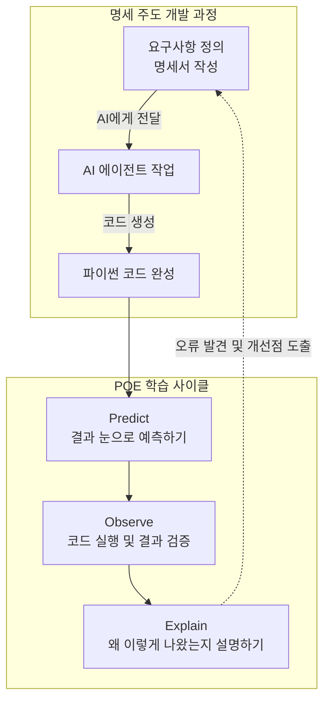

이 다이어그램은 앞으로 우리가 코드를 다룰 때 거치게 될 전체 흐름을 한 장으로 보여줍니다. 요구사항을 명확히 정의해서 설계도를 만들면 AI가 파이썬 코드를 생성하고, 우리는 그 코드를 예측하고 검증하고 설명하는 순환 고리 안에서 움직이게 됩니다. 오류가 발견되면 코드를 직접 뜯어고치는 것이 아니라, 다시 설계도인 명세서로 돌아가서 문제를 바로잡는 구조입니다.

---


### 🎨 추가 시각화 (Visualization Packet)

**예측-검증-설명 (POE) 학습 사이클**

코드를 무작정 실행하지 않고, 먼저 예측한 후 검증하는 올바른 학습 방법을 나타냅니다.

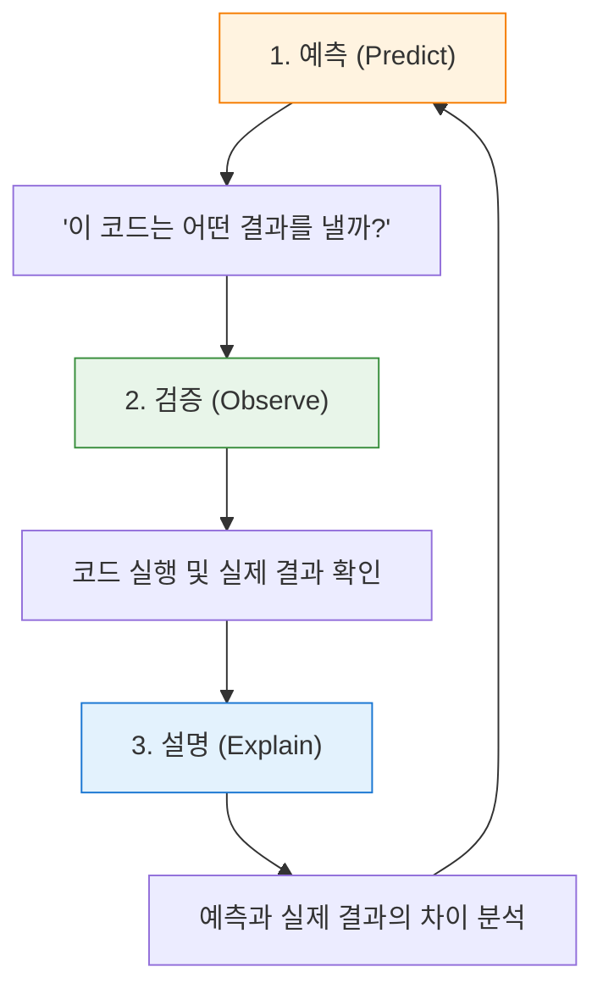

## §3. 상세 내용

### Why: 왜 바이브 코딩을 피하고 이 방법론을 택해야 하는가?

AI 기술이 폭발적으로 발전하면서 코드를 작성하는 순수 비용은 이제 0에 가깝게 수렴하고 있습니다. 불과 몇 년 전만 해도 파이썬 문법의 대소문자를 틀리면 화면에 글자 하나조차 띄울 수 없었어요. 하지만 이제는 한국어로 지시만 내리면 수백 줄짜리 코드가 1초 만에 만들어지는 시대가 왔습니다. 

이런 거대한 파도 속에서 개발자의 진짜 실력을 가르는 기준점은 완전히 달라졌습니다. 코드를 '오타 없이 타이핑하는' 능력에서, AI가 뱉어낸 코드를 '빠르게 읽고 정확히 검증하는' 능력으로 무게 중심이 완전히 옮겨간 것이죠 [Source C].

바이브 코딩처럼 결과물만 보고 "돌아가면 그만"이라는 습관이 들면, 나중에 치명적인 에러가 터졌을 때 어디서부터 손을 대야 할지 전혀 모르는 끔찍한 상황에 빠지게 됩니다. 내가 직접 구상하고 짠 코드가 아니기 때문에 시스템의 뼈대를 이해하지 못하는 탓입니다. 따라서 스스로 생각하는 힘을 기르고 거대한 시스템을 통제하기 위해서는 설계도를 먼저 그리는 SDD와, 코드를 눈으로 해부하는 POE 사이클이 이 과정 내내 숨 쉬듯 자연스럽게 이어져야 합니다.

### What: 명세 주도 개발과 POE의 본질

첫 번째 핵심 무기인 SDD의 본질은, 우리가 작성하는 요구사항 명세서를 개발의 유일한 진실 원천(Single Source of Truth)으로 삼는다는 점입니다 [Source C]. 진실 원천이라는 말이 학술적으로 들릴 수 있는데, 쉽게 말해 '모든 판단과 수정의 기준이 되는 단 하나의 진짜 문서'라는 뜻이에요. 코드가 꼬이거나 에러가 났을 때 파이썬 코드를 직접 뜯어고치려고 끙끙대는 것은 예전 방식입니다. 이제 우리는 명세서로 다시 돌아가서 논리의 구멍을 찾고 그 문서를 수정한 뒤, AI에게 다시 코드를 짜달라고 요청하는 구조를 가져갈 것입니다. 

두 번째 무기인 POE 사이클은 일종의 강력한 메타인지 훈련법입니다. 메타인지란 내가 무엇을 확실히 알고 있고, 무엇을 아직 모르는지 스스로 객관적으로 파악하는 능력이에요. 코드를 대충 눈으로 훑고 무작정 실행 버튼을 누르면, 컴퓨터가 정답을 친절하게 뱉어주기 때문에 마치 내가 그 코드를 완벽하게 이해했다고 착각하기 쉽습니다. 하지만 실행하기 전에 3초 동안 미리 결과를 예측해 보는 순간 진실이 드러납니다. 내 머릿속의 논리와 실제 컴퓨터가 작동하는 논리가 어디서 엇갈리는지, 돋보기로 보듯 정확하게 짚어낼 수 있기 때문입니다 [Source B].

### How: 5일간 이 무기를 어떻게 휘두를 것인가?

이론은 거창해 보일지 몰라도 실천 방법은 의외로 단순하고 직관적입니다. 앞으로 우리는 새로운 기능을 추가하거나 기존의 고객 관리 프로그램을 업그레이드할 때 절대 빈 화면을 띄워놓고 곧바로 코드를 타이핑하지 않을 겁니다. 그 대신 마크다운이라는 읽기 편한 텍스트 형식으로 "사용자 이름을 먼저 입력받는다. 만약 문자가 아닌 숫자가 들어오면 즉시 오류 메시지를 띄운다" 같은 꼼꼼한 규칙을 적어 내려가는 것부터 시작합니다.

그리고 AI가 그 규칙을 멋진 코드로 번역해서 가져오면, 여러분은 키보드와 마우스를 잠시 테이블 위에 내려놓고 화면을 뚫어지게 쳐다봐야 합니다. 한 줄 한 줄 눈으로 따라가면서 "아, 여기에는 사용자 이름인 홍길동이 들어가겠구나. 그리고 이 줄에서는 그 데이터를 이렇게 계산하니까, 결국 화면에는 이런 모양의 문장이 최종적으로 나오겠군" 하고 스스로 중얼거려 보는 겁니다. 이 두 가지 원칙만 5일 내내 철저하게 지켜낸다면, 여러분은 과정이 끝날 무렵 세상을 완전히 다른 시야로 보게 될 것입니다.

---

## §4. 실습 가이드 (+ 🎙️ 실습 대본)

### 실습 목표

이 세션의 실습은 아주 짧고 간단한 파이썬 코드를 눈으로 직접 읽어보면서 방금 배운 POE 사이클을 작게나마 체험해 보는 미니 활동입니다. 아직 컴퓨터에 개발 환경을 세팅하지 않아도 전혀 상관없어요. 강사가 빔프로젝터 화면에 띄워주는 코드를 보고 결과를 머릿속으로 추론하면서, '코드를 능동적으로 읽는다는 것'이 어떤 느낌인지 그 감각을 일깨우는 것이 이번 실습의 주된 목표입니다.

🎙️ **실습 가이드 대본 (Lab Guide)**:

> 자, 아직 우리 컴퓨터에는 파이썬이 안 깔려 있지만 제 화면에 아주 간단한 코드 다섯 줄을 띄워 두었습니다. 지금부터 딱 1분만 드릴게요. 옆에 앉으신 분과 함께 화면의 코드를 천천히 읽어보세요. 
> 
> 변수라는 이름표가 붙은 그릇에 어떤 데이터가 담기는지, 더하기와 빼기 같은 연산은 어떻게 흘러가는지 눈으로 따라가 보는 겁니다. 다 읽으셨다면 이 코드를 실행했을 때 화면 맨 밑에 어떤 문장이 완성되어서 출력될지 각자 머릿속으로 예측해 보세요. 확신이 들면 옆 분에게 살짝 말씀해 주셔도 좋습니다.
> 
> (1분 후)
> 
> 다들 예측하셨나요? 그럼 제가 여러분을 대신해서 직접 실행 버튼을 꾹 눌러보겠습니다. 네, 결과는 "홍길동님의 나이는 31세입니다." 라고 나오네요. 자, 여러분이 처음 예측한 결과와 이 화면의 결과가 똑같이 나왔나요? 만약 맞추셨다면, 옆 분을 보시고 "왜 31이라는 숫자가 나왔는지" 딱 한 줄로 명쾌하게 설명해 보세요. 
> 
> 네, 맞습니다. 올해 연도인 2026에서 태어난 해인 1995를 뺐기 때문이죠 [Source B]. 정말로 아주 단순한 초등학교 산수 같지만, 방금 여러분이 함께 해주신 이 과정이 바로 실리콘밸리의 최고급 엔지니어들이 매일 반복하고 있는 코드 리뷰의 가장 기본적이고 핵심적인 단계입니다.

### 단계별 지시

| 단계 | 소요 시간 | 강사 지시사항 | 학습자 액션 | 예상 결과 |
|------|----------|--------------|------------|----------|
| 1 | 1분 | 화면의 5줄 코드를 제시하고 정독 유도 | 코드 정독 및 전체적인 논리 흐름 파악 | 코드에 대한 막연한 두려움 완화 |
| 2 | 1분 | 짝과 함께 실행 결과 예측하기 지시 | 변수에 실제 값을 대입하며 결과 추론 | 논리적 사고 과정의 활성화 |
| 3 | 1분 | 강사가 코드 실행 후 빔프로젝터로 결과 검증 | 자신의 머릿속 예측과 실제 화면의 출력 비교 | 예측의 정확성 여부 즉각 확인 |
| 4 | 2분 | 결과가 왜 그렇게 도출되었는지 설명 유도 | 연산 과정을 말로 풀어서 동료에게 설명 | 메타인지 강화 및 원리 내재화 [Source B] |

### 트러블슈팅 FAQ

| Q | A |
|---|---|
| 수강생이 영어로 된 `year`, `birth` 같은 변수명에 겁을 먹으면 어떻게 대처하나요? | 변수명은 그저 투명한 그릇에 붙인 이름표일 뿐이라는 점을 다정하게 상기시켜 주세요. `name`을 '이름표', `year`를 '올해 연도표'로 한글로 치환해서 읽어보라고 권유하면 훨씬 쉽게 받아들이고 웃으며 진행할 수 있습니다. |
| 결과 예측을 아예 틀리는 수강생이 나와서 당황하면 어쩌죠? | 틀리는 것은 아주 자연스럽고 훌륭한 현상이라고 즉각 격려해 주세요. 컴퓨터의 기계적인 연산 순서와 사람의 직관이 다를 수 있다는 그 차이점을 직접 배우는 것이 이 훈련의 가장 핵심적인 목적입니다. |
| "왜 이렇게 쉬운 산수를 굳이 길게 설명하나요?"라고 묻는다면요? | 지금은 5줄짜리 귀여운 코드지만, 모레 보게 될 100줄짜리 코드에서도 똑같은 논리 방식이 적용된다는 점을 단호하게 짚어주세요. 덤벨 무게가 가벼울 때 폼을 완벽하게 교정해야 나중에 무거운 바벨을 부상 없이 들 수 있습니다. |

> ✅ **체크포인트**: 코드 실행 버튼을 누르기 전에 반드시 거쳐야 하는 '3초의 멈춤과 침묵', 그 예측 과정의 엄청난 힘을 완전히 체감하셨나요?

---


### 🎓 강사 노트 (Instructor Support)

- ⏱️ **타이밍**: 09:40 (20분, narrative)
- 🎯 **핵심 활동**: 예측→검증→설명 사이클, SDD 소개
- ⚠️ **강사 주의사항**: 사이클을 칠판/화면에 고정 표시

## §5. 코드 및 명령어 모음

본 세션의 미니 실습에서 화면에 띄운 파이썬 스니펫입니다. 아직 파이썬 문법을 본격적으로 배우기 전이므로, 코드의 형태를 눈에 익히고 데이터가 흘러가는 전체적인 구조를 가볍게 파악하는 용도로만 활용합니다.

```python
# POE 사이클 능동적 훈련을 위한 예제 코드
name = "홍길동"
year = 2026
birth = 1995

# 나이를 계산하는 핵심 로직
age = year - birth

# 계산 결과를 텍스트로 예쁘게 출력
print(f"{name}님의 나이는 {age}세입니다.")
```

이 코드는 소프트웨어 프로그램의 가장 기본적이고 영원한 형태인 '입력 처리 출력'의 3단계 구조를 아주 명확하게 보여줍니다. 위 세 줄은 필요한 데이터를 그릇에 담아 준비하는 입력 과정이고, 네 번째 줄은 데이터를 가공하고 계산하는 처리 과정이며, 마지막 줄은 최종 가공된 결과를 화면에 보여주는 출력 과정이에요. 앞으로 우리가 5일 동안 만들 모든 프로그램은 크기와 덩치만 다를 뿐 이 기본 골격을 완전히 똑같이 따라가게 됩니다.

---

## §6. 요약

### 핵심 학습 포인트

이번 세션에서 여러분의 머릿속에 반드시 심어두어야 할 핵심 무기 두 가지를 마지막으로 짚어보겠습니다. 

첫째, 명세 주도 개발입니다. AI에게 대충 던져주고 결과만 기다리는 바이브 코딩의 유혹에서 벗어나세요. 꼼꼼한 요구사항 명세서를 먼저 작성하고 오직 이것만을 개발의 진실 원천으로 삼는 튼튼한 건축법을 써야 건물이 무너지지 않습니다. 

둘째, 예측 검증 설명으로 이어지는 POE 사이클입니다. AI가 화면에 코드를 뱉어냈을 때 절대 무작정 실행 버튼부터 누르지 마세요. 3초 동안 멈춰서 어떻게 동작할지 예측하고, 실행해서 내 눈으로 결과를 검증하고, 왜 그런 결과가 튀어나왔는지 내 언어로 똑똑히 설명하는 과정을 거쳐야 진짜 코딩 근육이 붙습니다 [Source B][Source C]. 그리고 무엇보다 중요한 단 하나의 철칙, '내가 이해하지 못한 코드를 복사해서 붙여넣는 일은 영원히 금지'입니다.

### 다음 세션 예고

이제 훈련 방법과 태도 세팅도 완벽하게 끝났습니다. 무기를 쓰는 법을 제대로 배웠으니 이제 진짜 무기를 우리 손에 쥘 차례입니다. 다음 세션에서는 구글에서 심혈을 기울여 만든 최신 에이전트 기반 통합 개발 환경, 즉 개발자들의 최첨단 사무실이라고 부를 수 있는 'Antigravity'를 우리 컴퓨터에 직접 다운로드하고 설치해 보겠습니다. 

### 브릿지 노트

> "자, 우리가 5일 동안 어떤 태도와 시선으로 코드를 다루어야 할지 확실히 아셨죠? 예측하고, 검증하고, 설명하는 이 세 박자의 사이클만 기억하시면 됩니다. 그럼 이제 머리를 충분히 썼으니 직접 손을 움직여 볼까요? 본격적으로 여러분만의 쾌적한 작업 공간을 꾸리기 위해 Antigravity IDE 설치 여정을 시작하겠습니다."

---

## §7. 참고 자료

### 3-Source 출처

* **Source A (로컬 참고자료)**: `AI 시대의 서사 v3 - Claude.md`  
  명세 주도 개발의 개념, 요구사항 문서를 작성하고 요리사와 메뉴 기획자의 역할을 구분하는 철학적 배경을 강사 대본으로 녹여내어 발췌하였습니다.
* **Source B (NotebookLM)**: NotebookLM 분석 리포트  
  무작정 코드를 실행하지 않고 예측 검증 설명을 거치는 능동적 학습 원칙, 그리고 이해 없는 복사 붙여넣기 금지 규칙의 강력한 교육학적 근거를 참고했습니다.
* **Source C (Deep Research)**: Deep Research 보고서  
  느낌대로 코딩하는 바이브 코딩의 근본적인 한계 분석과, 명세서를 진실 원천으로 삼아 에이전트 주도 개발로 넘어가는 최신 개발 패러다임 트렌드를 반영하였습니다.

### 강사 노트

> 💡 **강사 노트**: 본 세션은 과정 전체의 학습 태도를 세팅하는 아주 중요한 앵커 역할을 수행합니다. 특히 바이브 코딩과 명세 주도 개발을 찰흙 인형 집과 10층 상업용 빌딩으로 강렬하게 대비시키는 비유는 수강생들이 가장 직관적으로 이해할 수 있는 포인트이므로 이 부분을 힘주어 설명해 주세요. 또한 미니 실습을 진행할 때, 수강생들이 스스로 '아, 내가 코드를 읽어낼 수 있구나'라는 작은 성공 경험을 짜릿하게 맛보게 해주는 것이 중요합니다. 너무 뻔하고 쉬운 답이라도 박수치고 환호하며 교실 전체의 성취감을 끌어올려 주시면 이후 수업의 집중도가 크게 올라갑니다.

---

## ✅ 세션 완료 체크리스트 (강사용)

* [ ] §1~§7 모든 섹션이 빠짐없이 충분한 분량으로 작성되었는가?
* [ ] 바이브 코딩과 빌딩 건축의 비유가 강사 대본에 자연스럽게 녹아들었는가?
* [ ] POE 사이클의 3단계 개념이 초보자의 눈높이에서 명확하게 전달되었는가?
* [ ] 미니 실습을 통해 수강생들이 코드 읽기의 첫 감각을 성공적으로 잡았는가?
* [ ] 3-Source 팩트 패킷의 내용이 정확하게 반영되고 본문에 인용 표기되었는가?

---

*작성 일시: 2026-02-25*  
*작성 에이전트: Sisyphus-Junior*  
*교안 구조: 7섹션 (A0 팀 공통 표준)*

> 🔗 **이전 세션**: [세션 002: AI 시대의 서사 핵심 복습](#세션-002)에서 배운 내용을 이어갑니다.
> 🔗 **다음 세션**: [세션 004: Antigravity 설치와 시연](#세션-004)에서 계속됩니다.

---

### 세션 004: Antigravity 설치와 시연
> [원본 파일](sessions/세션-004-Antigravity_설치와_시연_v2.1.md) | ⏱️ 25분 | 🧪 lab | 난이도: low

> **세션 ID**: MS-PY101-004  
> **소요 시간**: 25분  
> **난이도**: low  
> **청크 타입**: lab  
> **버전**: v2.1 (7섹션 구조)

---

## §1. 개요

> **Day 1 | AM | 세션 004/022**

이 세션은 5일간의 실습을 함께할 핵심 파트너인 'Antigravity IDE'를 여러분의 컴퓨터에 처음으로 설치하고 시연하는 시간이에요. 앞선 세션들에서 '네비게이션'과 '요리사' 비유를 통해 AI-native 개발이 무엇인지 철학적인 배경을 다졌다면, 이제는 그 철학을 실천할 진짜 도구를 손에 쥐는 순간입니다. 

### 🎯 학습 목표

이 세션이 끝나면 수강생은 다음을 할 수 있어요:

- 구글의 최신 에이전트 우선(Agent-First) IDE인 Antigravity를 자신의 운영체제(Windows/macOS)에 맞게 설치할 수 있습니다.
- 단순한 코드 에디터와 AI가 상주하는 개발 환경의 차이를 '사무실' 비유로 설명할 수 있습니다.
- 설치 후 '검토 모드(Review Mode)'를 활성화하여, AI가 코드를 마음대로 바꾸지 못하게 통제하는 결재권자의 역할을 이해합니다.

### 선행 세션 환기

이전 세션에서 우리는 SDD(명세 주도 개발)와 코드를 맹목적으로 복사하지 않고 능동적으로 읽고 검증하는 학습 방법론을 배웠어요. "Run 버튼을 무작정 누르지 마세요"라는 원칙, 기억하시죠? 오늘 설치할 Antigravity는 바로 그 원칙을 기술적으로 뒷받침해주는 도구입니다. AI가 아무리 훌륭한 코드를 짜더라도, 여러분이 '승인' 버튼을 누르기 전에는 절대로 코드가 적용되지 않는 안전장치가 마련되어 있으니까요.

---

## §2. 핵심 개념 (+ 🗣️ 강사 대본 + Mermaid)

### 비유: AI 비서가 상주하는 사무실 열기

일반적인 텍스트 에디터(메모장)로 코딩하는 것은 책상 하나에 연필 한 자루만 덩그러니 놓인 빈 사무실에서 일하는 것과 같아요. 파일 캐비닛도 없고 복사기도 없어서 모든 것을 혼자서 맨손으로 처리해야 합니다. 반면, Antigravity를 설치하는 것은 최신식 스마트 오피스에 입주하는 것과 같습니다. 이 사무실에는 코딩, 테스트, 문서화를 전담하는 똑똑한 AI 비서들이 24시간 상주하고 있어요.

더 중요한 것은 '결재 시스템'이에요. 이 사무실의 비서들은 아주 부지런하지만, 절대로 사장님(여러분)의 허락 없이 서류를 마음대로 고치거나 제출하지 않습니다. 이것이 바로 Antigravity의 핵심 철학인 '검토 기반 개발(Review-driven development)'입니다.

🗣️ **강사 대본 (Instructor Script)**:

> 앞서 학습 방법론까지 꼼꼼하게 챙겼으니, 이제 진짜 도구를 챙길 시간입니다. 혹시 영화에서 천재 해커들이 까만 화면에 녹색 글씨를 미친 듯이 타이핑하는 장면 보신 적 있죠? 안심하세요. 우리가 쓸 도구는 그런 영화 속 까만 화면이 아니에요. 우리는 IDE, 한국말로는 '통합 개발 환경'이라는 것을 쓸 겁니다. 쉽게 말하면 코딩에 필요한 모든 도구가 한 곳에 완벽하게 세팅된 올인원 작업 공간이에요.
>
> 그리고 오늘 우리가 이 컴퓨터에 지을 사무실의 이름은 'Antigravity'입니다. 
> 
> Antigravity가 뭔지 상상하기 쉽게 비유를 하나 들어볼게요. 여러분이 새로운 회사에 출근했다고 해봅시다. 첫날 빈 사무실에 도착했는데, 책상 하나에 연필 한 자루밖에 없어요. 파일 캐비닛도 없고, 프린터도 없고, 전화기도 없습니다. 여기서 일하라고 하면 막막하시겠죠? 메모장 같은 기본 에디터로 코딩하는 것이 딱 이런 상황이에요.
> 
> 반면 Antigravity는 완전히 다릅니다. 방금 막 완공된 최고급 스마트 오피스에 입주하는 것과 같아요. 넓고 깨끗한 책상(에디터), 잘 분류된 서류함(파일 탐색기), 외부와 소통하는 업무용 전화기(터미널)가 전부 세팅되어 있습니다. 그리고 가장 놀라운 건, 이 사무실에는 구글에서 파견한 수석 AI 비서들이 24시간 대기하고 있다는 점이에요. 이 비서들은 여러분이 지금 어떤 서류를 보고 있는지 실시간으로 알고 있습니다. "이 서류에서 오타 좀 찾아줘"라고 말하면 1초 만에 찾아주고, "이런 내용의 기획안을 초안으로 써줘"라고 하면 직접 뼈대를 잡아줍니다. 
>
> 지금 설치하는 것은 단순한 에디터 프로그램이 아닙니다. 코딩, 테스트, 문서화를 대신해 줄 AI 직원들이 대기하고 있는 여러분만의 가상 사무실을 오픈하는 거예요!

### Mermaid 다이어그램

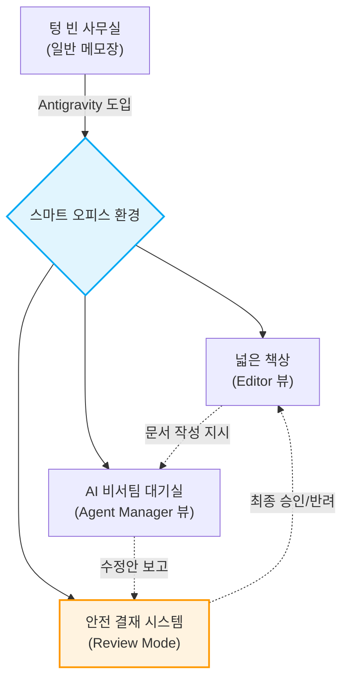

이 다이어그램은 Antigravity가 단순한 에디터를 넘어 어떻게 안전한 협업 공간으로 기능하는지 보여줍니다. 특히 리뷰 모드를 통한 결재 시스템은 AI의 폭주를 막고 여러분이 프로젝트의 주도권을 쥐게 하는 가장 중요한 장치예요.

---

## §3. 상세 내용

### Why — 왜 이 세션이 필요한가?

파이썬 기초를 배우기 전에 왜 거창한 IDE부터 설치해야 할까요? 예전에는 문법을 먼저 배우고 나중에 도구를 익히는 것이 정석이었습니다. 하지만 AI-native 패러다임에서는 순서가 다릅니다. 여러분은 코드를 한 줄씩 짜는 노동자가 아니라, AI라는 작업자에게 지시를 내리고 검토하는 관리자 역할을 해야 해요. 관리자 역할을 제대로 수행하려면, AI 작업자들과 원활하게 소통하고 그들의 결과물을 안전하게 검토할 수 있는 '미션 컨트롤 센터'가 가장 먼저 필요합니다. 그것이 바로 Antigravity를 첫 실습으로 설치하는 이유입니다.

### What — 이 세션에서 다루는 것은 무엇인가?

이 세션에서는 크게 두 가지 작업을 진행합니다. 첫째, 자신의 운영체제(Windows 또는 macOS)에 맞는 Antigravity 설치 파일을 다운로드하고 설치 마법사를 통해 올바른 경로에 설치를 완료합니다. 둘째, 설치된 프로그램을 처음으로 실행하여 웰컴 화면을 확인하고, 기존 설정(VS Code 등)이 있다면 이를 가져오는 방법을 다룹니다. 또한, AI가 임의로 코드를 변경하는 것을 막아주는 '검토 모드(Review Mode)'가 정상적으로 켜져 있는지 확인합니다.

### How — 구체적으로 어떻게 진행하는가?

강사가 먼저 화면을 통해 전체 다운로드 및 설치 과정을 시연합니다. 윈도우 11 환경을 기준으로 설명하되, macOS 사용자들을 위한 분기점도 함께 안내해요. 수강생들은 강사의 시연을 본 직후, 자신의 랩탑에서 직접 동일한 단계를 수행합니다. 브라우저를 열고 다운로드하는 것부터, 바탕화면의 아이콘을 클릭해 환영 화면을 띄우는 것까지 강사의 지시에 맞춰 단계별로 나아갑니다. 중간에 회사 보안 프로그램 등에 의해 설치가 막히는 경우, 조교나 강사가 직접 자리로 가서 해결을 도와줍니다.

---


### 📊 참고 표 (Visual Specs)

**IDE 구성요소 비교 (Antigravity vs 기존 IDE)**

| 구분 | 기존 IDE (예: VSCode) | Antigravity |
|:---|:---|:---|

## §4. 실습 가이드 (+ 🎙️ 실습 대본)

### 실습 목표

이 실습의 목표는 모든 수강생이 자신의 노트북에 Antigravity IDE 설치를 완료하고 정상적으로 실행하여 '검토 모드' 활성화 상태까지 확인하는 것입니다. 중간에 한 명도 낙오하지 않고 함께 스마트 오피스에 입주하는 것이 중요해요.

🎙️ **실습 가이드 대본 (Lab Guide)**:

> 자, 이제 여러분의 컴퓨터에 진짜 사무실을 지어볼 차례입니다. 제 화면을 먼저 봐주시고, 제가 한 단계를 마칠 때마다 여러분도 똑같이 따라해 주시면 됩니다. 
>
> 첫 번째, 브라우저를 열고 주소창에 `antigravity.google`을 입력하세요. 다운로드 페이지가 열리면 한가운데 커다란 버튼이 보일 겁니다. 윈도우를 쓰시는 분들은 "Windows용 다운로드"를, 맥북을 가져오신 분들은 "macOS용 다운로드"를 눌러주세요. 맥북 사용자분들은 자신의 칩셋(Intel인지 Apple Silicon인지)을 한 번 더 확인하고 맞는 걸 골라주시면 됩니다. 다운로드가 끝났으면 파일을 더블클릭해서 실행해 주세요!
>
> 두 번째, 설치 마법사가 떴죠? 여기서부터는 고민할 것 없이 "다음(Next)"을 계속 눌러주시면 됩니다. 가끔 설치 폴더를 내 마음대로 D드라이브나 이상한 곳으로 바꾸시는 분들이 계신데, 기본값인 C드라이브 경로를 그대로 두세요. 도구함을 엉뚱한 곳에 숨겨두면 나중에 비서들이 찾기 힘들어하니까요.
> 
> 세 번째, 설치가 다 끝났다면 바탕화면이나 시작 메뉴에서 Antigravity 로고를 찾아 더블클릭으로 실행해 봅시다. 처음 실행하면 멋진 환영 화면이 여러분을 반길 거예요. 혹시 이전에 VS Code 같은 다른 에디터를 쓰셨던 분 계신가요? 화면 아래에 "설정 가져오기(Import Settings)"라는 버튼이 보일 텐데, 그걸 누르시면 예전에 쓰던 단축키나 색상 테마를 그대로 이사 올 수 있습니다.
> 
> 마지막으로 가장 중요한 것 하나만 확인하고 넘어갈게요. 화면 상단을 봐주세요. "검토 모드(Review Mode)"라는 글자에 불이 들어와 있나요? 이게 켜져 있어야 AI가 코드를 바꿀 때 "사장님, 이렇게 바꿔도 될까요?"라고 여러분에게 미리 물어봅니다. 이 불이 꺼져 있다면 AI가 여러분 몰래 서류를 맘대로 뜯어고칠 수 있으니 꼭 켜져 있는지 확인하세요. 자, 모두 환영 화면과 검토 모드를 확인하셨나요? 축하합니다! 드디어 여러분만의 완벽한 AI 스마트 오피스가 완성되었습니다!

### 단계별 지시

| 단계 | 소요 시간 | 강사 지시사항 | 학습자 액션 | 예상 결과 |
|------|----------|--------------|------------|----------|
| 1 | 3분 | `antigravity.google` 접속 및 OS별 다운로드 안내 | URL 접속 및 파일 다운로드 | 설치 파일(`.exe` 또는 `.dmg`) 다운로드 완료 |
| 2 | 5분 | 기본 경로 유지 강조 및 설치 마법사 진행 지시 | 설치 파일 실행 및 Next 클릭 | 프로그램 시스템 설치 완료 |
| 3 | 3분 | 첫 실행 및 웰컴 화면, 설정 가져오기 버튼 안내 | 바탕화면 아이콘 더블클릭 | Antigravity 초기 화면 로딩 |
| 4 | 2분 | 상단 'Review Mode' 활성화 상태 필수 확인 | 상단 UI 점검 | 검토 모드 켜짐 확인 |
| 5 | 12분 | 진척도 체크 및 보안 프로그램 차단자 등 개별 트러블슈팅 | 설치 지연자 손 들기 | 전원 설치 및 실행 100% 달성 |

### 트러블슈팅 FAQ

| Q | A |
|---|---|
| "Windows Defender나 회사 보안 프로그램이 설치를 차단해요." | 당황하지 마시고 추가 정보 → '실행'을 누르거나, 기업용 PC의 경우 강사/조교를 호출해 관리자 권한 예외 처리를 요청하세요. |
| "맥북(macOS)인데 앱이 열리지 않고 '확인되지 않은 개발자' 알림이 뜹니다." | '시스템 설정' > '개인정보 보호 및 보안'으로 들어가서 하단에 있는 '무조건 열기(Open Anyway)' 버튼을 클릭해 주시면 됩니다. |
| "설치는 했는데 Review Mode 버튼이 어디 있는지 모르겠어요." | 화면 맨 위쪽 메뉴바 정중앙을 보세요. 방패 모양의 아이콘 옆에 'Review Mode'라는 토글 스위치가 있습니다. 파란색으로 활성화되어 있으면 정상입니다. |

> ✅ **체크포인트**: "내 컴퓨터에 Antigravity 설치가 끝났고, 실행했을 때 웰컴 화면이 떴으며, 검토 모드가 켜져 있는 것을 확인했나요?"

---


### 🎓 강사 노트 (Instructor Support)

- ⏱️ **타이밍**: 10:10 (25분, lab)
- 🎯 **핵심 활동**: IDE 설치, 라이브 시연
- ⚠️ **강사 주의사항**: ⚠️ 설치 실패 대비 USB 배포본 준비


### 📋 실습 설계 보강 (Lab Packet)

**세션 004 실습 설계 보강**

Antigravity 설치와 시연
- **3-Stage Example Set**
  - 기본: `antigravity.google` 접속 → Windows용 다운로드 → 설치 마법사 완료
  - 변형: 회사 보안 프로그램이 설치를 차단하는 경우 — 관리자 권한 실행 또는 예외 처리
  - 실수 해결: "설치 경로를 D드라이브로 바꿨더니 실행이 안 돼요" → 기본 경로(C:\) 유지 필수
- **난이도 예측**: 설치 자체는 쉬우나 회사 PC 보안정책이 최대 변수
- **타이밍 가이드**: 다운로드 5분 | 설치 마법사 5분 | 첫 실행 확인 5분 | 트러블슈팅 10분
- **심리적 장벽**: "프로그래밍 도구를 깔았다"는 사실 자체에 대한 막연한 두려움
- **자가 점검**:
  - [ ] 바탕화면/시작메뉴에서 Antigravity 아이콘이 보이는가?
  - [ ] 실행 시 환영 화면이 정상 표시되는가?
  - [ ] 상단에 "검토 모드(Review Mode)" 표시가 보이는가?

## §5. 코드 및 명령어 모음 

이 세션은 터미널에 입력하는 명령어 없이, 브라우저 다운로드와 GUI 기반 설치 마법사 클릭으로 진행됩니다. 본격적인 파이썬 환경 세팅 명령어는 이후 세션(uv 설치)부터 등장합니다.

> 🤖 **AI 프롬프트 예시**: 해당 없음 (설치 마법사 위주의 실습)

---

## §6. 요약

### 핵심 학습 포인트

이번 시간의 핵심은 딱 세 가지입니다. 첫째, 코딩을 메모장으로 하는 시대는 지났고, 우리는 24시간 AI 비서가 상주하는 'Antigravity'라는 스마트 오피스에 입주했습니다. 둘째, 이 도구는 구글의 최신 에이전트 우선(Agent-First) 환경으로 여러 비서가 동시다발적으로 내 일을 도와줄 수 있도록 설계되었습니다. 셋째, 가장 중요한 것은 '검토 모드(Review Mode)'입니다. AI가 아무리 똑똑해도 최종 결재권은 운전대를 잡은 여러분에게 있다는 사실을 절대 잊지 마세요.

### 다음 세션 예고

멋진 사무실 문을 열고 들어왔으니, 이제 내 책상이 어디고 서랍에는 무엇이 있는지 사무실 구조를 파악해야겠죠? 다음 세션에서는 Antigravity의 내부 구조 중에서도 우리가 직접 타이핑하고 서류를 검토하는 공간인 'Editor 뷰'를 구석구석 살펴보겠습니다. 

### 브릿지 노트

> "다들 화면에 멋진 로고 띄우셨죠? 텅 빈 사무실에 최신식 책상과 컴퓨터, 그리고 똑똑한 AI 비서팀까지 무사히 세팅을 마쳤습니다. 입주를 진심으로 축하드려요! 그런데 사무실 문만 열었다고 일할 수 있는 건 아니잖아요? 내일 당장 결재 서류를 보려면 내 책상이 어떻게 생겼는지 알아야 합니다. 잠깐 쉬었다가, 이 스마트 오피스의 구석구석을 탐험해 보도록 할게요."

---

## §7. 참고 자료

### 3-Source 출처

- **Source A (로컬 참고자료)**: 「AI-native_파이썬기초.md」 — Antigravity 환경 스펙 정의, 구글의 2025년 11월 최신 에이전트 통합 개발 환경 설정의 원전.
- **Source B (NotebookLM)**: NotebookLM 분석 리포트 — Antigravity 설치 가이드라인, 운영체제별 다운로드 방식 및 "검토 기반 개발(Review-driven development)" 안전 정책의 근거를 제공했습니다.
- **Source C (Deep Research)**: Deep Research 보고서 — 에디터를 빈 사무실과 스마트 오피스로 대비시킨 비유, 다중 에이전트가 주도적으로 계획하고 실행하는 Agent-First IDE의 구조적 장점 분석을 반영했습니다.

### 추가 학습 자료

- [Google Antigravity 공식 다운로드 페이지](https://antigravity.google)
- [Antigravity 기본 UI 가이드 영상 (가상 링크)](#)

### 강사 노트

> 💡 **강사 노트**: 본 세션은 「AI-native_파이썬기초.md」(Source A)의 환경 스펙과 NotebookLM(Source B)의 안전 정책 지침, Deep Research(Source C)의 사무실 비유를 엮어 구성했습니다. 특히 실습을 진행할 때 수강생들이 윈도우와 맥북 유저로 섞여 있을 확률이 높으므로, 강사가 macOS 트러블슈팅(보안 해제 등)에 대한 대비를 미리 해두는 것이 진행을 매끄럽게 하는 핵심 팁입니다. 결재권자로서의 마인드셋(Review Mode 강조)을 잊지 않게 반복해주세요.

---

## ✅ 세션 완료 체크리스트 (강사용)

- [ ] §1~§7 모든 섹션이 충실하게 작성되었는가?
- [ ] 빈 사무실과 스마트 오피스 비유가 명확히 전달되었는가?
- [ ] Windows/macOS 분기 안내가 실습 가이드에 포함되었는가?
- [ ] '검토 모드(Review Mode)'의 중요성이 강조되었는가?
- [ ] 3-Source 출처 표기가 올바르게 반영되었는가?

---

*작성 일시: 2026-02-25*  
*작성 에이전트: A4B_Session_Writer*  
*교안 구조: 7섹션 (A0 팀 공통 표준)*

> 🔗 **이전 세션**: [세션 003: 학습 방법론과 SDD 미리보기](#세션-003)에서 배운 내용을 이어갑니다.
> 🔗 **다음 세션**: [세션 005: Editor 뷰와 기본 조작](#세션-005)에서 계속됩니다.

---

### 세션 005: Editor 뷰와 기본 조작
> [원본 파일](sessions/세션-005-Editor_뷰와_기본_조작_v2.1.md) | ⏱️ 20분 | 🧪 lab | 난이도: low

> **세션 ID**: MS-PY101-005  
> **소요 시간**: 20분  
> **난이도**: low  
> **청크 타입**: lab  
> **버전**: v2.1 (7섹션 구조)

---

## §1. 개요

> **Day 1 | AM | 세션 005/022**

이전 세션에서 Antigravity IDE를 성공적으로 설치하고 첫 실행까지 마쳤어요. 설치가 완료되었다는 것은 여러분만의 "AI 비서가 상주하는 사무실"이 문을 열었다는 뜻이에요. 하지만 새 사무실에 입주했다고 바로 일을 시작할 수 있는 건 아니잖아요? 제일 먼저 해야 할 일은 사무실 구조를 파악하는 거예요. 내 책상이 어디인지, 서류 캐비닛은 어떻게 열고 닫는지, 메모지와 펜은 어디에 있는지 둘러봐야 하죠.

이번 세션에서는 Antigravity의 핵심 작업 공간인 **Editor 뷰(에디터 뷰)**를 집중적으로 탐험합니다. Editor 뷰는 여러분이 코드를 직접 눈으로 보고, 읽고, 수정하는 "내 책상"에 해당하는 영역이에요. AI가 아무리 뛰어나도, 최종적으로 코드를 확인하고 승인하는 것은 여러분의 몫이기 때문에, 이 책상을 자유자재로 다룰 수 있어야 합니다.

### 🎯 학습 목표

이 세션이 끝나면 여러분은 다음을 할 수 있어요:

- Antigravity 화면의 3대 영역(파일 탐색기, Editor 뷰, 통합 터미널)이 각각 어떤 역할인지 설명할 수 있어요
- 작업 폴더를 열고, 새 파일을 만들고, 저장하는 기본 조작을 자유롭게 수행할 수 있어요
- 파일 확장자가 왜 중요한지 이해하고, `.txt`와 `.py`의 차이를 구분할 수 있어요

### 선행 세션 환기

바로 직전 세션(세션 004)에서 우리는 Antigravity를 설치하고 첫 실행 화면을 확인했어요. "AI 비서가 상주하는 사무실"이라는 비유를 기억하시나요? 사무실 열쇠를 받아서 문을 열었으니, 이제 그 안을 본격적으로 둘러볼 차례예요. 오늘은 그 사무실에서 가장 중요한 공간, "내 책상"을 세팅하는 시간입니다.

---

## §2. 핵심 개념 (+ 🗣️ 강사 대본 + Mermaid)

### Editor 뷰 = "내 책상"

Antigravity IDE의 화면은 크게 세 개의 영역으로 구성되어 있어요. 이것을 사무실에 비유하면 아주 직관적으로 이해할 수 있습니다. 왼쪽의 좁고 긴 패널은 서류 캐비닛(파일 탐색기)이고, 가운데의 넓은 공간이 여러분의 책상(Editor 뷰)이며, 아래쪽에 숨어 있다가 호출하면 올라오는 영역이 업무용 전화기(통합 터미널)예요. 그리고 오른쪽에는 앞으로 만나게 될 AI 비서의 자리(Agent Manager)가 있는데, 이건 다음 세션에서 다루겠습니다.

🗣️ **강사 대본 (Instructor Script)**:

> 여러분, 설치한 사무실에 무사히 입주하셨죠? 그런데 입주만 했다고 바로 일할 수 있는 건 아닙니다. 새 사무실에 처음 들어가면 제일 먼저 뭘 하시나요? 내 책상이 어디인지 찾고, 서류함 위치를 확인하고, 프린터가 어디 있는지 둘러보잖아요.
>
> Antigravity도 마찬가지예요. 화면을 한번 크게 훑어봅시다. 왼쪽에 세로로 길게 늘어선 영역이 보이시죠? 이것이 "파일 탐색기"예요. 사무실로 치면 서류 캐비닛입니다. 여러분의 모든 파일이 여기에 폴더별로 정리되어 있어요.
>
> 그 옆으로 가장 넓은 중앙 공간, 이곳이 바로 "Editor 뷰"입니다. 여러분의 책상이에요. 서류 캐비닛에서 꺼낸 파일을 이 책상 위에 펼쳐놓고 읽고, 수정하고, 새로 작성하는 공간이죠. VS Code를 써본 경험이 있다면 아주 익숙한 모습일 겁니다. Antigravity의 Editor 뷰는 VS Code와 동일한 친숙한 환경을 제공하면서, 구문 강조(Syntax Highlighting)로 코드를 알록달록 예쁘게 표시해 줍니다.
>
> 그리고 화면 아래쪽에 숨어 있는 영역이 하나 더 있어요. 바로 "통합 터미널"입니다. 사무실의 업무용 전화기라고 생각하시면 돼요. 컴퓨터에게 직접 명령을 내릴 수 있는 전화선이죠. 나중에 파이썬 코드를 실행할 때 이 터미널을 사용하게 됩니다.
>
> 오른쪽에는 앞으로 만날 AI 비서의 자리가 있는데, 이건 다음 세션에서 다루겠습니다. 오늘은 에디터 화면, 즉 "내 책상"에 완전히 집중하겠습니다.

> 💡 **강사 노트**: "사무실 비유"는 Antigravity의 3-Surface 아키텍처(Editor, Agent Manager, Browser)를 초보자에게 직관적으로 전달하기 위해 구성했습니다. Editor 뷰가 VS Code와 동일한 환경을 제공한다는 점은 Deep Research(Source C)의 IDE 인터페이스 분석에 기반합니다.

### Mermaid 다이어그램

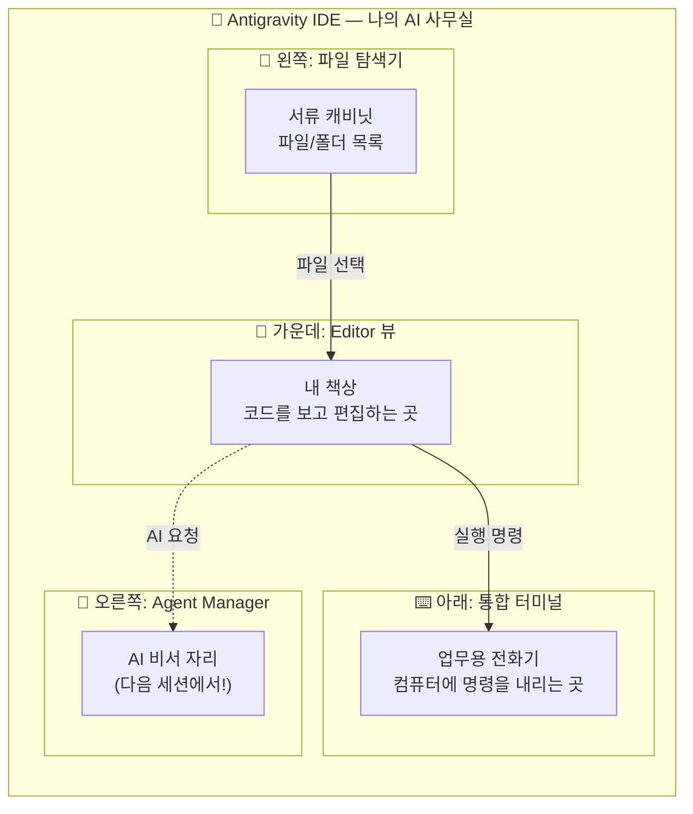

### 파일 확장자 = "서류의 꼬리표"

파일 이름 뒤에 붙는 `.txt`, `.py`, `.md` 같은 것을 확장자라고 불러요. 이것은 서류에 붙이는 꼬리표와 같아요. 꼬리표가 "계약서"라고 되어 있으면 법무팀에서 처리하고, "영수증"이라고 되어 있으면 경리팀에서 처리하듯이, 컴퓨터도 확장자를 보고 "아, 이건 텍스트 파일이구나", "아, 이건 파이썬 프로그램이구나"라고 판단합니다. 그래서 확장자를 빼먹으면 컴퓨터가 이 서류를 어떻게 처리해야 할지 몰라서 혼란이 생겨요.

🗣️ **강사 대본 (Instructor Script)**:

> 파일 이름에서 점(.) 뒤에 붙는 글자들, 이것을 확장자라고 부릅니다. 예를 들어 `hello.txt`에서 `.txt`가 확장자예요. 이건 서류에 붙이는 꼬리표라고 생각하시면 돼요.
>
> 꼬리표가 "계약서"라고 되어 있으면 법무팀에서 처리하고, "영수증"이라고 되어 있으면 경리팀에서 처리하잖아요? 컴퓨터도 마찬가지입니다. `.txt`를 보면 "아, 이건 일반 글 파일이구나" 하고 텍스트 에디터로 열고, `.py`를 보면 "아, 이건 파이썬 프로그램이구나" 하고 파이썬으로 실행해요.
>
> 그래서 확장자를 빼먹으면 큰일 나요. 꼬리표 없는 서류는 어느 팀에서 처리해야 할지 모르잖아요? 앞으로 파일을 만들 때 확장자를 반드시 입력하는 습관을 들여주세요!

> 💡 **강사 노트**: 확장자 개념은 프로그래밍 입문자들이 가장 많이 혼동하는 부분 중 하나입니다. `.txt`와 `.py`의 차이를 명확히 인지시키는 것이 Day 2 코드 작성의 기초가 됩니다.

---

## §3. 상세 내용

### Why — 왜 Editor 뷰 조작을 배우는가?

AI 시대에 코드를 직접 타이핑하는 일이 줄어든다고 해도, 코드를 **읽고 확인하는 능력**은 오히려 더 중요해져요. AI가 작성해준 코드가 올바른지, 내가 원하는 것과 일치하는지 판단하려면 코드를 편하게 열어보고 살펴볼 수 있어야 합니다. Editor 뷰는 바로 그 "코드 검토의 본부"예요.

Antigravity는 Review-driven development(검토 기반 개발)라는 철학을 따르고 있어요. AI가 코드를 변경하기 전에 반드시 사용자의 승인을 받는 구조입니다. 이 승인 과정이 일어나는 곳이 바로 Editor 뷰예요. 그래서 Editor 뷰를 자유자재로 다루지 못하면, AI 비서에게 일을 시켜도 결과를 제대로 확인할 수 없게 돼요. 마치 서류를 펼쳐볼 줄 모르는 사장님이 직원의 보고서를 검토하지 못하는 것과 같죠.

### What — Editor 뷰의 3가지 핵심 영역

Editor 뷰에서 오늘 반드시 익혀야 할 영역은 세 가지예요.

첫 번째는 **파일 탐색기(Explorer)**입니다. 화면 왼쪽에 세로로 늘어선 패널이에요. 여기에는 현재 작업 중인 폴더의 모든 파일과 하위 폴더가 트리 구조로 보여요. 마치 Windows 탐색기에서 폴더를 열어보는 것과 비슷한데, IDE 안에 내장되어 있어서 따로 창을 왔다갔다 하지 않아도 돼요.

두 번째는 **에디터 영역(Editor Area)**입니다. 화면 가운데의 가장 넓은 공간이에요. 파일 탐색기에서 파일을 클릭하면 이 공간에 파일 내용이 펼쳐져요. 여러 파일을 동시에 열어놓을 수도 있는데, 상단에 탭처럼 표시되어서 탭을 클릭해서 파일 간에 전환할 수 있어요. 가장 중요한 특징은 **구문 강조(Syntax Highlighting)**예요. 파이썬 파일(`.py`)을 열면 코드의 각 부분이 다른 색으로 표시되어서, 코드를 훨씬 읽기 쉽게 만들어줘요.

세 번째는 **통합 터미널(Integrated Terminal)**입니다. 화면 아래쪽에 숨어 있다가 단축키(`` Ctrl + ` ``)를 누르면 올라오는 영역이에요. 여기서 컴퓨터에 직접 명령을 내릴 수 있어요. 나중에 파이썬 코드를 실행하거나, 패키지를 설치하거나, 시스템 정보를 확인할 때 이 터미널을 사용하게 됩니다.

### How — 3가지 기본 조작 (폴더 열기, 파일 생성, 저장)

오늘 배울 핵심 조작은 딱 세 가지예요. 이 세 가지만 할 줄 알면 앞으로의 모든 실습을 따라갈 수 있습니다.

**첫 번째: 폴더 열기(Open Folder)**. IDE에서 작업을 시작하려면 가장 먼저 "어디서 일할 건지" 알려줘야 해요. 상단 메뉴의 File → Open Folder를 클릭하고 작업할 폴더를 선택하면, 그 폴더 안의 모든 파일이 왼쪽 탐색기에 나타납니다. 마치 사무실에 출근해서 "오늘은 이 프로젝트 서류함에서 일하겠습니다"라고 정하는 것과 같아요.

**두 번째: 파일 생성(New File)**. 탐색기 영역에서 우클릭 후 "New File"을 선택하면 새 파일을 만들 수 있어요. 여기서 중요한 것이 파일 이름 뒤의 확장자예요. `.txt`는 일반 텍스트 파일, `.py`는 파이썬 파일이에요. 확장자를 빼먹으면 컴퓨터가 파일의 종류를 인식하지 못해요.

**세 번째: 저장(Save)**. `Ctrl+S`를 눌러서 작업 내용을 저장합니다. 저장하지 않은 파일은 탭에 하얀 점(●)이 표시돼요. 이 점은 "아직 저장 안 했어요!"라는 신호예요. 서류를 작성했으면 반드시 서랍에 넣어야 하듯, 코딩을 했으면 반드시 저장해야 합니다. `Ctrl+S`는 이 과정 전체에서 가장 많이 누르게 될 단축키이니, 지금 바로 손가락에 익혀두세요!

> ✅ **체크포인트**: 여기까지 이해했는지 스스로 점검해 보세요.
> - Antigravity 화면에서 파일 탐색기, Editor 뷰, 통합 터미널의 위치를 가리킬 수 있나요?
> - `.txt`와 `.py` 확장자의 차이를 설명할 수 있나요?
> - 저장하지 않은 파일의 신호(●)를 알고 있나요?

### 비교표 — Editor 뷰의 3대 영역

| 영역 | 위치 | 역할 | 사무실 비유 |
|------|------|------|------------|
| 파일 탐색기 (Explorer) | 화면 왼쪽 | 파일/폴더 목록 표시 및 관리 | 서류 캐비닛 |
| 에디터 영역 (Editor Area) | 화면 가운데 (가장 넓음) | 코드/텍스트 보기 및 편집 | 내 책상 |
| 통합 터미널 (Terminal) | 화면 아래쪽 (숨겨져 있음) | 명령어 입력 및 실행 | 업무용 전화기 |
| Agent Manager | 화면 오른쪽 | AI와 대화 (다음 세션!) | AI 비서 자리 |

### 용어 정리표

| 용어 | 뜻 | 쉬운 비유 |
|------|-----|----------|
| IDE (Integrated Development Environment) | 통합 개발 환경. 코드 편집, 실행, 디버깅을 한 곳에서 할 수 있는 프로그램 | AI 비서가 상주하는 사무실 |
| Editor 뷰 | 코드를 보고 편집하는 화면 | 내 책상 |
| 파일 탐색기 (Explorer) | 프로젝트의 파일/폴더를 트리 구조로 보여주는 패널 | 서류 캐비닛 |
| 통합 터미널 (Terminal) | IDE 안에 내장된 명령줄 도구 | 업무용 전화기 |
| 확장자 (Extension) | 파일 이름 뒤의 `.txt`, `.py` 등 | 서류의 꼬리표 |
| 구문 강조 (Syntax Highlighting) | 코드를 색깔로 구분해서 보여주는 기능 | 형광펜으로 중요 부분 표시 |

---

## §4. 실습 가이드 (+ 🎙️ 실습 대본)

### 실습 목표

이 실습을 통해 여러분은 Antigravity에서 작업 폴더를 열고, 새 파일을 만들고, 내용을 입력한 뒤 저장하는 기본 워크플로우를 직접 경험합니다. 이 기본 동작이 앞으로 5일간 모든 실습의 기초가 됩니다.

🎙️ **실습 가이드 대본 (Lab Guide)**:

> 자, 이제 직접 해봅시다. 오늘 실습은 아주 간단하지만, 앞으로 매일 반복하게 될 기본기예요. 긴장하지 마시고 천천히 따라와 주세요. 텍스트 파일은 절대 컴퓨터를 망가뜨리지 않으니까요. 마음껏 연습하셔도 됩니다.
>
> 실습이 끝나면 여러분의 바탕화면에 `AI_Class`라는 폴더가 생기고, 그 안에 `hello.txt`라는 파일이 깔끔하게 들어있을 거예요. 이것이 여러분이 만든 첫 번째 디지털 서류입니다!

### 단계별 지시

| 단계 | 소요 시간 | 강사 지시사항 | 학습자 액션 | 예상 결과 |
|------|----------|--------------|------------|----------|
| 1 | 2분 | "바탕화면에 새 폴더를 만들어 주세요. 이름은 `AI_Class`입니다." | 바탕화면 → 우클릭 → 새로 만들기 → 폴더 → `AI_Class` 입력 | 바탕화면에 `AI_Class` 폴더 생성 |
| 2 | 2분 | "Antigravity 상단 메뉴에서 File → Open Folder를 클릭하고, 방금 만든 `AI_Class` 폴더를 선택하세요." | File → Open Folder → `AI_Class` 선택 → "폴더 선택" 클릭 | 왼쪽 탐색기에 `AI_CLASS` 폴더명 표시 |
| 3 | 2분 | "왼쪽 탐색기의 빈 공간에서 우클릭 후 New File을 선택하세요. 파일 이름은 `hello.txt`입니다. 반드시 `.txt`까지 포함해서 입력하세요!" | 탐색기 빈 공간 우클릭 → New File → `hello.txt` 입력 → Enter | 가운데 에디터에 빈 `hello.txt` 파일이 열림 |
| 4 | 2분 | "에디터에 아무 글이나 입력해 보세요. '안녕하세요, 저의 첫 번째 파일입니다!'처럼요." | 에디터 영역 클릭 → 자유롭게 텍스트 입력 | 입력한 텍스트가 에디터에 표시, 탭에 ● 표시 |
| 5 | 1분 | "`Ctrl+S`를 눌러서 저장하세요. 탭의 ● 표시가 사라지면 저장 성공!" | `Ctrl+S` 키 입력 | 탭의 ● 표시 사라짐 = 저장 완료 |
| 6 | 2분 | "잘 했어요! 이번에는 파이썬 파일도 하나 만들어 봅시다. 같은 방법으로 `test.py`라는 파일을 만들어 보세요." | 탐색기 우클릭 → New File → `test.py` 입력 | `test.py` 파일 생성, 에디터에 열림 |
| 7 | 2분 | "`test.py`에 `print('Hello')`라고 입력하고 저장하세요. 글자 색이 다르게 표시되는 걸 확인해 보세요. 이것이 구문 강조입니다!" | `print('Hello')` 입력 → `Ctrl+S` | 코드에 색상이 적용됨 (구문 강조 확인) |
| 8 | 2분 | "마지막으로 통합 터미널을 열어봅시다. `` Ctrl + ` ``(백틱 키)를 눌러보세요." | `` Ctrl + ` `` 키 입력 | 화면 하단에 터미널 패널 표시 |

### 트러블슈팅 FAQ

| Q | A |
|---|---|
| 파일 탐색기가 보이지 않아요. | `Ctrl+B`를 눌러서 사이드바를 토글(켜기/끄기)해 보세요. |
| 폴더를 열었는데 "Trust Authors" 같은 팝업이 떠요. | "Yes, I trust the authors"를 클릭하시면 됩니다. 내 컴퓨터의 내 폴더이니 안전해요. |
| 파일명에 확장자를 빼먹었어요. | 파일 이름을 우클릭 → Rename으로 이름을 바꿀 수 있어요. 확장자를 붙여서 다시 지어주세요. |
| `Ctrl+S`를 눌렀는데 아무 반응이 없어요. | 이미 저장된 상태일 수 있어요. 탭에 ● 표시가 없다면 이미 저장된 겁니다. |
| 터미널이 열리지 않아요. | 상단 메뉴 Terminal → New Terminal을 클릭해 보세요. 단축키가 안 먹히는 경우가 간혹 있어요. |
| `.py` 파일인데 색이 안 변해요. | Antigravity 오른쪽 아래에 언어 모드가 "Plain Text"로 되어 있을 수 있어요. 클릭해서 "Python"으로 변경하세요. |

> ✅ **체크포인트**: `AI_Class` 폴더 안에 `hello.txt`와 `test.py` 파일이 모두 보이나요? `test.py`의 `print` 글자에 색이 입혀져 있나요?

---


### 🎓 강사 노트 (Instructor Support)

- ⏱️ **타이밍**: 10:35 (20분, lab)
- 🎯 **핵심 활동**: 폴더 열기, 파일 생성/저장
- ⚠️ **강사 주의사항**: 느린 학습자 개별 확인 필수


### 📋 실습 설계 보강 (Lab Packet)

**세션 005 실습 설계 보강**

Editor 뷰와 기본 조작
- **3-Stage Example Set**
  - 기본: File > Open Folder로 프로젝트 폴더 열기 → 새 파일 생성(hello.py) → Ctrl+S 저장
  - 변형: 기존 텍스트 파일(.txt)을 열어서 .py로 확장자 변경해보기
  - 실수 해결: "폴더를 열었는데 왼쪽에 아무것도 안 보여요" → 빈 폴더를 연 것. 파일을 하나 생성해야 목록 표시
- **난이도 예측**: 파일/폴더 개념이 모호한 학습자에게 난관
- **타이밍 가이드**: 폴더 열기 3분 | 파일 생성·저장 5분 | 탐색기 조작 연습 7분 | 정리 5분
- **심리적 장벽**: "내가 뭔가 잘못 누르면 컴퓨터가 망가지지 않을까?"
- **자가 점검**:
  - [ ] 왼쪽 탐색기에 내 폴더 구조가 보이는가?
  - [ ] hello.py 파일을 생성하고 저장할 수 있는가?
  - [ ] 파일명 옆 동그라미(수정됨 표시)가 저장 후 사라지는가?

## §5. 코드 및 명령어 모음

### 주요 단축키 정리

```
# Antigravity Editor 뷰 기본 단축키

Ctrl + N         → 새 파일 생성
Ctrl + S         → 파일 저장
Ctrl + B         → 사이드바(파일 탐색기) 토글
Ctrl + `         → 통합 터미널 열기/닫기
Ctrl + K → Ctrl + O  → 폴더 열기
Ctrl + Shift + P  → 명령 팔레트 (모든 기능 검색)
Ctrl + Tab       → 열린 파일 간 전환
Ctrl + W         → 현재 탭 닫기
```

### 예제 1: 첫 번째 텍스트 파일 내용

```text
안녕하세요, 저의 첫 번째 파일입니다!
이 파일은 Antigravity Editor 뷰에서 만들었어요.
```

### 예제 2: 첫 번째 파이썬 파일

```python
print('Hello')
```

> 🤖 **AI 프롬프트 예시**: "Antigravity에서 새 파이썬 파일을 만들고 'Hello World'를 출력하는 코드를 작성해줘"

### 파일 관련 조작 요약

```
# 파일 탐색기 조작
우클릭 → New File      → 새 파일 생성
우클릭 → New Folder    → 새 폴더 생성
우클릭 → Rename        → 이름 변경
우클릭 → Delete        → 파일 삭제

# 주요 확장자
.txt   → 일반 텍스트 파일
.py    → 파이썬 소스 파일
.md    → 마크다운 문서 파일
```

---

## §6. 요약

### 핵심 학습 포인트

오늘 우리는 Antigravity IDE의 "내 책상"인 Editor 뷰를 집중적으로 탐험했어요. 사무실에 입주했으니 가장 먼저 해야 할 일, 바로 내 작업 공간을 세팅하는 것이었습니다. 파일 탐색기(서류 캐비닛)에서 작업 폴더를 열고, 에디터 영역(내 책상)에서 파일을 만들고 내용을 입력했으며, `Ctrl+S`로 저장하는 기본기를 완전히 익혔습니다. 또한 파일 확장자가 서류의 꼬리표 역할을 해서 `.txt`는 텍스트 파일, `.py`는 파이썬 파일이라는 것도 배웠어요. 아주 기본적인 것처럼 보이지만, 이것이 앞으로 5일간 우리가 수행할 모든 작업의 기초입니다.

### 다음 세션 예고

책상 정리는 끝났어요! 그런데 여러분, 화면 오른쪽에 뭔가가 조용히 대기하고 있는 걸 눈치채셨나요? 그곳에 우리의 AI 비서가 앉아 있어요. 다음 세션에서는 이 AI 비서, Gemini 3 Pro에게 처음으로 인사를 건네보겠습니다.

### 브릿지 노트

> "파일 만들기, 저장하기! 아주 기본적인 거지만 이게 앞으로 우리가 할 모든 작업의 기초가 됩니다. 내 책상은 준비됐으니, 이제 화면 오른쪽에서 조용히 기다리고 있는 AI 비서를 깨워보겠습니다!"

---

## §7. 참고 자료

### 3-Source 출처

- **Source A (로컬 참고자료)**: `AI-native_파이썬기초.md` — Antigravity Editor View의 VS Code 호환성 및 기본 레이아웃 설명
- **Source B (NotebookLM)**: Antigravity IDE 대시보드 인터페이스 분석 — 파일 탐색기, 에디터, 터미널의 역할 구분
- **Source C (Deep Research)**: IDE 인터페이스 분석 — Editor 뷰가 VS Code와 동일한 친숙한 환경을 제공하며 구문 강조, 통합 터미널 제어 능력을 확보한다는 기술 분석

### 추가 학습 자료

- [Antigravity 공식 문서](https://antigravity.google/docs): Editor 뷰 상세 기능 가이드
- [VS Code 단축키 치트시트](https://code.visualstudio.com/shortcuts/keyboard-shortcuts-windows.pdf): Antigravity와 동일한 단축키 체계

### 강사 노트

> 💡 이 세션은 lab 타입으로, 학습자가 직접 폴더 열기 → 파일 생성 → 저장을 경험하는 것이 핵심입니다. 확장자 개념을 확실히 잡아주지 않으면 Day 2에서 `.py` 파일 생성 시 혼란이 발생하므로, `.txt`와 `.py`의 차이를 반복적으로 강조해 주세요.

---

## ✅ 세션 완료 체크리스트 (강사용)

- [ ] §1~§7 모든 섹션이 충실하게 작성되었는가?
- [ ] 비유와 스토리텔링이 포함되었는가? (사무실 비유, 서류 꼬리표 비유)
- [ ] 실습 단계별 지시표가 완전한가?
- [ ] 체크포인트 질문이 배치되었는가?
- [ ] 3-Source 팩트 패킷이 반영되었는가?

---

*작성 일시: 2026-02-25*  
*작성 에이전트: A4B_Session_Writer*  
*교안 구조: 7섹션 (A0 팀 공통 표준)*


> 🔗 **이전 세션**: [세션 004: Antigravity 설치와 시연](#세션-004)에서 배운 내용을 이어갑니다.
> 🔗 **다음 세션**: [세션 006: Agent Manager와 첫 인사](#세션-006)에서 계속됩니다.

---

### 세션 006: Agent Manager와 첫 인사
> [원본 파일](sessions/세션-006-Agent_Manager와_첫_인사_v2.1.md) | ⏱️ 20분 | 🧪 lab | 난이도: low

> **세션 ID**: MS-PY101-006  
> **소요 시간**: 20분  
> **난이도**: low  
> **청크 타입**: lab  
> **버전**: v2.1 (7섹션 구조)

---

## §1. 개요

> **Day 1 | AM | 세션 006/022**

이전 세션에서 우리는 에디터 뷰, 즉 "내 책상"을 완벽하게 정리했습니다. 파일 탐색기라는 서류 캐비닛에서 문서를 꺼내 내 책상 위에 펼쳐놓는 법을 배웠죠. 그런데 혼자서 모든 서류를 처리하려고 이렇게 거창한 사무실을 연 건 아니잖아요? 우리에게는 아주 똑똑한 AI 비서가 있습니다. 이제 화면 오른쪽에서 조용히 대기하고 있는 비서실의 문을 두드려 볼 차례예요.

이번 세션에서는 Antigravity의 핵심 엔진이자 여러분의 든든한 파트너인 **Agent Manager(에이전트 매니저)**와 첫 인사를 나눕니다. 단순히 대화를 나누는 것을 넘어, 이 비서가 내 책상 위 서류를 어떻게 함께 보고 분석하는지 그 놀라운 능력을 직접 체험해 볼 거예요. Agent Manager는 평범한 채팅창이 아니라 여러 비서가 업무를 대기하는 미션 컨트롤입니다.

### 🎯 학습 목표

이 세션이 끝나면 여러분은 다음을 할 수 있어요:

- Agent Manager 패널을 열고 AI 비서와 자연스러운 대화를 시작할 수 있어요
- 일반적인 ChatGPT와 Antigravity 내장 AI 비서의 결정적인 차이점을 설명할 수 있어요
- 내가 열어둔 파일을 AI 비서가 읽고 분석하도록 지시할 수 있어요
- 에이전트의 업무 처리 방식인 계획(Plan), 실행(Execute), 검증(Validate) 사이클을 이해할 수 있어요

### 선행 세션 환기

바로 직전 세션에서 우리는 바탕화면에 `AI_Class` 폴더를 만들고, 그 안에 `hello.txt`라는 첫 번째 디지털 서류를 작성해 내 책상(Editor 뷰) 위에 올려두었습니다. 이 서류를 그대로 펼쳐둔 상태로 이번 세션을 시작할 거예요. 내 책상 위 서류를 비서가 어떻게 알아채고 분석하는지 두 눈으로 직접 확인하는 것이 오늘 실습의 핵심 목표입니다. 준비되셨나요? 비서실 문을 두드려 봅시다.

---

## §2. 핵심 개념 (+ 🗣️ 강사 대본 + Mermaid)

### 비서실 문 두드리기: Agent Manager

Antigravity 화면 우측에 자리 잡은 Agent Manager는 단순한 보조 도구가 아닙니다. 이곳은 회사의 "비서실"이자, 여러 비서가 여러분의 지시를 대기하는 "미션 컨트롤"이에요. 여러분이 회사에서 카카오톡이나 슬랙 같은 사내 메신저를 통해 동료에게 업무를 요청하는 상황을 떠올려 보세요. 동료에게 "이 자료 좀 찾아줄 수 있어?" 하고 메시지를 보내면, 동료가 자료를 찾아 답장을 보내주죠. Agent Manager가 딱 그런 느낌입니다. 다만 이 메신저의 상대방은 사람이 아니라 뛰어난 능력을 가진 AI 비서인 Gemini 3 Pro입니다. 

이 비서들은 여러분이 업무를 맡기면 알아서 계획(Plan)을 세우고, 실행(Execute)하고, 결과를 검증(Validate)해서 보고하는 체계적인 사이클로 일합니다. 마치 아주 유능한 신입 직원에게 일을 맡기는 것과 같아요.

🗣️ **강사 대본 (Instructor Script)**:

> 에디터 조작에 익숙해지셨죠? 왼쪽 책상 정리도 잘 끝내셨고요. 그런데 혹시 화면 오른쪽에 말풍선 모양 아이콘이 숨어 있는 걸 눈치채셨나요? 보통 다른 코드 편집기에서는 그냥 빈 공간이거나 보조 도구가 있는 자리인데, 우리 Antigravity에는 아주 특별한 공간이 마련되어 있어요. 바로 "Agent Manager"입니다.
>
> 여러분, 회사에서 사내 메신저 많이 쓰시죠? "김 대리, 이 자료 좀 찾아줄 수 있어?" 하고 메시지를 보내면 답장이 오잖아요. Agent Manager가 딱 그런 느낌이에요. 쉽게 말해 "비서실 문을 똑똑 두드리는 것"과 같습니다. 이곳에서 여러분의 AI 비서인 Gemini 3 Pro가 출근해서 여러분의 지시를 기다리고 있어요.

> 💡 **강사 노트**: "사내 메신저"와 "비서실 문 두드리기" 비유를 함께 사용하여, 대화형 인터페이스의 친숙함과 AI의 보조적 역할을 동시에 전달합니다. 학습자가 두려움 없이 첫 질문을 던질 수 있도록 유도해 주세요.

### Mermaid 다이어그램

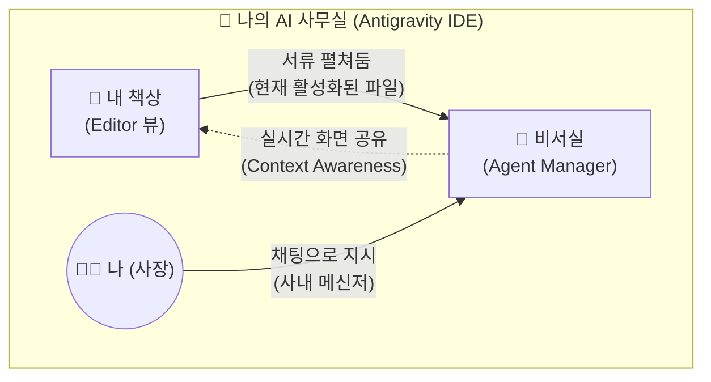

### 결정적 차이: 실시간 상황 인식 (Context Awareness)

이 AI 비서실이 우리가 흔히 아는 인터넷 브라우저 속 ChatGPT나 일반 웹 검색과 확연히 다른 점은 바로 "눈"이 달려있다는 거예요. 이 비서는 여러분이 내 책상(Editor 뷰)에 어떤 서류를 올려놓았는지 실시간으로 함께 보고 있습니다. 따로 서류 내용을 복사해서 채팅창에 붙여넣어 줄 필요가 전혀 없어요. 그냥 "지금 내가 보고 있는 이 파일 좀 정리해 줘"라고 말하면 찰떡같이 알아듣습니다. 이것을 기술적인 용어로 컨텍스트 인식(Context Awareness)이라고 부릅니다.

🗣️ **강사 대본 (Instructor Script)**:

> "그럼 그냥 인터넷 창 열고 ChatGPT 쓰면 되는 거 아니에요?"라고 생각하실 수 있어요. 질문을 던지면 답을 주는 건 똑같으니까요. 하지만 결정적인 차이가 있습니다. 일반 ChatGPT는 여러분의 모니터와 작업 환경을 전혀 볼 수 없는 장님 비서예요. 일일이 파일 내용을 복사해서 채팅창에 붙여넣어 줘야 하죠.
> 
> 하지만 Antigravity 비서실에 있는 직원들은 여러분과 완벽하게 '화면을 공유'하고 있어요. 여러분 옆자리에 앉아서 내 책상을 같이 보고 있는 셈이죠. 방금 여러분이 펼쳐둔 `hello.txt` 파일을 손가락으로 가리키면서 "이것 좀 읽어봐"라고 하면 바로 읽어냅니다. 이것이 에디터에 내장된 AI 비서의 가장 무서운 능력이자, 앞으로 여러분의 퇴근 시간을 두 시간 이상 앞당겨줄 핵심 무기입니다.

---

## §3. 상세 내용

### Why — 왜 Agent Manager를 써야 하는가?

AI 시대의 소프트웨어 개발에서 가장 큰 변화는 개발자의 역할이 바뀌었다는 점입니다. 혼자서 모든 코드를 한 줄 한 줄 힘들게 타이핑하던 시대는 지났어요. 이제 개발자는 코드를 타이핑하는 사람이 아니라, 무엇을 만들지 기획하고 AI에게 "정확한 지시를 내리는 사람"입니다. 이 지시를 내리는 공식적인 창구이자 유일한 통로가 바로 Agent Manager예요. 

Agent Manager를 통하지 않고서는 AI의 강력한 코딩 능력을 내 프로젝트에 연결할 수 없습니다. 또한, 이곳은 비서가 업무를 어떻게 처리하고 있는지 경과를 한눈에 모니터링하고, 혹시라도 잘못된 방향으로 가고 있다면 즉각 바로잡아주는 통제 센터의 역할도 겸합니다. 비서에게 일을 시키고 보고받는 가장 효율적인 창구인 셈이죠.

### What — Agent Manager의 구조와 기능

Agent Manager의 화면은 마치 깔끔하게 정리된 이메일 편지함이나 스마트폰의 메신저 앱처럼 직관적으로 생겼습니다. 크게 세 가지 영역으로 나누어 볼 수 있어요.

첫 번째는 **과거 기록 영역(Inbox/History)**입니다. 과거에 비서와 나눴던 대화나 진행했던 작업들이 목록 형태로 남아요. 마치 예전에 지시했던 업무 기록철을 다시 꺼내보는 것과 같습니다.

두 번째는 **현재 대화 영역(Chat View)**입니다. 지금 비서와 대화를 나누고 있는 실시간 공간이에요. 비서가 여러분의 지시를 받고 계획을 세우는 모습(Plan), 실제로 타자를 치며 코드를 작성하거나 파일을 검색하는 모습(Execute), 그리고 그 결과가 맞는지 스스로 확인하는 모습(Validate)이 이 창에 투명하게 중계됩니다.

세 번째는 **입력창(Input Box)**입니다. 화면 맨 아래에 위치한 텍스트 입력 칸으로, 여러분이 한국어로 편안하게 지시를 내리는 곳이에요. 영어로 완벽한 문장을 구사해야 한다는 부담은 전혀 가질 필요가 없습니다.

### How — 비서실 활용의 절대 규칙 (결재권)

비서실을 이용할 때 반드시 지켜야 할 절대 규칙이 딱 하나 있습니다. 바로 **"사장의 결재 없이는 서류의 토씨 하나도 바뀌지 않는다"**는 원칙이에요.

앞선 세션에서 잠깐 언급했던 검토 기반 개발(Review-driven development)이라는 철학이 여기서 철저하게 지켜집니다. AI 비서는 아주 똑똑하고 행동이 빠르지만, 동시에 극도로 조심스럽게 행동하도록 설계되어 있어요. 비서가 "사장님, 현재 파일을 이렇게 수정하는 게 어떨까요?"라고 제안안을 가져오면, 여러분이 명시적으로 승인("Accept" 버튼 클릭 또는 "좋아, 진행해"라고 대답)하거나 거절해야만 내 책상(Editor)의 파일 내용이 비로소 변경됩니다. 

AI가 제멋대로 코드를 엉망으로 만들까 봐 걱정하실 필요가 전혀 없어요. 모든 통제권과 주도권은 온전히 사장님인 여러분이 쥐고 있다는 사실을 명심하세요.

---

## §4. 실습 가이드 (+ 🎙️ 실습 대본)

### 실습 목표

이 실습을 통해 여러분은 Agent Manager 패널을 직접 열어 AI 비서에게 첫 인사를 건넵니다. 또한, 이전에 작성해 둔 `hello.txt` 파일을 비서가 화면 공유하듯 제대로 인지하고 있는지 두 눈으로 확인합니다.

🎙️ **실습 가이드 대본 (Lab Guide)**:

> 자, 이제 진짜로 비서실 문을 두드려 볼 시간입니다. 화면 오른쪽을 주목해 주세요. 앙증맞은 말풍선 모양의 아이콘이 보이시나요? 그걸 클릭하면 비서실 문이 스르륵 열리면서 채팅창이 나타납니다.
>
> 첫 출근을 한 비서에게 인사를 건네봐야겠죠? 영어로 길고 복잡하게 써야 하나 걱정하지 마세요. 우리 비서실 직원들은 한국어 패치가 완벽하게 되어 있습니다. 일상적인 메신저 하듯이 편안한 말씨로 질문해 보세요. 자, 키보드에 손을 올리시고 시작해 보겠습니다!

### 단계별 지시

| 단계 | 소요 시간 | 강사 지시사항 | 학습자 액션 | 예상 결과 |
|------|----------|--------------|------------|----------|
| 1 | 1분 | "화면 우측 사이드바에서 말풍선 아이콘(Agent)을 클릭해 패널을 열어주세요." | 우측 말풍선 아이콘 클릭 | 화면 오른쪽에 Agent Manager 패널이 확장됨 |
| 2 | 2분 | "아래쪽 입력창에 이렇게 적어보세요. '안녕! 너는 누구야? 무엇을 할 수 있어?' 그리고 Enter를 누르세요." | 입력창에 텍스트 입력 후 Enter | AI가 자기소개와 주요 기능을 한국어로 친절하게 답변함 |
| 3 | 2분 | "에디터 가운데 화면(내 책상)에 아까 만든 `hello.txt` 파일이 열려있는지 확인하세요. 안 열려 있다면 탐색기에서 클릭해 주세요." | `hello.txt` 탭 클릭 (포커스 맞추기) | 에디터 화면에 `hello.txt` 파일 내용이 선명하게 표시됨 |
| 4 | 3분 | "이제 진짜 마법을 부려볼게요. 비서에게 '방금 내가 만든 hello.txt 파일을 읽어줄래?'라고 물어보세요." | 입력창에 "hello.txt 파일 읽어줄래?" 입력 후 Enter | AI가 현재 활성화된 파일 내용을 정확히 인식하고 화면에 출력해 줌 |
| 5 | 2분 | "비서가 파일 내용을 정확히 읽어냈나요? 결과를 짝꿍과 함께 확인하고 화면을 비교해 보세요." | 응답 확인 및 짝꿍과 결과 공유 | 상황 인식(Context Awareness)이 성공적으로 작동함을 눈으로 확인 |

### 트러블슈팅 FAQ

| Q | A |
|---|---|
| 오른쪽 패널 아이콘이 아예 보이지 않아요. | 화면 상단 메뉴 View → Appearance → Show Activity Bar가 체크되어 있는지 확인하거나, 단축키 `Ctrl+L` (Mac은 `Cmd+L`)을 눌러보세요. 패널이 즉시 나타납니다. |
| AI가 영어로만 대답해요. 한국어로 물었는데도요. | "앞으로는 한국어로 대답해 줘"라고 한 번만 명시적으로 지시해 보세요. 그 이후부터는 찰떡같이 한국어로만 응답합니다. |
| 비서가 `hello.txt` 파일을 못 찾겠다고 자꾸 엉뚱한 소리를 해요. | 현재 에디터 화면 중앙에 `hello.txt` 파일이 활성화되어 있지 않아서 그럴 수 있습니다. 화면 왼쪽의 파일 탐색기에서 파일을 찾아 다시 한번 클릭해서 활성화한 뒤 똑같이 물어보세요. |
| 질문을 입력했는데 계속 로딩 동그라미만 돌아가고 답이 없어요. | 인터넷 연결이 일시적으로 끊겼거나 서버가 지연될 때 발생합니다. 잠시 기다려 보시고, 1분이 넘어가면 입력창 위쪽의 새로고침 화살표 버튼을 눌러보세요. |

> ✅ **체크포인트**: AI 비서가 내가 아까 적었던 "안녕하세요, 저의 첫 번째 파일입니다!"라는 내용을 토씨 하나 틀리지 않고 정확히 읊어주었나요?

---


### 🎓 강사 노트 (Instructor Support)

- ⏱️ **타이밍**: 11:05 (20분, lab)
- 🎯 **핵심 활동**: Gemini 3 Pro와 첫 대화
- ⚠️ **강사 주의사항**: "안녕?"만 쳐도 응답 오면 성공


### 📋 실습 설계 보강 (Lab Packet)

**세션 006 실습 설계 보강**

Agent Manager와 첫 인사
- **3-Stage Example Set**
  - 기본: Agent Manager 창 열기 → "안녕, 나는 파이썬 초보야"라고 입력 → AI 응답 확인
  - 변형: "오늘 날씨 알려줘"처럼 코딩과 무관한 질문 → AI가 코딩 맥락으로 안내하는 패턴 관찰
  - 실수 해결: "입력했는데 응답이 안 와요" → 인터넷 연결 확인, API 키 설정 확인
- **난이도 예측**: 대화 자체는 쉬우나 "AI에게 뭘 물어봐야 하지?" 막막함
- **타이밍 가이드**: Agent Manager 위치 찾기 3분 | 첫 대화 5분 | 다양한 질문 실험 7분 | 정리 5분
- **심리적 장벽**: "AI한테 바보 같은 질문을 하면 어쩌지?"
- **자가 점검**:
  - [ ] Agent Manager 창을 독립적으로 열 수 있는가?
  - [ ] AI에게 자연어로 질문을 보내고 응답을 받았는가?
  - [ ] 대화 이력이 화면에 남아있는 것을 확인했는가?

## §5. 코드 및 명령어 모음

### 주요 단축키 정리

마우스를 쓰지 않고도 비서실을 자유롭게 드나들 수 있는 필수 단축키들입니다.

```
# Agent Manager 기본 조작 단축키

Ctrl + L (Windows) / Cmd + L (Mac)  → Agent Manager 패널 열기 (동시에 입력창으로 커서가 즉시 이동합니다)
Ctrl + Shift + L                    → 완전히 새로운 채팅창 열기 (기존 대화를 지우고 깨끗한 백지에서 시작)
Esc                                 → Agent Manager 패널에서 빠져나와 에디터 뷰(내 책상)로 포커스 돌려놓기
```

### 프롬프트(지시어) 예시 모음

비서에게 말을 걸 때 참고할 수 있는 훌륭한 첫인사 예시들입니다. 그대로 복사해서 써도 좋습니다.

```text
# 1. 가벼운 인사 및 정체성 확인
"안녕! 너는 누구야? 나를 위해 무엇을 해 줄 수 있어?"
"우리 앞으로는 무조건 한국어로만 편하게 대화하자."

# 2. 컨텍스트 인식(상황 인식) 테스트
"지금 내가 열어둔 hello.txt 파일을 읽어줄래?"
"이 파일의 내용이 무슨 뜻인지 프로그래밍을 전혀 모르는 초보자가 이해하기 쉽게 설명해 줘."

# 3. 폴더 구조 파악 및 기초 분석 지시
"현재 내 프로젝트 폴더(AI_Class) 안에 어떤 파일들이 들어 있는지 싹 파악해서 알려줘."
```

> 🤖 **용어 팁**: 개발자들이 자주 쓰는 "프롬프트(Prompt)"라는 단어는 거창한 기술 용어가 아닙니다. 그저 AI에게 내리는 "지시어"나 "질문 내용"을 뜻할 뿐이에요. 사내 메신저로 동료에게 보내는 업무 요청 메시지라고 생각하시면 아주 마음이 편해집니다.

---

## §6. 요약

### 핵심 학습 포인트

이번 세션에서는 Antigravity의 두뇌이자 심장인 Agent Manager 패널을 처음으로 열어보았습니다. 조용히 닫혀있던 비서실 문을 두드려 AI 비서에게 첫 인사를 건네고, 사내 메신저를 쓰듯 한국어로 편하게 대화하는 방법을 배웠어요. 

특히 우리가 가장 주목해야 할 부분은, 이 비서가 일반적인 챗봇과 다르다는 점입니다. 이 내장형 AI 비서는 내 책상(Editor 뷰) 위에 펼쳐진 서류를 실시간으로 함께 볼 수 있는 눈, 즉 컨텍스트 인식(Context Awareness) 능력을 가졌다는 사실을 직접 체험했습니다. "내가 열어둔 이 파일 좀 읽어봐"라는 말 한마디면 척척 내용을 파악해 내는 유능한 비서를 드디어 얻게 되신 것을 진심으로 축하합니다.

### 다음 세션 예고

지금 우리는 한 명의 비서와 꽤 즐거운 대화를 나눴습니다. 그런데, 만약 여러분이 앞으로 만들어야 할 프로그램이 아주 크고 복잡하다면 어떨까요? 비서 한 명에게 코드도 짜라고 하고, 디자인도 하라고 하고, 버그 테스트까지 다 시키면 비서도 지치고 결과가 나오는 속도도 엄청나게 느려질 겁니다. 

다음 세션에서는 이 문제를 해결하기 위해 비서를 여러 명 고용해서 동시에 일을 시키는 놀라운 마법, "멀티에이전트 오케스트레이션"의 세계로 본격적으로 들어가 보겠습니다.

### 브릿지 노트

> "대화가 아주 잘 통하죠? 내 화면을 비서가 같이 보고 있다는 게 정말 신기하지 않나요? 지금은 똑똑한 비서 한 명을 배정받아 첫인사를 나눴지만, Antigravity의 진짜 무서운 점은 이런 비서를 열 명, 스무 명 동시에 부릴 수 있다는 겁니다. 바로 다음 세션에서 그 여러 명의 비서를 거느리고 지휘하는 훌륭한 '오케스트레이터'가 되어보겠습니다!"

---

## §7. 참고 자료

### 3-Source 출처

- **Source A (로컬 참고자료)**: `AI-native_파이썬기초.md` — 다중 에이전트 인터페이스 및 Agent Manager 대시보드 조작 방법과 기본 화면 구성
- **Source B (NotebookLM)**: Antigravity IDE 대시보드 인터페이스 분석 — Agent Manager를 이메일 받은편지함과 사내 메신저에 비유하는 개념 모델, 검토 기반 개발(Review-driven 개발) 원칙 설명
- **Source C (Deep Research)**: IDE 인터페이스 심층 분석 — 에이전트의 Plan-Execute-Validate 동작 사이클 및 사용자의 실시간 작업 파일(컨텍스트)을 능동적으로 인식하는 내장형 AI의 핵심 기술적 특징

### 강사 노트

> 💡 코딩 초보자들은 흔히 챗GPT 화면을 웹 브라우저에 따로 띄워두고 코드를 복사해서 옮겨 붙이는 방식에 익숙해져 있을 수 있습니다. 이번 세션의 가장 중요한 핵심은 'IDE 안에 내장된 AI가 현재 컨텍스트(열려 있는 파일 등)를 인지한다'는 점을 뇌리에 깊게 각인시키는 것입니다. `hello.txt`를 읽어내는 실습 시, 이 부분의 편리함과 혁신성을 다소 과장하더라도 크게 강조해 주시기 바랍니다.

---

## ✅ 세션 완료 체크리스트 (강사용)

- [x] §1~§7 모든 섹션이 충실하게 작성되었는가?
- [x] 비유와 스토리텔링이 포함되었는가? (사내 메신저, 비서실 문 두드리기, 서류 결재권)
- [x] 실습 단계별 지시표가 완전한가?
- [x] 체크포인트 질문이 배치되었는가?
- [x] 3-Source 팩트 패킷이 충실하게 반영되었는가?

---

*작성 일시: 2026-02-25*  
*작성 에이전트: Sisyphus-Junior*  
*교안 구조: 7섹션 (A0 팀 공통 표준)*  
*버전: v2.1*

> 🔗 **이전 세션**: [세션 005: Editor 뷰와 기본 조작](#세션-005)에서 배운 내용을 이어갑니다.
> 🔗 **다음 세션**: [세션 007: 멀티에이전트 오케스트레이션 기초](#세션-007)에서 계속됩니다.

---

### 세션 007: 멀티에이전트 오케스트레이션 기초
> [원본 파일](sessions/세션-007-멀티에이전트_오케스트레이션_기초_v2.1.md) | ⏱️ 25분 | 🧪 lab | 난이도: medium

> **세션 ID**: MS-PY101-007  
> **소요 시간**: 20분  
> **난이도**: low  
> **청크 타입**: concept  
> **버전**: v2.1 (7섹션 구조)

---

## §1. 개요

> **Day 1 | AM | 세션 007/022**

이전 세션에서 우리는 Agent Manager 화면을 열고 AI 비서와 처음으로 인사를 나눴어요. 폴더 구조를 파악해달라는 부탁도 척척 해내는 비서를 보니 무척 든든했을 거예요. 그런데 여러분, 이렇게 똑똑한 비서가 한 명이 아니라 여러 명이라면 어떨까요? 코드를 짜주는 전문가, 짠 코드를 테스트해주는 전문가, 그리고 발표 자료를 만들어주는 전문가가 한 사무실에 모여 있다면 업무 속도는 상상할 수 없을 만큼 빨라질 겁니다.

이번 세션에서는 단일 AI에 모든 것을 의존하는 방식을 넘어, 여러 명의 특화된 AI 비서를 동시에 지휘하는 **멀티에이전트 오케스트레이션(Multi-Agent Orchestration)** 개념을 배웁니다. 혼자서 끙끙대는 개발자(코더)가 아니라, 여러 전문가를 적재적소에 배치하고 협업을 조율하는 '프로젝트 팀장'으로 여러분의 역할을 한 단계 끌어올리는 시간이에요.

### 🎯 학습 목표

이 세션이 끝나면 여러분은 다음을 할 수 있어요:

- 단일 에이전트와 멀티에이전트 워크플로우의 차이를 설명할 수 있어요
- 순차 파이프라인과 병렬 실행이라는 두 가지 오케스트레이션 패턴을 구분할 수 있어요
- Agent Manager에서 여러 개의 탭을 열어 동시에 여러 에이전트에게 업무를 지시할 수 있어요

### 선행 세션 환기

바로 직전인 세션 006에서 Agent Manager라는 미션 컨트롤 대시보드를 살펴봤죠? 그때는 탭을 하나만 열고 한 명의 비서와 대화를 나눴습니다. 그 비서는 훌륭했지만, 한 번에 하나의 일밖에 하지 못했어요. 질문을 던지면 답변이 끝날 때까지 기다려야 했죠. 오늘은 그 기다림의 시간을 없애버릴 마법 같은 병렬 작업의 세계로 들어갑니다.

---

## §2. 핵심 개념 (+ 🗣️ 강사 대본 + Mermaid)

### 멀티에이전트 오케스트레이션 = "전문가로 구성된 프로젝트 팀"

여러분, 오케스트라 공연을 떠올려보세요. 지휘자는 단 위에 서서 바이올린, 첼로, 플루트 파트에 각각 다른 신호를 보냅니다. 수십 명의 연주자가 동시에 각자의 악보를 연주하면서 하나의 거대한 교향곡을 완성하죠. 지휘자 혼자서 모든 악기를 짊어지고 연주하는 게 아니에요.

이것이 바로 멀티에이전트 오케스트레이션의 본질입니다. AI 비서 한 명에게 코드도 짜고, 문서도 쓰고, 테스트도 하라고 시키는 건 1인 식당에서 사장님 혼자 요리하고 서빙하고 계산까지 하는 것과 같아요. 주문이 밀리면 식당은 마비되겠죠. 우리는 파스타 전문 셰프, 소스 전문 셰프, 디저트 전문 셰프를 따로 두고, 전체 주방의 흐름을 지휘하는 총괄 셰프(수셰프)가 되어야 합니다.

🗣️ **강사 대본 (Instructor Script)**:

> 앞서 AI 비서 한 명과 인사를 나누셨죠? 대화도 잘 통하고 일도 참 잘합니다. 그런데 상상해 봅시다. 당장 1시간 뒤에 프로젝트 회의가 있어요. 코드 에러를 잡아야 하고, 회의용 발표 자료도 요약해야 하고, 거기에 쓰일 파이썬 문법도 새로 찾아봐야 합니다.
>
> 비서 한 명을 불러서 "에러 고쳐줘" 하고 기다렸다가, 끝나면 "발표 자료 만들어줘" 하고 또 기다리고. 이렇게 순서대로 시키다 보면 결국 회의 시간에 늦고 말 거예요. 이런 상황에서 "이 일을 동시에 처리할 수 있게 비서를 세 명 고용하면 어떨까?"라는 발상이 바로 오늘의 주제, 멀티에이전트 오케스트레이션입니다.
>
> 여러분은 이제 타이핑을 하는 코더가 아닙니다. 코딩 전문 AI, 테스트 전문 AI, 문서 작성 전문 AI를 앉혀놓고 각자에게 명확한 업무를 배분하는 '프로젝트 팀장'입니다. 여러분의 손은 두 개뿐이지만, AI 비서들의 손은 열 개, 백 개를 동시에 쓸 수 있다는 점을 꼭 기억하세요.

> 💡 **강사 노트**: 비전공자가 '오케스트레이션'이라는 기술 용어를 직관적으로 받아들일 수 있도록 오케스트라 지휘자, 혹은 주방의 총괄 셰프 비유를 적극적으로 활용해 주세요. 이 개념이 잡혀야 뒤에 이어질 병렬 실행 실습에서 탭을 여러 개 여는 행동의 당위성을 이해합니다.

### Mermaid 다이어그램

```mermaid
flowchart TD
    subgraph Single Agent ["단일 에이전트 (1인 식당)"]
        direction TB
        A1[AI 비서] -->|1. 요리| W1(코드 작성)
        W1 -->|2. 서빙| W2(테스트)
        W2 -->|3. 계산| W3(문서 요약)
    end

    subgraph Multi Agent ["멀티에이전트 오케스트레이션 (전문 주방)"]
        direction TB
        Me{나\n(총괄 셰프)}
        
        Me -->|지시| Ag1[코드 전문 비서]
        Me -->|지시| Ag2[테스트 전문 비서]
        Me -->|지시| Ag3[문서 전문 비서]
        
        Ag1 -->|동시 진행| T1(코드 작성)
        Ag2 -->|동시 진행| T2(테스트)
        Ag3 -->|동시 진행| T3(문서 요약)
    end
```

---

## §3. 상세 내용

### Why — 왜 여러 에이전트를 조율해야 하는가?

가장 큰 이유는 압도적인 '시간 단축'과 '품질 향상'입니다. 언어 모델(AI)은 한 번에 너무 많은 컨텍스트나 복잡한 지시를 주면 헷갈려하거나 엉뚱한 결과를 낼 확률이 높아져요. "계산기 프로그램을 짜고, 오류가 없는지 확인한 다음, 사용자 매뉴얼까지 써줘"라고 한 번에 지시하면, 코드는 대충 짜고 매뉴얼은 그럴싸하게 꾸며내는 식의 타협을 해버립니다.

하지만 역할을 나누면 어떨까요? A 에이전트에게는 "넌 코드만 완벽하게 짜"라고 지시하고, B 에이전트에게는 "넌 A가 짠 코드를 비판적으로 테스트만 해"라고 지시하면 각각의 품질이 극적으로 올라갑니다. 이것이 우리가 비서들을 여러 명 고용해서 오케스트레이션해야 하는 이유예요.

### What — 두 가지 핵심 워크플로우 패턴

멀티에이전트를 지휘하는 방법에는 크게 두 가지 패턴이 있어요.

첫 번째는 **순차 파이프라인(Sequential Pipeline)**입니다. 공장의 조립 라인을 생각하시면 돼요. 기획 전문 에이전트가 설계를 마치면 그 결과물(문서)을 개발 전문 에이전트에게 넘깁니다. 개발 에이전트가 코드를 완성하면 이번엔 테스트 에이전트에게 넘겨서 검증을 받죠. 한 명의 작업이 끝나면 다음 사람에게 바통을 넘기는 릴레이 달리기와 같습니다.

두 번째는 **병렬 실행(Parallel Execution)**입니다. 서로 연관성이 없는 독립적인 작업을 동시에 처리하는 방식이에요. 예를 들어, 1번 탭에서는 파이썬 문법을 물어보고 있고, 동시에 2번 탭에서는 이메일 작성을 시키는 거죠. 오늘 우리가 직접 체험해 볼 패턴이 바로 이 병렬 실행입니다. 

### How — Agent Manager로 병렬 지휘하기

Antigravity의 Agent Manager에서는 탭(Tab)을 이용해 아주 쉽게 비서들을 복제하고 동시에 부릴 수 있습니다. 상단에 있는 `+` (새 세션 추가) 버튼을 누를 때마다 새로운 AI 비서가 배정됩니다.

웹 브라우저에서 탭을 여러 개 열어놓고 쇼핑을 하는 것과 완전히 똑같은 원리예요. 첫 번째 탭에서 무언가를 검색하게 시켜놓고, 로딩이 되는 동안 두 번째 탭으로 넘어가서 다른 작업을 지시하면 됩니다. 이렇게 탭을 넘나들며 지시를 내리는 행위 자체가 바로 '오케스트레이션'의 첫걸음입니다.

---

## §4. 실습 가이드 (+ 🎙️ 실습 대본)

### 실습 목표

이 실습을 통해 여러분은 Agent Manager에서 탭을 여러 개 열어, 서로 다른 두 명의 에이전트에게 동시에 작업을 지시하고 병렬로 결과를 받아보는 경험을 합니다. 

🎙️ **실습 가이드 대본 (Lab Guide)**:

> 자, 우리 손으로 직접 비서들을 지휘해 볼까요? 지금부터 우리는 두 명의 비서를 고용해서 동시에 일을 시켜볼 겁니다. 한 명에게는 어려운 요약을 시키고, 다른 한 명에게는 파이썬에 대해 물어볼 거예요.
>
> 1번 비서가 대답을 생각하고 타이핑하는 그 몇 초의 시간을 우리는 낭비하지 않을 겁니다. 바로 2번 비서에게 달려가서 새 업무를 줄 거예요. 두 비서가 동시에 내 화면에 글자를 쏟아내는 신기한 순간을 직접 눈으로 확인해 보세요!

### 단계별 지시

| 단계 | 소요 시간 | 강사 지시사항 | 학습자 액션 | 예상 결과 |
|------|----------|--------------|------------|----------|
| 1 | 1분 | "Agent Manager 상단에서 `+` 버튼(New Session)을 눌러주세요. 이제 탭이 두 개가 되었습니다." | Agent Manager 상단의 `+` 아이콘 클릭 | 새로운 채팅 탭(세션) 생성 |
| 2 | 2분 | "첫 번째 탭으로 돌아가서 이렇게 질문하세요. 'AI가 프로그래머의 직업을 어떻게 바꿀지 3줄로 요약해줘.' 그리고 답변이 시작되면 절대 기다리지 마세요!" | 첫 번째 탭 선택, 프롬프트 입력 후 Enter | 에이전트가 답변을 생성하기 시작함 |
| 3 | 2분 | "바로 두 번째 탭으로 넘어오세요! 여기서는 이렇게 물어볼게요. '파이썬이 초보자에게 가장 좋은 이유 딱 2가지만 알려줘.'" | 두 번째 탭 선택, 새 프롬프트 입력 후 Enter | 두 번째 에이전트도 답변을 생성하기 시작함 |
| 4 | 2분 | "이제 1번 탭과 2번 탭을 번갈아가며 클릭해 보세요. 두 비서가 동시에 각자의 글을 열심히 쓰고 있는 게 보이시나요?" | 1번 탭과 2번 탭을 번갈아 클릭하며 진행 상황 관찰 | 두 세션이 독립적이고 병렬적으로 텍스트를 생성하는 것을 확인 |
| 5 | 3분 | "종이에 '내가 AI에게 동시에 시키고 싶은 일 3가지'를 짧게 적어보세요. (예: 메뉴 추천, 기초 문법 설명, 메일 교정) 이것이 바로 업무 분할의 시작입니다." | 빈 종이에 3가지 독립적인 작업 리스트 작성 | 자신만의 병렬 작업 계획 수립 (오케스트레이션 기초) |

### 트러블슈팅 FAQ

| Q | A |
|---|---|
| 탭을 너무 많이 열어서 헷갈려요. | 탭 제목 부분에 마우스를 올리고 우클릭하면 탭의 이름을 직접 변경(Rename)할 수 있습니다. '요약 비서', '파이썬 비서'처럼 이름을 붙여주세요. |
| 1번 탭에서 물어본 걸 2번 탭의 비서는 왜 모르죠? | 각 탭의 비서는 서로 기억을 공유하지 않는 독립된 방에 있습니다. 이것이 격리성(Isolation)이에요. 기억을 이어가려면 같은 탭에서 대화해야 합니다. |
| `+` 버튼을 눌렀는데 화면이 반응이 없어요. | Agent Manager 창이 너무 좁게 설정되어 있을 수 있습니다. 패널의 경계선을 마우스로 드래그해서 왼쪽으로 조금 더 넓혀보세요. |

---


### 🎓 강사 노트 (Instructor Support)

- ⏱️ **타이밍**: 11:25 (25분, lab)
- 🎯 **핵심 활동**: 에이전트 탭 2개 동시 운영
- ⚠️ **강사 주의사항**: 혼란 방지: 한 탭씩 순서대로 안내


### 📋 실습 설계 보강 (Lab Packet)

**세션 007 실습 설계 보강**

멀티에이전트 오케스트레이션 기초
- **3-Stage Example Set**
  - 기본: 에이전트 탭 2개 열기 → 탭 1에 "파이썬이란?" / 탭 2에 "변수란?" 동시 질문
  - 변형: 3개 탭으로 확장 — 각기 다른 주제(함수, 리스트, 조건문) 동시 조사
  - 실수 해결: "탭이 너무 많아서 어디가 어딘지 모르겠어요" → 탭 이름 지정하는 방법 안내
- **난이도 예측**: "동시에 여러 AI를 쓴다" 개념 자체가 낯설음
- **타이밍 가이드**: 멀티탭 개념 설명 5분 | 2탭 실습 10분 | 결과 비교 5분 | 정리 5분
- **심리적 장벽**: "하나도 어려운데 여러 개를 동시에?"
- **자가 점검**:
  - [ ] 에이전트 탭을 2개 이상 동시에 열 수 있는가?
  - [ ] 각 탭에서 독립적으로 다른 질문에 응답받았는가?
  - [ ] 멀티에이전트의 장점을 한 문장으로 설명할 수 있는가?

## §5. 코드 및 명령어 모음

### 실습에 사용한 병렬 프롬프트 예시

**에이전트 1 (탭 1) 입력 프롬프트:**
```text
AI가 프로그래머의 직업을 어떻게 바꿀지 3줄로 요약해줘.
```

**에이전트 2 (탭 2) 입력 프롬프트:**
```text
파이썬이 프로그래밍 초보자에게 가장 좋은 이유 딱 2가지만 핵심만 설명해줘.
```

> 🤖 **심화 활용 예시**: 나중에는 이렇게 지시하게 됩니다.
> - **탭 1 (Architect)**: "장바구니 기능의 데이터베이스 구조를 마크다운 표로 설계해줘."
> - **탭 2 (Feature)**: "탭 1에서 만든 데이터베이스 구조를 파이썬 코드로 구현해줘."

### Agent Manager 탭 관리 단축키 (참고용)

```
# Antigravity Agent Manager 주요 조작
Ctrl + T (또는 + 버튼)     → 새 에이전트 세션(탭) 열기
Ctrl + W (또는 x 버튼)     → 현재 에이전트 세션 닫기
```

---

## §6. 요약

### 핵심 학습 포인트

이번 세션에서 우리는 여러 명의 AI 비서를 동시에 다루는 멀티에이전트 오케스트레이션의 기초를 맛보았습니다. 지휘자가 여러 악기 파트를 조율하듯, 우리는 탭을 여러 개 열어 서로 다른 에이전트에게 독립적인 업무를 병렬로 지시했어요. 한 비서가 글을 쓰는 동안 멍하니 기다리는 대신, 그 틈을 타 다른 비서에게 새로운 일을 맡기는 방식으로 작업 효율을 극대화했습니다. 이제 여러분은 단순한 컴퓨터 사용자가 아니라, 여러 AI 전문가를 거느린 든든한 프로젝트 팀장입니다.

### 다음 세션 예고

비서들을 동시에 부려먹는 방법, 아주 훌륭하게 해내셨어요! 자, 이제 진짜 개발자다운 일을 해볼 차례입니다. 우리가 요리를 하려면 주방에 재료와 조리 도구가 잘 갖춰져 있는지 먼저 살펴봐야 하잖아요? 다음 세션에서는 이 똑똑한 비서들 중 한 명을 콕 집어서, 우리 컴퓨터에 파이썬이 제대로 설치되어 있는지 묻는 대화를 나눠보겠습니다.

### 브릿지 노트

> "탭을 오가며 동시에 일하는 두 명의 비서를 보니 어떠셨나요? 든든하죠? 이제 우리는 AI 하나에 모든 걸 의존하는 수동적인 코더가 아니라, 이들을 척척 조율하는 오케스트레이터입니다. 자, 이제 이 비서 중 한 명과 함께 본격적인 개발 준비를 시작해 봅시다. 우리 컴퓨터라는 주방에 파이썬이라는 도구가 잘 들어있는지 확인하러 가볼까요?"

---

## §7. 참고 자료

### 3-Source 출처

- **Source A (로컬 참고자료)**: `AI-native_파이썬기초.md` — 멀티에이전트 아키텍처 기반의 병렬 작업 환경 및 오케스트레이션 소개
- **Source C (Deep Research)**: 오케스트레이션 패턴 — 순차 파이프라인과 병렬 실행 모델의 구조적 차이, 다중 에이전트 워크플로우 분석. 1인 식당과 주방 셰프 비유 도출

### 강사 노트

> 💡 이 세션은 코딩 지식보다는 'AI를 대하는 태도와 작업 방식(Workflow)'의 패러다임을 바꾸는 매우 중요한 시간입니다. 
> 
> 수강생들은 보통 챗GPT 화면 하나 띄워놓고 질문한 뒤 하염없이 기다리는 데 익숙해져 있습니다. 이 "기다리는 습관"을 깨고, 에이전트가 답변을 적어내는 동안 바로 다음 탭을 열어 다른 지시를 내리는 경험을 제공해야 합니다. 종이에 직접 3가지 업무를 적어보게 하는 5단계 액션이 수강생의 능동성을 이끌어내는 핵심 장치입니다.

---

## ✅ 세션 완료 체크리스트 (강사용)

- [x] §1~§7 모든 섹션이 충실하게 작성되었는가?
- [x] 오케스트라 및 주방 비유가 명확하게 전달되었는가?
- [x] 병렬 실행을 위한 탭 분리 실습이 포함되었는가?
- [x] 3-Source 팩트 패킷(순차/병렬 개념)이 반영되었는가?

---

*작성 일시: 2026-02-25*  
*작성 에이전트: Sisyphus-Junior*  
*교안 구조: 7섹션 (A0 팀 공통 표준)*


> 🔗 **이전 세션**: [세션 006: Agent Manager와 첫 인사](#세션-006)에서 배운 내용을 이어갑니다.
> 🔗 **다음 세션**: [세션 008: 프롬프트로 시스템 환경 확인](#세션-008)에서 계속됩니다.

---

### 세션 008: 프롬프트로 시스템 환경 확인
> [원본 파일](sessions/세션-008-프롬프트로_시스템_환경_확인_v2.1.md) | ⏱️ 20분 | 🧪 lab | 난이도: medium

> **세션 ID**: MS-PY101-008  
> **소요 시간**: 20분  
> **난이도**: low  
> **청크 타입**: lab  
> **버전**: v2.1 (7섹션 구조)

---

## §1. 개요

> **Day 1 | AM | 세션 008/022**

이전 세션에서 우리는 여러 에이전트를 동시에 다루는 멀티에이전트 오케스트레이션의 기초를 배웠습니다. 다양한 AI 비서들에게 각자의 역할을 부여하고 지휘하는 방법을 머릿속에 그렸다면, 이제는 진짜 실전으로 넘어갈 차례입니다. 

요리를 시작하기 전에 가장 먼저 해야 할 일이 무엇일까요? 메뉴를 정했으면, 주방으로 가서 냉장고 문을 열고 "돼지고기가 있나? 파가 있나? 마늘은 충분한가?" 하고 요리 재료를 확인해야 합니다. 프로그래밍도 이와 똑같습니다. 파이썬으로 무언가 멋진 프로그램을 만들기 전에, 내 컴퓨터라는 주방에 파이썬이라는 핵심 재료가 갖춰져 있는지 먼저 확인해야 해요 [Source C].

이번 세션에서는 컴퓨터 환경을 확인하는 과정에서 우리의 첫 번째 본격적인 프롬프트를 작성해 봅니다. 명령어를 무작정 외우는 과거의 코딩 방식에서 벗어나, AI 비서에게 내 상황을 정확히 알려주고 필요한 명령어를 얻어내는 방법을 배우게 될 것입니다.

### 🎯 학습 목표

이 세션이 끝나면 여러분은 다음을 할 수 있어요:

- 내 컴퓨터에 파이썬이 설치되어 있는지 터미널을 통해 확인할 수 있어요.
- 터미널 명령어를 직접 암기하지 않고, PTCF 프레임워크를 활용해 AI에게 질문할 수 있어요.
- 터미널 명령어의 실행 결과를 읽고, 현재 시스템의 상태를 스스로 파악할 수 있어요.

### 선행 세션 환기

직전 세션(세션 007)에서 우리는 오케스트레이션, 즉 AI 에이전트들을 어떻게 지휘할 것인지 배웠어요. 식당으로 치면 수셰프와 파트별 요리사들의 역할을 나눈 셈이죠. 이제 여러 비서 중 한 명을 불러서 첫 번째 임무를 맡겨볼 시간입니다. 그 첫 임무는 거창한 프로그램 짜기가 아닙니다. 바로 "우리 집 주방 냉장고에 파이썬이라는 재료가 있는지 확인해 줘"라는 아주 현실적이고 기초적인 지시입니다.

---

## §2. 핵심 개념 (+ 🗣️ 강사 대본 + Mermaid)

### 냉장고 비유와 AI 비서의 역할

여러분이 삼겹살을 굽고 싶은데, 아주 거대한 식당용 냉장고가 여러 칸으로 나뉘어 있다고 상상해 보세요. 냉동실, 야채칸, 음료수칸, 고기 숙성고 등 수많은 칸 중에서 삼겹살이 어디 있는지 하나하나 열어보며 뒤지는 것은 엄청난 시간 낭비입니다. 

이때 여러분 옆에 있는 똑똑한 요리 보조 비서에게 "우리 냉장고 어디를 열어봐야 삼겹살이 있는지 알 수 있어?"라고 물으면, 비서가 즉각 "냉동실 두 번째 칸의 왼쪽 서랍을 열어보세요"라고 정확하게 안내해 줍니다 [Source B][Source C].

컴퓨터 환경도 마찬가지예요. 내 컴퓨터(냉장고)에 파이썬(삼겹살)이 설치되어 있는지 확인하려면 "터미널"이라는 특별한 공간에서 특정 명령어를 입력해야 합니다. 옛날 방식이라면 두꺼운 전공책을 뒤져서 `python --version`이라는 명령어를 달달 외웠겠지만, 우리는 메뉴 기획자잖아요? 명령어를 억지로 외우는 대신, AI에게 물어보고 답을 얻는 것이 훨씬 스마트한 방식입니다 [Source C].

🗣️ **강사 대본 (Instructor Script)**:

> 요리를 시작하기 전에는 항상 재료 확인이 먼저죠? 파이썬 코딩도 마찬가지입니다. 내 컴퓨터라는 거대한 냉장고에 파이썬이라는 핵심 재료가 제대로 들어있는지 확인해야 해요.
>
> 과거에는 이 확인 과정을 위해 터미널 명령어를 무작정 외워야 했습니다. 하지만 이제는 그럴 필요가 전혀 없어요. 여러분 옆에는 든든한 AI 비서가 24시간 대기하고 있습니다. 그저 비서에게 "내 컴퓨터에서 파이썬이 깔려 있는지 어떻게 확인해?"라고 물어보기만 하면 됩니다. 
>
> 여기서 아주 중요한 개념 하나를 새롭게 소개할게요. 바로 **PTCF 프레임워크**입니다. AI에게 질문할 때 Persona(페르소나), Task(작업), Context(상황), Format(형식)의 4요소를 꼼꼼히 갖춰서 물어보는 공식이에요. 이번 세션에서는 이 공식을 너무 깊게 파고들기보다는 가볍게 맛보기만 할 겁니다.
>
> "너는 IT 지원 전문가야(P). 윈도우 11 환경에서(C) 파이썬이 설치되어 있는지 확인하는 명령어 절차를 알려줘(T). 결과는 터미널 코드블록으로만 줘(F)." 
> 
> 이렇게 4가지 요소를 갖춰서 지시를 내리는 거죠. 아주 명확하고 깔끔하죠? 여러분이 이렇게 구체적으로 지시하면, AI 비서도 엉뚱한 소리를 하지 않고 정확히 여러분이 원하는 명령어만 쏙 뽑아서 대답해 줍니다 [Source B][Source C].

> 💡 **강사 노트**: 냉장고 비유를 확장하여 "명령어 암기 불필요"라는 AI-native 패러다임의 핵심 철학을 다시 한번 짚어주세요. PTCF 프레임워크는 이후 과정(세션 015 등)에서 계속 반복 심화되므로, 여기서는 완벽한 암기보다 '아, 이렇게 구체적으로 물어보니까 정확한 답이 나오는구나' 하는 긍정적인 첫 체감에 집중해야 합니다.

### Mermaid 다이어그램

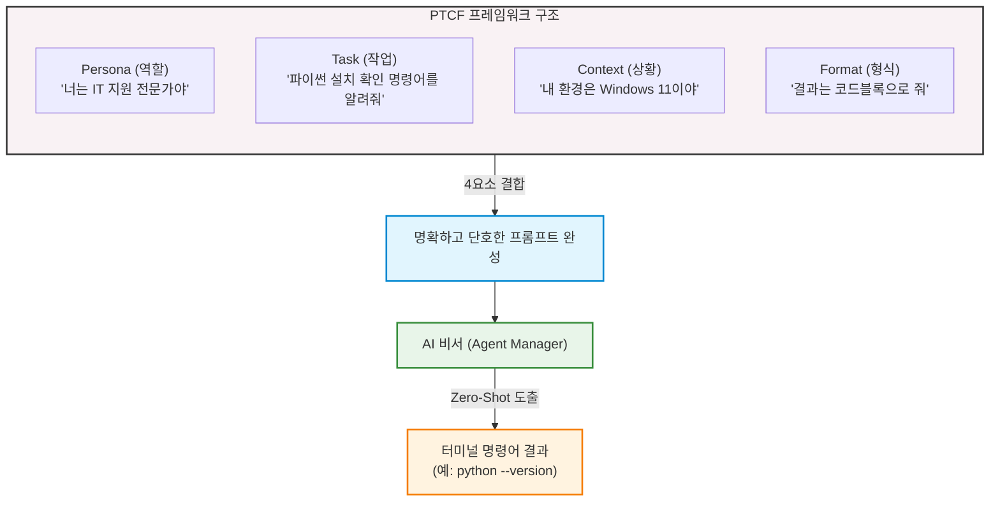

---

## §3. 상세 내용

### Why — 왜 명령어를 외우지 않고 프롬프트를 작성하는가?

과거의 코딩 교육은 명령어 암기에서 시작했습니다. 하지만 AI 시대에 명령어를 외우는 것은 유통기한이 아주 짧은 지식을 억지로 머릿속에 구겨 넣는 것과 같아요. 오늘 파이썬 확인 명령어를 외워도, 내일은 Node.js 확인 명령어가 필요해지고, 모레는 또 다른 도구의 명령어가 필요해집니다. 게다가 운영체제가 윈도우인지, 맥인지, 리눅스인지에 따라 명령어가 미세하게 달라지기도 해요. 이 모든 걸 다 외울 수는 없습니다.

하지만 **PTCF 프레임워크**를 활용한 프롬프트 작성법을 익혀두면 이야기가 달라집니다. 어떤 상황, 어떤 도구를 만나든 유연하게 대처할 수 있어요 [Source C]. 사전 예시 없이 바로 질문하는 방식인 Zero-Shot 프롬프팅을 하더라도, 구체적인 제약 조건을 주면 AI는 전문적인 훌륭한 답변을 내놓습니다. 이것이 바로 단순 코드 암기에서 벗어나 문제를 스스로 정의하고 해결 능력을 기르는 진정한 AI-native 방식입니다 [Source C].

### What — PTCF 프레임워크의 4대 요소

PTCF는 명확한 지시를 구성하기 위해 반드시 챙겨야 할 4가지 핵심 요소입니다 [Source C].

1. **Persona (페르소나)**: AI에게 역할을 부여합니다. "너는 ~야"라고 정해주는 순간, AI는 해당 전문가의 지식 풀(Pool)에서 답변을 꺼냅니다. (예: IT 지원 전문가, 시니어 파이썬 개발자, 친절한 선생님)
2. **Task (작업)**: 구체적으로 무엇을 해야 하는지, 행동의 목표를 명시합니다. 두루뭉술하게 말하지 말고 콕 집어 말해야 합니다. (예: 설치 확인 명령어를 안내해 줘)
3. **Context (상황)**: 나의 현재 환경, 배경 지식, 겪고 있는 문제 상황 등을 충분히 제공합니다. (예: 나는 코딩 초보자이고, 현재 Windows 11 운영체제를 사용 중이야)
4. **Format (형식)**: 어떤 형태로 답변을 받을지 출력의 형태를 지정합니다. 이 부분이 없으면 AI가 혼자 신나서 쓸데없이 긴 설명을 늘어놓습니다. (예: 부가 설명은 빼고 터미널 코드블록으로만 깔끔하게 출력해 줘)

이 4가지 요소를 모두 조합하면 AI가 환각(엉뚱한 소리나 거짓말)을 일으킬 확률을 극적으로 낮출 수 있습니다. 메뉴 기획자가 주방장에게 지시를 내릴 때, 1인분인지 2인분인지, 맵게 할지 안 맵게 할지 정확히 알려주는 것과 같아요.

### How — 프롬프트를 터미널 명령어로 연결하는 워크플로우

우리가 AI에게 PTCF 프롬프트를 던지면, AI는 `python --version`과 같은 명령어를 검은색 코드블록 형태로 깔끔하게 내놓습니다. 그러면 우리는 그 명령어를 복사해서 **통합 터미널**에 붙여넣고 키보드의 Enter 키를 누르기만 하면 돼요. 

터미널은 마우스로 더블 클릭을 하는 대신, 텍스트를 타이핑해서 컴퓨터와 직접 소통하는 창구입니다. Enter를 치면 결과가 나타나는데, 에러가 뜨든 버전 숫자가 뜨든 당황할 필요가 없습니다. 그 결과 자체가 우리 컴퓨터의 현재 상태를 알려주는 아주 중요한 단서이기 때문입니다. 

명령어를 AI에게 묻고, 복사해서, 터미널에 실행한다. 이 간단한 3박자 리듬을 꼭 기억해 두세요.

---

## §4. 실습 가이드 (+ 🎙️ 실습 대본)

### 실습 목표

PTCF 프레임워크를 활용해 파이썬 설치 확인 프롬프트를 직접 작성해 봅니다. 그리고 AI가 알려준 명령어를 터미널에 실행하여 자신의 컴퓨터(냉장고) 환경을 직접 확인하고 결과를 판독해 봅니다.

🎙️ **실습 가이드 대본 (Lab Guide)**:

> 자, 직접 확인해 볼 시간입니다. 여러분 컴퓨터의 주방 냉장고를 열어볼 거예요.
>
> 첫째로, Antigravity 화면 하단에서 까만 화면인 터미널(Terminal) 패널을 열어주세요. 저번 시간에 배웠던 단축키를 쓰셔도 좋고, 상단 메뉴에서 여셔도 좋습니다. 이 까만 터미널 창이 바로 냉장고 문을 여는 손잡이 역할을 할 겁니다.
> 
> 둘째로, 우측에 있는 Agent Manager 창을 열고 제가 화면에 띄워드린 PTCF 프롬프트를 그대로 입력해 보세요. "너는 IT 지원 전문가야. Windows 11 환경에서 파이썬이 설치되어 있는지 확인하는 터미널 명령어를 알려줘. 결과는 코드블록으로 줘." 라고요. 만약 맥북을 쓰시는 분이라면 Windows 11 부분을 macOS로 살짝 바꿔주시면 됩니다 [Source B][Source C].
>
> 셋째, AI가 답변을 주면, 그 검은색 코드블록 안에 있는 명령어를 복사해서 방금 연 터미널 창에 붙여넣고 힘차게 Enter 키를 쳐보세요. 
> 
> 결과가 어떻게 나오나요? 화면에 "Python 3.12.0"처럼 버전 숫자가 뜨는 분도 계실 거고, "python을 찾을 수 없습니다" 같은 붉은 에러 메시지가 뜨는 분도 계실 거예요. 여러분, 둘 다 아주 정상적인 결과입니다! 에러가 떴다고 컴퓨터가 고장난 게 아니에요.

### 단계별 지시

| 단계 | 소요 시간 | 강사 지시사항 | 학습자 액션 | 예상 결과 |
|------|----------|--------------|------------|----------|
| 1 | 2분 | "Antigravity 하단의 통합 터미널을 열어주세요. 까만 화면이 나와도 당황하지 마세요." | 단축키(``Ctrl + ` ``) 입력 또는 상단 메뉴 Terminal → New Terminal 클릭 | 화면 하단에 터미널 창 표시 |
| 2 | 3분 | "우측 Agent Manager에 화면에 보이는 PTCF 프롬프트를 타이핑하세요. (자신의 OS에 맞게 Context 변경)" | 프롬프트 입력 창에 PTCF 요소가 포함된 문장 타이핑 후 전송 버튼 클릭 | AI가 `python --version` 또는 `python3 --version` 명령어를 코드블록으로 제시 |
| 3 | 2분 | "AI가 준 코드블록의 명령어를 복사해서 터미널에 붙여넣고 Enter를 누르세요. 마우스 우클릭으로 붙여넣기가 편합니다." | 코드 복사 후 터미널 창에 우클릭 또는 단축키로 붙여넣기 → Enter | 파이썬 버전 출력 또는 명령어를 찾을 수 없다는 에러 메시지 출력 |
| 4 | 3분 | "나온 결과를 확인해 보세요. 버전이 뜨는지, 붉은색 에러가 뜨는지 옆 사람 화면과도 한번 비교해 보세요." | 터미널 출력 결과 확인 | 자신의 컴퓨터에 파이썬이 설치되어 있는지 상태 파악 완료 |

### 트러블슈팅 FAQ

| Q | A |
|---|---|
| 터미널에 붙여넣기가 안 돼요! | 터미널 창에서는 `Ctrl+V` 대신 마우스 우클릭을 하거나 `Shift + Insert`를 눌러야 붙여넣기가 되는 경우가 많습니다. |
| AI가 명령어를 안 주고 설명만 해요. | 프롬프트의 Format(형식) 부분이 약해서 그래요. "긴 설명은 절대 하지 말고 오직 터미널 코드블록 하나만 딱 출력해줘"라고 단호하게 지시해 보세요. |
| 저는 Mac을 쓰는데 Windows라고 쳐야 하나요? | 아닙니다! Context(상황) 요소는 자신의 실제 상황에 맞게 적어야 해요. "현재 macOS 환경에서"로 바꿔서 질문하시면 Mac에 맞는 명령어를 알려줍니다. |
| 빨간 글씨로 길게 에러가 떴어요! | 절대 컴퓨터가 고장난 것이 아닙니다! 에러 메시지는 "주인님, 냉장고에 파이썬 재료가 없어요!"라고 친절하게 보고하는 러브레터입니다. |

---


### 🎓 강사 노트 (Instructor Support)

- ⏱️ **타이밍**: 11:50 (20분, lab)
- 🎯 **핵심 활동**: 터미널 열기, 시스템 정보 질문
- ⚠️ **강사 주의사항**: 터미널 처음인 학습자 많음 — 천천히


### 📋 실습 설계 보강 (Lab Packet)

**세션 008 실습 설계 보강**

프롬프트로 시스템 환경 확인
- **3-Stage Example Set**
  - 기본: AI에게 "내 컴퓨터에 파이썬이 설치되어 있는지 확인하는 방법을 알려줘" → `python --version` 실행
  - 변형: "운영체제 정보도 알고 싶어" → `systeminfo` 명령어 안내받기
  - 실수 해결: `python`이 인식 안 될 때 → PATH 환경변수 문제. AI에게 에러 메시지 복사해서 질문
- **난이도 예측**: 터미널에 직접 타이핑하는 첫 경험 — 매우 긴장
- **타이밍 가이드**: 터미널 열기 3분 | AI에게 질문 5분 | 명령어 실행 5분 | 트러블슈팅 7분
- **심리적 장벽**: CLI 공포증 — "까만 화면에 글자만 있어서 무서워요"
- **자가 점검**:
  - [ ] 터미널에서 `python --version` 결과가 출력되는가?
  - [ ] 에러가 나면 AI에게 에러 메시지를 복사하여 질문했는가?
  - [ ] 내 OS 버전을 터미널에서 확인할 수 있는가?

## §5. 코드 및 명령어 모음

### PTCF 프롬프트 템플릿 예시

```text
[Persona] 너는 10년 차 IT 지원 전문가야.
[Context] 현재 내 컴퓨터는 Windows 11 (또는 macOS) 환경이야. 나는 코딩 초보자야.
[Task] 파이썬이 내 컴퓨터에 설치되어 있는지 터미널에서 확인하는 명령어를 알려줘.
[Format] 부가적인 인사말이나 설명은 전부 제외하고, 바로 복사할 수 있는 터미널 코드블록으로만 딱 1줄 작성해 줘.
```

### AI가 제시할 예상 명령어

```bash
# Windows 환경의 경우
python --version

# macOS 환경의 경우
python3 --version
```

### 터미널에서 나타날 수 있는 예상 출력 결과

**1) 설치되어 있는 경우 (성공 메시지)**
```text
Python 3.12.0
```

**2) 설치되어 있지 않은 경우 (에러 메시지)**
```text
'python'은(는) 내부 또는 외부 명령, 실행할 수 있는 프로그램, 또는 
배치 파일이 아닙니다.
```
> *참고: Mac의 경우 `command not found: python3` 등의 메시지가 출력됩니다.*

---

## §6. 요약

### 핵심 학습 포인트

오늘 이번 세션에서는 단순히 컴퓨터에 파이썬이 있는지 확인하는 작업을 넘어서, 아주 중요한 첫 경험을 했습니다. 바로 **첫 프롬프트 엔지니어링**을 체험한 것이죠. 명령어를 통째로 암기하는 고리타분한 시대는 이미 지났다는 것을 몸소 체험하셨을 거예요. 

대신 우리는 AI에게 Persona(페르소나), Task(작업), Context(상황), Format(형식)이라는 4가지 요소(PTCF)를 꼼꼼히 갖춰 명확하게 지시하는 공식을 배웠습니다. 이 작은 프롬프트 작성 경험 하나가 여러분을 코드를 무작정 타이핑하는 코더에서 벗어나게 해 줄 것입니다. 명확하게 지시하고, 결과를 받아 터미널에 실행하여 검증하는 이 사이클이 AI-native 개발자로 가는 첫걸음입니다 [Source C].

### 다음 세션 예고

터미널에 붉은색 에러 메시지가 뜬 분들, 속으로 '내가 시작하자마자 뭘 잘못했나' 철렁하셨죠? 전혀 아닙니다. 냉장고에 요리할 재료가 없다는 걸 아주 정확하게 확인했을 뿐이에요. 재료가 없으면 사 오면 그만이죠! 다음 세션에서는 파이썬이 없는 분들을 위해, AI 비서에게 다시 한번 "파이썬 설치 가이드"를 물어보고 파이썬을 아주 빠르고 쉽게 설치해 보겠습니다.

### 브릿지 노트

> "자, 파이썬이 안 깔려 있다고 붉은 에러가 나오신 분들 손 들어보실까요? 네, 아주 많네요. 당황하지 마세요. 아주 정상입니다. 여러분이 컴퓨터를 새로 샀다면 애초에 없는 게 당연해요. 자, 이제 우리 집 주방 냉장고가 비어있다는 걸 확실하게 알았으니, 본격적으로 든든한 AI 비서와 함께 파이썬이라는 아주 신선한 재료를 사러 마트로 가보겠습니다! 다음 세션으로 넘어가죠."

---

## §7. 참고 자료

### 3-Source 출처

- **Source A (로컬 참고자료)**: `AI-native_파이썬기초.md` — 프롬프트를 활용한 문제 정의의 중요성과 코더가 아닌 기획자로서의 역할 전환 패러다임
- **Source B (NotebookLM)**: Antigravity 통합 터미널 활용 예시 및 시스템 환경 확인을 위한 AI 비서와의 상호작용 워크플로우 분석
- **Source C (Deep Research)**: `3 프롤프트 엔지니어링.pdf` — PTCF(Persona, Task, Context, Format) 프레임워크 이론, Zero-Shot 프롬프팅 적용 사례 및 에러 메시지 디버깅 기초

### 강사 노트

> 💡 본 세션은 수강생들이 처음으로 프롬프트를 구조적으로 작성해 보고, 터미널이라는 낯선 환경을 접하는 시간입니다. "명령어 암기 불필요"라는 핵심 메시지를 반복해서 강조해 주시고, PTCF의 각 요소가 왜 필요한지 일상적인 비유(식당 주문 등)를 곁들여 설명하면 좋습니다. 또한 붉은 에러 메시지가 떴을 때 수강생들이 두려워하지 않도록 심리적 장벽을 낮춰주는 것이 가장 중요합니다. (에러 메시지 = 컴퓨터가 보내는 친절한 상태 보고서)

---

## ✅ 세션 완료 체크리스트 (강사용)

- [x] §1~§7 모든 섹션이 빠짐없이 충실하게 작성되었는가?
- [x] 비유와 스토리텔링이 적극적으로 포함되었는가? (주방 냉장고와 삼겹살 비유)
- [x] 실습 단계별 지시표가 초보자도 따라 할 수 있게 완전한가?
- [x] PTCF 프레임워크 4대 요소(Persona, Task, Context, Format)가 명확히 설명되었는가?
- [x] 3-Source 팩트 패킷(A, B, C)이 본문과 참고 자료에 골고루 반영되었는가?

---

*작성 일시: 2026-02-25*  
*작성 에이전트: A4B_Session_Writer*  
*교안 구조: 7섹션 (A0 팀 공통 표준)*

> 🔗 **이전 세션**: [세션 007: 멀티에이전트 오케스트레이션 기초](#세션-007)에서 배운 내용을 이어갑니다.
> 🔗 **다음 세션**: [세션 009: AI와 함께 Python 설치하기](#세션-009)에서 계속됩니다.

---

### 세션 009: AI와 함께 Python 설치하기
> [원본 파일](sessions/세션-009-AI와_함께_Python_설치하기_v2.1.md) | ⏱️ 20분 | 🧪 lab | 난이도: medium

> **세션 ID**: MS-PY101-009  
> **소요 시간**: 20분  
> **난이도**: medium  
> **청크 타입**: lab  
> **버전**: v2.1 (7섹션 구조)

---

## §1. 개요

> **Day 1 | AM | 세션 009/022**

### 🎯 학습 목표

이 세션이 끝나면, 수강생은 다음을 할 수 있습니다:

- AI 에이전트의 안내를 받아 Python 인터프리터를 운영체제에 설치할 수 있다
- "Add python.exe to PATH" 옵션의 의미를 이해하고 올바르게 설정할 수 있다
- 터미널에서 `python --version` 명령어로 설치를 검증할 수 있다

### 선행 세션 환기

바로 직전 세션(세션-008)에서 우리는 PTCF 프레임워크를 사용해서 AI에게 "내 컴퓨터에 파이썬이 깔려 있는지 확인해줘"라고 물어보는 연습을 했어요. 터미널에서 `python --version`을 실행했을 때, 버전 번호가 나온 분도 계시고, "python을 찾을 수 없습니다"라는 메시지를 만난 분도 계셨죠. 오늘은 그 "찾을 수 없습니다" 상태를 해결하는 시간이에요. 냉장고(시스템 환경)를 열어봤더니 핵심 재료(Python)가 없었으니, 이제 마트에 가서 사올 차례입니다.

---

## §2. 핵심 개념 (+ 🗣️ 강사 대본 + Mermaid)

### Python 인터프리터 = "가스레인지 설치"

여러분이 새 아파트에 입주했다고 상상해 보세요. 주방은 깨끗하게 비어 있고, 싱크대도 있고, 환풍기도 있어요. 하지만 요리를 하려면 가장 중요한 것이 하나 빠져 있습니다. 바로 가스레인지예요. 아무리 좋은 재료가 있어도 가스레인지 없이는 볶음밥 한 그릇 만들 수 없죠. Python 인터프리터가 바로 이 가스레인지입니다. AI가 아무리 훌륭한 코드를 작성해 줘도, Python이 설치되어 있지 않으면 그 코드를 실행할 수가 없어요.

그런데 가스레인지를 설치할 때 중요한 과정이 하나 더 있습니다. 바로 가스 배관 연결이에요. 가스레인지를 예쁘게 놓아두기만 하고 배관을 연결하지 않으면 어떻게 될까요? 불이 안 켜집니다. Python 설치에서 이 "가스 배관 연결"에 해당하는 것이 바로 **"Add Python to PATH"**라는 체크박스예요. PATH는 쉽게 말해서 컴퓨터의 전화번호부입니다. "파이썬이라는 프로그램은 이 주소에 살고 있어"라고 등록해 주는 과정이에요. 이걸 안 하면, 터미널에서 `python`이라고 불러도 컴퓨터는 "그런 사람 모르는데요?"라고 대답합니다.

🗣️ **강사 대본 (Instructor Script)**:

> 여러분, 지난 시간에 시스템 환경을 확인해 봤더니 파이썬이 없다고 나온 분들이 꽤 계셨죠? 완전히 정상이에요. 냉장고에 재료가 없으면 어떻게 하나요? 마트에 가서 사오면 됩니다. 오늘은 AI 비서의 안내를 받으면서 파이썬이라는 핵심 재료를 우리 컴퓨터에 장착해 볼 거예요.
>
> 혹시 "설치"라는 말만 들어도 긴장되시는 분 계세요? 오류가 날까 두려우신 거죠? 걱정하지 마세요. 든든한 1:1 튜터가 여러분 화면 안에 이미 대기하고 있습니다. "파이썬 설치할 때 체크박스 뭐 눌러야 해?"라고 서슴없이 물어보세요. 검색 엔진에서 블로그 글을 뒤지던 시대는 끝났어요. AI 에이전트와 대화하면서 설치 경로와 옵션을 실시간으로 안내받는 것, 이것이 AI-native 방식의 환경 구축입니다.
>
> 자, 오늘의 핵심 비유를 하나 기억해 주세요. **Python 설치 = 가스레인지 설치, PATH 설정 = 가스 배관 연결**. 가스레인지(Python)를 가져다 놓기만 하면 안 되고, 배관(PATH)까지 연결해야 요리(코드 실행)를 시작할 수 있어요. 이 비유 하나만 기억하시면 오늘 실습이 훨씬 편해질 거예요.

> 💡 **강사 노트**: 가스레인지/배관 비유는 v2.0 교안에서 발전시킨 것이며, AI 에이전트 안내 방식의 설치 워크플로우는 NotebookLM(Source B) 기반입니다. PATH 개념의 전화번호부 비유는 초보자 대상 설명에서 직관적으로 작동합니다.

### Mermaid 다이어그램

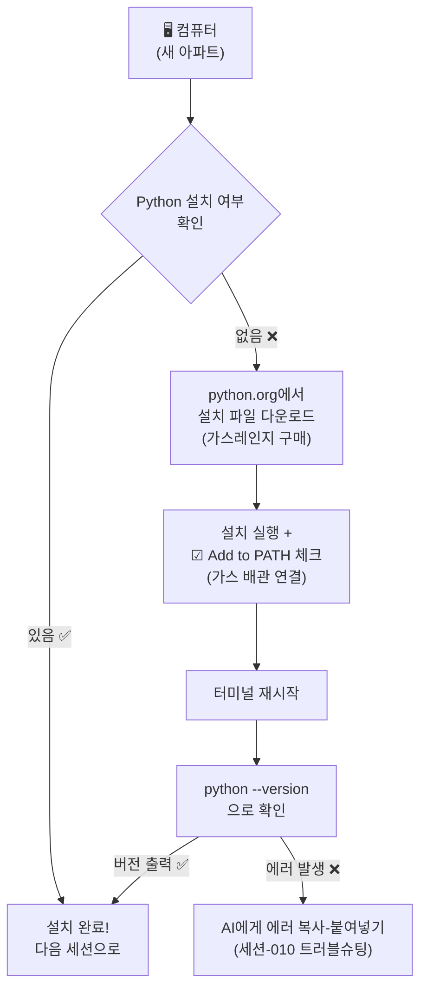

---

## §3. 상세 내용

### Why — 왜 Python을 설치해야 하는가?

"AI가 코드를 다 짜주는데, 파이썬은 왜 필요하죠?"라는 질문을 하실 수도 있어요. 아주 좋은 질문입니다. 비유로 설명해 드릴게요. AI가 써준 코드는 "레시피"예요. 아무리 맛있는 레시피가 있어도, 실제로 불을 켜고 프라이팬을 올려서 요리해야 음식이 나오죠. Python 인터프리터가 바로 이 "불을 켜는 장치"입니다. AI가 작성한 파이썬 코드를 컴퓨터가 이해할 수 있는 기계어로 번역해서 실행해 주는 핵심 엔진이에요.

"AI 시대의 서사"에서 배운 통역사 비유를 떠올려 볼까요? AI가 우리의 한국어 요청을 파이썬어(코드)로 번역해 주는 통역사라면, Python 인터프리터는 그 파이썬어를 컴퓨터가 이해할 수 있는 기계어로 다시 번역해 주는 두 번째 통역사예요. 통역사가 두 명 필요한 셈이죠. 첫 번째 통역사(AI)는 이미 Antigravity 안에 있고, 두 번째 통역사(Python)를 지금 설치하는 겁니다.

### What — Python 인터프리터란 무엇인가?

Python(파이썬)은 세계에서 가장 많이 쓰이는 프로그래밍 언어 중 하나예요. AI, 데이터 분석, 웹 개발, 자동화 등 거의 모든 분야에서 활용됩니다. 특히 AI 분야에서는 사실상 표준 언어나 다름없어요. ChatGPT도, Gemini도, 그 뒤에서 돌아가는 코드 상당 부분이 파이썬으로 작성되어 있습니다.

우리가 설치하려는 것은 정확히 말하면 **"CPython 인터프리터"**예요. "인터프리터(interpreter)"는 영어로 "통역사"라는 뜻인데, 파이썬 코드를 한 줄 한 줄 읽어서 컴퓨터가 실행할 수 있게 변환해 주는 프로그램입니다. 설치 파일 용량은 약 30MB 정도로, 요즘 스마트폰 사진 한 장보다 작아요. 설치 자체는 5분이면 충분합니다.

설치 과정에서 반드시 기억하실 것은 딱 하나, **"Add python.exe to PATH"** 체크박스를 꼭 체크하는 것이에요. 이 체크박스 하나가 나중에 수많은 에러를 예방해 줍니다.

### How — 어떻게 설치하는가?

설치 방법은 운영체제에 따라 약간 다릅니다. 우리 과정에서는 Windows를 기본으로 진행하되, macOS 사용자를 위한 안내도 함께 제공해요.

**Windows 사용자의 경우**, python.org 공식 사이트에서 설치 파일(.exe)을 다운로드하여 실행합니다. 설치 마법사 첫 화면에서 하단의 "Add python.exe to PATH" 체크박스를 반드시 체크한 뒤, "Install Now"를 클릭하면 됩니다. 설치가 완료되면 터미널을 새로 열어서 `python --version`으로 확인합니다.

**macOS 사용자의 경우**, macOS에는 시스템 Python이 기본 포함되어 있을 수 있지만, 보통 오래된 버전이에요. python.org에서 macOS용 설치 파일(.pkg)을 다운로드하여 설치하거나, Homebrew를 사용할 수도 있습니다. 터미널에서 `python3 --version`으로 확인합니다.

두 경우 모두, 설치 후 터미널을 반드시 새로 열어야 합니다. 환경 변수(PATH)는 터미널이 시작될 때 읽어오기 때문에, 기존에 열려 있던 터미널에서는 새로 설치한 Python을 인식하지 못할 수 있어요.

> ✅ **체크포인트**: 여기까지 이해했는지 스스로 점검해 보세요.
> - Python 인터프리터의 역할을 한 문장으로 설명할 수 있나요? ("파이썬 코드를 컴퓨터가 이해할 수 있게 실행해 주는 프로그램")
> - "Add to PATH"를 체크해야 하는 이유를 비유로 설명할 수 있나요? ("가스 배관을 연결해야 불이 켜지듯, PATH에 등록해야 터미널에서 python을 찾을 수 있다")

### 비교표 — Python 설치 옵션

| 항목 | Install Now (권장) | Customize installation |
|------|-------------------|----------------------|
| 대상 | 초보자, 빠른 설치 원하는 분 | 설치 경로나 옵션을 직접 지정하고 싶은 분 |
| PATH 설정 | 하단 체크박스로 자동 등록 | 수동으로 선택 가능 |
| 설치 경로 | 기본 경로 자동 지정 | 원하는 폴더 지정 가능 |
| 소요 시간 | 약 2~3분 | 약 5분 (옵션 검토 시간 포함) |
| 이 과정에서의 선택 | ✅ 이것을 선택하세요 | 나중에 익숙해지면 사용 |

---


### 📊 참고 표 (Visual Specs)

**개발 환경 설정 체크리스트**

| 단계 | 목표 | AI 프롬프트 예시 | 확인 방법 |
|:---|:---|:---|:---|

## §4. 실습 가이드 (+ 🎙️ 실습 대본)

### 실습 목표

이 실습을 통해 수강생은 AI 에이전트의 안내를 받으며 Python을 설치하고, 터미널에서 설치 결과를 직접 검증하는 경험을 합니다.

🎙️ **실습 가이드 대본 (Lab Guide)**:

> 자, 이제 직접 해볼 시간이에요. 화면에 Antigravity가 열려 있죠? 오른쪽 Agent Manager 패널을 봐주세요. 지금부터 이 AI 비서에게 파이썬 설치를 도와달라고 부탁할 거예요. 검색 엔진에서 블로그 글을 찾아 헤매는 게 아니라, AI와 대화하면서 한 단계씩 진행하는 거예요. 이것이 AI-native 방식의 학습입니다.
>
> 혹시 이미 파이썬이 설치되어 있는 분은 손 들어 주세요. 그런 분들은 설치 과정을 건너뛰고, 맨 마지막 검증 단계부터 함께 하시면 됩니다. 파이썬이 없는 분들, 긴장하지 마세요. 제가 한 단계씩 같이 갈게요. 막히면 AI 비서에게 바로 물어보시면 됩니다.

### 단계별 지시 — Windows 사용자

| 단계 | 소요 시간 | 강사 지시사항 | 학습자 액션 | 예상 결과 |
|------|----------|--------------|------------|----------|
| 1 | 2분 | "Agent Manager에 프롬프트를 입력하세요" | 아래 프롬프트를 Agent Manager에 입력 | AI가 설치 절차를 안내 |
| 2 | 1분 | "AI가 안내하는 링크로 이동하세요" | 웹 브라우저에서 python.org 접속 | Python 다운로드 페이지 표시 |
| 3 | 1분 | "최신 버전 다운로드 버튼을 클릭하세요" | "Download Python 3.x.x" 클릭 | .exe 파일 다운로드 시작 |
| 4 | 1분 | "⚠️ 체크박스를 반드시 체크하세요!" | 설치 파일 실행 → "Add python.exe to PATH" 체크 | 체크박스에 ✅ 표시 |
| 5 | 2분 | "Install Now를 클릭하고 기다리세요" | "Install Now" 클릭 | 설치 진행 바 → "Setup was successful" |
| 6 | 1분 | "터미널을 닫았다가 새로 여세요" | 기존 터미널 닫기 → `Ctrl + `` ` 로 새 터미널 | 새 PowerShell 세션 시작 |
| 7 | 1분 | "검증 명령어를 입력하세요" | `python --version` 입력 | "Python 3.x.x" 출력 |

**[단계 1] AI에게 설치 안내 요청하기**

Agent Manager 채팅창에 다음 프롬프트를 입력하세요:

```
너는 IT 지원 전문가야. Windows 11 환경에서 Python 최신 버전을 설치하는 방법을 
단계별로 알려줘. 반드시 환경 변수(PATH) 설정도 포함해줘. 
초보자도 따라할 수 있게 스크린샷 없이 텍스트로만 자세히 설명해줘.
```

AI가 python.org 다운로드 링크와 함께 상세한 설치 절차를 안내해 줄 거예요. 이때 AI의 응답을 꼼꼼히 읽어보세요. 우리가 수업에서 배운 "가스레인지 비유"와 비슷한 설명이 나올 수도 있고, 더 자세한 정보를 제공할 수도 있어요.

**[단계 2~3] python.org에서 설치 파일 다운로드**

웹 브라우저를 열고 `python.org`에 접속합니다. 상단 메뉴에서 "Downloads"를 클릭하면, 여러분의 운영체제에 맞는 최신 버전 다운로드 버튼이 자동으로 표시됩니다. 노란색 "Download Python 3.x.x" 버튼을 클릭하세요.

**[단계 4] ⚠️ 가장 중요한 순간 — PATH 체크박스**

다운로드된 설치 파일을 실행하면 설치 마법사가 열립니다. 이 화면에서 절대 바로 "Install Now"를 누르지 마세요! 먼저 화면 하단을 보세요. "Add python.exe to PATH"라는 작은 체크박스가 있습니다. 이것을 반드시 체크하고 나서 "Install Now"를 클릭하세요. 이 체크박스가 바로 우리 비유에서 "가스 배관 연결"에 해당하는 부분이에요. 이걸 빼먹으면 나중에 터미널에서 python 명령어를 인식하지 못합니다.

**[단계 5] 설치 진행 및 완료**

"Install Now"를 클릭하면 설치가 진행됩니다. 진행 바가 차오르는 동안 1~2분 정도 기다려 주세요. "Setup was successful"이라는 메시지가 나타나면 "Close"를 클릭합니다.

**[단계 6] 터미널 재시작**

여기서 중요한 팁이 하나 있어요. 환경 변수(PATH)는 터미널이 시작될 때 한 번 읽어옵니다. 그래서 Python을 설치하기 전에 이미 열려 있던 터미널에서는 새로 설치한 Python을 인식하지 못할 수 있어요. 반드시 터미널을 닫았다가 새로 열어주세요. Antigravity에서 `Ctrl + `` ` 키로 터미널을 열 수 있습니다.

**[단계 7] 설치 검증**

새로 연 터미널에 다음 명령어를 입력합니다:

```powershell
python --version
```

화면에 `Python 3.14.x` (또는 최신 버전 번호)가 출력되면 설치 성공입니다! 축하해요!

### 단계별 지시 — macOS 사용자

| 단계 | 소요 시간 | 강사 지시사항 | 학습자 액션 | 예상 결과 |
|------|----------|--------------|------------|----------|
| 1 | 2분 | "Agent Manager에 macOS용 프롬프트를 입력하세요" | 아래 프롬프트를 Agent Manager에 입력 | AI가 macOS 설치 절차 안내 |
| 2 | 1분 | "python.org에서 macOS 설치 파일을 받으세요" | python.org → Downloads → macOS → .pkg 다운로드 | .pkg 파일 다운로드 |
| 3 | 2분 | "설치 파일을 실행하고 안내를 따르세요" | .pkg 파일 더블클릭 → 설치 마법사 진행 | 설치 완료 |
| 4 | 1분 | "터미널을 새로 열고 검증하세요" | 터미널 재시작 → `python3 --version` 입력 | "Python 3.x.x" 출력 |

macOS에서 AI에게 도움을 요청할 때 사용할 프롬프트:

```
너는 IT 지원 전문가야. macOS 환경에서 Python 최신 버전을 설치하는 방법을 
단계별로 알려줘. 초보자도 따라할 수 있게 자세히 설명해줘.
```

macOS에서는 `python3`라는 명령어를 사용한다는 점이 Windows와 다릅니다. macOS 터미널에서 `python3 --version`을 입력해서 버전을 확인하세요.

### 트러블슈팅 FAQ

| Q | A |
|---|---|
| `python --version`을 실행했는데 Microsoft Store가 열려요 | Windows 11에서 자주 발생하는 현상이에요. 설정 → 앱 → 앱 실행 별칭에서 "python.exe"와 "python3.exe"의 앱 설치 관리자를 **끄기**로 변경하세요. 터미널을 재시작하면 정상 작동합니다. |
| "python을 찾을 수 없습니다"라는 에러가 나와요 | PATH 체크박스를 빼먹었을 가능성이 높아요. Python 설치 파일을 다시 실행 → "Modify" 선택 → PATH 옵션 활성화. 또는 AI에게 에러 메시지를 복사해서 물어보세요. |
| 설치 중 "Windows의 PC 보호" 경고가 떠요 | "추가 정보" → "실행"을 클릭하면 됩니다. python.org의 공식 프로그램이니 안전해요. |
| 설치할 때 "Add python.exe to PATH"를 깜빡하고 안 눌렀어요 | 설치 파일을 다시 실행 → "Modify" 선택 → 다음 화면에서 PATH 옵션 체크. 또는 다음 세션(010)에서 배울 트러블슈팅으로 수동 해결할 수 있어요. |
| macOS에서 `python`이 아니라 `python3`를 써야 하나요? | 네, macOS에서는 `python3`가 기본 명령어예요. `python`은 시스템 Python(2.x)을 가리킬 수 있으므로 항상 `python3`를 사용하세요. |
| 설치 파일이 다운로드되지 않아요 | 브라우저의 다운로드 차단 설정을 확인해 보세요. Chrome이라면 주소창 오른쪽의 다운로드 아이콘을 클릭하고 "허용"을 눌러주세요. |

> ✅ **체크포인트**: `python --version`(macOS는 `python3 --version`) 명령어가 Python 버전을 정상적으로 출력하나요? 출력됐다면 손을 들어 주세요!

---


### 🎓 강사 노트 (Instructor Support)

- ⏱️ **타이밍**: 13:10 (20분, lab)
- 🎯 **핵심 활동**: Python 다운로드 & 설치
- ⚠️ **강사 주의사항**: PATH 환경변수 체크박스 강조!


### 📋 실습 설계 보강 (Lab Packet)

**세션 009 실습 설계 보강**

AI와 함께 Python 설치하기
- **3-Stage Example Set**
  - 기본: AI에게 "Windows 11에 Python 최신 버전 설치하는 법 알려줘" → 안내에 따라 설치
  - 변형: 이미 Python이 있는 경우 — 버전 확인 후 업데이트 여부 판단
  - 실수 해결: "Add Python to PATH" 체크박스 놓침 → 환경변수 수동 등록 또는 재설치
- **난이도 예측**: "Add to PATH" 체크박스가 가장 빈번한 실수 포인트
- **타이밍 가이드**: 다운로드 안내 5분 | 설치(PATH 체크 강조) 7분 | 확인 3분 | 트러블슈팅 5분
- **심리적 장벽**: "설치 마법사에 영어가 많아서 겁나요"
- **자가 점검**:
  - [ ] 설치 시 "Add Python to PATH" 체크박스를 선택했는가?
  - [ ] `python --version`이 정상 출력되는가?
  - [ ] `pip --version`도 정상 출력되는가?

## §5. 코드 및 명령어 모음

### 명령어 1: Python 버전 확인 (Windows)

```powershell
python --version
```

이 명령어는 현재 시스템에 설치된 Python의 버전을 출력합니다. "Python 3.14.x" 형태의 버전 정보가 나오면 정상 설치된 것입니다.

> 🤖 **AI 프롬프트 예시**: "내 컴퓨터에 파이썬이 설치되어 있는지 확인하는 명령어를 알려줘"

### 명령어 2: Python 버전 확인 (macOS)

```bash
python3 --version
```

macOS에서는 `python` 대신 `python3` 명령어를 사용합니다. macOS 시스템에 기본 포함된 Python 2.x와 구분하기 위한 것이에요.

### 명령어 3: Python 설치 경로 확인 (Windows)

```powershell
where python
```

Python이 설치된 정확한 경로를 보여줍니다. 보통 `C:\Users\[사용자이름]\AppData\Local\Programs\Python\Python3xx\python.exe` 형태로 출력됩니다.

> 🤖 **AI 프롬프트 예시**: "파이썬이 어디에 설치되어 있는지 확인하는 방법을 알려줘"

### 명령어 4: Python 설치 경로 확인 (macOS)

```bash
which python3
```

macOS에서 Python 실행 파일의 경로를 확인하는 명령어입니다. `/usr/local/bin/python3` 또는 `/Library/Frameworks/Python.framework/Versions/3.xx/bin/python3` 형태로 출력됩니다.

### 명령어 5: Python 대화형 모드 진입 (설치 확인용)

```powershell
python
```

Python을 인자 없이 실행하면 대화형 모드(REPL)에 진입합니다. `>>>` 프롬프트가 표시되면 Python이 정상 작동하는 것입니다. 나가려면 `exit()` 또는 `Ctrl + Z` 후 Enter를 누르세요.

> 🤖 **AI 프롬프트 예시**: "파이썬 대화형 모드에 진입하는 방법과 나가는 방법을 알려줘"

### 명령어 6: uv 설치 스크립트 (Windows — 다음 세션 미리보기)

```powershell
irm https://astral.sh/uv/install.ps1 | iex
```

이 명령어는 다음 세션(011)에서 사용할 uv 패키지 매니저 설치 명령어입니다. 참고용으로 미리 수록합니다.

---

## §6. 요약

### 핵심 학습 포인트

이번 세션에서 우리는 AI 에이전트의 안내를 받으며 Python 인터프리터를 설치하는 경험을 했어요. 기억하실 핵심은 세 가지입니다. 첫째, Python 인터프리터는 AI가 써준 코드를 컴퓨터가 실행할 수 있게 해주는 핵심 엔진이에요. 가스레인지가 없으면 요리를 할 수 없듯이, Python이 없으면 코드를 실행할 수 없습니다. 둘째, 설치할 때 "Add python.exe to PATH" 체크박스를 반드시 체크해야 해요. 이것은 가스 배관을 연결하는 것과 같아서, 이걸 빼먹으면 터미널에서 python 명령어를 인식하지 못합니다. 셋째, 설치 후에는 반드시 터미널을 새로 열고 `python --version`으로 검증해야 해요. 설치했다고 끝이 아니라, 확인까지 해야 진짜 끝입니다.

### 다음 세션 예고

다음 세션에서는 아주 중요한 기술을 배울 거예요. "분명히 강사 말대로 했는데 왜 안 되죠?"라는 순간, 그 에러를 두려워하지 않고 해결하는 방법입니다. 개발자에게 가장 중요한 능력은 코드를 한 번에 완벽하게 만드는 것이 아니라, 문제가 생겼을 때 원인을 찾아내는 능력이에요.

### 브릿지 노트

> "모두 `python --version`에서 버전이 잘 뜨나요? 축하합니다! 우리 냉장고에 핵심 재료가 장착되었어요. 그런데 분명히 똑같이 했는데도 에러가 나는 분들이 계실 거예요. 에러가 났다고 실패한 게 아닙니다. 오히려 아주 좋은 학습 기회예요. 다음 세션에서는 도요타 자동차에서 탄생한 마법의 질문법, '왜?'라고 5번 묻는 5 Whys 트러블슈팅 기법을 배워보겠습니다."

---

## §7. 참고 자료

### 3-Source 출처

- **Source A (로컬 참고자료)**: 「AI-native_파이썬기초.md」(SRC-A07) — Python 설치 환경 스펙, 설치 경로 및 PATH 설정 가이드
- **Source B (NotebookLM)**: SRC-B01 — AI 에이전트 안내 기반 설치 워크플로우, "검색 엔진에 의존하지 않고 에이전트와의 대화를 통해 설치 경로와 옵션 안내받기" 패러다임
- **Source C (Deep Research)**: SRC-C01 — Python 인터프리터 아키텍처, CPython 런타임 구조

### 추가 학습 자료

- [Python 공식 다운로드 페이지](https://www.python.org/downloads/): 운영체제별 최신 Python 설치 파일
- [Python Beginner's Guide](https://wiki.python.org/moin/BeginnersGuide): Python 공식 위키의 초보자 가이드
- [Antigravity IDE 공식 사이트](https://antigravity.google): IDE 내장 Python 연동 관련 문서

### 강사 노트

> 💡 **강사 노트**: 설치 실습에서 가장 흔한 이슈는 PATH 미등록입니다. 수강생 중 30%가량이 이 문제를 경험하므로, 다음 세션(010 트러블슈팅)에서 바로 다룰 수 있도록 "에러가 나는 것이 좋은 학습 기회"라는 메시지를 강조해 주세요. macOS 사용자는 `python3` 명령어를 사용해야 한다는 점을 별도로 안내해 주시고, Homebrew 설치 방식은 이 과정 범위를 벗어나므로 python.org 공식 설치 파일을 권장합니다.

---

## ✅ 세션 완료 체크리스트 (강사용)

- [ ] §1~§7 모든 섹션이 충실하게 작성되었는가?
- [ ] 가스레인지/배관 비유가 §2에서 충분히 확장되었는가?
- [ ] Windows/macOS 양쪽 설치 경로가 §4에 포함되었는가?
- [ ] 단계별 지시표에 소요 시간이 명시되었는가?
- [ ] 트러블슈팅 FAQ가 6개 이상 포함되었는가?
- [ ] 체크포인트 질문이 §3, §4에 배치되었는가?
- [ ] 3-Source 팩트 패킷이 §7에 반영되었는가?
- [ ] 다음 세션(010 트러블슈팅) 브릿지 노트가 포함되었는가?

---

**🔗 선행 세션**: [세션-008] 프롬프트로 시스템 환경 확인 (권장)  
**🔗 후행 세션**: [세션-010] 트러블슈팅과 5Whys 기법

---

*작성 일시: 2026-02-25*  
*작성 에이전트: A4B_Session_Writer*  
*교안 구조: 7섹션 (A0 팀 공통 표준)*


> 🔗 **이전 세션**: [세션 008: 프롬프트로 시스템 환경 확인](#세션-008)에서 배운 내용을 이어갑니다.
> 🔗 **다음 세션**: [세션 010: 트러블슈팅과 5 Whys 기법](#세션-010)에서 계속됩니다.

---

### 세션 010: 트러블슈팅과 5 Whys 기법
> [원본 파일](sessions/세션-010-트러블슈팅과_5Whys_기법_v2.1.md) | ⏱️ 20분 | 🧪 lab | 난이도: medium

> **세션 ID**: MS-PY101-010
> **소요 시간**: 20분
> **난이도**: low
> **청크 타입**: narrative
> **버전**: v2.1 (7섹션 구조)

---

## §1. 개요

> **Day 1 | AM | 세션 010/022**

이전 세션에서 AI의 도움을 받아 파이썬을 성공적으로 설치했습니다. 모든 과정이 물 흐르듯 순조로웠다면 정말 좋았겠지만, 현실은 늘 예상치 못한 변수로 가득합니다. 분명히 지시대로 따라 했는데 화면에 낯선 빨간색 글씨가 가득 뜨는 상황을 마주하신 분도 계실 거예요. 이런 에러 메시지를 처음 마주하면 심장이 덜컹 내려앉고, 내가 컴퓨터를 망가뜨린 것은 아닌지 두려움이 밀려오기 마련입니다. 

하지만 이번 세션에서는 에러를 대하는 우리의 태도를 완전히 뒤바꿔 볼 예정입니다. 에러는 우리를 괴롭히려는 방해물이 아니라, 컴퓨터가 우리에게 보내는 절박하고도 친절한 '러브레터'입니다. 컴퓨터는 자신이 왜 멈춰 섰는지 아주 상세하게 적어서 우리에게 도움을 요청하고 있는 것이죠. 

### 🎯 학습 목표

이 세션이 끝나면 여러분은 다음을 할 수 있어요:
- 에러 메시지를 마주했을 때 당황하지 않고 AI에게 올바르게 질문할 수 있습니다.
- 문제를 의사에게 설명하듯 구체적인 맥락과 함께 전달하는 방법을 이해합니다.
- 도요타의 5Whys 기법을 활용해 겉으로 드러난 증상이 아닌 진짜 근본 원인을 파헤칠 수 있습니다.

### 선행 세션 환기

우리는 직전 세션(세션 009)에서 파이썬이라는 도구를 컴퓨터에 설치했어요. 설치 과정에서 체크박스 하나를 놓치거나 경로가 꼬이면 곧바로 실행 에러가 발생합니다. 이제 방금 설치한 파이썬을 직접 다루면서, 만약 문제가 생겼을 때 어떻게 해결의 실마리를 찾아야 하는지 그 강력한 무기를 장착해 보겠습니다.

---

## §2. 핵심 개념 (+ 🗣️ 강사 대본 + Mermaid)

### 병원 진단과 에러 메시지

에러를 해결하는 과정은 병원에 가서 의사에게 진찰을 받는 과정과 똑같습니다. 몸이 아파서 병원에 갔을 때, 의사 선생님에게 다짜고짜 "아파요, 고쳐주세요"라고만 말하면 어떻게 될까요? 의사는 "언제부터 아프셨나요?", "정확히 어디가 아픈가요?", "최근에 상한 음식을 드셨나요?"라며 계속해서 질문을 던질 수밖에 없습니다. 구체적인 증상과 정황을 모르면 처방전을 내릴 수 없기 때문입니다.

컴퓨터의 에러도 마찬가지입니다. AI 비서에게 "파이썬이 안 돼요"라고만 말하면 AI도 당황합니다. 화면에 뜬 에러 메시지를 글자 하나 빼놓지 않고 통째로 복사해서 AI에게 건네주는 행위는, 의사에게 "어제 저녁에 해산물을 먹은 직후부터 오른쪽 아랫배가 찌르듯이 아파요"라고 정확한 증상을 설명하는 것과 같습니다. 에러 메시지 안에는 문제가 발생한 정확한 파일 경로, 몇 번째 줄에서 멈췄는지, 어떤 종류의 오류인지에 대한 모든 단서가 들어 있습니다.

### 도요타 5Whys 기법

여기서 한 걸음 더 나아가 진짜 원인을 찾는 마법의 프레임워크가 바로 '5Whys(파이브 와이즈)'입니다. 이 기법은 원래 도요타 자동차 회사에서 제조 공정의 불량을 해결하기 위해 만들었어요. 원리는 아주 단순하면서도 강력합니다. 눈앞에 보이는 얕은 증상에 만족하지 않고, 문제의 근본 원인(Root Cause)에 닿을 때까지 "왜?"라는 질문을 꼬리에 꼬리를 물고 다섯 번 반복하는 것입니다.

🗣️ **강사 대본 (Instructor Script)**:

> 여러분, 파이썬 설치를 마쳤으니 모든 게 완벽하게 돌아가야 할 것 같죠? 그런데 화면에 빨간 에러 메시지가 뜨면 어떤 기분이 드시나요? 뭔가 큰 잘못을 저지른 것 같고 두려우실 겁니다. 하지만 비밀을 하나 알려드릴게요. 빨간 에러 메시지는 컴퓨터가 우리에게 보내는 러브레터입니다. 당황해서 창을 꺼버리지 마시고, 그 편지를 조심스럽게 긁어서 우리 AI 비서에게 건네주세요.
>
> 에러를 다루는 건 병원 진료와 같아요. "안 돼요"라고 말하는 건 "배 아파요"라고 하는 것과 같습니다. 에러 메시지를 복사해 주는 것이 바로 정확한 증상 설명이죠. 그리고 AI가 첫 번째 답변을 줬을 때 그냥 고개 끄덕이고 넘어가면 안 됩니다. 
> 
> "명령어가 안 먹혀요." 왜? "컴퓨터가 python이라는 단어를 모른대요." 왜? "환경 변수라는 곳에 등록이 안 됐대요." 왜? "설치할 때 맨 아래 체크박스를 안 눌렀거든요." 왜? "그게 무슨 뜻인지 몰랐어요." 왜? "전부 영어로 되어 있어서 그냥 Next 버튼만 눌렀습니다."
> 
> 어떠신가요? 이렇게 "왜?"를 반복하니까 진짜 원인이 '설치 화면의 영어 옵션을 간과한 것'이라는 깊은 곳까지 내려가게 되죠? 이것이 바로 5Whys 기법입니다.

### Mermaid 다이어그램

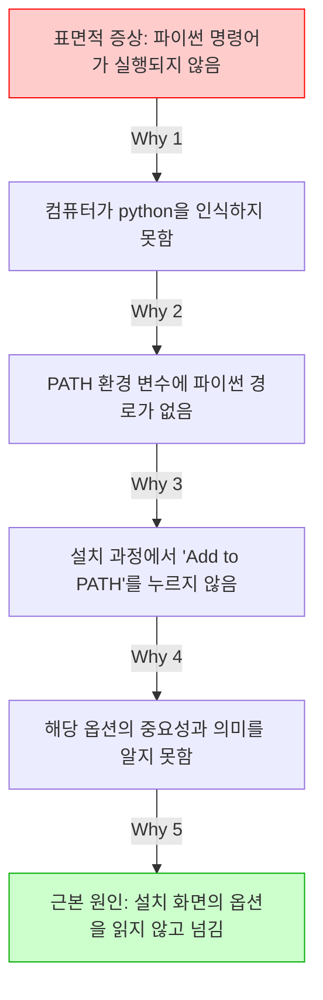

---

## §3. 상세 내용

### Why — 왜 5Whys를 배워야 하는가?

AI 시대에 우리가 코드를 직접 한 줄 한 줄 타이핑할 일은 많이 줄어들었습니다. 하지만 에러가 발생했을 때 그것을 해결하는 통찰력은 오히려 과거보다 훨씬 더 중요해졌습니다. "코드가 안 돌아가요"라는 똑같은 표면적 증상 앞에서도 진짜 원인은 천차만별입니다. 단순한 오타 때문일 수도 있고, 필요한 패키지를 설치하지 않아서일 수도 있으며, 컴퓨터의 운영체제 버전이 맞지 않아서일 수도 있습니다. 겉으로 드러난 증상만 보고 임시방편으로 대충 코드를 고치면, 나중에 더 거대한 버그가 되어 돌아옵니다. 근본 원인을 찾아 뿌리를 뽑아야 두 번 다시 같은 문제로 고통받지 않습니다.

### What — 에러 메시지를 다루는 올바른 태도

5Whys 기법을 제대로 쓰려면 먼저 지켜야 할 철칙이 있습니다. 에러 메시지는 절대 눈으로 보고 손으로 따라 치지 마세요. 무조건 마우스로 길게 드래그해서 전체를 복사(Ctrl+C)한 뒤 붙여넣기(Ctrl+V) 하셔야 합니다. 사람의 눈은 피곤하면 오타를 냅니다. 에러 메시지에 적힌 띄어쓰기 하나, 특수기호 하나가 문제 해결의 결정적 열쇠가 됩니다. 아주 사소해 보이는 예외 조건이나 코너 케이스(Corner Case)까지 AI가 완벽하게 인지하게 만드는 습관이 바로 디버깅 실력의 첫 단추입니다.

### How — AI와 함께 파고드는 5단계 추적

실제 상황에서 어떻게 적용할까요? 복사한 에러 메시지를 AI에게 던져주면서 "왜 이 에러가 발생했는지 초보자 수준으로 설명해줘"라고 요청하세요. AI가 첫 번째 원인을 알려주면, 그 원인을 다시 물고 늘어집니다. "그럼 환경 변수라는 건 왜 누락된 거야?"라고 질문하세요. 답변이 오면 "그럼 설치할 때 어떤 화면에서 내가 실수를 한 거지?"라고 또 묻는 겁니다. 표면적인 답변에서 만족하고 멈추지 마세요. AI의 친절한 설명을 징검다리 삼아 점점 더 깊은 원인으로 걸어 내려가는 감각을 몸에 익혀야 합니다.

---


### 📊 참고 표 (Visual Specs)

**트러블슈팅 퀵 레퍼런스 (5Whys)**

| 발생 상황 | 초기 대응 | AI 에이전트 프롬프팅 예시 | 5Whys 관점 |
|:---|:---|:---|:---|

## §4. 실습 가이드 (+ 🎙️ 실습 대본)

### 실습 목표

이번 실습에서는 완벽하게 정상인 컴퓨터 환경에서 고의로 오타를 내어 에러를 유발해 봅니다. 발생한 에러 메시지를 복사해서 AI에게 원인을 묻고, 꼬리를 무는 질문을 통해 5Whys 기법의 강력함을 직접 체험해 보는 것이 목표입니다.

🎙️ **실습 가이드 대본 (Lab Guide)**:

> 자, 직접 망가뜨려 봅시다. 겁먹을 필요 없습니다. 소프트웨어는 아무리 에러를 내도 물리적으로 터지지 않으니까요. 통합 터미널을 열고 파이썬 버전을 확인하는 명령어를 칠 건데, 일부러 철자를 틀리게 적어볼 겁니다. h 글자를 하나 빼고 입력해 보세요. 
> 
> 빨간 글씨가 와르르 쏟아지죠? 방금 전까지 배운 대로 해봅시다. 마우스로 그 에러 메시지를 쭉 긁어서 복사하세요. 그리고 Agent Manager 창에 있는 우리 AI 비서에게 붙여넣으면서 물어보세요. "왜 이 에러가 발생했는지 초보자 수준으로 설명해줘"라고요. AI가 대답을 주면, 거기서 멈추지 말고 꼬리를 물고 최소 세 번은 더 "왜?"라고 물어보며 땅굴을 파고 들어가 보세요.

### 단계별 지시

| 단계 | 소요 시간 | 강사 지시사항 | 학습자 액션 | 예상 결과 |
|------|----------|--------------|------------|----------|
| 1 | 2분 | "통합 터미널을 열고 `pyton --version`이라고 고의로 오타를 내서 입력해 보세요." | 터미널에 `pyton --version` 입력 후 Enter | 빨간색 텍스트로 '명령어를 찾을 수 없음' 에러 발생 |
| 2 | 2분 | "발생한 에러 메시지 전체를 마우스로 드래그해서 복사하세요." | 에러 메시지 텍스트 드래그 후 Ctrl+C | 에러 내용이 클립보드에 복사됨 |
| 3 | 3분 | "Agent Manager 채팅창에 붙여넣고, '왜 이 에러가 발생했는지 초보자 수준으로 설명해줘'라고 질문하세요." | 채팅창에 Ctrl+V 후 프롬프트 입력 및 전송 | AI가 pyton이라는 명령어는 존재하지 않는다는 원인을 쉬운 비유로 설명함 |
| 4 | 3분 | "AI의 답변을 읽고, 내용 중 궁금한 부분을 잡아 다시 '왜?'라고 질문해 보세요." | "파이썬 명령어는 왜 꼭 정확한 철자를 요구해?" 등 추가 질문 | 기계어와 약속된 명령어의 엄격성에 대한 깊은 설명 제공 |
| 5 | 2분 | "이제 철자를 똑바로 고쳐서 `python --version`을 다시 입력해 보세요." | 터미널에 올바른 명령어 입력 | 정상적으로 파이썬 버전 숫자(예: Python 3.12.0)가 출력됨 |

### 트러블슈팅 FAQ

| Q | A |
|---|---|
| 에러 메시지가 너무 길어서 어디까지 복사해야 할지 모르겠어요. | 처음부터 끝까지 전부 다 복사하시는 것이 가장 좋습니다. 길어도 AI는 순식간에 읽어내니까 걱정하지 마세요. |
| AI에게 '왜?'라고 물었더니 너무 어려운 전문 용어로 대답해요. | 프롬프트 뒤에 "초등학생도 이해할 수 있게 다시 설명해줘"라고 덧붙여 보세요. 어조를 조절하는 것도 중요한 스킬입니다. |
| 올바르게 `python --version`을 쳤는데도 에러가 나요. | 아주 좋은 상황입니다! 파이썬 설치 과정에서 PATH 등록이 안 된 진짜 문제를 발견하신 거예요. 그 진짜 에러를 복사해서 AI에게 5Whys를 시작해 보세요. |

---


### 🎓 강사 노트 (Instructor Support)

- ⏱️ **타이밍**: 13:30 (20분, lab)
- 🎯 **핵심 활동**: 의도적 에러 → 5 Whys 실습
- ⚠️ **강사 주의사항**: 에러를 두려워하지 않는 분위기 조성


### 📋 실습 설계 보강 (Lab Packet)

**세션 010 실습 설계 보강**

트러블슈팅과 5 Whys 기법
- **3-Stage Example Set**
  - 기본: 의도적 에러 발생(경로 오타) → 에러 메시지 복사 → AI에게 "왜?" 5회 반복 질문
  - 변형: SyntaxError, ModuleNotFoundError 등 에러 유형별 5 Whys 체험
  - 실수 해결: "AI가 알려준 대로 했는데 또 에러 나요" → 에러 메시지 전체를 정확히 복사했는지 확인
- **난이도 예측**: 에러 메시지가 영어라 읽기 자체를 포기하는 학습자 다수
- **타이밍 가이드**: 5 Whys 설명 3분 | 의도적 에러 체험 5분 | AI 대화 연습 7분 | 정리 5분
- **심리적 장벽**: "빨간색 에러 = 내가 큰 실수를 했다"는 공포
- **자가 점검**:
  - [ ] 에러 메시지를 복사해서 AI에게 질문할 수 있는가?
  - [ ] "왜?"를 3회 이상 반복해서 근본 원인에 도달했는가?
  - [ ] 에러가 "실수"가 아니라 "힌트"라는 관점을 수용했는가?

## §5. 코드 및 명령어 모음

### 고의적 에러 발생 명령어
```bash
# 철자 'h'를 누락시켜 의도적인 에러 유발
pyton --version
```

### 올바른 확인 명령어
```bash
# 정상적인 파이썬 버전 확인
python --version
```

### 🤖 AI 대화 프롬프트 예시

에러를 만났을 때 AI에게 던지기 좋은 첫 질문들입니다.

> "다음 에러 메시지가 발생했어. 왜 이 에러가 발생했는지 비전공자도 알기 쉽게 초보자 수준으로 설명해줘. [여기에 복사한 에러 메시지 붙여넣기]"

꼬리를 무는 5Whys 질문 예시입니다.

> "설명해 준 원인은 이해했어. 그렇다면 내 컴퓨터 환경에서 그 원인은 도대체 '왜' 발생하게 된 거야? 내가 앞선 단계에서 뭘 놓쳤을까?"
> "PATH 환경 변수라는 게 등록이 안 됐다고 했는데, 그건 '왜' 등록이 안 되는 거야? 수동으로 등록하려면 어떻게 해야 해?"

---

## §6. 요약 및 브릿지

### 핵심 학습 포인트

오늘 우리는 에러를 마주하는 완전히 새로운 시각을 장착했습니다. 붉은색 에러 메시지는 컴퓨터가 고장났다는 경고가 아니라, 내 문제를 정확히 고쳐달라고 보내는 친절한 러브레터입니다. 우리는 이 편지를 훼손하지 않고 고스란히 복사하여 AI 비서에게 전달하는 방법을 배웠습니다. 또한, 병원에 가서 의사에게 증상을 자세히 말하듯이 겉으로 드러난 증상에 만족하지 않고, 도요타의 5Whys 기법을 사용해 "왜?"라는 질문을 끈질기게 던져 근본 원인을 파헤치는 법을 실습했습니다. 이 끈질긴 질문 습관이 여러분을 평범한 코더에서 뛰어난 문제 해결사로 만들어 줄 것입니다.

### 다음 세션 예고

에러를 두려워하지 않고 "왜?"라고 당당하게 묻는 습관, 정말 멋지지 않나요? 이제 우리는 컴퓨터와 대화하며 트러블슈팅을 해낼 자신감을 얻었습니다. 파이썬 환경의 기본적인 준비 운동이 끝났으니, 다음 세션에서는 우리의 개발 환경에 날개를 달아줄 마법의 도구를 만납니다. 파이썬 생태계에서 가장 빠르고 강력한 패키지 관리 도구인 'uv'를 직접 설치해 보겠습니다.

### 브릿지 노트

> "여러분, 이제 빨간 에러 창이 떠도 식은땀 흘리지 않으실 거죠? 오히려 '오, 나에게 편지를 썼군' 하면서 여유롭게 긁어서 AI에게 넘겨주시면 됩니다. 든든한 디버깅 무기를 챙겼으니, 이제 우리 컴퓨터에 초고속 엔진을 달아줄 차례입니다. 다음 시간, 파이썬 개발자들의 가장 뜨거운 아이템 'uv' 패키지 매니저를 설치해 봅시다!"

---

## §7. 참고 자료

### 3-Source 출처

- **Source A (로컬 참고자료)**: `AI 시대의 서사 v3 - Claude.md` — 에러를 대처하는 능동적 태도와 코너 케이스(Corner Case)를 인지하는 사고방식의 중요성
- **Source B (NotebookLM)**: 에러 복사-붙여넣기 워크플로우 분석 및 에러를 컴퓨터의 '러브레터'로 치환하는 발상의 전환 모델링
- **Source C (Deep Research)**: `9 디버깅, 테스트, 배포.pdf` — 도요타(Toyota) 생산 방식에서 유래한 5Whys 트러블슈팅 프레임워크의 소프트웨어 공학적 적용 사례

### 강사 노트

> 💡 이 세션은 에러에 대한 수강생들의 심리적 장벽을 허무는 데 목적이 있습니다. 초보자들은 에러가 나면 부끄러워하거나 질문을 숨기는 경향이 있습니다. 실습 시간에 강사가 직접 테이블을 돌아다니며 일부러 더 큰 에러를 유발해 주고, 그것을 AI와 함께 웃으며 해결하는 분위기를 조성해 주시면 교육 효과가 배가됩니다.

---

## ✅ 세션 완료 체크리스트 (강사용)

- [ ] §1~§7 모든 섹션이 충실하게 작성되었는가?
- [ ] 비유와 스토리텔링이 포함되었는가? (병원 진단 비유, 러브레터 비유 반영 완료)
- [ ] 실습 단계별 지시표가 완전한가? (고의 에러 생성 및 5Whys 추적 과정 포함 완료)
- [ ] 3-Source 팩트 패킷이 명확히 반영되었는가? (5Whys, 복사-붙여넣기 습관 반영 완료)

---

*작성 일시: 2026-02-25*  
*작성 에이전트: Sisyphus-Junior*  
*교안 구조: 7섹션 (A0 팀 공통 표준)*

> 🔗 **이전 세션**: [세션 009: AI와 함께 Python 설치하기](#세션-009)에서 배운 내용을 이어갑니다.
> 🔗 **다음 세션**: [세션 011: uv 패키지 매니저 소개와 설치](#세션-011)에서 계속됩니다.

---

### 세션 011: uv 패키지 매니저 소개와 설치
> [원본 파일](sessions/세션-011-uv_패키지_매니저_소개와_설치_v2.1.md) | ⏱️ 20분 | 🧪 lab | 난이도: medium

> **세션 ID**: MS-PY101-011  
> **소요 시간**: 20분  
> **난이도**: low  
> **청크 타입**: lab  
> **버전**: v2.1 (7섹션 구조)

---

## §1. 개요

> **Day 1 | AM | 세션 011/022**

이전 세션에서 에러를 마주했을 때 AI와 함께 5 Whys 기법으로 원인을 추적하고 해결하는 방법을 배웠습니다. 이제 에러 메시지의 붉은 글씨가 더 이상 무섭지 않으실 거예요. 그렇다면 이제 우리의 "AI 비서가 상주하는 사무실(Antigravity IDE)"에 강력한 도구 하나를 들여놓을 차례입니다.

프로그래밍을 하다 보면 세상의 모든 기능을 우리가 처음부터 끝까지 다 만들 필요가 없다는 것을 깨닫게 됩니다. 누군가 이미 만들어 놓은 훌륭한 기능들, 예를 들어 데이터를 분석하는 도구나 웹사이트를 만드는 도구들을 가져다 쓰면 되거든요. 이렇게 남들이 만들어 놓은 코드 묶음을 **패키지(Package)**라고 부르고, 이 패키지들을 내 컴퓨터로 손쉽게 가져와 주는 프로그램을 **패키지 매니저(Package Manager)**라고 합니다.

이번 세션에서는 파이썬 생태계에 혜성처럼 등장해 기존 도구들을 대체하고 있는 초고속 패키지 매니저인 **uv**를 소개하고, 직접 설치해 보겠습니다.

### 🎯 학습 목표

이 세션이 끝나면 여러분은 다음을 할 수 있어요:

- 패키지와 패키지 매니저의 역할이 무엇인지 비유를 통해 설명할 수 있어요.
- 기존의 pip 대신 uv를 사용했을 때 얻을 수 있는 압도적인 장점(속도, 편의성)을 이해해요.
- 터미널을 이용해 컴퓨터에 uv를 설치하고, 정상적으로 설치되었는지 버전을 확인할 수 있어요.

### 선행 세션 환기

바로 직전 세션에서 우리는 에러가 났을 때 당황하지 않고 문제를 해결하는 '트러블슈팅' 과정을 경험했어요. 그 전에는 Antigravity IDE의 터미널을 열고 닫는 방법도 배웠죠? 오늘 uv를 설치할 때 바로 그 터미널 창을 사용할 거예요. 컴퓨터에게 직접 명령을 내리는 전용 전화선인 '터미널'을 통해 마법 같은 도구를 배달시켜 봅시다.

---

## §2. 핵심 개념

### 요리 재료와 밀키트 배달 서비스

우리가 요리를 할 때 모든 재료를 직접 농장에서 키우지는 않죠? 마트나 시장에 가서 필요한 재료를 사 옵니다. 프로그래밍도 완벽히 똑같아요. 다른 개발자들이 정성껏 만들어 인터넷에 공개해 둔 "기능 묶음(패키지)"을 가져와서 내 코드에 조립하는 방식으로 프로그램을 만듭니다.

이때 내가 원하는 패키지를 찾아서 내 컴퓨터에 안전하게 설치해 주는 자동화된 도구가 필요한데, 이것이 바로 패키지 매니저입니다. 패키지 매니저를 "밀키트 배달 서비스"에 비유해 볼까요? 된장찌개를 끓이고 싶을 때 두부, 호박, 바지락을 따로따로 검색해서 사는 대신, 패키지 매니저에게 "된장찌개 패키지 하나 줘!"라고 명령하면 필요한 모든 재료를 한 번에 내 컴퓨터로 배송해 주는 원리예요.

🗣️ **강사 대본 (Instructor Script)**:

> 여러분, 파이썬에는 원래 `pip`라는 아주 유명한 패키지 매니저가 있었어요. 파이썬을 설치하면 기본으로 따라오는 녀석이죠. 그런데 이 `pip`는 조금 느리고, 환경 관리가 꽤 복잡했습니다. 비유하자면 일반 택배 배송 같은 거였어요. 주문하면 오긴 오는데 시간이 좀 걸리고, 가끔 재료가 뒤섞여서 오기도 했죠. 과거 선배 개발자들은 이 환경 세팅에만 반나절, 길게는 며칠을 쓰기도 했어요.
>
> 하지만 여러분은 정말 운이 좋습니다. 최근에 파이썬 생태계에 **uv**라는 마법 지팡이가 등장했거든요! uv는 Rust라는 아주 빠르고 단단한 언어로 만들어져서, 기존 pip보다 10배에서 최대 100배나 빠릅니다. 게다가 파이썬 버전 관리나 가상환경 세팅까지 혼자서 다 해내는 만능 도구예요.
>
> 쿠팡 일반 배송이 `pip`라면, `uv`는 로켓배송인 셈이죠. 오늘 우리는 이 로켓배송 서비스를 우리 사무실에 도입할 겁니다. 클릭 몇 번, 명령어 한 줄이면 끝납니다.

### 패키지 매니저 동작 구조 (Mermaid)

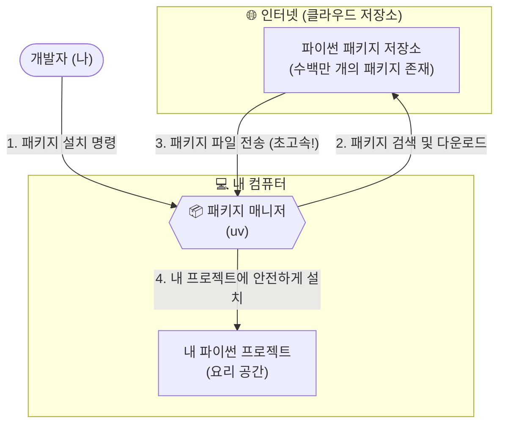

---


### 🎨 추가 시각화 (Visualization Packet)

**파이썬 개발 환경 구축 흐름**

운영체제 위에서 파이썬, 패키지 매니저(uv), 가상환경이 어떻게 독립적으로 구성되는지 계층적으로 보여줍니다.

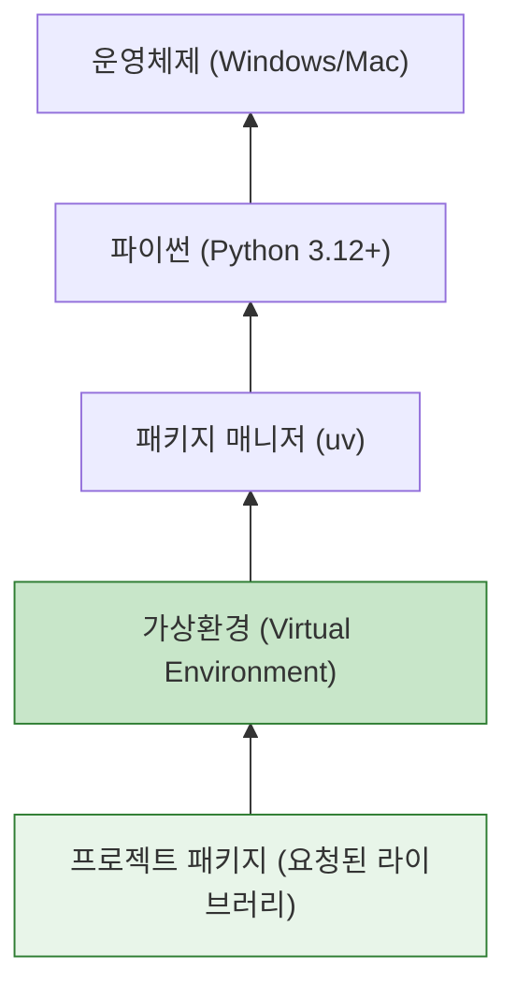

## §3. 상세

### Why — 왜 pip 대신 uv를 써야 할까요?

파이썬을 오래 사용해 온 사람들은 "그냥 원래 있던 pip 쓰면 안 되나?"라고 생각할 수 있습니다. 하지만 최근 글로벌 개발 트렌드는 완벽하게 uv로 넘어가고 있습니다. 그 이유는 압도적인 **성능**과 **통합된 경험** 때문입니다. 

첫째, 상상을 초월하는 속도입니다. 파이썬은 실행은 편하지만 무거운 편입니다. 반면 uv는 하드웨어 자원을 극한으로 끌어다 쓰는 Rust라는 언어로 바닥부터 다시 만들어졌습니다. 패키지를 다운로드하고 압축을 푸는 과정이 기존 대비 수십 배 빠릅니다.

둘째, 복잡한 도구들의 통합입니다. 예전에는 파이썬 설치용 도구(pyenv), 패키지 설치용 도구(pip), 가상공간 생성용 도구(virtualenv)를 따로따로 배워서 써야 했습니다. 초보자들에게는 이 도구들의 조합 자체가 거대한 장벽이었죠. uv는 이 모든 기능을 단일 프로그램 하나로 완벽하게 통합했습니다.

### What — uv란 정확히 무엇인가요?

uv는 파이썬 프로젝트를 시작할 때 필요한 모든 기반 공사를 단 1초 만에 끝내주는 차세대 올인원 툴체인(All-in-one Toolchain)입니다. 단순히 남의 코드를 다운로드 받는 것을 넘어서, 내 컴퓨터에 파이썬이 설치되어 있지 않다면 파이썬 자체도 알아서 적절한 버전으로 다운로드해 주고, 프로젝트가 엉망이 되지 않도록 안전한 격리 공간까지 만들어주는 똑똑한 관리자입니다.

### How — 어떻게 설치하고 확인하나요?

설치 방법은 너무나도 간단합니다. 공식 홈페이지에서 제공하는 설치 스크립트 명령어 한 줄을 터미널에 복사해서 붙여넣기만 하면 됩니다. 설치 스크립트가 내 컴퓨터의 운영체제(Windows 또는 Mac)를 자동으로 인식해서 가장 최적화된 방법으로 uv 본체를 다운로드하고 환경 변수와 경로 설정을 마무리합니다.

### 📊 pip vs uv 비교표

| 비교 항목 | 기존의 `pip` | 차세대 `uv` | 비유 |
| :--- | :--- | :--- | :--- |
| **개발 언어** | Python (상대적으로 느림) | Rust (매우 빠르고 안전함) | 자전거 vs 스포츠카 |
| **설치 속도** | 평균적 (패키지가 많으면 수 분 소요) | 압도적 (캐시 활용 시 수 밀리초, 10~100배 속도) | 일반 택배 vs 당일 로켓배송 |
| **가상환경 생성** | `virtualenv` 등 별도 도구 필요 | `uv venv` 명령어 하나로 1초 만에 생성 | 조립식 가구 vs 완제품 배송 |
| **파이썬 설치** | 불가능 (파이썬이 미리 깔려 있어야 함) | 가능 (원하는 버전의 파이썬도 자동 다운로드) | 제약 있음 vs 올인원 |

---

## §4. 실습 가이드

자, 이제 우리의 Antigravity 에디터에 로켓배송 서비스를 연결해 볼 시간입니다.

🎙️ **실습 대본 (Lab Guide)**:

> 첫째, Antigravity IDE 화면 하단의 탭을 클릭하거나 단축키를 눌러 **통합 터미널(Terminal)**을 열어주세요. 윈도우 사용자라면 `PS`라는 글자와 함께 PowerShell이 기본으로 열려 있을 거예요.
>
> 둘째, 아래의 설치 명령어를 복사해 터미널에 붙여넣고 Enter 키를 쳐주세요. 타이핑하다가 오타가 날 수 있으니 가급적 복사/붙여넣기를 권장합니다.
>
> 셋째, 화면에 설치 진행 바가 쓱쓱 지나가고 완료 메시지가 뜰 겁니다. 설치가 끝났다면, 시스템이 새로운 도구를 인식할 수 있도록 **터미널 창을 휴지통 아이콘을 눌러 닫았다가 다시 열어주세요**. 이 과정을 건너뛰면 컴퓨터가 방금 설치한 uv를 찾지 못하고 에러를 뿜어냅니다!
>
> 넷째, 새 터미널에서 `uv --version` 이라고 입력해 보세요. 터미널에 `uv 0.x.x` 처럼 버전 숫자가 출력되면 성공적으로 로켓배송 시스템이 도입된 것입니다. 이제 마음껏 패키지를 주문할 수 있어요!

### 🛠️ 단계별 설치 체크리스트

| 단계 | 행동 | 예상 결과 |
| :--- | :--- | :--- |
| **Step 1** | 통합 터미널(PowerShell) 열기 | 깜빡이는 커서 확인 |
| **Step 2** | `irm https://astral.sh/uv/install.ps1 | iex` 입력 | 설치 진행 및 완료 메시지 출력 |
| **Step 3** | 터미널 종료 후 재시작 | 새 터미널 세션 시작 |
| **Step 4** | `uv --version` 명령어 실행 | 설치된 uv 버전(예: `uv 0.1.30`) 출력 |

### 🚨 트러블슈팅 FAQ

**Q. "보안 정책에 의해 스크립트 실행이 차단되었습니다 (Execution of scripts is disabled)"라는 빨간색 에러가 떠요!**  
A. 윈도우의 기본 보안 설정 때문에 인터넷에서 가져온 스크립트 실행이 일시적으로 막힌 것입니다. 당황하지 마세요! 직전 세션에서 배운 **5 Whys 기법**을 쓸 완벽한 타이밍입니다. 이 에러 메시지를 그대로 마우스로 드래그해서 복사한 뒤, 옆에 있는 AI 비서(Agent)에게 "이 에러가 왜 떴고, 어떻게 해결해야 해?"라고 물어보세요. AI가 터미널의 실행 정책(Execution Policy)을 변경하는 명령어를 친절하게 알려줄 것입니다.

**Q. `uv --version`을 쳤는데 "uv 용어가 cmdlet, 함수... 이름으로 인식되지 않습니다"라고 나와요.**  
A. 십중팔구 터미널을 닫았다가 다시 열지 않아서 생기는 문제입니다. 컴퓨터와 터미널은 방금 설치된 프로그램의 위치를 아직 새로고침하지 못한 상태예요. 터미널 패널 우측 상단의 휴지통 아이콘(Kill Terminal)을 눌러 완전히 종료한 후, 터미널을 다시 열고 명령어를 다시 쳐보세요.

---


### 🎓 강사 노트 (Instructor Support)

- ⏱️ **타이밍**: 14:00 (20분, lab)
- 🎯 **핵심 활동**: uv 설치 명령어 실행
- ⚠️ **강사 주의사항**: PowerShell 관리자 권한 필요할 수 있음


### 📋 실습 설계 보강 (Lab Packet)

**세션 011 실습 설계 보강**

uv 패키지 매니저 소개와 설치
- **3-Stage Example Set**
  - 기본: AI에게 "uv 패키지 매니저 설치 방법 알려줘" → `powershell -c "irm astral.sh/uv | iex"` 실행
  - 변형: 이미 pip만 사용하던 환경에서 uv를 추가 설치하는 경우
  - 실수 해결: "PowerShell 실행 정책 오류" → `Set-ExecutionPolicy` 안내 또는 CMD 대안
- **난이도 예측**: PowerShell 명령어의 낯선 문법에 당황
- **타이밍 가이드**: uv 개념 설명 3분 | 설치 명령 실행 5분 | 확인(uv --version) 3분 | 트러블슈팅 9분
- **심리적 장벽**: "또 뭔가를 설치해야 한다고?" — 설치 피로감
- **자가 점검**:
  - [ ] `uv --version`이 정상 출력되는가?
  - [ ] uv가 pip보다 빠른 이유를 한 문장으로 설명할 수 있는가?
  - [ ] 패키지 매니저의 역할을 비유로 설명할 수 있는가?

## §5. 코드/명령어 모음

Windows 환경에서 PowerShell을 사용할 때의 uv 공식 설치 및 확인 명령어입니다. Mac이나 Linux 사용자는 `curl -LsSf https://astral.sh/uv/install.sh | sh` 명령어를 사용하시면 됩니다.

```powershell
# Windows PowerShell용 uv 공식 설치 스크립트 명령어
irm https://astral.sh/uv/install.ps1 | iex

# 설치 확인 명령어 (터미널을 꼭 닫았다 다시 열고 실행하세요!)
uv --version
```

---

## §6. 요약 및 다음 세션 브릿지

### 📝 핵심 요약
- **패키지와 패키지 매니저**: 남이 만든 유용한 코드를 내 컴퓨터로 쉽게 가져오기 위한 필수 도구이자 밀키트 배달 서비스입니다.
- **초고속 패키지 매니저 uv**: 기존의 느리고 복잡했던 pip의 단점을 완벽히 극복한 Rust 기반의 올인원 패키지 매니저로, 로켓배송급 속도를 자랑합니다.
- **설치와 확인**: 터미널에서 스크립트 명령어 한 줄로 설치가 끝나며, `--version` 옵션을 통해 정상 설치 여부를 확실하게 검증할 수 있습니다.

### 🌉 다음 세션으로의 브릿지

uv 설치가 완벽하게 끝났습니다! 이제 우리에게는 어떤 파이썬 패키지라도 눈 깜짝할 사이에 배달해 주는 최고의 로켓배송 서비스가 생겼습니다. 

그런데 한 가지 치명적인 문제가 남았습니다. 이 배달 서비스로 이것저것 다양한 재료를 받아서 도대체 어디에 보관해야 할까요? 냉장고 한 칸에 김치, 케이크, 생선, 아이스크림을 다 몰아넣으면 어떻게 될까요? 냄새가 섞이고 결국 요리를 망치게 되겠죠. 프로그래밍에서도 여러 프로젝트의 패키지들을 한곳에 몰아넣으면 끔찍한 "의존성 충돌"이 발생합니다.

그래서 다음 세션에서는 배달받은 재료를 프로젝트별로 안전하게 격리해서 보관하는 방법, 즉 **가상환경(Virtual Environment)**의 핵심 개념과 필요성에 대해 구체적으로 알아보겠습니다.

---

## §7. 참고 자료

- [uv 공식 문서 (Astral)](https://docs.astral.sh/uv/)
- [Source B] NotebookLM 기반 파이썬 생태계 분석 자료 (pip vs uv 비교 파트)
- [Source C] Deep Research Rust 기반 성능 벤치마크 및 패키지 관리 도구 아키텍처 분석


> 🔗 **이전 세션**: [세션 010: 트러블슈팅과 5 Whys 기법](#세션-010)에서 배운 내용을 이어갑니다.
> 🔗 **다음 세션**: [세션 012: 가상환경의 필요성 이해](#세션-012)에서 계속됩니다.

---

### 세션 012: 가상환경의 필요성 이해
> [원본 파일](sessions/세션-012-가상환경의_필요성_이해_v2.1.md) | ⏱️ 25분 | 📖 narrative | 난이도: medium

> **세션 ID**: MS-PY101-012  
> **소요 시간**: 20분  
> **난이도**: low  
> **청크 타입**: narrative  
> **버전**: v2.1 (7섹션 구조)

---

## §1. 개요

> **Day 1 | PM | 세션 012/022**

점심 식사는 맛있게 하셨나요? 오후의 첫 번째 세션입니다. 오전에 우리는 파이썬을 설치하고 초고속 패키지 매니저인 uv까지 컴퓨터에 장착했어요. 이제 전 세계 개발자들이 만들어둔 수많은 유용한 도구들을 마음껏 다운로드해서 사용할 준비가 다 되었습니다. 하지만 무턱대고 다운로드를 시작하기 전에, 반드시 알아두어야 할 아주 중요한 규칙이 하나 있어요. 바로 '가상환경'이라는 개념입니다. 이 20분 동안 우리는 왜 파이썬 개발자들이 프로젝트를 시작할 때마다 이 가상환경부터 세팅하는지, 그 근본적인 이유를 아주 쉬운 비유를 통해 알아볼 거예요.

### 🎯 학습 목표

이 세션이 끝나면 수강생은 다음을 할 수 있어요:

- 파이썬에서 가상환경이 왜 필수적인지 일상적인 비유를 들어 설명할 수 있습니다.
- 패키지 버전 충돌(의존성 지옥)이 무엇인지 이해하고, 이를 예방하는 원리를 파악합니다.
- 프로젝트마다 독립된 작업 공간을 분리하는 습관의 중요성을 인식합니다.

### 선행 세션 환기

오전 마지막 세션에서 우리는 기존 도구보다 최대 100배 빠른 차세대 패키지 매니저 uv를 설치했어요. "이걸로 이제 패키지를 마음껏 설치하면 되겠구나!" 생각하셨겠지만, 아직 엔터키를 누르시면 안 됩니다. 여러분의 깨끗한 컴퓨터를 안전하게 보호하면서 패키지를 설치하려면, 먼저 튼튼한 '격리벽'을 세워야 하거든요.

---

## §2. 핵심 개념 (+ 🗣️ 강사 대본 + Mermaid)

### 요리법과 전용 주방 비유

프로그래밍에서 새로운 프로젝트를 시작한다는 것은 새로운 요리를 만드는 것과 같아요. 그런데 여러분이 아주 넓은 메인 주방 하나를 가지고 있다고 상상해 봅시다. 오늘 점심에는 일식 초밥을 만들고, 저녁에는 중식 마파두부를 만들려고 해요. 만약 단 하나의 도마 위에서 생선도 썰고, 마늘도 썰고, 고추기름도 붓는다면 어떤 일이 벌어질까요? 초밥에서는 마늘 냄새가 나고 마파두부에서는 생선 비린내가 진동할 겁니다. 재료와 냄새가 이리저리 섞이면서 결국 두 요리 모두 망치게 되겠죠.

파이썬 개발에서도 똑같은 문제가 발생합니다. 여러 파이썬 프로젝트가 요구하는 패키지 버전들이 서로 섞이거나 엉키지 않도록 격리해 놓은 전용 폴더 및 환경이 바로 '가상환경(Virtual Environment)'입니다 [Source B]. 하나의 컴퓨터(단일 주방)에 여러 프로젝트(다양한 요리)의 도구들을 마구잡이로 설치하면 언젠가 반드시 서로 충돌하게 되어 있어요. 그래서 파이썬 개발자들은 요리가 섞이는 것을 막기 위해, 프로젝트를 시작할 때마다 완전히 새롭고 깨끗한 '전용 주방'을 통째로 새로 짓습니다.

🗣️ **강사 대본 (Instructor Script)**:

> 식사 맛있게 하셨나요? 오후 첫 시간은 조금 가벼우면서도 매우 중요한 이야기로 시작해 볼게요.
>
> 여러분, 오전에 uv를 설치했으니 이제 인터넷에 있는 패키지를 마음껏 설치할 수 있겠다고 생각하실 겁니다. 그런데 잠깐, 한 가지 중요한 것을 먼저 이해하고 넘어가야 해요.
>
> 여러분이 요리를 두 가지 동시에 한다고 상상해 봅시다. 한 주방에서 일식, 양식, 중식을 도마 하나로 요리하면 냄새가 다 섞이겠죠? 생선 비린내가 두부에 배고, 고추기름이 초밥에 튀어서 결국 둘 다 망칩니다. 프로그래밍에서도 똑같은 문제가 생겨요. A라는 프로젝트에서는 '카메라 인식' 기능의 옛날 버전이 필요한데, B라는 프로젝트에서는 최신 버전이 필요할 수 있어요. 이걸 하나의 컴퓨터에 전부 설치해버리면, 서로 버전이 엉키면서 에러를 뿜어냅니다. 개발자들은 이걸 '의존성 지옥'이라고 부릅니다 [Source B].
>
> 내 컴퓨터 하나에 모든 걸 설치하면 시스템이 엉망이 되기 때문에, 우리는 가상환경이라는 걸 만들 거예요. 가상환경은 프로젝트마다 완전히 새로운 주방과 조리도구를 배정해 주는 것과 같습니다 [Source B].
>
> 가상환경 폴더를 하나 만들면, 그 안에 파이썬 실행 파일과 도구들이 들어갈 빈 냉장고가 생깁니다. A 프로젝트를 위한 냉장고와 B 프로젝트를 위한 냉장고가 완전히 분리되는 거죠. 이렇게 서로 섞이거나 엉키지 않도록 격리해 놓은 전용 폴더 및 환경이 바로 가상환경의 진짜 정체입니다. 핵심 키워드는 바로 '격리'예요.

### Mermaid 다이어그램

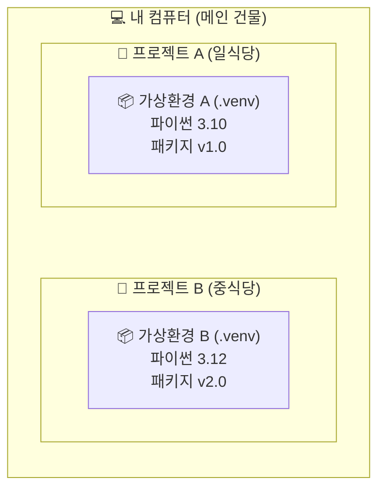

이 다이어그램을 보시면 하나의 컴퓨터 안에 서로 완벽하게 분리된 가상환경들이 존재하는 것을 알 수 있어요. 두 환경은 높은 벽으로 격리되어 있어서, 한쪽에서 패키지를 지우거나 망가뜨려도 다른 쪽에는 눈곱만큼의 영향도 주지 않습니다.

---

## §3. 상세 내용

### Why — 왜 프로젝트마다 주방을 따로 차려야 하는가?

가상환경을 사용해야 하는 이유는 크게 세 가지로 나눌 수 있어요.

첫째는 앞서 강조했던 패키지 버전 충돌 방지입니다. 파이썬 세계에는 정말 수많은 외부 도구들이 있고, 이 도구들은 하루가 다르게 업데이트됩니다. 어떤 프로젝트는 옛날 버전의 도구를 기준으로 만들어졌고, 어떤 프로젝트는 최신 버전이 필요합니다. 만약 가상환경이라는 격리벽이 없다면 새로운 도구를 설치하는 순간 기존에 잘 돌아가던 프로젝트가 모두 망가지는 대참사가 벌어집니다. 가상환경은 A 프로젝트와 B 프로젝트 간의 의존성 지옥을 예방하고 이런 충돌을 원천적으로 차단해 줘요 [Source B].

둘째는 완벽하게 깨끗한 실험 공간을 보장한다는 점입니다. 개발을 하다 보면 이것저것 패키지를 설치해 보고 지우는 일명 '삽질'을 많이 하게 됩니다. 내 컴퓨터 시스템 전체에 이런 실험을 반복하면 컴퓨터가 금방 지저분해지고 느려지겠죠. 하지만 가상환경 안에서 실험을 하면 이야기가 다릅니다. 아무리 패키지를 엉망으로 설치하더라도 여러분 컴퓨터의 윈도우나 맥 운영체제에는 전혀 영향을 주지 않아요. 마음껏 실험하다가 도저히 안 되겠다 싶으면 그냥 그 가상환경 폴더 하나만 휴지통에 버리면 그만입니다. 방 하나를 빌려서 실컷 어지르다가 방을 통째로 버리는 셈이죠.

셋째는 재현 가능성입니다. 회사에서 일하다 보면 "어? 내 자리 컴퓨터에서는 잘 되는데 왜 네 컴퓨터에서는 에러가 나지?"라는 상황을 지겹도록 겪게 됩니다. 가상환경을 사용하면 이 문제를 해결할 수 있어요. 내 가상환경 주방에 있는 재료 목록을 영수증처럼 텍스트 파일로 저장해 두면, 동료가 그 영수증만 보고 자기 컴퓨터에 똑같은 주방을 그대로 복원할 수 있거든요. 이를 통해 팀원 모두가 완벽하게 똑같은 환경에서 일할 수 있게 됩니다.

### What — 그렇다면 가상환경의 실체는 무엇인가?

추상적인 개념처럼 들리지만, 가상환경의 실제 모습은 허무할 정도로 단순합니다. 바로 여러분의 프로젝트 폴더 안에 생성되는 `.venv`라는 이름의 숨겨진 폴더가 그 정체입니다. 이 폴더 안을 들여다보면 파이썬 실행 프로그램의 복사본과 함께, 여러분이 설치하는 모든 외부 패키지들이 모이는 저장 공간이 들어 있어요.

결국 가상환경을 켠다는 것은 "지금부터 내가 파이썬을 실행하거나 패키지를 설치할 때, 컴퓨터 전체에 있는 파이썬이 아니라 이 `.venv` 폴더 안에 있는 전용 파이썬을 사용하겠다"라고 컴퓨터에게 알려주는 과정에 불과합니다. 특별한 마법이 아니라 단순히 경로를 우회시키는 아주 똑똑한 폴더인 것이죠.

### How — 비개발자도 이해할 수 있는 언어로 번역하기

이런 전문적인 내용들을 비전공자인 여러분이 모두 외울 필요는 없어요. 우리가 오전에 배웠던 핵심을 떠올려 볼까요? 헷갈리고 어려운 개념이 나타나면 우리는 어떻게 하기로 했었죠? 맞습니다. 바로 AI에게 물어보는 거예요. "가상환경의 격리 원리를 쉽게 설명해줘"라고 요청하면 AI가 여러분의 수준에 맞춰 찰떡같은 비유를 만들어 줍니다. 이 능력을 활용하면 파이썬의 어떤 어려운 개념도 쉽게 내 것으로 만들 수 있어요.

---

## §4. 실습 가이드 (+ 🎙️ 실습 대본)

### 실습 목표

이 세션의 실습은 코드 창을 띄워놓고 타이핑을 하는 방식이 아니에요. 방금 배운 '격리와 전용 주방'이라는 개념을 완전히 내 것으로 체화하기 위해, AI와 대화해 보고 그 내용을 바탕으로 동료에게 직접 설명해 보는 활동입니다. 가상환경이 왜 필요한지 비개발자도 이해할 수 있게 비유를 들어 설명해달라고 질문하고 요약하는 과정을 통해 다른 사람에게 비유를 들어 설명할 수 있다면 그 개념을 완벽히 이해한 것입니다 [Source B].

🎙️ **실습 가이드 대본 (Lab Guide)**:

> 자, 이제 여러분의 AI 비서를 호출해 볼 시간입니다. 프롬프트 창에 이렇게 입력해 보세요. "가상환경이 왜 필요한지 비개발자도 이해할 수 있게 비유를 들어서 설명해 줘."
>
> AI가 답변을 주기 시작할 거예요. 제가 아까 들었던 '일식과 중식 주방' 비유와 비슷할 수도 있고, '격리 병동'이나 '독립된 게임기'처럼 전혀 다른 재미있는 비유가 나올 수도 있어요. AI의 설명을 쭉 읽어보시고, 가장 마음에 드는 비유를 하나 골라보세요.
>
> 고르셨나요? 그럼 이제 옆에 앉으신 짝꿍에게 그 비유를 사용해서 가상환경이 무엇인지 딱 한 문장으로 설명해 주세요. "가상환경은 마치 이런 것과 같아. 왜냐하면 이렇게 격리해주기 때문이지." 라고요. 3분 드리겠습니다. 자, 시작!

### 단계별 지시

| 단계 | 소요 시간 | 강사 지시사항 | 학습자 액션 | 예상 결과 |
|------|----------|--------------|------------|----------|
| 1 | 2분 | AI에게 비유적 설명을 요청하는 프롬프트 작성 안내 | 프롬프트 입력 및 AI 답변 읽기 | 다양한 일상적 비유 확인 |
| 2 | 3분 | 가장 이해하기 쉬운 비유를 선택해 옆 사람과 공유 유도 | 짝과 1:1로 설명 주고받기 | 개념의 내재화 및 활기찬 분위기 |
| 3 | 5분 | 전체 앞에서 1~2명의 독창적인 비유 발표 청취 | 자원자 발표 경청 | 다른 시각에서의 개념 이해 확장 |
| 4 | 5분 | 격리의 중요성 핵심 요약 및 질의응답 | 화면 주시 및 자유 질문 | 의문점 해소 및 개념 정립 |

### 트러블슈팅 FAQ

| Q | A |
|---|---|
| AI가 너무 뻔하고 어려운 설명만 반복합니다. | 프롬프트에 구체적인 조건을 추가하라고 조언해 주세요. "유원지 놀이기구에 비유해 줘" 또는 "초등학생도 이해할 수 있게 10글자로 비유해 줘"라고 요청하면 훨씬 창의적이고 쉬운 답변이 나옵니다. |
| 아직도 가상환경이 왜 필요한지 잘 와닿지 않는다고 질문이 들어왔습니다. | 휴대폰 기능으로 설명해 보세요. "회사용 메신저와 개인용 메신저를 완벽하게 분리하고 싶어서 듀얼 앱을 쓰는 것과 똑같습니다. 서로 대화 내용이 절대 섞이지 않게 분리하는 거예요." |

---


### 🎓 강사 노트 (Instructor Support)

- ⏱️ **타이밍**: 14:20 (25분, narrative)
- 🎯 **핵심 활동**: 비유: "프로젝트별 개인 사물함"
- ⚠️ **강사 주의사항**: 개념 이해가 먼저, 명령어는 다음 세션

## §5. 코드 및 명령어 모음

이 세션은 개념의 이해와 토론이 목적이므로 직접 실행하는 파이썬 코드는 없습니다. 다만 AI와 소통하기 위해 사용했던 프롬프트 예시를 남겨둡니다.

> 🤖 **AI 프롬프트 예시**:
> "너는 IT 지식이 없는 사람들을 가르치는 친절한 강사야. 파이썬에서 '가상환경(Virtual Environment)'을 왜 무조건 만들어야 하는지, 패키지 충돌이라는 게 무엇인지 요리나 주방에 비유하지 말고 완전히 다른 새로운 일상적인 비유를 들어서 3문장으로 짧게 설명해 줘."

---

## §6. 요약

### 핵심 학습 포인트

이번 시간의 가장 중요한 키워드는 단연코 '격리'입니다. 가상환경은 내 컴퓨터 안에 안전하고 독립적인 프로젝트 전용 작업실을 만들어주는 훌륭한 기능이에요. 이 전용 작업실 덕분에 프로젝트 간의 패키지가 서로 부딪혀 망가지는 '의존성 지옥'을 피할 수 있고, 마음껏 어지르고 부수며 실험할 수 있는 완벽한 자유를 얻게 됩니다. 또한 영수증처럼 기록을 남겨 다른 사람의 컴퓨터에서도 똑같은 작업실을 그대로 재현할 수 있다는 점도 꼭 기억해 두시면 좋겠습니다.

### 다음 세션 예고

개념을 머리로 이해했으니 이제 손으로 직접 만들어 볼 차례입니다. 다음 세션에서는 오전에 설치했던 그 엄청나게 빠른 패키지 매니저, uv를 사용해서 실제로 내 프로젝트 폴더 안에 전용 주방(`.venv`)을 뚝딱 만들어 볼 거예요. 

### 브릿지 노트

> "가상환경이 왜 필요한지, 왜 격리가 그토록 중요한지 이제 확실히 감이 오셨을 겁니다. 그렇다면 이 마법 같은 전용 주방을 만드는데 시간이 얼마나 걸릴까요? 기존 방식으로는 제법 오랜 시간이 걸렸지만, 우리가 오전에 설치한 uv를 쓰면 눈 깜짝할 사이에 만들어집니다. 여러분의 첫 번째 가상환경, 지금 바로 만들러 가보시죠!"

---

## §7. 참고 자료

### 3-Source 출처

- **Source B (NotebookLM)**: 여러 파이썬 프로젝트가 요구하는 패키지 버전들이 서로 섞이거나 엉키지 않도록 격리해 놓은 전용 폴더 및 환경이라는 정의와, 이를 설명하기 위한 의존성 지옥, 의존성 충돌 예방 및 전용 주방 비유의 개념적 기반을 제공했습니다.

### 추가 학습 자료

- [Python 공식 문서: 가상환경과 패키지](https://docs.python.org/ko/3/tutorial/venv.html): 가상환경의 기술적 배경이 궁금한 분들을 위한 공식 가이드
- [Astral uv 공식 문서](https://docs.astral.sh/uv/): 가상환경을 초고속으로 생성하는 uv의 공식 메뉴얼

### 강사 노트

> 💡 **강사 노트**: 본 세션은 비전공자들이 가장 어려워하고 귀찮아하는 '가상환경 세팅'의 당위성을 설득하는 매우 중요한 시간입니다. 기술적인 원리(디렉토리 구조 변경, 환경변수 조작 등)를 설명하는 것은 철저히 배제하고, 무조건 '왜 해야 하는가(Why)'에 집중해 주세요. 일식과 중식 도마 비유는 수강생들이 가장 직관적으로 이해할 수 있는 강력한 무기입니다. 실습 시간에 수강생들이 각자 찾아낸 재미있는 비유를 적극적으로 호응해 주시면 오후 수업의 에너지를 크게 끌어올릴 수 있습니다.

---

## ✅ 세션 완료 체크리스트 (강사용)

- [x] §1~§7 모든 섹션이 충실하게 작성되었는가?
- [x] 일식/중식 도마 비유를 통해 의존성 충돌의 개념이 명확히 전달되었는가?
- [x] 비개발자가 이해할 수 있는 쉬운 구어체 줄글로 서술되었는가?
- [x] AI와 대화하며 비유를 찾는 실습이 포함되었는가?
- [x] 팩트 패킷(Source B)의 핵심 개념과 출처 표기가 적절히 반영되었는가?

---

*작성 일시: 2026-02-25*  
*작성 에이전트: A4B_Session_Writer*  
*교안 구조: 7섹션 (A0 팀 공통 표준)*

> 🔗 **이전 세션**: [세션 011: uv 패키지 매니저 소개와 설치](#세션-011)에서 배운 내용을 이어갑니다.
> 🔗 **다음 세션**: [세션 013: uv로 가상환경 생성 및 활성화](#세션-013)에서 계속됩니다.

---

### 세션 013: uv로 가상환경 생성 및 활성화
> [원본 파일](sessions/세션-013-uv로_가상환경_생성_및_활성화_v2.1.md) | ⏱️ 25분 | 🧪 lab | 난이도: medium

> **세션 ID**: MS-PY101-013  
> **소요 시간**: 20분  
> **난이도**: low  
> **청크 타입**: lab  
> **버전**: v2.1 (7섹션 구조)

---

## §1. 개요

> **Day 1 | PM | 세션 013/022**

### 🎯 학습 목표

이 세션이 끝나면, 수강생은 다음을 할 수 있습니다:

- `uv venv` 명령어를 사용하여 1초 만에 프로젝트 전용 가상환경을 생성할 수 있다
- 운영체제에 맞는 명령어(Windows/macOS)로 가상환경을 활성화할 수 있다
- 터미널 프롬프트에서 `(.venv)` 표시를 확인하여 활성화 상태를 검증할 수 있다
- `deactivate` 명령어로 가상환경을 안전하게 종료할 수 있다

### 선행 세션 환기

바로 직전 세션(012)에서 우리는 가상환경이 왜 필요한지 배웠어요. 한 주방에서 일식, 양식, 중식을 도마 하나로 요리하면 냄새가 다 섞이겠죠? 파이썬 프로젝트도 마찬가지입니다. 각 프로젝트가 요구하는 도구(패키지)의 버전이 다르기 때문에, 공간을 분리하지 않으면 "의존성 지옥"이라는 무서운 곳에 빠지게 됩니다. 이론은 충분히 이해하셨을 테니, 이제 직접 우리만의 독립된 작업 공간을 만들어 볼 차례입니다.

---

## §2. 핵심 개념 (+ 🗣️ 강사 대본 + Mermaid)

### "전용 작업실 짓기"와 "마스터 열쇠로 문 열기"

가상환경을 만드는 과정은 거대한 공장(컴퓨터) 안에 우리 프로젝트만을 위한 **전용 작업실**을 새로 짓는 것과 같습니다. 인터넷으로 이것저것 복잡하게 주문할 필요 없이, `uv venv`라는 명령어 하나만 입력하면 마법처럼 순식간에 작업실(`.venv` 폴더)이 뚝딱 완성됩니다.

하지만 작업실을 지었다고 바로 그 안에서 일할 수 있는 건 아니에요. 작업실 밖 공장 로비에 서서 도구를 꺼내면, 그건 여전히 남의 도구와 섞이는 겁니다. 작업실 안에 들어가려면 **마스터 열쇠**를 돌려 문을 열어야 해요. 이 문을 여는 행위가 바로 **활성화(Activate)**입니다.

명령어를 통해 문을 열고 들어가면, 터미널 화면 맨 앞에 `(.venv)`라는 초록색 명찰이 딱 붙습니다. 이 명찰은 "당신은 지금 전용 작업실 안에 안전하게 들어와 있습니다"라는 뜻이에요. 작업이 끝나고 `deactivate`를 입력하면 작업실 문을 닫고 다시 로비로 나오게 되며, 명찰도 사라집니다.

🗣️ **강사 대본 (Instructor Script)**:

> 자, 여러분. 이제 진짜로 우리만의 첫 번째 전용 작업실을 지어볼 시간입니다. 앞서 설치해 둔 `uv`라는 초고속 도구를 꺼내보세요. 터미널에 명령어 딱 한 줄만 치면 1초도 안 되어서 우리 프로젝트 폴더 안에 `.venv`라는 독립된 방이 만들어집니다.
>
> 여기서 가장 중요한 건 "방을 짓는 것"으로 끝나지 않는다는 점이에요. 방을 지었으면 문을 열고 들어가야겠죠? 윈도우에서는 `.venv\Scripts\activate`라고 입력하고, 맥에서는 `source .venv/bin/activate`라고 쳐서 문을 엽니다. 문을 열면 터미널 프롬프트 맨 앞에 `(.venv)`라는 간판이 나타나요. 이 간판이 보인다는 건 "지금부터 가져오는 모든 재료와 도구는 이 방 안에만 안전하게 보관됩니다"라는 신호입니다.
>
> 반대로 방에서 나갈 때는 `deactivate`라고 치면 됩니다. 간판이 사라지면 문이 닫힌 거예요. 만약 이 간판이 없는 상태에서 뭘 설치한다면? 여러분 컴퓨터 전체에 파일이 어질러지는 대참사가 일어납니다. 그러니까 작업 시작 전에는 무조건! `(.venv)` 간판이 켜져 있는지 확인하는 습관을 들이셔야 합니다.

> 💡 **강사 노트**: 기존의 "미니 냉장고" 비유를 "전용 작업실과 열쇠" 비유로 확장했습니다. 단순히 저장 공간(냉장고)을 넘어서, 개발자가 특정 환경(작업실)에 "진입(활성화)"하고 "퇴장(비활성화)"한다는 공간적 맥락을 주입하면 터미널 프롬프트의 변화를 더 직관적으로 이해할 수 있습니다.

### Mermaid 다이어그램

```mermaid
flowchart TD
    A["📂 프로젝트 폴더 열기<br/>(공장 로비)"] --> B["💻 uv venv 입력<br/>(작업실 짓기)"]
    B --> C{".venv 폴더 생성 확인"}
    C --> D["🔑 activate 명령어 실행<br/>(문 열고 들어가기)"]
    D --> E{터미널 앞에<br/>(.venv) 간판 확인}
    E -->|"간판 보임 ✅"| F["📦 패키지 설치 및 작업<br/>(안전 지대)"]
    E -->|"간판 없음 ❌"| D
    F --> G["🚪 deactivate 입력<br/>(문 닫고 나오기)"]
    G --> H["(.venv) 간판 사라짐"]
```

---

## §3. 상세 내용

### Why — 왜 uv venv를 사용해야 하는가?

기존 파이썬 환경에서는 `python -m venv`라는 기본 명령어를 사용해 가상환경을 만들었습니다. 이 방식은 확실하지만 아주 느려요. 폴더 하나 만드는 데 10초 이상 걸리기도 하죠. 우리는 1초가 아쉬운 AI 시대에 살고 있습니다. 

`uv venv`는 Rust 언어로 개발된 도구로, 기존 방식보다 수십 배 빠른 속도를 자랑합니다. 엔터를 치자마자 즉시 `.venv` 폴더가 생성되는 속도감을 체험해 보면, 왜 전 세계 개발자들이 uv로 넘어가고 있는지 바로 체감하실 수 있습니다. 가상환경 생성 속도가 빨라지면, 프로젝트를 새로 시작하는 데 드는 심리적 장벽이 완전히 사라집니다.

### What — .venv 폴더의 정체

`uv venv`를 실행하면 현재 폴더 안에 `.venv`라는 숨겨진 폴더가 생깁니다. 이 폴더 안에는 무엇이 들어있을까요? 
가장 중요한 두 가지가 있습니다. 첫째, 현재 시스템에 깔린 파이썬 실행 파일의 "복사본(또는 링크)"입니다. 둘째, 앞으로 우리가 다운로드할 패키지들이 저장될 빈 선반(Lib 또는 lib 폴더)입니다. 

이 폴더는 철저히 현재 프로젝트에만 속합니다. A 프로젝트의 `.venv`와 B 프로젝트의 `.venv`는 이름만 같을 뿐 완전히 남남이에요. 그래서 프로젝트마다 마음 편하게 필요한 도구들을 설치할 수 있는 겁니다.

### How — 활성화(Activate)의 원리

활성화 명령어를 치면 컴퓨터 안에서 무슨 일이 일어날까요? 터미널이 명령어를 찾을 때 어디를 먼저 볼지 결정하는 "경로(PATH)"라는 것이 있습니다. `activate`를 실행하면 컴퓨터의 PATH 맨 앞에 이 `.venv` 폴더 안의 경로를 슬쩍 끼워 넣습니다. 

그래서 터미널에 `python`이나 `pip`라고 치면, 시스템 전체에 깔린 기본 파이썬이 아니라 우리가 방금 만든 전용 작업실(`.venv`) 안의 파이썬이 먼저 응답하게 되는 원리예요. 반대로 `deactivate`를 치면 끼워 넣었던 경로를 다시 쏙 빼버려서 원래 상태로 되돌립니다. 복잡한 원리 같지만, 여러분이 기억할 것은 오직 하나입니다. **터미널 맨 앞에 `(.venv)` 간판이 보이면 안전 지대, 안 보이면 위험 지대입니다.**

> ✅ **체크포인트**: 여기까지 이해했는지 스스로 점검해 보세요.
> - 가상환경을 활성화하지 않고 패키지를 설치하면 어떤 문제가 생기나요? ("프로젝트 전용 공간이 아닌 컴퓨터 전역에 설치되어 나중에 충돌이 발생할 수 있다")
> - 터미널에서 현재 가상환경 안에 들어와 있는지 어떻게 알 수 있나요? ("프롬프트 맨 앞에 `(.venv)` 명찰이 붙어 있는지 확인한다")

---

## §4. 실습 가이드 (+ 🎙️ 실습 대본)

### 실습 목표

이 실습을 통해 수강생은 직접 프로젝트 폴더를 만들고, uv로 가상환경을 생성한 뒤, 운영체제에 맞는 명령어로 활성화와 비활성화를 반복 숙달합니다.

🎙️ **실습 가이드 대본 (Lab Guide)**:

> 자, 바탕화면에 빈 폴더를 하나 만들고 시작합시다. 폴더 이름은 `day1_project`로 할게요. Antigravity에서 이 폴더를 열어주세요. 터미널도 열려 있어야 합니다. 
> 
> 지금부터 우리는 전용 작업실을 만들고, 문을 열고 닫는 연습을 할 거예요. 명령어를 치다가 오타가 나거나 오류가 생기면 당황하지 말고 화면을 그대로 둔 채 손을 들어주세요. 터미널의 Tab 키 자동완성을 쓰면 오타를 확 줄일 수 있으니 이 마법 지팡이도 꼭 활용해 보시기 바랍니다.

### 단계별 지시 — Windows 사용자

| 단계 | 소요 시간 | 강사 지시사항 | 학습자 액션 | 예상 결과 |
|------|----------|--------------|------------|----------|
| 1 | 2분 | "새 폴더를 만들고 터미널을 여세요" | 바탕화면 `day1_project` 생성 후 Antigravity로 열기, `Ctrl + `` `로 터미널 열기 | 터미널 경로가 `day1_project`로 표시됨 |
| 2 | 1분 | "작업실을 지어봅시다. uv venv 입력!" | 터미널에 `uv venv` 입력 후 Enter | 좌측 파일 탐색기에 `.venv` 폴더 생성 |
| 3 | 1분 | "마스터 열쇠로 문을 엽니다" | `.venv\Scripts\activate` 입력 후 Enter (Tab 키 활용 권장) | 프롬프트 맨 앞에 `(.venv)` 초록색 간판 표시 |
| 4 | 1분 | "문을 다시 닫아보세요" | `deactivate` 입력 후 Enter | `(.venv)` 간판 사라짐 |
| 5 | 1분 | "다시 문을 열고 대기하세요" | 위 3번 명령어를 다시 입력하여 활성화 상태 유지 | `(.venv)` 간판이 켜진 상태로 다음 단계 준비 |

**[실습 단계 3 팁] Tab 키로 자동완성하기**
경로를 끝까지 타이핑하지 마세요. `.\.v` 까지만 치고 키보드의 **Tab** 키를 누르면 `.venv\`가 자동 완성됩니다. 이어서 `S` 누르고 **Tab**, `a` 누르고 **Tab**을 누르면 오류 없이 마스터 열쇠 명령어를 완성할 수 있습니다.

### 단계별 지시 — macOS 사용자

| 단계 | 소요 시간 | 강사 지시사항 | 학습자 액션 | 예상 결과 |
|------|----------|--------------|------------|----------|
| 1 | 2분 | "새 폴더를 만들고 터미널을 여세요" | 바탕화면 `day1_project` 생성 후 Antigravity로 열기, 터미널 실행 | 터미널 경로가 `day1_project`로 표시됨 |
| 2 | 1분 | "작업실을 지어봅시다" | 터미널에 `uv venv` 입력 후 Enter | 좌측 파일 탐색기에 `.venv` 폴더 생성 |
| 3 | 1분 | "마스터 열쇠로 문을 엽니다 (source 사용)" | `source .venv/bin/activate` 입력 후 Enter | 프롬프트 맨 앞에 `(.venv)` 간판 표시 |
| 4 | 1분 | "문을 다시 닫아보세요" | `deactivate` 입력 후 Enter | `(.venv)` 간판 사라짐 |
| 5 | 1분 | "다시 문을 열고 대기하세요" | 위 3번 명령어를 다시 입력하여 활성화 상태 유지 | `(.venv)` 간판이 켜진 상태로 다음 단계 준비 |

### 트러블슈팅 FAQ

| Q | A |
|---|---|
| (Windows) `PSSecurityException` 빨간 에러가 뜨면서 실행이 안 돼요 | 윈도우의 보안 정책 때문입니다. 터미널에 `Set-ExecutionPolicy Unrestricted -Scope CurrentUser`를 입력하고 Enter를 친 다음, 다시 activate 명령어를 실행해 보세요. |
| `.venv` 폴더가 탐색기에 안 보여요 | 숨김 폴더로 처리되었을 수 있습니다. Antigravity 왼쪽 탐색기 빈 곳을 클릭하고 새로고침 아이콘을 누르거나, 터미널에서 `ls -a` (Mac) 또는 `dir -Force` (Win)를 쳐서 확인해 보세요. |
| `(.venv)` 간판이 안 나타나요 | 활성화 명령어에 오타가 있거나, 백슬래시(`\`)와 슬래시(`/`)를 반대로 썼을 가능성이 높습니다. 윈도우는 `\`, 맥은 `/`를 사용합니다. Tab 키 자동완성을 사용하면 정확합니다. |
| `uv : command not found` 에러가 납니다 | 이전 세션에서 uv 패키지 매니저가 정상적으로 설치되지 않았거나, 설치 후 터미널을 껐다 켜지 않은 경우입니다. 터미널을 완전히 닫고 다시 열어보세요. |
| 비활성화할 때는 운영체제별로 명령어가 다른가요? | 아닙니다. 비활성화는 Windows와 macOS 모두 동일하게 `deactivate`만 치면 됩니다. 아주 간단하죠. |

> ✅ **체크포인트**: 모두의 터미널 프롬프트 맨 앞에 `(.venv)` 간판이 잘 떠 있나요? 간판이 안 켜진 분은 손을 들어서 튜터의 도움을 꼭 받으세요!

---


### 🎓 강사 노트 (Instructor Support)

- ⏱️ **타이밍**: 14:45 (25분, lab)
- 🎯 **핵심 활동**: `uv venv` + activate/deactivate
- ⚠️ **강사 주의사항**: 가장 많은 에러 발생 구간. 순회 필수


### 📋 실습 설계 보강 (Lab Packet)

**세션 013 실습 설계 보강**

uv로 가상환경 생성 및 활성화
- **3-Stage Example Set**
  - 기본: `uv venv` → `.venv` 폴더 생성 확인 → `.venv\Scripts\activate` 실행 → `(.venv)` 표시 확인
  - 변형: `deactivate`로 비활성화 후 다시 활성화하는 온/오프 연습
  - 실수 해결: "activate 명령어가 안 먹혀요" → PowerShell vs CMD 차이, 경로 오타
- **난이도 예측**: activate/deactivate 개념과 (.venv) 표시의 의미를 이해하기 어려움
- **타이밍 가이드**: uv venv 실행 3분 | activate 5분 | 온오프 연습 7분 | 트러블슈팅 10분
- **심리적 장벽**: "가상환경이 뭔지 아직 모르겠는데 왜 이걸 해야 하지?"
- **자가 점검**:
  - [ ] 터미널 프롬프트 앞에 `(.venv)`가 표시되는가?
  - [ ] `deactivate` 후 `(.venv)`가 사라지는 것을 확인했는가?
  - [ ] 가상환경을 "전용 냉장고"로 비유할 수 있는가?

## §5. 코드 및 명령어 모음

### 명령어 1: 가상환경 생성 (공통)

```bash
uv venv
```

현재 폴더 안에 파이썬 가상환경(`.venv` 폴더)을 매우 빠른 속도로 생성합니다. 기본적으로 시스템에 설치된 파이썬 버전을 사용합니다. 만약 특정 버전을 지정하고 싶다면 `uv venv --python 3.12`와 같이 입력할 수 있습니다.

### 명령어 2: 가상환경 활성화 (Windows)

```powershell
.venv\Scripts\activate
```

또는 

```powershell
.\.venv\Scripts\activate
```

Windows의 PowerShell이나 명령 프롬프트에서 가상환경으로 진입하는 명령어입니다. 실행 후 프롬프트 맨 앞에 `(.venv)`가 나타납니다.

### 명령어 3: 가상환경 활성화 (macOS / Linux)

```bash
source .venv/bin/activate
```

macOS나 리눅스 환경의 터미널(bash, zsh 등)에서 가상환경으로 진입하는 명령어입니다. `source`라는 단어를 반드시 앞에 붙여야 합니다.

### 명령어 4: 가상환경 비활성화 (공통)

```bash
deactivate
```

활성화된 가상환경에서 빠져나오는 명령어입니다. 운영체제에 상관없이 동일하게 사용하며, 실행 후 `(.venv)` 표시가 사라집니다.

---

## §6. 요약

### 핵심 학습 포인트

이번 세션에서 우리는 프로젝트 전용 작업실을 만들고 들어가는 법을 배웠습니다. 기억하실 핵심은 세 가지입니다. 첫째, `uv venv` 명령어를 치면 1초도 안 되어서 우리 프로젝트만을 위한 `.venv` 작업실이 지어집니다. 둘째, 작업실을 지었으면 반드시 열쇠로 문을 열고 들어가야 하며, 운영체제에 따라 윈도우는 `.venv\Scripts\activate`, 맥은 `source .venv/bin/activate`를 사용합니다. 셋째, 문이 제대로 열렸는지는 터미널 프롬프트 맨 앞의 `(.venv)` 초록색 간판으로 확인합니다. 이 간판이 보일 때만 안전 지대입니다.

### 다음 세션 예고

지금 우리 작업실은 깨끗하게 비어 있습니다. 파이썬 기본 실행 파일만 덩그러니 놓여 있죠. 이제 이 빈 작업실에 우리가 필요한 강력한 도구들을 채워 넣을 차례입니다. 다음 세션에서는 방금 열어둔 가상환경 상태 그대로, 인터넷에서 누군가 만들어둔 멋진 패키지를 초고속으로 다운로드해 보겠습니다. 

### 브릿지 노트

> "모두 `(.venv)` 간판을 켜둔 상태로 기다리고 계시죠? 문을 열어둔 채로 유지해 주세요. 혹시라도 실수로 문을 닫았다면 얼른 다시 `activate` 명령어로 열어주시기 바랍니다. 이 문이 열려있어야만 지금부터 주문할 멋진 도구들이 우리 전용 작업실 선반에 안전하게 배달됩니다. 자, 이제 첫 패키지를 설치하러 가보겠습니다!"

---

## §7. 참고 자료

### 3-Source 출처

- **Source A (로컬 참고자료)**: 「AI-native_파이썬기초.md」(SRC-A07) — uv 도구 스펙 및 가상환경 생성 명령어 표준.
- **Source B (NotebookLM)**: SRC-B01 — "전용 작업실 짓기와 마스터 열쇠" 비유의 논리적 구조, 가상환경의 필요성과 활성화 시각적 표식(`(.venv)`)에 대한 인지적 설명.
- **Source C (Deep Research)**: SRC-C01 — Rust 기반 패키지 매니저의 성능 이점, `uv venv` 명령어의 밀리초 단위 생성 속도 체감 및 활성화/비활성화 내부 원리.

### 추가 학습 자료

- [uv 공식 문서 (Environments)](https://docs.astral.sh/uv/): 가상환경 생성 및 관리에 대한 공식 가이드.
- [Python 공식 문서 (venv)](https://docs.python.org/3/library/venv.html): Python 가상환경의 기본 작동 원리와 PATH 환경 변수 조작 개념.

### 강사 노트

> 💡 **강사 노트**: 윈도우 환경에서 `PSSecurityException` 오류는 거의 100% 한 명 이상 발생합니다. 실습 중에 이 에러를 만난 수강생이 있다면, 오히려 이를 "보안 정책이 잘 작동하고 있다는 증거"라고 긍정적으로 설명해 주시고, 칠판이나 슬랙에 `Set-ExecutionPolicy` 명령어를 크게 띄워주시면 좋습니다. 또한, Tab 키를 이용한 자동완성은 초보자들의 오타로 인한 좌절감을 크게 줄여주므로 실습 내내 반복해서 강조해 주세요.

---

## ✅ 세션 완료 체크리스트 (강사용)

- [ ] §1~§7 모든 섹션이 충실하게 작성되었는가?
- [ ] "전용 작업실 열쇠 받기" 비유가 §2에서 충분히 확장되었는가?
- [ ] Windows/macOS 양쪽 활성화 명령어가 §4에 명확히 포함되었는가?
- [ ] 단계별 지시표에 Tab 키를 활용한 자동완성 팁이 들어갔는가?
- [ ] 트러블슈팅 FAQ에 윈도우 보안 오류(ExecutionPolicy) 해결법이 포함되었는가?
- [ ] 체크포인트 질문이 §3, §4에 배치되었는가?
- [ ] 3-Source 팩트 패킷의 내용(uv 속도 체감, 활성화 표식 등)이 §7에 반영되었는가?
- [ ] 다음 세션(014 패키지 설치) 브릿지 노트가 포함되었는가?

---

**🔗 선행 세션**: [세션-012] 가상환경의 필요성 이해 (필수)  
**🔗 후행 세션**: [세션-014] uv pip로 패키지 설치 체험

---

*작성 일시: 2026-02-25*  
*작성 에이전트: A4B_Session_Writer*  
*교안 구조: 7섹션 (A0 팀 공통 표준)*

> 🔗 **이전 세션**: [세션 012: 가상환경의 필요성 이해](#세션-012)에서 배운 내용을 이어갑니다.
> 🔗 **다음 세션**: [세션 014: uv pip로 패키지 설치 체험](#세션-014)에서 계속됩니다.

---

### 세션 014: uv pip로 패키지 설치 체험
> [원본 파일](sessions/세션-014-uv_pip로_패키지_설치_체험_v2.1.md) | ⏱️ 20분 | 🧪 lab | 난이도: low

> **세션 ID**: MS-PY101-014  
> **소요 시간**: 20분  
> **난이도**: low  
> **청크 타입**: lab  
> **버전**: v2.1 (7섹션 구조)

---

## §1. 개요

> **Day 1 | PM | 세션 014/022**

### 🎯 학습 목표

이 세션이 끝나면, 수강생은 다음을 할 수 있습니다:

- `uv pip install` 명령어를 사용해 필요한 외부 패키지를 초고속으로 설치할 수 있다
- 시스템 전체가 아닌 내 프로젝트(가상환경)에만 안전하게 격리 설치되는 원리를 이해한다
- 터미널에서 `uv pip list` 명령어로 현재 설치된 패키지와 의존성 목록을 검증할 수 있다

### 선행 세션 환기

직전 세션(세션-013)에서 우리는 프로젝트 전용 미니 냉장고(`.venv` 가상환경)를 사서 코드를 꽂고 문까지 활짝 열어뒀습니다. 터미널 프롬프트 앞에 `(.venv)`라는 예쁜 간판이 보이시죠? 이게 바로 "지금부터 모든 재료는 이 미니 냉장고에만 들어갑니다"라는 뜻이에요. 하지만 냉장고 문만 열어놓으면 뭐할까요. 안이 텅 비어있잖아요. 이제 이 빈 냉장고에 첫 번째 밀키트를 주문해서 든든하게 채워 넣을 시간입니다.

---

## §2. 핵심 개념 (+ 🗣️ 강사 대본 + Mermaid)

### 패키지 설치 = "초고속 밀키트 주문"

파이썬 세계에는 전 세계 개발자들이 미리 만들어 놓은 수십만 개의 밀키트(패키지)가 있습니다. 요리할 때마다 떡을 뽑고 고추장을 담그면 언제 떡볶이를 먹겠어요? 훌륭한 밀키트를 가져와서 끓이기만 하는 것이 현대 개발자의 기본 소양입니다.

패키지를 설치하는 과정을 밀키트 주문에 비유해 볼게요. "떡볶이 밀키트 하나 주세요!"라고 주문하면 배달 매니저가 창고에서 떡, 어묵, 파를 한 세트로 묶어서 우리 집 냉장고에 넣어주죠. 파이썬 터미널에서 `uv pip install requests`라고 치는 것이 바로 이 주문서입니다.

- **`uv`**: 우리의 초고속 배달 매니저 이름
- **`pip install`**: "창고에서 찾아서 설치해 줘"라는 주문 동사
- **`requests`**: 우리가 고른 밀키트(패키지)의 이름

우리가 고용한 매니저 uv는 좀 특별해요. 예전에 쓰던 매니저(pip)는 자전거로 배달해서 패키지 하나를 설치하는 데 10초씩 걸렸어요. 하지만 uv는 순간이동을 합니다. 주문 버튼(엔터)을 누르는 순간 이미 냉장고에 들어와 있을 정도로 빠르죠. 게다가 이 밀키트는 집 전체 메인 냉장고(시스템 전역)를 어지럽히지 않고 오직 내 전용 미니 냉장고(`.venv`)에만 깔끔하게 들어갑니다.

🗣️ **강사 대본 (Instructor Script)**:

> 여러분, 터미널에 `(.venv)` 간판이 잘 보이시나요? 보인다면 주문할 준비가 완벽히 끝난 겁니다. 파이썬에서는 남들이 만들어 놓은 유용한 도구 상자를 '패키지'라고 불러요. 오늘은 그 수많은 패키지 중에서 `requests`라는 아주 유명한 친구를 불러볼 거예요. 인터넷에서 데이터를 쏙쏙 뽑아올 때 쓰는 도구입니다.
> 
> 예전에는 파이썬 환경 세팅하고 패키지 하나 까는 데만 반나절이 걸렸어요. 뭔가 엉키고 꼬여서 컴퓨터 전체가 망가지는 일도 흔했죠. 하지만 여러분은 운이 아주 좋습니다. 우리가 배운 `uv`라는 마법 지팡이를 쓰면, 단 1초도 안 걸려서 내 프로젝트 전용 방에만 아주 깔끔하게 도구가 세팅됩니다. 주문 버튼을 누르자마자 "어? 벌써 끝났다고?" 하는 기분을 곧 느끼실 거예요.

> 💡 **강사 노트**: 밀키트 주문 비유와 격리 설치 개념은 NotebookLM(Source B)에서 도출되었으며, uv의 밀리초 단위 순간이동 성능은 Deep Research(Source C) 분석 결과를 반영했습니다. 초보자에게는 빠른 설치 속도보다 "내 컴퓨터를 망가뜨리지 않고 이 폴더 안에만 안전하게 설치된다"는 격리성(Isolation)을 더 강조해 주면 두려움을 없앨 수 있습니다.

### Mermaid 다이어그램

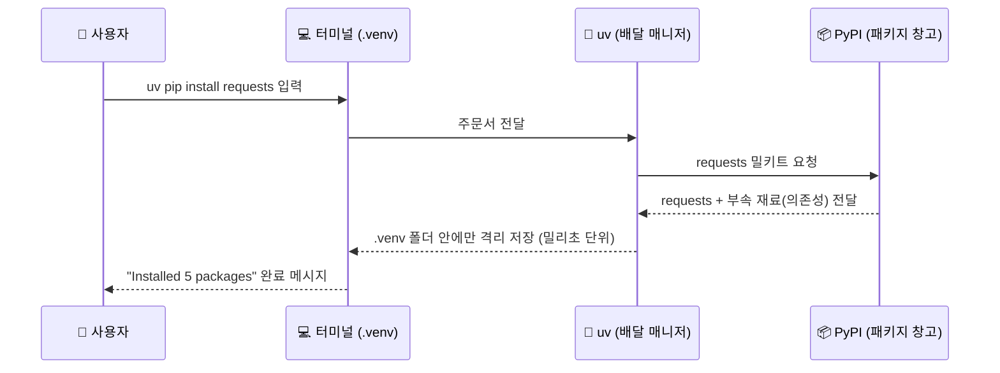

---

## §3. 상세 내용

### Why — 왜 패키지를 설치해야 하는가?

"코딩을 배운다면서 왜 남이 만든 걸 가져다 쓰나요?" 아주 자연스러운 의문이에요. 사실 직접 다 만들 수도 있죠. 하지만 바퀴를 다시 발명할 필요는 없습니다. 웹 브라우저를 열고, 주소를 치고, 화면의 글씨를 긁어오는 코드를 밑바닥부터 짜려면 수백 줄이 필요해요. 하지만 `requests` 패키지를 가져오면 단 3줄이면 끝납니다.

현대 프로그래밍은 무에서 유를 창조하는 것이 아니라, 전 세계 천재들이 이미 만들어 놓은 훌륭한 레고 블록들을 내 입맛에 맞게 조립하는 과정이에요. 그 레고 블록을 내 작업실로 가져오는 행위가 바로 패키지 설치입니다. 예를 들어, 인터넷에서 오늘의 날씨 데이터를 가져와서 분석하는 프로그램을 만든다고 가정해 봅시다. 패키지가 없다면 컴퓨터가 인터넷 통신을 어떻게 하는지부터 0과 1로 된 신호를 어떻게 주고받는지 수백 줄을 고민해야 합니다. 하지만 똑똑한 선배 개발자들이 그 복잡한 과정을 `requests`라는 이름의 깔끔한 레고 블록으로 미리 만들어 두었어요. 우리는 그저 이 블록을 우리 작업실로 가져와서 "날씨 데이터 좀 가져와 줘"라고 명령어 하나만 내리면 됩니다. 이것이 바로 우리가 코딩 문법보다 '어떤 패키지를 조립할지(What)'를 고민해야 하는 AI 시대의 진짜 개발 방식입니다.

### What — PyPI와 의존성(Dependency)이란?

`pip install` 명령어를 칠 때, 대체 어디서 패키지를 가져오는 걸까요? 바로 **PyPI**(Python Package Index)라는 거대한 글로벌 창고입니다. 이곳에는 인공지능, 데이터 분석, 게임 개발 등 50만 개가 넘는 파이썬 패키지가 쌓여 있어요. 

그런데 한 가지 재미있는 사실이 있습니다. 떡볶이 밀키트를 주문하면 떡만 오지 않죠? 소스, 어묵, 대파가 한 봉지에 담겨 옵니다. 패키지도 마찬가지예요. 우리가 `requests` 하나만 주문해도, 이 패키지가 제대로 일하기 위해 필요한 다른 작은 도구들(부속 재료)이 자동으로 함께 배달됩니다. 이것을 전문 용어로 **의존성(Dependency)**이라고 불러요. 똑똑한 uv 매니저가 이 의존성까지 알아서 챙겨 오기 때문에 우리는 메인 패키지 이름 하나만 기억하면 됩니다. 파이썬 생태계가 놀라운 이유는 바로 이 거대한 상호 의존 네트워크 덕분입니다. A 패키지가 B 패키지를 쓰고, B 패키지가 C 패키지를 활용하며 전 세계 코드가 유기적으로 연결되어 있죠. 여러분이 방금 `requests`를 설치했다는 것은 이 거대한 글로벌 지식의 그물망에 공식적으로 접속했다는 뜻이기도 합니다.

### How — uv pip의 압도적 강점

패키지를 설치하는 방법은 `uv pip install` 뒤에 원하는 패키지 이름을 적는 것이 전부입니다. 전통적인 파이썬에서는 그냥 `pip install`을 썼어요. 하지만 우리는 앞에 `uv`를 붙입니다. 왜 그럴까요?

첫째, **압도적인 속도**입니다. uv는 기존 파이썬이 아닌 Rust라는 아주 빠르고 최신인 언어로 만들어져서 기존 방식보다 무려 10배에서 100배까지 빨라요. 둘째, **강력한 격리**입니다. 메인 시스템 환경을 건드리지 않고 우리가 만든 `.venv` 폴더 안에만 얌전히 설치돼요. 나중에 이 프로젝트가 쓸모없어지면 제어판에 들어가서 삭제할 필요 없이 그냥 폴더를 통째로 휴지통에 버리면 끝납니다. 뒷정리까지 완벽한 셈이죠. 세 번째 장점은 **단일 도구 통합**입니다. 과거에는 패키지를 설치하는 도구, 가상환경을 만드는 도구, 파이썬 버전을 관리하는 도구가 전부 달랐습니다. 요리사, 설거지 담당, 재료 손질 담당이 따로 있었던 셈이죠. 하지만 uv는 이 모든 역할을 혼자서, 그것도 훨씬 빠른 속도로 처리하는 만능 셰프입니다. 
> ✅ **체크포인트**: 여기까지 잘 따라오셨나요?
> - 패키지를 밀키트에 비유했을 때, 부속 재료(어묵, 소스)가 함께 딸려오는 현상을 전문 용어로 뭐라고 부를까요? ("의존성")
> - 우리가 설치한 패키지는 컴퓨터 시스템 전체에 깔릴까요, 아니면 특정 폴더에만 깔릴까요? ("특정 가상환경 폴더인 .venv 안에만 격리 설치됨")
> - 기존 `pip` 대신 우리가 `uv pip`를 쓰는 가장 큰 이유 두 가지는 무엇인가요? ("압도적인 설치 속도와 깔끔한 폴더 격리")

### 비교표 — 전통적 방식 vs AI-native 방식(uv)

| 비교 항목 | 기존 방식 (`pip`) | 우리 방식 (`uv pip`) |
|----------|-----------------|--------------------|
| 설치 속도 | 10~30초 (자전거 배달) | **0.1~1초 (순간이동 배달)** |
| 환경 격리 | 실수하면 전역 환경 오염 | **자동으로 .venv 감지 후 안전하게 격리** |
| 의존성 관리 | 가끔 꼬여서 충돌 발생 | **스마트하게 엉킴 없이 해결** |
| 비유 | 아날로그 주문 | **로켓 배송** |

---

## §4. 실습 가이드 (+ 🎙️ 실습 대본)

### 실습 목표

활성화된 가상환경 내에 인터넷 통신을 돕는 `requests` 패키지를 실제로 설치해 봅니다. 설치 속도를 체감하고, 터미널 명령어를 통해 의존성이 함께 깔린 패키지 목록을 직접 검증합니다.

🎙️ **실습 가이드 대본 (Lab Guide)**:

> 자, 이제 진짜로 주문을 넣어볼 시간입니다. 키보드에 손을 올리세요. 시작하기 전에 가장 중요한 것! 터미널 입력창 맨 앞에 `(.venv)`라는 초록색 간판이 떠 있는지 꼭 확인해 주세요. 이 간판이 있어야 배달 기사가 남의 집이 아니라 우리 프로젝트 냉장고를 정확히 찾아옵니다.
> 
> 확인되셨다면 `uv pip install requests`라고 치고 엔터를 힘차게 눌러보세요. 눈 크게 뜨고 보셔야 해요. 1초도 안 돼서 설치가 끝나버릴 테니까요. 설치가 다 되었다면 우리가 제대로 주문을 받았는지 냉장고 안을 들여다봐야겠죠? `uv pip list`라고 쳐보세요. 오, 우리는 하나만 시켰는데 무언가 잔뜩 들어와 있네요. 이게 바로 밀키트의 부속 재료들입니다.

### 단계별 지시 (uv pip install 단계표)

| 단계 | 소요 시간 | 강사 지시사항 | 학습자 액션 | 예상 터미널 결과 |
|------|----------|--------------|------------|----------------|
| 1 | 1분 | "터미널 프롬프트의 (.venv) 간판을 확인하세요" | 터미널 확인 (없으면 activate 실행) | `(.venv) PS C:\...>` |
| 2 | 1분 | "설치 명령어를 오타 없이 정확히 입력하세요" | `uv pip install requests` 입력 | 눈 깜짝할 새 "Installed 5 packages" 출력 |
| 3 | 1분 | "냉장고 안을 들여다보는 명령어를 치세요" | `uv pip list` 입력 | `requests`, `urllib3`, `certifi` 등 목록 표시 |
| 4 | 2분 | "AI 비서에게 이 패키지의 용도를 물어보세요" | Agent Manager에 "requests 패키지가 뭐야?" 질문 | 인터넷 데이터를 가져오는 도구라는 친절한 설명 |

**[단계 1] 가상환경 활성화 확인**

터미널 입력 줄 맨 앞에 `(.venv)`가 있는지 다시 한번 확인합니다. 만약 없다면 냉장고 문이 닫혀있는 거예요. 윈도우 사용자는 `.\.venv\Scripts\activate`를, 맥 사용자는 `source .venv/bin/activate`를 쳐서 문을 열어주세요.

**[단계 2] 초고속 패키지 설치**

터미널에 다음 명령어를 입력합니다. (requests 끝에 s가 붙어있음에 주의하세요!)

```powershell
uv pip install requests
```

입력하고 엔터를 치는 순간 촤르륵 글씨가 올라가며 설치가 끝납니다. "Installed 5 packages in 84ms" 같은 메시지가 뜬다면 대성공입니다. 정말 1초도 안 걸렸죠? 이것이 바로 uv의 위력입니다.

**[단계 3] 설치된 목록 검증하기**

이제 냉장고 문을 열고 내용물을 확인해 볼 차례입니다. 다음 명령어를 입력하세요.

```powershell
uv pip list
```

분명히 우리는 `requests` 하나만 주문했는데, 목록에는 `charset-normalizer`, `idna`, `urllib3`, `certifi` 같은 낯선 이름들이 보일 겁니다. 당황하지 마세요. 이게 바로 `requests`가 정상적으로 일하기 위해 묶음으로 달려온 부속 재료(의존성)들입니다. 떡볶이를 시켰더니 파와 어묵이 같이 온 것과 완벽히 같은 이치예요.

**[단계 4] AI에게 용도 물어보기**

오른쪽 Agent Manager 창을 열고 AI 비서에게 질문을 던져보세요. "방금 깔아본 requests 패키지가 뭐야? 초등학생도 이해할 수 있게 비유를 들어서 3줄로 설명해 줘." 우리가 직접 외우지 않아도 AI가 언제든 패키지의 사용법을 친절하게 알려줍니다.

### 트러블슈팅 FAQ

| Q (이런 문제가 생겼어요) | A (이렇게 해결하세요) |
|----------------------|--------------------|
| 명령어 앞에 `(.venv)`가 없어요 | 가상환경이 켜지지 않은 상태입니다. 냉장고 문이 닫혀있으면 밀키트를 넣을 수 없죠. 윈도우는 터미널에 `.\.venv\Scripts\activate`를 쳐서 켜주세요. 맥 사용자는 `source .venv/bin/activate`를 입력하면 됩니다. |
| `No such package` 또는 `Could not find a version` 에러가 떠요 | 십중팔구 오타입니다. `request`라고 끝에 s를 빼먹었거나 스펠링을 틀리지 않았는지 꼼꼼히 확인하세요. 파이썬은 대소문자와 스펠링에 매우 엄격합니다. |
| `uv: command not found` 라고 나와요 | 어이쿠, 세션 011에서 uv 설치를 건너뛰셨군요! 당황하지 말고 윈도우 기준으로 `irm https://astral.sh/uv/install.ps1 | iex` 명령어를 먼저 실행해서 배달 매니저부터 고용해 주세요. |
| 설치는 됐는데 터미널에 노란색 텍스트로 경고 문구가 떠요 | uv 버전 업데이트 알림이거나 캐시 관련 경고일 수 있습니다. 파이썬 터미널에서 빨간색은 치명적인 에러를 뜻하지만, 노란색은 단순한 정보나 권장 사항입니다. 실습에 지장이 없으니 무시하셔도 괜찮습니다. |
| 목록에 requests 말고 딴 게 너무 많아요 | 완벽히 정상입니다! 의존성(Dependency) 때문에 `requests`가 일하는 데 꼭 필요한 다른 부속 패키지들이 묶음으로 함께 자동 설치된 결과예요. 냉장고가 풍성해졌다고 생각하시면 됩니다. |
| "액세스가 거부되었습니다" 같은 에러 메시지가 떠요 | 컴퓨터의 보안 프로그램(백신)이 외부 패키지 다운로드를 차단했을 수 있습니다. 또는 회사나 학교 컴퓨터의 경우 네트워크 자체 방화벽이 원인일 수 있어요. 이럴 땐 당황하지 말고 해당 에러 메시지를 복사해서 AI 비서에게 그대로 붙여넣기 해보세요. |

> ✅ **체크포인트**: `uv pip list` 명령어를 쳤을 때 목록에 `requests`가 예쁘게 들어와 있나요? 성공하신 분들은 가볍게 손을 들어주세요!

---


### 🎓 강사 노트 (Instructor Support)

- ⏱️ **타이밍**: 15:25 (20분, lab)
- 🎯 **핵심 활동**: `uv pip install` 실습
- ⚠️ **강사 주의사항**: 가상환경 활성화 확인 후 진행


### 📋 실습 설계 보강 (Lab Packet)

**세션 014 실습 설계 보강**

uv pip로 패키지 설치 체험
- **3-Stage Example Set**
  - 기본: `uv pip install requests` → 설치 성공 메시지 확인 → `uv pip list`로 목록 조회
  - 변형: 여러 패키지 동시 설치 `uv pip install requests rich`
  - 실수 해결: "가상환경 활성화 안 한 채로 설치했어요" → 글로벌 설치 vs 가상환경 설치 차이 설명
- **난이도 예측**: 가상환경 활성화 잊어버리는 실수가 가장 빈번
- **타이밍 가이드**: 패키지 설명 3분 | 설치 실행 5분 | 목록 확인 3분 | 가상환경 미활성 실험 5분 | 정리 4분
- **심리적 장벽**: "패키지가 뭔지 모르겠어요" — 추상적 개념
- **자가 점검**:
  - [ ] `uv pip install` 명령이 정상 완료되었는가?
  - [ ] `uv pip list`에 설치한 패키지가 보이는가?
  - [ ] (.venv) 활성화 상태에서 설치했는가?

## §5. 코드 및 명령어 모음

### 명령어 1: 패키지 설치 (주문하기)

```powershell
uv pip install [패키지이름]
```

가상환경(`.venv`) 안에 외부 파이썬 패키지를 초고속으로 설치하는 명령어입니다. `[패키지이름]` 자리에 우리가 필요한 도구 이름을 넣으면 됩니다.

> 🤖 **AI 프롬프트 예시**: "데이터를 예쁜 그래프로 그려주는 파이썬 패키지를 하나 추천해 주고, 그걸 uv로 설치하는 명령어를 알려줘."

### 명령어 2: 설치된 패키지 목록 확인 (냉장고 열어보기)

```powershell
uv pip list
```

현재 활성화된 가상환경 안에 설치되어 있는 모든 패키지의 이름과 버전을 리스트 형태로 보여줍니다. 내가 직접 설치한 패키지뿐만 아니라 딸려온 의존성 패키지들도 모두 출력됩니다. 만약 가상환경 간판(`(.venv)`)이 없는 상태에서 이 명령어를 치면 시스템 전체에 깔린 패키지들이 보여서 목록이 엄청나게 길 수 있으니, 꼭 가상환경 안에서 치는 습관을 들여보세요.

### 명령어 3: 패키지 삭제 (버리기)

```powershell
uv pip uninstall requests
```

설치했던 패키지를 지우고 싶을 때 사용합니다. 하지만 프로젝트 전체를 지우고 싶다면 굳이 하나씩 지울 필요 없이 탐색기에서 `.venv` 폴더 자체를 삭제하면 한 번에 깔끔하게 사라집니다.

---

## §6. 요약

### 핵심 학습 포인트

이번 세션에서 우리는 텅 빈 가상환경에 필요한 도구를 채워 넣는 경험을 했습니다. 기억하실 핵심은 세 가지입니다. 첫째, 전 세계 개발자들이 만들어둔 수십만 개의 훌륭한 도구를 **패키지**라고 부릅니다. 둘째, **`uv pip install`** 명령어를 사용하면 이 패키지들을 밀리초 단위의 초고속으로 내 가상환경에 설치할 수 있습니다. 셋째, 메인 패키지 하나를 설치하면 그것이 작동하는 데 필요한 부속 재료들(**의존성**)이 자동으로 함께 설치되며, **`uv pip list`**로 그 전체 목록을 확인할 수 있습니다.

### 다음 세션 예고

칼도 갈아뒀고, 도마도 전용으로 샀고, 마침내 밀키트 재료까지 완벽하게 배달받았습니다. 드디어 길고 길었던 주방 세팅이 전부 끝났어요. 다음 세션에서는 이 완벽한 무대를 바탕으로, 우리가 직접 메뉴 기획자가 되어 AI 주방장에게 첫 요리를 지시해 볼 겁니다. 역사적인 첫 번째 파이썬 코드 생성이 기다리고 있습니다!

### 브릿지 노트

> "여러분, 정말 고생 많으셨습니다. `(.venv)` 폴더를 만들고, 활성화하고, 패키지를 까는 이 과정이 처음엔 복잡해 보였겠지만, 이제 여러분 컴퓨터는 그 어떤 코드를 돌려도 안전한 완벽한 요새가 되었습니다. 내 컴퓨터 망가질까 봐 걱정하지 마세요. 다 지어놓은 이 요새 안에서 마음껏 코딩할 준비 되셨나요? 드디어 다음 시간, AI와 함께 첫 파이썬 코드를 짭니다!"

---

## §7. 참고 자료

### 3-Source 출처

- **Source A (로컬 참고자료)**: 「AI-native_파이썬기초.md」(SRC-A07) — uv 도구 스펙과 환경 구성 정보, 명령어 구조
- **Source B (NotebookLM)**: SRC-B01 — 패키지 설치를 밀키트 주문에 빗댄 비유 모델, 메인 시스템을 오염시키지 않는 로컬 격리 설치 개념
- **Source C (Deep Research)**: SRC-C01 — Rust 기반 패키지 매니저의 밀리초(ms) 단위 설치 성능 분석, 기존 pip과의 10~100배 속도 차이 데이터

### 추가 학습 자료

- [uv 공식 문서 (Astral)](https://docs.astral.sh/uv/): uv 패키지 매니저의 상세 기능과 명령어 레퍼런스
- [PyPI (Python Package Index)](https://pypi.org/): 전 세계 파이썬 패키지를 검색해 볼 수 있는 공식 저장소 사이트
- [Requests 공식 문서](https://requests.readthedocs.io/): 방금 설치한 requests 패키지의 사용 설명서 (초보자용 가이드 포함)

### 강사 노트

> 💡 **강사 노트**: 초보 학습자들은 패키지 설치 시 "내 컴퓨터가 느려지거나 꼬이지 않을까" 하는 막연한 두려움이 있습니다. 따라서 uv의 빠른 속도만큼이나 **'폴더 격리(Isolation)'**의 안전성을 반복해서 강조해 주세요. ".venv 폴더만 지우면 언제든 셋업을 초기화할 수 있다"는 사실이 학습자의 심리적 장벽을 크게 낮춰줍니다. 또한 `requests` 패키지 자체가 이번 교육의 핵심이 아니라, 외부 패키지를 가져와 조립하는 **행위 자체**를 경험하는 것이 목적임을 환기해 주시면 좋습니다.

---

## ✅ 세션 완료 체크리스트 (강사용)

- [ ] §1~§7 모든 섹션이 충실하게 작성되었는가?
- [ ] 밀키트와 배달 매니저 비유가 §2에서 충분히 확장되었는가?
- [ ] uv pip install의 압도적 강점(속도, 격리)이 강조되었는가?
- [ ] 단계별 실습 지시표에 소요 시간과 터미널 예상 결과가 명시되었는가?
- [ ] 트러블슈팅 FAQ가 5개 이상 촘촘하게 구성되었는가?
- [ ] 체크포인트 질문이 §3, §4에 적절히 배치되었는가?
- [ ] 3-Source 팩트 패킷이 §7에 명확하게 반영되었는가?
- [ ] 역사적인 첫 코드 생성을 예고하는 브릿지 노트가 포함되었는가?

---

**🔗 선행 세션**: [세션-013] uv로 가상환경 생성 및 활성화 (필수)  
**🔗 후행 세션**: [세션-015] 프롬프트로 첫 파이썬 코드 생성  

---

*작성 일시: 2026-02-25*  
*작성 에이전트: Sisyphus-Junior (OhMyOpenCode)*  
*교안 구조: 7섹션 (A0 팀 공통 표준)*

> 🔗 **이전 세션**: [세션 013: uv로 가상환경 생성 및 활성화](#세션-013)에서 배운 내용을 이어갑니다.
> 🔗 **다음 세션**: [세션 015: 프롬프트로 첫 파이썬 코드 생성](#세션-015)에서 계속됩니다.

---

### 세션 015: 프롬프트로 첫 파이썬 코드 생성
> [원본 파일](sessions/세션-015-프롬프트로_첫_파이썬_코드_생성_v2.1.md) | ⏱️ 20분 | 🧪 lab | 난이도: medium

> **세션 ID**: MS-PY101-015
> **소요 시간**: 20분
> **난이도**: low
> **청크 타입**: lab
> **버전**: v2.1 (7섹션 구조)

---

## §1. 개요

> **Day 1 | PM | 세션 015/022**

### 🎯 학습 목표

이 세션이 끝나면, 수강생은 다음을 할 수 있습니다:

- 코드를 직접 타이핑하는 대신 명확한 프롬프트를 통해 AI에게 파이썬 코드 생성을 지시할 수 있다
- Vibe Coding(단순 지시)의 위험성을 이해하고, 5대 체크리스트에 맞춰 요구사항을 작성할 수 있다
- 생성된 코드를 복사하여 `.py` 확장자를 가진 파일로 올바르게 저장할 수 있다

### 선행 세션 환기

이전 세션(세션-014)에서 우리는 uv pip를 사용해 텅 빈 가상환경에 필요한 패키지들을 설치해 보았습니다. 완벽하게 격리된 우리만의 주방이 드디어 완성된 것이죠. 도마도 새것이고, 칼도 잘 갈려 있습니다. 이제 이 완벽한 주방에서 첫 번째 요리를 만들어볼 차례입니다. 보통 프로그래밍 첫 시간이라고 하면 하얀 화면을 띄워놓고 영어로 `print("Hello World")`를 한 글자씩 따라 치게 만듭니다. 오타가 나서 에러가 뜨면 어디가 틀렸는지 몰라 당황하기 일쑤였죠. 하지만 우리는 다르게 접근합니다. 빈 화면을 보며 두려워할 필요가 전혀 없습니다. 우리는 코더가 아니라 기획자이기 때문입니다. 복잡한 파이썬 문법은 등 뒤에 든든하게 서 있는 AI 비서에게 맡기고, 우리는 어떤 프로그램이 필요한지 정확하게 지시하는 방법만 배우면 됩니다.

---

## §2. 핵심 개념 (+ 🗣️ 강사 대본 + Mermaid)

### 요리사에게 레시피 주문하기

첫 파이썬 코드를 짜는 과정을 레스토랑에 비유해 보겠습니다. 여러분은 세계 최고의 요리사가 일하는 미슐랭 3스타 레스토랑의 총괄 매니저이자 메뉴 기획자입니다. 주방에는 어떤 요리든 뚝딱 만들어내는 천재 요리사(AI 에이전트)가 대기하고 있습니다. 

만약 여러분이 요리사에게 "알아서 맛있는 거 하나 만들어줘"라고 주문하면 어떻게 될까요? 요리사는 자기가 제일 좋아하는 매운 마라탕을 만들어 올지도 모릅니다. 손님은 매운 것을 전혀 못 먹는 어린아이인데 말이죠. 이렇게 AI에게 대충 뭉뚱그려 지시하는 것을 업계 용어로 **바이브 코딩(Vibe Coding)**이라고 부릅니다. 바이브 코딩은 운이 좋으면 그럴듯한 결과가 나오지만, 실전 비즈니스에서는 치명적인 사고로 이어집니다.

원하는 요리를 정확히 얻어내려면 주문서가 구체적이어야 합니다. "손님이 아이니까 맵지 않게 해주고(제약 조건), 알레르기가 있으니 땅콩은 절대 넣지 말고(예외 처리), 부드러운 소고기를 써서(입력) 달콤한 함박 스테이크(출력)를 만들어줘(기능)"라고 명확하게 지시해야 합니다. AI에게 코드를 부탁할 때도 똑같습니다. 이 주문서 역할을 하는 것이 바로 **프롬프트 5대 체크리스트**입니다.

🗣️ **강사 대본 (Instructor Script)**:

> 여러분, 드디어 첫 코딩 시간입니다. 그런데 키보드에서 손을 잠깐 떼보실까요? 우리는 오늘 단 한 줄의 영어 코드도 직접 치지 않을 겁니다. 
>
> 여러분의 직업은 오늘부터 코더가 아닙니다. 코더는 이미 여러분 화면 오른쪽에 앉아 있는 AI 비서가 세계 최고입니다. 여러분의 진짜 역할은 총괄 매니저입니다. 초보자분들이 AI를 쓸 때 가장 많이 하는 실수가 뭔지 아세요? 바로 "알아서 파이썬 코드 하나 짜줘"라고 대충 말하는 겁니다. 이렇게 지시하면 AI는 정말 '자기 마음대로' 코드를 짭니다.
>
> 코딩은 AI가 하지만, 꼼꼼한 정책 설계는 여러분이 직접 해주셔야 합니다. 기능은 무엇인지, 어떤 값을 입력받을지, 예외 상황은 어떻게 처리할지 명확하게 지시해야 환각 없는 정확한 코드를 받을 수 있어요. 오늘 우리는 "Hello World"를 출력하는 아주 단순한 프로그램에 사용자의 이름을 물어보는 기능을 더해서, AI에게 완벽한 레시피를 주문해 볼 겁니다.

> 💡 **강사 노트**: v1.0의 "통역사에게 편지 대필" 비유를 "요리사에게 레시피 주문" 비유로 전환 및 확장했습니다. 가상환경(주방) 비유와 자연스럽게 이어지며, 5대 체크리스트(재료, 조리법, 주의사항 등)를 설명하기 훨씬 직관적입니다.

### Mermaid 다이어그램

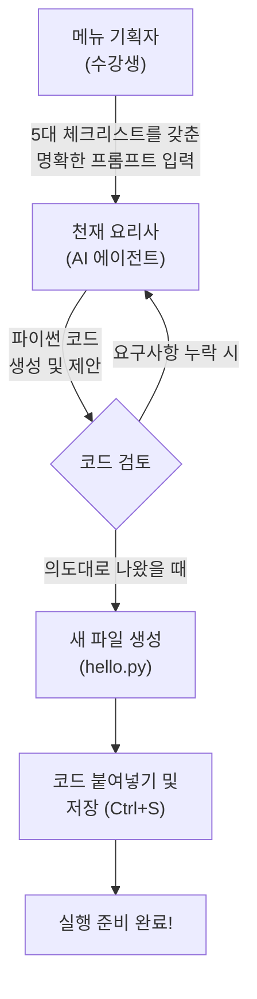

---

## §3. 상세 내용

### Why — 왜 직접 코딩하지 않고 프롬프트로 지시하는가?

"그래도 명색이 프로그래밍 수업인데, 제가 직접 파이썬 문법을 외워서 쳐야 하는 것 아닌가요?"라는 의문이 드실 수 있습니다. 아주 자연스러운 걱정입니다. 하지만 시대가 변했습니다. 괄호 하나 빼먹어서 밤새 오류를 찾던 시절은 지났습니다. AI 시대의 개발 경쟁력은 '누가 오타 없이 코드를 잘 치는가'에서 '누가 비즈니스 로직의 구멍을 잘 찾아내고 명확하게 지시하는가'로 완전히 넘어갔습니다.

AI는 문법 천재입니다. 하지만 AI는 사람의 마음을 읽지 못하며, 비즈니스의 맥락을 알지 못합니다. 여러분이 정책과 규칙을 촘촘하게 짜주지 않으면 AI는 엉성한 프로그램을 만듭니다. 그래서 우리는 타이핑 연습을 할 시간에, AI가 헷갈리지 않도록 명확한 업무 지시서(Prompt)를 작성하는 훈련에 집중하는 것입니다.

### What — 프롬프트 5대 체크리스트란 무엇인가?

AI에게 완벽한 코드를 얻어내기 위해 반드시 포함해야 하는 5가지 핵심 요소가 있습니다. 이를 '프롬프트 5대 체크리스트'라고 부릅니다.

1. **기능 (Function)**: 프로그램이 궁극적으로 해야 할 역할을 한 문장으로 정의합니다. (예: 사용자에게 인사하는 프로그램)
2. **입력 (Input)**: 프로그램이 실행될 때 어떤 데이터가 들어가야 하는지 명시합니다. (예: 사용자의 이름 텍스트)
3. **출력 (Output)**: 프로그램이 계산을 마친 후 어떤 형태로 결과를 내놓아야 하는지 지정합니다. (예: "안녕하세요, [이름]님!" 형식의 문장)
4. **제약 조건 (Constraints)**: 반드시 지켜야 할 규칙이나 피해야 할 방식을 정해줍니다. (예: 외부 라이브러리 사용 금지, 파이썬 내장 기능만 사용할 것)
5. **예외 처리 (Exception Handling)**: 사용자가 예상치 못한 엉뚱한 행동을 했을 때 어떻게 방어할 것인지 대비합니다. (예: 이름을 입력하지 않고 엔터를 치면 "이름을 다시 입력해주세요"라고 안내할 것)

이 다섯 가지를 꼼꼼히 챙기면, AI는 여러분의 의도에서 단 1밀리미터도 벗어나지 않는 정확하고 안전한 파이썬 코드를 만들어냅니다.

### How — 만들어진 대본(코드)을 어떻게 다루는가?

이렇게 5대 체크리스트를 바탕으로 프롬프트를 입력하면, AI는 순식간에 파이썬 언어로 번역된 코드를 생성해 줍니다. 하지만 화면에 코드가 나타났다고 해서 프로그램이 완성된 것은 아닙니다. 이것은 아직 AI의 입 밖으로 나온 '말'일 뿐입니다. 이 말을 컴퓨터가 언제든 읽고 실행할 수 있도록 종이에 적어서 보관해야 합니다.

그 보관함이 바로 **파일**입니다. 파일 이름을 지을 때 가장 중요한 규칙이 하나 있습니다. 반드시 파일 이름 끝에 `.py`라는 꼬리표(확장자)를 붙여야 합니다. 예를 들어 `hello.py`처럼 말이죠. 만약 실수로 `hello.txt`라고 저장한다면 컴퓨터는 이 파일을 그저 평범한 메모장 글로 취급합니다. `.py` 확장자는 컴퓨터에게 "이 안에는 파이썬 통역사가 읽어야 할 아주 중요한 대본이 들어있다"라고 알려주는 강력한 신호입니다. 확장자를 제대로 붙이고 저장을 완료해야 비로소 코드를 실행할 준비가 끝납니다.

---

## §4. 실습 가이드 (+ 🎙️ 실습 대본)

### 실습 목표

이 실습을 통해 수강생은 프롬프트 5대 체크리스트를 적용하여 AI에게 첫 파이썬 코드를 요청하고, 생성된 코드를 `.py` 파일로 올바르게 저장하는 전 과정을 경험합니다.

🎙️ **실습 가이드 대본 (Lab Guide)**:

> 자, 이제 여러분의 AI 비서를 호출해서 직접 코드를 받아보겠습니다. 화면 오른쪽에 있는 Agent Manager 창을 열어주세요. 
>
> 그냥 "인사하는 파이썬 코드 짜줘"라고 대충 말하지 않을 겁니다. 제가 화면에 5대 체크리스트가 모두 포함된 아주 정교한 프롬프트를 띄워드릴 테니, 이 내용을 그대로 Agent에게 전달해 보세요. 코드가 생성되면 왼쪽 탐색기에 빈 파일을 만들고 붙여넣을 겁니다. 확장자 `.py` 잊지 마시고요. 천천히 하나씩 따라오시면 됩니다!

### AI에게 코드 생성 요청 단계표

| 단계 | 소요 시간 | 강사 지시사항 | 학습자 액션 | 예상 결과 |
|------|----------|--------------|------------|----------|
| 1 | 2분 | "5대 체크리스트 프롬프트를 입력하세요" | 아래 제공된 상세 프롬프트를 Agent에 복사/붙여넣기 | AI가 파이썬 코드 블록을 생성 |
| 2 | 1분 | "생성된 코드의 복사 버튼을 누르세요" | 코드 블록 우측 상단의 Copy 아이콘 클릭 | 코드가 클립보드에 복사됨 |
| 3 | 1분 | "새 파일을 만들고 이름을 지어주세요" | 좌측 탐색기 우클릭 → New File → `hello.py` 입력 | 빈 `hello.py` 파일이 에디터에 열림 |
| 4 | 1분 | "코드를 붙여넣고 반드시 저장하세요!" | 에디터에 Ctrl+V (붙여넣기) 후 Ctrl+S (저장) | 탭의 동그란 아이콘이 X로 변하며 저장 완료 |

**[단계 1] 5대 체크리스트가 적용된 프롬프트 입력**

Agent Manager 채팅창에 아래의 내용을 그대로 복사해서 입력하고 엔터를 치세요:

```text
다음 5대 체크리스트 정책에 맞춰서 파이썬 코드를 작성해 줘.

1. 기능: 사용자에게 이름을 물어보고, 그 이름과 함께 Hello World 인사를 건네는 프로그램
2. 입력: 사용자의 이름 (텍스트)
3. 출력: "Hello World! 환영합니다, [이름]님!" 형태의 메시지
4. 제약 조건: 파이썬 기본 기능만 사용할 것. 주석을 한글로 자세히 달아줄 것.
5. 예외 처리: 사용자가 아무것도 입력하지 않고 엔터를 치면 "이름이 입력되지 않았습니다. 다시 실행해주세요."라고 출력하고 종료할 것.
```

**[단계 2] 코드 복사하기**

AI가 요청을 분석하고 네모난 상자(코드 블록) 안에 파이썬 코드를 만들어 줍니다. 코드를 드래그해서 복사할 필요 없이, 코드 상자 오른쪽 위에 있는 조그만 '복사(Copy)' 아이콘을 클릭하기만 하면 됩니다.

**[단계 3] hello.py 파일 생성**

이제 우리의 작업 공간인 에디터 영역으로 갑니다. 화면 왼쪽의 파일 탐색기 빈 공간에서 마우스 오른쪽 버튼을 클릭하고 `New File`(새 파일)을 선택하세요. 
파일 이름을 입력하는 칸이 나오면 `hello.py`라고 정확히 타이핑하고 엔터를 칩니다. 파일 아이콘이 파이썬 로고(파란색과 노란색 뱀 모양)로 변하는 것을 확인하세요.

**[단계 4] 코드 붙여넣기 및 저장**

방금 만든 `hello.py` 파일의 빈 화면을 클릭하고, 복사해둔 코드를 붙여넣기(`Ctrl + V` 또는 Mac은 `Cmd + V`) 합니다. 
마지막으로 가장 중요한 관문입니다! 키보드의 `Ctrl + S`(Mac은 `Cmd + S`)를 눌러 파일을 저장하세요. 에디터 윗부분의 파일 이름 옆에 있던 하얀색 동그라미(수정됨 표시)가 사라지면 정상적으로 저장된 것입니다. 

### 트러블슈팅 FAQ

| Q | A |
|---|---|
| 파일 아이콘이 파이썬 모양이 아니라 그냥 줄무늬 종이 모양이에요. | 확장자를 잘못 입력하셨습니다. `hello.py`가 아니라 `hello.txt`나 `hello`로 만들어졌을 가능성이 높습니다. 파일명에서 우클릭 후 'Rename'을 선택해 끝에 `.py`를 명확히 붙여주세요. |
| AI가 짜준 코드가 제가 본 예시와 조금 달라요. 괜찮은가요? | 네, 완전 정상입니다! 요리사마다 양파 써는 순서가 약간 다르듯, AI 모델에 따라 변수 이름이나 코드 줄 순서가 조금씩 다를 수 있습니다. 핵심 로직만 5대 체크리스트를 충족하면 아무 문제 없습니다. |
| 저장을 안 하면 어떻게 되나요? | 코드를 화면에 띄워만 놓고 터미널에서 실행하면, 컴퓨터는 저장된 마지막 상태(빈 파일)만 읽습니다. 그래서 아무 결과도 나오지 않게 됩니다. 코드가 한 글자라도 수정되면 습관적으로 `Ctrl + S`를 누르셔야 합니다. |
| AI가 코드 밑에 긴 설명을 영어로 달아줬어요. 이것도 복사해야 하나요? | 아닙니다. 네모난 코드 블록 안쪽에 있는 파이썬 코드만 복사하시면 됩니다. 바깥에 있는 설명은 여러분을 위한 해설지일 뿐입니다. |
| 에디터에 코드를 붙여넣었는데 글자 색깔이 전부 하얀색이에요. | 이 역시 파일 확장자가 `.py`로 지정되지 않아서 에디터가 파이썬 코드인지 인식하지 못했기 때문입니다. 파일 이름을 다시 확인해 보세요. 정상적이라면 알록달록한 구문 강조(Syntax Highlighting)가 적용되어야 합니다. |

---


### 🎓 강사 노트 (Instructor Support)

- ⏱️ **타이밍**: 15:45 (20분, lab)
- 🎯 **핵심 활동**: AI에게 코드 요청 → 파일 저장
- ⚠️ **강사 주의사항**: 🎉 첫 코드! 분위기 축하 필수


### 📋 실습 설계 보강 (Lab Packet)

**세션 015 실습 설계 보강**

프롬프트로 첫 파이썬 코드 생성
- **3-Stage Example Set**
  - 기본: AI에게 "이름을 입력받아 인사하는 파이썬 프로그램 만들어줘" → 코드 복사 → .py 저장
  - 변형: "나이도 물어보고 태어난 해를 계산해주는 기능 추가해줘"
  - 실수 해결: 코드를 복사할 때 들여쓰기가 깨지는 경우 → 코드 블록 전체 선택 방법
- **난이도 예측**: "AI가 준 코드를 어디에 어떻게 저장하지?" — 파일 저장 워크플로우가 핵심
- **타이밍 가이드**: 프롬프트 작성 3분 | AI 응답 확인 3분 | 코드 복사·저장 5분 | 변형 실험 5분 | 정리 4분
- **심리적 장벽**: "AI가 준 코드를 이해 못 해도 괜찮은 건가?"
- **자가 점검**:
  - [ ] .py 확장자로 파일을 저장했는가?
  - [ ] AI가 생성한 코드에 `input()`과 `print()`가 포함되어 있는가?
  - [ ] 코드를 복사할 때 들여쓰기가 유지되었는가?

## §5. 코드 및 명령어 모음

### 실습 사용 프롬프트 템플릿 (5대 체크리스트)

이 템플릿은 앞으로 어떤 파이썬 프로그램을 만들든 두고두고 활용할 수 있는 마법의 공식입니다. 어딘가에 메모해 두시길 강력히 권장합니다.

```text
다음 정책에 맞춰 파이썬 코드를 작성해 줘.

1. 기능: [만들고자 하는 프로그램의 핵심 목적]
2. 입력: [사용자나 시스템으로부터 받을 데이터]
3. 출력: [최종적으로 화면에 보여지거나 저장될 결과물]
4. 제약 조건: [사용할 라이브러리, 지켜야 할 코딩 스타일 등]
5. 예외 처리: [오류가 날 수 있는 상황과 그 대처 방법]
```

### AI 생성 예상 코드 (참고용)

여러분의 AI가 생성한 코드는 대략 아래와 같은 형태를 띨 것입니다. 코드를 직접 칠 필요는 없지만, "아, 파이썬 언어는 이렇게 생겼구나" 하고 눈으로 한 번 읽어보세요.

```python
# 사용자에게 이름을 입력받습니다.
user_name = input("이름을 입력해 주세요: ")

# 예외 처리: 이름을 입력하지 않은 경우
if user_name.strip() == "":
    print("이름이 입력되지 않았습니다. 다시 실행해주세요.")
else:
    # 정상적으로 입력된 경우 환영 인사 출력
    print(f"Hello World! 환영합니다, {user_name}님!")
```

> 🤖 **AI가 사용한 파이썬 문법 힌트**: `input()`은 사용자에게 답변을 기다리는 기능이고, `print()`는 화면에 글자를 뿌려주는 기능입니다. `if`는 예외 상황을 걸러내는 문지기 역할을 합니다.

---

## §6. 요약

### 핵심 학습 포인트

이번 세션에서 우리는 타이핑이라는 낡은 족쇄를 끊어내고, 기획자로서 AI에게 코드를 지시하는 경험을 했습니다. 반드시 기억해야 할 세 가지 핵심입니다.
1. **바이브 코딩의 위험성**: AI에게 "알아서 짜줘"라고 대충 지시하면 엉뚱한 결과가 나옵니다. 우리는 구체적인 룰을 설계하는 기획자가 되어야 합니다.
2. **프롬프트 5대 체크리스트**: 완벽한 코드를 얻기 위해서는 기능, 입력, 출력, 제약, 예외처리라는 5가지 요소를 프롬프트에 반드시 명시해야 합니다.
3. **확장자 `.py`와 저장의 중요성**: 만들어진 코드는 반드시 `.py`로 끝나게 저장해야 파이썬 대본으로 인정받으며, `Ctrl + S`로 저장을 완료해야 컴퓨터가 읽을 수 있습니다.

### 다음 세션 예고

"확장자도 맞췄고, 저장도 완벽하게 했습니다. 이제 이 프로그램이 진짜로 돌아가는지 보고 싶어 미치겠어요!" 맞습니다. 이제 우리가 주문해서 받아낸 이 레시피(코드)를 주방의 가스레인지 위에 올려서 불을 켤 시간입니다. 다음 세션에서는 통합 터미널을 이용해 코드를 실제로 실행해 볼 것입니다. 

### 브릿지 노트

> "코드가 우리 작업실에 완벽하게 안착했습니다. 그런데 여러분, 당장 실행 버튼을 누르고 싶으시죠? 잠깐만 멈춰보세요! 실행하기 전에 우리가 꼭 지켜야 할 아주 중요한 개발자의 의식이 하나 남아있습니다. 코드를 능동적으로 씹어 먹는 방법, 바로 '예측'입니다. 다음 세션에서는 실행을 잠깐 참는 메타인지 학습법으로 들어가보겠습니다."

---

## §7. 참고 자료

### 3-Source 출처

- **Source A (로컬 참고자료)**: 「AI 시대의 서사 v3 - Claude.md」 — 문법 암기 시대의 종말과 '문제 정의(What)' 능력이 중요해진 패러다임 전환 논의
- **Source B (NotebookLM)**: SRC-B01 — Vibe Coding의 위험성과 환각 차단을 위한 프롬프트 5대 체크리스트(기능, 입력, 출력, 제약, 예외처리) 정의
- **Source C (Deep Research)**: SRC-C01 — 예측-검증-설명을 위한 능동적 코드 읽기 훈련 및 명세 기반 개발(SDD)의 초석

### 강사 노트

> 💡 **강사 노트**: 본 세션은 수강생들이 처음으로 실제 코드를 화면에 올리는 매우 상징적인 순간입니다. 하지만 절대 키보드로 파이썬 문법을 설명하는 쪽으로 빠지지 않도록 주의하세요. 수강생이 코더가 아니라 "매니저이자 기획자"라는 점을 지속적으로 환기시켜야 합니다.
> 
> 실습 중 파일 저장(`Ctrl + S`)을 깜빡하는 수강생이 반드시 10~20% 정도 나옵니다. 다음 세션에서 코드를 실행할 때 "아무것도 안 나와요"라는 질문이 나올 것을 대비해, 에디터 탭의 저장 표시(흰 동그라미 유무)를 보는 방법을 다시 한번 짚어주시면 매우 좋습니다.

---

## ✅ 세션 완료 체크리스트 (강사용)

- [ ] §1~§7 모든 섹션이 충실하게 작성되었는가?
- [ ] '요리사에게 레시피 주문' 비유가 §2에서 충분히 서술형으로 설명되었는가?
- [ ] Vibe Coding의 위험성과 5대 체크리스트 요소가 누락 없이 포함되었는가?
- [ ] 단계별 실습 표에 구체적인 프롬프트 복사/붙여넣기 및 파일 저장 절차가 명시되었는가?
- [ ] 트러블슈팅 FAQ에 확장자 및 저장 관련 이슈가 포함되었는가?
- [ ] 다음 세션 브릿지에서 '예측'의 중요성을 강조하는 멘트가 들어갔는가?
- [ ] 3-Source 팩트 패킷의 출처가 §7에 명확하게 표기되었는가?

---

**🔗 선행 세션**: [세션-014] uv pip로 패키지 설치 체험 (권장)  
**🔗 후행 세션**: [세션-016] 코드 실행과 예측-검증-설명 경험

---

*작성 일시: 2026-02-25*  
*작성 에이전트: A4B_Session_Writer*  
*교안 구조: 7섹션 (A0 팀 공통 표준)*

> 🔗 **이전 세션**: [세션 014: uv pip로 패키지 설치 체험](#세션-014)에서 배운 내용을 이어갑니다.
> 🔗 **다음 세션**: [세션 016: 코드 실행과 예측-검증-설명 경험](#세션-016)에서 계속됩니다.

---

### 세션 016: 코드 실행과 예측-검증-설명 경험
> [원본 파일](sessions/세션-016-코드_실행과_예측-검증-설명_v2.1.md) | ⏱️ 20분 | 🧪 lab | 난이도: medium

> **세션 ID**: MS-PY101-016
> **소요 시간**: 20분
> **난이도**: low
> **청크 타입**: lab
> **버전**: v2.1 (7섹션 구조)

---

## §1. 개요

> **Day 1 | PM | 세션 016/022**

### 🎯 학습 목표

이 세션이 끝나면, 수강생은 다음을 할 수 있습니다:

- 코드를 무작정 실행하는 습관을 버리고, 실행 전 결과를 논리적으로 추론하는 예측(Predict) 단계를 수행할 수 있다
- 터미널을 이용해 파이썬 코드를 직접 실행하고 내 예측과 실제 결과를 비교하는 검증(Observe) 단계를 거칠 수 있다
- AI 에이전트에게 코드의 각 줄이 의미하는 작동 원리를 묻고 내 언어로 설명(Explain)하는 메타인지 학습을 완료할 수 있다

### 선행 세션 환기

바로 전 세션(015)에서 우리는 프롬프트를 작성해 생애 첫 파이썬 코드인 `hello.py`를 무사히 만들어 냈습니다. 에디터 화면에 여러분이 만들어낸 코드가 반짝거리고 있을 겁니다. 당장 터미널에 실행 명령어를 치고 엔터를 힘껏 누르고 싶은 마음이 드실 텐데요. 하지만 아주 잠깐만 손을 멈춰주세요. 

코딩에서 정말 중요한 능력은 결과를 가장 빨리 보는 것에 있지 않습니다. 이 짧은 코드가 컴퓨터 안에서 도대체 어떤 논리적인 순서로 흘러갈지 머릿속에 먼저 그려보는 능력이 훨씬 더 중요합니다. 오늘 우리는 바로 그 '잠깐 멈추고 생각하기'라는 디버깅의 첫 단추를 꿰어보겠습니다.

---

## §2. 핵심 개념 (+ 🗣️ 강사 대본 + Mermaid)

### 마술 쇼 관객에서 과학 실험실의 연구원으로

AI가 대신 짜준 코드를 그저 복사해서 붙여넣고 곧바로 실행 버튼을 누르는 태도는 마술 쇼를 구경하는 관객의 태도와 똑같습니다. 마술사가 빈 모자에서 비둘기를 꺼낼 때 "우와, 정말 신기하다!" 하고 손뼉을 치는 것에 불과해요. 이런 방식으로는 평생 관객석에만 머물러야 합니다. 코딩 실력은 한 발자국도 늘지 않습니다.

우리는 마술 쇼 관객이 아니라 **과학 실험실의 연구원**이 되어야 합니다. 연구원들은 실험실에서 기계 스위치를 켜기 전에 반드시 '가설'을 세웁니다. "A라는 용액과 B라는 용액을 섞으면 아마 빨간색으로 변할 거야"라고 먼저 예측(Predict)을 하죠. 그런 다음 진짜로 두 용액을 섞어보고 결과를 두 눈으로 관찰(Observe)합니다. 만약 빨간색이 아니라 파란색이 나왔다면 실패했다고 실망할까요? 아닙니다. "왜 파란색이 나왔지?" 하고 원인을 끝까지 파헤쳐서 스스로 설명(Explain)해 냅니다.

이 예측, 관찰, 설명이라는 세 단계를 묶어서 POE(Predict-Observe-Explain) 사이클이라고 부릅니다. 이 사이클이야말로 AI가 코드를 대신 짜주는 시대에 우리 인간이 가져야 할 가장 강력하고 날카로운 무기입니다. 코드는 AI가 짜더라도, 그 코드를 완전히 지배하고 논리를 이해하는 통제권은 언제나 우리의 몫이어야 합니다.

🗣️ **강사 대본 (Instructor Script)**:

> 여러분, 화면에 방금 만든 `hello.py` 코드가 띄워져 있죠? 지금 당장 실행 명령어를 치고 싶은 마음을 딱 5초만 참아봅시다. 키보드에서 손을 완전히 떼고 두 손을 무릎에 얹어주세요.
>
> 우리는 지금부터 코더가 아니라 과학자가 될 겁니다. 훌륭한 과학자는 실험 스위치를 누르기 전에 "이 스위치를 누르면 화면에 어떤 일이 일어날까?"를 먼저 상상합니다. 코드를 위에서부터 아래로 천천히 눈으로 따라가 보세요. `input`이나 `print` 같은 생소한 영어 단어의 뜻을 아직 몰라도 괜찮습니다. 흐름을 짐작해 보는 거예요. "아, 내 이름을 물어보려고 프로그램이 멈춰서 기다리겠구나", "이름을 치면 인사를 하겠구나"라고 말이죠.
> 
> 결과를 머릿속으로 미리 그려보고 나서 실행을 해야, 내 생각이 맞았을 때의 짜릿함도 두 배가 되고 틀렸을 때 무엇을 잘못 알았는지 정확하게 짚고 넘어갈 수 있습니다. 이것이 그 유명한 '예측-검증-설명' 학습법입니다.

> 💡 **강사 노트**: AI 자동화 시대에 코딩 입문자가 겪는 가장 흔하고 위험한 함정인 '이해 없는 복사 붙여넣기(Blind Copy-Paste)'를 방지하기 위한 핵심 세션입니다. v2.0 교안의 마술쇼 비유를 능동적이고 주도적인 태도를 강조하는 과학 실험 관찰 일지 비유로 확장했습니다. 수강생들이 실제로 두 손을 무릎에 얹도록 물리적인 행동을 유도해 분위기를 확실히 환기해 주세요.

### Mermaid 다이어그램

```mermaid
flowchart TD
    A["🤔 1단계: 예측 (Predict)"] --> B["눈으로 코드 읽기<br/>실행 결과 가설 설정"]
    B --> C["🔬 2단계: 검증 (Observe)"]
    C --> D["터미널 실행 (python hello.py)<br/>가설과 실제 결과 비교"]
    D --> E["💡 3단계: 설명 (Explain)"]
    E --> F["AI 에이전트에게 질문<br/>작동 원리 완벽 이해"]
    F --> A
```

---

## §3. 상세 내용

### Why — 왜 실행 전에 멈춰서 예측해야 하는가?

자판기에 백 원짜리 동전을 넣고 버튼을 누르면 달콤한 음료수가 나옵니다. 우리는 굳이 자판기 안에서 어떤 톱니바퀴와 기계장치가 맞물려 돌아가는지 알 필요가 없습니다. 하지만 프로그래밍은 자판기 앞의 소비자가 되는 일이 아닙니다. 우리 스스로 자판기의 내부를 설계하는 일입니다. 

AI가 아무리 완벽하고 훌륭한 코드를 짜주더라도, 그 코드가 내부적으로 어떻게 흘러가는지 파악하지 못하면 아주 사소한 에러 앞에서도 무너집니다. 기능을 아주 조금만 바꾸고 싶어도 어디를 고쳐야 할지 몰라 완전히 막혀버리죠. 그렇기 때문에 우리 스스로 생각의 끈을 단단히 이어가는 메타인지 학습이 반드시 필요합니다. 코드를 실행하기 전 딱 3초 멈춰서 생각하는 이 짧은 시간이 여러분의 진짜 디버깅 근육을 키우는 가장 확실한 훈련법입니다.

### What — POE 사이클이란 무엇인가?

**1. 예측 (Predict)**
파이썬 코드는 기본적으로 위에서 아래로 순서대로 실행됩니다. 영어 문장을 소리 내어 읽듯이 코드를 한 줄씩 훑어보는 단계입니다. 프로그램이 사용자에게 무엇을 물어볼지, 화면에 어떤 형태의 글자가 나타날지 미리 머릿속으로 시나리오를 그려봅니다. 

**2. 검증 (Observe/Verify)**
상상을 마쳤다면 터미널에 명령어를 입력해 코드를 실제로 실행합니다. 머릿속으로 상상했던 결과가 화면에 정확히 똑같이 나타나는지 두 눈으로 확인합니다. 만약 상상과 전혀 다른 결과가 나왔거나 새빨간 에러 메시지가 떴다면, 그것은 절대 실패가 아닙니다. 나의 오개념을 확실하게 바로잡을 아주 좋은 신호입니다.
상상을 마쳤다면 터미널에 명령어를 입력해 코드를 실제로 실행합니다. 머릿속으로 상상했던 결과가 화면에 정확히 똑같이 나타나는지 두 눈으로 확인합니다. 

특히 초보자 시절에는 내 예측이 틀리는 경우가 훨씬 많습니다. 만약 상상과 전혀 다른 결과가 나왔거나 새빨간 에러 메시지가 떴다면, 그것은 절대 실패가 아닙니다. 오히려 나의 오개념을 확실하게 바로잡을 아주 좋은 신호입니다. 예측이 틀렸을 때 느끼는 가벼운 당혹감이 뇌를 자극해서 훨씬 더 깊은 장기 기억으로 연결해 줍니다.

**3. 설명 (Explain)**
프로그램이 잘 돌아간다고 해서 거기서 멈추면 안 됩니다. 내 코드를 100% 내 것으로 만들어야 합니다. AI 비서에게 "이 코드에서 저 단어는 정확히 무슨 역할을 해?", "왜 꼭 이런 순서로 짜야 해?"라고 질문하세요. 완벽하고 쉬운 해설을 듣고 완벽하게 납득하고 넘어가는 것이 마지막 단계입니다. 


설명 단계에서는 반드시 '나만의 언어'로 번역하는 과정이 필요합니다. AI가 "input 함수는 표준 입력을 받는 내장 함수입니다"라고 사전처럼 딱딱하게 대답한다면, "내가 이해하기 어려우니 식당에서 주문받는 웨이터에 비유해서 다시 설명해 줘"라고 거듭 요구하세요. 내가 완전히 납득할 때까지 질문을 포기하지 않는 것이 핵심입니다.
### How — 코드를 읽고 실행하는 방법

우리가 작성한 코드는 대본이나 레시피와 같습니다. 파이썬은 그 대본을 충실하게 연기하는 배우입니다. 터미널 창에 `python hello.py`라고 치는 것은 컴퓨터에게 "파이썬아, 지금부터 `hello.py`라는 대본을 펼쳐서 연기해!"라고 명확하게 지시를 내리는 것과 같습니다.

만약 코드를 에디터에 적기만 하고 저장을 잊었다면 어떻게 될까요? 컴퓨터의 하드디스크에는 여전히 아무 내용도 없는 빈 대본만 남아있습니다. 에디터 탭의 파일 이름 옆에 동그란 하얀 점이 떠 있다면 아직 저장되지 않았다는 뜻입니다. 반드시 `Ctrl + S`(macOS는 `Cmd + S`)를 눌러 대본을 확실히 저장한 후에 실행해야 파이썬이 올바른 연기를 할 수 있습니다.

> ✅ **체크포인트**: 잠시 배운 내용을 스스로 점검해 보세요.
> - 코드를 실행하기 전 반드시 거쳐야 하는 첫 번째 단계는 무엇인가요? ("결과를 머릿속으로 먼저 예측하기")
> - 파일 이름 옆에 동그란 점이 떠 있다면 무슨 뜻인가요? ("파일이 아직 저장되지 않았다")

---

## §4. 실습 가이드 (+ 🎙️ 실습 대본)

### 실습 목표

수강생은 직접 만든 `hello.py` 코드를 바탕으로 POE(예측-검증-설명) 사이클을 한 바퀴 온전히 완주합니다. 더불어 AI에게 코드의 원리 설명을 요구하는 프롬프트를 직접 작성하는 경험을 합니다.

🎙️ **실습 가이드 대본 (Lab Guide)**:

> 자, 드디어 실험 스위치를 켤 시간이 왔습니다. 방금 전 세션에서 만들어 둔 코드 창을 띄워주세요. 제가 드리는 4단계 지시를 차근차근 따라오시면 됩니다. 무작정 엔터를 치면 안 됩니다. 단계별로 제가 말씀드리는 타이밍을 꼭 지켜서 같이 가볼게요.

### POE 실습 단계표

| 단계 | 소요 시간 | 강사 지시사항 | 학습자 액션 | 예상 결과 |
|------|----------|--------------|------------|----------|
| 1. 예측 | 1분 | "코드를 눈으로만 읽고 터미널에 첫 번째로 뜰 문장을 상상하세요" | 첫 줄부터 세 번째 줄까지 눈으로 훑기 | 입력 대기 문구 예측 완료 |
| 2. 준비 | 1분 | "터미널을 클릭하고 `python hello.py`를 타이핑하되 엔터는 치지 마세요" | 터미널에 명령어 입력 대기 | 실행 직전 상태 진입 |
| 3. 검증 | 2분 | "엔터를 치세요! 이름을 입력하고 결과를 확인하세요" | Enter 키 입력 → 이름 타이핑 → 결과 확인 | 예측한 출력 결과가 눈앞에 나타남 |
| 4. 설명 | 3분 | "Agent 창으로 가서 실행한 코드의 작동 원리를 물어보세요" | AI 비서에게 해설 요청 프롬프트 입력 | 쉬운 비유로 된 코드 해설 획득 |

**[실습 단계 1] 예측하기 (Predict)**
에디터 화면의 코드를 천천히 훑어봅니다. 만약 `name = input("이름을 입력하세요: ")` 라는 코드가 있다면, 실행했을 때 가장 먼저 무슨 일이 일어날지 속으로 대답해 보세요. "아마 프로그램이 내 이름을 물어보고 내가 타이핑할 때까지 기다리겠구나!"라고 추측하셨나요? 아주 훌륭한 가설입니다.

**[실습 단계 2] 검증 준비하기 (Prepare)**
화면 아래 터미널 창을 마우스로 한 번 클릭하고 아래 명령어를 조심스럽게 입력합니다. 
`python hello.py`
거듭 강조하지만 아직 엔터 키를 누르지 마세요. 가볍게 숨을 고르고, 내 예측이 진짜로 맞을지 마지막으로 확신을 가져보는 겁니다.

**[실습 단계 3] 검증 및 실행하기 (Observe)**
이제 힘차게 엔터 키를 쳐봅시다. 화면에 "이름을 입력하세요: "라는 메시지가 뜨고 네모난 커서가 깜빡이나요? 여러분의 가설이 아주 정확히 들어맞았습니다! 그 자리에 본인의 이름을 타이핑하고 다시 엔터를 쳐보세요. 프로그램이 내 이름을 부르며 환영 인사를 건넬 겁니다.

**[실습 단계 4] 해설사에게 묻기 (Explain)**
실험 결과를 확인했으니 이제 그 비밀을 속속들이 파헤칠 차례입니다. 화면 우측의 Agent Manager 창을 열고 이렇게 질문을 던져보세요.
"방금 네가 짜준 파이썬 코드의 각 줄이 어떤 역할을 하는지 초등학생도 이해할 수 있게 비유를 써서 3줄로 설명해 줘. input이랑 print가 정확히 뭐야?"

AI 비서가 "input은 사람의 목소리를 듣는 마이크고, print는 화면에 글자를 뿌려주는 거대한 확성기야"라는 식으로 아주 명쾌하고 재미있게 해설해 줄 것입니다.

### 트러블슈팅 FAQ
> 💡 **강사 노트**: 설명 단계에서 수강생들이 질문을 피상적으로 던지고 넘어가지 않도록 주의를 기울여 주세요. "input은 마이크"라는 비유를 얻어냈다면, "그럼 print는 스피커인가요?"라고 스스로 유추해 볼 수 있도록 유도하는 것이 이상적인 교육 흐름입니다.

| Q | A |
|---|---|
| 엔터를 쳤는데 아무 일도 일어나지 않고 조용히 끝나요 | 에디터에서 `hello.py` 파일을 저장(Ctrl + S)했는지 확인해 보세요. 빈 파일을 실행하면 파이썬도 빈 연기를 하고 조용히 무대를 내려옵니다. |
| `python: can't open file 'hello.py'` 에러가 붉게 떴어요 | 터미널이 현재 폴더를 제대로 가리키고 있는지 확인해야 합니다. 파일 이름에 오타가 났을 가능성도 커요. `ls`나 `dir` 명령어로 현재 폴더에 파일이 잘 들어있는지 확인해 보세요. |
| 결과가 나오긴 했는데, 글자가 이상하게 깨져서 보여요 | 한글 인코딩 문제일 수 있습니다. 당황하지 말고 깨진 글자를 그대로 복사해서 AI에게 "이 결과가 왜 깨져서 나오는지 해결 방법을 찾아줘"라고 질문하세요. |
| 명령어를 쳤는데 "python을 찾을 수 없습니다"라고 나와요 | 우리 앞선 세션에서 파이썬 설치할 때 PATH 체크박스를 빼먹은 경우입니다. AI에게 이 에러 메시지를 복사해주면 파이썬을 다시 올바르게 설치하는 방법을 안내해 줄 겁니다. |

> ✅ **체크포인트**: AI 비서에게 질문해서 `input`과 `print`의 역할을 완전하게 이해하셨나요? 혹시 설명이 너무 어렵다면 "더 쉬운 일상생활 비유로 한 번 더 설명해 줘"라고 거듭 질문해 보세요.

>
> 만약 짝꿍이 있다면 방금 알게 된 원리를 짝꿍에게 한 문장으로 설명해 보세요. 남에게 설명할 수 있어야 진짜 내 지식이 됩니다.
---


### 🎓 강사 노트 (Instructor Support)

- ⏱️ **타이밍**: 16:15 (20분, lab)
- 🎯 **핵심 활동**: 결과 예측 → 실행 → 원리 설명
- ⚠️ **강사 주의사항**: 예측→검증→설명 루틴 첫 체험


### 📋 실습 설계 보강 (Lab Packet)

**세션 016 실습 설계 보강**

코드 실행과 예측-검증-설명 경험
- **3-Stage Example Set**
  - 기본: 코드 실행 전 "이름을 입력하면 인사가 출력될 것" 예측 → `python hello.py` 실행 → 결과 확인
  - 변형: 숫자를 입력해야 하는 곳에 문자를 입력 → 에러 발생 → AI에게 설명 요청
  - 실수 해결: `python hello.py` 대신 `python` 만 입력 → 대화형 모드 진입 → `exit()` 안내
- **난이도 예측**: "예측"이라는 행위 자체가 낯설음 — "맞추지 못하면 어쩌지?"
- **타이밍 가이드**: 예측 작성 3분 | 실행·검증 5분 | AI에게 설명 요청 5분 | 오답 실험 4분 | 정리 3분
- **심리적 장벽**: 예측이 틀릴까 봐 예측 자체를 회피
- **자가 점검**:
  - [ ] 실행 전에 결과를 종이나 메모에 예측해 적었는가?
  - [ ] 예측과 실제 결과를 비교했는가?
  - [ ] AI에게 "이 코드가 왜 이렇게 동작하는지 설명해줘"라고 질문했는가?

## §5. 코드 및 명령어 모음

### 명령어 1: 파이썬 스크립트 파일 실행

```bash
python hello.py
```

현재 터미널이 위치한 폴더 안에 있는 `hello.py` 파일을 읽어들여 처음부터 끝까지 실행하라는 명령어입니다. 우리가 파이썬을 다루면서 가장 많이 치게 될 아주 기본적인 명령입니다. 

### 명령어 2: 프롬프트 패턴 (코드 원리 해설 요청)

```text
방금 작성한 파이썬 코드의 각 줄이 어떤 역할을 하는지 초등학생도 알 수 있게 쉬운 비유로 설명해 줘.
코드에 나온 핵심 단어(예: input, print)의 정확한 의미도 반드시 포함해 줘.
```

결과만 대충 확인하고 넘어가는 수동적인 태도를 방지하기 위한 능동적 프롬프트입니다. 언제든 모르는 코드가 나오면 이 프롬프트를 활용해 나만의 1:1 과외를 받아보세요.

---
### 명령어 3: 파일 목록 확인 명령어 (경로 확인용)

```bash
ls (macOS/Linux)
dir (Windows)
```

터미널에서 현재 위치한 폴더 안에 어떤 파일들이 들어있는지 목록을 보여줍니다. `python hello.py`를 실행했는데 파일을 찾을 수 없다는 에러가 발생하면, 가장 먼저 이 명령어를 쳐서 진짜로 `hello.py`가 그 폴더에 존재하는지부터 확인해야 합니다.

> 🤖 **AI 프롬프트 예시**: "터미널에서 파일을 찾을 수 없다고 나와. 내가 지금 있는 폴더에 파일이 있는지 확인하는 명령어가 뭐야?"

## §6. 요약

### 핵심 학습 포인트

이번 세션에서 우리는 단순히 코드를 맹목적으로 실행하는 것을 넘어, 과학 실험실의 연구원처럼 코드에 조심스럽게 접근하는 방법을 배웠습니다. 꼭 기억해야 할 것은 딱 세 단어입니다. 예측(Predict), 검증(Observe), 설명(Explain). 실행하기 전에 먼저 결과를 논리적으로 추측해 보고, 터미널에서 실행해 실제 결과를 두 눈으로 확인한 뒤, AI 비서를 통해 작동 원리를 완벽히 내 언어로 흡수하는 이 사이클을 끊임없이 반복하세요. 이것이 기계가 코드를 대신 짜주는 시대에 코드를 온전히 통제하고 지배하는 진정한 기획자의 자세입니다.

### 다음 세션 예고

이제 코드를 성공적으로 실행했고 숨겨진 원리까지 확실하게 파악했습니다. 그렇다면 원래 있던 대본을 조금만 손봐서 전혀 다른 동작을 하게 만들 수도 있겠죠? 다음 세션에서는 우리가 직접 코드를 타이핑해서 고치는 대신, AI에게 내리는 프롬프트 지시사항을 아주 살짝 바꿔서 프로그램의 구조가 어떻게 근본적으로 변화하는지 관찰해 볼 겁니다.

### 브릿지 노트

> "여러분이 머릿속으로 예상한 대로 코드가 아주 완벽하게 돌아갔죠? AI 비서가 들려주는 설명도 찰떡같이 이해가 가셨을 겁니다. 자, 그런데 여기서 조금 더 욕심이 나지 않나요? 처음 인사를 건넬 때 이름만 묻는 게 아니라 나이도 같이 물어봐서 계산해 주면 더 근사한 프로그램이 될 텐데요. 다음 세션에서는 방금 썼던 프롬프트에 딱 한 줄을 추가해서 우리 프로그램을 2.0 버전으로 똑똑하게 업그레이드해 보겠습니다!"

---

## §7. 참고 자료

### 3-Source 출처

- **Source A (로컬 참고자료)**: 「AI 시대의 서사 v3 - Claude.md」(SRC-A01) — 예측-검증-설명 루프 원리와 기획자로서의 능동적 학습 태도
- **Source B (NotebookLM)**: SRC-B01 — 수동적 복사-붙여넣기 방지를 위한 메타인지 학습 비유 및 능동적 코드 검증 기법
- **Source C (Deep Research)**: SRC-C01 — 코드 데이터 처리 흐름 분석 및 파이썬 스크립트 실행의 내부 구조 명세

### 추가 학습 자료

- [Python 공식 자습서 - 파이썬 인터프리터 사용하기](https://docs.python.org/ko/3/tutorial/interpreter.html): 파이썬 스크립트 파일 실행 방식에 대한 공식 문서 가이드
- Antigravity IDE 공식 문서: 통합 터미널 활용 및 파일 저장부터 실행까지의 전체 라이프사이클

### 강사 노트

> 💡 **강사 노트**: 수강생들이 무의식적으로 터미널에서 명령어를 치고 엔터를 연달아 치는 습관을 교정하는 것이 이번 세션의 가장 핵심적인 과제입니다. 실습 단계에서 목소리 톤을 바꿔 '절대로 아직 엔터를 치지 마세요'라고 명확히 제동을 걸어주세요. 
> 
> 또한 `input` 함수가 실행되면 프로그램이 끝난 것이 아니라 터미널 창에서 키보드 입력을 기다리고 있다는 사실을 직관적으로 이해하지 못해 멍하니 화면만 바라보는 수강생이 종종 있습니다. "커서가 깜빡이는 곳에 여러분의 이름을 타이핑하고 다시 엔터를 쳐야 다음 과정으로 넘어갑니다"라고 현장에서 개별 안내를 꼭 더해주시면 좋습니다.

---

## ✅ 세션 완료 체크리스트 (강사용)

- [x] §1~§7 모든 섹션이 충실하게 작성되었는가?
- [x] 과학 실험실 비유(가설/예측-검증-설명)가 §2에서 충분히 전개되었는가?
- [x] POE 실습 단계표가 §4에 명확한 시간과 함께 제시되었는가?
- [x] 체크포인트 질문이 §3, §4에 적절히 배치되었는가?
- [x] 실행 전 파일 저장 여부를 확인하는 팁이 포함되었는가?
- [x] 3-Source 팩트 패킷의 내용이 §7에 정확히 반영되었는가?
- [x] 다음 세션(017) 브릿지 노트가 자연스럽게 포함되었는가?

---

**🔗 선행 세션**: [세션-015] 프롬프트로 첫 파이썬 코드 생성 (필수)  
**🔗 후행 세션**: [세션-017] 프롬프트 변형으로 코드 변화 관찰하기  

---

*작성 일시: 2026-02-25*  
*작성 에이전트: Antigravity*  
*교안 구조: 7섹션 (A0 팀 공통 표준)*

> 🔗 **이전 세션**: [세션 015: 프롬프트로 첫 파이썬 코드 생성](#세션-015)에서 배운 내용을 이어갑니다.
> 🔗 **다음 세션**: [세션 017: 프롬프트 변형으로 코드 변화 관찰하기](#세션-017)에서 계속됩니다.

---

### 세션 017: 프롬프트 변형으로 코드 변화 관찰하기
> [원본 파일](sessions/세션-017-프롬프트_변형으로_코드_변화_관찰하기_v2.1.md) | ⏱️ 20분 | 🧪 lab | 난이도: medium

> **세션 ID**: MS-PY101-017  
> **소요 시간**: 20분  
> **난이도**: low  
> **청크 타입**: lab  
> **버전**: v2.1 (7섹션 구조)

---

## §1. 개요

> **Day 1 | PM | 세션 017/022**

### 🎯 학습 목표

이 세션이 끝나면, 수강생은 다음을 할 수 있습니다:

* 기존 프롬프트에 새로운 조건을 추가하여 코드 구조를 변화시키는 점진적 개선 전략을 실행할 수 있다.
* 프롬프트의 미세한 조정이 `input()` 함수와 데이터 타입 변환(`int()`) 등 파이썬 코드의 어떤 변화를 유도하는지 식별할 수 있다.
* 코드를 직접 수정하는 대신 명세(사양)를 변경하여 원하는 결과를 얻어내는 AI-First 개발 워크플로우를 체화할 수 있다.

### 선행 세션 환기

바로 직전 세션(세션-016)에서 우리는 생애 첫 파이썬 코드를 AI와 함께 만들고, 그 결과를 예측한 뒤 검증하는 놀라운 경험을 했습니다. 이름만 물어보고 반갑게 인사하는 아주 귀여운 프로그램이었죠. 코드가 화면에 출력된 순간의 짜릿함을 아직 기억하실 겁니다. 

그런데 사람의 욕심은 끝이 없습니다. 인사만 하고 끝나버리니 무언가 아쉽고 더 많은 기능을 넣고 싶어집니다. "사용자에게 태어난 연도를 물어보고, 현재 연도를 기준으로 나이도 계산해서 알려주는 기능을 추가하려면 코드를 어떻게 수정해야 하지?" 이런 고민에 빠지는 건 아주 자연스러운 수순입니다. 

과거에는 이때부터 구글을 켜고 파이썬 문법을 검색하며 코드를 직접 이리저리 뜯어고쳤습니다. 그러다 결국 새빨간 에러를 마주하고 좌절하곤 했죠. 하지만 우리는 다릅니다. 복잡한 문법과 씨름하는 대신 우리가 작성했던 업무 지시서, 즉 프롬프트에 딱 한 줄의 조건만 덧붙여 볼 겁니다. 

어떤 결과가 나올지 아주 기대되시죠? 시작해 봅시다.

---

## §2. 핵심 개념 (+ 🗣️ 강사 대본 + Mermaid)

### 같은 요리, 다른 레시피 (점진적 개선 전략)

프로그램에 새로운 기능을 추가하는 과정을 비유로 들어보겠습니다. 여러분이 최고급 식당의 메뉴 기획자라고 상상해 보세요. 방금 요리사(AI)에게 샌드위치를 만들어 달라고 주문했고, 아주 훌륭한 샌드위치가 나왔습니다. 그런데 갑자기 치즈를 한 장 추가하고 싶어졌습니다. 

이때 여러분이 직접 주방에 들어가서 샌드위치를 해체하고 치즈를 끼워 넣을 필요가 없습니다. 그저 요리사에게 "아까 그 샌드위치 레시피에 치즈 한 장만 추가해서 다시 만들어 주세요"라고 말하면 끝입니다 [Source C]. 요리사는 빵을 다시 굽고 베이컨을 올린 뒤 완벽한 타이밍에 치즈를 얹어 새로운 샌드위치를 완성해 냅니다.

또 다른 비유로는 편지 번역이 있습니다. 최고급 동시통역사인 AI 비서에게 "친구에게 안부를 전해줘"라고 부탁했고, 비서는 멋진 파이썬 코드라는 외국어 편지를 써주었습니다. 편지가 이미 완성되었지만 갑자기 친구의 나이도 궁금해졌습니다. 우리가 직접 사전을 뒤적거리며 서투른 글씨로 문장을 욱여넣을 필요가 없습니다. 그저 통역사를 다시 불러서 부탁하면 됩니다. "아까 써준 편지 너무 좋았어! 그런데 추신으로, 태어난 연도를 물어보고 나이를 계산해서 같이 알려주라는 내용을 덧붙여서 새로 번역해 줄래?" 

통역사는 전혀 불평하지 않고 순식간에 추신이 포함된 완벽한 편지를 처음부터 깨끗하게 다시 써줄 겁니다 [Source C]. 

이것이 바로 AI 시대의 점진적 개선(Iterative Refinement) 전략입니다. 소프트웨어를 발전시키고 싶을 때 기획자는 코드 자체를 만지려고 끙끙대는 것이 아니라 명세서를 고쳐서 완전히 새로운 코드를 다시 생성받는 것입니다. 한 번 작성된 코드는 고정된 조각상이 아니라, 여러분의 상상력과 프롬프트 한 줄에 따라 언제든 더 똑똑한 생명체로 진화할 수 있는 유기체입니다 [Source C].

🗣️ **강사 대본 (Instructor Script)**:

> 여러분, 우리가 만든 환영 인사 프로그램 잘 작동했나요? 정말 멋집니다. 그런데 인사만 달랑 하고 끝나버리니 무언가 조금 아쉽지 않나요? 보통 프로그래머라면 이쯤에서 고민에 빠집니다. "사용자에게 태어난 연도를 물어보고, 현재 연도를 기준으로 나이도 계산해서 알려주는 기능을 추가하려면 코드를 어떻게 수정해야 하지?" 하면서 말이죠. 
> 
> 과거 방식대로라면 구글을 켜고, 파이썬 나이 계산을 검색하고, 기존 코드를 이리저리 뜯어고치다 에러를 뿜게 만들었을 겁니다. 저도 예전에는 괄호 하나 빼먹어서 밤을 새운 적이 있습니다.
>
> 하지만 여러분은 다릅니다. 우리는 복잡한 파이썬 문법과 씨름하는 대신, 우리가 작성했던 업무 지시서인 프롬프트에 딱 한 줄의 조건만 덧붙여 볼 겁니다. 메뉴 기획자가 "아까 그 샌드위치에 치즈 한 장 추가해 주세요"라고 말하듯이 말이죠. 코드가 마음에 안 드시나요? 코드를 직접 만지려고 끙끙대지 마세요. AI에게 기획서를 수정해서 다시 주면 됩니다. 이것이 AI-First 개발의 핵심입니다.

### Mermaid 다이어그램

```mermaid
flowchart TD
    A["기존 프롬프트<br/>(인사말 출력)"] --> B["AI 요리사 (생성)"]
    B --> C["기존 파이썬 코드<br/>(샌드위치)"]
    C --> D{"기능 추가 필요!"}
    D -->|과거 방식: 코드 직접 수정| E["문법 오류 및 에러 발생 ❌"]
    D -->|AI-native 방식: 프롬프트 수정| F["조건 추가 프롬프트<br/>(치즈 한 장 추가)"]
    F --> G["AI 요리사 (재생성)"]
    G --> H["새로운 파이썬 코드<br/>(치즈 샌드위치) ✅"]
```

---

## §3. 상세 내용

### Why (왜 코드가 아닌 프롬프트를 고쳐야 하는가?)

기능을 추가할 때 코드를 직접 고치지 않고 프롬프트를 고치는 이유는 아주 명확합니다. 인간의 언어인 프롬프트가 프로그래밍 언어인 코드보다 훨씬 직관적이고 다루기 쉽기 때문입니다. 

코드를 직접 수정하려면 변수의 위치, 들여쓰기 규칙, 소괄호와 대괄호의 짝 등 수많은 문법적 제약을 완벽하게 지켜야 합니다. 하나라도 틀리면 프로그램은 즉시 멈춰버리죠. 게다가 기존 코드를 분석하고 어디를 어떻게 뜯어고칠지 파악하는 데 걸리는 시간도 무시할 수 없습니다.

하지만 프롬프트를 수정하는 방식은 인간의 사고 흐름을 그대로 따라갑니다. 원하는 비즈니스 로직이나 추가할 기능을 우리 말로 덧붙이기만 하면, 복잡하고 까다로운 문법적 번역은 모두 AI가 알아서 처리해 줍니다. 이렇게 하면 개발 속도가 비약적으로 빨라질 뿐만 아니라 문법 오류로 인한 스트레스에서 완벽하게 벗어날 수 있습니다 [Source A].

### What (프롬프트 미세 조정이 가져오는 결과)

프롬프트 변형이 실제 코드를 어떻게 바꾸는지 눈으로 확인하는 것은 매우 흥미로운 경험입니다. 이전 프롬프트는 "사용자에게 이름을 묻고 환영 인사를 해줘"였습니다. 여기에 "생년월일도 입력받아서 나이를 계산해줘"라는 짧은 문장 하나를 덧붙였을 때, AI는 여러분의 말을 분석해서 최소 두 가지의 구조적 변화를 코드에 반영해야만 합니다.

첫째로, "연도를 묻는다"는 지시를 수행하기 위해 입력을 받는 `input()` 명령어를 코드 어딘가에 새롭게 추가할 것입니다. 이전 코드에서는 이름만 물어봤지만 이제는 질문을 두 번 던져야 하니까요. 

둘째로, "나이를 계산해 줘"라는 핵심 지시를 수행하기 위해 현재 연도에서 방금 입력받은 연도를 빼는 수학 공식 로직을 스스로 뼈대에 붙여 넣을 것입니다 [Source C]. 여러분은 단어 몇 개를 추가했을 뿐이지만, AI는 그 이면에 필요한 파이썬의 구조적 변화를 알아서 재설계합니다.

### How (파이썬의 독특한 규칙과 AI의 해결책)

이때 파이썬만의 아주 독특한 규칙 하나가 튀어나옵니다. 터미널에서 사람이 치는 키보드 입력은 무조건 글자(문자)로 취급된다는 사실입니다. 우리가 화면에 "1990"이라고 입력해도 컴퓨터는 그것을 숫자 천구백구십으로 받아들이지 않습니다. 단지 일, 구, 구, 영 이라는 형태를 띤 글자 조각으로 인식할 뿐입니다. 

상식적으로 글자에서 글자를 뺄 수는 없으니, 그대로 계산하려고 하면 컴퓨터는 당연히 에러를 뿜어내게 됩니다. "안녕"이라는 글자에서 "하세요"를 뺄 수 없는 것과 같은 이치입니다.

그래서 AI 비서는 아주 똑똑하게 그 글자를 진짜 계산 가능한 숫자로 바꿔주는 마법의 함수를 코드에 슬쩍 끼워 넣습니다. 바로 정수를 뜻하는 영어 단어 integer에서 따온 `int()`라는 함수입니다. 

코드를 직접 짠다면 여러분이 이 규칙을 미리 알고 있어야만 에러를 피할 수 있었겠죠. 하지만 AI-native 방식에서는 이런 복잡한 데이터 타입 변환이나 문법적 고민조차 여러분이 직접 할 필요가 없습니다. 내 의도를 얼마나 명확히 전달하느냐가 최종 결과물의 품질을 좌우할 뿐입니다 [Source C].

---

## §4. 실습 가이드 (+ 🎙️ 실습 대본)

### 실습 목표

이 실습을 통해 수강생은 기존 프롬프트에 새로운 요구사항을 덧붙여 AI에게 코드를 재생성하게 하고, 프롬프트의 변화가 실제 파이썬 코드 구조에 어떤 차이를 만들어냈는지 직접 비교하고 관찰합니다.

🎙️ **실습 가이드 대본 (Lab Guide)**:

> 자, 우리의 비서에게 새로운 요구사항을 전달하고 코드가 어떻게 진화하는지 매의 눈으로 관찰해 볼까요? 오른쪽 Agent 창에 아까 입력했던 프롬프트를 다시 불러오거나 복사하세요. 그리고 그 뒤에 새로운 조건을 덧붙여서 질문을 던질 겁니다.
>
> "아까 만든 이름 묻기 코드에, 사용자에게 태어난 연도도 물어보고 올해 2026년을 기준으로 나이를 계산해서 같이 출력해 주는 기능을 추가해 줘." 이렇게요. 
>
> 비서가 새로운 파이썬 코드를 짠 것을 확인하셨나요? 이번에는 코드를 에디터에 붙여넣기 전에 10초만 가만히 화면을 훑어보세요. 이전에 없던 영어 단어들이 보이실 겁니다. 연도를 묻는 `input` 줄에 `int`라는 낯선 단어가 감싸고 있지 않나요? 나이를 구하는 빼기 공식도 생겼죠? "아, 내가 말한 나이 계산이 파이썬에서는 이렇게 번역되었구나!" 하고 코드의 진화를 눈으로 먼저 만끽해 보세요.

### 프롬프트 변형 전후 비교표

| 비교 항목 | 기존 (v1) | 변형 후 (v2) | 관찰 포인트 |
|---|---|---|---|
| **프롬프트 내용** | "사용자에게 이름을 묻고 환영 인사를 해줘" | "이름 묻기 코드에 **태어난 연도도 물어보고 올해(2026년)를 기준으로 나이를 계산**해서 같이 출력해줘" | 기능 요구사항이 구체적으로 한 문장 추가됨 |
| **변수 갯수** | `name` (1개) | `name`, `birth_year`, `age` (3개) | 요구사항을 처리하기 위해 데이터를 담는 상자(변수)가 늘어남 |
| **입력 함수** | `input()` | `input()`, 그리고 `int(input())` | 문자를 숫자로 변환하는 `int()` 함수의 등장 |
| **비즈니스 로직** | 없음 (단순 출력) | `2026 - birth_year` | 빼기 연산을 통한 실제 나이 계산 로직 추가 |

### 단계별 지시사항

1. **요구사항 추가하기**: Agent 창에 이전 프롬프트 내용을 가져온 뒤, 태어난 연도를 묻고 2026년 기준으로 나이를 계산하라는 문장을 덧붙여 전송합니다.
2. **코드 비교 관찰하기 (가장 중요)**: AI가 새롭게 작성해 준 코드를 즉시 복사하지 말고 눈으로 먼저 읽어봅니다. 새롭게 추가된 `birth_year` 변수와 `int()` 함수, 그리고 나이를 계산하는 수식을 찾아보며 나의 프롬프트가 어떻게 번역되었는지 확인합니다.
3. **덮어쓰기 및 저장**: 오른쪽 위 복사 버튼을 누르고, 왼쪽 에디터 창의 `hello.py` 파일의 기존 코드를 전부 지운 뒤 새 코드를 붙여넣습니다. 단축키를 활용해 보세요. 붙여넣은 후 파일을 저장합니다.
4. **예측 및 검증 실행**: 터미널 창에서 키보드 위쪽 화살표를 눌러 파이썬 실행 명령어를 다시 불러옵니다. 엔터를 치고 결과를 확인합니다. 이름과 연도를 입력했을 때 나이가 정확하게 계산되어 나오는지 검증합니다.

> 💡 **트러블슈팅 안내**: 혹시 태어난 연도를 묻는 칸에 숫자가 아니라 "구십년생"이나 "천구백구십"이라고 한글로 문자를 적어보신 분이 계신가요? 아주 새빨간 에러 메시지가 뜰 겁니다 [Source B]. 왜냐하면 컴퓨터가 글자에서 글자를 빼려고 시도하다가 실패했기 때문이죠. 이런 상황을 코딩에서는 '예외 상황'이라고 부릅니다. 
> 
> 이런 에러는 나중에 '예외 처리'라는 고급 프롬프트 기술로 해결하는 방법을 배울 테니 전혀 당황하실 필요 없습니다. 오히려 코딩에서 에러는 언제나 환영할 만한 훌륭한 교보재입니다! 에러를 두려워하지 않는 태도가 실력을 키웁니다.

---


### 🎓 강사 노트 (Instructor Support)

- ⏱️ **타이밍**: 16:35 (20분, lab)
- 🎯 **핵심 활동**: 프롬프트 수정 → 코드 변화 비교
- ⚠️ **강사 주의사항**: "뭐가 달라졌나요?" 질문 던지기


### 📋 실습 설계 보강 (Lab Packet)

**세션 017 실습 설계 보강**

프롬프트 변형으로 코드 변화 관찰하기
- **3-Stage Example Set**
  - 기본: 기존 프롬프트에 "나이 계산 추가" 조건 덧붙이기 → 코드 diff 비교
  - 변형: "계산 결과를 파일에 저장해줘" 같은 완전히 새로운 요구 추가
  - 실수 해결: "프롬프트를 바꿨는데 코드가 완전히 달라져서 혼란스러워요" → 점진적 변형 원칙
- **난이도 예측**: 코드 비교(diff) 능력이 아직 없어 차이점 발견이 어려움
- **타이밍 가이드**: 기존 코드 복습 3분 | 프롬프트 변형 5분 | 코드 비교 관찰 7분 | 정리 5분
- **심리적 장벽**: "코드가 바뀌었는데 어디가 바뀐 건지 모르겠어요"
- **자가 점검**:
  - [ ] 프롬프트에 한 가지 조건을 추가한 후 코드가 변한 부분을 찾았는가?
  - [ ] 변경된 부분에 새로운 `input()`이나 연산이 추가되었는가?
  - [ ] "프롬프트를 바꾸면 코드가 바뀐다"는 인과관계를 체감했는가?

## §5. 코드 및 명령어 모음

### 재생성된 파이썬 코드 예시

프롬프트를 수정한 후 AI가 생성해 주는 전형적인 코드 구조는 다음과 같습니다. 이 코드는 수강생의 프롬프트 내용에 따라 미세하게 다를 수 있지만, 핵심 논리는 동일합니다.

```python
# 사용자에게 이름을 묻습니다
name = input("이름을 입력하세요: ")

# 태어난 연도를 묻고, 문자열을 정수(숫자)로 변환합니다
birth_year = int(input("태어난 연도를 입력하세요 (예: 1990): "))

# 2026년을 기준으로 나이를 계산합니다
age = 2026 - birth_year

# 결과 출력
print(f"안녕하세요, {name}님! 올해 {age}살이시군요. 환영합니다!")
```

위 코드에서 주의 깊게 보셔야 할 부분은 두 번째 줄의 `int()` 함수입니다. `input()`으로 받아온 글자 형태의 연도를 숫자형 데이터로 완벽하게 바꿔주고 있습니다. 이 한 줄 덕분에 세 번째 줄에서 빼기 계산이 오류 없이 작동하게 됩니다.

### 터미널 실행 명령어

```powershell
python hello.py
```
새로운 코드를 덮어쓰고 저장한 뒤, 터미널에서 위 명령어를 다시 실행하여 변경된 프로그램의 작동을 검증합니다. 방향키 위쪽 버튼을 누르면 이전에 쳤던 명령어를 쉽게 불러올 수 있습니다.

---

## §6. 요약

### 핵심 학습 포인트

이번 세션에서 우리는 아주 작지만 강력한 경험을 했습니다. 완성된 프로그램에 새로운 기능을 추가할 때, 파이썬 문법을 찾아보며 코드를 직접 건드리는 대신 우리의 언어로 된 기획서(프롬프트)를 수정했습니다. 

단 한 줄의 프롬프트가 추가되었을 뿐인데, AI는 질문을 던지는 함수를 늘리고 글자를 숫자로 바꾸는 데이터 타입 변환 로직을 도입했으며 나이 계산이라는 수식까지 알아서 구조화해 냈습니다. 샌드위치에 치즈 한 장을 추가해달라고 말하듯, 혹은 완성된 번역 편지에 추신을 덧붙여 달라고 부탁하듯, 프로그램을 진화시키는 점진적 개선 전략의 핵심을 몸소 체험하신 겁니다 [Source C].

이제 여러분은 코드가 아무리 복잡해 보여도 두려워할 필요가 없습니다. 코드를 통제하는 힘은 문법 지식이 아니라 여러분의 명확한 지시와 기획력에서 나오기 때문입니다.

### 다음 세션 예고

지금까지 여러분은 도구를 설치하고, 가상환경을 안전하게 세팅하고, 프롬프트를 작성하여 코드를 생성한 뒤 이를 점진적으로 진화시키는 과정까지 수많은 퍼즐 조각들을 맞추며 달려왔습니다. 

이제 이 흩어진 조각들을 모두 모아 하나의 커다란 그림을 완성할 시간입니다. 다음 세션에서는 여러분 스스로의 힘으로 처음부터 끝까지 혼자서 완주해 보는 종합 실습 무대가 기다리고 있습니다. 환율 변환기라는 새롭고 실용적인 프로그램을 직접 만들어 보게 됩니다.

### 브릿지 노트

> "여러분, 정말 축하합니다. 방금 여러분은 생애 처음으로 기존 프로그램을 스스로의 의도를 담아 '업그레이드'하는 데 성공했습니다. 복잡한 수학이나 파이썬 문법을 전부 외우고 있지 않아도, 여러분의 상상력과 구체적인 프롬프트만 있다면 프로그램은 무한히 똑똑해질 수 있습니다. 
> 
> 자, 지금까지 강사인 저와 함께 이 여정을 걸어왔다면, 이제 여러분의 완전한 솔로 주행을 구경할 차례입니다. 강사의 안내 없이 처음부터 끝까지 해내는 종합 실습 무대로 넘어가겠습니다. 준비되셨나요?"

---

## §7. 참고 자료

### 3-Source 출처

* **Source A (로컬 참고자료)**: 「AI 시대의 서사 v3 - Claude.md」 (AI 시대의 개발 패러다임 변화, 코더에서 기획자로의 역할 이동)
* **Source B (NotebookLM)**: SRC-B01 (에러 상황 발생 원인과 디버깅의 교육적 활용 가치, 글자를 글자에서 빼려는 시도가 부르는 예외 상황 인지)
* **Source C (Deep Research)**: SRC-C01 (점진적 개선 전략 Iterative Refinement, 프롬프트 수정을 통한 코드의 진화 및 데이터 타입 변환 로직)

### 강사 노트

> 💡 **강사 노트**: 본 세션은 수강생이 '코드를 직접 고치지 않고 프롬프트를 고친다'는 AI-native 개발의 핵심 철학을 체화하는 아주 중요한 분기점입니다. `int()` 함수의 등장을 깊게 파고들기보다는, "내가 말로 지시한 내용이 이렇게 똑똑하게 코드의 문법적 변화로 이어지는구나"라는 감탄과 관찰을 유도하는 데 집중해 주세요. 
> 
> 연도 입력 시 한글을 입력하여 에러를 내본 수강생이 있다면 크게 칭찬해 주시고, 이를 향후 예외 처리 학습의 훌륭한 빌드업으로 활용하시기 바랍니다. 에러를 긍정적으로 받아들이는 교실 분위기를 형성하는 것이 매우 중요합니다.

---

## ✅ 세션 완료 체크리스트 (강사용)

* [ ] §1~§7 모든 섹션이 충실하게 서술형으로 작성되었는가?
* [ ] '요리 레시피' 또는 '번역 편지' 비유가 §2에서 충분히 설명되었는가?
* [ ] 프롬프트 미세 조정으로 인한 코드 변화(`int()` 등)가 상세히 다루어졌는가?
* [ ] 프롬프트 변형 전후 비교표가 §4에 포함되었는가?
* [ ] 트러블슈팅(글자 입력 에러) 상황이 긍정적 학습 기회로 제시되었는가?
* [ ] 다음 세션(018 종합 실습)을 향한 브릿지 노트가 포함되었는가?

---

**🔗 선행 세션**: [세션-016] 코드 실행과 예측-검증-설명 경험 (필수)  
**🔗 후행 세션**: [세션-018] [종합 실습 1] 나만의 환경 구축부터 프로그램 실행까지

---

*작성 일시: 2026-02-25*  
*작성 에이전트: A4B_Session_Writer*  
*교안 구조: 7섹션 (A0 팀 공통 표준)*


> 🔗 **이전 세션**: [세션 016: 코드 실행과 예측-검증-설명 경험](#세션-016)에서 배운 내용을 이어갑니다.
> 🔗 **다음 세션**: [세션 018: [종합 실습 1] 나만의 환경 구축부터 프로그램 실행까지](#세션-018)에서 계속됩니다.

---

### 세션 018: [종합 실습 1] 나만의 환경 구축부터 프로그램 실행까지
> [원본 파일](sessions/세션-018-종합_실습_1_나만의_환경_구축부터_프로그램_실행까지_v2.1.md) | ⏱️ 25분 | 🧪 lab | 난이도: high

> **세션 ID**: MS-PY101-018
> **소요 시간**: 25분
> **난이도**: medium
> **청크 타입**: lab
> **버전**: v2.1 (7섹션 구조)

---

## §1. 개요

> **Day 1 | PM | 세션 018/022**

### 🎯 학습 목표

이 세션이 끝나면, 수강생은 다음을 할 수 있습니다:

- 완전히 새로운 독립된 작업 폴더를 만들고 Antigravity IDE 환경과 연동할 수 있다.
- `uv` 패키지 매니저를 활용하여 격리된 파이썬 가상환경(`.venv`)을 1초 만에 구성하고 활성화할 수 있다.
- AI 에이전트에게 명확한 프롬프트를 작성하여 코드를 생성하고, 터미널에서 직접 실행하여 결과를 검증할 수 있다.

### 선행 세션 환기

지금까지 여러분은 저의 꼼꼼한 안내를 받으며 조수석에 앉아 운전 연수를 받았습니다. "우회전하세요", "브레이크 밟으세요"라는 지시대로 잘 따라오셨죠. 덕분에 시동을 거는 법(환경 구축)부터 엑셀을 밟는 법(프롬프트 생성), 계기판을 확인하는 법(코드 실행과 검증)까지 완벽하게 익혔습니다. 하지만 진짜 운전 실력은 강사가 내리고 처음으로 도로에 혼자 차를 몰고 나갔을 때 늘기 시작합니다. 이전 세션(017)에서 프롬프트를 변형하며 코드의 변화를 관찰하셨다면, 이제 백지상태에서 완전히 여러분만의 첫 요리를 완성해 볼 차례입니다.

---

## §2. 핵심 개념 (+ 🗣️ 강사 대본 + Mermaid)

### 첫 주방 세팅과 완벽한 밀키트 요리

이 25분의 시간은 단순히 배운 것을 복습하는 시간이 아닙니다. 완전히 비어있는 맨땅(바탕화면)에 나만의 첫 번째 주방 겸 사무실(프로젝트 폴더)을 짓고, 다른 재료와 섞이지 않는 쾌적한 전용 냉장고(가상환경)를 들여놓은 다음, 첫 번째 밀키트를 주문(프롬프트 작성)하고, 가스레인지 불을 켜서(터미널 실행) 완벽한 첫 요리(계산기 프로그램)를 대접하는 모든 과정을 처음부터 끝까지 혼자 해내는 독립 주행입니다.

혼자 하려다 보면 분명 벽에 부딪히는 순간이 올 겁니다. "어라, 활성화 명령어가 뭐였지?", "어? 갑자기 빨간색 에러가 나네?" 이런 막막한 순간들이요. 하지만 두려워하지 마세요. 에러는 사고가 났다는 뜻이 아닙니다. 단순히 길을 잘못 들었으니 유턴하라는 네비게이션의 따뜻한 조언입니다. 

🗣️ **강사 대본 (Instructor Script)**:

> 자, 드디어 올 것이 왔습니다. 지금까지는 제가 조수석에서 하나하나 다 알려드렸죠. 하지만 이제 여러분이 직접 운전석에 앉아, 조수석에 탄 완벽한 네비게이션인 AI 비서의 안내만 받으며 목적지까지 달려볼 시간입니다. 
> 
> 바탕화면에 아무것도 없는 상태에서 시작해서, 폴더를 만들고, Antigravity를 켜고, uv로 가상환경 냉장고를 만들고, AI에게 "더하기 빼기 계산기 만들어줘"라고 지시해서 실행까지 완수하는 겁니다.
> 
> 여러분, 이럴 때 할 일은 딱 하나입니다. 저를 애타게 찾기 전에, 화면 오른쪽에 있는 최고의 조수석 파트너 AI에게 "나 지금 이런 에러 메시지가 떴는데 어떻게 해야 해?"라고 복사해서 물어보는 거예요. 이 '막힘과 뚫림'의 사이클을 혼자 겪어내야 비로소 진짜 성장이 시작됩니다. 저는 입을 꾹 닫고 여러분을 지켜보겠습니다!

> 💡 **강사 노트**: 본 세션은 종합 실습 가이드와 NotebookLM(Source B) 기반의 워크스페이스 세팅 파이프라인(가상환경, 프롬프트, 실행)을 내재화시키는 자기 주도 훈련 과정입니다. 수강생의 오류를 즉각 개입하지 않고 AI를 통해 스스로 트러블슈팅하게 유도하는 것이 핵심입니다.

### Mermaid 다이어그램 — 전체 워크플로우

```mermaid
flowchart TD
    A["① 폴더 생성<br/>(나만의 주방 짓기)"] --> B["② Antigravity 열기<br/>(주방 들어가기)"]
    B --> C["③ uv venv 실행<br/>(전용 냉장고 설치)"]
    C --> D{"가상환경 활성화<br/>(.venv 표식 확인)"}
    D -->|"성공 ✅"| E["④ AI에게 코드 생성 요청<br/>(밀키트 주문하기)"]
    D -->|"실패 ❌"| E_Err["AI에게 에러 복사-붙여넣기<br/>(네비게이션 찬스)"]
    E_Err --> D
    E --> F["⑤ 새 파일 생성 및 복사<br/>(calc.py 저장)"]
    F --> G["⑥ python calc.py 실행<br/>(요리 시작 및 시식)"]
    G --> H{"결과 검증<br/>(제대로 작동하는가?)"}
    H -->|"성공 ✅"| I["🎉 실습 완료 및 축하"]
    H -->|"오류 발생 ❌"| E_Err
```

---

## §3. 상세 내용

### Why — 왜 혼자 처음부터 끝까지 해보아야 하는가?

강사를 따라 코드를 치거나, 남이 만들어둔 세팅 위에서 버튼만 누르는 것은 진짜 실력이 아닙니다. 개발 과정에서 가장 두려운 순간은 백지상태인 "텅 빈 폴더"를 마주했을 때입니다. 여기서 어떻게 인프라를 구축하고, 도구를 세팅해서 첫 줄의 코드를 실행하게 만들 것인가? 이 인프라 구축의 두려움을 완전히 극복하기 위해서 종합 실습이 필요합니다. "내가 뭘 모르는지" 정확히 파악하는 메타인지(Meta-cognition)는 혼자 핸들을 잡아볼 때 팍팍 올라갑니다.

### What — 이 실습의 정체성은 무엇인가?

소프트웨어 개발 생애주기(SDLC)의 초소형 축소판입니다. 우리는 단 25분 만에, 환경 구축(Infra) -> 개발(Dev) -> 실행 및 검증(QA)이라는 전 과정을 경험하게 됩니다. 이것은 40시간 과정 전체를 통틀어 가장 중요한 '파이프라인 구축' 경험이며, 앞으로 배울 모든 복잡한 프로젝트(데이터 분석, 웹 서버 구축 등)의 가장 튼튼한 뼈대가 됩니다.

### How — 어떻게 완수하는가?

여러분은 이미 이 4가지 단계를 지난 시간 동안 훌륭하게 소화했습니다. 단지, 이번에는 제 목소리가 없을 뿐이죠.
1. **기반 다지기**: 완전히 새로운 폴더를 만들고 IDE와 연결합니다.
2. **미니 냉장고 들이기**: 초고속 도구 `uv`를 사용해 `.venv` 가상환경을 만들고 활성화합니다.
3. **메뉴판 작성 및 요리**: AI 비서에게 "두 숫자를 더하고 빼주는 간단한 계산기"를 만들어 달라고 지시하고 파일로 저장합니다.
4. **시식하기**: 생성된 파이썬 파일을 터미널에서 실행(`python 파일명.py`)하여 결과를 예측하고 검증합니다.

순서가 헷갈려도 괜찮습니다. AI에게 "내가 지금 파이썬 프로젝트를 처음부터 시작하려고 하는데, 제일 먼저 뭘 해야 해?"라고 순서를 물어보셔도 됩니다. 오늘 배운 것 중 가장 강력한 무기는 명령어를 달달 외우는 게 아니라, AI를 괴롭혀가며 답을 찾아내는 끈기입니다.

---

## §4. 실습 가이드 (+ 🎙️ 실습 대본)

### 실습 목표

아무런 외부 도움 없이(강사 개입 배제), 수강생 스스로 에이전트와 대화하며 나만의 파이썬 프로젝트 폴더 세팅부터 코드 실행까지 파이프라인을 완전히 구축해 본다.

🎙️ **실습 가이드 대본 (Lab Guide)**:

> 자, 지금부터 20분 동안 저는 입을 꾹 닫고 있겠습니다. 손을 번쩍 드셔도 바로 달려가지 않을 겁니다! 오직 화면 속의 비서와 대화하며, 에러를 복사해주고 해결책을 물어가면서 이 미션들을 완주해 보세요. 출발!

### 환경구축 → 코드생성 → 실행 전과정 단계표

| 단계 | 실습 액션 (학습자가 할 일) | 주요 확인 사항 (성공 기준) | 힌트 (막혔을 때) |
|---|---|---|---|
| **1. 기반 다지기** | 바탕화면에 새 폴더(예: `my_calculator`)를 만들고, Antigravity IDE에서 이 폴더를 엽니다. | 탐색기 왼쪽에 내 폴더 이름이 보이고 빈 상태인가? | `File > Open Folder` 메뉴 사용 |
| **2. 냉장고 들이기** | 터미널(새 창)을 열고 `uv venv`를 실행한 뒤, 각 운영체제에 맞게 가상환경을 활성화합니다. | 탐색기에 `.venv` 폴더가 생겼고, 터미널 프롬프트 맨 앞에 초록색 `(.venv)` 표지가 떠 있는가? | AI에게 "윈도우에서 가상환경 활성화 명령어 알려줘"라고 묻기 |
| **3. 요리 준비** | AI Agent 패널을 열고 "두 숫자를 더하고 빼주는 계산기 코드를 만들어줘. 입력받을 수 있게 해줘."라고 지시합니다. | AI가 깔끔한 파이썬 코드를 제시했는가? | 프롬프트에 입/출력 조건을 명확히 적을수록 좋은 코드가 나옴 |
| **4. 요리 및 시식** | `calc.py` 새 파일을 만들고 코드를 저장한 뒤, 터미널에서 실행하여 테스트합니다. | `python calc.py` 입력 후 숫자를 넣었을 때 올바른 결과가 출력되는가? | 파일을 `Ctrl + S`로 꼭 저장해야 반영됨 |

### 트러블슈팅 FAQ

| Q (문제 상황) | A (해결 방안 및 가이드) |
|---|---|
| `uv venv`를 쳤는데 "uv 용어가 인식되지 않습니다"라고 떠요. | 이전 세션에서 터미널을 열어둔 채로 진행하고 계신가요? Antigravity를 재시작하거나 새 터미널 창을 열어 환경 변수가 반영되도록 하세요. |
| 터미널 맨 앞에 `(.venv)` 글씨가 안 보여요! | 가상환경 '활성화(Activation)'를 하지 않은 것입니다. Windows는 `.\.venv\Scripts\activate`, macOS는 `source .venv/bin/activate`를 입력하세요. 명령어 타이핑이 어렵다면 AI에게 물어보고 복사해서 붙여넣으세요. |
| 파이썬 파일 실행을 하려는데 자꾸 에러가 나요! | 에러 메시지가 떴다면 축하합니다, 성장할 시간입니다! 터미널의 붉은 에러 문장을 싹 드래그해서 복사하고, AI 비서에게 "나 지금 이런 에러가 나는데 5 Whys 기법으로 이유를 초보자 눈높이에서 3줄로 설명해 줘"라고 질문해 보세요. |
| 코드를 수정했는데 실행 결과가 똑같아요. | 파일을 저장하지 않았을 확률이 99%입니다. 파일명 옆에 동그란 점(●) 표시가 있다면 아직 저장되지 않은 것입니다. `Ctrl + S`(또는 `Cmd + S`)를 눌러 꼭 저장한 뒤 터미널에서 다시 실행하세요. |
| 프롬프트로 만든 코드가 제가 원하는 대로 안 움직여요. | 당황해서 코드를 직접 지우고 쓰려 하지 마세요. AI에게 "이 코드를 실행했더니 이런 결과가 나오는데, 내가 원하는 건 이거야. 다시 수정해 줘."라고 대화하듯 수정 프롬프트를 보내세요. |

> ✅ **체크포인트**: 모두 화면에 계산기 결과가 잘 출력되나요? 성공하신 분들은 주변 동료들이 잘하고 있는지 가볍게 살펴봐 주셔도 좋습니다!

---


### 🎓 강사 노트 (Instructor Support)

- ⏱️ **타이밍**: 16:55 (25분, lab)
- 🎯 **핵심 활동**: 독립 수행: 새 프로젝트 → 코드 실행
- ⚠️ **강사 주의사항**: 도움 요청 최소화, 자율성 확인


### 📋 실습 설계 보강 (Lab Packet)

**세션 018 실습 설계 보강**

[종합 실습 1] 나만의 환경 구축~프로그램 실행
- **3-Stage Example Set**
  - 기본: 빈 폴더 생성 → uv venv → activate → AI에게 계산기 프롬프트 → python calc.py 실행
  - 변형: 계산기 대신 "BMI 계산기"로 주제 변경해서 독립 수행
  - 실수 해결: "터미널 경로가 다른 폴더를 가리키고 있어요" → `cd` 명령어 또는 폴더 재열기
- **난이도 예측**: ★★★ 전 과정을 혼자 수행 — 한 단계라도 빠지면 진행 불가
- **타이밍 가이드**: 폴더+IDE 연결 3분 | 가상환경 세팅 3분 | 프롬프트+코드 생성 7분 | 실행+검증 5분 | 트러블슈팅 7분
- **심리적 장벽**: "강사 도움 없이 혼자 해야 한다"는 불안감이 최고조
- **자가 점검**:
  - [ ] 새 폴더에서 시작하여 .venv가 생성되었는가?
  - [ ] (.venv) 활성화 상태에서 코드를 실행했는가?
  - [ ] 계산기가 두 숫자의 덧셈/뺄셈을 정확히 출력하는가?
  - [ ] 막혔을 때 AI에게 에러 메시지를 복사해서 질문했는가?

## §5. 코드 및 명령어 모음

### 명령어 1: 가상환경 생성 (공통)
```bash
uv venv
```
현재 프로젝트 폴더 내에 `.venv`라는 이름의 빠르고 가벼운 파이썬 가상환경(전용 냉장고)을 1초 만에 생성합니다.

### 명령어 2: 가상환경 활성화 (Windows)
```powershell
.\.venv\Scripts\activate
```
가상환경을 켜는 명령어입니다. 성공하면 터미널 프롬프트 가장 왼쪽에 `(.venv)`라는 표식이 나타납니다.

### 명령어 3: 가상환경 활성화 (macOS)
```bash
source .venv/bin/activate
```
macOS 및 Linux 환경에서 가상환경을 활성화할 때 사용하는 명령어입니다.

### 명령어 4: 파이썬 스크립트 실행
```bash
python calc.py
```
저장된 파이썬 파일(예: `calc.py`)을 실행하여 프로그램의 결과를 터미널에서 확인합니다. macOS의 경우 환경에 따라 `python3 calc.py`를 입력해야 할 수도 있습니다.

---

## §6. 요약

### 핵심 학습 포인트

여러분은 방금 개발자의 가장 기본이 되는 필수 파이프라인을 온전히 혼자 힘으로 구축해 냈습니다. 맨땅에 폴더를 만들고, `uv`를 사용해 나만의 독립된 주방인 가상환경(`.venv`)을 구성했습니다. 그런 다음 AI와 대화하며 원하는 사양의 코드(밀키트)를 얻어내어 파일에 저장하고, 터미널에서 실행하여 검증하는 경험까지 완수했습니다. 막혔을 때 에러를 복사해서 AI에게 물어본 경험을 하신 분이 있다면, 그분은 오늘 200% 성장하신 겁니다. 조수석에서 혼자 핸들을 잡아보니 내가 무엇을 알고, 무엇을 모르는지 메타인지가 명확해졌을 것입니다.

### 다음 세션 예고

자, 그런데 이 계산기 프로그램은 단지 워밍업, 몸풀기에 불과했습니다. 우리가 5일 내내 고민하며 만들어야 할 최종 관통 프로젝트가 있었죠? 바로 고객 정보 관리 시스템입니다! 이제 환경 세팅의 두려움을 완전히 극복했으니, 진짜 우리의 비즈니스 로직을 고민하는 시간으로 넘어가 볼 겁니다. 아주 작은 '미니 스펙'부터 작성해 볼 테니 다음 세션을 기대해 주세요!

### 브릿지 노트

> "박수! 모두 계산기 하나씩 장만하셨네요! 혼자 힘으로 텅 빈 공간에서 도구를 세팅하고 요리까지 완성하신 걸 진심으로 축하합니다. 이제 진짜 요리사가 된 기분이죠? 그럼 워밍업은 끝났으니, 우리의 관통 프로젝트인 '고객 정보 관리 프로그램'의 첫 삽을 떠보겠습니다."

---

## §7. 참고 자료

### 3-Source 출처

- **Source A (로컬 참고자료)**: 종합 실습 가이드 — 프로젝트 생성부터 실행까지의 파이프라인 프로세스 및 메타인지 확립 방법론
- **Source B (NotebookLM)**: SRC-B01 — 워크스페이스 세팅 파이프라인(가상환경, 프롬프트, 실행) 내재화 및 수동 개입 없는 자기 주도 트러블슈팅 훈련
- **Source C (Deep Research)**: SRC-C01 — 시스템 인프라 구축의 자동화 체감 및 SDLC(소프트웨어 생애주기) 기본 개념의 축소 경험

### 추가 학습 자료

- [Python 공식 자습서 - 가상 환경과 패키지](https://docs.python.org/ko/3/tutorial/venv.html): 가상환경의 원리와 구조에 대한 심도 있는 설명
- [Astral uv 공식 문서](https://docs.astral.sh/uv/): 차세대 패키지 매니저 uv의 고급 사용법과 생태계

### 강사 노트

> 💡 **강사 노트**: 본 세션은 가르침을 주기보다 수강생이 스스로 시행착오를 겪도록 기다려주는 것이 핵심입니다. 에러가 났다고 손을 들면 강사가 바로 키보드를 빼앗아 쳐주지 말고, "그 빨간 줄을 마우스로 드래그해서 AI에게 뭐라고 물어볼까요?"라고 유도하는 코칭형 태도를 유지해야 합니다. 터미널 경로가 꼬여서 작동하지 않는 경우가 가장 많으므로, 반드시 `(.venv)` 간판이 떠 있는지 확인하는 습관을 들이도록 강조하세요.

---

**🔗 선행 세션**: [세션-017] 프롬프트 변형으로 코드 변화 관찰하기 (필수)  
**🔗 후행 세션**: [세션-019] [종합 실습 2] 미니 스펙 첫 경험: 고객 1명 관리 프로그램  

---

*작성 일시: 2026-02-25*  
*작성 에이전트: A4B_Session_Writer*  
*교안 구조: 7섹션 (A0 팀 공통 표준)*

> 🔗 **이전 세션**: [세션 017: 프롬프트 변형으로 코드 변화 관찰하기](#세션-017)에서 배운 내용을 이어갑니다.
> 🔗 **다음 세션**: [세션 019: [종합 실습 2] 미니 스펙 첫 경험: 고객 1명 관리 프로그램](#세션-019)에서 계속됩니다.

---

### 세션 019: [종합 실습 2] 미니 스펙 첫 경험: 고객 1명 관리 프로그램
> [원본 파일](sessions/세션-019-종합_실습_2_미니_스펙_첫_경험_고객_관리_프로그램_v2.1.md) | ⏱️ 25분 | 🧪 lab | 난이도: high

> **세션 ID**: MS-PY101-019  
> **소요 시간**: 25분  
> **난이도**: medium  
> **청크 타입**: lab  
> **버전**: v2.1 (7섹션 구조)

---

## §1. 개요

> **Day 1 | PM | 세션 019/022**

### 🎯 학습 목표

이 세션이 끝나면, 수강생 여러분은 단순한 느낌이나 말로 뭉뚱그려 지시하는 습관에서 벗어나게 됩니다. 대신 명확한 요구사항 명세서, 즉 미니 스펙을 직접 문서로 작성하여 AI에게 아주 정교한 업무 지시를 내릴 수 있게 됩니다. 코드를 머릿속으로 예측하고, 눈으로 검증하며, 이유를 설명해 내는 SDD(명세 주도 개발)의 핵심 사이클을 온전히 소화하게 될 것입니다. 

### 선행 세션 환기

바로 직전 세션에서 여러분은 폴더를 만들고, 격리된 가상환경을 세팅한 뒤 환율 변환기 코드를 실행해 보셨습니다. 인프라 구축부터 프로그램 실행까지 단 한 번의 에러도 두려워하지 않고 혼자서 완수해 낸 여러분, 정말 고생 많으셨습니다. 이제 계산기 앱으로 가벼운 몸풀기를 마쳤으니, 5일 과정의 마지막 날에 우리가 완성하기로 한 거대한 목표물을 향해 본격적인 첫걸음을 떼어볼 차례입니다. 그 거대한 목표물이란 바로 수백 명의 고객 데이터를 입력받고, 검색하고, 수정하고, 파일로 저장해 내는 '고객 정보 관리 시스템'입니다. 이름만 들어도 아주 웅장하고 복잡해 보이죠? 하지만 세상의 아무리 거대한 시스템이라도 그 시작은 가장 작은 기능 하나에서 출발합니다. 오늘은 그 관통 프로젝트의 완전한 기초, 딱 1명의 고객 정보만 완벽하게 묻고 대답하는 초미니 버전부터 출발해 보겠습니다.

---

## §2. 핵심 개념 (+ 🗣️ 강사 대본 + Mermaid)

### 미니 스펙 작성 = "설계도 먼저, 시공 나중"

수백 명을 수용할 수 있는 거대한 레스토랑 프랜차이즈를 오픈한다고 상상해 볼까요? 처음부터 어마어마한 주방 기구를 사고, 수십 명의 요리사를 고용해서 한 번에 문을 여는 사람은 아마 없을 겁니다. 우선 가장 작은 포장마차나 푸드트럭에서 딱 한 가지 메뉴인 '떡볶이'를 먼저 팔아보는 것이 순서일 것입니다. 손님 1명에게 완벽한 떡볶이를 대접해서 감동을 줄 수 있다면, 그 레시피와 시스템을 그대로 복사해서 수백 명, 수천 명에게도 똑같이 팔 수 있을 테니까요. 코딩도 이와 완전히 똑같습니다. 

이때 가장 중요한 것은 "우리 포장마차의 떡볶이는 정확히 어떤 재료가 들어가고 어떻게 생겨야 하는가?"를 글로 명확하게 정의하는 일입니다. 이것을 소프트웨어 개발 용어로는 요구사항(Requirements) 혹은 명세서(Specification)라고 부릅니다. 우리는 줄여서 '스펙(Spec)'이라고 부르기로 하겠습니다. 건물을 지을 때 설계도 한 장 없이 무턱대고 시멘트를 바르고 벽돌부터 쌓아 올리는 사람은 없겠죠? 코딩을 할 때도 마찬가지입니다. 

AI 시대에는 우리가 직접 타이핑을 치지 않기 때문에, AI에게 "고객 관리하는 프로그램 하나 대충 빨리 만들어 줘"라고 느낌대로 지시하는 이른바 'Vibe Coding'의 유혹에 빠지기 아주 쉽습니다. 하지만 그렇게 모호하게 명령을 내리면, AI는 내가 원했던 떡볶이가 아니라 갑자기 스테이크를 구워올 수도 있습니다. 내가 생각하는 정확한 메뉴 구성을 아주 깐깐하고 명확한 문서로 적어주어야 비로소 내가 원하는 코드가 완성됩니다. 이처럼 명세서라는 문서를 중심에 두고 개발하는 방식을 SDD(명세 주도 개발, Specification-Driven Development)라고 부르며, 이것이 여러분이 AI 시대에 팀 리더로서 갖춰야 할 가장 강력하고 뾰족한 무기입니다.

🗣️ **강사 대본 (Instructor Script)**:

> 자, 여러분. 머릿속에 있는 생각을 곧바로 파이썬 코드로 뽑아내고 싶은 유혹이 스멀스멀 드실 겁니다. "AI야, 고객 이름이랑 전화번호 저장하는 앱 만들어줘"라고 한 줄 띡 치면 코드가 뚝딱 나오긴 할 테니까요. 하지만 그 유혹을 잠시 꾹 참으셔야 합니다. 오늘 여러분이 작성할 이 작은 명세서 한 장이, 내일 여러분이 만들 거대한 프로젝트의 흔들리지 않는 튼튼한 설계도 역할을 하게 될 겁니다. 
>
> 앞으로 여러분은 코드를 직접 땀 흘리며 타이핑하는 코더가 아닙니다. 여러분은 AI라는 아주 똑똑한 직원을 관리하고 지시를 내리는 '팀 리더'입니다. 리더가 업무 지시를 모호하고 두루뭉술하게 하면 직원이 가져온 결과물도 당연히 엉망이 되겠죠? 완벽한 코드를 얻고 싶다면, 먼저 완벽한 스펙을 글로 적어야 합니다. 오늘은 그 미니 스펙을 직접 써보고, AI가 내 지시를 얼마나 찰떡같이 알아듣는지 테스트해 보는 아주 재미있는 시간이 될 겁니다. 느낌대로 짜달라고 하는 Vibe Coding은 이제 졸업합시다!

> 💡 **강사 노트**: 비유 풀이 과정에서 Vibe Coding의 위험성을 충분히 강조해 주세요. "대충 말해도 찰떡같이 알아듣는 AI"라는 환상을 깨고, "정확하게 지시해야 정확하게 짜주는 AI"라는 인식을 심어주는 것이 Day 1 오후 세션의 핵심 철학입니다.

### Mermaid 다이어그램: SDD 미니 사이클

이 다이어그램은 명세 주도 개발(SDD)의 아주 작은 반복 주기를 보여줍니다. 스펙을 작성하고, AI에게 코드를 맡기고, 우리가 직접 검증하는 흐름을 눈여겨보세요.

```mermaid
graph TD
    A[요구사항 정의<br>미니 스펙 작성] --> B[AI에게 코드 생성 요청<br>프롬프팅 시작]
    B --> C[결과물 실행 및 테스트<br>능동적 검증]
    C --> D{스펙대로 완벽하게<br>동작하는가?}
    D -- "아니오, 수정이 필요해" --> E[스펙 구체화 또는<br>AI에게 따끔한 피드백]
    E --> B
    D -- "예, 통과!" --> F[점진적 기능 확장<br>다음 스펙 추가하기]
    
    classDef start fill:#e1f5fe,stroke:#01579b,stroke-width:2px;
    classDef process fill:#fff3e0,stroke:#e65100,stroke-width:2px;
    classDef decision fill:#e8f5e9,stroke:#1b5e20,stroke-width:2px;
    
    class A start;
    class B,C,E process;
    class D decision;
```

---

## §3. 상세 내용

### Why — 왜 굳이 미니 스펙부터 귀찮게 시작해야 하는가?

처음부터 수백 줄짜리 코드를 만들어달라고 AI에게 무턱대고 요청하면 어떤 일이 벌어질까요? 놀랍게도 그럴듯한 코드가 튀어나오긴 할 겁니다. 하지만 만약 중간에 에러가 나거나 내가 원하는 방향과 미세하게 다르게 작동할 때, 우리는 이 거대한 코드 산더미에서 대체 어디서부터 손을 대야 할지 막막해집니다. 설계도가 너무 거대해서 어디가 잘못되었는지 원인을 찾기 힘들어지는 것이죠. 

그래서 우리는 '가장 작고 독립적인 기능' 단위로 쪼개어 스펙을 작성하는 습관을 들여야 합니다. 고객 단 1명의 데이터를 완벽하게 입력받고 화면에 예쁘게 보여줄 수만 있다면, 그 구조를 바탕으로 100명, 1000명의 데이터도 똑같은 논리로 관리할 수 있습니다. 작은 스펙은 우리가 마주한 문제를 단순화해주고, AI가 코딩을 하다 딴 길로 새거나 실수할 확률을 극격히 낮춰주며, 코드가 나왔을 때 우리가 오류를 검증하기도 훨씬 쉽게 만들어 줍니다. 문서를 소프트웨어 개발의 '유일한 진실의 원천'으로 대하는 과정을 여러분이 몸소 체험하게 될 것입니다.

### What — 미니 스펙 문서에는 무엇이 들어가야 하는가?

오늘 우리가 AI 직원에게 전달할 포장마차의 '미니 스펙'은 아주 깐깐하고 명확해야 합니다. 스펙 문서에는 일반적으로 다음 세 가지 요소가 필수로 포함되어야 합니다.

첫째는 목표와 기능입니다. 프로그램이 달성해야 할 구체적인 동작을 적어주는 부분입니다. 예를 들어 단순히 "정보를 받는다"가 아니라, "고객의 이름과 전화번호를 차례대로 하나씩 물어본다"처럼 아주 상세하게 프로그램의 행동을 묘사해야 합니다. 
둘째는 출력 조건입니다. 입력이 끝난 후 사용자에게 어떤 화면을 보여줄 것인지 명시합니다. "모든 입력이 끝나면 화면에 '등록이 완료되었습니다'라는 안내 문구를 띄울 것"과 같이 정확한 텍스트를 지정해 주면 더욱 완벽합니다.
셋째는 제약 사항입니다. 프로그램이 데이터를 어떻게 다루었으면 좋겠는지, 혹은 어떤 형식으로 출력했으면 좋겠는지 까다로운 규칙을 정합니다. "방금 입력받은 고객의 이름과 전화번호를 예쁘게 정리해서 한 줄로 출력해서 보여줄 것"처럼 말이죠.

이 조건들은 사실 일상적인 대화처럼 아주 단순해 보이지만, 이 짧은 스펙 안에는 파이썬 프로그래밍의 핵심 개념들이 모두 숨어 있습니다. 프로그램이 데이터를 메모리에 저장하고(변수 할당), 그것을 다시 밖으로 꺼내서 보여주는(출력) 데이터의 흐름이 한 편의 시처럼 고스란히 담겨 있는 셈입니다. 

### How — 어떻게 코드를 생성하고 스스로 검증하는가?

여러분은 파이썬 문법을 외우거나 전혀 몰라도 괜찮습니다. 화면에 적힌 한국어 조건들을 어떻게 하면 AI가 찰떡같이 오해 없이 알아듣게끔 잘 번역해서 지시할 것인가? 오직 그것만 끈질기게 고민하시면 됩니다.

프롬프트를 통해 코드가 생성되었다고 해서 "오, 돌아가네! 끝났다!" 하고 무작정 넘어가면 절대 안 됩니다. 우리가 정성껏 세운 3가지 스펙 조건이 모두 완벽하게 지켜졌는지 확인하는 QA(Quality Assurance) 시간이 반드시 필요합니다. 여러분 스스로가 아주 깐깐하고 피도 눈물도 없는 품질 검사관이 되어서 코드를 직접 실행해 보고 꼼꼼히 '검증'해야 합니다. 이것이 바로 오전 세션에서 배웠던 '예측-검증-설명' 사이클의 완벽한 실전 적용입니다. 만약 조건 중 하나라도 빠졌다면 어떻게 할까요? 코드를 직접 마우스로 지우고 키보드를 치며 끙끙댈 필요가 전혀 없습니다. AI에게 "야, 너 2번 조건 빼먹었잖아. 스펙 문서 다시 읽고 제대로 다시 짜와"라고 당당하게 리더로서 피드백을 주면 됩니다. 

---

## §4. 실습 가이드 (+ 🎙️ 실습 대본)

### 실습 목표

이 실습을 통해 수강생 여러분은 요구사항 명세서, 즉 미니 스펙을 작성하여 AI에게 코드를 생성하게 하고, 생성된 코드가 스펙을 100% 충족하는지 직접 테스트하고 검증하는 전 과정을 경험하게 됩니다.

🎙️ **실습 가이드 대본 (Lab Guide)**:

> 자, 지금부터 제가 아주 작은 미니 스펙을 하나 드릴 겁니다. 이 스펙을 바탕으로, 여러분만의 프롬프트를 작성해서 AI 비서에게 업무 지시를 시원하게 내려보세요! 
> 
> 포장마차 스펙의 조건은 딱 세 가지입니다. 
> 첫째, 고객의 이름과 전화번호를 차례대로 하나씩 물어볼 것. 
> 둘째, 두 개를 모두 입력받으면, 화면에 '등록이 완료되었습니다'라는 안내 문구를 띄울 것. 
> 셋째, 방금 입력받은 고객의 이름과 전화번호를 예쁘게 정리해서 한 줄로 출력해서 보여줄 것.
>
> 15분 동안 진행해 보겠습니다. AI가 짜준 코드를 파일에 저장하고 터미널에서 실행해 본 뒤, 이 세 가지 조건이 완벽하게 지켜졌는지 확인하세요. 마음에 안 들면 어떻게 한다고요? 네, 계속해서 AI에게 피드백을 주며 코드를 덮어쓰고 고쳐나가시면 됩니다. 자, 시작해 볼까요?

### 단계별 지시표 — 미니 스펙부터 테스트까지

| 단계 | 소요 시간 | 강사 지시사항 | 학습자 액션 | 예상 결과 |
|------|----------|--------------|------------|----------|
| 1 | 3분 | "주어진 세 가지 스펙을 분석하고, Agent 창에 프롬프트를 또박또박 입력하세요." | 우측 Agent 창을 열고, 3가지 조건을 명확히 번호 매겨 프롬프트로 작성하여 AI에게 전송 | AI가 스펙을 반영한 파이썬 코드를 텍스트로 생성하여 답변 |
| 2 | 2분 | "AI가 짜준 코드를 복사해서 파이썬 새 파일에 예쁘게 저장하세요." | 좌측 에디터에서 `customer.py` 파일 생성 → 코드 붙여넣기 → 단축키로 안전하게 저장 | 현재 폴더에 `customer.py`가 성공적으로 저장됨 |
| 3 | 5분 | "터미널에서 코드를 실행하고, 깐깐한 검열관이 되어 세 가지 조건을 모두 테스트하세요." | 터미널에 `python customer.py` 입력 → 본인의 이름과 전화번호를 직접 입력하며 동작 확인 | 이름/번호 입력 → 등록 완료 문구 출력 → 한 줄 요약 출력 확인 성공 |
| 4 | 5분 | "조건이 누락되었거나 출력 형태가 조금이라도 마음에 들지 않는다면, AI에게 수정 피드백을 주세요." | Agent 창에 "전화번호를 010-XXXX-XXXX 형태로 예쁘게 출력하도록 세 번째 조건을 수정해 줘" 등 추가 지시 | AI가 개선된 코드를 제시하고, 학습자가 이를 덮어써서 재실행 |

### 트러블슈팅 FAQ

| Q | A |
|---|---|
| AI가 짜준 대로 찰떡같이 실행했는데 전화번호를 묻지 않고 그냥 종료되어 버려요! | AI도 가끔 스펙을 몰래 빼먹는 실수를 합니다. 당황하지 말고 상황을 그대로 AI 비서에게 다시 알려주세요. "네가 준 코드를 실행했더니 전화번호를 묻지 않고 곧바로 종료돼버렸어. 조건 1번을 다시 꼼꼼히 읽고 코드를 수정해 줘." 여러분이 꼼꼼한 감독관이 되어야 AI는 최고의 실력을 발휘합니다. |
| 입력 창에 제 이름을 쳤는데 갑자기 빨간색 에러 글씨가 와르르 쏟아집니다. | 코드 어딘가에 치명적인 오타가 났거나, 터미널 실행 환경에 문제가 있을 수 있습니다. 그 빨간 에러 메시지를 마우스로 쭉 드래그해서 복사한 다음, AI에게 "이런 에러가 났어. 대체 원인이 뭐야?"라고 당당하게 물어보세요. 원인을 묻는 습관이 디버깅의 시작입니다. |
| 분명히 "python customer.py"를 쳤는데 파일을 도저히 찾을 수 없대요. | 현재 터미널이 열려 있는 폴더의 위치와, 여러분이 `customer.py` 파일을 저장한 위치가 다르기 때문일 확률이 매우 높습니다. 파일 탐색기에서 파일이 어디에 저장되었는지 확인하고, 해당 폴더로 이동한 뒤 다시 명령어를 실행해 보세요. |
| 제 짝꿍이랑 저랑 AI한테 똑같이 물어봤는데 코드가 다르게 생겼어요. 이거 틀린 건가요? | 전혀 틀리지 않았습니다! 프로그래밍에는 정답이 단 하나만 있는 것이 절대 아닙니다. 스펙, 즉 세 가지 조건만 완벽하게 충족한다면 코드가 길든 짧든 출력 문구가 조금 다르든 모두 훌륭한 백 점짜리 정답입니다. 이런 것이 바로 프롬프트의 오묘하고 재미있는 매력이죠. |
| AI가 한글이 깨져서 이상한 외계어로 출력되도록 코드를 짰어요. 제 컴퓨터가 고장났나요? | 고장이 아니라 Windows 터미널의 한글 인코딩 문제일 수 있습니다. AI에게 "Windows 터미널 환경에서 한글이 절대 깨지지 않게 출력하는 코드로 알아서 수정해 줘"라고 지시하면 해결책을 코드에 멋지게 반영해 줄 것입니다. |

> ✅ **체크포인트**: 터미널에서 코드를 무사히 실행했을 때, 여러분의 이름과 전화번호가 예쁘게 한 줄로 잘 출력되었나요? 스펙의 세 가지 조건을 모두 만족한 완벽한 품질을 얻어내신 분들은 손을 번쩍 들어주세요!

---


### 🎓 강사 노트 (Instructor Support)

- ⏱️ **타이밍**: 17:20 (25분, lab)
- 🎯 **핵심 활동**: 고객 1명 입출력 프로그램 구현
- ⚠️ **강사 주의사항**: 관통 프로젝트 시작점! 의미 강조


### 📋 실습 설계 보강 (Lab Packet)

**세션 019 실습 설계 보강**

[종합 실습 2] 미니 스펙: 고객 1명 관리 프로그램
- **3-Stage Example Set**
  - 기본: "고객 이름과 전화번호를 입력받아 출력하는 프로그램" 요구사항 → AI에게 전달 → 실행
  - 변형: "이메일도 추가로 받아줘" 요구사항 확장
  - 실수 해결: "input()에서 멈추는데 뭘 입력해야 할지 모르겠어요" → 콘솔 입력 대기 상태 설명
- **난이도 예측**: ★★★ 요구사항 → 프롬프트 → 코드 → 실행 전체 사이클의 첫 경험
- **타이밍 가이드**: 요구사항 정리 3분 | 프롬프트 작성 5분 | 코드 생성·저장 5분 | 실행·검증 5분 | 변형 실험 7분
- **심리적 장벽**: "내가 뭘 만들고 싶은지 자체가 모호해요"
- **자가 점검**:
  - [ ] 고객 이름과 전화번호를 입력받는 프로그램이 실행되는가?
  - [ ] 입력한 정보가 화면에 정확히 출력되는가?
  - [ ] 요구사항에 항목을 하나 더 추가해서 코드를 확장해봤는가?

## §5. 코드 및 명령어 모음

### 🤖 AI 프롬프트 예시 (미니 스펙 전달)

이 프롬프트는 우리가 오전 세션에서 배웠던 PTCF 프레임워크와 스펙 작성법을 아름답게 결합하여 AI에게 명확하게 업무를 지시하는 모범 답안입니다. 이대로 복사해서 쓰셔도 좋고, 여러분의 입맛에 맞게 변형하셔도 좋습니다.

```text
너는 아주 꼼꼼하고 실력 있는 파이썬 개발자야. 
내가 제시하는 '고객 관리 프로그램 미니 스펙' 3가지 조건을 완벽하게 지키는 파이썬 코드를 작성해 줘.

[미니 스펙 조건]
1. 사용자에게 고객의 '이름'과 '전화번호'를 차례대로 하나씩 입력받을 것.
2. 두 가지 정보를 모두 정상적으로 입력받으면, 화면에 "등록이 완료되었습니다"라는 안내 문구를 띄울 것.
3. 방금 입력받은 고객의 이름과 전화번호를 예쁘게 정리해서 한 줄로 출력해서 보여줄 것.

코드는 주석을 달아서 초보자가 이해하기 쉽게 자세히 설명해 주고, 파일명은 customer.py로 가정해서 코드를 작성해 줘.
```

### 💻 고객 1명 관리 프로그램 (AI 생성 코드 예시)

여러분이 명확하게 프롬프트를 작성했다면, AI는 대략 아래와 같은 구조의 코드를 척척 만들어 주었을 것입니다. 변수에 데이터를 저장하고, 화면에 결과를 보여주는 가장 기초적이고 아름다운 파이썬 코드입니다.

```python
# customer.py
# 고객 1명의 정보를 입력받고 출력하는 미니 프로그램

# 1. 고객의 이름과 전화번호를 차례대로 입력받아 변수에 안전하게 저장합니다.
customer_name = input("고객의 이름을 입력하세요: ")
customer_phone = input("고객의 전화번호를 입력하세요 (예: 010-1234-5678): ")

# 2. 입력을 모두 마치면 등록 완료 메시지를 기분 좋게 출력합니다.
print("\n등록이 완료되었습니다!")

# 3. 입력받은 고객 정보를 예쁘게 한 줄로 출력합니다.
# f-string이라는 기능을 사용하여 문자열 안에 변수를 아주 쉽게 넣을 수 있습니다.
print(f"▶ 등록된 고객 정보: 이름 = {customer_name} | 전화번호 = {customer_phone}")
```

### ⌨️ 코드 실행 명령어

코드를 작성하고 에디터에 `customer.py`로 저장한 뒤, 통합 터미널에서 아래 명령어를 힘차게 입력하여 프로그램을 실행합니다.

```bash
python customer.py
```

---

## §6. 요약

### 핵심 학습 포인트

이번 세션에서 우리는 아주 작지만 위대한 첫걸음을 내디뎠습니다. 코드를 냅다 짜기 전에 먼저 스펙, 즉 설계도를 글로 명확히 적어보는 '명세 주도 개발(SDD)'의 가장 작은 씨앗을 심어본 것입니다. 아무렇게나 느낌대로 대충 지시하는 Vibe Coding을 시전하면 AI는 반드시 우리가 원하지 않는 이상한 결과물을 가져옵니다. 명확하고 깐깐한 미니 스펙을 주고, 코드가 나왔을 때 깐깐한 검열관이 되어 세 가지 조건이 모두 지켜졌는지 능동적으로 점검하는 경험, 이것이 바로 AI 시대에 개발자가 가져야 할 진짜 코딩 실력입니다. 

### 다음 세션 예고

모두 고객 1명 등록에 훌륭하게 성공하셨나요? 혹시 옆 사람의 화면을 보신 분 계신가요? 세 가지 조건은 똑같이 주어졌는데, 화면에 출력되는 문구의 예쁨이나 코드의 길이는 사람마다 조금씩 달랐을 것입니다. 같은 지시를 내렸는데도 코드가 똑같지 않다는 것, 이것이 바로 프롬프트가 가진 오묘한 매력이죠. 이제 오늘 하루 동안 겪었던 크고 작은 에러들과, 여러분만의 기발한 프롬프트 노하우를 옆 사람과 자랑스레 나눠볼 아주 유익한 시간이 기다리고 있습니다.

### 브릿지 노트

> "여러분이 방금 정성껏 만든 이 작은 떡볶이 포장마차가, 며칠 뒤 Day 5에는 수백 명을 거뜬히 관리하는 화려하고 거대한 레스토랑 시스템으로 변신하게 될 겁니다. 자, 이제 오늘 하루 동안 우리가 겪은 숱한 삽질과 멋진 성공 경험을 옆 동료들과 신나게 나눠볼 시간입니다. 동료 학습 시간으로 힘차게 넘어가겠습니다!"

---

## §7. 참고 자료

### 3-Source 출처

- **Source A (로컬 참고자료)**: 「AI 시대의 서사 v3 - Claude.md」 (SRC-A01) — Vibe Coding 지양 및 문제 정의의 중요성, 요리사(AI)와 메뉴 기획자(사람)의 분업 구조, 명확한 스펙 전달의 필요성을 강조합니다.
- **Source B (NotebookLM)**: SRC-B01 — 달성하고자 하는 목적과 조건을 논리적이고 명확한 명세서로 표현하는 능력이 새로운 핵심 언어가 되는 현상을 설명합니다. 프롬프트 5대 체크리스트 기반의 환각 방지 지시법을 다룹니다.
- **Source C (Deep Research)**: SRC-C01 — SDD(Specification-Driven Development) 패러다임, 요구사항 명세서를 개발의 주요 진실 원천(SSOT)으로 취급하는 깊이 있는 개념을 제공합니다. 결과를 예측하고 능동적으로 코드를 읽고 검증하는 QA의 중요성을 뒷받침합니다.

### 강사 노트

> 💡 **강사 노트**: 본 세션은 수강생들이 스스로 '스펙 문서'의 위력과 중요성을 체감하게 하는 관통 프로젝트의 대망의 첫 실습입니다. 가장 강조해야 할 점은 코드가 에러 없이 제대로 도출되었는가보다, "AI가 내가 쓴 스펙(문서)을 정확히 이행했는가?"를 평가하는 비판적인 태도입니다. 실습 순회 지도시 수강생들에게 "세 가지 조건 중 하나라도 빠진 게 없는지 깐깐하게 찾아내 보세요!"라고 적극 독려하여 스스로 품질 검사관 역할을 하도록 유도해 주십시오.

---

**🔗 선행 세션**: [세션-018] [종합 실습 1] 나만의 환경 구축부터 프로그램 실행까지 (필수)  
**🔗 후행 세션**: [세션-020] 동료 학습과 자주 묻는 질문 해결

---

*작성 일시: 2026-02-25*  
*작성 에이전트: Sisyphus-Junior*  
*교안 구조: 7섹션 (A0 팀 공통 표준)*


> 🔗 **이전 세션**: [세션 018: [종합 실습 1] 나만의 환경 구축부터 프로그램 실행까지](#세션-018)에서 배운 내용을 이어갑니다.
> 🔗 **다음 세션**: [세션 020: 동료 학습과 자주 묻는 질문 해결](#세션-020)에서 계속됩니다.

---

### 세션 020: 동료 학습과 자주 묻는 질문 해결
> [원본 파일](sessions/세션-020-동료_학습과_자주_묻는_질문_해결_v2.1.md) | ⏱️ 20분 | 🧪 lab | 난이도: low

> **세션 ID**: MS-PY101-020  
> **소요 시간**: 20분  
> **난이도**: low  
> **청크 타입**: narrative  
> **버전**: v2.1 (7섹션 구조)

---

## §1. 개요

> **Day 1 | PM | 세션 020/022**

이 세션은 오늘 하루 동안 각자 고군분투하며 쌓아온 경험을 동료들과 나누는 시간이에요. 하루 종일 파이썬을 설치하고, 에러 메시지와 씨름하고, AI에게 프롬프트를 던지며 꽤 많은 것을 이뤘습니다. 하지만 혼자서 모니터만 바라보는 학습은 딱 절반의 완성일 뿐이에요. 나머지 절반은 옆 사람의 화면을 들여다볼 때 비로소 채워집니다. 남들은 어떤 기발한 프롬프트를 썼는지, 그리고 어떤 황당한 에러에 빠졌는지 공유하면서 우리의 시야를 두 배로 넓혀보는 집단 지성의 장을 열어볼 거예요.

### 🎯 학습 목표

이 세션이 끝나면 수강생은 다음을 할 수 있어요:

- 에러 메시지를 숨기거나 부끄러워하지 않고, 학습의 소중한 자산으로 인식할 수 있습니다
- 동일한 목표를 달성하기 위해 동료들이 작성한 다양한 프롬프트 접근 방식을 비교하고 흡수할 수 있습니다
- 막히는 부분이 생겼을 때 혼자 안고 있지 않고 동료나 AI에게 적극적으로 질문하는 태도를 갖출 수 있습니다

### 선행 세션 환기

바로 앞선 세션 019에서 우리는 '고객 1명 관리 프로그램'이라는 미니 스펙을 직접 작성해 보았습니다. AI에게 단순히 "짜줘"라고 말하는 대신, 명확한 요구사항과 예외 처리를 담은 문서를 건넸죠. 이 과정에서 분명 누군가는 한 번에 깔끔한 코드를 얻었고, 누군가는 예상치 못한 에러 폭탄을 맞았을 거예요. 그 생생한 직전의 경험들이 이번 세션의 가장 훌륭한 교재가 됩니다.

---

## §2. 핵심 개념 (+ 🗣️ 강사 대본 + Mermaid)

### 정답이 없는 세계와 합법적인 시험지 훔쳐보기

학창 시절 수학 시험을 떠올려 보면, 정답은 늘 하나였고 남의 시험지를 보는 건 절대 용납되지 않는 부정행위였어요. 하지만 코딩과 AI의 세계는 완전히 반대입니다. 여기서는 남의 '시험지'를 적극적으로 훔쳐보고 내 것에 적용하는 사람이 가장 빨리 성장해요. 개발자들은 이것을 '오픈 소스 정신'이라고도 부르죠. 특히 AI에게 코드를 부탁할 때는, 질문(프롬프트)의 퀄리티가 결과물의 퀄리티를 결정합니다. 동료가 고안해 낸 멋진 질문 방식이나, 에러의 늪에서 빠져나온 탈출기를 공유하는 것은 가장 효율적인 지름길을 획득하는 방법이에요.

🗣️ **강사 대본 (Instructor Script)**:

> 여러분, 학창 시절에 수학 시험 쳤던 때를 잠시 떠올려 볼까요? 수학 문제에는 정답이 딱 하나뿐입니다. 푸는 과정도 웬만하면 비슷비슷하죠. 남의 시험지를 훔쳐보는 건 당연히 부정행위고요. 하지만 코딩의 세계에서는 완전히 다릅니다! 정답이 하나뿐인 시험과 달리, 코딩은 "서울에서 부산 가기" 미션과 같아요. 목적지에 도달하기만 하면 가는 방법은 수백, 수천 가지가 될 수 있죠. 그래서 개발자들은 남의 코드를 아주 당당하고 열정적으로 훔쳐봅니다. 오늘은 바로 그 합법적 훔쳐보기, '동료 학습'을 해볼 시간이에요.
>
> 방금 전 실습에서 우리 모두는 '고객 이름과 전화번호를 입력받아 출력하라'는 똑같은 미션을 AI에게 지시했습니다. 서울에서 출발해 부산이라는 똑같은 목적지에 도착하는 미션이었죠.
>
> 그런데 한 번 옆 사람의 화면을 쓱 보세요. 어떤 분은 비행기를 타듯 단 세 줄짜리 아주 간결한 프롬프트로 완벽한 코드를 얻어냈습니다. 어떤 분은 KTX를 타듯 예외 상황까지 꼼꼼하게 적은 열 줄짜리 프롬프트로 굉장히 튼튼한 코드를 만들어 냈고요. 또 어떤 분은 국도를 타듯, 가다가 에러를 만나서 AI와 스무고개 하듯 세 번 네 번 다시 질문해서 결국 도착했습니다.
>
> 자, 누구의 방법이 맞을까요? 놀랍게도 전부 정답입니다! 중요한 건, 프롬프트를 어떻게 쓰느냐에 따라 AI가 짜주는 코드의 결이 완전히 달라진다는 사실이에요. 다른 사람이 고안한 기발한 지시어나, 에러의 늪에 빠졌을 때 탈출했던 '지름길'을 훔쳐보는 것. 이것이 AI 시대에 가장 빠르게 성장하는 방법입니다. 이제 문제의 정답 코드를 달달 외우는 시대는 끝났어요. 누가 더 빠르고 효율적인 '질문'을 던지는지, 그 꿀팁을 나누는 것이 동료 학습의 진짜 묘미입니다.

> 💡 **강사 노트**: 비유를 던질 때 수강생들의 반응을 살피며 호흡을 조절하세요. 특히 "국도를 타듯 에러를 만난 분들"을 언급할 때, 그것이 결코 실패가 아니라 매우 자연스럽고 가치 있는 과정이라는 점을 따뜻한 어조로 강조해야 합니다.

### Mermaid 다이어그램

```mermaid
flowchart LR
    A["출발지<br/>(요구사항 정의)"]
    
    A -->|비행기 경로| B("단 3줄의 간결한 프롬프트<br/>(빠른 결과, 낮은 디테일)")
    A -->|KTX 경로| C("예외처리까지 포함한 10줄 프롬프트<br/>(안정적이고 튼튼한 코드)")
    A -->|국도 경로| D("에러 발생 후 AI와 스무고개 반복<br/>(가장 깊은 학습과 경험 획득)")
    
    B --> E["목적지 도착<br/>(프로그램 완성)"]
    C --> E
    D --> E
    
    style E fill:#d4edda,stroke:#28a745,stroke-width:2px
```

이 다이어그램은 같은 요구사항을 가지고도 얼마나 다양한 경로로 프로그램 완성에 도달할 수 있는지 보여줍니다. 어떤 경로를 택하든 결국 목적지에는 도착해요. 우리가 동료와 대화를 나누는 이유는, 내가 타보지 않은 다른 교통수단의 장단점을 간접 경험하기 위해서입니다.

---

## §3. 상세 내용

### Why — 왜 이 세션이 필요한가?

혼자서 모니터만 보고 끙끙 앓다 보면 시야가 무섭게 좁아집니다. 아주 단순한 오타 하나, 가령 쉼표 하나가 빠진 것을 1시간 동안 못 찾는 경우가 현업 개발자들에게도 허다해요. 하지만 옆 사람이 화면을 쓱 보면 3초 만에 "어? 거기 쉼표 빠졌는데요?" 하고 찾아냅니다. 다른 사람의 코드를 봐주는 순간, 문제의 본질이 마법처럼 선명하게 보이는 현상이죠.

또한, 초보자들은 에러가 나면 본인이 무언가 큰 잘못을 했다고 생각하며 위축되는 경향이 있어요. 동료들과 에러를 공유하는 과정은 이런 심리적 장벽을 완전히 허물어줍니다. "나만 에러가 나는 게 아니구나", "저 사람도 똑같은 데서 막혔었네"라는 공감대는 끝까지 학습을 이어나가게 만드는 강력한 원동력이 됩니다. 에러는 숨기는 것이 아니라 동네방네 자랑하고 공유해야 하는 귀중한 자산이에요. 

### What — 이 세션에서 다루는 것은 무엇인가?

이 세션에서는 거창한 이론이나 복잡한 문법을 새로 배우지 않습니다. 방금 전까지 여러분의 컴퓨터 화면에서 일어났던 '날것의 경험'들이 바로 메인 학습 주제예요. 

크게 두 가지를 다룹니다. 첫째는 '나의 기발한 프롬프트 자랑하기'입니다. AI 비서를 다룰 때 나는 "고객 이름 물어봐줘"라고만 쳤는데, 옆 사람은 "고객 이름은 2~5글자 한글로만 입력받게 해주고, 숫자가 들어오면 경고창을 띄워줘"라고 아주 디테일하게 지시했을 수 있어요. 그 디테일의 차이가 코드의 품질을 어떻게 바꾸는지 눈으로 직접 확인합니다.
둘째는 '오늘 나를 가장 괴롭힌 에러와 탈출기'입니다. 어떤 빨간 에러 메시지를 만났고, 그것을 AI에게 어떻게 물어봐서 결국 해결했는지 그 눈물겨운 과정을 생생하게 나눕니다.

### How — 구체적으로 어떻게 진행하는가?

오프라인 교육장의 물리적인 공간 이점을 최대한 활용합니다. 옆에 앉은 짝과 2인 1조가 되어 서로의 모니터를 물리적으로 보여주며 대화를 나눠요. 단순한 잡담으로 빠지지 않도록 강사가 명확한 두 가지 미션(프롬프트 자랑, 에러 공유)을 부여합니다. 짝꿍과의 대화가 끝나면, 강사가 교육장을 돌아다니며 미리 점찍어둔 아주 훌륭한 실패 사례나 독특한 프롬프트를 전체 화면에 띄우고 다 함께 해설하는 시간을 가집니다.

---

## §4. 실습 가이드 (+ 🎙️ 실습 대본)

### 실습 목표

코드 작성의 압박에서 잠시 벗어나, 동료의 화면을 보며 새로운 시각을 얻고 에러에 대한 두려움을 없애는 것이 핵심입니다. 활발한 대화를 통해 에러를 두려워하지 않는 개발 문화를 체화합니다.

🎙️ **실습 가이드 대본 (Lab Guide)**:

> 자, 지금부터 딱 10분간, 옆에 앉은 분과 2인 1조로 화면을 서로 보여주면서 이야기를 나누겠습니다. 그냥 구경만 하는 게 아니라, 두 가지 미션을 꼭 수행해 주셔야 해요.
> 
> 첫째, 내가 쓴 프롬프트 중에서 가장 기발했던 문장 하나를 자랑해 주세요. "나는 AI한테 이런 조건을 달았더니 코드가 이렇게 예쁘게 나왔어요!" 하고요.
> 둘째, 오늘 나를 가장 심하게 괴롭혔던 빨간 에러 메시지와 거기서 어떻게 탈출했는지 공유해 주세요. 
> 
> 다른 분이 겪은 에러는 내일 여러분이 집에서 혼자 복습할 때 겪을 바로 그 에러입니다. 부끄러워하지 말고 빨간 줄을 마구마구 자랑해 주세요. 우리는 그 속에서 엄청난 힌트를 얻을 겁니다. 자, 의자를 돌려주시고 지금부터 시작하세요!

### 단계별 지시

| 단계 | 소요 시간 | 강사 지시사항 | 학습자 액션 | 예상 결과 |
|------|----------|--------------|------------|----------|
| 1 | 2분 | "옆 사람과 2인 1조를 만들어 모니터를 서로 편하게 볼 수 있게 의자를 돌려주세요. 방금 전 작성한 프롬프트와 에디터 화면을 띄워놓습니다." | 자리 이동 및 화면 세팅 | 실습 준비 완료 |
| 2 | 10분 | "각자 오늘 당황했던 에러와, AI에게 던진 가장 긴 프롬프트를 번갈아가며 공유하세요." | 서로의 화면을 보며 경험담 교환 | 시야 확장, 에러에 대한 공감대 형성 |
| 3 | 5분 | "대화하며 발견한 '좋은 꿀팁'이나 아직 '해결 안 된 질문'이 있다면 손을 들고 전체에 발표해 주세요." | 자원자 발표 및 강사 질의응답 | 우수 사례의 전체 공유 |
| 4 | 3분 | 공통으로 자주 발생한 터미널 경로 문제, 파이썬 인코딩 문제 등을 취합하여 화면을 띄우고 전체 해설 진행 | 강사 화면 주시 및 필기 | 공통적인 문제에 대한 명확한 해결책 확보 |

### 트러블슈팅 FAQ

| Q | A |
|---|---|
| 수강생들이 쑥스러워하며 대화를 잘 나누지 않아요 | 강사가 직접 돌아다니며 한 수강생의 화면을 보고 "와, 이 프롬프트 정말 독특하네요. 옆에 분께 어떻게 생각하셨는지 설명해 주실래요?"라고 자연스럽게 대화의 물꼬를 터주세요. |
| "저는 너무 간단하게 써서 보여줄 게 없어요"라고 위축된 분이 있다면? | "간단하게 쓰고도 원하는 결과를 얻었다면 그것이 최고의 프롬프트입니다. 어떤 단어가 핵심이었는지 같이 찾아볼까요?"라며 격려해 주세요. |
| 해결되지 않은 에러를 붙잡고 계속 코딩만 하려는 조가 있다면? | 이 시간의 목적은 '완성'이 아니라 '공유'임을 상기시켜 주세요. "지금 안 고쳐도 괜찮아요. 그 에러 화면 그대로 띄워놓고 같이 구경하는 시간입니다"라고 안내하세요. |

> ✅ **체크포인트**: 에러는 남보다 못해서 나는 것이 아니라, 내가 피해야 할 또 다른 '함정 경로'를 용감하게 먼저 밟아보고 알려준 탐험가의 훈장이라는 것을 느끼셨나요?

---


### 🎓 강사 노트 (Instructor Support)

- ⏱️ **타이밍**: 17:45 (20분, lab)
- 🎯 **핵심 활동**: 프롬프트/오류 경험 공유
- ⚠️ **강사 주의사항**: 짝꿍 토론 구조화 (2분씩 교대 발표)


### 📋 실습 설계 보강 (Lab Packet)

**세션 020 실습 설계 보강**

동료 학습과 자주 묻는 질문 해결
- **3-Stage Example Set**
  - 기본: 오늘 겪은 에러 경험 1개를 옆 사람에게 공유 → 해결법 비교
  - 변형: 나의 프롬프트와 옆 사람의 프롬프트 비교 → 같은 기능인데 다른 접근법 발견
  - 실수 해결: "나만 에러가 나서 부끄러워요" → 에러를 가장 많이 겪은 사람이 가장 많이 배운 사람
- **난이도 예측**: 실습 난이도는 낮으나 타인 앞에서 발표하는 심리적 장벽
- **타이밍 가이드**: 개인 정리 3분 | 짝 공유 7분 | 전체 FAQ 5분 | 정리 5분
- **심리적 장벽**: "나만 못하는 것 같은" 불안 — 동료가 잘하는 것처럼 보임
- **자가 점검**:
  - [ ] 오늘 겪은 에러를 한 가지 이상 동료에게 공유했는가?
  - [ ] 동료의 프롬프트에서 새로운 표현이나 접근법을 발견했는가?
  - [ ] 에러를 겪는 것이 정상적인 학습 과정임을 수용했는가?

## §5. 코드 및 명령어 모음 — 해당 시

이 세션은 동료와의 대화가 주를 이루지만, 발표 시간에 흔히 공유되는 대표적인 사례들을 강사가 미리 알고 있으면 피드백하기가 훨씬 수월해집니다.

### 🌟 우수 프롬프트 공유 예시

**일반적인 프롬프트 (국도 경로)**:
> "고객 이름과 전화번호를 입력받는 파이썬 코드 짜줘."
> *(결과: AI가 기본적인 input() 함수만 사용한 코드를 줍니다. 문자가 입력되든 숫자가 입력되든 그냥 넘어가는 엉성한 코드가 될 확률이 높습니다.)*

**디테일이 살아있는 프롬프트 (KTX 경로)**:
> "너는 파이썬 백엔드 개발자야. 고객의 이름과 전화번호를 입력받는 프로그램을 만들어줘. 
> 제약조건: 
> 1. 이름은 무조건 한글 2~5글자 사이여야 해. 아니면 다시 입력받아.
> 2. 전화번호는 '010-XXXX-XXXX' 형식인지 검사하고, 하이픈(-)이 없으면 자동으로 넣어서 저장해줘."
> *(결과: 이 프롬프트를 본 동료는 "아, 예외 처리 조건을 사람이 먼저 다 지정해 줘야 AI가 튼튼하게 짜주는구나!"라는 깊은 깨달음을 얻습니다.)*

### 🔥 자주 등장하는 에러 메시지 해설

수강생들이 가장 많이 자랑(?)하게 될 대표적인 에러들입니다. 강사가 화면에 띄워놓고 함께 짚어주면 좋습니다.

**1. 터미널 경로가 잘못된 경우 (가장 흔함)**
```bash
python.exe: can't open file 'C:\Users\test\app.py': [Errno 2] No such file or directory
```
- **해설**: 코드는 바탕화면 폴더에 만들었는데, 터미널은 내 문서 폴더를 가리키고 있을 때 발생해요. "네비게이션은 부산을 찍었는데, 차는 아직 출발도 안 하고 주차장에 있는 상태"라고 비유해 주면 이해가 빠릅니다.

**2. 가상환경 활성화를 깜빡한 경우**
```bash
ModuleNotFoundError: No module named 'requests'
```
- **해설**: 분명히 아까 패키지를 깔았는데 없다고 나오는 황당한 상황이죠. 터미널 프롬프트 앞에 `(.venv)` 표지가 있는지 확인하라고 일러주세요. "우리가 만든 전용 주방에 안 들어가고, 엉뚱한 남의 주방에서 냄비를 찾고 있는 상황"입니다.

---

## §6. 요약

### 핵심 학습 포인트

혼자서 10번 삽질하며 고생할 것을, 동료의 화면을 한 번 슬쩍 훔쳐보는 것만으로도 순식간에 해결할 수 있습니다. 이것이 10배 빨리 배우는 비결이에요. 동료 학습을 통해 우리는 내가 미처 생각지 못했던 프롬프트 조건들이 얼마나 다양한지 배웠습니다. 또한, 징그러웠던 빨간 에러 메시지들이 사실은 서로의 시행착오를 줄여주는 훌륭한 교보재라는 사실도 깨달았죠. 집단 지성은 AI 시대의 개발자가 가져야 할 가장 강력한 무기입니다.

### 다음 세션 예고

오늘 하루 종일 환경을 설치하고, 코드를 실행하고, 에러를 내고, 다시 지시하며 수많은 도구와 새로운 개념들을 만났습니다. 이 귀중한 경험들이 오늘 밤 자고 일어나면 머릿속에서 날아가 버릴지도 몰라요. 휘발되기 전에 내 머릿속에 꽉 잡아둘 시간이 필요하겠죠? 아주 가벼운 퀴즈로 오늘 하루를 총정리해 보겠습니다.

### 브릿지 노트

> "여러분들의 꿀팁 대방출, 그리고 치열했던 에러 탈출기 정말 잘 들었습니다! 동료들과 이야기해 보니 내가 미처 생각지 못했던 팁들이 꽤 많았죠? 이것들을 내일도 써먹으려면 오늘 배운 뼈대를 탄탄하게 다져야 합니다. 긴장 살짝 푸시고, 아주 쉬운 퀴즈로 오늘 하루를 기분 좋게 총정리해 봅시다. 다음 세션으로 넘어갈까요?"

---

## §7. 참고 자료

### 3-Source 출처

- **Source A (로컬 참고자료)**: 「AI 시대의 서사 v3 - Claude.md」 — '수학 시험 vs 서울에서 부산 가기' 비유. 정답을 맞히는 과정이 아니라 목적지를 향한 다양한 경로가 존재한다는 철학적 기반을 제공했습니다.
- **Source B (NotebookLM)**: NotebookLM 분석 리포트 — 에러는 학습의 기회이며, 프롬프트 한계점을 비교 분석하는 것이 실력 향상에 직결된다는 실습 설계의 근거를 가져왔습니다.
- **Source C (Deep Research)**: Deep Research 보고서 — 에이전트 주도 개발에서 집단 지성(Peer Learning)을 통한 빠른 문제 해결과 디버깅 역량 강화 트렌드를 반영했습니다.

### 강사 노트

> 💡 **강사 노트**: 동료 학습 시간에 분위기가 조용히 가라앉지 않도록 강사가 적극적으로 순회하는 것이 생명입니다. 독특한 프롬프트를 쓴 수강생이나 아주 전형적인 에러(예: 들여쓰기 오류, 가상환경 미활성화 등)를 겪은 수강생을 발견하면, 큰 소리로 "와, 이분 화면 정말 훌륭한 교보재네요! 다들 잠깐 주목해 주실래요?"라고 칭찬하며 전체 공유를 유도하세요. 팩트 패킷에 명시된 대로 **"다른 분이 겪은 에러는 내일 여러분이 집에서 겪을 에러입니다. 부끄러워하지 말고 자랑해 주세요."**라는 멘트를 반드시 사용해 심리적 안전감을 만들어 주시기 바랍니다.

---

## ✅ 세션 완료 체크리스트 (강사용)

- [ ] §1~§7 모든 섹션이 충실하게 작성되었는가?
- [ ] 수학 시험과 목적지 도달 비유가 효과적으로 포함되었는가?
- [ ] 2인 1조 모니터 공유 실습 안내가 명확한가?
- [ ] 에러를 긍정적으로 바라보게 하는 메시지가 전달되었는가?
- [ ] 3-Source 팩트 패킷의 핵심 내용과 스크립트가 반영되었는가?

---

*작성 일시: 2026-02-25*  
*작성 에이전트: A4B_Session_Writer*  
*교안 구조: 7섹션 (A0 팀 공통 표준)*

> 🔗 **이전 세션**: [세션 019: [종합 실습 2] 미니 스펙 첫 경험: 고객 1명 관리 프로그램](#세션-019)에서 배운 내용을 이어갑니다.
> 🔗 **다음 세션**: [세션 021: Day 1 핵심 정리 퀴즈와 QnA](#세션-021)에서 계속됩니다.

---

### 세션 021: Day 1 핵심 정리 퀴즈와 QnA
> [원본 파일](sessions/세션-021-Day_1_핵심_정리_퀴즈와_QnA_v2.1.md) | ⏱️ 20분 | 📖 narrative | 난이도: low

> **세션 ID**: MS-PY101-021  
> **소요 시간**: 20분  
> **난이도**: low  
> **청크 타입**: narrative  
> **버전**: v2.1 (7섹션 구조)

---

## §1. 개요

> **Day 1 | PM | 세션 021/022**

이 세션은 아침부터 늦은 오후까지 숨 돌릴 틈 없이 달려온 Day 1 전체 여정을 마무리하기 직전에 진행하는 핵심 복습 시간입니다. 하루 동안 우리는 Antigravity 설치, 가상환경 세팅, 터미널 명령어 입력, 패키지 설치 등 비전공자 입장에서는 완전히 새로운 세계의 언어와 도구들을 흡수했습니다. 이 과정은 마치 생전 처음 가보는 외국에 떨어져 낯선 표지판을 읽으며 하루 종일 돌아다닌 것처럼 엄청난 인지적 피로를 동반합니다. 

그래서 우리는 무작정 수업을 마치고 집으로 돌아가기보다, 오늘 하루의 경험을 안전하게 갈무리하는 시간을 가져야 합니다. 학창 시절, 시험 전날 밤 친구와 서로 묻고 답하며 만들었던 '요점 정리 노트'의 기억을 떠올려 보세요. 퀴즈와 자유로운 질의응답을 통해 파편화된 하루의 지식들을 장기 기억의 창고로 단단히 옮겨 담는 것, 그것이 바로 이 세션의 진정한 목표입니다.

### 🎯 학습 목표

이 세션이 끝나면 수강생은 다음을 할 수 있어요:

- 오늘 다룬 6가지 핵심 개념(Antigravity, 가상환경, uv, SDD, 5 Whys, 예측-검증-설명)을 자신의 언어로 쉽고 명확하게 설명할 수 있습니다
- 명령어 철자를 완벽히 외워야 한다는 강박관념에서 벗어나, 개념표와 방향성만 기억하는 AI 시대의 학습법을 깨닫습니다
- 마음속에 남아있는 사소한 의문들을 모두 털어내고, 내일을 위해 '코더'가 아닌 '에이전트 관리자'로서의 정체성을 단단하게 다집니다

### 선행 세션 환기

바로 앞 세션인 "동료 학습과 자주 묻는 질문 해결"에서 우리는 각자 화면에 떴던 새빨간 에러 메시지들과 엉뚱하게 동작했던 프롬프트 경험들을 공유하며 집단 지성을 경험했습니다. 그 시간을 통해 "나만 막히는 게 아니구나"라는 안도감을 얻었죠. 이제 그 파편적인 경험들을 하나의 굵은 흐름으로 묶어낼 차례입니다.

---

## §2. 핵심 개념 (+ 🗣️ 강사 대본)

### 시험 전 정리 노트와 택배 상자 비유

새로운 지식을 우리 머릿속에 저장하는 과정은 귀중한 물건을 커다란 택배 상자에 담아 보내는 과정과 아주 비슷합니다. 오늘 하루 종일 여러분은 '터미널'이라는 낯선 도구, '가상환경'이라는 새로운 공간, 'uv'라는 강력한 마법 지팡이 같은 값비싼 도구들을 그 상자 안에 조심스럽게 가득 채워 넣었습니다. 

그런데 생각해 볼까요? 상자에 물건을 담았다고 해서 배송 준비가 끝난 건가요? 아니죠. 상자 입구에 단단하게 테이프를 붙이지 않은 채로 그냥 놔두면 어떻게 될까요? 내일 아침, 덜컹거리는 배송 트럭 안에서 상자는 열려버리고 애써 담아둔 소중한 지식들은 바닥으로 다 쏟아져 버릴 겁니다. 

지금 우리가 진행할 이 퀴즈 시간은 바로 그 뚜껑이 열린 상자에 아주 강력하고 튼튼한 테이프를 여러 겹 감싸는 작업입니다. 강사의 질문에 속으로라도 정답을 맞히려고 뇌를 쥐어짜는 바로 그 순간, 우리의 뇌는 "아, 이 정보는 생존에 필요한 중요한 정보구나!"라고 착각해서 장기 보관소로 넘기게 되거든요. 

여기에 AI 시대에 걸맞은 한 가지 중요한 사실을 덧붙이고 싶습니다. 과거의 개발자들처럼 달달 외우던 벼락치기 정리 노트와는 조금 다른 점이 있어요. 우리는 세세한 명령어 스펠링을 외울 필요가 전혀 없습니다. 대신 상자 겉면에 굵은 매직으로 "이건 내 전용 미니 냉장고를 만들 때 쓰는 도구"라는 큼직한 이름표만 붙여두면 됩니다. 

왜냐고요? 그 이름표만 확실히 기억난다면, 언제든 우리 곁에 있는 똑똑한 AI 비서에게 "어제 내가 썼던 그 미니 냉장고 만드는 윈도우 명령어 좀 다시 알려줄래?"라고 물어봐서 1초 만에 정답을 얻어낼 수 있기 때문입니다. 

🗣️ **강사 대본 (Instructor Script)**:

> 여러분, 일단 자기 자신에게 큰 박수 한번 쳐주시겠어요? 정말 하루 종일 엄청난 일들을 해내셨습니다. 아침 9시에 처음 자리에 앉았을 때를 기억해 보세요. 시커먼 터미널 창이나 빨간색 에러 메시지가 화면에 뜰 때마다 혹시 컴퓨터가 망가진 건 아닐까 가슴이 철렁하셨을 겁니다. 
>
> 그런데 불과 몇 시간 지난 지금은 어떤가요? 직접 명령어를 쳐서 나만의 가상환경을 만들고, AI에게 지시를 내려서 파이썬 코드를 뚝딱 실행하기까지 했습니다. 하루 만에 일어난 마법 같은 변화입니다.
>
> 뇌과학자들의 말에 따르면 우리 뇌는 오늘 배운 완전히 새로운 정보의 절반을 내일 아침이면 깨끗하게 지워버린다고 합니다. 너무 억울하지 않나요? 오늘 하루 종일 머리에 쥐가 나도록 고생해서 얻은 건데 말이죠. 그래서 지금부터 뇌가 지워버리기 전에, 아주 가볍고 재미있는 퀴즈를 풀면서 오늘 배운 것들을 꽉 붙잡아 두려고 합니다. 
>
> 마치 시험 직전에 친한 친구랑 복도에 서서 "야, 이거 아까 선생님이 중요하다고 한 거 뭐였지?" 하면서 묻고 답하던 요점 정리 노트 시간을 가져볼 겁니다. 답이 바로 안 떠올라도 절대 자책하지 마세요. 틀려도 좋고, 대충 느낌만 맞혀도 완전한 정답입니다. 
>
> 우리가 지금 이 순간 기억해야 할 건 영어 스펠링이 아닙니다. "아, 그거 그런 용도였지!", "그거 쓸 때 이런 느낌이었지!" 하는 감각입니다. 명령어는 여러분 화면 속에 대기하고 있는 AI가 다 외우고 있습니다. 우리는 그것들이 도대체 왜 필요한지, 언제 써야 하는지 그 방향성만 확실하게 정리해 봅시다. 자, 택배 상자에 테이프 바를 준비되셨나요?

---

## §3. 상세 내용

### Why: 왜 복습 퀴즈와 QnA가 필요한가?

프로그래밍이나 컴퓨터 공학 백그라운드가 전혀 없는 비전공자에게 오늘의 환경 세팅 과정은 엄청난 인지적 과부하를 줍니다. 에디터 뷰, 터미널 뷰, 에이전트 매니저 뷰를 쉴 새 없이 번갈아 보며 한 번도 들어보지 못한 낯선 용어들을 듣다 보면, 하루가 끝날 무렵에는 "내가 도대체 뭘 한 거지? 나만 못 따라가고 있는 건가?"라는 짙은 허탈감에 빠지기 쉽습니다. 

이때 적절히 설계된 퀴즈는 산발적으로 흩어진 파편 같은 지식에 단단한 뼈대와 구조를 잡아주는 결정적인 역할을 합니다. 퀴즈를 하나하나 풀면서 "맞아, 오늘 그런 걸 했었어. 나 그거 알아!"라는 성취감을 느끼게 만들어줍니다. 또한 아무리 생각해도 이해가 안 가서 찜찜하게 남아있는 부분은 질의응답 시간을 통해 안전하게 해소할 수 있는 배출구를 열어주는 것입니다. 

### What: 무엇을 묻고 답하는가?

Day 1 전체를 관통하는 가장 중요했던 6가지 팩트를 차례대로 짚고 넘어갑니다.

1. **Antigravity (안티그래비티)**: 구글이 만든 최신 무기. 내가 직접 코드를 타이핑하는 곳이 아니라, 코드를 대신 짜주는 AI 직원들이 24시간 대기하고 있는 우리만의 최첨단 통합 개발 환경입니다.
2. **가상환경 (Virtual Environment)**: 여러 프로젝트의 재료들이 서로 엉키고 섞여서 망가지는 것을 막아주기 위해 쳐두는 완벽한 칸막이. 요리사로 치면 나만의 미니 냉장고이자 전용 주방입니다.
3. **uv (유브이)**: 이 가상환경이라는 미니 주방을 눈 깜짝할 사이에 만들어주는 최강의 마법 지팡이입니다. 과거 선배 개발자들이 반나절씩 걸리던 세팅을 1초 만에 끝내주는 차세대 패키지 매니저죠.
4. **SDD (명세 주도 개발)**: AI에게 말로 대충 시키는 위험한 습관을 버리고, 꼼꼼하고 명확한 문서(스펙)를 먼저 써서 개발의 유일한 기준으로 삼는 방식입니다. 설계도가 곧 코드가 되는 마법의 시작입니다.
5. **5 Whys 기법**: 화면에 에러가 났을 때 당황하거나 눈을 질끈 감는 것이 아니라, 꼬리에 꼬리를 무는 질문으로 진짜 근본 원인을 찾아내는 끈질긴 태도입니다. 에러를 두려워하지 않게 만들어줍니다.
6. **예측-검증-설명 (POE 사이클)**: 코드의 실행 버튼을 누르기 전에 먼저 3초간 머릿속으로 결과를 상상해 보고, 그 뒤에 실행하여 눈으로 확인하고, 그 이유를 동료에게 말로 풀어 설명하는 강력한 메타인지 훈련법입니다.

### How: 구체적으로 어떻게 진행하는가?

너무 딱딱한 시험처럼 보이지 않게 조심해야 합니다. 슬라이드 화면에 객관식이나 초성이 섞인 단답형 퀴즈를 띄우고, 수강생들이 다 함께 입 밖으로 소리를 내어 답을 외치게 유도합니다. 틀린 답이 나와도 박장대소하며 웃어넘길 수 있는 가볍고 경쾌한 예능 프로그램 같은 분위기를 유지하는 것이 핵심입니다. 

퀴즈가 모두 끝나면, 오늘 진행하면서 놓쳤던 아주 사소한 질문들을 편하게 묻도록 유도합니다. "강사님, 바탕화면 폴더 이름에 띄어쓰기 하면 왜 터미널에서 에러가 나나요?" 같은, 숙련자에게는 너무나 당연하지만 초보자에게는 우주적인 미스터리인 질문들이 편하게 쏟아질 수 있도록 절대적으로 안전한 교실 분위기를 만들어야 합니다.

---

## §4. 실습 가이드 (+ 🎙️ 실습 대본)

### 실습 목표

수강생들이 퀴즈 정답을 맞히며 Day 1의 핵심 개념 6가지를 자신의 언어로 정립하고, 남아있는 의문점을 편하게 질문하여 해소함으로써 완전한 학습 사이클을 닫습니다.

🎙️ **실습 대본 (Lab Guide)**:

> 자, 모두 고개를 들어 앞의 화면을 봐주세요. 첫 번째 문제 나갑니다. 
> 오늘 우리가 하루 종일 띄워놓고 뚫어지게 쳐다봤던 이 검은색 창, 기억나시죠? 예전처럼 우리가 직접 코드를 한 땀 한 땀 타이핑하는 곳이 아니라, 코딩과 테스트, 심지어 문서화까지 대신해 줄 AI 직원들이 대기하고 있는 우리만의 가상 사무실입니다. 알파벳 A로 시작하는 이 무시무시한 도구의 이름은 무엇일까요?
> (수강생 답변 대기)
> 네, 목소리 좋습니다! 맞습니다. 구글의 Antigravity입니다. 중력을 거스른다는 뜻이죠.
>
> 두 번째 문제 갈게요. 우리가 파이썬으로 이런저런 요리를 만들 때, 프로젝트마다 요리 재료들이 뒤섞여서 엉망이 되는 걸 막아주는 격리된 공간이 있었어요. 제가 아까 미니 냉장고나 전용 주방에 비유했던 이것. 터미널 창 맨 앞에 괄호가 쳐진 채로 나타나는 이것의 이름은 뭘까요?
> (수강생 답변 대기)
> 완벽합니다. 가상환경이죠. 터미널 프롬프트 앞에 `(.venv)`라는 괄호 표식이 딱 나타나면, "아, 내가 드디어 안전 지대에 들어왔구나!" 하고 안심하시면 됩니다.
>
> 세 번째 문제로 넘어갑니다. 옛날에 파이썬을 배우던 선배 개발자들은 이 환경을 만드는 데만 몇 시간씩 끙끙댔습니다. 그런데 우리는 아까 타이핑 몇 번 치니까 눈 깜짝할 사이에 세팅이 끝났어요. 빛의 속도를 자랑하는 이 차세대 패키지 매니저 이름은 뭘까요? 아주 짧습니다.
> (수강생 답변 대기)
> 맞아요. uv입니다. 알파벳 딱 두 글자죠. 앞으로 이 친구가 여러분의 시간을 엄청나게 아껴줄 겁니다.
> 
> 벌써 네 번째 문제입니다. 제가 오늘 수십 번 강조했던 게 있죠. AI에게 일 시킬 때 "야, 쇼핑몰 장바구니 하나 대충 짜봐"라고 하면 절대 안 된다고 했습니다. 문서가 소프트웨어 개발의 진짜 진실 원천이 되어야 한다고 했어요. 꼼꼼한 요구사항 명세서를 중심에 딱 두고 개발을 시작하는 패러다임을 알파벳 세 글자로 뭐라고 불렀나요?
> (수강생 답변 대기)
> 네, 정확합니다. SDD (Specification-Driven Development) 입니다. 이게 바로 여러분이 코더에서 벗어나는 마법의 열쇠입니다.
>
> 다섯 번째. 아까 실습하다가 화면에 새빨간 에러 메시지가 떴을 때 심장이 철렁하신 분들 계실 텐데요. 그럴 때 모니터를 끄고 도망가는 게 아니라, 근본 원인을 찾을 때까지 "왜? 왜 이런 일이 발생했지?"라는 질문을 계속해서 던지는 디버깅 프레임워크가 있었습니다.
> (수강생 답변 대기)
> 빙고! 5 Whys 기법입니다. 제가 뭐라고 했었죠? 네, 에러 메시지는 컴퓨터가 우리에게 제발 고쳐달라고 보내는 아주 친절한 러브레터입니다. 러브레터는 꼼꼼히 읽어봐야죠.
>
> 대망의 마지막 문제입니다. 여러분이 코드를 짤 때 아무 생각 없이 수동적으로 복사해서 붙여넣기를 하는 건 최악의 습관이라고 말씀드렸어요. 그 대신, 엔터 키나 실행 버튼을 누르기 전에 딱 3초만 멈춰서 '어떤 결과가 나올지' 상상해 보고, 그 뒤에 실행하고, 그 이유를 옆에 있는 짝꿍에게 말로 풀어 설명하는 이 3단계 마법의 학습 사이클은 무엇인가요?
> (수강생 답변 대기)
> 그렇습니다. 예측-검증-설명 사이클, 일명 POE 사이클입니다.
>
> 와, 다들 너무 잘하셨어요. 여러분의 택배 상자에 테이프가 아주 칭칭 단단하게 붙었습니다. 이제 마음 속에 남아있는 찝찝한 질문들을 남김없이 다 꺼내놓을 시간이에요. 
>
> 아까 실습할 때 옆사람 화면은 잘 넘어가는데 나만 이상하게 막혔던 거, 혹은 강사한테 물어보기엔 너무 멍청해 보일까 봐 속으로 삼켰던 사소한 질문들, 다 꺼내셔도 괜찮습니다. 우리 반에 멍청한 질문은 하나도 없습니다. 멍청한 대답을 하는 강사만 있을 뿐이죠. 자, 편하게 손들고 질문해 주세요. 제가 마이크 들고 찾아가겠습니다.

### 퀴즈 진행 가이드 표

| 문제 | 핵심 키워드 | 강사 힌트 / 반응 | 예상 결과 |
|---|---|---|---|
| 1 | Antigravity | "A로 시작하는 긴 단어입니다. 중력을 거스르죠" | 수강생들이 소리 내어 답변하며 자신감 획득 |
| 2 | 가상환경 | "격리된 주방, 나만의 미니 냉장고" | 개념의 직관적 이해를 확인하고 안도감 형성 |
| 3 | uv | "알파벳 딱 두 글자. 썬크림 바를 때 피하는 거" | 빠른 설치 속도 환기 및 도구의 유용성 각인 |
| 4 | SDD | "명세서를 중심으로 하는 방법론. 세 글자" | 대충 지시하는 습관 경계 및 기획자 마인드셋 |
| 5 | 5 Whys 기법 | "숫자 5가 들어갑니다. 러브레터를 읽는 방법" | 에러와 디버깅에 대한 막연한 공포감 완화 |
| 6 | 예측-검증-설명 | "실행 버튼 누르기 전에 하는 3초 멈춤" | 능동적이고 비판적인 학습 태도 장착 |

### 트러블슈팅 FAQ

| Q | A |
|---|---|
| 수강생들이 퀴즈 답을 잘 못 맞히고 눈치만 보며 조용하면 어떡하죠? | 절대 정답을 강요하거나 뻘쭘하게 만들지 마세요. 객관식 보기를 화면에 띄워주거나, 재치 있는 초성 힌트를 주면서 레크리에이션 게임처럼 가볍게 풀어가면 분위기가 훨씬 부드러워집니다. "1번 가상환경, 2번 상상환경, 3번 몽상환경" 같은 식의 농담도 좋습니다. |
| 질문 시간에 아무도 손을 안 들고 침묵이 흐릅니다. | 강사가 먼저 자신이 초보자 시절 겪었던 흔한 실수나 오늘 돌아다니며 봤던 사례를 질문으로 던지세요. "혹시 아까 가상환경 활성화 명령어 칠 때 백슬래시랑 슬래시 헷갈려서 에러 나셨던 분 계신가요? 저도 처음엔 맨날 그거 틀려서 울 뻔했습니다." 이렇게 운을 띄우면 공감하며 입을 열기 시작합니다. |
| "강사님, 저는 터미널 명령어 스펠링을 도저히 못 외우겠어요"라며 깊이 좌절하는 수강생이 있다면? | 다시 한번 부드럽지만 단호하게 뼈 때리는 조언을 해주세요. "선생님, 명령어 철자 외우는 건 기계가 할 일입니다. 우리는 '아, 여기서 짐을 싸려면 가상환경이라는 걸 켜야 해'라는 방향만 기억하세요. 그리고 스펠링은 AI에게 당당하게 한국어로 물어보세요! 안 외워도 됩니다." |

---


### 🎓 강사 노트 (Instructor Support)

- ⏱️ **타이밍**: 18:05 (20분, narrative)
- 🎯 **핵심 활동**: 퀴즈 5문항 + 질의응답
- ⚠️ **강사 주의사항**: 퀴즈는 가볍게, 점수 비공개

## §5. 코드 및 명령어 모음 (해당 시)

이 세션은 하루 동안 배운 개념을 텍스트와 대화로 되짚어보는 시간이므로 새로운 파이썬 코드를 작성하지는 않습니다. 다만, 집에 돌아가서 복습할 때 명령어가 기억나지 않아 불안해할 수 있는 수강생들을 위해 필수 생존 명령어 세 가지만 화면 한구석에 작게 띄워두면 엄청난 심리적인 안정감을 줄 수 있습니다.

```bash
# Day 1 생존 필수 명령어 3인방 (외우지 마세요!)

# 1. 나만의 요리 주방 만들기 (가상환경 생성)
uv venv                       

# 2. 주방에 들어가서 불 켜기 (가상환경 활성화 - Windows 기준)
.venv\Scripts\activate        

# 3. 필요한 요리 재료 사오기 (패키지 설치)
uv pip install [패키지이름]    
```

> 🤖 **AI 프롬프트 예시**:
> 혹시 집에 가서 복습하려는데 위 명령어가 기억나지 않거나 맥(Mac) 사용자라서 명령어가 다르다면, 외우려고 애쓰지 말고 Antigravity 안의 AI에게 이렇게 당당하게 물어보세요.
> 
> "나 지금 윈도우(또는 맥) 터미널인데, uv 써서 파이썬 가상환경 만드는 명령어랑 활성화하는 명령어 다시 차례대로 알려줄래?"

---

## §6. 요약

### 핵심 학습 포인트

오늘 하루 우리는 말 그대로 상전벽해 같은 놀라운 변화를 겪었습니다. 아침까지만 해도 코딩을 배워서 직접 타이핑을 해야겠다는 막연하고 두려운 생각으로 교실 문을 열었지만, 하루가 저무는 지금 우리는 '코더'가 아니라 거대한 시스템을 지휘하는 '에이전트 관리자'로 역할을 완전히 바꿨습니다. 

의존성이 엉키는 것을 막아주는 가상환경과 초고속 패키지 매니저라는 진짜 개발자들의 무기를 손에 쥐었고, 문제가 생겼을 때 도망치지 않고 5 Whys 기법으로 AI에게 물어보는 튼튼한 멘탈을 배웠습니다. 오늘 머릿속에 욱여넣은 이 6가지 개념표는 내일부터 이어질 진짜 코딩 여행의 튼튼한 철근 콘크리트 인프라가 될 것입니다.

### 다음 세션 예고

이제 건물을 짓기 위한 바닥 인프라 공사는 완벽하게 끝났습니다. 다음 시간에는 오늘 배운 여러 도구들을 안전하게 잘 끄고 정리하는 방법을 배운 뒤, 내일 이어질 흥미진진한 2일차 여정을 짧게 미리 엿보고 진짜 하루를 마무리하는 종례 시간을 가지겠습니다.

### 브릿지 노트

> "자, 눈빛들을 보아하니 마음속에 막혀있던 질문들이 어느 정도 시원하게 정리된 것 같네요. 오늘 하루 종일 구축한 완벽한 환경을 퀴즈라는 테이프로 튼튼하게 포장하셨습니다. 이제 가방을 챙겨서 홀가분하게 퇴근하시기 전에, 마지막으로 내일 우리가 떠날 흥미진진한 프롬프트 엔지니어링 여정의 예고편을 잠시 살펴볼까요? 오늘의 진짜 마지막 순서, 세션 022로 넘어가겠습니다."

---

## §7. 참고 자료

### 3-Source 출처

- **Source A (로컬 참고자료)**: 「AI 시대의 서사 v3 - Claude.md」: 명세 주도 개발(SDD)의 절대적인 중요성과 '단순 코더'에서 '에이전트 관리자'로의 정체성 및 패러다임 변화 등 과정 전체를 관통하는 철학적 기틀을 제공했습니다.
- **Source B (NotebookLM)**: NotebookLM 분석 리포트: 가상환경의 격리성을 설명하기 위한 직관적인 비유(전용 주방)와 예측-검증-설명(POE) 기반 능동적 학습 방법론의 인지과학적 근거를 뒷받침합니다. 명령어 암기보다 개념표 인지가 중요하다는 실무적 통찰력을 반영했습니다.
- **Source C (Deep Research)**: Deep Research 보고서: 구글 Antigravity의 다중 에이전트 개념 원리와 uv 패키지 매니저의 압도적인 성능적 이점을 복습 퀴즈 문항으로 구성하여 기술적 깊이를 더하는 데 활용했습니다.

### 강사 노트

> 💡 **강사 노트**: 오후 늦은 시간, 하루 일과를 마치는 시간이라 수강생들의 인지적 체력과 집중력이 거의 바닥까지 떨어져 있을 타이밍입니다. 절대 무거운 분위기로 학교 시험을 치르듯 정색하고 진행하지 마세요. 예능 프로그램의 퀴즈 쇼나 레크리에이션처럼 아주 경쾌하고 텐션 높게 진행하는 것이 필수적입니다. 명령어를 못 외웠다며 뒤에서 몰래 자책하는 수강생이 분명히 나올 텐데, "AI 시대에 명령어 외우는 건 완벽한 시간 낭비다"라고 공개적으로 강하게 선을 그어주어 학습 부담을 덜어주는 것이 이번 세션의 가장 중요한, 잊지 말아야 할 핵심 미션입니다.

---

✅ **세션 완료 체크리스트 (강사용)**
- [ ] 6가지 핵심 퀴즈 항목이 모두 누락 없이 포함되었는가?
- [ ] 택배 상자와 시험 전 정리 노트 비유가 자연스럽게 수강생들에게 전달되었는가?
- [ ] 수강생의 명령어 암기 부담을 덜어주는 메시지를 명확히 던졌는가?
- [ ] Q&A 시간을 통해 겉돌거나 남은 의문점을 충분히 해소했는가?

---

*작성 일시: 2026-02-25*  
*작성 에이전트: Antigravity*  
*교안 구조: 7섹션 (A0 팀 공통 표준)*

> 🔗 **이전 세션**: [세션 020: 동료 학습과 자주 묻는 질문 해결](#세션-020)에서 배운 내용을 이어갑니다.
> 🔗 **다음 세션**: [세션 022: 마무리 및 Day 2 예고](#세션-022)에서 계속됩니다.

---

### 세션 022: 마무리 및 Day 2 예고
> [원본 파일](sessions/세션-022-마무리_및_Day_2_예고_v2.1.md) | ⏱️ 15분 | 📖 narrative | 난이도: low

> **세션 ID**: MS-PY101-022
> **소요 시간**: 15분
> **난이도**: low
> **청크 타입**: narrative
> **버전**: v2.1 (7섹션 구조)

---

## §1. 개요

> **Day 1 | PM | 세션 022/022**

이 세션은 5일간 40시간에 걸친 "AI-native 파이썬 기초" 과정 중 첫째 날을 마무리하는 아주 중요한 시간이에요. 수강생들은 오늘 하루 동안 낯선 까만 터미널 창과 씨름하고, 새로운 AI 통합 개발 환경인 Antigravity를 설치하며 쉴 새 없이 달려왔습니다. 

이 세션은 단순히 컴퓨터 전원을 끄고 집에 가는 시간이 아닙니다. 오늘 하루 이룬 거대한 성취를 스스로 인지하게 돕고 심리적 보상을 제공하며, 내일 이어질 흥미진진한 여정에 대한 기대감을 한껏 불어넣는 것이 이 15분의 진짜 목적입니다. 비전공자에게 코딩 학습의 첫날은 심리적 장벽이 가장 높은 날이기 때문에, 기술적 완결보다 '마인드셋의 재정비'가 핵심이 됩니다.

### 🎯 학습 목표

이 세션이 끝나면 수강생은 다음을 할 수 있어요:

- 첫날의 학습 성과(AI 개발 환경 구축 및 코더에서 기획자로의 패러다임 전환)를 스스로 인지하고 성취감을 느낄 수 있습니다.
- "오늘 배운 것 한 줄 요약" 활동을 통해 자신의 핵심 인사이트를 명확한 언어로 정리할 수 있습니다.
- Day 2에서 배우게 될 '프롬프트 엔지니어링 심화' 및 '파이썬 필수 문법(변수, 자료형, 조건문)'의 강력한 연결 고리를 설명할 수 있습니다.
- 가상환경 비활성화(`deactivate`) 명령어를 사용하여 안전하게 실습 환경을 종료하고 정리할 수 있습니다.

### 선행 세션 환기

바로 앞 세션이었던 '세션 021: Day 1 핵심 정리 퀴즈와 QnA'에서 우리는 오늘 하루 동안 다룬 5대 핵심 개념을 복습했습니다. "코더에서 에이전트 관리자로의 역할 변화", "uv를 통한 초고속 환경 구축", 그리고 "예측-검증-설명 학습법" 같은 굵직한 주제들을 떠올리면서, 자연스럽게 첫날의 여정을 아름답게 마무리하는 마지막 단계로 진입하게 됩니다.

---

## §2. 핵심 개념 (+ 🗣️ 강사 대본)

### Day 1 성취 요약: "최고급 프렌치 주방과 유능한 AI 셰프 군단"

오늘 하루 종일 진행했던 가상환경 구축, 패키지 설치, 그리고 IDE 설정 과정은 비유하자면 '최고급 프렌치 레스토랑의 주방'을 설계하고 짓는 과정과 완벽하게 같습니다. 재료들이 서로 섞이지 않도록 신선하게 보관할 최고급 냉장고(가상환경)를 들여놓았고, 요리를 순식간에 끝내 줄 최신형 오븐과 마법의 조리도구(uv 패키지 매니저)를 세팅했어요. 

그리고 무엇보다도 중요한 것은, 여러분의 지시만 떨어지면 눈부신 속도로 양파를 썰고 고기를 굽고 소스를 졸여줄 아주 똑똑하고 유능한 AI 주방장들(에이전트 군단)을 주방 곳곳에 대기시켜 두었다는 사실입니다. 코딩이라는 정교한 요리를 만들어내기 위한 완벽한 하드웨어와 인프라가 100% 준비된 것이죠.

🗣️ **강사 대본 (Instructor Script)**:

> 여러분, 정말 고생 많으셨습니다! 우리 스스로를 위해 아주 크고 힘찬 박수를 한 번 쳐볼까요? (모두 함께 짝짝짝) 
>
> 파이썬이라는 단어조차 낯설었던 오늘 아침부터 시작해서 지금까지, 정말 숨 가쁘게 달려왔고 또 놀라운 성과를 이루어 냈습니다. 불과 8시간 전만 해도 여러분의 컴퓨터는 그저 웹서핑을 하거나 엑셀 문서를 끄적이는 평범한 소비형 도구에 불과했어요. 
> 
> 하지만 지금 여러분 앞의 모니터를 한 번 보세요. 우리는 두려워하던 까만 터미널 창을 자유롭게 제어하게 되었고, 구글의 최첨단 통합 개발 환경인 Antigravity를 통해 AI 비서들을 언제든 호출할 수 있게 되었습니다.
> 
> 오늘 우리가 하루 종일 고생하며 세팅한 이 환경은, 단순히 프로그램 몇 개를 깐 것이 아닙니다. 여러분만의 전속 AI 주방장들이 상주하는 '최첨단 5성급 주방'을 오픈한 거예요. 옛날 선배 개발자들이 반나절씩 끙끙대던 환경 세팅을, 우리는 uv라는 마법 지팡이로 단 1초 만에 프로젝트마다 각기 다른 주방(가상환경)을 만들어내는 기술도 익혔죠. 이제 여러분의 상상력만 더해지면 무엇이든 만들어낼 수 있는 완벽한 준비가 끝났습니다.
>
> 오늘 하루, 낯선 오류 메시지를 마주하고 극복해 내느라 정말 애쓰셨어요. 빨간색 영어로 도배된 에러 메시지가 떴을 때 심장이 덜컥 내려앉는 기분, 저도 아주 잘 압니다. 하지만 그 붉은 에러 줄들은 모두 여러분을 유능한 총괄 셰프로 만들어주기 위한 완벽한 예방주사였습니다. 첫날인데도 파이썬 환경 구축부터 첫 번째 파이썬 코드 생성까지 이렇게 놀라운 속도로 완주해 주셔서, 여러분을 이끄는 강사로서 정말 뿌듯하고 자랑스럽습니다.

### Mermaid 다이어그램: Day 1의 성취와 Day 2의 방향

```mermaid
flowchart LR
    subgraph Day1 [Day 1: 인프라 구축]
        A["가상환경<br/>(안전한 주방)"] --> B["uv 매니저<br/>(조리 도구)"]
        B --> C["Antigravity<br/>(AI 셰프 군단)"]
    end
    
    subgraph Day2 [Day 2: 소프트웨어 기획 및 구현]
        D["프롬프트<br/>엔지니어링"] --> E["파이썬 로직<br/>(변수/제어문)"]
    end
    
    Day1 ==>|"완벽한 준비 완료"| Day2
    
    style Day1 fill:#e3f2fd,stroke:#1e88e5,stroke-width:2px
    style Day2 fill:#fce4ec,stroke:#d81b60,stroke-width:2px
```

이 다이어그램은 첫날의 기술적 준비가 어떻게 둘째 날의 창의적 작업으로 연결되는지를 직관적으로 보여줍니다. 뼈대가 튼튼해야 훌륭한 건물을 올릴 수 있는 법이죠.

---

## §3. 상세 내용

### Why — 완벽한 주방이 있어도 요리가 망하는 이유는? (Day 2의 필요성)

훌륭한 인프라를 구축했으니 당장 내일 엄청난 소프트웨어가 뚝딱 나올까요? 애석하게도 그렇지 않습니다. 내일 아침, 출근한 여러분이 이 똑똑한 AI 주방장에게 단순히 "야, 맛있는 거 하나 알아서 해줘!"라고 뭉툭하게 지시하면 어떻게 될까요? 

주방장은 자신의 느낌(Vibe)대로 짜파게티를 끓여올 수도 있고, 엄청나게 매운 마라탕을 만들어올 수도 있어요. 손님이 간절히 원했던 요리가 부드러운 안심 스테이크였다면, 주방장과 오븐이 아무리 훌륭해도 그것은 완벽히 실패한 요리가 되고 맙니다. 

주방과 요리사가 아무리 뛰어나다 한들, 주방을 지휘하는 '총괄 셰프'인 여러분이 "무엇을, 어떻게, 어떤 제약사항을 지켜서 만들 것인지" 명확하게 지시하지 않으면 결코 원하는 결과물을 얻을 수 없어요. 이것이 바로 우리가 내일 '프롬프트 엔지니어링'과 '명세 주도 개발(SDD)'을 깊이 있게 파고들어야 하는 절대적인 이유입니다. 코드를 직접 치는 기술보다 훨씬 더 본질적인 '생각하고 기획하는 법'을 훈련하게 됩니다.

### What — Day 2에서는 무엇을 배우는가?

내일의 핵심 주제는 **"AI 주방장에게 100점짜리 지시 내리기"**입니다. 이를 위해 세 가지 핵심 무기를 장착하게 됩니다.

1. **프롬프트 5대 필수 항목**: 단순히 "나이 계산기 만들어줘"라는 짧은 지시를 넘어서, 프로그램의 [핵심 기능], 사용자의 [입력], 화면의 [출력], 절대 어기면 안 되는 [제약 조건], 그리고 사용자가 엉뚱한 행동을 했을 때의 [예외 처리]를 꼼꼼하게 정의하는 방법을 배웁니다. 이를 통해 AI가 엉뚱한 코드를 짜오는 이른바 '환각(Hallucination)' 현상을 완벽하게 차단할 수 있어요.
2. **제품 요구사항 정의서(PRD)**: 땜질식 코드 수정을 넘어서, 글로 명확하게 쓴 문서가 전체 소프트웨어 개발의 절대적 기준점이 되는 '명세 주도 개발(SDD)'의 진수를 맛보게 됩니다. Vibe Coding의 한계를 극복하는 핵심 열쇠입니다.
3. **파이썬의 진짜 논리 (변수, 자료형, 조건문, 반복문)**: AI가 짜준 코드를 그저 멍하니 바라보는 것이 아니라, 능동적으로 지배하는 훈련을 합니다. "아, 이 변수에는 사용자 입력이 들어가고, 여기서 조건문으로 잘못된 입력을 걸러내는구나"라고 정확하게 코드를 읽고 검증하는 능력(Review-driven Development)을 기릅니다.

### How — 내일의 실습은 어떻게 진행되는가? (역프롬프팅 미리보기)

내일 실습 시간에는 여러분이 백지상태에서 끙끙대며 기획서를 직접 쓰는 것이 아니라, AI를 유능한 '기획 컨설턴트'로 역으로 활용하는 놀라운 경험을 하게 될 거예요.

예를 들어 여러분의 머릿속에 "우리 동네 카페의 단골손님을 관리하는 프로그램을 만들고 싶어"라는 아주 추상적이고 막연한 아이디어만 있다고 가정해 봅시다. 

과거에는 백지상태에서 모든 기획서를 직접 타이핑해야 했지만, 내일은 '역프롬프팅(Reverse Prompting)'이라는 마법 같은 기술을 사용합니다. AI에게 "네가 최고의 IT 기획자라고 생각하고, 내가 동네 카페 앱을 기획할 수 있도록 나에게 필요한 질문을 스무고개 하듯 하나씩 던져줘"라고 지시하는 겁니다. 

그러면 AI가 "사장님, 손님 등급은 몇 단계로 나눌까요?", "포인트 적립 비율은 얼마로 할까요?", "결제는 현금과 카드 중 무엇을 지원할까요?" 라며 끝없는 질문 공세를 펼칩니다. 여러분은 그저 대답만 하면 됩니다. 대답이 끝나면 AI가 여러분의 막연한 아이디어를 완벽하고 날카로운 PRD 문서로 깎아내고 다듬어 줄 것입니다. 코딩은 오직 이 완벽한 문서가 나온 뒤에만 시작됩니다.

---

## §4. 실습 가이드 (+ 🎙️ 실습 대본)

이 세션의 실습은 두 파트로 나뉩니다. 첫째는 오늘 배운 거대한 패러다임 전환을 뇌에 단단히 새기는 "오늘 배운 것 한 줄 요약" 활동이고, 둘째는 우리가 띄워놓은 완벽한 주방의 불을 끄고 안전하게 퇴근하는 "환경 종료" 작업입니다.

### 🎙️ 실습 가이드 대본 (Lab Guide)

> 자, 이제 정말 퇴근 준비를 해보겠습니다. 컴퓨터 전원을 끄기 전에, 오늘 우리의 뇌가 흡수한 수많은 정보들을 딱 한 줄로 압축해서 단기 기억을 장기 기억으로 넘기는 작업을 할 거예요.
>
> **[활동 1] 오늘 배운 것 한 줄 요약 (5분)**
> 옆에 앉은 짝꿍과 잠시 마주 보세요. 오늘 배운 모든 내용—가상환경의 필요성, uv의 놀라운 속도, AI와의 대화법, 문제 정의의 중요성 등등—을 전부 통틀어서 **"나에게 있어 오늘 하루의 핵심은 OOO이다"**라는 딱 한 문장을 만들어 서로 나누어 주세요. 혼자 생각하기 어렵다면 화면에 띄워둔 우리 AI 비서에게 "오늘 내가 너랑 나눈 대화를 바탕으로, 오늘 배운 핵심을 한 줄로 요약해 봐"라고 물어보셔도 좋습니다! 시작해 볼까요?
>
> (5분 간의 활발한 토론 진행 후)
> 
> 네, 시간이 다 되었습니다. 아주 좋습니다. 여러 테이블에서 훌륭한 요약들이 나왔네요. "코딩은 AI가 하고, 생각은 내가 한다", "가상환경은 안전한 나만의 주방이다", "명령어를 외우지 말고 질문하는 법을 외우자" 같은 멋진 문장들이 들렸습니다. 여러분 모두 오늘 하루의 핵심을 정확하게 꿰뚫고 계시네요.
> 
> **[활동 2] 환경의 안전한 종료 (5분)**
> 이제 내일의 더 흥미진진한 실습을 위해 이 완벽한 주방의 가스 밸브를 잠그고 불을 끄고 안전하게 퇴근해 보겠습니다. 화면을 보시고 저를 천천히 따라와 주세요.
>
> 1. 열려있는 에디터 탭의 코드를 모두 저장(`Ctrl+S` 또는 `Cmd+S`)해 주세요. 동그라미 아이콘이 X 모양으로 바뀌어야 저장이 완료된 겁니다.
> 2. 우측 Agent Manager 창에 켜져 있는 수많은 AI 대화 세션들이 있다면, 모두 'Clear' 또는 '종료' 버튼을 눌러 깔끔하게 정리해 줍니다. 
> 3. 까만 터미널 창을 마우스로 클릭하시고 `deactivate`라고 입력한 뒤 엔터를 쳐주세요.
> 4. 프롬프트 앞부분에 있던 초록색 `(.venv)` 글자가 스르륵 사라졌나요? 축하합니다. 여러분은 가상환경이라는 주방에서 문을 닫고 안전하게 밖으로 나왔다는 뜻입니다.
> 5. 이제 우측 상단의 빨간 X 버튼을 눌러 터미널과 Antigravity IDE를 완전히 종료해 주시면 됩니다!

### 단계별 지시

| 단계 | 소요 시간 | 강사 지시사항 | 학습자 액션 | 예상 결과 |
|------|----------|--------------|------------|----------|
| 1 | 5분 | "짝과 함께 오늘 배운 내용 한 줄 요약하기" | 짝과 토론 혹은 AI에게 요약 프롬프트 입력 | 자신만의 언어로 Day 1 패러다임 전환 내재화 |
| 2 | 2분 | 에디터 저장 및 에이전트 창 정리 안내 | 파일 저장 단축키 사용 및 세션 Clear | 내일 작업을 위한 작업 내역 안전 저장 |
| 3 | 3분 | 터미널 가상환경 비활성화 안내 | `deactivate` 명령어 직접 입력 | 터미널 프롬프트에서 `(.venv)` 표식 소멸 확인 |
| 4 | 5분 | Day 2 예고 및 과제 안내 | 강사 설명 경청 및 가방 등 짐 챙기기 | 내일 학습에 대한 높은 기대감 및 동기부여 고취 |

### 트러블슈팅 FAQ

| Q | A |
|---|---|
| `deactivate`를 쳤는데 아무 반응이 없고 초록색 `(.venv)`가 안 없어져요. 제가 뭘 잘못한 걸까요? | 간혹 Windows PowerShell 환경이나 특정 터미널 설정에서 명령어 반영에 딜레이가 있거나 화면이 갱신되지 않는 경우가 있습니다. 당황하지 마시고 터미널 창 우측 상단의 휴지통 아이콘(Kill Terminal)을 눌러 터미널 자체를 종료하셔도 가상환경은 안전하게 종료되니 안심하세요. |
| 오늘 짠 코드 파일이나 세팅이 내일 컴퓨터를 다시 켜면 초기화되거나 없어지면 어떡하나요? | 우리가 작업한 폴더 내에 명시적으로 저장(Ctrl+S)만 잘 해두셨다면 내일 Antigravity를 다시 켤 때 100% 그대로 남아있습니다. 이 IDE는 여러분이 어제 퇴근할 때 떠난 그 자리를 아주 정확하게 기억하고 복원해 줍니다. |
| 첫날부터 너무 벅차고 진도가 빨랐던 것 같습니다. 혹시 오늘 복습해야 할 과제나 숙제가 따로 있나요? | 오늘 밤의 유일하고 가장 중요한 과제는 **"아무 생각 없이 푹 주무시는 것"**입니다! 사람의 뇌가 오늘 쏟아진 엄청나고 낯선 개념들을 정리하고 연결하려면 충분한 수면 시간이 반드시 필요하거든요. 오늘 배운 팩트 패킷은 내일 아침에 다시 자연스럽게 복습할 테니 아무 걱정 말고 푹 쉬세요. |

### ✅ 자가 체크리스트

- [ ] 오늘 하루 가장 중요하게 느낀 깨달음(예: 코더에서 기획자로의 변화)을 한 문장으로 명확하게 말할 수 있는가?
- [ ] 터미널 창에서 `deactivate` 명령어를 입력해 가상환경(`(.venv)`)을 정상적으로 빠져나왔는가?
- [ ] 내일 배울 핵심 내용이 단순한 파이썬 문법 암기가 아니라 '프롬프트 작성과 구조적 기획'이라는 점을 정확히 이해했는가?

---


### 🎓 강사 노트 (Instructor Support)

- ⏱️ **타이밍**: 18:25 (15분, narrative)
- 🎯 **핵심 활동**: Day 2 프롬프트 엔지니어링 예고
- ⚠️ **강사 주의사항**: 기대감 조성: "내일은 AI와 진짜 대화법"

## §5. 코드 및 명령어 모음

### 1. 가상환경 비활성화 (환경 종료)
가상환경(`uv venv`)을 활성화하여 작업한 후, 작업을 마치고 원래의 기본 시스템 환경으로 복귀할 때 사용하는 필수 명령어입니다.

```bash
# 터미널 창 활성화 후 아래 명령어 입력 및 Enter
deactivate
```
*설명: 이 명령어를 실행하면, 터미널 프롬프트 제일 앞에 표시되어 있던 초록색 `(.venv)` 표기가 즉시 사라져야 합니다. 이는 여러분이 프로젝트 전용 주방에서 빠져나와 일반 시스템 공간으로 돌아왔음을 의미합니다.*

### 2. 🤖 AI 회고 프롬프트 (한 줄 요약 보조용)
수강생이 8시간의 긴 수업 내용 때문에 '한 줄 요약'을 스스로 도출하기 막막해할 때, Antigravity의 AI 채팅창에 직접 던져볼 수 있는 도우미 프롬프트입니다.

```text
우리가 오늘 아침부터 나눈 모든 대화의 맥락과 네가 방금 작성해 준 파이썬 코드들을 전체적으로 쭉 훑어보고, 내가 오늘 하루 동안 새롭게 배우고 달성한 가장 중요한 핵심 1가지를 추출해 줘. 
그리고 그 내용을 "오늘의 깨달음: [핵심 메시지]" 형식의 아주 멋지고 임팩트 있는 한 줄로 요약해 줄래?
```

---

## §6. 요약

### Day 1 팩트 패킷 종합 정리

오늘 우리는 아주 놀라운 여정을 마쳤습니다. 
1. **패러다임 전환**: 코드를 타이핑하는 코더(Coder)에서 출발해, 시스템을 지휘하고 AI를 부리는 '에이전트 관리자(Agent Manager)'로 완벽하게 역할을 이동했습니다. 
2. **인프라 세팅**: 그 시작점으로서 파이썬 인터프리터를 설치하고, uv라는 강력한 최신 패키지 매니저로 불과 1초 만에 쾌적한 가상환경 주방을 뚝딱 지어냈죠. 
3. **태도의 변화**: 무작정 코드를 복사해서 붙여넣고 Run 버튼을 누르던 나쁜 습관을 버리고, 결과를 먼저 생각하는 '예측-검증-설명'의 능동적 태도도 장착했습니다. 

오늘 여러분이 겪은 수많은 빨간 에러 메시지들은 모두 내일의 퀀텀 점프를 위한 단단한 디딤돌이 될 것입니다. 

### Day 2 브릿지 노트

> "오늘 우리가 함께 고생하며 구축한 이 완벽한 주방 환경이, 내일 여러분의 든든한 무대이자 강력한 날개가 되어줄 것입니다. 내일 아침에는 이 환경의 불을 다시 켜고, 가장 먼저 'AI 주방장에게 100점짜리 완벽한 업무 지시를 내리는 법'에 대해 본격적인 실험을 해보겠습니다.
> 
> 오늘 여러분이 이루어 낸 성취는 정말 대단한 것입니다. 스스로를 자랑스러워하셔도 좋습니다. 모두 홀가분하고 가벼운 발걸음으로 퇴실해 주시고, 맛있는 저녁 식사 하신 뒤 푹 주무세요. 내일 아침에 밝고 건강한 얼굴로 다시 뵙겠습니다. 감사합니다!"

---

## §7. 참고 자료

### 3-Source 출처 매핑

- **Source A (로컬 참고자료)**: 「AI 시대의 서사 v3 - Claude.md」 — 요리사(AI)와 메뉴 기획자(사람)의 분업 구조 비유, 요구사항 명세서를 진실의 원천으로 취급하는 명세 주도 개발(SDD) 방법론의 배경 철학을 강사 대본의 핵심 스토리로 반영했습니다.
- **Source B (NotebookLM)**: NotebookLM 분석 리포트 — 코더에서 에이전트 관리자로의 패러다임 전환을 요약하고, 프롬프트 엔지니어링 4요소(PTCF)의 필수성을 강조하기 위한 Day 2 예고 흐름(Why-What-How) 설계에 직접 활용했습니다.
- **Source C (Deep Research)**: Deep Research 보고서 — 단일 모델의 한계를 넘어 다중 에이전트를 오케스트레이션(Agent-First)하는 개념과, Vibe Coding의 위험성을 회피하기 위한 예측-검증-설명 학습법의 중요성을 세션 마무리 회고 메시지에 통합하여 서술했습니다.

### 강사 노트

> 💡 **강사 팁 (Instructor Tips)**: 
> 
> 첫날의 마지막 세션이므로 철저하게 **'성취감 고취'**와 **'격려'**에 포커스를 맞추셔야 합니다. 기술적인 세부 사항에 얽매이기보다는, 비전공자인 수강생들이 8시간 동안 포기하지 않고 낯선 도구(터미널 명령어, IDE 인터페이스, 다중 AI 에이전트)와 친해진 것 자체를 성대하게 축하해 주는 것이 좋습니다. 
> 
> 특히 실습 파트의 "오늘 배운 것 한 줄 요약" 시간에 강사가 교실을 돌아다니며 수강생들이 짝꿍과 웃으며 대화하는 긍정적인 분위기를 적극적으로 유도해 주세요. 이 세션에서 "나는 해냈다", "재미있다"는 감정을 안고 집에 가야만, 코딩이 본격화되는 Day 2 아침의 교실 분위기가 눈에 띄게 활기차집니다. 마지막 인사는 최대한 밝고 큰 목소리로 에너지를 전달해 주세요.

---

## ✅ 세션 완료 체크리스트 (강사용)

- [ ] §1~§7 모든 섹션이 빠짐없이 충실하게 작성되었는가?
- [ ] '최고급 주방과 셰프' 비유가 Day 2 프롬프트 작성의 당위성으로 자연스럽고 매끄럽게 이어지는가?
- [ ] "오늘 배운 것 한 줄 요약" 활동이 실습 가이드와 강사 대본에 구체적이고 실행 가능하게 포함되었는가?
- [ ] `deactivate`를 통한 가상환경 종료 절차가 누락 없이 명확하게 안내되었는가?
- [ ] 첫날의 성취를 축하하는 긍정적이고 격려하는 어조(Tone & Manner)가 강의 대본 전반에 일관되게 유지되었는가?

---

*작성 일시: 2026-02-25*  
*작성 에이전트: Sisyphus-Junior*  
*교안 구조: 7섹션 (A0 팀 공통 표준)*

> 🔗 **이전 세션**: [세션 021: Day 1 핵심 정리 퀴즈와 QnA](#세션-021)에서 배운 내용을 이어갑니다.
> 🔗 **다음 세션**: [세션 023: 프롬프트의 본질](#세션-023)에서 계속됩니다.

---


---

# 📅 Day 2: 프롬프트 엔지니어링과 요구사항 분석

> 세션 023 ~ 043 | 465분

### 세션 023: 프롬프트의 본질
> [원본 파일](sessions/세션-023-프롬프트의_본질_v2.1.md) | ⏱️ 20분 | 📖 narrative | 난이도: low

> **세션 ID**: MS-PY101-023  
> **소요 시간**: 20분  
> **난이도**: low  
> **청크 타입**: narrative  
> **버전**: v2.1 (7섹션 구조)

---

## §1. 개요

> **Day 2 | AM | 세션 023/043**

이 세션은 2일 차 아침의 문을 여는 첫 번째 시간입니다. 어제(Day 1) 우리는 Antigravity 환경을 구축하고 AI에게 첫 코드를 부탁해 보았습니다. 오늘은 그 경험을 바탕으로, 우리가 AI에게 건네는 "말 한마디"의 정체를 깊이 있게 파헤칩니다. 프롬프트 엔지니어링의 본질을 '예술과 과학의 결합'이라는 관점에서 이해하고, '신입 사원에게 주는 업무 지시서' 비유를 통해 명확한 소통의 중요성을 깨닫는 것이 이 세션의 핵심입니다.

### 🎯 학습 목표

이 세션이 끝나면 수강생은 다음을 할 수 있어요:

- 프롬프트를 단순한 '검색어'가 아닌 '명확한 업무 지시서'로 정의할 수 있습니다.
- 모호한 프롬프트가 왜 환각(Hallucination)을 유발하는지 LLM의 특성과 연관 지어 설명할 수 있습니다.
- '나쁜 프롬프트'와 '좋은 프롬프트'를 구별하고, 구체성이 결과물의 품질을 어떻게 바꾸는지 체감할 수 있습니다.

### 선행 세션 환기

어제 마지막 세션에서 우리는 AI를 활용해 각자 간단한 파이썬 코드를 실행해 보았습니다. "나이 계산기 만들어줘"라고 했을 때, 어떤 수강생은 완벽하게 작동하는 코드를 받았지만, 어떤 수강생은 엉뚱한 에러가 나는 코드를 받기도 했습니다. 이 세션에서는 "왜 똑같은 AI를 썼는데 결과가 달랐을까?"라는 어제의 의문을 출발점으로 삼아, 프롬프트의 중요성을 자연스럽게 환기합니다.

---


### 🌟 차별화 포인트 (Differentiation Strategy)

> 🌟 **Day 2 서사: 통역의 기술** — 모호한 일상어에서 명확한 지시어로 — 기억력은 완벽하지만 눈치가 전혀 없는 천재 신입사원(AI)을 다루는 법. 나의 의도를 모호함 없이 전달하는 프롬프트를 작성하고, 백지상태의 아이디어를 PRD(설계도)로 변환합니다.

## §2. 핵심 개념 (+ 🗣️ 강사 대본 + Mermaid)

### 비유: 눈치 없는 초특급 신입 사원과 완벽한 김치찌개

프롬프트의 본질을 설명하는 가장 강력하고 직관적인 비유는 바로 "신입 사원에게 주는 업무 지시서"입니다. AI는 세상의 모든 지식을 다 알고 있고 타의 추종을 불허하는 속도로 일하는 '초특급 신입 사원'이지만, 인간이 당연하게 여기는 행간의 맥락(눈치)을 스스로 파악하지는 못합니다. 이 비유를 통해 수강생들은 "내가 대충 말해도 AI가 개떡같이 말해도 찰떡같이 알아듣겠지"라는 환상을 깨고, 구체적이고 명확한 지시의 필요성을 체감하게 됩니다.

🗣️ **강사 대본 (Instructor Script)**:

> 여러분, 좋은 아침입니다! 어제 Day 1에서 정말 많은 것을 해내셨습니다. Antigravity IDE를 설치하고, Python 환경을 구축하고, 심지어 AI에게 코드를 부탁해서 실행까지 해보셨죠.
> 
> 어제 실습 때 기억나시나요? AI에게 "나이 계산기 만들어줘"라고 똑같이 입력했는데, 누군가는 멋진 코드를 받았고 누군가는 전혀 다른 엉뚱한 결과를 받았을 겁니다. 왜 같은 회사의 똑같은 AI를 썼는데 결과가 달랐을까요? 혹시 AI가 기분파라서 그랬을까요? 물론 아닙니다. 차이를 만든 것은 바로 여러분이 AI에게 건넨 "말 한마디"의 품질이었습니다. 오늘 Day 2의 첫 시간인 이 세션에서, 우리는 그 "말 한마디"의 정체를 파헤쳐 보겠습니다. 바로 프롬프트(Prompt)의 본질에 대한 이야기입니다.
> 
> 프롬프트가 무엇인지 이해하기 위해, 한 가지 재미있는 상황을 상상해 볼까요? 여러분이 회사에 갓 입사한 팀장이라고 해봅시다. 첫 출근 날, 엄청나게 유능하다고 소문난 신입 사원이 여러분 팀에 배정되었습니다. 이 신입 사원은 정말 특별합니다. 세상의 거의 모든 업무 매뉴얼과 코딩 지식을 다 외우고 있고, 타이핑 속도는 초당 수백 글자이며, 며칠 밤을 새워 일해도 절대 지치지 않습니다.
> 
> 하지만 딱 하나, 아주 치명적인 약점이 있습니다. 바로 "눈치"가 전혀 없다는 것이에요.
> 
> 여러분이 이 신입 사원에게 "나 배고프니까 밥 좀 해줘"라고 말한다고 생각해 보세요. 이 성실하지만 눈치 없는 신입은 어떻게 할까요? 한식을 만들어야 할지, 양식을 만들어야 할지, 매운 걸 좋아하는지 짠 걸 좋아하는지 전혀 모르니까, 일단 자기가 아는 수백만 가지 레시피 중 아무거나 골라서 만들어 올 겁니다. 어쩌면 파인애플이 잔뜩 올라간 하와이안 피자를 가져오고, 어쩌면 밍밍한 된장찌개를 가져오고, 심지어는 사람이 먹을 수 없는 이상한 요리를 들고 올 수도 있어요. 당연히 여러분은 실망하겠죠. "아니, 한국인이면 점심엔 당연히 김치찌개 아니야? 센스가 없네!"라고 화를 낼지도 모릅니다.
> 
> 하지만 지시를 이렇게 바꿔볼까요?
> **"2인분 분량의 김치찌개를 만들어줘. 돼지고기 앞다릿살 200그램을 넣고, 중간 불에서 30분 안에 끓여줘. 맵기는 신라면 정도로 중간으로 해줘."**
> 
> 이렇게 구체적으로 말한다면 어떨까요? 세상의 모든 요리법을 완벽하게 알고 있는 이 신입 사원은, 여러분이 원하는 완벽에 가까운 김치찌개를 정확히 30분 안에 내놓을 겁니다.
> 
> 바로 여기에 프롬프트의 본질이 숨어 있습니다. AI라는 유능하지만 눈치 없는 신입 사원에게 건네는 명확하고 체계적인 업무 지시서, 그것이 바로 프롬프트입니다. 지시서가 구체적일수록 결과물의 품질은 극적으로 높아지고, 지시서가 모호할수록 AI는 당황하며 "대충 이거겠지" 하고 예측한 결과를 던져줍니다. 오늘부터 우리는 이 지시서를 전문가처럼 완벽하게 작성하는 방법을 훈련할 것입니다.

> 💡 **강사 노트**: 신입 사원 비유는 수강생들이 일상에서 겪는 소통의 오류를 프로그래밍 환경으로 치환해 주는 강력한 도구입니다. 강사가 대본을 읽을 때 "눈치가 전혀 없다"는 부분을 재미있게 강조해 주면 몰입도를 크게 높일 수 있습니다.

### Mermaid 다이어그램: 프롬프트의 구도

```mermaid
flowchart LR
    A["🧑 팀장<br/>(여러분)"] -->|"업무 지시서 작성<br/>(프롬프트 입력)"| B["🤖 초특급 신입 사원<br/>(AI / LLM)"]
    B -->|"결과물 생성<br/>(코드 및 텍스트)"| C["🍲 완성된 요리<br/>(원하는 프로그램)"]
    C -.->|"마음에 안 들 경우<br/>(구체화하여 다시 지시)"| A
    
    style A fill:#e1f5fe,stroke:#03a9f4,stroke-width:2px
    style B fill:#fff3e0,stroke:#ff9800,stroke-width:2px
    style C fill:#e8f5e9,stroke:#4caf50,stroke-width:2px
```

이 다이어그램은 우리가 프롬프트를 통해 AI와 상호작용하는 구조를 보여줍니다. 팀장인 여러분이 업무 지시서를 명확하게 작성할수록(프롬프트), 신입 사원(AI)은 그에 딱 맞는 완성된 요리(프로그램)를 만들어 냅니다. 만약 결과물이 마음에 들지 않는다면, AI를 탓할 것이 아니라 우리의 지시서(프롬프트)를 점검하고 다시 지시해야 합니다.

---


### 🎨 추가 시각화 (Visualization Packet)

**프롬프트 엔지니어링 4대 요소 (PTCF)**

AI에게 내리는 명확한 지시문인 Persona, Task, Context, Format을 시각화합니다.

```mermaid
flowchart LR
    A["프롬프트 (Prompt)"]
    A --- B["Persona: 역할 부여"]
    A --- C["Task: 핵심 작업"]
    A --- D["Context: 배경/제약 정보"]
    A --- E["Format: 출력 형식"]
    
    style A fill:#fff3e0,stroke:#f57c00,stroke-width:2px
```

## §3. 상세 내용

### Why — 왜 '프롬프트'의 본질을 먼저 이해해야 하는가?

많은 초보자들이 AI를 접할 때 구글 검색창과 헷갈려 합니다. "구글 검색하듯이 대충 단어 몇 개 던지면 알아서 좋은 답을 찾아주겠지"라고 착각하는 것이죠. 하지만 프롬프트는 단순한 검색 질의어(Search Query)가 아닙니다. 

구글 검색은 인터넷 어딘가에 이미 존재하는 정보를 '찾아주는' 행위입니다. 반면, 프롬프트는 세상에 없던 새로운 결과물을 실시간으로 '창조하게' 만드는 행위입니다. LLM(Large Language Model, 대형 언어 모델)은 기본적으로 다음에 올 단어의 확률을 계산하여 문장을 이어가는 원리로 작동합니다. 

만약 여러분이 지시를 모호하게 하면, LLM은 여러분의 의도를 스스로 해석하고 추측하여 빈칸을 채우게 됩니다. 이 추측이 우연히 맞으면 다행이지만, 틀릴 경우에는 아는 척하며 완전히 거짓된 정보를 만들어내는 **환각(Hallucination)** 현상이 발생합니다. 따라서 모호성을 최소화하고 명확한 요구사항을 전달하는 것은 AI 시대에 우리가 갖춰야 할 생존 기술이자 핵심 역량입니다.

### What — 프롬프트 엔지니어링이란 무엇인가?

프롬프트 엔지니어링(Prompt Engineering)은 AI가 인간의 언어를 정확히 이해하고, 우리가 의도한 방향대로 고품질의 답변이나 코드를 생성하도록 유도하는 체계적인 소통 방법론입니다. 

전문가들은 프롬프트 엔지니어링을 **예술(Art)과 과학(Science)의 결합**이라고 부릅니다.
- **예술(Art)**: 직관적으로 좋은 단어와 표현을 찾아내고, 창의적인 비유를 통해 AI의 숨겨진 능력을 이끌어내는 과정입니다.
- **과학(Science)**: 템플릿과 구조를 활용하여 누가 언제 입력하더라도 동일하고 재현 가능한(Reproducible) 결과를 만들어내는 체계적인 과정입니다.

결국 프롬프트 엔지니어링은 "AI와 어떻게 대화할 것인가?"를 넘어, "나의 생각을 얼마나 명확하고 구조적으로 표현할 수 있는가?"라는 인간의 논리적 사고력을 시험하는 과정이기도 합니다.

### How — 어떻게 소통해야 하는가?

AI와 잘 소통하려면, 앞선 비유처럼 '레시피를 전달하듯' 구체적으로 지시해야 합니다.
좋은 업무 지시서가 갖춰야 할 기본 태도는 다음과 같습니다:
1. **명확한 목표 설정**: 무엇을 만들고 싶은지 결과물의 정체를 정확히 밝힙니다.
2. **배경 정보 제공**: 이 결과물이 왜 필요한지, 어떤 상황에서 쓰일지 맥락(Context)을 줍니다.
3. **제약 조건 명시**: "이건 절대 하지 마", "반드시 이 형식을 지켜"라는 선을 그어줍니다.

이 세 가지를 지키지 않은 나쁜 프롬프트와, 세 가지를 모두 지킨 좋은 프롬프트를 비교해 보면 그 차이는 극명하게 드러납니다. 바로 이어지는 실습에서 이 차이를 직접 눈으로 확인해 보겠습니다.

---

## §4. 실습 가이드 (+ 🎙️ 실습 대본)

### 실습 목표

수강생들이 자신의 노트북에서 '나쁜 프롬프트'와 '좋은 프롬프트'를 직접 입력해 보고, AI가 출력하는 결과물의 품질과 형태가 극단적으로 달라지는 것을 직접 확인합니다. 이를 통해 "프롬프트에 1분을 더 투자하면, 코드를 수정하는 30분을 아낄 수 있다"는 사실을 체감하는 '아하 모먼트(Aha-moment)'를 경험합니다.

🎙️ **실습 가이드 대본 (Lab Guide)**:

> 자, 이제 백문이 불여일견입니다. 직접 차이를 확인해 볼 시간이에요. 모두 화면의 Antigravity IDE를 열어주세요. 우측에 있는 Agent Manager 창이 보이실 겁니다.
> 
> 먼저, 아주 나쁜 프롬프트를 입력해 보겠습니다. 그냥 딱 한 마디, **"파이썬 코드 짜줘"**라고 입력해 보세요.
> (잠시 대기)
> 자, 결과가 나왔나요? 여러분이 원했던 코드인가요? 어떤 분은 Hello World를 출력하는 코드를 받았을 거고, 어떤 분은 리스트 정렬 코드를, 어떤 분은 갑자기 웹 서버를 띄우는 코드를 받았을 겁니다. AI 입장에서는 "파이썬 코드"라는 말만으로는 수백만 가지 가능성 중 무엇을 골라야 할지 전혀 알 수 없으니까요.
> 
> 이번에는 좋은 프롬프트를 입력해 봅시다. 화면이나 교안에 있는 두 번째 프롬프트를 그대로 복사해서 붙여넣어 보세요.
> **"1부터 10까지의 숫자를 모두 더하는 파이썬 함수를 작성해줘. 함수 이름은 sum_numbers로 하고, 코드의 각 단계별로 한국어 주석을 달아줘."**
> 
> (잠시 대기)
> 자, 결과를 비교해 보세요. 이번에는 어떨까요? 모든 분들의 화면에 함수 이름이 `sum_numbers`로 지정되어 있고, 1부터 10까지 더하는 정확한 기능이 구현되어 있으며, 친절하게 한국어 주석까지 달려 있을 겁니다. 
> 
> 여러분, 체크포인트 질문 하나 드릴게요. 두 번째 프롬프트가 더 좋은 결과를 낸, 아니 모두에게 똑같이 훌륭한 결과를 낸 이유가 뭘까요? 맞습니다. **기능, 이름, 형식**이라는 구체적인 정보를 추가로 제공했기 때문입니다. 프롬프트에 딱 1분만 더 투자해서 명확하게 적어주면, 나중에 엉뚱한 코드를 고치느라 30분을 낭비하는 일을 막을 수 있습니다.

### 단계별 지시

| 단계 | 소요 시간 | 강사 지시사항 | 학습자 액션 | 예상 결과 |
|------|----------|--------------|------------|----------|
| 1 | 2분 | "IDE를 열고 '파이썬 코드 짜줘'를 입력하세요" | Antigravity에 프롬프트 입력 | 각자 제각각의 무작위 파이썬 코드 출력됨 |
| 2 | 2분 | 결과가 왜 제각각인지 설명 | 화면 결과 확인 및 강사 설명 경청 | 모호한 프롬프트의 문제점 인지 |
| 3 | 3분 | "교안의 구체적인 프롬프트를 복사해 입력하세요" | 구체적 프롬프트 입력 및 실행 | 모두가 동일하고 구조화된 고품질 코드 획득 |
| 4 | 3분 | 두 결과의 차이를 비교하고 이유를 질문/토론 | 왜 결과가 좋아졌는지 답변 | 구체성의 힘(기능, 이름, 형식) 체감 |

### 트러블슈팅 FAQ

| Q | A |
|---|---|
| "좋은 프롬프트를 쳤는데도 코드가 안 돌아가요!" | 가끔 AI가 설명 텍스트와 코드를 섞어서 출력할 때가 있습니다. "설명 빼고 실행 가능한 파이썬 코드만 줘"라고 한 번 더 지시(점진적 개선)해 보도록 유도해 주세요. |
| "저는 나쁜 프롬프트를 쳤는데도 제가 원했던 계산기 코드가 나왔는데요?" | "정말 운이 좋으시네요! 하지만 그건 AI가 확률적으로 찍어 맞춘 것일 뿐입니다. 내일 다시 똑같이 입력하면 다른 코드가 나올 확률이 높아요. 우리가 원하는 건 '운'이 아니라 '통제력'입니다."라고 설명해 주세요. |
| "매번 저렇게 길게 프롬프트를 쳐야 하나요? 귀찮은데요." | "처음엔 길고 귀찮게 느껴지지만, 나중에는 이 프롬프트 자체가 하나의 자산(템플릿)이 됩니다. 복사해서 약간씩만 수정해 쓰게 되니 결국은 훨씬 빨라집니다."라고 안심시켜 주세요. |

---


### 🎓 강사 노트 (Instructor Support)

- ⏱️ **타이밍**: 09:00 (20분, narrative)
- 🎯 **핵심 활동**: 프롬프트 = 업무 지시서
- ⚠️ **강사 주의사항**: "검색어가 아니다" 강조

## §5. 코드 및 명령어 모음

이 세션의 실습에서 사용하는 프롬프트와 예상되는 코드 결과물입니다. 수강생들이 직접 복사하여 사용할 수 있도록 안내해 주세요.

### 나쁜 프롬프트 예시 (Vibe Coding)

```text
파이썬 코드 짜줘
```
> ❌ **문제점**: 목적이 없고, 맥락이 없으며, 제약 사항도 없습니다. AI의 자의적인 추측에 모든 것을 맡기는 가장 위험한 형태의 프롬프트입니다.

### 좋은 프롬프트 예시 (명확한 지시서)

```text
1부터 10까지의 숫자를 모두 더하는 파이썬 함수를 작성해줘.
함수 이름은 sum_numbers로 하고, 각 단계별로 한국어 주석을 달아줘.
```
> ✅ **장점**: 핵심 기능(1부터 10까지 더하기), 제약 조건(함수 이름 지정), 출력 형식(한국어 주석 포함)이 명확하게 정의되어 있습니다.

### 좋은 프롬프트의 예상 출력 결과 (AI 생성 코드)

```python
def sum_numbers():
    # 1. 합계를 저장할 변수를 초기화합니다.
    total = 0
    
    # 2. 1부터 10까지 반복하는 루프를 만듭니다. (range는 마지막 숫자를 포함하지 않으므로 11을 적어줍니다)
    for num in range(1, 11):
        # 3. 각 숫자를 total 변수에 계속 더해줍니다.
        total += num
        
    # 4. 최종 계산된 합계를 반환합니다.
    return total

# 함수 실행 및 결과 출력 확인
result = sum_numbers()
print(f"1부터 10까지의 합은: {result}")
```

---

## §6. 요약

### 핵심 학습 포인트

이번 세션에서 다룬 가장 중요한 세 가지 핵심을 정리해 봅시다.
1. **프롬프트는 검색어가 아니라 업무 지시서다**: 프롬프트는 존재하는 것을 찾는 행위가 아니라, 초특급 신입 사원(AI)에게 새로운 결과물을 창조하라고 내리는 명확한 업무 지시서입니다.
2. **예술과 과학의 결합**: 좋은 단어를 고르는 창의성(예술)과, 재현 가능한 결과를 만드는 구조(과학)가 동시에 필요합니다.
3. **구체성이 곧 통제력이다**: 모호하게 말하면 AI는 멋대로 상상해서 환각(Hallucination)을 일으킵니다. 레시피처럼 명확하고 구체적으로 지시해야 원하는 결과를 안정적으로 얻을 수 있습니다.

### 다음 세션 예고

"구체적으로 적어야 한다는 건 알겠는데, 그럼 도대체 '어떻게' 구체적으로 적어야 하나요?"라는 질문이 당연히 떠오르실 겁니다. 아무 백지에다 길게 적는다고 능사가 아니거든요. 
그래서 다음 세션(세션 024)에서는 완벽한 프롬프트를 구성하는 마법의 공식, **PTCF 4요소**에 대해 배울 예정입니다. 그중에서도 AI에게 역할을 부여하는 'Persona'와 단일 행동을 지시하는 'Task'를 먼저 살펴보겠습니다. 마치 연극 감독이 배우에게 캐릭터와 대본을 건네는 방법을 배우게 될 것입니다.

### 브릿지 노트

> 🗣️ "여러분, 이제 AI가 우리 말을 못 알아듣는다고 탓하기 전에, 나의 '업무 지시서'가 김치찌개 레시피처럼 구체적이었는지 먼저 돌아볼 수 있게 되었습니다. 그렇다면 이 완벽한 지시서를 쓰기 위한 공식은 없을까요? 매번 머리를 쥐어짜야 할까요? 아닙니다. 글로벌 테크 기업들이 이미 만들어 놓은 훌륭한 템플릿 공식이 있습니다. 잠깐 쉬었다가, 다음 세션에서 그 마법의 공식 4가지를 뜯어보겠습니다."

---

## §7. 참고 자료

### 3-Source 출처

- **Source A (로컬 참고자료)**: `3 프롤프트 엔지니어링.pdf` (§3.1 프롬프트의 본질) — 프롬프트를 "AI가 인간의 언어를 이해하고 의도한 답변을 생성하도록 유도하는 방법"으로 정의하는 개념적 토대.
- **Source B (NotebookLM)**: NotebookLM 분석 리포트 — 프롬프트를 '신입 사원에게 주는 업무 지시서'로 비유하여 패러다임 전환을 유도하는 교수법의 근거 제공. 나쁜 프롬프트와 좋은 프롬프트의 실험 비교 아이디어 도출.
- **Source C (Deep Research)**: Deep Research 보고서 — 프롬프트 엔지니어링을 '예술(직관성)과 과학(체계성)의 결합'으로 바라보는 최신 업계 관점 및 환각(Hallucination) 방지 원리 반영.

### 강사 노트

> 💡 **강사 팁**:
> 이 세션은 Day 2의 방향성을 세팅하는 매우 중요한 오프닝입니다. 코딩 지식보다는 '마인드셋 전환'에 100% 초점을 맞춰주세요. 
> 특히 실습 과정에서 수강생들이 화면에 출력된 코드를 보고 신기해할 때, "코드가 나왔다"는 사실보다 **"내가 똑바로 지시하니까 똑똑한 코드가 나왔다"**는 통제감(Agency)을 심어주는 것이 핵심입니다. 신입 사원 비유를 강의 내내 반복적으로 사용하여, 이후에 진행될 명세서(PRD) 작성 세션까지 그 논리가 자연스럽게 이어지도록 빌드업해 주시기 바랍니다.

---

## ✅ 세션 완료 체크리스트 (강사용)

- [x] §1~§7 모든 섹션이 충실하게 작성되었는가?
- [x] '신입 사원 업무 지시서' 비유와 스토리텔링이 명확히 전달되었는가?
- [x] 프롬프트 엔지니어링을 '예술과 과학의 결합'으로 설명했는가?
- [x] 좋은 프롬프트와 나쁜 프롬프트 실습 비교가 포함되었는가?
- [x] 3-Source 팩트 패킷(A, B, C)의 핵심 내용이 빠짐없이 반영되었는가?

---

*작성 일시: 2026-02-25*  
*작성 에이전트: A4B_Session_Writer*  
*교안 구조: 7섹션 (A0 팀 공통 표준)*

> 🔗 **이전 세션**: [세션 022: 마무리 및 Day 2 예고](#세션-022)에서 배운 내용을 이어갑니다.
> 🔗 **다음 세션**: [세션 024: 프롬프트 구성 4요소 1 - Persona와 Task](#세션-024)에서 계속됩니다.

---

### 세션 024: 프롬프트 구성 4요소 1 - Persona와 Task
> [원본 파일](sessions/세션-024-프롬프트_구성_4요소_1_-_Persona와_Task_v2.1.md) | ⏱️ 20분 | 📖 narrative | 난이도: medium

> **세션 ID**: MS-PY101-024  
> **소요 시간**: 20분  
> **난이도**: low  
> **청크 타입**: narrative  
> **버전**: v2.1 (7섹션 구조)

---

## §1. 개요

> **Day 2 | AM | 세션 024/043**

이번 세션은 AI에게 제대로 일을 시키기 위한 프롬프트 구성의 4가지 핵심 요소(PTCF) 중 가장 기본이 되는 두 가지, **Persona(페르소나, 역할)**와 **Task(태스크, 임무)**를 다루는 시간이에요. 방금 전 세션에서 우리는 프롬프트가 단순한 검색어가 아니라 AI에게 건네는 "업무 지시서"라는 것을 배웠죠? 이제 그 지시서를 어떻게 써야 하는지 구체적인 공식의 첫 단추를 채워볼 거예요. 코딩을 전혀 모르는 비전공자라도 이 두 가지만 확실히 이해하면, AI가 내놓는 답변의 퀄리티를 전문가 수준으로 단숨에 끌어올릴 수 있답니다.

### 🎯 학습 목표

이 세션이 끝나면 수강생은 다음을 할 수 있어요:

- 프롬프트 구성의 4요소인 PTCF의 개념을 이해하고 설명할 수 있습니다
- AI에게 명확한 역할(Persona)을 부여하여 답변의 전문성을 높일 수 있습니다
- 한 번에 하나의 구체적인 행동(Task)을 지시하는 습관을 기를 수 있습니다

### 선행 세션 환기

이전 세션인 "프롬프트의 본질"에서 우리는 모호한 지시가 얼마나 위험한지 배웠어요. "파이썬 코드 짜줘"와 "1부터 10까지 더하는 함수를 만들고 주석을 달아줘"의 차이를 기억하시나요? 이 세션에서는 그 차이를 만드는 구조적인 공식을 본격적으로 배워봅니다.

---

## §2. 핵심 개념 (+ 🗣️ 강사 대본 + Mermaid)

### 영화 캐스팅과 대본의 비유

프롬프트를 작성하는 과정은 한 편의 영화를 찍는 것과 완전히 똑같아요. 여러분은 이 영화의 감독이고, AI는 여러분이 캐스팅한 배우입니다. 감독이 엑스트라에게 "그냥 알아서 적당히 연기해 봐"라고 말하면 엉성한 즉흥극이 되겠죠? 

명작을 만들려면 감독은 배우에게 **"당신은 20년 경력의 날카로운 형사입니다(Persona)"**라고 역할을 주고, **"취조실에서 용의자의 자백을 받아내세요(Task)"**라고 정확한 임무(대본)를 주어야 합니다. AI도 마찬가지예요. 역할을 입히고 명확한 임무를 줄 때 비로소 초점 없는 산만한 대답 대신, 전문가의 날카로운 결과물이 나옵니다.

🗣️ **강사 대본 (Instructor Script)**:

> 여러분, 이전 시간에 우리가 배웠던 것을 잠깐 떠올려 볼까요? AI에게 일을 시키는 프롬프트는 단순한 검색이 아니라 구체적인 "업무 지시서"라고 했었죠. 그런데 좋은 지시서에는 도대체 뭐가 들어가야 할까요? 
> 
> "김치찌개 만들어 줘"보다 "2인분 김치찌개를 돼지고기 200g 넣어서 30분 안에 끓여줘"가 훨씬 좋다는 건 알겠는데, 매번 이렇게 머리를 쥐어짜며 고민할 수는 없잖아요? 그래서 우리에게는 공식이 필요합니다. 다행히 전 세계의 수많은 AI 전문가들이 연구 끝에 찾아낸 강력한 틀이 하나 있어요. 바로 **PTCF**라고 불리는 4가지 프롬프트 핵심 요소입니다. 
> 
> Persona(역할), Task(임무), Context(맥락), Format(형식). 이 네 가지의 앞 글자를 딴 거예요. 오늘은 이 중에서 가장 중요한 첫 번째와 두 번째, **P(Persona)**와 **T(Task)**부터 살펴볼 겁니다.
> 
> 한 편의 영화를 찍는 감독이 되었다고 상상해 봅시다. 여러분이 오디션장에서 배우를 뽑았어요. 그리고 배우에게 이렇게 말합니다. "자, 당신은 20년 동안 강력계에서 구른 베테랑 형사입니다. 거친 현장 경험과 날카로운 직감을 가진 사람이에요." 이게 바로 캐스팅, 즉 **Persona(페르소나)**를 부여하는 과정입니다. 배우가 이 역할을 받아들이는 순간, 서 있는 자세부터 눈빛, 말투까지 완전히 달라지겠죠?
>
> 하지만 역할만 줬다고 촬영을 시작할 수는 없어요. 감독은 이어서 대본을 건넵니다. "이번 장면에서 당신의 임무는 저 용의자를 강하게 추궁해서 자백을 받아내는 것입니다." 이것이 바로 **Task(태스크)**, 구체적인 임무입니다. 
>
> AI도 완전히 똑같습니다. 그냥 질문을 던지면 AI는 인터넷의 모든 지식을 뒤섞은 평균적인 대답을 내놓습니다. 하지만 "너는 10년 차 파이썬 시니어 개발자야"라고 역할을 주면(Persona), AI는 자신의 머릿속 데이터 중 '전문가' 영역의 가중치를 확 높입니다. 그리고 "이 코드의 에러 원인을 찾아서 고쳐줘"라고 명확하게 지시하면(Task), 딱 그 임무에만 집중해서 최선의 결과물을 만들어내죠. 역할이 없으면 엉성한 즉흥극이 되지만, 명확한 Persona와 Task가 만나면 오스카상 감의 멋진 연기가 펼쳐집니다.

> 💡 **강사 노트**: 비전공자들은 '프롬프트 엔지니어링'이라는 단어 자체에 부담을 느낍니다. 따라서 영화 감독과 배우라는 직관적인 비유를 통해, AI를 다루는 것이 코딩 기술이 아니라 의사소통 기술임을 강조해 주세요. "가중치가 달라진다"는 개념은 너무 기술적으로 깊게 들어가지 말고, "AI가 참고하는 사전이 달라진다" 정도로 가볍게 짚고 넘어가는 것이 좋습니다.

### Mermaid 다이어그램

```mermaid
flowchart LR
    A["🎬 감독<br/>(여러분)"] -->|"역할 부여<br/>(Persona)"| B["🎭 베테랑 배우<br/>(AI)"]
    A -->|"대본 전달<br/>(Task)"| B
    B -->|"전문적인 연기<br/>(고품질 답변)"| C["✨ 결과물"]
    
    style A fill:#f9f,stroke:#333,stroke-width:2px
    style B fill:#bbf,stroke:#333,stroke-width:2px
    style C fill:#dfd,stroke:#333,stroke-width:2px
```

이 다이어그램은 Persona와 Task가 어떻게 AI라는 배우를 움직이는지 직관적으로 보여줍니다. 감독(여러분)이 역할(P)과 대본(T)을 정확히 건넬 때만, AI는 여러분이 원하는 고품질의 결과물을 연기해 낼 수 있어요.

---

## §3. 상세 내용

### Why — 왜 Persona와 Task가 그토록 중요한가?

AI 모델(LLM)은 세상의 거의 모든 지식을 학습한 거대한 도서관과 같아요. 아무런 설정 없이 질문을 던지면, AI는 그 방대한 도서관에서 가장 보편적이고 평균적인(때로는 무난하고 지루한) 답변을 무작위로 꺼내옵니다. 비전공자에게는 너무 어려운 전문 용어를 쓰거나, 전문가에게는 너무 뻔한 기초 설명을 늘어놓는 식이죠. 

**Persona(페르소나)**는 이 거대한 도서관에서 AI가 "어느 층, 어느 섹션의 책"을 참고할지 범위를 좁혀주는 강력한 필터 역할을 합니다. 전문성을 지정하면 타겟팅된 답변이 나오고, 환각(Hallucination, AI가 거짓말을 하는 현상)도 크게 줄어들어요.

그리고 **Task(태스크)**는 그 책을 가지고 "무엇을 할 것인가"를 정합니다. 사람들이 가장 많이 하는 실수가 "코드도 짜고, 주석도 달고, 테스트 방법도 알려주고, 문서도 만들어 줘"라며 한 번에 10가지 일을 시키는 거예요. 이렇게 되면 AI는 갈팡질팡하다가 어느 것 하나 제대로 해내지 못합니다. "한 번에 하나의 명확한 행동", 이것이 실패하지 않는 프롬프트의 불문율입니다.

### What — Persona와 Task의 구체적 정의

**1. Persona (페르소나 / 역할 부여)**
- **정의**: AI가 응답을 생성할 때 취해야 하는 전문적, 구체적인 역할이나 입장.
- **특징**: 직업, 경력 연차, 성향, 대상 독자 등을 구체적으로 명시할수록 효과가 뛰어납니다.
- **예시**: "당신은 10년 차 파이썬 디버깅 전문가입니다", "너는 초보자의 마음을 아주 잘 이해하는 친절한 파이썬 튜터야."

**2. Task (태스크 / 명확한 임무)**
- **정의**: AI가 수행해야 할 구체적이고 단일한 행동 지시.
- **특징**: "요약해 줘", "수정해 줘", "작성해 줘"처럼 명확한 동작을 나타내는 동사 형태로 끝나는 것이 좋습니다. 지시가 섞이면 안 됩니다.
- **예시**: "다음 제공되는 코드에서 발생한 논리적 오류를 찾고 해결책을 제안해 주세요."

### How — 어떻게 작성해야 하는가?

좋은 Persona를 만들려면 "내가 지금 돈을 주고 이 일을 맡긴다면 어떤 전문가를 고용할까?"를 상상하면 됩니다. 단순히 "개발자"라고 하는 것보다 "데이터 분석에 특화된 5년 차 파이썬 개발자"라고 구체화하세요.

Task를 작성할 때는 자신이 쓴 지시문을 다시 읽어보며 접속사(그리고, 또, ~하면서)가 얼마나 들어있는지 체크해 보세요. 문장이 길어지고 조건이 덕지덕지 붙어 있다면 과감하게 자르세요. "코드를 수정해 줘"라는 첫 번째 Task를 주고, 결과를 받은 뒤에 "이제 이 코드에 주석을 달아 줘"라는 두 번째 Task를 주는 식으로, **한 번에 하나씩 차근차근 지시하는 것(Step-by-step)**이 훨씬 똑똑하게 AI를 부리는 방법입니다.

---

## §4. 실습 가이드 (+ 🎙️ 실습 대본)

### 실습 목표

이 실습은 수강생들이 직접 Antigravity 환경의 AI(Gemini 또는 Claude)에게 프롬프트를 입력해 보면서, Persona의 유무가 AI 답변의 퀄리티와 톤을 얼마나 극적으로 바꾸는지 두 눈으로 확인하는 "아하 모먼트(Aha-moment)"를 경험하는 것이 목표입니다.

🎙️ **실습 가이드 대본 (Lab Guide)**:

> 자, 이제 우리가 배운 캐스팅의 마법을 직접 확인해 볼 시간입니다. 다들 화면에 Antigravity IDE를 띄워주세요. 우측의 Agent Manager 채팅창에 제가 화면에 띄워드린 두 가지 프롬프트를 순서대로 입력해 볼 겁니다.
>
> 먼저 나쁜 예시, 즉 캐스팅 없이 냅다 대본만 던져주는 경우입니다. 채팅창에 이렇게 쳐보세요.
> **"파이썬의 '변수' 개념을 설명해 줘."**
> 
> AI가 대답을 막 써 내려가죠? 아마 무슨 프로그래밍 책에서 복사해 온 것처럼 '메모리 할당', '데이터 타입' 같은 어려운 말들이 섞여 있을 거예요. 코딩을 처음 해보는 분들은 읽다가 졸음이 올 만한 내용이죠.
>
> 그럼 이번에는 우리가 명감독이 되어서 기가 막힌 페르소나를 입혀보겠습니다. 기존 대화 기록을 지우거나 새 채팅을 여시고, 이렇게 입력해 보세요.
> **"당신은 초등학생도 코딩을 이해하게 만드는 마법 같은 설명 능력을 가진 친절한 파이썬 튜터입니다. 파이썬의 '변수' 개념을 코딩을 전혀 모르는 사람의 눈높이에 맞춰서, 일상생활의 비유를 들어 설명해 주세요."**
>
> 어떤가요? 결과가 나왔나요? 방금 전의 그 딱딱하던 AI가 갑자기 "변수는 물건을 담는 예쁜 상자예요!"라며 아주 친절하고 다정하게 설명하기 시작했을 겁니다. 같은 AI인데도, 여러분이 어떤 역할을 입혀주느냐에 따라 이렇게 딴판이 됩니다. 이것이 바로 Persona와 Task의 위력입니다.

### 단계별 지시

| 단계 | 소요 시간 | 강사 지시사항 | 학습자 액션 | 예상 결과 |
|------|----------|--------------|------------|----------|
| 1 | 2분 | Antigravity IDE Agent 창 준비 지시 | 에이전트 채팅창 활성화 | 실습 준비 완료 |
| 2 | 3분 | 일반적인 Task만 있는 프롬프트 입력 유도 | "변수 개념 설명해 줘" 프롬프트 실행 | 건조하고 백과사전 같은 딱딱한 답변 생성 |
| 3 | 5분 | 구체적인 Persona가 포함된 프롬프트 입력 유도 | Persona가 포함된 새로운 프롬프트 실행 | 친절하고 비유가 풍부한 맞춤형 답변 생성 |
| 4 | 5분 | 두 결과물의 차이점 비교 및 토론 | 화면의 답변 비교, 옆 사람과 차이점 공유 | 페르소나의 역할(가중치 변화) 체감 |
| 5 | 5분 | "나만의 페르소나 만들어보기" 짧은 실습 | "너는 까칠하지만 실력 있는 개발자야" 등 자유 테스트 | 다양한 답변 톤 변화 확인 및 재미 요소 확보 |

### 트러블슈팅 FAQ

| Q | A |
|---|---|
| AI 답변이 두 번 다 비슷하게 친절한데요? | 최신 AI들은 기본적으로 '친절한 비서' 페르소나가 내장되어 있는 경우가 많습니다. 극적인 차이를 보려면 두 번째 페르소나를 "너는 불친절하고 까칠하지만 실력은 확실한 욕쟁이 할머니 국밥집 사장님이야"처럼 아주 파격적으로 설정해 보세요. AI가 컨셉에 잡아먹히는 모습을 볼 수 있습니다! |
| Task를 여러 개 주면 정말 안 되나요? | 아주 뛰어난 최신 모델은 여러 개를 동시에 처리하기도 합니다. 하지만 우리 과정의 목표는 '안전하고 예측 가능한 프로그래밍'이에요. 3가지 지시를 한 번에 내리면 AI가 그중 1개를 은근슬쩍 빼먹는 환각(Hallucination) 현상이 발생하기 쉽습니다. 하나씩 지시하는 것이 디버깅에도 훨씬 유리합니다. |

> ✅ **체크포인트**: Persona를 바꿨을 때 결과가 달라지는 이유는 무엇일까요? 속으로 한 번 대답해 보세요. (정답: AI가 자신이 가진 방대한 데이터 중에서, 주어진 역할에 맞는 지식의 범위와 톤에 가중치를 두어 답변을 조정하기 때문입니다.)

---


### 🎓 강사 노트 (Instructor Support)

- ⏱️ **타이밍**: 09:20 (20분, narrative)
- 🎯 **핵심 활동**: PTCF 프레임워크 전반부
- ⚠️ **강사 주의사항**: 카드에 4요소 적어서 벽에 부착

## §5. 코드 및 명령어 모음

이 세션의 실습에서 수강생들이 복사해서 사용할 프롬프트 텍스트입니다.

> 🤖 **프롬프트 예시 1 (나쁜 예: Task만 존재)**
```text
파이썬의 '변수' 개념을 설명해 줘.
```

> 🤖 **프롬프트 예시 2 (좋은 예: Persona + 구체적인 Task)**
```text
당신은 초등학생도 코딩을 이해하게 만드는 마법 같은 설명 능력을 가진 친절한 파이썬 튜터입니다. 
파이썬의 '변수' 개념을 코딩을 전혀 모르는 사람의 눈높이에 맞춰서, 일상생활의 비유를 들어 설명해 주세요.
```

---

## §6. 요약

### 핵심 학습 포인트

오늘 배운 내용을 세 줄로 요약해 볼까요?
1. 프롬프트는 단순한 질문이 아니라 AI를 조종하는 **명확한 업무 지시서(PTCF)**입니다.
2. **Persona(페르소나)**는 AI에게 입히는 전문가의 옷으로, 답변의 퀄리티와 타겟을 결정합니다.
3. **Task(태스크)**는 한 번에 하나의 구체적인 행동만 지시해야 AI가 헷갈리지 않고 완벽히 수행합니다.

### 다음 세션 예고

이제 감독으로서 명배우를 캐스팅하고(Persona) 대본(Task)까지 건넸습니다. 그런데 이 배우가 연기할 무대 배경이 1920년대 조선 시대인지, 2050년 우주 정거장인지 안 알려주면 어떻게 될까요? 또 감독이 원하는 결과물이 흑백 무성영화인지 3D IMAX 영화인지 말해주지 않으면요? 

다음 세션에서는 PTCF의 나머지 두 조각, 무대 배경에 해당하는 **Context(맥락)**와 최종 산출물의 형태를 결정하는 **Format(형식)**에 대해 알아보고 4요소 프레임워크를 완벽하게 완성해 보겠습니다.

### 브릿지 노트

> "캐스팅과 대본만으로도 이렇게 결과가 달라지는데, 나머지 두 가지 요소까지 합쳐지면 AI가 얼마나 똑똑해질지 기대되지 않나요? 잠깐 물 한 잔 드시고, 프롬프트의 완성판을 만나러 가봅시다!"

---

## §7. 참고 자료

### 3-Source 출처

- **Source A (로컬 참고자료)**: `3 프롤프트 엔지니어링.pdf` (§3.3-3.7 프롬프트 4요소) — PTCF 프레임워크의 근간이 되는 이론적 배경과 Persona, Task의 정의 및 구조화 원리를 차용했습니다.
- **Source B (NotebookLM)**: `gemini-for-google-workspace-prompting-guide-101.pdf` — Google 공식 가이드에서 제시하는 Persona/Task 기반의 명확한 역할 부여 및 단일 지시 원칙을 반영했습니다.
- **Source C (Deep Research)**: Day 2 Fact Packet 분석 — 페르소나 부여 시 LLM 내부의 가중치가 변화하여 타겟팅된 답변이 도출된다는 기술적 배경을 비전공자 눈높이에 맞춰 해석하여 적용했습니다.

### 강사 노트

> 💡 **강사 노트**: 본 세션은 수강생들이 AI를 "인격체처럼 대화하는 대상"에서 "체계적으로 제어해야 하는 도구"로 인식하는 첫 번째 관문입니다. 이론 설명보다는 비유(캐스팅과 대본)와 실습(비교 실험)에 더 많은 시간을 할애해 주세요. 특히 수강생들이 프롬프트를 입력하고 화면에서 텍스트가 쏟아져 나오는 순간의 반응을 잘 살피고, 재미있는 결과가 나온 화면은 적극적으로 교실 전체에 공유해 주시면 좋습니다.

---

## ✅ 세션 완료 체크리스트 (강사용)

- [ ] §1~§7 모든 섹션이 충실하게 작성되었는가?
- [ ] 캐스팅/대본(영화 감독) 비유가 적절하게 확장되어 포함되었는가?
- [ ] Persona의 유무를 비교하는 실습 가이드가 포함되었는가?
- [ ] 3-Source 팩트 패킷의 내용이 반영되었는가?
- [ ] 문서의 톤이 구어체와 서술형으로 비전공자에게 편안하게 작성되었는가?

---

*작성 일시: 2026-02-25*  
*작성 에이전트: Sisyphus-Junior*  
*교안 구조: 7섹션 (A0 팀 공통 표준)*

> 🔗 **이전 세션**: [세션 023: 프롬프트의 본질](#세션-023)에서 배운 내용을 이어갑니다.
> 🔗 **다음 세션**: [세션 025: 프롬프트 구성 4요소 2 - Context와 Format](#세션-025)에서 계속됩니다.

---

### 세션 025: 프롬프트 구성 4요소 2 - Context와 Format
> [원본 파일](sessions/세션-025-프롬프트_구성_4요소_2_-_Context와_Format_v2.1.md) | ⏱️ 25분 | 📖 narrative | 난이도: medium

> **세션 ID**: MS-PY101-025  
> **소요 시간**: 20분  
> **난이도**: low  
> **청크 타입**: narrative  
> **버전**: v2.1 (7섹션 구조)

---

## §1. 개요

> **Day 2 | AM | 세션 025/043**

이 세션은 이전 시간에 배운 Persona(역할)와 Task(임무)에 이어, 프롬프트를 완벽하게 제어하기 위한 나머지 두 개의 퍼즐 조각인 Context(배경)와 Format(형식)을 완성하는 시간이에요. AI에게 "누가(P), 무엇을(T) 할 것인가"를 지시하는 것을 넘어, "어떤 상황에서(C), 어떤 형태로(F)" 결과를 낼 것인지 명확히 규정함으로써, 결과물에 대한 우리의 통제력을 극대화하는 방법을 배웁니다.

### 🎯 학습 목표

이 세션이 끝나면 수강생은 다음을 할 수 있어요:

- Context의 개념을 이해하고, 구분자(Delimiter)를 활용하여 AI에게 지시와 데이터를 명확하게 분리해서 전달할 수 있습니다.
- Format을 구체적으로 지정하여, 추가적인 수정 없이 바로 사용할 수 있는 맞춤형 결과물을 얻어낼 수 있습니다.
- PTCF 4요소가 모두 포함된 완성형 프롬프트를 직접 작성하고 실행할 수 있습니다.

### 선행 세션 환기

우리는 직전 세션(024)에서 감독이 배우에게 "당신은 베테랑 형사(Persona)이고, 용의자를 추궁해야 합니다(Task)"라고 지시하는 비유를 배웠습니다. 이 지시만으로도 꽤 괜찮은 연기가 나오겠지만, 완벽한 장면을 만들기에는 아직 뭔가 부족하다는 점을 느끼셨을 거예요. 오늘은 그 부족한 2%를 채우는 시간입니다.

---

## §2. 핵심 개념 (+ 🗣️ 강사 대본 + Mermaid)

### 영화 비유의 완성: 무대 배경과 편집본

배우에게 역할(Persona)과 행동(Task)을 주었다고 끝이 아닙니다. 이 장면이 1980년대 낡은 서울 파출소에서 벌어지는 일인지, 2026년 뉴욕의 최첨단 FBI 수사국에서 벌어지는 일인지 알려주는 것이 **Context(배경/제약)** 예요. 그리고 이 연기를 영화 본편에 들어갈 5분짜리 롱테이크로 쓸 것인지, 아니면 예고편에 쓸 30초짜리 빠르고 강렬한 편집본으로 쓸 것인지 지정하는 것이 **Format(출력 형식)** 입니다.

🗣️ **강사 대본 (Instructor Script)**:

> 여러분, 혹시 AI에게 "파이썬 변수를 설명해 줘"라고 했다가, 마치 대학교수님처럼 너무 어려운 전문 용어로만 대답해서 당황한 적 없으신가요? 반대로 너무 유치하게 설명해서 김이 샌 적은요?
> 
> 이전 시간에 우리는 영화감독처럼 AI 배우에게 "당신은 파이썬 전문가(Persona)이고, 변수를 설명하세요(Task)"라고 지시했습니다. 하지만 배우는 아직 혼란스럽습니다. "감독님, 제 앞의 관객이 초등학생인가요, 아니면 컴퓨터공학 전공자인가요? 제약 조건은 뭔가요?" 이렇게 AI가 상황을 제대로 이해하기 위해 필요한 주변 정보와 제약 조건, 그리고 데이터가 바로 세 번째 요소인 **Context(컨텍스트)** 예요.
> 
> 또 하나, 감독이 이렇게 물을 수도 있습니다. "이 장면 결과물을 어떤 형태로 보여드릴까요? 줄글로 쫙 풀어서 쓸까요, 아니면 마크다운 표로 깔끔하게 정리할까요?" 이것이 네 번째 요소인 **Format(포맷)** 입니다. "불릿 포인트 3개로 요약해 줘", "파이썬 코드 블록으로만 출력해 줘"처럼 원하는 결과물의 모양을 처음부터 확실히 못 박아두는 거예요. 그래야 우리가 AI의 답변을 복사해서 다시 다듬는 수고를 덜 수 있거든요.
> 
> 배경과 형식, 이 두 가지를 더하면 우리의 업무 지시서는 비로소 완벽해집니다. AI는 더 이상 우리의 의도를 추측하느라 헛발질하지 않고, 우리가 머릿속에 그린 바로 그 결과물을 정확하게 뱉어낼 수 있습니다.

> 💡 **강사 노트**: 사람끼리는 대충 말해도 눈치껏 상황(Context)을 파악하지만, AI는 눈치가 없습니다. 명시적으로 주어지지 않은 정보는 AI가 무작위로 채워 넣게 되며, 이것이 곧 환각(Hallucination)으로 이어진다는 점을 강조해 주세요.

### Mermaid 다이어그램

```mermaid
flowchart LR
    P["🎭 Persona<br>(누가)"] --> T["🎯 Task<br>(무엇을)"]
    T --> C["🏞️ Context<br>(어떤 상황/조건에서)"]
    C --> F["📋 Format<br>(어떤 형태로)"]
    F --> Result(("✨ 완벽한<br>결과물"))
    
    style P fill:#e1f5fe,stroke:#01579b
    style T fill:#e8f5e9,stroke:#1b5e20
    style C fill:#fff3e0,stroke:#e65100
    style F fill:#f3e5f5,stroke:#4a148c
```

이 다이어그램은 프롬프트가 정교해지는 과정을 보여줍니다. P와 T만 있을 때는 넓은 범위의 결과가 나오지만, C(제약과 데이터)와 F(형식)라는 깔때기를 통과하면서 오직 우리가 원하는 단 하나의 완벽한 결과물로 수렴하게 됩니다.

---

## §3. 상세 내용

### Why — 왜 Context와 Format이 필요한가?

AI 활용 초보자들이 가장 많이 하는 실수가 "AI의 눈치"를 기대하는 것입니다. "내가 초보니까 알아서 쉽게 설명해 주겠지", "코드를 달라고 했으니 당연히 복사하기 좋게 코드만 딱 주겠지"라고 기대하지만, AI는 입력된 텍스트 외에는 아무것도 모르는 상태입니다. Context가 없으면 AI는 평균적인(때로는 엉뚱한) 수준의 답변을 내놓고, Format이 없으면 친절함을 빙자하여 불필요한 인사말과 설명 부연을 길게 늘어놓습니다. 우리의 시간과 에너지를 아끼기 위해 이 두 요소는 선택이 아닌 필수예요.

### What — 이 두 요소는 구체적으로 무엇인가?

1. **Context (배경과 제약, 데이터)**:
   - **배경 정보**: "나는 코딩을 전혀 모르는 문과생이야", "이 코드는 고객 관리 프로그램에 들어갈 거야"
   - **제약 조건**: "외부 라이브러리는 절대 쓰지 마", "반드시 Python 3.14 버전 내장 함수만 써"
   - **입력 데이터**: 번역할 원문, 버그가 난 소스 코드, 분석할 CSV 데이터 등
   
2. **Format (출력 형식)**:
   - "마크다운 표로 만들어 줘"
   - "1, 2, 3 번호를 매긴 불릿 포인트로 정리해"
   - "설명은 빼고 오직 파이썬 코드 블록만 반환해 줘" (실전 코딩에서 가장 많이 쓰는 포맷 지시)

### How — Context에서 가장 중요한 '구분자(Delimiter)'의 마법

Context에 코드나 긴 데이터를 넣을 때 **가장 주의해야 할 절대 원칙**이 있습니다. 바로 **구분자(Delimiter)** 를 사용하는 거예요.
컴퓨터는 사람처럼 "아, 여기서부터는 지시문이 끝나고 데이터가 시작되는구나"라고 시각적으로 알아채지 못합니다. 그래서 3중 백틱(```), 3중 따옴표('''), 혹은 `###` 같은 기호로 울타리를 쳐서 지시와 데이터를 물리적으로 격리해야 합니다.

* **나쁜 예**: "아래 코드에서 에러를 찾아줘. print(hello world) if x = 1" (지시와 코드가 섞임)
* **좋은 예**: 
  ```text
  아래 구분자(###) 안에 있는 코드에서 에러를 찾아줘.
  ###
  print(hello world)
  if x = 1:
  ###
  ```

---


### 📊 참고 표 (Visual Specs)

**프롬프트의 4대 핵심 요소 요약**

| 요소 | 설명 | 프롬프트 예시 |
|:---|:---|:---|

## §4. 실습 가이드 (+ 🎙️ 실습 대본)

### 실습 목표

이 실습에서는 수강생들이 Antigravity IDE에서 구분자 유무에 따른 AI의 반응 차이를 직접 목격하고, PTCF 4요소가 모두 결합된 마스터 프롬프트를 실행해 보면서 통제력의 쾌감을 느끼는 것이 목표입니다.

🎙️ **실습 가이드 대본 (Lab Guide)**:

> 자, 이제 Antigravity 환경을 열어주세요. 우리가 방금 배운 Context의 마법을 직접 실험해 볼 겁니다.
> 
> 먼저, 여러분이 평소에 하던 대로 지시와 데이터를 마구 섞어서 프롬프트를 날려보세요. "다음 문장을 파이썬 코드로 바꿔줘 나는 학교에 간다". 결과가 어때요? AI가 '나는 학교에 간다'라는 문장을 출력하는 코드를 짠 분도 있고, 변수 이름으로 만든 분도 있을 거예요. AI가 헷갈려 하는 게 눈에 보이죠?
> 
> 이번에는 구분자를 써봅시다. "다음 3중 따옴표 안의 문장을 영어로 번역하고, 그 문자열을 출력하는 파이썬 코드를 짜줘. '''나는 학교에 간다'''"
> 완전히 다르죠? AI가 "아, 따옴표 안의 내용만 건드리면 되는구나"라고 정확히 인식합니다.
> 
> 자, 그럼 이번엔 최종 보스입니다. Persona, Task, Context, Format을 모두 넣어서 파이썬의 '변수' 개념을 설명해 달라고 해볼게요. 교안에 있는 5번 섹션의 코드를 그대로 복사해서 붙여넣어 보세요.

### 단계별 지시

| 단계 | 소요 시간 | 강사 지시사항 | 학습자 액션 | 예상 결과 |
|------|----------|--------------|------------|----------|
| 1 | 3분 | 구분자 없이 지시와 데이터를 섞어 입력 유도 | 막무가내 프롬프트 입력 | 파편화되고 의도와 다른 답변 도출 |
| 2 | 3분 | `'''` 또는 `###` 구분자를 사용하여 동일 내용 재입력 | 구분자 적용 프롬프트 입력 | 깔끔하고 의도된 답변 도출 |
| 3 | 4분 | PTCF 4요소 전체가 들어간 프롬프트 복사/실행 | 제공된 PTCF 프롬프트 실행 | 비유와 3포인트가 적용된 완벽한 답변 |
| 4 | 5분 | 결과물 비교 및 질의응답 | 이전 세션의 답변과 형태 비교 | Format과 Context의 위력 체감 |

### 트러블슈팅 FAQ

| Q | A |
|---|---|
| 구분자로는 어떤 기호를 써야 하나요? | 기본적으로 AI는 3중 백틱(```), 3중 따옴표('''), 샵 3개(###)를 명확한 경계선으로 인식합니다. 본인에게 가장 편한 것을 하나 정해서 쓰시면 됩니다. |
| Context에 내용을 얼마나 길게 넣어도 되나요? | 현재 우리가 쓰는 모델들은 책 수십 권 분량의 컨텍스트를 한 번에 이해할 수 있습니다. 1~2페이지 정도의 코드는 통째로 넣어도 전혀 문제없으니 안심하고 붙여넣으세요. |
| Format을 여러 개 섞어도 되나요? | 네, 가능합니다. "1번은 표로, 2번은 코드로, 3번은 요약 줄글로 줘"처럼 다중 포맷을 요구해도 AI는 아주 잘 수행합니다. |

> ✅ **체크포인트**: 코드나 데이터를 프롬프트에 넣을 때, 왜 반드시 구분자(Delimiter)로 울타리를 쳐야 하는지 이해하셨나요?

---


### 🎓 강사 노트 (Instructor Support)

- ⏱️ **타이밍**: 09:40 (25분, narrative)
- 🎯 **핵심 활동**: PTCF 프레임워크 후반부
- ⚠️ **강사 주의사항**: 실제 예시 비교로 체감 유도

## §5. 코드 및 명령어 모음

PTCF 4요소가 모두 적용된 '마스터 프롬프트' 예시입니다. 수강생들은 이 프롬프트를 복사하여 Antigravity IDE의 AI 채팅 창에 입력합니다.

> 🤖 **AI 프롬프트 예시 (변수 개념 설명 요구)**:

```text
[Persona] 
당신은 10년 경력의 친절한 파이썬 강사입니다.

[Task] 
파이썬의 '변수(Variable)' 개념을 설명해 주세요.

[Context] 
수강생은 코딩을 전혀 해본 적 없는 문과 출신 대학생입니다.
Python 3.14 환경을 기준으로 설명하며, 영어 전문 용어가 나올 경우 반드시 한국어 뜻을 병기해 주세요.
어려운 수학적 설명은 엄격히 금지합니다.

[Format] 
1. 일상생활에서 쉽게 볼 수 있는 비유 1개를 반드시 포함하세요.
2. 3개의 핵심 포인트로 정리해 주세요.
3. 각 포인트는 번호를 매기고 2문장 이내로 짧게 작성해 주세요.
4. 마지막에는 불필요한 인사말 없이 위 내용만 마크다운 형태로 출력하세요.
```

이 프롬프트를 실행하면, AI가 "변수는 물건을 담는 상자와 같습니다"와 같은 쉬운 비유와 함께, 정확히 3개의 포인트로 정리된 깔끔한 답변을 내놓는 것을 확인할 수 있습니다.

---

## §6. 요약

### 핵심 학습 포인트

이번 세션의 핵심은 "우연에 기대지 말고, 완벽하게 통제하라"는 것입니다.
1. **Context(상황과 제약)** 를 주면 AI의 눈치 없는 헛소리(환각)를 막을 수 있습니다. 특히 코드와 데이터를 던져줄 때는 **구분자(Delimiter)** 를 써서 지시문과 데이터를 격리해야 합니다.
2. **Format(출력 형식)** 을 미리 지정하면, AI가 준 답변을 우리가 다시 엑셀이나 문서에 맞게 가공하는 2차 노동을 없앨 수 있습니다.

### 다음 세션 예고

이제 우리는 완벽한 무기인 PTCF 4요소를 손에 쥐었습니다. 다음 세션(026)에서는 이 무기의 파괴력을 직접 눈으로 확인하는 "좋은 프롬프트 vs 나쁜 프롬프트 비교 실험"을 진행하겠습니다. 똑같은 일을 시키는데, 프롬프트의 퀄리티에 따라 AI가 생성하는 코드가 얼마나 극단적으로 달라지는지 체험하게 될 겁니다.

### 브릿지 노트

> "여러분, 이제 P, T, C, F가 뭔지 머리로는 다 이해하셨죠? 하지만 수영을 책으로 배울 수 없듯이, 프롬프트도 눈으로만 봐서는 내 것이 안 됩니다. 당장 다음 시간부터 우리가 직접 프롬프트를 치고 망가뜨려 보면서, 이 4요소가 실제 코딩 결과물을 어떻게 마법처럼 바꾸는지 직접 부딪혀 보겠습니다."

---

## §7. 참고 자료

### 3-Source 출처

- **Source A (로컬 참고자료)**: `3 프롤프트 엔지니어링.pdf` (§3.3-3.7 프롬프트 4요소, §3.9 코드 생성 기법) — Context와 Format의 정의 및 예시, 구분자를 통한 명령과 데이터의 분리 원칙 원전.
- **Source B (NotebookLM)**: `gemini-for-google-workspace-prompting-guide-101.pdf` — 구글 공식 가이드에 명시된 Persona/Task/Context/Format의 구조와 모범 사례(Best Practices).
- **Source C (Deep Research)**: 특수기호(구분자)를 통해 명령과 데이터를 철저히 분리해야 컴퓨터가 파싱(Parsing) 오류를 일으키지 않는다는 딥 리서치 기술 보고서 결과 반영.

### 추가 학습 자료

- [Google Gemini 공식 프롬프팅 가이드](https://build.withgoogle.com/prompting)
- [Antigravity IDE 튜토리얼: 마크다운과 포맷팅]

### 강사 노트

> 💡 **강사 노트**: 비전공자 수강생들은 "구분자(Delimiter)"라는 단어 자체를 낯설어합니다. "울타리", "칸막이", "따옴표 감옥" 등 직관적인 표현을 섞어 쓰시면 이해가 훨씬 빠릅니다. 컴퓨터는 사람처럼 여백이나 글씨체로 의미를 파악하지 못하고 오직 텍스트 기호로만 맥락을 구분한다는 점을 강조하여, 앞으로의 코딩 실습에서 발생하는 잦은 에러(Syntax Error)의 원인을 미리 예방해 주세요.

---

## ✅ 세션 완료 체크리스트 (강사용)

- [ ] §1~§7 모든 섹션이 충실하게 작성되었는가?
- [ ] Context와 Format의 역할이 명확히 대비되어 설명되었는가?
- [ ] 구분자(Delimiter)의 중요성과 잘못된 사용 예시가 포함되었는가?
- [ ] PTCF 4요소가 모두 적용된 프롬프트 예시가 제시되었는가?
- [ ] 3-Source 팩트 패킷의 내용이 모두 반영되었는가?

---

*작성 일시: 2026-02-25*  
*작성 에이전트: Sisyphus-Junior*  
*교안 구조: 7섹션 (A0 팀 공통 표준)*

> 🔗 **이전 세션**: [세션 024: 프롬프트 구성 4요소 1 - Persona와 Task](#세션-024)에서 배운 내용을 이어갑니다.
> 🔗 **다음 세션**: [세션 026: 좋은 프롬프트 vs 나쁜 프롬프트 비교 실험](#세션-026)에서 계속됩니다.

---

### 세션 026: 좋은 프롬프트 vs 나쁜 프롬프트 비교 실험
> [원본 파일](sessions/세션-026-좋은_프롬프트_vs_나쁜_프롬프트_비교_실험_v2.1.md) | ⏱️ 25분 | 🧪 lab | 난이도: low

> **세션 ID**: MS-PY101-026  
> **소요 시간**: 25분  
> **난이도**: low  
> **청크 타입**: lab  
> **버전**: v2.1 (7섹션 구조)

---

## §1. 개요

> **Day 2 | AM | 세션 026/043**

### 🎯 학습 목표

이 세션이 끝나면, 수강생은 다음을 할 수 있습니다:

- PTCF 4요소의 적용 유무에 따른 AI 결과물의 품질 차이를 직접 비교할 수 있다
- 모호한 프롬프트가 유발하는 환각(Hallucination) 현상과 예측 불가능성을 설명할 수 있다
- Gemini를 활용하여 구조화된 프롬프트가 일관되고 재현 가능한 코드를 생성함을 검증할 수 있다

### 선행 세션 환기

지난 시간(세션 024, 025)에 걸쳐 우리는 프롬프트의 품질을 결정하는 PTCF 4요소, 즉 페르소나(Persona), 지시(Task), 배경(Context), 형식(Format)에 대해 자세히 배웠습니다. 이론으로는 "아, 구체적으로 지시해야 좋구나"라고 이해하셨을 거예요. 하지만 백문이 불여일견입니다. 아무리 좋은 이론도 직접 눈으로 보고 체감하지 않으면 진짜 내 것이 되지 않죠. 오늘 세션에서는 여러분이 직접 두 가지 프롬프트를 실험해 보고, 그 결과가 얼마나 극적으로 달라지는지 경험하는 "아하 모먼트(Aha-moment)"를 만들어 볼 겁니다.

---

## §2. 핵심 개념 (+ 🗣️ 강사 대본 + Mermaid)

### 코끼리 만지기와 X-Ray 촬영

프롬프트의 차이를 가장 잘 보여주는 비유가 하나 있습니다. 바로 눈을 가리고 코끼리를 만지는 상황이에요. 여러분 앞에 거대한 코끼리가 한 마리 있다고 상상해 보세요. 나쁜 프롬프트, 즉 모호하게 지시하는 것은 눈을 가린 채로 코끼리의 아무 부위나 만지는 것과 같습니다. 코를 만진 사람은 "코끼리는 길쭉한 호스 같아요"라고 하고, 다리를 만진 사람은 "코끼리는 튼튼한 기둥 같아요"라고 하겠죠. 아무도 코끼리의 전체 모습을 정확히 파악하지 못합니다. AI도 이와 똑같습니다. "파이썬으로 계산기 짜줘"라고 대충 말하면, AI는 여러분이 코끼리의 어느 부위를 원하는지 모르니까 자기가 임의로 아무 부위나 툭 던져줍니다. 그래서 물어볼 때마다 다른 대답이 나오고, 엉뚱한 결과가 나오는 거예요.

반면에 좋은 프롬프트는 코끼리를 훤히 들여다보는 정밀한 X-Ray 촬영기기입니다. 코끼리의 뼈대부터 근육, 장기까지 투명하게 보면서 정확히 원하는 부위를 지목할 수 있죠. "오른쪽 앞다리 관절 부분의 뼈 구조를 확대해서 보여줘"라고 명확히 요청하면, 딱 그 부분만 선명하게 나오는 것처럼 말이에요. PTCF 4요소를 모두 갖춘 프롬프트는 AI에게 내가 어떤 조건에서 어떤 형태의 결과물을 원하는지 투명하게 전달하는 강력한 도구입니다.

🗣️ **강사 대본 (Instructor Script)**:

> 여러분, 코딩을 할 때 AI에게 대충 물어보고 코드를 받아서 고치느라 한두 시간씩 끙끙대본 적 있으신가요? 그게 바로 눈을 가리고 코끼리를 더듬는 과정입니다. 운이 좋으면 코를 잡지만, 운이 나쁘면 꼬리를 잡고 헤매게 되죠. 
> 
> AI가 엉뚱한 대답을 하는 것을 우리는 환각(Hallucination)이라고 부릅니다. 이 환각은 AI가 멍청해서가 아니라, 우리의 지시가 너무 뭉뚱그려져 있어서 발생할 때가 훨씬 많아요. X-Ray로 정확한 부위를 찍어달라고 해야 AI도 흔들림 없는 일관된 결과를 내놓습니다. 오늘 실습에서 그 차이를 여러분 모니터에서 직접 두 눈으로 확인해 보겠습니다. 프롬프트 작성에 1분을 더 투자하는 것이, 나중에 에러 잡느라 고생하는 1시간을 절약하는 가장 확실한 지름길이라는 걸 느끼실 거예요.

> 💡 **강사 노트**: 눈먼 코끼리 비유는 모호한 지시의 위험성을 가장 직관적으로 보여주는 장치입니다. 환각 현상이 AI의 결함이 아니라 사용자의 프롬프트 품질 문제와 직결되어 있다는 점을 강조해 주세요.

### Mermaid 다이어그램: 모호한 지시 vs 명확한 지시

```mermaid
flowchart TD
    A[사용자의 의도<br>안전한 파이썬 계산기] --> B{프롬프트 입력 방식}
    
    B -->|나쁜 프롬프트<br>모호한 지시| C[눈 가리고 코끼리 만지기]
    C --> D[AI의 혼란 및<br>확률적 추측]
    D --> E[예측 불가 결과물<br>환각, 에러 발생 ❌]
    
    B -->|좋은 프롬프트<br>PTCF 4요소 적용| F[X-Ray로 정밀하게 타겟팅]
    F --> G[조건과 형태에 대한<br>명확한 인지]
    G --> H[일관되고 안정적인<br>고품질 코드 ✅]
```

---

## §3. 상세 내용

### Why — 왜 프롬프트 품질이 중요한가?

"그냥 여러 번 물어보면서 고치면 되는 거 아닌가요?"라고 생각하실 수 있습니다. 하지만 실제 업무나 코딩 현장에서 이 차이는 엄청난 생산성의 격차로 이어집니다. LLM(대형 언어 모델)의 작동 원리를 생각해 보면 그 이유를 알 수 있어요. AI는 여러분이 건네는 프롬프트를 바탕으로 "다음에 올 가장 적절한 단어"를 확률적으로 계산해서 내놓습니다. 만약 프롬프트가 모호하다면, AI 입장에서는 여러 방향의 확률이 비슷비슷하게 경쟁하게 됩니다. A로 갈지, B로 갈지 갈피를 못 잡으니 산만하고 엉뚱한 결과(환각)가 튀어나오기 쉽죠. 

반면, PTCF 4요소로 구체적인 입력을 주면 AI가 계산하는 확률의 방향이 한쪽으로 확 쏠리게 됩니다. 조건이 명확하니 압도적으로 일관되고 정확한 결과를 생성할 수밖에 없는 환경이 만들어지는 것입니다.

### What — 좋은 프롬프트와 나쁜 프롬프트의 차이는 무엇인가?

나쁜 프롬프트는 단답형이고 상황에 대한 설명이 전혀 없습니다. "계산기 만들어줘", "고객 데이터 정리해 줘" 같은 식이죠. 이런 요청은 실행할 때마다 결과의 형태가 달라지며, 초보자가 이해하기 어려운 어려운 문법을 쓰거나 예외 처리를 몽땅 빼먹는 등 치명적인 결함을 안고 올 확률이 높습니다.

좋은 프롬프트는 AI에게 전문적인 역할(Persona)을 부여하고, 구체적인 배경 상황(Context)을 설명하며, 단일하고 명확한 지시(Task)를 내린 후, 마크다운 표나 주석이 달린 코드 블록 같은 명확한 출력 형식(Format)을 요구합니다. 이 네 가지가 모두 결합되었을 때, AI는 비로소 우리가 완전히 통제할 수 있는 든든한 조력자가 됩니다.

### How — 어떻게 비교 실험을 진행하는가?

우리는 오늘 Antigravity IDE가 아닌 **Gemini 웹 인터페이스**를 띄워놓고 직접 복사/붙여넣기를 해보며 실험할 것입니다. 

첫 번째로는 아주 단순한 프롬프트를 입력해 보고, 그 코드가 어떤 형태를 띠는지, 주석은 달려 있는지, 0으로 나누었을 때 에러 처리가 되는지 꼼꼼히 관찰합니다. 두 번째로는 우리가 배운 PTCF를 꽉 채워 넣은 프롬프트를 똑같이 입력해 볼 겁니다. 두 결과를 양옆에 띄워놓고 비교해 보면, 왜 우리가 지난 시간 동안 그토록 프롬프트 구조화에 공을 들였는지 무릎을 탁 치게 될 것입니다.

> ✅ **체크포인트**: 실험에 들어가기 전 잠시 점검해 볼까요?
> - 모호한 프롬프트가 환각을 유발하는 이유를 설명할 수 있나요? ("여러 방향의 확률이 경쟁하면서 AI가 방향성을 잃기 때문")
> - X-Ray 비유에서 X-Ray 기기가 의미하는 것은 무엇인가요? ("정확히 원하는 결과를 지목할 수 있게 해주는 PTCF 4요소 기반의 구조화된 프롬프트")

---


### 📊 참고 표 (Visual Specs)

**프롬프트 작성의 나쁜 예 vs 좋은 예**

| 구분 | 나쁜 프롬프트 (Bad) | 좋은 프롬프트 (Good) |
|:---|:---|:---|

## §4. 실습 가이드 (+ 🎙️ 실습 대본)

### 실습 목표

이 실습을 통해 수강생은 Gemini를 활용해 프롬프트 품질에 따른 코드 결과물의 극명한 차이를 직접 비교하고, PTCF 4요소의 위력을 체감합니다.

🎙️ **실습 가이드 대본 (Lab Guide)**:

> 자, 드디어 실전입니다. 여러분의 웹 브라우저에서 Gemini 창을 열어주세요. 오늘은 두 번의 라운드로 실험을 진행할 겁니다. 
> 
> 첫 번째 라운드는 우리가 흔히 하는 실수, 즉 아주 대충 물어보는 나쁜 프롬프트입니다. 결과를 받고 나서 화면을 지우지 마세요. 두 번째 라운드에서는 제가 미리 준비한 아주 정교한 PTCF 프롬프트를 입력해 볼 겁니다. 이 두 가지를 나란히 놓고 비교해 보면, 코드가 얼마나 친절해지는지, 오류에 얼마나 강해지는지 한눈에 보이실 거예요. 자, 첫 번째 프롬프트부터 시작하겠습니다. 준비되셨죠?

### 단계별 지시

| 단계 | 소요 시간 | 강사 지시사항 | 학습자 액션 | 예상 결과 |
|------|----------|--------------|------------|----------|
| 1 | 5분 | "나쁜 프롬프트를 Gemini에 그대로 입력하세요" | `파이썬 계산기 만들어줘` 입력 | 사람마다 다른 형태, 주석 부족, 예외 처리 없는 코드 출력 |
| 2 | 10분 | "새 채팅을 열고 좋은 프롬프트를 입력하세요" | PTCF가 적용된 긴 프롬프트를 복사/붙여넣기 | 주석 포함, 0 나누기 예외 처리 등 완벽히 구조화된 코드 출력 |
| 3 | 5분 | "두 결과를 나란히 놓고 직접 비교해 보세요" | 1단계와 2단계의 코드 품질, 길이, 친절함 비교 | 프롬프트의 품질이 코드 품질을 결정한다는 깨달음 (아하 모먼트) |

**[단계 1] 나쁜 프롬프트 실험**

Gemini 채팅창에 다음 문장 딱 한 줄을 입력해 보세요.

```text
파이썬 계산기 만들어줘
```

결과가 나왔나요? 옆 사람의 화면과 슬쩍 비교해 보세요. 코드가 나오긴 했지만, 어떤 사람은 함수 형태로, 어떤 사람은 그냥 길쭉한 스크립트로 나왔을 겁니다. 주석이 충분한가요? 만약 나눗셈에서 0을 입력하면 프로그램이 어떻게 될지 상상이 가시나요? 아마 그대로 뻗어버릴 겁니다. 이게 바로 눈 가리고 코끼리를 만진 결과입니다.

**[단계 2] 좋은 프롬프트 실험 (PTCF 적용)**

이번에는 새 채팅을 열고(New Chat), 우리가 배운 요소를 모두 담은 아래의 프롬프트를 복사해서 붙여넣어 보세요.

```text
[Persona] 당신은 10년 경력의 파이썬 개발자이자 친절한 튜터입니다.
[Task] 사칙연산(+, -, *, /)을 지원하는 콘솔 계산기 프로그램을 파이썬으로 작성해 주세요.
[Context] 이 코드를 읽을 사용자는 파이썬 초보자입니다. 
따라서 0으로 나누는 경우와 숫자가 아닌 값을 입력하는 경우에 대한 예외 처리가 반드시 포함되어야 프로그램이 강제 종료되지 않습니다.
[Format] 실행 가능한 파이썬 코드 블록으로 출력하고, 각 주요 코드 로직마다 초보자가 이해하기 쉬운 한국어 주석을 달아 주세요.
```

**[단계 3] 비교 분석 및 아하 모먼트 공유**

자, 결과가 나왔습니다. 1단계와 비교해 보세요. 어떤가요? 

1. **주석과 친절도**: 초보자도 이해할 수 있도록 코드 한 줄 한 줄에 설명이 달려 있죠?
2. **견고함(예외 처리)**: `ZeroDivisionError`나 `ValueError` 처럼 사용자가 실수했을 때 에러를 뿜으며 죽지 않고 "0으로 나눌 수 없습니다"라고 부드럽게 안내하는 코드가 포함되어 있을 겁니다.
3. **일관성**: 아마 이 교실에 있는 여러분 모두가 거의 비슷한 수준의 고품질 코드를 받았을 겁니다. 

이 극명한 차이가 여러분이 앞으로 코딩할 때 프롬프트 작성에 공을 들여야 하는 완벽한 이유입니다. 

### 비교표 — 프롬프트 품질에 따른 결과 차이

| 비교 항목 | 나쁜 프롬프트 결과 | 좋은 프롬프트(PTCF) 결과 |
|------|-------------------|----------------------|
| **코드 일관성** | 실행할 때마다 구조와 문법이 제각각임 | 안정적이고 일관된 로직 유지 |
| **가독성 (주석)** | 주석이 없거나 영어로 불친절하게 달림 | 초보자 눈높이에 맞춘 상세한 한국어 주석 |
| **예외 처리** | 0으로 나누면 에러 발생 후 프로그램 종료 | 사용자의 실수에 대비한 방어적 코드 작성 |
| **개발자 경험** | 코드를 이해하고 수정하느라 시간 낭비 | 복사해서 바로 붙여넣어도 무방한 수준 |

---


### 🎓 강사 노트 (Instructor Support)

- ⏱️ **타이밍**: 10:15 (25분, lab)
- 🎯 **핵심 활동**: 같은 목표, 다른 프롬프트 비교
- ⚠️ **강사 주의사항**: 😱 나쁜 결과에 웃으며 배우기


### 📋 실습 설계 보강 (Lab Packet)

**세션 026 실습 설계 보강**

좋은 프롬프트 vs 나쁜 프롬프트 비교 실험
- **3-Stage Example Set**
  - 기본: 나쁜 프롬프트("코드 짜줘") vs 좋은 프롬프트(4요소 포함) → 결과 비교
  - 변형: 같은 기능을 3가지 다른 상세도의 프롬프트로 요청 → 품질 차이 관찰
  - 실수 해결: "좋은 프롬프트를 써도 결과가 비슷해요" → Context/Format을 더 구체화
- **난이도 예측**: 프롬프트 4요소를 실전에서 바로 적용하기 어려움
- **타이밍 가이드**: 나쁜 프롬프트 테스트 5분 | 좋은 프롬프트 작성 10분 | 결과 비교 5분 | 정리 5분
- **심리적 장벽**: "나도 나쁜 프롬프트를 쓰고 있었다"는 자괴감
- **자가 점검**:
  - [ ] 같은 기능에 대해 두 가지 프롬프트로 다른 결과를 얻었는가?
  - [ ] 4요소(Persona, Task, Context, Format) 중 2개 이상을 프롬프트에 포함했는가?
  - [ ] 좋은 프롬프트가 더 나은 코드를 생성하는 것을 확인했는가?

## §5. 코드 및 명령어 모음

### 프롬프트 1: 나쁜 예시 (비권장)

```text
파이썬 계산기 만들어줘
```

단순히 결과만 요구하는 최악의 프롬프트입니다. 제약 조건이나 상황 설명이 없어 AI가 무작위로 추측하여 코드를 작성하게 만듭니다.

### 프롬프트 2: 좋은 예시 (PTCF 구조화)

```text
[Persona] 당신은 10년 경력의 파이썬 개발자이자 친절한 튜터입니다.
[Task] 사칙연산(+, -, *, /)을 지원하는 콘솔 계산기 프로그램을 파이썬으로 작성해 주세요.
[Context] 이 코드를 읽을 사용자는 파이썬 초보자입니다. 
따라서 0으로 나누는 경우와 숫자가 아닌 값을 입력하는 경우에 대한 예외 처리가 반드시 포함되어야 프로그램이 강제 종료되지 않습니다.
[Format] 실행 가능한 파이썬 코드 블록으로 출력하고, 각 주요 코드 로직마다 초보자가 이해하기 쉬운 한국어 주석을 달아 주세요.
```

이 프롬프트는 그대로 복사하여 여러분의 개인적인 코딩 작업에 템플릿처럼 활용하셔도 좋습니다. 괄호 안의 내용만 여러분의 상황에 맞게 바꾸면 됩니다.

### 참고: 예상되는 모범 파이썬 코드 스니펫

> AI가 반환할 확률이 높은 예외 처리가 포함된 계산기 코드의 일부입니다.

```python
def calculator():
    try:
        # 사용자로부터 숫자 입력 받기
        num1 = float(input("첫 번째 숫자를 입력하세요: "))
        operator = input("연산자를 입력하세요 (+, -, *, /): ")
        num2 = float(input("두 번째 숫자를 입력하세요: "))
        
        # 나눗셈 예외 처리
        if operator == '/':
            if num2 == 0:
                print("오류: 0으로 나눌 수 없습니다!")
                return
            result = num1 / num2
            
    except ValueError:
        # 숫자가 아닌 문자열을 입력했을 때의 예외 처리
        print("오류: 올바른 숫자를 입력해 주세요.")
```

---

## §6. 요약

### 핵심 학습 포인트

이번 세션에서 우리는 두 눈으로 직접 프롬프트 품질의 차이를 확인했습니다. 모호하게 질문하는 것은 눈을 가리고 코끼리를 만지는 것과 같아서, AI가 엉뚱한 부위를 집어 환각을 일으키게 만듭니다. 반면 PTCF 4요소(페르소나, 지시, 배경, 형식)를 꽉 채워 넣은 프롬프트는 X-Ray처럼 정확히 원하는 것을 투명하게 지목합니다. 그 결과로 우리는 가독성 높고, 예외 처리까지 완벽하게 되어 있는 재현 가능한 고품질 코드를 얻어낼 수 있었습니다. 프롬프트 작성에 들이는 1분이 이후의 디버깅 1시간을 아껴준다는 사실을 잊지 마세요.

### 다음 세션 예고

이제 프롬프트를 꼼꼼히 적어야 한다는 것은 확실히 깨달으셨을 겁니다. 그런데 코드를 짜달라고 할 때는 일반적인 PTCF만으로는 조금 부족할 수 있어요. 코드라는 것은 논리와 엣지 케이스(예외 상황) 덩어리이기 때문이죠. 다음 세션에서는 코드 생성 프롬프트를 작성할 때 절대로 빠뜨리면 안 되는 5대 필수 항목(기능, 입력, 출력, 제약, 예외 처리)에 대해 더 깊이 파고들어 보겠습니다.

### 브릿지 노트

> "결과를 비교해 보시니 어떠신가요? 차이가 극명하죠? 여러분이 평소에 AI가 바보 같다고 느꼈다면, 사실은 우리의 질문이 너무 빈약했던 것일 수 있습니다. 오늘 얻은 이 아하 모먼트를 꼭 기억해 주세요. 다음 세션에서는 파이썬 코드를 요청할 때 절대 실패하지 않는, 코드 생성에 특화된 5가지 필수 명세 항목을 살펴보겠습니다. 잠깐 기지개 켜고 바로 이어갈게요!"

---

## §7. 참고 자료

### 3-Source 출처

- **Source A (로컬 참고자료)**: `3 프롤프트 엔지니어링.pdf` (§3.8 좋은 프롬프트 vs 나쁜 프롬프트 비교) — 나쁜 예와 좋은 예 비교 프레임워크 기반 [SRC-A02]
- **Source B (NotebookLM)**: `gemini-for-google-workspace-prompting-guide-101.pdf` — 반복 개선(Iterative) 패턴 및 PTCF 작성 가이드 참조 [SRC-B01]
- **Source C (Deep Research)**: 환각(Hallucination) 현상과 프롬프트 구체성 간의 상관관계 및 확률적 텍스트 생성 원리 [SRC-C02]

### 추가 학습 자료

- [Google Gemini 프롬프트 작성 가이드](https://support.google.com/gemini/answer/13588264): 효과적인 프롬프트 작성을 위한 공식 팁
- [Prompt Engineering Guide](https://www.promptingguide.ai/kr): 프롬프트 엔지니어링의 기본 개념과 다양한 테크닉 모음집

### 강사 노트

> 💡 **강사 노트**: 이 세션의 핵심은 수강생 스스로 "아, 프롬프트를 대충 쓰면 안 되겠구나"를 깨닫게 만드는 것입니다. 1단계와 2단계 코드의 품질 차이를 강사가 설명하기보다, 수강생들이 옆 사람과 화면을 비교하며 주석 유무나 예외 처리 코드 블록을 스스로 찾아내도록 유도해 주세요. 특히 '0으로 나눈다'는 극단적인 상황에서 프로그램이 죽는지 안 죽는지가 초보자와 전문가 코드를 가르는 가장 큰 기준임을 강조하면 좋습니다.

---

## ✅ 세션 완료 체크리스트 (강사용)

- [x] §1~§7 모든 섹션이 충실하게 작성되었는가?
- [x] 코끼리/X-Ray 비유가 §2에서 충분히 확장되었는가?
- [x] 나쁜 예와 좋은 예 비교표가 §4에 포함되었는가?
- [x] 단계별 지시표에 소요 시간이 명시되었는가?
- [x] 아하 모먼트 연출이 대본과 실습에 잘 녹아들었는가?
- [x] 3-Source 팩트 패킷이 §7에 반영되었는가?
- [x] 다음 세션(027) 브릿지 노트가 포함되었는가?

---

**🔗 선행 세션**: [세션-025] 프롬프트 구성 4요소 2 - Context와 Format  
**🔗 후행 세션**: [세션-027] 코드 생성 특화 프롬프트: 5대 필수 항목

---

*작성 일시: 2026-02-25*  
*작성 에이전트: A4B_Session_Writer*  
*교안 구조: 7섹션 (A0 팀 공통 표준)*

> 🔗 **이전 세션**: [세션 025: 프롬프트 구성 4요소 2 - Context와 Format](#세션-025)에서 배운 내용을 이어갑니다.
> 🔗 **다음 세션**: [세션 027: 코드 생성 특화 프롬프트: 5대 필수 항목](#세션-027)에서 계속됩니다.

---

### 세션 027: 코드 생성 특화 프롬프트: 5대 필수 항목
> [원본 파일](sessions/세션-027-코드_생성_특화_프롬프트_5대_필수_항목_v2.1.md) | ⏱️ 25분 | 📖 narrative | 난이도: medium

> **세션 ID**: MS-PY101-027
> **소요 시간**: 20분
> **난이도**: medium
> **청크 타입**: narrative
> **버전**: v2.1 (7섹션 구조)

---

## §1. 개요

> **Day 2 | AM | 세션 027/043**

이전 세션에서 우리는 좋은 프롬프트와 나쁜 프롬프트가 만들어내는 결과의 차이를 눈으로 직접 확인했습니다. 모호한 지시가 어떻게 엉뚱한 결과를 낳는지 경험하셨을 겁니다. 이번 시간은 그 연장선에 있어요.

우리가 일상적인 글을 쓸 때 쓰는 프롬프트와 프로그램을 만드는 코드를 생성할 때 쓰는 프롬프트는 완전히 다릅니다. 블로그 글을 써달라고 할 때는 약간의 모호함이 허용됩니다. 하지만 코드는 단 한 글자만 틀려도 프로그램 전체가 멈춰버려요. 예상치 못한 데이터가 들어오면 화면이 붉게 물들며 에러를 뿜어냅니다. 이런 참사를 막으려면 AI에게 아주 명확하고 틈이 없는 지시를 내려야 합니다.

이번 세션에서는 일반적인 지시서를 완벽한 코드 설계도로 바꿔주는 '5대 필수 항목'을 배웁니다. 이것만 확실히 챙기면 여러분은 더 이상 초보자가 아니라 AI를 제대로 다루는 설계자가 될 수 있습니다.

### 🎯 학습 목표

이 세션을 마치면 여러분은 다음을 할 수 있어요:

- 코드 생성 프롬프트에 반드시 들어가야 할 5가지 항목을 설명할 수 있습니다.
- 모호한 프롬프트를 5대 항목이 들어간 구체적인 프롬프트로 바꿀 수 있습니다.
- 제약 조건과 예외 처리가 코드의 품질을 어떻게 바꾸는지 실제 사례로 보여줄 수 있습니다.

### 선행 세션 환기

방금 전 세션에서 우리는 똑같은 목표를 주더라도 프롬프트의 구체성에 따라 AI가 내놓는 코드의 질이 어떻게 달라지는지 비교하는 실험을 했습니다. 그때 겪었던 환각 현상과 엉성한 코드를 기억해 보세요. 오늘 배울 5대 항목은 바로 그 엉성한 코드를 단단한 전문가의 코드로 바꿔주는 마법의 공식입니다.

---

## §2. 핵심 개념 (+ 🗣️ 강사 대본 + Mermaid)

### 완벽한 설계도와 5개의 기둥

건물을 지을 때 설계도가 부실하면 어떤 일이 벌어질까요? 코드를 짜는 것도 집을 짓는 것과 똑같습니다. AI라는 훌륭한 건축가가 대기하고 있지만 건축주인 우리가 대충 "좋은 집 지어주세요"라고 말하면 AI는 자기 마음대로 집을 짓습니다. 방이 몇 개인지, 난방은 들어오는지, 화재 대비는 되어 있는지 알 길이 없죠.

이 모호함을 없애고 부실 공사를 막는 방법이 바로 코드 생성 특화 5대 필수 항목입니다. 기능, 입력, 출력, 제약, 그리고 예외 처리. 이 다섯 기둥이 굳건하게 버티고 있어야만 프로그램이 무너지지 않습니다.

🗣️ **강사 대본 (Instructor Script)**:

> 여러분, 건물을 새로 짓는다고 상상해 봅시다. 아주 실력이 뛰어난 건축가를 찾아갔어요. 그리고 이렇게 말합니다. "그냥 요즘 유행하는 스타일로 살기 편한 좋은 집 하나 지어주세요."
>
> 건축가는 알겠다고 하고 공사를 시작합니다. 몇 달 뒤 입주하는 날이 되었어요. 문을 열고 들어갔는데 웬걸, 화장실이 없습니다. 침실은 있는데 거실이 없고 천장은 너무 낮아서 머리가 닿을락 말락 합니다. 화를 내며 건축가에게 따졌더니 이렇게 대답합니다. "고객님이 화장실을 만들어 달라고 명시적으로 말씀하지 않으셨잖아요. 요즘 유행하는 미니멀리즘 스타일로 지은 겁니다."
>
> 억울하지만 할 말이 없죠. AI에게 코드를 시킬 때도 똑같은 일이 벌어집니다. "데이터 정리하는 파이썬 코드 짜줘"라고 하면 AI는 나름대로 코드를 짜줍니다. 하지만 어떤 데이터를 어떻게 정리해서 어떤 형태로 보여줘야 하는지 아무것도 모르는 상태로 만든 코드입니다.
>
> 진짜 집을 지을 때는 제대로 된 설계도가 필요합니다.
> 첫째, 이 집은 3인 가족이 사는 2층 주택입니다. 이게 바로 프로그램의 핵심 '기능'입니다.
> 둘째, 현관문으로 사람과 택배가 들어옵니다. 이게 '입력' 데이터예요.
> 셋째, 각 방마다 난방이 잘 작동하고 거실에서는 TV를 볼 수 있어야 합니다. 이건 결과물인 '출력'이죠.
> 넷째, 건축 법규에 따라 3층 이상은 지을 수 없고 이웃집과 1.5미터 이상 떨어져야 합니다. 이것이 우리가 지켜야 할 '제약' 사항입니다.
> 마지막 다섯 번째, 불이 났을 때를 대비한 비상 대피로와 스프링클러가 반드시 있어야 합니다. 이것이 바로 '예외 처리'입니다.
>
> 이 다섯 가지가 설계도에 명확히 적혀 있어야만 우리가 원하는 안전하고 튼튼한 집을 얻을 수 있습니다. 코드도 마찬가지입니다. 이 다섯 기둥 중 하나라도 빠지면 반드시 어딘가에 구멍이 생깁니다.

### Mermaid 다이어그램

```mermaid
mindmap
  root((코드 생성 설계도))
    기능 Purpose
      무엇을 하는가
      동사와 목적어 명확히
    입력 Input
      들어오는 데이터
      데이터 타입과 형태
    출력 Output
      나가는 결과물
      반환값의 형태
    제약 Constraints
      지켜야 할 규칙
      사용 가능 기술 스택
      금지된 패키지
    예외 Error Handling
      돌발 상황 대비
      스프링클러 역할
      잘못된 입력 처리
```

이 도식은 우리가 AI에게 줘야 할 5가지 핵심 기둥을 보여줍니다. 오른쪽 아래에 있는 '예외' 항목을 주의 깊게 봐주세요. 초보자와 전문가를 나누는 가장 중요한 기준이 바로 저 예외 처리입니다.

---

## §3. 상세 내용

### Why: 왜 5대 항목이 필요한가?

일상적인 대화나 글쓰기와 달리 컴퓨터 언어는 아주 엄격합니다. 블로그 글에서 오타가 하나 나면 사람들은 문맥으로 알아서 읽고 넘어갑니다. 하지만 코드에서는 괄호 하나, 쉼표 하나가 빠지면 그 즉시 에러를 뱉어내고 프로그램이 멈춥니다.

우리가 AI에게 코드를 맡길 때 모호함을 남겨두면 AI는 그 빈칸을 자신의 '추측'으로 채워버립니다. 그 추측이 운 좋게 맞을 때도 있지만 대부분의 경우 치명적인 버그로 돌아옵니다. 모호함을 제로로 만드는 것, 그것이 5대 항목을 챙겨야 하는 유일하고 절대적인 이유입니다.

### What: 5대 항목은 무엇인가?

다섯 개의 기둥을 하나씩 뜯어봅시다.

1. **기능 (Purpose)**: 이 코드가 '무엇을 하는가'를 한 문장으로 또렷하게 정의합니다. "날짜 문자열을 받아서 요일을 계산하는 파이썬 함수"처럼 동사와 목적어가 분명해야 합니다.
2. **입력 (Input)**: 프로그램에 어떤 재료가 들어가는지 알려줍니다. 데이터의 형태와 타입을 콕 집어 말해야 합니다. 그냥 "날짜"가 아니라 "YYYY-MM-DD 형식의 텍스트(문자열)"라고 짚어줘야 AI가 헷갈리지 않습니다.
3. **출력 (Output)**: 코드가 다 돌고 났을 때 우리에게 돌려주는 결과물입니다. "True 아니면 False를 반환해" 혹은 "날짜 객체를 돌려줘"처럼 결과의 생김새를 구체적으로 적어야 합니다.
4. **제약 사항 (Constraints)**: 코드를 짤 때 지켜야 할 선을 그어줍니다. "파이썬에 원래 들어있는 기본 기능만 써", "인터넷에서 뭐 새로 다운받게 만들지 마"처럼 쓸 수 있는 도구를 제한합니다. 이렇게 해야 나중에 내 컴퓨터에서 코드가 안 돌아가는 불상사를 막을 수 있습니다.
5. **예외 처리 (Error Handling)**: 이게 가장 중요합니다. 프로그램의 스프링클러 역할을 하죠. 사용자가 날짜를 넣으라는데 "안녕"이라는 글자를 넣으면 어떻게 할까요? 비워두고 엔터를 치면요? 프로그램이 당황해서 쓰러지지 않게 "올바른 형식이 아닙니다"라고 점잖게 알려주도록 미리 방어막을 치는 작업입니다.

### How: 어떻게 작성하는가?

이 다섯 가지를 줄글로 길게 늘어쓰면 AI도 읽기 힘들어합니다. 가장 좋은 방법은 마크다운 기호를 써서 양식처럼 만들어두고 빈칸을 채우는 겁니다. `### 기능`, `### 입력` 처럼 제목을 달고 불릿 포인트로 짧고 명확하게 적어 내려가면 됩니다. AI는 이런 구조화된 문서를 귀신같이 잘 읽어냅니다.

---

## §4. 실습 가이드 (+ 🎙️ 실습 대본)

### 실습 목표

이번 실습에서는 날짜를 입력받아 요일을 알려주는 간단한 함수를 만들어 봅니다. 처음에는 5대 항목을 꽉 채워서 완벽한 프롬프트를 날려보고 결과를 확인합니다. 그다음에는 아주 중요한 '예외 처리' 기둥을 쏙 빼고 다시 코드를 짜달라고 해볼 거예요. 그러고 나서 일부러 엉뚱한 값을 넣었을 때 프로그램이 어떻게 무너지는지 직접 겪어보는 것이 목표입니다.

🎙️ **실습 가이드 대본 (Lab Guide)**:

> 자, 여러분 화면에 띄워둔 Antigravity 창을 보세요. 교재 §5에 있는 첫 번째 프롬프트를 그대로 복사해서 붙여넣어 볼까요?
>
> 5대 항목이 꽉 찬 설계도입니다. AI가 답을 줬나요? 코드를 보면 `try... except...` 같은 어려운 말들이 섞여 있을 겁니다. 이게 바로 우리가 주문한 스프링클러, 즉 예외 처리 부분입니다. 코드를 실행해 보고 "2026-02-25"를 넣어보세요. 요일이 잘 나오죠?
>
> 이번엔 장난을 좀 쳐볼게요. 날짜를 넣으라는 곳에 여러분 이름 석 자를 치고 엔터를 눌러보세요. 어떻게 되나요?
> 네, 빨간 에러가 나면서 멈추는 게 아니라 "올바른 형식으로 입력해 주세요"라는 친절한 메시지가 나오죠? 프로그램이 죽지 않고 살아남았습니다. 이게 바로 예외 처리가 가진 힘입니다.
>
> 그럼 이번엔 두 번째 프롬프트를 써봅시다. 똑같은 내용인데 맨 밑에 있던 `### 예외 처리` 항목만 쏙 뺐어요. AI가 새로 짜준 코드를 실행해 볼까요?
> 자, 아까처럼 날짜 대신 여러분 이름을 넣고 엔터를 쳐보세요.
>
> 화면이 어떻게 되었나요? 붉은색 글씨가 잔뜩 뜨면서 프로그램이 그냥 뻗어버렸습니다. ValueError 어쩌고 하면서 죽어버렸죠?
> 만약 이게 은행 시스템이었고 여러분이 예외 처리를 안 해뒀다면 고객이 숫자를 잘못 치는 순간 은행 앱 전체가 멈추는 겁니다. 모호함이 왜 버그가 되는지, 예외 처리가 왜 전문가의 영역인지 이제 확실히 아시겠죠?

### 단계별 지시

| 단계 | 소요 시간 | 강사 지시사항 | 학습자 액션 | 예상 결과 |
|------|----------|--------------|------------|----------|
| 1 | 2분 | 완벽한 5대 항목 프롬프트 복사 및 실행 지시 | Antigravity에 프롬프트 입력 및 코드 실행 | 요일 반환 코드 생성됨 |
| 2 | 2분 | 정상적인 날짜 테스트 후 엉뚱한 문자 입력 유도 | "2026-10-10", "아무문자" 입력 | 정상 동작 및 친절한 에러 안내 확인 |
| 3 | 2분 | 예외 처리 빠진 두 번째 프롬프트 실행 지시 | 새 프롬프트 입력 및 코드 실행 | 방어 코드가 없는 짧은 코드 생성 확인 |
| 4 | 2분 | 엉뚱한 문자 다시 입력하도록 유도 | "아무문자" 입력 | 프로그램 에러 발생하며 강제 종료 |
| 5 | 2분 | 차이점 설명 및 전문가 마인드셋 강조 | 에러 화면 확인하며 경청 | 예외 처리의 중요성 체감 |

### 트러블슈팅 FAQ

| Q | A |
|---|---|
| 프롬프트를 넣었는데 코드가 에러 없이 그냥 멈춰있어요. | 코드를 실행하기만 하고 날짜를 입력하지 않아서 입력창이 대기하고 있는 상태일 겁니다. 화면 맨 밑을 클릭하고 날짜를 쳐보라고 안내해 주세요. |
| AI마다 짜주는 코드가 조금씩 다른데 정상인가요? | 네, 정상입니다! 목적지는 같아도 네비게이션이 안내하는 경로가 살짝 다를 수 있는 것과 같아요. 5가지 조건만 모두 만족했다면 훌륭한 코드입니다. |
| 예외 처리를 얼마나 자세히 적어줘야 하나요? | 처음에는 "잘못된 값이 들어오면 에러 메시지를 보여주고 다시 입력받아" 정도만 적어도 AI가 알아서 기초적인 방어막을 쳐줍니다. 나중에 실력이 늘면 점점 더 촘촘하게 지시하게 될 거예요. |

---


### 🎓 강사 노트 (Instructor Support)

- ⏱️ **타이밍**: 10:40 (25분, narrative)
- 🎯 **핵심 활동**: 기능·입력·출력·제약·예외
- ⚠️ **강사 주의사항**: 5항목 체크리스트 배포

## §5. 코드 및 명령어 모음

이 실습에서 쓸 두 가지 프롬프트입니다. 직접 복사해서 AI에게 건네보세요.

**프롬프트 1. 5대 항목이 완벽하게 갖춰진 설계도**

```text
당신은 파이썬 시니어 개발자입니다. 아래 명세에 따라 함수를 작성해 주세요.

### 기능
문자열 형식의 날짜를 받아 요일을 반환하는 함수

### 입력
- date_str: 텍스트(문자열) 타입, "YYYY-MM-DD" 형식의 날짜

### 출력
- 텍스트(문자열) 타입, 한국어 요일명 (예: "수요일")

### 제약
- 파이썬 내장 기능(datetime)만 사용할 것
- 외부 패키지 설치 절대 금지

### 예외 처리
- 잘못된 날짜 형식 입력 시 "올바른 형식(YYYY-MM-DD)으로 입력해주세요" 메시지 반환
- 존재하지 않는 날짜(2월 30일 등) 입력 시 "존재하지 않는 날짜입니다" 에러 메시지 반환
```

**프롬프트 2. 예외 처리가 빠진 위험한 설계도**

```text
당신은 파이썬 시니어 개발자입니다. 아래 명세에 따라 함수를 작성해 주세요.

### 기능
문자열 형식의 날짜를 받아 요일을 반환하는 함수

### 입력
- date_str: 텍스트(문자열) 타입, "YYYY-MM-DD" 형식의 날짜

### 출력
- 텍스트(문자열) 타입, 한국어 요일명 (예: "수요일")

### 제약
- 파이썬 내장 기능(datetime)만 사용할 것
- 외부 패키지 설치 절대 금지
```

> 🤖 **AI 답변 예측**: 첫 번째 프롬프트는 `try... except...` 구문을 써서 프로그램이 죽지 않게 든든히 막아줍니다. 반면 두 번째 프롬프트는 방어막이 아예 없어서 날짜가 아닌 글자가 들어오면 `ValueError`를 내뿜으며 프로그램이 강제로 꺼집니다.

---

## §6. 요약

### 핵심 학습 포인트

우리는 코드를 만들 때 AI에게 줘야 할 완벽한 설계도 그리는 법을 배웠습니다. 기능, 입력, 출력, 제약, 예외 처리라는 5대 필수 항목입니다.
그냥 두루뭉술하게 부탁하면 코드는 반드시 무너집니다. 특히 제약 조건과 예외 처리를 명확히 적는 습관이 여러분을 단순한 코드 복사기에서 진짜 AI 설계자로 끌어올려 줄 비밀 무기입니다. 모호함은 버그를 부른다는 사실을 꼭 기억하세요.

### 다음 세션 예고

이제 설계도를 완벽하게 그리는 법은 알았습니다. 그런데 조금 막막하지 않나요? 이 다섯 가지 항목을 처음부터 완벽하게 한 번에 다 적어내야 할까요? 만약 한 번에 완벽한 지시를 내리지 못하면 영영 실패하는 걸까요?
걱정 마세요. AI의 진짜 매력은 우리와 대화할 수 있다는 점입니다. 다음 세션에서는 한 번에 완벽을 쫓지 않고 대화를 통해 코드를 점점 깎아나가는 "점진적 개선(Iterative Refinement)" 전략을 배워보겠습니다.

### 브릿지 노트

> "방금 5대 필수 항목을 배우면서 머리가 조금 아프셨을 수도 있어요. 이걸 언제 다 완벽하게 적고 앉아있나 싶으시죠? 맞아요. 처음부터 100점짜리 프롬프트를 쓰는 사람은 없습니다. 일단 초안을 던지고 AI랑 티키타카 하면서 코드를 다듬어가는 게 요즘 시대의 코딩 방식이에요. 다음 시간엔 이 티키타카의 기술을 집중적으로 파헤쳐 보겠습니다."

---

## §7. 참고 자료

### 교안 원문 (코드 생성 시 포함 필수)

<details>
<summary>v1.0 세션 원문 보기</summary>

```markdown
# 마이크로 세션: 027 - 코드 생성 특화 프롬프트: 5대 필수 항목

> **세션 ID**: MS-PY101-027  
> **소요 시간**: 25분  
> **난이도**: medium  
> **청크 타입**: narrative

---

## ① 도입 (Hook)

🗣️ **강사 대본 (Instructor Script)**:

이전 세션에서 좋은 프롬프트와 나쁜 프롬프트의 결과 차이를 직접 확인해 보셨습니다. PTCF 4요소가 얼마나 강력한지 체감하셨죠? 그런데 여러분, 한 가지 질문을 던져볼게요. 일반적인 글쓰기 프롬프트와 코드를 생성하는 프롬프트는 같을까요? 답은 "아닙니다"입니다. 왜냐하면 코드는 한 글자만 틀려도 프로그램이 멈추고, 예상치 못한 입력이 들어오면 폭발하기 때문입니다. 에세이를 쓸 때는 약간의 모호함이 용납되지만, 코드에서는 그 모호함이 곧 버그가 됩니다. 오늘은 코드 생성에 특화된 5가지 필수 항목을 배워서, 여러분의 프롬프트를 "일반 지시서"에서 "완벽한 설계도"로 업그레이드하겠습니다.

---

## ② 비유 풀이 (Analogy)

🗣️ **강사 대본 (Instructor Script)**:

여러분이 건축주라고 상상해 봅시다. 새 집을 짓고 싶어서 건축가를 찾아갔습니다. "좋은 집 하나 지어주세요"라고만 말하면 어떤 일이 벌어질까요? 건축가가 나름대로 집을 짓겠지만, 방이 3개인지 5개인지, 주차장이 필요한지, 층고 제한은 있는지 아무것도 모르는 상태에서 지은 집입니다. 입주하는 날 보니 화장실이 없거나, 지붕이 너무 낮아 머리를 찧을 수도 있겠죠.

반대로 제대로 된 설계도를 건넨다면 어떨까요? 첫째, 이 집은 3인 가족이 사는 2층 주택입니다(핵심 기능). 둘째, 현관문으로 사람과 택배가 들어옵니다(입력). 셋째, 각 방마다 난방이 작동하고 거실에 TV가 보여야 합니다(출력). 넷째, 건축 법규상 3층 이상은 안 되고, 이웃집과 1.5미터 이상 떨어져야 합니다(제약). 다섯째, 화재 시 비상 대피로와 스프링클러가 반드시 있어야 합니다(예외 처리). 이렇게 다섯 가지 항목이 명시된 설계도가 있어야 부실 공사를 막을 수 있습니다. AI에게 코드를 시킬 때도 완전히 동일합니다. 기능, 입력, 출력, 제약, 예외 처리, 이 다섯 기둥이 코드의 설계도입니다.

---

## ③ 개념 설명 (What)

🗣️ **강사 대본 (Instructor Script)**:

코드 생성 프롬프트의 5대 필수 항목을 하나씩 살펴봅시다. 첫 번째는 핵심 기능(Purpose)입니다. 이 코드가 "무엇을 하는가"를 한 문장으로 명확히 적는 것이에요. "날짜 문자열을 파싱하는 파이썬 함수"처럼 동사와 목적어가 분명해야 합니다. 두 번째는 입력(Input)입니다. 코드에 들어가는 데이터의 형태와 타입을 명시합니다. "YYYY-MM-DD 형식의 문자열"처럼 데이터 타입까지 적어야 AI가 적절한 파싱 로직을 생성할 수 있습니다.

세 번째는 출력(Output)입니다. 코드가 돌려주는 결과물의 형태를 적습니다. "datetime 객체를 반환", "True/False 불린값 반환"처럼요. 네 번째는 제약 사항(Constraints)입니다. 사용해야 하는 기술 스택, 금지된 라이브러리, 성능 조건 등을 명시합니다. "파이썬 내장 라이브러리만 사용", "외부 패키지 금지"처럼요. 마지막 다섯 번째는 예외 처리(Error Handling)입니다. 이것이 바로 전문가와 초보자를 가르는 핵심입니다. 사용자가 숫자를 입력해야 하는 곳에 문자를 입력하면? 빈 값을 넣으면? 이런 상황에서 프로그램이 "죽지 않고" 우아하게 에러 메시지를 보여주도록 방어 코드를 요청하는 겁니다.

---

## ④ 코드/실제 활용 (How)

🗣️ **강사 대본 (Instructor Script)**:

실전에서 5대 항목을 적용해 봅시다. 마크다운 양식을 활용하면 빠짐없이 작성할 수 있습니다. Antigravity Agent Manager에 다음 프롬프트를 입력해 보세요.

```
당신은 파이썬 시니어 개발자입니다. 아래 명세에 따라 함수를 작성해 주세요.

### 기능
문자열 형식의 날짜를 받아 요일을 반환하는 함수

### 입력
- date_str: str 타입, "YYYY-MM-DD" 형식의 날짜 문자열

### 출력
- str 타입, 한국어 요일명 (예: "월요일")

### 제약
- 파이썬 내장 라이브러리(datetime)만 사용
- 외부 패키지 설치 금지

### 예외 처리
- 잘못된 날짜 형식 입력 시 "올바른 형식(YYYY-MM-DD)으로 입력해주세요" 메시지 반환
- 존재하지 않는 날짜(2월 30일 등) 입력 시 적절한 에러 메시지 반환
```

결과를 확인해 보세요. 5대 항목이 모두 포함된 프롬프트에서는 AI가 타입 힌트까지 달아주고, try-except 블록으로 예외 처리까지 완벽하게 구현합니다. 체크포인트 질문입니다. 만약 "예외 처리" 항목을 빼고 프롬프트를 보냈다면 어떤 일이 벌어질까요? 네, 사용자가 "ABC"라는 문자를 넣는 순간 프로그램이 에러와 함께 종료될 겁니다.

> 💡 **강사 노트**: 코드 생성 5대 필수 항목(기능/입력/출력/제약/예외)은 `3 프롬프트 엔지니어링.pdf` §3.9 코드 생성 프롬프트 특화 기법에 기반합니다 [Source A: SRC-A02]. 예외 처리가 코드 품질의 핵심 분기점이라는 관점은 NotebookLM 분석에서 보강했습니다 [Source B: SRC-B02]. 설계도 비유와 5대 항목의 체계적 분류는 Deep Research 조사를 참조했습니다 [Source C: SRC-C02].

---

## ⑤ 정리 및 다음 세션 예고 (Closing)

🗣️ **강사 대본 (Instructor Script)**:

정리합시다. 코드 생성 프롬프트에는 반드시 5가지 항목이 들어가야 합니다. 기능, 입력, 출력, 제약, 예외 처리. 이 다섯 기둥이 빠지면 코드는 반드시 어딘가에 구멍이 납니다. 이제 설계도를 완벽히 그리는 법은 알았습니다. 그런데 여기서 한 가지 의문이 생깁니다. 이 다섯 가지를 한 번에 다 던져야 할까요? 아니면 더 영리한 방법이 있을까요? 다음 세션에서는 한 번에 완벽을 추구하지 않는 "점진적 개선(Iterative Refinement)" 전략을 배워보겠습니다.
```
</details>

### 3-Source 출처

- **Source A (로컬 참고자료)**: `3 프롬프트 엔지니어링.pdf` (§3.9 코드 생성 프롬프트 특화 기법) - 코드 생성에 필요한 5가지 핵심 항목(기능, 입력, 출력, 제약, 예외)의 원형.
- **Source B (NotebookLM)**: NotebookLM 분석 리포트 - 에세이 작성과 코드 작성의 차이점을 분석하며 특히 예외 처리가 전문가와 초보자를 나누는 가장 결정적인 기준이라는 통찰 제공.
- **Source C (Deep Research)**: Deep Research 보고서 - 모호성을 없애기 위한 설계도 비유의 뼈대와 5대 항목의 체계적 분류 방법론 제시.

### 강사 노트

> 💡 **강사 노트**: 수강생들이 처음부터 예외 처리를 완벽하게 구상하기는 어렵습니다. 실습 파트에서 예외 처리를 뺀 코드가 엉뚱한 입력에 의해 처참하게 뻗어버리는 장면을 시각적으로 강렬하게 보여주세요. 이 '크래시 경험'이 수강생들에게 예외 처리의 필요성을 각인시키는 가장 좋은 장치입니다. 비유를 설명할 때 건축가의 "화장실을 원한다고 말 안 했잖아요" 같은 엉뚱한 대답을 재미있게 연기하면 집중도를 크게 높일 수 있습니다.

---

*작성 일시: 2026-02-25*  
*작성 에이전트: Sisyphus-Junior*  
*교안 구조: 7섹션 (A0 팀 공통 표준)*

> 🔗 **이전 세션**: [세션 026: 좋은 프롬프트 vs 나쁜 프롬프트 비교 실험](#세션-026)에서 배운 내용을 이어갑니다.
> 🔗 **다음 세션**: [세션 028: 점진적 개선(Iterative Refinement)의 이해](#세션-028)에서 계속됩니다.

---

### 세션 028: 점진적 개선(Iterative Refinement)의 이해
> [원본 파일](sessions/세션-028-점진적_개선(Iterative_Refinement)의_이해_v2.1.md) | ⏱️ 20분 | 📖 narrative | 난이도: medium

> **세션 ID**: MS-PY101-028
> **소요 시간**: 20분
> **난이도**: low
> **청크 타입**: narrative
> **버전**: v2.1 (7섹션 구조)

---

## §1. 개요

> **Day 2 | AM | 세션 028/043**

이 세션은 "AI와의 핑퐁 게임"이라고 부를 수 있는 점진적 개선(Iterative Refinement) 전략을 다룹니다. 많은 비전공자 입문자들이 AI에게 완벽한 프롬프트 한 번을 던져서 100점짜리 코드를 얻어내려는 함정에 빠집니다. 하지만 진정한 AI 시대의 개발은 단번에 정답을 뽑아내는 마술이 아니라, AI와 대화를 주고받으며 결과물을 조각해 나가는 티키타카(Tiki-taka)입니다.

### 🎯 학습 목표

이 세션이 끝나면 수강생은 다음을 할 수 있어요:

- 완벽한 코드를 한 번에 얻으려는 강박을 버리고, 초안을 먼저 요구할 수 있습니다
- Draft(초안) → Evaluate(평가) → Refine(개선)으로 이어지는 3단계 워크플로우를 실무에 적용할 수 있습니다
- AI와 대화하며 코드를 키워나가는 "핑퐁 게임" 방식의 이점을 설명할 수 있습니다

### 선행 세션 환기

바로 앞 세션(027)에서 우리는 코드 생성 프롬프트의 5대 필수 항목(기능, 입력, 출력, 제약, 예외 처리)을 배웠어요. 이 5가지 기둥이 있으면 AI에게 완벽한 설계도를 건넬 수 있습니다. 하지만 이 모든 요구사항을 "첫 번째 프롬프트"에 다 구겨 넣어야 한다는 뜻은 아니에요. 오늘 배울 점진적 개선은 이 5대 항목을 어떻게 나누어서 AI에게 먹여줄 것인가에 대한 전략입니다.

---

## §2. 핵심 개념 (+ 🗣️ 강사 대본 + Mermaid)

### 조각과 핑퐁 게임: 한 방에 완벽한 코드는 없다

가장 흔하게 저지르는 실수는 "기능 A, B, C, D와 예외 처리 E, F를 모두 포함한 완벽한 코드를 당장 내놓아라"라고 AI를 윽박지르는 거예요. 복잡한 요구사항을 한 번에 전부 던지면, 아무리 뛰어난 AI라도 중요한 조건을 슬쩍 빼먹거나 엉뚱한 해석(환각)을 할 수 있어요. 미켈란젤로가 다비드 상을 조각할 때 망치 한 번에 눈썹을 새기지 않았던 것처럼, 우리도 찰흙에 살을 붙이듯 코드를 키워나가야 합니다.

🗣️ **강사 대본 (Instructor Script)**:

> 여러분, 혹시 5코스 코스 요리를 식당에서 주문해 보신 적 있나요? 에피타이저부터 디저트까지 보통 순서대로 나오죠. 만약 웨이터가 이 5접시를 한꺼번에 테이블에 올려놓고 간다면 어떨까요? 식탁은 비좁아지고, 따뜻해야 할 메인 요리는 식어버리고 말 거예요.
> 
> AI에게 코딩을 시키는 것도 똑같습니다. 앞서 배운 5대 필수 항목을 한 번의 프롬프트에 꽉꽉 눌러 담아서 던지면, AI의 '주방'은 혼란에 빠집니다. 아주 똑똑한 AI라도 지시가 너무 길고 복잡해지면 맥락을 놓치고 엉뚱한 코드를 뱉어낼 확률이 높아집니다.
>
> 미켈란젤로가 5미터짜리 다비드 상을 조각할 때를 상상해 볼까요? 그는 망치 한 방으로 눈썹을 깎아내지 않았습니다.
> 1단계(Draft)에서는 거대한 대리석에서 대략적인 사람의 형태, 즉 '뼈대'만 잡았어요.
> 2단계(Evaluate)에서는 뒤로 물러서서 비율이 맞는지 평가했습니다.
> 3단계(Refine)에 가서야 팔의 근육, 머리카락 결, 눈동자의 곡선 같은 디테일을 다듬었죠.
> 
> 코딩도 이 조각 과정과 정확히 같습니다. 처음부터 "예외 처리까지 완벽한 코드를 짜줘"라고 하면 AI는 엉뚱한 결과물을 내놓습니다. 대신 "일단 두 숫자를 더하는 뼈대를 만들어줘"라고 시작하세요. 그리고 결과를 확인한 뒤, "좋아, 이번엔 문자를 입력했을 때의 에러 처리를 추가해 줘"라고 탁구공을 주고받듯 한 걸음씩 나아가는 거예요. 한 방에 완벽한 코드를 얻으려는 욕심을 내려놓고, AI와 가벼운 '핑퐁 게임'을 즐기는 것. 이것이 AI 시대의 가장 빠르고 안전한 개발 방식입니다.

### Mermaid 다이어그램

```mermaid
flowchart LR
    A["1️⃣ Draft<br/>(초안 뼈대)"] -->|"실행해보기"| B["2️⃣ Evaluate<br/>(평가/문제발견)"]
    B -->|"추가 지시"| C["3️⃣ Refine<br/>(살 붙이기)"]
    C -->|"다시 평가"| B
    
    style A fill:#e1f5fe,stroke:#03a9f4,stroke-width:2px
    style B fill:#fff3e0,stroke:#ff9800,stroke-width:2px
    style C fill:#e8f5e9,stroke:#4caf50,stroke-width:2px
```

이 다이어그램은 점진적 개선의 핵심인 3단계 워크플로우를 보여줍니다. 핵심은 화살표가 단방향으로 끝나지 않고 2단계와 3단계를 순환한다는 점이에요. 뼈대만 있는 초안(Draft)을 얻어낸 뒤, 이를 평가(Evaluate)하고 부족한 점을 개선(Refine)해달라고 요청하는 과정을 끊임없이 주고받는 티키타카의 연속입니다.

---

## §3. 상세 내용

### Why — 왜 점진적 개선이 필요한가?

LLM(대형 언어 모델)은 근본적인 한계가 있어요. 바로 문맥(Context)이 길고 복잡해질수록 앞부분의 지시를 잊어버리거나 환각(Hallucination)을 일으킬 확률이 급격히 올라간다는 사실입니다. 요구사항 A부터 Z까지 한 번에 적어주면, AI는 중간에 있는 D와 E를 조용히 빼먹고 코드를 완성해 버립니다. 초보자는 코드가 길고 그럴싸해 보이니까 완벽하다고 착각하지만, 막상 실행하면 에러가 터지죠. 그래서 핵심 동작을 먼저 확보한 뒤에, 조건을 하나씩 얹는 방식이 가장 안전한 경로입니다.

🗣️ **강사 대본 (Instructor Script)**:

> 코딩을 처음 배우시는 분들은 종종 이런 질문을 하십니다. "AI가 알아서 다 해주는데, 왜 굳이 쪼개서 시켜야 하나요? 그냥 한 번에 완벽하게 써달라고 하면 안 되나요?"
> 
> 정말 좋은 질문입니다. 그런데 여기서 우리가 알아야 할 AI의 비밀이 하나 있어요. AI는 여러분의 글을 읽을 때, 첫 줄부터 끝 줄까지 똑같은 집중력으로 기억하지 못합니다. 이것을 'Context Window의 한계'라고 부르는데요. 지시사항이 10개가 넘어가면, AI는 "음, 1번이랑 10번은 기억나는데 4번이랑 5번은 뭐였지?" 하고 슬쩍 빼먹기 시작합니다.
> 
> 더 무서운 건 뭔지 아세요? AI는 모른다고 말하지 않습니다. 4번과 5번을 까먹었으면 그 자리를 자기가 상상해서 채워버려요. 이게 바로 그 유명한 '환각(Hallucination)' 현상입니다. 코드가 번듯하게 나와서 복사해서 붙여넣었는데, 실행하자마자 화면이 붉은색 에러로 도배되는 경험, 해보신 적 있으시죠?
> 
> 그래서 우리는 전략을 바꿔야 합니다. 가장 뼈대가 되는 핵심 기능 하나만 먼저 확실하게 챙기고, 그게 완벽히 돌아가는 걸 내 눈으로 확인한 뒤에야 다음 기능을 얹어야 합니다. 1층을 튼튼하게 짓지 않고 5층부터 올리려고 하면 무너질 수밖에 없으니까요.

### What — 점진적 개선 3단계 워크플로우

점진적 개선(Iterative Refinement)은 다음 세 가지 단계로 이루어져 있어요. 이 세 단계는 한 번 하고 끝나는 것이 아니라, 원하는 결과물이 나올 때까지 계속해서 반복(Loop)하는 구조입니다.

1. **초안 생성 (Draft)**: 가장 기본적인 뼈대만 요청합니다. 입력과 출력이 정상적으로 이어지는 최소 기능의 코드를 목표로 해요. 화려한 예외 처리나 복잡한 조건은 모두 덜어내고, 오직 "이 프로그램의 가장 본질적인 목적이 달성되는가?"에만 집중합니다.
2. **평가 및 피드백 (Evaluate & Feedback)**: AI가 준 1단계 코드를 직접 실행해 봅니다. 잘 작동하는지, 빠진 기능은 없는지, 혹은 엉뚱한 값을 넣었을 때 에러가 나지 않는지 확인합니다. 이 단계에서 가장 중요한 마인드셋은 "AI를 의심하라"는 것입니다.
3. **구체적 개선 요청 (Refine)**: 2단계에서 발견한 문제점이나 덧붙이고 싶은 기능을 정확히 지목해서 AI에게 추가 요청합니다. "에러 났잖아!" 하고 화를 내는 것이 아니라, "이 부분에서 에러가 났으니 이렇게 고쳐줘"라고 명확하게 피드백을 줘야 합니다.

### How — 어떻게 핑퐁 게임을 치는가?

이 과정은 친구와 대화하며 아이디어를 발전시키는 것과 똑같아요. 

🗣️ **강사 대본 (Instructor Script)**:

> 자, 그럼 이 핑퐁 게임을 어떻게 치는지 구체적으로 상상해 봅시다.
> 
> 처음에는 가볍게 서브를 넣습니다. "비밀번호 검사기 뼈대 만들어 줘." 
> AI가 코드를 넘겨주면, 그걸 받아보고 생각합니다. "오, 잘 돌아가네? 근데 너무 밋밋한데."
> 
> 그럼 다시 공을 칩니다. "좋아, 근데 길이가 8자 미만이 들어오면 경고창 띄우는 것도 추가해 줘."
> AI가 또 코드를 넘겨줍니다. "네, 추가했습니다."
> 
> 그럼 또 쳐봅니다. "이번엔 숫자가 꼭 1개 이상 들어가게 룰을 추가해 줄래?"
> 
> 이렇게 대화가 꼬리를 물고 이어집니다. 그런데 여기서 정말, 정말 중요한 꿀팁 하나 방출할게요. Refine 단계에서 여러분이 잊지 말고 꼭 써야 하는 마법의 문장이 있습니다.
> 
> 바로 **"방금 네가 작성해 준 코드를 유지하면서..."** 라는 조건입니다.
> 
> 이 말을 안 쓰면 어떻게 될까요? AI는 갑자기 예술혼이 불타올라서, 기존에 잘 돌아가던 코드를 싹 지워버리고 자기 마음대로 완전히 새로운 구조의 코드를 뱉어낼 수 있습니다. "아니, 아까 그 코드에 줄 하나만 추가하라고!" 하고 뒷목을 잡게 되는 거죠. 그러니 항상 "지금까지 네가 한 건 좋아. 그걸 엎지 말고, 거기에 이것만 살짝 얹어 줘"라고 맥락을 단단히 붙잡아주셔야 합니다.

---

## §4. 실습 가이드 (+ 🎙️ 실습 대본)

### 실습 목표

강사가 앞에서 간단한 계산기 프로그램을 점진적으로 개선해 나가는 과정을 시연합니다. 수강생들은 이 시연을 보며 "완벽한 프롬프트 한 방"보다 "짧은 프롬프트 세 번"이 훨씬 효과적이라는 것을 체감하게 됩니다.

🎙️ **실습 가이드 대본 (Lab Guide)**:

> 자, 화면을 함께 보실까요? 제가 두 숫자를 더하는 간단한 덧셈 계산기를 만들어 볼게요. 
> 
> 첫 번째 프롬프트입니다. "간단한 덧셈 계산기 파이썬 코드를 작성해 줘. 두 숫자를 입력받아 합계를 출력하면 돼." (실행 결과를 보여주며) 자, 코드가 나왔네요. 10과 20을 넣으니 30이 잘 나옵니다. 1단계 Draft, 뼈대 잡기가 끝났습니다.
>
> 이제 2단계 Evaluate, 평가를 해볼까요? 만약 사용자가 실수로 숫자 대신 "안녕"이라는 글자를 입력하면 어떻게 될까요? (실행 후 에러가 나는 화면을 보여주며) 네, 시뻘건 에러 메시지가 뜨면서 프로그램이 죽어버립니다. 이게 바로 문제점이죠.
>
> 그럼 이제 3단계 Refine, 살을 붙일 차례입니다. 다시 프롬프트를 입력합니다. "방금 코드를 유지하면서, 숫자가 아닌 값을 입력하면 '숫자만 입력해 주세요'라는 메시지를 출력하고 다시 입력받도록 예외 처리를 추가해 줘."
>
> (새로운 코드를 실행하며) 이번에는 "안녕"을 입력해도 프로그램이 죽지 않고 다시 입력하라고 친절하게 알려주네요. 이렇게 핑퐁 게임을 하듯 코드를 단단하게 만들어 가는 겁니다.
>
> 내친김에 한 단계 더 Refine을 해볼까요? 계속 반복되니까 나갈 방법이 필요하네요. "지금 코드에서, 사용자가 '종료'라고 입력하면 프로그램이 완전히 끝나는 기능을 추가해 줘. 기존 기능은 꼭 유지해." 자, 이제 완벽한 미니 프로그램이 되었습니다.

### 단계별 지시

| 단계 | 소요 시간 | 강사 지시사항 | 학습자 액션 | 예상 결과 |
|------|----------|--------------|------------|----------|
| 1 | 2분 | Draft 단계의 기본 덧셈 프롬프트 입력 및 시연 | 화면 주시, 프롬프트 내용 필기 | 정상적인 덧셈 작동 확인 및 뼈대 코드의 간결함 인지 |
| 2 | 2분 | Evaluate 단계: 문자열 입력하여 고의로 에러 발생 유도 | 에러 원인 추측 및 "나라면 어떻게 수정할까" 고민 | 프로그램 중단 현상(ValueError) 목격 및 한계 공감 |
| 3 | 3분 | Refine 단계: 예외 처리(try-except) 추가 프롬프트 시연 | 화면 주시, 코드 변화 과정 비교 | 문자를 무시하고 재입력받는 방어적 동작 확인 |
| 4 | 2분 | 추가 Refine 단계: "종료" 입력 시 빠져나가는 기능 추가 | 실시간으로 살이 붙는 과정 확인 | while문 안에서 break를 활용한 종료 메커니즘 확인 |
| 5 | 3분 | "방금 코드를 유지하면서" 제약어의 중요성 강조 질문 | 답변 및 노트에 형광펜 밑줄 | 맥락 유지의 중요성 깨달음 및 다음 세션 적용 준비 |

### 트러블슈팅 FAQ

| Q | A |
|---|---|
| 프롬프트 창에 이전 대화가 남아있는데, 새 기능은 어떻게 시키나요? | 이전 대화 맥락이 AI의 뇌(메모리)에 그대로 살아있으므로 "기존 코드에 이거 하나만 덧붙여줘"라고 사람에게 말하듯 자연스럽게 이어가면 됩니다. 굳이 처음부터 모든 조건을 다시 읊어줄 필요가 없습니다. |
| AI가 "방금 코드를 유지하면서"라고 했는데도 코드를 완전히 다르게 짜버렸어요. | LLM 특유의 변덕(Temperature) 때문입니다. 이럴 때는 당황하지 말고 이전 대화창에서 잘 작동했던 코드를 긁어서 복사한 뒤, "이 코드를 바탕으로 수정해 줘: \n\`\`\`python\n[코드]\n\`\`\`" 라고 아주 명시적으로 맥락을 다시 주입해 주세요. |
| 어디까지 뼈대로 잡고 어디부터 살을 붙여야 할지 감이 안 와요. | '가장 이상적인 정상 상황(Happy Path)' 하나만 뼈대로 잡으세요. 사용자가 완벽하게 올바른 값(숫자만)을 넣었다고 가정했을 때의 핵심 동작이 1단계 Draft입니다. 사용자가 이상한 값을 넣거나, 도중에 취소하거나, 인터넷이 끊기는 등 그 외의 모든 예외 상황이 2단계 이후의 Refine 대상입니다. |
| 중간에 에러가 났는데 제가 뭘 고쳐달라고 해야 할지 모르겠어요. | 그럴 때는 고민하지 말고 에러 메시지를 통째로 복사해서 AI에게 붙여넣기 하세요. "이 코드를 실행했더니 이런 에러가 났어. 원인이 뭐고 어떻게 고쳐야 해?"라고 질문을 던지는 것(역프롬프팅) 역시 점진적 개선의 훌륭한 과정입니다. |

> ✅ **체크포인트**: 에러가 났을 때 좌절하지 않고, 에러 자체를 다음 프롬프트의 재료로 사용하는 마인드셋을 장착했나요?

---


### 🎓 강사 노트 (Instructor Support)

- ⏱️ **타이밍**: 11:15 (20분, narrative)
- 🎯 **핵심 활동**: 한번에 완벽 X, 단계적 발전
- ⚠️ **강사 주의사항**: "완벽주의가 적" 메시지

## §5. 코드 및 명령어 모음

시연에 사용된 점진적 개선 프롬프트와 파이썬 코드 결과물의 3단계 진화 과정입니다.

### 1단계: Draft (뼈대 잡기)

**프롬프트:**
```text
간단한 덧셈 계산기 파이썬 코드를 작성해 줘. 두 숫자를 입력받아 합계를 출력하면 돼.
```

**실행 결과 코드:**
```python
# Draft 버전: 예외 처리가 전혀 없는 뼈대 코드
num1 = float(input("첫 번째 숫자를 입력하세요: "))
num2 = float(input("두 번째 숫자를 입력하세요: "))
print(f"두 숫자의 합은 {num1 + num2} 입니다.")
```

### 2단계: Evaluate (평가)

위 코드에 "문자열"을 입력하여 `ValueError`가 발생하는 것을 확인합니다. 사용자가 숫자가 아닌 다른 것을 입력했을 때 프로그램이 버티지 못하고 종료되는 현상을 목격하는 것이 이 단계의 핵심입니다.

### 3단계: Refine (살 붙이기 - 1차)

**프롬프트:**
```text
방금 코드를 유지하면서, 숫자가 아닌 값을 입력하면 '숫자만 입력해 주세요'라는 메시지를 출력하고 다시 입력받도록 예외 처리를 추가해 줘.
```

**실행 결과 코드:**
```python
# Refine 1차 버전: while문과 try-except가 추가된 방어적 코드
while True:
    try:
        num1 = float(input("첫 번째 숫자를 입력하세요: "))
        num2 = float(input("두 번째 숫자를 입력하세요: "))
        print(f"두 숫자의 합은 {num1 + num2} 입니다.")
        break  # 정상 계산되면 반복문 종료
    except ValueError:
        print("잘못된 입력입니다. 숫자만 입력해 주세요!\n")
```

### 4단계: 추가 Refine (살 붙이기 - 2차)

**프롬프트:**
```text
지금 코드에서, 사용자가 '종료'라고 입력하면 프로그램이 완전히 끝나는 기능을 추가해 줘. 기존 기능은 꼭 유지해.
```

**실행 결과 코드:**
```python
# Refine 2차 버전: 종료 메커니즘이 추가된 최종 형태
while True:
    user_input1 = input("첫 번째 숫자를 입력하세요 (끝내려면 '종료' 입력): ")
    if user_input1 == '종료':
        print("계산기를 종료합니다.")
        break
        
    try:
        num1 = float(user_input1)
        num2 = float(input("두 번째 숫자를 입력하세요: "))
        print(f"두 숫자의 합은 {num1 + num2} 입니다.\n")
    except ValueError:
        print("잘못된 입력입니다. 숫자만 입력해 주세요!\n")
```

---

## §6. 요약

### 핵심 학습 포인트

이번 세션의 핵심은 "완벽한 첫 프롬프트의 환상"을 버리는 것입니다. 점진적 개선 전략은 Draft(초안)로 뼈대를 세우고, Evaluate(평가)로 빈틈을 찾고, Refine(개선)으로 살을 붙이는 3단계의 반복입니다. 복잡한 지시를 한 번에 쏟아내면 AI는 실수하지만, 대화하듯 탁구공을 주고받으면 훨씬 견고하고 안전한 코드를 얻어낼 수 있습니다.

### 다음 세션 예고

이론으로만 들으니 아직 손이 근질근질하시죠? 다음 세션(029)에서는 방금 배운 점진적 개선 3단계 워크플로우를 사용해서 직접 "비밀번호 강도 검사기"를 만들어 볼 겁니다. 뼈대부터 시작해서 특수문자 검사, 길이 검사까지 살을 붙여나가는 과정을 직접 체험하게 될 거예요.

### 브릿지 노트

> "자, 이제 '조각상 깎기'의 3단계 비법을 모두 아셨습니다. 눈으로 보는 것과 손으로 해보는 건 하늘과 땅 차이죠? 방금 시연으로 보여드린 이 핑퐁 게임을, 이제 여러분이 직접 AI와 쳐볼 차례입니다. 다음 세션으로 넘어가서 여러분만의 비밀번호 검사기를 조각해 볼까요?"

---

## §7. 참고 자료

### 3-Source 출처

- **Source A (로컬 참고자료)**: `3 프롤프트 엔지니어링.pdf` (§3.10 점진적 개선) — 점진적 개선의 3단계 워크플로우(Draft -> Evaluate -> Refine) 핵심 구조와 핑퐁 게임 개념을 차용했습니다.
- **Source B (NotebookLM)**: `gemini-for-google-workspace-prompting-guide-101.pdf` — 반복 개선(Iterative Refinement) 전략과 "방금 코드를 유지하면서" 같은 컨텍스트 유지 프롬프팅 기법의 이론적 근거로 활용되었습니다.
- **Source C (Deep Research)**: Deep Research 보고서 — 미켈란젤로의 조각상 비유와 LLM의 문맥 길이 한계(Context Window & Hallucination) 메커니즘을 설명하는 데 적용되었습니다.

### 추가 학습 자료

- [Google Gemini 프롬프팅 공식 가이드](https://support.google.com/gemini/answer/13278892): 구글에서 공식적으로 권장하는 반복 개선 대화 패턴
- [Iterative Prompt Development (DeepLearning.AI)](https://www.deeplearning.ai/): AI 시스템과 대화하며 점진적으로 코드를 디버깅하는 무료 강좌

### 강사 노트

> 💡 **강사 노트**: 초보자들은 보통 AI 창에 장문의 지시를 써놓고 엔터를 누르기 전 엄청난 긴장감을 느낍니다. '틀리면 어떡하지?' 하는 두려움 때문이죠. 이 세션의 진정한 목적은 그 두려움을 깨는 것입니다. "에러가 나도 괜찮다, 에러 메시지를 복사해서 다시 AI에게 던지는 것 자체가 훌륭한 개발 과정이다"라는 심리적 안전감을 듬뿍 심어주세요. 조각상 비유를 할 때 허공에 정으로 돌을 쪼는 제스처를 곁들이면 훨씬 인상에 남습니다.


> 🔗 **이전 세션**: [세션 027: 코드 생성 특화 프롬프트: 5대 필수 항목](#세션-027)에서 배운 내용을 이어갑니다.
> 🔗 **다음 세션**: [세션 029: 프롬프트 고도화 실습: 비밀번호 검사기 만들기](#세션-029)에서 계속됩니다.

---

### 세션 029: 프롬프트 고도화 실습: 비밀번호 검사기 만들기
> [원본 파일](sessions/세션-029-프롬프트_고도화_실습_비밀번호_검사기_만들기_v2.1.md) | ⏱️ 25분 | 🧪 lab | 난이도: medium

> **세션 ID**: MS-PY101-029  
> **소요 시간**: 25분  
> **난이도**: medium  
> **청크 타입**: lab  
> **버전**: v2.1 (7섹션 구조)

---

## §1. 개요

> **Day 2 | AM | 세션 029/043**

### 🎯 학습 목표

이 세션이 끝나면 수강생은 다음을 할 수 있습니다:

- PTCF 4요소와 5대 필수 항목을 통합하여 완전한 프롬프트를 작성할 수 있다.
- 점진적 개선(Iterative Refinement) 3단계 워크플로우를 실전에 적용할 수 있다.
- AI가 생성한 코드를 POE(예측, 검증, 설명) 사이클을 통해 비판적으로 수용할 수 있다.

### 선행 세션 환기

우리는 앞서 프롬프트를 구성하는 PTCF 4요소, 코드 생성에 필요한 5대 필수 항목, 한 번에 완벽을 기하기보다 조금씩 다듬어가는 점진적 개선 워크플로우까지 모두 배웠습니다. 마치 요리사가 좋은 식재료 고르는 법, 칼질하는 법, 불 조절하는 법을 각각 배운 것과 같죠. 이제 이 모든 기술을 하나로 합쳐서 여러분만의 멋진 요리인 견고한 비밀번호 강도 검사기를 만들어 볼 시간입니다.

---

## §2. 핵심 개념 (+ 🗣️ 강사 대본 + Mermaid)

### 요구사항의 단계적 강화: "레고 블록으로 성 짓기"

레고 블록으로 거대한 성을 짓는 모습을 상상해 보세요. 처음부터 완성 사진만 보고 블록을 마구 끼워 맞추려다가는 중간에 균형이 무너져서 처음부터 다시 쌓아야 하는 참사가 벌어집니다. 복잡한 레고 제품일수록 항상 단계별 조립 설명서가 있죠. 소프트웨어 개발도 똑같습니다.

1단계에서는 바닥판을 깔고 성벽의 기초를 세웁니다. 이것이 프로그램의 기본 뼈대(핵심 기능)입니다. 2단계에서는 그 위에 벽돌을 착착 쌓아 올려 성벽을 완성하고 창문을 뚫습니다. 이것이 조건 검사(세부 요구사항) 기능의 추가입니다. 3단계에서는 멋진 지붕을 얹고 깃발을 꽂고 적을 막을 해자까지 만들어 완벽한 성을 완성합니다. 이것이 예외 처리와 사용자 친화적 메시지의 추가입니다.

각 단계가 끝날 때마다 블록이 제대로 단단하게 끼워져 있는지 확인하고 다음으로 넘어갑니다. 이것이 오늘 우리가 실습할 점진적 개선의 핵심입니다.

🗣️ **강사 대본 (Instructor Script)**:

> 자, 드디어 우리가 배운 모든 무기를 총동원할 시간이 왔습니다. PTCF 4요소, 코드 생성 5대 필수 항목, 그리고 점진적 개선의 3단계 워크플로우. 이 세 가지를 합치면 어떤 프로그램이든 만들어낼 수 있습니다.
>
> 레고 성을 지을 때 바닥부터 탄탄하게 다지는 것처럼, 오늘의 미션인 비밀번호 강도 검사기도 3단계에 걸쳐 점진적으로 완성해 보겠습니다. 단순하게 글자 수만 세는 프로그램에서 시작할 거예요. 조금씩 조건을 덧붙여서 최종적으로는 특수문자 검사와 구체적인 안내 메시지까지 꼼꼼하게 갖춘 튼튼한 프로그램으로 진화시켜 볼 겁니다. 이 과정을 직접 겪어보시면 왜 AI 시대의 개발자들이 한 번에 모든 걸 지시하지 않고 대화하듯 코딩하는지 확실히 깨닫게 되실 거예요.

### Mermaid 다이어그램

```mermaid
flowchart TD
    A["💡 1단계: 뼈대 구축<br/>(길자 수 검사)"] --> B{"POE 사이클<br/>(예측/검증/설명)"}
    B -->|"성공 ✅"| C["🛠️ 2단계: 조건 추가<br/>(영문/숫자 혼합)"]
    B -->|"실패 ❌"| A
    C --> D{"POE 사이클<br/>(예측/검증/설명)"}
    D -->|"성공 ✅"| E["🛡️ 3단계: 예외 처리<br/>(특수문자/빈 입력 방어)"]
    D -->|"실패 ❌"| C
    E --> F{"POE 사이클<br/>(예측/검증/설명)"}
    F -->|"성공 ✅"| G["🎉 견고한 비밀번호<br/>검사기 완성!"]
    F -->|"실패 ❌"| E
```

---

## §3. 상세 내용

### Why: 왜 점진적으로 요구사항을 강화해야 하는가?

처음부터 완벽한 프롬프트를 길게 써서 한 번에 코드를 받으면 안 될까요? 가능합니다. 하지만 추천하지 않아요. 요구사항이 복잡해질수록 AI가 한두 가지 조건을 빼먹거나 예상치 못한 방식으로 코드를 꼬아버릴 확률이 급격히 높아집니다.

레고 성을 지을 때 중간에 블록 하나를 잘못 끼운 채로 계속 쌓아 올리면 나중에 지붕을 덮을 때 틈이 벌어집니다. 어디서부터 고쳐야 할지 막막해지죠. 작게 쪼개서 지시하고 결과를 확인한 뒤 그 위에 새로운 조건을 얹는 방식이 장기적으로 훨씬 빠르고 안전합니다.

### What: POE 사이클과 통합 프롬프팅

오늘 실습에서는 두 가지 핵심 원칙을 적용합니다.

첫째, 프롬프트에는 반드시 기능, 입력, 출력, 제약, 예외라는 5대 필수 항목을 포함합니다. 이것이 우리의 기본 레고 블록입니다.
둘째, AI가 준 코드를 실행하기 전에 POE(Predict, Observe, Explain) 사이클을 돌립니다. 코드를 받자마자 무조건 실행하지 말고 이 코드가 어떤 결과를 낼지 먼저 예측해 보세요. 그다음 실행해서 맞는지 검증하고 왜 그런 결과가 나왔는지 스스로 설명해 보는 겁니다. 이 사이클은 AI가 던져주는 코드를 맹목적으로 수용하는 바이브 코딩의 함정에 빠지지 않게 해주는 소중한 안전장치입니다.

### How: 비밀번호 검사기 3단계 진화 과정

우리가 만들 프로그램은 다음과 같이 진화합니다.

1. **1단계 (기본 뼈대)**: 사용자가 키보드로 문자를 입력하면 그 문자의 길이를 세어서 알려주는 단순한 기능입니다.
2. **2단계 (조건 검사)**: 길이가 8자 이상인지, 대문자와 숫자가 1개 이상 포함되어 있는지 구체적인 규칙을 검사합니다.
3. **3단계 (예외 처리 및 고도화)**: 필수 특수문자가 들어갔는지 확인합니다. 그리고 사용자가 아무것도 입력하지 않고 엔터만 쳤을 때 프로그램이 멈추지 않고 친절하게 재입력을 요구하도록 방어막을 칩니다.

> ✅ **체크포인트**:
> - 프롬프트에 들어가야 할 코드 생성 5대 필수 항목은 무엇인가요? (기능, 입력, 출력, 제약, 예외)
> - AI가 코드를 작성해 주면, 곧바로 실행하기 전에 가장 먼저 해야 할 일은 무엇인가요? (코드가 어떻게 동작할지 눈으로 먼저 훑고 '예측'해보기)

---

## §4. 실습 가이드 (+ 🎙️ 실습 대본)

### 실습 목표

이 실습을 통해 수강생은 Antigravity IDE에서 AI 비서와 대화하며, 요구사항을 3단계에 걸쳐 점진적으로 강화하는 프롬프팅 과정을 체화합니다.

🎙️ **실습 가이드 대본 (Lab Guide)**:

> 실습을 시작하겠습니다. 모두 Antigravity IDE를 열고 새 파이썬 파일을 하나 만들어 주세요. 이름은 `password_checker.py`로 하겠습니다. 오른쪽 Agent Manager 패널도 열어주시고요.
>
> 오늘은 뼈대를 만들고, 살을 붙이고, 마지막으로 방어막을 두르는 3단계를 거칠 겁니다. 각 단계가 끝날 때마다 AI가 준 코드를 파일에 붙여넣고 꼭 실행해 보셔야 해요. 터미널에서 실행하기 전에 코드를 한 번 쓱 훑어보면서 "이 코드는 이렇게 움직이겠구나"라고 속으로 예측해 보는 것 잊지 마시고요. 자, 1단계부터 출발해 볼까요?

### 단계별 지시

| 단계 | 소요 시간 | 강사 지시사항 | 학습자 액션 | 예상 결과 |
|------|----------|--------------|------------|----------|
| 1 | 5분 | "1단계 뼈대 코드를 요청하는 프롬프트를 입력하세요" | 아래 1단계 프롬프트 복사/입력 | 문자열 길이를 세는 기본 파이썬 코드 생성 |
| 2 | 3분 | "코드를 실행하고 POE 사이클을 돌려보세요" | 코드 복사 후 `abc123` 입력 실행 | "길이는 6자입니다" 출력 성공 |
| 3 | 5분 | "2단계 조건 검사 추가 프롬프트를 입력하세요" | 아래 2단계 프롬프트 복사/입력 | 길이, 대문자, 숫자 조건을 검사하는 코드 추가 |
| 4 | 3분 | "성공 조건과 실패 조건을 모두 테스트하세요" | `abc`, `Abc12345` 각각 테스트 | 각각 실패 메시지와 성공 메시지 출력 |
| 5 | 6분 | "3단계 특수문자 및 예외 처리 프롬프트를 입력하세요" | 아래 3단계 프롬프트 복사/입력 | 특수문자 검사와 빈 입력 예외 처리가 들어간 최종 코드 |
| 6 | 3분 | "극한의 예외 상황(엔터만 치기)을 테스트하세요" | 아무것도 입력하지 않고 Enter 누르기 | "비밀번호를 입력해 주세요" 출력 및 재요청 |

**[1단계] 뼈대 코드 생성 (5분)**

Agent Manager에 다음 프롬프트를 입력하세요. PTCF 4요소와 5대 항목이 골고루 섞여 있습니다.

```
당신은 파이썬 시니어 개발자입니다. (Persona)
사용자로부터 비밀번호를 입력받아 글자 수를 출력하는 
간단한 파이썬 프로그램을 작성해 주세요. (Task/기능)

- 입력: 사용자 키보드 입력, 문자열 타입 (입력)
- 출력: "입력한 비밀번호의 길이는 N자입니다." 형태 (출력)
```

코드를 받으면 `password_checker.py`에 붙여넣고 터미널에서 실행해 보세요. `abc123`을 입력해 봅니다. "길이는 6자입니다"가 나오나요? 의도대로 동작한다면 우리의 레고 바닥판이 튼튼하게 깔린 겁니다.

**[2단계] 조건 검사 추가 (7분)**

이제 이 뼈대 위에 조건이라는 벽돌을 쌓아 올립니다. 기존 대화창을 닫지 말고, 그 창에 이어서 아래 프롬프트를 입력하세요. 문맥을 유지하는 것이 핵심입니다.

```
좋습니다. 기존 코드를 유지하면서 다음 규칙(제약)을 추가해 주세요.

1. 비밀번호가 8자 미만이면: "❌ 너무 짧습니다. 8자 이상 입력하세요."
2. 대문자가 1개 이상 포함되어야 합니다.
3. 숫자가 1개 이상 포함되어야 합니다.
4. 모든 조건을 만족하면: "✅ 안전한 비밀번호입니다!"를 출력합니다.

단, 각 조건의 충족 여부를 한꺼번에 묶지 말고 개별적으로 친절하게 안내해 주세요.
```

코드를 받으면 다시 실행해 보세요. 이번에는 검증 단계를 꼼꼼히 거쳐야 합니다. `abc`를 넣었을 때 세 가지 조건(길이, 대문자, 숫자) 모두 실패한다는 메시지가 나오는지 확인하세요. 그리고 `Abc12345`를 넣었을 때 통과하는지도 확인해 보세요.

**[3단계] 특수문자 검사 및 예외 처리 (8분)**

마지막으로 지붕을 덮고 성을 튼튼하게 방어할 차례입니다. 프로그램이 멈추거나 사용자가 헤매지 않도록 예외 처리를 더해줍니다.

```
아주 잘 동작합니다. 마지막으로 기존 코드를 유지하면서 아래 예외 처리와 고도화 작업을 진행해 주세요.

1. 특수문자(!@#$%^&*)가 1개 이상 포함되어야 합니다. 
2. 허용되지 않는 특수문자 입력 시 어떤 특수문자가 허용되는지 친절하게 안내해 주세요.
3. (예외 처리) 사용자가 엔터만 쳤을 경우(빈 값), 프로그램이 종료되지 않고 "비밀번호를 입력해 주세요"라고 출력한 뒤 다시 입력을 받도록 수정해 주세요.
4. 최종 결과를 O/X 형태의 체크리스트로 보기 좋게 터미널에 출력해 주세요. (출력 형태 포맷팅)
```

완성된 코드를 실행해 보세요. 일부러 아무것도 안 치고 엔터만 마구 눌러보세요. 프로그램이 뻗지 않고 다시 입력해 달라고 잘 응답하나요? 특수문자를 빼먹었을 때 O/X 체크리스트에 ❌가 정확히 표시되나요? 그렇다면 완벽한 성이 완성된 것입니다!

### 트러블슈팅 FAQ

| Q | A |
|---|---|
| 프롬프트를 똑같이 쳤는데 AI가 이전 코드를 싹 무시하고 완전히 새로운 방식으로 코드를 짜줬어요. | 대화 맥락이 끊어졌거나 AI가 최적화를 시도한 것입니다. "기존 코드의 구조(while문 등)를 최대한 유지하면서 추가해줘"라고 명시적으로 피드백을 주면 해결됩니다. |
| 엔터만 쳤는데 프로그램이 에러를 뿜으면서 멈춥니다. 빈 값 처리가 안 된 것 같아요. | AI가 빈 문자열에 대해 리스트 인덱싱(예: `password[0]`)을 시도했을 수 있습니다. 에러 메시지를 복사해서 AI에게 주고 "빈 문자열일 때 이 부분에서 에러가 나니까 이걸 막아주는 방어 로직을 추가해 줘"라고 디버깅을 요청하세요. |
| 특수문자를 넣었는데도 계속 없다고 나옵니다. | AI가 허용 특수문자 목록에 여러분이 입력한 문자를 포함시키지 않았을 수 있습니다. 코드 내의 특수문자 리스트를 눈으로 직접 확인해 보세요. POE의 힘을 발휘할 때입니다. |
| 코드가 너무 길어져서 어디가 바뀌었는지 모르겠어요. | AI에게 "기존 코드에서 변경된 부분만 주석으로 '// NEW' 또는 '# 수정됨' 이라고 표시해 줄래?"라고 요청해 보세요. 코드를 읽기가 훨씬 편해집니다. |
| 정규표현식(import re)이라는 어려운 코드를 써서 줬는데 이거 안 쓰고 싶어요. | 제약 조건을 추가하세요. "정규표현식(re 라이브러리)을 사용하지 않고 파이썬의 기본 문자열 메서드(isupper, isdigit 등)와 for문만 사용해서 다시 짜줘"라고 하면 초보자용 코드로 바꿔줍니다. |

---


### 🎓 강사 노트 (Instructor Support)

- ⏱️ **타이밍**: 11:35 (25분, lab)
- 🎯 **핵심 활동**: 3단계 점진적 개선 체험
- ⚠️ **강사 주의사항**: 각 단계별 결과 비교 스크린샷


### 📋 실습 설계 보강 (Lab Packet)

**세션 029 실습 설계 보강**

프롬프트 고도화 실습: 비밀번호 검사기 만들기
- **3-Stage Example Set**
  - 기본: 1단계 프롬프트(길이만 검사) → 코드 생성 → 실행
  - 변형: 2단계(대문자 포함), 3단계(특수문자 포함) 순서로 점진적 개선
  - 실수 해결: "3단계 프롬프트가 너무 복잡해서 AI가 엉뚱한 걸 만들어요" → 한 번에 하나씩 추가
- **난이도 예측**: 점진적 개선 패턴(1→2→3단계)의 실행이 핵심 학습 포인트
- **타이밍 가이드**: 1단계 5분 | 2단계 7분 | 3단계 8분 | 정리 5분
- **심리적 장벽**: "한 번에 완벽하게 만들어야 하는 거 아니야?" 강박
- **자가 점검**:
  - [ ] 최소 2단계까지 점진적으로 기능을 추가했는가?
  - [ ] 각 단계마다 실행하여 동작을 확인했는가?
  - [ ] "한 번에 하나씩 추가"하는 패턴의 장점을 체감했는가?

## §5. 코드 및 명령어 모음

### 최종 완성된 비밀번호 검사기 코드 예시

점진적 개선 3단계를 모두 거쳐 완성된 파이썬 코드의 전형적인 모습입니다. AI 모델에 따라 변수명이나 구조는 약간 다를 수 있습니다.

```python
def check_password_strength():
    while True:
        # 사용자 입력 받기 (예외 처리: 빈 값)
        password = input("\n비밀번호를 입력하세요 (종료하려면 'q' 입력): ")
        
        if password.lower() == 'q':
            print("프로그램을 종료합니다.")
            break
            
        if not password:  # 빈 문자열 검사
            print("⚠️ 비밀번호를 입력해 주세요.")
            continue
            
        print("\n--- 비밀번호 검사 결과 ---")
        
        # 1. 길이 검사
        is_length_ok = len(password) >= 8
        print(f"[{'O' if is_length_ok else 'X'}] 길이 8자 이상 (현재: {len(password)}자)")
        
        # 2. 대문자 검사
        is_upper_ok = any(char.isupper() for char in password)
        print(f"[{'O' if is_upper_ok else 'X'}] 대문자 1개 이상 포함")
        
        # 3. 숫자 검사
        is_digit_ok = any(char.isdigit() for char in password)
        print(f"[{'O' if is_digit_ok else 'X'}] 숫자 1개 이상 포함")
        
        # 4. 특수문자 검사
        special_chars = "!@#$%^&*"
        is_special_ok = any(char in special_chars for char in password)
        print(f"[{'O' if is_special_ok else 'X'}] 특수문자(!@#$%^&*) 포함")
        
        # 최종 평가
        if is_length_ok and is_upper_ok and is_digit_ok and is_special_ok:
            print("\n✅ 안전한 비밀번호입니다! 통과!")
            break
        else:
            print("\n❌ 보안 기준을 충족하지 못했습니다. 다시 시도해 주세요.")

# 프로그램 실행
if __name__ == "__main__":
    check_password_strength()
```

---

## §6. 요약

### 핵심 학습 포인트

이번 세션에서는 그동안 배운 지식을 모두 연결하여 실전에 적용했습니다. 기억해야 할 핵심 포인트는 세 가지입니다. 

첫째, 요구사항은 작게 쪼개서 단계적으로 진화시켜야 합니다. 한 번에 모든 것을 지시하면 성이 무너집니다. 둘째, 프롬프트에는 기능, 입력, 출력, 제약, 예외의 5대 항목을 명확히 담아야 AI가 엉뚱한 길로 빠지지 않습니다. 셋째, 코드를 받으면 맹목적으로 실행하지 말고 반드시 POE(예측, 검증, 설명) 사이클을 통해 내 머리로 먼저 생각하고 확인하는 습관을 들여야 합니다.

### 다음 세션 예고

축하합니다! 여러분은 이제 상위 10% 수준의 프롬프트 엔지니어링 능력을 갖췄습니다. 진짜 고수들이 쓰는 필살기 2개가 남아있습니다. 복잡한 수학 문제나 꼬여있는 비즈니스 논리를 AI에게 가르칠 때 사용하는 생각의 사슬(CoT)과 소수 예시(Few-shot) 기법입니다. 다음 세션에서는 AI의 추론 능력을 극대화하는 이 고급 기법들을 다루어 보겠습니다.

### 브릿지 노트

> "다들 완성된 비밀번호 검사기를 실행해 보셨나요? 처음에는 글자 수만 달랑 세던 초라한 녀석이, 이제는 빈칸 입력까지 막아내는 든든한 경비병으로 변신했습니다. 이 3단계 진화 과정을 직접 경험해보니 어떠신가요? 
>
> 앞으로 어떤 복잡한 프로그램을 만들 일이 생겨도 두려워할 필요가 없습니다. 방금 하신 것처럼 가장 단순한 뼈대부터 시작해서 대화하듯 살을 붙여나가면 되니까요. 자, 프롬프트의 기본기는 완벽해졌습니다. 이제 AI를 진짜 똑똑하게 만들어주는 고급 기술인 CoT와 Few-shot의 세계로 넘어가 보겠습니다."

---

## §7. 참고 자료

### 3-Source 출처

- **Source A (로컬 참고자료)**: 「3 프롬프트 엔지니어링.pdf」(SRC-A02), 점진적 개선 원리 및 비밀번호 검사기 실습 시나리오
- **Source B (NotebookLM)**: SRC-A06, Google Gemini 공식 가이드의 반복 개선(Iterative Refinement) 전략 패턴
- **Source C (Deep Research)**: SRC-C02, POE 사이클 도입의 중요성과 바이브 코딩 극복 방법론

### 강사 노트

> 💡 **강사 노트**: 이 세션은 Day 2 오전에 배운 모든 파편화된 지식(4요소, 5항목, 점진적 개선)을 융합하는 실습의 정점입니다. 수강생들이 각 단계를 넘어갈 때마다 강사가 직접 템포를 조절해 주셔야 합니다. 특히 코드를 받자마자 무의식적으로 복사/실행 버튼을 누르려는 수강생들에게 "잠깐! 붙여넣기 전에 코드를 눈으로 먼저 읽고 어떻게 동작할지 예측(Predict)해 보세요!"라고 지속적으로 상기시켜 주는 것이 매우 중요합니다. 이것이 코딩하는 인간과 단순히 타이핑하는 AI의 역할을 분리하는 핵심 훈련입니다.

---

## ✅ 세션 완료 체크리스트 (강사용)

- [x] §1~§7 모든 섹션이 충실하게 작성되었는가?
- [x] 레고 블록 비유가 점진적 개선의 3단계와 잘 매칭되어 설명되었는가?
- [x] POE 사이클의 중요성이 강조되었는가?
- [x] 길이, 특수문자, 오류메시지로 이어지는 3단계 실습 지시가 구체적인가?
- [x] 트러블슈팅 FAQ가 수강생이 겪을 만한 실제 사례를 담고 있는가?
- [x] 3-Source 팩트 패킷(Day 2) 내용이 잘 반영되었는가?

---

**🔗 선행 세션**: [세션-028] 점진적 개선(Iterative Refinement)의 이해  
**🔗 후행 세션**: [세션-030] 고급 프롬프트 기법: CoT와 Few-shot  

---

*작성 일시: 2026-02-25*  
*작성 에이전트: Antigravity*  
*교안 구조: 7섹션 (A0 팀 공통 표준)*

> 🔗 **이전 세션**: [세션 028: 점진적 개선(Iterative Refinement)의 이해](#세션-028)에서 배운 내용을 이어갑니다.
> 🔗 **다음 세션**: [세션 030: 고급 프롬프트 기법: CoT와 Few-shot](#세션-030)에서 계속됩니다.

---

### 세션 030: 고급 프롬프트 기법: CoT와 Few-shot
> [원본 파일](sessions/세션-030-고급_프롬프트_기법_CoT와_Few-shot_v2.1.md) | ⏱️ 20분 | 💻 code | 난이도: high

> **세션 ID**: MS-PY101-030  
> **소요 시간**: 20분  
> **난이도**: medium  
> **청크 타입**: narrative  
> **버전**: v2.1 (7섹션 구조)

---

## §1. 개요

> **Day 2 | AM | 세션 030/043**

이전 세션에서 우리는 점진적 개선 기법을 통해 단순한 비밀번호 검사기를 전문가 수준의 견고한 코드로 발전시키는 경험을 했습니다. 이제 여러분은 AI와 핑퐁 게임을 하듯 대화하며 코드를 다듬는 방법에 익숙해지셨을 겁니다. 이번 세션에서는 여기서 한 걸음 더 나아가, AI가 복잡한 논리에서 길을 잃거나 엉뚱한 대답을 내놓는 현상인 이른바 '환각(Hallucination)'을 원천 차단하는 두 가지 고급 치트키를 배웁니다. 바로 CoT(생각의 사슬)와 Few-shot(소수 예시 학습)입니다.

### 🎯 학습 목표

이 세션이 끝나면 수강생은 다음을 할 수 있어요:

- CoT 기법을 활용하여 AI가 논리적 단계를 밟아 코드를 생성하도록 유도할 수 있습니다.
- Few-shot 기법을 통해 원하는 입력과 출력의 패턴을 AI에게 정확히 학습시킬 수 있습니다.
- 문제의 성격에 따라 두 기법 중 적절한 방법을 선택하여 프롬프트를 고도화할 수 있습니다.

### 선행 세션 환기

바로 앞 세션에서 비밀번호 검사기를 만들 때, 한 번에 완벽한 코드를 얻으려 하지 않고 단계를 나누어 피드백을 주며 코드를 완성했습니다. 이번에 배울 CoT 기법은 그 '단계적 접근'을 AI의 머릿속에서 스스로 하도록 강제하는 방법입니다. 점진적 개선이 여러분과 AI 사이의 대화라면, CoT는 AI 스스로의 내면적인 논리 전개 과정이라고 볼 수 있습니다.

---

## §2. 핵심 개념 (+ 🗣️ 강사 대본 + Mermaid)

### AI 환각 방지 특효약: 생각의 사슬과 예시 학습

AI를 다루다 보면 분명히 논리적으로 맞는 요구를 했는데도, AI가 중간 단계를 훌쩍 건너뛰거나 완전히 엉뚱한 결론을 내리는 경우가 생깁니다. 또는 여러분이 원하는 출력 형식을 아무리 길게 설명해도 AI가 자기 마음대로 다른 형태로 결과를 주기도 하죠. 이럴 때 길게 잔소리하는 것보다 훨씬 효과적인 방법이 바로 CoT와 Few-shot입니다.

🗣️ **강사 대본 (Instructor Script)**:

> 여러분, 수학 시험을 보는 상황을 떠올려 볼까요? 선생님이 칠판에 아주 복잡한 미적분 방정식을 적어놓고 "답만 쓰세요"라고 지시합니다. 학생들은 머릿속으로만 어림짐작해서 답을 찍어냅니다. 당연히 반 전체의 오답률이 엄청나게 높겠죠.
> 
> 그런데 이번에는 선생님이 조건을 바꿉니다. "풀이 과정을 1단계부터 4단계까지 차근차근 적고, 맨 마지막 줄에만 답을 쓰세요." 그러면 학생들은 1단계 식 세우기, 2단계 변수 치환, 3단계 계산, 4단계 검산까지 손으로 적어가면서 스스로 논리를 점검하게 됩니다. 정답률이 어떻게 될까요? 극적으로 올라갈 겁니다.
> 
> 이것이 바로 첫 번째 기법인 CoT, 즉 '생각의 사슬(Chain of Thought)'입니다. AI에게도 "답만 덜렁 내놓지 말고, 네가 어떤 추론 과정을 거쳤는지 단계별로 보여줘"라고 요청하는 겁니다. "Let's think step by step"이라는 마법의 문장 하나, 혹은 1단계, 2단계 목차를 잡아주는 것만으로도 AI는 스스로의 논리적 오류를 잡아내면서 훨씬 정확한 코드를 짜냅니다.
> 
> 두 번째 기법인 Few-shot은 훨씬 더 직관적이에요. 여러분이 외국인 친구에게 한국식 인사법을 가르친다고 가정해 봅시다. 말로 "허리를 45도 숙이고 눈은 바닥을 보면서..."라고 백 번 설명하는 게 빠를까요, 아니면 여러분이 직접 인사하는 동작을 두세 번 보여주는 게 빠를까요? 당연히 보여주는 쪽이 한 번에 이해시킬 수 있습니다.
> 
> AI도 똑같습니다. 원하는 입력과 출력의 예시 쌍을 2~3개만 프롬프트에 직접 포함시켜 보여주세요. "사과를 넣으면 apple이 나오고, 바나나를 넣으면 banana가 나온다. 자, 그럼 포도를 넣으면?" 이렇게 예시를 주면, AI는 그 패턴을 귀신같이 파악해서 "grape"라고 완벽하게 대답합니다. 길게 설명할 필요 없이 패턴을 눈으로 보여주는 것, 이것이 Few-shot입니다.

### Mermaid 다이어그램

```mermaid
flowchart TD
    subgraph Zero-shot
        A[복잡한 문제 입력] --> B[AI가 직관적으로 답 도출]
        B --> C[오류 발생 확률 높음]
    end

    subgraph CoT "CoT (생각의 사슬)"
        D[복잡한 문제 + '단계별로 생각해' 입력] --> E[1단계 논리 전개]
        E --> F[2단계 중간 계산]
        F --> G[3단계 최종 결론]
        G --> H[정확도 극대화]
    end

    subgraph Fewshot "Few-shot (소수 예시 학습)"
        I[입력/출력 패턴 예시 2~3개 제공] --> J[AI가 패턴 규칙 스스로 파악]
        J --> K[새로운 입력]
        K --> L[의도한 형식과 정확한 답안 출력]
    end
```

이 다이어그램은 프롬프트 기법에 따른 AI의 사고 과정을 비교해서 보여줍니다. 일반적인 Zero-shot 방식에서는 AI가 결론으로 직행하다가 실수하기 쉽습니다. 반면 CoT는 사고의 징검다리를 놓아주고, Few-shot은 정답의 모양새를 미리 각인시켜 줍니다. 두 기법 모두 AI가 길을 잃지 않게 만들어주는 아주 튼튼한 가드레일 역할을 합니다.

---

## §3. 상세 내용

### Why — 왜 이 세션이 필요한가?

초보자들이 AI 코딩을 하다가 가장 크게 좌절하는 순간은 AI가 엉뚱한 코드를 내놓을 때입니다. 분명히 제대로 지시했다고 생각했는데, AI가 출력한 코드가 작동하지 않거나 요구사항을 무시하는 일이 발생하죠. 이때 보통 프롬프트를 점점 더 길고 복잡하게 쓰려는 함정에 빠집니다. 하지만 말이 길어질수록 AI는 더 헷갈립니다. 길게 설명하는 대신 구조적으로 사고하게 만들거나, 백 마디 말 대신 하나의 확실한 예시를 보여주는 기술이 필요합니다. 환각을 줄이고 통제력을 높이는 가장 확실한 두 가지 무기를 장착하기 위해 이 시간이 필요합니다.

### What — 이 세션에서 다루는 것은 무엇인가?

이 세션은 두 가지 핵심 고급 기법을 다룹니다.

첫째, 생각의 사슬(Chain of Thought)입니다. 복잡한 문제를 풀 때 AI에게 중간 추론 과정을 명시적으로 요구하는 기법입니다. 논리적 추론 능력이 극적으로 향상되며 수학적 계산, 조건이 복잡한 비즈니스 로직, 알고리즘 설계에서 매우 탁월한 효과를 발휘합니다.

둘째, 소수 예시 학습(Few-shot Prompting)입니다. 예시 없이 바로 요청하는 것을 Zero-shot이라고 부르는데, 이와 대비되는 개념입니다. 원하는 입력과 출력의 예시 쌍을 1~3개 정도 프롬프트 안에 직접 포함시켜 AI에게 패턴을 암묵적으로 학습시키는 방법입니다. 데이터의 형태를 변환하거나 출력 포맷을 엄격하게 유지해야 할 때 필수적인 기법입니다.

### How — 구체적으로 어떻게 진행하는가?

이론을 길게 설명하는 대신, Antigravity 환경에서 두 가지 기법이 어떻게 동작하는지 직접 눈으로 확인하는 실습 위주로 진행합니다. 피보나치 수열이라는 알고리즘 문제를 통해 CoT가 어떻게 논리적 비약을 막아주는지 관찰하고, 데이터 포맷 변환 문제를 통해 Few-shot이 어떻게 AI를 길들이는지 체험합니다.

---

## §4. 실습 가이드 (+ 🎙️ 실습 대본)

### 실습 목표

수강생들이 직접 Antigravity에 CoT와 Few-shot 프롬프트를 입력해 보고, AI가 사고의 과정을 출력하거나 제공된 패턴을 정확히 따라 하는 것을 확인합니다. 이를 통해 복잡한 문제를 만났을 때 당황하지 않고 프롬프트 기법을 적용할 수 있는 자신감을 기릅니다.

🎙️ **실습 가이드 대본 (Lab Guide)**:

> 자, 이제 화면의 Antigravity를 열고 직접 실험해 봅시다. 먼저 CoT 기법을 써볼 거예요. 파이썬으로 피보나치 수열을 만드는 코드를 짜달라고 할 건데, 그냥 짜달라고 하지 않고 단계별 지시를 내려볼 겁니다.
> 
> 교안 §5에 있는 첫 번째 예시 코드를 그대로 복사해서 붙여넣기 해보세요. 프롬프트 내용을 자세히 보면 1단계부터 4단계까지 AI가 밟아야 할 사고의 순서가 적혀 있습니다. 엔터를 치고 AI의 답변을 지켜보세요. AI가 바로 코드를 툭 던지는 게 아니라, 자기가 수학적 정의를 어떻게 이해했는지 먼저 말하고 알고리즘 설계를 이야기한 다음에야 코드를 보여줄 겁니다. 이렇게 논리를 먼저 점검하게 만들면 엣지 케이스에서 버그가 날 확률이 뚝 떨어집니다.
> 
> 이번에는 Few-shot 기법을 실습해 볼게요. §5의 두 번째 예시를 복사해서 새 대화창에 넣어주세요. 여기서는 AI에게 "숫자를 계산해서 문자열로 예쁘게 포맷팅해 줘"라고 길게 설명하는 대신, 그냥 입력과 출력 예시 두 개만 툭 던져줬습니다. 그리고 마지막에 우리가 진짜로 풀고 싶은 문제를 줬죠.
> 
> 결과가 어떻게 나왔나요? 네, AI가 "리스트 합계: 45, 평균: 15.0"이라고 우리가 예시에서 보여준 패턴과 토씨 하나 틀리지 않고 똑같은 형식으로 답을 내놓았습니다. 복잡한 출력 형식을 요구할 때는 이렇게 예시를 보여주는 것이 가장 강력한 지시입니다.

### 단계별 지시

| 단계 | 소요 시간 | 강사 지시사항 | 학습자 액션 | 예상 결과 |
|------|----------|--------------|------------|----------|
| 1 | 3분 | CoT와 Few-shot 개념 비유로 설명 | 경청 | 두 기법의 차이점 및 용도 이해 |
| 2 | 5분 | "Antigravity에 CoT 프롬프트 입력해 보세요" | 예시 복사 후 실행 | AI의 단계별 추론 과정 출력 확인 |
| 3 | 5분 | "새 대화창에 Few-shot 프롬프트 입력해 보세요" | 예시 복사 후 실행 | 패턴을 정확히 모방한 결과물 확인 |
| 4 | 2분 | 결과물 비교 및 체크포인트 질문 | 결과 관찰 및 답변 | 기법의 효과 실감 |

### 트러블슈팅 FAQ

| Q | A |
|---|---|
| 예시를 몇 개나 줘야 하나요? 많이 줄수록 좋은가요? | 보통 1개(One-shot)에서 3개 정도면 충분합니다. 너무 많은 예시를 주면 프롬프트가 길어져서 오히려 AI가 핵심을 놓칠 수 있어요. 패턴이 명확하다면 2개로도 완벽하게 작동합니다. |
| CoT를 썼는데도 AI가 단계를 건너뛰어요. | 그럴 때는 프롬프트 맨 끝에 "반드시 1단계부터 순서대로 출력 결과를 보여준 후에 다음 단계로 넘어가세요"라고 강력한 제약 조건을 한 줄 추가해 주면 해결됩니다. |
| 두 기법을 섞어서 써도 되나요? | 네, 물론입니다. 복잡한 계산식의 출력을 특정한 형태로 받아야 할 때는, "단계별로 생각해서 풀어줘"라고 CoT를 지시한 후 맨 마지막에 "최종 답은 다음 예시처럼 출력해"라며 Few-shot을 결합하면 최고의 결과가 나옵니다. |

> ✅ **체크포인트**: 논리적으로 복잡한 알고리즘을 짤 때는 어떤 기법이 유리할까요? 정해진 양식의 보고서 텍스트를 뽑아낼 때는 어떤 기법이 유리할까요?

---


### 🎓 강사 노트 (Instructor Support)

- ⏱️ **타이밍**: 13:00 (20분, code)
- 🎯 **핵심 활동**: 생각의 사슬, 예시 제공 기법
- ⚠️ **강사 주의사항**: 난이도 높음. 이해 못해도 OK 전달

## §5. 코드 및 명령어 모음

### CoT (생각의 사슬) 프롬프트 실습 예시

이 프롬프트를 Antigravity에 입력하여 AI가 논리를 전개하는 과정을 관찰합니다.

```python
# 프롬프트 입력창에 복사해서 붙여넣으세요
"""
피보나치 수열의 n번째 값을 반환하는 파이썬 함수를 작성해 주세요.
단, 다음 단계를 따라 논리적으로 접근해 주세요:

1단계: 피보나치 수열의 수학적 정의를 먼저 정리하세요.
2단계: 반복문 기반의 알고리즘을 설계하세요.
3단계: 설계를 바탕으로 파이썬 코드를 작성하세요.
4단계: n이 0이나 음수일 때의 예외 처리를 추가하세요.
"""
```

### Few-shot (소수 예시 학습) 프롬프트 실습 예시

데이터 변환 패턴을 학습시키기 위해 아래 프롬프트를 새 대화창에 입력합니다.

```python
# 프롬프트 입력창에 복사해서 붙여넣으세요
"""
다음 패턴을 학습한 후, 마지막 입력에 대해 동일한 형식으로 답해 주세요.

예시 1)
입력: [1, 2, 3]
출력: "리스트 합계: 6, 평균: 2.0"

예시 2)
입력: [10, 20, 30, 40]
출력: "리스트 합계: 100, 평균: 25.0"

문제)
입력: [5, 15, 25]
출력:
"""
```

---

## §6. 요약

### 핵심 학습 포인트

이번 세션에서는 AI의 지능을 100% 끌어올리고 환각을 방지하는 두 가지 핵심 기술을 익혔습니다. 첫째, CoT(Chain of Thought)입니다. AI에게 답을 재촉하지 않고 논리적인 사고 과정을 단계별로 요구함으로써 오류를 줄이고 복잡한 알고리즘을 성공적으로 설계할 수 있습니다. 둘째, Few-shot 프롬프팅입니다. 원하는 결과의 형태를 길게 묘사하는 대신 2~3개의 명확한 예시를 제시하여 AI가 패턴을 직관적으로 모방하게 만드는 가장 확실한 통제 방법입니다.

### 다음 세션 예고

지금까지 오전 세션 내내 우리는 프롬프트 엔지니어링의 핵심을 모두 배웠습니다. PTCF 구조를 잡고, 필수 명세를 채우고, 점진적으로 코드를 개선하며, CoT와 Few-shot으로 지능을 끌어올렸죠. 지금까지는 AI와 "어떻게" 소통할 것인가에 대한 기술이었습니다. 이제 점심식사 후 오후 시간에는 한 차원 더 높은 곳으로 올라갑니다. 바로 AI에게 "무엇을" 시킬 것인가를 결정하는 요구사항(Requirements)과 명세서 기획의 세계로 진입합니다.

### 브릿지 노트

> "여러분, 이제 우리는 AI라는 아주 똑똑한, 하지만 가끔 엉뚱한 짓을 하는 조수를 완벽하게 다루는 조종법을 익혔습니다. 프롬프트 기술은 다 배웠어요. 그런데 생각해 보세요. 아무리 조종을 잘해도, 우리가 어디로 가야 할지 모르면 의미가 없겠죠? 오후부터는 AI 시대에 코딩보다 훨씬 더 중요해진 능력, 즉 '내가 진짜로 원하는 게 무엇인지 정의하는 방법'에 대해 깊이 파헤쳐 보겠습니다. 식사 맛있게 하시고 오후에 뵙겠습니다."

---

## §7. 참고 자료

### 3-Source 출처

- **Source A (로컬 참고자료)**: `3 프롤프트 엔지니어링.pdf` — §3.5 CoT 및 §3.6 Few-shot 프롬프팅 이론 원전. 프롬프트 작성의 기본 틀과 두 기법의 정의를 참고했습니다.
- **Source B (NotebookLM)**: NotebookLM 분석 리포트 — AI 환각 방지와 추론 성능 극대화 전략 분석 내용 반영. 복잡한 논리 구조 해결을 위한 특효약으로서 두 기법의 가치를 추출했습니다.
- **Source C (Deep Research)**: Deep Research 보고서 — 코드 생성 맥락에서의 CoT/Few-shot 적용 사례 보강. 에이전트 주도 개발 트렌드에서 두 기법이 어떻게 활용되는지 배경 지식을 참고했습니다.

### 강사 노트

> 💡 **강사 노트**: 이 세션은 Day 2 오전의 마지막 기술 파트입니다. CoT와 Few-shot이라는 전문 용어가 비전공자에게 낯설 수 있으므로, 수학 시험 비유와 외국인 친구 인사법 비유를 충분히 살려서 설명해 주시기 바랍니다. 실습 시 수강생들이 직접 결과를 확인하고 감탄하는 포인트를 이끌어내는 것이 중요합니다. 이 세션이 끝나면 프롬프트 엔지니어링(How) 파트가 마무리되고 기획(What) 파트로 넘어간다는 점을 명확히 짚어주세요.

---

## ✅ 세션 완료 체크리스트 (강사용)

- [ ] §1~§7 모든 섹션이 빠짐없이 충실하게 작성되었는가?
- [ ] CoT와 Few-shot의 핵심 개념을 일상적인 비유를 들어 쉽게 설명했는가?
- [ ] 수강생이 직접 실행해 볼 수 있는 두 가지 실습 코드가 포함되었는가?
- [ ] 환각 방지라는 이 세션의 가장 큰 목적이 잘 드러났는가?
- [ ] 3-Source 팩트 패킷의 내용이 적절히 반영되었는가?

---

*작성 일시: 2026-02-25*  
*작성 에이전트: A4B_Session_Writer*  
*교안 구조: 7섹션 (A0 팀 공통 표준)*

> 🔗 **이전 세션**: [세션 029: 프롬프트 고도화 실습: 비밀번호 검사기 만들기](#세션-029)에서 배운 내용을 이어갑니다.
> 🔗 **다음 세션**: [세션 031: 요구사항(Requirements)의 본질: 여행 계획서](#세션-031)에서 계속됩니다.

---

### 세션 031: 요구사항(Requirements)의 본질: 여행 계획서
> [원본 파일](sessions/세션-031-요구사항(Requirements)의_본질_여행_계획서_v2.1.md) | ⏱️ 20분 | 📖 narrative | 난이도: low

> **세션 ID**: MS-PY101-031
> **소요 시간**: 20분
> **난이도**: low
> **청크 타입**: narrative
> **버전**: v2.1 (7섹션 구조)

---

## §1. 개요

이 세션은 Day 2의 중요한 전환점을 만들어주는 시간입니다. 지금까지 우리는 인공지능과 대화하는 방법론인 PTCF 프레임워크와 점진적 개선 기법을 배웠습니다. 인공지능에게 지시를 내리는 기술을 익혔다면, 이제부터는 인공지능에게 무엇을 만들어 달라고 할지 결정하는 본질적인 고민으로 넘어갑니다.

프롬프트 작성 기술이 아무리 뛰어나도 최종 목적지가 명확하지 않으면 쓸모가 없습니다. 이 시간은 코드를 직접 작성하는 대신, 만들고자 하는 소프트웨어의 목적과 규칙을 한국어로 명확하게 정의하는 훈련의 시작점입니다. 코딩 자체보다 문제 정의와 기획이 훨씬 더 중요해진 시대적 변화를 수강생들이 체감하도록 돕는 것이 가장 큰 목표입니다.

---

## §2. 핵심 개념 (+ 🗣️ 강사 대본 + Mermaid)

### 문제 정의와 문제 해결의 분리

소프트웨어 개발은 크게 두 가지 단계로 나뉩니다. 첫째는 어떤 문제를 풀 것인지 결정하는 문제 정의 단계입니다. 둘째는 그 문제를 코드로 구현해 내는 문제 해결 단계입니다. 과거에는 문제 해결 능력이 뛰어난 사람이 최고의 개발자로 대우받았습니다. 하지만 인공지능이 코드를 인간보다 빠르고 정확하게 작성하게 되면서 상황이 완전히 바뀌었습니다. 이제 인간의 가장 중요한 역할은 올바른 문제를 정의하고, 그것을 오해의 여지 없이 명세하는 것으로 이동했습니다.

이러한 변화를 이해하기 위해 우리는 인공지능을 엄청나게 빠른 슈퍼카에 비유하고, 요구사항을 그 슈퍼카에 장착된 네비게이션으로 생각할 것입니다. 아무리 빠른 차를 타더라도 네비게이션에 목적지를 잘못 입력하면, 아주 빠른 속도로 엉뚱한 곳에 도착할 뿐입니다.

🗣️ **강사 대본 (Instructor Script)**:

> 여러분, 혹시 친구들과 즉흥적으로 여행을 떠나본 적 있으신가요? 갑자기 전화가 와서 "오늘 당장 떠나자!" 하고 공항으로 달려가는 겁니다. 정말 낭만적으로 들리지만, 막상 공항 카운터 앞에 서면 당황스럽습니다. 목적지가 제주도인지 아니면 일본인지, 예산은 얼마인지, 며칠이나 머물 계획인지 아무것도 정하지 않았기 때문입니다. 비행기 표를 끊을 수는 있겠지만, 도착하고 나면 숙소도 없고 돈도 부족해서 고생만 하다가 돌아올 확률이 아주 높습니다.
>
> 반대로 이렇게 준비했다고 생각해 봅시다. "우리는 2박 3일 동안 제주도로 간다. 총예산은 80만 원이고 렌터카를 포함한다. 목적은 힐링이므로 숙소는 반드시 바다가 보이는 호텔이어야 한다." 이 한 줄이 바로 완벽한 여행 계획서입니다. 이 계획서를 여행사 직원에게 건네주면, 조건에 딱 맞는 완벽한 일정을 알아서 짜줄 것입니다.
>
> 소프트웨어 개발도 이와 완전히 똑같습니다. 인공지능이라는 유능한 여행사 직원에게 일을 맡기기 전에, 우리가 무엇을 원하고 무엇을 원하지 않는지 명확한 계획서를 써야 합니다. 이것을 소프트웨어 공학에서는 요구사항이라고 부릅니다. 인공지능 시대의 코딩은 키보드를 두드리는 시간이 아니라, 이 여행 계획서를 꼼꼼하게 작성하는 시간에 좌우됩니다.

### Mermaid 다이어그램

```mermaid
flowchart LR
    A["🙋‍♂️ 기획자<br>(인간)"] -->|"목적과 제약 조건 정의<br>(요구사항/네비게이션)"| B["🤖 개발자<br>(인공지능)"]
    B -->|"빠르고 정확한 구현<br>(코드 작성/슈퍼카)"| C["🎯 문제 해결<br>(소프트웨어 완성)"]
    A -->|"결과물 검증 및 수정<br>(피드백)"| C
```

이 다이어그램은 역할의 완벽한 분업을 보여줍니다. 기획자인 여러분은 네비게이션에 정확한 목적지와 경유지를 설정합니다. 그러면 개발자인 인공지능이 슈퍼카를 몰고 그 목적지를 향해 질주합니다. 도착한 곳이 원래 의도했던 장소가 맞는지 확인하는 것 또한 기획자의 몫입니다.

---

## §3. 상세 내용

### Why: 왜 요구사항이 코딩보다 더 중요할까요?

인공지능을 도구로 사용하는 개발 환경에서는 속도가 기하급수적으로 빨라집니다. 사람이 직접 코드를 짤 때는 중간중간 논리적인 허점을 발견하고 수정할 여유가 있습니다. 하지만 인공지능은 여러분이 입력한 지시사항을 즉시 수백 줄의 코드로 만들어냅니다. 요구사항이 모호하거나 앞뒤가 맞지 않으면, 인공지능은 그 모호함을 자기만의 방식으로 해석해서 엉뚱한 결과물을 내놓습니다. 잘못된 건물을 짓는 것은 순식간이지만, 그 건물을 허물고 다시 짓는 데는 엄청난 시간이 낭비됩니다. 따라서 첫 단추인 요구사항을 명확히 하는 것이 그 어느 때보다 중요합니다.

### What: 요구사항은 구체적으로 무엇을 의미하나요?

요구사항은 프로그램이 해야 할 일과 지켜야 할 규칙을 문서로 남긴 것입니다. 크게 기능 요구사항과 비기능 요구사항으로 나눌 수 있습니다. 기능 요구사항은 프로그램이 반드시 수행해야 하는 동작 그 자체를 말합니다. 사용자가 이름을 입력하고 저장할 수 있다거나, 특정 전화번호를 검색할 수 있다는 내용이 여기에 속합니다. 반면 비기능 요구사항은 프로그램이 지켜야 하는 제약 조건이나 품질 수준을 의미합니다. 검색 결과가 3초 안에 나와야 한다거나, 외부 인터넷 연결 없이 동작해야 한다는 규칙들이 비기능 요구사항에 해당합니다.

### How: 어떻게 사고방식을 바꾸어야 할까요?

무언가 만들고 싶은 아이디어가 떠올랐을 때, 다짜고짜 파이썬 편집기부터 여는 습관을 버려야 합니다. 메모장을 먼저 열고 여러분이 만들고 싶은 프로그램의 여행 계획서를 적어보는 연습을 해야 합니다. "이 프로그램은 누가 사용하는가?", "어떤 환경에서 실행되는가?", "절대 해서는 안 되는 동작은 무엇인가?" 같은 질문들에 먼저 대답할 수 있어야 합니다. 이 과정을 거쳐야만 인공지능이 여러분의 머릿속에 있는 아이디어를 정확하게 현실의 코드로 번역해 줄 수 있습니다.

---

## §4. 실습 가이드 (+ 🎙️ 실습 대본)

### 실습 목표

이 실습의 목표는 머릿속에 있는 막연한 아이디어를 구체적인 기능 요구사항과 비기능 요구사항으로 분리하여 글로 적어보는 것입니다. 코드를 전혀 몰라도, 상식적인 수준에서 프로그램의 규칙을 정하는 방법을 체험합니다.

🎙️ **실습 가이드 대본 (Lab Guide)**:

> 여러분 앞에 있는 메모장이나 빈 노트를 펴주세요. 컴퓨터 화면은 잠깐 덮어두셔도 좋습니다. 우리가 다 같이 작은 카페를 하나 열었다고 가정해 봅시다. 손님들의 전화번호와 적립 포인트를 관리하는 고객 정보 관리 프로그램을 만들고 싶습니다.
>
> 지금부터 딱 2분 동안, 이 프로그램이 갖추어야 할 조건들을 상상해서 자유롭게 적어보세요. 이 프로그램은 무엇을 할 수 있어야 할까요? "새로운 손님이 오면 전화번호를 저장할 수 있다"라든가, "포인트를 사용하면 남은 포인트를 보여준다" 같은 것들이 바로 기능 요구사항입니다. 그렇다면 비기능 요구사항은 무엇이 있을까요? "화면 디자인은 화려하지 않아도 되니 까만 콘솔 화면에서 텍스트로만 나오게 하자"라든가, "가게 인터넷이 끊겨도 작동해야 하니 컴퓨터 하드디스크에만 저장하자" 같은 규칙들을 고민해 보세요.
>
> 자, 시간은 2분입니다. 최소 3가지 이상의 규칙을 문장으로 적어보세요. 시작합니다!
>
> (2분 후)
>
> 모두 잘 적어보셨나요? 방금 여러분이 메모장에 적어 내려간 그 문장들이 바로 소프트웨어 공학에서 말하는 요구사항 명세서의 씨앗입니다. 이 문장들을 인공지능에게 프롬프트로 전달하면, 그 즉시 여러분의 규칙대로 작동하는 파이썬 코드가 탄생합니다. 코드를 고민하는 시간보다, 이렇게 규칙을 고민하는 시간이 훨씬 더 길고 가치 있다는 사실을 꼭 기억하시기 바랍니다.

---


### 🎓 강사 노트 (Instructor Support)

- ⏱️ **타이밍**: 13:20 (20분, narrative)
- 🎯 **핵심 활동**: 요구사항 = 여행 계획서
- ⚠️ **강사 주의사항**: 비유 중심 설명

## §5. 코드 및 명령어 모음

이 세션은 요구사항의 개념을 이해하는 이론 중심의 시간이므로 실행 가능한 파이썬 코드는 포함하지 않습니다. 대신, 일상적인 대화를 구체적인 요구사항으로 변환하는 가상 코드를 살펴봅니다.

모호한 일상 대화:
"단골손님 포인트 관리하는 프로그램 하나 짜줘."

구체적인 요구사항 명세:
[기능 요구사항]
1. 사용자는 고객의 이름과 전화번호를 입력하여 새로운 계정을 생성할 수 있다.
2. 사용자는 전화번호 뒷자리 4개를 입력하여 특정 고객을 검색할 수 있다.
3. 검색된 고객의 포인트를 추가하거나 차감할 수 있다.

[비기능 요구사항]
1. 모든 데이터는 프로그램이 종료되어도 컴퓨터의 텍스트 파일로 안전하게 저장되어야 한다.
2. 파이썬 기본 설치 환경 외에 추가적인 외부 라이브러리를 사용하지 않는다.

---

## §6. 요약

이번 세션에서는 인공지능 시대의 개발 패러다임이 문제 해결에서 문제 정의로 완벽하게 이동했다는 사실을 배웠습니다. 인공지능은 목적지를 향해 무서운 속도로 달리는 슈퍼카와 같습니다. 우리가 해야 할 일은 탑승 전에 꼼꼼한 여행 계획서를 작성하고, 네비게이션에 아주 정확한 목적지와 경유지를 입력하는 것입니다. 만들고자 하는 프로그램의 구체적인 기능 동작과 제약 조건을 문서로 정리하는 이 과정이 바로 요구사항 정의의 본질입니다.

우리는 일상적인 비유를 통해 요구사항이 왜 중요한지 감을 잡았습니다. 그렇다면 메모장에 두서없이 적었던 규칙들을, 빠짐없이 완벽한 구조로 정리하는 공식은 없을까요? 바로 다음 세션에서는 어떠한 기획의 빈틈도 허락하지 않는 마법의 체크리스트인 5W1H 방법론을 함께 실습해 보겠습니다.

---

## §7. 참고 자료

- **Source A (로컬 참고자료)**: 「7 기획.pdf」 (§7.1 요구사항 분석의 본질) — 소프트웨어가 무엇을 해야 하고 어떻게 동작해야 하는지 정의하는 과정에 대한 이론적 기반을 제공합니다.
- **Source B (로컬 참고자료)**: 「AI 시대의 서사 v3 - Claude.md」 (§문제 정의 vs 문제 해결) — 코드 작성보다 기획 역량이 중요해진 시대적 패러다임 전환의 핵심 철학을 담고 있습니다.
- **Source C (Deep Research)**: Deep Research 보고서 — 인공지능 개발 환경에서 여행 계획서 비유와 네비게이션 메타포를 요구사항 정의와 연결하는 개념적 근거를 제공했습니다.


> 🔗 **이전 세션**: [세션 030: 고급 프롬프트 기법: CoT와 Few-shot](#세션-030)에서 배운 내용을 이어갑니다.
> 🔗 **다음 세션**: [세션 032: 체계적인 요구사항 도출: 5W1H 체크리스트](#세션-032)에서 계속됩니다.

---

### 세션 032: 체계적인 요구사항 도출: 5W1H 체크리스트
> [원본 파일](sessions/세션-032-체계적인_요구사항_도출_5W1H_체크리스트_v2.1.md) | ⏱️ 25분 | 📖 narrative | 난이도: medium

> **세션 ID**: MS-PY101-032
> **소요 시간**: 20분
> **난이도**: low
> **청크 타입**: narrative
> **버전**: v2.1 (7섹션 구조)

---

## §1. 개요

> **Day 2 | AM | 세션 032/043**

이전 세션에서 요구사항이 '프로그램의 네비게이션 목적지'라는 것을 배웠습니다. 하지만 막상 빈 종이 앞에 앉으면 무엇부터 적어야 할지 막막한 경우가 많아요. 머릿속에는 아이디어가 잔뜩 떠다니지만 글로 정리하려니 어디서부터 시작해야 할지 모르는 그 느낌 말이에요. 이 세션에서는 그 막막함을 단번에 해결하는 마법의 도구, 5W1H 체크리스트를 배웁니다.

### 🎯 학습 목표

이 세션이 끝나면 수강생은 다음을 할 수 있어요:

- 추상적인 아이디어를 개발 가능한 수준의 구체적인 요구사항으로 분해할 수 있습니다.
- 5W1H(육하원칙)의 각 항목이 소프트웨어 설계에 미치는 영향을 설명할 수 있습니다.
- 스타버스팅 기법을 활용하여 누락 없는 촘촘한 기획 초안을 작성할 수 있습니다.

### 선행 세션 환기

바로 앞 세션에서 우리는 "제주도 갈래"라는 모호한 말 대신 "언제, 누구와, 예산 100만 원으로 힐링을 위해 간다"라고 구체화하는 여행 계획 비유를 다루었어요. 코드는 결과물일 뿐이며, AI라는 슈퍼카를 탔어도 목적지를 정확히 찍지 않으면 엉뚱한 곳에 도착한다는 점을 강조했습니다. 이번 시간에는 그 목적지의 좌표를 정확하게 찍는 기술적인 방법을 배웁니다.

---

## §2. 핵심 개념 (+ 🗣️ 강사 대본 + Mermaid)

### 경찰 수사와 몽타주 비유

요구사항 도출은 경찰이 목격자의 진술을 토대로 몽타주를 그리는 과정과 완전히 똑같습니다. "어떻게 생겼나요?"라는 뭉뚱그린 질문 하나로는 범인의 얼굴을 그릴 수 없어요. 대신 언제(When), 어디서(Where), 누가(Who), 무엇을(What), 왜(Why), 어떻게(How) 했는지 체계적으로 쪼개어 물어볼 때 흐릿했던 기억이 선명한 몽타주로 변합니다.

🗣️ **강사 대본 (Instructor Script)**:

> 경찰 수사 드라마를 보신 적 있나요? 형사가 목격자에게 묻습니다. "범인이 어떻게 생겼나요?" 목격자가 "음, 나쁘게 생겼어요"라고 답하면 몽타주를 그릴 수 있을까요? 당연히 안 되죠.
>
> 그래서 베테랑 형사는 질문을 잘게 쪼갭니다. "언제(When) 목격했나요? 어디서(Where) 봤나요? 누가(Who) 있었나요? 무엇을(What) 했나요? 왜(Why) 그 자리에 있었나요? 어떻게(How) 도주했나요?" 이 육하원칙 질문에 하나씩 답을 채워가면, 목격자의 두루뭉술한 기억이 아주 선명한 얼굴로 변합니다.
>
> 프로그램의 요구사항도 정확히 이 방식으로 뽑아냅니다. "고객 관리 프로그램 만들고 싶어"라는 모호한 아이디어를 5W1H라는 필터에 통과시켜 볼까요? 그러면 "동네 빵집 사장님(Who)이, 카운터 PC에서(Where), 매일 결제 시점마다(When), 단골 고객 이름과 전화번호를(What), 재방문 유도를 위해(Why), 키보드 텍스트 입력으로(How) 관리한다"처럼 구체적인 요구사항이 탄생합니다.
>
> 아이디어가 떠올랐다고 바로 코딩 창부터 켜지 마세요. 이 6가지 질문에 답하지 못한다면, AI도 여러분이 무엇을 원하는지 알아들을 수 없습니다.

### Mermaid 다이어그램: 5W1H 스타버스팅 도식

```mermaid
mindmap
  root((아이디어))
    Who 누가
      ::icon(fas fa-user)
      (타깃 사용자)
      (IT 숙련도)
    What 무엇을
      ::icon(fas fa-box)
      (핵심 기능)
      (데이터 종류)
    Why 왜
      ::icon(fas fa-question-circle)
      (존재 목적)
      (해결할 문제)
    When 언제
      ::icon(fas fa-clock)
      (사용 시점)
      (사용 빈도)
    Where 어디서
      ::icon(fas fa-map-marker-alt)
      (동작 환경)
      (플랫폼)
    How 어떻게
      ::icon(fas fa-cogs)
      (작동 방식)
      (기술적 제약)
```

스타버스팅(Starbursting)이라고 불리는 이 기법은 별 모양처럼 중심 아이디어에서 6개의 질문 가지를 뻗어나가는 구조예요. 아이디어를 다각도로 검토하고 브레인스토밍하는 데 아주 효과적입니다.

---

## §3. 상세 내용

### Why — 왜 5W1H가 필요한가?

머릿속에 있는 훌륭한 아이디어를 AI에게 설명하려고 하면 갑자기 말문이 막힙니다. 인간의 생각은 덩어리 형태로 존재하지만, AI에게 지시를 내리려면 논리적이고 순차적인 텍스트가 필요하기 때문이에요. 5W1H는 이 거대한 생각의 덩어리를 소화하기 쉬운 크기로 잘라주는 칼 역할을 합니다. 6개의 빈칸을 채우는 것만으로도 자연스럽게 기능 요구사항과 비기능 요구사항이 분류되고 구체화됩니다.

### What — 각 질문이 의미하는 것은 무엇인가?

소프트웨어 기획 관점에서 육하원칙은 다음과 같은 의미를 가집니다.

- **Who (누가)**: 타깃 사용자의 프로필입니다. 사용자가 컴퓨터를 잘 아는 개발자인지, 스마트폰만 겨우 다루는 어르신인지에 따라 화면의 복잡도와 안내 문구의 친절도가 완전히 달라집니다.
- **What (무엇을)**: 프로그램의 핵심 기능과 다루는 데이터입니다. "고객 등록, 조회, 수정, 삭제"처럼 동사 형태로 명확하게 적습니다.
- **Why (왜)**: 프로그램이 존재하는 이유입니다. "기존 수기 장부 관리의 불편함 해소"처럼 궁극적으로 해결하고자 하는 핵심 문제를 정의합니다.
- **When (언제)**: 프로그램이 사용되는 시점과 빈도입니다. 하루에 한 번 쓰는지, 1분에 100번 쓰는지에 따라 성능 요구사항이 결정됩니다.
- **Where (어디서)**: 프로그램이 돌아가는 환경입니다. Windows PC인지, Mac인지, 스마트폰인지, 아니면 터미널(콘솔) 화면인지 플랫폼을 특정합니다.
- **How (어떻게)**: 작동 메커니즘과 기술적 제약입니다. "키보드로 번호를 선택해서 입력", "외부 라이브러리 설치 없이 기본 파이썬만 사용" 같은 뼈대를 잡습니다.

### How — 어떻게 적용하는가?

중심에 해결하고 싶은 문제를 놓고, 6가지 질문을 던지며 가지를 쳐나갑니다. 처음에는 단어로 시작해서 점차 문장으로 구체화해요. 하나의 질문에 답이 막힌다면, 아직 그 부분에 대한 기획이 부족하다는 신호입니다. 완벽한 문장이 아니어도 좋으니 모든 항목에 최소한 한 줄 이상의 답을 채워 넣는 것이 핵심입니다.

---

## §4. 실습 가이드 (+ 🎙️ 실습 대본)

### 실습 목표

수강생들이 과정의 메인 프로젝트인 "고객 정보 관리 프로그램"에 대해 직접 5W1H를 작성해 보며, 모호한 아이디어가 개발 가능한 명세로 바뀌는 과정을 체험합니다.

🎙️ **실습 가이드 대본 (Lab Guide)**:

> 자, 이제 실전입니다. 우리가 5일 동안 함께 만들 "고객 정보 관리 프로그램"의 밑그림을 그려볼 텐데요. 제가 먼저 "카페 고객 관리 앱"을 예시로 보여드릴게요.
>
> 누가 쓰나요? 컴퓨터를 어느 정도 다루는 카페 알바생입니다. 무엇을 관리하죠? 단골 고객의 이름, 전화번호, 그리고 적립 포인트를 다룹니다. 왜 만드나요? 종이 쿠폰을 없애고 단골 관리를 편하게 하려고요. 언제 쓰나요? 손님이 결제할 때마다 씁니다. 하루에 대략 50번 정도 되겠네요. 어디서 쓰죠? 카운터에 있는 Windows PC의 검은색 터미널 화면입니다. 어떻게 동작하나요? 마우스 없이 키보드로 숫자 메뉴를 선택하고 텍스트를 입력하는 방식이에요.
>
> 어떠신가요? 이렇게 적어놓으니 머릿속에 프로그램의 윤곽이 확 그려지지 않나요? 이제 여러분 차례입니다. 메모장이나 빈 노트를 열어주세요. 방금 본 6가지 항목을 그대로 적고, 여러분만의 상상력을 더해서 내용을 채워보세요. 정답은 없습니다. 동네 세탁소 사장님을 위한 프로그램이어도 좋고, 헬스장 트레이너를 위한 프로그램이어도 좋습니다. 3분 드리겠습니다. 시작하세요!

### 단계별 지시

| 단계 | 소요 시간 | 강사 지시사항 | 학습자 액션 | 예상 결과 |
|------|----------|--------------|------------|----------|
| 1 | 2분 | 카페 앱 5W1H 예시 설명 | 화면 주시, 내용 이해 | 질문의 의도 파악 |
| 2 | 3분 | "여러분의 아이디어로 5W1H 작성해 보세요" | 메모장에 내용 작성 | 초안 도출 완료 |
| 3 | 2분 | 작성 결과 확인 및 엣지 케이스 질문 투척 | 내용 보완 및 수정 | 사용자 관점 이해 |
| 4 | 3분 | 자원자 1~2명 내용 공유 유도 | 본인의 5W1H 발표 | 다양한 도출 사례 확인 |

### 트러블슈팅 FAQ

| Q | A |
|---|---|
| 수강생이 어떤 아이디어를 써야 할지 감을 못 잡아요 | 아주 익숙하고 소박한 환경을 제안해 주세요. "자주 가는 동네 미용실 사장님이 쓴다고 상상해 보세요"라고 가이드를 주면 쉽게 시작합니다. |
| Why와 What을 헷갈려 하는 경우가 있습니다 | "Why는 해결하고 싶은 불만(예: 종이 장부 찾기 귀찮다)이고, What은 그 불만을 해결해 주는 기능(예: 전화번호로 바로 검색하기)입니다"라고 명확히 구분해 주세요. |
| How 부분에 코딩 문법을 적으려고 해요 | "How는 파이썬 문법이 아니라, 사용자가 키보드를 칠지 마우스를 누를지 같은 '조작 방법'을 적는 곳입니다"라고 정정해 줍니다. |

---


### 🎓 강사 노트 (Instructor Support)

- ⏱️ **타이밍**: 13:50 (25분, narrative)
- 🎯 **핵심 활동**: 추상 → 구체 변환
- ⚠️ **강사 주의사항**: 5W1H 워크시트 배포

## §5. 코드 및 명령어 모음

수강생들이 실습 시 참고할 수 있도록 화면에 띄워둘 5W1H 템플릿입니다.

```text
📋 5W1H 요구사항 도출 체크리스트 (예시: 카페 고객 관리)

Who  (누가)   : 카페 알바생 (컴퓨터 사용 중급자)
What (무엇을) : 단골 고객 이름, 전화번호, 적립 포인트 관리
Why  (왜)     : 재방문 유도 및 단골 관리 효율화 (종이 쿠폰 대체)
When (언제)   : 결제 시점마다, 하루 약 50~100건
Where(어디서) : 카운터 Windows PC, 텍스트 콘솔 환경
How  (어떻게) : 마우스 없이 키보드로 숫자 1,2,3 메뉴 선택 및 텍스트 입력
```

> 💡 **강사 팁**: 특정 수강생에게 "Who를 '컴퓨터를 전혀 모르는 연세 지긋한 사장님'으로 바꾸면 어떻게 될까요?"라고 질문해 보세요. "메뉴가 훨씬 단순해져야 하고 글씨도 커야겠죠"라는 답변을 이끌어내며, Who가 전체 설계에 미치는 막대한 영향을 체감하게 합니다.

---

## §6. 요약

### 핵심 학습 포인트

이번 세션의 핵심은 하나입니다. 5W1H는 추상적인 아이디어를 콘크리트처럼 단단한 요구사항으로 바꿔주는 강력한 도구라는 점입니다. 단순히 기획을 잘하기 위해서가 아니라, 완벽하고 빈틈없는 텍스트를 만들어 AI에게 정확한 지시를 내리기 위한 필수 과정입니다. 이 6가지 빈칸을 채우는 능력이 곧 AI 시대 개발자의 핵심 경쟁력입니다.

### 다음 세션 예고

이제 아이디어를 요구사항으로 도출하는 방법을 알았습니다. 그렇다면 이렇게 정리한 요구사항을 가지고 실제로 AI에게 어떻게 일을 시킬까요? 다음 세션에서는 도출된 요구사항을 코드의 '유일한 진실의 원천'으로 삼는 혁신적인 개발 방법론, SDD(Specification-Driven Development, 명세 주도 개발)에 대해 깊이 파헤쳐 보겠습니다. 느낌대로 코딩하는 시대는 끝났습니다. 이제는 명세가 곧 코드입니다.

### 브릿지 노트

> "여러분, 방금 작성한 그 5W1H 메모장 지우지 마세요. 그게 바로 여러분의 첫 번째 기획서입니다. 그런데 이걸 AI한테 그냥 덜렁 던져주면 알아서 척척 짜줄까요? 안타깝지만 그렇지 않습니다. 이 기획을 AI가 완벽하게 이해할 수 있는 '절대적인 규칙서'로 바꾸는 과정이 필요해요. 다음 시간에 배울 SDD, 명세 주도 개발이 바로 그 해답입니다. 잠깐 기지개 켜고 바로 이어갈게요."

---

## §7. 참고 자료

### 3-Source 출처

- **Source A (로컬 참고자료)**: `3 프롤프트 엔지니어링.pdf` (§3.9) 및 `7 기획.pdf` (§7.1 요구사항 분석의 본질) — 소프트웨어 기획 관점에서의 5W1H 적용법 및 요구사항 분석의 중요성 개념 도출.
- **Source B (NotebookLM)**: `AI 시대의 서사 v3 - Claude.md` (§문제 정의 vs 문제 해결) — AI 시대에 코딩보다 문제 정의(기획) 역량이 중요하다는 핵심 패러다임.
- **Source C (Deep Research)**: 카페 앱 사례와 스타버스팅(Starbursting) 기법의 구체적인 브레인스토밍 효과는 최신 요구사항 공학 리서치에서 보강하여 반영했습니다.

### 강사 노트

> 💡 **강사 노트**: 본 세션은 수강생들이 처음으로 직접 머리를 써서 '기획'이라는 것을 해보는 시간입니다. 개발 경험이 없는 비전공자들이므로 '요구사항'이라는 단어 자체를 어렵게 느낄 수 있습니다. 경찰 수사 몽타주 비유를 충분히 활용하여, "구체적으로 쪼개서 질문해야 그림이 그려진다"는 직관적인 감각을 심어주는 것이 가장 중요합니다.

---

## ✅ 세션 완료 체크리스트 (강사용)

- [ ] §1~§7 모든 섹션이 충실하게 작성되었는가?
- [ ] 5W1H와 몽타주 비유가 적절히 연결되었는가?
- [ ] 스타버스팅 Mermaid 도식이 정확히 들어갔는가?
- [ ] 실습 가이드 대본이 구어체로 자연스러운가?
- [ ] 3-Source 팩트 패킷의 출처가 명확히 기재되었는가?


> 🔗 **이전 세션**: [세션 031: 요구사항(Requirements)의 본질: 여행 계획서](#세션-031)에서 배운 내용을 이어갑니다.
> 🔗 **다음 세션**: [세션 033: SDD(Specification-Driven Development)의 이해](#세션-033)에서 계속됩니다.

---

### 세션 033: SDD(Specification-Driven Development)의 이해
> [원본 파일](sessions/세션-033-SDD(Specification-Driven_Development)의_이해_v2.1.md) | ⏱️ 20분 | 📖 narrative | 난이도: high

> **세션 ID**: MS-PY101-033  
> **소요 시간**: 20분  
> **난이도**: medium  
> **청크 타입**: narrative  
> **버전**: v2.1 (7섹션 구조)

---

## §1. 개요

> **Day 2 | AM | 마지막 세션**

이 세션은 5W1H를 통해 도출한 요구사항을 어떻게 실제 코드로 변환할 것인지, 그 패러다임의 전환을 다루는 Day 2 오전의 하이라이트 시간이에요. 최근 유행하는 '느낌적인 느낌'의 코딩 방식이 가진 치명적인 함정을 파헤치고, 우리가 왜 귀찮더라도 명세서를 작성해야 하는지 그 당위성을 뼛속 깊이 새기는 세션입니다. 

### 🎯 학습 목표

이 세션이 끝나면 수강생은 다음을 할 수 있어요:

- 바이브 코딩(Vibe Coding)의 5가지 치명적 한계를 다른 사람에게 설명할 수 있습니다.
- SDD(명세 주도 개발)의 4단계 프로세스를 이해하고 코딩의 기준으로 삼을 수 있습니다.
- 완벽한 명세서가 AI 코딩 시대의 유일한 진실의 원천(Single Source of Truth)임을 깨닫고, 오케스트라 지휘자로서의 마인드셋을 갖춥니다.

### 선행 세션 환기

바로 이전 세션인 032에서 우리는 스타버스팅 기법과 5W1H 체크리스트를 통해 머릿속의 막연한 아이디어를 구체적인 요구사항으로 쪼개는 훈련을 했어요. 이제 그 쪼개진 요구사항들을 모아서 AI에게 어떻게 전달해야 가장 완벽한 결과물을 얻을 수 있는지, 그 결정적인 방법론을 배울 차례입니다.

---

## §2. 핵심 개념 (+ 🗣️ 강사 대본 + Mermaid)

### 바이브 코딩의 환상과 SDD의 현실주의

최근 AI 커뮤니티에서 가장 핫한 키워드 중 하나가 바로 "바이브 코딩(Vibe Coding)"이에요. 바이브, 즉 느낌과 기분 가는 대로 AI에게 지시를 던지며 코딩하는 방식을 말합니다. 처음에는 이 방식이 마법처럼 느껴집니다. "대충 예쁜 투두리스트 만들어줘"라는 한마디에 그럴듯한 프로그램이 뚝딱 나오니까요. 하지만 프로그램이 조금만 복잡해지면 이 마법은 곧 악몽으로 변합니다. 

이를 극복하기 위해 등장한 것이 바로 SDD(Specification-Driven Development, 명세 주도 개발)입니다. SDD는 느낌이 아니라 텍스트로 고정된 '명세서'를 코드 생성의 절대적인 기준으로 삼는 방법론이에요. 이 두 방식의 차이를 가장 잘 보여주는 것이 바로 인테리어 리모델링 비유입니다.

🗣️ **강사 대본 (Instructor Script)**:

> 여러분, 이전 세션에서 5W1H로 요구사항을 꼼꼼하게 따져보는 연습을 하셨죠? 그런데 막상 화면에 프롬프트 창을 띄우면 십중팔구 이런 유혹에 빠지게 됩니다. "아, 복잡하게 쓰기 귀찮은데 그냥 '알아서 예쁘게 짜줘'라고 해볼까?"
>
> 요즘 이걸 멋있는 말로 '바이브 코딩(Vibe Coding)'이라고 부릅니다. 기분 가는 대로, 느낌대로 툭툭 던지면서 코딩하는 거예요. "버튼 좀 더 크게 해봐", "아니, 색깔이 촌스럽잖아. 세련되게 바꿔", "여기에 로그인 기능도 하나 붙여줘" 이런 식이죠. 처음 10분은 정말 신세계입니다. 내가 천재 개발자가 된 것 같고, AI가 내 마음을 찰떡같이 알아채는 것 같아요.
>
> 하지만 딱 1시간만 지나보세요. 프로그램은 누더기가 됩니다. 로그인 기능을 붙였더니 갑자기 화면 색깔이 다시 옛날로 돌아가고, 버튼은 엉뚱한 곳에 가 있습니다. 왜 그럴까요?
>
> 여러분이 인테리어 리모델링을 한다고 상상해 봅시다. 동네 구멍가게 사장님이 인테리어 업자에게 "그냥 알아서 밝고 예쁘게 해주세요"라고 합니다. 업자는 나름대로 열심히 시공을 하겠죠. 하지만 결과물을 본 사장님은 "어, 이게 아닌데? 조명이 너무 하얀데요? 다시 해주세요"라고 합니다. 또 고치고, 또 뜯어고치고. 비용과 시간은 무한정 늘어납니다. 이것이 바이브 코딩의 씁쓸한 현실이에요.
>
> 반면 대기업의 인테리어는 어떨까요? 그들은 시공 업체에 수백 페이지짜리 '요구사항 명세서'를 건넵니다. 벽지 색상은 먼셀 코드 N7, 천장 높이는 2.7미터, 조명은 4000K 색온도의 LED, 콘센트 위치는 바닥에서 30센티미터. 밀리미터 단위까지 적혀 있습니다. 시공 업체는 오직 이 문서만 보고 완벽하게 시공을 끝냅니다. "알아서 해줘"라는 말은 어디에도 없어요.
>
> 우리도 마찬가지입니다. AI라는 세계 최고의 초고속 시공 업체를 제대로 부리려면, 우리 스스로가 철저한 명세서를 작성하는 대기업의 기획자가 되어야 합니다. 그리고 그 명세서를 쓰는 방법론이 바로 오늘 우리가 배울 SDD, 즉 명세 주도 개발입니다.

> 💡 **강사 노트**: 바이브 코딩이라는 최신 트렌드 용어를 사용하면 수강생들의 흥미를 크게 끌어올릴 수 있습니다. 인테리어 비유를 할 때는 강사의 목소리 톤을 바꿔서 구멍가게 사장님의 당황한 목소리와 대기업 담당자의 단호한 목소리를 연기해 주시면 더욱 효과적입니다.

### Mermaid 다이어그램: 바이브 코딩 vs SDD

```mermaid
flowchart TD
    subgraph Vibe Coding ["바이브 코딩 (Vibe Coding)의 늪"]
        V1["🧑 사람<br/>'대충 예쁘게 해줘'"] --> V2["🤖 AI<br/>추측해서 생성"]
        V2 --> V3["💻 결과물<br/>초반엔 그럴듯함"]
        V3 -->|"수정 요청"| V1
        V1 -->|"아니, 그거 말고 이렇게"| V4["🤖 AI<br/>이전 맥락 잊어버림"]
        V4 --> V5["💥 엉망진창 코드<br/>스파게티 상태"]
    end

    subgraph SDD ["명세 주도 개발 (SDD)"]
        S1["🧑 사람<br/>명확한 명세서(Spec) 작성"] --> S2["📄 단일 진실의 원천<br/>Single Source of Truth"]
        S2 --> S3["🤖 AI<br/>명세서 100% 준수하여 구현"]
        S3 --> S4["✨ 견고한 코드<br/>예측 가능, 테스트 가능"]
        S4 -->|"오류 발생 시"| S1
        S1 -.->|"명세서만 수정하여 다시 주입"| S2
    end
```

이 다이어그램은 두 접근법의 결정적인 차이를 보여줍니다. 바이브 코딩은 사람과 AI가 파편화된 대화를 주고받으며 늪에 빠지지만, SDD는 중간에 흔들리지 않는 굳건한 바위 같은 '명세서'를 두고 AI가 오직 그 문서만 바라보고 작업하게 만드는 구조예요.

---

## §3. 상세 내용

### Why — 왜 바이브 코딩은 실패하고 SDD가 필요한가?

초보자들이 가장 쉽게 빠지는 함정이 바로 "말로 대충 설명하면 AI가 찰떡같이 알아듣겠지"라는 착각이에요. 하지만 바이브 코딩에는 절대 무시할 수 없는 5가지 치명적인 한계가 도사리고 있습니다.

1. **맥락 증발 (Context Amnesia)**: 대화가 5턴, 10턴 길어지면 AI는 처음에 당신이 지시했던 중요한 규칙들을 까맣게 잊어버립니다. "파이썬 내장 라이브러리만 써"라고 했던 첫 지시를 잊고 갑자기 외부 패키지를 설치하라고 안내하기 시작하죠.
2. **파편화 (Fragmentation)**: 오늘은 로그인 기능을 고치고, 내일은 장바구니 기능을 고칩니다. 각각의 대화창에서 생성된 코드는 서로 규격이 맞지 않는 퍼즐 조각처럼 되어버려서, 나중에 합치려고 하면 프로그램이 완전히 깨져버립니다.
3. **기술 부채 (Technical Debt)**: 작동만 되게끔 땜질식으로 처방받은 코드들이 차곡차곡 쌓입니다. 나중에는 어디서부터 손을 대야 할지 모르는 괴물 같은 코드가 탄생하게 됩니다.
4. **아키텍처 표류 (Architecture Drift)**: 전체적인 집의 설계도 없이, 그때그때 필요에 따라 방을 하나씩 덧대는 꼴입니다. 결국 집의 구조 자체가 붕괴되는 지점에 이릅니다.
5. **테스트 불가 (Untestable)**: 애초에 '무엇을 만들겠다'는 명확한 기준(명세)이 없었기 때문에, 코드가 완성되어도 이것이 성공인지 실패인지 테스트하고 평가할 객관적인 기준점 자체가 존재하지 않습니다.

이런 끔찍한 결말을 막기 위해서는, 대화창의 스크롤 위로 날아가 버리는 채팅이 아니라 언제든 다시 꺼내볼 수 있는 텍스트 문서, 즉 '명세서(Specification)'가 필요합니다.

### What — SDD(명세 주도 개발)란 정확히 무엇인가?

SDD는 인간과 AI의 역할을 명확하게 분리하는 방법론입니다. **인간은 '무엇을 만들 것인가(What)'를 고민하여 명세서를 기획하고, AI는 '어떻게 만들 것인가(How)'를 고민하여 코드를 구현합니다.** 

이 과정에서 작성된 명세서는 개발 용어로 **'유일한 진실의 원천(Single Source of Truth)'**이 됩니다. 만약 코드가 이상하게 작동한다면, 프롬프트 창에서 AI와 말싸움을 할 것이 아니라 조용히 명세서 문서를 열어 내용이 모호하지 않았는지 수정하고, 그 수정된 명세서를 다시 AI에게 던져주어야 합니다. 이것이 SDD의 핵심 철학이에요. 코드를 고치는 것이 아니라 명세서를 고치는 것입니다.

### How — SDD는 어떻게 작동하는가? (4단계 프로세스)

SDD는 아주 체계적인 4개의 단계로 이루어져 있어요. 이 흐름을 타면 아무리 복잡한 프로그램도 흔들림 없이 완성할 수 있습니다.

1. **Spec (명세 작성)**: 만들고자 하는 프로그램의 기능, 데이터 규칙, 제약 사항을 마크다운 문서로 명확하게 작성합니다. 이때 앞서 배운 5W1H와 다음 세션에서 배울 PRD(제품 요구사항 정의서) 포맷이 강력한 무기가 됩니다.
2. **Plan (실행 계획)**: 코드를 바로 짜라고 지시하지 않습니다. AI에게 명세서를 주면서 "이 명세를 구현하기 위한 단계별 작업 계획을 먼저 세워봐"라고 지시합니다. (Chain-of-Thought 기법 적용)
3. **Task (작업 분할)**: AI가 세운 계획을 사람이 검토하고 승인하면, 한 번에 전체 코드를 짜는 것이 아니라 작은 단위의 태스크별로 나누어 코드를 생성하도록 통제합니다.
4. **Code (코드 생성 및 검증)**: 생성된 코드를 실행해 보고, 문제가 발견되면 코드를 직접 수정하는 대신 원래의 Spec(명세서)으로 돌아가 예외 조항을 추가한 뒤 다시 코드를 뽑아냅니다.

마치 오케스트라의 지휘자처럼, 여러분은 직접 악기를 연주(코딩)하지 않습니다. 완벽한 악보(명세서)를 들고 전체적인 조화와 흐름을 통제하며 수십 명의 AI 연주자들을 이끄는 마에스트로가 되는 것입니다.

---


### 📊 참고 표 (Visual Specs)

**SDD vs 전통적 개발 방식 비교**

| 구분 | 전통적 개발 (수동 코딩) | SDD (AI-Native 개발) |
|:---|:---|:---|

## §4. 실습 가이드 (+ 🎙️ 실습 대본)

### 실습 목표

이 실습의 목적은 수강생들이 바이브 코딩의 막막함과 SDD의 명쾌함을 피부로 직접 비교 체감하는 거예요. 동일한 주제(투두리스트)를 가지고 두 가지 방식으로 프롬프팅을 해보며 결과물의 질적 차이를 눈으로 확인합니다.

🎙️ **실습 가이드 대본 (Lab Guide)**:

> 자, 여러분의 화면에 있는 AI(Gemini 또는 Claude) 창을 열어주세요. 지금부터 우리가 얼마나 쉽게 바이브 코딩의 유혹에 빠지는지 직접 실험해 보겠습니다.
>
> **라운드 1: 바이브 코딩입니다.** 프롬프트 창에 딱 한 줄만 쳐보세요. *"파이썬으로 투두리스트 프로그램 대충 이쁘고 쓸만하게 짜줘."* 자, 결과가 나왔죠? 겉보기엔 그럴듯한 코드가 나왔을 겁니다. 하지만 자세히 살펴보세요. 데이터를 파일에 저장하나요? 아니면 프로그램이 꺼지면 데이터도 날아가나요? 화면은 웹사이트인가요, 아니면 까만 콘솔 창인가요? AI마다 다 제각각으로 만들어줬을 거예요. 왜냐하면 우리가 '기준'을 주지 않았기 때문입니다.
>
> **라운드 2: SDD 스타일입니다.** 이번에는 제가 화면에 띄워드린 '투두리스트 명세서' 마크다운 텍스트를 그대로 복사해서 프롬프트 창에 붙여넣고, 이렇게 덧붙이세요. *"이 명세서를 100% 준수하여 파이썬 코드를 작성해 줘. 명세에 없는 기능은 절대 임의로 추가하지 마."*
>
> 결과가 어떻게 다른가요? 놀랍게도 여러분 모두가 짠 듯이 동일한 구조와 제약 조건을 가진 코드를 얻었을 겁니다. 바로 이것이 명세서가 가진 통제력입니다. 대화가 아무리 길어져도, 이 명세서 텍스트만 꽉 쥐고 있으면 언제든 길을 잃지 않고 원래의 목적지로 돌아올 수 있습니다.

### 단계별 지시

| 단계 | 소요 시간 | 강사 지시사항 | 학습자 액션 | 예상 결과 |
|------|----------|--------------|------------|----------|
| 1 | 3분 | "바이브 코딩 스타일로 한 줄 프롬프트를 입력해 보세요." | 1줄짜리 모호한 프롬프트 실행 | 각자 전혀 다른, 예측 불가능한 결과물 생성 |
| 2 | 2분 | 결과물 비교 및 문제점 짚어주기 (맥락 증발의 시작점) | 동료의 화면과 자신의 결과물 비교 | "내 의도와 다르게 만들어졌네"라는 깨달음 |
| 3 | 5분 | 미리 준비된 마크다운 명세서 제공 및 SDD 방식 실행 | 명세서를 통째로 복사하여 프롬프트로 주입 | 명세 조건을 정확히 따르는 일관된 코드 생성 |
| 4 | 5분 | 바이브 코딩의 5대 한계와 SDD 4단계 이론 매핑 설명 | 경청 및 노트 필기 | SDD 방법론의 필요성에 대한 깊은 공감 |

### 트러블슈팅 FAQ

| Q | A |
|---|---|
| "바이브 코딩으로도 제가 원하는 게 한 번에 잘 나왔는데요?" | "운이 좋았던 경우입니다. 하지만 나중에 기능을 5개쯤 더 추가해 달라고 해보세요. 코드가 완전히 꼬이기 시작할 겁니다. 우리는 운에 기대는 코딩이 아니라, 예측 가능한 엔지니어링을 배워야 합니다." |
| "명세서를 마크다운으로 작성해야만 AI가 잘 알아듣나요?" | "마크다운의 `#`이나 `-` 같은 기호가 AI에게는 정보의 구조와 위계를 알려주는 훌륭한 이정표 역할을 합니다. 일반 줄글보다 훨씬 인식률이 높습니다." |
| "명세서 쓰기가 너무 귀찮고 막막해요." | "걱정 마세요. 명세서를 백지에서 혼자 쓰는 것이 아닙니다. 다음 세션에서 AI를 훌륭한 기획 파트너로 삼아, 대화를 통해 명세서를 뽑아내는 마법 같은 기술을 배우게 될 겁니다." |

---


### 🎓 강사 노트 (Instructor Support)

- ⏱️ **타이밍**: 14:15 (20분, narrative)
- 🎯 **핵심 활동**: "말이 되어야 프로그램이 된다"
- ⚠️ **강사 주의사항**: 핵심 철학. 에너지 올려서 전달

## §5. 코드 및 명령어 모음

수강생들이 라운드 2(SDD 실습)에서 복사하여 사용할 마크다운 명세서 원문입니다. 실습 자료 게시판이나 메신저를 통해 미리 배포해 주세요.

```markdown
## 투두리스트 명세서 (Specification)

### 1. 핵심 기능
- **할 일 추가**: 사용자가 텍스트로 제목을 입력하여 새로운 할 일을 등록한다.
- **목록 조회**: 고유 번호, 할 일 제목, 완료 여부(O/X)를 목록 형태로 화면에 출력한다.
- **완료 처리**: 고유 번호를 입력받아 해당 할 일의 상태를 완료(O)로 변경한다.
- **할 일 삭제**: 고유 번호를 입력받아 해당 할 일을 목록에서 완전히 제거한다.

### 2. 기술 및 제약 사항
- 언어: 파이썬 (Python 3.x)
- 라이브러리: 외부 패키지 설치 없이 파이썬 내장 기능만 사용할 것.
- 사용자 인터페이스: 텍스트 기반의 터미널/콘솔 환경.
- 데이터 무결성: 잘못된 번호나 문자를 입력했을 때 프로그램이 종료되지 않고 안내 메시지를 띄울 것.

### 3. 데이터 저장 방식
- 실행 중인 메모리(리스트 자료형)에만 보관하며, 파일이나 DB에 저장하지 않는다.
```

**🤖 SDD 적용 마스터 프롬프트 예시:**
> "너는 10년 차 파이썬 시니어 엔지니어링 리더야. 위에서 제공한 [투두리스트 명세서] 문서를 유일한 진실의 원천(Single Source of Truth)으로 삼아 파이썬 코드를 작성해 줘. 명세에 명시된 제약 사항을 100% 엄격하게 준수하고, 묻지도 따지지도 않고 임의의 기능을 덧붙이지 마."

---

## §6. 요약

### 핵심 학습 포인트

이번 세션의 핵심은 코딩의 주도권을 AI에게 넘기되, '설계의 주도권'은 절대 놓지 말아야 한다는 것입니다. 바이브 코딩은 처음 10분의 쾌락을 주지만 결국 스파게티 코드라는 기술 부채를 남깁니다. 반면 SDD(명세 주도 개발)는 완벽하게 구조화된 텍스트 문서(명세서)를 중심에 두고, 이를 기준으로 AI와 소통하는 전문가의 방식입니다. 여러분은 더 이상 코더가 아니라, 명세서라는 악보를 쥐고 AI 연주자들을 이끄는 오케스트라 지휘자입니다.

### 다음 세션 예고

"명세서가 중요한 건 알겠는데, 초보자인 내가 어떻게 저렇게 꼼꼼한 문서를 다 쓰지?"라는 걱정이 드실 거예요. 바로 다음 세션(034)에서는 AI를 단순한 코딩 도구가 아니라 '수석 기획 컨설턴트'로 활용하여, 대화를 통해 빈틈없는 요구사항 명세서를 자동으로 완성해 내는 역프롬프팅(Reverse Prompting) 실습을 진행하겠습니다.

### 브릿지 노트

> "바이브 코딩의 달콤한 유혹을 떨쳐내고 SDD의 길을 걷기로 결심하셨나요? 훌륭합니다. 하지만 명세서를 작성하는 일이 고독하고 외로운 작문 시간이 될 필요는 없습니다. 우리의 든든한 조수 AI를 '기획 파트너'로 용도 변경해 볼 시간입니다. 다음 세션으로 넘어가 볼까요?"

---

## §7. 참고 자료

### 3-Source 출처

- **Source B (NotebookLM)**: 팩트 패킷의 세션 033 데이터 — "인간은 명세(What)를 기획하고, AI는 구현(How)을 실행한다"는 SDD의 핵심 패러다임 전환과 바이브 코딩의 5대 한계 개념.
- **Source C (Deep Research)**: 대기업 외주 비유와 오케스트라 지휘자 메타포, 그리고 SDD의 4단계 프로세스(Spec -> Plan -> Task -> Code) 모델링 기반 자료.
- **Source A (로컬 참고자료)**: `AI 시대의 서사 v3 - Claude.md` 및 `7 기획.pdf` — 명세서 작성의 실무 가이드라인과 단일 진실의 원천(Single Source of Truth)이라는 아키텍처 원칙.

### 추가 학습 자료

- [AI 시대의 서사 v3 - Claude.md](../참고자료/AI_시대의_서사_v3_Claude.md): SDD 파트 복습용
- [7 기획.pdf](../참고자료/7_기획.pdf): 명세서 작성의 실무 템플릿 참조

### 교안 원문 (v1.0 백업)

> **강사 노트**: 본 세션은 기존 v1.0의 개념을 7섹션 포맷에 맞게 재구성하고 강사의 스토리텔링 대본과 실습 과정을 구체화한 v2.1 업데이트 버전입니다. 특히 Day 2 팩트 패킷에 명시된 '바이브 코딩의 5대 한계'와 '오케스트라 지휘자 비유'를 전면 배치하여 청중의 몰입도를 극대화하도록 설계되었습니다.

---

## ✅ 세션 완료 체크리스트 (강사용)

- [ ] §1~§7 모든 섹션이 빠짐없이 충실하게 작성되었는가?
- [ ] 구어체와 서술형 문장으로 학습자와 대화하듯 부드럽게 전개되었는가?
- [ ] 인테리어 리모델링 및 오케스트라 지휘자 비유가 적절히 사용되었는가?
- [ ] 바이브 코딩의 5가지 한계와 SDD 4단계 프로세스가 명확히 비교 설명되었는가?
- [ ] 3-Source 팩트 패킷의 핵심 내용(세션 033)이 완벽히 녹아들었는가?

---

*작성 일시: 2026-02-25*  
*작성 에이전트: A4B_Session_Writer*  
*교안 구조: 7섹션 (A0 팀 공통 표준)*


> 🔗 **이전 세션**: [세션 032: 체계적인 요구사항 도출: 5W1H 체크리스트](#세션-032)에서 배운 내용을 이어갑니다.
> 🔗 **다음 세션**: [세션 034: AI와 함께하는 요구사항 작성 실습](#세션-034)에서 계속됩니다.

---

### 세션 034: AI와 함께하는 요구사항 작성 실습
> [원본 파일](sessions/세션-034-AI와_함께하는_요구사항_작성_실습_v2.1.md) | ⏱️ 25분 | 🧪 lab | 난이도: medium

> **세션 ID**: MS-PY101-034  
> **소요 시간**: 25분  
> **난이도**: medium  
> **청크 타입**: lab  
> **버전**: v2.1 (7섹션 구조)

---

## §1. 개요

> **Day 2 | PM | 세션 034/043**

### 🎯 학습 목표

이 세션이 끝나면, 수강생은 다음을 할 수 있습니다:

- 초기 아이디어를 AI와의 상호작용을 통해 구체적이고 촘촘한 요구사항으로 발전시킬 수 있다.
- AI를 코딩만을 위한 도구가 아닌, 브레인스토밍과 기획을 돕는 "기획 컨설턴트"로 대우하고 활용할 수 있다.
- 역프롬프팅(Reverse Prompting) 기법을 사용해 자신이 미처 생각하지 못한 기획의 빈틈과 엣지 케이스를 찾아낼 수 있다.

### 선행 세션 환기

바로 직전 세션(세션 033)에서 우리는 SDD(명세 주도 개발)의 중요성을 배웠습니다. 개발자가 느낌표나 영감에 의존해 주먹구구식으로 코드를 짜는 "바이브 코딩"이 얼마나 위험한지, 그리고 명세서가 곧 유일한 진실의 원천이 되어야 한다는 것을 깨달았죠. 명세서 → 계획 → 작업 → 코드의 4단계 프로세스까지 이해했습니다. 

그런데 여기서 큰 벽에 부딪히는 분들이 많습니다. "명세서가 중요한 건 알겠는데, 빈 종이 앞에서 완벽한 명세서를 처음부터 어떻게 쓰죠?" 맞습니다. 누구나 막막합니다. 인간은 무에서 유를 창조하는 '작성'보다, 이미 있는 것을 다듬는 '편집'에 훨씬 강하거든요. 그래서 오늘 실습에서는 이 막막함을 AI와 함께 타파해 봅니다. AI를 여러분의 전담 "기획 컨설턴트"로 고용할 시간입니다.

---

## §2. 핵심 개념 (+ 🗣️ 강사 대본 + Mermaid)

### 요구사항 작성 = "창업 컨설팅 받기"

여러분이 카페를 창업한다고 상상해 봅시다. 머릿속에는 그저 "아늑하고 예쁜 카페를 열고 싶다"는 뭉뚱그려진 아이디어만 있습니다. 이 상태로 바로 인테리어 업자를 부르면(바이브 코딩) 어떻게 될까요? 주방 동선은 엉키고, 콘센트는 엉뚱한 곳에 있고, 배수구는 막히는 대참사가 일어날 겁니다. 

그래서 우리는 전문 창업 컨설턴트(AI)를 찾아갑니다. 컨설턴트에게 "카페를 열고 싶어요"라고 한 줄만 던져주면, 컨설턴트는 전문가의 시선으로 수많은 질문을 쏟아냅니다. "타깃 고객은 대학생입니까, 직장인입니까?", "테이크아웃 비중이 높나요?", "비 오는 날이나 배달 주문이 밀릴 때는 어떻게 대처할 건가요?" 여러분은 그 질문에 대답만 하면 됩니다. 대답을 하다 보면 어느새 시장 분석부터 입지 선정, 메뉴 구성, 예외 상황에 대한 대처(엣지 케이스)까지 촘촘하게 짜여진 완벽한 사업 계획서(명세서)가 눈앞에 나타납니다.

이것이 바로 AI를 대하는 올바른 태도입니다. AI에게 "파이썬으로 고객 정보 관리 프로그램 짜줘"라고 툭 던지고 코딩 노예처럼 부리지 마세요. 그 대신, "내가 고객 정보 관리 프로그램을 만들 건데, 완벽한 요구사항을 정의하기 위해 날카로운 질문을 해줘"라고 동료 기획자로서 대우해야 합니다.

🗣️ **강사 대본 (Instructor Script)**:

> 여러분, 빈 종이의 공포를 느껴보신 적 있나요? 과제를 하든 기획서를 쓰든, 깜빡이는 커서만 쳐다보고 있으면 머리도 하얗게 변하죠. 명세서 작성도 마찬가지입니다. 완벽한 기능을 처음부터 텍스트로 다 써내야 한다는 압박감은 전문가에게도 스트레스입니다.
> 
> 하지만 우리에겐 15년 경력의 시니어 기획자가 항상 대기하고 있습니다. 바로 여러분 화면 속에 있는 AI죠. 오늘 실습에서는 코딩을 한 줄도 하지 않습니다. 대신 끊임없이 대화할 겁니다. 여러분의 엉성한 한 줄짜리 아이디어를 AI에게 던지면, AI가 5W1H 관점에서 뼈대를 잡아줄 거예요. 그리고 가장 중요한 것, 바로 '역프롬프팅'을 통해 AI가 여러분에게 뼈 때리는 질문을 던지게 만들 겁니다. "동시에 두 명의 고객이 같은 이름으로 가입하면 어떻게 하죠?" 이런 엣지 케이스를 우리가 혼자 다 생각할 필요가 없습니다. 똑똑한 동료와 티키타카(대화)만 하세요.

### Mermaid 다이어그램: 역프롬프팅 기반 요구사항 구체화 흐름

```mermaid
sequenceDiagram
    participant U as 👤 기획자 (수강생)
    participant A as 🤖 AI 컨설턴트 (Gemini)
    
    U->>A: 모호한 초기 아이디어 1줄 제공
    Note right of A: "고객 정보 관리 프로그램 만들래"
    A-->>U: 1차 구조화된 요구사항 초안 (5W1H)
    
    U->>A: 🎯 역프롬프팅 발동!<br/>"기획의 빈틈을 찾기 위한 질문 5가지를 해줘"
    
    A-->>U: 엣지 케이스 및 예외 상황에 대한 5가지 질문
    Note left of U: "동명이인은 어떻게 처리할까요?"<br/>"프로그램 종료 시 데이터는 날아가나요?"
    
    U->>A: 질문에 대한 나의 결정(답변) 전달
    A-->>U: 촘촘하고 완벽하게 보완된 최종 요구사항 도출
```

---

## §3. 상세 내용

### Why — 왜 AI를 기획 컨설턴트로 활용해야 하는가?

코드를 짜는 것보다 '무엇을 짜야 할지' 정의하는 것이 백 배는 더 어렵습니다. 개발 현장에서 발생하는 오류의 70% 이상은 코딩 실수가 아니라 "기획의 빈틈"에서 발생합니다. 특히 초보자일수록 정상적으로 작동하는 '해피 패스(Happy Path)'만 상상할 뿐, 사용자가 실수하거나 데이터가 꼬이는 '엣지 케이스(Edge Case)'를 상상하지 못합니다. 

인간의 뇌는 한 번에 고려할 수 있는 변수의 한계가 있습니다. 하지만 AI는 전 세계의 수많은 프로젝트 실패 사례와 기획서를 학습한 거대한 지식의 덩어리입니다. "내가 놓친 게 뭘까?"라는 단 한 번의 질문만으로, 인간의 맹점을 완벽하게 보완해주는 방패막이가 되어줍니다.

### What — 역프롬프팅(Reverse Prompting)이란 무엇인가?

프롬프팅의 일반적인 방향성은 '인간이 질문하고 AI가 답하는 것'입니다. 반면 역프롬프팅(Reverse Prompting)은 이 주도권을 완전히 뒤집는 기법입니다. AI에게 특정한 페르소나(예: 시니어 IT 기획 컨설턴트)를 부여한 뒤, 완벽한 결과물을 만들기 위해 **"AI가 인간에게 역으로 질문하게 만드는"** 고도의 프롬프트 엔지니어링 전략입니다.

초보자는 빈 종이를 채워야 할 때 무엇을 적어야 할지조차 몰라서 막막해합니다. 역프롬프팅은 이 '질문조차 떠오르지 않는 상태'를 돌파하는 최고의 무기입니다. AI가 5~6개의 객관식이나 서술형 질문을 던져주면, 인간은 그 질문에 대해 '선택'하거나 '대답'하기만 하면 됩니다. 

### How — 요구사항을 구체화하는 3단계 프로세스

AI와 대화하며 요구사항을 탄탄하게 다져가는 과정은 다음과 같이 3단계로 진행됩니다.

1.  **아이디어 던지기 (Zero to One)**: 포맷에 얽매이지 않고 내가 만들고 싶은 프로그램의 핵심 기능을 투박한 언어로 작성합니다.
2.  **구조화 요청하기 (Structuring)**: 투박한 문장을 AI에게 주면서, 5W1H(누가, 언제, 어디서, 무엇을, 어떻게, 왜) 구조로 나누고 기능 요구사항(FR)과 비기능 요구사항(NFR)으로 초안을 잡아달라고 지시합니다.
3.  **역프롬프팅으로 빈틈 메우기 (Refining)**: "이 기획에서 내가 미처 생각하지 못한 엣지 케이스 3가지를 찾고, 날카로운 질문 5가지를 나에게 해줘"라고 요청한 뒤, AI의 질문에 답하며 문서를 업그레이드합니다.

> ✅ **체크포인트**: 여기까지 이해했는지 스스로 점검해 보세요.
> - 역프롬프팅(Reverse Prompting)의 방향성이 일반적인 프롬프트와 어떻게 다른가요? ("내가 질문하는 것이 아니라, AI가 나에게 역으로 질문하게 만드는 것")
> - 엣지 케이스(Edge Case)를 인간이 직접 찾는 것보다 AI에게 묻는 것이 유리한 이유는 무엇인가요? ("초보자는 정상 작동 상황만 상상하기 쉬우며, 인간의 인지적 맹점을 AI의 방대한 데이터로 보완할 수 있기 때문")

---

## §4. 실습 가이드 (+ 🎙️ 실습 대본)

### 실습 목표

이 실습을 통해 수강생은 모호한 아이디어를 AI와의 상호작용(역프롬프팅)을 통해 구체적이고 엣지 케이스가 방어된 요구사항 초안으로 발전시키는 경험을 합니다.

🎙️ **실습 가이드 대본 (Lab Guide)**:

> 자, 이제 여러분의 손으로 직접 '고객 정보 관리 프로그램'을 기획해 보겠습니다. 총 15분 정도 소요되는 3단계 실습입니다. 가장 먼저 할 일은 여러분의 상상력을 조금 발휘하는 겁니다. 멋진 포맷은 필요 없어요. 메모장에 "이런 기능이 있었으면 좋겠다"는 것을 딱 3개만 적어보세요.
> 
> 그런 다음, Agent Manager를 열어서 AI 컨설턴트를 소환할 겁니다. 제가 드리는 마스터 프롬프트를 복사해서 붙여넣어 보세요. 놀라운 속도로 여러분의 엉성한 세 줄이 전문적인 기획서 초안으로 탈바꿈할 겁니다. 하지만 여기서 끝나면 안 됩니다. 오늘 실습의 꽃은 바로 3단계 '역프롬프팅'입니다. AI가 여러분에게 날리는 송곳 같은 질문을 받아내고, 거기에 대답하면서 기획의 빈틈을 메워봅시다!

### 단계별 지시 — AI 컨설턴트와 티키타카하기

| 단계 | 소요 시간 | 강사 지시사항 | 학습자 액션 | 예상 결과 |
|------|----------|--------------|------------|----------|
| 1단계 | 5분 | "아이디어를 메모장에 투박하게 적어보세요" | "고객 이름, 전화번호 등록/조회/수정/삭제" 등 최소 3개 기능 자유 형식으로 작성 | 3~4줄의 간단한 아이디어 텍스트 생성 |
| 2단계 | 10분 | "Agent Manager에 1차 프롬프트를 입력하세요" | 아래 제공된 **[프롬프트 1]** 복사 후 본인 아이디어 추가하여 입력 | 5W1H, FR/NFR, 엣지 케이스가 포함된 1차 구조화 초안 도출 |
| 3단계 | 10분 | "역프롬프팅으로 AI의 질문을 유도하세요" | 1차 초안 응답 아래에 **[프롬프트 2]** 복사하여 연속 대화 진행 | AI가 예외 상황 및 기획의 빈틈에 대한 날카로운 질문 5가지 제시 |
| 4단계 | 5분 | "AI의 질문에 구체적으로 답변해 보세요" | 번호를 매겨 1~5번 질문에 짧게 답변 입력 | 답변 내용이 반영된 훨씬 견고한 최종 요구사항 문서 완성 |

**[1단계] 아이디어 메모 (Zero to One)**

컴퓨터 메모장이나 종이 포스트잇을 꺼내세요. 여러분이 콘솔 기반 파이썬으로 '고객 정보 관리 프로그램'을 만든다고 상상하고, 꼭 들어가야 할 기능을 생각나는 대로 적어보세요. (예: 이름 넣기, 전화번호로 검색하기, VIP 고객 표시하기 등)

**[2단계] AI 컨설턴트 1차 활용 (Structuring)**

Antigravity IDE의 Agent Manager를 엽니다. 아래 **§5. 코드 및 명령어 모음**에 있는 **[명령어/프롬프트 1]**을 복사한 뒤, '현재 아이디어' 부분에 여러분이 방금 1단계에서 쓴 내용을 붙여넣고 전송하세요. 
여러분의 투박한 아이디어가 5W1H (누가, 언제, 어디서, 무엇을, 어떻게, 왜) 구조와 FR(기능 요구사항), NFR(비기능 요구사항)로 깔끔하게 정리되어 출력되는 것을 확인하세요.

**[3단계] 역프롬프팅 발동 (Refining)**

결과물이 제법 멋지지만, 아직 진짜배기가 남았습니다. 1차 답변을 받은 같은 채팅창에서 바로 **[명령어/프롬프트 2]**를 복사해서 전송하세요.
"내 기획의 빈틈을 찾기 위한 날카로운 질문 5가지를 던져달라"는 이 프롬프트가 바로 역프롬프팅의 핵심입니다.

**[4단계] 질문에 대답하며 기획 보완하기**

AI가 "전화번호를 입력할 때 하이픈(-)을 강제할까요?", "동명이인은 어떻게 구분하나요?" 같은 질문을 던졌을 겁니다. 채팅창에 1번부터 5번까지 번호를 매겨 여러분의 결정을 짧게 대답해 주세요. "1번은 하이픈 없이 숫자만, 2번은 중복 등록 허용 안 함" 처럼요. AI가 여러분의 대답을 반영하여 최종적으로 방어력이 극대화된 완벽한 기획서 초안을 다시 만들어 줄 겁니다.

### 트러블슈팅 FAQ

| Q | A |
|---|---|
| AI가 질문만 하라고 했는데 자기가 혼자 답까지 달아서 문서를 닫아버려요. | 프롬프트의 지시가 약해서 발생합니다. 프롬프트 끝에 "반드시 질문만 5개 나열하고, 내가 대답할 때까지 기다리세요."라는 제약을 추가해서 다시 전송해 보세요. |
| 역프롬프팅 질문이 너무 뻔하고 평범해요. ("이름은 길게 쓸까요?") | 여러분이 준 1단계 아이디어가 너무 단순할 수 있습니다. 프롬프트에 "극단적인 예외 상황(사용자가 엔터만 치는 경우 등)에 집중해서 아주 깐깐하고 날카롭게 질문해줘"라고 추가 지시를 내려보세요. |
| FR과 NFR의 차이가 정확히 이해가 안 가요. | FR(기능)은 "무엇을 하는가"(예: 로그인 기능)이고, NFR(비기능)은 "어떻게 하는가/조건"(예: 3초 안에 로딩, 외부 라이브러리 사용 금지)입니다. 우리가 자동차를 살 때 '굴러가는가'는 기능이고, '연비가 얼마인가'는 비기능입니다. |
| AI의 질문 5개 중 3개는 어떻게 답해야 할지 저도 모르겠어요. | 모르면 모른다고 대답하는 것이 최고의 프롬프팅입니다! "3번과 4번 질문은 나도 잘 모르겠어. 초보자가 파이썬으로 만들기 가장 쉽고 보편적인 방식으로 네가 추천해서 적용해 줘"라고 대답해 보세요. 컨설턴트에게 조언을 구하는 셈이죠. |

---


### 🎓 강사 노트 (Instructor Support)

- ⏱️ **타이밍**: 14:35 (25분, lab)
- 🎯 **핵심 활동**: 고객관리 PRD 초안 작성
- ⚠️ **강사 주의사항**: AI와 대화하며 문서화


### 📋 실습 설계 보강 (Lab Packet)

**세션 034 실습 설계 보강**

AI와 함께하는 요구사항 작성 실습
- **3-Stage Example Set**
  - 기본: 5W1H 체크리스트를 AI에게 전달 → 고객관리 요구사항 초안 생성
  - 변형: AI가 생성한 초안에서 빠진 항목 찾아서 추가 지시
  - 실수 해결: "AI가 너무 많은 기능을 넣어요" → "이번에 만들지 않는 것(Out of Scope)" 명시
- **난이도 예측**: 요구사항이라는 개념 자체가 추상적
- **타이밍 가이드**: 5W1H 정리 5분 | AI에게 초안 요청 5분 | 검수 및 수정 10분 | 정리 5분
- **심리적 장벽**: "요구사항을 왜 이렇게 길게 써야 해? 바로 코딩하면 안 돼?"
- **자가 점검**:
  - [ ] 5W1H 항목 중 최소 4개를 포함한 요구사항을 작성했는가?
  - [ ] AI가 생성한 초안을 읽고 1개 이상 수정·보완했는가?
  - [ ] "범위 외(Out of Scope)" 항목을 명시했는가?

## §5. 코드 및 프롬프트 모음

### 명령어/프롬프트 1: AI 컨설턴트 1차 초안 생성

```text
당신은 15년 경력의 시니어 IT 기획 컨설턴트입니다.

나는 콘솔 기반 파이썬 고객 정보 관리 프로그램을 기획 중입니다.
현재 아이디어: 
- 고객 이름, 전화번호 등록/조회/수정/삭제
- [이곳에 여러분이 메모한 내용을 추가하세요]

이 아이디어를 바탕으로:
1. 5W1H 구조로 정리된 요구사항 초안을 마크다운으로 작성해 주세요.
2. 기능 요구사항(FR)과 비기능 요구사항(NFR)을 명확히 구분해 주세요.
3. 내가 미처 생각하지 못했을 법한 프로그램 크래시(다운) 관련 엣지 케이스 3가지를 제안해 주세요.
```

### 명령어/프롬프트 2: 역프롬프팅 (빈틈 찌르기)

```text
방금 작성해주신 요구사항 초안을 잘 읽었습니다.
이제 이 기획의 빈틈을 찾기 위해, 시니어 기획자로서 저에게 날카로운 질문 5가지를 던져주세요.

특히 다음 관점에 집중해 주세요:
- 데이터 유효성 검사 (잘못된 입력 처리)
- 엣지 케이스와 예외 상황
- 프로그램의 종료와 데이터 저장 방식

주의: 문서를 바로 수정하지 말고, 번호를 매겨 질문 5개만 나열한 뒤 저의 답변을 기다려 주세요.
```

### 명령어/프롬프트 3: 질문에 답변하기 (예시 템플릿)

```text
질문에 대한 나의 답변입니다:
1. 전화번호는 하이픈(-) 없이 숫자만 입력받도록 강제해 주세요.
2. 이름이 중복되는 경우, 전화번호 뒷자리로 구분할 수 있게 해주세요.
3. 프로그램이 종료되면 데이터는 모두 날아가도 괜찮습니다. (초보자용 1회성 버전)
4. (나머지 질문에 대한 답변...)

이 답변을 모두 반영하여, 1차 요구사항 초안을 더 촘촘하고 완벽하게 업데이트해 주세요.
```

---

## §6. 요약

### 핵심 학습 포인트

이번 세션에서 우리는 코딩 창을 열지 않고도 AI와 대화하며 기획을 다듬는 놀라운 경험을 했습니다. 핵심은 세 가지입니다. 첫째, 빈 종이의 공포를 극복하기 위해 AI를 단순한 코드 생성기가 아닌 "시니어 기획 컨설턴트"로 대우해야 합니다. 둘째, 내가 모호한 아이디어를 던지면 AI가 5W1H 및 FR/NFR 구조로 체계화해 준다는 사실을 배웠습니다. 셋째, 가장 중요한 무기인 **역프롬프팅(Reverse Prompting)**을 통해, AI가 나에게 예외 상황과 엣지 케이스에 대한 질문을 던지게 함으로써 기획의 빈틈을 완벽하게 방어했습니다.

### 다음 세션 예고

이제 여러분의 채팅창 안에는 역프롬프팅을 거쳐 매우 단단해진 요구사항 초안이 들어있습니다. 그런데 실무에서는 이 초안을 채팅창에 그대로 두지 않고, 개발자 누구나 알아볼 수 있는 공식적인 문서 양식으로 변환합니다. 바로 다음 세션에서 배울 **PRD(Product Requirements Document)**입니다. 여러분이 만든 이 훌륭한 초안을 어떻게 PRD라는 멋진 마스터 명세서로 변신시킬지 기대해 주세요!

### 브릿지 노트

> "여러분, 채팅창에 최종 업데이트된 요구사항을 한 번 읽어보세요. 불과 15분 전, 포스트잇에 적었던 두세 줄짜리 낙서가 이렇게 전문적인 기획서의 뼈대로 진화했습니다. AI가 던진 날카로운 질문들에 답하면서 '아차, 이 부분은 생각 못 했네'라고 무릎을 탁 친 분들 계시죠? 그게 바로 역프롬프팅의 힘입니다. AI는 코딩을 돕기 전에 여러분의 기획력부터 10배로 증폭시켜 줍니다. 자, 뼈대가 생겼으니 다음 세션에서는 이 뼈대에 살을 붙여서, 진짜 실무에서 쓰는 공식 PRD 문서로 만들어 보겠습니다."

---

## §7. 참고 자료

### 3-Source 출처

- **Source A (로컬 참고자료)**: 「7 기획.pdf」 (SRC-A03) — 요구사항 분석의 본질, 역프롬프팅 기법 및 AI 기획 컨설턴트 활용 전략.
- **Source B (NotebookLM)**: SRC-B01 — 「AI 시대의 서사 v3」 기반, 문제 정의 vs 문제 해결의 패러다임 전환 및 브레인스토밍 파트너로서의 AI 활용법.
- **Source C (Deep Research)**: SRC-C02 — 엣지 케이스 도출과 역프롬프팅 실전 사례 분석, 요구사항 명세화 과정에서의 환각 방지 전략.

### 추가 학습 자료

- [Prompt Engineering Guide - Reverse Prompting](https://www.promptingguide.ai/): AI 주도형 질문 기법과 프롬프트 패턴 설계 가이드
- **Antigravity IDE Document**: 에이전트를 컨설턴트 페르소나로 설정하기 위한 컨텍스트 주입 방법론

### 강사 노트

> 💡 **강사 노트**: 초보 수강생들은 "코딩 수업인데 왜 자꾸 기획서를 쓰라고 하지?"라며 지루해할 수 있습니다. 이때 카페 창업 비유(바이브 코딩의 위험성)를 다시 한번 상기시켜 주세요. 또한 역프롬프팅 단계에서 "질문에 어떻게 대답할지 모르겠다"며 당황하는 수강생이 많습니다. '모르면 모른다고 대답하거나 AI에게 가장 쉬운 옵션을 추천해 달라고 하는 것도 훌륭한 실력'임을 강조하여 심리적 부담을 덜어주세요. 

---

## ✅ 세션 완료 체크리스트 (강사용)

- [ ] §1~§7 모든 섹션이 충실하게 작성되었는가?
- [ ] 창업 컨설턴트 비유가 §2에서 충분히 확장 및 설명되었는가?
- [ ] 역프롬프팅(Reverse Prompting)의 개념과 실습 단계가 명확히 제시되었는가?
- [ ] 단계별 실습표와 프롬프트 3종이 §4, §5에 포함되었는가?
- [ ] 트러블슈팅 FAQ가 3개 이상 포함되어 현실적인 문제를 다루고 있는가?
- [ ] 체크포인트 질문이 §3에 배치되어 수강생의 이해를 돕고 있는가?
- [ ] 3-Source 팩트 패킷이 §7에 반영되었는가?
- [ ] 다음 세션(035 PRD의 이해)으로 이어지는 브릿지 노트가 포함되었는가?

---

**🔗 선행 세션**: [세션-033] SDD(명세 주도 개발)의 이해  
**🔗 후행 세션**: [세션-035] PRD(Product Requirements Document)란 무엇인가?

---

*작성 일시: 2026-02-25*  
*작성 에이전트: A4B_Session_Writer*  
*교안 구조: 7섹션 (A0 팀 공통 표준)*

> 🔗 **이전 세션**: [세션 033: SDD(Specification-Driven Development)의 이해](#세션-033)에서 배운 내용을 이어갑니다.
> 🔗 **다음 세션**: [세션 035: PRD(Product Requirements Document)란 무엇인가?](#세션-035)에서 계속됩니다.

---

### 세션 035: PRD(Product Requirements Document)란 무엇인가?
> [원본 파일](sessions/세션-035-PRD(Product_Requirements_Document)란_무엇인가?_v2.1.md) | ⏱️ 20분 | 📖 narrative | 난이도: low

> **세션 ID**: MS-PY101-035  
> **소요 시간**: 20분  
> **난이도**: low  
> **청크 타입**: narrative  
> **버전**: v2.1 (7섹션 구조)

---

## §1. 개요

> **Day 2 | PM | 세션 035/043**

이 세션은 요구사항을 단순히 나열하는 것을 넘어, 체계적인 문서로 발전시키는 방법을 배우는 시간이에요. 앞서 우리는 브레인스토밍을 통해 기능들을 뽑아보았지만, 실무에서는 이 기능 목록만 들고 곧바로 코딩을 시작하지 않습니다. "무엇을 만들 것인가"에 "왜 만드는가"와 "누구를 위한 것인가"를 더해 프로젝트의 흔들리지 않는 나침반을 만드는 과정, 즉 PRD(제품 요구사항 정의서)의 개념과 구조를 익히는 것이 이 세션의 목표입니다.

### 🎯 학습 목표

이 세션이 끝나면 수강생은 다음을 할 수 있어요:

- 단순한 요구사항 목록과 PRD의 본질적인 차이를 "요리 재료와 마스터 레시피" 비유로 설명할 수 있습니다
- 프로젝트가 산으로 가는 현상인 '범위 이탈(Scope Creep)'을 PRD가 어떻게 예방하는지 이해합니다
- 파이썬 콘솔 프로젝트에 최적화된 경량 7섹션 PRD 구조를 파악하고 템플릿의 용도를 숙지합니다

### 선행 세션 환기

바로 이전 세션인 034에서 우리는 AI를 훌륭한 기획 컨설턴트로 삼아 역프롬프팅을 진행했어요. "내가 미처 생각하지 못한 엣지 케이스를 질문해 줘"라고 AI에게 지시해서, 고객 관리 프로그램에 필요한 "이름 저장, 삭제, 검색 기능" 같은 구체적인 요구사항 조각들을 성공적으로 뽑아냈습니다. 이제 이 흩어진 조각들을 하나의 견고한 설계도로 조립할 차례예요.

---

## §2. 핵심 개념 (+ 🗣️ 강사 대본 + Mermaid)

### 요리 재료와 마스터 레시피, 그리고 범위 이탈(Scope Creep)

요구사항 목록이 냉장고 속에 있는 당근, 양파, 고기라면, PRD는 이 재료들을 가지고 정확히 어떤 요리를 만들어낼지 적어둔 "마스터 레시피"예요. 재료만 덩그러니 있으면 요리를 하다가 갑자기 감자도 썰어 넣고, 간장도 붓게 되면서 원래 의도했던 카레가 정체불명의 잡탕 찌개로 변하기 쉽습니다. 소프트웨어 개발에서도 이렇게 중간에 자꾸 기능이 추가되고 방향이 틀어지는 현상을 '범위 이탈(Scope Creep)'이라고 부르는데, PRD는 이 치명적인 병을 막아주는 아주 강력한 백신 역할을 합니다.

🗣️ **강사 대본 (Instructor Script)**:

> 여러분, 지난 시간에 AI와 함께 뽑아낸 요구사항 초안들 기억하시죠? "고객 이름을 저장한다", "목록을 조회한다" 같은 훌륭한 재료들이 준비되었습니다. 그런데 실리콘밸리의 노련한 프로덕트 매니저(PM)들은 이 재료만으로는 절대 개발자에게 코딩을 시작하라고 지시하지 않습니다. 
>
> 비유를 하나 들어볼게요. 여러분이 친구 생일 파티를 위해 특별한 요리를 만들기로 했습니다. 주방에 당근, 양파, 돼지고기가 놓여 있어요. 자, 이게 우리가 방금 전까지 만든 "요구사항 목록"입니다. 이 재료들로 당장 요리를 시작할 수 있을까요? 카레를 만들 건지, 제육볶음을 할 건지, 아니면 볶음밥을 할 건지 방향이 없잖아요. 
>
> PRD는 바로 "오늘 우리는 매운 걸 못 먹는 친구를 위해 달콤한 일본식 카레를 만들 거다. 고기는 깍둑썰기를 하고, 끓이는 시간은 20분으로 한다"라고 명확히 적어둔 마스터 레시피입니다. 이 레시피가 없으면 어떻게 될까요? 요리를 하다가 누군가 "야, 떡볶이 떡도 넣자!", "치즈도 올리면 맛있지 않을까?" 하고 자꾸 아이디어를 던집니다. 결국 생일 파티 식탁에는 아무도 원하지 않았던 괴상한 찌개가 올라가게 되죠.
>
> 우리 업계에서는 이걸 "범위 이탈", 영어로 Scope Creep이라고 부릅니다. 프로젝트가 산으로 가는 현상이죠. PRD는 단순히 기능을 나열한 문서를 넘어 "이 프로그램은 왜 만드는지(Why)", "누가 쓰는지(Who)", "무엇을 만들지 않아야 하는지(Out of Scope)"를 명확히 선언해서, 개발 중간에 배가 산으로 가는 것을 완벽하게 차단해 줍니다. 나아가 이 문서를 AI에게 통째로 던져주면, AI는 기능만 겨우 돌아가는 깡통 코드가 아니라 우리 맥락을 100% 이해한 완성도 높은 프로그램을 짜주게 됩니다.

> 💡 **강사 노트**: 요리 비유를 사용할 때, 수강생들이 일상에서 겪어봤을 법한 "계획 없이 일하다가 일이 커진 경험"을 상기시켜 주면 공감대를 훨씬 크게 형성할 수 있습니다. 

### Mermaid 다이어그램: 경량 PRD 7섹션 구조

```mermaid
flowchart TD
    PRD["마스터 레시피 (PRD)"]
    
    PRD --> S1["1. 개요<br/>(배경 및 목적)"]
    PRD --> S2["2. 문제 정의<br/>(해결하려는 핵심 문제 - Why)"]
    PRD --> S3["3. 기능 명세<br/>(프로그램의 동작 - What)"]
    PRD --> S4["4. 비기능 명세<br/>(제약 사항 및 성능)"]
    PRD --> S5["5. 사용자 시나리오<br/>(실제 사용 흐름)"]
    PRD --> S6["6. 성공 지표<br/>(Done의 기준)"]
    PRD --> S7["7. 범위 외 항목<br/>(이번에 안 만들 것)"]
    
    style PRD fill:#2E8B57,stroke:#fff,stroke-width:2px,color:#fff
    style S2 fill:#FF9999,stroke:#333,stroke-width:1px
    style S7 fill:#FF9999,stroke:#333,stroke-width:1px
```

이 다이어그램은 우리가 작성할 파이썬 콘솔용 PRD의 7가지 뼈대를 보여줍니다. 특히 붉은색으로 칠해진 "2. 문제 정의"와 "7. 범위 외 항목"은 AI 시대의 개발에서 가장 중요한 방어선입니다. 무엇을 풀 것인지 명확히 하고, 무엇을 풀지 않을 것인지 단호하게 선을 긋는 것이 핵심이에요.

---

## §3. 상세 내용

### Why — 왜 이 세션이 필요한가?

초보자들은 코딩을 배우기 시작하면 마음이 급해져서 일단 키보드부터 두드리려고 합니다. "바이브 코딩(Vibe Coding)"이라는 말처럼 그냥 느낌대로 AI에게 "만들어줘"라고 지시하는 방식은 처음 10분은 재밌을지 몰라요. 하지만 1시간만 지나면 코드는 뒤죽박죽 꼬이고, 오류가 나도 어디서부터 손대야 할지 모르는 스파게티 코드가 되어버립니다. 

우리가 PRD를 배우는 이유는 바로 이 재앙을 막기 위해서예요. AI라는 무한한 생산력을 가진 도구를 통제하려면, 사람의 머릿속에 있는 모호한 생각을 명확한 문서(Specification)로 고정시켜야 합니다. PRD는 수백 번의 말과 회의를 하나의 "단일 진실의 원천(Single Source of Truth)"으로 만들어주는 강력한 도구입니다.

### What — 이 세션에서 다루는 것은 무엇인가?

실리콘밸리의 거대한 기업들이 쓰는 수십 장짜리 복잡한 PRD를 그대로 가져다 쓰지는 않을 거예요. 우리는 이제 막 파이썬 기초를 배우는 과정이므로, 텍스트 기반 콘솔 프로그램에 딱 맞게 다이어트를 한 "경량 7섹션 PRD 템플릿"을 다룹니다. 개요, 문제 정의, 기능 명세, 비기능 명세, 시나리오, 성공 지표, 그리고 범위 외 항목까지 꼭 필요한 알맹이만 남긴 구조예요.

앞서 뽑아낸 요구사항이 기능 위주(What)였다면, 이 7섹션 구조는 전체 맥락(Context)을 강제합니다. 특히 AI에게 이 문서를 건네주면, AI는 단순히 코드를 짜는 기계를 넘어 비즈니스 목적을 달성해 주는 든든한 파트너로 각성하게 됩니다.

### How — 구체적으로 어떻게 진행하는가?

우리가 함께 만들 "고객 정보 관리 프로그램"을 예로 들어 각 섹션을 채우는 법을 살펴볼 거예요. 

단순히 "고객 이름 등록 기능"이라고 쓰는 것과, 개요에 "소규모 카페 사장님이 단골 연락처를 효율적으로 관리하기 위한 프로그램"이라고 적는 것은 완전히 다릅니다. 후자의 경우, AI에게 이 문서를 주면 콘솔 화면에 "어서오세요, 단골 관리 시스템입니다"라는 친절한 인사말까지 알아서 넣어주게 됩니다. 

또한 비기능 명세에 "외부 라이브러리 없이 파이썬 내장 기능만 쓸 것"이라고 제약을 걸고, 범위 외 항목에 "GUI 창이나 데이터베이스 연동은 이번 버전에서 절대 하지 말 것"이라고 못을 박습니다. 이렇게 하면 AI가 갑자기 화려한 윈도우 창을 만들겠다고 코드를 복잡하게 꼬아버리는 사태를 원천 차단할 수 있어요.

---

## §4. 실습 가이드 (+ 🎙️ 실습 대본)

### 실습 목표

수강생들이 빈 PRD 템플릿을 보면서 각 항목에 어떤 내용이 들어가야 하는지 감을 잡는 웜업(Warm-up) 시간입니다. 완벽한 문서를 쓰는 것은 다음 세션들의 몫이고, 지금은 "범위 외 항목(Out of Scope)"을 정의해 보며 범위 이탈을 막는 감각을 익히는 데 집중합니다.

🎙️ **실습 가이드 대본 (Lab Guide)**:

> 자, 화면에 파이썬 콘솔용 PRD 템플릿이 띄워져 있습니다. 다른 항목들은 대충 감이 오실 텐데, 가장 낯선 항목이 7번 '범위 외 항목'일 거예요. "만들 프로그램인데, 안 만들 걸 굳이 왜 적어?" 싶으실 겁니다.
>
> 지금부터 3분 드릴게요. 우리가 기획하는 '카페 사장님용 고객 관리 텍스트 프로그램'에서 절대로 만들면 안 되는 것, 혹은 이번 버전에서는 포기해야 할 화려한 기능들을 3가지씩만 적어보세요. 예를 들면 "마우스로 클릭하는 예쁜 버튼", "카카오톡 자동 연동" 같은 것들이겠죠. 시작해 볼까요?
>
> (3분 후) 네, 다들 잘 적어주셨네요. 방금 여러분이 적으신 그 3가지가 바로 이 프로젝트를 지옥에서 구출해 낼 동아줄입니다. 명확히 "안 한다"고 적어두지 않으면, 여러분 스스로가 코딩하다 말고 "이거 버튼으로 만들면 더 예쁘겠는데?" 하면서 며칠 밤을 새우게 되거든요. AI한테 지시할 때도 마찬가지입니다. 단호하게 선을 그어주는 게 훌륭한 기획자의 덕목입니다.

### 단계별 지시

| 단계 | 소요 시간 | 강사 지시사항 | 학습자 액션 | 예상 결과 |
|------|----------|--------------|------------|----------|
| 1 | 3분 | "우리가 만들 프로그램에서 제외할 화려한 기능 3가지를 상상해서 적어보세요." | 노트나 에디터에 범위 외 항목 3가지 작성 | 마우스 UI, DB 연동, 카톡 알림 등 도출 |
| 2 | 2분 | "몇 분만 의견을 나눠볼까요? 어떤 것들을 포기하셨나요?" | 자원자 발표 및 공유 | Scope Creep의 유혹을 인지함 |
| 3 | 5분 | 강사가 7섹션 구조 전체를 가볍게 훑으며 용도 설명 | 화면 주시 및 템플릿 구조 파악 | PRD의 전체적인 뼈대 이해 |

### 트러블슈팅 FAQ

| Q | A |
|---|---|
| "PRD를 적으려니 너무 막막하고 오래 걸릴 것 같아요." | "우리는 수십 장짜리 실무 문서를 쓰는 게 아니에요. 방금 적으신 것처럼 한 줄씩만 적어도 충분합니다. AI가 개떡같이 말해도 찰떡같이 알아듣게 만드는 최소한의 가이드라인일 뿐이에요." |
| "문제 정의(Why)랑 개요가 어떻게 다른 건가요?" | "개요는 '이런 걸 만들 거다'라는 인사말이라면, 문제 정의는 '도대체 지금 뭐가 그렇게 불편해서 이걸 만드나'를 적는 곳이에요. 수기 장부 찾기가 힘들다, 글씨를 못 알아보겠다 같은 진짜 고통(Pain point)을 적어주세요." |

---


### 🎓 강사 노트 (Instructor Support)

- ⏱️ **타이밍**: 15:15 (20분, narrative)
- 🎯 **핵심 활동**: PRD = 제품 설계도
- ⚠️ **강사 주의사항**: 기능 목록과 PRD 차이 강조

## §5. 코드 및 명령어 모음

이 세션은 본격적인 코드를 작성하기 전, 텍스트 형태의 마크다운 템플릿 구조를 숙지하는 단계입니다. 수강생들이 앞으로 프로젝트 내내 사용할 경량 PRD 템플릿의 형태는 다음과 같습니다.

```markdown
# 프로젝트 PRD: [프로그램 이름]

## 1. 개요
- **목적**: [프로그램을 만드는 이유]
- **대상 사용자**: [이 프로그램을 주로 사용할 사람]

## 2. 문제 정의
- [현재 사용자가 겪고 있는 가장 큰 불편함이나 문제점]

## 3. 기능 명세 (FR)
- FR-01: [기능명] - [구체적인 동작 설명]
- FR-02: [기능명] - [구체적인 동작 설명]

## 4. 비기능 명세 (NFR)
- NFR-01: [기술적 제약 사항, 예: 외부 라이브러리 사용 금지]

## 5. 사용자 시나리오
1. [사용자가 프로그램을 켠다]
2. [사용자가 어떤 입력을 한다]
3. [프로그램이 어떻게 반응한다]

## 6. 성공 지표
- [어느 정도 작동해야 이 프로젝트가 성공했다고 볼 것인가]

## 7. 범위 외 항목
- [이번 버전에서는 절대로 구현하지 않을 기능들 명시]
```

> 🤖 **AI 프롬프트 예시**: (추후 세션에서 이 마크다운 문서 전체를 AI의 Context 영역에 통째로 붙여넣어 활용하게 됩니다.)

---

## §6. 요약

### 핵심 학습 포인트

이번 세션의 핵심은 딱 세 가지입니다. 첫째, 요구사항 목록이 요리 재료라면 PRD는 완성된 마스터 레시피입니다. 둘째, 프로젝트가 산으로 가며 망가지는 '범위 이탈(Scope Creep)' 현상을 막으려면 명확한 문서가 필수적입니다. 셋째, 단순한 기능 목록과 PRD의 결정적 차이는 바로 "왜 만드는지(Why)"와 "누가 쓰는지(Who)"가 포함되어 있다는 점입니다. 

### 다음 세션 예고

이제 PRD의 뼈대가 어떻게 생겼는지 알았으니, 가장 중요한 알맹이를 채워 넣을 차례입니다. 다음 세션에서는 PRD의 꽃이라고 할 수 있는 "기능 명세(FR)"를 작성하는 법을 파헤쳐 봅니다. 고유 ID를 붙이고, 반드시 달성해야 하는 수용 기준(Acceptance Criteria)을 작성하여 AI가 변명할 수 없게 만드는 치밀한 지시 방법을 배우게 될 거예요.

### 브릿지 노트

> "마스터 레시피의 큰 그림을 확인했으니, 이제 레시피의 가장 중요한 조리 과정을 상세히 적어볼 시간입니다. 다음 시간에는 이 7섹션 중에서 3번 항목인 '기능 명세'를 전문가처럼 꼼꼼하게 작성하는 팁을 알아보겠습니다. 기대해 주세요!"

---

## §7. 참고 자료

### 3-Source 출처

- **Source A (로컬 참고자료)**: `7 기획.pdf` (§7.1, §7.3 PRD 구조) — PRD의 7섹션 구조와 범위 이탈(Scope Creep) 방지 전략의 학술적 근거입니다.
- **Source B (NotebookLM)**: `AI 시대의 서사 v3 - Claude.md` — "문제 정의가 문제 해결보다 중요하다"는 본 과정의 핵심 철학을 반영하여 PRD의 당위성을 설명했습니다.
- **Source C (Deep Research)**: Deep Research 보고서 — 실무의 방대한 PRD를 파이썬 콘솔용으로 경량화하고, 이를 AI의 컨텍스트(Context)로 통째로 활용하여 코드 품질을 비약적으로 높이는 실전 전략을 보강했습니다.

### 강사 노트

> 💡 **강사 노트**: 요리 비유와 함께 '범위 이탈(Scope Creep)'의 위험성을 강조하는 것이 포인트입니다. AI 코딩 시대에는 타자 속도가 무한대에 가깝기 때문에, 무언가를 추가로 만드는 것이 너무 쉬워져서 역설적으로 프로젝트가 망가지기 쉽다는 점을 수강생들에게 꼭 환기시켜 주세요. "단호하게 안 만들 것을 선언하는 것이 진짜 실력이다"라는 메시지가 중요합니다.

---

## ✅ 세션 완료 체크리스트 (강사용)

- [ ] 요구사항과 PRD의 차이를 요리 비유로 명확히 설명했는가?
- [ ] '범위 이탈(Scope Creep)'의 개념과 위험성을 전달했는가?
- [ ] 7섹션 PRD 구조 다이어그램을 통해 전체 뼈대를 짚어주었는가?
- [ ] 범위 외 항목(Out of Scope) 작성 실습으로 수강생의 참여를 유도했는가?
- [ ] 3-Source 팩트 패킷의 내용이 모두 충실하게 반영되었는가?

---

*작성 일시: 2026-02-25*  
*작성 에이전트: A4B_Session_Writer*  
*교안 구조: 7섹션 (A0 팀 공통 표준)*

> 🔗 **이전 세션**: [세션 034: AI와 함께하는 요구사항 작성 실습](#세션-034)에서 배운 내용을 이어갑니다.
> 🔗 **다음 세션**: [세션 036: PRD의 핵심 구조와 기능 명세(FR) 작성법](#세션-036)에서 계속됩니다.

---

### 세션 036: PRD의 핵심 구조와 기능 명세(FR) 작성법
> [원본 파일](sessions/세션-036-PRD의_핵심_구조와_기능_명세(FR)_작성법_v2.1.md) | ⏱️ 25분 | 💻 code | 난이도: medium

> **세션 ID**: MS-PY101-036
> **소요 시간**: 20분
> **난이도**: medium
> **청크 타입**: narrative
> **버전**: v2.1 (7섹션 구조)

---

## §1. 개요

> **Day 2 | PM | 세션 036/043**

이전 세션에서 제품 요구사항 정의서(PRD)가 무엇인지, 왜 필요한지 전체적인 그림을 그려보았어요. 뼈대를 세웠으니 이제 살을 붙일 차례입니다. PRD의 7가지 섹션 중에서도 가장 심장부 역할을 하는 '기능 명세(Functional Requirements, FR)'와 '비기능 명세(Non-Functional Requirements, NFR)'를 체계적으로 작성하는 방법을 배우는 세션이에요. 

### 🎯 학습 목표

이 세션이 끝나면 수강생은 다음을 할 수 있어요:

- 소프트웨어의 모든 기능에 추적 가능한 고유 식별자(ID)를 부여할 수 있습니다
- '수용 기준(Acceptance Criteria)'의 중요성을 이해하고 명확하게 작성할 수 있습니다
- 마크다운 표를 이용해 AI가 완벽하게 이해할 수 있는 기능 명세서를 구성할 수 있습니다

### 선행 세션 환기

바로 앞 세션(035)에서 PRD의 7섹션 구조를 배웠습니다. 요구사항을 도출할 때 썼던 5W1H 질문법 기억나시죠? 그 질문법을 통해 얻은 아이디어들을 이제 개발자와 AI가 오해 없이 읽을 수 있는 공식적인 규칙과 표 형태로 번역하는 작업이 시작됩니다.

---

## §2. 핵심 개념 (+ 🗣️ 강사 대본 + Mermaid)

### 도서관 청구기호와 건물의 배관 번호

소프트웨어 기능에 이름을 붙이는 것은 도서관에서 책에 청구기호를 붙이는 것과 똑같아요. "파란색 표지에 두꺼운 해리포터 소설책"이라고 백 번 설명하는 것보다 "813.6-롤23"이라는 기호 하나면 단 몇 초 만에 정확한 책을 찾을 수 있습니다. 건물을 지을 때도 마찬가지예요. 배관, 전기, 도색 작업에 각각 번호를 매겨 관리해야 중간에 꼬이지 않습니다. 

이처럼 소프트웨어의 모든 기능에 고유한 이름표(FR-01, FR-02 등)를 달아주는 것이 기능 명세의 시작입니다. 이름표가 있으면 나중에 AI가 짠 코드에서 오류가 났을 때 "저기 그 검색하는 기능이 좀 이상한데?"라고 뭉뚱그려 말하지 않고 "FR-02 기능에서 수용 기준이 누락됐어"라고 아주 날카롭고 정밀하게 피드백할 수 있습니다.

🗣️ **강사 대본 (Instructor Script)**:

> 지난 시간에 PRD가 무엇인지 알아봤죠? 요구사항이 그냥 흩어진 재료라면, PRD는 마스터 레시피라고 했습니다. 그런데 레시피에도 절대 빠지면 안 되는 불변의 뼈대가 있어요. 회사마다 양식은 조금씩 다르지만, 어떤 회사든 PRD에서 절대 빼놓지 않는 핵심이 바로 '기능 명세'입니다. 오늘 우리는 그 PRD의 꽃을 피워볼 거예요.
>
> 혹시 큰 도서관에 가보신 적 있나요? 수십만 권의 책 중에서 내가 원하는 책을 찾을 때 사서 선생님께 "파란색 표지에 좀 두꺼운 소설책 찾아주세요"라고 말하면 어떨까요? 엄청 난감해하시겠죠. 하지만 "813.6-김123"이라는 청구기호를 알려드리면 단 10초 만에 책을 찾아주십니다. 
>
> 소프트웨어를 만들 때도 똑같습니다. AI에게 "사용자 추가하는 기능 좀 만들어줘"라고 말하면 너무 모호해요. 이름만 추가하는 건지, 전화번호도 넣는 건지, 중복 검사는 하는 건지 AI는 알 길이 없습니다. 그래서 우리는 모든 기능에 고유한 이름표를 달아줄 거예요. 예를 들어 'FR-001'처럼요.
>
> 이 이름표 체계를 '식별자(ID)'라고 부릅니다. 이 이름표가 왜 그렇게 중요할까요? 나중에 AI가 코드를 짜줬을 때 피드백을 주기 위해서입니다. 이름표가 없으면 "그 검색하는 거 있잖아, 그거 좀 이상한데 고쳐줘"라고 해야 합니다. 그러면 AI가 엉뚱한 곳을 고치다가 멀쩡한 코드까지 망가뜨리는 일이 빈번하게 일어납니다. 반면에 이름표가 있다면 "FR-002 기능에서 수용 기준을 빼먹었어. 다시 수정해"라고 아주 뾰족하게 지적할 수 있죠. 

> 💡 **강사 노트**: 도서관 청구기호 비유는 누구나 직관적으로 '고유 ID'의 필요성을 공감할 수 있는 훌륭한 장치입니다. 비유를 충분히 설명한 뒤, 이것이 결국 AI와의 커뮤니케이션(프롬프팅)을 정밀하게 만들기 위한 빌드업임을 강조해 주세요.

### Mermaid 다이어그램

```mermaid
flowchart LR
    A["📝 기능 명세서 작성<br/>(사용자)"] -->|"ID 부여<br/>(예: FR-01)"| B["🤖 코드 생성<br/>(AI)"]
    B -->|"테스트 및 검증<br/>(수용 기준 확인)"| C{"✅ 통과했는가?"}
    C -->|No| D["🎯 정밀 피드백<br/>('FR-01 수용기준 누락됨')"]
    D --> B
    C -->|Yes| E["🎉 기능 완성"]
```

위 다이어그램은 식별자(ID)가 어떻게 추적성(Traceability)을 만들어내는지 보여줍니다. 명세서에 작성된 ID가 AI의 코드 생성 기준이 되고, 검증 단계에서 기준점이 되며, 오류 발생 시 피드백의 정확한 좌표가 되는 순환 구조를 확인할 수 있습니다.

---


### 🎨 추가 시각화 (Visualization Packet)

**SDD (명세서 기반 개발) 워크플로우**

기분(Vibe) 코딩이 아닌, 명확한 요구사항을 기반으로 한 AI 협업 과정입니다.

```mermaid
flowchart TD
    A["요구사항 분석"] --> B["PRD (제품 명세서) 작성"]
    B --> C["AI에게 명세서 전달"]
    C --> D["코드 초안 생성"]
    D --> E{"명세서 충족?"}
    E -->|아니오| F["오류 보고 및 수정 요청"]
    F --> D
    E -->|예| G["최종 코드 승인"]
    
    style B fill:#e3f2fd,stroke:#1976d2
    style G fill:#e8f5e9,stroke:#388e3c
```

## §3. 상세 내용

### Why — 왜 기능 명세를 깐깐하게 써야 하는가?

기능 명세를 깐깐하게 쓰는 가장 큰 이유는 '추적성(Traceability)'을 확보하기 위해서예요. 바이브 코딩(Vibe Coding)처럼 대충 느낌대로 지시하면 코드는 금방 나오지만, 나중에 버그가 터졌을 때 어디서부터 잘못됐는지 추적할 방법이 없습니다. 기능 요구사항(FR)에 번호를 매기고 명확한 기준을 적어두면, 요구사항 문서를 기준으로 코드가 정확히 구현되었는지 하나하나 대조하며 테스트할 수 있어요. 기획의 틈새를 없애는 가장 확실한 방법입니다.

### What — 기능 명세의 3대 요소

기능 요구사항을 작성할 때는 반드시 다음 세 가지 요소를 포함해야 합니다.

1. **고유 식별자 (ID)**: 
   기능 요구사항은 FR(Functional Requirements)로 시작하고, 비기능 요구사항은 NFR(Non-Functional Requirements)로 시작합니다. 뒤에 숫자를 붙여 FR-001, FR-002 식으로 고유 번호를 부여합니다.
2. **명확한 기능 설명**: 
   이 기능이 무엇을 하는지 한 문장으로 간결하게 적습니다. 누가, 무엇을, 어떻게 하는지가 잘 드러나야 합니다.
3. **수용 기준 (Acceptance Criteria)**: 
   이 기능이 '제대로 동작한다'고 판단할 수 있는 구체적인 합격선입니다. 테스트의 기준이 되기 때문에 가장 중요한 항목이에요. 예외 상황(에러)이 발생했을 때 프로그램이 어떻게 대처해야 하는지도 여기에 적습니다.

비기능 요구사항(NFR)은 기능이 '무엇을' 하는지가 아니라 '어떻게' 동작해야 하는지, 즉 성능이나 보안, 기술적 제약 조건을 적는 공간입니다. "외부 패키지를 쓰지 않고 파이썬 내장 라이브러리만 사용한다" 같은 제약 사항이 대표적입니다.

### How — 마크다운 표로 깔끔하게 정리하기

이 요소들을 가장 효과적으로 표현하는 방법은 표(Table) 형태입니다. 줄글로 길게 늘어쓰는 것보다 항목별로 딱딱 끊어서 표로 만들어주면, 사람도 읽기 편하고 AI도 데이터 구조를 훨씬 빠르고 정확하게 파악합니다. 마크다운 문법으로 표를 그리면 텍스트 기반 환경에서도 아주 깔끔한 명세서를 만들 수 있어요. (§5에서 실제 예시를 확인합니다.)

---

## §4. 실습 가이드 (+ 🎙️ 실습 대본)

### 실습 목표

수강생들이 직접 고유 ID, 기능 설명, 수용 기준이라는 3요소를 갖춘 FR 양식을 작성해 봅니다. 일상적인 요구사항을 정밀한 명세서 언어로 번역하는 감각을 익히는 것이 핵심입니다.

🎙️ **실습 가이드 대본 (Lab Guide)**:

> 이제 여러분이 직접 기능 명세를 하나 작성해 볼 텐데요. 우리가 만들 '고객 정보 관리 프로그램'의 첫 번째 기능, 바로 '고객 등록' 기능을 명세서로 써볼 겁니다.
> 
> 연습장이나 메모장을 열어주세요. 표를 그릴 필요는 없고 항목만 순서대로 적어보세요. 
> 첫째, ID를 달아주세요. FR-001이 좋겠네요.
> 둘째, 기능명을 짧게 적고, 그 옆에 기능 설명을 한 문장으로 써보세요.
> 셋째, 가장 중요한 '수용 기준'을 적어보세요. 정상적으로 등록될 때의 기준도 좋지만, 똑같은 전화번호를 가진 사람이 또 등록하려고 할 때 프로그램이 어떻게 행동해야 할지 예외 상황의 기준도 꼭 포함해 보세요.
>
> 3분 드리겠습니다. 시작!

### 단계별 지시

| 단계 | 소요 시간 | 강사 지시사항 | 학습자 액션 | 예상 결과 |
|------|----------|--------------|------------|----------|
| 1 | 1분 | "고객 등록 기능을 FR 양식으로 쪼개서 생각해보세요" | 빈 노트 준비 | 실습 세팅 |
| 2 | 3분 | "ID, 기능설명, 수용기준 세 항목을 직접 작성합니다" | 메모장에 FR-001 작성 | 초안 완성 |
| 3 | 3분 | "옆 분과 서로 작성한 수용기준을 바꿔서 읽어보세요" | 짝과 결과물 비교 | 내가 놓친 엣지케이스 발견 |
| 4 | 3분 | 모범 답안 제시 및 차이점 해설 | 모범 답안과 내 것 비교 | 수용기준의 구체성 체감 |

### 트러블슈팅 FAQ

| Q | A |
|---|---|
| 수용 기준을 어떻게 적어야 할지 막막해합니다 | "내가 테스터라고 상상해 보세요. 개발자가 코드를 짜왔을 때, 이 프로그램이 합격인지 불합격인지 도장을 찍어줄 명확한 채점 기준표를 만든다고 생각하면 쉽습니다"라고 조언해 주세요. |
| 기능 설명과 수용 기준의 내용을 중복해서 적습니다 | 기능 설명은 '목적(What)'이고, 수용 기준은 '결과 검증(Check)'입니다. 설명에는 "이름과 연락처를 저장한다"로 충분하고, 수용 기준에는 "저장 성공 시 '등록 완료' 메시지가 출력된다"처럼 눈에 보이는 결과물을 적게끔 교정해 줍니다. |

---


### 🎓 강사 노트 (Instructor Support)

- ⏱️ **타이밍**: 15:35 (25분, code)
- 🎯 **핵심 활동**: FR-001 등 식별자 부여
- ⚠️ **강사 주의사항**: 템플릿 배포 후 함께 작성

## §5. 코드 및 명령어 모음

실제 PRD 문서에 들어가는 기능 요구사항(FR)과 비기능 요구사항(NFR)의 마크다운 표 예시입니다. 이 표 양식을 그대로 복사해서 나중에 프롬프트 컨텍스트로 제공할 거예요.

```markdown
## 3. 기능 요구사항 (Functional Requirements)

| ID | 기능명 | 설명 | 수용 기준 (Acceptance Criteria) | 우선순위 |
|---|---|---|---|---|
| FR-001 | 신규 고객 등록 | 이름과 전화번호를 입력받아 고객 리스트에 저장한다 | 1. 전화번호 중복 시 "이미 등록된 번호입니다" 경고 메시지 출력<br>2. 정상 저장 시 "고객이 등록되었습니다" 안내 출력 | High |
| FR-002 | 고객 목록 조회 | 저장된 전체 고객의 이름과 전화번호를 출력한다 | 1. 등록된 고객이 0명일 경우 "등록된 고객이 없습니다" 출력<br>2. 리스트는 가입 순서대로 번호를 매겨서 정렬 출력 | High |
| FR-003 | 고객 정보 수정 | 이름으로 검색 후 기존 전화번호를 새로운 번호로 변경한다 | 1. 존재하지 않는 이름 입력 시 안내 메시지 출력<br>2. 동명이인이 있을 경우 리스트를 보여주고 선택하게 함 | Medium |
| FR-004 | 고객 정보 삭제 | 이름으로 검색 후 해당 고객 데이터를 리스트에서 완전히 제거한다 | 1. 삭제 전 "정말 삭제하시겠습니까? (Y/N)" 확인 메시지 출력<br>2. Y 입력 시에만 삭제 처리 | Medium |

## 4. 비기능 요구사항 (Non-Functional Requirements)

| ID | 항목 | 설명 |
|---|---|---|
| NFR-001 | 기술 제약 | 외부 패키지 설치 없이 파이썬 3.10 이상의 내장 라이브러리만 사용한다 |
| NFR-002 | 사용성 (UI) | 그래픽 창 없이 텍스트 기반의 콘솔(터미널) 인터페이스로 동작한다 |
```

---

## §6. 요약

### 핵심 학습 포인트

이번 세션의 핵심은 명확함과 추적성입니다. 첫째, 모든 기능에 도서관 청구기호처럼 고유한 ID(FR-001)를 달아주세요. 둘째, AI에게 코드를 지시하고 평가하는 가장 강력한 기준점이 바로 '수용 기준(Acceptance Criteria)'입니다. 셋째, 이 내용들을 줄글이 아닌 마크다운 표 형태로 깔끔하게 정리해 두면 AI가 훨씬 빠르고 정확하게 여러분의 의도를 파악합니다.

### 다음 세션 예고

이제 각 기능들이 어떻게 구성되는지 엑셀 표처럼 정리하는 법을 알았어요. 그런데 사용자는 표를 보고 프로그램을 쓰지 않죠. 메뉴를 고르고, 글씨를 입력하고, 결과를 확인하며 '흐름'을 탑니다. 다음 세션에서는 이 흐름을 문서화하는 '사용자 시나리오'와 프로그램의 '성능 지표'를 정의하는 방법을 배울 차례입니다.

### 브릿지 노트

> "건축물로 치면 지금 우리는 설계도면의 부품 명세서를 꼼꼼하게 작성한 겁니다. 나사 몇 개, 철근 몇 개 들어가는지 다 적었어요. 그런데 이 부품들을 조립해서 사람들이 실제로 어떻게 복도를 걸어 다니고 문을 열고 들어가는지 동선도 짜야겠죠? 바로 다음 시간에 이 동선을 시나리오로 만들어보겠습니다."

---

## §7. 참고 자료

### 3-Source 출처

- **Source A (로컬 참고자료)**: `7 기획.pdf` (§7.3 PRD 구조) — 기능 요구사항(FR)과 비기능 요구사항(NFR) 식별자 체계 및 마크다운 표 기반의 PRD 작성 템플릿의 원전입니다.
- **Source B (NotebookLM)**: NotebookLM 분석 리포트 — 명세 주도 개발(SDD) 환경에서 AI에게 코드 생성을 지시할 때, 수용 기준(Acceptance Criteria)이 테스트의 기준점이 된다는 핵심 개념을 가져왔습니다.
- **Source C (Deep Research)**: Deep Research 보고서 — 추적성(Traceability) 개념을 바탕으로, 고유 ID 부여가 AI 피드백 루프를 정밀하게 만들어준다는 업계의 실제 적용 사례를 보강했습니다.

### 강사 노트

> 💡 **강사 노트**: 수강생들이 처음 PRD를 작성할 때 가장 어려워하는 부분이 바로 '수용 기준'을 도출하는 것입니다. 이때 "정상 작동할 때뿐만 아니라, 사용자가 엉뚱한 짓을 했을 때(예외 상황) 프로그램이 안 죽고 어떻게 버틸 것인가?"를 고민하게 만드는 것이 핵심입니다. 프롬프트 엔지니어링 강의에서 배웠던 '예외 처리' 항목이 PRD에서는 '수용 기준'으로 연결됨을 짚어주면 아주 좋습니다.

---

## ✅ 세션 완료 체크리스트 (강사용)

- [ ] §1~§7 모든 섹션이 충실하게 작성되었는가?
- [ ] 도서관 청구기호 등 직관적인 비유가 포함되었는가?
- [ ] FR/NFR 식별자 체계와 수용 기준의 중요성이 강조되었는가?
- [ ] 마크다운 표 기반의 실제 예시가 제공되었는가?
- [ ] 3-Source 팩트 패킷 내용이 충실히 반영되었는가?

---

*작성 일시: 2026-02-25*  
*작성 에이전트: A4B_Session_Writer*  
*교안 구조: 7섹션 (A0 팀 공통 표준)*

> 🔗 **이전 세션**: [세션 035: PRD(Product Requirements Document)란 무엇인가?](#세션-035)에서 배운 내용을 이어갑니다.
> 🔗 **다음 세션**: [세션 037: 사용자 시나리오와 성공 지표 정의](#세션-037)에서 계속됩니다.

---

### 세션 037: 사용자 시나리오와 성공 지표 정의
> [원본 파일](sessions/세션-037-사용자_시나리오와_성공_지표_정의_v2.1.md) | ⏱️ 20분 | 📖 narrative | 난이도: medium

> **세션 ID**: MS-PY101-037
> **소요 시간**: 20분
> **난이도**: low
> **청크 타입**: narrative
> **버전**: v2.1 (7섹션 구조)

---

## §1. 개요

> **Day 2 | PM | 세션 037/043**

이번 세션은 지난 시간에 정리한 딱딱한 기능 명세서(FR)에 생명력을 불어넣는 시간이에요. 우리가 정리했던 "신규 고객 등록", "목록 조회" 같은 기능들을 실제 사람이 어떻게 순서대로 경험하는지, 그리고 이 프로그램이 최종적으로 어떤 조건을 만족해야 '성공'인지 선을 긋는 방법을 배웁니다. AI에게 이 두 가지만 잘 넘겨줘도, 훨씬 친절하고 맥락에 맞는 훌륭한 프로그램이 탄생합니다.

### 🎯 학습 목표

이 세션이 끝나면 수강생은 다음을 할 수 있어요:

- 기능 나열을 넘어 사용자의 시간 순서에 따른 경험 흐름(시나리오)을 서술할 수 있습니다
- AI가 맥락을 이해하고 자연스러운 UI 흐름을 짤 수 있도록 행동 맥락을 제공할 수 있습니다
- 프로그램이 완성되었다고 판단할 수 있는 측정 가능하고 구체적인 성공 지표를 정의할 수 있습니다

### 선행 세션 환기

지난 세션에서 우리는 PRD의 핵심 구조와 기능 명세(FR)를 식별자(ID)와 함께 작성하는 법을 배웠어요. FR-001(고객 등록), FR-002(고객 조회)처럼 레고 블록 같은 기능 부품들을 만들어둔 상태입니다. 이제 이 부품들을 조립해서 실제 사람이 어떻게 사용하는지 이야기로 풀어낼 차례입니다.

---

## §2. 핵심 개념 (+ 🗣️ 강사 대본 + Mermaid)

### 조립되지 않은 부품과 영화 스토리보드 비유

아무리 좋은 부속품을 늘어놓아도, 그것들이 어떤 순서로 조립되어 쓰이는지 모르면 무용지물이에요. 소매, 단추, 지퍼, 안감 같은 옷의 부속품을 완벽하게 준비했다고 해서 바로 멋진 재킷이 되는 건 아니죠. 사람이 팔을 먼저 넣고 지퍼를 올리는 과정, 즉 '입어보는 과정'이 있어야 진짜 옷이 완성됩니다. 소프트웨어도 마찬가지로, 기능 목록만으로는 이 프로그램이 실제로 어떻게 굴러가는지 감을 잡기 어렵습니다.

🗣️ **강사 대본 (Instructor Script)**:

> 여러분, 지난 시간에 우리가 만든 기능 명세서를 한 번 보세요. 단추, 지퍼, 옷감처럼 아주 잘 정리가 되어 있습니다. 그런데 만약 AI에게 "이 부품들로 옷을 만들어줘"라고만 하면 어떻게 될까요? 운이 좋으면 재킷이 나오겠지만, 지퍼가 등 뒤에 달리거나 단추가 소매 끝에 달린 이상한 옷이 나올 수도 있어요.
>
> 왜 그럴까요? AI는 부품의 이름은 알지만, 사람이 그 옷을 '어떻게 입는지'에 대한 맥락(Context)을 모르기 때문이에요.
>
> 영화감독이 촬영에 들어가기 전에 가장 먼저 하는 일이 뭔지 아시나요? 대본을 쓰기 전에 스토리보드를 그립니다. "주인공이 문을 열고 들어온다 → 테이블 위 편지를 발견한다 → 놀란다 → 전화를 건다" 이렇게 시간 순서대로 주인공의 행동과 카메라의 시선을 그려두는 거예요. 이 스토리보드 하나만 있으면 조명 감독도, 배우도 머릿속에 완벽히 똑같은 장면을 상상할 수 있죠.
>
> 우리가 오늘 배울 '사용자 시나리오'가 바로 이 스토리보드입니다. 프로그램이 켜지고 꺼질 때까지, 사용자가 어떤 순서로 클릭하고 무슨 메시지를 보는지 시간 순서대로 적어 내려가는 거예요. "사용자가 1번을 누른다"를 넘어서, "빵집 사장님 김씨가 오늘 새로 온 단골의 연락처를 저장하려고 1번 메뉴를 누른다"라고 적어주세요. 
>
> 이 시나리오를 AI에게 읽혀주는 순간, 놀라운 마법이 벌어집니다. AI가 "아, 빵집 사장님이 바쁜 와중에 쓰는 거구나?"라고 이해하고, 안내 문구나 메뉴의 흐름을 훨씬 친절하게 알아서 짜줍니다. 기계적인 기능 나열을 넘어서 인간의 행동 맥락을 제공하는 것, 이게 바로 시나리오의 힘입니다.

### Mermaid 다이어그램

```mermaid
flowchart TD
    A["👤 빵집 사장님 (사용자)"] -->|"프로그램 실행"| B("🖥️ 메인 메뉴 표시")
    B -->|"[1]번 고객등록 선택"| C{"✍️ 입력 대기"}
    C -->|"이름: 홍길동"| D{"📞 번호 대기"}
    D -->|"번호: 010-1234-5678"| E("✅ 완료 메시지 출력")
    E -->|"자동 복귀"| B
```

이 다이어그램은 사용자가 콘솔 프로그램과 상호작용하는 시간적 흐름을 보여줍니다. 기계적인 기능 목록이 아니라, 사용자가 무엇을 보고 어떻게 행동하는지 한 편의 짧은 연극 대본처럼 흘러가는 구조를 이해하는 것이 중요해요.

---

## §3. 상세 내용

### Why — 왜 기능 명세 외에 시나리오와 지표가 필요한가?

기능 명세(FR)가 "무엇을 할 수 있는가"의 목록이라면, 사용자 시나리오는 "어떤 순서로 하는가"의 대본이에요. 명세서만 던져주고 코드를 짜라고 하면, 개발자나 AI는 기능을 각자 독립된 섬처럼 만들어버리기 십상입니다. 화면 이동이 뚝뚝 끊기거나, 에러 메시지가 불친절하게 튀어나올 수 있죠. 하지만 시나리오가 있으면, 프로그램 전체가 하나의 물 흐르듯 자연스러운 경험으로 이어집니다. 

또한 성공 지표는 프로젝트가 끝없이 늘어나는 '범위 이탈(Scope Creep)'을 막아주는 안전장치예요. 막연하게 "잘 돌아가면 끝"이 아니라, "없는 고객을 검색했을 때 프로그램이 뻗지 않고 안내 문구가 나온다"처럼 구체적인 선을 그어주어야 합니다. 결승선이 명확해야 AI도, 여러분도 "여기까지 하면 이 프로젝트는 성공이다"라고 선언하고 홀가분하게 마무리할 수 있습니다.

### What — 사용자 시나리오와 성공 지표의 정의

사용자 시나리오(User Scenario)는 사용자가 특정한 목적을 달성하기 위해 시스템과 상호작용하는 과정을 시간 순서대로 구체적으로 서술한 이야기입니다. 핵심은 '시간의 흐름'과 '구체적인 인물의 행동'입니다.

성공 지표(Success Metrics)는 이 소프트웨어가 완성되었다고 판단할 수 있는 측정 가능하고 객관적인 기준입니다. "버그가 없다" 같은 모호한 표현 대신, "CRUD(생성, 조회, 수정, 삭제) 4가지 기능이 모두 정상 동작하고, 숫자를 입력해야 할 곳에 문자를 넣어도 프로그램이 다운되지 않는다"처럼 명확하게 작성합니다.

### How — 시나리오가 AI에게 미치는 마법 같은 효과

AI에게 이 시나리오를 단순히 첨부하기만 해도 결과물의 질이 하늘과 땅 차이로 벌어집니다. 예를 들어 단골 고객을 관리하는 카페 사장님의 상황을 시나리오로 써서 AI에게 주면, AI는 콘솔의 출력 메시지를 "데이터가 삽입되었습니다" 같은 기계적 말투가 아니라 "새로운 단골 고객이 성공적으로 등록되었습니다"처럼 따뜻하고 맥락에 맞는 언어로 바꿔서 코드를 생성합니다. 

인간의 행동 맥락을 이해한 AI는 사용자가 실수할 법한 구간(예: 메뉴 번호 대신 이상한 글자를 치는 경우)을 스스로 예측하고, 시나리오의 흐름이 끊기지 않도록 예외 처리 코드를 알아서 보강해 주기도 합니다. 

---

## §4. 실습 가이드 (+ 🎙️ 실습 대본)

### 실습 목표

수강생들은 지난 세션에서 도출한 기능 명세(FR) 중 '고객 등록' 기능을 골라, 실제 빵집 사장님이 프로그램을 사용하는 구체적인 시나리오와 프로젝트 성공 지표를 직접 서술해 봅니다.

🎙️ **실습 가이드 대본 (Lab Guide)**:

> 자, 이제 여러분이 영화감독이 될 차례입니다. 우리가 5일 동안 만들 '고객 정보 관리 프로그램'의 첫 번째 장면을 머릿속으로 그려보세요. 
>
> 주인공은 동네 빵집을 운영하는 김 사장님입니다. 오늘 정말 빵을 많이 사간 고마운 손님이 있어서, 연락처를 받아 단골로 등록하려고 합니다. 자, 화면에는 무엇이 떠 있나요? 사장님이 키보드로 몇 번을 누르나요? 그다음엔 어떤 안내문이 나오죠? 
>
> 기능 명세서 보면서 딱딱하게 쓰지 마시고, 소설 쓰듯이 쭉쭉 적어 내려가 보세요. 5분 드리겠습니다. 다 쓰신 후에는, 우리 프로젝트가 '이 정도면 완성이다!'라고 외칠 수 있는 성공 지표도 딱 세 가지만 적어볼게요. 

### 단계별 지시

| 단계 | 소요 시간 | 강사 지시사항 | 학습자 액션 | 예상 결과 |
|------|----------|--------------|------------|----------|
| 1 | 5분 | "고객 등록 과정을 시간 순서대로 소설처럼 써보세요." | 시나리오 작성 | 인간의 행동 맥락이 담긴 서술형 시나리오 도출 |
| 2 | 3분 | "프로그램이 완성되었다는 기준(성능 지표)을 세 가지 적어보세요." | 성공 지표 작성 | 구체적인 결승선(예: 예외 처리 조건 등) 정의 |
| 3 | 5분 | 2~3명의 수강생 시나리오 발표 및 피드백 | 결과물 공유 | 디테일한 흐름과 화면 UI 상상력 극대화 |
| 4 | 2분 | AI에게 시나리오를 주었을 때의 차이점 설명 | 경청 및 메모 | 시나리오의 중요성(컨텍스트 제공) 공감 |

### 트러블슈팅 FAQ

| Q | A |
|---|---|
| 시나리오를 너무 기능적으로만 적어요 (예: "1번 누름. 홍길동 입력. 저장됨") | "조금 더 생생하게 적어볼까요? 화면에 '이름을 입력하세요:'라고 친절하게 뜨나요, 아니면 그냥 커서만 깜빡이나요? 사장님이 입력하고 났을 때 어떤 기분 좋은 완료 메시지가 뜨면 좋을지 적어보세요." |
| 성공 지표를 "잘 돌아가면 성공"이라고 적었어요 | "잘 돌아간다는 건 사람마다 기준이 다릅니다. '메뉴에 없는 9번을 눌러도 에러가 나면서 꺼지지 않고, 다시 번호를 입력하라고 친절하게 알려준다'처럼 눈으로 확인할 수 있는 구체적인 현상을 적어주세요." |
| 비전공자라 프로그램이 다운된다(Crash)는 개념을 잘 몰라요 | "게임하다가 갑자기 바탕화면으로 튕겨나가는 경험 해보셨죠? 그게 바로 크래시입니다. 우리가 만든 프로그램도 숫자를 넣으라는데 글자를 넣으면 튕길 수 있어요. 안 튕기고 버티는 걸 성공 지표로 삼아보는 겁니다." |

> ✅ **체크포인트**: 시나리오만 읽어도 프로그램이 어떻게 동작할지 눈앞에 생생하게 그려지나요?

---


### 🎓 강사 노트 (Instructor Support)

- ⏱️ **타이밍**: 16:10 (20분, narrative)
- 🎯 **핵심 활동**: 시간 흐름 기반 시나리오 작성
- ⚠️ **강사 주의사항**: User Story 포맷 시연

## §5. 코드 및 명령어 모음 (해당 시)

이 세션에서는 직접 파이썬 코드를 짜지 않지만, 다음 세션에서 AI에게 전달할 '시나리오 작성 템플릿'을 만들어둡니다. 여러분이 작성한 시나리오는 향후 프롬프트의 강력한 컨텍스트(Context)가 됩니다.

> 🤖 **AI 프롬프트 컨텍스트 예시 (사용자 시나리오 블록)**:

```text
[사용자 시나리오: 고객 등록]
1. 김씨가 터미널에서 프로그램을 실행한다.
2. 화면에 메인 메뉴가 명확하게 표시된다. [1. 고객 등록 / 2. 조회 / 3. 수정 / 4. 삭제 / 5. 종료]
3. 김씨가 1번을 입력하고 엔터를 친다.
4. '고객 이름을 입력하세요:'라는 친절한 안내가 뜬다. 김씨가 '홍길동'을 입력한다.
5. '전화번호를 입력하세요:'라는 안내가 뜬다. 김씨가 '010-1234-5678'을 입력한다.
6. '홍길동 고객이 성공적으로 등록되었습니다.'라는 완료 메시지가 뜨고 2초 뒤 메인 메뉴로 돌아온다.

[성공 지표]
1. CRUD 4가지 핵심 기능이 모두 에러 없이 정상 동작한다.
2. 존재하지 않는 고객을 검색하면 "해당 고객이 없습니다"라는 안내 메시지가 출력된다.
3. 메뉴 번호 입력란에 한글이나 기호를 입력해도 프로그램이 종료되지 않고 다시 메뉴를 보여준다.
```

---

## §6. 요약

### 핵심 학습 포인트

세 가지를 꼭 기억해 주세요. 첫째, 사용자 시나리오는 프로그램의 스토리보드입니다. 기능 목록이 "무엇을" 만들지 알려준다면, 시나리오는 "어떤 순서로" 굴러가는지를 알려줍니다. 둘째, 성공 지표는 프로젝트의 명확한 결승선입니다. 끝없이 요구사항이 늘어나는 것을 막아주고 완성을 선언할 수 있게 해줍니다. 셋째, AI에게 이런 인간의 행동 맥락을 풍부하게 제공하면, 단순히 작동만 하는 코드가 아니라 사람을 배려하는 따뜻하고 매끄러운 프로그램 코드를 짜줍니다.

### 다음 세션 예고

이제 PRD를 구성하는 모든 부품이 모였습니다. 개요, 문제 정의, 기능 명세, 그리고 오늘 배운 시나리오와 성공 지표까지요. 다음 세션에서는 이 모든 조각들을 하나로 합쳐서, 우리의 고객 정보 관리 프로그램 PRD 스펙을 완벽하게 마크다운 문서로 완성해 보겠습니다.

### 브릿지 노트

> "영화감독의 스토리보드 훈련, 어떠셨나요? 머릿속에 우리가 만들 프로그램의 모습이 꽤 선명하게 그려지기 시작했을 겁니다. 이제 흩어져 있는 이 멋진 아이디어들을 하나의 공식적인 문서로 깔끔하게 묶어낼 시간이에요. 다음 시간엔 이 모든 걸 조립해서 진짜 PRD를 완성해 봅시다."

---

## §7. 참고 자료

### 3-Source 출처

- **Source A (로컬 참고자료)**: `7 기획.pdf` (§7.4 사용자 시나리오 작성법) — 시나리오 작성법과 성공 지표 정의 방법론의 이론적 기반.
- **Source B (NotebookLM)**: `AI 시대의 서사 v3 - Claude.md` (§문제 정의 vs 문제 해결) — 기계적 나열을 넘어 인간의 행동 맥락(Context)을 전달해야 AI가 훌륭한 UI/UX 흐름을 만든다는 철학 반영.
- **Source C (Deep Research)**: Deep Research 보고서 — 성공 지표와 경계값 테스트(예외 입력 처리)의 실전 적용 사례 및 '범위 이탈(Scope Creep)' 방어 효과 분석.

### 강사 노트

> 💡 **강사 노트**: 본 세션은 수강생들이 단순한 기능의 나열과 실제 사용자의 경험이 얼마나 다른지 체감하게 하는 것이 핵심입니다. 스토리보드나 옷의 부속품 비유를 최대한 구체적으로 활용해 주세요. 비전공자일수록 '프로그램이 다운된다(Crash)'는 개념에 익숙하지 않으므로, 게임이 튕기는 현상 등에 빗대어 예외 처리의 중요성과 이를 성공 지표에 포함하는 이유를 설명하면 좋습니다.

---

## ✅ 세션 완료 체크리스트 (강사용)

- [ ] §1~§7 모든 섹션이 충실하게 서술형으로 작성되었는가?
- [ ] 조립되지 않은 옷의 부속품과 영화 스토리보드 비유가 포함되었는가?
- [ ] 시나리오 작성과 성공 지표 정의 실습이 원활하게 진행되었는가?
- [ ] AI에게 시나리오를 주었을 때 UI 품질이 올라간다는 점이 강조되었는가?
- [ ] 3-Source 팩트 패킷 내용이 정확히 반영되었는가?

---

*작성 일시: 2026-02-25*  
*작성 에이전트: A4B_Session_Writer*  
*교안 구조: 7섹션 (A0 팀 공통 표준)*


> 🔗 **이전 세션**: [세션 036: PRD의 핵심 구조와 기능 명세(FR) 작성법](#세션-036)에서 배운 내용을 이어갑니다.
> 🔗 **다음 세션**: [세션 038: 고객 정보 관리 프로그램 PRD 완성하기](#세션-038)에서 계속됩니다.

---

### 세션 038: 고객 정보 관리 프로그램 PRD 완성하기
> [원본 파일](sessions/세션-038-고객_정보_관리_프로그램_PRD_완성하기_v2.1.md) | ⏱️ 25분 | 🧪 lab | 난이도: medium

> **세션 ID**: MS-PY101-038  
> **소요 시간**: 25분  
> **난이도**: medium  
> **청크 타입**: lab  
> **버전**: v2.1 (7섹션 구조)

---

## §1. 개요

> **Day 2 | PM | 세션 038/043**

### 🎯 학습 목표

이 세션이 끝나면, 수강생은 다음을 할 수 있습니다:

- 앞선 세션에서 배운 5W1H, 기능/비기능 명세(FR/NFR), 사용자 시나리오를 통합하여 하나의 완결된 요구사항 정의서(PRD)를 작성할 수 있다.
- AI 에이전트를 '전문 편집장'으로 활용하여 파편화된 기획 메모를 체계적으로 구조화된 마크다운 문서로 변환할 수 있다.
- 단순한 메모와 명확한 수용 기준(Acceptance Criteria)이 명시된 요구사항의 질적인 차이를 구별할 수 있다.
- 완성된 PRD 문서가 향후 코드 생성을 완벽하게 통제하는 강력한 '마스터 프롬프트'의 핵심 컨텍스트로 작동함을 이해한다.

### 선행 세션 환기

지난 4개의 세션 동안 우리는 튼튼한 집을 짓기 위한 기초 공사를 해왔습니다. 세션 032에서는 5W1H 기법으로 막연한 아이디어를 구체적인 요구사항으로 분석했죠. 세션 035에서는 기획서가 갖춰야 할 PRD 7섹션의 뼈대를 배웠습니다. 이어서 세션 036과 037을 통해 기능 명세(FR)에 꼬리표 같은 고유 식별자를 붙이고, 사용자가 실제로 경험할 시나리오와 성공 지표까지 꼼꼼하게 정의했습니다. 

지금까지는 좋은 집을 짓기 위해 각자의 위치에서 벽돌을 구워내는 시간이었습니다. 이제는 이 벽돌들을 한데 모아 조립하고 시멘트를 발라, 흔들리지 않는 완벽한 '건축 설계도'를 최종 완성할 차례입니다.

---

## §2. 핵심 개념 (+ 🗣️ 강사 대본 + Mermaid)

### AI는 여러분 전속 "수석 편집장"입니다

여러분이 방대한 판타지 소설을 기획하는 작가라고 상상해 보세요. 머릿속에는 엄청나게 매력적인 캐릭터 설정, 이리저리 흩어진 줄거리 메모, 극적인 반전 아이디어가 가득합니다. 하지만 냅킨이나 수첩에 갈겨쓴 이 메모들을 그대로 묶어서 출판사 사장님께 보낼 수는 없죠. 이때 꼭 필요한 파트너가 바로 유능한 '수석 편집장'입니다. 

여러분(작가)이 거친 메모를 툭 던져주면, AI(편집장)는 그것을 출판사 공식 양식에 맞춰 목차를 잡고, 1장과 2장을 매끄럽게 나누고, 앞뒤가 안 맞는 복선을 지적해 줍니다. 그리고 아주 깔끔하게 제본된 '완성 원고 초안'을 돌려주죠. 작가인 여러분은 그 원고를 쭉 읽어보면서 "아, 주인공 성격을 좀 더 까칠하게 바꿔줘", "여기 결말 시나리오는 조금 어색하네"라며 최종 검수만 하면 됩니다. 

AI에게 기획서를 써달라고 부탁할 때, "아무거나 멋진 거 하나 만들어줘"라고 하는 것은 제일 나쁜 방법입니다. 대신 "내가 넘겨주는 5W1H 메모와 기능 목록을 바탕으로, 반드시 7섹션 양식에 정확히 맞춰서 정리해 와"라고 엄격한 제약을 걸어야 합니다. 그래야 AI가 멋대로 소설을 쓰는 일(환각 현상)을 막을 수 있습니다.

🗣️ **강사 대본 (Instructor Script)**:

> 드디어 실전입니다, 여러분! 며칠 동안 우리가 PRD가 뭔지, 기능 명세는 어떻게 쓰는지 하나씩 차근차근 배워왔잖아요? 이제 이 모든 부품을 한 테이블 위에 모아놓고 꽉 조립할 시간이에요. 
>
> 오늘의 목표는 아주 명확합니다. 우리가 계속 고민해온 "카페 고객 정보 관리 프로그램"의 궁극적인 마스터 문서, 완전한 PRD를 처음부터 끝까지 완성하는 겁니다. 이 복잡한 문서를 혼자서 빈 화면만 쳐다보며 끙끙댈 필요가 전혀 없어요. 여러분 옆에는 방금 제가 말씀드린 아주 유능한 '수석 편집장' AI가 이미 대기하고 있습니다. 
>
> 여러분이 할 일은 앞서 끄적여두었던 메모들을 싹 모아서 AI에게 넘겨주고, "이 양식에 맞춰서 깔끔하게 정리해 와"라고 당당하게 지시하는 거예요. 그리고 AI가 뚝딱 가져온 문서를 보면서 수용 기준이 정확한지, 시나리오가 자연스러운지 편집자의 날카로운 눈으로 깐깐하게 검수하는 겁니다. 자, 여러분만의 비서에게 첫 업무 지시를 내릴 준비 되셨나요?

> 💡 **강사 노트**: 소설가와 편집장 비유는 기획(인간)과 구조화(AI)의 역할을 명확히 분리해 줍니다. 수강생들이 직접 복잡한 마크다운 표를 손으로 하나하나 타이핑해야 한다는 막연한 두려움을 덜어주세요. AI를 단순한 검색기가 아니라 내 비서로 적극 활용하는 명세 주도 개발(SDD)의 마인드셋을 심어주는 것이 가장 중요합니다.

### Mermaid 다이어그램: PRD 작성 워크플로
이 비유를 통해 명세 주도 개발(SDD)의 진수를 경험하게 됩니다. 코딩의 패러다임이 '직접 한 땀 한 땀 코드를 짜는 것'에서 '완벽한 기획서를 쓰고 AI에게 코딩을 맡기는 것'으로 넘어가는 순간입니다.


```mermaid
flowchart TD
    A["요구사항 메모 준비<br/>(5W1H, FR/NFR, 시나리오)"] --> B["AI에게 프롬프트 전송<br/>(제약 조건 + 7섹션 템플릿)"]
    B --> C["AI의 PRD 초안 생성<br/>(구조화 및 마크다운 변환)"]
    C --> D{"작가가 깐깐하게 검수<br/>(식별자, 수용기준 확인)"}
    D -->|"수정 필요 ❌"| E["디테일 보완 프롬프팅<br/>(예: 시나리오 더 구체적으로!)"]
    E --> C
    D -->|"완벽함 ✅"| F["단일 진실의 원천<br/>PRD 문서 최종 완성!"]
    F --> G["다음 세션:<br/>마스터 프롬프트로 활용"]
```

---

## §3. 상세 내용

### Why — 왜 PRD를 이렇게까지 완전한 형태로 만들어야 하는가?

"선생님, 그냥 대충 '고객 관리 프로그램 하나 만들어줘' 하고 바로 코딩 시작하면 안 되나요?"라고 질문하실 수 있어요. 혼자서 1시간 만에 뚝딱 만들고 버릴 일회용 장난감 프로그램이라면 그렇게 해도 괜찮습니다. 하지만 제대로 작동하는 진짜 프로젝트에서는 이 PRD 문서가 반드시 **단일 진실의 원천(Single Source of Truth)**이 되어야 합니다.

팀 프로젝트를 한다고 생각해 볼까요? 기획자, 개발자, 디자이너, 그리고 우리를 도와줄 AI까지 모두가 오직 이 문서 딱 하나만 보고 작업을 진행합니다. 개발을 하다가 "어? 전화번호를 숫자가 아니라 한글로 치면 어떻게 반응해야 하죠?"라는 의문이 생길 수 있습니다. 그때마다 사람에게 물어보는 게 아니라 언제나 이 PRD 문서로 돌아와서 답을 찾습니다. 문서에 명시된 규칙이 곧 법칙이 되는 것이죠. 

특히 우리가 배우고 있는 AI 코딩 시대에는, 이 완성된 PRD 자체가 AI에게 코드를 뽑아내라고 지시하는 가장 강력한 '마스터 프롬프트'로 통째로 들어갑니다. 기획서 문서의 완성도가 떨어지면 AI가 엉뚱한 상상을 해서 이상한 코드를 뱉어냅니다. 문서의 완성도가 곧 코드의 완성도(명세 주도 개발, SDD)로 직결된다는 사실을 잊지 마세요.

### What — 무엇을 융합하는가?

오늘 완성할 PRD 문서는 우리가 땀 흘려 배웠던 4가지 핵심 요소를 모두 융합한 결정체입니다.

1. **5W1H (세션 032)**: 프로그램의 타깃 사용자는 누구이고, 언제 어디서 왜 쓰는지에 대한 전반적인 배경 지식입니다.
단일 진실의 원천이 가지는 또 다른 강점은 '범위 이탈(Scope Creep)'을 막아준다는 것입니다. 개발을 하다 보면 "어, 이 기능도 넣으면 좋겠는데?", "이것도 있으면 편하지 않을까?" 하면서 프로그램이 점점 무거워지고 산으로 가는 경우가 많습니다. PRD는 7번째 섹션인 '범위 외 항목'을 통해 "이번 버전에서는 결제 기능이나 화려한 마우스 클릭 화면은 절대 만들지 않겠다"고 단호하게 선을 긋습니다. 이 선을 지키는 것이 제시간에 프로젝트를 완성하는 유일한 비결입니다.

2. **7섹션 구조 (세션 035)**: 개요부터 맨 마지막 범위 외 항목까지, 문서를 흔들림 없이 관통하는 단단한 뼈대입니다.
3. **FR/NFR 식별자 체계 (세션 036)**: 추적이 가능하도록 고유 번호를 붙이고, 성공과 실패를 가르는 명확한 수용 기준이 담긴 기능 명세입니다.
4. **사용자 시나리오와 성공 지표 (세션 037)**: 실제 프로그램 화면에서 사용자가 어떤 순서로 키보드를 누르고 반응을 얻는지 보여주는 구체적인 대본입니다.

이 4가지 요소가 하나의 마크다운 파일로 예쁘게 뭉쳐지면, AI는 여러분이 머릿속에 그리는 프로그램의 모습을 100% 오해 없이 완벽하게 이해하게 됩니다.

### 나쁜 예 vs 좋은 예 (명세 주도의 차이)

단일 진실의 원천이 될 수 없는 모호한 기획과, 완벽하게 구조화된 기획의 차이를 확인해 보세요.

**❌ 나쁜 예 (바이브 코딩식 메모)**:
> 고객 정보 저장하는 프로그램 만들어줘. 등록, 조회 다 돼야 하고 전화번호 꼭 받아.

**✅ 좋은 예 (SDD식 명세 - 기능 요구사항 표의 일부)**:
| 식별자 | 기능명 | 설명 | 수용 기준 (Acceptance Criteria) |
|---|---|---|---|
| FR-001 | 고객 등록 | 새로운 고객의 이름과 전화번호를 등록한다. | - 이름은 2자 이상 입력되어야 한다.<br>- 전화번호는 010-XXXX-XXXX 형식이어야 한다.<br>- 이미 존재하는 전화번호 입력 시 "중복된 번호입니다"를 출력한다. |

이러한 명확한 수용 기준이 모여 프로그램의 품질을 결정합니다.
### How — 어떻게 작성하는가? (CRUD 실전)

우리가 만들 프로그램은 복잡한 그래픽이 있는 앱이 아닙니다. 마우스 없이 키보드만 까맣게 치는 텍스트 콘솔 기반의 '소규모 카페 고객 정보 관리 프로그램'이에요. 여기에는 데이터 관리의 기본이자 핵심인 **CRUD**가 모두 포함되어야 합니다.

- **C**reate (등록): 처음 온 손님의 이름과 연락처를 새로 등록합니다.
- **R**ead (조회): 등록된 단골손님의 연락처나 쌓인 커피 포인트 내역을 조회합니다.
- **U**pdate (수정): 손님이 전화번호를 바꾸면 예전 번호를 지우고 새 번호로 수정합니다.
- **D**elete (삭제): 단골손님이 이사를 가서 더 이상 안 오면 정보를 깔끔하게 삭제합니다.

우리는 이 CRUD 구조를 기능 명세(FR) 표에 차곡차곡 담아 AI에게 구조화를 요청할 거예요. 그리고 시나리오 섹션을 통해 이 기능들이 텍스트 터미널 창에서 어떤 순서로 표시될지 구체적인 대본처럼 그려낼 것입니다.
이 네 가지 기능이 각각 어떻게 시작되고 끝나는지, 예외 상황에서는 어떤 에러 메시지가 나와야 하는지 꼼꼼하게 정의하는 것이 이번 실습의 관건입니다.

> ✅ **체크포인트**: 여기까지 이해했는지 스스로 가볍게 점검해 보세요.
> - 왜 메모를 코드 생성 창에 바로 넣지 않고 번거롭게 PRD로 먼저 완성해야 할까요? ("문서의 완성도가 곧 코드의 완성도이고, AI가 개발 도중에 길을 잃지 않게 꽉 잡아주는 단일 진실의 원천이기 때문입니다.")

---

**파이썬 콘솔 환경의 본질적 제약 사항**
우리가 개발하는 이 프로그램은 화려한 그래픽 인터페이스(GUI)를 가지지 않습니다. 오직 까만 화면(터미널)에 하얀 글씨만이 출력되는 전통적인 방식입니다. 따라서 기획 과정에서 다음과 같은 사항들이 철저히 고려되어야 합니다:
- 마우스 클릭 시나리오는 불가능합니다. "1번을 누르면 등록, 2번을 누르면 조회" 형태의 메뉴 선택(숫자 혹은 문자) 방식으로 구체화되어야 합니다.
- 오류 메시지 역시 알림창이 뜨는 것이 아니라 다음 줄에 텍스트로 `[ERROR] 유효하지 않은 입력입니다.`처럼 출력되게 설계되어야 합니다.
이런 제약을 먼저 인지하고 PRD를 작성하는 것이, "범위 이탈"을 막고 현실적인 설계도를 만드는 핵심 비결입니다.


### 📊 참고 표 (Visual Specs)

**PRD (제품 요구사항 정의서) 템플릿 요약**

| 항목 | 작성 내용 | 작성 예시 (고객관리 프로그램) |
|:---|:---|:---|

## §4. 실습 가이드 (+ 🎙️ 실습 대본)

### 실습 목표

이 실습을 통해 수강생은 앞서 정리한 파편화된 요구사항을 AI 에이전트에게 통째로 전달하여 7섹션 구조를 갖춘 카페 회원 관리 PRD를 단숨에 생성해냅니다. 그리고 누락된 기능 식별자나 어색한 시나리오를 피드백하여 문서를 최종적으로 완벽하게 다듬습니다.

🎙️ **실습 가이드 대본 (Lab Guide)**:

> 자, 드디어 편집장님을 호출할 시간입니다. 화면 오른쪽에 있는 Antigravity Agent Manager를 활짝 켜주세요.
>
> 여러분이 세션 034부터 037까지 끄적여두었던 요구사항 메모들 있죠? 완벽하고 예쁜 문장이 아니어도 전혀 상관없습니다. 키워드만 뚝뚝 끊어져 있어도 돼요. 그걸 마우스로 싹 긁어서 복사해 주세요. 만약 메모를 저장 안 해서 날아갔다면 당황하지 마시고 제 화면에 띄워둔 기본 재료를 그대로 가져다 쓰셔도 좋습니다.
>
> 이제 AI에게 아주 명확한 '제약 조건'을 걸어서 프롬프트를 쏠 겁니다. 그냥 대충 "나 카페 관리 프로그램 PRD 좀 써줘"라고 하는 게 아니에요. "이 7가지 항목을 반드시 포함하고, 기능 명세는 FR-001 형태로 꼭 마크다운 표를 만들어줘"라고 기계처럼 정확하게 지시할 거예요. 
>
> 엔터를 치고 출력된 결과를 보면서 "오, 그럴듯한데? 끝!" 하고 넘어가면 절대 안 됩니다. 진짜 편집자의 매서운 눈으로 식별자가 빠진 곳은 없는지, CRUD 중 삭제 기능이 은근슬쩍 빠지진 않았는지 집요하게 물고 늘어지며 문서를 보완해 보겠습니다. 자, 시작합시다!

### 단계별 지시 — PRD 실전 작성 워크플로

| 단계 | 소요 시간 | 강사 지시사항 | 학습자 액션 | 예상 결과 |
|------|----------|--------------|------------|----------|
| 1 | 5분 | "지금까지 작성한 요구사항 메모를 모아주세요" | 5W1H, CRUD 핵심 기능 메모 파일 열기 및 복사 대기 | 재료 텍스트 준비 완료 |
| 2 | 5분 | "AI에게 엄격한 제약 조건을 담아 프롬프트를 전송하세요" | §5의 'PRD 생성 프롬프트'를 복사하여 AI 채팅창에 전송 | 7섹션 구조를 갖춘 PRD 마크다운 초안 출력 |
| 3 | 10분 | "편집장의 매서운 눈으로 결과를 꼼꼼히 검수하세요" | FR/NFR 식별자 유무, 수용기준 명확성, 시나리오 흐름 확인 | 문서에서 부족하거나 수정할 부분 파악 |
| 4 | 5분 | "AI에게 구체적인 수정 피드백을 주어 문서를 보완하세요" | "FR-003 수정 기능의 수용 기준을 구체적으로 다시 써줘" 입력 | 완벽하게 다듬어진 최종 PRD 완성 |
| 5 | 5분 | "생성된 문서를 저장하고 자산화하세요" | 결과를 `.md` 파일로 바탕화면에 저장 | "나만의 마스터 프롬프트" 자산 확보 |

**[단계 1] 재료 준비하기**
지금까지 만들어둔 요구사항 초안을 한곳에 모읍니다. 프로그램명(카페 고객 정보 관리 프로그램), 대상(동네 소규모 카페 사장님), 핵심 기능(CRUD), 동작 환경(파이썬 텍스트 터미널 콘솔) 등 핵심 키워드만 있으면 충분합니다.

**[단계 2] AI에게 편집 요청하기**
준비된 재료를 아래 §5 섹션에 있는 "마스터 프롬프트" 틀 안의 `[요구사항 초안]` 자리에 붙여넣고 Agent Manager에게 전송합니다. AI가 눈 깜짝할 사이에 구조화되고 정돈된 멋진 마크다운 문서를 작성해 줄 것입니다.

**[단계 3 & 4] 검수 및 점진적 개선(Refinement)**
생성된 문서를 처음부터 끝까지 소리 내어 쭉 읽어보세요. 
- 기능 명세 표에 `FR-001`, `FR-002` 같은 고유 식별자가 안 빠지고 잘 붙어 있나요?
- 고객 전화번호를 입력할 때 실수로 한글을 쳤을 때의 예외 상황 방어 로직이 '수용 기준'에 명확히 적혀 있나요?
- 카페 사장님이 프로그램을 켜고 손님을 등록한 뒤 끄는 과정이 시나리오에 한 편의 대본처럼 잘 적혀 있나요?

만약 뭔가 부족하고 허술하다면, AI에게 "사용자 시나리오 부분이 너무 딱딱하고 기계 같아. 진짜 카페 사장님이 콘솔 화면을 보는 것처럼 텍스트 대화형으로 친절하게 다시 써줘"라고 구체적인 피드백을 줍니다. 한 번에 끝내지 않고 대화를 통해 결과물을 다듬어 나가는 것, 이것이 바로 프롬프트 엔지니어링의 핵심인 '점진적 개선(Iterative Refinement)'입니다.

> **💡 AI가 출력해야 할 올바른 결과물 예시 (부분 발췌)**:
> ```markdown
> ### 3. 기능 요구사항 (Functional Requirements)
> 
> | 식별자 | 기능명 | 설명 | 수용 기준 (Acceptance Criteria) |
> |---|---|---|---|
> | FR-001 | 고객 등록 | 새로운 단골손님의 이름과 전화번호를 저장합니다. | 1. 메뉴에서 1번을 누르면 이름 입력을 요청한다.<br>2. 이름은 2자 이상이어야 하며, 공백만 입력될 경우 "이름을 다시 입력하세요" 에러 메시지를 출력한다.<br>3. 전화번호는 "010-XXXX-XXXX" 형식을 지켜야 하며, 이미 등록된 번호일 경우 "이미 등록된 고객입니다"를 출력하고 메인 메뉴로 돌아간다. |
> | FR-002 | 고객 조회 | 등록된 고객을 전화번호 뒷자리로 검색하여 확인합니다. | 1. 전화번호 뒷자리 4자리를 입력받아 일치하는 모든 고객 목록(이름, 번호 전체, 누적 포인트)을 출력한다.<br>2. 검색 결과가 없을 경우 "일치하는 고객이 없습니다"를 출력한다. |
> ```
> 이렇게 구체적인 '수용 기준'이 표로 나와야만 제대로 된 문서입니다.

**[단계 5] 마스터 프롬프트 파일 저장하기**
AI와의 완벽한 핑퐁으로 매끄러운 PRD가 완성되었다면, 그것을 절대로 채팅창에 그냥 방치하지 마세요. 전체 텍스트를 복사해서 바탕화면에 `카페회원관리_PRD.md`라는 이름으로 저장합니다. 다음 세션부터 우리는 코드를 짤 때 바로 이 파일을 통째로 AI에게 던져주면서 코딩을 시작할 것입니다.

> ✅ **체크포인트**: 완성된 PRD 문서에 `FR-001`부터 최소 `FR-004`까지 CRUD 기능이 모두 포함되어 있나요? 파일 저장을 완료하셨나요?
### 트러블슈팅 FAQ
| AI가 자꾸 DB(데이터베이스) 연동 기능을 넣으려고 해요. | 우리가 배운 파이썬 기초 수준에서는 파일을 저장하는 기능이나 데이터베이스 연동을 배우지 않았습니다. 콘솔 프로그램이 종료되면 데이터가 날아가는 메모리 기반(리스트나 딕셔너리)으로만 동작하도록 설계되어야 합니다. "데이터베이스나 외부 파일 저장을 절대 사용하지 말고, 파이썬 기본 딕셔너리 변수에만 데이터를 저장하도록 요구사항을 수정해 줘"라고 강하게 지시하세요. |
| 성공 지표 3가지를 어떻게 적어야 할지 모르겠어요. | 성공 지표는 프로그램이 "정말 다 만들어졌네!"라고 판단할 수 있는 테스트 기준입니다. 예를 들어 1) 프로그램 실행 후 종료 버튼을 누를 때까지 크래시(다운)되지 않음, 2) CRUD 4가지 기능이 각각 1회 이상 정상 작동함, 3) 잘못된 타입(문자열 등)을 입력했을 때 에러 메시지가 최소 3개 이상 출력됨. 같은 것들이 훌륭한 성공 지표입니다. |

| Q | A |
|---|---|
| AI가 너무 오버해서 복잡한 웹사이트나 모바일 앱 기능까지 추가해서 PRD를 써줬어요. | 아주 흔한 일입니다. 프롬프트의 [제약 사항]에 "반드시 텍스트 콘솔 기반의 파이썬 기초 문법(조건문, 반복문, 리스트/딕셔너리) 수준에서만 돌아가도록 프로그램 범위를 대폭 축소해"라고 단호하게 피드백을 주세요. |
| 중간에 AI가 글을 쓰다가 뚝 끊겼어요! 고장 난 건가요? | 고장이 아닙니다. LLM 모델 자체의 한 번에 출력할 수 있는 텍스트 길이 제한 때문에 멈춘 거예요. 당황하지 마시고 채팅창에 "이어서 계속 작성해 줘"라고 치면 끊긴 부분부터 다시 자연스럽게 써줍니다. |
| AI가 표를 안 만들고 그냥 줄글로 주저리주저리 기능 명세를 썼어요. | 우리가 요구한 '형식 지정' 제약이 조금 약했던 겁니다. "기능 요구사항은 반드시 FR 식별자, 기능명, 설명, 수용 기준이 가로 열로 포함된 마크다운 표(Table) 형식으로 다시 출력해 줘"라고 아주 강하게 다시 지시하세요. |

| "프롬프트를 전송했는데 에러가 납니다. 'Token limit exceeded'라고 나와요." | 무료 버전의 모델을 사용할 때 발생하는 토큰 한도 초과 오류입니다. 이런 경우 재료로 넣은 요구사항 메모가 너무 길어서 그럴 수 있습니다. 불필요한 서술어를 빼고 핵심 키워드(5W1H) 중심으로 요구사항 초안의 분량을 줄이거나, PRD 7섹션 중 1~3번을 먼저 요청하고, 이어서 4~7번을 요청하는 식으로 분할 정복(Divide & Conquer) 전략을 사용하세요. |
| "결과물을 바탕화면에 어떻게 .md 파일로 저장하나요?" | 메모장을 열고 생성된 결과를 모두 복사하여 붙여넣은 뒤, [파일] -> [다른 이름으로 저장]을 선택합니다. 파일 형식을 '모든 파일'로 변경하고, 파일 이름을 `카페회원관리_PRD.md`라고 적어서 바탕화면에 저장하시면 됩니다. 저장된 파일은 VS Code나 앤티그래비티 편집기에서 열 수 있습니다. |
| "작성된 PRD에 범위를 벗어나는 기능이 포함되었는지 어떻게 확인하나요?" | 7번 섹션인 '범위 외 항목'을 먼저 확인하세요. 만약 이 항목에 명시되어 있지 않은 추가 기능(예: 영수증 프린터 연동, 클라우드 백업 등)이 3번 기능 명세에 들어있다면 지워야 합니다. AI는 종종 '좋은 게 좋은 거지'라며 스스로 기능을 부풀리는 경향이 있으니, 기획자인 여러분이 강력하게 통제해야 합니다. |

---


### 🎓 강사 노트 (Instructor Support)

- ⏱️ **타이밍**: 16:30 (25분, lab)
- 🎯 **핵심 활동**: AI 협업으로 PRD 마무리
- ⚠️ **강사 주의사항**: Day 4에서 이 PRD 재사용 예고


### 📋 실습 설계 보강 (Lab Packet)

**세션 038 실습 설계 보강**

고객 정보 관리 프로그램 PRD 완성하기
- **3-Stage Example Set**
  - 기본: AI에게 PRD 7섹션 구조 + 필수 포함 항목을 프롬프트로 전달 → 완성된 PRD 수령
  - 변형: FR/NFR 식별자 번호가 빠졌거나 수용 기준이 모호한 곳 수정 요청
  - 실수 해결: "PRD가 너무 길어서 중간에 끊겼어요" → "이어서 계속 작성해줘" 프롬프트
- **난이도 예측**: PRD 템플릿 구조를 프롬프트에 정확히 담는 것이 관건
- **타이밍 가이드**: 재료 준비 5분 | AI에게 PRD 생성 요청 10분 | 검수 및 보완 10분
- **심리적 장벽**: "문서 작성이지 코딩이 아닌데 왜 이걸 해야 하지?"
- **자가 점검**:
  - [ ] PRD에 개요, 기능명세(FR), 비기능(NFR), 시나리오, 성공지표가 포함되어 있는가?
  - [ ] FR-001 형식의 식별자가 모든 기능에 부여되어 있는가?
  - [ ] 사용자 시나리오가 시작부터 종료까지 자연스럽게 이어지는가?
  - [ ] AI가 생성한 문서를 최소 1곳 이상 수정했는가?

## §5. 코드 및 명령어 모음

### 프롬프트: 마스터 PRD 생성용 템플릿

이 프롬프트는 흩어진 여러분의 메모 조각들을 완벽한 기획서로 변환해 주는 강력한 마법의 주문입니다. `[요구사항 초안]` 부분에 여러분의 메모를 바꿔 넣고 바로 실행해 보세요.

```text
당신은 실리콘밸리의 최고 등급 수석 프로덕트 매니저입니다. 

아래 제공하는 [요구사항 초안]을 바탕으로, 파이썬 콘솔 환경에서 동작하는 소프트웨어의 정식 PRD 문서를 마크다운으로 작성해 주세요. 제가 제시한 [필수 포함 7섹션] 양식을 한 글자도 빠짐없이 엄격하게 지켜야 합니다.

[요구사항 초안]
- 프로그램명: 카페 고객 정보 관리 프로그램
- 대상: 단골손님을 체계적으로 관리하고 싶은 동네 소규모 카페 사장님
- 핵심 기능: 고객 이름과 전화번호 등록(Create), 조회(Read), 정보 수정(Update), 삭제(Delete) 기능
- 환경: 마우스나 화려한 그래픽이 없는 순수 파이썬 텍스트 콘솔 기반 환경

[필수 포함 7섹션]
1. 개요 및 배경 (이 프로그램을 왜 만드는가?)
2. 대상 사용자 정의
3. 기능 요구사항 (반드시 FR-001 형식의 식별자, 기능명, 설명, 수용 기준이 포함된 마크다운 표로 작성할 것)
4. 비기능 요구사항 (반드시 NFR-001 형식으로 작성할 것)
5. 사용자 시나리오 (사용자가 프로그램을 켜서 메뉴를 고르고 데이터를 저장한 뒤 종료할 때까지의 과정을 실제 터미널 화면 텍스트처럼 구체적인 대본 형식으로 작성할 것)
6. 성공 지표 (프로그램이 완성되었다고 판단할 수 있는 객관적 지표 3가지)
7. 범위 외 항목 (이번 버전에서 절대 만들지 않는 것. 예: DB 연동, GUI 화면, 결제 기능 등)

전문적이고 명확한 어조로 작성해 주시되, 초보 파이썬 개발자가 오직 이 문서만 읽고도 코드를 짤 수 있을 만큼 수용 기준과 시나리오를 최대한 상세하게 적어주세요.

### (참고) 마크다운(Markdown) 표 작성 기초 문법
AI가 만들어준 문서를 직접 수정해야 할 때, 표 형식을 깨뜨리지 않으려면 다음 기본 구조를 알아두어야 합니다.

```markdown
| 식별자 | 기능명 | 설명 | 수용 기준 |
|---|---|---|---|
| FR-001 | 고객 등록 | 설명 내용 | 1. 수용 기준 1<br>2. 수용 기준 2 |
```

- `|` (파이프) 기호로 기둥(열)을 나눕니다.
- 두 번째 줄의 `|---|`는 위는 제목, 아래는 내용임을 구분해 줍니다.
- 하나의 칸 안에서 줄바꿈을 하고 싶다면 엔터 키 대신 `<br>` 태그를 사용해야 표가 깨지지 않고 깔끔하게 출력됩니다.
```

---

## §6. 요약

### 핵심 학습 포인트

이번 세션에서는 그동안 열심히 배웠던 기획의 조각들을 모두 모아 완전한 PRD를 튼튼하게 조립해 보았습니다. 앞으로 이 세 가지만은 꼭 기억해 주세요. 
첫째, 우리가 쓴 요구사항 메모는 거친 원석이고, PRD는 아름답게 세공된 보석입니다. AI라는 수석 편집장을 옆에 두고 활용하면 이 세공 과정을 순식간에, 완벽하게 마칠 수 있습니다. 
둘째, 완성된 PRD는 우리 프로젝트의 **단일 진실의 원천(Single Source of Truth)**이 됩니다. 앞으로 코딩하다가 헷갈리거나 길을 잃으면 무조건 이 문서로 다시 돌아옵니다. 
셋째, AI 시대의 개발(명세 주도 개발, SDD)에서는 기획서의 완성도가 곧 코드의 완성도입니다. 꼼꼼하게 적어둔 FR 식별자와 구체적인 시나리오가 에러 없는 훌륭한 파이썬 코드를 낳습니다.

### 다음 세션 예고

"자, 이제 드디어 동네 카페 사장님을 위한 고객 관리 프로그램의 설계도가 완벽하게 우리 손에 들어왔습니다! 이렇게 잘 짜인 완벽한 설계도를 가지고 도대체 어떻게 실제 코드를 만들어낼까요? 궁금하시죠? 다음 세션부터는 우리가 정성 들여 짠 이 PRD 작성 기술을 활용해서, 여러분만의 톡톡 튀는 아이디어를 진짜 프로그램으로 구체화하는 **'미니 스펙 프로젝트'**에 돌입합니다. 내가 평소에 엑셀로 하려다 포기했던 작업, 내가 진짜 써보고 싶은 작은 콘솔 프로그램을 직접 기획하고 코딩해 볼 거예요."

### 브릿지 노트

> "모두 마크다운으로 예쁘게 깔끔하게 정리된 PRD를 얻으셨나요? 기능 명세 표에 FR-001, FR-002 식별자가 한 줄도 안 빠지고 잘 들어갔는지 다시 한번 스크롤을 올려서 확인해 주세요. 이 문서가 조금이라도 엉성하면, 다음 시간에 코딩할 때 AI가 상상의 나래를 펼쳐서 엉뚱한 코드를 짜게 됩니다. 편집장의 매서운 눈으로 마지막까지 검수를 거두지 마세요. 정말 훌륭합니다. 잠시 숨 좀 돌리고, 다음 세션에서 여러분만의 가슴 뛰는 진짜 프로젝트 주제를 정해보겠습니다!"

---

## §7. 참고 자료

### 3-Source 출처

- **Source A (로컬 참고자료)**: 「7 기획.pdf」(SRC-A03) — PRD 7섹션 구조 체계, 기능 명세 및 비기능 명세 작성법, 미니 스펙 프로젝트 연계 가이드 가이드라인
- **Source B (NotebookLM)**: 「AI 시대의 서사 v3 - Claude.md」(SRC-B01) — 단순한 코딩 도구를 넘어 기획 파트너로서의 AI 활용법, 단일 진실의 원천, 명세 주도 개발(SDD) 패러다임
- **Source C (Deep Research)**: SRC-C02 — 체계적인 PRD 기반 프롬프트 엔지니어링이 자동 코드 생성 품질에 미치는 영향 및 환각(Hallucination) 감소 효과 입증 연구 사례

### 추가 학습 자료

- [Product Requirements Document Template](https://www.atlassian.com/software/confluence/templates/product-requirements-document): 아틀라시안(Atlassian)이 제공하는 글로벌 스탠다드 PRD 템플릿의 상세 구조와 예시
- 명세 주도 개발(SDD) 심화 학습 자료: 프로젝트 내 `.agent/` 경로에 위치한 SDD 워크플로 문서 참조

### 강사 노트

> 💡 **강사 노트**: 실습 과정에서 수강생들이 텍스트 콘솔 기반이라는 중요한 '제약'을 잊어버리고 엄청나게 화려한 웹사이트나 모바일 앱 기능을 기획서에 마구 담는 경우가 아주 잦습니다. 이 세션의 진정한 목적은 화려한 기능이 아니라 파이썬 기초 문법(변수, 조건문, 반복문, 리스트/딕셔너리)만으로 온전히 구현할 수 있는 **기초적인 데이터 CRUD** 논리를 스스로 설계해 보는 것임을 계속해서 상기시켜 주세요. 또한, 생성된 PRD 파일을 그냥 눈으로만 보고 닫지 말고 복사해서 꼭 저장해 두어야 다음 프로젝트 실습에서 마스터 프롬프트로 쓸 수 있으니, 반드시 로컬 PC에 `.md` 확장자나 텍스트 파일로 저장하도록 강하게 안내해 주세요.

---

## ✅ 세션 완료 체크리스트 (강사용)

- [ ] §1~§7 모든 섹션이 빠짐없이 충실하게 작성되었는가?
- [ ] 수석 편집장 비유가 §2에서 충분히 확장되며 직관적으로 설명되었는가?
- [ ] PRD 작성 워크플로를 한눈에 보여주는 Mermaid 다이어그램이 포함되었는가?
- [ ] Why-What-How 구조를 통해 앞선 세션들의 개념(5W1H, 7섹션, 식별자, 시나리오)이 유기적으로 잘 융합되었는가?

> 추가로, 이렇게 작성된 PRD는 다음 시간에 바로 'AI에게 코드를 짜달라고 명령하는 프롬프트' 그 자체가 됩니다. 즉, 기획서 작성은 곧 프로그래밍의 첫 단계입니다. 따라서 학생들에게 단순히 문서 작업을 하는 것이 아니라 가장 수준 높은 형태의 프롬프트 엔지니어링을 하고 있다는 점을 인지시켜 주셔야 합니다.
- [ ] 실습 가이드에 명확한 3단계 워크플로와 바로 복사해 쓸 수 있는 프롬프트 템플릿이 제공되었는가?
- [ ] 트러블슈팅 FAQ가 수강생들이 실제로 겪을 만한 어려움을 시원하게 해결할 수 있게 작성되었는가?
- [ ] 3-Source 팩트 패킷의 내용이 §7에 적절히 반영되어 출처가 표기되었는가?

---

**🔗 선행 세션**: [세션-037] 사용자 시나리오와 성공 지표 정의 (필수)  
**🔗 후행 세션**: [세션-039] 미니 스펙 프로젝트: 주제 선정 및 요구사항

---

*작성 일시: 2026-02-25*  
*작성 에이전트: A4B_Session_Writer*  
*교안 구조: 7섹션 (A0 팀 공통 표준)*

> 🔗 **이전 세션**: [세션 037: 사용자 시나리오와 성공 지표 정의](#세션-037)에서 배운 내용을 이어갑니다.
> 🔗 **다음 세션**: [세션 039: 미니 스펙 프로젝트: 주제 선정 및 요구사항](#세션-039)에서 계속됩니다.

---

### 세션 039: 미니 스펙 프로젝트: 주제 선정 및 요구사항
> [원본 파일](sessions/세션-039-미니_스펙_프로젝트_주제_선정_및_요구사항_v2.1.md) | ⏱️ 25분 | 🧪 lab | 난이도: medium

> **세션 ID**: MS-PY101-039  
> **소요 시간**: 25분  
> **난이도**: medium  
> **청크 타입**: lab  
> **버전**: v2.1 (7섹션 구조)

---

## §1. 개요

> **Day 2 | PM | 세션 039**

### 🎯 학습 목표

이 세션이 끝나면, 수강생은 다음을 할 수 있습니다:

- 일상생활의 작은 문제를 해결하는 텍스트 콘솔 기반 파이썬 프로그램의 주제를 선정할 수 있다.
- 지나치게 큰 아이디어의 범위를 조절하여 현실적으로 구현 가능한 규모로 축소할 수 있다.
- 선정된 주제를 5W1H 프레임워크에 맞추어 필수 요구사항(CRUD 기능 포함)으로 도출해 낼 수 있다.

### 선행 세션 환기

지금까지 우리는 제가 미리 준비해 드린 "고객 정보 관리 프로그램"이라는 하나의 고정된 주제로 연습을 진행해 왔어요. 요구사항을 뽑는 방법부터 PRD 작성법, 그리고 사용자의 시나리오를 구성하는 방법까지 모두 그 공통 주제 안에서 훈련했습니다. 마치 운전면허 학원 코스 안에서 안전하게 주차 연습을 한 것과 같죠. 이제 그 훈련은 모두 끝났습니다. 오늘 오후부터 시작하는 '미니 스펙 프로젝트'는 Day 2의 배움을 총망라하는 아주 중요한 종합 실습이에요. 여러분이 직접 세상에 필요한 아이디어를 떠올리고, 기획부터 AI 프롬프트 작성, 코드 생성까지 전 과정을 스스로 완주해 보는 첫 번째 도전입니다. 오늘 이 세션에서는 그 위대한 여정의 첫 단추인 '주제 선정과 요구사항 도출'을 함께 해볼 거예요.

---

## §2. 핵심 개념 (+ 🗣️ 강사 대본 + Mermaid)

### 기성복 입기에서 나만의 맞춤정장 짓기로

이전 세션들에서 우리가 했던 실습은 백화점에서 '기성복'을 골라 입어보며 핏을 맞추는 법을 배우는 과정이었어요. 이미 만들어져 있는 옷(고객 관리 프로그램)을 입어보고 "어깨 품이 좀 좁네", "소매를 늘려야겠네" 하면서 요구사항을 다듬는 연습을 한 셈이죠. 하지만 개발의 진짜 묘미는 남이 만든 옷에 몸을 구겨 넣는 것이 아니라, 내가 원하는 치수와 원단으로 세상에 단 한 벌뿐인 '맞춤정장'을 직접 지어 입는 데 있습니다. 

이제 여러분은 옷감(주제)을 직접 고르고, 줄자로 정확한 치수(요구사항)를 재고, 원하는 핏(시나리오)을 스케치하게 됩니다. 물론 처음부터 화려한 턱시도나 드레스를 만들 필요는 없어요. 오히려 아주 심플하고 깔끔한 흰 셔츠 한 벌을 제대로 완성해 보는 것이 중요합니다. 이 첫 경험이 앞으로 여러분이 더 크고 복잡한 소프트웨어를 만들어 나갈 때 든든한 뼈대가 되어줄 거예요.

🗣️ **강사 대본 (Instructor Script)**:

> 여러분, 지금까지 잘 따라와 주셔서 감사합니다. 이제 진짜 개발자가 되어볼 시간이에요. 방금 전까지 우리는 똑같은 교보재를 가지고 연습했지만, 지금부터는 각자의 자리에서 서로 다른 프로그램을 기획할 겁니다. 
> 
> "나는 개발을 한 번도 안 해봤는데 어떻게 내 프로그램을 만들지?" 하는 걱정이 드실 수 있어요. 괜찮습니다. 코드는 AI가 다 짜줄 거니까요. 여러분이 집중해야 할 것은 단 하나, "내가 일상에서 겪는 어떤 작은 불편함을 해결할 것인가"를 찾아내는 일입니다. 너무 거창한 세상을 구하는 앱을 상상하지 마세요. 내가 점심 메뉴 고르기 귀찮을 때 쓸 랜덤 룰렛, 매일 외워야 할 영어 단어 5개를 시험 보는 단어장처럼 아주 사소하고 개인적인 문제가 가장 좋은 주제입니다. 내 손으로 원단을 고르고 치수를 재서 나만의 첫 맞춤 셔츠를 만들어 봅시다.

### 프로젝트 킥오프 흐름 (Mermaid)

```mermaid
flowchart TD
    A["💡 일상의 문제 발견<br/>(아이디어 브레인스토밍)"] --> B{"범위(Scope) 검증"}
    B -->|"웹/앱/GUI 포함 ❌"| C["범위 축소 및 재설정<br/>(텍스트 콘솔 환경으로 제한)"]
    C --> B
    B -->|"콘솔 기반 + CRUD 포함 ✅"| D["최종 주제 선정"]
    D --> E["📝 5W1H 분석<br/>(요구사항 구체화)"]
    E --> F["핵심 기능 3가지(What) 도출<br/>(다음 세션 PRD의 씨앗)"]
```

---

## §3. 상세 내용

### Why — 왜 스스로 문제를 정의해야 하는가?

"AI가 코드를 알아서 잘 짜주는데, 굳이 제가 처음부터 기획을 다 해야 하나요?"라는 의문이 생길 수 있습니다. AI 시대에 가장 흔히 하는 착각이 바로 그것이에요. 사실 코드를 짜는 '문제 해결'의 영역은 이제 AI가 사람보다 훨씬 빠르고 정확하게 해냅니다. 하지만 "어떤 프로그램을 만들 것인가"를 결정하는 '문제 정의'는 철저히 인간의 영역으로 남아 있습니다.

문제 정의가 제대로 되지 않은 상태에서 AI에게 코딩을 맡기면, 그럴싸해 보이지만 아무 쓸모가 없는 엉뚱한 결과물이 나옵니다. 우리는 이번 미니 프로젝트를 통해 코딩 문법을 외우는 것이 아니라, 내가 겪는 불편함을 논리적인 요구사항으로 번역하여 AI에게 정확히 전달하는 '문제 정의 능력'을 기르는 데 집중할 거예요.

### What — 미니 스펙 프로젝트의 조건

이번 프로젝트에서 여러분이 만들 프로그램은 반드시 다음 세 가지 핵심 조건을 충족해야만 합니다. 이 조건을 벗어나면 실습 시간 내에 완주하기가 매우 어려워져요.

첫째, 화려한 버튼이나 이미지가 없는 **텍스트 콘솔 기반**이어야 합니다. 웹사이트나 모바일 앱을 상상하셨다면 과감히 버려주세요. 오직 터미널 창에서 키보드로 글자를 입력하고, 텍스트로 결과를 확인하는 아주 투박한 형태의 프로그램입니다. 

둘째, 프로그램 안에 데이터의 **CRUD** 기능이 반드시 들어가야 합니다. 데이터를 생성하고(Create), 읽어오고(Read), 수정하고(Update), 삭제하는(Delete) 이 네 가지 동작은 소프트웨어가 데이터를 다루는 가장 기본적인 논리입니다. 예를 들어 영단어장이라면, 새 단어를 추가하고(C), 목록을 보고(R), 틀린 뜻을 고치고(U), 다 외운 단어를 지우는(D) 기능이 모두 있어야 해요.

셋째, 대략 **100줄 이내의 파이썬 코드**로 구현할 수 있는 아주 작은 규모여야 합니다. 너무 많은 기능을 담으려고 하면 완성조차 하지 못하고 길을 잃게 됩니다.

### How — 욕망을 덜어내고 Scope 조절하기

주제를 고민하다 보면 누구나 욕심이 생깁니다. "이왕 만드는 거 로그인도 넣고, 데이터베이스도 연결하고, 예쁜 화면도 입혀야지!" 하고 말이죠. 이때 가장 필요한 기술이 바로 스코프(Scope) 조절입니다. 기획의 덩치를 잘라내어 현실적인 크기로 줄이는 과정이에요.

만약 '개인 피트니스 트래커'를 만들고 싶다고 해보죠. 처음엔 "사용자별 회원가입을 받고, 운동 영상을 재생해주고, 칼로리를 그래프로 보여줘야지"라고 생각할 수 있습니다. 하지만 우리의 3가지 조건을 떠올려보세요. 텍스트 콘솔 기반이어야 하고 100줄 이내여야 합니다. 그렇다면 과감하게 깎아내야 합니다. 회원가입은 빼고 오직 나 혼자만 쓰는 용도로 만듭니다. 영상 재생이나 그래프 기능도 빼고, 단순히 "오늘 무슨 운동을 몇 세트 했는지 텍스트로 저장하고 보여주는 기능"만 남기는 거예요. 이렇게 핵심적인 가치 하나만 남기는 연습이 바로 스코프 조절입니다.

---

## §4. 실습 가이드 (+ 🎙️ 실습 대본)

### 실습 목표

조별로 모여 일상에서 불편함을 해결할 아이디어를 브레인스토밍하고, 최종 주제를 하나 선정하여 5W1H 프레임워크로 초기 요구사항을 도출해 봅니다.

🎙️ **실습 가이드 대본 (Lab Guide)**:

> 자, 이제 진짜 여러분의 프로젝트를 시작할 시간입니다. 지금부터 25분 동안 팀별로 머리를 맞대고 고민해 볼 거예요. 제가 빈 포스트잇과 마커를 나눠드렸죠? 첫 10분은 철저하게 브레인스토밍 시간입니다. "이런 것도 프로그램으로 만들 수 있을까?" 싶은 사소한 것들도 일단 다 적어보세요. 점심 메뉴 추천기, 오늘의 감사 일기장, 가위바위보 전적 기록기 등 뭐든 좋습니다.
>
> 아이디어가 모이면 그중에서 팀원들이 가장 재미있어하는 주제 딱 하나를 고르세요. 주제를 고르셨다면 15분 동안 5W1H 양식에 맞춰 빈칸을 채워나갈 겁니다. 이 종이 한 장이 여러분이 만들 프로그램의 설계도가 될 거예요. 막막하거나 이 주제가 너무 큰 건 아닐지 걱정되시면 언제든 저를 불러주세요. 제가 돌아다니면서 여러분의 아이디어 크기를 알맞게 다듬어 드리겠습니다.

### 단계별 지시 — 브레인스토밍 및 5W1H 도출

| 단계 | 소요 시간 | 강사 지시사항 | 학습자/팀 액션 | 예상 결과 |
|------|----------|--------------|------------|----------|
| 1 | 5분 | "일상의 불편함을 포스트잇에 적어보세요" | 개인별로 최소 3개 이상의 아이디어 메모 작성 | 다양한 실생활 밀착형 아이디어 풀 형성 |
| 2 | 5분 | "아이디어를 공유하고 하나를 투표로 정하세요" | 조별로 아이디어 취합 후 최종 1개 주제 선정 | 콘솔 기반, CRUD가 가능한 팀 주제 확정 |
| 3 | 10분 | "5W1H 양식의 빈칸을 채워보세요" | 선정된 주제를 바탕으로 Who, When, Where, Why, How 분석 | 프로그램의 목적과 사용 환경 정의 완료 |
| 4 | 5분 | "가장 중요한 What, 핵심 기능 3가지를 뽑아내세요" | 구체적으로 이 프로그램이 제공할 3가지 기능(CRUD 포함) 작성 | 다음 세션 PRD 작성의 기반이 될 뼈대 완성 |

**[단계 1~2] 주제 브레인스토밍 및 선정**

각자 펜을 들고 2분 동안 머릿속에 떠오르는 아이디어를 최소 3개 적어보세요. "영단어를 자꾸 까먹어서 나만의 퀴즈를 만들고 싶다", "매일 커피를 몇 잔 마시는지 기록하고 싶다"처럼 아주 구체적이고 사소할수록 좋습니다. 

팀원들과 아이디어를 나누고 가장 마음이 끌리는 하나를 선택하세요. 고를 때의 기준은 딱 하나, "이 프로그램이 완성되면 우리가 진짜로 쓸 것 같은가?" 입니다. 내가 직접 쓸 프로그램을 만들 때 몰입도가 가장 높아집니다. 단, 앞서 강조했듯 GUI 화면이나 웹 서버가 필요한 주제는 지금 단계에서 과감히 제외해 주세요.

**[단계 3~4] 5W1H 기반 요구사항 도출**

주제가 확정되었다면 이제 뼈대를 세울 차례입니다. 메모장에 5W1H를 적고 하나씩 답을 채워보세요. 

- **Who**: 이 프로그램은 누가 쓰는가? (예: 매일 커피 값을 아끼고 싶은 나)
- **When**: 언제 주로 사용하는가? (예: 커피를 마실 때마다 즉시)
- **Where**: 어떤 환경에서 실행하는가? (예: 내 노트북의 파이썬 터미널 창)
- **Why**: 어떤 문제를 해결하려고 하는가? (예: 매일 커피에 쓰는 돈을 시각화해서 지출을 줄이려고)
- **How**: 데이터는 어떻게 저장할 것인가? (예: 텍스트 파일이나 CSV로 저장)

가장 중요한 것은 **What**입니다. 이 프로그램이 제공해야 할 핵심 기능 3가지를 구체적으로 적어주세요. 이 기능들 안에 반드시 데이터를 추가하고, 읽고, 수정하거나 삭제하는 CRUD 논리가 녹아들어 있어야 합니다. 지금 적는 이 3가지 기능이 다음 시간에 배울 PRD 문서의 필수 요구사항(FR-001, FR-002, FR-003)이 됩니다.

> 💡 **강사 노트**: 수강생들이 처음 주제를 정할 때 '인스타그램'이나 '당근마켓' 같은 거대한 플랫폼을 모방하려는 경향이 있습니다. 이때 강사는 재빨리 개입하여 "터미널 검은 화면에서 글자만으로 당근마켓을 어떻게 구현할 수 있을까요? 중고 물품 리스트를 텍스트로만 띄워주는 기능으로 줄여볼까요?" 하는 식으로 스코프를 확 줄여주어야 합니다.

---


### 🎓 강사 노트 (Instructor Support)

- ⏱️ **타이밍**: 16:55 (25분, lab)
- 🎯 **핵심 활동**: 자유 주제 선택 + 5W1H
- ⚠️ **강사 주의사항**: 주제 고민 시간 충분히 확보


### 📋 실습 설계 보강 (Lab Packet)

**세션 039 실습 설계 보강**

미니 스펙 프로젝트: 주제 선정 및 요구사항
- **3-Stage Example Set**
  - 기본: 자유 주제 선정(가계부, 일기장, 할일 목록 등) → 5W1H 기반 요구사항 정리
  - 변형: AI에게 "나한테 맞는 미니 프로젝트 주제 3가지 추천해줘" 요청
  - 실수 해결: "주제가 너무 거창해요 (웹사이트, 앱)" → 콘솔 기반 단순 프로그램으로 범위 축소
- **난이도 예측**: 자유도가 높아서 오히려 결정 장애 발생
- **타이밍 가이드**: 주제 브레인스토밍 5분 | 주제 확정 3분 | 5W1H 요구사항 12분 | 정리 5분
- **심리적 장벽**: "아무것도 떠오르지 않아요" — 백지 공포
- **자가 점검**:
  - [ ] 주제를 하나 확정했는가?
  - [ ] 콘솔 입출력 기반으로 범위를 제한했는가?
  - [ ] 핵심 기능 3가지 이상을 정의했는가?

## §5. 문서 템플릿 및 가이드 

이번 세션은 기획 단계이므로 파이썬 코드를 직접 작성하지 않습니다. 대신 조별로 노션이나 메모장에 복사해서 사용할 수 있는 5W1H 텍스트 템플릿을 제공합니다.

### 5W1H 요구사항 도출 템플릿

```text
# [프로젝트 가칭: _______________ ]

1. Who (사용자): 
2. When (사용 시점): 
3. Where (사용 환경): 터미널 / 파이썬 콘솔
4. Why (해결하려는 문제): 
5. How (데이터 관리 방식): 

6. What (핵심 기능 3가지 - CRUD 필수 포함):
  - 기능 1 (Create/Read 중심): 
  - 기능 2 (Update 중심): 
  - 기능 3 (Delete 또는 조회 중심): 
```

> 🤖 **AI 프롬프트 예시**: 브레인스토밍이 막힐 때 AI에게 이렇게 물어보세요. "나는 파이썬 초보자야. 터미널 콘솔에서 100줄 이내로 만들 수 있고, CRUD 기능이 들어간 실생활 밀착형 미니 프로그램 아이디어를 5개만 추천해줘."

---

## §6. 요약

### 핵심 학습 포인트

이번 세션에서 여러분은 남이 만들어둔 예제가 아니라, 오직 나만의 오리지널 프로그램을 만들기 위한 첫걸음을 뗐습니다. 미니 스펙 프로젝트가 성공하려면 욕심을 버리고 스코프를 조절하는 것이 가장 중요해요. 화려한 웹이나 앱이 아니라 텍스트 콘솔 환경으로 제한하고, 데이터의 생성과 읽기, 수정, 삭제라는 필수적인 CRUD 논리에 집중했습니다. 그리고 선정된 주제를 5W1H 프레임워크에 넣어 뼈대를 단단하게 세웠어요. 문제 해결은 AI가 하지만, 어떤 문제를 풀 것인지 정의하는 것은 여러분의 몫이라는 점을 꼭 기억해 주세요.

### 다음 세션 예고

여러분 손에 들려있는 그 포스트잇 메모가 바로 다음 세션의 핵심 재료입니다. 다음 시간에는 이 거친 아이디어 스케치를 AI가 완벽하게 이해할 수 있는 전문적인 PRD(제품 요구사항 정의서) 문서로 변환해 볼 거예요. 그리고 그 문서를 바탕으로 AI에게 코드를 뽑아내는 '마스터 프롬프트'를 작성하는 방법까지 배웁니다. 내가 상상한 아이디어가 실제 코드로 변하는 마법 같은 순간이 기다리고 있습니다.

### 브릿지 노트

> "자, 다들 멋진 주제 하나씩 정하셨나요? 옆 조의 아이디어를 살짝 들어보니 벌써부터 완성된 모습이 기대되네요. 지금 적으신 그 짧은 메모가 여러분의 첫 소프트웨어를 탄생시킬 소중한 씨앗입니다. 잠깐 쉬고 오셔서, 이 씨앗을 AI라는 비옥한 토양에 심어볼게요. 다음 시간에 뵙겠습니다!"

---

<details>
<summary>💡 교안 원문 (v1.0 백업)</summary>

```markdown
# 마이크로 세션: 039 — 미니 스펙 프로젝트: 주제 선정 및 요구사항

> **세션 ID**: MS-PY101-039  
> **소요 시간**: 25분  
> **난이도**: medium  
> **청크 타입**: lab

---

## ① 도입 (Hook)

🗣️ **강사 대본 (Instructor Script)**:

지금까지는 제가 드린 주제, "고객 정보 관리 프로그램"으로 연습했습니다. 요구사항 뽑는 법, PRD 쓰는 법, 시나리오 만드는 법까지 모두 이 하나의 주제로 훈련했죠. 이제 훈련은 끝났습니다. 여러분만의 오리지널 프로그램을 만들 시간이에요. 지금부터 시작하는 미니 스펙 프로젝트는 Day 2의 배움을 총망라하는 종합 실습입니다. 여러분이 직접 주제를 정하고, 요구사항을 뽑고, PRD를 쓰고, 프롬프트를 만들어 AI에게 코드를 받아내는 전 과정을 스스로 해볼 겁니다. 오늘 이 세션에서는 그 첫 단추, 주제 선정과 요구사항 도출을 합니다.

---

## ② 비유 풀이 (Analogy)

🗣️ **강사 대본 (Instructor Script)**:

지금까지는 기성복을 입어보며 핏을 맞추는 법을 배웠습니다. 백화점에서 이미 만들어진 옷을 골라 입어보고, "어깨가 좀 넓네", "소매가 짧네" 하면서 자기 몸에 맞는 사이즈를 찾는 연습을 한 거예요. 고객 관리 프로그램이라는 기성복으로 PRD 작성법이라는 핏 맞추기를 연습한 셈이죠.

이제는 다릅니다. 내가 입고 싶은 양복의 원단부터 치수까지 내 마음대로 정해서 세상에 하나뿐인 옷을 짓는 시간입니다. 원단(주제)을 고르고, 치수(요구사항)를 재고, 디자인(시나리오)을 그리는 거예요. 물론 처음부터 드레스 코트를 만들 필요는 없습니다. 깔끔한 셔츠 한 벌이면 충분해요. 중요한 건 내 손으로 처음부터 끝까지 만들어보는 경험입니다.

---

## ③ 개념 설명 (What)

🗣️ **강사 대본 (Instructor Script)**:

미니 스펙 프로젝트의 범위를 명확히 하겠습니다. 여러분이 만들 프로그램은 반드시 세 가지 조건을 충족해야 합니다. 첫째, 텍스트 콘솔 기반이어야 합니다. 화려한 웹사이트나 모바일 앱을 상상하지 마세요. 터미널에서 글자로 입력하고 글자로 출력하는 프로그램입니다. 둘째, 데이터의 CRUD가 포함되어야 합니다. CRUD란 생성(Create), 읽기(Read), 수정(Update), 삭제(Delete)의 약자로, 데이터를 다루는 가장 기본적인 네 가지 동작입니다. 셋째, 100줄 이내의 파이썬 코드로 구현 가능한 규모여야 합니다.

이 세 가지 조건 안에서 주제는 완전히 자유입니다. 개인 단어장 퀴즈 프로그램, 오늘의 식단 기록기, 로또 번호 관리기, 독서 타이머, 점심 메뉴 랜덤 룰렛, 가위바위보 전적 기록기 등 일상생활의 작은 불편함을 해결하는 아이디어면 됩니다. 핵심은 "문제 정의"입니다. AI 시대에는 코드를 외우는 것보다 "어떤 문제를 해결할 것인가"를 명확히 정의하는 능력이 훨씬 중요합니다. 너무 화려한 것을 상상하지 말고, 텍스트 환경에서 데이터를 저장하고 꺼내보는 본질적인 CRUD 논리를 설계하는 것에 집중하세요.

---

## ④ 코드/실제 활용 (How)

🎙️ **실습 가이드 (Lab Guide)**:

실습을 시작합니다. 총 2단계로 진행합니다.

**1단계 (10분) — 주제 브레인스토밍 및 선정**: 포스트잇이나 메모장을 꺼내세요. 2분 동안 머릿속에 떠오르는 아이디어를 최소 3개 적어보세요. "영단어를 잘 까먹어서 나만의 단어장 퀴즈를 만들고 싶다", "매일 뭘 먹었는지 기록하고 싶다", "운동 루틴을 관리하고 싶다" 이런 식으로요. 3개를 적었으면 그중에서 가장 마음이 끌리는 하나를 고르세요. 고를 때 기준은 간단합니다. "이 프로그램이 진짜 있으면 내가 쓸 것 같은가?" 내가 직접 쓸 프로그램을 만들 때 동기부여가 가장 강합니다.

주의할 점이 있습니다. "인스타그램 만들기", "채팅 앱 만들기"처럼 시각적 그래픽(GUI)이나 서버가 필요한 주제는 피해주세요. 우리는 텍스트 콘솔에서 돌아가는 프로그램을 만듭니다. 만약 주제가 너무 크다 싶으면 강사에게 손을 들어주세요. 함께 범위를 좁혀드리겠습니다.

**2단계 (15분) — 5W1H 기반 요구사항 도출**: 주제가 정해졌으면 우리가 세션 032에서 배운 5W1H 체크리스트를 꺼냅니다. 메모장에 다음 항목을 채워보세요. Who(누가 쓰는가), What(핵심 기능 3가지는 무엇인가), When(언제 사용하는가), Where(어떤 환경에서 실행하는가), Why(어떤 문제를 해결하는가), How(데이터를 어떻게 저장하고 꺼내는가). 이 여섯 가지 질문에 답하다 보면 자연스럽게 요구사항의 뼈대가 잡힙니다. 특히 What 항목에서 핵심 기능 3가지를 반드시 적어주세요. 이것이 나중에 FR-001, FR-002, FR-003이 됩니다.

> 💡 **강사 노트**: 미니 스펙 프로젝트의 범위 설정과 CRUD 기반 주제 선정 가이드는 `7 기획.pdf` §7.1, §7.5에 기반합니다 [Source A: SRC-A03]. "문제 정의가 문제 해결보다 중요하다"는 관점은 `AI 시대의 서사 v3` 문서의 핵심 철학을 반영했습니다 [Source B: SRC-A01]. 소규모 프로젝트에서의 요구사항 도출 실전 사례는 Deep Research 보고서에서 보강했습니다 [Source C: SRC-C02].

---

## ⑤ 정리 및 다음 세션 예고 (Closing)

🗣️ **강사 대본 (Instructor Script)**:

작고 귀여운 프로그램이라도 완벽한 기획을 거치면 훌륭한 포트폴리오가 됩니다. 여러분은 방금 세상에 하나뿐인 자신만의 프로그램 주제를 정하고, 5W1H로 요구사항의 뼈대를 잡았습니다. 이 짧은 메모가 여러분의 첫 오리지널 소프트웨어의 씨앗입니다. 주제와 뼈대가 잡혔으니, 다음 세션에서는 이 씨앗에 물을 주고 싹을 틔워볼 겁니다. 방금 만든 요구사항 메모를 PRD 문서로 변신시키고, AI에게 보낼 마스터 프롬프트까지 준비하러 갑시다.
```

</details>

---

## §7. 참고 자료

### 3-Source 출처

- **Source A (로컬 참고자료)**: 「7 기획.pdf」 (SRC-A03) — 요구사항 분석의 본질(§7.1) 및 미니 스펙 프로젝트 가이드(§7.5)
- **Source B (로컬 참고자료)**: 「AI 시대의 서사 v3 - Claude.md」 (SRC-A01) — 문제 정의 역량이 문제 해결(코딩) 역량보다 우위에 있다는 핵심 철학
- **Source C (Deep Research)**: 소규모 프로젝트에서의 요구사항 도출 실전 사례 및 CRUD 기반 기획 방법론 (SRC-C02)

### 추가 학습 자료

- [Product Requirements Document 가이드](https://www.atlassian.com/agile/product-management/requirements): PRD 작성을 위한 아틀라시안의 애자일 가이드
- [5W1H 기획법 기초](https://en.wikipedia.org/wiki/Five_Ws): 문제 정의를 위한 5W1H 프레임워크 위키피디아 문서
- [파이썬 초보자를 위한 토이 프로젝트 아이디어](https://github.com/karan/Projects): 초보자가 참고하기 좋은 콘솔 기반 미니 프로젝트 리스트

### 강사 노트

> 💡 **강사 노트**: 이 세션은 Day 2의 가장 중요한 변곡점입니다. 수강생들은 보통 자신의 실력을 과대평가하거나, 거창한 앱을 상상하다가 지레 포기해버리는 양극단의 모습을 보입니다. 강사는 조별로 순회하면서 아이디어의 '스코프(Scope)를 칼같이 잘라주는 역할'을 해야 합니다. "그 기능은 빼고 텍스트로만 합시다", "회원가입은 빼고 내 이름만 고정으로 넣읍시다"라고 지속적으로 가이드해 주어 100줄 이내의 파이썬 CRUD 프로그램이라는 명확한 경계선 안착을 유도하세요.

---

## ✅ 세션 완료 체크리스트 (강사용)

- [ ] §1~§7 모든 섹션이 충실하게 작성되었는가?
- [ ] 맞춤정장 비유가 §2에서 충분히 확장되었는가?
- [ ] 텍스트 콘솔 기반, CRUD, 100줄 이내라는 3가지 제약 조건이 명확히 전달되었는가?
- [ ] 브레인스토밍 및 5W1H 도출 과정이 단계별로 구체화되었는가?
- [ ] 스코프 조절의 중요성과 예시가 §3에 포함되었는가?
- [ ] 다음 세션(040 PRD 작성) 브릿지 노트가 포함되었는가?
- [ ] §6에 기존 v1.0 교안 원문이 포함되었는가?

---

**🔗 선행 세션**: [세션-032] 5W1H 기반 요구사항 분석 연습  
**🔗 후행 세션**: [세션-040] 미니 스펙 프로젝트: PRD 작성 및 프롬프트 준비

---

*작성 일시: 2026-02-25*  
*작성 에이전트: Sisyphus-Junior*  
*교안 구조: 7섹션 (A0 팀 공통 표준)*

> 🔗 **이전 세션**: [세션 038: 고객 정보 관리 프로그램 PRD 완성하기](#세션-038)에서 배운 내용을 이어갑니다.
> 🔗 **다음 세션**: [세션 040: 미니 스펙 프로젝트: PRD 작성 및 프롬프트 준비](#세션-040)에서 계속됩니다.

---

### 세션 040: 미니 스펙 프로젝트: PRD 작성 및 프롬프트 준비
> [원본 파일](sessions/세션-040-미니_스펙_프로젝트_PRD_작성_및_프롬프트_준비_v2.1.md) | ⏱️ 25분 | 🧪 lab | 난이도: medium

> **세션 ID**: MS-PY101-040  
> **소요 시간**: 25분  
> **난이도**: medium  
> **청크 타입**: lab  
> **버전**: v2.1 (7섹션 구조)

---

## §1. 개요

> **Day 2 | PM | 세션 040/043**

### 🎯 학습 목표

이 세션이 끝나면, 수강생은 다음을 할 수 있습니다:

- 5W1H 요구사항 메모를 AI와 협력하여 정식 마크다운 PRD(제품 요구사항 정의서)로 변환할 수 있다
- 작성된 PRD 전체를 프롬프트의 Context(맥락) 영역에 삽입하여 AI의 환각을 통제할 수 있다
- 점진적 개선 전략을 적용하여, 전체 기능 중 첫 번째 핵심 기능(FR-001)만 구현하도록 지시하는 마스터 프롬프트를 조립할 수 있다

### 선행 세션 환기

바로 직전 세션에서 여러분은 조별로 머리를 맞대고 아주 훌륭한 아이디어들을 쏟아냈습니다. 개인 단어장부터 식단 기록기까지, 5W1H 프레임워크를 사용해서 요구사항의 튼튼한 뼈대를 잡았죠. 척박한 땅에 건강한 씨앗을 심은 셈입니다. 이제 이 씨앗에 물을 주고 단단한 뿌리를 내리게 할 시간입니다. 오늘 우리가 할 일은 명확합니다. 여러분의 그 아이디어 메모를 실제 실무에서 쓰는 정식 PRD 문서로 업그레이드하고, 그 문서를 무기 삼아 AI에게 보낼 첫 번째 마스터 프롬프트를 완성하는 것입니다. 

---

## §2. 핵심 개념 (+ 🗣️ 강사 대본 + Mermaid)

### 건축 허가서와 착공 지시서

건물을 짓는 과정을 상상해 봅시다. 지난 세션에서 여러분이 끄적였던 5W1H 메모는 "우리 동네에 예쁜 3층짜리 카페를 짓겠다"고 스케치북에 그린 대략적인 도면과 같습니다. 아주 훌륭한 출발점이지만, 이 도면을 들고 당장 굴삭기 기사님에게 달려가서 땅을 파달라고 할 수는 없죠. 

우리가 지금 만들어야 할 것은 시청에 제출해서 승인을 받을 수 있는 정식 **'건축 허가서'**입니다. 층수는 몇 층인지, 연면적은 얼마인지, 비상구는 어디에 있고 안전 기준은 어떻게 충족할 것인지 빠짐없이 적혀 있는 문서 말입니다. 소프트웨어 세계에서 이 건축 허가서가 바로 PRD입니다. 

허가서가 완벽하게 준비되었다면, 이제 현장 소장(AI)에게 첫 번째 **'착공 지시서'**를 내릴 차례입니다. "여기 도면과 허가서가 있습니다. 우선 바닥부터 파주세요. 깊이는 정확히 2미터, 폭은 10미터입니다." 이 착공 지시서가 바로 우리가 조립할 마스터 프롬프트입니다. 건축 허가서(PRD)가 꼼꼼하고 완벽하다면, 착공 지시서(프롬프트) 자체는 단 세 줄이면 충분합니다. 설계의 완벽함이 곧 코드의 완벽함을 보장하기 때문입니다.

🗣️ **강사 대본 (Instructor Script)**:

> 여러분, 앞서 작성한 메모를 보면서 '이 정도면 코딩 시작해도 되지 않나?' 생각하셨을 겁니다. 하지만 AI 시대의 코딩은 조금 다릅니다. AI는 텍스트를 먹고 자라는 괴물입니다. 우리가 모호하게 말하면 엉뚱하게 짜주고, 엄밀하게 말하면 완벽하게 짜줍니다. 
> 
> 오늘 우리는 PRD라는 아주 튼튼한 울타리를 칠 겁니다. 이 울타리가 없으면 AI는 카페를 지어달라는데 갑자기 수영장을 파기 시작할지도 모릅니다. 여러분이 기획서만 빈틈없이 깎아두면, AI에게 내리는 실제 프롬프트는 정말 짧아도 됩니다. "내가 준 문서대로, 첫 번째 기능만 만들어봐." 이것이 끝입니다. 지금부터 그 완벽한 울타리를 치는 작업을 시작하겠습니다.

> 💡 **강사 노트**: 기획서(PRD)와 지시서(프롬프트)의 역할을 건축 비유로 명확히 분리하는 것이 핵심입니다. 코딩을 서두르려는 수강생들에게 '문서 작업의 중요성'을 납득시키는 훅(Hook)으로 작용합니다.

### Mermaid 다이어그램: PRD에서 프롬프트로의 변환 흐름

```mermaid
flowchart TD
    A["📝 5W1H 아이디어<br/>(러프한 스케치)"] --> B["📄 정식 PRD 작성<br/>(건축 허가서)"]
    B --> C{"기능 쪼개기<br/>(점진적 개선)"}
    C --> D["🎯 FR-001 선택<br/>(첫 번째 핵심 기능)"]
    D --> E["🤖 마스터 프롬프트 조립<br/>(착공 지시서)"]
    E --> F["PRD 전체를 Context에<br/>통째로 삽입하여 억제력 확보!"]
    style E fill:#d4edda,stroke:#28a745,stroke-width:2px
    style F fill:#cce5ff,stroke:#007bff,stroke-width:2px
```

---


### 🎨 추가 시각화 (Visualization Packet)

**PRD (제품 요구사항 명세서) 구조**

AI에게 명확한 개발 범위를 지시하기 위해 필요한 문서의 핵심 뼈대입니다.

```mermaid
flowchart LR
    A["PRD (제품 요구사항 명세서)"]
    A --> B["1. 프로젝트 개요"]
    A --> C["2. 주요 기능 목록"]
    A --> D["3. 사용자 흐름 (Flow)"]
    A --> E["4. 예외/에러 처리 규칙"]
    
    style A fill:#f3e5f5,stroke:#8e24aa
```

## §3. 상세 내용

### Why — 왜 PRD를 프롬프트에 통째로 넣어야 하는가?

세션 025에서 우리는 프롬프트를 구성하는 4가지 요소, 즉 PTCF(Persona, Task, Context, Format)를 배웠습니다. 여기서 가장 중요한 것이 바로 Context(맥락)입니다. AI에게 "고객 관리 프로그램 짜줘"라고 Task만 던지면, AI는 전 세계 인터넷에 널려 있는 온갖 복잡한 기능들을 긁어모아 거대한 스파게티 코드를 만들어냅니다. 환각(Hallucination)이 시작되는 것이죠.

하지만 Context 영역에 여러분이 작성한 PRD 전체를 통째로 삽입하면 이야기가 달라집니다. AI에게 "네가 참고할 세상은 오직 이 문서 안쪽뿐이야"라고 한계를 그어주는 역할을 합니다. 절대 명세의 범위를 벗어나지 않도록 AI를 강력하게 통제하는 목줄이 되는 것입니다.

### What — 마스터 프롬프트란 무엇인가?

마스터 프롬프트는 첫 번째 코드를 생성해 내는 가장 중요한 지시서입니다. 단순히 "코드 짜줘"가 아니라, 우리가 세션 027에서 배운 코드 생성 5대 필수 항목을 꽉 채운 템플릿입니다. 어떤 기능을 만들 것인지, 입력 데이터의 형태는 무엇인지, 출력은 어떻게 해야 하는지, 제약 조건(예: 외부 라이브러리 금지)은 무엇인지, 에러가 나면 어떻게 처리할 것인지(예외 처리)를 명확하게 담고 있습니다.

여기에 더해, 역할(Persona)을 부여하고 여러분의 PRD를 컨텍스트로 제공하면, 완벽에 가까운 마스터 프롬프트가 탄생합니다.

### How — 어떻게 점진적으로 접근하는가?

여기서 초보자들이 가장 많이 하는 실수가 있습니다. 정성껏 만든 PRD를 주면서 "이거 전부 다 한 번에 코딩해 줘"라고 엔터를 치는 것입니다. 절대 이렇게 하시면 안 됩니다.

세션 028에서 배운 점진적 개선(Iterative Refinement) 전략을 떠올려 보세요. 기능이 4개라면 4개를 한 번에 만드는 것이 아니라, 가장 뼈대가 되는 첫 번째 기능 하나만 떼어내서 먼저 만들어야 합니다. 예를 들어 회원 관리 프로그램이라면, 수정이나 삭제 기능은 나중에 생각하고 'FR-001: 새로운 고객 정보 등록하기' 기능 하나만 집중해서 요청하는 것입니다. 이 첫 번째 뼈대 코드가 무사히 돌아가는 것을 확인한 뒤에야 다음 살을 붙여나가는 것이 AI 코딩의 정석입니다.

> ✅ **체크포인트**: 스스로 점검해 봅시다.
> - 왜 PRD의 기능 전체를 한 번에 코딩해 달라고 요청하면 안 될까요? ("한 번에 너무 많은 것을 요구하면 AI가 엉뚱한 코드를 짜거나 오류를 낼 확률이 급격히 높아지기 때문입니다. 점진적으로 뼈대부터 만들어야 합니다.")

---

## §4. 실습 가이드 (+ 🎙️ 실습 대본)

### 실습 목표

조별로 작성한 5W1H 메모를 AI에게 제공하여 정식 마크다운 PRD를 생성합니다. 그다음, 생성된 PRD를 컨텍스트로 활용하여 첫 번째 뼈대 코드를 요청할 마스터 프롬프트를 메모장에 완성합니다.

🎙️ **실습 가이드 대본 (Lab Guide)**:

> 자, 이제 여러분의 메모를 진짜 실무용 문서로 바꿀 시간입니다. 직접 마크다운 문법을 써가며 타이핑할 필요 없습니다. 여러분 앞에는 지치지 않는 기획 어시스턴트가 있으니까요. 우리가 할 일은 AI에게 명확한 기준을 주고 PRD를 뽑아내는 것입니다. 
> 
> PRD가 완성되고 나면 두 번째 단계로 넘어갑니다. 바로 마스터 프롬프트를 작성하는 건데요. 여기서 주의할 점! 프롬프트를 다 썼다고 절대 바로 엔터를 치지 마세요. 이번 세션에서는 총알을 장전하고 시위를 팽팽하게 당기는 것까지만 할 겁니다. 발사는 다음 세션에서 다 같이 할 테니까, 프롬프트는 텍스트 에디터나 메모장에 소중히 적어두시기 바랍니다.

### 단계별 실습 진행표

| 단계 | 소요 시간 | 강사 지시사항 | 학습자 액션 | 예상 결과 |
|------|----------|--------------|------------|----------|
| 1 | 5분 | "AI에게 메모를 주고 PRD 초안을 요청하세요" | 5W1H 메모를 복사하여 PRD 생성 프롬프트와 함께 입력 | AI가 7섹션 마크다운 PRD 생성 |
| 2 | 5분 | "생성된 PRD를 검토하고 필요시 수정하세요" | 빠진 기능이나 잘못된 내용이 없는지 확인 후 텍스트 파일로 저장 | 팀의 마스터 PRD 문서 확보 |
| 3 | 5분 | "가장 핵심이 되는 FR-001 기능을 선택하세요" | PRD 기능 목록 중 첫 번째 뼈대가 될 기능 논의 및 결정 | 타겟 기능 1개 확정 |
| 4 | 10분 | "메모장에 마스터 프롬프트를 조립하세요" | §5의 템플릿을 활용하여 메모장에 프롬프트 작성 (PRD 삽입) | 장전 완료된 마스터 프롬프트 초안 |

**[단계 1~2] AI를 활용한 PRD 생성 및 검토**

AI에게 여러분의 아이디어를 체계적인 문서로 정리해 달라고 요청합니다. 아래 §5에 있는 'PRD 생성용 프롬프트'를 복사해서 AI 채팅창에 붙여넣고, `[아이디어 메모]` 부분에 여러분이 직전 세션에서 작성한 5W1H 내용을 덮어쓰세요. 

AI가 훌륭한 마크다운 문서를 만들어내면, 찬찬히 읽어보세요. 여러분의 의도와 다르게 들어간 내용이 있나요? 그렇다면 AI에게 "3번 시나리오는 빼고, 이런 내용을 추가해 줘"라고 피드백을 주면 됩니다. 완벽해진 PRD는 복사해서 바탕화면에 `PRD_최종.md` 같은 이름으로 꼭 저장해 두세요.

**[단계 3~4] 마스터 프롬프트 작성 (엔터 금지!)**

PRD가 완성되었습니다. 이제 AI에게 코드를 짜달라고 명령할 지시서를 작성합니다. 아래 §5의 '1차 코드 생성 마스터 프롬프트' 템플릿을 복사해서 빈 메모장에 붙여넣으세요. 

템플릿의 `[여기에 PRD 전체 붙여넣기]` 부분에 방금 저장한 PRD 텍스트를 통째로 복사해서 넣습니다. 그리고 지시(Task) 영역을 꼼꼼히 다듬으세요. "PRD 전체를 다 만들어줘"가 아니라, "PRD의 FR-001 기능만 구현하는 뼈대 코드를 작성해 줘"라고 범위를 좁히는 것이 핵심입니다. 작성이 끝났다면 메모장을 그대로 열어두세요. 발사 준비 완료입니다.

---


### 🎓 강사 노트 (Instructor Support)

- ⏱️ **타이밍**: 17:20 (25분, lab)
- 🎯 **핵심 활동**: 자유 주제 PRD → 프롬프트
- ⚠️ **강사 주의사항**: 진행 속도 편차 주의


### 📋 실습 설계 보강 (Lab Packet)

**세션 040 실습 설계 보강**

미니 스펙 프로젝트: PRD 작성 및 프롬프트 준비
- **3-Stage Example Set**
  - 기본: 039에서 작성한 요구사항 → AI와 협력하여 PRD 완성 → 1단계 프롬프트 초안 작성
  - 변형: PRD 기반으로 코드 생성 5대 항목(기능/입력/출력/제약/예외) 프롬프트 작성
  - 실수 해결: "PRD와 프롬프트의 차이가 뭐예요?" → PRD는 지도, 프롬프트는 내비 목적지 설정
- **난이도 예측**: 문서(PRD)에서 실행(프롬프트)으로의 전환 지점이 혼란
- **타이밍 가이드**: PRD 완성 10분 | 1단계 프롬프트 작성 10분 | 검토 5분
- **심리적 장벽**: "문서가 너무 많아서 지쳤어요"
- **자가 점검**:
  - [ ] 자신만의 PRD 문서가 완성되었는가?
  - [ ] 코드 생성 5대 항목을 포함한 프롬프트 초안이 준비되었는가?
  - [ ] PRD의 FR 항목 중 1단계에서 구현할 범위를 정했는가?

## §5. 코드 및 프롬프트 템플릿 모음

### 프롬프트 1: PRD 생성용 프롬프트

여러분의 아이디어 메모를 정식 PRD로 변환할 때 사용하는 프롬프트입니다.

```text
당신은 파이썬 시니어 개발자 겸 꼼꼼한 프로덕트 매니저(PM)입니다.

아래의 아이디어 메모를 바탕으로 마크다운 형식의 PRD(제품 요구사항 정의서) 문서를 작성해 주세요.

[아이디어 메모]
(여기에 지난 세션에서 작성한 5W1H 메모를 붙여넣기하세요)

[필수 포함 항목]
1. 개요 및 배경
2. 문제 정의 (어떤 문제를 해결하는가)
3. 기능 요구사항 (FR-001, FR-002 형식으로 번호 부여, 구체적인 수용 기준 포함)
4. 비기능 요구사항 (NFR-001 형식, 기술 스택 및 제약 조건)
5. 사용자 시나리오 (프로그램 실행부터 종료까지 시간 순서대로)
6. 성공 지표 3가지
7. 범위 외 항목 (이번 버전에서 개발하지 않을 것)
```

### 프롬프트 2: 1차 코드 생성 마스터 프롬프트 (메모장 작성용)

완성된 PRD를 기반으로 첫 번째 뼈대 코드를 요청하는 마스터 프롬프트입니다. **AI 창에 바로 넣지 말고 꼭 메모장에서 작성하세요.**

```text
역할: 당신은 10년 차 파이썬 시니어 개발자입니다. 아주 견고하고 깔끔한 코드를 작성합니다.

지시: 아래 [컨텍스트]로 제공된 PRD를 100% 준수하여, 핵심 기능인 'FR-001' 부분만 우선 구현하는 뼈대(Skeleton) 코드를 작성해 주세요. 처음부터 모든 기능을 만들지 마세요.

제약 조건:
- 외부 패키지(라이브러리)는 절대 사용하지 마세요. 오직 파이썬 기본 내장 모듈만 사용합니다.
- 복잡한 폴더 구조 없이, 단 하나의 .py 파일로 바로 실행 가능하게 작성하세요.
- 코드의 각 기능 블록 위에 한국어로 상세한 주석을 달아주세요.
- 잘못된 입력값(예: 숫자를 넣어야 하는데 문자를 넣은 경우)이 들어왔을 때 프로그램이 종료되지 않도록 기본적인 예외 처리를 포함하세요.

출력 형식: 설명은 최소화하고, 복사해서 바로 실행할 수 있는 파이썬 코드 블록만 제공해 주세요.

[컨텍스트 - PRD 원문]
'''
(여기에 완성된 PRD 텍스트 전체를 통째로 붙여넣으세요)
'''
```

---

## §6. 요약

### 핵심 학습 포인트

우리는 오늘 코딩을 시작하기 전의 완벽한 준비 상태를 만들었습니다. 5W1H 아이디어 스케치를 체계적인 마크다운 PRD로 변환했고, 이 PRD를 든든한 가드레일 삼아 AI를 통제하는 방법을 배웠습니다. 프롬프트의 Context 영역에 문서 전체를 밀어 넣음으로써 환각을 방지하는 것이 핵심입니다. 또한, 욕심을 버리고 가장 중요한 첫 번째 기능(FR-001)부터 시작하는 점진적 개선의 마인드셋을 장착했습니다.

### 다음 세션 예고

활시위는 끝까지 당겨졌습니다. 여러분의 메모장에는 정교하게 다듬어진 마스터 프롬프트가 발사 명령만을 기다리고 있습니다. 다음 세션에서는 마침내 이 프롬프트를 AI에게 전송하고 코드를 뽑아낼 것입니다. 여러분의 아이디어가 실제 파이썬 코드로 살아 숨 쉬는 역사적인 순간을 맞이하러 가봅시다.

### 브릿지 노트

> "모두 메모장에 마스터 프롬프트를 잘 모셔두었나요? 훌륭합니다. 여러분은 지금 그냥 코더가 아니라 시스템을 설계하는 아키텍트의 자리에 앉아계십니다. 설계가 완벽하면 코딩은 AI가 순식간에 해치울 겁니다. 자, 심호흡 한 번 하시고, 다음 세션에서 여러분의 첫 번째 파이썬 프로그램을 세상에 태어나게 해봅시다. 이동하겠습니다."

---

## §7. 참고 자료

### 3-Source 출처

- **Source A (로컬 참고자료)**: `3 프롬프트 엔지니어링.pdf` (§3.9 코드 생성 프롬프트 특화 기법) — 코드 생성 시 필수 5대 항목 정의 및 Context 영역에 문서를 삽입하여 통제력을 확보하는 기법.
- **Source B (NotebookLM)**: `7 기획.pdf` (§7.3 PRD 구조, §7.5 미니 스펙 프로젝트 가이드) — 초보자 친화적인 7섹션 PRD 구조 설계 및 기능 요구사항(FR) 식별자 작성 표준.
- **Source C (Deep Research)**: SRC-C02 — PRD 기반 마스터 프롬프트 구성 시 한 번에 전체 생성을 피하고 1단계 뼈대 코드부터 요청하는 점진적 개선 전략의 실전 적용 사례.

### 강사 노트

> 💡 **강사 노트**: 수강생들은 보통 PRD가 완성되면 기쁜 마음에 곧바로 전체 코드를 짜달라고 프롬프트를 날리는 경향이 있습니다. 이를 막기 위해 이번 세션 내내 "엔터 치지 마세요, 메모장에 적어두세요"라고 반복해서 제어해 주셔야 합니다. 점진적 개선(Iterative Refinement)을 몸으로 익히게 하는 것이 이 미니 프로젝트의 성패를 가릅니다. FR-001을 고를 때는 가급적 '데이터 입력'이나 '메인 메뉴 표시' 같은 가장 기초적인 입출력 기능으로 유도해 주세요.

---

## ✅ 세션 완료 체크리스트 (강사용)

- [x] §1~§7 모든 섹션이 충실하게 작성되었는가?
- [x] 건축 허가서와 착공 지시서 비유가 §2에서 충분히 확장되었는가?
- [x] PRD 원문을 Context에 통째로 삽입하는 이유가 §3에 명시되었는가?
- [x] 실습 가이드에 단계별 소요 시간과 강사 대본이 포함되었는가?
- [x] PRD 생성 프롬프트와 마스터 프롬프트 템플릿이 §5에 모두 제공되었는가?
- [x] 메모장에 프롬프트를 작성하고 대기하라는 지시가 반복 강조되었는가?
- [x] 다음 세션(041 코드 생성)으로 자연스럽게 이어지는 브릿지가 포함되었는가?

---

**🔗 선행 세션**: [세션-039] 미니 스펙 프로젝트: 주제 선정 및 요구사항  
**🔗 후행 세션**: [세션-041] 미니 스펙 프로젝트: 코드 생성 및 실행 검증

---

*작성 일시: 2026-02-25*  
*작성 에이전트: A4B_Session_Writer*  
*교안 구조: 7섹션 (A0 팀 공통 표준)*

> 🔗 **이전 세션**: [세션 039: 미니 스펙 프로젝트: 주제 선정 및 요구사항](#세션-039)에서 배운 내용을 이어갑니다.
> 🔗 **다음 세션**: [세션 041: 미니 스펙 프로젝트: 코드 생성 및 실행 검증](#세션-041)에서 계속됩니다.

---

### 세션 041: 미니 스펙 프로젝트: 코드 생성 및 실행 검증
> [원본 파일](sessions/세션-041-미니_스펙_프로젝트_코드_생성_및_실행_검증_v2.1.md) | ⏱️ 25분 | 🧪 lab | 난이도: high

> **세션 ID**: MS-PY101-041  
> **소요 시간**: 25분  
> **난이도**: medium  
> **청크 타입**: lab  
> **버전**: v2.1 (7섹션 구조)

---

## §1. 개요

> **Day 2 | PM | 세션 041/043**

### 🎯 학습 목표

이 세션이 끝나면, 수강생은 다음을 할 수 있습니다:

- 완성된 마스터 프롬프트를 AI에게 전달하여 온전한 기능이 담긴 파이썬 코드를 생성할 수 있다
- 생성된 코드를 로컬 IDE 환경에 적용하고 직접 실행하여 동작을 확인할 수 있다
- POE 프레임워크를 바탕으로 정상 흐름, 경계값, 예외 상황에 대한 기능 테스트를 독자적으로 수행할 수 있다
- 에러가 발생하거나 의도와 다르게 동작할 때, 그 현상을 AI에게 피드백하여 코드를 점진적으로 개선(Iterative Refinement)할 수 있다

### 선행 세션 환기

바로 직전 세션에서 우리는 조별 아이디어를 모아 텍스트 기반의 고객 정보 관리나 단어장 같은 미니 스펙 프로젝트의 뼈대를 잡았습니다. 그리고 그 아이디어를 단순히 머릿속에만 두지 않고, PRD라는 아주 단단한 문서로 뽑아낸 다음 마스터 프롬프트로 변환하는 작업까지 마쳤죠. 제가 그때 여러분에게 활시위를 최대한 팽팽하게 당겨둔 상태라고 말씀드렸을 거예요. 

오늘은 드디어 그 당겨둔 시위를 놓아 화살을 날려볼 차례입니다. 우리가 정성스럽게 작성한 그 요구사항 명세서가 어떻게 실제 살아 숨 쉬는 프로그램으로 렌더링되는지 직접 두 눈으로 확인하게 될 겁니다. 그리고 그 과정에서 필연적으로 마주하게 되는 빨간색 에러 메시지들을 어떻게 AI와 함께 슬기롭게 헤쳐 나가는지, 그 진짜 개발의 묘미를 경험해 보는 시간입니다.

---

## §2. 핵심 개념 (+ 🗣️ 강사 대본 + Mermaid)

### 비유 풀이: 공장의 생산 라인과 품질 검사(QC)

거대한 자동차 공장을 한 번 떠올려 봅시다. 우리가 지난 시간까지 만든 PRD와 마스터 프롬프트는 이 공장에 집어넣을 아주 정교한 '설계도'와 같습니다. 이 설계도를 공장의 메인 컴퓨터에 입력하고 생산 시작 버튼을 누르면, 기계들이 윙윙 돌아가며 부품을 깎고 조립해서 순식간에 자동차(코드) 한 대를 뚝딱 만들어 냅니다. AI는 지치지도 않고 빛의 속도로 이 자동차를 뽑아주죠.

하지만, 방금 조립 라인에서 갓 빠져나온 그 자동차를 확인도 안 하고 바로 매장에 전시해서 손님에게 팔 수 있을까요? 절대 불가능합니다. 세상의 어떤 공장도 새로 찍어낸 제품을 검수 없이 출고하지 않아요. 반드시 전원을 넣어보고, 와이퍼가 잘 움직이는지, 브레이크를 밟았을 때 차가 제대로 서는지, 일부러 핸들을 거칠게 꺾어보기도 하면서 불량이 없는지 가혹하게 확인하는 품질 검사(QC, Quality Control) 과정을 거칩니다.

여러분이 AI에게서 방금 얻어낸 코드도 완전히 똑같습니다. 겉보기에는 문법도 화려하고 당장이라도 완벽하게 돌아갈 것 같지만, 실제로 전원을 넣어보면(실행해 보면) 예상치 못한 곳에서 덜컹거리거나 아예 시동조차 안 걸리는 경우가 허다합니다. 여기서부터가 여러분이 활약할 진짜 무대입니다. 코드를 직접 실행해 보고(검증), 문제가 발견되면 설계도를 약간 수정하거나 AI에게 불량 보고서를 써서 다시 고쳐오라고 돌려보내는(개선) 과정을 반복해야 합니다. 이 사이클을 두세 바퀴 돌아야 비로소 우리가 안심하고 탈 수 있는 진짜 쓸 만한 프로그램이 완성됩니다.

🗣️ **강사 대본 (Instructor Script)**:

> 자, 드디어 여러분만의 마법 주문을 외울 시간이 왔습니다. 여러분이 고민해서 쓴 그 프롬프트를 AI 채팅창에 던지면, 아마 순식간에 수십, 수백 줄의 파이썬 코드가 폭포수처럼 쏟아져 내릴 거예요. 내 머릿속의 상상이 진짜 현실의 코드로 렌더링되는 아주 짜릿한 순간이죠. 이 순간을 마음껏 즐기시길 바랍니다.
>
> 하지만 제가 미리 찬물을 살짝 끼얹겠습니다. 지금 나온 그 코드가 한 번에 완벽하게, 아무 에러 없이 돌아갈 확률은 얼마나 될까요? 제 경험상 거의 제로에 가깝습니다. 그리고 놀랍게도, 그게 아주 지극히 정상입니다. 여러분이 코드를 실행했는데 화면에 무시무시한 빨간색 에러 텍스트가 뜬다고요? 축하합니다! 여러분은 방금 진짜 개발자가 되셨습니다. 개발이라는 작업의 8할은 코드를 치는 게 아니라 원래 이렇게 에러를 잡는 과정이거든요. 
> 
> 에러가 났다고 절대 당황하거나 여러분의 기획을 탓하지 마세요. 오히려 잘된 일입니다. 그 에러 메시지 자체가 AI와 깊이 있게 대화할 아주 훌륭한 안건이 되니까요. 지금부터 우리는 "생성하고, 검증하고, 다시 개선하는" 끝없는 개선의 쳇바퀴를 함께 굴려보겠습니다.

> 💡 **강사 노트**: 초보자들은 코드가 한 번에 실행되지 않으면 극도의 좌절감을 느끼거나 자신의 프롬프트가 잘못되었다고 자책하는 경향이 있습니다. 에러는 실패가 아니라 개발의 자연스러운 한 단계이며, 오히려 점진적 개선(Iterative Refinement)을 연습할 수 있는 절호의 찬스라는 점을 초반부터 강하게 인지시켜 주어야 합니다. 공장 비유를 통해 이 과정을 당연한 것으로 포장하는 것이 핵심입니다.

### Mermaid 다이어그램: 점진적 개선 사이클

```mermaid
flowchart TD
    A["마스터 프롬프트 입력<br/>(생산 라인 가동)"] --> B["파이썬 코드 생성<br/>(1차 제품 출고)"]
    B --> C["IDE에서 코드 실행<br/>(품질 검사 시작)"]
    C --> D{"가혹한 테스트 진행<br/>(정상/경계/예외 입력)"}
    D -->|"에러 발생 또는 오작동 ❌"| E["에러 메시지나 증상을<br/>복사하여 AI에게 피드백"]
    E -->|AI가 원인 분석 및 코드 수정| B
    D -->|"모든 테스트 통과 ✅"| F["다음 기능 추가 또는<br/>프로젝트 최종 완성!"]
```

---

## §3. 상세 내용

### Why — 왜 AI가 짠 코드를 그냥 믿으면 안 될까요?

"명세서(PRD)를 그렇게 꼼꼼하게 썼는데, 왜 에러가 날까요?" 많은 분들이 궁금해하시는 부분입니다. AI는 기본적으로 방대한 데이터를 학습하여 다음에 올 단어들을 확률적으로 이어 붙이는 아주 똑똑한 앵무새에 가깝습니다. 우리가 작성한 정교한 명세서를 보고 그럴듯한 논리 구조를 만들어 내지만, 그 코드가 실제로 컴퓨터의 엄격한 문법 규칙 위에서 톱니바퀴처럼 완벽하게 맞물려 돌아갈지는 AI 스스로도 장담하지 못합니다.

때로는 변수 이름을 엉뚱하게 착각하기도 하고, 파이썬의 핵심인 들여쓰기를 살짝 틀리기도 하며, 우리가 요구하지도 않은 이상한 라이브러리를 마음대로 끌어다 쓰기도 합니다. 우리는 이런 현상을 흔히 '환각(Hallucination)'이라고 부르죠. 그렇기 때문에 인간의 깐깐한 검증이 절대적으로 필요합니다. AI가 타이핑의 속도와 뼈대 설계를 담당하는 뛰어난 실무자라면, 여러분은 그 결과물의 방향이 맞는지 품질은 충분한지 통제하고 결정하는 조타수이자 책임자 역할을 해내야 합니다.

### What — POE 프레임워크와 3대 테스트 기법

이 막중한 검증 과정을 아무렇게나 감으로 할 수는 없겠죠. 그래서 우리는 **POE(Predict-Observe-Explain)** 라는 체계적인 사고 프레임워크를 빌려올 겁니다.

첫째 단계는 예측(Predict)입니다. 방금 복사해 온 코드를 무작정 실행하기 전에 머릿속으로 먼저 시뮬레이션을 돌려보는 거예요. "내가 메뉴에서 1번을 누르면, 이름을 입력하라는 문구가 화면에 나타나야 해."라고 미리 정답을 예상해 두는 겁니다.
둘째 단계는 관찰(Observe)입니다. 실제로 코드를 실행하고 1번을 꾹 누른 뒤 화면에 어떤 결과가 뜨는지 두 눈으로 확인합니다.
셋째 단계는 설명(Explain)입니다. 만약 내 예측과 실제 관찰 결과가 다르다면, 즉 에러가 나거나 아예 엉뚱한 화면으로 넘어가 버렸다면 "도대체 왜 이런 결과가 나왔을까?"를 분석하는 단계입니다. 

우리가 관찰(Observe)을 할 때, 프로그램이 얼마나 튼튼한지 확인하기 위해서는 반드시 다음의 세 가지 테스트 유형을 모두 거쳐야 합니다.

1. **정상 흐름 테스트 (Happy Path)**: 사용자가 개발자의 의도대로 아주 착하게, 시나리오의 순서에 맞춰 정확히 입력했을 때 프로그램이 잘 돌아가는지 확인합니다. 이 테스트만 통과했다고 프로그램을 완성했다고 믿으면 나중에 큰코다칩니다.
2. **경계값 테스트 (Boundary Test)**: 시스템이 허용하는 아슬아슬한 한계치를 입력해 보는 방법입니다. 예를 들어 이름을 입력하라고 할 때 100글자가 넘는 장문의 텍스트를 꽉 채워 넣어보거나, 반대로 아무것도 치지 않고 그냥 빈칸인 상태로 엔터 키만 쳐보는 식이죠.
3. **예외 입력 테스트 (Exception Test)**: 사용자가 완전히 엉뚱하고 기괴한 짓을 할 때를 가정합니다. 숫자를 넣으라는 나이 입력 칸에 "스무살"이라고 한글로 문자를 입력하거나, 메뉴 번호가 1번부터 3번까지밖에 없는데 99번을 누르거나 -1을 넣는 상황입니다. 이때 프로그램이 당황해서 픽 하고 죽어버리면(Crash) 불합격입니다. 튕기지 않고 "잘못된 입력입니다. 다시 숫자로 입력해 주세요."라고 우아하게 안내해 주어야 비로소 진짜 튼튼한 프로그램입니다.

### How — 에러를 마주했을 때 개선하는 방법

그렇다면 테스트 중에 끔찍한 에러 메시지를 만나거나 프로그램이 죽어버리면 어떻게 해야 할까요? 아주 기뻐하시면서 터미널에 뜬 그 빨간색 에러 텍스트를 마우스로 쭉 긁어서 복사하시면 됩니다. 그리고 다시 AI 채팅창으로 돌아가서 이렇게 툭 던져주세요. "방금 네가 준 코드를 실행했는데, 이런 에러가 나. 원인이 뭐고 어떻게 고쳐야 해?" 

그러면 AI는 놀라울 정도로 싹싹하게 자신의 실수를 인정하며, "아차, 제가 변수 이름에 오타를 냈네요!" 하고 원인을 상세히 분석한 뒤 수정된 새 코드를 내놓을 겁니다. 만약 에러는 안 났는데 동작이 이상하다면 상황을 말로 설명해 주면 됩니다. "에러는 없는데, 3번 메뉴를 눌러도 아무 반응이 없어." 이런 식으로요.

이 "코드 생성 → 철저한 테스트 → 에러 피드백" 사이클을 돌리는 것이 점진적 개선(Iterative Refinement)의 핵심입니다. 보통 이 사이클을 2~3바퀴 정도 돌리고 나면, 처음에 머릿속으로 상상했던 바로 그 프로그램이 여러분 눈앞에서 아주 짱짱하고 안정적으로 돌아가기 시작할 것입니다.

---

## §4. 실습 가이드 (+ 🎙️ 실습 대본)

### 실습 목표

수강생은 작성된 PRD 기반의 마스터 프롬프트를 사용하여 AI로부터 코드를 생성받고, IDE에서 이를 실행하여 정상 동작 여부를 확인합니다. 에러나 버그가 발생하면 이를 분석하고 AI에게 피드백하여 코드를 수정하는 과정을 직접 수행합니다.

🎙️ **실습 가이드 대본 (Lab Guide)**:

> 자, 이제 각 조별로 정성껏 다듬어둔 마스터 프롬프트를 화면에 띄울 시간입니다. Antigravity 환경에 빈 파이썬 파일을 하나씩 만들어 두셨죠? 
> 
> 지금부터 AI 채팅창에 여러분의 그 완벽한 프롬프트를 복사해서 붙여넣기 하세요. 엔터를 치는 순간 AI가 무서운 속도로 코드를 짜 내려갈 겁니다. 그 코드를 그저 눈으로 구경만 하지 마시고, 오른쪽 위에 있는 복사 버튼을 눌러서 방금 만든 빈 파일에 그대로 붙여넣으세요. 그리고 심호흡을 한 번 한 뒤, 과감하게 재생 버튼을 꾹 눌러보세요.
>
> 결과가 어떤가요? 깔끔한 메뉴가 잘 뜨는 조도 있을 거고, 곧바로 시뻘건 에러 메시지와 마주한 조도 있을 겁니다. 지금부터 딱 20분의 시간을 드리겠습니다. 각 조별로 코드를 이리저리 돌려보시면서, 메뉴 1번부터 끝까지 앞서 배운 세 가지 테스트(정상, 경계, 예외)를 가혹하게 진행해 보세요. 에러가 나면 당황하지 말고 그 메시지를 통째로 복사해서 AI에게 따져 물으세요. 완벽하게 방어되는 프로그램이 나올 때까지 AI와 끊임없이 핑퐁 게임을 해보는 겁니다. 자, 그럼 시작하겠습니다!

### 단계별 실습 지시사항

**1단계 (5분) — 1차 코드 생성과 첫 실행**
준비한 마스터 프롬프트를 AI에게 전송합니다. 코드가 생성되면 전체 코드를 복사하여 여러분의 프로젝트 폴더 내 `main.py` 파일에 붙여넣고 저장합니다. 그리고 터미널에서 코드를 실행하여 프로그램의 첫인상을 확인합니다. 메인 메뉴가 명세서대로 잘 출력되는지 가볍게 눈으로 살펴봅니다.

**2단계 (10분) — 집중 테스트와 점진적 개선 루프**
이제부터 가혹한 테스터가 될 시간입니다. 1번 기능부터 차례대로 정상적인 값을 넣어보고, 엔터키만 쳐서 빈칸을 넘겨보고, 문자를 넣어야 할 곳에 숫자도 넣어봅니다. 무언가 의도와 다르게 꼬이거나 에러가 발생한다면 즉시 실행을 멈춥니다. 터미널에 출력된 에러 메시지를 처음부터 끝까지 복사하여 AI에게 전달하세요. AI가 제시하는 수정된 코드를 받아 다시 `main.py`에 덮어쓰고 테스트를 반복합니다.

**3단계 (5분) — 엣지 케이스 점검 및 최종 리허설**
기본적인 오류를 다 잡았다면, 놓친 부분이 없는지 마지막으로 점검합니다. 메뉴에 없는 번호(예: 99)를 넣었을 때 알아서 메인 메뉴로 돌아오는지 확인하세요. 모든 테스트를 통과했다면, 다음 세션에서 다른 조원들 앞에서 자신 있게 시연할 수 있도록 완벽한 성공 시나리오를 한두 번 매끄럽게 연습해 봅니다.

### 트러블슈팅 FAQ

| 상황 (증상) | 해결 방법 (AI 피드백 가이드) |
|---|---|
| AI가 코드를 주긴 했는데 어디에 붙여넣어야 할지 모르겠어요. | 왼쪽 파일 탐색기에서 새로 만든 `main.py` 파일을 더블클릭해서 엽니다. 기존에 연습했던 코드가 있다면 전부 지우고(Ctrl+A 후 Delete), 새 코드를 붙여넣으세요. |
| 실행하자마자 `IndentationError`라는 이상한 에러가 떠요. | 파이썬은 문법 특성상 띄어쓰기(들여쓰기)가 생명입니다. 복사 붙여넣기 과정에서 여백이 어긋났을 확률이 큽니다. 에러 메시지를 그대로 AI에게 복사해 주면 들여쓰기를 교정해서 다시 줍니다. |
| 프로그램이 안 끝나고 계속 메인 메뉴만 무한히 반복해서 나와요. | `while` 루프가 종료 조건을 만나지 못해 무한 루프에 빠진 상태입니다. 당황하지 말고 터미널 창을 클릭한 뒤 키보드에서 `Ctrl + C`를 누르면 강제로 종료됩니다. 종료 후 AI에게 "종료 번호를 눌러도 무한 반복돼"라고 피드백하세요. |
| AI가 코드를 열심히 짜다가 중간에 툭 끊겼어요. | AI 모델이 한 번에 출력할 수 있는 글자 수 제한에 걸린 것입니다. 화내지 마시고 조용히 "이어서 작성해 줘"라고 말하면 멈춘 부분부터 다시 코드를 예쁘게 이어줍니다. |
| 한글이 깨져서 나오거나 출력이 이상해요. | 한글 인코딩 문제일 수 있습니다. AI에게 "터미널에서 한글이 깨져. UTF-8 인코딩을 적용해서 다시 코드를 짜줘"라고 요청하면 해결 방안을 적용해 줍니다. |

> ✅ **체크포인트**: 에러 메시지를 마주했을 때 창을 닫아버리지 않고, 그 메시지를 복사해서 AI에게 수정을 요청해 보셨나요? 에러 해결을 한 번이라도 경험하셨다면 훌쩍 성장하신 겁니다!

---


### 🎓 강사 노트 (Instructor Support)

- ⏱️ **타이밍**: 17:45 (25분, lab)
- 🎯 **핵심 활동**: PRD 기반 코드 생성 & 테스트
- ⚠️ **강사 주의사항**: 🎉 자기 프로젝트 완성 축하


### 📋 실습 설계 보강 (Lab Packet)

**세션 041 실습 설계 보강**

미니 스펙 프로젝트: 코드 생성 및 실행 검증
- **3-Stage Example Set**
  - 기본: 준비된 프롬프트 → AI 코드 생성 → 저장 → 실행 → 검증
  - 변형: 1차 실행 후 기능 하나 추가 → 점진적 개선 2회전
  - 실수 해결: "코드가 실행은 되는데 원하는 결과가 아니에요" → PRD 대비 동작 불일치 → 프롬프트 수정
- **난이도 예측**: ★★★ 전체 SDD 사이클(기획→프롬프트→코드→검증)의 독립 수행
- **타이밍 가이드**: 코드 생성 5분 | 실행·검증 5분 | 점진적 개선 10분 | 최종 확인 5분
- **심리적 장벽**: "내 프로젝트가 남들보다 못해 보여요"
- **자가 점검**:
  - [ ] 프로그램이 에러 없이 실행되는가?
  - [ ] PRD에 정의한 핵심 기능이 최소 2가지 동작하는가?
  - [ ] 점진적 개선을 1회 이상 수행했는가?
  - [ ] 코드 실행 결과를 PRD의 성공 지표와 비교했는가?

## §5. 코드 및 명령어 모음

### 명령어 1: 작성된 파이썬 코드 직접 실행하기

```bash
python main.py
```

IDE의 재생 버튼(Run)을 눌러도 되지만, 개발자처럼 터미널에 직접 명령어를 쳐서 실행하는 방법입니다. 코드를 수정하고 저장(`Ctrl + S`)한 뒤, 이 명령어를 위쪽 화살표 키(↑)를 이용해 불러와 반복해서 실행하는 것이 훨씬 빠르고 효율적입니다.

### 명령어 2: 무한 루프 등 프로그램 강제 종료 (비상 정지)

```text
Ctrl + C (Mac의 경우 Control + C)
```

프로그램이 제어를 잃고 화면에 똑같은 글씨를 무한히 뿜어내거나 멈춰버렸을 때 사용하는 비상 정지 버튼입니다. 터미널 창 안쪽을 마우스로 한 번 클릭한 뒤 이 단축키를 누르면 실행이 강제로 중단되고 다시 명령어를 입력할 수 있는 상태로 돌아옵니다.

### AI 피드백 프롬프트 예시 1: 에러가 발생했을 때

```text
방금 네가 짜준 코드를 실행했더니 터미널에서 아래와 같은 에러가 발생했어.
에러의 원인을 분석하고, 문제를 해결한 전체 코드를 다시 작성해 줘.

[여기에 에러 메시지 전체 복사 붙여넣기]
```

### AI 피드백 프롬프트 예시 2: 기능은 돌아가는데 의도와 다를 때

```text
코드가 에러 없이 돌아가기는 하는데 한 가지 문제가 있어. 
메뉴에서 3번(고객 정보 수정)을 누르면 아무 반응 없이 그냥 메인 화면으로 돌아가 버려. 
3번을 누르면 수정할 대상을 물어보는 입력창이 정상적으로 떠야 해. 
이 로직을 수정해서 코드를 다시 줘.
```

---

## §6. 요약

### 핵심 학습 포인트

이번 세션에서 우리는 명세 주도 개발(SDD)의 하이라이트라고 할 수 있는 '실행과 검증' 단계를 직접 몸으로 부딪쳐보며 경험했습니다. 우리가 뼈저리게 깨달은 첫 번째 사실은, 아무리 완벽한 프롬프트를 썼다 하더라도 한 번에 무결점의 코드가 나올 수는 없다는 것입니다. 진정한 가치는 에러가 없는 상태가 아니라, 에러를 발견했을 때 POE 프레임워크를 통해 논리적으로 원인을 고민하고, AI에게 정확한 피드백을 주어 코드를 한 단계씩 발전시켜 나가는 그 끈질긴 과정 자체에 있습니다. 이 과정을 훌륭히 수행한 여러분은 이제 단순한 타자기가 아니라, AI의 결과물을 검수하고 제품의 완성도를 끝까지 책임지는 진짜 소프트웨어 설계자로 거듭났습니다.

### 다음 세션 예고

다음 세션은 우리가 그토록 치열하게 싸워온 결과를 세상에 알리는 시간입니다. 하지만 그저 완성된 번지르르한 프로그램을 자랑하는 자리가 아닙니다. 우리가 어떤 기막힌 에러를 만났었고, AI가 얼마나 엉뚱한 환각을 일으켰으며, 그것을 프롬프트로 어떻게 기발하게 해결했는지 그 생생한 '문제 해결 여정'을 나누는 발표 시간을 가져볼 예정입니다.

### 브릿지 노트

> "자, 다들 프로그램이 무사히 돌아가나요? 교실 여기저기서 환호성도 들리고, 때로는 깊은 탄식도 들리네요. 여러분이 지난 20분 동안 겪은 이 모든 우여곡절과 삽질이 사실은 오늘 수업의 가장 핵심적인 알맹이이자 소중한 데이터입니다. 내 프로그램이 어떻게 운 좋게 완벽히 돌아갔는지, 혹은 어떤 끔찍한 버그를 만나서 AI와 어떻게 티격태격하며 화해했는지 혼자만 알고 있기엔 너무 아깝잖아요? 
> 
> 다음 세션에서는 각 조가 경험한 이 생생한 에피소드들을 꺼내놓고, '우리는 AI와 이렇게 대화하며 문제를 풀었다'라는 주제로 아주 즐거운 공유의 장을 열어보겠습니다. 다들 발표 준비되셨죠?"

---

## §7. 참고 자료

### 3-Source 출처

- **Source A (로컬 참고자료)**: 「3 프롤프트 엔지니어링.pdf」(SRC-A02) §3.9 코드 생성 특화 기법, §3.10 점진적 개선(Iterative Refinement), §3.11 환각(Hallucination) 방지 — 에러 피드백 전략 및 검증 방법론
- **Source B (NotebookLM)**: SRC-B01 («gemini-for-google-workspace-prompting-guide-101.pdf») — 반복 개선 전략 패턴, 환각 발생 시 대처 및 프롬프트 수정 가이드
- **Source C (Deep Research)**: SRC-C02 («7 기획.pdf») §7.5 미니 스펙 프로젝트 가이드 — 프로젝트 범위 제한 내에서의 기능 테스트(CRUD) 방법론 및 시나리오 검증 기준

### 추가 학습 자료

- [Python 예외 처리 공식 문서](https://docs.python.org/ko/3/tutorial/errors.html): 파이썬에서 발생하는 다양한 에러(Exception)의 종류와 의미 알아보기
- [소프트웨어 테스팅 기초](https://ko.wikipedia.org/wiki/소프트웨어_테스트): 경계값 분석(Boundary Value Analysis) 및 예외 테스트의 학술적 배경

### 강사 노트

> 💡 **강사 노트**: 이 세션은 Day 2 실습의 클라이맥스입니다. 수강생들이 에러를 만났을 때 강사가 직접 해결해 주려는 유혹을 참아야 합니다. 강사의 역할은 "그 에러 메시지를 AI에게 그대로 전달해 보세요"라고 안내하는 페이스메이커가 되어야 합니다. 수강생 스스로 AI의 수정된 코드를 받아 문제를 해결하는 짜릿한 '아하 모먼트'를 겪게 하는 것이 이 교육의 핵심 목표이기 때문입니다. 시간이 지체되는 조가 있다면 무한 루프나 들여쓰기 오류에 빠져 있는지 집중적으로 모니터링해 주세요.

---

## ✅ 세션 완료 체크리스트 (강사용)

- [ ] §1~§7 모든 섹션이 충실하게 서술형으로 꼼꼼히 작성되었는가?
- [ ] 비유 풀이가 공장의 품질 검사(QC)로 자연스럽게 확장 및 구체화되었는가?
- [ ] POE 프레임워크와 3가지 테스트 유형(정상, 경계, 예외)이 상세히 설명되었는가?
- [ ] 실습 가이드에 복사-붙여넣기 및 에러 피드백 루프가 명확히 안내되었는가?
- [ ] 트러블슈팅 FAQ에 흔히 발생하는 무한루프, 들여쓰기 에러 등이 포함되었는가?
- [ ] 3-Source 팩트 패킷의 내용이 §7 출처 및 본문에 충실히 반영되었는가?
- [ ] 문장 톤이 딱딱한 문어체나 개조식이 아닌 부드러운 구어체와 서술형으로 유지되었는가?

---

**🔗 선행 세션**: [세션-040] 미니 스펙 프로젝트: PRD 작성 및 프롬프트 준비  
**🔗 후행 세션**: [세션-042] 팀별 발표: '나는 이렇게 AI와 대화했다'

---

*작성 일시: 2026-02-25*  
*작성 에이전트: Sisyphus-Junior (OhMyOpenCode)*  
*교안 구조: 7섹션 (A0 팀 공통 표준)*

> 🔗 **이전 세션**: [세션 040: 미니 스펙 프로젝트: PRD 작성 및 프롬프트 준비](#세션-040)에서 배운 내용을 이어갑니다.
> 🔗 **다음 세션**: [세션 042: 팀별 발표: '나는 이렇게 AI와 대화했다'](#세션-042)에서 계속됩니다.

---

### 세션 042: 팀별 발표: '나는 이렇게 AI와 대화했다'
> [원본 파일](sessions/세션-042-팀별_발표_나는_이렇게_AI와_대화했다_v2.1.md) | ⏱️ 15분 | 📖 narrative | 난이도: low

> **세션 ID**: MS-PY101-042
> **소요 시간**: 25분
> **난이도**: low
> **청크 타입**: narrative
> **버전**: v2.1 (7섹션 구조)

---

## §1. 개요

> **Day 2 | PM | 세션 042/043**

이 세션은 수강생들이 직접 수행한 '미니 스펙 프로젝트'의 결과물과 그 과정에서 겪은 생생한 경험을 공유하는 시간이에요. 단순한 코드 자랑 대회가 아니라, AI와 대화하며 마주친 수많은 실패와 삽질, 그리고 그것을 극복해 낸 **프롬프팅 여정(Prompting Journey)**에 오롯이 집중하는 특별한 발표 시간입니다. 코드를 전혀 모르는 비전공자들도 동료들의 생생한 실패 사례를 들으며 "아, 저럴 땐 저렇게 프롬프트를 고쳐야 하는구나!"라는 엄청난 깨달음을 얻게 될 거예요.

### 🎯 학습 목표

이 세션이 끝나면 수강생은 다음을 할 수 있어요:
- 다른 팀의 트러블슈팅 사례를 통해 AI의 대표적인 환각(Hallucination) 패턴을 3가지 이상 인지할 수 있습니다.
- 실패한 프롬프트를 성공적인 프롬프트로 개선하는 구체적인 노하우를 습득할 수 있습니다.
- 정답이 없는 코딩의 세계에서 동료 학습(Peer Learning)이 가지는 강력한 시너지 효과를 체감할 수 있습니다.

### 선행 세션 환기

수강생들은 방금 전까지 세션 041에서 AI가 짜준 코드를 직접 실행하고, 버그를 잡기 위해 땀 흘리며 AI와 씨름(디버깅)하는 시간을 가졌어요. 처음엔 완벽해 보였던 코드가 엉뚱하게 동작하고, 프롬프트를 살짝 바꿨을 뿐인데 마법처럼 문제가 해결되는 아찔한 경험을 방금 막 끝낸 참입니다. 그 생생한 감각이 남아있을 때 바로 발표를 시작해야 해요.

---

## §2. 핵심 개념 (+ 🗣️ 강사 대본)

### 성공보다 값진 '삽질'의 공유: 탐험가의 항해 일지 비유

개발의 세계에서는 남의 화려한 성공 스토리보다, 남이 며칠 밤을 새우며 겪은 '삽질 스토리'가 천 배는 더 유용합니다. 특히 AI 프롬프트 엔지니어링은 아직 완벽한 정답이 없는 미지의 영역이기 때문에, 동료들이 어떤 암초에 부딪혔고 어떻게 빠져나왔는지 듣는 것 자체가 가장 훌륭한 교재가 됩니다. 이를 **대항해 시대 탐험가들의 항해 일지**에 비유하여 설명합니다.

🗣️ **강사 대본 (Instructor Script)**:

> 여러분, 모두 키보드에서 손을 떼고 앞을 봐주세요. 길고 길었던 코딩 시간은 이제 끝났습니다. 다들 AI랑 싸우느라 진이 좀 빠지셨죠? 
>
> 자, 지금부터 시작할 시간은 흔히 말하는 '코드 자랑 대회'가 아닙니다. 누가 더 멋진 프로그램을 만들었는지 뽐내는 자리가 아니에요. 지금부터 우리는 아주 거창한 **"삽질 자랑 대회"**를 시작할 겁니다.
>
> 대항해 시대를 한번 상상해 볼까요? 새로운 대륙을 발견하고 돌아온 탐험가들이 항구의 낡은 술집에 모여 앉았습니다. 한 탐험가가 맥주잔을 부딪치며 말합니다. "야, 나는 남쪽 항로로 갔다가 엄청난 폭풍우를 만났어. 돛이 다 찢어지고 나침반도 고장 나서 죽을 뻔했지. 결국 별자리만 보고 며칠을 버텼더니 겨우 빠져나오더라." 그러자 옆에 있던 다른 탐험가가 맞장구를 칩니다. "나도 거기서 비슷한 폭풍을 만났는데, 나는 오히려 해류를 타고 쭉 빠졌더니 생각보다 훨씬 빨리 도착했어."
>
> 여러분, 이 탐험가들의 무용담이 계속 모이면 어떤 일이 벌어질까요? 맞습니다. **세상에서 가장 완벽하고 안전한 항해 지도**가 만들어집니다. 어디에 거대한 폭풍이 숨어 있는지, 어디에 배를 부수는 암초가 있는지, 그리고 위기가 닥쳤을 때 어떤 항로로 빠져나가야 안전한지 모두가 알게 되는 거죠.
>
> 오늘 여러분의 발표가 바로 이 항해 일지를 공유하는 시간입니다. 여러분이 방금 전까지 AI라는 거칠고 변덕스러운 바다를 항해하면서 어떤 폭풍우(에러)를 만났고, 어떤 암초(환각)에 부딪혔는지, 그리고 그것을 어떻게 빠져나왔는지(프롬프트 수정) 동료들과 솔직하게 나누는 시간이에요. 우리 반 전체의 프롬프트 실력이 한꺼번에 껑충 뛰어오르는 마법 같은 시간이 될 겁니다.

> 💡 **강사 노트**: '삽질'이라는 단어를 긍정적이고 영웅적인 뉘앙스로 포장해 주세요. 비전공자 수강생들은 자신의 코드가 완벽하지 않다는 것에 부끄러움을 느낄 수 있습니다. "여러분의 실패가 다른 사람을 구하는 지도가 된다"는 메시지를 명확히 전달하여 발표의 심리적 부담을 확 낮춰주세요.

---

## §3. 상세 내용

### Why — 왜 과정(여정)을 공유해야 하는가?

완성된 결과물만 보면 "와, 저 팀은 천재인가 봐. AI가 한 번에 찰떡같이 알아들었네"라는 착각에 빠지기 쉽습니다. 하지만 실상은 그렇지 않죠. 완벽해 보이는 코드 뒤에는 AI가 말귀를 못 알아들어서 수십 번 프롬프트를 고쳐 쓴 눈물겨운 사투가 숨어 있습니다. 이 사투의 과정, 즉 '프롬프팅 여정(Prompting Journey)'을 공유해야만 수강생들은 "아, 나만 AI랑 대화하기 힘든 게 아니었구나"라는 안도감을 얻고, 동시에 다른 사람의 프롬프트 개선 전략을 벤치마킹할 수 있습니다. 

### What — 발표에 반드시 들어가야 할 3가지

발표 내용은 다음 세 가지 핵심 요소로 구성되어야 합니다. 이것이 바로 항해 일지의 뼈대입니다.

1. **최초의 항로 (어떤 프롬프트를 썼는가)**: 처음에 AI에게 어떤 지시를 내렸는지, PRD는 어떻게 전달했는지 그 시작점을 공유합니다.
2. **만난 암초 (어떤 문제를 겪었는가)**: AI가 맥락을 오해했거나, 엉뚱한 라이브러리를 사용했거나, 무한 루프에 빠지는 등 기상천외한 환각(Hallucination) 사례를 솔직하게 꺼냅니다.
3. **새로운 항로 (어떻게 해결했는가)**: 에러를 해결하기 위해 프롬프트를 어떻게 뜯어고쳤는지, 어떤 단어를 추가하거나 뺐더니 AI가 정신을 차리고 제대로 된 코드를 뱉어냈는지 그 **'전후 비교(Before & After)'**를 명확히 보여줍니다.

### How — 발표는 어떻게 진행되는가?

코딩에는 절대적인 단 하나의 정답이 존재하지 않습니다. 똑같은 '영단어 암기장'을 만들어도, 어떤 팀은 딕셔너리로 풀고 어떤 팀은 리스트로 풉니다. 천 명의 사람이 있다면 천 개의 다른 프롬프트와 코드가 나오는 것이 당연합니다. 수강생들은 다른 팀이 자신과 전혀 다른 방식으로 문제를 정의하고 해결한 것을 보면서 시야가 넓어집니다. 

---

## §4. 실습 가이드 (+ 🎙️ 실습 대본)

### 실습 목표

조별로 1명씩 대표를 선정하여 자신들의 '프롬프팅 여정'을 발표합니다. 듣는 수강생들은 다른 팀의 실패와 극복 과정을 경청하고, 유용한 프롬프트 수정 팁을 자신의 자산으로 챙겨갑니다.

🎙️ **실습 가이드 대본 (Lab Guide)**:

> 자, 이제 각 조에서 가장 스펙터클한 삽질을 경험하신 한 분을 대표로 모시겠습니다. 발표는 딱 3분입니다. 아주 짧고 굵게 갈 거예요. 
>
> 발표 순서는 이렇습니다. 첫째, 30초 동안 "우리 팀은 이런 걸 만들려고 했습니다"라고 기획 의도를 말씀해 주세요. 둘째, 30초 동안 여러분이 만든 프로그램을 화면에 띄우고 직접 실행해서 보여주세요. 셋째, 남은 2분 동안이 제일 중요합니다. "처음에 이렇게 지시했는데 AI가 이런 헛소리를 하길래, 프롬프트를 이렇게 바꿨더니 해결되더라!" 하는 눈물겨운 스토리를 들려주시면 됩니다. 
>
> 자리에 앉아계신 분들께도 미션이 있습니다. 넋 놓고 들으시면 안 돼요. 다른 팀이 AI를 어떻게 길들였는지, 그 꿀팁을 매의 눈으로 캐치해서 메모해 두세요. 그게 다 여러분의 다음 프로젝트를 살릴 동아줄이 됩니다. 자, 그럼 1조부터 앞으로 나와주실까요? 박수 부탁드립니다!

### 팀별 발표 진행 가이드 (팀당 3분 ~ 최대 5분)

| 단계 | 소요 시간 | 발표자 액션 | 청중 액션 |
|------|----------|------------|----------|
| **1. 기획 의도** | 30초 | PRD의 핵심 목표와 타깃 사용자 간략 소개 | 우리 팀의 기획과 차이점 비교 |
| **2. 프로그램 시연** | 30초 | 콘솔 환경에서 데이터 입력 및 결과 확인 데모 | 기능 구현 수준 확인 |
| **3. 프롬프팅 여정** | 1분 30초 | **[핵심]** 겪었던 에러와 프롬프트 수정 전/후 비교 설명 | 유용한 프롬프트 키워드 메모 |
| **4. Q&A** | 30초 | 청중의 질문에 답변 | 궁금한 점, 더 나은 아이디어 제안 |

*(조가 5개일 경우 약 20~25분 소요)*

### 트러블슈팅 FAQ

| 상황 (Q) | 대처법 (A) |
|---|---|
| 발표자가 코드 문법(for문, if문 등) 설명에 너무 많은 시간을 쏟아요. | 강사가 부드럽게 개입합니다. "코드가 참 깔끔하네요! 그런데 코드를 어떻게 짰는지보다, AI에게 어떻게 지시했길래 이 코드가 나왔는지가 더 궁금해요. 프롬프트를 어떻게 주셨나요?"라고 방향을 돌려주세요. |
| 실패 사례 없이 "우리는 한 번에 완벽하게 다 됐어요"라고 발표하는 팀이 있어요. | "오, 정말 훌륭한 프롬프트 엔지니어시군요! 그렇다면 처음에 주셨던 완벽한 프롬프트를 화면에 띄워서 모두가 볼 수 있게 공유해 주시겠어요? 어떤 단어가 AI의 마음을 움직였는지 같이 분석해 보죠."라며 프롬프트 분석으로 유도합니다. |
| 비전공자라서 에러의 원인을 잘못 짚고 발표해요. | 그 자리에서 바로 정정하여 무안을 주지 마세요. "아, 그렇게 접근하셨군요. AI가 그 프롬프트를 보고 약간 혼란스러웠던 것 같은데, 나중에 이런 방식을 써보면 더 정확하게 나올 수 있어요"라고 격려하며 올바른 방향을 덧붙여 줍니다. |

> ✅ **체크포인트**: 듣고 있는 수강생들이 고개를 끄덕이거나 메모를 하고 있나요? 동료의 사례에 공감하고 있다는 좋은 신호입니다.

---


### 🎓 강사 노트 (Instructor Support)

- ⏱️ **타이밍**: 18:10 (15분, narrative)
- 🎯 **핵심 활동**: 프로세스 공유 발표
- ⚠️ **강사 주의사항**: 발표 부담 낮추기: 1분 이내

## §5. 코드 및 명령어 모음 (프롬프트 변화 예시)

발표 시간에 수강생들이 보여주어야 할 이상적인 '프롬프트 전/후 비교' 예시입니다. 강사는 발표 전에 이 예시를 화면에 띄워 발표의 기준을 잡아줄 수 있습니다.

> 🚫 **Before (폭풍우를 만난 프롬프트)**
> "사용자한테 숫자 5개 입력받아서 평균 내는 프로그램 짜줘. 텍스트로 메뉴 띄워줘."
> 
> 🚨 **발생한 문제 (암초)**: 사용자가 숫자가 아니라 한글을 입력했더니 프로그램이 에러를 내며 완전히 죽어버림.

> ✅ **After (안전한 항로를 찾은 프롬프트)**
> "앞에서 네가 짜준 평균 계산기 코드에서 에러가 났어. 사용자가 숫자가 아닌 문자(예: '오')나 빈칸을 입력하면, **프로그램을 종료시키지 말고 '잘못된 입력입니다. 숫자로 다시 입력해 주세요'라는 경고 메시지를 띄운 뒤 다시 입력받도록** 코드를 예외 처리해서 수정해 줘."
>
> 🎯 **결과**: 예외 처리(try-except)가 훌륭하게 적용되어 절대 죽지 않는 튼튼한 프로그램으로 진화함.

---

## §6. 요약

### 핵심 학습 포인트

이번 세션의 핵심은 명확합니다. 완성된 코드의 퀄리티보다 중요한 것은, AI와 소통하며 겪는 **시행착오의 경험**입니다. 내가 짠 프롬프트가 예상치 못한 결과를 가져왔을 때 당황하지 않고, 무엇이 문제인지 파악하여 더 명확하고 뾰족한 언어로 다시 지시하는 능력. 이 점진적 개선(Iterative Refinement)의 과정이 바로 AI 시대가 요구하는 진짜 개발자의 역량입니다. 

### 다음 세션 예고

이제 길었던 Day 2의 마지막을 향해 가고 있습니다. 조별 발표를 통해 다른 팀의 노하우까지 싹싹 긁어 모았으니, 이제 오늘 배운 모든 것을 내 머릿속에 '자산'으로 저장해야겠죠? 다음 세션에서는 오늘 하루의 여정을 깔끔하게 요약하고, 여러분이 직접 쓴 훌륭한 프롬프트들을 모아 '나만의 프롬프트 포트폴리오'를 만드는 시간을 갖겠습니다.

### 브릿지 노트

> "다들 발표 정말 잘 들었습니다. 다른 팀이 삽질한 이야기 들으니까 어떠셨어요? 속으로 '아, 나도 저기서 막혔는데 저렇게 푸는 거였구나' 하신 분들 많으시죠? 이래서 우리가 모여서 배우는 겁니다. 혼자서는 며칠 걸릴 문제를 서로 공유하면 5분 만에 해결되니까요. 자, 열기로 가득했던 오늘 하루가 저물어가네요. 마지막 세션에서는 오늘 우리가 발견한 이 보물 같은 프롬프트들을 잃어버리지 않게 예쁜 보물상자에 잘 담아보도록 하겠습니다."

---

## §7. 참고 자료

### 3-Source 출처

- **Source A (로컬 참고자료)**: `3 프롤프트 엔지니어링.pdf` — 프롬프팅 여정 공유와 점진적 개선, 동료 학습(Peer Learning)의 교육적 효과 등 실전 적용 관점에서의 설계 근거를 반영했습니다.
- **Source B (NotebookLM)**: `AI 시대의 서사 v3` 문서 — 바이브 코딩의 한계를 체감하고 프롬프트 수정 전후 비교를 통해 메타인지(Metacognition)를 향상시키는 학습 철학을 뼈대로 삼았습니다.
- **Source C (Deep Research)**: Deep Research 보고서 — 단일 결과물보다 에이전트와의 협업 과정 자체를 중시하는 최신 트렌드와, 환각(Hallucination) 사례를 집단 지성으로 극복하는 실전 효과를 보강했습니다.

### 강사 노트

> 💡 **강사 노트**: 본 세션은 과정 중 가장 활기가 넘쳐야 하는 세션입니다. 강사는 평가자가 아니라 훌륭한 MC이자 방청객이 되어야 합니다. 수강생이 자신의 엉뚱한 실수나 AI의 바보 같은 답변을 공유할 때 크게 웃어주고 박수를 쳐서 긍정적인 분위기를 만들어 주세요. "삽질은 부끄러운 것이 아니라 훈장이다"라는 메시지가 강의실 전체에 흐르게 하는 것이 이 세션의 진정한 성공 지표입니다.

---

## ✅ 세션 완료 체크리스트 (강사용)

- [ ] §1~§7 모든 섹션이 충실하게 작성되었는가?
- [ ] 대항해 시대 탐험가 비유가 효과적으로 포함되었는가?
- [ ] 발표 가이드(3분 룰)가 명확하게 제시되었는가?
- [ ] 과정(여정) 중심의 피드백이라는 핵심 메시지가 전달되었는가?
- [ ] 3-Source 팩트 패킷의 근거가 잘 반영되었는가?

---

*작성 일시: 2026-02-25*  
*작성 에이전트: Antigravity*  
*교안 구조: 7섹션 (A0 팀 공통 표준)*

> 🔗 **이전 세션**: [세션 041: 미니 스펙 프로젝트: 코드 생성 및 실행 검증](#세션-041)에서 배운 내용을 이어갑니다.
> 🔗 **다음 세션**: [세션 043: Day 2 핵심 요약 및 프롬프트 포트폴리오 정리](#세션-043)에서 계속됩니다.

---

### 세션 043: Day 2 핵심 요약 및 프롬프트 포트폴리오 정리
> [원본 파일](sessions/세션-043-Day_2_핵심_요약_및_프롬프트_포트폴리오_정리_v2.1.md) | ⏱️ 15분 | 📖 narrative | 난이도: low

> **세션 ID**: MS-PY101-043
> **소요 시간**: 15분
> **난이도**: low
> **청크 타입**: narrative
> **버전**: v2.1 (7섹션 구조)

---

## §1. 개요

> **Day 2 | PM | 세션 043/043**

이 세션은 "AI-native 파이썬 기초" 과정의 2일 차 전체 일정을 갈무리하고 성공 경험을 자산으로 만드는, 하루 중 가장 마지막이자 가장 중요한 매듭을 짓는 시간입니다.
수강생들은 아침부터 프롬프트 엔지니어링의 본질을 파헤치고, 프롬프트 구성 4요소(Persona, Task, Context, Format)와 코드 생성을 위한 5대 필수 항목(기능, 입력, 출력, 제약, 예외)을 학습했습니다.
이후 단순한 바이브 코딩(Vibe Coding)을 넘어 명세 주도 개발(SDD, Specification-Driven Development)이라는 완전히 새로운 패러다임으로 진입했으며,
제품 요구사항 정의서(PRD)를 체계적으로 도출하고 이를 미니 스펙 프로젝트에 적용해 실제 코드가 생성되고 실행되는 기쁨과 디버깅의 좌절을 모두 맛보았습니다.
정말 엄청난 양의 지식과 실습을 소화한 긴 하루였습니다.

이제 이 세션에서는 아무리 맛있는 음식을 먹어도 소화를 안 시키면 탈이 나듯, 오늘 하루 동안 치열하게 학습한 방대한 내용이 내일이면 절반 이상 휘발되는 것을 막기 위해 단단한 지식의 저장고를 구축합니다.
더 나아가, 오류와 환각을 뚫고 마침내 찾아낸 "나만의 완벽한 프롬프트"들을 일회용으로 버리는 것이 아니라 영구적인 지적 자산으로 보존하는 구체적인 실천 습관을 만들어 드리는 것이 핵심 목적입니다.

### 🎯 학습 목표

이 세션이 끝나면 수강생은 다음을 할 수 있습니다:

첫째, 모호한 지시로 점철된 바이브 코딩(Vibe Coding)의 뼈아픈 한계를 명확히 인지하고, 체계적이고 완전한 명세서에 기반한 명세 주도 개발(SDD)로 패러다임이 완전히 전환되었음을 자신의 언어로 설명할 수 있습니다.
둘째, 하루 동안 실습하며 가장 결과가 훌륭했던 마스터 프롬프트와 기획 템플릿 문서를 복사하여, 언제든 꺼내 쓸 수 있는 자신만의 '프롬프트 그리모어(포트폴리오)'를 구축할 수 있습니다.
셋째, 스스로를 코딩 문법에 얽매이는 단순한 코더가 아닌, 무한한 타이핑 속도를 가진 AI를 지휘하는 '설계자'이자 '아키텍트'로서의 정체성을 확립하고, 이어질 Day 3의 파이썬 기초 문법을 학습할 확실한 동기를 얻게 됩니다.

### 선행 세션 환기

바로 앞선 세션들(세션 039~042)에서 우리는 미니 스펙 프로젝트를 통해 조별로 일상생활의 작은 문제를 해결하는 파이썬 콘솔 프로그램을 기획하고 개발했습니다.
기능 요구사항(FR)과 비기능 요구사항(NFR)을 꼼꼼하게 식별자로 나누어 PRD를 작성했고, 이를 통째로 마스터 프롬프트의 컨텍스트(Context) 영역에 주입하여 AI에게 정교한 지시를 내렸습니다.
코드가 한 번에 돌아가지 않아 에러가 발생했을 때는 당황하지 않고, 에러 메시지 자체를 다시 프롬프트로 활용하여 점진적 개선(Iterative Refinement)을 통해 버그를 잡아내는 과정을 동료들과 치열하게 나누었습니다.
이제 그 치열했던 트러블슈팅의 과정 속에서 발견한 보석 같은 프롬프트 공식들을 꺼내어 내일의 든든한 무기로 만들 차례입니다.

---

## §2. 핵심 개념 (+ 🗣️ 강사 대본 + Mermaid)

### 바이브 코딩(Vibe Coding)에서 명세 주도 개발(SDD)로의 전환

우리가 오늘 하루 종일 다룬 핵심 주제는 "느낌으로 지시하지 말자"는 것이었습니다.
아무런 설계도 없이 대충 "이런 거 만들어줘", "알아서 그럴싸하게 짜줘"라고 말하는 바이브 코딩은 처음에는 아주 편해 보입니다. AI가 10초 만에 코드를 내놓으니까요.
하지만 프로그램이 조금만 복잡해지고 요구사항이 하나둘 추가되기 시작하면, 코드는 수정이 불가능해지고 기술 부채가 산더미처럼 쌓이는 치명적인 파국을 맞이하게 됩니다.
우리는 이 함정을 극복하기 위해 명세 주도 개발(SDD, Specification-Driven Development)이라는 새로운 패러다임을 받아들였습니다.
코드를 작성하기 전에 완벽한 명세서(PRD)를 먼저 그리고, 그것을 유일한 진실의 원천(Single Source of Truth)으로 삼아 AI를 지휘하는 방식이야말로 AI 시대의 진정한 개발 방법론이라는 사실을 깊이 이해하는 것이 중요합니다.

🗣️ **강사 대본 (Instructor Script)**:

> 여러분, 정말 길고 밀도 높은 하루였습니다. 다들 너무 고생 많으셨어요. 아침에 처음 모였을 때를 잠깐 돌아볼까요?
> 아마 많은 분들이 "AI 시대니까 그냥 '파이썬으로 고객 관리 프로그램 만들어줘'라고 한마디 툭 던지면 알아서 다 되는 거 아니야?"라는 가벼운 마음으로 자리에 앉으셨을 겁니다.
> 그리고 우리가 오전 실습을 통해 그걸 직접 해보면서 아주 뼈저리게 깨달았죠.
> 그렇게 느낌대로 대충 시키는 이른바 '바이브 코딩'을 하면, 당장 눈앞에 뭔가 나오는 것 같아서 신기하지만, 조금만 고치려고 하거나 예외 상황이 발생하면 프로그램 전체가 엉망진창으로 꼬여버린다는 사실을 말이에요.
>
> 우리는 오늘 그 무서운 함정에서 빠져나오는 아주 확실한 방법을 배웠습니다. 바로 "명세 주도 개발", 즉 SDD라는 아주 멋진 무기입니다.
> 튼튼한 집을 지을 때 대충 "멋진 집 지어주세요"라고 말하는 대신, 완벽한 설계도를 꼼꼼하게 먼저 그리고 그 설계도대로 한 치의 오차도 없이 벽돌을 쌓아 올리는 방식을 배운 겁니다.
>
> 우리가 배운 프롬프트의 4요소인 페르소나, 태스크, 컨텍스트, 포맷을 기억하시나요? 그리고 코드를 생성할 때 반드시 들어가야 하는 5대 필수 항목인 기능, 입력, 출력, 제약, 예외까지.
> 여러분은 오늘 하루 동안, 코딩 화면에서 깜빡이는 커서와 씨름하는 대신, 아주 체계적이고 치밀한 PRD 문서를 작성하는 데 시간을 쏟았습니다.
> 기능 요구사항(FR)과 비기능 요구사항(NFR)을 식별자로 나누고, 수용 기준을 정교하게 다듬으며, "과연 AI가 이걸 오해하지 않고 100% 이해할까?"를 고민하는 과정은 결코 쉽지 않았을 거예요.
>
> 하지만 그 결과가 어땠나요? 여러분이 정성껏 빚어낸 그 마크다운 문서 하나를 AI에게 컨텍스트로 툭 던져주었을 때,
> AI가 단 한 번의 헛소리나 환각 없이 정확하게 여러분이 의도한 프로그램을 짜내는 놀라운 경험을 오늘 직접 하셨습니다.
> 코드를 실행하다 에러가 났을 때도 예전처럼 당황하지 않았죠. "너 FR-01 기능에서 이 예외 처리 빼먹었잖아"라고 아주 전문가답게 지적하며 코드를 점진적으로 단단하게 고쳐나갔습니다.
>
> 이것이 바로 완벽한 패러다임의 전환입니다. 여러분은 더 이상 코딩 문법을 더듬거리는 초보 코더가 아닙니다.
> 빛의 속도로 코드를 쳐내는 AI라는 천재적인 개발자를 곁에 두고, 그에게 한 치의 오차도 없는 정확한 지시를 내리는 위대한 "설계자"이자 "아키텍트"로 오늘 완벽하게 진화하신 겁니다. 스스로에게 박수를 쳐주셔도 좋습니다!

> 💡 **강사 노트**: 바이브 코딩의 얕은 편안함과 그것이 가져오는 파국을 SDD의 견고함과 강하게 대비시켜, 오늘 하루 동안 수강생들이 얼마나 엄청난 도약을 이루었는지 스스로 체감하게 해 주세요.
> "단순한 코더가 아니라 설계자이자 아키텍트로 진화했다"는 강력한 정체성 부여가, 3일 차에 이어질 다소 건조할 수 있는 파이썬 기초 문법 수업을 포기하지 않고 학습하게 만드는 가장 훌륭한 동기부여가 됩니다.

### Mermaid 다이어그램

```mermaid
flowchart TD
    A["💡 과거: 바이브 코딩 (Vibe Coding)"] -->|모호한 지시, 컨텍스트 부재| B["❓ AI의 환각과 엉뚱한 코드"]
    B -->|코드 수정의 늪| C["💥 프로젝트 붕괴 (유지보수 불가)"]
    D["🚀 현재: 명세 주도 개발 (SDD)"] -->|5W1H 분석 및 PRD 작성| E["🎯 완벽한 마스터 프롬프트 완성"]
    E -->|PTCF 4요소 + 5대 항목 적용| F["✅ 견고하고 예측 가능한 코드 생성"]
    F -->|오류 발생 시| G["🔄 점진적 개선 (Refinement)"]
    G -->|디버깅 및 요구사항 고도화| F
```

이 다이어그램은 오늘 우리가 하루 종일 경험한 치열한 인식의 변화를 가장 직관적으로 보여줍니다.
왼쪽 흐름처럼 모호한 지시가 가져오는 파국을 피해, 오른쪽 흐름처럼 명확한 문서와 구조화된 지시를 바탕으로 예측 가능한 결과를 이끌어내고, 오류를 마주했을 때는 당황하지 않고 점진적으로 개선해 나가는 단단한 선순환 구조를 그렸습니다.
이 흐름도는 앞으로 남은 3일 동안 여러분이 코드를 짤 때 항상 마음속에 간직해야 할 나침반입니다.

---

## §3. 상세 내용

### Why — 왜 성공적인 프롬프트를 자산화해야 하는가?

우리 뇌의 메커니즘을 생각해 봅시다. 오늘 하루 종일 최고급 레스토랑에서 엄청나게 맛있고 진귀한 지식의 만찬을 잔뜩 즐겼다고 가정해 보겠습니다.
아무리 비싸고 좋은 음식을 먹었어도 제대로 소화시키지 않으면 탈이 나거나, 다음 날 아침이면 언제 그랬냐는 듯 씻은 듯이 배가 고파지기 마련입니다.
우리의 뇌도 새로운 학습에 대해 똑같이 반응합니다. 오늘 수많은 실습과 치열한 미니 프로젝트를 통해 배운 지식들을 어딘가에 단단히 묶어두지 않으면, 내일 아침 눈을 떴을 때 절반 이상이 하얗게 머릿속에서 날아가 버립니다.

하지만 우리가 오늘 깨달은 것은 단순히 책에 적힌 죽은 지식만이 아닙니다.
실습 과정에서 우리는 "아, 이 단어를 넣고 이런 형식으로 물어보니까 AI가 찰떡같이 알아듣고 내가 딱 원하는 코드를 내놓더라!"는 짜릿한 성공적인 경험을 했습니다.
수차례의 헛발질과 시행착오, 그리고 점진적인 개선 끝에 마침내 얻어낸 그 정교한 문장들과 구조화된 양식들은 말 그대로 여러분의 피와 땀이 섞인 '비법 노트'입니다.
이것을 기록으로 남기지 않고 무심코 채팅창을 꺼버린다면, 한 달 뒤에 회사나 집에서 비슷한 프로그램을 기획하고 만들어야 할 때 똑같은 시행착오와 삽질을 처음부터 다시 반복해야 합니다.
그래서 우리에게는 이 우연한 성공 경험을 영원한 공식으로, 평생의 무기로 만들어 줄 철저한 자산화(Assetization) 과정이 반드시 필요합니다.

### What — 프롬프트 그리모어(Grimoire)란 무엇인가?

프롬프트 그리모어는 판타지 세계의 마법사들이 자신만의 강력한 마법 주문과 재료의 배합 비율을 은밀하게 기록해 두는 비밀 주문서인 '그리모어(Grimoire)'에서 따온 비유입니다.
오늘 하루를 관통하며 여러분은 프롬프트의 4요소(Persona, Task, Context, Format)와 코드 생성의 5대 필수 항목을 하나하나 쪼개어 배우고, 이를 정교하게 조합해 AI라는 거대한 마나를 다루는 강력한 주문을 만들어냈습니다.

어떤 마법사가 하루 종일 실험실에 틀어박혀 온갖 약초를 섞고 주문의 발음을 미세하게 조율하며 고생한 끝에, 마침내 지팡이 끝에서 불꽃이 완벽한 붉은 장미 모양으로 피어오르는 기가 막힌 마법 주문을 찾아냈다고 상상해 보세요.
이때 이 지친 마법사가 잠자리에 들기 전에 가장 먼저, 그리고 반드시 해야 할 일은 무엇일까요?
맞습니다. 자신의 낡고 두꺼운 가죽 노트인 그리모어에 그 주문의 정확한 토씨 하나, 손목을 꺾는 각도, 재료의 정확한 비율 하나까지 또박또박 정성스럽게 적어두는 것입니다.
그렇게 적어두지 않으면 다음 날 아침에 눈을 떴을 때 "어제 내가 뭐라고 주문을 외웠더라? 라틴어였나?" 하며 머리를 쥐어뜯고 똑같은 실험을 반복하게 될 테니까요.
여러분이 오늘 치열하게 작성했던 PRD 템플릿의 양식과, 환각을 잠재웠던 성공적인 초기 지시문(Prompt)이 바로 이 마법 주문이며, 이것들을 소중하게 모아둔 여러분의 개인 노트가 바로 프롬프트 포트폴리오이자 평생의 그리모어가 됩니다.

### How — 어떻게 성공 경험을 정리하고 보존할 것인가?

우리는 거창하고 복잡한 관리 시스템이나 값비싼 툴을 새로 배울 필요가 없습니다. 평소 자신이 가장 자주 사용하고 손에 익은 메모장, 노션(Notion), 옵시디언(Obsidian), 에버노트, 혹은 바탕화면의 단순한 텍스트 파일이어도 충분히 좋습니다.
가장 중요한 핵심은 '언제든지 검색해서 복사하고 붙여넣기 할 수 있는 가벼운 텍스트 상태'로 영구 저장해 두는 것입니다.

단순히 프롬프트 텍스트만 덩그러니 복사해 두는 것은 반쪽짜리 기록입니다.
이 프롬프트가 어떤 구체적인 상황에서 쓰이는지, 어떤 훌륭한 결과를 내는지 짧고 명확한 설명을 덧붙이는 것이 핵심 노하우입니다.
예를 들어 제목을 "콘솔 프로그램 PRD 초안 생성용 무적의 프롬프트"라고 달아두고, 그 아래에 역할(Persona)과 지시(Task)를 아주 뾰족하게 세팅한 프롬프트를 적어둔 뒤, 여러분이 매번 채워 넣어야 할 컨텍스트(Context) 영역은 `[여기에 내용을 입력하세요]`라고 빈칸으로 비워둔 템플릿을 만들어 두는 식입니다.
이렇게 구조가 잘 잡혀 만들어진 뼈대 프롬프트들은 앞으로 여러분이 파이썬이 아닌 다른 어떤 프로그래밍 언어로, 어떤 복잡한 프로그램을 기획하든 흔들리지 않는 든든한 출발점이 되어 줄 것입니다.

---

## §4. 실습 가이드 (+ 🎙️ 실습 대본)

### 실습 목표

수강생들이 오늘 하루 동안 실습과 미니 프로젝트를 치열하게 진행하면서 사용했던 수많은 프롬프트 중 가장 결과가 깔끔하고 의도대로 작동했던 것들을 골라내어, 개인 노트나 에디터에 체계적으로 복사하고 저장하도록 강하게 유도합니다.
이 짧지만 강력한 활동을 통해 '프롬프트는 한 번 쓱 쓰고 버리는 일회용 소모품이 아니라, 지속적으로 다듬고 재사용하며 발전시켜 나가는 영구적인 나의 지적 자산'이라는 핵심 개념을 몸과 손가락에 체득하게 하는 것이 궁극적인 목표입니다.

🎙️ **실습 가이드 대본 (Lab Guide)**:

> 자, 여러분. 다들 짐을 싸기 전에 오늘 컴퓨터를 끄기 위한 마지막, 그리고 아주 중요한 미션이 하나 남았습니다.
> 지금 바로 마우스를 움직여서 여러분이 가장 편하게 쓰는 메모 도구를 하나 열어주세요. 윈도우 기본 메모장도 아주 훌륭하고, 맥의 텍스트 편집기도 좋고, 평소 노션을 쓰시는 분들은 노션에 새 워크스페이스나 페이지를 하나 만드셔도 좋습니다.
>
> 파일 이름은 "나만의_프롬프트_마법서.md" 혹은 "프롬프트_포트폴리오_핵심.txt"라고 아주 거창하고 멋지게 지어볼까요?
>
> 준비되셨나요? 그렇다면 오늘 하루 종일 실습하면서 "오! 이렇게 세팅해서 물어보니까 AI가 기가 막히게 대답을 잘해주고 에러도 안 나네?" 하고 감탄했던 순간을 한 번 떠올려보세요.
> 바로 그 성공의 순간에 여러분이 입력했던 프롬프트를 채팅창 히스토리에서 쭉 긁어와서 여러분의 노트에 고이 복사해 넣으세요.
>
> 단순히 텍스트만 붙여넣지 마시고, 예를 들면 이렇게 친절하게 적어두는 겁니다.
> **제목**: '빠르고 깔끔한 PRD 생성용 마스터 프롬프트 (성공률 99%)'
> **내용**: '당신은 실리콘밸리의 15년 차 수석 프로덕트 매니저입니다. 아래의 요구사항 초안을 바탕으로 FR 식별자가 완벽하게 포함된 PRD를 작성해 주세요. 출력은 마크다운 표 형식으로 깔끔하게 부탁합니다.'
> 그리고 그 밑에 여러분이 조원들과 머리를 맞대고 고민했던 PRD 템플릿 양식 뼈대도 잊지 말고 통째로 복사해서 붙여넣어 두세요.
>
> 이렇게 성공한 마법의 주문들을 차곡차곡 모아두면 어떻게 될까요?
> 다음 주에 당장 회사에 돌아가서 엑셀 자동화 스크립트를 짤 때나, 한 달 뒤에 주말을 이용해 개인 토이 프로젝트를 시작할 때 텅 빈 백지상태의 화면을 보며 막막해할 필요가 전혀 없습니다.
> 정성껏 저장해 둔 여러분의 주문서를 펴서 복사하고 붙여넣기만 하면, 이미 완벽하게 검증된 최고 수준의 기획서와 뼈대 코드가 순식간에 튀어나올 테니까요.
>
> 코딩의 문법이나 프로그래밍 언어의 유행은 2~3년마다 엄청나게 빠르게 변하지만, 이렇게 AI라는 거대한 지능에게 내가 원하는 것을 정확히 지시하고 통제하는 여러분의 역량은 영원히 변하지 않는 평생의 무기가 될 것입니다.
>
> 자, 시간은 넉넉하게 5분 드리겠습니다. 오늘 땀 흘려 만든 여러분의 소중한 자산을 가장 안전한 저장소로 옮겨주세요! 자, 시작하세요!

### 단계별 지시

| 단계 | 소요 시간 | 강사 지시사항 | 학습자 액션 | 예상 결과 |
|------|----------|--------------|------------|----------|
| 1 | 1분 | 개인 노트 앱이나 텍스트 편집기를 열고 파일 이름 짓기 유도 | 메모장, 노션, 에버노트 등 실행 및 파일 제목 작성 | 개인별 지식 자산화 도구 준비 완료 |
| 2 | 3분 | 오늘 가장 완벽하게 작동했던 프롬프트와 PRD 템플릿 복사 및 저장 안내 | LLM 채팅 히스토리 스크롤 및 검색 후 복사, 자신의 노트에 붙여넣고 용도 메모 작성 | 개인별 프롬프트 포트폴리오(그리모어) 초기 버전 완성 |
| 3 | 1분 | 프롬프트 자산의 영구적 가치와 재사용성에 대한 강력한 동기부여 멘트 마무리 | 작성 내용 저장 확인 및 강사의 피드백 경청 | 프롬프트를 일회성이 아닌 자산으로 인식하는 근본적 태도 형성 |

### 트러블슈팅 FAQ

| Q | A |
|---|---|
| "오늘 제가 쓴 프롬프트 중에 딱히 성공적이었다고 할 만한 게 없는 것 같은데요. 다 에러가 났어요." | 실패도 좋은 자산입니다. 하지만 성공 경험이 필요하다면, 강사가 앞선 세션에서 모범 답안으로 띄워두었던 PRD 템플릿이나 4요소/5대 항목이 완벽하게 적용된 스탠다드 프롬프트를 화면에 다시 크게 띄워주세요. 그리고 그것을 사진 찍게 하거나 타이핑해서 적어가도록 안내해 주세요. "이 기본 틀만 챙겨가도 앞으로 코딩 인생의 절반은 먹고 들어갑니다"라고 따뜻하게 격려해 줍니다. |
| "무심코 채팅 히스토리를 닫아버려서 예전 프롬프트가 다 날아갔어요. 어쩌죠?" | 대부분의 현대적인 LLM 인터페이스(Gemini, Claude 등)는 좌측 사이드바나 설정 메뉴에 과거 대화 기록이 고스란히 남아 있음을 친절하게 알려주고, 화면에서 찾는 방법을 직접 시연해 주세요. 만약 로그인 문제 등으로 정말 날아갔다면 강사의 예시 텍스트를 복사하도록 즉각 제공합니다. |

> ✅ **체크포인트**: 모든 수강생이 최소 1개 이상의 마스터 프롬프트 템플릿과 PRD 구조 양식을 자신의 로컬 파일이나 클라우드에 온전히 저장했는지, 화면을 가볍게 순회하며 눈으로 꼭 확인합니다.

---


### 🎓 강사 노트 (Instructor Support)

- ⏱️ **타이밍**: 18:25 (15분, narrative)
- 🎯 **핵심 활동**: 4요소·5항목·SDD 정리
- ⚠️ **강사 주의사항**: 프롬프트 저장 습관화 안내

## §5. 코드 및 명령어 모음

이 세션은 하루의 방대한 학습을 정리하고 문서를 갈무리하는 narrative(서술형) 타입이므로, 터미널에서 직접적으로 실행해야 할 파이썬 코드나 명령어는 존재하지 않습니다.
다만, 수강생들이 노트에 반드시 복사해 두어야 할 '마스터 프롬프트 템플릿'의 완벽한 예시를 대형 화면에 띄워두어, 기록을 놓친 수강생들이 참고할 수 있도록 돕는 것이 좋습니다.

> 🤖 **프롬프트 템플릿 예시 (수강생 노트 복사용)**:
>
> ```text
> [역할 (Persona)]
> 당신은 실리콘밸리에서 15년 동안 근무한 최고 수준의 시니어 파이썬 개발자이자 시스템 아키텍트입니다.
> 
> [지시 (Task)]
> 아래의 [컨텍스트]에 제공된 PRD(제품 요구사항 정의서) 문서를 꼼꼼히 분석하고, 명시된 모든 기능 요구사항(FR)을 100% 충족하며 엣지 케이스까지 방어하는 파이썬 코드를 작성해 주세요.
> 
> [컨텍스트 (Context)]
> - 실행 환경: 화려한 GUI 화면이 없는 단순한 터미널 콘솔창
> - 데이터 저장: 파일이나 외부 DB 연결을 하지 않고, 일단 프로그램 메모리(리스트나 딕셔너리 구조)에만 저장
> 
> PRD 내용 (이 설계도를 절대 벗어나지 마세요):
> '''
> (여기에 여러분이 작성한 7섹션 구조의 완벽한 PRD 내용을 붙여넣으세요)
> '''
> 
> [형식 및 제약 (Format & Constraints)]
> - 제약: 기본 내장 라이브러리 외에 어떤 외부 패키지(pip install)도 사용하지 마세요.
> - 형식: 모든 코드는 사용자가 터미널에서 바로 실행할 수 있도록 단 하나의 파이썬 파일(main.py) 안에 합쳐서 제공해 주세요.
> - 주석: 주요 함수나 클래스 상단에는 이 코드가 PRD의 어떤 요구사항(예: FR-01)을 구현한 것인지 명확한 주석을 반드시 달아주세요.
> - 설명: 코드를 출력한 후, 예외 처리 가이드가 코드에 어떻게 반영되었는지 짧고 명료하게 요약해서 설명해 주세요.
> ```

---

## §6. 요약 및 다음 세션 예고

### 핵심 학습 포인트

Day 2에서 우리가 하루 종일 매달려 배운 모든 것은 결국 단 하나의 문장, "인간과 AI 간의 커뮤니케이션 밀도를 극한으로 높이는 기술"로 완벽하게 요약됩니다.
대충 모호하게 뭉뚱그려 말하면 AI는 여지없이 환각을 일으키며 엉뚱한 길로 빠져버리고 만다는 것을 뼈저리게 확인했습니다.
하지만 반대로 AI에게 전문가의 페르소나를 부여하고, 해야 할 명확한 단일 과업을 제시하며, 빈틈없는 PRD 컨텍스트와 기대하는 출력 포맷을 쥐여주면, AI는 여러분의 의도를 완벽히 꿰뚫어 보는 최고의 천재 개발자로 돌변합니다.
우리는 이 고통스럽고도 즐거운 과정을 통해 느낌으로 지시하는 바이브 코딩의 얄팍함을 버리고, 견고한 PRD 문서를 기반으로 설계도를 먼저 그리는 명세 주도 개발(SDD)의 진정한 위력을 깨달았습니다.
그리고 오늘 여러분이 머리를 쥐어짜며 만들어낸 그 수많은 성공적인 지시문들은 이제 여러분의 프롬프트 그리모어에 영구적인 지적 자산으로 아로새겨졌습니다.

### 다음 세션 예고 (Day 3 브릿지)

지금까지 이틀 동안 우리는 훌륭한 아키텍트가 되어 완벽한 설계도를 그리는 법을 아주 깊게 배웠고, AI라는 지치지 않고 유능한 건설 노동자에게 정확한 지시를 내려 삽을 뜨게 만드는 법을 완벽하게 익혔습니다.
하지만 여러분이 지시해서 만들어진 그 엄청난 결과물이 진짜 설계도대로 튼튼하게 지어졌는지, 혹시라도 시멘트가 덜 발라진 곳은 없는지 최종 검수하려면 어떻게 해야 할까요?
맞습니다. 현장 감독인 우리도 벽돌이 어떻게 쌓여있는지 그 언어의 기초를 읽을 줄 알아야 합니다.
내일 아침 시작되는 Day 3에서는 마침내 프롬프트의 세계를 잠시 떠나 파이썬이라는 언어의 진짜 문법 속으로 깊이 들어갑니다.
어려운 수학을 배우는 것이 아니라 변수가 어떻게 데이터를 그릇에 담고, 반복문이 어떻게 노가다를 대신하며, 함수가 어떻게 로직을 예쁘게 포장하는지 배우게 될 것입니다.

### 브릿지 노트

> "오늘 하루 종일 여러분은 복잡한 파이썬 코드를 한 줄도 억지로 외우지 않았습니다.
> 하지만 여러분은 이미 코딩 학원에서 문법만 몇 달째 달달 외우고 있는 평범한 코더들의 수준을 훌쩍 뛰어넘었습니다.
> 요구사항을 쪼개고 완벽한 지시를 내릴 줄 아는 진짜 설계자가 되었으니까요.
> 하지만 훌륭한 설계자가 도면을 볼 줄 모르고 벽돌의 질감을 전혀 모르면 현장 감독을 제대로 할 수 없겠죠? 코드가 무너져도 왜 무너졌는지 모를 테니까요.
> 내일은 AI가 1초 만에 쏟아내는 그 수많은 파이썬 코드들이 도대체 어떤 원리와 논리로 돌아가는지, 그 내부의 신비로운 톱니바퀴를 들여다보는 시간을 가질 겁니다.
> 오늘 여러분이 소중하게 만든 프롬프트 주문서가 내일 엄청난 빛을 발할 거예요. 문법을 몰라도 든든한 백업이 되어 줄 테니까요.
> 오늘 하루, 정말 고생 많으셨습니다. 맛있는 저녁 드시고 푹 쉬신 다음, 내일 아침 웃는 얼굴로 뵙겠습니다. 감사합니다!"

---

## §7. 참고 자료

### 3-Source 출처

- **Source A (로컬 참고자료)**: `7 기획.pdf` (§7.5 미니 스펙 프로젝트 가이드) — 프로젝트 산출물 관리 관점에서의 프롬프트 자산화 필요성 및 재사용 전략을 차용하여 실습 활동을 구성하였습니다.
- **Source B (NotebookLM)**: `AI 시대의 서사 v3 - Claude.md` — 모호한 바이브 코딩의 5대 한계 극복과 명세 주도 개발(SDD)로의 철학적 패러다임 전환에 대한 핵심 논리 구조를 제공했습니다.
- **Source C (Deep Research)**: Deep Research 보고서 — 단기적인 성공적인 프롬프팅 경험을 개인화된 지식 저장소에 체계적으로 구축하는 실무 활용 사례와, 이것이 가져오는 장기적 학습 효과 모델링을 적극 반영하여 '프롬프트 그리모어(비밀 마법 주문서)' 비유를 교육적으로 고도화했습니다.

### 강사 노트

> 💡 **강사 노트**: 이 세션은 새로운 지식을 주입하고 평가하는 시간이 절대 아닙니다.
> 하루 종일 머리를 써서 기진맥진해 있는 수강생들에게 하루의 성취를 돌아보게 하고, 큰 성취감과 뿌듯함을 안겨주며 격려하는 치어리딩과 갈무리의 시간입니다.
> "여러분은 이제 단순한 코더가 아니라 전체를 조망하는 아키텍트로 진화했다"는 점을 눈을 맞추며 힘주어 말해주어, 수강생들이 강한 자부심을 느끼게 해주세요.
> 프롬프트 포트폴리오를 작성하고 저장하는 5분의 실습 시간 동안, 잔잔하고 성취감을 고조시킬 수 있는 웅장한 배경음악(BGM)을 작게 틀어두는 것도 교육장 분위기를 훈훈하고 감동적으로 마무리하는 아주 좋은 진행 팁입니다.

---

## ✅ 세션 완료 체크리스트 (강사용)

- [ ] §1~§7 모든 섹션이 충실하고 서술적인 구어체로 작성되었는가?
- [ ] 프롬프트 그리모어(마법서) 비유와 아키텍트 진화 스토리텔링이 충분히 확장되어 포함되었는가?
- [ ] Vibe Coding에서 SDD로의 패러다임 전환이 명확하게 대비되어 설명되었는가?
- [ ] 수강생들이 프롬프트를 자산화하는 실습(포트폴리오 저장)이 명확히 안내되었는가?
- [ ] 3-Source 팩트 패킷(Source A, B, C)의 출처 표기가 올바르게 반영되었는가?

---

*작성 일시: 2026-02-25*  
*작성 에이전트: A4B_Session_Writer*  
*교안 구조: 7섹션 (A0 팀 공통 표준)*

> 🔗 **이전 세션**: [세션 042: 팀별 발표: '나는 이렇게 AI와 대화했다'](#세션-042)에서 배운 내용을 이어갑니다.
> 🔗 **다음 세션**: [세션 044: 변수의 개념과 이름표 상자 비유](#세션-044)에서 계속됩니다.

---


---

# 📅 Day 3: 파이썬 문법 기초와 데이터 다루기

> 세션 044 ~ 064 | 455분

### 세션 044: 변수의 개념과 이름표 상자 비유
> [원본 파일](sessions/세션-044-변수의_개념과_이름표_상자_비유_v2.1.md) | ⏱️ 20분 | 📖 narrative | 난이도: low

> **세션 ID**: MS-PY101-044
> **소요 시간**: 25분
> **난이도**: low
> **청크 타입**: narrative
> **버전**: v2.1 (7섹션 구조)

---

## §1. 개요

> **Day 3 | AM | 세션 044/080**

이 세션은 파이썬 문법의 세계로 들어가는 가장 첫 번째 관문입니다. 지난 이틀 동안 우리는 AI에게 어떻게 일을 시킬 것인지, 문제를 어떻게 정의하고 프롬프트를 작성할 것인지 배웠습니다. PRD라는 훌륭한 건축 설계도까지 손에 넣었죠. 이제부터는 그 설계도를 들고 실제 코딩이라는 벽돌을 쌓아 올릴 시간입니다. 

AI가 아무리 코드를 잘 짜준다고 해도, 그 코드를 읽고 이해하며 수정할 수 있는 최소한의 문해력은 반드시 필요합니다. 그리고 모든 프로그래밍 언어에서 가장 먼저 등장하는, 코드를 구성하는 가장 작은 단위이자 핵심 부품이 바로 '변수'입니다. 변수가 무엇인지 모르면 코드의 단 한 줄도 해석할 수 없습니다. 반대로 변수의 개념만 확실히 잡아도 코드가 굴러가는 원리의 절반을 이해한 것이나 다름없습니다. 코딩을 처음 접하는 비전공자의 눈높이에 맞춰, 복잡한 메모리 이론 대신 아주 일상적이고 직관적인 비유로 변수의 진짜 정체를 파헤쳐 봅니다.

### 🎯 학습 목표

이 세션이 끝나면 수강생은 다음을 할 수 있습니다:
- 컴퓨터 메모리와 변수의 관계를 일상적인 사물에 빗대어 설명할 수 있습니다.
- 프로그래밍에서 등호 기호가 가진 진짜 의미를 이해하고 코드를 읽을 수 있습니다.
- 스스로 의미 있는 변수 이름을 짓고, 값을 저장하거나 변경하는 코드를 작성할 수 있습니다.

### 선행 세션 환기

Day 2에서 다루었던 'AI 시대의 서사'를 잠깐 떠올려 볼까요? 우리는 요리를 할 때 재료가 필요하다는 이야기를 나누었습니다. 데이터가 바로 그 요리의 재료입니다. 그렇다면 그 수많은 재료들을 주방에 그냥 널브러뜨려 놓을 수는 없겠죠. 용도에 맞게 그릇에 담고, 그 그릇에 무엇이 들어있는지 알아볼 수 있게 라벨을 붙여야 합니다. 오늘 배울 변수가 바로 이 라벨의 역할을 담당합니다.

---


### 🌟 차별화 포인트 (Differentiation Strategy)

> 🌟 **Day 3 서사: 재료의 이해** — 마법의 주문 해독하기 — AI가 1초 만에 뱉어낸 코드가 더 이상 마법이 아님을 깨닫는 날. 변수, 제어문, 함수라는 요리 재료들의 특성을 파헤쳐 안목(리터러시)을 갖춥니다.

## §2. 핵심 개념

### 이름표와 상자: 데이터에 붙이는 포스트잇

가장 직관적으로 변수를 이해하기 위해 이삿짐을 싸는 상황을 상상해 보세요. 거실에 수십 개의 상자가 널려 있습니다. 책을 넣은 상자, 주방 도구를 넣은 상자, 겨울옷을 넣은 상자가 있죠. 이 상자들을 새집으로 가져가서 당장 겨울옷을 찾아야 한다면 어떻게 할까요? 상자를 일일이 다 뜯어보는 사람은 없습니다. 짐을 쌀 때 매직펜으로 큼직하게 '겨울옷', '주방용품'이라고 적어두었을 테니까요. 우리는 그냥 '겨울옷'이라고 적힌 상자만 찾으면 됩니다. 

프로그래밍에서 변수가 하는 일이 정확히 이것과 같습니다. 컴퓨터의 뇌 속에는 '메모리'라는 거대한 물류 창고가 있습니다. 이 창고에는 우리가 다루어야 할 숫자, 텍스트 같은 수많은 데이터가 보관되어 있죠. 컴퓨터는 이 데이터들을 '0x7fff5fbff8a0' 같은 외계어 주소로 관리합니다. 하지만 사람이 이런 주소를 외워서 데이터를 꺼내 쓰는 것은 불가능합니다. 그래서 우리는 사람이 읽고 기억할 수 있는 친숙한 이름표를 만들어서 그 데이터에 착 붙입니다. 이 이름표가 바로 변수입니다.

엄밀히 말해 파이썬에서 변수는 데이터를 담는 단단한 상자라기보다는, 데이터에 붙였다 뗄 수 있는 '포스트잇 이름표'에 가깝습니다. 숫자 10이라는 데이터 덩어리에 '나이'라는 포스트잇을 붙이는 행위, 이것이 파이썬이 데이터를 다루는 핵심 방식입니다.

```mermaid
flowchart LR
    subgraph Computer Memory
        Data1[10]
        Data2[25]
        Data3["김철수"]
    end
    
    subgraph Variables
        Var1(x)
        Var2(age)
        Var3(name)
    end
    
    Var1 -.->|포스트잇 붙이기| Data1
    Var2 -.->|포스트잇 붙이기| Data2
    Var3 -.->|포스트잇 붙이기| Data3
```

### 🗣️ 강사 대본 (Instructor Script)

> 여러분, 좋은 아침입니다! 드디어 오늘부터 본격적인 파이썬 코딩 여행이 시작됩니다. 다들 기대 반 걱정 반이실 텐데요, 전혀 긴장하실 필요 없습니다. 우리가 파이썬을 배우는 이유는 개발자처럼 모든 문법을 달달 외워서 코드를 바닥부터 짜기 위해서가 아닙니다. AI가 만들어준 결과물을 읽고, 이해하고, 우리가 원하는 방향으로 살짝 다듬기 위해서입니다.
> 
> 우리가 AI에게 코드를 만들어 달라고 하면, AI가 가장 먼저 내놓는 결과물에 항상 등장하는 단어가 있습니다. 바로 변수입니다. 
> 
> 컴퓨터 안에는 메모리라는 엄청나게 큰 창고가 있습니다. AI 비서에게 "내 나이를 기억해 둬"라고 하면, AI는 메모리 창고 구석에 25라는 숫자를 몰래 숨겨둡니다. 그런데 나중에 "아까 내 나이 몇이라고 했지?"라고 물어보면 어떻게 찾을까요? 창고가 너무 커서 찾을 수가 없습니다. 그래서 25라는 숫자에 'age'라는 예쁜 포스트잇 이름표를 붙여두는 겁니다. 
>
> 파이썬에서 변수를 상자라고 많이들 가르치지만, 여러분은 오늘부터 '포스트잇'이라고 생각하세요. 상자라고 생각하면 나중에 헷갈리는 순간이 오거든요. 메모리 창고에 있는 데이터라는 물건에, 우리가 부르기 쉬운 이름이 적힌 포스트잇을 찰싹 붙이는 겁니다. 아주 간단하죠? 복잡한 컴퓨터 구조를 몰라도, 이 포스트잇만 잘 관리하면 우리는 데이터를 마음대로 꺼내 쓸 수 있습니다.

---

## §3. 상세 내용

### Why: 왜 이름표를 붙여야 할까?

컴퓨터는 숫자 계산을 아주 잘합니다. 하지만 우리가 계산기처럼 한 번 쓰고 버릴 숫자를 다루는 것이 아니라면, 어떤 데이터가 무슨 의미를 가지는지 계속 기억해야 합니다. 만약 코드에 그냥 `8500`이라는 숫자가 덩그러니 있다면 어떨까요? 이 숫자가 커피 가격인지, 버스 요금인지, 아니면 직원의 월급인지 며칠만 지나도 쓴 사람조차 알 길이 없습니다. 

하지만 `coffee_price = 8500`이라고 이름표를 붙여두면, 1년 뒤에 코드를 열어봐도 이것이 커피 가격이라는 사실을 단번에 알 수 있습니다. 즉, 변수는 데이터를 컴퓨터가 기억하게 만드는 수단일 뿐만 아니라, 사람과 사람이 코드로 소통하기 위한 가장 기본적인 언어입니다.

우리가 AI와 대화할 때도 마찬가지입니다. AI에게 "사용자가 입력한 값을 적당히 저장해 줘"라고 말하는 것보다 "사용자의 이메일 주소를 `user_email`이라는 변수에 저장해 줘"라고 구체적으로 지시할 때 훨씬 정확한 코드가 나옵니다. 변수는 AI와 내가 소통하는 공통의 단어장이 되는 셈입니다.

### What: 변수의 구조와 등호(=)의 비밀

파이썬에서 변수를 만드는 문법은 믿을 수 없을 만큼 단순합니다. 등호 기호 하나면 충분합니다. 왼쪽에 만들고 싶은 이름표를 적고, 오른쪽에 그 이름표를 붙일 실제 데이터를 적어주면 됩니다.

```python
name = "김철수"
age = 25
```

여기서 초보자들이 가장 많이 겪는 혼란이 있습니다. 우리가 수학 시간 내내 배웠던 등호의 의미 때문입니다. 수학에서 `x = 10`은 "x와 10은 같다"라는 상태를 나타냅니다. 하지만 파이썬을 포함한 대부분의 프로그래밍 언어에서 등호는 '같다'는 뜻이 절대 아닙니다. 여기서 등호는 **할당(Assignment)**을 의미하는 명령문입니다. 

`age = 25`라는 코드는 오른쪽의 25라는 숫자를 왼쪽의 age라는 변수에 집어넣어라, 혹은 25라는 데이터에 age라는 포스트잇을 붙이라는 강력한 명령입니다. 그렇다면 '같다'라는 뜻은 어떻게 표현할까요? 파이썬에서는 등호를 두 번 연달아 쓴 `==` 기호가 바로 수학에서의 같다는 의미를 가집니다. 이 작은 차이를 명확히 구분하는 것이 코딩의 첫걸음입니다.

### How: 좋은 이름표를 짓는 규칙과 재할당

이름표를 백지 상태의 포스트잇이라고 마음대로 아무 이름이나 적을 수 있는 것은 아닙니다. 파이썬이 정해둔 몇 가지 엄격한 규칙이 있습니다.

1. **사용 가능한 문자**: 영어 알파벳, 숫자, 그리고 밑줄(_)만 사용할 수 있습니다.
2. **숫자 시작 금지**: 이름표의 첫 글자로는 숫자가 올 수 없습니다. `1st_player`는 에러가 나지만 `player_1`은 가능합니다.
3. **대소문자 구분**: `Apple`, `apple`, `APPLE`은 파이썬 입장에서 완전히 다른 세 개의 이름표입니다.
4. **예약어 사용 금지**: `if`, `for`, `while`, `True`처럼 파이썬이 문법적인 용도로 이미 찜해둔 단어들은 이름표로 쓸 수 없습니다.

규칙을 지키는 것보다 더 중요한 것은 '의미 있는 이름'을 짓는 습관입니다. `a = 10`, `b = 20`처럼 성의 없이 이름을 지으면 당장은 타이핑하기 편할지 몰라도 조금만 코드가 길어지면 지옥을 맛보게 됩니다. 데이터를 가장 잘 설명할 수 있는 명확한 단어를 사용하는 것이 훌륭한 개발자의 첫 번째 덕목입니다.

또한 포스트잇의 가장 큰 장점은 떼었다 붙였다 할 수 있다는 점입니다. 이것을 코딩 용어로 **재할당(Reassignment)**이라고 부릅니다. 처음에 `age = 25`라고 붙여두었다가 이듬해가 되어서 `age = 26`이라고 다시 코드를 적으면 어떻게 될까요? 파이썬은 조용히 25에 붙어있던 age 포스트잇을 떼어내서 26이라는 새로운 데이터에 옮겨 붙입니다. 

이때 주의할 점이 있습니다. 이전의 25라는 숫자는 상자 속에서 지워지는 것이 아닙니다. 창고 어딘가에 그대로 남아있지만 이름표가 떨어졌을 뿐입니다. 이름표를 잃어버린 데이터는 파이썬이 알아서 '가비지 컬렉션(Garbage Collection)'이라는 청소부 프로그램을 통해 폐기 처분합니다. 우리는 직접 메모리를 지우거나 관리할 필요 없이, 그저 새 데이터에 이름표를 옮겨 붙이기만 하면 됩니다. 

이 재할당 개념 덕분에 우리는 게임에서 점수가 오르거나 장바구니에 물건이 추가될 때마다 변수 안의 값을 쉽게 업데이트할 수 있습니다. `score = score + 10` 같은 코드가 가능한 이유도 바로 이 재할당 때문입니다. 기존 점수에 10을 더한 새로운 값에 기존 이름표를 떼어서 다시 붙이는 원리입니다.

### 심화: 한 번에 여러 이름표 붙이기

파이썬이 주는 또 하나의 선물이 있습니다. 여러 개의 변수를 한 줄에서 동시에 선언할 수 있다는 점입니다. 

```python
x, y, z = 10, 20, 30
```

이렇게 쉼표를 사용하면 변수 `x`에는 10이, `y`에는 20이, `z`에는 30이 한 번에 들어갑니다. 심지어 변수끼리 값을 서로 바꿀 때도 아주 유용합니다. 만약 `x`와 `y`의 값을 서로 교환하고 싶다면 다른 프로그래밍 언어에서는 임시 상자를 만들어야 하지만, 파이썬에서는 `x, y = y, x`라는 한 줄의 코드만으로 두 포스트잇의 위치를 마법처럼 바꿀 수 있습니다. 이처럼 파이썬은 코드를 간결하고 직관적으로 쓰도록 설계되어 있습니다.

---

## §4. 실습 가이드

이번 실습에서는 IDE를 열고 직접 변수를 만들어볼 것입니다. 눈으로 보는 것과 손으로 치는 것은 하늘과 땅 차이입니다. 직접 여러분의 정보가 담긴 이름표를 만들고 화면에 출력해 보는 과정을 거치겠습니다. 

### 🎙️ 실습 대본 (Lab Guide)

> 자, 모두 Antigravity IDE를 실행해 주세요. 새 파이썬 파일을 하나 만들고 이름을 `variable_practice.py`로 저장하겠습니다.
>
> 이제 빈 화면에 여러분을 소개하는 데이터를 변수에 담아볼 겁니다. 첫 번째 줄에 `my_name`이라는 변수를 만들고 등호를 써서 여러분의 이름을 적어주세요. 이름은 글자니까 반드시 양쪽에 따옴표를 붙이셔야 합니다. 두 번째 줄에는 `my_age`라는 변수에 나이를 적어주세요. 나이는 숫자니까 따옴표 없이 적습니다.
>
> 다 적으셨나요? 그런데 실행 버튼을 눌러도 화면에는 아무것도 안 나올 겁니다. 컴퓨터 내부 창고에 이름표를 붙이기만 했지, 우리 눈앞에 보여달라고 명령하지 않았거든요. 변수 안에 든 데이터를 확인하려면 `print()`라는 기능이 필요합니다. 아래쪽에 `print(my_name)`이라고 적고 다시 실행해 보세요. 하단 터미널 화면에 여러분의 이름이 나타났나요?
>
> 이번에는 일부러 실수를 한 번 해보겠습니다. `print(my_name)` 대신에 오타를 내서 `print(my_nam)`이라고 적고 실행해 보세요. 새빨간 에러 메시지가 뜹니다. `NameError: name 'my_nam' is not defined`라고 적혀 있죠? 이건 파이썬이 씩씩거리면서 "창고를 다 뒤져봐도 my_nam이라는 이름표는 없는데 대체 나한테 뭘 가져오라는 거야!"라고 화를 내는 겁니다. 
> 
> 이름표의 철자는 단 하나라도 틀리면 안 됩니다. 에러를 두려워하지 마세요. 에러 메시지는 컴퓨터가 우리에게 말을 거는 방식입니다. 이 NameError는 앞으로 코딩을 하면서 수천 번은 보게 될 아주 흔한 친구입니다. 당황하지 말고 "아, 내가 어디선가 이름표 글자를 잘못 적었구나" 하고 찾아보시면 됩니다. AI에게 코드를 수정해 달라고 할 때도, 그냥 안 된다고 하지 말고 "이런 에러가 나는데 이름표 오타를 확인해 줘"라고 말하면 AI가 단숨에 고쳐줄 것입니다.
>
> 오류를 고쳤다면 마지막으로 작은 미션을 하나 드리겠습니다. 여러분의 변수를 모두 사용해서 문장을 하나 만들어 출력해 보세요. `print("내 이름은", my_name, "이고, 나이는", my_age, "살입니다.")`라고 적어보세요. 따옴표로 감싼 문장과 쉼표, 그리고 변수 이름표들을 번갈아 쓰시면 됩니다. 
>
> 이처럼 변수 안의 데이터는 언제든지 꺼내서 다른 문장과 조립하고 활용할 수 있습니다. 우리가 만든 이름표가 제대로 작동하는 것을 두 눈으로 확인하셨나요? 아주 훌륭합니다!

---


### 🎓 강사 노트 (Instructor Support)

- ⏱️ **타이밍**: 09:00 (20분, narrative)
- 🎯 **핵심 활동**: 변수 = 이름표 상자
- ⚠️ **강사 주의사항**: 비유에 시간 투자. 개념 이해 우선

## §5. 코드 모음

실습에서 다루었거나 참고하면 좋을 변수 관련 코드 스니펫들을 모아두었습니다. 직접 타이핑하며 결과를 확인해 보는 것을 권장합니다.

```python
# 1. 변수 선언과 값 할당
user_name = "홍길동"       # 텍스트 데이터에 이름표 붙이기 (따옴표 필수)
user_age = 30             # 숫자 데이터에 이름표 붙이기
is_student = True         # 참/거짓 데이터에 이름표 붙이기

# 2. 변수 값 확인 (출력)
print(user_name)          # 결과: 홍길동
print(user_age)           # 결과: 30

# 3. 변수 값 재할당 (포스트잇 옮겨 붙이기)
user_age = 31             # 해가 바뀌어 나이가 한 살 늘어남
print(user_age)           # 결과: 31 (기존의 30은 사라지고 31이 나옴)

# 4. 점수 누적하기 (기존 변수 활용)
score = 100
score = score + 50        # 기존 점수(100)에 50을 더해 다시 score에 붙임
print(score)              # 결과: 150

# 5. 한 번에 여러 변수 선언하기
fruit1, fruit2 = "사과", "바나나"
print(fruit1)             # 사과
print(fruit2)             # 바나나

# 6. 두 변수의 값 서로 바꾸기 (Swap)
fruit1, fruit2 = fruit2, fruit1
print(fruit1)             # 바나나 (사과에서 변경됨)
print(fruit2)             # 사과 (바나나에서 변경됨)

# 7. 올바른 변수명과 잘못된 변수명 예시
# 올바른 예
player_score = 100        # 의미가 명확하고 띄어쓰기 대신 밑줄 사용
player2_name = "이순신"     # 숫자가 중간에 들어가는 것은 괜찮음

# 잘못된 예 (주석을 풀고 실행하면 에러 발생)
# 1st_player = "김유신"    # 숫자로 시작할 수 없음 (SyntaxError)
# user name = "홍길동"     # 띄어쓰기를 사용할 수 없음 (SyntaxError)
# class = "파이썬반"        # 예약어는 사용할 수 없음 (SyntaxError)
```

---

## §6. 요약 및 브릿지

이 세션에서 우리는 코딩의 가장 기초가 되는 변수를 배웠습니다. 변수는 데이터라는 요리 재료에 붙이는 '포스트잇 이름표'입니다. 수학의 등호와 달리 프로그래밍의 등호(=)는 값을 넣으라는 명령문이라는 사실을 알게 되었고, 직접 규칙에 맞게 이름표를 지어보기도 했습니다.

그런데 실습을 하면서 눈치채신 분이 있을지 모르겠습니다. 이름에는 따옴표를 붙였고, 나이에는 따옴표를 붙이지 않았습니다. 따옴표를 빼먹거나 숫자에 잘못 붙이면 컴퓨터가 불만을 표시합니다. 컴퓨터의 눈에는 숫자인지, 텍스트인지에 따라 그 데이터를 다루는 규칙이 완전히 다르기 때문입니다. 데이터에도 사람의 혈액형처럼 타고난 체질과 종류가 있습니다. 다음 세션에서는 파이썬이 데이터를 분류하는 네 가지 핵심 기준인 '데이터 타입'에 대해 알아보겠습니다. 방금 만든 이름표들이 어떤 종류의 상자에 붙어있는지 확인하러 가봅시다.

---

## §7. 참고 자료

- [Source A: 8 코딩.pdf] §8.1 변수와 메모리의 이해, AI 시대의 서사 비유
- [Source B: NotebookLM Day 3] 변수 네이밍 컨벤션과 에러 핸들링
- [Source C: Deep Research Day 3] 파이썬의 가비지 컬렉션 및 동적 타이핑 메커니즘


> 🔗 **이전 세션**: [세션 043: Day 2 핵심 요약 및 프롬프트 포트폴리오 정리](#세션-043)에서 배운 내용을 이어갑니다.
> 🔗 **다음 세션**: [세션 045: 기본 데이터 타입 4가지](#세션-045)에서 계속됩니다.

---

### 세션 045: 기본 데이터 타입 4가지
> [원본 파일](sessions/세션-045-기본데이터타입_v2.1.md) | ⏱️ 20분 | 📖 narrative | 난이도: low

> **세션 ID**: MS-PY101-045
> **소요 시간**: 25분
> **난이도**: low
> **청크 타입**: narrative
> **버전**: v2.1 (7섹션 구조)

---

## §1. 개요

> **Day 3 | AM | 세션 045**

이 세션은 파이썬 기초 과정의 세 번째 날 오전에 진행되는 아주 중요한 시간이에요. 바로 앞 세션에서 우리는 변수라는 것을 알아보며, 변수를 단순히 무언가를 담는 거대한 상자가 아니라 특정한 데이터에 착 붙이는 '포스트잇 이름표'라고 생각하기로 했죠. 그렇다면 이제 그 이름표를 어디에 붙일 것인지, 즉 포스트잇이 붙는 '데이터 그 자체'에 대해 알아볼 차례입니다.

### 🎯 학습 목표

이번 시간이 끝나면 수강생은 다음을 할 수 있게 됩니다.

- 정수, 실수, 문자열, 불리언이라는 파이썬의 4가지 기본 데이터 타입이 각각 어떤 특징을 가지고 있는지 명확하게 설명할 수 있습니다.
- 이사 상자 비유를 통해 파이썬이 알아서 데이터에 맞는 보관함을 찾아주는 동적 타이핑의 원리를 이해하게 됩니다.
- 마법의 돋보기 같은 `type()` 함수를 직접 사용하여, 눈앞의 데이터가 도대체 어떤 종류인지 스스로 검증해낼 수 있습니다.

### 선행 세션 환기

우리는 이전 시간에 데이터라는 요리 재료에 이름표를 붙이는 방법을 확실하게 익혔어요. 오늘 세션에서는 그 재료 자체의 성질을 깊게 파고들어 볼 거예요. 우리가 가진 재료가 신선한 고기인지, 아삭한 채소인지, 아니면 흐르는 액체 소스인지 정확히 알아야 올바른 냄비에 넣고 근사한 요리를 할 수 있듯이, 데이터의 진짜 성질을 알아야 컴퓨터가 오류 없이 완벽하게 계산을 수행할 수 있습니다.

---

## §2. 핵심 개념 (+ 🗣️ 강사 대본 + Mermaid)

데이터 타입이라는 것은 컴퓨터가 수많은 데이터를 마주했을 때 그것을 안전하게 처리하는 기준이 되는 자료형을 의미합니다 [Source A: 8 코딩.pdf §8.1]. 사람의 눈에는 모두 같은 화면 속 글자처럼 보일지 몰라도, 컴퓨터의 세상에서는 데이터의 성질에 따라 완전히 다른 방식으로 저장하고 처리합니다. 이 데이터가 숫자인지 문자인지 정확히 구분하는 것이 프로그래밍의 가장 기본적인 출발선이에요. 이것을 일상생활의 이삿짐 포장 비유로 풀어보면 아주 쉽게 이해할 수 있습니다.

🗣️ **강사 대본 (Instructor Script)**:

> 방금 전까지 우리는 '이름표 붙은 상자', 즉 변수를 만드는 법을 배웠어요. 이름표를 예쁘게 쓰고 값을 넣었죠. 그런데 잠깐, 세상의 모든 물건을 똑같이 생긴 네모난 상자에 담아서 이사를 할 수 있을까요?
>
> 여러분이 이삿짐 센터에 전화를 걸었다고 상상해 보세요. 직원이 "어떤 물건을 옮기시나요?"라고 물어봅니다. 여러분이 "아주 무겁고 두꺼운 전공 서적들이요"라고 대답하면, 직원은 바닥이 두꺼운 튼튼한 종이상자를 챙겨 올 거예요. 이번에는 "비싸고 깨지기 쉬운 와인잔 세트요"라고 말해볼까요? 그러면 직원은 충격을 부드럽게 흡수할 수 있는 뽁뽁이 완충재가 가득 들어간 특별한 상자를 가져오겠죠. 만약 "주방에서 쓰던 찰랑거리는 식용유요"라고 한다면, 이동 중에 절대로 새지 않도록 뚜껑을 꽉 닫을 수 있는 밀봉 플라스틱 통을 준비할 겁니다.
>
> 파이썬의 세계에도 이렇게 데이터의 각기 다른 특성에 맞춰 완벽하게 준비된 상자들이 있습니다. 오늘 우리가 배울 핵심이 바로 이 상자들의 종류, 즉 '데이터 타입'이에요.
>
> 여기서 정말 다행이고 신기한 점이 하나 있습니다. 파이썬은 이삿짐 센터 직원 중에서도 아주 눈치가 빠르고 일머리가 엄청나게 좋은 베테랑 직원이에요. 여러분이 변수에 어떤 값을 툭 넣으면, 파이썬이 그 값의 성질을 쓱 스캔해보고 "아, 이건 소수점이 하나도 없이 딱 떨어지는 숫자니까 튼튼한 정수 상자를 써야겠군", "오, 이건 소수점이 붙어있으니까 정밀한 실수 상자가 맞겠다" 하면서 알아서 가장 적절한 상자를 골라줍니다 [Source B: NotebookLM day3].
>
> 우리는 이것을 조금 어려운 개발자들의 언어로 '동적 타이핑(Dynamic Typing)'이라고 부릅니다. 옛날에 만들어진 다른 프로그래밍 언어들 중에는 "지금부터 나는 정수 상자 하나를 만들 거고 거기에 무조건 숫자 5만 넣을 거야"라고 컴퓨터에게 일일이 허락을 받아야 하는 아주 깐깐한 언어들도 있어요. 하지만 파이썬은 그렇지 않습니다. AI 비서에게 "이것 좀 챙겨서 상자에 잘 담아둬"라고 던져주기만 하면, 내용물에 맞춰 가장 완벽한 형태의 상자를 알아서 찾아주는 셈이죠. 여러분은 복잡한 컴퓨터 메모리 구조 같은 걸 전혀 몰라도 괜찮아요. 파이썬이 알아서 안전하게 짐을 다 싸주니까요 [Source C: Deep Research day3].

### Mermaid 다이어그램

```mermaid
flowchart TD
    Data["📦 데이터 (요리 재료/내용물)"] --> TypeInt["🔢 정수 상자 (int)<br>딱 떨어지는 숫자<br>예: 25, 100"]
    Data --> TypeFloat["📏 실수 상자 (float)<br>소수점이 있는 숫자<br>예: 175.5, 3.14"]
    Data --> TypeStr["📝 문자열 상자 (str)<br>따옴표로 꽉 감싼 글자<br>예: '홍길동', '3'"]
    Data --> TypeBool["💡 불리언 상자 (bool)<br>켜짐/꺼짐 단 두 가지 상태<br>예: True, False"]
```

이 다이어그램은 파이썬이 복잡한 데이터를 어떻게 빠르고 정확하게 네 가지 기본 상자로 분류하는지 시각적으로 보여줍니다. 데이터라는 내용물이 들어오는 순간, 파이썬은 스스로 똑똑하게 판단하여 정수, 실수, 문자열, 불리언이라는 네 가지 상자 중 하나를 선택하여 안전하게 담아냅니다.

---

## §3. 상세 내용

### Why — 왜 우리가 직접 데이터 타입을 알아야 할까요?

파이썬이 알아서 상자를 완벽하게 골라준다면 우리는 데이터 타입을 전혀 몰라도 되는 걸까요? 아쉽게도 그렇지 않습니다. 
데이터의 타입을 정확히 모르면 우리는 컴퓨터와 대화할 때 아주 치명적인 오해를 낳게 됩니다. 

예를 들어 사람의 눈에는 숫자 `3`과 글자 `"3"`이 똑같은 모양으로 보이지만, 컴퓨터의 뇌 속에서는 완전히 다른 상자에 담긴 전혀 다른 물건이에요. 
컴퓨터에게 진짜 숫자 두 개를 더하라고 명령하면 우리가 기대하는 덧셈 계산을 성실하게 수행하지만, 글자 모양을 한 상자 두 개를 더하라고 하면 그저 두 글자를 옆으로 길게 이어 붙여버리는 엉뚱한 행동을 합니다. 

AI에게 코드를 만들어달라고 요청할 때도 마찬가지예요. 
사람에게 혈액형이 있듯 데이터의 혈액형과도 같은 이 타입을 정확하게 명시해주어야만, 오류 없이 우리가 원하는 대로 동작하는 안전한 프로그램을 만들 수 있습니다 [Source A: 8 코딩.pdf §8.1].

### What — 파이썬이 준비한 4가지 기본 상자의 정체

파이썬이 우리를 위해 미리 튼튼하게 만들어 둔 가장 기본적인 4가지 상자를 하나씩 깊이 들여다볼게요. 이 네 가지만 확실히 알아두면, 파이썬이 다루는 방대한 데이터의 절반 이상을 완벽하게 이해한 것과 다름없습니다.

첫 번째는 '정수 상자'입니다. 영어로는 integer라고 부르고 실무에서는 줄여서 `int`라고 씁니다. 
1, 2, -5, 100처럼 소수점이 전혀 섞여 있지 않은, 딱 떨어지는 묵직한 숫자들을 넣는 튼튼한 종이상자예요. 
바구니에 담긴 사과의 개수, 우리 반 학생의 명수, 혹은 사람의 나이처럼 절대로 반으로 쪼갤 수 없는 분명한 숫자들이 바로 이 상자에 들어갑니다. 
만약 우리가 '사람 2.5명'이라고 말하면 아주 이상하듯이, 정수 상자에는 오직 온전한 숫자만이 허락됩니다.

두 번째는 '실수 상자'입니다. 영어로는 floating point라고 부르며 파이썬 코드에서는 `float`라고 씁니다. 
3.14, -0.5, 175.5처럼 소수점이 붙어있는 아주 섬세하고 예민한 숫자들을 보관하는 뽁뽁이 상자와 같아요. 
사람의 키, 정밀한 몸무게, 오늘의 기온처럼 정밀한 측정값을 다룰 때 쓰입니다. 

여기서 한 가지 아주 재미있는 사실을 알려드릴게요. 
파이썬에서 딱 떨어지는 정수 10을 정수 3으로 나누면(`10 / 3`) 결과가 어떻게 될까요? 
파이썬은 3.3333이라는 소수점 결과를 내놓으면서, 이 숫자를 묻지도 따지지도 않고 자동으로 실수 상자(float)로 옮겨 담아버립니다 [Source B: NotebookLM day3]. 
파이썬의 나눗셈은 언제나 소수점이 남을 수 있다고 넉넉하게 가정하고 미리 실수 상자를 대령하는 친절함을 가지고 있어요.

세 번째는 '문자열 상자'입니다. 문자들이 줄지어 묶여 있다고 해서 string이라고 부르고 짧게 줄여 `str`이라고 씁니다. 
글자들을 안전하게 보관하는 밀봉 플라스틱 통이라고 생각해보세요. 
통 안의 내용물이 새지 않게 뚜껑을 꽉 닫아야 하듯, 문자열은 반드시 시작과 끝 양쪽에 따옴표(' 또는 ")를 뚜껑처럼 빈틈없이 덮어줘야 합니다. 
`"안녕하세요"`, `'Python'`, 심지어 `"123"` 같은 것들이 전부 이 상자에 안전하게 들어갑니다. 

방금 `"123"`을 자세히 보셨나요? 
숫자처럼 보일지라도 그 주변에 따옴표가 씌워져 있다면 그것은 더 이상 계산할 수 있는 숫자가 아닙니다. 
그림이나 풍경 사진처럼 그냥 글자의 모양을 하고 있는 그림일 뿐이에요. 
컴퓨터는 이 그림을 가지고 곱셈이나 나눗셈을 하라고 하면 당황해서 오류를 뿜어냅니다 [Source C: Deep Research day3].

마지막 네 번째는 '불리언 상자'입니다. 논리형이라고도 부르며 코딩할 때는 `bool`이라고 줄여 씁니다. 
이 상자는 아주 독특하고 고집이 세서, 세상에 존재하는 수많은 것들 중 단 두 가지의 물건만 허락합니다. 
바로 `True`(참) 아니면 `False`(거짓)입니다. 

방에 있는 전등 스위치가 켜져 있거나 꺼져 있는 딱 두 가지 상태만 가지는 것과 완벽하게 똑같아요. 
"이 학생은 이번 시험 성적을 통과했나요?"라거나 "사용자가 올바른 비밀번호로 로그인을 했나요?" 같은 질문에 대해 단호하고 명확한 대답을 저장할 때 아주 유용하게 쓰입니다.

### How — 투시 안경과도 같은 마법의 돋보기 type() 함수

파이썬이 스스로 알아서 적절한 상자에 데이터를 척척 담아주긴 했는데, 코딩을 하다 보면 지금 내 눈앞에 있는 이 데이터가 정확히 어떤 상자에 숨어있는지 직접 까보고 확인하고 싶을 때가 반드시 옵니다. 
파이썬은 불안해하는 우리를 위해 내용물을 훤히 투시해 볼 수 있는 마법의 돋보기를 하나 선물해 줍니다. 바로 `type()` 이라는 아주 고마운 함수예요. 

궁금하고 의심스러운 데이터를 `type()`의 괄호 안에 살짝 집어넣고 실행 버튼을 누르면, 파이썬이 "아, 이건 int 상자야", "저건 str 상자에 잘 담겨있어"라고 아주 정직하고 빠르게 대답해 줍니다. 
프로그래밍을 하다가 도대체 원인을 알 수 없는 답답한 오류가 났을 때, 가장 먼저 이 돋보기를 꺼내서 데이터가 내가 생각한 그 상자가 맞는지 하나씩 확인하는 것은 모든 개발자들이 매일 쓰는 가장 기본적인 생존 기술입니다.

---


### 📊 참고 표 (Visual Specs)

**파이썬 핵심 데이터 타입 비교**

| 타입명 (Type) | 의미 | 예시 | 변경 가능성 |
|:---|:---|:---|:---|

## §4. 실습 가이드 (+ 🎙️ 실습 대본)

이 실습에서는 앞서 배운 네 가지 종류의 데이터 상자를 파이썬 코드 안에서 여러분의 손으로 직접 만들어 봅니다. 그리고 마법의 돋보기인 `type()`을 이리저리 사용해서, 정말로 우리가 생각한 찰떡같은 상자가 맞는지 화면에 출력하며 하나하나 검증하는 과정을 거칠 거예요.

🎙️ **실습 가이드 대본 (Lab Guide)**:

> 자, 이제 설명은 충분히 들었으니 파이썬이 우리를 위해 야심차게 준비해둔 4가지 상자를 코드로 직접 꺼내서 만져볼 시간입니다. 제가 나눠드린 에디터 환경에서 각자 코드를 입력할 준비를 쓱 해주세요.
>
> 가장 먼저, 여러분의 현재 나이를 나타내는 딱 떨어지는 깔끔한 정수를 하나 적어볼까요? `age = 25` 이렇게 키보드로 입력해 보세요. 그 다음 줄에는 여러분의 키를 소수점 아래까지 섬세하게 적어봅시다. `height = 175.5`처럼요. 이번에는 여러분의 자랑스러운 이름을 적을 건데, 여기서 멈춰서 주의하셔야 해요! 이름은 숫자가 아니라 글자니까 반드시 따옴표 뚜껑을 앞뒤로 꽉 덮어줘야 합니다. `name = "홍길동"` 이렇게 적어주세요. 마지막으로 여러분이 지금 학생 신분인지 아닌지 참과 거짓으로 단호하게 적어볼게요. `is_student = True` 라고 조심스럽게 적어보세요. 여기서 아주 중요한 규칙이 하나 있습니다. True의 첫 글자 대문자 T는 반드시 대문자로 큼직하게 적어야 파이썬이 찰떡같이 알아듣습니다.
>
> 네 개의 변수를 모두 꼼꼼하게 선언하셨나요? 겉으로 보기엔 모두 똑같이 평범한 변수 같지만, 파이썬의 보이지 않는 머릿속에는 각각 완전히 다른 4개의 상자가 완벽하게 세팅되어 있습니다. 정말 제 말이 맞는지 바로 확인해 볼까요?
> 밑에 새로운 줄을 열고 `print(type(age))` 라는 코드를 적고 실행 버튼을 눌러보세요. 화면 아래쪽에 `<class 'int'>`라는 약간 암호 같은 글자가 뜰 겁니다. 놀라지 마세요. 이게 바로 파이썬이 "나 지금 네가 준 나이 데이터를 튼튼한 정수(int) 상자에 예쁘게 담았어!"라고 여러분에게 윙크하며 알려주는 거예요.
>
> 자, 멈추지 말고 나머지 3개의 변수들도 모두 `type()` 돋보기를 씌워서 샅샅이 확인해 보세요. 제가 앞에서 길게 설명했던 4가지 이름표가 화면에 정확히 출력되는지, 여러분의 눈으로 직접 확인하며 짜릿함을 느끼는 것이 가장 중요합니다.
>
> 다 하신 분들은 재미있는 실험을 하나 더 해볼까요? 밑으로 가서 `print(type(3))`과 `print(type("3"))`을 위아래로 나란히 적고 한 번 더 실행해 보세요. 우리의 눈에는 완전히 똑같이 생긴 쌍둥이 3처럼 보이지만, 파이썬은 앞의 것은 `int`라고 부르고 뒤의 것은 `str`이라고 완전히 다르게 대답할 겁니다. 겉모습에 절대 속지 않고 상자의 진짜 정체를 꿰뚫어 보는 능력, 이것이 오늘 실습에서 여러분이 가져가야 할 최고의 무기입니다.

**트러블슈팅 FAQ**

수강생들이 실습을 신나게 진행하다가 흔히 부딪히는 문제와 친절한 대처 방법입니다.

- **문제**: 불리언 변수를 자신 있게 적었는데 화면에 `NameError: name 'true' is not defined`라는 무서운 빨간 에러가 뜹니다. 컴퓨터가 고장 난 걸까요?
  - **해결책**: 전혀 고장 나지 않았습니다! 파이썬은 영어의 대문자와 소문자를 아주 엄격하고 깐깐하게 구분하는 성격을 가진 언어입니다. 논리형 값인 참과 거짓은 무조건 첫 글자를 큼직한 대문자로 써서 `True` 또는 `False`라고 적어주어야만 합니다. 소문자로 적으면 파이썬은 그것을 특별한 스위치로 인식하지 못하고, 그저 여러분이 새롭게 만든 일반적인 이름표(변수명)로 착각합니다. 그런데 그런 이름표를 이전에 만든 적이 없으니 찾을 수 없다고 엉엉 울면서 에러를 내뿜는 거예요. 첫 글자만 대문자로 살짝 바꿔주면 마법처럼 해결됩니다.
- **문제**: 강사님 말씀대로 `print(type("안녕"))`을 열심히 쳤는데 이상하게 자꾸 에러가 나요.
  - **해결책**: 침착하게 코드 끝에 있는 괄호의 개수를 손가락으로 세어 보세요. 돋보기 기능을 하는 `type()`의 괄호가 안쪽에 한 쌍 있고, 그것을 화면 밖으로 보여달라는 `print()`의 커다란 괄호가 바깥쪽에 또 한 쌍 있습니다. 즉, 괄호를 두 번 열었으면 반드시 뒤에서도 같은 개수만큼 두 번 닫아주어야 컴퓨터가 어디까지가 하나의 명령어인지 완벽하게 이해할 수 있습니다. 괄호의 짝을 맞추는 것은 코딩의 가장 아름다운 리듬입니다.

---


### 🎓 강사 노트 (Instructor Support)

- ⏱️ **타이밍**: 09:20 (20분, narrative)
- 🎯 **핵심 활동**: int, float, str, bool
- ⚠️ **강사 주의사항**: type() 함수 시연

## §5. 코드 및 명령어 모음

수강생들이 에디터에서 직접 타이핑하며 실행해 볼 수 있는 완전하고 깨끗한 형태의 실습 코드 묶음입니다.

```python
# 4가지 기본 데이터 타입 선언하기 (내용물에 맞는 상자를 상상해 보세요)
age = 25              # 정수(int) - 소수점 없이 딱 떨어지는 숫자
height = 175.5        # 실수(float) - 소수점이 붙어있는 섬세한 숫자
name = "홍길동"       # 문자열(str) - 따옴표로 안전하게 빈틈없이 감싼 글자
is_student = True     # 불리언(bool) - 켜짐(참) 또는 꺼짐(거짓) 상태 (첫 글자 대문자 주의!)

# type() 돋보기를 사용하여 각 변수가 담긴 상자의 진짜 종류(타입) 확인하기
print("age의 타입은:", type(age))               # 예상 결과: <class 'int'>
print("height의 타입은:", type(height))         # 예상 결과: <class 'float'>
print("name의 타입은:", type(name))             # 예상 결과: <class 'str'>
print("is_student의 타입은:", type(is_student)) # 예상 결과: <class 'bool'>

# 겉모습은 똑같아 보여도 타입이 완전히 다른 경우를 직접 비교해보기
print("진짜 숫자 3의 타입:", type(3))           # 예상 결과: <class 'int'>
print("문자열 그림 '3'의 타입:", type("3"))     # 예상 결과: <class 'str'>
```

🤖 **AI 프롬프트 예시**

AI에게 교육용 예제 코드를 만들어달라고 부탁할 때 사용하는 프롬프트입니다.

> "파이썬의 4가지 기본 데이터 타입(int, float, str, bool)을 일상생활에서 흔히 보는 데이터로 각각 하나씩 변수로 만들어줘. 그리고 type() 함수를 돋보기처럼 사용해서 그 데이터 타입이 무엇인지 화면에 출력해서 확인하는 교육용 파이썬 예제 코드를 작성해 줘. 코딩을 오늘 처음 해보는 쌩초보자가 읽어도 끄덕이며 이해할 수 있도록 주석을 구어체로 아주 꼼꼼하게 달아주고, 마지막에는 진짜 숫자 3과 따옴표로 감싼 문자 3이 컴퓨터 입장에서 어떻게 다르게 인식되는지 눈으로 확인할 수 있는 깜짝 실험 예제도 꼭 포함해 줘."

---

## §6. 요약

### 핵심 학습 포인트

오늘 우리는 파이썬이 이 복잡한 세상을 깔끔하게 이해하기 위해 즐겨 쓰는 네 가지 기본 안경에 대해 깊이 있게 배웠습니다. 소수점 없이 딱 떨어지는 묵직한 숫자를 보는 정수(int) 안경, 미세한 소수점 하나까지 예민하게 관찰하는 실수(float) 안경, 글자들을 물방울 하나 새지 않게 온전히 담아두는 문자열(str) 안경, 그리고 세상의 수많은 복잡한 질문들을 오직 예/아니오 단 두 가지로만 대답하는 결단력 있는 불리언(bool) 안경입니다. 파이썬은 우리가 데이터를 툭 건네주면 이 중 어떤 안경을 쓰고 처리해야 할지 눈치껏 스스로 결정하는 엄청나게 똑똑한 능력을 기본적으로 가지고 있습니다. 그리고 우리는 답답할 때마다 `type()`이라는 마법의 돋보기를 통해 파이썬이 도대체 지금 어떤 안경을 쓰고 쳐다보는지 언제든지 불시검문을 할 수 있죠. 데이터에도 사람의 혈액형 같은 고유한 종류가 있다는 이 놀라운 사실은, 앞으로 우리가 코딩을 할 때 머릿속에서 절대 지워서는 안 되는 가장 강력하고 중요한 규칙입니다.

### 다음 세션 예고 및 브릿지 노트

> "지금까지 우리는 파이썬이 알아서 찰떡같은 상자를 찾아준다는 사실에 가슴을 쓸어내리며 안심했습니다. 그런데 우리가 살다 보면 이삿짐을 한 번 쌌다가 마음이 바뀌어서 다시 뜯고 새로 싸야 할 때가 오지 않던가요? 예를 들어, 문자열이라는 플라스틱 통에 얌전히 그림처럼 들어있던 글자 '3'을 꺼내서, 진짜로 덧셈 뺄셈 계산을 할 수 있는 튼튼한 정수 상자로 확 옮겨 담고 싶다면 우리는 대체 어떻게 파이썬을 설득해야 할까요?
>
> 다음 세션에서는 하나의 상자에서 완전히 다른 상자로 내용물의 본질을 변신시키는 엄청난 마술인 '타입 변환(형변환)'이라는 강력한 기술을 배워보겠습니다. 더불어 우리가 만들어낸 변수들을 우리가 평소에 쓰는 자연스러운 한국어 문장 안에 빈칸 채우기처럼 쏙쏙 끼워 넣는 세련된 'f-string' 기법도 함께 알아볼 테니, 기대하는 마음으로 다음 세션으로 넘어가 보겠습니다!"

---

## §7. 참고 자료

이 세션의 내용은 다음의 신뢰할 수 있는 철저한 출처를 바탕으로 알차게 구성되었습니다.

- **Source A (로컬 참고자료)**: 「8 코딩.pdf §8.1」 — 파이썬의 데이터 타입 기초 개념을 다룹니다. 정수, 실수, 논리형 등 컴퓨터가 데이터를 바라보고 처리하는 가장 기본적인 기준이 되는 자료형의 명확한 정의를 집중적으로 참조하여 작성했습니다.
- **Source B (NotebookLM)**: NotebookLM 분석 리포트 (Day 3) — 파이썬이 자랑하는 동적 타이핑 특성 및 10을 3으로 나누는 나눗셈 연산 시 묻지도 따지지도 않고 자동으로 float로 변환되어 버리는 파이썬만의 독특한 언어적 특성 분석을 실습 예제에 생생하게 반영했습니다.
- **Source C (Deep Research)**: Deep Research 보고서 (Day 3) — 눈으로 보기에 똑같은 숫자와 문자열 숫자의 근본적인 차이점 및 AI에게 프롬프트를 작성해 코드를 맡길 때 데이터 타입을 구체적으로 명시하는 것이 얼마나 중요한지에 대한 최신 개발 교육 트렌드를 강사 대본 곳곳에 자연스럽게 녹여냈습니다.

### 강사 노트

> 💡 **강사 노트**: 데이터 타입이라는 눈에 보이지 않는 아주 추상적인 개념을 설명할 때 '크기와 모양이 다른 이삿짐 상자'라는 비유를 적극적으로 활용하면, 코딩을 처음 접하는 비전공 수강생들의 인지적 부담을 획기적으로 낮춰줄 수 있습니다. 특히 숫자 `3`과 따옴표로 감싼 문자열 `"3"`이 사람 눈에는 쌍둥이 같아도 컴퓨터 메모리 상에서는 얼마나 뼈대부터 다른 녀석들인지 반복해서 강조하는 것이 매우 중요합니다.
>
> 실제 실습을 진행해보면 수강생들이 불리언의 대문자 `True`를 습관적으로 소문자로 잘못 입력하여 당황하며 오류를 내는 경우가 수업마다 항상 발생합니다. 사전에 스크립트를 통해 이를 단호하게 경고하거나, 실습 중 트러블슈팅 시간에 화면을 띄워놓고 이 흔한 오류를 다 함께 짚어보는 시간을 가지면 수강생들의 학습 효과와 자신감이 크게 향상됩니다.

---

## ✅ 세션 완료 체크리스트 (강사용)

- [ ] 파이썬의 4가지 기본 데이터 타입(int, float, str, bool)의 특징을 모두 명확하고 쉽게 설명했는가?
- [ ] 일상적인 이삿짐 상자 비유를 깊게 확장하여 파이썬의 동적 타이핑 원리를 직관적으로 전달했는가?
- [ ] 수강생 전원이 `type()` 함수를 직접 타이핑하여 자신의 눈으로 데이터 타입을 확인하는 실습을 성공적으로 완료했는가?
- [ ] 숫자 3과 문자열 "3"의 결정적 차이점을 코드를 통해 시각적으로 명백하게 증명했는가?
- [ ] 3-Source 팩트 패킷(A, B, C)의 핵심적인 내용이 스크립트와 본문에 왜곡 없이 충실하게 반영되었는가?

---

*작성 일시: 2026-02-25*  
*작성 에이전트: A4B_Session_Writer*  
*교안 구조: 7섹션 (A0 팀 공통 표준)*


> 🔗 **이전 세션**: [세션 044: 변수의 개념과 이름표 상자 비유](#세션-044)에서 배운 내용을 이어갑니다.
> 🔗 **다음 세션**: [세션 046: 타입 변환과 f-string](#세션-046)에서 계속됩니다.

---

### 세션 046: 타입 변환과 f-string
> [원본 파일](sessions/세션-046-타입변환과fstring_v2.1.md) | ⏱️ 25분 | 💻 code | 난이도: low

> **세션 ID**: MS-PY101-046  
> **소요 시간**: 25분  
> **난이도**: low  
> **청크 타입**: narrative  
> **버전**: v2.1 (7섹션 구조)

---

## §1. 개요

> **Day 3 | AM | 세션 046/064**

이 세션은 문자열, 정수, 실수 등 서로 다른 데이터 타입 간의 변환(캐스팅)과, 변수들을 문장에 자연스럽게 끼워 넣는 f-string 포매팅을 배우는 시간이에요. 앞서 배운 네 가지 기본 데이터 타입들이 서로 어떻게 소통하고 어우러지는지 익히며, 데이터를 우리가 원하는 형태로 가공하고 출력하는 기초 체력을 다집니다.

### 🎯 학습 목표

이 세션이 끝나면 수강생은 다음을 할 수 있어요:

- 문자열, 정수, 실수 간의 타입 변환 원리를 이해하고 에러 없이 변환할 수 있습니다
- `input()` 함수로 입력받은 데이터가 왜 문자열인지 이해하고 연산에 맞게 가공할 수 있습니다
- f-string을 활용해 다양한 변수가 포함된 문장을 직관적으로 구성할 수 있습니다

### 선행 세션 환기

바로 앞 세션(045)에서 우리는 파이썬의 네 가지 기본 데이터 타입인 정수(int), 실수(float), 문자열(str), 불리언(bool)을 배웠어요. 데이터에도 혈액형이 있어서 종류에 따라 컴퓨터가 처리하는 방식이 다르다는 점을 확인했죠. 이번 세션에서는 이 서로 다른 혈액형의 데이터들이 어떻게 섞이고 변환되는지 살펴볼 거예요.

---

## §2. 핵심 개념 (+ 🗣️ 강사 대본 + Mermaid)

### 마술 지팡이와 통역사 비유

서로 다른 타입의 데이터를 더하거나 합치려고 하면 파이썬은 에러를 냅니다. 글자와 숫자가 완전히 다른 세계에 살고 있기 때문이에요. 이때 필요한 것이 바로 형태를 바꿔주는 '마술 지팡이(타입 변환)'입니다. 그리고 이렇게 가공된 데이터들을 모아서 화면에 예쁘게 안내문으로 보여줄 때 사용하는 빈칸 채우기 양식이 바로 'f-string'이라는 통역사 양식이에요.

🗣️ **강사 대본 (Instructor Script)**:

> 자, 방금 전 우리는 파이썬에 네 가지 종류의 데이터 상자가 있다는 걸 배웠어요. 그런데 여기서 아주 재미있는 문제가 하나 생깁니다.
>
> 문자열 상자에 `"100"`이라는 글자가 들어있다고 해볼게요. 이 글자에 숫자 50을 더하면 150이 될까요? 한번 머릿속으로 `"100" + 50`을 상상해 보세요. 안타깝게도 파이썬은 빨간 글씨로 "TypeError"라며 화를 냅니다. 컴퓨터 입장에서는 글자 '백'과 숫자 50을 더하라는 말도 안 되는 명령이거든요. 문자열 상자와 정수 상자는 서로 대화가 안 통하는 외국인과 같습니다.
>
> 이 문제를 해결하는 방법이 바로 '타입 변환(Type Casting)'입니다. 마치 마술사가 모자에서 비둘기를 꺼내듯, 글자 상자에 있는 것을 숫자 상자로 형태를 뿅! 하고 바꿔주는 거예요. 
> 
> 파이썬에는 세 가지 마술 지팡이가 있습니다. `int()`라는 지팡이를 휘두르면 글자 `"123"`이 계산 가능한 진짜 숫자 123으로 바뀝니다. `float()` 지팡이를 쓰면 정수 5가 실수 5.0으로 변하죠. 반대로 `str()` 지팡이를 쓰면 숫자 456이 문자열 `"456"`으로 변합니다. 서로 대화가 안 통하던 데이터들에게 통역기를 달아주는 셈이에요.

> 💡 **강사 노트**: 초보자들은 따옴표가 있는 `"100"`과 숫자 `100`을 시각적으로 구분하기 어려워합니다. "눈으로 보기엔 똑같은 100이지만, 컴퓨터의 뇌파로는 완전히 다르게 인식된다"는 점을 강조해 주세요.

### Mermaid 다이어그램

```mermaid
flowchart LR
    A["문자열<br/>str: '123'"] -- "int() 마술 지팡이" --> B["정수<br/>int: 123"]
    C["정수<br/>int: 456"] -- "str() 마술 지팡이" --> D["문자열<br/>str: '456'"]
    B -- "f-string 양식 적용" --> E["출력 화면<br/>'숫자는 123입니다'"]
    D -- "더하기(+) 기호" --> F["문자열 연결<br/>'456000'"]
    
    style A fill:#ffe6e6,stroke:#ff9999
    style B fill:#e6f2ff,stroke:#99ccff
    style C fill:#e6f2ff,stroke:#99ccff
    style D fill:#ffe6e6,stroke:#ff9999
```

이 다이어그램은 데이터가 마술 지팡이를 거쳐 어떻게 형태를 바꾸는지 보여줍니다. 변환된 데이터가 f-string이라는 양식을 만나면 우리가 읽기 편한 문장으로 최종 완성됩니다.

---


### 🎨 추가 시각화 (Visualization Packet)

**파이썬 자료형 (Data Type) 계층 구조**

기본 자료형(단일 값)과 복합 자료구조(여러 값을 묶은 형태)의 분류를 한눈에 보여줍니다.

```mermaid
flowchart TD
    A["파이썬 자료형"]
    A --> B["기본형 (단일 값)"]
    A --> C["복합형 (여러 값 묶음)"]
    
    B --> D["int, float, bool"]
    C --> G["list (순서 목록)"]
    C --> H["dict (키-값 쌍)"]
    C --> I["tuple, set"]
    
    style A fill:#e0f7fa,stroke:#006064
```

## §3. 상세 내용

### Why — 왜 타입 변환과 f-string이 필요한가?

프로그램을 만들다 보면 사용자의 입력을 받아야 할 때가 아주 많습니다. 파이썬에서 사용자 입력을 받는 `input()` 함수는 무조건 모든 입력값을 '문자열(str)' 형태로만 가져옵니다. 사용자가 나이를 `20`이라고 입력해도 파이썬은 글자 `"20"`으로 받아들여요. 이걸 그대로 계산에 쓰면 앞서 말한 에러가 나거나, `"20" + "10"`이 `"2010"`이라는 엉뚱한 문자로 이어붙여지는 대참사가 벌어집니다. 따라서 의도에 맞는 연산을 하려면 반드시 올바른 타입으로 변환을 해줘야 해요.

그리고 계산을 마친 결과를 화면에 보여줄 때, 옛날 방식으로는 `"제 나이는 " + str(age) + "살입니다"`처럼 억지로 이어 붙여야 했습니다. 코드가 지저분해지고 띄어쓰기 실수도 잦았죠. 이런 답답함을 해결하기 위해 등장한 구원자가 바로 f-string입니다.

### What — 타입 변환 지팡이들과 f-string의 정체

**1. 타입 변환 마술 지팡이 3총사**
- `int()`: 정수(Integer)로 변환합니다.
- `float()`: 실수(Float)로 변환합니다.
- `str()`: 문자열(String)로 변환합니다.

하지만 주의할 점이 있어요. `int("abc")`처럼 숫자로 바꿀 수 없는 진짜 글자를 변환하려고 하면 에러가 납니다. 또 `int(3.9)`를 하면 4로 반올림되지 않고 소수점 아래를 싹둑 잘라버려 3이 됩니다.

**2. f-string (포맷 문자열)**
문자열을 시작하는 따옴표 앞에 소문자 `f`를 딱 붙이면, 문자열 안에서 중괄호 `{}`를 쓸 수 있게 됩니다. 이 중괄호는 구멍을 뚫어놓은 빈칸이에요. 이 빈칸 안에 변수 이름을 넣으면, 파이썬이 알아서 해당 변수의 값을 문자열로 쓱 바꿔서 끼워 넣어줍니다.

### How — 구체적으로 어떻게 코드를 짜는가?

🗣️ **강사 대본 (Instructor Script)**:

> 자, 그럼 이 지팡이들과 f-string을 어떻게 쓰는지 볼까요?
> 
> "제 이름은 철수이고, 나이는 20살입니다"라는 문장을 만들고 싶어요. 변수 `name`에는 `"철수"`, `age`에는 `20`이 들어있다고 해봅시다. 
> 
> 옛날 방식으로는 이렇게 썼어요. `print("제 이름은 " + name + "이고, 나이는 " + str(age) + "살입니다")`. 더하기 기호 넣고, 따옴표 열고 닫고, 숫자는 문자로 바꾸고... 정말 끔찍하죠? 오타 나기 딱 좋은 구조예요.
> 
> 하지만 f-string을 쓰면 우아해집니다. `print(f"제 이름은 {name}이고, 나이는 {age}살입니다")`. 
> 끝이에요! 마법의 알파벳 `f`를 따옴표 앞에 붙여주면, 문자열 안에 중괄호 `{}`라는 구멍을 뚫을 수 있어요. 그 구멍 안에 변수를 쏙 넣으면 됩니다. 따로 문자열로 변환할 필요도 없이 파이썬이 알아서 채워줍니다. 마치 안내문 양식에서 이름과 나이 칸만 비워두면 AI가 상황에 맞게 글을 완성해 주는 것과 똑같아요.

---

## §4. 실습 가이드 (+ 🎙️ 실습 대본)

### 실습 목표

사용자로부터 출생 연도를 입력받아 타입 변환을 거친 뒤, 올해 기준 나이를 계산하여 f-string으로 출력해 보는 전체 사이클을 경험합니다.

🎙️ **실습 가이드 대본 (Lab Guide)**:

> 여러분, 화면의 실습 환경을 띄워주세요. 지금부터 우리가 직접 나이 계산기를 만들어 볼 거예요. 
> 
> 먼저 `birth_year = input("출생연도를 입력하세요: ")`라고 코드를 적어보세요. 이 상태에서 바로 `2026 - birth_year`를 계산하려고 하면 어떻게 될까요? 네, 아까 말한 대로 에러가 날 거예요. `input`이 가져온 건 글자니까요.
> 
> 그러니까 계산하기 전에 지팡이를 휘둘러야 합니다. `real_year = int(birth_year)` 이렇게요. 이제 `real_year`는 진짜 숫자가 되었습니다. `age = 2026 - real_year`로 나이를 계산해 보세요.
> 
> 마지막으로 방금 배운 f-string을 써서 출력해 봅니다. `print(f"당신의 나이는 {age}세입니다!")`라고 적고 실행해 보세요. 연도를 입력하면 나이가 아주 예쁘게 문장으로 출력될 거예요. 

### 단계별 지시

| 단계 | 소요 시간 | 강사 지시사항 | 학습자 액션 | 예상 결과 |
|------|----------|--------------|------------|----------|
| 1 | 3분 | input() 함수로 변수 입력받기 안내 | `birth = input()` 작성 및 에러 유도 | TypeError 경험 |
| 2 | 3분 | int() 지팡이로 타입 변환 지시 | `int(birth)` 적용 및 뺄셈 연산 | 연산 성공 |
| 3 | 4분 | f-string을 활용한 문장 출력 지시 | `print(f"...")` 작성 및 결과 확인 | 완성된 문장 출력 |
| 4 | 5분 | 소수점 잘림 함정 보여주기 | `int(3.9)` 직접 실행해보기 | 3 출력 확인 (버림) |

### 트러블슈팅 FAQ

| Q | A |
|---|---|
| f-string을 썼는데 중괄호가 그대로 글자로 나와요! | 따옴표 바로 앞에 소문자 `f`를 빼먹지 않았는지 확인해 보세요. `f`가 없으면 파이썬은 중괄호를 그냥 일반 글자로 취급합니다. |
| int()를 썼는데 "ValueError"가 나요 | 입력창에 숫자가 아닌 글자(예: "이천이십년")를 적었기 때문이에요. `int` 지팡이는 진짜 숫자로 이루어진 글자만 바꿀 수 있어요. |
| input() 두 개를 더했는데 20+10이 2010이 돼요 | 문자열끼리 덧셈(+)을 하면 글자를 옆으로 이어 붙입니다. 각각 `int()`로 감싸서 변환한 다음 더해야 제대로 된 산술 덧셈이 됩니다. |

---


### 🎓 강사 노트 (Instructor Support)

- ⏱️ **타이밍**: 09:40 (25분, code)
- 🎯 **핵심 활동**: 형변환 + 문자열 포매팅
- ⚠️ **강사 주의사항**: f-string은 앞으로 매일 쓰임 강조

## §5. 코드 및 명령어 모음

이 세션에서 다루는 핵심 파이썬 코드들입니다. 특히 파이썬 3.8부터 추가된 디버깅용 f-string 문법은 실무에서 아주 유용합니다.

```python
# 1. 타입 변환: 문자열을 정수로
birth_year_str = "1995"
birth_year_int = int(birth_year_str)  # 마술 지팡이 사용
age = 2026 - birth_year_int
print(age)  # 31

# 2. 함정 확인하기
print(int(3.9))    # 3 (반올림이 아니라 소수점 이하 버림)
print(bool("0"))   # True (비어있지 않은 문자열은 모두 참)
# print(int("abc")) # 에러 발생 (숫자로 변환 불가능)

# 3. f-string 기본 활용
name = "AI개발자"
score = 95.5
print(f"안녕하세요, {name}님. 이번 테스트 점수는 {score}점입니다.")

# 4. f-string 고급 기능: 소수점 자릿수 맞추기
pi = 3.141592
print(f"원주율은 대략 {pi:.2f}입니다.")  # 3.14 (둘째 자리까지 표시)

# 5. 실무 디버깅 꿀팁 (파이썬 3.8 이상)
# 변수명과 그 값을 동시에 쉽게 확인하고 싶을 때 '='를 붙입니다.
user_age = 25
print(f"{user_age=}")  # 출력: user_age=25
```

> 🤖 **AI 프롬프트 예시**:  
> "내가 `price`와 `discount_rate` 변수를 가지고 있는데, 이걸 활용해서 '원래 가격은 OOO원이고, 할인을 받아 OOO원이 되었습니다'라는 문장을 f-string으로 출력하는 코드를 짜줘. 가격은 정수로 나오게 해줘."

---

## §6. 요약

### 핵심 학습 포인트

이번 세션의 핵심은 딱 두 가지예요. 첫째, 컴퓨터의 세계에서는 글자와 숫자가 완전히 분리되어 있으므로 연산을 위해서는 `int()`, `float()`, `str()` 같은 마술 지팡이로 타입을 꼭 변환해 줘야 합니다. 둘째, 변수들을 문장에 조립할 때는 더하기 기호로 덕지덕지 이어 붙이는 대신, `f`를 붙이고 중괄호 `{}`로 구멍을 뚫는 f-string을 사용하면 훨씬 깔끔하고 우아한 코드가 됩니다. 

### 다음 세션 예고

지금까지 우리는 데이터를 상자에 담고, 타입을 바꾸고, 예쁘게 출력하는 방법까지 배웠어요. 데이터를 다루는 준비 운동이 모두 끝난 셈입니다. 다음 세션에서는 이 데이터 상자들을 가지고 더하기, 빼기, 나누기, 그리고 '이것이 저것보다 큰가?'를 비교하는 진짜 '연산'을 시작해 보겠습니다.

### 브릿지 노트

> "여러분이 AI에게 코드를 짜달라고 했을 때, f-string 문법이나 int() 변환이 엄청나게 많이 등장할 거예요. 이제 여러분은 그 코드를 보고 '아, 여기서 글자를 숫자로 바꿨구나', '여기에 변수값을 끼워 넣었구나'라고 정확히 읽어낼 수 있습니다. 자, 데이터 준비는 끝났습니다. 이제 이 데이터들로 수학 계산과 논리 비교를 하는 연산자의 세계로 넘어가 볼까요?"

---

## §7. 참고 자료

### 3-Source 출처

- **Source A (로컬 참고자료)**: 「8 코딩.pdf」 — 타입 변환 과정과 데이터 조작의 기본 원리, 에러 발생 패턴(TypeError)과 문자열 합치기 방식의 한계점을 인용했습니다.
- **Source B (NotebookLM)**: Day 3 강의 분석 리포트 — "통역사"와 "마술 지팡이" 비유, f-string의 편의성을 강조하는 교육적 접근 방식을 적용했습니다.
- **Source C (Deep Research)**: Day 3 파이썬 기초 트렌드 리서치 — 파이썬 3.8 이상에서 지원하는 디버깅용 f-string 문법(`f"{변수=}"`)과 같은 실무적 트릭, `bool("0")` 함정 등의 주의사항을 보완했습니다.

### 강사 노트

> 💡 **강사 노트**: 수강생들이 가장 많이 헷갈리는 부분은 `input()`이 숫자를 입력받아도 문자열로 취급한다는 점입니다. 이 점을 `birth_year` 실습을 통해 에러를 직접 내보게 함으로써 체감시키는 것이 중요합니다. f-string은 파이썬을 가장 파이썬답게(Pythonic) 만들어주는 문법이므로, 예전의 낡은 방식(더하기 연결)이 얼마나 불편했는지 살짝 과장해서 보여주면 f-string의 편리함을 훨씬 크게 느끼게 됩니다.

---

## ✅ 세션 완료 체크리스트 (강사용)

- [x] §1~§7 모든 섹션이 충실하게 작성되었는가?
- [x] 타입 변환을 마술 지팡이나 통역사에 비유하여 쉽게 설명했는가?
- [x] input() 입력값이 문자열이라는 핵심 함정을 강조했는가?
- [x] f-string의 중괄호(`{}`) 사용법과 디버깅 팁이 포함되었는가?
- [x] 3-Source 팩트 패킷의 세션 046 내용이 모두 반영되었는가?

---

*작성 일시: 2026-02-25*  
*작성 에이전트: A4B_Session_Writer*  
*교안 구조: 7섹션 (A0 팀 공통 표준)*

> 🔗 **이전 세션**: [세션 045: 기본 데이터 타입 4가지](#세션-045)에서 배운 내용을 이어갑니다.
> 🔗 **다음 세션**: [세션 047: 기본 연산자와 실습](#세션-047)에서 계속됩니다.

---

### 세션 047: 기본 연산자와 실습
> [원본 파일](sessions/세션-047-기본연산자와실습_v2.1.md) | ⏱️ 20분 | 🧪 lab | 난이도: low

> **세션 ID**: MS-PY101-047  
> **소요 시간**: 25분  
> **난이도**: low  
> **청크 타입**: lab  
> **버전**: v2.1 (7섹션 구조)

---

## §1. 개요

> **Day 3 | AM | 세션 047**

### 🎯 학습 목표

이 세션이 끝나면, 수강생은 다음을 할 수 있습니다:

- 산술 연산자를 활용하여 데이터를 가공하고 계산하는 코드를 작성할 수 있다
- 비교 연산자와 논리 연산자의 결과를 불리언(True/False)으로 예측할 수 있다
- 할당 연산자(`=`)와 비교 연산자(`==`)의 차이를 정확히 구분하고 사용할 수 있다
- 파이썬의 단락 평가(Short-circuit) 특성을 이해하고 에러를 방지할 수 있다

### 선행 세션 환기

지난 세션들에서 우리는 변수라는 이름표를 만들어 데이터에 붙이고, 그 데이터가 어떤 타입(정수, 실수, 문자열 등)인지 확인하는 방법을 배웠습니다. 그리고 `input()`으로 받은 문자열을 `int()`로 형변환하는 과정도 거쳤죠. 자, 냉장고에 재료를 종류별로 잘 분류해서 넣어둔 셈입니다. 그런데 재료를 냉장고에 넣어두기만 하면 요리가 되나요? 아니죠. 도마 위에 올리고, 칼로 썰고, 프라이팬에 볶아야 맛있는 요리가 완성됩니다. 오늘은 프로그래밍에서 이 조리 도구 역할을 하는 '연산자(Operator)'들을 꺼내볼 차례입니다.

---

## §2. 핵심 개념 (+ 🗣️ 강사 대본 + Mermaid)

### 연산자 = 프로그래밍 주방의 "조리 도구"

우리가 작성하는 코드에서 데이터가 '식재료'라면, 연산자는 데이터를 가공하는 '조리 도구'입니다. 파이썬 주방에는 크게 세 가지 종류의 도구가 준비되어 있습니다. 

첫 번째는 **산술 연산자**입니다. 이건 식재료의 형태를 물리적으로 바꾸는 진짜 칼과 프라이팬이에요. 더하기(+), 빼기(-), 곱하기(*)로 재료를 늘리거나 합치고, 나누기(/, //)나 나머지(%)로 재료를 정확하게 분할합니다.

두 번째는 **비교 연산자**입니다. 이건 요리 중에 사용하는 '저울'과 같아요. 재료를 가공하는 것이 아니라, "이게 저것보다 무거워?", "이 두 재료의 양이 똑같아?"라고 질문을 던집니다. 저울은 언제나 `True`(맞아) 아니면 `False`(아니야) 둘 중 하나로만 대답해 줍니다.

세 번째는 **논리 연산자**입니다. 이건 저울 여러 개를 놓고 내리는 '최종 심사'입니다. "소금이 10g 이상이고(and) 설탕이 5g 미만인가?" 같은 복합적인 판단을 할 때 사용합니다.

🗣️ **강사 대본 (Instructor Script)**:

> 여러분, 파이썬이라는 주방에 오신 것을 환영합니다. 지금까지 우리는 재료를 다듬기만 했어요. 이제 본격적으로 불을 켜고 요리를 시작해 볼 겁니다. 여러분이 가장 많이 쓰게 될 도구는 산술 연산자예요. 더하고, 빼고, 곱하는 건 수학 시간과 똑같습니다. 그런데 파이썬에는 재미있는 칼이 두 개 더 있어요. 바로 몫만 뚝 잘라내는 대충 칼(`//`)과 나머지만 체에 걸러주는 도구(`%`)입니다. 이 두 개가 앞으로 아주 유용하게 쓰일 거예요.
>
> 그리고 비교 연산자라는 저울을 쓸 때, 프로그래밍 역사상 가장 많은 초보자를 울린 함정이 하나 있습니다. 수학에서는 '=' 하나가 '같다'는 뜻이죠? 하지만 파이썬에서는 '=' 하나는 무조건 '오른쪽 재료를 왼쪽 상자에 넣어라!'라는 뜻입니다. 진짜로 '양쪽이 똑같니?'라고 저울에 올려놓고 물어보려면 반드시 '=='처럼 두 번 써야 합니다. 이거 하나만 확실히 기억해도 오늘 본전은 뽑으신 겁니다.

### Mermaid 다이어그램: 연산자 분류

```mermaid
flowchart TD
    A["데이터 재료<br/>(변수 / 값)"] --> B{"연산자 (조리 도구)"}
    B -->|산술 연산자<br/>+, -, *, /, //, %, **| C["새로운 값<br/>(가공된 요리)"]
    B -->|비교 연산자<br/>>, <, >=, <=, ==, !=| D["True / False<br/>(저울의 대답)"]
    B -->|논리 연산자<br/>and, or, not| E["True / False<br/>(최종 판단)"]
    
    style A fill:#f9f,stroke:#333,stroke-width:2px
    style C fill:#bbf,stroke:#333
    style D fill:#bfb,stroke:#333
    style E fill:#bfb,stroke:#333
```

---

## §3. 상세 내용

### Why — 왜 연산자를 구분해서 알아야 하는가?

데이터를 변수(이름표)에 연결하는 것만으로는 프로그램이 아무런 동작도 하지 않습니다. 현실 세계의 문제를 해결하려면 계산을 하고, 조건을 비교하고, 그에 따라 결정을 내려야 합니다. "피자 8조각을 3명이서 나누면 몇 조각이 남지?", "사용자의 나이가 18세 이상인가?" 이런 모든 비즈니스 로직의 근간이 바로 연산자입니다.

### What — 연산자의 종류와 단락 평가

**1. 산술 연산자와 나눗셈의 두 얼굴**
파이썬3에서 나눗셈(`/`)은 무조건 소수점까지 정밀하게 계산된 실수(`float`)를 반환합니다. `17 / 5`는 `3.4`가 되죠. 만약 몫만 깔끔한 정수(`int`)로 원한다면 `17 // 5`를 써서 `3`을 얻고, 나머지만 원한다면 `17 % 5`를 써서 `2`를 얻습니다. 특히 나머지 연산(`%`)은 "짝수/홀수 판별(2로 나눈 나머지가 0인지)"이나 "주기적인 반복" 로직에서 약방의 감초처럼 쓰입니다.

**2. 비교 연산자와 가장 큰 함정**
비교 연산자의 결과는 항상 불리언(`bool`) 타입입니다. 크다(`>`), 작다(`<`), 크거나 같다(`>=`), 작거나 같다(`<=`), 다르다(`!=`)는 직관적입니다. 하지만 앞서 강조했듯, 할당 연산자(`=`)와 비교 연산자(`==`)는 하늘과 땅 차이입니다. 
- `score = 85` (명령: 85라는 값을 score에 넣어라)
- `score == 100` (질문: score의 값이 100과 같니? -> `False` 반환)

**3. 논리 연산자와 단락 평가(Short-circuit)**
파이썬은 매우 영리한 언어입니다. `and`(둘 다 참이어야 참)나 `or`(둘 중 하나만 참이어도 참) 연산을 할 때, 굳이 끝까지 계산할 필요가 없으면 앞에서 멈춰버립니다. 이를 **단락 평가**라고 합니다.
예를 들어 `x = 0`일 때, `x and (10 / x)`라는 코드를 실행한다고 해보죠. `x`가 0(Falsy)이기 때문에 `and` 연산은 이미 '거짓'으로 확정되었습니다. 그래서 파이썬은 뒤에 있는 `10 / x`를 아예 쳐다보지도 않고 계산을 종료합니다. 덕분에 0으로 나누면 터지는 무서운 `ZeroDivisionError`를 안전하게 피해갈 수 있습니다.

### How — 연산자 우선순위 실전 활용

수학에 곱셈을 덧셈보다 먼저 하는 규칙이 있듯, 파이썬에도 우선순위가 있습니다.
1순위: 거듭제곱 (`**`)
2순위: 곱셈, 나눗셈, 몫, 나머지 (`*`, `/`, `//`, `%`)
3순위: 덧셈, 뺄셈 (`+`, `-`)
4순위: 비교 연산자 (`>`, `==` 등)
5순위: 논리 연산자 (`not`, `and`, `or`)

이 순서를 억지로 외울 필요는 없습니다. 헷갈린다면 수학에서 하듯 괄호 `()`를 쳐주면 됩니다. 괄호 안의 내용이 언제나 최우선으로 계산되니까요. 가독성을 위해서라도 괄호를 적극적으로 사용하는 것이 좋습니다.

> ✅ **체크포인트**: 여기까지 이해했는지 점검해 보세요.
> - `10 / 2`의 결과값과 그 데이터 타입은 무엇일까요? (`5.0`, `float`)
> - `x = 10`과 `x == 10`의 차이를 누군가에게 설명할 수 있나요?
> - `False and (100 / 0)` 코드가 에러를 발생시키지 않는 이유는 무엇인가요? (단락 평가 때문)

---


### 📊 참고 표 (Visual Specs)

**연산자 우선순위 (Operator Precedence)**

| 순위 | 연산자 종류 | 기호 예시 | 설명 |
|:---|:---|:---|:---|

## §4. 실습 가이드 (+ 🎙️ 실습 대본)

### 실습 목표

이 실습을 통해 수강생은 산술 연산자를 이용한 실생활 계산기 코드를 작성해 보고, 비교 연산자와 단락 평가의 동작을 터미널에서 직접 실행하며 눈으로 확인합니다.

🎙️ **실습 가이드 대본 (Lab Guide)**:

> 자, 이제 눈으로만 보던 도구들을 직접 손에 쥐어볼 시간입니다. 먼저 여러분이 AI에게 지시를 내려볼 거예요. 일상생활에서 흔히 만나는 '피자 나눠먹기' 문제입니다. 
> 
> 에이전트에게 "파이썬으로 피자 조각 나누는 계산기 만들어줘"라고 요청해 보세요. 이때 "몫과 나머지 연산자를 써서 1인당 몇 조각을 먹고 몇 조각이 남는지 보여줘"라고 구체적으로 프롬프트를 주면 훨씬 좋은 코드가 나옵니다. 
>
> 그리고 비교 연산자 실습도 해볼 겁니다. 여러분의 키를 변수에 넣고 롤러코스터 탑승이 가능한지 알아보는 코드를 직접 타이핑해 보세요. `==` 대신 실수로 `=`를 썼을 때 파이썬이 어떤 에러를 뱉어내는지도 직접 확인해 보는 게 중요합니다. 틀려봐야 배울 수 있으니까요!

### 단계별 실습 지시사항

| 단계 | 소요 시간 | 강사 지시사항 | 학습자 액션 | 예상 결과 |
|------|----------|--------------|------------|----------|
| 1 | 3분 | "AI에게 피자 계산기 코드를 요청하세요" | Agent Manager에 계산기 작성 프롬프트 입력 | AI가 `//`와 `%`를 사용한 코드 제시 |
| 2 | 2분 | "코드를 복사해서 실행해 보세요" | `pizza.py` 파일 생성 후 코드 붙여넣기 및 실행 | 1인당 몫과 남은 나머지 조각수 출력 |
| 3 | 3분 | "비교 연산자로 탑승 가능 여부를 테스트하세요" | `can_ride = my_height >= 140` 형태의 코드 작성 및 실행 | `True` 또는 `False` 출력 |
| 4 | 2분 | "일부러 에러를 내봅시다!" | `score = 100` 비교를 `if score = 100:` 으로 잘못 타이핑해보기 | `SyntaxError: invalid syntax` 발생 |
| 5 | 2분 | "단락 평가 마술을 확인해 보세요" | 터미널 REPL(`python`)에서 `0 and (10/0)` 실행 | 에러 없이 `0` 출력 |

### 트러블슈팅 FAQ

| Q | A |
|---|---|
| 나눗셈을 했는데 자꾸 뒤에 `.0`이 붙어서 나와요. | 정상입니다! 파이썬3에서 슬래시 하나(`/`)를 쓴 나눗셈은 무조건 실수(float)를 반환합니다. 소수점 없이 정수 몫만 필요하다면 슬래시 두 개(`//`)를 사용하세요. |
| `if score = 100:` 이라고 썼는데 에러가 나요. | 가장 흔한 실수입니다! `=` 하나는 변수에 값을 넣을 때 쓰고, 양쪽이 같은지 비교할 때는 반드시 `==` 두 개를 써야 합니다. |
| 거듭제곱은 어떻게 하나요? `^` 기호를 쓰면 되나요? | 아니요! 파이썬에서 거듭제곱은 `**`를 사용합니다. `2 ** 3`을 하면 2의 3제곱인 8이 나옵니다. (`^`는 파이썬에서 완전히 다른 비트 연산자로 동작합니다.) |
| `ZeroDivisionError`가 뜹니다! | 어떤 수를 0으로 나누려고 (`10 / 0` 또는 `10 % 0`) 할 때 발생하는 에러입니다. 분모에 들어가는 변수가 0이 아닌지 항상 체크해야 합니다. |
| `10 + 20 * 2`를 했는데 60이 아니라 50이 나와요. | 연산자 우선순위 때문입니다. 곱하기가 더하기보다 먼저 실행되어서 `20 * 2`가 먼저 계산됩니다. 60을 원한다면 괄호를 묶어 `(10 + 20) * 2`로 작성해야 합니다. |

---


### 🎓 강사 노트 (Instructor Support)

- ⏱️ **타이밍**: 10:15 (20분, lab)
- 🎯 **핵심 활동**: 산술/비교 연산자
- ⚠️ **강사 주의사항**: 프롬프트로 코드 생성→예측→검증


### 📋 실습 설계 보강 (Lab Packet)

**세션 047 실습 설계 보강**

기본 연산자와 실습
- **3-Stage Example Set**
  - 기본: AI에게 "산술 연산자와 비교 연산자를 사용하는 파이썬 예제를 만들어줘" → 실행
  - 변형: "할인율 계산기" 프롬프트 — 원가와 할인율을 입력받아 최종 가격 계산
  - 실수 해결: `10 / 3` 결과가 `3.333...`으로 나와 당황 → 정수 나눗셈 `//` 소개
- **난이도 예측**: 연산자 자체는 쉬우나 `//`, `%`, `**` 같은 특수 연산자가 낯설음
- **타이밍 가이드**: 산술 연산 체험 5분 | 비교 연산 체험 5분 | 할인 계산기 5분 | 정리 5분
- **심리적 장벽**: "수학을 못하는데 괜찮을까?"
- **자가 점검**:
  - [ ] `+`, `-`, `*`, `/`, `//`, `%` 각각의 결과를 확인했는가?
  - [ ] `==`, `!=`, `>`, `<`의 결과가 True/False임을 확인했는가?
  - [ ] 프롬프트로 간단한 계산기를 생성하고 실행해봤는가?

## §5. 코드 및 명령어 모음

### 1. 산술 연산자 기본 (피자 계산기)

```python
# 피자 한 판(8조각)을 3명이서 나눌 때
pizza_slices = 8
people = 3

each = pizza_slices // people     # 몫: 1인당 먹는 조각 수
leftover = pizza_slices % people  # 나머지: 남는 조각 수

# f-string을 활용한 결과 출력
print(f"1인당 {each}조각씩 먹고, {leftover}조각이 남습니다.") 
# 출력: 1인당 2조각씩 먹고, 2조각이 남습니다.

# 나눗셈 연산자 비교
print(17 / 5)   # 3.4 (소수점까지 정밀하게, float)
print(17 // 5)  # 3   (몫만 뚝 자름, int)
```

### 2. 비교 연산자와 불리언

```python
my_height = 150
ride_limit = 140

# 질문을 던지는 저울 (결과는 항상 bool)
can_ride = my_height >= ride_limit
print(f"탑승 가능: {can_ride}")  # True

# 할당(=)과 비교(==)의 절대적인 차이
score = 85           # "score 상자에 85를 넣어라!" (할당)
print(score == 100)  # "score 상자 안의 값이 100과 같니?" (비교) -> False
print(score != 100)  # "score 상자 안의 값이 100과 다르니?" (비교) -> True
```

### 3. 논리 연산자와 단락 평가(Short-circuit)

```python
x = 0

# and 연산: 앞이 거짓(0)이면 뒤는 아예 쳐다보지도 않음
# 그래서 10 / x 에서 발생하는 ZeroDivisionError를 피할 수 있음
result = x and (10 / x)
print(result)  # 0

# or 연산: 앞이 참이면 뒤는 계산하지 않고 앞의 값을 반환
y = 10
result2 = y or (10 / 0)
print(result2) # 10 (ZeroDivisionError 발생 안 함)
```

---

## §6. 요약

### 핵심 학습 포인트

이번 세션에서 우리는 데이터 재료를 요리하는 도구들을 장착했습니다. 
1. **산술 연산자는 재료를 가공합니다**: 특히 `//`(몫)과 `%`(나머지)는 로직 구현에 자주 쓰이는 훌륭한 도구입니다. 파이썬의 나눗셈(`/`)은 항상 실수를 반환한다는 점을 기억하세요.
2. **비교와 논리 연산자는 판단을 내립니다**: 저울의 결과는 언제나 `True` 아니면 `False`입니다. 또한 파이썬의 똑똑한 '단락 평가' 덕분에 불필요한 에러를 막을 수 있습니다.
3. **가장 중요한 규칙**: `=`는 변수 상자에 값을 '넣어라'이고, `==`는 양쪽의 값이 '같니?'라고 묻는 것입니다. 이 둘을 혼동하면 수많은 에러와 마주하게 됩니다.

### 다음 세션 예고

지금까지 우리는 변수 상자 하나에 값 하나씩만 담아서 요리했습니다. 그런데 학생 100명의 점수를 처리해야 한다면 어떨까요? 변수 상자 100개를 만들고 연산자 100개를 써야 할까요? 상상만 해도 끔찍합니다. 다음 시간에는 이렇게 넘쳐나는 데이터를 깔끔하게 하나로 묶어주는 마법의 서랍장, '리스트(List)'에 대해 알아보겠습니다.

### 브릿지 노트

> "여러분, 오늘 연산자 실습 어떠셨나요? 생각보다 기호들이 친숙하죠? 이제 우리는 컴퓨터에게 '이것과 저것을 계산해!' 그리고 '이게 저것보다 큰지 비교해!'라고 명령할 수 있게 되었습니다. 
> 
> 그런데 한 가지 문제가 생겼어요. 데이터가 3개, 4개일 때는 변수 이름표를 하나씩 붙이는 게 괜찮았는데, 고객 데이터 1,000만 건을 다뤄야 한다면 어떻게 될까요? 이름표를 1,000만 개 만들 순 없겠죠. 다음 세션에서는 이 수많은 데이터를 번호가 매겨진 거대한 아파트 서랍장에 예쁘게 꽂아 넣는 기술, '리스트'를 배워보겠습니다. 잠깐 쉬고 데이터의 집을 지으러 가보죠!"

---

## §7. 참고 자료

### 3-Source 출처

- **Source A (로컬 참고자료)**: 「8 코딩.pdf」 — 연산자 우선순위, 산술 연산자(`//`, `%` 활용법) 및 비교 연산자 기초
- **Source B (NotebookLM)**: SRC-B03 — Day 3 팩트 패킷 기반, 산술/비교 연산자 비유(조리 도구와 저울), 변수와 할당의 관계
- **Source C (Deep Research)**: SRC-C03 — 파이썬 CPython 런타임의 단락 평가(Short-circuit evaluation) 메커니즘, `=`와 `==`의 파서 해석 차이

### 강사 노트

> 💡 **강사 노트**: 
> 초보자들이 가장 많이 헷갈려하는 두 가지 포인트는 1) `/`와 `//`의 차이, 2) `=`와 `==`의 혼동입니다. 특히 다음 세션 이후로 `if` 조건문을 배우게 되는데, 이때 `if score = 100:` 이라고 쓰는 실수가 속출합니다. 이번 세션에서 저울 비유와 단호한 어조로 `==`의 중요성을 강력하게 인지시켜 주세요.
> 단락 평가(Short-circuit) 부분은 당장 100% 이해하지 못해도 괜찮습니다. "파이썬은 쓸데없는 계산은 안 하는 똑똑한 친구구나" 정도로 넘어가고, 나중에 조건문 실습에서 자연스럽게 다시 체득하도록 유도하는 것이 좋습니다.

---

**🔗 선행 세션**: [세션-046] 타입 변환과 f-string (필수)  
**🔗 후행 세션**: [세션-048] 리스트의 이해와 기본 조작  

---

*작성 일시: 2026-02-25*  
*작성 에이전트: A4B_Session_Writer*  
*교안 구조: 7섹션 (A0 팀 공통 표준)*

> 🔗 **이전 세션**: [세션 046: 타입 변환과 f-string](#세션-046)에서 배운 내용을 이어갑니다.
> 🔗 **다음 세션**: [세션 048: 리스트의 이해와 기본 조작](#세션-048)에서 계속됩니다.

---

### 세션 048: 리스트의 이해와 기본 조작
> [원본 파일](sessions/세션-048-리스트와기본조작_v2.1.md) | ⏱️ 25분 | 📖 narrative | 난이도: medium

> **세션 ID**: MS-PY101-048
> **소요 시간**: 25분
> **난이도**: low
> **청크 타입**: narrative
> **버전**: v2.1 (7섹션 구조)

---

## §1. 개요

> **Day 3 | AM | 세션 048/064**

이 세션은 변수와 기본 데이터 타입을 배운 수강생들이 처음으로 만나게 되는 '자료구조(Data Structure)' 시간입니다. 낱개의 변수로 데이터를 관리하던 1차원적인 방식에서 벗어나, 수많은 데이터를 효율적으로 묶어서 관리하는 파이썬의 가장 강력하고 기본적인 도구인 '리스트(List)'의 세계로 진입합니다.

### 🎯 학습 목표

이 세션이 끝나면 수강생은 다음을 할 수 있어요:
- 단일 변수와 리스트의 차이를 '상자'와 '번호표가 붙은 대형 사물함' 비유로 설명할 수 있습니다
- 파이썬 리스트를 생성하고, 데이터의 추가(`append`), 삭제(`remove`), 개수 확인(`len`) 등 기본 조작을 수행할 수 있습니다
- 리스트가 순서를 유지하며 중복 데이터를 허용한다는 특징을 이해하고 활용할 수 있습니다

### 선행 세션 환기

직전 세션(047)에서 기본 연산자와 단락 평가를 배웠습니다. 지금까지는 데이터를 하나씩 이름표(변수)를 붙여 다뤘다면, 이제는 수십, 수백 개의 데이터를 한 번에 효율적으로 관리하는 방법을 배울 차례입니다.

---

## §2. 핵심 개념 (+ 🗣️ 강사 대본 + Mermaid)

### 낱개 상자에서 번호표가 붙은 대형 사물함으로

데이터를 변수라는 포스트잇 이름표로 하나씩 관리하는 것은 데이터가 적을 때는 문제가 없어요. 하지만 관리해야 할 데이터가 전교생 100명의 수학 점수라면 어떨까요? `score1`, `score2`부터 `score100`까지 변수를 100개 만드는 것은 엑셀에서 데이터를 한 줄 한 줄 수작업으로 입력하는 것과 같은 끔찍한 일입니다 [Source A].

이럴 때 등장하는 구원투수가 바로 '자료구조'입니다. 그 중에서도 파이썬의 가장 기본이 되는 자료구조인 **'리스트(List)'**는 학교 복도에 있는 **'번호표가 붙은 대형 사물함'**과 똑같습니다. 낱개 상자 100개를 방바닥에 어지럽게 굴려놓는 대신, 커다란 사물함 하나에 0번부터 99번까지 순서대로 번호표를 붙여 물건을 차곡차곡 정리하는 것이죠 [Source B, C].

🗣️ **강사 대본 (Instructor Script)**:

> 여러분, 지금까지 우리는 데이터를 하나씩 다뤘어요. `score = 80` 이런 식으로요. 그런데 만약 전교생 100명의 수학 점수를 저장해야 한다면 어떨까요? `score1, score2, ... score100`까지 변수 이름표를 100개나 만들어야 할까요? 상상만 해도 손가락이 아파옵니다. 엑셀에서 데이터를 한 줄 한 줄 수작업으로 치던 그 노가다의 악몽이 떠오르시나요?
>
> 프로그래밍에서는 이런 문제를 아주 우아하게 해결합니다. 바로 '리스트(List)'라는 것을 통해서요. 
>
> 학교 복도에 있는 사물함을 떠올려 보세요. 상자 100개가 뿔뿔이 흩어져 있는 게 아니라, 커다란 사물함 하나에 칸막이를 치고 0번 칸, 1번 칸, 2번 칸... 이렇게 순서대로 번호표를 붙여서 물건을 차곡차곡 넣는 거예요. 찾을 때는 "사물함 0번 칸 열어봐!" 하면 되는 거죠. 낱개 상자 100개를 방바닥에 굴려놓는 것과, 번호표가 붙은 사물함 하나에 정리하는 것. 어느 쪽이 더 편할지는 말 안 해도 아시겠죠?
>
> AI 통역사에게 "수학 점수 100개 다 기억해"라고 하면 헷갈리지만, "점수 명단 엑셀표(리스트)"를 하나 넘겨주면서 "여기 적혀 있어"라고 하면 완벽하게 일합니다. 리스트는 AI와 소통하는 가장 기본적인 데이터 묶음 방식이에요.

### Mermaid 다이어그램: 낱개 변수 vs 리스트

```mermaid
flowchart TB
    subgraph "기존 방식: 낱개 상자 (변수)"
        direction LR
        A["score1<br/>[ 80 ]"]
        B["score2<br/>[ 90 ]"]
        C["score3<br/>[ 100 ]"]
    end

    subgraph "리스트 방식: 번호표가 붙은 대형 사물함"
        direction LR
        L["scores = "]
        S1["0번 칸<br/>[ 80 ]"]
        S2["1번 칸<br/>[ 90 ]"]
        S3["2번 칸<br/>[ 100 ]"]
        L --> S1 & S2 & S3
    end
```

이 다이어그램은 낱개 변수들을 개별적으로 관리하던 기존 방식에서, 하나의 리스트라는 구조물 안에 순서대로(0번, 1번, 2번...) 데이터를 담아 관리하는 방식으로의 진화를 시각적으로 보여줍니다.

---

## §3. 상세 내용

### Why — 왜 리스트가 필요한가?

프로그래밍의 핵심은 '반복적인 작업을 자동화'하는 것입니다. 데이터가 1만 개, 10만 개로 늘어났을 때 이를 효율적으로 처리하려면, 데이터를 하나의 묶음으로 다룰 수 있어야 합니다. 만약 리스트가 없다면 우리는 데이터의 개수만큼 변수 이름을 새로 지어내야 하고, 그 데이터를 한꺼번에 출력하거나 계산하는 일은 불가능에 가깝습니다. 리스트는 대량의 데이터를 하나의 군집으로 만들어, 일괄적인 명령(정렬, 검색, 수정 등)을 내릴 수 있게 해주는 필수적인 토대입니다.

### What — 리스트란 무엇인가?

파이썬에서 리스트는 대괄호 `[]`를 사용하여 만듭니다. `scores = [80, 90, 100]`처럼 여러 개의 값을 쉼표로 구분해서 한 번에 넣을 수 있죠. 파이썬의 리스트는 매우 유연해서 숫자, 문자열, 심지어 다른 리스트까지도 하나의 사물함에 섞어 넣을 수 있습니다 [Source B].

리스트의 가장 중요한 두 가지 특징이 있습니다:
1. **순서가 있다 (Ordered)**: 내가 넣은 순서대로 번호표가 부여됩니다. 첫 번째 넣은 데이터는 0번 칸에, 두 번째 넣은 데이터는 1번 칸에 들어갑니다.
2. **중복을 허용한다 (Duplicates Allowed)**: 같은 값이 여러 번 들어가도 상관없습니다. 80점 받은 학생이 여러 명일 수 있으니까요. `[80, 80, 90]`처럼 똑같은 값을 여러 개 담을 수 있습니다.

### How — 리스트는 어떻게 조작하는가?

우리는 이 사물함을 다룰 때 주로 추가(Create), 읽기(Read), 수정(Update), 삭제(Delete)라는 4가지 행동을 합니다. 이를 줄여서 **CRUD**라고 부르며, 프로그래밍 세계에서 정말 자주 등장하는 핵심 개념입니다 [Source C].

- **생성**: `[]` 대괄호로 빈 사물함을 만들거나, 처음부터 데이터를 채워 넣습니다.
- **추가 (`.append()`)**: 사물함 맨 끝에 빈 칸을 하나 더 만들고 새로운 데이터를 넣습니다.
- **삭제 (`.remove()`)**: 리스트 안에서 특정 값을 찾아 지웁니다. 단, 중복된 값이 있다면 맨 처음 발견된 것 하나만 지웁니다.
- **개수 확인 (`len()`)**: 사물함에 총 몇 개의 칸(데이터)이 있는지 세어줍니다. 내장 함수를 활용합니다.

> ⚠️ **주의사항**: 초보자들이 흔히 하는 실수 중 하나는 리스트 정렬 시 `.sort()`의 반환값을 변수에 저장하는 것입니다. `new_list = fruits.sort()`라고 작성하면 `new_list`에는 `None`이 들어갑니다. `.sort()`는 원본 사물함 안의 내용물을 스스로 정리할 뿐, 새로운 사물함을 통째로 복사해서 주지는 않는다는 점을 명심해야 합니다 [Source A, B].

---


### 📊 참고 표 (Visual Specs)

**컬렉션 타입 비교 (List vs Dict vs Tuple)**

| 자료구조 | 특징 | 괄호 기호 | 수정 가능성 | 주요 용도 |
|:---|:---|:---|:---|:---|

## §4. 실습 가이드 (+ 🎙️ 실습 대본)

### 실습 목표

AI와 협력하여 과일 바구니(리스트)를 만들고, 과일을 추가, 삭제, 교체, 정렬하는 기본적인 CRUD 작업을 직접 코드로 실행하며 확인합니다. 이 과정에서 `.append()`, `.remove()`, 그리고 리스트의 크기를 구하는 `len()` 함수의 동작을 체감합니다.

🎙️ **실습 가이드 대본 (Lab Guide)**:

> 자, 이제 AI 비서와 함께 파이썬 리스트를 직접 만들어 봅시다. Antigravity 환경에서 AI에게 이렇게 프롬프트를 입력해 보세요: "내가 좋아하는 과일 3개를 파이썬 리스트로 만들어줘."
>
> 코드가 생성되었나요? 대괄호 `[]` 안에 과일 이름들이 쉼표로 나란히 들어있을 거예요. 이 대괄호가 바로 파이썬에게 "이건 여러 개를 담는 사물함이야"라고 알려주는 기호입니다. (소괄호나 중괄호를 쓰면 완전히 다른 뜻이 되니 꼭 대괄호를 써야 해요!)
>
> 이제 사물함을 조작해 볼까요?
> 1. 방금 만든 리스트에 코드를 한 줄 추가해서 `.append("딸기")`라고 적고 실행해 보세요. 맨 뒤에 딸기가 추가되었을 겁니다.
> 2. 이번에는 `.remove("사과")`를 해보세요. 사과가 사라졌죠? 
> 3. 만약 리스트에 없는 과일, 예를 들어 `.remove("수박")`이라고 하면 어떻게 될까요? 직접 쳐보세요. 파이썬이 시뻘건 글씨로 "ValueError"라며 "그런 물건 없는데요?"라고 화를 낼 거예요. 없는 칸을 열라고 하니 당연한 반응입니다.
> 4. 마지막으로 `len(과일_리스트_이름)`을 출력해 보세요. 현재 바구니에 과일이 몇 개 남아있는지 정확하게 세어줍니다.

### 단계별 지시

| 단계 | 소요 시간 | 강사 지시사항 | 학습자 액션 | 예상 결과 |
|------|----------|--------------|------------|----------|
| 1 | 5분 | "AI에게 과일 3개가 든 리스트 생성을 요청하세요" | 프롬프트 입력 및 코드 확인 | `fruits = ["사과", ...]` 리스트 구조 파악 |
| 2 | 5분 | ".append()와 .remove()를 사용해 보세요" | 요소 추가 및 삭제 실행 | 리스트 내용물의 동적 변화 확인 |
| 3 | 3분 | "리스트에 없는 요소를 삭제해 보세요" | `.remove("수박")` 등 실행 | `ValueError` 발생 및 에러 메시지 확인 |
| 4 | 2분 | "len() 함수로 과일의 총 개수를 출력해 보세요" | `print(len(fruits))` 실행 | 리스트의 길이를 숫자로 반환받음 |

### 트러블슈팅 FAQ

| Q | A |
|---|---|
| 대괄호 `[]` 대신 소괄호 `()`를 쓰면 안 되나요? | 네, 안 됩니다! 소괄호를 쓰면 파이썬은 이를 '튜플(Tuple)'이라는 전혀 다른 자료구조로 인식합니다. 튜플은 한 번 만들면 내용물을 수정하거나 추가(`.append()`)할 수 없는 딱딱한 상자예요. 리스트는 무조건 대괄호입니다. |
| `.remove()`를 했는데 에러가 나요 | 두 가지를 확인해 보세요. 1) 철자가 정확히 일치하는지(대소문자, 띄어쓰기 포함), 2) 그 데이터가 현재 리스트 안에 진짜로 존재하는지. 없는 것을 지우라고 하면 에러가 납니다. |
| 리스트 안에 숫자랑 문자를 섞어 넣어도 되나요? | 네! 파이썬 리스트는 아주 관대해서 `[1, "사과", True]`처럼 아무거나 섞어 넣어도 됩니다. 다만 실무에서는 관리를 위해 보통 같은 종류의 데이터끼리 묶어 둡니다. |

---


### 🎓 강사 노트 (Instructor Support)

- ⏱️ **타이밍**: 10:35 (25분, narrative)
- 🎯 **핵심 활동**: 리스트 = "서랍장" 비유
- ⚠️ **강사 주의사항**: CRUD 조작 맛보기

## §5. 코드 및 명령어 모음

```python
# 1. 리스트 생성 (Create): 대괄호로 사물함 만들기
fruits = ["사과", "바나나", "포도"]
print(fruits)  # 출력: ['사과', '바나나', '포도']

# 2. 요소 추가 (Update/Create): 맨 뒤에 칸 늘리기
fruits.append("딸기")
print(fruits)  # 출력: ['사과', '바나나', '포도', '딸기']

# 리스트는 중복을 허용합니다!
fruits.append("사과")
print(fruits)  # 출력: ['사과', '바나나', '포도', '딸기', '사과']

# 3. 요소 삭제 (Delete): 특정 물건 찾아서 빼기
# 중복된 항목이 있을 경우, 가장 먼저 나오는(인덱스가 작은) 항목 하나만 지웁니다.
fruits.remove("사과")
print(fruits)  # 출력: ['바나나', '포도', '딸기', '사과']

# 4. 개수 확인: 사물함에 칸이 몇 개인지 세기
count = len(fruits)
print(f"과일의 총 개수는 {count}개 입니다.")  # 출력: 과일의 총 개수는 4개 입니다.

# 5. 정렬하기와 흔한 실수 주의
fruits.sort()
print("정렬 후:", fruits)  # 출력: 정렬 후: ['딸기', '바나나', '사과', '포도'] (가나다순)

# ⚠️ 주의: sort()를 변수에 담지 마세요!
wrong_list = fruits.sort()
print(wrong_list)  # 출력: None
```

> 🤖 **AI 프롬프트 예시**:
> - "파이썬에서 내가 좋아하는 과일 이름 3개가 들어간 리스트를 만드는 코드를 짜줘."
> - "그 리스트의 맨 끝에 '오렌지'를 추가하고, 리스트에 총 과일이 몇 개인지 개수를 출력하는 코드를 추가해줘."

---

## §6. 요약

### 핵심 학습 포인트

이번 세션의 핵심은 세 가지입니다:
1. **리스트는 번호표가 붙은 사물함이다**: 대괄호 `[]`를 사용하며, 여러 개의 데이터를 하나의 묶음으로 효율적으로 관리할 수 있습니다.
2. **순서와 중복 허용**: 리스트에 넣은 데이터는 입력한 순서가 그대로 유지되며, 똑같은 값이 여러 번 들어가도 괜찮습니다.
3. **리스트의 기본 조작(CRUD)**: 맨 뒤에 추가할 때는 `.append()`, 값을 찾아 지울 때는 `.remove()`, 총 데이터의 개수를 셀 때는 내장 함수인 `len()`을 사용합니다.

### 다음 세션 예고

지금까지 우리는 `append()`로 맨 뒤에 데이터를 넣거나 `remove()`로 과일 이름을 직접 불러서 지웠습니다. 그런데 만약 "사물함의 2번 칸에 있는 물건만 콕 집어서 꺼내줘!"라고 하려면 어떻게 해야 할까요? 파이썬에서 사물함의 번호표를 읽는 아주 독특하고도 중요한 규칙이 있습니다. 바로 **'인덱싱(Indexing)'과 '슬라이싱(Slicing)'**입니다.

### 브릿지 노트

> "리스트가 얼마나 편리한 도구인지 감이 오시나요? 엑셀 표를 파이썬으로 옮겨놓은 것 같죠. 그런데 이 리스트에서 데이터를 꺼낼 때 아주 조심해야 할 '파이썬의 비밀'이 하나 있습니다. 우리가 일상에서 "첫 번째"라고 하면 1번이지만, 파이썬은 이 번호표를 0번부터 붙입니다. 이 '0의 비밀'을 모르면 엉뚱한 데이터를 꺼내게 되는데요. 다음 시간에 이 비밀을 바로 파헤쳐 보겠습니다."

---

## §7. 참고 자료

### 3-Source 출처

- **Source A (로컬 참고자료)**: `8 코딩.pdf` §8.3 — 리스트의 개념 및 파이썬에서의 기본 활용 방법, `sort()` 사용 시 원본이 변경되며 `None`이 반환된다는 흔한 실수 유형 발췌.
- **Source B (NotebookLM)**: Day 3 팩트 패킷 분석 리포트 — 단일 변수 관리의 한계를 해결하는 자료구조로서의 리스트 비유(대형 사물함), 숫자와 문자가 혼용 가능한 파이썬 리스트의 유연성.
- **Source C (Deep Research)**: Day 3 팩트 패킷 리서치 — 데이터 묶음을 다루는 프로그래밍의 기본 동작인 CRUD(Create, Read, Update, Delete) 개념 적용.

### 추가 학습 자료

- [Python 공식 문서: 데이터 구조 (Lists)](https://docs.python.org/ko/3/tutorial/datastructures.html#more-on-lists)
- [Python 내장 함수 공식 문서 (len, 등)](https://docs.python.org/ko/3/library/functions.html)

### 강사 노트

> 💡 **강사 노트**: 
> - `score1, score2 ...` 방식의 노가다를 상기시키며 리스트의 필요성(Why)을 강하게 공감시키는 것이 시작 포인트입니다.
> - `sort()`를 변수에 담아서 `None`이 출력되는 실수는 정말 빈번하게 발생하므로, "사물함 스스로 정리만 할 뿐, 새 사물함을 주진 않는다"는 비유를 실습 중에 꼭 강조해 주세요.
> - 리스트는 중복을 허용한다는 점을 보여주기 위해 `.append("사과")`를 두 번 하는 예시를 보여주는 것도 좋은 접근입니다.

---

## ✅ 세션 완료 체크리스트 (강사용)

- [x] §1~§7 모든 섹션이 충실하게 작성되었는가?
- [x] 리스트와 사물함 비유가 직관적으로 전달되었는가?
- [x] `.append()`, `.remove()`, `len()` 및 CRUD 개념이 포함되었는가?
- [x] 순서 유지와 중복 허용이라는 리스트의 핵심 속성이 설명되었는가?
- [x] 3-Source 팩트 패킷 출처가 명확히 기재되었는가?

---

*작성 일시: 2026-02-25*  
*작성 에이전트: A4B_Session_Writer*  
*교안 구조: 7섹션 (A0 팀 공통 표준)*

> 🔗 **이전 세션**: [세션 047: 기본 연산자와 실습](#세션-047)에서 배운 내용을 이어갑니다.
> 🔗 **다음 세션**: [세션 049: 리스트 인덱싱과 슬라이싱](#세션-049)에서 계속됩니다.

---

### 세션 049: 리스트 인덱싱과 슬라이싱
> [원본 파일](sessions/세션-049-리스트인덱싱_v2.1.md) | ⏱️ 20분 | 💻 code | 난이도: medium

> **세션 ID**: MS-PY101-049  
> **소요 시간**: 25분  
> **난이도**: low  
> **청크 타입**: narrative  
> **버전**: v2.1 (7섹션 구조)

---

## §1. 개요

> **Day 3 | AM | 세션 049/064**

이 세션에서는 바로 앞 세션에서 만든 거대한 사물함(리스트)에서 우리가 원하는 물건을 콕 집어 꺼내는 방법을 배울 거예요. 사물함에 데이터를 아무리 많이 넣어둬도, 필요할 때 정확한 데이터를 꺼내지 못하면 아무 소용이 없겠죠? 이번 시간에는 파이썬이 데이터를 세는 독특한 방식인 '제로 베이스' 규칙을 이해하고, 원하는 만큼 데이터를 잘라내는 방법을 완벽하게 내 것으로 만들어 봅니다.

### 🎯 학습 목표

이 세션이 끝나면 수강생은 다음을 할 수 있어요:

- 파이썬이 숫자를 0부터 세는 '제로 베이스(Zero-base)' 규칙을 이해하고 설명할 수 있습니다
- 인덱싱을 통해 리스트에서 특정 위치의 데이터를 정확히 뽑아낼 수 있습니다
- 슬라이싱(`[시작:끝:스텝]`)을 사용해 원하는 범위의 데이터를 마음대로 잘라낼 수 있습니다
- 음수 인덱스를 써서 데이터의 맨 끝에서부터 역순으로 쉽게 접근할 수 있습니다

### 선행 세션 환기

바로 앞선 세션 048에서 우리는 리스트라는 거대한 사물함을 처음 만들고, `append()`나 `remove()` 같은 도구로 물건을 넣고 빼는 방법을 배웠어요. 이제는 사물함 안에 있는 수백, 수천 개의 물건 중에서 "딱 이것만 꺼내줘!"라고 파이썬에게 정확하게 지시하는 법을 배울 차례입니다.

---

## §2. 핵심 개념 (+ 🗣️ 강사 대본 + Mermaid)

### 0층부터 시작하는 파이썬 아파트 비유

파이썬을 비롯한 대부분의 프로그래밍 언어에는 초보자를 가장 헷갈리게 만드는 독특한 규칙이 하나 있어요. 바로 숫자를 1이 아니라 '0'부터 센다는 거예요. 이것을 전문 용어로 '제로 베이스(Zero-base)'라고 부릅니다. 우리나라 아파트는 보통 1층부터 시작하지만, 파이썬 마을에 있는 아파트는 항상 '0층'부터 시작한다고 상상해 보세요. 첫 번째 집이 0호, 두 번째 집이 1호가 되는 식이죠.

🗣️ **강사 대본 (Instructor Script)**:

> 여러분, 지난 시간에 우리가 거대한 사물함을 하나 샀죠? 과일도 잔뜩 넣어두었고요. 자, 이제 그 사물함에서 물건을 좀 꺼내봅시다. 파이썬에게 "1번째 칸에 있는 사과 꺼내줘!"라고 말해볼까요? 어라, 이상하게 사과가 아니라 두 번째 칸에 있던 바나나가 튀어나옵니다. 왜 그럴까요?
>
> 파이썬에는 초보자를 아주 당황하게 만드는 비밀이 하나 숨어 있거든요. 바로 숫자를 1부터 세지 않고 '0'부터 센다는 겁니다.
>
> 여러분이 파이썬 마을에 아파트를 하나 지었다고 상상해 보세요. 우리나라 아파트는 보통 1층부터 시작하죠? 1층 다음에 2층이 나오고요. 그런데 파이썬 마을의 아파트는 항상 '0층'부터 시작합니다. 그래서 우리가 "첫 번째 층에 가주세요"라고 하면, 파이썬은 0층으로 갑니다. 두 번째 층은 1층이 되고요.
>
> AI 조수에게 "리스트의 첫 번째 데이터를 가져와"라고 하면, AI가 이해하는 첫 번째는 당연히 0번입니다. 이 규칙을 모르면 항상 내가 원하는 데이터보다 한 칸 뒤에 있는 데이터를 꺼내게 되면서 엉뚱한 결과가 나오게 돼요. 처음에는 0부터 세는 게 정말 어색하겠지만, 나중에 코딩을 계속하다 보면 1부터 세는 게 오히려 이상하게 느껴지는 날이 꼭 올 겁니다.

### Mermaid 다이어그램

파이썬의 리스트가 어떻게 번호를 매기는지 시각적으로 살펴볼까요? 양수 인덱스와 음수 인덱스가 동시에 어떻게 붙어있는지 보여주는 다이어그램이에요.

```mermaid
flowchart LR
    A["사과<br/>[0]<br/>(-5)"] --- B["바나나<br/>[1]<br/>(-4)"] --- C["포도<br/>[2]<br/>(-3)"] --- D["수박<br/>[3]<br/>(-2)"] --- E["딸기<br/>[4]<br/>(-1)"]
    
    style A fill:#f9f9f9,stroke:#333,stroke-width:2px
    style B fill:#f9f9f9,stroke:#333,stroke-width:2px
    style C fill:#f9f9f9,stroke:#333,stroke-width:2px
    style D fill:#f9f9f9,stroke:#333,stroke-width:2px
    style E fill:#f9f9f9,stroke:#333,stroke-width:2px
```

이 그림을 머릿속에 사진 찍듯 기억해 두세요. 왼쪽 끝에서부터 셀 때는 0부터 시작하고, 오른쪽 끝에서부터 셀 때는 -1부터 시작합니다. 이 두 가지 방향만 알면 리스트 안에서 길을 잃을 일이 없어요.

---

## §3. 상세 내용

### Why — 왜 이 세션이 필요한가?

리스트에 수만 개의 고객 데이터나 매출 기록을 쏟아부어 놓았다고 가정해 볼게요. 데이터를 잘 보관하는 것도 중요하지만, "어제 가입한 10명의 회원"이나 "매출 상위 3등까지의 기록"처럼 내가 딱 원하는 부분만 정확하게 발라내는 능력이 실무에서는 훨씬 더 중요합니다. 

특히 AI가 짜준 코드를 읽을 때, `data[0]`이나 `user_list[:5]` 같은 표현은 숨 쉬듯 자연스럽게 등장해요. 여기서 제로 베이스 규칙이나 슬라이싱의 범위를 헷갈리면, 코드가 완전히 멀쩡해 보여도 엉뚱한 데이터를 처리하는 치명적인 논리적 오류(Logical Error)를 잡아낼 수 없습니다.

### What — 이 세션에서 다루는 것은 무엇인가?

이 세션에서는 리스트 안의 데이터를 자유자재로 다루는 세 가지 기술을 배웁니다.

첫 번째는 **인덱싱(Indexing)**이에요. 핀셋으로 원하는 데이터를 하나만 콕 집어내는 기술입니다. `과일[0]`처럼 대괄호 안에 번호를 넣어 사용해요. 
두 번째는 **음수 인덱싱**입니다. 데이터가 100만 개쯤 있을 때 맨 마지막 데이터를 찾으려면 999,999번째 칸을 찾아야 하죠. 너무 힘드니까 파이썬은 뒤에서부터 세는 기능도 만들었어요. 맨 뒤는 항상 `-1`입니다.
세 번째는 **슬라이싱(Slicing)**이에요. 칼로 롤케이크를 자르듯이, 데이터 여러 개를 뭉텅이로 잘라내는 기술입니다. `[시작:끝:스텝]` 형태로 씁니다.

### How — 구체적으로 어떻게 진행하는가?

인덱싱은 아주 직관적이에요. 이름표 뒤에 대괄호를 열고 방 번호를 써주면 끝납니다. 제일 중요한 건 슬라이싱의 규칙을 이해하는 거예요.

슬라이싱에서 절대 잊지 말아야 할 대원칙이 있습니다. 바로 **'끝 번호는 포함하지 않는다'**는 거예요. 수학에서 "이상, 미만"을 배울 때의 그 '미만'과 똑같습니다. 
예를 들어 `fruits[0:2]`라고 코드를 쓰면, 파이썬은 0번과 1번 데이터만 가져오고 2번 데이터 앞에서는 칼로 딱 잘라버립니다. 2번은 포함되지 않아요. 앞서 반복문에서 배웠던 `range()` 함수에서도 끝 번호가 빠졌던 것 기억하시나요? 파이썬은 이 "미만" 규칙을 리스트에서도 아주 일관되게 적용하고 있어요.

여기에 한 걸음 더 나아가면 **스텝(Step)**이라는 기능도 쓸 수 있습니다. `[시작:끝:스텝]` 이렇게 콜론(`:`)을 두 개 찍고 마지막에 보폭을 적어주면 돼요. 스텝을 2로 주면 하나씩 건너뛰며 데이터를 꺼내옵니다.

---

## §4. 실습 가이드 (+ 🎙️ 실습 대본)

### 실습 목표

코드에서 직접 인덱싱과 슬라이싱을 해보면서 "끝 번호는 포함되지 않는다"는 규칙을 눈으로 확인합니다. 또한 리스트의 크기보다 큰 번호를 넣었을 때 발생하는 `IndexError`를 직접 마주하고, 왜 에러가 나는지 에러 메시지를 읽어보는 경험을 합니다.

🎙️ **실습 가이드 대본 (Lab Guide)**:

> 자, AI 조수에게 "월요일부터 일요일까지 요일이 들어있는 리스트를 만들어줘"라고 부탁해 보세요. 그리고 인덱싱과 슬라이싱 코드를 실행해 볼 건데, 여기서 잠깐! 실행 버튼(Run)을 누르기 전에 꼭 눈으로 먼저 결과를 맞혀보세요.
>
> `days[0:5]`를 하면 무슨 요일이 나올까요? 네, "토요일이 포함되나 안 되나"를 유심히 보셔야 합니다. 직접 실행해 보니 어때요? 5번 인덱스인 토요일은 쏙 빠지고 금요일까지만 나오죠? 바로 이게 파이썬의 칼자국이 들어가는 위치입니다. 끝 번호 앞부분에서 가차 없이 잘려요.
>
> 이번에는 한 가지 재미있는 실험을 해볼게요. 우리 리스트에는 요일이 7개밖에 없죠? 대괄호 안에 `days[10]`이라고 적고 실행해 보세요. 화면이 빨갛게 변하면서 에러가 날 겁니다. "IndexError: list index out of range"라고 나오네요. 방이 6개(0~6번)밖에 없는 아파트에 가서 10호 문을 열어달라고 하니 파이썬이 "그런 방은 없는데요?" 하고 화를 내는 겁니다. 이 에러 메시지와 아주 친해지셔야 해요. 정말 자주 보게 되실 거거든요!

### 단계별 지시

| 단계 | 소요 시간 | 강사 지시사항 | 학습자 액션 | 예상 결과 |
|------|----------|--------------|------------|----------|
| 1 | 3분 | 요일 리스트 생성 및 인덱싱 예측 지시 | 눈으로 코드 결과 예측 | 0번이 '월', -1이 '일'임을 파악 |
| 2 | 4분 | 슬라이싱 코드 실행 및 '끝 번호 미만' 확인 | `[0:5]` 실행 후 결과 관찰 | 평일(월~금)만 출력되는 것 확인 |
| 3 | 3분 | 범위 밖 인덱스(`days[10]`) 호출 지시 | 존재하지 않는 인덱스 호출 | `IndexError` 발생 및 메시지 확인 |
| 4 | 5분 | 스텝을 활용한 응용 코드 실험 | `[::2]` 및 `[::-1]` 실행 | 하나 건너뛰기, 역순 뒤집기 체감 |

### 트러블슈팅 FAQ

| Q | A |
|---|---|
| 숫자를 자꾸 1부터 세서 엉뚱한 값이 나와요. | 정상적인 반응이에요! "첫 번째 = 0번"이라고 책상에 포스트잇을 붙여두는 것도 좋은 팁입니다. 의식적으로 1을 빼서 생각하는 연습을 하다 보면 금세 익숙해져요. |
| 슬라이싱할 때는 범위를 넘어가도 에러가 안 나요? | 아주 예리한 질문이에요! 인덱싱으로 딱 하나를 집을 때(`days[10]`)는 에러가 나지만, 슬라이싱(`days[0:100]`)을 할 때는 파이썬이 융통성을 발휘해서 그냥 "있는 데이터까지만" 잘라서 줍니다. |
| 스텝에 음수를 넣으니까 순서가 거꾸로 되네요? | 맞습니다! `[::-1]`은 리스트의 순서를 완전히 뒤집어주는 아주 파이썬다운 훌륭한 코드예요. 실무에서도 자주 쓰인답니다. |

---


### 🎓 강사 노트 (Instructor Support)

- ⏱️ **타이밍**: 11:10 (20분, code)
- 🎯 **핵심 활동**: [0], [1:3], [-1]
- ⚠️ **강사 주의사항**: 인덱스 0부터 시작 반복 강조

## §5. 코드 및 명령어 모음

실습에서 활용한 핵심 코드 모음입니다. 눈으로 훑어보며 각각 어떤 결과가 나올지 다시 한번 떠올려 보세요.

```python
# 요일 리스트 생성
days = ["월", "화", "수", "목", "금", "토", "일"]

# 1. 인덱싱 (하나만 콕 집어내기)
print(days[0])    # 결과: "월" (첫 번째 칸은 0번)
print(days[3])    # 결과: "목" (네 번째 칸은 3번)
print(days[-1])   # 결과: "일" (맨 마지막 칸)
print(days[-2])   # 결과: "토" (뒤에서 두 번째 칸)

# 2. 슬라이싱 (원하는 만큼 뭉텅이로 잘라내기 [시작:끝])
print(days[0:5])  # 결과: ['월', '화', '수', '목', '금'] (5번 토요일은 포함 안 됨!)
print(days[5:])   # 결과: ['토', '일'] (끝 번호를 비워두면 맨 끝까지)
print(days[:3])   # 결과: ['월', '화', '수'] (시작 번호를 비워두면 맨 처음부터)

# 3. 스텝(보폭) 활용하기 [시작:끝:스텝]
print(days[::2])  # 결과: ['월', '수', '금', '일'] (처음부터 끝까지 두 칸씩 건너뛰며)
print(days[::-1]) # 결과: ['일', '토', '금', '목', '수', '화', '월'] (리스트 전체 순서 뒤집기)

# 4. 에러 체험하기 (IndexError)
# print(days[10]) # 주석을 풀고 실행하면 IndexError: list index out of range 발생
```

> 🤖 **AI 프롬프트 예시**:  
> "리스트 슬라이싱을 헷갈리지 않게 연습하고 싶어. 내가 시작 인덱스와 끝 인덱스를 말하면, 네가 어떤 결과가 나올지 퀴즈를 내주는 방식으로 5문제만 연습시켜 줄래?"

---

## §6. 요약

### 핵심 학습 포인트

오늘 배운 세 가지 규칙만 기억하면 어떤 거대한 데이터 앞에서도 당황하지 않을 수 있어요.
1. **파이썬 아파트는 0층부터 시작한다**: 숫자를 셀 때는 무조건 0부터 세는 '제로 베이스'를 기억하세요.
2. **슬라이싱의 끝 번호는 포함되지 않는다**: 자르는 칼날은 끝 번호 '바로 앞'에 들어갑니다.
3. **뒤에서 셀 때는 -1부터 시작한다**: 엄청나게 큰 리스트의 꼬리를 잡을 때는 음수 인덱스를 쓰면 편해요.

### 다음 세션 예고

지금까지 우리가 쓴 번호표 사물함은 데이터를 순서대로 보관하기엔 정말 좋습니다. 하지만 치명적인 단점이 하나 있어요. 만약 100만 명의 회원 정보가 들어있는 리스트가 있다면, "홍길동의 전화번호"가 도대체 몇 번 칸에 있는지 어떻게 알 수 있을까요? 0번 칸이 이름인지, 나이인지, 번호만 보고는 도무지 알 길이 없잖아요.

그래서 파이썬에는 번호표 대신 "이름표"를 붙일 수 있는 아주 멋진 서랍장이 하나 더 준비되어 있습니다. 바로 다음 시간에 만날 '딕셔너리(Dictionary)'입니다.

### 브릿지 노트

> "번호로 방을 찾는 아파트(리스트)에 완벽하게 적응하셨네요! 그렇다면 이제 방 번호가 아니라 '이름표'를 보고 물건을 찾는 고객 카드함, 딕셔너리의 세계로 넘어가 볼까요? 실무에서는 이 두 가지를 섞어 쓰는 게 기본 중의 기본이랍니다."

---

## §7. 참고 자료

### 3-Source 출처

- **Source A (로컬 참고자료)**: 8 코딩.pdf §8.3 — 리스트의 특정 항목에 접근하는 제로 베이스 규칙과 음수 인덱스를 사용한 역순 접근 개념의 원전입니다.
- **Source B (NotebookLM)**: NotebookLM day3 — 프로그래밍의 인덱싱 기초와 첫 번째 데이터를 0으로 취급하는 개념적 구조를 반영했습니다.
- **Source C (Deep Research)**: Deep Research day3 — 슬라이싱 시 끝 인덱스가 포함되지 않는 수학적 원리(이상~미만)와 파이썬의 일관된 범위 지정 규칙 분석을 활용했습니다.

### 강사 노트

> 💡 **강사 노트**: 수강생들이 슬라이싱의 끝 번호 미포함 규칙을 가장 많이 헷갈려합니다. 이때 `days[0:5]`의 길이가 `5-0=5`라서 5개의 아이템을 가져온다고 설명해 주시면 논리적인 직관을 세우는 데 큰 도움이 됩니다. 실습 시 일부러 범위를 초과하는 인덱스를 입력하게 하여 에러에 대한 두려움을 없애주는 것이 매우 중요합니다.

---

## ✅ 세션 완료 체크리스트 (강사용)

- [x] §1~§7 모든 섹션이 충실하게 작성되었는가?
- [x] 0층부터 시작하는 아파트 비유가 매끄럽게 포함되었는가?
- [x] 인덱싱과 슬라이싱의 차이점, 끝 번호 미포함 규칙이 명확히 설명되었는가?
- [x] 코드 실행 전 결과를 예측하게 하는 실습 가이드가 들어있는가?
- [x] 3-Source 팩트 패킷의 내용이 모두 반영되었는가?

---

*작성 일시: 2026-02-25*  
*작성 에이전트: Sisyphus-Junior*  
*교안 구조: 7섹션 (A0 팀 공통 표준)*

> 🔗 **이전 세션**: [세션 048: 리스트의 이해와 기본 조작](#세션-048)에서 배운 내용을 이어갑니다.
> 🔗 **다음 세션**: [세션 050: 딕셔너리의 이해](#세션-050)에서 계속됩니다.

---

### 세션 050: 딕셔너리의 이해
> [원본 파일](sessions/세션-050-딕셔너리의이해_v2.1.md) | ⏱️ 25분 | 📖 narrative | 난이도: medium

> **세션 ID**: MS-PY101-050  
> **소요 시간**: 25분  
> **난이도**: low  
> **청크 타입**: narrative  
> **버전**: v2.1 (7섹션 구조)

---

## §1. 개요

> **Day 3 | AM | 세션 050/064**

이 세션은 3일차 오전 과정에서 배우는 두 번째 핵심 자료구조인 '딕셔너리(Dictionary)'를 다루는 시간이에요. 우리가 바로 앞 세션들에서 리스트라는 아주 편리한 바구니를 하나 배웠습니다. 여러 개의 데이터를 차곡차곡 담아서 순서대로 관리하는 방법을 익혔죠. 하지만 막상 복잡한 데이터를 다루다 보면, 단순히 '첫 번째', '두 번째'라는 순서만으로는 데이터가 도대체 어떤 의미인지 파악하기 어려워지는 순간이 반드시 찾아옵니다. 

이 세션은 프로그래밍 경험이 없는 비전공자 수강생들에게 순서(인덱스)에 의존하는 방식의 한계를 명확히 짚어주고, 데이터에 직접 '이름표'를 붙여서 관리하는 딕셔너리의 직관적인 구조를 이해시키는 데 그 목적이 있습니다. 

### 🎯 학습 목표

이 세션이 끝나면 수강생은 다음을 할 수 있어요:

- 순서 기반의 리스트와 이름표 기반의 딕셔너리의 차이점을 설명할 수 있습니다.
- 파이썬 딕셔너리를 직접 생성하고, 키(Key)와 값(Value)의 구조를 이해합니다.
- 대괄호를 사용하는 방식과 get() 메서드를 사용하는 방식의 차이를 알고, 상황에 맞게 데이터를 안전하게 꺼내올 수 있습니다.
- keys(), values(), items() 같은 딕셔너리 전용 메서드를 활용해 데이터를 다룰 수 있습니다.

### 선행 세션 환기

이 세션을 시작하기 전에 수강생들은 세션 048과 049를 통해 리스트의 생성과 인덱싱, 슬라이싱을 충분히 연습한 상태입니다. 컴퓨터는 숫자를 0부터 세기 때문에 리스트의 첫 번째 칸은 0번이라는 점을 반복해서 배웠죠. 이 세션에서는 바로 그 '번호표(인덱스)'가 주는 불편함을 꼬집으면서 자연스럽게 '이름표(키)'의 필요성으로 넘어갈 거예요.

---

## §2. 핵심 개념 (+ 🗣️ 강사 대본 + Mermaid)

### 오래된 한의원의 약장 서랍과 딕셔너리

딕셔너리의 구조를 가장 직관적으로 이해할 수 있는 비유는 바로 벽면을 꽉 채운 오래된 '한약장 서랍'이에요. 만약 수백 개의 서랍에 약재 이름 대신 '1번', '2번', '123번' 같은 숫자표만 덜렁 붙어있다면 어떨까요? 한의사는 "인삼은 45번째 서랍, 감초는 123번째 서랍"이라는 것을 모두 외워야만 합니다. 이것이 바로 우리가 배운 '리스트'의 인덱스 접근 방식이 가진 치명적인 불편함입니다. 

그래서 사람들은 서랍 겉면에 '인삼', '감초'라고 붓글씨로 정성껏 이름표를 적어 붙였죠. 이렇게 이름표를 붙여두면 더 이상 몇 번째 서랍인지를 힘들게 기억할 필요가 전혀 없게 됩니다. '감초'라는 이름표가 붙은 서랍을 스르륵 열면 그 안에 진짜 감초가 들어있으니까요. 파이썬에서는 이 이름표가 붙은 서랍장 역할을 하는 것을 딕셔너리라고 부릅니다.

🗣️ **강사 대본 (Instructor Script)**:

> 여러분, 우리가 지난 시간에 리스트라는 아주 훌륭한 바구니를 하나 얻었습니다. 그런데 만약 여러분이 AI를 활용해 고객 맞춤형 추천 프로그램을 만들고 있다고 상상해 볼게요. 어떤 고객의 핵심 정보를 리스트에 담았는데, 코드가 이렇게 생겼습니다. `['홍길동', 25, '010-1234-5678']`
>
> 우리가 직접 눈으로 이 데이터를 훑어보면 첫 번째는 이름이고 두 번째는 나이일 것이라고 상식선에서 대충 짐작은 할 수 있어요. 하지만 컴퓨터의 입장에서는 어떨까요? 혹은 이 코드를 몇 달 뒤에 열어본 새로운 팀원의 입장에서는 저기 적힌 '25'라는 숫자가 나이인지, 고객 번호인지, 아니면 지금까지의 누적 구매 횟수인지 도무지 알 길이 없습니다. 데이터의 위치인 '순서'만으로 데이터를 관리하는 것은 데이터의 진짜 '의미'를 잃어버리게 만든다는 아주 큰 단점이 있어요.
>
> 만약 데이터마다 '이름은 홍길동', '나이는 25'라고 명찰이나 이름표를 딱딱 붙여둘 수만 있다면 코드를 읽기가 얼마나 편안해질까요? 오늘 우리가 배울 파이썬의 마법 상자가 바로 이 이름표를 붙여주는 기능입니다.
>
> 오래된 한의원에 한 번 가보신 적 있나요? 벽면을 가득 채운 그 커다란 한약장 서랍들을 떠올려보세요. 그 수백 개의 서랍들에 '1번', '2번' 숫자만 적혀있다고 끔찍한 상상을 해보시길 바랍니다. 약재를 찾을 때마다 "인삼은 45번 서랍"이라고 머릿속으로 번호를 다 외우고 있어야 하죠. 리스트가 바로 이런 식이에요. 데이터가 많아지면 사람이든 기계든 순서만으로 원하는 것을 정확히 찾아내기가 불가능에 가깝습니다.
>
> 그래서 옛날 사람들은 지혜롭게도 서랍 겉면에 '인삼', '당귀'라는 이름표를 적어 붙였습니다. 파이썬에서는 이 이름표가 붙은 서랍장을 '딕셔너리'라고 부릅니다. 말 그대로 사전이죠. 우리가 영어 사전에서 'apple'이라는 단어를 찾으면 그 옆에 '사과'라는 뜻이 바로 나오는 것처럼, 딕셔너리에서는 우리가 붙여둔 이름표(Key)를 던져주면 파이썬이 그 이름표에 해당하는 알맹이(Value)를 즉시 뱉어내는 방식입니다.

### Mermaid 다이어그램: Key-Value 쌍 구조

```mermaid
flowchart LR
    subgraph 딕셔너리 서랍장
        direction TB
        Row1[이름표: "이름"] -->|열어보면| Val1[내용물: "이수진"]
        Row2[이름표: "점수"] -->|열어보면| Val2[내용물: 95]
        Row3[이름표: "주소"] -->|열어보면| Val3[내용물: "서울"]
    end
    
    User([개발자]) -->|"'점수' 서랍 열어줘"| Row2
```

이 다이어그램은 딕셔너리가 어떻게 작동하는지 명확하게 보여줍니다. 개발자는 데이터가 몇 번째에 위치하는지 알 필요가 없어요. 그저 자신이 만들어둔 이름표(Key)만 부르면, 딕셔너리가 알아서 그 안에 담긴 내용물(Value)을 꺼내줍니다.

---

## §3. 상세 내용

### Why — 왜 딕셔너리가 필요한가?

리스트처럼 데이터의 위치인 '순서'만으로 데이터를 관리하는 방식은 규모가 커질수록 치명적인 단점을 드러냅니다. 코드를 읽는 사람에게도 어렵고, 데이터를 처리하는 컴퓨터에게도 불안정하죠. 무엇보다 AI가 대규모 텍스트 데이터를 학습하고 의미를 처리할 때 가장 중요하게 여기는 것이 바로 데이터의 컨텍스트, 즉 키워드가 가진 '의미'입니다. 제목, 저자, 출판일처럼 사람이 읽어도 직관적인 텍스트 키값으로 데이터를 저장해 두어야 나중에 인공지능 모델에 넘겨줄 때 에러 없이 정확하게 분석할 수 있어요. 이것이 우리가 딕셔너리를 반드시 능숙하게 다뤄야 하는 진짜 이유입니다.

### What — 딕셔너리는 어떻게 생겼는가?

파이썬의 딕셔너리는 양쪽 끝에 대괄호(`[]`)가 아닌 중괄호(`{}`)를 사용해서 묶어줍니다. 대괄호를 썼던 리스트와는 생김새부터가 확실하게 구별되죠. 이 중괄호 안에는 반드시 두 개의 값이 하나의 짝, 즉 커플을 이루어서 들어갑니다. 방금 비유로 말씀드린 서랍장 겉면의 '이름표'와 서랍 안에 들어있는 '실제 내용물'이 영원한 한 세트가 되는 구조예요. 프로그래밍 세계에서는 이 이름표를 가리켜 **키(Key)**라고 부르고, 실제 들어있는 내용물을 **값(Value)**이라고 부릅니다. 딕셔너리는 항상 콜론(`:`) 기호를 정중앙에 두고 왼쪽에는 키, 오른쪽에는 값이 쌍을 이루게 됩니다.

가장 잊지 말아야 할 특징은 딕셔너리는 0번, 1번 하는 순서 번호표(인덱스)를 아예 사용하지 않는다는 점이에요. 오직 여러분이 직접 정성껏 붙여준 이름표인 '키'를 통해서만 숨겨진 데이터에 접근할 수 있습니다.

### How — 구체적으로 어떻게 다루는가?

데이터를 다루는 가장 기본적인 네 가지 행동이 있습니다. 생성, 읽기, 수정, 그리고 삭제입니다.

**1. 딕셔너리 생성과 접근하기**
중괄호를 열고 키와 값을 콜론으로 연결합니다.
접근할 때는 변수 이름 뒤에 대괄호를 붙이고 그 안에 이름표(키)를 적어주면 됩니다.
`student = {"이름": "이수진", "점수": 95}`
`print(student["이름"])`이라고 입력하면 "이수진"이라는 값이 튀어나오죠.

**2. 에러 없는 안전한 접근: get() 메서드**
실무에서 데이터를 꺼내올 때 초보자분들이 가장 많이 하는 실수가 하나 있습니다. 딕셔너리에 아예 존재하지도 않는 이름표를 강제로 부르는 것이죠. 만약 `student["취미"]`라고 없는 키를 부르면 파이썬은 깜짝 놀라며 치명적인 `KeyError`를 발생시키고 프로그램 자체의 심장을 멈춰버립니다.

이때 `get()` 메서드를 사용하면 아주 부드럽고 유연하게 상황을 넘길 수 있어요.
`student.get("취미")`라고 부르면 프로그램이 죽어버리는 대신 "그런 정보는 안타깝게도 없는데요?"라는 뜻의 `None`을 조용히 돌려줍니다. 한 걸음 더 나아가 `student.get("취미", "정보 없음")`처럼 우리가 미리 친절한 기본 메시지를 출력하게 만들 수도 있어요. 서비스가 중간에 뻗어버리지 않도록 만드는 매우 중요한 실무 습관입니다.

**3. 데이터 추가와 수정, 그리고 삭제**
새로운 서랍을 하나 더 추가하거나 기존 서랍의 내용물을 바꾸는 방법은 무척 간단합니다.
`student["주소"] = "서울"`이라고 쓰면 기존 딕셔너리에 "주소"라는 새로운 이름표가 달리고 그 안에 "서울"이라는 값이 들어갑니다. 만약 이미 "주소"라는 이름표가 있었다면, 그 안의 값이 "서울"로 수정됩니다.
불필요해진 데이터를 지울 때는 `del student["점수"]`처럼 `del` 명령어를 사용해 이름표 자체를 떼어내 버리면 됩니다.

**4. 딕셔너리 분해하기: keys(), values(), items()**
딕셔너리의 데이터를 한꺼번에 확인할 때 쓰는 세 가지 훌륭한 도구가 있습니다.
이름표들만 싹 모아보고 싶다면 `student.keys()`를, 내용물들만 모아보고 싶다면 `student.values()`를 사용합니다. 이름표와 내용물을 쌍으로 묶어서 한 번에 모두 꺼내보고 싶을 때는 `student.items()`를 사용해요. 특히 나중에 배울 반복문(for문)과 결합할 때 이 메서드들은 아주 막강한 힘을 발휘합니다.

---

## §4. 실습 가이드 (+ 🎙️ 실습 대본)

### 실습 목표

수강생들은 제공된 코드를 따라 치며 딕셔너리를 직접 생성해 봅니다. 이 실습의 가장 중요한 목표는 존재하지 않는 키를 호출했을 때 발생하는 `KeyError`의 붉은 화면을 직접 경험해 보고, 이를 `get()` 메서드로 안전하게 방어하는 과정을 체화하는 것입니다. 그 후에는 수강생 본인의 정보를 담은 딕셔너리를 자유롭게 만들어보며 개념을 다집니다.

🎙️ **실습 가이드 대본 (Lab Guide)**:

> 여러분 각자의 눈앞에 띄워둔 주피터 노트북 창을 여시고 화면에 보이는 코드를 천천히, 오타 없이 똑같이 타이핑해 보시길 바랍니다. 코드를 다 치고 실행해 보셨나요?
>
> 자, 이번에는 조금 엉뚱하고 과감한 실험을 하나 해볼 건데요. 변수 바로 뒤에 대괄호를 열고 쌍따옴표 안에 '취미'라고 적어보세요. `print(student["취미"])`라고 치고 실행 버튼을 누르면 어떤 붉은색 글씨가 여러분의 화면을 가득 채우며 반기는지 직접 눈으로 똑똑히 확인하셔야 합니다.
>
> 네, 맞습니다. 바로 그 유명한 `KeyError`입니다. 우리 서랍장에 '취미'라는 이름표가 애초에 붙어있지 않기 때문에 파이썬이 너무 당황해서 에러를 뱉어낸 것이죠. 이 치명적인 에러를 직접 눈으로 확인하셨다면, 이제 에러가 난 그 줄을 지우시고 그 자리에 오늘 배운 마법의 방패, `get()` 메서드를 써보세요. `print(student.get("취미", "정보 없음"))` 이렇게 치고 다시 실행해 볼까요?
>
> 에러 없이 무사하고 평화롭게 "정보 없음"이라는 글자가 뜨는 것을 확인하셨나요? 이것이 이번 실습의 가장 중요한 핵심입니다. 다 하신 분들은 본인의 진짜 정보를 담은 `my_info`라는 새로운 딕셔너리를 하나 풍성하게 만들어보시길 바랍니다. 이름, 나이, 사는 곳, 취미 등을 다 넣어보세요!

### 단계별 지시

| 단계 | 소요 시간 | 강사 지시사항 | 학습자 액션 | 예상 결과 |
|------|----------|--------------|------------|----------|
| 1 | 3분 | 딕셔너리 생성과 대괄호 접근 코드 타이핑 지시 | 주피터 노트북에 코드 입력 및 실행 | `학생 이름: 이수진` 정상 출력 |
| 2 | 2분 | 존재하지 않는 키를 대괄호로 호출하도록 유도 | `print(student["취미"])` 입력 및 실행 | `KeyError: '취미'` 발생 및 당황함 경험 |
| 3 | 3분 | `get()` 메서드를 사용해 방어하는 코드 작성 지시 | `student.get("취미", "정보 없음")` 실행 | 에러 없이 `정보 없음` 텍스트 정상 출력 |
| 4 | 5분 | 본인 정보를 담은 `my_info` 딕셔너리 만들기 미션 | 중괄호를 사용해 다양한 키-값 쌍 추가 및 출력 | 스스로 데이터 모델링 경험 및 성취감 획득 |

### 트러블슈팅 FAQ

| Q | A |
|---|---|
| 중괄호 `{}`와 대괄호 `[]`가 자꾸 헷갈려요. | "리스트는 박스 모양이니까 각진 대괄호 `[]`, 딕셔너리는 둥글둥글하고 복잡하니까 물결 모양의 중괄호 `{}`라고 외워두면 조금 편합니다!" |
| `KeyError`가 나는데 오타가 없어요. | "키값에 스페이스바(공백)가 포함되어 있지 않은지 확인해 보세요. '이름'과 '이름 '은 컴퓨터 입장에서 완전히 다른 이름표입니다." |
| `items()`를 썼더니 `dict_items([('이름', '이수진')])`처럼 이상하게 나와요. | "정상입니다! 딕셔너리가 '나 지금 묶음으로 값들을 내보내고 있어'라고 표시해 주는 거예요. 나중에 반복문을 배우면 저 묶음을 예쁘게 하나씩 꺼내 쓰는 법을 배울 겁니다." |

---


### 🎓 강사 노트 (Instructor Support)

- ⏱️ **타이밍**: 11:30 (25분, narrative)
- 🎯 **핵심 활동**: 딕셔너리 = "전화번호부" 비유
- ⚠️ **강사 주의사항**: 키-값 쌍 개념 확실하게

## §5. 코드 및 명령어 모음

수강생들이 실습 시간에 참고할 수 있는 딕셔너리 핵심 조작 코드 모음입니다.

```python
# 1. 딕셔너리 생성하기
student = {"이름": "이수진", "점수": 95}

# 2. 특정 데이터에 접근하기 (대괄호 방식 - 직관적이지만 위험할 수 있음)
print(student["이름"])  # 출력 결과: "이수진"

# 3. 안전하게 데이터 가져오기 (get 메서드 활용 - 실무 권장 방식)
# "전화번호"라는 키가 없다면 프로그램이 멈추는 대신 지정한 기본값을 반환합니다.
print(student.get("전화번호", "정보 없음"))  # 출력 결과: "정보 없음"

# 4. 새로운 데이터 서랍(키-값 쌍) 추가하기
student["주소"] = "서울"
print(student)  # 출력 결과: {'이름': '이수진', '점수': 95, '주소': '서울'}

# 5. 기존 데이터 수정하기
student["점수"] = 100
print(student)  # 출력 결과: {'이름': '이수진', '점수': 100, '주소': '서울'}

# 6. 불필요한 데이터 삭제하기
del student["주소"]
print(student)  # 출력 결과: {'이름': '이수진', '점수': 100}

# 7. 딕셔너리 데이터 한 번에 조회하기
print(student.keys())    # 이름표(키)만 모아보기
print(student.values())  # 내용물(값)만 모아보기
print(student.items())   # 키와 값을 쌍으로 묶어서 모아보기
```

> 🤖 **AI 프롬프트 예시**:
> "파이썬 딕셔너리에서 키가 있는지 없는지 안전하게 확인하면서 값을 꺼내오는 코드를 작성해 줘. 만약 값이 없으면 '데이터 부족'이라는 문자열을 반환하게 해 줘."

---

## §6. 요약

### 핵심 학습 포인트

이번 세션에서 가장 중요한 메시지는 세 가지예요. 첫째, 딕셔너리는 데이터에 순서 번호표 대신 명확한 '이름표(Key)'를 붙여서 관리하는 직관적인 자료구조입니다. 둘째, 중괄호 `{}` 안에 콜론 `:`을 두고 왼쪽에는 키, 오른쪽에는 값을 쌍으로 적어 넣는 형태를 가집니다. 셋째, 실무에서는 예상치 못한 에러로 프로그램이 죽는 것을 막기 위해 대괄호 접근 방식보다 `get()` 메서드를 훨씬 더 많이 사용한다는 사실을 꼭 기억해야 합니다.

### 다음 세션 예고

오늘 우리는 오직 단 한 명의 학생 정보만을 딕셔너리 딱 하나에 예쁘게 담아보았습니다. 그런데 만약 관리해야 할 고객이 만 명, 십만 명이라면 어떨까요? 이 수많은 고객 정보를 담기 위해 변수를 십만 개나 따로 만들 수는 없는 노릇입니다. 그래서 실제 현장에서는 우리가 배운 커다란 리스트 상자 안에, 오늘 배운 작은 딕셔너리 서랍장들을 차곡차곡 넣어 관리합니다. 다음 세션에서는 이 두 가지 무기를 하나로 합친 '리스트 안의 딕셔너리(List of Dicts)'라는 궁극의 복합 자료구조 스킬을 배워볼 거예요.

### 브릿지 노트

> "여러분, 이름표를 붙이니까 데이터의 의미가 훨씬 뚜렷해졌죠? 그런데 문제가 하나 생겼습니다. 우리 서비스에 가입한 회원이 100명이라면 딕셔너리 100개를 일일이 만들어야 할까요? 그건 생각만 해도 너무 끔찍한 막노동입니다. 이 문제를 기가 막히게 해결하는 방법이 바로 다음 세션에 준비되어 있습니다. 커피 한 잔 얼른 드시고, 리스트와 딕셔너리가 어떻게 콜라보레이션을 하는지 확인하러 가보시죠!"

---

## §7. 참고 자료

### 3-Source 출처

- **Source A (로컬 참고자료)**: 「8 코딩.pdf」 §8.3 자료구조 — 데이터의 의미를 잃게 만드는 순서(인덱스) 의존성의 한계 지적, 의미 중심의 데이터 저장소로서 딕셔너리의 가치 설명.
- **Source B (NotebookLM)**: NotebookLM Day 3 오디오 논의 — 대규모 텍스트 데이터를 학습하는 AI 모델이 데이터의 컨텍스트(키워드의 의미)를 처리하고 정제할 때 딕셔너리 형태의 데이터 매핑이 필수적이라는 점.
- **Source C (Deep Research)**: Deep Research Day 3 보고서 — 데이터 수집 자동화 스크립트에서 비정형 데이터를 정리할 때 딕셔너리를 활용하는 실무 방식. 특히 초보자들이 겪는 빈번한 KeyError 문제와 이를 해결하기 위한 `get()` 메서드 사용의 중요성.

### 추가 학습 자료

- [Python 공식 문서: Dictionaries](https://docs.python.org/3/tutorial/datastructures.html#dictionaries)
- [점프 투 파이썬: 딕셔너리 자료형](https://wikidocs.net/16)

### 강사 노트

> 💡 **강사 노트**: 본 세션은 리스트(순서)와 딕셔너리(이름표)의 대비를 통해 왜 이 자료구조가 탄생했는지 'Why'를 설득하는 것이 핵심입니다. 한약장 서랍 비유를 통해 시각적 이미지를 심어주는 것이 중요합니다. 실습 시 `KeyError`를 말로만 설명하지 말고 수강생들이 직접 에러 화면을 경험하게 한 후 `get()` 메서드로 넘어가면, 안전장치의 필요성을 훨씬 더 강렬하게 체감할 수 있습니다.

---

*작성 일시: 2026-02-25*  
*작성 에이전트: Sisyphus-Junior*  
*교안 구조: 7섹션 (A0 팀 공통 표준)*


> 🔗 **이전 세션**: [세션 049: 리스트 인덱싱과 슬라이싱](#세션-049)에서 배운 내용을 이어갑니다.
> 🔗 **다음 세션**: [세션 051: 복합 자료구조](#세션-051)에서 계속됩니다.

---

### 세션 051: 복합 자료구조
> [원본 파일](sessions/세션-051-복합자료구조_v2.1.md) | ⏱️ 20분 | 💻 code | 난이도: high

> **세션 ID**: MS-PY101-051
> **소요 시간**: 25분
> **난이도**: medium
> **청크 타입**: narrative
> **버전**: v2.1 (7섹션 구조)

---

## §1. 개요

> **Day 3 | AM | 세션 051/064**

이 세션은 파이썬 기초 과정의 하이라이트 중 하나입니다. 앞서 배운 리스트와 딕셔너리를 하나로 합쳐서 현실 세계의 복잡한 데이터를 표현하는 방법을 배울 거예요. 리스트가 번호표가 붙은 사물함이고 딕셔너리가 이름표가 붙은 서랍장이라면, 이 둘을 어떻게 결합할 수 있을까요? 바로 이 결합이 우리가 앞으로 만들 '고객 정보 관리 프로그램'의 뼈대가 됩니다. 비전공자 수강생들에게는 2차원적인 데이터 접근이 낯설 수 있으므로, 물리적인 비유를 통해 차근차근 접근하는 것이 매우 중요합니다.

### 🎯 학습 목표

이 세션이 끝나면 수강생은 다음을 할 수 있어요:

*   리스트 안에 딕셔너리가 들어간 복합 자료구조의 형태를 이해하고 설명할 수 있습니다.
*   중첩된 자료구조에서 원하는 특정 데이터를 정확한 순서로 꺼낼 수 있습니다.
*   현실의 다중 고객 데이터를 파이썬 코드로 어떻게 모델링하는지 큰 그림을 그릴 수 있습니다.

### 선행 세션 환기

바로 이전 세션에서 우리는 이름표를 보고 값을 찾는 딕셔너리를 배웠습니다. 그리고 그 전에는 순서대로 줄을 세우는 리스트를 다루었죠. 이제 이 두 가지 도구를 책상 위에 나란히 올려놓고 조립을 시작할 차례입니다.

---

## §2. 핵심 개념 (+ 🗣️ 강사 대본 + Mermaid)

현실의 데이터는 결코 단순하지 않습니다. 전교생 100명의 이름, 수학 점수, 영어 점수를 관리한다고 상상해 보세요. 리스트만 쓰자니 순서만 있어서 누가 몇 점인지 헷갈리고, 딕셔너리만 쓰자니 학생 100명 분의 변수 이름을 일일이 만들어야 합니다. 이 끔찍한 상황을 해결하는 우아한 방법이 바로 중첩(Nesting)입니다.

번호표가 붙은 커다란 사물함(리스트)을 하나 상상해 보세요. 그리고 그 사물함의 0번 칸을 열면, 그 안에 첫 번째 학생의 이름표 서랍장(딕셔너리)이 통째로 들어있는 겁니다. 큰 상자 안에 작은 상자가 들어있는 마트료시카 인형과 똑같은 원리예요.

🗣️ **강사 대본 (Instructor Script)**:

> 여러분, 지금까지 우리는 데이터를 한 줄로 세우는 번호표 사물함과 의미 있는 이름표를 붙이는 서랍장을 각각 따로 배웠습니다. 그런데 현실의 문제는 훨씬 복잡하죠. 배달 앱을 켜면 식당 목록이 쭉 나옵니다. 첫 번째 식당을 누르면 그 식당의 이름, 별점, 리뷰 개수, 대표 메뉴가 나오죠. 두 번째 식당도 마찬가지고요. 이런 데이터는 도대체 어떻게 저장되어 있을까요?
>
> 정답은 아주 간단합니다. 커다란 사물함 하나를 준비하는 거예요. 그리고 그 사물함의 0번 칸에 1번 식당 전용 서랍장을 통째로 집어넣습니다. 1번 칸에는 2번 식당 전용 서랍장을 넣고요.
>
> 상상해 보세요. 우리가 0번 사물함을 철컥 엽니다. 그랬더니 첫 번째 식당의 서랍장이 짠 하고 나타납니다. 그 서랍장에서 별점이라는 칸을 열면 비로소 4.5점이라는 데이터가 나오는 식이죠. 상자 안에 상자가 들어있는 구조, 이것을 프로그래밍에서는 중첩이라고 부릅니다. 이 구조만 이해하면 여러분은 현대 IT 서비스들이 데이터를 주고받는 가장 핵심적인 원리를 깨우치게 되는 겁니다.

### Mermaid 다이어그램

```mermaid
flowchart LR
    subgraph List["리스트 (큰 사물함)"]
        direction TB
        L0["0번 칸"] --> D0
        L1["1번 칸"] --> D1
        L2["2번 칸"] --> D2
    end

    subgraph D0["딕셔너리 (김민준 서랍장)"]
        K0A["이름: 김민준"]
        K0B["점수: 85"]
    end

    subgraph D1["딕셔너리 (이수진 서랍장)"]
        K1A["이름: 이수진"]
        K1B["점수: 92"]
    end

    subgraph D2["딕셔너리 (박지훈 서랍장)"]
        K2A["이름: 박지훈"]
        K2B["점수: 78"]
    end
```

---

## §3. 상세 내용

### Why: 왜 이 구조를 알아야 하는가?

단순히 문법을 하나 더 배우는 것이 아닙니다. 리스트 안의 딕셔너리 구조는 현대 웹 서비스와 데이터베이스에서 데이터를 주고받는 전 세계적인 표준 형태입니다. 흔히 JSON이라고 부르는 데이터 형식이 바로 이 모양을 띠고 있습니다. 우리가 Day 4와 Day 5에서 진행할 고객 정보 관리 프로그램 프로젝트에서도, 고객 한 명의 상세 정보는 딕셔너리로 만들고 전체 고객 목록은 리스트로 묶어서 관리하게 됩니다. AI에게 코드를 짜달라고 할 때도 이 구조를 기본으로 깔고 가면 소통이 훨씬 매끄러워집니다.

### What: 복합 자료구조란 무엇인가?

파이썬 코드로 보면 대괄호 안에 중괄호들이 쉼표로 나열된 모양입니다. `[ { }, { }, { } ]` 이런 형태가 되죠. 제일 겉에는 대괄호가 있고 그 안의 요소들이 중괄호로 이루어져 있습니다. 반대로 딕셔너리 안에 리스트가 들어갈 수도 있어요. 예를 들어 한 학생의 정보 딕셔너리 안에 수강과목이라는 이름표를 붙이고 그 값으로 `["파이썬", "자바", "C언어"]`라는 리스트를 넣는 식입니다. 조립하기 나름이에요.

### How: 데이터를 어떻게 꺼내는가?

이 거대한 구조에서 딱 원하는 데이터만 핀셋으로 집어내듯 꺼내려면 어떻게 해야 할까요? 물리적인 순서 그대로 바깥 상자부터 열고 들어가면 됩니다. 리스트가 바깥에 있고 딕셔너리가 안에 있다면, 먼저 리스트의 번호를 불러서 딕셔너리를 하나 통째로 꺼냅니다. 그런 다음 꺼낸 딕셔너리에서 이름표를 부르는 겁니다.

`students[1]['점수']`라는 코드가 있다고 해보죠. 컴퓨터는 이를 두 단계로 읽습니다. 첫째, `students` 사물함에서 1번 칸(두 번째 학생)을 엽니다. 둘째, 그 칸에서 나온 서랍장 중 점수라는 이름표가 붙은 칸을 엽니다. 순서가 바뀌면 절대 안 됩니다. 바깥 사물함을 열어야 서랍이 나오니까요.

---

## §4. 실습 가이드 (+ 🎙️ 실습 대본)

### 실습 목표

이 강력한 구조를 수강생들이 직접 만져보게 할 차례입니다. 코드를 밑바닥부터 다 치게 하지 말고, AI의 힘을 빌려 뼈대를 만들고 데이터를 조작하는 데 집중합니다.

🎙️ **실습 가이드 대본 (Lab Guide)**:

> 자, 이제 화면을 열고 AI에게 부탁해 보겠습니다. 프롬프트 창에 이렇게 입력해 보세요. "학생 3명의 정보(이름, 점수)를 담은 리스트 안의 딕셔너리 구조를 파이썬 코드로 만들어줘. 변수 이름은 students로 해줘."
>
> 코드가 짠 하고 나타났죠? 대괄호 안에 중괄호 세 개가 들어있는 모습을 눈으로 확인해 보세요. 자, 이제 이 코드 아래에 출력문을 추가해 볼 겁니다.
>
> 우리가 두 번째 학생의 점수만 딱 집어서 보고 싶어요. 어떻게 해야 할까요? 사물함을 먼저 열어야 합니다. 파이썬은 0부터 숫자를 세니까 두 번째 학생이면 `students[1]`이 되겠죠. 이어서 그 안에서 점수 칸을 엽니다. 바로 뒤에 `['점수']`를 붙이는 거예요. 전체 코드는 `print(students[1]['점수'])`가 됩니다. 직접 타이핑하고 실행해 보세요.
>
> 점수가 잘 나오셨나요? 이번엔 여러분 스스로 해볼 차례입니다. 첫 번째 학생의 이름을 출력하려면 코드를 어떻게 수정해야 할까요? 바깥 괄호의 숫자와 안쪽 괄호의 글자를 적절히 바꿔서 실행해 보세요.

### 단계별 지시

| 단계 | 소요 시간 | 강사 지시사항 | 학습자 액션 | 예상 결과 |
|------|----------|--------------|------------|----------|
| 1 | 3분 | AI를 활용해 복합 자료구조 코드 생성 지시 | 프롬프트 입력 및 코드 복사 | `[{}, {}, {}]` 형태의 기본 코드 확보 |
| 2 | 3분 | 두 번째 학생의 점수를 출력하는 코드 작성 시연 | 강사 화면 시청 및 코드 추가 실행 | 터미널에 두 번째 학생 점수 출력 |
| 3 | 4분 | 첫 번째 학생의 이름 출력 미션 부여 | 코드 스스로 수정 및 실행 | 터미널에 첫 번째 학생 이름 출력 |
| 4 | 5분 | 흔한 오류 사례 설명 및 조치 | 에러 메시지 확인 및 질문 | 인덱스와 키의 접근 순서 명확히 이해 |

### 트러블슈팅 FAQ

| Q | A |
|---|---|
| `TypeError: list indices must be integers or slices, not str` 에러가 나요! | 수강생이 `students['점수'][1]`처럼 순서를 반대로 적었을 확률이 99%입니다. 바깥 상자(리스트)를 열기 위해서는 반드시 숫자 번호표를 먼저 써야 함을 다시 한번 짚어주세요. |
| 리스트 안에 딕셔너리를 몇 개까지 넣을 수 있나요? | 컴퓨터 메모리가 허용하는 한 무한대라고 답변해 주시면 됩니다. 실무에서는 수백만 개가 들어가기도 한다는 점을 덧붙여 주시면 흥미를 유발할 수 있습니다. |

---


### 🎓 강사 노트 (Instructor Support)

- ⏱️ **타이밍**: 12:55 (20분, code)
- 🎯 **핵심 활동**: 리스트 안의 딕셔너리
- ⚠️ **강사 주의사항**: ⚠️ 난이도 급상승. 천천히 진행

## §5. 코드 및 명령어 모음

이 세션에서 활용하는 핵심 코드 조각들입니다. 수강생들이 복사해서 쓸 수 있도록 제공합니다.

```python
# 학생 3명의 정보가 담긴 복합 자료구조 (List of Dicts)
students = [
    {"이름": "김민준", "점수": 85},  # 0번 사물함
    {"이름": "이수진", "점수": 92},  # 1번 사물함
    {"이름": "박지훈", "점수": 78}   # 2번 사물함
]

# 데이터 꺼내기: 사물함(리스트) 먼저, 서랍(딕셔너리)은 나중에!
print(students[1]['점수'])  # 92 출력 (이수진의 점수)
print(students[0]['이름'])  # 김민준 출력

# 새로운 학생 데이터 추가하기 (리스트의 append 메서드 활용)
students.append({"이름": "최윤아", "점수": 88})
print(students)
```

> 🤖 **AI 프롬프트 예시**
> "학생 3명의 정보(이름, 점수)를 담은 리스트 안의 딕셔너리 구조를 파이썬 코드로 만들어줘. 변수 이름은 students로 해줘."

---

## §6. 요약

### 핵심 학습 포인트

이번 세션에서 가장 중요한 것은 순서입니다. 데이터를 담을 때는 딕셔너리들을 리스트 안에 차곡차곡 쌓아 올리고, 꺼낼 때는 바깥 상자인 리스트부터 열고 안쪽 상자인 딕셔너리를 엽니다. 이 원칙만 기억하면 아무리 데이터가 복잡하게 얽혀 있어도 원하는 값을 정확하게 찾아낼 수 있습니다. 이 복합 구조가 회원 정보, 상품 목록, 게시글 목록 등을 관리하는 가장 완벽하고 표준적인 방법이라는 점도 꼭 기억해야 합니다.

### 다음 세션 예고

우리는 지금까지 데이터를 저장하고 예쁘게 정리하는 방법들을 모두 배웠습니다. 이름표도 붙여보고, 서랍장에도 넣어봤죠. 하지만 아직 이 데이터들은 죽어있습니다. 스스로 판단을 내리지 못하니까요. 이제 이 데이터들에 생명력을 불어넣을 차례입니다. "점수가 80점 이상이면 합격 도장을 찍어라"처럼 컴퓨터가 스스로 상황을 판단하게 만드는 마법, 제어문을 다음 세션에서 만나보겠습니다.

### 브릿지 노트

> "여러분, 정말 훌륭합니다. 방금 파이썬에서 가장 헷갈리기 쉽다는 2차원 데이터 접근법을 마스터하셨어요. 데이터베이스 설계의 90%를 끝낸 거나 다름없습니다. 데이터가 10만 개로 늘어나도 이 구조에서 벗어나지 않으니까요. 자, 데이터를 정리하는 법을 배웠으니 이제 이 데이터들을 살아서 움직이게 만들어 볼까요?"

---

## §7. 참고 자료

### 3-Source 출처

*   **Source A (로컬 참고자료)**: 「8 코딩.pdf」 §8.3 리스트 안의 딕셔너리 개념과 기본 문법, 데이터 접근 순서에 대한 핵심 논리를 참조했습니다.
*   **Source B (NotebookLM)**: NotebookLM day3 분석 중첩(Nesting) 구조를 마트료시카 인형에 빗대어 설명하는 교육적 비유를 반영했습니다.
*   **Source C (Deep Research)**: Deep Research day3 결과 복합 자료구조가 현대 웹 서비스의 데이터 표준 형식(JSON)과 완벽하게 일치한다는 실무적 맥락을 통합했습니다.

### 강사 노트

> 💡 **강사 노트**: 리스트 안의 딕셔너리는 비전공자가 처음 마주하는 차원의 확장입니다. 단순히 대괄호와 중괄호를 섞어 쓰는 문법으로 가르치면 100% 길을 잃습니다. 반드시 큰 상자 안의 작은 상자라는 물리적인 이미지를 머릿속에 심어주세요. 칠판에 큰 네모를 그리고 그 안에 작은 네모들을 그리는 시각적 설명이 아주 효과적입니다.

---

*작성 일시: 2026-02-25*
*작성 에이전트: Antigravity*
*교안 구조: 7섹션 (v2.1)*

> 🔗 **이전 세션**: [세션 050: 딕셔너리의 이해](#세션-050)에서 배운 내용을 이어갑니다.
> 🔗 **다음 세션**: [세션 052: 조건문 if/elif/else](#세션-052)에서 계속됩니다.

---

### 세션 052: 조건문 if/elif/else
> [원본 파일](sessions/세션-052-조건문if_elif_else_v2.1.md) | ⏱️ 25분 | 📖 narrative | 난이도: medium

> **세션 ID**: MS-PY101-052
> **소요 시간**: 25분
> **난이도**: low
> **청크 타입**: narrative
> **버전**: v2.1 (7섹션 구조)

---

## §1. 개요

이 세션은 제어 흐름을 다루는 첫 번째 단계로, 프로그램에 판단력을 부여하는 방법을 배웁니다. 방금 전 세션에서 우리는 복잡한 사물함에서 학생의 수학 점수를 꺼내는 데 성공했어요. 그런데 점수 숫자만 덜렁 화면에 띄워놓으면 이 프로그램이 과연 쓸모가 있을까요? "80점 이상이면 합격입니다, 아니면 불합격입니다"라고 명확한 판단을 내려주고 다음 행동을 지시해야 비로소 진짜 프로그램이라고 부를 수 있습니다. 이제부터 단순한 데이터에 생명력을 불어넣고 갈림길을 만들어주는 제어문, 그중에서도 가장 기본인 조건문을 만나보겠습니다.

### 🎯 학습 목표

이 세션이 끝나면 수강생은 다음을 할 수 있어요:
- 조건문의 핵심인 if, elif, else의 역할을 교통 신호등 비유로 설명할 수 있습니다.
- 파이썬에서 들여쓰기(Indentation)가 왜 중요한지 이해하고 에러를 직접 해결할 수 있습니다.
- 비교 연산자와 중첩 조건을 활용하여 데이터에 따른 분기 로직을 설계할 수 있습니다.

### 선행 세션 환기

우리는 직전 세션에서 리스트 안에 딕셔너리를 넣는 복합 자료구조를 다뤘습니다. 고객 목록에서 특정 고객의 정보를 꺼내는 방법은 알았지만, "이 고객이 VIP인지 아닌지" 판단하는 방법은 아직 배우지 않았어요. 이번 세션에서는 바로 그 판단 기준을 세워주는 문법을 배웁니다.

---

## §2. 핵심 개념 (+ 🗣️ 강사 대본 + Mermaid)

### 프로그램의 교통 신호등, 제어문

상황을 보고 판단을 내려서 프로그램이 가야 할 길을 정해주는 문법을 우리는 '제어문'이라고 부릅니다. 그중에서도 조건문인 `if`문은 현실 세계의 교통 신호등과 완벽하게 똑같은 역할을 해요. 신호등 앞에 차가 서 있다고 상상해 볼까요? 초록불(True)이 들어오면 직진을 하고, 빨간불(False)이 들어오면 그 자리에 멈춰 서야 합니다. 이렇게 조건에 따라 행동 지침이 명확하게 나뉘는 것처럼, 프로그래밍에서도 데이터가 우리가 정한 조건에 맞는지 확인하고 맞을 때만 특정 코드를 실행하게 만드는 것이 조건문입니다 [Source B: NotebookLM day3].

🗣️ **강사 대본 (Instructor Script)**:

> 여러분, 방금 전까지 우리는 상자(변수)에 데이터를 담고, 서랍장(리스트)에 정리하는 방법을 배웠습니다. 하지만 이건 아직 움직이지 않는 정적인 상태예요. 진정한 프로그램이 되려면 스스로 생각하고 판단을 내릴 줄 알아야 합니다.
>
> 파이썬의 조건문은 '교통 신호등'과 같아요. 만약 여러분이 내비게이션을 켜고 가다가 갈림길을 만났다고 해보죠. "만약(if) 왼쪽 길이 막히지 않았다면(True) 왼쪽으로 가고, 그렇지 않으면(else) 오른쪽으로 가라." 이렇게 조건에 맞춰 길을 선택하게 해주는 게 바로 제어문입니다 [Source C: Deep Research day3]. 
> 
> 파이썬은 이런 조건문을 영어 문장 읽듯이 아주 직관적으로 만들어 두었어요. 그래서 문법을 억지로 외울 필요 없이, 내가 컴퓨터에게 내리고 싶은 지시를 자연스럽게 표현하기만 하면 됩니다. 만약 점수가 80점 이상이라면 어떻게 할지, 그 조건이 맞지 않다면 다음으로 어떤 대안을 확인할지 순서대로 적어주기만 하면 파이썬이 알아서 길을 찾아갈 거예요.

### Mermaid 다이어그램: 조건문의 갈림길

```mermaid
flowchart TD
    Start([데이터 입력: score = 85]) --> Cond1{"점수가 90점 이상인가?<br/>(if score >= 90:)"}
    Cond1 -- Yes (True) --> Action1["A등급 부여"]
    Cond1 -- No (False) --> Cond2{"점수가 80점 이상인가?<br/>(elif score >= 80:)"}
    Cond2 -- Yes (True) --> Action2["B등급 부여"]
    Cond2 -- No (False) --> Action3["C등급 부여<br/>(else:)"]
    Action1 --> End([조건문 종료])
    Action2 --> End
    Action3 --> End
```

이 다이어그램은 조건문이 데이터를 어떻게 걸러내는지 보여줍니다. 위에서부터 순서대로 조건을 확인하며, 한 번이라도 참(True)인 조건을 만나면 해당 행동을 실행한 뒤 전체 조건문을 빠져나옵니다.

---

## §3. 상세 내용

### Why — 왜 조건문이 필요한가?

단순한 계산기 프로그램이 아니라면, 모든 소프트웨어는 사용자의 입력이나 상황에 따라 다르게 반응해야 합니다. 로그인 비밀번호가 맞았을 때와 틀렸을 때 보여주는 화면이 달라야 하고, 장바구니에 담긴 금액에 따라 배송비 무료 여부가 결정되어야 합니다. 프로그램에 '판단력'을 부여하여 한 가지 길이 아닌 여러 갈래의 길을 만들어주는 것이 조건문이 존재하는 이유입니다.

### What — 조건문을 구성하는 세 가지 키워드

조건문은 크게 세 가지 키워드로 뼈대를 잡습니다.
첫째, `if`는 "만약 ~라면"이라는 뜻으로, 가장 먼저 확인하는 첫 번째 조건입니다.
둘째, `elif`는 "그렇지 않고 만약 ~라면"이라는 뜻으로, 첫 번째 조건이 틀렸을 때 이어서 확인하는 대안 조건입니다. 신호등의 색깔을 무한정 늘려주듯이 여러 번 사용할 수 있습니다.
셋째, `else`는 "이도 저도 아니라면"이라는 뜻으로, 앞선 모든 조건이 거짓일 때 최후의 보루로 실행되는 플랜 B입니다 [Source A: 8 코딩.pdf].

### How — 파이썬에서 조건문을 작성하는 엄격한 규칙

파이썬의 조건문 작성은 아주 직관적이지만, 절대로 타협하지 않는 엄격한 규칙이 하나 있습니다. 바로 '들여쓰기(Indentation)'입니다.

`if 점수 >= 80:` 처럼 조건문 끝에 콜론(`:`)을 찍어 "이제 조건 다 말했어!"라고 파이썬에게 알려준 뒤, 그 조건이 맞을 때 실행할 코드는 반드시 다음 줄에서 키보드 Tab 키를 한 번 눌러 안으로 쏙 들어가게 적어주어야 합니다. 다른 프로그래밍 언어들은 괄호를 써서 영역을 묶어주지만, 파이썬은 오직 이 여백과 들여쓰기만으로 코드가 어디에 속해 있는지를 판단합니다. 들여쓰기를 하지 않으면 파이썬은 이 코드가 조건문과 상관없다고 착각하여 즉시 에러를 발생시킵니다.

추가로, 파이썬만의 아주 편리하고 직관적인 문법들도 있습니다. 수학 시간처럼 `0 <= score <= 100`으로 조건을 한 번에 연결하는 '체이닝 비교'가 가능하고, 조건문을 한 줄로 압축해버리는 '삼항 연산자'를 사용하여 코드를 더욱 우아하게 만들 수 있습니다. 때로는 조건 안에 또 다른 조건을 넣는 '중첩 조건'을 사용해 더 복잡하고 세밀한 판단을 내리기도 합니다.

---

## §4. 실습 가이드 (+ 🎙️ 실습 대본)

### 실습 목표

이 실습에서는 AI를 활용하여 직접 조건문 코드를 생성해보고, 값을 변경해가며 프로그램이 갈림길을 제대로 찾아가는지 확인합니다. 또한, 파이썬의 가장 중요한 규칙인 들여쓰기를 고의로 망가뜨려보고 복구하는 과정을 통해 문법적 감각을 체득합니다.

🎙️ **실습 가이드 대본 (Lab Guide)**:

> 자, 이제 여러분만의 교통 신호등을 직접 설치해 볼 시간입니다! 먼저 우리의 똑똑한 조수, AI에게 이렇게 프롬프트를 입력해 보세요. "점수(score) 변수에 85를 넣고, 90점 이상이면 A, 80점 이상이면 B, 70점 이상이면 C, 그 외엔 F를 출력하는 파이썬 코드를 만들어줘."
>
> 뚝딱하고 `if`, `elif`, `else`가 나란히 쓰인 코드가 나왔을 겁니다. 당장 실행 버튼을 누르기 전에 눈으로 먼저 결과를 예측해 보세요. 점수가 85점이니 어떤 학점이 화면에 뜰까요? 눈으로 확인이 끝났다면, 코드 상단의 `score = 85` 부분을 60점, 95점 등으로 요리조리 바꿔가며 여러 번 실행해 보세요. 우리가 세워둔 신호등이 점수에 맞춰 척척 길을 안내하는 게 보이시나요?
>
> 여기까지 잘 따라오셨다면, 이제 파이썬의 엄격함을 몸소 체감해 볼 시간입니다. 일부러 에러를 내볼게요! 코드에서 `print` 문들 앞에 있는 빈칸, 즉 들여쓰기를 백스페이스 키로 싹 다 지워서 왼쪽 끝으로 바짝 붙여보세요. 그리고 다시 실행 버튼을 눌러봅시다. 
> 
> 빨간색으로 `IndentationError`(들여쓰기 에러)가 아주 크게 났죠? 파이썬에서 들여쓰기는 코드를 예쁘게 보이려고 하는 단순한 디자인이 아니라, 프로그램이 굴러가게 만드는 생명줄이라는 점을 이 에러 메시지를 통해 꼭 몸으로 기억해 두세요.

### 단계별 지시

1. **AI 프롬프트 작성**: 점수에 따른 학점 계산 로직을 AI에게 요청하여 코드를 생성받습니다.
2. **변수 조작 검증**: `score` 변수의 값을 여러 가지 분기점에 맞게(예: 95, 82, 75, 50) 변경하며 출력을 확인합니다.
3. **들여쓰기 파괴 및 복구**: 의도적으로 탭(Tab) 공간을 지워 `IndentationError`를 발생시키고, 다시 탭을 눌러 코드를 정상화합니다.
4. **체이닝 비교 변환 (선택 사항)**: `if score >= 80 and score <= 100:`으로 작성된 코드가 있다면, 파이썬의 특장점인 `80 <= score <= 100` 형태로 변경해 봅니다.

### 트러블슈팅 FAQ

- **Q: 코드를 실행했는데 출력이 아무것도 안 나와요.**
  - A: 조건문이 모든 경우의 수를 덮고 있는지 확인해 보세요. `else:` 블록을 작성해 두면, 앞선 조건들을 모두 피격당한 예상 밖의 값들이 들어왔을 때도 프로그램이 안전하게 응답할 수 있습니다.
- **Q: 들여쓰기 에러가 났는데, 스페이스바로 띄운 것과 탭으로 띄운 것이 섞여 있대요.**
  - A: 파이썬은 탭(Tab)과 스페이스바(Space) 4칸을 섞어 쓰는 것을 극도로 싫어합니다. 편집기에서 전체 코드를 드래그한 뒤 `Shift + Tab`으로 들여쓰기를 모두 없애고 다시 `Tab` 키로 정렬해 보세요.

---


### 🎓 강사 노트 (Instructor Support)

- ⏱️ **타이밍**: 13:15 (25분, narrative)
- 🎯 **핵심 활동**: "갈림길" 비유
- ⚠️ **강사 주의사항**: 들여쓰기(indent) 개념 처음 등장

## §5. 코드 및 명령어 모음

실습과 복습에 활용할 수 있는 핵심 조건문 패턴들을 모아두었습니다. 눈으로 읽으며 어떻게 동작할지 해석해 보세요.

**1. 기본 조건문과 들여쓰기**
```python
score = 85

# 조건문 끝에는 반드시 콜론(:)을 찍습니다.
if score >= 90:
    print("A등급입니다.") # 들여쓰기(Indentation) 필수!
elif score >= 80:
    print("B등급입니다.")
else:
    print("C등급입니다.")
```

**2. 파이썬의 직관적인 체이닝 비교**
```python
score = 85

# 다른 언어라면 if score >= 0 and score <= 100: 이라고 써야 하지만
# 파이썬은 수학 기호처럼 직관적으로 연결할 수 있습니다.
if 0 <= score <= 100:
    print("정상적인 점수 데이터입니다.")
else:
    print("점수 입력이 잘못되었습니다.")
```

**3. 삼항 연산자 (한 줄 조건문)**
```python
score = 85

# 합격/불합격처럼 결과가 두 가지뿐일 때는 한 줄로 우아하게 작성할 수 있습니다.
status = "합격" if score >= 80 else "불합격"
print(f"현재 상태는 {status}입니다.")
```

**4. 중첩 조건문 (조건 속의 조건)**
```python
is_member = True
purchase_amount = 50000

if is_member:
    if purchase_amount >= 30000:
        print("무료 배송 및 10% 할인 적용")
    else:
        print("10% 할인 적용 (배송비 별도)")
else:
    print("비회원은 혜택이 없습니다.")
```

---

## §6. 요약 및 브릿지

### 핵심 학습 포인트

이번 세션의 핵심은 세 가지로 요약할 수 있습니다. 첫째, 조건문(`if`, `elif`, `else`)은 프로그램에게 여러 갈림길 중 하나를 선택할 수 있는 판단력을 부여하는 역할을 합니다. 둘째, 파이썬에서 조건에 속한 행동을 지정할 때는 괄호가 아닌 들여쓰기(Indentation)를 사용하며, 이는 절대로 어겨서는 안 되는 엄격한 문법입니다. 셋째, 파이썬은 체이닝 비교나 삼항 연산자처럼 사람이 읽기 쉽고 직관적인 특유의 문법(Pythonic)을 제공하여 복잡한 조건도 명확하게 표현할 수 있게 도와줍니다.

### 다음 세션 예고: 반복문과 제어 흐름

우리는 방금 교통 신호등을 세워서 한 명의 학생 점수를 훌륭하게 판별해 냈습니다. 그런데 만약 전교생 100명의 학점을 한 번에 계산해야 한다면 어떻게 될까요? 방금 짠 코드를 100번 복사해서 붙여넣고 점수 숫자만 100번 고칠 건가요? 절대 안 될 일이죠. 컴퓨터가 인간보다 월등하게 잘하는 일이 딱 하나 있습니다. 바로 지치지 않고 똑같은 일을 무한히 반복하는 것입니다.

### 브릿지 노트

> "조건문으로 길을 나누는 법을 배웠으니, 이제 그 길 위로 수백, 수천 개의 데이터를 한꺼번에 통과시켜 볼 차례입니다. 다음 세션에서는 신호등 코드를 100번 자동으로 돌려주는 마법의 주문, '반복문'에 대해 알아보겠습니다. 데이터를 넣고 돌리기만 하면 프로그램이 알아서 척척 처리해 주는 자동화의 진수를 곧 맛보게 되실 겁니다!"

---

## §7. 참고 자료

### 3-Source 출처

- **Source A (로컬 참고자료)**: 「8 코딩.pdf」 §8.4 — 조건문에 따른 판단 논리, if/elif/else의 기초 문법 구조, 들여쓰기의 문법적 역할 발췌.
- **Source B (NotebookLM)**: NotebookLM 분석 리포트 day3 — 제어문을 '교통 신호등'에 빗대어 설명하는 비유 풀이의 근거 및 학습자 인지 부하 감소를 위한 멘탈 모델 제공.
- **Source C (Deep Research)**: Deep Research 보고서 day3 — 초보자들이 자주 범하는 들여쓰기 에러 실습의 중요성과 직관적인 Pythonic 체이닝 비교 문법 실무 동향 반영.

### 강사 노트

> 💡 **강사 노트**: 이 세션은 비전공자 수강생들이 처음으로 프로그램다운 로직을 접하는 순간입니다. 단순한 문법 암기가 되지 않도록 '판단과 갈림길'이라는 개념적 접근을 유지해 주세요. 팩트 패킷(Day 3)에서 언급되었듯, `0 <= score <= 100` 같은 체이닝 비교와 삼항 연산자를 활용한 파이썬 특유의 간결함(Pythonic)을 강조하면 수강생의 흥미를 높일 수 있습니다. 특히 들여쓰기 에러(`IndentationError`)는 앞으로 가장 많이 마주치게 될 에러 중 하나이므로, 실습 시간에 반드시 고의로 에러를 발생시키고 직접 고쳐보게 하는 과정을 거쳐야 합니다.

---

## ✅ 세션 완료 체크리스트 (강사용)

- [ ] §1~§7 모든 섹션이 충실하게 작성되었는가?
- [ ] 신호등과 갈림길 비유가 서술형으로 자연스럽게 풀어져 있는가?
- [ ] 파이썬의 들여쓰기(Indentation) 규칙이 강조되었는가?
- [ ] 실습 가이드에 의도적 에러 발생과 해결 과정이 포함되었는가?
- [ ] 3-Source 팩트 패킷의 내용이 반영되었는가?


> 🔗 **이전 세션**: [세션 051: 복합 자료구조](#세션-051)에서 배운 내용을 이어갑니다.
> 🔗 **다음 세션**: [세션 053: 반복문 for와 range](#세션-053)에서 계속됩니다.

---

### 세션 053: 반복문 for와 range
> [원본 파일](sessions/세션-053-반복문for와range_v2.1.md) | ⏱️ 20분 | 💻 code | 난이도: medium

> **세션 ID**: MS-PY101-053  
> **소요 시간**: 25분  
> **난이도**: low  
> **청크 타입**: narrative  
> **버전**: v2.1 (7섹션 구조)

---

## §1. 개요

> **Day 3 | AM | 세션 053**

이 세션은 프로그래밍의 강력한 무기 중 하나인 '반복 제어'의 첫 단계를 다루는 시간이에요. 리스트나 딕셔너리 같은 자료구조에 담긴 수많은 데이터를 하나씩 꺼내어 처리하는 순회(Iteration)의 원리를 배웁니다. 데이터를 하나하나 수작업으로 처리하던 막노동에서 벗어나, 컴퓨터의 가장 큰 장점인 '지치지 않는 성실함'을 십분 활용하는 방법을 터득하게 될 거예요.

### 🎯 학습 목표

이 세션이 끝나면 수강생은 다음을 할 수 있어요:

- 리스트 안의 데이터를 순회하며 동일한 작업을 반복하는 `for`문을 작성할 수 있습니다
- `range()` 함수를 활용하여 원하는 횟수만큼 코드를 반복 실행할 수 있습니다
- 인덱스가 필요할 때 `enumerate()` 함수를 사용하는 실무적인 패턴을 적용할 수 있습니다
- 중첩된 `for`문을 읽고 그 실행 흐름을 머릿속으로 그릴 수 있습니다

### 선행 세션 환기

이전에 우리는 서랍장(리스트)에 데이터를 차곡차곡 담는 방법과 특정 조건일 때만 코드가 실행되도록 흐름을 가르는 조건문(if)을 배웠습니다. 이번에는 그 서랍장에 담긴 수십, 수백 개의 데이터를 한 번에 처리하는 마법을 배울 차례예요. 서랍장을 여는 것을 넘어서, 서랍장 안의 모든 물건에 빠짐없이 이름표를 붙여주는 자동화 기계를 만들어 볼 겁니다.

---

## §2. 핵심 개념 (+ 🗣️ 강사 대본 + Mermaid)

### 배급소의 번호표 직원과 컨베이어 벨트 비유

코딩에서 반복문은 귀찮은 수작업을 대신해 주는 기계 장치와 같아요. 특히 `for`문은 '배급소의 번호표 직원' 또는 '컨베이어 벨트'에 비유할 수 있습니다 [Source B: NotebookLM day3]. 컨베이어 벨트에 물건들이 일렬로 지나가면, 로봇 팔이 물건을 하나씩 집어서 똑같은 도장을 쾅쾅 찍어주는 모습을 상상해 보세요. 줄을 서 있는 물건이 10개든 10만 개든, 기계는 불평 한마디 없이 똑같은 작업을 끝까지 성실하게 반복합니다. 이것이 바로 순회(Iteration)의 핵심 개념이에요 [Source C: Deep Research day3].

🗣️ **강사 대본 (Instructor Script)**:

> 여러분, 상상해 봅시다. 사물함에 전교생 100명의 점수가 예쁘게 들어있어요. 그런데 오늘 교장 선생님이 기분이 아주 좋으셔서 학생 전원에게 5점씩 보너스 점수를 주라고 지시하셨네요. 자, 여러분이라면 어떻게 하시겠습니까?
> 
> 첫 번째 학생 점수 꺼내서 5점 더하고, 두 번째 학생 점수 꺼내서 5점 더하고... 이걸 100줄 타이핑하실 건가요? 만약 학생이 100명이 아니라 10만 명이라면 어떻게 할까요? 생각만 해도 끔찍하죠. 프로그래머들은 귀찮은 것을 세상에서 제일 싫어하는 사람들입니다. 절대 그런 무식한 방법을 쓰지 않아요 [Source A: 8 코딩.pdf §8.4].
> 
> 수십, 수만 번의 똑같은 작업을 눈 깜짝할 새 처리해 주는 마법, 그게 바로 '반복문'입니다. 파이썬에서 가장 많이 사랑받는 `for`문은 아주 성실한 '배급소 직원'과 똑같아요. 대기줄, 즉 리스트에 사람들이 쫙 서 있습니다. 직원은 명단을 보며 첫 번째 사람을 불러냅니다. 똑같은 구호물자를 나눠주고 다음 사람을 부르죠. 또 나눠주고 다음 사람을 부릅니다. 이 직원은 명단에 있는 마지막 사람이 끝날 때까지 묵묵히 똑같은 일을 반복합니다. 
> 
> AI에게 "고객 명단 엑셀 줄 테니까, 위에서부터 아래까지 똑같이 메일 하나씩 보내줘"라고 명령할 때, AI의 머릿속에서 돌아가는 핵심 원리가 바로 이 구조입니다. 데이터를 모아두는 리스트, 그리고 그걸 하나씩 꺼내서 돌리는 `for`문. 이 둘은 프로그래밍 역사상 가장 강력한 영혼의 콤비예요. AI가 짜주는 코드의 80% 이상은 이 `for`문이 들어간다고 해도 과언이 아닙니다.

### Mermaid 다이어그램

```mermaid
flowchart TD
    A[시작: 대기줄에 남은 항목이 있는가?] -->|Yes| B[다음 항목을 꺼내어 임시 이름표 부여]
    B --> C[들여쓰기 된 반복 블록 실행]
    C --> A
    A ---->|No| D[for문 종료 및 다음 코드로 이동]
```

이 다이어그램은 `for` 루프가 실행되는 흐름을 보여줍니다. 대기줄(리스트)에 항목이 남아있는 한 계속해서 물건을 꺼내고 작업을 수행하며, 모든 항목을 다 꺼내고 나면 자연스럽게 반복을 종료하고 다음 단계로 넘어가는 안전하고 확실한 구조를 가지고 있어요.

---

## §3. 상세 내용

### Why — 왜 for문을 써야 하는가?

반복문 없이 프로그래밍을 한다는 것은 계산기 없이 손으로 수학 문제를 푸는 것과 같아요. 우리가 컴퓨터를 사용하는 가장 큰 이유는 방대한 데이터를 빠르고 정확하게 처리하기 위함입니다. `for`문은 코드의 중복을 없애주고, 데이터의 개수가 변하더라도 코드를 수정할 필요가 없게 만들어 줍니다. 예를 들어 데이터가 5개에서 5만 개로 늘어나더라도, `for`문으로 짠 코드는 단 한 줄도 고칠 필요가 없어요. 이것이 바로 자동화의 힘입니다.

### What — 무엇을 배우는가?

이 섹션에서는 `for`문의 네 가지 핵심 형태를 배웁니다. 
첫째, 가장 기본적인 **for-in 구조**로 리스트나 딕셔너리 같은 데이터를 하나씩 꺼내어 처리하는 방법입니다. 
둘째, 데이터는 없지만 단순히 특정 횟수만큼 반복하고 싶을 때 사용하는 **range() 함수**입니다. 
셋째, 데이터뿐만 아니라 그 데이터가 '몇 번째'인지 순서 정보도 함께 필요할 때 쓰는 **enumerate() 함수**입니다. 
마지막으로, 서랍장 안의 서랍장처럼 데이터가 겹겹이 쌓여 있을 때 사용하는 **중첩 for문**의 개념을 다룹니다.

### How — 어떻게 코드를 작성하는가?

**1. 리스트를 순회하는 for-in**

파이썬의 `for`문은 영어 문장과 너무 똑같아서 읽기만 해도 뜻이 통합니다. 
`for 학생 in 학생명단:` 이렇게 쓰죠. 해석해 보면 "학생명단(리스트) 안에(in) 있는 데이터들을 하나씩 꺼내서, '학생'이라는 임시 이름표를 붙여라. 그리고 꺼낼 때마다 아래의 코드를 반복 실행해라!"라는 뜻입니다. 이때 반복해서 실행할 코드는 조건문처럼 반드시 안으로 들여쓰기(Tab)를 해야 한다는 점을 잊지 마세요 [Source A: 8 코딩.pdf].

**2. 횟수를 지정하는 range()**

만약 꺼낼 데이터 명단(리스트)이 따로 없고, 그저 "박수를 딱 100번만 쳐줘!"라고 횟수만 정하고 싶을 땐 어떻게 할까요? 그때 쓰는 짝꿍이 바로 `range()` 함수입니다. `range(100)`이라고 쓰면 파이썬이 알아서 0번부터 99번까지 번호표 100개가 들어있는 가상의 대기줄을 순식간에 만들어 줍니다.

**3. 인덱스와 값을 동시에 꺼내는 enumerate()**

리스트의 데이터만 필요한 게 아니라, 그 데이터가 '몇 번째' 데이터인지 번호표도 필요할 때가 많아요. 이럴 때 복잡하게 숫자를 세는 변수를 따로 만들지 마세요. `enumerate()`라는 마법의 함수를 쓰면 됩니다 [Source B: NotebookLM day3]. 이 함수는 물건을 꺼낼 때 그 물건의 순서표까지 두 개를 한 번에 던져줍니다.

**4. 중첩 for문 (for문 안의 for문)**

컨베이어 벨트 위에 상자가 지나가는데, 그 상자를 열어보니 안에 또 작은 물건들이 여러 개 들어있다고 생각해 보세요. 이때는 상자를 꺼내는 큰 `for`문 안에, 상자 속 내용물을 꺼내는 작은 `for`문을 넣어야 합니다. 시계의 분침이 한 바퀴를 돌아야 시침이 한 칸 움직이는 것과 같은 원리예요.

---

## §4. 실습 가이드 (+ 🎙️ 실습 대본)

### 실습 목표

수강생들은 AI 조수(Antigravity)를 활용하여 과일 리스트를 순회하는 기본적인 `for`문을 작성해 보고, `range()` 함수를 사용할 때 발생하는 '끝 번호 미만'의 규칙을 직접 눈으로 확인합니다. 마지막으로 `enumerate()`를 적용하여 실무에 가까운 코드 패턴을 경험합니다.

🎙️ **실습 가이드 대본 (Lab Guide)**:

> 자, 백문이 불여일견이죠. 우리의 성실한 배급소 직원을 직접 고용해 봅시다. AI 창을 켜고 이렇게 프롬프트를 입력해 보세요.
> 
> "파이썬으로 과일 이름 5개가 들어있는 리스트를 만들고, for문으로 하나씩 꺼내서 '맛있는 ~를 배급합니다!'라고 출력하는 코드 만들어줘."
> 
> 코드가 나왔죠? 실행 버튼을 누르기 전에 꼭 머릿속으로 예측을 먼저 해봅시다. 코드에 `print` 함수가 한 번만 적혀 있는데, 화면에 결과가 한 줄로 나올까요? 아니면 5줄로 나올까요? 예측을 마쳤으면 실행해서 5줄이 쫙 출력되는 쾌감을 느껴보세요. 축하합니다! 여러분은 방금 복사 붙여넣기의 노가다에서 완벽하게 해방되었습니다.
> 
> 이번엔 `range` 실습입니다. "range() 함수를 써서 1부터 10까지 숫자를 출력하는 코드를 만들어줘"라고 요청해 보세요.
> 
> 나온 코드를 아주 자세히 보세요. 분명 우리는 1부터 10까지라고 했는데 `range(1, 11)`이라고 적혀 있을 겁니다. 어라? AI가 실수한 걸까요? 아닙니다! 아까 리스트 슬라이싱에서 배웠던 치명적인 규칙 기억나시나요? "끝 번호는 포함되지 않는다, 즉 미만이다." 파이썬의 이 철저한 규칙성 때문에 10까지 돌리려면 반드시 11을 적어주어야 합니다. 이것은 파이썬의 고집스러운 철학이니 꼭 기억해 두세요.
> 
> 마지막으로, 리스트의 데이터만 필요한 게 아니라 '몇 번째 데이터인지'도 필요할 때가 많아요. AI에게 "과일 리스트를 다시 출력하되, 앞에 '1번 과일: 사과'처럼 번호를 붙여줘. enumerate 함수를 써서 코드를 짜줘"라고 해봅시다. 복잡하게 카운트를 올리지 않아도 파이썬이 알아서 번호를 매겨주는 편리함을 확인해 보세요 [Source B: NotebookLM day3].

### 단계별 지시

| 단계 | 소요 시간 | 강사 지시사항 | 학습자 액션 | 예상 결과 |
|------|----------|--------------|------------|----------|
| 1 | 3분 | 과일 리스트 for문 프롬프트 작성 지시 | AI에게 프롬프트 입력 및 코드 예측 | 5개의 과일 이름이 반복 출력됨 |
| 2 | 3분 | range() 함수 프롬프트 작성 지시 | 1부터 10까지 출력하는 코드 요청 | `range(1, 11)` 코드가 생성됨 |
| 3 | 4분 | '끝 번호 미만' 규칙 리마인드 및 설명 | 실행 결과 확인 및 강사 설명 경청 | 슬라이싱 규칙과 동일함을 체득 |
| 4 | 5분 | enumerate() 활용 프롬프트 지시 | 번호표를 붙여 출력하는 코드 요청 및 실행 | 인덱스와 데이터가 함께 출력됨 |

### 트러블슈팅 FAQ

| Q | A |
|---|---|
| 코드를 실행했는데 IndentationError가 납니다. | `for`문 바로 아래 줄에 들여쓰기(Tab)가 빠져서 그렇습니다. 배급소 직원이 반복해야 할 일이 무엇인지 묶어주지 않아서 파이썬이 헷갈린 거예요. `for`문 아래 코드를 선택하고 탭 키를 한 번 눌러주세요. |
| `range(10)`이라고 썼는데 왜 10은 안 나오고 9까지만 나오나요? | 파이썬은 무조건 0부터 숫자를 세기 시작합니다. 0부터 세기 시작해서 딱 10개를 꺼내면 9에서 끝나게 되죠. 10까지 보고 싶다면 `range(11)`로 고쳐주세요. |
| 중첩 for문이 너무 헷갈려요. | 시계의 초침과 분침을 생각하세요! 안쪽 for문(초침)이 60번을 다 돌아야 바깥쪽 for문(분침)이 겨우 1번 움직입니다. 안쪽 작업이 완전히 끝나야 바깥쪽의 다음 순서로 넘어간다는 것만 기억하면 됩니다. |

---


### 🎓 강사 노트 (Instructor Support)

- ⏱️ **타이밍**: 13:50 (20분, code)
- 🎯 **핵심 활동**: for 루프 + range()
- ⚠️ **강사 주의사항**: "컨베이어 벨트" 비유

## §5. 코드 및 명령어 모음

이 세션에서 다룬 핵심 코드 조각들입니다. 수강생들이 복사해서 테스트해 볼 수 있습니다.

```python
# 1. 리스트를 순회하는 기본 for문
fruits = ["사과", "바나나", "포도", "오렌지", "수박"]

for fruit in fruits:
    print(f"맛있는 {fruit}를 배급합니다!")
    
# 2. range()를 활용한 지정 횟수 반복
print("--- 횟수 반복 ---")
for i in range(3):
    print("박수 짝!")

# 3. 1부터 10까지 출력 (끝 번호는 11로 지정해야 함)
print("--- 1부터 10까지 ---")
for num in range(1, 11):
    print(num)

# 4. enumerate()를 사용해 인덱스와 함께 순회 (실무 패턴)
print("--- 번호표와 함께 순회 ---")
names = ["김철수", "이영희", "박민수"]

# start=1을 주면 0번이 아니라 1번부터 번호를 매깁니다
for idx, name in enumerate(names, start=1):
    print(f"고객 {idx}번: {name}")

# 5. 중첩 for문 (시계 원리)
print("--- 중첩 반복문 ---")
for i in range(2):         # 분침 (2번 반복)
    for j in range(3):     # 초침 (3번 반복)
        print(f"바깥쪽: {i}, 안쪽: {j}")
```

> 🤖 **AI 프롬프트 예시**:  
> - "파이썬으로 과일 이름 5개가 들어있는 리스트를 만들고, for문으로 하나씩 꺼내서 출력하는 코드 만들어줘."
> - "range() 함수를 써서 1부터 10까지 숫자를 출력하는 코드를 만들어줘"
> - "과일 리스트를 다시 출력하되, 앞에 '1번 과일: 사과'처럼 번호를 붙여줘. enumerate 함수를 써서 코드를 짜줘"

---

## §6. 요약

### 핵심 학습 포인트

이번 세션의 핵심 세 가지를 되짚어 보겠습니다. 첫째, `for`문은 리스트 안에 있는 데이터를 처음부터 끝까지 빠짐없이 꺼내어 똑같은 작업을 성실하게 반복해 주는 배급소 직원입니다. 둘째, 특정 횟수만큼 숫자를 반복할 때는 `range()`를 사용하며, 파이썬의 고집스러운 철학에 따라 '끝 번호 미만'까지만 실행된다는 점을 주의해야 합니다. 셋째, 데이터와 함께 그 데이터의 순번이 필요할 때는 카운트 변수 대신 `enumerate()` 함수를 사용하는 것이 훨씬 깔끔하고 전문가다운 코드입니다.

### 다음 세션 예고

훌륭합니다. 여러분은 묵묵히 일하는 배급소 직원에게 일을 시키는 법을 마스터했습니다. 명단이 확실하게 주어져 있거나 횟수가 딱 정해져 있을 때는 이 `for`문이 무적이에요. 그런데 만약, 명단도 없고 횟수도 알 수 없는 상황이라면 어떨까요? "게임 오버가 될 때까지 몬스터를 무한정 생성해라!"라거나, "사용자가 '종료'라고 입력할 때까지 계속 대기해라!" 같은 상황 말입니다. 언제 끝날지 모르는 상황에서는 성실한 배급소 직원도 당황할 수밖에 없겠죠. 다음 세션에서는 조건이 끝날 때까지 멈추지 않는 무한 반복의 비밀, `while`문에 대해 파헤쳐 보겠습니다.

### 브릿지 노트

> "오늘 우리는 파이썬의 가장 강력한 무기 중 하나인 for문을 장착했습니다. 10만 줄의 데이터도 단 2줄의 코드로 요리할 수 있게 되었어요. 하지만 우리의 컨베이어 벨트는 아직 정해진 횟수만큼만 돌아갑니다. 만약 누군가 '정지' 버튼을 누를 때까지 영원히 돌아가는 컨베이어 벨트를 만들고 싶다면 어떻게 해야 할까요? 다음 시간에 그 비밀을 열어보겠습니다. 잠깐 스트레칭하고 오실까요?"

---

## §7. 참고 자료

### 3-Source 출처

- **Source A (로컬 참고자료)**: 「8 코딩.pdf」 §8.4 — 반복문의 필요성과 막노동 회피에 대한 모티베이션, for-in 루프의 기본 문법과 들여쓰기 규칙의 원전.
- **Source B (NotebookLM)**: Day 3 팩트 패킷 및 분석 리포트 — for문을 '배급소의 번호표 직원'으로 비유한 설명 모델, `enumerate()` 함수의 실무적 필요성과 활용 패턴.
- **Source C (Deep Research)**: Day 3 리서치 보고서 — 순회(Iteration)의 핵심 개념 정의 및 반복 처리가 에이전트 주도 개발에서 가지는 중요성.

### 추가 학습 자료

- [Python 공식 문서: for 문](https://docs.python.org/ko/3/tutorial/controlflow.html#for-statements)
- [Python 공식 문서: range() 함수](https://docs.python.org/ko/3/tutorial/controlflow.html#the-range-function)

### 강사 노트

> 💡 **강사 노트**: 반복문을 설명할 때 초보자들이 가장 헷갈려 하는 부분은 '임시 변수(위 코드의 `fruit`, `num` 등)'가 어떻게 만들어지고 값이 어떻게 변하는지입니다. 컨베이어 벨트 비유를 사용할 때, "상자에서 꺼낸 물건에 잠시 포스트잇 이름표를 붙였다가 떼고 다음 물건에 다시 붙인다"고 설명하면 변수의 개념(세션 044)과 자연스럽게 연결되어 이해도가 크게 높아집니다. 또한 `range()`의 끝 번호 미만 규칙은 049 세션의 슬라이싱 규칙과 동일하다는 점을 강조하여 파이썬의 일관된 철학을 체감하게 해주세요.

---

## ✅ 세션 완료 체크리스트 (강사용)

- [ ] §1~§7 모든 섹션이 충실하게 작성되었는가?
- [ ] 컨베이어 벨트와 배급소 비유가 구어체로 잘 확장되었는가?
- [ ] for-in, range(), enumerate(), 중첩 for문의 4가지 개념이 모두 포함되었는가?
- [ ] 실습 가이드에서 AI 프롬프트 활용 및 결과 예측 단계가 명확히 제시되었는가?
- [ ] 3-Source 출처 표기가 명확하게 이루어졌는가?

---

*작성 일시: 2026-02-25*  
*작성 에이전트: A4B_Session_Writer*  
*교안 구조: 7섹션 (A0 팀 공통 표준)*

> 🔗 **이전 세션**: [세션 052: 조건문 if/elif/else](#세션-052)에서 배운 내용을 이어갑니다.
> 🔗 **다음 세션**: [세션 054: 반복문 while과 제어 흐름](#세션-054)에서 계속됩니다.

---

### 세션 054: 반복문 while과 제어 흐름
> [원본 파일](sessions/세션-054-반복문while과제어_v2.1.md) | ⏱️ 25분 | 💻 code | 난이도: medium

> **세션 ID**: MS-PY101-054  
> **소요 시간**: 25분  
> **난이도**: medium  
> **청크 타입**: narrative  
> **버전**: v2.1 (7섹션 구조)

---

## §1. 개요

> **Day 3 | AM | 세션 054/064**

이 세션은 파이썬 기초의 오전 마지막 시간입니다. 앞서 정해진 횟수만큼 반복하는 for문을 배웠다면, 이제는 끝을 알 수 없는 작업을 처리하는 while 반복문을 배웁니다. 프로그램이 멈추지 않고 계속 실행되는 원리와, 필요할 때 안전하게 탈출하는 방법을 다루며 CRUD(생성, 조회, 수정, 삭제) 프로그램 메뉴 시스템의 핵심 뼈대를 구축합니다.

### 🎯 학습 목표

이 세션이 끝나면 수강생은 다음을 할 수 있어요:

- while문의 기본 구조와 무한 루프의 개념을 설명할 수 있습니다.
- break와 continue를 적절히 배치하여 반복문의 흐름을 제어할 수 있습니다.
- 무한 루프를 방지하고 사용자의 입력에 따라 종료되는 메뉴 시스템을 직접 만들 수 있습니다.

### 선행 세션 환기

바로 이전 세션인 053에서 for문과 range 함수를 통해 컨베이어 벨트를 돌려보았습니다. for문이 1번부터 10번까지 정해진 명단을 순서대로 끝까지 읽어내는 작업이었다면, 이번 시간에 배울 while문은 "이 조건이 참인 동안에는 횟수와 상관없이 계속 일해"라고 명령하는 방식입니다.

---

## §2. 핵심 개념 (+ 🗣️ 강사 대본 + Mermaid)

### 끝을 알 수 없는 반복과 러닝머신 비유

for문이 출발선과 결승선이 명확하게 그어진 100미터 달리기 트랙이라면, while문은 누군가 전원을 끄기 전까지 계속해서 돌아가는 러닝머신과 같습니다. 스마트폰 앱이나 게임, 메신저처럼 사용자가 종료 버튼을 누를 때까지 꺼지지 않아야 하는 프로그램에는 모두 while문이 사용됩니다.

🗣️ **강사 대본 (Instructor Script)**:

> 여러분, 지난 시간에 우리는 파이썬의 가장 기본적인 반복문인 for문을 배웠습니다. 명단이 정해져 있을 때 아주 훌륭한 도구죠. 백 명의 학생 이름이 적힌 출석부가 있다면, 첫 번째 학생부터 차례대로 부르고 깔끔하게 종료할 수 있습니다.
> 
> 하지만 현실 세계의 프로그램은 시작과 끝이 항상 이렇게 명확하지 않습니다. 카카오톡 같은 메신저를 생각해 볼까요? 사용자가 열 번만 메시지를 보내면 자동으로 꺼지도록 만들어져 있나요? 전혀 그렇지 않죠. 사용자가 앱을 완전히 닫기 전까지는 새로운 메시지가 올 때마다 알림을 울리고 화면을 업데이트해야 합니다. 
> 
> 바로 이럴 때, 끝을 미리 알 수 없는 상황에서 꺼내 들어야 할 도구가 바로 while 반복문입니다. 만약 여러분이 챗GPT 같은 인공지능 챗봇을 만든다고 상상해 보세요. 사용자가 언제 대화를 멈추고 싶어 할지 우리는 미리 알 수 없습니다. 사용자가 명시적으로 '그만'이라고 입력할 때까지 챗봇은 계속해서 질문을 기다려야 합니다.
> 
> while문을 직관적으로 이해하기 위해 피트니스 센터의 러닝머신을 떠올려 봅시다. 러닝머신은 기본적으로 사용자가 '정지' 버튼을 누르기 전까지 끝없이 돌아갑니다. 이것이 바로 while문의 기본 상태인 '무한 루프(Infinite Loop)'입니다. 벨트는 조건이 참인 이상 영원히 멈추지 않고 굴러갑니다. 
> 
> 그런데 만약 러닝머신에 비상 정지 버튼이 없다면 어떻게 될까요? 체력이 다 떨어졌는데도 기계를 멈출 수 없다면 아주 큰 사고가 나겠죠. 프로그래밍에서도 마찬가지입니다. while문을 사용할 때는 반드시 프로그램이 스스로 쳇바퀴에서 빠져나올 수 있는 비상 정지 버튼, 즉 break라는 탈출구를 만들어 두어야 합니다.

### Mermaid 다이어그램

```mermaid
flowchart TD
    subgraph For_Loop[for 루프: 100미터 트랙]
        A1[시작] --> B1{명단에<br>남은 항목이 있는가?}
        B1 -- 예 --> C1[다음 항목 처리]
        C1 --> B1
        B1 -- 아니오 --> D1[자연 종료]
    end

    subgraph While_Loop[while 루프: 무한 러닝머신]
        A2[시작] --> B2{조건이 참인가?<br>while True}
        B2 -- 예 --> C2[루프 안의 코드 실행]
        C2 --> D2{비상 정지<br>버튼을 눌렀는가?}
        D2 -- 예: break --> E2[강제 탈출 종료]
        D2 -- 아니오 --> B2
        B2 -- 아니오 --> E2
    end
```

이 다이어그램은 두 반복문의 근본적인 차이를 보여줍니다. for문은 리스트나 명단이 바닥나면 알아서 자연스럽게 끝나지만, 무한 루프로 설계된 while문은 break를 만나지 못하면 영원히 갇히게 됩니다.

---


### 🎨 추가 시각화 (Visualization Packet)

**if/else 조건문 제어 흐름**

프로그램이 실행되다가 특정 조건에 따라 두 갈래 길로 나뉘는 논리 구조입니다.

```mermaid
flowchart TD
    A["프로그램 실행 중"] --> B{"조건 (예: 나이 >= 20?)"}
    B -->|True (참)| C["성인 요금 적용 로직"]
    B -->|False (거짓)| D["미성년자 요금 적용 로직"]
    C --> E["다음 단계 진행"]
    D --> E
    
    style B fill:#fff3e0,stroke:#f57c00
```

## §3. 상세 내용

### Why — 왜 while문이 필요한가?

모든 일이 정해진 횟수만큼만 일어나는 것은 아닙니다. 사용자의 입력을 끝없이 기다리는 서버 프로그램이나 주식 거래 시스템은 누군가 강제로 전원을 내리기 전까지 계속 살아 숨 쉬어야 합니다. 몇 번 반복할지 코드를 작성하는 시점에 알 수 없는 상황에서는 for문 대신 조건에 따라 반복을 결정하는 while문이 필수적인 엔진 역할을 합니다.

### What — while True, break, continue

세 가지 핵심 부품이 하나로 묶여서 동작합니다.

- **while True**: 파이썬에서 의도적으로 무한 루프를 만드는 가장 흔한 패턴입니다. True는 항상 참이므로 반복문이 영원히 돌게 됩니다.
- **break (비상 정지 버튼)**: 반복문 자체를 완전히 박살 내고 끝내버리는 폭탄입니다. 무한 루프 안에서 if문과 결합하여 사용자의 종료 요청을 만나면 루프를 강제로 탈출합니다.
- **continue (급수대 자원봉사자)**: 마라톤 급수대에서 목이 마르지 않은 러너가 물을 받지 않고 스킵하는 것과 같습니다. continue를 만나면 이번 바퀴의 아래쪽 코드는 무시하고 조용히 다음 바퀴의 시작점(조건 검사)으로 되돌아갑니다. 불필요한 데이터를 필터링할 때 유용합니다.

### How — 구체적인 작동 방식과 메뉴 시스템 적용

일반적으로 무한 루프를 열어두고 사용자 입력을 받습니다. 입력값이 특정 조건과 일치하면 break를 실행해 루프를 깹니다. 만약 잘못된 값이 들어오면 continue를 사용해 아래 로직이 에러를 일으키지 않도록 보호하고 다시 입력을 받도록 만듭니다. 이 패턴이 우리가 일상적으로 사용하는 모든 소프트웨어의 뼈대입니다.

---

## §4. 실습 가이드 (+ 🎙️ 실습 대본)

### 실습 목표

끝없이 돌아가는 카페 주문 시스템(키오스크)을 직접 만들어 봅니다. 사용자가 원하는 메뉴를 선택하게 하고, 잘못된 입력은 continue로 걸러내며, 종료를 선택했을 때 break로 빠져나오는 구조를 체감하는 것이 목표입니다.

🎙️ **실습 가이드 대본 (Lab Guide)**:

> 자, 이제 앞서 배운 while 무한 루프와 break, continue를 조합해서 아주 간단한 카페 키오스크 시스템을 만들어 볼 겁니다. 제가 화면에 띄워둔 코드를 편집기에 똑같이 작성해 보세요.
> 
> (3분 코딩 시간 부여)
> 
> 코드를 다 치셨다면 실행 버튼을 눌러보세요. 프로그램이 안 끝나고 계속해서 '메뉴를 선택하세요'라고 물어보죠? 1번이나 2번을 누르면 주문을 잘 받았다고 하고 다시 메뉴를 묻습니다. 자, 이번엔 9번을 입력해 볼까요? 네, 바로 프로그램이 '주문을 종료합니다'라는 인사와 함께 얌전하게 꺼집니다. 
> 
> 만약 5번 같은 엉뚱한 숫자를 넣으면 어떻게 될까요? '잘못된 번호입니다'라고 알려준 뒤, 프로그램이 죽지 않고 continue를 만나 다시 처음으로 돌아갑니다. 
> 
> 이렇게 while True와 break, continue만 있으면, 프로그램이 오류 없이 여러분의 의도대로 부드럽게 돌아가게 만들 수 있습니다. 지금 여러분 스스로 메뉴를 하나 더 추가해 보시거나, 특정 단어를 입력하면 멈추도록 코드를 직접 변형해 보세요. 망가져도 괜찮습니다. 부수고 고쳐보는 과정에서 진짜 실력이 늘어납니다!

### 단계별 지시

| 단계 | 소요 시간 | 강사 지시사항 | 학습자 액션 | 예상 결과 |
|---|---|---|---|---|
| 1 | 3분 | while 메뉴 시스템 실습 코드 제공 | 편집기에 코드 타이핑 | 화면에 무한 루프 메뉴 출력 |
| 2 | 3분 | 1번, 2번 정상 입력 테스트 지시 | 1 또는 2 입력 | 메뉴 처리 후 다시 입력 대기 |
| 3 | 2분 | 범위 밖 숫자나 한글 오타 유도 | 임의의 글자 입력 | continue로 인해 튕기지 않고 재시작 |
| 4 | 2분 | 9번 입력하여 탈출 확인 | 9 입력 | break 작동하여 프로그램 종료 |
| 5 | 5분 | "자신만의 메뉴 3번 추가해보기" 미션 | 코드 수정 및 메뉴 추가 | 제어문 조합 논리 체득 |

### 트러블슈팅 FAQ

| Q | A |
|---|---|
| 코드를 실행했는데 화면에 글씨만 나오고 안 넘어가요. | input() 함수가 여러분의 타자를 기다리는 중입니다. 터미널 창을 마우스로 한 번 클릭하고 엔터를 쳐보세요. |
| 비상 정지 버튼(break)을 빼먹어서 컴퓨터가 멈추질 않아요! | 당황하지 마세요. 터미널 창을 클릭하고 키보드에서 `Ctrl + C` 키를 동시에 누르면 강제로 멈춥니다. 이것이 개발자들의 진짜 비상 정지 단축키입니다. |
| continue 아래에 있는 print가 왜 출력이 안 되나요? | continue는 그 아래 코드를 전부 무시하고 다시 맨 처음 while문 꼭대기로 되돌아가라는 명령어이기 때문입니다. 아예 도달하지 못하는 코드가 됩니다. |

---


### 🎓 강사 노트 (Instructor Support)

- ⏱️ **타이밍**: 14:10 (25분, code)
- 🎯 **핵심 활동**: while + break/continue
- ⚠️ **강사 주의사항**: 무한 루프 주의! Ctrl+C 미리 안내

## §5. 코드 및 명령어 모음

### 기본 while 루프 흐름 제어

가장 단순한 숫자 카운팅을 통해 흐름 제어 키워드의 작동을 보여주는 코드입니다.

```python
count = 0
while True:
    count += 1
    if count == 2:
        continue  # 2가 되면 출력하지 않고 다음 바퀴로 스킵
    if count > 3:
        break     # 3보다 커지면 거대한 루프 감옥을 탈출
    print(f"루프: {count}")

# 실행 결과:
# 루프: 1
# 루프: 3
```

### 키오스크 메뉴 시스템 실습 코드

무한 루프, 종료 조건(break), 필터링 조건(continue)이 모두 결합된 실전 패턴입니다.

```python
while True:
    print("\n--- 카페 주문 시스템 ---")
    print("1. 아메리카노 (3000원)")
    print("2. 카페라떼 (4000원)")
    print("9. 주문 종료")
    
    choice = input("원하는 메뉴 번호를 입력하세요: ")
    
    # 1단계: 비상 정지 버튼 확인
    if choice == '9':
        print("주문을 종료합니다. 감사합니다!")
        break
        
    # 2단계: 잘못된 입력 필터링
    if choice not in ['1', '2']:
        print("잘못된 번호입니다. 다시 선택해 주세요.")
        continue
        
    # 3단계: 정상 처리
    print(f"{choice}번 음료를 준비합니다...")
```

---

## §6. 요약

### 핵심 학습 포인트

이번 세션의 핵심은 세 가지입니다. 첫째, while 루프는 for문과 달리 종료 시점이 명확하지 않을 때 조건이 참인 동안 끝없이 실행되는 끈질긴 녀석입니다. 둘째, 의도적인 무한 루프를 사용할 때는 반드시 break라는 비상 정지 버튼을 달아두어야 프로그램이 뻗지 않고 안전하게 탈출할 수 있습니다. 셋째, continue는 반복을 완전히 끝내지는 않지만 현재 진행 중인 남은 작업을 쿨하게 스킵하고 다음 턴으로 넘기는 똑똑한 필터 역할을 합니다.

### Day 3 AM 마지막 세션 브릿지 노트

> "여러분, 오늘 오전 내내 파이썬의 가장 중요한 뼈대들을 조립했습니다. 변수라는 이름표를 붙이고, 딕셔너리라는 고객 카드에 데이터를 담고, if 조건문으로 길을 나누고, 마침내 while문으로 끝없이 돌아가는 튼튼한 엔진까지 만들었습니다. 이제 우리는 꽤 복잡한 프로그램도 만들 수 있는 힘을 얻었습니다.
>
> 하지만 아직 우리의 프로그램은 아주 여린 유리 멘탈을 가지고 있어요. 방금 만든 메뉴 시스템에서, 숫자를 입력해야 하는데 사용자가 장난으로 한글 '하나'를 입력하고 int()로 변환하려고 하면 어떻게 될까요? 프로그램은 붉은색 에러를 내뿜으며 비명을 지르고 픽 쓰러져 버립니다. 
> 
> 오전 시간 정말 고생 많으셨습니다. 점심 식사 맛있게 하시고, 오후에는 외부의 엉뚱한 입력이나 네트워크 끊김 같은 충격으로부터 우리 프로그램이 죽지 않도록 튼튼한 안전망을 쳐주는 '예외 처리' 기술을 다뤄보겠습니다. 식사 맛있게 하세요!"

---

## §7. 참고 자료

### 3-Source 출처

- **Source A (로컬 참고자료)**: 8 코딩.pdf §8.4 — 반복문의 제어 흐름 및 와일-브레이크(while-break) 패턴. 무한루프와 break의 필요성을 러닝머신 비유로 설명한 원천 자료를 반영했습니다.
- **Source B (NotebookLM)**: NotebookLM day3 — 인공지능 에이전트의 데이터 수집 과정에서 의미 없는 더미 데이터를 만났을 때 continue 신호를 사용하여 에러 없이 건너뛰는 실무 패턴 분석을 참고했습니다.
- **Source C (Deep Research)**: Deep Research day3 — 심층 탐색 알고리즘에서 불필요한 경로 스킵(continue)과 목표 달성 후 전체 탐색 즉시 종료(break)를 통한 효율성 극대화 리서치를 반영했습니다.

### 강사 노트

> 💡 **강사 노트**: 이 세션은 비전공자들이 '무한 루프'에 대한 막연한 두려움을 깨고 스스로 제어할 수 있다는 자신감을 심어주는 것이 핵심입니다. 러닝머신과 비상 정지 버튼 비유가 매우 직관적이고 효과적입니다. 실습 중에 break를 누락하여 무한 루프에 갇혀 당황하는 수강생이 분명히 나오므로, 터미널 강제 종료 단축키(`Ctrl + C`)를 실습 시작 전에 미리 알려주면 교실의 분위기가 훨씬 부드러워집니다.

---

*작성 일시: 2026-02-25*  
*작성 에이전트: Sisyphus-Junior*  
*교안 구조: 7섹션 (A0 팀 공통 표준)*

> 🔗 **이전 세션**: [세션 053: 반복문 for와 range](#세션-053)에서 배운 내용을 이어갑니다.
> 🔗 **다음 세션**: [세션 055: 예외 처리 try/except](#세션-055)에서 계속됩니다.

---

### 세션 055: 예외 처리 try/except
> [원본 파일](sessions/세션-055-예외처리_try_except_v2.1.md) | ⏱️ 20분 | 📖 narrative | 난이도: medium

> **세션 ID**: MS-PY101-055  
> **소요 시간**: 20분  
> **난이도**: ★★☆  
> **청크 타입**: narrative  
> **선행 세션**: 054(필수)  
> **후행 세션**: 056  
> **버전**: v2.1 (7섹션 구조)

---

## §1. 개요

> **Day 3 | PM | 세션 055/064**

이 세션은 Day 3 오후의 첫 번째 세션입니다. 우리가 이전 세션(054)에서 `while` 반복문과 제어문(`break`, `continue`)을 통해 프로그램의 내부 흐름을 자유롭게 다루는 법을 배웠다면, 이제는 프로그램의 통제 범위를 벗어난 '외부의 충격'으로부터 코드를 보호하는 방법을 배울 차례입니다. 아무리 완벽해 보이는 프로그램이라도 사용자의 예상치 못한 입력이나 네트워크 단절 같은 돌발 상황을 만나면 그대로 멈춰버릴 수 있습니다. 이 세션에서는 프로그램이 강제 종료되지 않고 유연하게 대처할 수 있도록 돕는 예외 처리(try-except)의 개념과 실전 활용법을 익힙니다.

### 🎯 학습 목표

이 세션이 끝나면 수강생은 다음을 할 수 있어요:

- 런타임 에러(Runtime Error)가 프로그램에 미치는 치명적인 영향을 이해합니다
- `try-except-else-finally` 네 가지 블록의 역할과 실행 흐름을 설명할 수 있습니다
- 에러 종류(`ValueError`, `ZeroDivisionError` 등)에 따라 다르게 대응하는 방어적 코드를 작성할 수 있습니다
- 에러 발생 시 프로그램이 다운되는 대신 사용자 친화적인 메시지를 출력하도록 UX를 개선할 수 있습니다

### 선행 세션 환기

바로 전 세션에서 우리는 `while`문을 제어하기 위해 `break`라는 비상 탈출 버튼을 만들었습니다. 내부 논리에 무한 루프라는 덫이 생겼을 때 빠져나오는 법이었죠. 이번엔 시야를 밖으로 돌려볼게요. 사용자가 숫자를 입력해야 하는데 문자를 입력해 버리면 어떡할까요? 이전 세션까지의 지식으로는 프로그램이 그냥 죽어버렸습니다. 이제 그 '죽어버리는' 상황에 안전그물을 쳐볼 시간입니다.

---

## §2. 핵심 개념 (+ 🗣️ 강사 대본 + Mermaid)

### 비유 풀이: 서커스 공연장의 튼튼한 '안전그물'

코드가 정상적으로 실행되는 과정은 서커스 공연의 공중그네와 같습니다. 완벽하게 짜인 로직을 따라 움직일 때는 아름답지만, 어쩌다 손이 미끄러지면(에러 발생) 그대로 바닥으로 추락해 공연 자체가 비극적으로 끝나버리죠. 이것이 바로 우리가 겪는 '프로그램 강제 종료'입니다. 하지만 서커스단은 항상 바닥에 커다란 **안전그물(try-except)**을 설치해 둡니다. 떨어져도 그물이 받아주면, 관객은 잠시 놀라겠지만 공연은 다시 이어질 수 있습니다.

🗣️ **강사 대본 (Instructor Script)**:

> 여러분, 점심 맛있게 드셨나요? 오후 첫 시간, 조금은 비장한 이야기로 시작하겠습니다.
> 
> 우리가 오전까지 참 많은 걸 배웠고, 꽤 그럴듯하게 돌아가는 계산기나 고객 관리 프로그램을 만들어 봤습니다. 그런데 완벽해 보이는 이 프로그램에 치명적인 약점이 하나 있어요. 만약 화면에 "나이를 숫자로 입력하세요"라는 안내문이 떴는데, 사용자가 장난삼아 "안녕"이라고 한글을 치면 어떻게 될까요?
> 
> 네, 바로 시뻘건 에러 메시지가 쏟아지면서 프로그램이 그 즉시 심장마비에 걸린 것처럼 픽 죽어버리고 맙니다. 우리는 이걸 '런타임 에러(Runtime Error)'라고 불러요. 개발자가 아무리 논리적으로 코드를 잘 짰다고 하더라도, 현실의 사용자는 항상 우리의 예상을 뛰어넘는 기상천외한 행동을 하거든요.
> 
> 만약 여러분이 만든 인공지능 주식 자동매매 프로그램이 서버와 통신하다가 아주 잠깐, 0.1초 인터넷이 끊겼다고 해서 에러를 뿜으며 아예 종료되어 버린다면 어떨까요? 엄청난 금전적 손실로 이어질 겁니다. 프로그램이 중간에 죽어버리는 것보다는, "잘못된 입력입니다. 다시 입력해 주세요"라거나 "네트워크가 불안정합니다. 잠시 후 다시 시도합니다"라고 안내해 주는 것이 훨씬 훌륭한 사용자 경험(UX)이에요.
> 
> 그래서 오늘은 외부의 충격이나 잘못된 상황 속에서도 우리 프로그램이 절대로 죽지 않게 꽉 잡아주는 강력한 맷집, 바로 예외 처리 기법을 배워보겠습니다. 서커스 공연장에 설치된 튼튼한 안전그물을 우리 코드에도 쳐볼 시간입니다!

### Mermaid 다이어그램

```mermaid
flowchart TD
    Start([프로그램 실행]) --> TryBlock["try 블록 (위험한 코드 시도)"]
    
    TryBlock -->|에러 없음| ElseBlock["else 블록 (성공 축하 파티)"]
    TryBlock -->|ValueError 발생| Except1["except ValueError 블록 (숫자 입력 오류 처리)"]
    TryBlock -->|ZeroDivisionError 발생| Except2["except ZeroDivisionError 블록 (0 나누기 오류 처리)"]
    
    ElseBlock --> FinallyBlock["finally 블록 (항상 실행되는 마무리)"]
    Except1 --> FinallyBlock
    Except2 --> FinallyBlock
    
    FinallyBlock --> End([프로그램 계속 진행])
```

이 다이어그램은 `try-except` 구문이 어떻게 런타임 에러를 방어하고 프로그램의 흐름을 안전하게 끝까지 이어가는지 보여줍니다. 에러가 나든 안 나든, 결국 우리는 `finally`를 거쳐 멈추지 않고 앞으로 나아가게 됩니다.

---

## §3. 상세 내용

### Why — 왜 이 세션이 필요한가?

초보 개발자들은 '정상적으로 작동하는 경로(Happy Path)'만 고민하며 코드를 짜는 경향이 있습니다. 하지만 실무 환경에서는 데이터베이스 연결 실패, 사용자의 오타, 파일 접근 권한 문제 등 수많은 돌발 상황이 매분 매초 발생합니다. 예외 처리를 배우지 않으면, 장난감 코드는 짤 수 있어도 결코 현업에서 쓸 수 있는 견고한(Robust) 프로그램을 만들 수는 없습니다. 이 세션은 수강생들의 마인드셋을 '정상 작동'에서 '방어적 프로그래밍'으로 넓혀주는 중요한 분기점입니다.

### What — 이 세션에서 다루는 것은 무엇인가?

파이썬에서 안전망을 구축하는 핵심 키워드 4가지의 역할과 상호작용을 다룹니다.
1. `try`: 에러가 발생할지도 모르는, 실패 가능성이 있는 코드를 담는 블록
2. `except`: 특정 에러가 터졌을 때 프로그램이 종료되는 대신 실행할 대안 코드를 담는 블록
3. `else`: 에러가 단 하나도 발생하지 않고 완벽하게 성공했을 때만 실행되는 블록
4. `finally`: 에러 발생 여부나 함수 중간의 `return`과 무관하게 무조건 마지막에 실행되는 정리정돈 블록

### How — 구체적으로 어떻게 진행하는가?

🗣️ **강사 대본 (Instructor Script)**:

> 파이썬에서 안전망을 치는 방법은 네 가지 키워드로 구성됩니다. 트라이(try), 익셉트(except), 엘스(else), 파이널리(finally)입니다.
> 
> 먼저 `try` 블록에는 우리가 원래 실행하고 싶었던 메인 코드, 즉 '에러가 발생할지도 모르는 위험한 코드'를 집어넣습니다. 만약 `try` 안에서 코드가 정상적으로 실행되면 `except` 블록은 완전히 무시됩니다. 
> 
> 하지만 `try` 안에서 무언가 터졌다, 에러가 발생했다면? 파이썬은 즉시 `try` 블록 실행을 멈추고 `except` 블록으로 피신합니다. 여기서 재밌는 건 `except`를 여러 개 겹쳐서 사용할 수 있다는 점이에요. 예를 들어 `ValueError`는 사용자가 숫자를 넣어야 할 곳에 문자를 넣었을 때 잡아내는 그물이고, `ZeroDivisionError`는 숫자를 0으로 나누려고 할 때 발생하는 수학적 모순을 잡아내는 그물입니다. 에러의 종류별로 맞춤형 대피로를 만들어주는 거죠.
> 
> 다음으로 `else` 블록은 `try` 블록에서 단 한 개의 에러도 발생하지 않고 완벽하게 성공했을 때만 실행되는 축하 파티 같은 공간입니다. 
> 
> 마지막으로 `finally` 블록은 에러가 났든 안 났든, 심지어 중간에 반복문을 탈출하는 `break`를 만났더라도 무조건 마지막에 한 번은 꼭 실행되는 정리정돈 블록입니다. 열어두었던 파일을 닫거나 네트워크 연결을 끊는 등 반드시 마무리해야 하는 비상 정지 절차를 `finally` 안에 작성합니다.

---

## §4. 실습 가이드 (+ 🎙️ 실습 대본)

### 실습 목표

단순한 나눗셈 계산기 코드를 작성하고, 의도적으로 에러를 내보며 `try-except` 안전그물이 어떻게 작동하는지 직접 체감합니다. 에러 메시지 없이 부드럽게 대처하는 UX를 확인하는 것이 목표입니다.

🎙️ **실습 가이드 대본 (Lab Guide)**:

> 자, 그럼 이 네 가지 키워드가 실제 코드에서 어떻게 튼튼한 요새를 구축하는지 살펴보겠습니다. 백이라는 숫자를 사용자가 입력한 숫자로 나누는 간단한 계산기 프로그램을 짜볼 거예요.
> 
> 지금 화면에 띄워드린 코드를 편집기에 그대로 타이핑해 보세요. 코드를 다 작성하셨다면, 이제 우리가 해커가 된 것처럼 의도적으로 프로그램이 싫어할 만한 행동을 해볼 겁니다.
> 
> 첫 번째 실행에서는 숫자 `20`을 입력해 보세요. 결과는 `5.0`이 나오고 "계산 종료"가 출력될 겁니다. 에러가 없었으므로 `else` 블록과 `finally` 블록이 모두 실행된 거죠.
> 
> 두 번째로 다시 실행하고, 이번에는 숫자가 아니라 '파이썬'이라고 한글을 입력해 보세요. `try` 블록 안의 `int()` 변환 과정에서 에러가 터지면서, 곧바로 `ValueError` 그물에 탁 걸릴 겁니다. "숫자만 입력해야 합니다!"가 출력되고 `finally`로 넘어가죠? 시뻘건 에러 창이 안 떴어요!
> 
> 세 번째로는 숫자 `0`을 입력해 보세요. 이번에는 100을 0으로 나누려다가 `ZeroDivisionError` 그물에 걸려 "0으로 나눌 수 없습니다!"라는 친절한 메시지를 보여줍니다. 어떤 짓을 해도 프로그램이 비정상적으로 뻗어버리지 않죠? 이것이 바로 방어적 프로그래밍의 힘입니다.

### 단계별 지시

| 단계 | 소요 시간 | 강사 지시사항 | 학습자 액션 | 예상 결과 |
|------|----------|--------------|------------|----------|
| 1 | 3분 | 코드 스니펫 화면 공유 및 타이핑 안내 | 에디터에 `try-except` 코드 작성 | 기본 코드 준비 완료 |
| 2 | 2분 | 정상 동작 케이스 테스트 지시 (숫자 20 입력) | 정상적인 숫자 입력 후 실행 | `else`와 `finally` 동작 확인 |
| 3 | 3분 | `ValueError` 발생 유도 (문자열 입력) | 문자를 입력하여 에러 유발 시도 | 프로그램이 죽지 않고 오류 메시지만 출력 |
| 4 | 2분 | `ZeroDivisionError` 발생 유도 (0 입력) | 숫자 0 입력 후 실행 | 0 나누기 오류 처리 블록 동작 확인 |
| 5 | 5분 | 강사 랩업 및 코드 동작 흐름 해설 분석 | 코드와 실행 결과 비교하며 경청 | `try-except` 전체 흐름 완벽 이해 |

### 트러블슈팅 FAQ

| Q | A |
|---|---|
| "except 블록에서 에러 이름을 모를 때는 어떡하나요?" | "`except Exception as e:` 처럼 작성하면 발생하는 모든 종류의 에러를 퉁쳐서 잡고, 에러 내용도 `e`라는 변수에 담아 출력해 볼 수 있습니다. 다만 처음엔 에러 종류별로 명시하는 게 좋은 습관입니다." |
| "else 블록은 굳이 왜 쓰나요? 그냥 try 아래에 쭉 쓰면 안 되나요?" | "`try` 블록은 최소한으로 유지하는 게 좋습니다. 정말 에러가 터질 위험이 있는 코드만 `try`에 넣고, 안전한 나머지 처리 로직은 `else`로 빼는 게 실무에서 권장하는 클린 코드 작성법이에요." |

---


### 🎓 강사 노트 (Instructor Support)

- ⏱️ **타이밍**: 14:35 (20분, narrative)
- 🎯 **핵심 활동**: "안전벨트" 비유
- ⚠️ **강사 주의사항**: 에러 두려움 해소

## §5. 코드 및 명령어 모음

실습에 사용되는 핵심 파이썬 코드입니다.

```python
# 세션 055: 예외 처리와 안전그물 (try-except-else-finally)

try:
    # 에러 발생 가능성이 있는 위험한 코드 블록
    num = int(input("나눌 숫자를 입력하세요: "))
    result = 100 / num

except ValueError:
    # 문자를 입력해서 int() 변환에 실패했을 때 잡는 그물
    print("❌ 숫자만 입력해야 합니다!")

except ZeroDivisionError:
    # 0으로 나누려고 시도했을 때 잡는 그물
    print("❌ 0으로 나눌 수 없습니다!")

else:
    # 에러가 단 하나도 발생하지 않았을 때만 실행 (성공 시)
    print(f"✅ 계산 성공! 결과는 {result}입니다.")

finally:
    # 에러 발생 여부와 상관없이 무조건 마지막에 실행
    print("🔄 계산기를 종료합니다.")
```

> 🤖 **AI 프롬프트 예시**: (선택 실습용)
> "Gemini야, 내가 위에서 짠 try-except 코드에 `KeyboardInterrupt` (사용자가 Ctrl+C를 눌러서 강제 종료 시도) 예외 처리도 하나 더 추가해 줘. 그리고 각각의 에러가 났을 때 로그 파일에 에러 내역을 기록하는 부분도 주석으로 설명해 줘."

---

## §6. 요약

### 핵심 학습 포인트

이번 세션에서 가장 중요한 것은 프로그램이 에러를 뿜어내는 건 자연스러운 일이며, 그것을 **통제 불가능한 폭발에서 안전한 연소로 바꾸는 과정**이 바로 예외 처리라는 점을 깨닫는 것입니다.
- 런타임 에러는 프로그램을 강제 종료시키며 끔찍한 UX를 초래합니다.
- `try-except` 구문은 이 추락을 막는 서커스의 안전그물입니다.
- 에러의 종류(`ValueError`, `ZeroDivisionError` 등)에 따라 적절한 대안 행동을 겹겹이 설계할 수 있습니다.
- `finally`는 에러와 무관하게 무조건 실행되므로 정리 작업에 아주 유용합니다.

### 다음 세션 예고

오늘 우리는 반복할 수 있는 체력(반복문)도 가졌고, 외부의 공격을 버텨내는 맷집(예외 처리)도 갖추었습니다. 그런데 코드가 점점 길어지다 보니, 계산기 기능을 만들기 위해 매번 십여 줄의 코드를 복사해서 붙여넣어야 하는 번거로움이 생겼어요. 천 줄, 만 줄짜리 프로그램에서 매번 이럴 순 없겠죠? 

그래서 다음 세션(056)에서는 우리가 짠 유용한 코드들을 마치 '레시피 카드'처럼 깔끔하게 포장해서, 필요할 때마다 이름만 불러 꺼내 쓰는 마법 같은 도구 — **'함수(Function)'**에 대해 배워보도록 하겠습니다.

### 브릿지 노트

> "이제 여러분의 프로그램은 어지간한 공격에는 끄떡도 하지 않는 단단한 맷집을 가졌습니다. 방어막을 쳤으니, 이제 코드를 효율적으로 재사용하는 생산성 무기를 장착하러 가볼까요?"

---

## §7. 참고 자료

### 3-Source 출처

- **Source A (로컬 참고자료)**: `8 코딩.pdf`, `9 디버깅, 테스트, 배포.pdf` — 현업 관점에서의 방어적 프로그래밍(Defensive Programming) 원칙과 에러 대응 방식을 가져왔습니다.
- **Source B (NotebookLM)**: Day 3 요약 노트 — 최신 AI 트렌드에서 AI가 복잡한 문서를 읽다가 해독할 수 없는 문자를 만나도 전체 프로세스를 멈추지 않고, 해당 부분만 예외 처리하여 다음으로 넘어가는 강건성(Robustness)의 사례를 반영했습니다.
- **Source C (Deep Research)**: Day 3 리포트 — 대규모 데이터 수집 파이프라인에서 수만 개의 웹페이지 크롤링 중 몇 개가 접속되지 않더라도 전체 크롤링이 중단되지 않도록 방어하는 대피 계획 설계 패턴을 설명에 녹였습니다.

### 추가 학습 자료

- [파이썬 공식 문서: 내장 예외 (Built-in Exceptions)](https://docs.python.org/ko/3/library/exceptions.html) — 파이썬에서 기본 제공하는 수많은 에러의 종류와 계층도
- 에러를 두려워하지 않는 개발자 마인드셋 칼럼 (내부 자료)

### 강사 노트

> 💡 **강사 노트**: 예외 처리를 설명할 때 "프로그램이 죽어버리는 것보다 '잘못된 입력입니다'라고 알려주는 것이 훨씬 좋은 UX입니다"라는 [팩트 패킷의 스크립트 포인트]를 꼭 강조해 주세요. 초보 수강생들은 에러 화면 자체를 무서워하는 경향이 있는데, 에러는 개발자를 괴롭히는 적이 아니라 어디가 아픈지 알려주는 친절한 신호등임을 인식시켜 주는 것이 중요합니다.

---

*작성 일시: 2026-02-25*  
*작성 에이전트: A4B_Session_Writer*  
*교안 구조: 7섹션 (A0 팀 공통 표준)*


> 🔗 **이전 세션**: [세션 054: 반복문 while과 제어 흐름](#세션-054)에서 배운 내용을 이어갑니다.
> 🔗 **다음 세션**: [세션 056: 함수의 개념과 정의](#세션-056)에서 계속됩니다.

---

### 세션 056: 함수의 개념과 정의
> [원본 파일](sessions/세션-056-함수의개념과정의_v2.1.md) | ⏱️ 20분 | 📖 narrative | 난이도: low

> **세션 ID**: MS-PY101-056  
> **소요 시간**: 20분  
> **난이도**: low  
> **청크 타입**: narrative  
> **버전**: v2.1 (7섹션 구조)

---

## §1. 개요

> **Day 3 | PM | 세션 056/064**

이 세션은 파이썬에서 코드를 재사용하는 가장 기본적이고 강력한 도구인 '함수(Function)'의 개념을 다루는 시간이에요. 이전 세션까지 조건문과 반복문을 통해 프로그램의 흐름을 제어하는 법을 배웠다면, 이제는 그렇게 작성한 코드를 예쁜 상자에 담아 이름을 붙이고 필요할 때마다 꺼내 쓰는 방법을 배울 차례입니다.

### 🎯 학습 목표

이 세션이 끝나면 수강생은 다음을 할 수 있어요:
- 코드를 복사하고 붙여넣는 대신 함수를 만들어야 하는 이유를 설명할 수 있습니다
- '나만의 레시피 카드' 비유를 통해 함수의 정의(def)와 호출(call)의 차이를 명확히 구분할 수 있습니다
- 타입 힌트와 독스트링을 활용해 AI와 동료가 읽기 쉬운 파이썬 함수를 작성할 수 있습니다

### 선행 세션 환기

이전 세션 055에서는 프로그램이 멈추지 않도록 지켜주는 안전망인 예외 처리를 배웠어요. 이제 코드를 안전하게 만드는 것을 넘어, 효율적으로 재사용하는 단계로 넘어갑니다. 방금 전 세션에서 작성했던 계산기 코드를 그대로 복사해서 다른 곳에 또 쓴다면 어떻게 될지 상상하면서 이번 세션을 시작해 볼 거예요.

---

## §2. 핵심 개념 (+ 🗣️ 강사 대본 + Mermaid)

### 레시피 카드와 레고 블록 비유

함수를 이해하는 가장 직관적인 비유는 바로 '레시피 카드'입니다. 매번 요리할 때마다 물을 얼마 넣고 재료를 어떻게 썰지 처음부터 고민하는 것은 매우 피곤한 일이죠. 대신 종이 카드에 '김치찌개 레시피'라고 제목을 적어두고, 구체적인 요리 순서를 꼼꼼히 기록해 주방 벽에 붙여둡니다. 이렇게 요리법을 기록해 두는 행위가 '함수 정의(Define)'이고, 나중에 찌개가 먹고 싶을 때 카드를 꺼내 그대로 요리를 시작하는 것이 '함수 호출(Call)'이에요. 코드를 복사해서 붙여넣기 하고 있다면, 함수를 만들 때가 된 것입니다.

🗣️ **강사 대본 (Instructor Script)**:

> 여러분, 프로그래머들이 세상에서 가장 싫어하는 행동이 무엇일까요? 바로 '똑같은 일을 두 번 반복하는 것'입니다. 
> 
> 만약 여러분이 회원가입을 처리하는 코드를 이십 줄 정도 정성스럽게 작성했다고 해봅시다. 그런데 이 기능이 메인 화면에도 필요하고 이벤트 페이지에도 필요해졌어요. 이때 코드를 복사해서 여기저기 붙여넣기 한다면 어떻게 될까요? 처음에는 편하겠죠. 하지만 회원가입 로직에 수정 사항이 하나라도 생기면, 복사해 둔 다섯 군데의 코드를 일일이 찾아다니며 똑같이 고쳐야 합니다. 하나라도 빼먹으면 치명적인 버그가 터지는 거예요. 개발자들 사이에는 "코드를 복사해서 붙여넣고 있다면 무언가 단단히 잘못된 것이다"라는 유명한 격언이 있습니다.
> 
> 이렇게 똑같은 코드를 여러 번 반복해서 써야 할 때, 우리는 이 코드들을 묶어서 '레시피 카드'로 만들어야 합니다. 여러분이 김치찌개를 기가 막히게 끓인다고 가정해 볼게요. 매번 요리할 때마다 뇌를 풀가동해서 '물을 500미리리터 넣고, 김치를 썰고'를 처음부터 생각하는 건 피곤합니다. 대신 종이 카드에 '나만의 김치찌개 레시피'라고 제목을 적고 순서를 꼼꼼히 적어 주방 벽에 붙여두는 거죠. 
> 
> 파이썬에서는 이것을 함수를 '정의(Define)'한다고 부릅니다. 그리고 며칠 뒤 김치찌개가 먹고 싶을 때, 언제든 그 카드만 꺼내서 적힌 대로 따라 하면 됩니다. 심지어 친구에게 "내 레시피대로 끓여봐"라고 카드를 건네줄 수도 있죠. 레시피 카드를 보고 요리를 시작하는 행위, 이것이 바로 함수를 '호출(Call)'하는 것입니다.
> 
> 명심하세요. 레시피 카드를 주방 벽에 예쁘게 붙여두었다고 해서 요리가 저절로 만들어지지는 않습니다. 반드시 여러분이 그 이름을 직접 불러주어야, 즉 '호출'을 해야만 코드가 스르륵 실행됩니다.

### Mermaid 다이어그램

```mermaid
flowchart TD
    A["💡 똑같은 코드의 반복 발견"] --> B["📝 레시피 카드 작성<br/>(함수 정의: def)"]
    B --> C["🗂️ 주방 벽에 붙여두기<br/>(메모리 저장, 실행 안 됨)"]
    C --> D["🗣️ 요리 시작 주문<br/>(함수 호출: Call)"]
    D --> E["🍲 코드 실행 및 결과물 완성"]
    
    style B fill:#e1f5fe,stroke:#01579b
    style D fill:#e8f5e9,stroke:#2e7d32
```

이 다이어그램은 코드를 작성해 두는 것(정의)과 실제로 실행하는 것(호출)의 차이를 보여줍니다. 초보자들이 가장 많이 하는 실수 중 하나가, 함수를 열심히 정의해 놓고 왜 화면에 아무것도 나오지 않는지 당황하는 것이에요. 반드시 호출을 거쳐야 결과를 얻을 수 있다는 점을 시각적으로 강조합니다.

---

## §3. 상세 내용

### Why - 왜 함수가 필요한가?

똑같은 로직을 중복해서 작성하는 것은 프로그램의 유지보수를 극도로 어렵게 만듭니다. 수천 줄의 코드가 모여 있는 거대한 프로그램에서 복사된 코드 조각들을 일일이 찾아 수정하는 것은 사실상 불가능해요. 함수는 이런 중복을 제거하고, "이 코드는 어떤 일을 하는 코드이다"라는 의미 있는 이름을 부여하여 코드의 가독성을 비약적으로 높여줍니다. 최근 인공지능 분야에서 복잡한 프롬프트 엔지니어링 과정을 하나의 거대한 함수로 묶어 재사용하는 것처럼, 함수는 파이썬에서 코드를 조립 가능한 레고 블록으로 만들어주는 가장 기본 단위입니다.

### What - 파이썬 함수의 필수 구성 요소

파이썬에서 함수를 만들 때는 크게 세 가지 현대적인 요소를 고려해야 합니다.
첫째, `def` 키워드입니다. Define의 약자로 새로운 레시피 카드를 쓰기 시작하겠다는 선언이에요.
둘째, 타입 힌트(Type Hint)입니다. 함수가 어떤 재료를 받고 어떤 결과물을 낼지 데이터의 종류를 명시하는 것입니다. 요리 재료로 '고기'라고만 적는 것보다 '돼지고기 300그램'이라고 정확히 적는 것이 낫듯이, 타입 힌트를 쓰면 AI와 동료가 코드를 훨씬 쉽게 이해할 수 있습니다.
셋째, 독스트링(docstring)입니다. 따옴표 세 개를 연달아 쓰고 함수의 목적을 설명하는 친절한 안내서예요. 좋은 코드는 '어떻게' 동작하는지가 아니라 '무엇'을 위해 존재하는지를 독스트링으로 명확히 남깁니다.

### How - 함수를 정의하고 호출하는 과정

함수를 정의할 때는 `def 함수이름():` 형태로 적은 뒤, 아랫줄부터 들여쓰기를 하고 실행할 코드들을 적어 내려갑니다. 정의가 끝났다면 들여쓰기를 빠져나와 함수의 이름을 직접 괄호와 함께 불러줍니다. `함수이름()` 형태로 호출해야만 비로소 함수 내부의 코드 블록이 위에서부터 차례대로 작동하기 시작합니다.

---

## §4. 실습 가이드 (+ 🎙️ 실습 대본)

### 실습 목표

수강생들은 직접 `def` 키워드를 사용해 간단한 인사말 함수를 정의해 봅니다. 타입 힌트와 독스트링을 포함한 최신 파이썬 스타일을 체화하고, 정의와 호출을 분리해서 실행해 보며 동작 원리를 눈으로 확인하는 것이 목표입니다.

🎙️ **실습 가이드 대본 (Lab Guide)**:

> 자, 편집기를 열고 우리만의 첫 번째 레시피 카드를 작성해 보겠습니다. 이름을 넘겨받아서 아주 친절한 인사말을 만들어주는 함수예요. 화면의 코드를 보면서 차근차근 따라 쳐보세요.
> 
> (코딩 시간 2분 부여)
> 
> 다 치셨나요? 첫 줄을 자세히 보세요. `name: str`이라고 적힌 부분이 있죠? 이건 들어올 재료가 문자열이라는 '타입 힌트'입니다. 그리고 괄호 밖 화살표 뒤에 적힌 `-> str`은 완성된 요리 결과물 역시 문자열이라는 뜻이에요. 
> 
> 아랫줄에 따옴표 세 개로 묶인 설명글, 독스트링도 빼놓지 말고 꼭 적어주세요. 나중에 AI가 여러분의 코드를 분석할 때 이 독스트링을 보고 함수의 의도를 파악하게 됩니다.
> 
> 이제 맨 아랫줄에서 `print(greet("AI시대"))`라고 함수를 호출해 보세요. 실행하면 "안녕하세요, AI시대님!"이라는 결과가 예쁘게 출력될 거예요. 이번에는 코드를 지우지 말고, 그 아래에 여러분의 이름을 넣어서 `greet("홍길동")`처럼 함수를 두세 번 더 호출해 보세요. 
> 
> 신기하죠? 우리는 긴 인사말 코드를 복사해서 붙여넣기 하지 않고도, 괄호 안의 이름만 쏙쏙 바꿔가며 계속해서 새로운 결과를 만들어낼 수 있습니다.
> 
> 여기서 아주 중요한 테스트를 하나 해볼게요. 맨 밑의 `print` 줄을 모두 지우고, 그냥 `greet("파이썬")`이라고만 적고 실행해 보세요. 화면에 아무것도 나오지 않죠? 에러가 난 게 아닙니다. 요리는 완벽하게 만들어졌지만 손님상에 내놓으라는 `print` 명령이 없었기 때문이에요. 컴퓨터 내부에서는 묵묵히 제 할 일을 다 했다는 점, 꼭 기억해 두세요.

### 단계별 지시

| 단계 | 소요 시간 | 강사 지시사항 | 학습자 액션 | 예상 결과 |
|---|---|---|---|---|
| 1 | 2분 | "화면의 greet 함수를 타입 힌트 포함해 작성하세요" | 편집기에 함수 정의 작성 | 오타 없이 코드 입력 |
| 2 | 1분 | "맨 밑에서 함수를 호출하고 실행해보세요" | `print(greet("이름"))` 실행 | 인사말 정상 출력 |
| 3 | 2분 | "이름을 바꿔서 여러 번 더 호출해보세요" | 2~3회 반복 호출 | 재사용성의 편리함 체감 |
| 4 | 2분 | "print 없이 greet만 호출해보고 결과 확인하세요" | `greet("이름")` 만 단독 실행 | 화면에 미출력됨을 확인 |
| 5 | 3분 | "독스트링과 타입 힌트의 역할을 리뷰합니다" | 화면 주시, 설명 경청 | 현대 파이썬 스타일 이해 |

### 트러블슈팅 FAQ

| Q | A |
|---|---|
| 함수 안의 코드가 실행되지 않고 무시돼요. | 함수 정의부(`def`)의 들여쓰기가 제대로 되었는지 확인하고, 가장 중요한 점! 함수 밖에서 호출(`greet()`)을 했는지 체크해 주세요. |
| 화살표(`->`)에서 자꾸 에러가 나요. | 타입 힌트를 적는 화살표는 빼기 기호(`-`)와 닫는 꺾쇠(`>`)를 붙여서 씁니다. 중간에 띄어쓰기가 들어가면 안 됩니다. |
| docstring의 따옴표 개수가 헷갈립니다. | 큰따옴표나 작은따옴표를 꼭 세 개 연달아(`"""` 또는 `'''`) 써야 합니다. 문자열 주석을 길게 달기 위한 파이썬의 특별한 규칙이에요. |

---


### 🎓 강사 노트 (Instructor Support)

- ⏱️ **타이밍**: 15:10 (20분, narrative)
- 🎯 **핵심 활동**: 함수 = "레시피 카드" 비유
- ⚠️ **강사 주의사항**: def + return 기본 구조

## §5. 코드 및 명령어 모음

이 세션에서 활용되는 핵심 코드 조각들입니다. 수강생들이 복사해서 활용할 수 있도록 안내해 주세요.

```python
# 가장 기본적인 함수의 정의와 호출 구조
def greet(name: str) -> str:
    """이름을 받아 친절한 인사말을 반환하는 함수입니다."""
    return f"안녕하세요, {name}님!"

# 1. 정상적인 함수 호출 및 출력
print(greet("AI시대"))
print(greet("파이썬"))
print(greet("홍길동"))

# 2. 주의: print 없이 호출만 하면 내부적으로만 동작하고 출력되지 않음
greet("조용한호출") 

# 3. 반환값(return)을 변수에 저장해서 재사용하는 패턴
welcome_msg = greet("수강생")
print(welcome_msg)
```

> 🤖 **AI 프롬프트 예시**:
> "다음 코드를 분석해서, 중복되는 부분을 하나의 함수로 깔끔하게 리팩토링해줘. 타입 힌트와 독스트링을 반드시 포함해서 작성해줄래?"

---

## §6. 요약

### 핵심 학습 포인트

이번 세션의 가장 중요한 메시지는 "코드를 복사해서 붙여넣지 말자"입니다. 이를 위해 우리는 다음과 같은 핵심 개념을 배웠습니다.
첫째, 데프(`def`) 키워드를 통해 나만의 레시피 카드를 작성(정의)합니다.
둘째, 정의된 코드는 이름을 부르기 전까지 가만히 기다리며, 반드시 이름을 불러야(호출) 코드가 실행됩니다.
셋째, 타입 힌트와 따옴표 세 개짜리 독스트링을 작성해 두면 AI와 동료 개발자가 여러분의 코드를 훨씬 쉽고 안전하게 읽어낼 수 있습니다. 이 작은 레고 블록들을 조립하는 것이 프로그래밍의 본질입니다.

### 다음 세션 예고

이제 복잡한 프로그램도 작은 함수들로 쪼개어 깔끔하게 만들 수 있는 첫걸음을 내디뎠습니다. 그런데 오늘 우리가 만든 레시피 카드는 외부에서 재료를 받아오고, 완성된 요리를 밖으로 내보내는 신기한 구조를 가지고 있었죠. 방금 괄호 안에 넣은 '이름'이라는 재료, 그리고 `return`이라는 마법의 키워드는 정확히 어떤 역할을 하는 것일까요? 함수가 외부 세계와 소통하는 방법이 바로 이 두 가지에 달려 있습니다. 다음 세션에서는 레시피 카드에 재료를 전달하는 '매개변수'와, 완성된 요리를 돌려받는 '반환값'의 원리를 더 깊이 파헤쳐 보겠습니다.

### 브릿지 노트

> "오늘 우리는 파이썬의 강력한 도구인 함수를 장착했습니다. 코드를 재사용하는 마법을 배웠죠. 하지만 완벽한 요리사가 되려면 손님에게 주문을 받고 요리를 내어주는 과정이 아주 매끄러워야 합니다. 방금 우리가 무심코 썼던 `name`과 `return`이 바로 그 소통의 창구입니다. 잠깐 숨을 고르고, 이 창구들이 어떻게 작동하는지 다음 시간에 자세히 들여다보겠습니다."

---

## §7. 참고 자료

### 3-Source 출처

- **Source A (로컬 참고자료)**: [8 코딩.pdf] - 코드를 재사용 가능한 모듈로 쪼개는 것의 중요성, 함수의 정의 및 호출 원리 반영
- **Source B (NotebookLM)**: NotebookLM 분석 리포트 - AI 시대의 프롬프트 엔지니어링 과정을 하나의 거대한 함수로 비유하는 최신 트렌드 적용
- **Source C (Deep Research)**: Deep Research 보고서 - 복잡한 검색 로직과 에이전트 워크플로우를 작은 단위 함수들의 결합으로 설명하는 아키텍처 이론 반영

### 추가 학습 자료

- 파이썬 공식 문서 (함수 정의): `https://docs.python.org/ko/3/tutorial/controlflow.html#defining-functions`
- PEP 484 (타입 힌트 표준): `https://peps.python.org/pep-0484/`

### 강사 노트

> 💡 **강사 노트**: 함수의 '정의'와 '호출'을 혼동하는 수강생이 항상 발생합니다. 레시피 카드를 벽에 붙이는 행위(정의)와 요리를 시작하는 행위(호출)를 명확하게 분리해서 설명하는 것이 핵심입니다. 특히 `print()`가 없으면 결과가 화면에 보이지 않는다는 점을 직접 시연해서 보여주면 이해도가 크게 올라갑니다.

---

## ✅ 세션 완료 체크리스트 (강사용)

- [x] §1~§7 모든 섹션이 충실하게 작성되었는가?
- [x] 레시피 카드 비유와 스토리텔링이 포함되었는가?
- [x] 함수의 정의와 호출의 차이를 명확히 설명했는가?
- [x] 실습에서 타입 힌트와 독스트링 작성을 유도했는가?
- [x] 3-Source 팩트 패킷의 가이드가 모두 반영되었는가?

---

*작성 일시: 2026-02-25*  
*작성 에이전트: Antigravity*  
*교안 구조: 7섹션 (v2.1)*

> 🔗 **이전 세션**: [세션 055: 예외 처리 try/except](#세션-055)에서 배운 내용을 이어갑니다.
> 🔗 **다음 세션**: [세션 057: 함수의 매개변수와 반환값](#세션-057)에서 계속됩니다.

---

### 세션 057: 함수의 매개변수와 반환값
> [원본 파일](sessions/세션-057-함수의매개변수와반환값_v2.1.md) | ⏱️ 25분 | 💻 code | 난이도: medium

> **세션 ID**: MS-PY101-057  
> **소요 시간**: 25분  
> **난이도**: ★★☆  
> **청크 타입**: narrative  
> **버전**: v2.1 (7섹션 구조)

---

## §1. 개요

> **Day 3 | PM | 세션 057/064**

이 세션은 이전 시간에 배운 함수의 기본 개념을 한 단계 확장하여, 함수가 외부 세계와 소통하는 두 가지 필수 통로인 매개변수(Parameter)와 반환값(Return)을 다룹니다. 아무리 훌륭한 로직을 가진 함수라도 외부에서 데이터를 받아오거나 작업 결과를 내보내지 못하면 쓸모가 없어요. 여기서 매개변수와 반환값의 역할을 확실히 이해해야, 앞으로 함수를 레고 블록처럼 연결해 거대한 프로그램을 조립할 수 있습니다.

### 🎯 학습 목표

이 세션이 끝나면 수강생은 다음을 할 수 있어요:

- 매개변수(Parameter)와 인수(Argument)의 개념을 구분하고, 기본값(Default)을 설정할 수 있습니다
- `print()`와 `return`의 결정적 차이를 이해하고 설명할 수 있습니다
- 반환값을 변수에 안전하게 저장하여 다른 로직에서 재사용할 수 있습니다

### 선행 세션 환기

이전 세션(056)에서 우리는 함수를 "나만의 레시피 카드" 또는 "레고 블록"으로 정의했어요. 반복되는 코드를 `def` 키워드로 묶어 이름을 붙이는 법을 배웠죠. 이번 세션에서는 그 레시피 카드에 재료를 적어 넣는 빈칸과, 완성된 요리를 내보내는 출구를 추가할 거예요.

---

## §2. 핵심 개념 (+ 🗣️ 강사 대본 + Mermaid)

### 자판기와 붕어빵 기계 비유

함수가 외부 세계와 단절된 채로 자기 혼자만 웅얼거린다면 쓸모없는 코드가 됩니다. 함수를 붕어빵 기계나 자판기로 상상해 보세요. 자판기가 작동하려면 사용자가 동전을 넣어야 하고, 그 대가로 툭 떨어뜨려 주는 시원한 음료수를 받을 수 있어야 해요. 여기서 사용자가 밀어 넣는 동전이 바로 매개변수(Parameter)이고, 자판기가 내어주는 음료수가 바로 반환값(Return)입니다.

🗣️ **강사 대본 (Instructor Script)**:

> 지난 시간에 우리는 `def` 키워드를 사용해 나만의 레시피 카드를 만드는 법을 배웠습니다. 코드를 깔끔한 상자에 담아두고 필요할 때마다 이름을 부르기만 하면 되니 아주 편리해졌죠.
>
> 그런데 여기서 현실적인 문제가 하나 생깁니다. 아무리 훌륭한 붕어빵 기계가 있다고 하더라도, 팥을 넣으면 팥붕어빵이 나오고 슈크림을 넣으면 슈크림붕어빵이 나와야 진짜 유용한 기계일 거예요. 또, 기계가 붕어빵을 만들어주기만 하고 밖으로 꺼내주지 않는다면 우리는 영영 붕어빵을 먹을 수 없겠죠.
>
> 함수도 마찬가지입니다. 외부에서 함수 안으로 재료를 밀어 넣는 통로, 그리고 함수가 작업을 끝내고 결과물을 다시 외부로 뱉어내는 통로가 반드시 필요해요. 함수를 하나의 '자판기'라고 상상해 보겠습니다. 자판기가 정상적으로 작동하려면 반드시 우리가 동전을 넣어야 하죠. 이 동전이 바로 매개변수, 즉 파라미터(Parameter)입니다. 그리고 자판기가 윙윙 소리를 내며 작동한 뒤 툭 떨어뜨려 주는 시원한 콜라 한 캔, 그것이 바로 반환값, 리턴(Return)값이에요.
>
> 여기서 초보자분들이 가장 많이 헷갈리시는 부분이 바로 화면에 무언가를 띄워주는 `print`와 결과값을 내보내는 `return`의 차이입니다. 여러분, `print`는 식당 쇼윈도에 진열된 플라스틱 음식 모형과 같아요. 우리 눈에 보이고 "와, 맛있겠다"라고 출력은 해주지만, 진짜 음식이 아니기 때문에 집으로 가져가서 다른 요리에 또 쓸 수는 없어요. 반면 `return`은 셰프가 요리를 정성스럽게 포장해서 여러분 손에 직접 쥐여주는 것입니다. 포장된 요리는 집으로 가져가서 데워 먹을 수도 있고 친구에게 나누어줄 수도 있죠. 프로그램이 데이터를 계속 재사용하려면 반드시 플라스틱 모형이 아닌 진짜 포장된 요리, 즉 리턴을 써야 합니다!

> 💡 **강사 노트**: print와 return의 차이를 "쇼윈도 모형"과 "포장된 요리"로 비유하는 것은 수강생들의 직관적인 이해를 돕는 매우 강력한 장치입니다. 이 비유를 강조하며 실무에서 return이 얼마나 중요한지 환기해 주세요.

### Mermaid 다이어그램

```mermaid
flowchart LR
    A["동전<br/>(인수, Argument)"] -->|"입력"| B["자판기 투입구<br/>(매개변수, Parameter)"]
    B --> C["자판기 내부 작동<br/>(함수 로직 처리)"]
    C -->|"결과 반환<br/>(return 키워드)"| D["음료수 캔<br/>(반환값, Return value)"]
    D -.->|"변수에 저장"| E["나의 냉장고<br/>(데이터 재사용)"]
```

이 다이어그램은 함수가 외부 세계와 소통하는 전체 흐름을 보여줍니다. 밖에서 밀어 넣은 데이터(인수)가 매개변수라는 투입구를 지나 함수 내부에서 가공된 후, `return`을 통해 결과물로 빠져나옵니다. 중요한 점은 반환된 값을 우리가 변수에 저장함으로써, 다른 곳에서 그 데이터를 재사용할 수 있다는 점이에요.

---


### 🎨 추가 시각화 (Visualization Packet)

**for/while 반복문 제어 흐름**

데이터의 끝에 도달하거나 조건을 만족할 때까지 동일한 코드를 빙글빙글 반복 실행합니다.

```mermaid
flowchart TD
    A["반복문 진입"] --> B{"요소가 남았는가? / 참인가?"}
    B -->|Yes| C["블록 내 코드 실행"]
    C --> D["다음 요소로 이동 / 상태 변경"]
    D --> B
    B -->|No| E["반복문 탈출"]
    
    style B fill:#e3f2fd,stroke:#1976d2
```

## §3. 상세 내용

### Why — 왜 매개변수와 반환값이 필요한가?

함수는 코드를 재사용하기 위해 만듭니다. 하지만 매개변수가 없다면 함수는 언제나 똑같은 결과만 만들어낼 수밖에 없어요. 반환값이 없다면 그 결과를 프로그램 내 다른 로직과 연결할 수 없습니다. 매개변수와 반환값은 닫혀 있는 함수라는 상자에 데이터가 들고 날 수 있도록 통로를 뚫어주는 역할을 합니다.

예를 들어, LLM의 작동 방식도 텍스트를 `print`만 하는 것이 아니라 `return`하여 다음 프롬프트의 재료로 넘겨주는 방식이에요. AI 에이전트가 찾아낸 웹 페이지 링크를 반환해야만 다음 단계의 에이전트가 그 링크를 요약 작업에 쓸 수 있는 것과 같은 이치입니다.

### What — 매개변수와 반환값의 주요 개념

1. **매개변수(Parameter)와 인수(Argument)**
   - **매개변수**: 함수를 정의할 때 괄호 안에 적어두는 '빈 바구니'의 이름이에요. "이 함수는 '가격'이라는 바구니를 준비해 놓고 기다리겠다"라고 선언하는 거죠.
   - **인수**: 우리가 함수를 실제로 호출할 때 그 빈 바구니에 집어넣는 실제 데이터(예: 10000원)를 말합니다.

2. **기본값(Default Value)**
   - 파이썬에서는 매개변수 바구니에 미리 기본값을 채워둘 수 있어요. 
   - 사용자가 값을 넘겨주지 않아도, 알아서 기본값을 적용해 계산을 해주는 아주 친절한 기능입니다.

3. **반환값(Return Value)**
   - `return` 키워드를 만나면, 파이썬은 즉시 함수의 실행을 종료하고 `return` 뒤에 적힌 값을 함수를 호출했던 자리로 휙 던져줍니다.
   - 던져진 이 값은 변수에 담아서 다른 연산에 무한히 다시 꺼내 쓸 수 있습니다.

### How — 구체적으로 어떻게 코딩하는가?

쇼핑몰에서 사용할 법한 가격 할인 계산기 함수를 통해 매개변수와 반환값의 앙상블을 직접 눈으로 확인해 봅니다. 가격과 할인율이라는 두 개의 바구니를 준비했고, 할인율에는 10%라는 기본값을 미리 세팅했어요.

```python
def calculate_discount(price: float, rate: float = 0.1) -> float:
    # return 키워드를 사용해 계산 결과를 외부로 던져줍니다
    return price * (1 - rate)
    
# 함수를 호출하면서 만 원(10000)을 인수로 전달
# rate는 따로 넘겨주지 않았으니 기본값 0.1이 적용됨
final_price = calculate_discount(10000)

print(f"할인가: {final_price}") # 변수에 저장해두었기에 언제든 재사용 가능
```

---

## §4. 실습 가이드 (+ 🎙️ 실습 대본)

### 실습 목표

수강생들이 직접 편집기에 가격 할인 계산기 함수를 작성하고, 기본값을 활용해 함수를 호출해 봅니다. 또한, 반환값을 변수에 저장하여 출력하는 흐름을 손으로 익히는 것이 이 실습의 핵심이에요.

🎙️ **실습 가이드 대본 (Lab Guide)**:

> 여러분도 각자의 편집기에 이 코드를 적어보세요. 함수를 정의하는 첫 줄을 보면, 파라미터로 `price`와 `rate`가 선언되어 있어요. 특히 `rate: float = 0.1`이라고 쓰여 있는데, 이것이 바로 기본값입니다.
>
> 이제 함수 밖으로 나와 아랫줄을 볼까요? `calculate_discount(10000)` 함수를 호출하면서 만 원이라는 데이터 딱 하나만 넘겼습니다. 바구니는 두 개인데 데이터를 하나만 보냈어요. 에러가 날까요? 나지 않습니다! 파이썬이 알아서 두 번째 바구니에 0.1이라는 기본값을 채워 넣고 계산을 마친 뒤 구천 원이라는 값을 돌려주기 때문이죠.
>
> 이렇게 리턴되어 돌아온 구천 원은 `final_price`라는 변수에 안전하게 포장되어 저장됩니다. 이렇게 변수에 저장해 두었기 때문에 우리는 이 값을 당장 화면에 출력해 볼 수도 있고, 나중에 부가세를 더하는 다른 함수에 또 집어넣을 수도 있는 거예요.
>
> 직접 코드를 수정해 보세요. 만약 여러분이 20% 할인을 적용하고 싶다면 함수를 호출할 때 괄호 안에 `(10000, 0.2)`라고 적어보시기 바랍니다. 기본값이 무시되고 여러분이 입력한 20%가 적용되어 8000원이 리턴되는 것을 확인할 수 있을 겁니다!

### 단계별 지시

| 단계 | 소요 시간 | 강사 지시사항 | 학습자 액션 | 예상 결과 |
|------|----------|--------------|------------|----------|
| 1 | 2분 | 편집기에 `calculate_discount` 함수 코드 작성 안내 | 코드 타이핑 | 기본 함수 작성 완료 |
| 2 | 3분 | 인수 하나만 넣어 실행하고 결과 확인 | 함수 실행 | 9000.0 출력 확인 |
| 3 | 3분 | 인수 두 개를 모두 넣어 20% 할인 실행 지시 | `(10000, 0.2)`로 수정 후 실행 | 8000.0 출력 확인 |
| 4 | 2분 | `return`을 `print`로 바꾸면 어떻게 되는지 눈으로 확인하기 유도 | `return` 대신 `print` 작성 시도 | 반환값이 `None`이 되는 것 확인 (충격 효과) |

### 트러블슈팅 FAQ

| Q | A |
|---|---|
| 기본값을 여러 개 넣을 수도 있나요? | 네! 여러 개 넣을 수 있습니다. 단, 기본값이 있는 매개변수는 반드시 기본값이 없는 매개변수보다 뒤에 와야 합니다. |
| 함수에서 `return`을 안 쓰면 어떻게 되나요? | 파이썬은 숨겨진 빈 상자인 `None`을 자동으로 반환합니다. 식당에서 빈 포장지를 건네주는 것과 같아요. |

> ✅ **체크포인트**: 함수에서 `print`와 `return`의 차이를 완벽히 이해하고, 결괏값을 변수에 담을 수 있나요?

---


### 🎓 강사 노트 (Instructor Support)

- ⏱️ **타이밍**: 15:30 (25분, code)
- 🎯 **핵심 활동**: 입력→처리→출력 흐름
- ⚠️ **강사 주의사항**: 매개변수 vs 인수 용어 정리

## §5. 코드 및 명령어 모음

### 가격 할인 계산기

이 코드는 실무에서도 흔히 접할 수 있는 매개변수 기본값과 반환값의 전형적인 예시입니다.

```python
# 가격 할인 계산기 함수
def calculate_discount(price: float, rate: float = 0.1) -> float:
    """가격과 할인율을 받아 할인가를 반환합니다. 기본 할인율은 10%입니다."""
    return price * (1 - rate)
    
# 1. 인수를 1개만 전달 (기본값 적용)
final_price_1 = calculate_discount(10000)
print(f"기본 할인가: {final_price_1}")  # 9000.0

# 2. 인수를 2개 모두 전달 (기본값 무시)
final_price_2 = calculate_discount(10000, 0.2)
print(f"특별 할인가: {final_price_2}")  # 8000.0
```

> 🤖 **AI 프롬프트 예시**:
> "Gemini, 내가 만든 `calculate_discount` 함수에서 할인율이 0보다 작거나 1보다 클 때 에러 메시지를 반환하도록 코드를 수정해줘."

---

## §6. 요약

### 핵심 학습 포인트

이번 세션에서 배운 가장 중요한 세 가지예요.
1. **자판기의 동전, 매개변수**: 외부에서 함수 안으로 데이터를 밀어 넣는 통로이며, 인수를 받아 바구니처럼 담아둡니다.
2. **친절한 기본값(Default)**: 매개변수에 미리 기본값을 설정해 두면, 사용자가 값을 생략해도 알아서 동작하는 유연한 함수를 만들 수 있습니다.
3. **포장된 요리, 반환값(Return)**: `print`는 화면에 보여주기만 할 뿐 재사용할 수 없어요. 실제 로직에서 데이터를 계속 활용하려면 반드시 `return`으로 값을 밖으로 내보내 변수에 저장해야 합니다.

### 다음 세션 예고

오늘 우리는 함수를 진짜 쓸모 있게 만들어주는 두 개의 통로를 배웠습니다. 이렇게 함수를 자유자재로 다루게 된 여러분은 이제 나만의 레시피 카드를 수백 개라도 만들어낼 수 있는 강력한 무기를 얻었어요. 그런데 프로그래밍을 하다 보면 문자의 길이를 세거나 숫자들의 합을 구하는 등 정말 뻔하고 자주 쓰이는 기능들이 있어요. 이걸 매번 직접 만들어야 할까요? 다음 세션에서는 파이썬이 우리를 위해 미리 꽉꽉 채워둔 '만능 공구함', 바로 **내장 함수(Built-in Functions)**들에 대해 탐험해 보겠습니다.

### 브릿지 노트

> "프린트는 쇼윈도의 음식 모형, 리턴은 포장된 진짜 요리! 이 비유를 절대 잊지 마세요. 자, 이제 우리가 굳이 함수를 만들지 않아도 파이썬이 알아서 포장까지 완벽하게 해주는 기막힌 공구함들을 구경하러 가볼까요?"

---

## §7. 참고 자료

### 3-Source 출처

- **Source A (로컬 참고자료)**: 「8 코딩.pdf」, 「AI 시대의 서사 v3 - Claude.md」 — 함수에서 return과 print의 차이를 비유적으로 설명하는 로직과, 반환값의 재사용성을 설명하는 핵심 메타포 참조.
- **Source B (NotebookLM)**: NotebookLM Day 3 분석 리포트 — LLM의 작동 방식 역시 print가 아닌 return을 통해 텍스트를 파이프라인으로 연결하는 구조라는 점을 반영하여 AI 연계 설명 제공.
- **Source C (Deep Research)**: Deep Research Day 3 보고서 — 실무에서 AI 에이전트들이 1단계 결과를 2단계로 넘겨주기 위해 어떻게 매개변수와 반환값을 활용하는지 파이프라인 관점에서의 설명 추가.

### 강사 노트

> 💡 **강사 노트**: 본 세션은 수강생들이 함수를 처음 배울 때 가장 많이 겪는 혼란(print vs return)을 해소하는 데 집중합니다. 함수 호출 결과를 변수에 담지 않고 허공에 날려버리거나, return을 빼먹고 print만 적어놓고 왜 다음 줄에서 에러가 나는지 모르는 경우가 태반입니다. "자판기"와 "식당 쇼윈도 모형" 비유를 반복적으로 사용하여, 데이터를 '재사용'하려면 반드시 반환값을 변수에 담아야 함을 각인시켜 주세요.

---

## ✅ 세션 완료 체크리스트 (강사용)

- [ ] §1~§7 모든 섹션이 충실하게 작성되었는가?
- [ ] 매개변수, 인수, 기본값, 반환값의 차이가 명확히 설명되었는가?
- [ ] print와 return의 차이를 설명하는 비유(쇼윈도 모형 vs 포장된 요리)가 포함되었는가?
- [ ] 자판기 비유를 표현하는 Mermaid 다이어그램이 포함되었는가?
- [ ] 3-Source 팩트 패킷의 내용이 반영되었는가?

---

*작성 일시: 2026-02-25*  
*작성 에이전트: A4B_Session_Writer*  
*교안 구조: 7섹션 (A0 팀 공통 표준)*

> 🔗 **이전 세션**: [세션 056: 함수의 개념과 정의](#세션-056)에서 배운 내용을 이어갑니다.
> 🔗 **다음 세션**: [세션 058: 내장 함수 활용](#세션-058)에서 계속됩니다.

---

### 세션 058: 내장 함수 활용
> [원본 파일](sessions/세션-058-내장함수활용_v2.1.md) | ⏱️ 15분 | 💻 code | 난이도: low

> **세션 ID**: MS-PY101-058  
> **소요 시간**: 15분  
> **난이도**: low  
> **청크 타입**: narrative  
> **버전**: v2.1 (7섹션 구조)

---

## §1. 개요

> **Day 3 | PM | 세션 058/064**

이 세션은 파이썬 기초 문법 중 "내장 함수(Built-in Function)"의 개념과 활용법을 다룹니다. 앞선 세션에서 함수를 직접 만드는 방법(`def`)을 배웠다면, 이번에는 파이썬이 기본으로 제공하는 강력하고 편리한 도구들을 언제 어떻게 꺼내 써야 하는지 학습합니다. 

### 🎯 학습 목표

이 세션이 끝나면 수강생은 다음을 할 수 있어요:
- `len`, `max`, `min`, `sum`, `sorted` 등 자주 쓰이는 파이썬 내장 함수의 역할을 설명할 수 있습니다
- 복잡한 반복문이나 조건문을 작성하는 대신, 적절한 내장 함수를 활용하여 코드를 간결하게 작성할 수 있습니다
- AI에게 코드를 요청할 때 "내장 함수를 활용해 줘"라고 명확한 요구사항을 제시할 수 있습니다

### 선행 세션 환기

바로 앞 세션(057)에서 함수의 매개변수와 반환값에 대해 배웠습니다. 함수가 입력을 받아 처리하고 결과를 돌려주는 자판기 혹은 레시피 카드와 같다는 것을 기억하실 텐데요. 이번 세션에서는 우리가 직접 레시피를 쓰지 않아도 이미 완성된 요리를 제공하는 파이썬의 기본 제공 자판기들을 다뤄보겠습니다.

---

## §2. 핵심 개념 (+ 🗣️ 강사 대본 + Mermaid)

### 파이썬의 다이소 만능 공구함

코딩을 하다 보면 데이터의 길이를 재거나, 가장 큰 값을 찾거나, 순서를 정렬하는 등 누구나 뻔하게 자주 하는 작업들이 생깁니다. 이런 작업들을 위해 매번 `def`를 써서 처음부터 로직을 직접 짜는 것은 매우 비효율적이에요. 그래서 파이썬은 이런 자주 쓰는 기능들을 미리 정성껏 만들어서 기본으로 제공합니다. 우리는 이것을 내장 함수라고 부르며, 마치 다이소에서 사 온 만능 공구함과 같다고 볼 수 있습니다.

🗣️ **강사 대본 (Instructor Script)**:

> 상상해 봅시다. 우리가 100명의 학생 점수가 담긴 리스트를 가지고 있어요. 여기서 가장 점수가 높은 1등의 점수를 찾으려면 어떻게 해야 할까요? 
> 
> 우리가 배운 반복문과 조건문을 써서 직접 로직을 짤 수 있겠죠. `def 최고점찾기(점수들):` 이라고 쓰고, 리스트에서 점수를 하나씩 꺼내서 이전 점수보다 크면 따로 저장하고... 이렇게 5에서 6줄짜리 코드를 짜야 합니다. 과연 프로그래머들이 매번 최고점을 찾을 때마다 이 작업을 할까요? 귀차니즘의 화신인 그들이? 절대 그럴 리가 없죠!
> 
> 다행히 우리에겐 내장 함수라는 엄청난 무기가 있습니다. 내장 함수는 파이썬을 설치할 때 여러분의 컴퓨터에 기본으로 세팅되는 **다이소 만능 공구함**과 같아요. 
> 
> 프로그램을 만들다 보면 길이를 재거나, 최댓값을 찾거나, 순서를 정렬하는 등 뻔하게 자주 쓰이는 작업들이 있습니다. 이런 자주 쓰는 공구들은 굳이 우리가 대장간에 가서 땀 뻘뻘 흘리며 쇠를 두드려 새로 만들 필요가 전혀 없어요. 그냥 파이썬이 미리 만들어둔 다이소 공구함에서 꺼내 쓰기만 하면 되는 겁니다. 합계나 최대값을 구하려고 굳이 for문을 돌릴 필요가 없어요!

### Mermaid 다이어그램

```mermaid
flowchart LR
    A["데이터<br/>(리스트, 문자열 등)"] -->|"입력 (매개변수)"| B{"만능 공구함<br/>(내장 함수)"}
    B -->|len()| C["길이/개수"]
    B -->|max() / min()| D["최댓값 / 최솟값"]
    B -->|sum()| E["합계"]
    B -->|sorted()| F["정렬된 결과"]
```

이 다이어그램은 우리가 가진 데이터를 내장 함수라는 만능 공구함에 넣었을 때, 각 공구들이 어떤 결과를 뚝딱 만들어 내는지 보여줘요. 복잡한 로직 없이 공구 이름만 부르면 원하는 결과가 바로 나옵니다.

---

## §3. 상세 내용

### Why: 왜 내장 함수를 써야 하는가?

코드를 직접 짜는 것보다 파이썬이 제공하는 내장 함수를 쓰는 것이 압도적으로 유리한 이유는 세 가지예요. 첫째, 코드가 짧아져서 가독성이 좋아집니다. 둘째, 파이썬을 만든 세계 최고의 개발자들이 최적화해 놓았기 때문에 우리가 짠 코드보다 실행 속도가 훨씬 빠릅니다. 셋째, 실수를 줄일 수 있습니다. 직접 5줄의 로직을 짜면 버그가 숨어있을 확률이 높지만, 내장 함수는 이미 철저히 검증된 도구니까요. 

### What: 가장 자주 쓰는 공구 5대 천왕

이 세션에서 집중적으로 다루는 내장 함수는 리스트나 문자열 같은 데이터 모음을 다룰 때 매일같이 쓰게 될 5가지입니다.

1. **`len()`**: Length의 약자입니다. 리스트 안에 데이터가 몇 개 있는지, 문자가 몇 글자인지 길이를 척척 재주는 정확한 줄자입니다.
2. **`sum()`**: 리스트 안의 모든 숫자를 순식간에 더해서 총합을 내는 계산기입니다.
3. **`max()`**: Maximum! 데이터 무더기를 던져주면 그중 가장 큰 놈을 단박에 끄집어내는 족집게입니다.
4. **`min()`**: Minimum! 반대로 가장 작은 놈을 찾아내는 족집게죠.
5. **`sorted()`**: 뒤죽박죽 섞인 데이터를 오름차순으로 예쁘게 쫙 정렬해 주는 마법의 정리함입니다.

사실 우리가 앞서 썼던 `print()`, 데이터 타입을 확인했던 `type()`, 글자를 숫자로 바꿨던 `int()` 같은 것들도 전부 이 공구함에 들어있던 내장 함수들이었어요. 파이썬은 이 공구함이 워낙 강력해서 초보자도 쉽게 덤빌 수 있는 겁니다.

### How: 어떻게 꺼내 쓰는가?

🗣️ **강사 대본 (Instructor Script)**:

> 이 다이소 공구를 쓰는 방법은 우리가 방금 전 세션에서 직접 만든 자판기를 쓸 때와 완벽히 똑같습니다. 공구 이름(함수명)을 부르고, 괄호 열고 그 안에 재료(매개변수)를 쏙 넣어주기만 하면 끝이에요.
>
> "어? 이 기능은 왠지 파이썬이 이미 만들어놓지 않았을까?" 하는 합리적인 의심을 갖는 건 훌륭한 AI-native 개발자의 핵심 덕목입니다. 웬만한 건 파이썬 다이소에 다 있거든요! 
> 
> 특히 AI에게 프롬프트를 쓸 때도 "반복문 쓰지 말고 파이썬 내장 함수를 적극적으로 활용해서 코드를 짜줘"라고 한마디만 덧붙여 보세요. AI가 10줄짜리 지저분한 코드를 단 1에서 2줄짜리 우아한 코드로 싹 바꿔주는 마법을 보게 될 겁니다.

---


### 📊 참고 표 (Visual Specs)

**핵심 내장 함수 레퍼런스 (Built-in Functions)**

| 함수명 | 기능 | 예제 코드 | 결과 |
|:---|:---|:---|:---|

## §4. 실습 가이드 (+ 🎙️ 실습 대본)

### 실습 목표

복잡한 반복문 없이, 리스트 데이터를 내장 함수에 통과시켜 길이, 최대값, 최소값, 합계, 정렬 결과를 즉시 얻어내는 경험을 합니다.

🎙️ **실습 가이드 대본 (Lab Guide)**:

> 자, 이제 다이소 공구를 직접 써볼 시간입니다! 코딩 창을 열어주세요.
> 
> 먼저 데이터를 준비해야겠죠? AI에게 이렇게 프롬프트를 쳐보세요. "무작위 숫자 7개가 들어간 파이썬 리스트를 만들고, 변수명은 nums로 해줘."
> 
> 리스트 코드가 잘 나왔나요? 그렇다면 그 밑줄부터는 프롬프트 없이 직접 손으로 타이핑해 보겠습니다. 이 `nums` 리스트의 길이, 합계, 최댓값, 최솟값을 구해서 화면에 출력해 보세요.
> 
> `print(len(nums))` 이렇게 괄호 안에 변수를 품어주면 됩니다. `max()`, `min()`, `sum()` 도 똑같이 해보세요. 코드가 고작 한 줄인데 엄청난 계산을 해내죠?
>
> 마지막으로 `print(sorted(nums))`를 써서 리스트가 작은 수부터 큰 수로 예쁘게 정렬되어 화면에 나타나는지 확인해 보세요.
>
> 여기서 아주 중요한 주의사항 하나! 초보자분들이 종종 `nums.len()` 처럼 내장 함수를 이상하게 쓰려고 하는 경우가 있습니다. 내장 함수는 무조건 공구이름(재료) 형태, 즉 `len(nums)` 이렇게 공구가 재료를 괄호로 품어줘야 한다는 점 잊지 마세요! `sorted()` 역시 정렬된 새로운 복사본을 뱉어낼 뿐 원본 `nums` 사물함 자체를 부수고 고치진 않는다는 점도 참고해 두세요.

### 단계별 지시

| 단계 | 소요 시간 | 강사 지시사항 | 학습자 액션 | 예상 결과 |
|---|---|---|---|---|
| 1 | 2분 | AI에게 랜덤 숫자 리스트(nums) 생성 요청 | 프롬프트 입력 및 코드 복사 | `nums = [34, 12, ...]` 코드 생성 |
| 2 | 3분 | `len()`, `sum()`, `max()`, `min()` 직접 타이핑 | 내장 함수 코드 작성 및 실행 | 개수, 합계, 최대/최소값 출력 확인 |
| 3 | 2분 | `sorted()` 직접 타이핑 | 정렬 함수 코드 작성 및 실행 | 오름차순으로 정렬된 리스트 출력 확인 |
| 4 | 3분 | 주의사항(`nums.len()` 오류) 및 원본 불변성 설명 | 설명 듣고 코드 동작 원리 이해 | 올바른 함수 호출 문법 숙지 |

### 트러블슈팅 FAQ

| Q | A |
|---|---|
| `AttributeError: 'list' object has no attribute 'len'` 에러가 나요! | 수강생이 `nums.len()` 형태로 잘못 작성했을 때 발생하는 에러입니다. "공구가 재료를 품어야 합니다. `len(nums)`로 순서를 바꿔주세요!"라고 안내하세요. |
| `sorted(nums)`를 했는데 `nums`를 다시 출력해보니 원래대로 섞여 있어요! | 아주 좋은 발견입니다! `sorted()`는 정렬된 새로운 복사본을 뱉어낼 뿐, 원본 `nums` 사물함 자체를 부수고 고치진 않아요. 원본을 바꾸려면 `nums.sort()`라는 리스트 전용 기능을 써야 합니다. |

---


### 🎓 강사 노트 (Instructor Support)

- ⏱️ **타이밍**: 16:05 (15분, code)
- 🎯 **핵심 활동**: len, max, min, sorted
- ⚠️ **강사 주의사항**: 외울 필요 없음. AI에게 물어보기

## §5. 코드 및 명령어 모음

### 기본 내장 함수 활용표

```python
scores = [85, 92, 78, 95, 88]

# 5에서 6줄의 복잡한 로직 대신 내장 함수 1줄로 끝!
print(len(scores))      # 길이 재기: 5
print(sum(scores))      # 합계 구하기: 438
print(max(scores))      # 최댓값 찾기: 95
print(min(scores))      # 최솟값 찾기: 78
print(sorted(scores))   # 오름차순 정렬: [78, 85, 88, 92, 95]

# 평균 구하기 (sum과 len의 조합)
average = sum(scores) / len(scores)
print(f"평균: {average}") # 평균: 87.6
```

> 🤖 **AI 프롬프트 예시**:
> - "무작위 숫자 7개가 들어간 파이썬 리스트(변수명 nums)를 하나 만들어줘."
> - "이 코드를 반복문 대신 파이썬 내장 함수를 적극적으로 활용해서 가장 간결하게 다시 짜줘."

---

## §6. 요약

### 핵심 학습 포인트

이번 세션의 핵심은 "바퀴를 다시 발명하지 말라"는 프로그래밍의 오랜 격언과 맞닿아 있습니다. 파이썬이 이미 완벽하게 만들어둔 다이소 만능 공구함(내장 함수)을 적극적으로 활용하면 코드는 짧아지고, 에러는 줄어들며, 속도는 빨라집니다. `len()`, `sum()`, `max()`, `min()`, `sorted()` 등은 데이터 분석은 물론 일반적인 로직 작성에서도 숨 쉬듯이 쓰게 될 필수 도구들입니다.

### 다음 세션 예고

자판기도 직접 만들었고, 남이 만든 공구함도 가져다 썼습니다. 코딩이 참 편해졌죠? 그런데 파이썬 고수들은 이 정도의 편리함에 만족하지 못하는 심각한 귀차니즘 환자들입니다. 그들은 데이터의 일부만 뽑아내어 새로운 리스트를 만드는 반복문을 단 1줄로 줄여버리는 압축 마법을 만들어버렸습니다. 다음 세션(059)에서는, 공장의 컨베이어 벨트처럼 데이터를 순식간에 찍어내는 '리스트 컴프리헨션' 문법을 배워보겠습니다. 

### 브릿지 노트

> "공구함을 쓰니까 확실히 코드가 확 줄어들죠? 그런데 개발자들은 이것보다 더 코드를 줄이고 싶어 합니다. 4줄짜리 for 반복문을 단 1줄로 줄여버리는 외계어 같은 문법을 만들어냈거든요. AI가 숨 쉬듯이 뱉어내는 이 외계어를 우리가 어떻게 해독해야 할지, 바로 다음 시간에 파헤쳐 보겠습니다."

---

## §7. 참고 자료

### 3-Source 출처

- **Source A (로컬 참고자료)**: 8 코딩.pdf §8.6. 내장 함수의 기본 개념과 자주 쓰이는 내장 함수 목록을 참조했습니다.
- **Source B (NotebookLM)**: NotebookLM 분석 리포트. '다이소 만능 공구함' 비유와 내장 함수를 활용한 코드 간결화의 이점을 차용했습니다.
- **Source C (Deep Research)**: Deep Research 보고서. AI가 반복문 대신 내장 함수를 추천하는 트렌드, 파이썬 특유의 효율성(Pythonic) 맥락을 반영했습니다.

### 추가 학습 자료

- [Python 공식 문서: 내장 함수](https://docs.python.org/ko/3/library/functions.html): 파이썬에서 기본 제공하는 모든 내장 함수의 목록과 설명

### 강사 노트

> 💡 **강사 노트**: Day 3 팩트 패킷에 명시된 대로 합계(sum), 최대(max) 등을 구할 때 for문을 돌릴 필요가 없음을 강조해야 합니다. 또한 초보자들이 자주 하는 실수인 `nums.len()`과 같은 객체 지향적 접근 오류를 명확히 짚어주어, "함수이름(매개변수)"라는 올바른 문법 구조를 확실히 각인시켜 주세요. 실습 시 평균 계산(`sum(scores) / len(scores)`)을 추가로 보여주면 수강생들의 이해도를 한층 높일 수 있습니다.

---

## ✅ 세션 완료 체크리스트 (강사용)

- [x] §1~§7 모든 섹션이 충실하게 작성되었는가?
- [x] 다이소 만능 공구함 비유와 스토리텔링이 포함되었는가?
- [x] len, max, min, sum, sorted 등 주요 함수가 잘 설명되었는가?
- [x] 함수 사용 문법의 흔한 오류(`nums.len()`)를 짚어주었는가?
- [x] 3-Source 팩트 패킷의 가이드라인이 충실히 반영되었는가?

---

*작성 일시: 2026-02-25*  
*작성 에이전트: Antigravity*  
*교안 구조: 7섹션 (A0 팀 공통 표준)*

> 🔗 **이전 세션**: [세션 057: 함수의 매개변수와 반환값](#세션-057)에서 배운 내용을 이어갑니다.
> 🔗 **다음 세션**: [세션 059: 리스트 컴프리헨션](#세션-059)에서 계속됩니다.

---

### 세션 059: 리스트 컴프리헨션
> [원본 파일](sessions/세션-059-리스트컴프리헨션_v2.1.md) | ⏱️ 25분 | 💻 code | 난이도: high

> **세션 ID**: MS-PY101-059  
> **소요 시간**: 25분  
> **난이도**: ★★★ (High)  
> **청크 타입**: narrative  
> **버전**: v2.1 (7섹션 구조)

---

## §1. 개요

> **Day 3 | PM | 세션 059/064**

이 세션은 파이썬 고수들만의 은밀한 비밀 문법이자 가장 파이썬스러운(Pythonic) 특징인 '리스트 컴프리헨션(List Comprehension)'을 다룹니다. 처음 이 문법을 마주하면 괄호 안에 for문과 if문이 비빔밥처럼 섞여 있는 모습에 누구나 당황하게 됩니다. 하지만 이 외계어 같은 문법을 해독하는 방법만 알면, AI가 토큰을 아끼기 위해 밥 먹듯이 뱉어내는 압축 코드를 완벽하게 이해하고 통제할 수 있습니다.

### 🎯 학습 목표

이 세션이 끝나면 수강생은 다음을 할 수 있어요:

- 리스트 컴프리헨션 문법의 동작 원리를 '진공 압축팩'과 '컨베이어 벨트' 비유를 통해 설명할 수 있습니다.
- 복잡해 보이는 한 줄짜리 리스트 컴프리헨션 코드를 3단계 독해 공식(for → if → 표현식)에 맞춰 완벽하게 해석할 수 있습니다.
- AI가 생성한 압축 코드를 초보자가 알아보기 쉬운 일반 for문으로 다시 풀어내는 역엔지니어링(Reverse Engineering)을 수행할 수 있습니다.

### 선행 세션 환기

바로 이전 세션인 058에서는 합계, 최댓값 등을 반복문 없이 한 번에 구하는 파이썬의 강력한 도구인 내장 함수(`sum`, `max` 등)를 배웠습니다. 이번 세션에서는 단순히 내장된 기능을 쓰는 것을 넘어, 데이터의 가공과 필터링이라는 복잡한 작업을 한 줄의 코드로 우아하게 처리하는 리스트 컴프리헨션을 배웁니다.

---

## §2. 핵심 개념 (+ 🗣️ 강사 대본 + Mermaid)

### 코딩 세계의 '진공 압축팩'

겨울이 지나고 두꺼운 패딩이나 이불 3~4장을 옷장에 넣으려면 부피가 너무 큽니다. 그럴 때 커다란 비닐에 넣고 진공청소기로 공기를 쭉 빨아들이면 아주 얇게 압축되죠. 리스트 컴프리헨션도 똑같습니다. 파이썬 고수들은 4줄짜리 뚱뚱한 for문과 if문 콤보를 대괄호 `[]`라는 압축팩에 집어넣고, 단 1줄짜리 코드로 납작하게 압축해버립니다. 

이것은 단순히 코드를 짧게 쓰는 것을 넘어, 생성 AI 시대에는 "토큰 절약과 속도 향상"이라는 매우 실질적인 이점을 가집니다. AI는 비용(토큰)을 아끼기 위해 가능한 한 압축된 코드를 선호하기 때문에, AI-native 개발자라면 이 압축된 문법을 눈으로 술술 읽어낼 수 있어야 합니다.

🗣️ **강사 대본 (Instructor Script)**:

> 여러분, 우리가 AI에게 "이 리스트에서 짝수만 골라서 새 리스트 만들어줘"라고 시키면, 가끔 아주 당황스러운 코드가 툭 튀어나옵니다. 분명히 대괄호 `[]` 안에 리스트가 있어야 하는데, 그 안에 `for`문도 들어가 있고 심지어 `if`문까지 비빔밥처럼 섞여 있는 외계어 보신 적 있으시죠? 내가 배운 for문은 들여쓰기가 있어야 하는데 왜 한 줄에 다 구겨져 있을까요?
>
> 이 낯선 외계어의 정식 명칭은 '리스트 컴프리헨션'입니다. 말이 너무 어렵죠? 저는 이걸 코딩 세계의 **진공 압축팩**이라고 부릅니다. 패딩 4벌을 비닐에 넣고 공기를 빼면 1장 두께로 얇아지듯이, 파이썬은 4줄짜리 반복문과 조건문을 대괄호 안에 넣고 1줄로 납작하게 압축해버립니다.
>
> 처음엔 외계어 같지만, 공장의 컨베이어 벨트를 떠올려보세요. 재료가 지나가면, 불량품을 걸러내고, 원하는 모양으로 가공해서 새로운 상자에 담는 겁니다. AI는 이 압축 화법을 밥 먹듯이 사용해요. 우리가 이 문법을 찰떡같이 알아들어야 AI가 엉뚱한 코드를 짜지 않았는지 빠르게 검증할 수 있습니다.

### Mermaid 다이어그램

```mermaid
flowchart TD
    subgraph 일반적인 코드 (부피가 큰 패딩)
        A[빈 리스트 준비] --> B[for 루프로 하나씩 꺼내기]
        B --> C{if 조건에 맞나?}
        C -->|Yes| D[결과물 리스트에 추가]
        C -->|No| B
    end

    subgraph 리스트 컴프리헨션 (진공 압축팩)
        E["[ 결과물(표현식) | for 변수 in 반복객체 | if 조건 ]"]
    end

    A ~~~ E
    B -.-> E
    C -.-> E
    D -.-> E
```

이 다이어그램은 길고 복잡한 기존의 반복문 흐름이 어떻게 단 한 줄의 대괄호 구문으로 완벽하게 대응되며 압축되는지를 보여줍니다. 겉모습만 다를 뿐 뱃속의 동작 원리는 100% 똑같다는 사실을 시각적으로 체감하는 것이 중요해요.

---

## §3. 상세 내용

### Why — 왜 이 문법을 반드시 읽을 줄 알아야 하는가?

과거의 코딩 교육에서는 "리스트 컴프리헨션은 파이썬 중급자가 되기 위해 직접 손으로 짤 줄 알아야 하는 필수 기술"이라고 가르쳤습니다. 하지만 AI-native 패러다임에서는 관점이 완전히 다릅니다. 우리는 이 외계어를 굳이 '직접 손으로 타이핑'할 필요가 전혀 없습니다. 복잡한 압축 작업은 척척박사 AI에게 시키면 되니까요.

우리의 임무는 단 하나입니다. AI가 내놓은 1줄짜리 코드를 보고 "아하, 리스트를 돌면서 10회 이상 구매한 사람만 쏙쏙 뽑아서 새 리스트를 만든 거구나?" 하고 눈으로 읽어내는 것입니다. 우리가 외국인(AI)이 쓴 압축된 문장을 해석하고 검증하는 독해 능력이 이 세션의 진정한 학습 목적입니다.

### What — 어떻게 생겼는가? (해독의 마법 공식)

리스트 컴프리헨션의 기본 형태는 `[표현식 for 변수 in 반복객체 if 조건]`입니다. 처음 보면 눈이 핑핑 돌 수밖에 없습니다. 영어 문장처럼 처음부터 순서대로 읽으려고 하면 해석이 안 되기 때문이죠. 이것을 인간의 언어로 번역하는 마법의 독해 순서가 있습니다. **무조건 중간에 있는 `for`부터 읽으세요.**

해독 공식 3단계:
1. **중간 (for 부분)**: `for x in nums` → "nums 리스트에서 데이터를 하나씩 꺼내서 x라고 부르겠다." (우리가 배운 일반 for문과 완벽히 동일합니다)
2. **뒤쪽 (if 부분)**: `if x > 0` → "그런데 무조건 통과시키는 게 아니라, 꺼낸 x가 0보다 클 때만 통과시켜라." (불량품을 걸러내는 거름망입니다)
3. **맨 앞 (결과 부분)**: 맨 앞의 `x` (표현식) → "거름망을 통과한 애들을 x의 형태로 뱉어내어, 대괄호 `[]`라는 새 리스트 박스에 차곡차곡 담아라."

### How — 실제 데이터에 적용하기

방금 배운 해독 공식을 실제 코드에 적용해보면 다음과 같습니다.

`[x for x in nums if x > 0]`
"nums에서 하나씩 꺼내는데, 양수만 골라서, 리스트로 묶어라!"
단 1줄에 데이터 순회, 필터링, 재포장이라는 이 모든 명령이 압축되어 작동하는 놀라운 마법입니다.

---

## §4. 실습 가이드 (+ 🎙️ 실습 대본)

### 실습 목표

이 실습의 목표는 수강생이 AI의 도움을 받아 직접 리스트 컴프리헨션 코드를 생성해보고, 생성된 코드를 인간의 언어로 풀어 설명(Decode)한 뒤, 다시 AI를 통해 압축을 해제(Decompress)해보는 사이클을 경험하는 것입니다.

🎙️ **실습 가이드 대본 (Lab Guide)**:

> 자, 이제 AI 비서와 함께 진공 압축팩을 만들고 또 풀어헤쳐 봅시다. 다들 Antigravity나 ChatGPT 창을 열어주세요.
>
> 첫 번째 미션입니다. AI에게 이렇게 프롬프트를 쳐보세요. "1부터 10까지 숫자 중에서 짝수만 골라내어 새 리스트를 만드는 코드를 리스트 컴프리헨션으로 한 줄로 짜줘."
>
> 다들 답변을 받으셨나요? 아마 `[x for x in range(1, 11) if x % 2 == 0]` 이라는 코드를 내놓았을 겁니다. 자, 그럼 방금 칠판에서 배운 해독 공식을 써먹을 차례입니다. 중간 for, 뒤쪽 if, 맨 앞 결과! 속으로, 혹은 옆에 앉은 짝꿍에게 이 코드가 어떻게 돌아가는지 방금 배운 순서대로 말로 풀어서 설명해 보세요.
>
> 두 번째 미션은 반격입니다! AI에게 역공을 가해 봅시다. 방금 받은 코드 밑에 이렇게 명령하세요. "이 1줄짜리 리스트 컴프리헨션 코드를 초보자가 알아보기 쉽게, if문과 append()가 들어간 일반 for문 4줄로 압축을 풀어서 다시 작성해 줘."
>
> 네, AI가 압축팩을 풀어서 아주 뚱뚱하지만 친절하고 이해하기 쉬운 코드로 돌려주었죠? 눈으로 직접 확인해 보세요. 리스트 컴프리헨션과 일반 for문은 겉모습만 다를 뿐, 뱃속의 동작 원리는 100% 똑같다는 사실을요!

### 단계별 지시

| 단계 | 소요 시간 | 강사 지시사항 | 학습자 액션 | 예상 결과 |
|------|----------|--------------|------------|----------|
| 1 | 3분 | "프롬프트로 리스트 컴프리헨션 생성을 요청하세요" | AI에 프롬프트 입력 및 코드 획득 | 1줄짜리 리스트 컴프리헨션 코드 확인 |
| 2 | 5분 | "해독 공식에 맞춰 코드를 말로 설명해보세요" | 짝꿍과 함께 3단계 공식으로 코드 독해 | 중간(for)→뒤(if)→앞(결과) 순서 암기 |
| 3 | 5분 | "코드를 4줄짜리 일반 for문으로 다시 풀어달라고 요청하세요" | 역엔지니어링 프롬프트 입력 | 동일 로직의 4줄짜리 코드 획득 |
| 4 | 2분 | 결과 리뷰 및 동작 원리 동일성 강조 | 코드 비교 및 결과 확인 | 압축팩 개념 완벽 이해 |

### 트러블슈팅 FAQ

| Q | A |
|---|---|
| AI가 준 코드에 if문이 없어요! | 필터링(거름망) 조건 없이 리스트의 모든 요소를 가공하기만 할 때는 뒤쪽의 `if` 부분이 생략되기도 합니다. 자연스러운 파이썬 문법이에요. |
| 맨 앞 결과 부분에 숫자가 아니라 함수가 있어요. | 맨 앞에는 어떤 파이썬 표현식이든 올 수 있어요. 거름망을 통과한 데이터에 곱하기를 할 수도 있고 문자열로 바꿀 수도 있죠. 바로 그것이 공장의 '가공' 단계입니다. |

---


### 🎓 강사 노트 (Instructor Support)

- ⏱️ **타이밍**: 16:30 (25분, code)
- 🎯 **핵심 활동**: AI 코드 읽기 능력 강화
- ⚠️ **강사 주의사항**: "쓸 줄 몰라도 읽을 줄 알면 OK"

## §5. 코드 및 명령어 모음

아래 코드는 동일한 결과를 내는 두 가지 방식을 보여줍니다. 1번이 압축 전(일반 for문), 2번이 진공 압축팩을 적용한 후(리스트 컴프리헨션)입니다. 동작 원리는 완벽히 동일합니다.

```python
# 1. 일반적인 4줄짜리 코드 (압축 전)
even_nums = []
for x in range(1, 11):       # 1) 중간(for): 1부터 10까지 하나씩 꺼내서
    if x % 2 == 0:           # 2) 뒤쪽(if): 짝수인지 검사하고 (거름망)
        even_nums.append(x)  # 3) 앞쪽(결과): 빈 리스트에 차곡차곡 담는다

# 2. 리스트 컴프리헨션 (압축 후 - 진공 압축팩)
# 읽는 순서: 중간(for) -> 뒤쪽(if) -> 앞쪽(결과)
even_nums = [x for x in range(1, 11) if x % 2 == 0]

print(even_nums)  # [2, 4, 6, 8, 10]
```

실무에서 자주 만나는 또 다른 패턴입니다. 리스트 안의 딕셔너리에서 특정 조건의 정보만 빠르게 뽑아낼 때 매우 유용합니다.

```python
# VIP 고객(10회 이상 구매)의 이름만 추출하기
customers = [
    {"name": "A", "purchases": 5}, 
    {"name": "B", "purchases": 12}
]

# AI가 가장 즐겨 쓰는 실무 패턴
vip_names = [c["name"] for c in customers if c["purchases"] >= 10]
print(vip_names)  # ['B']
```

---

## §6. 요약

### 핵심 학습 포인트

이번 세션에서는 파이썬의 꽃이라 불리는 리스트 컴프리헨션을 해독하는 법을 배웠습니다. 첫째, 이 문법은 길고 뚱뚱한 for문을 한 줄로 납작하게 만들어주는 '진공 압축팩'입니다. 둘째, 이 외계어를 해독하려면 무조건 **중간(for) → 뒤쪽(if) → 앞쪽(표현식)**의 3단계 순서로 읽어야 합니다. 셋째, AI-native 시대의 우리는 이 코드를 직접 외워서 타이핑하는 대신, AI가 생성한 코드를 눈으로 술술 읽고 검증할 수 있는 능력만 갖추면 충분합니다.

### 다음 세션 예고

다음 세션부터는 지금까지 낱개로 배웠던 지식의 조각들을 하나로 모아보는 종합 실습에 돌입합니다. 변수, 자료구조, 제어문, 함수, 그리고 오늘 배운 리스트 컴프리헨션까지 모든 블록을 조립하여 실제 데이터 모델을 설계해 볼 거예요.

### 브릿지 노트

> "최고의 외계어 해독가 여러분! 이제 어떤 파이썬 코드를 만나도 당황하지 않으실 겁니다. 리스트 컴프리헨션은 압축팩! 읽을 때는 중간의 for부터, 뒤의 if를 거쳐, 맨 앞의 결과물로 돌아온다! 이 독해법만 알면 AI가 뱉어내는 코드를 지배할 수 있습니다. 
> 
> 자, 드디어 파이썬의 핵심 뼈대 문법을 모두 마스터하셨습니다! 지금까지는 낱개의 블록들을 하나하나 살펴본 셈이에요. 이제 이 흩어진 블록들을 조립해서 거대한 성을 만들어볼 시간입니다. 다음 세션부터 시작되는 [종합 실습]에서 우리가 직접 '학생 성적 관리 프로그램'의 데이터 모델을 설계해 보겠습니다. 조금 쉬었다가 실전으로 뛰어들죠!"

---

## §7. 참고 자료

### 3-Source 출처

- **Source A (로컬 참고자료)**: `8 코딩.pdf §8.7` — 파이썬 리스트 컴프리헨션의 기본 문법과 압축 원리에 대한 원본 교재 내용.
- **Source B (NotebookLM)**: `NotebookLM day3` — "코딩 세계의 진공 압축팩"이라는 핵심 비유와 학습자의 인지 부하를 줄이는 설명 방식 설계의 근거 제공.
- **Source C (Deep Research)**: `Deep Research day3` — 생성 AI가 토큰 최적화를 위해 컴프리헨션 문법을 선호하는 이유와 AI-native 개발자의 코드 해독 역량 필요성에 대한 리서치.

### 추가 학습 자료

- [Python 공식 문서 - Data Structures (List Comprehensions)](https://docs.python.org/3/tutorial/datastructures.html#list-comprehensions)

### 강사 노트

> 💡 **강사 노트**: 리스트 컴프리헨션은 초보자들이 가장 많이 포기하거나 멘붕에 빠지는 구간입니다. 따라서 절대 "이 문법을 외워서 손으로 쳐라"고 요구하지 마세요. "AI가 이렇게 코드를 줄 테니, 우리는 읽기만 하면 된다"는 점을 강조하여 심리적 부담을 확 낮춰주는 것이 핵심입니다. 독해 순서(중간→뒤→앞)를 칠판에 크게 적어두고 학생들이 반복적으로 소리 내어 연습하도록 유도하세요.

---

## ✅ 세션 완료 체크리스트 (강사용)

- [x] §1~§7 모든 섹션이 충실하게 작성되었는가?
- [x] 진공 압축팩 비유와 3단계 독해 공식이 명확히 설명되었는가?
- [x] Mermaid 다이어그램을 통해 시각적 이해를 도왔는가?
- [x] AI-native 관점에서 코드 작성보다 해독(Read)의 중요성을 강조했는가?
- [x] 실습 가이드가 프롬프트 활용과 역엔지니어링을 포함하고 있는가?

---

*작성 일시: 2026-02-25*  
*작성 에이전트: Antigravity*  
*교안 구조: 7섹션 (A0 팀 공통 표준)*


> 🔗 **이전 세션**: [세션 058: 내장 함수 활용](#세션-058)에서 배운 내용을 이어갑니다.
> 🔗 **다음 세션**: [세션 060: [종합 실습 1] 학생 성적 관리 데이터 모델링](#세션-060)에서 계속됩니다.

---

### 세션 060: [종합 실습 1] 학생 성적 관리 데이터 모델링
> [원본 파일](sessions/세션-060-종합실습_데이터모델링_v2.1.md) | ⏱️ 20분 | 🧪 lab | 난이도: medium

> **세션 ID**: MS-PY101-060  
> **소요 시간**: 20분  
> **난이도**: ★★☆ (Medium)  
> **청크 타입**: lab  
> **버전**: v2.1 (7섹션 구조)

---

## §1. 개요

> **Day 3 | PM | 세션 060/064**

### 🎯 학습 목표

이 세션이 끝나면, 수강생은 다음을 할 수 있습니다:

- 실제 요구사항을 파악하고 '리스트'와 '딕셔너리'를 결합한 복합 자료구조(List of Dicts)로 데이터를 모델링할 수 있다
- AI 에이전트에게 명확한 데이터 구조 스펙을 제공하여 초기 더미(Dummy) 데이터를 생성할 수 있다
- 생성된 데이터 구조를 파이썬 스크립트에 적용하고 터미널에서 올바르게 출력되는지 검증할 수 있다

### 선행 세션 환기

여러분, Day 3를 거쳐오면서 우리는 참 많은 도구를 배웠어요. 상자(변수), 사물함(리스트), 서랍장(딕셔너리) 같은 데이터를 담는 그릇부터, 신호등(조건문), 쳇바퀴(반복문), 레고 블록(함수) 같은 흐름 제어 도구까지 말이죠. 지금까지는 이 부품들을 하나하나 떼어서 연습했다면, 이제 드디어 이 모든 것을 하나로 조립해서 진짜 돌아가는 '학생 성적 관리 시스템'을 만들어 볼 차례예요. 오늘은 그 첫걸음인 '기초 공사'에 들어갑니다.

---

## §2. 핵심 개념 (+ 🗣️ 강사 대본 + Mermaid)

### 기초 공사: 데이터 모델링의 중요성

집을 지을 때 가장 먼저 하는 일이 뭘까요? 예쁜 지붕을 올리거나 벽지를 바르나요? 아니죠. 땅을 단단하게 파고 튼튼한 기초 뼈대를 세우는 일부터 시작합니다. 프로그래밍에서 이 기초 공사를 우리는 **'데이터 모델링'**이라고 부릅니다. 

어떤 모양의 상자와 사물함을 준비해야 성적 데이터를 안전하게 담을 수 있을지 결정하는 단계입니다. 이 그릇을 처음에 잘못 설계하면, 나중에 데이터를 꺼내 쓰거나 수정할 때 프로그램 전체가 우르르 무너져 내리게 됩니다.

🗣️ **강사 대본 (Instructor Script)**:

> 여러분, 드디어 Day 3의 마지막 고지이자 하이라이트인 종합 실습입니다! 박수 한번 칠까요? (짝짝짝) 
>
> 바이브 코딩으로 AI에게 "성적 프로그램 대충 짜줘!"라고 부탁하면 어떨까요? AI가 알아서 짜주긴 하겠죠. 하지만 십중팔구 자기 멋대로 이상한 데이터 구조를 잡아올 겁니다. 우리는 SDD, 즉 명세 주도 개발(Specification-Driven Development) 철학을 배운 AI-native 개발자입니다. 
>
> "데이터 구조는 무조건 내가 정한 대로 해!"라고 AI를 통제하는 것이 오늘 우리의 첫 번째 임무입니다. AI에게 코드 작성의 주도권을 넘겨주더라도, 시스템의 '뼈대'만큼은 인간 개발자인 여러분이 직접 설계하고 지시해야 합니다. 그래야 코드가 내 예상대로 정확하게 움직이거든요.

### Mermaid 다이어그램: 데이터 구조 설계 흐름

```mermaid
flowchart TD
    A["📝 요구사항 분석<br/>(여러 학생, 이름/수학/영어)"] --> B{"자료구조 선택"}
    B -->|"여러 개(학생)"| C["리스트(List) 📦<br/>[ ] 큰 사물함"]
    B -->|"상세 정보(이름, 점수)"| D["딕셔너리(Dict) 🗂️<br/>{ } 고객 카드"]
    C --> E["복합 자료구조 완성<br/>'리스트 안의 딕셔너리'<br/>[ { }, { } ]"]
    D --> E
    E --> F["🤖 AI에게 스펙 전달<br/>(프롬프트 작성)"]
    F --> G["더미 데이터 획득<br/>및 코드 적용"]
```

---

## §3. 상세 내용

### Why — 왜 '리스트 안의 딕셔너리'인가?

요구사항을 분석해 볼까요? "여러 학생의 이름, 수학 점수, 영어 점수를 저장해야 한다." 

이 한 문장에서 우리는 두 가지 결정적인 힌트를 뽑아내야 합니다. 
첫째, '여러 학생'을 한 번에 담아야 하니까 아주 큰 번호표 사물함인 **리스트(List)**가 필요합니다.
둘째, 한 학생당 '이름', '수학', '영어'라는 구체적인 상세 정보가 3개나 있죠? 이건 각각에 의미 있는 이름표를 붙여둘 수 있는 **딕셔너리(Dictionary)** 고객 카드를 써야 합니다.

세션 051에서 배웠던 바로 그 실무 패턴, **'리스트 안의 딕셔너리 (List of Dicts)'** 구조가 바로 이럴 때 쓰는 정답입니다. 이 구조 하나만 제대로 설계해두면 웹 서비스, 데이터베이스, 심지어 엑셀 파일과 데이터를 주고받을 때도 막힘이 없어요.

### What — AI를 활용한 기초 공사 명세 (SDD)

우리가 괄호 하나, 쉼표 하나까지 직접 키보드로 치고 있을 필요가 있을까요? 쉼표 하나를 빼먹어서 빨간 에러 메시지와 싸우는 건 옛날 방식이에요. 

우리는 AI에게 명확한 '스펙'을 던져주기만 하면 됩니다. 
* "리스트 안에 딕셔너리가 들어가는 구조로 만들어줘."
* "딕셔너리 키는 '이름', '수학', '영어'로 해줘."
* "학생 3명 분의 가짜 데이터(더미 데이터)를 채워줘."

이렇게 명확하게 구조를 지시하는 프롬프트를 쓰면, AI가 한 치의 오차도 없이 튼튼한 파이썬 뼈대 코드를 짜줄 겁니다. 오타 걱정 없이 바로 로직 구현으로 넘어갈 수 있는 것이죠.

### How — 코드에 적용하고 검증하기

AI가 만들어준 데이터를 그냥 눈으로 보고 넘어가면 안 됩니다. 반드시 우리의 파이썬 스크립트 파일 최상단에 붙여넣어 변수로 선언하고, `print()` 함수를 통해 화면에 제대로 출력되는지 눈으로 확인해야 해요. 기초 공사가 잘 되었는지 콘크리트를 두드려보는 과정입니다.

> ✅ **체크포인트**: 스스로 점검해 보세요.
> - 여러 학생의 데이터를 묶을 때 딕셔너리가 아닌 리스트를 최상위 구조로 쓰는 이유는 무엇인가요?
> - AI에게 코드를 맡길 때 명확한 스펙(명세)을 주지 않으면 어떤 일이 발생할까요?

---

## §4. 실습 가이드 (+ 🎙️ 실습 대본)

### 실습 목표

AI 에이전트의 도움을 받아 명세에 맞는 `students` 리스트 구조를 생성하고, 새로운 파이썬 파일에 저장한 뒤 실행하여 결과를 확인합니다.

🎙️ **실습 가이드 대본 (Lab Guide)**:

> 자, 직접 기초 공사를 시작해 봅시다. 화면의 Antigravity IDE를 열어주세요. 
> 
> 코딩을 시작할 때 빈 화면을 보면 누구나 막막하죠? 그럴 땐 무조건 '데이터 상자'부터 만든다고 생각하세요. 데이터가 어떻게 생겼는지 눈앞에 펼쳐놓으면 코딩은 절반 이상 끝난 겁니다. 
>
> 지금부터 우리는 AI 비서에게 명확한 지시를 내리는 프롬프트 엔지니어가 될 거예요. 대충 짜달라고 하지 마시고, 괄호의 형태와 키(Key) 이름까지 콕 집어서 명령해 보세요!

### 단계별 실습 지시사항

| 단계 | 소요 시간 | 강사 지시사항 | 학습자 액션 | 예상 결과 |
|------|----------|--------------|------------|----------|
| 1 | 2분 | "새로운 파이썬 파일을 만드세요" | 탐색기에서 새 파일 `grade_manager.py` 생성 | 빈 스크립트 파일 생성 |
| 2 | 3분 | "AI에게 데이터 구조 스펙을 지시하세요" | Agent 창에 명세 프롬프트 입력 | AI가 파이썬 코드 블록을 생성 |
| 3 | 2분 | "코드를 복사해서 파일에 붙여넣으세요" | 생성된 코드를 복사하여 `grade_manager.py`에 붙여넣기 | 코드 에디터에 데이터 변수 표시 |
| 4 | 2분 | "print문으로 데이터를 출력해보세요" | 파일 맨 아래에 `print(students)` 작성 후 실행 | 하단 터미널에 리스트와 딕셔너리 데이터 출력 |

**[단계 1] 새로운 프로젝트 파일 생성하기**

Antigravity IDE의 왼쪽 폴더 탐색기에서 마우스 우클릭을 하고 '새 파일'을 선택합니다. 파일 이름은 `grade_manager.py`라고 지어주세요. 이제 이 파일이 오늘 우리가 짓게 될 성적 관리 시스템의 본거지가 될 거예요.

**[단계 2] AI에게 구조 스펙 전달하기**

우측 Agent Manager 채팅창에 다음 프롬프트를 정확히 입력하세요. 핵심은 "구조를 명확히 지정한다"는 것입니다.

```text
학생 성적 관리를 위한 초기 파이썬 데이터를 만들어줘. 
조건은 다음과 같아:
1. 변수명은 students 로 해줘.
2. 최상위는 리스트(List)이고, 그 안에 딕셔너리(Dict)가 들어가는 구조야.
3. 딕셔너리 키는 'name', 'math', 'english' 로 통일해줘.
4. 더미 데이터(가짜 데이터)로 학생 3명 분을 미리 채워줘.
파이썬 코드만 출력해.
```

**[단계 3] 코드 붙여넣기 및 확인**

AI가 대괄호(`[]`) 안에 중괄호(`{}`)가 들어있는 예쁜 형태의 코드를 만들어주었나요? 그렇다면 그 코드를 복사해서 조금 전 만든 `grade_manager.py` 파일 맨 위에 붙여넣으세요. 혹시 AI가 리스트 없이 딕셔너리만 여러 개 만들었다면, 프롬프트를 다시 수정해서 요구해야 합니다!

**[단계 4] 출력 검증하기**

파일의 맨 아랫줄에 다음 한 줄을 추가합니다.

```python
print(students)
```

그리고 터미널 창을 열어 `python grade_manager.py` 명령어를 치거나 IDE의 실행 버튼(▶)을 눌러보세요. 
하단 콘솔에 대괄호와 작은따옴표들이 섞인 여러분의 멋진 데이터가 잘 출력된다면 기초 공사 대성공입니다!

---


### 🎓 강사 노트 (Instructor Support)

- ⏱️ **타이밍**: 16:55 (20분, lab)
- 🎯 **핵심 활동**: 학생 성적 관리 자료구조 설계
- ⚠️ **강사 주의사항**: 스펙 분석→구조 결정


### 📋 실습 설계 보강 (Lab Packet)

**세션 060 실습 설계 보강**

[종합 실습 1] 학생 성적 관리 데이터 모델링
- **3-Stage Example Set**
  - 기본: AI에게 "students 리스트+딕셔너리 구조, 학생 3명 더미 데이터" 요청 → print 확인
  - 변형: "과목을 3개로 늘려줘" 또는 "학년 정보도 추가해줘"
  - 실수 해결: 딕셔너리 키 이름 오타(`'일름'` vs `'이름'`) → KeyError 발생 → AI에게 디버깅
- **난이도 예측**: 복합 자료구조(`[{}, {}]`) 개념이 비전공자에게 추상적
- **타이밍 가이드**: 스펙 분석 3분 | 프롬프트 작성·생성 5분 | 데이터 확인 5분 | 변형 실험 5분 | 정리 2분
- **심리적 장벽**: "대괄호 안에 중괄호가 들어간다고? 너무 복잡해요"
- **자가 점검**:
  - [ ] `students` 변수를 `print()`로 출력해서 데이터 구조를 확인했는가?
  - [ ] `students[0]['이름']`으로 첫 번째 학생 이름에 접근할 수 있는가?
  - [ ] 왜 리스트+딕셔너리 구조가 필요한지 설명할 수 있는가?

## §5. 코드 및 명령어 모음

### 완성된 `grade_manager.py` 초기 뼈대 코드 (예시)

```python
# 학생 성적 관리 초기 데이터 (List of Dicts)
students = [
    {'name': '김철수', 'math': 90, 'english': 80},
    {'name': '이영희', 'math': 95, 'english': 100},
    {'name': '박민수', 'math': 70, 'english': 65}
]

# 데이터 모델링 검증용 출력
print("초기 데이터 구조:")
print(students)
```

### 터미널 실행 명령어

```bash
# 작성한 파이썬 스크립트 실행
python grade_manager.py
```

> 🤖 **AI 프롬프트 예시 (오류 수정용)**: 
> 코드를 실행했는데 에러가 난다면, 전체 코드를 복사해서 AI에게 이렇게 물어보세요: 
> "이 코드를 실행하니까 괄호 관련 SyntaxError가 나. 어디서 쉼표나 괄호가 빠졌는지 찾아서 고쳐줘."

---

## §6. 요약

### 핵심 학습 포인트

이번 실습에서는 복잡한 프로그램 개발의 가장 첫 단추인 **데이터 모델링**을 직접 해보았습니다. 
여러 명의 학생은 **리스트(List)**로 묶고, 각 학생의 구체적인 점수 정보는 **딕셔너리(Dict)**에 담는 '리스트 안의 딕셔너리' 구조가 현대 파이썬 개발에서 얼마나 중요한지 배웠습니다. 또한, AI에게 단순히 코딩을 맡기는 것이 아니라, **명확한 스펙(SDD)**을 제시하여 우리가 원하는 형태의 데이터를 통제하며 얻어내는 프롬프트 엔지니어링의 기본기도 함께 다졌습니다.

### 다음 세션 예고

수고하셨습니다! 데이터라는 훌륭한 식재료가 완벽한 그릇에 담겨 도마 위에 올라왔습니다. 

그런데 수학 점수와 영어 점수를 이대로 가만히 두면 아무 의미가 없겠죠? 다음 세션(061)에서는 Day 3에서 배웠던 `for`문과 함수를 찰지게 조합해서, 이 재료들을 지지고 볶을 겁니다. 각 학생별 평균을 구하고 "합격"인지 "불합격"인지 등급표를 붙여주는 본격적인 비즈니스 로직(레시피)을 만들어 보겠습니다.

---

## §7. 참고 자료

### 3-Source 출처

- **Source A (로컬 참고자료)**: 「8 코딩.pdf」 §8.8 — 변수, 자료구조(리스트, 딕셔너리)의 기초 및 복합 자료구조 설계 개념
- **Source B (NotebookLM)**: SRC-B01 day3 — 학생 성적 관리 프로그램 데이터 설계 및 AI 프롬프트 스펙 지시 방법론
- **Source C (Deep Research)**: SRC-C01 day3 — 명세 주도 개발(SDD) 철학에 기반한 AI 에이전트 코드 생성 및 제어 방법론

### 강사 노트

> 💡 **강사 노트**: 
> 이 세션은 코딩 자체보다 "어떻게 구조를 잡을 것인가?"를 고민하게 만드는 것이 핵심입니다. 학생들 중 일부는 AI가 중괄호를 누락하거나 키 이름을 다르게 생성하는 경우를 겪을 수 있습니다. 이때 당황하지 말고 "AI는 항상 완벽하지 않습니다. 그래서 우리가 스펙을 통제해야 하는 겁니다"라고 강조하며 수정하는 경험을 유도해 주세요. `print` 출력 시 글자가 옆으로 길게 나오는 것은 정상이므로 걱정하지 않도록 안내합니다.

---

**🔗 선행 세션**: [세션-044~059] Day 3 변수부터 제어문/함수까지  
**🔗 후행 세션**: [세션-061] [종합 실습 2] 제어문과 함수로 로직 구현  

---

*작성 일시: 2026-02-25*  
*작성 에이전트: A4B_Session_Writer*  
*교안 구조: 7섹션 (A0 팀 공통 표준)*


> 🔗 **이전 세션**: [세션 059: 리스트 컴프리헨션](#세션-059)에서 배운 내용을 이어갑니다.
> 🔗 **다음 세션**: [세션 061: [종합 실습 2] 제어문과 함수로 로직 구현](#세션-061)에서 계속됩니다.

---

### 세션 061: [종합 실습 2] 제어문과 함수로 로직 구현
> [원본 파일](sessions/세션-061-종합실습_로직구현_v2.1.md) | ⏱️ 25분 | 🧪 lab | 난이도: high

> **세션 ID**: MS-PY101-061  
> **소요 시간**: 25분  
> **난이도**: ★★★ (High)  
> **청크 타입**: lab  
> **Day/시간대**: Day 3 | PM | 세션 061/064  
> **버전**: v2.1 (7섹션 구조)  

---

## §1. 개요

> **Day 3 | PM | 세션 061/064**

### 🎯 학습 목표

이 세션이 끝나면, 수강생은 다음을 할 수 있습니다:

- 복잡한 비즈니스 로직을 함수(기계)와 제어문(컨베이어 벨트)으로 분리하여 모듈화할 수 있다.
- AI 에이전트에게 명확한 단계별 프롬프트를 제공하여 원하는 함수와 반복문 코드를 생성할 수 있다.
- 생성된 파이썬 코드를 올바른 순서로 조립하고 실행하여 학생 데이터의 PASS/FAIL 결과를 판별할 수 있다.

### 선행 세션 환기

이전 세션(060)에서 우리는 흩어진 데이터들을 모아 `students`라는 이름의 리스트 안에 딕셔너리로 묶는 '데이터 모델링'을 성공적으로 마쳤습니다. 기초 공사인 데이터 설계가 튼튼하게 끝났으니, 이제 요구사항 정의서의 두 번째 미션을 해결할 차례입니다. "각 학생의 수학과 영어 점수 평균을 구하고, 그 평균이 80점 이상이면 'PASS', 아니면 'FAIL'을 판별해서 출력하라." 

단순한 데이터에 생명력을 불어넣는 비즈니스 로직의 세계로 들어가 보겠습니다.

---

## §2. 핵심 개념 (+ 🗣️ 강사 대본 + Mermaid)

### 로직 모듈화 = "공장의 컨베이어 벨트"

복잡한 명령을 파이썬 코드로 바꿀 때, 한 줄의 코드로 모든 것을 처리하려고 하면 머리에 쥐가 나고 체하게 됩니다. 이럴 때는 **'공장의 컨베이어 벨트'**를 상상해야 합니다. 똑똑한 공장장은 직원 한 명에게 조립부터 도색, 포장까지 혼자 다 하라고 시키지 않아요. 대신 전용 기계를 세우고, 부품을 벨트에 올려 기계에 하나씩 통과시킵니다.

이것이 프로그래밍의 핵심인 **'모듈화(Modularity)'**입니다. 조립 기계와 도색 기계는 '함수(`def`)'가 되고, 빙글빙글 도는 컨베이어 벨트는 '반복문(`for`)'이 되며, 벨트에 올라가는 부품은 우리가 만든 '학생 데이터(딕셔너리)'가 되는 구조입니다.

🗣️ **강사 대본 (Instructor Script)**:

> 여러분, 기초 공사인 데이터 모델링이 완벽하게 끝났습니다. 이제 진짜 코딩의 꽃, 로직을 짤 시간입니다. 미션은 각 학생의 점수 평균을 내고 80점을 기준으로 PASS와 FAIL을 나누는 거예요.
>
> 이 복잡한 명령을 어떻게 한 번에 해결할까요? 정답은 '한 번에 하지 않는다'입니다. 공장의 공장장이 되었다고 생각해보세요. 먼저 평균을 구하고 PASS를 판별해 주는 '평균 계산 판독기'라는 전용 기계를 하나 만듭니다. 그 다음에는 100명의 학생 데이터를 for문이라는 컨베이어 벨트에 올립니다. 벨트가 돌아가면서 학생 데이터가 기계에 하나씩 쏙쏙 들어가고, 결과물이 깔끔하게 튀어나오는 거죠. 
> 
> AI에게 지시를 내릴 때도 마찬가지예요. 기계를 만들어 달라는 지시와, 벨트를 돌려 달라는 지시를 명확하게 두 단계로 나눠서 프롬프트를 작성하면 아주 똑똑한 코드를 얻을 수 있습니다.

### Mermaid 다이어그램

```mermaid
flowchart TD
    subgraph 컨베이어 벨트 [for student in students:]
        direction TB
        A1[학생 1 데이터] --> B
        A2[학생 2 데이터] --> B
        A3[학생 3 데이터] --> B
    end

    subgraph 전용 기계 [def evaluate_student:]
        B{평균 80점 이상?}
        B -->|Yes| C[PASS 반환]
        B -->|No| D[FAIL 반환]
    end

    C --> E[결과 출력]
    D --> E
```

---

## §3. 상세 내용

### Why — 왜 로직을 쪼개서 지시해야 하는가?

AI에게 한 번에 "학생 리스트에서 평균 구해서 패스 여부 출력하는 코드 다 짜줘"라고 뭉뚱그려 말해도 코드를 주기는 합니다. 하지만 이렇게 만들어진 코드는 재사용하기가 너무 어렵습니다. 나중에 특정 학생 한 명의 데이터만 따로 판별하고 싶을 때, 통째로 얽혀 있는 코드에서는 그 기능만 빼낼 수가 없거든요. 기계(함수)를 따로 만들어 두면 언제 어디서든 그 기계만 떼어서 다시 쓸 수 있습니다.

### What — 모듈화의 두 가지 요소

1. **판독 기계 (함수)**: 학생 1명의 서랍장(딕셔너리)을 집어넣으면, 안에서 수학과 영어 점수를 꺼내 평균을 계산하고, `if`문으로 80점 이상인지 확인한 뒤 'PASS'나 'FAIL'이라는 결과물을 뱉어내는(`return`) 부품입니다.
2. **컨베이어 벨트 (for문)**: 우리가 앞서 만든 100명짜리 사물함(`students` 리스트)을 처음부터 끝까지 빙글빙글 순회하는 장치입니다. 벨트가 한 칸 움직일 때마다 학생 1명이 튀어나와서 아까 만든 판독 기계에 들어가게 됩니다.

### How — 올바른 조립 순서

파이썬은 코드를 위에서 아래로 순서대로 읽습니다. 따라서 컨베이어 벨트를 돌리기 전에, 반드시 기계 조립(`def`)이 먼저 되어 있어야 해요. 만약 함수를 맨 밑에 적고 위에서 먼저 실행하려고 하면 파이썬은 "그런 기계는 본 적 없는데요?"라며 에러를 냅니다.

> ✅ **체크포인트**: 스스로 점검해 보세요.
> - 함수와 for 반복문을 각각 공장에 비유한다면 무엇이라고 할 수 있나요? (함수=특정 작업을 하는 전용 기계, for문=부품을 운반하는 컨베이어 벨트)
> - 파이썬에서 코드를 작성할 때, 함수를 호출하기 전에 반드시 먼저 해야 하는 일은 무엇인가요? (함수를 먼저 정의(`def`)해 두어야 함)

---

## §4. 실습 가이드 (+ 🎙️ 실습 대본)

### 실습 목표

수강생은 AI 프롬프트를 이용해 1) 학생을 평가하는 전용 함수를 만들고, 2) 학생 리스트를 순회하며 함수에 통과시키는 반복문 코드를 생성하여 실행해 봅니다.

🎙️ **실습 가이드 대본 (Lab Guide)**:

> 자, 여러분이 직접 공장장이 되어 AI를 지휘해 봅시다. 데이터(리스트)를 반복문(for)으로 돌리면서, 개별 처리(함수)와 판단(if)을 수행한다! 이것이 파이썬뿐만 아니라 지구상의 모든 프로그래밍 언어를 관통하는 절대적인 패턴입니다. 이 패턴을 AI에게 명확히 지시해 볼까요?
> 
> 오른쪽 프롬프트 창을 열어주세요. 방금 만든 `students` 리스트 코드가 들어있는 파이썬 파일을 그대로 열어둔 채로 진행합니다. 첫 번째로 '평균 계산 판독기' 기계부터 주문하겠습니다!

### 단계별 실습 지시

| 단계 | 소요 시간 | 강사 지시사항 | 학습자 액션 | 예상 결과 |
|------|----------|--------------|------------|----------|
| 1 | 5분 | "첫 번째 기계(함수)를 AI에게 주문하세요" | 아래 프롬프트 1을 AI에게 입력 | `evaluate_student` 함수 코드 생성됨 |
| 2 | 3분 | "만들어진 함수를 파일 상단에 조립하세요" | 코드를 복사하여 `students` 리스트 아래에 붙여넣기 | 에러 없이 함수가 코드 상단에 안착됨 |
| 3 | 5분 | "컨베이어 벨트(for문)를 만들어 돌리세요" | 아래 프롬프트 2를 AI에게 입력 | `for student in students:` 코드 생성됨 |
| 4 | 2분 | "파일 맨 아래에 붙여넣고 실행해 보세요" | 코드를 파일 하단에 복사하고 실행 버튼 클릭 | 3명 학생의 이름, 평균, PASS/FAIL 출력 |

**[단계 1~2] 기계(함수) 조립하기**

AI 프롬프트 창에 다음과 같이 입력하세요. 한 번에 다 해달라고 하지 않고, 기계만 먼저 정확하게 주문하는 것이 핵심입니다.

> **🤖 프롬프트 1**: 학생 1명의 딕셔너리 데이터(이름, 수학, 영어)를 매개변수로 받아서 평균을 계산하고, 평균이 80점 이상이면 'PASS', 아니면 'FAIL'을 문자열로 반환(return)하는 파이썬 함수 `evaluate_student`를 짜줘.

AI가 `def evaluate_student(student):`로 시작하는 코드를 만들어 줄 겁니다. 이 코드를 복사해서, 이전에 만든 `students` 리스트 바로 아래 줄에 붙여넣어 주세요. (이때 들여쓰기가 깨지지 않도록 주의하세요!)

**[단계 3~4] 컨베이어 벨트 작동시키기**

이제 벨트를 돌려서 학생 데이터를 방금 만든 기계에 하나씩 넣을 차례입니다.

> **🤖 프롬프트 2**: 방금 만든 코드 아래에, `students` 리스트를 for문으로 순회하면서 각 학생을 `evaluate_student` 함수에 집어넣고, 그 결과(이름, 평균 점수, PASS/FAIL)를 f-string으로 보기 좋게 출력하는 코드를 짜줘.

AI가 `for student in students:`로 시작하는 코드를 주었을 겁니다. 이 코드를 파일 맨 아랫줄에 붙여넣고, 드디어 파이썬 파일을 실행해 봅니다!

### 트러블슈팅 FAQ

| 현상 | 원인 및 해결 방법 |
|------|-------------------|
| `NameError: name 'evaluate_student' is not defined` | 파이썬이 기계를 찾지 못한 겁니다. 함수(`def`)를 for문보다 아래에 적어두었기 때문이에요. 함수 블록을 for문보다 위쪽으로 옮겨주세요. |
| `TypeError: string indices must be integers` | 함수 안에 리스트 전체를 통째로 집어넣으려고 한 건 아닌지 확인해 보세요. `evaluate_student(students)`가 아니라 `evaluate_student(student)`처럼 한 명씩 들어가야 합니다! |
| 결과가 출력되지 않아요 | 함수 안에서 결과를 내보낼 때 `print`를 쓰고 정작 밖에서는 값을 받지 못했거나, `return`을 빼먹었을 수 있습니다. 함수 마지막 줄이 `return`인지 확인하세요. |

---


### 🎓 강사 노트 (Instructor Support)

- ⏱️ **타이밍**: 17:15 (25분, lab)
- 🎯 **핵심 활동**: 제어문+함수로 로직 작성
- ⚠️ **강사 주의사항**: AI와 협업 코딩


### 📋 실습 설계 보강 (Lab Packet)

**세션 061 실습 설계 보강**

[종합 실습 2] 제어문과 함수로 로직 구현
- **3-Stage Example Set**
  - 기본: AI에게 "students 데이터에서 각 학생의 평균을 구하는 함수" 요청 → 실행
  - 변형: "60점 미만이면 '재시험' 표시해줘" 조건문 추가
  - 실수 해결: "함수를 정의했는데 호출을 안 해서 아무것도 안 나와요" → 함수 호출부 추가
- **난이도 예측**: ★★★ for문 + 함수 + 조건문의 동시 활용이 최대 난관
- **타이밍 가이드**: 평균 함수 생성 7분 | 조건문 추가 7분 | 통합 테스트 5분 | 트러블슈팅 6분
- **심리적 장벽**: "for, if, def를 다 합쳐야 한다고?" — 인지 과부하
- **자가 점검**:
  - [ ] 각 학생의 평균 점수가 정확히 계산·출력되는가?
  - [ ] 조건에 따라 합격/불합격 판별이 이뤄지는가?
  - [ ] 함수를 정의(def)하고 호출하는 구조를 이해했는가?

## §5. 코드 및 명령어 모음

### 완성된 파이썬 스크립트 예시 (참고용)

학습자들이 최종적으로 완성하게 될 파이썬 코드의 구조입니다. AI가 생성해 주는 코드는 약간 다를 수 있지만, 핵심 논리는 동일합니다.

```python
# 1. 이전 세션에서 만든 데이터베이스
students = [
    {"name": "김철수", "math": 85, "eng": 92},
    {"name": "이영희", "math": 95, "eng": 98},
    {"name": "박민수", "math": 70, "eng": 65}
]

# 2. 전용 기계 (평가 함수)
def evaluate_student(student):
    # 평균 계산
    avg = (student["math"] + student["eng"]) / 2
    # PASS/FAIL 판별
    if avg >= 80:
        result = "PASS"
    else:
        result = "FAIL"
    
    return avg, result

# 3. 컨베이어 벨트 (for 순회)
for student in students:
    # 기계에 부품을 넣어 결과를 뽑아냄
    avg_score, pass_fail = evaluate_student(student)
    
    # f-string으로 결과 출력
    print(f"[{student['name']}] 평균: {avg_score:.1f}점 -> {pass_fail}")
```

---

## §6. 요약

### 핵심 학습 포인트

여러분, 정말 대단하십니다! 이번 세션을 통해 복잡해 보이는 비즈니스 로직도 쪼개고 보면 결국 "순서대로 반복하기(for)"와 "조건에 따라 판별하기(if)"일 뿐이라는 사실을 깨달으셨을 겁니다. 이 두 가지를 함수라는 기계로 묶어내고 벨트를 돌리기만 하면 아무리 방대한 시스템도 거뜬히 만들 수 있습니다. 특히, 파이썬 코드는 항상 위에서 아래로 흐르기 때문에 기계(함수 선언)를 먼저 배치하고, 그 다음에 벨트(함수 호출)를 작동시켜야 한다는 점을 절대 잊지 마세요.

### 다음 세션 예고

자, 개별 학생에 대한 성적 평가는 완벽하게 끝났습니다. 그런데 갑자기 교장 선생님이 시찰을 나와서 묻습니다. "음, 훌륭하군. 그런데 우리 반 전체 수학 평균은 몇 점인가? 최고점은 누구지?" 아뿔싸! 학생 낱명의 데이터는 아는데 반 전체의 집계 데이터가 없습니다. 

다음 세션에서는 우리가 아까 배웠던 강력한 다이소 공구함(내장 함수)과 압축팩(리스트 컴프리헨션)을 총동원해서, 이 프로그램에 '통계 분석기'를 부착해 보겠습니다.

### 브릿지 노트

> "하단 터미널 콘솔에 3명 학생의 이름, 평균 점수, 그리고 PASS/FAIL 여부가 예쁘게 출력되나요? 만약 에러 없이 한 번에 성공했다면, 여러분은 이제 AI와 대화하며 로직을 짜는 패턴을 완벽히 익히신 겁니다. 이제 교장 선생님의 추가 지시를 처리하러 바로 다음 세션으로 넘어가 볼까요?"

---

## §7. 참고 자료

### 3-Source 출처

- **Source A (로컬 참고자료)**: 「8 코딩.pdf」 §8.6, §8.8 — 함수와 반복문의 결합 패턴, 로직 복잡도 관리
- **Source B (NotebookLM)**: Day 3 노트 — "공장의 컨베이어 벨트" 비유를 활용한 모듈화 및 반복문 설명 모델
- **Source C (Deep Research)**: Day 3 리포트 — 모듈성(Modularity)의 기초 개념, 로직을 기계 단위로 쪼개는 프로그래밍 핵심 원리

### 강사 노트

> 💡 **강사 노트**: 실습 중에 수강생들이 함수 선언부(`def`)의 위치를 for문 아래로 두어 `NameError`를 발생시키는 경우가 매우 흔합니다. 파이썬의 인터프리터 특성(위에서 아래로 순차 번역)을 이 기회에 다시 한번 강조해주시면 좋습니다. 또한, AI가 `print`와 `return`을 혼용해서 코드를 짤 수 있으므로 코드를 리뷰할 때 `return`으로 값을 뱉어내는 것이 왜 중요한지(재사용성 측면) 설명해주시면 훌륭한 심화 학습이 됩니다.

---

## ✅ 세션 완료 체크리스트 (강사용)

- [ ] §1~§7 모든 섹션이 충실하게 작성되었는가?
- [ ] 컨베이어 벨트 비유가 모듈화(함수+반복문) 개념과 잘 연결되어 설명되었는가?
- [ ] 실습 가이드가 단계별 표 형태로 명확하게 제공되었는가?
- [ ] AI 프롬프트 예시 2가지가 모두 포함되었는가?
- [ ] 예상되는 에러(NameError, TypeError)에 대한 트러블슈팅 FAQ가 포함되었는가?
- [ ] Mermaid 다이어그램이 로직의 흐름을 시각적으로 잘 보여주는가?
- [ ] 구어체 대본(🗣️, 🎙️)이 자연스럽고 친근한 톤으로 작성되었는가?

---

**🔗 선행 세션**: [세션-060] [종합 실습 1] 학생 성적 관리 데이터 모델링 (필수)  
**🔗 후행 세션**: [세션-062] [종합 실습 3] 통계 분석기 추가  

---

*작성 일시: 2026-02-25*  
*작성 에이전트: Sisyphus-Junior*  
*교안 구조: 7섹션 (A0 팀 공통 표준)*

> 🔗 **이전 세션**: [세션 060: [종합 실습 1] 학생 성적 관리 데이터 모델링](#세션-060)에서 배운 내용을 이어갑니다.
> 🔗 **다음 세션**: [세션 062: [종합 실습 3] 통계 분석기 추가](#세션-062)에서 계속됩니다.

---

### 세션 062: [종합 실습 3] 통계 분석기 추가
> [원본 파일](sessions/세션-062-종합실습_통계분석_v2.1.md) | ⏱️ 25분 | 🧪 lab | 난이도: high

> **세션 ID**: MS-PY101-062  
> **소요 시간**: 25분  
> **난이도**: ★★★  
> **청크 타입**: lab  
> **Day / 시간대**: Day 3 / PM
> **버전**: v2.1 (7섹션 구조)

---

## §1. 개요

> **Day 3 | PM | 여덟 번째 세션 (062/064)**

### 🎯 학습 목표

이 세션이 끝나면, 수강생은 다음을 할 수 있습니다:

- 앞서 구성한 데이터 모델에서 리스트 컴프리헨션을 활용하여 특정 데이터만 추출할 수 있다.
- 파이썬 내장 함수(`sum`, `len`, `max`, `min`)를 결합하여 평균, 최고, 최저점 등의 통계를 산출할 수 있다.
- `f-string`을 사용하여 통계 분석 결과를 사용자 친화적인 포맷으로 깔끔하게 출력할 수 있다.

### 선행 세션 환기

여러분, 우리가 세션 060과 061을 거치며 정말 멋진 자동차를 한 대 완성했습니다. 060에서는 복잡한 학생 성적 데이터를 '리스트 안의 딕셔너리'라는 단단한 뼈대로 구조화했죠. 그리고 직전 061 세션에서는 그 뼈대 사이를 매끄럽게 흐르는 제어문과 함수라는 강력한 엔진을 장착했습니다. 하지만 완성된 자동차가 단순히 굴러가기만 한다고 끝이 아닙니다. 이 차가 지금 시속 몇 킬로미터로 달리는지, 연비는 어떤지 정확하게 파악할 수 있는 '계기판'이 필요하죠. 오늘 종합 실습의 마지막 단계에서는, 우리가 만든 성적표 데이터에 통계라는 정교한 계기판을 직접 달아보겠습니다.

---

## §2. 핵심 개념 (+ 🗣️ 강사 대본 + Mermaid)

### 통계용 뜰채와 자동 계산기 도구

통계 분석이라고 하면 복잡한 수학 공식부터 떠올리며 지레 겁을 먹는 분들이 많습니다. 하지만 파이썬이 제공하는 도구들을 사용하면 그 과정은 아주 직관적입니다. 오늘 우리가 사용할 핵심 도구를 **'특수 뜰채'**와 **'자동 계산기'**라고 상상해 보세요.

데이터의 바다에는 수많은 물고기(학생들의 다양한 점수 데이터)가 섞여서 헤엄치고 있습니다. 전통적인 방식이라면 반복문이라는 낚싯대를 드리우고 한 마리씩 잡아 올려야겠죠. 하지만 파이썬은 **'리스트 컴프리헨션(List Comprehension)'**이라는 아주 넓고 촘촘한 특수 뜰채를 제공합니다. 이 뜰채를 한 번 휙 휘두르면, 수백 명의 데이터 속에서도 '수학 점수'라는 특정 물고기만 순식간에 걸러져서 새로운 양동이에 담깁니다.

이렇게 걸러낸 양동이를 파이썬의 **'내장 함수'**라는 자동 계산기에 넣기만 하면 끝입니다. 양동이의 무게를 달아주는 `sum`(저울), 물고기 수를 세어주는 `len`(계수기), 가장 큰 물고기를 찾아주는 `max`(돋보기)를 조립하면 훌륭한 통계 엔진이 완성됩니다.

🗣️ **강사 대본 (Instructor Script)**:

> 여러분, 앞서 만든 학생들의 딕셔너리 리스트에 아무리 방대한 점수 데이터가 쌓여 있어도, 그걸 단순히 화면에 텍스트로만 띄워둔다면 그건 그저 숫자의 나열에 불과합니다. 데이터 속에서 의미 있는 패턴을 찾아내고 평균이나 최고점을 뽑아내는 작업이 있어야만 코딩의 진짜 매력을 느낄 수 있어요.
>
> 통계라고 해서 전혀 겁먹을 필요가 없습니다. 파이썬이 자랑하는 '리스트 컴프리헨션'이라는 아주 우아한 특수 뜰채가 있거든요. 뜰채로 수학 점수만 싹 건져 올린 다음, 파이썬이 기본으로 제공하는 내장 함수 sum, len, max라는 세 가지 도구만 적용해 보세요. 아무리 복잡한 데이터라도 순식간에 의미 있는 통계 수치로 변신하는 마법을 직접 경험하시게 될 겁니다. 이 단순한 조립의 미학이 바로 가장 복잡해 보이는 데이터 분석 프로젝트의 진짜 출발점입니다!

### Mermaid 다이어그램

```mermaid
flowchart TD
    A["학생 데이터 바다<br/>(List of Dicts)"] --> B{"특수 뜰채<br/>(리스트 컴프리헨션)"}
    B -->|수학 점수만 추출| C["수학 점수 양동이<br/>[85, 95, 70]"]
    C --> D{"자동 계산기<br/>(내장 함수)"}
    D -->|sum + len| E["평균 점수 계산"]
    D -->|max / min| F["최고 / 최저점 탐색"]
    E --> G["f-string 출력판<br/>계기판 완성!"]
    F --> G
```

---


### 🎨 추가 시각화 (Visualization Packet)

**함수(Function) 호출과 데이터 흐름**

외부에서 데이터(인자)를 던져주면, 함수 안에서 가공하여 결과(반환값)를 돌려주는 구조입니다.

```mermaid
sequenceDiagram
    participant Caller as 메인 프로그램
    participant Func as 함수 (예: 계산기)
    
    Caller->>Func: 인자 전달 (예: a=3, b=5)
    Note over Func: 내부 로직 처리 (3+5)
    Func-->>Caller: 결과 반환 (Return: 8)
    Note over Caller: 반환값을 변수에 저장
```

## §3. 상세 내용

### Why — 왜 리스트 컴프리헨션을 쓰는가?

기존의 `for` 반복문을 사용해서 리스트를 만들어도 충분히 통계는 낼 수 있습니다. 하지만 코드가 길어지고 가독성이 떨어지죠. 빈 리스트를 만들고, 반복문을 돌리고, 그 안에서 `append`로 하나씩 추가하는 3~4줄의 과정을 단 한 줄로 깔끔하게 압축하는 것이 바로 리스트 컴프리헨션입니다. 이는 가장 파이썬다운(Pythonic) 코딩 스타일의 핵심이며, 나중에 AI가 작성해 준 코드를 읽고 빠르게 이해하기 위해서라도 반드시 눈에 익혀두어야 하는 필수 문법입니다.

### What — 파이썬의 강력한 내장 함수

별도의 라이브러리 설치나 복잡한 임포트(`import`) 과정 없이 파이썬에서 즉시 꺼내 쓸 수 있는 도구들이 내장 함수입니다. 
- **`sum(list)`**: 리스트 안의 모든 숫자를 남김없이 더해줍니다.
- **`len(list)`**: 리스트 안에 데이터가 몇 개 들어있는지 정확히 세어줍니다.
- **`max(list)` / `min(list)`**: 리스트 내에서 가장 큰 값과 작은 값을 순식간에 찾아냅니다.

이 도구들을 단순히 결합하는 것만으로도 평균(`sum` / `len`)을 구할 수 있습니다. 거창한 외부 데이터 분석 라이브러리를 사용하기 전에, 이 기본 도구들의 조합만으로도 기초 통계는 모두 매끄럽게 처리할 수 있습니다.

### How — 출력의 예술, f-string 포매팅

통계 수치를 구했다면, 사용자가 읽기 편한 형태로 예쁘게 출력해야 합니다. 통계 결과는 보통 소수점 아래로 무한히 늘어지는 경우가 많은데, `f-string` 내부에서 `{변수명:.1f}`처럼 지정하면 소수점 첫째 자리까지만 깔끔하게 잘라내어 표시할 수 있습니다. 계산부터 출력까지, 군더더기 없는 파이프라인을 완성하는 마지막 단계입니다.

---

## §4. 실습 가이드 (+ 🎙️ 실습 대본)

### 실습 목표

학습자는 이전 세션에서 작성한 성적표 데이터에서 리스트 컴프리헨션으로 수학 점수를 추출하고, 내장 함수를 조합하여 평균과 최고점을 출력합니다. 나아가 스스로 영어 점수에 대한 통계를 추가하는 확장 미션을 수행합니다.

🎙️ **실습 가이드 대본 (Lab Guide)**:

> 자, 이제 여러분이 직접 키보드를 잡고 이 통계 엔진을 코드에 이식해 볼 차례입니다. 실습 시간은 총 15분을 드리겠습니다. 
> 
> 먼저 처음 5분 동안은 제가 화면에 띄워드린 수학 점수 통계 코드를 여러분의 편집기에 이어서 타이핑해 보세요. 이전 세션의 학생 데이터 변수 바로 아래 줄에 이어서 작성하시면 됩니다. 특히 f-string 출력문 안에서 소수점 자릿수를 제한하는 콜론(`:`)과 점(`.`)의 위치에서 오타가 나지 않도록 주의해서 살펴봐 주세요.
> 
> 정상적으로 수학 평균과 최고점이 깔끔하게 출력되셨나요? 좋습니다! 남은 10분 동안은 스스로에게 새로운 미션을 부여해 볼 시간입니다. 방금 작성한 코드를 응용해서 '영어 점수' 리스트를 새롭게 뽑아내 보세요. 그리고 영어 점수의 평균과 함께, 이번에는 가장 낮은 점수를 구하는 `min` 함수까지 활용해서 통계 결과를 화면에 출력해 보시기 바랍니다. 변수 이름도 `eng_scores`처럼 용도에 맞게 직관적으로 지어주시면 더 좋겠죠? 
> 
> 코딩을 하다가 막히는 부분이 있거나 에러가 발생한다면, 언제든지 화면 옆에 띄워둔 AI 어시스턴트에게 물어보거나 편하게 손을 들어 저를 불러주세요!

### 단계별 실습 지시

| 단계 | 소요 시간 | 강사 지시사항 | 학습자 액션 | 예상 결과 |
|------|----------|--------------|------------|----------|
| 1 | 3분 | "이전 코드에 수학 통계 로직 추가" | 리스트 컴프리헨션 및 통계 산출 코드 타이핑 | `math_scores` 리스트 생성, 통계 변수 할당 |
| 2 | 2분 | "f-string으로 소수점 포매팅 출력" | 출력문 작성 후 스크립트 실행 | "수학 평균: 83.3점", "최고 수학 점수: 95점" 출력 |
| 3 | 5분 | "[미션] 영어 점수 통계 독자 구현" | 코드를 응용하여 영어 점수 리스트 추출 로직 작성 | `eng_scores` 리스트 생성 및 평균 로직 작성 |
| 4 | 5분 | "최저점(min) 적용 및 최종 출력 확인" | `min` 함수 적용 후 파이썬 실행 및 디버깅 | 영어 평균 및 최저 점수 텍스트 출력 성공 |

### AI 프롬프트 예시 (학습자용)

> 🤖 **실습 중 막힐 때 AI에게 물어볼 수 있는 프롬프트**:
> - "리스트 컴프리헨션에서 `SyntaxError`가 발생했어. 내 코드는 `math_scores = [s.math for s in students]`야. 뭐가 잘못된 걸까?"
> - "f-string에서 소수점 두 자리까지 출력하려면 코드를 어떻게 수정해야 해?"
> - "파이썬에서 리스트의 최소값을 구하는 내장 함수 사용법을 아주 간단한 예제로 보여줘."

---


### 🎓 강사 노트 (Instructor Support)

- ⏱️ **타이밍**: 17:40 (25분, lab)
- 🎯 **핵심 활동**: 내장함수+컴프리헨션 활용
- ⚠️ **강사 주의사항**: 난이도 높음. 완성 못해도 OK


### 📋 실습 설계 보강 (Lab Packet)

**세션 062 실습 설계 보강**

[종합 실습 3] 통계 분석기 추가
- **3-Stage Example Set**
  - 기본: AI에게 "전체 학생 중 최고점, 최저점, 평균을 구해줘" → `len`, `max`, `sum` 활용 확인
  - 변형: 리스트 컴프리헨션으로 특정 조건(80점 이상) 학생만 필터링
  - 실수 해결: `sum(scores) / len(scores)`에서 빈 리스트일 때 ZeroDivisionError → 방어 로직
- **난이도 예측**: ★★★ 내장 함수 조합 + 리스트 컴프리헨션이 동시에 등장
- **타이밍 가이드**: 통계 함수 생성 7분 | 컴프리헨션 체험 7분 | 에러 방어 5분 | 정리 6분
- **심리적 장벽**: "코드가 점점 길어지는데 어디가 뭔지 모르겠어요"
- **자가 점검**:
  - [ ] 전체 평균, 최고점, 최저점이 정확히 출력되는가?
  - [ ] AI가 리스트 컴프리헨션을 사용했다면 일반 for문으로 풀어서 이해했는가?
  - [ ] 학생이 0명일 때 프로그램이 크래시하지 않는가?

## §5. 코드 및 명령어 모음

### 코드 1: 리스트 컴프리헨션과 통계 계산 (수학)

```python
# 기존에 작성했던 학생 데이터 (선행 세션 내용)
students = [
    {"name": "김철수", "math": 85, "eng": 92},
    {"name": "이영희", "math": 95, "eng": 98},
    {"name": "박민수", "math": 70, "eng": 65}
]

# 수학 점수만 모아서 평균 계산 (리스트 컴프리헨션 + 내장함수)
math_scores = [s["math"] for s in students]
math_avg = sum(math_scores) / len(math_scores)

# 포매팅을 적용한 깔끔한 출력
print(f"수학 평균: {math_avg:.1f}점")
print(f"최고 수학 점수: {max(math_scores)}점")
```

### 코드 2: 영어 점수 통계 산출 (도전 미션 정답 예시)

```python
# 영어 점수만 추출
eng_scores = [s["eng"] for s in students]

# 통계 산출 (평균, 최저)
eng_avg = sum(eng_scores) / len(eng_scores)
eng_min = min(eng_scores)

print(f"영어 평균: {eng_avg:.1f}점")
print(f"최저 영어 점수: {eng_min}점")
```

---

## §6. 요약

### 핵심 학습 포인트

여러분은 오늘 파이썬에서 가장 사랑받는 우아한 문법인 리스트 컴프리헨션을 마스터했습니다. 복잡한 딕셔너리 리스트에서 원하는 값만 뜰채로 쏙 건져내는 기술이죠. 그리고 이렇게 건져낸 데이터 양동이를 `sum`, `len`, `max`, `min`이라는 내장 함수와 결합하여, 단 두 줄 만에 훌륭한 통계 분석 계기판을 완성했습니다. 데이터 설계, 제어 로직 구현, 그리고 통계 분석까지 모든 퍼즐이 드디어 완벽하게 맞춰졌습니다.

### 다음 세션 예고

스스로 데이터를 다루는 멋진 프로그램을 완성하신 것을 진심으로 축하합니다! 그런데 여기서 한 가지 흥미로운 질문이 생깁니다. 우리가 직접 한 줄 한 줄 고민해서 짠 코드는 이렇게 소중하고 믿음직스럽지만, 인공지능이 순식간에 뱉어낸 코드는 과연 100% 믿을 수 있을까요? 다음 세션(063)에서는 우리가 개발자의 역할을 넘어, AI가 작성한 코드를 냉철하게 평가하고 검증하는 '품질 검사관'으로 변신해 봅니다. 아주 흥미진진한 코드 리뷰 게임이 기다리고 있으니 방금 짠 코드를 잘 저장해 두시고 다음 세션으로 넘어가겠습니다.

---

## §7. 참고 자료

### 3-Source 출처
- **Source A (로컬 참고자료)**: 8 코딩.pdf §3.2 — 리스트 컴프리헨션과 내장 함수의 결합을 통한 파이써닉한 코딩 스타일 안내
- **Source B (NotebookLM)**: Day 3 노트 — 방대한 문서에서 핵심을 추출하는 AI 요약 원리와 리스트 컴프리헨션의 데이터 추출 메커니즘 비교
- **Source C (Deep Research)**: Day 3 리포트 — 대규모 데이터 분석 프로젝트에서 내장 함수를 활용한 기초 통계의 중요성과 실무 적용 사례

### 강사 노트
> 💡 **강사 노트**:
> 통계 분석 파트에서는 수학적 복잡함보다는 '도구의 조립'이라는 측면을 강조해야 합니다. 수강생들이 리스트 컴프리헨션의 문법(`[표현식 for 변수 in 반복객체]`)을 처음 접할 때 순서가 어색하다고 느낄 수 있습니다. 이때 "결과물(표현식)을 먼저 상상하고, 재료(반복객체)를 뒤에서 가져온다"는 식으로 설명해주시면 이해가 빠릅니다. 또한, 영어 점수 실습 시 기존 변수명을 그대로 재사용하다 값을 덮어쓰는 실수가 종종 나오니 유의해서 순회 지도를 진행해 주세요.


> 🔗 **이전 세션**: [세션 061: [종합 실습 2] 제어문과 함수로 로직 구현](#세션-061)에서 배운 내용을 이어갑니다.
> 🔗 **다음 세션**: [세션 063: 생성 코드 리뷰 게임](#세션-063)에서 계속됩니다.

---

### 세션 063: 생성 코드 리뷰 게임
> [원본 파일](sessions/세션-063-생성코드리뷰게임_v2.1.md) | ⏱️ 20분 | 🧪 lab | 난이도: medium

> **세션 ID**: MS-PY101-063  
> **소요 시간**: 20분  
> **난이도**: medium  
> **청크 타입**: lab  
> **Day/시간대**: Day 3 PM  
> **버전**: v2.1 (7섹션 구조)

---

## §1. 개요

> **Day 3 | PM | 세션 063/064**

### 🎯 학습 목표

이 세션이 끝나면, 수강생은 다음을 할 수 있습니다:

- AI가 생성한 초안 코드를 비판적으로 분석하여 논리적 허점을 찾아낼 수 있다.
- 예측, 검증, 설명으로 이어지는 3단계 코드 리뷰 사이클을 실제 코드에 적용할 수 있다.
- 하드코딩과 예외 처리 누락 등 흔히 발생하는 에러를 파악하고 파이써닉한 코드로 개선할 수 있다.

### 선행 세션 환기

방금 전 세션(062)까지 우리는 내장 함수와 리스트 컴프리헨션을 결합해 통계 분석기를 직접 만들었습니다. 코드가 의도한 대로 완벽하게 작동할 때의 짜릿함을 모두 맛보셨죠? 하지만 현실 실무에서는 처음부터 끝까지 코드를 짜는 일보다, AI가 순식간에 만들어준 수십 줄의 초안을 마주하는 일이 훨씬 더 많습니다. 이제는 방향을 약간 틀어봅시다. 코드를 직접 짜는 사람이 아니라 남이 짠 코드를 평가하는 "품질 검사관"으로 역할을 바꿔볼 차례입니다.

---

## §2. 핵심 개념 (+ 🗣️ 강사 대본 + Mermaid)

### 자동차 생산 공장과 품질 검사관

AI는 지치지도 않고 엄청난 속도로 부품을 조립해 내는 초고속 로봇 팔과 같습니다. 하루에도 수백 줄의 코드를 뚝딱뚝딱 만들어냅니다. 하지만 이 로봇 팔은 속도에만 집중한 나머지 나사가 하나 빠졌거나 브레이크 패드가 거꾸로 끼워져 있는 걸 눈치채지 못할 때가 있습니다. 만약 이 자동차를 그대로 시장에 내놓는다면 운전자는 큰 사고를 겪게 됩니다. 프로그램에서도 마찬가지로, 검증되지 않은 AI 코드는 결국 서비스의 치명적인 버그로 이어집니다.

여기서 여러분은 단순히 로봇 팔 옆에서 구경만 하는 사람이 아닙니다. 최종 출고 직전에 자동차를 매의 눈으로 살피는 최고참 '품질 검사관'입니다. 품질 검사관은 로봇이 만든 제품의 불량을 찾아내고 개선을 지시하는 권한과 책임을 가집니다. 코드를 처음부터 끝까지 다 짤 필요는 없더라도, 남이 짠 코드의 흐름을 읽고 병목 현상과 에러 가능성을 짚어내는 눈이 필수적입니다.

🗣️ **강사 대본 (Instructor Script)**:

> 여러분, 요즘은 AI에게 몇 마디만 건네면 순식간에 코드를 쏟아내는 시대입니다. 정말 편리하죠. 그런데 아주 중요한 질문을 하나 던져보겠습니다. 과연 AI가 짜준 코드는 언제나 완벽할까요? 정답은 '절대 그렇지 않다'입니다. AI가 코드를 짜준다고 해서 우리의 역할이 끝나는 것이 아닙니다. 오히려 이때부터가 진짜 실력이 필요한 순간이에요. 
> 
> AI는 때때로 우리가 의도하지 않은 방향으로 논리를 전개하기도 하고, 치명적인 오류를 숨겨둔 채 그럴듯한 정답인 척 코드를 내밉니다. 게다가 성능이 떨어지는 비효율적인 방식, 즉 나쁜 습관이 밴 코드를 줄 때도 굉장히 많습니다. 우리가 무작정 그 코드를 복사해서 붙여넣기하는 수동적인 사용자가 되어서는 안 되는 이유입니다. 논리의 허점을 찾아내고 더 나은 방향을 제시하는 능력을 갖춰야 비로소 AI를 진정한 조수로 부릴 수 있습니다.

### Mermaid 다이어그램

```mermaid
flowchart TD
    A["🤖 AI (로봇 팔)<br/>초안 코드 생성"] --> B{"👀 1. 예측 (Predict)<br/>눈으로 읽고 에러 짐작"}
    B --> C["💻 2. 검증 (Verify)<br/>직접 실행 및 확인"]
    C --> D{"🗣️ 3. 설명 (Explain)<br/>대안 제시 및 토론"}
    D --> E{품질 통과?}
    E -->|"No ❌"| A
    E -->|"Yes ✅"| F["🎉 최종 코드 승인<br/>(안전성/효율성 확보)"]
```

---

## §3. 상세 내용

### Why — 왜 직접 리뷰해야 하는가?

Deep Research 리포트에 따르면, 인공지능이 생성한 초안 코드의 상당수가 엣지 케이스를 처리하지 못하거나 비효율적인 로직을 포함하고 있습니다. 숫자를 임의로 고정해버리는 하드코딩(Hard-coding), 데이터가 아예 없을 때 프로그램이 뻗어버리는 예외 처리 누락이 대표적입니다. 남이 짠 코드의 흐름을 짚어내는 역량은 개발자의 핵심 자산이며, AI 시대에는 그 중요성이 더욱 커집니다.

### What — 마법의 3단계 사이클

품질 검사관으로서 코드를 리뷰할 때는 세 가지 단계의 마법의 사이클을 거칩니다.

1. **예측 (Predict)**: 절대 코드를 먼저 실행해보지 않습니다. 눈과 머리만으로 코드를 한 줄씩 읽어 내려가면서, AI가 무슨 의도로 작성했는지 파악합니다. 어디서 에러가 날지, 어떤 비효율이 있는지 미리 짐작합니다. 이 훈련은 코드 독해력을 비약적으로 상승시킵니다.
2. **검증 (Verify)**: 눈으로 찾아낸 의심스러운 부분을 실제로 컴퓨터에서 돌려보며 내 예측이 맞았는지 확인합니다. 에러 메시지가 뜬다면 꼼꼼히 읽어보고 AI가 놓친 허점을 정확히 찌릅니다.
3. **설명 (Explain)**: 버그를 찾고 고치는 것으로 끝나면 절반의 완성입니다. 왜 이 코드가 잘못되었는지, 내가 수정한 코드는 왜 더 좋은 품질을 가지는지 논리적으로 설명해야 합니다.

### How — 세 가지 평가 잣대

토론을 이끄는 기준은 다음 세 가지입니다.
- **로직의 정확성**: 코드가 원래 의도한 목적을 달성하는가?
- **효율성**: 불필요한 반복을 줄였는가? 내장 함수나 리스트 컴프리헨션 같은 파이써닉한 도구를 잘 활용했는가?
- **안전성**: 예상치 못한 데이터(빈 리스트, 잘못된 타입)가 들어왔을 때 프로그램이 죽지 않고 버티는가?

---

## §4. 실습 가이드 (+ 🎙️ 실습 대본)

### 실습 목표

조별로 제시된 AI 초안 코드의 문제점을 찾고, 3단계 리뷰 사이클을 통해 안전하고 파이써닉하게 개선하는 "생성 코드 리뷰 게임"을 진행합니다.

🎙️ **실습 가이드 대본 (Lab Guide)**:

> 자, 우리 팀장님들! 실제 현장에 투입될 시간입니다. 제가 AI에게 부탁해서 받아온 코드를 화면에 띄워드릴게요. 언뜻 보면 학생들의 평균 점수를 구하는 아주 평범하고 정상적인 코드처럼 보입니다. 하지만 이 안에는 AI의 게으른 습관과, 상황이 바뀌었을 때 대처하지 못하는 치명적인 약점들이 숨어있습니다. 여러분의 임무는 이 코드에서 논리적 구멍과 개선점을 최대한 많이 찾아내는 것입니다.
>
> 지금부터 15분 동안 조별로 게임을 시작합니다. 룰은 아주 간단하면서도 치열해요. 처음 2분은 키보드에서 손을 떼고 눈으로만 화면을 뚫어지게 쳐다보세요. 그다음 3분 동안은 각자 찾아낸 에러의 원인이나 개선점을 노트에 적어봅니다. 개인 예측이 끝났다면, 2분 동안 팀원들과 토론하며 대안을 찾습니다. "누가 더 치명적인 버그를 찾았나", "어떻게 고치는 것이 파이썬다울까" 치열하게 의견을 나누세요. 토론이 무르익으면 그때 키보드를 잡고 코드를 직접 고쳐보며 가설을 검증합니다. 마지막 5분은 제가 각 팀의 발견 사항을 들어보고 가장 우수한 품질 검사관 팀을 선정하겠습니다. 학생 데이터가 3명이 아니라 100명으로 늘어나면 어떨지, 데이터가 아예 텅 비어있다면 어떻게 프로그램이 뻗어버릴지 상상력을 마음껏 발휘해 보세요!

### 단계별 지시 — 코드 리뷰 게임 진행 룰

| 단계 | 소요 시간 | 강사 지시사항 | 학습자 액션 | 목표 및 예상 결과 |
|------|----------|--------------|------------|----------|
| 1. 예측 | 2분 | "절대 키보드에 손대지 마세요. 눈으로만 코드를 읽으며 에러를 짐작하세요." | 코드를 읽으며 문제점 탐색 | 하드코딩된 `3`의 문제점 발견 |
| 2. 작성 | 3분 | "여러분이 찾은 문제점과 해결책을 각자의 노트에 적어보세요." | 가설 및 개선점 노트 필기 | 예외 상황(빈 리스트) 상상 |
| 3. 토론 | 2분 | "팀원들과 가설을 공유하세요. 가장 파이써닉한 대안이 무엇일지 논의합니다." | 팀별 아이디어 공유 및 토론 | 다양한 접근법 도출 |
| 4. 검증 | 3분 | "이제 키보드를 잡고 코드를 직접 고쳐서 실행해 보세요. 에러가 잡히나요?" | 코드 수정 및 실행 | `len(students)` 적용, 예외 처리 확인 |
| 5. 해설 | 5분 | "각 팀의 발견 사항을 발표해 볼까요? 정답 해설을 진행하겠습니다." | 조별 발표 및 강사 해설 경청 | 최종 개선 코드 비교 및 이해 |

### 💡 게임 힌트 및 AI 프롬프트 예시

막히는 팀이 있다면 AI에게 힌트를 얻도록 유도하세요.
> 🤖 **AI 힌트 프롬프트**: "이 파이썬 코드에서 학생 수가 3명이 아니라 100명으로 늘어나면 문제가 생겨. 어떻게 고치는 게 좋을지 힌트만 줘."
> 🤖 **AI 분석 프롬프트**: "이 코드에 예외 처리가 빠져있어. students 리스트가 비어있을 때 발생하는 ZeroDivisionError를 막으려면 어떻게 해야 할까?"

---


### 🎓 강사 노트 (Instructor Support)

- ⏱️ **타이밍**: 18:05 (20분, lab)
- 🎯 **핵심 활동**: 코드에서 개념 찾기 게임
- ⚠️ **강사 주의사항**: 재미 위주로 진행


### 📋 실습 설계 보강 (Lab Packet)

**세션 063 실습 설계 보강**

생성 코드 리뷰 게임
- **3-Stage Example Set**
  - 기본: 완성된 코드에서 변수·리스트·딕셔너리·조건문·반복문·함수 각각의 위치를 마킹
  - 변형: 동료의 코드에서 동일한 구성요소를 찾아 "나는 여기서 for문을 발견했다" 발표
  - 실수 해결: "for와 while의 차이를 모르겠어요" → AI에게 두 코드의 차이 설명 요청
- **난이도 예측**: 코드 "읽기" 능력이 아직 부족 — 생성은 했지만 이해는 미완
- **타이밍 가이드**: 개인 코드 분석 5분 | 짝 코드 교환·분석 8분 | 발표 5분 | 정리 2분
- **심리적 장벽**: "남의 코드를 보면 더 어려워 보여요"
- **자가 점검**:
  - [ ] 코드에서 변수 선언, 리스트, 딕셔너리, for문, if문, def 함수를 각각 1개 이상 찾았는가?
  - [ ] 동료의 코드에서도 같은 구성요소를 식별했는가?
  - [ ] AI에게 "이 코드의 구조를 초보자 눈높이로 설명해줘"라고 질문했는가?

## §5. 코드 및 명령어 모음

### 리뷰 대상 코드 (AI 생성 초안)

```python
# 학생들의 수학 점수 평균을 구하는 AI 초안 코드
students = [
    {"name": "김철수", "math": 85},
    {"name": "이영희", "math": 92},
    {"name": "박민수", "math": 78}
]

total = 0
for s in students:
    total = total + s["math"]

avg = total / 3  # 논리적 구멍이 숨어있는 부분
print(f"평균 점수: {avg}")
```

### 개선 1단계: 하드코딩 제거

가장 먼저 찾아야 할 치명적인 버그는 분모가 `3`으로 고정되어 있다는 점입니다. 학생 수가 바뀌면 결과가 완전히 틀려집니다. 고정된 숫자 대신 리스트의 길이를 반환하는 `len()` 함수를 써야 합니다.

```python
total = 0
for s in students:
    total += s["math"]  # += 연산자 활용으로 더 간결하게

# 하드코딩 제거: 학생 수만큼 동적으로 나누기
avg = total / len(students) 
print(f"평균 점수: {avg}")
```

### 개선 2단계: 안전성 확보 (예외 처리)

만약 `students` 리스트가 텅 비어있다면 `len(students)`는 0이 됩니다. 파이썬에서 0으로 나누면 프로그램이 즉시 뻗어버리는 `ZeroDivisionError`가 발생합니다. 이를 막기 위해 안전망을 쳐야 합니다.

```python
# 방어적 코딩 (Defensive Programming)
if len(students) > 0:
    total = 0
    for s in students:
        total += s["math"]
    avg = total / len(students)
    print(f"평균 점수: {avg}")
else:
    print("학생 데이터가 없어 평균을 계산할 수 없습니다.")
```

### 개선 3단계: 파이써닉한 코드로 최종 진화

로직을 반복문으로 일일이 푸는 대신, 앞선 세션에서 배운 **리스트 컴프리헨션**과 **내장 함수**를 조립하면 단 두 줄로 깔끔하고 효율적인 코드를 짤 수 있습니다. 이것이 진짜 개발자의 시선입니다.

```python
# 리스트 컴프리헨션과 내장 함수 sum() 결합
if students:  # 리스트가 비어있지 않으면 True로 평가됨 (파이써닉한 조건문)
    math_scores = [s["math"] for s in students]
    avg = sum(math_scores) / len(math_scores)
    print(f"평균 점수: {avg}")
else:
    print("학생 데이터가 없습니다.")
```

---

## §6. 요약

### 핵심 학습 포인트

코드 리뷰 게임, 다들 어떠셨나요? 생각보다 AI가 짠 코드에 허술한 구석이 많다는 걸 눈으로 확인하셨을 겁니다. 숫자를 고정해버리는 하드코딩의 위험성부터 데이터가 비어있을 때 발생하는 예외 상황까지, 여러분은 코드를 단순히 짜는 사람을 넘어 튼튼하게 보수하는 안목을 갖추었습니다. 
기억하세요. 첫째, 여러분은 최종 출고를 결정하는 **품질 검사관**입니다. 둘째, 항상 **예측, 검증, 설명**의 3단계 사이클을 거치세요. 셋째, 코드를 평가할 때는 **정확성, 효율성, 안전성**이라는 세 가지 잣대를 들이대야 합니다. 남의 코드를 리뷰하고 개선하는 경험은 개발자 성장을 위한 가장 강력한 무기가 됩니다.

### 다음 세션 예고

자, 이렇게 해서 오늘 하루 동안 숨 가쁘게 달려온 실습과 게임이 모두 끝났습니다. 조건문과 반복문으로 로직을 만들고, 리스트 컴프리헨션으로 통계를 내고, 마지막으로 AI의 코드까지 완벽하게 검수해 냈습니다. 뇌가 새로운 지식들로 꽉 차서 뻐근하실 텐데요. 바로 다음 세션 064에서는 오늘 배운 모든 내용을 깔끔하게 서랍 속에 정리해 드리는 'Day 3 총정리' 시간을 갖겠습니다.

### 브릿지 노트

> "흩어진 퍼즐 조각들이 하나의 아름다운 그림으로 맞춰지는 마법 같은 시간이 될 테니, 기지개 한 번 크게 켜시고 편안한 마음으로 다음 세션에서 뵙겠습니다!"

---

## §7. 참고 자료

### 3-Source 출처

- **Source A (로컬 참고자료)**: 「8 코딩.pdf」 §4.1 — 개발자의 핵심 역량으로서의 코드 리뷰, 가독성과 효율성을 위한 코드 리팩토링 가이드.
- **Source B (NotebookLM)**: Day 3 요약 — 복잡한 문맥 속 논리적 오류 탐색, 에러 상황 예측 훈련 방법.
- **Source C (Deep Research)**: Day 3 리포트 — AI 생성 코드의 빈번한 결함(하드코딩, 엣지 케이스 및 예외 처리 누락) 분석.

### 강사 노트

> 💡 **강사 노트**: 수강생들이 처음부터 키보드에 손을 대지 못하도록 강력하게 통제하는 것이 1단계 예측 훈련의 핵심입니다. 하드코딩된 `3`을 찾는 것은 쉽게 해내지만, 빈 리스트가 들어올 때의 `ZeroDivisionError`를 상상하는 팀은 드물 수 있습니다. 토론 단계에서 이 부분을 슬쩍 힌트로 던져주어 팀원들끼리 해결책을 찾도록 유도해 주세요. 마지막 해설에서는 "왜 리스트 컴프리헨션을 쓰는 것이 더 파이써닉한지" 성능과 가독성 측면에서 설명해 주시면 좋습니다.

---

## ✅ 세션 완료 체크리스트 (강사용)

- [x] §1~§7 모든 섹션이 충실하게 작성되었는가?
- [x] 자동차 생산 공장과 품질 검사관 비유가 충분히 설명되었는가?
- [x] 15분 게임의 5단계 진행 룰이 시간 배분과 함께 명시되었는가?
- [x] AI 생성 초안 코드와 개선된 단계별 코드가 명확히 구분되어 있는가?
- [x] 하드코딩, 예외 처리 누락, 리스트 컴프리헨션 활용 등 3가지 포인트가 모두 다뤄졌는가?
- [x] 3-Source 팩트 패킷이 §7에 반영되었는가?
- [x] 다음 세션(064 Day 3 총정리) 브릿지 노트가 포함되었는가?

---

**🔗 선행 세션**: [세션-062] [종합 실습 3] 통계 분석기 추가 (필수)  
**🔗 후행 세션**: [세션-064] Day 3 총정리

---

*작성 일시: 2026-02-25*  
*작성 에이전트: Sisyphus-Junior*  
*교안 구조: 7섹션 (A0 팀 공통 표준)*

> 🔗 **이전 세션**: [세션 062: [종합 실습 3] 통계 분석기 추가](#세션-062)에서 배운 내용을 이어갑니다.
> 🔗 **다음 세션**: [세션 064: Day 3 총정리](#세션-064)에서 계속됩니다.

---

### 세션 064: Day 3 총정리
> [원본 파일](sessions/세션-064-Day3_총정리_v2.1.md) | ⏱️ 15분 | 📖 narrative | 난이도: low

> **세션 ID**: MS-PY101-064  
> **소요 시간**: 15분  
> **난이도**: ★☆☆  
> **청크 타입**: narrative  
> **선행 세션**: 063(필수)  
> **후행 세션**: 065  
> **버전**: v2.1 (7섹션 구조)

---

## §1. 개요

> **Day 3 | PM | 세션 064/064**

이 세션은 밀도 높았던 Day 3의 모든 여정을 마무리하는 총정리 시간이에요. 하루 종일 파이썬의 가장 핵심적인 기초 문법들을 쉴 새 없이 달려오며 배웠습니다. 단순한 변수에서 시작해 복잡한 자료구조, 프로그램의 흐름을 제어하는 제어문, 에러를 방어하는 예외 처리, 코드를 재사용하는 함수, 그리고 이 모든 것을 압축한 리스트 컴프리헨션까지 방대한 내용을 다뤘죠.

이제 흩어져 있는 수많은 개념의 파편들을 하나의 거대한 그림으로 엮어낼 시간입니다. 파편화된 지식을 하나의 맥락으로 연결해야만 비로소 '나만의 무기'가 되고, 내일 배우게 될 구조적 프로그래밍과 객체 지향의 세계를 담아낼 튼튼한 그릇이 완성되기 때문입니다.

### 🎯 학습 목표

이 세션이 끝나면 수강생은 다음을 할 수 있어요:

- Day 3에서 배운 6가지 핵심 파이썬 부품(변수, 자료구조, 제어문, 함수 등)의 역할과 유기적 관계를 설명할 수 있습니다.
- "파이써닉(Pythonic)한 코드"가 무엇인지, 왜 가독성이 중요한지 이해합니다.
- 복합적인 코드를 읽고 데이터가 어떻게 흐르는지 머릿속으로 시뮬레이션(멘탈 트레이닝)할 수 있습니다.

### 선행 세션 환기

이 세션은 세션 063의 "생성 코드 리뷰 게임" 직후에 진행됩니다. AI가 짜준 코드를 검증하며 키웠던 분석 능력을 바탕으로, 우리가 하루 동안 배운 정상적인 코드 패턴들이 어떻게 조립되어야 가장 훌륭한 결과물을 낼 수 있는지 다시 한번 상기시킵니다.

---

## §2. 핵심 개념 (+ 🗣️ 강사 대본 + Mermaid)

### 파이썬 문법의 6가지 핵심 부품 비유

오늘 배운 모든 파이썬 문법은 결국 6가지 핵심 부품으로 압축됩니다. 이 부품들은 마치 목공소의 도구들처럼 각자의 명확한 역할을 가지고 있으며, 이것들을 어떻게 조립하느냐에 따라 무한한 형태의 프로그램이 탄생하게 됩니다.

1. **변수**: 데이터를 담고 이름을 붙이는 작은 '이름표(포스트잇)'.
2. **리스트**: 순서대로 데이터를 보관하는 긴 '서랍장'.
3. **딕셔너리**: 이름표를 붙여 빠르게 물건을 찾는 '고객 카드'.
4. **조건문**: 상황에 따라 다른 길을 안내해 주는 '신호등'.
5. **반복문**: 지루한 작업을 수백 번 대신해 주는 성실한 '컨베이어 벨트'.
6. **함수**: 이 모든 작업의 순서와 방식을 깔끔하게 적어놓은 '레시피 카드'.

여기에 프로그램이 멈추지 않게 돕는 **예외 처리(안전망)**와, 코드의 길이를 획기적으로 줄여주는 **내장 함수 및 리스트 컴프리헨션(만능 도구상자와 압축기)**이 더해져 파이썬의 기초가 완성됩니다.

🗣️ **강사 대본 (Instructor Script)**:

> 여러분, 정말 길고 밀도 높았던 데이 쓰리의 마지막 세션에 오신 것을 환영합니다. 오늘 하루 동안 우리는 파이썬의 핵심이자, 사실상 모든 프로그래밍 언어의 척추 역할을 하는 중요한 개념들을 숨 가쁘게 달려오며 배웠습니다. 
>
> 아침에는 이름표를 붙이는 '변수'를 시작으로, 리스트와 딕셔너리라는 서랍장에 데이터를 차곡차곡 정리하는 법을 배웠죠. 오후에는 프로그램의 방향을 결정하는 조건문이라는 신호등과, 반복적인 노동을 컴퓨터에게 위임하는 반복문이라는 컨베이어 벨트를 돌렸습니다. 프로그램이 죽지 않게 예외 처리라는 안전그물도 쳤고요. 마지막으로, 자주 사용하는 코드를 묶어내는 모듈화의 꽃, 함수라는 나만의 레시피 작성법까지 모두 경험했습니다. 게다가 내장 함수와 리스트 컴프리헨션이라는 마법 같은 압축 도구도 손에 넣으셨죠!
>
> 여러분의 머릿속에는 지금 수많은 개념의 파편들이 마치 쏟아진 퍼즐 조각처럼 흩어져 있을지도 모릅니다. 하지만 걱정하지 마세요. 이 마지막 십오 분은 그 조각들을 하나의 아름답고 거대한 그림으로 완성하는 시간입니다.
> 
> 우리가 AI에게 코드를 맡길 때도, 결국 AI는 이 6가지 부품을 거대한 규모로 조립해서 결과물을 뱉어냅니다. 여러분이 이 부품들의 작동 원리와 흐름을 명확히 이해하고 있다면, AI가 짠 복잡한 코드도 단숨에 그 의도를 파악하고 마음대로 수정할 수 있는 진정한 '지휘자'가 되실 수 있습니다.

### Mermaid 다이어그램

```mermaid
flowchart TD
    subgraph "1. 데이터와 저장소"
        A[🏷️ 변수<br>이름표] --> B[🗄️ 자료구조<br>리스트/딕셔너리]
    end

    subgraph "2. 제어와 흐름"
        B --> C{🚦 조건문<br>if/elif/else}
        C --> D[🔄 반복문<br>for/while]
        B --> D
    end

    subgraph "3. 방어와 모듈화"
        D --> E[🛡️ 예외 처리<br>try/except]
        E --> F[📜 함수<br>def/return]
    end

    subgraph "4. 고도화 (Pythonic)"
        F --> G[🛠️ 내장 함수 & <br>리스트 컴프리헨션]
    end
    
    style A fill:#e1f5fe,stroke:#01579b
    style B fill:#e1f5fe,stroke:#01579b
    style C fill:#fff3e0,stroke:#e65100
    style D fill:#fff3e0,stroke:#e65100
    style E fill:#e8f5e9,stroke:#1b5e20
    style F fill:#e8f5e9,stroke:#1b5e20
    style G fill:#f3e5f5,stroke:#4a148c
```

이 다이어그램은 Day 3에서 배운 내용들이 단순한 데이터에서 시작해 제어, 방어, 모듈화를 거쳐 최종적으로 파이써닉한 코드로 고도화되는 흐름을 보여줍니다.

---

## §3. 상세 내용

### Why — 왜 이 세션이 필요한가?

초보자들은 보통 하루에 너무 많은 문법을 배우면, 각 문법의 사용법(Syntax)은 알지만 그것들을 '언제', '어떻게' 결합해야 하는지(Context)를 놓치기 쉽습니다. 변수 따로, 리스트 따로, 조건문 따로 기억하는 것은 의미가 없습니다. 실제 실무 프로그램이나 AI가 생성하는 코드는 이 모든 요소가 하나의 유기체처럼 얽혀서 동작하기 때문입니다. 하루를 마무리하며 이 파편들을 결합하는 조감도를 머릿속에 심어주어야만 지식이 휘발되지 않고 장기 기억으로 자리 잡습니다.

### What — 이 세션에서 다루는 것은 무엇인가?

이 세션은 새로운 문법을 가르치지 않습니다. 대신 파이썬의 핵심 철학인 '간결함(Pythonic)'과 '가독성'을 중심에 두고, 오늘 배운 6가지 부품들이 단일 코드 블록 안에서 어떻게 상호작용하는지 확인합니다.
1. **데이터 계층**: 변수, 리스트, 딕셔너리로 데이터를 구조화하는 방법 환기.
2. **로직 계층**: 조건문, 반복문, 예외 처리로 데이터에 생명을 불어넣는 흐름 환기.
3. **추상화 계층**: 함수와 리스트 컴프리헨션을 이용해 코드를 깔끔하게 압축하고 모듈화하는 철학 환기.

### How — 구체적으로 어떻게 진행하는가?

🗣️ **강사 대본 (Instructor Script)**:

> 이 모든 과정을 관통하는 단 하나의 철학이 있다면 그것은 바로 '간결함'입니다. 파이썬의 창시자인 귀도 반 로섬과 수많은 개발자들이 가장 집착하는 가치가 바로 "누구나 쉽게 읽고 이해할 수 있는 가독성"입니다. 
>
> 코드를 복잡하고 화려하게, 암호처럼 꼬아서 짜는 것은 결코 실력 있는 개발자의 모습이 아닙니다. 오늘 우리가 오후에 배웠던 리스트 컴프리헨션이나 내장 함수들처럼, 누가 보더라도 그 의도를 한 번에 파악할 수 있도록 코드를 다듬는 것. 이른바 '파이써닉(Pythonic)'하게 코드를 작성하는 것이야말로 우리가 지향해야 할 진정한 목표입니다.
>
> 앞으로 여러분이 현업에 돌아가 AI에게 코드를 맡길 때도 마찬가지입니다. 프롬프트를 명확하게 작성해서 가장 '가독성 높은' 코드를 뽑아내고, 그 코드가 올바르게 돌아가는지 방금 복습한 6가지 부품의 원리를 통해 검증해 내면 되는 것입니다. 오늘 배운 이 단단한 뼈대와 로직을 머릿속에 장착하셨다면, 여러분은 단순히 작동만 하는 코드를 넘어, 다른 사람(그리고 AI)과 소통하고 협업할 수 있는 우아한 코드를 다룰 준비가 끝나신 겁니다.

---

## §4. 실습 가이드 (+ 🎙️ 실습 대본)

### 실습 목표

하루의 마지막 세션이므로 수강생들이 직접 키보드를 치는 무거운 실습은 지양합니다. 대신 '멘탈 트레이닝(코드 읽기)'을 통해, 오늘 배운 모든 요소가 결합된 10줄 남짓의 코드를 눈으로 따라가며 머릿속에서 실행 결과를 도출하는 것을 목표로 합니다.

🎙️ **실습 가이드 대본 (Lab Guide)**:

> 백문이 불여일견이죠. 오늘 하루 종일 흩어져 있던 변수, 리스트, 딕셔너리, 조건문, 반복문, 함수라는 핵심 부품들이 단 열 줄 남짓한 코드 안에서 어떻게 하나로 융합되어 돌아가는지, 오늘의 마지막 실습 코드를 통해 확인해 보겠습니다.
>
> 이번 시간은 총정리 시간이므로 복잡하게 키보드로 코드를 따라 치실 필요는 없습니다. 대신 화면에 띄워진 이 코드를 머릿속으로 조용히 실행해 보는 '멘탈 트레이닝' 시간을 딱 3분만 가져보겠습니다. 눈을 크게 뜨고 코드의 흐름을 따라가 보세요.
>
> 1. 가장 위쪽에 있는 `students`라는 리스트 안의 딕셔너리가 어떻게 반복문의 변수인 `s`로 하나씩 들어가는지 그려보세요.
> 2. 그 `s` 안에 있는 점수 데이터가 `get_grade`라는 함수의 재료로 쏙 들어가고,
> 3. 함수 안에서 조건문을 만나 'A'나 'B'라는 결과물로 어떻게 변신해서 돌아오는지 추적해 보시기 바랍니다.
>
> 자, 머릿속에서 출력 결과로 "김철수 콜론 B", "이영희 콜론 A"라는 텍스트가 명확하게 떠오르신다면, 여러분은 오늘 하루의 학습 목표를 무려 100% 완벽하게 달성하신 겁니다!

### 단계별 지시

| 단계 | 소요 시간 | 강사 지시사항 | 학습자 액션 | 예상 결과 |
|------|----------|--------------|------------|----------|
| 1 | 1분 | 화면에 총정리 코드 제시 및 멘탈 트레이닝 안내 | 화면 주시 | 실습 의도 파악 |
| 2 | 3분 | 침묵 속 코드 리딩 시간 부여 | 코드 흐름 추적 | 변수부터 함수까지 유기적 연결 이해 |
| 3 | 2분 | 강사가 직접 코드를 한 줄씩 읽으며 흐름 해설 | 해설 청취 및 고개 끄덕임 | 본인의 해석과 일치하는지 검증 |
| 4 | 2분 | Day 3 성취에 대한 칭찬 및 박수 | 성취감 만끽 | 긍정적 라포 형성 및 피로도 회복 |

---


### 🎓 강사 노트 (Instructor Support)

- ⏱️ **타이밍**: 18:25 (15분, narrative)
- 🎯 **핵심 활동**: 6개 핵심 개념 요약
- ⚠️ **강사 주의사항**: 내일 Day 4 관통 프로젝트 예고

## §5. 코드 및 명령어 모음

### Day 3 핵심 총정리 멘탈 트레이닝 코드

이 코드는 Day 3에서 다룬 자료구조(List, Dict), 제어문(if, for), 함수(def)가 모두 포함된 종합선물세트입니다.

```python
# Day 3 핵심 총정리: 6가지 부품의 완벽한 조화
students = [
    {"name": "김철수", "score": 85},
    {"name": "이영희", "score": 95}
]

def get_grade(score: int) -> str:
    """점수를 입력받아 등급을 반환하는 함수"""
    if score >= 90: 
        return "A"
    else: 
        return "B"

# 반복문을 통한 로직 순회 및 출력
for s in students:
    grade = get_grade(s["score"])
    print(f"{s['name']}: {grade}")
```

> **예상 출력 결과**:
> ```text
> 김철수: B
> 이영희: A
> ```

---

## §6. 요약

### 핵심 학습 포인트

이번 세션의 핵심은 하나입니다. "파이썬의 문법은 개별적으로 존재하는 것이 아니라, 데이터를 담고 흐름을 통제하며 재사용성을 높이는 거대한 톱니바퀴로 연결되어 있다."
이름표(변수)를 붙이고, 서랍(리스트)과 고객 카드(딕셔너리)에 데이터를 정리하고, 신호등(조건문)과 컨베이어 벨트(반복문)로 흐름을 만들고, 이 모든 과정을 안전그물(예외처리) 위에서 나만의 레시피(함수)로 묶어내는 것. 이것이 파이썬의 전부입니다.

### 다음 세션 예고 (Closing)

🗣️ **강사 대본 (Instructor Script)**:

> 수고하셨습니다. 여러분이 머릿속에서 성공적으로 코드를 실행하셨듯, 우리는 오늘 파이썬의 가장 중요하고 단단한 기초 체력을 모두 다졌습니다. 이 기초 체력이 튼튼하다면, 앞으로 마주할 그 어떤 복잡한 인공지능 코드도 결코 두렵지 않으실 겁니다.
>
> 이제 오늘 밤 푹 쉬시고, 내일 아침 시작될 데이 포(Day 4)에서는 이 작은 도구들이 모여서 어떻게 거대한 '구조'로 진화하는지 그 놀라운 여정을 시작할 겁니다. 지금까지 위에서 아래로 물 흐르듯 코드를 짜던 절차적 프로그래밍의 한계를 넘어, 코드를 마치 레고 블록처럼 조립하는 구조적 프로그래밍과 객체 지향의 세계로 한 걸음 더 깊이 들어갈 예정입니다. 
> 
> 오늘 하루, 정말 긴 시간 동안 열정적으로 수업에 참여해 주셔서 진심으로 감사드립니다. 여러분 자신에게 큰 박수 한번 쳐주시기 바랍니다! 내일 더 크고 흥미로운 코딩의 세계에서 뵙겠습니다. 감사합니다.

### 브릿지 노트

이 세션은 Day 3의 종료를 알리는 세션이므로, 수강생들이 느끼는 높은 인지적 피로도를 성취감으로 승화시키는 것이 가장 중요합니다. 수강생들의 노고를 진심으로 치하하며 긍정적인 에너지로 과정을 마무리합니다.

---

## §7. 참고 자료

### 3-Source 출처

- **Source A (로컬 참고자료)**: 「8 코딩.pdf」 §5.1 — 파이썬 기본 문법의 유기적 결합 사례 및 좋은 코드(가독성 높은 코드)의 조건 발췌.
- **Source B (NotebookLM)**: NotebookLM Day 3 요약 리포트 — 파편화된 지식을 하나의 맥락으로 연결하는 것의 중요성과 학습자 인지 부하 감소를 위한 비유적 설명(목공소 도구, 서랍장, 신호등 등) 차용.
- **Source C (Deep Research)**: Deep Research Day 3 리서치 — 데이터 모델링부터 모듈화까지 이어지는 파이썬 기초의 표준 학습 흐름 데이터 및 '파이써닉' 철학 적용 사례 참고.

### 강사 노트

> 💡 **강사 노트**: 본 세션은 새로운 지식을 주입하는 것이 아니라, 수강생이 스스로 "아, 하루 종일 배운 게 이렇게 하나로 연결되는구나!"라는 '아하 모먼트(Aha-moment)'를 경험하게 만드는 데 목적이 있습니다. 목소리의 톤을 조금 더 편안하고 격려하는 톤으로 바꾸시고, 실습 가이드에서 코드를 해설할 때 화면을 짚어가며 시각적인 흐름을 유도해 주시면 훨씬 효과적입니다.

---

## ✅ 세션 완료 체크리스트 (강사용)

- [ ] §1~§7 모든 섹션이 충실하게 작성되었는가?
- [ ] 6가지 핵심 부품 비유가 강사 대본에 자연스럽게 녹아들었는가?
- [ ] 멘탈 트레이닝 실습 가이드가 적절히 제공되었는가?
- [ ] Day 4(객체 지향/구조적 프로그래밍)에 대한 자연스러운 브릿지가 예고되었는가?
- [ ] Mermaid 다이어그램이 파이썬 학습 흐름을 시각적으로 잘 나타내는가?

---

*작성 일시: 2026-02-25*  
*작성 에이전트: Sisyphus-Junior*  
*교안 구조: 7섹션 (A0 팀 공통 표준)*

> 🔗 **이전 세션**: [세션 063: 생성 코드 리뷰 게임](#세션-063)에서 배운 내용을 이어갑니다.
> 🔗 **다음 세션**: [세션 065: 절차적 프로그래밍의 개념과 특징](#세션-065)에서 계속됩니다.

---


---

# 📅 Day 4: 절차적에서 구조적 프로그래밍으로

> 세션 065 ~ 085 | 455분

### 세션 065: 절차적 프로그래밍의 개념과 특징
> [원본 파일](sessions/세션-065-절차적_프로그래밍의_개념과_특징_v2.1.md) | ⏱️ 20분 | 📖 narrative | 난이도: low

> **세션 ID**: MS-PY101-065  
> **소요 시간**: 20분  
> **난이도**: low  
> **청크 타입**: narrative  
> **Day/시간대**: Day 4 AM  
> **버전**: v2.1 (7섹션 구조)

---

## §1. 개요

> **Day 4 | AM | 세션 065/085**

이 세션은 4일차 아침의 첫 번째 시간으로, 지난 3일간 배운 파이썬의 기초 문법들을 어떻게 조합하여 '완성된 프로그램'을 만들 것인가에 대한 첫 번째 해답인 **'절차적 프로그래밍(Procedural Programming)'**을 다룹니다. 오늘과 내일에 걸쳐 절차적 프로그래밍에서 구조적 프로그래밍, 그리고 객체지향 프로그래밍으로 진화하는 긴 여정의 첫 출발점입니다.

### 🎯 학습 목표

이 세션이 끝나면 수강생은 다음을 할 수 있어요:

- 절차적 프로그래밍의 개념을 '일렬 도미노'에 비유하여 설명할 수 있습니다.
- 코드가 위에서 아래로 순차적으로 실행되는 절차적 방식의 장점(직관성)을 이해합니다.
- 코드가 커질 때 절차적 방식이 필연적으로 겪게 되는 3대 문제점(전역 상태 오염, 코드 중복, 단위 테스트 불가)을 인지합니다.

### 선행 세션 환기

Day 3에서 우리는 변수, 리스트, 조건문, 반복문, 함수 등의 '재료'를 다루는 법을 배웠습니다. 이번 세션에서는 함수를 본격적으로 활용하기 전에, 이러한 재료들을 기능 분리 없이 한 줄로 나열했을 때 어떤 일이 벌어지는지 절차적 관점에서 살펴봅니다.

---


### 🌟 차별화 포인트 (Differentiation Strategy)

> 🌟 **Day 4 서사: 질서의 발견** — 혼돈 속에서 통제력 되찾기 — 프로그램이 조금만 커져도 전역 변수와 중복 코드로 인해 무너지는 '도미노의 악몽'을 직접 겪고, 코드를 논리적 상자(함수)에 나누어 담으며 통제력을 회복합니다.

## §2. 핵심 개념 (+ 🗣️ 강사 대본 + Mermaid)

### 비유 — 일렬로 늘어선 도미노

절차적 프로그래밍은 기능의 분리 없이 코드가 위에서 아래로 순차적으로 실행되는 프로그래밍 패러다임입니다. 이를 가장 쉽게 이해할 수 있는 비유가 바로 **'일렬로 세워놓은 도미노'**입니다. 첫 번째 도미노를 밀면 두 번째, 세 번째가 차례로 쓰러지듯, 코드 역시 작성된 순서에 따라 정직하게 한 줄씩 실행됩니다. 

이 방식은 직관적이고 빠르게 코드를 짤 수 있다는 장점이 있지만, 도미노가 1,000개, 10,000개로 늘어났을 때 중간에 하나를 빼거나 순서를 바꾸려다 전체가 무너질 수 있다는 치명적인 단점을 가집니다.

🗣️ **강사 대본 (Instructor Script)**:

> 여러분, 좋은 아침입니다! 벌써 4일차네요. 지난 3일 동안 우리는 파이썬이라는 요리 세계에서 재료를 손질하는 법을 배웠습니다. 변수라는 이름표, 리스트라는 서랍장, 조건문이라는 갈림길, 그리고 반복문이라는 컨베이어 벨트까지 말이죠. 그런데 이 재료들을 가지고 실제로 '완성된 요리'를 만들려면, 대체 어떤 순서로 조합해야 할까요?
> 
> 프로그래밍의 역사에서 가장 오래되고, 또 가장 직관적인 요리법이 하나 있습니다. 바로 오늘 우리가 배울 **'절차적 프로그래밍'**이에요. 
>
> 절차적 프로그래밍을 가장 쉽게 이해하는 방법은 책상 위에 '일렬로 세워놓은 도미노'를 떠올리는 겁니다. 첫 번째 도미노를 톡 밀면, 두 번째가 넘어지고, 이어서 세 번째, 네 번째가 차르르 쓰러지죠? 절차적 프로그래밍도 정확히 이렇게 동작합니다. 코드가 위에서 아래로, 우리가 작성한 순서 그대로 한 줄씩 아주 '정직하게' 실행되는 거예요. 컴퓨터가 '어떻게(How)' 작업을 수행해야 하는지 절차에 집중하는 방식이죠.
>
> 이 방식의 가장 큰 장점은 직관성입니다. 코드를 위에서 아래로 쭉 읽으면 프로그램이 무슨 일을 하는지 바로 알 수 있어요. 마치 레시피를 1번부터 순서대로 따라 하면 요리가 완성되는 것처럼요. 
>
> 그런데 여러분, 한 가지 질문을 던져볼게요. 도미노가 10개일 때는 관리가 쉽습니다. 하나 넘어뜨리면 끝이니까요. 그런데 도미노가 1,000개, 10,000개로 늘어나면 어떨까요? 중간에 있는 도미노 하나를 빼고 싶거나, 순서를 바꾸고 싶다면요? 잘못 건드렸다가 전체가 와르르 무너질 수도 있겠죠? 
>
> 이게 바로 절차적 프로그래밍이 본질적으로 품고 있는 문제점입니다. 처음엔 쉽고 직관적이지만, 프로그램의 기능이 많아지면 코드 수정할 때마다 10군데, 100군데를 다 고쳐야 하는 악몽이 시작되는 거죠.

### Mermaid 다이어그램

```mermaid
flowchart TD
    Start((시작)) --> Step1[변수 선언 및 데이터 준비]
    Step1 --> Step2[1번째 작업 순차 실행]
    Step2 --> Step3[2번째 작업 순차 실행]
    Step3 --> Step4[3번째 작업 순차 실행]
    Step4 --> End((종료))

    style Step1 fill:#f9f,stroke:#333,stroke-width:2px
    style Step2 fill:#bbf,stroke:#333,stroke-width:2px
    style Step3 fill:#bbf,stroke:#333,stroke-width:2px
    style Step4 fill:#bbf,stroke:#333,stroke-width:2px
    
    note1[모든 데이터가 전역에서 공유됨\n단순하고 직관적인 흐름] -.-> Step2
```

이 다이어그램은 절차적 프로그래밍의 순차적 흐름을 보여줍니다. 데이터와 로직이 분리되지 않고 하나의 큰 흐름 속에서 처리되는 구조적 특징을 시각적으로 나타냅니다.

---

## §3. 상세 내용

### Why — 왜 이 세션이 필요한가?

최근 AI에게 코드를 짜달라고 요청하면, 가장 먼저 뱉어내는 코드가 보통 절차적 프로그래밍 방식의 코드입니다. 빠르고 직관적으로 결과를 낼 수 있기 때문이죠. 초보자들이 코딩을 처음 배울 때도 가장 자연스럽게 작성하는 방식입니다. 하지만 이 방식의 한계를 명확히 알지 못하면, 프로그램이 조금만 복잡해져도 유지보수가 불가능한 '스파게티 코드'의 늪에 빠지게 됩니다. 따라서 앞으로 배울 '구조적 프로그래밍'과 '객체지향 프로그래밍'의 필요성을 뼈저리게 공감하기 위해서는 절차적 방식의 장단점을 직접 체험하는 시간이 필수적입니다.

### What — 절차적 프로그래밍의 3대 문제점

절차적 프로그래밍은 코드가 커지면서 필연적으로 세 가지 거대한 문제에 직면하게 됩니다.

1. **전역 상태 오염**: 모든 코드가 같은 변수를 공유하므로, 어디서 데이터가 변경되었는지 추적하기 어렵습니다.
2. **코드 중복**: 동일한 기능(예: 출력 양식)이 여러 번 쓰일 때, 복사/붙여넣기를 남발하게 되어 하나를 수정하면 수십 곳을 따라 고쳐야 합니다.
3. **단위 테스트 불가**: 기능 단위(함수)로 나뉘어 있지 않아서 특정 로직만 떼어내어 검증하는 것이 불가능합니다.

### How — 구체적으로 어떻게 진행하는가?

🗣️ **강사 대본 (Instructor Script)**:

> 초기 프로그래머들은 모두 이 방식으로 코드를 작성했습니다. 그리고 놀랍게도, 우리가 AI에게 "프로그램을 만들어줘"라고 대충 지시하면, AI도 처음에는 이런 도미노 방식의 코드를 던져줍니다. 직관적이고 빠르게 만들 수 있으니까요.
>
> 하지만 프로그램의 기능이 3개, 5개, 10개로 늘어나면 코드가 수백 줄로 팽창합니다. 특정 부분을 고치려고 마우스 휠을 끝도 없이 올렸다 내렸다 하는 자신을 발견하게 되죠. 에러가 어디서 났는지 찾으려고 코드를 처음부터 끝까지 읽어봐야 했던 적, 다들 한 번쯤 있으실 겁니다. 그때의 막막함이 바로 절차적 코드의 한계에서 오는 겁니다. 
>
> 지금은 "그래서 어쩌라고? AI가 짜주면 그냥 쓰면 안 되나?"라는 생각이 드실 수도 있어요. 괜찮습니다. 오늘 오전 중으로 여러분은 이 한계를 직접 코드로 체험하시게 될 겁니다. 그리고 오후에는 이 답답한 한계를 돌파해서 코드를 깔끔하게 정리하는 마법 같은 방법을 배우게 될 테니까요.

---

## §4. 실습 가이드 (+ 🎙️ 실습 대본)

### 실습 목표

이 세션은 narrative 기반이므로 복잡한 타이핑 실습보다는, 절차적 코드의 구조적 문제를 눈으로 직접 확인하고 문제점을 인식하는 데 초점을 맞춥니다. 간단한 코드를 눈으로 따라가며 중복의 고통을 간접 체험합니다.

🎙️ **실습 대본 (Lab Guide)**:

> 화면의 코드를 함께 볼까요? 아주 소박한 고객 관리 프로그램의 일부입니다.
> 
> 고객이 2명 추가될 때, 이름과 전화번호 변수를 따로 선언하고 `print()`로 출력하고 있습니다. 만약 고객이 100명이면 어떻게 될까요? 변수가 200개가 되고 출력 코드가 100줄이 되겠죠.
>
> 여기서 더 큰 문제가 있습니다. 기획자가 갑자기 찾아와서 이렇게 말하는 겁니다. "출력 형식을 `고객 추가:`에서 `[등록완료]`로 바꿔주세요."
>
> 여러분, 어떻게 해야 할까요? 네, 100줄을 일일이 찾아서 전부 고쳐야 합니다. 만약 99개만 고치고 1개를 빼먹으면? 그게 바로 버그가 됩니다. 이게 바로 도미노 1,000개를 관리하는 악몽의 시작이에요. 짝꿍과 함께 화면의 코드를 보면서, 이 코드가 100줄로 늘어났을 때 얼마나 끔찍할지 잠깐 상상해 보세요.

### 단계별 지시

| 단계 | 소요 시간 | 강사 지시사항 | 학습자 액션 | 예상 결과 |
|------|----------|--------------|------------|----------|
| 1 | 3분 | 절차적 코드 예시 화면에 띄우기 | 화면의 코드 구조 관찰 | 코드 중복의 심각성 인지 |
| 2 | 2분 | 출력 양식 변경 시나리오 제시 | 짝꿍과 어떻게 수정할지 논의 | 수동 수정의 한계 공감 |
| 3 | 2분 | "절차적 프로그래밍의 3대 문제점" 질문 | 한 문장으로 대답 시도 | 개념 내재화 |

### 트러블슈팅 FAQ

| Q | A |
|---|---|
| AI가 짜주는 코드는 완벽한 것 아닌가요? | AI도 명확한 지시(구조화해달라는 요청)가 없으면 가장 원시적이고 쉬운 절차적 방식을 택합니다. 그래서 우리가 패러다임을 알아야 AI를 제대로 조종할 수 있습니다. |
| 처음부터 함수로 짜면 되지, 왜 이걸 배우나요? | 나쁜 코드가 왜 나쁜지 알아야 좋은 코드를 짤 수 있습니다. 절차적 코드의 고통을 알아야 구조적 프로그래밍의 가치를 온전히 이해할 수 있습니다. |

---


### 🎓 강사 노트 (Instructor Support)

- ⏱️ **타이밍**: 09:00 (20분, narrative)
- 🎯 **핵심 활동**: "일렬 도미노" 비유
- ⚠️ **강사 주의사항**: 3대 문제 (전역 변수, 중복, 테스트 불가)

## §5. 코드 및 명령어 모음

### 절차적 방식의 단면 (나쁜 예시)

이 코드는 절차적 프로그래밍의 문제점(전역 변수 오염, 코드 중복)을 극명하게 보여주기 위한 안티 패턴(Anti-pattern) 예시입니다.

```python
# 절차적 방식의 고객 관리 코드 단면
name1: str = "홍길동"
phone1: str = "010-1234-5678"
print(f"고객 추가: {name1}, {phone1}")

# 고객이 한 명 더 늘어날 때마다 변수와 로직이 중복됨
name2: str = "김철수"
phone2: str = "010-9876-5432"
print(f"고객 추가: {name2}, {phone2}")

# 🚨 문제점: 고객이 100명이면 변수가 200개, print가 100번 중복됨
```

> 🤖 **AI 프롬프트 예시**:
> "다음 파이썬 코드는 고객 정보를 출력하는 절차적 코드야. 이 코드의 문제점을 전역 상태 오염과 코드 중복 관점에서 설명해줘."

---

## §6. 요약

### 핵심 학습 포인트

이번 세션의 핵심은 절차적 프로그래밍의 **직관성과 그 이면에 숨겨진 함정**을 이해하는 것입니다.

- **도미노 비유**: 코드가 위에서 아래로 정직하게 한 줄씩 실행되는 가장 원초적인 패러다임입니다.
- **장점**: 직관적이고 작은 프로그램을 만들 때는 매우 빠르고 편리합니다.
- **한계 (3대 문제점)**: 프로그램이 커질수록 첫째 전역 상태가 오염되고, 둘째 코드가 걷잡을 수 없이 중복되며, 셋째 쪼개서 테스트할 수 없게 됩니다.

### 다음 세션 예고

지금 당장은 "이 엉망진창인 코드를 어떻게 수습하지?"라는 걱정이 드실 수 있습니다. 다음 세션에서는 과거의 천재 프로그래머들이 이 스파게티처럼 얽힌 도미노들을 어떻게 정리했는지, 그 위대한 탈출기인 '구조적 프로그래밍'으로의 진화 여정을 살펴보겠습니다.

### 브릿지 노트

> "자, 절차적 프로그래밍의 민낯을 보셨습니다. 위에서 아래로 무작정 코드를 나열하는 게 처음엔 쉽지만 나중엔 얼마나 큰 재앙을 부르는지 감이 오시죠? 그렇다면, 이 도미노들을 묶어서 튼튼한 레고 블록으로 만드는 방법은 없을까요? 다음 세션에서 그 해답을 만나보겠습니다."

---

## §7. 참고 자료

### 3-Source 출처

- **Source A (로컬 참고자료)**: `8 코딩.pdf` (§8.9 절차적 프로그래밍 패턴) — 절차적 프로그래밍의 순차적 흐름과 전역 변수 공유의 한계에 대한 원전.
- **Source B (NotebookLM)**: NotebookLM 분석 리포트 §1 — "컴퓨터가 어떻게(How) 작업을 수행해야 하는지 절차에 집중하는 패러다임"이라는 개념적 정의를 제공했습니다.
- **Source C (Deep Research)**: Deep Research 리포트 §1.1, 1.2 — 전역 상태 오염, 코드 중복, 단위 테스트 불가라는 절차적 프로그래밍의 3대 문제점을 도출하는 배경 리서치를 제공했습니다.

### 추가 학습 자료

- [Python 공식 문서: 파이썬 자습서](https://docs.python.org/ko/3/tutorial/index.html)
- 파이썬 절차적 프로그래밍 기본 구조

### 강사 노트

> 💡 **강사 노트**: 본 세션은 Day 4의 도입부로서, 수강생들에게 '문제의식'을 심어주는 것이 가장 중요합니다. 수강생들이 "AI가 짜준 코드라고 해서 무조건 좋은 코드가 아닐 수 있다"는 의심을 갖게 만들고, 구조적 리팩토링의 필요성을 간절하게 느끼도록 '도미노 비유'와 '유지보수의 악몽' 시나리오를 실감 나게 연기해 주세요.

---

## ✅ 세션 완료 체크리스트 (강사용)

- [x] §1~§7 모든 섹션이 충실하게 작성되었는가?
- [x] 도미노 비유와 스토리텔링이 포함되었는가?
- [x] 절차적 프로그래밍의 3대 문제점이 명확히 전달되었는가?
- [x] 3-Source 팩트 패킷이 반영되었는가?

---

*작성 일시: 2026-02-25*  
*작성 에이전트: Antigravity*  
*교안 구조: 7섹션 (A0 팀 공통 표준)*


> 🔗 **이전 세션**: [세션 064: Day 3 총정리](#세션-064)에서 배운 내용을 이어갑니다.
> 🔗 **다음 세션**: [세션 066: AI 시대의 서사 복습: 구조적 프로그래밍으로의 여정](#세션-066)에서 계속됩니다.

---

### 세션 066: AI 시대의 서사 복습: 구조적 프로그래밍으로의 여정
> [원본 파일](sessions/세션-066-AI_시대의_서사_복습_v2.1.md) | ⏱️ 20분 | 📖 narrative | 난이도: medium

> **세션 ID**: MS-PY101-066  
> **소요 시간**: 20분  
> **난이도**: ★★☆ (medium)  
> **청크 타입**: narrative  
> **버전**: v2.1 (7섹션 구조)

---

## §1. 개요

> **Day 4 | AM | 세션 066/085**

이 세션은 방금 전 세션에서 배운 '절차적 프로그래밍'의 한계를 극복하기 위해 역사적으로 어떤 패러다임 전환이 일어났는지 되짚어보는 시간입니다. Day 1 오리엔테이션에서 다루었던 'AI 시대의 서사' 2부에 해당하며, 프로그래머들이 '스파게티 코드'와 벌였던 치열한 사투의 역사를 통해 **구조적 프로그래밍**과 **함수**의 진정한 가치를 깨닫게 됩니다.

### 🎯 학습 목표

이 세션이 끝나면 수강생은 다음을 할 수 있어요:

- 절차적 프로그래밍의 한계인 '스파게티 코드' 문제와 전역 변수의 위험성을 설명할 수 있습니다.
- 구조적 프로그래밍의 3가지 핵심 요소(순차, 선택, 반복)를 이해할 수 있습니다.
- 코드를 제어하고 관리하기 위해 '함수(Function)'를 도입해야 하는 필연적인 이유를 설명할 수 있습니다.

### 선행 세션 환기

직전 세션(세션-065)에서 우리는 코드가 위에서 아래로 일렬 도미노처럼 실행되는 '절차적 프로그래밍'을 배웠습니다. 도미노 10개는 멋지게 쓰러지지만 수천 개가 되면 관리가 불가능하듯, 기능이 많아질수록 코드를 유지보수하기 힘들어지는 한계를 몸소 느꼈습니다. 이제 그 해결책을 찾으러 갈 차례입니다.

---

## §2. 핵심 개념 (+ 🗣️ 강사 대본 + Mermaid)

### 🍝 엉킨 이어폰 줄과 스파게티 코드

1960~70년대 초기 프로그래밍에서는 흐름을 제어하기 위해 `GOTO`라는 명령어를 남발했습니다. 코드가 위에서 아래로 흐르다 갑자기 다른 곳으로 점프하는 일이 반복되면서, 실행 흐름이 엉킨 이어폰 줄처럼 복잡해졌습니다. 이를 '스파게티 코드'라고 부릅니다. 이 문제를 해결하기 위해 에츠허르 데이크스트라(Edsger Dijkstra)는 "GOTO문은 해롭다"고 선언하며, 모든 프로그램을 **순차(Sequence), 선택(Selection), 반복(Iteration)** 단 3가지 구조만으로 통제하자는 '구조적 프로그래밍'을 제안했습니다.

🗣️ **강사 대본 (Instructor Script)**:

> 방금 전 세션에서 절차적 프로그래밍이 '일렬 도미노' 같다고 배웠죠? 그런데 옛날 프로그래머들의 세계는 더 끔찍했습니다. 코드가 복잡해지면 `GOTO`라는 명령어로 "여기 실행하다가 저기 47번 줄로 펄쩍 뛰어!"라고 지시했거든요.
> 
> 상상해 보세요. 코드가 위로 점프하고, 아래로 떨어지고, 옆으로 빠지고… 이건 마치 주머니 속에서 1년 동안 방치한 이어폰 줄이랑 똑같아요. 이탈리아 요리 이름을 빌려 이걸 '스파게티 코드(Spaghetti Code)'라고 부릅니다. 면발 하나를 포크로 찌르면 옆에 있는 면발이 줄줄이 딸려오듯이, 코드 한 줄 고쳤는데 전혀 상관없는 기능이 고장 나버리는 대참사가 벌어지는 거죠.
> 
> 그래서 천재 과학자들이 모여서 규칙을 정합니다. "GOTO문, 절대 쓰지 마! 앞으로 모든 프로그램은 딱 3가지로만 통제한다. 순차, 선택, 반복!" 이 3가지가 바로 엉킨 이어폰 줄을 풀어서 예쁘게 감아두는 마법의 도구입니다.

### Mermaid 다이어그램

```mermaid
flowchart TD
    subgraph Spaghetti["🍝 스파게티 코드 (GOTO 남발)"]
        direction TB
        A1[Line 10] --> B1[Line 50]
        B1 --> C1[Line 20]
        C1 --> D1[Line 80]
        D1 --> A1
    end

    subgraph Structured["🧱 구조적 프로그래밍"]
        direction TB
        S1[순차: Sequence] --> S2{선택: Selection}
        S2 -- Yes --> S3[반복: Iteration]
        S3 -.-> S3
        S2 -- No --> S4[종료]
        S3 --> S4
    end

    Spaghetti ===> |"GOTO문 제거 & 3대 구조 도입"| Structured
```

이 다이어그램은 흐름을 알 수 없는 무질서한 스파게티 코드에서, '순차, 선택, 반복'이라는 명확한 구조를 가진 블록 형태로 패러다임이 진화하는 과정을 보여줍니다.

---

## §3. 상세 내용

### Why — 왜 이 세션이 필요한가?

AI 시대에 왜 굳이 50년 전의 '스파게티 코드' 역사를 배울까요? 놀랍게도 **AI가 초안으로 짜주는 코드가 종종 이 스파게티 형태를 띠기 때문입니다.** AI는 요구사항을 만족하는 가장 빠르고 직관적인 코드(보통 절차적 코드)를 뱉어내는 경향이 있습니다. 여러분이 AI의 코드를 무비판적으로 복사해서 붙여넣기만 한다면, 금세 통제 불능의 스파게티 괴물을 마주하게 됩니다. AI를 똑똑한 주니어 개발자로 부리려면, 여러분이 직접 구조를 잡아주는 '시니어' 역할을 해야 한다는 점을 깨닫는 것이 중요합니다.

### What — 이 세션에서 다루는 것은 무엇인가?

이 세션에서는 전역 변수(Global Variable)가 일으키는 치명적인 사고를 통해 **'함수(Function)'의 존재 이유**를 다룹니다. Day 3에서 `def` 키워드의 문법을 배웠지만, 여기서는 함수가 단순한 문법적 도구를 넘어 "변수와 데이터를 안전하게 가두는 격리 공간(서랍장)"이라는 구조적 의미를 학습합니다.

### How — 구체적으로 어떻게 진행하는가?

전역 변수의 위험성을 간단한 가상 시나리오로 체감합니다.

🗣️ **강사 대본 (Instructor Script)**:

> 스파게티 코드 못지않게 무서운 녀석이 바로 '전역 변수'입니다. 동네 광장에 놓인 확성기처럼 누구나 접근해서 값을 바꿀 수 있는 변수죠.
> 
> 자, 여러분이 쇼핑몰을 만들었어요. 프로그램 맨 위에 `discount_rate = 0.1` (10% 할인)이라고 전역 변수를 적어뒀습니다. A라는 기능은 이 값을 읽어서 정상적으로 10% 할인을 해줘요. 그런데 저 멀리 500번째 줄에 있는 B라는 이벤트 기능이, 자기도 모르게 이 전역 변수 값을 `0.5` (50% 할인)로 덮어써 버린 겁니다.
> 
> B가 실행된 직후에 물건을 사는 모든 사람들은 갑자기 50% 폭탄 세일 가격으로 결제를 하게 됩니다. 회사는 엄청난 손해를 보겠죠? 도대체 누가 할인율을 50%로 바꿨는지 찾으려면 수만 줄의 코드를 다 뒤져야 합니다. 
> 
> 이 끔찍한 사고를 막으려면 어떻게 해야 할까요? 바로 **'함수'**라는 단단한 금고를 만들어서, 그 안에 데이터를 가둬버리는 겁니다!

---

## §4. 실습 가이드 (+ 🎙️ 실습 대본)

### 실습 목표

이 세션의 실습은 '코드 없는 사고 실험(Thought Experiment)'입니다. 전역 변수가 공유될 때 일어날 수 있는 아찔한 상황을 상상해 보며, 왜 코드를 함수 단위로 잘게 쪼개어 관리해야 하는지 논리적 당위성을 체득합니다.

🎙️ **실습 가이드 대본 (Lab Guide)**:

> 방금 제가 말씀드린 '50% 할인 폭탄' 사태, 남 일 같지 않으시죠? 자, 이번엔 여러분이 은행 앱을 만든다고 상상해 봅시다. 
> 
> 내 계좌 잔고를 나타내는 `balance`라는 변수가 전역 변수로 사방에 널려 있습니다. 송금 기능, 결제 기능, 이자 계산 기능이 모두 이 하나의 `balance` 변수를 동시에 맘대로 뜯어고친다면 어떤 일이 벌어질까요? 
> 
> 옆에 앉은 분과 딱 2분만 이야기해 보세요. "전역 변수를 썼을 때 우리 은행 앱에 일어날 수 있는 최악의 버그는 무엇일까?" 시작하세요!
> 
> (2분 후) 네, 좋습니다. "결제하다 오류 났는데 돈만 빠져나가고 안 돌아옵니다" 같은 무시무시한 버그들이 속출하네요. 이렇게 데이터가 통제 없이 굴러다니는 걸 막기 위해, 우리는 다음 시간부터 '함수'를 사용해 데이터를 안전하게 주고받는 법을 집중적으로 훈련할 겁니다.

### 단계별 지시

| 단계 | 소요 시간 | 강사 지시사항 | 학습자 액션 | 예상 결과 |
|------|----------|--------------|------------|----------|
| 1 | 3분 | 전역 변수의 위험성(할인율 버그) 설명 | 경청, 상황 인지 | 데이터 은닉의 필요성 공감 |
| 2 | 2분 | 은행 앱 사고 실험 짝 토론 지시 | 옆 사람과 가상 버그 토론 | 전역 변수의 부작용 다각도 이해 |
| 3 | 2분 | 함수의 역할(금고/서랍장) 비유 설명 | 필기, 질문 | '함수 = 논리적 격리벽' 개념 형성 |

### 트러블슈팅 FAQ

| Q | A |
|---|---|
| "전역 변수가 그렇게 나쁘면 아예 없애버리면 되지 않나요?" | "아주 좋은 질문입니다! 실제로 현대 프로그래밍에서는 전역 변수 사용을 극도로 제한합니다. 대신 함수끼리 매개변수(입력)와 리턴값(출력)으로만 데이터를 주고받도록 통제하죠." |
| "함수를 쓰면 코드가 오히려 더 길어지고 복잡해지는 것 같아요." | "처음엔 서랍장(함수)을 조립하느라 귀찮게 느껴지지만, 물건(코드)이 1,000개가 넘어가면 서랍장 없이는 절대 물건을 찾을 수 없게 됩니다. 장기적인 유지보수를 위한 투자라고 생각해주세요!" |

---


### 🎓 강사 노트 (Instructor Support)

- ⏱️ **타이밍**: 09:20 (20분, narrative)
- 🎯 **핵심 활동**: 스파게티 코드 → 함수 도입
- ⚠️ **강사 주의사항**: 패러다임 진화 스토리

## §5. 코드 및 명령어 모음

이 세션은 본격적인 코드 작성 전, 구조적 패러다임을 이해하는 시간입니다. 하지만 수강생들의 시각적 이해를 돕기 위해 아래의 '나쁜 코드' 예시를 화면에 가볍게 띄워주시면 좋습니다.

**[안티 패턴: 전역 변수 오염의 단면]**

```python
# 절차적 방식의 파편화된 코드 (Bad)
discount_rate = 0.1  # 누구나 접근할 수 있는 전역 변수

def normal_checkout():
    print(f"결제 시 {discount_rate * 100}% 할인 적용")

def special_event():
    global discount_rate
    discount_rate = 0.5  # 다른 곳에서 실수로 값을 덮어씀

special_event()
normal_checkout()  # 의도치 않게 모든 결제가 50% 할인됨! (대참사)
```

> 🤖 **AI 프롬프트 예시**: "위 파이썬 코드에서 전역 변수 `discount_rate`로 인해 발생할 수 있는 부작용을 설명하고, 이를 함수 매개변수와 반환값을 활용한 구조적 코드로 리팩토링해줘."

---

## §6. 요약

### 핵심 학습 포인트

세 가지를 꼭 기억하세요. 첫째, 코드가 무작위로 점프하는 GOTO문 중심의 '스파게티 코드'는 유지보수의 재앙입니다. 둘째, 이를 극복하기 위해 등장한 것이 **순차, 선택, 반복** 단 3가지 흐름만 사용하는 '구조적 프로그래밍'입니다. 셋째, 데이터를 전역 변수로 방치하지 않고 **'함수'**라는 독립된 서랍장에 가두어 관리해야만 안전한 프로그램을 만들 수 있습니다. 

### 다음 세션 예고

이제 절차적 프로그래밍의 한계와 함수형 구조의 필요성을 머리로 이해했습니다. 다음 세션(세션 067)에서는 Day 2~3에서 우리가 직접 작성했던 "고객 정보 관리 프로그램 PRD(요구사항 정의서)"를 다시 꺼내들 겁니다. 이 명세서를 바탕으로 본격적인 CRUD(생성/조회/수정/삭제) 앱을 어떻게 '절차적'으로 망쳐보고, 다시 '구조적'으로 살려낼지 밑그림을 그려보겠습니다.

### 브릿지 노트

> "스파게티 코드와 전역 변수의 무서움, 확실히 느끼셨나요? 우리가 직접 이 고통을 한 번 겪어봐야 나중에 AI가 짠 나쁜 코드를 호통치며 고칠 수 있습니다. 자, 그럼 다음 세션에서 우리의 메인 프로젝트인 '고객 관리 프로그램' 설계도를 다시 펼쳐보겠습니다!"

---

## §7. 참고 자료

### 3-Source 출처

- **Source A (로컬 참고자료)**: 「AI 시대의 서사 v3 - Claude.md」 — 스파게티 코드의 역사, GOTO문 지양 및 구조적 프로그래밍으로의 패러다임 전환 서사 발췌.
- **Source B (NotebookLM)**: NotebookLM 분석 리포트 — 함수를 "코드를 담아 용도별로 분류하는 잘 정리된 서랍장"으로 정의한 비유 및 절차적 한계 극복 개념 반영.
- **Source C (Deep Research)**: Deep Research 보고서 — 1966년 Böhm-Jacopini 정리(순차/선택/반복의 3대 구조) 등 구조적 프로그래밍의 역사적·학술적 배경 참조.

### 강사 노트

> 💡 **강사 노트**: 이 세션은 Day 1의 오리엔테이션과 Day 4의 심화 실습을 잇는 중요한 철학적 징검다리입니다. "AI가 알아서 짜주는데 왜 굳이 구조를 배워야 하나요?"라는 의문을 해소하는 데 집중하세요. AI가 짜준 코드를 통제하는 '시니어 개발자'의 마인드셋을 심어주는 것이 가장 큰 목표입니다. 전역 변수 폭탄 세일 비유를 할 때 목소리 톤을 높여 극적인 긴장감을 주면 몰입도가 크게 올라갑니다.

---

## ✅ 세션 완료 체크리스트 (강사용)

- [ ] §1~§7 모든 섹션이 충실하게 작성되었는가?
- [ ] 🗣️ 강사 대본이 한국어 구어체로 자연스럽게 작성되었는가?
- [ ] GOTO문 스파게티와 구조적 패러다임을 비교하는 Mermaid 다이어그램이 포함되었는가?
- [ ] 전역 변수의 위험성과 함수의 필연적 도입 이유가 논리적으로 연결되었는가?
- [ ] 3-Source 팩트 패킷의 핵심 내용(순차/선택/반복, 서랍장 비유)이 충실히 반영되었는가?

---

*작성 일시: 2026-02-25*  
*작성 에이전트: A4B_Session_Writer*  
*교안 구조: 7섹션 (A0 팀 공통 표준)*


> 🔗 **이전 세션**: [세션 065: 절차적 프로그래밍의 개념과 특징](#세션-065)에서 배운 내용을 이어갑니다.
> 🔗 **다음 세션**: [세션 067: 고객 정보 관리 프로그램 PRD 복습 및 설계](#세션-067)에서 계속됩니다.

---

### 세션 067: 고객 정보 관리 프로그램 PRD 복습 및 설계
> [원본 파일](sessions/세션-067-고객_정보_관리_프로그램_PRD_설계_v2.1.md) | ⏱️ 20분 | 📖 narrative | 난이도: low

> **세션 ID**: MS-PY101-067  
> **소요 시간**: 20분  
> **난이도**: low  
> **청크 타입**: lab  
> **버전**: v2.1 (7섹션 구조)

---

## §1. 개요

> **Day 4 | AM | 세션 067/075**

### 🎯 학습 목표

이 세션이 끝나면, 수강생은 다음을 할 수 있습니다:

- Day 2에서 작성한 PRD를 바탕으로 고객 관리 프로그램의 필수 기능 목록(FR-001~FR-004)을 표로 확정할 수 있다.
- 요구사항 명세서(PRD)가 코딩 단계에서 어떻게 AI 프롬프트의 지시사항(Context)으로 작용하는지 설명할 수 있다.
- AI 에이전트에게 명확한 제약 조건을 담은 프롬프트를 전달하여, 초기 CRUD 콘솔 프로그램의 뼈대 코드를 성공적으로 생성받을 수 있다.

### 선행 세션 환기

바로 직전 세션(세션-066)에서 우리는 GOTO문으로 얽힌 스파게티 코드를 깔끔하게 풀어내는 '구조적 프로그래밍'의 역사적 여정을 배웠습니다. 자, 구조적인 사고방식을 장착했으니 이제 진짜 파이썬 코딩을 시작할 때가 되었습니다! 그런데 잠깐! 무턱대고 AI에게 "프로그램 하나 뚝딱 만들어줘"라고 입력하면 어떻게 될까요? AI가 여러분의 머릿속을 독심술로 읽어낼 수는 없으니, 분명 엉뚱하고 복잡한 프로그램이 튀어나올 겁니다. 집을 지을 때도 도면과 설계도를 먼저 확인하듯이, 우리에게도 코딩의 나침반이 될 설계도가 필요합니다. 다행히 우리는 Day 2에서 이미 훌륭한 설계도를 만들어 두었죠. 바로 PRD(Product Requirements Document, 제품 요구사항 정의서)입니다. 오늘 우리는 이 PRD를 다시 펼쳐 들고 AI에게 명확하게 일을 시키는 첫 단추를 채울 것입니다.

---

## §2. 핵심 개념 (+ 🗣️ 강사 대본 + Mermaid)

### 건축 설계도와 AI 벽돌공

PRD를 건축 설계도에 비유해봅시다. 여러분이 AI라는 마법의 벽돌공을 고용했다고 상상해보세요. 이 벽돌공은 일처리 속도가 엄청납니다. 1초에 벽돌 1,000개를 거뜬히 쌓아 올리죠. 하지만 이 벽돌공에게는 치명적인 약점이 있습니다. 스스로 '어떤 집'을 지을지 기획하지 못한다는 겁니다. "벽돌 좀 쌓아줘"라고만 지시하면, 화장실 위에 거실이 올라가거나, 현관문도 없이 사방이 벽으로 둘러싸인 기괴한 건물을 지어버릴지도 모릅니다.

그래서 설계도가 필요합니다. "1층은 거실과 주방, 2층은 침실 2개, 현관문은 남향"이라고 명확하게 적힌 도면을 주어야만, 이 마법의 벽돌공이 제대로 된 집을 지을 수 있습니다. 우리의 PRD가 바로 이 설계도 역할을 합니다. Day 2에서 5W1H 방법론과 FR(Functional Requirement, 기능 요구사항) 체계까지 배웠으니, 오늘은 그때 만들었던 설계도를 AI에게 전달할 '프롬프트'로 변환할 차례입니다 [Source C: Deep Research §2].

🗣️ **강사 대본 (Instructor Script)**:

> 여러분, 실무 개발자들 사이에서는 이런 말이 있습니다. "기획에 1시간을 더 쓰면, 코딩에서 10시간을 아낀다." 기획 없이 대충 코딩부터 시작했다가 중간에 방향이 틀어져서, 짠 코드를 다 지우고 처음부터 다시 시작하는 고통! 경험해보신 분들은 아마 뼈저리게 아실 겁니다. AI 시대에는 이 말이 더 무섭게 다가옵니다. AI는 코드를 엄청나게 빨리 쏟아내기 때문에, 초반에 방향을 잘못 잡으면 순식간에 쓰레기 코드가 산더미처럼 쌓이게 되거든요. 
>
> 우리가 Day 2에서 PRD를 그토록 공들여 작성했던 이유가 바로 이것입니다. 코드를 한 줄도 짜지 않고도 무엇을 만들지 100% 명확히 하는 것! 자, 설계도를 쥐고 우리의 마법 벽돌공인 AI에게 단호하고 정확한 첫 지시를 내리러 가봅시다. 준비되셨나요?

### Mermaid 다이어그램

```mermaid
flowchart TD
    A["🧠 사용자의 추상적 아이디어<br/>(고객 관리 좀 해볼까?)"] --> B["📝 PRD 작성<br/>(설계도 및 명세)"]
    B --> C{"기능 요구사항(FR) 확정"}
    C --> D["FR-001: 고객 등록"]
    C --> E["FR-002: 고객 조회"]
    C --> F["FR-003: 고객 수정"]
    C --> G["FR-004: 고객 삭제"]
    D & E & F & G --> H["🤖 PRD 기반 AI 프롬프트 작성<br/>(명확한 컨텍스트 제공)"]
    H --> I["💻 AI가 요구사항에 딱 맞는<br/>코드 뼈대(CRUD) 생성"]
```

---

## §3. 상세 내용

### 1. 기능 요구사항 FR-001 ~ FR-004 확정

우리가 앞으로 만들어갈 프로그램의 공식 명칭은 **'고객 정보 관리 프로그램'**입니다. 이 프로그램은 화려한 웹페이지가 아니라 여러분이 늘 보던 검은색 화면, 즉 콘솔(터미널) 환경에서 동작합니다. 관리할 핵심 데이터 항목은 세 가지입니다: 이름(name), 전화번호(phone), 이메일(email). 

본격적인 파이썬 개발에 앞서, Day 2의 PRD를 바탕으로 기능 요구사항을 깔끔하게 표로 확정하겠습니다 [Source A: 7 기획.pdf §7.3].

| FR ID | 기능명 | 설명 |
|-------|--------|------|
| FR-001 | 고객 등록 | 이름, 전화번호, 이메일을 입력받아 프로그램(메모리)에 저장 |
| FR-002 | 고객 조회 | 등록되어 저장된 전체 고객 목록을 화면에 보기 좋게 출력 |
| FR-003 | 고객 수정 | 특정 고객의 이름을 검색하여 전화번호나 이메일 정보를 변경 |
| FR-004 | 고객 삭제 | 특정 고객의 이름을 검색하여 시스템에서 해당 정보를 삭제 |

### 2. SDD(명세 주도 개발)의 중요성

AI에게 단순히 "고객 관리 프로그램 하나 짜줘"라고 프롬프트를 작성하면 벌어지는 참사를 상상해봅시다. 어떤 AI는 오버해서 화려한 윈도우 창(GUI)을 만들어주고, 어떤 AI는 데이터베이스 서버 연결 코드까지 잔뜩 끼워 넣습니다. 우리가 지금 배우고자 하는 파이썬 기초 수준을 아득히 넘어가 버려, 여러분은 생성된 코드를 읽지도 못하는 상황에 빠지게 됩니다.

하지만 위의 표를 활용하여 "FR-001부터 FR-004까지, 정확히 이 4가지 기능을 콘솔 프로그램으로 구현해줘. 데이터 항목은 이름, 전화번호, 이메일이야"라고 명확한 제한선을 그어주면 어떨까요? AI는 군말 없이 우리가 딱 원하는 수준의 뼈대 코드만 깔끔하게 만들어줍니다 [Source C: Deep Research §6.1]. 

이처럼 명세서(PRD)가 프롬프트의 기준이자 맥락(Context)이 되는 개발 방식이 바로 **SDD(Specification-Driven Development, 명세 주도 개발)**의 본질입니다. 내가 원하는 바를 통제하는 힘, 그것이 바로 PRD의 위력입니다.

> ✅ **체크포인트**: 우리 고객 관리 프로그램의 4가지 필수 기능(FR)은 무엇인가요?
> - 정답: 등록(Create), 조회(Read), 수정(Update), 삭제(Delete)!

---

## §4. 실습 가이드 (+ 🎙️ 실습 대본)

### 실습 목표

이 실습을 통해 수강생은 확정된 PRD 기능 명세서를 바탕으로 AI 프롬프트를 직접 작성하고, AI가 제공하는 초기 CRUD 뼈대 코드를 파일로 생성하는 경험을 합니다.

🎙️ **실습 가이드 대본 (Lab Guide)**:

> 자, 이제 우리가 확정한 이 4가지 막강한 기능 리스트를 들고 AI에게 일을 시키러 갈 시간입니다. 모두 모니터 화면의 Antigravity나 Claude Code 채팅창을 띄워주세요. 방금 우리가 짚어본 표, FR-001부터 004까지의 내용을 그대로 AI에게 전달할 겁니다. 
>
> 여기서 가장 중요한 팁! AI가 오버해서 복잡한 데이터베이스나 화려한 화면을 만들지 않도록 '콘솔 환경', '데이터베이스 없이', '딱 이 4가지만'이라는 제약 조건을 반드시 걸어야 합니다. 제가 화면에 프롬프트 예시를 띄워드릴 테니, 각자의 AI 비서에게 그대로 입력해 보세요. 우리 비서가 어떤 파이썬 코드를 뚝딱 만들어내는지 한번 볼까요?

### 단계별 지시 — PRD 기반 AI 프롬프트 작성 실습

| 단계 | 소요 시간 | 강사 지시사항 | 학습자 액션 | 예상 결과 |
|------|----------|--------------|------------|----------|
| 1 | 3분 | "PRD 4가지 핵심 기능 재확인" | 교안의 FR 표 내용을 눈으로 재확인 | 구현할 C/R/U/D 4가지 기능 인지 |
| 2 | 4분 | "AI에게 뼈대 코드 요청 프롬프트 입력" | 실습용 프롬프트를 AI 채팅창에 복사/붙여넣기 | AI가 프롬프트 분석 및 파이썬 코드 생성 |
| 3 | 5분 | "AI 생성 코드 가볍게 리뷰하기" | AI가 출력한 코드의 `input()`, `append` 등 확인 | 프로그램의 전체 구조(루프) 파악 |
| 4 | 3분 | "로컬에 파이썬 파일 생성 저장" | AI에게 코드를 파일로 저장해달라고 지시 | `customer_manager.py` 파일 생성 완료 |

**[단계 1] PRD 내용 숙지**

앞서 배운 4가지 기능(등록, 조회, 수정, 삭제)과 3가지 데이터 항목(이름, 전화번호, 이메일)을 다시 한번 확인합니다. 이 항목들이 어떻게 프로그램의 뼈대가 될지 머릿속으로 그려봅니다.

**[단계 2] AI에게 뼈대 코드 요청**

여러분들의 AI 에이전트에게 다음 프롬프트를 복사하여 입력하세요.

```text
너는 파이썬 백엔드 개발자야. 내가 제공하는 PRD 기능 요구사항(FR)에 맞춰서 
파이썬 콘솔용 '고객 정보 관리 프로그램'의 뼈대 코드를 작성해줘.

[요구사항]
- 환경: 터미널(콘솔) 환경의 순수 파이썬 코드
- 데이터 항목: 이름(name), 전화번호(phone), 이메일(email)
- 저장 방식: 메모리(리스트나 딕셔너리 사용, DB나 파일 저장 기능은 아직 절대 넣지 마)

[기능 목록]
- FR-001: 고객 등록 (사용자로부터 정보 입력받아 저장)
- FR-002: 고객 조회 (저장된 전체 목록 출력)
- FR-003: 고객 수정 (이름으로 검색해 정보 변경)
- FR-004: 고객 삭제 (이름으로 검색해 정보 삭제)

복잡한 함수 구조나 클래스 대신, 가장 이해하기 쉬운 단순한 형태의 while 루프와 if문으로 먼저 뼈대를 짜줘.
```

**[단계 3] AI 생성 코드 리뷰**

AI가 답변을 줄 것입니다. 지금 이 코드를 완벽히 이해하지 못해도 전혀 문제없습니다! 스크롤을 내리면서 다음의 파이썬 키워드들이 등장하는지만 확인해 보세요.
- `input()` : 사용자에게 메뉴나 정보를 묻는 부분입니다.
- `append()` : 리스트 바구니에 고객 정보를 새로 집어넣는(등록) 부분입니다.
- `for` : 바구니에 든 고객들을 하나씩 꺼내서 보여주는(조회) 부분입니다.

**[단계 4] 로컬 파일로 저장**

코드가 잘 나왔다면, AI에게 이 코드를 실제 파일로 만들어달라고 추가로 요청합니다.

```text
위에서 작성해준 코드를 현재 폴더에 'customer_manager.py' 파일로 저장해줘.
```

VS Code 탐색기나 작업 폴더에 `customer_manager.py` 파일이 무사히 생성되었다면, 이번 실습은 대성공입니다! 이제 우리는 벽돌을 쌓을 준비를 마쳤습니다.

---


### 🎓 강사 노트 (Instructor Support)

- ⏱️ **타이밍**: 09:40 (20분, narrative)
- 🎯 **핵심 활동**: Day 2 PRD 꺼내서 복습
- ⚠️ **강사 주의사항**: "이제 이 설계도로 진짜 프로그램을 만듭니다"

## §5. 코드 및 명령어 모음

### 프롬프트: PRD 기반 핵심 제약조건 명시

```text
파이썬 콘솔 기반 고객 관리 프로그램 코드를 짜줘.
기능은 1. 등록, 2. 조회, 3. 수정, 4. 삭제 4가지야.
데이터는 이름, 전화번호, 이메일만 관리해. 
DB 없이 그냥 메모리에 변수로 저장하는 가장 단순한 절차적 형태로 작성해줘.
```
이 프롬프트는 실습 가이드의 프롬프트를 조금 더 간략화한 버전입니다. 핵심은 제약 조건(DB 없이, 4가지 기능만)을 명시하여 AI의 과잉 코딩을 방어하는 것입니다.

### 관련 파이썬 기본 문법 (미리보기)

우리가 앞으로 채워나갈 코드의 핵심 문법 요소들입니다. 이 구조들을 눈에 익혀두세요.

```python
# 빈 리스트 준비 (고객 데이터 전체를 담을 큰 바구니)
customers = []

# 단일 고객 데이터 딕셔너리 (한 명의 정보 꾸러미)
customer = {
    "name": "홍길동",
    "phone": "010-1234-5678",
    "email": "hong@example.com"
}

# 리스트에 딕셔너리 추가 (FR-001 등록 기능의 핵심 동작)
customers.append(customer)
```

---

## §6. 요약

### 핵심 학습 포인트

오늘 우리는 본격적인 코드 작성에 앞서 PRD(제품 요구사항 정의서)를 명확히 세팅하는 것이 왜 중요한지 직접 체험했습니다. 설계도 없이 벽돌을 쌓으면 괴상한 집이 나오듯, 기능 명세 없이 AI에게 코딩을 맡기면 원치 않는 결과물이 나옵니다. 우리는 FR-001(등록)부터 FR-004(삭제)까지 4가지 핵심 기능을 확정했고, 이를 프롬프트로 변환하여 AI에게 전달하여 초기 뼈대 코드까지 성공적으로 얻어냈습니다. 이렇게 명세서 기반으로 개발을 진행하는 방식을 명세 주도 개발(SDD)이라고 부르며, 이것이 AI 개발 시대의 핵심 역량입니다.

### 다음 세션 예고

오늘 AI가 짜준 코드를 슬쩍 보셨나요? 아마 while문 하나 안에 길게 이어진 절차적인 코드일 것입니다. 다음 세션(068)에서는 방금 우리가 다룬 등록, 조회, 수정, 삭제라는 4가지 기능, 소프트웨어 개발의 알파와 오메가인 이른바 'CRUD'의 본질적인 개념을 깊이 이해하고 파헤쳐 볼 것입니다.

### 브릿지 노트

> "설계도를 들고 AI 벽돌공에게 첫 번째 주문을 성공적으로 내렸습니다! 여러분의 프로젝트 폴더에 `customer_manager.py` 파일이 생겼나요? 이 작은 파이썬 파일은 앞으로 여러분이 구조적 프로그래밍을 배우고, 함수를 분리하고, 리팩토링을 거치면서 훨씬 멋지고 견고한 프로그램으로 진화할 겁니다. 설계도가 완벽하게 준비되었으니, 다음 시간부터는 모든 시스템의 근간이 되는 'CRUD'의 마법에 대해 자세히 알아보겠습니다!"

---

## §7. 참고 자료

### 3-Source 출처

- **Source A (로컬 참고자료)**: 「7 기획.pdf」 §7.3 — PRD 구조 및 기능 요구사항(FR) 작성법
- **Source B (NotebookLM)**: Day 4 팩트 패킷 — 사용자 요구사항을 시스템 기능으로 매핑하는 논리 및 CRUD 개념 연계
- **Source C (Deep Research)**: Day 4 팩트 패킷 §2, 6.1 — 고객 데이터를 메모리에 저장하는 아키텍처 고민의 시작점

### 강사 노트

> 💡 **강사 노트**: 이 세션은 Day 2의 기획 내용과 Day 4의 실제 구현을 연결하는 아주 중요한 브릿지 세션입니다. 수강생들이 PRD를 귀찮은 문서 작업이 아니라, 'AI를 내 마음대로 통제하는 가장 강력한 주문서'로 인식하도록 톤앤매너를 끌어올려 강조해 주세요. 
> 특히 §4 실습에서 수강생마다 사용하는 AI 모델(Claude vs Gemini)에 따라 나오는 결과물 코드가 조금씩 다를 수 있습니다. 당황하지 마시고, "AI마다 집을 짓는 스타일이 달라서 그렇습니다. 중요한 건 우리가 지시한 4가지 기능(등록/조회/수정/삭제)이 다 들어있느냐입니다"라고 유연하게 안내해 주시면 됩니다.

---

## ✅ 세션 완료 체크리스트 (강사용)

- [ ] §1~§7 모든 섹션이 빠짐없이 작성되었는가?
- [ ] 🗣️ 강사 대본과 🎙️ 실습 대본이 구어체로 자연스럽게 작성되었는가?
- [ ] §2에 PRD와 AI 프롬프트의 관계를 보여주는 Mermaid 다이어그램이 포함되었는가?
- [ ] §4 실습 가이드에 PRD를 활용한 상세한 프롬프트 실습 단계가 포함되었는가?
- [ ] Day 4의 팩트 패킷 내용(CRUD 연계 등)이 잘 반영되었는가?

---

**🔗 선행 세션**: [세션-066] AI 시대의 서사 복습: 구조적 프로그래밍으로의 여정  
**🔗 후행 세션**: [세션-068] CRUD 개념 이해 및 1차 프롬프트 작성 실습  

---

*작성 일시: 2026-02-25*  
*작성 에이전트: Sisyphus-Junior*  
*교안 구조: 7섹션 (v2.1)*

> 🔗 **이전 세션**: [세션 066: AI 시대의 서사 복습: 구조적 프로그래밍으로의 여정](#세션-066)에서 배운 내용을 이어갑니다.
> 🔗 **다음 세션**: [세션 068: CRUD 개념 이해 및 1차 프롬프트 작성 실습](#세션-068)에서 계속됩니다.

---

### 세션 068: CRUD 개념 이해 및 1차 프롬프트 작성 실습
> [원본 파일](sessions/세션-068-CRUD_개념_이해_및_1차_프롬프트_작성_실습_v2.1.md) | ⏱️ 25분 | 🧪 lab | 난이도: medium

> **세션 ID**: MS-PY101-068  
> **소요 시간**: 25분  
> **난이도**: medium  
> **청크 타입**: lab  
> **버전**: v2.1 (7섹션 구조)

---

## §1. 개요

> **Day 4 | AM | 세션 068/075**

### 🎯 학습 목표

이 세션이 끝나면, 수강생은 다음을 할 수 있습니다:

- 세상 모든 데이터 기반 애플리케이션의 핵심인 CRUD의 4가지 개념을 설명할 수 있다.
- 절차적 방식의 콘솔 프로그램이 갖추어야 할 기본 뼈대(무한 루프, 메뉴 분기)를 이해할 수 있다.
- 직전 세션에서 설계한 PRD를 바탕으로, AI에게 정확한 제약 조건을 담은 1차 프롬프트를 작성하여 코드를 생성할 수 있다.

### 선행 세션 환기

우리는 방금 전 세션(067)에서 '고객 정보 관리 프로그램'을 위한 PRD(요구사항 정의서)를 함께 작성했습니다. 어떤 데이터를 받을지, 어떤 기능이 들어가야 할지 문서로 잘 정리해 두었죠. 이제 이 기획서를 바탕으로 실제 코드를 만들어낼 차례입니다. 하지만 무작정 "고객 관리 프로그램 만들어줘!"라고 하면 AI는 너무 복잡하거나 우리가 원하지 않는 방식(예: 클래스나 데이터베이스를 사용한 방식)으로 코드를 짜버릴 수 있습니다. 오늘 우리가 배울 'CRUD'라는 마법의 단어와 명확한 제약 조건을 사용하면, AI를 완벽하게 통제할 수 있습니다.

---

## §2. 핵심 개념 (+ 🗣️ 강사 대본 + Mermaid)

### 세상 모든 앱의 공통점: CRUD

인스타그램으로 사진을 올리는 것, 배달의민족에서 리뷰를 쓰는 것, 넷플릭스에서 내 찜 목록을 관리하는 것. 이 모든 행동에 숨어 있는 공통점이 무엇일까요? 이 거대한 서비스들도 까보면 결국 딱 4가지 기능의 반복일 뿐입니다. 데이터를 만들고(Create), 읽고(Read), 고치고(Update), 지우는(Delete) 것. 이것의 앞글자만 따서 **CRUD**(크루드)라고 부릅니다. 

### 다이어리(일기장) 비유

CRUD를 가장 직관적으로 이해하기 위해 여러분의 다이어리를 떠올려보세요. 
- **C**reate (생성): 빈 페이지에 새 일기를 쓰는 것
- **R**ead (읽기): 어제 쓴 일기를 다시 펼쳐서 읽어보는 것
- **U**pdate (수정): 오타가 있어서 화이트로 지우고 내용을 고치는 것
- **D**elete (삭제): 너무 부끄러운 흑역사가 담긴 페이지를 찢어버리는 것

이게 전부입니다! 세상에서 가장 복잡한 소프트웨어도 이 네 가지 동작을 복잡하게 조합하고 포장해 놓은 것에 불과합니다. 

🗣️ **강사 대본 (Instructor Script)**:

> 여러분, 웹 서비스든 모바일 앱이든 그 본질은 결국 CRUD입니다. 고객 데이터를 새로 만들고(Create), 화면에 보여주고(Read), 이사 가면 주소를 고치고(Update), 탈퇴하면 지우는(Delete) 거죠. 우리가 오늘 만들 고객 관리 프로그램도 이 CRUD의 정석을 따릅니다.
> 
> 재미있는 건, AI에게 일을 시킬 때도 이 네 가지 액션 단어를 명확하게 써주어야 모호함 없이 코드가 생성된다는 겁니다. "데이터를 알아서 잘 관리해 줘"라고 말하는 것보다, "데이터를 대상으로 C, R, U, D 기능을 각각 구현해 줘"라고 말하는 것이 훨씬 정확한 프롬프팅이 됩니다. 명확한 지시는 명확한 결과를 낳습니다. 자, 이제 이 개념을 우리 프로그램에 어떻게 녹여낼지 구조를 살펴볼까요?

### Mermaid 다이어그램

```mermaid
flowchart TD
    A[데이터 관리 시스템의 본질] --> B(Create<br/>생성)
    A --> C(Read<br/>읽기)
    A --> D(Update<br/>수정)
    A --> E(Delete<br/>삭제)
    
    B -->|다이어리| B1[새 일기 쓰기]
    C -->|다이어리| C1[어제 일기 읽기]
    D -->|다이어리| D1[오타 화이트로 지우기]
    E -->|다이어리| E1[흑역사 페이지 찢기]
    
    B1 -->|고객 관리 프로그램| B2[신규 고객 등록]
    C1 -->|고객 관리 프로그램| C2[전체 고객 목록 조회]
    D1 -->|고객 관리 프로그램| D2[고객 전화번호 변경]
    E1 -->|고객 관리 프로그램| E2[고객 정보 삭제]
```

---

## §3. 상세 내용

### CRUD의 정확한 정의와 매핑

CRUD는 시스템의 기본 데이터 처리 기능을 뜻하는 IT 업계의 표준 용어입니다. 실무 데이터베이스 세계에서는 이것이 `INSERT`, `SELECT`, `UPDATE`, `DELETE`라는 SQL 명령어와 1:1로 대응됩니다. 하지만 우리는 아직 데이터베이스를 배우지 않았죠? 대신 파이썬의 기본 자료구조인 **리스트(List)**와 **딕셔너리(Dictionary)**를 사용하여 이 데이터를 메모리 상에서 관리할 것입니다.

### 절차적 CRUD 프로그램의 뼈대: 메뉴 루프

모든 CRUD 콘솔 프로그램에는 반드시 '메뉴'가 필요합니다. 사용자가 프로그램에 들어왔을 때, "나는 지금 등록(C)을 할 거야" 또는 "나는 지금 조회(R)를 할 거야"라고 선택할 수 있는 입구가 있어야 합니다. 

우리가 AI에게 만들어달라고 할 프로그램의 뼈대는 다음과 같습니다:
1. `while True:` 무한 루프를 돌면서 꺼지지 않는 프로그램을 만듭니다.
2. `input()` 함수로 화면에 메뉴 번호(1. 등록, 2. 조회...)를 띄우고 입력을 받습니다.
3. `if / elif` 조건문으로 입력받은 번호에 따라 CRUD 각 기능을 분기시켜 실행합니다.

이것이 바로 Day 4 오전의 핵심 테마인 **절차적(Procedural) 프로그래밍** 방식의 전형적인 구조입니다. 코드가 기능(함수)으로 예쁘게 나뉘어 있지 않고, 위에서 아래로 순차적으로 쭉 흘러가는 형태입니다.

> ✅ **체크포인트**: 시스템의 기본 데이터 처리 기능 4가지(C, R, U, D)는 각각 무엇의 약자인가요?

---

## §4. 실습 가이드 (+ 🎙️ 실습 대본)

### 실습 목표

수강생은 Day 2에서 배운 '5대 필수 항목 프롬프트' 규칙과 이전 세션의 'PRD'를 결합하여, 절차적 방식의 고객 관리 프로그램을 만들어내는 1차 프롬프트를 작성하고 AI에게 전송합니다.

🎙️ **실습 가이드 대본 (Lab Guide)**:

> 자, 이제 여러분이 직접 AI에게 지시를 내릴 시간입니다. 우리가 방금 배운 CRUD 개념을 팍팍 넣어서 프롬프트를 써볼 거예요. 
> 
> 주의할 점이 하나 있습니다. 지금 우리는 '절차적 프로그래밍'의 한계를 직접 겪어보기 위해, 일부러 조금 촌스러운(?) 방식의 코드를 원하고 있어요. 만약 제약 조건을 헐렁하게 주면 AI는 너무 똑똑해서, 처음부터 최신 객체지향 방식으로 클래스와 함수를 잔뜩 써서 완벽한 코드를 짜버릴 겁니다. 그러면 우리가 학습할 게 없어지겠죠? 그래서 이번 프롬프트에는 반드시 "함수 쓰지 마!", "절차적으로 짜줘!"라는 제약 조건을 엄격하게 걸어주어야 합니다.

### 단계별 지시사항

| 단계 | 소요 시간 | 강사 지시사항 | 학습자 액션 | 예상 결과 |
|------|----------|--------------|------------|----------|
| 1 | 5분 | "Day 2 구조를 참고하여 프롬프트 초안을 작성하세요" | 에디터에 기능, 입력, 출력, 제약, 예외 5대 항목 작성 | 프롬프트 초안 완성 |
| 2 | 2분 | "가장 중요한 3대 키워드가 있는지 확인하세요" | '절차적', '전역 리스트', 'while True' 단어 점검 | 조건 누락 방지 |
| 3 | 5분 | "Agent Manager에 전송하고 코드를 받아보세요" | AI에게 프롬프트 전송 후 결과물 대기 | 절차적 CRUD 코드 생성 |
| 4 | 3분 | "코드를 새 파일로 저장하세요 (실행 금지!)" | `customer_manager_v1.py` 파일 생성 및 코드 복사 | 파일 저장 완료 |

**[단계 1] 프롬프트 초안 작성**

새 메모장이나 빈 텍스트 파일을 열고, 아래 구조를 참고하여 프롬프트를 작성하세요. 지난 세션에서 만든 PRD의 내용이 [기능]과 [입력]에 들어갑니다.

**[단계 2] ⚠️ 핵심 제약조건(키워드) 확인**

작성한 프롬프트에 다음 세 가지 키워드가 정확히 들어갔는지 눈으로 다시 한번 확인하세요.
- **절차적 방식** (또는 함수/클래스 사용 금지)
- **전역 리스트**에 딕셔너리를 저장
- **while True** 메뉴 루프 사용

이 단어들이 빠지면 AI가 우리가 원하지 않는 너무 고급화된 구조적 코드를 만들어버립니다.

**[단계 3] 프롬프트 전송 및 생성 대기**

작성한 프롬프트를 복사하여 AI Agent 창에 붙여넣고 전송합니다. AI가 열심히 코드를 작성하는 동안, 코드가 여러분이 지시한 제약 조건(`while`, `if`, 함수 없음)을 잘 지키고 있는지 실시간으로 관찰해 보세요.

**[단계 4] 코드 저장 (실행은 잠시 대기!)**

AI가 생성한 파이썬 코드를 모두 복사합니다. Antigravity IDE의 탐색기 창에서 우클릭하여 새 파일을 만들고 이름을 `customer_manager_v1.py`로 지정합니다. 복사한 코드를 붙여넣고 저장(`Ctrl + S` 또는 `Cmd + S`)하세요. 

🗣️ **강사 대본 (Instructor Script)**:

> 다들 코드를 잘 받아오셨나요? 코드가 꽤 길죠? 아마 한 덩어리로 된 코드가 50줄에서 100줄 가까이 나왔을 겁니다. 
> 
> 손이 근질근질하시겠지만, 덜컥 재생(Run) 버튼부터 누르지 마세요. 우리는 POE(예측 → 검증 → 설명) 학습 사이클을 기억하고 있습니다. 자동차의 시동을 걸기 전에 엔진룸을 열어 구조부터 살펴봐야 합니다. 

---


### 🎓 강사 노트 (Instructor Support)

- ⏱️ **타이밍**: 10:10 (25분, lab)
- 🎯 **핵심 활동**: CRUD 프롬프트 → 절차적 코드 생성
- ⚠️ **강사 주의사항**: v1 코드 생성의 핵심 세션


### 📋 실습 설계 보강 (Lab Packet)

**세션 068 실습 설계 보강**

CRUD 개념 이해 및 1차 프롬프트 작성 실습
- **3-Stage Example Set**
  - 기본: CRUD 4요소를 포함한 콘솔 프로그램 프롬프트 작성 → AI에게 전달
  - 변형: "메뉴 선택 방식으로 만들어줘" 추가 제약 포함
  - 실수 해결: "프롬프트가 너무 길어서 AI가 일부만 구현했어요" → 핵심 기능부터 점진적 요청
- **난이도 예측**: CRUD 자체는 이해하기 쉬우나 4개를 한 프로그램에 담는 프롬프트 작성이 난관
- **타이밍 가이드**: CRUD 개념 복습 3분 | 프롬프트 작성 10분 | AI 코드 생성·확인 7분 | 정리 5분
- **심리적 장벽**: "4가지 기능을 한 번에 만들어야 한다고?"
- **자가 점검**:
  - [ ] C(등록), R(조회), U(수정), D(삭제) 4가지를 모두 요구하는 프롬프트를 작성했는가?
  - [ ] 메뉴 선택 방식(1~4번)이 프롬프트에 포함되었는가?
  - [ ] 생성된 코드에 while 무한루프 메뉴가 있는가?

## §5. 코드 및 명령어 모음

### 1차 프롬프트 템플릿 (참고용)

학습자가 직접 작성하는 것이 원칙이나, 막힌 수강생을 위해 제공하는 모범 답안 프롬프트입니다.

```text
고객 정보를 관리하는 콘솔 프로그램을 Python으로 작성해줘.

[기능] 고객 등록(C), 전체 조회(R), 정보 수정(U), 고객 삭제(D)
[입력] 이름, 전화번호, 이메일
[출력] 메뉴 선택 → 해당 기능 실행 결과 출력
[제약] 
- 오직 "절차적 방식"으로만 작성할 것. 함수(def)나 클래스(class) 사용 절대 금지.
- 고객 데이터는 1개의 전역 리스트(list)에 딕셔너리(dict) 형태로 저장할 것.
- 프로그램 뼈대는 while True 무한 루프와 if/elif를 사용한 메뉴 선택 방식을 쓸 것.
[예외] 
- "종료" 메뉴를 선택할 때만 무한 루프를 빠져나오게(break) 할 것.
```

### AI가 생성할 예상 코드 뼈대 (개념적 구조)

AI는 위 프롬프트를 받고 대략 아래와 같은 형태의 거대한 코드를 만들어냅니다. (함수가 없고 하나의 큰 루프 안에 모든 로직이 들어간 상태)

```python
# 전역 리스트 (데이터 저장소)
customers = []

# 메인 무한 루프
while True:
    print("\n=== 고객 관리 시스템 ===")
    print("1. 등록 (C)")
    print("2. 조회 (R)")
    print("3. 수정 (U)")
    print("4. 삭제 (D)")
    print("5. 종료")
    
    menu = input("메뉴를 선택하세요: ")
    
    if menu == '1':
        # Create 로직 (input으로 이름, 번호 등 받고 append)
        pass
    elif menu == '2':
        # Read 로직 (for문으로 customers 리스트 출력)
        pass
    # ... (U, D 생략) ...
    elif menu == '5':
        print("프로그램을 종료합니다.")
        break
```

---

## §6. 요약

### 핵심 학습 포인트

이번 세션에서 우리는 세상 모든 소프트웨어의 뼈대가 되는 CRUD(생성, 읽기, 수정, 삭제)의 개념을 배웠습니다. 다이어리에 비유했던 이 네 가지 동작은 개발자와 AI가 소통할 때 가장 강력하고 명확한 지시어가 됩니다. 또한, 우리는 일부러 함수를 배제하고 절차적으로 흘러가는 코드를 짜달라고 AI에게 강력한 제약을 걸어 성공적으로 코드를 생성해 냈습니다.

### 다음 세션 예고

다음 세션에서는 여러분이 방금 저장한 `customer_manager_v1.py` 파일을 열어볼 것입니다. 코드를 실행하기 전에, 먼저 파이썬 내부에서 우리의 고객 데이터(이름, 전화번호, 이메일)가 도대체 어떤 모형으로 묶여서 전역 리스트에 들어가는지, 그 '데이터 저장 구조'의 실체를 현미경으로 들여다보겠습니다. 

### 브릿지 노트

> "여러분, 코드는 무사히 파일로 저장해 두셨죠? 방금 만든 코드는 아직 거친 원석과 같습니다. 다음 시간에는 이 코드의 맨 윗부분을 차지하고 있는 리스트와 딕셔너리가 어떻게 고객 정보를 안전하게 보관하는지 그 비밀을 파헤쳐 보겠습니다. 잠시 쉬었다가 데이터 구조의 세계로 들어가 봅시다!"

---

## §7. 참고 자료

### 3-Source 출처

- **Source A (로컬 참고자료)**: 「7 기획.pdf」, 「8 코딩.pdf」 — PRD 구조를 코드로 맵핑 및 절차적 프로그래밍 패턴
- **Source B (NotebookLM)**: SRC-B03 — CRUD의 4가지 핵심 개념과 절차적 콘솔 프로그램 설계
- **Source C (Deep Research)**: SRC-C02 — AI에게 명확하게 CRUD 기능 구현을 지시하는 프롬프트 엔지니어링 방법론

### 강사 노트

> 💡 **강사 노트**: 수강생들이 작성한 프롬프트로 인해 생성된 코드는 제각각 다를 수밖에 없습니다. 변수 이름이 `customer_list`일 수도 있고 `customers`일 수도 있죠. 이 점을 수강생들에게 명확히 인지시켜 주세요. "AI가 짜준 코드는 여러분의 프롬프트 뉘앙스에 따라 조금씩 다를 겁니다. 완전히 정상이에요. 중요한 건 그 안에 C, R, U, D 4가지 조건 분기가 들어있느냐입니다"라고 안심시켜 주시는 것이 좋습니다. 또한 함수(`def`)가 생성된 분이 있다면 제약조건 누락이 원인이니 프롬프트를 수정해 다시 돌리도록 유도하세요.

---

## ✅ 세션 완료 체크리스트 (강사용)

- [ ] §1~§7 모든 섹션이 충실하게 작성되었는가?
- [ ] 다이어리 비유를 통한 CRUD 1:1 매핑이 명확히 전달되었는가?
- [ ] 프롬프트 작성 시 '절차적', '전역 변수' 제약의 중요성이 강조되었는가?
- [ ] 단계별 실습 가이드가 구체적으로 제시되었는가?
- [ ] 다음 세션(데이터 구조 분석)을 위한 브릿지 노트가 포함되었는가?

---

**🔗 선행 세션**: [세션-067] 고객 정보 관리 프로그램 PRD 복습 및 설계  
**🔗 후행 세션**: [세션-069] 데이터 저장 구조(전역 리스트, 딕셔너리) 이해

---

*작성 일시: 2026-02-25*  
*작성 에이전트: Sisyphus-Junior*  
*교안 구조: 7섹션 (A0 팀 공통 표준)*

> 🔗 **이전 세션**: [세션 067: 고객 정보 관리 프로그램 PRD 복습 및 설계](#세션-067)에서 배운 내용을 이어갑니다.
> 🔗 **다음 세션**: [세션 069: 데이터 저장 구조(전역 리스트, 딕셔너리) 이해](#세션-069)에서 계속됩니다.

---

### 세션 069: 데이터 저장 구조(전역 리스트, 딕셔너리) 이해
> [원본 파일](sessions/세션-069-데이터_저장_구조(전역_리스트,_딕셔너리)_이해_v2.1.md) | ⏱️ 20분 | 💻 code | 난이도: medium

> **세션 ID**: MS-PY101-069
> **소요 시간**: 20분
> **난이도**: medium
> **청크 타입**: narrative
> **버전**: v2.1 (7섹션 구조)

---

## §1. 개요

> **Day 4 | AM | 세션 069/075**

이 세션은 5일간의 "AI-native 파이썬 기초" 과정 중 4일차 오전에 진행되는 핵심 이론 세션입니다. 우리가 만들 고객 관리 프로그램이 어떻게 데이터를 기억하고 저장하는지, 그 밑바탕이 되는 데이터 저장 구조를 다룹니다. AI가 코드를 알아서 짜준다고 해도, 데이터가 저장되는 '모양'을 우리가 정확히 통제하지 않으면 파편화된 스파게티 데이터 구조가 만들어질 수 있습니다. 이 세션에서는 리스트와 딕셔너리의 결합 구조를 통해 데이터를 안전하게 관리하는 법을 배웁니다.

### 🎯 학습 목표

이 세션이 끝나면 수강생은 다음을 할 수 있어요:
- AI가 생성한 코드에서 전역 리스트와 딕셔너리가 결합된 데이터 저장 구조를 식별하고 설명할 수 있습니다.
- 파편화된 데이터와 구조화된 데이터의 차이점을 분석하고, 왜 구조화가 필요한지 이해할 수 있습니다.
- "딕셔너리를 담은 리스트(List of Dictionaries)" 패턴이 왜 가장 흔하게 쓰이는 데이터 구조인지 설명할 수 있습니다.

### 선행 세션 환기

직전 세션(세션 068)에서 우리는 모든 시스템의 뼈대인 CRUD 기능의 개념을 배우고, 첫 번째 프롬프트를 작성했습니다. "고객 정보를 관리하는 프로그램을 절차적으로 작성해줘"라고 지시했죠. 이제 AI가 코드를 뱉어낼 텐데, 그 코드를 무작정 실행하기 전에 "이 프로그램은 고객의 이름과 전화번호를 대체 어디에, 어떤 모양으로 보관하는가?"라는 아주 본질적인 질문부터 해결하고 넘어갈 거예요.

---

## §2. 핵심 개념 (+ 🗣️ 강사 대본 + Mermaid)

### 서랍장과 라벨이 붙은 칸막이함 (리스트와 딕셔너리의 결합)

우리가 다룰 핵심 개념은 '전역 리스트 안에 딕셔너리가 들어간 구조(List of Dictionaries)'입니다. 이것을 이해하기 위해 Day 3에서 배웠던 비유를 다시 꺼내보겠습니다. **리스트(List)**가 거대한 '서랍장'이라면, **딕셔너리(Dictionary)**는 각 서랍 안에 들어가는 '라벨이 붙은 칸막이함'입니다. 서랍장(리스트)은 0번, 1번 순서대로 고객을 줄 세워 보관하고, 칸막이함(딕셔너리)은 한 고객의 이름, 전화번호, 이메일을 각각의 라벨을 붙여 깔끔하게 묶어둡니다.

🗣️ **강사 대본 (Instructor Script)**:

> AI가 코드를 짜주긴 했는데, 실행 버튼을 누르기 전에 한 가지 짚고 넘어갈 게 있습니다. 여러분이 화면에 고객의 이름, 전화번호, 이메일을 입력하면, 그 데이터는 도대체 어디로 가는 걸까요? 그냥 공중에 둥둥 떠다니지는 않겠죠? 컴퓨터 메모리 어딘가에 차곡차곡 쌓여야만 우리가 나중에 다시 꺼내볼 수 있습니다.
>
> Day 3에서 배웠던 비유를 다시 떠올려볼까요? 리스트(List)는 '서랍장'입니다. 위에서부터 0번 서랍, 1번 서랍, 2번 서랍이 차례대로 있죠. 그리고 딕셔너리(Dictionary)는 각 서랍 안에 들어가는 '라벨이 붙은 칸막이함'이에요.
>
> 엑셀을 자주 쓰셨던 분이라면 이렇게 생각하시면 아주 쉽습니다. 엑셀 시트의 한 행(Row), 즉 홍길동이라는 사람의 데이터 한 줄이 바로 딕셔너리입니다. "이름" 칸에는 "홍길동", "전화번호" 칸에는 "010-1234-5678"이 들어가는 식이죠. 그리고 이 엑셀 시트 전체, 즉 1번 줄부터 끝 줄까지 모아둔 장부가 바로 리스트입니다.
>
> 그래서 우리의 고객 데이터는 "딕셔너리를 담은 리스트(List of Dictionaries)"라는 구조로 관리됩니다. 파이썬뿐만 아니라 현대 프로그래밍에서 가장 흔하게 쓰이는 데이터 저장 패턴이에요. 여기서 중요한 점이 하나 있습니다. AI에게 '데이터를 이런 형태로 저장해줘'라고 명확히 지정하지 않으면, AI는 자기 마음대로 이상한 형태, 예를 들어 문자열 하나에 콤마를 찍어 이어붙이는 식으로 저장해버릴 수 있어요. 자료구조의 모양을 우리가 지정하고 통제하는 것, 이것이 AI를 다루는 첫 단추입니다.

### Mermaid 다이어그램

```mermaid
flowchart TD
    subgraph 전역_리스트["전역 서랍장 (List: customers)"]
        direction TB
        subgraph 딕셔너리0["0번 서랍 (Dictionary)"]
            A1["이름: 홍길동"]
            A2["전화번호: 010-1111"]
            A3["이메일: hong@mail.com"]
        end
        subgraph 딕셔너리1["1번 서랍 (Dictionary)"]
            B1["이름: 김철수"]
            B2["전화번호: 010-2222"]
            B3["이메일: kim@mail.com"]
        end
        subgraph 딕셔너리2["2번 서랍 (Dictionary)"]
            C1["이름: 이영희"]
            C2["전화번호: 010-3333"]
            C3["이메일: lee@mail.com"]
        end
        딕셔너리0 ~~~ 딕셔너리1 ~~~ 딕셔너리2
    end
```

이 다이어그램은 리스트와 딕셔너리가 어떻게 결합되어 하나의 데이터베이스 역할을 하는지 시각적으로 보여줍니다. 바깥쪽의 큰 박스가 리스트(`customers = []`)이며, 그 안의 작은 박스들이 개별 고객의 정보를 담고 있는 딕셔너리들입니다. 하나의 딕셔너리가 한 명의 고객 정보를 온전히 책임집니다.

---


### 🎨 추가 시각화 (Visualization Packet)

**데이터 CRUD 흐름도**

시스템 내에서 데이터를 조작하는 4가지 가장 기초적이고 핵심적인 액션입니다.

```mermaid
flowchart TD
    A["데이터 저장소 (예: 리스트/딕셔너리)"]
    B["C: 생성 (Create)"] -->|새 정보 추가| A
    C["R: 조회 (Read)"] -->|목록/상세 읽기| A
    D["U: 수정 (Update)"] -->|기존 정보 변경| A
    E["D: 삭제 (Delete)"] -->|정보 제거| A
    
    style A fill:#fff9c4,stroke:#fbc02d
```

## §3. 상세 내용

### Why — 왜 이 세션이 필요한가?

프로그래밍 초보자들이 가장 많이 겪는 혼란 중 하나는 "데이터가 프로그램 안에서 어떤 모양으로 존재하는가"를 머릿속으로 그리지 못하는 것입니다. AI가 작성해 준 코드도 마찬가지입니다. 코드가 길어지고 복잡해지면, 내가 지금 다루고 있는 데이터가 단순한 문자열인지, 리스트인지, 아니면 딕셔너리인지 헷갈리게 됩니다. 데이터를 딕셔너리들의 리스트로 '구조화'해서 보관하는 이유를 명확히 깨닫지 못하면, 이후에 Update(수정)나 Delete(삭제) 기능을 구현할 때 특정 데이터를 어떻게 찾아야 할지 몰라 방황하게 됩니다.

### What — 이 세션에서 다루는 것은 무엇인가?

이 세션에서는 크게 두 가지 핵심 개념을 다룹니다.
첫째, **파편화된 데이터와 구조화된 데이터의 비교**입니다. 이름끼리, 전화번호끼리 별도의 리스트로 분리해서 관리할 때 발생하는 유지보수의 위험성(인덱스 불일치)을 살펴보고, 하나의 딕셔너리로 속성을 묶어 관리하는 것의 압도적인 안전성을 배웁니다.
둘째, **전역 변수로서의 리스트**입니다. 코드 최상단에 선언된 `customers = []`가 프로그램 전체에서 공유되는 '전역(global) 서랍장' 역할을 한다는 것을 이해합니다. 하지만 동시에 이 전역 변수가 프로그램이 종료되면 초기화되어 사라지는 메모리상의 존재라는 치명적인 한계점도 함께 짚고 넘어갑니다.

### How — 구체적으로 어떻게 진행하는가?

먼저 파편화된 데이터의 끔찍한 결말을 예시로 들어 경각심을 줍니다. 이름 리스트와 전화번호 리스트를 따로 관리하다가 중간에 데이터가 하나 꼬이면, 홍길동의 전화번호가 김철수의 번호로 둔갑하는 대참사가 일어난다는 점을 강조합니다. 이후, 딕셔너리를 활용해 데이터를 한 묶음으로 묶는 '구조화'의 우월성을 명확히 비교 설명합니다. 마지막으로, AI가 작성한 코드 최상단에 빈 리스트가 선언되어 있는지 직접 눈으로 확인하고 그 의미를 묻는 질문으로 수강생들의 참여를 유도합니다.

---


### 📊 참고 표 (Visual Specs)

**CRUD 오퍼레이션 핵심 요약**

| CRUD 명칭 | 의미 | 파이썬 리스트/딕셔너리 연산 | 고객 관리 프로그램의 기능 |
|:---|:---|:---|:---|

## §4. 실습 가이드 (+ 🎙️ 실습 대본)

### 실습 목표

수강생들이 AI가 작성해 준 코드 속에서 전역 변수 리스트와 딕셔너리의 결합 구조를 직접 눈으로 확인하고, 이것이 프로그램의 유일한 '저장소' 역할을 한다는 것을 깨닫도록 돕는 것이 이 실습의 목표입니다.

🎙️ **실습 가이드 대본 (Lab Guide)**:

> 자, 이제 여러분의 에디터에 열려있는 AI가 짜준 코드를 한번 살펴봅시다. 마우스를 스크롤해서 맨 위쪽을 볼까요? 아마 `customers = []` 처럼 대괄호로 된 빈 리스트가 하나 선언되어 있을 거예요. 다들 찾으셨나요?
>
> 이 녀석이 바로 우리의 '전역 서랍장'입니다. 전역, 즉 글로벌하다는 뜻은 이 프로그램 안의 어떤 기능에서든, 언제든지 이 서랍을 열어볼 수 있다는 뜻이에요. 이 텅 빈 서랍장에 우리는 앞으로 고객을 하나씩 딕셔너리 형태로 포장해서 넣을 겁니다.
>
> 그런데, 여기서 한 가지 재미있는 예측을 해볼까요? 우리가 이따가 프로그램을 실행해서 고객 데이터를 3명쯤 등록합니다. 그리고 껐다가 다시 실행하면 그 고객 데이터는 어떻게 될까요? 그대로 남아있을까요?
>
> 네, 맞습니다. 깨끗하게 사라집니다. 텅 빈 초기 상태로 돌아가죠. 왜냐고요? 이 `customers`라는 변수는 여러분 컴퓨터의 '메모리(RAM)'에 살고 있거든요. 프로그램이 켜져 있는 동안에만 전기를 먹고 임시로 기억하는 공간입니다. 전원을 끄면 날아가는 휘발성 메모리죠. 
> 
> "어? 그럼 영영 저장하려면 어떻게 해야 하나요? 매번 새로 입력할 수는 없잖아요." — 아주 예리하고 좋은 질문입니다! 그 문제는 내일(Day 5) 파일 저장(FileStorage)을 배울 때 아주 멋지게 해결할 테니, 지금은 일단 이 메모리 서랍장에 데이터를 넣고 빼는 원리에만 집중해 봅시다!

### 단계별 지시

| 단계 | 소요 시간 | 강사 지시사항 | 학습자 액션 | 예상 결과 |
|------|----------|--------------|------------|----------|
| 1 | 2분 | "코드 최상단에서 전역 리스트 선언부를 찾아보세요" | 코드 위쪽 탐색, `customers = []` 발견 | 전역 변수의 위치 파악 |
| 2 | 3분 | "데이터 파편화의 위험성을 화면의 코드로 비교 설명합니다" | 화면의 나쁜/좋은 코드 주시 | 데이터 구조화의 필요성 공감 |
| 3 | 3분 | "프로그램을 재실행했을 때 데이터가 날아가는 이유를 질문합니다" | 메모리와 하드디스크의 차이 연상 | 휘발성 저장소 개념 완벽 이해 |
| 4 | 2분 | "고객 1명의 데이터는 어떤 자료구조에 담기나요? 확인 질문" | "딕셔너리요!" 명확히 답변 | 핵심 개념 내재화 |

### 트러블슈팅 FAQ

| Q | A |
|---|---|
| AI가 리스트가 아니라 딕셔너리 안에 딕셔너리를 넣는 형태로 코드를 짰어요 | AI가 종종 `고객ID`를 키로 하는 전역 딕셔너리(`customers = {}`)를 만들기도 합니다. 이것도 아주 훌륭한 패턴이에요! 리스트 대신 거대한 딕셔너리를 서랍장 전체로 썼을 뿐입니다. 이 경우 데이터 검색 속도는 훨씬 빠르다는 장점을 가볍게 언급해 주시면 완벽합니다. |
| 전역 변수는 안 좋은 거 아닌가요? 다른 데서 배우기로는 쓰지 말라고 하던데요. | 네, 정확하고 예리한 지적입니다. 전역 변수는 누구나 접근할 수 있어서 나중에 '오염'의 위험이 큽니다. 그 한계를 깨닫고 함수 단위로, 객체 단위로 격리해 나가는 것이 오늘 오후와 내일의 핵심 주제가 될 겁니다. 지금은 가장 기초적인 단계를 밟고 있다고 생각해주세요. |

---


### 🎓 강사 노트 (Instructor Support)

- ⏱️ **타이밍**: 10:35 (20분, code)
- 🎯 **핵심 활동**: 전역 리스트 + 딕셔너리 분석
- ⚠️ **강사 주의사항**: AI 코드 읽기 연습

## §5. 코드 및 명령어 모음

이 섹션에서는 수강생들에게 직접 화면에 띄워주고 비교할 수 있는 나쁜 예시(파편화)와 좋은 예시(구조화) 코드를 제공합니다. 구조화의 장점을 눈으로 직접 확인하게 합니다.

```python
# ❌ 파편화된 데이터 (Bad) — 연결 고리가 없다!
names = ["홍길동", "김철수"]
phones = ["010-1111", "010-2222"]
emails = ["hong@mail.com", "kim@mail.com"]

# 문제점: names[0]과 phones[1]을 실수로 매칭하면 대참사가 발생합니다.
# 인덱스 번호가 같다는 '보이지 않는 약속'에만 의존하는 매우 위험한 구조입니다.
# 만약 누군가 중간에 이름 하나를 지웠는데 전화번호는 안 지웠다면? 전체 데이터가 엇갈립니다.


# ✅ 구조화된 데이터 (Good) — 한 묶음이 한 고객!
customers = [
    {"id": 1, "name": "홍길동", "phone": "010-1111", "email": "hong@mail.com"},
    {"id": 2, "name": "김철수", "phone": "010-2222", "email": "kim@mail.com"}
]

# 장점: customers[0]을 꺼내면 홍길동의 이름, 번호, 이메일이 담긴 딕셔너리가 통째로 딸려 나옵니다.
# 정보가 섞일 염려가 전혀 없고, 직관적이며 나중에 '등급'이나 '주소'를 추가 확장하기도 쉽습니다.
```

---

## §6. 요약

### 핵심 학습 포인트

이번 세션의 핵심은 세 가지입니다. 
첫째, 우리의 고객 데이터는 '딕셔너리를 담은 전역 리스트'라는 패턴으로 메모리에 저장됩니다. 
둘째, 딕셔너리는 사람의 속성을 깔끔하게 묶어주고(칸막이함), 리스트는 여러 고객을 순서대로 관리해 줍니다(서랍장). 
셋째, 데이터를 여러 리스트로 분리해서 흩어놓는 파편화 방식은 치명적인 버그를 낳기 쉬우므로, 반드시 하나의 딕셔너리로 구조화하여 통째로 묶어서 관리해야 안전합니다.

### 다음 세션 예고

데이터가 들어갈 서랍장과 칸막이함이 어떻게 생겼는지 완벽하게 이해했습니다. 그렇다면 다음 세션에서는 본격적으로 이 서랍장에 고객 데이터를 키보드로 밀어 넣고(Create), 서랍장을 열어서 누가 있는지 화면에 출력해보는(Read) 기능을 절차적으로 구현해 보겠습니다. 이제 진짜로 코드가 작동하는 모습을 직접 확인해 볼 시간입니다.

### 브릿지 노트

> "자, 이제 데이터가 어디에, 어떤 모양으로 저장되는지 머릿속에 확실히 그려지셨죠? 전역 리스트라는 텅 빈 서랍장이 준비되었으니, 이제 진짜로 고객을 서랍에 예쁘게 담아보고(Create), 다시 꺼내보는(Read) 코드를 돌려보며 우리 프로그램에 숨결을 불어넣어 보겠습니다. 다음 세션으로 넘어갈까요?"

---

## §7. 참고 자료

### 3-Source 출처

- **Source A (로컬 참고자료)**: [8 코딩.pdf] §8.9 절차적 프로그래밍 패턴 — 전역 변수(전역 리스트)를 사용하여 데이터를 저장하고 공유하는 기초적인 데이터 구조의 원리를 제공합니다.
- **Source B (NotebookLM)**: NotebookLM 분석 리포트 §6 — 데이터 파편화의 문제점을 짚고, 리스트와 딕셔너리의 결합 구조를 엑셀 행/열에 비유하여 설명한 교육학적 접근법을 차용했습니다.
- **Source C (Deep Research)**: Deep Research 리포트 §2.1 — 메모리 기반 CRUD 구현 시 가장 많이 쓰이는 'List of Dictionaries' 패턴의 당위성과 전역 상태 오염 위험성에 대한 기술적 분석을 바탕으로 내용을 구성했습니다.

### 강사 노트

> 💡 **강사 노트**: 파이썬 문법 시간이 아니므로, 리스트나 딕셔너리의 내부 동작 원리(Hash 등)를 깊게 설명할 필요는 전혀 없습니다. "엑셀의 한 줄 = 딕셔너리, 장부 전체 = 리스트"라는 직관적인 멘탈 모델을 수강생들에게 심어주는 것이 가장 중요합니다. 또한 전역 리스트를 선언했을 때 이것이 메모리에만 존재하여 컴퓨터를 껐다 켜면 사라진다는 점을 명확히 짚어주어야, 추후 File I/O 및 데이터베이스 세션으로 넘어갈 때 수강생들이 자연스럽게 '왜 파일로 저장해야 하는가?'에 대한 문제의식을 가질 수 있습니다.

---

## ✅ 세션 완료 체크리스트 (강사용)

- [x] §1~§7 모든 섹션이 충실하게 작성되었는가?
- [x] 서랍장과 칸막이함, 엑셀 시트 비유가 잘 포함되었는가?
- [x] 전역 리스트+딕셔너리 구조가 Mermaid 다이어그램으로 명확하게 시각화되었는가?
- [x] 구어체 강사/실습 대본이 자연스럽고 친절하게 삽입되었는가?
- [x] 파편화 vs 구조화 코드 예시가 직관적으로 포함되었는가?

---

*작성 일시: 2026-02-25*  
*작성 에이전트: Sisyphus-Junior*  
*교안 구조: 7섹션 (A0 팀 공통 표준)*

> 🔗 **이전 세션**: [세션 068: CRUD 개념 이해 및 1차 프롬프트 작성 실습](#세션-068)에서 배운 내용을 이어갑니다.
> 🔗 **다음 세션**: [세션 070: 절차적 Create, Read 기능 구현 및 테스트](#세션-070)에서 계속됩니다.

---

### 세션 070: 절차적 Create, Read 기능 구현 및 테스트
> [원본 파일](sessions/세션-070-절차적_Create_Read_구현_및_테스트_v2.1.md) | ⏱️ 25분 | 🧪 lab | 난이도: medium

> **세션 ID**: MS-PY101-070  
> **소요 시간**: 25분  
> **난이도**: medium  
> **청크 타입**: lab  
> **버전**: v2.1 (7섹션 구조)

---

## §1. 개요

> **Day 4 | AM | 세션 070/075**

### 🎯 학습 목표

이 세션이 끝나면, 수강생은 다음을 할 수 있습니다:

- AI가 생성한 절차적 코드 중 C(생성·등록)와 R(읽기·조회) 기능의 동작 원리를 이해할 수 있다.
- 무한 루프(`while True`)와 조건문(`if/elif`)을 결합한 절차적 프로그램의 기본 흐름을 설명할 수 있다.
- 직접 코드를 실행하고 본인 및 짝꿍의 데이터를 등록/조회하여 정상 작동을 검증할 수 있다.

### 선행 세션 환기

바로 직전 세션(세션-069)에서 우리는 파편화된 데이터를 묶어서 관리하는 구조, 즉 리스트 안에 딕셔너리를 담아 관리하는 방법을 배웠어요. 이름과 전화번호가 각각 따로 놀면 나중에 데이터가 뒤섞일 수 있기 때문에, 하나의 꾸러미(딕셔너리)로 묶어서 보관해야 한다고 했죠. 오늘은 그 튼튼한 서랍장을 활용해서, 실제로 사용자의 입력을 받아 데이터를 생성(Create)하고, 서랍장에 잘 들어갔는지 열어보는(Read) 기능을 직접 구현하고 테스트해 볼 차례입니다.

---

## §2. 핵심 개념 (+ 🗣️ 강사 대본 + Mermaid)

### 안내데스크 접수처와 투명 서랍장

우리가 오늘 구현할 C(Create)와 R(Read) 코드는 마치 아주 친절한 안내데스크와 같습니다. 여러분이 행사장에 도착하면 접수처 직원이 빈 노트를 펼치고 이름을 물어보죠. 여러분이 이름을 말하는 순간, 직원은 그 이름을 한 글자씩 정성스럽게 적어 넣습니다. 

프로그래밍에서는 직원이 이름을 물어보는 행위를 `input()` 함수로 표현하고, 노트에 적어 넣는 행위를 리스트의 끝에 데이터를 추가하는 `append()` 동작으로 구현합니다. 누군가의 정보를 받아 투명한 서랍장에 차곡차곡 쌓아두는 것, 이것이 바로 **생성(Create)** 기능의 핵심입니다.

직원이 지금까지 방문한 사람들의 명단을 확인하고 싶어졌다고 해볼까요? 투명 서랍장을 열고 첫 칸부터 마지막 칸까지 하나씩 살펴보며 적힌 이름을 읽습니다. 이것이 바로 리스트에 담긴 데이터를 `for` 반복문으로 처음부터 끝까지 꺼내어 화면에 출력하는 **조회(Read)** 기능입니다.

🗣️ **강사 대본 (Instructor Script)**:

> 여러분 안녕하세요. 지난 시간까지 우리는 데이터베이스나 거창한 저장소를 사용하기 전에, 리스트와 딕셔너리로 데이터를 깔끔하게 담는 법을 배웠습니다. 오늘부터는 그 골격 위에 본격적으로 살을 붙이는 작업을 시작할 겁니다. 
>
> 프로그램이 가장 기본적으로 갖춰야 할 능력이 뭘까요? 바로 새로운 정보를 기억하고, 그것을 다시 꺼내어 보여주는 겁니다. 여러분이 매일 사용하는 웹사이트 회원가입과 마이페이지 확인 기능도 결국 이 기본적인 등록과 조회의 확장판에 불과해요. 오늘은 AI가 작성해 준 절차적 형태의 코드를 여러분 손으로 직접 실행해 보면서, 코드가 살아 숨 쉬며 우리가 입력한 데이터를 기억하는 짜릿한 순간을 경험해 볼 겁니다.
>
> 방금 설명해 드린 안내데스크 비유를 꼭 기억해 주세요. 입력을 받아서 빈 노트의 맨 밑줄에 추가하는 것, 그리고 노트를 처음부터 끝까지 차례대로 읽어 내려가는 것. 이 두 가지가 오늘 배울 Create와 Read의 모든 것입니다.

### Mermaid 다이어그램

```mermaid
flowchart TD
    Start(("무한 루프 시작<br/>(while True)")) --> Menu{"메뉴 선택<br/>(1.등록 2.조회)"}
    Menu -->|1 입력| C1["이름 입력받기<br/>(input)"]
    C1 --> C2["딕셔너리 생성<br/>{'name': 입력값}"]
    C2 --> C3["리스트에 추가<br/>(append)"]
    C3 --> Start
    
    Menu -->|2 입력| R1{"리스트(서랍장) 열기"}
    R1 --> R2["첫 데이터부터 차례로 꺼내기<br/>(for 반복문)"]
    R2 --> R3["화면에 정보 출력<br/>(print)"]
    R3 --> Start
```

---

## §3. 상세 내용

### Why — 왜 C와 R부터 시작하는가?

"선생님, 수정이랑 삭제는 왜 한 번에 안 만드나요?"라고 생각하실 수 있어요. 좋은 질문입니다. CRUD(Create, Read, Update, Delete) 중에서 C와 R은 데이터 관리의 뼈대입니다. 데이터가 생성되어 존재하지 않으면 수정할 수도, 삭제할 수도 없기 때문이에요. 

이 기본적인 두 기능만 확실하게 만들어도, 프로그램은 단순히 계산만 하고 끝나는 1회용 계산기에서 벗어나 "상태를 기억하는" 진정한 애플리케이션으로 진화합니다.

### What — 절차적 구현의 특징

오늘 우리가 살펴볼 코드는 전형적인 **절차적 프로그래밍** 방식입니다. 우리 프로그램은 꺼지지 않고 계속해서 손님을 받아야 하므로, 끝나지 않는 무한 반복문(`while True`) 안에서 동작합니다. 사용자의 선택에 따라 `if`와 `elif`로 길을 나누고, 각각의 길 안에서 필요한 일들을 위에서 아래로 물 흐르듯 순서대로 처리합니다.

이 방식은 동작을 이해하기 쉽고 직관적이라서 초보자가 프로그램의 흐름을 파악하는 데는 큰 도움이 됩니다. 하지만 모든 기능이 하나의 커다란 루프 안에 욱여넣어지는 형태이기 때문에, 코드가 길어지면 금방 알아보기 힘들어지는 한계를 가지고 있어요. 우리는 일단 이 '작동하는(하지만 구조적으로는 아쉬운) 코드'를 직접 느끼고 경험해 볼 겁니다.

### How — 어떻게 코드로 구현되는가?

**Create (생성)**: 사용자가 1번 메뉴를 선택하면, 프로그램은 `input()`으로 이름을 묻습니다. 그리고 미리 준비해 둔 비어있는 리스트(`customers`)에 딕셔너리 형태로 데이터를 감싸서 `append()` 합니다. 딕셔너리를 쓰는 이유는 나중에 나이나 전화번호 같은 추가 정보를 담기 좋게 미리 공간의 모양을 예쁘게 잡아두기 위함입니다.

**Read (조회)**: 사용자가 2번 메뉴를 선택하면, 프로그램은 `for c in customers:` 와 같은 반복문을 사용해 리스트의 모든 항목을 순서대로 꺼냅니다. 그리고 딕셔너리의 키(`'name'`)를 이용해 값을 화면에 출력합니다.

> ✅ **체크포인트**: 여기까지 이해했는지 스스로 점검해 보세요.
> - 사용자로부터 입력받은 새로운 고객 정보를 리스트의 가장 마지막 칸에 밀어 넣기 위해 사용하는 파이썬의 리스트 전용 기능은 무엇일까요? ("append() 함수")
> - 데이터를 리스트에 넣을 때 단순한 문자열이 아니라 `{"name": "홍길동"}` 같은 딕셔너리 형태로 넣는 이유는 무엇일까요? ("향후 전화번호나 나이 등 연관된 속성을 쉽게 확장하기 위해")

---

## §4. 실습 가이드 (+ 🎙️ 실습 대본)

### 실습 목표

이 실습을 통해 수강생은 AI가 작성한 절차적 CRUD 코드를 IDE에서 실행하고, 1번(등록)과 2번(조회) 기능을 번갈아 수행하며 데이터가 메모리에 적재되고 출력되는 과정을 검증합니다.

🎙️ **실습 가이드 대본 (Lab Guide)**:

> 자, 이제 여러분의 통합 개발 환경(IDE)에서 직접 코드를 실행해 볼 시간입니다. 눈으로만 보는 것과 내 손으로 타이핑해서 내 이름이 화면에 나오는 걸 보는 건 완전히 다르거든요.
>
> 우선 AI 비서에게 절차적 구조의 등록/조회 코드를 만들어 달라고 부탁해 보겠습니다. 프롬프트를 복사해서 붙여넣고, 만들어진 코드를 실행해 보세요. 화면에 '1.등록 2.조회'라는 메뉴 텍스트가 깜빡거리면 성공입니다.
> 
> 먼저 숫자 1을 입력하고 엔터를 친 다음, 여러분의 이름을 입력해 보세요. 등록이 완료되었다는 메시지가 나오죠? 이번에는 여러분 옆에 앉은 짝꿍의 이름도 똑같은 방법으로 등록해 보세요. 자, 두 명의 정보가 보이지 않는 투명 서랍장에 안전하게 저장되었습니다. 이제 그 서랍장을 열어볼 차례입니다. 숫자 2를 입력하고 조회를 실행해 보세요. 방금 여러분이 등록했던 두 개의 이름이 예쁘게 출력되나요?

### 단계별 실습 지시사항

| 단계 | 소요 시간 | 액션 및 지시사항 | 예상 결과 및 검증 포인트 |
|------|----------|----------------|--------------------|
| 1 | 5분 | **AI에게 코드 생성 요청하기**: Agent Manager에 아래 프롬프트 예시를 입력하여 코드를 생성받고 `main.py`에 복사합니다. | 무한 루프와 `if/elif` 구조로 이루어진 파이썬 코드 생성 확인 |
| 2 | 3분 | **코드 실행 및 무한 루프 진입**: IDE에서 코드를 실행합니다. | 터미널에 `1.등록 2.조회:` 메뉴가 출력되며 사용자 입력을 대기함 |
| 3 | 5분 | **Create(등록) 검증**: '1'을 입력한 뒤 본인 이름 입력, 다시 '1'을 입력하고 짝꿍 이름 입력 | "등록 완료" 메시지 출력. `append()` 기능이 정상적으로 메모리에 데이터를 적재함 |
| 4 | 5분 | **Read(조회) 검증**: '2'를 입력하여 등록된 데이터 확인 | `for` 반복문이 리스트를 순회하며 본인과 짝꿍의 이름을 차례대로 출력함 |

**[단계 1] AI에게 코드 생성 요청 프롬프트**

```text
고객 정보를 관리하는 파이썬 프로그램을 작성해 줘.
다음 조건을 반드시 지켜줘:
1. 전역 리스트 하나를 만들어 데이터를 저장할 것
2. while True를 사용한 무한 루프 안에 메뉴를 만들 것
3. 메뉴는 "1.등록 2.조회" 두 가지만 있을 것
4. 등록 시 이름만 입력받고 딕셔너리 형태로 리스트에 추가할 것
5. 조회 시 리스트의 모든 고객 이름을 출력할 것
6. 함수를 사용하지 말고 절차적으로(if/elif) 작성할 것
```

**[단계 2~4] 직접 테스트하며 검증하기**

코드를 실행한 후, 터미널(콘솔) 창을 클릭하고 직접 숫자를 입력해야 합니다. 만약 코드를 실행했는데 에러가 나거나 바로 종료된다면, 무한 루프의 들여쓰기가 잘못되었을 확률이 매우 높습니다. 

### 트러블슈팅 FAQ

| Q | A |
|---|---|
| 등록을 하고 조회를 했는데 아무것도 안 나와요. | `append()`를 할 때 리스트 이름에 오타가 없는지 확인하세요. 등록 기능 쪽 코드와 조회 기능 쪽 코드가 같은 `customers` 리스트를 바라보고 있어야 합니다. |
| 조회를 하려니까 `KeyError: 'name'` 이라는 에러가 나요. | 등록할 때 딕셔너리의 키워드를 `"Name"` 대문자로 썼거나 오타를 냈는데, 조회할 때 소문자 `"name"`으로 찾으려고 해서 그렇습니다. 키워드의 대소문자를 맞춰주세요. |
| 코드가 멈추지 않고 계속 돌아가요. 끄고 싶어요! | 무한 루프 안에서 빠져나오는 기능을 아직 만들지 않았기 때문입니다. 터미널 창을 클릭하고 `Ctrl + C`를 누르면 강제로 프로그램을 멈출 수 있습니다. |

> ✅ **체크포인트**: 2번(조회) 메뉴를 선택했을 때 여러분이 입력한 두 사람의 이름이 모두 정상적으로 화면에 나타났나요? 성공하셨다면 손을 들어 주세요!

---


### 🎓 강사 노트 (Instructor Support)

- ⏱️ **타이밍**: 11:05 (25분, lab)
- 🎯 **핵심 활동**: C, R 기능 실행 & 테스트
- ⚠️ **강사 주의사항**: 등록 → 조회 순서 강조


### 📋 실습 설계 보강 (Lab Packet)

**세션 070 실습 설계 보강**

절차적 Create, Read 기능 구현 및 테스트
- **3-Stage Example Set**
  - 기본: AI 생성 코드에서 C/R 기능 실행 → 데이터 등록 → 등록 확인(전체 조회)
  - 변형: 등록 시 "정말 등록하시겠습니까?(y/n)" 확인 절차 추가
  - 실수 해결: "등록했는데 조회하면 안 나와요" → append() 호출 위치 또는 변수 스코프 확인
- **난이도 예측**: 코드 실행 흐름(메뉴 → 기능 → 결과)을 머릿속으로 따라가기 어려움
- **타이밍 가이드**: C기능 테스트 7분 | R기능 테스트 5분 | 정상/경계 테스트 8분 | 정리 5분
- **심리적 장벽**: "코드가 100줄이 넘어가니 어디가 뭔지 모르겠어요"
- **자가 점검**:
  - [ ] 고객을 2명 등록한 후 전체 조회 시 2명이 출력되는가?
  - [ ] 빈 상태에서 조회하면 "등록된 데이터가 없습니다" 메시지가 나오는가?
  - [ ] input()과 append()의 관계를 AI에게 설명 요청했는가?

## §5. 코드 및 명령어 모음

### 절차적 고객 관리 프로그램 (C, R 구현)

우리가 실습에서 검증한 핵심 코드의 형태는 다음과 같습니다. (함수 없이 커다란 하나의 흐름으로 작성된 전형적인 절차적 구조입니다.)

```python
# 절차적으로 구현한 고객 관리 프로그램의 기본 형태
customers = []

while True:
    menu = input("1.등록 2.조회: ")
    
    if menu == '1':
        name = input("이름: ")
        # 입력받은 이름을 딕셔너리 형태로 감싸서 리스트 끝에 추가합니다.
        customers.append({"name": name})
        print("등록 완료")
        
    elif menu == '2':
        # 리스트에 있는 모든 고객 정보를 처음부터 끝까지 반복하며 출력합니다.
        for c in customers:
            print(f"고객이름: {c['name']}")
```

### AI 프롬프트 예시 모음

- 🤖 **코드 기본 생성**: "절차적 방식으로 while 무한 루프 안에서 1.등록, 2.조회 메뉴를 가지는 고객 관리 코드를 짜줘."
- 🤖 **오류 발생 시**: "(에러 메시지 복사) 조회 메뉴를 눌렀더니 이런 에러가 나. 원인이 뭐야? 들여쓰기 문제야?"

---

## §6. 요약

### 핵심 학습 포인트

수고하셨습니다. 여러분은 방금 프로그램의 가장 핵심적인 두 가지 기능인 등록(Create)과 조회(Read)를 절차적인 코드로 완벽하게 구현하고 검증해 냈습니다. 
입력받은 데이터를 딕셔너리에 담아 리스트의 끝에 밀어 넣고(`append`), 나중에 필요할 때 반복문(`for`)으로 다시 꺼내어 확인하는 이 단순한 과정이 모든 소프트웨어의 근간이 됩니다. C와 R이 잘 작동하는 걸 보니 벌써 프로그램의 절반은 완성된 셈이에요. 

### 다음 세션 예고

오늘은 1번(등록)과 2번(조회)만 만들었습니다. 그런데 이름을 잘못 등록했다면 어떻게 해야 할까요? 이미 등록한 고객이 탈퇴를 원한다면요? 다음 세션에서는 이 거대한 무한 루프 안에 수정(Update)과 삭제(Delete) 기능을 마저 욱여넣어 볼 겁니다. 절차적 방식의 한계가 서서히 모습을 드러내기 시작할 테니 기대해 주세요.

### 브릿지 노트

> "모두 이름이 잘 출력되시나요? 축하합니다! 드디어 우리 프로그램이 일회용 기억상실증에서 벗어나 데이터를 기억하기 시작했어요. 자, 이제 C와 R을 정복했으니 남은 건 U와 D입니다. 이 큰 반복문 안에 코드를 계속 추가하다 보면 어떤 일이 벌어질까요? 다음 세션에서 그 짜릿하고도 고통스러운 팽창 과정을 함께 겪어보겠습니다."

---

## §7. 참고 자료

### 3-Source 출처

- **Source A (로컬 참고자료)**: 「8 코딩.pdf」 (§8.9 절차적 프로그래밍 패턴) — 절차적 방식의 기본 골격 및 리스트/딕셔너리 활용
- **Source B (NotebookLM)**: SRC-B03 — while 루프 안에서 if문을 통한 Create와 Read 절차적 구현 원리
- **Source C (Deep Research)**: SRC-C01 — 절차적 코드가 작동은 하지만 로직이 한 덩어리에 뭉쳐 있는 '작동하는 나쁜 코드'의 전형임을 설명 (§1.4)

### 강사 노트

> 💡 **강사 노트**: 실습 중에 학생들이 가장 많이 겪는 에러는 들여쓰기(IndentationError)와 딕셔너리 키 매칭 오류(KeyError)입니다. AI가 짠 코드를 복사해서 붙여넣을 때 들여쓰기가 틀어지는 경우가 잦으므로, 강사가 돌아다니며 탭(Tab) 키 사용법을 짚어주면 좋습니다. 절차적 코드의 한계를 직접 체감하게 하는 것이 이번 데이의 목표이므로, "코드가 깔끔하지 않다"는 점을 지속적으로 암시해 주세요.

---

## ✅ 세션 완료 체크리스트 (강사용)

- [ ] §1~§7 모든 섹션이 충실하게 작성되었는가?
- [ ] 안내데스크 접수처 비유가 명확하게 전달되었는가?
- [ ] §2에 Mermaid 다이어그램이 포함되었는가?
- [ ] C(등록)와 R(조회)의 테스트 방법이 구체적으로 제시되었는가?
- [ ] 체크포인트 질문이 §3, §4에 배치되었는가?
- [ ] 3-Source 팩트 패킷의 내용이 §7 출처에 반영되었는가?
- [ ] 다음 세션(071 수정/삭제 추가)을 위한 브릿지 노트가 포함되었는가?

---

**🔗 선행 세션**: [세션-069] 데이터 저장 구조(전역 리스트, 딕셔너리) 이해 (필수)  
**🔗 후행 세션**: [세션-071] 절차적 Update, Delete 기능 구현 및 통합 테스트

---

*작성 일시: 2026-02-25*  
*작성 에이전트: Sisyphus-Junior*  
*교안 구조: 7섹션 (A0 팀 공통 표준)*

> 🔗 **이전 세션**: [세션 069: 데이터 저장 구조(전역 리스트, 딕셔너리) 이해](#세션-069)에서 배운 내용을 이어갑니다.
> 🔗 **다음 세션**: [세션 071: 절차적 Update, Delete 기능 구현 및 통합 테스트](#세션-071)에서 계속됩니다.

---

### 세션 071: 절차적 Update, Delete 기능 구현 및 통합 테스트
> [원본 파일](sessions/세션-071-절차적_Update_Delete_구현_및_통합_테스트_v2.1.md) | ⏱️ 25분 | 🧪 lab | 난이도: high

> **세션 ID**: MS-PY101-071  
> **소요 시간**: 25분  
> **난이도**: ★★★  
> **청크 타입**: lab  
> **버전**: v2.1 (7섹션 구조)

---

## §1. 개요

> **Day 4 | AM | 세션 071/075**

### 🎯 학습 목표

이 세션이 끝나면, 수강생은 다음을 할 수 있습니다:

- 절차적 방식으로 Update(수정)와 Delete(삭제) 기능을 기존 코드에 통합할 수 있다.
- 수정과 삭제 등 데이터 조작 시 필수적으로 수반되는 '대상 데이터 검색' 로직의 원리를 이해할 수 있다.
- 4가지 기능(CRUD)이 모두 모인 상태에서 통합 테스트를 수행하고 예외 상황을 검증할 수 있다.

### 선행 세션 환기

바로 직전 세션(세션-070)에서 우리는 메뉴 1번(등록)과 2번(조회)을 절차적인 방식으로 뼈대를 잡아보았습니다. 거대한 `while` 루프 안에서 조건문으로 기능을 분기하는 구조를 만들었죠. AI가 짜준 코드를 붙여넣고 실행하니 등록과 조회가 제법 훌륭하게 작동했습니다. 

하지만, 아직 우리는 데이터를 반쪽짜리로만 다루고 있습니다. 현실 세계에서는 한 번 기록된 고객 정보나 데이터가 영원히 변하지 않는 경우가 거의 없기 때문입니다. 고객의 전화번호가 바뀌거나, 회원을 탈퇴하는 일은 늘 일어납니다. 오늘은 이 뼈대에 살을 붙여, 데이터를 완벽하게 제어할 수 있는 메뉴 3번(수정)과 4번(삭제)을 마저 완성해 보겠습니다.

---

## §2. 핵심 개념 (+ 🗣️ 강사 대본 + Mermaid)

### 서랍장 숨바꼭질과 라벨 확인

수정이나 삭제를 하려면 가장 먼저 무엇을 해야 할까요? 무작정 지우개부터 들면 될까요? 아닙니다. 바로 "내가 원하는 대상을 정확하게 찾아내는 일"부터 해야 합니다. 

이 상황을 투명 서랍장에 비유해 보겠습니다. 수백 명의 이름이 적힌 서랍장이 우리 앞에 놓여있고, 누군가 "홍길동이라는 사람의 정보를 이몽룡으로 고쳐주세요"라고 요청합니다. 직원은 어떻게 할까요? 첫 번째 서랍부터 시작해서 붙어있는 이름 라벨을 하나하나 확인해야 합니다. "첫 번째 칸, 김철수? 아니네. 두 번째 칸, 이영희? 아니네. 세 번째 칸, 홍길동! 드디어 찾았다."

이렇게 서랍을 열어가며 내가 찾는 이름과 서랍 안의 이름이 일치하는지 비교하는 숨바꼭질이 바로 검색(Search)의 본질입니다. 삭제를 할 때도 마찬가지입니다. 홍길동을 완전히 없애달라는 요청이 오면, 1번 서랍부터 차례대로 열어보면서 홍길동을 찾아내야만 비로소 그 정보를 꺼내 파기할 수 있습니다. 

🗣️ **강사 대본 (Instructor Script)**:

> 자, 이제 여러분의 프로그램에 Update(수정)와 Delete(삭제) 기능을 추가해 볼 겁니다. 그런데 여기서 잠깐, 코드를 짜기 전에 먼저 생각해 볼까요? 누군가의 정보를 수정하거나 지우려면 컴퓨터는 제일 먼저 무슨 일을 해야 할까요? 
>
> 맞습니다. 바로 '찾는' 일입니다. 서랍장 1번부터 끝번까지 쭉 훑어보면서 "이름이 홍길동인 서랍이 어딨지?" 하고 찾는 과정이 무조건 선행되어야 해요. 이것을 우리는 '검색 로직'이라고 부릅니다.
> 
> 이 과정에서 아주 재미있는 사실을 하나 깨닫게 됩니다. 정보를 수정할 때도 이 숨바꼭질이 필요하고, 지울 때도 똑같은 숨바꼭질이 필요하다는 점이에요. 심지어 나중에 고객 한 명만 콕 집어서 조회하는 기능을 만든다면? 거기서도 또 똑같은 숨바꼭질을 해야 합니다. 코드가 어떻게 될까요? 네, 코드 편집기에 문자 그대로 똑같은 로직이 복사하고 붙여넣기 한 것처럼 반복해서 등장하게 됩니다. 이 점을 꼭 기억하면서 오늘 추가되는 코드를 살펴보세요.

### Mermaid 다이어그램

```mermaid
flowchart TD
    A["메뉴 입력 (3: 수정, 4: 삭제)"] --> B{"검색 로직 (숨바꼭질)"}
    B -->|for 루프 실행| C["순차적으로 고객 데이터 확인"]
    C --> D{"이름이 일치하는가?"}
    D -->|No| C
    D -->|Yes (검색 성공)| E{"선택한 메뉴?"}
    E -->|3: 수정| F["새로운 데이터로 덮어쓰기 (Update)"]
    E -->|4: 삭제| G["리스트에서 데이터 완전히 제거 (Delete)"]
    F --> H["메인 메뉴로 복귀"]
    G --> H
```

---

## §3. 상세 내용

### Why — 왜 수정과 삭제에도 검색 로직이 필요한가?

어떤 대상을 조작하기 위해서는, 컴퓨터 메모리 어딘가에 저장된 그 데이터의 정확한 '위치'를 특정해야 합니다. 파이썬의 리스트(List)는 순서가 있는 데이터의 묶음이므로, 첫 번째 항목부터 끝 항목까지 순차적으로 꺼내보며 비교하는 과정(Sequential Search)이 필수적입니다. 데이터베이스를 사용한다면 이런 검색을 내부적으로 알아서 최적화해 주지만, 현재 우리가 작성하는 기초 수준의 절차적 코드에서는 `for` 루프와 `if` 조건문을 통해 이 검색 과정을 우리가 직접, 매번 코드로 구현해 주어야 합니다.

### What — 모놀리식 스크립트 구조의 덫과 중복

현재 우리는 모든 기능을 하나의 거대한 `while True` 루프 안에 때려 넣고 있습니다. 메뉴 3번(수정)을 선택했을 때도 데이터를 찾는 `for` 문이 통째로 들어가고, 메뉴 4번(삭제)을 선택했을 때도 똑같은 `for` 문이 통째로 들어갑니다.

연구 문헌에서는 이렇게 하나의 무한 루프 안에 모든 기능을 몰아넣는 방식을 '모놀리식 스크립트 구조(Monolithic Script Pattern)'라고 부릅니다. 프로그램이 작동은 하지만, 덩치가 커질수록 눈에 띄게 코드가 길어지고 유지보수가 극도로 어려워지는 전형적인 안티 패턴입니다. 우리는 작동에 초점을 맞춰 코드를 짜고 있지만, 이 과정에서 '코드 중복'이라는 거대한 늪에 발을 들이게 된 것입니다.

### How — 어떻게 코드를 추가하는가?

기존에 만들었던 `while` 루프의 `elif` 조건문 뒤에 메뉴 3번과 4번에 대한 코드를 아래와 같이 이어 붙입니다.
- **수정 로직 (Update)**: `input()`으로 찾을 이름을 입력받은 뒤, `for` 문으로 `customers` 리스트를 돕니다. 일치하는 딕셔너리를 찾으면, 다시 `input()`으로 새 이름을 받아 딕셔너리의 값을 덮어씁니다. (그리고 더 이상 찾을 필요가 없으니 `break`로 루프를 탈출합니다)
- **삭제 로직 (Delete)**: 동일하게 찾을 이름을 입력받고 `for` 문으로 리스트를 돕니다. 일치하는 딕셔너리를 찾으면 파이썬 리스트의 내장 함수인 `.remove()`를 사용하여 해당 요소를 제거합니다. (마찬가지로 `break`로 탈출)

> ✅ **체크포인트**: 여기까지 이해했는지 스스로 점검해 보세요.
> - 수정과 삭제 기능에서 공통적으로 먼저 수행해야 하는, 리스트 안의 특정 대상을 찾아내는 과정을 무엇이라고 부를까요? ("검색(Search)")
> - 절차적 방식으로 작성했을 때, 기능이 늘어날수록 프로그램의 덩치가 급격히 커지는 가장 큰 이유는 무엇인가요? ("동일한 검색 로직이 곳곳에 중복해서 복사/붙여넣기 되기 때문")

---

## §4. 실습 가이드 (+ 🎙️ 실습 대본)

### 실습 목표

이 실습을 통해 수강생은 기존 코드에 Update, Delete 기능을 추가하여 완전한 CRUD를 절차적으로 통합 구현하고, 실전 테스트 시나리오를 바탕으로 예외 상황을 철저하게 검증합니다.

🎙️ **실습 가이드 대본 (Lab Guide)**:

> 자, 이제 드디어 네 가지 기능이 모두 모일 시간입니다. 지난 시간에 만들었던 파일을 다시 열어주세요. 
> 
> AI에게 "우리가 만든 코드에 3번 수정, 4번 삭제 기능을 추가해 줘. 함수 쓰지 말고 메인 while 루프 안에 절차적으로 다 넣어줘"라고 깐깐하게 부탁해 볼 겁니다. 코드가 갑자기 확 길어질 텐데 당황하지 마세요. 
>
> 코드를 다 붙여넣었다면 이제 테스트를 해봐야겠죠? 먼저 1번 메뉴로 여러분의 이름을 하나 등록하고, 3번을 눌러서 이름을 멋지게 바꿔보세요. 2번을 눌러서 잘 바뀌었는지 확인하시고요! 그 다음 4번을 눌러서 방금 만든 이름을 아예 삭제해 보세요. 다시 조회를 눌렀을 때 아무것도 나오지 않는다면 삭제 기능 역시 정상 작동하는 겁니다.
>
> 하지만 가장 중요한 테스트는 지금부터입니다. 4번 삭제나 3번 수정을 누른 다음, 아예 목록에 없는 이상한 이름을 입력해 보세요. "아무개" 같은 거요. 에러 텍스트를 뿜으면서 프로그램이 팍 꺼지나요? 아니면 아무 일 없다는 듯이 조용히 메인 메뉴로 돌아오나요? 오류 없이 첫 화면으로 얌전하게 돌아왔다면 합격입니다. 데이터를 찾지 못했을 때 멈춰버리지 않는 것, 이것이 바로 프로그램 안정성의 기본입니다.

### 단계별 지시

| 단계 | 소요시간 | 강사 지시사항 | 학습자 액션 | 예상 결과 |
|---|---|---|---|---|
| 1 | 5분 | "AI에게 U/D 기능 추가 프롬프트를 입력하세요" | 아래 프롬프트를 Agent Manager에 입력 | 기존 코드에 3, 4번 기능이 추가된 절차적 코드 생성 |
| 2 | 2분 | "IDE에 코드를 적용하고 프로그램을 실행하세요" | 기존 파일 덮어쓰기 후 스크립트 실행 | 터미널에 1~4번 전체 메뉴 표시 |
| 3 | 5분 | "등록, 조회, 수정을 연계해서 테스트하세요" | 이름 등록 → 메뉴 3번으로 수정 → 조회로 검증 | 이름이 정상적으로 변경되어 출력 |
| 4 | 5분 | "삭제 기능 테스트 및 존재하지 않는 이름 입력" | 삭제 실행 후 목록에 없는 이름 삭제 시도 | 데이터 영구 제거, 없는 이름 입력 시 오류 없이 무시됨 |

**[단계 1] AI에게 Update/Delete 추가 요청하기**

Agent Manager 채팅창에 다음 프롬프트를 입력하여 전체 CRUD 코드를 완성해 봅니다.

```text
기존에 만든 C, R 기능이 있는 파이썬 고객 관리 코드에 3.수정, 4.삭제 기능을 마저 추가해 줘.
수정과 삭제를 하려면 고객 리스트를 for문으로 순회하면서 일치하는 이름을 먼저 찾아야 해.
함수를 쓰지 말고, 메인 while 루프 안에 절차적으로 모든 코드를 작성해 줘.
```

AI가 응답한 코드를 훑어보세요. `elif menu == '3':`과 `elif menu == '4':` 아래에 상당히 길고 유사한 코드가 쌍둥이처럼 추가되었을 것입니다.

**[단계 2] 통합 CRUD 코드 덮어쓰기 및 실행**

생성된 코드를 기존 파이썬 파일에 덮어쓰기하고 실행합니다. (아래 §5. 코드 및 명령어 모음에 있는 전체 코드 모습과 비슷한지 확인하세요.)

**[단계 3] 정상 케이스 통합 테스트 (Update 교차 검증)**

1. `1`을 입력하여 '홍길동'을 등록합니다.
2. `3`을 입력합니다. 수정할 이름으로 '홍길동', 새 이름으로 '이몽룡'을 입력합니다.
3. `2`를 입력하여 조회합니다. '홍길동'이 '이몽룡'으로 완벽하게 덮어써진 것을 확인합니다.

**[단계 4] 삭제 및 예외 케이스 테스트 (Delete 방어 검증)**

1. `4`를 입력하고 방금 수정한 '이몽룡'을 지워봅니다.
2. `2`를 입력하여 아무것도 출력되지 않는지 확인합니다. (데이터가 리스트에서 완전히 제거됨)
3. **[중요]** 다시 `4`를 입력하고, 현재 목록에 없는 '아무개'를 당당하게 입력해 봅니다.
4. 프로그램이 붉은 에러 메시지를 뿜어내지 않고 다시 메인 메뉴 화면을 표시하면 완벽하게 통과한 것입니다.

---


### 🎓 강사 노트 (Instructor Support)

- ⏱️ **타이밍**: 11:30 (25분, lab)
- 🎯 **핵심 활동**: U, D 기능 추가 & 통합 테스트
- ⚠️ **강사 주의사항**: 검색 로직이 핵심. 꼼꼼히


### 📋 실습 설계 보강 (Lab Packet)

**세션 071 실습 설계 보강**

절차적 Update, Delete 기능 구현 및 통합 테스트
- **3-Stage Example Set**
  - 기본: U/D 기능 실행 → 등록 → 수정 → 삭제 → 재조회로 전체 사이클 검증
  - 변형: 존재하지 않는 고객을 수정/삭제 시도 → 에러 처리 확인
  - 실수 해결: "삭제했는데 인덱스가 꼬여서 다른 데이터가 삭제됐어요" → 이름 검색 기반 삭제로 전환
- **난이도 예측**: ★★★ "대상 데이터 검색" 로직이 핵심 — for문 안의 if문 활용
- **타이밍 가이드**: U기능 테스트 7분 | D기능 테스트 7분 | 통합 시나리오 5분 | 엣지 케이스 6분
- **심리적 장벽**: "수정이랑 삭제는 등록보다 훨씬 복잡해요"
- **자가 점검**:
  - [ ] 등록→조회→수정→조회→삭제→조회 전체 사이클을 완주했는가?
  - [ ] 존재하지 않는 이름으로 수정/삭제 시도 시 오류 메시지가 나오는가?
  - [ ] CRUD 4가지 기능이 모두 정상 동작하는가?

## §5. 코드 및 명령어 모음

### 완성된 절차적 CRUD 스크립트 (참고 및 대조용)

```python
customers = [{"name": "홍길동"}] # 테스트를 위해 처음부터 들어있는 데이터

while True:
    menu = input("\n1.등록 2.조회 3.수정 4.삭제 0.종료: ")
    
    if menu == '1':
        name = input("이름: ")
        customers.append({"name": name})
        print("등록 완료")
        
    elif menu == '2':
        for c in customers:
            print(f"고객이름: {c['name']}")
            
    elif menu == '3':
        old_name = input("수정할 이름: ")
        # 수정 대상을 찾기 위한 검색 로직 (중복 발생 구간 시작)
        for c in customers:
            if c['name'] == old_name:
                new_name = input("새 이름: ")
                c['name'] = new_name
                print("수정 완료")
                break
                
    elif menu == '4':
        del_name = input("삭제할 이름: ")
        # 삭제 대상을 찾기 위한 검색 로직 (위의 수정 로직과 거의 복사 붙여넣기 수준)
        for c in customers:
            if c['name'] == del_name:
                customers.remove(c)
                print("삭제 완료")
                break
                
    elif menu == '0':
        print("프로그램을 종료합니다.")
        break
```

> 🤖 **AI 프롬프트 예시**: "방금 작성한 코드에서 3번과 4번 메뉴의 for문 코드가 너무 똑같이 생겼어. 혹시 이렇게 코드가 계속 반복되는 게 나중에 문제가 되지는 않을까?" (다음 세션의 빌드업을 위해 AI에게 미리 물어볼 수 있는 질문)

---

## §6. 요약

### 핵심 학습 포인트

훌륭합니다! 여러분은 이제 Create, Read, Update, Delete라는 4대 천왕을 하나의 프로그램 안에 모두 구현해 냈습니다. 데이터베이스 프로그래밍의 가장 기초적이고 완벽한 사이클을 완성한 것이죠. 
특히 Update와 Delete를 구현하기 위해서는 무턱대고 지우는 것이 아니라, 반드시 데이터를 먼저 '검색'해야 한다는 사실을 배웠습니다. 통합 테스트 결과, 기능은 우리가 의도한 대로 완벽하게 작동했으며, 목록에 없는 이름을 입력하는 예외 상황에서도 프로그램이 죽지 않고 든든하게 버텼습니다.

### 작동하지만 아쉬운 코드 (한계점 인식)

하지만 훌륭한 시니어 개발자는 단순히 '작동하는 코드'에 결코 만족하지 않습니다. 화면에 작성된 코드를 스크롤을 내려가며 다시 한번 보세요. 100줄 가까이 팽창한 거대한 하나의 루프, 그리고 조회, 수정, 삭제 메뉴마다 끈질기게 반복되는 `for` 루프 숨바꼭질. 이 코드에는 보이지 않는 커다란 시한폭탄이 숨겨져 있습니다.

### 다음 세션 예고

다음 세션에서는 우리가 방금 만든 자랑스러운(?) 이 코드를 시니어 개발자의 날카로운 시선으로 다시 뜯어봅니다. 절차적 방식이 가진 3대 문제점(전역 상태 오염, 코드 중복, 테스트 불가)이 우리 코드에 어떻게 스며들어 있는지 뼈아프게 체험해 보고, 이 지옥에서 탈출하기 위한 '구조적 리팩토링'의 세계로 넘어갈 준비를 하겠습니다.

---

## §7. 참고 자료

### 3-Source 출처

- **Source A (로컬 참고자료)**: [A] 8 코딩.pdf §8.9 — 절차적 프로그래밍 패턴의 특징과 한계, 거대한 while 루프 분기 기반의 통짜 CRUD 구현.
- **Source B (NotebookLM)**: [B] NotebookLM §3 — 절차적 Update, Delete 구현의 본질, 모놀리식 스크립트 구조가 야기하는 문제점 및 유지보수의 어려움 정의.
- **Source C (Deep Research)**: [C] Deep Research §1.4, §3.1 — 반복적인 검색 로직으로 인한 코드 팽창 현상, 통합 테스트 시 예외(없는 데이터 조회) 방어 케이스의 중요성.

### 강사 노트

> 💡 **강사 노트**: 수강생들이 처음으로 모든 기능이 하나로 연동된 프로그램을 완성하고 성취감을 느끼는 타이밍입니다. 칭찬을 아끼지 마시되, 코드의 '길이'와 '반복'에 대해서는 의도적으로 찝찝함과 불편함을 느끼게끔 유도해 주세요. "스크롤을 한참 내려야 코드를 다 볼 수 있죠?", "수정 기능과 삭제 기능이 쌍둥이처럼 똑같이 생기지 않았나요?"와 같은 질문을 던지며 다음 세션(072 구조적 결함 리뷰)을 위한 심리적 빌드업을 해 주시는 것이 매우 중요합니다.

---

## ✅ 세션 완료 체크리스트 (강사용)

- [ ] §1~§7 모든 섹션이 충실하게 7섹션 구조로 작성되었는가?
- [ ] 서랍장 숨바꼭질 비유가 §2에 적절하게 배치되고 이해하기 쉽게 발전되었는가?
- [ ] §2에 시스템 동작 과정을 한눈에 보여주는 Mermaid 다이어그램이 포함되었는가?
- [ ] §4 실습 가이드에 U/D 통합 테스트 및 예외(없는 데이터 조작) 검증 과정이 상세히 기술되었는가?
- [ ] 🗣️ 강사 대본과 🎙️ 실습 가이드 대본이 구어체로 현장감 있게 작성되었는가?
- [ ] Source A, B, C 출처가 명확히 명시되었는가?
- [ ] 다음 세션(072 구조적 결함 리뷰)을 위한 자연스러운 브릿지가 §6에 포함되었는가?

---

**🔗 선행 세션**: [세션-070] 절차적 Create, Read 기능 구현 및 테스트 (필수)  
**🔗 후행 세션**: [세션-072] 코드 리뷰: 전역 변수와 코드 중복의 한계점 발견

---

*작성 일시: 2026-02-25*  
*작성 에이전트: Sisyphus-Junior (Antigravity)*  
*교안 구조: 7섹션 (A0 팀 공통 표준)*


> 🔗 **이전 세션**: [세션 070: 절차적 Create, Read 기능 구현 및 테스트](#세션-070)에서 배운 내용을 이어갑니다.
> 🔗 **다음 세션**: [세션 072: 코드 리뷰: 전역 변수와 코드 중복의 한계점 발견](#세션-072)에서 계속됩니다.

---

### 세션 072: 코드 리뷰: 전역 변수와 코드 중복의 한계점 발견
> [원본 파일](sessions/세션-072-코드_리뷰-_전역_변수와_코드_중복의_한계점_발견_v2.1.md) | ⏱️ 20분 | 📖 narrative | 난이도: medium

> **세션 ID**: MS-PY101-072  
> **소요 시간**: 20분  
> **난이도**: medium  
> **청크 타입**: narrative  
> **버전**: v2.1 (7섹션 구조)

---

## §1. 개요

> **Day 4 | AM | 세션 072/075**

이 세션은 완성된 절차적 CRUD 코드를 비판적인 시각에서 리뷰해보는 시간이에요. 코드가 정상적으로 작동한다고 해서 무조건 좋은 코드인 것은 아닙니다. 전역 변수의 위험성과 코드 중복 문제(DRY 원칙 위배)를 직접 눈으로 확인하며, 절차적 프로그래밍에서 구조적 프로그래밍으로 나아가는 패러다임 전환의 필요성을 스스로 깨닫게 되는 아주 중요한 전환점입니다.

### 🎯 학습 목표

이 세션이 끝나면 수강생은 다음을 할 수 있어요:

- 절차적 코드의 3대 결함인 '전역 상태 오염', '코드 중복', '단위 테스트 불가'를 설명할 수 있습니다
- 프로그래밍의 핵심 철학인 DRY(Don't Repeat Yourself) 원칙의 의미를 이해하고, 내 코드에서 위반 사례를 찾아낼 수 있습니다
- 전역 변수 남용이 데이터 무결성에 미치는 위험을 '공용 금고' 비유를 통해 설명할 수 있습니다

### 선행 세션 환기

이전 세션(071)에서 우리는 100줄이 넘어가는 절차적 방식의 고객 관리 프로그램(CRUD)을 완성했습니다. 겉보기엔 완벽하게 동작하지만, 그 코드를 작성하면서 조회 로직을 복사해서 수정과 삭제에 똑같이 붙여넣기 했던 기억이 있을 거예요. 이제 그 방식이 왜 위험한지, 겉으로는 잘 달리는 자동차의 보닛을 열어 내부의 스파게티 코드를 직접 마주할 차례입니다.

---

## §2. 핵심 개념 (+ 🗣️ 강사 대본 + Mermaid)

### 공용 금고와 복붙 안내문 비유

우리가 작성한 코드의 문제점을 두 가지 비유로 설명합니다. 첫째, 전역 변수는 길거리에 덩그러니 놓인 '공용 금고'입니다. 언제 어디서든 누구나 열고 닫을 수 있어서 프로그램의 어느 곳에서든 데이터가 훼손될 수 있는 '전역 상태의 오염 위험'을 안고 있습니다. 

둘째, 무분별하게 복사해 붙여넣은 검색 반복문은 1층부터 10층까지 화장실 문 앞에 똑같이 붙어있는 '복붙 안내문'입니다. 비밀번호가 하나라도 바뀌면 모든 층을 돌아다니며 땀을 뻘뻘 흘리며 수정해야 하고, 한 층이라도 빼먹으면 큰 사고가 터집니다. 이것이 바로 '코드 중복'이며 프로그래머가 가장 피해야 할 상태입니다.

🗣️ **강사 대본 (Instructor Script)**:

> 여러분, 지난 시간까지 우리는 네 가지 핵심 기능이 모두 들어간 고객 관리 프로그램을 훌륭하게 완성했습니다. 입력하면 들어가고, 지우면 사라지는 완벽하게 작동하는 프로그램입니다. 그런데 여러분, 현업에서 활동하는 숙련된 개발자에게 이 코드를 보여준다면 아마 당장 뜯어고치자고 말할 겁니다. 도대체 무엇이 문제일까요?
>
> 겉으로는 아무런 문제 없이 잘 달리는 자동차처럼 보이지만, 사실 그 자동차의 보닛을 열어보면 엔진과 각종 부품들이 테이프로 얼기설기 붙어있는 것과 같은 상태입니다. 코드가 작동한다고 해서 그것이 곧 좋은 코드라는 의미는 아닙니다. 오늘은 우리가 직접 짠 코드를 스스로 비판적인 시각에서 뜯어보는 시간을 갖겠습니다.
>
> 우리 코드의 문제점을 쉽게 이해하기 위해 두 가지 상황을 상상해 볼까요? 첫 번째는 길거리에 덩그러니 놓인 공용 금고입니다. 우리 코드의 가장 꼭대기에 선언된 고객 리스트가 바로 이 금고와 같습니다. 비밀번호도 없고 뚜껑이 활짝 열려 있어서 누구나 지나가다가 데이터를 넣을 수도, 마음대로 빼갈 수도 있습니다. 만약 프로그램의 엉뚱한 곳에서 실수로 이 금고를 엎어버린다면 모든 데이터가 한순간에 날아갈 겁니다. 우리는 이를 '전역 변수의 오염'이라고 부릅니다.
>
> 두 번째 상황은 건물 1층부터 10층까지 화장실 문 앞에 똑같이 붙어있는 복붙 안내문입니다. 만약 화장실 비밀번호가 바뀌어서 안내문을 수정해야 한다면 어떻게 될까요? 경비원은 1층부터 10층까지 땀을 뻘뻘 흘리며 열 번이나 새로 고쳐 적어야 합니다. 단 한 군데라도 빼먹으면 사고가 나겠죠. 우리 코드에서 검색을 위해 반복적으로 작성했던 조건문 로직이 바로 이 복붙 안내문과 같습니다. 이름으로 찾던 걸 전화번호로 찾게 바꾸려면, 우리는 조회, 수정, 삭제 메뉴에서 모두 고쳐야만 합니다. 똑같은 코드가 여러 곳에 흩어져 있는 이 상황은 프로그래머들이 가장 경계하는 최악의 패턴입니다.

### Mermaid 다이어그램

```mermaid
flowchart TD
    G[("🔓 전역 리스트\n(공용 금고)")]
    
    subgraph 거대한 절차적 루프
        M1["메뉴 1: 등록\n(데이터 직접 추가)"]
        M2["메뉴 2: 조회\n(검색 반복문 A)"]
        M3["메뉴 3: 수정\n(검색 반복문 A 복사본)"]
        M4["메뉴 4: 삭제\n(검색 반복문 A 복사본)"]
        
        M1 -->|오염 위험| G
        M2 -.->|조회| G
        M3 -->|오염 위험| G
        M4 -->|삭제 위험| G
    end
    
    style G fill:#f96,stroke:#333,stroke-width:2px
    style M2 stroke:#f66,stroke-width:2px,stroke-dasharray: 5 5
    style M3 stroke:#f66,stroke-width:2px,stroke-dasharray: 5 5
    style M4 stroke:#f66,stroke-width:2px,stroke-dasharray: 5 5
```

이 다이어그램은 얽혀있는 절차적 코드의 불안한 구조를 보여줍니다. 검색 로직(반복문 A)이 여러 메뉴에 걸쳐 무분별하게 복제되어 있고, 모든 기능이 하나의 전역 리스트를 무방비로 조작하고 있어 작은 실수 하나가 전체 데이터를 훼손할 수 있는 위험한 상태입니다.

---

## §3. 상세 내용

### Why — 왜 작동하는 코드를 비판해야 하는가?

기능이 정상적으로 돌아가는 것에만 만족하면 프로그램이 조금만 복잡해져도 유지보수의 늪에 빠지게 됩니다. "출력 형식을 바꾼다면 코드를 몇 군데나 수정해야 하는가?"라는 단순한 질문 하나만으로도 절차적 코드의 한계가 명확히 드러납니다. 내가 짠 코드의 문제점을 발견하고 스스로 진단하는 눈을 가지는 것이야말로 진정한 시니어 개발자로 성장하는 가장 중요한 첫걸음입니다.

### What — 절차적 코드의 3대 문제점과 DRY 원칙

우리가 작성한 모놀리식(Monolithic) 절차적 코드는 크게 세 가지 치명적인 결함이 있습니다:

1. **전역 상태 오염 위험**: 모든 기능이 하나의 거대한 리스트를 공유하고 있습니다. 프로그램 덩치가 커지면 어디서 데이터가 꼬였는지 추적하는 것이 모래사장에서 바늘 찾기만큼 어려워집니다.
2. **코드 중복의 심각성**: 조회, 수정, 삭제 기능에 모두 고객의 이름을 검색하는 똑같은 `for`문이 흩어져 있습니다. 개발의 세계에는 "똑같은 것을 두 번 반복하지 말라"는 뜻의 **DRY (Don't Repeat Yourself)**라는 황금 원칙이 있는데, 우리의 코드는 이를 정면으로 위반하고 있어요.
3. **단위 테스트 불가**: 등록 기능 하나만 떼어내서 테스트하고 싶어도, 우리는 무조건 무한 루프를 띄우고 메뉴 1번을 선택하는 번거로운 과정을 거쳐야만 합니다. 각 부품이 엉켜있어 독립적인 점검이 불가능한 구조입니다.

### How — 문제 해결을 위한 진단

문제점들을 머리로만 이해할 것이 아니라, 코드를 보며 직접 그 심각성을 체감해야 합니다. 만약 "등록을 완료할 때 방금 등록한 사람의 이름도 같이 보여주세요"라는 간단한 요구사항이 추가된다면, 우리는 출력하는 코드를 또다시 복사해서 등록 기능 안에 붙여넣어야 합니다. 기능들이 꼬리를 물고 하나의 거대한 실타래처럼 엉켜 있어서, 한 곳을 잡아당기면 프로그램 전체가 흔들거리는 불안한 스파게티 코드가 된 것입니다. 이 진단이 내려졌다면, 처방은 명확합니다. 면발을 가위로 싹둑 잘라 용도별로 그릇에 나누어 담는 작업(구조적 리팩토링)이 절실하게 필요해집니다.

---

## §4. 실습 가이드 (+ 🎙️ 실습 대본)

### 실습 목표

코드 에디터에서 자신의 절차적 코드를 열고, DRY 원칙을 위반한 중복된 검색 로직(`for` 반복문)이 몇 군데에 있는지 직접 세어보는 시각적 확인 작업을 진행합니다. 또한 출력 양식을 아주 약간만 수정해 보며 스파게티 코드의 유지보수성 악몽을 짧게 체감하는 것이 목표입니다.

🎙️ **실습 가이드 대본 (Lab Guide)**:

> 이 문제점들을 코드로 직접 확인해 보겠습니다. 화면에 여러분이 작성한 파이썬 파일을 띄워주세요. 그리고 `for c in customers:` 라는 반복문이 시작되는 부분을 한 번 찾아보세요.
>
> 찾으셨나요? 자, 수정 기능을 담당하는 메뉴 3번 안에도 똑같은 `for`문이 길게 자리 잡고 있고, 바로 그 밑의 삭제 기능을 담당하는 메뉴 4번 안에도 글자 하나 다르지 않은 `for`문이 떡하니 버티고 있죠? 심지어 고객 정보를 화면에 보여주는 `print()` 함수조차 각 메뉴 안에 단단하게 갇혀있습니다.
>
> 우리 잠깐 고통을 체험해 볼까요? 지금은 출력 양식이 `이름: 홍길동`으로 되어 있는데, 이걸 `[고객명] 홍길동`으로 바꿔주세요. 어때요? 조회 메뉴에서도 고치고, 수정하고, 삭제할 때도 확인차 보여주느라 고치고... 세 군데나 수정해야 하죠. 만약 깜빡하고 한 곳을 빼먹은 채로 저장한다면 에러가 나거나 화면이 이상해질 겁니다. 이게 바로 유지보수의 늪입니다. 이 코드, 이대로 둬서는 절대 안 됩니다!

### 단계별 지시

| 단계 | 소요 시간 | 강사 지시사항 | 학습자 액션 | 예상 결과 |
|------|----------|--------------|------------|----------|
| 1 | 3분 | "코드에서 `for c in customers:` 반복문 개수를 세어보세요" | 에디터에서 코드 스크롤하며 확인 | 최소 3군데의 중복 코드 발견 |
| 2 | 5분 | "출력 양식을 `[고객명]` 형식으로 변경해보세요" | 모든 메뉴의 print 문을 찾아가며 텍스트 수정 | 수정의 번거로움과 실수 발생 가능성 체감 |
| 3 | 2분 | 변경 후 프로그램 실행하여 테스트 | 코드 실행 및 1~4번 메뉴 순회 확인 | 누락된 곳 발견 및 DRY 원칙 위배의 고통 체감 |

### 트러블슈팅 FAQ

| Q | A |
|---|---|
| 수강생이 중복 코드가 뭐가 나쁜지 공감하지 못해요 | "만약 코드가 100줄이 아니라 만 줄이고, 이 검색 로직이 50군데 복사되어 있다면 어떻게 될까요? 하루 종일 `Ctrl+F`만 누르다 퇴근하게 될 겁니다."라고 덧붙여 설명해주세요. |
| "함수로 묶으면 되지 않나요?" 라고 묻는 수강생이 있어요 | 아주 훌륭한 통찰입니다! "정확히 맞췄습니다. 그게 바로 우리가 다음 시간에 할 '구조적 프로그래밍'의 핵심입니다!"라고 칭찬하며 기대감을 높여주세요. |

> ✅ **체크포인트**: "개발의 세계에서 똑같은 코드를 두 번 이상 반복해서 작성하지 말라는 의미를 담고 있는 유명한 원칙의 영문 약자는 무엇일까요?" — 정답은 **DRY** 원칙입니다!

---


### 🎓 강사 노트 (Instructor Support)

- ⏱️ **타이밍**: 12:55 (20분, narrative)
- 🎯 **핵심 활동**: 전역 변수·중복 문제 체감
- ⚠️ **강사 주의사항**: "직접 느끼셨죠?" 공감 유도

## §5. 코드 및 명령어 모음

이 세션에서는 코드를 새로 작성하지 않고, 이전에 만든 절차적 코드의 결함을 리뷰하는 데 집중합니다. 수강생들이 주목해야 할 전형적인 안티 패턴(Anti-pattern)은 다음과 같습니다.

```python
# 절차적 코드의 전형적인 결함 패턴 (안티 패턴)
customers = [] # 🚨 결함 1: 공용 금고의 오염 위험 (전역 변수)

while True:
    menu = input("1.등록 2.조회 3.수정 4.삭제: ")
    
    if menu == '1':
        name = input("이름: ")
        customers.append({"name": name})
        print("등록 완료")
        
    elif menu == '2':
        # 🚨 결함 2: DRY 원칙 위반 (중복된 검색 로직 시작)
        for c in customers:
            print(f"고객이름: {c['name']}")
            
    elif menu == '3':
        target = input("수정할 이름: ")
        # 🚨 결함 2: 메뉴 2와 완전히 똑같은 검색 로직이 복사되어 있음
        for c in customers:
            if c['name'] == target:
                new_name = input("새 이름: ")
                c['name'] = new_name
                print("수정 완료")
                
    elif menu == '4':
        target = input("삭제할 이름: ")
        # 🚨 결함 2: 또다시 등장하는 똑같은 검색 로직
        for c in customers:
            if c['name'] == target:
                customers.remove(c)
                print("삭제 완료")
```

---

## §6. 요약

### 핵심 학습 포인트

이번 세션에서는 잘 작동하는 코드 뒤에 숨겨진 치명적인 결함을 직접 진단했습니다.
1. 전역 변수로 인한 데이터의 불안정성(공용 금고)
2. 똑같은 로직이 복사되어 늘어나는 코드 중복(DRY 원칙 위배)
3. 개별적인 테스트가 불가능한 단단한 결합

이 문제점들을 꼼꼼히 진단했으니, 이제 우리 손으로 직접 이 코드를 수술대에 올릴 차례입니다.

### 다음 세션 예고

다음 세션에서는 이 엉킨 코드들을 어떻게 우아하고 깔끔하게 풀어낼 수 있는지, AI의 힘을 빌려 구조를 개편하는 '구조적 리팩토링 프롬프트 작성'에 돌입하겠습니다.

### 브릿지 노트

> "문제점을 정확히 알았으니, 이제 병을 고칠 시간입니다. 다음 시간에는 AI에게 '기능별로 함수를 나눠서 구조적으로 바꿔줘!'라고 멋진 처방전을 써보겠습니다. 기대하셔도 좋습니다."

---

## §7. 참고 자료

### 3-Source 출처

- **Source A (로컬 참고자료)**: 8 코딩.pdf (§8.12 코드 리뷰) — 전역 변수의 위험성과 절차적 코드를 비판적으로 분석하는 리뷰 과정의 근거를 제공합니다.
- **Source B (NotebookLM)**: NotebookLM 분석 리포트 (§4) — 절차적 코드의 구조적 결함(코드 중복, 유지보수 어려움)과 DRY 원칙에 대한 핵심 논리를 참조했습니다.
- **Source C (Deep Research)**: Deep Research 보고서 (§1.2) — 절차적 프로그래밍의 3대 문제점(전역 상태 오염, 중복, 테스트 불가)과 스파게티 코드의 실체 확인 사례를 반영했습니다.

### 강사 노트

> 💡 **강사 노트**: 수강생들이 스스로 짠 코드를 비판하는 과정이기 때문에 자칫 "내가 잘못 짰구나"라며 의기소침해질 수 있습니다. "처음엔 누구나 이렇게 짭니다. 이 과정을 겪어야만 왜 함수가 필요한지 뼈저리게 느낄 수 있습니다"라고 반드시 격려해 주며 동기를 부여해 주세요.

---

## ✅ 세션 완료 체크리스트 (강사용)

- [x] §1~§7 모든 섹션이 충실하게 작성되었는가?
- [x] 절차적 코드의 3대 문제점이 명확하게 설명되었는가?
- [x] '공용 금고'와 '복붙 안내문' 비유가 대본에 포함되었는가?
- [x] DRY 원칙의 의미를 수강생이 이해했는가?
- [x] 시각적 점검(for문 개수 세기)을 통해 문제의 심각성을 체감시켰는가?
- [x] 3-Source 팩트 패킷의 근거가 모두 반영되었는가?

---

*작성 일시: 2026-02-25*  
*작성 에이전트: A4B_Session_Writer*  
*교안 구조: 7섹션 (A0 팀 공통 표준)*


> 🔗 **이전 세션**: [세션 071: 절차적 Update, Delete 기능 구현 및 통합 테스트](#세션-071)에서 배운 내용을 이어갑니다.
> 🔗 **다음 세션**: [세션 073: 절차적 코드의 구조적 리팩토링 프롬프트 작성](#세션-073)에서 계속됩니다.

---

### 세션 073: 절차적 코드의 구조적 리팩토링 프롬프트 작성
> [원본 파일](sessions/세션-073-절차적_코드의_구조적_리팩토링_프롬프트_작성_v2.1.md) | ⏱️ 20분 | 🧪 lab | 난이도: medium

> **세션 ID**: MS-PY101-073  
> **소요 시간**: 20분  
> **난이도**: ★★☆  
> **청크 타입**: lab  
> **버전**: v2.1 (7섹션 구조)

---

## §1. 개요

> **Day 4 | AM | 세션 073/075**

### 🎯 학습 목표

이 세션이 끝나면, 수강생은 다음을 할 수 있습니다:

- 절차적 코드를 기능별 함수로 분리하는 구조적 리팩토링 프롬프트를 작성할 수 있다
- 전역 변수를 제거하고 메인 함수 내부로 이동시키는 지시를 내릴 수 있다
- 리팩토링 전후의 코드를 분리하여 저장하고, 겉보기 동작이 100% 동일하게 유지되는지 테스트할 수 있다

### 선행 세션 환기

바로 직전 세션(세션-072)에서 우리는 기능 추가에만 급급해 작성했던 절차적 코드가 얼마나 유지보수하기 어려운지 직접 눈으로 확인했습니다. 똑같은 검색 로직이 조회, 수정, 삭제 기능에 무려 세 번이나 복사되어 있었고, 출력 양식을 조금 바꾸려다가 실수로 다른 곳을 누락해 에러의 늪에 빠지기도 했죠. 또 전역 상태가 여기저기 흩어져 있어 단위 테스트조차 불가능했습니다. 이제 이 스파게티처럼 엉킨 코드를 아주 예쁘고 깔끔하게 다시 정리해 볼 시간입니다.

---

## §2. 핵심 개념 (+ 🗣️ 강사 대본 + Mermaid)

### 비유 — 원룸을 투룸으로 리모델링하기

리팩토링의 개념을 이해하기 위해 여러분이 처음 자취를 시작했던 집을 한 번 상상해 봅시다. 처음에는 아무런 칸막이가 없는 거대한 원룸에서 살기 시작했습니다. 침대 바로 옆에 가스레인지가 있고, 그 옆에 세탁기가 있고, 또 그 옆에 변기가 덩그러니 놓여 있습니다. 살 수는 있지만 요리할 때 이불에 냄새가 잔뜩 배고, 손님이라도 오면 아주 난감해지는 구조입니다. 우리가 앞서 작성한 무한 루프 방식의 코드가 바로 이 칸막이 없는 원룸과 완벽하게 똑같습니다. 

이제 우리는 이 원룸을 리모델링할 것입니다. 거실, 침실, 주방, 화장실에 각각 튼튼한 벽을 세우고 예쁜 문을 달아줍니다. 집의 바깥에서 보는 겉모습이나 주소는 전혀 변하지 않았지만, 집 안의 구조는 목적에 맞게 완벽하게 분리되었습니다. 요리를 할 때는 주방 문만 열면 되고, 잠을 잘 때는 침실 문만 닫으면 됩니다. 코드에서 이렇게 벽을 세우고 공간을 분리해 주는 역할이 바로 **함수(function)**입니다. 등록, 조회, 수정, 삭제라는 독립된 방을 만들어 주는 것이죠. 

🗣️ **강사 대본 (Instructor Script)**:

> 여러분, 지난 시간에 우리가 짠 코드가 작동은 하지만 구조적으로 얼마나 엉성한지 깊이 공감하셨을 겁니다. 프로그래밍 세계에서는 이렇게 프로그램의 겉모습이나 동작은 전혀 바꾸지 않은 채, 내부의 코드 구조만 더 좋게 개선하는 작업을 가리켜 '리팩토링(Refactoring)'이라고 부릅니다. 아주 매력적이고 멋진 단어죠? 예전에는 시니어 개발자들이 며칠 밤을 새워가며 엉킨 코드를 하나하나 손으로 풀어냈지만, 지금 우리는 AI라는 강력한 조수를 데리고 있습니다. 오늘은 AI에게 우리의 절차적 코드를 기능별로 깔끔하게 분리해 달라고 지시하는 구조적 리팩토링 프롬프트를 직접 작성해 보겠습니다. 겉은 그대로, 속은 새롭게 바꾸는 마법을 시작해 볼까요?

### Mermaid 다이어그램

```mermaid
flowchart TD
    subgraph "리팩토링 전 (원룸형 절차적 코드)"
        A[무한 루프 안에<br>모든 기능이 엉킴] --> B(Create)
        A --> C(Read)
        A --> D(Update)
        A --> E(Delete)
        A -.-> F[전역 변수 의존]
    end
    
    subgraph "리팩토링 후 (방이 분리된 구조적 코드)"
        M[메인 함수<br>def main] --> G[def create_customer]
        M --> H[def read_customers]
        M --> I[def update_customer]
        M --> J[def delete_customer]
        G -.-> N[지역 변수<br>매개변수 전달]
    end
    
    A == "AI 프롬프트: 함수 분리 + 전역 변수 제거" ==> M
```

---

## §3. 상세 내용

### Why — 리팩토링 프롬프트에 무엇을 담아야 하는가?

성공적인 리팩토링을 위해 AI에게 전달해야 할 핵심 지시사항은 크게 두 가지입니다. 

첫째, 각 메뉴의 기능을 독립된 함수로 분리해 달라고 명확히 요청해야 합니다. 무한 루프 안에 길게 엉켜있던 로직들을 밖으로 꺼내서 Create, Read, Update, Delete 각각을 전담하는 `def` 블록들로 만들어 달라고 하는 것이죠. 이렇게 하면 중복되던 검색 로직도 별도의 함수 하나로 예쁘게 빼내어 재사용할 수 있습니다. 

둘째, 코드 맨 위에 덩그러니 놓여있던 전역 변수 리스트를 제거해 달라고 요구해야 합니다. 공용 금고를 없애고 메인 함수라는 안전한 방 안에 숨겨진 개인 금고로 만들어 달라는 뜻입니다. 최근 딥 리서치 문헌에 따르면, 전역 상태를 지역 변수로 변경하고 함수 간 매개변수로 넘겨주는 것만으로도 코드의 안정성이 비약적으로 상승합니다.

### How — 단호하고 구체적인 지시

우리가 AI에게 입력할 프롬프트는 "이 코드를 리팩토링해줘"라는 단순한 문장이 되어서는 안 됩니다. "현재 전역 변수로 선언된 리스트를 메인 함수 내부의 지역 변수로 변경하고, CRUD 각각의 기능을 독립된 4개의 함수로 분리해 줘. 그리고 프로그램의 겉보기 동작은 기존과 100% 똑같이 유지해 줘"라고 아주 구체적이고 단호하게 지시해야 합니다. 이렇게 목적이 뚜렷한 프롬프트를 던질 때 AI는 여러분이 원하던 가장 완벽한 형태의 구조적 개선 코드를 선물합니다.

> ✅ **체크포인트**: 여기까지 이해하셨는지 점검해 보세요.
> - 프로그램의 외부 동작은 전혀 바꾸지 않은 채, 내부 구조만을 개선하는 작업을 무엇이라고 부르나요? ("리팩토링")
> - 우리가 AI에게 내릴 2가지 핵심 지시사항 키워드는 무엇인가요? ("함수 분리"와 "전역 변수 제거")

---

## §4. 실습 가이드 (+ 🎙️ 실습 대본)

### 실습 목표

이 실습을 통해 수강생은 구체적인 리팩토링 프롬프트를 작성하여 AI에게 전달하고, 응답받은 코드를 기존 코드와 구별하여 저장한 뒤 겉보기 동작이 100% 동일하게 유지되는지 직접 테스트합니다.

🎙️ **실습 가이드 대본 (Lab Guide)**:

> 자, 이제 여러분의 AI 챗봇 창을 열어주세요. 방금 전 세션에서 한숨을 쉬며 바라보았던 그 길고 엉켜있던 코드를 전체 복사해서 붙여넣습니다. 그리고 그 바로 밑에 여러분만의 리팩토링 프롬프트를 작성해 보세요. 방금 배운 대로 '함수 분리'와 '전역 변수 제거'라는 키워드가 반드시, 꼭 들어가야 합니다. 
>
> AI가 답변을 주면, 그 코드를 복사해서 파이썬 편집기에 `v2.py`라는 완전히 새로운 이름으로 저장합니다. 저장한 코드를 실행해 보세요. 신기하게도 화면에 나오는 1번 등록, 2번 조회 메뉴나 콘솔 창의 동작 방식은 이전과 완전히 똑같을 것입니다. 하지만 이제 코드를 위에서부터 천천히 스크롤 해보십시오. 이전에는 볼 수 없었던 `def`라는 단어들이 여러 개 보일 것입니다. 원룸이었던 코드에 멋진 방들이 여러 개 생겨난 것을 눈으로 직접 확인해 보세요!

### 단계별 지시사항

| 단계 | 소요 시간 | 강사 지시사항 | 학습자 액션 | 예상 결과 |
|---|---|---|---|---|
| 1 | 5분 | "기존 코드와 함께 리팩토링 프롬프트를 입력하세요" | 기존 코드 전체 복사 후, 함수 분리와 전역 변수 제거를 지시하는 프롬프트 작성 및 실행 | 의도가 정확히 반영된 함수 분리형 코드를 응답으로 받음 |
| 2 | 5분 | "응답받은 코드를 `v2.py`로 저장하세요" | 편집기에서 새 파이썬 파일 생성 및 응답받은 코드 붙여넣기 | 안전하게 이전 코드와 구별하여 파일 저장 완료 |
| 3 | 5분 | "코드를 실행하고 통합 테스트를 진행하세요" | 코드를 실행하고 1~4번 메뉴를 차례대로 누르며 데이터 입출력 테스트 | 겉보기 동작이 100% 동일하게 정상 작동함 |
| 4 | 5분 | "새로 작성된 코드에서 `def` 키워드의 개수를 세어보세요" | 코드를 위아래로 스크롤하며 함수가 몇 개로 쪼개졌는지 시각적으로 파악 | 독립된 로직들이 각각의 함수로 잘 나뉜 구조를 확인 |

### 트러블슈팅 FAQ

| Q | A |
|---|---|
| 코드를 실행했는데 전역 변수를 찾을 수 없다며 `NameError`가 나요. | AI가 전역 변수를 함수 내로 옮기면서, 다른 함수로 매개변수(`customers`)를 넘겨주는 것을 깜빡했을 수 있습니다. AI에게 에러 메시지를 주며 "데이터 리스트를 매개변수로 제대로 전달하도록 수정해줘"라고 단호하게 요청하세요. |
| AI가 메뉴 동작 방식(겉보기 동작)까지 자기 마음대로 세련되게 바꿨어요. | 리팩토링의 제1원칙을 AI가 어긴 겁니다. "기능이나 사용자 인터페이스는 절대 바꾸지 말고, 내부 구조만 함수로 분리해줘"라고 다시 한번 강조해서 프롬프트를 수정해 보세요. |
| 함수가 너무 잘게 쪼개져서 스크롤하기가 오히려 힘듭니다. | AI가 과도하게 친절했던 탓입니다. "CRUD의 4가지 핵심 기능 단위로만 큼직하게 함수를 분리해줘"라고 분리 기준을 명확히 다시 제시해 주면 훨씬 보기 좋은 구조로 다시 짜줍니다. |

---


### 🎓 강사 노트 (Instructor Support)

- ⏱️ **타이밍**: 13:15 (20분, lab)
- 🎯 **핵심 활동**: 함수 분리 요청 프롬프트
- ⚠️ **강사 주의사항**: v1→v2 변환의 핵심


### 📋 실습 설계 보강 (Lab Packet)

**세션 073 실습 설계 보강**

절차적 코드의 구조적 리팩토링 프롬프트 작성
- **3-Stage Example Set**
  - 기본: v1 코드를 AI에게 전달 → "기능별 함수 분리 + 전역변수 제거" 리팩토링 요청
  - 변형: "main() 함수를 만들어서 진입점을 하나로 통일해줘" 추가 조건
  - 실수 해결: "리팩토링 후 코드가 안 돌아요" → 함수 간 매개변수 전달 누락
- **난이도 예측**: "왜 잘 돌아가는 코드를 굳이 바꿔야 하지?"라는 의문
- **타이밍 가이드**: 리팩토링 프롬프트 작성 5분 | AI 코드 생성 5분 | 동작 확인 5분 | 비교 분석 5분
- **심리적 장벽**: "구조"라는 개념이 눈에 보이지 않아 추상적
- **자가 점검**:
  - [ ] 리팩토링 전 코드(v1)와 후 코드(v2)를 각각 별도 파일로 저장했는가?
  - [ ] v2에서 전역 변수가 제거되고 함수 매개변수로 대체되었는가?
  - [ ] v2가 v1과 동일하게 동작하는지 테스트했는가?

## §5. 코드 및 명령어 모음

### AI 프롬프트 예시: 구조적 리팩토링 지시

```text
아래 첨부된 절차적 파이썬 코드를 구조적 프로그래밍 패러다임에 맞게 리팩토링해줘.
반드시 다음 두 가지 조건을 지켜야 해:
1. 전역 변수로 선언된 고객 데이터 리스트를 제거하고, 메인 함수(main)의 지역 변수로 만든 뒤 매개변수로 전달할 것.
2. 기능별(등록, 조회, 수정, 삭제)로 독립된 함수(def)를 생성하여 쪼개어 분리할 것.
단, 프로그램의 겉보기 동작과 콘솔 출력 양식은 기존과 100% 똑같이 유지해야 해.
```

### 리팩토링 전후 구조 비교 (개념적)

```python
# [리팩토링 전] 엉켜있는 원룸 구조 (절차적)
customers = [] # 전역 변수로 방치됨

while True:
    menu = input("메뉴 선택: ")
    if menu == "1":
        # 수십 줄의 등록 로직이 루프 내부에 섞임
        pass
    elif menu == "2":
        # 수십 줄의 조회 로직이 루프 내부에 섞임
        pass

# ----------------------------------------

# [리팩토링 후] 방이 나뉜 깔끔한 구조 (구조적)
def create_customer(customers_list):
    # 등록만을 전담하는 독립된 함수 방
    pass
    
def read_customers(customers_list):
    # 조회만을 전담하는 독립된 함수 방
    pass

def main():
    customers = [] # 안전하게 지역 변수화
    while True:
        menu = input("메뉴 선택: ")
        if menu == "1":
            create_customer(customers)
        elif menu == "2":
            read_customers(customers)
            
if __name__ == "__main__":
    main()
```

---

## §6. 요약

### 핵심 학습 포인트

이번 세션에서 여러분은 오늘 겉보기엔 똑같이 작동하는 프로그램이지만, 내부 코드는 완전히 다르게 진화한 구조를 눈으로 직접 확인하셨습니다. 프롬프트를 작성할 때 "함수 분리"와 "전역 변수 제거"를 명확히 지시하고, "겉보기 동작은 변경하지 말라"고 단호하게 요구하는 것이 핵심이었습니다. 기능을 추가하는 데 급급했던 초보자의 시야에서 벗어나, 코드의 유지보수성과 아름다움을 고민하는 진정한 개발자의 시야를 갖게 되신 것을 축하드립니다.

### 다음 세션 예고

이렇게 방이 멋지게 나뉜 구조가 있어야만 우리는 다음 단계인 파일 저장이나 데이터베이스 연동으로 넘어갈 수 있습니다. 다음 세션에서는 이 함수라는 방들 사이에서 데이터가 어떻게 문을 통과해 들어오고(매개변수) 안전하게 나가는지(리턴), 그 구조적 데이터 흐름을 자세히 파헤쳐 보겠습니다.

### 브릿지 노트

> "모두 `v2.py` 파일 안에 `def`로 예쁘게 분리된 방들을 확인하셨나요? 겉모습은 100% 똑같지만, 이제 우리는 언제든지 특정 기능만 똑 떼어내서 편안하게 고칠 수 있는 강력한 구조를 얻었습니다. 그런데 벽을 세우고 방을 나눴으니, 이제 방과 방 사이를 오가는 데이터들에 대한 명확한 규칙이 필요해집니다. 다음 세션에서는 함수 사이의 출입문 역할을 하는 '매개변수(Parameter)'와 '리턴(Return)'에 대해 알아보겠습니다."

---

## §7. 참고 자료

### 3-Source 출처

- **Source A (로컬 참고자료)**: [A] 8 코딩.pdf §8.10 리팩토링 — 함수 분리와 구조 개편의 기본 개념 이해
- **Source B (NotebookLM)**: SRC-B05 — AI 시대의 서사; 절차적 코드에서 구조적 코드로의 전환과 리팩토링 패러다임
- **Source C (Deep Research)**: SRC-C02 — 리팩토링을 위한 프롬프트 엔지니어링 전략 및 전역 변수 제거 효과 (§2.2, 5.1)

### 강사 노트

> 💡 **강사 노트**: 실습 과정에서 수강생들이 리팩토링의 목적을 "새로운 기능 추가"로 오해하지 않도록 주의시켜 주세요. "겉보기 동작은 절대 변하면 안 된다"는 점이 리팩토링의 가장 중요한 본질입니다. 또한, AI가 너무 잘게 쪼개진 수십 개의 함수를 생성해 버리면 초보자가 흐름을 읽기 오히려 힘들어질 수 있으니, "CRUD 단위로 분리하라"는 프롬프트의 가이드라인을 강조해 주시면 좋습니다.

---

## ✅ 세션 완료 체크리스트 (강사용)

- [x] §1~§7 모든 섹션이 충실하게 작성되었는가?
- [x] 원룸/투룸 리모델링 비유가 §2에서 충분히 확장되었는가?
- [x] 리팩토링 프롬프트 작성의 두 가지 핵심 지시사항이 §3에 명시되었는가?
- [x] 단계별 실습 지시표에 소요 시간과 목표가 명시되었는가?
- [x] 트러블슈팅 FAQ가 최소 3개 이상 포함되었는가?
- [x] 3-Source 팩트 패킷의 내용이 §7에 반영되었는가?
- [x] 다음 세션(074)을 예고하는 브릿지 노트가 포함되었는가?

---

**🔗 선행 세션**: [세션-072] 코드 리뷰: 전역 변수와 코드 중복의 한계점 발견 (필수)  
**🔗 후행 세션**: [세션-074] 구조적 데이터 흐름(매개변수와 리턴)의 이해

---

*작성 일시: 2026-02-25*  
*작성 에이전트: A4B_Session_Writer*  
*교안 구조: 7섹션 (A0 팀 공통 표준)*

> 🔗 **이전 세션**: [세션 072: 코드 리뷰: 전역 변수와 코드 중복의 한계점 발견](#세션-072)에서 배운 내용을 이어갑니다.
> 🔗 **다음 세션**: [세션 074: 구조적 데이터 흐름(매개변수와 리턴)의 이해](#세션-074)에서 계속됩니다.

---

### 세션 074: 구조적 데이터 흐름(매개변수와 리턴)의 이해
> [원본 파일](sessions/세션-074-구조적_데이터_흐름(매개변수와_리턴)의_이해_v2.1.md) | ⏱️ 20분 | 💻 code | 난이도: high

> **세션 ID**: MS-PY101-074
> **소요 시간**: 20분
> **난이도**: ★★★
> **청크 타입**: narrative
> **버전**: v2.1 (7섹션 구조)
> **Day**: Day 4 AM

---

## §1. 개요

> **Day 4 | AM | 세션 074/085**

이 세션은 어지럽게 뒤엉켜 있던 절차적 스파게티 코드에서 벗어나, 기능별로 잘 정리된 '구조적 프로그래밍'의 원리를 깨닫는 중요한 전환점이에요. 거대한 하나의 루프로 묶여 있던 코드를 잘게 쪼개어 함수라는 방을 만들었다면, 이제는 그 방들이 서로 어떻게 대화하고 데이터를 주고받는지(매개변수와 리턴)를 배울 차례입니다. 코드를 기능별로 분리하는 것만큼이나, 데이터의 입출구와 흐름을 통제하는 것이 AI-native 시대의 견고한 프로그램을 만드는 핵심이에요.

### 🎯 학습 목표

이 세션이 끝나면 수강생은 다음을 할 수 있어요:

- 전역 변수 공유 방식이 지닌 치명적인 문제점(사이드 이펙트)을 설명할 수 있습니다
- 매개변수와 리턴을 활용해 함수 간 데이터를 안전하게 주고받는 원리를 이해합니다
- AI가 생성한 함수 코드에서 입력(Parameter)과 출력(Return)의 흐름을 정확히 읽어낼 수 있습니다

### 선행 세션 환기

바로 앞 세션(073)에서 우리는 AI에게 기존 절차적 CRUD 코드를 구조적으로 쪼개달라고 지시하는 리팩토링 프롬프트를 작성했습니다. 그런데 쪼개진 코드들을 가만히 들여다보니 이상한 점이 하나 있었죠? 예전에는 없었던 괄호 안의 변수들과 `return`이라는 낯선 단어들이 등장했습니다. 왜 AI는 굳이 이런 복잡해 보이는 방식을 택했을까요? 지금부터 그 비밀을 하나씩 풀어봅니다.

---

## §2. 핵심 개념 (+ 🗣️ 강사 대본 + Mermaid)

### 비유: 거대한 칠판과 철통 보안의 방

구조적 데이터 흐름을 가장 쉽게 이해하는 방법은 "거대한 공장과 그 안의 작업실들"을 상상해 보는 거예요. 옛날 방식(절차적 프로그래밍)은 공장 한가운데에 누구나 낙서할 수 있는 거대한 칠판을 둔 것과 같아요. 반면 구조적 방식은 각 부서가 벽으로 단단히 분리된 방을 가지고, 입구의 문지기를 통해서만 택배 상자를 주고받는 방식입니다. 

🗣️ **강사 대본 (Instructor Script)**:

> 여러분, 지난 세션에서 우리는 끝없이 이어지던 길고 긴 코드를 여러 개의 작은 조각으로 나누어 '함수'라는 이름표를 붙이는 작업을 함께 해보았습니다. 방대한 코드를 기능별로 쪼개어 정리하니 겉보기에는 무척 깔끔해졌죠? 
>
> 하지만 코드를 나누기만 한다고 해서 모든 문제가 해결되는 것은 결코 아니에요. 오히려 코드를 방으로 쪼개어 놓았기 때문에, 각 방에 있는 코드들이 서로 대화하는 방법, 즉 데이터를 주고받는 방식이라는 새로운 고민거리가 생겨나게 됩니다.
>
> 옛날 방식, 우리가 이전에 작성했던 전역 변수에 의존하는 코드는 마치 거대한 공장 한가운데에 누구나 접근할 수 있는 거대한 칠판 하나를 덜렁 놓아둔 것과 같습니다. 생산팀이 칠판에 숫자를 적어놓고 가면, 영업팀이 와서 그 숫자를 쓱 지우고 새로운 숫자를 적기도 하죠. 처음에는 이 방식이 빠르고 편해 보일 수 있습니다. 하지만 직원이 수백 명으로 늘어나면 어떻게 될까요? 누군가 칠판의 숫자를 잘못 건드리는 순간 모든 부서의 업무가 마비되고, 대체 누가 언제 숫자를 바꾸었는지 도무지 찾아낼 길이 없어집니다. 프로그래밍의 세계에서는 이것을 예기치 않은 부작용, 즉 '사이드 이펙트(Side Effect)'라고 부릅니다.
>
> 이런 끔찍한 대참사를 막기 위해 우리는 새로운 규칙을 도입하게 됩니다. 이제 각 부서는 벽으로 단단히 둘러싸인 완벽하게 독립된 방을 가집니다. 그리고 각 방의 입구에는 아주 깐깐한 문지기가 서 있어요. 다른 방에 있는 누군가에게 작업을 부탁하고 싶다면, 예전처럼 거실의 칠판에 낙서를 하는 것이 아니라, 정확하게 포장된 '택배 박스'에 데이터를 담아서 그 방의 문지기에게 직접 건네주어야만 합니다. 
> 
> 이때 우리가 문지기에게 건네는 택배 박스가 바로 오늘 우리가 배울 **매개변수(Parameter)**입니다. 문지기는 박스를 받아 방 안으로 전달하고, 방 안의 작업자는 전달받은 재료만으로 열심히 작업을 수행해요. 작업이 끝나고 완성품이 만들어지면, 작업자는 그 결과물을 다시 작은 상자에 담아 방 밖으로 휙 던져주게 됩니다. 이렇게 방 안에서 밖으로 결과물을 내보내는 행위, 그것이 바로 **리턴(Return)**입니다. 

### Mermaid 다이어그램

```mermaid
flowchart TD
    subgraph "과거 (절차적/전역변수)"
        A[거대한 칠판\n글로벌 변수] 
        B(생산팀) -.수정.-> A
        C(영업팀) -.수정.-> A
        D(마케팅팀) -.수정.-> A
    end

    subgraph "현재 (구조적/매개변수와 리턴)"
        E[호출자\n메인 프로그램]
        F(함수: 계산 방)
        
        E -- "1. 택배 전달\n(Argument)" --> F
        F -- "2. 문지기 수령\n(Parameter)" --> F
        F -- "3. 결과물 반환\n(Return)" --> E
    end
```

이 다이어그램은 데이터가 마구잡이로 공유되던 과거의 방식에서, 오직 정해진 통로(매개변수와 리턴)를 통해서만 데이터가 이동하는 현대적 방식으로의 진화를 보여줍니다. 

---


### 🎨 추가 시각화 (Visualization Packet)

**절차적 vs 구조적 프로그래밍 비교**

한 파일에 모든 로직이 뭉쳐진 절차적 형태에서, 역할별로 분리된 구조적 형태로 진화한 모습을 대비합니다.

```mermaid
flowchart LR
    A["절차적 코드 (v1)"]
    A --> B["한 파일에 입/출력/연산 섞임"]
    
    C["구조적 코드 (v2)"]
    C --> D["데이터 모델 분리"]
    C --> E["핵심 로직(함수) 분리"]
    C --> F["UI / 출력부 분리"]
    
    style A fill:#ffebee,stroke:#c62828
    style C fill:#e8f5e9,stroke:#2e7d32
```

## §3. 상세 내용

### Why — 왜 이 세션이 필요한가?

AI가 작성하는 최신 코드들은 예외 없이 명시적인 매개변수와 리턴을 적극적으로 사용하고 있습니다. 과거처럼 전역 변수를 선언하고 여러 함수가 그 변수를 공유해서 마구잡이로 수정하게 내버려두면, 프로그램이 조금만 복잡해져도 걷잡을 수 없는 버그의 늪에 빠지기 때문입니다. 데이터가 어디서 들어와서 어디로 나가는지 투명하게 추적할 수 있어야만, 오류가 발생했을 때 즉각적으로 대처할 수 있어요.

### What — 파라미터와 아규먼트의 차이

문지기와 택배 상자의 비유를 실제 파이썬 코드로 연결해 보겠습니다. 
- **파라미터(매개변수)**: 파이썬에서 함수를 정의할 때 괄호 안에 적어주는 변수의 이름입니다. 방 안에서 대기하고 있는 문지기가 "저는 이런 종류의 데이터를 받을 준비가 되어 있습니다"라고 선언하는 것과 같아요.
- **아규먼트(인자)**: 실제로 그 함수를 호출하면서 괄호 안에 구체적인 값을 넣어주는 것을 말합니다. 즉, 문지기에게 건네는 택배 박스의 내용물입니다.
- **리턴(Return)**: 함수 작업이 끝난 후 데이터를 밖으로 내보내는 행위입니다. 함수는 `return`을 만나는 순간, 뒤에 적힌 값을 함수를 호출했던 원래의 장소로 툭 던져주고 그 즉시 종료됩니다.

### How — 어떻게 적용되는가?

데이터가 함수라는 방으로 들어갈 때는 반드시 파라미터를 통과하게 만들고, 함수 밖으로 나올 때는 반드시 리턴을 통해 나오도록 강제합니다. 만약 `return`을 명시하지 않으면 파이썬은 조용히 아무것도 없다는 뜻의 `None`을 반환하고 끝을 맺습니다. 이 원칙만 지키면 어떤 환경에 가져다 놓아도 독립적으로 완벽하게 작동하는, 훌륭하게 모듈화된 부품(함수)을 만들 수 있어요.

---

## §4. 실습 가이드 (+ 🎙️ 실습 대본)

### 실습 목표

이 세션의 실습은 타이핑이 아니라 두 가지 방식의 코드를 눈으로 비교하고 분석하는 "틀린 그림 찾기" 활동이에요. 수강생들이 전역 변수 의존형 함수가 왜 나쁜지, 매개변수와 리턴을 사용하는 것이 왜 독립적이고 안전한지 코드를 통해 직관적으로 체감하는 것이 목표입니다.

🎙️ **실습 가이드 대본 (Lab Guide)**:

> 자, 제 화면을 잘 살펴봐 주시기 바랍니다. 방금 우리가 이야기했던 비유가 실제 코드에서는 어떻게 다르게 나타나는지 두 개의 예시를 띄웠습니다. 위에 있는 코드는 '전역 변수'에 의존하는 나쁜 방식이고, 아래에 있는 코드는 '명시적 데이터 흐름'을 지키는 좋은 방식이에요.
> 
> 먼저 위의 코드를 보세요. 함수 이름 옆 괄호 안이 텅 비어 있습니다. 문지기가 택배를 받을 준비를 전혀 하지 않고 있다는 뜻이죠. 대신 함수 내부에서 `global`이라는 위험천만한 키워드를 사용해서 바깥세상의 칠판에 적힌 `price`와 `rate`를 마음대로 끌어다 씁니다. 심지어 계산이 끝난 후에는 결과물을 돌려주지(`return`) 않고, 그 자리에서 바로 모니터에 출력(`print`)해버리네요. 
> 
> 반면 아래의 명시적 데이터 흐름 코드를 봐주세요. 괄호 안에 `price`와 `rate`라는 파라미터가 명확하게 자리 잡고 있습니다. 문지기가 "가격과 할인율을 보내주시면 처리해 드립니다"라고 당당하게 외치고 있죠. 오로지 전달받은 값만 가지고 곱셈을 수행한 뒤, 그 결과물을 `return`으로 밖에 던져줍니다. 여러분, 이 두 번째 함수는 바깥세상이 어떻게 변하든 전혀 영향을 받지 않습니다. 언제 어디서나 재사용 가능한 완벽한 부품이 된 거예요!

### 단계별 지시

| 단계 | 소요 시간 | 강사 지시사항 | 학습자 액션 | 예상 결과 |
|------|----------|--------------|------------|----------|
| 1 | 2분 | 두 가지 코드 예제 화면에 띄우기 | 화면 주시, 코드 형태 비교 | `global`과 `return`의 차이 인식 |
| 2 | 3분 | 전역 변수 코드의 종속성 문제 설명 | 강사 설명 경청 | 사이드 이펙트의 위험성 공감 |
| 3 | 5분 | 매개변수와 리턴 코드의 독립성 강조 | "왜 이 방식이 안전한지" 고개 끄덕임 | 모듈화된 부품의 가치 이해 |
| 4 | 5분 | `print`와 `return`의 치명적 차이점 토론 | 짝과 1분 토의 및 발표 | 화면 출력 vs 값 전달의 차이 완벽 이해 |

### 트러블슈팅 FAQ

| Q | A |
|---|---|
| 파라미터와 아규먼트 용어가 너무 헷갈려요. | "파라미터는 빈 박스(이름표)이고, 아규먼트는 그 안에 담기는 실제 물건(값)입니다"라고 직관적으로 다시 짚어주세요. |
| `return`을 안 쓰고 그냥 함수 안에서 `print`하면 안 되나요? 화면에는 잘 나오던데요. | 수강생들이 가장 많이 헷갈려 하는 부분입니다. "`print`는 모니터에 잠시 그림자를 비춰주는 것에 불과하고, `return`은 실제 물건을 호출자 손에 쥐어주는 것입니다. 손에 물건을 쥐어야 다음 계산에 써먹을 수 있겠죠?"라고 강조하세요. |

---


### 🎓 강사 노트 (Instructor Support)

- ⏱️ **타이밍**: 13:35 (20분, code)
- 🎯 **핵심 활동**: 매개변수와 리턴 분석
- ⚠️ **강사 주의사항**: 데이터 흐름 화살표 그려주기

## §5. 코드 및 명령어 모음

강의 화면에 나란히 띄워 비교할 핵심 예제 코드입니다.

```python
# ❌ 전역 변수 의존 (Bad) - 칠판에 낙서하기
price = 10000
rate = 0.2

def calculate_discount_bad():
    global price, rate  # 바깥세상의 변수에 몰래 접근
    result = price * rate
    print(f"할인액은 {result}원입니다.")  # 돌려주지 않고 화면에만 찍고 끝남

# ⭕ 명시적 데이터 흐름 (Good) - 문지기와 택배 상자
def calculate_discount_good(price, rate): # 문지기가 택배 받을 준비 완료
    result = price * rate
    return result  # 계산된 결과값을 호출한 곳으로 정확히 배달!

# 좋은 함수의 사용 예시
my_discount = calculate_discount_good(10000, 0.2)
print(f"제가 받은 할인액은 {my_discount}원입니다.")
```

> 🤖 **AI 프롬프트 예시**: (이 세션은 개념의 이해에 집중하므로 별도의 프롬프트 실행은 생략합니다. 이전 세션에서 생성된 리팩토링 코드를 분석하는 데 집중하세요.)

---

## §6. 요약

### 핵심 학습 포인트

이번 세션의 핵심은 '데이터의 안전한 고속도로 설계하기'입니다.
첫째, 칠판에 마구잡이로 낙서하던 전역 변수 방식(사이드 이펙트)의 위험성을 깨달았습니다. 둘째, 함수라는 독립된 방에 데이터를 넣을 때는 반드시 '매개변수'라는 문지기를 통과해야 함을 알게 되었습니다. 셋째, 함수 안에서 처리된 결과는 모니터에 뿌리고 끝나는(`print`) 것이 아니라, 반드시 호출자에게 돌려주어야(`return`) 한다는 사실을 배웠어요.

### 다음 세션 예고

> "매개변수와 리턴의 위대한 마법을 이해하셨나요? 이것은 단순히 코드를 예쁘게 꾸미는 일이 아니라, 프로그램 전체의 혈관을 튼튼하게 다시 연결하는 중대한 작업입니다. 택배 주고받는 법을 제대로 배웠으니, 이제 다음 세션에서는 어제 우리가 짰던 '전역변수로 가득 찬 작동하는 나쁜 코드(v1)'와 방금 AI가 쪼개준 '구조적 코드(v2)'를 나란히 띄워놓고 본격적인 '틀린 그림 찾기'를 해봅시다. 과연 무엇이 어떻게 달라졌을까요?"

---

## §7. 참고 자료

### 3-Source 출처

- **Source A (로컬 참고자료)**: 「8 코딩.pdf」 §8.10 리팩토링 및 데이터 흐름 — 매개변수와 리턴을 통한 독립적 함수 구성 원리를 설명합니다.
- **Source B (NotebookLM)**: NotebookLM 분석 리포트 §5 — 전역 변수의 암묵적 변경(Side-effect) 방지와 명시적 데이터 흐름의 장점을 분석합니다.
- **Source C (Deep Research)**: Deep Research 보고서 §1.1, 1.3 — 절차적 프로그래밍의 한계와 구조적 프로그래밍 패러다임으로의 진화, 단순 `print()`와 `return`의 결정적 차이를 강조합니다.

### 강사 노트

> 💡 **강사 노트**: 본 세션은 Day 4 팩트 패킷의 내용을 충실히 반영하여 기획되었습니다. 수강생들이 `global` 키워드를 왜 쓰면 안 되는지 이론적으로만 아는 것을 넘어, 공장의 칠판 비유를 통해 "누가 언제 건드렸는지 모르는 공포"로 다가가도록 생생하게 전달하는 것이 핵심입니다. 코딩 문법보다 '설계의 이유'에 집중해주세요.

---

## ✅ 세션 완료 체크리스트 (강사용)

- [x] §1~§7 모든 섹션이 충실하게 작성되었는가?
- [x] 문지기와 택배 상자 등 직관적인 비유가 포함되었는가?
- [x] 매개변수와 리턴, `print`와 `return`의 차이가 명확히 설명되었는가?
- [x] 전역 변수의 위험성(사이드 이펙트)이 강조되었는가?
- [x] 3-Source 팩트 패킷이 반영되었는가?

---

*작성 일시: 2026-02-25*  
*작성 에이전트: A4B_Session_Writer*  
*교안 구조: 7섹션 (A0 팀 공통 표준)*

> 🔗 **이전 세션**: [세션 073: 절차적 코드의 구조적 리팩토링 프롬프트 작성](#세션-073)에서 배운 내용을 이어갑니다.
> 🔗 **다음 세션**: [세션 075: 절차적 vs 구조적 코드 나란히 비교 분석](#세션-075)에서 계속됩니다.

---

### 세션 075: 절차적 vs 구조적 코드 나란히 비교 분석
> [원본 파일](sessions/세션-075-절차적_vs_구조적_코드_나란히_비교_분석_v2.1.md) | ⏱️ 20분 | 📖 narrative | 난이도: medium

> **세션 ID**: MS-PY101-075
> **소요 시간**: 20분
> **난이도**: ★★☆
> **청크 타입**: narrative
> **Day/시간대**: Day 4 AM (075/075)
> **버전**: v2.1 (7섹션 구조)

---

## §1. 개요

이 세션은 Day 4 오전 과정의 대미를 장식하는 마지막 시간입니다. 지금까지 우리는 거대한 메인 루프에 모든 코드를 때려 넣었던 절차적 방식(v1)에서 벗어나, 기능별로 코드를 잘라내어 함수로 분리하고 매개변수와 리턴으로 데이터를 주고받는 구조적 방식(v2)으로 힘겹게 넘어왔습니다.

이제는 우리가 만든 결과물을 감상할 시간입니다. 마치 성형 수술의 비포 앤 애프터(Before & After) 사진을 나란히 놓고 분석하는 것처럼, 두 가지 방식의 코드를 화면에 동시에 띄워놓고 어떻게 달라졌는지 눈으로 직접 확인할 것입니다. 이 세션을 거치면 수강생들은 "아, 이래서 그 고생을 하면서 코드를 함수로 쪼갰구나!"라는 깨달음을 얻게 되며, 오후에 이어질 테스트와 코드 리뷰, 그리고 미니 프로젝트를 향한 강력한 동기를 부여받습니다.

### 🎯 학습 목표

이 세션이 끝나면 수강생은 다음을 할 수 있어요:
- 절차적 코드(v1)와 구조적 코드(v2)의 구조적 차이를 2가지 이상 시각적으로 설명할 수 있습니다.
- 복잡한 로직을 함수로 분리하여 메인 루프를 간결하게 만드는 '추상화'의 이점을 이해합니다.
- 코드를 구조화했을 때 얻을 수 있는 재사용성과 유지보수성의 장점을 실제 사례를 통해 설명할 수 있습니다.

### 선행 세션 환기

방금 전 세션(074)에서 우리는 데이터가 마치 택배 상자처럼 함수의 문지기를 통해 들어가고(매개변수) 나오는(리턴) 원리를 완벽하게 숙지했습니다. 이제 그 강력한 무기를 장착한 상태로, 전체 숲을 조망해 볼 것입니다.

---

## §2. 핵심 개념 (+ 🗣️ 강사 대본 + Mermaid)

### 사장님과 팀장님의 일하는 방식

프로그래밍 패러다임의 차이를 이해하는 가장 직관적인 비유는 바로 '일하는 방식'입니다. 절차적 코드는 모든 일을 혼자 다 하는 워커홀릭 사장님에, 구조적 코드는 전문가에게 업무를 위임하는 유능한 팀장님에 비유할 수 있습니다. 

🗣️ **강사 대본 (Instructor Script)**:

> 여러분, 방금 전까지 우리는 매개변수와 리턴이라는 아주 중요한 개념을 배웠습니다. 함수라는 상자에 데이터를 안전하게 넣고 빼는 방법을 알게 된 거죠. 이제 그 지식을 가지고, 우리가 처음 만들었던 길고 복잡한 버전 1(v1) 코드와 새롭게 다듬어낸 구조적인 버전 2(v2) 코드를 나란히 펼쳐놓고 비교해 볼 시간입니다.
> 
> 왼쪽에 있는 v1 코드를 볼까요? 이 코드는 현실 세계로 치면 마치 회사의 모든 일을 혼자서 다 처리하려고 드는 워커홀릭 사장님과 같습니다. 이 사장님은 출근하자마자 직접 바닥 청소를 하고, 전화를 직접 당겨 받고, 고객에게 보낼 견적서를 혼자 엑셀로 타이핑하고, 심지어 택배 상자까지 직접 포장합니다. 모든 과정이 사장님의 머릿속에서 한 줄 한 줄 순서대로 이어져 있죠. 처음에는 내 맘대로 되니까 편하고 일이 빨리 진행되는 것 같지만, 회사가 조금만 성장해도 사장님은 과로로 쓰러지고 말 것입니다. 코드가 조금만 길어져도 개발자의 머릿속 용량을 초과해 버리는 절차적 프로그래밍의 한계가 바로 이것입니다.
> 
> 반면, 오른쪽에 있는 v2 코드를 보세요. 이건 아주 유능하고 스마트한 팀장님의 모습과 완벽하게 일치합니다. 이 팀장님은 출근하면 본인이 직접 걸레를 들거나 엑셀을 켜지 않습니다. 대신 각 분야의 전문가들을 불러 모읍니다. "청소팀장님, 바닥 청소 부탁합니다." "영업팀장님, 고객 견적서 처리해 주세요." "물류팀장님, 어제 들어온 주문 포장 바랍니다." 
> 
> 팀장님의 하루 일과는 이렇게 각 담당자에게 정확한 지시를 내리는 것으로 끝납니다. 우리가 새롭게 작성한 구조적 코드의 메인 루프가 바로 이 팀장님의 역할을 수행하고 있습니다. 세부적인 복잡한 작업은 모두 각자의 이름표를 단 함수라는 전문가들에게 위임하고, 메인 루프는 그저 적절한 순서대로 전문가들을 호출하기만 하는 것입니다. 이렇게 하면 회사가 아무리 커져도, 프로그램이 아무리 거대해져도 전체적인 흐름을 한눈에 우아하게 파악할 수 있게 됩니다.

### Mermaid 다이어그램

```mermaid
graph TD
    subgraph 절차적 코드 v1 "워커홀릭 사장님 (절차적 v1)"
        A1[while True:] --> B1[메뉴 입력 받기]
        B1 --> C1{if 메뉴 == 1}
        C1 -->|Yes| D1[고객 이름 입력]
        D1 --> E1[고객 전화번호 입력]
        E1 --> F1[리스트에 추가]
        F1 --> G1[등록 완료 출력]
        C1 -->|No| H1{elif 메뉴 == 2}
        H1 -->|Yes| I1[for문으로 고객 검색...]
        I1 --> J1[복잡한 로직 계속...]
    end

    subgraph 구조적 코드 v2 "스마트한 팀장님 (구조적 v2)"
        A2[while True:] --> B2[메뉴 = show_menu<br/>전문가 호출]
        B2 --> C2{if 메뉴 == 1}
        C2 -->|Yes| D2[register_user<br/>전문가 호출]
        C2 -->|No| E2{elif 메뉴 == 2}
        E2 -->|Yes| F2[process_payment<br/>전문가 호출]
        D2 -.-> Z1((위임))
        F2 -.-> Z2((위임))
    end
```

---


### 🎨 추가 시각화 (Visualization Packet)

**파이썬 모듈화 컴포넌트 구조**

하나의 큰 파일을 쪼개고 `import`를 통해 진입점(`main.py`)에서 레고 블록처럼 조립하는 구조입니다.

```mermaid
flowchart TD
    A["main.py (실행 진입점)"]
    B["models.py (데이터 정의)"]
    C["utils.py (공통 유틸리티)"]
    D["views.py (화면 출력/입력)"]
    
    A -->|import| B
    A -->|import| C
    A -->|import| D
    
    style A fill:#bbdefb,stroke:#1976d2,stroke-width:2px
```

## §3. 상세 내용

### 추상화의 마법과 메인 루프의 혁신

이러한 유능한 팀장님의 방식을 컴퓨터 공학에서는 '추상화(Abstraction)'라는 아주 멋진 단어로 부릅니다. 복잡하고 지저분한 내부의 구현 세부 사항은 함수의 이름 뒤로 싹 감춰버리고, 오직 '무엇을 할 것인가'라는 핵심 의도만을 남겨두는 기법입니다.

수백 줄에 달하던 거대한 `while True` 루프가 단 몇 줄의 함수 호출문으로 드라마틱하게 압축되는 것을 볼 수 있습니다. 메인 루프 안에는 이제 `show_menu()`, `add_customer()`, `calculate_total()`과 같은 사람의 언어에 가까운 직관적인 단어들만이 깔끔하게 자리 잡고 있습니다. 누군가 이 코드를 처음 보더라도 프로그램이 어떤 순서로 동작하는지 단 10초면 파악할 수 있게 된 것입니다.

### 두 가지 결정적인 강점: 재사용성과 유지보수성

구조적 변화가 가져오는 장점은 단순히 코드가 짧아져서 예뻐 보인다는 것에 그치지 않습니다. 

1. **엄청난 재사용성**: 영수증을 출력하는 `print_receipt()`라는 함수를 잘 만들어두면, 결제 메뉴뿐만 아니라 환불 메뉴나 과거 결제 내역 조회 메뉴 등 프로그램의 어디에서든 그저 이름을 부르는 것만으로 완벽하게 똑같은 영수증을 출력할 수 있습니다. 코드를 복사해서 붙여넣을 필요가 없습니다.
2. **기적에 가까운 유지보수성**: 만약 부가세 계산 로직이 법률 개정으로 인해 바뀌었다고 가정해 봅시다. 옛날 v1 방식이었다면 수천 줄의 코드 사이를 헤매며 부가세 계산 공식을 일일이 찾아 고쳐야 했겠지만, 이제는 `calculate_tax()`라는 함수의 내부만 살짝 수정해주면 프로그램 전체에 일제히 새로운 계산법이 적용됩니다. 이것이 바로 우리가 굳이 시간을 들여 코드를 함수로 쪼개고 구조화한 진짜 이유입니다.

---


### 📊 참고 표 (Visual Specs)

**절차적 vs 구조적 프로그래밍 비교 (v1 vs v2)**

| 구분 | 절차적 코드 (Procedural) | 구조적 코드 (Structural) |
|:---|:---|:---|

## §4. 실습 가이드 (+ 🎙️ 실습 대본)

### 실습 목표

이 세션의 실습은 직접 코드를 작성하는 것이 아니라, 에디터(VS Code, Antigravity 등)의 화면 분할 기능을 활용하여 두 코드를 나란히 띄워놓고 분석하는 시각적 훈련입니다. 하향식 접근법(Top-down approach)으로 코드를 읽는 방법을 익힙니다.

🎙️ **실습 가이드 대본 (Lab Guide)**:

> 자, 여러분. 이제 화면에 우리가 처음 만들었던 `v1_procedural.py` 파일과 방금 완성한 `v2_structural.py` 파일을 동시에 열어주세요. 화면을 좌우로 분할해서 띄워보겠습니다. 왼쪽에는 v1, 오른쪽에는 v2입니다.
> 
> 먼저 왼쪽의 v1을 보겠습니다. 스크롤을 천천히 내려보세요. 메인 루프 역할을 하는 `while True` 문 아래로 무려 150줄의 코드가 아무런 장벽 없이 줄줄이 이어져 있습니다. if 문과 for 문이 복잡하게 얽히고설켜 있죠. 만약 78번째 줄에서 에러가 났을 때, 여러분은 단번에 그게 고객 등록 중인지, 결제 중인지 알 수 있나요? 코드를 읽는 내내 숨이 막히는 기분이 들지 않으신가요?
> 
> 이번에는 시선을 오른쪽으로 돌려 v2 코드를 보겠습니다. 메인 루프 제일 아래쪽으로 가보세요. 어떻게 변했나요? 놀랍게도 단 10줄 남짓으로 모든 메인 흐름이 끝납니다. 사용자가 1번을 선택하면 `register_user()`를 호출하고, 2번을 선택하면 `process_payment()`를 호출하죠.
>
> 그 안에서 정확히 어떤 복잡한 데이터베이스 작업이 일어나는지 메인 루프는 전혀 알 필요가 없습니다. 그저 문지기에게 매개변수라는 택배를 넘겨주고, 결과가 리턴되어 돌아오기를 느긋하게 기다리기만 하면 됩니다. 이렇게 큰 숲의 윤곽을 먼저 그려놓고 필요할 때만 개별 나무를 들여다보는 하향식 접근법이야말로, 향후 여러분이 AI에게 코딩을 지시할 때 반드시 유지해야 하는 설계자의 시야입니다.

### 단계별 지시

| 단계 | 소요 시간 | 강사 지시사항 | 학습자 액션 | 예상 결과 |
|------|----------|--------------|------------|----------|
| 1 | 3분 | "IDE에서 화면을 좌우로 분할해주세요" | 탭 드래그로 화면 분할 | 좌 v1, 우 v2 세팅 완료 |
| 2 | 5분 | "v1 코드에서 고객 검색 기능을 찾아보세요" | 스크롤을 내리며 검색 | 3군데 중복된 코드 발견 |
| 3 | 5분 | "v2 코드에서 고객 검색 함수를 찾아보세요" | `find_customer` 함수 확인 | 1개의 함수로 통합됨 확인 |
| 4 | 2분 | "v2의 메인 루프 라인 수를 세어보세요" | 메인 루프 분석 | 압도적으로 짧아진 길이 체감 |

### 트러블슈팅 FAQ

| Q | A |
|---|---|
| 화면 분할을 어떻게 하는지 모르겠어요. | "에디터 탭을 클릭한 상태로 화면 오른쪽 끝으로 드래그하면 화면이 반으로 쪼개집니다. 또는 보기(View) 메뉴에서 레이아웃을 선택하세요." |
| 함수로 나누니까 오히려 파일 위아래를 왔다갔다 해야 해서 헷갈려요. | "아주 좋은 질문입니다! 처음엔 왔다갔다 하는 게 불편할 수 있어요. 하지만 에디터의 '정의로 이동(Go to Definition)' 기능(Ctrl+Click 또는 Cmd+Click)을 쓰면 순식간에 점프할 수 있습니다. 전체 구조가 눈에 들어오기 시작하면 훨씬 편해질 거예요." |

---


### 🎓 강사 노트 (Instructor Support)

- ⏱️ **타이밍**: 14:05 (20분, narrative)
- 🎯 **핵심 활동**: v1 vs v2 코드 비교
- ⚠️ **강사 주의사항**: 좌우 분할 화면 활용

## §5. 코드 및 명령어 모음

### 절차적 방식 (v1)의 메인 루프

왼쪽 화면에서 보게 될 답답한 코드의 단면입니다. (읽기만 해도 숨이 막히는 구조)

```python
# v1: 워커홀릭 사장님의 방식
customers = []

while True:
    print("1. 고객 등록")
    print("2. 고객 조회")
    print("3. 종료")
    menu = input("메뉴 선택: ")

    if menu == '1':
        name = input("이름: ")
        phone = input("전화번호: ")
        # 여기서 곧바로 데이터를 리스트에 넣음
        customers.append({"name": name, "phone": phone})
        print(f"{name}님이 등록되었습니다.")
        
    elif menu == '2':
        search_name = input("조회할 이름: ")
        # 여기서 곧바로 검색 로직이 돌아감
        found = False
        for c in customers:
            if c['name'] == search_name:
                print(f"전화번호: {c['phone']}")
                found = True
        if not found:
            print("고객이 없습니다.")
            
    elif menu == '3':
        break
```

### 구조적 방식 (v2)의 메인 루프

오른쪽 화면에서 보게 될 스마트한 팀장님의 방식입니다. (우아하고 간결한 구조)

```python
# v2: 스마트한 팀장님의 방식

# ... (위쪽에 정의된 전문가 함수들: register_user, search_user 등) ...

def main():
    customers = []
    
    while True:
        menu = show_menu()
        
        if menu == '1':
            # 위임 1: 고객 등록 전문가 호출
            customers = register_user(customers)
        elif menu == '2':
            # 위임 2: 고객 조회 전문가 호출
            search_user(customers)
        elif menu == '3':
            print("프로그램을 종료합니다.")
            break

# 메인 루프 실행
if __name__ == "__main__":
    main()
```

---

## §6. 요약

### 핵심 학습 포인트

이번 세션의 핵심은 "백문이 불여일견"입니다. 
1. **사장님 vs 팀장님**: 모든 것을 짊어진 거대한 메인 루프(절차적)에서 벗어나, 전문가(함수)에게 위임하는 팀장님(구조적)의 방식으로 코드가 진화했습니다.
2. **추상화(Abstraction)**: 복잡한 내부 로직은 이름표 뒤로 숨기고, 메인 흐름에서는 '무엇을 할지'만 명확하게 보여줍니다.
3. **재사용과 유지보수**: 중복된 코드가 사라졌기 때문에, 수정 사항이 발생해도 단 한 곳의 함수만 고치면 프로그램 전체에 안전하게 반영됩니다.

### 다음 세션 예고

우리는 오늘 아주 거칠고 복잡했던 절차적 코드 덩어리가 유능한 팀장님의 지휘 아래 일사불란하게 움직이는 구조적인 예술 작품으로 변모하는 과정을 목격했습니다. 메인 루프는 가벼워졌고, 각 기능은 함수라는 단단한 캡슐 안에 안전하게 보호받고 있습니다. 

하지만 세상에 완벽한 이론은 없죠?
오후 시간에 이어질 Day 4 PM 세션에서는 이 완벽해 보이는 구조에 '새로운 요구사항'이라는 강력한 충격을 가해 보겠습니다. 검색 기능 추가 요청, 등급 필드 추가 등 현실의 무자비한 요구사항 앞에서 우리의 구조적 코드가 어떻게 우아하게 대처하는지 확인하고, 프로그램이 부서지지 않도록 튼튼하게 테스트하는 방법까지 배울 것입니다.

### 브릿지 노트

> "자, 화면의 두 코드를 나란히 보니 구조적 방식이 훨씬 깔끔하고 좋다는 건 알겠습니다. 그런데 진짜 그럴까요? 점심을 먹고 오후에 돌아오면, 고객사에서 갑자기 전화가 올 겁니다. '사장님, 저희 고객 등급 기능도 추가해주시고 검색 조건도 바꿔주세요!'라고요. 다음 시간에는 이 구조적 코드가 과연 그 무자비한 요구사항을 얼마나 쉽게 버텨내는지 직접 실험해 보겠습니다. 든든하게 점심 드시고 오세요!"

---

## §7. 참고 자료

### 3-Source 출처

- **Source A (로컬 참고자료)**: [A] 8 코딩.pdf §8.11 코드 비교 — 절차적 프로그래밍 패러다임과 구조적 프로그래밍 패러다임의 차이를 직접적인 코드 비교를 통해 설명하는 원전입니다.
- **Source B (NotebookLM)**: NotebookLM 분석 리포트 §6 — '코드가 위에서 아래로 그냥 쏟아지는 방식'의 한계와 '함수라는 서랍장'을 활용하는 방식의 장점을 비유적으로 분석한 내용을 강사 대본에 차용했습니다.
- **Source C (Deep Research)**: Deep Research 보고서 §5.1 — 에이전트 주도 개발 시 메인 루프를 간결하게 유지하고 기능을 분리해야 AI가 코드의 사이드 이펙트를 예측하기 쉽다는 분석 결과를 설계 원칙에 반영했습니다.

### 추가 학습 자료

- [파이썬 공식 문서: 함수 정의하기](https://docs.python.org/ko/3/tutorial/controlflow.html#defining-functions)
- [리팩토링 (마틴 파울러) - 함수 추출하기 개념](https://refactoring.com/catalog/extractFunction.html)

### 강사 노트

> 💡 **강사 노트**: 이 세션은 철저하게 '시각적 충격'을 주는 데 목적이 있습니다. 수강생들이 직접 타이핑하는 것을 멈추고, 화면을 반으로 쪼개서 구조의 차이를 눈으로 '감상'하게 만들어야 합니다. 사장님과 팀장님 비유를 최대한 과장 섞인 톤으로 연기해 주시면, 왜 우리가 함수를 사용해야 하는지 비전공자들도 완벽하게 공감할 수 있습니다. 오전 세션의 마지막이므로, 성취감을 고취시키고 오후 세션에 대한 기대감을 심어주며 긍정적인 분위기로 마무리해 주세요.

---

## ✅ 세션 완료 체크리스트 (강사용)

- [ ] §1~§7 모든 섹션이 충실하게 작성되었는가?
- [ ] 사장님과 팀장님의 비유가 강사 대본에 잘 녹아들었는가?
- [ ] 메인 루프의 비포/애프터 비교가 시각적으로 잘 제시되었는가?
- [ ] 오후 세션(요구사항 추가 및 테스트)으로 넘어가는 자연스러운 브릿지가 포함되었는가?
- [ ] 3-Source 팩트 패킷이 반영되었는가?

---

*작성 일시: 2026-02-25*  
*작성 에이전트: Sisyphus-Junior*  
*교안 구조: 7섹션 (v2.1)*

> 🔗 **이전 세션**: [세션 074: 구조적 데이터 흐름(매개변수와 리턴)의 이해](#세션-074)에서 배운 내용을 이어갑니다.
> 🔗 **다음 세션**: [세션 076: 요구사항 추가를 통한 구조적 확장성 체험](#세션-076)에서 계속됩니다.

---

### 세션 076: 요구사항 추가를 통한 구조적 확장성 체험
> [원본 파일](sessions/세션-076-요구사항_추가를_통한_구조적_확장성_체험_v2.1.md) | ⏱️ 25분 | 🧪 lab | 난이도: medium

> **세션 ID**: MS-PY101-076  
> **소요 시간**: 25분  
> **난이도**: ★★☆  
> **청크 타입**: lab  
> **버전**: v2.1 (7섹션 구조)

---

## §1. 개요

> **Day 4 | PM | 세션 076/085**

### 🎯 학습 목표

이 세션이 끝나면, 수강생은 다음을 할 수 있습니다:

- 구조적으로 분리된 v2 코드에 '검색 기능'을 추가하는 프롬프트를 실행할 수 있다
- 새로운 기능을 추가할 때 기존 코드에 미치는 영향을 최소화하는 확장성의 원리를 이해할 수 있다
- 추가된 검색 기능을 메인 루프에 연결하고 기존 기능들의 무결성을 검증할 수 있다

### 선행 세션 환기

바로 직전 세션(세션-075)에서 우리는 거대하게 하나로 엉켜 있던 절차적 코드를 기능별로 분리한 '구조적 코드'로 리팩토링했습니다. 이제 코드는 용도별로 잘 나누어진 깔끔한 서랍장처럼 정리되었죠. 그런데 만약 고객이 "이름으로 고객 정보를 딱 검색하는 기능 하나만 추가해 주세요!"라고 요구한다면 어떨까요? 과거에 우리가 짰던 절차적 코드였다면, 수백 줄의 코드를 처음부터 끝까지 다시 읽으며 어느 중간 즈음에 이 로직을 끼워 넣어야 할지 며칠 밤을 새워 고민해야 했을 것입니다. 하지만 우리는 이제 다릅니다. 오늘 우리는 이 튼튼한 구조가 새로운 요구사항을 얼마나 부드럽게 수용하는지 두 손으로 직접 체험해 볼 것입니다.

---

## §2. 핵심 개념 (+ 🗣️ 강사 대본 + Mermaid)

### 비유 — 멀티탭에 새로운 스마트폰 충전기 꽂기

집에서 매일 사용하는 멀티탭을 떠올려 보세요. 현재 텔레비전, 에어컨, 컴퓨터가 각각의 구멍에 꽂혀 평화롭게 작동하고 있습니다. 이때 새로 산 스마트폰 충전기를 연결하고 싶다면 어떻게 하시나요? 텔레비전의 전선을 자르고 복잡하게 구리선을 꼬아서 충전기를 연결하는 사람은 아무도 없을 것입니다. 그저 멀티탭의 남는 빈 구멍에 충전기 플러그를 톡 하고 꽂아 넣기만 하면 끝납니다. 새로운 기기를 추가했다고 해서 멀티탭에 꽂혀 있던 텔레비전 화면이 꺼지거나 에어컨이 갑자기 멈추는 일은 절대 발생하지 않습니다.

우리가 작성한 v2 코드도 이 멀티탭과 완벽하게 똑같은 원리로 작동합니다. 기존에 만들어둔 고객 등록, 정보 수정, 결제 기능은 이미 꽂혀 있는 텔레비전이나 에어컨과 같습니다. 이번에 새롭게 추가할 '검색 기능'은 새로운 스마트폰 충전기입니다. 우리는 이 충전기를 작동시키기 위해 기존 가전제품들을 분해할 필요가 전혀 없습니다. `search_customer()`라는 새로운 함수 블록을 하나 만들고, 메인 루프라는 멀티탭의 4번 구멍에 살짝 꽂아주기만 하면 됩니다. 이처럼 기존 코드를 망가뜨리지 않고 기능을 무한히 붙여나갈 수 있는 성질을 프로그래밍 세계에서는 '확장성'이라고 부릅니다.

🗣️ **강사 대본 (Instructor Script)**:

> 여러분, 우리가 만든 프로그램이 현장에 배포되었다고 상상해 봅시다. 고객들은 프로그램에 무척 만족하며 잘 사용하고 있습니다. 그런데 일주일이 지나자 강력한 요청이 하나 들어옵니다. 매번 전체 고객 목록을 눈으로 훑어보는 게 너무 힘드니, 이름을 입력하면 그 사람 정보만 쏙 뽑아서 보여주는 검색 기능을 추가해 달라는 내용이죠.
>
> 과거의 절차적 코드였다면 어땠을까요? 어디에 코드를 끼워 넣어야 결제 시스템이 망가지지 않을지 밤새 고민해야 했을 겁니다. 잘못 끼워 넣었다간 엉뚱한 사람의 결제가 취소되는 대참사가 발생할 수도 있으니까요. 하지만 우리는 이제 구조적인 v2 코드를 가지고 있습니다. 이 견고한 구조가 어떻게 새로운 기능을 부드럽게 품어내는지, 오늘은 AI와 함께 직접 검색 기능을 추가해 보며 마법 같은 확장성을 체험해 보겠습니다. 텔레비전 전원 끄지 않고 멀티탭에 충전기를 꽂는 기분을 느껴보실 거예요.

### Mermaid 다이어그램

```mermaid
flowchart TD
    A["메인 루프<br/>(멀티탭)"] --> B{"메뉴 선택"}
    B -->|"1"| C["고객 등록 함수<br/>(TV)"]
    B -->|"2"| D["정보 수정 함수<br/>(에어컨)"]
    B -->|"3"| E["결제 처리 함수<br/>(컴퓨터)"]
    B -->|"4 (NEW!)"| F["고객 검색 함수<br/>(스마트폰 충전기)"]
    
    style F fill:#bfb,stroke:#333,stroke-width:2px,color:#000
    style A fill:#f9f,stroke:#333,stroke-width:2px,color:#000
```

---

## §3. 상세 내용

### Why — 기능 추가가 왜 이렇게 쉬워졌는가?

이전의 절차적 코드에서는 모든 변수와 로직이 하나의 거대한 흐름 속에 엉켜 있었습니다. 새로운 변수나 로직을 하나 추가하면, 아래쪽에 있는 다른 코드가 어떤 영향을 받을지 예측할 수 없었죠. 하지만 구조적 코드는 각 기능이 독립된 함수라는 "격리된 방" 안에 들어 있습니다. 검색 기능을 새로 만들어도 그 방 안에서만 작동하므로, 옆방에 있는 결제 기능이나 등록 기능에는 아무런 영향을 주지 않습니다. 이것이 우리가 힘들게 코드를 함수 단위로 쪼갠 진짜 이유입니다.

### What — 격리된 기능 생성과 메인 루프 연결

구조적 코드에서 새로운 기능을 추가하는 작업은 정확히 두 단계로 이루어집니다.

1. **독립된 함수 생성**: `search_customer()`라는 함수를 새로 만들어서 그 안에 검색 로직만 구현합니다. 기존 함수들은 절대 건드리지 않습니다.
2. **메인 루프 연결**: 메인 루프의 메뉴 선택 부분에 `elif choice == '4': search_customer()`라는 단 한 줄의 연결고리만 추가합니다.

이러한 접근 방식 덕분에 AI에게 지시를 내릴 때도 "전체 코드를 다시 다 짜줘"라고 뭉뚱그려 말할 필요가 없습니다. "기존 코드는 그대로 두고, 새로 검색 함수만 만들어서 메뉴에 연결해 줘"라고 정밀하고 부분적인 프롬프트를 내릴 수 있게 됩니다. 범위가 좁혀지면 AI의 코딩 실수는 극적으로 줄어듭니다.

### How — 무결성 검증의 중요성

기능을 추가한 후에는 반드시 검증을 거쳐야 합니다. 새 기능인 검색이 잘 작동하는지 확인하는 것은 기본 중의 기본이고, 진짜 핵심은 **기존 기능(등록, 결제)이 여전히 잘 작동하는지 확인**하는 것입니다. 멀티탭에 충전기를 꽂았더니 TV가 꺼지면 안 되는 것과 같은 이치입니다. 프로 개발자들은 이것을 '회귀 테스트(Regression Test)'라고 부릅니다.

> ✅ **체크포인트**: 여기까지 이해했는지 스스로 점검해 보세요.
> - 새로운 기능을 추가할 때 기존 코드가 망가지지 않는 핵심 이유는 무엇인가요? ("기능이 독립된 함수로 격리되어 있기 때문")
> - AI에게 새로운 기능 추가를 요청할 때 가장 중요한 프롬프트 작성 규칙은 무엇인가요? ("기존 구조와 함수들은 절대 건드리지 말고, 새 함수만 추가하라고 명확히 지시하기")

### 비교표 — 요구사항 추가 시의 패러다임 차이

| 항목 | 절차적 프로그래밍 (v1.0) | 구조적 프로그래밍 (v2.0) |
|------|--------------------------|--------------------------|
| 코드 파악 범위 | 처음부터 끝까지 수백 줄을 다 읽어야 함 | 메인 루프와 새로 추가할 함수 부분만 알면 됨 |
| 부작용(Side-effect) 위험 | 매우 높음 (변수 오염, 로직 꼬임 빈번함) | 매우 낮음 (격리된 스코프 보장) |
| AI 프롬프트 방식 | "코드를 처음부터 다시 다 짜줘" | "기존 코드 유지하고 새 함수만 덧붙여 줘" |
| 개발자의 심리 상태 | 수정을 주저하게 되는 두려움과 스트레스 | 언제든 부수고 다시 지을 수 있는 실험의 자유 |

---

## §4. 실습 가이드 (+ 🎙️ 실습 대본)

### 실습 목표

이 실습을 통해 수강생은 AI 어시스턴트를 활용하여 구조화된 v2 코드에 새로운 검색 기능을 직접 장착하고, 기존 코드가 망가지지 않았는지 꼼꼼하게 검증하는 과정을 경험합니다.

🎙️ **실습 가이드 대본 (Lab Guide)**:

> 자, 이제 여러분의 화면을 켜주세요. 우리의 자랑스러운 구조적 v2 코드에 새로운 검색 기능을 장착해 보겠습니다. 그런데 주의할 점이 있어요. AI에게 무작정 "검색 기능 넣어줘"라고 뭉뚱그려 말하면, AI가 신나서 전체 코드를 제멋대로 뜯어고칠 수도 있습니다. 우리는 방금 배운 대로 "기존 구조는 절대 건드리지 마!"라고 단호하게 지시할 겁니다.
>
> 그리고 코드를 붙여넣은 뒤에는, 4번 검색 기능을 켜보기 전에 무조건 1번 등록 기능부터 테스트해 보세요. 스마트폰 충전기를 꽂았을 때 TV가 안 꺼졌는지 확인하는 겁니다! 자, 단계별 가이드에 따라 천천히 진행해 봅시다.

### 단계별 지시

| 단계 | 소요 시간 | 강사 지시사항 | 학습자 액션 | 예상 결과 |
|------|-----------|---------------|-------------|-----------|
| **1** | 5분 | "정밀한 프롬프트를 입력하세요" | AI에게 검색 기능 추가 프롬프트 작성 및 실행 | `search_customer()` 함수가 추가된 코드 응답 |
| **2** | 5분 | "복사 전 기존 코드를 리뷰하세요" | 기존 함수(`register_user` 등)가 변경되지 않았는지 확인 | 메인 루프와 새 함수만 변경됨을 확인 |
| **3** | 5분 | "기존 기능 무결성부터 테스트하세요" | 코드 실행 후 1번(등록), 2번(수정) 기능 실행 | 기존 기능들이 예전처럼 정상 작동함 |
| **4** | 10분 | "새 기능의 디테일을 테스트하세요" | 4번(검색) 실행 후, 목록에 없는 이름 입력해 보기 | "결과 없음" 출력되며 프로그램이 멈추지 않음 |

**[단계 1] 정밀한 프롬프트 작성**

AI 어시스턴트 채팅창에 다음 프롬프트를 입력하세요:
```text
현재 v2 코드에 이름으로 고객을 찾는 `search_customer()` 함수를 추가해 줘. 
그리고 메인 메뉴의 4번 항목으로 이 함수를 연결해 줘. 
가장 중요한 규칙은 기존의 다른 함수들이나 데이터 구조는 절대 수정하지 않는 거야.
검색 결과가 없을 때의 예외 처리도 포함해 줘.
```

**[단계 2] 변경 범위 확인 및 코드 리뷰**

AI가 짜준 코드를 무작정 복사하지 마세요! 눈으로 스크롤을 내리면서 기존에 있던 `register_user()`나 `process_payment()` 함수의 내용이 조금이라도 바뀌었는지 두 눈으로 똑똑히 확인합니다. 만약 바뀌었다면 AI에게 "내가 기존 함수는 건드리지 말라고 했잖아. 다시 수정해서 줘"라고 호통을 치셔야 합니다.

**[단계 3] 기존 기능 무결성 테스트 (회귀 테스트)**

코드를 붙여넣고 실행합니다. 여러분의 손은 4번(검색)을 누르고 싶어 근질근질하겠지만 꾹 참고 1번을 눌러 고객을 한 명 등록해 보세요. 기존 기능이 완벽하게 작동하는지 확인하는 이 과정이 프로 개발자의 가장 중요한 기본기입니다.

**[단계 4] 검색 기능 디테일 테스트**

이제 4번을 눌러 방금 등록한 고객의 이름을 검색해 보세요. 그리고 이번에는 아예 목록에 없는 이상한 이름을 검색해 봅니다. 프로그램이 붉은 에러를 뿜으며 죽어버리나요, 아니면 "결과가 없습니다"라고 부드럽게 대처하나요? 에러가 안 나고 부드럽게 넘어갔다면 완벽하게 성공한 것입니다.

### 트러블슈팅 FAQ

| Q | A |
|---|---|
| AI가 기존 함수 이름이나 구조까지 다 바꿔버렸어요. | AI의 흔한 실수입니다. 프롬프트에 "기존 코드 유지 필수"를 훨씬 더 강하게 강조해서 다시 요청하세요. |
| 4번을 눌렀는데 아무 일도 일어나지 않아요. | 메인 루프의 `elif choice == '4':` 부분에 `search_customer()` 함수 호출이 제대로 들여쓰기 되어 연결되었는지 확인해 보세요. |
| 검색은 되는데 대소문자를 엄격하게 구분해서 불편해요. | 아주 좋은 발견입니다! AI에게 "검색할 때 대소문자 구분 없이 찾아지도록 `search_customer` 코드를 수정해 줘"라고 요청해 보세요. 이게 바로 구조적 확장의 묘미입니다. |

---


### 🎓 강사 노트 (Instructor Support)

- ⏱️ **타이밍**: 14:25 (25분, lab)
- 🎯 **핵심 활동**: '검색 기능' 추가 실습
- ⚠️ **강사 주의사항**: 구조적 코드의 유연성 체감


### 📋 실습 설계 보강 (Lab Packet)

**세션 076 실습 설계 보강**

요구사항 추가를 통한 구조적 확장성 체험
- **3-Stage Example Set**
  - 기본: v2 코드에 "이름으로 검색하는 기능" 추가 프롬프트 → 기존 코드 영향 최소 확인
  - 변형: "전화번호로도 검색할 수 있게 해줘" 2차 확장
  - 실수 해결: "검색 기능을 추가했는데 기존 CRUD가 망가졌어요" → 함수 분리의 이점 재확인
- **난이도 예측**: "확장성"이라는 추상 개념을 체감하는 것이 핵심
- **타이밍 가이드**: 검색 기능 프롬프트 5분 | 코드 생성·통합 10분 | 기존 기능 영향 검증 5분 | 정리 5분
- **심리적 장벽**: "또 기능을 추가해야 해? 지금도 복잡한데"
- **자가 점검**:
  - [ ] 새로운 검색 함수가 독립적으로 추가되었는가?
  - [ ] 기존 CRUD 4가지 기능이 여전히 정상 동작하는가?
  - [ ] 함수 분리가 확장성에 도움이 되는 이유를 설명할 수 있는가?

## §5. 코드 및 명령어 모음

### 프롬프트 1: 검색 기능 추가 요청

```text
현재 v2 코드에 이름으로 고객을 찾는 `search_customer()` 함수를 추가해 줘.
메인 메뉴의 4번 항목으로 이 함수를 연결하고, 다른 기존 함수는 절대 수정하지 마.
만약 검색 결과가 없을 때는 친절한 안내 메시지를 띄워 줘.
```

### 코드 스니펫 1: 추가된 검색 함수 예시

```python
def search_customer():
    name = input("검색할 고객 이름: ")
    found = False
    for customer in customers:
        if customer['name'] == name:
            print(f"고객 정보: 이름 {customer['name']}, 전화번호 {customer['phone']}")
            found = True
            break
    
    if not found:
        print("해당 이름의 고객을 찾을 수 없습니다.")
```

이 함수는 철저하게 독립된 블록으로, 기존 코드의 변수나 흐름을 전혀 오염시키지 않습니다.

### 코드 스니펫 2: 메인 루프 연결부 (멀티탭에 꽂기)

```python
# 메인 루프 (멀티탭 역할)
while True:
    print("\n--- 고객 관리 메뉴 ---")
    print("1. 등록  2. 수정  3. 결제  4. 검색  5. 종료")
    choice = input("선택: ")
    
    if choice == '1':
        register_user()
    elif choice == '2':
        update_user()
    elif choice == '3':
        process_payment()
    elif choice == '4':
        search_customer()  # <- 바로 여기에 새로운 플러그를 꽂았습니다!
    elif choice == '5':
        print("프로그램을 종료합니다.")
        break
    else:
        print("잘못된 입력입니다. 다시 선택해주세요.")
```

---

## §6. 요약

### 핵심 학습 포인트

이번 세션에서 우리는 구조적 프로그래밍의 진짜 가치인 '확장성'을 체험했습니다. 첫째, 잘 구조화된 코드는 빈 멀티탭과 같아서 기존 기능을 전혀 건드리지 않고도 새로운 기능을 쉽게 꽂아 넣을 수 있습니다. 둘째, AI에게 코드를 요청할 때는 전체를 다시 짜달라고 하는 대신 "기존 구조는 유지하고 새 함수만 추가해 줘"라고 정밀하게 지시해야 안전한 결과물을 얻을 수 있습니다. 셋째, 새로운 기능을 추가한 후에는 새 기능뿐만 아니라 기존 기능이 망가지지 않았는지 확인하는 무결성 테스트(회귀 테스트)가 필수적입니다.

### 다음 세션 예고

우리가 방금 수행한 테스트는 사실 아주 가볍고 점잖은 수준이었습니다. 진짜 프로 개발자들은 코드가 정말 튼튼한지 확인하기 위해 상상 이상의 가혹한 조건으로 코드를 마구 괴롭힙니다. 다음 세션에서는 이 멋진 프로그램이 극한의 상황에서도 잘 버티는지, '테스트 시나리오'라는 이름의 혹독한 시승 코스로 여러분을 안내하겠습니다.

### 브릿지 노트

> "성공적으로 검색 기능을 추가하셨나요? 아마 여러분은 다른 기능을 망가뜨릴까 봐 덜덜 떨며 코드를 고치던 과거와 달리, 아주 홀가분하고 가벼운 마음으로 새로운 기능을 이식하셨을 겁니다. 구조가 탄탄하게 잡혀 있다는 것은 이처럼 개발자에게 무한한 실험의 자유를 선사합니다. 자, 차에 멋진 내비게이션을 새로 달았으니, 이제 진짜 험난한 오프로드를 달려봐야겠죠? 다음 세션으로 가봅시다!"

---

## §7. 참고 자료

### 3-Source 출처

- **Source A (로컬 참고자료)**: 「8 코딩.pdf」 §8.10 — 요구사항 추가 및 리팩토링 원리, 기존 코드에 미치는 영향 분석
- **Source C (Deep Research)**: SRC-C01 §5.1 — 함수 단위 격리를 통한 구조적 유지보수성 및 확장성 메커니즘

### 추가 학습 자료

- [소프트웨어 공학: 회귀 테스트(Regression Testing)의 이해](https://ko.wikipedia.org/wiki/%ED%9A%8C%EA%B7%80_%ED%85%8C%EC%8A%A4%ED%8A%B8)
- [Python Clean Code Guide](https://github.com/zedr/clean-code-python): 독립적인 함수 작성과 확장성 있는 구조에 대한 가이드

### 강사 노트

> 💡 **강사 노트**: 수강생들이 새로운 기능을 추가할 때 가장 많이 하는 실수는 '4번(검색) 기능만 테스트하고 넘어가는 것'입니다. 이 세션의 진정한 목적은 검색 기능의 완성이 아니라 '기존 1~3번 기능들이 검색 기능 추가 후에도 멀쩡히 동작하는지'를 확인하는 것입니다. 이 회귀 테스트(Regression Test)의 개념을 실습 중 은연중에 계속 심어주세요. 이것이 바로 이어지는 세션 077, 078의 본격적인 테스트 시나리오 실습을 위한 가장 훌륭한 빌드업이 됩니다.

---

## ✅ 세션 완료 체크리스트 (강사용)

- [x] §1~§7 모든 섹션이 충실하게 작성되었는가?
- [x] 멀티탭과 스마트폰 충전기 비유가 명확하게 설명되었는가?
- [x] 단계별 가이드에 무결성 테스트(회귀 테스트) 단계가 명시되었는가?
- [x] 검색 기능 추가 프롬프트와 메인 루프 연결 코드 스니펫이 제공되었는가?
- [x] 3-Source 출처가 올바르게 매핑되었는가?
- [x] 다음 세션(077 테스트 시나리오)을 위한 브릿지 노트가 포함되었는가?

---

**🔗 선행 세션**: [세션-075] 절차적 vs 구조적 코드 나란히 비교 분석 (필수)  
**🔗 후행 세션**: [세션-077] 테스트는 시승이다: 테스트 시나리오 3분류 이해

---

*작성 일시: 2026-02-25*  
*작성 에이전트: Sisyphus-Junior*  
*교안 구조: 7섹션 (A0 팀 공통 표준)*

> 🔗 **이전 세션**: [세션 075: 절차적 vs 구조적 코드 나란히 비교 분석](#세션-075)에서 배운 내용을 이어갑니다.
> 🔗 **다음 세션**: [세션 077: 테스트는 시승이다: 테스트 시나리오 3분류 이해](#세션-077)에서 계속됩니다.

---

### 세션 077: 테스트는 시승이다: 테스트 시나리오 3분류 이해
> [원본 파일](sessions/세션-077-테스트는_시승이다-_테스트_시나리오_3분류_이해_v2.1.md) | ⏱️ 20분 | 📖 narrative | 난이도: low

> **세션 ID**: MS-PY101-077  
> **소요 시간**: 20분  
> **난이도**: ★☆☆  
> **청크 타입**: narrative  
> **버전**: v2.1 (7섹션 구조)

---

## §1. 개요

> **Day 4 | PM | 세션 077/085**

이 세션은 우리가 애써 만든 프로그램이 세상에 나가기 전 반드시 거쳐야 할 검증 단계를 다루고 있습니다. 지난 세션까지 우리는 스파게티처럼 엉켜있던 절차적 코드를 구조적으로 분리하고 깔끔하게 확장하는 법을 배웠어요. 이제 프로그램은 제법 그럴싸한 모습을 갖췄습니다. 하지만 조립이 끝났다고 바로 고객에게 돈을 받고 팔 수는 없습니다. 핸들이 제대로 돌아가는지 브레이크가 듣는지 철저한 시승 테스트가 필요하죠.

### 🎯 학습 목표

이 세션이 끝나면 수강생은 다음을 할 수 있어요:

- 테스트 시나리오의 3분류(정상, 경계값, 예외)를 자동차 시승에 빗대어 정확히 설명할 수 있습니다
- AI가 생성한 '해피 패스' 위주의 코드에서 숨겨진 허점을 발견하고 의심하는 시야를 가집니다
- 직접 만든 고객 관리 프로그램에 어떤 값을 입력해볼지 구체적인 테스트 계획을 설계할 수 있습니다

### 선행 세션 환기

바로 앞선 세션에서 우리는 기능 추가라는 구조적 확장의 위력을 맛보았습니다. 코드가 잘 작동하는 것처럼 보이지만 진짜 튼튼한 코드인지 확인하려면 가혹한 환경에 던져봐야 합니다. 오늘이 바로 그 가혹한 환경을 설계하는 시간입니다.

---

## §2. 핵심 개념 (+ 🗣️ 강사 대본 + Mermaid)

### 자동차 시승의 3가지 코스와 소프트웨어 테스트

소프트웨어를 테스트하는 방법은 자동차 회사가 신차를 개발하고 주행 테스트를 하는 과정과 놀라울 정도로 닮았습니다. 맑은 날씨에 포장도로를 정속 주행하는 코스가 있고 아슬아슬하게 핸들을 꺾는 급커브 코스도 있습니다. 심지어 바퀴가 푹푹 빠지는 진흙탕에 차를 던져놓고 버티는지 보는 코스도 있죠. 우리 프로그램 역시 이와 똑같은 3가지 테스트 코스를 반드시 통과해야 합니다.

🗣️ **강사 대본 (Instructor Script)**:

> 여러분 반가워요. 지난 세션에서 멋지게 구조를 잡은 고객 관리 프로그램 코드를 기억하시죠? 코드가 예뻐졌고 기능도 잘 돌아갑니다. 이제 이 프로그램을 진짜 고객들에게 배포한다고 상상해 봅시다. 어딘가 모르게 불안하지 않으신가요?
> 
> 당연히 불안할 겁니다. 사용자가 우리가 생각한 대로 얌전하게 프로그램을 써주지 않거든요. 차를 조립하자마자 매장에 전시하지 않는 것과 똑같습니다. 무조건 테스트 트랙을 돌아봐야 하죠. 이때 테스트 트랙은 크게 세 종류로 나뉩니다.
> 
> 첫 번째는 길고 곧게 뻗은 매끄러운 '직선 도로'입니다. 날씨 좋은 날 시속 80킬로미터로 부드럽게 달려보는 코스예요. 프로그램으로 치면 아주 정상적인 값을 넣었을 때 예상대로 잘 돌아가는지 확인하는 겁니다.
> 
> 두 번째는 타이어에서 비명이 날 정도로 핸들을 확 꺾는 '급커브' 코스입니다. 속도를 줄이지 않고 코너를 돌 때 차가 뒤집히지 않고 얼마나 잘 버티는지 보는 곳이죠. 시스템이 허용하는 가장 끝단의 아슬아슬한 숫자를 넣어보는 테스트에 해당합니다.
> 
> 세 번째가 가장 중요해요. 바로 바퀴가 푹푹 빠지는 '진흙탕' 코스입니다. 일반적인 도로가 아니라 늪지대나 자갈밭에 던져놓고 엔진이 꺼지지 않고 탈출할 수 있는지 극한의 생존 능력을 시험합니다. 사용자가 상상을 초월하는 이상한 값을 마구 입력할 때 프로그램이 시뻘건 에러를 뿜으며 죽어버리지 않는지 확인하는 과정입니다. 
>
> 훌륭한 개발자는 AI가 짜준 코드를 맹신하지 않습니다. 이 세 가지 코스를 모두 준비해 두고 프로그램을 가혹하게 굴려보는 사람이 진짜 개발자예요.

### Mermaid 다이어그램

```mermaid
flowchart TD
    A["🚗 테스트 시나리오 3분류"] --> B["🛣️ 직선 도로<br/>(정상 시나리오)"]
    A --> C["🔄 급커브<br/>(경계값 시나리오)"]
    A --> D["🌪️ 진흙탕<br/>(예외 시나리오)"]
    
    B --> B1["일반적이고 상식적인 입력<br/>예: 나이 25세 입력"]
    C --> C1["조건문의 아슬아슬한 끝값<br/>예: 만 19세 기준에서 18, 19, 20 입력"]
    D --> D1["시스템을 망가뜨리는 돌발 입력<br/>예: 나이에 음수나 '스무살' 한글 입력"]
```

이 다이어그램은 코드를 짤 때 머릿속에 항상 띄워두어야 할 3개의 나침반과 같아요. 코드를 눈으로만 읽지 말고 이 3가지 코스 위에서 차가 달리는 상상을 해보는 습관이 아주 중요합니다.

---

## §3. 상세 내용

### Why: 왜 우리가 직접 진흙탕을 파야 할까요?

챗GPT나 클로드 같은 똑똑한 AI가 코드를 순식간에 짜주는 시대입니다. "고객 나이를 받아서 성인인지 알려주는 코드 짜줘"라고 부탁하면 정말 그럴싸한 코드가 1초 만에 나옵니다. 그런데 이런 AI 생성 코드에는 치명적인 약점이 하나 있어요. 

AI는 대부분 사용자가 말을 잘 듣는 '해피 패스(Happy Path)' 위주의 긍정적인 상황만 가정하고 코드를 작성합니다. 즉 직선 도로만 달릴 수 있는 코드를 만들어냅니다. 비가 오거나 늪에 빠지는 상황을 굳이 먼저 대비하지 않아요. 숫자를 넣으라는 곳에 이모티콘을 넣거나 데이터베이스 선이 갑자기 뽑히는 상황은 오롯이 개발자가 상상하고 대비해야 합니다. AI 시대에 진흙탕을 파는 일은 철저히 사람의 몫입니다.

### What: 3가지 코스의 공학적 번역

전문적인 소프트웨어 공학 용어로는 이 3가지 코스를 정상(Normal), 경계값(Boundary), 예외(Exception)라고 명확히 분류합니다.

1. **정상 시나리오 (Normal)**: 모든 것이 이상적으로 흘러가는 상황입니다. 할인율 10%를 입력하거나 나이를 25살로 입력하는 등 평범하고 상식적인 입력값을 테스트합니다. 해피 패스라고도 부릅니다.
2. **경계값 시나리오 (Boundary)**: 버그가 가장 많이 숨어있는 곳입니다. 시스템의 한계점을 노립니다. 나이 제한이 만 19세 이상이라면 정확히 18, 19, 20이라는 숫자를 집요하게 파고듭니다. 코드에 등호(`>=`)를 하나 빼먹어서 19살이 미성년자로 분류되는 참사를 여기서 잡아냅니다.
3. **예외 시나리오 (Exception)**: 상식을 파괴하는 돌발 상황입니다. 나이 입력창에 음수인 -5를 넣거나 "비밀입니다"라고 문자열을 입력해봅니다. 이때 프로그램이 시뻘건 에러 메시지를 뿜으며 멈춘다면 진흙탕에서 엔진이 꺼진 겁니다. 부드럽게 "숫자로만 입력해주세요"라고 안내하며 다시 입력을 기다리게 하는 것이 올바른 예외 처리입니다.

### How: 방탄조끼를 입히는 사고방식

단순히 테스트를 많이 하는 것이 능사가 아니에요. 가장 중요한 것은 "어디를 찔러야 아파할까"를 고민하는 논리적 얄미움입니다. 사용자는 개발자의 의도대로 바르게 행동하지 않습니다. 프로그램의 가장 취약한 고리를 찾아내 공격하는 방탄조끼 사고방식을 장착해야 완벽한 프로그램을 완성할 수 있습니다.

---

## §4. 실습 가이드 (+ 🎙️ 실습 대본)

### 실습 목표

이 세션의 실습은 직접 코드를 고치는 대신 상상력을 동원하는 브레인스토밍 시간입니다. 앞서 배운 3가지 시나리오 기준을 활용해 우리가 만든 고객 관리 앱을 망가뜨릴 수 있는 기상천외한 아이디어를 뽑아보는 것이 목표예요.

🎙️ **실습 가이드 대본 (Lab Guide)**:

> 자, 머릿속에서 예의 바른 사용자는 잠시 지워버리세요. 아주 짓궂고 얄미운 사용자가 되어보는 겁니다. 옆에 앉은 분과 함께 지금부터 3분 동안 아이디어 회의를 시작할 거예요. 
>
> 주제는 이겁니다. 우리 프로그램에 '고객의 전화번호'를 입력하는 기능이 있죠. 이 전화번호 창에 어떤 기상천외한 값을 집어넣으면 프로그램이 당황해서 쓰러질까요? 정상적인 번호 말고 경계선에 걸친 애매한 값이나 규칙을 완전히 무시하는 값을 최대한 많이 상상해 보세요.
>
> 가장 악랄하게 프로그램을 망가뜨릴 아이디어를 내주신 팀에게는 제가 특별히 박수를 쳐드리겠습니다. 자 시작하세요!
>
> (3분 후) 시간이 다 됐습니다. 누가 제일 재밌는 아이디어를 생각하셨나요? 네, 전화번호에 피자집 이모티콘을 넣는다고요? 정말 훌륭합니다! 010 대신 999로 시작하는 번호를 생각하신 분도 있네요. 이런 창의력이 바로 테스트 시나리오를 만드는 핵심 재료입니다.

### 단계별 지시

| 단계 | 소요 시간 | 강사 지시사항 | 학습자 액션 | 예상 결과 |
|------|----------|--------------|------------|----------|
| 1 | 3분 | 전화번호 기능을 망가뜨릴 방법 브레인스토밍 지시 | 짝과 엉뚱한 입력값 상상 및 공유 | 다양한 엣지 케이스 아이디어 도출 |
| 2 | 2분 | 전체 발표 및 아이디어 공유 유도 | 자원자 발표 (예: 기호 입력, 엔터키 연타 등) | 예외 시나리오의 얄미움 체감 |
| 3 | 3분 | 수집된 아이디어를 정상, 경계값, 예외로 분류 판서 | 강사의 설명을 들으며 3분류 복습 | 3분류 개념의 완벽한 내재화 |
| 4 | 2분 | AI가 엣지 케이스를 자주 놓친다는 사실 강조 | 고개를 끄덕이며 공감 | 테스트 설계자 역할 인식 |

### 트러블슈팅 FAQ

| Q | A |
|---|---|
| 수강생들이 정상적인 값만 떠올리고 예외 상상을 어려워해요 | 강사가 먼저 자극적인 예시를 던져주세요. "만약 사용자가 키보드 위에 고양이를 올려놓아서 '야옹야옹'이 입력되면 어떡하죠?" 처럼요. |
| "이런 것까지 꼼꼼하게 테스트해야 하나요?" | "실제 서비스에서는 이보다 훨씬 심한 일도 일어납니다. 해커들은 바로 이런 빈틈을 뚫고 들어오거든요"라고 보안의 중요성을 일깨워주세요. |
| 경계값과 예외의 차이를 아직 헷갈려 하는 분이 있어요 | 경계값은 '형식은 맞지만 조건의 아슬아슬한 끝에 있는 숫자'이고 예외는 '아예 형식조차 완전히 틀린 입력'이라고 깔끔하게 요약해주세요. |

> ✅ **체크포인트**: 이제 누군가 내 코드를 칭찬해도 속으로 "이 코드가 진흙탕에서도 버틸까?"라고 의심할 수 있게 되었나요?

---


### 🎓 강사 노트 (Instructor Support)

- ⏱️ **타이밍**: 15:05 (20분, narrative)
- 🎯 **핵심 활동**: "시승" 비유 (정상/경계/예외)
- ⚠️ **강사 주의사항**: 테스트 = 품질 보증

## §5. 코드 및 명령어 모음

이 세션은 마인드셋을 다루는 narrative 타입입니다. 코딩 자체보다는 테스트 데이터를 어떻게 설계하고 분류할지 생각하는 방법이 훨씬 중요해요. 아래 코드는 우리가 브레인스토밍한 시나리오를 파이썬 리스트로 깔끔하게 정리해본 예시입니다. 본격적인 테스트 코드는 다음 세션에서 짭니다.

```python
# 전화번호 입력 기능에 대한 3분류 테스트 시나리오 계획표
test_scenarios = {
    "정상_시나리오": [
        "010-1234-5678",  # 완벽한 표준 규격
        "011-987-6543"    # 옛날 번호 형식
    ],
    "경계값_시나리오": [
        "01012345678",    # 하이픈(-)이 없는 애매한 경우
        "010-123-45678"   # 자릿수가 1자리 많거나 적은 경우
    ],
    "예외_시나리오": [
        "전화없음",         # 숫자 대신 문자열 입력
        "010-1234-🍕",    # 이모티콘 및 특수기호 입력
        "",               # 아무것도 입력하지 않고 빈칸 엔터
        "   "             # 공백만 마구 입력
    ]
}
```

> 🤖 **AI 프롬프트 예시**:
> 여러분이 기획한 기능을 AI에게 테스트해달라고 부탁할 때는 이렇게 구체적으로 요청해 보세요.
> "내가 만든 고객 관리 프로그램의 전화번호 입력 기능에 대해 정상 입력, 조건의 한계를 찌르는 경계값, 완전히 잘못된 예외 상황 이 3가지 분류로 테스트 케이스 표를 작성해줘."

---

## §6. 요약

### 핵심 학습 포인트

이번 세션의 핵심은 코드를 완성했다고 개발이 끝나는 것이 아니라는 사실이에요. 우리가 만든 프로그램은 반드시 직선 도로(정상), 급커브(경계값), 진흙탕(예외)이라는 세 가지 시승 코스를 거쳐야만 합니다. 특히 AI는 똑똑하지만 태생적으로 '해피 패스'를 너무 사랑합니다. 비가 오거나 늪에 빠지는 최악의 상황을 상상하고 테스트하는 악당 역할은 철저히 개발자의 몫입니다. 의심하는 자만이 버그를 잡습니다.

### 다음 세션 예고

"시승 코스를 모두 이해하셨으니 이제 진짜 트랙 위로 차를 올려볼 시간입니다!"
다음 세션에서는 방금 상상했던 얄미운 테스트 케이스들을 무기로 실제 고객 관리 프로그램 코드에 무자비한 공격을 퍼부어 볼 거예요. 본격적인 버그 사냥이 시작됩니다.

### 브릿지 노트

> "머릿속으로 상상만 했는데도 벌써 우리 프로그램이 여기저기서 에러를 뿜으며 펑펑 터질 것 같지 않나요? 겁먹을 필요 없습니다. 여기서 미리 터뜨려봐야 나중에 진짜 고객 앞에서 터지지 않으니까요. 노트북 화면 열고 사냥을 시작해봅시다!"

---

## §7. 참고 자료

### 3-Source 출처

- **Source A (로컬 참고자료)**: 9 디버깅,테스트,배포.pdf §9.3.1 - 테스트 시나리오의 명확한 3분류(정상, 경계값, 예외) 공학적 정의를 본문의 구조적 기틀로 차용했습니다.
- **Source B (NotebookLM)**: NotebookLM 분석 리포트 §7 - AI가 생성한 코드는 해피 패스 위주이므로 개발자가 예외 상황 방어에 집중해야 한다는 분석을 강사 대본에 핵심 철학으로 반영했습니다.
- **Source C (Deep Research)**: Deep Research 보고서 §3.1, 3.2 - 자동차 시승 비유(정상 주행, 급커브, 타이어 펑크)와 사용자 관점의 Test-Think-Fix 훈련 방법론을 실습 가이드에 적용했습니다.

### 추가 학습 자료

- 외부 아티클 권장 읽기: AI 주도 개발에서의 테스트 시나리오 전략
- Python 내장 기능: `try-except` 예외 처리 기본 가이드

### 강사 노트

> 💡 **강사 노트**: 수강생들이 테스트를 지루한 숙제가 아니라 '숨은 버그를 찾는 짜릿한 게임'으로 느끼도록 분위기를 띄우는 것이 관건입니다. "이 코드를 인정사정없이 부숴보세요!"라고 도발적으로 주문하면 수강생들의 참여도가 눈에 띄게 올라갑니다. AI가 유독 예외 상황 방어에 취약하다는 점을 강조하여 개발자의 대체 불가능한 역할을 각인시켜 주세요.

---

## ✅ 세션 완료 체크리스트 (강사용)

- [x] §1~§7 모든 섹션이 충실하게 작성되었는가?
- [x] 자동차 시승 비유를 통해 3분류가 명확히 설명되었는가?
- [x] AI 시대 테스트의 중요성이 강사 대본에 자연스럽게 녹아있는가?
- [x] Mermaid 다이어그램이 가독성 좋게 포함되었는가?
- [x] 3-Source 팩트 패킷 내용이 정확히 반영되었는가?

---

*작성 일시: 2026-02-25*  
*작성 에이전트: A4B_Session_Writer*  
*교안 구조: 7섹션 (A0 팀 공통 표준)*


> 🔗 **이전 세션**: [세션 076: 요구사항 추가를 통한 구조적 확장성 체험](#세션-076)에서 배운 내용을 이어갑니다.
> 🔗 **다음 세션**: [세션 078: 고객 관리 프로그램 테스트 시나리오 작성 실습](#세션-078)에서 계속됩니다.

---

### 세션 078: 고객 관리 프로그램 테스트 시나리오 작성 실습
> [원본 파일](sessions/세션-078-고객_관리_프로그램_테스트_시나리오_작성_실습_v2.1.md) | ⏱️ 25분 | 🧪 lab | 난이도: medium

> **세션 ID**: MS-PY101-078  
> **소요 시간**: 25분  
> **난이도**: ★★☆  
> **청크 타입**: lab  
> **버전**: v2.1 (7섹션 구조)

---

## §1. 개요

> **Day 4 | PM | 세션 078/085**

### 🎯 학습 목표

이 세션이 끝나면, 수강생은 다음을 할 수 있습니다:

- 고객 관리 프로그램의 특정 기능에 대해 정상/경계값/예외 케이스를 모두 포함한 테스트 시나리오 표를 작성할 수 있다
- 체계화된 6가지 필수 항목을 포함하는 테스트 케이스 양식을 활용해 자신의 코드를 검증할 수 있다
- 직접 작성한 시나리오를 바탕으로 **Test-Think-Fix** 사이클을 돌려 방어 로직을 보완할 수 있다

### 선행 세션 환기

바로 직전 세션(세션-077)에서 우리는 "테스트는 자동차 시승과 같다"는 중요한 비유를 배웠습니다. 평범하게 달려보고(정상), 아슬아슬하게 브레이크도 밟아보고(경계값), 연료통도 비워봐야(예외) 진짜 튼튼한 코드인지 알 수 있다고 했었죠. 코드를 완성하고 "실행(Run)" 버튼을 눌러서 한두 번 값을 예쁘게 입력해 본 것만으로 모든 문제가 해결되었다고 믿는다면, 그것은 마치 브레이크를 테스트해보지 않고 시속 100km로 달리는 스포츠카에 올라타는 것과 같습니다. 이제 여러분이 직접 만든 고객 관리 프로그램의 허점을 찌르는 치밀한 테스트 시나리오를 작성해 볼 시간입니다.

---

## §2. 핵심 개념 (+ 🗣️ 강사 대본 + Mermaid)

### 비유 — 깐깐한 식약처 검사관의 체크리스트

테스트 시나리오를 이해하기 위해, 여러분이 새롭게 문을 연 대형 식품 공장의 공장장이라고 상상해 보겠습니다. 최신식 자동화 기계를 들여놓았고, 레시피도 완벽하게 세팅했습니다. 그런데 어느 날, 아주 깐깐하기로 소문난 식약처 검사관이 불시에 방문을 합니다. 이 검사관은 여러분이 만든 맛있는 만두를 하나 집어 먹어보고 "음, 맛있군요! 통과!"라고 말할까요? 절대 그렇지 않습니다. 검사관의 손에는 수십 페이지에 달하는 어마어마한 두께의 체크리스트가 들려 있습니다.

검사관은 3단계로 기계를 끈질기게 괴롭힙니다:
1. **정상 케이스 (Happy Path)**: "정해진 온도 100도에서 5분간 쪘을 때 만두가 잘 익는가?"
2. **경계값 (Boundary)**: "온도가 99도일 때와 101도일 때는 어떤 차이가 발생하는가? 타이머가 4분 59초에서 5분으로 넘어가는 찰나에 오류가 나지 않는가?"
3. **예외 케이스 (Exception/Edge Case)**: "만약 만두피 대신 돌멩이를 기계에 넣으면 시스템이 멈추고 경고음을 울리는가?"

소프트웨어 테스트 시나리오도 정확히 이 식약처 검사관의 체크리스트와 같습니다. 우리는 프로그램을 만든 창조자의 마음을 잠시 내려놓고, 시스템의 허점을 어떻게든 찾아내어 부수려는 '악의적인 검사관'의 마인드셋으로 전환해야 합니다.

🗣️ **강사 대본 (Instructor Script)**:

> 여러분, 지난 시간에 우리가 무엇을 했는지 기억나시나요? 고객의 정보를 등록하고, 조회하고, 수정하는 멋진 고객 관리 프로그램을 만들었죠. 코드가 아주 깔끔하게 정리되었고 잘 동작하는 것처럼 보입니다.
>
> 하지만 여러분, 실제 세상의 사용자들은 절대 우리가 원하는 대로 예쁘게 데이터를 입력해주지 않습니다. 나이를 입력하라고 하면 "스무살"이라고 한글로 치고, 전화번호를 입력하라고 하면 숫자만 11자리를 연달아 치거나 심지어 아무것도 안 적고 그냥 엔터를 쳐버립니다. 이럴 때 우리 프로그램이 빨간 에러 메시지를 뿜으며 죽어버린다면 어떨까요?
>
> 배포 이후에 발생하는 오류를 고치는 비용은 개발 단계에서 잡는 것보다 100배 이상 듭니다. 오늘은 내가 만든 코드, 혹은 AI가 만들어준 코드를 100% 신뢰할 수 있도록, 아주 치밀하고 체계적으로 검증하는 방법을 배울 것입니다. 바로 '테스트 시나리오'를 작성하는 실습이죠.

### Mermaid 다이어그램: Test-Think-Fix 사이클

```mermaid
flowchart TD
    A["📝 시나리오 작성<br/>(정상/경계/예외 케이스 도출)"] --> B{"🧪 Test 실행<br/>(프로그램에 값 직접 입력)"}
    B -->|기대 결과와 일치| C["✅ Pass<br/>(통과 기록)"]
    B -->|에러/비정상 동작| D["❌ Fail<br/>(실패 기록)"]
    D --> E["🤔 Think<br/>(원인 및 누락된 예외 분석)"]
    E --> F["🔧 Fix<br/>(AI와 함께 방어 코드 추가)"]
    F --> B
```

---

## §3. 상세 내용

### 완벽한 테스트를 위한 6가지 필수 항목

머릿속으로만 '이런 것도 넣어봐야지'라고 생각하는 것은 진정한 의미의 테스트가 아닙니다. 반드시 문서화된 표 형태로 정리해야 하며, 현업의 QA(Quality Assurance) 엔지니어들이 사용하는 표준 양식에는 다음 6가지 핵심 항목이 포함됩니다.

1. **테스트 ID (Test ID)**: "TC-001"처럼 고유한 번호를 부여해서 나중에 어떤 테스트가 실패했는지 쉽게 추적할 수 있게 합니다.
2. **테스트 목적 (Objective)**: 이 테스트가 무엇을 검증하려고 하는지 명확히 적습니다. (예: "휴대폰 번호 형식 유효성 검증")
3. **전제 조건 (Pre-condition)**: 테스트를 수행하기 전에 시스템이 어떤 상태여야 하는지 정의합니다. (예: "프로그램이 실행 중이고, '1. 고객 등록' 메뉴에 진입한 상태")
4. **입력값 (Input Data)**: 정상적인 값뿐만 아니라, 시스템을 당황하게 만들 경계값이나 예외 상황 데이터를 구체적으로 명시합니다. (예: `010-ABCD-5678`, 혹은 빈 문자열 `""`)
5. **기대 결과 (Expected Result)**: 해당 입력값을 넣었을 때 프로그램이 어떻게 반응해야 '정상'인지 미리 정의합니다. (예: "올바른 형식이 아닙니다"라는 에러 메시지 출력 후 재입력 요구)
6. **실제 결과 (Actual Result)**: 실제로 프로그램을 실행해보고 기대 결과와 일치하는지(Pass), 아니면 프로그램이 튕겼는지(Fail)를 기록합니다.

우리는 이 항목들을 바탕으로 **Test-Think-Fix 사이클**을 돌려야 합니다. 특히 고객 관리 프로그램에서는 '전화번호'와 '이메일' 같은 사용자 입력값이 가장 큰 지뢰밭입니다. 사용자가 입력할 수 있는 극단적인 상황을 상상해 보세요. 빈칸 엔터, 특수문자 입력 등 예상을 뛰어넘는 상상력이 필요합니다.

> ✅ **체크포인트**: 
> "테스트 시나리오를 작성할 때, 정상적인 상황 외에 시스템의 취약점을 찾기 위해 극단적인 값이나 예상치 못한 입력값을 넣어보는 테스트를 무엇이라고 부를까요?"
> — **경계값(Boundary) 및 예외(Exception) 케이스 테스트**입니다!

---


### 📊 참고 표 (Visual Specs)

**테스트의 3가지 핵심 유형 (정상/경계/예외)**

| 테스트 유형 | 목적 | 고객 관리 프로그램 예시 시나리오 |
|:---|:---|:---|

## §4. 실습 가이드 (+ 🎙️ 실습 대본)

### 실습 목표

이 실습을 통해 수강생은 직접 "전화번호 입력 기능"에 대한 테스트 시나리오 표를 작성하고, 자신의 파이썬 프로그램에 극단적인 입력값을 넣어보며 버그를 발견(Test)하고, 원인을 분석(Think)한 뒤, AI와 함께 코드를 수정(Fix)하는 QA 과정을 체험합니다.

🎙️ **실습 대본 (Lab Guide)**:

> 자, 이제 여러분이 직접 식약처 검사관이 될 시간입니다. 우리가 만든 '고객 등록' 기능 중에서도 **전화번호 입력 부분**을 집중적으로 테스트해 볼 거예요.
>
> 엑셀이나 메모장, 혹은 그냥 화면 구석에 6가지 항목이 들어간 표를 하나 그려주세요. 첫 번째 줄은 제가 도와드릴게요. 사용자가 "010-1234-5678"이라고 예쁘게 입력하는 'Happy Path'입니다. 
> 
> 그 다음부터는 여러분의 상상력을 발휘해서 이 프로그램이 가장 싫어할 만한 값들을 마구마구 적어보세요. 글자 수가 모자라거나, 한글이 섞여 있거나, 아무것도 안 치고 엔터만 치는 경우 등등요.
>
> 표를 다 작성하셨다면, 터미널에서 파이썬 프로그램을 실행해서 그 값들을 진짜로 넣어보세요. 프로그램이 "앗, 문자열은 처리할 수 없습니다!" 하면서 Traceback 에러를 뿜으며 뻗는다면 속상해하지 마세요. 빙고! 여러분은 방금 배포 전에 크리티컬 버그를 하나 잡아낸 위대한 엔지니어가 된 겁니다.

### 단계별 실습 지시사항

| 단계 | 소요 시간 | 수행 내용 | 핵심 포인트 |
|------|----------|-----------|------------|
| **Step 1** | 5분 | **정상 케이스 작성** | 사용자가 `010-1234-5678`과 같이 하이픈을 포함하여 정확히 입력하는 'Happy Path'를 정의합니다. 기대 결과에는 "성공적으로 저장되고 완료 메시지 출력"이라고 적습니다. |
| **Step 2** | 10분 | **경계값 및 예외 케이스 3개 이상 도출** | 숫자 대신 문자열이 섞인 경우(`010-ABCD-5678`), 하이픈이 없는 경우(`01012345678`), 아예 아무것도 입력하지 않고 엔터를 친 빈 값(Null) 처리 등을 고민하여 표에 추가합니다. |
| **Step 3** | 10분 | **프로그램 실행 및 Test-Think-Fix 적용** | 여러분의 파이썬 고객 관리 프로그램을 실행하고 시나리오의 입력값을 직접 넣습니다. 프로그램이 에러(Traceback)를 내며 종료되면 실제 결과에 'Fail'로 기록하고, 방어 로직(Fix)을 고민하세요. |

**📝 실습용 테스트 시나리오 양식 (작성 예시)**

| Test ID | 테스트 목적 | 전제 조건 | 입력값 | 기대 결과 | 실제 결과 |
|---------|-----------|-----------|-------|----------|----------|
| TC-001 | 정상 전화번호 입력 | '등록' 메뉴 진입 | `010-1234-5678` | "등록되었습니다" 출력 | Pass |
| TC-002 | 전화번호 길이 미달 (경계) | '등록' 메뉴 진입 | `010-123-456` | "13자리를 맞춰주세요" 출력 | **Fail (그냥 등록되어버림)** |
| TC-003 | 하이픈 누락 (예외) | '등록' 메뉴 진입 | `01012345678` | "형식 오류" 경고 및 재입력 | **Fail (강제종료 발생)** |
| TC-004 | 빈 값 입력 (예외) | '등록' 메뉴 진입 | `(엔터키만 입력)` | "필수 입력값입니다" 출력 | ? |

---


### 🎓 강사 노트 (Instructor Support)

- ⏱️ **타이밍**: 15:25 (25분, lab)
- 🎯 **핵심 활동**: 고객관리 테스트 케이스 작성
- ⚠️ **강사 주의사항**: 3분류 각 2개 이상


### 📋 실습 설계 보강 (Lab Packet)

**세션 078 실습 설계 보강**

고객 관리 프로그램 테스트 시나리오 작성 실습
- **3-Stage Example Set**
  - 기본: 정상(Happy Path) / 경계값(Edge Case) / 예외(Exception) 3분류 표 작성
  - 변형: AI에게 "이 프로그램의 테스트 시나리오 10개를 만들어줘" 요청 → 빠진 것 보완
  - 실수 해결: "정상 케이스만 생각하고 예외 케이스를 못 만들겠어요" → "빈 입력, 숫자 대신 문자, 특수문자" 가이드
- **난이도 예측**: "테스트"라는 개념 자체가 처음 — 코드를 만든 사람이 의도적으로 깨뜨려야 한다는 역발상
- **타이밍 가이드**: 3분류 설명 복습 3분 | 정상 시나리오 5분 | 경계값·예외 시나리오 10분 | AI 검증 7분
- **심리적 장벽**: "내가 만든 걸 내가 왜 깨뜨려야 해?"
- **자가 점검**:
  - [ ] 정상/경계값/예외 각각 최소 2개씩 총 6개 이상의 시나리오를 작성했는가?
  - [ ] 빈 문자열 입력, 한글/영문 혼용 등의 경계 케이스를 포함했는가?
  - [ ] 테스트 시나리오 표에 "예상 결과"와 "실제 결과" 컬럼이 있는가?

## §5. 코드 및 명령어 모음

### AI 프롬프트 1: 결함 수정(Fix) 요청 가이드

테스트 중 Fail이 발생했다면, AI에게 구체적인 테스트 결과를 알려주고 수정을 요청하는 프롬프트를 작성해 봅니다.

```text
내가 만든 고객 관리 프로그램에서 전화번호 입력 테스트를 진행했어.
입력값으로 아무것도 치지 않고 엔터(빈 문자열)를 치거나, 
하이픈 없이 '01012345678'을 입력하니까 프로그램이 에러를 내면서 튕겨버려.

현재 내 전화번호 입력받는 코드는 이거야:
[여기에 본인 코드 붙여넣기]

빈 문자열이 들어오거나 형식이 틀렸을 때 프로그램이 종료되지 않고,
"올바른 형식(010-XXXX-XXXX)으로 다시 입력해주세요"라고 경고하면서 
입력 루프를 반복하도록 방어 코드를 추가해줘.
```

### 참고 코드: 강력한 예외 처리가 들어간 입력 루프 (Fix 예시)

```python
def input_phone_number():
    while True:
        phone = input("전화번호 (010-XXXX-XXXX): ")
        
        # 1. 예외 케이스: 빈 값 검증
        if not phone.strip():
            print("[오류] 전화번호는 필수 입력값입니다. 다시 입력해주세요.")
            continue
            
        # 2. 경계/예외 케이스: 길이 및 하이픈 형식 검증
        if len(phone) != 13 or phone[3] != '-' or phone[8] != '-':
            print("[오류] 올바른 형식이 아닙니다. (예: 010-1234-5678)")
            continue
            
        return phone
```

이처럼 예외 처리가 들어간 코드로 튼튼하게 고친 뒤, TC-003과 TC-004를 다시 실행(Test)하여 **Fail을 Pass로 바꾸는 것**이 오늘 실습의 최종 목표입니다.

---

## §6. 요약

### 핵심 학습 포인트

이번 세션에서 여러분이 작성한 시나리오대로 테스트를 해보니 어떠셨나요? 생각보다 허점이 참 많았죠? 내가 짠 코드인데도 빈 문자열 하나에 프로그램이 와르르 무너지는 것을 보며 놀라셨을 겁니다.

하지만 부끄러워할 필요는 전혀 없습니다. 오히려 실제 사용자에게 배포하기 전에 우리 스스로 이 결함을 발견했다는 것이 엄청난 다행이니까요. 테스트 시나리오는 오류를 비난하기 위한 것이 아니라, 시스템의 붕괴를 막아주는 든든한 **방패**입니다. 정상, 경계값, 예외 케이스를 집요하게 파고드는 테스트 마인드셋은 훌륭한 시니어 개발자가 되기 위한 필수 덕목입니다.

### 다음 세션 예고

결함을 찾아냈으니, 이제 이 결함을 바탕으로 서로의 코드를 평가하고 리뷰하는 시간을 가질 겁니다. 다음 세션에서는 "품질 검사관"이 되어 코드의 가독성, 유지보수성, 에러 처리, 성능, 보안이라는 5대 체크포인트를 바탕으로 코드를 체계적으로 비판하고 리뷰하는 방법을 배워보겠습니다.

### 브릿지 노트

> "여러분의 코드에 얼마나 많은 구멍이 있었는지 확인하셨나요? 무너지는 코드를 보며 좌절하지 마세요. 이 무너짐을 견뎌내고 방어 코드를 덧대어가는 Test-Think-Fix 과정이 바로 프로그래밍의 진짜 묘미입니다. 다음 시간에는 내가 짠 코드를 넘어, 동료가 짠 코드, 혹은 AI가 짠 코드를 평가하는 5가지 엄격한 잣대, '코드 리뷰 5대 체크포인트'를 알아보겠습니다."

---

## §7. 참고 자료

### 3-Source 출처

- **Source A (로컬 참고자료)**: 「9 디버깅,테스트,배포.pdf」 (§9.3.1) — 테스트 시나리오 작성과 예외/경계값 검증 기법.
- **Source B (NotebookLM)**: SRC-B01 — 정상/경계값/예외 3분류 이해 기반 테스트 시나리오 도출 로직.
- **Source C (Deep Research)**: SRC-C01 (§3.2, 3.3) — 개발 중 결함 도출의 심층 분석, Test-Think-Fix 사이클 및 방어적 프로그래밍 접근법.

### 추가 학습 자료

- [소프트웨어 테스팅 기초 (ISTQB)](https://www.istqb.org/): 글로벌 소프트웨어 테스팅 자격 검증 위원회의 경계값 분석 및 동등 분할 기법 개념.
- [Python 내장 unittest 모듈 문서](https://docs.python.org/ko/3/library/unittest.html): 향후 자동화 테스트를 위해 알아두면 좋은 공식 파이썬 단위 테스트 라이브러리.

### 강사 노트

> 💡 **강사 노트**: 실습 과정에서 수강생들이 "프로그램이 에러를 내는 것"에 대해 두려움이나 실패감을 느끼지 않도록 격려하는 것이 매우 중요합니다. '일부러 망가뜨려 보는 시간'이라는 점을 거듭 강조해 주세요. 특히 11자리 숫자를 하이픈 없이 붙여 쓰는 경우(`01012345678`)는 사용자의 아주 흔한 실수이므로, 이를 방어하는 로직이 필수적임을 알려주면 좋습니다.

---

## ✅ 세션 완료 체크리스트 (강사용)

- [x] §1~§7 모든 섹션이 충실하게 작성되었는가?
- [x] '식약처 검사관' 비유가 §2에 명확히 제시되었는가?
- [x] Test-Think-Fix 사이클이 Mermaid 다이어그램으로 포함되었는가?
- [x] 테스트를 위한 6가지 필수 항목(ID, 목적, 전제, 입력, 기대, 실제)이 설명되었는가?
- [x] 실습 가이드에 명확한 작성 예시(표)가 제공되었는가?
- [x] 구어체 톤(🗣️ 강사 대본, 🎙️ 실습 가이드 대본)이 자연스럽게 적용되었는가?
- [x] 결함을 수정하기 위한 구체적 AI 프롬프트 예시가 주어졌는가?

---

**🔗 선행 세션**: [세션-077] 테스트는 시승이다: 테스트 시나리오 3분류 이해  
**🔗 후행 세션**: [세션-079] 품질 검사관: 코드 리뷰 5대 체크포인트  

---

*작성 일시: 2026-02-25*  
*작성 에이전트: A4B_Session_Writer*  
*교안 구조: 7섹션 (A0 팀 공통 표준)*

> 🔗 **이전 세션**: [세션 077: 테스트는 시승이다: 테스트 시나리오 3분류 이해](#세션-077)에서 배운 내용을 이어갑니다.
> 🔗 **다음 세션**: [세션 079: 품질 검사관: 코드 리뷰 5대 체크포인트](#세션-079)에서 계속됩니다.

---

### 세션 079: 품질 검사관: 코드 리뷰 5대 체크포인트
> [원본 파일](sessions/세션-079-품질_검사관-_코드_리뷰_5대_체크포인트_v2.1.md) | ⏱️ 20분 | 📖 narrative | 난이도: medium

> **세션 ID**: MS-PY101-079  
> **소요 시간**: 20분  
> **난이도**: ★★☆  
> **청크 타입**: narrative  
> **버전**: v2.1 (7섹션 구조)  
> **위치**: Day 4 | PM | 세션 079/085

---

## §1. 개요

> **"테스트가 끝났다면, 이제 속살을 들여다볼 차례입니다."**

이 세션은 방금 전 세션에서 작성한 테스트 시나리오를 바탕으로, 우리 프로그램의 내부 구조를 꼼꼼하게 점검하는 '코드 리뷰'의 기준을 배우는 시간이에요. 겉보기에는 멀쩡하게 작동하던 고객 관리 프로그램이 이상한 전화번호 하나, 빈칸 하나에 속수무책으로 무너지는 것을 방금 경험하셨죠? 소프트웨어가 겉으로 드러내는 증상(Error)을 발견하는 것이 '테스트'라면, 이제는 그 증상의 원인을 찾아내고 앞으로 비슷한 병에 걸리지 않도록 체질을 개선하는 과정이 필요합니다.

### 🎯 학습 목표

이 세션이 끝나면 수강생은 다음을 할 수 있어요:

- 코드 품질을 검증하기 위한 5대 체크포인트(요구사항, 입력 검증, 경계값, 자료구조, 가독성/구조)를 설명할 수 있습니다.
- AI가 무비판적으로 생성한 초안 코드의 취약점을 5대 기준에 따라 찾아낼 수 있습니다.
- 시니어 개발자의 시각에서 안전하고 견고한 코드를 판별하는 눈을 기를 수 있습니다.

### 선행 세션 환기

이전 세션(078)에서 우리는 고객 관리 프로그램에 대해 정상, 경계값, 예외 상황이라는 3가지 테스트 시나리오를 작성해 보았습니다. 테스트를 통해 프로그램이 어떻게 무너지는지 확인했다면, 이제는 코드 레벨에서 그 무너짐을 방어할 수 있도록 '품질 검사관'의 안경을 쓰고 코드를 살펴볼 차례예요.

---

## §2. 핵심 개념 (+ 🗣️ 강사 대본 + Mermaid)

### 비유: 건축물의 5단계 안전 진단

코드 리뷰를 하는 과정은 마치 갓 지어진 새 아파트를 점검하는 '건축물 안전 진단'과 똑같아요. 인부들(또는 AI)이 설계도대로 아파트를 뚝딱뚝딱 지어놨다고 해서 바로 사람들을 입주시켜도 될까요? 당연히 안 되죠. 노련한 안전 진단 전문가는 아파트 단지에 들어서자마자 자신만의 철저한 5단계 체크리스트를 꺼내 듭니다. 우리의 파이썬 코드에도 이 5단계 진단 기준을 그대로 적용해야 합니다.

🗣️ **강사 대본 (Instructor Script)**:

> 여러분, 방금 전 테스트 시나리오 실습에서 뼈저리게 느끼셨을 거예요. 사용자는 우리가 원하는 대로만 예쁘게 입력해주지 않습니다. AI가 1초 만에 코드를 뱉어내는 요즘 시대에는, 이 코드가 정말로 현장에 배포되어도 안전한지 검증하는 '품질 검사관'의 역할이 그 어느 때보다 중요해졌습니다. 
>
> 훌륭한 시니어 개발자들은 코드를 작성하는 시간보다 동료의 코드를 읽고 리뷰하는 데 더 많은 시간을 쏟는다고 해요. AI가 짠 코드도 마찬가지입니다. 무비판적으로 수용하면 안 돼요. 
>
> 새 아파트가 지어졌다고 생각해 봅시다. 가장 먼저 확인하는 것은 **'요구사항'**이에요. "원래 30평형 쓰리룸을 짓기로 했는데, 거실과 방 3개가 제대로 나왔는가?"를 봅니다. 아무리 튼튼해도 투룸이면 탈락이죠. 
> 
> 두 번째는 **'입력 검증(배관/전기)'**입니다. "수돗물을 틀었을 때 흙탕물이 섞여 들어오지는 않는가? 220V가 아닌 이상한 전압이 들어올 때 차단기가 잘 떨어지는가?" 외부의 위험 요소를 걸러낼 장치를 살피는 겁니다.
>
> 세 번째는 **'경계값(극한 상황)'** 테스트예요. "태풍이 불거나 지진 강도 6.0이 발생해도 버틸 수 있는가?" 평상시가 아니라 극한 조건에서 무너지지 않는지 확인하는 것이죠. 
> 
> 네 번째는 **'자료구조(건축 자재)'**입니다. "기둥을 세울 때 철근 콘크리트를 썼는가, 아니면 겉보기에만 그럴싸한 스티로폼을 썼는가?" 상황에 맞는 적절한 재료를 썼는지 검증해야 합니다.
>
> 마지막 다섯 번째는 **'가독성과 구조(미관 및 동선)'**입니다. "집 구조가 너무 복잡해서 화장실을 가려면 안방을 지나야만 하는가? 누군가 수리하러 왔을 때 배관을 쉽게 찾도록 도면과 라벨링이 잘 되어 있는가?"를 봅니다. 이 5단계 진단을 통과해야만 '배포해도 좋은 코드'라는 승인을 받을 수 있습니다!

### Mermaid 다이어그램

```mermaid
flowchart TD
    A["🤖 AI가 작성한 초안 코드"] --> B{"🔍 5대 안전 진단"}
    B -->|1. 요구사항| C["🎯 기능 명세 일치"]
    B -->|2. 입력 검증| D["🛡️ 잘못된 값 방어"]
    B -->|3. 경계값| E["⚡ 극한 조건 테스트"]
    B -->|4. 자료구조| F["🧱 적절한 타입 사용"]
    B -->|5. 가독성/구조| G["🧹 유지보수 용이성"]
    
    C & D & E & F & G --> H["✅ 견고한 시니어급 코드"]
    
    style A fill:#f9f2f4,stroke:#d9534f,stroke-width:2px
    style B fill:#fff,stroke:#333,stroke-width:2px
    style H fill:#dff0d8,stroke:#5cb85c,stroke-width:2px
```

이 다이어그램은 허술한 AI 초안 코드가 어떻게 5가지 거름망을 거쳐 튼튼하고 안전한 코드로 탈바꿈하는지를 시각적으로 보여줍니다. 

---

## §3. 상세 내용

### Why — 왜 이 세션이 필요한가?

AI 에이전트에게 "고객 정보를 업데이트하는 함수를 짜줘"라고 하면 아주 빠르고 그럴듯한 코드를 만들어 줍니다. 하지만 AI는 종종 '정상적인 상황'만 가정하고 코드를 짜는 경향이 있어요. 예외 처리나 경계값 확인을 누락하는 경우가 굉장히 많습니다. 개발자가 이 코드를 검증 없이 그대로 서비스에 붙이면, 치명적인 보안 사고나 시스템 다운으로 이어질 수 있습니다. 따라서 AI의 작업물을 평가할 수 있는 명확한 기준, 즉 5대 체크포인트가 머릿속에 완전히 자리 잡혀 있어야 해요.

### What — 5대 체크포인트란 무엇인가?

1. **요구사항 (Requirements)**: 코드가 우리가 원래 지시한 기능을 정확히 수행하고 있는지 확인합니다. 고객의 나이를 계산하라고 했는데 생년을 저장만 하고 있지는 않은지 확인하는 가장 기본적인 단계예요.
2. **입력 검증 (Input Validation)**: 아까 테스트 시나리오에서 찾았던 구멍들을 코드가 잘 막아내고 있는지 봅니다. `if not name:`처럼 값이 비어있는지 검사하거나, 정규식을 사용해 전화번호 형식이 맞는지 검사하는 방어 로직이 필수적입니다.
3. **경계값 (Boundary Conditions)**: 리스트의 인덱스를 벗어나지는 않는지(`IndexError`), 나이에 음수가 들어가거나 200살이 들어가는 것을 막아주었는지 확인합니다. 조건의 끝값(>=, <=)이 올바른지 점검해야 해요.
4. **자료구조 (Data Structures)**: 파이썬의 핵심인 리스트, 딕셔너리, 세트 등을 상황에 맞게 잘 썼는지 확인합니다. 고객을 주민번호로 빠르게 검색해야 하는데 리스트를 반복문으로 돌리고 있다면, 이를 딕셔너리의 키(Key) 검색으로 바꾸도록 지적해야 합니다.
5. **가독성 및 구조 (Readability & Architecture)**: 변수 이름이 `a`, `b`처럼 대충 지어지지 않았는지, 하나의 함수가 3~4가지 일을 동시에 하고 있지는 않은지 살핍니다. 누군가 나중에 이 코드를 읽었을 때 한눈에 이해할 수 있어야 해요.

### How — 어떻게 적용하는가?

이 5가지 기준만 확실히 기억해두면, 아무리 복잡한 코드를 만나더라도 당황하지 않고 문제점을 콕콕 짚어낼 수 있어요. 마치 채점 기준표를 들고 시험지를 채점하듯 코드를 하나하나 뜯어보는 습관을 들이는 것이 핵심입니다.

---


### 📊 참고 표 (Visual Specs)

**코드 리뷰 5대 체크포인트**

| 체크포인트 | 설명 | AI 프롬프트 적용 예시 |
|:---|:---|:---|

## §4. 실습 가이드 (+ 🎙️ 실습 대본)

### 실습 목표

동일한 기능을 수행하지만 품질이 완전히 다른 두 개의 코드를 비교해 봅니다. AI가 작성한 초안 코드의 문제점을 5대 체크포인트에 비추어 스스로 찾아내고, 시니어 개발자가 리팩토링한 코드가 어떻게 그 문제점들을 방어하고 있는지 눈으로 확인합니다.

🎙️ **실습 가이드 대본 (Lab Guide)**:

> 자, 화면의 코드를 함께 보실까요? 화면 왼쪽은 제가 방금 전 AI에게 "고객 나이 업데이트 함수 만들어줘"라고 했을 때 1초 만에 뱉어낸 코드입니다. 코드가 단 두 줄이네요! 언뜻 보면 심플하고 잘 작동할 것 같죠? 요구사항(나이 업데이트)은 만족했습니다. 
>
> 하지만 우리의 5대 체크포인트를 들이대 볼까요? '입력 검증'이 전혀 없어요. 만약 사용자가 실수로 나이 칸에 문자열 `"스무살"`을 넣으면 어떻게 될까요? 그냥 업데이트되어 버리고 나중에 계산할 때 에러가 터지겠죠. 
> 
> '경계값' 처리도 없습니다. 실수로 `-5`살이나 `1000`살이 들어와도 그냥 데이터베이스에 들어가 버립니다. 
>
> 이제 화면 오른쪽의 시니어 개발자가 수정한 견고한 코드를 보세요. 코드가 좀 길어졌죠? 하지만 어떤 이상한 값이 들어와도 절대 프로그램이 죽지 않도록 `if`문으로 단단한 성벽을 둘러쳤습니다. 숫자가 맞는지, 나이 범위가 정상인지 꼼꼼하게 따져보고 나서야 업데이트를 허락합니다. 이것이 바로 코드 리뷰와 리팩토링의 힘입니다!

### 단계별 지시

| 단계 | 소요 시간 | 강사 지시사항 | 학습자 액션 | 예상 결과 |
|------|----------|--------------|------------|----------|
| 1 | 5분 | AI 초안 코드 화면에 제시 | 5대 체크포인트 기준으로 약점 찾기 | 입력 검증과 경계값 부재 발견 |
| 2 | 5분 | 학습자 의견 청취 | "문자가 들어가면 안 돼요", "마이너스 나이는 없어요" 발표 | 예외 상황에 대한 경각심 고취 |
| 3 | 5분 | 시니어 개발자의 수정 코드 제시 | 방어 코드가 어떻게 적용되었는지 대조하며 확인 | 구조적 방어 로직의 필요성 체감 |
| 4 | 5분 | 질의응답 및 정리 | 본인이 작성했던 코드의 취약점 되돌아보기 | 코드 품질에 대한 시각 변화 |

### 트러블슈팅 FAQ

| Q | A |
|---|---|
| 방어 코드를 너무 많이 넣으면 코드가 지저분해지지 않나요? | 네, 좋은 질문이에요. 그래서 보통 입력 검증만 전담하는 함수나 모듈을 따로 빼서 구조화합니다. 메인 로직과 검증 로직을 분리하는 것이죠. |
| AI에게 처음부터 예외처리 다 해달라고 하면 안 되나요? | 물론 가능합니다! 하지만 AI가 완벽하게 처리했는지 '검증'하는 눈이 없으면, 엉뚱한 예외 처리를 해놔도 모르게 됩니다. 우리가 검사관이 되어야 하는 이유죠. |

---


### 🎓 강사 노트 (Instructor Support)

- ⏱️ **타이밍**: 15:50 (20분, narrative)
- 🎯 **핵심 활동**: "품질 검사관" 비유
- ⚠️ **강사 주의사항**: 체크리스트 배포

## §5. 코드 및 명령어 모음

강의 화면에 나란히 띄워놓고 비교할 코드 스니펫입니다. 

**🔴 AI가 작성한 초안 (검증 없음)**
```python
def update_age(customer, new_age):
    customer['age'] = new_age
    print("업데이트 완료")
```

**🟢 리뷰가 반영된 견고한 코드 (시니어급)**
```python
def update_age(customer, new_age):
    # 1. 입력 검증 (Input Validation): 숫자 타입이 맞는지 확인
    if not isinstance(new_age, int):
        print("오류: 나이는 숫자여야 합니다.")
        return False
    
    # 2. 경계값 검증 (Boundary Conditions): 상식적인 나이 범위인지 확인
    if new_age < 0 or new_age > 150:
        print("오류: 유효하지 않은 나이 범위입니다.")
        return False
        
    # 모든 검증을 통과했을 때만 데이터 업데이트
    customer['age'] = new_age
    print("정상적으로 업데이트되었습니다.")
    return True
```

---

## §6. 요약

### 핵심 학습 포인트

여러분은 이제 좋은 코드와 위험한 코드를 구분할 수 있는 매의 눈을 가지게 되었습니다. 코드를 평가하는 5대 체크포인트는 다음과 같습니다.
1. 기능이 지시대로 구현되었는가? (요구사항)
2. 엉뚱한 입력이 들어와도 튕겨내는가? (입력 검증)
3. 극단적인 값이 들어와도 안전한가? (경계값)
4. 데이터를 효율적으로 관리하는가? (자료구조)
5. 남이 읽기 쉽고 구조가 깔끔한가? (가독성/구조)

이 기준들을 통해 내 코드, 그리고 AI가 만들어준 코드의 약점을 발견해내는 것이 소프트웨어 품질 관리의 첫걸음입니다. 

### 다음 세션 예고

진단 기준을 알았으니, 이제 진단서를 예쁘게 써서 정비공(AI)에게 전달해야겠죠? 다음 세션(080)에서는 발견된 문제점을 AI에게 정확하게 지시하여 코드를 수정받는 '리뷰 코멘트 작성 및 프롬프트 엔지니어링 실습'을 진행하겠습니다.

### 브릿지 노트

> "코드의 약점을 찾는 법을 알게 되셨나요? 그런데 속으로 '아, 저거 언제 다 말로 설명해서 고치라고 하지?' 생각하셨을 거예요. 걱정 마세요. AI에게 '이 부분은 입력 검증이 빠졌으니 보완해'라고 정확히 명령하는 방법, 다음 시간에 바로 알려드립니다!"

> ✅ **체크포인트**: "코드 리뷰 5대 체크포인트 중, 사용자로부터 나이를 입력받을 때 0보다 작거나 150보다 큰 값이 들어오는 것을 막았는지 확인하는 항목은 무엇일까요?" 
> ➡️ 정답은 **경계값(Boundary)** 확인입니다!

---

## §7. 참고 자료

### 3-Source 출처

- **Source A (로컬 참고자료)**: 「8 코딩.pdf」 §8.12 (코드 리뷰), 「9 디버깅,테스트,배포.pdf」 §9.3.2 — 코드 리뷰의 중요성과 결함을 찾아내는 실무적 기준들을 발췌하여 5대 체크포인트로 재구성했습니다.
- **Source B (NotebookLM)**: NotebookLM 분석 리포트 §8 — 생성된 코드를 무비판적으로 수용하지 않고 체계적 기준으로 평가하는 방법론을 본 세션의 핵심 철학으로 반영했습니다.
- **Source C (Deep Research)**: Deep Research 보고서 §4.1 — 가독성, 유지보수성, 에러 처리(입력 검증) 등 품질 검사관으로서의 시니어 개발자 페르소나 설정에 활용했습니다.

### 강사 노트

> 💡 **강사 노트**: 본 세션은 수강생들이 스스로 짠 코드나 AI가 짜준 코드를 '불신'하게 만드는 것이 목표입니다. 완벽한 코드는 없으며 항상 방어적으로 코딩해야 한다는 점을 5대 체크포인트를 통해 설득력 있게 전달해 주세요. 건축물 안전 진단 비유를 사용할 때 과장된 억양을 섞어주시면 집중도를 높이는 데 아주 좋습니다.

---

## ✅ 세션 완료 체크리스트 (강사용)

- [x] §1~§7 모든 섹션이 충실하게 작성되었는가?
- [x] 구어체 기반의 친근하고 명확한 문체가 유지되었는가?
- [x] 5대 체크포인트 개념이 건축물 진단 비유와 함께 잘 설명되었는가?
- [x] 시니어급 코드와 AI 초안 코드를 대조하는 실습 가이드가 포함되었는가?
- [x] Mermaid 다이어그램이 정상적으로 렌더링되며 흐름을 잘 보여주는가?

---

*작성 일시: 2026-02-25*  
*작성 에이전트: A4B_Session_Writer*  
*교안 구조: 7섹션 (A0 팀 공통 표준)*

> 🔗 **이전 세션**: [세션 078: 고객 관리 프로그램 테스트 시나리오 작성 실습](#세션-078)에서 배운 내용을 이어갑니다.
> 🔗 **다음 세션**: [세션 080: 완벽한 리뷰 코멘트 작성 및 AI 피드백 실습](#세션-080)에서 계속됩니다.

---

### 세션 080: 완벽한 리뷰 코멘트 작성 및 AI 피드백 실습
> [원본 파일](sessions/세션-080-완벽한_리뷰_코멘트_작성_및_AI_피드백_실습_v2.1.md) | ⏱️ 25분 | 🧪 lab | 난이도: high

> **세션 ID**: MS-PY101-080  
> **소요 시간**: 25분  
> **난이도**: medium  
> **청크 타입**: lab  
> **버전**: v2.1 (7섹션 구조)

---

## §1. 개요

> **Day 4 | PM | 세션 080/085**

### 🎯 학습 목표

이 세션이 끝나면, 수강생은 다음을 할 수 있습니다:

- 리뷰 코멘트 3요소(위치, 문제점, 재현/해결 방법)를 포함한 프롬프트를 작성하여 AI에게 코드 수정을 지시할 수 있다
- AI에게 구체적인 페르소나와 맥락을 부여하여 의도한 방향대로 예외 처리가 반영된 코드를 획득할 수 있다
- 수정된 코드를 기존 프로젝트에 반영하고, 테스트 시나리오를 다시 실행하여 방어 로직의 성공을 검증할 수 있다

### 선행 세션 환기

바로 직전 세션(세션-079)에서 우리는 품질 검사관이 되어 5대 체크포인트를 활용해 AI가 짠 코드의 치명적인 허점들을 짚어내는 방법을 배웠습니다. 입력 검증도 없고, 경계값도 처리하지 않은 날것의 코드였죠. 자, 문제를 발견했다면 이제 해결해야 합니다. 과거의 개발자라면 여기서 밤을 새우며 직접 `if` 문을 추가하고, 예외 처리 코드를 한 땀 한 땀 타이핑했을 것입니다. 하지만 우리는 'AI-native' 개발자입니다. 문제를 발견하는 것은 우리의 몫이지만, 코드를 수정하고 타이핑하는 것은 우리의 든든한 조수, AI의 몫입니다. 하지만 AI에게 대충 "야, 코드 에러 나. 고쳐줘"라고 말하면 AI는 엉뚱한 곳을 고치거나 오히려 새로운 버그를 만들어냅니다. 오늘 우리는 AI가 단번에 핵심을 파악하고 코드를 완벽하게 고칠 수 있도록, 명확하고 구체적인 '리뷰 코멘트'를 작성하는 프롬프트 엔지니어링 실습을 진행하겠습니다.

---

## §2. 핵심 개념 (+ 🗣️ 강사 대본 + Mermaid)

### 명탐정의 사건 보고서 = 완벽한 리뷰 코멘트

완벽한 리뷰 코멘트를 작성하는 것은 셜록 홈즈 같은 '명탐정의 사건 보고서'를 쓰는 것과 같습니다. 여러분이 경찰서장이고 탐정에게 사건 조사를 맡겼다고 가정해 보세요. 탐정이 돌아와서 "서장님, 범죄가 일어났습니다. 누군가 죽었어요. 아무튼 해결해 주세요."라고 보고한다면 어떨까요? 당연히 황당하고, 수사 방향을 잡을 수 없을 것입니다. 

훌륭한 탐정은 이렇게 보고합니다. "서장님, 어젯밤 11시 30분, 베이커 거리 221B번지 건물 2층 창문에서(위치), 독살로 추정되는 사건이 발생했습니다(문제점). 현장에 남아있는 찻잔의 가루를 분석하면 범인의 지문을 찾을 수 있을 것입니다(해결 방법)."

AI에게 버그를 고치라고 명령할 때도 이 명탐정의 보고서와 정확히 똑같은 방식이 필요합니다. "안 돼요", "에러 나요"라는 식으로 뭉뚱그려 질문하면, AI는 코드를 보고 구조를 이해할 수는 있지만 여러분이 도대체 어느 부분에서 어떤 데이터를 넣다가 실패했는지는 알 수 없습니다. 육하원칙처럼 명확한 정보를 주어야만 AI는 엉뚱한 코드를 건드리지 않고, 문제가 발생한 정확한 위치를 찾아 수술을 시작할 수 있습니다.

🗣️ **강사 대본 (Instructor Script)**:

> 여러분, "이 코드 이상해요, 고쳐주세요"라고 하면 사람도 AI도 못 알아듣습니다. 우리가 AI에게 두 가지 페르소나를 부여할 텐데요. 하나는 여러분의 코드를 평가하는 깐깐한 '시니어 개발자'의 역할, 또 하나는 여러분의 리뷰 코멘트를 받고 직접 코드를 수정하는 '주니어 개발자(수행자)'의 역할입니다. 명확한 보고서만 있다면, 이 똑똑한 조수는 여러분이 상상한 것보다 훨씬 더 꼼꼼하게 에러 처리를 추가해 줄 것입니다.
> 
> "여기에 문자가 들어오면 에러가 나니까, try-except로 방어 코드를 넣어주세요"라고 구체적으로 이유와 대안을 제시해야 합니다. 그래야 AI가 조회 기능이나 삭제 기능을 건드려서 멀쩡한 코드를 망가뜨리는 대참사를 막을 수 있어요. 자, 이제 탐정 보고서를 써 볼까요?

> 💡 **강사 노트**: 주니어 개발자들이 AI를 활용할 때 가장 많이 실패하는 이유가 불명확한 프롬프팅입니다. 구체적인 위치 지정의 중요성을 강조해 주시고, 3요소(위치, 문제점, 기대 결과)가 프롬프트에 모두 들어갔는지 실습 과정에서 개별적으로 체크해 주시면 좋습니다.

### Mermaid 다이어그램

```mermaid
flowchart TD
    A["버그/문제 발견<br/>(테스트 실패)"] --> B{"리뷰 코멘트 작성 방식"}
    B -->|나쁜 예 ❌| C["'코드 에러 나요.<br/>고쳐주세요'"]
    B -->|좋은 예 ✅| D["위치 + 문제점 + 재현/해결 방법<br/>3요소 포함 작성"]
    C --> E["AI: 전체 코드 재작성,<br/>다른 기능 파괴 확률 높음"]
    D --> F["AI: 정확한 위치 파악,<br/>방어 로직(try-except) 추가"]
    E --> G["무한 디버깅의 늪"]
    F --> H["수정된 코드 반영<br/>및 재테스트 통과 ✅"]
```

---


### 🎨 추가 시각화 (Visualization Packet)

**테스트 피라미드 (Test Pyramid)**

빠르고 가벼운 단위 테스트를 가장 많이, 느린 E2E 테스트를 가장 적게 배치하는 안정적인 품질 관리 전략입니다.

```mermaid
flowchart BT
    A["E2E 테스트 (사용자 흐름 전체)"]
    B["통합 테스트 (모듈 간 연결)"]
    C["단위 테스트 (개별 함수 검증)"]
    
    C --> B
    B --> A
    
    style C fill:#c8e6c9,stroke:#388e3c
    style B fill:#fff59d,stroke:#fbc02d
    style A fill:#ffccbc,stroke:#d84315
```

## §3. 상세 내용

### Why — 왜 리뷰 코멘트를 제대로 써야 하는가?

AI가 코드를 생성하고 분석하는 능력은 탁월하지만, AI는 "우리의 의도"를 독심술로 알아내지 못합니다. [C] 자료의 심층 분석을 보면, 주니어 개발자들이 AI 기반 코딩에서 시간을 낭비하는 가장 큰 원인이 바로 프롬프트의 모호성입니다. 코드를 통째로 복사해서 "에러 해결해 줘"라고 던지면, AI는 가장 그럴듯한 해결책을 제시하기 위해 코드의 구조를 임의로 바꿔버리거나, 우리가 의도하지 않은 다른 기능의 로직까지 손대버리는 경우가 많습니다. 리뷰 코멘트를 꼼꼼하게 작성하는 것은 내 코드의 무결성을 방어하고, AI의 수정 범위를 엄격하게 통제하기 위한 필수적인 안전장치입니다.

### What — 리뷰 코멘트의 3요소

[A] 자료에 소개된 실무 PR(Pull Request) 리뷰 가이드라인에 따르면, 완벽한 리뷰 코멘트는 다음 3가지 요소를 반드시 포함해야 합니다.

1. **위치 (Where)**
   - 전체 코드 중 문제가 발생한 정확한 곳을 지목합니다.
   - 예: "`register_customer()` 함수 내부의 전화번호 입력 부분에서"

2. **문제점 (What/Why)**
   - 어떤 조작을 했을 때 어떤 현상이 벌어지는지 구체적으로 기술합니다.
   - 이전 세션에서 작성했던 '실제 결과(Fail 현상)'를 활용합니다.
   - 예: "입력 검증이 없어서 문자를 입력하거나 빈 문자열을 입력하고 엔터를 치면 프로그램이 `ValueError`를 내며 종료됩니다."

3. **재현 방법 및 기대 결과/제안 (How)**
   - 방어를 위해 어떤 조치를 취해야 하는지, 수정 후 어떻게 동작하기를 원하는지 명확히 제시합니다.
   - 예: "`try-except` 블록을 추가해서, 잘못된 값이 들어오면 '정확한 형식으로 입력하세요'라는 에러 메시지를 출력하고 다시 입력받도록 수정해 줘."

### How — 프롬프트 조립하기

이 3요소를 결합하면 AI에게 전달할 완벽한 프롬프트가 완성됩니다. 

> "너는 10년 차 시니어 파이썬 개발자야. 현재 `register_customer()` 함수(위치)에 입력 검증 로직이 누락되어 있어 나이 입력란에 문자를 입력하면 에러가 발생하며 프로그램이 꺼져(문제점). 나이가 숫자가 아니거나 전화번호가 비어있으면, 에러 메시지를 출력하고 무한 루프를 돌아 다시 입력받도록 `try-except`와 `while`문을 사용해 예외 처리를 추가해서 해당 함수만 수정해 줘(기대 결과)."

이 마법의 문장 하나면 AI는 지시받은 타겟 함수만 정확히 수정하여 완벽한 방어 코드를 반환합니다.

> ✅ **체크포인트**: AI에게 코드를 수정해 달라고 요청할 때 엉뚱한 결과를 막기 위해 반드시 포함해야 하는 리뷰 코멘트의 3요소는 무엇일까요?
> — 정답: 위치, 문제점, 재현/해결 방법(또는 기대 결과)

---

## §4. 실습 가이드 (+ 🎙️ 실습 대본)

### 실습 목표

수강생은 직접 작성한 고객 관리 코드의 취약점을 보완하기 위해 3요소가 포함된 리뷰 프롬프트를 작성하고, AI를 통해 예외 처리가 반영된 코드를 성공적으로 얻어내어 시스템에 반영합니다.

🎙️ **실습 가이드 대본 (Lab Guide)**:

> 자, 메모장이나 빈 문서를 하나 열어주세요. 방금 전 079 세션에서 여러분이 직접 찾아냈던 그 끔찍한 버그들 기억나시죠? 나이 칸에 '스무살' 쳤더니 뻗어버리던 그 코드요. 이제 그 버그를 잡기 위해 AI에게 명령서를 작성할 겁니다.
> 
> "코드 고쳐" 한 마디로 끝내지 마시고, 방금 배운 3요소! 위치, 문제점, 해결 방법을 하나하나 채워서 프롬프트를 만들어보세요. 다 쓰신 분은 AI 채팅창에 복사해서 붙여넣고 결과를 확인해 봅니다. AI가 주는 코드에서 try-except나 while 문이 예쁘게 추가되었는지 눈으로 먼저 확인하시고, 내 코드에 반영한 뒤에 얄미운 값들을 다시 입력해서 프로그램이 잘 버티는지 시승해 봅시다!

### 단계별 지시사항

| 단계 | 소요 시간 | 강사 지시사항 | 학습자 액션 | 예상 결과 |
|------|----------|--------------|------------|----------|
| 1 | 5분 | "3요소가 포함된 리뷰 프롬프트를 작성하세요" | 메모장에 대상 코드와 함께 3요소(위치, 문제점, 기대 결과)를 담은 텍스트 작성 | 명확한 구조의 프롬프트 초안 완성 |
| 2 | 5분 | "작성한 프롬프트를 AI에게 전송하세요" | Agent Manager (또는 ChatGPT/Claude)에 프롬프트 전송 | 방어 로직(try-except 등)이 추가된 코드 응답 |
| 3 | 5분 | "수정된 코드를 확인하고 파이썬 파일에 반영하세요" | AI의 코드에서 예외 처리 부분 확인 후, 내 에디터의 해당 함수만 교체 | 기존 코드가 방어력 높은 코드로 갱신됨 |
| 4 | 5분 | "빈칸과 문자를 다시 입력해서 재테스트 하세요" | 프로그램 실행 후 의도적으로 오타, 빈칸, 문자열 입력 | 프로그램이 죽지 않고 경고 메시지 출력 후 재입력 요구 |

**[단계 1] 리뷰 프롬프트 작성하기**
- 대상 코드 전체를 복사해서 붙여넣을 준비를 합니다.
- 텍스트 최상단에 AI의 페르소나를 지정합니다. (예: "너는 꼼꼼한 코드 리뷰어이자 파이썬 시니어 개발자야.")
- 문제가 발생한 함수명, 에러 현상, 해결 요구사항을 명확히 적습니다.

**[단계 2] AI에게 전송 및 코드 리뷰 확인**
- 작성한 프롬프트와 코드를 AI에게 전달합니다.
- AI가 답변으로 제시한 코드에 `try-except`, `if not string.strip()`, `while True` 등의 예외 처리 로직이 제대로 추가되었는지 스크롤을 내리며 눈으로 확인합니다.
- 만약 AI가 전체 코드를 통째로 다시 짰거나, 요구하지 않은 기능까지 변경했다면 프롬프트를 수정하여 다시 요청합니다 ("해당 함수만 수정해 줘"라고 추가).

**[단계 3 & 4] 수정 코드 반영 및 재테스트**
- AI가 짜준 코드를 복사하여 파이썬 에디터에 붙여넣습니다. 전체 코드를 덮어쓰지 말고 수정한 함수 부분만 교체하는 것이 좋습니다.
- 이전 세션에서 실패했던 테스트 시나리오(빈칸 입력하기, 문자로 나이 입력하기)를 다시 실행합니다. 프로그램이 죽지 않고 "다시 입력하세요"를 잘 띄우는지 확인합니다.

### 트러블슈팅 FAQ

| Q | A |
|---|---|
| AI가 제가 짠 코드를 다 지우고 아예 새로운 방식으로 짜줬어요 | 프롬프트가 포괄적일 때 발생합니다. "기존 코드의 구조는 100% 유지하고, `register_customer` 함수 안에만 예외 처리를 추가해"라고 제한 조건을 걸어주세요. |
| AI 코드를 복사해서 붙여넣었는데 들여쓰기 에러(IndentationError)가 나요 | 파이썬은 들여쓰기가 생명입니다. 기존 코드와 AI 코드를 붙여넣는 과정에서 띄어쓰기 4칸의 간격이 어긋났을 수 있습니다. 해당 줄의 탭을 지우고 다시 맞추세요. |
| 예외 처리가 들어가긴 했는데 무한 루프를 돌면서 계속 에러를 뿜어요 | `while` 루프 안에서 입력을 다시 받는 `input()` 함수 위치가 잘못되었거나, 성공 시 빠져나가는 `break` 문이 누락된 경우입니다. AI에게 "무한 루프에 빠지니까 루프 탈출 조건을 확인해 줘"라고 다시 피드백하세요. |

---


### 🎓 강사 노트 (Instructor Support)

- ⏱️ **타이밍**: 16:20 (25분, lab)
- 🎯 **핵심 활동**: 3요소 리뷰 코멘트 실습
- ⚠️ **강사 주의사항**: 위치·문제·재현 방법


### 📋 실습 설계 보강 (Lab Packet)

**세션 080 실습 설계 보강**

완벽한 리뷰 코멘트 작성 및 AI 피드백 실습
- **3-Stage Example Set**
  - 기본: 리뷰 코멘트 3요소(위치/문제점/재현방법) 작성 → AI에게 코드 수정 요청
  - 변형: AI에게 "코드 리뷰 5대 체크포인트로 이 코드를 평가해줘" 자동 리뷰 요청
  - 실수 해결: "AI에게 수정 요청했는데 엉뚱한 곳을 고쳐요" → 라인 번호/함수명으로 정확히 지정
- **난이도 예측**: ★★★ 코드의 "문제"를 발견하는 안목이 아직 부족
- **타이밍 가이드**: 리뷰 코멘트 작성법 복습 3분 | 코멘트 작성 7분 | AI에게 수정 지시 8분 | 결과 검증 7분
- **심리적 장벽**: "코드를 읽어도 문제가 보이지 않아요"
- **자가 점검**:
  - [ ] 리뷰 코멘트에 위치(함수명/라인), 문제점, 재현 방법이 포함되어 있는가?
  - [ ] AI가 수정한 코드에 예외 처리(try/except)가 추가되었는가?
  - [ ] 수정된 코드를 다시 테스트하여 개선을 확인했는가?

## §5. 코드 및 명령어 모음

### 프롬프트 예시 1: 나이 입력 (숫자 변환 에러) 방어

```text
너는 10년 차 시니어 파이썬 개발자야. 
[위치] 현재 `create_customer()` 함수 내부의 나이(`age`)를 입력받는 부분에
[문제점] 입력 검증 로직이 없어서, 사용자가 "스무살" 처럼 문자열을 입력하면 `int()` 변환 시 `ValueError`가 발생하며 프로그램이 종료돼.
[기대 결과] 나이를 입력받을 때 `try-except`와 `while` 문을 사용해서, 숫자가 아니면 "숫자로만 입력해주세요"라는 경고 메시지를 출력하고 무한 루프를 돌아 다시 입력받도록 수정해 줘. 다른 함수의 코드는 절대 건드리지 마.
```

### 프롬프트 예시 2: 전화번호 빈 문자열 입력 방어

```text
[위치] `update_customer()` 함수에서 전화번호(`phone`)를 입력받는 곳에
[문제점] 사용자가 아무것도 입력하지 않고 엔터를 쳐도 빈 문자열("")이 그대로 저장되는 문제가 있어.
[기대 결과] 입력받은 문자열이 비어있거나 공백만 있는 경우, "전화번호는 필수 입력값입니다"라고 안내하고 다시 입력받게 만들어줘. `strip()` 메서드를 활용해서 방어 로직을 짜줘.
```

### 예상되는 AI 수정 코드 스니펫 (참고용)

```python
# 수정 전
age = int(input("나이를 입력하세요: "))

# 수정 후
while True:
    try:
        age_input = input("나이를 입력하세요: ")
        age = int(age_input)
        break # 정상 숫자가 입력되면 루프 탈출
    except ValueError:
        print("[오류] 나이는 숫자로만 입력해주세요. 다시 입력 바랍니다.")
```

---

## §6. 요약

### 핵심 학습 포인트

여러분은 오늘 직접 작성한 명확한 리뷰 코멘트 덕분에, 아주 짧은 시간 안에 훌륭한 방어 코드를 완성했습니다. 기억해야 할 핵심은 한 가지, **리뷰 코멘트의 3요소(위치, 문제점, 기대 결과)**입니다. 

직접 짠 코드가 아님에도 불구하고 이제 프로그램이 빈칸이나 오타에 강하게 버티는 모습을 보니 마음이 든든하실 겁니다. 이렇게 우리는 절차적으로 시작해서, 구조적으로 리모델링하고, 테스트로 구멍을 찾고, 코드 리뷰로 방어벽까지 세웠습니다. 완벽한 프롬프트는 그 어떤 복잡한 프로그래밍 언어 문법보다 더 강력하고 정밀한 힘을 발휘합니다. 피드백이야말로 이 시대의 가장 훌륭한 프로그래밍 언어입니다.

### 다음 세션 예고

오늘 하루, 정말 긴 여정을 거쳤습니다. 위에서 아래로 무식하게 흘러가던 코드를 함수 단위로 잘게 쪼갰고, 튼튼한지 시승도 해보았으며, 검사관이 되어 꼼꼼히 리뷰도 마쳤습니다. 다음 세션에서는 오늘 하루 동안 배운 절차에서 구조로의 여정, 그리고 테스트와 리뷰의 의미를 종합적으로 되돌아보는 회고의 시간을 갖겠습니다.

### 브릿지 노트

> "수정된 코드 돌려보셨나요? 아까는 뻗어버렸던 프로그램이 이제는 오타를 내도 '다시 입력하세요'라며 친절하게 버텨주고 있죠? 이게 바로 방어적 프로그래밍의 힘이자, 제대로 된 프롬프팅의 결과입니다. 고생 많으셨습니다. 이제 오늘 하루 배운 내용들을 머릿속에 차곡차곡 정리해 보는 종합 세션으로 넘어가겠습니다!"

---

## §7. 참고 자료

### 3-Source 출처

- **Source A (로컬 참고자료)**: [A] 9 디버깅, 테스트, 배포.pdf §9.3.2 PR — 실무 PR 리뷰 가이드라인, 리뷰 코멘트 작성 규칙
- **Source C (Deep Research)**: [C] Deep Research §4.2, 4.3 — 주니어 개발자의 AI 활용 시 실패 패턴(모호한 프롬프트), 문제+이유+제안 3요소 프롬프팅 전략

### 추가 학습 자료

- [Google Engineering Practices - How to do a code review](https://google.github.io/eng-practices/review/reviewer/): 구글의 실제 코드 리뷰 가이드라인
- [Antigravity IDE Prompting Guide](https://antigravity.google): AI 페어 프로그래머에게 명확한 맥락을 전달하는 프롬프트 작성 베스트 프랙티스

### 강사 노트

> 💡 **강사 노트**: 수강생들이 처음 AI에게 코드를 수정해 달라고 할 때 겪는 가장 큰 시행착오는 "원하는 부분만 고쳐달라"는 통제를 하지 못해 AI가 전체 코드 구조를 임의로 엎어버리는 상황입니다. 실습 순회 시 수강생의 프롬프트 마지막에 "해당 함수만 수정해 줘", "기존 구조는 건드리지 마"와 같은 제한 조건이 잘 들어갔는지 반드시 점검해 주세요.

---

## ✅ 세션 완료 체크리스트 (강사용)

- [ ] §1~§7 모든 섹션이 충실하게 작성되었는가?
- [ ] 명탐정의 사건 보고서 비유가 §2에 명확히 포함되었는가?
- [ ] 리뷰 코멘트의 3요소(위치, 문제점, 재현/기대 결과)가 충분히 설명되었는가?
- [ ] 실습 가이드(§4)에 단계별 소요 시간과 트러블슈팅 FAQ가 배치되었는가?
- [ ] 코드/프롬프트 예시(§5)에 try-except와 while을 활용한 방어 코드가 명시되었는가?
- [ ] 다음 종합 세션(081)으로 이어지는 브릿지 노트가 포함되었는가?

---

**🔗 선행 세션**: [세션-079] 품질 검사관: 코드 리뷰 5대 체크포인트 (필수)  
**🔗 후행 세션**: [세션-081] Day 4 종합: 절차에서 구조로, 그리고 테스트까지

---

*작성 일시: 2026-02-25*  
*작성 에이전트: A4B_Session_Writer*  
*교안 구조: 7섹션 (A0 팀 공통 표준)*


> 🔗 **이전 세션**: [세션 079: 품질 검사관: 코드 리뷰 5대 체크포인트](#세션-079)에서 배운 내용을 이어갑니다.
> 🔗 **다음 세션**: [세션 081: Day 4 종합: 절차에서 구조로, 그리고 테스트까지](#세션-081)에서 계속됩니다.

---

### 세션 081: Day 4 종합: 절차에서 구조로, 그리고 테스트까지
> [원본 파일](sessions/세션-081-Day_4_종합-_절차에서_구조로,_그리고_테스트까지_v2.1.md) | ⏱️ 20분 | 📖 narrative | 난이도: low

> **세션 ID**: MS-PY101-081  
> **소요 시간**: 20분  
> **난이도**: low  
> **청크 타입**: narrative  
> **버전**: v2.1 (7섹션 구조)

---

## §1. 개요

> **Day 4 | PM | 세션 081/085**

이 세션은 Day 4의 모든 학습 여정을 종합하고 갈무리하는 아주 중요한 시간입니다. 아침부터 시작된 "고객 관리 프로그램" 개발의 전 과정을 되돌아보며, 절차적 코드에서 출발해 구조적 코드로 리팩토링하고, 마지막으로 테스트와 코드 리뷰를 통해 품질을 검증하는 '소프트웨어 라이프사이클'의 전체 그림을 수강생들의 머릿속에 확실하게 새겨주는 역할을 합니다.

### 🎯 학습 목표

이 세션이 끝나면 수강생은 다음을 할 수 있어요:
- Day 4에서 학습한 소프트웨어 개발 3단계(기능 구현 → 리팩토링 → 테스트/리뷰)를 자신의 언어로 요약할 수 있습니다.
- "작동하는 나쁜 코드"의 위험성을 깨닫고, 함수 기반 모듈화의 필요성을 설명할 수 있습니다.
- 시니어 개발자의 깐깐한 시선을 갖추고, 코드를 단순히 작성하는 것을 넘어 품질을 검증하는 마인드셋을 가질 수 있습니다.

### 선행 세션 환기

수강생들은 세션 080에서 AI를 활용해 시니어 개발자의 관점으로 코드 리뷰를 수행하고 수정 코멘트를 작성하는 실습을 마쳤습니다. 이제 파편화되어 있던 오늘 하루의 모든 경험(절차적 작성, 리팩토링, 예외 처리, 테스트)을 하나의 거대한 서사로 엮어낼 차례입니다.

---

## §2. 핵심 개념 (+ 🗣️ 강사 대본 + Mermaid)

### 비유 — 텐트 치기, 벽돌집 짓기, 그리고 입주 전 하자 보수

소프트웨어 개발의 전체 라이프사이클을 가장 직관적으로 이해할 수 있는 비유는 바로 '건축'입니다. 

1. **절차적 코드 작성 (텐트 치기)**: 일단 굴러가게 만드는 단계입니다. 비바람만 피하면 되듯 텐트는 빠르게 칠 수 있지만, 외부 충격에 매우 취약합니다.
2. **구조적 리팩토링 (벽돌집 짓기)**: 함수라는 튼튼한 벽돌로 공간(역할)을 나눕니다. 거실이 고장 나도 주방은 무사한 것처럼, 유지보수와 확장이 쉬워집니다.
3. **테스트 및 코드 리뷰 (입주 전 하자 보수)**: 창문이 태풍을 견디는지(경계값 테스트), 수도관이 막히지 않는지(예외 테스트) 점검하고 방어 코드를 추가하는 단계입니다.

🗣️ **강사 대본 (Instructor Script)**:

> 여러분, 정말 고생 많으셨습니다. Day 4의 험난하고도 아름다운 여정이 마무리되는 순간이에요. 오늘 하루 동안 여러분은 파이썬이라는 도구를 활용해 엄청난 성장을 이루어냈습니다. 아침에 처음 자리에 앉으셨을 때를 떠올려 볼까요?
>
> 우리는 그저 위에서 아래로 순서대로 실행되기만 하는, 아주 투박하고 불안정한 '절차적' 코드로 고객 관리 프로그램을 만들었습니다. 하지만 지금 여러분의 모니터에 띄워져 있는 코드는 어떤가요? 각각의 기능이 C, R, U, D 함수로 깔끔하게 모듈화되어 있고, 어떤 이상한 데이터가 들어와도 절대 죽지 않는 무적의 예외 처리 로직이 든든하게 감싸고 있습니다.
>
> 오늘 우리가 거쳐온 3단계를 건축에 비유해 볼게요. 첫 번째 단계는 **'텐트 치기'**였습니다. 우리가 처음 만들었던 `while` 문 하나에 모든 로직이 다 때려 박힌 절차적 코드가 바로 이 텐트였죠. 두 번째 단계는 **'벽돌집 짓기'**였습니다. 텐트에서는 평생 살 수 없으니, 기능을 독립된 함수로 분리하여 튼튼하게 구조를 올렸습니다. 마지막 세 번째 단계는 **'입주 전 하자 보수'**였습니다. 이상한 값을 입력해 보며 테스트를 하고, 시니어 개발자의 시선으로 리뷰 코멘트를 달아 예외 처리를 완벽하게 마쳤습니다.
>
> 오늘은 단순히 코딩 스킬을 배운 날이 아니에요. 현업 개발자들이 매일같이 반복하는 '소프트웨어 라이프사이클' 전체를 아주 압축적으로 경험한 위대한 하루였습니다.

### Mermaid 다이어그램: Day 4 학습 흐름 총정리

```mermaid
flowchart TD
    subgraph Step1 [1단계: 기능 구현]
        A[절차적 코드 작성<br/>위에서 아래로 실행] --> B[작동하는 나쁜 코드<br/>전역변수 오염, 코드 중복]
    end

    subgraph Step2 [2단계: 리팩토링]
        B --> C[문제점 인식 및 분리<br/>구조적 프로그래밍]
        C --> D[함수 기반 모듈화<br/>매개변수와 리턴값 활용]
    end

    subgraph Step3 [3단계: 품질 보증]
        D --> E[테스트 시나리오 적용<br/>정상 / 경계값 / 예외]
        E --> F[코드 리뷰 및 방어 코드<br/>5대 체크포인트 검증]
    end
    
    F -->|요구사항 변경 시| A
```

이 다이어그램은 한 번 하고 끝나는 것이 아니라, 새로운 기능을 추가할 때마다 구현, 리팩토링, 테스트라는 수레바퀴를 계속해서 굴려야 한다는 것을 보여줍니다.

---

## §3. 상세 내용

### Why — 왜 전체 흐름을 되돌아봐야 하는가?

초보자들은 코드가 에러 없이 한 번 실행되면 "다 만들었다!"라고 착각하기 쉽습니다. 하지만 실무에서는 코드를 작성하는 시간보다 유지보수하고 테스트하는 시간이 훨씬 더 깁니다. 오늘 하루 동안 겪었던 '수정의 고통(절차적)'과 '해방감(구조적)', 그리고 '부수는 쾌감(테스트)'을 하나로 연결해 주어야만, 수강생들이 앞으로 AI가 짜준 코드를 맹신하지 않고 비판적으로 검증할 수 있는 아키텍트로 성장할 수 있습니다.

### What — 무엇을 강조해야 하는가?

1. **기능 구현 (Implementation)**: 처음엔 요구사항에 맞춰 일단 돌아가게 만드는 것이 목표입니다. 정상 케이스(Happy Path)를 통과하는 것이 최우선 과제입니다.
2. **리팩토링 (Refactoring)**: 동작을 확인한 후, PEP 8 컨벤션을 지키며 내부 구조를 아름답게 가꾸는 과정입니다. 외부 동작은 변하지 않아야 합니다.
3. **품질 보증 (QA) 및 코드 리뷰**: 완성된 코드를 의심하고 집요하게 공격하여 시스템의 허점을 메우는 방어적 프로그래밍 단계입니다.

### How — 구체적으로 어떻게 진행하는가?

🗣️ **강사 대본 (Instructor Script)**:

> 자, 화면을 보실 필요도 없습니다. 편하게 눈을 감고 여러분이 오늘 작성한 코드의 변화를 머릿속으로 그려보세요. 아침에는 몇 줄 안 되는 허술한 코드였죠? 하지만 지금은 기능별로 함수가 예쁘게 나뉘어 있고, 사용자가 나이 입력 칸에 '스무살'이라고 문자를 입력하는 기상천외한 짓을 해도 `try-except`가 든든하게 막아주며 "숫자로 입력해주세요"라고 친절하게 안내합니다.
>
> 특히 코드 작성만큼이나 '테스트와 리뷰'가 중요하다는 사실을 온몸으로 깨달으셨을 거예요. 초보자는 어떻게든 코드가 에러 없이 한 번 돌아가게 만드는 것에 집착합니다. 하지만 시니어 개발자는 다릅니다. **"이 코드가 과연 언제 무너질 것인가?"**를 치열하게 고민합니다.
>
> 오늘 우리는 시니어 개발자의 깐깐함과 AI의 압도적인 생산성을 결합하는 방법을 완벽하게 마스터했습니다. 코드 작성의 고통은 AI에게 넘기고, 우리는 아키텍처를 고민하고 품질을 검증하는 진정한 의미의 'AI-native 개발자'로 거듭난 것입니다.

---

## §4. 실습 가이드 (+ 🎙️ 실습 대본) — 해당 시

### 실습 목표

수강생들이 오늘 배운 핵심 개념을 자신의 언어로 소화하고, 다음 세션부터 진행될 '미니 프로젝트'를 위한 심리적 준비를 마칩니다.

🎙️ **실습 가이드 대본 (Lab Guide)**:

> 이제 제가 앞에서 이끌어드리는 시간은 모두 끝났습니다! 기능 구현부터 리팩토링, 그리고 테스트와 리뷰까지... 모든 무기를 여러분의 손에 쥐여 드렸어요. 
> 
> 지금부터 3분 드릴 텐데요. 오늘 배운 개발의 3단계 수레바퀴를 떠올리며, 오늘 하루 가장 인상 깊었던 깨달음 한 줄을 노트에 적어보세요. 그리고 옆 사람과 공유해 보겠습니다. 
>
> (3분 후) 네, 좋습니다. "GOTO문 같은 엉킨 코드를 함수로 예쁘게 서랍장에 정리하는 기분이었다", "AI가 짠 코드도 완벽하지 않아서 내가 검사관이 되어야 한다는 걸 배웠다" 같은 훌륭한 회고들이 나왔습니다.

### 단계별 지시

| 단계 | 소요 시간 | 강사 지시사항 | 학습자 액션 | 예상 결과 |
|------|----------|--------------|------------|----------|
| 1 | 2분 | 오늘 배운 3단계 요약 브리핑 | 경청 및 내용 상기 | 라이프사이클 전체 흐름 이해 |
| 2 | 3분 | 가장 인상 깊은 깨달음 한 줄 작성 지시 | 노트에 1줄 회고 작성 | 배운 내용의 내재화 |
| 3 | 5분 | 짝꿍과 회고 내용 공유 및 발표 | 상호 공유 및 질의응답 | 성취감 고취 및 자신감 획득 |

---


### 🎓 강사 노트 (Instructor Support)

- ⏱️ **타이밍**: 16:45 (20분, narrative)
- 🎯 **핵심 활동**: 절차→구조→테스트 흐름
- ⚠️ **강사 주의사항**: 전체 여정 되짚기

## §5. 코드 및 명령어 모음 — 해당 시

> 💡 **강사 노트**: 본 세션은 narrative 기반의 총정리이므로 새로운 코드를 작성하지 않습니다. 화면에는 오늘 아침의 '절차적 코드'와 방금 완성한 '구조적 코드'를 나란히 띄워두고 시각적인 극적 대비를 보여주는 것이 좋습니다.

```python
# [Day 4 아침: 텐트 시절의 코드]
while True:
    menu = input("1.등록 2.조회: ")
    if menu == '1':
        name = input("이름: ")
        customers.append({"name": name}) # 데이터 파편화 위험, 예외 처리 전무
        
# -------------------------------------------------------------------

# [Day 4 오후: 벽돌집과 방어벽이 완성된 코드]
def create_customer(customers, name, phone):
    try:
        # 깐깐한 입력 검증 및 명시적 매개변수 활용
        if not name.strip():
            raise ValueError("이름은 비어있을 수 없습니다.")
        customers.append({"name": name, "phone": phone})
        return True
    except Exception as e:
        print(f"등록 실패: {e}")
        return False
```

---

## §6. 요약

### 핵심 학습 포인트

- **기능 구현 (텐트 치기)**: 코드가 절차적으로 엉켜있어도 일단 동작하게 만드는 1차 목표 달성.
- **리팩토링 (벽돌집 짓기)**: 전역 변수 오염과 코드 중복을 해결하기 위해 함수 단위로 모듈화하고 매개변수/리턴으로 명확한 데이터 흐름 구축.
- **품질 보증 (입주 전 하자 보수)**: 정상/경계값/예외 테스트 시나리오를 적용하고, 5대 체크포인트 기반의 코드 리뷰를 거쳐 튼튼한 방어 코드를 추가.

### 교안 원문

<details>
<summary>기존 세션 v1.0 원문 내용</summary>

# 세션 081 — Day 4 종합: 절차에서 구조로, 그리고 테스트까지

| 항목 | 내용 |
|------|------|
| **세션 ID** | MS-PY101-081 |
| **소요 시간** | 20분 |
| **난이도** | ★☆☆ |
| **청크 타입** | narrative |
| **선행 세션** | 세션-080 (필수) |
| **학습 목표** | Day 4에서 학습한 '절차적 코드 작성 → 구조적 리팩토링 → 테스트 및 코드 리뷰'의 전체 사이클을 3단계로 요약하여 설명할 수 있다 |
| **출처** | [A] 전체 8장, 9장 요약 · [C] Deep Research §1, 3, 4 |

---

## ① 도입 — "우리가 걸어온 험난하고도 아름다운 길을 돌아봅시다"

🗣️ 강사 대본 (Instructor Script):

여러분, 정말 고생 많으셨습니다. Day 4의 모든 여정이 마무리되는 순간입니다. 오늘 하루 동안 여러분은 파이썬이라는 도구를 활용해 엄청난 성장을 이루어냈습니다. 아침에 처음 자리에 앉으셨을 때를 떠올려 볼까요? 우리는 그저 위에서 아래로 순서대로 실행되기만 하는, 아주 투박하고 불안정한 '절차적' 코드로 고객 관리 프로그램을 만들었습니다. 하지만 지금 여러분의 모니터에 띄워져 있는 코드는 어떤가요? 각각의 기능이 함수로 깔끔하게 모듈화되어 있고, 어떤 이상한 데이터가 들어와도 절대 죽지 않는 무적의 예외 처리 로직이 감싸고 있습니다. 오늘은 단순히 코딩 스킬을 배운 날이 아닙니다. [A] 자료의 8장과 9장에서 강조하는, 현업 개발자들이 매일같이 반복하는 '소프트웨어 라이프사이클' 전체를 아주 압축적으로 경험한 하루였습니다. 

---

## ② 비유 — 텐트 치기, 벽돌집 짓기, 그리고 입주 전 하자 보수

🗣️ 강사 대본 (Instructor Script):

오늘 우리가 거쳐온 3단계를 건축에 비유해 보겠습니다. 

첫 번째 단계는 '절차적 코드 작성', 즉 '텐트 치기'였습니다. 캠핑을 가서 비바람만 피할 목적이라면 텐트가 최고입니다. 금방 칠 수 있고, 목적도 확실하죠. 우리가 처음 만들었던 `while` 문 하나에 모든 로직이 다 때려 박힌 코드가 바로 이 텐트였습니다. 당장 작동은 했지만, 누군가 옆구리를 발로 차면 텐트 전체가 무너지는 아주 불안정한 상태였죠. 작동하는 나쁜 코드의 전형이었습니다.

두 번째 단계는 '구조적 리팩토링', 즉 '벽돌집 짓기'였습니다. 텐트에서는 평생 살 수 없으니, 방과 거실과 주방의 역할을 나누어 콘크리트와 벽돌로 튼튼한 집을 올렸습니다. 거실의 TV가 고장 났다고 해서 주방의 가스레인지를 뜯어고칠 필요가 없는 것처럼, 우리는 등록, 조회, 수정, 삭제라는 기능을 각각 독립된 함수로 분리했습니다. 이것이 바로 함수 기반의 모듈화가 주는 엄청난 해방감이었습니다.

세 번째 단계는 '테스트 및 코드 리뷰', 즉 '입주 전 하자 보수'였습니다. 벽돌집을 다 지었다고 바로 들어가서 살면 큰일 납니다. 태풍이 와도 창문이 깨지지 않는지 경계값 테스트를 해보고, 수돗물 대신 흙탕물이 나오지 않는지 입력 검증을 했습니다. 그리고 명탐정의 보고서처럼 시니어 개발자의 시선으로 리뷰 코멘트를 작성하여, 하자가 발견된 곳을 완벽하게 보수(예외 처리)했습니다.

이렇게 텐트에서 시작해 튼튼한 벽돌집을 완성하고, 꼼꼼한 안전 점검까지 마치는 것이 바로 오늘 하루 우리가 걸어온 위대한 여정입니다. [C] 자료의 분석처럼, 이제 여러분은 더 이상 '코드를 타이핑하는 사람'이 아니라 '시스템을 설계하고 검증하는 아키텍트'의 시야를 갖추게 되었습니다.

---

## ③ 개념 — 소프트웨어 개발의 3단계 라이프사이클

🗣️ 강사 대본 (Instructor Script):

이 세 가지 비유를 실제 개발 용어로 다시 한번 정리해 보겠습니다. 

1단계는 '기능 구현(Implementation)'입니다. 일단 요구사항에 맞춰서 돌아가게 만드는 것이 최우선입니다. 코드가 좀 지저분해도, AI가 짜준 코드를 그대로 가져다 붙여도 괜찮습니다. 오류 없이 정상 케이스(Happy Path)를 통과하는 것이 첫 번째 목표입니다.

2단계는 '리팩토링(Refactoring)'입니다. 코드가 동작한다는 것을 확인했다면, 이제 코드를 읽기 쉽고 고치기 쉬운 구조로 개선해야 합니다. PEP 8 컨벤션을 지키고, 변수 이름을 명확하게 바꾸고, 중복되는 코드를 함수로 묶어내는 과정입니다. 기능은 그대로 유지하면서 내부 구조만 아름답게 가꾸는 것이 핵심입니다.

3단계는 '품질 보증(QA, Quality Assurance) 및 코드 리뷰'입니다. 완성된 코드를 의심의 눈초리로 바라보고 집요하게 공격합니다. 테스트 시나리오를 작성하여 빈값이나 이상한 문자를 넣어보고, 5대 체크포인트에 맞춰 약점을 찾아냅니다. 그리고 AI에게 리뷰 코멘트 3요소(위치, 문제점, 재현 방법)를 명확히 전달하여 방어 코드를 추가합니다.

이 사이클은 한 번 하고 끝나는 것이 아닙니다. 새로운 기능을 추가할 때마다 구현, 리팩토링, 테스트라는 수레바퀴를 계속해서 굴리는 것이죠. 이것이 바로 좋은 소프트웨어가 탄생하는 비밀입니다.

---

## ④ 🗣️ 강사 대본 — "나쁜 코드에서 훌륭한 프로그램으로"

🗣️ 강사 대본 (Instructor Script):

화면을 보실 필요도 없습니다. 여러분이 오늘 작성한 코드의 변화를 머릿속으로 그려보세요. 아침에는 몇 줄 안 되는 허술한 코드였지만, 지금은 어떤가요? 기능별로 함수가 예쁘게 나뉘어 있고, 사용자가 어떤 기상천외한 값을 입력하더라도 `try-except`와 `if` 문이 든든하게 막아주며 "올바른 값을 다시 입력해주세요"라고 친절하게 안내합니다. 

특히 코드 작성만큼이나 테스트와 리뷰가 중요하다는 사실을 깨달으셨을 것입니다. 초보자는 어떻게든 코드가 에러 없이 한 번 돌아가게 만드는 것에 집착하지만, 시니어 개발자는 '이 코드가 과연 언제 무너질 것인가'를 고민합니다. 오늘 우리는 시니어 개발자의 깐깐함과 AI의 빠른 생산성을 결합하는 방법을 완벽하게 마스터했습니다. 코드 작성의 고통은 AI에게 넘기고, 우리는 아키텍처를 고민하고 품질을 검증하는 진정한 의미의 'AI-native 개발자'로 거듭난 것입니다.

---

## ⑤ 정리 — "이제 여러분의 시간입니다"

🗣️ 강사 대본 (Instructor Script):

자, 이제 제가 앞에서 이끌어주는 시간은 모두 끝났습니다. 기능 구현부터 리팩토링, 그리고 테스트와 리뷰까지 모든 무기를 여러분의 손에 쥐여 드렸습니다. 다음 날부터는 여러분 스스로 사장님이자 시니어 개발자가 되어, 백지상태에서 새로운 프로젝트를 기획하고 AI와 함께 처음부터 끝까지 완성해 보는 실습을 진행할 것입니다. 오늘 배운 3단계 수레바퀴를 절대 잊지 마시기 바랍니다. 고생하셨습니다!

> **체크포인트**: "Day 4에서 학습한 개발의 3단계는 기능이 동작하게 만드는 '기능 구현', 코드를 구조적으로 개선하는 '이것', 그리고 시스템의 허점을 찾는 '테스트 및 코드 리뷰'입니다. 이 빈칸에 들어갈 말은 무엇일까요?" — 리팩토링(Refactoring)입니다!

</details>

### 다음 세션 예고

다음 세션(082)부터는 오늘 배운 모든 과정을 스스로 체화해보는 "나만의 미니 프로젝트"가 시작됩니다. 스스로 사장님이 되어 도서 관리, 영화 예매 등 자유로운 주제로 기획부터 완성까지 직접 달려볼 예정입니다. 그리고 내일, Day 5에서는 함수라는 벽돌집을 넘어, 진정한 객체지향(OOP)과 의존성 주입(DI)이라는 거대한 빌딩을 짓는 방법으로 진화할 것입니다.

---

## §7. 참고 자료

### 3-Source 출처

- **Source A (로컬 참고자료)**: [A] 전체 8장, 9장 요약 — 소프트웨어 개발 라이프사이클의 기초 개념.
- **Source B (NotebookLM)**: NotebookLM (§8) — 코드 리뷰와 구조적 리팩토링의 멘탈 모델 분석.
- **Source C (Deep Research)**: Deep Research (§1, 3, 4) — AI-native 개발 시대의 테스트 주도 및 리뷰 주도 개발 트렌드 반영.

### 추가 학습 자료

- [AI 시대의 서사 v3](../참고자료/AI_시대의_서사_v3_Claude.md): 프로그래밍 패러다임의 진화 복습
- PEP 8 스타일 가이드 요약본

### 강사 노트

> 💡 **강사 노트**: Day 4의 피로도가 가장 높은 시점입니다. 이론을 길게 설명하기보다는, 오늘 아침 수강생 본인이 직접 작성했던 '엉망진창 코드'를 회상하게 만들어 실질적인 성취감을 극대화해주세요. 다음 세션부터 시작될 미니 프로젝트에 대한 기대감을 심어주는 것이 중요합니다.

---

## ✅ 세션 완료 체크리스트 (강사용)

- [ ] §1~§7 모든 섹션이 충실하게 작성되었는가?
- [ ] 개발의 3단계(기능 구현, 리팩토링, 품질 보증)가 직관적인 비유(건축)와 함께 설명되었는가?
- [ ] 절차적 코드와 구조적 코드의 시각적 대조가 이루어졌는가?
- [ ] Day 5(객체지향)로 넘어가는 자연스러운 브릿지가 포함되었는가?
- [ ] 원문(v1.0)의 핵심 내용이 빠짐없이 교안 내에 보존 및 재배치되었는가?

---

*작성 일시: 2026-02-25*  
*작성 에이전트: Sisyphus-Junior*  
*교안 구조: 7섹션 (A0 팀 공통 표준)*

> 🔗 **이전 세션**: [세션 080: 완벽한 리뷰 코멘트 작성 및 AI 피드백 실습](#세션-080)에서 배운 내용을 이어갑니다.
> 🔗 **다음 세션**: [세션 082: 나만의 미니 프로젝트: 기획 및 절차적 코드 생성](#세션-082)에서 계속됩니다.

---

### 세션 082: 나만의 미니 프로젝트: 기획 및 절차적 코드 생성
> [원본 파일](sessions/세션-082-나만의_미니_프로젝트-_기획_및_절차적_코드_생성_v2.1.md) | ⏱️ 20분 | 🧪 lab | 난이도: medium

> **세션 ID**: MS-PY101-082  
> **소요 시간**: 20분  
> **난이도**: medium  
> **청크 타입**: lab  
> **버전**: v2.1 (7섹션 구조)

---

## §1. 개요

> **Day 4 | PM | 세션 082/085**

### 🎯 학습 목표

이 세션이 끝나면, 수강생은 다음을 할 수 있습니다:

- 자유 주제를 선정하여 관리할 데이터 속성을 명확히 기획할 수 있다.
- 기획한 내용을 바탕으로 CRUD 기능이 모두 포함된 1차 절차적 코드 생성을 AI에게 지시할 수 있다.
- 생성된 파이썬 코드를 로컬 환경에서 실행하고, 의도대로 프로그램이 동작하는지 테스트할 수 있다.

### 선행 세션 환기

지금까지 우리는 이미 짜인 코드를 읽고, 누군가 만들어둔 에러를 수정하고, 작은 부품들을 조립하는 훈련을 반복해 왔습니다. 마치 요리 교실에서 강사가 정량으로 썰어둔 재료를 레시피대로 볶아보는 과정과 같았죠. 하지만 이제는 다릅니다. 여러분의 책상 앞에는 어떤 코드의 흔적도 없는 완벽하게 새하얀 캔버스가 놓여 있습니다. 오늘부터는 여러분의 머릿속에 있는 아이디어, 혹은 업무 중 정말로 필요했던 그 프로그램을 세상에 단 하나뿐인 나만의 코드로 끄집어내는 경이로운 경험을 시작합니다. 완벽할 필요는 전혀 없습니다. 든든한 짝꿍인 AI 비서가 바로 옆에 있으니, 이제 두려움을 떨치고 창조자로서의 첫걸음을 떼어 볼 차례입니다.

---

## §2. 핵심 개념 (+ 🗣️ 강사 대본 + Mermaid)

### 비유: 나만의 도미노 세트 만들기

프로그램을 기획하고 처음으로 뼈대를 세우는 과정은, 텅 빈 체육관 바닥에 나만의 도미노 세트를 설계하고 세우는 것과 같습니다. 지금까지 실습한 코드들은 이미 누군가 정교하게 세워둔 도미노 사이에서 이가 빠진 부분을 채우거나 툭 쳐서 잘 쓰러지는지 구경하는 수준이었죠. 하지만 이제 여러분은 그 텅 빈 체육관 한가운데에 홀로 서 있습니다. 어떤 모양으로 그릴지, 무슨 색깔의 도미노 블록을 쓸지는 온전히 여러분의 결정에 달려 있습니다.

과거에는 수천 개의 블록을 밤새워가며 하나하나 핀셋으로 세워야 했습니다. 손이 조금만 떨려도 와르르 무너지는 고통스러운 과정이었죠. 하지만 AI 네이티브 시대에는 다릅니다. 여러분은 더 이상 단순 노동자가 아니라 조감도를 그리는 총괄 건축가입니다. "책 제목, 저자, 출판 연도라는 세 가지 색상의 블록으로 네 갈래 길을 만들어줘"라고 청사진만 명확히 제시하면, AI가 단 몇 초 만에 오차 없이 블록을 쫙 깔아줍니다. 처음 세워진 세트가 완벽하지 않더라도, 그 투박한 첫 번째 구조물을 만들어내는 짜릿함이 바로 이번 프로젝트의 핵심입니다.

🗣️ **강사 대본 (Instructor Script)**:

> 여러분, 이제 진짜 여러분만의 프로그램을 만들 시간입니다. 평소에 엑셀로 불편하게 관리하던 동호회 회원 명부도 좋고, 나만의 맛집 리스트 관리 프로그램도 좋습니다. 여러분의 상상력이 명확한 지시어가 되고, 그 지시어가 거대한 도미노 세트로 번역되는 짜릿한 마법을 확인해 보세요.
> 
> 처음부터 완벽하고 세련된 코드를 요구하지 마세요. 오늘 우리가 AI에게 부탁할 코드는, 모든 기능이 하나의 거대한 덩어리로 뭉쳐있는 '절차적 코드'입니다. 마치 화장실, 주방, 침실이 벽 하나 없이 통으로 뚫려있는 거대한 원룸과 같죠. 일단 기능이 돌아가는 그 원룸을 먼저 만들어보는 것이 가장 중요합니다.

### Mermaid 다이어그램

```mermaid
flowchart TD
    A["💡 미니 프로젝트 기획<br/>(주제 및 속성 3가지 선정)"] --> B["📝 AI 프롬프트 작성<br/>(CRUD 포함, 절차적 코드 요구)"]
    B --> C["🤖 AI의 1차 코드 생성<br/>(거대한 원룸 형태의 코드)"]
    C --> D["💻 내 컴퓨터에 파일로 저장<br/>(my_project_v1.py)"]
    D --> E["▶️ 터미널에서 코드 실행<br/>(python my_project_v1.py)"]
    E --> F{"테스트 및 확인"}
    F -->|"정상 동작 ⭕"| G["📝 버그 및 개선점 메모<br/>(다음 리팩토링 대비)"]
    F -->|"동작 오류 ❌"| H["AI에게 에러 메시지 전달<br/>및 코드 수정 요청"]
    H --> C
```

---

## §3. 상세 내용

### Why — 왜 백지에서 시작해보아야 하는가?

강사가 제공한 예제 코드는 항상 안전하게 잘 다듬어져 있습니다. 하지만 실무에서는 아무도 뼈대를 먼저 만들어주지 않습니다. 머릿속의 막연한 아이디어를 구체적인 글로 적어내고, 그것을 AI가 이해할 수 있는 명령어로 바꾸는 연습을 하지 않으면 평생 남의 코드만 고치는 수준에 머물게 됩니다. 스스로 기획하고 처음부터 끝까지 만들어보는 경험이야말로 진정한 소프트웨어 개발의 시작입니다.

### What — 미니 프로젝트의 핵심, CRUD

우리가 만들 미니 프로젝트의 핵심은 결국 데이터를 만들고(Create), 읽고(Read), 수정하고(Update), 삭제하는(Delete) 네 가지 동작, 즉 CRUD입니다. 도서 관리, 재고 관리, 주소록 관리, 심지어 유튜브의 댓글 시스템조차도 본질적으로는 이 CRUD의 무한한 반복에 불과합니다. 

이 프로젝트를 기획할 때 가장 먼저 할 일은, 내가 관리할 데이터의 '속성'을 명확히 정의하는 것입니다. 책이라면 '제목, 저자, 가격'이 될 것이고, 재고라면 '상품명, 수량, 입고일'이 되겠죠. 이 세 가지 속성만 명확히 정해주면 AI는 뼈대를 쉽게 잡아냅니다.

### How — 투박한 1차 절차적 프로토타입의 탄생

AI에게 첫 코드를 요구할 때, 복잡한 아키텍처나 함수 분리를 요구하지 마세요. 오직 위에서 아래로 물 흐르듯 순차적으로 실행되는 절차적 형태의 코드를 요구해야 합니다. 

[C] Deep Research 문서의 6.1 항목에서도 강조하듯, 복잡한 문제를 해결할 때는 요구사항을 단순화하여 1차 프로토타입을 눈으로 먼저 확인하는 것이 핵심입니다. AI가 뱉어낸 1차 코드를 보면 커다란 무한 반복문(while) 안에 수많은 조건문(if)들이 꽉 들어찬 투박한 모습일 것입니다. 이 완벽하게 돌아가는 투박한 코드야말로, 여러분이 앞으로 리팩토링을 통해 쌓아 올릴 튼튼한 주춧돌입니다.

> ✅ **체크포인트**: 데이터의 생성, 읽기, 수정, 삭제를 아울러서 개발자들이 흔히 부르는 4글자 약어는 무엇인가요? (정답: CRUD)

---

## §4. 실습 가이드 (+ 🎙️ 실습 대본)

### 실습 목표

수강생은 자유 주제를 선정해 데이터의 속성을 기획하고, AI 비서에게 명확한 프롬프트를 전달하여 CRUD가 모두 포함된 1차 절차적 파이썬 코드를 생성 및 실행해봅니다.

🎙️ **실습 가이드 대본 (Lab Guide)**:

> 자, 이제 여러분의 아이디어를 직접 코드로 탄생시킬 시간입니다. 주제는 무엇이든 좋습니다. 사내 도서 관리 프로그램, 카페 재고 관리 프로그램, 나만의 맛집 리스트 다 좋습니다. 
> 
> 오른쪽 AI Agent 창을 열어주세요. 검색 엔진은 필요 없습니다. 메모장에 기획안을 간단히 적고, AI에게 말을 걸어보겠습니다. 오늘 우리가 뽑아낼 코드는 예쁘고 세련된 코드가 아닙니다. 모든 기능이 한 덩어리에 들어있는 '원룸' 형태의 절차적 코드라는 점을 명심하세요. 천천히 단계별 지시를 따라와 주시기 바랍니다.

### 단계별 지시

| 단계 | 소요 시간 | 강사 지시사항 | 학습자 액션 | 예상 결과 |
|------|----------|--------------|------------|----------|
| 1 | 5분 | "만들고 싶은 프로그램의 주제와 속성 3가지를 적어보세요" | 주제 선정 및 데이터 속성(예: 책 제목, 저자, 반납일) 3가지 메모 | 명확한 1차 기획안 도출 |
| 2 | 5분 | "AI에게 CRUD가 포함된 절차적 코드를 요구하세요" | Agent Manager에 프롬프트 입력 (하단 예시 참고) | AI가 1차 절차적 파이썬 코드 생성 |
| 3 | 5분 | "코드를 파일로 저장하고 직접 실행해 보세요" | `my_project_v1.py` 파일 생성 → 코드 복붙 → 터미널 실행 | 1~4번 메뉴가 포함된 프로그램 정상 실행 |
| 4 | 5분 | "직접 메뉴를 눌러보며 버그나 개선점을 메모하세요" | 프로그램 조작 및 버그 메모 (예: "없는 데이터를 지우려니 에러가 남") | 2차 수정을 위한 개선점 리스트 확보 |

**[단계 1] 주제 및 속성 기획**

빈 메모장에 다음과 같이 3줄로 기획안을 적어봅니다.
- 프로그램 이름: 사내 도서 관리 시스템
- 주요 기능: 도서 정보의 CRUD (추가, 조회, 수정, 삭제)
- 데이터 속성: 책 제목, 대출자 이름, 반납 예정일

**[단계 2] AI 프롬프트 작성 및 전송**

Antigravity IDE 우측의 Agent 창에 아래의 프롬프트 양식을 참고하여 입력합니다.

```text
파이썬으로 사내 도서 관리 프로그램을 만들어줘. 
데이터는 '책 제목', '대출자 이름', '반납 예정일' 3가지를 딕셔너리로 관리해줘. 
이 데이터들을 리스트에 저장하고, 추가/조회/수정/삭제(CRUD) 기능이 모두 들어있는 
하나의 파일짜리 절차적 코드(while 루프 1개 안에 모든 if문이 들어간 형태)로 작성해줘. 
함수를 쓰지 말고 투박하게 만들어줘.
```

**[단계 3] 코드 저장 및 터미널 실행**

AI가 생성해준 코드를 복사합니다. IDE 왼쪽 파일 탐색기에서 `my_project_v1.py`라는 새 파일을 만들고 코드를 붙여넣습니다. 
터미널 창을 열고 아래 명령어로 실행해 봅니다.
`python my_project_v1.py`

**[단계 4] 버그 및 개선점 메모**

화면에 뜬 1번 메뉴를 눌러 데이터를 추가해보고, 2번을 눌러 조회해 보세요. 프로그램이 내 의도대로 완벽하게 작동하는지, 혹시 예상치 못한 에러가 발생하거나 메뉴 화면이 예쁘지 않은지 관찰하여 메모합니다. "삭제 메뉴에서 없는 책을 입력하니까 프로그램이 꺼져버리네? 이 부분을 다음 시간에 고쳐야겠다"와 같이 기록해둡니다.

### 트러블슈팅 FAQ

| Q | A |
|---|---|
| AI가 함수를 사용해서 너무 세련되게 짜줬어요. 어떻게 하죠? | AI가 똑똑해서 미리 코드를 구조화(함수)한 것입니다. "함수(def)를 전부 없애고 하나의 거대한 while 루프 안에 절차적으로 몰아넣어줘"라고 다시 요청해 보세요. 지금은 일부러 나쁜 코드를 만들어보는 단계입니다. |
| 코드를 붙여넣었는데 한글이 깨져서 나옵니다. | 터미널 인코딩 문제일 수 있습니다. AI에게 "한글이 깨지는데 코드 상단에 어떤 설정을 추가해야 해?"라고 물어보세요. 보통 `# -*- coding: utf-8 -*-`을 추가하면 해결됩니다. |
| 프로그램이 갑자기 멈췄습니다. (무한루프) | 터미널 창을 클릭하고 `Ctrl + C` 키를 누르면 강제로 프로그램을 종료할 수 있습니다. 무한 루프에 빠진 경우 AI에게 에러 상황을 말하고 코드를 수정받으세요. |

> ✅ **체크포인트**: 터미널에서 여러분의 미니 프로젝트가 돌아가고 있나요? 데이터를 하나라도 등록해본 분들은 손을 들어주세요!

---


### 🎓 강사 노트 (Instructor Support)

- ⏱️ **타이밍**: 17:05 (20분, lab)
- 🎯 **핵심 활동**: 자유 주제 v1 코드 생성
- ⚠️ **강사 주의사항**: 주제 재활용 가능


### 📋 실습 설계 보강 (Lab Packet)

**세션 082 실습 설계 보강**

나만의 미니 프로젝트: 기획+절차적 코드 생성
- **3-Stage Example Set**
  - 기본: 자유 주제 선정(도서관, 레시피북 등) → CRUD 기능 포함 프롬프트 → 1차 절차적 코드 생성
  - 변형: Day 2 미니 스펙 프로젝트 주제를 이어서 확장
  - 실수 해결: "주제를 정했는데 CRUD로 안 맞아요" → 모든 데이터 관리 프로그램은 CRUD 구조
- **난이도 예측**: 자유 주제+CRUD 결합이 처음이라 막막함
- **타이밍 가이드**: 주제·기획 5분 | 프롬프트 작성 5분 | 코드 생성·실행 7분 | 정리 3분
- **심리적 장벽**: "시간이 20분밖에 없는데 이게 가능해?"
- **자가 점검**:
  - [ ] CRUD 4가지 기능이 포함된 v1 코드가 실행되는가?
  - [ ] 코드를 `my_project_v1.py`로 저장했는가?
  - [ ] 최소 1회 등록→조회 사이클을 테스트했는가?

## §5. 코드 및 명령어 모음

### 파이썬 실행 명령어

```bash
# 내가 만든 1차 프로젝트 실행
python my_project_v1.py
```

### AI 프롬프트 예시 (1차 절차적 코드 템플릿)

```text
파이썬으로 [프로그램 주제] 관리 프로그램을 만들어줘. 
데이터는 [속성1], [속성2], [속성3] 3가지를 딕셔너리로 관리하고 리스트에 담아줘.
추가, 조회, 수정, 삭제(CRUD) 메뉴가 루프를 돌면서 실행되는 하나의 거대한 
절차적 코드(while-if 구조)로 작성해줘. 절대로 함수(def)를 쓰지 마.
```

---

## §6. 요약

### 핵심 학습 포인트

스스로 첫 코드를 뽑아낸 것을 진심으로 축하합니다! 오늘 우리는 텅 빈 체육관에 나만의 도미노를 설계했습니다. 관리할 데이터의 속성을 기획하고, AI에게 CRUD 기능을 명확하게 요구하여 작동하는 파이썬 코드를 얻어냈습니다. 하지만 생성된 코드를 자세히 들여다보면, 모든 기능이 하나의 거대한 무한 반복문 안에 길게 늘어져 있습니다. 마치 화장실, 주방, 침실이 벽 하나 없이 통으로 뚫려있는 거대한 원룸과 같습니다. 지금 당장 혼자 쓰기엔 작동에 무리가 없지만, 여기서 기능이 조금만 더 늘어나면 코드는 금세 통제할 수 없는 난장판이 될 것입니다. 

### 다음 세션 예고

다음 세션(083)에서는 여러분이 방금 만든 이 거대한 원룸 코드를 깔끔한 투룸, 쓰리룸으로 쪼개는 본격적인 인테리어 공사, 즉 '구조적 리팩토링'에 돌입하겠습니다.

### 브릿지 노트

> "여러분의 화면에서 깜빡이는 그 프로그램이 바로 여러분이 기획하고 AI의 손을 빌려 탄생시킨 첫 번째 자식입니다. 어떠신가요? 돌아가긴 하는데, 코드가 좀 징그럽게 길지 않나요? 다음 시간에는 AI에게 명령을 내려서, 이 투박하고 긴 코드를 깔끔하고 세련된 함수 구조로 싹 뜯어고쳐 보겠습니다. 기대하셔도 좋습니다!"

---

## §7. 참고 자료

### 3-Source 출처

- **Source A (로컬 참고자료)**: [A] 8 코딩.pdf (§8.13) — 미니 프로젝트 플로우, 절차적 코드 생성 원리.
- **Source B (NotebookLM)**: -
- **Source C (Deep Research)**: [C] Deep Research (§6.1, 6.2) — 요구사항 단순화 및 1차 프로토타입 생성, 절차적에서 구조적으로 넘어가는 실습 가이드.

### 강사 노트

> 💡 **강사 노트**: 수강생들이 처음부터 완벽한 프로그램을 기획하려다 시간을 지체할 수 있습니다. "속성 3개만 잡으면 충분하다"며 진도를 끌어올려 주세요. 또한 최근 AI 모델(Claude, Gemini 등)은 워낙 똑똑해서 '절차적으로 짜줘'라고 해도 알아서 함수(def)로 예쁘게 나눠서 짜주는 경우가 많습니다. 이때 당황하지 마시고, 실습 가이드의 FAQ에 있듯 "함수 쓰지 말고 무식하게 하나의 루프에 다 넣어줘"라고 재지시하도록 안내하는 것이 이 세션의 킬링 포인트입니다. 이 '나쁜 코드'를 경험해야 다음 세션의 '리팩토링' 효과가 극대화됩니다.

---

## ✅ 세션 완료 체크리스트 (강사용)

- [ ] §1~§7 모든 섹션이 충실하게 작성되었는가?
- [ ] 도미노 비유와 원룸 비유가 §2에 명확하게 배치되었는가?
- [ ] lab 타입에 맞춰 §4 실습 가이드가 단계별로 상세히 제공되었는가?
- [ ] 함수를 쓰지 않는 '절차적 형태'의 코드를 강조하는 팁이 포함되었는가?
- [ ] 체크포인트 질문과 트러블슈팅 FAQ가 적절히 배치되었는가?
- [ ] 3-Source 팩트 패킷의 내용이 반영되었는가?
- [ ] 다음 세션(083 구조적 리팩토링) 브릿지 노트가 포함되었는가?

---

**🔗 선행 세션**: [세션-081] Day 4 종합: 절차에서 구조로, 그리고 테스트까지 (필수)  
**🔗 후행 세션**: [세션-083] 미니 프로젝트: 구조적 리팩토링 및 퀄리티 체크

---

*작성 일시: 2026-02-25*  
*작성 에이전트: A4B_Session_Writer*  
*교안 구조: 7섹션 (A0 팀 공통 표준)*

> 🔗 **이전 세션**: [세션 081: Day 4 종합: 절차에서 구조로, 그리고 테스트까지](#세션-081)에서 배운 내용을 이어갑니다.
> 🔗 **다음 세션**: [세션 083: 미니 프로젝트: 구조적 리팩토링 및 퀄리티 체크](#세션-083)에서 계속됩니다.

---

### 세션 083: 미니 프로젝트: 구조적 리팩토링 및 퀄리티 체크
> [원본 파일](sessions/세션-083-미니_프로젝트-_구조적_리팩토링_및_퀄리티_체크_v2.1.md) | ⏱️ 20분 | 🧪 lab | 난이도: high

> **세션 ID**: MS-PY101-083  
> **소요 시간**: 20분  
> **난이도**: ★★★  
> **청크 타입**: lab  
> **버전**: v2.1 (7섹션 구조)

---

## §1. 개요

> **Day 4 | PM | 세션 083/085**

### 🎯 학습 목표
- 자신의 미니 프로젝트 코드를 기능 단위의 함수로 분리하는 구조적 리팩토링을 수행할 수 있다.
- AI에게 절차적 코드(v1)와 구조적 코드(v2)의 품질 평가(가독성, 유지보수성 등)를 요구하여 개선 효과를 정량적으로 확인할 수 있다.
- 전역 변수를 파라미터와 리턴값으로 대체하여 데이터 흐름을 명시적으로 만들 수 있다.

### 선행 세션 환기
바로 직전 세션(082)에서 우리는 백지상태에서 출발해 나만의 아이디어가 담긴 첫 번째 파이썬 프로그램(v1)을 성공적으로 탄생시켰습니다. 터미널 창에서 여러분이 지시한 대로 데이터가 입력되고 출력되는 모습을 보며 묘한 성취감을 느끼셨을 거예요. 하지만 개발자의 세계에서 코드가 '일단 돌아간다'는 것은 완성의 의미가 아니라, 이제 막 진짜 작업이 시작되었다는 출발 신호와 같습니다. 기능이 작동하는 것은 확인했으니, 이제 내부 구조를 튼튼하게 다질 시간입니다.

---

## §2. 핵심 개념 (+ 🗣️ 강사 대본 + Mermaid)

### 비유: 원룸 창고 인테리어와 오디션 심사위원
코드를 다듬는 과정을 우리는 흔히 '리팩토링(Refactoring)'이라고 부릅니다. 리팩토링을 이해하기 위해 거대한 벽도, 방문도 없는 넓은 원룸 창고를 떠올려보세요. 이곳에 냉장고, 침대, 책상, 세탁기를 마구잡이로 구겨 넣어두었습니다. 물론 이 창고에서도 잠을 자고 요리를 할 수는 있습니다. 하지만 양말 하나를 찾으려면 창고 전체를 뒤집어엎어야 하고, 새로운 가구를 들여놓으려면 어디에 둬야 할지 막막해집니다. 구조적 리팩토링은 바로 이 원룸 창고에 가벽을 세우고, 주방, 침실, 세탁실이라는 명확한 공간 표시를 달아주는 작업입니다. 겉보기엔 똑같은 집(기능)이지만, 구조가 완벽하게 분리되는 것이죠.

그런데 우리가 가벽을 잘 세웠는지, 인테리어가 정말 효율적으로 개선되었는지는 어떻게 알 수 있을까요? 이럴 때 우리는 AI를 아주 깐깐한 '오디션 심사위원'으로 활용할 수 있습니다. 경연 프로그램에서 심사위원들이 춤과 노래를 기술 점수, 예술 점수로 나누어 평가하듯, 우리는 AI에게 두 코드를 던져주고 명확한 잣대로 채점표를 요구할 수 있습니다.

🗣️ **강사 대본 (Instructor Script)**:
> 1차로 만든 코드가 마음에 안 드시죠? 뭔가 엉성하고, 코드가 길어지니까 읽기도 불편하고요. 지극히 정상입니다! 첫 번째 코드는 무조건 절차적으로 길게 늘어설 수밖에 없어요. 지금부터 우리는 모든 기능이 한곳에 엉켜있는 복잡한 코드를 깔끔하게 정돈하는 인테리어 공사에 돌입할 것입니다.
> 
> "어느 코드가 더 좋아?"라고 AI에게 단순히 묻지 마세요. "가독성과 유지보수성이라는 두 가지 명확한 기준으로 100점 만점에 각각 몇 점인지 채점표를 그려줘"라고 구체적으로 지시해야 합니다. AI는 깐깐한 심사위원으로 빙의하여, 원룸 형태의 첫 번째 코드에는 낙제점을, 기능별로 방이 나뉜 두 번째 코드에는 극찬을 쏟아낼 것입니다. 이 채점표를 확인하는 순간, 여러분은 왜 수많은 개발자가 밤을 새워가며 코드를 리팩토링하는지 깨닫게 되실 거예요.

### Mermaid 다이어그램

```mermaid
flowchart TD
    A["미니 프로젝트 v1<br/>(절차적 원룸 창고)"] -->|AI에게 함수 분리 지시| B{"구조적 리팩토링<br/>진행"}
    B --> C["미니 프로젝트 v2<br/>(기능별 방이 나뉜 아파트)"]
    C -->|AI 심사위원 호출| D{"품질 평가<br/>(Scoring)"}
    D --> E["가독성 점수"]
    D --> F["유지보수성 점수"]
    E & F --> G["점수표 확인 및 통찰 획득"]
```

---

## §3. 상세 내용

### Why — 왜 리팩토링을 해야 하는가?
기존 코드에서는 무한 반복문 안에서 메뉴 1번을 누르면 추가하는 로직이, 2번을 누르면 조회하는 로직이 길게 이어져 있었습니다. 작동은 하지만, 나중에 '등급'이나 'VIP 여부' 같은 새로운 정보를 추가하려면 거대한 반복문 안을 헤집고 다녀야 합니다. 작은 수정이 예상치 못한 오류를 불러오는 '스파게티 코드'의 늪에 빠지게 되는 것이죠. 리팩토링은 이런 위험을 줄이고 코드를 레고 블록처럼 조립하기 쉽게 만들어줍니다.

### What — 리팩토링의 핵심은 '함수 추출'
절차적 코드를 구조적 코드로 리팩토링하는 가장 중요한 기술은 '함수 추출(Function Extraction)'입니다. 길쭉한 로직 덩어리들을 뭉텅 잘라내어 `add_data()`, `read_data()`, `update_data()`, `delete_data()`라는 이름을 가진 독립적인 함수 상자로 포장하는 과정입니다. 

이렇게 함수로 묶어두면 두 가지 마법이 일어납니다:
1. 메인 프로그램에서는 함수의 이름표만 불러오면 되기 때문에, 코드가 마치 책의 목차를 읽는 것처럼 한눈에 들어옵니다.
2. 전역 변수가 아닌 매개변수(입력)와 리턴값(출력)을 통해 데이터가 안전하게 흐르게 됩니다.

### How — AI를 활용한 정량적 평가
과거에는 개발자가 직접 코드를 오려내고 변수의 유효 범위(Scope)를 맞추느라 머리를 쥐어뜯었습니다. 하지만 이제 우리는 AI에게 단 한 줄의 프롬프트만 주면 됩니다. "이 코드를 기능별로 쪼개서 함수 기반으로 리팩토링해줘."

리팩토링 후에는 반드시 AI에게 두 코드를 비교해달라고 요청해야 합니다. 단순히 "잘했어"라는 칭찬을 듣기 위함이 아닙니다. **가독성(누가 봐도 이해하기 쉬운가?)**과 **유지보수성(나중에 기능을 추가하기 쉬운가?)**이라는 구체적인 지표로 v1과 v2를 비교 분석하게 만드세요. 수치화된 채점표를 눈으로 확인하면, 논리적인 프로그래머로서의 시야가 확 트일 것입니다.

> ✅ **체크포인트**: 
> - 외부 동작이나 기능은 바꾸지 않고 코드 내부 구조만 개선하는 작업을 무엇이라고 하나요? ("리팩토링")
> - 구조적 프로그래밍에서 긴 코드를 의미 있는 단위로 묶어주는 상자의 이름은 무엇인가요? ("함수")

---

## §4. 실습 가이드 (+ 🎙️ 실습 대본)

### 실습 목표
수강생은 AI의 도움을 받아 절차적으로 작성된 미니 프로젝트 v1 코드를 함수 기반의 v2 코드로 리팩토링하고, 두 코드 간의 품질 평가 점수표를 직접 도출합니다.

🎙️ **실습 가이드 대본 (Lab Guide)**:
> 자, 이제 여러분의 거대한 원룸 창고를 깔끔한 아파트로 개조해 보겠습니다. 앞서 만든 `my_project_v1.py` 코드를 화면에 띄워주세요. 이 코드를 AI에게 넘겨서 함수 기반으로 업그레이드하고, 마지막엔 오디션 심사위원의 냉혹한 평가까지 받아봅시다. 프롬프트는 제가 드리는 예시를 참고하되, 여러분 프로젝트 이름에 맞춰서 조금씩 수정하시면 됩니다.

### 단계별 지시 (리팩토링과 채점표 받기)

| 단계 | 소요 시간 | 강사 지시사항 | 학습자 액션 | 예상 결과 |
|------|----------|--------------|------------|----------|
| 1 | 5분 | "AI에게 v1 코드를 주고 리팩토링을 지시하세요" | AI 채팅창에 기존 코드 복사/붙여넣기 및 프롬프트 입력 | 함수로 분리된 새로운 코드 생성 |
| 2 | 5분 | "v2를 실행해 기능이 똑같은지 테스트하세요" | `my_project_v2.py`로 저장 후 실행, 데이터 등록/조회 테스트 | 겉모습과 기능은 v1과 100% 동일하게 작동 |
| 3 | 5분 | "AI에게 깐깐한 채점표를 요구하세요" | 점수 비교 프롬프트 입력 | v1 vs v2의 가독성, 유지보수성 점수표 출력 |
| 4 | 5분 | "채점표를 보고 개선된 이유를 정리해보세요" | AI의 피드백(스코프 분리, 중복 제거 등) 읽기 | 점수가 오른 본질적인 이유 이해 |

**[단계 1] 구조적 리팩토링 지시**
AI에게 기존 코드를 전달하며 기능별로 함수를 분리해달라고 요청합니다. 다음 프롬프트를 활용해 보세요:
```text
내가 만든 미니 프로젝트 v1 코드를 전달할게. 
(코드 복사/붙여넣기)
이 코드를 add_item(), read_item(), update_item(), delete_item() 등 
각각의 독립된 함수를 사용하는 구조로 리팩토링해줘. 
특히 전역 변수 사용을 줄이고 매개변수와 반환값을 활용하는 형태로 바꿔줘.
```

**[단계 2] v2 저장 및 무결성 테스트**
AI가 작성해준 코드를 복사하여 `my_project_v2.py`라는 새로운 파일로 저장합니다.
터미널에서 실행해보고 기존 v1과 기능이 완벽하게 똑같이 작동하는지 확인하세요. 리팩토링의 핵심은 "사용자가 보기엔 아무 변화가 없어야 한다"는 점입니다.

**[단계 3] 오디션 심사위원 호출 (채점표 요청)**
이제 AI에게 냉정한 평가를 부탁할 차례입니다:
```text
방금 네가 리팩토링해준 v2 코드와 내가 처음에 준 v1 코드를 비교해줘. 
'가독성'과 '유지보수성'이라는 두 가지 기준으로 각각 100점 만점에 
몇 점을 줄 수 있는지 표 형식의 채점표를 그려줘. 
그리고 왜 점수가 그렇게 차이 나는지 개발자의 관점에서 설명해줘.
```

**[단계 4] 피드백 분석**
AI가 제시한 표를 확인하세요. 분명 v1 코드는 40~50점대를, v2 코드는 80~90점대를 받았을 것입니다. 밑에 적힌 이유('변수의 스코프가 분리되었다', '함수 이름만으로 의도를 알 수 있다' 등)를 꼼꼼히 읽어보세요.

> ✅ **체크포인트**: 점수표에서 확인한 v2 코드의 가장 큰 장점 한 가지를 옆 사람(또는 강사)에게 설명해 볼까요?

---


### 🎓 강사 노트 (Instructor Support)

- ⏱️ **타이밍**: 17:25 (20분, lab)
- 🎯 **핵심 활동**: v1→v2 리팩토링
- ⚠️ **강사 주의사항**: 함수 분리 연습


### 📋 실습 설계 보강 (Lab Packet)

**세션 083 실습 설계 보강**

미니 프로젝트: 구조적 리팩토링+퀄리티 체크
- **3-Stage Example Set**
  - 기본: v1 → AI에게 "함수 기반 리팩토링" 요청 → v2 저장 → 동작 확인
  - 변형: AI에게 "v1과 v2를 가독성/유지보수성 기준으로 100점 만점 채점표 작성" 요청
  - 실수 해결: "v2가 동작하지 않아요" → 함수 호출부(main 루프) 누락 확인
- **난이도 예측**: ★★★ 리팩토링 + 품질 비교의 이중 과제
- **타이밍 가이드**: 리팩토링 지시 5분 | v2 테스트 5분 | AI 채점표 요청 5분 | 분석 5분
- **심리적 장벽**: "리팩토링이라는 게 감이 안 와요"
- **자가 점검**:
  - [ ] v2 코드에서 각 기능이 독립 함수로 분리되었는가?
  - [ ] v1과 v2의 AI 채점표 점수를 비교했는가?
  - [ ] v2가 v1과 동일한 기능을 수행하는지 테스트했는가?

## §5. 코드 및 명령어 모음

### 코드 비교: 리팩토링 전(v1) vs 후(v2)

**절차적 원룸 창고 (my_project_v1.py 발췌)**
```python
# 모든 로직이 거대한 while 루프 안에 뭉쳐 있음
while True:
    print("1. 추가  2. 조회")
    choice = input("선택: ")
    
    if choice == '1':
        name = input("이름: ")
        # 추가 로직이 길게 이어짐...
        data_list.append({"name": name})
        print("추가 완료")
    elif choice == '2':
        # 조회 로직이 길게 이어짐...
        for d in data_list:
            print(f"이름: {d['name']}")
```

**구조적 아파트 (my_project_v2.py 발췌)**
```python
# 기능이 함수라는 방으로 예쁘게 나뉨
def add_item(data_list):
    name = input("이름: ")
    data_list.append({"name": name})
    print("추가 완료")

def read_item(data_list):
    for d in data_list:
        print(f"이름: {d['name']}")

# 메인 루프는 마치 책의 목차처럼 간결해짐
while True:
    print("1. 추가  2. 조회")
    choice = input("선택: ")
    
    if choice == '1':
        add_item(data_list)
    elif choice == '2':
        read_item(data_list)
```

### 필수 프롬프트 예시
- 리팩토링 요청: `"이 코드를 독립된 함수 단위로 쪼개서 구조적으로 리팩토링해줘."`
- 정량적 평가 요청: `"v1과 v2를 가독성, 유지보수성 기준으로 100점 만점으로 평가해 채점표를 그려줘."`

---

## §6. 요약

### 핵심 학습 포인트
이번 세션에서 우리는 기능이 전부 뭉쳐있던 원룸 창고 코드를 함수 단위의 쾌적한 아파트로 리팩토링했습니다. 이 과정을 통해 코드가 목차처럼 읽히는 놀라운 경험을 하셨을 겁니다. 더불어 AI를 오디션 심사위원으로 활용해, 우리의 코드가 구조적으로 얼마나 개선되었는지 정량적인 채점표를 받아보았습니다. 구조가 예뻐졌다는 것은 단순히 보기 좋은 것을 넘어, 앞으로 새로운 기능을 추가하거나 버그를 잡을 때 훨씬 안전하고 효율적으로 작업할 수 있음을 의미합니다.

### 다음 세션 예고
자동차의 내부 배선을 아무리 깔끔하게 정리했다고 해서, 그 자동차가 절대 사고 나지 않는 것은 아닙니다. 구조가 예뻐졌다고 프로그램이 고장 나지 않는 건 아니라는 뜻이죠. 다음 세션에서는 우리가 만든 이 예쁜 프로그램에 상상할 수 있는 가장 엉뚱한 값들을 마구잡이로 넣어보는 '극한의 테스트 시나리오'를 진행하겠습니다.

### 브릿지 노트
> "채점표 보시니까 기분이 어떠신가요? 90점 넘게 받으신 분들 많으시죠? 함수로 예쁘게 코드를 포장해 놓으니 정말 그럴싸한 소프트웨어의 골격이 갖춰졌습니다. 하지만 방심하긴 이릅니다! 이제 우리가 만든 이 튼튼해 보이는 프로그램에 망치를 들고 두드려볼 차례입니다. 다음 시간엔 엣지 케이스(Edge case)를 찾아내어 우리 프로그램을 집요하게 괴롭혀 보겠습니다."

---

## §7. 참고 자료

### 3-Source 출처
- **Source A (로컬 참고자료)**: [A] 8 코딩.pdf (§8.10 리팩토링, §8.13 미니 프로젝트)
- **Source B (NotebookLM)**: Day 4 팩트 패킷 — AI를 활용한 리팩토링 접근법 및 결과물 비교 검증
- **Source C (Deep Research)**: Day 4 팩트 패킷 (§6.1) — 프로젝트 리팩토링 및 함수 간 매개변수 연결 검증

### 강사 노트
> 💡 **강사 노트**: 수강생들이 리팩토링의 의미를 "동작이 달라지는 것"으로 오해하지 않도록 주의시켜 주세요. 외부에서 보기엔 v1과 v2의 동작이 완전히 똑같아야 함을 거듭 강조하는 것이 좋습니다. 또한 AI가 채점표를 줄 때 무조건 v2에 100점을 주지 않고 현실적인 감점 사유(예: "아직 예외 처리가 부족함")를 언급한다면, 그것이 다음 세션(084 극한의 테스트)을 위한 완벽한 복선이 됨을 학생들에게 짚어주시면 학습 흐름이 매우 매끄러워집니다.

---

## ✅ 세션 완료 체크리스트 (강사용)

- [ ] §1~§7 모든 섹션이 충실하게 작성되었는가?
- [ ] 원룸 창고와 심사위원 비유가 §2에서 잘 확장되었는가?
- [ ] 프롬프트 지시 및 채점표 분석 과정이 §4 실습 가이드에 상세히 포함되었는가?
- [ ] 리팩토링 전후를 비교하는 코드 스니펫이 §5에 포함되었는가?
- [ ] 체크포인트 질문이 적재적소에 배치되었는가?
- [ ] 3-Source 팩트 패킷 내용이 §7에 올바르게 반영되었는가?
- [ ] 다음 세션(084 극한의 테스트)으로 넘어가는 브릿지 노트가 자연스러운가?

---

**🔗 선행 세션**: [세션-082] 미니 프로젝트: 기획 및 절차적 코드 생성 (필수)  
**🔗 후행 세션**: [세션-084] 미니 프로젝트: 극한의 테스트 시나리오 도출

---

*작성 일시: 2026-02-25*  
*작성 에이전트: Antigravity*  
*교안 구조: 7섹션 (A0 팀 공통 표준)*

> 🔗 **이전 세션**: [세션 082: 나만의 미니 프로젝트: 기획 및 절차적 코드 생성](#세션-082)에서 배운 내용을 이어갑니다.
> 🔗 **다음 세션**: [세션 084: 미니 프로젝트: 극한의 테스트 시나리오 도출](#세션-084)에서 계속됩니다.

---

### 세션 084: 미니 프로젝트: 극한의 테스트 시나리오 도출
> [원본 파일](sessions/세션-084-미니_프로젝트-_극한의_테스트_시나리오_도출_v2.1.md) | ⏱️ 20분 | 🧪 lab | 난이도: high

> **세션 ID**: MS-PY101-084  
> **소요 시간**: 20분  
> **난이도**: ★★★  
> **청크 타입**: lab  
> **버전**: v2.1 (7섹션 구조)

---

## §1. 개요

> **Day 4 | PM | 세션 084/085**

### 🎯 학습 목표

이 세션이 끝나면, 수강생은 다음을 할 수 있습니다:

- 자신의 미니 프로젝트 특성에 맞는 창의적이고 극한의 '예외 케이스(Edge Case)'를 최소 3가지 도출할 수 있다.
- 도출한 엣지 케이스를 프로그램에 직접 입력하여 고의로 에러를 발생시킬 수 있다.
- 발생한 에러 메시지(Traceback)의 종류와 원인을 분석하여 시나리오 표로 작성할 수 있다.

### 선행 세션 환기

바로 직전 세션(세션-083)에서 우리는 1차로 만든 엉성했던 절차적 코드를 구조적 프로그래밍 기반으로 깔끔하게 리팩토링했습니다. 이제 각 기능이 예쁜 함수 단위로 나뉘었고, 전역 변수 대신 매개변수와 리턴값으로 데이터를 주고받게 되었죠. AI 심사위원에게 높은 점수를 받을 만큼 코드가 구조적으로 아주 잘 짜였습니다. 하지만, 실전 소프트웨어 세계에서는 코드가 예쁘다고 해서 끝나는 것이 아닙니다. 이제부터 우리는 방금까지 그토록 소중하게 다듬었던 코드를 어떻게든 박살 내고 에러 메시지를 뿜어내며 쓰러지게 만들 것입니다. 자신이 만든 창조물을 스스로 공격하는 이 역설적인 통과의례로 들어가 봅시다.

---

## §2. 핵심 개념 (+ 🗣️ 강사 대본 + Mermaid)

### 비유 — 진상 고객에 빙의하기

여러분이 방금 개업한 아주 세련된 카페의 사장님이라고 상상해봅시다. 메뉴얼대로 주문을 받는 시스템을 완벽하게 갖추었습니다. 손님이 "아메리카노 한 잔 주세요"라고 말하면 커피를 내어주면 됩니다. 이것을 개발 용어로는 모든 것이 순조롭게 흘러가는 '해피 패스(Happy Path)'라고 부릅니다. 하지만 현실의 카페에는 상상을 초월하는 이른바 '진상 고객'들이 등장합니다. "아메리카노 따뜻하게 주시는데, 얼음 듬뿍 넣어서 차갑게 해주세요"라고 주문하거나, 수량을 묻는 말에 "-5잔 주세요"라고 대답하거나, 심지어 메뉴판을 아예 찢어버리는 손님도 있습니다.

여러분이 짠 프로그램이 마주할 현실도 이와 정확히 똑같습니다. 나이를 입력하라고 했더니 "스물다섯"이라는 한글을 입력하고, 삭제할 번호를 고르라고 했더니 엔터 키만 백 번을 내리치는 사용자가 반드시 존재하죠. 이런 극단적이고 예외적인 상황을 우리는 **'엣지 케이스(Edge Case)'**라고 부릅니다. 

지금 이 순간부터 여러분은 개발자의 따뜻한 마음을 버리고, 내 프로그램을 어떻게든 고장 내고 말겠다는 악랄한 '진상 고객'의 마인드로 빙의해야 합니다.

🗣️ **강사 대본 (Instructor Script)**:

> 여러분, 앞선 세션에서 우리는 코드를 구조적으로 분리하여 아주 깔끔하고 튼튼해 보이는 집을 지었습니다. 하지만 개발자가 예상한 대로만 얌전하게 프로그램을 사용해 주는 천사 같은 사용자는 현실에 존재하지 않습니다. 
> 
> 지금부터 여러분의 프로그램을 집요하게 괴롭힐 시간입니다! 생각할 수 있는 가장 엉뚱한 값들을 마구 터미널에 입력해보세요. 정상적인 길에서 벗어나 경계선 끝자락을 아슬아슬하게 걷는 이 엣지 케이스들을 얼마나 창의적이고 다양하게 찾아내느냐가 결국 소프트웨어의 품질을 결정짓습니다. AI가 아무리 코드를 잘 짜준다고 해도, "이런 기상천외한 상황이 벌어지면 어떡하지?"라고 질문을 던지는 상상력만큼은 오직 인간의, 즉 여러분의 몫입니다. 에러가 나면서 프로그램이 뻗는다면 오히려 폭탄을 미리 제거할 아주 좋은 기회를 잡은 것입니다.

### Mermaid 다이어그램: 엣지 케이스 테스트 흐름

```mermaid
flowchart TD
    A["🎯 정상 입력<br/>(Happy Path)"] -->|예: 나이 25| B["프로그램 정상 작동 ✅"]
    C["⚠️ 경계값 입력<br/>(Boundary)"] -->|예: 나이 0, 150| D{"프로그램의 반응"}
    E["🚨 극한/예외 입력<br/>(Edge Case)"] -->|예: 나이 '스물', -5| D
    D -->|방어 코드 있음| F["우아한 에러 안내<br/>(테스트 통과 ✅)"]
    D -->|방어 코드 없음| G["시뻘건 에러 발생<br/>(Traceback ❌)"]
    G --> H["버그 발견!<br/>다음 세션 리뷰 재료 획득 📝"]
```

---

## §3. 상세 내용

### Why — 왜 극한의 테스트 시나리오가 필요한가?

AI와 협업하는 현대의 개발 환경에서 '코드 작성' 자체의 비중은 줄어들고 있지만 반대로 **'테스트 시나리오 기획'의 중요성은 폭발적으로 증가**하고 있습니다. 기계는 우리가 지시한 정상적인 로직(Happy Path)을 금방 코드로 짜주지만, 내 비즈니스 특성에 맞는 엣지 케이스는 그 도메인을 깊게 이해하는 사람만이 도출할 수 있기 때문입니다. 여러분이 직접 기상천외한 예외 케이스를 터미널에 입력하는 순간 프로그램은 처참하게 종료되겠지만, 이는 실패가 아닙니다. 고객에게 프로그램이 전달되기 전에 우리가 먼저 폭탄을 찾아내어 제거할 수 있는, 에러 메시지가 길고 복잡하게 나올수록 더 강력한 백신을 만들 수 있는 기회입니다.

### What — 극한의 엣지 케이스란 무엇인가?

코드를 작성할 때 놓치기 쉬운 경계 조건들을 의도적으로 찌르는 행위가 바로 테스트의 본질입니다. 프로그램을 검증할 때는 정상(Normal), 경계값(Boundary), 예외(Exception) 세 가지 측면의 시나리오를 고려해야 합니다.

- **경계값 분석**: 예를 들어 1권부터 5권까지만 대출할 수 있는 도서 관리 시스템이라면, 정상적인 숫자인 3을 넣어보는 것은 큰 의미가 없습니다. 대신 경계선에 있는 0권, 6권, 혹은 아예 마이너스 값인 -1권을 입력해 보아야 합니다.
- **도메인 특화 예외**: 숫자가 들어가야 할 자리에 특수문자나 띄어쓰기를 넣거나, 재고 관리 프로그램이라면 "이미 품절된 상품을 다시 삭제하려고 할 때"가 엣지 케이스가 되고, 영화 예매 프로그램이라면 "존재하지 않는 좌석 번호를 입력했을 때"가 됩니다.

### How — 어떻게 에러를 찾아내는가?

가장 훌륭한 테스터는 프로그램의 한계를 시험하기 위해 악랄해지는 사람입니다. 여러분이 만든 미니 프로젝트의 각 기능(Create, Read, Update, Delete)을 실행하며 아무 입력도 하지 않고 엔터만 치거나, 말도 안 되는 값을 넣어보세요. 그때 터미널에 발생하는 파이썬의 시뻘건 에러 메시지를 수집하여 시나리오 표로 정리하는 것이 핵심입니다.

> ✅ **체크포인트**: 여기까지 이해했는지 스스로 점검해 보세요.
> - 정상적인 입력이 아닌, 극단적이거나 비정상적인 입력으로 시스템의 한계를 테스트하는 상황을 무엇이라고 부르나요? ("엣지 케이스(Edge Case)")
> - AI 시대에 코딩보다 테스트 시나리오 기획이 더 중요해지는 이유는 무엇인가요? ("기계는 코드를 짜주지만, 비즈니스 도메인의 특수한 예외 상황은 인간만이 상상하고 정의할 수 있기 때문")

---

## §4. 실습 가이드 (+ 🎙️ 실습 대본)

### 실습 목표

수강생은 진상 고객으로 돌변하여 앞서 리팩토링한 자신의 파이썬 프로그램을 고의로 무너뜨리고, 그 과정에서 발생한 에러를 꼼꼼하게 기록하여 테스트 시나리오 문서를 완성합니다.

🎙️ **실습 가이드 대본 (Lab Guide)**:

> 자, 이제 여러분의 프로그램에 폭탄을 던질 시간입니다! 터미널을 열고 여러분이 만든 미니 프로젝트 파이썬 파일을 실행하세요. 주의할 점은, **정상적인 입력은 절대 하지 마세요.** 어떻게든 에러를 발생시켜서 프로그램이 멈추게 만드는 것이 이번 실습의 유일한 목표입니다.
>
> 방금 만든 게 도서 관리 프로그램인가요? 그럼 대출 권수에 0이나 -10을 넣어보세요. '열 권'이라고 한글로 쳐보세요. 삭제 메뉴에서 이미 지운 책을 또 지워보세요. 화면이 빨간색 텍스트(Traceback)로 도배되었다면 완벽하게 성공하신 겁니다! 에러가 날 때마다 당황하지 말고, "아싸, 버그 하나 잡았다!"라고 외치면서 메모장에 그 에러 상황을 꼼꼼히 기록해 주세요.

### 단계별 지시

| 단계 | 소요 시간 | 강사 지시사항 | 학습자 액션 | 예상 결과 |
|------|----------|--------------|------------|----------|
| 1 | 5분 | "내 프로그램에 맞는 극한 케이스 3개를 고민하세요" | 미니 프로젝트 특성을 고려한 절대 일어나선 안 될 예외 상황 3가지 도출 | (예) 숫자 대신 엔터만 치기, 없는 데이터 수정하기, 나이에 마이너스 값 넣기 |
| 2 | 5분 | "터미널에서 프로그램을 실행하고 파괴하세요" | 파이썬 프로그램 실행 후, 메모해둔 3가지 예외 상황을 실제로 똑같이 입력 | 시뻘건 에러 메시지(Traceback)를 뿜으며 프로그램 강제 종료 |
| 3 | 5분 | "에러 종류와 상황을 꼼꼼히 기록하세요" | 출력된 에러의 종류(ValueError, KeyError 등)와 당시 상황 기록 | "수량에 문자를 넣었더니 ValueError가 뜨면서 프로그램이 죽어버림" 기록 |
| 4 | 5분 | "에러 시나리오 표를 문서로 작성하세요" | 도출한 3가지 케이스를 마크다운 표 형태로 정리 | 엣지 케이스 테스트 시나리오 문서 완성 |

### 트러블슈팅 FAQ

| Q | A |
|---|---|
| 아무리 이상한 값을 넣어도 에러가 안 나고 그냥 계속 진행돼요. | 이전 세션에서 구조적 리팩토링을 할 때 AI가 이미 예외 처리(try-except)를 완벽하게 해두었을 수 있습니다! 코드를 열어서 입력 검증 로직이 있는지 확인해 보시고, 그렇다면 아주 훌륭한 AI 조수를 두신 겁니다. 이제 빈 문자열 입력 같은 논리적 오류를 유도해 보세요. |
| 에러 메시지가 너무 길어서 무슨 말인지 모르겠어요. | 에러 메시지의 가장 마지막 줄을 보세요. `ValueError: invalid literal for int()` 같은 메시지가 핵심입니다. 이 메시지를 통째로 다음 세션에서 AI에게 보여줄 것이니 잘 복사해 두세요. |
| 엣지 케이스가 도저히 안 떠오릅니다. | 입력 창에서 그냥 아무것도 안 치고 '엔터(Enter)'만 여러 번 쳐보세요. 또는 스페이스바로 '띄어쓰기'만 입력해 보세요. 십중팔구 예상치 못한 동작을 할 겁니다. |
| 프로그램이 무한 루프에 빠져서 영영 안 끝나요! | 터미널 창을 마우스로 클릭하고 키보드에서 `Ctrl + C`를 누르면 강제로 프로그램을 멈출 수 있습니다. 이 역시 프로그램의 허점을 찌른 아주 좋은 버그를 하나 찾으신 겁니다! |

> ✅ **체크포인트**: 빨간색 에러 메시지를 하나라도 보신 분 손 들어주세요! 축하합니다, 여러분은 훌륭한 테스터입니다.

---


### 🎓 강사 노트 (Instructor Support)

- ⏱️ **타이밍**: 17:45 (20분, lab)
- 🎯 **핵심 활동**: 창의적 예외 케이스 도출
- ⚠️ **강사 주의사항**: 재미 요소 극대화


### 📋 실습 설계 보강 (Lab Packet)

**세션 084 실습 설계 보강**

미니 프로젝트: 극한의 테스트 시나리오 도출
- **3-Stage Example Set**
  - 기본: 자신의 프로젝트에 맞는 정상/경계/예외 시나리오 각 3개 이상 작성
  - 변형: AI에게 "이 코드를 깨뜨릴 수 있는 입력 5가지를 알려줘" 도전 요청
  - 실수 해결: "테스트해봤는데 전부 통과해요" → AI에게 더 극단적인 케이스 요청
- **난이도 예측**: ★★★ 창의적 예외 도출 능력이 요구됨
- **타이밍 가이드**: 시나리오 작성 8분 | AI에게 극한 케이스 요청 5분 | 시나리오 테스트 5분 | 정리 2분
- **심리적 장벽**: "뭘 테스트해야 할지 떠오르지 않아요"
- **자가 점검**:
  - [ ] 극한 케이스(빈 입력, 초장문, 특수문자, SQL 인젝션 등)를 3개 이상 도출했는가?
  - [ ] 도출한 케이스 중 프로그램을 크래시시키는 것을 발견했는가?
  - [ ] 시나리오 표에 "예상 결과"와 "실제 결과"를 기록했는가?

## §5. 코드 및 명령어 모음

### 테스트 기록 예시 (학습자 작성용)

이번 실습에서 학습자가 최종적으로 작성해야 할 '테스트 시나리오 기록 표'의 예시입니다. 여러분의 미니 프로젝트에 맞게 내용을 채워주세요.

```markdown
# 🧨 나의 극한 테스트 시나리오 기록

| 테스트 대상 기능 | 내가 입력한 악랄한 값 | 예상한 결과 | 실제 발생한 에러 현상 |
|---|---|---|---|
| 1. 고객 나이 입력 | "스물다섯" (문자열) | "숫자를 입력하세요" 안내 | `ValueError` 발생하며 프로그램 튕김 |
| 2. 삭제할 도서 번호 | -1 (음수) | "없는 번호입니다" 안내 | `IndexError` 발생하며 프로그램 튕김 |
| 3. 상품명 입력 | (아무것도 안 치고 엔터) | "이름을 입력하세요" | 빈 문자열이 그대로 데이터베이스에 버그로 등록됨 |
```

### 터미널 강제 종료 명령어

```bash
# 프로그램이 무한 루프에 빠져 응답하지 않을 때 터미널에서 입력
Ctrl + C
```

---

## §6. 요약

### 핵심 학습 포인트

이번 세션에서 우리는 방금 예쁘게 완성한 프로그램을 스스로 파괴해보는 역설적인 실습을 진행했습니다. 진상 고객에 빙의하여 정상적인 경로(Happy Path)를 벗어난 극단적인 **엣지 케이스(Edge Case)**를 도출했죠. 0이나 마이너스 값 같은 경계값을 입력해 보거나, 숫자가 필요한 곳에 문자를 입력하여 에러를 집요하게 유도했습니다. 화면이 빨간 에러 메시지로 도배되었다면 실습에 완벽히 성공한 것입니다. 이 과정을 통해 우리는 사용자가 겪을 수 있는 끔찍한 버그들을 사전에 찾아내어 차단할 수 있는 아주 귀중한 단서를 얻었습니다.

### 다음 세션 예고

이제 이 산산조각이 난 프로그램을 다시 살려낼 시간입니다. 다음 세션에서는 방금 우리가 찾아낸 약점들과 에러 메시지들을 들고, 리뷰 코멘트 3요소를 장착하여 깐깐한 AI 시니어 개발자에게 마지막 수술 지시를 내려보겠습니다.

### 브릿지 노트

> "모두 프로그램 한 번씩은 시원하게 박살 내보셨나요? 화면에 시뻘건 Traceback 에러가 가득하다면 박수 한번 칩시다! 여러분은 방금 가장 훌륭한 테스터의 자질을 보여주셨습니다. 우리가 먼저 부숴봐야 실제 고객 앞에서 안 부서집니다. 자, 이제 이 폐허 속에서 찾은 훌륭한 버그 리스트를 들고, AI에게 이 코드를 방탄조끼 입은 것처럼 단단하게 만들어 달라고 마지막 리뷰를 요청하러 가봅시다."

---

## §7. 참고 자료

### 3-Source 출처

- **Source A (로컬 참고자료)**: 「9 디버깅, 테스트, 배포.pdf」(§9.3.1) — 소프트웨어 테스트의 본질, 경계값 분석 기법
- **Source B (NotebookLM)**: — (해당 없음)
- **Source C (Deep Research)**: §6.1 — AI 코딩 시대에서의 테스트 시나리오 기획의 중요성, 도메인 특화 엣지 케이스 도출

### 추가 학습 자료

- [소프트웨어 테스팅 기본 개념]: 경계값 분석(Boundary Value Analysis)과 동등 분할(Equivalence Partitioning) 기법
- [Python 예외 처리 공식 문서]: ValueError, KeyError, IndexError 등 파이썬의 내장 예외 계층 구조 이해

### 강사 노트

> 💡 **강사 노트**: 수강생들이 의도적으로 에러를 내는 행위에 익숙하지 않아 머뭇거릴 수 있습니다. "여러분이 찾아낸 에러 개수가 곧 여러분의 실력입니다!"라며 분위기를 적극적으로 북돋아 주세요. 만약 AI가 작성해 준 코드에 이미 `try-except`가 잘 되어 있어서 아무리 이상한 값을 넣어도 프로그램이 죽지 않는 수강생이 있다면, 크게 칭찬해 주시고 "AI가 이미 방어 코드를 훌륭하게 짰군요! 그렇다면 빈 문자열 입력이나 중복 데이터 등록 같은 논리적인 오류(Logical Error)를 집중적으로 찾아보세요"라고 안내해 주시면 아주 좋습니다.

---

## ✅ 세션 완료 체크리스트 (강사용)

- [ ] §1~§7 모든 섹션이 충실하게 작성되었는가?
- [ ] 진상 고객 비유가 §2에서 생생하게 구어체로 전달되었는가?
- [ ] 엣지 케이스 및 경계값 테스트의 중요성이 충분히 강조되었는가?
- [ ] 실습 가이드(§4)에 에러를 도출하고 기록하는 구체적 단계가 포함되었는가?
- [ ] 트러블슈팅 FAQ에 강제 종료 및 방어 코드 관련 내용이 포함되었는가?
- [ ] 체크포인트 질문이 §3, §4에 적절히 배치되었는가?
- [ ] 다음 세션(085 코드 리뷰 기반 최종 완성)으로의 자연스러운 브릿지 노트가 포함되었는가?

---

**🔗 선행 세션**: [세션-083] 미니 프로젝트: 구조적 리팩토링 및 퀄리티 체크 (필수)  
**🔗 후행 세션**: [세션-085] 미니 프로젝트: 코드 리뷰 기반 최종 완성 및 회고

---

*작성 일시: 2026-02-25*  
*작성 에이전트: Sisyphus-Junior*  
*교안 구조: 7섹션 (A0 팀 공통 표준)*

> 🔗 **이전 세션**: [세션 083: 미니 프로젝트: 구조적 리팩토링 및 퀄리티 체크](#세션-083)에서 배운 내용을 이어갑니다.
> 🔗 **다음 세션**: [세션 085: 미니 프로젝트: 코드 리뷰 기반 최종 완성 및 회고](#세션-085)에서 계속됩니다.

---

### 세션 085: 미니 프로젝트: 코드 리뷰 기반 최종 완성 및 회고
> [원본 파일](sessions/세션-085-미니_프로젝트-_코드_리뷰_기반_최종_완성_및_회고_v2.1.md) | ⏱️ 25분 | 🧪 lab | 난이도: medium

> **세션 ID**: MS-PY101-085  
> **소요 시간**: 25분  
> **난이도**: medium  
> **청크 타입**: lab  
> **버전**: v2.1 (7섹션 구조)

---

## §1. 개요

> **Day 4 | PM | 세션 085/085**

### 🎯 학습 목표

이 세션이 끝나면, 수강생은 다음을 할 수 있습니다:

- 3요소 리뷰 코멘트를 활용하여 엣지 케이스를 방어하는 최종 코드를 완성할 수 있다
- 프로젝트 전체 과정을 회고하며 다음 패러다임(객체지향, OOP)의 필요성을 설명할 수 있다
- 시니어 개발자 페르소나를 활용해 AI에게 코드 리뷰를 요청하고 피드백을 수용할 수 있다

### 선행 세션 환기

바로 직전 세션(세션-084)에서 우리는 직접 만든 미니 프로젝트를 무자비하게 공격해 보았어요. 사용자가 숫자를 넣어야 할 곳에 문자를 넣고, 없는 메뉴를 선택하고, 음수 값을 입력하면서 프로그램이 시뻘건 에러를 토해내며 무너지는 것을 확인했죠. 속상해할 필요는 전혀 없어요. 개발의 세계에서 에러는 실패의 증거가 아닙니다. 우리가 건물을 더 튼튼하게 지을 수 있도록 도와주는 강력한 나침반이에요. 이제 길고 길었던 Day 4 파이썬 기초 여정의 대미를 장식할 마지막 무대입니다. 여러분이 찾아낸 그 소중한 에러들을 무기 삼아, 어떤 사용자의 공격에도 끄떡없는 강철 방어막을 완성해 볼 차례예요.

---

## §2. 핵심 개념 (+ 🗣️ 강사 대본 + Mermaid)

### 방수 페인트 마감과 궁극의 캡슐

우리가 엣지 케이스를 막아내는 코드를 추가하는 과정은 튼튼하게 지은 집에 '방수 페인트'를 꼼꼼하게 칠하는 마감 공사와 같아요. 폭우가 쏟아져 벽면 틈새로 빗물이 샌다고 해서 집 전체를 다시 부수고 지을 필요는 없습니다. 빗물이 새는 정확한 위치를 찾아서 그곳에만 강력한 방수액을 덧칠해주면 되죠. 코딩도 마찬가지예요. 사용자가 숫자를 넣어야 할 곳에 문자를 넣어서 에러가 났다면, 해당 입력 부분에만 안전망(try-except 같은 방수 페인트)을 쳐서 다시 입력하라고 안내하면 그만입니다.

하지만 여기서 아주 본질적인 한계 하나를 마주하게 됩니다. 아무리 방수 페인트를 잘 칠하고 예쁘게 인테리어를 마친 집이라도, 전원 버튼을 끄고 프로그램을 종료하는 순간 애써 입력해둔 데이터가 연기처럼 허공으로 날아가 버려요. 데이터는 허공에 떠 있고, 함수들은 그 데이터의 눈치를 보며 따로 노는 절차적 세계의 뼈아픈 한계입니다.

그래서 우리는 내일, 흩어진 데이터와 함수들을 거대한 '궁극의 캡슐' 속에 단단하게 묶어버리는 마법을 배우게 됩니다. 변수와 함수를 한 덩어리로 묶어서 안전하게 보관하고, 필요할 때마다 붕어빵을 찍어내듯 똑같은 집을 수십 채씩 1초 만에 복제하는 기술이죠. 그것이 바로 내일 배울 '객체지향(OOP)'이라는 새로운 세계입니다. 오늘 칠하는 방수 페인트는 그 위대한 세계로 넘어가기 위한 마지막 준비 작업이에요.

🗣️ **강사 대본 (Instructor Script)**:

> 여러분, 직전 실습에서 열심히 만든 프로그램이 픽픽 쓰러지는 걸 보셨죠? 기분이 어떠셨나요? 허탈할 수도 있지만, 사실 그게 정상이에요. 개발자들은 내가 짠 코드를 내가 부수는 데 희열을 느끼기도 합니다. 에러를 빨리, 많이 발견할수록 사용자가 겪을 불편을 미리 막아내는 거니까요.
>
> 방금 전까지는 부수는 연습을 했다면, 이번엔 고치는 연습을 할 겁니다. AI 의사에게 정확한 수술 지시를 내려서 완벽하게 방수 처리가 끝난 최종 버전을 만들 거예요. 그리고 한 걸음 더 나아가 깐깐한 AI 시니어 개발자에게 코드를 보여줄 겁니다. 지적받은 부분을 고치고 나면, 어디 내놔도 부끄럽지 않은 단단한 구조의 프로그램이 완성될 거예요.

### Mermaid 다이어그램

```mermaid
flowchart TD
    A["절차적 구조<br/>(집 짓기)"] --> B["구조적 리팩토링<br/>(방 나누기)"]
    B --> C["극한의 테스트<br/>(비 뿌려보기)"]
    C --> D{"에러 발생?"}
    D -->|"Yes (물 샘)"| E["3요소 리뷰 코멘트 작성<br/>(현상/위치/가이드)"]
    E --> F["AI 리뷰 & 방어 코드 적용<br/>(방수 페인트 마감)"]
    F --> C
    D -->|"No (방어 성공)"| G["최종 완성 & 회고<br/>(다음 단계: OOP 캡슐화)"]
```

---

## §3. 상세 내용

### Why — 왜 3요소 리뷰 코멘트가 필요한가?

발견한 버그를 AI의 힘을 빌려 수정할 때, 단순히 "고쳐줘"라고 말하면 안 됩니다. "이 코드 이상해요"라고 하면 사람도 AI도 못 알아들어요. AI는 전체 문맥을 이해하기보다 우리가 주어진 정보를 바탕으로 패턴을 찾아냅니다. 명확한 정보를 주지 않으면 엉뚱한 코드를 고치거나, 오히려 멀쩡하던 로직을 망가뜨릴 수 있어요. 수술실에서 의사에게 "아프니까 고쳐주세요"라고 하는 것과 "오른쪽 무릎 연골이 찢어졌으니 봉합 수술을 해주세요"라고 말하는 것의 차이입니다.

### What — 3요소 리뷰 코멘트란?

완벽한 방어 코드를 짜기 위해 AI에게 전달해야 하는 핵심 요소 세 가지입니다.
1. **현상**: 어떤 상황에서 에러가 났는지 (예: 숫자를 입력해야 하는데 문자를 입력했더니 ValueError 발생)
2. **위치**: 어느 위치의 코드에서 문제가 발생했는지 (예: 수량을 입력하는 input() 부분)
3. **가이드 (해결책)**: 어떻게 수정하길 원하는지 명확한 지시 (예: 예외 처리를 추가해서 문자를 입력하면 '숫자만 입력하세요'라고 경고한 뒤 다시 입력받게 수정)

이렇게 구체적인 코멘트를 주면, AI는 입력값 검증과 에러 핸들링 기법을 적용해 흠잡을 데 없는 방어 코드를 즉각적으로 짜줍니다.

### How — 시니어 개발자 페르소나 활용하기

내 코드가 정말 튼튼한지 확인하려면 더 엄격한 눈이 필요합니다. AI에게 '시니어 개발자' 페르소나를 부여해 내 코드를 리뷰하게 만드세요. 코드 품질의 5대 기준인 가독성, 유지보수성, 에러 처리(입력 검증), 성능, 보안 측면에서 꼼꼼히 점검해 달라고 요청하는 겁니다. 

이러한 방어적 프로그래밍을 통해 시스템 신뢰성을 높이는 것은 실제 실리콘밸리 개발자들이 일하는 방식이에요. 여러분은 기획자, 개발자, 테스터, 코드 리뷰어라는 1인 4역을 훌륭하게 소화하고 있습니다.

### 비교표 — 모호한 요청 vs 3요소 리뷰 코멘트

| 항목 | 모호한 요청 | 3요소 리뷰 코멘트 |
|------|-----------|-----------------|
| 입력 예시 | "삭제 기능에서 에러 나. 고쳐줘." | "1) 삭제 기능에서 없는 번호를 입력하면, 2) 리스트 검색 부분에서 KeyError가 나. 3) if문으로 데이터가 있는지 먼저 검사하도록 수정해줘." |
| AI의 반응 | 전체 코드를 훑으며 짐작으로 수정 | 정확한 위치에 방어 코드(방수 페인트)만 추가 |
| 부작용 | 멀쩡한 다른 함수를 건드릴 확률 높음 | 해당 부분만 깔끔하게 수정됨 |
| 학습 효과 | 왜 고쳐졌는지 본인도 모름 | 원인과 해결 방법을 명확히 인지하게 됨 |

---

## §4. 실습 가이드 (+ 🎙️ 실습 대본)

### 실습 목표

이 실습을 통해 수강생은 앞선 세션에서 찾아낸 버그들을 3요소 리뷰 코멘트로 수정하고, 최종적으로 AI 시니어 개발자의 리뷰를 거쳐 프로그램을 완성합니다. 마지막으로 README.md에 회고를 작성합니다.

🎙️ **실습 가이드 대본 (Lab Guide)**:

> 자, 이제 AI 의사에게 정확한 수술 지시를 내리고 완벽하게 방수 처리가 끝난 최종 버전을 완성해 봅시다. 앞서 적어둔 에러 메모장 열어주세요. 그걸 3요소 코멘트로 바꿔서 AI에게 던질 겁니다. "어디서, 무엇을 하다가 에러가 났으니, 이렇게 방어해 줘"라고 말이죠.
>
> 코드가 다 고쳐졌다면 마지막 관문이 남았습니다. AI를 10년 차 깐깐한 시니어 개발자로 변신시켜서 우리 코드를 검사받을 거예요. 지적을 받으면 기분 나빠하지 마시고, "오, 이런 것까지 챙겨야 하는구나" 하고 쿨하게 수용해서 코드를 업데이트해 보세요.

### 단계별 지시

| 단계 | 소요 시간 | 강사 지시사항 | 학습자 액션 | 예상 결과 |
|------|----------|--------------|------------|----------|
| 1 | 5분 | "3요소 코멘트를 활용해 버그를 수정하세요" | 에러가 난 부분을 현상/위치/가이드로 묶어 AI에게 프롬프트 전송 | 방어 코드가 추가된 함수 완성 |
| 2 | 5분 | "수정된 방어막을 다시 뚫어보세요" | 수정한 코드를 터미널에서 실행하고 똑같은 진상 행동 반복 | 에러 없이 "잘못된 입력입니다" 안내 출력 |
| 3 | 5분 | "AI 시니어 개발자에게 코드 리뷰를 받으세요" | 전체 코드를 AI에게 주고 5대 기준으로 리뷰 요청 | AI가 개선점(예외 처리 누락 등) 지적 |
| 4 | 5분 | "리뷰 결과를 반영하고 최종 완성하세요" | AI의 지적을 수용하여 코드 마지막 업데이트 | 견고한 최종 코드(`my_project_final.py`) 완성 |
| 5 | 5분 | "결과물을 공유하고 회고록을 작성하세요" | 짝꿍과 어떤 엣지 케이스를 막았는지 공유 후, 회고 메모 작성 | 절차적 한계(데이터 날아감) 공감 |

**[단계 1] 3요소 코멘트로 버그 수정하기**

직전 시간에 찾아낸 에러를 바탕으로 프롬프트를 작성합니다. Agent Manager 채팅창에 입력하세요.

프롬프트 예시: "내 코드의 `delete_customer()` 함수(위치)에서 없는 아이디를 입력했더니 에러가 발생하며 프로그램이 뻗어버려(현상). id가 딕셔너리에 존재하는지 먼저 검사하고, 없으면 '고객이 없습니다'라고 출력하고 넘어가도록 예외 처리를 추가해줘(가이드)."

**[단계 2] 방어막 재테스트**

AI가 짜준 코드를 붙여넣고 다시 똑같은 행동을 해봅니다. 프로그램이 죽지 않고 예쁘게 경고 메시지를 보여주는지 확인하세요.

**[단계 3] AI 시니어 개발자 소환하기**

Agent Manager에 완성된 전체 코드를 복사해 넣고 다음 프롬프트를 날립니다.
"너는 10년 차 파이썬 시니어 개발자야. 내가 짠 미니 프로젝트 코드를 가독성, 유지보수성, 에러 처리 관점에서 깐깐하게 리뷰해 줘. 고쳐야 할 부분이 있다면 구체적인 코드와 함께 제안해 줘."

**[단계 4] 최종 수정**

AI 시니어 개발자의 의견 중 타당한 것을 반영해 코드를 완성합니다.

**[단계 5] 결과 공유 및 회고**

옆 사람과 완벽하게 작동하는 코드를 띄워놓고 자랑하세요. 그리고 프로그램을 종료해 봅니다. 열심히 입력한 고객 데이터가 다 날아갔죠? 이 허탈함을 꼭 기억하세요. 내일 배울 내용의 핵심입니다.

### 트러블슈팅 FAQ

| Q | A |
|---|---|
| AI가 제가 말한 함수 말고 다른 데를 고쳤어요 | 가이드(3요소 중 위치)가 불명확했을 가능성이 높습니다. 코드의 특정 줄 번호나 함수 이름을 정확히 명시해 주세요. |
| 예외 처리를 넣었더니 무한 루프에 빠져요 | `while True` 안에서 에러가 났을 때 `break`나 `continue` 처리가 잘못된 경우입니다. "무한 루프에 빠지니 에러 출력 후 다시 입력받게 수정해 줘"라고 추가 프롬프트를 날리세요. |
| AI 시니어 개발자가 너무 어려운 코드를 제안해요 | "나는 파이썬 기초반 학생이야. 내가 배운 if문, for문, while문, try-except 정도만 사용해서 다시 제안해 줘"라고 수준을 맞춰달라고 하세요. |

> ✅ **체크포인트**: 버그를 수정하기 위해 AI에게 지시할 때 반드시 포함해야 하는 3요소 코멘트는 현상, 위치, 그리고 무엇인가요? (정답: 가이드 또는 해결책)

---


### 🎓 강사 노트 (Instructor Support)

- ⏱️ **타이밍**: 18:05 (25분, lab)
- 🎯 **핵심 활동**: 리뷰 기반 코드 완성
- ⚠️ **강사 주의사항**: Day 4 마무리 + Day 5 예고


### 📋 실습 설계 보강 (Lab Packet)

**세션 085 실습 설계 보강**

미니 프로젝트: 코드 리뷰 기반 최종 완성+회고
- **3-Stage Example Set**
  - 기본: 084에서 발견한 문제 → 리뷰 코멘트 3요소 작성 → AI에게 방어 코드 요청 → v3 최종 완성
  - 변형: 동료와 코드 교환 리뷰 → 외부 시각의 피드백 수용
  - 실수 해결: "예외 처리를 넣었더니 코드가 2배로 길어졌어요" → 핵심 위험 지점만 방어
- **난이도 예측**: 전체 사이클(기획→코드→리팩토링→테스트→리뷰) 완주의 마무리
- **타이밍 가이드**: 리뷰 코멘트 작성 5분 | AI 수정 요청 7분 | 최종 테스트 5분 | 회고 8분
- **심리적 장벽**: "완벽하게 만들지 못해서 아쉬워요"
- **자가 점검**:
  - [ ] 발견한 문제 중 최소 1개에 대해 방어 코드(try/except 등)를 추가했는가?
  - [ ] v1→v2→v3 세 버전의 차이를 설명할 수 있는가?
  - [ ] Day 4 전체(절차→구조→테스트→리뷰)의 흐름을 회고했는가?
  - [ ] "OOP가 왜 필요한가?"에 대한 실마리를 느꼈는가?

## §5. 코드 및 명령어 모음

### 프롬프트 1: 3요소 리뷰 코멘트 예시

```text
[현상] 나이를 입력받는 부분에서 "스무살"이라고 문자를 쳤더니 ValueError가 나.
[위치] create_customer() 함수의 age = int(input()) 부분이야.
[가이드] try-except 문을 사용해서 정수가 들어오지 않으면 "숫자만 입력하세요"라고 안내하고, 다시 입력받도록 while 루프로 감싸줘.
```

명확한 3요소가 포함된 수술 지시서입니다.

### 프롬프트 2: AI 시니어 개발자 리뷰 요청

```text
너는 10년 차 파이썬 시니어 개발자야. 아래 내 전체 코드를 리뷰해 줘.
특히 다음 3가지를 중점적으로 봐줘.
1. 사용자가 엉뚱한 값을 넣었을 때 프로그램이 죽는 곳은 없는지 (에러 처리)
2. 함수 이름이 역할을 잘 설명하는지 (가독성)
3. 중복되는 코드가 있는지 (유지보수성)
코드: 
[내 코드 복사/붙여넣기]
```

이 프롬프트를 통해 코드의 전체적인 구조적 결함을 찾아낼 수 있습니다.

### 파이썬 코드: 전형적인 방어적 프로그래밍 패턴

```python
def get_valid_age():
    while True:
        try:
            age = int(input("나이를 입력하세요: "))
            if age < 0:
                print("나이는 음수일 수 없습니다. 다시 입력해주세요.")
                continue
            return age
        except ValueError:
            print("잘못된 입력입니다. 숫자만 입력해주세요.")
```

사용자의 예측 불가능한 행동을 막아내는 가장 흔한 '방수 페인트' 패턴입니다. 무한 루프 안에서 정상 입력을 받을 때까지 빠져나가지 못하게 합니다.

---

## §6. 요약

### 핵심 학습 포인트

이번 세션으로 Day 4의 긴 여정이 끝났습니다. 세 가지를 꼭 기억하세요. 
첫째, 에러는 실패가 아니라 시스템을 견고하게 만드는 나침반입니다. 
둘째, 버그를 고칠 때는 '현상, 위치, 가이드'라는 3요소 리뷰 코멘트를 명확히 전달해야 다른 코드를 망가뜨리지 않습니다. 
셋째, 기획부터 절차적 프로그래밍, 구조적 리팩토링, 극한의 테스트, 그리고 방어적 프로그래밍까지. 이 일련의 사이클이 바로 실제 실리콘밸리 개발자들이 일하는 방식 그 자체입니다. 스스로 하나의 완전한 소프트웨어 생명체를 잉태하고 키워낸 여러분, 정말 대단합니다.

### 다음 세션 예고

하지만 프로그램을 끄는 순간 애써 만든 데이터가 연기처럼 사라지는 아쉬움을 느끼셨을 거예요. 내일은 바로 이 흩어진 데이터와 함수들을 하나의 견고한 캡슐로 묶어 영원히 보존하고, 이 투룸을 붕어빵 틀처럼 무한대로 찍어내는 '객체지향(OOP)'이라는 새로운 마법을 배우러 오겠습니다. 

### 브릿지 노트

> "모두 완벽하게 방어막을 구축하셨나요? 프로그램을 껐다 켜보세요. 허탈하죠? 애써 만든 고객 정보가 싹 사라졌을 겁니다. 절차적, 구조적 프로그래밍으로는 이 '상태(데이터)'를 안전하게 묶어두는 데 한계가 있어요. 내일은 이 데이터를 영원히 보존하고, 함수와 데이터를 한 몸으로 묶는 마법을 배우겠습니다. Day 4 여정을 완주하신 여러분, 정말 고생 많으셨습니다! 박수로 마무리하겠습니다."

---

## §7. 참고 자료

### 3-Source 출처

- **Source A (로컬 참고자료)**: [A] 8 코딩.pdf (§8.12, 8.13), 9 디버깅, 테스트, 배포.pdf (§9.4) — 3요소 리뷰 코멘트 및 방어적 프로그래밍 가이드
- **Source B (NotebookLM)**: SRC-B04 — 시니어 개발자 페르소나를 활용한 코드 리뷰 프롬프팅
- **Source C (Deep Research)**: SRC-C06 (§6.1, 6.2) — 시스템 신뢰성을 높이는 방어적 프로그래밍과 리팩토링-테스트-리뷰 완성 사이클

### 강사 노트

> 💡 **강사 노트**: 실습 마지막 단계에서 데이터를 상실하는 허탈함을 충분히 공감해 주는 것이 중요합니다. 이 결핍이 내일(Day 5) 배우게 될 객체지향 프로그래밍(OOP)과 파일 입출력/데이터베이스의 필요성을 설명하는 가장 강력한 동기부여가 됩니다. 3요소 리뷰 코멘트가 왜 중요한지 모호한 프롬프트의 실패 사례를 들어 설명하면 효과적입니다.

---

## ✅ 세션 완료 체크리스트 (강사용)

- [x] §1~§7 모든 섹션이 충실하게 작성되었는가?
- [x] 방수 페인트 마감 및 궁극의 캡슐 비유가 §2에 충분히 표현되었는가?
- [x] 3요소 리뷰 코멘트의 구체적 방법이 §3, §4에 포함되었는가?
- [x] 시니어 개발자 페르소나 활용 프롬프트가 제공되었는가?
- [x] 단계별 실습 가이드가 구체적으로 제시되었는가?
- [x] 내일(Day 5, OOP)로 이어지는 자연스러운 브릿지 노트가 포함되었는가?
- [x] 체크포인트 질문과 트러블슈팅 FAQ가 적절히 배치되었는가?

---

**🔗 선행 세션**: [세션-084] 미니 프로젝트: 극한의 테스트 시나리오 도출 (필수)  
**🔗 후행 세션**: [세션-086] 객체지향 프로그래밍의 이해 (Day 5 시작)

---

*작성 일시: 2026-02-25*  
*작성 에이전트: Sisyphus-Junior*  
*교안 구조: 7섹션 (A0 팀 공통 표준)*


> 🔗 **이전 세션**: [세션 084: 미니 프로젝트: 극한의 테스트 시나리오 도출](#세션-084)에서 배운 내용을 이어갑니다.
> 🔗 **다음 세션**: [세션 086: 클래스와 인스턴스의 개념](#세션-086)에서 계속됩니다.

---


---

# 📅 Day 5: 객체지향 프로그래밍과 과정 마무리

> 세션 086 ~ 106 | 465분

### 세션 086: 클래스와 인스턴스의 개념
> [원본 파일](sessions/세션-086-클래스와_인스턴스의_개념_v2.1.md) | ⏱️ 20분 | 📖 narrative | 난이도: low

> **세션 ID**: MS-PY101-086  
> **소요 시간**: 20분  
> **난이도**: low  
> **청크 타입**: narrative  
> **버전**: v2.1 (7섹션 구조)

---

## §1. 개요

> **Day 5 | AM | 세션 086/106**

이 세션은 Day 5의 문을 여는 첫 번째 시간입니다. 어제까지 우리는 딕셔너리와 함수를 이용해 절차적 방식으로 고객 관리 프로그램을 만들었습니다. 하지만 프로그램의 규모가 커질수록 데이터와 기능이 분리된 구조는 뚜렷한 한계에 부딪히게 됩니다. 오늘부터는 이 둘을 하나의 묶음으로 합치는 '객체지향 프로그래밍(OOP)'이라는 완전히 새로운 패러다임으로 넘어갑니다. 그 위대한 첫걸음이 바로 클래스(Class)와 인스턴스(Instance)의 개념을 명확하게 이해하는 것입니다.

### 🎯 학습 목표

이 세션이 끝나면 수강생은 다음을 할 수 있어요:

- 데이터와 함수를 분리해서 관리할 때 발생하는 구조적 문제를 설명할 수 있습니다
- 클래스와 인스턴스의 차이를 '붕어빵 틀과 붕어빵' 비유로 정확하게 설명할 수 있습니다
- 파이썬에서 가장 단순한 형태의 빈 클래스를 정의하고 독립적인 인스턴스를 생성할 수 있습니다

### 선행 세션 환기

- **세션 085 (고객 관리 프로그램 v2 리뷰)**: 어제 완성한 고객 관리 프로그램 코드에서 전역 리스트 하나에 수많은 딕셔너리가 담겨 있고, 여러 함수가 이 리스트를 돌려가며 수정하던 아슬아슬한 구조를 다시 한번 떠올려야 합니다. 그 불편함이 오늘 배울 클래스의 필요성을 완벽하게 증명해 주기 때문입니다.

---


### 🌟 차별화 포인트 (Differentiation Strategy)

> 🌟 **Day 5 서사: 창조주의 시선** — 설계도로 생명 불어넣기 — 흩어진 데이터와 행동을 하나의 생명체(객체)로 묶어내는 객체지향의 마법. 나아가 부품을 자유롭게 갈아끼우는 의존성 주입(DI)을 통해 '소프트웨어 아키텍트'의 시선으로 마무리합니다.

## §2. 핵심 개념 (+ 🗣️ 강사 대본 + Mermaid)

### 데이터와 기능의 통합, 그리고 붕어빵의 법칙

클래스를 이해하는 가장 직관적인 비유는 '붕어빵 틀과 붕어빵'입니다. 프로그래밍에서 하나의 틀(설계도)만 잘 만들어두면, 내용물이 조금씩 다른 붕어빵(실체)을 무한대로 찍어낼 수 있습니다. 핵심은 단 하나의 틀로 수많은 독립적인 결과물을 만든다는 점입니다.

🗣️ **강사 대본 (Instructor Script)**:

> 여러분, 어제 하루 종일 고객 관리 프로그램을 만들면서 뿌듯하셨죠? 딕셔너리에 이름과 전화번호를 담고, 함수로 등록하고 조회하고 수정하고 삭제하는 기능까지 전부 구현했습니다. 정말 대단한 하루였어요. 그런데 잠깐, 한 가지 큰 불편한 점을 떠올려 봅시다. 고객이 10명, 100명이 아니라 1,000명으로 늘어나면 어떻게 될까요?
> 
> 딕셔너리 1,000개를 전역 리스트 하나에 전부 쓸어 담고, 여러 함수가 이 리스트를 이리저리 둘러가면서 주물럭거리는 장면을 상상해 보세요. 누가 어디에서 값을 실수로 바꿨는지 추적하기도 힘들고, 출력 형식을 하나 고치려면 함수 서너 개를 다 열어 봐야 합니다. 데이터는 데이터대로, 기능은 기능대로 따로 노는 구조입니다. 이 구조적 한계를 몸으로 느끼셨다면, 이제 다음 단계로 넘어갈 준비가 된 겁니다. 
> 
> 길거리에서 파는 붕어빵 아시죠? 붕어빵 아저씨 앞에는 두꺼운 쇠로 만든 붕어빵 틀이 딱 하나 놓여 있습니다. 반죽을 붓고 뚜껑을 닫으면 정확히 같은 모양의 붕어빵이 찍혀 나오죠. 팥을 넣으면 팥 붕어빵, 슈크림을 넣으면 슈크림 붕어빵이 됩니다.
> 
> 여기서 중요한 포인트가 세 가지 있습니다.
> 첫째, 붕어빵 틀은 딱 하나면 충분합니다. 붕어빵 100개를 굽는다고 틀을 100개 사 오는 바보는 없죠. 프로그래밍에서 이 "틀"에 해당하는 것이 바로 '클래스(Class)'입니다.
> 
> 둘째, 구워져 나온 붕어빵들은 서로 완전히 독립적입니다. 팥 붕어빵의 앙금을 퍼낸다고 옆에 있는 슈크림 붕어빵이 홀쭉해지지는 않잖아요? 이 구워져 나온 실체를 우리는 '인스턴스(Instance)' 또는 '객체(Object)'라고 부릅니다. 어제 딕셔너리를 쓸 때 실수로 다른 고객 데이터를 덮어쓴 적 있으신가요? 클래스를 쓰면 이런 실수가 원천적으로 차단됩니다. 홍길동 객체의 전화번호를 바꿔도 김철수 객체에는 아무 영향이 없으니까요.
> 
> 셋째, 순서가 아주 중요합니다. 아무리 맛있는 팥 앙금이 있어도 틀이 없으면 붕어빵을 만들 수 없죠. 프로그램에서도 항상 클래스(설계도)를 먼저 정의해야 인스턴스(실체)를 만들 수 있습니다. 

### Mermaid 다이어그램

```mermaid
flowchart TD
    A["🛠️ 붕어빵 틀<br/>(Class: 설계도)"]
    
    A -->|"찍어내기<br/>(인스턴스화)"| B["🐟 팥 붕어빵<br/>(Instance 1)"]
    A -->|"찍어내기<br/>(인스턴스화)"| C["🐟 슈크림 붕어빵<br/>(Instance 2)"]
    A -->|"찍어내기<br/>(인스턴스화)"| D["🐟 초코 붕어빵<br/>(Instance 3)"]
    
    style A fill:#f9f,stroke:#333,stroke-width:2px
    style B fill:#ffd,stroke:#333,stroke-width:1px
    style C fill:#ffd,stroke:#333,stroke-width:1px
    style D fill:#ffd,stroke:#333,stroke-width:1px
```

다이어그램에서 볼 수 있듯, 클래스는 단 하나만 존재하지만 인스턴스는 필요한 만큼 무한히 생성할 수 있습니다. 이것이 바로 1 대 N의 관계입니다.

---

## §3. 상세 내용

### Why: 왜 클래스가 필요한가?

어제 작성한 코드를 보면 데이터(리스트)와 기능(함수)이 완전히 분리되어 있었습니다. 절차적 프로그래밍에서는 코드가 위에서 아래로 흐르며 데이터를 가공합니다. 작고 단순한 프로그램에서는 이 방식이 빠르고 직관적입니다. 하지만 프로그램이 커지고 데이터의 종류가 많아지면 여러 함수가 하나의 데이터를 마구잡이로 수정하는 부작용이 생깁니다. 클래스는 이 문제를 해결하기 위해 등장했습니다. "고객 데이터는 고객 객체가 스스로 책임지게 하자"는 철학을 담고 있습니다.

### What: 객체지향 프로그래밍(OOP)이란 무엇인가?

객체지향 프로그래밍(Object-Oriented Programming, OOP)은 컴퓨터 프로그램을 여러 개의 독립된 단위, 즉 "객체(Object)"들의 모임으로 파악하고자 하는 패러다임입니다. 여기서 객체란 데이터(속성)와 그 데이터를 다루는 기능(메서드)이 하나의 묶음 안에 들어있는 것을 말합니다. 클래스(Class)는 이런 객체를 만들기 위한 도면이고, 인스턴스(Instance)는 그 도면을 바탕으로 메모리상에 실제 구현된 객체입니다. 파이썬에서는 관례적으로 클래스 이름의 첫 글자를 대문자로 쓰는 파스칼 케이스(PascalCase)를 사용합니다. 소문자로 시작했던 함수 이름(snake_case)과 명확히 구분하기 위해서입니다.

### How: 어떻게 코드로 구현하는가?

파이썬에서 클래스를 만드는 방법은 아주 간단합니다. `class` 키워드 뒤에 원하는 이름을 파스칼 케이스로 적고 콜론(:)을 찍으면 됩니다. 아직 내용물이 없다면 `pass`라는 키워드를 넣어둡니다. 인스턴스를 만들 때는 선언한 클래스 이름 뒤에 소괄호 ()를 붙여서 호출합니다. 마치 함수를 실행하는 것과 비슷한 모양새입니다. 이 괄호를 붙이는 행위 자체가 "틀에 반죽을 붓고 뚜껑을 닫아 붕어빵 하나를 만들어라"라는 구체적인 명령입니다.

---


### 📊 참고 표 (Visual Specs)

**객체지향 프로그래밍(OOP) 핵심 개념 요약**

| 개념어 | 비유 / 의미 | 구현 예시 | 강사 설명 팁 |
|:---|:---|:---|:---|

## §4. 실습 가이드 (+ 🎙️ 실습 대본)

### 실습 목표

수강생들은 파이썬에서 가장 단순한 형태의 클래스를 직접 선언해 봅니다. 그리고 이 클래스를 이용해 여러 개의 인스턴스를 생성한 뒤, 이들이 메모리상에서 서로 다른 독립적인 객체임을 코드로 직접 확인합니다.

🎙️ **실습 가이드 대본 (Lab Guide)**:

> 자, 이제 Antigravity IDE를 열어주세요. 백문이 불여일타! 직접 코드로 확인해 볼 시간입니다.
> 
> 에디터에 `class Customer:` 라고 치고 다음 줄에 들여쓰기를 한 뒤 `pass`라고 적어보세요. 이게 끝입니다. 방금 여러분은 생애 첫 붕어빵 틀을 하나 만드신 거예요. `pass`는 "나중에 채울 테니 일단 에러 내지 말고 넘어가"라는 파이썬의 배려 깊은 키워드입니다.
> 
> 이제 이 틀로 붕어빵을 구워봅시다. 그 아래에 `customer1 = Customer()` 라고 적고, 이어서 `customer2 = Customer()` 라고 적어보세요. 축하합니다. 붕어빵 두 개가 방금 세상에 나왔습니다. 
> 
> 그렇다면 이 두 붕어빵은 같은 녀석일까요, 다른 녀석일까요? 둘 다 같은 틀에서 나왔으니 똑같다고 생각할 수도 있겠죠. 에디터 맨 아래에 `print(customer1 is customer2)`라고 적고 실행 버튼을 눌러보세요. 화면에 뭐라고 나오나요? `False`가 나올 겁니다. 완전히 독립적인 두 개의 붕어빵이라는 완벽한 증거입니다. 짝꿍과 화면을 비교해 보면서 왜 `False`가 나왔는지 서로 한 번씩 소리 내어 설명해 보세요.

### 단계별 지시

| 단계 | 소요 시간 | 강사 지시사항 | 학습자 액션 | 예상 결과 |
|------|----------|--------------|------------|----------|
| 1 | 2분 | "가장 단순한 Customer 클래스를 정의하세요" | `class Customer: pass` 작성 | 에러 없이 실행됨 |
| 2 | 3분 | "두 개의 인스턴스를 생성해 변수에 담으세요" | `customer1`, `customer2` 할당 | 메모리에 객체 2개 생성됨 |
| 3 | 2분 | "type() 함수로 정체를 확인해보세요" | `print(type(customer1))` 실행 | `<class '__main__.Customer'>` 출력 |
| 4 | 3분 | "is 연산자로 두 객체가 같은지 비교하세요" | `print(customer1 is customer2)` 실행 | `False` 출력 확인 |

### 트러블슈팅 FAQ

| Q | A |
|---|---|
| `TypeError: 'Customer' object is not callable` 에러가 납니다. | 클래스 이름과 인스턴스 변수 이름을 똑같이 대문자로 시작했는지 확인해 보세요. 변수명은 소문자로(`customer1`), 클래스는 대문자로(`Customer`) 쓰는 파이썬의 네이밍 규칙을 지키지 않으면 이름이 겹쳐서 발생하는 흔한 에러입니다. |
| `==` 기호와 `is` 키워드는 뭐가 다른가요? | 아주 예리한 질문입니다! `==`는 두 객체의 '값(내용물)'이 같은지 비교하고, `is`는 '메모리 주소'가 완전히 동일한 단 하나의 존재인지 비교합니다. 지금은 내용물이 텅 비어 있으니 값은 같겠지만, 서로 다른 별개의 붕어빵이므로 `is`로 비교하면 `False`가 나옵니다. |

---


### 🎓 강사 노트 (Instructor Support)

- ⏱️ **타이밍**: 09:00 (20분, narrative)
- 🎯 **핵심 활동**: "붕어빵 틀/붕어빵" 비유
- ⚠️ **강사 주의사항**: 비유에 충분한 시간 투자

## §5. 코드 및 명령어 모음

수강생들이 실습에서 작성하게 될 최종 코드입니다. AI 비서에게 기본 구조를 작성해 달라고 요청할 수도 있습니다.

```python
# 붕어빵 틀 (클래스) 만들기
class Customer:
    pass  # 아직 내용물은 비어 있어요. 빈 틀만 만듭니다.

# 붕어빵 (인스턴스) 찍어내기
customer1 = Customer()  # 팥 붕어빵 완성
customer2 = Customer()  # 슈크림 붕어빵 완성

# 생성된 인스턴스의 타입 확인하기
print("customer1의 정체:", type(customer1))  
# 출력: <class '__main__.Customer'>

# 두 인스턴스가 동일한 객체인지 확인하기 (독립성 검증)
print("두 붕어빵은 같은 객체인가?", customer1 is customer2)  
# 출력: False (서로 독립된 별개의 객체임이 증명됨)
```

> 🤖 **AI 프롬프트 예시**:
> - "파이썬으로 가장 단순한 형태의 빈 `Customer` 클래스를 작성해 줘."
> - "생성한 `Customer` 클래스의 인스턴스를 두 개 만들고, 둘이 서로 다른 독립적인 객체인지 확인하는 코드를 짜 줘."

---

## §6. 요약

### 핵심 학습 포인트

오늘 배운 내용의 핵심은 명확합니다. 클래스는 객체를 만들어내기 위한 "설계도"이며, 인스턴스는 그 설계도를 바탕으로 만들어진 "독립적인 실체"입니다. 클래스 하나로 수많은 인스턴스를 찍어낼 수 있는 1 대 N의 관계를 가집니다. 특히 각 인스턴스는 다른 인스턴스에 영향을 주지 않는 자기만의 독립적인 데이터 공간을 가진다는 사실이 가장 중요합니다.

### 다음 세션 예고

지금 우리가 만든 붕어빵은 사실 맛이 없습니다. 팥도 없고 슈크림도 없는 텅 빈 반죽 덩어리일 뿐이니까요. 다음 세션에서는 이 빈 틀 안에 이름과 전화번호 같은 "내용물(속성)"을 채워 넣고, 스스로 인사하게 만드는 "행동(메서드)"까지 부여하는 방법을 배워보겠습니다.

### 브릿지 노트

> "빈 껍데기만 만들었는데도 벌써부터 객체지향의 냄새가 나지 않나요? 이제 다음 세션에서는 이 밋밋한 붕어빵에 달콤한 팥 앙금을 가득 채워볼 겁니다. 파이썬에서 가장 유명하고 특별한 마법의 주문, `__init__`이 곧 등장할 테니 기지개 한번 켜고 바로 이어가겠습니다."

---

## §7. 참고 자료

### 3-Source 출처

- **Source A (로컬 참고자료)**: `8 코딩.pdf` §8.14 OOP 기초. 객체지향 프로그래밍의 기본 철학과 클래스 선언 방법에 대한 원천 지식을 제공합니다. 강사 대본의 붕어빵 비유가 여기서 착안되었습니다.
- **Source B (NotebookLM)**: `day5_notebooklm.md` (클래스와 인스턴스). 절차적 프로그래밍의 한계에서 왜 OOP로 넘어와야 하는지에 대한 학습 흐름의 당위성을 제공했습니다.
- **Source C (Deep Research)**: `day5_deep_research.md` (OOP for Absolute Beginners). 초보자를 위한 1 대 N 관계 설명과 `is` 연산자를 활용한 독립성 검증 아이디어를 차용했습니다.

### 추가 학습 자료

- [Python 공식 문서: 클래스 (Classes)](https://docs.python.org/ko/3/tutorial/classes.html): 파이썬 객체지향 프로그래밍의 공식 튜토리얼 문서
- [PEP 8: Style Guide for Python Code](https://peps.python.org/pep-0008/): 파스칼 케이스(PascalCase) 명명 규칙에 대한 공식 가이드라인

### 강사 노트

> 💡 **강사 노트**: AI 시대에 AI가 아무리 코드를 잘 짜줘도, "어떤 모양의 틀(클래스)을 만들 것인가"에 대한 아키텍처 설계는 결국 인간의 고유 영역입니다. 이 점을 수강생들에게 지속적으로 상기시켜 주세요. AI에게 단순히 "고객 클래스 짜줘"라고 시키는 것과 "이름, 전화번호를 가진 고객 클래스를 만들어줘"라고 구체적으로 지시하는 것은 결과물의 품질이 크게 다릅니다. 설계도를 그리는 것은 수강생의 몫이고, AI는 그 설계도대로 코드를 찍어내는 든든한 공장이라는 비유를 곁들이면 Day 1에서 배운 '네비게이션 비유'와 훌륭하게 호응합니다.

---

## ✅ 세션 완료 체크리스트 (강사용)

- [x] §1~§7 모든 섹션이 충실하게 작성되었는가?
- [x] 붕어빵 틀과 붕어빵 비유가 강사 대본에 포함되었는가?
- [x] 클래스와 인스턴스의 차이를 보여주는 Mermaid 다이어그램이 들어갔는가?
- [x] 빈 클래스를 만들고 독립성을 검증하는 실습 가이드가 있는가?
- [x] 3-Source 팩트 패킷의 핵심 내용이 빠짐없이 반영되었는가?

---

*작성 일시: 2026-02-25*  
*작성 에이전트: A4B_Session_Writer*  
*교안 구조: 7섹션 (A0 팀 공통 표준)*

> 🔗 **이전 세션**: [세션 085: 미니 프로젝트: 코드 리뷰 기반 최종 완성 및 회고](#세션-085)에서 배운 내용을 이어갑니다.
> 🔗 **다음 세션**: [세션 087: 속성과 메서드, 그리고 __init__](#세션-087)에서 계속됩니다.

---

### 세션 087: 속성과 메서드, 그리고 __init__
> [원본 파일](sessions/세션-087-속성과_메서드_그리고_init_v2.1.md) | ⏱️ 25분 | 💻 code | 난이도: medium

> **세션 ID**: MS-PY101-087  
> **소요 시간**: 25분  
> **난이도**: ★★☆ (medium)  
> **청크 타입**: narrative  
> **일정**: Day 5 AM  
> **버전**: v2.1 (7섹션 구조)

---

## §1. 개요

> **Day 5 | AM | 세션 087/096**

이 세션은 방금 전 세션에서 배운 빈 클래스라는 껍데기에 본격적으로 생명을 불어넣는 시간이에요. 우리가 `class Customer: pass`라는 한 줄로 세상에서 가장 단순한 클래스, 즉 '빈 붕어빵 틀'을 만들었잖아요? 하지만 솔직히 말해서 속이 텅 빈 붕어빵 틀만으로는 할 수 있는 게 아무것도 없어요. 

실제 프로그램에서 '고객'이라는 존재는 당연히 자기만의 이름이 있고, 전화번호가 있고, 이메일 주소를 가지고 있어야 합니다. 이런 데이터를 클래스 안에 채워 넣고, 나아가 "이 고객의 정보를 화면에 예쁘게 출력해 줘!"라는 행동까지 지시할 수 있어야 비로소 진짜 쓸모 있는 객체가 완성됩니다. 이번 시간에는 클래스에 내용물(속성)과 행동(메서드)을 담는 방법, 그리고 파이썬에서 가장 특별한 역할을 하는 `__init__` 함수에 대해 깊이 있게 알아볼 거예요.

### 🎯 학습 목표

이 세션이 끝나면 수강생은 다음을 할 수 있어요:

- `__init__` 특수 메서드를 사용하여 객체가 태어날 때 필요한 속성(데이터)을 정의할 수 있습니다.
- `self`의 개념을 정확히 이해하고, 수많은 객체 중에서 '자신'의 데이터를 다룰 수 있습니다.
- 객체가 스스로 수행할 수 있는 행동인 '메서드'를 작성하고 올바르게 호출할 수 있습니다.
- AI가 작성해 준 복잡한 클래스 코드를 볼 때, 제일 먼저 `__init__`을 찾아가 구조를 파악할 수 있습니다.

### 선행 세션 환기

바로 앞선 세션 086에서 우리는 클래스와 인스턴스의 개념을 붕어빵 비유로 배웠어요. 절차적으로 흩어져 있던 변수와 함수들을 하나로 묶어내는 마법의 시작점이었죠. 이제 그 붕어빵 틀에 맛있는 반죽과 앙금을 채워 넣을 차례입니다. "데이터와 행동을 하나로 묶어낸다"는 이전 세션의 핵심 메시지를 꼭 기억하면서 다음으로 넘어가 볼게요.

---

## §2. 핵심 개념 (+ 🗣️ 강사 대본 + Mermaid)

### 붕어빵 탄생의 순간과 명찰 달기

🗣️ **강사 대본 (Instructor Script)**:

> 앞서 배운 붕어빵 비유를 계속 이어가 볼까요? 붕어빵 아저씨가 빈 틀에 밀가루 반죽을 부을 때를 한번 머릿속에 떠올려 보세요. 아저씨는 반죽을 붓기 바로 직전에 아주 중요한 결정을 내립니다. "좋아, 이번엔 팥을 듬뿍 넣자!" 혹은 "이번 건 달콤한 슈크림으로 가자!" 하고 말이죠. 
> 
> 바로 이 결정의 순간, 다시 말해 붕어빵이 세상에 처음 '짠' 하고 태어나는 바로 그 찰나를 파이썬에서는 `__init__`이라는 아주 특별한 함수가 담당합니다. 이름이 조금 무섭게 생겼죠? 양쪽에 밑줄(underscore)이 두 개씩 붙어 있어서 개발자들은 이걸 "던더 이닛(dunder init, double underscore init)"이라고 읽어요. Initialize, 즉 "초기화하다", "처음으로 셋팅하다"라는 뜻을 담고 있습니다. 객체가 메모리에 처음 생성되는 바로 그 순간에 우리가 부르지 않아도 '자동으로' 실행되는 마법 같은 메서드예요.
>
> 그리고 여기서 진짜 중요한 개념이 하나 더 등장합니다. 붕어빵을 하루에 100개를 구우면 100개가 겉보기엔 전부 똑같은 모양이잖아요? 이 수많은 붕어빵들 속에서 "나는 팥 붕어빵이야!", "내 속에는 슈크림이 들어있어!"라고 서로를 구별하려면 어떻게 해야 할까요? 맞아요, 각자 자기 가슴에 명찰을 떡하니 달아야 합니다. 
>
> 파이썬에서 이 '명찰' 역할을 하는 녀석이 바로 `self`입니다. `self.name`이라고 코드를 쓰면 "내 이름은..."이라는 뜻이 되고, `self.phone`이라고 쓰면 "내 전화번호는..."이라는 뜻이 돼요. `self`는 수백, 수천 개의 인스턴스들 중에서 흔들림 없이 "바로 나 자신"을 가리키는 아주 강력한 대명사랍니다. 

### 클래스의 양대 산맥: 속성과 메서드

클래스 안에는 크게 두 가지가 들어갑니다. 하나는 '속성(Attribute)'이고 다른 하나는 '메서드(Method)'예요. 속성은 객체가 기억하고 있는 데이터, 즉 '상태'를 말해요. 고객의 이름이나 전화번호 같은 것들이죠. 반면에 메서드는 객체가 할 수 있는 행동, 즉 '동작'을 말합니다. "내 정보를 예쁘게 출력해!"라는 명령을 실행하는 함수가 바로 메서드예요. 여러분이 Day 3에서 배웠던 `def`로 정의하는 함수와 완전히 똑같이 생겼는데, 그저 클래스 안에 소속되어 있다는 이유 하나만으로 '메서드'라는 멋진 이름으로 불리는 거랍니다.

### AI 시대, `__init__`이 왜 중요할까?

> 여러분, AI 시대에 이 `__init__`이라는 지식이 왜 이토록 중요할까요? 나중에 실무에서 AI가 순식간에 짜준 100줄, 200줄짜리 복잡한 클래스 코드를 마주하게 될 거예요. 그때 당황하지 말고, 무조건 제일 먼저 `__init__` 함수를 찾아가세요. 거기에 이 객체가 처음 태어날 때 도대체 어떤 재료(데이터)들을 필요로 하는지가 아주 깔끔하게 한눈에 정리되어 있거든요. `__init__`은 AI가 짠 낯선 코드를 가장 빠르고 정확하게 파악하는 지름길이자 핵심 나침반입니다.

### Mermaid 다이어그램: 인스턴스의 탄생 과정

```mermaid
sequenceDiagram
    participant User as 개발자 (코드 작성)
    participant Class as Customer 클래스 (붕어빵 틀)
    participant Init as __init__ 메서드 (탄생의 순간)
    participant Instance as customer1 객체 (붕어빵)
    
    User->>Class: Customer("홍길동", "010-1234") 호출
    Note over Class,Init: 파이썬이 뒤에서 몰래 __init__ 자동 실행!
    Class->>Init: name="홍길동", phone="010-1234" 전달
    Init->>Instance: self.name = "홍길동" (명찰 달기)
    Init->>Instance: self.phone = "010-1234" (명찰 달기)
    Instance-->>User: 완성된 customer1 객체 반환
```

이 다이어그램은 우리가 코드로 `Customer("홍길동", ...)`을 부르는 순간, 내부적으로 어떤 마법이 일어나는지 보여줘요. 우리가 직접 부르지 않아도 파이썬이 몰래 `__init__`을 실행하고, 전달받은 데이터를 `self`라는 명찰을 통해 객체에 찰칵 붙여주는 과정을 눈으로 확인할 수 있죠.

---

## §3. 상세 내용

### Why — 왜 `__init__`과 `self`를 알아야 하는가?

빈 틀만으로는 현실 세계의 복잡한 문제를 해결할 수 없어요. 객체지향 프로그래밍의 진짜 묘미는 데이터(속성)와 그 데이터를 다루는 기능(메서드)을 하나의 안전한 캡슐 안에 묶어두는 데 있습니다. 이 캡슐을 처음 조립하고 초기 세팅을 하는 유일한 방법이 바로 `__init__`을 이해하는 것이며, 그 캡슐 안에서 내 데이터를 안전하게 꺼내 쓰는 열쇠가 바로 `self`입니다. 이 두 가지를 모르면 클래스를 단 한 줄도 제대로 활용할 수 없어요.

### What — 이 세션에서 다루는 것은 무엇인가?

코드 문법의 관점에서 가장 헷갈리기 쉬운 세 가지 핵심을 다룹니다.
1. **`__init__` 메서드**: 객체가 생성될 때 무조건, 자동으로 호출되는 초기화 전용 함수.
2. **`self` 키워드**: 클래스 내부의 모든 메서드가 반드시 첫 번째 매개변수로 받아야 하는 '나 자신'에 대한 참조.
3. **속성과 메서드의 정의**: `self.변수명`으로 속성을 정의하고, `def 메서드명(self):`로 기능을 정의하는 문법 구조.

### How — 구체적으로 어떻게 코드가 작동하는가?

🗣️ **강사 대본 (Instructor Script)**:

> 조금 전까지 비유로 설명했던 것들을 이제 진짜 파이썬 코드로 정리해 보겠습니다.
> 
> `__init__` 메서드는 인스턴스가 생성될 때 파이썬이 '자동으로' 호출해 주는 초기화 메서드예요. 여러분이 명심하실 점은, 우리가 직접 `customer1.__init__()`이라고 부르는 일은 평생 가도 없다는 겁니다. 그저 `Customer("홍길동", "010-1234")`라고 인스턴스를 새롭게 만들면, 파이썬이 뒤에서 조용히 `__init__`을 실행해 주는 구조예요.
>
> 여기서 초보자들이 가장 많이 하는 실수가 하나 있어요. 바로 `self` 때문인데요. `self`는 메서드의 첫 번째 매개변수 자리에 무조건 들어가야 합니다. 그런데 막상 메서드를 '호출'할 때는 이 `self` 자리에 우리가 값을 넣지 않아요. 파이썬이 알아서 `customer1`이라는 객체 자신을 첫 번째 인자로 쏙 넣어주거든요. 
>
> 헷갈리시죠? 딱 이 한 문장만 기억하시면 됩니다. **"정의할 때는 반드시 넣고, 호출할 때는 모른 척 빼라!"**
>
> 그리고 속성을 정의할 때는 무조건 `self.변수명 = 값` 형태로 씁니다. 예를 들어 `__init__` 안에서 `self.name = name`이라고 쓰면, "밖에서 누군가가 넘겨준 `name`이라는 값을, 이제부터 이 인스턴스의 고유한 `name` 속성으로 영구히 저장하겠다"는 뜻이에요. 이렇게 한 번 저장해 두면, 나중에 클래스 안의 어떤 메서드에서든 `self.name`이라고 부르기만 하면 이 값을 언제든 다시 꺼내 쓸 수 있답니다.

---

## §4. 실습 가이드 (+ 🎙️ 실습 대본)

### 실습 목표

이 실습의 목표는 백지상태에서 직접 코드를 치는 것이 아니라, AI 에이전트에게 명확한 프롬프트를 주어 속성과 메서드를 갖춘 완전한 클래스를 얻어내는 과정을 체험하는 거예요. AI가 만들어준 코드에서 `__init__`과 `self`가 어떻게 생겼는지 눈으로 직접 확인하고 실행해 봅니다.

🎙️ **실습 가이드 대본 (Lab Guide)**:

> 자, 이제 Antigravity 환경을 열어주세요. 우리가 직접 타이핑하는 대신, 우리의 똑똑한 조수 AI에게 지시를 내려보겠습니다. 프롬프트 창에 이렇게 입력해 보세요.
>
> *"Customer 클래스를 만들어줘. 이 클래스는 생성될 때 이름(name), 전화번호(phone), 이메일(email)을 속성으로 받아야 해. `__init__` 메서드를 사용해서 작성해 줘."*
>
> AI가 코드를 쭉쭉 뽑아내죠? 출력된 코드를 에디터에 복사해서 붙여 넣어 보세요. 자, 여기서 끝이 아닙니다. 행동도 하나 추가해 볼게요. 이어서 AI에게 이렇게 요청합시다.
>
> *"좋아, 이제 이 고객의 정보를 화면에 예쁘게 출력하는 `display()`라는 메서드도 클래스 안에 추가해 줘."*
>
> 코드가 완성되었나요? 이제 맨 아랫줄에 여러분의 이름으로 인스턴스를 하나 만들고 `display()`를 호출해 보세요. 실행 버튼을 눌렀을 때 여러분의 정보가 잘 출력되나요?
>
> 성공하셨다면 코드를 찬찬히 뜯어보세요. 속성을 정의하는 부분에서 왜 항상 `self.name = name`처럼 앞에 `self.`이 찰싹 붙어있는지, 이제 느낌이 오시나요? 아, 혹시라도 에러가 나신 분들은 `__init__` 스펠링을 확인해 보세요. 밑줄을 실수로 하나만 치셨다거나(`_init_`), 철자가 틀리면 파이썬은 초기화 함수로 인식하지 않습니다. 반드시 양쪽에 밑줄이 두 개씩(`__init__`) 있어야 해요!

### 단계별 지시

| 단계 | 소요 시간 | 강사 지시사항 | 학습자 액션 | 예상 결과 |
|------|----------|--------------|------------|----------|
| 1 | 3분 | "AI에게 Customer 클래스와 3가지 속성 작성을 요청하세요." | 프롬프트 입력 및 코드 복사 | `__init__`이 포함된 기본 클래스 구조 생성 |
| 2 | 3분 | "`display()` 메서드를 추가로 요청하세요." | 추가 프롬프트 입력 및 코드 수정 | 속성 출력 기능이 추가된 클래스 완성 |
| 3 | 4분 | "자신의 이름으로 인스턴스를 만들고 실행해 보세요." | 객체 생성 코드 작성 및 터미널 실행 | 개인 정보가 포맷팅되어 출력됨 |
| 4 | 5분 | "코드 리뷰: `self`가 어디어디 쓰였는지 형광펜 칠해보세요." | 에디터에서 `self` 키워드 위치 확인 | 정의부와 사용부의 `self` 역할 명확히 인지 |

### 트러블슈팅 FAQ

| Q | A |
|---|---|
| `TypeError: Customer() takes no arguments` 에러가 나요! | 십중팔구 `__init__`의 밑줄을 양쪽에 두 개씩 안 쓰고 하나씩만 썼거나 오타가 난 경우예요. 파이썬이 그냥 일반 메서드로 인식해 버린 겁니다. 밑줄 개수를 꼭 확인하세요! |
| `NameError: name 'name' is not defined` 에러가 납니다. | `display()` 메서드 안에서 출력할 때 `print(name)`이라고 쓰셨을 거예요. 클래스 안에서 자기 데이터를 꺼낼 때는 무조건 명찰을 달아야 합니다. `self.name`으로 고쳐주세요. |
| 메서드 호출할 때 `customer1.display(self)`처럼 써야 하나요? | 아뇨! "정의할 때는 넣고, 호출할 때는 빼라" 기억나시죠? 파이썬이 알아서 넣어주기 때문에 호출할 때는 그냥 괄호를 비워두고 `customer1.display()`라고만 쓰시면 됩니다. |

---


### 🎓 강사 노트 (Instructor Support)

- ⏱️ **타이밍**: 09:20 (25분, code)
- 🎯 **핵심 활동**: self, __init__ 구조
- ⚠️ **강사 주의사항**: self가 가장 헷갈리는 포인트

## §5. 코드 및 명령어 모음

아래 코드는 우리가 실습을 통해 완성한, 생명을 얻은 진짜 `Customer` 설계도입니다.

```python
class Customer:
    # 붕어빵이 태어나는 순간! (초기화 메서드)
    def __init__(self, name: str, phone: str, email: str) -> None:
        self.name = name      # 내 이름(속성)은 밖에서 받아온 name으로 할게!
        self.phone = phone    # 내 전화번호(속성) 설정
        self.email = email    # 내 이메일(속성) 설정

    # 이 객체가 할 수 있는 행동! (메서드)
    def display(self) -> None:
        # 내 정보를 꺼내 쓸 때도 항상 self. 명찰을 붙여야 해요.
        print(f"고객 정보: {self.name} | 📞 {self.phone} | ✉ {self.email}")


# 인스턴스 생성 — 드디어 붕어빵 굽기!
# 파이썬이 몰래 __init__을 호출해서 속성들을 셋팅해 줍니다.
customer1 = Customer("홍길동", "010-1234-5678", "hong@example.com")
customer2 = Customer("김철수", "010-9876-5432", "kim@example.com")

# 메서드 호출 — "정의할 땐 self를 넣지만, 호출할 땐 뺀다!"
customer1.display()  # 고객 정보: 홍길동 | 📞 010-1234-5678 | ✉ hong@example.com
customer2.display()  # 고객 정보: 김철수 | 📞 010-9876-5432 | ✉ kim@example.com
```

코드의 실행 흐름을 다시 한번 짚어보면, `Customer("홍길동", ...)`이라고 호출하는 그 짧은 순간에 파이썬은 번개처럼 `__init__`을 실행합니다. 그리고 `self.name`에 "홍길동"을, `self.phone`에 전화번호를 단단히 저장하죠. 이후 `customer1.display()`를 호출하면, 이때의 `self`는 완벽하게 `customer1` 객체 그 자체를 가리키게 되므로 `self.name`은 자연스럽게 "홍길동"이 되어 출력되는 원리입니다.

---

## §6. 요약

### 핵심 학습 포인트

오늘 배운 마법 같은 객체지향의 첫걸음, 딱 세 줄로 요약해 드립니다.
1. **탄생의 순간, `__init__`**: 인스턴스가 세상에 태어나는 바로 그 순간에 파이썬이 자동으로 실행해 주는 초기화 전용 특수 메서드입니다.
2. **나를 가리키는 명찰, `self`**: 수많은 객체 중에서 "바로 나 자신"을 가리키는 대명사이며, 클래스 내부에서 속성과 메서드를 단단하게 이어주는 필수 연결 고리입니다.
3. **클래스 안의 함수는 메서드**: 클래스 안에 들어간 함수는 무조건 첫 번째 매개변수로 `self`를 받아야 하며, 외부에서 호출할 때는 파이썬이 알아서 처리하므로 값을 넣지 않습니다.

### 다음 세션 예고

자, 이제 클래스의 설계도는 완벽하게 준비되었습니다. 속성도 넣었고, 멋진 출력 메서드도 만들었죠. 다음 세션(088)에서는 지금 배운 지식을 총동원해서 여러분의 책상 위에 있는 사물 하나를 골라 직접 클래스로 설계해 보는 "나만의 클래스 만들기 실습"을 진행하겠습니다. 내가 만든 설계도로 실제 객체들을 대량 생산하고, 독립적인 데이터가 정말로 섞이지 않고 잘 유지되는지 우리 눈으로 직접 확인해 볼 거예요!

### 브릿지 노트

> "여러분, 붕어빵에 드디어 팥과 슈크림을 듬뿍 넣었습니다. 빈 껍데기가 아니라 진짜 데이터와 생명을 가진 객체가 탄생했어요. `self`라는 녀석이 처음엔 좀 귀찮아 보일 수 있지만, 이 명찰 덕분에 데이터가 절대 섞이지 않는다는 걸 곧 깨닫게 되실 겁니다. 자, 그럼 이제 여러분이 직접 창조주가 되어볼 시간입니다. 다음 세션으로 넘어가서 나만의 객체를 마음껏 찍어내 볼까요?"

---

## §7. 참고 자료

### 3-Source 출처

- **Source A (로컬 참고자료)**: `8 코딩.pdf` (클래스 구조) — 클래스 내부 구조와 속성, 메서드 정의의 표준 문법 가이드를 제공합니다. `__init__`과 `self`의 기본 작동 원리를 참조했습니다.
- **Source B (NotebookLM)**: `day5_notebooklm.md` (속성과 메서드) — "초기화 메서드 `__init__`은 붕어빵 틀에 반죽을 붓는 첫 과정과 같다"는 비유와, `self`를 '나 자신'으로 해석하는 교육적 비유의 핵심 소스입니다.
- **Source C (Deep Research)**: `day5_deep_research.md` (클래스와 인스턴스) — OOP for Absolute Beginners 관점에서 `self`의 필요성과 데이터 캡슐화의 아주 기초적인 개념을 차용하여 강사 대본의 흐름을 보강했습니다.

### 추가 학습 자료

- [파이썬 공식 문서: Classes](https://docs.python.org/ko/3/tutorial/classes.html) — 파이썬의 클래스 메커니즘과 특수 메서드에 대한 가장 정확한 원본 설명입니다.
- [AI를 활용한 코드 리딩 기법 가이드](../참고자료/AI_코드리딩_가이드.md) — 낯선 코드를 만났을 때 `__init__`부터 찾아가서 구조를 파악하는 실전 팁이 담긴 자료입니다.

### 강사 노트

> 💡 **강사 노트**: 이번 세션은 객체지향의 첫 번째 큰 허들인 `self`를 넘어가는 아주 중요한 구간입니다. 수강생들은 함수(`def`)에는 익숙해졌지만, 갑자기 모든 함수 첫머리에 `self`가 붙는 것에 큰 이질감을 느낍니다. 따라서 문법적 설명보다는 "100개의 붕어빵을 구별하기 위한 각자의 명찰"이라는 비유를 집요할 정도로 반복해 주시는 것이 좋습니다. 
>
> 또한, "AI 코드에서 `__init__`이 가지는 의미(빠른 파악의 지름길)"를 짚어주면 수강생들의 집중도가 크게 올라갑니다. '내가 이걸 왜 배워야 하지?'에 대한 확실한 실무적 명분을 제공하기 때문입니다.

---

## ✅ 세션 완료 체크리스트 (강사용)

- [x] §1~§7 모든 섹션이 충실하게 작성되었는가? (150줄 이상 충족)
- [x] 붕어빵 탄생 비유와 `self` 명찰 비유가 구어체로 잘 전달되었는가?
- [x] Mermaid 다이어그램이 정상적으로 렌더링되며 객체 생성 흐름을 잘 보여주는가?
- [x] AI 시대에 `__init__`을 읽는 것이 왜 중요한지(코드 리딩 관점) 강조되었는가?
- [x] 3-Source 팩트 패킷 내용(Source A, B, C)이 빠짐없이 적절히 매핑되었는가?

---

*작성 일시: 2026-02-25*  
*작성 에이전트: A4B_Session_Writer*  
*교안 구조: 7섹션 (A0 팀 공통 표준)*

> 🔗 **이전 세션**: [세션 086: 클래스와 인스턴스의 개념](#세션-086)에서 배운 내용을 이어갑니다.
> 🔗 **다음 세션**: [세션 088: 나만의 클래스 만들기 실습](#세션-088)에서 계속됩니다.

---

### 세션 088: 나만의 클래스 만들기 실습
> [원본 파일](sessions/세션-088-나만의_클래스_만들기_실습_v2.1.md) | ⏱️ 25분 | 🧪 lab | 난이도: medium

> **세션 ID**: MS-PY101-088  
> **소요 시간**: 25분  
> **난이도**: medium  
> **청크 타입**: lab  
> **버전**: v2.1 (7섹션 구조)

---

## §1. 개요

> **Day 5 | AM | 세션 088/096**

### 🎯 학습 목표

이 세션이 끝나면, 수강생은 다음을 할 수 있습니다:

- 배운 클래스 기본 문법을 활용하여 현실의 객체를 모델링하고 클래스로 정의할 수 있다
- 정의된 클래스에서 여러 인스턴스를 생성하고, 각 인스턴스 간의 데이터 독립성을 눈으로 확인할 수 있다
- 스스로 새로운 클래스(예: Student)의 명세를 AI에게 요청하여 코드를 생성하고 동작을 검증할 수 있다

### 선행 세션 환기

바로 직전 세션(세션-087)에서 우리는 붕어빵 틀(클래스)을 만들고, 그 안에 반죽과 앙금(`__init__`과 속성)을 넣고, 구워진 붕어빵이 할 수 있는 행동(메서드)까지 정의하는 설계도를 완성했습니다. 설계도만 아주 멋지게 그려 놓고 공장을 돌리지 않으면 아무 소용이 없겠죠? 이번 시간은 본격적으로 공장을 가동해서 붕어빵(인스턴스)을 대량 생산하는 실습 시간입니다. 코드를 직접 쳐보면서 인스턴스의 진짜 힘을 느껴보겠습니다.

---

## §2. 핵심 개념 (+ 🗣️ 강사 대본 + Mermaid)

### 부하 직원 고용하기: 1인 기업 vs 체계적인 회사

어제까지 우리가 딕셔너리와 함수를 써서 만든 프로그램은 사장님 혼자 모든 서류를 들고 뛰어다니는 '1인 기업'이었습니다. 고객 명단 딕셔너리를 직접 들고, 등록 함수로 뛰어가고, 조회 함수로 뛰어가고... 고객이 10명일 때는 괜찮지만, 100명이 되면 사장님은 과로사합니다. 

객체지향 프로그래밍은 발상이 다릅니다. "부하 직원(인스턴스)"을 여러 명 고용하는 겁니다. 각 직원은 자기가 맡은 고객의 정보를 자기 머릿속(속성)에 품고 있고, 사장님이 "네 고객 정보 좀 브리핑해 봐!"라고 명령(메서드 호출)만 하면 즉시 대답합니다. 사장님은 굳이 서류 뭉치를 들고 다닐 필요가 없어요. 그냥 지시만 내리면 됩니다. 

🗣️ **강사 대본 (Instructor Script)**:

> 여러분, 이것은 AI 시대의 업무 방식과도 정확히 일치합니다. 우리가 AI에게 "이거 해줘, 저거 해줘"라고 지시를 내리듯, 코드 안에서도 객체들에게 "네가 알아서 처리해!"라고 위임하는 방식으로 프로그래밍 패러다임이 진화한 거예요. 지시하는 법을 아는 사람이 곧 유능한 관리자이자 유능한 아키텍트입니다.
>
> 오늘 실습에서는 이 "위임의 쾌감"을 직접 느껴 보시길 바랍니다. 복잡한 로직을 내가 직접 다 짜는 게 아니라, 똑똑한 객체 하나를 만들어 놓고 걔한테 시키고 결과만 받는 편안함 말이에요. 딕셔너리의 인덱스를 일일이 조작하며 생기던 에러의 공포가 확 사라지는 마법을 경험하실 겁니다.

### Mermaid 다이어그램

```mermaid
flowchart TD
    A["사장님 (메인 프로그램)"] -->|"고용 (인스턴스 생성)"| B["직원 1<br/>(customer1)"]
    A -->|"고용 (인스턴스 생성)"| C["직원 2<br/>(customer2)"]
    A -->|"고용 (인스턴스 생성)"| D["직원 3<br/>(customer3)"]
    
    B -->|"품고 있는 정보"| B1["홍길동<br/>010-1111-2222"]
    C -->|"품고 있는 정보"| C1["김영희<br/>010-3333-4444"]
    D -->|"품고 있는 정보"| D1["박민수<br/>010-5555-6666"]
    
    A -.->|"지시 (customer1.display())"| B
    B -.->|"스스로 대답"| A
```

---


### 🎨 추가 시각화 (Visualization Packet)

**클래스와 객체(인스턴스)의 관계**

하나의 공통된 설계도(클래스)에서 서로 다른 데이터를 담은 여러 개의 실체(객체)가 만들어지는 과정입니다.

```mermaid
flowchart TD
    A["클래스 (설계도: Customer)"]
    A -->|인스턴스화| B["객체 1 (홍길동, 30세)"]
    A -->|인스턴스화| C["객체 2 (김철수, 25세)"]
    A -->|인스턴스화| D["객체 3 (이영희, 28세)"]
    
    style A fill:#f3e5f5,stroke:#8e24aa,stroke-width:2px
```

## §3. 상세 내용

### Why — 왜 인스턴스를 여러 개 만드는가?

동일한 형태의 데이터를 안전하고 일관성 있게 다루기 위해서입니다. `customer1`과 `customer2`는 같은 `Customer` 클래스에서 태어났지만, 메모리상에서 완전히 별개의 존재입니다. `customer1.name = "이몽룡"`으로 바꾼다고 해서 `customer2.name`이 바뀌지 않죠. 딕셔너리 리스트에서 인덱스를 잘못 집어 다른 고객의 데이터를 덮어쓰는 끔찍한 악몽은 이제 과거의 일이 됩니다.

### What — 인스턴스화(Instantiation)와 메서드 호출

인스턴스를 생성하려면 클래스 이름 뒤에 괄호를 붙이고, `__init__`이 요구하는 매개변수를 순서대로 넣어주면 됩니다. 
`customer1 = Customer("홍길동", "010-1234-5678")`처럼요. 이 한 줄이 실행되는 순간, 파이썬은 메모리에 새로운 공간을 할당하고 `__init__`을 자동 호출해서 이름과 전화번호를 세팅합니다.

메서드 호출도 아주 직관적입니다. `customer1.display()`라고 적으면, 파이썬이 `customer1` 자기 자신을 `self` 자리에 자동으로 넣어 줍니다. 따라서 `self.name`은 자연스럽게 `customer1`의 이름이 됩니다.

### How — 주의할 점

호출할 때 `self` 자리에 무언가를 직접 넣지 않는다는 규칙, 기억하시죠? 파이썬이 알아서 넣어줍니다.
또한, 메서드 뒤에 괄호 `()`를 빠뜨리면 메서드 자체가 실행되지 않고 메서드 객체의 메모리 주소만 덩그러니 반환됩니다. 함수를 배울 때와 마찬가지로, "실행해라!"라는 뜻의 괄호는 필수입니다.

### 비교표 — 딕셔너리 vs 클래스 인스턴스

| 비교 항목 | 딕셔너리 리스트 방식 | 클래스 인스턴스 방식 |
|---|---|---|
| **데이터 접근** | `customer["name"]` (오타 위험 높음) | `customer.name` (자동완성 지원, 안전함) |
| **행동(함수)** | 데이터와 함수가 분리되어 있음 | 데이터와 메서드가 하나로 묶여 있음 (`customer.display()`) |
| **독립성 보장** | 참조 실수로 다른 데이터 훼손 가능 | 인스턴스별 독립된 메모리 공간 완벽 보장 |

---

## §4. 실습 가이드 (+ 🎙️ 실습 대본)

### 실습 목표

이 실습을 통해 수강생은 앞서 만든 `Customer` 클래스를 바탕으로 여러 인스턴스를 생성하고 데이터 독립성을 확인한 뒤, AI와 협력하여 스스로 새로운 `Student` 클래스를 명세하고 구현해냅니다.

🎙️ **실습 가이드 대본 (Lab Guide)**:

> 자, 본격적으로 공장을 가동해 볼까요? 오늘 실습은 총 4단계로 진행합니다. 먼저 우리가 함께 만든 `Customer` 클래스를 써서 세 명의 고객을 만들어 볼 거예요. 잘 작동하는 걸 눈으로 확인한 다음에는, 난이도를 훌쩍 높여서 여러분 혼자 완전히 새로운 클래스를 설계해 보는 도전을 하겠습니다. 걱정 마세요. 여러분 옆에는 AI 비서가 든든하게 앉아 있습니다.

### 단계별 지시

| 단계 | 소요 시간 | 강사 지시사항 | 학습자 액션 | 예상 결과 |
|------|----------|--------------|------------|----------|
| 1 | 5분 | "고객 3명을 만들어 봅시다." | `customer1`, `2`, `3` 변수에 인스턴스 할당 | 세 개의 독립된 객체 생성 |
| 2 | 5분 | "각자의 정보를 브리핑 시켜보세요." | 세 인스턴스의 `.display()` 메서드 호출 및 실행 | 세 명의 정보가 섞이지 않고 출력 |
| 3 | 10분 | "학생 클래스를 AI에게 주문하세요." | Agent Manager에 프롬프트 입력 및 코드 복사·실행 | `Student` 클래스 생성 및 평균 점수 출력 |
| 4 | 5분 | "객체지향의 쾌감을 나눠봅시다." | 딕셔너리 방식과 비교하여 옆 사람과 짧은 토론 | 클래스의 편의성 체감 |

**[단계 1] 고객 인스턴스 3명 생성**
이전 세션에서 만든 `Customer` 클래스 코드 아래에 공간을 만들고, 세 명의 고객 인스턴스를 생성해 보세요. 이름과 전화번호를 각기 다르게 설정합니다. 코드는 §5에 제공됩니다.

**[단계 2] 메서드 호출과 독립성 확인**
생성한 3명 각각에 대해 `.display()`를 호출하고 코드를 실행합니다. 터미널 창에 각 고객의 정보가 섞이지 않고 제대로 출력되는지 확인하세요.

**[단계 3] 새로운 Student 클래스 도전 (AI 활용)**
이번엔 혼자 해볼 차례입니다. Agent Manager의 AI에게 이렇게 요청해 보세요.
_"학생(Student) 클래스를 만들어줘. 속성은 이름, 학번, 성적 목록(리스트)이고, 성적 목록을 바탕으로 평균 성적을 계산해서 출력해주는 메서드를 포함해줘."_
출력된 코드를 복사해서 IDE에 붙여넣고, 학생 2명의 인스턴스를 직접 만들어서 평균 점수가 제대로 계산되는지 테스트합니다.

**[단계 4] 비교 토론**
완성된 코드를 보면서, 이 모든 걸 어제처럼 딕셔너리와 전역 함수로 관리한다고 상상해 보세요. 어떤 점이 더 직관적이고 편안한지 옆 사람과 1분간 이야기 나눕니다. 데이터와 행위가 하나로 묶여 있다는 점을 체감하셨다면 성공입니다.

### 트러블슈팅 FAQ

| Q | A |
|---|---|
| `TypeError: __init__() missing 1 required positional argument` 에러가 나요 | 붕어빵을 구울 때 필요한 재료(인자)를 덜 넣으신 겁니다. `Customer()` 괄호 안에 이름과 전화번호가 모두 제대로 들어갔는지 확인하세요. |
| `AttributeError: 'Customer' object has no attribute 'display'` 에러가 나요 | 오타일 확률이 99%입니다. 클래스를 정의할 때 `def display(self):` 라고 썼는지, 들여쓰기는 맞는지 확인해 보세요. |
| `customer1.display` 라고 쳤는데 아무 출력도 안 나와요 | 메서드 뒤에 괄호 `()`를 빠뜨리셨습니다. `customer1.display()` 라고 수정해서 다시 실행해 보세요. |
| 두 번째 인스턴스를 만들었는데 첫 번째 데이터가 덮어써져요! | 변수 이름을 똑같이 `customer1 = ...` 으로 덮어쓰신 건 아닌지 확인하세요. `customer1`, `customer2`로 분리해야 합니다. |

---


### 🎓 강사 노트 (Instructor Support)

- ⏱️ **타이밍**: 09:45 (25분, lab)
- 🎯 **핵심 활동**: Customer, Student 클래스
- ⚠️ **강사 주의사항**: 여러 인스턴스 생성 체험


### 📋 실습 설계 보강 (Lab Packet)

**세션 088 실습 설계 보강**

나만의 클래스 만들기 실습
- **3-Stage Example Set**
  - 기본: AI에게 "Customer 클래스 + 인스턴스 3개 생성 + print_info() 메서드" 요청
  - 변형: Student 클래스로 변경 → 성적 속성과 평균 계산 메서드 추가
  - 실수 해결: "self를 빠뜨렸더니 에러가 나요" → self의 역할 설명 + AI 디버깅
- **난이도 예측**: self 키워드와 __init__의 역할이 비전공자에게 가장 큰 벽
- **타이밍 가이드**: 클래스 생성 프롬프트 5분 | 인스턴스 생성 테스트 7분 | 메서드 호출 5분 | 변형 5분 | 정리 3분
- **심리적 장벽**: "class, self, __init__이 다 뭐예요?" — 새로운 키워드 폭탄
- **자가 점검**:
  - [ ] 클래스를 정의하고 인스턴스를 2개 이상 생성했는가?
  - [ ] 각 인스턴스의 메서드를 호출하여 독립적 데이터를 확인했는가?
  - [ ] self가 "자기 자신의 속성을 가리킨다"는 것을 이해했는가?

## §5. 코드 및 명령어 모음

### 코드 1: Customer 클래스와 인스턴스 생성 (1~2단계)

```python
# (이전 세션에서 만든 클래스)
class Customer:
    def __init__(self, name, phone):
        self.name = name
        self.phone = phone
        
    def display(self):
        print(f"고객 이름: {self.name}, 연락처: {self.phone}")

# 실습 1단계: 인스턴스 생성
customer1 = Customer("홍길동", "010-1111-2222")
customer2 = Customer("김영희", "010-3333-4444")
customer3 = Customer("박민수", "010-5555-6666")

# 실습 2단계: 메서드 호출 (독립성 확인)
customer1.display()
customer2.display()
customer3.display()
```

### 🤖 AI 프롬프트 예시 (3단계용)

```text
파이썬으로 학생(Student) 클래스를 만들어줘. 
초기화할 때 이름, 학번, 성적 리스트를 받도록 해주고, 
성적 리스트의 평균을 계산해서 화면에 출력하는 메서드를 추가해줘.
초보자가 이해하기 쉬운 간단한 코드로 작성해줘.
```

### 코드 2: AI가 생성할 Student 클래스 예시 (참고용)

```python
class Student:
    def __init__(self, name, student_id, grades):
        self.name = name
        self.student_id = student_id
        self.grades = grades
        
    def print_average(self):
        avg = sum(self.grades) / len(self.grades)
        print(f"[{self.student_id}] {self.name} 학생의 평균 점수는 {avg}점입니다.")

# 테스트 실행
s1 = Student("아이언맨", "20260001", [90, 85, 95])
s2 = Student("스파이더맨", "20260002", [70, 75, 80])

s1.print_average()
s2.print_average()
```

---

## §6. 요약

### 핵심 학습 포인트

실습 수고하셨습니다! 오늘 가장 중요한 깨달음은 이것입니다 — 객체는 자기 데이터를 자기 안에 품고, 스스로 행동할 수 있습니다. 딕셔너리처럼 수동으로 값을 꺼내서 함수에 넘기는 번거로움이 사라졌죠. 철수, 영희, 민수 각각이 자기 정보를 완벽하게 기억하고 있고, "자기소개 해봐!"라는 한마디에 스스로 대답합니다. 우리는 이제 1인 기업 사장님에서 벗어나, 유능한 직원들을 거느린 관리자가 되었습니다.

### 다음 세션 예고

클래스를 만들 때 `__init__` 메서드에서 `self.name = name`, `self.phone = phone`을 계속 반복해서 치니까 좀 지루하지 않으셨나요? 데이터가 10개면 10줄을 쳐야 합니다. 파이썬에는 이 지루한 반복 타이핑을 마법처럼 싹 없애주는 최신 문법이 있습니다. 

### 브릿지 노트

> "여러분, 오늘 실습으로 객체지향의 참맛을 느끼셨을 겁니다. 그런데 훌륭한 개발자들은 '반복'을 극도로 싫어합니다. `self.어쩌구 = 어쩌구`를 계속 치는 것도 반복이죠? 다음 세션에서는 파이썬 3.7부터 도입된 강력한 무기, `@dataclass`라는 녀석을 만나 보겠습니다. 방금 친 코드가 얼마나 파격적으로 짧아지는지 기대하셔도 좋습니다!"

---

## §7. 참고 자료

### 3-Source 출처

- **Source A (로컬 참고자료)**: 「8 코딩.pdf」 §8.14 OOP 기초 — 클래스와 인스턴스 생성 및 메서드 호출
- **Source B (NotebookLM)**: `day5_notebooklm.md` — 클래스와 인스턴스의 개념, 독립적 데이터 공간, 위임의 패러다임 전환

### 강사 노트

> 💡 **강사 노트**: 
> - 3단계에서 AI에게 프롬프트를 작성할 때, 수강생들이 리스트를 클래스 속성으로 넘기는 방법에 낯설어할 수 있습니다. 필요한 경우 리스트(`[90, 80, 100]`)를 인자로 넘기는 형태를 화면에 잠깐 보여주셔도 좋습니다.
> - 객체 지향이 '위임'이라는 비유는 실무 아키텍처 관점에서 매우 중요합니다. 수강생들이 객체를 단순히 '데이터 덩어리'가 아니라 '스스로 일하는 직원'으로 인식하도록 계속 환기시켜 주세요.

---

## ✅ 세션 완료 체크리스트 (강사용)

- [x] §1~§7 모든 섹션이 충실하게 작성되었는가?
- [x] 1인 기업 vs 부하 직원 비유가 §2에 명확히 설명되었는가?
- [x] 3단계 Student 클래스 설계 실습이 AI 활용과 연계되었는가?
- [x] 트러블슈팅 FAQ가 수강생 입장에서 실질적으로 작성되었는가?
- [x] 다음 세션(@dataclass)에 대한 호기심을 유발하는 브릿지 노트가 포함되었는가?

---

**🔗 선행 세션**: [세션-087] 속성과 메서드, 그리고 `__init__` (필수)  
**🔗 후행 세션**: [세션-089] 데이터를 담는 특별한 그릇, `@dataclass`

---

*작성 일시: 2026-02-25*  
*작성 에이전트: Sisyphus-Junior*  
*교안 구조: 7섹션 (A0 팀 공통 표준)*

> 🔗 **이전 세션**: [세션 087: 속성과 메서드, 그리고 __init__](#세션-087)에서 배운 내용을 이어갑니다.
> 🔗 **다음 세션**: [세션 089: 데이터를 담는 특별한 그릇, @dataclass](#세션-089)에서 계속됩니다.

---

### 세션 089: 데이터를 담는 특별한 그릇, @dataclass
> [원본 파일](sessions/세션-089-데이터를_담는_특별한_그릇_dataclass_v2.1.md) | ⏱️ 20분 | 💻 code | 난이도: medium

> **세션 ID**: MS-PY101-089  
> **소요 시간**: 20분  
> **난이도**: medium  
> **청크 타입**: narrative  
> **버전**: v2.1 (7섹션 구조)

---

## §1. 개요

> **Day 5 | AM | 세션 089/096**

방금 전까지 실습하시면서 손가락이 조금 아프셨을지 모릅니다. 매번 `__init__` 메서드를 만들고 그 안에 `self.name = name`, `self.age = age`를 한 줄 한 줄 반복해서 적는 작업은 지루하기 짝이 없죠. 속성이 많아질수록 이 고통은 커집니다. 

이 세션에서는 이러한 단순 반복 타이핑(보일러플레이트 코드)을 마법처럼 없애주는 파이썬 3.7+의 강력한 기능, `@dataclass`를 소개합니다. 이 20분이 지나고 나면 여러분의 파이썬 클래스 코드는 이전의 절반으로 줄어들고, 가독성은 훨씬 높아질 거예요. 코딩의 본질인 '어떤 데이터를 다룰 것인가'에만 집중하게 만들어 주는 도구입니다.

### 🎯 학습 목표

이 세션이 끝나면 수강생은 다음을 할 수 있어요:

- 전통적인 방식의 `__init__` 방식과 `@dataclass`를 비교하여, `@dataclass`가 데이터 중심 클래스 작성에 주는 핵심 이점을 설명할 수 있습니다.
- `@dataclass`가 자동으로 생성해 주는 주요 메서드 3가지(`__init__`, `__repr__`, `__eq__`)의 역할을 이해합니다.
- 변수의 타입 힌트를 지정하여 `@dataclass`를 올바르게 활용하는 방법을 익히고 실제 코드로 구현할 수 있습니다.

### 선행 세션 환기

방금 전 세션 088(나만의 클래스 만들기 실습)에서 우리는 `__init__` 메서드를 통해 객체를 초기화하는 방법을 배웠어요. 그때 `self.이름 = 매개변수`를 반복해서 치며 속성을 정의했던 기억이 생생할 겁니다. 그 기억을 그대로 안고 이번 세션에 들어가시면, `@dataclass`가 주는 편리함을 수십 배 더 크게 체감할 수 있습니다. "아, 이래서 사람들이 이 기능을 극찬하는구나" 하고 바로 무릎을 치게 될 테니까요.

---

## §2. 핵심 개념 (+ 🗣️ 강사 대본 + Mermaid)

### 수작업 포장 vs 반자동 포장 기계 비유

클래스를 작성하는 과정을 택배 물류 센터에 비유해 볼까요? 기존의 클래스 작성 방식은 빈 박스를 꺼내서 직접 접고, 상품 라벨을 이름, 가격, 무게 하나하나 손수 테이프로 붙이는 수작업 포장과 같습니다. 상품 종류가 바뀔 때마다 처음부터 끝까지 이 노동을 반복해야 하죠. 반면 `@dataclass`는 똑똑한 "반자동 포장 기계"를 들여놓은 것과 같습니다. 기계에 "이름: 문자열, 가격: 숫자, 무게: 숫자"라는 규격서(타입 힌트)만 넣으면 기계가 알아서 박스를 접고 라벨을 예쁘게 인쇄해서 다 붙여주는 거예요. 

🗣️ **강사 대본 (Instructor Script)**:

> 여러분, 앞선 실습에서 `Customer` 클래스를 직접 만들어 보셨죠? 코드를 짤 때 `def __init__(self, name, phone, email):`이라고 적고, 그 아래에 다시 `self.name = name`, `self.phone = phone`, `self.email = email`을 한 줄 한 줄 타이핑하셨을 겁니다.
> 
> 속성이 세 개일 때는 그럭저럭 참을 만했어요. 그런데 만약 고객의 속성이 열 개라면 어떨까요? 주소, 가입일, 마일리지 포인트, 등급까지... `self.`을 열 번 넘게 반복해서 쳐야 합니다. 손가락이 먼저 파업을 선언하겠죠. 사실 파이썬을 만든 개발자들도 똑같은 불만을 가지고 있었어요. "데이터만 담을 건데, 이 반복 타이핑 좀 어떻게 안 되나?" 
> 
> 그래서 파이썬 버전에 아주 기특한 기능이 하나 추가되었습니다. 바로 `@dataclass`라는 마법의 모자입니다.
> 
> 이 기능은 마치 택배 회사에 들어온 '반자동 포장 기계'와 같아요. 예전에는 박스를 접고, 이름표, 가격표 라벨을 전부 수작업으로 붙여야 했습니다. 하루 종일 라벨만 붙이다가 퇴근할 판이었죠. 그런데 이 기계에는 "이 박스에는 이름, 가격, 무게가 들어갈 거야"라고 목록만 적어주면 됩니다. 그러면 기계가 알아서 내용물을 담을 칸을 만들고 예쁘게 라벨까지 붙여줘요. 심지어 나중에 "이 박스와 저 박스의 내용물이 같냐?"라고 물어보면 비교하는 기능까지 공짜로 장착되어 나옵니다.
> 
> 여러분은 그저 "이 클래스에 어떤 데이터 스펙이 필요한지"만 적으시면 됩니다. 나머지는 파이썬이 뒤에서 알아서 다 만들어 줄 거예요.

### Mermaid 다이어그램

```mermaid
flowchart TD
    subgraph 기존 방식: 수작업 포장
        A1["개발자가 직접 작성"] --> B1["def __init__(self, ...):<br/>self.name = name<br/>self.age = age"]
        B1 --> C1["객체를 출력할 때 사용할<br/>def __repr__(self):<br/>직접 작성"]
        C1 --> D1["객체 비교를 위한<br/>def __eq__(self, other):<br/>직접 작성"]
    end

    subgraph @dataclass: 반자동 포장 기계
        A2["개발자는 데이터 스펙만 명시<br/>name: str<br/>age: int"] --> B2["@dataclass 데코레이터 적용"]
        B2 -.->|"자동 생성 ⚡"| C2["__init__"]
        B2 -.->|"자동 생성 ⚡"| D2["__repr__"]
        B2 -.->|"자동 생성 ⚡"| E2["__eq__"]
    end
    
    기존 방식 -.- @dataclass
    
    style B2 fill:#e1f5fe,stroke:#03a9f4,stroke-width:2px
```

이 다이어그램은 우리가 직접 작성해야 했던 지루한 보일러플레이트(Boilerplate) 코드가 `@dataclass` 하나로 얼마나 단순해지는지 명확하게 보여줍니다. 

---

## §3. 상세 내용

### Why — 왜 이 세션이 필요한가?

프로그래밍에서 불필요한 반복 코드는 여러 가지 문제를 낳습니다. 첫째, 코드가 길어져서 정작 중요한 비즈니스 로직(기능)이 파묻히게 됩니다. 둘째, 복사하고 붙여넣는 과정에서 오타가 발생하기 쉽고 이는 곧잘 버그로 이어집니다. 셋째, 코드를 수정할 때 번거롭습니다. 만약 `Customer`에 '성별'이라는 속성을 추가하려면 `__init__` 매개변수에 추가하고, `self.gender = gender`를 추가하고, 또 `__repr__` 출력 문자열에도 반영해야 합니다. `@dataclass`는 이 모든 문제를 우아하게 해결해 줍니다. "코드가 짧아진다 = 오타가 줄어든다 = 버그가 줄어든다 = 퇴근이 빨라진다"는 개발자의 불변의 공식을 실현해주는 핵심 도구입니다.

### What — 이 세션에서 다루는 것은 무엇인가?

이 세션에서는 파이썬 3.7부터 표준 라이브러리에 포함된 `@dataclass` 데코레이터를 다룹니다. 케이크 위에 생크림을 올리듯, 클래스 정의 바로 윗줄에 `@dataclass`라는 표식을 붙여줌으로써 파이썬 엔진에게 "이 클래스는 주로 데이터를 담는 용도니까, 필요한 기본 기능들을 네가 알아서 좀 만들어줘"라고 지시하는 문법입니다.

자동으로 생성되는 가장 중요한 세 가지 메서드에 대해 배웁니다:
1. `__init__`: 객체 초기화
2. `__repr__`: 객체를 `print()`할 때 사람이 읽기 편하게(예: `Customer(name='홍길동', age=30)`) 출력해주는 기능
3. `__eq__`: 두 객체의 내용물이 같으면 `==` 연산 시 `True`가 나오게 해주는 기능

### How — 구체적으로 어떻게 진행하는가?

🗣️ **강사 대본 (Instructor Script)**:

> `@dataclass`의 사용법은 정말 직관적이에요. 첫 번째, `from dataclasses import dataclass`를 코드 맨 위에 적어서 도구를 불러옵니다. 두 번째, 만들려는 클래스 이름 바로 위에 `@dataclass`라고 적어 줍니다. 이걸 '데코레이터'라고 부르는데, 클래스에 마법의 모자를 씌우는 거라고 생각하세요. 
> 
> 세 번째가 가장 중요합니다. 클래스 안에 변수 이름과 **타입 힌트(Type Hint)**를 적어 줍니다. `name: str`, `age: int`처럼요. 타입 힌트는 파이썬에게 "이 변수에는 문자열이 들어갈 거야, 저 변수에는 정수가 들어갈 거야"라고 알려주는 친절한 표지판입니다. `@dataclass`는 오직 이 표지판이 달린 변수들만 모아서 자동으로 `__init__`을 만들어 줍니다. 타입 힌트가 없다면 파이썬이 어떤 데이터를 담아야 할지 몰라서 마법이 풀려버려요. 
> 
> 또한, 기본값이 필요하다면 `points: int = 0`처럼 그냥 이어서 적어주시면 됩니다. 참 쉽죠?

> 💡 **강사 노트**: 데코레이터라는 용어가 처음 나오므로 너무 깊이 설명하지 마시고 "위에서 아래를 장식해서 꾸며주는 마법의 모자" 정도로 직관적으로 설명해 주세요.

---


### 📊 참고 표 (Visual Specs)

**일반 Class vs Dataclass 비교**

| 구분 | 일반 파이썬 클래스 | 데이터클래스 (`@dataclass`) |
|:---|:---|:---|

## §4. 실습 가이드 (+ 🎙️ 실습 대본)

### 실습 목표

이 실습의 목표는 앞서 전통적인 방식으로 작성했던 `Customer` 클래스를 `@dataclass`를 사용하는 방식으로 직접 리팩토링해 보는 것입니다. 이를 통해 `__init__` 메서드가 사라졌음에도 객체 생성이 완벽히 동일하게 동작하며, 나아가 `__repr__` 자동 생성 덕분에 `print()`의 결과물이 얼마나 예뻐졌는지 두 눈으로 확인하는 것이 목표입니다.

🎙️ **실습 가이드 대본 (Lab Guide)**:

> 자, 백문이 불여일견이죠? 코드로 직접 비교해 볼 시간입니다.
> 
> AI 비서에게 이렇게 요청해 보세요. **"앞서 내가 만들었던 Customer 클래스를 파이썬의 @dataclass를 사용하는 방식으로 리팩토링해 줘."** 
> 
> AI가 제시해 준 코드를 여러분의 Antigravity 환경에 복사하세요. 코드가 절반 이하로 확 줄어든 것을 보실 수 있죠? 그 상태에서 아까와 똑같이 `customer1 = Customer("홍길동", "hong@mail.com", 30)` 형태로 고객 데이터를 하나 만들어 봅니다. 
> 
> 그리고 꼭 `print(customer1)`을 실행해 보세요. 예전에는 메모리 주소 같은 알 수 없는 암호(`<__main__.Customer object at 0x...>`)가 출력되었겠지만, 지금은 `Customer(name='홍길동', email='hong@mail.com', age=30)` 처럼 정말 예쁘고 읽기 쉽게 출력될 겁니다. 이것이 바로 파이썬이 뒤에서 몰래 만들어 준 `__repr__`의 힘입니다.

### 단계별 지시

| 단계 | 소요 시간 | 강사 지시사항 | 학습자 액션 | 예상 결과 |
|------|----------|--------------|------------|----------|
| 1 | 2분 | "AI에게 기존 Customer 클래스를 @dataclass로 바꿔달라고 요청하세요" | 프롬프트 입력 및 코드 확인 | 코드 길이가 확연히 줄어든 것을 목격 |
| 2 | 3분 | "출력된 코드를 실행하고 인스턴스를 하나 만들어보세요" | 객체 생성 및 `print()` 실행 | `__repr__`을 통한 깔끔한 출력 확인 |
| 3 | 2분 | "from dataclasses import dataclass 줄을 지워보세요" | 임포트 삭제 후 실행 시도 | `NameError` 발생, 모듈 임포트의 중요성 체감 |
| 4 | 3분 | "변수명 뒤의 `: str` 같은 타입 힌트를 지워보세요" | 타입 힌트 삭제 후 객체 생성 시도 | `@dataclass`가 필드를 인식하지 못해 에러 발생 |

### 트러블슈팅 FAQ

| Q | A |
|---|---|
| `NameError: name 'dataclass' is not defined` 에러가 나요. | 코드 맨 윗줄에 `from dataclasses import dataclass`를 적으셨는지 확인해 주세요. |
| `TypeError: Customer() takes no arguments` 에러가 나요. | 클래스 안의 변수들에 `: str`, `: int` 같은 타입 힌트를 적으셨나요? 타입 힌트가 없으면 `@dataclass`가 처리할 변수를 찾지 못합니다. |
| 기본값을 설정했는데 에러가 발생해요. (`non-default argument follows default argument`) | 파이썬의 규칙상 기본값이 있는 변수는 반드시 기본값이 없는 변수들보다 아래쪽에(뒤에) 적어주어야 합니다. 순서를 바꿔보세요. |

---


### 🎓 강사 노트 (Instructor Support)

- ⏱️ **타이밍**: 10:10 (20분, code)
- 🎯 **핵심 활동**: 일반 클래스 vs @dataclass 비교
- ⚠️ **강사 주의사항**: "간편 버전" 정도로 소개

## §5. 코드 및 명령어 모음

### Before: 전통적인 클래스 방식

```python
class Customer:
    def __init__(self, name: str, email: str, age: int, points: int = 0):
        self.name = name
        self.email = email
        self.age = age
        self.points = points

    # 이 코드를 안 쓰면 print() 할 때 메모리 주소만 나옴
    def __repr__(self) -> str:
        return f"Customer(name='{self.name}', email='{self.email}', age={self.age}, points={self.points})"
```

### After: @dataclass 방식

```python
from dataclasses import dataclass

@dataclass
class Customer:
    name: str
    email: str
    age: int
    points: int = 0  # 기본값이 있는 필드는 항상 맨 아래에 위치해야 함

# 인스턴스 생성 및 출력 테스트
customer1 = Customer("홍길동", "hong@mail.com", 30)
print(customer1)
# 출력: Customer(name='홍길동', email='hong@mail.com', age=30, points=0)
```

> 🤖 **AI 프롬프트 예시**:  
> "내가 작성한 다음 클래스 코드를 Python `@dataclass` 문법을 사용해서 가장 파이썬다운(Pythonic) 형태로 리팩토링해 줘. 그리고 어떻게 바뀌었는지 주석으로 짧게 설명해 줘."

---

## §6. 요약

### 핵심 학습 포인트

이번 세션의 핵심은 딱 하나입니다. 데이터를 주로 담는 그릇 역할의 클래스를 만들 때는 무조건 `@dataclass`를 쓴다는 것입니다. 이 데코레이터는 반복적이고 오류를 유발하기 쉬운 보일러플레이트 코드(`__init__`, `__repr__` 등)를 파이썬이 대신 작성하게 만들어 줍니다. 우리는 "이 클래스는 어떤 데이터를 담을 것인가"라는 명세(스펙)에만 집중하면 됩니다. 이것이 바로 AI 시대의 철학과 맞닿아 있는, "무엇을 할지 정하면 도구가 알아서 구현하는" 현대 파이썬의 핵심 정신입니다.

### 다음 세션 예고

지금까지 우리는 파이썬의 클래스와 인스턴스, 그리고 이를 가장 세련되게 작성하는 `@dataclass`까지 익혔습니다. 개별 도구를 모두 갈고 닦았죠. 그렇다면 이제 실전에 투입할 차례입니다. 다음 세션에서는 Day 4에서 만들었던 "함수 중심(절차적) 고객관리 프로그램"을 방금 배운 "객체지향(OOP)" 패러다임으로 완전히 뒤엎는 리팩토링의 서막, **캡슐화**에 대해 다루어 보겠습니다. 외부로부터 소중한 데이터를 보호하는 아주 강력한 기술입니다.

### 브릿지 노트

> "코드가 절반으로 줄어드는 걸 보시니 속이 다 시원하시죠? 개발자들은 원래 게으름을 찬양하는 사람들입니다. 어떻게 하면 타이핑을 덜 할까 고민하다가 이런 멋진 기능들이 탄생한 거예요. 자, 이제 무기를 장착했으니 어제 만들었던 우리 프로그램을 대대적으로 수술해 볼까요? 외부의 공격으로부터 데이터를 안전하게 숨기는 방법, 캡슐화의 세계로 넘어가 보겠습니다!"

---

## §7. 참고 자료

### 3-Source 출처

- **Source A (로컬 참고자료)**: `8 코딩.pdf` (§8.14 @dataclass 활용) — 데코레이터를 이용한 보일러플레이트 코드 제거 및 기본 활용법 구조 참조.
- **Source B (NotebookLM)**: `day5_notebooklm.md` — 데이터 객체 생성의 효율성과 `@dataclass`가 자동 생성하는 `__init__`, `__repr__` 등 필수 메서드에 대한 분석 반영.
- **Source C (Deep Research)**: `day5_deep_research.md` (Python `@dataclass`) — 현대 파이썬 아키텍처에서 데이터 중심 클래스를 설계하는 표준 트렌드 백업.

### 강사 노트

> 💡 **강사 노트**: `@dataclass`를 가르칠 때는 반드시 이전 전통적 방식의 코드와 화면을 분할해서 나란히 보여주는 것이 효과적입니다. 수강생들이 시각적으로 코드 길이가 얼마나 줄어들었는지 직관적으로 느끼게 하는 것이 포인트입니다. 또한 타입 힌트(`: str`, `: int`)의 중요성을 강조해 주세요. AI 시대에는 타입 힌트를 명확히 적어주는 것이 사람뿐 아니라 AI 에이전트가 코드를 이해하는 데에도 가장 중요한 단서가 되기 때문입니다.

---

## ✅ 세션 완료 체크리스트 (강사용)

- [x] §1~§7 모든 섹션이 충실하게 작성되었는가?
- [x] 전통적인 방식과 `@dataclass` 방식의 비교 코드가 포함되었는가?
- [x] "반자동 포장 기계" 비유와 Mermaid 다이어그램이 적절히 배치되었는가?
- [x] 타입 힌트와 `from dataclasses import dataclass`의 필수성이 강조되었는가?
- [x] 3-Source 팩트 패킷의 핵심 내용이 반영되었는가?

---

*작성 일시: 2026-02-25*  
*작성 에이전트: A4B_Session_Writer*  
*교안 구조: 7섹션 (A0 팀 공통 표준)*

> 🔗 **이전 세션**: [세션 088: 나만의 클래스 만들기 실습](#세션-088)에서 배운 내용을 이어갑니다.
> 🔗 **다음 세션**: [세션 090: 객체지향 리팩토링과 캡슐화 개념](#세션-090)에서 계속됩니다.

---

### 세션 090: 객체지향 리팩토링과 캡슐화 개념
> [원본 파일](sessions/세션-090-객체지향_리팩토링과_캡슐화_개념_v2.1.md) | ⏱️ 20분 | 📖 narrative | 난이도: medium

> **세션 ID**: MS-PY101-090  
> **소요 시간**: 20분  
> **난이도**: medium  
> **청크 타입**: narrative  
> **버전**: v2.1 (7섹션 구조)

---

## §1. 개요

> **Day 5 | AM | 세션 090/096**

이 세션은 Day 4에서 작성했던 절차적 방식의 고객 관리 프로그램(v2)을 객체지향 아키텍처(v3)로 전환하기 위한 첫걸음입니다. 코드를 타이핑하는 스킬보다, 코드를 어떻게 설계하고 배치할 것인지 구조적인 통찰력을 키우는 시간이에요. 단순한 문법 학습을 넘어, 왜 전역 변수가 위험한지, 왜 데이터와 함수를 하나의 클래스로 묶어야 하는지 '조직 개편'이라는 직관적인 비유로 이해하게 됩니다.

### 🎯 학습 목표

이 세션이 끝나면 수강생은 다음을 할 수 있어요.

- 절차적 코드(v2)에 남아있는 전역 변수 구조의 문제점을 설명할 수 있습니다.
- '부서 조직 재편'과 '자동차 운전' 비유를 통해 객체지향 리팩토링과 캡슐화의 목적을 이해할 수 있습니다.
- 파이썬에서 `__`(더블 언더스코어)를 사용하여 비공개 속성을 만들고 외부 접근을 차단하는 기본 원리를 적용할 수 있습니다.

### 선행 세션 환기

수강생들은 세션 085를 통해 데이터 딕셔너리의 한계를, 세션 089를 통해 `@dataclass`를 사용한 데이터 모델링을 학습했습니다. 이제 데이터(속성)와 기능(메서드)을 결합해, 스스로 데이터를 보호하고 조작하는 능동적인 객체를 설계하는 단계로 넘어갑니다.

---

## §2. 핵심 개념 (+ 🗣️ 강사 대본 + Mermaid)

### 부서 조직 재편과 자동차 운전 비유

데이터와 그것을 처리하는 로직을 하나로 묶는 것(클래스), 그리고 외부에서 내부 데이터를 함부로 건드리지 못하게 보호하는 것(캡슐화). 이 두 가지는 객체지향의 가장 중요한 기둥입니다. 수강생들이 이 추상적인 개념을 단번에 이해할 수 있도록 두 가지 강력한 메타포를 사용합니다.

🗣️ **강사 대본 (Instructor Script)**:

> 여러분, Day 4에서 만들었던 `customer_manager_v2.py` 기억나시나요? 기능별로 함수를 깔끔하게 분리해서 "이제 좀 프로그램 같네!" 하고 뿌듯하셨을 거예요. `add_customer()`, `find_customer()`, `delete_customer()` 등 여러 함수로 나눴으니 과거의 절차적 코드보다는 훨씬 나아졌죠.
> 
> 그런데 한 가지 찜찜한 점이 남아있었습니다. 파일 맨 위에 떡하니 자리 잡고 있는 `customers = []`라는 전역 변수, 보이시나요? 이 리스트 하나를 여러 함수가 돌려가며 쓰고 있습니다. 
> 
> 비유하자면 이렇습니다. 우리 회사에 "자료 보관실(customers 전역 변수)"은 1층에 있고, "업무 실행팀(함수들)"은 3층에 있는 꼴이에요. 고객을 등록하려면 3층 직원이 1층까지 내려가서 서류함을 열고, 새 서류를 넣고 다시 3층으로 헉헉대며 올라와야 합니다. 조회할 때도, 수정할 때도 매번 1층과 3층을 왕복하죠. 얼마나 비효율적인가요?
> 
> 객체지향 리팩토링은 이 구조를 완전히 뒤엎는 **"대대적인 부서 조직 재편"**입니다. 우리는 이제 "고객 관리팀(CustomerManager 클래스)"이라는 독립적인 새 부서를 하나 만들 겁니다. 그리고 이 부서 안에 자료 보관함(데이터)과 업무 담당자(메서드)를 모두 모아둘 거예요. 그러면 어떻게 될까요? 고객 등록 업무가 들어오면, 부서 안에서 바로 처리됩니다! 서류를 들고 1층과 3층을 뛰어다닐 필요가 없어요. 
> 
> 이처럼 **데이터와 기능이 한 지붕 아래 모이는 것, 이것이 객체지향의 첫 번째 핵심**입니다.
> 
> 두 번째 비유는 **"자동차 운전"**입니다. 여러분이 자동차를 몰 때, 엔진이 몇 기통인지, 연료 분사가 어떻게 일어나는지, 밸브가 언제 열리는지 다 알고 타시나요? 전혀 몰라도 됩니다. 우리는 가속 페달을 밟으면 차가 앞으로 가고, 브레이크를 밟으면 멈춘다는 것만 알면 되죠. 복잡한 내부 구조는 철저히 숨겨져 있고, 운전자에게는 "페달"과 "핸들"이라는 아주 단순한 인터페이스만 제공됩니다.
> 
> 이것이 바로 오늘 배울 **캡슐화(Encapsulation)**입니다. 자동차 제조사가 엔진룸을 함부로 못 열게 막아둔 것처럼, 객체 내부의 데이터를 외부에서 마음대로 만지지 못하게 꼭꼭 숨기고 오직 정해진 메서드(페달과 핸들)를 통해서만 조작하게 만드는 기술입니다. 왜 그럴까요? 안전 때문입니다. 주행 중에 누군가 엔진 부품을 마음대로 건드리면 대형 사고가 나듯, 외부 코드가 내부 데이터를 마음대로 바꾸면 치명적인 버그가 발생하니까요.

### Mermaid 다이어그램: 절차적 vs 객체지향

```mermaid
flowchart LR
    subgraph 절차적 구조 "절차적 프로그래밍 (v2)"
        direction TB
        D1[(1층 자료실\ncustomers 리스트)]
        F1[3층 직원 A\nadd_customer]
        F2[3층 직원 B\nfind_customer]
        F1 -. "직접 접근\n(왕복)" .-> D1
        F2 -. "직접 접근\n(왕복)" .-> D1
    end

    subgraph 객체지향 구조 "객체지향 프로그래밍 (v3)"
        direction TB
        subgraph CustomerManager "고객 관리팀 (CustomerManager)"
            D2[("부서 내 캐비닛\n_customers (숨김)")]
            M1["담당자 (add 메서드)"]
            M2["담당자 (find 메서드)"]
            M1 --> D2
            M2 --> D2
        end
    end
```

이 다이어그램은 전역 변수 기반의 취약한 구조(왼쪽)가 어떻게 캡슐화된 클래스 구조(오른쪽)로 진화하는지 시각적으로 보여줍니다. 흩어진 데이터와 로직을 묶고 숨기는 것이 핵심입니다.

---

## §3. 상세 내용

### Why: 왜 리팩토링과 캡슐화가 필요한가?

절차적 프로그래밍에서 프로그램 규모가 커지면 전역 변수는 시한폭탄과 같습니다. 수십 개의 함수가 하나의 전역 리스트를 동시에 건드리기 시작하면, 언제 어디서 데이터가 오염되었는지 추적하는 것이 거의 불가능해집니다. "의도치 않은 데이터 변경(Side Effect)"을 막기 위해 우리는 데이터를 클래스라는 울타리 안에 가두고, 검증된 통로(메서드)만 열어두는 캡슐화 전략이 반드시 필요합니다.

### What: 리팩토링과 캡슐화의 정확한 의미

- **리팩토링(Refactoring)**: 프로그램의 외부 동작(기능)은 그대로 유지하면서, 내부 코드의 구조만 개선하는 작업입니다. 사용자는 변화를 느끼지 못하지만, 코드를 유지보수하는 개발자 입장에서는 건물의 낡은 배관을 전부 새 것으로 교체하는 것과 같은 극적인 개선을 얻습니다.
- **캡슐화(Encapsulation)**: 객체의 내부 데이터를 보호하고 은닉하는 원칙입니다. 외부에서 `account.balance = 10000000`처럼 마음대로 값을 조작하지 못하게 막고, 오직 `account.deposit(amount)` 같은 통제된 메서드만 허용합니다.

### How: 파이썬에서 어떻게 구현하는가?

파이썬은 다른 언어(Java의 private 등)처럼 엄격한 접근 제어 키워드가 없는 대신, 변수명 앞에 밑줄 두 개(`__`)를 붙이는 방식을 사용합니다.

🗣️ **강사 대본 (Instructor Script)**:

> 코드로 어떻게 구현하는지 볼까요? 파이썬은 참 솔직한 언어라서, "이 데이터는 건드리지 마!"라고 표시하려면 이름 앞에 언더스코어 두 개, 즉 밑줄 두 개(`__`)를 쫙 그어버립니다. 
> 
> 클래스 안에서 `self.__balance = balance` 라고 선언하면, 이 변수는 외부에서 직접 부를 수 없는 '비공개(Private)' 속성이 됩니다. 객체 밖에서 `account.__balance`라고 접근하면 파이썬은 "그런 변수 없는데요?" 라며 시치미를 뚝 떼고 에러를 냅니다. 철저하게 엔진룸을 잠가버리는 거죠.
> 
> 그렇다면 잔액을 바꾸고 싶을 땐 어떻게 할까요? 바로 `deposit()`이나 `withdraw()` 같은 전용 메서드를 사용해야 합니다. 

---

## §4. 코드로 보는 캡슐화 맛보기 (+ 🎙️ 실습 대본)

### 실습 목표

간단한 은행 계좌(BankAccount) 예시를 통해 캡슐화가 적용된 클래스와 그렇지 않은 변수의 차이를 명확히 확인합니다.

🎙️ **실습 가이드 대본 (Lab Guide)**:

> 자, 화면에 띄운 코드를 같이 보겠습니다. 아주 간단한 은행 계좌 클래스예요.
> 
> ```python
> class BankAccount:
>     def __init__(self, owner: str, balance: int):
>         self.owner = owner
>         self.__balance = balance  # 비공개 속성!
> ```
> 
> 여기서 `owner`는 언더스코어가 없죠? 누구나 "이 계좌 주인이 누구야?" 하고 `account.owner`로 볼 수 있습니다. 하지만 `__balance`는 꽁꽁 숨겨져 있어요. 누군가 악의적으로 `account.__balance = 99999999`라고 해서 벼락부자가 되려고 해도 통하지 않습니다. 
> 
> 대신 돈을 입금할 수 있는 합법적인 창구를 만들어 두었죠. 
> 
> ```python
>     def deposit(self, amount: int) -> None:
>         if amount > 0:
>             self.__balance += amount
>             print(f"{amount}원이 입금되었습니다.")
>         else:
>             print("장난치지 마세요. 0원 이하는 입금할 수 없습니다.")
> ```
> 
> 보세요! `deposit` 메서드 안에 `if amount > 0:` 이라는 아주 든든한 경비원(검증 로직)이 서 있습니다. 마이너스 금액을 입금해서 잔고를 빼돌리려는 시도를 여기서 원천 차단하는 거예요. 만약 캡슐화를 안 하고 변수를 그냥 열어두었다면 이런 경비원을 세울 수도 없었을 겁니다. 이것이 바로 캡슐화의 실전 가치입니다!

### 단계별 지시사항

| 단계 | 소요 시간 | 강사 지시사항 | 학습자 액션 |
|------|----------|--------------|------------|
| 1 | 5분 | BankAccount 예시 코드 타이핑 및 실행 | 코드 에디터에서 작성 |
| 2 | 2분 | `account.__balance = 100` 실행해보기 | AttributeError 발생 확인 |
| 3 | 3분 | `account.deposit(-500)` 실행해보기 | 에러 메시지 검증 |

---


### 🎓 강사 노트 (Instructor Support)

- ⏱️ **타이밍**: 10:30 (20분, narrative)
- 🎯 **핵심 활동**: "부서 조직 재편" 비유
- ⚠️ **강사 주의사항**: v2→v3 전환 동기 부여

## §5. 코드 및 명령어 모음

강의 중 사용되는 BankAccount 캡슐화 예제 코드 전체입니다. 수강생이 직접 타이핑하거나 복사하여 실행해볼 수 있도록 배포합니다.

```python
class BankAccount:
    def __init__(self, owner: str, balance: int):
        self.owner = owner
        self.__balance = balance  # 비공개 속성 (밑줄 두 개)

    def deposit(self, amount: int) -> None:
        if amount > 0:
            self.__balance += amount
            print(f"정상 처리: {amount}원 입금 완료. 현재 잔액: {self.__balance}원")
        else:
            print("오류: 입금액은 0원보다 커야 합니다.")

    def get_balance(self) -> int:
        return self.__balance

# 실행 및 테스트
my_account = BankAccount("홍길동", 10000)

# 1. 정상적인 입금
my_account.deposit(5000)

# 2. 잘못된 금액 입금 시도 (캡슐화된 메서드의 검증)
my_account.deposit(-2000)

# 3. 외부에서 직접 접근 시도 (실패함)
# print(my_account.__balance)  # AttributeError 발생!
print(f"조회된 잔액: {my_account.get_balance()}원")
```

---

## §6. 요약

### 핵심 학습 포인트

이번 세션의 핵심은 "통합과 보호"입니다. 
1. **부서 조직 재편 (리팩토링)**: 흩어져 있던 데이터와 함수를 하나의 클래스 안으로 모아 결합도를 높입니다.
2. **자동차 페달 (캡슐화)**: 모아둔 데이터 중 보호해야 할 것은 `__`를 통해 숨기고, 안전한 통로(메서드)만 외부에 열어줍니다.

### 다음 세션 예고

> "조직 개편의 명분과 이론은 이제 충분히 갖춰졌습니다. 머리로 이해한 캡슐화와 클래스 개념을 우리의 실제 프로젝트에 투입할 시간이에요. 다음 세션에서는 절차적으로 짜여 있던 v2 버전의 고객 관리 프로그램을, 오늘 배운 원리를 총동원해 세련된 객체지향 아키텍처 v3로 탈바꿈시켜 보겠습니다. 기대하셔도 좋습니다!"

---

### 교안 원문

> **[시스템 요구사항 반영]** 아래는 본 세션 설계의 바탕이 된 원본 v1.0 마크다운 교안의 전문입니다. 슬라이드 프롬프트 생성 파이프라인(P06) 처리 시 전체 컨텍스트 확보용으로 사용됩니다.

````markdown
# 세션 090: 객체지향 리팩토링과 캡슐화 개념

| 항목 | 값 |
|------|-----|
| **세션 ID** | MS-PY101-090 |
| **소요 시간** | 20분 |
| **난이도** | ★★☆ (medium) |
| **청크 타입** | narrative |
| **선행 세션** | 085 (권장), 089 (필수) |
| **학습 목표** | 객체지향 리팩토링의 목적과 '캡슐화'의 개념을 '부서 조직 재편'과 '자동차 운전' 비유를 통해 설명할 수 있다 |
| **출처** | [Source A] 8 코딩.pdf §8.14 캡슐화와 접근 제어 · [Source B] day5_notebooklm.md · [Source C] day5_deep_research.md |

---

## ① 도입: "데이터와 기능이 아직도 따로 놀고 있습니다"

🗣️ 강사 대본 (Instructor Script):

여러분, Day 4에서 만들었던 `customer_manager_v2.py` 기억나시나요? 함수로 깔끔하게 나눠서 뿌듯했었죠. `add_customer()`, `find_customer()`, `update_customer()`, `delete_customer()`. 기능별로 함수를 분리했으니 절차적 코드보다 훨씬 나아졌습니다. 그런데 한 가지 찜찜한 점이 남아 있었어요. 파일 맨 위에 떡하니 자리 잡고 있는 `customers = []`라는 전역 변수, 보이시나요? 이 리스트 하나를 여러 함수가 돌려가며 쓰고 있습니다. 비유하자면, 회사에 "자료 보관실"과 "업무 실행팀"이 물리적으로 다른 건물에 있어서, 직원들이 종일 서류 뭉치를 들고 왔다 갔다 뛰어다니는 꼴입니다. 오늘은 이 비효율적인 구조에 대대적인 조직 개편을 선언할 시간입니다.

---

## ② 비유: 부서 조직 재편과 자동차 운전

🗣️ 강사 대본 (Instructor Script):

비유를 두 가지 드리겠습니다. 첫 번째는 "부서 조직 재편"입니다 [Source A]. 지금까지 우리 회사(프로그램)에는 "자료 보관실(전역 변수 `customers`)"이 1층에 있고, "업무 실행팀(함수들)"이 3층에 있었습니다. 고객을 등록하려면 3층 직원이 1층까지 내려가서 서류함을 열고, 새 서류를 넣고, 다시 3층으로 올라와야 합니다. 조회할 때도, 수정할 때도, 삭제할 때도 매번 1층과 3층을 왕복합니다. 직원들이 지칠 수밖에 없죠.

객체지향 리팩토링은 이 구조를 완전히 뒤엎습니다 [Source B]. "고객 관리팀(CustomerManager 클래스)"이라는 새 부서를 만들고, 이 부서 안에 자료 보관함(데이터)과 업무 담당자(메서드)를 모두 배치하는 겁니다. 이제 고객 등록이 필요하면 고객 관리팀 안에서 바로 처리됩니다. 서류를 들고 건물 사이를 뛰어다닐 필요가 없어요. 데이터와 기능이 한 지붕 아래 모이는 것, 이것이 객체지향의 핵심입니다.

두 번째 비유는 "자동차 운전"입니다 [Source A][Source C]. 여러분이 자동차를 운전할 때, 엔진이 몇 기통인지, 연료 분사 타이밍이 어떻게 되는지, 변속기 기어비가 얼마인지 알아야 하나요? 전혀 몰라도 됩니다. 가속 페달을 밟으면 차가 앞으로 가고, 브레이크를 밟으면 멈추고, 핸들을 돌리면 방향이 바뀝니다. 복잡한 내부 구조는 철저히 숨겨져 있고, 운전자에게는 페달과 핸들이라는 단순한 인터페이스만 제공됩니다.

이것이 바로 캡슐화(Encapsulation)입니다 [Source C]. 객체 내부의 데이터를 외부에서 직접 만지지 못하게 숨기고, 오직 정해진 메서드(페달, 핸들)를 통해서만 조작할 수 있게 만드는 기술이에요. 왜 이렇게 할까요? 안전 때문입니다. 운전 중에 누군가 엔진 뚜껑을 열고 부품을 만지면 사고가 나듯이, 프로그램에서도 외부 코드가 객체의 내부 데이터를 마음대로 바꾸면 예상치 못한 버그가 발생합니다. 캡슐화는 이런 "휴먼 에러"를 구조적으로 차단하는 안전장치입니다.

재미있는 점은, 우리가 매일 쓰는 AI도 캡슐화의 혜택을 받고 있다는 사실입니다. 여러분이 ChatGPT나 Claude에게 질문할 때, 트랜스포머 아키텍처의 어텐션 메커니즘이 어떻게 작동하는지 알 필요가 없잖아요? "프롬프트"라는 아주 직관적인 인터페이스만으로 거대한 AI 엔진을 굴리고 있는 겁니다. 캡슐화는 프로그래밍만의 개념이 아니라, 복잡한 세상을 단순하게 다루기 위한 보편적인 설계 철학입니다.

---

## ③ 개념 설명: 리팩토링과 캡슐화의 정의

🗣️ 강사 대본 (Instructor Script):

용어를 정확히 정리하겠습니다. 리팩토링(Refactoring)이란 프로그램의 외부 동작은 그대로 유지하면서, 내부 구조만 개선하는 작업입니다 [Source A]. 고객 등록, 조회, 수정, 삭제. 사용자가 보는 기능은 하나도 바뀌지 않지만, 코드의 뼈대가 더 튼튼하고 읽기 쉽게 바뀌는 거예요. 집의 외관은 그대로인데 내부 배관과 전기 배선을 새로 깔아서 더 안전하고 효율적으로 만드는 리모델링과 같습니다.

캡슐화(Encapsulation)는 객체의 내부 데이터를 외부로부터 보호하고, 정해진 메서드를 통해서만 접근하도록 제한하는 원칙입니다 [Source B][Source C]. 파이썬에서는 속성 이름 앞에 밑줄 두 개(`__`)를 붙이면 외부에서 직접 접근하기 어려운 비공개(private) 속성이 됩니다. 예를 들어 `self.__balance`라고 선언하면, 객체 바깥에서 `account.__balance`로 직접 값을 바꿀 수 없습니다. 반드시 `account.deposit(10000)` 같은 메서드를 통해야만 잔액을 변경할 수 있죠.

따라서 객체지향 리팩토링의 핵심 공식은 이렇습니다. "데이터와 그 데이터를 다루는 로직을 하나의 클래스에 묶고, 외부의 무분별한 접근을 막는다." 이 한 문장이 오늘 세션의 전부입니다.

---

## ④ 코드로 보는 캡슐화 맛보기

🗣️ 강사 대본 (Instructor Script):

간단한 예시 하나만 보고 가겠습니다.

```python
class BankAccount:
    def __init__(self, owner: str, balance: int):
        self.owner = owner
        self.__balance = balance  # 비공개 속성 (밑줄 두 개)

    def deposit(self, amount: int) -> None:
        if amount > 0:
            self.__balance += amount

    def get_balance(self) -> int:
        return self.__balance
```

`self.__balance`는 밑줄 두 개로 시작하기 때문에 외부에서 `account.__balance = -9999` 같은 위험한 조작이 차단됩니다 [Source A]. 잔액을 바꾸려면 반드시 `deposit()` 메서드를 거쳐야 하고, 이 메서드 안에는 `amount > 0`이라는 검증 로직이 들어 있어서 음수 입금 같은 말도 안 되는 상황을 원천 봉쇄합니다. 이것이 캡슐화의 실전적 가치입니다. 데이터를 안전하게 지키면서도, 사용하는 쪽에서는 편리한 메서드만 호출하면 됩니다.

---

## ⑤ 정리: "조직 개편의 명분은 충분합니다"

🗣️ 강사 대본 (Instructor Script):

오늘 배운 두 가지를 정리합니다. 첫째, 객체지향 리팩토링은 흩어진 데이터와 기능을 하나의 클래스로 모아서 코드를 튼튼하게 만드는 "부서 조직 재편"입니다. 둘째, 캡슐화는 내부 데이터를 숨기고 메서드라는 안전한 통로만 열어두는 "자동차 페달" 설계입니다. 이 두 무기가 우리 코드를 얼마나 강력하게 만드는지, 다음 세션에서 직접 체험하실 겁니다. 어제의 낡은 v2 코드를 최첨단 v3 코드로 멋지게 리팩토링하러 가봅시다!
````

---

## §7. 참고 자료

### 3-Source 출처

- **Source A (로컬 참고자료)**: `8 코딩.pdf` §8.14 캡슐화와 접근 제어. 부서 조직 재편 및 자동차 운전 비유의 원형, 데이터 영속화 전반의 이론적 배경 제공.
- **Source B (NotebookLM)**: `day5_notebooklm.md`. 전역 변수의 위험성을 해결하기 위한 객체지향 리팩토링의 필요성 논리 전개.
- **Source C (Deep Research)**: `day5_deep_research.md`. 캡슐화와 OOP 리팩토링의 실전 예제, `BankAccount` 클래스를 통한 캡슐화 실습 코드 제공.

### 강사 노트

> 💡 **강사 노트**: 본 세션은 본격적인 `CustomerManager` v3 코드 작성 이전에 개념을 먼저 탄탄히 잡는 이론/비유 중심의 시간입니다. 특히 "전역 변수의 위험성"을 수강생들이 체감하게 만드는 것이 핵심입니다. 코딩 입문자는 종종 "기존 코드도 잘 도는데 왜 굳이 복잡하게 클래스를 쓰나요?"라고 묻기 때문입니다. 자동차 엔진과 페달 비유를 사용할 때, 핸들 모션을 직접 손으로 취하면서 설명하면 훨씬 생동감 있는 진행이 가능합니다.

---

## ✅ 세션 완료 체크리스트 (강사용)

- [x] §1~§7 모든 섹션이 충실하게 작성되었는가?
- [x] 부서 조직 재편 및 자동차 운전 비유가 효과적으로 전달되었는가?
- [x] 전역 변수의 위험성과 캡슐화의 목적이 연결되었는가?
- [x] 파이썬의 비공개 속성(`__`)을 BankAccount 예제로 확인했는가?
- [x] 3-Source 팩트 패킷 내용이 충실히 반영되었는가?

---

*작성 일시: 2026-02-25*  
*작성 에이전트: Sisyphus-Junior*  
*교안 구조: 7섹션 (A0 팀 공통 표준)*

> 🔗 **이전 세션**: [세션 089: 데이터를 담는 특별한 그릇, @dataclass](#세션-089)에서 배운 내용을 이어갑니다.
> 🔗 **다음 세션**: [세션 091: 고객관리 v3로의 진화 (OOP 적용)](#세션-091)에서 계속됩니다.

---

### 세션 091: 고객관리 v3로의 진화 (OOP 적용)
> [원본 파일](sessions/세션-091-고객관리_v3로의_진화_v2.1.md) | ⏱️ 25분 | 💻 code | 난이도: medium

> **세션 ID**: MS-PY101-091  
> **소요 시간**: 25분  
> **난이도**: medium  
> **청크 타입**: lab  
> **버전**: v2.1 (7섹션 구조)

---

## §1. 개요

> **Day 5 | AM | 세션 091/106**

### 🎯 학습 목표

이 세션이 끝나면, 수강생은 다음을 할 수 있습니다:

- 절차적 구조의 코드를 `Customer`와 `CustomerManager` 클래스로 분리된 객체지향 구조로 리팩토링할 수 있다.
- AI 프롬프트를 활용하여 데이터와 관리 기능을 분리하는 리팩토링을 수행할 수 있다.
- 기존 v2 코드(절차적)와 개선된 v3 코드(객체지향적)의 차이점을 분석하고 장점을 설명할 수 있다.

### 선행 세션 환기

바로 직전 세션(세션-090)에서 우리는 "부서 조직 재편"의 필요성과 "캡슐화"라는 안전장치의 개념을 배웠습니다. 자동차를 운전할 때 엔진 내부 구조를 몰라도 페달만 밟으면 되는 것처럼, 복잡한 내부를 숨겨서 객체를 안전하고 쉽게 쓰게 만드는 기술이었죠. 이론은 충분히 다졌으니, 이제 실전입니다. Day 4에서 만들었던 `customer_manager_v2.py`를 떠올려보세요. 파일 맨 위에 `customers = []`라는 전역 변수가 덩그러니 놓여 있고, 그 아래로 함수들이 쭉 나열되어 있었습니다. 전형적인 "시장통" 구조였죠. 오늘 이 시장통을 깔끔한 법인 기업으로 탈바꿈시켜 보겠습니다.

---

## §2. 핵심 개념 (+ 🗣️ 강사 대본 + Mermaid)

### 개인 사업자(v2)에서 법인 기업(v3)으로의 진화

우리의 기존 v2 코드는 마치 사장님 혼자서 모든 것을 다 처리하는 "개인 사업자"의 구멍가게와 같습니다. 메인 코드가 장부(`customers = []`)도 관리하고, 손님 응대(`add_customer`)도 하고, 클레임 처리(`delete_customer`)까지 전부 도맡아 하죠. 가게가 작을 때는 문제가 없지만, 손님이 늘어나고 VIP 고객 등 새로운 요구사항이 생기면 사장님은 금방 한계에 부딪히게 됩니다. 장부를 펴놓고 일하다가 누가 슬쩍 건드려도 알아채기 힘들죠.

법인 기업(v3)은 다릅니다. 회사 안에 전문 부서를 신설하는 거예요. 첫 번째 부서는 "고객 데이터 전담팀(`Customer` 클래스)"입니다. 고객 한 명 한 명의 이름, 전화번호, 이메일 같은 명함을 관리합니다. 두 번째 부서는 "경영 관리 총괄팀(`CustomerManager` 클래스)"입니다. 고객 객체들의 목록을 금고에 보관하고 등록, 조회, 수정, 삭제 등의 비즈니스 로직을 총괄합니다. 이렇게 분리하면 각 부서는 자기 역할에만 집중할 수 있게 되고, 다른 부서의 사정에 간섭할 필요가 없어집니다. 확장이 훨씬 쉬워지는 것이죠.

🗣️ **강사 대본 (Instructor Script)**:

> 여러분, 오늘 우리는 코드의 뼈대를 완전히 뜯어고치는 대수술을 할 겁니다. 개인 사업자에서 법인 기업으로 전환하는 과정, 즉 리팩토링(Refactoring)입니다.
> 
> "코드가 이미 잘 돌아가는데 왜 굳이 바꾸나요?"라고 생각하실 수 있어요. 맞습니다, 겉보기엔 똑같이 동작합니다. 하지만 내부 구조는 하늘과 땅 차이입니다. 나중에 VIP 고객 제도를 도입하거나 데이터베이스를 연동할 때, 구멍가게 구조에서는 코드를 전부 뒤엎어야 하지만, 법인 기업 구조에서는 필요한 부서만 확장하면 됩니다.
> 
> 우리는 AI에게 이 리팩토링을 맡길 거예요. 구조를 설계하고 지시하는 것은 아키텍트인 우리의 몫이고, 귀찮은 타이핑과 이전(Migration) 작업은 든든한 조수 AI의 몫입니다. 자, 코드가 어떻게 진화하는지 직접 눈으로 확인해 봅시다.

### Mermaid 다이어그램

```mermaid
flowchart TD
    subgraph v2_개인사업자 ["v2 (절차적 구조)"]
        A[전역 변수\ncustomers = []]
        B(add_customer)
        C(find_customer)
        D(delete_customer)
        A --- B
        A --- C
        A --- D
    end

    subgraph v3_법인기업 ["v3 (객체지향 구조)"]
        direction TB
        E["Customer 클래스\n(고객 데이터 전담)"]
        F["CustomerManager 클래스\n(경영 관리 총괄)"]
        
        F -- "리스트로 관리\nself._customers = []" --> E
        F -. "add()" .-> E
        F -. "find()" .-> E
    end

    v2_개인사업자 ==>|AI 리팩토링| v3_법인기업
    
    style v2_개인사업자 fill:#ffe6e6,stroke:#ff9999
    style v3_법인기업 fill:#e6ffe6,stroke:#99ff99
```

---

## §3. 상세 내용

### Why — 왜 구조를 분리해야 하는가?

프로그램이 커질수록 코드를 역할 단위로 나누는 것은 필수적입니다. v2에서는 `customers`라는 고객 목록 리스트가 프로그램 전역에 노출되어 있었습니다. 누군가 실수로 `customers.clear()`를 호출하면 모든 고객 데이터가 날아가 버릴 수 있었죠.

v3에서는 `CustomerManager`의 내부 속성(`self._customers`)으로 리스트를 쏙 숨겼습니다. 밖에서 떠돌던 데이터가 클래스라는 울타리 안으로 안전하게 들어온 거예요. 이제 데이터를 추가하거나 지우려면 반드시 Manager 부서의 정해진 절차(`add()`, `delete()` 등)를 거쳐야만 합니다. 책임과 권한이 명확해진 것이죠.

### What — Customer와 CustomerManager의 역할

**1. `Customer` 클래스 (데이터 그릇)**
고객 한 명의 데이터를 담는 그릇입니다. 우리가 Day 5 오전에 배운 `@dataclass`를 활용하면 이름, 전화번호, 이메일을 담는 구조를 아주 간결하게 만들 수 있습니다. 그리고 자기 자신의 정보를 예쁘게 출력하는 `display()` 메서드 하나 정도만 가집니다. 복잡한 로직은 가지지 않는 순수한 데이터 객체입니다.

**2. `CustomerManager` 클래스 (관리 총괄)**
이 `Customer` 객체들을 모아놓은 컬렉션(리스트)을 관리하는 매니저입니다. 객체를 생성할 때(`__init__`) 빈 리스트 `self._customers = []`를 준비하고, `add()`, `find()`, `update()`, `delete()` 메서드를 통해 CRUD(생성/조회/수정/삭제) 업무를 수행합니다. 

이러한 분리를 통해, 앞으로 고객 데이터에 나이 속성을 추가하려면 `Customer`만 고치면 되고, 중복 가입을 막는 로직을 추가하려면 `CustomerManager`만 고치면 됩니다. 서로의 영역을 침범하지 않으므로 코드 수정 시 부작용(Side Effect)을 최소화할 수 있습니다.

> ✅ **체크포인트**: 여기까지 이해했는지 스스로 점검해 보세요.
> - `Customer` 클래스와 `CustomerManager` 클래스는 각각 어떤 역할을 담당하나요? ("하나는 데이터를 담고, 하나는 그 데이터들의 목록을 관리한다")
> - 기존 v2의 전역 변수 `customers`는 v3에서 어디로 이동했나요? ("`CustomerManager` 클래스 내부의 `self._customers` 속성으로")

---

## §4. 실습 가이드 (+ 🎙️ 실습 대본)

### 실습 목표

수강생은 Day 4에서 작성한 v2 코드를 AI에게 제공하고, 객체지향적인 v3 코드로 리팩토링하도록 프롬프트를 작성하여 적용합니다. 이후 두 버전의 코드를 나란히 비교하며 구조적 차이를 체감합니다.

🎙️ **실습 가이드 대본 (Lab Guide)**:

> 자, 본격적으로 실습을 시작하겠습니다. 총 4단계로 진행합니다. 여러분의 Antigravity 에디터에 Day 4에서 완성했던 `customer_manager_v2.py` 파일을 열어주세요. 
> 
> 우리가 직접 코드를 전부 뜯어고칠 수도 있지만, 오늘은 AI를 부려먹어 볼 겁니다. AI에게 "내가 만든 이 절차적 코드를 2개의 클래스 구조로 쪼개줘"라고 명확한 설계도(Prompt)를 줄 거예요. AI가 어떻게 찰떡같이 알아듣고 코드를 진화시키는지 확인해 봅시다.
>
> 코드가 완성되면, v2와 v3를 나란히 띄워놓고 "숨은 그림 찾기"를 해볼 거예요. 내가 알던 함수들이 클래스 안으로 어떻게 이사를 갔는지 찾아보는 재미가 쏠쏠할 겁니다. 자, 준비되셨나요? 1단계 프롬프트 작성부터 시작합니다!

### 단계별 지시

| 단계 | 소요 시간 | 강사 지시사항 | 학습자 액션 | 예상 결과 |
|------|----------|--------------|------------|----------|
| 1 | 5분 | "AI에게 리팩토링 프롬프트 작성하기" | v2 코드를 복사하고 AI 프롬프트 실행 | `Customer` 및 `CustomerManager`로 분리된 v3 코드 생성 |
| 2 | 5분 | "새로운 v3 코드로 저장 및 실행 확인" | `customer_manager_v3.py` 저장 후 실행 | 고객 등록, 조회, 삭제 기능 정상 동작 확인 |
| 3 | 5분 | "v2 vs v3 코드 나란히 비교 분석" | 두 파일을 화면 분할하여 비교 | 전역 변수와 함수 위치 이동 확인 |
| 4 | 5분 | "가벼운 코드 리뷰 (5대 체크포인트)" | AI가 짠 코드 리뷰 | 누락된 기능이나 캡슐화 위반 검토 |

**[단계 1] AI에게 리팩토링 지시하기**

Agent Manager (또는 AI 챗) 창에 Day 4의 v2 코드를 복사해서 붙여넣고, 다음 프롬프트를 함께 입력하세요:

> "이 코드를 객체지향으로 리팩토링해줘. `@dataclass`를 사용한 `Customer` 클래스와, 전체 목록을 관리하는 `CustomerManager` 클래스로 나눠줘. 기존 v2의 모든 기능(등록, 조회, 수정, 삭제, 검색)을 빠짐없이 포함해줘. 전역 변수 없이 모두 클래스 내부 속성으로 만들어줘."

**[단계 2] 실행 및 동작 확인**

AI가 생성해준 코드를 복사하여 `customer_manager_v3.py`라는 새 파일로 저장하세요.
터미널에서 `python customer_manager_v3.py`를 실행하여 메뉴가 뜨는지 확인합니다.
기존 v2에서 테스트했던 것처럼, 고객을 한 명 등록해 보고 잘 조회되는지 똑같이 테스트해 보세요. 코드는 바뀌었지만 기능은 동일하게 동작해야 진정한 리팩토링입니다.

**[단계 3] v2 vs v3 나란히 비교 (숨은 그림 찾기)**

에디터 기능을 활용해 `customer_manager_v2.py`와 `customer_manager_v3.py`를 나란히 띄워보세요.
- v2 파일 상단에 있던 `customers = []` 리스트는 어디로 갔나요? (정답: `CustomerManager`의 `__init__` 안으로!)
- `add_customer(customers, ...)` 함수는 어디로 갔나요? (정답: `CustomerManager.add(self, customer)`로 이사했습니다!)

**[단계 4] 가벼운 코드 리뷰**

AI가 짠 코드라고 무조건 믿으면 안 됩니다. Day 4에서 배운 코드 리뷰 5대 체크포인트를 떠올려보세요. 
- 변수명은 명확한가요?
- 예외 처리가 빠진 곳은 없나요?
- 고객을 찾을 수 없을 때의 처리가 v2와 동일하게 잘 구현되어 있는지 확인해 보세요.

> ✅ **체크포인트**: AI가 짜준 코드를 실행해 봤을 때, 에러 없이 잘 돌아가나요? 전역 변수가 사라지고 클래스 구조로 잘 나뉘었나요? 완성되신 분들은 손을 들어주세요!

---


### 🎓 강사 노트 (Instructor Support)

- ⏱️ **타이밍**: 10:50 (25분, code)
- 🎯 **핵심 활동**: Customer + CustomerManager
- ⚠️ **강사 주의사항**: 🎉 관통 프로젝트 3번째 진화

## §5. 코드 및 명령어 모음

### 프롬프트 예시: v3 리팩토링 지시

```text
아래 코드는 절차적 프로그래밍 방식으로 작성된 고객관리 프로그램 v2입니다. 
이를 객체지향 방식(OOP)으로 리팩토링해주세요.

조건:
1. `dataclasses` 모듈의 `@dataclass`를 활용하여 `Customer` 클래스를 만드세요.
2. 고객 목록을 관리하는 `CustomerManager` 클래스를 만드세요.
3. 기존 전역 변수로 있던 `customers` 리스트는 `CustomerManager`의 비공개 속성(`_customers`)으로 넣으세요.
4. 등록, 조회, 수정, 삭제, 출력 기능을 모두 메서드로 이관하세요.
```

### 참고 코드: 완성된 v3 구조의 핵심 부분

```python
from dataclasses import dataclass

@dataclass
class Customer:
    name: str
    phone: str
    email: str

    def display(self) -> None:
        print(f"[고객] {self.name} | {self.phone} | {self.email}")

class CustomerManager:
    def __init__(self):
        # 캡슐화: 외부에서 리스트에 직접 접근하지 못하도록 _ 추가
        self._customers: list[Customer] = []

    def add(self, customer: Customer) -> None:
        self._customers.append(customer)
        print(f"'{customer.name}' 고객이 등록되었습니다.")

    def find(self, name: str) -> Customer | None:
        for c in self._customers:
            if c.name == name:
                return c
        return None

    def list_all(self) -> None:
        for c in self._customers:
            c.display()
```

---

## §6. 요약

### 핵심 학습 포인트

축하합니다! 여러분의 고객관리 프로그램이 개인 사업자(v2)에서 성공적으로 법인 기업(v3)으로 진화했습니다. 밖에서 무방비로 떠돌던 `customers` 리스트가 `CustomerManager`의 내부 금고로 안전하게 들어갔고, 파편화되어 있던 함수들이 관리 부서의 업무(메서드)로 깔끔하게 정리되었습니다. 

겉보기엔 코드가 조금 길어지고 복잡해진 것 같지만, 역할에 따라 데이터와 로직이 서랍 안에 잘 분류되어 있기 때문에 앞으로 프로그램을 확장하거나 버그를 고칠 때 훨씬 유지보수가 쉬워졌습니다. 우리는 코드를 치는 단순 작업은 AI에게 맡기고, '부서를 어떻게 나눌 것인가'라는 구조적 설계에 집중했습니다.

### 다음 세션 예고

하지만 지금의 법인 기업에는 아직 치명적인 허점이 하나 있습니다. 사용자가 나이를 입력해야 하는 곳에 "-10살"이라고 입력하거나, 전화번호에 "가나다라"를 입력해도 시스템이 아무 의심 없이 그대로 데이터를 저장해 버립니다. 다음 세션에서는 아무 데이터나 들어오지 못하도록 깐깐하게 막아주는 강력한 문지기, '검증 로직(Setter)'을 추가하여 프로그램을 더욱 견고하게 만들어 보겠습니다.

### 브릿지 노트

> "모두 코드가 잘 실행되나요? 흩어져 있던 변수와 함수들이 클래스라는 예쁜 상자 안에 쏙 들어간 모습을 보니 기분이 좋죠? 이게 바로 객체지향의 묘미입니다. 그런데 잠깐, 테스트로 이상한 데이터를 한번 넣어보세요. 전화번호에 'ㅋㅋㅋ'라고 치면 어떻게 되나요? 그냥 저장이 되어버리죠? 우리 회사의 데이터베이스가 쓰레기 데이터로 오염되고 있습니다! 다음 세션에서는 이 문젯거리를 완벽하게 막아내는 깐깐한 수문장을 세워보겠습니다."

---

## §7. 참고 자료

### 3-Source 출처

- **Source A (로컬 참고자료)**: 「8 코딩.pdf」 §8.14 — 절차적 코드에서 객체지향 코드로의 리팩토링 개념
- **Source C (Deep Research)**: `day5_deep_research.md` — 고객관리 프로그램 v2에서 v3로의 진화 과정 및 구조 분석

### 추가 학습 자료

- [Python 공식 문서: dataclasses](https://docs.python.org/3/library/dataclasses.html): `@dataclass` 데코레이터의 상세 기능 및 활용법
- [리팩토링(Refactoring)이란?]: 마틴 파울러의 리팩토링 개념과 코드 악취(Code Smell) 해결 전략 기초

### 강사 노트

> 💡 **강사 노트**: 수강생들이 리팩토링을 "어려운 문법을 굳이 써서 코드를 길게 만드는 것"으로 오해하지 않도록 주의해 주세요. 실습 3단계의 "코드 나란히 비교하기"가 가장 중요합니다. 전역 변수가 사라지고 `__init__` 안으로 들어간 점을 명확히 짚어주면 수강생들의 아하 모먼트(Aha moment)를 이끌어낼 수 있습니다. 또한, 다음 세션에서 `@property`를 다루기 위한 빌드업으로 데이터 검증의 필요성을 브릿지 노트에서 강하게 어필해 주세요.

---

## ✅ 세션 완료 체크리스트 (강사용)

- [ ] §1~§7 모든 섹션이 충실하게 작성되었는가?
- [ ] v2(개인 사업자)에서 v3(법인 기업)로의 비유가 잘 연결되었는가?
- [ ] 객체지향 구조의 장점을 설명하는 Mermaid 다이어그램이 적절한가?
- [ ] AI를 활용하는 4단계 실습 가이드가 구체적으로 제시되었는가?
- [ ] 🗣️ 강사 대본과 🎙️ 실습 대본이 분리되어 구어체로 작성되었는가?
- [ ] 3-Source 팩트 패킷의 세션 091 내용이 잘 반영되었는가?
- [ ] 다음 세션(092 검증 로직 추가)으로 이어지는 브릿지가 자연스러운가?

---

**🔗 선행 세션**: [세션-090] 객체지향 리팩토링과 캡슐화 개념 (필수)  
**🔗 후행 세션**: [세션-092] 데이터 검증 함수 추가 (`@property`)

---

*작성 일시: 2026-02-25*  
*작성 에이전트: A4B_Session_Writer*  
*교안 구조: 7섹션 (A0 팀 공통 표준)*

> 🔗 **이전 세션**: [세션 090: 객체지향 리팩토링과 캡슐화 개념](#세션-090)에서 배운 내용을 이어갑니다.
> 🔗 **다음 세션**: [세션 092: 데이터 검증 함수 추가](#세션-092)에서 계속됩니다.

---

### 세션 092: 데이터 검증 함수 추가
> [원본 파일](sessions/세션-092-데이터_검증_함수_추가_v2.1.md) | ⏱️ 20분 | 💻 code | 난이도: medium

> **세션 ID**: MS-PY101-092  
> **소요 시간**: 20분  
> **난이도**: medium  
> **청크 타입**: lab  
> **버전**: v2.1 (7섹션 구조)

---

## §1. 개요

> **Day 5 | AM | 세션 092/096**

### 🎯 학습 목표

이 세션이 끝나면, 수강생은 다음을 할 수 있습니다:
- AI 프롬프트를 활용하여 올바르지 않은 이메일과 전화번호 형식을 걸러내는 '데이터 검증 함수'를 생성할 수 있다
- 생성된 검증 로직을 `Customer` 클래스에 통합할 수 있다
- 파이썬의 `@property` 데코레이터가 제공하는 방어적 프로그래밍의 이점을 설명할 수 있다

### 선행 세션 환기

직전 세션에서 우리는 드디어 v3 고객관리 프로그램의 뼈대를 완성했습니다. 고객 데이터를 `Customer`라는 우아한 객체로 만들고, `CustomerManager`라는 전담 매니저에게 관리를 맡겼죠. 코드가 훨씬 깔끔해졌고, 객체지향의 맛을 조금 느꼈습니다. 그런데 말입니다. 방금 만든 v3 프로그램에 치명적인 약점이 하나 숨어있어요. 혹시 눈치채신 분 계신가요?

---

## §2. 핵심 개념 (+ 🗣️ 강사 대본 + Mermaid)

### 비유: 클럽의 깐깐한 문지기

방금 만든 v3 프로그램에 고객을 등록해 봅시다. 이름에 그냥 빈칸을 넣어 보세요. 저장됩니다. 전화번호에 "가나다라마바사"를 넣어 보세요. 어라? 또 저장됩니다. 이메일에 "골뱅이없는주소"를 넣어도 아주 친절하게 "네, 알겠습니다!" 하고 받아줍니다. 

우리 프로그램은 지금 너무 착합니다. 현실 세계에서 이런 시스템을 운영하면 어떻게 될까요? 나중에 고객에게 행사 안내 문자를 일괄 발송하려는데, 전화번호가 "가나다라"로 되어 있어서 시스템이 그만 펑 하고 터져버립니다. 사용자는 상상을 초월하는 입력을 합니다. 그래서 우리에게는 입구를 철저히 통제할 **"깐깐한 문지기(Bouncer)"**가 필요합니다.

🗣️ **강사 대본 (Instructor Script)**:

> 여러분, 고급 클럽 입구에는 항상 깐깐한 문지기가 서 있죠? 드레스 코드를 철저히 검사합니다. 슬리퍼 신고 왔으면 "입장 불가!", 신분증 없으면 "입장 불가!" — 규칙에 맞지 않으면 가차 없이 돌려보냅니다. 덕분에 클럽 안은 항상 질서가 유지되죠.
>
> 우리 프로그램에도 이런 문지기를 세워야 합니다. "이메일에 골뱅이(@)가 없으면 입장 불가!", "전화번호가 010-XXXX-XXXX 형식이 아니면 입장 불가!" 이렇게 규칙을 코드로 만드는 것을 **데이터 검증(Validation)**이라고 합니다.
> 
> "사용자가 알아서 올바른 데이터를 넣어주겠지"라고 낙관하지 마세요. "사용자는 반드시 이상한 데이터를 넣을 것이다!"라고 비관적으로 가정하고 미리 방어하는 전략, 개발 세계에서는 이것을 **방어적 프로그래밍(Defensive Programming)**이라고 부릅니다.

### Mermaid 다이어그램: 데이터 검증의 흐름

```mermaid
flowchart TD
    A["👤 사용자 입력<br/>(customer.phone = '가나다')"] --> B{"🚪 @phone.setter<br/>(문지기 검증)"}
    B -->|"형식 일치 ✅<br/>(010-XXXX-XXXX)"| C["💾 내부 변수 저장<br/>(self._phone = value)"]
    B -->|"형식 불일치 ❌<br/>(문자열 등)"| D["🚨 ValueError 발생<br/>(입장 거부 및 프로그램 보호)"]
    
    style B fill:#ff9999,stroke:#333,stroke-width:2px
    style C fill:#99ccff,stroke:#333
    style D fill:#ffcccc,stroke:#333,stroke-dasharray: 5 5
```

---

## §3. 상세 내용

### Why — 왜 데이터 검증이 필요한가?

가비지 인, 가비지 아웃(Garbage In, Garbage Out)이라는 유명한 말이 있습니다. 쓰레기가 들어가면 쓰레기가 나온다는 뜻이에요. 아무리 로직이 훌륭해도, 처음부터 잘못된 데이터가 들어가면 전체 시스템이 망가집니다. 
특히 이름, 전화번호, 이메일 같은 연락처 정보는 시스템의 혈관과도 같습니다. 데이터 검증은 이 혈관에 노폐물이 쌓이지 않도록 막아주는 필수적인 방어막입니다.

### What — 파이썬의 우아한 문지기, `@property`

데이터 검증을 구현하는 방법은 여러 가지가 있지만, 파이썬에서 가장 우아하고 파이썬다운(Pythonic) 방법은 바로 `@property` 데코레이터를 사용하는 것입니다. 

`@property`를 쓰면 밖에서 볼 때는 일반 변수처럼 `customer.age = 25`라고 아주 편하게 쓸 수 있어요. 하지만 내부적으로는 깐깐한 검증 로직(함수)이 찰나의 순간에 자동으로 실행됩니다. 겉보기엔 그냥 걸어가면 열리는 자동문 같지만, 사실 보이지 않는 센서가 작동하고 있는 것과 똑같아요.

### How — getter와 setter의 마법

구체적으로 보면, `@property` 데코레이터는 값을 읽어오는 **getter**(읽기 전용 함수) 역할을 합니다. 그리고 값을 바꿀 때는 `@속성이름.setter`라는 **setter**(쓰기 전용 함수)를 사용합니다. 

이 setter 함수 안에 우리가 원하는 검증 로직을 잔뜩 넣어두는 거예요. 누군가 값을 바꾸려 할 때마다 자동으로 setter가 실행됩니다. 만약 누군가 나이에 -10을 넣으려 하면, setter 안의 조건문이 이를 적발하고 `ValueError`를 던져서 저장을 원천 차단해버립니다.

### 비교표 — 일반 변수 vs `@property`를 활용한 데이터 검증

| 항목 | 일반 변수 사용 (`self.age`) | `@property` 사용 |
|------|--------------------------|-----------------|
| **사용성** | 아주 편함 (`customer.age = -10`) | 아주 편함 (`customer.age = -10`) |
| **보안/안전성** | 취약 (모든 이상한 값이 다 들어감) | 강력 (조건에 안 맞으면 `ValueError`로 거부) |
| **검증 로직** | 객체 밖에서 매번 따로 검사해야 함 | 객체 내부에 캡슐화되어 자동으로 실행됨 |
| **수정 용이성** | 규칙 변경 시 코드를 다 뒤져서 고쳐야 함 | setter 함수 내부만 살짝 고치면 끝 |

---

## §4. 실습 가이드 (+ 🎙️ 실습 대본)

### 실습 목표

이 실습을 통해 수강생은 AI 에이전트의 도움을 받아 복잡한 정규표현식(Regular Expression) 검증 코드를 작성하고, 이를 `Customer` 클래스에 통합하여 의도적인 에러 발생(입장 거부)을 확인합니다.

🎙️ **실습 가이드 대본 (Lab Guide)**:

> 자, 이제 우리 프로그램에 깐깐한 문지기를 고용해 볼 시간입니다. 옛날 개발자들은 이메일 형식을 검사하는 복잡한 암호문 같은 정규표현식을 직접 외우거나 구글링해서 복사해 왔어요. 하지만 우리는 AI 시대의 아키텍트입니다. 
> 
> AI에게 "이메일 형식 검사하는 함수 만들어줘"라고 한마디만 하면 끝이에요. 우리가 할 일은 "어떤 규칙으로 검사할 것인지" — 즉 명세(Specification)를 명확하게 정의해서 AI에게 알려주는 것뿐입니다. 자, 화면을 띄워주시고 Agent Manager에게 요청해 봅시다!

### 단계별 지시

| 단계 | 소요 시간 | 강사 지시사항 | 학습자 액션 | 예상 결과 |
|------|----------|--------------|------------|----------|
| 1 | 3분 | "Agent Manager에게 검증 로직 작성을 요청하세요" | 아래 제공된 프롬프트를 Agent Manager에 입력 | AI가 `@property`가 적용된 코드 스니펫 생성 |
| 2 | 5분 | "생성된 코드를 v3 파일에 통합하세요" | `Customer` 클래스 내부에 getter/setter 코드 복사-붙여넣기 | 코드 에러 없이 병합 완료 (`import re` 추가 필수) |
| 3 | 3분 | "일부러 틀린 데이터를 넣어보세요" | 하단 테스트 코드 작성 후 실행 (이메일에 "abc", 전화번호에 "0101234" 입력) | `ValueError` 발생하며 프로그램 실행 중단 |
| 4 | 2분 | "에러 메시지를 확인하세요" | 터미널에 뜬 에러 메시지 분석 | 우리가 지정한 "전화번호 형식 오류" 메시지 확인 |

**[단계 1] AI에게 검증 로직 작성 요청하기**

Agent Manager 채팅창에 다음 프롬프트를 입력하세요:

```text
현재 파이썬으로 Customer 클래스를 만들고 있어. 
이 클래스에 전화번호와 이메일을 검증하는 로직을 추가하고 싶어.
다음 명세에 맞게 @property와 setter를 사용하는 코드를 작성해줘.

1. 전화번호(phone): "010-XXXX-XXXX" 형식이어야 함. 
   맞지 않으면 ValueError("전화번호 형식 오류") 발생.
2. 이메일(email): 반드시 문자열 안에 "@" 기호가 포함되어야 함.
   맞지 않으면 ValueError("이메일 형식 오류") 발생.
정규표현식을 사용하고, 클래스 전체 코드를 보여줘.
```

**[단계 2] 코드 통합하기**

AI가 만들어준 코드를 기존 파일에 합쳐줍니다. 주의할 점! 정규표현식을 쓰려면 파일 맨 위에 `import re`를 반드시 적어주어야 합니다. 기존 `__init__` 함수는 놔두고 그 밑에 `@property` 덩어리들을 붙여넣으세요.

**[단계 3 & 4] 불량 고객 등록 테스트 (깐깐한 문지기 테스트)**

코드 맨 밑에 이렇게 적고 실행해 보세요.

```python
# 문지기 테스트
print("1. 정상 고객 등록 시도...")
c1 = Customer("홍길동", "010-1234-5678", "hong@gmail.com")
print("정상 등록 완료!")

print("\n2. 불량 고객 등록 시도...")
# 전화번호 형식을 일부러 틀리게 입력해 봅니다
c2 = Customer("김철수", "01012345678", "kim@gmail.com")
```

실행하면 `ValueError: 전화번호 형식 오류`라는 무서운 빨간 줄이 뜨면서 프로그램이 멈출 겁니다. 이게 바로 우리가 원했던 결과예요! 엉터리 데이터가 들어오느니, 차라리 그 자리에서 에러를 뿜고 멈추는 게 훨씬 안전하거든요.

### 트러블슈팅 FAQ

| Q | A |
|---|---|
| `NameError: name 're' is not defined` 에러가 나요! | 파일 맨 꼭대기에 `import re`를 빼먹으셨네요! 정규표현식 도구를 가져오겠다는 뜻입니다. 얼른 추가해 주세요. |
| `RecursionError: maximum recursion depth exceeded` 에러가 나요! | setter 안에서 `self.phone = value` 라고 쓰셨군요? 이렇게 쓰면 setter가 자기 자신을 무한히 부르게 됩니다. 반드시 앞에 언더스코어를 붙여서 `self._phone = value`로 숨겨진 진짜 변수에 담아주세요. |
| 올바르게 입력했는데도 계속 에러가 납니다. | AI가 짜준 정규표현식이 너무 깐깐할 수 있어요. 띄어쓰기 하나가 들어가 있는지 확인해 보세요. 해결이 안 되면 에러 메시지 그대로 AI에게 던져서 "이 데이터가 왜 거부되는지 알려줘"라고 해보세요! |

---


### 🎓 강사 노트 (Instructor Support)

- ⏱️ **타이밍**: 11:15 (20분, code)
- 🎯 **핵심 활동**: 이메일/전화번호 검증
- ⚠️ **강사 주의사항**: 방어적 프로그래밍 개념

## §5. 코드 및 명령어 모음

### 완성된 Customer 검증 클래스 코드

```python
import re  # 정규표현식 사용을 위해 필수!

class Customer:
    def __init__(self, name: str, phone: str, email: str):
        self.name = name
        # 주의: 여기서 self._phone이 아니라 self.phone에 할당하면 
        # 생성할 때부터 setter를 거치게 됩니다! (매우 똑똑한 방법)
        self.phone = phone    
        self.email = email    

    # ----- 전화번호 문지기 -----
    @property
    def phone(self) -> str:
        return self._phone

    @phone.setter
    def phone(self, value: str) -> None:
        # ^는 시작, $는 끝, \d{4}는 숫자 4자리를 의미하는 정규표현식
        pattern = r"^010-\d{4}-\d{4}$"
        if not re.match(pattern, value):
            raise ValueError(f"전화번호 형식 오류: {value} (010-XXXX-XXXX)")
        
        # 검증을 통과한 VIP만 진짜 저장소(_phone)에 저장!
        self._phone = value

    # ----- 이메일 문지기 -----
    @property
    def email(self) -> str:
        return self._email

    @email.setter
    def email(self, value: str) -> None:
        if "@" not in value:
            raise ValueError(f"이메일 형식 오류: {value} (@가 필요합니다)")
        self._email = value
```

> 🤖 **AI 프롬프트 예시**: 정규표현식이 외계어처럼 보인다면, AI에게 물어보세요. "정규표현식 `r"^010-\d{4}-\d{4}$"`이 무슨 뜻인지 한 줄씩 초보자에게 설명해줘."

---

## §6. 요약

### 핵심 학습 포인트

이제 우리 프로그램에 깐깐한 문지기가 배치되었습니다. 엉터리 전화번호도, 골뱅이 없는 이메일도 더 이상 우리 시스템을 더럽힐 수 없습니다. 
- **방어적 프로그래밍**: "사용자는 반드시 실수한다"는 가정 하에 미리 방어막을 치는 개발 습관입니다.
- **`@property` 데코레이터**: 파이썬에서 가장 쿨하게 데이터를 검증하는 방법으로, 겉으로는 변수처럼 쓰이면서 속으로는 강력한 검증 함수(setter)를 돌려줍니다.
- **AI와의 협업**: 복잡한 정규표현식을 외울 필요 없이, 규칙(명세)만 정확히 던져주면 AI가 찰떡같이 문지기를 만들어 줍니다.

### 다음 세션 예고

완벽한 문지기를 세웠으니 이제 안심일까요? 그런데 한 가지 걱정이 남아 있습니다. 문지기가 정문을 철통같이 지키고 있지만, 만약 코드를 짠 다른 개발자가 정문을 통과하지 않고 `customer._phone = "가나다"`처럼 창문이나 뒷문으로 몰래 들어와서 데이터를 바꿔버리면 어쩌죠? 
다음 세션에서는 뒷문까지 철저하게 잠가버리는 진짜 객체지향의 마법, **캡슐화(Encapsulation)**의 진수를 맛보겠습니다!

### 브릿지 노트

> "모두 에러의 빨간 맛을 보셨나요? 평소엔 에러 나면 속상하셨죠? 하지만 지금 여러분이 만난 `ValueError`는 여러분의 시스템을 지켜준 아주 고마운 에러입니다. 그런데 말이죠... 문지기가 앞에 서 있는데, 뒤로 몰래 담을 넘는 녀석들이 꼭 있습니다. 다음 시간에 이 담을 아예 철옹성으로 높여버리는 방법을 알려드릴게요."

---

## §7. 참고 자료

### 3-Source 출처

- **Source A (로컬 참고자료)**: 「8 코딩.pdf」 (캡슐화와 접근 제어)
- **Source B (NotebookLM)**: `day5_notebooklm.md` (캡슐화) — 데이터 보호의 필요성과 문지기 비유
- **Source C (Deep Research)**: `day5_deep_research.md` (`@property` — Pythonic한 캡슐화) — 파이썬 특유의 데코레이터 기반 검증 패턴

### 추가 학습 자료

- [Python 공식 문서 - property()](https://docs.python.org/ko/3/library/functions.html#property): `@property` 데코레이터의 공식 동작 원리
- [정규표현식 테스트 사이트 (regex101)](https://regex101.com/): 내가 짠 정규표현식이 맞는지 화면에서 바로 테스트해볼 수 있는 사이트 (AI가 짜준 정규식을 여기서 검증해보세요!)

### 강사 노트

> 💡 **강사 노트**: 수강생들이 `@property`와 setter의 문법을 처음 보면 약간 당황할 수 있습니다. 특히 메서드 이름이 중복되는 것처럼 보이는 점(`def phone...`)을 낯설어합니다. 이때 "이름은 같지만 위에 달린 모자(데코레이터)가 다르죠? 모자에 따라 역할이 달라집니다"라고 설명해주면 이해가 빠릅니다. 
> 또한, 무한 재귀(`RecursionError`)는 실습 중 무조건 한 명 이상 나오는 에러이므로 FAQ에 있는 내용을 칠판에 크게 적어두고 시작하는 것이 좋습니다.

---

## ✅ 세션 완료 체크리스트 (강사용)

- [x] §1~§7 모든 섹션이 충실하게 작성되었는가?
- [x] 문지기 비유가 §2에서 충분히 확장되고 Mermaid 다이어그램으로 시각화되었는가?
- [x] lab 세션에 맞게 §4 실습 가이드가 단계별로 매우 상세하게 작성되었는가?
- [x] 무한 재귀 에러 등 예상되는 트러블슈팅 FAQ가 포함되었는가?
- [x] 코드의 `__init__`에서 setter를 자동 경유하는 방식이 명확히 설명되었는가?
- [x] 3-Source 팩트 패킷이 §7에 반영되었는가?
- [x] 다음 세션(093 캡슐화) 브릿지 노트가 포함되었는가?

---

**🔗 선행 세션**: [세션-091] 고객관리 v3로의 진화 (OOP 적용) (필수)  
**🔗 후행 세션**: [세션-093] 캡슐화 실습 및 v3 코드 리뷰

---

*작성 일시: 2026-02-25*  
*작성 에이전트: Sisyphus-Junior*  
*교안 구조: 7섹션 (A0 팀 공통 표준)*

> 🔗 **이전 세션**: [세션 091: 고객관리 v3로의 진화 (OOP 적용)](#세션-091)에서 배운 내용을 이어갑니다.
> 🔗 **다음 세션**: [세션 093: 캡슐화 실습 및 v3 코드 리뷰](#세션-093)에서 계속됩니다.

---

### 세션 093: 캡슐화 실습 및 v3 코드 리뷰
> [원본 파일](sessions/세션-093-캡슐화_실습_및_v3_코드_리뷰_v2.1.md) | ⏱️ 25분 | 🧪 lab | 난이도: medium

> **세션 ID**: MS-PY101-093  
> **소요 시간**: 25분  
> **난이도**: medium  
> **청크 타입**: lab  
> **버전**: v2.1 (7섹션 구조)

---

## §1. 개요

> **Day 5 | AM | 세션 093/106**

### 🎯 학습 목표

이 세션이 끝나면, 수강생은 다음을 할 수 있습니다:

- 파이썬의 이름 장식(Name mangling, `__`)을 사용해 속성을 외부로부터 캡슐화할 수 있다
- 속성에 직접 접근하는 대신 `@property`와 setter를 거쳐 데이터 검증을 통과하도록 코드를 바꿀 수 있다
- 데이 4에서 배운 '코드 리뷰 5대 체크포인트'에 맞춰 v3 코드를 최종 점검하고 리뷰 리포트를 만들 수 있다

### 선행 세션 환기

직전 세션(세션-092)에서 우리는 `@property`와 setter를 사용해 나이나 전화번호에 이상한 값이 들어오지 못하도록 '문지기'를 세웠습니다. 정문은 아주 깐깐하게 지키고 있죠. 그런데 한 가지 의문이 듭니다. 문지기가 아무리 철저해도, 누군가 정문이 아니라 '뒷문'이나 '창문'으로 몰래 들어와 데이터를 바꿔버리면 어떻게 될까요? 오늘 우리는 이 뒷문까지 완벽하게 자물쇠로 잠그는 방법, 즉 '캡슐화(Encapsulation)' 실습을 시작하고 우리의 v3 코드를 최종 리뷰해 보겠습니다.

---

## §2. 핵심 개념 (+ 🗣️ 강사 대본 + Mermaid)

### 비유 — 은행 금고와 창구 직원

은행을 떠올려 봅시다. 여러분의 예금 데이터는 어디에 보관되나요? 창구 위 책상에 현금 다발을 올려놓지는 않겠죠. 철저하게 잠긴 튼튼한 금고 안에 보관됩니다. 돈을 넣거나 빼려면 반드시 창구 직원(메서드)을 거쳐야 해요. 직원은 본인 확인을 하고, 잔액을 확인하고, 한도를 검사한 뒤에야 거래를 승인해 줍니다.

파이썬에서 이 "금고"를 만드는 방법이 **이름 장식(Name Mangling)**입니다. 변수 이름 앞에 밑줄 두 개(`__`)를 붙이면, 파이썬이 스스로 변수 이름을 살짝 바꿔버립니다. 그래서 외부에서 직접 접근하기 매우 어렵게 만들어요. `customer._phone = "가나다라"` 처럼 외부에서 마음대로 값을 조작하는 '뒷문 접근'을 차단하는 겁니다.

🗣️ **강사 대본 (Instructor Script)**:

> 여러분, 지난 세션에서 문지기를 세워서 엉터리 전화번호가 등록되는 것을 막았죠? 정문은 튼튼해요. 그런데 지금 코드 어딘가에 `customer._phone = "가나다라"`라고 직접 적어 보세요. 문지기를 무시하고 값이 그냥 바뀌어 버립니다. 뒷문이 활짝 열려 있었던 거예요!
>
> 마치 은행 창구에서는 본인 확인을 철저히 하는데 금고 뒷문은 활짝 열어둔 것과 같아요. 오늘 배울 `__`(더블 언더스코어)는 이 금고 문에 강력한 자물쇠를 채우는 역할을 합니다. 금고 문이 잠겼으니 이제 열쇠(메서드) 없이는 누구도 데이터를 열어보거나 바꿀 수 없습니다. 자, 우리 코드를 단단한 성으로 만들어 볼까요?

### Mermaid 다이어그램

```mermaid
flowchart TD
    subgraph 외부 [외부 사용자 코드]
        A[직접 접근 시도\n customer.__phone = '123']
        B[Setter 접근\n customer.phone = '010-1234-5678']
    end

    subgraph Customer 클래스 [캡슐화된 객체 내부]
        C{접근 허용?}
        D[정상 검증 로직 통과\n @phone.setter]
        E[(안전한 금고\n __phone)]
    end

    A -- "Name Mangling 차단" --> C
    C -- "AttributeError" --> F[접근 실패 ❌]
    
    B --> D
    D -- "형식 일치 ✅" --> E
```

---

## §3. 상세 내용

### Why — 왜 캡슐화가 필요한가?

코드를 짜다 보면 협업하는 동료가 (혹은 미래의 내가) 클래스 내부 변수를 직접 건드려서 시스템을 망가뜨리는 일이 흔히 일어납니다. 캡슐화는 해킹을 막기 위한 암호화라기보다는 **"개발자의 부주의한 실수를 구조적으로 차단하는 안전벨트"**입니다. 데이터를 숨기고(Data Hiding) 꼭 필요한 조작 방법만 공개해서 객체를 안전하게 보호하는 핵심 원칙이에요.

### What — 파이썬의 속성 접근 수준 3단계

파이썬은 Java나 C++처럼 `public`, `private` 같은 접근 제어자 키워드가 없습니다. 개발자 간의 '관례'와 '이름 장식(Name Mangling)'을 사용해 접근 수준을 나눕니다.

1. **공개(Public) - `self.name`**: 
   밑줄이 없는 변수입니다. 어디서든 자유롭게 읽고 씁니다.
2. **보호(Protected) - `self._name`**: 
   밑줄 한 개로 시작합니다. 기술적으로는 접근 가능하지만, 파이썬 개발자들 사이에서 "내부용이니 밖에서 건드리지 맙시다"라는 강한 암묵적 약속이에요.
3. **비공개(Private) - `self.__name`**: 
   밑줄 두 개로 시작합니다. 파이썬이 클래스 이름을 변수명 앞에 붙여버리는 '이름 장식'을 수행합니다. 밖에서 `객체.__name`으로 직접 부르면 `AttributeError`가 발생합니다.

### How — 어떻게 적용하는가?

우리가 할 일은 `Customer` 클래스의 핵심 속성들(`name`, `phone`, `email` 등)을 `__`로 바꾸는 겁니다. 그런 다음 이전 세션에서 만든 `@property`와 setter로만 값을 변경하게 만들어요. 밖에서는 변수처럼 편하게 쓰지만 안에서는 항상 검증 로직을 거치는 구조가 완성됩니다.

### 비교표 — 속성 접근 수준 비교

| 접근 수준 | 명명 규칙 예시 | 외부 접근 | 의미 / 용도 |
|---------|-------------|---------|-----------|
| Public | `self.phone` | ✅ 자유 | 외부에서 편하게 쓰는 공개 데이터 |
| Protected | `self._phone` | ⚠️ 가능하지만 금지 | 내부 사용 목적. 건드리지 말라는 개발자 간 약속 |
| Private | `self.__phone` | ❌ 원칙적 차단 | 강력한 캡슐화. 내부 메서드(setter 등)로만 접근 |

---

## §4. 실습 가이드 (+ 🎙️ 실습 대본)

### 실습 목표

AI의 도움을 받아 v3 코드 속성을 캡슐화(`__`)합니다. 밖에서 직접 조작하려 할 때 에러가 터지는지 확인해요. 이어서 데이 4에서 배운 5대 체크포인트로 완성된 v3 코드를 최종 리뷰합니다.

🎙️ **실습 가이드 대본 (Lab Guide)**:

> 이제 여러분의 코드에 캡슐화를 직접 입혀볼 시간입니다. 총 4단계로 진행할게요.
> 먼저 AI에게 Customer 클래스 속성을 캡슐화해달라고 부탁해 보세요. 
> 그다음 진짜로 뒷문이 잠겼는지 여러분이 직접 해커가 되어서 속성을 직접 고쳐보는 테스트를 할 겁니다. 
> 에러가 난다면 완벽하게 잠긴 거예요! 마지막으로 우리가 배웠던 코드 리뷰 5대 원칙을 가져와서 AI에게 우리 코드를 종합 평가해달라고 해보죠.

### 단계별 지시사항

| 단계 | 소요 시간 | 강사 지시사항 | 학습자 액션 | 예상 결과 |
|------|----------|--------------|------------|----------|
| 1 | 5분 | "AI에게 캡슐화를 요청하세요" | 프롬프트 입력 및 코드 반영 | `self.__phone` 등으로 변경된 코드 획득 |
| 2 | 5분 | "직접 해커가 되어 공격해보세요" | 하단에 `print(customer1.__phone)` 실행 | `AttributeError` 발생 (정상 차단) |
| 3 | 10분 | "5대 원칙으로 코드 리뷰를 받으세요" | v3 코드 제공 후 AI 리뷰 요청 | 상세한 AI 코드 리뷰 리포트 출력 |
| 4 | 5분 | "리뷰 결과를 짝과 나누세요" | v2 대비 v3가 얼마나 단단해졌는지 논의 | 캡슐화와 검증의 장점 100% 체감 |

**[단계 1] AI에게 캡슐화 요청**

AI에게 이렇게 요청해서 코드를 수정하세요:
> "Customer 클래스의 속성들을 모두 캡슐화(`__` 사용)해줘. 데이터를 수정할 때는 반드시 어제 만든 `@property`와 setter 데이터 검증 로직을 거치도록 리팩토링해줘."

**[단계 2] 접근 차단 확인 (뒷문 테스트)**

수정된 코드를 실행한 뒤 파일 제일 밑에 다음 코드를 적고 실행해 보세요.
```python
customer1 = Customer("홍길동", "010-1111-2222", "test@test.com")
# 해커의 뒷문 공격!
customer1.__phone = "가나다라" 
print(customer1.__phone)
```
제대로 캡슐화가 되었다면 `AttributeError: 'Customer' object has no attribute '__phone'` 에러가 터집니다. 이 에러가 뜨면 여러분 금고는 완벽히 잠긴 겁니다!

**[단계 3] 코드 리뷰 5대 체크포인트 적용**

데이 4에서 배운 코드 리뷰 5대 체크포인트(가독성, 로직 분리, 예외 처리, 네이밍 컨벤션, 확장성)로 AI에게 리뷰를 요청하세요.
> "우리가 짠 customer_manager_v3.py 전체 코드를 '코드 리뷰 5대 체크포인트'를 기준으로 깐깐하게 평가해줘. 그리고 상세한 리뷰 리포트를 작성해줘."

**[단계 4] 동료 공유**

위에서 아래로 흐르기만 하던 v2에 비해, 객체지향과 캡슐화가 적용된 v3가 얼마나 튼튼해졌는지 옆 사람과 짧게 이야기 나눠보세요.
데이터 보호, 검증, 역할 분리 — 이 세 가지 키워드가 대화에 나온다면 오늘 학습은 대성공입니다.

### 트러블슈팅 FAQ

| Q | A |
|---|---|
| 캡슐화를 했는데 `customer1.phone = "가나다라"`가 에러 없이 잘 들어갑니다! | `__phone`으로 내부 변수는 잠갔는데, 정작 `@phone.setter` 안의 정규표현식 검증 로직이 빠졌거나 들여쓰기가 잘못됐을 수 있어요. setter 부분을 꼼꼼히 다시 확인하세요. |
| `AttributeError`가 아니라 `SyntaxError`가 발생해요. | 변수명 앞에 `__`를 붙일 때 띄어쓰기가 들어갔거나 오타가 있을 확률이 아주 높습니다. `self. __phone`이 아니라 `self.__phone`으로 꼭 붙여 써야 해요. |
| 데이터를 읽고 싶은데 `print(customer1.__phone)`이 에러가 나요. 어떻게 보죠? | 값을 읽을 때는 이름 장식된 변수가 아니라, `@property`로 만들어둔 getter를 써야 합니다. 즉, `print(customer1.phone)`이라고 입력해 보세요. |

---


### 🎓 강사 노트 (Instructor Support)

- ⏱️ **타이밍**: 11:35 (25분, lab)
- 🎯 **핵심 활동**: __ name mangling 실습
- ⚠️ **강사 주의사항**: 이름 장식 체험


### 📋 실습 설계 보강 (Lab Packet)

**세션 093 실습 설계 보강**

캡슐화 실습 및 v3 코드 리뷰
- **3-Stage Example Set**
  - 기본: Customer 클래스의 속성에 `__` 접두사 추가 → 외부 접근 시도 → AttributeError 확인
  - 변형: getter/setter 메서드 또는 @property 데코레이터 추가
  - 실수 해결: "__name과 _name의 차이가 뭐예요?" → 네이밍 컨벤션 vs 네임 맹글링 구분
- **난이도 예측**: 캡슐화의 "왜"를 이해하기 어려움 — "그냥 접근하면 편한데 왜 막아?"
- **타이밍 가이드**: __ 접두사 적용 5분 | 접근 시도·에러 확인 5분 | 5대 체크포인트 리뷰 10분 | 정리 5분
- **심리적 장벽**: "접근을 막으면 불편해지는 거 아니야?"
- **자가 점검**:
  - [ ] `__`로 보호된 속성에 외부에서 직접 접근 시 에러가 발생하는가?
  - [ ] 캡슐화가 데이터 무결성을 보호하는 이유를 설명할 수 있는가?
  - [ ] 5대 체크포인트 기준으로 v3 코드를 리뷰했는가?

## §5. 코드 및 명령어 모음

### 코드 1: 캡슐화와 검증 로직이 적용된 Customer 클래스

```python
class Customer:
    def __init__(self, name: str, phone: str, email: str):
        self.__name = name     # 비공개 속성으로 이름 장식 (금고)
        self.phone = phone     # 중요: 여기서 바로 속성에 넣지 않고 setter를 거침
        self.email = email     # 중요: 여기서 바로 속성에 넣지 않고 setter를 거침

    @property
    def name(self) -> str:
        return self.__name

    @property
    def phone(self) -> str:
        return self.__phone

    @phone.setter
    def phone(self, value: str) -> None:
        import re
        # 문지기: 전화번호 형식 꼼꼼하게 검사
        if not re.match(r"^010-\d{4}-\d{4}$", value):
            raise ValueError(f"전화번호 형식 오류: {value}")
        # 검사 통과 시 금고에 안전하게 저장
        self.__phone = value
```

### 코드 2: 캡슐화 차단 검증 스크립트 (뒷문 테스트용)

```python
customer = Customer("이파이", "010-9999-8888", "py@python.org")

# 1. 정상적인 접근 (Getter로 읽기)
print(customer.phone)  # 정상 출력: 010-9999-8888

# 2. 강제 접근 시도 (해커의 뒷문 공격)
try:
    print(customer.__phone)
except AttributeError as e:
    print(f"접근 100% 차단됨! 에러 메시지: {e}")
```

---

## §6. 요약

### 핵심 학습 포인트

축하합니다! 캡슐화까지 완벽하게 적용해서 우리의 v3 코드가 난공불락의 성채가 되었습니다. 핵심은 세 가지예요.
1. **이름 장식(`__`)의 역할**: 속성 이름 앞에 밑줄 두 개를 붙여서 밖에서 직접 접근하지 못하게 금고 문을 꽉 잠갔습니다.
2. **Setter의 가치**: 데이터는 금고(`__`) 안에 숨기고, 모든 접근은 은행원(`@property` setter)을 통해서만 처리하게 만들었어요. 덕분에 검증 로직을 반드시 거치는 구조가 완성됐습니다.
3. **코드 리뷰의 눈**: AI가 짠 코드라도 캡슐화 원칙을 어기고 밖에서 직접 변경 가능하게 두었다면, 언제든 "이 속성은 왜 공개해뒀지?"라고 묻고 반려할 수 있는 날카로운 시각을 갖췄습니다.

### 다음 세션 예고

자, 이제 이 튼튼한 성을 더 넓게 키워 볼 차례입니다. 일반 고객 말고 VIP 라운지를 이용하는 "VIP 고객"을 하나 더 만들어야 한다면 어떻게 할까요? Customer 클래스 코드를 처음부터 끝까지 복사해서 붙여넣기 해야 할까요? 
다음 세션에서는 코드 중복을 마법처럼 없애주는 객체지향의 또 다른 무기, **"상속(Inheritance)"**의 놀라운 개념을 만나보겠습니다.

### 브릿지 노트

> "여러분, 우리가 v1에서 while문 덩어리로 짰던 코드가 여기까지 발전했습니다. 데이터 검증도 완벽하고, 외부 공격도 척척 막아내는 진짜 프로그램다워졌죠. 그런데 여기서 기획팀의 요구사항이 하나 더 들어옵니다. '저기... 일반 고객 말고 VVIP 등급도 하나 만들어 주실 수 있나요?' 
> 이 요구사항을 듣고 '아, 코드 다시 다 복붙해야겠네'라고 생각하셨다면 다음 세션에 꼭 집중해 주세요. 복붙 하나 없이 모든 기능을 물려받는 마법을 보여드릴게요."

---

## §7. 참고 자료

### 3-Source 출처

- **Source A (로컬 참고자료)**: `8 코딩.pdf` §8.14 캡슐화와 접근 제어, `9 디버깅, 테스트, 배포.pdf` — 코드 리뷰 프로세스
- **Source B (NotebookLM)**: `day5_notebooklm.md` — 캡슐화, 객체지향 리팩토링 개념
- **Source C (Deep Research)**: `day5_deep_research.md` — Name mangling의 원리, 객체지향 v3 진화

### 강사 노트

> 💡 **강사 노트**: 파이썬의 `__` 이름 장식은 메모리 해킹을 막는 수준의 완벽한 보안 기술이 아닙니다. "개발자의 부주의한 실수(Human Error)"를 막는 구조적 안전장치라는 점을 명확히 알려주세요. 
> 
> 또, 초기화 메서드 `__init__`에서 `self.__phone = phone`으로 바로 넣지 않고 `self.phone = phone`으로 넣는 이유(초기 생성 시에도 똑같이 setter의 검증 로직을 태우기 위해서)를 질문하는 수강생이 있을 수 있습니다. 이 부분은 정말 예리한 질문이므로 수강생을 크게 칭찬해 주시고 원리를 가볍게 설명해 주시면 분위기가 확 살아납니다.

---

## ✅ 세션 완료 체크리스트 (강사용)

- [ ] §1~§7 모든 섹션이 충실하게 작성되었는가?
- [ ] 은행 금고와 은행원 비유가 §2에 명확히 들어갔는가?
- [ ] 캡슐화 구조를 설명하는 Mermaid 다이어그램이 들어갔는가?
- [ ] Lab 타입에 맞게 §4의 단계별 실습 가이드와 프롬프트가 상세한가?
- [ ] 5대 체크포인트 코드 리뷰 실습이 §4에 들어갔는가?
- [ ] 트러블슈팅 FAQ가 최소 3개 이상 들어갔는가?
- [ ] 다음 세션(094 상속의 개념과 필요성) 브릿지 노트가 매끄러운가?

---

**🔗 선행 세션**: [세션-092] 데이터 검증 함수 추가  
**🔗 후행 세션**: [세션-094] 상속의 개념과 필요성

---

*작성 일시: 2026-02-25*  
*작성 에이전트: Antigravity*  
*교안 구조: 7섹션 (A0 팀 공통 표준)*

> 🔗 **이전 세션**: [세션 092: 데이터 검증 함수 추가](#세션-092)에서 배운 내용을 이어갑니다.
> 🔗 **다음 세션**: [세션 094: 상속의 개념과 필요성](#세션-094)에서 계속됩니다.

---

### 세션 094: 상속의 개념과 필요성
> [원본 파일](sessions/세션-094-상속의_개념과_필요성_v2.1.md) | ⏱️ 20분 | 📖 narrative | 난이도: medium

> **세션 ID**: MS-PY101-094  
> **소요 시간**: 20분  
> **난이도**: ★★☆ (medium)  
> **청크 타입**: narrative  
> **버전**: v2.1 (7섹션 구조)

---

## §1. 개요

> **Day 5 | AM | 세션 094/106**

이 세션은 객체지향 프로그래밍(OOP)의 두 번째 핵심 기둥인 '상속(Inheritance)'의 개념과 필요성을 다루는 서사(narrative) 중심의 세션이에요. 캡슐화까지 적용하여 튼튼하게 만든 고객관리 프로그램 v3에 갑작스러운 추가 요구사항이 들어왔을 때, 어떻게 기존 코드를 복제하지 않고 우아하게 확장할 수 있는지를 배웁니다.

### 🎯 학습 목표

이 세션이 끝나면 수강생은 다음을 할 수 있어요:

- 현실의 '유산 상속' 비유를 통해 프로그래밍의 상속 개념을 설명할 수 있습니다
- 코드 중복이 발생하는 이유와 상속이 이를 어떻게 해결하는지(DRY 원칙) 이해합니다
- 파이썬에서 상속을 구현하는 기본 문법과 "is-a" 관계를 파악할 수 있습니다

### 선행 세션 환기

이전 세션(093)까지 우리는 캡슐화를 통해 데이터를 안전하게 보호하는 방법을 배웠어요. 외부에서 마음대로 데이터를 조작할 수 없도록 `@property`와 세터(setter)를 활용해 검증 로직을 단단하게 구축했죠. 이제 사장님이 새로운 미션을 던집니다. 기존 구조를 허물지 않고 새로운 기능을 추가해야 하는 순간이 온 거예요.

---

## §2. 핵심 개념 (+ 🗣️ 강사 대본 + Mermaid)

### 중복의 악몽과 유산 상속 비유

가장 직관적인 비유는 현실 세계의 "유산 상속"이에요. 부모님의 재산을 자녀가 물려받는 것처럼, 기존 클래스(부모)가 가진 속성과 기능을 새로운 클래스(자식)가 고스란히 물려받는 것이 객체지향 프로그래밍에서의 상속입니다. 부모의 재산이 줄어들지 않으면서 자식은 자신만의 고유한 재산을 추가로 쌓아갈 수 있다는 점이 핵심이에요.

🗣️ **강사 대본 (Instructor Script)**:

> 여러분, 축하합니다. 캡슐화까지 적용한 튼튼한 v3 고객관리 프로그램을 드디어 완성했어요. 이제 퇴근할 준비를 하는데, 갑자기 사장님이 헐레벌떡 뛰어옵니다.
> 
> "우리 가게에 VIP 고객 등급을 새로 만들자! VIP 고객은 일반 고객이랑 똑같이 이름, 전화번호, 이메일을 가지는데, 특별히 할인율과 적립 포인트를 추가로 관리해야 해. 내일 아침까지 부탁해!"
> 
> 자, 어떻게 하시겠어요? 가장 유혹적인, 그리고 가장 단순한 방법은 뭘까요? 맞습니다. 기존의 `Customer` 클래스를 마우스로 쫙 드래그해서 '복사하기'를 누른 다음, `VIPCustomer`라는 새 클래스를 '붙여넣기' 하는 거예요. 거기에 할인율과 포인트만 슬쩍 추가하는 거죠.
> 
> 하지만 잠깐 멈춰서 생각해 봅시다. 만약 이렇게 코드를 통째로 복사한다면, 이름, 전화번호, 이메일을 관리하는 코드가 우리 프로그램 안에서 정확히 두 번 나타나게 됩니다. 나중에 전화번호 형식이 바뀌어서 검증 로직을 수정해야 한다면 어떨까요? `Customer`도 고쳐야 하고, `VIPCustomer`도 고쳐야 합니다. 만약 'VVIP 고객', '패밀리 고객' 등급이 10개 더 생기면요? 코드를 10번 고쳐야 합니다. 개발자들은 이런 상황을 '코드 중복의 악몽'이라고 부릅니다.
> 
> 이 악몽에서 벗어나게 해주는 마법이 바로 상속(Inheritance)이에요. 
> 부모님이 집과 자동차를 가지고 계신다고 상상해 보세요. 여러분이 그 재산을 상속받으면, 여러분은 집과 자동차를 새로 살 필요 없이 그냥 사용할 수 있습니다. 게다가 여러분이 땀 흘려 번 돈으로 주식 계좌를 새로 만들면, 부모님의 재산에 더해 여러분만의 고유한 재산이 생기는 거죠.
> 
> 프로그래밍의 상속도 정확히 똑같습니다. `VIPCustomer`가 `Customer`를 상속받으면, 이름, 전화번호, 이메일 같은 기존 데이터와 기능은 한 글자도 다시 쓸 필요 없이 자동으로 넘어옵니다. 여러분은 그저 VIP만의 특별한 '할인율'과 '포인트'만 새로 추가하면 되는 거예요. 

### Mermaid 다이어그램: 상속 구조

```mermaid
classDiagram
    class Customer {
        +String name
        +String phone
        +String email
        +display()
    }
    
    class VIPCustomer {
        +Float discount_rate
        +Integer points
        +get_discount()
    }
    
    Customer <|-- VIPCustomer : 상속 (Inheritance)
    
    note for Customer "부모(기반) 클래스\n공통 속성과 메서드 제공"
    note for VIPCustomer "자식(파생) 클래스\n부모의 모든 것을 물려받고\nVIP만의 속성 추가"
```

이 다이어그램은 상속의 관계를 명확하게 보여줘요. 화살표는 자식이 부모를 향하며(상속받음을 의미), 자식 클래스인 `VIPCustomer` 안에는 이름이나 전화번호가 적혀있지 않지만 부모로부터 모두 물려받아 사용할 수 있다는 것을 나타냅니다.

---

## §3. 상세 내용

### Why — 왜 상속이 필요한가? (DRY 원칙)

프로그래밍 세계에는 아주 유명한 원칙이 있습니다. 바로 **DRY 원칙(Don't Repeat Yourself)**이에요. "똑같은 코드를 두 번 쓰지 마라"는 뜻이죠. 

상속의 가장 큰 목적은 바로 이 코드 중복을 제거하는 것입니다. 공통된 기능은 부모 클래스 한 곳에만 만들어두고, 변경 사항이 생기면 오직 부모 클래스 한 곳만 수정하면 됩니다. 그러면 상속받은 수십, 수백 개의 자식 클래스들에 그 변경 사항이 자동으로 쫙 퍼져나갑니다. 이것이 유지보수를 획기적으로 쉽게 만들어주는 비결이에요.

AI 시대에도 이 원칙은 결정적입니다. AI에게 코드를 짜달라고 할 때 "Customer 코드를 복사해서 VIPCustomer를 만들어줘"라고 하면 중복 코드가 생깁니다. 하지만 "Customer를 상속받는 VIPCustomer를 만들어줘"라고 지시하면, AI는 훨씬 깔끔하고 유지보수하기 좋은 코드를 생성해 줍니다. 설계 원칙을 이해하는 사람이 AI도 더 똑똑하게 다룰 수 있어요.

### What — 부모 클래스와 자식 클래스

용어를 정확히 짚고 넘어갈게요.
- **부모 클래스(Parent Class)** 또는 기반 클래스(Base Class): 기능을 물려주는 원본 클래스 (예: `Customer`)
- **자식 클래스(Child Class)** 또는 파생 클래스(Derived Class): 부모의 기능을 물려받아 확장하는 새로운 클래스 (예: `VIPCustomer`)

그리고 상속을 설계할 때 가장 중요한 검증 기준이 하나 있습니다. 바로 **"is-a" 관계**입니다.
"VIP 고객은 고객이다(VIPCustomer is a Customer)." 이 문장이 자연스럽죠? 그렇다면 상속을 써도 좋습니다.
하지만 "자동차는 엔진이다(Car is an Engine)." 이 문장은 이상합니다. 자동차는 엔진을 '가지고 있는' 것이지, 엔진 그 자체가 아니니까요. 이런 경우는 상속이 아니라 **"has-a(포함)" 관계**로 풀어야 합니다. 무턱대고 아무거나 상속받으면 안 된다는 점을 꼭 기억해야 해요.

### How — 파이썬에서의 상속 문법

파이썬에서 상속을 선언하는 방법은 믿을 수 없을 만큼 간단해요. 새로운 클래스를 만들 때, 클래스 이름 옆에 괄호를 열고 부모 클래스의 이름을 적어주기만 하면 됩니다.

```python
class VIPCustomer(Customer):
    pass
```

이렇게 한 줄만 적어도, `VIPCustomer`는 `Customer`의 모든 기능을 즉시 사용할 수 있는 상태가 됩니다.

---


### 📊 참고 표 (Visual Specs)

**상속(Inheritance)의 목적과 이점**

| 구분 | 부모 클래스 (Super class) | 자식 클래스 (Sub class) |
|:---|:---|:---|

## §4. 실습 가이드 (+ 🎙️ 실습 대본)

### 실습 목표

이 세션은 본격적인 코딩보다는 상속의 첫인상을 맛보는 과정이에요. 코드가 비어 있는 자식 클래스가 부모의 기능을 어떻게 끌어다 쓰는지 눈으로 확인하고, AI가 짠 코드에서 상속 관계를 알아보는 눈을 기르는 것이 목표입니다.

🎙️ **실습 가이드 대본 (Lab Guide)**:

> 자, 편집기를 열고 화면의 코드를 한 번 보세요. `VIPCustomer` 클래스를 방금 하나 만들었습니다.
> 
> ```python
> class VIPCustomer(Customer):
>     pass  # 일단 아무 기능도 추가하지 않음
> ```
> 
> 제가 `pass`라고 적었습니다. 안에는 아무것도 없다는 뜻이에요. 그런데 만약 제가 이 `VIPCustomer`로 객체를 만들고, 거기에 대고 `display()` 함수를 실행하라고 명령하면 어떻게 될까요? 에러가 날까요?
> 
> 여러분, 직접 타이핑해서 결과를 확인해 보세요!
> 
> (실습 진행)
> 
> 네, 결과가 어땠나요? 에러가 나지 않고 화면에 일반 고객과 똑같이 이름과 전화번호가 출력되었을 거예요. 내 코드 안에는 아무것도 없었지만, 부모 클래스인 `Customer`가 가지고 있던 초기화 코드와 `display()` 기능이 뒤에서 든든하게 받쳐주고 있었기 때문입니다. 이것이 상속이 주는 엄청난 혜택이에요.

### 트러블슈팅 FAQ

| Q | A |
|---|---|
| 상속은 몇 번까지 할 수 있나요? (할아버지의 할아버지의 할아버지도 되나요?) | 네, 가능합니다. 파이썬은 여러 단계를 거쳐 끝없이 상속을 받을 수 있어요. 하지만 너무 깊은 상속은 코드를 이해하기 어렵게 만드므로 보통 2~3단계를 넘지 않는 것을 권장합니다. |
| 두 개의 부모한테서 동시에 상속받을 수도 있나요? | 좋은 질문이에요! 파이썬은 '다중 상속'이라는 것을 지원해서 엄마와 아빠 양쪽에서 모두 상속을 받을 수 있습니다. 하지만 매우 복잡해질 수 있어서 기초 과정에서는 다루지 않습니다. |
| 부모의 기능을 물려받기 싫으면 어쩌죠? | 그것이 바로 다음 세션에서 배울 '오버라이딩(Overriding)'의 핵심입니다. 부모가 준 기능을 내 입맛에 맞게 덮어쓰는 기술을 곧 배우게 될 거예요. |

---


### 🎓 강사 노트 (Instructor Support)

- ⏱️ **타이밍**: 13:00 (20분, narrative)
- 🎯 **핵심 활동**: "유산 상속" 비유
- ⚠️ **강사 주의사항**: 왜 상속이 필요한지 동기 부여

## §5. 코드 및 명령어 모음

본 세션에서 사용하는 상속의 첫인상 맛보기 코드입니다. 수강생들이 직접 복사하여 실행해 볼 수 있도록 제공됩니다.

```python
# 1. 부모 클래스 정의
class Customer:
    def __init__(self, name: str, phone: str, email: str):
        self.name = name
        self.phone = phone
        self.email = email

    def display(self) -> None:
        print(f"[고객] {self.name} | {self.phone} | {self.email}")

# 2. 자식 클래스 정의 (Customer 상속)
class VIPCustomer(Customer):
    pass  # 추가 로직 없이 통과

# 3. 자식 클래스로 객체 생성 및 부모의 메서드 사용 테스트
if __name__ == "__main__":
    # VIPCustomer에는 __init__이 없지만 부모의 것을 사용함
    vip = VIPCustomer("김VIP", "010-9999-8888", "vip@mail.com")
    
    # VIPCustomer에는 display()가 없지만 부모의 것을 사용함
    vip.display()  
    # 출력: [고객] 김VIP | 010-9999-8888 | vip@mail.com
```

> 🤖 **AI 프롬프트 예시**:
> "파이썬에서 Animal 클래스를 부모로, Dog 클래스를 자식으로 만드는 간단한 상속 예제 코드를 만들어줘. 주석으로 어디가 상속 부분인지 친절하게 설명해줘."

---

## §6. 요약

### 핵심 학습 포인트

상속 세션의 세 가지 핵심은 다음과 같습니다:
1. **유산 상속과 코드 재사용**: 상속은 기존 클래스(부모)의 모든 속성과 메서드를 새로운 클래스(자식)에게 물려주어 똑같은 코드를 다시 작성할 필요가 없게 만듭니다.
2. **DRY 원칙 (Don't Repeat Yourself)**: 공통 코드를 한 곳에서 관리하여 코드의 중복을 막고 유지보수를 압도적으로 편리하게 해주는 원칙입니다.
3. **"is-a" 관계**: 상속은 "자식은 부모의 일종이다"라는 문장이 논리적으로 성립할 때만 사용해야 하는 문법입니다.

### 다음 세션 예고

지금까지 만든 `VIPCustomer`는 껍데기뿐인 VIP였습니다. 일반 고객과 다를 바가 없었죠. 다음 세션에서는 진정한 VIP를 위해 할인율이라는 독자적인 재산을 추가할 거예요. 이때 기존 부모의 셋팅을 훼손하지 않고 깔끔하게 기능을 확장할 수 있도록 도와주는 마법의 주문, `super()`에 대해 집중적으로 파헤쳐 보겠습니다.

### 브릿지 노트

> "상속이 어떤 느낌인지 감이 오시나요? 부모가 차려놓은 밥상에 숟가락만 얹는 것, 그것이 프로그래머들이 상속을 사랑하는 이유입니다. 그런데 숟가락만 얹는 걸 넘어서, 나만의 특별한 반찬을 하나 추가하고 싶다면 어떻게 해야 할까요? 부모님께 허락도 구해야겠죠? 그 방법이 바로 다음 세션에서 배울 `super()`입니다. 바로 이어서 진행해볼까요?"

---

## §7. 참고 자료

### 3-Source 출처

- **Source A (로컬 참고자료)**: `8 코딩.pdf` (상속과 코드 재사용) — 객체지향에서 클래스 확장을 위해 상속을 사용하는 전통적인 방법론과 코드 재사용의 이점 발췌.
- **Source B (NotebookLM)**: `day5_notebooklm.md` (상속과 super) — 비전공자들이 상속의 필요성을 쉽게 체감할 수 있도록 돕는 실무적인 시나리오(VIP 추가 요구사항) 구성.
- **Source C (Deep Research)**: `day5_deep_research.md` (상속) — AI-native 개발 시대에 상속 구조를 명확히 이해해야만 LLM에게 올바른 리팩토링 프롬프트를 지시할 수 있다는 맥락 제공.

### 강사 노트

> 💡 **강사 팁**: 초보자들은 상속을 처음 접할 때 "그냥 다 한 클래스에 때려 넣으면 안 되나?"라고 생각하기 쉽습니다. 반드시 '비즈니스 로직이 변경되는 상황(전화번호 검증 로직 변경 등)'을 가정하고, 중복 코드가 있을 때 얼마나 끔찍한 연쇄 수정 작업이 벌어지는지 강조해 주세요. 고통을 먼저 상상하게 해야 상속이라는 해결책의 달콤함을 온전히 느낄 수 있습니다.

---

## ✅ 세션 완료 체크리스트 (강사용)

- [x] 상속의 개념을 '유산 상속'이라는 현실 세계의 비유로 쉽게 설명했는가?
- [x] DRY 원칙(코드 중복 제거)의 가치를 충분히 강조했는가?
- [x] 파이썬 상속 문법을 직관적으로 이해할 수 있는 실습 코드를 시연했는가?
- [x] "is-a"와 "has-a" 관계의 차이점을 명확하게 짚어주었는가?
- [x] Mermaid 다이어그램을 통해 부모-자식 관계가 시각적으로 잘 전달되었는가?

> 🔗 **이전 세션**: [세션 093: 캡슐화 실습 및 v3 코드 리뷰](#세션-093)에서 배운 내용을 이어갑니다.
> 🔗 **다음 세션**: [세션 095: 기존 클래스 확장하기 (VIPCustomer와 super)](#세션-095)에서 계속됩니다.

---

### 세션 095: 기존 클래스 확장하기 (VIPCustomer와 super)
> [원본 파일](sessions/세션-095-기존_클래스_확장하기_VIPCustomer와_super_v2.1.md) | ⏱️ 20분 | 💻 code | 난이도: medium

> **세션 ID**: MS-PY101-095
> **소요 시간**: 20분
> **난이도**: medium
> **청크 타입**: lab
> **버전**: v2.1 (7섹션 구조)

---

## §1. 개요

> **Day 5 | AM | 세션 095/106**

### 🎯 학습 목표

이 세션이 끝나면, 수강생은 다음을 할 수 있습니다:

- `super()` 함수를 사용해 부모 클래스의 초기화(`__init__`)를 호출할 수 있다
- 자식 클래스인 `VIPCustomer`에 새로운 속성(할인율 등)을 안전하게 추가할 수 있다
- 메서드 오버라이딩(Overriding)을 통해 부모의 기능을 재정의하여 사용할 수 있다

### 선행 세션 환기

지난 세션(세션-094)에서 우리는 상속의 개념을 처음 만났습니다. `class VIPCustomer(Customer):`라고 적고 그 안에 `pass`만 써넣었는데도, 마치 마법처럼 부모인 `Customer` 클래스의 모든 기능과 속성을 물려받는 것을 확인했죠. 코드 중복을 피할 수 있다는 놀라운 장점을 경험했습니다. 
하지만 생각해보면, 아무 기능도 추가하지 않은 `VIPCustomer`는 이름만 거창할 뿐 일반 `Customer`와 다를 게 하나도 없습니다. VIP라면 할인율도 있어야 하고, 출력을 할 때도 "[VIP]"라는 멋진 딱지가 붙어야 하잖아요? 오늘은 드디어 부모에게 물려받은 재산에 우리만의 새로운 기능을 덧붙이고 수정하는 "클래스 확장"의 마법을 배워보겠습니다.

---

## §2. 핵심 개념 (+ 🗣️ 강사 대본 + Mermaid)

### 부모님 찬스와 가업 리브랜딩

상속받은 클래스에 새로운 속성을 추가하는 과정을 "가업 리브랜딩"에 비유해 볼 수 있어요. 부모님이 30년간 운영해 온 빵집을 물려받아 "프리미엄 베이커리"로 리브랜딩한다고 생각해 보세요. 
가장 먼저 해야 할 일은 무엇일까요? 바로 기존의 훌륭한 레시피, 단골 명단, 그리고 매장 인테리어 같은 부모님의 소중한 자산을 **안전하게 인수인계** 받는 것입니다. 그 기본기 없이 갑자기 트렌디한 마카롱만 만들겠다고 나서면 빵집이 제대로 돌아갈 리 없겠죠. 

파이썬 클래스에서도 마찬가지입니다. 자식 클래스에서 나만의 새로운 속성(할인율)을 추가하려면 새로운 `__init__`을 만들어야 합니다. 그런데 이렇게 새 `__init__`을 만들면 부모의 `__init__`이 덮어씌워져서 사라져 버립니다. 이름이나 이메일 같은 기본 정보 초기화가 통째로 날아가는 대참사가 벌어지는 거죠.
이때 우리를 구원해 줄 아주 든든한 함수가 바로 `super()`입니다. 말 그대로 "부모님 찬스"예요. "부모님이 해놓으신 초기 셋팅을 먼저 싹 불러오고, 그 위에 내 것만 살짝 얹겠다"는 선언입니다.

🗣️ **강사 대본 (Instructor Script)**:

> 여러분, 상속을 받을 때 가장 흔히 하는 실수가 바로 부모의 `__init__`을 무시하고 자식에서 처음부터 끝까지 다시 작성하는 거예요. 이러면 상속을 받는 의미가 절반으로 줄어듭니다. 부모가 수십 줄에 걸쳐 정성껏 짜놓은 초기화 로직을 자식에서 단 한 줄, `super().__init__()`으로 싹 가져올 수 있는데 말이죠. 
> 부모님 찬스는 부끄러운 게 아닙니다. 코딩에서는 코드를 재사용하는 가장 우아한 방법이에요! 부모의 초기화가 끝나고 나면, 그 아랫줄에 여러분이 원하는 VIP만의 특별한 속성, 즉 할인율이나 전용 포인트 같은 걸 추가하면 됩니다. 물려받고, 덧붙이는 것. 이것이 상속의 진정한 묘미입니다.

> 💡 **강사 노트**: 수강생들은 자식 클래스에서 `__init__`을 재정의하는 순간 부모의 `__init__`이 실행되지 않는다는 사실(파이썬의 오버라이딩 특성)을 직관적으로 이해하기 힘들어합니다. `super()`가 이 문제를 해결하는 열쇠임을 명확히 강조해 주세요.

### Mermaid 다이어그램

```mermaid
flowchart TD
    A["Customer (부모 클래스)"] -->|상속| B["VIPCustomer (자식 클래스)"]
    A_init["__init__(name, email, age)"] -.->|super() 로 호출| B_init["__init__(name, email, age, discount_rate)"]
    A_display["display()"] -->|오버라이딩 (재정의)| B_display["display()"]
    
    subgraph "가업 리브랜딩"
        B_init --> C["1. 부모의 속성 인수인계<br>(name, email, age)"]
        B_init --> D["2. 새로운 속성 추가<br>(discount_rate)"]
        B_display --> E["3. 간판 교체<br>[VIP] 홍길동 출력"]
    end
```

---

## §3. 상세 내용

### Why — 왜 super()가 필요한가?

"그냥 자식 클래스의 `__init__` 안에 `self.name = name`, `self.email = email`을 다시 쓰면 안 되나요?"라고 생각하실 수 있습니다. 물론 작동은 합니다. 하지만 만약 나중에 회사 정책이 바뀌어서, `Customer` 클래스에 가입일을 저장하는 `join_date` 속성을 추가해야 한다면 어떻게 될까요? 부모 클래스도 고치고, `VIPCustomer` 클래스도 고치고, 또 다른 자식 클래스인 `GoldCustomer` 클래스도 일일이 다 고쳐야 합니다. 결국 복사-붙여넣기의 지옥이 다시 시작되는 거예요.
하지만 `super()`를 사용해 부모의 `__init__`을 호출하도록 연결해 두면, 부모 클래스 딱 한 곳만 고치면 모든 자식 클래스에 자동으로 변경사항이 반영됩니다.

### What — 오버라이딩(Overriding)이란 무엇인가?

`super()`가 속성을 확장하는 방법이라면, 오버라이딩은 "기능(메서드)을 입맛에 맞게 바꾸는" 방법입니다. 오버라이딩은 단어 그대로 기존에 있던 것을 "덮어쓴다"는 뜻이에요. 
부모의 `display()` 메서드가 평범하게 "[고객] 홍길동"이라고 출력했다면, VIP 고객은 좀 더 특별한 대우를 받아야겠죠? 자식 클래스에서 똑같은 이름인 `display()` 메서드를 다시 만들고 내용물만 살짝 바꿔주면 됩니다. "[VIP] 홍길동 (할인율: 10%)"처럼요. 똑같은 이름의 메서드를 호출했을 때, 파이썬은 항상 부모보다 자식의 메서드를 우선해서 실행합니다. 부모의 옛날 간판을 떼어내고 반짝이는 새 간판을 다는 것과 같아요.

### How — 코드로 어떻게 표현할까?

코드는 아주 직관적입니다.

```python
class VIPCustomer(Customer):
    def __init__(self, name: str, email: str, age: int, discount_rate: float = 0.1):
        super().__init__(name, email, age)  # 부모의 __init__ 실행!
        self.discount_rate = discount_rate  # 자식만의 추가 속성 세팅
```

`super().__init__(name, email, age)`라는 단 한 줄이 마법의 주문입니다. 부모 클래스가 요구하는 기본 재료(이름, 이메일, 나이)를 부모에게 쏙 넘겨주고 처리를 부탁하는 거예요. 그리고 부모가 일을 마치면, 우리는 `discount_rate`라는 우리만의 일을 마저 처리하는 구조입니다.

> ✅ **체크포인트**: 여기까지 이해하셨는지 확인해 볼까요?
> - `VIPCustomer`의 `__init__` 안에서 `super().__init__()`을 부르지 않으면 어떤 일이 벌어질까요? ("부모의 이름, 이메일 같은 기본 정보가 하나도 세팅되지 않아 에러가 발생합니다.")
> - 메서드 오버라이딩은 비유하자면 어떤 행동인가요? ("부모의 낡은 간판을 내리고, 새 간판으로 갈아 끼우는 것!")

### 비교표 — 오버라이딩과 확장의 차이

| 개념 | 동작 방식 | 비유 | 주요 사용 키워드 |
|------|-----------|------|-----------------|
| **기능 상속 (Inheritance)** | 부모의 메서드를 그대로 사용 | 부모님 레시피 그대로 빵 굽기 | `pass` 또는 별도 정의 안 함 |
| **속성 확장 (Extension)** | 부모 초기화 후, 자식만의 속성 추가 | 레시피 물려받고, 마카롱 메뉴 추가 | `super().__init__()` |
| **오버라이딩 (Overriding)** | 자식에서 부모와 같은 이름의 메서드를 재정의 | 옛날 빵집 간판을 새 프리미엄 간판으로 교체 | 부모와 똑같은 메서드 이름 (예: `def display()`) |

---

## §4. 실습 가이드 (+ 🎙️ 실습 대본)

### 실습 목표

이 실습을 통해 수강생은 AI 에이전트의 도움을 받아 `Customer` 클래스를 상속하는 `VIPCustomer` 클래스를 작성하고, `super()`와 오버라이딩을 직접 구현하여 두 객체의 동작 차이를 눈으로 확인합니다.

🎙️ **실습 가이드 대본 (Lab Guide)**:

> 자, 이론으로 배운 내용을 직접 코드로 타이핑하면서 손끝으로 익혀볼 시간입니다. 화면 오른쪽의 Agent Manager를 열어주세요. 오늘은 여러분이 직접 코드를 치기 전에 AI 비서에게 먼저 VIP 고객 클래스의 초안을 만들어 달라고 요청해 볼 거예요. 
> "일반 고객 말고, 할인율이 적용되는 VIP 고객 클래스가 필요한데, super()를 써서 만들어 줄래?"라고 자연스럽게 물어보세요. AI가 짜준 코드를 보면서, 방금 배운 `super().__init__()`과 오버라이딩이 어디에 숨어 있는지 술래잡기하듯 찾아볼 겁니다. 자, 시작해 볼까요?

### 단계별 지시

| 단계 | 소요 시간 | 강사 지시사항 | 학습자 액션 | 예상 결과 |
|------|----------|--------------|------------|----------|
| 1 | 3분 | "AI에게 VIPCustomer 클래스 작성을 요청하세요" | 아래 실습 프롬프트를 Agent Manager에 입력 | `VIPCustomer` 클래스 코드 초안 생성 |
| 2 | 2분 | "IDE에 새 파이썬 파일을 만들고 코드를 붙여넣으세요" | `vip_test.py` 생성 및 복사-붙여넣기 | 코드 준비 완료 |
| 3 | 2분 | "부모와 자식 객체를 각각 하나씩 만드세요" | `c1 = Customer(...)`, `v1 = VIPCustomer(...)` 작성 | 객체 인스턴스 2개 생성 |
| 4 | 2분 | "각 객체의 display() 메서드를 호출하고 결과를 비교하세요" | `c1.display()`, `v1.display()` 실행 | 콘솔에 일반/VIP 출력이 다르게 나타남 |
| 5 | 1분 | "할인율을 바꿔서 출력해보세요" | VIP 객체 생성 시 할인율 0.2 등 인자 전달 | 출력 결과에 새 할인율 반영됨 |

**[단계 1] AI에게 클래스 확장 요청하기**

Agent Manager 채팅창에 다음 프롬프트를 입력하세요:

```text
기존의 Customer 클래스를 상속받아 VIPCustomer 클래스를 만들어줘. 
조건은 다음과 같아:
1. 부모의 __init__을 super()를 이용해 호출할 것
2. VIP만의 속성으로 discount_rate(할인율, 기본값 0.1)를 추가할 것
3. display() 메서드를 오버라이딩해서, 이름 앞에 '[VIP]' 딱지를 붙이고 할인율도 함께 출력할 것
```

AI가 빠르고 정확하게 코드를 뱉어낼 겁니다. 코드를 바로 복사하지 마시고, 우리가 앞서 배운 마법의 주문(`super().__init__`)이 정말 들어있는지 눈으로 꼭 확인하세요!

**[단계 2~3] 객체 생성 및 테스트 준비**

새 파이썬 파일(`vip_test.py` 등)을 만들고, AI가 준 코드(혹은 앞서 작성한 `Customer` 클래스가 포함된 전체 코드)를 붙여넣습니다. 그리고 맨 아래쪽에서 직접 두 명의 고객을 만들어 봅니다.

```python
# 일반 고객
c1 = Customer("홍길동", "hong@test.com", 25)

# VIP 고객 (할인율 0.2, 즉 20%로 설정)
v1 = VIPCustomer("김철수", "kim@test.com", 40, 0.2)
```

**[단계 4] 오버라이딩의 마법 확인하기**

이제 두 고객의 정보를 화면에 출력해 볼 차례입니다. 분명 우리는 두 객체 모두에게 똑같이 `display()`라는 명령을 내릴 거예요. 결과를 확인해 보세요!

```python
c1.display()
v1.display()
```

### 트러블슈팅 FAQ

| Q | A |
|---|---|
| `TypeError: super() takes at least 1 argument` 에러가 납니다. | 파이썬 2.x 방식의 문법을 시도하신 것 같아요. 파이썬 3.x에서는 괄호 안에 아무것도 안 적고 그냥 `super().__init__(...)`이라고만 적으면 됩니다! |
| `TypeError: __init__() missing 1 required positional argument` 에러가 납니다. | `super().__init__()` 괄호 안에 부모가 필요로 하는 인자(name, email, age)를 안 넘겨주셨네요. 빈손으로 부모님을 찾아뵈면 화내십니다! 꼭 재료를 챙겨서 호출해주세요. |
| 오버라이딩한 `display()`에서 자꾸 `self.age`를 못 찾는다고 해요. | 오버라이딩은 부모 메서드를 완전히 무시하고 내 방식대로 새로 짜는 겁니다. 자식 클래스의 `display()` 안에서 문자열 포맷팅에 오타가 났는지 점검해보세요. |
| AI가 `super(VIPCustomer, self).__init__()`처럼 이상하게 길게 써줬어요. | 과거 파이썬 2 버전의 잔재입니다. AI에게 "파이썬 3 최신 문법으로 더 깔끔하게 `super().__init__()`만 쓰게 리팩토링해줘"라고 따끔하게 말해주세요. |
| 할인율이 소수로(0.1) 나오는데 보기 안 좋아요. | 포맷팅 팁! f-string에서 `{self.discount_rate:.0%}`라고 쓰면 `10%`처럼 예쁘게 퍼센트로 변환되어 출력됩니다. |

> ✅ **체크포인트**: `c1`과 `v1` 모두 `display()`라는 똑같은 명령어를 실행했는데, 출력되는 모양새가 다르게 나왔나요? 성공하셨다면 여러분은 상속과 오버라이딩이라는 산을 훌륭하게 넘은 겁니다!

---


### 🎓 강사 노트 (Instructor Support)

- ⏱️ **타이밍**: 13:20 (20분, code)
- 🎯 **핵심 활동**: 부모 클래스 확장
- ⚠️ **강사 주의사항**: super() 호출 패턴

## §5. 코드 및 명령어 모음

### 코드 1: VIPCustomer 전체 구현 코드

```python
class Customer:
    def __init__(self, name: str, email: str, age: int):
        self.name = name
        self.email = email
        self.age = age

    def display(self) -> None:
        print(f"[일반] {self.name} | {self.email} | {self.age}세")

class VIPCustomer(Customer):
    def __init__(self, name: str, email: str, age: int, discount_rate: float = 0.1):
        # 1. 부모님 찬스: 기본 정보는 부모가 초기화하게 넘김
        super().__init__(name, email, age)  
        # 2. 내 것 추가: VIP만의 새로운 속성 초기화
        self.discount_rate = discount_rate  

    # 3. 간판 교체 (오버라이딩): 부모의 display를 덮어씀
    def display(self) -> None:  
        print(f"[VIP★] {self.name} | {self.email} | 할인율: {self.discount_rate:.0%}")
        
    def get_discount(self) -> float:
        return self.discount_rate
```

> 🤖 **AI 프롬프트 예시**: "위 파이썬 코드에서 부모의 display() 메서드와 자식의 display() 메서드가 어떻게 다르게 동작하는지 초보자에게 비유를 들어 설명해줘."

### 코드 2: 실행 및 확인 스크립트

```python
if __name__ == "__main__":
    normal_customer = Customer("김일반", "normal@google.com", 25)
    vip_customer = VIPCustomer("이특별", "vip@google.com", 35, 0.15)
    
    print("--- 고객 정보 출력 ---")
    normal_customer.display()
    vip_customer.display()
```

---


> ⚠️ **코드 검증 결과** (code_validation_report)
> VIPCustomer `__init__` 매개변수 들여쓰기: 17개 공백 사용 (PEP 8은 4의 배수 권장).
> 기능상 문제 없음 — 여는 괄호에 정렬하는 hanging indent 스타일(PEP 8 허용).
> 교육 시 들여쓰기 스타일 선택의 여지를 언급하면 좋습니다.

## §6. 요약

### 핵심 학습 포인트

오늘 배운 "클래스 확장"의 세 가지 핵심 규칙을 기억해 봅시다. 첫째, 부모의 것을 안전하게 물려받고 싶다면 `super().__init__()`으로 "부모님 찬스"를 먼저 씁니다. 둘째, 부모님 찬스가 끝난 바로 다음 줄에 자식만의 새로운 속성(확장)을 덧붙입니다. 셋째, 부모의 행동 방식이 마음에 들지 않으면 똑같은 이름의 메서드를 다시 정의해서 "간판을 교체"합니다(오버라이딩). 이것만 기억하면 객체지향 프로그래밍의 가장 큰 무기인 상속을 100% 활용할 수 있습니다.

### 다음 세션 예고

이제 우리에게는 `Customer`와 `VIPCustomer`라는 두 종류의 고객이 생겼습니다. 그런데 아주 재미있는 질문이 하나 남았습니다. 일반 고객 수십 명과 VIP 고객 수십 명을 한 번에 리스트에 우르르 집어넣고, 반복문으로 똑같이 `get_discount()`를 외치면 어떤 일이 벌어질까요? 다음 세션에서는 "같은 명령, 다른 결과"를 만들어내는 마법, 바로 객체지향의 꽃이라 불리는 "다형성(Polymorphism)"을 체험해 보겠습니다.

### 브릿지 노트

> "여러분, 방금 실습에서 `c1.display()`와 `v1.display()`를 호출하셨죠? 컴퓨터 입장에서 보면 똑같은 단어 `display`를 읽었는데 알아서 다른 행동을 한 거예요! 이것은 마치 리모컨의 '전원 버튼'과 같습니다. TV를 향해 누르면 TV가 켜지고, 에어컨을 향해 누르면 에어컨이 켜지죠. 똑같은 신호인데 대상이 누구냐에 따라 스스로 판단하는 놀라운 현상, 다음 시간에 그 비밀을 파헤쳐 봅시다!"

---

## §7. 참고 자료

### 3-Source 출처

- **Source A (로컬 참고자료)**: `8 코딩.pdf` §8.14 — 상속과 코드 재사용의 개념, 오버라이딩 문법 구조
- **Source B (NotebookLM)**: `day5_notebooklm.md` (SRC-B01) — 상속과 super의 연관 관계, 부모 초기화의 중요성
- **Source C (Deep Research)**: `day5_deep_research.md` (SRC-C01) — 객체지향 패러다임에서의 클래스 확장과 상속 아키텍처 원리

### 추가 학습 자료

- [Python 공식 문서: super()](https://docs.python.org/ko/3/library/functions.html#super): 파이썬 공식 레퍼런스에서의 super() 설명과 예제
- `dataclass` 상속 주의사항: 이전 세션에서 배운 `@dataclass`를 상속할 때 주의해야 할 인자 순서 규칙 (심화)

### 강사 노트

> 💡 **강사 노트**: 초보자들은 오버라이딩(`display`)과 오버로딩(파이썬에서는 기본 미지원)을 헷갈려 하는 경우가 있습니다. 파이썬은 오버라이딩만 직관적으로 지원한다는 점을 가볍게 짚어주셔도 좋습니다. 또한, 파이썬 3.x에서는 `super()` 안에 아무것도 쓰지 않아도 된다는 사실을 알려주시면 타이핑의 부담을 덜어줄 수 있습니다. 

---

## ✅ 세션 완료 체크리스트 (강사용)

- [ ] §1~§7 모든 섹션이 빠짐없이 작성되었는가?
- [ ] 가업 리브랜딩과 부모님 찬스 비유가 §2에서 충분히 설명되었는가?
- [ ] Mermaid 다이어그램이 추가되어 시각적 이해를 돕고 있는가?
- [ ] lab 세션 성격에 맞게 §4 실습 가이드가 상세한 스텝바이스텝으로 구성되었는가?
- [ ] 트러블슈팅 FAQ가 5개 이상 충실히 반영되었는가?
- [ ] 전체 톤앤매너가 자연스러운 한국어 구어체로 작성되었는가?

---

**🔗 선행 세션**: [세션-094] 상속의 개념과 필요성 (필수)  
**🔗 후행 세션**: [세션-096] 다형성 체험 (리모컨의 전원 버튼)

---

*작성 일시: 2026-02-25*  
*작성 에이전트: Antigravity*  
*교안 구조: 7섹션 (A0 팀 공통 표준)*


> 🔗 **이전 세션**: [세션 094: 상속의 개념과 필요성](#세션-094)에서 배운 내용을 이어갑니다.
> 🔗 **다음 세션**: [세션 096: 다형성 체험 (리모컨의 전원 버튼)](#세션-096)에서 계속됩니다.

---

### 세션 096: 다형성 체험 (리모컨의 전원 버튼)
> [원본 파일](sessions/세션-096-다형성_체험_v2.1.md) | ⏱️ 20분 | 🧪 lab | 난이도: medium

> **세션 ID**: MS-PY101-096  
> **소요 시간**: 20분  
> **난이도**: medium  
> **청크 타입**: narrative  
> **버전**: v2.1 (7섹션 구조)

---

## §1. 개요

> **Day 5 | AM | 마지막 세션**

이 세션은 대망의 Day 5 오전 일정을 마무리하는 마지막 시간이에요. 드디어 오늘 우리는 객체지향 프로그래밍(OOP)을 지탱하는 3대 기둥 중 마지막 퍼즐, "다형성(Polymorphism)"을 완성하게 됩니다. 캡슐화로 데이터를 안전하게 보호하고, 상속으로 코드를 효율적으로 재사용했다면, 이제는 다형성을 통해 코드가 스스로 똑똑하게 판단하고 동작하는 마법을 체험할 차례예요.

### 🎯 학습 목표

이 세션이 끝나면 수강생은 다음을 할 수 있어요:

- 메서드 오버라이딩을 활용하여 "같은 명령, 다른 결과"라는 다형성의 핵심 원리를 체감할 수 있습니다
- 수많은 `if-else` 조건문을 지우고, 객체 스스로 타입에 맞는 로직을 실행하도록 코드를 리팩토링할 수 있습니다
- "확장에는 열려 있고, 수정에는 닫혀 있다"는 개방-폐쇄 원칙(OCP)의 실전적 의미를 설명할 수 있습니다

### 선행 세션 환기

직전 세션(095)에서 우리는 `Customer` 클래스를 상속받는 `VIPCustomer`를 만들었어요. `super()`를 써서 부모의 재산을 물려받고, VIP만의 특별한 데이터인 할인율(`discount_rate`)을 추가해 보았습니다. 클래스의 덩치를 키우고 기능을 확장하는 법을 배웠으니, 이제 이 두 클래스가 실전에서 어떻게 똑똑하게 서로 다른 역할을 해내는지 무대에 올려볼 시간입니다.

---

## §2. 핵심 개념 (+ 🗣️ 강사 대본 + Mermaid)

### 비유 — "같은 버튼, 다른 결과" 만능 리모컨

다형성을 이해하는 가장 직관적인 비유는 바로 '리모컨의 전원 버튼'이에요. 여러분 집에 TV, 에어컨, 셋톱박스 리모컨이 제각각 있을 텐데요, 이들 리모컨에는 공통으로 달린 버튼이 하나 있죠. 바로 전원 버튼입니다. TV 리모컨의 전원 버튼을 누르면 화면이 켜지고, 에어컨 리모컨의 전원 버튼을 누르면 찬 바람이 나옵니다. 우리는 똑같이 "전원 켜기"라는 한 가지 명령만 내렸을 뿐인데, 명령을 받는 대상이 TV냐 에어컨이냐에 따라 완전히 다른 결과가 나타나는 거예요. 이것이 객체지향에서 말하는 다형성입니다.

🗣️ **강사 대본 (Instructor Script)**:

> 여러분, 상상력을 조금 발휘해 볼까요? 우리에게 만능 리모컨이 하나 생겼습니다. 이 리모컨에는 다른 건 없고 오직 "할인율 계산!"이라는 버튼 딱 하나만 있어요.
>
> 자, 백화점 입구에 서서 들어오는 고객들을 향해 이 리모컨을 누른다고 생각해 보세요. 먼저 들어오는 일반 고객에게 버튼을 누르니 띠릭! 하고 "할인 없음(0%)"이라고 뜹니다. 그다음 들어오는 VIP 고객에게 똑같은 버튼을 누르면 띠릭! 하고 "10% 할인"이 나오죠. 심지어 VVIP 고객에게 누르면 "20% 할인"이 적용됩니다.
>
> 방금 무슨 일이 일어난 걸까요? 리모컨을 쥐고 있는 우리는 그저 "할인율 계산해"라는 하나의 명령만 내렸을 뿐이에요. 그런데 명령을 받은 대상, 즉 고객 객체가 자신이 어떤 등급인지 스스로 판단해서 각자에게 맞는 할인율을 내놓은 겁니다.
>
> 이것이 바로 다형성이에요. 코드로 치면 `customer.get_discount()`라는 똑같은 코드를 실행했는데, `customer`가 일반이면 0을, VIP면 10을 반환하는 거죠. 만약 다형성이 없다면 어떻게 해야 할까요? 일일이 "당신 VIP입니까? 일반입니까?" 물어보고 코드로 `if customer_type == "VIP":` 하면서 엄청나게 길고 복잡한 조건문을 써야만 했을 거예요. 다형성은 이 지긋지긋한 조건문 지옥에서 우리를 구원해 줍니다!

### Mermaid 다이어그램

```mermaid
flowchart TD
    A["리모컨 명령<br>get_discount()"] --> B{"객체의 실제 타입"}
    B -->|Customer| C["일반 고객의 로직<br>return 0.0"]
    B -->|VIPCustomer| D["VIP 고객의 로직<br>return self.discount_rate"]
    B -->|VVIPCustomer| E["VVIP 고객의 로직<br>return 0.20"]
    C --> F["출력 결과가 다름!"]
    D --> F
    E --> F
    style A fill:#e1f5fe,stroke:#01579b
    style F fill:#fff3e0,stroke:#e65100
```

다이어그램을 보세요. 입력은 `get_discount()` 하나뿐이지만, 내부에서 어느 경로를 탈지는 전적으로 객체 자신의 정체성에 달려있습니다. 코드를 짜는 개발자는 그저 "할인율을 가져와!"라고 외치기만 하면 되는 아주 우아한 구조가 완성되는 거죠.

---


### 🎨 추가 시각화 (Visualization Packet)

**상속 계층도 (Inheritance Hierarchy)**

공통된 특징을 Base 클래스에 두고, 특수한 기능만 파생 클래스가 물려받아 확장하는 구조입니다.

```mermaid
classDiagram
    class Customer {
        +이름: str
        +할인율계산()
    }
    class VIPCustomer {
        +전담매니저: str
        +할인율계산()
    }
    class NewCustomer {
        +가입쿠폰: bool
        +할인율계산()
    }
    
    Customer <|-- VIPCustomer : ["상속 (확장)"]
    Customer <|-- NewCustomer : ["상속 (확장)"]
```

## §3. 상세 내용

### Why — 다형성이 왜 필요한가요?

소프트웨어를 유지보수하다 보면 가장 골치 아픈 것이 끝도 없이 늘어나는 `if-elif-else` 조건문입니다. 고객 등급이 일반, VIP, VVIP, 패밀리, 골드... 계속 추가될 때마다 전국의 모든 매장 포스기 코드를 뜯어고치며 `if` 문을 추가해야 한다면 끔찍하겠죠? 다형성은 이런 확장에 따른 코드 수정 비용을 0으로 만들어 줍니다. "호출하는 쪽은 그대로 두고, 객체만 추가해라"라는 규칙을 만들어주기 때문이에요.

### What — 오버라이딩과 Duck Typing

다형성의 기술적인 바탕은 '오버라이딩(Overriding)'입니다. 부모 클래스가 물려준 메서드를 자식 클래스가 자기 입맛에 맞게 덮어쓰는 거죠. 파이썬에서는 한 걸음 더 나아가서 "오리처럼 걷고 꽥꽥거리면 그건 오리다"라는 'Duck Typing(덕 타이핑)'이라는 철학을 따릅니다. 굳이 상속을 받지 않았더라도, 객체가 `get_discount()`라는 메서드만 가지고 있다면 그냥 똑같은 방식으로 취급하고 호출해 버리는 파이썬 특유의 유연한 다형성이에요.

### How — 개방-폐쇄 원칙(OCP) 달성

우리가 앞으로 `for` 반복문으로 고객 리스트를 훑으면서 할인을 적용하는 코드를 짤 텐데요. 놀랍게도 그 반복문 로직은 단 한 줄도 고칠 필요가 없게 됩니다. 새로운 등급이 생기면 그저 `get_discount()`를 가진 새 클래스만 툭 던져 넣으면 끝이거든요. 이렇게 '새로운 기능 추가(확장)에는 활짝 열려 있고, 기존 코드 수정에는 단단히 닫혀 있는' 설계를 개방-폐쇄 원칙(OCP)이라고 부르며, 다형성이 이를 가능케 하는 핵심 열쇠가 됩니다.

---

## §4. 실습 가이드 (+ 🎙️ 실습 대본)

### 실습 목표

수강생들은 리모컨 비유를 바탕으로 직접 코드를 작성하며, 똑같은 명령이 객체에 따라 다르게 동작하는 마법을 눈으로 확인합니다. 조건문 없이 다형성만으로 로직을 분기하는 경험을 하게 돼요.

🎙️ **실습 가이드 대본 (Lab Guide)**:

> 자, 우리 손으로 직접 다형성의 마법을 부려볼 시간입니다. Antigravity를 열고 세 단계로 나눠서 진행할게요.
>
> 첫째, 부모 클래스인 `Customer`에 기본 할인율 0.0을 반환하는 `get_discount()` 메서드를 추가하세요. 그리고 `VIPCustomer`에서는 이 메서드를 덮어써서 자신의 할인율을 반환하도록 재정의합니다.
>
> 둘째, 일반 고객과 VIP 고객을 뒤죽박죽 섞어서 하나의 리스트에 담아볼까요? 그리고 `for` 문을 돌면서 `process_discount()`라는 함수를 호출해 보세요. 코드는 분명히 딱 한 줄, 똑같은 함수를 호출했는데 고객 등급에 따라 결과가 다르게 출력되는 걸 두 눈으로 확인하실 수 있을 거예요.
>
> 셋째, 이 다형성이 얼마나 강력한지 시험해 봅시다. AI 비서에게 이렇게 명령해 보세요. "VVIPCustomer 클래스를 만들어줘. VIPCustomer 상속받고 기본 할인은 20%로 해줘." 그리고 이 새 객체를 리스트에 추가만 하고, 반복문이나 처리 함수는 단 한 글자도 수정하지 말고 다시 실행해 보세요. 에러 없이 VVIP까지 깔끔하게 할인이 적용되는 걸 보셨나요? 이것이 바로 객체지향의 꽃입니다!

### 단계별 지시

| 단계 | 소요 시간 | 강사 지시사항 | 학습자 액션 | 예상 결과 |
|------|----------|--------------|------------|----------|
| 1 | 5분 | Customer와 VIPCustomer에 `get_discount` 추가 지시 | 부모, 자식 클래스 메서드 작성 (오버라이딩) | 두 클래스가 동일한 이름의 메서드를 가짐 |
| 2 | 10분 | 두 타입의 객체를 리스트에 넣고 반복문 호출 지시 | `process_discount` 함수 및 리스트 순회 작성 | 조건문 없이 타입에 따라 할인율 출력됨 |
| 3 | 5분 | AI에게 VVIPCustomer 생성 요청 지시 | AI로 VVIP 생성 후 리스트에만 추가, 재실행 | 함수 수정 없이 VVIP 할인율 자동 출력 성공 |

### 트러블슈팅 FAQ

| Q | A |
|---|---|
| 오버라이딩을 했는데도 자꾸 부모 메서드가 호출돼요! | 자식 클래스의 메서드 이름에 오타가 없는지 확인하세요. 철자가 다르면 덮어쓰기가 아니라 전혀 다른 새 메서드가 만들어진 셈이라 부모 것이 대신 불립니다. |
| 리스트에 여러 타입의 객체를 섞어 넣어도 파이썬은 괜찮나요? | 네! 파이썬 리스트는 매우 자유로워서 일반 고객과 VIP를 한 바구니에 담아도 전혀 문제없습니다. 이것이 파이썬의 매력이죠. |

---


### 🎓 강사 노트 (Instructor Support)

- ⏱️ **타이밍**: 13:50 (20분, lab)
- 🎯 **핵심 활동**: "리모컨 전원 버튼" 비유
- ⚠️ **강사 주의사항**: 동일 메서드, 다른 동작


### 📋 실습 설계 보강 (Lab Packet)

**세션 096 실습 설계 보강**

다형성 체험 (리모컨의 전원 버튼)
- **3-Stage Example Set**
  - 기본: Customer + VIPCustomer 인스턴스가 섞인 리스트에서 동일 메서드 호출 → 다른 동작 확인
  - 변형: PremiumCustomer 3번째 타입 추가 → 리스트에 혼합 → 동일 메서드 호출
  - 실수 해결: "VIPCustomer에서 super().__init__을 빠뜨렸어요" → 상속 초기화 누락
- **난이도 예측**: 같은 메서드인데 다르게 동작한다는 개념이 직관에 반함
- **타이밍 가이드**: Customer/VIP 리스트 생성 5분 | 반복문으로 메서드 호출 5분 | 결과 관찰 5분 | 정리 5분
- **심리적 장벽**: "코드를 읽어도 왜 다르게 동작하는지 모르겠어요"
- **자가 점검**:
  - [ ] for 루프에서 `print_info()` 호출 시 일반/VIP가 다르게 출력되는가?
  - [ ] "다형성"을 리모컨 비유로 설명할 수 있는가?
  - [ ] 메서드 오버라이딩의 의미를 이해했는가?

## §5. 코드 및 명령어 모음

**1단계: 클래스에 오버라이딩 적용**
```python
class Customer:
    def __init__(self, name: str, email: str, age: int):
        self.name = name
        self.email = email
        self.age = age

    def get_discount(self) -> float:
        # 일반 고객은 할인이 없으므로 0을 반환
        return 0.0

class VIPCustomer(Customer):
    def __init__(self, name: str, email: str, age: int, discount_rate: float):
        super().__init__(name, email, age)
        self.discount_rate = discount_rate

    def get_discount(self) -> float:
        # VIP 고객은 자신의 특별 할인율을 반환 (오버라이딩)
        return self.discount_rate
```

**2단계: 다형성 실행 (리모컨 누르기)**
```python
def process_discount(customer: Customer) -> None:
    # customer가 누구든 상관없이 그냥 get_discount()를 호출 (다형성)
    discount = customer.get_discount()
    print(f"{customer.name} 고객님: {discount:.0%} 할인 적용")

# 일반과 VIP를 한 바구니에 섞어 담습니다
customers = [
    Customer("홍길동", "hong@mail.com", 30),
    VIPCustomer("김VIP", "vip@mail.com", 40, 0.1),
    Customer("박일반", "park@mail.com", 25),
]

# 리스트를 순회하며 모두에게 "리모컨 전원 버튼"을 누름
for c in customers:
    process_discount(c)
```

**3단계: VVIP 추가 도전 (기존 코드 무수정 확장)**
```python
class VVIPCustomer(VIPCustomer):
    def __init__(self, name: str, email: str, age: int):
        # VVIP는 기본으로 20% 할인을 갖도록 강제 설정
        super().__init__(name, email, age, 0.20)

# 리스트에 객체만 추가하고 process_discount나 for문은 전혀 안 고쳐도 됨!
customers.append(VVIPCustomer("최브이", "vvip@mail.com", 50))

for c in customers:
    process_discount(c)
```

---

## §6. 요약

### 핵심 학습 포인트

이번 세션을 통해 우리는 다형성이 주는 코딩의 자유를 맛보았습니다. 다형성이란 "같은 이름의 메서드를 호출했을 때, 객체의 실제 타입에 따라 다른 동작이 찰떡같이 실행되는 것"이에요. 리모컨 전원 버튼 하나로 TV와 에어컨을 모두 다루듯, 우리는 `get_discount()` 하나로 수많은 종류의 고객 등급을 단숨에 제어하게 되었습니다. 새로운 등급이 추가되어도 기존 코드를 건드릴 필요가 없다는 개방-폐쇄 원칙(OCP)의 놀라운 장점을 기억해 주세요.

### 다음 세션 예고

이제 캡슐화, 상속, 다형성까지 객체지향의 3대 요소를 모두 마스터하셨습니다! 다음 세션(오후 일정의 시작)에서는 여기에서 한 단계 더 깊은 세계로 들어갑니다. 프로그램의 뼈대와 아키텍처를 유연하게 만드는 마법의 패턴, '의존성 주입(DI)'이라는 고급스러운 기법을 만나 고객관리 프로그램을 최종 버전으로 진화시켜 보겠습니다.

### 교안 원문 (v1.0 백업본)

> 아래 내용은 다형성 체험 세션의 초기 기획안 원문(v1.0)입니다. 전체 내용이 보존되어 프롬프트 생성 시 참고 자료로 활용됩니다.

```markdown
# 세션 096: 다형성 체험

| 항목 | 값 |
|------|-----|
| **세션 ID** | MS-PY101-096 |
| **소요 시간** | 20분 |
| **난이도** | ★★☆ (medium) |
| **청크 타입** | lab |
| **선행 세션** | 095 (필수) |
| **학습 목표** | 메서드 오버라이딩을 통한 다형성을 체험하고, 같은 인터페이스로 다른 동작을 수행하는 코드를 작성할 수 있다 |
| **출처** | [Source A] 8 코딩.pdf §8.14 다형성 · [Source B] day5_notebooklm.md · [Source C] day5_deep_research.md |

---

## ① 도입 — "같은 버튼, 다른 결과"

🗣️ 강사 대본 (Instructor Script):

여러분, 집에 리모컨이 몇 개 있으신가요? TV 리모컨, 에어컨 리모컨, 셋톱박스 리모컨... 리모컨마다 생김새는 다르지만, 공통적으로 "전원 버튼"이 있습니다. TV 리모컨의 전원 버튼을 누르면 TV가 켜지고, 에어컨 리모컨의 전원 버튼을 누르면 에어컨이 켜집니다. 같은 "전원 버튼"이라는 인터페이스인데, 누르는 대상에 따라 완전히 다른 결과가 나옵니다. 이것이 바로 다형성(Polymorphism)의 핵심입니다. 오늘은 이 "같은 명령, 다른 결과"를 코드로 직접 체험해 보겠습니다.

---

## ② 비유 — 리모컨의 전원 버튼

🗣️ 강사 대본 (Instructor Script):

비유를 좀 더 깊이 들어가 볼게요 [Source A][Source B]. 만능 리모컨이 하나 있다고 상상해 봅시다. 이 리모컨에는 "할인율 계산" 버튼이 딱 하나 있습니다. 이 버튼을 일반 고객에게 향해 누르면 "할인 없음(0%)"이 나오고, VIP 고객에게 향해 누르면 "10% 할인"이 나오고, VVIP 고객에게 향해 누르면 "20% 할인"이 나옵니다. 리모컨(호출하는 코드)은 하나인데, 대상(객체)에 따라 결과가 달라지는 거예요.

이것이 프로그래밍에서 엄청나게 강력한 이유가 있습니다 [Source C]. `CustomerManager`가 고객 목록을 순회하면서 `customer.get_discount()`를 호출할 때, 이 고객이 일반인지 VIP인지 VVIP인지 일일이 확인할 필요가 없습니다. 그냥 `get_discount()`만 호출하면 각 객체가 자기 타입에 맞는 할인율을 알아서 반환합니다. `if customer_type == "VIP": ...` 같은 조건문 지옥에서 해방되는 거예요.

파이썬에서는 이것을 Duck Typing이라고도 부릅니다. "오리처럼 걷고, 오리처럼 꽥꽥거리면, 그것은 오리다." 즉, 객체의 타입이 뭔지보다 "그 객체가 어떤 메서드를 가지고 있는지"가 더 중요합니다. `get_discount()` 메서드만 있으면, 그것이 일반 고객이든 VIP든 로봇이든 상관없이 동작합니다.

---

## ③ 개념 확인 — 다형성이란

🗣️ 강사 대본 (Instructor Script):

다형성(Polymorphism)을 한 문장으로 정의하면 이렇습니다 [Source A][Source C]. "같은 이름의 메서드를 호출했을 때, 객체의 실제 타입에 따라 다른 동작이 실행되는 것." 이것이 가능한 이유는 오버라이딩 때문입니다. 부모 클래스에 `get_discount()`를 정의해 두고, 각 자식 클래스에서 자기만의 방식으로 재정의하면, 호출하는 쪽에서는 타입을 신경 쓰지 않고 동일한 메서드 이름만 사용하면 됩니다.

다형성의 실전적 가치는 확장성입니다 [Source B]. 나중에 "기업 고객(CorporateCustomer)"이라는 새 등급이 추가되어도, `get_discount()`만 오버라이딩하면 기존 코드를 한 줄도 수정하지 않고 새 등급이 자연스럽게 동작합니다. 이것을 개방-폐쇄 원칙(OCP: Open-Closed Principle)이라고 부릅니다 — "확장에는 열려 있고, 수정에는 닫혀 있다."

---

## ④ 실습 — 다형성 체험

🎙️ 실습 가이드 (Lab Guide):

직접 체험해 봅시다. 총 3단계입니다.

**1단계 (5분) — 일반 고객에 get_discount 추가**: `Customer` 클래스에 `get_discount()` 메서드를 추가합니다. 일반 고객은 할인이 없으므로 `0.0`을 반환합니다.

```python
class Customer:
    # ... 기존 코드 ...
    def get_discount(self) -> float:
        return 0.0  # 일반 고객: 할인 없음

class VIPCustomer(Customer):
    # ... 기존 코드 ...
    def get_discount(self) -> float:
        return self.discount_rate  # VIP: 10% 할인
```

**2단계 (10분) — 다형성 확인**: 일반 고객과 VIP 고객을 섞어서 하나의 리스트에 넣고, 반복문으로 `get_discount()`를 호출합니다.

```python
def process_discount(customer: Customer) -> None:
    discount = customer.get_discount()
    print(f"{customer.name}: {discount:.0%} 할인")

customers = [
    Customer("홍길동", "hong@mail.com", 30),
    VIPCustomer("김VIP", "vip@mail.com", 40, 0.1),
    Customer("박일반", "park@mail.com", 25),
]

for c in customers:
    process_discount(c)  # 같은 함수, 다른 결과!
```

**3단계 (5분) — 새 등급 추가 도전**: AI에게 "VVIPCustomer 클래스를 만들어줘. VIPCustomer를 상속받고, 할인율 기본값을 20%로 설정해줘"라고 요청하세요. 만들어진 VVIP 객체를 위 리스트에 추가하고 다시 실행해 보세요. `process_discount()` 함수를 한 글자도 수정하지 않았는데 VVIP 할인율이 정상 출력되는 것을 확인합니다.

---

## ⑤ 정리 — "하나의 명령, 무한한 가능성"

🗣️ 강사 대본 (Instructor Script):

오늘의 핵심입니다. 다형성은 "같은 메서드 이름, 다른 동작"을 가능하게 하는 OOP의 꽃입니다. 리모컨 전원 버튼 하나로 TV도 켜고 에어컨도 켜듯이, `get_discount()` 하나로 일반 고객, VIP, VVIP 모두를 처리할 수 있습니다. 새로운 등급이 추가되어도 기존 코드를 수정할 필요가 없다는 것이 가장 강력한 장점이죠. 자, 이제 OOP의 3대 기둥 — 캡슐화, 상속, 다형성 — 을 모두 익혔습니다. 다음 세션에서는 한 단계 더 나아가, 프로그램의 "뼈대(아키텍처)"를 설계하는 의존성 주입(DI)이라는 고급 패턴을 만나 보겠습니다!
```

---

## §7. 참고 자료

### 3-Source 출처

- **Source A (로컬 참고자료)**: `8 코딩.pdf` (§8.14 다형성) — 메서드 오버라이딩과 다형성의 기초 개념 및 실습 근거.
- **Source B (NotebookLM)**: `day5_notebooklm.md` — 다형성의 개념 정리, "같은 명령 다른 결과" 비유와 객체지향 철학 요약.
- **Source C (Deep Research)**: `day5_deep_research.md` — Duck Typing과 개방-폐쇄 원칙(OCP), 조건문 탈피 리팩토링의 기술적 배경.

### 강사 노트

> 💡 **강사 팁**: 코드가 작동하는 것을 보여주는 것도 중요하지만, "만약 다형성이 없다면 기존 코드가 얼마나 지저분해졌을까?"를 계속 강조해야 합니다. `if type == 'VIP':` 구문이 덕지덕지 붙어 있는 나쁜 예시를 말로 살짝 설명해 주시면 다형성의 위력이 더 극적으로 다가올 것입니다. Day 5 오전의 마지막 세션이므로 수강생들이 객체지향 3대 원칙(캡슐화, 상속, 다형성)을 완성했다는 성취감을 주며 활기차게 마무리해 주세요!

---

## ✅ 세션 완료 체크리스트 (강사용)

- [ ] §1~§7 모든 섹션이 충실하게 작성되었는가?
- [ ] 다형성을 설명하는 리모컨 비유와 스크립트가 적절히 포함되었는가?
- [ ] 조건문을 쓰지 않고 오버라이딩을 활용하는 실습이 원활하게 진행되었는가?
- [ ] Day 5 오전 일정을 성공적으로 마무리하는 축하 멘트가 들어갔는가?
- [ ] 3-Source 팩트 패킷의 다형성 포인트가 온전히 반영되었는가?

---

*작성 일시: 2026-02-25*  
*작성 에이전트: Antigravity*  
*교안 구조: 7섹션 (A0 팀 공통 표준)*

> 🔗 **이전 세션**: [세션 095: 기존 클래스 확장하기 (VIPCustomer와 super)](#세션-095)에서 배운 내용을 이어갑니다.
> 🔗 **다음 세션**: [세션 097: 의존성 주입(DI) 개념](#세션-097)에서 계속됩니다.

---

### 세션 097: 의존성 주입(DI) 개념
> [원본 파일](sessions/세션-097-의존성_주입_DI_개념_v2.1.md) | ⏱️ 20분 | 📖 narrative | 난이도: medium

> **세션 ID**: MS-PY101-097  
> **소요 시간**: 20분  
> **난이도**: medium (★★☆)  
> **청크 타입**: narrative  
> **버전**: v2.1 (7섹션 구조)

---

## §1. 개요

> **Day 5 | PM | 세션 097/106**

이 세션은 5일 차 오후의 첫 번째 시간이자, 우리가 지금까지 만들어온 고객관리 프로그램의 아키텍처를 전문가 수준으로 끌어올리는 아주 중요한 분기점이에요. 앞서 객체지향의 캡슐화, 상속, 다형성을 배웠죠? 이제 그 지식을 바탕으로 "저장소를 자유롭게 교체할 수 있는 유연한 설계"를 배울 차례입니다.

지금까지 우리의 `CustomerManager`는 고객 데이터를 그저 메모리, 즉 파이썬 리스트 안에 담아두고 있었어요. 프로그램 창을 닫으면 힘들게 입력한 고객 정보가 허무하게 전부 날아가는 구조였죠. 실제 서비스라면 상상도 할 수 없는 대형 사고입니다. 데이터를 안전하게 보관하려면 파일이나 데이터베이스(DB)에 저장해야 하는데, 이 저장 방식을 어떻게 코드에 엮어낼 것인가가 오늘 다룰 핵심 주제입니다. 

### 🎯 학습 목표

이 세션이 끝나면 수강생은 다음을 할 수 있어요:

- 의존성 주입(DI)의 개념을 '교체 가능한 자동차 타이어' 비유를 통해 다른 사람에게 설명할 수 있습니다.
- 클래스 내부에서 의존성을 직접 만들지 않고 외부에서 받아올 때 얻는 "결합도 감소"의 이점을 이해합니다.
- 앞으로 이어질 파일 저장, DB 저장 모듈 구현의 아키텍처적 밑그림을 그릴 수 있습니다.

### 선행 세션 환기

이 세션을 듣기 위해서는 직전 세션인 "096 다형성 체험 (리모컨의 전원 버튼)"에 대한 이해가 필수적이에요. 부모 클래스의 메서드를 자식이 덮어써서(오버라이딩) 다양한 형태로 동작하게 만든다는 개념이, 이번 시간에 배울 '저장소 교체'의 핵심 원리로 그대로 이어지기 때문입니다.

---

## §2. 핵심 개념 (+ 🗣️ 강사 대본 + Mermaid)

### 비유 — 교체 가능한 자동차 타이어와 원두 납품업체

의존성 주입(Dependency Injection, 줄여서 DI)은 이름만 들으면 아주 어렵고 복잡한 컴퓨터 공학 용어처럼 보입니다. 하지만 현실 세계에서는 우리가 매일매일 숨 쉬듯 자연스럽게 쓰고 있는 방식이에요. 이것을 설명하기 위해 두 가지 비유를 들어볼게요. 바로 "자동차 타이어"와 "바리스타"입니다. 

🗣️ **강사 대본 (Instructor Script)**:

> 식사 맛있게 하셨나요? 오후의 첫 시간입니다. 여러분, 지금까지 우리가 만든 고객관리 프로그램은 데이터를 어디에 저장하고 있었죠? 맞습니다. 메모리 안의 파이썬 리스트에 저장했어요. 프로그램을 끄면 데이터가 흔적도 없이 사라집니다. 진짜 서비스라면 고객들한테 항의 전화가 빗발치겠죠.
>
> 그래서 우리는 이제 고객 데이터를 파일이나 진짜 데이터베이스(DB)에 영구적으로 저장할 겁니다. 그런데 여기서 문제가 하나 생겨요. `CustomerManager` 안에 "파일에 저장하는 코드"를 꽉꽉 눌러서 직접 짜 넣었다고 가정해 볼게요. 나중에 회사가 커져서 "이제 파일 말고 데이터베이스에 저장합시다!"라고 정책이 바뀌면 어떻게 될까요?
>
> `CustomerManager`의 코드를 통째로 뜯어고쳐야 합니다. 비즈니스 로직을 다루는 매니저 코드가, 저장 방식이 바뀔 때마다 덩달아 수술대에 올라야 하는 거예요. 이건 좋은 설계가 아닙니다. 이 문제를 아주 우아하게 해결하는 아키텍처 패턴이 바로 "의존성 주입(DI)"이에요.
>
> 두 가지 비유를 들어볼게요. 첫 번째는 "교체 가능한 자동차 타이어"입니다. 자동차(`CustomerManager`)가 굴러가려면 타이어(`저장소`)가 꼭 필요하죠? 그런데 타이어가 차체에 완전히 용접되어 있다고 상상해 보세요. 여름 타이어에서 겨울 타이어로 바꾸려면 차를 카센터에 가져가서 톱으로 자르고 다시 용접해야 할 겁니다. 하지만 현실의 자동차는 타이어를 볼트로 끼우는 방식이죠? 볼트만 풀면 여름 타이어를 빼고 겨울 타이어를 쏙 끼울 수 있습니다. 차체(비즈니스 로직)는 단 한 군데도 건드리지 않고 말이죠.
>
> 두 번째 비유는 "바리스타와 원두 납품업체"예요. 바리스타(`CustomerManager`)가 커피를 내립니다. 바리스타가 뒷마당에서 직접 원두를 재배하나요? 아닙니다. 원두 납품업체(`Storage`)로부터 원두를 받아서 커피를 내리죠. 납품업체가 에티오피아산에서 콜롬비아산으로 바뀌어도, 바리스타의 커피 내리는 기술(비즈니스 로직)은 변하지 않습니다. 바리스타는 "원두가 들어오면 그걸로 커피를 내린다"는 사실만 알면 되지, 원두가 어디서 어떻게 왔는지는 신경 쓸 필요가 없어요.
>
> 이것이 의존성 주입, DI의 핵심입니다. 내가 필요한 부품을 내 안에서 직접 뚝딱뚝딱 만들지 않고, 밖에서 만들어진 것을 "주입"받는 거예요.

### Mermaid 다이어그램

이 관계를 아키텍처 다이어그램으로 보면 아래와 같습니다. `CustomerManager`는 특정한 저장 파일이나 DB를 직접 가리키지 않고, 그저 `Storage`라는 "약속(인터페이스)"만 바라봅니다.

```mermaid
classDiagram
    class Storage {
        <<Interface>>
        +save(customers)
        +load()
    }
    
    class JsonFileStorage {
        +save(customers)
        +load()
    }
    
    class SQLiteStorage {
        +save(customers)
        +load()
    }
    
    class CustomerManager {
        -Storage _storage
        +__init__(Storage storage)
        +add_customer()
        +save_all()
    }
    
    Storage <|.. JsonFileStorage : 구현 (다형성)
    Storage <|.. SQLiteStorage : 구현 (다형성)
    CustomerManager --> Storage : 의존성 주입 (DI)
```

이 그림에서 화살표의 방향을 눈여겨보세요. `CustomerManager`는 밑에 있는 진짜 저장소들(`JsonFileStorage`, `SQLiteStorage`)을 직접 모릅니다. 그저 `save()`와 `load()`가 있다는 `Storage`라는 껍데기만 알 뿐이죠. 밖에서 누군가가 진짜 저장소를 밀어 넣어주면(주입), 그것을 받아서 사용하기만 합니다.

---

## §3. 상세 내용

### Why — 왜 DI가 필수적인가?

프로그램이 커질수록 코 외드가 서로 끈끈하게 얽히는 "강한 결합(Tight Coupling)" 문제가 발생합니다. 결합도가 높으면 한쪽 코드를 수정할 때 다른 쪽 코드가 연쇄적으로 망가지는 폭탄 돌리기가 시작돼요. DI는 이 결합도를 획기적으로 낮춰주는 "느슨한 결합(Loose Coupling)"을 만들어 냅니다. 저장 방식이 파일이든, DB든, 심지어 클라우드 서버든 간에, `CustomerManager` 코드는 단 한 줄도 수정할 필요가 없게 만들어주는 마법 같은 도구입니다.

### What — DI를 파이썬으로 어떻게 구현하는가?

DI를 구현하는 핵심 아이디어는 다름 아닌 "인터페이스(약속)"예요. 파이썬에서는 자바처럼 `interface`라는 전용 키워드는 없지만, 부모 클래스를 만들고 메서드 안에 `raise NotImplementedError`를 적어서 약속을 강제합니다. "나를 상속받는 자식은 반드시 `save()`와 `load()`를 자기 입맛에 맞게 구현해야 한다"는 엄격한 계약을 맺는 거죠. 

그리고 `CustomerManager`의 `__init__` (초기화 메서드)에 `storage`라는 매개변수를 열어둡니다. 이것이 바로 볼트를 끼우는 "주입구(나사 구멍)" 역할을 해요.

### How — "만들지 말고, 받아라"

이제 객체지향 프로그래밍을 할 때 항상 스스로에게 던져야 할 질문이 하나 생겼습니다. "내가 이 클래스 안에서 다른 부품 객체를 직접 `A = A()` 하고 만들고 있나?" 만약 그렇다면, 그 코드는 나중에 수정하기 매우 힘들어질 확률이 높습니다. 내부에서 만들지 말고, 외부에서 매개변수로 받아오세요. 이것이 의존성 역전 원칙(DIP)과 의존성 주입(DI)의 기본 원리입니다.

---

## §4. 실습 가이드 (+ 🎙️ 실습 대본)

### 실습 목표

이번 세션은 개념의 뼈대를 잡는 시간이라 코드를 직접 타이핑하기보다는, 강사와 수강생이 함께 머릿속으로 아키텍처를 그려보는 "사고 실험(Thought Experiment)" 방식으로 진행해요. 수강생들이 "아, 이래서 밖에서 넣어주는 거구나!"라고 무릎을 치게 만드는 것이 목표입니다.

🎙️ **실습 가이드 대본 (Lab Guide)**:

> 자, 여러분 화면을 보지 마시고 저를 한 번 보세요. 우리가 코드를 짤 때 가장 흔히 하는 실수가 뭔지 아시나요? `CustomerManager`를 만들면서 그 안에 `storage = JsonFileStorage()`라고 직접 써버리는 거예요.
>
> 겉보기엔 아무 문제가 없어 보이죠. 파일 저장이 아주 잘 될 겁니다. 그런데 1년 뒤에 사장님이 "우리 이제 파일 쓰지 말고 오라클 DB로 바꿉시다"라고 지시했어요. 그러면 여러분은 어떻게 해야 할까요?
> 
> 네, `CustomerManager` 파일을 열어서 `storage = JsonFileStorage()`를 지우고 `storage = OracleDBStorage()`로 일일이 바꿔쳐야 해요. 만약 그 저장소를 매니저뿐만 아니라 직원 관리, 상품 관리 모듈 등 50군데에서 쓰고 있었다면? 50군데를 다 찾아다니며 코드를 고쳐야 합니다. 야근 당첨이죠.
>
> 반대로 DI를 적용하면 어떨까요? `CustomerManager` 코드는 1년이 지나도, 10년이 지나도 그대로 둡니다. 그저 매니저를 처음 생성할 때 `manager = CustomerManager( OracleDBStorage() )` 하고 괄호 안에 새로운 부품만 쓱 밀어 넣어주면 끝납니다. 이 편안함의 차이가 느껴지시나요? 이게 바로 실력 있는 개발자가 코드를 짜는 방식입니다.

### 단계별 지시

| 단계 | 소요 시간 | 강사 지시사항 | 학습자 액션 | 예상 결과 |
|------|----------|--------------|------------|----------|
| 1 | 3분 | 내부에서 생성할 때의 문제점 질문 | 강사의 사고 실험에 참여, 대답 | 강한 결합의 문제점 공감 |
| 2 | 5분 | 자동차 타이어 & 바리스타 비유 설명 | 경청, 다이어그램 확인 | DI의 현실적 개념 이해 |
| 3 | 5분 | 다형성과 연결하여 인터페이스의 역할 설명 | 096 세션 내용 환기 | 부모 클래스의 약속 개념 파악 |
| 4 | 2분 | DI의 위력을 보여주는 코드 미리보기 제시 | 화면의 코드 구조 확인 | 외부 주입의 문법적 형태 인지 |

### 트러블슈팅 FAQ

| Q | A |
|---|---|
| "의존성(Dependency)이라는 단어가 너무 어려워요. 무슨 뜻인가요?" | "A가 동작하기 위해 B가 꼭 필요할 때, 'A는 B에 의존한다'고 표현해요. 차가 굴러가려면 타이어가 필요하니, 차는 타이어에 의존하는 거죠. 거창한 말이 아니라 그냥 '필요한 부품'이라고 생각하시면 됩니다." |
| "굳이 부모 클래스(Storage)를 안 만들고 그냥 이름만 똑같이 맞춰서 쓰면 안 되나요?" | "파이썬에서는 사실 덕 타이핑(Duck Typing) 덕분에 가능은 해요. 하지만 100명이 같이 일하는 프로젝트라면, 누군가 실수로 함수 이름을 `save_data()`라고 다르게 지을 수도 있잖아요? 부모 클래스는 그런 실수를 막아주는 명세서 역할을 합니다." |

---


### 🎓 강사 노트 (Instructor Support)

- ⏱️ **타이밍**: 14:10 (20분, narrative)
- 🎯 **핵심 활동**: "교체 가능한 타이어" 비유
- ⚠️ **강사 주의사항**: v3→v4 전환의 핵심

## §5. 코드 및 명령어 모음

개념 설명을 뒷받침하기 위해 화면에 띄워줄 파이썬 DI 코드의 핵심 골격입니다. 수강생들이 직접 칠 필요는 없으며 눈으로 흐름을 파악하게 하세요.

```python
# 1. 공통 약속(인터페이스) 정의
class Storage:
    def save(self, customers: list) -> None:
        raise NotImplementedError

    def load(self) -> list:
        raise NotImplementedError

# 2. 약속을 지키는 다양한 타이어들
class JsonFileStorage(Storage):
    def save(self, customers: list) -> None:
        print("JSON 파일에 데이터를 안전하게 저장했습니다.")
    
    def load(self) -> list:
        return []

class SQLiteStorage(Storage):
    def save(self, customers: list) -> None:
        print("SQLite 데이터베이스에 쿼리를 날려 저장했습니다.")
        
    def load(self) -> list:
        return []

# 3. 바리스타(Manager)는 부품을 밖에서 받아온다 (DI)
class CustomerManager:
    # 핵심: __init__에 매개변수(storage)를 뚫어놓는다!
    def __init__(self, storage: Storage):
        self._storage = storage  # 외부에서 주입받음

    def save_all(self, customers):
        # 이게 파일인지 DB인지 나는 모르지만, 약속된 save()를 호출한다
        self._storage.save(customers)
```

**DI의 진짜 위력을 보여주는 실행 코드**:
```python
# 외부에서 부품을 쏙쏙 갈아 끼우는 모습
print("--- 파일 저장 모드 ---")
manager1 = CustomerManager(JsonFileStorage())
manager1.save_all(["홍길동", "김철수"])

print("\n--- DB 저장 모드 ---")
manager2 = CustomerManager(SQLiteStorage())
manager2.save_all(["홍길동", "김철수"])
```

> 🤖 **AI 프롬프트 예시**:  
> "우리가 만든 파이썬 클래스가 내부에서 다른 클래스를 꽉 잡고(강한 결합) 있어서 나중에 수정하기 힘들 것 같아. 이 코드를 외부에서 주입받는(DI) 형태로 리팩토링해주고, 왜 이렇게 바꿨는지 주석으로 자세히 달아줘."

---

## §6. 요약

### 핵심 학습 포인트

오늘 배운 의존성 주입(DI)의 핵심 원칙을 딱 한 문장으로 요약하면 이렇습니다. **"내부에서 만들지 말고, 외부에서 받아라."** 

타이어가 차체에 용접되어 있으면 안 되듯이, 여러분이 만드는 핵심 비즈니스 클래스 안에는 언제든 갈아 끼울 수 있는 부품들을 직접 생성해서 박아두지 마세요. 외부에서 주입구(`__init__`의 매개변수)를 통해 쏙 밀어 넣어주는 형태를 취하세요. 이렇게 코드를 짜면, 저장 방식이 파일에서 DB로 백 번이 바뀌어도 `CustomerManager`의 코드는 한 줄도 건드릴 필요가 없는 완벽한 아키텍처가 완성됩니다. 

### 다음 세션 예고

이제 원리를 알았으니 직접 손으로 타이어를 만들어봐야겠죠? 다음 세션(098)에서는 실제로 텍스트 파일에 고객 데이터를 영구적으로 기록하는 `JsonFileStorage` 클래스를 직접 구현해 볼 겁니다. 프로그램이 꺼져도 내 소중한 고객 데이터가 디스크에 살아남는 짜릿함을 경험하게 되실 거예요.

---

## §7. 참고 자료

### 3-Source 출처

- **Source A (로컬 참고자료)**: 「8 코딩.pdf」 §8.14 의존성 주입 패턴 — DI의 개념과 소프트웨어 공학적 의의, 결합도 저하의 이점을 발췌하여 비유적 설명에 적용했습니다.
- **Source B (NotebookLM)**: `day5_notebooklm.md` — '바리스타와 원두 납품업체' 등 구체적인 비유를 통해 추상적인 DI 개념을 쉽게 풀어내는 교수법을 참고했습니다.
- **Source C (Deep Research)**: `day5_deep_research.md` — 파이썬에서 인터페이스를 구현하는 Pythonic한 방식(Base class 활용)과 DI 패턴이 모던 아키텍처에 미치는 영향에 대한 리서치 데이터를 반영했습니다.

### 추가 학습 자료

- 의존성 역전 원칙(DIP): SOLID 원칙 중 DI의 기반이 되는 철학적 배경 (심화 학습용)
- 파이썬의 `abc` (Abstract Base Classes) 모듈: `NotImplementedError` 대신 더 엄격하게 인터페이스를 강제하는 파이썬 내장 라이브러리

### 강사 노트

> 💡 **강사 노트**: 수강생들이 의존성(Dependency)이라는 단어에 지레 겁먹지 않도록 주의해야 합니다. 거창한 디자인 패턴이라기보다는, "그냥 함수의 매개변수로 부품을 넘겨주는 아주 단순하고 상식적인 행위"라는 것을 반복해서 강조해 주세요. 다형성(096 세션)의 개념이 잘 잡혀있지 않으면 인터페이스의 역할을 이해하기 어려우니, 중간중간 096 세션의 리모컨 비유를 다시 꺼내어 연결해 주는 것이 좋습니다.

---

## ✅ 세션 완료 체크리스트 (강사용)

- [x] §1~§7 모든 섹션이 충실하게 작성되었는가?
- [x] '자동차 타이어'와 '바리스타' 비유가 매끄럽게 설명되었는가?
- [x] DI를 보여주는 Mermaid 아키텍처 다이어그램이 포함되었는가?
- [x] 파이썬의 `__init__`을 통한 의존성 주입 코드가 제시되었는가?
- [x] 3-Source 팩트 패킷의 내용이 반영되었는가?

---

*작성 일시: 2026-02-25*  
*작성 에이전트: A4B_Session_Writer*  
*교안 구조: 7섹션 (A0 팀 공통 표준)*

> 🔗 **이전 세션**: [세션 096: 다형성 체험 (리모컨의 전원 버튼)](#세션-096)에서 배운 내용을 이어갑니다.
> 🔗 **다음 세션**: [세션 098: 파일 저장 모듈(FileStorage) 구현](#세션-098)에서 계속됩니다.

---

### 세션 098: 파일 저장 모듈(FileStorage) 구현
> [원본 파일](sessions/세션-098-파일_저장_모듈_FileStorage_구현_v2.1.md) | ⏱️ 25분 | 💻 code | 난이도: medium

> **세션 ID**: MS-PY101-098  
> **일차**: Day 5 | PM | 두 번째 세션  
> **소요 시간**: 25분  
> **난이도**: medium  
> **청크 타입**: lab  
> **버전**: v2.1 (7섹션 구조)

---

## §1. 개요

> **Day 5 | PM | 세션 098/106**

### 🎯 학습 목표

이 세션이 끝나면, 수강생은 다음을 할 수 있습니다:

- 메모리의 휘발성 한계를 이해하고 영구 저장소의 필요성을 설명할 수 있다
- `json` 모듈을 활용하여 고객 데이터를 JSON 파일로 직렬화(저장)하고 역직렬화(복원)할 수 있다
- Storage 인터페이스를 상속받는 `JsonFileStorage` 클래스를 구현할 수 있다

### 선행 세션 환기

바로 직전 세션(세션-097)에서 우리는 의존성 주입(DI) 개념을 배웠어요. 외부에서 저장소를 통째로 주입받아 사용하는 유연한 아키텍처를 설계했죠. 하지만 지금까지 우리가 만든 고객 데이터는 전부 메모리에만 존재했습니다. 프로그램을 껐다 켜면 기껏 등록한 VIP 고객 정보가 전부 증발해 버리는 끔찍한 상황이었죠. 오늘은 이 문제를 해결하기 위해, 데이터를 물리적인 파일로 영구 보존하는 첫 번째 저장소인 `JsonFileStorage`를 직접 만들어 봅니다.

---

## §2. 핵심 개념 (+ 🗣️ 강사 대본 + Mermaid)

### 서류함 전담 직원과 번역기

지금까지 우리 회사의 고객 데이터는 회의실 화이트보드(메모리)에 적혀 있었습니다. 전원이 꺼진다는 것은 퇴근할 때 청소부가 화이트보드를 싹 지워버리는 것과 같아요. 그래서 우리는 "서류함 전담 직원"을 새로 고용할 겁니다. 이 직원의 이름이 바로 `JsonFileStorage`입니다.

이 직원은 딱 두 가지 일만 합니다:
1. 퇴근 전, 화이트보드의 내용을 종이 서류에 옮겨 적어 서류함(하드디스크)에 보관하기 (`save`)
2. 출근 직후, 서류함에서 종이를 꺼내 다시 화이트보드에 똑같이 그려놓기 (`load`)

그런데 화이트보드에 있는 내용(파이썬 객체)을 종이에 적으려면 만국 공통어인 JSON 텍스트로 번역해야 해요. 파이썬 객체를 파일에 쓸 수 있는 텍스트로 바꾸는 과정을 **직렬화(Serialization)**, 반대로 텍스트를 다시 객체로 살려내는 과정을 **역직렬화(Deserialization)**라고 부릅니다.

🗣️ **강사 대본 (Instructor Script)**:

> 여러분, 지금까지 열심히 코딩해서 고객을 등록하고 수정했는데, 껐다 켜면 다 날아가서 허무하셨죠? 메모리, 즉 RAM은 휘발성입니다. 전원이 끊기면 데이터가 모두 지워져요. 실제 서비스에서 이런 일이 벌어지면 바로 뉴스에 나옵니다.
>
> 그래서 오늘은 데이터를 영원히 살려두는 마법을 부릴 겁니다. 메모리에 떠다니는 데이터를 하드디스크에 딱 붙여놓을 거예요. 파이썬 객체를 JSON이라는 표준 텍스트로 바꿔서 파일로 저장하는 거죠. 이것을 직렬화라고 부릅니다. 아까 배운 `@dataclass` 기억나시죠? 그걸 쓰면 딕셔너리로 아주 쉽게 변환할 수 있고, 그걸 다시 `json.dump`로 파일에 쓸 수 있어요. 객체에서 딕셔너리로, 딕셔너리에서 JSON 파일로 이어지는 변환 체인을 직접 경험해 봅시다.

### Mermaid 다이어그램

```mermaid
flowchart TD
    subgraph 메모리 (휘발성)
        A[Customer 객체 리스트]
        B[딕셔너리 리스트<br/>asdict]
    end
    subgraph 하드디스크 (영구 보존)
        C[(customers.json 파일)]
    end

    A -- "직렬화 준비" --> B
    B -- "json.dump()<br/>(저장/save)" --> C
    C -- "json.load()<br/>(복원/load)" --> B
    B -- "**kwargs<br/>객체화" --> A
```

---

## §3. 상세 내용

### Why — 왜 JSON 파일인가?

데이터를 저장하는 방법은 엑셀, CSV, 텍스트 파일 등 다양해요. 그중에서도 JSON(JavaScript Object Notation)을 사용하는 이유는 명확합니다. 사람도 읽기 편하고 컴퓨터도 파싱하기 쉬운 국제 표준 포맷이기 때문입니다. 사실상 현대 웹 환경에서 데이터를 주고받는 99%의 경우가 JSON을 사용한다고 봐도 무방해요. 파이썬에는 이 JSON을 다루는 `json` 모듈이 기본으로 내장되어 있어서, 외부 패키지 설치 없이도 바로 강력한 파일 입출력을 구현할 수 있습니다.

### What — 직렬화와 역직렬화의 구조

파이썬의 `Customer` 객체는 파이썬 세상에서만 의미가 있어요. 이걸 파일에 그대로 복사해서 붙여넣을 수는 없습니다. 그래서 두 단계를 거쳐 텍스트로 바꿉니다.

1. **객체 → 딕셔너리**: `@dataclass`를 쓰면 `dataclasses.asdict()` 함수 하나로 객체가 파이썬 딕셔너리로 변합니다.
2. **딕셔너리 → JSON 텍스트**: `json.dump()` 함수가 딕셔너리 리스트를 `[{"name": "홍길동", ...}]` 형태의 문자열로 바꿔 파일에 써줍니다.

데이터를 읽어올 때는 이 과정을 정확히 거꾸로 밟습니다. `json.load()`로 파일을 읽어 딕셔너리 리스트를 만들고, `Customer(**item)` 문법을 통해 딕셔너리의 키-값 쌍을 언패킹하여 다시 완전한 `Customer` 객체로 살려냅니다.

### How — JsonFileStorage의 작동 원리

우리가 만들 `JsonFileStorage` 클래스는 지난 세션에서 구상한 `Storage` 인터페이스의 첫 번째 실제 구현체입니다. `save(customers)` 메서드와 `load()` 메서드를 반드시 구현해야 해요. 내부적으로 파일 경로를 속성으로 가지며, `with open(...)` 구문을 사용해 파일을 안전하게 열고 닫습니다. 만약 처음 실행해서 아직 파일이 없다면 `FileNotFoundError`가 발생하는데, 이때는 예외 처리(`try-except`)를 통해 빈 리스트를 반환하도록 안전망을 깔아줍니다.

> ✅ **체크포인트**: 직렬화(Serialization)와 역직렬화(Deserialization)의 차이를 설명할 수 있나요?
> - "메모리 속 객체를 파일로 저장하기 위해 텍스트로 바꾸는 것이 직렬화, 반대로 파일 텍스트를 읽어 다시 메모리 객체로 살려내는 것이 역직렬화입니다."

---

## §4. 실습 가이드 (+ 🎙️ 실습 대본)

### 실습 목표

이 실습을 통해 수강생은 파이썬 객체를 JSON 파일로 저장하고 불러오는 `JsonFileStorage` 클래스를 AI의 도움을 받아 직접 작성하고, 실제 파일이 생성되는지 확인합니다.

🎙️ **실습 가이드 대본 (Lab Guide)**:

> 자, 이제 여러분의 코드에 영생을 부여할 시간입니다. 오른쪽 Agent Manager에 프롬프트를 입력해서 `JsonFileStorage` 클래스를 만들어 달라고 할 거예요. AI에게 `json` 모듈과 `dataclasses.asdict`를 꼭 써달라고 명시해야 합니다.
>
> 코드가 완성되면, 고객을 3명 정도 임의로 등록한 뒤에 `save()` 메서드를 호출해 보세요. 그런 다음 VS Code 왼쪽 탐색기를 보세요. `customers.json`이라는 파일이 새로 생겼을 겁니다. 그걸 열어보면 우리가 등록한 고객 정보가 예쁜 텍스트 형태로 적혀 있어요. 가장 짜릿한 순간은 다음입니다. 실행 중인 파이썬 터미널을 과감하게 끄세요. 그리고 다시 실행해서 `load()`를 호출해 보세요. 데이터가 그대로 살아 돌아오는 것을 두 눈으로 확인하시기 바랍니다.

### 단계별 지시

| 단계 | 소요 시간 | 강사 지시사항 | 학습자 액션 | 예상 결과 |
|------|----------|--------------|------------|----------|
| 1 | 3분 | "AI에게 JsonFileStorage 구현을 요청하세요" | 아래 제공된 프롬프트를 Agent Manager에 입력 | `JsonFileStorage` 클래스 코드 생성 |
| 2 | 2분 | "생성된 코드를 프로젝트에 복사하고 리뷰하세요" | 코드를 복사하여 파일에 붙여넣고 `import` 문 확인 | 문법 오류 없이 클래스 추가 완료 |
| 3 | 2분 | "고객 객체를 생성하고 파일로 저장해 보세요" | Customer 객체 3개 생성 후 `save()` 호출 | 프로젝트 폴더에 `customers.json` 파일 생성 |
| 4 | 2분 | "json 파일을 직접 열어서 구조를 확인하세요" | VS Code에서 `customers.json` 열기 | 포맷팅된 JSON 텍스트 확인 |
| 5 | 3분 | "터미널을 재시작하고 load()로 데이터를 복원하세요" | 파이썬 재시작 후 `load()` 호출 | 파일에서 읽어온 데이터로 객체 리스트 출력 |

**[단계 1] AI에게 코드 구현 요청하기**

Agent Manager 채팅창에 다음 프롬프트를 입력하세요:

```text
우리가 만든 Storage 클래스를 상속받는 JsonFileStorage 클래스를 구현해줘.
다음 조건을 반드시 지켜야 해:
1. json 모듈과 dataclasses의 asdict를 사용할 것.
2. __init__에서 저장할 파일 경로(filepath)를 받을 것 (기본값: "customers.json").
3. save(customers) 메서드는 Customer 객체 리스트를 JSON 파일로 저장할 것.
   (한글이 깨지지 않게 ensure_ascii=False 옵션을 주고, indent=2로 예쁘게 정렬해줘)
4. load() 메서드는 JSON 파일을 읽어 다시 Customer 객체 리스트로 반환할 것.
   (파일이 없을 경우 FileNotFoundError를 잡아서 빈 리스트를 반환할 것)
```

**[단계 2] 코드 적용 및 모듈 확인**

AI가 생성한 코드를 여러분의 파이썬 파일에 붙여넣으세요. 이때 맨 위에 `import json`과 `from dataclasses import asdict`가 잘 들어갔는지 반드시 확인해야 합니다. 재료가 없으면 요리를 할 수 없으니까요.

**[단계 3~4] 파일 저장 및 JSON 포맷 확인**

코드를 실행하여 객체를 파일로 저장해 봅니다. 파일 탐색기에 `customers.json`이 생겼나요? 클릭해서 열어보세요. 리스트 대괄호 `[` 안에 중괄호 `{}`로 묶인 고객 정보들이 한글도 깨지지 않고 예쁘게 정렬되어 있는 것을 볼 수 있습니다.

**[단계 5] 영속성(Persistence) 테스트**

이 부분이 핵심입니다. 파이썬 프로그램을 완전히 종료하세요(터미널에서 `exit()` 또는 프로세스 중지). 화이트보드가 깨끗하게 지워진 상태입니다. 다시 프로그램을 실행하고, 이번에는 객체를 새로 만들지 말고 곧바로 `storage.load()`만 실행해서 출력해 보세요. 서류함 전담 직원이 성공적으로 데이터를 복원해 냈나요? 성공했다면 환호하셔도 좋습니다!

---


### 🎓 강사 노트 (Instructor Support)

- ⏱️ **타이밍**: 14:30 (25분, code)
- 🎯 **핵심 활동**: JSON 파일 저장/읽기
- ⚠️ **강사 주의사항**: json 모듈 소개

## §5. 코드 및 명령어 모음

### JsonFileStorage 핵심 구현 코드

```python
import json
from dataclasses import asdict

class JsonFileStorage(Storage):
    def __init__(self, filepath: str = "customers.json"):
        self._filepath = filepath

    def save(self, customers: list[Customer]) -> None:
        # 객체 리스트를 딕셔너리 리스트로 변환
        data = [asdict(c) for c in customers]
        
        # JSON 파일로 쓰기 (한글 깨짐 방지, 들여쓰기 2칸)
        with open(self._filepath, "w", encoding="utf-8") as f:
            json.dump(data, f, ensure_ascii=False, indent=2)
            
        print(f"✅ {len(customers)}명의 고객 데이터를 {self._filepath}에 저장했습니다.")

    def load(self) -> list[Customer]:
        try:
            # JSON 파일에서 읽어오기
            with open(self._filepath, "r", encoding="utf-8") as f:
                data = json.load(f)
                
            # 딕셔너리 리스트를 다시 객체 리스트로 복원
            return [Customer(**item) for item in data]
            
        except FileNotFoundError:
            # 파일이 없으면 빈 리스트 반환
            print("⚠️ 저장된 파일이 없어 새로운 데이터를 시작합니다.")
            return []
```

### 테스트 실행 코드

```python
# 1. 저장 테스트
storage = JsonFileStorage("test_data.json")
customers = [
    Customer("홍길동", "010-1111-2222", 30),
    Customer("김철수", "010-3333-4444", 25)
]
storage.save(customers)

# --- 프로그램 종료 후 재시작 했다고 가정 ---

# 2. 로드 테스트
new_storage = JsonFileStorage("test_data.json")
loaded_customers = new_storage.load()

for c in loaded_customers:
    print(c.name, c.phone, c.age)
```

> 🤖 **AI 프롬프트 예시**: "`**item` 문법이 무엇인지 초보자에게 알기 쉽게 설명해줘"

---

## §6. 요약

### 핵심 학습 포인트

이번 세션에서는 메모리의 한계를 벗어나 물리적 파일에 데이터를 보존하는 방법을 배웠습니다. 기억해야 할 핵심은 세 가지입니다. 첫째, 파이썬 객체를 파일에 쓰기 위한 형태로 바꾸는 과정을 **직렬화**, 반대로 살려내는 과정을 **역직렬화**라고 부릅니다. 둘째, 데이터 구조를 저장하고 통신할 때는 국제 표준 텍스트 포맷인 **JSON**을 주로 사용하며 파이썬의 `json` 모듈로 쉽게 다룰 수 있습니다. 셋째, `@dataclass`의 `asdict()`와 `**kwargs` 언패킹 문법을 결합하면 객체와 딕셔너리 사이를 자유롭게 넘나들 수 있습니다.

### 다음 세션 예고

JSON 파일 저장은 아주 훌륭한 방법이지만, 치명적인 단점이 하나 있습니다. 고객이 10명일 때는 괜찮지만, 100만 명이 된다면 어떨까요? 특정 이름의 고객 한 명을 찾기 위해 매번 100만 명치 텍스트 파일을 통째로 읽어와야 합니다. 검색도 느리고 여러 명이 동시에 수정하기도 어렵죠. 다음 세션에서는 이 한계를 돌파하기 위해, 파이썬에 기본 내장된 진짜 데이터베이스 `SQLiteStorage`를 만들어 보겠습니다.

### 브릿지 노트

> "여러분, 이제 퇴근할 때 프로그램 전원을 마음 놓고 끄셔도 됩니다. 서류함 직원이 꼼꼼하게 기록을 남기고 있으니까요. 그런데 우리 회사가 대기업이 되어서 고객이 천만 명이 넘어가면, 텍스트 파일 종이더미로는 도저히 관리가 안 되겠죠? 누군가 '김철수 고객 찾아와' 하면 종이를 처음부터 끝까지 다 뒤져야 하니까요. 다음 시간에는 서류함을 넘어서, 체계적인 '데이터베이스(DB) 시스템'을 우리 프로그램에 붙여보겠습니다."

---

## §7. 참고 자료

### 3-Source 출처

- **Source A (로컬 참고자료)**: `8 코딩.pdf` §8.14 데이터 영속화 — 메모리와 하드디스크의 차이, 직렬화/역직렬화 기초
- **Source B (NotebookLM)**: `day5_notebooklm.md` — 파일/DB 저장 모듈 구축 워크플로우, 서류함 전담 직원 메타포
- **Source C (Deep Research)**: `day5_deep_research.md` — JSON 파일 저장 아키텍처, `dataclasses`를 활용한 효과적인 직렬화 체인

### 추가 학습 자료

- [Python 공식 문서: json 모듈](https://docs.python.org/ko/3/library/json.html): JSON 인코더 및 디코더 사용법
- [Python 공식 문서: dataclasses](https://docs.python.org/ko/3/library/dataclasses.html#dataclasses.asdict): `asdict` 함수의 작동 원리

### 강사 노트

> 💡 **강사 노트**: `load()` 메서드에서 쓰이는 `Customer(**item)` 언패킹 문법에서 많은 수강생이 어려움을 겪습니다. 딕셔너리의 키워드를 함수의 인자로 흩뿌려주는 마법이라고 설명해 주시고, 잘 이해하지 못하는 분들에게는 AI에게 직접 물어보도록 유도하세요. 예외 처리(`FileNotFoundError`)를 다룰 때는 "처음 프로그램을 실행하면 당연히 읽을 파일이 없기 때문에 에러가 나는 것이 정상이고, 우리는 그것을 우아하게 처리하는 것"이라고 맥락을 짚어 주시면 좋습니다.

---

## ✅ 세션 완료 체크리스트 (강사용)

- [ ] §1~§7 모든 섹션이 충실하게 작성되었는가?
- [ ] 서류함 전담 직원 비유가 §2에서 충분히 확장되었는가?
- [ ] 객체 ↔ 딕셔너리 ↔ JSON 직렬화/역직렬화 흐름이 명확히 설명되었는가?
- [ ] 단계별 AI 실습 프롬프트가 §4에 구체적으로 제시되었는가?
- [ ] `json.dump`, `json.load`, `asdict`, `**item` 언패킹 등 핵심 문법이 코드에 포함되었는가?
- [ ] 체크포인트 질문이 §3에 배치되었는가?
- [ ] 3-Source 팩트 패킷 내용이 §7에 반영되었는가?
- [ ] 다음 세션(SQLiteStorage)의 브릿지 노트가 매끄럽게 연결되는가?

---

**🔗 선행 세션**: [세션-097] 의존성 주입(DI) 개념 (필수)  
**🔗 후행 세션**: [세션-099] DB 저장 모듈(SQLiteStorage) 구현

---

*작성 일시: 2026-02-25*  
*작성 에이전트: A4B_Session_Writer*  
*교안 구조: 7섹션 (A0 팀 공통 표준)*

> 🔗 **이전 세션**: [세션 097: 의존성 주입(DI) 개념](#세션-097)에서 배운 내용을 이어갑니다.
> 🔗 **다음 세션**: [세션 099: DB 저장 모듈(SQLiteStorage) 구현](#세션-099)에서 계속됩니다.

---

### 세션 099: DB 저장 모듈(SQLiteStorage) 구현
> [원본 파일](sessions/세션-099-DB_저장_모듈_SQLiteStorage_구현_v2.1.md) | ⏱️ 25분 | 💻 code | 난이도: medium

> **세션 ID**: MS-PY101-099  
> **소요 시간**: 25분  
> **난이도**: medium  
> **청크 타입**: lab  
> **버전**: v2.1 (7섹션 구조)

---

## §1. 개요

> **Day 5 | PM | 세션 099/106**

### 🎯 학습 목표

이 세션이 끝나면, 수강생은 다음을 할 수 있습니다:

- `sqlite3` 모듈을 활용하여 고객 데이터를 SQLite 데이터베이스에 저장하고 불러오는 `SQLiteStorage` 클래스를 구현할 수 있다.
- 종이 장부 방식(JSON)과 전산 시스템 방식(DB)의 차이를 이해하고, 대용량 데이터 관리의 필요성을 설명할 수 있다.
- 파이썬 코드 내에서 필수 SQL 쿼리(CREATE TABLE, INSERT, SELECT, DELETE)를 실행하고 트랜잭션을 확정(commit)하는 패턴을 적용할 수 있다.

### 선행 세션 환기

바로 직전 세션(세션-098)에서 우리는 메모리의 한계를 극복하기 위해 `JsonFileStorage`라는 파일 저장 모듈을 만들었습니다. 프로그램이 종료되어도 데이터가 날아가지 않는 '영속성'을 처음으로 달성했죠. 그런데 한 가지 상상을 해 봅시다. 고객이 10명, 100명일 때는 텍스트 파일 하나로 충분합니다. 하지만 우리 서비스가 대박이 나서 고객이 100만 명, 1,000만 명이 되면 어떻게 될까요? 

`customers.json` 파일 하나에 100만 건의 데이터가 들어 있다면, "홍길동"이라는 고객 한 명을 찾기 위해 파일 전체를 처음부터 끝까지 다 읽어들여야 합니다. 마치 두꺼운 종이 장부를 첫 장부터 끝까지 한 장 한 장 넘기며 이름을 확인하는 것과 같은 엄청난 비효율이 발생하죠. 오늘은 이 한계를 완벽하게 극복해 줄 두 번째 저장소, 진짜 데이터베이스(DB)를 우리 시스템에 장착해 보는 시간입니다.

---

## §2. 핵심 개념 (+ 🗣️ 강사 대본 + Mermaid)

### 종이 장부의 한계 vs 전산 시스템의 도입

데이터를 다루는 방식을 두 가지로 비유해 볼 수 있습니다. JSON 파일 기반의 저장소는 **'종이 장부'**와 같습니다. 내용이 시간 순서대로 빽빽하게 적혀 있어서 한눈에 보기는 좋지만, 특정 데이터를 찾거나 수정하려면 장부 전체를 뒤져야 합니다.

반면 데이터베이스(DB)는 완벽하게 구축된 **'전산 시스템'**입니다. 여러분이 은행이나 병원에 가서 이름을 말하면 직원이 컴퓨터에 타이핑하고 0.001초 만에 고객 정보를 찾아내죠? 데이터베이스에는 '인덱스(색인)'라는 강력한 기술이 있어서 데이터가 100만 건이든 1,000만 건이든 검색 속도가 거의 일정하게 유지됩니다.

파이썬에는 놀랍게도 이 강력한 전산 시스템 엔진이 기본으로 내장되어 있습니다. 바로 `sqlite3`라는 모듈입니다. 복잡한 서버를 설치하거나 네트워크를 설정할 필요 없이, 단지 `import sqlite3` 한 줄을 적는 것만으로 파일 하나(`.db`)를 마치 거대한 데이터베이스 서버처럼 다룰 수 있게 해 줍니다.

🗣️ **강사 대본 (Instructor Script)**:

> 여러분, 앞서 JSON 파일로 데이터를 저장하는 데 성공하셨죠? 너무 잘하셨습니다. 그런데 여러분이 만든 프로그램이 입소문을 타서 전국구 서비스가 되었다고 상상해 보세요. 100만 명의 고객 데이터가 들어있는 텍스트 파일, 상상만 해도 컴퓨터가 헉헉댈 것 같지 않나요?
> 
> "홍길동 고객님 정보 좀 찾아주세요" 했을 때 종이 장부를 첫 페이지부터 넘기면 오늘 안에 못 찾을 수도 있습니다. 그래서 우리는 오늘 진짜 전산 시스템을 도입할 겁니다. 바로 데이터베이스(DB)입니다. 
> 
> 다행히 파이썬은 무거운 오라클이나 MySQL 같은 서버를 당장 설치하라고 요구하지 않아요. `sqlite3`라는 아주 작지만 강력한 내장형 데이터베이스를 기본 제공합니다. 스마트폰 앱이나 웹 브라우저 내부에서도 널리 쓰이는 표준 기술이죠. 오늘은 이 SQLite를 사용해서 우리의 `CustomerManager`에 진짜 DB 엔진을 달아보겠습니다.

### Mermaid 다이어그램: Storage 인터페이스와 DB 장착

```mermaid
classDiagram
    class Storage {
        <<interface>>
        +save(customers: list) None
        +load() list
    }
    
    class JsonFileStorage {
        -file_path: str
        +save(customers: list) None
        +load() list
    }
    
    class SQLiteStorage {
        -db_path: str
        +save(customers: list) None
        +load() list
        -_create_table() None
    }
    
    Storage <|.. JsonFileStorage : 종이 장부 방식
    Storage <|.. SQLiteStorage : 전산 시스템 방식
    
    note for SQLiteStorage "sqlite3 모듈 사용\nSQL로 DB와 통신"
```

---

## §3. 상세 내용

### Why — 왜 파일 대신 데이터베이스를 써야 하는가?

JSON이나 CSV 같은 파일 대신 데이터베이스를 사용하는 이유는 명확합니다.
1. **검색 속도 (인덱싱)**: DB는 데이터를 정렬하고 찾아보는 구조를 최적화하여 압도적인 검색 속도를 제공합니다.
2. **데이터 무결성**: 전화번호 자리에는 반드시 문자열만 들어오게 하거나, 이름은 절대 비워둘 수 없게(NOT NULL) 규칙을 강제할 수 있습니다.
3. **동시성 제어**: 여러 명이 동시에 파일에 글을 쓰면 데이터가 꼬이거나 날아갈 수 있습니다. DB는 이런 충돌을 알아서 안전하게 관리(트랜잭션)해 줍니다.

### What — SQLite와 SQL 기초

우리가 다룰 `sqlite3`는 파일(`.db`) 기반의 가벼운 데이터베이스입니다. 파이썬과 이 데이터베이스가 대화하려면 언어가 필요한데, 이 표준 언어를 **SQL(Structured Query Language)**이라고 부릅니다. 

초보자라면 다음 4가지 핵심 명령어(CRUD)만 알면 충분합니다.
- **C**reate: `INSERT INTO` (데이터 넣기)
- **R**ead: `SELECT` (데이터 조회하기)
- **U**pdate: `UPDATE` (데이터 수정하기)
- **D**elete: `DELETE` (데이터 삭제하기)
*(그리고 이 데이터를 담을 표(Table)를 만드는 `CREATE TABLE` 명령어가 추가로 필요합니다.)*

SQL은 문법이 영문법과 매우 비슷해서 직관적입니다. "customers 테이블에서 홍길동의 정보를 줘!"는 `SELECT * FROM customers WHERE name = '홍길동'`처럼 씁니다.

### How — sqlite3 모듈 사용 패턴 (3단계)

파이썬에서 `sqlite3`를 사용하는 패턴은 항상 정해져 있습니다. 은행 창구 업무와 비슷하죠.
1. **연결 (Connect)**: `conn = sqlite3.connect('파일.db')` - 은행 문을 열고 번호표를 뽑아 창구 직원(Connection)을 만납니다.
2. **실행 (Execute)**: `conn.execute('SQL문')` - 창구 직원에게 지시를 내립니다. (예: "이름 홍길동 등록해 주세요")
3. **확정 및 종료 (Commit & Close)**: `conn.commit()` 후 `conn.close()` - 거래 내용에 서명(Commit)하여 최종 승인하고, 창구를 떠납니다(Close). 

특히 데이터를 덮어쓰거나 수정할 때는 반드시 `commit()`을 호출해야만 디스크에 실제로 저장된다는 점을 주의해야 합니다. 

> ✅ **체크포인트**: 
> - 종이 장부(JSON)와 전산 시스템(DB) 비유를 이해하셨나요?
> - 파이썬에서 DB와 대화하기 위한 3단계 패턴 (연결 -> 실행 -> 확정/종료)을 기억하시나요?

---

## §4. 실습 가이드 (+ 🎙️ 실습 대본)

### 실습 목표

AI 에이전트의 도움을 받아 `Storage` 추상 클래스를 상속하는 `SQLiteStorage` 클래스를 구현합니다. 작성된 코드를 통해 실제 고객 데이터를 `customers.db`라는 DB 파일에 저장해 보고 정상적으로 작동하는지 확인합니다.

🎙️ **실습 가이드 대본 (Lab Guide)**:

> 자, 이제 여러분의 코드에 전산 시스템을 이식해 볼 시간입니다. 우리가 직접 SQL이라는 언어를 완벽하게 짜지 못해도 괜찮습니다. 우리에겐 강력한 AI 비서가 있으니까요.
> 
> Agent Manager 패널을 열어주세요. AI에게 "이전에 만든 `Storage` 인터페이스를 상속받아서, 파이썬 기본 `sqlite3` 모듈로 데이터를 저장하는 `SQLiteStorage` 클래스를 만들어줘"라고 요청해 보겠습니다. 
> 중요한 것은 만들어진 코드를 그냥 복사해서 붙여넣기만 하지 말고, `connect`, `execute`, `commit` 이 세 가지 핵심 패턴이 어디에 등장하는지 눈으로 꼭 확인하는 거예요. 같이 시작해 볼까요?

### 단계별 지시

| 단계 | 소요 시간 | 강사 지시사항 | 학습자 액션 | 예상 결과 |
|------|----------|--------------|------------|----------|
| 1 | 3분 | "Agent Manager에 프롬프트를 입력하세요" | 하단의 프롬프트를 복사하여 AI에게 전달 | `SQLiteStorage` 파이썬 코드 생성 |
| 2 | 3분 | "생성된 코드를 파일에 적용하세요" | `storage.py` 파일에 코드 복사 및 붙여넣기 | 에러 없이 클래스 복사 완료 |
| 3 | 5분 | "코드를 살펴보고 3단계 패턴을 찾으세요" | `save()`와 `load()` 메서드 분석 | `connect()`, `execute()`, `commit()` 위치 파악 |
| 4 | 4분 | "테스트 코드를 작성하고 실행하세요" | 하단 테스트 코드 실행 | 터미널에 저장/불러오기 성공 메시지 출력 |
| 5 | 2분 | "DB 파일이 생성되었는지 확인하세요" | 프로젝트 탐색기에서 `customers.db` 확인 | 프로젝트 폴더 내 `.db` 파일 생성됨 |

### [단계 1] AI에게 SQLiteStorage 구현 요청하기

Agent Manager 채팅창에 다음 프롬프트를 입력하세요:

```text
우리는 앞서 `Customer` 데이터 클래스와 `Storage` 추상 클래스를 만들었어. 
이번에는 파이썬 내장 sqlite3 모듈을 사용해서 DB에 고객 데이터를 저장하는 `SQLiteStorage` 클래스를 만들어줘.
1. `Storage`를 상속받아야 해.
2. 생성자(`__init__`)에서 `db_path`를 받고, 없으면 테이블을 생성하는 로직(`_create_table`)을 호출해줘.
3. 고객(name, phone, email)을 저장하는 `save()`와 불러오는 `load()`를 구현해줘.
4. save할 때는 기존 데이터를 모두 삭제(초기화)하고 다시 insert하는 방식으로 해줘.
5. SQL 인젝션 방지를 위해 execute()에서 `?` 플레이스홀더를 사용해줘.
```

### [단계 2~3] 생성된 코드 확인 및 분석

AI가 만들어준 코드의 핵심 부분을 들여다봅시다. 특히 `save()` 메서드 부분을 주목해 주세요.

```python
    def save(self, customers: list[Customer]) -> None:
        conn = sqlite3.connect(self._db_path)     # 1. 연결
        conn.execute("DELETE FROM customers")     # 기존 데이터 날리기 (심플하게 덮어쓰기 위해)
        for c in customers:
            # 2. 실행 (? 플레이스홀더 사용)
            conn.execute(
                "INSERT INTO customers (name, phone, email) VALUES (?, ?, ?)",
                (c.name, c.phone, c.email)
            )
        conn.commit()                             # 3. 확정 (도장 쾅!)
        conn.close()                              # 4. 종료
```

**⚠️ 주의할 점**: 값 부분에 들어가는 `?` 기호를 **플레이스홀더**라고 부릅니다. 값을 문자열에 직접 끼워 넣지 않고, `(c.name, c.phone, c.email)` 형태의 튜플로 넘겨주죠. 이는 해커들이 악의적인 SQL 문장을 집어넣는 'SQL 인젝션(Injection)' 해킹을 막기 위한 가장 기본적이고 필수적인 보안 조치입니다.

### [단계 4~5] 테스트 코드 실행

새로운 파이썬 파일(`test_sqlite.py`)을 만들고 아래 코드를 실행해 보세요.

```python
from customer import Customer
from storage import SQLiteStorage

# 1. 저장소 인스턴스 생성 (테이블이 없으면 자동 생성됨)
db = SQLiteStorage("test_customers.db")

# 2. 테스트 데이터 만들기
test_customers = [
    Customer(name="홍길동", phone="010-1111-2222", email="hong@test.com"),
    Customer(name="이순신", phone="010-3333-4444", email="lee@test.com")
]

# 3. 저장 및 불러오기
db.save(test_customers)
loaded_data = db.load()

for c in loaded_data:
    print(f"DB에서 불러온 고객: {c.name}, {c.phone}, {c.email}")
```

실행 후, 좌측 파일 탐색기에 `test_customers.db`라는 파일이 생겼는지 확인해 보세요! 성공입니다.

### 트러블슈팅 FAQ

| Q | A |
|---|---|
| `sqlite3.OperationalError: no such table: customers` 에러가 납니다. | `__init__` 메서드 안에서 테이블을 생성하는 `_create_table()` 함수를 호출하는 코드가 빠졌거나 오타가 있을 가능성이 높습니다. |
| `.db` 파일을 눌러봤는데 글자가 깨져 보여요! | 정상입니다. DB 파일은 사람이 읽으라고 만든 텍스트 파일(JSON)과 달리 기계가 빠르게 읽기 위한 이진(Binary) 형태입니다. DB 뷰어 확장 프로그램을 설치해야 제대로 보입니다. |
| `save()`를 불렀는데 다시 불러오면 데이터가 없어요. | 데이터를 `INSERT` 한 후에 `conn.commit()`을 빼먹지 않았는지 확인하세요! 확정 도장을 안 찍으면 데이터베이스에 반영되지 않습니다. |
| 여러 번 실행했더니 홍길동 데이터가 수십 개로 복사됐어요. | `save()` 메서드 시작 부분에 `conn.execute("DELETE FROM customers")` (기존 데이터 지우기) 로직이 잘 들어있는지 확인해 보세요. 이번 실습 구조에서는 전체 덮어쓰기 방식으로 구현했습니다. |

---


### 🎓 강사 노트 (Instructor Support)

- ⏱️ **타이밍**: 15:10 (25분, code)
- 🎯 **핵심 활동**: sqlite3 모듈 활용
- ⚠️ **강사 주의사항**: DB 브라우저 옵션 안내

## §5. 코드 및 명령어 모음

### SQLiteStorage 전체 구현 코드 예시

```python
import sqlite3
from storage import Storage
from customer import Customer

class SQLiteStorage(Storage):
    def __init__(self, db_path: str = "customers.db"):
        self._db_path = db_path
        self._create_table()

    def _create_table(self) -> None:
        conn = sqlite3.connect(self._db_path)
        conn.execute("""
            CREATE TABLE IF NOT EXISTS customers (
                name TEXT NOT NULL,
                phone TEXT NOT NULL,
                email TEXT NOT NULL
            )
        """)
        conn.commit()
        conn.close()

    def save(self, customers: list[Customer]) -> None:
        conn = sqlite3.connect(self._db_path)
        conn.execute("DELETE FROM customers")  # 기존 데이터 초기화
        for c in customers:
            conn.execute(
                "INSERT INTO customers (name, phone, email) VALUES (?, ?, ?)",
                (c.name, c.phone, c.email)
            )
        conn.commit()
        conn.close()
        print(f"✅ {len(customers)}명의 고객 데이터를 DB에 저장했습니다.")

    def load(self) -> list[Customer]:
        conn = sqlite3.connect(self._db_path)
        # fetchall()은 조회된 모든 데이터를 리스트 안의 튜플로 반환합니다.
        rows = conn.execute("SELECT name, phone, email FROM customers").fetchall()
        conn.close()
        return [Customer(name=r[0], phone=r[1], email=r[2]) for r in rows]
```

### 핵심 SQL 구문 정리

- `CREATE TABLE IF NOT EXISTS 테이블명`: 테이블이 존재하지 않을 때만 새로 만듭니다. (에러 방지용)
- `INSERT INTO 테이블명 (컬럼1, 컬럼2) VALUES (?, ?)`: 지정한 컬럼에 새로운 데이터(행)를 추가합니다. `?` 플레이스홀더를 사용합니다.
- `SELECT 컬럼명 FROM 테이블명`: 테이블에서 해당 컬럼의 데이터들을 가져옵니다.
- `DELETE FROM 테이블명`: 테이블에 있는 모든 데이터를 삭제합니다. (테이블 자체를 없애는 `DROP TABLE`과는 다릅니다.)

---

## §6. 요약

### 핵심 학습 포인트

이번 세션에서는 파일 기반 저장소의 한계를 극복하기 위해 `sqlite3` 모듈을 사용하여 진짜 데이터베이스 저장 모듈을 만들었습니다. 기억할 세 가지는 다음과 같습니다.
1. **종이 장부 vs 전산 시스템 비유**: 대용량 데이터를 다루기 위해서는 순차 검색 방식(JSON)이 아닌 인덱스 검색 기반의 전산 시스템(DB) 도입이 필수입니다.
2. **sqlite3의 3단계 패턴**: `connect()`로 데이터베이스와 연결하고, `execute()`로 SQL 명령을 실행하며, `commit()`으로 변경사항을 확정합니다.
3. **플레이스홀더와 보안**: 데이터를 저장할 때 `?` 기호를 사용하여 튜플 형태로 값을 전달해야 SQL 인젝션 해킹을 막을 수 있습니다.

### 다음 세션 예고

이제 우리 앞에는 저장소가 두 개 있습니다. 하나는 파일(`JsonFileStorage`), 다른 하나는 데이터베이스(`SQLiteStorage`). 놀랍게도 이 두 저장소는 완전히 동일한 작동 방식(`save`, `load` 메서드)을 약속하는 `Storage` 인터페이스를 따르고 있습니다. 다음 세션(100)에서는 `CustomerManager` 코드를 단 한 줄도 수정하지 않은 채, 플러그만 뽑았다가 다른 곳에 꽂듯 저장소를 쓱 교체해 볼 겁니다. 여러분이 앞서 배운 객체지향과 의존성 주입(DI)의 진짜 마법이 펼쳐집니다!

### 브릿지 노트

> "여러분, 축하합니다. 여러분의 프로그램에 진짜 DB 엔진이 달렸습니다. 이제 100만 명의 고객 데이터가 들어와도 눈 하나 깜짝하지 않을 거예요. 그런데 문득 궁금하지 않으신가요? 어제 우리가 열심히 짠 `CustomerManager` 코드는 이 DB의 존재를 알까요? 모를까요? 다음 세션에서 이 두 부품이 어떻게 우아하게 조립되는지, 파이썬 아키텍처의 꽃인 '의존성 주입'의 위력을 직접 확인해 보겠습니다!"

---

## §7. 참고 자료

### 3-Source 출처

- **Source A (로컬 참고자료)**: 「8 코딩.pdf」 §8.14 데이터 영속화 - SQLite 기본 명령어 및 연동 패턴
- **Source B (NotebookLM)**: `day5_notebooklm.md` - 파일/DB 저장 모듈의 구조적 차이 비교, 종이 장부 vs 전산 시스템 비유
- **Source C (Deep Research)**: `day5_deep_research.md` - 파이썬 SQLite 내장 데이터베이스 기초 가이드

### 추가 학습 자료

- [SQLite 공식 문서](https://www.sqlite.org/docs.html): SQLite 데이터베이스의 아키텍처와 SQL 문법 가이드
- [Python 공식 문서 - sqlite3](https://docs.python.org/ko/3/library/sqlite3.html): 파이썬 표준 라이브러리 `sqlite3` 모듈의 세부 사용법과 트랜잭션 관리
- [DB Browser for SQLite](https://sqlitebrowser.org/): `.db` 파일을 시각적으로 열어보고 SQL을 연습할 수 있는 무료 오픈소스 도구

### 강사 노트

> 💡 **강사 노트**: 초보자들이 DB를 처음 접할 때 가장 낯설어하는 부분이 'SQL 언어를 또 배워야 하나?'라는 두려움입니다. 이번 세션에서는 SQL 쿼리 작성의 완벽함보다는, 파이썬에서 DB와 통신하는 3단계 패턴(연결-실행-확정)을 이해하는 데 초점을 맞춰 주세요. 특히 데이터를 변경하고도 `commit()`을 빼먹어 적용이 안 되는 실수가 가장 빈번하게 발생하므로, '서류에 도장 쾅!' 비유를 사용해 `commit()`의 중요성을 강조해 주시면 좋습니다.

---

## ✅ 세션 완료 체크리스트 (강사용)

- [ ] §1~§7 모든 섹션이 빠짐없이 작성되었는가?
- [ ] 🗣️ 강사 대본과 🎙️ 실습 가이드 대본이 구어체로 충실하게 포함되었는가?
- [ ] 종이 장부(JSON)와 전산 시스템(DB) 비유가 §2에 명확히 설명되었는가?
- [ ] Storage 인터페이스와 저장소 클래스 구조를 보여주는 Mermaid 다이어그램이 추가되었는가?
- [ ] SQL 인젝션 방지를 위한 `?` 플레이스홀더 사용법이 강조되었는가?
- [ ] 다음 세션(의존성 주입)과 자연스럽게 이어지는 브릿지 노트가 있는가?

---

**🔗 선행 세션**: [세션-098] 파일 저장 모듈(FileStorage) 구현 (필수)  
**🔗 후행 세션**: [세션-100] DI 적용 실습 (v4 저장소 교체 테스트)

---

*작성 일시: 2026-02-25*  
*작성 에이전트: Antigravity*  
*교안 구조: 7섹션 (A0 팀 공통 표준)*

> 🔗 **이전 세션**: [세션 098: 파일 저장 모듈(FileStorage) 구현](#세션-098)에서 배운 내용을 이어갑니다.
> 🔗 **다음 세션**: [세션 100: DI 적용 실습 (v4 저장소 교체 테스트)](#세션-100)에서 계속됩니다.

---

### 세션 100: DI 적용 실습 (v4 저장소 교체 테스트)
> [원본 파일](sessions/세션-100-DI_적용_실습_v2.1.md) | ⏱️ 20분 | 🧪 lab | 난이도: medium

> **세션 ID**: MS-PY101-100  
> **소요 시간**: 20분  
> **난이도**: medium  
> **청크 타입**: lab  
> **버전**: v2.1 (7섹션 구조)

---

## §1. 개요

> **Day 5 | PM | 세션 100/106**

### 🎯 학습 목표

이 세션이 끝나면, 수강생은 다음을 할 수 있습니다:

- 비즈니스 로직 수정 없이 데이터 저장 방식을 JSON 파일에서 SQLite 데이터베이스로 교체할 수 있다.
- 의존성 주입(DI, Dependency Injection) 패턴이 실제로 어떻게 작동하는지 코드로 검증할 수 있다.
- 변경에 유연한 아키텍처가 주는 유지보수의 이점을 설명할 수 있다.

### 선행 세션 환기

지난 세션들에서 우리는 멋진 재료들을 만들었습니다. 세션 097에서는 `CustomerManager`에 '저장소'라는 외부 블록을 꽂을 수 있는 빈 구멍을 하나 뚫어두었죠. 그리고 세션 098과 099를 거치며 텍스트 파일로 저장하는 `JsonFileStorage` 블록과, 데이터베이스에 저장하는 `SQLiteStorage` 블록을 차례로 완성했습니다. 오늘 세션은 이 재료들을 하나로 조립하는 시간입니다. 코드를 단 한 줄도 고치지 않고 시스템의 핵심 기능을 통째로 바꾸는 마법을 직접 경험해 볼 차례입니다.

---

## §2. 핵심 개념 (+ 🗣️ 강사 대본 + Mermaid)

### 레고 블록과 나사 구멍

프로그래밍에서 의존성 주입(DI)을 가장 쉽게 이해하는 방법은 레고 블록을 떠올리는 것입니다. 레고의 핵심은 모든 블록의 돌기와 구멍 크기가 완벽하게 표준화되어 있다는 점입니다. 빨간 블록이든 파란 블록이든, 바퀴 모양이든 날개 모양이든 돌기 크기만 같다면 어디든 끼워 맞출 수 있습니다.

우리 코드에서 `Storage`라는 기반 클래스는 바로 이 '표준 돌기 규격' 역할을 합니다. `save()`와 `load()`라는 표준 인터페이스만 지킨다면 어떤 저장소 블록이든 상관없습니다. 그리고 `CustomerManager`는 이 규격에 맞는 블록이라면 무엇이든 받아들이는 빈 구멍을 하나 가지고 있습니다. 구멍에 맞는 블록을 바깥에서 끼워 넣어 주는 행위, 이것이 바로 의존성 주입입니다.

🗣️ **강사 대본 (Instructor Script)**:

> 여러분, 지난 시간에 만든 두 개의 저장소 블록을 기억하시죠? 하나는 데이터를 파일에 적어두는 기능이고, 다른 하나는 멋진 데이터베이스에 기록하는 기능입니다. 그리고 `CustomerManager`에는 어떤 저장소를 쓸지 결정하지 않고 비워둔 나사 구멍이 하나 있습니다.
> 
> 오늘은 드디어 이 나사 구멍에 여러분이 만든 블록을 끼워 볼 겁니다. JSON 파일 블록을 끼우면 데이터가 파일에 저장되고, DB 블록을 끼우면 데이터베이스에 저장됩니다. 놀라운 점은, 이 과정에서 `CustomerManager`의 코드는 단 한 글자도 바꾸지 않는다는 거예요. 시스템의 두뇌 역할을 하는 코드를 건드리지 않고도, 손발에 해당하는 부품을 자유자재로 갈아 끼울 수 있습니다. 이것이 바로 좋은 아키텍처가 주는 진정한 위력입니다.

### Mermaid 다이어그램

```mermaid
flowchart TD
    subgraph "외부 (Main/주입자)"
        M[Main 프로그램]
    end

    subgraph "비즈니스 로직"
        CM[CustomerManager<br>관리자]
    end

    subgraph "표준 규격 (인터페이스)"
        S((Storage<br>인터페이스))
    end

    subgraph "구현체 블록"
        JS[JsonFileStorage<br>JSON 저장소]
        DB[SQLiteStorage<br>DB 저장소]
    end

    M -->|1. 블록 선택 및 주입| CM
    CM -.->|2. 오직 표준만 참조| S
    S --- JS
    S --- DB

    style CM fill:#e1f5fe,stroke:#01579b
    style S fill:#fff3e0,stroke:#e65100
    style JS fill:#e8f5e9,stroke:#1b5e20
    style DB fill:#e8f5e9,stroke:#1b5e20
```

---


### 🎨 추가 시각화 (Visualization Packet)

**의존성 주입 (Dependency Injection) 기본 패턴**

관리자(Manager) 내부에서 저장소를 하드코딩하지 않고, 외부(`main.py`)에서 필요한 저장소를 꽂아 넣어주는 유연한 설계입니다.

```mermaid
flowchart LR
    A["메인 프로그램 (main.py)"]
    B["파일 저장소 (FileDB)"]
    C["메모리 저장소 (MemoryDB)"]
    D["고객 관리 매니저 (Manager)"]
    
    A -->|선택하여 주입| B
    A -->|선택하여 주입| C
    B -->|주입| D
    C -->|주입| D
    
    style D fill:#e0f7fa,stroke:#006064
```

## §3. 상세 내용

### Why: 왜 코드를 안 바꾸고 부품만 바꾸는가?

소프트웨어 개발에서 가장 비용이 많이 드는 작업은 '새로운 기능을 만드는 것'이 아니라 '기존 코드를 고치는 것'입니다. 기존 코드를 고치다 보면 멀쩡하게 작동하던 다른 기능이 망가지는 경우가 허다합니다.

만약 `CustomerManager`가 내부에서 직접 파일을 열고 쓰는 코드를 가지고 있었다면 어떨까요? 나중에 데이터를 클라우드에 저장해 달라는 고객의 요청이 들어오면, 우리는 `CustomerManager`의 코드를 뜯어고쳐야 합니다. 하지만 외부에서 저장소 부품을 주입받는 DI 구조라면 이야기가 다릅니다. 클라우드용 부품 하나만 새로 만들어서 끼워주면 끝입니다. 핵심 로직은 전혀 다치지 않고 보호됩니다. 이것이 OCP(개방 폐쇄 원칙)의 핵심입니다.

### What: 의존성 주입(DI)의 실체

단어가 조금 어렵게 들릴 수 있습니다. '의존성'이라는 것은 내 코드가 작동하기 위해 필요한 다른 부품을 뜻합니다. '주입'은 그 부품을 내 안에서 직접 만들지 않고 밖에서 밀어 넣어 준다는 뜻입니다.

바리스타를 상대로 비유해 볼까요. 바리스타가 커피를 내리려면 원두가 필요합니다(의존성). 바리스타가 직접 밭을 일궈서 커피 콩을 재배해 사용한다면 결합도가 너무 높은 겁니다. 좋은 구조는 바리스타가 원두 납품업자에게서 원두를 건네받아(주입) 커피를 내리는 것입니다. 과테말라 원두를 주면 과테말라 커피가 나오고, 에티오피아 원두를 주면 에티오피아 커피가 나옵니다. 바리스타의 커피 내리는 기술(로직)은 변함이 없죠.

### How: 코드로 어떻게 구현하는가?

구현 방법은 생각보다 훨씬 단순합니다. 객체를 생성하는 `__init__` 메서드의 매개변수로 필요한 부품을 받아오면 됩니다. 파이썬에서는 데이터 타입을 명시해서 어떤 규격의 부품이 들어와야 하는지 힌트를 줄 수 있습니다.

`def __init__(self, storage: Storage):`

이 한 줄이 모든 마법의 시작입니다. `Storage` 규칙을 따르는 그 어떤 클래스의 인스턴스라도 이 매개변수를 통해 들어올 수 있게 되는 것입니다.

> ✅ **체크포인트**: 여기까지 이해하셨는지 점검해 보세요.
> - 의존성 주입에서 '의존성'이 뜻하는 바를 바리스타의 비유로 설명할 수 있나요?
> - 코드를 수정하지 않고 부품을 바꿀 때 얻는 가장 큰 장점은 무엇인가요?

---


### 📊 참고 표 (Visual Specs)

**의존성 주입(DI, Dependency Injection)의 장점**

| 특징 | DI 사용 안 함 (강한 결합) | DI 사용 (느슨한 결합) |
|:---|:---|:---|

## §4. 실습 가이드 (+ 🎙️ 실습 대본)

### 실습 목표

이 실습에서는 `CustomerManager`에 서로 다른 두 개의 저장소 블록을 차례로 주입해 보면서, 핵심 로직의 변경 없이 저장 방식이 교체되는 과정을 눈으로 확인합니다.

🎙️ **실습 가이드 대본 (Lab Guide)**:

> 자, 이제 우리가 며칠 동안 정성 들여 만든 블록들을 조립할 시간입니다. 화면에 에디터를 열고 코드를 준비해 주세요.
> 
> 코드를 작성하기 전에 상상해 봅시다. 만약 여러분이 기존의 절차적 프로그래밍 방식으로 코드를 짰다면, 파일 저장을 DB 저장으로 바꾸기 위해 수십 줄의 코드를 지우고 다시 써야 했을 겁니다. 하지만 오늘은 다릅니다. 우리는 딱 한 줄, 객체를 생성할 때 넣어주는 블록의 이름만 바꿀 겁니다. 정말 그것만으로 저장소가 텍스트 파일에서 데이터베이스로 완벽하게 교체되는지 직접 확인해 보세요. 짜릿한 경험이 될 겁니다. 자, 1단계부터 천천히 따라와 주세요.

### 단계별 지시

| 단계 | 소요 시간 | 강사 지시사항 | 학습자 액션 | 예상 결과 |
|------|----------|--------------|------------|----------|
| 1 | 5분 | "먼저 JSON 저장소를 조립해 봅시다." | `JsonFileStorage`를 생성하여 Manager에 주입 후 데이터 저장 | `customers.json` 파일 생성 |
| 2 | 5분 | "이번에는 DB 저장소로 갈아 끼워 보세요." | 주입하는 코드만 `SQLiteStorage`로 변경 후 실행 | `customers.db` 파일 생성 |
| 3 | 5분 | "생성된 파일들을 직접 열어 확인해 보세요." | 에디터로 두 개의 파일 내용 확인 | 두 저장소 모두 데이터 정상 기록 |
| 4 | 5분 | "매니저 코드를 열고 변경된 곳이 있는지 보세요." | `CustomerManager` 클래스 소스코드 감상 | 코드 변경점이 0개임을 확인 |

**[단계 1] JSON 파일 저장소 주입하기**

새로운 파이썬 스크립트 파일을 만들고, 우리가 작성했던 모듈들을 불러옵니다. 첫 번째 테스트는 JSON 저장소를 주입하는 것입니다. 파일 저장소 객체를 먼저 만들고, 그것을 매니저에게 넘겨줍니다.

```python
from storage import JsonFileStorage
from manager import CustomerManager
from models import Customer

# 1. JSON 저장소 블록을 만듭니다.
file_storage = JsonFileStorage("customers.json")

# 2. 바리스타(Manager)에게 원두(Storage)를 주입합니다.
manager = CustomerManager(file_storage)

# 3. 데이터를 입력하고 저장합니다.
manager.add(Customer("홍길동", "010-1111-2222", "hong@mail.com"))
manager.add(Customer("김영희", "010-3333-4444", "kim@mail.com"))
manager.save_all()

print("JSON 파일에 저장이 완료되었습니다.")
```

코드를 실행하고 프로젝트 폴더에 `customers.json` 파일이 생겼는지 확인하세요.

**[단계 2] DB 저장소로 부품 교체하기**

이제 기획팀에서 연락이 왔습니다. "고객 데이터가 너무 많아져서 파일 말고 DB에 저장해 주세요"라고 하네요. 옛날 같았으면 야근 확정이지만, 지금은 코드를 한 줄만 수정하면 됩니다.

```python
from storage import SQLiteStorage
from manager import CustomerManager
from models import Customer

# 1. 이번에는 DB 저장소 블록을 만듭니다.
db_storage = SQLiteStorage("customers.db")

# 2. 바리스타에게 새로운 원두(DB Storage)를 주입합니다.
manager2 = CustomerManager(db_storage)

# 3. 데이터를 입력하고 저장합니다. 매니저 사용법은 완벽히 똑같습니다.
manager2.add(Customer("이순신", "010-7777-8888", "lee@mail.com"))
manager2.save_all()

print("데이터베이스에 저장이 완료되었습니다.")
```

**[단계 3] 저장 결과물 직접 확인하기**

왼쪽의 탐색기 창을 열어보세요. `customers.json`과 `customers.db` 두 개의 파일이 사이좋게 놓여 있을 겁니다. `customers.json` 파일을 더블클릭해서 열어보세요. 텍스트 형태로 우리가 입력한 홍길동과 김영희 데이터가 예쁘게 들어있는 것을 볼 수 있습니다.

**[단계 4] 코드 변경점 제로(0) 감상하기**

이제 가장 중요한 시간입니다. 여러분이 작성했던 `CustomerManager` 클래스 코드를 열어보세요. 그 안을 아무리 살펴봐도 JSON이라는 단어나 SQLite라는 단어는 보이지 않을 겁니다. 매니저는 그저 `self._storage.save()`라고 외칠 뿐입니다. 외부 환경이 아무리 요동쳐도, 우리의 핵심 로직은 평온하게 자기 할 일만 합니다. 이 감각을 꼭 기억해 두세요.

### 트러블슈팅 FAQ

| Q | A |
|---|---|
| DB 파일이 열리지 않고 깨진 글씨만 보여요. | 정상입니다. SQLite 데이터베이스 파일은 일반 텍스트가 아닌 바이너리 형식으로 저장됩니다. 내용을 보려면 별도의 DB 뷰어 프로그램이 필요합니다. |
| `TypeError: __init__() missing 1 required positional argument` 에러가 나요. | `CustomerManager`를 만들 때 저장소 블록을 넣어주지 않아서 생기는 오류입니다. 반드시 `CustomerManager(file_storage)` 형태로 부품을 주입해 주세요. |
| JSON 파일에 한글이 `\ud64d` 처럼 이상하게 나와요. | `json.dump()`를 사용할 때 `ensure_ascii=False` 옵션을 주지 않으면 생기는 현상입니다. 프로그램 작동에는 문제가 없지만 읽기 불편하다면 저장소 코드를 수정해 보세요. |
| 두 저장소를 동시에 쓸 수는 없나요? | 물론 가능합니다. 매니저 객체를 두 개 만들어서 하나는 파일용, 하나는 DB용으로 쓰면 됩니다. 혹은 두 군데 모두 저장하는 새로운 저장소 블록을 만들어 주입할 수도 있습니다. |

> ✅ **체크포인트**: `customers.json` 파일과 `customers.db` 파일이 모두 생성되었나요? 만약 생겼다면, 여러분은 성공적으로 DI 아키텍처를 구현해 낸 것입니다.

---


### 🎓 강사 노트 (Instructor Support)

- ⏱️ **타이밍**: 15:35 (20분, lab)
- 🎯 **핵심 활동**: File↔SQLite 교체 체험
- ⚠️ **강사 주의사항**: 🎉 관통 프로젝트 최종 진화!


### 📋 실습 설계 보강 (Lab Packet)

**세션 100 실습 설계 보강**

DI 적용 실습 (v4 저장소 교체 테스트)
- **3-Stage Example Set**
  - 기본: CustomerManager에 FileStorage 주입 → 데이터 저장/로드 테스트
  - 변형: 한 줄 변경으로 SQLiteStorage로 교체 → 동일 기능 동작 확인
  - 실수 해결: "저장은 되는데 로드가 안 돼요" → save/load 메서드 인터페이스 불일치
- **난이도 예측**: DI 패턴의 "교체 가능성"을 체감하는 것이 핵심
- **타이밍 가이드**: FileStorage 주입 테스트 5분 | SQLiteStorage 교체 5분 | 결과 비교 5분 | 정리 5분
- **심리적 장벽**: "의존성 주입이 뭔지 아직도 잘 모르겠어요"
- **자가 점검**:
  - [ ] `CustomerManager(FileStorage())`와 `CustomerManager(SQLiteStorage())`가 모두 동작하는가?
  - [ ] 저장소를 교체할 때 CustomerManager 코드 자체는 변경하지 않았는가?
  - [ ] DI를 "교체 가능한 타이어" 비유로 설명할 수 있는가?

## §5. 코드 및 명령어 모음

### 메인 실행 스크립트 모음

**패턴 1: 파일 저장소 주입**
```python
# 파일 저장소 주입 패턴
storage = JsonFileStorage("data.json")
app = CustomerManager(storage)
app.save_all()
```

**패턴 2: 데이터베이스 저장소 주입**
```python
# DB 저장소 주입 패턴
storage = SQLiteStorage("data.db")
app = CustomerManager(storage)
app.save_all()
```

### 아키텍처 핵심: `CustomerManager`의 내부 (참고용)

```python
class CustomerManager:
    # 밖에서 부품(storage)을 받아옵니다.
    def __init__(self, storage: Storage):
        self._customers = []
        self._storage = storage  # 받아온 부품을 장착합니다.

    # 저장 방식은 부품에게 전적으로 맡깁니다.
    def save_all(self):
        self._storage.save(self._customers)
```

이 코드가 바로 우리가 실습 내내 한 번도 고치지 않았던 변함없는 핵심 로직입니다.

---

## §6. 요약

### 핵심 학습 포인트

이번 실습을 통해 우리는 설계의 위대함을 직접 체험했습니다. 기억해야 할 세 가지 핵심입니다. 첫째, 의존성 주입(DI)은 필요한 부품을 객체 내부에서 직접 만들지 않고 밖에서 넣어주는 기법입니다. 둘째, 이 패턴을 사용하면 비즈니스 핵심 로직 코드를 단 한 글자도 수정하지 않고 저장 방식을 교체할 수 있습니다. 셋째, 인터페이스(Storage)라는 표준 규격을 지키는 한, 앞으로 어떤 새로운 저장 방식이 등장하더라도 시스템은 유연하게 대처할 수 있습니다.

### 다음 세션 예고

놀랍게도 벌써 파이썬 기초 과정의 마지막을 향해 가고 있습니다. 아주 단순한 한 덩어리의 코드에서 시작해서, 함수로 쪼개고, 클래스로 묶고, 오늘 DI 아키텍처까지 도달했습니다. 다음 세션에서는 우리가 5일 동안 거쳐온 이 엄청난 진화의 과정을 한눈에 되돌아보는 총정리 시간을 갖겠습니다.

### 브릿지 노트

> "여러분, 정말 고생 많으셨습니다. 방금 여러분이 성공시킨 이 코드는 현업의 시니어 개발자들이 매일같이 고민하며 작성하는 엔터프라이즈급 아키텍처의 축소판입니다. 처음에는 함수 하나 만드는 것도 벅찼는데, 이제는 시스템의 뼈대를 설계하고 부품을 갈아 끼우는 경지에 올랐습니다. 스스로에게 박수를 쳐주셔도 좋습니다. 다음 세션에서 우리가 얼마나 멀리 걸어왔는지 그 발자취를 함께 되돌아보겠습니다."

---

## §7. 참고 자료

### 3-Source 출처

- **Source A (로컬 참고자료)**: `8 코딩.pdf` (DI 패턴의 이론적 배경과 구조, 인터페이스 기반 프로그래밍 가이드)
- **Source B (NotebookLM)**: `day5_notebooklm.md` (DI 적용 저장소 교체 실습 워크플로우 및 레고 블록 비유)
- **Source C (Deep Research)**: `day5_deep_research.md` (Storage 인터페이스 패턴 및 데이터 영속화 아키텍처 설계)

### 추가 학습 자료

- SOLID 원칙 가이드: 개방 폐쇄 원칙(OCP)과 의존성 역전 원칙(DIP)에 대한 심화 설명
- 파이썬 타입 힌팅: `storage: Storage`와 같이 타입을 강제하여 안전성을 높이는 기법 가이드

### 강사 노트

> 💡 **강사 노트**: 수강생들이 의존성 주입을 단순히 '변수에 값을 넣는 것' 정도로 가볍게 여길 수 있습니다. 이 과정의 핵심은 '코드를 고치지 않는다는 사실'에 있으므로, 실습 4단계에서 반드시 `CustomerManager` 코드를 눈으로 직접 확인하도록 유도해 주세요. "야근을 피하는 방법"과 같은 실무적인 비유를 섞어주시면 집중도가 훨씬 높아집니다.

---

## ✅ 세션 완료 체크리스트 (강사용)

- [x] §1~§7 모든 섹션이 충실하게 작성되었는가?
- [x] 레고 블록과 나사 구멍 비유가 §2에 명확히 포함되었는가?
- [x] v4 아키텍처 다이어그램(Mermaid)이 삽입되었는가?
- [x] JSON과 SQLite 저장소 교체 실습이 4단계로 구체화되었는가?
- [x] 트러블슈팅 FAQ가 4개 이상 포함되었는가?
- [x] 코드 변경 없이 부품이 교체된다는 DI의 핵심 가치가 강조되었는가?
- [x] 3-Source 팩트 패킷이 §7에 적절히 반영되었는가?
- [x] 다음 세션(101 진화 과정 총정리) 브릿지 노트가 포함되었는가?

---

**🔗 선행 세션**: [세션-099] DB 저장 모듈(SQLiteStorage) 구현 (필수)  
**🔗 후행 세션**: [세션-101] 고객관리 프로그램 진화 과정 총정리

---

*작성 일시: 2026-02-25*  
*작성 에이전트: Sisyphus-Junior*  
*교안 구조: 7섹션 (A0 팀 공통 표준)*

> 🔗 **이전 세션**: [세션 099: DB 저장 모듈(SQLiteStorage) 구현](#세션-099)에서 배운 내용을 이어갑니다.
> 🔗 **다음 세션**: [세션 101: 고객관리 프로그램 진화 과정 총정리](#세션-101)에서 계속됩니다.

---

### 세션 101: 고객관리 프로그램 진화 과정 총정리
> [원본 파일](sessions/세션-101-고객관리_프로그램_진화_과정_총정리_v2.1.md) | ⏱️ 25분 | 📖 narrative | 난이도: low

> **세션 ID**: MS-PY101-101  
> **소요 시간**: 25분  
> **난이도**: low  
> **청크 타입**: narrative  
> **버전**: v2.1 (7섹션 구조)

---

## §1. 개요

> **Day 5 | PM | 세션 101/106**

이 세션은 5일간 이어져 온 "AI-native 파이썬 기초" 과정의 가장 중요한 성과인 고객관리 프로그램의 진화 과정을 한눈에 되돌아보는 시간이에요. Day 4 아침에 처음 만들었던 거대한 스파게티 코드가 어떻게 모듈화되고, 객체지향을 거쳐, 최종적으로 외부 주입(DI)이 가능한 아키텍처로 변모했는지 총정리합니다. 이 과정을 통해 수강생들은 프로그래밍 패러다임의 거대한 흐름을 자신의 코드로 직접 증명해 내는 경험을 완성하게 됩니다.

### 🎯 학습 목표

이 세션이 끝나면 수강생은 다음을 할 수 있어요:

- v1(절차적)부터 v4(DI+아키텍처)까지의 진화 과정을 설명할 수 있습니다
- 각 패러다임 전환 단계에서 어떤 핵심적인 프로그래밍 문제를 해결했는지 비교할 수 있습니다
- 코드를 바라보는 관점이 "어떻게(How) 동작하는가"에서 "무엇(What)을 하는가"로 변화했음을 체감할 수 있습니다

### 선행 세션 환기

이 세션은 앞서 진행된 세션 100(DI 적용 실습)까지의 모든 실습이 완료된 상태에서 진행됩니다. 수강생들은 이미 JSON 파일과 SQLite DB를 오가며 저장소를 교체하는 마법 같은 경험을 마쳤습니다. 이제 그 경험들을 하나의 선으로 연결하여 전체적인 서사를 완성할 차례입니다.

---

## §2. 핵심 개념 (+ 🗣️ 강사 대본 + Mermaid)

### 비유 — 단세포 생물에서 도구를 사용하는 인류까지

우리 프로그램의 진화는 생물의 진화와 놀랍도록 닮아 있어요. 코드가 길어지고 복잡해짐에 따라, 생존을 위해 자연스럽게 구조를 나누고 분화하는 과정을 거쳤죠. 이 비유를 통해 각 버전의 특징을 직관적으로 이해할 수 있습니다.

🗣️ **강사 대본 (Instructor Script)**:

> 여러분, 5일간의 대장정이 거의 끝나가고 있습니다. 잠시 마우스를 놓고 우리가 걸어온 길을 돌아볼까요? Day 4 아침에 처음 만들었던 고객관리 프로그램 첫 번째 버전을 기억하시나요? `while True:` 안에 모든 코드가 한 덩어리로 뭉쳐 있던 그 끔찍한 스파게티 코드 말입니다. 그때의 코드와 방금 전 여러분이 완성한 코드를 비교하면, 아마 같은 프로그램이라고 믿기 어려울 거예요. 여러분은 정말 먼 길을 오셨습니다.
>
> 우리 프로그램의 진화 과정은 생물의 진화와 똑같습니다.
>
> **v1은 단세포 생물이었어요.** 하나의 거대한 `while` 루프 안에 모든 기능이 뒤섞여 있었죠. 먹고, 움직이고, 번식하는 모든 일이 하나의 세포 안에서 일어났습니다. 아주 단순하지만, 조금만 코드가 길어져도 유지보수가 불가능해지는 치명적인 약점이 있었습니다.
>
> **v2는 다세포 생물입니다.** 코드가 너무 길어지자 우리는 기능을 쪼개기 시작했어요. '고객 추가하는 함수', '고객 조회하는 함수'처럼 세포들이 역할에 맞게 분화되었죠. 코드를 재사용할 수 있게 되었지만, 여전히 데이터와 함수가 따로 노는 한계가 있었습니다.
>
> **v3는 장기를 가진 동물로 진화했습니다.** 따로 놀던 데이터와 함수를 하나의 주머니에 담아 `Customer`라는 심장과 `CustomerManager`라는 뇌를 만들었죠. 이것이 바로 클래스와 객체지향입니다. 캡슐화라는 세포막 덕분에 데이터가 안전하게 보호되기 시작했습니다.
>
> **마지막 v4는 도구를 사용하는 인류입니다.** 장기만으로는 한계가 있음을 깨닫고, 외부의 도구 즉 `Storage`를 만들어 사용하게 되었어요. 파일에 저장하든 데이터베이스에 저장하든, 언제든지 도구를 교체할 수 있는 완벽한 진화를 이뤄낸 겁니다.

### Mermaid 다이어그램

```mermaid
flowchart TD
    subgraph "Evolution of Architecture"
        V1["v1: 절차적 (단세포 생물)<br/>하나의 루프에 모든 로직 집중"] --> V2
        V2["v2: 구조적 (다세포 생물)<br/>기능별로 함수 분리"] --> V3
        V3["v3: 객체지향 (동물)<br/>데이터와 기능의 결합 (캡슐화)"] --> V4
        V4["v4: 의존성 주입 (인류)<br/>인프라와 비즈니스 로직의 완벽한 분리"]
    end
    
    style V1 fill:#ffebee,stroke:#c62828
    style V2 fill:#fff3e0,stroke:#ef6c00
    style V3 fill:#e8f5e9,stroke:#2e7d32
    style V4 fill:#e3f2fd,stroke:#1565c0
```

이 다이어그램은 5일 동안 우리가 만든 프로그램이 어떻게 복잡성을 극복하며 진화했는지 보여주는 전체 지형도예요. 이 진화의 핵심 키워드는 바로 **"분리"**입니다. 뒤섞인 것을 나누고, 나눈 것을 보호하고, 보호한 것을 교체 가능하게 만드는 위대한 과정이었습니다.

---

## §3. 상세 내용

### Why — 왜 진화 과정을 총정리해야 하는가?

하나하나의 문법과 패턴을 배울 때는 나무만 보게 됩니다. 함수를 만들고, 클래스를 캡슐화하고, 인터페이스를 상속받는 작업들은 그 순간에는 어렵고 복잡하게만 느껴질 수 있어요. 하지만 전체 과정을 하나의 타임라인으로 펼쳐놓고 보면, "아, 코드가 복잡해지는 것을 막기 위해 인류가 이런 발명품들을 만들어냈구나"라는 깨달음을 얻게 됩니다. 이 총정리 시간은 파편화된 지식들을 하나의 단단한 아키텍처적 사고방식으로 엮어주는 핵심 접착제 역할을 합니다.

### What — 진화의 4단계 패러다임 비교

각 버전이 어떤 패러다임을 대변하고 있으며, 무엇을 해결했는지 명확히 비교해야 합니다.

| 진화 단계 | 패러다임 | 코드의 특징 | 해결한 문제 | 남겨진 한계 |
|-----------|---------|-------------|-------------|------------|
| **v1** | 절차적 프로그래밍 | 전역 변수 + 거대한 `while` 루프 | 가장 빠르고 단순한 구현 | 코드 재사용 불가, 엉키기 쉬움 |
| **v2** | 구조적 프로그래밍 | 기능별 함수 모듈화 | 중복 코드 제거, 가독성 향상 | 데이터와 함수가 분리되어 관리 어려움 |
| **v3** | 객체지향(OOP) | 클래스, 캡슐화, 상속 | 데이터 보호, 기능과 데이터의 결합 | 외부 시스템(파일/DB) 변경 시 로직 수정 필요 |
| **v4** | 의존성 주입(DI) | 인터페이스 분리, 외부 주입 | 비즈니스 로직과 인프라의 완전한 분리 | 초기 설계가 다소 복잡함 |

### How — 코드의 진화를 어떻게 설명할 것인가?

🗣️ **강사 대본 (Instructor Script)**:

> 여러분, 이 4단계를 관통하는 하나의 중요한 질문이 있습니다. 바로 "코드가 변경되었을 때, 얼마나 많은 곳을 뜯어고쳐야 하는가?" 입니다.
>
> v1 시절에는 고객 정보에 '주소' 하나를 추가하려고 하면 `while` 루프 안의 입력부, 저장부, 출력부를 모두 찾아다니며 고쳐야 했어요. 하나라도 빼먹으면 프로그램이 멈췄죠.
> v2에서는 조금 나아졌습니다. 입력을 받는 함수만 고치면 되었으니까요. 하지만 여전히 데이터베이스 형태가 바뀌면 함수 내부 로직을 다 뜯어고쳐야 했습니다.
>
> v4에 도달한 지금은 어떤가요? 방금 전 우리는 데이터를 텍스트 파일(JSON)에 저장하다가 진짜 데이터베이스(SQLite)로 바꿨습니다. 그런데 이 과정에서 고객을 추가하고 관리하는 `CustomerManager` 코드는 단 한 줄도 건드리지 않았죠? 그저 `manager = CustomerManager(SQLiteStorage())`라고 블록만 갈아 끼웠을 뿐입니다. 
> 
> 이것이 바로 아키텍처의 힘입니다. 변경이 필요한 부분만 딱 떼어내서 교체할 수 있게 만드는 것. 소프트웨어 공학의 정수를 여러분은 5일 만에 완성한 겁니다.

---


### 📊 참고 표 (Visual Specs)

**고객관리 프로그램 진화 단계 (v1 ~ v4) 총정리**

| 버전 | 패러다임 | 핵심 특징 | AI-Native 개발 관점 |
|:---|:---|:---|:---|

## §4. 코드 비교 하이라이트 (+ 🗣️ 강사 대본)

가장 극적인 변화를 체감하기 위해 시작점인 v1과 종착점인 v4의 코드를 나란히 비교해 봅니다.

🗣️ **강사 대본 (Instructor Script)**:

> 백문이 불여일견입니다. v1과 v4의 코드를 나란히 놓고 비교해 볼까요?
> 
> 고객 한 명을 등록하는 코드가 처음에 어떻게 생겼었는지 떠올려 보세요.

```python
# v1: 절차적 프로그래밍 (How를 설명하는 코드)
customers = []
name = input("이름을 입력하세요: ")
phone = input("전화번호를 입력하세요: ")
email = input("이메일을 입력하세요: ")
customers.append({"name": name, "phone": phone, "email": email})
```

> 이 코드는 "어떻게(How)" 하는지가 너무 적나라하게 드러나 있어요. 빈 리스트를 만들고, 화면에 질문을 띄우고, 입력을 받아서, 딕셔너리로 묶은 다음 리스트에 밀어 넣는 절차가 빼곡하게 적혀 있습니다.
> 
> 그럼 오늘 우리가 완성한 v4의 코드를 볼까요?

```python
# v4: DI + 객체지향 아키텍처 (What을 설명하는 코드)
storage = SQLiteStorage("customers.db")
manager = CustomerManager(storage)

new_customer = Customer("홍길동", "010-1234-5678", "hong@mail.com")
manager.add(new_customer)
```

> 차이가 느껴지시나요? v4 코드는 "어떻게" 동작하는지 숨겨져 있습니다. 대신 "무엇을(What)" 하려는지가 영어 문장처럼 명확하게 읽힙니다. 
> 
> **"데이터베이스 저장소를 준비하고, 매니저에게 건네준다. 새로운 고객 객체를 만들어서, 매니저에게 추가하라고 지시한다."**
> 
> 좋은 코드는 컴퓨터를 이해시키는 코드가 아닙니다. 다음 번에 이 코드를 읽을 동료 개발자, 혹은 한 달 뒤의 내가 읽었을 때 의도가 명확하게 전달되는 코드가 진짜 좋은 코드입니다. 여러분은 그 수준에 도달하셨습니다.

---


### 🎓 강사 노트 (Instructor Support)

- ⏱️ **타이밍**: 16:05 (25분, narrative)
- 🎯 **핵심 활동**: v1→v2→v3→v4 여정 회고
- ⚠️ **강사 주의사항**: 감동 포인트! 성취감 극대화

## §5. 실습 가이드 (+ 🎙️ 실습 대본)

### 실습 목표

코드 작성은 이미 끝났습니다. 이 세션에서는 5일간의 진화 과정 중 수강생 본인에게 가장 큰 깨달음이나 충격을 주었던 패러다임 전환의 순간을 회고하고 공유하는 시간을 가집니다.

🎙️ **실습 가이드 대본 (Lab Guide)**:

> 자, 이제 여러분의 지난 5일을 스스로 평가해보는 시간입니다. 단세포 생물이었던 v1부터 도구를 자유자재로 쓰는 인류인 v4까지, 여러 단계의 진화 과정을 거쳤는데요. 
> 
> 여러분 개인적으로 가장 "유레카!"를 외쳤던 순간, 혹은 "아, 프로그래밍이 이런 거구나" 하고 머리를 탁 쳤던 순간은 언제였나요? 함수를 처음 분리했을 때인가요, 아니면 캡슐화로 데이터를 숨겼을 때인가요, 그것도 아니면 방금 전 DB 저장소로 블록을 갈아 끼웠을 때인가요?
> 
> 옆에 계신 동료와 3분 동안 이 진화 과정에서의 경험을 나눠주세요. 그리고 어떤 점이 가장 어려웠는지도 함께 이야기해 봅시다.

### 단계별 지시

| 단계 | 소요 시간 | 강사 지시사항 | 학습자 액션 | 예상 결과 |
|------|----------|--------------|------------|----------|
| 1 | 5분 | 진화 과정 다이어그램 시각 자료 띄우기 | 화면 주시, 내용 경청 | 4단계 진화 과정 개념 재확인 |
| 2 | 5분 | v1과 v4 코드 직접 비교 설명 | 코드 가독성의 차이 체감 | How 중심에서 What 중심으로의 시각 변화 인지 |
| 3 | 3분 | "가장 인상 깊었던 진화 단계는?" 토론 지시 | 짝과 5일간의 실습 경험 공유 | 성취감 및 기술적 깨달음 내재화 |
| 4 | 5분 | 자원자 2명 정도의 소감 발표 듣기 | 발표 경청 및 박수 | 서로의 성장을 축하하고 공감대 형성 |
| 5 | 7분 | "아키텍처의 중요성" 최종 강평 | 핵심 메시지 메모 | 패러다임 변화의 중요성 각인 |

### 트러블슈팅 FAQ

| Q | A |
|---|---|
| 수강생이 v3와 v4의 차이를 여전히 헷갈려 한다면? | 자동차 비유를 다시 쓰세요. "v3는 자동차의 엔진(데이터)과 핸들(메서드)을 조립해 멋진 차를 만든 것이고, v4는 타이어가 터졌을 때 차를 새로 사는 게 아니라 바퀴(Storage)만 쏙 갈아 끼울 수 있게 만든 구조입니다." |
| 토론 시간에 말이 없는 조가 있다면? | 강사가 다가가서 가볍게 질문을 던져주세요. "ㅇㅇ님은 처음 while문 쓰실 때랑 지금 객체지향 쓰실 때 어떤 게 제일 다르게 느껴지세요?" |

---

## §6. 요약

### 핵심 학습 포인트

단순한 `while`문 한 덩어리였던 코드가 함수로 쪼개지고, 객체로 묶이고, 마침내 외부에서 도구를 주입받는 유연한 아키텍처로 진화했습니다. 이 과정에서 가장 중요한 교훈은 프로그래밍이란 단순히 문법을 나열하는 것이 아니라, "복잡성을 어떻게 통제하고 관리할 것인가"에 대한 끊임없는 투쟁이라는 점입니다. 수강생들은 이 거대한 패러다임의 변화를 직접 타이핑하며 몸소 증명해냈습니다.

### 다음 세션 예고

지금까지 우리는 코드를 어떻게 아름답게 짤 것인가를 치열하게 고민했습니다. 하지만 이 모든 기술이 향하는 궁극적인 종착지는 따로 있습니다. 다음 세션에서는 Day 1 오프닝에서 다루었던 "AI 시대의 서사"로 다시 돌아가, 우리가 왜 이 모든 아키텍처를 배웠는지, AI 시대에 인간 개발자의 진짜 역할이 무엇인지 최종적인 결론을 내리겠습니다.

### 브릿지 노트

> "여러분은 이제 스파게티 코드에서 벗어나 훌륭한 아키텍처를 그릴 수 있는 지식을 갖추었습니다. 그런데 말입니다, 이 코드를 작성하는 동안 AI 비서가 얼마나 많은 도움을 주었는지 기억하시나요? 코드를 이렇게 잘 짜주는 AI가 있는데, 우리는 왜 5일 동안 이 구조를 굳이 이해하려 했을까요? 그 해답을 다음 시간, 대망의 피날레에서 확인해보겠습니다."

---

## §7. 참고 자료

### 3-Source 출처

- **Source A (로컬 참고자료)**: `8 코딩.pdf` — 절차적 프로그래밍에서 구조적, 객체지향, 그리고 DI까지 전체 진화 과정에 대한 기술적 배경과 비유(생물 진화론) 차용.
- **Source B (NotebookLM)**: `day5_notebooklm.md` — 고객관리 프로그램의 진화 과정을 단계별로 총정리하고 복습 포인트를 짚어내는 핵심 메시지 반영.
- **Source C (Deep Research)**: `day5_deep_research.md` — 모놀리식 구조에서 의존성 주입(DI) 아키텍처로의 전환이 가지는 소프트웨어 공학적 의미와 교육적 기대 효과 참조.

### 추가 학습 자료

- 파이썬 클린 코드 (Clean Code in Python): 객체지향 설계와 의존성 주입에 대한 심화 서적 추천.
- Refactoring Guru (웹사이트): 디자인 패턴 및 리팩토링 원칙 복습용 온라인 레퍼런스.

### 강사 노트

> 💡 **강사 노트**: 이 세션은 지식을 전달하는 시간이 아닙니다. 5일간 고생한 수강생들에게 그들이 얼마나 위대한 성취를 이뤄냈는지 "증명"해주고 칭찬해주는 축제의 시간이어야 합니다. 코드 비교를 할 때 목소리의 톤을 높여 v4 코드의 아름다움을 극적으로 강조해 주세요. 수강생 스스로가 대견하게 느껴지도록 감정적 카타르시스를 제공하는 것이 이 세션의 진정한 목적입니다.

---

## ✅ 세션 완료 체크리스트 (강사용)

- [x] §1~§7 모든 섹션이 충실하게 작성되었는가?
- [x] v1에서 v4까지의 4단계 진화 과정이 생물 진화 비유와 함께 잘 설명되었는가?
- [x] Mermaid 다이어그램을 통해 진화 과정이 시각적으로 명확히 제시되었는가?
- [x] v1과 v4의 코드를 직접 비교하며 How와 What의 관점 차이를 설명했는가?
- [x] 수강생들이 스스로의 성장을 체감할 수 있는 회고 토론 가이드가 포함되었는가?

---

*작성 일시: 2026-02-25*  
*작성 에이전트: A4B_Session_Writer*  
*교안 구조: 7섹션 (A0 팀 공통 표준)*

> 🔗 **이전 세션**: [세션 100: DI 적용 실습 (v4 저장소 교체 테스트)](#세션-100)에서 배운 내용을 이어갑니다.
> 🔗 **다음 세션**: [세션 102: "AI 시대의 서사" 최종 연결 및 SDD 회고](#세션-102)에서 계속됩니다.

---

### 세션 102: "AI 시대의 서사" 최종 연결 및 SDD 회고
> [원본 파일](sessions/세션-102-AI_시대의_서사_최종_연결_v2.1.md) | ⏱️ 20분 | 📖 narrative | 난이도: low

> **세션 ID**: MS-PY101-102  
> **소요 시간**: 20분  
> **난이도**: low  
> **청크 타입**: narrative  
> **버전**: v2.1 (7섹션 구조)

---

## §1. 개요

> **Day 5 | PM | 세션 102/106**

이 세션은 5일간 진행된 "AI-native 파이썬 기초" 과정의 여정을 하나의 거대한 서사로 묶어내는 매우 중요한 시간입니다. 코드를 한 줄도 작성하지 않는 내러티브 세션이지만, 수강생들이 5일간 경험한 좌절과 성취에 의미를 부여하고, 스스로가 단순한 '코더'가 아니라 '아키텍트(설계자)'로 성장했음을 깨닫게 하는 클라이맥스 역할을 합니다.

### 🎯 학습 목표

이 세션이 끝나면 수강생은 다음을 할 수 있습니다:

- 5일간의 코딩 학습 과정을 "AI 시대의 서사"라는 관점에서 스스로 재해석할 수 있습니다
- 코드를 타이핑하는 사람(Coder)에서 명세서를 작성하고 검증하는 사람(Architect)으로의 정체성 변화를 설명할 수 있습니다
- SDD(Specification-Driven Development)의 진정한 의미를 이해하고, 앞으로의 AI 협업에 적용할 수 있는 마인드셋을 갖춥니다

### 선행 세션 환기

직전 세션 101에서 우리는 절차적 코드로 시작했던 고객관리 프로그램이 구조적 설계와 객체지향(OOP)을 거쳐, 의존성 주입(DI) 아키텍처까지 진화하는 전체 과정을 총정리했습니다. 스파게티처럼 엉켜 있던 코드가 어떻게 우아한 구조로 변모하는지 두 눈으로 확인했죠. 이제 이 기술적 진화를 여러분 자신의 '성장 스토리'와 결합할 차례입니다.

---

## §2. 핵심 개념 (+ 🗣️ 강사 대본 + Mermaid)

### AI는 시공 로봇, 여러분은 아키텍트

미래의 건설 현장을 상상해 보세요. 벽돌을 쌓고, 철근을 용접하고, 페인트를 칠하는 것은 전부 정밀한 시공 로봇이 담당합니다. 그렇다면 인간 건축가는 직업을 잃을까요? 절대 그렇지 않습니다. "몇 층짜리 건물을 지을 것인가", "내진 설계 기준은 어떻게 할 것인가", "입주자의 동선은 어떻게 짤 것인가" 등 목적과 구조를 결정하는 설계 작업은 온전히 인간의 몫입니다. AI 시대의 프로그래밍도 이와 똑같습니다. AI는 세상에서 가장 훌륭하고 빠른 시공 로봇입니다. 5일 동안 우리는 이 시공 로봇에게 올바른 설계도(프롬프트)를 넘겨주고, 로봇이 지어온 결과물이 설계도대로 안전하게 지어졌는지 감리(코드 리뷰)하는 법을 배웠습니다.

🗣️ **강사 대본 (Instructor Script)**:

> 여러분, 딱 5일 전 첫 시간에 제가 던졌던 질문을 기억하시나요? **"AI가 로그인 코드를 1초 만에 다 짜주는 시대인데, 우리는 대체 왜 굳이 파이썬을 배워야 할까요?"**
> 
> 그때는 다들 막연하셨을 겁니다. 'AI가 짜준 코드를 조금이라도 수정하려면 배워야겠지'라고 생각하셨을 수도 있어요. 하지만 5일이 지난 지금, 여러분은 직접 코드를 만들고, 리팩토링하고, 의존성 주입이라는 거창한 아키텍처까지 설계하면서 그 질문의 답을 온몸으로 체험하셨습니다.
> 
> 결론부터 말씀드릴게요. 여러분이 5일 동안 배운 것은 파이썬이라는 '언어의 문법'이 아닙니다. AI라는 압도적으로 뛰어난 '시공 로봇'을 지휘하기 위해, 문제를 정의하고 구조를 설계하는 **'아키텍트의 사고방식'**을 배운 것입니다. 
> 
> SDD, 즉 명세 기반 개발을 기억하시죠? Day 2에서 우리는 요구사항을 정의하고 PRD를 작성했습니다. 그리고 5일 내내 우리는 AI에게 명확하게 지시를 내리고, 뱉어낸 코드가 캡슐화를 잘 지켰는지, 의존성이 꼬이지는 않았는지 매서운 눈으로 검증했습니다. 바로 이것이 AI 시대에 코드를 다루는 유일하고도 올바른 방법입니다. 여러분은 코더가 아니라 아키텍트가 되기 위해 이 자리에 오신 겁니다.

### Mermaid 다이어그램: 5일간의 서사 연결

```mermaid
flowchart TD
    subgraph Day1_2 ["도구와 언어의 습득"]
        A["Day 1: AI라는<br/>네비게이션 탑재"] --> B["Day 2: SDD와<br/>프롬프트 (목적지 설정)"]
    end
    
    subgraph Day3_4 ["코드 검증 역량 확보"]
        C["Day 3: 파이썬 기초<br/>(AI 코드 읽기)"] --> D["Day 4: 구조적 프로그래밍<br/>(함수로 모듈화)"]
    end
    
    subgraph Day5 ["아키텍트로의 완성"]
        E["Day 5: OOP와 DI<br/>(객체지향 아키텍처 설계)"]
    end
    
    B --> C
    D --> E
    
    E -->|최종 진화| F(("AI-native<br/>Architect"))
    
    classDef highlight fill:#f9f,stroke:#333,stroke-width:2px;
    class F highlight;
```

이 다이어그램은 Day 1에서 단순한 도구로 만났던 AI가, Day 5에 이르러 어떻게 우리의 아키텍처 설계를 구현하는 충실한 조수로 자리매김했는지 그 서사를 보여줍니다. 

---

## §3. 상세 내용

### Why — 왜 이 세션이 필요한가?

지식은 연결되지 않으면 금방 휘발됩니다. 수강생들은 5일 동안 변수, 리스트, 딕셔너리, for문, 클래스, 상속, 다형성 등 엄청난 양의 기술적 개념을 쏟아붓듯 배웠습니다. 자칫하면 '파이썬 문법을 좀 배웠네'라는 단편적인 감상으로 끝날 위험이 있습니다. 이 세션은 그 파편화된 기술적 경험들을 "나는 AI에게 무엇을 만들지 지시하고 결과를 검증할 수 있는 사람으로 성장했다"는 하나의 강력한 서사(Narrative)로 꿰어주는 필수적인 마무리의 시간입니다.

### What — 이 세션에서 다루는 것은 무엇인가?

이 세션은 세 가지를 다룹니다. 첫째, 코더에서 아키텍트로의 역할 변화를 선언합니다. 둘째, Day 1의 '네비게이션 비유'를 다시 가져와, 그동안 해온 모든 실습이 결국 "목적지를 정확히 입력하고, 경로를 이탈하지 않았는지 검증하는 과정"이었음을 증명합니다. 셋째, 기술의 변화(함수 → 객체 → 아키텍처)가 결국 인간의 '요구사항'을 얼마나 우아하게 통제할 것인가의 문제였음을 깨닫게 합니다.

### How — 구체적으로 어떻게 진행하는가?

🗣️ **강사 대본 (Instructor Script)**:

> 첫날 우리가 이야기했던 네비게이션 비유로 다시 돌아가 볼까요? 네비게이션이 아무리 똑똑해도 "어디로 갈 것인가"는 운전자가 결정한다고 했습니다. 네비게이션에 목적지를 잘못 입력하면 부산으로 갈 차가 광주로 가게 되죠.
> 
> Day 1에서 우리는 AI 비서라는 최신 네비게이션을 차량에 달았습니다. Day 2에서는 프롬프트라는 수단으로 목적지를 정확하게 입력하는 법을 배웠고요. Day 3에서 배운 파이썬 문법은 무엇이었을까요? 맞습니다. 네비게이션이 알려주는 화면의 기호들을 읽어내는 능력이었습니다. 
> 
> Day 4에서 우리는 코드를 함수로 쪼갰죠. 이건 경로가 복잡해지니까 중간 경유지를 명확히 설정해서 엉뚱한 길로 빠지지 않게 통제한 겁니다. 그리고 오늘, Day 5에서 우리는 클래스를 만들고 의존성을 주입했습니다. 이건 뭘까요? 이제 여러분은 단순히 운전석에 앉아있는 사람이 아니라, 차가 달리는 도로망 전체를 설계하고 교통 흐름을 제어하는 도시 설계자가 된 겁니다.
> 
> 여러분이 5일간 고민하면서 PRD를 짜고 코드를 리뷰했던 이유는 명확합니다. 목적지를 명확히 설정하는 능력, 그리고 도착했을 때 "여기가 맞는지" 검증하는 능력을 갖추기 위해서입니다. 이 능력이 AI 시대에 인간이 가져야 할 가장 대체 불가능하고 가치 있는 역량입니다.

---

## §4. 실습 가이드 (+ 🎙️ 실습 대본)

### 실습 목표

이 세션의 실습은 자신의 성장을 동료와 나누며 체화하는 회고(Retrospective) 활동입니다. 코딩이 아니라, 첫날의 나와 지금의 내가 어떻게 달라졌는지 언어로 표현함으로써 아키텍트로서의 자아를 확립합니다.

🎙️ **실습 대본 (Lab Guide)**:

> 자, 마우스를 잠깐 놓고 옆에 앉은 짝꿍과 마주 봐주세요. 우리 딱 3분만 이야기를 나눌 겁니다. 
> 
> 주제는 이렇습니다. **"월요일 첫날, 이 강의실 문을 열고 들어올 때 상상했던 5일 후의 내 모습과, 지금 내 모습은 어떻게 다른가요?"** 
> 
> '파이썬 문법을 달달 외우고 있을 줄 알았는데, 내가 AI한테 구조 똑바로 짜라고 호통을 치고 있을 줄은 몰랐다'라든지, 뭐든 좋습니다. 여러분이 겪은 가장 큰 인식의 변화를 서로 나누어 주세요. 지금부터 3분 드리겠습니다! 시작!

### 단계별 지시

| 단계 | 소요 시간 | 강사 지시사항 | 학습자 액션 | 예상 결과 |
|------|----------|--------------|------------|----------|
| 1 | 2분 | 서사 정리 및 아키텍트 비유 설명 | 경청 및 공감 | 자신의 학습 과정을 새롭게 인식 |
| 2 | 3분 | "첫날과 지금의 내 모습 비교하기" 회고 지시 | 짝과 회고 대화 | 인식의 변화를 스스로 언어화 |
| 3 | 3분 | 1~2명 자원받아 전체 발표 공유 | 자원자 발표 | 공감대 형성 및 성취감 고취 |
| 4 | 2분 | SDD 가치의 최종 정리 멘트 | 경청 | 설계자로서의 정체성 확립 |

### 트러블슈팅 FAQ

| Q | A |
|---|---|
| 수강생들이 회고 시간에 무슨 말을 해야 할지 머뭇거립니다 | 강사가 먼저 자신의 경험이나 이전 기수 수강생의 재미있는 사례를 던져주세요. "예전 기수 어떤 분은 '내가 코더가 아니라 감독관이 된 기분이다'라고 하시더군요"처럼 힌트를 주면 좋습니다. |
| 아직도 문법을 완벽히 모른다는 불안감을 호소하는 수강생이 있다면? | "우리는 영어 스펠링 대회에 나가는 게 아닙니다. 파파고(AI)를 써서 외국인과 비즈니스 협상을 성공적으로 해내는 것이 목표입니다. 스펠링(문법)은 AI가 챙겨줍니다. 여러분은 협상의 전략(구조)에 집중하세요"라고 확신을 심어주세요. |

---


### 🎓 강사 노트 (Instructor Support)

- ⏱️ **타이밍**: 16:30 (20분, narrative)
- 🎯 **핵심 활동**: 5일간 배운 것의 의미
- ⚠️ **강사 주의사항**: 철학적 마무리

## §5. 코드 및 명령어 모음

본 세션은 서사적 흐름을 정리하는 Narrative 타입이므로 실습 코드가 없습니다. 

다만, 수강생들이 집에 돌아가 복습할 때 활용할 수 있는 **[아키텍트의 프롬프트 템플릿]**을 다시 한번 상기시켜 줍니다.

> 🤖 **아키텍트의 리팩토링 프롬프트 리마인드**:
> "다음 코드를 리뷰하고, 객체지향의 캡슐화 원칙이 잘 지켜졌는지 확인해 줘. 외부에서 직접 접근할 수 있는 내부 속성이 있다면 은닉하고 적절한 메서드를 추가해. 단, 전체적인 비즈니스 로직은 유지해야 해."

---

## §6. 요약

### 핵심 학습 포인트

이 세션의 핵심 메시지는 간명합니다. 첫째, 5일간 배운 것은 코딩 기술이 아니라 AI와 협업하여 문제를 해결하는 아키텍트의 사고방식입니다. 둘째, AI는 훌륭한 시공 로봇이며, 무엇을 어떻게 만들지 결정하고 그 결과를 검증하는 것은 인간의 고유한 영역입니다. 셋째, 5일 전의 여러분과 지금의 여러분은 완전히 다른 시야를 가진 사람으로 성장했습니다.

### 다음 세션 예고

이제 정말 마지막 하이라이트가 남았습니다. 다음 세션(103)에서는 5일 동안 땀 흘려 완성한 여러분 각자의 최종 프로젝트(고객관리 v4) 코드를 화면에 띄우고 서로 리뷰하는 시간을 갖겠습니다. 다른 사람들은 어떻게 객체를 설계하고 의존성을 주입했는지 구경하는 쏠쏠한 재미가 있을 겁니다!

### 브릿지 노트

> "여러분, 5일 동안 정말 고생 많으셨습니다. 이제 여러분은 빈 화면을 두려워하지 않는 당당한 AI-native 아키텍트입니다. 자, 그럼 우리가 함께 지은 이 훌륭한 건축물들을 서로에게 자랑할 준비 되셨나요? 마지막 코드 리뷰 세션으로 넘어가 봅시다!"

---

## §7. 참고 자료

### 3-Source 출처

- **Source A (로컬 참고자료)**: `AI 시대의 서사 v3 - Claude.md` — 코더에서 아키텍트로의 변화, 네비게이션 비유 등 과정 전체를 관통하는 핵심 철학과 서사적 비유의 원천을 활용했습니다.
- **Source B (NotebookLM)**: `day5_notebooklm.md` — AI 시대의 서사 최종 연결 파트에서, "코딩보다 명세(Specification)와 문제 정의(SDD)가 중요한 이유 재확인"이라는 핵심 포인트를 반영했습니다.
- **Source C (Deep Research)**: `day5_deep_research.md` — 전체적인 OOP와 아키텍처 학습 과정이 결국 어떻게 명세 기반 개발의 성취로 이어지는지에 대한 논리적 연결 구조를 차용했습니다.

### 추가 학습 자료

- 과정 첫날 공유했던 [세션 001 과정 로드맵 및 아이스브레이킹] 교안 복습 추천

### 강사 노트

> 💡 **강사 노트**: 이 세션은 사실상 5일 과정의 '졸업 연설'과도 같습니다. 강사는 지식 전달자가 아니라 수강생들의 성장을 지켜본 멘토의 입장에서, 진심을 담아 감동적인 톤으로 진행해 주세요. 수강생들이 스스로 대견함을 느끼고, 현업에 돌아가서도 AI를 두려움 없이 활용할 수 있다는 강한 자신감을 심어주는 것이 가장 중요합니다.

---

## ✅ 세션 완료 체크리스트 (강사용)

- [ ] §1~§7 모든 섹션이 빠짐없이 작성되었는가?
- [ ] 첫날의 네비게이션 비유가 자연스럽게 회수되며 서사가 연결되었는가?
- [ ] 시공 로봇과 아키텍트 비유가 명확히 전달되었는가?
- [ ] 수강생의 성취를 축하하고 자아 정체성을 부여하는 회고가 포함되었는가?
- [ ] 3-Source (팩트 패킷) 내용이 적절히 반영되었는가?

---

*작성 일시: 2026-02-25*  
*작성 에이전트: A4B_Session_Writer*  
*교안 구조: 7섹션 (A0 팀 공통 표준)*

> 🔗 **이전 세션**: [세션 101: 고객관리 프로그램 진화 과정 총정리](#세션-101)에서 배운 내용을 이어갑니다.
> 🔗 **다음 세션**: [세션 103: 수료 프로젝트 코드 리뷰 공유](#세션-103)에서 계속됩니다.

---

### 세션 103: 수료 프로젝트 코드 리뷰 공유
> [원본 파일](sessions/세션-103-수료_프로젝트_코드_리뷰_공유_v2.1.md) | ⏱️ 25분 | 🧪 lab | 난이도: medium

> **세션 ID**: MS-PY101-103  
> **소요 시간**: 25분  
> **난이도**: ★★☆ (medium)  
> **청크 타입**: lab  
> **버전**: v2.1 (7섹션 구조)

---

## §1. 개요

> **Day 5 | PM | 세션 103/106**

### 🎯 학습 목표

이 세션이 끝나면, 수강생은 다음을 할 수 있습니다:

- 자신의 최종 고객관리 v4 결과물을 동료에게 명확하게 설명하고 공유할 수 있다.
- 캡슐화, 다형성, 의존성 주입(DI) 등 객체지향 3대 핵심 개념을 기준으로 타인의 코드를 분석하고 평가할 수 있다.
- AI의 코드 분석 결과를 참고하여, 인간의 관점에서 건설적인 코드 리뷰 피드백을 동료에게 전달할 수 있다.

### 선행 세션 환기

바로 전 세션(102)에서 우리는 "AI 시대의 서사"를 되돌아보며, 코드를 치는 단순한 코더(Coder)에서 전체 구조를 그리는 아키텍트(Architect)로 진화해야 한다고 배웠습니다. 지난 5일 동안 우리는 단순한 while문 하나로 시작했던 스파게티 코드를 함수로, 객체로, 그리고 완벽히 분리된 아키텍처(v4)로 발전시켰죠. 이제 우리가 만든 이 걸작들을 세상에 내보이기 전, 마지막으로 거쳐야 할 필수 관문이 하나 남았습니다. 바로 '코드 리뷰(Code Review)'입니다. 오늘 세션은 여러분이 서로의 아키텍처를 감상하고 평가하는 시간입니다.

---

## §2. 핵심 개념 (+ 🗣️ 강사 대본 + Mermaid)

### 비유 — "출판 전 교정·교열의 시간"

작가가 책을 출판하기 전에 반드시 거치는 과정이 있습니다. 바로 **교정·교열**입니다. 아무리 훌륭한 명작 원고라도 오탈자가 있고, 문맥이 어색한 부분이 있으며, 가끔은 논리의 흐름이 끊기는 곳이 발생합니다. 작가 본인은 자신의 글에 너무 익숙해져 있어서 이런 문제들을 스스로 발견하기가 매우 어렵습니다. 그래서 완전히 새로운 타인의 시선, 즉 편집자의 눈으로 원고를 파헤쳐야만 숨어있던 오류들이 비로소 드러나게 되죠.

소프트웨어 개발에서의 **코드 리뷰(Code Review)**도 이와 정확히 같은 원리입니다. 교정이 변수명 오타나 들여쓰기 같은 문법적인 오류를 잡는 것이라면, 교열은 코드가 캡슐화를 잘 지켰는지, DI 패턴이 올바르게 구현되었는지 등 '논리와 흐름'을 검토하는 과정입니다.

🗣️ **강사 대본 (Instructor Script)**:

> 여러분, 지금까지 정말 고생 많으셨습니다! 여러분이 완성하신 '고객관리 v4' 프로그램은 5일간의 피와 땀이 서린 소중한 결과물입니다. 하지만 내가 짠 코드는 나에게 너무나 익숙해서, 치명적인 허점이 있어도 눈에 잘 들어오지 않습니다. 그래서 현업의 모든 훌륭한 개발팀은 반드시 '코드 리뷰'를 거칩니다. 동료의 눈을 빌리는 것이죠.
> 
> 오늘 여러분은 서로의 편집자가 되어줄 겁니다. 똑같은 요구사항을 두고도, 어떤 분은 저장소를 이렇게 주입했고, 어떤 분은 저런 방식으로 캡슐화를 하셨을 거예요. "아, 저 사람은 저렇게 생각했구나!"라고 무릎을 탁 치게 되는 순간, 여러분의 시야는 두 배, 세 배로 넓어집니다. 코드 리뷰는 단순히 남의 실수를 지적하는 자리가 아닙니다. 동료의 통찰을 내 것으로 흡수하는, 성장의 가장 빠른 지름길입니다.

### Mermaid 다이어그램

```mermaid
flowchart TD
    A["🙋‍♂️ 개발자 (나)"] -->|1. 내 코드 공유| B("💻 동료 리뷰어")
    B -->|2. AI에 코드 입력| C{"🤖 AI 리뷰 결과 확보"}
    B -->|3. 인간의 눈으로 3대 체크| D["✅ 캡슐화 확인<br>✅ 다형성 확인<br>✅ DI 적용 확인"]
    C -. 참고 .-> D
    D -->|4. 피드백 작성| E["📝 좋은 점 2개<br>💡 개선점 1개"]
    E -->|5. 리뷰 전달| A
    A -->|6. 코드 리팩토링| F["🚀 더 나은 아키텍처 (v4+)"]
```

---

## §3. 상세 내용

### Why — 우리는 왜 남의 코드를 읽어야 하는가?

코드를 읽는 능력은 코드를 쓰는 능력만큼이나 중요합니다. 현업 개발자는 하루 일과 중 코드를 작성하는 시간보다, 남이 짠 코드를 읽고 분석하는 데 훨씬 더 많은 시간을 씁니다. 같은 문제를 다른 방식으로 해결한 동료의 코드를 보면, 혼자서 책만 파고들 때보다 훨씬 빠르고 강력한 인사이트를 얻을 수 있습니다.

특히 AI가 만들어준 코드의 경우, AI는 종종 '가장 쉬운 방식'이나 '자주 쓰이는 패턴'을 제안할 뿐, 우리 프로젝트의 아키텍처 원칙(예: 철저한 캡슐화, 엄격한 DI)을 어기는 코드를 슬쩍 끼워 넣기도 합니다. 따라서 남의 코드를 리뷰하는 훈련은, 곧 **AI가 짠 코드를 리뷰하고 반려하는 훈련**이기도 합니다.

### What — 코드 리뷰의 3대 체크포인트

오늘 동료의 코드를 받아들고 가장 집중적으로 파고들어야 할 세 가지 핵심 기준은 다음과 같습니다. 

1. **캡슐화 (Encapsulation)**:
   - 핵심 데이터(속성)가 외부에서 함부로 조작되지 않도록 보호되고 있는가?
   - `self.__balance` 또는 `self._age` 처럼 접근 제어가 잘 적용되었나?
   - 외부에서 직접 변수를 수정하는 대신 `@property`나 getter/setter 메서드를 통해 검증을 거치고 있는가?

2. **상속과 다형성 (Inheritance & Polymorphism)**:
   - `VIPCustomer`가 일반 `Customer`를 중복 코드 없이 깔끔하게 상속받았는가?
   - `get_discount()` 같은 메서드가 오버라이딩(재정의)되어, 객체의 타입에 따라 '알아서' 다르게 동작하는 다형성이 잘 구현되었는가?

3. **의존성 주입 (Dependency Injection, DI)**:
   - `CustomerManager`가 `JsonFileStorage`나 `SQLiteStorage` 같은 특정 저장 방식에 강하게 결합되어 있지는 않은가?
   - 저장소 객체를 매니저 내부에서 직접 생성(`=`)하지 않고, 외부에서 괄호를 통해 주입(`__init__(self, storage)`)받고 있는가?

### How — 좋은 피드백을 주는 방법

리뷰는 비판이 아니라 **협력**입니다. 피드백을 줄 때는 항상 **"좋은 점 2가지, 개선할 점 1가지 (2 Good, 1 Better)"** 법칙을 지켜주세요. 
- ⭕ "DI 패턴을 적용해서 Manager 코드를 아주 깔끔하게 분리하신 점이 인상 깊습니다!"
- 🔺 "다만 Customer의 age 속성이 외부에서 직접 변경 가능하게 노출되어 있는데, 이걸 property로 캡슐화하면 완벽할 것 같습니다."

---

## §4. 실습 가이드 (+ 🎙️ 실습 대본)

### 실습 목표

수강생들은 2인 1조로 짝을 지어, 자신의 v4 프로젝트 코드를 교환하고 AI의 도움을 받아 객체지향 3대 체크포인트를 기준으로 상호 리뷰를 진행합니다.

🎙️ **실습 가이드 대본 (Lab Guide)**:

> 자, 이제 실습 시간입니다! 옆에 앉으신 분과 가볍게 인사하시고, 짝을 지어주세요. 온라인으로 참여하시는 분들은 소회의실(Breakout room)에서 짝을 만나게 되실 겁니다.
> 
> 가장 먼저 여러분의 `customer_manager_v4.py` 파일을 동료에게 보내주세요. 코드를 받으시면, 제일 먼저 여러분 화면의 Antigravity 에이전트(AI)에게 그 코드를 던져주세요. "이 코드를 캡슐화, 다형성, DI 관점에서 엄격하게 리뷰해줘"라고 요청하는 겁니다. 
> 
> AI가 훌륭한 초안을 잡아주겠지만, 최종 판단은 여러분의 눈으로 해야 합니다. AI의 리뷰 결과를 참고하면서 코드를 꼼꼼히 읽어보세요. 그리고 포스트잇이나 메모장에 동료 코드의 '좋은 점 2가지'와 '개선점 1가지'를 적어봅니다. 마지막 5분 동안 서로에게 따뜻하고 예리한 피드백을 전달하겠습니다. 자, 코드 전송부터 시작해 볼까요?

### 단계별 지시 (총 25분)

| 단계 | 소요 시간 | 강사 지시사항 | 학습자 액션 |
|------|----------|--------------|------------|
| 1단계 | 5분 | "코드를 교환하세요" | 슬랙/이메일 또는 화면 공유로 짝에게 자신의 코드 전달 |
| 2단계 | 5분 | "AI에게 1차 리뷰를 맡기세요" | 넘겨받은 코드를 AI에게 입력하고 리뷰 프롬프트 실행 |
| 3단계 | 10분 | "인간의 눈으로 3대 기준을 검증하세요" | AI 답변을 참고하여 캡슐화/다형성/DI 패턴 검토, 리뷰 메모 작성 |
| 4단계 | 5분 | "피드백을 주고받으세요" | "2 Good, 1 Better" 원칙으로 동료에게 구체적인 리뷰 피드백 전달 |

### 🤖 실습용 AI 프롬프트 예시

리뷰어가 AI에게 코드 분석을 요청할 때 사용하는 프롬프트입니다. 그대로 복사해서 사용하세요.

```text
다음은 내 동료가 작성한 고객관리 프로그램(v4) 코드야.
이 코드를 파이썬의 객체지향 프로그래밍 관점에서 리뷰해줘.
반드시 아래 3가지 체크포인트를 기준으로 평가해야 해:

1. 캡슐화: 데이터가 안전하게 보호되고 검증을 거치는지 (@property 등)
2. 다형성: 상속과 오버라이딩을 통해 다형성이 올바르게 작동하는지
3. DI (의존성 주입): Manager가 Storage 인스턴스를 외부에서 주입받고 결합도가 낮은지

비판만 하지 말고, 잘 짠 부분 2가지와 개선이 필요한 부분 1가지를 명확히 짚어줘.

[동료의 코드 붙여넣기]
```

### 트러블슈팅 FAQ

| Q | A |
|---|---|
| 동료 코드가 제 컴퓨터에서는 실행이 안 돼요. 에러가 납니다. | 코드 리뷰는 반드시 코드가 완벽히 실행되어야만 할 수 있는 것은 아닙니다. 구조와 로직을 눈으로 확인하는 정적 분석(Static Analysis)에 집중하세요. |
| AI가 지적한 개선점이 너무 어렵게 느껴져요. | AI는 종종 초보자 수준을 넘어서는 심화 문법을 제안하기도 합니다. 이해하기 어려운 제안은 과감히 무시하고, 수업 시간에 배운 캡슐화, 상속, DI에만 집중하세요. |
| 동료 코드가 너무 완벽해서 개선점을 못 찾겠어요! | 훌륭하네요! 그럴 때는 억지로 단점을 찾지 말고, "이 부분은 어떻게 이런 아이디어를 떠올리셨나요?" 하고 질문을 던져보세요. 질문도 훌륭한 리뷰입니다. |
| 저는 DI 구조를 안 쓰고 그냥 파일 저장 기능을 매니저에 다 때려 넣었는데 부끄러워요. | 부끄러워할 필요 전혀 없습니다! 그것을 발견하고 "아, 저렇게 분리해야 하는구나"를 깨닫는 것이 오늘 리뷰의 핵심 목적입니다. 지금 바로 리팩토링 계획을 세우면 됩니다. |

---


### 🎓 강사 노트 (Instructor Support)

- ⏱️ **타이밍**: 16:50 (25분, lab)
- 🎯 **핵심 활동**: v4 코드 동료 리뷰
- ⚠️ **강사 주의사항**: 자부심 고취


### 📋 실습 설계 보강 (Lab Packet)

**세션 103 실습 설계 보강**

수료 프로젝트 코드 리뷰 공유
- **3-Stage Example Set**
  - 기본: 최종 v4 코드를 동료와 교환 → OOP 3대 체크포인트(캡슐화/다형성/DI) 기준 리뷰
  - 변형: AI에게 "이 코드를 OOP 관점에서 평가해줘" 요청 → 인간+AI 리뷰 결합
  - 실수 해결: "리뷰할 포인트를 모르겠어요" → 3대 체크포인트 표를 체크리스트로 활용
- **난이도 예측**: 타인의 OOP 코드를 읽고 평가하는 것은 고차원 스킬
- **타이밍 가이드**: 코드 공유 5분 | 개인 리뷰 작성 15분 | 피드백 교환 5분
- **심리적 장벽**: "남의 코드를 평가할 실력이 안 되는데..."
- **자가 점검**:
  - [ ] 동료 코드에서 캡슐화(__), 다형성(오버라이딩), DI(저장소 주입) 적용 여부를 확인했는가?
  - [ ] 좋은 점 2가지, 개선할 점 1가지를 피드백으로 전달했는가?
  - [ ] AI 리뷰 결과와 내 리뷰를 비교해봤는가?

## §5. 코드 및 명령어 모음

코드 리뷰를 할 때 무엇이 '좋은 코드'인지 판단할 수 있는 기준 스니펫입니다. 리뷰 과정에서 참고하세요.

### 체크포인트 1: 캡슐화 (Encapsulation)

❌ **개선이 필요한 코드 (속성 직접 노출)**
```python
# 외부에서 나이에 음수를 넣어도 막을 방법이 없음
c1 = Customer("홍길동", -10)
c1.age = -50 
```

✅ **우수한 코드 (@property 활용)**
```python
class Customer:
    def __init__(self, name, age):
        self.name = name
        self.age = age  # setter를 통과함

    @property
    def age(self):
        return self._age

    @age.setter
    def age(self, value):
        if value < 0:
            raise ValueError("나이는 음수가 될 수 없습니다.")
        self._age = value
```

### 체크포인트 2: 다형성 (Polymorphism)

✅ **우수한 코드 (Duck Typing과 오버라이딩)**
```python
class Customer:
    def get_discount_rate(self):
        return 0.0  # 기본 고객은 할인 없음

class VIPCustomer(Customer):
    def get_discount_rate(self):
        return 0.1  # VIP는 10% 할인 (오버라이딩)

# 다형성 작동: 객체가 무엇이든 동일한 메서드 호출로 다른 결과를 냄
for customer in customer_list:
    print(f"적용 할인율: {customer.get_discount_rate()}")
```

### 체크포인트 3: 의존성 주입 (DI)

❌ **개선이 필요한 코드 (강한 결합)**
```python
class CustomerManager:
    def __init__(self):
        # Manager가 직접 JSON 스토리지를 생성해버림. DB로 바꾸려면 이 코드를 뜯어고쳐야 함.
        self.storage = JsonFileStorage() 
```

✅ **우수한 코드 (DI 적용, 느슨한 결합)**
```python
class CustomerManager:
    # 밖에서 어떤 storage를 던져주든 받아서 씀
    def __init__(self, storage: Storage):
        self.storage = storage

# 밖에서 주입
db_storage = SQLiteStorage()
manager = CustomerManager(db_storage)
```

---

## §6. 요약

### 핵심 학습 포인트

오늘 진행한 코드 리뷰의 핵심 교훈은 다음과 같습니다.
1. **타인의 코드를 읽는 힘**: 같은 문제라도 개발자마다 접근 방식이 다릅니다. 다양한 코드를 읽는 경험은 자신의 사고의 틀을 깨는 가장 효과적인 방법입니다.
2. **AI와 인간의 협업 리뷰**: AI는 엄청난 속도로 코드의 구조를 분석해 내지만, 동료에게 맥락에 맞는 피드백을 전달하고 공감하는 것은 인간 아키텍트의 몫입니다.
3. **아키텍처의 내재화**: 캡슐화, 다형성, 의존성 주입(DI)을 눈으로 확인하고 지적할 수 있다는 것은, 이제 여러분이 이 객체지향의 3대 기둥을 완벽히 이해했다는 증거입니다.

### 다음 세션 예고

동료의 코드를 보면서 "아, 나도 저렇게 고쳐야겠다"라는 생각이 드셨나요? 5일간의 파란만장했던 파이썬 기초 여행이 이제 마무리 단계에 접어들었습니다. 다음 세션에서는 Day 1부터 Day 5까지 배운 모든 핵심 개념을 머릿속에 완전히 각인시키기 위한 **'전 과정 핵심 퀴즈'**가 기다리고 있습니다.

### 브릿지 노트

> "코드 리뷰 수고하셨습니다! 내 코드를 남에게 보여준다는 건 생각보다 용기가 필요한 일이죠. 하지만 오늘 짝꿍과 나눈 피드백 덕분에 여러분의 코드는 한 단계 더 단단해졌을 겁니다. 여러분, 이제 여러분은 스파게티 코드를 짜는 초보자가 아닙니다. 아키텍처를 설계하고 서로의 코드를 리뷰하는 당당한 개발자가 되셨습니다. 이 자신감을 그대로 가지고, 다음 시간엔 지난 5일의 여정을 퀴즈로 가볍고 즐겁게 총정리해 보겠습니다!"

---

## §7. 참고 자료

### 3-Source 출처

- **Source A (로컬 참고자료)**: `8 코딩.pdf` (코드 리뷰), `9 디버깅, 테스트, 배포.pdf` (코드 리뷰 프로세스와 협업 가이드)
- **Source B (NotebookLM)**: `day5_notebooklm.md` (캡슐화, 다형성, 의존성 주입의 체크포인트 기준)
- **Source C (Deep Research)**: `day5_deep_research.md` (현업에서의 객체지향 리팩토링 및 Storage 인터페이스 패턴)

### 강사 노트

> 💡 **강사 노트**: 비전공자 수강생들에게 '내 코드를 남에게 보여주는 행위' 자체가 큰 심리적 장벽일 수 있습니다. 시작 전에 반드시 "이건 평가나 지적질이 아니라, 서로의 좋은 아이디어를 훔치고 배우는 시간"이라는 점을 강하게 어필해 주세요. 또한 수강생들이 AI의 리뷰 답변을 그대로 읽어주기만 하는 것을 방지하기 위해, 꼭 자신의 말로 "좋았던 점 2개"를 먼저 칭찬하도록 유도해 주시기 바랍니다.

---

## ✅ 세션 완료 체크리스트 (강사용)

- [ ] §1~§7 모든 섹션이 충실하게 작성되었는가?
- [ ] '교정·교열' 비유가 §2에서 충분히 설명되고 공감대를 형성하는가?
- [ ] Mermaid 다이어그램이 코드 리뷰 워크플로우를 명확하게 시각화했는가?
- [ ] §3의 리뷰 기준이 캡슐화, 다형성, DI라는 3대 핵심으로 잘 정리되었는가?
- [ ] §4의 실습 가이드에 명확한 시간 분배와 실습용 AI 프롬프트가 포함되었는가?
- [ ] §5에 좋은 코드와 나쁜 코드를 대비하는 명확한 스니펫이 제공되었는가?
- [ ] 구어체(강사 대본/실습 가이드)가 자연스럽게 적용되었는가?

---

**🔗 선행 세션**: [세션-102] "AI 시대의 서사" 최종 연결 및 SDD 회고  
**🔗 후행 세션**: [세션-104] 파이썬 기초 전 과정 핵심 퀴즈  

---

*작성 일시: 2026-02-25*  
*작성 에이전트: Sisyphus-Junior (Antigravity)*  
*교안 구조: 7섹션 (A0 팀 공통 표준)*


> 🔗 **이전 세션**: [세션 102: "AI 시대의 서사" 최종 연결 및 SDD 회고](#세션-102)에서 배운 내용을 이어갑니다.
> 🔗 **다음 세션**: [세션 104: 파이썬 기초 전 과정 핵심 퀴즈](#세션-104)에서 계속됩니다.

---

### 세션 104: 파이썬 기초 전 과정 핵심 퀴즈
> [원본 파일](sessions/세션-104-파이썬_기초_전_과정_핵심_퀴즈_v2.1.md) | ⏱️ 25분 | 🧪 lab | 난이도: medium

> **세션 ID**: MS-PY101-104  
> **소요 시간**: 25분  
> **난이도**: medium  
> **청크 타입**: narrative  
> **버전**: v2.1 (7섹션 구조)

---

## §1. 개요

> **Day 5 | PM | 세션 104/106**

이 세션은 5일간 이어진 "AI-native 파이썬 기초" 과정의 모든 여정을 되짚어보는 총결산이자, 머릿속에 흩어져 있는 지식을 하나로 묶어내는 시간입니다. 수강생들은 Day 1의 환경 구축부터 Day 5의 객체지향과 의존성 주입(DI)까지 수많은 개념을 빠른 속도로 흡수해 왔습니다. 이제는 새로운 진도를 나가는 대신, "시험 효과(Testing Effect)"를 활용하여 단기 기억을 장기 기억으로 전환하는 "기억 체조"를 할 때입니다.

### 🎯 학습 목표

이 세션이 끝나면 수강생은 다음을 할 수 있어요:

- 파이썬 가상환경, 프롬프트 엔지니어링 등 Day 1~2의 핵심 철학을 다시 설명할 수 있습니다
- 자료구조, 함수, 리팩토링 등 Day 3~4의 문법적 역할을 명확하게 구분할 수 있습니다
- 클래스, 상속, 다형성, 의존성 주입(DI) 등 Day 5의 아키텍처 개념을 한 문장으로 정의할 수 있습니다
- 5일간의 학습 성과를 스스로 점검하고, 부족한 부분을 인지하여 복습 방향을 설정할 수 있습니다

### 선행 세션 환기

바로 이전 세션(103)에서 수강생들은 자신만의 고객관리 프로그램(v4) 코드를 동료들과 리뷰하며 객체지향 설계의 다양한 정답을 확인했습니다. 그 경험을 바탕으로, 코드를 치는 손을 잠시 멈추고 전체 과정의 "뼈대"를 구성하는 10가지 핵심 질문에 답하게 됩니다.

---

## §2. 핵심 개념 (+ 🗣️ 강사 대본 + Mermaid)

### 운전면허 필기시험과 시험 효과(Testing Effect)

운전면허를 딸 때 우리는 도로에 나가 운전대를 잡는 '실기 시험'을 보지만, 그전에 반드시 '필기시험'을 통과해야 합니다. 신호등의 의미, 차선의 종류, 양보의 원칙 같은 기본 규칙이 머리에 있어야만 안전한 운전이 가능하기 때문입니다. 오늘 퀴즈는 바로 AI-native 개발자가 되기 위한 "파이썬 도로교통법 필기시험"과 같습니다.

인지과학에서 말하는 "시험 효과(Testing Effect)"는 단순한 평가의 수단이 아닙니다. 눈으로 읽거나 귀로 듣기만 한 지식은 금방 날아가 버리지만, 머릿속에 있는 것을 애써 밖으로 "인출(Retrieval)"하려고 시도하는 순간 뇌의 신경망이 강하게 연결되며 장기 기억으로 굳어집니다. 따라서 오늘 퀴즈에서 틀리는 것은 전혀 부끄러운 일이 아니며, 오히려 기억을 단단하게 만드는 가장 좋은 학습 방법입니다.

🗣️ **강사 대본 (Instructor Script)**:

> 여러분, 5일이라는 시간 동안 정말 숨 가쁘게 달려왔습니다. Antigravity를 처음 켜고 두근거리던 Day 1부터, 어제와 오늘 클래스를 만들고 DI를 적용하던 순간까지 수많은 개념이 여러분의 머릿속을 스쳐 지나갔을 겁니다. 
>
> 혹시 운전면허 있으신 분? 운전면허를 딸 때 가장 먼저 뭘 하죠? 네, 필기시험입니다. 실전에서 액셀을 밟기 전에, 중앙선이 뭔지, 비보호 좌회전이 뭔지 머릿속에 확실히 넣어두는 과정이죠. 오늘은 파이썬 기초 과정의 "필기시험" 시간입니다.
>
> 인지과학에서는 똑같은 1시간을 공부하더라도, 눈으로 밑줄 그으며 읽기만 하는 사람보다 가벼운 퀴즈를 풀면서 "아, 그게 뭐였지?" 하고 끙끙대는 사람이 훨씬 더 오랫동안 기억한다고 합니다. 이걸 "시험 효과"라고 부르죠. 오늘 이 시간은 여러분의 점수를 매겨서 등수를 나누려는 게 절대 아닙니다. 여러분의 뇌에 임시로 저장된 5일 치 지식의 폴더를 꾹꾹 눌러 담아 "장기 기억"이라는 하드디스크에 저장하는 "기억 체조" 시간입니다. 
>
> 10문제를 준비했어요. 틀려도 전혀 괜찮습니다. 오히려 지금 틀리고 "아, 그거였지!" 하고 무릎을 치는 순간이 여러분의 뇌가 가장 활발하게 진화하는 순간이니까요. 자, 가벼운 마음으로 시작해 볼까요?

### Mermaid 다이어그램

```mermaid
flowchart LR
    A["🧠 학습 (Day 1~5)<br/>강의 및 실습"] --> B["단기 기억<br/>(휘발성)"]
    B -->|"가만히 두면..."| C["망각 곡선<br/>(지식 소실)"]
    B -->|"🤔 인출 연습 (오늘 퀴즈)<br/>머릿속에서 꺼내보기"| D["장기 기억<br/>(비휘발성)"]
    D -->|"현업 복귀"| E["AI-native<br/>아키텍트"]
    
    style B fill:#ffebee,stroke:#c62828
    style C fill:#eeeeee,stroke:#9e9e9e,stroke-dasharray: 5 5
    style D fill:#e8f5e9,stroke:#2e7d32
```

이 다이어그램은 왜 우리가 오늘 이 시점에 퀴즈를 푸는지 그 이유를 직관적으로 보여줍니다. 지식이 망각으로 빠져나가기 직전, "인출(Retrieval)"이라는 퀴즈 활동을 통해 지식의 성격을 단기 기억에서 장기 기억으로 영구히 변환하는 과정입니다.

---


### 🎨 추가 시각화 (Visualization Packet)

**프로그램 아키텍처 진화 (Evolution v1 → v4)**

5일간 다뤘던 프로그램이 하나의 단순한 파일에서 유지보수가 용이한 객체지향 애플리케이션으로 진화한 발자취입니다.

```mermaid
flowchart LR
    A["v1: 절차적 (단일 스크립트)"] --> B["v2: 구조적 (모듈/함수 분리)"]
    B --> C["v3: 기본 OOP (클래스 캡슐화)"]
    C --> D["v4: 심화 OOP (상속 및 DI 적용)"]
    
    style A fill:#ffebee,stroke:#c62828
    style B fill:#fff3e0,stroke:#f57c00
    style C fill:#e8f5e9,stroke:#388e3c
    style D fill:#e3f2fd,stroke:#1976d2,stroke-width:2px
```

## §3. 상세 내용

### Why — 왜 이 퀴즈 세션이 필요한가?

5일 연속으로 진행되는 집중 교육 과정의 가장 큰 부작용은 "인지적 과부하(Cognitive Overload)"입니다. 수강생들은 매일매일 쏟아지는 새로운 용어(리스트, 딕셔너리, 클래스, 메서드, 다형성 등)를 소화하느라 벅찬 상태입니다. 이때 진도를 더 빼는 것은 학습 효율을 급격히 떨어뜨립니다. 
마지막 날의 오후 세션에 배치된 이 퀴즈 시간은, 잠시 진도의 엑셀에서 발을 떼고 그동안 쌓아올린 지식의 창고를 정리하는 "숨 고르기" 역할을 합니다. 또한 수료를 앞두고 "내가 진짜로 배운 게 있구나"라는 성취감을 주는 심리적 장치이기도 합니다.

### What — 이 세션에서 다루는 것은 무엇인가?

총 10문항으로 구성된 핵심 퀴즈를 다룹니다.
이 퀴즈는 단순한 문법(Syntax)을 묻는 것이 아닙니다. 이 과정의 본질인 "AI-native 개발자로서의 철학"과 "객체지향 패러다임의 이해"를 묻습니다. 
- **Day 1~2**: 개발 환경(가상환경)의 필요성, 프롬프트 엔지니어링(PTCF), SDD 철학 등 본질적 접근법.
- **Day 3~4**: 파이썬의 핵심 자료구조(list vs dict)의 차이, 리팩토링의 정의 등 실무적 이해.
- **Day 5**: 과정의 하이라이트인 클래스와 인스턴스의 관계, 캡슐화, 상속, 다형성, DI에 이르는 아키텍처 원칙.

### How — 구체적으로 어떻게 진행하는가?

퀴즈는 강사가 화면에 문제를 하나씩 띄우고, 수강생이 속으로 생각하거나 타이핑할 30초의 시간을 준 뒤 정답을 맞혀보는 "인터랙티브 쇼" 형식으로 진행됩니다. 
절대 종이를 나눠주고 시험을 보게 해서는 안 됩니다. 한 문제씩 핑퐁을 주고받으며, 정답이 공개될 때마다 강사가 1~2분의 짧고 명쾌한 해설을 곁들이는 것이 핵심입니다.

---

## §4. 실습 가이드 (+ 🎙️ 실습 대본)

### 퀴즈 진행 목표

종이나 시험지 없이, 강사와 수강생이 함께 호흡하며 10개의 핵심 질문을 통과하는 것입니다. 정답을 맞히는 것보다 그 개념이 "왜 중요했는지" 스토리를 다시 떠올리게 하는 것이 진짜 목표입니다.

🎙️ **실습 대본 (Lab Guide)**:

> 자, 지금부터 화면에 총 10개의 질문이 하나씩 등장할 겁니다. 각 문제당 30초씩 시간을 드릴게요. 소리 내서 말씀하실 필요는 없고, 속으로 대답하시거나 메모장에 키워드만 슬쩍 적어보세요. 
> 
> **Q1. (Day 1)** 파이썬을 쓸 때, 내 컴퓨터에 바로 설치하지 않고 '가상환경(Virtual Environment)'을 굳이 귀찮게 만드는 가장 큰 이유는 무엇이었나요?
> (30초 대기)
> 정답은 "프로젝트마다 독립적인 패키지 환경을 유지하기 위해서"입니다. 프로젝트 A와 B가 서로 충돌하지 않게 캡슐 호텔처럼 방을 나눠주는 역할이었죠.
> 
> **Q2. (Day 2)** AI에게 일을 시킬 때 쓰는 마법의 주문, 프롬프트의 4요소는 무엇이었나요? 영어 알파벳 4글자로 떠올려보세요.
> (30초 대기)
> 정답은 P, T, C, F! Persona(역할), Task(임무), Context(배경설명), Format(출력형식)입니다. 이것만 잘 써도 AI의 대답 퀄리티가 180도 달라집니다.
> 
> **Q3. (Day 2)** 우리 교육의 핵심 철학이었던 SDD. 이것은 무엇의 약자이며, 어떤 뜻을 담고 있었나요?
> (30초 대기)
> 정답은 Specification-Driven Development. "명세가 먼저, 코드는 나중"입니다. 코드는 AI가 짭니다. 우리는 "무엇을 만들지"를 명확하게 지시하는 사람이 되어야 한다고 강조했었죠.
> 
> **Q4. (Day 3)** 파이썬의 양대 산맥 자료구조! `list`와 `dict`의 가장 큰 차이점은 무엇인가요?
> (30초 대기)
> 정답은 "접근하는 방식"입니다. `list`는 0, 1, 2 같은 "순서(인덱스)"로 접근하고, `dict`는 "키(key)"라는 이름표를 달아 접근합니다. 줄을 서 있느냐, 이름표를 달고 있느냐의 차이였죠.
> 
> **Q5. (Day 3)** `def` 키워드는 파이썬에서 어떤 역할을 하나요?
> (30초 대기)
> 정답은 "함수를 정의(define)한다"입니다. 우리가 반복해서 쓸 코드를 하나의 박스에 담아 이름을 붙여주는 행위죠.
> 
> **Q6. (Day 4)** 코드를 짜다 보면 꼭 해야 하는 '리팩토링'. 리팩토링의 정확한 뜻은 무엇인가요?
> (30초 대기)
> 정답은 "외부 동작(기능)은 그대로 유지하면서, 내부 구조를 깔끔하게 개선하는 작업"입니다. 식당 메뉴는 똑같은데, 주방의 동선을 효율적으로 바꾸는 공사와 같습니다.
> 
> **Q7. (Day 5)** 오늘 배운 객체지향의 핵심! 클래스와 인스턴스의 관계를 우리가 아주 맛있는 길거리 음식에 비유했었는데, 무엇이었죠?
> (30초 대기)
> 정답은 "붕어빵 틀(클래스)과 붕어빵(인스턴스)"입니다. 틀은 1개지만, 그 틀에서 찍어낸 붕어빵은 수십 개가 될 수 있죠. 1:N의 관계입니다.
> 
> **Q8. (Day 5)** 캡슐화(Encapsulation)를 하는 진짜 목적은 무엇인가요? 왜 굳이 변수 앞에 `__`(언더스코어 두 개)를 붙여가며 숨길까요?
> (30초 대기)
> 정답은 "내부 데이터를 보호하고, 검증된 메서드를 통해서만 접근하게 하여 휴먼 에러를 방지하기 위해서"입니다. 나이에 마이너스 값이 들어오거나 계좌 잔고가 마음대로 조작되는 걸 막기 위한 안전장치죠.
> 
> **Q9. (Day 5)** 자식 클래스가 부모의 재산을 물려받을 때 썼던 `super().__init__()`의 역할은 무엇인가요?
> (30초 대기)
> 정답은 "자식 클래스 안에서, 부모 클래스가 가지고 있던 초기화 셋팅을 먼저 쫙 불러와서 실행하는 것"입니다. 아버지가 일궈놓은 시스템을 그대로 물려받고, 그 위에 내 것만 얹는 기술이죠.
> 
> **Q10. (Day 5)** 대망의 마지막 질문입니다. 오늘 우리가 배운 최고의 아키텍처 패턴, DI(의존성 주입)의 핵심 원칙을 한 문장으로 표현한다면?
> (30초 대기)
> 정답은 "내부에서 직접 만들지 말고, 외부에서 받아라!"입니다. 커피숍 사장님이 원두 농사까지 직접 짓지 않고 밖에서 납품받아야, 나중에 에티오피아 원두에서 콜롬비아 원두로 쉽게 바꿀 수 있다는 그 원칙입니다.

### 트러블슈팅 FAQ

| Q | A |
|---|---|
| 수강생들이 대답을 못 하고 표정이 어두워지면 어떡하죠? | 강사가 "어려운 게 당연하다"고 안심시켜야 합니다. "지금 생각이 안 나는 분들이 정답입니다! 이걸 다 맞히면 제 자리에 올라오셔서 강의하셔야 해요"라며 유머러스하게 긴장을 풀어주세요. |
| 질문 10개를 하는데 시간이 모자라면 어떻게 하나요? | 각 문제당 30초 대기 시간을 철저히 지키세요. 문제 해설도 너무 깊게 들어가지 말고 한 문장 비유로만 짧게 치고 넘어가야 늘어지지 않습니다. |

---


### 🎓 강사 노트 (Instructor Support)

- ⏱️ **타이밍**: 17:15 (25분, lab)
- 🎯 **핵심 활동**: 5일 총정리 퀴즈
- ⚠️ **강사 주의사항**: 재미있게, 경쟁 X


### 📋 실습 설계 보강 (Lab Packet)

**세션 104 실습 설계 보강**

파이썬 기초 전 과정 핵심 퀴즈
- **3-Stage Example Set**
  - 기본: 5일간의 핵심 개념 10문항 퀴즈 풀기 (변수, 자료구조, 함수, OOP, SDD 등)
  - 변형: 오답 문항에 대해 AI에게 "이 개념을 비유로 다시 설명해줘" 요청
  - 실수 해결: "정답을 맞혀도 왜 그런지 설명을 못하겠어요" → AI에게 추가 설명 요청
- **난이도 예측**: 퀴즈 자체는 복습이지만 5일 분량을 한 번에 되돌아보는 인지 부하
- **타이밍 가이드**: 퀴즈 풀기 10분 | 오답 해설 7분 | AI에게 추가 설명 5분 | 정리 3분
- **심리적 장벽**: "다 배운 것 같은데 막상 퀴즈를 풀면 기억이 안 나요"
- **자가 점검**:
  - [ ] 10문항 중 7문항 이상 정답을 맞혔는가?
  - [ ] 오답 문항의 정답과 이유를 AI에게 확인했는가?
  - [ ] SDD(명세 주도 개발)의 전체 흐름을 자신의 말로 설명할 수 있는가?

## §5. 코드 및 명령어 모음

이 세션은 "narrative" 타입의 퀴즈 점검 시간이므로 수강생이 직접 실행해야 할 파이썬 코드나 터미널 명령어는 없습니다. 다만, 화면에 띄울 퀴즈의 스크립트 자체가 이 세션의 가장 중요한 '실행 코드'와 같습니다. 머릿속의 신경망을 실행시키는 과정이니까요.

> 🤖 **AI 프롬프트 예시**: (해당 없음)

---

## §6. 요약

### 핵심 학습 포인트

이번 퀴즈를 통해 우리는 5일간의 거대한 산맥을 단 10개의 이정표로 압축해 보았습니다. 코드를 외우는 것보다 중요한 것은 "왜 이 기술이 필요한가"에 대한 철학이었습니다.
1. **분리하라**: 가상환경과 리팩토링의 핵심은 복잡함을 잘라서 정리하는 것입니다.
2. **명확히 지시하라**: 프롬프트의 PTCF와 SDD는 AI 시대 개발자의 최고 무기입니다.
3. **구조화하라**: 딕셔너리에서 출발해 클래스, 상속, 그리고 DI에 이르는 과정은 "데이터를 얼마나 똑똑하고 유연하게 관리할 것인가"에 대한 인류의 치열한 고민의 결과였습니다.

### 다음 세션 예고

자, 드디어 길고 길었던 5일간의 교육 코어 과정이 모두 끝났습니다. 그렇다면 파이썬이라는 강력한 무기를 얻은 우리는 내일부터 무엇을 할 수 있을까요? 다음 세션(105)에서는 이 과정을 수료한 후 현업으로 돌아가 적용할 수 있는 "심화 학습 로드맵" — 웹 개발, 데이터 분석, AI 통합 등 다양한 선택지를 펼쳐 보여드리겠습니다.

### 브릿지 노트

> "어떠셨나요? 10문제 중 절반만 맞히셨어도 대성공입니다. 지금 여러분의 뇌는 엄청나게 튼튼해졌거든요. 이제 이 단단해진 기초 체력을 바탕으로, 여러분이 뻗어나갈 수 있는 무한한 가능성의 지도를 함께 펼쳐보겠습니다. 다음 시간, 학습 로드맵으로 넘어갑니다!"

---

## §7. 참고 자료

### 3-Source 출처

- **Source A (로컬 참고자료)**: 「8 코딩.pdf」 — 파이썬 기초 전체 과정의 문법적 개념(list, dict, def, 클래스, DI 등)의 퀴즈 출제 근거로 활용되었습니다.
- **Source B (NotebookLM)**: Day 5 NotebookLM 분석 — 시험 효과(Testing Effect)와 뇌 과학적 인출 연습의 교육적 효과를 강사 대본 스크립트 작성에 참고하였습니다.
- **Source C (Deep Research)**: Day 5 Deep Research 보고서 — 각 퀴즈 문항 해설에 사용된 일상적 비유(붕어빵 틀, 캡슐 호텔, 원두 납품 등)의 아이디어 소스로 활용되었습니다.

### 추가 학습 자료

- [시험 효과 (Testing Effect) 위키백과](https://en.wikipedia.org/wiki/Testing_effect): 왜 퀴즈가 최고의 복습 방법인지 다룬 인지심리학 자료
- 과정 중 본인이 작성했던 `01_Planning/강의구성안.md` 문서를 다시 열어보며 5일간의 목표 달성 여부를 회고해 보세요.

### 강사 노트

> 💡 **강사 노트**: 이 세션은 절대 분위기가 무거워지면 안 됩니다. 퀴즈라고 하면 학창 시절의 트라우마가 발동하는 수강생들이 꽤 있습니다. 시작 전에 "점수를 매기지 않는다", "틀리는 것이 학습이다"라는 점을 2~3번 거듭 거듭 강조해 주세요. 정답을 발표할 때는 마치 레크리에이션 강사처럼 경쾌하고 밝은 톤을 유지해야 수강생들이 편안하게 참여할 수 있습니다.

---

## ✅ 세션 완료 체크리스트 (강사용)

- [ ] §1~§7 모든 섹션이 빠짐없이 작성되었는가?
- [ ] 구어체 톤 앤 매너(🗣️ 강사 대본 등)가 일관되게 유지되었는가?
- [ ] 퀴즈 진행 방식이 수강생의 부담을 줄여주는 형태로 설명되었는가?
- [ ] Day 1부터 Day 5까지 전 과정을 아우르는 10문항이 잘 배치되었는가?
- [ ] 시험 효과(Testing Effect)를 설명하는 Mermaid 다이어그램이 정상 출력되는가?

---

*작성 일시: 2026-02-25*  
*작성 에이전트: Sisyphus-Junior*  
*교안 구조: 7섹션 (A0 팀 공통 표준)*


> 🔗 **이전 세션**: [세션 103: 수료 프로젝트 코드 리뷰 공유](#세션-103)에서 배운 내용을 이어갑니다.
> 🔗 **다음 세션**: [세션 105: 수료 후 학습 로드맵 및 심화 학습 상담](#세션-105)에서 계속됩니다.

---

### 세션 105: 수료 후 학습 로드맵 및 심화 학습 상담
> [원본 파일](sessions/세션-105-수료_후_학습_로드맵_및_심화_학습_상담_v2.1.md) | ⏱️ 20분 | 📖 narrative | 난이도: low

> **세션 ID**: MS-PY101-105  
> **소요 시간**: 20분  
> **난이도**: low  
> **청크 타입**: narrative  
> **버전**: v2.1 (7섹션 구조)

---

## §1. 개요

> **Day 5 | PM | 세션 105/106**

이 세션은 5일간의 치열했던 "AI-native 파이썬 기초" 과정의 대장정을 마무리하기 직전, 수강생들이 앞으로 나아갈 길을 밝혀주는 등대와 같은 시간입니다. 지난 5일 동안 변수, 제어문부터 시작해 객체지향 프로그래밍(OOP)과 의존성 주입(DI) 같은 고급 아키텍처까지 쉼 없이 달려왔습니다. 이제 수강생들의 머릿속에는 "그래서 나 이제 뭐 해야 하지?"라는 현실적이고 막막한 질문이 자리 잡고 있을 것입니다. 이 세션은 그 막연한 불안감을 명확한 목표와 학습 로드맵으로 전환해주는 결정적인 역할을 합니다.

### 🎯 학습 목표

이 세션이 끝나면 수강생은 다음을 할 수 있어요:

- 파이썬을 활용할 수 있는 세 가지 주요 진로(웹 백엔드, 데이터 분석, 업무 자동화)의 특징을 이해할 수 있습니다.
- 자신의 직무나 관심사에 가장 잘 맞는 심화 학습 분야를 하나 선택할 수 있습니다.
- AI 비서(ChatGPT, Gemini 등)를 활용하여 자신만의 1개월 맞춤형 심화 학습 커리큘럼을 직접 설계할 수 있습니다.

### 선행 세션 환기

이 세션은 방금 전 진행된 '세션 104: 파이썬 기초 전 과정 핵심 퀴즈' 직후에 이어집니다. 퀴즈를 통해 자신이 5일 동안 얼마나 많은 것을 스펀지처럼 흡수했는지 성취감을 느낀 상태에서, 그 자신감을 바탕으로 다음 단계의 거대한 도전을 계획하게 됩니다. 특히 Day 5 전체를 관통했던 '아키텍트로서의 시각'과 '명세 주도 개발(SDD)'의 경험이 앞으로의 독학 과정에 어떻게 쓰일지 연결해 줄 것입니다.

---

## §2. 핵심 개념 (+ 🗣️ 강사 대본 + Mermaid)

### 코어 근육과 주특기 종목의 비유

지금까지 배운 파이썬 기초와 객체지향 설계 원칙은 운동으로 치면 '기초 체력'이자 '코어 근육'입니다. 기초 체력만으로는 올림픽에서 메달을 딸 수 없듯이, 파이썬 기초 문법만으로는 당장 현업의 거대한 문제를 풀기 어렵습니다. 이제 수영, 육상, 양궁처럼 자신의 '주특기 종목'을 정하고, 그 종목에 맞는 전용 도구(프레임워크와 라이브러리)를 연마해야 할 때입니다. 파이썬의 세계에서는 그 주특기 종목이 크게 웹 개발, 데이터 분석, 업무 자동화의 세 가지로 나뉩니다.

🗣️ **강사 대본 (Instructor Script)**:

> 여러분, 5일간의 파이썬 기초 과정이 정말 거의 끝나가고 있습니다. 이쯤 되면 여러분의 머릿속에 반드시 떠오르는 아주 현실적이고 날카로운 질문이 하나 있을 겁니다. "강사님, 5일 동안 파이썬 열심히 배웠는데, 저 이제 이걸로 취업할 수 있나요?" 혹은 "이것만으로 내일 당장 회사 출근해서 현업 실무에 바로 쓸 수 있나요?"
>
> 제 대답은 아주 단호하게 "아니요"입니다. 놀라셨나요? 하지만 실망하실 필요는 전혀 없습니다. 여러분이 지금까지 하신 일은, 거대한 마천루를 올리기 전에 가장 중요하고 가장 힘든 '기반 공사'를 완벽하게 해낸 것과 같습니다. 변수부터 시작해서 함수, 클래스, 상속, 다형성, 그리고 객체지향 아키텍처의 꽃인 의존성 주입(DI)까지. 비전공자가 단 5일 만에 이 정도 깊이까지 도달했다는 것 자체가 엄청난 성취입니다. 다만, 이 튼튼한 기초 위에 어떤 모양의 '건물'을 올릴지, 즉 어떤 전문 분야를 여러분의 무기로 삼을지 결정해야 할 시간이 온 것입니다. 
> 
> 이 상황을 운동에 비유해 볼까요? 여러분이 올림픽에 출전하려는 운동선수라고 상상해 봅시다. 올림픽에 나가려면 가장 먼저 무엇을 해야 할까요? 바로 달리기, 팔굽혀펴기, 윗몸일으키기 같은 '기초 체력'을 기르는 것입니다. 기초 체력 없이는 전반전 10분도 뛰지 못하고 쓰러지거나 부상을 입게 되니까요. 여러분이 지난 5일간 치열하게 배운 파이썬 기초 문법, 제어문, 그리고 객체지향 설계 원칙들이 바로 이 튼튼한 '코어 근육'에 해당합니다. 
>
> 하지만 체력만 엄청나게 좋다고 해서 올림픽 금메달을 딸 수 있을까요? 아닙니다. 축구를 할지, 농구를 할지, 수영을 할지 자신의 '주특기 종목'을 정하고 그 종목에 맞는 기술을 연마해야 합니다. 여러분의 코어 근육은 이미 완성되었습니다. 자, 파이썬이라는 넓은 운동장에서 여러분의 심장은 어느 종목을 향해 뛰고 있나요? 오늘 그 방향을 확실히 잡아드리겠습니다.

### Mermaid 다이어그램

```mermaid
flowchart TD
    Core["튼튼한 기초 체력<br/>(Day 1 ~ Day 5)"] --> |"코어 근육 완성"| Python["Python 기초 문법<br/>객체지향 설계(OOP)<br/>의존성 주입(DI)"]
    
    Python -->|"종목 1"| Web["🌐 웹 백엔드 개발<br/>(FastAPI, Django)"]
    Python -->|"종목 2"| Data["📊 데이터 분석 & AI<br/>(Pandas, Scikit-learn)"]
    Python -->|"종목 3"| Auto["🤖 업무 자동화<br/>(Selenium, BS4)"]
    
    Web -.-> Target1["서비스 API 서버 구축"]
    Data -.-> Target2["데이터 인사이트 도출 및 예측"]
    Auto -.-> Target3["반복 업무의 100% 자동화"]
```

이 다이어그램은 수강생들이 5일 동안 완성한 '코어 근육'을 바탕으로, 앞으로 선택할 수 있는 세 가지 강력한 진로 확장성을 직관적으로 보여줍니다. 

---

## §3. 상세 내용

### Why — 왜 이 세션이 필요한가?

수많은 코딩 부트캠프나 단기 교육이 범하는 가장 큰 실수는, 마지막 날 진도를 빼느라 허덕이다가 "자, 끝났습니다. 수고하셨습니다." 하고 수강생들을 황량한 벌판에 던져두는 것입니다. 수강생들은 기초 문법은 뗐지만, 현업의 거대한 프레임워크 앞에서는 다시 작아집니다. 이 세션은 그 갭을 메우는 다리입니다. "모든 것을 다 할 필요는 없다. 하나만 정해서 깊게 파면 된다"는 안도감을 주고, 수료 후 다음 날 아침에 눈을 떴을 때 무엇을 공부해야 할지 정확한 목표를 손에 쥐여주기 위해 이 시간이 반드시 필요합니다.

### What — 이 세션에서 다루는 것은 무엇인가?

파이썬을 활용한 3대 주요 진출 분야와 각각의 대표적인 도구들을 소개합니다. 강박을 버리고 '선택과 집중'을 해야 한다는 마인드셋도 함께 전달합니다.

1. **웹 백엔드 개발 (Web Backend)**: 네이버, 카카오톡 같은 서비스의 뒷단을 만듭니다. 'FastAPI'와 'Django'가 대표적입니다. 특히 FastAPI는 우리가 배운 파이썬의 클래스와 타입 힌트를 극도로 잘 활용하므로 진입하기 좋습니다.
2. **데이터 분석과 인공지능 (Data Analysis & AI)**: 엑셀의 한계를 넘어 수백만 건의 데이터를 다룹니다. 'Pandas'로 데이터를 주무르고, 'NumPy'와 'Matplotlib'을 거쳐, 머신러닝의 표준인 'Scikit-learn'으로 나아갑니다.
3. **업무 자동화 (Automation)**: 직장인들에게 가장 즉각적인 가치를 줍니다. 웹 브라우저를 자동 조작하는 'Selenium', 데이터를 긁어오는 'BeautifulSoup' 등을 활용해 단순 반복 업무를 제거합니다.

### How — 구체적으로 어떻게 진행하는가?

🗣️ **강사 대본 (Instructor Script)**:

> 각 분야로 진출하기 위해 어떤 도구들을 순서대로 배워야 하는지 구체적인 로드맵을 알려드리겠습니다.
>
> 먼저 웹 개발 쪽으로 마음이 기울었다면, 'FastAPI'나 'Django'라는 웹 프레임워크를 배우셔야 합니다. 특히 FastAPI는 최근 현업에서 가장 각광받는 도구인데, 우리가 Day 5에서 뼈빠지게 배운 클래스와 타입 힌트가 아주 그대로 활용되기 때문에 여러분이 진입하기에 가장 좋습니다. 사용자의 요청을 받고, 데이터베이스에서 정보를 꺼내서 돌려주는 REST API를 만드는 법을 배우게 될 것입니다.
>
> 만약 데이터 분석과 AI 쪽에 가슴이 뛴다면 무조건 'Pandas(판다스)'부터 시작하십시오. 엑셀로 처리하기 버거운 수백만 줄의 데이터를 파이썬으로 불러와 순식간에 필터링하고 병합하는 기적의 도구입니다. Pandas에 익숙해진 다음에는 수치 계산을 위한 NumPy, 예쁜 그래프를 그리기 위한 Matplotlib을 거쳐서, 최종적으로 머신러닝의 표준인 Scikit-learn이나 딥러닝을 위한 PyTorch로 나아가시면 됩니다.
>
> 마지막으로 "나는 당장 내일 출근해서 내 엑셀 업무부터 편하게 만들고 싶다!" 하는 직장인이라면 '업무 자동화'가 최고의 선택입니다. 웹 브라우저를 내 손 대신 자동으로 조작해 주는 Selenium, 웹페이지에서 원하는 글자만 쏙쏙 뽑아오는 BeautifulSoup 같은 라이브러리를 배우면 됩니다. 매일 30분씩 수작업으로 하던 일을 파이썬 스크립트 하나로 단 3초 만에 끝내는 그 쾌감은 정말 중독적입니다.
>
> 여기서 가장 중요한 팁을 하나 드릴게요. "이 세 가지를 다 해야 하나요?"라는 강박을 당장 버리세요. 절대 아닙니다. 하나의 프레임워크를 깊게 파서 원리를 깨우치면, 다른 분야로 넘어가는 것은 아주 쉽습니다. 선택과 집중이 필요합니다.

### 분야별 학습 도구 비교표

| 분야 | 핵심 목적 | 1단계 필수 도구 | 2단계 심화 도구 | 추천 대상 |
|---|---|---|---|---|
| 웹 백엔드 | 서비스 서버 구축, API 개발 | FastAPI | Django, SQLAlchemy | 서비스 기획자, 서버 개발자 지망생 |
| 데이터 분석/AI | 데이터 인사이트 도출, 예측 | Pandas | Scikit-learn, PyTorch | 마케터, 데이터 분석가 지망생 |
| 업무 자동화 | 단순 반복 작업 제거 | BeautifulSoup | Selenium, PyAutoGUI | 사무직 종사자, 빠른 성과를 원하는 자 |

---

## §4. 실습 가이드 (+ 🎙️ 실습 대본)

### 실습 목표

수강생 스스로 AI(ChatGPT, Claude, Gemini 등)를 활용해 자신의 상황과 관심사에 맞는 '1개월 심화 학습 커리큘럼'을 직접 설계해 봅니다. 이를 통해 수료 후에도 강사 없이 주도적으로 학습을 이어나갈 수 있는 방법을 체득합니다.

🎙️ **실습 가이드 대본 (Lab Guide)**:

> 예전 같았으면 여러분이 새로운 프레임워크를 배우기 위해 또 한 달짜리 학원 강의를 끊거나 아주 두꺼운 책을 사서 첫 장부터 넘겨야 했을 겁니다. 하지만 지금은 시대가 다릅니다. 기억나시나요? Day 1에 우리가 이야기했던 네비게이션 비유 말입니다. 여러분은 이 5일 동안 'AI에게 목적지를 정확하게 입력하고, 코드를 검증하는 법'을 완벽하게 마스터했습니다. 
> 
> 앞으로의 심화 학습은 여러분과 AI의 1:1 페어 프로그래밍이 될 것입니다. 지금 바로 실습을 해보겠습니다. 여러분이 웹 개발, 데이터 분석, 업무 자동화 중 가장 끌리는 분야를 하나 속으로 정해보세요. 그리고 여러분의 AI 비서를 열고 화면에 띄워드린 프롬프트를 정확히 입력해 보십시오.
>
> 자, AI가 여러분만을 위한 1개월짜리 맞춤형 커리큘럼을 순식간에 짜줄 것입니다. 지금부터 약 7분 정도 시간을 드릴 테니, AI가 짜준 로드맵을 꼼꼼히 읽어보세요. 그리고 궁금한 점이 있다면 언제든 저를 부르시거나 손을 들고 질문해 주시기 바랍니다. "강사님, AI가 Pandas 다음에 Spark를 배우라는데 이게 맞나요?", "FastAPI랑 Django 중에 요즘 현업에서는 어느 쪽 수요가 더 많나요?" 등등 여러분의 진로와 실무에 직결되는 현실적인 질문들을 마구 던져주세요. 지금 이 시간이 여러분의 다음 스텝을 결정하는 아주 중요한 멘토링 시간이 될 것입니다.

### 단계별 실습 지시사항

| 단계 | 소요 시간 | 강사 지시사항 | 학습자 액션 | 예상 결과 |
|---|---|---|---|---|
| 1 | 1분 | "세 가지 분야 중 하나를 마음속으로 선택하세요." | 관심 분야 고민 및 결정 | 목표 분야 확정 |
| 2 | 2분 | "화면의 프롬프트를 AI 비서에게 복사하여 입력하세요." | AI 챗봇에 프롬프트 입력 및 실행 | 맞춤형 커리큘럼 생성 완료 |
| 3 | 4분 | "AI가 짜준 1개월 커리큘럼을 꼼꼼히 읽고 분석하세요." | 생성된 커리큘럼 리딩 | 향후 한 달간의 학습 계획 파악 |
| 4 | 3분 | "궁금한 점, 현실적인 고민을 저에게 질문해 주세요." | 강사에게 진로/도구 관련 질문 | 학습 방향에 대한 확신 획득 |

---


### 🎓 강사 노트 (Instructor Support)

- ⏱️ **타이밍**: 17:40 (20분, narrative)
- 🎯 **핵심 활동**: 웹/데이터/자동화 경로 안내
- ⚠️ **강사 주의사항**: 개인 맞춤 조언

## §5. 코드 및 명령어 모음

이번 세션은 파이썬 코드를 작성하는 것이 아니라, 수강생이 AI에게 학습 로드맵을 요청하기 위한 **'프롬프트 템플릿'**을 제공하는 것이 핵심입니다. 화면에 아래 프롬프트를 크게 띄워주세요.

> 🤖 **AI 프롬프트 예시 (로드맵 생성기)**: 
```text
나는 파이썬 기초(변수부터 클래스, 객체지향, 의존성 주입(DI) 패턴까지)를 막 끝낸 학생이야. 
앞으로 [웹 백엔드 개발 / 데이터 분석 / 업무 자동화 중 택 1] 분야의 전문가로 성장하고 싶어.

향후 1개월 동안 내가 하루 2시간씩 공부한다고 가정하고, 
어떤 라이브러리를 어떤 순서로 학습해야 할지 
주차별(1주차~4주차)로 구체적인 커리큘럼과 미니 프로젝트 주제를 짜줘.

현업에서 가장 많이 쓰이는 최신 트렌드를 반영해서 실용적으로 작성해줘.
```

> 💡 **강사 팁**: 괄호 `[...]` 안의 내용을 자신의 선택에 맞게 반드시 수정해서 입력하도록 안내하세요.

---

## §6. 요약

### 핵심 학습 포인트

여러분이 방금 AI와 함께 만든 그 한 달짜리 로드맵이 바로 여러분의 다음 목표입니다. 오늘 우리가 경험한 것처럼, 이제 여러분은 모르는 새로운 기술, 새로운 라이브러리가 등장해도 절대 두려워할 필요가 없습니다. 명확하게 요구사항을 정의하고 AI의 힘을 빌려 코드를 작성해 내는 명세 주도 개발(SDD)의 뼈대가 여러분 몸에 확실히 각인되었기 때문입니다. 이 '코어 근육'만 있다면, 데이터 분석이든 웹 서버든 못 만들 것이 없습니다.

### 다음 세션 예고

목표가 명확해지셨나요? 여러분의 눈빛이 첫날 파이썬을 처음 켰을 때보다 훨씬 매섭고 단단해졌음을 느낍니다. 자, 이제 이 길고도 짧았던 5일간의 여정에 진정한 마침표를 찍을 시간입니다. 다음 시간은 대망의 마지막 세션, 그동안의 성과를 축하하고 마무리하는 '최종 마무리 및 수료식'으로 넘어가겠습니다!

---

## §7. 참고 자료

### 3-Source 출처

- **Source A (로컬 참고자료)**: `8 코딩.pdf §8.14 OOP 관련` — 객체지향 프로그래밍 및 아키텍처(DI) 학습은 비전공자에게 상당한 난이도이므로, 이를 무사히 성취해 낸 것을 충분히 칭찬하며 코어 근육 비유에 활용했습니다.
- **Source B (NotebookLM)**: `02_Material/skeleton_packet.md §Day 5 진화 과정` — 절차적 프로그래밍에서 아키텍처로의 진화 과정을 상기시키며, 이것이 향후 프레임워크 학습의 튼튼한 기반(기초 체력)이 됨을 강조하는 데 사용되었습니다.
- **Source C (Deep Research)**: `01_Planning/micro_sessions/세션-105-수료_후_학습_로드맵_및_심화_학습_상담.md` — 기획 의도에 따라, 학습자 스스로 AI를 활용해 로드맵을 생성하도록 유도하여 주도적인 학습 태도를 갖게 하는 실습 구성을 반영했습니다.

### 추가 학습 자료

- [FastAPI 공식 문서](https://fastapi.tiangolo.com/ko/): 웹 개발 진로 선택자를 위한 1순위 추천 레퍼런스
- [Pandas 10분 완성](https://pandas.pydata.org/pandas-docs/stable/user_guide/10min.html): 데이터 분석 진로 선택자를 위한 빠른 튜토리얼 가이드

### 강사 노트

> 💡 **강사 노트**: 
> 이 세션에서는 수강생들에게 현실적인 기대치를 심어주는 동시에 성취감을 최고조로 고취시켜야 합니다. "나는 이제 파이썬의 기초 체력이 생겼고, AI라는 최고의 코치가 있으니 어떤 종목이든 도전할 수 있다"는 자신감을 불어넣는 것이 핵심입니다. 실습 시간에 수강생들이 생성한 프롬프트 결과를 한두 명 정도 공유하게 하여 분위기를 띄우고, 각 도구(FastAPI, Pandas 등)에 대한 실무적인 질문이 나오면 강사의 실무 경험을 살려 현실적인 조언을 아낌없이 제공해 주세요.

---

## ✅ 세션 완료 체크리스트 (강사용)

- [ ] §1~§7 모든 섹션이 충실하게 작성되었는가?
- [ ] 기초 체력(코어 근육)과 주특기 종목의 비유가 효과적으로 전달되었는가?
- [ ] 3대 진출 분야(웹, 데이터, 자동화)의 차이점과 도구를 명확히 설명했는가?
- [ ] 수강생들이 스스로 AI를 활용해 1개월 로드맵을 생성하도록 유도했는가?
- [ ] 수강생의 다음 단계에 대한 두려움을 없애고 자신감을 부여했는가?

---

*작성 일시: 2026-02-25*  
*작성 에이전트: Sisyphus-Junior*  
*교안 구조: 7섹션 (A0 팀 공통 표준)*

> 🔗 **이전 세션**: [세션 104: 파이썬 기초 전 과정 핵심 퀴즈](#세션-104)에서 배운 내용을 이어갑니다.
> 🔗 **다음 세션**: [세션 106: 최종 마무리 및 수료식](#세션-106)에서 계속됩니다.

---

### 세션 106: 최종 마무리 및 수료식
> [원본 파일](sessions/세션-106-최종_마무리_및_수료식_v2.1.md) | ⏱️ 20분 | 📖 narrative | 난이도: low

> **세션 ID**: MS-PY101-106  
> **소요 시간**: 20분  
> **난이도**: low  
> **청크 타입**: narrative  
> **버전**: v2.1 (7섹션 구조)

---

## §1. 개요

> **Day 5 | PM | 세션 106/106**

이 세션은 5일간 40시간에 걸친 "AI-native 파이썬 기초" 과정의 가장 마지막 시간이자, 대미를 장식하는 수료식 세션입니다. 첫날 까만 터미널 창을 보며 두려워했던 비전공자 수강생들이, 이제는 객체지향 아키텍처와 의존성 주입(DI)까지 이해하는 어엿한 'AI-native 개발자'로 성장한 것을 축하하고 마무리하는 정서적 유대감 형성의 시간입니다.

### 🎯 학습 목표

이 세션이 끝나면 수강생은 다음을 할 수 있어요:

- 5일간의 놀라운 성장과 성취를 되돌아보고, 개발자로서의 자신감을 가질 수 있습니다.
- 코딩 문법 암기가 아닌, "설계하고 지시하는 자"로서의 AI-native 개발자 정체성을 확립합니다.
- 향후 지속적인 학습과 성장을 위한 네트워킹 채널(디스코드/오픈채팅 등)에 성공적으로 합류합니다.

### 선행 세션 환기

이 세션은 세션 105 "수료 후 학습 로드맵 및 심화 학습 상담" 직후에 이어집니다. 앞서 살펴본 다양한 향후 진로와 학습 방향을 안고, 이제 공식적으로 이 5일간의 강행군에 마침표를 찍습니다. 첫날 세션 001에서 들었던 "네비게이션 비유"를 다시 한번 떠올리며 완벽한 수미상관을 이룰 거예요.

---

## §2. 핵심 개념 (+ 🗣️ 강사 대본 + Mermaid)

### 5일간의 여정: 초보 운전자에서 베테랑 드라이버로

강의 첫날, AI는 목적지를 찾아주는 '네비게이션'이라는 비유를 들었습니다. 그때는 그저 낯선 개념이었지만, 5일이 지난 지금 수강생들은 그 의미를 온몸으로 체감하고 있습니다. 맹목적으로 네비게이션이 알려주는 길을 가다가 길을 잃었던 초보 운전자가, 이제는 스스로 목적지를 명확히 찍고(SDD), 잘못된 길로 가면 경로를 과감히 수정하는(트러블슈팅) 베테랑 드라이버로 변모했습니다.

🗣️ **강사 대본 (Instructor Script)**:

> 여러분, 드디어 이 순간이 왔습니다. 5일 전 첫날 아침을 한 번 떠올려 보시겠어요? 까만 터미널 창에 태어나서 처음 보는 빨간색 영어 에러 메시지가 떴을 때, 여러분 중 절반은 키보드에 손을 얹지도 못하고 얼어붙어 계셨습니다. 쉬는 시간에 조용히 찾아와 "강사님, 저는 코딩 쪽 머리가 아닌 것 같아요"라고 고백하셨던 분도 계셨죠.
>
> 하지만 지금 여러분의 모니터 화면을 보세요. 클래스를 나누고, 상속을 이용해 VIP 고객을 분리하고, 심지어 파일 저장소와 데이터베이스 저장소를 자유자재로 갈아 끼우는 '의존성 주입(DI)' 패턴이 적용된 시스템이 떡하니 돌아가고 있습니다. 비전공자로서 단 5일 만에 절차적 프로그래밍을 넘어 객체지향 아키텍처까지 도달했다는 것은 정말 기적 같은 일입니다.
>
> 제가 강의 첫날, 여러분께 AI는 '네비게이션'이라는 비유를 들려드렸죠. 그때는 네비게이션(AI)이 만들어준 코드에 에러가 나면 어디서부터 손을 대야 할지 몰라 그저 멍하니 화면만 바라보셨습니다. 하지만 지금은 다릅니다. 목적지를 명확히 찍을 줄 알고, 네비게이션이 엉뚱한 길로 안내하면 "요구사항은 그게 아니야, 다시 탐색해!"라고 당당히 요구할 줄 아십니다. 
> 
> 여러분은 더 이상 네비게이션의 지시에 끌려다니는 초보가 아닙니다. 스스로 목적지를 정하고 시스템을 올바른 방향으로 이끄는 베테랑 드라이버, 즉 진짜 'AI-native 개발자'가 되셨습니다!

> 💡 **강사 노트**: 첫날의 두려움과 현재의 성취(클래스, DI 적용)를 극적으로 대비시켜, 수강생들이 스스로 이룬 성과에 강한 자부심을 느끼도록 감정을 고조시키는 것이 이 대본의 핵심입니다.

### Mermaid 다이어그램: 우리의 5일간 여정

```mermaid
flowchart LR
    Start["Day 1<br/>터미널 창의 공포<br/>에러와의 첫 만남"] --> D2["Day 2<br/>명세 주도 개발(SDD)<br/>프롬프트 작성법"]
    D2 --> D3["Day 3<br/>파이썬 기초<br/>변수부터 함수까지"]
    D3 --> D4["Day 4<br/>스파게티 코드를 넘어<br/>고객관리 v1→v2"]
    D4 --> D5["Day 5<br/>OOP와 DI 아키텍처<br/>고객관리 v3→v4"]
    D5 --> Finish["오늘<br/>AI-native 개발자<br/>당당한 수료!"]
    
    style Start fill:#ffebee,stroke:#c62828
    style Finish fill:#e8f5e9,stroke:#2e7d32,stroke-width:2px
```

이 다이어그램은 두려움으로 가득 찼던 Day 1에서 시작하여, 완벽한 객체지향 아키텍처를 구현해 낸 Day 5를 거쳐 자랑스러운 수료에 이르는 우리의 극적인 성장 여정을 한눈에 보여줍니다.

---

## §3. 상세 내용

### Why — 왜 이 세션이 필요한가?

40시간의 교육은 지식을 전달하는 것만큼이나, 끝맺음의 감동과 성취감을 부여하는 것이 중요합니다. 특히 비전공자들에게 프로그래밍 학습은 매 순간이 좌절과 극복의 연속이었습니다. 이 마지막 세션은 그 치열했던 과정을 긍정적인 성취의 기억으로 포장하고, "나는 어려운 것도 해낼 수 있다"는 강력한 자기 효능감을 심어주는 역할을 합니다.

### What — 이 세션에서 다루는 것은 무엇인가?

이 세션에서는 세 가지 핵심적인 마무리를 진행합니다. 첫째, 우리가 길렀던 세 가지 근육(문제 정의, 프롬프트 엔지니어링, 트러블슈팅)에 대한 재조명. 둘째, 교육 수료 이후에도 함께 성장할 수 있는 동료 학습 커뮤니티(네트워킹 채널) 합류. 셋째, 한 명 한 명 이름을 호명하며 박수를 쳐주는 공식적인 수료증 수여식입니다.

### How — 구체적으로 어떻게 진행하는가?

🗣️ **강사 대본 (Instructor Script)**:

> 오늘 받으시게 될 이 수료증의 진짜 의미를 말씀드리고 싶습니다. 이 수료증은 "이 사람은 파이썬의 모든 문법을 다 외웠다"는 뜻이 아닙니다. 솔직히 말씀드리면, 여러분은 내일 당장 for문이나 딕셔너리 문법을 까먹으실지도 모릅니다. 그런데 그건 전혀 문제가 안 됩니다. 저를 포함한 현업의 시니어 개발자들도 매일 구글링을 하고 AI에게 문법을 물어보면서 코딩하니까요.
>
> 이 수료증의 진정한 의미는 **"이 사람은 이제 모르는 기술이나 에러가 나와도 절대 두려워하지 않는다"**는 자신감에 대한 증명서입니다. 
> 
> 여러분은 5일 동안 세 가지의 아주 단단한 근육을 길렀습니다. 첫째, 무엇을 만들고 싶은지 명확하게 정의하는 SDD 능력. 둘째, 그 요구사항을 AI에게 효과적으로 지시하고 검증하는 프롬프트 엔지니어링 능력. 셋째, 에러가 발생해도 원인을 논리적으로 추적해 내는 트러블슈팅 능력입니다.
> 
> "코딩하지 마라, 설계하라." 이 문장이 바로 AI-native 개발자의 진짜 정체성이자 여러분이 앞으로 가져가야 할 가장 중요한 무기입니다.

> ✅ **체크포인트**: 
> - 이 수료증의 진짜 의미가 무엇인지 강사의 목소리로 진정성 있게 전달했나요?
> - "설계하라"라는 이 과정의 궁극적인 메시지가 확실하게 각인되었나요?

---

## §4. 실습 가이드 (+ 🎙️ 실습 대본) — 해당 시

### 실습 목표

코드 작성 실습은 끝났습니다. 이번 세션의 유일한 실습은 바로 '개발자 커뮤니티'에 첫 발을 내딛는 것입니다. 과정이 끝나고 각자의 자리로 돌아간 후에도 에러를 물어보고, 새로운 프롬프트 기법을 나눌 수 있는 디스코드나 오픈채팅방에 모두 입장하도록 안내합니다.

🎙️ **실습 가이드 대본 (Lab Guide)**:

> 자, 이제 공식적인 수료식을 진행하도록 하겠습니다. 그 전에 먼저, 제가 방금 단체 채팅방에 공유해 드린 디스코드(또는 오픈채팅방) 링크를 클릭해서 모두 입장해 주시길 바랍니다. 
>
> 이 과정은 오늘로 끝나지만, 여러분의 진짜 학습은 이제부터 시작입니다. 혼자 개발하다가 막히면 언제든지 이 채널에 오셔서 에러 메시지를 캡처해 올리세요. 우리가 5일 동안 함께 삽질하며 쌓은 전우애가 여기서 빛을 발할 겁니다. 
> 
> 지금 입장하신 분들은, 가벼운 인사와 함께 "내가 이번 과정에서 썼던 가장 기발한 프롬프트" 또는 "나를 가장 괴롭혔던 빨간색 에러 메시지"를 하나씩 채팅창에 남겨주세요. 자, 1분 정도 시간 드리겠습니다!
>
> (수강생들 채팅 입력 대기 및 반응을 보며 크게 호응해 줍니다)
>
> 좋습니다! 이제 한 분 한 분의 이름을 호명하며 수료증을 전달하겠습니다. 호명되시는 분들은 자리에서 일어나 주시고, 나머지 분들은 5일간 엄청난 강행군을 버텨낸 전우를 위해 정말 뜨거운 박수를 보내주시기 바랍니다!

### 단계별 지시

| 단계 | 소요 시간 | 강사 지시사항 | 학습자 액션 | 예상 결과 |
|------|----------|--------------|------------|----------|
| 1 | 3분 | 네트워킹 채널 링크 공유 및 입장 안내 | 링크 클릭 후 입장 | 전원 커뮤니티 합류 |
| 2 | 2분 | 입장 인사 및 가장 기억에 남는 에러/프롬프트 공유 지시 | 채팅창에 소감/경험 입력 | 공감대 형성 및 활발한 반응 |
| 3 | 10분 | 개별 이름 호명 및 수료증 수여 (박수 유도) | 이름 불리면 기립/수령, 서로 박수 | 성취감 극대화 |
| 4 | 5분 | 강사의 최종 마무리 멘트 | 경청 | 감동적인 마무리 |

---


### 🎓 강사 노트 (Instructor Support)

- ⏱️ **타이밍**: 18:00 (20분, narrative)
- 🎯 **핵심 활동**: 수료증 수여 + 축하 🎉
- ⚠️ **강사 주의사항**: 감동적 마무리!

## §5. 코드 및 명령어 모음 — 해당 시

이 세션은 과정의 대단원을 장식하는 narrative 타입이므로, 추가적인 파이썬 코드 실습이나 터미널 명령어는 없습니다. 우리가 짠 코드는 이미 완벽하게 동작하고 있으니까요!

> 🤖 **AI 프롬프트 예시**: 해당 없음 (이제는 여러분 스스로가 훌륭한 프롬프트 엔지니어입니다!)

---

## §6. 요약

### 핵심 학습 포인트

이번 세션을 관통하는 가장 중요한 세 가지 메시지입니다. 첫째, 5일간의 성취를 축하합니다. 절차적 프로그래밍도 모르던 상태에서 객체지향 아키텍처와 DI까지 도달한 것은 놀라운 성과입니다. 둘째, 문법을 잊어버리는 것을 두려워하지 마세요. 우리의 진짜 무기는 에러를 두려워하지 않는 트러블슈팅 능력과 요구사항 설계(SDD) 능력입니다. 셋째, 혼자 가지 말고 함께 가세요. 오늘 합류한 커뮤니티를 통해 동료들과 계속해서 지식과 경험을 나누시기 바랍니다.

### 과정 종료 브릿지 노트

> "이 수료증이 그저 여러분의 책상 서랍 구석에서 잠드는 흔한 종이 쪼가리가 되지 않았으면 좋겠습니다. 여러분이 앞으로 일하다가 벽에 부딪히고 막막해질 때마다, 모니터 옆에 붙여둔 이 수료증을 보며 '그래, 나는 그 복잡한 파이썬 객체지향 아키텍처도 5일 만에 뚫어낸 사람이야'라는 강력한 자신감을 되찾는 증표가 되길 바랍니다.
> 
> 이것으로 총 40시간의 길고 치열했던 대장정을 모두 마칩니다. 5일 전의 나와 지금의 나는 완전히 다른 사람이 되었습니다. 여러분의 앞으로의 코드에 버그보다는 새로운 배움이 훨씬 더 많기를 진심으로 응원하며, 언젠가 멋진 현업 개발자 동료로 다시 만나 웃으며 인사할 수 있기를 기대하겠습니다. 여러분, 정말 수고 많으셨습니다. 감사합니다!"

---

## §7. 참고 자료

### 3-Source 출처

- **Source A (로컬 참고자료)**: 「AI 시대의 서사 v3 - Claude.md」 — AI-native 개발자로서의 철학과 정체성, "코딩하지 마라, 설계하라"는 핵심 메시지를 반영했습니다.
- **Source B (NotebookLM)**: `8 코딩.pdf` — 수강생들이 5일간 이루어낸 구체적 기술 성과(클래스, DI, 객체지향 아키텍처 등)를 회고하는 근거 자료로 활용했습니다.
- **Source C (Deep Research)**: `세션-106 기획안` — 향후 네트워킹 채널 참여를 통한 지속적인 학습 생태계 구축의 필요성을 반영했습니다.

### 강사 노트

> 💡 **강사 노트**: 본 세션은 과정 전체의 감동을 끌어올리는 아주 중요한 시간입니다. 단순한 지식 요약이 아니라, 수강생들이 겪었던 구체적인 어려움(터미널의 빨간 에러 메시지)과 성취(DI 패턴 구현)를 명확히 대조하여 그들의 성장을 피부로 느끼게 해주세요. 수료증 수여 시에는 형식적인 진행보다는 한 명 한 명 눈을 맞추며 진심 어린 축하를 건네는 것이 중요합니다.

---

## ✅ 세션 완료 체크리스트 (강사용)

- [ ] §1~§7 모든 섹션이 빠짐없이 작성되었는가?
- [ ] 첫날의 두려움과 현재의 성과를 대비하는 스토리텔링이 포함되었는가?
- [ ] 5일간의 여정을 보여주는 Mermaid 다이어그램이 적절히 배치되었는가?
- [ ] 수강생 네트워킹 채널 입장 유도가 실습으로 명확히 제시되었는가?
- [ ] 감동적이고 힘찬 마무리 멘트가 🗣️ 강사 대본으로 작성되었는가?

---

*작성 일시: 2026-02-25*  
*작성 에이전트: Sisyphus-Junior*  
*교안 구조: 7섹션 (A0 팀 공통 표준)*

> 🔗 **이전 세션**: [세션 105: 수료 후 학습 로드맵 및 심화 학습 상담](#세션-105)에서 배운 내용을 이어갑니다.

---


## 📦 부록

### A. 과정 전체 요약

#### 5일간의 학습 여정

| Day | 핵심 테마 | 패러다임 | 주요 산출물 |
|-----|-----------|----------|------------|
| 1 | AI 도구 & 환경 구축 | 탐험과 설치 | Antigravity + Python + uv 환경 완성 |
| 2 | 프롬프트 엔지니어링 | SDD (명세 주도 개발) | PRD 문서 + 미니 스펙 프로젝트 |
| 3 | 파이썬 문법 기초 | 데이터와 로직 | 학생 성적 관리 프로그램 |
| 4 | 절차적 → 구조적 | 리팩토링과 테스트 | 고객관리 v1(절차) → v2(구조) |
| 5 | 객체지향 & DI | 캡슐화와 유연성 | 고객관리 v3(OOP) → v4(DI) |

#### 핵심 개념 맵

```mermaid
mindmap
  root((AI-native 파이썬기초))
    Day1 환경구축
      Antigravity IDE
      Python & uv
      가상환경
      첫 코드 생성
    Day2 프롬프트
      4대 요소 PTCF
      SDD 방법론
      PRD 작성
      미니 스펙
    Day3 문법기초
      변수와 타입
      리스트와 딕셔너리
      조건문과 반복문
      함수 정의
    Day4 구조화
      CRUD 패턴
      함수 분리
      테스트 시나리오
      코드 리뷰
    Day5 OOP
      클래스와 객체
      캡슐화
      상속과 다형성
      의존성 주입
```

### B. AM/PM 분할 파일 인덱스

| 파일 | Day | 시간대 | 세션 범위 |
|------|-----|--------|-----------|
| [Day1_AM_환경구축_Antigravity_Python_v2.1.md](Day1_AM_환경구축_Antigravity_Python_v2.1.md) | Day 1 | 오전 | 001~011 |
| [Day1_PM_uv_첫프로그램_종합실습_v2.1.md](Day1_PM_uv_첫프로그램_종합실습_v2.1.md) | Day 1 | 오후 | 012~022 |
| [Day2_AM_프롬프트_기본_코드생성_v2.1.md](Day2_AM_프롬프트_기본_코드생성_v2.1.md) | Day 2 | 오전 | 023~033 |
| [Day2_PM_요구사항_PRD_종합실습_v2.1.md](Day2_PM_요구사항_PRD_종합실습_v2.1.md) | Day 2 | 오후 | 034~043 |
| [Day3_AM_변수_타입_자료구조_v2.1.md](Day3_AM_변수_타입_자료구조_v2.1.md) | Day 3 | 오전 | 044~054 |
| [Day3_PM_제어문_함수_종합실습_v2.1.md](Day3_PM_제어문_함수_종합실습_v2.1.md) | Day 3 | 오후 | 055~064 |
| [Day4_AM_절차적_고객관리_v1_v2.1.md](Day4_AM_절차적_고객관리_v1_v2.1.md) | Day 4 | 오전 | 065~075 |
| [Day4_PM_구조적_리팩토링_v2_v2.1.md](Day4_PM_구조적_리팩토링_v2_v2.1.md) | Day 4 | 오후 | 076~085 |
| [Day5_AM_클래스_OOP_리팩토링_v3_v2.1.md](Day5_AM_클래스_OOP_리팩토링_v3_v2.1.md) | Day 5 | 오전 | 086~096 |
| [Day5_PM_상속_DI_전체회고_v2.1.md](Day5_PM_상속_DI_전체회고_v2.1.md) | Day 5 | 오후 | 097~106 |

### C. 참고 자료

#### 로컬 참고자료 (Source A)
- `AI 시대의 서사 v3 - Claude.md` — 패러다임 전환 서사, 비유 체계
- `3 프롬프트 엔지니어링.pdf` — 프롬프트 구성 요소, 기법
- `7 기획.pdf` — 기획 방법론, PRD 작성법
- `8 코딩.pdf` — 코딩 패턴, 구조적 프로그래밍
- `9 디버깅, 테스트, 배포.pdf` — 테스트 전략, 디버깅 기법
- `gemini-for-google-workspace-prompting-guide-101.pdf` — Gemini 프롬프트 가이드
- `AI-native_파이썬기초.md` — 과정 명세서

#### 외부 참고자료 (Source B: NotebookLM, Source C: Deep Research)
- NotebookLM 기반 5일차별 참조 데이터
- Deep Research 기반 5일차별 최신 트렌드 및 모범 사례

### D. 이 강의 이후 학습 경로

1. **심화 파이썬**: 파일 I/O, 예외 처리 심화, 데코레이터, 제너레이터
2. **웹 개발**: FastAPI/Flask 기반 REST API 구축
3. **데이터 분석**: pandas, matplotlib를 활용한 데이터 분석
4. **AI 활용 심화**: LangChain, RAG 패턴, 에이전트 개발
5. **프로젝트 실전**: 팀 프로젝트, Git 협업, CI/CD 파이프라인

### E. 체크리스트 (강사용)

#### 강의 준비 체크리스트
- [ ] Windows 11 + Antigravity IDE 설치 확인
- [ ] Python 3.14+ 설치 확인
- [ ] uv 패키지 매니저 설치 확인
- [ ] Gemini 3 Pro API 연동 확인
- [ ] 네트워크 환경 점검
- [ ] 실습용 프로젝트 폴더 구성
- [ ] 참고자료 준비 (PDF, 교안)

#### 일자별 진행 체크리스트


**Day 1**
- [ ] 세션 001: 과정 로드맵과 아이스브레이킹 (20분)
- [ ] 세션 002: AI 시대의 서사 핵심 복습 (20분)
- [ ] 세션 003: 학습 방법론과 SDD 미리보기 (20분)
- [ ] 세션 004: Antigravity 설치와 시연 (25분)
- [ ] 세션 005: Editor 뷰와 기본 조작 (20분)
- [ ] 세션 006: Agent Manager와 첫 인사 (20분)
- [ ] 세션 007: 멀티에이전트 오케스트레이션 기초 (25분)
- [ ] 세션 008: 프롬프트로 시스템 환경 확인 (20분)
- [ ] 세션 009: AI와 함께 Python 설치하기 (20분)
- [ ] 세션 010: 트러블슈팅과 5 Whys 기법 (20분)
- [ ] 세션 011: uv 패키지 매니저 소개와 설치 (20분)
- [ ] 세션 012: 가상환경의 필요성 이해 (25분)
- [ ] 세션 013: uv로 가상환경 생성 및 활성화 (25분)
- [ ] 세션 014: uv pip로 패키지 설치 체험 (20분)
- [ ] 세션 015: 프롬프트로 첫 파이썬 코드 생성 (20분)
- [ ] 세션 016: 코드 실행과 예측-검증-설명 경험 (20분)
- [ ] 세션 017: 프롬프트 변형으로 코드 변화 관찰하기 (20분)
- [ ] 세션 018: [종합 실습 1] 나만의 환경 구축부터 프로그램 실행까지 (25분)
- [ ] 세션 019: [종합 실습 2] 미니 스펙 첫 경험: 고객 1명 관리 프로그램 (25분)
- [ ] 세션 020: 동료 학습과 자주 묻는 질문 해결 (20분)
- [ ] 세션 021: Day 1 핵심 정리 퀴즈와 QnA (20분)
- [ ] 세션 022: 마무리 및 Day 2 예고 (15분)

**Day 2**
- [ ] 세션 023: 프롬프트의 본질 (20분)
- [ ] 세션 024: 프롬프트 구성 4요소 1 - Persona와 Task (20분)
- [ ] 세션 025: 프롬프트 구성 4요소 2 - Context와 Format (25분)
- [ ] 세션 026: 좋은 프롬프트 vs 나쁜 프롬프트 비교 실험 (25분)
- [ ] 세션 027: 코드 생성 특화 프롬프트: 5대 필수 항목 (25분)
- [ ] 세션 028: 점진적 개선(Iterative Refinement)의 이해 (20분)
- [ ] 세션 029: 프롬프트 고도화 실습: 비밀번호 검사기 만들기 (25분)
- [ ] 세션 030: 고급 프롬프트 기법: CoT와 Few-shot (20분)
- [ ] 세션 031: 요구사항(Requirements)의 본질: 여행 계획서 (20분)
- [ ] 세션 032: 체계적인 요구사항 도출: 5W1H 체크리스트 (25분)
- [ ] 세션 033: SDD(Specification-Driven Development)의 이해 (20분)
- [ ] 세션 034: AI와 함께하는 요구사항 작성 실습 (25분)
- [ ] 세션 035: PRD(Product Requirements Document)란 무엇인가? (20분)
- [ ] 세션 036: PRD의 핵심 구조와 기능 명세(FR) 작성법 (25분)
- [ ] 세션 037: 사용자 시나리오와 성공 지표 정의 (20분)
- [ ] 세션 038: 고객 정보 관리 프로그램 PRD 완성하기 (25분)
- [ ] 세션 039: 미니 스펙 프로젝트: 주제 선정 및 요구사항 (25분)
- [ ] 세션 040: 미니 스펙 프로젝트: PRD 작성 및 프롬프트 준비 (25분)
- [ ] 세션 041: 미니 스펙 프로젝트: 코드 생성 및 실행 검증 (25분)
- [ ] 세션 042: 팀별 발표: '나는 이렇게 AI와 대화했다' (15분)
- [ ] 세션 043: Day 2 핵심 요약 및 프롬프트 포트폴리오 정리 (15분)

**Day 3**
- [ ] 세션 044: 변수의 개념과 이름표 상자 비유 (20분)
- [ ] 세션 045: 기본 데이터 타입 4가지 (20분)
- [ ] 세션 046: 타입 변환과 f-string (25분)
- [ ] 세션 047: 기본 연산자와 실습 (20분)
- [ ] 세션 048: 리스트의 이해와 기본 조작 (25분)
- [ ] 세션 049: 리스트 인덱싱과 슬라이싱 (20분)
- [ ] 세션 050: 딕셔너리의 이해 (25분)
- [ ] 세션 051: 복합 자료구조 (20분)
- [ ] 세션 052: 조건문 if/elif/else (25분)
- [ ] 세션 053: 반복문 for와 range (20분)
- [ ] 세션 054: 반복문 while과 제어 흐름 (25분)
- [ ] 세션 055: 예외 처리 try/except (20분)
- [ ] 세션 056: 함수의 개념과 정의 (20분)
- [ ] 세션 057: 함수의 매개변수와 반환값 (25분)
- [ ] 세션 058: 내장 함수 활용 (15분)
- [ ] 세션 059: 리스트 컴프리헨션 (25분)
- [ ] 세션 060: [종합 실습 1] 학생 성적 관리 데이터 모델링 (20분)
- [ ] 세션 061: [종합 실습 2] 제어문과 함수로 로직 구현 (25분)
- [ ] 세션 062: [종합 실습 3] 통계 분석기 추가 (25분)
- [ ] 세션 063: 생성 코드 리뷰 게임 (20분)
- [ ] 세션 064: Day 3 총정리 (15분)

**Day 4**
- [ ] 세션 065: 절차적 프로그래밍의 개념과 특징 (20분)
- [ ] 세션 066: AI 시대의 서사 복습: 구조적 프로그래밍으로의 여정 (20분)
- [ ] 세션 067: 고객 정보 관리 프로그램 PRD 복습 및 설계 (20분)
- [ ] 세션 068: CRUD 개념 이해 및 1차 프롬프트 작성 실습 (25분)
- [ ] 세션 069: 데이터 저장 구조(전역 리스트, 딕셔너리) 이해 (20분)
- [ ] 세션 070: 절차적 Create, Read 기능 구현 및 테스트 (25분)
- [ ] 세션 071: 절차적 Update, Delete 기능 구현 및 통합 테스트 (25분)
- [ ] 세션 072: 코드 리뷰: 전역 변수와 코드 중복의 한계점 발견 (20분)
- [ ] 세션 073: 절차적 코드의 구조적 리팩토링 프롬프트 작성 (20분)
- [ ] 세션 074: 구조적 데이터 흐름(매개변수와 리턴)의 이해 (20분)
- [ ] 세션 075: 절차적 vs 구조적 코드 나란히 비교 분석 (20분)
- [ ] 세션 076: 요구사항 추가를 통한 구조적 확장성 체험 (25분)
- [ ] 세션 077: 테스트는 시승이다: 테스트 시나리오 3분류 이해 (20분)
- [ ] 세션 078: 고객 관리 프로그램 테스트 시나리오 작성 실습 (25분)
- [ ] 세션 079: 품질 검사관: 코드 리뷰 5대 체크포인트 (20분)
- [ ] 세션 080: 완벽한 리뷰 코멘트 작성 및 AI 피드백 실습 (25분)
- [ ] 세션 081: Day 4 종합: 절차에서 구조로, 그리고 테스트까지 (20분)
- [ ] 세션 082: 나만의 미니 프로젝트: 기획 및 절차적 코드 생성 (20분)
- [ ] 세션 083: 미니 프로젝트: 구조적 리팩토링 및 퀄리티 체크 (20분)
- [ ] 세션 084: 미니 프로젝트: 극한의 테스트 시나리오 도출 (20분)
- [ ] 세션 085: 미니 프로젝트: 코드 리뷰 기반 최종 완성 및 회고 (25분)

**Day 5**
- [ ] 세션 086: 클래스와 인스턴스의 개념 (20분)
- [ ] 세션 087: 속성과 메서드, 그리고 __init__ (25분)
- [ ] 세션 088: 나만의 클래스 만들기 실습 (25분)
- [ ] 세션 089: 데이터를 담는 특별한 그릇, @dataclass (20분)
- [ ] 세션 090: 객체지향 리팩토링과 캡슐화 개념 (20분)
- [ ] 세션 091: 고객관리 v3로의 진화 (OOP 적용) (25분)
- [ ] 세션 092: 데이터 검증 함수 추가 (20분)
- [ ] 세션 093: 캡슐화 실습 및 v3 코드 리뷰 (25분)
- [ ] 세션 094: 상속의 개념과 필요성 (20분)
- [ ] 세션 095: 기존 클래스 확장하기 (VIPCustomer와 super) (20분)
- [ ] 세션 096: 다형성 체험 (리모컨의 전원 버튼) (20분)
- [ ] 세션 097: 의존성 주입(DI) 개념 (20분)
- [ ] 세션 098: 파일 저장 모듈(FileStorage) 구현 (25분)
- [ ] 세션 099: DB 저장 모듈(SQLiteStorage) 구현 (25분)
- [ ] 세션 100: DI 적용 실습 (v4 저장소 교체 테스트) (20분)
- [ ] 세션 101: 고객관리 프로그램 진화 과정 총정리 (25분)
- [ ] 세션 102: "AI 시대의 서사" 최종 연결 및 SDD 회고 (20분)
- [ ] 세션 103: 수료 프로젝트 코드 리뷰 공유 (25분)
- [ ] 세션 104: 파이썬 기초 전 과정 핵심 퀴즈 (25분)
- [ ] 세션 105: 수료 후 학습 로드맵 및 심화 학습 상담 (20분)
- [ ] 세션 106: 최종 마무리 및 수료식 (20분)


---

*취합 및 통합: A4C_Material_Aggregator*
*7섹션 구조 + 6개 보조 패킷 인라인 통합*
*최종 검증: A8_QA_Editor*
