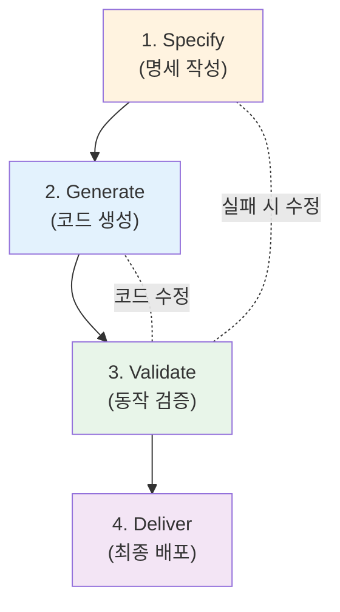

# 마이크로 세션: 033 — SDD(Specification-Driven Development)의 이해

> **세션 ID**: MS-PY101-033  
> **소요 시간**: 20분  
> **난이도**: high  
> **청크 타입**: narrative

---

## §1. 개요

> **Day 2 | AM | 세션 033/106**

### 🎯 학습 목표

이 세션이 끝나면, 수강생 여러분은 SDD의 4단계 사이클(Specify→Generate→Validate→Deliver)과 3대 원칙을 명확하게 설명할 수 있게 됩니다.

### 선행 세션 환기

세션-032에서 우리는 5W1H 방법론으로 막연한 아이디어를 구체적인 요구사항으로 도출하는 방법을 배웠습니다. 이제 그렇게 뽑아낸 요구사항을 어떻게 실제 개발 과정에 체계적으로 적용할지 그 전체 지도를 살펴볼 차례입니다.

### 과정 환경 안내

수업 환경은 이전과 동일하게 **Windows 11**, **Gemini 3.1 Pro**, **Antigravity IDE(v1.18.4)**를 사용합니다.

---

## §2. 핵심 개념 (+ 🗣️ 강사 대본 + Mermaid)

여러분, 세상에 설계도 하나 없이 감으로만 집을 짓기 시작하는 건축가가 있을까요? 아마 단 한 명도 없을 것입니다. 그런데 정말 이상하게도 수많은 사람들이 소프트웨어 코드를 만들 때는 명확한 설계도 없이 일단 키보드부터 두드리고 봅니다. 오늘 우리가 배울 SDD, 즉 명세 기반 개발은 바로 이 'AI 시대의 설계도'를 체계적으로 작성하고 활용하는 방법론입니다.

SDD의 원리를 이해하기 위해 건축의 설계도면과 시공 프로세스를 떠올려보시기 바랍니다. SDD는 본질적으로 이 건축 프로세스와 완벽하게 동일합니다. 여러분은 건축가로서 어떤 집을 지을지 완벽한 설계도를 그리고, AI는 여러분의 지시를 따르는 성실한 시공팀이 되어 건물을 올립니다. 그 후 다시 여러분이 감리가 되어 건물이 제대로 지어졌는지 꼼꼼히 검수하고, 완벽하다고 판단될 때 비로소 입주를 하게 됩니다. 만약 설계도 없이 무작정 시공팀에게 건물을 지으라고 지시한다면, 벽돌이 어디로 갈지 창문이 어디에 달릴지 아무도 예측할 수 없는 끔찍한 결과가 나올 것입니다. 명세서 없이 AI에게 막연하게 코딩을 맡기는 것도 이와 같이 매우 위험한 도박입니다. AI 시대의 서사에서 우리가 내린 결론, 즉 '목적지를 정하는 것은 사람이어야 한다'는 원칙이 바로 이 SDD 방법론을 통해 가장 구체적이고 실질적인 형태로 구현됩니다.

🗣️ **강사 대본 (Instructor Script)**:

> 여러분, 세상에 설계도 없이 집을 짓는 건축가가 있을까요? 없죠! 그런데 많은 사람들이 코드를 만들 때는 설계도 없이 그냥 에디터를 열고 바로 시작해요. 오늘 배울 SDD는 'AI 시대의 설계도' 작성법입니다.
>
> SDD, 풀어서 말하면 Specification-Driven Development, 즉 명세 기반 개발입니다. 이름이 좀 길고 어려워 보이지만, 핵심은 정말 간단해요. 4단계 사이클만 기억하시면 됩니다. 먼저 명세서라는 이름의 설계도를 명확히 쓰고, 이것을 Specify 단계라고 부릅니다. 그다음 AI에게 그 명세서를 바탕으로 코드를 만들게 하는 Generate 단계를 거칩니다. 코드가 나오면 우리가 의도한 대로 잘 만들었는지 꼼꼼하게 검증하는 Validate 단계를 수행하죠. 마지막으로 모든 것이 완벽하다면 최종적으로 납품하고 배포하는 Deliver 단계로 마무리합니다.
>
> 이 과정은 건축가가 설계도를 그리고, 시공팀이 건물을 짓고, 감리가 검수하고, 최종 입주하는 과정과 똑같아요. 이 과정에서 여러분이 건축가이자 감리 역할을 맡고, AI가 무한히 성실한 시공팀 역할을 담당하는 겁니다. SDD의 4단계를 항상 기억하세요. Specify, Generate, Validate, Deliver. 이 순서와 원칙만 철저하게 따르면, 비록 코딩 경험이 전혀 없다고 하더라도 AI와 함께 훌륭하고 안정적인 프로그램을 만들어낼 수 있어요!

### Mermaid 다이어그램



---

## §3. 상세 내용

왜 굳이 이렇게 번거로워 보이는 SDD 프로세스를 따라야 하는지 궁금하실 수 있습니다. 그것은 AI를 도구로 활용하는 현대의 개발 환경이 과거와 근본적으로 달라졌기 때문입니다. 과거에는 개발자가 코드 한 줄 한 줄의 논리를 직접 고민하며 타이핑했습니다. 하지만 이제 우리는 AI라는 초고속 코드 생성기를 손에 넣었습니다. 생성 속도가 상상을 초월할 정도로 빨라졌기 때문에, 방향이 1도만 틀어져도 눈 깜짝할 사이에 엉뚱한 목적지에 도달해 버립니다. 그래서 가장 중요한 것은 코드를 빨리 짜는 것이 아니라, 우리가 무엇을 원하는지 '정확하고 오해의 소지가 없게' 문서화하는 것입니다. 이 명확한 문서화가 바로 Specify 단계의 본질이며 SDD의 핵심입니다.

SDD를 실무에 적용하기 위해서는 세 가지 핵심 원칙을 반드시 지켜야 합니다. 첫째, 모든 코딩 작업은 반드시 명세서 작성이 선행되어야 한다는 원칙입니다. 둘째, 검증 기준, 즉 어떻게 테스트할 것인지를 코드를 만들기 전에 미리 명확히 정해두어야 합니다. 셋째, AI가 생성한 코드는 무조건 한 번은 사람이 직접 실행해보고 검증하는 과정을 거쳐야 합니다. 이 3대 원칙을 여러분이 진행할 프로젝트에 직접 적용해본다고 가정해봅시다. 예를 들어 도서 관리 프로그램을 만들고자 할 때, 에디터를 열고 무작정 파이썬 코드를 치는 것이 아닙니다. 먼저 빈 메모장을 열고 도서를 어떻게 추가하고 삭제할 것인지 규칙을 글로 꼼꼼하게 적어 내려가야 합니다. 이것이 명세를 주도하는 개발의 첫걸음입니다.

규칙을 명확하게 글로 적는 과정을 무사히 마쳤다면, 그다음은 그 글을 AI에게 전달하여 실제로 돌아가는 파이썬 코드로 변환해달라고 요청하는 단계로 넘어갑니다. AI가 순식간에 코드를 뱉어내면, 우리는 감리관의 모자를 쓰고 애초에 적어두었던 규칙대로 프로그램이 꼼꼼하게 동작하는지 테스트합니다. 만약 책이 지워지지 않는 버그가 발견된다면, 코드를 직접 고치며 끙끙대는 대신 다시 설계도인 명세서로 돌아갑니다. 명세서에 '삭제 기능'에 대한 설명이 부족하지 않았는지 확인하고, 이를 더 구체적으로 보완한 뒤 AI에게 다시 시공을 지시하는 것입니다. 이렇게 하면 소프트웨어의 구조는 언제나 튼튼하게 유지됩니다.

> ✅ **체크포인트**:
> - SDD의 4단계 사이클을 순서대로 나열하고 각각의 역할을 설명할 수 있나요?
> - 명세서를 먼저 작성해야 하는 이유를 건축의 비유를 들어 설명할 수 있나요?

---

## §4. 실습 가이드 (+ 🎙️ 실습 대본)

### 실습 목표

이 세션은 내러티브 타입으로 구성되어 있어 별도의 직접적인 키보드 타이핑 실습은 진행하지 않습니다. 대신 SDD의 원리와 중요성을 머릿속에 확실히 각인하는 사고 훈련에 집중합니다.

🎙️ **실습 가이드 대본 (Lab Guide Script)**:

> 여러분, 지금 당장 키보드에 손을 올리지 않으셔도 좋습니다. 대신 눈을 감고 방금 배운 네 가지 단계를 마음속으로 그려보세요. 여러분이 멋진 스마트폰 앱을 하나 떠올렸다고 상상해보는 겁니다.
>
> 가장 먼저 무엇을 해야 할까요? 맞습니다, 화면 구성과 기능을 종이에 꼼꼼하게 적어보는 Specify 단계입니다. 그 글을 AI에게 던져주면 코드가 쏟아져 나오는 Generate 단계가 이어지겠죠. 그리고 여러분은 스마트폰에 직접 그 앱을 설치해보고 버튼들을 틱틱 눌러보며 테스트하는 Validate 단계를 거칠 겁니다. 마지막으로 친구들에게 자랑스럽게 앱스토어 링크를 보내는 Deliver 단계로 끝이 납니다. 이 흐름을 완전히 체화하시는 것이 앞으로의 모든 실습의 기반이 됩니다.

### 단계별 지시

| 단계 | 소요 시간 | 강사 지시사항 | 학습자 액션 | 예상 결과 |
|------|----------|--------------|------------|----------|
| 1 | 5분 | SDD 개념 도입 및 건축 비유 설명 | 경청 및 개념 메모 | 명세 기반 개발의 직관적 이해 |
| 2 | 8분 | 4단계 사이클 상세 설명 | 흐름도 이해 및 필기 | 4단계 프로세스 완벽 숙지 |
| 3 | 5분 | 3대 원칙 및 실제 적용 시나리오 안내 | 실제 적용법 사고 연습 | 실무 적용 방법론 체화 |
| 4 | 2분 | 핵심 내용 요약 및 다음 세션 예고 | 질의응답 | 학습 목표 완전 달성 |

### 트러블슈팅 FAQ

| Q | A |
|---|---|
| 명세서를 완벽하게 쓰기 너무 어려울 것 같아요 | 처음에는 시간이 걸리지만, 이 단계를 잘 하면 나머지 단계가 훨씬 빨라져요 |
| Validate에서 문제가 나오면 어떡하나요? | 1단계(Specify)로 돌아가서 명세서를 수정하고 다시 Generate하세요. 이것이 SDD의 사이클이에요 |
| SDD를 매번 다 해야 하나요? | 간단한 프로그램은 축약할 수 있지만, 복잡한 프로그램일수록 SDD가 빛을 발해요 |

---

## §5. 코드 및 명령어 모음

### SDD 점검 시뮬레이션

이 세션에서는 실행 코드가 제공되지 않지만, 프로젝트를 시작할 때 스스로에게 던져야 할 SDD 점검 질문을 다음과 같이 활용할 수 있습니다.

```text
[SDD 점검 체크리스트]

1. Specify 점검: "지금 만들려는 기능이 한국어(또는 자연어)로 명확히 적혀 있는가?"
2. Validate 점검: "이 기능이 완성되었을 때, 어떤 조작을 해서 테스트할지 미리 정했는가?"
3. Generate/Deliver 점검: "코드를 눈으로만 보지 않고 실제로 실행시켜서 오류가 없는지 직접 확인했는가?"
```

---

## §6. 요약

### 핵심 학습 포인트

우리는 코딩에 앞서 가장 중요한 설계도 작성법, 즉 SDD(명세 기반 개발)에 대해 배웠습니다. SDD는 요구사항을 명확히 문서화하는 Specify, AI를 통해 코드를 만들어내는 Generate, 결과물이 의도대로 동작하는지 확인하는 Validate, 그리고 최종적으로 배포하는 Deliver의 네 가지 단계로 쉼 없이 순환합니다. 

이 방법론은 단순히 규칙을 나열한 것이 아닙니다. 목적지를 정하는 것은 사람이고, 그곳으로 향하는 엔진은 AI가 담당한다는 'AI 시대의 서사'를 개발 현장에서 가장 완벽하게 실천하는 마스터 키입니다.

### 다음 세션 예고

설계도의 중요성과 작성하는 방법론적 원리를 충분히 이해하셨을 것입니다. 머리로 이해했다면 이제 손으로 체득할 차례입니다. 다음 세션에서는 AI의 도움을 받아 초기 아이디어를 체계적인 요구사항 문서로 직접 작성해 보는 실습을 진행하겠습니다.

### 브릿지 노트

> "설계도 작성법인 SDD의 사이클을 완벽히 이해하셨습니다! 이제 이 프로세스를 바탕으로 다음 세션에서는 AI를 든든한 파트너 삼아 실제로 요구사항 문서를 작성해 보는 실습의 세계로 뛰어들어 봅시다."

---

## §7. 참고 자료

### 3-Source 출처

- **로컬 참고자료**: 'AI 시대의 서사 §SDD' — 명세 기반 개발의 개념 설명 및 3대 원칙 근거 자료
- **로컬 참고자료**: '기획 가이드 §7.2' — 요구사항 도출 및 SDD 사이클의 이론적 배경
- **딥리서치**: 비즈니스 분석 5W1H 프레임워크 — 요구사항 도출의 체계적 접근법 참고

### 용어 정리

| 용어 | 설명 |
|------|------|
| SDD | Specification-Driven Development의 약자. 코드를 짜기 전 명세를 먼저 작성하고 이를 기반으로 개발을 진행하는 방법론 |
| Specify | 소프트웨어가 어떤 동작을 해야 하는지 요구사항을 명확한 자연어 문서로 명시하는 첫 번째 단계 |
| Validate | 생성된 코드가 애초에 작성한 명세서의 요구조건을 완벽히 충족하는지 검증하고 테스트하는 단계 |

### 관련 세션 연결 지도

| 이 세션의 개념 | 다시 등장하는 세션 | 어떻게 활용되는지 |
|---|---|---|
| Specify 단계 | 세션 034, 035, 036 | 요구사항 작성 실습 및 PRD 작성 시 명세화의 기본 원칙으로 적용 |
| Generate 단계 | 세션 041 | 프롬프트를 통해 실제 코드를 생성하는 실습의 이론적 토대 |
| Validate 단계 | 세션 041 | 생성된 코드를 실행하고 오류를 점검하며 완성하는 기준으로 활용 |

---

*작성 일시: 2026-02-25*  
*작성 에이전트: Sisyphus-Junior*  
*교안 구조: 7섹션 (A0 팀 공통 표준)*
