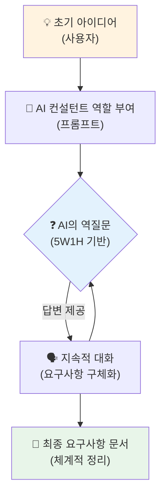

# 마이크로 세션: 034 — AI와 함께하는 요구사항 작성 실습

> **세션 ID**: MS-PY101-034  
> **소요 시간**: 25분  
> **난이도**: medium  
> **청크 타입**: lab

---

## §1. 개요

> **Day 2 | AM | 세션 034/106**

### 🎯 학습 목표

이 세션이 끝나면, 수강생 여러분은 AI를 활용하여 초기 아이디어를 체계적인 요구사항 문서로 매끄럽게 변환할 수 있게 됩니다.

### 선행 세션 환기

지난 세션에서 우리는 SDD의 첫 번째이자 가장 중요한 관문인 Specify 단계의 중요성을 건축 설계도에 빗대어 깊이 이해했습니다. 이제는 그 막연했던 이론을 현실의 실습으로 가져와, 머릿속에만 있던 흩어진 생각들을 활자화된 요구사항으로 직접 뽑아내는 작업을 시작할 것입니다.

### 과정 환경 안내

실습 환경은 이전과 변함없이 **Windows 11**, **Gemini 3.1 Pro**, **Antigravity IDE(v1.18.4)**를 사용합니다.

---

## §2. 핵심 개념 (+ 🗣️ 강사 대본 + Mermaid)

요구사항을 백지상태에서 혼자 처음부터 끝까지 작성하려고 하면 누구나 막막함을 느낍니다. 어디서부터 시작해야 할지, 무엇을 빼먹었는지 확신하기 어렵기 때문입니다. 하지만 이제 우리에게는 지치지 않는 훌륭한 파트너인 AI가 있습니다. AI를 단순한 답변 기계가 아니라 끊임없이 질문을 던지는 컨설턴트로 활용한다면, 이 막막한 과정은 즐거운 대화의 시간으로 바뀔 수 있습니다. 

여러분이 유능한 비즈니스 컨설턴트를 찾아가 아이디어를 털어놓는다고 생각해보세요. 여러분이 대략적인 구상을 말하면, 경험이 풍부한 컨설턴트는 "이 서비스의 주 대상은 누구인가요?", "결제 시스템은 어떻게 구성하실 계획인가요?", "개인정보 보호 같은 제약 조건은 고려하셨나요?"라고 예리한 질문들을 쏟아냅니다. 그 질문들에 하나씩 답을 하다 보면 어느새 아이디어가 뼈대를 갖춘 완벽한 기획안으로 탈바꿈하게 되죠. AI에게 바로 이 '컨설턴트의 역할'을 정확하게 부여하면, 우리는 똑같은 컨설팅 효과를 비용 한 푼 들이지 않고 얻을 수 있습니다. 혼자서 머리를 쥐어짜며 고민하는 시대는 지났고, 이제는 똑똑한 파트너와 함께 대화하며 설계를 다듬어가는 협업의 시대가 온 것입니다.

🗣️ **강사 대본 (Instructor Script)**:

> 여러분, 요구사항을 백지에 혼자 쓰려면 정말 막막하죠? 어디서부터 써야 할지 감도 안 오고, 뭔가 빼먹은 것 같은 찝찝함도 남습니다. 그런데 이제는 혼자 고민할 필요가 전혀 없어요. AI가 아주 훌륭한 파트너로서 여러분을 도와줄 수 있기 때문입니다. 핵심은 AI에게 단답형 정답을 요구하는 것이 아니라, 여러분에게 '질문하게 만드는 것'입니다. 
>
> AI를 정말 경험이 풍부하고 유능한 컨설턴트라고 생각해보세요. 여러분이 아이디어를 말하면, 컨설턴트는 가만히 듣고만 있지 않습니다. "주요 사용자의 연령대는 어떻게 되나요?", "가장 중요하게 생각하는 핵심 기능이 무엇인가요?", "예산이나 시간 같은 제약 조건은요?"라고 끊임없이 날카로운 질문을 던질 겁니다. 우리는 AI에게 프롬프트를 통해 바로 이 컨설턴트의 역할을 완벽하게 부여할 수 있어요. 
>
> 프롬프트 창에 이렇게 요청해 보시는 겁니다. "소프트웨어 요구사항 분석 전문가로서, 내가 만들고 싶은 프로그램의 요구사항을 정리하는 것을 도와줘. 먼저 내 아이디어를 듣고, 5W1H 기반으로 빠뜨린 항목을 질문해줘." 그다음 "도서 대출 관리 프로그램을 만들고 싶어"라고 툭 던져보세요. AI가 여러분의 아이디어를 구체화하기 위해 얼마나 꼼꼼하고 날카로운 질문들을 던지는지 직접 두 눈으로 확인하시게 될 겁니다!

### Mermaid 다이어그램



---

## §3. 상세 내용

AI에게 요구사항 도출을 맡기는 과정에서 가장 중요한 기술은 일방적인 지시가 아니라 양방향 '대화형 핑퐁'을 유도하는 것입니다. 많은 사람들이 AI에게 아이디어를 던져주고 한 번에 완벽한 기획서를 내놓으라고 강요하지만, 그렇게 얻은 문서는 영혼이 없고 실제 개발 상황에 맞지 않는 껍데기에 불과한 경우가 많습니다. 진정으로 쓸모 있는 요구사항을 얻기 위해서는 AI가 우리에게 질문할 수 있는 여지를 열어주어야 합니다. "내가 빠뜨린 것이 있다면 질문해 줘"라는 단 한 문장이 전체 결과물의 퀄리티를 완전히 뒤바꿔 놓습니다.

이 대화형 프로세스를 실무에 적용하는 구체적인 방법은 3단계로 이루어집니다. 첫 번째 단계에서는 명확한 페르소나와 임무를 부여합니다. "너는 20년 차 소프트웨어 아키텍트이자 요구사항 분석가야. 지금부터 내 아이디어를 듣고 5W1H 방법론에 입각해서 빠진 부분을 채워주는 질문을 해줘"라고 명확히 선언하는 것입니다. 두 번째 단계는 대화의 주고받음입니다. AI가 질문을 던지면 우리는 그에 맞춰 "사용자는 1인 마켓 운영자야", "비용은 무료여야 해"처럼 아는 만큼만 편하게 대답합니다. 이 과정을 세 번에서 다섯 번 정도 반복하면 아이디어의 해상도가 놀라울 정도로 뚜렷해집니다.

마지막 세 번째 단계는 이 모든 대화를 공식적인 문서의 형태로 깔끔하게 요약해 달라고 요청하는 것입니다. "지금까지 우리가 나눈 대화를 바탕으로, 전체 요구사항을 빠짐없이 마크다운 형식의 문서로 정리해 줘"라고 지시하면 됩니다. 이렇게 하면 흩어져 있던 우리의 생각들이 구조화된 텍스트로 탈바꿈합니다. 예를 들어 도서 대출 관리 프로그램을 기획할 때, 단순히 "책 빌려주는 프로그램 짜줘"라고 했던 막연한 생각은 대화를 거치며 대출 기한, 연체 기록, 도서 검색 기능이 모두 포함된 촘촘하고 단단한 기획안으로 다시 태어납니다.

> ✅ **체크포인트**:
> - AI에게 정답을 요구하는 대신 '질문'을 유도하는 프롬프트 작성법을 설명할 수 있나요?
> - 대화형으로 요구사항을 발전시키는 3단계 과정을 순서대로 나열할 수 있나요?

---

## §4. 실습 가이드 (+ 🎙️ 실습 대본)

### 실습 목표

수강생은 AI 모델에 분석가 페르소나를 부여한 뒤 역질문을 유도하고, 반복적인 대화를 통해 막연한 아이디어를 체계적인 요구사항 문서로 구체화하는 능력을 습득합니다.

🎙️ **실습 가이드 대본 (Lab Guide Script)**:

> 자, 이제 실전입니다! 여러분 앞에 유능한 기획 컨설턴트가 앉아있다고 생각하세요. 먼저 AI에게 든든한 역할을 부여하는 프롬프트를 입력할 겁니다. "너는 소프트웨어 요구사항 분석 전문가야. 내가 아이디어를 말하면, 5W1H를 기반으로 빠진 부분을 하나씩 질문해줘"라고 입력하세요.
>
> 그리고 여러분이 만들고 싶은 프로그램 아이디어 하나를 편하게 던져보세요. 예시로 "도서 대출 관리 프로그램을 만들고 싶어"라고 해볼까요? AI가 어떤 질문들을 던지는지 보세요. 그 질문들에 완벽한 문장이 아니어도 좋으니 단답형으로라도 대답을 해주세요. 이렇게 서너 번 티키타카를 주고받은 뒤에, "지금까지 나눈 이야기를 바탕으로 요구사항 문서로 깔끔하게 정리해 줘"라고 최종 요청을 해보시기 바랍니다. 자, 지금부터 15분간 AI와 치열한 대화를 시작해봅시다!

### 단계별 지시

| 단계 | 소요 시간 | 강사 지시사항 | 학습자 액션 | 예상 결과 |
|------|----------|--------------|------------|----------|
| 1 | 5분 | "AI에게 요구사항 분석 전문가 역할을 부여하고, 아이디어를 전달하세요" | 지정된 프롬프트 작성 및 입력 | AI가 5W1H 기반 질문을 시작 |
| 2 | 12분 | "AI의 질문에 답하며 요구사항을 구체화하세요. 최소 5번 이상 대화하세요" | AI의 질문을 읽고 구체적 답변 제공 | 점점 뼈대를 갖추고 구체화되는 요구사항 목록 |
| 3 | 8분 | "AI에게 지금까지의 대화를 요구사항 문서로 정리해달라고 요청하세요" | 최종 정리 프롬프트 입력 및 결과물 검토 | 체계적이고 구조화된 요구사항 문서 완성 |

### 트러블슈팅 FAQ

| Q | A |
|---|---|
| AI가 너무 많은 질문을 한꺼번에 쏟아내요 | 프롬프트에 "한 번에 하나의 질문만 해줘"라는 제약을 추가하면 대화가 훨씬 수월해집니다. |
| AI의 질문에 어떻게 대답해야 할지 모르겠어요 | 모르는 것은 "그 부분은 아직 생각해보지 않았어. 네가 추천해 줄래?"라고 되물어보세요. 훌륭한 아이디어를 제시해 줍니다. |
| 요구사항 문서 결과물이 너무 복잡해요 | "초보자가 이해할 수 있는 쉬운 용어로 핵심 기능 3가지만 요약해줘"라고 포맷을 다시 지정해 주시면 됩니다. |

---

## §5. 코드 및 명령어 모음

### 요구사항 도출을 위한 초기 프롬프트 예시

이 프롬프트는 AI에게 전문가 역할을 부여하고 양방향 대화를 시작하는 가장 강력한 문구입니다. 실습에 그대로 복사하여 사용할 수 있습니다.

```text
너는 20년 차 소프트웨어 요구사항 분석 전문가야. 
나는 코딩 초보자이고, 내 막연한 아이디어를 구체적인 프로그램으로 만들고 싶어.

지금부터 내가 만들고 싶은 프로그램의 핵심 아이디어를 말할게.
너는 내 이야기를 듣고, 5W1H(누가, 무엇을, 언제, 어디서, 왜, 어떻게) 관점에서
아직 부족하거나 구체화가 필요한 부분을 나에게 질문해 줘.

주의사항:
1. 한 번에 모든 것을 묻지 말고, 한 번에 최대 2개의 핵심 질문만 해 줘.
2. 내가 대답하면, 그 대답을 반영해서 다음 질문을 이어가 줘.

내 아이디어: "작은 동네 책방에서 쓸 도서 대출 관리 프로그램을 만들고 싶어."
```

### 최종 문서 요약 프롬프트 예시

충분한 대화를 나눈 뒤, 지금까지의 컨텍스트를 하나의 결과물로 뽑아내는 프롬프트입니다.

```text
지금까지 우리가 나눈 대화를 모두 종합해 줘.
이 내용을 바탕으로 소프트웨어 개발에 바로 사용할 수 있는 
깔끔한 '요구사항 명세서'를 마크다운 형식으로 정리해 줘.
대상 사용자, 핵심 기능 목록, 제약 조건이 반드시 포함되어야 해.
```

---

## §6. 요약

### 핵심 학습 포인트

이번 실습을 통해 우리는 AI를 단순한 코드 생성기가 아닌, 똑똑한 기획 파트너이자 컨설턴트로 활용하는 방법을 몸소 체험했습니다. AI에게 전문가 페르소나를 부여하고 역질문을 유도함으로써, 우리는 혼자서는 결코 쉽게 떠올릴 수 없는 코너 케이스들과 숨겨진 제약 사항들을 안전하게 도출할 수 있었습니다. 

대화형 프롬프팅은 아이디어를 다듬는 가장 훌륭한 도구이며, 지속적인 핑퐁 대화를 통해 완성된 요구사항 문서는 훗날 작성할 모든 코드의 가장 든든한 뼈대가 되어 줄 것입니다.

### 다음 세션 예고

AI와의 치열한 대화를 통해 얻어낸 소중한 요구사항 목록을 손에 쥐셨습니다. 이 훌륭한 재료들을 이제는 개발자들의 세계에서 통용되는 공식적인 설계 도면으로 예쁘게 포장할 차례입니다. 다음 세션에서는 이 요구사항을 PRD라는 공식 문서 형태로 변환하는 전문적인 방법에 대해 알아보겠습니다.

### 브릿지 노트

> "오늘 AI 컨설턴트와의 대화를 통해 여러분의 막연했던 아이디어가 멋진 요구사항 문서로 탈바꿈했습니다. 훌륭한 재료가 준비되었으니, 다음 세션에서는 이 재료들을 실제 현업에서 사용하는 완벽한 형태의 PRD 문서로 조립하는 방법을 배워봅시다!"

---

## §7. 참고 자료

### 3-Source 출처

- **로컬 참고자료**: '기획 가이드 §7.1' — AI 활용 요구사항 도출 기법 및 대화형 프롬프트 설계 지침
- **로컬 참고자료**: '프롬프트 설계안 §2.4' — 페르소나 부여 및 역질문 유도 프롬프트 구조
- **NotebookLM**: (자체 생성) — AI 기반 요구사항 분석의 컨설턴트 비유 시나리오

### 용어 정리

| 용어 | 설명 |
|------|------|
| 대화형 프롬프팅 | AI에게 단발성 명령을 내리는 대신, 지속적으로 맥락을 주고받으며 결과를 구체화하는 프롬프트 기법 |
| 페르소나 부여 | AI에게 특정 직업이나 전문가(예: 요구사항 분석가)의 역할을 설정해주어 답변의 전문성을 높이는 방법 |
| 역질문 프롬프트 | AI가 일방적으로 답변을 제시하지 않고, 사용자의 의도를 명확히 파악하기 위해 사용자에게 질문을 던지도록 지시하는 기법 |

### 관련 세션 연결 지도

| 이 세션의 개념 | 다시 등장하는 세션 | 어떻게 활용되는지 |
|---|---|---|
| 대화형 프롬프팅 | 세션 038 | PRD 완성하기 실습에서 부족한 기능을 AI와 대화하며 보완할 때 사용 |
| 요구사항 도출 결과물 | 세션 035, 036 | 여기서 만든 요구사항 텍스트가 PRD 문서와 기능 명세(FR) 작성의 원천 데이터로 쓰임 |
| 역질문 기법 | 세션 041 | 코드를 생성하고 디버깅할 때 원인을 파악하기 위한 AI와의 티키타카에 응용 |

---

*작성 일시: 2026-02-25*  
*작성 에이전트: Sisyphus-Junior*  
*교안 구조: 7섹션 (A0 팀 공통 표준)*