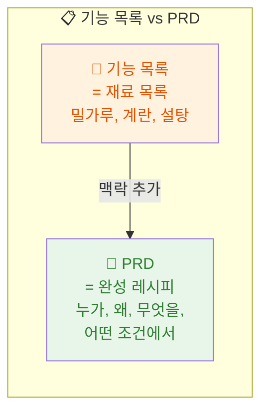

# 마이크로 세션: 035 — PRD(Product Requirements Document)란 무엇인가?

> **세션 ID**: MS-PY101-035  
> **소요 시간**: 20분  
> **난이도**: low  
> **청크 타입**: narrative

---

## §1. 개요

> **Day 2 | AM | 세션 035/106**

### 🎯 학습 목표

이 세션이 끝나면, 수강생 여러분은 PRD의 정의와 단순 기능 목록과의 차이점을 설명할 수 있게 됩니다. '파스타 만들어줘'와 '크림소스 파스타 2인분, 베이컨 넣고 파르메산 치즈 올려서 만들어줘' — 어떤 주문이 원하는 결과에 더 가까울까요?

### 선행 세션 환기

세션-034에서 AI와 함께 요구사항을 작성해봤어요. 막연한 아이디어가 체계적인 요구사항 목록으로 변했죠? 이제 이 요구사항을 공식 문서 형태로 만드는 법을 배울 차례예요.

### 과정 환경 안내

환경은 동일합니다. **Windows 11**, **Gemini 3.1 Pro**, **Antigravity IDE(v1.18.4)**.

---

## §2. 핵심 개념 (+ 🗣️ 강사 대본 + Mermaid)

### 재료 목록 vs 완성된 레시피

기능 목록은 '밀가루, 계란, 설탕'처럼 재료만 나열한 거예요. 재료만 있으면 요리를 할 수 있을까요? 아니죠! 순서, 불 세기, 시간까지 적혀 있어야 해요. PRD는 '180도 오븐에서 25분간 굽는 바닐라 케이크 레시피'처럼 전체 맥락이 담긴 완성형 문서입니다.

AI에게 재료만 주면 엉뚱한 요리가 나오지만, 레시피를 주면 원하는 결과물을 받을 수 있어요. 네비게이션에 '서울'이라고만 입력하면 어디로 갈지 모르지만, '서울 강남구 테헤란로 123'이라고 입력하면 정확히 도착하는 것과 같은 원리예요.

🗣️ **강사 대본 (Instructor Script)**:

> 여러분, '파스타 만들어줘'와 '크림소스 파스타 2인분, 베이컨 넣고 파르메산 치즈 올려서 만들어줘' — 어떤 주문이 원하는 결과에 더 가까울까요? 당연히 두 번째죠!
>
> PRD — Product Requirements Document, 제품 요구사항 문서예요. '기능 목록'과 뭐가 다르냐고요? 기능 목록이 '재료 목록'이라면, PRD는 완성된 '레시피'예요. 누가(사용자), 왜(목적), 무엇을(기능), 어떤 조건에서(제약사항) 만들 것인지가 모두 담긴 완성형 문서입니다.
>
> PRD라는 이름이 좀 무섭죠? 하지만 걱정 마세요. 우리가 앞에서 배운 5W1H와 SDD를 합치면 자연스럽게 PRD가 완성돼요. 이미 도구는 다 가지고 계세요!

> 💡 **강사 노트**: PRD라는 용어에 위축되지 않도록 "이미 배운 것들의 조합"이라는 점을 강조하세요. 기능 목록과 PRD의 차이를 레시피 비유로 반복 설명하면 효과적입니다.

### Mermaid 다이어그램



---

## §3. 상세 내용

### Why — 왜 PRD가 필요한가?

기능 목록만으로는 소프트웨어를 만들 수 없어요. "고객 등록 기능", "고객 조회 기능"이라고만 적으면, 누가 사용하는지, 어떤 데이터를 입력하는지, 에러가 나면 어떻게 처리하는지 알 수 없거든요.

PRD는 이 모든 맥락을 담는 문서예요. 개발자(또는 AI)가 PRD만 읽으면 "아, 이렇게 만들면 되겠구나"라고 바로 이해할 수 있어야 해요. 설계도 없이 집을 지을 수 없듯이, PRD 없이 프로그램을 만들면 원하는 결과와 멀어지게 됩니다.

특히 AI에게 코드를 생성시킬 때, PRD의 품질이 곧 코드의 품질을 결정해요. PRD는 AI에게 주는 '정확한 주소'입니다.

### What — PRD의 정의와 구성

**PRD(Product Requirements Document)**는 제품 요구사항 문서예요. 단순 기능 목록과의 핵심 차이점은 '맥락'이 있다는 거예요.

기능 목록이 담는 것: **무엇을** (기능 이름만)
PRD가 담는 것: **누가**(대상 사용자) + **왜**(목적) + **무엇을**(기능 상세) + **어떤 조건에서**(제약사항)

PRD의 기본 구성 요소는 다음과 같아요.

- **프로젝트 개요**: 이 프로그램이 무엇이고 왜 만드는지
- **대상 사용자**: 누가 이 프로그램을 사용하는지
- **기능 명세**: 각 기능의 상세 설명 (입력, 출력, 동작)
- **비기능 요구사항**: 성능, 보안, 사용성 등
- **제약 조건**: 기술적·환경적 제한 사항

### How — 기능 목록을 PRD로 발전시키기

기능 목록에서 PRD로 발전시키는 과정을 예시로 볼게요.

**기능 목록 (재료 목록)**:
- 고객 등록
- 고객 조회
- 고객 수정
- 고객 삭제

**PRD (완성 레시피)**:
- **프로젝트 개요**: 소규모 사업장의 고객 정보를 관리하는 CLI 프로그램
- **대상 사용자**: IT 비전공 소규모 사업장 운영자
- **기능 명세**: 고객 등록 시 이름(필수), 전화번호(필수), 이메일(선택)을 입력받아 저장
- **제약 조건**: Python 3.x, 파일 기반 저장, 한국어 인터페이스

같은 "고객 등록"이라도 PRD에서는 누가, 어떤 데이터를, 어떤 조건으로 등록하는지가 명확해지죠?

> ✅ **체크포인트**:
> - PRD와 단순 기능 목록의 차이를 설명할 수 있나요?
> - PRD의 기본 구성 요소 5가지를 기억하고 있나요?

---

## §4. 실습 가이드 (+ 🎙️ 실습 대본)

### 실습 목표

이 세션은 narrative 타입으로 별도 실습은 없지만, 개념 이해를 위한 사고 실험을 진행합니다.

🎙️ **실습 가이드 대본 (Lab Guide Script)**:

> 자, 간단한 사고 실험을 해볼게요. "가계부 프로그램"의 기능 목록을 떠올려보세요. 수입 등록, 지출 등록, 잔액 조회... 이것만으로 프로그램을 만들 수 있을까요?
>
> 이제 PRD 관점에서 생각해보세요. 누가 쓰나요? 왜 필요한가요? 수입 등록 시 어떤 데이터를 입력하나요? 카테고리는 있나요?
>
> 기능 목록에서 PRD로 바뀌면 얼마나 구체적이 되는지 느껴지시죠?

### 단계별 지시

| 단계 | 소요 시간 | 강사 지시사항 | 학습자 액션 | 예상 결과 |
|------|----------|--------------|------------|----------|
| 1 | 5분 | 레시피 비유로 PRD 개념 도입 | 경청 및 메모 | 비유를 통한 직관적 이해 |
| 2 | 8분 | PRD 구성 요소 상세 설명 | 경청 및 질문 | PRD 구조 이해 |
| 3 | 4분 | 기능 목록 → PRD 변환 예시 | 비교 분석 | 차이점 체감 |
| 4 | 3분 | 가계부 사고 실험 | 짝과 토론 | 학습 목표 달성 |

### 트러블슈팅 FAQ

| Q | A |
|---|---|
| PRD를 매번 이렇게 자세히 써야 하나요? | 프로그램이 복잡할수록 PRD가 중요해요. 간단한 프로그램은 축약할 수 있지만, 습관을 들이는 게 좋아요 |
| PRD와 SDD는 어떤 관계인가요? | PRD 작성이 SDD의 Specify 단계에 해당해요. PRD가 SDD의 핵심 산출물이에요 |

---

## §5. 코드 및 명령어 모음

### 기능 목록 vs PRD 비교표

```
[기능 목록 vs PRD 비교]

┌─────────────────────────────────────────────┐
│ 기능 목록 (재료 목록)                         │
├─────────────────────────────────────────────┤
│ - 고객 등록                                  │
│ - 고객 조회                                  │
│ - 고객 수정                                  │
│ - 고객 삭제                                  │
│                                             │
│ → 무엇을(What)만 있음                        │
│ → AI가 추측해서 만들어야 함                    │
└─────────────────────────────────────────────┘

┌─────────────────────────────────────────────┐
│ PRD (완성 레시피)                             │
├─────────────────────────────────────────────┤
│ 1. 프로젝트 개요: 소규모 사업장 고객 관리 CLI  │
│ 2. 대상 사용자: IT 비전공 사업장 운영자         │
│ 3. 기능 명세:                                │
│    - 등록: 이름(필수), 전화번호(필수), 이메일   │
│    - 조회: 이름 또는 전화번호로 검색            │
│    - 수정: 기존 데이터 선택 후 변경             │
│    - 삭제: 확인 메시지 후 삭제                  │
│ 4. 비기능: 응답 1초 이내, 한국어 인터페이스     │
│ 5. 제약: Python 3.x, 파일 기반 저장            │
│                                             │
│ → 누가, 왜, 무엇을, 어떤 조건이 모두 있음      │
│ → AI가 정확하게 만들 수 있음                   │
└─────────────────────────────────────────────┘
```

### PRD 기본 구성 요소 체크리스트

```
[PRD 기본 구성 요소]

□ 1. 프로젝트 개요
   □ 프로젝트 이름
   □ 목적 (왜 만드는가?)
   □ 범위 (어디까지 만드는가?)

□ 2. 대상 사용자
   □ 주요 사용자 정의
   □ 사용자의 기술 수준

□ 3. 기능 명세
   □ 각 기능의 상세 설명
   □ 입력/출력 정의
   □ 우선순위 (필수/선택)

□ 4. 비기능 요구사항
   □ 성능, 보안, 사용성

□ 5. 제약 조건
   □ 기술적 제한
   □ 환경적 제한
```

> 🤖 **AI 프롬프트 팁**: AI에게 "기능 목록을 PRD로 변환해줘"라고 요청할 때, "대상 사용자, 입출력, 제약 조건을 포함해줘"라고 구체적으로 지정하면 훨씬 좋은 결과를 얻을 수 있어요.

---

## §6. 요약

### 핵심 학습 포인트

PRD(Product Requirements Document)는 **단순 기능 목록이 아닌 '완성된 레시피'**예요. 기능 목록이 재료만 나열한 것이라면, PRD는 누가, 왜, 무엇을, 어떤 조건에서 만들 것인지가 모두 담긴 완성형 문서입니다.

PRD는 AI에게 주는 '정확한 주소'예요. 주소가 정확할수록 AI가 원하는 목적지에 정확히 도착할 수 있습니다!

### 다음 세션 예고

PRD의 개념을 잡았으니, 다음 세션에서는 PRD의 실제 구조를 살펴보고 기능 명세(FR-001 같은 코드)를 작성하는 법을 배워봅시다!

### 브릿지 노트

> "PRD가 단순 기능 목록이 아닌 '완성된 레시피'라는 것을 이해했어요. 다음 세션에서는 PRD의 실제 구조를 뜯어보고, 기능 식별자(FR-001)를 부여하는 체계적인 작성법을 배워봅시다!"

---

## §7. 참고 자료

### 3-Source 출처

- **로컬 참고자료**: '기획 §7.1' — PRD의 정의와 구성 요소
- **로컬 참고자료**: '세션-034 AI 요구사항 작성' — 요구사항에서 PRD로의 발전 과정
- **딥리서치**: Product Requirements Document Best Practices — PRD 작성 모범 사례 참고

### 용어 정리

| 용어 | 설명 |
|------|------|
| PRD | Product Requirements Document — 제품 요구사항 문서 |
| 기능 목록 | 프로그램이 해야 할 일을 단순 나열한 것 |
| 기능 명세 | 각 기능의 입력, 출력, 동작을 상세히 기술한 것 |
| 비기능 요구사항 | 성능, 보안, 사용성 등 기능 외적인 품질 요구사항 |

### 관련 세션 연결 지도

| 이 세션의 개념 | 다시 등장하는 세션 | 어떻게 활용되는지 |
|---|---|---|
| PRD 정의 | 세션 036-038 | PRD 구조 학습과 실습에서 기본 개념으로 활용 |
| 기능 목록 vs PRD | 세션 067 | Day 4 고객 관리 프로그램 설계에서 PRD 기반 접근 |
| 레시피 비유 | 세션 040 | 미니 프로젝트 PRD 작성 시 비유 재활용 |

---

*작성 일시: 2026-02-26*  
*작성 에이전트: Sisyphus-Junior*  
*교안 구조: 7섹션 (A0 팀 공통 표준)*
