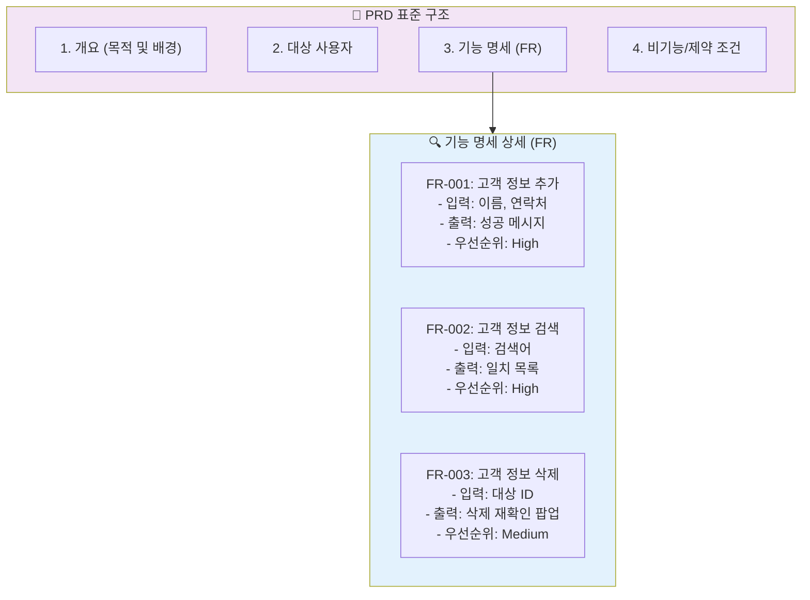

# 마이크로 세션: 036 — PRD의 핵심 구조와 기능 명세(FR) 작성법

> **세션 ID**: MS-PY101-036  
> **소요 시간**: 25분  
> **난이도**: medium  
> **청크 타입**: code

---

## §1. 개요

> **Day 2 | AM | 세션 036/106**

### 🎯 학습 목표

이 세션이 끝나면, 수강생 여러분은 PRD의 표준 템플릿 구조를 완벽하게 파악하고, 각 기능에 기능 식별자(FR-001 등)를 체계적으로 부여하여 명세할 수 있게 됩니다.

### 선행 세션 환기

우리는 지난 세션에서 PRD가 단순한 기능들의 나열이 아니라, 배경과 맥락이 모두 담긴 '완성된 레시피'라는 사실을 깨달았습니다. 이제 이 레시피를 누구나 오해 없이 읽고 똑같은 요리를 만들어낼 수 있도록, 규격화된 표준 양식에 맞추어 작성하는 실무적인 방법을 배울 차례입니다.

### 과정 환경 안내

실습은 변함없이 **Windows 11**, **Gemini 3.1 Pro**, **Antigravity IDE(v1.18.4)** 환경에서 진행합니다.

---

## §2. 핵심 개념 (+ 🗣️ 강사 대본 + Mermaid)

아무리 훌륭한 설계도라 할지라도 사람마다 그리는 방식과 기호가 다르면 시공팀은 혼란에 빠질 수밖에 없습니다. 병원의 의학 차트를 떠올려보시기 바랍니다. 의사마다 각자의 일기장처럼 병상 기록을 중구난방으로 적어둔다면, 교대하는 다른 의사나 간호사가 환자의 상태를 정확히 파악하고 약을 처방할 수 있을까요? 절대 불가능합니다. 그래서 병원에는 어느 누가 작성하고 어느 누가 읽어도 똑같은 정보를 빠르고 정확하게 얻을 수 있는 엄격한 '표준 차트 양식'이 존재합니다. PRD 역시 소프트웨어 개발 세계의 표준 의학 차트와 같습니다. 정해진 목차와 구조에 맞춰 작성해야만 개발자, 디자이너, 그리고 우리의 든든한 파트너인 AI까지 모두가 완벽하게 같은 그림을 공유할 수 있습니다.

이 표준 양식에서 가장 눈여겨봐야 할 핵심 요소는 바로 '기능 식별자(FR, Functional Requirement)'입니다. 병원 차트에서 환자마다 고유한 진료 번호가 부여되는 것처럼, PRD에서는 각각의 세부 기능마다 FR-001, FR-002와 같은 고유한 일련번호표를 붙여줍니다. 이렇게 번호를 매기게 되면 추후 대화나 수정 작업 시 "아까 말했던 그 로그인 기능의 에러 메시지 나오는 부분 있잖아"라고 장황하고 모호하게 설명할 필요가 사라집니다. 단순히 "AI야, FR-003 기능의 코드를 수정해줘"라고 아주 정확하고 깔끔하게 핀포인트로 소통할 수 있게 되며, 이것이 프로젝트의 복잡도를 획기적으로 낮춰주는 마법의 도구가 됩니다.

🗣️ **강사 대본 (Instructor Script)**:

> 여러분, PRD가 레시피이자 설계도라는 걸 배웠죠? 그런데 이 설계도에는 전 세계 개발자들이 공통으로 사용하는 정해진 양식과 규칙이 있습니다. 오늘은 그 양식과, 기능에 번호를 매기는 아주 중요한 기술을 배울 겁니다.
>
> 병원의 의학 차트를 떠올려볼까요? 차트 양식이 표준화되어 있지 않다면 의사들끼리 환자 상태를 공유할 때 엄청난 혼란이 생길 겁니다. PRD도 마찬가지예요. 먼저 '개요' 섹션에서 프로젝트의 전체 목적을 설명하고, '대상 사용자' 섹션에서 누가 쓸지 정의하고, '기능 명세' 섹션에서 각 기능을 상세하게 적어 내려갑니다. 이것이 표준 구조입니다. 
>
> 여기서 가장 중요한 하이라이트는 바로 기능에 이름을 붙이는 방식입니다. 우리는 이것을 FR, 즉 Functional Requirement라고 부르고, 뒤에 번호를 붙여서 FR-001, FR-002처럼 씁니다. 병원 차트 번호처럼 각 기능에 겹치지 않는 고유 번호를 찰칵 매겨주는 거예요. 이렇게 하면 나중에 코드를 수정할 때 "저번에 말했던 비밀번호 까먹었을 때 나오는 그 화면 기능 있잖아"라고 모호하게 말하는 대신, "FR-003 기능의 제약 조건을 수정해줘"라고 너무나도 정확하고 프로페셔널하게 AI와 소통할 수 있습니다!

### Mermaid 다이어그램



---

## §3. 상세 내용

PRD의 뼈대를 이루는 표준 구조는 크게 네 가지 핵심 섹션으로 나뉩니다. 첫째는 '개요와 목적'입니다. 왜 이 소프트웨어를 만들어야 하는지, 어떤 문제를 해결하고 싶은지를 명확히 밝혀 AI가 전체적인 코딩의 톤앤매너를 잡게 합니다. 둘째는 '대상 사용자'입니다. 이 프로그램을 쓸 사람이 노인인지, 학생인지, 아니면 전문가인지를 정의하여 인터페이스의 복잡도를 조절합니다. 셋째는 오늘의 주인공인 '기능 명세(FR)'이며, 마지막 넷째는 보안이나 성능, 개발 환경 등을 규정하는 '제약 조건 및 비기능 요구사항'입니다. 이 네 가지 뼈대만 단단하게 갖춰져 있다면 아무리 복잡한 프로그램이라도 흔들리지 않고 개발을 진행할 수 있습니다.

이제 이 문서의 심장부인 기능 명세 섹션을 어떻게 채우는지 살펴봅시다. 각각의 기능은 하나의 독립된 개체처럼 다루어져야 하며, 앞서 말한 FR-001, FR-002와 같은 식별자가 반드시 부여되어야 합니다. 식별자가 붙은 기능은 다시 세부적인 속성들을 가져야 하는데, 보통 '기능명', '상세 설명', '입력값', '출력값(결과)', 그리고 '우선순위'의 다섯 가지 항목을 적어줍니다. 우선순위는 핵심 기능이면 High, 있으면 좋은 부가 기능이면 Low로 표시하여, 프로젝트 일정이 빡빡할 때 어떤 기능부터 먼저 코드로 구현할지 결정하는 기준표 역할을 합니다.

예를 들어 고객 정보 관리 프로그램에서 고객을 새로 등록하는 기능을 명세한다고 가정해보겠습니다. 단순히 "고객 등록 기능"이라고 쓰는 대신, 식별자를 달아 `[FR-001] 고객 정보 신규 등록`이라고 제목을 붙입니다. 상세 설명에는 '새로운 고객의 연락처를 시스템에 저장한다'고 적고, 입력값으로는 '이름, 전화번호', 출력값으로는 '저장 완료 메시지 및 목록 갱신', 우선순위는 'High'라고 기록합니다. 이렇게 체계적으로 분해해 두면 AI는 이 FR-001 명세를 읽자마자 정확히 어떤 파이썬 함수를 만들어야 하고 어떤 매개변수(입력값)를 받아 무엇을 리턴(출력값)해야 할지 0.1초 만에 파악하여 완벽한 코드를 짜내게 됩니다.

> ✅ **체크포인트**:
> - PRD를 구성하는 4가지 표준 섹션이 무엇인지 나열할 수 있나요?
> - 기능 식별자(FR)를 사용할 때 얻을 수 있는 의사소통상의 장점은 무엇인가요?

---

## §4. 실습 가이드 (+ 🎙️ 실습 대본)

### 실습 목표

수강생은 제시된 PRD 템플릿의 구조를 파악하고, 주어진 핵심 기능 목록에 고유한 FR 식별자를 부여하여 명세의 기본 형식을 갖추는 연습을 수행합니다.

🎙️ **실습 가이드 대본 (Lab Guide Script)**:

> 자, 이제 여러분이 직접 차트를 작성하는 의사가 되어볼 시간입니다! 화면이나 교안에 있는 고객 관리 프로그램의 핵심 기능 5가지를 눈으로 쓱 훑어보세요. 이 기능들은 아직 식별표가 없는 야생의 상태입니다.
>
> 여러분의 첫 임무는 이 5가지 기능에 FR-001부터 FR-005까지 깔끔하게 일련번호표를 붙여주는 것입니다. 번호를 붙였다면, 각 기능마다 구체적으로 무엇을 '입력'받고 화면에 무엇을 '출력'해줄 것인지, 그리고 이 기능이 당장 만들어야 하는 핵심 기능(High)인지 나중에 만들어도 되는 부가 기능(Low)인지 우선순위를 한 줄씩만 가볍게 적어보세요. 이 과정을 거치면 여러분의 아이디어가 진짜 프로 개발자의 설계도로 진화하는 것을 느끼실 수 있을 겁니다. 자, 10분간 작성해봅시다!

### 단계별 지시

| 단계 | 소요 시간 | 강사 지시사항 | 학습자 액션 | 예상 결과 |
|------|----------|--------------|------------|----------|
| 1 | 8분 | "PRD 템플릿의 각 섹션을 확인하고 구조를 머릿속에 파악하세요" | 템플릿의 4대 요소 리딩 및 이해 | PRD의 전반적인 표준 구조 숙지 |
| 2 | 10분 | "고객 관리 프로그램의 핵심 기능 5개에 FR-001~005 번호를 붙이세요" | 기능별로 FR 식별자 할당 및 제목 작성 | 식별자가 맵핑된 기능 목록 생성 |
| 3 | 7분 | "각 FR에 설명, 입력, 출력, 우선순위를 한 줄씩 상세 작성하세요" | 기능별 입출력 및 우선순위 속성 기입 | 기본 형태를 갖춘 간략한 기능 명세표 완성 |

### 트러블슈팅 FAQ

| Q | A |
|---|---|
| 하나의 FR에 여러 기능을 합쳐서 적어도 되나요? | 안 됩니다. "하나의 FR은 하나의 구체적인 동작"이라는 원칙을 지켜야 나중에 코드를 분리하고 테스트하기 좋습니다. 추가와 삭제는 반드시 별도의 FR로 나누세요. |
| 입력값과 출력값을 적기가 애매해요 | 거창하게 쓸 필요 없습니다. 입력은 '사용자가 키보드로 치는 것', 출력은 '모니터 화면에 보여주는 것'이라고 단순하게 생각하시면 됩니다. |
| FR 번호는 꼭 순서대로 해야 하나요? | 네, 중간에 빈 번호가 생기더라도 한 번 부여한 번호는 절대 바꾸지 않는 것이 원칙입니다. 그래야 문서 간의 연결이 꼬이지 않습니다. |

---

## §5. 코드 및 명령어 모음

### (참고) PRD 기능 명세(FR) 템플릿 구조 예시

아래는 실무에서 가장 보편적으로 사용되는 기능 명세서의 마크다운 포맷입니다. 실습 시 이 형태를 참고하여 작성하시기 바랍니다.

```markdown
### 3. 기능 요구사항 (Functional Requirements)

**[FR-001] 고객 정보 신규 등록**
- **상세 설명**: 사용자가 새로운 고객의 이름과 전화번호를 시스템에 추가한다.
- **입력값**: 고객 이름(필수), 전화번호(필수)
- **출력값**: 성공 시 "등록되었습니다" 메시지 출력 및 전체 목록 갱신
- **제약조건**: 전화번호는 중복될 수 없음
- **우선순위**: High

**[FR-002] 고객 정보 전체 조회**
- **상세 설명**: 저장된 모든 고객의 목록을 화면에 텍스트 형태로 출력한다.
- **입력값**: 없음 (사용자의 조회 메뉴 선택 액션만 존재)
- **출력값**: 등록된 고객의 이름과 전화번호 리스트 (데이터가 없을 시 "등록된 고객이 없습니다" 출력)
- **제약조건**: 가나다 이름 순으로 정렬하여 표시
- **우선순위**: High
```

---

## §6. 요약

### 핵심 학습 포인트

우리는 소프트웨어 설계도의 만국 공통어인 PRD의 4가지 뼈대(개요, 사용자, 기능 명세, 제약 조건)를 이해했습니다. 그중에서도 핵심은 각 기능의 정체성을 부여하는 **기능 식별자(FR, Functional Requirement)**입니다. 

병원 차트의 고유 진료 번호처럼, 기능마다 FR-001이라는 일련번호를 붙이고 그 안에 입출력과 우선순위를 상세히 기록함으로써 우리는 모호성을 완전히 제거할 수 있습니다. 이렇게 명확하게 구조화된 FR 번호 체계는 훗날 AI에게 코드를 요청하거나 오류를 수정할 때 오차 없는 완벽한 커뮤니케이션을 가능하게 해주는 마법의 지휘봉 역할을 하게 됩니다.

### 다음 세션 예고

이제 여러분은 기능을 쪼개고 식별 번호를 붙이는 방법을 완벽히 마스터했습니다. 하지만 문서에 적힌 기능 목록만으로는 사용자가 실제로 이 프로그램을 어떻게 만지작거릴지 머릿속에 생생하게 그려지지 않습니다. 다음 세션에서는 이 기능들이 현실 세계에서 시간의 흐름에 따라 어떻게 작동하는지 한 편의 영화 대본처럼 써 내려가는 '사용자 시나리오' 작성법과 성공 지표를 정의하는 방법에 대해 알아보겠습니다.

### 브릿지 노트

> "여러분은 이제 기능에 FR 번호를 매기는 진짜 기획자의 시선을 갖게 되었습니다! 훌륭한 부품(FR)들을 모두 설계해두었으니, 다음 세션에서는 이 부품들이 사용자의 손을 거치며 어떻게 살아 움직이는지 시나리오라는 이름의 영화 대본으로 직접 그려봅시다."

---

## §7. 참고 자료

### 3-Source 출처

- **로컬 참고자료**: '기획 가이드 §7.3' — PRD 템플릿 구조와 FR(기능 식별자) 작성법 표준 가이드
- **로컬 참고자료**: '프롬프트 설계안 §2.5' — 구조화된 마크다운을 활용한 명확한 요구사항 전달 기법
- **NotebookLM**: (자체 생성) — 의학 차트의 표준 양식과 기능 식별자의 직관적 연결 비유 데이터

### 용어 정리

| 용어 | 설명 |
|------|------|
| FR (Functional Requirement) | 기능 요구사항. 시스템이 마땅히 수행해야 하는 구체적인 동작이나 기능을 의미하며 보통 고유 식별자와 함께 쓰임 |
| 식별자 (Identifier) | FR-001, FR-002처럼 각각의 기능을 다른 기능들과 헷갈리지 않게 고유하게 구분해주는 이름표나 일련번호 |
| 우선순위 (Priority) | 개발 자원이 한정되어 있을 때 어떤 기능을 먼저 개발할지 결정하는 등급표 (보통 High, Medium, Low로 구분) |

### 관련 세션 연결 지도

| 이 세션의 개념 | 다시 등장하는 세션 | 어떻게 활용되는지 |
|---|---|---|
| FR 번호 체계 | 세션 038 | PRD 완성하기 실습에서 도출된 아이디어들에 실제로 FR 번호를 맵핑하여 문서를 완성함 |
| PRD 템플릿 구조 | 세션 040 | 미니 스펙 프로젝트에서 자신의 요구사항을 이 표준 템플릿 양식에 맞추어 변환함 |
| 입력/출력 정의 | 세션 041 | 코드를 생성할 때 AI가 파이썬 함수의 파라미터와 리턴값을 결정하는 핵심 근거로 사용됨 |

---

*작성 일시: 2026-02-25*  
*작성 에이전트: Sisyphus-Junior*  
*교안 구조: 7섹션 (A0 팀 공통 표준)*