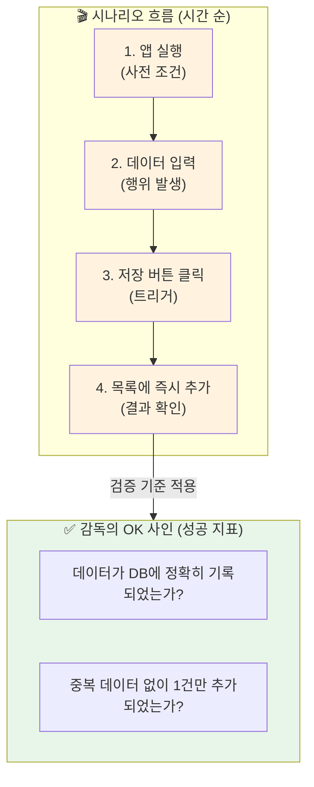

# 마이크로 세션: 037 — 사용자 시나리오와 성공 지표 정의

> **세션 ID**: MS-PY101-037  
> **소요 시간**: 20분  
> **난이도**: medium  
> **청크 타입**: narrative

---

## §1. 개요

> **Day 2 | AM | 세션 037/106**

### 🎯 학습 목표

이 세션이 끝나면, 수강생 여러분은 사용자가 프로그램을 사용하는 과정을 시간 흐름에 따른 시나리오로 작성하고, 그 시나리오가 올바르게 작동했는지 판단하는 성공 지표를 명확히 정의할 수 있게 됩니다.

### 선행 세션 환기

지난 시간 우리는 PRD의 뼈대와 FR(기능 식별자) 번호를 붙이는 정적인 설계법을 배웠습니다. 부품들을 만들었으니 이제 이 부품들이 현실에서 어떻게 조립되고 움직이는지 살펴볼 차례입니다. 기능들이 사용자의 손끝에서 시간의 흐름을 타고 어떻게 작동해야 하는지를 동적으로 그려보겠습니다.

### 과정 환경 안내

수업 환경은 이전과 동일하게 **Windows 11**, **Gemini 3.1 Pro**, **Antigravity IDE(v1.18.4)**를 기준으로 진행됩니다.

---

## §2. 핵심 개념 (+ 🗣️ 강사 대본 + Mermaid)

아무리 정교하게 만들어진 자동차 부품이라도 조립 순서와 운전자의 조작 타이밍이 맞지 않으면 자동차는 굴러가지 않습니다. 기능 명세(FR)가 자동차의 개별 부품이라면, '사용자 시나리오(User Scenario)'는 운전자가 문을 열고 시동을 걸어 엑셀을 밟고 목적지에 도착하기까지의 시간적 흐름을 그려놓은 한 편의 영화 대본과 같습니다. 기획 문서에 기능만 덜렁 나열되어 있으면, 막상 사용자가 그 기능들을 연속해서 사용할 때 어떤 불편함이 생길지 혹은 기능과 기능 사이의 빈틈이 없는지 전혀 알 길이 없습니다. 

그래서 우리는 영화감독이 된 것처럼 사용자의 입장에 빙의하여 대본을 써내려 가야 합니다. "주인공이 앱을 켠다. 그리고 로그인 버튼을 누른다. 아이디를 입력하고 확인을 누르자 화면이 넘어간다"와 같이 먼저 발생한 일과 나중에 발생할 일을 시간 순서대로 꼼꼼히 기술하는 것입니다. 이렇게 시나리오를 써보면 "어? 로그인하고 나면 어느 화면으로 가지?"와 같이 우리가 미처 생각하지 못했던 설계의 구멍을 기적처럼 발견하게 됩니다. 그리고 이 시나리오의 끝에는 영화감독의 '컷, 오케이!' 사인과 같은 '성공 지표(Success Metric)'가 기다리고 있습니다. 성공 지표란 주인공의 행동이 완전히 끝났을 때 이 과정이 완벽하게 성공했음을 증명할 수 있는 객관적인 측정 기준을 의미합니다.

🗣️ **강사 대본 (Instructor Script)**:

> 여러분, 영화감독이 컷 사인을 내면서 'OK!'를 외치려면 무엇이 필요할까요? 바로 완벽하게 짜인 대본과 감독만의 명확한 판단 기준이 필요합니다. 소프트웨어를 만들 때도 이와 똑같습니다. 기능 목록만 달달 외운다고 좋은 프로그램이 나오지 않아요. '사용자가 실제로 이 프로그램을 어떤 순서로 조작할 것인가'를 한 편의 대본처럼 시간의 흐름으로 적어보는 것, 그것이 바로 사용자 시나리오입니다.
>
> 예를 들어 볼까요? 단순히 '데이터 저장 기능'이라고 쓰지 않고, 시나리오를 적용해 봅니다. '사용자가 이름과 전화번호를 빈칸에 입력한다. 그 다음 제일 아래에 있는 파란색 저장 버튼을 딸깍 누른다. 그러면 화면에 성공 메시지가 1초간 뜨고 방금 저장한 이름이 전체 목록의 맨 위에 추가된다.' 어떠신가요? 그림이 눈앞에 생생하게 그려지시죠? 이것이 바로 시나리오의 힘입니다. 시간 순서대로 적다 보면 내가 무엇을 빼먹었는지 아주 쉽게 눈치챌 수 있어요.
>
> 그리고 마지막으로 아주 중요한 것이 있습니다. 바로 감독의 OK 기준, 즉 성공 지표입니다. 방금 그 시나리오가 성공했다고 판단하려면 무엇을 확인해야 할까요? 화면에 메시지가 뜬 것만으로는 부족해요. 데이터베이스를 열어봤을 때 '내가 방금 입력한 데이터가 한 글자도 틀리지 않고 정확히 저장되어 있는가?' 이것이 바로 숫자로 측정 가능하고 눈으로 확인할 수 있는 성공 지표입니다. AI에게 이 시나리오와 성공 지표를 묶어서 던져주면, AI는 코드를 만들어줄 뿐만 아니라 그 코드가 제대로 돌아가는지 스스로 테스트까지 해내는 완벽한 결과물을 가져옵니다.

### Mermaid 다이어그램



---

## §3. 상세 내용

사용자 시나리오는 보통 네 가지 필수 구성 요소를 포함하여 작성합니다. 첫 번째는 '행위자'입니다. 지금 이 화면을 조작하고 있는 사람이 일반 사용자인지, 최고 관리자인지를 명시합니다. 두 번째는 '사전 조건'입니다. 이 시나리오가 시작되기 위해 미리 갖춰져야 하는 상황, 예를 들면 "로그인이 완료된 상태여야 한다" 같은 조건을 적습니다. 세 번째는 가장 중요한 '진행 단계'입니다. 앞서 강조한 것처럼 반드시 "먼저, 그다음, 마지막으로"와 같은 시간적 순서에 따라 사용자의 행동을 묘사해야 합니다. 마지막 네 번째는 '예상 결과'로, 사용자의 행동이 끝났을 때 화면에 무엇이 나타나야 하는지를 그립니다.

이렇게 잘 쓰인 시나리오는 이어지는 성공 지표(Success Metric) 정의의 완벽한 징검다리가 됩니다. 성공 지표란 "좋다", "빠르다" 같은 주관적이고 감정적인 단어가 아니라, "데이터가 정확히 1건 추가되었다", "검색 결과가 0.5초 이내에 텍스트로 출력되었다"처럼 객관적으로 측정하고 참/거짓을 판별할 수 있는 완료 기준입니다. 테스트를 진행할 때 이 지표에 부합하지 않는다면 그 기능은 아직 미완성인 것으로 간주하여 다시 코드를 수정해야 합니다. 

실제로 고객 정보 등록 시나리오를 작성해 본다고 상상해 봅시다. 사전 조건은 '메인 화면에 접속한 상태'입니다. 1단계로 사용자는 '신규 고객 등록 메뉴'를 클릭합니다. 2단계로 이름 칸에 '홍길동', 전화번호 칸에 '010-1234-5678'을 키보드로 입력합니다. 3단계로 엔터 키나 저장 버튼을 누릅니다. 예상 결과는 '등록이 완료되었습니다'라는 문구가 뜨는 것입니다. 이 완벽한 흐름 끝에 붙는 성공 지표는 '메인 화면의 목록에 홍길동의 정보가 노출되고, 백그라운드의 저장 파일에 홍길동의 데이터가 변형 없이 기록되는 것'입니다. 시나리오와 성공 지표가 이렇게 빈틈없이 얽혀 있으면 AI는 이 문서를 읽는 즉시 이 흐름을 완벽하게 재현하는 코드를 설계합니다.

> ✅ **체크포인트**:
> - 사용자 시나리오가 왜 반드시 '시간의 흐름'을 따라 작성되어야 하는지 설명할 수 있나요?
> - "빠르게 동작한다"는 문장이 좋은 성공 지표가 될 수 없는 이유를 객관성의 관점에서 설명할 수 있나요?

---

## §4. 실습 가이드 (+ 🎙️ 실습 대본)

### 실습 목표

이 세션은 시나리오 기법의 개념과 구조를 이해하는 내러티브 세션이므로 직접 프롬프트를 입력하는 실습은 없으나, 시나리오적 사고를 통해 빈틈을 발견하는 시뮬레이션 훈련을 진행합니다.

🎙️ **실습 가이드 대본 (Lab Guide Script)**:

> 자, 이번엔 여러분이 직접 영화감독이 되어 짧은 대본을 써볼 차례입니다. '비밀번호를 까먹은 사용자가 비밀번호를 찾는 과정'이라는 주제로 아주 짧은 1분짜리 머릿속 영화를 찍어보겠습니다.
>
> 눈을 감고 첫 장면을 상상해 보세요. 사용자가 로그인 화면에서 '비밀번호 찾기' 글씨를 클릭합니다. 화면이 넘어갑니다. 여기서 사용자는 무엇을 입력해야 할까요? 이메일을 입력했다고 칩시다. 확인 버튼을 누릅니다. 자, 그다음은 어떤 화면이 나와야 정상일까요? 이메일로 링크를 보냈다는 화면이 나와야겠죠. 그렇다면 이 장면의 완벽한 성공 지표는 무엇일까요? '사용자의 메일함에 실제로 메일이 1분 안에 도착했는가'가 될 겁니다. 여러분, 방금 머릿속으로 그린 그 흐름이 바로 실무에서 쓰는 완벽한 사용자 시나리오와 성공 지표입니다. 다음 실습 세션에서는 이 멋진 대본을 우리가 직접 PRD라는 공식 문서 안에 녹여 넣어 완성된 기획서를 만들어보겠습니다.

### 단계별 지시

| 단계 | 소요 시간 | 강사 지시사항 | 학습자 액션 | 예상 결과 |
|------|----------|--------------|------------|----------|
| 1 | 5분 | 영화 대본 비유를 통한 시간 흐름의 중요성 설명 | 비유 연상 및 경청 | 시간 순서 기록의 필요성 인지 |
| 2 | 8분 | 시나리오 4대 요소 및 성공 지표 개념 해설 | 핵심 요소 4가지 필기 | 객관적 측정 지표의 중요성 이해 |
| 3 | 5분 | '비밀번호 찾기' 상황을 가정한 시뮬레이션 유도 | 머릿속 시간 흐름 시각화 | 동적인 시나리오 사고 체화 |
| 4 | 2분 | 요약 및 다음 세션(PRD 통합 실습) 안내 | 내용 정리 및 질문 | 학습 목표 완전 달성 |

### 트러블슈팅 FAQ

| Q | A |
|---|---|
| 시나리오를 얼마나 구체적으로 써야 하나요? | 버튼의 색깔까지 적을 필요는 없지만, "무엇을 입력하고 어떤 버튼을 누른다" 수준의 명확한 액션은 반드시 들어가야 합니다. |
| 성공 지표를 정하기가 막막합니다 | "내가 만든 프로그램을 친구에게 자랑할 때, 기능이 제대로 된다고 증명하려면 뭘 보여주면 될까?"라고 생각하면 쉽게 떠오릅니다. |
| 기능(FR)과 시나리오의 차이가 아직 헷갈립니다 | FR은 사진처럼 정지된 부품의 스펙이고, 시나리오는 이 부품들이 순서대로 맞물려 돌아가는 비디오 동영상이라고 생각하세요. |

---

## §5. 코드 및 명령어 모음

### (참고) 사용자 시나리오 및 성공 지표 문서 템플릿

이 세션에서는 프롬프트 실행이 없으나, 다음 세션 실습에서 사용할 시나리오 작성 템플릿의 모범 사례를 제공합니다.

```markdown
### 4. 사용자 시나리오 및 성공 지표

**[시나리오 1: 신규 고객 정상 등록 흐름]**
- **행위자**: 시스템 관리자
- **사전 조건**: 관리자가 메인 화면의 메뉴 모드에 진입한 상태
- **진행 단계**:
  1. 관리자가 메뉴에서 "1번: 신규 고객 등록"을 선택하고 엔터를 누른다.
  2. 시스템이 "이름을 입력하세요:"라는 프롬프트를 띄운다.
  3. 관리자가 "김철수"를 입력하고 엔터를 누른다.
  4. 시스템이 "전화번호를 입력하세요:"라는 프롬프트를 띄운다.
  5. 관리자가 "010-9999-8888"을 입력하고 엔터를 누른다.
- **예상 결과**: 화면에 "김철수 고객이 성공적으로 등록되었습니다" 메시지가 출력되고 초기 메뉴로 돌아간다.

- **✅ 성공 지표 (Success Metric)**: 
  1. 완료 직후 전체 목록을 조회했을 때 방금 입력한 "김철수, 010-9999-8888" 데이터가 정확히 1건 출력되어야 한다.
  2. 프로그램 종료 후 재시작해도 해당 데이터가 지워지지 않고 유지되어야 한다.
```

---

## §6. 요약

### 핵심 학습 포인트

기능 명세가 사진이라면 사용자 시나리오는 비디오입니다. 우리는 시나리오를 통해 파편화되어 있던 기능들을 '시간의 흐름'이라는 끈으로 묶어, 사용자가 이 프로그램을 조작하는 시작부터 끝까지의 여정을 생생하게 시뮬레이션하는 방법을 배웠습니다.

또한, 이 여정이 완벽하게 끝났음을 증명하기 위해 감독의 OK 사인에 해당하는 '성공 지표'를 정의하는 방법도 익혔습니다. 감정적인 단어를 배제하고 측정 가능하며 객관적인 완료 기준을 세워두면, AI가 코드를 생성하고 스스로 자신의 코드를 철저하게 테스트하고 검증하도록 유도할 수 있습니다.

### 다음 세션 예고

지금까지 우리는 5W1H 요구사항 분석부터, PRD의 구조, FR 기능 명세, 그리고 동적인 사용자 시나리오까지 모든 기획의 퍼즐 조각들을 정성스럽게 만들어왔습니다. 다음 세션에서는 이 아름다운 퍼즐 조각들을 하나의 테이블에 모아, AI와 함께 완벽하고 거대한 한 장의 그림, 즉 실전 '고객 정보 관리 프로그램 PRD'를 처음부터 끝까지 완성해보는 종합 실습을 진행하겠습니다.

### 브릿지 노트

> "영화 대본처럼 생생한 시나리오와 냉철한 감독의 OK 사인까지 준비가 완료되었습니다. 이제 지금까지 모은 모든 설계 부품들을 가지고, 다음 세션에서 실전용 PRD를 완벽하게 조립해 봅시다!"

---

## §7. 참고 자료

### 3-Source 출처

- **로컬 참고자료**: '기획 가이드 §7.4' — 사용자 시나리오 작성법과 테스트 기반의 성공 지표 정의
- **로컬 참고자료**: 'AI 시대의 서사 §기획의 중요성' — AI 협업 시 인간이 챙겨야 할 흐름 제어와 테스트 기준의 필요성
- **NotebookLM**: (자체 생성) — 영화감독의 대본과 OK 사인 비유를 통한 동적 명세 설명 데이터

### 용어 정리

| 용어 | 설명 |
|------|------|
| 사용자 시나리오 (User Scenario) | 사용자가 특정 목표를 달성하기 위해 소프트웨어를 조작하는 과정을 시간 순서대로 묘사한 스토리보드 |
| 트리거 (Trigger) | 시나리오 내에서 다음 단계의 동작을 유발하는 사용자의 특정 행동이나 시스템의 상태 변화 (예: 버튼 클릭) |
| 성공 지표 (Success Metric) | 시나리오의 흐름이 정상적으로 끝났는지 객관적이고 구체적인 측정치로 판단할 수 있는 테스트 합격 기준 |

### 관련 세션 연결 지도

| 이 세션의 개념 | 다시 등장하는 세션 | 어떻게 활용되는지 |
|---|---|---|
| 시간 흐름에 따른 시나리오 | 세션 038 | PRD 종합 완성 실습에서 기능 명세를 보완하는 흐름도 작성에 직접 사용됨 |
| 감독의 OK 사인 (성공 지표) | 세션 041 | 코드를 생성한 후 실제로 실행하고 검증(Validate)할 때 합격 여부를 판가름하는 기준으로 쓰임 |
| 시나리오 기반 사고 | 세션 040 | 미니 스펙 프로젝트에서 자신의 프롬프트를 점진적 개선 방식으로 쪼개어 설계할 때 바탕이 됨 |

---

*작성 일시: 2026-02-25*  
*작성 에이전트: Sisyphus-Junior*  
*교안 구조: 7섹션 (A0 팀 공통 표준)*