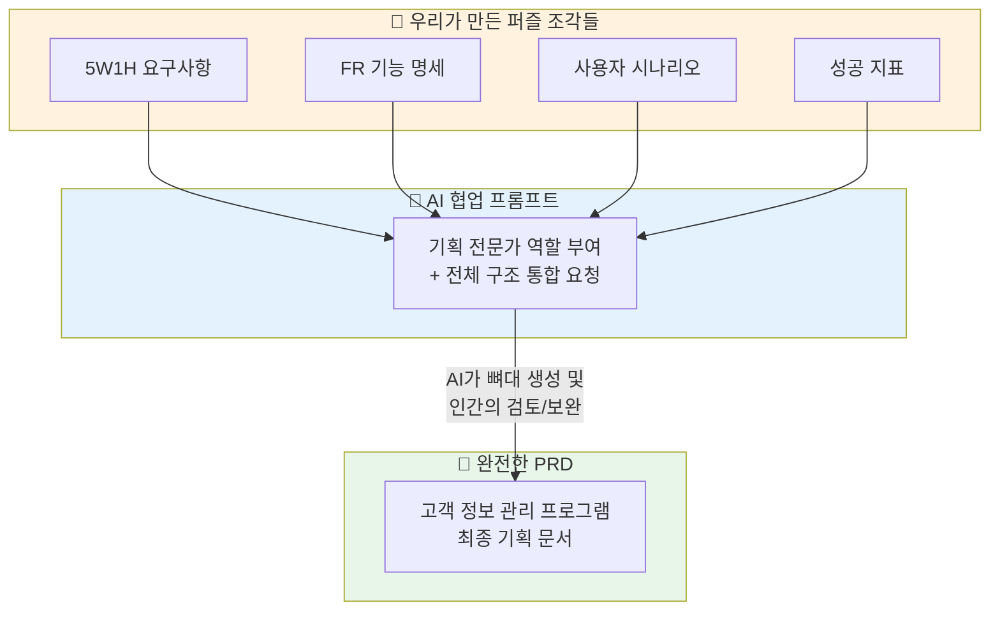

# 마이크로 세션: 038 — 고객 정보 관리 프로그램 PRD 완성하기

> **세션 ID**: MS-PY101-038  
> **소요 시간**: 25분  
> **난이도**: medium  
> **청크 타입**: lab

---

## §1. 개요

> **Day 2 | AM | 세션 038/106**

### 🎯 학습 목표

이 세션이 끝나면, 수강생 여러분은 앞서 배운 요구사항, 기능 명세, 시나리오를 통합하여 AI와 협업함으로써 완전한 구조의 PRD를 독자적으로 작성할 수 있게 됩니다.

### 선행 세션 환기

우리는 지금까지 5W1H 요구사항 분석, PRD의 구조와 기능 식별자(FR), 그리고 시간의 흐름을 담은 사용자 시나리오와 성공 지표까지 훌륭한 설계도를 만들기 위한 각각의 퍼즐 조각들을 하나씩 정성스럽게 만들어왔습니다. 이제 이 흩어진 조각들을 하나의 테이블 위에 펼쳐놓고 완성된 거대한 그림으로 맞출 시간입니다.

### 과정 환경 안내

실습은 어김없이 여러분의 강력한 도구인 **Windows 11**, **Gemini 3.1 Pro**, **Antigravity IDE(v1.18.4)**를 기반으로 진행됩니다.

---

## §2. 핵심 개념 (+ 🗣️ 강사 대본 + Mermaid)

여러분이 수천 피스짜리 직소 퍼즐을 맞춘다고 상상해 봅시다. 개별 퍼즐 조각의 모양이나 색깔이 아무리 아름다워도, 그 조각들이 서로 맞물려 하나의 완벽한 그림을 이루지 못한다면 아무런 의미가 없습니다. 지금까지 우리가 배운 요구사항, FR 번호, 시나리오, 성공 지표는 모두 이 직소 퍼즐의 낱개 조각들입니다. 오늘 우리는 이 조각들을 꽉 짜인 하나의 프레임, 바로 완전한 PRD라는 거대한 그림으로 조립하게 될 것입니다. 

하지만 걱정하지 않으셔도 됩니다. 수천 피스의 퍼즐을 혼자 끙끙대며 맞출 필요가 없으니까요. 여러분 곁에는 퍼즐 조각의 모양을 1초 만에 스캔하고 제자리를 찾아주는 최고의 파트너 AI가 있습니다. 여러분은 그저 AI에게 "내가 가진 아이디어를 바탕으로 개요, 기능 명세, 시나리오, 성공 지표가 모두 들어간 PRD라는 완성된 퍼즐을 맞춰줘"라고 정확한 지시만 내리면 됩니다. AI가 뼈대를 잡아주면, 우리는 그 결과물을 눈으로 꼼꼼히 확인하고 혹시 잘못 맞춰진 조각은 없는지, 빠진 부분은 없는지 점검하며 최종적으로 그림을 완성해 나가는 설계자의 역할을 완수하게 됩니다.

🗣️ **강사 대본 (Instructor Script)**:

> 자, 여러분! 지금까지 우리가 열심히 준비해 온 모든 퍼즐 조각을 한데 모아볼 시간입니다. 개요, 기능 명세(FR), 그리고 사용자 시나리오까지! 이 모든 것이 합쳐져야 비로소 개발을 시작할 수 있는 진짜 'PRD'가 완성됩니다.
>
> 흩어진 지식들을 문서 하나로 합치려니 눈앞이 캄캄하신가요? 걱정하실 필요 전혀 없습니다. 우리에겐 AI라는 훌륭한 퍼즐 맞추기 명인이 있잖아요! AI에게 우리가 배운 구조를 그대로 짚어주면서 요청하는 겁니다. '너는 소프트웨어 기획 전문가야. 내가 전에 말했던 고객 정보 관리 프로그램의 PRD를 완벽하게 작성해 줘. 개요, 대상 사용자, 기능 명세(FR-001~005), 그리고 시간 흐름에 따른 사용자 시나리오와 아주 객관적인 성공 지표까지 몽땅 포함해서 말이야.' 
>
> 이렇게 프롬프트를 쏘아 올리면, AI가 그동안 여러분이 상상만 했던 프로그램을 너무나도 완벽한 한 장의 기획서로 뚝딱 만들어낼 겁니다. 결과물이 나오면 끝이 아닙니다! 여러분은 감리관이 되어 AI가 놓친 맹점이나 부족한 기능이 없는지 대화를 통해 계속 보완해 나가야 합니다. 자, 우리만의 첫 번째 공식 문서, PRD 퍼즐 맞추기를 지금부터 시작하겠습니다!

### Mermaid 다이어그램



---

## §3. 상세 내용

개별적인 파편들을 모아 훌륭한 통일성을 갖춘 PRD를 작성하기 위해서는 명확한 통합 순서와 프롬프팅 전략이 필요합니다. 먼저 문서는 '개요 → 기능 명세 → 시나리오 → 성공 지표'의 논리적 흐름을 타야 합니다. 숲을 먼저 보여주고(개요), 나무의 종류를 나열한 뒤(기능 명세), 그 나무들 사이를 산책하는 방법(시나리오)을 설명하는 것입니다. AI에게 이러한 논리적 흐름을 강제하기 위해서는 프롬프트에 우리가 배운 이 목차들을 명시적으로 적어주어야 합니다. 목차를 주지 않고 "PRD를 써줘"라고만 하면 AI는 자기 마음대로 항목을 생략하거나 불필요한 장황한 설명을 늘어놓을 확률이 높습니다.

효과적인 PRD 생성을 위한 프롬프트 전략은 '뼈대 생성 후 살붙이기'입니다. 처음부터 100점짜리 문서를 기대하고 수천 자의 프롬프트를 한 번에 밀어 넣는 것은 비효율적입니다. 첫 번째 프롬프트에서는 "고객 정보 관리 프로그램의 PRD 목차와 핵심 뼈대만 잡아줘"라고 요청하여 전반적인 구조를 확인합니다. 구조가 마음에 든다면, "이제 3번 항목인 기능 명세를 FR-001부터 FR-005까지 구체적으로 채워줘", "그다음 4번 항목인 시나리오를 시간 순서대로 적어줘"와 같이 단계적으로 접근하는 것이 AI의 환각을 줄이고 통제력을 높이는 가장 탁월한 비결입니다.

문서가 어느 정도 형태를 갖추었다면 마지막으로 가장 중요한 작업이 남아있습니다. 바로 인간의 눈으로 문서를 교정하는 'Validate(검증)'입니다. AI가 생성한 문서를 읽다 보면 '사용자가 이름을 입력한다'는 있는데 '비어있을 경우 에러를 띄운다'라는 예외 상황이 누락된 것을 흔히 발견할 수 있습니다. 이때는 AI에게 "이름 입력 시 빈칸을 막는 제약 조건을 FR-001에 추가해 줘"라고 대화를 통해 피드백을 주면 됩니다. 이 과정을 거쳐야만 비로소 혼이 담긴 진짜 나의 기획서가 완성됩니다.

> ✅ **체크포인트**:
> - AI에게 통합된 PRD 작성을 요청할 때, 목차를 명시해야 하는 이유를 설명할 수 있나요?
> - 한 번의 완벽한 요청보다 '뼈대 생성 후 살붙이기' 전략이 더 효과적인 이유는 무엇인가요?

---

## §4. 실습 가이드 (+ 🎙️ 실습 대본)

### 실습 목표

수강생은 AI와 대화하며 고객 정보 관리 프로그램에 대한 뼈대를 구축하고, 반복적인 수정과 피드백을 통해 4대 구성 요소(개요, FR, 시나리오, 지표)가 모두 포함된 완전한 PRD를 완성해냅니다.

🎙️ **실습 가이드 대본 (Lab Guide Script)**:

> 자, 드디어 실전입니다! 화면의 챗 창을 열어주세요. 방금 전까지 우리가 머릿속으로 그렸던 고객 관리 프로그램의 PRD를 실제로 뽑아낼 겁니다.
>
> 1단계 프롬프트를 입력하세요. "너는 IT 기획자야. 동네 세탁소 사장님이 쓸 아주 간단한 '고객 정보 관리 프로그램'의 PRD 뼈대를 잡아줘. 목차는 1.개요, 2.기능명세(FR), 3.시나리오 및 성공지표 순서로 해줘." 자, AI가 아주 멋진 목차를 뽑아주었죠? 
>
> 이제 2단계입니다. "그 목차에 맞춰서 내용을 상세히 채워줘. 기능은 고객 추가, 조회, 삭제 3개만 넣고 각각 FR-001부터 번호를 붙여줘." 문서를 쭉 읽어보세요. 혹시 마음에 안 드는 구석이 있나요? 그럼 바로 고쳐달라고 지시하세요! "조회할 때 이름뿐만 아니라 전화번호 뒷자리로도 검색하는 기능을 FR-004로 추가해줘." 이렇게 15분 동안 AI와 치열하게 대화하며 여러분만의 완벽한 기획서를 조립해 보시기 바랍니다!

### 단계별 지시

| 단계 | 소요 시간 | 강사 지시사항 | 학습자 액션 | 예상 결과 |
|------|----------|--------------|------------|----------|
| 1 | 5분 | "AI에게 기획자 역할을 부여하고 4대 목차가 포함된 PRD 뼈대 작성을 요청하세요" | 1단계 초기 프롬프트 작성 및 전송 | PRD의 전체 목차 및 개요 초안 생성 |
| 2 | 12분 | "생성된 뼈대에 FR 번호와 시나리오를 채워달라고 한 뒤, 꼼꼼히 검토하며 보완을 지시하세요" | AI와 핑퐁 대화를 하며 세부 내용 발전 | 예외 처리와 상세 조건이 추가된 문서 확보 |
| 3 | 8분 | "최종 정리된 PRD를 마크다운으로 출력받아 저장하고 짝과 교차 검토하세요" | 최종 출력 요청 및 문서 저장 | 실전에 바로 쓸 수 있는 완전한 PRD 파일 완성 |

### 트러블슈팅 FAQ

| Q | A |
|---|---|
| AI가 너무 많은 기능을 넣어서 프로그램이 복잡해졌어요 | PRD의 범위를 통제하는 것은 여러분의 몫입니다. "이건 너무 복잡해. 초보자용이니까 고객 관리의 핵심인 3가지 기능만 남기고 다 지워줘"라고 명확히 지시하세요. |
| 시나리오가 자꾸 추상적으로 나와요 | 프롬프트에 예시를 하나 던져주는 것이 좋습니다. "시나리오는 '1. 메인화면 접속 -> 2. 버튼 클릭'처럼 번호를 매겨서 시간 순서로 써줘"라고 포맷을 강제하세요. |
| 교차 검토할 때 무엇을 중점적으로 봐야 하나요? | '이 문서만 보고 내가 직접 코딩을 할 수 있을까?'를 기준으로 보세요. 입력값이 명확한지, 예외 상황이 적혀있는지가 핵심입니다. |

---

## §5. 코드 및 명령어 모음

### 완전한 PRD 생성을 위한 프롬프트 체인

이 실습에서는 코드를 실행하는 대신, 가장 효과적으로 문서를 뽑아내는 연쇄적인 프롬프트(프롬프트 체인)를 사용합니다.

```text
[1단계: 뼈대 및 구조 잡기 프롬프트]
너는 10년 차 전문 소프트웨어 기획자야.
나는 1인 사업장(예: 세탁소, 미용실)에서 쓸 아주 간단한 콘솔 기반의 '고객 정보 관리 프로그램'을 기획 중이야.
이 프로그램을 위한 PRD(제품 요구사항 문서)의 기본 구조를 잡아줘.
문서 목차는 반드시 아래 3가지로만 구성해 줘:
1. 개요 및 대상 사용자
2. 기능 명세 (FR-00X 형식 사용)
3. 사용자 시나리오 및 성공 지표

[2단계: 내용 구체화 프롬프트]
좋아, 이제 그 목차에 맞춰서 내용을 구체적으로 채워 줘.
기능 명세에는 '고객 등록, 전체 목록 조회, 고객 정보 삭제' 딱 3가지 기능만 넣고,
각 기능마다 입력값, 출력값, 예외 처리(예: 전화번호 중복 등)를 꼼꼼히 적어 줘.

[3단계: 검증 및 튜닝 프롬프트 (예시)]
기능 명세는 좋은데 시나리오가 너무 짧아.
'신규 고객을 등록하고 성공적으로 목록에 뜨는지 확인하는 과정'을
사용자가 어떤 키보드 입력을 하고 화면에 뭐가 뜨는지 1번, 2번, 3번 순서대로 아주 상세하게 다시 써 줘.
```

---

## §6. 요약

### 핵심 학습 포인트

우리는 개별적으로 흩어져 있던 요구사항, 기능 명세, 시나리오, 성공 지표라는 퍼즐 조각들을 모아 **완전한 구조의 PRD**라는 거대한 그림으로 완성하는 쾌거를 이루었습니다. AI에게 무작정 글을 써달라고 기대하는 대신, 명확한 목차를 주고 '뼈대 잡기'와 '살 붙이기'를 분리하여 단계적으로 요청하는 체계화된 프롬프팅 전략의 강력함을 경험했습니다.

가장 중요한 것은 AI가 생성한 결과물을 맹신하지 않고, 예외 상황이나 누락된 기능이 없는지 감리관의 눈으로 꼼꼼히 점검하여 다시 피드백을 주는 **검토와 보완(Validate)**의 과정이었습니다. 이 과정을 거쳐 탄생한 여러분의 PRD는 이제 훌륭한 소프트웨어를 짓기 위한 가장 단단한 주춧돌이 되었습니다.

### 다음 세션 예고

가이드라인에 따라 고객 관리 프로그램이라는 공통 주제의 기획서를 무사히 완성하셨습니다! 이제 여러분 안의 창의력을 마음껏 발산할 타이밍입니다. 다음 세션에서는 강사가 정해준 주제가 아닌, 여러분이 일상생활에서 평소에 '진짜 만들어보고 싶었던' 아이디어를 스스로 발굴하여 자유 주제를 선정하고, 그 주제에 맞는 핵심 요구사항을 직접 스케치해보는 미니 스펙 프로젝트를 출발하겠습니다.

### 브릿지 노트

> "축하합니다! 여러분은 이제 어엿한 기획 문서 하나를 뚝딱 만들어낼 수 있는 능력을 갖췄습니다. 훈련은 끝났습니다. 다음 세션부터는 이 강력한 기술들을 무기 삼아, 여러분의 심장을 뛰게 하는 자유 주제를 골라 나만의 미니 프로젝트를 본격적으로 론칭해 봅시다!"

---

## §7. 참고 자료

### 3-Source 출처

- **로컬 참고자료**: '기획 가이드 §7.3' — PRD 통합 작성 가이드 및 목차 구성 표준안
- **로컬 참고자료**: '프롬프트 설계안 §2.3' — 단계적 문서 생성을 위한 체인 프롬프트(Prompt Chaining) 전략
- **NotebookLM**: (자체 생성) — 개별 문서 요소들을 직소 퍼즐 맞추기에 비유한 통합 프로세스 설명 데이터

### 용어 정리

| 용어 | 설명 |
|------|------|
| PRD 통합 작성 | 개요, 기능 명세, 시나리오 등 개별 문서 요소를 논리적 흐름에 맞게 하나의 완결된 기획서로 합치는 과정 |
| 프롬프트 체인 (Prompt Chaining) | AI에게 한 번에 복잡한 명령을 내리지 않고, 뼈대 요청 → 상세 내용 추가 → 수정의 순서로 프롬프트를 연쇄적으로 던져 품질을 높이는 기법 |
| 환각 (Hallucination) 억제 | AI가 사실이 아니거나 요구하지 않은 불필요한 내용을 그럴듯하게 지어내는 현상을 막기 위해 목차와 제약 조건을 강제하는 행위 |

### 관련 세션 연결 지도

| 이 세션의 개념 | 다시 등장하는 세션 | 어떻게 활용되는지 |
|---|---|---|
| 완전한 PRD 구조 | 세션 040 | 미니 스펙 프로젝트 실습 시, 여기서 배운 동일한 프레임워크와 프롬프트 체인 기법을 자유 주제에 적용함 |
| 뼈대 후 살붙이기 전략 | 세션 041 | 코드를 생성할 때도 한 번에 완벽한 코드를 짜는 것이 아니라 핵심 로직 생성 후 기능을 추가하는 방식으로 쓰임 |
| AI 문서 보완 피드백 | 세션 042 | 발표 세션에서 "나는 AI의 오류를 이런 피드백 대화로 바로잡았다"는 문제 해결 경험 공유의 핵심 소재가 됨 |

---

*작성 일시: 2026-02-25*  
*작성 에이전트: Sisyphus-Junior*  
*교안 구조: 7섹션 (A0 팀 공통 표준)*