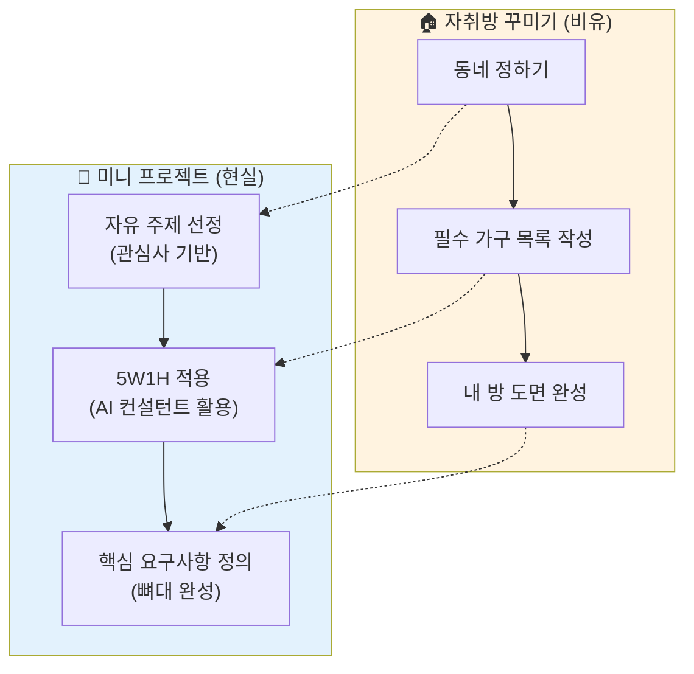

# 마이크로 세션: 039 — 미니 스펙 프로젝트: 주제 선정 및 요구사항

> **세션 ID**: MS-PY101-039  
> **소요 시간**: 25분  
> **난이도**: medium  
> **청크 타입**: lab

---

## §1. 개요

> **Day 2 | AM | 세션 039/106**

### 🎯 학습 목표

이 세션이 끝나면, 수강생 여러분은 스스로 흥미를 느끼는 자유 주제를 하나 선정하여, 그 아이디어의 뼈대가 되는 핵심 요구사항을 5W1H 방법론을 기반으로 명확하게 정의할 수 있게 됩니다.

### 선행 세션 환기

지금까지 우리는 강사가 제시한 '고객 정보 관리 프로그램'이라는 공통의 트랙을 따라오면서 요구사항을 뽑고 PRD를 조립하는 방법을 착실히 훈련했습니다. 이제 보조 바퀴를 떼어낼 시간입니다. 여러분이 배운 이 체계적인 방법론을 여러분의 일상과 맞닿은 '진짜 내 아이디어'에 적용해 보는 독립의 첫걸음을 내딛겠습니다.

### 과정 환경 안내

여러분의 상상력을 펼칠 무대는 항상 그렇듯 **Windows 11**, 든든한 조력자 **Gemini 3.1 Pro**, 그리고 **Antigravity IDE(v1.18.4)**입니다.

---

## §2. 핵심 개념 (+ 🗣️ 강사 대본 + Mermaid)

강사가 주는 숙제를 푸는 것과 내가 평소에 겪었던 불편함을 해결하기 위해 직접 주제를 정하는 것은 하늘과 땅만큼의 몰입도 차이를 만듭니다. 이제 여러분만의 미니 스펙 프로젝트를 시작할 시간입니다. 이 첫 단계는 마치 내 인생의 첫 자취방을 구하고 꾸미는 과정과 놀라울 정도로 닮아 있습니다. 가장 먼저 어느 동네에 살고 싶은지 동네를 정해야 합니다. 이것이 바로 '주제 선정'입니다. 주제를 정했다면 그 빈방에 침대가 필요한지, 책상이 필요한지, 옷장이 필요한지 필수 가구들의 목록을 빼곡히 적어 내려가야 합니다. 이것이 바로 우리가 배운 5W1H를 통한 '요구사항 정의'의 과정입니다. 

처음 구하는 자취방이 펜트하우스처럼 완벽할 수는 없습니다. 너무 거창한 꿈을 꾸어 예산을 초과하면 입주조차 할 수 없듯이, 프로젝트의 주제도 구글이나 네이버가 만들 법한 거대한 서비스가 되어서는 곤란합니다. "복잡한 회계 시스템"보다는 "나만의 한 달 식비 계산기", "전 세계 날씨 예측 인공지능"보다는 "오늘 우산을 챙겨야 할지 알려주는 문자 알리미"처럼 아주 작고 귀여우면서도 내 삶에 소소한 재미를 주는 실현 가능한 주제가 훨씬 가치 있습니다. 첫 자취의 목표는 완벽한 집이 아니라, 내 힘으로 계약부터 가구 배치까지 해보는 '독립의 경험' 자체에 있는 것처럼, 이 프로젝트의 핵심 역시 완벽한 프로그램 개발이 아닌 '처음부터 끝까지 체계적으로 설계해보는 습관'을 기르는 데 있습니다.

🗣️ **강사 대본 (Instructor Script)**:

> 자, 여러분의 족쇄를 풀어드리겠습니다! 지금까지 억지로 '고객 관리 프로그램' 만드시느라 고생하셨습니다. 이제부터는 철저하게 여러분이 만들고 싶은, 여러분의 심장을 조금이라도 뛰게 하는 자유 주제를 고르는 미니 프로젝트를 시작합니다. 
>
> 첫 자취방을 꾸민다고 상상해 보세요. 거창할 필요가 전혀 없습니다. 할 일 목록 관리기, 매일 외우고 싶은 영어 단어장, 콘솔에서 즐기는 간단한 가위바위보 게임, 혹은 여행 갈 때 쓸 환율 계산기. 뭐든 다 좋습니다! 중요한 건 그저 내 마음에 드는 작은 아이디어 하나를 콕 집어내는 거예요. 주제를 정하셨다면, 방 안에 가구를 들여놓듯 우리가 배운 5W1H 방법론으로 뼈대를 세워봅시다. 
>
> 누가(Who) 쓸 프로그램인가요? 나 혼자 쓸 건가요? 핵심 기능(What)은 무엇이죠? 돈을 계산하는 건가요? 언제(When), 어디서(Where) 실행시킬까요? 그리고 도대체 왜(Why) 이게 필요한가요? 마지막으로 어떻게(How) 동작해야 할까요? 머리를 쥐어뜯지 마시고, 아이디어의 씨앗만 AI에게 던져주면서 "내가 이걸 만들고 싶은데 5W1H로 좀 쪼개서 질문해 줄래?"라고 도움을 청하세요. 여러분의 거친 아이디어를 AI가 아주 멋진 기획의 초안으로 다듬어 줄 겁니다!

### Mermaid 다이어그램



---

## §3. 상세 내용

훌륭한 프로젝트의 시작은 좋은 주제를 선정하는 눈을 기르는 것에서 출발합니다. 초보자들이 가장 많이 저지르는 실수는 넷플릭스나 당근마켓 같은 거대한 플랫폼을 만들겠다고 덤비는 것입니다. 좋은 주제 선정을 위한 3대 기준은 다음과 같습니다. 첫째, '개인적 관심사'가 반영되어야 합니다. 내가 매일 기록하는 다이어리나 취미 생활과 연결될 때 포기하지 않고 끝까지 만들 수 있습니다. 둘째, '적정 난이도'입니다. 화려한 그래픽이나 웹 브라우저가 필요한 것보다는 지금 우리가 배우고 있는 콘솔 환경의 텍스트 기반으로 동작할 수 있는 아이디어여야 합니다. 셋째, '핵심 기능의 제한'입니다. 기능은 절대로 3개를 넘지 않도록 다이어트를 시켜야 합니다.

주제를 선정하고 난 뒤에는 아이디어의 안개를 걷어내는 구체화 작업, 즉 5W1H 기반의 요구사항 작성이 이어집니다. 앞선 세션에서 배웠던 AI 컨설턴트 프롬프트를 다시 꺼내 들 때입니다. 혼자 빈 메모장을 쳐다보며 Who, What, When을 채워 넣으려고 하면 막막하지만, AI에게 "나는 점심 메뉴를 무작위로 골라주는 룰렛 프로그램을 만들고 싶어. 이걸 5W1H 형식으로 발전시켜 줘"라고 던지는 순간 마법이 일어납니다. AI는 "Who: 점심 메뉴를 매일 고민하는 직장인, What: 5개의 후보 중 랜덤으로 1개 출력, Why: 메뉴 결정의 스트레스 해소"와 같이 번뜩이는 통찰을 제공하며 뼈대를 잡아줍니다.

이렇게 AI와 대화하며 나온 5W1H 결과를 다듬을 때 가장 공을 들여야 하는 부분은 'What(핵심 기능)'과 'How(어떻게 동작할 것인가)'입니다. 여기에는 앞서 강조했듯 '입력과 메뉴 선택, 그리고 출력 결과'가 명확히 명시되어야 합니다. 이것들이 명확해야만 다음 세션에서 진행할 PRD 작성과 그 이후에 이어질 실제 파이썬 코드 생성 과정에서 길을 잃지 않는 강력한 이정표 역할을 해낼 수 있습니다.

> ✅ **체크포인트**:
> - 미니 프로젝트의 주제를 선정할 때 피해야 할 대표적인 함정(거대 플랫폼 등)은 무엇인가요?
> - 아이디어를 5W1H 요구사항으로 구체화할 때 가장 중요하게 다루어야 할 두 가지 항목은 무엇인가요?

---

## §4. 실습 가이드 (+ 🎙️ 실습 대본)

### 실습 목표

수강생은 제공된 예시 목록을 참고하여 실현 가능한 나만의 미니 프로젝트 주제를 확정하고, AI의 도움을 받아 그 아이디어를 5W1H 체크리스트 형태의 초기 요구사항으로 정리해냅니다.

🎙️ **실습 가이드 대본 (Lab Guide Script)**:

> 여러분, 창의력을 발휘할 시간입니다! 지금부터 딱 5분 동안 내가 정말 만들고 싶은 프로그램의 주제 하나를 정해주세요. 단어 암기장도 좋고, 칼로리 계산기도 좋고, 로또 번호 추첨기도 완벽합니다. 
>
> 주제를 하나 콕 짚으셨나요? 그러면 이제 AI를 소환합시다. AI에게 "나는 로또 번호 추첨기를 만들 거야. 이걸 기획하려고 하는데, 5W1H 방식으로 나에게 질문을 던져주면서 아이디어를 뾰족하게 다듬어 줘"라고 요청하세요. AI가 질문을 던지면 편안하게 답변하시면서 요구사항의 살을 붙이시면 됩니다. 너무 많은 기능을 넣으려고 욕심내지 마세요. 우리는 핵심 기능 딱 2~3개만 돌아가는 작고 귀여운 프로그램을 목표로 합니다. 완성된 5W1H 요구사항이 나오면, 짝꿍에게 "나는 이런 프로그램을 기획했어!"라고 가볍게 자랑하며 피드백을 주고받아 볼까요? 자, 15분간 여러분만의 기획 파티를 시작합시다!

### 단계별 지시

| 단계 | 소요 시간 | 강사 지시사항 | 학습자 액션 | 예상 결과 |
|------|----------|--------------|------------|----------|
| 1 | 5분 | "관심 있는 콘솔 기반의 프로그램 주제를 하나 선정하세요. 막막하면 예시를 참고하세요" | 각자 실현 가능한 프로젝트 주제 확정 | 명확하고 범위가 좁혀진 1차 주제 도출 |
| 2 | 12분 | "선정한 주제에 대해 AI의 도움을 받아 5W1H 체크리스트를 작성하세요" | AI와 대화하며 5W1H 항목 답변 및 정리 | 5W1H가 논리적으로 채워진 요구사항 초안 |
| 3 | 8분 | "작성한 요구사항을 짝과 공유하고 너무 크거나 모호한 점에 대해 피드백을 나누세요" | 상호 교차 리뷰 및 기능 범위 축소 | 피드백이 반영되어 군더더기가 빠진 핵심 요구사항 |

### 트러블슈팅 FAQ

| Q | A |
|---|---|
| 정말 만들고 싶은 게 떠오르지 않아요 | 화면을 그리는 웹사이트 말고, 까만 창(콘솔)에서 숫자를 넣고 텍스트 결과를 보는 '계산기'나 '질문-답변' 형태의 퀴즈 게임을 떠올려 보시면 훨씬 쉽습니다. |
| AI가 제가 생각한 의도와 다르게 5W1H를 정리해 버려요 | AI에게 주도권을 너무 많이 주셨네요! "아니야, 기능이 너무 복잡해. 나는 인터넷 연결 없이 그냥 텍스트 파일에만 저장되는 단순한 걸 원해"라고 단호하게 정정해주세요. |
| 짝꿍의 피드백을 꼭 받아야 하나요? | 네, 내가 쓴 기획은 내 눈에는 무조건 완벽해 보입니다. 제3자가 "근데 이거 시작 버튼은 어떻게 누르는 거야?"라고 물어봐 주어야 빈틈을 찾을 수 있습니다. |

---

## §5. 코드 및 명령어 모음

### (참고) 미니 프로젝트 추천 주제 5선 및 5W1H 프롬프트

아이디어가 떠오르지 않는 수강생을 위한 추천 주제와, 5W1H 도출을 돕는 필수 프롬프트 세트입니다.

```text
[💡 난이도별 추천 주제 5선]
1. (쉬움) 로또 번호 자동 생성기: 제외할 숫자를 입력받고 6개 난수 출력
2. (쉬움) 더치페이 정산기: 총금액과 인원수를 입력하면 1인당 금액 계산
3. (보통) 나만의 단어장 퀴즈: 영어 단어를 보여주고 한글 뜻을 맞추는 게임
4. (보통) 일일 물 마시기 기록기: 오늘 마신 물의 양을 입력하고 목표치와 비교
5. (도전) 간단 텍스트 RPG 게임: 공격/방어 선택지로 몬스터와 싸우는 게임

[🤖 5W1H 구체화 요청 프롬프트]
나는 파이썬 콘솔에서 돌아가는 아주 간단한 '[주제명]'을 만들 거야.
이 아이디어를 5W1H(Who, What, When, Where, Why, How) 구조로 정리해 줘.
단, 초보자 프로젝트이므로 복잡한 기능은 빼고 가장 핵심적인 기능 3개 이내로만 구성해서
알아보기 쉬운 텍스트 형식으로 요약해 줘.
```

---

## §6. 요약

### 핵심 학습 포인트

우리는 강사가 제시하는 길을 벗어나, 나만의 일상과 관심사에서 비롯된 **자유 주제**를 선정하는 의미 있는 첫발을 내디뎠습니다. 넷플릭스를 만들겠다는 거창한 꿈을 내려놓고, 콘솔 화면에서 돌아가는 소박하지만 실현 가능한 작고 단단 아이디어를 포착하는 방법을 배웠습니다.

그리고 이 날것의 아이디어를 AI라는 컨설턴트의 힘을 빌려 **5W1H라는 검증된 프레임워크**에 맞추어 논리적으로 전개했습니다. 첫 자취방에 꼭 필요한 가구 목록을 적듯, 우리는 이 과정을 통해 프로젝트가 궤도를 이탈하지 않도록 중심을 잡아주는 명확하고 날카로운 요구사항의 뼈대를 성공적으로 세웠습니다.

### 다음 세션 예고

아이디어의 뼈대인 5W1H 요구사항을 얻어냈으니, 이제 이것을 진짜 개발자들이 보는 세련된 설계도인 PRD로 변환할 차례입니다. 다음 세션에서는 방금 작성하신 여러분의 소중한 요구사항을 PRD 템플릿에 맞게 재구성하고, 그것을 토대로 마침내 AI에게 코드를 뽑아내라고 지시할 '발주서', 즉 코드 생성용 1단계 프롬프트까지 완벽하게 준비해 보겠습니다.

### 브릿지 노트

> "여러분만의 재기발랄한 아이디어가 5W1H라는 멋진 뼈대를 갖추게 되었습니다! 이 소중한 뼈대 위에 설계도의 살을 붙일 시간입니다. 다음 세션에서는 여러분의 아이디어를 공식적인 PRD 문서로 변환하고, 코딩을 지시할 궁극의 프롬프트를 장전해 봅시다!"

---

## §7. 참고 자료

### 3-Source 출처

- **로컬 참고자료**: '기획 가이드 §7.1' — 아이디어 도출 및 5W1H 방법론을 활용한 요구사항 구체화 과정
- **로컬 참고자료**: '프롬프트 설계안 §3.3' — 개인 프로젝트 주제 선정을 위한 범주 및 난이도 조절 가이드
- **NotebookLM**: (자체 생성) — 첫 자취방 구하기의 가구 배치 비유를 활용한 프로젝트 스코프 조절 설명 데이터

### 용어 정리

| 용어 | 설명 |
|------|------|
| 스코프 (Scope) | 프로젝트에서 구현할 기능의 범위. 초보자는 스코프를 작게(핵심 기능 2~3개) 유지하는 것이 실패 확률을 줄이는 핵심 비결임 |
| 콘솔 (Console) 기반 | 화려한 그래픽(UI)이나 웹 브라우저 없이, 까만 화면 바탕에 하얀 글씨가 나오는 텍스트 기반의 환경 |
| 아이데이션 (Ideation) | 막연한 생각이나 일상의 불편함에서 출발하여 구체적인 소프트웨어 아이디어를 떠올리고 발전시키는 과정 |

### 관련 세션 연결 지도

| 이 세션의 개념 | 다시 등장하는 세션 | 어떻게 활용되는지 |
|---|---|---|
| 나만의 자유 주제 | 세션 040-043 | 여기서 정한 주제가 Day 2 후반부 모든 실습과 발표의 주인공이 됨 |
| 5W1H 기반 요구사항 | 세션 040 | 이 내용이 그대로 PRD의 개요와 기능 명세(FR)를 작성하는 핵심 원재료로 투입됨 |
| 핵심 기능의 제한 | 세션 041 | 코드를 생성할 때 복잡도를 낮추어 오류 없는 깔끔한 코드를 얻어내는 중요한 제어 장치로 작용함 |

---

*작성 일시: 2026-02-25*  
*작성 에이전트: Sisyphus-Junior*  
*교안 구조: 7섹션 (A0 팀 공통 표준)*