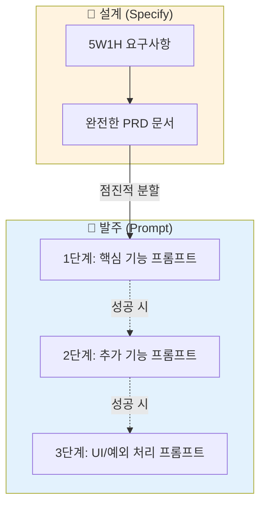

# 마이크로 세션: 040 — 미니 스펙 프로젝트: PRD 작성 및 프롬프트 준비

> **세션 ID**: MS-PY101-040  
> **소요 시간**: 25분  
> **난이도**: medium  
> **청크 타입**: lab

---

## §1. 개요

> **Day 2 | AM | 세션 040/106**

### 🎯 학습 목표

이 세션이 끝나면, 수강생 여러분은 앞서 정의한 요구사항을 공식적인 PRD로 변환하고, 이를 기반으로 AI에게 실제 코드를 요청할 '1단계 프롬프트'를 준비할 수 있게 됩니다.

### 선행 세션 환기

이전 세션에서 우리는 나만의 반짝이는 아이디어를 5W1H라는 프레임워크에 담아 단단한 뼈대로 만들었습니다. 이제 이 뼈대에 살을 붙여 완벽한 설계도를 완성하고, 시공팀인 AI에게 공사를 시작하라고 명령을 내릴 발주서를 작성할 시간입니다.

### 과정 환경 안내

실습 환경은 동일하게 **Windows 11**, **Gemini 3.1 Pro**, **Antigravity IDE(v1.18.4)**를 기준으로 진행됩니다.

---

## §2. 핵심 개념 (+ 🗣️ 강사 대본 + Mermaid)

여러분이 멋진 전원주택을 짓는다고 상상해 보세요. 건축가가 되어 5W1H를 기반으로 방의 개수와 화장실의 위치를 정한 설계도를 그렸습니다. 이 설계도가 바로 'PRD'입니다. 설계도가 완성되었다고 해서 집이 저절로 지어지지는 않습니다. 시공팀에게 "이 설계도대로 집을 지어주세요"라고 명확한 작업 지시를 내리는 '발주서'를 보내야 합니다. 우리가 지금부터 작성할 '프롬프트'가 바로 이 발주서 역할을 합니다. 

그런데 발주서를 보낼 때, "내일 당장 지붕부터 창문까지 완벽하게 다 지어놓으세요"라고 윽박지르면 공사는 반드시 실패합니다. 똑똑한 건축주는 시공팀에게 "1단계: 먼저 땅을 파고 기초 뼈대만 단단하게 세워주세요. 뼈대를 제가 확인하고 승인하면, 그때 2단계로 벽돌을 쌓아주세요"라고 단계별로 지시합니다. 소프트웨어 개발도 마찬가지입니다. 완벽한 PRD가 준비되었더라도 AI에게 "이대로 완벽한 프로그램 당장 짜와!"라고 요청하면 오류투성이 코드를 뱉어냅니다. PRD를 기반으로 하되, "오늘은 오직 1번 핵심 기능만 돌아가게 만들어줘"라고 요구하는 점진적 개선 전략이 프롬프트 작성의 핵심입니다.

🗣️ **강사 대본 (Instructor Script)**:

> 자, 이제 여러분의 요구사항을 진짜 개발자들이 보는 PRD 문서로 변환하고, 시공사인 AI에게 코드를 주문할 발주서까지 만들어 보겠습니다.
>
> 건축 설계도를 다 그렸다고 집이 생기지 않죠? 시공팀에게 발주서를 보내야 합니다. 우리가 앞서 만든 5W1H가 스케치라면, 이것을 PRD 형식으로 변환하는 것이 정식 설계도를 그리는 일이고, 최종적으로 작성할 프롬프트가 바로 시공 발주서입니다.
>
> 발주서를 쓸 때 가장 중요한 건 욕심을 버리는 거예요. 집을 지을 때 뼈대도 안 잡혔는데 벽지 색깔부터 고민하지 않잖아요? AI에게 코드를 요청할 때도 마찬가지입니다. 점진적 개선 전략을 꼭 기억하세요! 여러분이 쓴 PRD를 통째로 던져주되, 프롬프트의 맨 마지막에는 "1단계: 다른 부가 기능은 다 빼고, 가장 핵심이 되는 FR-001 기능 딱 하나만 에러 없이 돌아가게 파이썬 코드로 만들어줘"라고 요청하셔야 합니다. 이렇게 1단계를 성공적으로 통과해야만 2단계, 3단계로 안전하게 나아갈 수 있습니다.

### Mermaid 다이어그램



---

## §3. 상세 내용

나만의 아이디어를 PRD로 변환하는 첫 번째 작업은, 5W1H의 내용을 정해진 템플릿(개요, 사용자, 기능 명세, 제약 조건)에 알맞게 재배치하는 것입니다. 이 과정 역시 AI를 활용하면 아주 쉽게 해결할 수 있습니다. "내가 방금 작성한 5W1H 요구사항을 바탕으로 FR-001 형식의 기능 식별자가 포함된 공식 PRD로 변환해줘"라고 요청하면 됩니다. 여기서 주의할 점은, 자유 주제이다 보니 AI가 여러분의 의도를 넘어서서 불필요한 기능(예: 회원가입, 로그인 등)을 마음대로 추가하는 경우가 많다는 것입니다. 이때는 단호하게 "로그인 기능은 빼고, 핵심 기능 3개만 유지해"라고 범위를 깎아내는 작업이 반드시 선행되어야 합니다.

PRD가 깔끔하게 정리되었다면, 이제 대망의 첫 번째 발주서인 '코드 생성 프롬프트'를 작성할 차례입니다. 앞서 강조했듯 훌륭한 프롬프트는 '점진적 개선(Iterative Refinement)' 철학을 따릅니다. PRD 전체의 맥락은 프롬프트의 상단에 [Context]로 제공하여 AI가 이 프로그램의 최종 목적지를 이해하게 만듭니다. 하지만 [Task] 영역에서는 "현재는 1단계 개발 중이니, 오직 FR-001(핵심 로직)만 실행 가능하게 구현해 줘. 부가적인 기능은 향후 2단계에서 구현할 테니 지금은 빈 함수(pass)로만 남겨둬"라고 지시해야 합니다. 

이러한 단계적 접근법은 오류가 발생했을 때 그 원인을 찾는 디버깅 과정을 기적처럼 쉽게 만들어 줍니다. 한 번에 100줄을 짜서 에러가 나면 어디서 고장 났는지 찾기 어렵지만, 1단계로 20줄의 핵심 로직만 짜서 실행해 보면 문제가 있는지 없는지 즉각적으로 판별할 수 있습니다. 이것이 바로 AI 네이티브 개발자들이 복잡한 프로그램을 실패 없이 뚝딱뚝딱 만들어내는 가장 강력한 비밀 무기입니다.

> ✅ **체크포인트**:
> - PRD를 한 번에 모두 구현해 달라고 하지 않고 '1단계 프롬프트'로 쪼개어 요청해야 하는 이유는 무엇인가요?
> - 자유 주제로 PRD를 변환할 때, AI가 임의로 추가한 불필요한 기능들을 어떻게 처리해야 하나요?

---

## §4. 실습 가이드 (+ 🎙️ 실습 대본)

### 실습 목표

수강생은 이전 세션에서 도출한 요구사항을 AI를 이용해 PRD 형식으로 포맷팅하고, 가장 핵심적인 기능만을 우선적으로 요청하는 '1단계 코드 생성 프롬프트'를 완성합니다.

🎙️ **실습 가이드 대본 (Lab Guide Script)**:

> 여러분, 이제 여러분의 아이디어를 진짜 개발자의 문서로 둔갑시킬 시간입니다! 채팅창을 열고 이렇게 입력하세요. "방금 우리가 정리한 5W1H 요구사항을 바탕으로, 공식적인 PRD 문서를 작성해 줘. 목차는 개요, 대상 사용자, 기능 명세(FR-001~), 제약 조건 순서로 해줘."
>
> 결과물이 나오면 꼼꼼히 읽어보세요. 혹시 내가 원하지 않았던 복잡한 기능이 들어갔나요? 당장 빼달라고 하세요. 완벽한 PRD가 완성되었다면, 이제 코드를 낳을 프롬프트를 짤 차례입니다! 메모장을 열고 이렇게 적어보세요. "너는 파이썬 전문가야. 내가 방금 준 PRD를 바탕으로 프로그램을 짤 건데, 절대 한 번에 다 짜지 마. **1단계 목표: 오직 FR-001 기능만 에러 없이 콘솔에서 동작하게 만들어줘.**" 이 마법의 주문을 적어두셨다면 성공입니다. 다음 세션에서는 이 프롬프트 버튼을 누르고 코드가 폭포수처럼 쏟아지는 걸 구경할 겁니다!

### 단계별 지시

| 단계 | 소요 시간 | 강사 지시사항 | 학습자 액션 | 예상 결과 |
|------|----------|--------------|------------|----------|
| 1 | 10분 | "세션-039에서 작성한 요구사항을 AI를 활용하여 PRD 형식으로 변환하세요" | 요구사항을 PRD 템플릿에 맞게 포맷팅 요청 | FR 번호가 부여된 완전한 형태의 PRD 문서 |
| 2 | 10분 | "완성된 PRD를 기반으로 1단계(핵심 기능) 코드 생성 프롬프트를 작성하세요" | 점진적 개선 원칙이 적용된 프롬프트 초안 작성 | 5대 필수 항목이 포함된 1단계 발주서 |
| 3 | 5분 | "2단계, 3단계로 확장할 기능의 순서도 간략히 메모하세요" | 기능 확장 로드맵 구상 | 단계별로 구현할 기능 리스트업 완료 |

### 트러블슈팅 FAQ

| Q | A |
|---|---|
| 프롬프트에 PRD 내용을 다 복사해서 붙여넣어야 하나요? | 네, 프롬프트 창에 복사해서 넣는 것이 좋습니다. AI의 컨텍스트 창은 생각보다 금방 휘발되기 때문에, 코드를 짤 때마다 설계도를 다시 보여주는 것이 가장 안전합니다. |
| 1단계로 어떤 기능을 골라야 할지 모르겠어요 | 프로그램의 '존재 이유'가 되는 가장 핵심적인 계산이나 동작을 고르세요. 꾸미는 기능이나 저장 기능은 나중에 덧붙여도 됩니다. |
| 프롬프트를 보냈더니 AI가 코드를 바로 짜버렸어요 | 괜찮습니다! 다만 지금은 프롬프트를 '준비'하는 단계이니, 생성된 코드는 잠깐 무시하시고 내가 쓴 프롬프트가 점진적 지시를 잘 담고 있는지만 점검해 주세요. |

---

## §5. 코드 및 명령어 모음

### (참고) 1단계 코드 생성을 위한 점진적 프롬프트 템플릿

여러분의 PRD와 결합하여 코드 생성을 완벽하게 통제할 수 있는 실전 프롬프트 템플릿입니다. 대괄호 `[ ]` 부분을 자신의 프로젝트에 맞게 수정하여 사용하세요.

```text
[역할 부여]
너는 15년 차 파이썬 시니어 개발자야. 
나는 지금 콘솔에서 동작하는 '[내 프로젝트 주제]'를 개발하려고 해.

[컨텍스트: 설계도 제공]
아래는 이 프로그램의 전체 설계도인 PRD야. 먼저 이 내용을 완벽히 숙지해 줘.
--- (여기에 완성된 PRD 내용 복사/붙여넣기) ---

[작업 지시: 점진적 개발 1단계]
위 PRD를 모두 한 번에 구현하지 마. 우리는 단계적으로 개발할 거야.
지금은 "1단계" 작업만 수행해 줘.

1단계 목표: 가장 핵심 로직인 '[FR-001의 기능명]' 기능 하나만 완벽하게 동작하게 만들어 줘.
- 사용자에게 값을 입력받고 결과를 출력하는 기본 흐름만 있으면 돼.
- 아직 파일 저장이나 화려한 UI, 복잡한 예외 처리는 필요 없어.
- 코드는 PEP 8 스타일 가이드를 준수하고, 초보자가 이해하기 쉽게 한국어 주석을 달아 줘.

자, 1단계 파이썬 코드를 작성해 줘.
```

---

## §6. 요약

### 핵심 학습 포인트

우리는 거친 아이디어를 다듬어 완벽한 양식의 PRD라는 **정식 설계도**로 변환했습니다. 나아가 이 설계도를 쥐고 AI에게 코드를 요구할 때 지켜야 할 가장 중요한 원칙인 **점진적 개선(Iterative Refinement)** 전략을 배웠습니다. 

아무리 뛰어난 AI라도 한 번에 모든 것을 완벽하게 해낼 수는 없습니다. 건축 발주서를 쓰듯 뼈대부터 하나씩 차근차근 지시하는 '1단계 프롬프트' 작성법은, 여러분이 앞으로 어떤 거대한 소프트웨어를 기획하더라도 실패의 확률을 극단적으로 낮춰주는 가장 단단한 무기가 될 것입니다.

### 다음 세션 예고

모든 준비는 끝났습니다. 총알은 장전되었고 설계도는 완벽합니다. 다음 세션에서는 방금 정성스럽게 작성한 '1단계 프롬프트'의 엔터 키를 누르고, 마침내 코드가 생성되는 짜릿한 순간을 경험하게 될 것입니다. 코드를 생성하고, 실행하고, 오류를 잡으며 최종 프로그램을 완성하는 SDD의 하이라이트 구간으로 진입합시다!

### 브릿지 노트

> "발주서 작성이 완벽하게 끝났습니다! 가슴이 두근거리지 않나요? 다음 세션에서는 이 발주서를 AI에게 전송하고, 여러분의 상상력이 진짜 파이썬 코드로 현실화되어 눈앞에서 돌아가는 감동적인 순간을 직접 확인해 봅시다!"

---

## §7. 참고 자료

### 3-Source 출처

- **로컬 참고자료**: '프롬프트 설계안 §3.9' — 코드 생성 프롬프트 5대 필수 항목 가이드
- **로컬 참고자료**: '프롬프트 설계안 §2.3' — 점진적 개선(Iterative Refinement) 전략의 이론적 배경
- **NotebookLM**: (자체 생성) — 건축 발주서의 단계적 시공 지시 비유를 통한 프롬프트 전략 설명 데이터

### 용어 정리

| 용어 | 설명 |
|------|------|
| 발주서 (Order Form) | 기획된 요구사항을 바탕으로 시공팀(AI)에게 실제 개발을 요청하는 명확한 지시서, 즉 프롬프트를 의미 |
| 점진적 개선 (Iterative Refinement) | 한 번에 완벽한 결과물을 요구하지 않고, 뼈대 기능부터 시작해 단계를 밟아가며 살을 붙이고 수정해 나가는 개발 전략 |
| 디버깅 (Debugging) | 프로그램에서 발생하는 오류(버그)의 원인을 찾고 코드를 수정하여 올바르게 작동하도록 고치는 과정 |

### 관련 세션 연결 지도

| 이 세션의 개념 | 다시 등장하는 세션 | 어떻게 활용되는지 |
|---|---|---|
| 1단계 프롬프트 | 세션 041 | 다음 실습에서 이 프롬프트를 직접 실행하여 코드를 얻어내는 트리거로 사용됨 |
| 점진적 개선 전략 | 세션 041 | 1단계 성공 후 2단계, 3단계로 기능을 덧붙이는 연쇄적인 실습의 기본 룰로 작동함 |
| PRD 기반 지시 | 세션 042 | 발표 세션에서 본인이 어떻게 AI를 통제했는지 프롬프트 전략을 공유하는 핵심 소재가 됨 |

---

*작성 일시: 2026-02-25*  
*작성 에이전트: Sisyphus-Junior*  
*교안 구조: 7섹션 (A0 팀 공통 표준)*