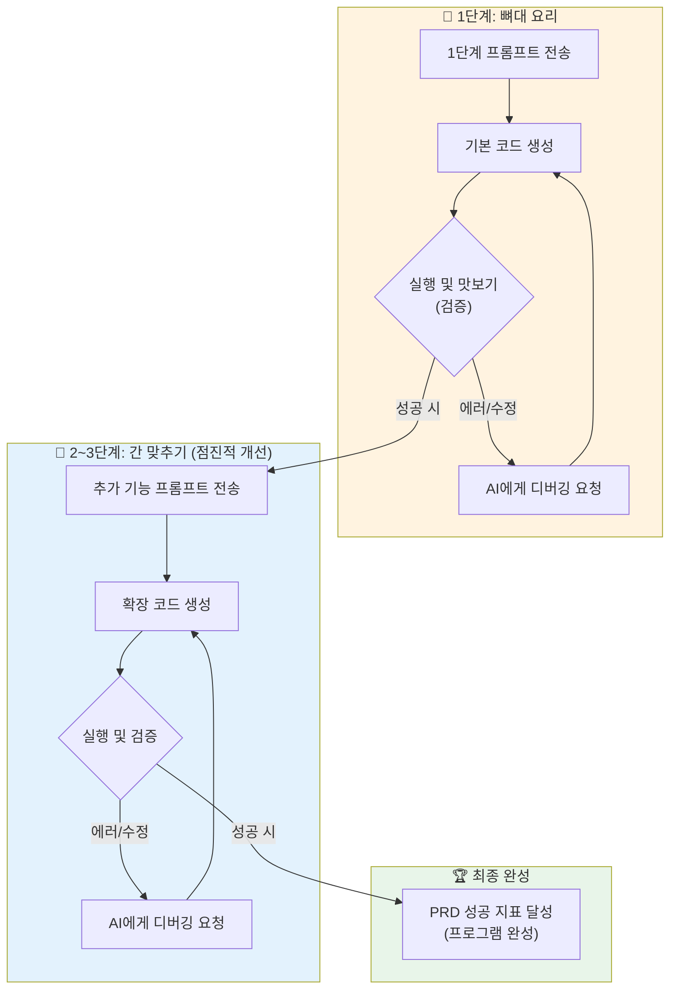

# 마이크로 세션: 041 — 미니 스펙 프로젝트: 코드 생성 및 실행 검증

> **세션 ID**: MS-PY101-041  
> **소요 시간**: 25분  
> **난이도**: high  
> **청크 타입**: lab

---

## §1. 개요

> **Day 2 | AM | 세션 041/106**

### 🎯 학습 목표

이 세션이 끝나면, 수강생 여러분은 자신이 치밀하게 준비한 프롬프트를 통해 코드를 생성하고, 실행과 디버깅을 반복하는 점진적 개선 과정을 거쳐 최종 프로그램을 성공적으로 완성할 수 있게 됩니다.

### 선행 세션 환기

우리는 지난 시간까지 아이디어를 5W1H로 정리하고, 그것을 PRD로 벼려낸 뒤, 시공팀인 AI에게 전달할 '1단계 발주서(프롬프트)'까지 완벽하게 장전했습니다. 그동안은 머릿속과 기획 문서에서만 맴돌던 여러분의 아이디어가 이제 드디어 실제 살아 숨 쉬는 파이썬 코드로 세상에 나올 차례입니다.

### 과정 환경 안내

코드를 직접 실행하고 결과를 확인하기 위해 **Windows 11**, **Gemini 3.1 Pro**, 그리고 우리의 플레이그라운드인 **Antigravity IDE(v1.18.4)**를 적극 활용합니다.

---

## §2. 핵심 개념 (+ 🗣️ 강사 대본 + Mermaid)

여러분이 오랜 시간 레시피를 연구하고 재료를 다듬어 마침내 요리 대회 본선 무대에 섰다고 상상해 보십시오. 완벽한 레시피(PRD)와 최고급 식재료(프롬프트)는 이미 도마 위에 준비되어 있습니다. 이제 프라이팬에 불을 켜고 실제로 요리를 시작(코드 생성)할 시간입니다. 하지만 일류 셰프들은 아무리 훌륭한 레시피가 있어도 눈대중으로 한 번에 요리를 끝내지 않습니다. 국물을 끓이면서 숟가락으로 살짝 맛을 보고(실행 검증), 조금 싱겁다 싶으면 소금을 더 넣고(오류 수정), 향이 부족하면 후추를 톡톡 뿌립니다(기능 추가). 

소프트웨어 개발에서 SDD의 Generate(생성)와 Validate(검증) 단계도 이 요리 과정과 소름 돋게 똑같습니다. 1단계 프롬프트를 전송해 뼈대 코드를 얻어냈다면, 눈으로만 대충 훑어보고 만족해서는 안 됩니다. 반드시 IDE의 실행 버튼을 눌러 내가 생각했던 대로 국물 맛이 나는지 '시식'을 해봐야 합니다. 만약 빨간색 에러 메시지가 뜨며 맛이 이상하다면 당황할 필요가 없습니다. 소금이 부족하다는 뜻일 뿐이니까요. AI에게 "이런 에러가 나는데 짠맛을 좀 더 내줄래?"라고 디버깅을 요청하면 됩니다. 1단계 국물 맛이 완벽해지면, 그때 2단계로 고기를 넣고 3단계로 예쁜 고명을 올리는 점진적 개선(Iterative Refinement)을 거치며 여러분만의 빛나는 프로그램이 완성됩니다.

🗣️ **강사 대본 (Instructor Script)**:

> 자, 여러분! 드디어 올 것이 왔습니다. 요리 대회 본선 무대의 막이 올랐습니다! 앞선 세션에서 정성껏 다듬어둔 '1단계 프롬프트'를 AI에게 쿨하게 전송하세요. 
>
> 1초, 2초... 짠! 여러분의 아이디어가 파이썬 코드로 변해서 눈앞에 나타났습니다. 감격스럽죠? 하지만 여기서 멈추면 안 됩니다. 눈으로만 코드 구경하지 마시고, 얼른 에디터에 복사해서 실행 버튼을 쾅 눌러보세요! 여러분이 직접 키보드로 값을 입력하고 엔터를 쳐보는 겁니다. 국물 맛을 보는 '시식' 시간이에요. 
>
> 어? 빨간색 영어 글씨가 쏟아지며 에러가 났나요? 프로그램이 멈췄나요? 축하합니다! 개발의 진짜 묘미가 시작된 겁니다. 당황하지 마시고 그 붉은 에러 메시지를 그대로 복사해서 AI에게 던지세요. "이런 에러가 나는데 고쳐줘"라고요. AI가 찰떡같이 수정된 코드를 줄 겁니다. 1단계 기능이 완벽하게 돌아가면, "좋아, 훌륭해! 이제 2단계인 검색 기능을 추가해 줘"라고 점진적으로 코드를 키워가세요. 이렇게 3단계까지 무사히 오시면, 세상에 단 하나뿐인 여러분만의 프로그램이 탄생합니다!

### Mermaid 다이어그램



---

## §3. 상세 내용

코드를 생성하고 검증하는 Generate와 Validate 사이클에서 초보자들이 가장 두려워하는 것은 단연코 화면을 붉게 물들이는 '에러(Error) 메시지'입니다. 하지만 AI 시대의 개발자에게 에러는 실패를 의미하는 낙인이 아니라, 목적지로 향하는 가장 정확한 네비게이션입니다. 코드가 작동하지 않을 때 코드를 직접 뜯어고치려 끙끙대지 마십시오. 대신 IDE 터미널에 출력된 에러 메시지를 마우스로 드래그하여 복사한 뒤, AI에게 "코드를 실행했더니 터미널에서 이런 오류가 발생했어: [오류 메시지 붙여넣기]. 원인이 무엇이고 어떻게 수정해야 하는지 알려줘"라고 질문을 던지는 것이 디버깅의 정석입니다.

기본 뼈대 로직이 완벽하게 작동하여 1단계를 무사히 통과했다면, 이제 프로그램에 살을 붙이는 2단계로 진입합니다. 이때 중요한 프롬프팅 스킬은 "현재 코드를 유지한 상태에서"라는 제약 조건을 거는 것입니다. AI는 가끔 기능을 추가해 달라고 하면 기존의 멀쩡했던 코드를 통째로 갈아엎는 환각(Hallucination)을 일으키곤 합니다. 이를 방지하기 위해 "방금 네가 짜준 1단계 코드는 완벽하게 동작해. 이제 이 기존 로직을 훼손하지 말고, 여기에 FR-002 기능인 '데이터 삭제' 부분만 추가로 덧붙여서 전체 코드를 다시 보여줘"라고 안전장치를 걸어주어야 합니다.

마지막 3단계에서는 사용성(UI/UX)과 극단적인 예외 상황을 처리하여 프로그램의 완성도를 끌어올립니다. 예를 들어 계산기 프로그램이라면 사용자가 숫자가 아닌 '가나다' 같은 문자를 입력했을 때 프로그램이 폭발하며 종료되지 않도록 방어하는 코드가 필요합니다. "사용자가 문자를 입력해도 프로그램이 꺼지지 않고 '다시 입력하세요'라고 친절하게 안내하는 예외 처리 코드를 추가해 줘"라고 마지막 간을 맞추고 나면, 마침내 PRD에서 정의했던 감독의 OK 사인, 즉 '성공 지표'를 100% 충족하는 탄탄한 소프트웨어가 완성됩니다.

> ✅ **체크포인트**:
> - 실행 중 에러가 발생했을 때, 직접 코드를 고치는 대신 취해야 할 올바른 AI 활용 디버깅 방법은 무엇인가요?
> - 기능을 추가하는 2단계 프롬프트를 작성할 때, 기존 코드가 망가지는 것을 막기 위해 어떤 조건을 걸어야 하나요?

---

## §4. 실습 가이드 (+ 🎙️ 실습 대본)

### 실습 목표

수강생은 1단계 프롬프트를 활용해 뼈대 코드를 얻고 직접 실행하며, 에러 발생 시 AI와 협업하여 디버깅합니다. 이후 점진적 개선 전략을 적용해 2, 3단계 기능을 추가하며 최종 프로그램을 완성합니다.

🎙️ **실습 가이드 대본 (Lab Guide Script)**:

> 자, 모두 집중! 앞서 써둔 1단계 프롬프트를 AI에게 쏴주세요. 코드가 나왔죠? 우측 상단의 'Copy' 버튼을 눌러서 Antigravity IDE에 붙여넣고 실행해 봅시다.
>
> 앗, 빨간 글씨가 뜨면서 에러가 난 분 계신가요? 박수 한 번 쳐주세요! 아주 정상입니다. 그 에러 메시지를 긁어서 AI에게 "이런 에러 났어, 고쳐!"라고 던지세요. 오류 없이 실행되나요? 그럼 성공입니다! 
>
> 1단계가 통과된 분들은 지체하지 말고 2단계 프롬프트를 보냅니다. "지금 기능 아주 좋아. 기존 코드 망가뜨리지 말고 이번엔 두 번째 기능 추가해 줘." 이렇게요. 마지막 3단계로는 사용자가 이상한 값을 넣었을 때 튕기지 않게 막아주는 예외 처리까지 부탁해보세요. 이 세 고개만 넘으면, 여러분의 상상이 현실이 된 완벽한 프로그램이 짠하고 돌아갈 겁니다. 15분 드리겠습니다. 시작!

### 단계별 지시

| 단계 | 소요 시간 | 강사 지시사항 | 학습자 액션 | 예상 결과 |
|------|----------|--------------|------------|----------|
| 1 | 8분 | "1단계 프롬프트로 뼈대 코드를 생성해 실행하고, 에러 시 디버깅을 요청하세요" | 코드 복사/붙여넣기 및 실행, 에러 메시지로 핑퐁 | 핵심 기능만 완벽히 동작하는 1단계 베이스 코드 |
| 2 | 10분 | "기존 코드 유지를 명시하며 2단계(추가 기능), 3단계(예외 처리)를 점진적으로 덧붙이세요" | 2, 3차 기능 확장 프롬프트 작성 및 코드 교체 실행 | 모든 FR이 통합되고 방어 로직이 적용된 코드 |
| 3 | 7분 | "최종 코드를 여러 번 테스트하며 PRD에 적어둔 성공 지표를 통과하는지 검증하세요" | 의도적인 오입력 테스트 및 결과물 확인 | SDD 사이클(Generate→Validate) 최종 검수 완료 |

### 트러블슈팅 FAQ

| Q | A |
|---|---|
| AI가 준 코드를 실행했는데 무한 루프에 빠져서 안 멈춰요! | 터미널 창을 클릭하고 키보드에서 `Ctrl + C`를 누르면 강제로 멈춥니다. 그다음 AI에게 "무한 루프에 빠졌어, 종료 조건을 고쳐줘"라고 하세요. |
| 2단계를 추가했더니 잘 되던 1단계가 고장 났어요 | 전형적인 AI 환각입니다. "잠깐, 방금 수정한 코드 때문에 1단계 로직이 망가졌어. 이전 버전 베이스에서 다시 안전하게 합쳐줘"라고 따끔하게 지적하세요. |
| 에러 메시지가 너무 길어서 복사하기 힘들어요 | 맨 마지막에 있는 2~3줄의 빨간색 글씨(예: NameError, TypeError 등)가 핵심입니다. 그 부분만 복사해서 줘도 AI는 찰떡같이 알아듣습니다. |

---

## §5. 코드 및 명령어 모음

### (참고) 디버깅 및 점진적 확장을 위한 실전 프롬프트 패턴

코드 실행 중 막혔을 때 에디터와 AI 사이에서 핑퐁을 칠 때 유용하게 쓸 수 있는 치트키 프롬프트들입니다.

```text
[🚨 에러 발생 시: 디버깅 요청 프롬프트]
네가 짜준 코드를 실행했더니 터미널에서 아래와 같은 오류가 발생하며 멈췄어.
원인이 무엇인지 분석하고, 수정된 전체 코드를 다시 보여줘.

[오류 메시지]
Traceback (most recent call last):
  File "main.py", line 15, in <module>
    result = count + "개"
TypeError: unsupported operand type(s) for +: 'int' and 'str'

[🏗️ 1단계 통과 후: 2단계 확장 프롬프트]
훌륭해! 1단계 핵심 로직이 아주 완벽하게 잘 돌아가.
이제 기존 코드를 절대 훼손하지 말고, 이 코드 위에 2단계 기능을 덧붙일 거야.
사용자가 메뉴에서 '2번'을 입력하면 전체 목록을 보여주는 조회 기능을 추가해서
완성된 전체 파이썬 코드를 출력해 줘.

[🛡️ 마지막 완성: 예외 처리 강화 프롬프트]
기능은 다 완성됐어. 마지막으로 프로그램이 튕기지 않게 방어막을 칠게.
사용자가 숫자를 입력해야 하는 곳에 '가나다' 같은 문자를 입력하면, 
프로그램이 뻗지 않고 "잘못된 입력입니다. 숫자로 다시 입력하세요"라고 
출력한 뒤 다시 입력받도록 예외 처리(try-except)를 코드 곳곳에 튼튼하게 추가해 줘.
```

---

## §6. 요약

### 핵심 학습 포인트

우리는 막연했던 아이디어가 담긴 PRD 발주서를 통해 AI라는 시공팀을 움직여 마침내 살아 숨 쉬는 파이썬 코드를 얻어냈습니다. 한 번에 모든 것을 완벽하게 해내는 마법은 없습니다. 핵심 기능만 담긴 1단계 코드를 실행해 보고, 붉은 에러가 나면 AI와 함께 디버깅하며 소금 간을 맞추었습니다.

그렇게 뼈대가 튼튼해진 것을 두 눈으로 검증(Validate)한 뒤에야, 기존 로직을 훼손하지 않는 선에서 2단계 기능 추가와 3단계 예외 처리를 거치는 **점진적 개선(Iterative Refinement)**의 진수를 맛보았습니다. 이 작지만 위대한 성공 경험이야말로, 앞으로 여러분이 어떤 복잡한 프로그램을 마주하더라도 두려움 없이 SDD 사이클을 돌릴 수 있게 해주는 가장 강력한 자산입니다.

### 다음 세션 예고

길고 험난했지만 눈부시게 즐거웠던 미니 프로젝트의 여정이 모두 끝났습니다. 여러분 각자의 모니터에는 치열한 고민 끝에 완성된 세상에 단 하나뿐인 멋진 프로그램이 돌아가고 있습니다. 다음 세션에서는 우리가 AI와 어떻게 티키타카를 주고받았는지, 그 눈물겹고 빵 터지는 실패와 성공의 대화 기록들을 동료들과 공유하며 함께 성장하는 회고의 시간을 가져보겠습니다.

### 브릿지 노트

> "에러의 늪을 헤치고 점진적 개선의 산을 넘어, 마침내 여러분만의 자랑스러운 소프트웨어가 탄생했습니다! 정말 고생 많으셨습니다. 이제 키보드에서 잠시 손을 떼고, 다음 세션에서 동료들은 AI와 어떤 웃지 못할 대화를 나누며 요리를 완성했는지 시식회에 참석해 봅시다!"

---

## §7. 참고 자료

### 3-Source 출처

- **로컬 참고자료**: 'AI 시대의 서사 §SDD' — AI 코딩 시 필수적인 Generate와 Validate 사이클의 실무 적용
- **로컬 참고자료**: '프롬프트 설계안 §2.3' — 코드를 무너뜨리지 않고 확장하는 점진적 개선(Iterative Refinement) 전략
- **NotebookLM**: (자체 생성) — 요리 대회의 레시피와 시식 과정 비유를 통한 디버깅 프로세스 설명 데이터

### 용어 정리

| 용어 | 설명 |
|------|------|
| 터미널 (Terminal) | 작성한 코드가 실제로 실행되어 텍스트 형태로 결과를 출력하고 사용자의 입력을 받는 까만색 콘솔 창 |
| 디버깅 (Debugging) | 터미널에 나타난 오류(버그) 메시지를 단서로 삼아 코드의 문제점을 찾아내고 수정하는 일련의 치료 과정 |
| 예외 처리 (Exception Handling) | 사용자가 기획자의 의도와 다르게 엉뚱한 값을 입력했을 때 프로그램이 멈추지 않도록 미리 대비책을 세워두는 안전장치 |

### 관련 세션 연결 지도

| 이 세션의 개념 | 다시 등장하는 세션 | 어떻게 활용되는지 |
|---|---|---|
| AI 협업 디버깅 | 세션 042 | 이 세션에서 겪었던 에러 해결 경험이 팀별 발표 시간의 가장 핵심적인 스토리텔링 재료가 됨 |
| 점진적 개선 체화 | 세션 043 | Day 2 핵심 요약 시간에 프롬프트 설계의 가장 중요한 무기 중 하나로 포트폴리오에 정리됨 |
| 코드 실행과 검증 | 세션 055 | 향후 Day 3의 파이썬 문법 기초 중 'try-except' 구문을 배울 때 방어적 코딩의 실전 사례로 다시 언급됨 |

---

*작성 일시: 2026-02-25*  
*작성 에이전트: Sisyphus-Junior*  
*교안 구조: 7섹션 (A0 팀 공통 표준)*