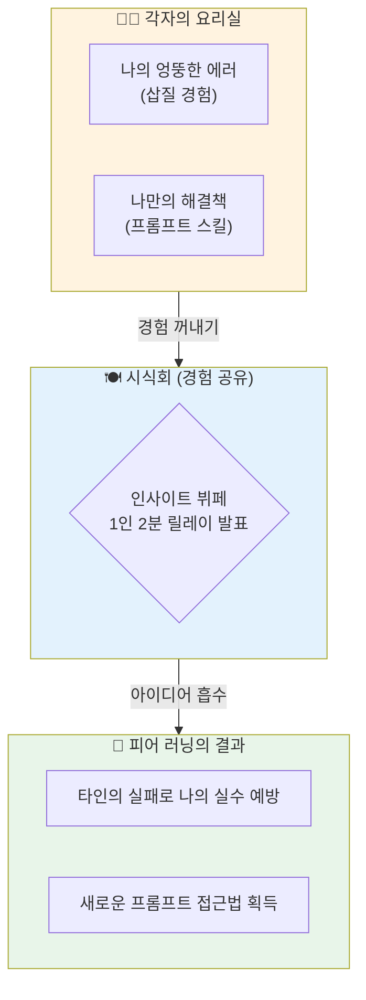

# 마이크로 세션: 042 — 팀별 발표: '나는 이렇게 AI와 대화했다'

> **세션 ID**: MS-PY101-042  
> **소요 시간**: 15분  
> **난이도**: low  
> **청크 타입**: narrative

---

## §1. 개요

> **Day 2 | AM | 세션 042/106**

### 🎯 학습 목표

이 세션이 끝나면, 수강생 여러분은 자신이 겪은 AI 상호작용 과정과 뼈아픈 오류 해결 경험을 동료들에게 명확하게 공유하고, 다른 이의 경험을 통해 새로운 프롬프트 전략을 흡수할 수 있게 됩니다.

### 선행 세션 환기

방금 전 우리는 폭풍 같은 집중력으로 1단계 프롬프트를 날리고, 쏟아지는 빨간색 에러들을 AI와 함께 격파하며 마침내 각자의 멋진 미니 프로그램을 완성해 냈습니다. 치열했던 개발의 열기가 가시지 않은 지금, 이 전투의 흔적들을 조심스럽게 꺼내어 볼 시간입니다.

### 과정 환경 안내

이 세션은 코딩을 잠시 멈추고 서로의 눈을 맞추며 대화하는 시간이므로 특별한 툴 조작은 필요 없습니다. 가벼운 마음과 메모할 도구만 준비해 주시면 됩니다.

---

## §2. 핵심 개념 (+ 🗣️ 강사 대본 + Mermaid)

같은 브랜드의 프라이팬과 똑같은 레시피, 완벽히 동일한 식재료를 나눠주더라도 요리 학원의 시식회에 올라온 결과물들은 하나같이 맛과 향이 다릅니다. 불을 조절하는 미세한 타이밍, 소금을 뿌리는 각자의 손맛이 다르기 때문입니다. 우리가 진행한 미니 프로젝트도 이와 완벽하게 똑같습니다. 우리는 모두 똑같은 'Gemini 3.1 Pro'라는 도구를 사용했고 '점진적 개선'이라는 동일한 레시피를 배웠지만, 모니터에 떠 있는 여러분의 프로그램들은 각자의 개성과 창의성이 듬뿍 담긴 세상에 단 하나뿐인 결과물들입니다.

AI 활용 능력에 있어서 정답은 단 하나만 존재하지 않습니다. 내가 끙끙대며 10줄로 길게 썼던 프롬프트를 옆자리의 동료는 단 두 줄의 기발한 비유로 깔끔하게 해결했을지도 모릅니다. 반대로 내가 우연히 던진 엉뚱한 질문이 AI의 놀라운 잠재력을 끌어내어 기막힌 예외 처리 코드를 만들어냈을 수도 있습니다. 나의 요리(결과물)를 자랑하고 남의 요리(프롬프트 전략)를 맛보며 "아, 이런 각도에서도 질문할 수 있구나!"라는 감탄을 자아내는 이 시간이야말로, 혼자서 모니터만 파고들 때보다 수십 배는 더 빠르게 AI 네이티브 개발자로 성장하게 만드는 마법의 '피어 러닝(Peer Learning)'입니다.

🗣️ **강사 대본 (Instructor Script)**:

> 여러분, 정말 고생 많으셨습니다! 모니터 화면에 여러분이 직접 구상한 프로그램이 돌아가는 걸 보니 저도 가슴이 두근거리네요. 하지만 똑같은 AI를 썼다고 해서 모두가 똑같은 방식으로 대화하지는 않았을 겁니다. 어떤 분은 AI를 엄격하게 채찍질하며 코드를 짜냈고, 어떤 분은 다정하게 어르고 달래며 에러를 잡으셨겠죠.
>
> 마치 요리 학원 시식회처럼 서로의 결과물을 맛볼 시간입니다. 팀별로 돌아가면서 딱 세 가지만 공유해 주세요. 첫째, '나는 세상에 하나뿐인 어떤 귀여운 프로그램을 만들었는가?'. 둘째, 'AI가 엉뚱한 소리를 하거나 에러가 났을 때, 내가 던진 어떤 프롬프트가 가장 효과적으로 AI의 멱살을 잡고 끌고 왔는가?'. 그리고 마지막 셋째, '이 삽질의 과정에서 내가 얻은 가장 크고 값진 깨달음은 무엇인가?'. 
>
> 1인당 딱 2분입니다. 짧고 굵게 자랑하시고, 다른 분이 발표할 때는 귀를 쫑긋 세우고 "저 프롬프트는 꼭 훔쳐 와야겠다"라는 생각으로 메모해 주세요! 자, 지금부터 시작하겠습니다.

### Mermaid 다이어그램



---

## §3. 상세 내용

훌륭한 경험 공유는 목적 없는 잡담과 달리 명확한 가이드라인 속에서 진행되어야 가장 큰 폭발력을 발휘합니다. 발표가 산으로 가는 것을 막기 위해 우리는 철저하게 3가지 포인트에만 집중해야 합니다. 첫 번째 핵심 포인트는 '주제와 목표'입니다. "저는 텍스트 기반 다마고치 게임을 만들었습니다"라고 10초 만에 내가 그린 숲의 모양을 동료들의 머릿속에 심어주어야 합니다. 두 번째는 이 발표의 하이라이트인 '프롬프트 전략'입니다. "AI가 계속 무한 루프 코드를 짜주길래, '터미널이 터질 것 같으니 무조건 3번만 돌고 종료되는 제동장치를 걸어줘'라고 비유적으로 말했더니 한 번에 고쳐주었습니다"와 같이 구체적이고 실전적인 대화의 기술을 풀어놓아야 합니다. 

세 번째 포인트는 '배운 점(Lessons Learned)'입니다. 기술적인 깨달음뿐만 아니라 "AI를 너무 맹신하면 안 되겠다" 혹은 "생각보다 AI가 내 개떡 같은 질문도 찰떡같이 알아듣는다"와 같은 감정적인 통찰이라도 좋습니다. 이 세 가지를 120초 안에 담아내어 발표하는 것 자체가 나의 머릿속에 흩어져 있던 프로젝트의 파편들을 단단한 하나의 경험치로 압축 저장하는 과정입니다.

듣는 사람의 역할 역시 발표자 못지않게 중요합니다. 다른 사람의 실패담을 들으며 웃고 넘기는 것이 아니라, '만약 내가 저 상황이었다면 나는 AI에게 어떻게 질문했을까?'라고 속으로 시뮬레이션해 보아야 합니다. 이 상호작용 속에서 타인의 시행착오가 고스란히 나의 경험치로 전이되는 마법이 일어납니다. 정답이 없는 AI와의 소통 영역에서는, 천재적인 개발자 한 명의 노하우보다 평범한 동료 열 명의 생생한 삽질 기록이 훨씬 더 위대한 스승이 됩니다.

> ✅ **체크포인트**:
> - 팀별 발표에서 반드시 포함되어야 할 핵심 포인트 3가지는 무엇인가요?
> - 정답이 없는 AI 프롬프트 스킬을 향상하는 데 있어 동료들과의 경험 공유(피어 러닝)가 중요한 이유는 무엇인가요?

---

## §4. 실습 가이드 (+ 🎙️ 실습 대본)

### 실습 목표

이 세션은 키보드를 내려놓고 동료들과 눈을 맞추며 진행하는 회고형 내러티브 세션으로, 3가지 핵심 포인트를 바탕으로 자신의 AI 협업 과정을 논리적으로 요약하여 발표하고 타인의 인사이트를 흡수합니다.

🎙️ **실습 가이드 대본 (Lab Guide Script)**:

> 자, 모두 키보드에서 손을 떼고 의자를 돌려 팀원들을 바라봐주세요. 발표 준비 시간은 딱 2분 드리겠습니다. 노트에 세 줄만 적으세요. 1. 내가 만든 프로그램 이름, 2. AI의 멱살을 잡았던 나만의 비장의 프롬프트 문구, 3. 이 삽질을 통해 깨달은 단 한 가지.
>
> 다 적으셨나요? 그럼 지금부터 오른쪽 방향으로 돌아가며 릴레이 발표를 시작하겠습니다. 다른 분이 말씀하실 때 "오, 그 프롬프트 기발한데요?" 하고 폭풍 리액션을 쏴주시는 분들께는 제 마음속의 가산점을 드리겠습니다. 모든 팀원의 발표가 끝나면, 우리 팀에서 가장 기가 막히게 AI를 조련했던 '올해의 조련사' 한 분을 뽑아주세요. 나중에 전체 반에 그분의 썰을 자랑할 겁니다. 자, 화기애애한 시식회를 시작해주세요!

### 단계별 지시

| 단계 | 소요 시간 | 강사 지시사항 | 학습자 액션 | 예상 결과 |
|------|----------|--------------|------------|----------|
| 1 | 2분 | "발표 가이드라인 3가지를 확인하고, 노트에 1분 스피치 키워드를 메모하세요" | 프로젝트 진행 과정 복기 및 요약 | 핵심만 압축된 릴레이 발표 준비 완료 |
| 2 | 10분 | "팀별로 돌아가며 1인당 2분씩 쉴 틈 없이 밀도 있게 발표하세요" | 자신의 썰 풀기 및 타인의 경험 적극 경청 | 각기 다른 프롬프트 접근법의 상호 교환 |
| 3 | 3분 | "가장 인상 깊었던 프롬프트 조련술을 각 팀 대표가 전체 반에 자랑해 주세요" | 팀 내 최고의 인사이트 발췌 및 공유 | 클래스 전체가 공유하는 '필살기 프롬프트' 확보 |

### 트러블슈팅 FAQ

| Q | A |
|---|---|
| 제가 만든 게 너무 볼품없어서 부끄러워요 | 완성도가 중요한 게 아닙니다! 에러를 잡기 위해 AI와 어떤 코미디 같은 대화를 나눴는지, 그 과정 자체를 나누는 것이 이 세션의 진정한 목적입니다. |
| 발표 내용이 자꾸 코딩 기술 설명으로 빠져요 | 팀원들이 나서서 끊어주셔야 합니다. "파이썬 문법 말고, 그래서 AI한테 뭐라고 타이핑하셨는데요?"라고 질문의 초점을 프롬프트 쪽으로 돌려주세요. |
| 어떤 프롬프트를 적어둬야 할지 모르겠어요 | 내가 썼을 때 AI의 대답이 180도 바뀌었던 그 마법의 한 문장, 혹은 AI가 멍청한 소리를 하다가 정신 차리게 만들었던 호통의 한 문장을 적어두시면 됩니다. |

---

## §5. 코드 및 명령어 모음

### (참고) 1분 회고 발표를 위한 마인드 맵 템플릿

발표를 준비할 때 머릿속의 생각들을 빠르게 체계화할 수 있는 빈칸 채우기 형식의 메모 템플릿입니다.

```text
[🎤 나의 AI 조련 일지 메모장]

1. 나의 작고 소중한 프로젝트 소개
- "저는 (                                )의 불편함을 해결하기 위해"
- "(                                )라는 프로그램을 만들었습니다."

2. AI와의 숨 막히는 티키타카 (프롬프트 전략)
- "가장 속 터졌던 순간은 AI가 자꾸 (                                )할 때였습니다."
- "그래서 저는 프롬프트에 (                                )라고 조건을 걸어버렸죠."
- "그랬더니 AI가 찰떡같이 (                                )로 수정해 오더군요!"

3. 뼈저린 깨달음 (Lessons Learned)
- "결론적으로 AI 코딩에서 가장 중요한 건, 파이썬 지식보다 (                                )라는 사실을 배웠습니다."
```

---

## §6. 요약

### 핵심 학습 포인트

우리는 혼자만의 외로운 모니터에서 벗어나, 동료들과 함께 웃고 공감하며 각자의 AI 협업 경험을 쏟아내는 뜨거운 시식회를 열었습니다. 같은 도구를 쥐여주어도 백이면 백 다른 결과물이 나오는 것처럼, AI를 다루는 방식에는 무한한 정답이 존재함을 깨달았습니다.

나의 에러 해결 경험을 말로 풀어내며 머릿속의 파편화된 지식을 단단하게 굳혔고, 동료들이 AI와 투닥거리며 얻어낸 기발한 프롬프트 스킬들을 뷔페 음식 담듯 내 머릿속으로 흡수하는 **피어 러닝(Peer Learning)**의 진정한 가치를 맛보았습니다. 이 나눔의 시간은 여러분을 단순한 '코드 복사기'에서 '뛰어난 AI 디렉터'로 진화시키는 기폭제가 되었습니다.

### 다음 세션 예고

모든 실습과 흥미진진한 무용담 공유가 끝이 났습니다. 눈코 뜰 새 없이 몰아쳤던 Day 2의 하루가 저물어 갑니다. 오늘 하루 동안 여러분은 요구사항 분석, PRD 작성, 코드 생성, 디버깅이라는 어마어마한 양의 무기들을 손에 넣었습니다. 다음 세션에서는 Day 3 실전 코딩의 세계로 떠나기 전에, 오늘 획득한 이 강력한 무기들을 가지런히 가방에 정리하고 요약해보는 프롬프트 포트폴리오 점검의 시간을 갖도록 하겠습니다.

### 브릿지 노트

> "여러분의 생생한 경험담 덕분에 교실에 꿀팁들이 비처럼 쏟아졌습니다! 엄청난 에너지를 뿜어낸 Day 2의 여정이 이제 막바지에 다다랐습니다. 다음 세션에서는 오늘 얻어낸 전리품들을 아주 깔끔하게 한 장으로 압축해 보는 뇌 정돈의 시간을 가져봅시다."

---

## §7. 참고 자료

### 3-Source 출처

- **로컬 참고자료**: '과정 운영 원칙 §동료 학습' — 피어 러닝(Peer Learning)을 통한 집단 지성 극대화 및 메타인지 강화 원리
- **로컬 참고자료**: '프롬프트 설계안 §부록' — 다면적 프롬프팅 사례 수집 및 템플릿화의 중요성
- **NotebookLM**: (자체 생성) — 요리 학원의 시식회 비유를 통한 다각적 결과물 및 접근법 공유의 가치 데이터

### 용어 정리

| 용어 | 설명 |
|------|------|
| 피어 러닝 (Peer Learning) | 동료들끼리 서로의 실패 경험과 성공 노하우를 나누며 교재나 강사에게서 얻을 수 없는 실전 인사이트를 주고받는 학습법 |
| 메타인지 (Metacognition) | 자신이 아는 것과 모르는 것을 객관적으로 파악하는 능력. 나의 경험을 타인에게 설명(발표)할 때 가장 폭발적으로 상승함 |
| 티키타카 (Tiki-taka) | AI가 완벽한 답을 한 번에 주지 않을 때, 서로 질문과 답변을 핑퐁처럼 빠르게 주고받으며 원하는 결과물을 조율해 나가는 대화의 과정 |

### 관련 세션 연결 지도

| 이 세션의 개념 | 다시 등장하는 세션 | 어떻게 활용되는지 |
|---|---|---|
| 프롬프트 전략 공유 | 세션 043 | 바로 다음 세션에서 Day 2 핵심 내용을 요약할 때, 여기서 나온 꿀팁들이 포트폴리오의 영감이 됨 |
| 에러 해결(삽질) 경험 | 세션 072 | Day 4에서 절차적 코드를 리뷰하고 얽힌 코드를 풀어낼 때, 문제를 직면하고 회고하는 태도의 밑바탕이 됨 |
| 동료와의 교차 시각 | 세션 080 | 퀄리티 체크와 리뷰 코멘트 작성 실습 시 타인의 코드를 분석하고 피드백을 주는 시야를 제공함 |

---

*작성 일시: 2026-02-25*  
*작성 에이전트: Sisyphus-Junior*  
*교안 구조: 7섹션 (A0 팀 공통 표준)*