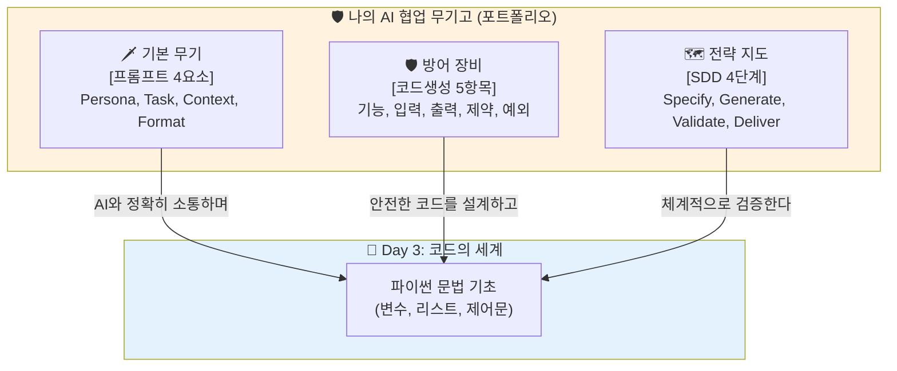

# 마이크로 세션: 043 — Day 2 핵심 요약 및 프롬프트 포트폴리오 정리

> **세션 ID**: MS-PY101-043  
> **소요 시간**: 15분  
> **난이도**: low  
> **청크 타입**: narrative

---

## §1. 개요

> **Day 2 | AM | 세션 043/106**

### 🎯 학습 목표

이 세션이 끝나면, 수강생 여러분은 Day 2에서 배운 세 가지 강력한 무기(프롬프트 4요소, 코드 생성 5항목, SDD 4단계)의 핵심을 요약하고, 이를 자신만의 '프롬프트 포트폴리오'로 정리하여 실전에 즉시 투입할 수 있게 됩니다.

### 선행 세션 환기

우리는 오늘 하루 동안 엉성한 아이디어를 5W1H로 해체하고, PRD라는 정식 문서로 포장한 뒤, 마침내 살아 숨 쉬는 파이썬 코드로 만들어 내는 마법 같은 개발의 전 과정을 거쳐왔습니다. 그리고 직전 세션에서 동료들과의 대화를 통해 각자의 노하우까지 듬뿍 흡수했습니다.

### 과정 환경 안내

이제 모든 도구를 잠시 내려놓고, 머릿속의 지식들을 차곡차곡 서랍에 정리하는 시간입니다. 필기도구와 함께 가벼운 마음으로 세션에 참여해 주시면 됩니다.

---

## §2. 핵심 개념 (+ 🗣️ 강사 대본 + Mermaid)

여러분이 RPG 게임의 모험가가 되어 거대한 드래곤(복잡한 프로그램)을 잡으러 떠난다고 상상해 봅시다. 드래곤의 둥지로 들어가기 직전, 모험가는 벤치에 앉아 자신의 무기고를 마지막으로 점검합니다. 녹슨 검은 갈아 끼우고, 마법 스크롤은 꺼내기 쉬운 주머니에 배치하며, 던전의 지도를 다시 한번 머릿속에 각인시킵니다. 지금 우리가 하는 '포트폴리오 정리'가 바로 내일 시작될 진짜 코딩 던전으로 들어가기 직전, 우리가 오늘 획득한 세 가지 전설의 무기들을 완벽하게 세팅하는 무기고 점검의 시간입니다.

우리가 오늘 하루 동안 얻은 세 가지 무기는 아주 명확합니다. 첫 번째 무기는 기본 검인 **'프롬프트 4요소(Persona, Task, Context, Format)'**입니다. 어떤 복잡한 요구를 하더라도 이 네 가지 뼈대만 맞추면 AI는 정확하게 여러분의 의도를 파악합니다. 두 번째는 특수 무기인 **'코드 생성 5대 필수 항목(기능, 입력, 출력, 제약조건, 예외처리)'**입니다. 코드의 뼈대에 살을 붙이고 에러를 방어하는 가장 튼튼한 방패 역할을 합니다. 마지막 세 번째 무기는 여러분이 걷게 될 전략 지도, 즉 **'SDD 4단계 사이클(Specify, Generate, Validate, Deliver)'**입니다. 이 세 가지 무기가 한 장의 포트폴리오로 정리되어 있다면, 여러분은 더 이상 코딩이 두려운 초보자가 아니라 AI라는 거대한 마법을 부리는 강력한 마법사로서 코딩의 세계를 탐험하게 될 것입니다.

🗣️ **강사 대본 (Instructor Script)**:

> 여러분, 오늘 하루 동안 정말 폭풍 같은 일정을 소화하셨습니다! 요구사항을 분석하고, PRD를 쓰고, 코드를 만들어내고... 여러분은 오늘 하루 만에 단순한 코딩 초보에서 기획의 뼈대를 세우는 '소프트웨어 디렉터'로 성장하셨습니다.
>
> 내일 Day 3부터는 본격적으로 파이썬 코드의 세계로 들어갑니다. 그전에 오늘 우리가 얻은 강력한 무기 3가지를 한 장의 포트폴리오로 정리해 볼게요. 첫째, 프롬프트 4요소! AI에게 누구냐(Persona), 무엇을 해라(Task), 어떤 상황이다(Context), 어떤 형태로 다오(Format)를 지시하는 기본기였죠. 둘째, 코드 생성 5항목! 기능, 입력, 출력, 제약, 예외. 셋째, 이 모든 것을 아우르는 SDD 4단계! 명세(Specify), 생성(Generate), 검증(Validate), 납품(Deliver)의 사이클입니다.
>
> 이 세 가지 프레임워크가 적힌 종이는 이제부터 여러분 모니터 옆에 항상 붙어 있어야 하는 부적입니다. 이 부적만 있다면 여러분은 AI라는 가장 똑똑한 조수와 함께 어떤 복잡한 프로그램이든 뚝딱뚝딱 만들어 낼 수 있습니다. 자, 우리만의 무기고를 단단하게 정돈해 봅시다!

### Mermaid 다이어그램



---

## §3. 상세 내용

포트폴리오의 첫 번째 섹션을 장식할 '프롬프트 4요소'는 모든 AI 대화의 시작점이자 가장 중요한 뼈대입니다. 페르소나(Persona)를 통해 AI의 전문성을 끌어올리고, 태스크(Task)로 명확한 목표를 지시하며, 컨텍스트(Context)로 배경지식을 깔아준 뒤, 포맷(Format)으로 내가 원하는 깔끔한 결과물 형태를 받아내는 이 공식은 코딩뿐만 아니라 기획, 마케팅, 일상생활 등 모든 AI 활용에 적용되는 만능열쇠입니다. 이 4요소만 잊지 않는다면 "AI가 자꾸 딴소리를 해요"라는 불평은 영원히 사라지게 됩니다.

두 번째 섹션인 '코드 생성 5대 필수 항목'은 프로그램의 살을 붙이고 완성도를 결정짓는 디테일의 끝판왕입니다. 여러분은 오늘 실습을 통해 핵심 기능(What)만 있다고 해서 코드가 완벽해지지 않는다는 것을 뼈저리게 느꼈습니다. 사용자가 키보드로 어떤 값을 입력(Input)하고 화면에 무엇을 출력(Output)해야 하는지 명시해야 하며, 전화번호는 11자리여야 한다는 제약 조건(Constraints)과 숫자가 아닌 글자를 넣었을 때 튕기지 않게 막아주는 예외 처리(Exceptions)가 얼마나 중요한지 몸소 체험했습니다. 이 5가지 항목은 여러분이 앞으로 작성할 모든 PRD의 체크리스트가 되어줄 것입니다.

마지막 세 번째 섹션은 이 모든 무기를 언제 어떻게 꺼내 써야 하는지를 알려주는 네비게이션, 'SDD(명세 기반 개발) 4단계'입니다. 코드를 무작정 짜기 전에 명세서(Specify)를 먼저 쓰고, AI에게 코드 생성을 위임(Generate)하며, 붉은 에러 메시지를 두려워하지 않고 철저히 검증(Validate)한 뒤, 완벽한 결과물을 배포(Deliver)하는 이 위대한 순환 구조입니다. 이 SDD 프레임워크는 여러분이 "목적지를 정하는 것은 인간"이라는 AI 시대의 개발 철학을 가장 완벽하게 실천하는 이정표가 될 것입니다.

> ✅ **체크포인트**:
> - 오늘 하루 동안 배운 세 가지 핵심 프레임워크(4요소, 5항목, SDD 4단계)를 아무것도 보지 않고 나열할 수 있나요?
> - 이 세 가지 프레임워크 중 내가 가장 유용하다고 느꼈던 개념 하나와 그 이유는 무엇인가요?

---

## §4. 실습 가이드 (+ 🎙️ 실습 대본)

### 실습 목표

이 세션은 강사의 리드에 따라 수강생 스스로 Day 2의 핵심 키워드를 복기하고, 자신만의 노트를 한 장의 포트폴리오 형태로 깔끔하게 정리하는 회고 및 마무리 시간입니다.

🎙️ **실습 가이드 대본 (Lab Guide Script)**:

> 자, 이제 오늘 하루를 하얗게 불태운 우리의 뇌를 예쁘게 빗질해 줄 시간입니다. 빈 노트나 에디터를 하나 열어주세요. 제목을 대문짝만하게 '나의 AI 프롬프트 포트폴리오'라고 적습니다.
>
> 1번 목차: '프롬프트 4요소'. 옆에 P, T, C, F가 각각 무엇을 의미하는지 단어만 툭툭 적어보세요. 2번 목차: '코드 생성 5대 항목'. 코드를 짤 때 절대 빼먹으면 안 되는 5가지가 뭐였죠? 기능, 입출력... 기억나시죠? 마지막 3번 목차: 'SDD 4단계'. 명세부터 배포까지 이어지는 S-G-V-D 사이클을 적어주세요. 
>
> 다 적으셨다면 마지막 팁을 드리겠습니다. 방금 전 42세션에서 동료가 발표했던 기가 막힌 꿀팁 하나, 혹은 내가 오늘 에러를 잡으면서 느꼈던 뼈저린 깨달음 한 줄을 맨 밑에 별표 치고 적어두세요. 이것이 바로 앞으로 여러분의 코딩 인생을 지켜줄 가장 강력한 전설의 부적이 될 것입니다! 

### 단계별 지시

| 단계 | 소요 시간 | 강사 지시사항 | 학습자 액션 | 예상 결과 |
|------|----------|--------------|------------|----------|
| 1 | 5분 | "Day 2의 3대 핵심 프레임워크를 화면에 띄우고 의미를 복기합니다" | 개념 복기 및 노트 정리 준비 | 하루 종일 배운 내용의 논리적 재배열 |
| 2 | 5분 | "자신만의 언어로 4요소, 5항목, SDD 4단계를 포트폴리오에 요약하세요" | 마인드맵 또는 개조식으로 내용 압축 작성 | 핵심 키워드가 담긴 나만의 무기고 문서 완성 |
| 3 | 5분 | "내일 시작될 Day 3 '파이썬 문법'과의 연결성을 설명하며 마무리합니다" | 개인 통찰 한 줄 추가 및 데일리 랩업 | 높은 성취감과 다음 과정에 대한 기대감 고취 |

### 트러블슈팅 FAQ

| Q | A |
|---|---|
| 배운 내용이 너무 많아서 머리가 복잡해요 | 아주 정상입니다! 다 외우려 하지 마시고, 제가 짚어드린 3가지(4요소, 5항목, SDD)의 큰 제목만이라도 눈에 띄게 적어두시면 충분합니다. |
| 이 포트폴리오를 내일 당장 쓰게 되나요? | 네, 내일 파이썬 문법을 배울 때 "이 문법을 사용해서 '입출력(5항목 중 하나)'을 만들어보자"는 식으로 이 포트폴리오가 계속 기준점이 될 것입니다. |
| 어제(Day 1) 배운 것도 적어야 하나요? | Day 1은 큰 숲(서사)을 보았다면, 오늘(Day 2)은 무기(도구)를 벼린 것입니다. 오늘의 도구들만 확실히 정리해두셔도 무방합니다. |

---

## §5. 코드 및 명령어 모음

### (참고) 수강생 배포용 포트폴리오 치트시트

수강생들이 노트를 정리할 때 참고할 수 있도록 화면에 띄워두는 요약 치트시트 텍스트입니다.

```text
======================================
  [🌟 나의 AI 프롬프트 마스터 치트시트]
======================================

1. 기본 공격: 프롬프트 4요소
   - [P]ersona: 너는 10년 차 파이썬 개발자야
   - [T]ask: 다음 요구사항을 PRD로 변환해 줘
   - [C]ontext: 나는 코딩을 처음 해보는 초보자야
   - [F]ormat: 마크다운 표 형식으로 깔끔하게 정리해 줘

2. 방어구: 코드 생성 5대 필수 항목
   - 기능(What), 입력(Input), 출력(Output)
   - 제약 조건(Constraints), 예외 처리(Exceptions)

3. 전략 지도: SDD 4단계 (Specification-Driven Dev)
   - Specify (명세): 요구사항과 PRD 작성
   - Generate (생성): 프롬프트로 코드 생성
   - Validate (검증): 실행해 보고 에러 디버깅
   - Deliver (납품): 최종 코드 완성 및 저장
```

---

## §6. 요약

### 핵심 학습 포인트

폭풍처럼 휘몰아친 Day 2가 마무리되었습니다. 우리는 오늘 단순한 프롬프트 기교를 넘어, 기획부터 디버깅까지 소프트웨어를 탄생시키는 거대한 개발 사이클을 완벽하게 소화해 냈습니다. '프롬프트 4요소', '코드 생성 5항목', 그리고 'SDD 4단계'라는 이 세 가지 프레임워크는 여러분이 길을 잃지 않도록 지켜주는 북극성이 될 것입니다.

오늘 정리한 이 포트폴리오는 단순한 메모가 아닙니다. AI라는 강력한 엔진을 여러분의 의도대로 정확하게 조종할 수 있게 해주는 마법의 운전대입니다. 인간이 방향을 정하고 기획의 뼈대를 쥐고 있을 때, AI는 가장 완벽한 파트너가 된다는 'AI 시대의 서사'를 여러분은 오늘 스스로의 힘으로 증명해 내셨습니다.

### 다음 세션 예고

무기고 점검이 끝났습니다. 내일(Day 3)부터는 드디어 '파이썬(Python) 코드의 세계'라는 본격적인 던전으로 진입합니다. 오늘 다뤘던 PRD와 프롬프트들이 어떻게 실제 파이썬 문법과 톱니바퀴처럼 맞물려 돌아가는지 확인하게 될 것입니다. 그 위대한 여정의 첫 번째 관문, 데이터의 마법 상자인 '변수(Variable)'의 세계에서 내일 아침 활기차게 뵙겠습니다!

### 브릿지 노트

> "Day 2의 위대한 여정을 모두 마친 여러분께 박수를 보냅니다! 오늘 획득한 세 가지 무기를 단단히 쥐고 푹 쉬시길 바랍니다. 내일은 이 무기들을 휘둘러 파이썬이라는 언어의 진짜 매력을 파헤쳐 볼 겁니다. 첫 번째 관문인 '변수의 세계'에서 내일 뵙겠습니다. 고생하셨습니다!"

---

## §7. 참고 자료

### 3-Source 출처

- **로컬 참고자료**: '프롬프트 설계안 §2.1 ~ 3.9' — 프롬프트 4요소 및 코드 생성 5항목 핵심 요약
- **로컬 참고자료**: '기획 가이드 §7.2' — SDD 4단계 개발 사이클 구조 정리
- **NotebookLM**: (자체 생성) — RPG 게임의 무기고 점검 비유를 활용한 학습 내용 총정리 데이터

### 용어 정리

| 용어 | 설명 |
|------|------|
| 포트폴리오 (Portfolio) | 자신이 배운 기술이나 작업물을 체계적으로 모아둔 기록장. 여기서는 AI 프롬프팅 스킬과 개발 방법론의 요약본을 의미함 |
| 프레임워크 (Framework) | 복잡한 문제를 해결하기 위해 미리 짜인 틀이나 구조. 4요소, 5항목 등이 프레임워크의 일종임 |
| 치트시트 (Cheat Sheet) | 방대한 양의 정보를 한눈에 알아보기 쉽게 요약해 놓은 컨닝 페이퍼 형태의 핵심 요약본 |

### 관련 세션 연결 지도

| 이 세션의 개념 | 다시 등장하는 세션 | 어떻게 활용되는지 |
|---|---|---|
| 프롬프트 4요소 & 5항목 | 세션 063 | Day 3 총정리 중 '생성 코드 리뷰 게임'에서 AI에게 코드를 요구하고 평가할 때 기본 잣대로 사용됨 |
| SDD (Specify → Generate) | 세션 068 | Day 4에서 절차적 프로그래밍으로 CRUD를 구현할 때 코드를 짜기 전 프롬프트를 설계하는 뼈대로 재등장함 |
| 무기고(도구) 점검 | 세션 081 | Day 4 종합 실습에 앞서, Day 2의 도구와 파이썬 문법을 결합하여 복습할 때 이 포트폴리오가 회자됨 |

---

*작성 일시: 2026-02-25*  
*작성 에이전트: Sisyphus-Junior*  
*교안 구조: 7섹션 (A0 팀 공통 표준)*