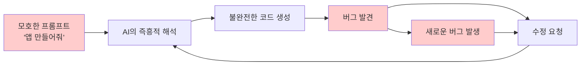
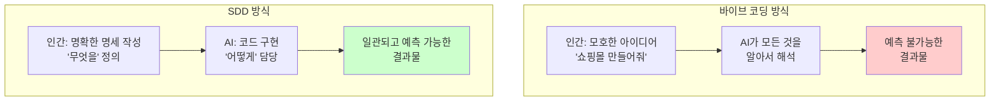
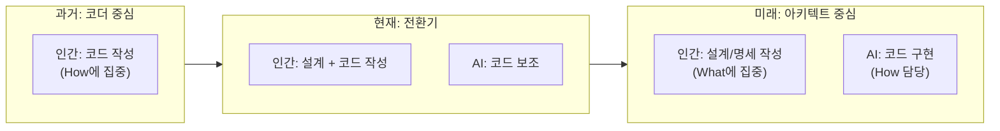
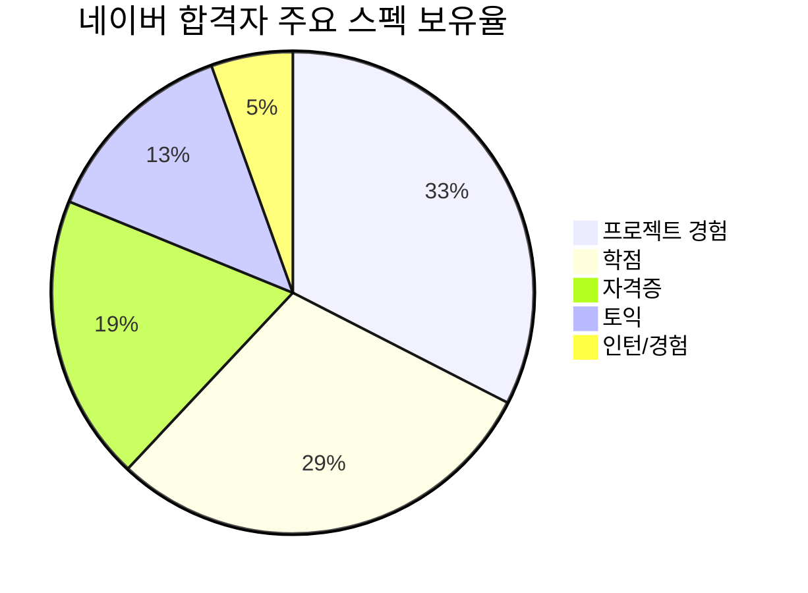
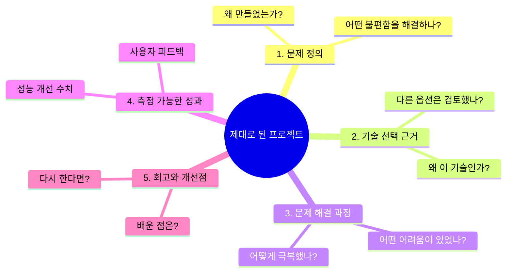

# AI 시대의 서사

## 우리는 무엇을 준비해야 하는가

---

# 1부: AI 시대에도 개발이 사라지지 않는 이유

## 들어가며: 정말 개발자가 필요 없어질까요?

"AI가 코드도 짜주는 시대인데, 개발자가 왜 필요할까요?"

요즘 이런 질문을 정말 많이 듣습니다. ChatGPT에게 "로그인 기능 만들어줘"라고 하면 그럴듯한 코드가 뚝딱 나오고, GitHub Copilot은 내가 뭘 치려는지 미리 알고 자동완성을 해주죠. 이런 걸 보면 "아, 이제 개발자 필요 없겠구나" 하는 생각이 드는 게 당연해요.

그런데 잠깐, 여기서 한 가지 질문을 드려볼게요.

**"AI가 로그인 기능을 만들어준다고 했는데, 그러면 누가 '로그인 기능이 필요하다'고 결정했을까요?"**

바로 이 지점이 오늘 이야기의 핵심입니다. AI가 아무리 뛰어나도, "무엇을 만들어야 하는지"를 결정하는 건 여전히 사람의 몫이에요. 마치 아무리 좋은 네비게이션이 있어도, 목적지를 입력하는 건 운전자인 것처럼요.

이번 장에서는 AI 시대에 개발자의 역할이 어떻게 변화하고 있는지, 그리고 왜 개발자가 여전히 _어쩌면 이전보다 더_ 중요한지 함께 살펴볼게요.

## 1. "문제를 푸는 것"과 "문제를 정의하는 것"의 차이

### 요리사와 메뉴 기획자

개발의 본질을 이해하기 위해, 먼저 레스토랑 비유를 들어볼게요.

레스토랑에는 두 종류의 역할이 있습니다. 하나는 **요리사**예요. 레시피를 보고 정확하게 요리를 만들어내는 사람이죠. "토마토 파스타 만들어"라고 하면, 재료를 준비하고, 불 조절하고, 면 삶고, 소스 만들어서 완성품을 내놓습니다.

다른 하나는 **메뉴 기획자**예요. 이 사람은 "우리 레스토랑에 어떤 메뉴가 필요할까?"를 고민합니다. 손님이 누구인지, 가격대는 어떻게 할지, 계절에 맞는 메뉴는 뭔지, 경쟁 레스토랑과 차별화는 어떻게 할지... 이런 질문에 답을 내리는 사람이죠.

**여기서 질문 하나 드릴게요.** AI는 이 둘 중 어느 역할을 더 잘할까요?

네, AI는 현재 "요리사" 역할을 점점 잘하게 되고 있어요. "이런 요리 만들어줘"라고 하면 꽤 괜찮은 결과물을 내놓죠. 하지만 "우리 레스토랑에 어떤 메뉴가 필요해?"라는 질문에는 제대로 답하기 어려워요. 왜냐하면 그 질문에 답하려면 레스토랑의 상황, 손님의 특성, 시장 환경, 경영진의 비전 등 맥락을 종합적으로 이해해야 하거든요.

### 개발에서의 "문제 정의"란?

소프트웨어 개발도 마찬가지예요. 개발에는 크게 두 가지 단계가 있습니다.

**문제 정의 (What to build)**는 "무엇을 만들어야 하는가?"를 결정하는 단계예요. 이 단계에서 개발자는 이런 질문들을 던집니다.

사용자가 진짜 원하는 게 뭘까? 이 기능이 정말 필요한 걸까, 아니면 다른 방법이 있을까? 시스템 전체에서 이 기능은 어떤 위치에 있어야 할까? 보안은? 성능은? 확장성은? 이 모든 것을 어떻게 조화롭게 설계할 수 있을까?

**문제 해결 (How to build)**은 "어떻게 만들 것인가?"를 실행하는 단계예요. 정해진 요구사항을 코드로 구현하고, 버그를 고치고, 테스트를 작성하는 등의 작업이죠.

AI는 후자인 "문제 해결" 영역에서 급격히 발전하고 있어요. 코드 작성, 버그 수정, 리팩토링 같은 작업을 점점 잘하게 되고 있죠. 하지만 전자인 "문제 정의"는 여전히 사람의 영역으로 남아 있습니다.

왜 그럴까요? 문제를 정의하려면 비즈니스 맥락, 사용자의 숨겨진 니즈, 기술적 제약 조건, 조직의 목표 등을 종합적으로 고려해야 하기 때문이에요. 이런 것들은 코드에 명시적으로 드러나지 않는, 암묵적인 지식이죠.

### 실제 예시: 쇼핑몰의 "장바구니" 기능

구체적인 예를 들어볼게요. 어떤 쇼핑몰에서 장바구니 기능을 만든다고 해봅시다.

AI에게 "장바구니 기능 만들어줘"라고 하면, 기본적인 장바구니 코드는 만들어줄 수 있어요. 상품 추가, 삭제, 수량 변경 같은 것들이요.

하지만 이런 질문들에는 답하기 어렵습니다.

비로그인 사용자의 장바구니는 어떻게 처리할까요? 쿠키에 저장? 로그인하면 병합? 재고가 부족해지면 장바구니에 담긴 상품은 어떻게 될까요? 장바구니에 담은 상품의 가격이 변경되면 어떻게 알려줄까요? 여러 배송지로 나눠서 주문하는 기능이 필요할까요? 장바구니 유효기간은 며칠로 할까요? B2B 고객과 일반 고객의 장바구니는 같아야 할까요?

이런 질문들은 단순히 "코드를 어떻게 짤까"의 문제가 아니에요. "우리 서비스에서 장바구니가 어떤 역할을 해야 하는가"라는 비즈니스 의사결정의 문제죠. 그리고 이 의사결정은 사용자 조사, 비즈니스 모델, 기술적 제약, 경쟁사 분석 등을 종합적으로 고려해야만 내릴 수 있어요.

**여기서 생각해 보세요.** 여러분이 쇼핑몰 창업자라면, 위의 질문들에 대한 답을 AI에게 맡기실 건가요, 아니면 직접 고민하실 건가요?

## 2. AI가 할 수 있는 것과 할 수 없는 것

### AI가 잘하는 것들

공정하게 말하자면, AI는 정말 많은 것을 잘합니다. 솔직히 감탄스러울 정도예요.

**코드 생성**에서 AI는 "이런 기능 만들어줘"라고 하면 꽤 쓸만한 코드를 뚝딱 만들어냅니다. 특히 자주 쓰이는 패턴(로그인, CRUD 등)은 정말 빠르게 만들어요.

**버그 수정**도 AI의 강점이에요. 에러 메시지를 보여주면 원인을 분석하고 수정 방법을 제안합니다. 단순한 문법 오류부터 논리적 오류까지 잡아내죠.

**코드 설명**은 AI가 특히 뛰어난 영역입니다. 복잡한 코드를 읽고 "이 코드가 뭘 하는 건지" 설명해줍니다. 레거시 코드 파악할 때 정말 유용해요.

**반복 작업 자동화**에서도 AI는 빛을 발합니다. 비슷한 패턴의 코드를 여러 개 만들거나, 테스트 케이스를 생성하거나, 문서를 작성하는 등의 반복 작업을 빠르게 처리하죠.

이런 걸 보면 "와, 진짜 개발자 필요 없겠다" 싶죠? 하지만 잠깐, AI가 어려워하는 것들도 살펴볼까요?

### AI가 어려워하는 것들

**비즈니스 맥락 이해**는 AI의 근본적인 한계예요. "이 회사의 비즈니스 모델이 뭔지", "경쟁사 대비 어떤 차별점이 있는지", "이번 분기 목표가 뭔지" 같은 맥락을 AI는 알 수 없어요. 그래서 "우리 서비스에 이 기능이 필요할까요?"라는 질문에 제대로 답하지 못합니다.

**전체 시스템 설계**도 AI가 어려워하는 영역이에요. 개별 기능의 코드는 잘 만들지만, "이 기능이 다른 기능들과 어떻게 연결되어야 하는지", "시스템 전체에서 어떤 아키텍처가 적합한지" 같은 큰 그림을 그리기는 어려워합니다.

**암묵적 요구사항 파악**에서도 AI는 한계를 보여요. 사용자가 "검색 기능이 느려요"라고 했을 때, 진짜 원하는 게 "검색 속도 개선"인지, "검색 결과 품질 개선"인지, 아니면 "검색 UX 개선"인지를 파악하는 건 사람만이 할 수 있는 영역이에요.

**기술 부채와 트레이드오프 판단**도 마찬가지입니다. "당장 빠르게 만들 것인가, 아니면 시간이 좀 더 걸리더라도 확장성 있게 만들 것인가?" 같은 판단은 회사의 상황, 팀의 역량, 향후 계획 등을 종합적으로 고려해야 해요. AI는 이런 종합적 판단을 내리기 어렵습니다.

**조직 내 커뮤니케이션**은 AI가 대신할 수 없는 영역이에요. 기획자와 디자이너와 개발자가 머리를 맞대고 "이게 정말 맞는 방향인가?"를 논의하고, 의견 충돌을 조율하고, 합의를 이끌어내는 건 사람만이 할 수 있죠.

### 네비게이션 비유: 목적지는 누가 정하나요?

이 차이를 가장 잘 설명해주는 비유가 **네비게이션**이에요.

요즘 네비게이션은 정말 똑똑하죠? 실시간 교통 정보를 반영해서 최적의 경로를 알려주고, 막히면 우회 경로를 안내하고, 도착 예정 시간까지 알려줍니다. AI가 개발에서 하는 역할이 딱 이거예요. "이렇게 만들어"라고 하면 최적의 방법을 찾아서 안내해주는 거죠.

**그런데 네비게이션이 아무리 좋아도, 목적지는 누가 정하나요?**

"오늘 강릉으로 갈까, 부산으로 갈까?" 이 결정은 네비게이션이 해줄 수 없어요. "가족들이 바다를 보고 싶어하는데, 아이가 어려서 너무 멀면 힘들고, 예산도 고려해야 하고..." 이런 복잡한 맥락을 종합해서 목적지를 정하는 건 사람의 몫이죠.

개발도 마찬가지예요. AI는 훌륭한 네비게이션이 될 수 있어요. "이 기능을 만들 최적의 방법은 이거야"라고 안내해줄 수 있죠. 하지만 "어떤 기능을 만들어야 하는가", "왜 그 기능이 필요한가"를 결정하는 건 여전히 개발자(그리고 기획자, 비즈니스 담당자)의 몫입니다.

**여기서 질문 하나 더 드릴게요.** 만약 네비게이션이 "부산으로 가세요"라고 했는데, 막상 가보니 별로였다면, 그건 누구 책임일까요? 네비게이션? 아니면 목적지를 선택한 사람?

### 통역사 비유: 무슨 말을 할지는 누가 정하나요?

또 다른 좋은 비유는 **통역사**예요.

요즘 AI 번역이 정말 좋아졌죠? 예전엔 "웃긴 번역체"로 유명했는데, 이젠 꽤 자연스러운 번역을 해내요. 실시간 통역도 가능해지고 있고요.

**그런데 통역사가 아무리 뛰어나도, "무슨 말을 할지"는 누가 정하나요?**

외국 바이어와의 중요한 미팅에서 통역사는 내가 하는 말을 정확하게 번역해줄 수 있어요. 하지만 "이 계약에서 우리가 양보할 수 있는 선은 어디까지인가?", "상대방의 진짜 의도가 뭔가?", "지금 강하게 나가야 할까, 부드럽게 풀어야 할까?" 같은 판단은 통역사가 대신해줄 수 없죠.

AI도 마찬가지예요. 내가 원하는 걸 코드로 "번역"해주는 역할은 점점 잘하게 되고 있어요. 하지만 "내가 원하는 게 뭔지"를 정하는 건 여전히 사람의 몫이에요.

### 작곡가 비유: 자동 반주와 창작은 다르다

마지막으로 **음악** 비유를 들어볼게요.

요즘 AI 작곡 도구들이 많아졌어요. 코드 진행을 입력하면 멜로디를 만들어주고, 장르를 선택하면 그에 맞는 반주를 깔아주죠. 어떤 도구는 "슬픈 느낌의 발라드" 같은 요청만으로도 꽤 그럴듯한 음악을 만들어내요.

**하지만 생각해 보세요.** "이 음악이 듣는 사람에게 어떤 감정을 전달해야 하는가?", "이 앨범의 콘셉트는 무엇인가?", "이 곡이 앨범 전체에서 어떤 위치에 있어야 하는가?" 같은 질문에는 AI가 답할 수 없어요.

AI는 훌륭한 자동 반주 기계가 될 수 있어요. 하지만 작곡가의 역할—청중이 누구인지 이해하고, 전달하고 싶은 메시지를 정하고, 그것을 음악적 언어로 표현하는 것—은 여전히 사람의 영역이죠.

개발에서도 마찬가지예요. AI는 코드를 "연주"하는 데 점점 능숙해지고 있어요. 하지만 "무슨 곡을 연주할지", "왜 그 곡을 연주해야 하는지"를 결정하는 건 개발자의 몫입니다.

## 3. 경쟁력의 이동: 타이핑에서 사고로

### 과거의 개발자 경쟁력

그러면 이런 변화가 개발자에게 어떤 의미일까요? 개발자의 경쟁력이 어떻게 이동하고 있는지 살펴볼게요.

과거에 개발자의 경쟁력이라고 하면, 이런 것들이었어요.

**타이핑 속도**가 중요했어요. 코드를 빨리 칠 수 있는 사람이 유리했죠. 특히 마감에 쫓기는 프로젝트에서는요.

**문법 암기**도 경쟁력이었어요. 프로그래밍 언어의 문법을 줄줄 외우고 있으면, 레퍼런스를 찾아보지 않아도 빠르게 코드를 짤 수 있었으니까요.

**특정 기술 스택 숙달**이 중요했습니다. "Java 10년 경력", "React 전문가" 같은 특정 기술에 대한 깊은 숙련도가 경쟁력이었죠.

**코드 작성량**도 나름의 지표였어요. "하루에 코드 500줄 칠 수 있어요" 같은 게 자랑이 되기도 했습니다.

### 현재와 미래의 개발자 경쟁력

하지만 AI 시대에는 이런 것들의 가치가 낮아지고 있어요. 왜냐하면 AI가 대신해줄 수 있거든요.

대신, 이런 것들이 새로운 경쟁력이 되고 있습니다.

**문제 정의 능력**이 핵심이 됐어요. "무엇을 만들어야 하는가?"를 명확하게 정의할 수 있는 능력이 중요해졌습니다. 모호한 요구사항을 구체적인 명세로 바꾸는 능력이죠.

**시스템 설계 능력**도 더욱 중요해졌어요. 개별 기능이 아니라 시스템 전체를 설계하고, 컴포넌트 간의 관계를 정의하는 능력이요.

**비즈니스 이해력**의 가치가 올라갔습니다. 기술이 비즈니스에 어떤 가치를 제공하는지 이해하고, 기술적 의사결정을 비즈니스 목표와 연결하는 능력이에요.

**커뮤니케이션 능력**은 더더욱 중요해졌어요. 기획자, 디자이너, 경영진과 소통하며 요구사항을 파악하고, 기술적 제약을 설명하고, 합의를 이끌어내는 능력이죠.

**AI 활용 능력**도 새로운 경쟁력입니다. AI 도구를 효과적으로 활용해서 생산성을 높이는 능력. 어떤 작업을 AI에게 맡기고, 어떤 작업을 직접 해야 하는지 판단하는 능력이에요.

### "말이 되어야 프로그램이 된다"

이 변화를 한 문장으로 요약하면 이래요.

**"말이 되어야 프로그램이 된다."**

과거에는 "코드가 돼야 프로그램이 됐어요." 머릿속의 생각을 코드로 옮기는 능력이 핵심이었죠. 그래서 프로그래밍 언어 문법을 잘 알고, 빨리 타이핑할 수 있는 사람이 유리했어요.

하지만 이제는 "말이 되어야 프로그램이 됩니다." 내가 원하는 것을 명확하게 표현할 수 있으면, AI가 코드로 바꿔줄 수 있거든요. 그래서 핵심 역량이 "코드 작성"에서 "명확한 사고와 표현"으로 이동하고 있어요.

**여기서 질문 드릴게요.** "로그인 기능 만들어줘"라고 말하는 것과, "사용자가 이메일과 비밀번호로 로그인할 수 있어야 하고, 비밀번호는 8자 이상이어야 하며, 5회 실패 시 10분간 잠금이 걸리고, 소셜 로그인(구글, 카카오)도 지원해야 하며, 로그인 상태는 2주간 유지되어야 합니다"라고 말하는 것 중에 어느 쪽이 더 좋은 결과물을 만들어낼까요?

후자죠. 그리고 이렇게 명확하게 요구사항을 정의할 수 있으려면, 로그인 기능이 어떻게 동작해야 하는지, 보안적으로 어떤 고려가 필요한지, 사용자 경험은 어떠해야 하는지를 깊이 이해하고 있어야 해요.

결국 AI 시대의 개발자 경쟁력은 "코드를 얼마나 잘 치느냐"가 아니라 **"얼마나 명확하게 생각하고 표현할 수 있느냐"**가 됩니다.

### 비유로 정리: 마차에서 자동차로

역사적 비유를 하나 들어볼게요.

19세기 말, 자동차가 등장했을 때 마차 기술자들은 위기를 느꼈어요. "우리 일자리가 사라지겠구나." 실제로 마차를 모는 기술, 말을 다루는 기술의 가치는 급격히 떨어졌죠.

하지만 **"어디로 갈 것인가"**, **"왜 그곳에 가야 하는가"**, **"그 여정을 어떻게 계획할 것인가"**를 아는 사람의 가치는 오히려 올라갔어요. 마차에서 자동차로 바뀌어도, 물류 계획을 세우고, 운송 루트를 최적화하고, 고객의 니즈를 파악하는 능력은 여전히—아니, 더욱—중요해졌거든요.

AI 시대의 개발도 마찬가지예요. "코드를 치는" 기술의 가치는 낮아지고 있지만, "무엇을 만들어야 하는지 정의하고", "왜 그것이 필요한지 이해하고", "전체 시스템을 설계하는" 능력의 가치는 오히려 올라가고 있습니다.

## 마무리: AI 시대, 개발자는 더 중요해진다

지금까지의 이야기를 정리해볼게요.

### AI 시대에도 개발자가 필요한 이유 3가지

**첫째, 문제를 정의하는 건 여전히 사람의 몫입니다.** AI는 "어떻게"에는 답할 수 있지만, "무엇을"과 "왜"에는 답하기 어려워요. 비즈니스 맥락을 이해하고, 사용자의 진짜 니즈를 파악하고, 그것을 명확한 요구사항으로 정의하는 건 사람만이 할 수 있는 영역이에요.

**둘째, 전체 시스템을 설계하는 건 사람의 영역입니다.** AI는 개별 기능은 잘 만들지만, 그 기능들이 어떻게 연결되어야 하는지, 시스템 전체의 아키텍처를 어떻게 가져가야 하는지는 판단하기 어려워요. 나무는 볼 수 있지만 숲을 보기는 어렵다고 할까요.

**셋째, 기술과 비즈니스를 연결하는 건 사람의 역할입니다.** "이 기술이 우리 비즈니스에 어떤 가치를 줄까?", "기술적 투자의 우선순위를 어떻게 정할까?", "기술 부채를 어떻게 관리할까?" 같은 판단은 비즈니스와 기술 양쪽을 이해하는 사람만이 할 수 있어요.

### 핵심 질문에 대한 답

**"문제 정의"와 "문제 해결"의 차이는?** 문제 정의는 "무엇을 만들어야 하는가"를 결정하는 것이고, 문제 해결은 "어떻게 만들 것인가"를 실행하는 것이에요. AI는 후자를 점점 잘하게 되고 있지만, 전자는 여전히 사람의 영역입니다.

**개발자의 경쟁력은 어디로 이동했나요?** 타이핑 속도와 문법 암기에서, 시스템 설계와 문제 정의 능력으로 이동했어요. "코드를 얼마나 잘 치느냐"보다 "얼마나 명확하게 생각하고 표현할 수 있느냐"가 중요해졌습니다.

### 여러분에게 드리는 마지막 질문

>이 글을 읽고 나서, 한 가지 질문을 품고 가시면 좋겠어요.

>**"나는 AI에게 무엇을 시킬 수 있는 사람이 될 것인가, 아니면 AI가 대신할 수 있는 일을 하는 사람이 될 것인가?"**

>AI 시대에 살아남는 개발자는 AI와 경쟁하는 사람이 아니에요. AI를 도구로 활용해서 더 큰 가치를 만들어내는 사람이에요. 그리고 그러려면 "무엇을 만들어야 하는가"를 정의하는 능력, 즉 문제 정의 능력을 키워야 합니다.

>다음 장에서는 이런 변화가 실제로 어떻게 일어나고 있는지, 그리고 여러분이 이 변화에 어떻게 대응할 수 있는지 더 구체적으로 살펴볼게요.

---

## 체크리스트

이번 장을 마치기 전에, 스스로 점검해 보세요.

✅ **AI 시대에도 개발자가 필요한 이유 3가지를 설명할 수 있나요?** 문제 정의, 시스템 설계, 기술-비즈니스 연결이라는 세 가지 키워드를 기억하세요.

✅ **"문제 정의"와 "문제 해결"의 차이를 설명할 수 있나요?** "무엇을"과 "어떻게"의 차이, 그리고 AI가 어느 쪽을 더 잘하는지 이해했나요?

✅ **개발자의 경쟁력이 어디로 이동했는지 설명할 수 있나요?** 타이핑과 문법에서 사고와 표현으로, 그리고 "말이 되어야 프로그램이 된다"는 핵심 메시지를 기억하세요.

---

# 2부: 개발 패러다임의 여정

## 🎯 도입 질문

> **"스마트폰 앱 하나 만드는 데 수십 가지 기술이 필요한 이유, 궁금하지 않으세요?"**

여러분, 혹시 스마트폰에서 매일 사용하는 앱을 떠올려보세요. 카카오톡, 배달의민족, 토스... 이 앱들이 '그냥 뚝딱' 만들어졌다고 생각하시나요? 사실 하나의 앱을 만들기 위해서는 정말 많은 기술과 방법론이 동원됩니다. 프론트엔드, 백엔드, 데이터베이스, 클라우드, 컨테이너, CI/CD... 왜 이렇게 복잡해졌을까요?

그 답은 바로 **개발 패러다임의 역사** 속에 있습니다.

이번 2부에서는 마치 타임머신을 타고 여행하듯, 1940년대 최초의 컴퓨터부터 2025년 AI 시대까지 소프트웨어 개발 방식이 어떻게 진화해왔는지 함께 살펴볼 거예요. 각각의 새로운 기술이나 방법론은 **이전 방식의 한계를 극복하기 위해** 등장했다는 점을 기억하면서 읽어주세요. 그러면 '왜 이렇게 많은 기술이 필요한지'가 자연스럽게 이해될 겁니다.

---

## 📚 목차

1. [컴퓨터의 탄생 배경](https://claude.ai/chat/67c7a0fa-940f-4a4d-8f96-971975e4b98a#1-%EC%BB%B4%ED%93%A8%ED%84%B0%EC%9D%98-%ED%83%84%EC%83%9D-%EB%B0%B0%EA%B2%BD-1940%EB%85%84%EB%8C%80)
2. [기계어: 0과 1의 대화](https://claude.ai/chat/67c7a0fa-940f-4a4d-8f96-971975e4b98a#2-%EA%B8%B0%EA%B3%84%EC%96%B4-0%EA%B3%BC-1%EC%9D%98-%EB%8C%80%ED%99%94-1940%EB%85%84%EB%8C%80)
3. [어셈블리어: 첫 번째 진보](https://claude.ai/chat/67c7a0fa-940f-4a4d-8f96-971975e4b98a#3-%EC%96%B4%EC%85%88%EB%B8%94%EB%A6%AC%EC%96%B4-%EC%B2%AB-%EB%B2%88%EC%A7%B8-%EC%A7%84%EB%B3%B4-1950%EB%85%84%EB%8C%80)
4. [고급 언어와 컴파일러: 인간을 향한 도약](https://claude.ai/chat/67c7a0fa-940f-4a4d-8f96-971975e4b98a#4-%EA%B3%A0%EA%B8%89-%EC%96%B8%EC%96%B4%EC%99%80-%EC%BB%B4%ED%8C%8C%EC%9D%BC%EB%9F%AC-1950%EB%85%84%EB%8C%80-%ED%9B%84%EB%B0%98)
5. [절차적·구조적 프로그래밍: 질서의 시작](https://claude.ai/chat/67c7a0fa-940f-4a4d-8f96-971975e4b98a#5-%EC%A0%88%EC%B0%A8%EC%A0%81%EA%B5%AC%EC%A1%B0%EC%A0%81-%ED%94%84%EB%A1%9C%EA%B7%B8%EB%9E%98%EB%B0%8D-1960%EB%85%84%EB%8C%80)
6. [객체지향 프로그래밍: 현실 세계를 담다](https://claude.ai/chat/67c7a0fa-940f-4a4d-8f96-971975e4b98a#6-%EA%B0%9D%EC%B2%B4%EC%A7%80%ED%96%A5-%ED%94%84%EB%A1%9C%EA%B7%B8%EB%9E%98%EB%B0%8Doop-1980%EB%85%84%EB%8C%80)
7. [TDD와 DDD: 품질과 비즈니스를 향하여](https://claude.ai/chat/67c7a0fa-940f-4a4d-8f96-971975e4b98a#7-tdd%EC%99%80-ddd-2000%EB%85%84%EB%8C%80)
8. [마이크로서비스 아키텍처: 거대함을 잘게 쪼개다](https://claude.ai/chat/67c7a0fa-940f-4a4d-8f96-971975e4b98a#8-%EB%A7%88%EC%9D%B4%ED%81%AC%EB%A1%9C%EC%84%9C%EB%B9%84%EC%8A%A4-%EC%95%84%ED%82%A4%ED%85%8D%EC%B2%98msa-2010%EB%85%84%EB%8C%80)
9. [가상화, 컨테이너, 쿠버네티스: 클라우드 네이티브 시대](https://claude.ai/chat/67c7a0fa-940f-4a4d-8f96-971975e4b98a#9-%EA%B0%80%EC%83%81%ED%99%94-%EC%BB%A8%ED%85%8C%EC%9D%B4%EB%84%88-%EC%BF%A0%EB%B2%84%EB%84%A4%ED%8B%B0%EC%8A%A4-2010%EB%85%84%EB%8C%80)
10. [DevOps와 CI/CD: 개발과 운영의 화합](https://claude.ai/chat/67c7a0fa-940f-4a4d-8f96-971975e4b98a#10-devops%EC%99%80-cicd-2010%EB%85%84%EB%8C%80)

---

## 1. 컴퓨터의 탄생 배경 (1940년대)

### 🎬 시대적 배경: 전쟁이 낳은 기계

컴퓨터의 역사를 이야기하려면, 먼저 제2차 세계대전으로 거슬러 올라가야 해요.

1940년대, 전 세계는 전쟁의 소용돌이 속에 있었습니다. 군대에서는 포탄의 궤도를 계산해야 했고, 암호를 해독해야 했어요. 이런 복잡한 계산을 사람이 직접 하려면 엄청난 시간이 걸렸죠. 당시에는 **"컴퓨터(Computer)"**라는 단어가 기계가 아니라 **계산을 담당하는 사람**을 뜻했다는 사실, 알고 계셨나요?

> 💡 **비유**: 상상해보세요. 수천 명의 사람들이 책상에 앉아서 손으로 계산기를 두드리며 포탄이 어디에 떨어질지 계산하는 모습을요. 한 번 계산하는 데 몇 시간, 며칠이 걸렸어요.

### 🖥️ 에니악(ENIAC)의 등장

1946년, 드디어 최초의 범용 전자식 컴퓨터 **에니악(ENIAC)**이 등장했습니다. 하지만 이 컴퓨터는 지금 우리가 아는 컴퓨터와는 전혀 달랐어요.

에니악으로 새로운 프로그램을 실행하려면 어떻게 해야 했을까요? 놀랍게도 **수천 개의 전선을 손으로 다시 꽂아야 했습니다**. 마치 거대한 전화 교환기처럼 물리적으로 회로를 재연결해야 했던 거죠. 이것을 **'하드와이어링(Hardwiring)'**이라고 불렀어요.

> 💡 **비유**: 텔레비전 채널을 바꾸려고 할 때마다 뒷면의 전선을 모두 뽑았다가 다시 꽂아야 한다고 상상해보세요. 정말 끔찍하지 않나요?

### 💡 폰 노이만의 혁명적 아이디어

이 비효율적인 방식에 문제를 느낀 수학자 **존 폰 노이만**은 혁명적인 아이디어를 제안했습니다.

> **"프로그램을 데이터처럼 메모리에 저장하면 어떨까?"**

이것이 바로 **프로그램 내장 방식(Stored-Program Concept)**이에요. 이 아이디어 덕분에 소프트웨어가 하드웨어로부터 분리될 수 있었고, 이것이 현대 컴퓨터의 기본 원리가 되었습니다.

```
┌────────────────────────────────────────────────┐
│               폰 노이만 구조                      │
├────────────────────────────────────────────────┤
│                                                │
│   ┌─────────────┐     ┌─────────────────┐     │
│   │   입력장치   │────▶│                 │     │
│   └─────────────┘     │                 │     │
│                       │     메모리       │     │
│   ┌─────────────┐     │  (프로그램 +    │     │
│   │   출력장치   │◀────│     데이터)     │     │
│   └─────────────┘     │                 │     │
│                       └────────┬────────┘     │
│                                │              │
│                       ┌────────▼────────┐     │
│                       │      CPU        │     │
│                       │  (연산 + 제어)   │     │
│                       └─────────────────┘     │
│                                                │
└────────────────────────────────────────────────┘
```

> 📌 **왜 이 패러다임이 필요했을까요?** 전선을 물리적으로 재연결하는 극심한 비효율성을 해결하고, 프로그램을 쉽게 변경할 수 있게 하기 위해서였어요.

---

## 2. 기계어: 0과 1의 대화 (1940년대)

### 🔢 컴퓨터가 이해하는 유일한 언어

폰 노이만 구조가 확립되면서, 이제 프로그램을 메모리에 저장할 수 있게 되었어요. 하지만 그 프로그램은 어떤 형태였을까요?

바로 **기계어(Machine Language)**입니다. 기계어는 CPU가 직접 해독하고 실행할 수 있는 **유일한 언어**로, 오직 **0과 1**로만 이루어져 있어요.

```
기계어 예시 (x86 아키텍처에서 두 숫자 더하기):

10110000 00000101    ← 숫자 5를 레지스터 AL에 저장해라
00000100 00000011    ← 레지스터 AL에 3을 더해라
```

여러분, 위 코드가 무슨 의미인지 단번에 이해되시나요? 아마 대부분 "이게 대체 뭐야?"라고 생각하실 거예요. 바로 그게 문제였습니다.

### 😰 기계어의 한계

기계어에는 심각한 문제들이 있었어요.

**첫째, 인간에게 극도로 비직관적이었습니다.** 0과 1의 나열을 읽으면서 "아, 이건 덧셈이구나"라고 알아보기가 거의 불가능했어요. 코드를 작성하는 것도 어려웠지만, 나중에 다시 읽고 이해하는 것은 더 어려웠죠.

**둘째, 실수하기가 너무 쉬웠습니다.** 0 하나, 1 하나만 잘못 입력해도 프로그램이 완전히 다르게 동작했어요. 그리고 그 실수를 찾아내는 것(디버깅)은 거의 불가능에 가까웠습니다.

**셋째, 특정 CPU에 완전히 종속되었습니다.** 한 컴퓨터에서 작성한 기계어 프로그램은 다른 종류의 컴퓨터에서는 전혀 실행되지 않았어요. CPU가 바뀌면 처음부터 다시 작성해야 했죠.

> 💡 **비유**: 기계어로 프로그래밍하는 것은 마치 **점자**로 소설을 쓰는 것과 같았어요. 익숙해지면 할 수 있지만, 엄청난 집중력이 필요하고 실수하기도 쉽죠. 게다가 소설을 다 쓴 후에 오타를 찾는 것은... 상상만 해도 끔찍합니다.

> 📌 **왜 다음 단계가 필요했을까요?** 0과 1만으로 프로그래밍하는 것은 너무 어렵고 실수가 잦았기 때문에, 더 인간 친화적인 방법이 필요했어요.

---

## 3. 어셈블리어: 첫 번째 진보 (1950년대)

### 🏷️ 기호의 탄생

기계어의 고통에서 벗어나고자 1950년대에 **어셈블리어(Assembly Language)**가 등장했습니다. 어셈블리어는 프로그래밍 역사상 **최초의 중요한 추상화 시도**였어요.

어셈블리어의 핵심 아이디어는 간단했습니다.

> **"0과 1 대신, 사람이 기억하기 쉬운 기호를 사용하자!"**

이 기호를 **니모닉(Mnemonic)**이라고 불러요. 예를 들어볼까요?

```
기계어:                    어셈블리어:
10110000 00000101   →     MOV AL, 5    (5를 AL에 이동해라)
00000100 00000011   →     ADD AL, 3    (AL에 3을 더해라)
```

어떤가요? 오른쪽이 훨씬 읽기 쉽지 않나요? `ADD`는 '더하다'라는 뜻이니까, "아, 뭔가를 더하는구나"라고 바로 알 수 있잖아요.

### 🔄 어셈블러의 역할

그렇다면 이 영어 기호를 컴퓨터가 어떻게 이해할까요? 컴퓨터는 여전히 0과 1만 이해하는데 말이에요.

여기서 **어셈블러(Assembler)**라는 프로그램이 등장합니다. 어셈블러는 어셈블리어로 작성된 코드를 기계어로 **번역**해주는 역할을 해요.

```
┌─────────────────┐      ┌─────────────┐      ┌─────────────────┐
│  어셈블리어 코드  │ ───▶ │   어셈블러   │ ───▶ │    기계어 코드   │
│   (MOV, ADD)    │      │   (번역기)   │      │   (0과 1)       │
└─────────────────┘      └─────────────┘      └─────────────────┘
```

> 💡 **비유**: 어셈블러는 마치 **통역사**와 같아요. 여러분이 한국어로 말하면, 통역사가 영어로 바꿔서 외국인에게 전달해주는 것처럼, 어셈블러는 사람이 작성한 기호를 컴퓨터가 이해할 수 있는 기계어로 바꿔줍니다.

### 😓 여전한 한계

어셈블리어는 기계어보다 훨씬 나아졌지만, 여전히 문제가 있었어요.

**첫째, 배우기가 여전히 어려웠습니다.** MOV, ADD 같은 기호가 0과 1보다는 낫지만, 여전히 일반인이 보기엔 암호 같았어요.

**둘째, CPU마다 어셈블리어가 달랐습니다.** Intel CPU용 어셈블리어와 ARM CPU용 어셈블리어는 완전히 달라요. 마치 한국어와 일본어처럼요. 컴퓨터(CPU)가 바뀌면 코드를 처음부터 다시 작성해야 했습니다.

```
같은 "덧셈" 명령어인데...

Intel x86:      ADD AX, BX
ARM:            ADD R0, R1, R2
MIPS:           add $t0, $t1, $t2

→ CPU마다 문법이 완전히 다릅니다!
```

> 💡 **비유**: 어셈블리어로 프로그래밍하는 것은 마치 **각 나라의 방언**으로 글을 쓰는 것과 같았어요. 부산 사투리로 쓴 글을 제주도 사람에게 보내면 이해하기 어렵듯이, Intel용 코드를 ARM 컴퓨터에서 실행할 수 없었죠.

> 📌 **왜 다음 단계가 필요했을까요?** 어셈블리어는 여전히 특정 CPU에 종속되어 있었고, 복잡한 로직을 구현하기엔 생산성이 너무 낮았어요. 개발자들은 **어떤 컴퓨터에서든 실행될 수 있는, 더 인간 친화적인 언어**를 원했습니다.

---

## 4. 고급 언어와 컴파일러 (1950년대 후반)

### 🚀 혁명적인 도약

1950년대 후반, 드디어 **고급 언어(High-Level Language)**가 등장했습니다. 이것은 소프트웨어 개발의 패러다임을 **기계 중심에서 인간 중심으로** 완전히 바꿔놓은 혁명적인 사건이었어요.

고급 언어의 핵심 철학은 **추상화(Abstraction)**입니다.

> **"컴퓨터의 복잡한 내부 구조는 숨기고, 프로그래머는 문제 해결에만 집중하게 하자!"**

### 📝 포트란과 코볼의 등장

**포트란(FORTRAN, 1957년)**: "수식 번역기(FORmula TRANslator)"라는 이름처럼, 수학 공식을 거의 그대로 프로그램으로 옮길 수 있었어요.

```fortran
C = A + B
```

이 코드를 보세요. "C는 A 더하기 B"라는 것이 한눈에 들어오지 않나요? 어셈블리어의 `ADD AX, BX` 같은 명령어보다 훨씬 직관적이에요.

**코볼(COBOL, 1959년)**: "일반 비즈니스용 언어(COmmon Business-Oriented Language)"로, 마치 영어 문장처럼 프로그램을 작성할 수 있었어요.

```cobol
ADD HOURS TO TOTAL-HOURS.
MULTIPLY RATE BY HOURS GIVING PAY.
```

거의 영어 문장을 읽는 것 같죠? "시간을 총시간에 더해라", "시급에 시간을 곱해서 급여를 구해라"... 비전공자도 대략 무슨 뜻인지 알 수 있을 정도예요.

### 🔄 컴파일러의 마법

고급 언어로 작성한 코드는 어떻게 컴퓨터에서 실행될까요? 여기서 **컴파일러(Compiler)**가 등장합니다.

컴파일러는 고급 언어로 작성된 소스 코드를 **해당 컴퓨터의 기계어로 번역**해줍니다.

```
┌─────────────────┐      ┌─────────────┐      ┌─────────────────┐
│     소스 코드     │ ───▶ │    컴파일러   │ ───▶ │    기계어 코드     │
│   (C = A + B)   │      │   (번역기)   │      │    (0과 1)       │
└─────────────────┘      └─────────────┘      └─────────────────┘

                              ▲
                              │
         CPU 종류에 맞는 컴파일러를 사용하면 됨!
```

> 💡 **비유**: 컴파일러는 마치 **전문 번역가**와 같아요. 여러분이 한국어로 책을 쓰면, 영어 번역가는 영어권 독자를 위해 번역하고, 일본어 번역가는 일본 독자를 위해 번역합니다. 원본(소스 코드)은 하나지만, 각 나라(CPU) 버전으로 번역될 수 있는 거예요!

### 🎉 이식성의 획득

이것이 바로 **이식성(Portability)**이에요!

한 번 작성한 고급 언어 프로그램을 여러 종류의 컴퓨터에서 실행할 수 있게 된 거죠. Intel 컴퓨터용 컴파일러로 컴파일하면 Intel에서, ARM 컴퓨터용 컴파일러로 컴파일하면 ARM에서 실행됩니다.

```
           ┌──────────────────┐
           │   소스 코드 (원본)  │
           │   (C = A + B)    │
           └────────┬─────────┘
                    │
        ┌───────────┼───────────┐
        ▼           ▼           ▼
   ┌─────────┐ ┌─────────┐ ┌─────────┐
   │Intel용  │ │ ARM용   │ │ MIPS용  │
   │컴파일러 │ │컴파일러 │ │컴파일러 │
   └────┬────┘ └────┬────┘ └────┬────┘
        ▼           ▼           ▼
   ┌─────────┐ ┌─────────┐ ┌─────────┐
   │Intel용  │ │ ARM용   │ │ MIPS용  │
   │기계어   │ │ 기계어  │ │ 기계어  │
   └─────────┘ └─────────┘ └─────────┘

→ 한 번 작성하면 여러 컴퓨터에서 실행 가능!
```

### 😟 새로운 문제: 스파게티 코드

하지만 고급 언어에도 문제가 있었어요. 초기 고급 언어들은 `GOTO` 문을 많이 사용했는데, 이게 큰 문제를 일으켰습니다.

```basic
10 INPUT "숫자를 입력하세요: ", N
20 IF N < 0 THEN GOTO 50
30 PRINT "양수입니다"
40 GOTO 60
50 PRINT "음수입니다"
60 GOTO 10
```

`GOTO`는 "~번 줄로 점프해라"라는 명령이에요. 프로그램이 짧을 때는 괜찮지만, 코드가 길어지면...

```
GOTO 100 → GOTO 250 → GOTO 50 → GOTO 300 → GOTO 75 → ...
```

코드의 흐름이 이리저리 얽히고설켜서 마치 **스파게티 면발처럼** 꼬여버립니다. 이것을 **스파게티 코드(Spaghetti Code)**라고 불러요.

> 💡 **비유**: `GOTO`로 가득 찬 프로그램을 읽는 것은 마치 **실타래가 엉킨 것**을 푸는 것과 같았어요. 한 줄 한 줄 따라가다 보면 어느 순간 내가 어디에 있는지, 왜 여기에 왔는지 알 수 없게 됩니다.

> 📌 **왜 다음 단계가 필요했을까요?** 고급 언어 덕분에 프로그래밍이 쉬워졌지만, 프로그램이 커지면서 GOTO 문 남용으로 '스파게티 코드'가 양산되었어요. 더 체계적이고 논리적인 코드 구조가 필요했습니다.

---

## 5. 절차적·구조적 프로그래밍 (1960년대)

### 📦 절차적 프로그래밍: 코드를 상자에 담다

1960년대, 스파게티 코드 문제를 해결하기 위해 **절차적 프로그래밍(Procedural Programming)**이 등장했습니다.

핵심 아이디어는 간단해요.

> **"반복되는 코드를 '함수(프로시저)'라는 상자에 담아서 재사용하자!"**

```c
// 함수 정의: 인사하기
void sayHello(char* name) {
    printf("안녕하세요, %s님!\n", name);
}

// 함수 사용
sayHello("철수");    // 출력: 안녕하세요, 철수님!
sayHello("영희");    // 출력: 안녕하세요, 영희님!
sayHello("민수");    // 출력: 안녕하세요, 민수님!
```

`sayHello`라는 함수를 한 번 만들어두면, 필요할 때마다 이름만 바꿔서 호출할 수 있어요. 같은 코드를 세 번 작성할 필요가 없죠!

> 💡 **비유**: 함수는 마치 **레시피 카드**와 같아요. "김치찌개 만들기" 레시피를 한 번 적어두면, 김치찌개를 만들 때마다 그 카드만 꺼내면 됩니다. 매번 처음부터 어떻게 만드는지 생각할 필요가 없죠.

### 🏗️ 구조적 프로그래밍: GOTO 없이 살기

1960년대 후반, 네덜란드의 컴퓨터 과학자 **에츠허르 데이크스트라**가 혁명적인 주장을 했습니다.

> **"GOTO 문은 해로우니까, 쓰지 말자!"**

그리고 그는 프로그램의 모든 논리를 **단 세 가지 구조**만으로 표현할 수 있다고 증명했어요.

```
┌─────────────────────────────────────────────────────────────┐
│                    구조적 프로그래밍의 3대 구조               │
├─────────────────────────────────────────────────────────────┤
│                                                             │
│  1. 순차 (Sequence)        2. 선택 (Selection)              │
│     ┌───┐                     ┌───────┐                    │
│     │ A │                     │조건?  │                    │
│     └─┬─┘                     └───┬───┘                    │
│       ▼                      Yes │ No                      │
│     ┌───┐                    ┌──▼──┐ ┌──▼──┐               │
│     │ B │                    │  A  │ │  B  │               │
│     └─┬─┘                    └─────┘ └─────┘               │
│       ▼                                                    │
│     ┌───┐                  3. 반복 (Iteration)             │
│     │ C │                     ┌───────┐                    │
│     └───┘                     │조건?  │◀───┐               │
│                               └───┬───┘    │               │
│  A → B → C 순서대로              Yes │        │               │
│  실행                         ┌──▼──┐    │               │
│                               │  A  │────┘               │
│                               └─────┘                      │
│                                 No↓                        │
│                               (종료)                       │
│                                                             │
└─────────────────────────────────────────────────────────────┘
```

이 세 가지 구조는 프로그래밍 언어에서 이렇게 표현돼요.

```python
# 1. 순차: 위에서 아래로 차례대로 실행
a = 1
b = 2
c = a + b

# 2. 선택: 조건에 따라 다른 코드 실행
if age >= 18:
    print("성인입니다")
else:
    print("미성년자입니다")

# 3. 반복: 조건이 참인 동안 계속 실행
while count < 10:
    print(count)
    count = count + 1
```

### 🎯 스파게티 코드 vs 구조화된 코드

같은 기능을 하는 코드를 비교해볼까요?

**스파게티 코드 (GOTO 사용)**:

```basic
10 LET I = 1
20 IF I > 5 THEN GOTO 60
30 PRINT I
40 LET I = I + 1
50 GOTO 20
60 END
```

**구조화된 코드 (반복문 사용)**:

```python
for i in range(1, 6):
    print(i)
```

어떤 코드가 더 읽기 쉬운가요? 구조화된 코드는 "1부터 5까지 출력해라"라는 의도가 훨씬 명확하게 드러나죠.

> 💡 **비유**: 구조적 프로그래밍은 마치 **잘 정리된 서랍장**과 같아요. 양말은 양말 칸에, 속옷은 속옷 칸에, 셔츠는 셔츠 칸에. 필요한 것을 찾기 쉽고, 새로운 옷을 추가하기도 쉽죠. 반면 GOTO로 가득 찬 코드는 모든 옷이 뒤섞인 서랍 같아요.

### 😟 남아있는 한계

절차적·구조적 프로그래밍 덕분에 코드가 훨씬 체계적이 되었지만, 새로운 문제가 드러났어요.

**데이터와 함수가 분리되어 있다는 것!**

```c
// 데이터
char studentName[50];
int studentAge;
float studentGPA;

// 함수들
void setName(char* name) { ... }
void setAge(int age) { ... }
void printStudent() { ... }
```

학생에 관한 데이터와 학생을 다루는 함수가 따로따로 흩어져 있어요. 프로그램이 커지면 "이 데이터는 어떤 함수들이 사용하지?", "이 함수는 어떤 데이터를 건드리지?"를 추적하기가 점점 어려워집니다.

> 📌 **왜 다음 단계가 필요했을까요?** 프로그램이 점점 복잡해지면서, 관련된 데이터와 함수를 하나로 묶어서 관리할 필요성이 생겼어요. 이것이 객체지향 프로그래밍의 탄생 배경이 됩니다.

---

## 6. 객체지향 프로그래밍(OOP) (1980년대)

### 🎁 데이터와 함수를 하나로!

1980년대, **객체지향 프로그래밍(Object-Oriented Programming, OOP)**이 주류로 부상했습니다.

OOP의 핵심 아이디어는 정말 직관적이에요.

> **"현실 세계처럼, 관련된 데이터(속성)와 기능(행동)을 '객체'라는 하나의 단위로 묶자!"**

예를 들어 '학생'을 생각해볼까요?

```
현실 세계의 학생:
- 이름, 나이, 학번이 있고 (속성/데이터)
- 공부하고, 시험 보고, 졸업할 수 있어요 (행동/함수)
```

이것을 코드로 표현하면:

```python
class Student:
    # 속성 (데이터)
    def __init__(self, name, age, student_id):
        self.name = name
        self.age = age
        self.student_id = student_id
    
    # 행동 (함수/메서드)
    def study(self):
        print(f"{self.name}이(가) 공부합니다.")
    
    def take_exam(self):
        print(f"{self.name}이(가) 시험을 봅니다.")

# 객체 생성 및 사용
student1 = Student("철수", 20, "2024001")
student1.study()      # 출력: 철수이(가) 공부합니다.
student1.take_exam()  # 출력: 철수이(가) 시험을 봅니다.
```

> 💡 **비유**: 클래스(Class)는 **붕어빵 틀**이고, 객체(Object)는 그 틀로 만든 **붕어빵**이에요. 붕어빵 틀 하나로 똑같은 모양의 붕어빵을 여러 개 만들 수 있죠. 마찬가지로 `Student` 클래스 하나로 철수, 영희, 민수 등 여러 학생 객체를 만들 수 있어요.

### 🔑 OOP의 3대 핵심 원칙

OOP에는 세 가지 중요한 원칙이 있어요. 이건 정말 중요하니까 꼭 기억해주세요!

#### 1️⃣ 캡슐화 (Encapsulation)

**"내부는 숨기고, 필요한 것만 공개하자"**

```python
class BankAccount:
    def __init__(self, owner, balance):
        self.owner = owner
        self.__balance = balance  # 비공개 (언더스코어 두 개)
    
    def deposit(self, amount):
        if amount > 0:
            self.__balance += amount
            print(f"{amount}원 입금. 잔액: {self.__balance}원")
    
    def withdraw(self, amount):
        if amount <= self.__balance:
            self.__balance -= amount
            print(f"{amount}원 출금. 잔액: {self.__balance}원")
        else:
            print("잔액이 부족합니다.")

# 사용
account = BankAccount("철수", 10000)
account.deposit(5000)       # 정상 동작
account.withdraw(3000)      # 정상 동작
# account.__balance = 999999  # 직접 접근 불가! (보안)
```

잔액(`__balance`)에 직접 접근할 수 없고, 반드시 `deposit`이나 `withdraw` 함수를 통해서만 조작할 수 있어요. 누군가 잔액을 마음대로 999999원으로 바꾸는 것을 막을 수 있죠.

> 💡 **비유**: 캡슐화는 **자동차 운전**과 같아요. 우리는 엔진이 어떻게 작동하는지 몰라도 핸들, 페달, 기어만 사용하면 운전할 수 있죠. 복잡한 내부 구조는 숨겨져 있고, 우리는 필요한 인터페이스만 사용하면 됩니다.

#### 2️⃣ 상속 (Inheritance)

**"기존 것을 물려받아 확장하자"**

```python
# 부모 클래스
class Animal:
    def __init__(self, name):
        self.name = name
    
    def eat(self):
        print(f"{self.name}이(가) 먹습니다.")
    
    def sleep(self):
        print(f"{self.name}이(가) 잡니다.")

# 자식 클래스 (Animal을 상속)
class Dog(Animal):
    def bark(self):
        print(f"{self.name}이(가) 멍멍 짖습니다.")

class Cat(Animal):
    def meow(self):
        print(f"{self.name}이(가) 야옹합니다.")

# 사용
dog = Dog("멍멍이")
dog.eat()   # Animal에서 상속받음: 멍멍이이(가) 먹습니다.
dog.bark()  # Dog만의 기능: 멍멍이이(가) 멍멍 짖습니다.

cat = Cat("나비")
cat.sleep()  # Animal에서 상속받음: 나비이(가) 잡니다.
cat.meow()   # Cat만의 기능: 나비이(가) 야옹합니다.
```

`Dog`와 `Cat`은 `Animal`의 `eat`, `sleep` 기능을 물려받으면서, 각자만의 고유한 기능(`bark`, `meow`)을 추가했어요. 코드를 다시 작성할 필요가 없죠!

> 💡 **비유**: 상속은 **유산 상속**과 같아요. 부모님으로부터 집(속성)과 가업(기능)을 물려받으면서, 자신만의 새로운 사업을 추가로 시작할 수 있죠.

#### 3️⃣ 다형성 (Polymorphism)

**"같은 명령, 다른 결과"**

```python
class Animal:
    def speak(self):
        pass  # 기본적으로는 아무 것도 안 함

class Dog(Animal):
    def speak(self):
        return "멍멍!"

class Cat(Animal):
    def speak(self):
        return "야옹!"

class Cow(Animal):
    def speak(self):
        return "음메~"

# 다형성의 힘!
animals = [Dog(), Cat(), Cow()]

for animal in animals:
    print(animal.speak())

# 출력:
# 멍멍!
# 야옹!
# 음메~
```

같은 `speak()` 메서드를 호출했는데, 객체의 타입에 따라 다른 결과가 나와요. 이것이 다형성입니다!

> 💡 **비유**: 다형성은 **리모컨의 전원 버튼**과 같아요. TV 리모컨의 전원 버튼을 누르면 TV가 켜지고, 에어컨 리모컨의 전원 버튼을 누르면 에어컨이 켜지죠. "전원 버튼"이라는 같은 개념이지만, 대상에 따라 다른 동작을 합니다.

```
┌─────────────────────────────────────────────────────────────┐
│                  OOP의 3대 핵심 원칙 요약                     │
├─────────────────────────────────────────────────────────────┤
│                                                             │
│  1. 캡슐화 (Encapsulation)                                  │
│     → 내부를 숨기고, 필요한 것만 공개                         │
│     → 데이터 보호, 인터페이스 단순화                          │
│                                                             │
│  2. 상속 (Inheritance)                                      │
│     → 부모의 속성과 기능을 물려받아 확장                      │
│     → 코드 재사용성 극대화                                   │
│                                                             │
│  3. 다형성 (Polymorphism)                                   │
│     → 같은 인터페이스, 다른 동작                             │
│     → 유연하고 확장 가능한 설계                              │
│                                                             │
└─────────────────────────────────────────────────────────────┘
```

> 📌 **왜 OOP가 필요했을까요?** 데이터와 그것을 다루는 로직이 분리되어 있던 절차적 프로그래밍의 한계를 극복하기 위해서였어요. OOP로 인해 데이터와 로직이 하나의 객체로 묶이면서, 복잡한 대규모 소프트웨어도 체계적으로 관리할 수 있게 되었습니다.

---

## 7. TDD와 DDD (2000년대)

### 🧪 TDD (Test-Driven Development): 테스트가 먼저!

2000년대 초반, 소프트웨어가 점점 복잡해지면서 새로운 문제가 생겼어요.

> "코드는 잘 작성했는데, 나중에 버그가 발견되면 고치기가 너무 어렵고 비용도 많이 들어!"

기존에는 코드를 다 작성한 후 마지막에 테스트를 했어요. 하지만 이 방식은 문제가 있었습니다. 마치 집을 다 지은 후에 기초가 잘못됐다는 걸 발견하는 것과 같았죠.

**테스트 주도 개발(TDD)**은 순서를 뒤집었습니다.

> **"코드를 작성하기 전에, 먼저 테스트를 작성하자!"**

### 🚦 Red-Green-Refactor 사이클

TDD는 세 단계의 사이클을 반복합니다.

```
┌─────────────────────────────────────────────────────────────┐
│                  TDD: Red-Green-Refactor                    │
├─────────────────────────────────────────────────────────────┤
│                                                             │
│     1. 🔴 RED (빨간불)                                       │
│        │                                                    │
│        │  실패하는 테스트를 먼저 작성한다                     │
│        │  (아직 코드가 없으니 당연히 실패!)                   │
│        ▼                                                    │
│     2. 🟢 GREEN (초록불)                                     │
│        │                                                    │
│        │  테스트를 통과하는 최소한의 코드를 작성한다          │
│        │  (일단 돌아가게만!)                                 │
│        ▼                                                    │
│     3. 🔵 REFACTOR (리팩토링)                                │
│        │                                                    │
│        │  코드를 깔끔하게 정리한다                           │
│        │  (테스트가 있으니 안심하고 수정!)                   │
│        ▼                                                    │
│        다시 1번으로... (반복)                                │
│                                                             │
└─────────────────────────────────────────────────────────────┘
```

실제 예시를 볼까요?

```python
# 1. 🔴 RED: 실패하는 테스트 먼저 작성
def test_add():
    assert add(2, 3) == 5  # add 함수가 없으니 에러!

# 2. 🟢 GREEN: 테스트를 통과하는 최소한의 코드
def add(a, b):
    return a + b  # 이제 테스트 통과!

# 3. 🔵 REFACTOR: 필요하다면 코드 정리
# (이 경우는 이미 깔끔하니 그대로)
```

> 💡 **비유**: TDD는 마치 **레고 설명서**를 따라 조립하는 것과 같아요. 각 단계마다 "이렇게 되어야 한다"는 그림(테스트)을 보고, 그에 맞게 블록을 끼우고(코드 작성), 잘 맞는지 확인합니다. 중간에 잘못되면 바로 알 수 있죠.

### 🏢 DDD (Domain-Driven Design): 비즈니스가 먼저!

2003년, 에릭 에반스가 **도메인 주도 설계(DDD)**를 제안했습니다.

기존의 많은 프로젝트들은 기술 중심으로 설계되었어요. "데이터베이스는 이렇게, API는 저렇게..." 하지만 정작 소프트웨어가 해결해야 할 **비즈니스 문제**는 뒷전이었죠.

DDD의 핵심 주장은 이래요.

> **"소프트웨어의 중심에는 기술이 아니라 '비즈니스 도메인'이 있어야 한다!"**

### 📖 유비쿼터스 언어 (Ubiquitous Language)

DDD에서 중요한 개념 중 하나가 **유비쿼터스 언어**예요.

개발자들은 보통 기술 용어를 사용하고, 비즈니스 담당자들은 업무 용어를 사용해요. 이 두 그룹이 같은 것을 다른 단어로 부르면 소통에 문제가 생기죠.

```
개발자: "User 엔티티의 status 필드를 'INACTIVE'로 업데이트하면..."
비즈니스: "그러니까... 회원 탈퇴 처리한다는 거죠?"
개발자: "네, 그거요!"
비즈니스: "그냥 '회원 탈퇴'라고 하면 안 돼요?"
```

유비쿼터스 언어는 **모든 사람이 같은 용어를 사용**하도록 합의하는 것이에요. 코드에서도, 문서에서도, 대화에서도 같은 단어를 씁니다.

```python
# 나쁜 예: 기술 용어 사용
class User:
    def update_status(self, status):
        self.status = status

# 좋은 예: 비즈니스 용어 사용
class Member:
    def withdraw(self):  # '탈퇴하다'라는 비즈니스 용어 그대로 사용
        self.status = "WITHDRAWN"
```

> 💡 **비유**: 유비쿼터스 언어는 마치 **통일된 회사 용어집**과 같아요. 모든 부서가 같은 단어로 같은 의미를 공유하면, 오해 없이 빠르게 소통할 수 있죠.

> 📌 **왜 TDD와 DDD가 필요했을까요?** 소프트웨어가 복잡해지면서, 단순히 "작동하는 코드"를 넘어 "품질 좋은 코드"와 "비즈니스 가치를 정확히 반영하는 코드"의 필요성이 커졌어요. TDD는 코드 품질을, DDD는 비즈니스 정합성을 보장하는 방법론입니다.

---

## 8. 마이크로서비스 아키텍처(MSA) (2010년대)

### 🏛️ 모놀리식의 한계

2010년대, 웹 서비스가 폭발적으로 성장하면서 기존의 **모놀리식(Monolithic) 아키텍처**가 한계에 부딪혔어요.

모놀리식 아키텍처란 **하나의 커다란 덩어리**로 애플리케이션을 만드는 방식이에요.

```
┌─────────────────────────────────────────┐
│          모놀리식 애플리케이션            │
│                                         │
│  ┌───────────────────────────────────┐  │
│  │    사용자 관리    │    상품 관리    │  │
│  ├───────────────────────────────────┤  │
│  │    주문 관리     │    결제 관리    │  │
│  ├───────────────────────────────────┤  │
│  │    배송 관리     │    리뷰 관리    │  │
│  └───────────────────────────────────┘  │
│                  │                      │
│          ┌──────▼──────┐                │
│          │ 하나의 DB   │                │
│          └─────────────┘                │
│                                         │
└─────────────────────────────────────────┘

→ 모든 기능이 하나로 묶여있음
```

이 방식은 작은 서비스에서는 잘 작동해요. 하지만 서비스가 커지면 심각한 문제가 생깁니다.

**문제 1: 일부만 수정해도 전체 재배포** 리뷰 기능 하나를 고쳤는데, 사용자 관리, 주문 관리, 결제 관리... 모든 것을 함께 다시 배포해야 해요.

**문제 2: 일부 기능에 문제가 생기면 전체가 다운** 결제 기능에서 버그가 발생하면, 멀쩡한 상품 조회 기능까지 함께 죽어버릴 수 있어요.

**문제 3: 특정 기능만 확장하기 어려움** "블랙프라이데이라서 주문이 폭주해! 주문 기능만 더 늘리고 싶은데..." 안타깝게도, 주문 기능만 따로 확장할 수 없어요. 전체 애플리케이션을 복제해야 합니다.

> 💡 **비유**: 모놀리식 아키텍처는 마치 **아파트 전체가 한 세대인 것**과 같아요. 화장실 수도꼭지를 고치려면 전체 아파트 전기를 끊어야 하고, 거실 에어컨만 더 세게 틀고 싶어도 모든 방의 에어컨을 함께 올려야 해요.

### 🧩 마이크로서비스: 작게 쪼개자!

**마이크로서비스 아키텍처(MSA)**는 이 문제를 해결하기 위해 등장했어요.

핵심 아이디어는 간단합니다.

> **"하나의 큰 애플리케이션을, 작고 독립적인 서비스들의 조합으로 만들자!"**

```
┌───────────────────────────────────────────────────────────────┐
│                    마이크로서비스 아키텍처                      │
│                                                               │
│  ┌─────────┐ ┌─────────┐ ┌─────────┐ ┌─────────┐ ┌─────────┐ │
│  │사용자   │ │상품     │ │주문     │ │결제     │ │배송     │ │
│  │서비스   │ │서비스   │ │서비스   │ │서비스   │ │서비스   │ │
│  └────┬────┘ └────┬────┘ └────┬────┘ └────┬────┘ └────┬────┘ │
│       │          │          │          │          │        │
│  ┌────▼────┐ ┌────▼────┐ ┌────▼────┐ ┌────▼────┐ ┌────▼────┐ │
│  │사용자DB │ │상품DB   │ │주문DB   │ │결제DB   │ │배송DB   │ │
│  └─────────┘ └─────────┘ └─────────┘ └─────────┘ └─────────┘ │
│                                                               │
│  → 각 서비스가 독립적! 자체 DB를 가지고 독립적으로 배포/확장   │
│                                                               │
└───────────────────────────────────────────────────────────────┘
```

### 🎯 MSA의 장점

**장점 1: 독립적인 배포** 주문 서비스를 수정해도 다른 서비스에 영향이 없어요. 주문 서비스만 배포하면 됩니다.

**장점 2: 장애 격리** 결제 서비스에 문제가 생겨도, 상품 조회는 정상 작동해요.

**장점 3: 독립적인 확장** 블랙프라이데이? 주문 서비스만 10배로 늘리면 됩니다!

**장점 4: 기술 다양성** 각 서비스를 다른 프로그래밍 언어나 기술로 만들 수 있어요. 사용자 서비스는 Java로, 주문 서비스는 Python으로, 실시간 알림은 Node.js로!

> 💡 **비유**: MSA는 **원룸 여러 개가 모인 건물**과 같아요. 301호 화장실을 고쳐도 302호에는 영향이 없고, 301호만 에어컨을 더 세게 틀 수 있어요. 각 방이 독립적이니까요.

Netflix, Amazon, 배달의민족 같은 대규모 서비스들이 모두 MSA를 사용하고 있어요.

> 📌 **왜 MSA가 필요했을까요?** 서비스가 거대해지면서, 모놀리식의 "전체 재배포", "전체 장애", "전체 확장" 문제가 심각해졌어요. MSA는 서비스를 작은 단위로 쪼개서 이런 문제들을 해결했습니다.

---

## 9. 가상화, 컨테이너, 쿠버네티스 (2010년대)

### 💻 하이퍼바이저 가상화: 컴퓨터 안의 컴퓨터

MSA를 도입하면 수십, 수백 개의 서비스가 생겨요. 이 서비스들을 어떻게 서로 분리해서 운영할까요?

초기에는 **하이퍼바이저 가상화**를 사용했습니다. VMware나 VirtualBox 같은 거요.

```
┌─────────────────────────────────────────────────────────────┐
│                   하이퍼바이저 가상화                        │
├─────────────────────────────────────────────────────────────┤
│                                                             │
│  ┌───────────┐ ┌───────────┐ ┌───────────┐                 │
│  │    앱 A   │ │    앱 B   │ │    앱 C   │                 │
│  ├───────────┤ ├───────────┤ ├───────────┤                 │
│  │ 라이브러리│ │ 라이브러리│ │ 라이브러리│                 │
│  ├───────────┤ ├───────────┤ ├───────────┤                 │
│  │ 게스트 OS │ │ 게스트 OS │ │ 게스트 OS │  ← 각각 OS가!   │
│  └─────┬─────┘ └─────┬─────┘ └─────┬─────┘                 │
│        └─────────────┼─────────────┘                       │
│                      ▼                                     │
│              ┌───────────────┐                             │
│              │  하이퍼바이저  │                             │
│              └───────┬───────┘                             │
│                      ▼                                     │
│              ┌───────────────┐                             │
│              │   호스트 OS   │                             │
│              └───────────────┘                             │
│                      ▼                                     │
│              ┌───────────────┐                             │
│              │   하드웨어    │                             │
│              └───────────────┘                             │
│                                                             │
└─────────────────────────────────────────────────────────────┘
```

하이퍼바이저 가상화는 **하드웨어 전체를 가상으로 복제**하고, 그 위에 **완전한 OS를 설치**하는 방식이에요.

**문제점:**

- 각 가상 머신마다 OS를 따로 설치해야 해서 **수 GB씩** 용량을 차지
- OS 부팅에 **몇 분**씩 걸림
- 항상 많은 메모리와 CPU를 점유

> 💡 **비유**: 하이퍼바이저 가상화는 마치 **건물 하나에 완전히 독립된 집 여러 채**를 짓는 것과 같아요. 각 집마다 화장실, 주방, 거실을 따로 만들어야 하니 공간(자원)이 많이 필요하죠.

### 🐳 컨테이너: 가벼운 격리

2013년, **도커(Docker)**가 등장하면서 게임 체인저가 되었어요.

컨테이너는 OS 전체를 복제하는 대신, **호스트 OS의 커널을 공유**합니다.

```
┌─────────────────────────────────────────────────────────────┐
│                      컨테이너 가상화                         │
├─────────────────────────────────────────────────────────────┤
│                                                             │
│  ┌───────────┐ ┌───────────┐ ┌───────────┐                 │
│  │    앱 A   │ │    앱 B   │ │    앱 C   │                 │
│  ├───────────┤ ├───────────┤ ├───────────┤                 │
│  │ 라이브러리│ │ 라이브러리│ │ 라이브러리│                 │
│  └─────┬─────┘ └─────┬─────┘ └─────┬─────┘                 │
│        │             │             │         ← OS 없음!    │
│        └─────────────┼─────────────┘                       │
│                      ▼                                     │
│              ┌───────────────┐                             │
│              │  컨테이너 런타임│  (Docker 등)               │
│              └───────┬───────┘                             │
│                      ▼                                     │
│              ┌───────────────┐                             │
│              │   호스트 OS   │  ← 커널 공유!               │
│              └───────────────┘                             │
│                      ▼                                     │
│              ┌───────────────┐                             │
│              │   하드웨어    │                             │
│              └───────────────┘                             │
│                                                             │
└─────────────────────────────────────────────────────────────┘
```

**컨테이너의 장점:**

- OS가 없으니 **수십 MB** 수준으로 가벼움
- **수 초** 만에 시작
- 같은 서버에 훨씬 많은 컨테이너를 띄울 수 있음

```
┌─────────────────────────────────────────────────────────────┐
│                 VM vs 컨테이너 비교                          │
├─────────────────────────────────────────────────────────────┤
│                                                             │
│  항목         │  가상 머신(VM)    │  컨테이너               │
│  ─────────────┼─────────────────┼────────────────────────  │
│  크기         │  수 GB           │  수십~수백 MB           │
│  시작 시간     │  수 분           │  수 초                  │
│  격리 수준     │  완전 격리       │  프로세스 수준 격리     │
│  리소스 효율   │  낮음            │  높음                   │
│  이식성       │  제한적          │  매우 높음              │
│                                                             │
└─────────────────────────────────────────────────────────────┘
```

> 💡 **비유**: 컨테이너는 마치 **호텔의 객실**과 같아요. 각 객실은 격리되어 있지만, 복도, 엘리베이터, 로비는 공유하죠. 완전히 독립된 집을 짓는 것보다 훨씬 효율적이에요.

### ☸️ 쿠버네티스: 컨테이너 오케스트라의 지휘자

컨테이너가 좋긴 한데, MSA 환경에서는 수백, 수천 개의 컨테이너가 필요해요. 이걸 사람이 일일이 관리할 수 있을까요?

2014년, 구글이 **쿠버네티스(Kubernetes)**를 공개했습니다.

쿠버네티스는 수많은 컨테이너를 **자동으로 배포하고, 확장하고, 관리**해주는 플랫폼이에요.

```
┌─────────────────────────────────────────────────────────────┐
│                    쿠버네티스의 역할                         │
├─────────────────────────────────────────────────────────────┤
│                                                             │
│  🎯 자동 배포 (Deployment)                                  │
│     → "이 컨테이너를 5개 띄워줘" 하면 알아서 배포           │
│                                                             │
│  📈 자동 확장 (Auto-scaling)                                │
│     → 트래픽이 늘어나면 자동으로 컨테이너 수를 늘림         │
│     → 트래픽이 줄어들면 자동으로 컨테이너 수를 줄임         │
│                                                             │
│  💊 자동 복구 (Self-healing)                                │
│     → 컨테이너가 죽으면 자동으로 새 컨테이너를 띄움          │
│                                                             │
│  ⚖️ 로드 밸런싱 (Load Balancing)                            │
│     → 요청을 여러 컨테이너에 골고루 분배                    │
│                                                             │
└─────────────────────────────────────────────────────────────┘
```

> 💡 **비유**: 쿠버네티스는 마치 **오케스트라 지휘자**와 같아요. 수십 명의 연주자(컨테이너)가 있을 때, 지휘자가 "바이올린은 이 부분에서 크게, 첼로는 조용히"라고 조율하듯이, 쿠버네티스가 컨테이너들을 조율합니다.

> 📌 **왜 컨테이너와 쿠버네티스가 필요했을까요?** MSA로 서비스를 쪼개면서 관리해야 할 단위가 폭발적으로 늘어났어요. 가상 머신은 너무 무거웠고, 컨테이너는 가볍지만 수동 관리가 불가능했습니다. 쿠버네티스가 이 대규모 컨테이너 환경을 자동으로 관리해주면서 클라우드 네이티브 시대가 열렸어요.

---

## 10. DevOps와 CI/CD (2010년대)

### 🤝 개발팀과 운영팀의 갈등

전통적으로 IT 조직에는 두 팀이 있었어요.

**개발팀(Dev)**: 새로운 기능을 빨리빨리 만들고 배포하고 싶어함 **운영팀(Ops)**: 시스템을 안정적으로 유지하고 싶어서, 변경을 최소화하고 싶어함

이 두 팀의 목표가 상충되면서 갈등이 생겼어요.

```
개발팀: "새 기능 다 만들었어요! 이번 주에 배포합시다!"
운영팀: "이번 주요? 테스트는 다 했나요? 장애나면 어쩌려고요?"
개발팀: "빨리 배포해야 경쟁사보다 앞서가는데..."
운영팀: "안정성이 우선이에요. 한 달 뒤에 배포합시다."
개발팀: "😤"
운영팀: "😤"
```

### 🔄 DevOps: 하나의 팀처럼

**DevOps**는 개발(Dev)과 운영(Ops)을 하나로 합치자는 문화이자 철학이에요.

> **"개발과 운영을 분리하지 말고, 함께 협력해서 빠르고 안정적으로 서비스를 제공하자!"**

```
┌─────────────────────────────────────────────────────────────┐
│                        DevOps 무한루프                       │
├─────────────────────────────────────────────────────────────┤
│                                                             │
│            계획 → 코드 → 빌드 → 테스트                       │
│              ↑                    ↓                         │
│           모니터    DevOps      배포                        │
│              ↑       (♾️)        ↓                         │
│            운영 ← 릴리스 ← 검증                              │
│                                                             │
│  → 개발부터 운영까지 끊김 없이 연결되는 무한 사이클!         │
│                                                             │
└─────────────────────────────────────────────────────────────┘
```

### 🚀 CI/CD: 자동화의 힘

DevOps를 실현하기 위한 핵심 도구가 바로 **CI/CD**예요.

**CI (Continuous Integration, 지속적 통합)** 여러 개발자가 작성한 코드를 **자주 합치고**, 합칠 때마다 **자동으로 테스트**하는 것

**CD (Continuous Delivery/Deployment, 지속적 전달/배포)** 테스트를 통과한 코드를 **자동으로 배포**까지 진행하는 것

```
┌─────────────────────────────────────────────────────────────┐
│                      CI/CD 파이프라인                        │
├─────────────────────────────────────────────────────────────┤
│                                                             │
│  개발자 A ──┐                                                │
│             ├──▶ [Git 저장소] ──▶ [자동 빌드] ──▶           │
│  개발자 B ──┘          │                                    │
│                        ▼                                    │
│                   [자동 테스트]                              │
│                        │                                    │
│              ┌─────────┴─────────┐                          │
│              ▼                   ▼                          │
│         테스트 실패          테스트 성공                     │
│              │                   │                          │
│              ▼                   ▼                          │
│         개발자에게           [자동 배포]                     │
│         알림 전송                │                          │
│                                  ▼                          │
│                           🎉 실서버 반영!                    │
│                                                             │
└─────────────────────────────────────────────────────────────┘
```

### 🎯 CI/CD가 해결한 문제

**문제 1: "내 컴퓨터에서는 되는데?"** 모든 코드가 같은 환경(CI 서버)에서 자동으로 빌드되고 테스트되니까, 환경 차이로 인한 문제가 줄어들어요.

**문제 2: "배포할 때마다 식은땀이..."** 자동화된 테스트가 있으니까, 문제가 있으면 배포 전에 발견돼요. 배포가 훨씬 안전해집니다.

**문제 3: "배포하려면 야근해야 해..."** 버튼 하나만 누르면 (혹은 자동으로) 배포되니까, 배포가 일상적인 일이 됩니다. 하루에도 수십 번 배포하는 회사도 있어요!

> 💡 **비유**: CI/CD는 마치 **자동차 공장의 컨베이어 벨트**와 같아요. 부품(코드)이 들어오면 자동으로 조립(빌드)되고, 품질 검사(테스트)를 받고, 포장(배포)되어 출고됩니다. 사람이 일일이 하던 걸 기계가 자동으로 해주는 거죠.

> 📌 **왜 DevOps와 CI/CD가 필요했을까요?** MSA, 컨테이너 등으로 시스템이 복잡해지면서, 수동 배포는 사실상 불가능해졌어요. 또한 빠르게 변화하는 시장에서 경쟁하려면 새 기능을 빠르고 안정적으로 출시해야 했습니다. DevOps와 CI/CD는 이 두 가지를 동시에 해결해줍니다.

---

## 📊 전체 패러다임 변천사 요약

```
┌─────────────────────────────────────────────────────────────────────────────┐
│                    소프트웨어 개발 패러다임의 진화                            │
├─────────────────────────────────────────────────────────────────────────────┤
│                                                                             │
│  1940s  기계어        "0과 1로 직접 대화"                                    │
│    │                  한계: 인간에게 너무 어렵고 실수가 잦음                  │
│    ▼                                                                        │
│  1950s  어셈블리어    "기호로 조금 더 쉽게"                                   │
│    │                  한계: CPU마다 달라서 이식성 없음                        │
│    ▼                                                                        │
│  1950s  고급 언어     "수학 공식처럼, 영어 문장처럼"                          │
│    │                  한계: GOTO로 인한 스파게티 코드                         │
│    ▼                                                                        │
│  1960s  구조적 프로그래밍  "순차, 선택, 반복만으로"                           │
│    │                      한계: 데이터와 함수가 분리됨                        │
│    ▼                                                                        │
│  1980s  객체지향(OOP)  "데이터와 함수를 객체로 묶기"                          │
│    │                   → 캡슐화, 상속, 다형성                                │
│    ▼                                                                        │
│  2000s  TDD/DDD       "테스트 먼저, 비즈니스 중심"                            │
│    │                                                                        │
│    ▼                                                                        │
│  2010s  MSA           "큰 덩어리를 작은 서비스로 쪼개기"                      │
│    │                  한계: 수많은 서비스 관리 어려움                         │
│    ▼                                                                        │
│  2010s  컨테이너/K8s  "가볍게 격리하고 자동으로 관리"                         │
│    │                                                                        │
│    ▼                                                                        │
│  2010s  DevOps/CI/CD  "개발과 운영의 융합, 자동화된 배포"                     │
│                                                                             │
└─────────────────────────────────────────────────────────────────────────────┘
```

---

## ✅ 마무리 체크리스트

학습을 마치기 전에, 다음 질문에 답할 수 있는지 확인해보세요!

### ✅ 기계어에서 고급 언어가 된 이유

**핵심 답변**: 기계어(0과 1)는 인간이 이해하고 작성하기 극도로 어려웠고, 어셈블리어도 CPU마다 달라서 이식성이 없었어요. 고급 언어는 **컴파일러**라는 번역기를 통해 인간 친화적인 문법으로 작성하고, 여러 CPU에서 실행 가능한 **이식성**을 확보했습니다.

### ✅ 객체지향 프로그래밍의 3대 특징

**핵심 답변**:

1. **캡슐화**: 내부를 숨기고 필요한 것만 공개 (데이터 보호)
2. **상속**: 부모의 특성을 자식이 물려받아 확장 (코드 재사용)
3. **다형성**: 같은 인터페이스, 다른 동작 (유연한 설계)

### ✅ TDD의 Red-Green-Refactor란?

**핵심 답변**:

1. **🔴 Red**: 실패하는 테스트를 먼저 작성
2. **🟢 Green**: 테스트를 통과하는 최소한의 코드 작성
3. **🔵 Refactor**: 테스트가 있으니 안심하고 코드 정리

이 사이클을 반복하면서 품질 좋은 코드를 만들어갑니다.

### ✅ 컨테이너와 VM의 차이는?

**핵심 답변**:

|항목|VM (가상 머신)|컨테이너|
|---|---|---|
|크기|수 GB (OS 포함)|수십~수백 MB|
|시작 시간|수 분|수 초|
|방식|하드웨어 전체 가상화|OS 커널 공유|
|격리|완전 격리|프로세스 수준 격리|

컨테이너가 훨씬 가볍고 빠릅니다!

### ✅ CI/CD가 어떤 문제를 해결했나요?

**핵심 답변**:

1. **"내 컴퓨터에서는 되는데?"** → 통일된 환경에서 자동 빌드/테스트
2. **배포 시 불안함** → 자동 테스트로 문제 사전 발견
3. **수동 배포의 어려움** → 자동화로 빠르고 안전한 배포

결과적으로 하루에도 수십 번 안전하게 배포할 수 있게 되었어요!

---

## 🎯 핵심 메시지

> **"스마트폰 앱 하나 만드는 데 수십 가지 기술이 필요한 이유"**
> 
> 이제 이해되시나요?
> 
> 각각의 기술과 방법론은 **이전 방식의 한계를 극복하기 위해** 등장했어요. 기계어가 어려워서 → 고급 언어가 나오고, 코드가 엉키니까 → 구조적 프로그래밍이 나오고, 데이터 관리가 힘드니까 → 객체지향이 나오고, 덩어리가 너무 커지니까 → 마이크로서비스로 쪼개고, 쪼갠 걸 관리하려니까 → 컨테이너와 쿠버네티스가 나오고, 빠르게 배포하려니까 → CI/CD가 나온 것이죠.
> 
> **문제 → 해결책 → 새로운 문제 → 새로운 해결책...**
> 
> 이 흐름을 이해하면, 앞으로 나올 새로운 기술도 "아, 어떤 문제를 해결하려는 거구나!"라고 이해할 수 있을 거예요.

다음 3부에서는 **AI 시대의 개발 패러다임**에 대해 알아볼 거예요. "이제는 코드를 직접 작성하지 않아도 된다?"는 말이 무슨 뜻인지, 함께 살펴봅시다! 🚀

---

# 3부: AI 시대의 개발 변화

## "ChatGPT한테 '앱 만들어줘'라고 하면 진짜 앱이 나올까요?"

---

여러분, 혹시 이런 경험 있으신가요?

ChatGPT나 Claude 같은 AI에게 "할 일 관리 앱 만들어줘"라고 말했더니, 진짜로 코드가 쭉 나온 경험 말이에요. 처음엔 "와, 진짜 된다!"하고 신기해하셨을 거예요. 그런데 막상 그 코드를 실행해보니... 뭔가 이상하죠? 버튼이 안 눌리거나, 데이터가 저장이 안 되거나, 아예 에러가 나거나.

왜 그럴까요? AI가 거짓말을 한 걸까요? 아니면 아직 AI 기술이 부족한 걸까요?

사실, 문제는 AI가 아니라 **우리가 AI에게 '말'을 어떻게 하느냐**에 있습니다.

이번 3부에서는 AI 시대에 새롭게 등장한 개발 방식인 **'바이브 코딩(Vibe Coding)'**이 무엇인지, 그리고 왜 그것만으로는 부족한지, 마지막으로 이를 보완하는 **'명세 주도 개발(SDD, Specification-Driven Development)'**이 왜 중요한지를 쉽게 설명해 드릴게요.

---

## 1. 바이브 코딩(Vibe Coding)이란?

### 1.1 "느낌으로 만드는 코딩"

**바이브 코딩(Vibe Coding)**이라는 용어는 2025년 초, 테슬라의 AI 연구원으로 유명한 안드레이 카르파시(Andrej Karpathy)가 처음 사용하면서 널리 퍼졌어요. 'Vibe'는 영어로 '분위기, 느낌'이라는 뜻이에요. 말 그대로, **"이런 느낌으로 만들어줘"**라고 AI에게 자연어로 말하면 AI가 알아서 코드를 생성하는 방식을 말합니다.

예를 들어볼게요.

```
사용자: "인스타그램 같은 느낌의 앱 만들어줘"
AI: (코드를 척척 생성)
```

이게 바이브 코딩입니다. 개발자가 코드 한 줄 작성하지 않고, 그냥 원하는 '분위기'나 '아이디어'를 말로 전달하면 AI가 전체 애플리케이션의 구조를 잡고 코드를 생성하는 거예요.

### 1.2 바이브 코딩이 가져온 변화

바이브 코딩의 등장은 정말 혁명적이었어요. 왜냐하면:

**프로그래밍의 민주화가 일어났습니다.** 예전에는 앱을 만들려면 최소 몇 개월에서 몇 년간 프로그래밍 언어를 공부해야 했어요. 변수가 뭔지, 함수가 뭔지, 클래스가 뭔지... 이런 개념들을 하나하나 익혀야 했죠. 하지만 이제는 코딩 경험이 전혀 없는 사람도 자기 아이디어를 프로그램으로 구현할 수 있게 되었어요.

**개발 속도가 비약적으로 빨라졌습니다.** 숙련된 개발자들도 바이브 코딩을 활용하면 반복적인 코드 작성에서 벗어나 더 창의적인 문제 해결에 집중할 수 있게 되었어요. 카카오나 톰슨 로이터 같은 기업들의 사례를 보면, AI 코딩 도구를 활용했을 때 생산성이 50% 이상 향상되고, 어떤 작업은 4배나 빨라졌다는 보고가 있어요.

---

## 2. 그런데, 바이브 코딩에는 심각한 한계가 있습니다

### 2.1 실제 사례로 보는 바이브 코딩의 문제

여기서 실제로 많은 분들이 겪는 상황을 보여드릴게요.

#### 🔴 나쁜 프롬프트 예시 (바이브 코딩의 전형적인 실패 사례)

```
"쇼핑몰 앱 만들어줘"
```

이 프롬프트를 AI에게 주면 어떤 일이 벌어질까요? AI는 열심히 코드를 생성해요. 그런데 결과물을 보면...

**첫 번째 시도:** 상품 목록은 나오는데, 장바구니 기능이 없어요. **두 번째 시도:** "장바구니 추가해줘"라고 했더니, 이번엔 결제 기능이 빠졌어요. **세 번째 시도:** "결제 기능도 넣어줘"라고 했더니, 기존 장바구니 코드랑 충돌이 나서 에러가 터져요. **네 번째 시도:** 에러 고쳐달라고 했더니, 다른 곳에서 새로운 버그가 생겨요.

이렇게 계속 땜질하다 보면, 결국 "처음부터 다시 할까..."하게 되는 거예요.

왜 이런 일이 벌어질까요?

### 2.2 바이브 코딩의 3가지 핵심 한계

#### ✅ 한계 1: 비일관성 (매번 다른 결과물)

같은 프롬프트를 두 번 입력해도 AI는 매번 다른 코드를 생성해요. 오늘 "로그인 기능 만들어줘"라고 했을 때 나온 코드와, 내일 똑같이 말했을 때 나온 코드가 달라요. 코드 스타일도 다르고, 사용하는 라이브러리도 다르고, 심지어 기능 구현 방식도 달라요.

이게 왜 문제냐면, 소프트웨어는 여러 부품들이 서로 맞물려 돌아가는 거예요. 레고 블록처럼요. 그런데 어떤 블록은 네모나고, 어떤 블록은 세모나고, 어떤 블록은 동그랗다면? 서로 끼워 맞출 수가 없죠.

#### ✅ 한계 2: 예측 불가능성 (무엇이 나올지 모름)

"쇼핑몰 앱"이라는 단어를 들었을 때, 여러분은 어떤 기능을 떠올리시나요?

어떤 분은 "상품 검색, 장바구니, 결제"를 생각할 거예요. 어떤 분은 "회원가입, 리뷰 작성, 찜하기"를 생각할 거예요. 또 어떤 분은 "판매자 관리, 재고 관리, 배송 추적"을 생각할 거예요.

AI도 마찬가지예요. AI는 "쇼핑몰 앱"이라는 모호한 요청을 받으면, 자기 나름대로 해석해서 코드를 만들어요. 문제는, 그 해석이 여러분이 원하는 것과 다를 수 있다는 거예요. 그리고 AI가 어떻게 해석했는지는 코드가 나오기 전까지 알 수 없어요.

#### ✅ 한계 3: 유지보수의 어려움 (고치려면 더 망가짐)

바이브 코딩으로 만든 코드는 AI가 그때그때 즉흥적으로 생성한 거예요. 전체적인 설계도 없이, "이 기능 추가해줘", "저 버그 고쳐줘"를 반복하다 보면, 코드가 누더기처럼 되어버려요.

마치 설계도 없이 집을 짓는 것과 같아요. "여기 방 하나 추가해주세요" → "아, 그러면 전기 배선이 안 맞네요, 고쳐주세요" → "전기 고쳤더니 수도 배관이랑 충돌하네요" → "수도 고쳤더니 지붕이 약해졌어요"... 이런 식으로 끝없이 문제가 이어지는 거죠.



> 위 그림은 바이브 코딩의 악순환을 보여줘요. 모호한 요청 → 불완전한 결과 → 수정 요청 → 또 다른 문제 발생... 이 사이클이 계속 반복되는 거예요.

---

## 3. 명세 주도 개발(SDD)의 등장

### 3.1 "말이 되어야 프로그램이 된다"

바이브 코딩의 이런 한계들을 극복하기 위해 등장한 것이 바로 **명세 주도 개발(Specification-Driven Development, SDD)**입니다.

SDD의 핵심 아이디어는 정말 단순해요:

> **"AI에게 시키기 전에, 먼저 '무엇을' 만들 것인지 명확하게 정의하자."**

여기서 '명세(Specification)'란 소프트웨어가 해야 할 일을 상세하게 적어놓은 문서를 말해요. 일종의 '설계도' 또는 '계약서'라고 생각하시면 돼요.

### 3.2 SDD가 바이브 코딩과 다른 점

바이브 코딩과 SDD의 가장 큰 차이는 **"무엇을(What)"과 "어떻게(How)"를 누가 담당하느냐**에요.

**바이브 코딩:**

- 인간: "이런 느낌으로 만들어줘~" (모호한 아이디어)
- AI: "무엇을 + 어떻게" 모두 알아서 해석하고 구현

**SDD:**

- 인간: "무엇을" 만들 것인지 명확하게 정의 (명세 작성)
- AI: "어떻게" 만들 것인지 구체적인 코드로 구현

이 역할 분담이 왜 중요하냐면, AI는 "어떻게"에는 탁월하지만 "무엇을"에는 아직 약하기 때문이에요. AI는 코드 작성 능력은 뛰어나지만, "사용자가 진짜 원하는 게 뭐지?", "이 비즈니스에서 중요한 건 뭐지?" 같은 본질적인 질문에 답하기는 어려워요. 그건 인간만이 할 수 있는 영역이에요.



### 3.3 SDD의 핵심 원칙

SDD에는 몇 가지 핵심 원칙이 있어요.

**원칙 1: 명세가 중심이다 (Spec-First)**

코드를 먼저 작성하는 게 아니라, 명세를 먼저 작성해요. 마치 건물을 지을 때 설계도를 먼저 그리는 것처럼요. 명세가 있으면 AI에게 같은 작업을 시켜도 항상 일관된 결과물을 얻을 수 있어요.

**원칙 2: 인간은 설계자, AI는 실행자**

인간은 "무엇을 만들 것인가"라는 본질적인 질문에 답하고, AI는 "그것을 어떻게 코드로 구현할 것인가"라는 실행을 담당해요. 이렇게 역할을 나누면, 각자가 잘하는 일에 집중할 수 있어요.

**원칙 3: 점진적 구체화**

처음부터 완벽한 명세를 작성할 필요는 없어요. 큰 그림을 먼저 그리고, 점점 세부 사항을 채워나가는 방식으로 진행해요. 마치 스케치 → 밑그림 → 채색 → 디테일의 순서로 그림을 그리는 것처럼요.

---

## 4. 실전: 좋은 AI 명세 작성법

### 4.1 나쁜 명세 vs 좋은 명세

자, 이제 실제로 어떻게 명세를 작성하면 되는지 예시로 보여드릴게요. 같은 "할 일 관리 앱"을 만든다고 할 때, 나쁜 명세와 좋은 명세를 비교해 볼게요.

---

#### 🔴 나쁜 명세 예시

```
할 일 관리 앱 만들어줘.
사용자가 할 일을 추가하고 삭제할 수 있어야 해.
예쁘게 만들어줘.
```

이 명세의 문제점이 뭘까요?

- "할 일"이 뭔가요? 제목만 있나요? 날짜도 있나요? 우선순위는?
- "추가하고 삭제"만 있으면 되나요? 수정은? 완료 처리는?
- "예쁘게"의 기준이 뭔가요? 분홍색이 예쁜가요, 파란색이 예쁜가요?
- 어떤 기술로 만들어야 하나요? 웹? 앱? 어떤 프로그래밍 언어?

---

#### 🟢 좋은 명세 예시

```markdown
# 할 일 관리 웹 애플리케이션 명세서

## 1. 프로젝트 개요
- 프로젝트명: TodoMaster
- 목적: 개인 사용자가 일상의 할 일을 효율적으로 관리할 수 있는 웹 애플리케이션
- 대상 사용자: 20-40대 직장인

## 2. 기술 스택
- 프론트엔드: React 18, TypeScript, Tailwind CSS
- 백엔드: Node.js, Express
- 데이터베이스: PostgreSQL
- 인증: JWT 기반 토큰 인증

## 3. 핵심 기능 명세

### 3.1 사용자 인증
- 회원가입: 이메일, 비밀번호(8자 이상, 영문+숫자+특수문자)
- 로그인/로그아웃: JWT 토큰 발급, 만료 시간 24시간
- 비밀번호 찾기: 이메일 인증 방식

### 3.2 할 일(Todo) 관리
#### 할 일 데이터 구조:
- id: 고유 식별자 (UUID)
- title: 제목 (필수, 최대 100자)
- description: 상세 설명 (선택, 최대 500자)
- dueDate: 마감일 (선택, YYYY-MM-DD 형식)
- priority: 우선순위 (high/medium/low, 기본값: medium)
- status: 상태 (pending/in-progress/completed, 기본값: pending)
- createdAt: 생성일시
- updatedAt: 수정일시

#### CRUD 기능:
- 생성(Create): 제목 필수 입력, 나머지 선택
- 조회(Read): 전체 목록 조회, 상태별 필터링, 우선순위별 정렬
- 수정(Update): 모든 필드 수정 가능
- 삭제(Delete): 소프트 삭제 방식 (복구 가능)

### 3.3 UI/UX 요구사항
- 반응형 디자인 (모바일/태블릿/데스크톱)
- 다크모드 지원
- 드래그앤드롭으로 우선순위 변경
- 마감일 임박 시 빨간색 하이라이트

## 4. 보안 요구사항
- 비밀번호 bcrypt 해싱 (salt rounds: 10)
- HTTPS 필수
- SQL 인젝션 방지
- XSS 방지

## 5. 성능 요구사항
- 페이지 로딩 시간: 3초 이내
- 동시 접속자 100명 지원
- API 응답 시간: 500ms 이내
```

---

차이가 느껴지시나요?

좋은 명세는 AI가 "해석"할 여지를 최소화해요. 모든 것이 명확하게 정의되어 있기 때문에, AI가 자기 마음대로 판단할 필요가 없어요. 그래서 결과물이 일관되고 예측 가능해지는 거예요.

### 4.2 좋은 명세 작성을 위한 체크리스트

명세를 작성할 때 이 체크리스트를 활용해보세요:

**✅ 기능 정의**

- 이 소프트웨어가 해결하려는 문제는 무엇인가?
- 핵심 기능은 무엇인가? (있으면 좋은 기능이 아니라, 반드시 있어야 하는 기능)
- 각 기능의 입력값과 출력값은 무엇인가?
- 예외 상황은 어떻게 처리하는가?

**✅ 데이터 정의**

- 어떤 데이터를 다루는가?
- 각 데이터의 형식(타입)은 무엇인가?
- 필수값과 선택값은?
- 데이터 간의 관계는?

**✅ 기술 스택 정의**

- 어떤 프로그래밍 언어/프레임워크를 사용하는가?
- 왜 그 기술을 선택했는가?
- 버전은 무엇인가?

**✅ 비기능적 요구사항**

- 성능 요구사항은? (응답 시간, 동시 접속자 수 등)
- 보안 요구사항은?
- 확장성 요구사항은?

---

## 5. 바이브 코딩 vs SDD 비교

이제 바이브 코딩과 SDD를 한눈에 비교해 볼게요.

|비교 항목|바이브 코딩 (Vibe Coding)|명세 주도 개발 (SDD)|
|:--|:--|:--|
|**개발 방식**|자연어로 "느낌" 전달|상세한 명세서 작성 후 개발|
|**인간의 역할**|아이디어 제공자|설계자, 명세 작성자|
|**AI의 역할**|What + How 모두 담당|How(구현)만 담당|
|**결과물 일관성**|낮음 (매번 다른 결과)|높음 (명세에 따라 일관된 결과)|
|**예측 가능성**|낮음|높음|
|**초기 속도**|빠름 (바로 코드 생성)|느림 (명세 작성 시간 필요)|
|**장기 유지보수**|어려움 (누더기 코드)|쉬움 (체계적인 구조)|
|**적합한 프로젝트**|간단한 프로토타입, 1회성 스크립트|복잡한 시스템, 장기 운영 소프트웨어|
|**필요한 역량**|기본적인 AI 도구 사용 능력|논리적 사고력, 요구사항 분석 능력|
|**실패 시 비용**|낮음 (어차피 빨리 만들었으니까)|명세 수정 후 재개발 가능|

---

## 6. 왜 "말이 되어야 프로그램이 된다"인가?

### 6.1 AI 시대, 개발자의 역할 변화

여기서 중요한 통찰이 있어요.

예전에는 개발자의 핵심 역량이 **"코드를 얼마나 잘 작성하느냐"**였어요. 프로그래밍 언어 문법을 얼마나 잘 아는지, 알고리즘을 얼마나 효율적으로 짜는지가 중요했죠.

하지만 AI 시대에는 달라졌어요. 코드 작성은 AI가 대신해줄 수 있거든요. 그러면 인간에게 남는 역할은 뭘까요?

바로 **"무엇을 만들 것인지 명확하게 정의하는 능력"**입니다.

이건 AI가 대신할 수 없는 영역이에요. 왜냐하면:

- "사용자가 진짜 원하는 게 뭐지?"라는 질문에 답하려면 **공감 능력**이 필요해요.
- "이 비즈니스에서 중요한 건 뭐지?"라는 질문에 답하려면 **도메인 지식**이 필요해요.
- "이 기능들을 어떻게 연결하지?"라는 질문에 답하려면 **논리적 사고력**이 필요해요.

이 모든 것을 종합해서 명확한 명세로 표현하는 능력. 이게 바로 AI 시대에 개발자에게 요구되는 핵심 역량이에요.

### 6.2 "코더"에서 "아키텍트"로

이런 변화를 한마디로 표현하면:

> **개발자의 역할이 "코더(Coder)"에서 "아키텍트(Architect)"로 바뀌고 있다.**

코더는 설계도를 받아서 코드를 작성하는 사람이에요. 아키텍트는 설계도 자체를 그리는 사람이에요.

AI가 코더의 역할을 대신하게 되면서, 인간 개발자는 점점 더 아키텍트의 역할을 맡게 되는 거예요. 코드 문법을 외우는 것보다, 시스템을 설계하고 명세를 작성하는 능력이 더 중요해지는 거죠.



---

## 7. 실전 연습: 나만의 명세 작성해보기

자, 이제 여러분도 직접 연습해볼 차례예요!

### 연습 과제

다음 요청을 "바이브 코딩 스타일"에서 "SDD 스타일"로 바꿔보세요.

**원래 요청 (바이브 코딩 스타일):**

```
날씨 앱 만들어줘. 오늘 날씨랑 주간 예보 보여주면 돼.
```

**여러분이 작성할 명세 (SDD 스타일):**

- 어떤 데이터가 필요한가요? (기온, 습도, 강수확률...)
- 어떤 API를 사용할 건가요?
- 화면에 어떻게 표시할 건가요?
- 예외 상황은? (API 오류, 네트워크 끊김...)
- 어떤 기술 스택을 사용할 건가요?

직접 명세를 작성해보고, 그 명세를 AI에게 주었을 때와 원래의 모호한 요청을 주었을 때 결과가 어떻게 다른지 비교해보세요!

---

## 8. 정리: AI 시대의 새로운 개발 패러다임

### 마무리 체크리스트

이번 3부에서 배운 내용을 정리해볼게요.

**✅ 바이브 코딩의 한계 3가지**

1. **비일관성**: 같은 요청을 해도 매번 다른 코드가 나온다
2. **예측 불가능성**: AI가 어떻게 해석할지 알 수 없다
3. **유지보수 어려움**: 즉흥적으로 만든 코드는 수정할수록 망가진다

**✅ SDD의 핵심 원칙**

1. **명세 우선(Spec-First)**: 코드보다 명세를 먼저 작성한다
2. **역할 분리**: 인간은 "무엇을(What)", AI는 "어떻게(How)"를 담당한다
3. **점진적 구체화**: 큰 그림부터 세부 사항으로 발전시킨다

**✅ 좋은 AI 명세 작성법**

1. **구체적으로**: "예쁘게" 대신 "파란색 배경, 흰색 텍스트, 16px 폰트"
2. **구조적으로**: 기능, 데이터, 기술 스택, 비기능 요구사항을 체계적으로 정리
3. **빠짐없이**: AI가 "알아서" 해석할 여지를 최소화

---

### 다음 내용 예고

지금까지 AI 시대의 개발 패러다임 변화에 대해 알아봤어요. 바이브 코딩의 한계와 SDD의 필요성을 이해하셨다면, 여러분은 이미 AI 시대의 개발자로서 중요한 첫걸음을 뗀 거예요!

다음 내용에서는 실제로 SDD를 적용해서 프로젝트를 진행하는 방법, 그리고 AI와 효과적으로 협업하는 구체적인 테크닉들을 다룰 예정이에요.

> 💡 **기억하세요**: AI 시대에 가장 중요한 능력은 코드를 작성하는 능력이 아니라, **"무엇을 만들 것인지 명확하게 생각하고 표현하는 능력"**입니다. 말이 되어야 프로그램이 됩니다!

---

# 4부. 논리적 사고와 글쓰기의 중요성

## "말이 되어야 프로그램이 된다"

---

## 🎯 이 장에서 배울 내용

> **도입 질문**: 코딩을 잘하려면 수학을 잘해야 할까요, 아니면 글쓰기를 잘해야 할까요?

이 질문에 대한 답을 찾아가면서, 우리는 프로그래밍의 본질이 무엇인지 함께 탐구해 볼 거예요. 많은 분들이 "코딩 = 수학"이라고 생각하시는데, 실은 조금 다른 이야기가 있답니다.

---

## 1. 프로그래밍, 그 본질은 '글쓰기'입니다

### 1.1 왜 "말이 되어야 프로그램이 된다"일까요?

여러분, 혹시 이런 경험 있으신가요?

누군가에게 길을 설명할 때, "그냥 저쪽으로 가면 돼요"라고 말했다가 상대방이 헤매는 경우요. 반면에 "이 사거리에서 좌회전하고, 편의점 지나서 두 번째 골목으로 들어가세요"라고 말하면 정확히 찾아가죠.

**프로그래밍도 정확히 이와 같습니다.**

컴퓨터는 여러분이 말한 대로만 움직이는 아주 성실한 친구예요. 문제는, 이 친구가 눈치가 전혀 없다는 거죠! "대충 알아서 해"라고 하면 절대 못 합니다. 그래서 **논리적으로 '말이 되는' 명령**을 내려야만 컴퓨터가 제대로 작동해요.

```
💡 핵심 인사이트

프로그래밍 = 컴퓨터에게 할 일을 '글'로 설명하는 것

따라서 좋은 프로그래머가 되려면:
✅ 복잡한 수학 공식보다
✅ 명확하고 논리적인 글쓰기 능력이 더 중요합니다!
```

### 1.2 프로그래밍과 글쓰기의 놀라운 공통점

자, 이제 프로그래밍과 글쓰기가 얼마나 닮았는지 살펴볼까요?

**📝 글쓰기를 할 때 우리는...**

1. **주제를 정합니다** (무엇에 대해 쓸까?)
2. **독자를 고려합니다** (누가 읽을까?)
3. **구조를 잡습니다** (서론-본론-결론)
4. **논리적 흐름을 만듭니다** (앞뒤가 맞아야 함)
5. **퇴고합니다** (다듬고 수정하기)

**💻 프로그래밍을 할 때 우리는...**

1. **문제를 정의합니다** (무엇을 해결할까?)
2. **사용자를 고려합니다** (누가 쓸까?)
3. **구조를 설계합니다** (함수-모듈-시스템)
4. **논리적 흐름을 만듭니다** (순서대로 실행되어야 함)
5. **디버깅합니다** (오류 찾아 수정하기)

놀랍지 않나요? 거의 똑같죠!

```
┌─────────────────────────────────────────────────────────────┐
│                    글쓰기 vs 프로그래밍                      │
├─────────────────────────────────────────────────────────────┤
│   글쓰기              ←→            프로그래밍               │
├─────────────────────────────────────────────────────────────┤
│   주제 선정           ←→            문제 정의                │
│   독자 분석           ←→            사용자 분석              │
│   개요 작성           ←→            설계(아키텍처)           │
│   문단 구성           ←→            함수/모듈 구성           │
│   논리적 전개         ←→            알고리즘 흐름            │
│   퇴고               ←→            디버깅/리팩토링           │
│   완성된 글          ←→            작동하는 프로그램         │
└─────────────────────────────────────────────────────────────┘
```

### 1.3 AI 시대, 글쓰기는 더욱 중요해집니다

2025년 현재, AI가 코드를 대신 작성해주는 시대가 되었어요. ChatGPT에게 "로그인 기능 만들어줘"라고 말하면 정말 코드가 뚝딱 나오죠.

그렇다면 이런 질문이 생깁니다:

> **"AI가 코드를 다 짜주면, 프로그래머는 뭘 해야 하나요?"**

정답은 바로 **'무엇을 만들지 명확하게 정의하는 것'**입니다!

AI에게 "대충 좋은 거 만들어줘"라고 하면 엉뚱한 결과가 나와요. 하지만 "사용자가 이메일과 비밀번호를 입력하면, 데이터베이스에서 확인하고, 맞으면 홈 화면으로 이동하고, 틀리면 '비밀번호가 틀렸습니다' 메시지를 보여주는 로그인 기능을 만들어줘"라고 하면?

훨씬 정확한 결과가 나옵니다!

```
🤖 AI 시대 개발자의 역할 변화

[과거] 코드 타이핑 전문가
       └→ 문법을 외우고, 직접 한 줄 한 줄 작성

[현재] 문제 정의 & 명세 작성 전문가  
       └→ "무엇을" "왜" "어떻게" 만들지 명확히 설명
       └→ AI가 코드 생성, 인간이 검증

[미래] 시스템 설계자 & 창조자
       └→ 큰 그림을 그리고, AI와 협업하여 구현
```

---

## 2. 문제 분해 능력: 복잡한 것을 단순하게 쪼개기

### 2.1 문제 분해란 무엇인가요?

여러분, 코끼리를 냉장고에 넣으려면 어떻게 해야 할까요?

(농담처럼 들리지만, 이게 프로그래밍적 사고의 핵심입니다!)

**정답:**

1. 냉장고 문을 연다
2. 코끼리를 넣는다
3. 냉장고 문을 닫는다

물론 현실에서는 불가능하지만, 이 답이 보여주는 것은 **"복잡해 보이는 문제를 단순한 단계로 나눈다"**는 사고방식이에요.

이것이 바로 **문제 분해(Decomposition)**입니다.

```
문제 분해의 핵심 원리
━━━━━━━━━━━━━━━━━━━━━━━━━━━━━━━━━━━━━━━━━━━━━━━━

큰 문제 → 중간 문제들 → 작은 문제들 → 해결 가능한 단위

예시: "배달 앱 만들기"라는 큰 문제

    배달 앱 만들기
         │
    ┌────┼────┬────────┐
    │    │    │        │
   회원  음식점  주문    배달
   관리  관리   관리    관리
    │
┌───┼───┐
│   │   │
가입 로그인 정보수정
```

### 2.2 실생활 예시: 배달 앱 기능 분해하기

자, 이제 실제로 배달 앱을 만든다고 상상해 볼까요? "배달 앱 만들어!"라고 하면 너무 막막하죠. 하지만 이걸 쪼개면 훨씬 명확해집니다.

**🍕 배달 앱 기능 분해 실습**

```
[대분류] 배달 앱

├── [중분류] 1. 회원 관리
│   ├── [소분류] 1.1 회원가입
│   │   ├── 이메일 입력 받기
│   │   ├── 비밀번호 설정하기
│   │   ├── 전화번호 인증하기
│   │   └── 배달 주소 등록하기
│   │
│   ├── [소분류] 1.2 로그인/로그아웃
│   │   ├── 이메일+비밀번호 확인
│   │   ├── 자동 로그인 설정
│   │   └── 로그아웃 처리
│   │
│   └── [소분류] 1.3 내 정보 관리
│       ├── 프로필 수정
│       ├── 배달 주소 변경
│       └── 결제 수단 관리
│
├── [중분류] 2. 음식점 탐색
│   ├── [소분류] 2.1 음식점 목록 보기
│   │   ├── 지역별 필터링
│   │   ├── 음식 종류별 필터링
│   │   └── 배달비/최소주문금액 필터링
│   │
│   ├── [소분류] 2.2 음식점 상세 정보
│   │   ├── 메뉴 목록 표시
│   │   ├── 리뷰 보기
│   │   ├── 영업시간 확인
│   │   └── 배달 예상 시간 표시
│   │
│   └── [소분류] 2.3 검색 기능
│       ├── 음식점 이름 검색
│       ├── 메뉴 이름 검색
│       └── 최근 검색어 저장
│
├── [중분류] 3. 주문하기
│   ├── [소분류] 3.1 장바구니
│   │   ├── 메뉴 담기
│   │   ├── 수량 조절
│   │   ├── 옵션 선택 (맵기, 사이드 등)
│   │   └── 장바구니 비우기
│   │
│   ├── [소분류] 3.2 결제
│   │   ├── 결제 수단 선택
│   │   ├── 쿠폰/포인트 적용
│   │   ├── 배달 요청사항 입력
│   │   └── 결제 완료 처리
│   │
│   └── [소분류] 3.3 주문 내역
│       ├── 진행 중인 주문 보기
│       ├── 과거 주문 내역
│       └── 재주문하기
│
└── [중분류] 4. 배달 추적
    ├── [소분류] 4.1 실시간 위치 추적
    │   ├── 라이더 위치 표시
    │   ├── 예상 도착 시간 계산
    │   └── 지도에 경로 표시
    │
    └── [소분류] 4.2 배달 완료
        ├── 배달 완료 알림
        ├── 리뷰 작성 요청
        └── 별점 평가
```

어떠세요? "배달 앱 만들어"라는 막막한 요청이 이제 구체적인 작업 목록으로 바뀌었죠!

### 2.3 문제 분해 연습: 여러분이 직접 해보세요!

**🎯 실습 문제 1: 카페 키오스크 분해하기**

카페에서 음료를 주문하는 키오스크(무인 주문기)를 만든다고 가정해 보세요. 아래 빈칸을 채워볼까요?

```
[대분류] 카페 키오스크

├── [중분류] 1. 메뉴 선택
│   ├── [소분류] 1.1 ________________
│   ├── [소분류] 1.2 ________________
│   └── [소분류] 1.3 ________________
│
├── [중분류] 2. 옵션 선택
│   ├── [소분류] 2.1 사이즈 선택 (S/M/L)
│   ├── [소분류] 2.2 ________________
│   └── [소분류] 2.3 ________________
│
├── [중분류] 3. ________________
│   ├── [소분류] 3.1 ________________
│   └── [소분류] 3.2 ________________
│
└── [중분류] 4. 주문 완료
    ├── [소분류] 4.1 ________________
    └── [소분류] 4.2 ________________
```

**💡 힌트**: 실제로 카페 키오스크를 사용할 때 어떤 단계를 거치는지 떠올려 보세요!

---

**🎯 실습 문제 2: 알람 시계 앱 분해하기**

스마트폰의 알람 시계 앱을 만든다고 생각해 보세요.

1. 대분류 3개를 먼저 정해보세요
2. 각 대분류 아래에 중분류 2-3개씩 넣어보세요
3. 중분류 하나를 골라 소분류까지 분해해 보세요

```
[여러분의 답을 여기에 작성해 보세요]


```

---

## 3. 명세(Specification) 작성하기: AI에게 정확히 전달하는 법

### 3.1 명세란 무엇인가요?

**명세(Specification)**란 **"무엇을 어떻게 만들지 상세하게 적은 문서"**예요.

건축으로 비유하면 '설계도'와 같습니다. 집을 지을 때 "예쁜 집 지어주세요"라고만 하면 안 되겠죠? "방 3개, 화장실 2개, 남향, 2층 구조, 주차장 2대분..." 이렇게 구체적으로 말해야 원하는 집이 나옵니다.

프로그래밍도 마찬가지예요. 특히 AI에게 코드를 요청할 때, 명세가 명확해야 원하는 결과를 얻을 수 있습니다.

### 3.2 좋은 명세 vs 나쁜 명세

**❌ 나쁜 명세 예시**

```
"로그인 기능 만들어줘"
```

이게 왜 나쁜 명세일까요?

- 어떤 정보로 로그인하나요? (이메일? 아이디? 전화번호?)
- 비밀번호 규칙이 있나요?
- 로그인 실패하면 어떻게 하나요?
- 자동 로그인이 필요한가요?
- 로그인 후 어디로 이동하나요?

이런 질문에 답이 없으면 AI는 "알아서" 만들게 되고, 결과물은 여러분이 원하는 것과 다를 가능성이 높아요.

---

**✅ 좋은 명세 예시**

```
[기능명] 이메일 로그인 기능

[목적]
- 가입된 회원이 서비스에 접근할 수 있도록 인증 기능 제공

[입력값]
- 이메일 주소: 형식 검증 필요 (xxx@xxx.xxx)
- 비밀번호: 8자 이상, 영문+숫자+특수문자 조합

[처리 과정]
1. 사용자가 이메일과 비밀번호를 입력한다
2. '로그인' 버튼을 클릭한다
3. 시스템이 입력값 형식을 검증한다
   - 형식 오류 시: "올바른 이메일 형식이 아닙니다" 표시
4. 데이터베이스에서 이메일과 비밀번호를 확인한다
   - 일치하는 계정 없음: "등록되지 않은 이메일입니다" 표시
   - 비밀번호 불일치: "비밀번호가 틀렸습니다" 표시
   - 5회 연속 실패: 계정 30분 잠금
5. 로그인 성공 시 메인 화면으로 이동한다

[출력값]
- 성공: 메인 화면 이동 + 사용자 세션 생성
- 실패: 해당하는 오류 메시지 표시

[예외 처리]
- 네트워크 오류 시: "네트워크 연결을 확인해주세요" 표시
- 서버 오류 시: "잠시 후 다시 시도해주세요" 표시

[추가 요구사항]
- "로그인 상태 유지" 체크박스 제공 (7일간 자동 로그인)
- "비밀번호 찾기" 링크 제공
```

차이가 느껴지시나요? 좋은 명세는 **누가 읽어도 같은 결과물을 만들 수 있을 정도로 구체적**이에요.

### 3.3 좋은 명세의 필수 요소 4가지

```
┌─────────────────────────────────────────────────────────────┐
│              좋은 명세의 4가지 필수 요소                     │
├─────────────────────────────────────────────────────────────┤
│                                                             │
│  1️⃣ 명확한 목적 (WHY)                                       │
│     └→ "이 기능이 왜 필요한가?"                              │
│     └→ "사용자에게 어떤 가치를 주는가?"                      │
│                                                             │
│  2️⃣ 구체적인 입출력 (WHAT)                                  │
│     └→ "어떤 정보가 들어오는가?"                             │
│     └→ "어떤 결과가 나와야 하는가?"                          │
│                                                             │
│  3️⃣ 단계별 처리 과정 (HOW)                                  │
│     └→ "어떤 순서로 처리되는가?"                             │
│     └→ "각 단계에서 무슨 일이 일어나는가?"                   │
│                                                             │
│  4️⃣ 예외 상황 대응 (IF NOT)                                 │
│     └→ "잘못된 입력이 들어오면?"                             │
│     └→ "시스템 오류가 발생하면?"                             │
│                                                             │
└─────────────────────────────────────────────────────────────┘
```

### 3.4 명세 작성 실습

**🎯 실습: 회원가입 기능 명세 작성하기**

아래 템플릿을 활용해서 "회원가입" 기능의 명세를 작성해 보세요.

```
[기능명] 
회원가입 기능

[목적]
(여기에 작성해 보세요: 왜 이 기능이 필요한가요?)


[입력값]
(여기에 작성해 보세요: 사용자가 입력해야 하는 정보는?)


[처리 과정]
1. 
2. 
3. 
4. 
5. 

[출력값]
- 성공 시: 
- 실패 시: 

[예외 처리]
- 
- 
- 

[추가 요구사항]
- 
- 
```

---

## 4. 글쓰기 연습 방법: 개발자처럼 생각하기

### 4.1 일상에서 연습하기

프로그래밍적 사고력은 코드를 작성하지 않아도 키울 수 있어요! 일상생활에서 다음과 같은 연습을 해보세요.

**🏃 연습 1: 일상 행동을 단계별로 설명하기**

"라면 끓이기"를 컴퓨터에게 설명한다고 생각해 보세요.

```
[일반적인 설명]
"냄비에 물 끓이고 라면 넣어서 익히면 돼"

[프로그래밍적 설명]
1. 냄비를 준비한다
2. 냄비에 물 550ml를 넣는다
3. 가스레인지에 냄비를 올린다
4. 가스레인지를 켠다 (중불)
5. 물이 끓을 때까지 기다린다
   - 조건: 물에서 기포가 활발하게 올라올 때
6. 면과 스프를 넣는다
7. 4분 동안 끓인다
   - 이때 30초마다 한 번씩 젓는다
8. 가스레인지를 끈다
9. 그릇에 옮겨 담는다
```

**🎯 여러분의 차례!** 다음 행동들을 단계별로 설명해 보세요:

1. 아침에 일어나서 학교/회사 가기까지
2. 스마트폰으로 친구에게 사진 보내기
3. 유튜브에서 영상 검색해서 보기

---

**📝 연습 2: "만약에~"로 예외 상황 생각하기**

프로그래머가 반드시 해야 하는 생각이 있어요. 바로 **"만약에 이렇게 되면?"**이에요.

예를 들어, ATM에서 돈을 찾는 상황을 생각해 봅시다:

```
[기본 흐름]
1. 카드 넣기
2. 비밀번호 입력
3. 금액 선택
4. 현금 수령

[예외 상황 - "만약에..."]
- 만약에 카드가 안 읽히면?
- 만약에 비밀번호를 틀리면?
- 만약에 3번 연속 틀리면?
- 만약에 잔액이 부족하면?
- 만약에 ATM에 현금이 없으면?
- 만약에 중간에 카드를 빼버리면?
- 만약에 정전이 되면?
```

**🎯 여러분의 차례!** 다음 상황에서 발생할 수 있는 예외를 5개 이상 생각해 보세요:

1. 온라인 쇼핑몰에서 물건 구매하기
2. 지하철 교통카드로 이용하기
3. 음식점에서 모바일 주문하기

---

**✍️ 연습 3: 기술 블로그나 설명글 쓰기**

무언가를 배웠을 때, **다른 사람에게 설명하는 글**을 써보세요. 이것이 가장 효과적인 학습법이자, 글쓰기 연습법이에요.

```
글쓰기 연습 주제 아이디어:

📌 초보자용 설명글
- "우리 부모님께 클라우드를 설명해 드리기"
- "초등학생에게 알고리즘이 뭔지 설명하기"
- "할머니께 QR코드 사용법 알려드리기"

📌 나만의 문제 해결 과정
- "내가 겪은 ○○ 문제, 이렇게 해결했어요"
- "처음 ○○을 사용해 봤는데, 이런 점이 좋았어요"
- "○○을 선택할 때 고려해야 할 점들"
```

### 4.2 AI와 함께 연습하기

2025년의 큰 장점은 AI를 활용해서 글쓰기와 명세 작성을 연습할 수 있다는 거예요!

**🤖 AI 활용 연습법**

```
[연습 방법 1: 명세 → 결과물 → 피드백]

1단계: 여러분이 명세를 작성합니다
       "버튼을 누르면 숫자가 1씩 증가하는 카운터 앱"

2단계: AI에게 그 명세로 코드를 만들어 달라고 합니다

3단계: 결과물을 확인합니다
       - 원하는 대로 나왔나요?
       - 빠진 부분이 있나요?

4단계: 명세를 수정해서 다시 시도합니다
       - "버튼을 누르면 숫자가 1씩 증가하고, 
          리셋 버튼을 누르면 0으로 돌아가는 카운터 앱.
          숫자는 화면 중앙에 크게 표시되어야 함."

5단계: 원하는 결과가 나올 때까지 반복합니다
```

```
[연습 방법 2: AI에게 피드백 받기]

여러분: "다음 명세에서 부족한 점을 알려줘"
        [여러분이 작성한 명세]

AI: "다음과 같은 부분이 보완되면 좋겠습니다:
     1. 입력값의 유효성 검증 규칙이 없습니다
     2. 에러 발생 시 사용자에게 어떻게 알릴지...
     3. ..."

→ 이런 식으로 점점 더 좋은 명세를 쓸 수 있게 됩니다!
```

---

## 5. 실습 문제 모음

### 🎯 실습 문제 1: 간단한 게임 명세 작성

**"숫자 맞추기 게임"**을 만들려고 합니다. 명세를 작성해 보세요.

게임 설명: 컴퓨터가 1~100 사이의 숫자 하나를 생각하고, 사용자가 맞출 때까지 힌트(높다/낮다)를 주는 게임

```
[기능명] 숫자 맞추기 게임

[목적]


[게임 규칙]


[처리 과정]
1. 
2. 
3. 
4. 
5. 

[화면에 표시할 내용]


[예외 처리]


```

---

### 🎯 실습 문제 2: 실생활 서비스 분해

**"도서관 좌석 예약 시스템"**을 기능별로 분해해 보세요.

```
[대분류] 도서관 좌석 예약 시스템

├── [중분류] 1. 
│   ├── [소분류] 
│   ├── [소분류] 
│   └── [소분류] 
│
├── [중분류] 2. 
│   ├── [소분류] 
│   ├── [소분류] 
│   └── [소분류] 
│
├── [중분류] 3. 
│   ├── [소분류] 
│   ├── [소분류] 
│   └── [소분류] 
│
└── [중분류] 4. 
    ├── [소분류] 
    └── [소분류] 
```

---

### 🎯 실습 문제 3: AI에게 요청할 명세 작성

AI에게 **"투두리스트(할 일 목록) 웹앱"**을 만들어 달라고 요청하려고 합니다. 가능한 한 상세한 명세를 작성해 보세요.

```
[프로젝트명] 투두리스트 웹앱

[프로젝트 개요]


[주요 기능]
1. 
2. 
3. 
4. 

[화면 구성]


[데이터 구조]


[사용자 시나리오]
시나리오 1: 새 할 일 추가
- 
- 
- 

시나리오 2: 할 일 완료 처리
- 
- 

[예외 처리]


```

---

## 6. 정리: 프로그래밍의 본질은 '논리적 글쓰기'

### 마무리 체크리스트

이 장을 마치며, 핵심 내용을 다시 한번 확인해 볼까요?

```
✅ 프로그래밍과 글쓰기의 공통점
   □ 주제/문제 정의 → 명확한 목표 설정
   □ 독자/사용자 고려 → 누가 사용할지 생각
   □ 구조 설계 → 전체적인 뼈대 잡기
   □ 논리적 흐름 → 순서대로 말이 되게
   □ 퇴고/디버깅 → 수정하고 다듬기

✅ 문제 분해의 첫 단계
   □ 큰 문제를 작은 단위로 나누기
   □ 각 단위가 독립적으로 해결 가능한지 확인
   □ 단위들 사이의 관계 파악하기

✅ 좋은 명세의 필수 요소 4가지
   □ WHY - 명확한 목적 (왜 필요한가?)
   □ WHAT - 구체적인 입출력 (뭐가 들어가고 나오나?)
   □ HOW - 단계별 처리 과정 (어떻게 처리되나?)
   □ IF NOT - 예외 상황 대응 (문제 생기면?)
```

### 다음 단계를 위한 제안

이제 여러분은 프로그래밍의 가장 중요한 기초인 **논리적 사고와 명세 작성 능력**의 중요성을 이해하셨어요.

앞으로 코딩을 배우실 때, **문법보다 먼저 "무엇을 만들지" 명확히 정의하는 연습**을 꾸준히 해보세요. 그것이 AI 시대에 진정한 개발자로 성장하는 첫걸음입니다.

```
💬 기억하세요!

"코드는 AI가 짤 수 있어요.
 하지만 '무엇을 만들지' 결정하는 건 여전히 사람의 몫입니다.
 
 그래서 '말이 되어야 프로그램이 됩니다'
 논리적으로 생각하고, 명확하게 표현하는 능력.
 그것이 미래 개발자의 핵심 역량입니다."
```

---

# 5부 - 채용 관점에서의 프로젝트 경험의 중요성

> **도입 질문**: "이력서에 '열심히 공부했습니다'라고 쓰면 합격할 수 있을까요?"

---

## 들어가며: 취업 시장의 불편한 진실

솔직하게 말씀드릴게요. **"열심히 공부했습니다"라는 말로는 절대 합격할 수 없어요.** 왜냐고요? 모든 지원자가 다 열심히 공부했다고 말하기 때문이에요. 면접관 입장에서 생각해 보세요. 하루에 수십 명의 지원자를 만나는데, 모두가 "저는 성실합니다", "열심히 할 자신 있습니다"라고 말한다면, 누구를 뽑아야 할까요?

여기서 중요한 질문이 하나 생겨요. 그럼 대체 **뭘 보여줘야 합격할 수 있는 걸까요?** 그 답을 찾기 위해 2025년 네이버 채용 데이터를 함께 살펴보겠습니다. 숫자가 말해주는 진실, 함께 확인해 볼까요?

---

## 2025년 네이버 채용 동향 분석

### 충격적인 데이터: "의외의 사실 TOP 4"

네이버는 한국 IT 업계에서 가장 선호되는 기업 중 하나예요. 그만큼 경쟁도 치열하죠. 그런데 2025년 채용 데이터를 분석해 보니, 많은 분들이 가지고 있는 **고정관념과 실제 채용 기준 사이에 큰 차이**가 있더라고요.

```
┌─────────────────────────────────────────────────────────────────┐
│                    네이버 2025년 채용 트렌드 분석                   │
├─────────────────────────────────────────────────────────────────┤
│  "네이버는 고스펙만 뽑는줄 알았는데..."                               │
│   올해 네이버 채용, 의외의 사실 TOP 4                                │
└─────────────────────────────────────────────────────────────────┘
```

#### 📊 합격자 스펙 보유율 분석

|항목|보유율|해석|
|:-:|:-:|:--|
|**학점**|86%|학점은 여전히 기본 자격으로 중요|
|**토익**|39%|예상보다 낮음! 영어보다 실력이 중요|
|**자격증**|56%|있으면 좋지만 결정적이진 않음|
|**인턴/경험**|16%|대기업 인턴 경험이 필수는 아님|
|**프로젝트**|95%|⚠️ **사실상 필수 요건!**|

이 표에서 가장 눈에 띄는 숫자가 뭔지 보이시나요? 바로 **프로젝트 경험 95%**예요. 합격자 100명 중 95명이 직무 관련 프로젝트 경험을 가지고 있었다는 뜻이에요. 반면 대기업 인턴 경험은 고작 16%밖에 안 됐어요.

#### 🔑 핵심 인사이트



이 데이터가 말해주는 건 명확해요:

> **"어디서 일해봤느냐"보다 "무엇을 만들어봤고, 어떤 문제를 해결했느냐"가 더 중요하다**

인턴 경험이 없다고 좌절할 필요 없어요. 대신 **제대로 된 프로젝트 경험**을 쌓으세요. 그게 합격의 열쇠예요.

### 신입 채용과 비전공자의 기회

여기서 희망적인 소식을 하나 더 전해드릴게요.

|구분|비율|의미|
|:-:|:-:|:--|
|신입 채용 비율|**약 70%**|경력직보다 신입 채용이 더 많음|
|비전공자 합격|**증가 추세**|전공보다 실력과 열정을 중시|

네이버는 **신입 개발자를 적극적으로 채용**하고 있어요. 즉, 여러분에게 기회가 있다는 뜻이에요. 그리고 컴퓨터공학을 전공하지 않았더라도 괜찮아요. 비전공자 합격 비율이 꾸준히 증가하고 있거든요.

하지만 여기서 중요한 포인트가 있어요. 전공이 없다고 해서 아무런 증명 없이 합격할 수 있다는 뜻은 아니에요. **전공 대신 증명할 무언가가 필요해요.** 그게 바로 **프로젝트 경험**이에요.

---

## "제대로 된" 프로젝트란 무엇인가?

### 포트폴리오 vs 실제 경험: 결정적 차이

여기서 많은 분들이 혼동하시는 부분이 있어요. "프로젝트 경험이 중요하다고 하니까 포트폴리오 열심히 만들면 되겠네!"라고 생각하실 수 있어요. 하지만 **포트폴리오와 실제 프로젝트 경험은 전혀 다른 개념**이에요.

#### 포트폴리오 (겉모습)

포트폴리오는 여러분이 만든 것들을 **예쁘게 정리해서 보여주는 것**이에요. 마치 요리 사진첩 같은 거죠. 사진이 아무리 예뻐도, 그 요리를 직접 만들어본 경험이 없다면 면접에서 바로 들통나요.

```
❌ 나쁜 포트폴리오의 특징
├── 튜토리얼 따라하기만 한 프로젝트
├── 남의 코드 복사-붙여넣기
├── 왜 이렇게 만들었는지 설명 못함
└── 에러 발생 시 해결 과정 없음
```

#### 실제 프로젝트 경험 (본질)

반면 실제 프로젝트 경험은 **문제를 정의하고, 해결 과정을 거치며, 결과를 만들어낸 모든 여정**을 포함해요. 실패와 좌절, 그리고 극복의 과정까지 모두요.

```
✅ 진짜 프로젝트 경험의 특징
├── 내가 직접 문제를 발견했음
├── 해결 방법을 스스로 고민했음
├── 실패하고 다시 시도했음
├── 왜 이 기술을 선택했는지 설명 가능
└── 배운 점과 개선할 점을 알고 있음
```

면접관은 포트폴리오의 **예쁜 겉모습**이 아니라, **그 안에 담긴 경험의 깊이**를 봐요. 그래서 면접에서 이런 질문들이 나오는 거예요.

### 면접에서 실제로 나오는 질문들

```
┌────────────────────────────────────────────────────────────┐
│                    💬 실제 면접 질문 예시                       │
├────────────────────────────────────────────────────────────┤
│                                                             │
│  Q1. "이 프로젝트에서 가장 어려웠던 부분은 무엇인가요?"              │
│      → 어려움을 경험하지 않았다면 답할 수 없음                      │
│                                                             │
│  Q2. "왜 이 기술 스택을 선택했나요?                              │
│       다른 옵션은 검토해보셨나요?"                                │
│      → 고민 없이 따라하기만 했다면 답할 수 없음                     │
│                                                             │
│  Q3. "프로젝트를 다시 한다면 어떤 점을 바꾸고 싶으세요?"            │
│      → 회고와 성찰 없이는 답할 수 없음                           │
│                                                             │
│  Q4. "이 기능을 구현할 때 발생한 버그는 어떻게 해결했나요?"          │
│      → 직접 디버깅 경험이 없다면 답할 수 없음                       │
│                                                             │
│  Q5. "팀 프로젝트였다면, 의견 충돌은 어떻게 해결했나요?"            │
│      → 협업 경험 없이는 답할 수 없음                             │
│                                                             │
└────────────────────────────────────────────────────────────┘
```

이 질문들의 공통점이 보이시나요? 모두 **"직접 겪어봐야만 답할 수 있는 질문"**이에요. 튜토리얼 따라하기나 남의 코드 복사로는 절대 답할 수 없는 질문들이죠.

---

## 제대로 된 프로젝트의 5대 요소

그렇다면 면접관이 인정하는 "제대로 된" 프로젝트는 어떤 특징을 가지고 있을까요? 다섯 가지 핵심 요소를 알려드릴게요.

### 1️⃣ 문제 정의 (Problem Definition)

> "무엇을 왜 만들었는가?"

프로젝트의 출발점은 항상 **문제 인식**이에요. 그냥 "포트폴리오에 넣을 게 필요해서"가 아니라, "이런 불편함이 있어서 해결하고 싶었다"라는 명확한 동기가 있어야 해요.

```
❌ 나쁜 예: "투두리스트 앱을 만들었습니다"
   → 왜? 이미 수많은 투두 앱이 있는데 왜 또 만들었어요?

✅ 좋은 예: "저는 ADHD가 있어서 기존 투두 앱들이 안 맞았어요. 
   그래서 '마감 30분 전 강제 알림'과 '완료 시 도파민 사운드' 기능이 
   있는 앱을 만들었습니다"
   → 개인적인 문제에서 출발한 명확한 동기가 있음
```

### 2️⃣ 기술 선택의 근거 (Technical Decision Making)

> "왜 이 기술을 선택했는가?"

기술 선택에는 항상 이유가 있어야 해요. "요즘 뜨는 기술이라서", "강의에서 배웠으니까"는 좋은 이유가 아니에요.

```
❌ 나쁜 예: "React를 사용했습니다" (끝)

✅ 좋은 예: "초기에는 순수 JavaScript로 시작했는데, 
   상태 관리가 복잡해지면서 React의 필요성을 느꼈습니다.
   Vue도 고려했지만, 커뮤니티 규모와 취업 시장을 고려해 
   React를 선택했습니다"
```

### 3️⃣ 문제 해결 과정 (Problem Solving Journey)

> "어떤 어려움을 어떻게 극복했는가?"

프로젝트를 하다 보면 **반드시** 문제가 발생해요. 그 문제를 어떻게 해결했는지가 여러분의 진짜 실력을 보여줘요.

```
문제 해결 스토리텔링 구조:
┌─────────────────────────────────────────────────────────────┐
│  1. 상황 (Situation)                                          │
│     "로그인 기능 구현 중 세션이 유지되지 않는 문제 발생"             │
│                           ↓                                  │
│  2. 과제 (Task)                                               │
│     "사용자가 페이지 새로고침해도 로그인 상태 유지 필요"             │
│                           ↓                                  │
│  3. 행동 (Action)                                             │
│     "JWT 토큰과 Refresh Token 방식 학습 후 적용"                │
│     "보안 취약점 고려해 HttpOnly 쿠키 사용"                       │
│                           ↓                                  │
│  4. 결과 (Result)                                             │
│     "세션 유지 문제 해결 + 보안 강화라는 두 마리 토끼를 잡음"        │
└─────────────────────────────────────────────────────────────┘
```

### 4️⃣ 측정 가능한 성과 (Measurable Outcome)

> "결과를 숫자로 보여줄 수 있는가?"

가능하다면 **정량적인 성과**를 보여주세요. 숫자는 거짓말을 하지 않으니까요.

```
측정 가능한 성과 예시:
├── "API 응답 시간을 2초에서 200ms로 90% 단축"
├── "이미지 최적화로 페이지 로딩 속도 3초 → 1초"
├── "실제 사용자 50명에게 베타 테스트 진행"
├── "GitHub 스타 100개 달성"
└── "일일 활성 사용자(DAU) 30명 확보"
```

물론 개인 프로젝트에서 대단한 숫자를 만들기는 어려워요. 그래도 **측정하려고 노력했다는 것 자체**가 중요해요.

### 5️⃣ 회고와 개선점 (Retrospective)

> "다시 한다면 무엇을 바꾸고 싶은가?"

완벽한 프로젝트는 없어요. 중요한 건 **자신의 프로젝트를 객관적으로 평가할 수 있는 능력**이에요.

```
솔직한 회고의 예:
"만약 처음부터 다시 한다면...

1. 테스트 코드를 먼저 작성하고 시작할 것 같아요.
   → 나중에 기능 추가할 때 버그 잡는데 너무 힘들었거든요.

2. DB 설계를 더 신중하게 했을 거예요.
   → 중간에 스키마 변경하느라 고생했어요.

3. 혼자 다 하지 말고 팀 프로젝트로 했을 것 같아요.
   → 협업 경험도 쌓고, 코드 리뷰도 받을 수 있으니까요."
```

---

## 프로젝트, 어떻게 시작할까?

"프로젝트가 중요한 건 알겠는데, 뭘 만들어야 할지 모르겠어요"라는 분들이 많아요. 걱정 마세요. 아이디어를 찾는 방법부터 차근차근 알려드릴게요.

### Step 1: 아이디어 찾기

프로젝트 아이디어는 **거창한 것**일 필요가 없어요. 오히려 **일상의 작은 불편함**에서 출발하는 게 좋아요.

```
아이디어 발견 가이드:

💡 일상의 불편함에서 시작하기
├── "매번 알람 끄고 다시 자는 내가 문제야"
│   → 일어나서 QR 코드 찍어야 꺼지는 알람 앱
│
├── "냉장고 속 재료로 뭘 해먹을지 모르겠어"
│   → 재료 입력하면 레시피 추천하는 서비스
│
├── "스터디 모임 일정 조율이 너무 힘들어"
│   → 그룹 일정 투표 및 자동 확정 웹앱
│
└── "유튜브 강의 영상 정리하기 귀찮아"
    → 영상 타임스탬프 자동 정리 확장 프로그램

💡 기존 서비스 개선하기
├── "노션의 이 기능이 아쉬워" → 개선된 버전 직접 구현
├── "이 오픈소스에 기여하고 싶어" → Issue 해결 후 PR
└── "이 앱의 모바일 버전이 있으면 좋겠어" → 직접 제작
```

### Step 2: MVP(최소 기능 제품)로 시작하기

처음부터 완벽한 서비스를 만들려고 하지 마세요. **MVP(Minimum Viable Product)**부터 시작하세요. MVP는 핵심 기능만 담은 가장 간단한 버전이에요.

```
MVP 접근법 예시: 할일 관리 앱

Phase 1: MVP (1-2주)
├── 할일 추가하기
├── 할일 완료 체크하기
├── 할일 삭제하기
└── 로컬 스토리지 저장

Phase 2: 확장 (2-4주)
├── 회원가입/로그인
├── 카테고리 분류
├── 마감일 설정
└── 서버 데이터베이스 연동

Phase 3: 고도화 (필요시)
├── 알림 기능
├── 공유 기능
├── 통계 대시보드
└── 모바일 앱
```

MVP의 핵심은 **"일단 돌아가게 만들고, 그 다음에 개선한다"**예요. 처음부터 모든 기능을 넣으려다가는 완성하지 못하고 포기하게 될 확률이 높아요.

### Step 3: 기록하기 (가장 중요!)

프로젝트를 진행하면서 **모든 과정을 기록**하세요. 이 기록이 나중에 면접에서 큰 힘이 돼요.

```
기록해야 할 것들:

📝 개발 일지
├── 오늘 무엇을 했는지
├── 어떤 문제가 발생했는지
├── 어떻게 해결했는지 (또는 해결 못했다면 왜?)
└── 내일 할 일

📊 기술 문서
├── 시스템 아키텍처 다이어그램
├── API 명세서
├── 데이터베이스 스키마
└── 기술 선택 이유

🔍 트러블슈팅 기록
├── 에러 메시지 캡처
├── 시도한 해결 방법들
├── 최종 해결 방법
└── 참고한 자료 링크

💭 회고록
├── 프로젝트에서 배운 점
├── 아쉬웠던 점
├── 다음에 개선할 점
└── 새롭게 알게 된 기술이나 개념
```

기록의 또 다른 장점은 **블로그 포스팅 소재**가 된다는 거예요. 개발 블로그를 꾸준히 운영하면 그 자체로도 훌륭한 포트폴리오가 돼요.

---

## 면접에서 프로젝트 어필하는 방법

자, 이제 프로젝트를 완성했다고 가정해 볼게요. 면접에서 어떻게 효과적으로 어필할 수 있을까요?

### STAR 기법으로 이야기하기

면접에서 경험을 이야기할 때는 **STAR 기법**을 활용하세요.

```
STAR 기법 구조:

S (Situation) - 상황
├── 어떤 프로젝트였는지
├── 왜 시작하게 되었는지
└── 목표가 무엇이었는지

T (Task) - 과제
├── 내가 맡은 역할은 무엇이었는지
├── 해결해야 할 문제가 무엇이었는지
└── 기대하는 결과가 무엇이었는지

A (Action) - 행동
├── 구체적으로 어떤 행동을 취했는지
├── 어떤 기술/도구를 사용했는지
├── 어려움을 어떻게 극복했는지
└── 의사결정의 근거는 무엇이었는지

R (Result) - 결과
├── 어떤 성과를 얻었는지 (가능하면 숫자로)
├── 무엇을 배웠는지
└── 다음에는 어떻게 하고 싶은지
```

### 실제 면접 답변 예시

**질문**: "본인이 진행한 프로젝트 중 가장 도전적이었던 것을 설명해 주세요."

```
❌ 나쁜 답변:
"React로 쇼핑몰을 만들었습니다. 
상품 목록, 장바구니, 결제 기능을 구현했습니다.
열심히 했습니다."

✅ 좋은 답변:
"[Situation] 
제가 만든 건 중고 거래 플랫폼입니다. 당근마켓을 자주 쓰다 보니
'실시간 채팅이 느리다'는 불만이 있었고, 이걸 직접 해결해보고 
싶었습니다.

[Task]
특히 제가 집중한 건 실시간 채팅 기능이었어요. 채팅 메시지가 
상대방에게 1초 이내로 도달해야 한다는 목표를 세웠습니다.

[Action]
처음에는 폴링 방식으로 구현했는데 서버 부하가 심했어요. 
그래서 WebSocket을 공부해서 적용했고, Socket.io 라이브러리를 
활용했습니다. 메시지 순서 보장이 안 되는 문제가 있어서 
타임스탬프 기반 정렬 로직도 추가했습니다.

[Result]
결과적으로 메시지 전송 시간을 평균 300ms 이내로 줄였고,
친구들 10명에게 베타 테스트를 받아 피드백을 반영했습니다.
이 과정에서 실시간 통신의 원리와 네트워크 최적화에 대해 
깊이 이해하게 됐습니다.

만약 다시 한다면 Redis를 활용한 메시지 큐를 적용해서
더 많은 동시 사용자를 처리할 수 있게 만들고 싶습니다."
```

차이가 느껴지시나요? 두 번째 답변은 **구체적인 상황, 기술적 깊이, 문제 해결 과정, 정량적 결과, 그리고 성찰**까지 모두 담고 있어요.

---

## 정리: 채용의 본질은 "증명"

이번 장에서 배운 내용을 정리해 볼게요.

### 핵심 메시지

```
┌─────────────────────────────────────────────────────────────────┐
│                                                                  │
│   기업이 원하는 건 "열심히 하겠다는 약속"이 아니라                      │
│   "이미 열심히 해봤다는 증거"입니다.                                  │
│                                                                  │
│   그 증거가 바로 프로젝트 경험이에요.                                 │
│                                                                  │
└─────────────────────────────────────────────────────────────────┘
```

### 2025년 네이버 채용이 말해주는 것

|오해|진실|
|:--|:--|
|"스펙이 좋아야 한다"|프로젝트 경험(95%)이 토익(39%)보다 중요|
|"대기업 인턴 필수"|인턴 경험 보유율은 겨우 16%|
|"전공자만 뽑는다"|비전공자 합격률 꾸준히 증가|
|"경력직만 원한다"|신입 채용 비율 약 70%|

### 제대로 된 프로젝트의 5대 요소



### 포트폴리오와 실제 경험의 차이

|포트폴리오 (겉모습)|실제 경험 (본질)|
|:--|:--|
|예쁘게 정리된 결과물|실패와 성공의 모든 과정|
|"무엇을 만들었나"|"왜, 어떻게 만들었나"|
|튜토리얼 따라하기 가능|직접 부딪혀야 얻을 수 있음|
|면접 질문에 막힘|깊이 있는 대화 가능|

---

## 마무리 체크리스트

이번 장을 마치며, 스스로 점검해 보세요.

```
✅ 프로젝트 경험이 중요한 이유를 이해했나요?
   □ 합격자의 95%가 프로젝트 경험 보유
   □ 인턴 경험(16%)보다 압도적으로 중요
   □ "무엇을 만들고, 어떤 문제를 해결했는지"가 핵심

✅ 제대로 된 프로젝트의 5대 요소를 알고 있나요?
   □ 문제 정의: 왜 만들었는가?
   □ 기술 선택 근거: 왜 이 기술인가?
   □ 문제 해결 과정: 어떤 어려움을 극복했는가?
   □ 측정 가능한 성과: 숫자로 보여줄 수 있는가?
   □ 회고와 개선점: 다시 한다면 무엇을 바꿀 것인가?

✅ 포트폴리오와 실제 경험의 차이를 구분할 수 있나요?
   □ 포트폴리오 = 예쁘게 정리된 결과물
   □ 실제 경험 = 문제 해결의 전체 여정
   □ 면접에서 중요한 건 "겉모습"이 아니라 "깊이"
```

---

## 다음 장 예고

지금까지 프로젝트 경험이 왜 중요한지, 어떤 프로젝트가 "제대로 된" 프로젝트인지 알아봤어요. 그런데 한 가지 의문이 남아 있을 거예요.

> "AI 시대에는 AI가 코딩을 다 해주는데, 그래도 프로젝트 경험이 중요할까요?"

좋은 질문이에요! 다음 장에서는 **AI 시대에 개발자의 역할이 어떻게 변화하는지**, 그리고 **앞으로 어떤 역량을 키워야 하는지** 알아볼 거예요. AI가 코드를 써주는 시대에 개발자가 해야 할 일은 무엇일까요? 함께 알아봐요.

---

> **핵심 한 줄 요약**  
> _"이력서에 '열심히 공부했습니다'가 아니라, '이것을 만들어봤고, 이런 문제를 해결했습니다'라고 쓸 수 있어야 합니다."_

---

# 6부. 코딩 보다 논리적 글쓰기, 그리고 IT 기본기의 시대

---

## 🎯 도입 질문

> **"타이핑 속도가 빠르면 좋은 개발자일까요?"**

이 질문에 대해 한번 진지하게 생각해볼까요?

10년 전이라면 "그럴 수도 있다"고 대답할 수 있었을 거예요. 코드를 한 줄이라도 더 빨리, 더 많이 치는 사람이 생산성이 높았던 시대가 분명히 있었으니까요.

하지만 지금은요? **AI가 코드를 대신 쳐주는 시대**입니다.

ChatGPT에게 "로그인 폼을 만들어 줘"라고 말하면, 몇 초 만에 완성된 코드가 나와요. Cursor, GitHub Copilot 같은 AI 코딩 도구는 개발자가 타이핑을 시작하기도 전에 다음 코드를 예측해서 제안해줍니다.

이런 세상에서 타이핑 속도가 빠른 것이 과연 개발자의 핵심 경쟁력일까요?

**이제 경쟁력의 무게 중심이 완전히 달라졌어요.**

이번 6부에서는 AI 시대에 개발자의 경쟁력이 어디로 이동하고 있는지, 그리고 왜 '코딩 타이핑'보다 '논리적 글쓰기'와 'IT 기본기'가 더 중요해졌는지 함께 살펴볼 거예요.

---

## 1. 경쟁력의 이동: "어떻게(How)"에서 "무엇을(What)"으로

### 1.1 과거의 개발자 vs 현재의 개발자

2025년 스탠포드 대학교가 신설한 **CS146S (The Modern Software Developer)** 과정은 IT 업계에 큰 충격을 던졌어요. 이 강의의 커리큘럼에는 **C 언어도, Java 문법도 없었거든요.**

지난 수십 년간 컴퓨터 공학의 정석은 "문법을 외우고 알고리즘을 짜는 것"이었습니다. 하지만 스탠포드는 이 오래된 규칙을 깨버렸어요.

스탠포드가 정의한 현대 개발자의 모습을 한마디로 요약하면 이래요:

> **"개발자는 코드를 치는 사람이 아니라, 스펙(명세)을 정의하는 사람입니다."**

이게 무슨 말일까요? 표로 한번 정리해볼게요.

```
┌─────────────────────────────────────────────────────────────────┐
│                    개발자 역할의 패러다임 전환                      │
├─────────────────────────────────────────────────────────────────┤
│                                                                 │
│     과거의 개발자                    현재/미래의 개발자            │
│    ┌──────────────┐                ┌──────────────┐            │
│    │              │                │              │            │
│    │   기술자     │      →        │    설계자    │            │
│    │ (Technician) │                │  (Architect) │            │
│    │              │                │              │            │
│    └──────────────┘                └──────────────┘            │
│                                                                 │
│    "어떻게(How)"에                  "무엇을(What)"               │
│      집착하는 사람                  결정하는 사람                 │
│                                                                 │
└─────────────────────────────────────────────────────────────────┘
```

과거의 개발자는 **"어떻게(How)"** 구현할 것인지에 집중했어요. `for`문을 쓸까 `while`문을 쓸까, 이 알고리즘의 시간 복잡도를 어떻게 최적화할까... 이런 것들이요.

하지만 현재의 개발자는 **"무엇을(What)"** 만들 것인지를 정의하는 일이 더 중요해졌어요. 시스템이 어떻게 동작해야 하는지, 사용자에게 어떤 가치를 제공할 것인지, 예외 상황은 어떻게 처리할 것인지... 이런 '명세(Specification)'를 명확하게 작성하는 것이 핵심이 된 거예요.

왜냐하면, **"어떻게"의 영역은 AI가 대신해줄 수 있지만, "무엇을"의 영역은 여전히 인간만이 할 수 있기 때문이에요.**

### 1.2 명세 기반 개발(SDD)의 등장

바로 이런 흐름 속에서 **명세 기반 개발(Specification-Driven Development, SDD)**이라는 새로운 패러다임이 부상하고 있어요.

SDD의 핵심 아이디어는 간단해요:

1. **개발자**가 '무엇을(What)' 만들 것인지를 **명세(Spec)**로 정의합니다.
2. **AI**가 '어떻게(How)' 만들 것인지를 **코드**로 구현합니다.
3. 개발자와 AI가 **협업**하며 소프트웨어를 완성합니다.

이전에 유행했던 '바이브 코딩(Vibe Coding)'—자연어 프롬프트로 AI에게 즉흥적으로 코드를 생성하게 하는 방식—이 일관성과 품질 문제를 일으켰다면, SDD는 **잘 정의된 명세서**를 중심으로 체계적으로 개발하는 방식이에요.

```
┌─────────────────────────────────────────────────────────────────┐
│               바이브 코딩 vs 명세 기반 개발(SDD)                   │
├─────────────────────────────────────────────────────────────────┤
│                                                                 │
│   바이브 코딩 (Vibe Coding)         명세 기반 개발 (SDD)          │
│   ┌─────────────────────┐        ┌─────────────────────┐       │
│   │  "로그인 기능 만들어줘" │        │ [로그인 기능 명세서]  │       │
│   │         ↓            │        │ - 입력: 이메일, 비밀번호│       │
│   │    즉흥적 코드 생성    │        │ - 유효성 검사 규칙:   │       │
│   │         ↓            │        │   • 이메일 형식 검증  │       │
│   │   일관성 ❌ 품질 ❌   │        │   • 비밀번호 8자 이상 │       │
│   └─────────────────────┘        │ - 에러 처리: ...     │       │
│                                   │         ↓            │       │
│                                   │   체계적 코드 생성    │       │
│                                   │         ↓            │       │
│                                   │  일관성 ✅ 품질 ✅   │       │
│                                   └─────────────────────┘       │
│                                                                 │
└─────────────────────────────────────────────────────────────────┘
```

**핵심 포인트**: 명세를 잘 작성하려면 **논리적으로 생각하고, 명확하게 글을 쓰는 능력**이 필요해요. 이것이 바로 "코딩 타이핑보다 논리적 글쓰기"가 중요해진 이유예요.

---

## 2. 개발자 스킬 매트릭스의 변화

### 2.1 과거와 현재의 스킬 비교

AI 시대에 개발자에게 요구되는 스킬이 어떻게 변화했는지, 표로 정리해볼게요.

|스킬 영역|과거 중요도|현재 중요도|변화 방향|설명|
|:--|:-:|:-:|:-:|:--|
|**타이핑 속도**|⭐⭐⭐⭐|⭐|📉 급감|AI가 코드 생성을 대신함|
|**문법 암기**|⭐⭐⭐⭐⭐|⭐⭐|📉 감소|AI가 문법 오류 자동 수정|
|**패턴 구현**|⭐⭐⭐⭐|⭐⭐|📉 감소|보일러플레이트 코드 자동화|
|**알고리즘 코딩**|⭐⭐⭐⭐⭐|⭐⭐⭐|📉 감소|기본 알고리즘은 AI가 작성|
|**논리적 사고력**|⭐⭐⭐|⭐⭐⭐⭐⭐|📈 급증|문제 분석과 해결책 설계의 핵심|
|**명세 작성 능력**|⭐⭐|⭐⭐⭐⭐⭐|📈 급증|AI 협업의 핵심 역량|
|**시스템 설계**|⭐⭐⭐|⭐⭐⭐⭐⭐|📈 증가|전체 아키텍처 이해 필수|
|**커뮤니케이션**|⭐⭐⭐|⭐⭐⭐⭐⭐|📈 증가|AI·팀원과의 소통 능력|
|**IT 기본기**|⭐⭐⭐⭐|⭐⭐⭐⭐⭐|📈 증가|문제 원인 파악의 기반|
|**품질 관리**|⭐⭐⭐|⭐⭐⭐⭐⭐|📈 증가|AI 출력 검증 능력 필수|
|**프롬프트 엔지니어링**|-|⭐⭐⭐⭐|🆕 신규|AI와의 효과적인 대화법|
|**AI 출력 검증**|-|⭐⭐⭐⭐⭐|🆕 신규|AI 환각(Hallucination) 탐지|

### 2.2 핵심 인사이트: "코드를 잘 쓰는 사람"에서 "시스템을 책임지는 사람"으로

위 표에서 눈여겨볼 점이 있어요:

**📉 감소하는 것들**: 타이핑 속도, 문법 암기, 패턴 구현 → 이것들은 모두 **"기계적으로 반복 가능한 것들"**이에요.

**📈 증가하는 것들**: 논리적 사고력, 명세 작성, 시스템 설계, 품질 관리 → 이것들은 모두 **"인간의 판단이 필요한 것들"**이에요.

경쟁력의 본질이 완전히 달라졌어요:

```
┌─────────────────────────────────────────────────────────────────┐
│                      경쟁력의 이동                              │
├─────────────────────────────────────────────────────────────────┤
│                                                                 │
│   [과거의 경쟁력]              →     [현재의 경쟁력]             │
│                                                                 │
│   "얼마나 빨리                       "무엇을 만들지,             │
│    코드를 치느냐"                     어떻게 안전하게 굴릴지"     │
│                                                                 │
│   • 타이핑 속도                       • 시스템 이해              │
│   • 문법 암기                         • 품질 관리                │
│   • 패턴 구현                         • 운영 책임                │
│                                                                 │
│   ─────────────────────────────────────────────────────────    │
│                                                                 │
│   "코드를 잘 쓰는 사람"보다          "시스템을 이해하고           │
│                                       품질과 운영을 책임질 수     │
│                                       있는 사람"이 더 강해집니다. │
│                                                                 │
└─────────────────────────────────────────────────────────────────┘
```

---

## 3. AI 시대 개발자의 4가지 새로운 역할

그렇다면 AI 시대의 개발자는 구체적으로 어떤 역할을 하게 될까요? 크게 4가지로 정리할 수 있어요.

### 역할 1: 🎯 문제 정의자 (Problem Definer)

AI는 주어진 문제를 해결하는 것은 잘하지만, **"무엇이 진짜 문제인가"를 정의하는 것은 못해요.**

고객의 모호한 요구사항을 분석하고, 진짜 해결해야 할 문제가 무엇인지 파악하고, 그것을 명확한 언어로 정의하는 것—이것이 개발자의 첫 번째 역할이에요.

**예시**:

- 고객: "우리 앱이 느려요"
- AI: (뭘 해야 할지 모름 🤷)
- 개발자:
    - "느리다"의 정의는? → 응답 시간 3초 이상
    - 어디서 느린 건지? → 상품 목록 조회 API
    - 왜 느린 건지? → 데이터베이스 인덱스 미적용
    - 해결책은? → 특정 컬럼에 인덱스 추가

### 역할 2: 📋 명세 설계자 (Specification Architect)

문제가 정의되면, 그 해결책을 **상세한 명세서**로 작성해야 해요. AI가 이해할 수 있도록, 그리고 나중에 다른 개발자가 봐도 이해할 수 있도록요.

좋은 명세서에는 이런 것들이 포함돼요:

- **기능 요구사항**: 시스템이 "무엇"을 해야 하는지
- **비기능 요구사항**: 성능, 보안, 확장성 등
- **엣지 케이스**: 예외 상황들과 그 처리 방법
- **제약 조건**: 지켜야 할 규칙들

### 역할 3: 🔍 품질 검증자 (Quality Validator)

AI가 생성한 코드가 항상 완벽한 건 아니에요. 실제로 AI는 자주 **환각(Hallucination)**—그럴듯하지만 틀린 정보를 만들어내는 현상—을 일으켜요.

```
┌─────────────────────────────────────────────────────────────────┐
│                 흔한 실수와 해결 방안                            │
│         "AI는 도구이자 파트너입니다. 비판적 사고가 핵심입니다."     │
├─────────────────────────────────────────────────────────────────┤
│                                                                 │
│   [흔한 실수 (Mistakes)]          [해결 방안 (Solutions)]        │
│                                                                 │
│   ⚠️ AI 출력 무비판적 수용    →   ✅ 모든 코드 검증 필수         │
│      (Uncritical Acceptance)       (Verify Everything)          │
│                                                                 │
│   ⚠️ 맥락 없는 프롬프트       →   ✅ PRD 기반 상세 맥락 제공     │
│      (Context-less Prompts)        (Provide Context)            │
│                                                                 │
│   ⚠️ 단일 도구 의존          →   ✅ 상황에 맞는 도구 선택        │
│      (Single Tool Reliance)        (Right Tool for Job)         │
│                                                                 │
│   ⚠️ 기본기 무시             →   ✅ CS 기초 역량 유지           │
│      (Ignoring Basics)             (Maintain Basics)            │
│                                                                 │
└─────────────────────────────────────────────────────────────────┘
```

따라서 개발자는 AI가 생성한 코드를 **검증하고, 테스트하고, 품질을 보장**하는 역할을 해야 해요. 이 역할을 제대로 수행하려면 IT 기본기가 탄탄해야 해요.

### 역할 4: 🎼 AI 오케스트레이터 (AI Orchestrator)

마지막으로, 개발자는 **여러 AI 도구를 지휘하는 오케스트라 지휘자** 같은 역할을 해요.

```
┌─────────────────────────────────────────────────────────────────┐
│            개발 환경의 변화: 편집기에서 통제 센터로                 │
├─────────────────────────────────────────────────────────────────┤
│                                                                 │
│   [과거: Text Editor]              [현재: AI Control Center]    │
│                                                                 │
│   ┌──────────────┐                ┌──────────────────────┐     │
│   │              │                │   🤖 Claude          │     │
│   │   코드 직접   │                │   🤖 ChatGPT        │     │
│   │   타이핑     │       →       │   🤖 Copilot        │     │
│   │              │                │   🤖 Cursor          │     │
│   └──────────────┘                │       ↑              │     │
│                                   │   [개발자: 지휘자]   │     │
│   • Manual Coding                 └──────────────────────┘     │
│   • Single Tool                                                │
│   • Writer                         • AI Generation             │
│                                    • Multi-Model               │
│                                    • Commander                 │
│                                                                 │
└─────────────────────────────────────────────────────────────────┘
```

코드 생성에는 이 AI, 테스트에는 저 AI, 문서화에는 또 다른 AI... 상황에 맞게 적절한 도구를 선택하고 조합해서 최적의 결과를 만들어내는 거예요.

---

## 4. 왜 IT 기본기가 더 중요해졌을까?

자, 여기서 중요한 질문이 하나 있어요.

> "AI가 코드를 대신 짜주는데, 왜 IT 기본기가 더 중요해진 거죠?"

역설적으로 들리지만, 이유는 명확해요.

### 4.1 AI 출력을 검증하려면 기본기가 필요해요

AI가 생성한 코드가 제대로 작동하는지 판단하려면, **그 코드가 하는 일을 이해할 수 있어야** 해요.

예를 들어, AI가 데이터베이스 쿼리를 작성했는데 성능이 느리다면:

- **기본기가 없는 개발자**: "왜 느린지 모르겠어요. AI한테 다시 물어볼게요."
- **기본기가 있는 개발자**: "아, 이 쿼리는 풀 테이블 스캔을 하고 있네요. 인덱스가 필요해요."

### 4.2 문제의 근본 원인을 찾으려면 기본기가 필요해요

프로그래밍을 배울 때 정말 중요한 건 "모든 다른 조건들을 고려하는 방식"이에요. 예상치 못한 상황들의 조합이 일어날 수 있다는 걸 인지하고, 철저하게 고려해야 해요.

> "프로그래밍 기술을 누군가에게 알려줄 때, 정말로 가르치려고 하는 것은 이 모든 고려, 모든 다른 조건들을 고려하는 방식이다. 정신 줄을 놓지 않고, 고려해야 할 사항의 수를 철저하게 짚어가는 법 말이다."

이런 능력은 IT 기본기가 탄탄해야 가능해요.

### 4.3 IT 기본기의 4대 영역

그렇다면 어떤 기본기가 필요할까요? 크게 4가지 영역으로 나눌 수 있어요.

```
┌─────────────────────────────────────────────────────────────────┐
│                    IT 기본기 4대 영역                            │
├─────────────────────────────────────────────────────────────────┤
│                                                                 │
│   ┌─────────────────┐        ┌─────────────────┐               │
│   │   🖥️ 컴퓨터 구조  │        │   🌐 네트워크    │               │
│   │ Computer        │        │ Network         │               │
│   │ Architecture    │        │                 │               │
│   ├─────────────────┤        ├─────────────────┤               │
│   │ • CPU 동작 원리  │        │ • TCP/IP 이해    │               │
│   │ • 메모리 구조    │        │ • HTTP/HTTPS    │               │
│   │ • 캐시 원리      │        │ • DNS, 로드밸런싱│               │
│   │ • 프로세스/스레드│        │ • API 통신 구조  │               │
│   └─────────────────┘        └─────────────────┘               │
│                                                                 │
│   ┌─────────────────┐        ┌─────────────────┐               │
│   │   🗄️ 데이터베이스│        │   ⚙️ 운영체제    │               │
│   │ Database        │        │ Operating       │               │
│   │                 │        │ System          │               │
│   ├─────────────────┤        ├─────────────────┤               │
│   │ • SQL 기본      │        │ • 프로세스 관리  │               │
│   │ • 인덱스 원리    │        │ • 메모리 관리    │               │
│   │ • 트랜잭션      │        │ • 파일 시스템    │               │
│   │ • 정규화/역정규화│        │ • 동시성 제어    │               │
│   └─────────────────┘        └─────────────────┘               │
│                                                                 │
└─────────────────────────────────────────────────────────────────┘
```

#### 영역 1: 🖥️ 컴퓨터 구조 (Computer Architecture)

컴퓨터가 어떻게 동작하는지 이해하면, 왜 특정 코드가 빠르고 왜 특정 코드가 느린지 알 수 있어요.

**꼭 알아야 할 것들:**

- CPU는 명령어를 어떻게 처리하는가?
- 메모리(RAM)와 저장장치(SSD/HDD)의 차이는?
- 캐시(Cache)가 왜 중요한가?
- 프로세스와 스레드의 차이는?

**실무 적용 예시:**

> AI가 멀티스레드 코드를 작성했는데 **경쟁 조건(Race Condition)** 버그가 있다면, 컴퓨터 구조를 이해해야 문제를 찾을 수 있어요.

#### 영역 2: 🌐 네트워크 (Network)

현대의 거의 모든 애플리케이션은 네트워크를 통해 통신해요. 네트워크의 기본을 이해하지 못하면, "왜 API가 느린지" 진단할 수 없어요.

**꼭 알아야 할 것들:**

- TCP/IP가 뭔가요? (데이터가 어떻게 전달되는지)
- HTTP/HTTPS의 차이는?
- DNS는 어떻게 동작하나요?
- 로드 밸런서와 CDN의 역할은?

**실무 적용 예시:**

> 사용자가 "웹사이트가 느려요"라고 하면, 네트워크 기본기가 있어야 **DNS 문제인지, 서버 문제인지, 네트워크 병목인지** 구분할 수 있어요.

#### 영역 3: 🗄️ 데이터베이스 (Database)

데이터는 모든 애플리케이션의 핵심이에요. 데이터베이스를 이해하지 못하면 성능 문제의 80%는 해결할 수 없어요.

**꼭 알아야 할 것들:**

- SQL의 기본 (SELECT, JOIN, GROUP BY 등)
- 인덱스(Index)가 왜 중요한가?
- 트랜잭션과 ACID란?
- 정규화와 역정규화의 트레이드오프

**실무 적용 예시:**

> AI가 작성한 쿼리가 느리다면, **실행 계획(Execution Plan)**을 분석해서 어디서 병목이 생기는지 찾아야 해요. 이건 인덱스와 쿼리 최적화의 기본을 알아야 가능해요.

#### 영역 4: ⚙️ 운영체제 (Operating System)

운영체제는 모든 소프트웨어가 실행되는 기반이에요. OS를 이해하면 시스템 레벨의 문제를 진단할 수 있어요.

**꼭 알아야 할 것들:**

- 프로세스와 스레드는 어떻게 관리되나요?
- 메모리는 어떻게 할당되고 해제되나요?
- 파일 시스템은 어떻게 동작하나요?
- 동시성(Concurrency)과 병렬성(Parallelism)의 차이는?

**실무 적용 예시:**

> 서버가 메모리 부족으로 죽는다면, **메모리 누수(Memory Leak)**를 찾아야 해요. OS의 메모리 관리 원리를 알아야 진단할 수 있어요.

---

## 5. "말이 되어야 프로그램이 된다"

지금까지의 내용을 한 문장으로 요약하면 이래요:

> **"말이 되어야 프로그램이 된다."**

이게 무슨 뜻일까요?

AI에게 코드 생성을 맡기든, 직접 코딩을 하든, 결국 소프트웨어를 만드는 출발점은 **"내가 원하는 것을 명확하고 논리적으로 표현하는 것"**이에요.

```
┌─────────────────────────────────────────────────────────────────┐
│        이제 최고의 프로그래밍 언어는 자연어입니다                    │
├─────────────────────────────────────────────────────────────────┤
│                                                                 │
│        개발자는 코드를 치는 사람이 아니라,                         │
│        스펙을 정의하는 사람입니다.                                 │
│                                                                 │
│   ┌──────────────┐                  ┌──────────────────┐       │
│   │              │     흐름처럼      │                  │       │
│   │  자연어      │  ═══════════>    │    소프트웨어    │       │
│   │  (Natural    │                  │    (Software)    │       │
│   │   Language)  │                  │                  │       │
│   └──────────────┘                  └──────────────────┘       │
│                                                                 │
│   • 프롬프트가 곧 코드 (Prompt = Code)                           │
│   • 문서(PRD)가 곧 소프트웨어 (PRD = Software)                    │
│                                                                 │
└─────────────────────────────────────────────────────────────────┘
```

**프로그래밍의 역사를 보면**, 항상 더 높은 추상화 수준으로 진화해왔어요:

- **기계어**: 0과 1로 직접 명령
- **어셈블리어**: 기호로 명령 (ADD, MOV)
- **고급 언어**: 인간 언어에 가까운 문법 (C, Java)
- **AI 시대**: **자연어로 의도를 전달**

이 흐름의 끝은 **"생각한 것을 말로 표현하면 소프트웨어가 만들어지는 세상"**이에요.

그래서 **논리적으로 생각하고, 명확하게 글을 쓰는 능력**이 그 어느 때보다 중요해진 거예요.

---

## 6. 학습 로드맵과 추천 자료

### 6.1 논리적 사고력과 글쓰기 능력 키우기

AI 시대에 가장 중요한 건 **"내 생각을 명확하게 표현하는 능력"**이에요.

**연습 방법:**

- **기술 블로그 작성하기**: 배운 내용을 글로 정리하면 논리력이 늘어요
- **코드 리뷰 참여하기**: 다른 사람의 코드를 읽고 피드백하는 과정에서 논리력이 늘어요
- **PRD(Product Requirements Document) 작성 연습**: 기능 명세서를 직접 써보세요

**추천 자료:**

- 《개발자의 글쓰기》 - 김철수 저
- 《클린 코드》 - 로버트 C. 마틴 저 (코드로 의도를 표현하는 법)

### 6.2 IT 기본기 학습 로드맵

```
┌─────────────────────────────────────────────────────────────────┐
│                    IT 기본기 학습 로드맵                          │
├─────────────────────────────────────────────────────────────────┤
│                                                                 │
│   [1단계: 컴퓨터 구조]     [2단계: 운영체제]                       │
│   약 4주                  약 4주                                 │
│   • 《컴퓨터 구조와 설계》    • 《운영체제 아주 쉬운 세 가지 이야기》 │
│   • CS50 강의             • OSTEP (무료 온라인 교재)              │
│                                                                 │
│                    ↓                                            │
│                                                                 │
│   [3단계: 네트워크]        [4단계: 데이터베이스]                    │
│   약 4주                  약 4주                                 │
│   • 《그림으로 배우는 네트워크》 • 《SQL 첫걸음》                    │
│   • HTTP 완벽 가이드       • 《데이터베이스 첫걸음》                │
│                                                                 │
│                    ↓                                            │
│                                                                 │
│   [5단계: 통합 실습]                                             │
│   약 4주                                                         │
│   • 간단한 웹 서비스를 처음부터 끝까지 만들어보기                    │
│   • 배포, 모니터링, 트러블슈팅까지 경험                            │
│                                                                 │
└─────────────────────────────────────────────────────────────────┘
```

### 6.3 AI 도구 활용 능력 키우기

IT 기본기와 함께, AI 도구를 효과적으로 활용하는 능력도 키워야 해요.

**추천 AI 도구:**

- **코드 생성**: GitHub Copilot, Cursor, Claude
- **코드 리뷰**: CodeRabbit, Sourcery
- **문서화**: Notion AI, Claude
- **테스트 생성**: Codium AI, Tabnine

**학습 포인트:**

- 프롬프트 엔지니어링: AI에게 효과적으로 지시하는 법
- AI 출력 검증: AI가 만든 코드의 품질을 평가하는 법
- 멀티 AI 활용: 상황에 맞는 AI 도구 선택하기

---

## 7. 정리: 새로운 시대의 개발자 프로필

마지막으로, AI 시대에 경쟁력 있는 개발자의 프로필을 정리해볼게요.

```
┌─────────────────────────────────────────────────────────────────┐
│              AI 시대 경쟁력 있는 개발자 프로필                     │
├─────────────────────────────────────────────────────────────────┤
│                                                                 │
│   🧠 사고 역량                                                   │
│   ├── 문제를 명확하게 정의하는 능력                               │
│   ├── 복잡한 시스템을 구조화하는 논리력                            │
│   └── 엣지 케이스를 예측하는 꼼꼼함                               │
│                                                                 │
│   ✍️ 표현 역량                                                   │
│   ├── 명확하고 구체적인 명세 작성 능력                            │
│   ├── AI와 효과적으로 대화하는 프롬프트 엔지니어링                  │
│   └── 팀원과 소통하는 커뮤니케이션 능력                           │
│                                                                 │
│   🔧 기술 역량                                                   │
│   ├── IT 4대 기본기 (컴퓨터 구조, 네트워크, DB, OS)               │
│   ├── AI 출력을 검증하고 개선하는 능력                            │
│   └── 시스템 전체를 설계하고 운영하는 능력                         │
│                                                                 │
│   🎯 태도                                                        │
│   ├── AI를 두려워하지 않고 도구로 활용하는 자세                    │
│   ├── 끊임없이 학습하는 성장 마인드셋                             │
│   └── 품질과 책임감에 대한 높은 기준                              │
│                                                                 │
└─────────────────────────────────────────────────────────────────┘
```

---

## ✅ 마무리 체크리스트

이번 6부에서 우리가 배운 핵심 내용을 체크해볼까요?

### ✅ 개발자 경쟁력의 이동 방향

- [ ] 과거: "얼마나 빨리 코드를 치느냐" (타이핑 속도, 문법 암기)
- [ ] 현재: "무엇을 만들지, 어떻게 안전하게 굴릴지" (시스템 이해, 품질 관리)
- [ ] 핵심 전환: **Technician(How)** → **Architect(What)**

### ✅ AI 시대 개발자의 역할 4가지

- [ ] **문제 정의자**: 진짜 해결해야 할 문제를 파악하고 정의
- [ ] **명세 설계자**: AI가 이해할 수 있는 상세한 명세서 작성
- [ ] **품질 검증자**: AI 출력물의 정확성과 품질 검증
- [ ] **AI 오케스트레이터**: 여러 AI 도구를 상황에 맞게 지휘

### ✅ IT 기본기의 4대 영역

- [ ] **컴퓨터 구조**: CPU, 메모리, 캐시, 프로세스/스레드
- [ ] **네트워크**: TCP/IP, HTTP/HTTPS, DNS, 로드밸런싱
- [ ] **데이터베이스**: SQL, 인덱스, 트랜잭션, 정규화
- [ ] **운영체제**: 프로세스 관리, 메모리 관리, 동시성 제어

---

> **"당신은 여전히 문법책을 붙들고 있습니까?**  
> **아니면 AI라는 거인의 어깨에 올라타 거대한 시스템을 조립할 준비가 되셨습니까?"**
> 
> — CS146S 강의 중에서

AI 시대의 개발자는 코드를 타이핑하는 사람이 아니라, **시스템을 설계하고 품질을 책임지는 사람**이에요.

문법을 외우는 대신 **논리적으로 생각하는 법**을 배우세요.  
타이핑 속도를 높이는 대신 **IT 기본기**를 탄탄하게 다지세요.  
AI를 두려워하지 말고, **AI를 지휘하는 오케스트라 지휘자**가 되세요.

그것이 이 새로운 시대를 살아가는 개발자의 길입니다. 🚀

---

_다음 7부에서는 "그래서 어디서부터 시작해야 하나요?"라는 질문에 답하며, 구체적인 학습 방법과 실천 로드맵을 다룰 예정이에요._

---

# 7부: 이해는 남이 못 시켜줌

## 유튜브 강의 100개 보면 개발자가 될 수 있을까요?

솔직하게 말씀드릴게요. **아니요.**

정확히 말하면, "강의를 100개 본 것만으로는" 안 됩니다. 물론 1,000개를 봐도 마찬가지예요.

왜 그럴까요? 이번 장에서는 많은 분들이 빠지기 쉬운 "학습의 함정"에 대해 이야기해 보려고 해요. 그리고 AI 시대에 어떻게 하면 진짜 실력을 키울 수 있는지, 개발자로 성장하는 현실적인 로드맵까지 함께 살펴볼 거예요.

---

## "이해한 것 같은데..." 라는 착각

### 굉장히 잘 가르치는 강사일수록, 그런 착각에 빠뜨려요

혹시 이런 경험 있으신가요?

> "오~ 이 강사분 설명 진짜 잘하신다!"  
> "아, 이제 완전히 이해됐어!"  
> "나도 이제 할 수 있겠는걸?"

그런데 막상 혼자 해보려고 하면...

> "어...? 분명 다 이해했는데 왜 안 되지?"  
> "강의에서 본 대로 했는데 에러가 나네?"  
> "뭐부터 시작해야 하지?"

이게 바로 **표면적 학습(Surface Learning)**의 전형적인 증상이에요.

좋은 강사, 좋은 콘텐츠일수록 오히려 이 함정에 빠지기 쉬워요. 왜냐하면 너무 쉽게 느껴지거든요. 복잡한 개념을 술술 풀어서 설명해주니까, 마치 내가 그걸 다 안 것 같은 느낌이 드는 거죠.

하지만 여기서 핵심적인 진실이 있어요.

> **"이해는 남이 못 시켜줘요."**

남이 해줄 수 있는 건 **설명**까지예요. 이해는 오직 **내가** 해야 하는 거예요.

---

## 표면적 학습 vs 깊은 이해

두 가지 학습 방식의 차이를 한번 비교해 볼까요?

```
┌─────────────────────────────────────────────────────────────────────┐
│                        학습의 두 가지 층위                            │
├─────────────────────────────────────────────────────────────────────┤
│                                                                     │
│   [표면적 학습 - Surface Learning]                                   │
│   ┌─────────────────────────────────────────┐                       │
│   │  "아, 그렇구나~" 하고 고개 끄덕이기        │                       │
│   │  강의 내용 그대로 따라하기               │                       │
│   │  결과만 확인하고 넘어가기                │                       │
│   │  "이건 그냥 그런 거구나" 하고 외우기      │                       │
│   └─────────────────────────────────────────┘                       │
│              ↓ 시간이 지나면... ↓                                    │
│         💨 금방 잊어버림 / 응용 불가능                                │
│                                                                     │
│   [깊은 이해 - Deep Understanding]                                   │
│   ┌─────────────────────────────────────────┐                       │
│   │  "왜 이렇게 동작하지?" 스스로 질문하기    │                       │
│   │  코드를 바꿔보며 실험하기                │                       │
│   │  에러를 만나면 왜 났는지 파고들기         │                       │
│   │  다른 방법은 없는지 고민하기             │                       │
│   └─────────────────────────────────────────┘                       │
│              ↓ 시간이 지나면... ↓                                    │
│         💪 오래 기억 / 다른 상황에 응용 가능                          │
│                                                                     │
└─────────────────────────────────────────────────────────────────────┘
```

같은 1시간 강의를 봐도, 어떤 자세로 보느냐에 따라 결과가 완전히 달라져요.

### 실제 사례: 두 학습자의 차이

**학습자 A (표면적 학습)**

- Python 강의 30개 완강
- "리스트는 대괄호로 만든다" 를 알고 있음
- 막상 문제를 주면 어디서부터 시작해야 할지 모름

**학습자 B (깊은 이해)**

- Python 강의 5개만 봄
- 강의마다 코드를 바꿔보며 "이렇게 하면 어떻게 되지?" 실험
- 에러가 나면 왜 났는지 30분이고 1시간이고 파고듬
- 비슷한 유형의 새로운 문제도 스스로 접근 가능

누가 더 실력이 좋을까요? 당연히 B예요. 강의를 더 적게 봤는데도요.

---

## "왜?" 5번 묻기 - 도요타의 지혜

일본 도요타 자동차에는 유명한 문제 해결 기법이 있어요. 바로 **"5 Whys(왜? 5번 묻기)"**예요.

문제가 생기면 "왜?"를 5번 연속으로 물어서 근본 원인을 찾는 방법이죠. 이걸 프로그래밍 학습에 적용해 볼까요?

### 예시: 코드가 안 돌아갈 때

```
문제: 코드를 실행했는데 에러가 났다

Why 1: 왜 에러가 났지?
→ "NameError: name 'prnt' is not defined" 라고 떠요

Why 2: 왜 prnt가 정의되지 않았다고 하지?
→ print를 prnt로 오타 냈네

Why 3: 왜 Python은 오타를 이해 못 하지?
→ 컴퓨터는 정확한 명령어만 알아듣고, prnt라는 함수는 존재하지 않으니까

Why 4: 왜 "아, 오타네" 하고 고쳐주지 않지?
→ 컴퓨터는 내 의도를 모르고, prnt가 내가 새로 만든 함수인지 오타인지 구분 못 하니까

Why 5: 그럼 어떻게 해야 이런 실수를 줄일 수 있지?
→ 에디터의 자동완성 기능을 활용하거나, 
   AI 코딩 어시스턴트의 도움을 받으면 되겠다!
```

보이시나요? 단순한 오타 하나에서 시작해서, 컴퓨터가 코드를 해석하는 원리와 실수를 줄이는 방법까지 배울 수 있어요.

이게 바로 **깊은 이해**의 힘이에요.

---

## 피그말리온 효과: 스스로에게 거는 마법

심리학에 **피그말리온 효과(Pygmalion Effect)**라는 게 있어요.

간단히 말하면, **기대를 받으면 실제로 그 기대에 맞게 성장한다**는 거예요.

```
┌───────────────────────────────────────────────────────────────┐
│                    피그말리온 효과의 순환                       │
│                                                               │
│        ┌──────────┐                                           │
│        │ 높은 기대 │                                           │
│        └────┬─────┘                                           │
│             │                                                 │
│             ▼                                                 │
│     ┌──────────────┐                                          │
│     │ 더 열심히 노력 │                                          │
│     └──────┬───────┘                                          │
│            │                                                  │
│            ▼                                                  │
│     ┌─────────────┐                                           │
│     │ 실제로 성장함 │                                           │
│     └──────┬──────┘                                           │
│            │                                                  │
│            ▼                                                  │
│      ┌───────────┐                                            │
│      │ 자신감 상승 │ ────────▶ 다시 높은 기대로 연결             │
│      └───────────┘                                            │
│                                                               │
└───────────────────────────────────────────────────────────────┘
```

원래 이 효과는 "선생님이 학생에게 기대하면 학생이 잘한다"는 연구에서 나왔어요. 하지만 더 중요한 건 **스스로에게 거는 기대**예요.

### 자기 자신에게 피그말리온 효과 적용하기

많은 분들이 이렇게 생각해요:

> "나는 비전공자라서..."  
> "나는 수학을 못해서..."  
> "나는 나이가 많아서..."

이런 생각 자체가 **역 피그말리온 효과(골렘 효과)**를 만들어요. 스스로를 제한하는 거죠.

대신 이렇게 생각해 보면 어떨까요?

> "비전공자라서 오히려 새로운 시각으로 볼 수 있어"  
> "수학 몰라도 대부분의 프로그래밍은 가능해"  
> "인생 경험이 많아서 문제 해결 능력이 좋아"

실제로 프로그래밍 역사를 보면, 다양한 배경의 사람들이 기여해왔어요. 반드시 기억해야 할 점은 **우리가 사용하고 있는 그 모든 컴퓨터 프로그램은 또 다른 누군가가 만들었다**는 사실이에요. 우리도 그런 사람이 될 수 있어요. **누구나 될 수 있다는 사실이 정말 중요해요.**

---

## AI와 함께하는 효과적 학습법

2025년, 스탠포드 대학교가 충격적인 결정을 내렸어요. CS146S라는 새로운 과목을 신설하면서, 기존의 문법 암기 중심 교육 방식을 완전히 바꿔버린 거예요.

> **"이 강의의 커리큘럼에는 C 언어도, Java 문법도 없습니다."**

왜 그랬을까요? 그들의 메시지는 명확했어요:

> **"코드는 자동화되고, 설계는 인간이 한다"**  
> **"구현(How)에 집착하는 기술자 → 무엇(What)을 만들지 결정하는 설계자"**

AI가 코드를 대신 작성해주는 시대가 왔어요. 이제 중요한 건 문법을 외우는 게 아니라, **무엇을 만들지 명확하게 정의하는 능력**이에요.

### AI를 학습 파트너로 활용하는 방법

```
┌─────────────────────────────────────────────────────────────────────┐
│                   AI 활용 학습의 Good vs Bad                         │
├─────────────────────────────────────────────────────────────────────┤
│                                                                     │
│  ❌ 나쁜 활용법                                                      │
│  ┌─────────────────────────────────────────────┐                    │
│  │  "이 코드 짜줘" → 복사 → 붙여넣기 → 끝       │                    │
│  │  왜 그렇게 작성되었는지 이해 안 함             │                    │
│  │  다음에 비슷한 문제 만나면 또 AI에게 의존       │                    │
│  └─────────────────────────────────────────────┘                    │
│                                                                     │
│  ✅ 좋은 활용법                                                      │
│  ┌─────────────────────────────────────────────┐                    │
│  │  "이 코드가 왜 이렇게 작동하는지 설명해줘"    │                    │
│  │  "이 부분을 다른 방식으로 짜면 어떻게 되지?"  │                    │
│  │  "내가 이렇게 이해한 게 맞아?"               │                    │
│  │  "이 에러가 왜 나는지 같이 분석해볼까?"       │                    │
│  └─────────────────────────────────────────────┘                    │
│                                                                     │
│  💡 핵심: AI를 "답을 주는 기계"가 아닌 "함께 고민하는 동료"로!         │
│                                                                     │
└─────────────────────────────────────────────────────────────────────┘
```

### AI 시대에 진짜 필요한 스킬

스탠포드 CS146S가 강조하는 핵심 역량은 이래요:

> **"AI 어시스턴트가 코드를 작성하고, 설명하고, 버그를 수정할 수 있다면 끝인가요?**
> 
> **AI 어시스턴트는 실수를 할 수 있습니다(AI 할루시네이션).**  
> **AI 어시스턴트가 제공하는 코드는 구문상으로는 정확할 수 있지만, 자주 우리가 원하는 대로 작동하지 않을 수 있습니다.**
> 
> **프로그래머가 의존하는 기술 중 올바른 구문 작성의 중요성이 감소하는 것은 사실입니다. 하지만 다른 기술들은 여전히 중요합니다."**

그래서 AI 시대에 더욱 중요해진 능력들이 있어요:

1. **문제 정의 능력**: 무엇을 만들어야 하는지 명확히 설명하기
2. **논리적 사고**: AI가 만든 코드가 맞는지 판단하기
3. **디버깅 능력**: 왜 안 되는지 원인을 찾아내기
4. **커뮤니케이션**: AI에게 정확한 지시를 내리기

---

## 개발자 성장 로드맵: 초급 → 중급 → 고급

자, 이제 실제로 어떻게 성장해 나갈 수 있는지 구체적인 로드맵을 그려볼게요.

```
┌─────────────────────────────────────────────────────────────────────────────┐
│                        개발자 성장 3단계 로드맵                               │
├─────────────────────────────────────────────────────────────────────────────┤
│                                                                             │
│  ═══════════════════════════════════════════════════════════════════════    │
│                                                                             │
│  [1단계: 초급 - 따라하기] (3-6개월)                                           │
│  ━━━━━━━━━━━━━━━━━━━━━━━━━━━━━━━━━━                                          │
│                                                                             │
│  🎯 목표: "코드가 무엇인지 감을 잡는다"                                       │
│                                                                             │
│  📚 학습 내용:                                                               │
│     • 하나의 언어 기초 (Python 추천)                                         │
│     • 변수, 조건문, 반복문, 함수의 개념                                       │
│     • AI 코딩 도구 사용법 (ChatGPT, Claude 등)                               │
│                                                                             │
│  💪 핵심 활동:                                                               │
│     • 강의 따라하기 (단, "왜?"를 계속 질문하면서)                             │
│     • 간단한 프로그램 100줄 이상 작성해보기                                   │
│     • 에러 메시지 읽는 습관 들이기                                           │
│                                                                             │
│  ✅ 달성 기준:                                                               │
│     • 간단한 계산기, 숫자 맞추기 게임 혼자 만들 수 있음                       │
│     • AI에게 "이거 만들어줘"가 아닌 "이 부분 설명해줘" 질문 가능               │
│                                                                             │
│  ═══════════════════════════════════════════════════════════════════════    │
│                                                                             │
│  [2단계: 중급 - 만들어보기] (6-12개월)                                        │
│  ━━━━━━━━━━━━━━━━━━━━━━━━━━━━━━━━━━                                          │
│                                                                             │
│  🎯 목표: "내가 원하는 걸 직접 만든다"                                        │
│                                                                             │
│  📚 학습 내용:                                                               │
│     • 웹/앱 개발 기초 (프론트엔드 또는 백엔드 선택)                           │
│     • 데이터베이스 기초                                                      │
│     • Git으로 버전 관리                                                      │
│     • API 이해와 활용                                                        │
│                                                                             │
│  💪 핵심 활동:                                                               │
│     • 토이 프로젝트 3개 이상 완성                                            │
│     • 다른 사람의 코드 읽고 이해해보기                                        │
│     • 기술 블로그 작성 시작                                                  │
│                                                                             │
│  ✅ 달성 기준:                                                               │
│     • 간단한 웹사이트/앱을 처음부터 끝까지 혼자 만들 수 있음                  │
│     • GitHub에 프로젝트 3개 이상                                             │
│     • 새로운 기술을 문서 보고 스스로 학습 가능                                │
│                                                                             │
│  ═══════════════════════════════════════════════════════════════════════    │
│                                                                             │
│  [3단계: 고급 - 설계하기] (12개월+)                                           │
│  ━━━━━━━━━━━━━━━━━━━━━━━━━━━━━━━━━━                                          │
│                                                                             │
│  🎯 목표: "복잡한 시스템을 설계하고 이끈다"                                   │
│                                                                             │
│  📚 학습 내용:                                                               │
│     • 소프트웨어 아키텍처 패턴                                               │
│     • 테스트 주도 개발 (TDD)                                                 │
│     • DevOps / CI-CD 파이프라인                                              │
│     • 명세 기반 개발 (SDD) 방법론                                            │
│                                                                             │
│  💪 핵심 활동:                                                               │
│     • 오픈소스 프로젝트 기여                                                 │
│     • 팀 프로젝트에서 기술 리더 역할                                         │
│     • 후배 개발자 멘토링                                                     │
│     • AI와 협업하여 대규모 시스템 설계                                       │
│                                                                             │
│  ✅ 달성 기준:                                                               │
│     • "어떻게(How)" 보다 "무엇을(What)" 정의하는 데 시간을 더 쓴다            │
│     • 코드 작성보다 명세서/설계 문서 작성 능력이 뛰어남                       │
│     • AI를 지휘하여 복잡한 시스템을 만들어낼 수 있음                          │
│                                                                             │
└─────────────────────────────────────────────────────────────────────────────┘
```

### 각 단계에서 가장 중요한 것

**초급 단계**: 완벽하려고 하지 마세요. 일단 돌아가는 코드를 만드는 경험이 중요해요.

**중급 단계**: 혼자 고민하는 시간을 충분히 가지세요. 너무 빨리 답을 보면 성장하지 않아요.

**고급 단계**: 코드 작성 능력보다 문제 정의 능력에 집중하세요. AI 시대에는 이게 핵심이에요.

---

## 시작하기 위한 구체적 실천법

"그래서 오늘 당장 뭘 하면 되는데?"라고 물으실 수 있어요.

여기 **오늘 바로 시작할 수 있는 단 하나**를 알려드릴게요.

### 🚀 오늘의 미션: "Hello, World!" 넘어서기

1. **Python 설치하기** (10분)
    
    - python.org에서 다운로드
    - 또는 Replit.com 같은 온라인 에디터 사용
2. **첫 코드 작성하기** (5분)
    
    ```python
    print("안녕하세요, 저는 개발자가 될 거예요!")
    ```
    
3. **바로 질문하기** (15분)
    
    - AI에게 물어보세요: "이 print 함수는 어떻게 동작하는 거야?"
    - 답을 듣고 또 질문하세요: "그럼 print 말고 다른 방법으로 출력할 수는 없어?"
    - "왜?"를 3번 이상 물어보세요
4. **변형해보기** (15분)
    
    - 출력 내용을 바꿔보세요
    - 여러 줄을 출력해보세요
    - 일부러 오타를 내서 에러 메시지를 확인해보세요

이게 끝이에요. 딱 45분이면 돼요.

하지만 이 45분이 **유튜브 강의 10시간 시청**보다 더 가치 있을 수 있어요. 왜냐하면 **직접 해봤으니까요.**

### 📅 첫 주 계획표

|요일|할 일|시간|
|:-:|:--|:-:|
|Day 1|Hello World + print 실험|45분|
|Day 2|변수 배우기 + "왜 변수를 쓰지?" 질문|45분|
|Day 3|간단한 계산 프로그램 만들기|45분|
|Day 4|조건문(if) 배우기 + 실험|45분|
|Day 5|숫자 맞추기 게임 만들기 도전|60분|
|Day 6|안 되는 부분 디버깅 (AI 도움 받으며)|60분|
|Day 7|완성 + 코드 리뷰 + 개선점 찾기|60분|

**포인트**: 매일 완벽하게 이해할 필요 없어요. 막히면 다음 날 이어서 하면 돼요. 중요한 건 **매일 코드를 만져보는 것**이에요.

---

## 마무리: 당신은 이미 시작했습니다

여기까지 읽으셨다면, 사실 가장 어려운 첫 걸음을 이미 내디딘 거예요.

많은 사람들이 "언젠가 해야지"만 생각하고 실제로 시작하지 않아요. 하지만 당신은 이미 **개발에 대해 진지하게 고민하고 있어요.** 그게 첫 번째 단계예요.

```
┌─────────────────────────────────────────────────────────────────┐
│                                                                 │
│   "우리가 사용하고 있는 그 모든 컴퓨터 프로그램은                   │
│    또 다른 누군가가 만들었다는 사실이다.                           │
│                                                                 │
│    우리도 그런 사람이 될 수 있다.                                 │
│    누구나 될 수 있다는 사실이 정말 중요하다.                       │
│                                                                 │
│    우리가 세상을 뿌리째 뒤흔들 수도 있다."                         │
│                                                                 │
│                              - 프로그래밍의 역사와 원리 中 -        │
│                                                                 │
└─────────────────────────────────────────────────────────────────┘
```

AI 시대에 개발자가 된다는 건, 더 이상 **코드 타이핑 기계**가 되는 게 아니에요.

**문제를 정의하고**, **해결책을 설계하고**, **AI와 협업하여 현실로 만드는 사람**이 되는 거예요.

그러니까 지금 당장:

> ✅ 문법 책 덮으세요  
> ✅ AI라는 거인의 어깨에 올라타세요  
> ✅ "왜?"라는 질문을 멈추지 마세요  
> ✅ 그리고 **직접 만들어보세요**

**이해는 남이 못 시켜줘요.** 하지만 **시작은 지금 당장 할 수 있어요.**

---

## 7부 학습 체크리스트

지금까지 읽은 내용을 정리해볼까요? 아래 항목들을 스스로 설명할 수 있다면 이 장을 제대로 이해한 거예요!

- [ ] **표면적 학습과 깊은 이해의 차이**를 설명할 수 있다
- [ ] **"왜?" 5번 묻기**가 왜 효과적인지 알고 있다
- [ ] **피그말리온 효과**를 내 학습에 적용할 수 있다
- [ ] **AI를 학습 파트너로 활용하는 방법**을 알고 있다
- [ ] **개발자 3단계 성장 로드맵**을 이해했다
- [ ] **오늘 당장 시작할 수 있는 한 가지**가 무엇인지 안다

모든 항목에 체크가 되셨나요? 그렇다면 이제 마지막 한 가지만 남았어요.

**실제로 해보는 것.**

화이팅! 🚀

---

_"당신은 여전히 문법책을 붙들고 있습니까? 아니면 AI라는 거인의 어깨에 올라타 거대한 시스템을 조립할 준비가 되셨습니까?"_

